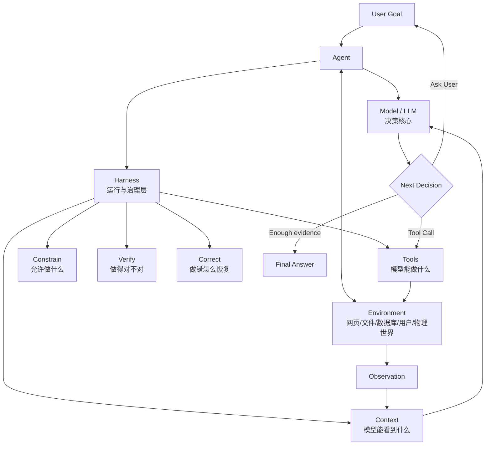
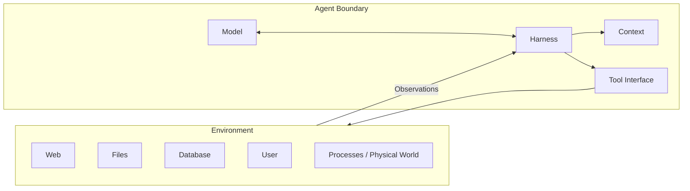
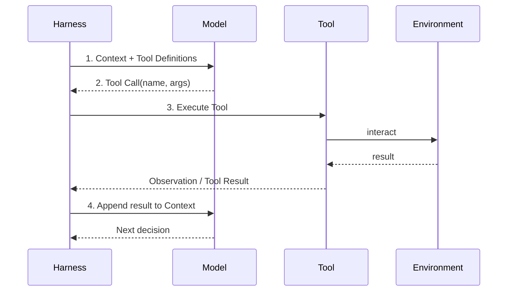
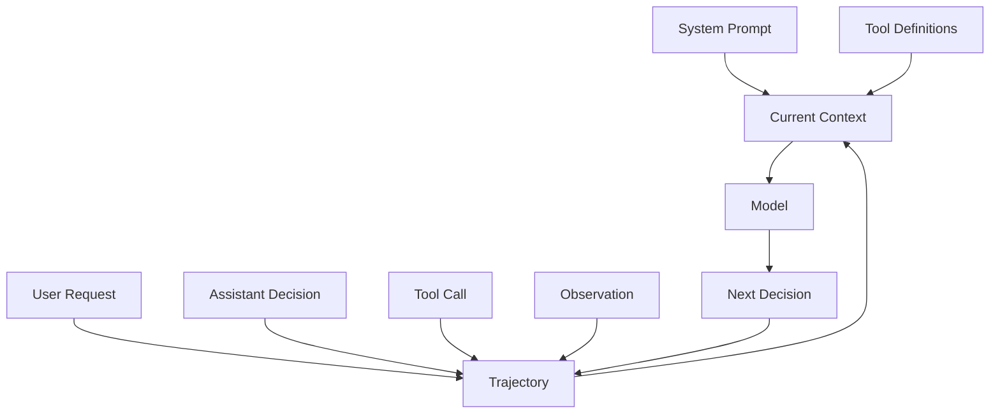
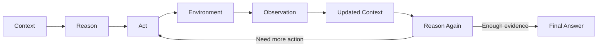
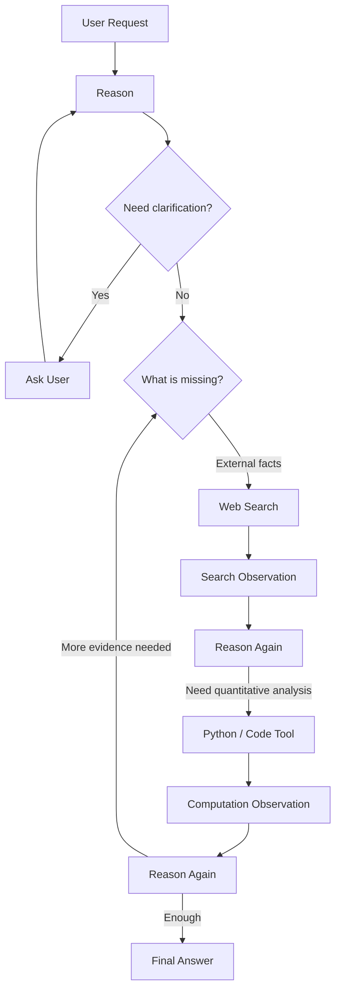
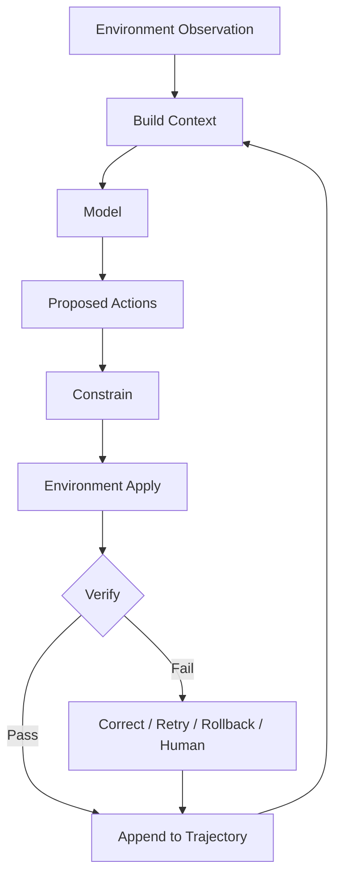
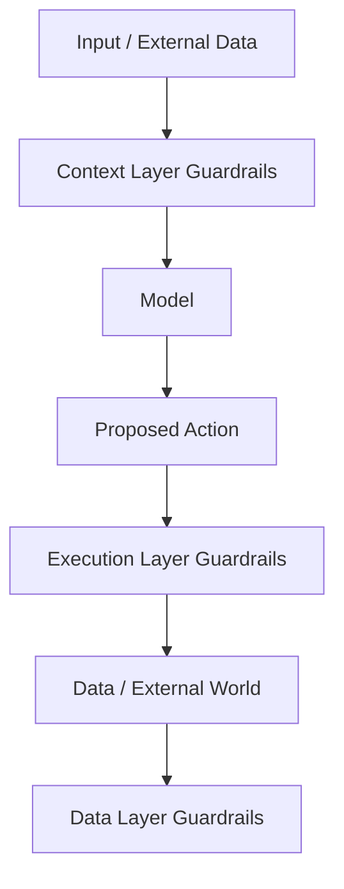
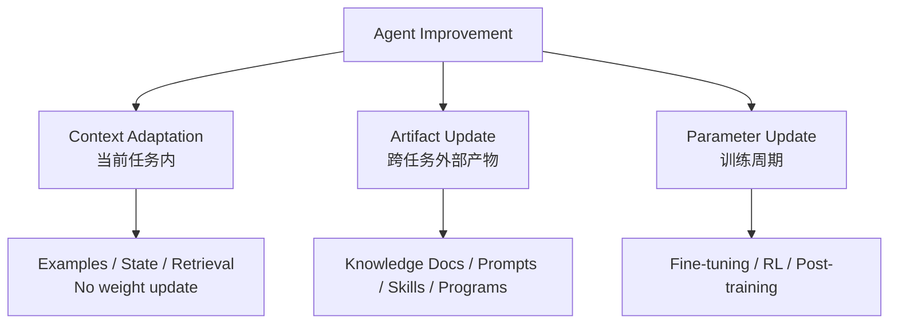
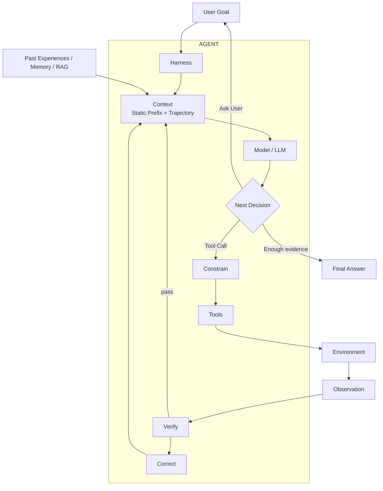

# Chapter 1 完整笔记：从 LLM 到可靠 AI Agent
## Context · Tools · ReAct · Trajectory · Multi-Tool · Harness · Workflow · Guardrails · Learning from Experience

> **来源范围**
>
> - 《AI Agent 入门》Chapter 1：`book/chapter1.md`
> - 实验 1-1：Context / Ablation
> - 实验 1-2：Kimi Web Search Agent / ReAct
> - 实验 1-3：Deep Research / Search-CodeGen / Multi-Tool Agent
> - 实验 1-4：Workflow vs Native Capability（书中概念与文生图例子）
> - 配套延伸：Learning from Experience — Q-learning vs LLM In-Context Learning
> - 本笔记还融合了本地实际运行、调试结果和学习过程中的问题
>
> **注意**：书中当前版本与本地复现实验使用的具体模型/Provider 不完全相同。本笔记会明确区分“书中的 canonical 设计”与“本地实际复现”。

---

# 0. 先建立整章地图

Chapter 1 最重要的目标不是记住 API，而是建立一张 **Agent 的概念地图**。



可以把整章压缩成两层公式：

```text
最小工程视角：
Agent = LLM + Context + Tools

生产工程视角：
Agent = Model + Harness

Harness
= Context Management
+ Tool Interfaces
+ Constrain
+ Verify
+ Correct

Agent ↔ Environment
```

一句人话：

```text
Model  = 大脑
Context = 眼睛 / 当前工作台
Tools = 手脚
Harness = 工作流程 + 安全规则 + 调度系统
Environment = 外部世界
Observation = 外部世界返回的反馈
```

---

# 1. 普通 LLM、Tool-using LLM、Agent 有什么区别？

## 1.1 普通 LLM

```text
User
 ↓
LLM
 ↓
Answer
```

特点：

- 通常是一次输入、一次输出；
- 主要依赖模型参数中的知识；
- 不一定访问外部世界；
- 不一定存在多轮执行循环。

---

## 1.2 Tool-using LLM

```text
User
 ↓
LLM
 ↓
Tool Call
 ↓
Tool Result
 ↓
LLM
 ↓
Answer
```

模型已经可以借助工具获取外部事实或执行操作。

---

## 1.3 Agent

Agent 不只是“会调工具”，关键是它能围绕目标持续循环：

```text
Goal
 ↓
Context / State
 ↓
Model decides next step
 ↓
Action
 ↓
Environment
 ↓
Observation
 ↓
Update Context
 ↓
Model decides again
 ↓
...
 ↓
Final Answer / Task Completion
```

因此更准确的理解是：

> **Agent 是一个围绕目标持续执行“观察 → 决策 → 行动 → 反馈 → 再决策”的系统。**

---

# 2. Agent 与 Environment 的边界

这是 Chapter 1 很容易被忽略、但非常重要的概念。



### Environment 不属于 Agent

例如：

```text
Tool Definition
Tool Adapter
Sandbox permission/reset logic
```

属于 Harness。

但是：

```text
网页本身
数据库中的真实数据
沙箱内被修改的文件/进程
真实用户
物理世界
```

属于 Environment。

即使环境和 Agent 在同一个 Python 进程中运行，概念上仍然要分开。

---

# 3. 观察空间与动作空间：Agent 能力的真正边界

Agent 能力不仅由“模型聪不聪明”决定。

更底层的问题是：

```text
它能看到什么？
它能做什么？
```

分别对应：

```text
Observation Space
≈ 可进入 Context 的信息

Action Space
≈ Tools / Actions 允许执行的操作
```

如果信息从未进入 Context：

> 对模型来说，这条信息等于不存在。

如果一个动作没有被暴露成 Tool：

> 即使模型知道应该怎么做，也只能给文字建议，无法真正执行。

所以在模型固定时，提高 Agent 能力最重要的系统工程手段之一就是：

```text
扩大 Observation Space
+
扩大 Action Space
```

但不是越大越好，还必须配合：

```text
权限
验证
隔离
审计
```

---

# 4. Tools：Agent 的“手脚”

工具是 Agent 与外部世界的接口。

## 4.1 五类工具

Chapter 1 从交互方向上把工具理解为五类：

| 类型 | 作用 | 例子 |
|---|---|---|
| 感知工具 | 读取外部信息 | Web Search、文件读取、数据库查询、API |
| 执行工具 | 改变外部世界 | Python、文件写入、Shell、外部 API |
| 协作工具 | 与其他 Agent / 人协作 | Sub-agent、人工确认 |
| 事件触发工具 | 外部事件触发 Agent | Email、Timer、Webhook |
| 用户沟通工具 | 主动联系用户 | Chat、Email、Voice、Notification |

一个未来的 Bioinformatics Agent 可能拥有：

```text
Bioinformatics Agent
├── PubMed Search
├── ClinVar API
├── Ensembl API
├── local Python
├── Scanpy
├── R / Seurat
├── variant annotation pipeline
└── laboratory database
```

关键不是 Tool 名字，而是：

> **Model 是否能根据当前 Context 选择正确的能力。**

---

# 5. Tool Calling 的四步

现代 Agent 的核心接口之一就是 Tool Calling / Function Calling。



四步分别是：

1. **声明有哪些工具**
2. **模型决定是否调用、调用哪个、传什么参数**
3. **Harness / Provider 真正执行工具**
4. **Tool Result 加回 Context，模型继续判断**

非常重要：

```text
Tool Definition ≠ Tool Call
Tool Call ≠ Tool Execution
Tool Execution ≠ Tool Result
Tool Result ≈ Observation
```

---

# 6. Context：Agent 的“眼睛”

最简单定义：

> **Context = Model 在当前决策点能够看到的全部信息。**

Chapter 1 从 API 视角把 Context 分为五类：

```text
Context
├── System Prompt
├── Tool Definitions
├── User Messages
├── Assistant Messages
│   ├── reasoning
│   ├── content
│   └── tool_calls
└── Tool Results
```

---

# 7. Static Prefix + Trajectory

这是整章最值得记住的公式之一：

```text
Context
=
Static Prefix
+
Trajectory
```

其中：

```text
Static Prefix
=
System Prompt
+
Tool Definitions
```

它主要描述：

```text
你是谁？
你的规则是什么？
你能使用什么工具？
工具怎么调用？
```

Trajectory 是动态增长的当前任务执行历史：

```text
Trajectory
=
User Messages
+
Assistant Decisions
+
Tool Calls
+
Tool Results
+
Intermediate Progress
```

可以画成：



---

# 8. History、Trajectory、Context：不要混

## History

广义意义上的：

> 以前发生过什么。

## Trajectory

更具体：

> **Agent 在当前任务中的 working / execution history。**

例如：

```text
User Question
↓
Reason
↓
Tool Call
↓
Observation
↓
Reason
↓
Tool Call
↓
Observation
↓
...
```

## Context

范围最大：

> 当前这一轮模型能看到的全部信息。

所以：

```text
Trajectory ⊂ Context
```

常用关系：

```text
Context
=
Static Prefix
+
Trajectory
```

---

# 9. Reason、Act、Observation

这三个词必须彻底分开。

## Reason

> **基于当前 Context，判断“现在是什么情况，下一步应该怎么办”。**

例如：

```text
现在已经有首都经纬度，
但还没有真正比较 45 对距离，
所以下一步应该调用 Python。
```

Reason 更像：

```text
“我现在看到这些信息，下一步该做什么？”
```

---

## Act

真正采取的动作。

例如：

```text
web_search(...)
```

或：

```text
calculate_closest_pair(...)
```

---

## Observation

> **Action 执行后，Environment 实际返回了什么。**

例如：

```text
Action:
web_search("2024 Nobel Prize in Physics")

Observation:
Nobel 官方结果返回了两位获奖者
```

因此：

```text
Action
= 我做什么

Observation
= 做完以后我看到了什么
```

---

# 10. Grounding：为什么 Observation 是关键？

如果模型只知道：

```text
“我调用了搜索工具”
```

却不知道：

```text
“搜索工具到底返回了什么”
```

它无法基于真实结果继续决策。

因此：

> **Observation / Tool Result 是 grounding 的关键。**

可以区分：

```text
Completion
= 模型给出了一个回答

Grounded Completion
= 回答有真实 Observation / 外部证据支持
```

所以：

> **Final Answer ≠ Task Success**

一个语气自信、格式漂亮的答案，也可能完全没有外部证据支撑。

---

# 11. ReAct：Agent 的基本运行循环

ReAct = Reasoning + Acting。

实际运行通常是：

```text
Reason
↓
Act
↓
Observe
↓
Reason again
↓
Act again
↓
Observe again
↓
...
↓
Final Answer
```

中文可以记：

> **想 → 做 → 看 → 再想**



ReAct 不是“让模型多想一会儿”。

它真正的重要性在于：

> **Reasoning 和 Environment Interaction 交替发生。**

所以系统从：

```text
纯文本生成器
```

变成：

```text
决策 → 行动 → 反馈 的闭环系统
```

---

# 12. Iteration 是什么？

> **One iteration = Model 看一次当前 Context，并做一次“下一步怎么办”的决策。**

例如：

```text
Iteration 1
→ Model 看 Context
→ 决定 web_search

Observation 加入 Context

Iteration 2
→ Model 看更新后的 Context
→ 判断证据已足够
→ Final Answer
```

---

# 13. 为什么需要 max_iterations？

`Iteration 1/5` 的意思不是必须跑五轮。

意思是：

```text
当前：第 1 个决策循环
最大允许：5 个
```

最大轮数属于 Harness 的：

```text
Execution Budget
+
Safety Guardrail
```

生产系统通常还会控制：

```text
Execution Budget
├── max iterations
├── time limit
├── token budget
├── cost budget
├── tool-call budget
└── stop conditions
```

如果没有预算控制，Agent 可能：

```text
Search
↓
还不够
↓
Search
↓
还不够
↓
Search
↓
...
```

最终形成无限循环、成本失控或重复调用。

---

# 14. 补充：Context Caching ≠ Context ≠ Memory

这是学习过程中容易混淆的 API 工程概念。

```text
Context
= Model 当前能看到什么

Memory
= 系统保存什么信息，供未来任务使用

Context Caching
= 对重复 Context Prefix 的计算进行复用
```

例如：

```text
Iteration 1:
[20k token static prefix] + new content

Iteration 2:
[同一个 20k token prefix] + new trajectory
```

如果前缀稳定，就可以缓存已有计算，降低：

```text
latency
cost
duplicate computation
```

Caching 不是“Agent 记住了”。

---

# 15. 实验 1-1：Context Ablation

## 15.1 什么是 Ablation？

Ablation Study = 消融实验。

类比生物学：

```text
Wild Type
vs
Gene Knockout
```

Agent 中：

```text
FULL
vs
NO_HISTORY
vs
NO_REASONING
vs
NO_TOOL_CALLS
vs
NO_TOOL_RESULTS
```

目标：

> 去掉一个组件，看系统行为怎么变化。

---

## 15.2 本地实际结果

| Mode | Completed | Iterations | Tool Calls | 观察 |
|---|---:|---:|---:|---|
| `full` | ✓ | 3 | 7 | 正常 baseline |
| `no_history` | ✗ | 10 | 49 | 严重重复，最终失败 |
| `no_reasoning` | ✓ | 3 | 7 | 这个简单任务影响很小 |
| `no_tool_calls` | ✓ | 1 | 0 | 有答案，但不代表 grounded |
| `no_tool_results` | ✓ / ⚠ | 5 | 9 | 有答案，但出现 unsupported figures |

---

## 15.3 NO_HISTORY 为什么最明显？

没有 History：

```text
Iteration 1:
查 EUR

Iteration 2:
忘记已经查过
→ 又查

Iteration 3:
再次忘记
→ 又调用
```

结果：

```text
7 tool calls
→
49 tool calls
```

并最终没有完成。

因此：

> **History 是多步 Agent 的短期工作记忆。**

---

## 15.4 NO_REASONING 为什么没有明显下降？

本次：

```text
full
= 3 iterations / 7 tool calls

no_reasoning
= 3 iterations / 7 tool calls
```

只能说明：

> **Removing explicit reasoning did not materially affect this particular task.**

不能推出：

```text
reasoning 没用
```

对于更复杂的：

- 长任务
- 条件分支
- 多步规划
- 错误恢复

显式 reasoning 可能更重要。

---

## 15.5 NO_TOOL_CALLS：有答案不等于做对了

模型没有工具仍然可以输出：

```text
Final Answer
```

但这个回答可能依赖：

```text
参数记忆
猜测
内部计算
```

所以：

```text
Completion ≠ Grounded Completion
```

---

## 15.6 NO_TOOL_RESULTS：最危险的失败之一

模型知道：

```text
“我调用过工具”
```

但看不到：

```text
“工具返回了什么”
```

于是可能：

```text
Tool Call
↓
No Observation
↓
LLM 自己猜
↓
Unsupported Answer
```

这说明：

> **Observation 是闭环控制和 grounding 的关键。**

---

# 16. 实验 1-2：Kimi Web Search Agent

这个实验主要展示：

> **模型自己决定什么时候搜索、搜什么、结果够不够、什么时候停止。**

最小结构：

```text
Question
↓
Reason
↓
web_search
↓
Observation
↓
Reason again
↓
Final Answer
```

---

# 17. Nobel Prize 实际运行轨迹

问题：

```text
Who won the 2024 Nobel Prize in Physics?
```

## Iteration 1

```text
Context:
- 用户问题
- System Instructions
- web_search Tool Definition
```

模型判断：

```text
这是事实型问题
→ 应搜索可靠来源
```

然后：

```text
Act:
web_search(...)
```

得到：

```text
Observation:
Nobel Prize 官方/搜索结果
```

---

## Iteration 2

更新后的 Context 已经包含：

```text
Original Question
+
Previous Tool Call
+
Search Observation
```

模型重新判断：

```text
证据已经足够
→ 不需要继续 Search
→ Final Answer
```

结果：

```text
John J. Hopfield
Geoffrey Hinton
```

关键不是答案本身，而是：

> **Agent 根据 Observation 动态改变下一步。**

---

# 18. Model as Agent：工具决策内化到模型

现代“Model as Agent”强调：

```text
何时调用工具
调用哪个工具
传什么参数
拿到结果后是否继续
什么时候停止
```

越来越多地由模型自己决定。

但要非常清楚：

```text
决策能力
≠
工具真实执行
```

即：

```text
Model:
“我要调用 web_search”

Provider / Harness:
真正执行 web_search
```

所以即使“编排看起来在模型内部”，工具环境、权限、结果回传、验证仍然需要基础设施。

---

# 19. 实验 1-3：Deep Research / Multi-Tool Agent

单工具 Search Agent 只需决定：

```text
要不要 Search？
```

Multi-Tool Agent 需要决定：

```text
要不要用 Tool？
如果用，用哪个？
按什么顺序？
什么时候停止？
```

这就是：

> **Tool Orchestration / Tool Routing**

---

# 20. Multi-Tool ReAct



---

# 21. Clarification 也是合法的“下一步”

好的 Agent 不一定立即使用 Tool。

如果请求是：

```text
帮我分析 Bitcoin
```

仍然缺：

```text
时间范围？
数据源？
技术指标？
目标是描述还是交易策略？
```

所以模型下一步可以是：

```text
             Model Decision
             /      |      \
            /       |       \
      Ask User   Call Tool   Final Answer
```

因此：

> **Ask User 本身也是一种正确的 Agent decision。**

---

# 22. `tools` 与 `tool_choice="auto"`

```text
tools
= 模型有哪些能力

tool_choice
= 工具选择策略
```

`tool_choice="auto"` 表示：

> Model 根据当前 Context 自己决定是否使用 Tool，以及使用哪个 Tool。

例如：

```text
缺外部事实
→ web_search

已有事实但缺计算
→ Python

证据足够
→ no tool
→ Final Answer
```

---

# 23. `reasoning` 与 `verbosity`

很容易混淆：

```text
reasoning
= 脑子用多少力

verbosity
= 嘴巴说多少
```

高 reasoning 不意味着最终答案一定长。

高 verbosity 也不意味着模型思考更深。

---

# 24. `store=true` 不等于 Memory / Trajectory

可以粗略理解：

```text
store=true
= Provider 可以保留 response 状态，
  便于后续 continuation
```

但：

```text
store
≠ trajectory
≠ memory
```

Trajectory 仍然是当前任务执行历史。

---

# 25. Hosted Tool vs Local / Custom Tool

## Hosted Tool

例如：

```text
web_search
```

Provider 执行：

```text
Local Program
↓
Provider API
↓
Provider executes search
↓
Observation
```

## Local / Custom Tool

例如：

```text
calculate_closest_pair
```

Model 只生成：

```text
function name
+
arguments
```

真正执行发生在：

```text
你的本地 Python
```

---

# 26. 本地 Search-CodeGen 实际复现

书中当前 canonical 示例强调：

```text
Model
├── hosted web_search
└── hosted code_interpreter
```

本地成功复现的是：

```text
DeepSeek
├── Hosted Web Search
└── Local Python Function
    calculate_closest_pair
```

这个版本反而很适合理解“Tool 到底在哪里执行”。

```mermaid
flowchart LR
    M[DeepSeek Model] -->|hosted call| WS[DeepSeek Web Search]
    WS -->|search result| M

    M -->|function call + args| H[Local Harness]
    H --> PY[calculate_closest_pair()]
    PY -->|function_call_output| H
    H -->|Observation| M

    M --> F[Final Answer]
```

---

# 27. ASEAN 首都距离实验：完整逻辑

任务：

> 找出 ASEAN 10 国首都之间距离最近的一对。

逻辑不是让模型“心算”。

```text
Step 1
缺事实
→ Search 首都 / 经纬度

Step 2
事实齐了
但需要比较距离
→ Python

Step 3
10 cities
→ C(10,2) = 45 unique pairs

Step 4
Python 计算 great-circle / Haversine distance

Step 5
Observation 返回最近的一对

Step 6
证据足够
→ Final Answer
```

实际结果：

```text
Kuala Lumpur ↔ Singapore
≈ 316.42 km
```

组合数：

\[
\binom{10}{2}
=
\frac{10\times9}{2}
=
45
\]

---

# 28. `function_call_output` 为什么重要？

对于 Local Tool：

```text
Tool Call
↓
Local Python Executes
↓
function_call_output
↓
Append to Trajectory
↓
Next Context
↓
Model Again
```

`function_call_output` 就是：

> **Local / Custom Tool 的 Observation。**

如果不把它放回 trajectory：

> 下一轮 Model 根本不知道工具算出了什么。

---

# 29. 一个 Outer Iteration 里为什么可能出现多个 Hosted Search？

需要区分两个层级：

```text
Outer Iteration
= 你的本地程序发起一次 Model API 调用

Inner Hosted Tool Activity
= Provider 在一次请求内部自行进行的多个搜索/读取步骤
```

因此：

```text
1 次 responses.create()
```

并不一定等于：

```text
只执行 1 次搜索
```

服务端可能在内部完成多次 hosted tool activity 后，再把控制权返回。

---

# 30. Harness：从“能做”到“可靠地做”

最小 Agent：

```text
Model
+
Context
+
Tools
```

能跑起来。

生产 Agent 还需要：

```text
Harness
=
Context
+
Tools
+
Constrain
+
Verify
+
Correct
```



---

# 31. Harness 五要素

| 要素 | 问题 | 典型手段 |
|---|---|---|
| Context | 模型应该看到什么？ | System Prompt、Memory、RAG、State |
| Tools | 模型可以怎么观察/行动？ | Search、Python、MCP、API |
| Constrain | 哪些动作允许执行？ | 权限、allowlist、risk level |
| Verify | 结果对不对？ | Tests、Linter、schema、structured checks |
| Correct | 出错怎么办？ | Retry、rollback、fallback、human escalation |

可以把它们分成：

```text
Context + Tools
= 让 Agent 能做事

Constrain + Verify + Correct
= 让 Agent 尽量不做错事
```

---

# 32. 为什么 Harness 不是越复杂越好？

核心原则：

> **复杂度只在真实失败模式要求时增加。**

不应该一开始就：

```text
Agent A
→ Agent B
→ Reviewer C
→ Validator D
→ Merger E
→ ...
```

因为这会：

- 增加延迟；
- 增加成本；
- 增加调试盲区；
- 把模型本来可以动态判断的问题写死。

正确思路：

```text
先给：
清晰目标
+ 必要 Context
+ 可组合 Tools
+ 必须成立的边界

然后通过 Evaluation 找稳定失败模式
再增加：
Validator / Workflow / Sub-Agent / Rule
```

---

# 33. ACI：Agent-Computer Interface

传统 API 往往从程序员角度设计。

ACI 强调：

> **Tool Interface 要从 Agent 能否正确理解和使用的角度设计。**

好的 Tool：

```text
名字直观
参数含义明确
边界写清楚
提供示例
风险操作限制严格
返回结果结构稳定
```

坏接口会让强模型也频繁犯错。

---

# 34. Prompt → Context → Harness → Loop → Graph

Chapter 1 给出了一条很重要的工程演进线：


含义：

```text
Prompt Engineering
= 怎么写一段指令

Context Engineering
= 模型在当前决策点能看到什么

Harness Engineering
= 模型之外，Agent 如何可靠运行

Loop Engineering
= 多轮持续自主运行如何组织

Graph Engineering
= 把 Agent、Workflow、Human Approval
  组织成显式执行图
```

不是互相替代，而是关注范围不断扩大。

---

# 35. 构建 Agent 的三个核心原则

## 35.1 Keep It Simple

能用单次 LLM 调用解决，就不要先上 Agent。

能用简单 Workflow，就不要先上多 Agent。

---

## 35.2 Keep It Transparent

记录：

```text
Trajectory
Tool Calls
Observations
Errors
Retries
Final Results
```

因为无法观察的系统就无法可靠调试。

---

## 35.3 Design Good Tool Interfaces

很多“模型不聪明”的问题，本质其实是：

```text
Context 不够
Tool 不对
接口模糊
验证不足
```

---

# 36. Workflow vs Autonomous Agent

这是本章另一个关键分界。

## Workflow：路径由开发者写死


例如订票：

```text
身份验证
→ 航班搜索
→ 支付
→ 预订确认
```

LLM 可以在某个节点内部发挥作用，但节点顺序固定。

### 优点

- 流程可控；
- 关键步骤不会跳过；
- 安全边界清晰；
- 适合业务规则严格的场景。

### 缺点

- 缺乏灵活性；
- 新异常通常需要增加分支；
- 复杂后容易变成难维护的流程图。

---

# 37. Autonomous Agent：路径动态决定

```text
Goal
↓
Observe
↓
Decide next step
↓
Act
↓
Observe
↓
Adjust
↓
...
```

执行路径不是程序员提前规定。

例如用户订票途中突然说：

```text
不要转机
```

Agent 可以根据新 Context 动态调整搜索策略。

适合：

- Coding Agent
- Computer Use
- Deep Research
- 开放式任务

代价：

- 更高成本；
- 更多不确定性；
- 复合错误风险更大；
- 更需要 Guardrails 和 Verification。

---

# 38. Hybrid：通常才是现实答案

实际系统经常：

```text
关键合规流程
→ Workflow

需要语义判断 / 灵活搜索的部分
→ Autonomous Agent
```

或者：

```text
Autonomous Agent 先生成 workflow
↓
固定代码执行 workflow
```

即：

> **规划动态，执行确定。**

---

# 39. 实验 1-4：文生图 Workflow vs Native Capability

书中用文生图说明“适配层会被更强模型吃掉”。

旧式 Workflow：

```text
User Natural Language
↓
LLM Prompt Rewriter
↓
Stable-Diffusion-style Prompt
↓
Image Model
↓
Image
```

如果模型本身原生理解自然语言并能生成图像：

```text
User Natural Language
↓
Native Multimodal Model
↓
Image
```

这说明：

> 当底层模型能力增强时，某些 Harness 中纯粹用于“翻译 / 打补丁”的适配代码会逐渐消失。

但：

> 权限、验证、安全、审计、错误恢复这类 Harness 价值不会因为模型变强自动消失。

### 本地学习状态

我们曾启动过 `image-gen-workflow`，测试通过，但 Kimi 鉴权问题导致 workflow 路线未完成真实生成。因此这里只记录**书中的架构原理**，不伪造本地结果。

---

# 40. 模型选择：不要只看排行榜

Agent 模型选择至少考虑：

```text
Reasoning ability
Tool-calling reliability
Latency / output speed
Cost
Context window
Multimodality
Policy / capability availability
Provider interface
```

Agent 常常要多轮调用，所以：

> **单轮慢 2 秒 × 20 轮 = 总延迟多 40 秒。**

这也是本地 LLM treasure-hunt 实验“感觉很慢”的根本原因之一。

---

# 41. Guardrails：三层防线

Guardrails 不应该只有一层。



---

## 41.1 Context Layer

控制：

> 模型能看到什么。

例如：

- relevance classifier
- jailbreak detection
- prompt-injection detection
- content moderation
- rule-based filters
- source labeling
- instruction/data separation

局限：

> 同一个 Context 中的模型很难完全判断自己是否已经被注入。

---

## 41.2 Execution Layer

控制：

> 模型能做什么。

例如：

```text
低风险工具 → 自动执行
中风险工具 → 额外检查
高风险工具 → 人工确认
```

还包括：

- least privilege
- sandbox
- output validation
- PII filtering

---

## 41.3 Data Layer

控制：

> 世界最终允许被改成什么样。

例如：

- database row-level security
- constraints
- stored procedures
- trusted access context

这层价值在于：

> 即使上面的 Agent 被 prompt injection 控制，数据层仍可拒绝越权操作。

---

# 42. Human in the Loop

两类典型触发条件：

```text
1. 连续失败超过阈值
2. 高风险 / 不可逆操作
```

例如：

```text
大额付款
不可逆删除
高风险生产部署
```

Agent 不应该无限重试，也不应该把所有不确定性隐藏起来。

---

# 43. Agent 的三种“学习/更新”路径

Chapter 1 对 Agent 行为改变做了一个非常重要的三层划分：



---

## 43.1 Context Adaptation

```text
新 Observation
新 Example
新 Experience
↓
进入当前 Context
↓
立即改变行为
```

特点：

- 快；
- 不改参数；
- 不一定跨会话持久；
- 受 Context window 限制。

---

## 43.2 Artifact Update

把经验沉淀成：

```text
Knowledge Document
Prompt
Skill
Program
Harness Rule
```

特点：

- 跨任务持久；
- 可审计；
- 可修改；
- 可回滚。

---

## 43.3 Parameter Update

例如：

```text
Supervised Fine-tuning
Reinforcement Learning
Post-training
```

特点：

- 成本更高；
- 更新周期长；
- 能把复杂、难以语言化的能力内化到模型参数。

---

# 44. 配套延伸：Learning from Experience

这个实验非常适合帮助理解上面的：

```text
Context Adaptation
vs
Parameter Learning
```

任务是一个带隐藏机制的文字寻宝游戏。

比较：

```text
Q-learning
vs
LLM In-Context Learning
```

---

# 45. Q-learning 的学习机制

```text
State
↓
Choose Action
↓
Reward + Next State
↓
Update Q(s,a)
↓
Repeat
```

典型公式：

\[
Q(s,a)
\leftarrow
Q(s,a)
+
\alpha
\left[
r+\gamma\max_{a'}Q(s',a')-Q(s,a)
\right]
\]

其中：

```text
α = learning rate
γ = discount factor
ε = exploration probability
```

---

# 46. epsilon：Explore vs Exploit

```text
High epsilon
→ 更多随机探索

Low epsilon
→ 更多利用已经学到的策略
```

本次：

```text
epsilon
1.0
↓
...
↓
0.1 minimum
```

---

# 47. Q-learning 本地实际结果

命令：

```bash
python experiment.py --mode qlearning --rl-episodes 10000 --seed 42
```

结果：

| Episodes | Recent Victory Rate | Q-table | ε |
|---:|---:|---:|---:|
| 1000 | 0.3% | 123 | 0.606 |
| 2000 | 0.0% | 123 | 0.368 |
| 3000 | 0.1% | 126 | 0.223 |
| 4000 | 0.1% | 127 | 0.135 |
| 5000 | 0.1% | 128 | 0.100 |
| 6000 | 55.9% | 137 | 0.100 |
| 7000 | 97.0% | 138 | 0.100 |
| 8000 | 99.6% | 138 | 0.100 |
| 9000 | 99.8% | 139 | 0.100 |
| 10000 | 98.1% | 142 | 0.100 |

最终：

```text
Training time: 3.36 s
Q-table size: 142
Overall training victory rate: 45.10%
Evaluation victory rate: 100%
```

---

# 48. 为什么 Training 只有 45.1%，Evaluation 却 100%？

因为 Training Victory Rate 包括早期大量失败。

```text
前 5000 局：
几乎不会

6000–7000：
快速学会

后期：
接近 100%
```

Evaluation 测的是：

```text
训练完成以后
使用已经学好的策略
```

所以两者并不矛盾。

---

# 49. LLM In-Context Learning 的学习机制

```text
Current State
+
Past Experiences
↓
LLM
↓
Action
↓
Environment Feedback
↓
Store Experience
↓
Next Context includes experience
```

重点：

> **没有 parameter update。**

所以这里的“learn”更准确说是：

> **behavioral adaptation through in-context experience**

---

# 50. Episode / Step / Experience

```text
Episode
= 一整局游戏

Step
= 一次 state → action → feedback

Experience
= 保存的一次 interaction
```

因此：

```text
1 step ≈ 1 experience
```

不是：

```text
1 episode = 1 experience
```

---

# 51. DeepSeek 本地实际结果

由于 Kimi API 鉴权失败，我们将 exploratory runner 适配为：

```text
Provider: deepseek
Model: deepseek-flash
```

训练：

## Episode 1

```text
Past experiences: 0
Victory: Yes
Reward: 235.50
Steps: 23
API calls: 23
```

## Episode 2

```text
Past experiences: 23
Victory: Yes
Reward: 242.50
Steps: 15
Cumulative API calls: 38
```

最终：

```text
Training time: 200.11 s
Experiences collected: 38
Training victory rate: 100%
Evaluation victory rate: 100%
```

---

# 52. 为什么 Experience = 0 仍然会玩？

非常重要：

```text
Experience = 0
≠
Knowledge = 0
```

LLM 带着：

```text
Pretrained Prior Knowledge
+
Language Understanding
+
Reasoning
```

进入任务。

它天然理解：

```text
key ↔ lock
weapon ↔ enemy
treasure ↔ goal
```

而 tabular Q-learning 并没有这些语言语义 prior。

---

# 53. Episode 2 为什么可能更好？

第一局：

```text
0 task-specific experiences
→ 23 steps
```

第二局：

```text
23 accumulated experiences
→ 15 steps
```

并且：

```text
Reward
235.5 → 242.5
```

这个现象：

> **与 accumulated in-context experience 改善决策一致。**

但严谨来说：

> 只有两局，不能证明 23 → 15 完全由 experience 导致。

因为存在：

- sampling variability
- parser fallback
- small sample size

---

# 54. Sample Efficiency ≠ Computational Efficiency

这是整个 RL vs LLM 实验最值得记住的结论。

```text
Q-learning
10000 episodes
≈ 3.36 seconds

LLM
2 training episodes
38 API calls
≈ 200.11 seconds
```

所以：

```text
LLM
= high sample efficiency
  but expensive inference

Q-learning
= low sample efficiency
  but cheap computation
```

---

# 55. 为什么 1 Step ≈ 1 API Call？

LLM Agent 每一步：

```text
Build Context
↓
API Call
↓
Model inference
↓
Parse Action
↓
Environment executes
↓
Feedback
```

因此：

```text
23 steps
≈ 23 API calls
```

远程模型 inference 的网络 + 推理延迟，是它慢的主要原因。

---

# 56. Q-learning vs LLM：最终对照

| Dimension | Q-learning | LLM In-Context Agent |
|---|---|---|
| 学习机制 | 更新 Q-values | Experience 进入 Context |
| 模型参数更新 | Q-table 更新 | LLM 参数不变 |
| Prior knowledge | 几乎无 | 强 |
| Task-specific samples | 多 | 少 |
| 初始表现 | 弱 | 可直接较强 |
| 泛化方式 | state-action values | language + reasoning |
| 运行成本 | 极低 | API inference 高 |
| 适合 | cheap simulation | expensive interaction / semantic tasks |

正确结论不是：

```text
LLM > RL
```

而是问：

```text
环境交互贵不贵？
模拟是否便宜？
是否需要语义理解？
是否存在可利用的 prior？
是否需要跨状态泛化？
```

---

# 57. Parser Fallback：一个很典型的 Agent 工程问题

LLM 有时：

```text
理解是对的
但输出格式不符合程序要求
```

于是：

```text
Parser fails
↓
Harness uses fallback action
```

所以：

> **Model capability ≠ Agent reliability**

最终系统性能取决于：

```text
Model
+
Prompt
+
Context
+
Parser
+
Tool Interface
+
Memory
+
Fallback
+
Harness
```

---

# 58. 本章五个跨章节设计模式

Chapter 1 最后给出了贯穿全书的设计思想。

## 58.1 Proposer–Reviewer

```text
Proposer
→ 产出

Reviewer
→ 独立检查产物
```

关键：

> Reviewer 不应完全共享 Proposer 的上下文，否则容易继承同样盲区。

---

## 58.2 Progressive Disclosure

不要一次把全部信息放进 Context。

```text
先给目录 / metadata
↓
按需加载细节
```

目的：

```text
省 Context
+
提高选择精度
```

---

## 58.3 Append-only

状态通过：

```text
追加
```

而不是反复修改历史。

优点：

```text
可缓存
可重放
可审计
```

---

## 58.4 Boundary Set + Retention Set

任何更新都要同时测试：

```text
应该改变的样本
+
不应该受影响的样本
```

防止：

```text
局部进步
→ 其他能力退化
```

---

## 58.5 Minimal Diff + Rollback

每次修改：

```text
尽量小
有来源
可单独回滚
```

这样出了问题才能归因。

---

# 59. 最容易混淆的概念总表

| 概念 A | 概念 B | 区别 |
|---|---|---|
| LLM | Agent | LLM 是决策核心；Agent 还有 Context、Tools、Loop、Harness |
| Context | Memory | Context 是现在能看到的；Memory 是未来可再次取用的保存信息 |
| Context | Trajectory | Trajectory 是 Context 中不断增长的当前任务历史 |
| History | Trajectory | History 更广；Trajectory 更强调当前任务 execution history |
| Reason | Act | Reason 是判断；Act 是真正行动 |
| Tool Call | Tool Execution | 前者是模型请求；后者是 Harness/Provider 真正执行 |
| Tool Result | Observation | 在 Tool Agent 中通常近似等价 |
| Tool Definition | Tool Call | 前者说明“有什么能力”；后者说明“现在要用某能力” |
| `tools` | `tool_choice` | 工具集合 vs 工具选择策略 |
| Hosted Tool | Local Tool | Provider 执行 vs 本地 Harness 执行 |
| Iteration | Tool Call | 一轮模型决策中可能有多个 hosted tool activity |
| Completion | Grounded Completion | 有答案 vs 有真实证据支持的答案 |
| Workflow | Autonomous Agent | 固定路径 vs 动态路径 |
| Sample Efficiency | Computational Efficiency | 用多少经验学会 vs 运行需要多少时间/算力 |
| In-context learning | Parameter training | Context 改变行为 vs 更新模型权重 |

---

# 60. 一张最终统一图



你可以把整章理解成：

```text
Agent
不是“一次回答”

而是：

看世界
→ 把观察组织成 Context
→ Model 做下一步决策
→ Harness 检查和执行 Action
→ Environment 返回 Observation
→ Observation 进入 Trajectory
→ Model 重新决策
→ 直到满足停止条件
```

---

# 61. 本章真正应该带走的 15 句话

1. **Agent = LLM + Context + Tools.**
2. **生产视角：Agent = Model + Harness，Agent 与 Environment 闭环交互。**
3. **Context = 当前决策点 Model 能看到的全部信息。**
4. **Context = Static Prefix + Trajectory.**
5. **Trajectory = 当前任务不断增长的 execution history。**
6. **Reason = 基于当前 Context 判断下一步。**
7. **Action = Agent 做什么；Observation = 做完以后世界返回什么。**
8. **ReAct = Reason → Act → Observe → Reason again.**
9. **Tool Call 只是调用请求，不等于 Tool 已经执行。**
10. **Tool Result / Observation 是 grounding 的基础。**
11. **Final Answer 不等于 Task Success。**
12. **Multi-Tool Agent 需要 Tool Selection + Sequencing + Stopping Decision。**
13. **Context + Tools 让 Agent 能做事；Constrain + Verify + Correct 让它可靠地做事。**
14. **Workflow 路径固定；Autonomous Agent 路径动态；实际系统常混合两者。**
15. **Sample efficiency 和 computational efficiency 是两个不同维度。**

---

# 62. 自测题

如果下面的问题都能解释清楚，Chapter 1 基本已经真正掌握。

### Q1
为什么普通 LLM 不一定是 Agent？

### Q2
Agent 和 Environment 的边界在哪里？

### Q3
Context 由哪五部分组成？

### Q4
为什么可以写成：

```text
Context = Static Prefix + Trajectory
```

### Q5
Trajectory 与 History 有什么差别？

### Q6
Reason、Action、Observation 分别是什么？

### Q7
为什么 Observation 必须重新进入 Context？

### Q8
为什么 `NO_HISTORY` 会造成重复 Tool Call？

### Q9
为什么 `NO_TOOL_CALLS` 仍然可能产生一个看起来很好的答案？

### Q10
为什么 `NO_TOOL_RESULTS` 会造成 unsupported answer？

### Q11
ReAct 为什么不是“让 LLM 多思考一会儿”？

### Q12
`tool_choice="auto"` 到底是谁在决定工具？

### Q13
Hosted Tool 与 Local Tool 的真正区别是什么？

### Q14
为什么 Search 用来找事实，而 Python 用来做定量计算？

### Q15
Harness 的五个组成是什么？

### Q16
为什么 Workflow 比 Autonomous Agent 更可控？

### Q17
为什么 Autonomous Agent 更灵活但更危险？

### Q18
Context Adaptation、Artifact Update、Parameter Update 有什么区别？

### Q19
为什么 LLM 的 `experience=0` 不等于 `knowledge=0`？

### Q20
为什么 Q-learning 跑 10000 局可以比 LLM 跑 2 局还快？

---

# 63. 最短速记版

考试/复习时，只看这一段：

```text
Agent = LLM + Context + Tools

Production:
Agent = Model + Harness
Harness = Context + Tools + Constrain + Verify + Correct
Agent ↔ Environment

Context = Static Prefix + Trajectory

ReAct:
Reason → Act → Observe → Reason again

Tool Call
≠ Tool Execution
≠ Tool Result

Observation
= Grounding evidence

Multi-tool:
Tool Selection
+ Tool Sequencing
+ Stopping Decision

Workflow
= fixed execution path

Autonomous Agent
= dynamic path based on observations

Learning:
Context adaptation
→ immediate, no weight update

Artifact update
→ persistent external knowledge/program/rules

Parameter update
→ training/fine-tuning/RL

RL vs LLM:
Q-learning stores experience in values
LLM Agent stores experience in Context

Sample efficiency
≠ computational efficiency
```

---

# 64. 本地实验数据速查

## Context Ablation

```text
full            ✓ 3 iterations / 7 tool calls
no_history      ✗ 10 iterations / 49 tool calls
no_reasoning    ✓ 3 iterations / 7 tool calls
no_tool_calls   ✓ 1 iteration / 0 tool calls
no_tool_results ⚠ 5 iterations / 9 tool calls
```

## Web Search Agent

```text
Question:
2024 Nobel Prize in Physics winners?

Iteration 1:
Reason → Search → Observation

Iteration 2:
Reason → evidence sufficient → Final Answer
```

## Multi-Tool ASEAN

```text
Search facts / coordinates
↓
Python calculates 45 capital pairs
↓
Kuala Lumpur ↔ Singapore
≈ 316.42 km
↓
Final Answer
```

## Learning from Experience

```text
Q-learning:
10000 episodes
3.36 s
Evaluation = 100%

DeepSeek LLM:
Episode 1: 0 prior task experiences → 23 steps → Victory
Episode 2: 23 past experiences → 15 steps → Victory
38 API calls
200.11 s
Evaluation = 100%
```

---

# 65. Source Map

### Book
- `https://github.com/bojieli/ai-agent-book/blob/main/book/chapter1.md`

### Experiment notes used
- `chapter1_context_agent_notes(1).md`
- `Chapter1_Exp1-2_Kimi_Web_Search_Agent_ReAct_Notes_CN(1).md`
- `Chapter1_Exp1-3_Search_CodeGen_MultiTool_Agent_Notes_CN(1).md`
- `Chapter1_Learning_From_Experience_RL_vs_LLM_Notes_CN(1).md`

---

## Final Mental Model

> **一个可靠的 AI Agent，不是“一个更会说话的 LLM”。它是一个被 Harness 组织起来的闭环决策系统：模型基于 Context 做决策，通过 Tools 与 Environment 交互，把真实 Observation 写入 Trajectory，再依据更新后的 Context 继续行动；与此同时，Constrain、Verify、Correct 和 Guardrails 负责把模型的能力变成可控、可验证、可恢复的工程系统。**
