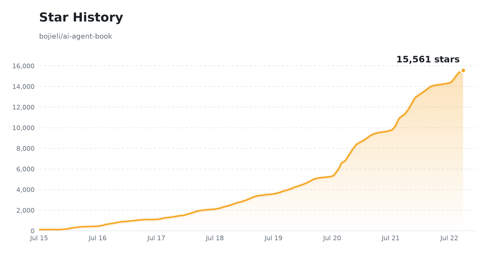

# 深入理解 AI Agent：设计原理与工程实践

[](https://github.com/bojieli/ai-agent-book) [](LICENSE) [](#-电子书) [](#-电子书)

**中文** · [English](README.en.md) · [Tiếng Việt](README.vi.md) · [தமிழ்](README.ta.md)

**Agent = LLM + 上下文 + 工具**——本书围绕这个核心公式，用 10 章把 AI Agent 从原理讲到工程实战。全书正文、配图、**88 个配套实验**全部开源，欢迎亲手把实验跑一遍。

| 📚 **10 章** 正文，从基础到生产 | 📂 **88 个** 配套项目（70+ 可独立运行） | 🌐 **4 种** 语言：中 / 英 / 泰 / 越 |
| :---: | :---: | :---: |

## 📖 电子书

> 📥 **直接下载 PDF**（全书正文，开源免费）：
> - **中文（原版）**：[`深入理解-AI-Agent-李博杰-v1.2.pdf`](book/深入理解-AI-Agent-李博杰-v1.2.pdf)
> - **英文**（社区翻译，by [@nsdevaraj](https://github.com/nsdevaraj)）：[`AI-Agents-in-Depth-Bojie-Li-v1.2.pdf`](book-en/AI-Agents-in-Depth-Bojie-Li-v1.2.pdf)
> - **泰米尔语**（社区翻译，by [@nsdevaraj](https://github.com/nsdevaraj)）：[`AI-Agents-in-Depth-Bojie-Li-v1.2-ta.pdf`](book-ta/AI-Agents-in-Depth-Bojie-Li-v1.2-ta.pdf)
> - **越南语**（社区翻译，by [@toanalien](https://github.com/toanalien)）：[`AI-Agents-in-Depth-Bojie-Li-v1.2-vi.pdf`](book-vi/AI-Agents-in-Depth-Bojie-Li-v1.2-vi.pdf)

中文正文源码位于 [`book/`](book/)；英文/泰米尔/越南语翻译为社区贡献（可能滞后于中文原版），分别位于 [`book-en/`](book-en/)、[`book-ta/`](book-ta/)、[`book-vi/`](book-vi/)。

<details>
<summary><b>🔧 想自行编译 PDF？</b>（需 pandoc / xelatex / ElegantBook）</summary>

- **正文源码**：`book/introduction.md`（引言）、`book/chapter1.md` ~ `book/chapter10.md`（第一至第十章）、`book/afterword.md`（后记）
- **编译**：安装 pandoc、xelatex、ElegantBook 文档类与相关字体后，运行

  ```bash
  cd book && bash build_pdf.sh
  ```

  图表由 `book/gen_*_figs.py` 生成、存于 `book/images/`，排版细节见 `book/preamble.tex` 与 `book/*.lua`。

</details>

## 📑 内容速览（第 1–10 章）

全书围绕核心公式 **Agent = LLM + 上下文 + 工具** 展开。点击章名跳转到该章的配套代码：

| 章 | 主题 | 一句话核心 |
| :--: | --- | --- |
| 1 | 🚀 [Agent 基础知识](#-第-1-章--agent-基础知识) | 「模型即 Agent」新范式 + **Agent = LLM + 上下文 + 工具**；Harness 工程才是竞争力 |
| 2 | 🎯 [上下文工程](#-第-2-章--上下文工程) | 上下文决定能力上限：KV Cache、提示工程、Agent Skills、上下文压缩 |
| 3 | 📚 [用户记忆和知识库](#-第-3-章--用户记忆和知识库) | 跨会话记住用户、接入外部知识：用户记忆、RAG、结构化索引、知识图谱 |
| 4 | 🛠️ [工具](#️-第-4-章--工具) | 工具是 Agent 的双手：MCP 协议、感知/执行/协作三类工具、事件驱动异步 Agent |
| 5 | 💻 [Coding Agent 与代码生成](#-第-5-章--coding-agent-与代码生成) | 代码是「能创造新工具的工具」，生产级 Coding Agent 全景 |
| 6 | 🎯 [Agent 的评估](#-第-6-章--agent-的评估) | 把表现变成可比较信号：评估环境、指标、统计显著性、评估驱动选型 |
| 7 | 🧠 [模型后训练](#-第-7-章--模型后训练) | 预训练/SFT/RL 三阶段：何时选 SFT、何时选 RL，工具调用内化、样本效率 |
| 8 | 🔄 [Agent 的自我进化](#-第-8-章--agent-的自我进化) | 不改权重也能成长：经验学习、主动工具发现、从使用者到创造者 |
| 9 | 🎙️ [多模态与实时交互](#️-第-9-章--多模态与实时交互) | 从文本扩展到语音、GUI、物理世界：语音三范式、Computer Use、机器人 |
| 10 | 🤝 [多 Agent 协作](#-第-10-章--多-agent-协作) | 群体智能高于个体：协作框架、上下文共享/隔离、涌现的「Agent 社会」 |

## 💻 配套代码

所有项目按**章节**组织，与全书十章一一对应，涵盖从基础概念到高级技术的完整学习路径，目录为 `chapterN/项目名/`。第 5、8、9、10 章的绝大多数实验现均提供可独立运行的配套 demo，并已对接真实 LLM API 验证跑通。

### 项目类型说明

每章表格的「类型」列标明该项目开箱即用的程度：

| 图标 | 类型 | 含义 |
| :--: | --- | --- |
| ✅ | **可独立运行** | 本仓库自带完整代码，配置好 API Key（见文末）即可运行 |
| 📖 | **复现指南** | 一份详细的复现文档，依赖需自行 `git clone` 的**外部仓库**（训练框架、评测基准等） |
| 🚧 | **设计文档** | 仅包含架构与实现方案，可运行代码仍在完善中 |

> 📖 类项目主要分布在第 6、7 章以及第 9、10 章的少数实验。出于体积与版权考虑，这些**外部仓库未内置**——完整的克隆命令、上游地址与本书验证过的提交，见文末[《附录 · 外部仓库获取》](#-附录--外部仓库获取)。建议先从前面各章 ✅ 项目上手，需要复现训练 / 评测 / 机器人类实验时再按附录指引获取。

## 🚀 第 1 章 · Agent 基础知识 <sub>4 个项目</sub>

| 项目 | 类型 | 一句话说明 |
| --- | :--: | --- |
| [learning-from-experience](chapter1/learning-from-experience/) | ✅ | 对比 Q-learning 与基于 LLM 的上下文学习，复现 Shunyu Yao 的 "The Second Half"：LLM 以 250–400 倍样本效率超越传统 RL |
| [web-search-agent](chapter1/web-search-agent/) | ✅ | Kimi K2 模型即 Agent，具备基础深度搜索能力，能进行多轮搜索和信息整合 |
| [search-codegen](chapter1/search-codegen/) | ✅ | GPT-5 原生工具集成，综合利用网络搜索与代码沙盒实现复杂分析 |
| [context](chapter1/context/) | ✅ | 系统性消融实验展示 Agent 上下文各组件的重要性；支持 SiliconFlow Qwen、字节 Doubao、月之暗面 Kimi 等多提供商 |

## 🎯 第 2 章 · 上下文工程 <sub>9 个项目</sub>

| 项目 | 类型 | 一句话说明 |
| --- | :--: | --- |
| [local_llm_serving](chapter2/local_llm_serving/) | ✅ | 跨平台本地 LLM 部署，自动选 vLLM/Ollama 后端，展示 0.6B 小模型也能有出色工具调用 |
| [attention_visualization](chapter2/attention_visualization/) | ✅ | 可视化 LLM 完整 token 序列与注意力权重分布，理解模型如何处理上下文、推理与调用工具 |
| [kv-cache](chapter2/kv-cache/) | ✅ | 探索不同上下文管理模式对 KV Cache 的影响，演示错误模式如何破坏缓存效率 |
| [context-compression](chapter2/context-compression/) | ✅ | 实现并对比摘要、关键信息提取、语义压缩等多种策略，保持能力的同时减少 token |
| [prompt-engineering](chapter2/prompt-engineering/) | ✅ | 扩展 Tau-Bench，量化语气风格、指令组织、工具描述等因素对任务完成率的影响 |
| [system-hint](chapter2/system-hint/) | ✅ | 研究系统提示对 Agent 行为的影响，探索如何通过优化系统提示提升性能 |
| [log-sanitization](chapter2/log-sanitization/) | ✅ | 智能日志脱敏系统，在保留调试信息的同时保护敏感数据 |
| [prompt-injection](chapter2/prompt-injection/) | ✅ | 3 种攻击场景 × 4 种防御配置的对照实验，直观展示逐层叠加防御后注入成功率下降 |
| [agent-skills-ppt](chapter2/agent-skills-ppt/) | ✅ | 复现 Agent Skills「渐进式披露」，按需加载完整流程后用 python-pptx 生成真实 `.pptx` |

## 📚 第 3 章 · 用户记忆和知识库 <sub>13 个项目</sub>

| 项目 | 类型 | 一句话说明 |
| --- | :--: | --- |
| [user-memory](chapter3/user-memory/) | ✅ | 长期用户记忆系统，让 Agent 记住偏好与历史交互、提供个性化服务 |
| [mem0](chapter3/mem0/) · [memobase](chapter3/memobase/) | ✅ | 用 mem0、Memobase 两个开源框架各实现一版用户记忆，作为实验 3-2 的对照实现 |
| [user-memory-evaluation](chapter3/user-memory-evaluation/) | ✅ | 系统化评估用户记忆系统的准确性、相关性和有效性 |
| [dense-embedding](chapter3/dense-embedding/) | ✅ | 向量相似性搜索服务，对比 ANNOY（树）与 HNSW（图）两种 ANN 算法的权衡 |
| [sparse-embedding](chapter3/sparse-embedding/) | ✅ | 从零实现基于 BM25 的稀疏向量搜索引擎，可视化内部工作机制 |
| [retrieval-pipeline](chapter3/retrieval-pipeline/) | ✅ | 稠密 + 稀疏 + 神经重排序的完整流水线，用测试用例展示混合检索的互补效果 |
| [multimodal-agent](chapter3/multimodal-agent/) | ✅ | 对比原生多模态、提取为文本、工具化分析三种策略在保真度/成本/灵活性上的权衡 |
| [structured-index](chapter3/structured-index/) | ✅ | 实现并对比 RAPTOR（递归抽象树）与 GraphRAG（知识图谱）两种结构化索引 |
| [agentic-rag](chapter3/agentic-rag/) | ✅ | 对比 Non-Agentic 与 Agentic RAG，展示 ReAct 主导的迭代检索在司法问答上的优势 |
| [agentic-rag-for-user-memory](chapter3/agentic-rag-for-user-memory/) | ✅ | 用 Agentic RAG 管理用户对话历史，实现跨会话记忆检索 |
| [contextual-retrieval](chapter3/contextual-retrieval/) | ✅ | 实现 Anthropic 的上下文感知检索，为分块生成前缀摘要，失败率降低 49–67% |
| [contextual-retrieval-for-user-memory](chapter3/contextual-retrieval-for-user-memory/) | ✅ | 结合 Advanced JSON Cards 与上下文感知 RAG，形成双层记忆结构实现主动服务 |
| [structured-knowledge-extraction](chapter3/structured-knowledge-extraction/) | ✅ | 以司法判例跑通「因子发现 → 聚类原型 → 对话式建议」三段流水线 |

## 🛠️ 第 4 章 · 工具 <sub>6 个项目</sub>

| 项目 | 类型 | 一句话说明 |
| --- | :--: | --- |
| [perception-tools](chapter4/perception-tools/) | ✅ | 感知工具 MCP：网络搜索、多模态理解、文件系统、公共数据源（DuckDuckGo/Open-Meteo/Yahoo/OpenStreetMap），大多无需 API Key |
| [execution-tools](chapter4/execution-tools/) | ✅ | 执行工具 MCP：文件操作、代码解释器、虚拟终端、外部系统集成，LLM 二次审批防误操作 |
| [collaboration-tools](chapter4/collaboration-tools/) | ✅ | 协作工具 MCP：浏览器自动化、HITL、Email/Telegram/Slack/Discord 通知、定时器，支持管理员审批 |
| [agent-with-event-trigger](chapter4/agent-with-event-trigger/) | ✅ | FastAPI 事件驱动 Agent，原生异步集成前三组 MCP 工具，通过 HTTP API 接收 Web/IM/GitHub/定时器事件 |
| [active-tool-selection](chapter4/active-tool-selection/) | ✅ | 让 Agent 根据任务需求主动选择最合适的工具组合，而非被动接受预定义工具集 |
| [async-agent](chapter4/async-agent/) | ✅ | asyncio 单线程事件驱动框架 Flux：事件队列按紧急度分派、异步工具并行、运行中打断、长任务取消与状态查询 |

> 此外，[`chapter4/docker-compose.yml`](chapter4/docker-compose.yml) 与 [`chapter4/DOCKER_DEPLOYMENT.md`](chapter4/DOCKER_DEPLOYMENT.md) 提供了将上述 MCP 工具服务器容器化部署的参考方案。

## 💻 第 5 章 · Coding Agent 与代码生成 <sub>12 个项目</sub>

| 项目 | 类型 | 一句话说明 |
| --- | :--: | --- |
| [coding-agent](chapter5/coding-agent/) | ✅ | 基于 Claude 的生产级编码助手，纯 Python 实现全部 17 个工具（含纯 Python Grep 兼容 ripgrep），无命令行依赖 |
| [code-for-math](chapter5/code-for-math/) | ✅ | 同模型同题集对比「纯思维链」与「代码辅助」，后者用 sympy/numpy/scipy 在沙箱执行，准确率显著更高 |
| [code-for-logic](chapter5/code-for-logic/) | ✅ | 把「骑士与无赖」转化为 CSP，用 `python-constraint` 定义约束并求解，对比自然语言推理与代码辅助 |
| [small-model-codified-rules](chapter5/small-model-codified-rules/) | ✅ | τ-bench 航空客服对照实验：把退款规则从提示词搬进代码/工具后，小模型成功率与一致性大幅提升 |
| [paper-to-ppt](chapter5/paper-to-ppt/) | ✅ | 把「做 PPT」重构为代码生成：Proposer 写 Slidev，Reviewer 真渲染成 PNG 用 Vision LLM 检查迭代 |
| [paper-to-video](chapter5/paper-to-video/) | ✅ | 在「论文 → PPT」基础上生成讲解词、TTS 合成、ffmpeg 逐页同步成带旁白的讲解视频 |
| [video-edit](chapter5/video-edit/) | ✅ | 一段多场景视频 + 一句自然语言需求，两步 Vision 定位剪出片段，Reviewer 抽帧核对不合格则迭代 |
| [adaptive-log-parser](chapter5/adaptive-log-parser/) | ✅ | 遇到无法解析的新格式时不报错，交给代码 Agent 生成 `parse` 函数，测试通过后热更新进引擎，全程无人介入 |
| [log-diagnosis](chapter5/log-diagnosis/) | ✅ | 诊断 Agent 读轨迹日志/架构文档/PRD，定位根因、生成回归测试、重放框架真实验证，并（mock）对接 GitHub |
| [dynamic-form](chapter5/dynamic-form/) | ✅ | 信息不全时动态生成含级联逻辑的 HTML 表单让用户一次性补全，汇总 JSON 交回 Agent |
| [erp-agent](chapter5/erp-agent/) | ✅ | 中文自然语言转 SQL 由 DB 执行，artifact 模式让 LLM 只生成 SQL 制品不搬运数据，省 token 又防错 |
| [conversational-ui](chapter5/conversational-ui/) | ✅ | 自然语言提 UI 定制需求（颜色/字体/文案/布局），Agent 改 React 源码借 Vite HMR 即时生效 |

## 🎯 第 6 章 · Agent 的评估 <sub>10 个项目</sub>

| 项目 | 类型 | 一句话说明 |
| --- | :--: | --- |
| [terminal-bench](chapter6/terminal-bench/) | 📖 | 测试 Agent 在真实终端环境的端到端能力（编译/训练/部署），约 100 任务 + 执行框架 |
| [SWE-bench](chapter6/SWE-bench/) | 📖 | 评估 LLM 解决真实 GitHub 问题的能力，含 SWE-bench/Lite/Verified/Multimodal 多个版本 |
| [GAIA](chapter6/GAIA/) | 📖 | 评估下一代 LLM 的工具/搜索/自主能力，450+ 个答案明确的非平凡问题，分 3 级难度 |
| [OSWorld](chapter6/OSWorld/) | 📖 | 评估 Agent 在完整 OS 环境执行复杂任务的能力：文件管理、应用操作、系统配置 |
| [android_world](chapter6/android_world/) | 📖 | 评估 Agent 在 Android 环境的应用导航、UI 交互与任务完成能力 |
| [tau2-bench](chapter6/tau2-bench/) | 📖 | 专注评估 Agent 使用工具进行复杂推理（计算、搜索、数据处理）的能力 |
| [elo-leaderboard](chapter6/elo-leaderboard/) | ✅ | 基于 ELO 评分的 Agent 性能排行榜，通过对战比较相对能力 |
| [model-benchmark](chapter6/model-benchmark/) | ✅ | 对多家 OpenAI 兼容 API 横向压测 TTFT、p50/p95 延迟、吞吐与成功率，一条命令出对比表 |
| [agent-cost-analysis](chapter6/agent-cost-analysis/) | ✅ | 多轮 Agent 任务（客服退款）全链路成本拆解 + KV-cache 友好设计/上下文压缩的 A/B 节省量化 |
| [tts-quality-eval](chapter6/tts-quality-eval/) | ✅ | 多种 TTS 配置合成挑战文本，LLM-as-a-Judge 按 Rubric 逐维度打分，输出可复现对比表 |

> 📖 第 6 章全部为外部评测基准仓库，克隆命令见文末《附录 · 外部仓库获取》。[`chapter6/android-world/`](chapter6/android-world/)（连字符命名）并非基准代码，而是本书对 T3A Agent 在 android_world 上失败案例的分析笔记（`t3a*.md`），可作为阅读材料参考。

## 🧠 第 7 章 · 模型后训练 <sub>14 个项目</sub>

| 项目 | 类型 | 一句话说明 |
| --- | :--: | --- |
| [AdaptThink](chapter7/AdaptThink/) | 📖 | 让推理模型按问题难度自适应选 Thinking/NoThinking，约束优化 + 重要性采样降成本 45–69% 同时提准确率 |
| [retool](chapter7/retool/) | 📖 | 多轮对话 + 代码沙箱提升数学推理，SFT→RL 两阶段；Qwen2.5-32B + AIME 2024 + DAPO + SandboxFusion |
| [AWorld](chapter7/AWorld/) · [AWorld-train](chapter7/AWorld-train/) | 📖 | 基于 AWorld 框架训练具身 Agent，在虚拟环境中执行任务并从经验中学习 |
| [SFTvsRL](chapter7/SFTvsRL/) | 📖 | 系统性对比监督微调与强化学习在不同任务上的效果与适用场景 |
| [verl](chapter7/verl/) | 📖 | 为 LLM RLHF 设计的高效 RL 框架，支持 PPO/GRPO/DAPO 等 |
| [Intuitor](chapter7/Intuitor/) | ✅ | 训练模型的直觉推理，快速做出合理判断而不依赖详细思考链 |
| [MultilingualReasoning](chapter7/MultilingualReasoning/) | ✅ | 训练模型在多语言环境下的推理能力，提升跨语言任务表现 |
| [SpatialReasoning](chapter7/SpatialReasoning/) | 📖 | 训练模型的空间推理能力，处理位置、方向、距离等空间关系 |
| [SimpleVLA-RL](chapter7/SimpleVLA-RL/) | 📖 | 视觉-语言-动作 RL，让模型理解视觉输入并执行相应动作 |
| [continued-pretraining](chapter7/continued-pretraining/) | ✅ | 在特定领域数据上持续预训练，提升目标领域表现 |
| [MiniMind-pretrain](chapter7/MiniMind-pretrain/) | 📖 | 从零预训练小型 LLM/VLM，理解完整预训练流程与关键技术 |
| [sesame](chapter7/sesame/) | ✅ | 专注于序列建模任务的训练和评估方法 |
| [orpheus](chapter7/orpheus/) | ✅ | 训练模型的音乐生成与理解能力 |
| [tinker-cookbook](chapter7/tinker-cookbook/) | 📖 | 收集各种模型训练的实用技巧与最佳实践 |

## 🔄 第 8 章 · Agent 的自我进化 <sub>7 个项目</sub>

| 项目 | 类型 | 一句话说明 |
| --- | :--: | --- |
| [gaia-experience](chapter8/gaia-experience/) | ✅ | 基于 AWorld + GAIA 的「学习-应用」闭环：自动总结成功轨迹为结构化经验，新任务中检索应用 |
| [browser-use-rpa](chapter8/browser-use-rpa/) | ✅ | 浏览器工作流录制系统，把重复操作封装为参数化工具，从 LLM 推理切换到自动化执行 3–5 倍加速 |
| [prompt-distillation](chapter8/prompt-distillation/) | ✅ | 将复杂提示的效果蒸馏进模型参数，减少推理提示长度，把上下文经验固化为参数化知识 |
| [prompt-auto-optimization](chapter8/prompt-auto-optimization/) | ✅ | 以 tau-bench 航空客服「过度转接」为例，Coding Agent 读/改 prompt 文件 → 重新评测 → 验证闭环 |
| [active-tool-discovery](chapter8/active-tool-discovery/) | ✅ | 对比「全量注入 120+ 工具 schema」与「少量基础工具 + discover_tools 元工具按需检索」，省 token 防错选 |
| [self-evolving-tools](chapter8/self-evolving-tools/) | ✅ | Alita 式「最小预定义，最大自我进化」：五个通用元工具，自己上网找库/读文档/沙箱测试并封装复用 |
| [self-evolution-eval](chapter8/self-evolution-eval/) | ✅ | 20 个跨领域任务 + 四层分层验证 harness + 可控参考 Agent，考察发现/创造/复用质量 |

## 🎙️ 第 9 章 · 多模态与实时交互 <sub>7 个项目</sub>

| 项目 | 类型 | 一句话说明 |
| --- | :--: | --- |
| [live-audio](chapter9/live-audio/) | ✅ | 实时语音聊天，集成 VAD + ASR（Whisper/SenseVoice）+ LLM（GPT-4o/Gemini/Doubao）+ TTS（Fish Audio），WebSocket 低延迟 |
| [browser-use](chapter9/browser-use/) | 📖 | LLM 驱动的浏览器自动化框架，表单填写/网页导航/数据提取，支持多种 LLM 与云/沙箱部署 |
| [claude-quickstarts](chapter9/claude-quickstarts/) | 📖 | Claude API 快速入门示例与最佳实践，涵盖各种使用场景 |
| [phone-agent](chapter9/phone-agent/) | ✅ | 标准 ReAct Agent 自行想清号码与目标，调用 `make_phone_call`（电话语音 API 抽象）完成通话并按需追问再拨 |
| [end-to-end-speech](chapter9/end-to-end-speech/) | ✅ | 对应 Step-Audio R1 的端到端语音思考（「听→想→说」），与 ASR→LLM→TTS 级联对比延迟与副语言损失 |
| [streaming-speech](chapter9/streaming-speech/) | ✅ | 音频按递增长度分块喂 ASR，每段立刻出文本降首包延迟，对比「整句到齐再识别」的高准确/高延迟 |
| [controllable-tts](chapter9/controllable-tts/) | ✅ | LLM 输出带控制标记（情感/语速/停顿/笑声），执行层解析映射到参考语音库风格档案再合成 |

## 🤝 第 10 章 · 多 Agent 协作 <sub>6 个项目</sub>

| 项目 | 类型 | 一句话说明 |
| --- | :--: | --- |
| [use-computer-while-calling](chapter10/use-computer-while-calling/) | 📖 | 电话 Agent（Node.js）与浏览器 Agent（Python）经 WebSocket 直接通信无协调器并行协作；代码已独立为 [TalkAct](https://github.com/19PINE-AI/TalkAct)，本目录仅保留说明 |
| [staged-system-prompt](chapter10/staged-system-prompt/) | ✅ | 同一 Coding Agent 在需求澄清/实现/审查三阶段加载不同提示词与工具集，对话历史跨阶段共享，审查不通过可回退 |
| [multi-role-transfer](chapter10/multi-role-transfer/) | ✅ | 共享上下文下的链式 handoff：多角色各有独立提示词与工具，通过 `transfer_to_agent` 自主切换 |
| [book-translation](chapter10/book-translation/) | ✅ | 管理者模式拆分翻译给术语表/翻译/审校专职 Agent，Manager 只存索引、译文全落盘，上下文基本恒定 |
| [parallel-web-research](chapter10/parallel-web-research/) | ✅ | N 个同构子 Agent 并行搜索，命中即级联终止；消息总线/并行派发/实时监控/竞态处理均真实实现 |
| [voice-werewolf](chapter10/voice-werewolf/) | ✅ | 用多 Agent 狼人杀演示「上下文不共享」的信息权限：玩家私有上下文严格隔离，确定性法官投递信息并审计 |

## 📖 学习建议

### 核心理念：Agent = 模型 + 上下文 + 工具

本书的核心框架是 **Agent = 模型 + 上下文 + 工具**，三个组件协作实现 Agent 的智能行为：

| 组件 | 比喻 | 职责 |
| :--: | :--: | --- |
| 🧠 **模型（Model）** | 大脑 | 提供理解、推理和决策能力 |
| 💾 **上下文（Context）** | 操作系统 | 系统指令、对话历史、推理过程、工具交互记录等 |
| 🤲 **工具（Tools）** | 双手 | 感知环境、执行操作、与外部世界交互 |

### 学习路径

全书围绕「模型 / 上下文 / 工具」三大支柱层层展开。每个篇章都附带一条关键洞察：

| 篇章 | 章节 | 覆盖内容 | 关键洞察 |
| --- | :--: | --- | --- |
| **基础篇** | 第 1 章 | RL 中的 Agent 定义、传统 RL vs LLM+RL 样本效率、"模型即 Agent" 新范式 | 先验知识的重要性超越算法和环境 |
| **上下文篇** | 第 2–3 章 | 系统提示、KV Cache、上下文压缩、提示工程；用户记忆、稠密/稀疏/混合检索、Agentic RAG | 完整上下文 = 系统指令 + 对话历史 + 推理过程 + 工具记录 + 用户记忆 + 外部知识 |
| **工具篇** | 第 4–5 章 | 感知/执行/协作三类 MCP 工具、事件驱动异步架构；生产级 Coding Agent 完整实现 | 工具设计应通用化（代码解释器优于计算器），代码是能创造新工具的元能力 |
| **模型篇** | 第 6–7 章 | Terminal-Bench/SWE-bench/GAIA/OSWorld/Tau2-Bench 评估基准；SFT、RL、RLHF、样本效率 | 独立验证信号比「让模型再想一遍」更可靠；RL 把工具调用内化为原生能力 |
| **自我进化篇** | 第 8 章 | 经验学习、工作流外化为工具、提示与观察蒸馏进参数 | 从经验中学习是 Agent 从「聪明」走向「熟练」的关键 |
| **拓展与协作篇** | 第 9–10 章 | 语音/GUI/物理世界的多模态交互；多 Agent 分工协作 | 多 Agent 的每个设计决策都能在单 Agent 三要素中找到对应 |

### 难度分级

| 级别 | 章节 | 适合读者 |
| --- | :--: | --- |
| 🟢 入门级 | 第 1–2 章 | 初学者，理解基本概念 |
| 🔵 进阶级 | 第 3–4 章 | 有一定编程基础，涉及系统集成 |
| 🟣 高级 | 第 5–6 章 | 较强编程能力，涉及复杂系统设计 |
| 🔴 专家级 | 第 7–8 章 | 有深度学习与训练/自我进化经验 |
| 🟠 应用级 | 第 9–10 章 | 综合运用前面所学，构建实际应用 |

### 实践建议

| # | 建议 | 说明 |
| :--: | --- | --- |
| 1 | 🛠️ **动手实践** | 每个项目都设计为可独立运行，建议亲自运行并修改代码 |
| 2 | 📚 **结合书籍** | 配合 [`book/`](book/) 中相应章节阅读，理解理论与实践的结合 |
| 3 | 🔬 **实验对比** | 多个项目包含消融研究和对比实验，通过对比加深理解 |
| 4 | 🪜 **渐进学习** | 从简单项目开始，逐步深入复杂系统 |
| 5 | 🔌 **关注协议** | 第 4 章 MCP 服务器项目展示了标准化工具协议，这是构建可扩展 Agent 的关键 |

## 🔑 API 密钥

建议申请下面几个平台的 API Key 方便学习。模型选型可参考 [这篇指南](https://01.me/2025/07/llm-api-setup/)。

| 平台 | 链接 | 特色 |
| --- | --- | --- |
| **Kimi**（月之暗面） | <https://platform.moonshot.cn/> | Kimi 系列，长上下文与 Agent 能力强 |
| **智谱 GLM** | <https://open.bigmodel.cn/> | GLM-4.6 等，中文能力强、性价比高 |
| **Siliconflow** | <https://siliconflow.cn/> | 各种开源模型（DeepSeek、Qwen 等） |
| **火山引擎** | <https://www.volcengine.com/product/ark> | 字节豆包闭源模型，国内访问延迟低 |
| **OpenRouter** | <https://openrouter.ai/> | 一站式访问 Gemini / Claude / GPT-5 等海外模型（官方 API 需海外 IP/支付方式，OpenAI 还需海外身份认证） |

## 📦 附录 · 外部仓库获取

出于体积与版权考虑，第 6、7、9 章用到的评测基准与训练框架**未内置**在本仓库，需要自行克隆到对应目录。可将以下命令保存为脚本一次性拉取：

<details>
<summary><b>🔧 展开克隆命令</b>（共 21 个外部仓库）</summary>

```bash
# 第 6 章 · 评测基准
git clone https://github.com/google-research/android_world.git         chapter6/android_world
git clone https://huggingface.co/datasets/gaia-benchmark/GAIA          chapter6/GAIA
git clone https://github.com/xlang-ai/OSWorld.git                      chapter6/OSWorld
git clone https://github.com/SWE-bench/SWE-bench.git                   chapter6/SWE-bench
git clone https://github.com/sierra-research/tau2-bench.git            chapter6/tau2-bench
git clone https://github.com/laude-institute/terminal-bench.git        chapter6/terminal-bench

# 第 7 章 · 训练框架（bojieli/* 为本书适配的分支）
git clone https://github.com/bojieli/minimind.git                      chapter7/MiniMind-pretrain/minimind      # 实验 7-3 从零训 LLM
git clone https://github.com/bojieli/minimind-v.git                    chapter7/MiniMind-pretrain/minimind-v    # 实验 7-4 从零训 VLM（投影层）
git clone https://github.com/bojieli/AdaptThink.git                    chapter7/AdaptThink-original
git clone https://github.com/bojieli/AWorld.git                        chapter7/AWorld
git clone https://github.com/bojieli/SFTvsRL.git                       chapter7/SFTvsRL
git clone https://github.com/bojieli/verl.git                          chapter7/verl
git clone https://github.com/thinking-machines-lab/tinker-cookbook.git chapter7/tinker-cookbook
git clone https://github.com/bojieli/lighteval.git                     chapter7/Intuitor/lighteval
git clone https://github.com/19PINE-AI/rlvp.git                        chapter7/RLVP/rlvp                       # 实验 7-14 RLVP 论文代码
git clone https://github.com/PRIME-RL/SimpleVLA-RL.git                 chapter7/SimpleVLA-RL/SimpleVLA-RL       # 实验 7-13 视觉-语言-动作 RL

# 第 9 章 · 浏览器自动化与 Claude 示例
git clone https://github.com/browser-use/browser-use.git               chapter9/browser-use
git clone https://github.com/anthropics/claude-quickstarts.git         chapter9/claude-quickstarts

# 第 10 章 · 双 Agent 架构（已独立为 TalkAct 项目）+ 斯坦福 AI 小镇
git clone https://github.com/19PINE-AI/TalkAct.git                     chapter10/use-computer-while-calling
git clone https://github.com/joonspk-research/generative_agents.git    chapter10/generative_agents             # 实验 10-7 斯坦福 AI 小镇
```

</details>

> 各项目 README 中如标注了特定提交（commit），请按其说明 `git checkout` 到对应版本，以保证复现结果一致。
> 第 10 章 `use-computer-while-calling` 已发展为持续维护的独立仓库 [19PINE-AI/TalkAct](https://github.com/19PINE-AI/TalkAct)，本仓库仅保留一份指向它的说明文档（`chapter10/use-computer-while-calling/README.md`）。

**依赖真实硬件 / 外部环境的实验（无本仓库代码，指向上游文档）：**

- **实验 9-8 / 9-9 · XLeRobot 遥操作与 LLM Agent 控制**：需 SO-100/XLeRobot 机械臂，按上游文档操作 —— [Teleop](https://xlerobot.readthedocs.io/en/latest/software/getting_started/XLeRobot_teleop.html) · [LLM Agent](https://xlerobot.readthedocs.io/en/latest/software/getting_started/LLM_agent.html)
- **实验 9-10 · RGB 零样本 Sim2Real 抓取**：[`StoneT2000/lerobot-sim2real`](https://github.com/StoneT2000/lerobot-sim2real)（仿真训练部分可纯 GPU 完成，真实部署需 SO-100 机械臂）
- **实验 6-11 · OpenVLA + RoboTwin2 仿真评估**：VLA 训练/环境依赖见 `chapter7/SimpleVLA-RL` 的 README（其中说明 OpenVLA、RoboTwin2 的获取与配置）

**读者练习类实验（书中作为练习题给出，复用已文档化的既有项目，无专属目录）：**

- **实验 5-12 · 能创造 Agent 的 Agent**：基于 `chapter5/coding-agent` 自举扩展
- **实验 6-2 / 6-3 / 6-4 / 6-9**：分别为人肉基准、记忆评估、JSON Cards vs RAG、记忆选型——改造复用第 3 章 `user-memory` / `user-memory-evaluation` / `contextual-retrieval` 等项目
- **实验 7-8 · Prompt 蒸馏**：落地实现见第 8 章 `chapter8/prompt-distillation`（跨章复用）
- **实验 7-9 · CoT 蒸馏 `[扩展]`**：书中给出实验设计与验收标准，作为读者扩展实验，暂无专属代码

## 🤝 贡献

本书与配套代码全部开源，非常欢迎社区通过 Pull Request 参与共建：

| 类型 | 说明 |
| --- | --- |
| 📝 **书籍内容改进** | 勘误、补充、更清晰的表述，或新增前沿进展（正文见 `book/chapter*.md`） |
| 🐛 **代码改进与 Bug 修复** | 让配套项目更健壮、更易用、更贴近生产实践 |
| 🧪 **新的实践项目** | 为某个实验补充/替换更好的实现，或贡献全新的示例项目 |
| 🎨 **配图设计改进** | 让 `book/images/` 中的图表更清晰美观（配图由 `book/gen_*_figs.py` 生成） |
| 🌐 **新语言翻译** | 欢迎翻译成更多语言，可参考英文（`book-en/`）、泰米尔语（`book-ta/`）、越南语（`book-vi/`）的组织方式 |

提交前建议先把相关实验亲手跑一遍、确认可复现；也欢迎先提 issue 讨论想法。

## 📄 许可证

本项目采用 [Apache License 2.0](LICENSE) 开源许可证，详见 [`LICENSE`](LICENSE) 文件。部分子项目可能包含各自的许可证信息，请以子项目中的说明为准。

## ⭐ Star History

<a href="https://star-history.com/#bojieli/ai-agent-book&Date">
  <picture>
    <source media="(prefers-color-scheme: dark)" srcset="assets/star-history-dark.png" />
    <source media="(prefers-color-scheme: light)" srcset="assets/star-history-light.png" />
    
  </picture>
</a>

<sub>由 [`scripts/gen_star_history.py`](scripts/gen_star_history.py) 生成，[GitHub Actions](.github/workflows/star-history.yml) 每日自动更新 · 点击图片查看实时数据</sub>
