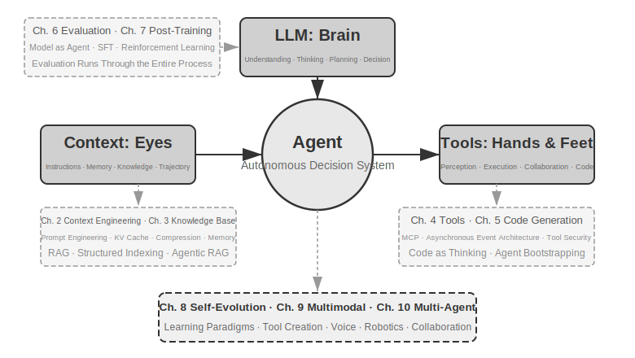
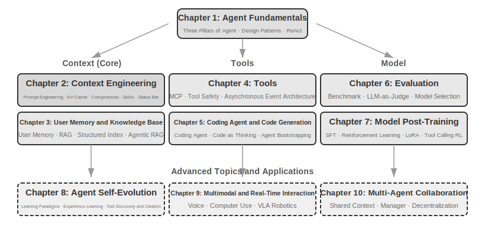

# Introduction {.unnumbered}

From August to October 2025, I delivered a series of technical lectures at the "AI Agent Bootcamp" run by Turing, the Chinese tech publisher. The goal of the lectures was simple: to shift the design of AI Agents from "intuition-driven" to "principle-driven"—not just teaching everyone how to run a demo, but deeply understanding *why* an Agent is designed a certain way and what the trade-offs are behind each architectural decision. This book is compiled and expanded from the lecture notes and experiments of those sessions.

From the initial idea to the finished book, this work was itself created in a way that might be called **whisper coding** (dictation-based collaboration)—and the tool I dictated to was our own Pine voice Agent. Each time I prepared a lecture, I would first dictate a rough outline to it, ask it to do a survey of the topic, and have it organize a first draft. After each lecture, I would take the feedback from Bootcamp students back to it, discussing and polishing the content over many rounds; through this iteration, the lecture notes eventually grew and were arranged into the book you hold today. Throughout the process I rarely typed; I spoke my thoughts to it instead—speech has far higher bandwidth than typing (normal speaking speed is about four times typing speed), so the "dictate—survey—discuss—revise" loop spun quickly. In a sense, this book is not only about Agents; it is also a work an Agent helped create.

Since the release of DeepSeek R1 in early 2025, the AI field has moved beyond the pure foundation model stage (i.e., general-purpose large language model backbones) into the hard part: engineering deployment. Progress at the model layer is visible in two directions. First, through Agentic Reinforcement Learning, models have trained tool-calling capabilities into their parameters, mastering general abilities in areas like coding, mathematics, and computer use. Second, model iteration keeps accelerating—GPT-5.2 to GPT-5.5, Claude Opus 4.5 to 4.8, each transition taking only half a year. At the product layer, general Agents like Manus, Claude Code, and OpenClaw have redefined human-computer interaction, pushing the architectural paradigm of "code generation + file system" into the mainstream.

When I look back at the Agent architecture design principles I summarized in the course nearly a year ago, I made a discovery that is both gratifying and surprising: **These principles have not become outdated; instead, they have become increasingly classic.** Although new terms like Skill, harness, and loop engineering have subsequently emerged in the Agent industry, the actual sequence is the opposite: it's not that companies like Anthropic invented these concepts first, and then many Agents started using them; rather, a large number of Agents were already doing this, and then Anthropic distilled and summarized them into architectural design principles. Practice comes first, naming comes later.

The confidence behind these principles comes from the real-world practice of pushing Agents into long-duration, high-risk scenarios. As the Chief Scientist of Pine AI, my team and I built Pine. To my knowledge, it is the first general Agent capable of autonomously interacting with real people and reliably handling sensitive, complex, long-horizon tasks involving money on its own: it calls operators on behalf of users to negotiate bills, negotiates refunds and complaints with merchants, and cancels subscriptions—all without human intervention. Such tasks often involve dozens of rounds of negotiation, and any single mistake can cause real financial loss. It was this almost punishing demand for reliability that forced out, one by one, the architectural principles this book repeatedly emphasizes. The following examples come from this practice.

- Long before the Skill concept became popular, we were already using dynamic prompt loading to solve the problem of prompt bloat, using command-line execution tools to solve the problem of tool list bloat, and using system status bar technology to solve the problem of Agents not perceiving the execution environment, user time, or work status.
- Long before the harness concept became popular, we were already using methods similar to Claude Code to solve problems like model tool call instability, hallucinations, dangerous operations, unauthorized operations, and instruction non-compliance.
- Long before the loop engineering concept became popular, we were already using a method this book calls proposer-reviewer to solve the problem of models prematurely believing a task is complete, allowing the Agent to review its own output artifacts and iteratively improve them.

Nor is any of this our exclusive invention. To my knowledge, most leading model and Agent companies have independently worked out similar methods. This is why I launched the "AI Agent Bootcamp" course at Turing in August 2025 and have taught a hands-on AI Agent course at the University of Chinese Academy of Sciences continuously from 2024 to 2026. I also chose to release this book as open source rather than keep it closed for royalties, hoping this knowledge can reach more practitioners.

**Practice comes first, naming comes later.** This sequence has a very practical implication for enterprise-level Agent development: **If you wait until an Agent buzzword catches on in the industry before putting it into practice, you are already a step behind.** By the time a term becomes popular, leading companies have usually already worked through the corresponding problems. So, how can you know what to do before the term becomes popular? I believe there are two key points.

**First, have a real business with extremely high demands on Agent capability ceilings, and continuously obtain genuine business feedback.** Take Pine as an example. Handling a single task often takes hours or even weeks and may require repeated communication with multiple stakeholders: several hours of phone calls, filling out pages of complex forms on a computer, and a back-and-forth of several emails. Throughout, you cannot get a single number wrong, and you must stay careful in every communication to protect the user's interests. Only when you are immersed in a scenario this complex will practice naturally push you to build harnesses—to solve what the model cannot yet do on its own but the business demands. Conversely, if the business places low demands on the capability ceiling and a modest model upgrade is enough, you will have no motivation to refine these architectural principles.

**Second, you must establish an Evaluation mechanism.** This is another point repeatedly emphasized in this book: without evaluation, there is no progress. Evaluation allows you to discern whether a change is genuinely better or just luck, thus making the iteration direction of the Agent no longer dependent on intuition. Ultimately, what we advocate is using a scientific methodology to do engineering and to build Agents, and evaluation is the foundation of this methodology. Chapter 6 will elaborate on this method.

No matter how the underlying models upgrade or how product forms innovate, almost all successful Agent systems follow the same architectural patterns. This is no coincidence: **Good design principles should transcend model iteration cycles** because they describe not the usage of a specific model, but the fundamental patterns of interaction between intelligent systems and the world.

Richard Sutton, Turing Award winner and father of reinforcement learning, once said that the evolution of the universe has gone through four stages: from dust to stars, from stars to life, and from life to agents (originally termed designed entities). Biological evolution is blind: random mutation, natural selection. Most organisms do not understand their own working principles and cannot autonomously design and modify themselves. Agents, however, are something entirely new in the history of cosmic evolution: by generating code they can bootstrap and evolve themselves, like a programmer who writes another programmer, who in turn writes the next. That is, Agents can understand their own operating mechanisms and, given a goal, create entirely new Agents—even improve themselves. The mission of this book is to help you understand and master the principles of this creation.

The core formula of this book is just one sentence: **Agent = LLM + Context + Tools**. All three are indispensable.

More intuitively, it is **Brain + Eyes + Hands and Feet**. The brain (LLM) is responsible for thinking and decision-making, the eyes (Context) determine what information the Agent can see, and the hands and feet (Tools) determine what the Agent can do. (Strictly speaking, "eyes" is a rough analogy: Context includes not only environmental information and conversation history but also tool definitions, meaning the information the Agent "sees" also includes "what hands and feet are available." This metaphor aims to convey the core intuition: Context is all the information the model can perceive.)

For readers familiar with reinforcement learning, these three can also be mapped to the formal language of RL. Specifically, LLM corresponds to Policy, Context corresponds to Observation Space, and Tools correspond to Action Space. The three expressions refer to the same object, just at different levels of abstraction.

But the meanings of these three words are far richer than their literal interpretations. Chapter 1 will break them down one by one from a practical perspective and establish a complete mapping from intuitive understanding to academic concepts.

## Book Structure {.unnumbered}

This book consists of ten chapters, divided into three parts (Figure 0-1, Figure 0-2): Chapter 1 is the foundation, establishing a global understanding of Agents; Chapters 2 through 7 sequentially unfold the three pillars: Context (Chapters 2-3), Tools (Chapters 4-5), and Models (Chapters 6-7, Evaluation and Post-training); Chapters 8 through 10 are advanced topics and applications, showcasing Agent self-evolution, multimodality and real-time interaction, and multi-agent collaboration.

- **Chapter 1 (Agent Fundamentals)** opens with several real Agent products to build an intuitive understanding of Agents. It deeply analyzes the core formula of Agents: from the implementation layer (LLM + Context + Tools), to the intuitive layer (Brain + Eyes + Hands and Feet), to the academic layer (Policy, Observation Space, and Action Space). It also dissects the operating mechanism of the ReAct loop through experiments—the iterative process of "Think → Act → Observe"—and introduces three learning paradigms for Agents: Post-training, In-Context Learning, and Externalized Learning. Finally, it discusses orchestration design patterns from workflows to autonomous Agents, establishing a unified conceptual framework for subsequent chapters.
- **Chapter 2 (Context Engineering)** is the most critical chapter in the book, systematically explaining Context, the "eyes" of the Agent. It starts with the API message structure and the Agent's core loop, establishing the foundation that "Context is a list of messages." It then delves into the underlying principles of KV Cache (a mechanism for reusing historical computation results during LLM inference), followed by: Prompt Engineering (including process-oriented design, tool descriptions, business rule refinement) and Prompt Injection attack/defense, the on-demand loading mechanism for Agent Skills, Agent status bar technology, and Context Compression strategies. Complete definitions of each term are provided at their first appearance in the main text.
- **Chapter 3 (User Memory and Knowledge Bases)** extends context management to a persistent knowledge system across sessions, allowing the Agent not only to remember the content of the current conversation but also to accumulate and recall knowledge across multiple conversations. It covers four progressive strategies for user memory, the complete technical stack of RAG (Retrieval-Augmented Generation, i.e., first retrieving relevant documents and then having the model generate an answer, including different text search methods and search result ranking optimization), multimodal information extraction, more advanced knowledge organization methods, and Agentic RAG (where the Agent autonomously decides when and what to retrieve).
- **Chapter 4 (Tools)** explores the bridge for Agents to interact with the external world: tools are like the "hands and feet" of the Agent, enabling it to search the web, call APIs, operate databases, etc. It introduces the MCP tool interoperability standard and design principles for five types of tools (Perception, Execution, Collaboration, Event Triggering, User Communication), with a focus on the security mechanisms of execution tools and event-driven asynchronous Agent architectures.
- **Chapter 5 (Coding Agent and Code Generation)** argues that the Coding Agent plus a file system is the most core technical foundation for all general-purpose Agents. Using the OpenClaw architecture as the main thread, it dissects the workflow and implementation techniques of Coding Agents and demonstrates the broad value of code generation beyond programming: from aiding thinking and building knowledge bases to dynamically creating new tools and Agent bootstrapping.
- **Chapter 6 (Agent Evaluation)** builds a scientific evaluation methodology. It covers evaluation environments (two core paradigms: tool-calling and human-computer interaction, plus simulation environments discussed separately at the chapter's end), dataset design principles, the LLM-as-a-Judge automated evaluation method, evaluation-driven model selection, and a complete closed loop for transforming evaluation results into system improvements.
- **Chapter 7 (Model Post-training)** delves into two post-training techniques: SFT (Supervised Fine-Tuning, i.e., teaching the model to "follow examples" using labeled data) and RL (Reinforcement Learning, i.e., letting the model improve autonomously through trial and error and reward feedback). With the core arguments "SFT memorizes, RL generalizes" and "Data and environment are more important than algorithms," it covers the full panorama of the pre-training/SFT/RL stages, classic RL theory, reward signal design (from binary rewards to process rewards, to "reward results, constrain process" verification path penalties), single-turn and multi-turn reinforcement learning algorithms, and frontier explorations like sample efficiency optimization.
- **Chapter 8 (Agent Self-Evolution)** explores how to make Agents continuously improve without modifying model weights. The two major evolutionary paths are: learning from experience (strategy summarization, workflow recording, automatic system prompt optimization, externalization of Skills knowledge) and proactively discovering and creating tools (MCP-Zero, open-source tool integration, creating new tools with code).
- **Chapter 9 (Multimodality and Real-Time Interaction)** looks forward to Agents moving from the text world to the physical world. It covers Voice Agents (from serial pipelines to end-to-end models), Computer Use (letting Agents operate graphical interfaces like humans), and Robot Manipulation (VLA (Vision-Language-Action model) control and Sim2Real transfer), revealing the common architectural challenges brought by multimodality and real-time requirements.
- **Chapter 10 (Multi-Agent Collaboration)** discusses the ultimate form of AI Agent systems: how multiple Agents can collaborate and divide labor. It systematically elaborates on a classification framework for multi-agent collaboration (Shared/Independent Context × Peer/Manager/Decentralized), demonstrates collaborative architecture design methods through cases like Translation Agents and Phone+Computer Agents, and looks ahead to frontier directions like Agent societies and Agent economies.

## How to Read This Book {.unnumbered}

The chapters in this book are relatively independent. You can choose different reading paths based on your needs:

- **If you are an Agent developer**, it is recommended to read the entire book in order. Chapters 1 through 5 form the core knowledge system, and the evaluation methodology in Chapter 6 is equally indispensable. Chapter 7 is for readers who need to customize models, while Chapters 8 through 10 showcase advanced directions.
- **If you have limited time**, prioritize reading Chapter 1 (to build a global understanding) and Chapter 2 (to master the most critical context engineering). The underlying principles of KV Cache in Chapter 2 are quite technical; for a first reading, you can skip the principles section and just remember the three core conclusions given at the beginning, which will not affect subsequent understanding.
- **If you are focused on model training**, you can go straight to Chapter 7 (Model Post-training); the evaluation methods in Chapter 6 are a prerequisite for training, so it is best to read the two together, after first reading Chapters 1 and 2 for an overall picture.

Each chapter contains a large number of **experiments** and **thought questions**, numbered in the format "Experiment X-Y" (X is the chapter number, Y is the sequence number within the chapter). The titles of experiments and thought questions carry star ratings for difficulty: ★ means entry-level, suitable for all readers; ★★ means medium difficulty, requiring some engineering practice; ★★★ means an advanced challenge, usually involving open-ended questions or complex system design. Most experiments come with complete runnable code, organized in the accompanying open-source repository:

> **Companion Code Repository**: [https://github.com/bojieli/ai-agent-book](https://github.com/bojieli/ai-agent-book)

The project names in the repository correspond one-to-one with the experiments in the book. Each project includes complete run instructions and dependency configurations. I strongly recommend that you run these experiments yourself. AI Agent is a highly practice-oriented field; many design intuitions can only be truly built through hands-on debugging.

**A Terminology Convention**: This book carefully distinguishes two terms that casual usage often conflates. **Reasoning** refers to the model's step-by-step thinking process—as in reasoning models, chain-of-thought, and reasoning tokens. **Inference** refers to the model's forward computation at deployment time—as in inference cost, inference stack, and inference-time scaling. (The Chinese edition renders them as two distinct terms—思考 for reasoning and 推理 for inference—precisely to avoid this ambiguity; Chapter 10's translation case study refers back to this convention.) Other key terms are defined at their first occurrence in the text.

## Prerequisites {.unnumbered}

This book is aimed at readers with some technical background, but does not require you to be an expert in a specific field. The prerequisites are listed below in two levels: "Required" and "Recommended", to help you assess your readiness.

**Required: Foundation for reading the entire book**

- **Python Programming**: Almost all experiments in the book are based on Python. You need to be familiar with Python's basic syntax, common data structures, package management (pip), and other fundamental concepts. Proficiency is not required, but you should be able to read and modify Python code of moderate complexity.
- **Basic Experience with LLMs**: You should have used ChatGPT, Claude, or similar products, and understand the basic interaction pattern of "Prompt → Model Response".
- **An AI-Assisted Programming Tool**: It is strongly recommended to install and become familiar with at least one AI-assisted programming tool, such as Claude Code, Codex, Cursor, Trae, etc. On one hand, these tools can significantly improve the efficiency of experiment development, as the experiments in the book involve extensive code writing and debugging. On the other hand, these programming tools are themselves mature Coding Agents. By using them, you will intuitively experience core mechanisms repeatedly discussed in the book, such as the ReAct loop, tool calls, and context management. This first-hand experience is extremely valuable for understanding Agent design principles.
- **General Software Engineering Knowledge**: Be familiar with basic concepts such as command-line operations, Git version control, JSON data format, and REST APIs. These are the foundation for running experiments and understanding the Agent's tool-calling mechanism.

**Recommended: Enhancing the reading experience for specific chapters**

- **Machine Learning Basics** (Chapter 7): Understanding basic concepts like training vs. inference, loss functions, gradient descent, and overfitting helps in understanding model post-training.
- **Basic Mathematics** (Chapters 2-3, 7): An intuitive understanding of linear algebra (e.g., knowing that vectors can represent direction and magnitude, and matrices can perform batch operations) helps in understanding embeddings and attention mechanisms. Basic knowledge of probability and statistics helps in understanding evaluation metrics and expected rewards in reinforcement learning. The mathematics in the book does not involve complex derivations and focuses on intuitive explanations.
- **Web Development Basics** (Chapters 4, 9): Understanding concepts like HTTP, WebSocket, and front-end/back-end separation architecture helps in understanding event-driven asynchronous Agent architectures and real-time communication experiments for voice agents.
- **Basic Understanding of the Transformer Architecture** (Chapters 2, 7): Transformer is the underlying architecture of almost all current large language models. Readers who want to systematically build up their foundational knowledge of large models may enjoy *Illustrating Large Models* (图解大模型, published in Chinese by Turing), which uses intuitive diagrams to explain core concepts such as the Transformer architecture, pre-training, and fine-tuning—a good complement to this book's Agent engineering perspective.

If you lack some of these prerequisites, don't be discouraged. The core value of this book lies in **architectural design principles and engineering practice methodologies**, not in any specific algorithm or technique. Except for Chapter 7 on post-training, the book's requirements for mathematics and machine learning are very low, making it a perfectly suitable starting point.

Agent technology is still evolving rapidly, but **good architectural design principles have the power to transcend time**. By mastering "why it is designed this way," you can maintain clear judgment amidst the waves of technological change. I hope this book can become your reliable guide for building AI Agents.

## Acknowledgments {.unnumbered}

I would like to thank editors Meng Ge and Liu Meiying at Turing for their diligent editing and for their work organizing the Turing "AI Agent Bootcamp" course; I also thank Professor Liu Junming for offering the hands-on AI Agent course at the University of Chinese Academy of Sciences. Special thanks go to all the students of the Turing "AI Agent Bootcamp" and of the UCAS AI Agent course—in teaching these courses, I received a great deal of valuable feedback and advice from you, which also sharpened my own understanding of these concepts.

I thank all my colleagues at Pine AI. Without a product as excellent as Pine AI, and the many challenges it brought, I could never have gained such deep understanding and practice in the Agent field; through countless exchanges of ideas, my colleagues also contributed a wealth of valuable insight.

I also want to thank many friends in the AI industry (I won't name them all here). In various industry discussions, you gave me honest feedback on my views, corrected many of my erroneous judgments, and elevated my understanding of models and Agents.

Most of all, I want to thank my family, especially my wife, Meng Jiaying. She has always supported me in completing this book and provided many valuable suggestions for it.
