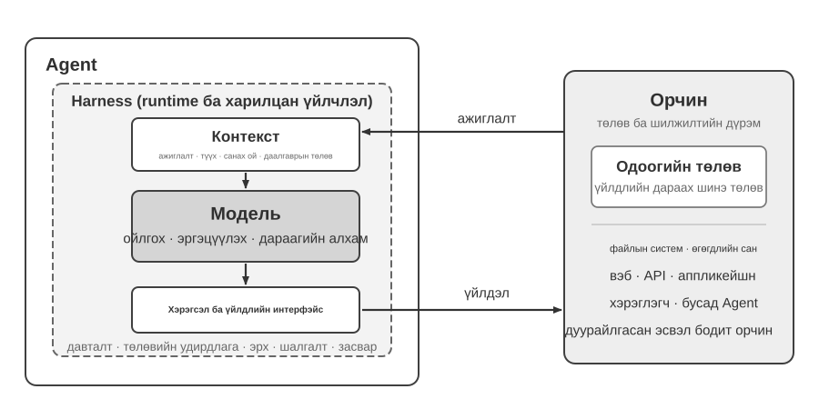
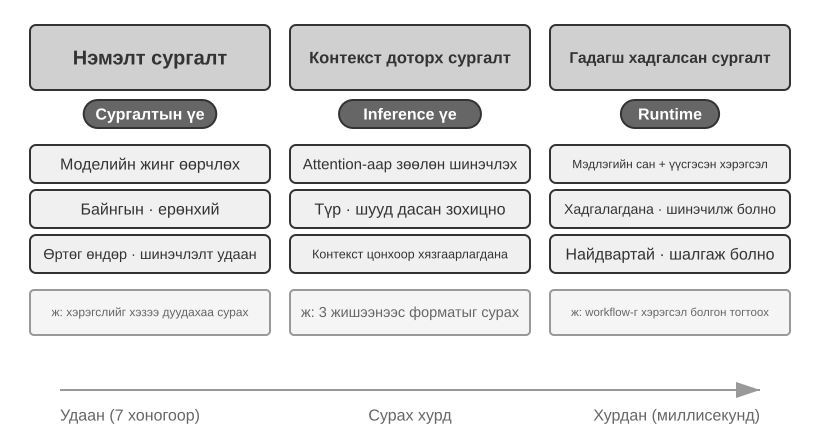
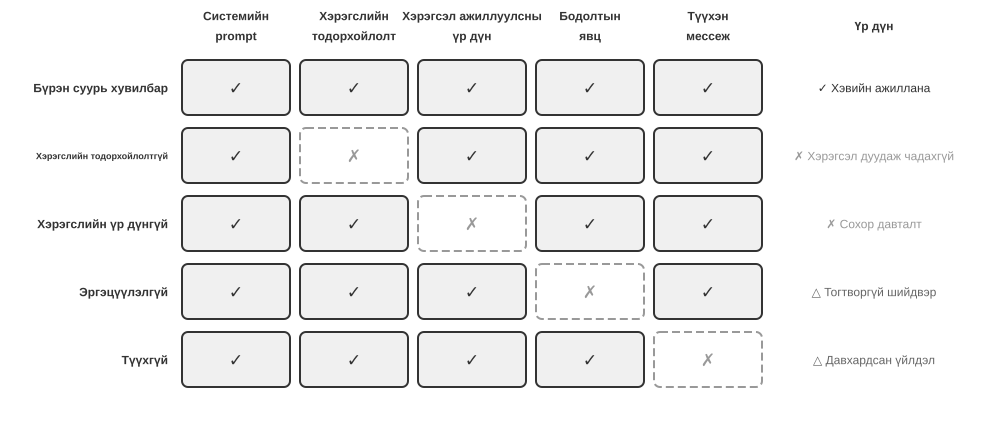
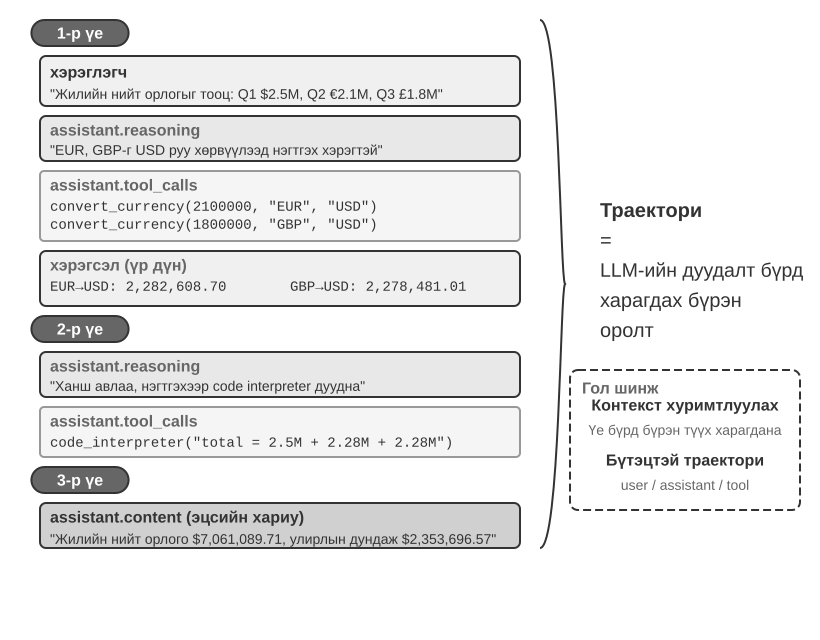
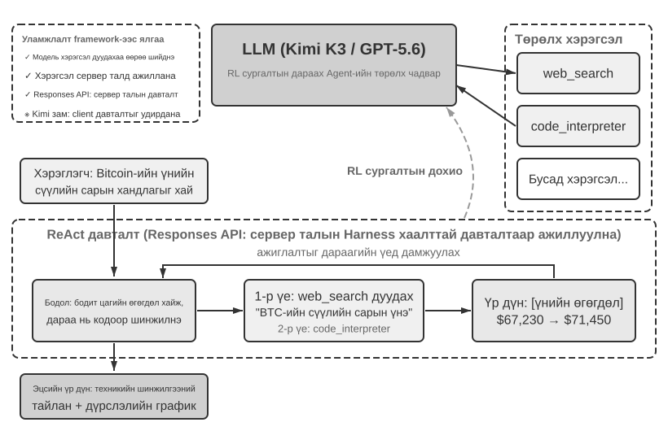
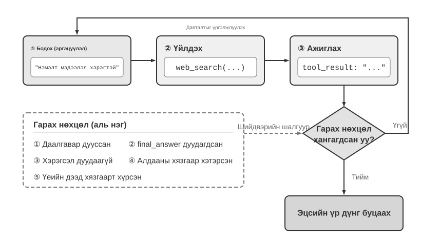
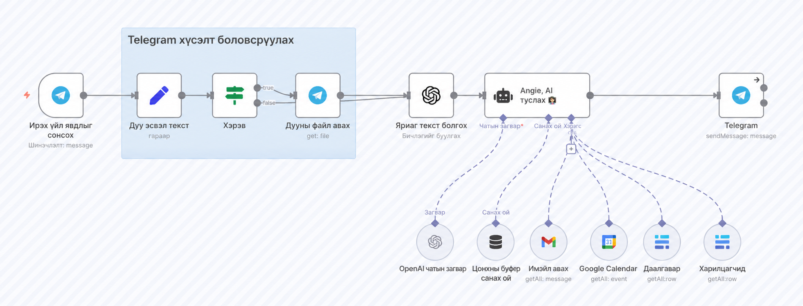

# AI Агентуудтай ажиллаж эхлэх нь

Хэрэв та Cursor-оор код бичүүлж, кодын сан дотроос хайлт хийлгэн, олон файлд засвар оруулж, тестүүд амжилттай болох хүртэл дахин дахин ажиллуулж байгааг харж байсан бол та аль хэдийн AI Агент ашиглаж үзсэн гэсэн үг. Үүнтэй адил Deep Research-ээр нэг сэдвийг олон удаагийн хайлт, уншилтаар судалж байсан; Manus-аар браузер удирдуулан онлайн даалгавар гүйцэтгүүлсэн; Doubao утасны туслахаар тасалбар захиалуулсан эсвэл мессеж илгээсэн; Pine AI-гаар харилцаа холбооны үйлчилгээний төлбөрөө бууруулах хэлэлцээр хийлгэсэн бол мөн AI Агент ашигласан байна.

Эдгээр бүтээгдэхүүн олон янзын хэлбэртэй боловч нийтлэг нэг шинжтэй: тэд зүгээр л идэвхгүй «та асууна, тэр хариулна» хэлбэрийн харилцан ярианы систем байхаа больсон. Тэд гүйцэтгэх алхмуудаа өөрсдөө төлөвлөж, тухайн даалгаварт шаардлагатай хэрэгслүүдийг дуудаж, үр дүн ирэх бүрд стратегиа тохируулдаг. AI Агентууд компьютертэй харилцах шинэ арга хэлбэр болж хөгжиж байна.

Энэ бүлэг бодит жишээнүүдээс эхлэн, тэдгээрээс улбаалан AI Агентын үндсэн бүрэлдэхүүн хэсгүүдийг тайлбарлана. Уншигчид орчин үеийн Агентууд юу хийж чаддагийг ойлгож, тэдгээрийн ард буй архитектурыг танин мэдэж, Агент систем бүтээх дизайны хэв загвар болон сайн туршлагуудтай танилцана.

> **Унших зөвлөмж:** Энэ бүлэг бол бүх номын ойлголтын газрын зураг юм. Энд үндсэн томьёо, ажиллагааны давталт, инженерчлэлийн хүрээ болон Агентын дизайны хэв загваруудыг товч танилцуулна. Энэ нь дараагийн бүлгүүдэд ашиглагдах нийтлэг нэр томьёо, лавлах цэгүүдийг бий болгоно. Анх уншихдаа бүх ойлголтыг цээжлэх гэж оролдох хэрэггүй; эхлээд ерөнхий дүр зургийг ойлгоход анхаар. Дараагийн бүлэг бүр энд танилцуулсан нэг талыг илүү дэлгэрүүлэн авч үзэх бөгөөд чиглэлээ дахин тодорхойлох шаардлагатай үед энэ бүлэгт эргэн хандаж болно.

## Орчин үеийн Агент = LLM + Контекст + Хэрэгслүүд

Хамгийн энгийнээр авч үзвэл орчин үеийн Агент гурван бүрэлдэхүүн хэсгээс тогтоно:

**Agent = LLM (Large Language Model) + Context + Tools**

өөрөөр хэлбэл:

**Агент = Хэлний том загвар + Контекст + Хэрэгслүүд**

Энд байгаа нэмэх тэмдгүүд нь бататгах сургалтын (reinforcement learning) албан ёсны математик тодорхойлолт биш, харин инженерчлэлийн бүрэлдэхүүн хэсгүүдийг нэгтгэж байгааг илэрхийлнэ. Илүү чухал нь энэ томьёо зөвхөн Агентын хил хязгаарын **дотор** байгаа зүйлсийг тодорхойлдог бөгөөд Агентын харилцдаг **Орчныг** өөрийг нь агуулахгүй.

Нэр томьёо бүрийг өргөн хүрээнд ойлгох боловч тэдгээрийн хил заагийг тодорхой байлгах шаардлагатай.

- **LLM бол Агентын сэтгэн бодох хөдөлгүүр.** Энэ нь зөвхөн загварын параметрүүдийн цуглуулга биш, харин зорилгыг ойлгох, дүгнэх, төлөвлөх, шийдвэр гаргах үүрэгтэй Агентын үндсэн шийдвэрийн төв юм. LLM-ийн чадвар нь **урьдчилсан сургалт** (pre-training)-аар эзэмшсэн дэлхийн тухай мэдлэг, хэлний чадвар болон **сургалтын дараах шатны сургалт** (post-training)-аар суулгасан шийдвэр гаргах стратегиас бүрдэнэ. Удирдлагатай нарийвчилсан тохируулга (supervised fine-tuning) болон бататгах сургалт зэрэг аргыг наймдугаар бүлэгт авч үзнэ.

- **Контекст бол Агентын тухайн мөчид ашиглаж болох ажлын мэдээллийн багц.** Энэ нь зөвхөн загварт илгээсэн текст биш. Харин шийдвэр гаргах мөч бүрд Агентын ашиглаж болох орчны мэдээлэл, хэрэглэгчийн санах ой, салбарын мэдлэг, өөрийн төлөв, даалгаврын ахиц зэрэг мэдээллийн нийлбэр юм. Хүн шийдвэр гаргахдаа нөхцөл байдлыг үнэлж, өмнөх туршлагаа санаж, шаардлагатай материалтай танилцдагтай адил Агентын контекстийн цонх нь тухайн мөчид ашиглаж болох мэдээллийг агуулна.

- **Хэрэгслүүд бол Агентын үйлдэл хийх интерфейсүүд.** Эдгээр нь хэдхэн API функцээр хязгаарлагдахгүй. Урьдчилан тодорхойлсон хэрэгслийн дуудлага (tool call), шаардлагатай үед ачаалдаг Skill, код үүсгэн шинэ чадвар бий болгох, ажлыг дэд Агентуудад даалгах, хэрэглэгчтэй холбогдох, гаднын үйл явдалд хариу өгөх зэрэг Агентын хийж болох бүх үйлдлийг хамарна.

Илүү зөн совингоор хэлбэл:

**Агент = Сэтгэн бодох хөдөлгүүр + Ажлын контекст + Үйлдлийн интерфейс**

Загвар нь бодож, шийдвэр гаргана. Контекст нь тухайн шийдвэрт шаардлагатай мэдээллийг өгнө. Хэрэгслүүд нь тэр шийдвэрийг гадаад ертөнцөд бодит үйлдэл болгох боломжийг өгнө.

Сонгодог бататгах сургалт болон удирдлагын онолын үүднээс Агент болон Орчин нь нэгнийхээ бүрэлдэхүүн хэсэг биш, харин хаалттай харилцан үйлчлэлийн давталтын хоёр тал юм. Орчин ажиглалтыг буцааж өгнө. Агент өөрийн контекстийг ашиглан дараагийн үйлдлийг сонгоно. Тэр үйлдэл Орчны төлөвийг өөрчилж, дараагийн ажиглалтыг бий болгоно.



Зураг 1-1-д хийсвэрлэлийн хоёр түвшнийг харуулсан.

Гадаад түвшин нь **Агент ба Орчны харилцан үйлчлэл** юм. Орчинд файлын систем, өгөгдлийн сан, вэб хуудас, хэрэглэгчид, бусад Агентууд болон физик эсвэл загварчлагдсан ертөнц орно.

Дотоод түвшин нь Агентын хил дотор орших **Model–Harness бүтэц** юм. Model нь бодлого (policy)-той холбоотой шийдвэрүүдийг гаргана. Harness нь контекст үүсгэх, хэрэгслийн интерфейсийг ил гаргах, давталт болон төлөв хадгалах, зөвшөөрөл, баталгаажуулалт, засвар хийх зэрэг ажиллагааг хариуцдаг ажиллах үеийн (runtime) болон удирдлагын (governance) давхарга юм.

Harness нь Орчныг бий болгож, тусгаарлаж эсвэл зуучлагч (proxy)-аар дамжуулан холбож болох боловч Орчны төлөв болон төлөв шилжилтийн дүрмийг өөртөө агуулахгүй.

Иймээс инженерчлэлийн томьёог дараах байдлаар өргөжүүлж болно.

LLM нь **Model**, харин **Context + Tools** нь хамгийн бага Harness-ийг бүрдүүлнэ. Бодит ашиглалтын системд үүний дээр хязгаарлалт, баталгаажуулалт болон засварын механизмууд нэмэгдэнэ.

Энэ бүлгийн үлдсэн хэсэг энэхүү хил заагийг баримтална.

Эдгээр гурван бүрэлдэхүүн хэсгийг бататгах сургалтын бодлого (policy) болон харилцан үйлчлэлийн интерфейстэй холбон ойлгож болох боловч тэдгээр нь нэг нэгэндээ яг дүйх ойлголтууд биш.

Контекст нь Агентын доторх ажиглалт болон түүхийг төлөөлнө. Гэхдээ энэ нь бүх observation space биш.

Хэрэгслүүд нь Агентын ашиглаж болох observation болон action интерфейсүүдийг тодорхойлдог. Харин эдгээр хэрэгслээр үйлдэл хийж буй бодит объектууд Орчны бүрэлдэхүүнд хэвээр байна.

| Зөн совингийн ойлголт | Агентын бүрэлдэхүүн | RL ойлголт | Үүрэг |
|---|---|---|---|
| **Сэтгэн бодох хөдөлгүүр** | LLM | **Policy** | Одоогийн мэдээлэл дээр тулгуурлан боломжит бүх сонголтоос дараагийн хамгийн тохиромжтой үйлдлийг сонгох шийдвэрийн логик |
| **Ажлын контекст** | Context construction | **Observations and history** | Орчны ажиглалт болон өмнөх түүхийг тухайн шийдвэрт шаардлагатай мэдээлэл болгон зохион байгуулна |
| **Үйлдлийн интерфейсүүд** | Tool interfaces | **Observation/action interfaces** | Агент ямар ажиглалт уншиж, ямар үйлдэл гаргаж болох болон интерфейсийн форматыг тодорхойлно |

### Ажиглалтын болон үйлдлийн орон зай: Загвар ба ертөнцийн хоорондох интерфейс

**Ажиглалтын орон зай (observation space) болон үйлдлийн орон зай (action space) нийлээд LLM болон гадаад орчны хоорондох интерфейсийг бүрдүүлдэг.**

Ажиглалтын орон зай нь Орчин дахь мэдээллийг загвар боловсруулж чадах контекст болгон хувиргана.

Үйлдлийн орон зай нь загварын шийдвэрийг гадаад ертөнцөд хийх бодит үйлдэл болгон хувиргана.

Ажиглалтын орон зайгаас гадуур байгаа мэдээлэл загварын хувьд бараг оршин байхгүйтэй адил.

Үйлдлийн орон зайгаас гадуур байгаа үйлдлийг загвар яг юу хийх шаардлагатайг төгс мэдэж байсан ч зөвхөн текстээр зөвлөж чадна.

Иймээс **үндсэн загвар ижил хэвээр байгаа нөхцөлд Агентын гүйцэтгэлийг сайжруулах системийн инженерчлэлийн хамгийн хүчтэй хөшүүрэг нь ажиглалтын болон үйлдлийн орон зайг дахин тодорхойлох эсвэл өргөжүүлэх явдал байдаг.**

Энэ номын нэр томьёогоор бол контекст болон хэрэгслийг өргөжүүлэх гэсэн үг.

«Илүү ухаалаг загвар хэрэгтэй» мэт харагддаг олон асуудал үнэн хэрэгтээ интерфейсийн асуудал байдаг.

Даалгаварт шаардлагатай өгөгдлийг контекст рүү оруул, эсвэл шаардлагатай үйлдлийг хэрэгсэл болгон ил гарга. Ингэхэд өмнө нь шийдэх боломжгүй мэт байсан даалгавар шийдэгдэж болно.

**Manus: өмнө нь тусдаа байсан орон зайнуудыг нэгтгэсэн нь.**

Manus гарахаас өмнө бодит ашиглалтын Агентууд ерөнхийдөө гурван тусдаа чиглэлээр хөгжиж байв:

- Deep Research
- Coding
- Computer Use

Manus эдгээр гурвыг нэг системд нэгтгэсэн өргөн нөлөөтэй анхны бодит ашиглалтын Агентуудын нэг болсон.

Түүний виртуал браузер ажиглалтын орон зайг өргөжүүлсэн бол файлын систем, код ажиллуулах болон команд ажиллуулах боломжууд үйлдлийн орон зайг өргөжүүлсэн.

Manus зүгээр л илүү хүчтэй загвар ашигласнаар ерөнхий зориулалтын Агент болсон юм биш.

Харин гурван өөр төрлийн Агентын ажиглалтын болон үйлдлийн орон зайг нэгтгэснээр нэг Агент өмнөх бүтээгдэхүүний хил хязгаарыг даван ажиллах боломжтой болсон.

**OpenClaw: интерфейсийг хэрэглэгчийн дижитал амьдрал руу өргөжүүлэх нь.**

OpenClaw энэ хоёр орон зайг улам гадагш өргөжүүлдэг.

WhatsApp, Telegram, Slack, Discord, iMessage болон бусад хэрэглэгчдийн аль хэдийн ашигладаг мессежийн сувгаар даалгавар хүлээн авч, үр дүнг буцааж өгдөг. Ингэснээр Агент бараг хаанаас ч холбогдох боломжтой систем болно.

Түүний local Gateway нь Google Drive, Notion зэрэг үүлэн аппликейшнээс гадна локал файлын системтэй холбогдоно.

Иймээс хэрэглэгчийн тодорхой зөвшөөрөлтэй нөхцөлд олон бүртгэл, төхөөрөмж дээр тархсан файлууд нэг Агентын ажиглалтын орон зайд орж, хэрэгслээр нь боловсруулах боломжтой болно.

Анхны үүлэн sandbox-д төвлөрсөн Manus хэлбэртэй харьцуулахад OpenClaw-ийн локал орчинд төвлөрсөн (local-first) загвар илүү өргөн өгөгдлийн хил хязгаарыг хамарна.

Manus дараа нь Google Drive connector болон локал файлд нэвтрэх desktop боломж нэмсэн нь нэг санааг улам тодруулдаг:

**Бүтээгдэхүүний хөгжил гэдэг нь олон тохиолдолд ажиглалтын болон үйлдлийн орон зайг өргөжүүлэх үйл явц юм.**

Эдгээр бүрэлдэхүүн хэсэг тус бүр ямар үүрэгтэй, хэрхэн уялддагийг ойлгох нь үр дүнтэй Агент систем бүтээх үндэс юм.

Бид эхлээд эдгээр гурвын хамгийн бодитой хэсэг болох хэрэгслүүд буюу үйлдлийн интерфейсээс эхэлж, дараа нь LLM болон контекст рүү шилжинэ.

Эдгээр гурван хэмжээсээр Агентууд хэрхэн ялгаатайг харъя.

| Агент бүтээгдэхүүн | Ажлын контекст | Үйлдлийн интерфейс | Стратеги |
|---|---|---|---|
| **Coding Agents, жишээ нь Cursor** | Шаардлагын баримт бичиг, кодын сан, терминалын орчин | Нээлттэй: дотоод сэтгэн бодолт, код хайх, файл унших/бичих, команд ажиллуулах гэх мэт | Шаталсан хөгжүүлэлт: шаардлага ойлгох → холбогдох код хайх → код засах → тестлэх, баталгаажуулах → debug хийж засах |
| **Search Agents, жишээ нь Deep Research** | Веб эх сурвалж, академик өгөгдлийн сан, локал файл | Нээлттэй: дотоод reasoning, хайлтын асуулга, вэб унших, хураангуй үүсгэх | Давтан гүнзгийрүүлэх: байгаа мэдээлэл дээр тулгуурлан хайлтын чиглэлээ өөрчилж, аажмаар бүрэн тайлан нэгтгэх |
| **Computer Control Agents, жишээ нь Browser Use** | Компьютерийн дэлгэц, браузерын хуудас, файлын систем | Нээлттэй: reasoning, click, typing, scrolling, screenshot, code execution гэх мэт | Харааны ойлголт + үйлдэл: дэлгэц ажиглах → зорилтот элемент таних → үйлдэл хийх → үр дүн баталгаажуулах |
| **Утасны туслах Агентууд, жишээ нь Doubao** | Утасны дэлгэц, суулгасан аппууд | Нээлттэй: reasoning, click, swipe, typing, app нээх гэх мэт | Хэрэглэгчийн зорилго ойлгох + App control: хэрэгцээг ойлгох → шаардлагатай апп олох → үйлдэл хийх → дууссаныг баталгаажуулах |
| **Хувийн даалгаврын Агентууд, жишээ нь Pine AI** | Хэрэглэгчийн бүртгэлийн мэдээлэл, өмнөх төлбөрүүд, үйлчилгээ үзүүлэгчийн мэдлэгийн сан | Нээлттэй: reasoning, дуудлага хийх, email илгээх, form бөглөх, хэрэглэгчээс баталгаажуулах | Олон алхамт даалгавар: мэдээлэл цуглуулах → хэлэлцээний стратеги боловсруулах → үйлчилгээ үзүүлэгчтэй холбогдох → хэлэлцэх → үр дүн тайлагнах |

Эдгээр системд гурван нийтлэг шинж бий.

**Нээлттэй үйлдлийн орон зай.** Зөвхөн урьдчилан тодорхойлсон товчнуудаас сонгох бус, байгалийн хэлээр текст болон код үүсгэх боломжтой.

**Дотоод дүгнэлт гаргах үйл явц (reasoning).** Үйлдэл хийхээсээ өмнө төлөвлөж, бодно.

**Тасралтгүй харилцан үйлчлэл.** Орчноос ирсэн эргэх холбоонд (feedback) үндэслэн стратегиа өөрчилнө.

Эдгээр чадвар нь reasoning engine, working context болон action interface буюу **LLM + Context + Tools** гурвын харилцан үйлчлэлээс бий болдог.

### Хэрэгслүүд: Агентын үйлдлийн интерфейс

Хэрэгслүүд бол Агентын гадаад ертөнц рүү хүрэх гүүр юм.

Тэд Агентыг идэвхгүй ажиглагчаас хайлт хийх, файл бичих, код ажиллуулах, API дуудах, мессеж илгээх, интерфейс удирдах чадвартай идэвхтэй систем болгон өөрчилнө.

Хэрэгсэлгүй Агент зөвхөн текст үүсгэхээр хязгаарлагдана.

Хэрэгсэлтэй бол гадаад системд бодитоор үйлдэл хийж чадна.

Хэрэгслүүдийг Агент ертөнцтэй ямар чиглэлээр харилцаж байгаагаас нь хамааран таван төрөлд ангилж болно.

**Perception Tools — Мэдээлэл хүлээн авах хэрэгслүүд**

Агент мэдээлэл авах боломжтой болно.

Жишээлбэл:

- хайлтын систем бодит цагийн вэб мэдээлэл өгнө;
- файлын системээс локал баримт бичгийг уншина;
- API болон өгөгдлийн сан гадаад үйлчилгээ, байгууллагын үндсэн өгөгдөлтэй холбоно.

**Execution Tools — Гүйцэтгэх хэрэгслүүд**

Агент гадаад системд бодит үйлдэл хийх боломжтой болно.

Жишээлбэл:

- код ажиллуулах;
- файлтай ажиллах;
- системийн команд ажиллуулах;
- гадаад API дуудах.

Ингэснээр гаргасан шийдвэр бодит үйлдэл болон хувирна.

**Collaboration Tools — Хамтын ажиллагааны хэрэгслүүд**

Агент ажлыг бусад Агенттай хуваалцаж чадна.

Жишээлбэл:

- тусгай даалгаврыг sub-agent-д шилжүүлэх;
- чухал шийдвэр дээр хүнээс баталгаажуулалт авах;
- олон Агентын системийн үйлдлүүдийг зохицуулах.

**Event Trigger Tools — Үйл явдлаар идэвхждэг хэрэгслүүд**

Эдгээр нь эхний гурван төрлөөс үндсээрээ ялгаатай.

Агент өөрөө эдгээрийг дууддаггүй.

Харин тэд гадаад орчноос ирж Агентын ажлыг эхлүүлдэг.

Жишээлбэл:

- шинэ email ирэх;
- товлосон цаг болох;
- өөр систем вэбхүүкийн буцах дуудлага (callback) илгээх.

Эдгээр үйл явдал Агентын reasoning болон action процессыг эхлүүлдэг.

Агент өөрөө ийм event-ийг дуудахгүй ч энэ нь Агент гадаад ертөнцтэй харилцах нэг суваг учир өргөн утгаараа tool system-ийн хэсэг гэж үзнэ.

**User Communication Tools — Хэрэглэгчтэй харилцах хэрэгслүүд**

Эдгээр нь Агентын хэрэглэгчтэй холбогдох сувгууд юм.

Execution tool нь гадаад ертөнцийг өөрчилдөг бол communication tool нь мэдээлэл дамжуулна.

Жишээлбэл:

- текст мессеж;
- дуу хоолойн дуудлага;
- email;
- Агентын явцын мэдээлэл;
- proactive check-in.

Дөрөвдүгээр бүлэгт эдгээр таван төрлийн бүрэн ангилал болон дизайны зарчмуудыг авч үзнэ.

Хэрэгслийн загварчлал-ийн чанар нь Агент юу найдвартай хийж чадахыг шууд тодорхойлно.

Интерфейсийг бүдэг бадаг тодорхойлбол загвар хэрэгслийг буруу ашиглана.

Алдааг муу зохицуулбал ганц хэрэгслийн алдаа Агентын ажлыг бүхэлд нь гацааж чадна.

Зөвшөөрлийг хэт өргөн өгвөл Агентын ганц алдаа буцаах боломжгүй үр дагаварт хүрч болно.

Model Context Protocol (MCP) стандарт өргөн тархахын хэрээр хэрэгслүүдийг холбох нь улам хялбар болж байна.

**Хэрэгсэл дуудах (tool calling)** буюу function calling нь орчин үеийн LLM Агентын үндсэн чадвар юм.

Энэ нь загварт гадаад хэрэгслийг бүтэцтэй хэлбэрээр дуудах боломж олгож, LLM-ийг зөвхөн текст үүсгэгчээс гадаад интерфейсээр үйлдэл хийж чаддаг ухаалаг систем болгон хувиргана.

Энэ номын турш **tool calling** гэсэн нэр томьёог ашиглана.

Хэрэгсэл дуудах үйл явц дөрвөн алхмаар явагдана.

1. Контекст загварт ямар хэрэгслүүд ашиглаж болохыг нэр, зориулалт, параметрийн хамт мэдээлнэ.
2. Загвар хэрэгсэл дуудах эсэх, алийг нь сонгох, ямар аргумент дамжуулахыг өөрөө шийднэ.
3. Хэрэгсэл ажилласны дараа түүний үр дүн контекст рүү нэмэгдэнэ.
4. Загвар тэр үр дүн дээр үндэслэн дараагийн алхмаа шийднэ.

Энэхүү давталт нь энэ бүлэгт дараа тайлбарлах ReAct-ийн үндэс юм.

Цаг агаарын асуулгын хувьд API түвшний хялбаршуулсан дүрслэл:

```text
Алхам 1: Хэрэгслүүдийг зарлах            Алхам 2: Загвар tool дуудахыг шийднэ
tools: [{                                  assistant: {
  name: "get_weather",                       tool_calls: [{
  parameters: {                                function: "get_weather",
    city: "string"                             arguments: {city: "Beijing"}
  }                                           }]
}]                                         }

Алхам 3: Үр дүнг контекстэд нэмнэ          Алхам 4: Загвар үр дүнд үндэслэн хариулна
tool: {                                    assistant: {
  tool_call_id: "call_1",                    content: "Өнөөдөр Бээжинд: 28°C, цэлмэг."
  content: '{"temp":28,"sky":"clear"}'      }
}
```

Хөгжүүлэгч зөвхөн хэрэгслүүдийг тодорхойлж, хэрэгслийн дуудлагуудыг гүйцэтгэнэ.

Хэрэгсэл дуудах эсэх, алийг нь сонгох болон ямар аргумент өгөхийг загвар өөрөө шийднэ.

Хоёрдугаар бүлэгт энэхүү API бүтцийг дэлгэрэнгүй тайлбарлана.

Агентын хэрэгслийг загварчлахдаа тухайн даалгаварт шаардлагатай **хамгийн нарийн, хязгаарлагдмал чадвараас эхэлж**, шаардлага нэмэгдэхийн хэрээр аажмаар өргөжүүлэх хэрэгтэй.

Хэрэв зөвхөн үндсэн арифметик шаардлагатай бол тодорхой параметртэй тооны машин (calculator) хангалттай.

Харин цахим хүснэгт унших, дутуу утгыг цэвэрлэх, статистик тооцоолох, график байгуулах зэрэг шаардлага гарвал олон тусгай хэрэгсэл тасралтгүй нэмэхийн оронд хязгаарлагдсан Python кодын интерпретатор (code interpreter) илүү уян хатан байна.

Гэхдээ ерөнхий зориулалтын чадвар нэмэгдэх тусам алдааны эрсдэл болон халдлагад өртөх боломжит гадаргуу (attack surface) нэмэгдэнэ.

Иймээс код:

- тусгаарлагдсан sandbox-д ажиллах;
- сүлжээнд хандах эрх анхнаасаа хаалттай байх;
- зөвшөөрөгдсөн ажлын лавлахаас (working directory) гадуурх файлд нэвтрэх боломжгүй байх;
- ажиллуулах хугацаа;
- CPU;
- санах ой;
- гаралтын хэмжээ

зэрэгт хязгаар тавих ёстой.

Үүнтэй адил нэг удаагийн гүйцэтгэлийг бүртгэхэд энгийн бүртгэлийн хэрэгсэл (logging tool) хангалттай.

Харин хэдэн цаг эсвэл өдөр үргэлжлэх ажилд хяналттай виртуал ажлын лавлах (working directory) ашиглан дараах зүйлсийг хадгалж болно:

- төлөвлөгөө;
- завсрын үр дүн;
- гүйцэтгэлийн бүртгэл;
- эцсийн артефакт.

Ингэснээр Агент олон ажиллуулалт дамжин ажлаа үргэлжлүүлэх боломжтой.

Гэхдээ ийм лавлахад:

- унших, бичих зам;
- хадгалах багтаамж;
- файлын төрөл

зэргийг хязгаарлаж, зам дамжин нэвтрэх (path traversal) халдлагаас хамгаалах ёстой.

Хостын файлын системийг бүхэлд нь Агентэд шууд өгөх ёсгүй.

Ерөнхий зориулалтын хэрэгсэл тусгай зориулалтын хэрэгслээс үргэлж илүү сайн гэсэн үг биш.

Өндөр эрсдэлтэй эсвэл хатуу бизнесийн дүрэмтэй үйлдлүүд, тухайлбал:

- төлбөр хийх;
- өгөгдөл устгах;
- цахим шуудан илгээх;
- бодит орчинд нэвтрүүлэх

зэрэгт тусгай зориулалтын хэрэгсэл ашиглах нь зөв.

Ийм хэрэгсэл нь:

- тодорхой параметр;
- хязгаарлагдсан зөвшөөрөл;
- үйлдлийн бүрэн мөр (audit trail);
- шаардлагатай үед урьдчилан харах боломж;
- хүний баталгаажуулалт

зэрэг хамгаалалттай байх ёстой.

Хэрэгслийн загварчлалын үндсэн зарчим:

**Хослуулах болон судлах ажилд ерөнхий зориулалтын суурь чадвар ашигла; өндөр эрсдэлтэй үйлдлийг хязгаарлаж, бизнесийн хатуу дүрэм хэрэгжүүлэхдээ тусгай зориулалтын хэрэгсэл ашигла.**

### LLM: Агентын сэтгэн бодох хөдөлгүүр

Хэлний том загвар (Large Language Model, LLM) нь Агентын шийдвэр гаргалтын үндсэн төв юм.

Хэрэглэгчийн хүсэлт ирэхэд хамгийн түрүүнд бодит зорилгыг ойлгох шаардлагатай. Хэрэглэгчийн хэлсэн зүйл нь үргэлж түүний үнэхээр хүсэж буй зүйлтэй яг адил байдаггүй.

Үүний дараа тодорхой бус эсвэл төвөгтэй даалгаврыг гүйцэтгэж болох алхмуудад хуваана.

Ажиллах явцад дараах шийдвэрүүдийг тасралтгүй гаргана:

- дараа нь юу хийх;
- хэрэгсэл дуудах эсэх;
- ямар хэрэгсэл сонгох;
- ямар аргумент дамжуулах.

Энэхүү **ойлгох → төлөвлөх → гүйцэтгэх** чадвар нь урьдчилсан сургалтын үеэр хуримтлуулсан мэдлэгээс үүсэж, ажлын урсгал болон autonomous Agent аль алины суурь болно.

LLM-д суурилсан Агентын онцгой чадварын нэг нь **дотоод дүгнэлт гаргах (reasoning)** юм.

Агент үйлдэл хийхийн өмнө даалгаврыг бодож, төлөвлөж чадна.

Энэхүү дүгнэлт гаргах үйл явц нь гадаад орчныг өөрчлөхгүй ч дараагийн үйлдлийн чанарыг мэдэгдэхүйц сайжруулдаг.

Энэ чадвар урьдчилсан сургалтаас үүсдэг.

Асар их хэмжээний интернет текст дээр сургах үед загвар:

- хэлний хэв маяг;
- дэлхийн тухай мэдлэг;
- математикийн зүй тогтол;
- шалтгаан-үр дагаврын холбоо;
- асуудлыг задлах стратеги

зэрэг хүний мэдлэгт шингэсэн дүгнэлт гаргах хэв маягийг сурдаг.

Иймээс орчин үеийн LLM-based Агентууд сонгодог reinforcement learning Агент шиг сохроор туршилт, алдааны аргаар (trial and error) сохроор ажиллах албагүй.

Тэд бүтэцтэй мэдлэгт үндэслэн дүгнэлт гаргадаг.

#### Model as Agent: Загвар өөрөө бүтээгдэхүүн болох үед

**Model as Agent** хандлага нь AI Агентын хөгжлийн хамгийн шинэ чиглэлүүдийн нэг.

Дэвшилтэт загварууд сургалтын дараах шатанд, ялангуяа бататгах сургалтаар хэрэгсэл дуудах чадварыг төрөлхийн чадвар шиг өөртөө шингээдэг.

- Хэрэгслийг хэзээ дуудах вэ?
- Аль хэрэгслийг ашиглах вэ?
- Ямар аргумент дамжуулах вэ?

гэдгийг загвар өөрөө шийднэ.

Гэхдээ энэ нь framework давхаргын ач холбогдлыг бууруулна гэсэн үг биш.

Харин ч эсрэгээрээ:

**Загвар хүчирхэг болох тусам түүнийг хүрээлсэн Harness улам чухал болно.**

Harness гэдэг үг анх моринд зүүдэг тоноглол, жолооны хэрэгслийг хэлдэг.

Түүний зорилго нь морийг удаашруулах бус, хүчийг нь зөв чиглүүлэх явдал.

Агентын хувьд загвар нь хүчирхэг боловч урьдчилан бүрэн таамаглах боломжгүй морь, Harness нь тэр хүчийг найдвартай даалгавар гүйцэтгэх систем болгон чиглүүлдэг инженерчлэлийн дэд бүтэц юм.

Harness-д:

- context management;
- хэрэгслийн интерфейсүүд;
- safety constraints;
- verification;
- correction

багтана.

Загварт шийдвэр гаргах эрх мэдэл их байх тусам буруу шийдвэрийн нөлөө мөн ихэснэ.

Иймээс найдвартай байдлыг хадгалахын тулд:

- илүү нарийн constraint;
- verification;
- correction

шаардлагатай болно.

Загвар нийлүүлэгч-уудын жинхэнэ давуу тал нь «framework-ийг нимгэлэх» бус, харин **загвар болон Harness-ийг хамтад нь оновчлох** боломжтой байдал юм.

Гэхдээ энд илүү гүн асуулт гарна.

Загварууд тасралтгүй хүчирхэгжвэл өнөөгийн Harness эцэстээ загварт бүрэн шингэх үү?

Рич Саттон (Rich Sutton) «The Bitter Lesson» бүтээлдээ хиймэл оюуны судалгааны далан жилийн турш давтагдсан нэг хэв маягийг дурдсан.

Судлаачид тухайн салбарын талаарх өөрсдийн ойлголтыг системд гараар кодолж богино хугацааны давуу тал олж авдаг ч эцэст нь тооцоолох хүчин чадал болон өгөгдлийн хэмжээгээр өргөжин хөгждөг ерөнхий арга болох **хайлт болон суралцах ерөнхий арга**-д дийлддэг.

Энэ өнцгөөс харахад Harness дахь constraint, verification, correction-ийн аль нь загвар эцэстээ өөртөө шингээх ёстой «human prior» вэ гэсэн асуулт гарна.

**Энэ номын байр суурь бол загварууд эдгээр чадварын улам их хэсгийг өөртөө шингээх болно. Гэхдээ энэ үйл явц хэр хурдан өрнөх талаар бодитой байх хэрэгтэй.**

Tool calling болон long-horizon planning өмнө нь гадаад orchestration-д ихээхэн түшиглэдэг байсан бол одоо загварын төрөлх чадвар болж байна.

Гэхдээ практикт ийм шингээлт төсөөлснөөс хавьгүй удаан.

Сургалт хэдэн сарын турш үргэлжилдэг.

Ямар ч загвар бодит бизнесийн бүх constraint болон preference-ийг нэг удаагийн сургалтаар бүрэн дотроо шингээж чадахгүй.

Загварын өнөөгийн чадварын зааг дээр л Harness хамгийн их үнэ цэнэ бий болгодог.

Иймээс Harness Engineering нь «Гашуун сургамж» (Bitter Lesson)-ийг эсэргүүцэж байгаа хэрэг биш.

Харин инженерчлэлийн хугацааны хэмжээнд түүнийг хэрэгжүүлж буй хэлбэр юм.

**Загвар одоохондоо найдвартай хийж чадахгүй зүйл бүрийг Harness эхлээд нөхнө. Загвар дараагийн давхаргыг дотроо шингээмэгц Harness тэр давхаргыг хаяж, дараагийн чадварын шинэ хязгаар рүү шилжинэ.**

#### Агентын суралцах механизм: Контекстийн дасан зохицлоос байнгын шинэчлэлт хүртэл

Өмнөх хэсэгт загвар бататгах сургалт ашиглан tool-use policy-г төрөлхийн чадвар болгож шингээж болохыг дурдсан.

Гэхдээ Агентын зан төлөв зөвхөн training үед өөрчлөгддөггүй.

Шинэчлэлт хаана хийгдэж, хэр удаан хадгалагдахаас нь хамааран үүнийг бие биеэ нөхөх гурван замаар ойлгож болно:

1. тухайн даалгаврын доторх contextual adaptation;
2. даалгавар хооронд хадгалагдах external artifact-ийн шинэчлэлт;
3. training cycle үеийн model parameter update.



**Contextual adaptation** нь тухайн даалгаврын хүрээнд явагдана.

Жишээ, төлөв болон retrieval result контекстэд ормогц загвар зан төлөвөө шууд өөрчилж чадна.

Гэхдээ энэ нь дараагийн дараагийн сессийн хадгалагдах төлөвийг өөрчлөхгүй.

Давуу тал:

- хурдан;
- хямд.

Хязгаарлалт:

- context window;
- мэдээлэл хэрхэн зохион байгуулагдсан байдал.

Хоёрдугаар бүлэгт энэ төрлийн дасан зохицлыг дэлгэрэнгүй авч үзнэ.

Өөрчлөлтийг олон даалгавар дамжин хадгалахын тулд систем **external artifact**-уудыг шинэчилж болно.

- Баримт болон туршлагыг knowledge document болгох;
- байгалийн хэлээр илэрхийлж болох стратегийг Prompt эсвэл Skill-д бичих;
- deterministic procedure болон constraint-ийг program болон Harness-д кодлох.

Эдгээр артефактыг хянаж, засварлахад хялбар.

Гэхдээ Агент execution үед тэдгээрт context эсвэл хэрэгслийн интерфейс-ээр дамжин хандах шаардлагатай хэвээр.

3–5 дугаар бүлгүүдэд мэдлэг болон программын суурийг тайлбарлана.

Есдүгээр бүлэгт үнэлсэн ажлын явцын бүртгэлээс (trajectory) ийм шинэчлэлтийг хэрхэн үүсгэж болохыг авч үзнэ.

Хэрэв зорилго нь:

- medical image understanding;
- байгалийн хэлний style;
- далд decision policy

гэх мэт external rule-ээр бүрэн илэрхийлэх боломжгүй өндөр хэмжээст чадвар бол **model parameter**-ийг post-training-аар шинэчлэх шаардлагатай.

Параметр шинэчлэх, нэвтрүүлэх зардал өндөр боловч илүү байгалийн, өргөн generalization бий болгож чадна.

Наймдугаар бүлэгт эдгээр аргыг системтэй тайлбарлана.

Иймээс гурван зам нь хоорондоо өрсөлдөх ангилал биш.

Харин өөр өөр хугацааны хэмжээнд ажилладаг зохицсон механизм юм.

- Context → шууд дасан зохицол.
- External artifact → хяналттай хуримтлал.
- Parameter → дүрмээр илэрхийлэхэд хэцүү чадварыг дотроо шингээх.

### Контекст: Агентын ажлын мэдээллийн багц

Контекст гэдэг нь Агент шийдвэр гаргах мөч бүрдээ ашиглаж болох ажлын мэдээллийн багц юм.

Хүн шийдвэр гаргахдаа ширээн дээрээ:

- task instruction;
- reference manual;
- өмнөх correspondence;
- хамгийн шинэ data

зэрэг зөв материалыг гаргаж тавьдагтай адил Агентын context window нь тухайн мөчид ашиглаж болох мэдээллийг агуулна.

API-ийн өнцгөөс LLM-ийн нэг дуудлагын контекст таван хэсгээс бүрдэнэ.

- **System Prompt.** Хэрэглэгчийн харилцан ярианд бичдэг prompt-оос ялгаатай нь system prompt-ийг developer бичиж, харилцан ярианы турш тогтвортой байлгана. Энэ бол Агентын «ажлын байрны тодорхойлолт» бөгөөд identity, permission болон зан үйлийн дүрмийг тогтооно. System prompt-ийн prompt engineering-ээр Агентын ажиллагааны зан төлөвийг хэлбэржүүлнэ. System prompt нь сессүүдийн хооронд хадгалагддаг **user memory** болон динамикаар оруулсан environment state-ийг мөн агуулж болно.

- **Tool Definitions.** Агент ашиглаж болох хэрэгслийн нэр, тайлбар, parameter format-ийг зарлана. Tool definition байхгүй бол Агент tool таньж, дуудаж чадахгүй. Гэхдээ энэ нь огт хариу өгөхгүй гэсэн үг биш. Experiment 1-1-д юу болдгийг харуулна. Хэрэгслийн тодорхойлолтууд болон system prompt нийлээд харилцан ярианы турш өөрчлөгдөхгүй **тогтмол эхлэл (static prefix)** үүсгэнэ.

- **User Messages.** Хэрэглэгчийн input. User message нь RAG буюу Retrieval-Augmented Generation ашиглан динамикаар олж авсан **external knowledge**-ийг мөн агуулж болно.

- **Assistant Messages.** Өмнө нь загварын үүсгэсэн response. Эдгээр нь `reasoning`, `content`, `tool_calls` гэсэн гурван төрлийн хэсэг агуулж болно. Нэг response-д бүгд заавал зэрэг байх албагүй.

- **Tool Results.** Агент framework tool ажиллуулсны дараа буцаасан output. Энэ нь Агентын дараагийн reasoning-ийн шууд үндэс бөгөөд өмнөх үр дүнгээс суралцаж, ижил алдааг давтахгүй байхад тусална.

Эхний хоёр хэсэг:

**system prompt + tool definitions**

нь **тогтмол эхлэл (static prefix)** үүсгэнэ.

Сүүлийн гурван хэсэг:

**user messages + assistant messages + tool results**

нь харилцан үйлчлэл бүрд өсөн нэмэгдэх **динамик мессежийн түүх (dynamic message history)** болно.

Эдгээр таван хэсэг нийлж LLM inference бүрийн контекстийг бүрдүүлдэг.

Бүх бүрэлдэхүүн үнэхээр зайлшгүй юу?

Үүнийг шалгах хамгийн шууд арга нь **ablation study** юм.

Энэ нь бүрэлдэхүүн хэсгүүдийг нэг нэгээр нь хасаж, үр нөлөөг нь шалгах оношилгооны арга юм.

A бүрэлдэхүүн хэсгийг хасна → систем ажиллаж байна уу?

B бүрэлдэхүүн хэсгийг хасна → юу өөрчлөгдөв?

Ингэж бүрэлдэхүүн тус бүрийн бодит хувь нэмрийг тодорхойлно.

> **Туршилт 1-1 ★★: Контекстийн чухал үүрэг**
>
> Контекстийн таван бүрэлдэхүүнээс system prompt-ийг үндсэн таних шинжийг тогтоодог тул туршилтаас хасаж, үлдсэн дөрвийг системтэй хасалтын судалгаа (ablation study) ашиглан шалгасан.
>
> Нэг бүрэн суурь хувилбар (baseline) болон тус бүр нэг бүрэлдэхүүнийг хассан дөрвөн бүлэг ажиллуулж, гүйцэтгэлд үзүүлэх нөлөөг харьцуулсан.
>
> 
>
> Туршилтын үр дүн контекстийн бүрэлдэхүүнүүд ижил ач холбогдолтой биш гэдгийг харуулсан.
>
> **Tool Definitions** нь Агентын үйлдэл хийх чадварын суурь. Үүнийг хасвал Агент хэрэгсэл дуудаж чадахгүй.
>
> Гэхдээ үйлдэл хийж чадахгүй байна гэдэг чимээгүй болно гэсэн үг биш.
>
> Загвар тоонуудыг observation-оос бус параметрт шингэсэн мэдлэг (parametric memory)-оос гаргаж, хэрэгслийн үр дүнд тулгуурласан мэт маш цэвэр форматтай, итгэлтэй хариулт үүсгэж болно.
>
> Тэр шууд татгалзах уу, эсвэл зохиож хариулах уу гэдэг нь тухайн загварын зохиомол хариулт үүсгэх давтамж болон үнэнч байдлаас ихээхэн хамаарна.
>
> «Ханшийг өөрөө бүү таамагла» гэх prompt дахь хязгаарлалт нь зохиомол мэдээлэл үүсгэх магадлалыг бууруулж болох ч бүрэн арилгахгүй.
>
> **Tool Results** нь хаалттай эргэх холбоотой удирдлагын (closed-loop control) гол хэсэг.
>
> Хэрэгслийн үр дүн байхгүй бол Агент «сохроор» ажиллаж, давталтын хязгаар дуусах хүртэл дахин оролдож болно.
>
> **Reasoning process** нь яагаад тухайн алхам хийгдсэнийг хадгална.
>
> Хэрэгслийн үр дүн нь юу болсныг хадгална.
>
> Хэрэв өмнөх дүгнэлтийг хэрэгслийн үр дүнгээс сэргээх боломжтой бол дүгнэлт гаргах түүхийг хасахад бараг зардал гарахгүй байж болно.
>
> **Мессежийн түүх (message history)** нь илүүдэл үйлдлээс хамгаалж, ижил алдааг дахин давтахаас сэргийлнэ.
>
> Туршилтын үндсэн санаа:
>
> **Контекст Агент юу харж чадахыг тодорхойлно. Агент зөвхөн харж байгаа зүйл дээрээ тулгуурлан шийдвэр гаргаж чадна.**
>
> Гэхдээ бүх бүрэлдэхүүн хэсэг ижил биш.
>
> Гол хэмжүүр нь тухайн мэдээллийг өөр эх үүсвэрээс сэргээж болох эсэх.
>
> «Бүх бүрэлдэхүүн хэсэг зайлшгүй» гэсэн таамгийг хэмжилтээр батлах ёстой.
>
> Мөн инженерчлэлийн практикт хамгийн чухал нэг санаа:
>
> **«Хариулт үүсгэсэн» гэдэг нь «даалгавар гүйцэтгэсэн» гэсэн үг биш.**
>
> Контекстийн бүрэлдэхүүн алга болох үед систем ихэвчлэн алдаа заагаад зогсохгүй. Харин гаднаасаа төгс харагдах боловч буруу хариулт өгдөг.

### ReAct давталт

Одоо гурван бүрэлдэхүүнтэй танилцсан тул дараагийн асуулт:

**Тэд хэрхэн хамтран ажилладаг вэ?**

ReAct давталт нь LLM, контекст болон хэрэгслүүдийг нэг систем болгон холбодог үндсэн механизм.

**ReAct = Reasoning + Acting**

Гэхдээ бодит давталт гурван үе шаттай.

1. Загвар дараа нь юу хийхээ **тунгаан дүгнэнэ (reason)**.
2. Хэрэгсэл дуудаж **үйлдэл хийнэ (act)**.
3. Хэрэгслийн үр дүнг **ажиглаад (observe)** дараагийн алхмаа бодно.

Ингээд:

**reason → act → observe → reason → act → observe**

гэсэн давталт даалгавар дуусах хүртэл үргэлжилнэ.

Олон валютаар орлогыг нэгтгэх жишээгээр Агентын **ажлын явцын бүртгэл (trajectory)**-ийг ойлгож болно.

Trajectory гэдэг нь Агент ажиллах явцад хуримтлагдсан мессежийн түүх бөгөөд дараах зүйлсийг агуулна:

- user messages;
- assistant messages;
- assistant reasoning;
- tool calls;
- tool results.

LLM-ийн дуудлага бүрд загварын хүлээн авах бүрэн контекст:

**static prefix + trajectory**

байна.

Тиймээс:

**Agent context = static prefix + trajectory**

Static prefix:

- system prompt;
- хэрэгслийн тодорхойлолтууд.

Trajectory:

- user messages;
- assistant messages;
- tool results.



Давталтын хамгийн энгийн хэрэгжүүлэлт:

```text
trajectory = [user_request]

repeat:
    context = stable_prefix + trajectory
    decision = Model(context)
    trajectory.append(decision)

    if decision has no tool call:
        return decision.answer

    for call in decision.tool_calls:       # independent calls may run in parallel
        validated_call = Harness.validate(call)
        observation = Environment.execute(validated_call)
        trajectory.append(observation)
```

Энд:

- Model зөвхөн дараагийн алхмыг шийднэ.
- Harness контекст угсарч, tool call-ийг validate болон execute хийнэ.
- Environment бодит state change болон observation-ийг үүсгэнэ.

Trajectory-ийн бүтэц:

```text
trajectory = [
  {role: "user", content: "Компанийн улирлын орлогод үндэслэн: Q1 2.5M USD, Q2 2.1M EUR, Q3 1.8M GBP, Q4 380M JPY бол жилийн нийт орлого болон улирлын дундаж орлогыг тооц"},

  # Эхний iteration
  {role: "assistant",
   reasoning: "Бүх валютыг USD руу хөрвүүлэх шаардлагатай...",
   content: "",
   tool_calls: [
     {name: "convert_currency", args: {amount: 2100000, from: "EUR", to: "USD"}},
     {name: "convert_currency", args: {amount: 1800000, from: "GBP", to: "USD"}},
     {name: "convert_currency", args: {amount: 380000000, from: "JPY", to: "USD"}}
   ]},

  # Framework tool-уудыг ажиллуулж, үр дүнг trajectory-д нэмнэ
  {role: "tool", content: "EUR->USD: 2282608.7"},
  {role: "tool", content: "GBP->USD: 2278481.01"},
  {role: "tool", content: "JPY->USD: 2541806.02"},

  # Хоёр дахь iteration
  {role: "assistant",
   reasoning: "Хөрвүүлэлтийн үр дүн бэлэн, одоо нэгтгэн тооцоолно...",
   content: "",
   tool_calls: [
     {name: "code_interpreter", args: {code: "total = 2500000 + 2282608.7 + ..."}}
   ]},

  {role: "tool", content: "Total: $9,602,895.73, Average: $2,400,723.93..."},

  # Гурав дахь iteration
  {role: "assistant",
   reasoning: "Бүх тооцоо дууссан, үр дүнг нэгтгэнэ...",
   content: "ЭЦСИЙН ХАРИУЛТ: Нийт орлого $9,602,895.73..."}
]
```

System prompt болон хэрэгслийн тодорхойлолтууд нь trajectory дотор харагдахгүй.

Тэд тогтмол эхлэлийг (static prefix) бүрдүүлж, LLM-ийн дуудлага бүрд trajectory-ийн өмнө автоматаар нэмэгдэнэ.

Туршилтад loop дараах байдлаар явагдсан.

Эхний ээлж:

- Агент даалгаврыг шинжилсэн;
- валют хөрвүүлэх гурван хэрэгслийг зэрэгцүүлэн дуудсан.

Хоёр дахь ээлж:

- хөрвүүлэлтийн үр дүнг кодын интерпретаторт өгсөн;
- илүү их тооцоолол хийсэн.

Гурав дахь ээлж:

- бүх тооцоо дууссаныг баталсан;
- эцсийн хариулт үүсгэсэн.

Ингээд төвөгтэй олон алхамт ажил **3 давталт, 4 хэрэгслийн дуудлага**-аар дууссан.

Хамгийн энгийн энэ дизайн дээр LLM-д харагдах контекст үргэлж нэмэгдэнэ.

LLM-ийн дуудлага бүрд ажлын явцын бүртгэлийг бүхэлд нь ашиглана.

Иймээс загвар:

- одоо даалгаврын аль шатанд байгаагаа;
- өмнө юу туршсанаа;
- ямар үр дүн гарсныг

мэдэж байдаг.

Ажлын явцын бүртгэл бүтэцтэй тул системийн ажиллагааг тайлбарлах, алдаа оношлоход хялбар.

> **Туршилт 1-2 ★: Kimi K3-ийн төрөлхийн Агент чадвар**
>
> Энэхүү туршилт нь «Model as Agent» парадигмын жишээ болох **Kimi K3**-ийн native Agent чадварыг харуулна.
>
> Kimi K3 нь ойролцоогоор 2.8 их наяд параметртэй Mixture of Experts буюу MoE загвар.
>
> MoE-г мэргэжилтнүүдийн багтай зүйрлэж болно.
>
> Асуудал бүр дээр бүх загварыг идэвхжүүлэхийн оронд тухайн асуудалд хамгийн тохирох цөөн expert-ийг ажиллуулна.
>
> Ингэснээр өндөр чадвар-г хадгалж, бүх parameter-ийг зэрэг ашиглах efficiency cost-оос зайлсхийдэг.
>
> Kimi K3:
>
> - 1 сая token context window;
> - native visual understanding;
> - үргэлж идэвхтэй thinking mode
>
> зэрэг чадвартай.
>
> Бататгах сургалтаар tool-calling **decision policy**-г төрөлх чадвар болгон шингээсэн.
>
> Өөрөөр хэлбэл:
>
> - хэзээ хэрэгсэл дуудах;
> - ямар хэрэгсэл сонгох;
> - ямар argument өгөх
>
> гэдгийг загвар өөрөө шийднэ.
>
> Гэхдээ tool өөрөө загварын жин дотор шингэсэн гэсэн үг биш.
>
> `web_search`, `code_runner` зэрэг хэрэгсэл сервер талд API-level built-in байдлаар ажиллана.
>
> Kimi эдгээр official хэрэгслийг Formula нэртэй server-side script engine-ээр ажиллуулдаг.
>
> Иймээс orchestration loop бүрэн алга болоогүй.
>
> Харин decision-making загвар дотор орсон.
>
> Kimi path дээр client code:
>
> `model call → tool result append → model call again`
>
> гэсэн ReAct loop-ийг удирдсан хэвээр.
>
> Гол ажиглалт:
>
> Загвар хэзээ хайлт хийх, юу хайхаа өөрөө шийдэж байна.
>
> Search result ирэх бүрд strategy-гаа тохируулж, хангалттай мэдээлэл цугларсан эсэхийг үнэлнэ.
>
> **Бататгах сургалт нь хэрэгслийг өөрийг нь биш, хэрэгсэл ашиглах шийдвэрийн бодлогыг (decision policy) загварт өгдөг.**
>
> RL дараах зүйлсийг сургана:
>
> - хэрэгсэл дуудах эсэх;
> - алийг нь дуудах;
> - ямар argument өгөх;
> - result авсны дараа үргэлжлүүлэх эсэх;
> - олон арван эсвэл зуун call-ийг coherent reasoning болгон холбох.
>
> Харин хэрэгслийн хэрэгжүүлэлт, code sandbox, infrastructure зэрэг нь загвараас гадуур framework эсвэл API built-in хэлбэрээр оршино.
>
> Kimi K3-ийн Агент даалгаврын онцлох давуу тал нь **урт tool-call chain-ийн тогтвортой байдал**.
>
> 200–300 дараалсан tool call хийх үед дүгнэлтийн уялдаа холбоогоо хадгалж чадна.
>
> K3 нь long-horizon programming болон Агентын ажлын ачаалал-д оновчлогдсон бөгөөд:
>
> - K3 Max;
> - K3 Swarm Max
>
> гэсэн хувилбаруудтай.
>
> Нээлттэй эхийн model боловч software engineering болон Agent benchmark дээр тэргүүлэх хаалттай эхийн системүүдтэй өрсөлдөх чадвар харуулсан.

> **Туршилт 1-3 ★: GPT-5.6-ийн төрөлхийн Deep Research чадвар**
>
> Хоёр дахь туршилт **OpenAI GPT-5.6** болон API түвшинд суурилагдсан хэрэгсэл ашиглан Deep Research-ийн «search → read → analyze» orchestration loop-ийг server side дээр хэрхэн хааж байгааг харуулна.
>
> GPT-5.6-ийн нэг боломж нь **Freeform Tool Calling**.
>
> Уламжлалт tool calling үед model бүх parameter-ийг strict JSON болгон serialize хийх шаардлагатай.
>
> Харин `type: "custom"` tool ашигласан freeform calling нь raw text-ийг tool руу шууд илгээх боломжтой.
>
> Жишээлбэл:
>
> - Python code;
> - SQL query.
>
> Энэ нь JSON escaping шаардлагагүй болгоно.
>
> Гэхдээ энэ нь model architecture-ийн шинэчлэл биш.
>
> API parameter format-ийн evolution юм.
>
> Client-ийн:
>
> `tool_calls илрүүлэх → execute → result буцаах`
>
> гэсэн үндсэн loop хэвээр.
>
> GPT-5.6 нь Responses API-ийн built-in:
>
> - web search;
> - code interpreter
>
> хэрэгслүүдтэй хослон Deep Research-ийн үндсэн механизмыг бүрдүүлнэ.
>
> Загвар өөрөө:
>
> **search → read → analyze → search again**
>
> гэсэн iterative research process явуулж чадна.
>
> Жишээлбэл «ASEAN-ийн 10 улсын нийслэлүүдээс хоорондоо хамгийн ойр хоёр нь аль вэ?» гэвэл:
>
> 1. нийслэлүүдийн координатыг хайна;
> 2. Python код бичнэ;
> 3. бүх хосын great-circle distance тооцно;
> 4. хамгийн ойр хосыг олно.
>
> Мөн нэг сарын Bitcoin trend болон technical analysis хийх даалгаварт:
>
> - бодит цагийн price data хайх;
> - moving average;
> - RSI;
> - MACD;
> - бусад technical indicator
>
> тооцож, chart үүсгэж чадна.
>
> GPT-5.6-ийн өөр нэг онцлог нь **intent clarification process**.
>
> Research request ирэнгүүт шууд execution эхлэхийн оронд хэрэглэгчийн бодит зорилгыг тодруулах асуулт тавьж болно.
>
> Жишээлбэл:
>
> «Өнгөрсөн сарын Bitcoin trend-ийг хайж technical analysis хий» гэвэл:
>
> «Ямар data source ашиглах вэ? Ямар technical indicator шинжлэх вэ?»
>
> гэх мэтээр тодруулж болно.
>
> Энэ нь research report-ийг хэрэглэгчийн хэрэгцээнд илүү нарийвчлалтай тааруулахад тусална.
>
> GPT-5.6 нь «Model as Agent» парадигмын боловсорсон жишээ.
>
> Responses API дотор web search, code interpreter болон multi-round orchestration server-side closed loop байдлаар ажиллана.
>
> Model standard tool call үүсгэсээр байх боловч client өөрөө search-read-analyze orchestration framework барих шаардлага буурна.
>
> Энэ санаа зөвхөн нэг vendor-т хамаарахгүй.
>
> Ижил төрлийн managed tool санал болгодог бусад provider-оор туршилтыг давтаж болно.



## Harness Engineering: Загварыг хүрээлсэн найдвартай систем бүтээх нь

Одоо Агентын үндсэн ажиллагааг ойлгосон.

LLM нь ReAct давталтын шийдвэр гаргах хэсгийг гүйцэтгэнэ.

Контекст түүнийг чиглүүлнэ.

Хэрэгслүүдийн тусламжтайгаар даалгаврыг гүйцэтгэнэ.

Гэхдээ өмнөх туршилтууд энэ механизм ажилладаг боловч нэлээд хэврэг болохыг харуулсан.

Загвар:

- байхгүй хэрэгсэл, параметрийг зохиомлоор үүсгэх;
- буруу хэрэгсэл сонгох;
- алдаа гарсны дараа ажиллагаагаа сэргээж чадахгүй байх

магадлалтай.

Ажилладаг туршилтын загвар (demo) болон бодит ашиглалтын найдвартай бүтээгдэхүүний хооронд асар том ялгаа бий.

Энэ зөрүүг арилгахын тулд **Harness Engineering** хэрэгтэй.

Энэ бүлгийн эхний хэсэг:

**Агент гэж юу вэ?**

гэсэн асуултад хариулсан.

Хоёр дахь хэсэг:

**Агентыг бодит ашиглалтын орчинд хэрхэн найдвартай ажиллуулах вэ?**

гэсэн асуултад хариулна.

Өмнөх хэсэгт:

**Agent = LLM + Context + Tools**

гэсэн үндсэн томьёог тогтоосон.

Энэ нь Агентын **дотоод бүтцийг** тодорхойлно:

- reasoning engine;
- working context;
- action interfaces.

Harness Engineering нь ижил системийг хэрэгжүүлэлтийн түвшний өнцгөөс харна.

LLM-ийг нэг үндсэн **Model** гэж үзээд, түүнийг хүрээлсэн бүх туслах кодыг **Harness** гэж нэрлэнэ.

Энэ хоёр үзэл хоорондоо өрсөлдөхгүй.

Нэг системийг хийсвэрлэлийн өөр өөр түвшнээс тайлбарлаж байна.

Harness-ийн үндэс нь өмнөх томьёоны:

**Context + Tools**

бөгөөд үүний дээр гурван хамгаалалтын давхарга нэмэгдэнэ.

- **Constrain** — Агент юу хийж болох, болохгүйг тогтоох.
- **Verify** — хийсэн үйлдэл зөв болсон эсэхийг шалгах.
- **Correct** — буруу болсон үед хэрхэн сэргээх.

Ингээд бодит ашиглалтад бэлэн системийн томьёо:

> **Agent = Model + Harness**
>
> **Harness = Context management + Tool interfaces + Constraints + Verification + Correction**
>
> **Agent ↔ Environment**

Хамгийн энгийн туршилтын загварт:

- Model;
- context үүсгэж tool ил гаргадаг Harness

хангалттай.

Бодит ашиглалтын системд:

- constraints;
- verification;
- correction

нэмэгдэнэ.

Жишээ нь буцаан олголт хариуцсан Агент:

- буцаан олголтын журмыг контекстэд оруулна;
- зөвшөөрөл болон үнийн дүнгийн дүрмээр дуудлагыг хязгаарлана;
- өгөгдлийн сангийн төлөвөөр үр дүнг баталгаажуулна;
- хугацаа хэтэрвэл дахин оролдох эсвэл нөөц хувилбарт шилжинэ.

Harness Engineering нь яг энэ ажиллах үеийн болон удирдлагын кодыг судална.

Илүү нарийн тодорхойлбол Harness гэдэг нь загвараас гадуур байгаа бүх зүйл биш.

Харин:

**Агентын хил хязгаар дотор, загварын гадна байрлах ажиллах үеийн болон удирдлагын давхарга** юм.

Harness нь Загвар–Орчны харилцан үйлчлэлийг зуучилна.

Гэхдээ Environment-ийг өөртөө багтаахгүй.

Harness-д:

- хэрэгслийн тодорхойлолтууд;
- call adapters;
- sandbox permissions;
- reset mechanisms

орно.

Environment-д:

- sandbox дотор өөрчлөгдөж буй file болон process;
- external database;
- web page;
- user;
- physical world

орно.

Системийг хаана байршуулснаас үл хамааран энэ ойлголтын хил зааг өөрчлөгдөхгүй.

| Бүрэлдэхүүн | Үүрэг ба дизайны зарчим | Бодит жишээ | Холбогдох бүлэг |
|---|---|---|---|
| **Context management** | Холбогдох мэдээллийг өгнө. **Information sufficiency:** Агент шийдвэр гаргах алхам бүрд хангалттай мэдээлэлтэй байх | System prompt, knowledge base, Agent status bar, Sidecar bypass query | 2, 3 |
| **Tool interfaces** | Загвар хэрхэн үйлдэл хийхийг тодорхойлно. **Clear interfaces:** ойлгомжтой tool name, parameter example, limit | MCP tool, code interpreter, search tool | 4 |
| **Constraints** | Агент юу хийх эрхтэйг тодорхойлно. **Fail-safe defaults:** explicit enable хийхээс нааш чадварыг хаалттай байлгах | Claude Code default-аар хэрэгслийн гүйцэтгэл-оос өмнө user authorization шаарддаг | 4 |
| **Verification** | Хэрэгслийн гүйцэтгэл зөв үр дүн гаргасан эсэхийг шалгана. **Input isolation:** security check-ийг model-generated text бус structured data дээр тулгуурлуулах | Lint, type check, tool result validation | 5, 6 |
| **Correction** | Error recovery эсвэл rollback хийнэ. Failure-ийг хэрэглэгчид харуулахаас өмнө recovery оролдоно | Automatic дахин оролдлого, generation resume, circuit breaker, human escalation | 2, 5 |

Үндсэн загварын удирдлагын давталт:

```text
observation = Environment.observe()
trajectory = [observation]

while true:
    actions = Model(Harness.build_context(trajectory))

    if len(actions) == 0:
        break

    allowed_actions = Harness.constrain(actions)
    observation = Environment.apply(allowed_actions)

    if not Harness.verify(Environment):
        observation = Harness.correct(Environment)

    trajectory.append(allowed_actions, observation)
```

Энэ ерөнхий псевдокодод хэрэгжүүлэлтийн нарийн ширийн зүйлийг зориуд оруулаагүй.

API message loop-ийг Хоёрдугаар бүлэгт, tool болон automatic verification-ийг дөрөв, тавдугаар бүлэгт дэлгэрэнгүй авч үзнэ.

Context болон Tools Агентэд **даалгаврыг ойлгож, хийж дуусгах** боломж өгнө.

Constrain, Verify, Correct нь **даалгаврыг найдвартай, аюулгүй хийж дуусгах** боломж өгнө.

Эдгээр нь Context болон Tools-оос тусдаа ойлголт биш.

Production орчинд тэдгээрийг найдвартай ажиллуулах инженерчлэл юм.

Эрт үеийн Агентын framework-ууд:

**Context + Tools**

дээр төвлөрдөг байв.

Production-grade системүүдийн төв:

**Constrain + Verify + Correct**

рүү шилжиж байна.

Claude Code-ийг авч үзье.

Түүний Harness code-ийн ихэнх хэсэг Context болон Tools бус, харин Constrain, Verify, Correct хийдэг.

Хэрэгсэл өөрөө:

- file read/write;
- command execution;
- search

гэх мэт харьцангуй жижиг хэсэг.

Харин тэдгээрийг тойрсон хамгаалалтын механизмууд гол цөм болно.

Үүнд:

- **Process State Management** — Агент яг ямар алхам гүйцэтгэж байгааг хянах.
- **Multi-Layer Context Compression** — мэдээлэл хэт их болоход автоматаар шахах.
- **Permission Classification** — ямар operation user confirmation шаардахыг удирдах.
- **Circuit Breaker** — давтан error гарсны дараа дахин оролдох үйлдлийг автоматаар зогсоох.
- **Error Recovery Mechanisms** — exception барих, stable state рүү rollback хийх, дахин оролдлого эсвэл human handoff хийх.

**Салбарын төвлөрөл «даалгавар гүйцэтгэх»-ээс «даалгаврыг найдвартай гүйцэтгэх» рүү шилжиж байгаа бөгөөд Harness Engineering нь Агент системийн үндсэн өрсөлдөөний давуу тал болж байна.**

### Prompt Engineering-ээс Loop Engineering хүртэл: Инженерчлэлийн парадигмын хөгжил

AI application engineering-ийн хөгжлийг харвал тодорхой дараалал харагдана.

**Prompt Engineering**

Эхний давалгаа.

Загварт өгдөг байгалийн хэлний instruction-ийг сайжруулж гаралтын чанарыг нэмэгдүүлэх.

**Context Engineering**

Хоёр дахь давалгаа.

Зөвхөн prompt оновчлох хангалтгүй гэдгийг ойлгосон.

Загварын харж болох бүх мэдээллийг системтэй удирдах шаардлагатай:

- system instruction;
- tool definition;
- conversation history;
- external knowledge.

**Harness Engineering**

Гурав дахь давалгаа.

«Загвар ямар мэдээлэл авч байна?» гэсэн асуултаас:

«Загвар ямар систем дотор ажиллаж байна?»

гэсэн өргөн өнцөг рүү шилжинэ.

Үүнд:

- constraint mechanisms;
- verification methods;
- feedback loops;
- error recovery

зэрэг загвараас гадуурх дэд бүтэц орно.

**Loop Engineering**

Нэг run-аас цааш гарч, олон run дамжих тогтвортой autonomous operation-ийг авч үзнэ.

- Дараагийн ажлыг хэн илрүүлэх вэ?
- Хэзээ verify хийх вэ?
- Даалгаврыг хэзээ үнэхээр дууссан гэж үзэх вэ?

гэдгийг шийднэ.

**Graph Engineering**

2026 оны долдугаар сараас industry-д илүү өндөр түвшний orchestration perspective болгон энэ нэр хэрэглэгдэх болсон.

Agent loop, deterministic program болон human approval-ийг explicit execution graph болгон зохион байгуулна.

- node → capability;
- edge → routing болон dependency;
- structured state → edge-ээр дамжиж, чухал boundary дээр хадгалагдана.

Эдгээр таван шат өмнөхийгөө орлосон зүйл биш.

Харин нэг нэгнийхээ дотор орших давхаргууд юм.

**Prompt Engineering ⊂ Context Engineering ⊂ Harness Engineering ⊂ Loop Engineering ⊂ Graph Engineering**

Нэг Agent loop нь execution graph-ийн нэг node болж болно.

Давхарга бүр инженерийн анхаарах хүрээ болон нөлөөлөх боломжийг өргөжүүлнэ.

**Загваруудын чадварын ялгаа багасаж, загвар өөрөө гол ялгаруулагч байхаа болих тусам өрсөлдөөний давуу тал загвараас гадуурх инженерчлэл рүү шилжинэ.**

Terminal Bench 2.0 дээр LangChain-ийн Coding Agent 52.8%-аас 66.5% хүртэл сайжирсан жишээ үүнийг харуулна.

Загвар өөрчлөгдөөгүй.

Harness өөрчлөгдсөн.

Агент:

- execution result-ээ өөрөө шалгах;
- repetitive loop-д гацсанаа илрүүлэх;
- reasoning strategy-гаа сайжруулах

механизмтай болсон.

### Үр дүнтэй Агент бүтээх үндсэн зарчмууд

Anthropic-ийн туршлагад тулгуурлан амжилттай Agent систем гурван үндсэн зарчим баримтална.

**Энгийн байлга.**

Хамгийн энгийн шийдлээс эхэл.

Үнэхээр шаардлагатай үед л төвөгшлийг нэм.

Төвөгтэй framework-ээс API-г шууд дуудах нь илүү тохиромжтой байж болно.

Ухаалаг боловч ойлгомжгүй хийсвэрллээс ойлгомжтой код илүү сайн.

Нэмэлт хийсвэрлэлийн давхарга бүр алдаа оношлоход шинэ, анзаарагдахгүй хэсэг үүсгэнэ.

**Ил тод байлга.**

Агентын:

- planning steps;
- execution logs;
- decision trajectory

зэргийг тодорхой харуул.

Энэ нь зөвхөн алдаа оношлоход хэрэгтэй биш.

Энэ нь хэрэглэгчийн итгэлийн үндсэн нөхцөл юм.

«Хар хайрцаг» дотор гарсан алдааг гаднаас нь илрүүлж, засахад хэцүү.

**Сайн бүтэцтэй хэрэгслийн интерфейс буюу ACI зохион бүтээ.**

ACI = Agent-Computer Interface.

Уламжлалт API-г programmer-ийн өнцгөөс бус, Агентын өнцгөөс ойлгомжтой болгоно.

Хэрэгслийн нэр, параметрүүд ойлгомжтой байх ёстой.

Алдаа гарах магадлал өндөр бол design өөрөө алдааг боломжгүй болгох хэрэгтэй.

SIM картын нэг булан тайрагдсан байдлаар зөвхөн нэг чиглэлээр орох боломжтой.

Богино долгионы зуухны хаалга нээлттэй үед халаалт эхлүүлэхгүй.

Үйлдвэрлэлд үүнийг **poka-yoke**, өөрөөр хэлбэл mistake-proofing гэж нэрлэдэг.

Муу tool design хамгийн хүчтэй загварыг ч дахин дахин алдаа гаргахад хүргэж болно.

Учир нь интерфейс бол model болон tool-ийн хоорондох цорын ганц суваг.

Тодорхой бус интерфейс жижиг алдааг системийн түвшний алдаа болгон өсгөдөг.

Дараагийн хэсгүүд Harness engineering-ийн таван үндсэн элементийн гадна байрлах боловч практикт зайлшгүй гурван сэдвийг авч үзнэ:

- загвар сонголт;
- orchestration pattern;
- guardrails and safety.

### Загварыг хэрхэн сонгох вэ?

Orchestration pattern ярьхаас өмнө практик асуулт:

**Ямар төрлийн model Агентын хөдөлгүүр байх ёстой вэ?**

Model бол Агентын intelligence-ийн суурь.

Зөв model сонгох нь олон тохиолдолд хэчнээн их prompt тохируулснаас ч илүү чухал.

Загварын шинэ хувилбар хэт хурдан өөрчлөгддөг учраас тодорхой version recommendation богино настай.

Иймээс энд чиглэл өгнө.

**Closed-Source Models**

Өнөөгийн Агент хөгжүүлэлтэд өргөн ашиглагддаг хаалттай эхийн provider-уудад:

- OpenAI — GPT/o series;
- Anthropic — Claude series

орно.

Хаалттай эхийн загварууд ихэвчлэн чадварын хувьд тэргүүлдэг ч:

- илүү үнэтэй;
- vendor API policy-д хязгаарлагддаг.

Model сонгохдоо leaderboard-д дангаар нь найдаж болохгүй.

**Өөрийн бодит даалгавраар үнэлгээ хий.**

**Open-Source Models**

Номыг бичих үеийн байдлаар нээлттэй эхийн загварууд хаалттай эхийн системүүдээс ойролцоогоор зургаан сараас илүүгүй хоцролттой атлаа зардал мэдэгдэхүйц бага байж болно.

Хэрэв хамгийн өндөр түвшний чадвар шаардахгүй бол нээлттэй эхийн загвар практик сонголт болно.

Давуу тал:

- бага зардал;
- private deployment;
- fine-tuning customization;
- data compliance scenario-д тохиромжтой.

Агентын чадвар сайтай Хятадын загваруудад DeepSeek, Kimi, GLM зэрэг орно.

Хэрэгсэл дуудах чадвар загвар бүр дээр их ялгаатай тул бодит scenario дээрээ заавал туршиж шалга.

**Capability-гаас гадна загварын бодлогын хязгаарыг анхаар.**

Model техникийн хувьд даалгавар хийж чаддаг ч тухайн host product хэрэглэгчид тэр чадварыг ашиглахыг зөвшөөрөхгүй байж болно.

Vendor бүр:

- cybersecurity;
- model distillation;
- model extraction;
- private data;
- high-risk operation

дээр өөр policy boundary тогтооно.

Ижил даалгавар:

- chat product;
- Coding Agent;
- API

дээр өөр үр дүн өгч болно.

Иймээс загвар сонголт-д зөвхөн:

- accuracy;
- price;
- speed

харьцуулах хангалтгүй.

Бодит task дээрээ:

- model ажиллахыг зөвшөөрч байна уу;
- interface шаардлагатай чадварыг ил гаргаж байна уу;
- үйлчилгээний нөхцөл тухайн use case-ийг зөвшөөрч байна уу

гэдгийг туршиж шалгах хэрэгтэй.

Business-critical ажилд human handoff эсвэл өөр compliant model нөөц хувилбар бэлдэх хэрэгтэй.

**Ихэнх Агент reasoning дэмждэг загвар шаарддаг.**

Агент:

- multi-step reasoning;
- tool selection;
- dynamic decision-making

хийдэг.

Reasoning-гүй model ийм task дээр ихэвчлэн сул.

Exception:

- ганц маш энгийн алхам;
- fixed-position GUI click зэрэг operation.

Dynamic decision орж ирмэгц reasoning загвар хэрэгтэй.

**Output Speed болон Multimodal Capability-г анхаар.**

Хоёр зүйл амархан орхигддог.

Нэгдүгээрт, **output token speed**.

Agent олон round inference ажиллуулдаг.

Нэг round дууссаны дараа дараагийнх эхэлдэг.

Иймээс output speed end-to-end latency-г шууд тодорхойлно.

20-round task дээр round бүр 2 секундээр удаан бол нийт 40 секунд нэмэгдэнэ.

Хоёрдугаарт, **multimodal support**.

Хэрэв Агент:

- image;
- audio;
- video

ойлгох шаардлагатай бол олон төрлийн өгөгдөл боловсруулах чадвар зайлшгүй.

### Orchestration Pattern: Ажлын урсгал ба Autonomous

Orchestration pattern гэдэг нь Harness өөрийн context болон tools layer-ийг хэрхэн зохион байгуулахыг хэлнэ.

Тухайлбал:

- context LLM call хооронд хэрхэн дамжих;
- tool хэрхэн schedule хийх;
- execution path урьдчилан fixed байх уу эсвэл runtime үед dynamic үүсэх үү.

LLM application бүтээхдээ энгийнээс төвөгтэй рүү шилж.

Эхлээд ганц LLM call хангалттай эсэхийг бод.

Prompt болон in-context example сайжруулахад асуудал шийдэгдэх бол Агент систем бүү нэм.

Олон алхам шаардлагатай боловч fixed subtask болгон хувааж болох бол ажлын урсгал ашигла.

Dynamic decision болон flexible execution path үнэхээр хэрэгтэй үед autonomous Agent ашигла.

Агент систем ихэвчлэн илүү сайн task гүйцэтгэл авахын тулд latency болон cost-ыг нэмэгдүүлдэг.

Энэ trade-off үнэ цэнтэй эсэхийг бодитоор үнэл.

Түгээмэл буруу арга нь эхнээсээ маш төвөгтэй ажлын урсгал эсвэл олон Агентын систем барих.

Жишээлбэл «нэг сая chat message-ээс personal memory extract хийх Agent» гэсэн даалгаварт зарим систем шууд:

- conversation segmentation;
- extraction Agent;
- evidence verification Agent;
- identity resolution Agent;
- memory curation Agent;
- merge-review Agent;
- fact graph;
- coverage ledger;
- immutable versioning

гэх мэт асар том pipeline санал болгоно.

Бүрэлдэхүүн тус бүр тусдаа харахад логик боловч нийлээд үр ашиг муутай, найдваргүй систем болж болно.

Complex ажлын урсгал fixed topology-той учраас exception бүр дээр дахин нэг node нэмэгдэх хандлагатай.

Ингээд architecture улам төвөгтэй боловч generality улам багасна.

Model контекстээс өөрөө semantic judgment хийж чадах зүйлс хүртэл ажлын урсгалд hard-code хийгдэнэ.

Иймээс:

**Harness чухал байна гэдэг нь Harness илүү төвөгтэй байх тусам сайн гэсэн үг биш.**

Manus-ийн хэллэгээр:

**«Less structure, more intelligence.»**

Эхлээд чадвартай Агентэд:

- тодорхой goal;
- шаардлагатай context;
- composable tools

өг.

Хүн evidence хэрхэн шалгах, comparison хийх, conflict шийдэхийг байгалийн хэлээр тайлбарлаж болно.

Program зөвхөн хэзээ ч зөрчиж болохгүй boundary-г hard-code хийх ёстой.

Жишээлбэл:

- permission;
- эх материал хэзээ ч overwrite хийхгүй байх;
- atomic publication.

Зөвхөн бизнесийн constraint зайлшгүй шаарддаг эсвэл evaluation тогтмол failure mode илрүүлсэн үед л тухайн алхмыг:

- dedicated verifier;
- independent Agent;
- deterministic process

болгон өргөжүүл.

Сайн бүтэц нь Агентын бүх бодлыг урьдчилан дүрслэн тогтоох ёсгүй.

Харин boundary-г хамгаалж, түүний доторх decision space-ийг загварт буцааж өгөх ёстой.

#### Ажлын урсгалын хэв загвар: Deterministic Orchestration

**Ажлын урсгал** гэдэг нь LLM болон хэрэгслийг урьдчилан тодорхойлсон code path-аар удирддаг систем.

Execution path:

- deterministic;
- developer урьдчилан зохиосон.

Step болон transition бүрийн behavior кодоор тодорхойлогдоно.

LLM зөвхөн тухайн node дотор understanding болон generation хийдэг.

Жишээ нь flight-booking Agent дараах дөрвөн fixed node ашиглаж болно.

1. **Хэрэглэгчийн identity-г шалгах** — identity verification API.
2. **Боломжит нислэг хайх** — user requirement дээр flight database query.
3. **Төлбөр хийх** — payment interface.
4. **Захиалгыг баталгаажуулах** — seat lock хийж confirmation илгээх.

Node бүрийн дотор LLM ашиглаж болно.

Жишээлбэл user-ийн travel need-ийг байгалийн хэлнээс ойлгох.

Гэхдээ node хоорондын sequence кодоор fixed.

Payment дуусахаас өмнө seat book хийхгүй.

Identity verification хийгдээгүй бол flight search эхлэхгүй.

Ажлын урсгалын хоёр гол давуу тал бий.

**Нэгдүгээрт — strict process control.**

Critical step алгасах эсвэл буруу дарааллаар явахгүйг developer баталгаажуулж чадна.

«No booking before payment» гэх rule LLM judgment бус кодоор enforced болно.

**Хоёрдугаарт — security.**

Execution path deterministic учраас prompt injection эсвэл model error нь зөвхөн тухайн node доторх processing-д нөлөөлнө.

Агент хүрэх ёсгүй branch руу өөрөө үсэрч чадахгүй.

Attack surface нэг node дотор хязгаарлагдана.

Гол сул тал:

**flexibility багатай.**

Unexpected event гарвал fixed path өөрөө дасан зохицохгүй.

Жишээлбэл:

- user payment үеэр booking өөрчлөх;
- flight cancel болох;
- alternative recommendation хэрэгтэй болох.

System preset exception branch дагах эсвэл human-д control буцаах шаардлагатай.

Ажлын урсгалын хамгийн энгийн жишээ:

**text-to-image generation.**

User энгийн байгалийн хэлээр:

«AGI бий болсны дараа ажиллаж буй программистуудын дүр зураг зур»

гэж хэлж болно.

Stable Diffusion шиг model тодорхой prompt style шаардаж байвал ажлын урсгал хоёр fixed node ашиглана.

1. **Prompt Rewriting** — user-ийн байгалийн хэл request-ийг text-to-image model ойлгох prompt format руу хөрвүүлнэ.
2. **Image Generation** — rewritten prompt-оор image model дуудна.

Prompt rewriting node нь хүний хэл болон хэрэгслийн оролтын формат хооронд **translation** хийж байна.

Хэрэгсэл эсвэл загварын чадварын хязгаарлалтыг нөхдөг ийм Harness code-ийг **adapter layer** гэж нэрлэж болно.

Хэрэв image-generation хэрэгслийг native image generation чадвартай multimodal model-оор соливол prompt rewriting шаардлагагүй болж болно.

User яаж хэлсэн ч загвар өөрөө ойлгоно.

> **Туршилт 1-4 ★: Text-to-Image ажлын урсгал ба Native Image Generation**
>
> Ижил байгалийн хэлний request-ийг хоёр route-аар явуул.
>
> **Ажлын урсгалын зам (workflow route):** LLM эхлээд request-ийг Stable Diffusion-style prompt болгон дахин бичээд дараа нь image model дуудна.
>
> **Native route:** request-ийг шууд native image generation дэмждэг multimodal model руу илгээнэ.
>
> Хоёр зүйлийг харьцуул:
>
> 1. prompt rewriting node original request-ийг юу болгон өөрчилсөн;
> 2. аль route original request-д илүү ойр image үүсгэсэн.
>
> Concrete request болон broad request гэсэн хоёр төрлийг тусад нь турших нь сонирхолтой.

Энэ туршилтын гол санаа:

**Загварын чадварын дутагдлыг нөхдөг Harness-ийн хэсгүүд загвар хүчирхэг болохын хэрээр түүнд шингэх хандлагатай.**

Энэ бүлэгт хэд хэдэн удаа ийм зүйл харсан.

- Few-shot example болон «let’s think step by step» зэрэг prompting trick → instruction tuning болон reasoning загварт шингэсэн.
- Output-format repair болон JSON parsing tolerance → structured output болон native tool calling-д шингэсэн.
- Text-to-image prompt rewriting → олон төрлийн өгөгдлийг ойлгох, үүсгэх төрөлх чадварт шингэсэн.

Ийм internalization бүр «translation» болон «scaffolding» төрлийн adapter-layer code-ийг арилгана.

#### Autonomous Agent: Runtime Decision-Making

Fixed ажлын урсгал хүрэлцэхгүй үед **autonomous Agent** хэрэгтэй.

Ажлын урсгал болон autonomous Agent-ийн үндсэн ялгаа:

**Execution path урьдчилан тодорхойлогдоогүй. Харин runtime үед environment feedback дээр үндэслэн Агент өөрөө шийднэ.**

Flight example руу эргэн оръё.

User:

«Ирэх Лхагва гарагт Шанхай руу нисэх онгоц захиал.»

гэж хэлнэ.

Autonomous Agent-д дөрвөн fixed node заавал хэрэггүй.

Тэр dynamic sequence сонгоно.

- flight хайна;
- login шаардлагатайг илрүүлнэ;
- identity verify хийнэ;
- search үргэлжлүүлнэ.

Хамгийн хямд flight layover-той бол:

«Дамжин нисэх боломжтой юу?»

гэж асууж болно.

User «үгүй» гэвэл search criteria өөрчилнө.

Autonomous Agent өөрөө:

- plan;
- execution step сонгох;
- failure таних;
- strategy өөрчлөх

чадвартай байх ёстой.

Гэхдээ autonomy хязгааргүй байж болохгүй.

Explicit stopping condition шаардлагатай.

- task complete;
- maximum iteration reached;
- unrecoverable error.

Үгүй бол infinite loop-д орж эсвэл task дууссан хойно ч үйлдэл хийсээр байж болно.

Implementation perspective-ээс autonomous Agent бол үндсэндээ:

**LLM + tools + loop + environmental feedback**

юм.

Энэ бол өмнө танилцуулсан ReAct loop.

Common exit condition:

- final output хэрэгсэл дуудах;
- model хэрэгслийн дуудлагагүй response буцаах;
- error гарах;
- maximum round хүрэх.



Autonomous Agent нээлттэй problem-д тохиромжтой.

Алхамын тоог урьдчилан тодорхойлоход хэцүү task.

Жишээ:

- Coding Agent SWE-bench issue засах;
- Computer Use Agent GUI удирдах;
- iterative search шаарддаг research.

Autonomy cost нэмнэ.

Error compound болж болно.

Иймээс deployment хийхдээ:

- sandbox testing;
- guardrails;
- monitoring;
- чухал үе шатанд хүний оролцоотой (human-in-the-loop)

шаардлагатай.

#### Ажлын урсгал болон бие даасан Агентын хэв загварыг сонгох ба хослуулах

Практикт ажлын урсгал болон autonomous Agent хоорондоо mutually exclusive биш.

Олон систем энэ хоёрыг хослуулдаг.

Strict compliance шаардсан critical process:

**ажлын урсгал**

хэлбэрээр ажиллаж болно.

Flexible decision шаардсан хэсэг:

**autonomous mode**

рүү шилжиж болно.

n8n бол үүний жишээ.

Visual canvas дээр functional component байрлуулж Agent болон ажлын урсгал угсарна.

Ажлын урсгал node болон autonomous Agent node нэг системд зэрэг байж болно.



Өөр нэг арга:

**Autonomous Agent эхлээд ажлын урсгал бичнэ, дараа нь ажлын урсгал execution хийнэ.**

Agent task-ийг уншаад topology-гаа өөрөө шийдэж orchestration code үүсгэнэ.

Код үүссэний дараа execution phase deterministic ажлын урсгал болно.

Ингэснээр:

- unfamiliar task дээр autonomous flexibility;
- execution үед ажлын урсгал determinism

хоёрыг хослуулна.

Аравдугаар бүлэгт үүнийг дэлгэрэнгүй авч үзнэ.

#### Түгээмэл Агент framework-уудын товч харьцуулалт

| Framework/Platform | Үндсэн зориулалт | Orchestration Pattern | Development Approach | Тохирох хэрэглээ |
|---|---|---|---|---|
| **Codex Harness** | Codex-ийн арын нээлттэй эхийн Agent runtime | Autonomous | Code-first, өөрийн app-д embed хийж болно | Coding Agent, өөрийн product-д Agent оруулах |
| **Claude Agent SDK** | Production-grade Agent development framework | Autonomous | Code-first | Complex autonomous task, Coding Agent |
| **LangChain / LangGraph** | General LLM application framework | Ажлын урсгал + autonomous | Code-first | Complex reasoning chain, multi-step ажлын урсгал |
| **n8n** | Visual ажлын урсгал automation | Ажлын урсгал + autonomous | Low-code | Business automation, nontechnical team |
| **Dify** | LLM application development platform | Ажлын урсгал + conversational | Low-code + API | Enterprise RAG, knowledge-base application |
| **CrewAI** | Role-based олон Агентын orchestration | Multi-Agent collaboration | Code-first | Team-style task decomposition болон execution |
| **OpenClaw** | Нээлттэй эхийн ерөнхий зориулалтын personal Agent | Autonomous + event-driven | Configuration + code | Personal assistant, Deep Research, Computer Use, multiplatform messaging |
| **DeepSeek Harness** | Agent self-evolution framework | Everything is a plugin | Code-first, customizable | Agent developer, researcher |
| **Pi** | Minimal Coding Агентын framework | Autonomous | Code-first | Agent developer |

Codex бол OpenAI-ийн Coding Агент бүтээгдэхүүн:

- App;
- CLI;
- IDE extension.

Codex Harness нь эдгээр бүх хэлбэрийг ажиллуулдаг runtime layer.

Integration-ийн гурван зам бий.

- `codex exec` — script болон CI доторх нэг удаагийн даалгавар.
- Codex SDK — third-party application-аас task start, resume, stream хийх.
- app-server — persistent session, event stream, approval callback бүхий JSON-RPC integration.

Claude Agent SDK болон Claude Code ижил төстэй харилцаатай боловч Claude тал SDK interface-ийг нээсэн, Harness implementation өөрөө open source биш.

Агентын framework маш хурдан өөрчлөгддөг.

Энэ номыг унших үед зарим framework аль хэдийн хуучирсан, шинэ framework түгээмэл болсон байж болно.

Тиймээс нэг framework-ийн API цээжлэх чухал биш.

Framework сонгохдоо:

**Түүний abstraction бизнес логик дээрээ төвлөрөхөд хангалттай нимгэн байна уу?**

гэдгийг голчлон асуу.

### Guardrails болон Safety

Guardrail нь Harness-ийн:

- constraints;
- verification;
- correction

механизмуудыг бодит системд хэрэгжүүлнэ.

Тэд олон давхар хамгаалалт үүсгэж, Агентын зан төлөвийг аюулгүй, хяналттай байлгана.

Сайн guardrail:

- data privacy risk;
- system prompt leakage;
- reputational risk;
- brand consistency

зэрэг эрсдэлийг удирдана.

Эхлээд аль хэдийн тодорхойлсон эрсдэлд хамгаалалт байгуул.

Шинэ эмзэг байдал илрэх бүрд шинэ хамгаалалт нэм.

Guardrail-ийг **олон давхар хамгаалалт (defense in depth)** гэж ойлго.

Ганц guardrail хангалтгүй байж болно.

Олон тусгай зориулалтын хамгаалалт давхарлавал систем илүү тэсвэртэй болно.

Guardrail-ийн өөр нэг failure mode бол **false refusal**.

Dangerous request-ийг хаахын тулд model legitimate боловч sensitive-looking task-ийг ч буруу татгалзаж болно.

Жишээлбэл:

- authorized security testing;
- model distillation research.

Иймээс guardrail evaluation зөвхөн prohibited request хаагдсан эсэхийг биш, clearly permitted request амжилттай гүйцэтгэгдэж байгаа эсэхийг ч шалгах ёстой.

#### Guardrail-ийн төрлүүд

Guardrail-ийг гурван layer-д байрлуулж болно.

1. **Context layer**
2. **Execution layer**
3. **Data layer**

Эдгээрийг request lifecycle-ийн дарааллаар бус, **bypass хийхэд хэр хэцүү вэ** гэдгээр доош эрэмбэлсэн.

Доод layer байх тусам загварын judgment-аас бага хамаарч, ганц successful attack-аар тойрч гарахад хэцүү.

**Context-layer guardrail**

Model юу харахыг хянадаг.

Content context руу орохоос өмнө intercept хийнэ.

Ерөнхийдөө дараах mechanism-ууд орно.

- **Relevance classifier** — off-topic query илрүүлнэ.
- **Safety classifier** — jailbreak болон prompt injection илрүүлнэ.
- **Content moderation** — harmful эсвэл inappropriate content илрүүлнэ.
- **Rule-based protection** — blocklist, input length limit, regex filter зэрэг deterministic хамгаалалт.

Jailbreak болон prompt injection ялгаатай.

- **Jailbreak** — user загварын өөрийн safety boundary-г тойрохыг оролдоно.
- **Prompt injection** — attacker web page, document зэрэг external data-д malicious instruction суулгаж загварыг шууд бус байдлаар удирдахыг оролдоно.

Source labeling болон «instruction» ба «data»-г тусгаарлах арга мөн context layer-д орно.

**Execution-layer guardrail**

Model хэрэгсэл дуудахаар шийдсэний дараа бодит action хэрэгжихээс өмнө шалгана.

Энэ layer-д:

- permission check;
- parameter validation;
- risk classification;
- rate limit;
- sandbox;
- approval checkpoint

зэрэг орно.

Model «энэ үйлдэл аюулгүй» гэж хэллээ гээд шууд итгэхгүй.

Structured tool call-ийг deterministic code-оор шалгана.

High-risk tool дээр:

- preview;
- explicit confirmation;
- restricted scope;
- rollback capability

шаардлагатай байж болно.

Risk нь хэрэгслийн нэрээс гадна parameter-аас хамаарна.

Жишээлбэл нэг `delete_file` tool:

- temporary file устгавал low risk;
- production config устгавал high risk

байж болно.

Иймээс dynamic risk assessment хэрэгтэй.

**Data-layer guardrail**

Хамгийн доод хамгаалалтын давхарга.

Actual data болон infrastructure level дээр rule enforce хийнэ.

Жишээлбэл:

- database row-level security;
- filesystem permission;
- read-only mount;
- network isolation;
- transaction boundary;
- backup;
- audit log.

Model эсвэл Harness-ийн дээд түвшин алдаа гаргасан ч data layer бодит damage-ийг хязгаарлана.

Энэ нь хамгийн хүчтэй хамгаалалтын нэг юм.

### Хүний оролцоо (Human-in-the-Loop)

Autonomous Agent бүх шийдвэрийг өөрөө гаргах албагүй.

Critical decision point дээр хүнийг loop-д оруулж болно.

Хүний баталгаажуулалт шаардлагатай байж болох нөхцөлүүд:

- өндөр санхүүгийн нөлөө;
- irreversible action;
- legal consequence;
- ambiguous user intent;
- permission escalation;
- sensitive communication;
- production deployment.

Гэхдээ хүний оролцоотой (human-in-the-loop)-ийг «бүх юм дээр асуу» гэж хэрэгжүүлбэл Agent-ийн autonomy бараг үгүй болно.

Баталгаажуулалтаас залхах (confirmation fatigue) үзэгдэл бий болж, user анхааралгүйгээр approve хийх магадлал өснө.

Иймээс intervention point-ийг risk-based болгох хэрэгтэй.

Agent handoff хийхдээ:

- юу хийх гэж байсан;
- яагаад баталгаажуулалт хэрэгтэй;
- ямар option байгаа;
- юу болох эрсдэлтэй;
- user хариу өгөхгүй бол ямар default behavior хэрэгжих

зэргийг тодорхой харуулах ёстой.

### Найдвартай Агентын үндсэн санаа

Энэ бүлгийн гол санааг нэгтгэвэл:

**Агентын үндсэн томьёо:**

> **Agent = LLM + Context + Tools**

LLM нь reasoning болон decision-making хийдэг.

Context нь тухайн мөчид ашиглаж болох мэдээллийг өгдөг.

Tools нь гадаад ертөнцөд action хийх боломж олгодог.

Production perspective-ээс:

> **Agent = Model + Harness**

ба:

> **Harness = Context Management + Tool Interfaces + Constraints + Verification + Correction**

Агент нь Environment-тэй closed loop байдлаар харилцана.

> **Agent ↔ Environment**

ReAct loop:

> **Reason → Act → Observe → Reason → Act → Observe**

гэсэн зарчмаар даалгаврыг ахиулна.

Ажлын урсгал deterministic path ашигладаг.

Autonomous Agent runtime үед environmental feedback дээр үндэслэн path-аа өөрөө шийддэг.

Эдгээрийг хослуулах боломжтой.

Harness Engineering-ийн зорилго нь загварыг «илүү ухаалаг харагдуулах» бус, бодит бодит ашиглалтын орчинд чадварыг нь:

- аюулгүй;
- найдвартай;
- шалгаж болох;
- засаж болох

байдлаар ашиглах явдал юм.

## Бүлгийн дараах бодох асуултууд

1. ★★ Хэрэв Агент системд зөвхөн нэг чадвар нэмж болох бөгөөд сонголт нь илүү хүчтэй model, илүү баялаг context эсвэл илүү олон tool байсан бол алийг нь сонгох вэ? Ямар нөхцөлд сонголт тань өөрчлөгдөх вэ?

2. ★★★ ReAct loop дотор cumulative cache read нь round-ын тоо өсөхөд ойролцоогоор квадрат хурдаар өснө. Энэ өсөлтийг хэрхэн бууруулах вэ?

3. ★★ «Model as Agent» парадигм нь model-ууд tool-calling decision дээр улам autonomous болж байгааг харуулдаг. Гэтэл энэ бүлэг Harness engineering улам чухал болж байна гэж үзсэн. Энэ хоёр чиг хандлага хэрхэн зэрэгцэн оршиж болох вэ? Ирээдүйн Агентын framework-ийн үндсэн үнэ цэнэ хаана байх вэ?

4. ★★ Ablation experiment-д tool result feedback байхгүй үед Агент давталтын хязгаар дуусах хүртэл дахин оролдлого хийсэн. Production орчинд missing хэрэгслийн үр дүнгээс гадна ямар нөхцөл Агент ийм loop-д ороход хүргэж болох вэ? Та ямар detection болон termination mechanism зохион бүтээх вэ?

5. ★ Энэ бүлэг таван Agent бүтээгдэхүүнийг working context, action interface болон strategy гэсэн гурван хэмжээсээр шинжилсэн. Өдөр бүр ашигладаг нэг AI бүтээгдэхүүнээ сонгон ижил гурван хэмжээсээр шинжил. Архитектур нь тохиромжтой эсэхийг үнэл. Хэрэв та өөрөө зохион бүтээсэн бол юуг сайжруулах байсан бэ?

6. ★★ Нислэг захиалах зориулалтын customer service system зохион бүтээвэл ажлын урсгал pattern эсвэл autonomous Agent pattern-аас алийг нь сонгох вэ? Нэг системд хоёуланг нь хослуулж болох уу?

7. ★★★ Guardrail хэсэгт tool risk rating-ийн талаар дурдсан. Tool ерөнхийдөө low-risk боловч тодорхой parameter combination дээр high-risk болдог бол dynamic risk assessment-ийг хэрхэн зохион бүтээх вэ? Жишээлбэл `delete_file` энгийн файл устгах болон system file устгах тохиолдлууд.

8. ★★ Энэ бүлгийн Агент бүтээгдэхүүн table дахь бүх Агент «нээлттэй» action space-тай. Ямар нөхцөлд зөвхөн predefined option сонгож болдог constrained action space нь нээлттэй action space-аас илүү тохиромжтой байх вэ?

9. ★★ Human-in-the-loop intervention mechanism нь Агент control-оо «gracefully hand over» хийхийг шаарддаг. Гэвч бодит нөхцөлд user offline байх, удаан хариулах эсвэл бүдэг instruction өгөх боломжтой. Ийм үед Агент юу хийх ёстой вэ?

10. ★★★ Оршил хэсэгт «сайн design principle нь model iteration cycle-ээс давсан настай байх ёстой» гэж дурдсан. Гэхдээ тэр зарчмыг хэрэгжүүлдэг тодорхой engineering method загварын чадвар сайжрахын хэрээр хуучирч болно. Ийм Agent engineering method-ийн нэг жишээг өгч, яагаад хуучирч болохыг тайлбарла.
