# Олон Agent Хамтын ажиллагаа

Эхний есөн бүлэг нь ганц Agent-д төвлөрсөн: эхлээд түүний нөхцөл байдал, мэдлэг, хэрэгсэл, харилцан үйлчлэлийн чадавхийг бий болгох, дараа нь үнэлгээ, сургалтын дараах болон тасралтгүй хөгжлийг ашиглан цаг хугацааны явцад сайжруулах. Энэ бүлэгт "Бид нэг Agent-г хэрхэн бүтээж, сайжруулах вэ?" гэсэн асуултаас "Бид олон Agents-г хэрхэн зохион байгуулах вэ?" гэсэн асуулт руу шилжсэн бөгөөд ингэснээр хөдөлмөрийн хуваарилалт, харилцаа холбоо, харилцан баталгаажуулалт нь нэг Agent-ийн дангаараа гүйцэтгэхэд хэцүү ажлуудыг шийдвэрлэх боломжтой болно.

OpenAI нь нэгэн цагт AI чадавхийн таван түвшний хэмжүүрийг санал болгосон: 1-р түвшин, Ярилцлага хийгчид; 2-р түвшин, Ухаан санаачлагчид; 3-р түвшин, Agents; 4-р түвшин, Шинийг санаачлагчид; болон 5-р түвшин, Байгууллагууд. Олон Agent-ын хамтын ажиллагааг ихэвчлэн 5-р түвшинд хүрэх нэг зам гэж үздэг. Гэсэн хэдий ч энд "Байгууллагууд" гэдэг нь архитектурын шаардлагаас илүү бүхэл бүтэн байгууллагын ажлыг хийж чадах чадавхийн түвшин болох AI-ийг илэрхийлдэг. Хангалттай хүчирхэг ганц Agent нь зарчмын хувьд үүнд хүрч чадна. Гэсэн хэдий ч өнөөгийн инженерийн бодит байдалд ганц Agent нь Model-ынхаа чадавхи болон Context цонхоор хязгаарлагдмал хэвээр байна.

Олон Agents-г хамтран ажиллуулах нь өөр өөр мэргэжлийн мэргэжилтнүүдэд "бие биенийхээ цоорхойг нөхөх" боломжийг олгохоос хамаагүй илүү зүйл юм. Хамгийн гол нь: **бүлгийн оюун ухаан нь аливаа хувь хүнийхээс давж чадна.** Хүний соёл иргэншил бол үүний нотолгоо юм - нэг хүний ​​оюун ухаан хязгаарлагдмал боловч хөдөлмөрийн хуваарилалт, хамтын ажиллагаа, мэтгэлцээн, үе дамжин мэдлэг хуримтлуулах замаар хүний ​​нийгэм бүхэлдээ ямар ч суут ухаантнаас хамаагүй илүү оюун ухааныг харуулдаг. Agent бүлгүүд ижил төрлийн хамтын оюун ухааныг бий болгож болзошгүй: хэдийгээр Agent бүр зөвхөн хүний ​​мэргэжилтэнтэй адил чадвартай байсан ч сайн зохион байгуулалттай бүлэг нь бүх хүний ​​мэргэжилтнүүдийн нийлмэл чадвараас давж чадна. *AGI-аас ASI хүртэл* номондоо Google DeepMind нь "том хэмжээний олон Agent-ын хамтын ажиллагааг" супер оюун ухаан (ASI) руу хөтлөх гол зам болгон жагсаасан байдаг - хүний ​​ерөнхий оюун ухаан хувь хүмүүсээс давсан нийгэм, байгууллагуудад нэгддэгтэй адил олон AGI түвшний Agents-ийн хамтын оюун ухаан нь гишүүдийнхээ энгийн нийлбэрээс хамаагүй давсан танин мэдэхүйн чадварыг харуулж болно [^agi-asi]. Тиймээс олон Agent-ын хамтын ажиллагаа нь зөвхөн нэг Model-ын Context цонх болон чадавхийн хязгаарыг инженерчлэлийн аргаар шийдвэрлэх арга биш - энэ нь "мэргэжилтний түвшний AI"-ээс "бүх хүн төрөлхтнийг давж гарах" үндсэн зам байж болох юм.

[^agi-asi]: AGI-ээс ASI хүртэлх гол зам болох "том хэмжээний олон Agent-ын хамтын ажиллагаа"-ны талаар Google DeepMind, *AGI-ээс ASI хүртэл.* arXiv:2606.12683, 2026-г үзнэ үү.

## Олон Agent хамтын ажиллагааны Framework ангилал

Олон Agent-ын системийг бүтээх нь үндсэн архитектур болон хэрэгжилтийг тодорхойлдог хоёр үндсэн дизайны хэмжээсээс эхэлдэг.

### Хэмжээ 1: Хуваалцсан ба Хуваалцаагүй Context

Энэ бол олон Agents хооронд мэдээлэл хэрхэн дамжуулагдахыг тодорхойлдог хамгийн үндсэн архитектурын шийдвэр юм.

**Хуваалцсан Context** гэдэг нь дараагийн Agent нь өмнөх Agent-ийн бүрэн харилцан ярианы түүх болон чиглэлийг (Бүлэг 1-д тодорхойлсончлон) хүлээн авна гэсэн үг юм. Системийн заавар болон хэрэгслийн багц үе шат бүрт өөрчлөгдөхөд систем нь шинэ үе шатыг өөр Agent гэж үздэг, учир нь түүний таних тэмдэг, үүрэг хариуцлага, чадавхи өөрчлөгдсөн боловч өмнөх үеийнхээ бүх санах ойг хадгалдаг. Жишээлбэл, шаардлагын шинжээч шаардлагын баримт бичгийг бичсэний дараа хөгжүүлэгч нь зөвхөн баримт бичгийг төдийгүй шинжээч болон хэрэглэгчийн хоорондох харилцааны бүрэн бүртгэлийг хүлээн авдаг. Хөгжүүлэгч нь өмнөх бүх Context-ийг хадгалахын зэрэгцээ шинэ үүрэг гүйцэтгэдэг. Давуу тал нь ямар ч мэдээлэл алдагдахгүй; Agent бүр өмнөх аль ч шатны дэлгэрэнгүй мэдээллийг хянаж болно. Сорилт нь Context хурдан өргөжиж болно.

**Хуваалцаагүй Context** гэдэг нь Agent бүр бие даасан Context болон харилцан ярианы түүхийг хадгалж, бусад Agents-ийн ажлын мөрд шууд хандах боломжгүй гэсэн үг юм. Энэ нь өөр өөр хэлтсийн хамтын ажиллагаатай адил юм: хүн бүр бие биенийхээ дэлгэцийг байнга харахын оронд хуваалцсан баримт бичиг, уулзалтын тэмдэглэлээр дамжуулан мэдээлэл солилцож, өөрийн ширээн дээр бие даан ажилладаг. Энэ Model нь илүү сайн модульчлал болон тусгаарлалтыг санал болгодог; Agent бүр зөвхөн өөрийн үүрэг хариуцлагатай холбоотой мэдээлэлд анхаарлаа төвлөрүүлэх шаардлагатай. Системийг өргөтгөх, засвар үйлчилгээ хийхэд хялбар байдаг - шинэ Agent нэмэхэд одоо байгаа Agents-ийн дотоод логикийг өөрчлөх шаардлагагүй, зөвхөн интерфэйс болон өгөгдлийн форматыг тодорхойлдог.

Agents нь Context хуваалцдаггүй тул мэдээллийг тодорхой харилцаа холбооны механизмаар дамжуулах ёстой. Сонгодог тархсан системүүд энэ асуудлыг эртнээс шийдсэн: үйлдлийн системийн сурах бичигт процесс хоорондын харилцаа холбоо (IPC) нь эцсийн эцэст ердөө хоёр парадигмаар явагддаг гэж заасан байдаг - **хуваалцсан санах ой** (нэг тал нь бичиж, нөгөө тал нь ижил хадгалах блокийг уншдаг) болон **мессеж дамжуулах** (өгөгдлийг нөгөө тал руу нь шууд илгээдэг). Agents-ийн хоорондох харилцаа холбооны механизмууд эдгээр хоёр парадигмын хүрээнд багтдаг. Гурван нийтлэг арга байдаг:

- **Tool дуудлагын параметрүүд**: Доод урсгалын Agent-г хэрэгсэл болгон ороож, дараа нь бүтэцлэгдсэн өгөгдлийг түүний параметрүүдээр дамжуулна; энэ нь сайн бичигдсэн, тодорхой бүтэцлэгдсэн өгөгдөл шаарддаг хувилбаруудад тохиромжтой.
- **Хуваалцсан файлын систем**: Agents нь хуваалцсан санд байгаа завсрын эд өлгийн зүйлсийг (баримт бичиг, код гэх мэт) уншиж, бичих замаар мэдээлэл солилцох боломжийг олгодог бөгөөд энэ нь их хэмжээний эд өлгийн зүйлстэй эсвэл тогтвортой байдал шаардлагатай тохиолдолд тохиромжтой.
- **Мессежийн шугам**: Agents хооронд мессеж дамжуулдаг тусгай зуучлагч. Agents нь бие бие рүүгээ шууд залгадаггүй, харин шугам руу мессеж илгээдэг бөгөөд шугам нь тэдгээрийг зорилтот Agent руу дамжуулдаг.

Хоёр IPC загварт дүрслэгдсэн хуваалцсан файлын систем нь "хуваалцсан санах ой"-той тохирч байгаа бол хэрэгслийн дуудлагын параметрүүд болон мессежийн автобус нь "мессеж дамжуулах" хэлбэрүүд юм. Tool параметрүүд нь дуудлагатай синхроноор дамждаг; автобус дээрх мессежүүд нь зуучлагчаар дамжуулан асинхрон байдлаар дамждаг. Парадигм бүр өөрийн гэсэн буулттай байдаг. Go нь "Санах ойг хуваалцах замаар харилцах хэрэггүй; үүний оронд харилцах замаар санах ойг хуваалцах" гэсэн өргөн хэрэглэгддэг зарчимтай.

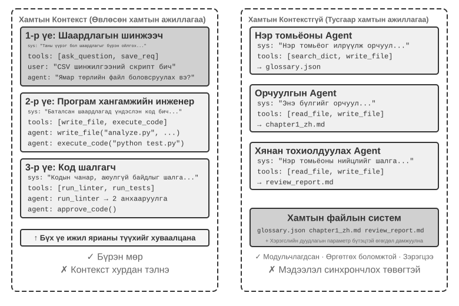

### Хэмжээ 2: Хамтын ажиллагааны топологи

Хоёр дахь хэмжээс нь хамтын ажиллагааны топологи юм: Agents хооронд хяналт болон мэдээллийн урсгалын бүтэц. Гурван ердийн топологи байдаг:

- **Үе тэнгийн хамтын ажиллагааны хэв маяг**: Цөөн тооны Agents (ихэвчлэн 2-3) нь тэнцүү харилцан үйлчилж, давталтын сайжруулалтын давталт үүсгэдэг - нэг хүн ноороглож, нөгөө нь тэмдэглэл бичиж, засварладаг шиг, хэд хэдэн удаагийн дараах чанар нь нэг хүн дангаараа хийж чадахаас хамаагүй давсан байдаг.
- **Менежерийн Хэв маяг** (Зохион байгуулалтын Хэв маяг): Төвлөрсөн менежер Agent нь даалгаврын төлөвлөлт, хуваарийг хариуцдаг бол олон дэд Agent-ууд тус бүр тодорхой дэд ажлуудыг хариуцдаг - жишээлбэл, төслийн менежер төсөл дээр хэд хэдэн мэргэшсэн инженерийг удирддаг.
- **Төвлөрсөн бус загвар**: Ажиллах үеийн төв хянагч байхгүй; Agents нь даалгаврууд дээр хамтран ажиллахын тулд хүмүүс шиг бие биетэйгээ харилцдаг.

> **Нэр томьёо: График инженерчлэл.** 2026 оны 7-р сард түгээмэл болсон "График инженерчлэл" гэсэн нэр томьёо нь өнөөгийн Agent нөхцөлд гүйцэтгэх графикийг тодорхой зохион бүтээхийг хэлдэг: зангилаа нь Agents, ердийн програмууд эсвэл хүний ​​шийдвэрүүд; ирмэгүүд нь даалгаврын хамаарал, нөхцөлт чиглүүлэлт, алдааны замыг тодорхойлдог; мөн зангилааны хоорондох бүтэцлэгдсэн төлөвийн урсгалыг тодорхойлдог. Энэ бүлэгт авч үзсэн "хамтын ажиллагааны топологи" нь уг санааны олон Agent-ын дэд хэсэг юм - үе тэнгийн хамтын ажиллагаа, менежерийн найруулга, төвлөрсөн бус дамжуулалт нь өөр өөр графын топологи юм. Энэ нэр нь шинэ хэвээр байгаа бөгөөд мэдлэгийн график, GraphRAG, гүйцэтгэх мөртэй амархан андуурагддаг тул энэ ном нь "хамтын ажиллагааны топологи" болон "найрлага" гэсэн илүү тогтвортой нэр томьёог үндсэн үгсийн сан болгон ашигласаар байна.

Загвар бүрийн нарийвчилсан загвар болон холбогдох хувилбаруудыг дараа нь тусгай дэд хэсгүүдэд авч үзэх болно.

## Олон Agent ганц Agent-ээс хэзээ үнэхээр илүү вэ?

Тодорхой хамтын ажиллагааны архитектурыг судлахаасаа өмнө илүү үндсэн асуултанд хариулъя: **Олон Agents хэзээ үнэхээр хэрэгтэй вэ, хэзээ нэг нь хангалттай вэ?** Хариулт нь дараагийн инженерийн арга барил бүрт лавлах цэг болж өгөх болно. Саяхны цуврал судалгаанууд тодорхой хүрээн дээр нэгдэж байгаа бөгөөд гол шалгуур нь ганц асуулт юм: **Хамтын ажиллагаа нь ганц Agent хариултаа гаргаж байхдаа олж авч чадаагүй мэдээллийг өгдөг үү?**

Хүснэгт 10-1 нь ямар хамтын ажиллагааны горимууд шинэ мэдээлэл оруулж байгааг харуулж, олон Agent-ын хамтын ажиллагаа нь ганц Agent дээр бодитой үнэ цэнийг санал болгож байгаа эсэхийг үнэлэхэд тусалдаг.

Хүснэгт 10-1 Олон Agent хамтын ажиллагааны горимуудын мэдээлэл олж авах харьцуулалт

| Хамтын ажиллагааны горим | Шинэ мэдээлэл нэвтрүүлэх үү? | Үр нөлөө |
|---------------------------------------|---------------------|-----------------------------------|
| Ижил Model-аар өөрийгөө хянах (өөрийн гаралтыг дахин унших) | Үгүй | Ихэвчлэн үр дүнгүй эсвэл бүр хортой |
| Ижил текстийг мэтгэлцэж буй өөр өөр Agents | Үгүй | Тэнцүү тооцоололтой ганц Agent-тэй харьцуулах боломжтой |
| Шалгагч нь кодыг хянахын тулд туршилтын гүйцэтгэлийн үр дүнг ашигладаг | Тийм (гүйцэтгэлийн санал хүсэлт) | Чухал сайжруулалт |
| Шүүмжлэгч нь нүүрэн тал/PPT кодыг хянахын тулд дэлгэцийн агшинг ашигладаг | Тийм (харааны санал хүсэлт) | Чухал сайжруулалт |
| Шүүмжлэгч баримтыг баталгаажуулахын тулд гадны хэрэгслүүдийг ашигладаг | Тийм (хэрэгслийн санал хүсэлт) | Чухал сайжруулалт |

2025 оны RLEF-ийн судалгаагаар (Гүйцэтгэлийн санал хүсэлтээс бэхжүүлэх сургалт)[^rlef-2025] Model-ыг давталтын сайжруулалтад зориулж код гүйцэтгэх санал хүсэлтийг ашиглахын тулд бэхжүүлэх сургалтаар дамжуулан сургах нь Model-ыг бие даан олон удаа түүвэрлэхээс мэдэгдэхүйц илүү үр дүнтэй болохыг тогтоожээ. Гол нь давталт бүр нь Model код бичих үед байгаагүй мэдээллийг **бодит гүйцэтгэлийн үр дүн** (эмхэтгэх алдаа, туршилтын алдаа, ажиллах үеийн үл хамаарах зүйлс)-ийг нэвтрүүлдэг. Вэб хуудас үүсгэх даалгавруудын хувьд 2025 оны WebGen-Agent судалгаагаар[^webgen-agent-2025] дэлгэцийн зургийг харааны хэлний Model-ын тайлбартай хослуулсан олон түвшний харааны санал хүсэлт нь Claude 3.5 Sonnet-ийн жишиг гүйцэтгэлийг 26.4%-иас 51.9% хүртэл сайжруулж, бараг хоёр дахин нэмэгдүүлсэн гэж мэдээлсэн.

[^rlef-2025]: Геринг, Ж., нар. *RLEF: Арматурын сургалттай гүйцэтгэлийн санал хүсэлт дэх LLMs газардуулгын код.* arXiv:2410.02089, 2025.
[^webgen-agent-2025]: Лу, З., нар. *WebGen-Agent: Олон түвшний санал хүсэлт болон шаталсан түвшний сургалтаар интерактив вэбсайт үүсгэхийг сайжруулах.* arXiv:2509.22644, 2025.

Энэхүү хүрээ нь илэрхий зөрчилдөөнийг шийдвэрлэхэд тусалдаг: зарим эрдэм шинжилгээний судалгаагаар ганц Agent хангалттай байдаг бол олон Agent-ын системүүд инженерийн практикт илүү сайн ажилладаг болохыг тогтоожээ. Судалгаагаар мэтгэлцээний нэгэн адил ижил текстийг шалгаж, хэлэлцдэг олон Agents-ийг ихэвчлэн туршиж үздэг бол үр дүнтэй инженерийн системүүд нь кодын гүйцэтгэл, харааны дүрслэл эсвэл хэрэгслүүдээс гадны санал хүсэлтийг ихэвчлэн нэмдэг. Зөвхөн сүүлийнх нь л шинэ мэдээлэл оруулдаг. Дараа нь хэлэлцсэн гурван архитектурын бараг бүх үр дүнтэй хэрэглээг - үе тэнгийн хамтын ажиллагаа, найрал хөгжим, төвлөрлийг сааруулах зэргийг энэ шалгуураар ойлгож болно.

Anthropic-ийн 2026 оны эмзэг байдлыг илрүүлэх туршилт нь нэг жишээ юм. Дөчин таван Agents нь хайлтаа хуваалцсан форумаар дамжуулан зохицуулж, бие биенийхээ олдворыг хянаж, үр дүнг тусдаа арбитр Agent-д ирүүлсэн. Зохицуулалттай сүрэг 27 сая Token ашиглан 266 эмзэг байдлыг олсон бол бие даасан зэрэгцээ Agents нь 6.5 сая Token ашиглан ердөө 21 эмзэг байдлыг олсон. Нээлттэй хайлтын орон зайд харилцаа холбоо нь олон Agent-ын системд анхаарлаа динамикаар шилжүүлж, мэргэшлийг хөгжүүлэх, илүү өргөн хүрээтэй хамрах хүрээ, илүү олон төрлийн нээлтийн замуудын төлөө илүү том Token төсвийг арилжаалах боломжийг олгодог.[^anthropic-multiagent-2026]

[^anthropic-multiagent-2026]: Anthropic Frontier Red баг, “Шинээр гарч ирж буй олон агент Систем-ийн хэв маяг ба асуудлууд,” 2026-08-13. https://www.anthropic.com/research/multiagent-systems

**Алхам төсөв ба Agent гүйцэтгэл.** Холбогдох асуулт бол Agent-ийн алхам төсөв буюу ашиглаж болох хэрэгслийн дуудлага эсвэл давталтын тойргийн тоо нь гүйцэтгэлд хэрхэн нөлөөлдөг вэ гэдэг юм. Илүү олон алхам тустай мэт санагдаж магадгүй: 30 алхамтай бол Agent нь зөвхөн үндсэн функцийг хэрэгжүүлэхэд цаг хугацаатай байж болох бол 300 алхам нь төлөвлөх, хэрэгжүүлэх, турших, сайжруулах боломжийг олгодог. Гэсэн хэдий ч 2025 оны Google-ийн *Төсөвт анхаарал хандуулах Tool-ийн хэрэглээ нь үр дүнтэй Agent масштабыг идэвхжүүлдэг* гэсэн баримт бичигт сөрөг дүгнэлтэд хүрсэн байна: **Agent-д илүү олон алхам өгөх нь илүү сайн гүйцэтгэлийг баталгаажуулдаггүй.** Стандарт Agents нь "төсвийн мэдлэг" дутагдалтай байдаг; 300 алхамтай ч гэсэн тэд гүехэн хайлт хийж, хурдан өндөр түвшинд хүрэх хандлагатай байдаг. Нэмэлт алхмуудыг үр дүнтэй ашиглахын тулд Agents нь стратегиа үлдсэн нөөцөд тохируулан эхлээд өргөн хүрээтэй судалж, дараа нь анхаарлаа төвлөрүүлдэг механизм хэрэгтэй. 2026 оны BAVT (Төсвийн мэдлэгтэй үнэ цэнийн модны хайлт) арга нь хайгуул болон ашиглалтын тэнцвэрийг үлдсэн төсвийн эзлэх хувь хэмжээгээр тохируулан шаталсан түвшний үнэ цэнийн үнэлгээг нэвтрүүлсэн. Төсөв буурах тусам Agent нь өргөн хүрээтэй хайгуулаас илүү гүнзгий судалгаа руу шилждэг.

Эдгээр олдворууд нь олон Agent-ын системийн дизайнд шууд нөлөө үзүүлдэг. Жишээлбэл, найрал хөгжмийн хэв маягт менежер Agent нь даалгавруудыг дэд Agent-уудад зүгээр л хуваарилж, үр дүнг хүлээх ёсгүй. Үүний оронд энэ нь даалгаврын нарийн төвөгтэй байдалд үндэслэн **алхам төсвийг динамикаар хуваарилах** ёстой - энгийн дэд даалгаврууд цөөн алхам авдаг; нарийн төвөгтэй дэд даалгаврууд хангалттай алхам авдаг. Энэ нь мөн дэд Agent-уудад шууд шумбахын оронд эдгээр төсвийг ухаалгаар ашиглахыг (эхлээд төлөвлөх, дараа нь хэрэгжүүлэх, дараа нь турших, дараа нь сайжруулах) чиглүүлэх ёстой.

Аливаа дизайны шийдвэр гаргахаас өмнө өөр нэг зүйлийг анхаарч үзэх хэрэгтэй: **өртөг.** Зэрэгцээ судалгаа болон давталтын сайжруулалт нь мөнгө шаарддаг - Anthropic нь олон Agent-ын судалгааны систем нь ердийн ярианаас 15 дахин их жетон хэрэглэдэг бөгөөд зөвхөн жетон ашиглах нь гүйцэтгэлийн зөрүүний 80 орчим хувийг тайлбарладаг болохыг мэдэгдэв. Тиймээс олон Agent-ын системээс гарах ашиг нь хэд дахин, эсвэл бүр хэд дахин өндөр байж болох зардлыг зөвтгөхөд хангалттай их байх ёстой; эс тэгвээс сайн тохируулсан ганц Agent нь ихэвчлэн илүү сайн тохиролцоонд хүрдэг.

## Олон Agent Хуваалцсан Context-тэй хамтран ажиллах

Хуваалцсан Context бүхий олон Agent-ын хамтын ажиллагааны үед үе шат бүр нь бие даасан Agent (өөрийн системийн заавар болон хэрэгслийн багцтай) боловч өмнөх Agent-ийн бүрэн замыг өвлөн авдаг - яг л ээлжийг авч буй хамт ажиллагсад өмнөх үеийнхээ үлдээсэн ажлын бүртгэл бүрийг гүйлгэн үзэж чаддагтай адил юм. Энэхүү өв залгамжлалд суурилсан хамтын ажиллагааны гол давуу тал нь мэдээллийн алдагдал тэг байдаг: Agent бүр өмнөх аль ч шатны дэлгэрэнгүй мэдээллийг хянаж чаддаг. Сорилт нь одоогийн Agent-ийг өвлөгдсөн түүхийн массад сатаарахын оронд өөрийн үүрэг хариуцлагадаа анхаарлаа төвлөрүүлэхэд оршино.

Нарийн төвөгтэй ажлуудад Agent-ийн үүрэг, хариуцлага үе шат бүрт мэдэгдэхүйц өөрчлөгдөж болно. Хэрэв системийн ганц статик зааврыг бүхэлд нь ашиглавал энэ нь хэт ерөнхий байх эсвэл зааврын төвөгтэй цуглуулга болж хувирна. Олон үе шаттай үүрэг солих нь системийн заавар болон хэрэгслийн багцыг одоогийн үе шатны дагуу өөрчилж, Agent-ийг хамгийн тохиромжтой үүрэгт ажиллах боломжийг олгодог.

Архитектурын гол сонголт нь үүргийн удирдамжийг орлуулах системийн хүсэлтээр эсвэл ачаалагдсан Skill-ээр авч явах эсэх юм. Эхнийх нь хатуу хэрэгслийн хил хязгаарыг хэрэгжүүлж болох боловч сэлгэлт бүрт хүсэлтийн угтварыг өөрчилдөг. Сүүлийнх нь статик угтварыг тогтвортой байлгаж, `SKILL.md`-г замд нэмдэг бөгөөд энэ нь ихэвчлэн KV/хүсэлтийг кэшлэхэд илүү тохиромжтой байдаг; Skill нь зан үйлийн удирдамж хэвээр байгаа тул мэдрэмтгий эсвэл гаж нөлөөтэй хэрэгслүүд нь кодоор албадсан Harness бодлогын хаалга шаарддаг хэвээр байна.

| Сонголт | Дүрийн удирдамж | Tool харагдах байдал | Context/KV-кэш эффект | Хязгаарлалтын хүч |
|---|---|---|---|---|
| `transfer_to_agent` | Системийн зааврыг болон ихэвчлэн хэрэгслийн багцыг солих | Зөвхөн одоогийн үүргийн хэрэгслүүд | Шилжүүлэгч бүр хүсэлтийн угтварыг өөрчилж, тухайн цэгээс кэшийг хүчингүй болгодог | Хүчтэй: хамрах хүрээнээс гадуурх хэрэгслүүд схемд байхгүй байж болно |
| Ур чадвар | Ур чадварын лавлахыг тогтмол мөрөнд хадгалж, хүсэлтээр `SKILL.md` нэмэх | Ихэвчлэн бүтэн каталог эсвэл тогтвортой хайлтын оролтын цэг | Статик угтвар тогтвортой хэвээр байна; Ур чадварын текстийг замд нэмнэ | Сул тал: Ур чадвар бол зааварчилгаа болохоос зөвшөөрлийн хил хязгаар биш |

Үүргийн ялгаа нь голчлон мэдлэг, журам, бичих хэв маягаас үүдэлтэй бол ур чадварыг илүүд үзнэ үү; зөвшөөрөл, хэрэгслийн тусгаарлалт, нийцлийн хил хязгаар, эсвэл ажиллах үед хориглох ёстой үйлдлийн ангилалтай холбоотой бол бие даасан Agent эсвэл `transfer_to_agent` хэрэгслийг ашиглаж, хэрэгслийн дуудлагыг Harness давхарга дахь кодоор хязгаарлана уу.

> **Туршилт 10-1 ★★: Хуваалцсан Context-ийн үүрэг солих—системийн мөр ба ур чадвар**
>
> Хоёр зам хоёулаа ижил Model, даалгавар, хэрэгсэл, дүрийн удирдамж болон бүрэн хуваалцсан чиглэлийг ашигладаг. Даалгавар нь Хятадын 2021-2023 оны шинэ эрчим хүчний тээврийн хэрэгслийн борлуулалтыг олох, CAGR-ийг тооцоолох, 120 тэмдэгтээс хэтрэхгүй Хятадын хөрөнгө оруулагчийн хураангуйг бичих явдал юм.
>
> **1-р зам: системийн хүлээх мөрийг солих.** Таван үүрэг—`triage`, `research`, `coding`, `data_analysis` болон `writing`—тус бүр нь зөвхөн өөрийн зориулалтын хэрэгслүүд болон `transfer_to_agent`-г ил гаргадаг. Хүргэлт нь түүхийг хадгалж, зорилтот хүлээх мөр болон хэрэгслийн багцыг ачаалж, гүйцэтгэлийг үргэлжлүүлдэг.
>
> **Зам 2: Ур чадвар.** Системийн хүлээх мөр болон хэрэгслийн бүрэн каталог тогтмол хэвээр байна. Model нь `load_skill(name)`-г дуудаж, хуваалцсан замнал дахь хэрэгслийн үр дүнтэй ижил үүргийн баримт бичгийг хүлээн авна. Статик угтвар өөрчлөгдөөгүй хэвээр байгаа боловч хатуу зөвшөөрлүүдийг Harness дүрмээр хэрэгжүүлдэг.
>
> Хоёр зам нь ижил сэргээх, тооцоолох, уртын шалгалтыг гүйцэтгэх ёстой. Эдгээр нь үүргийн удирдамжийн тээвэрлэгч болон үүнээс үүдэлтэй багажны хил хязгаараараа ялгаатай; зөвхөн утааны ул мөр нь аль зам нь илүү болохыг тогтоож чадахгүй.

## Олон Agent Хуваалцсан Context-гүйгээр хамтын ажиллагаа

Хуваалцсан Context-гүй архитектурт Agent бүр өөрийн гэсэн Context, замнал, төлөвтэй бие даасан нэгж болж ажилладаг. Agents нь бие биенийхээ дотоод Context-эд шууд хандаж чадахгүй; хамтын ажиллагаа нь энэ бүлгийн эхэнд танилцуулсан гурван харилцаа холбооны механизмаар дамжуулан тодорхой, бүтэцлэгдсэн өгөгдөл дамжуулахад бүрэн тулгуурладаг: хэрэгслийн дуудлагын параметрүүд, хуваалцсан файлын систем, мессежийн автобус.

Энэ бүлгийн эхэнд бид Agents-ийн хоорондох харилцаа холбоог процесс хоорондын харилцаа холбоотой харьцуулсан. Бид энэ аналогийг системийн бусад хэсгүүдэд өргөжүүлж болно (Хүснэгт 10-2):

Хүснэгт 10-2 Олон Agent Систем болон ажиллаж байгаа Систем-ийн хоорондох харилцаа холбоо

| Ажиллаж буй Систем | Олон Agent Систем |
|----------|----------------|
| Програм (гүйцэтгэх боломжтой файл) | Статик угтвар (системийн мөр + хэрэгслийн тодорхойлолт) |
| Процессийн санах ой | Замын хөдөлгөөн |
| CPU | LLM |
| Цөм | Agent ажиллах хугацаа |
| Систем дуудлага | Tool дуудлага |
| сэрээ (хүүхэд процесс үүсгэх) | spawn_subagent |
| алах (дохио илгээх) | цуцлах_дэд агент |
| ps (жагсаалтын процессууд) | жагсаалтын_агентууд |
| Гарах код болон wait() | Дэд Agent-ын буцаасан бүтэцлэгдсэн хураангуй |
| Хуваалцсан санах ой / мессеж дамжуулах | Хуваалцсан файлын систем / мессеж дамжуулах |

Энэхүү хийсвэрлэл нь шинэ зүйл биш юм: хувийн төлөв, асинхрон мессежүүд болон шинэ гишүүд үүсгэх чадвар нь 1970-аад оны Актер Model-ын [^актер-модель] үндсэн тохиргоо юм. Тиймээс олон Agent системийг Актер Model-ын LLM дээр суурилсан хувилбар гэж үзэж болох бөгөөд үйлдлийн систем болон тархсан системээс хуримтлагдсан мэдлэгийн ихэнх нь шууд хэрэгждэг.

[^жүжигчин-Model]: Хьюитт, К., Бишоп, П., Стайгер, Р. *Хиймэл оюун ухаан-д зориулсан бүх нийтийн модульчлагдсан ЖҮЖИГЧИЙН Формализм.* IJCAI 1973.

Энэхүү процесс маягийн тусгаарлалт нь хэд хэдэн практик инженерчлэлийн ашиг тусыг авчирдаг: Agent бүрийг бие даан боловсруулж, туршиж үзэх, одоо байгаа кодонд хүрэхгүйгээр шинэ боломжуудыг нэмж оруулах, мөн олон Agents нь хуваалцсан Context-ийн талаар маргаангүйгээр нэгэн зэрэг ажиллах боломжтой.

Гэсэн хэдий ч Context-ийг хуваалцахгүй байх нь бас зардалтай байдаг. Хамгийн тодорхой нь мэдээллийн синхрончлолын асуудал юм: Agents нь даалгаврын төлөвийн талаарх тогтвортой ойлголтыг хэрхэн хадгалдаг вэ? Шилжүүлгийн явцад мэдээлэл алдагдах эсвэл давхардах уу? Алдаа засах нь бас илүү хэцүү болдог - асуудал үүссэн үед гүйцэтгэлийн бүрэн процессыг нэгтгэхийн тулд олон Agents-ээс ирсэн логуудыг хянаж үзэх шаардлагатай болдог. Эдгээр асуудлууд нь интерфэйсийн үзүүлэлт, өгөгдлийн формат, харилцаа холбооны протоколын дизайныг маш чухал болгодог.

Хамтран ашиглах Context-гүйгээр тодорхой хамтын ажиллагаа нь хоёр топологиос хамааралгүй дэд бүтцэд тулгуурладаг. Эхнийх нь **хамтран ашиглах файлын систем** бөгөөд Agents нь бие биетэйгээ болон хэрэглэгчтэй эд зүйлс солилцож, хамтын ажиллагааны өгөгдлийн хавтгайг бүрдүүлдэг байнгын орчин юм. Хоёр дахь нь **харилцаа холбоо ба хяналтын механизм** бөгөөд энэ нь Agents-ийн хооронд мессеж дамжуулах, төлөвийн лавлагаа, гүйцэтгэлийг зогсоох, нөөцийн хуваарийг дэмждэг бөгөөд хамтын ажиллагааны хяналтын хавтгайг бүрдүүлдэг. Доорх гурван топологи нь бүгд эдгээр хоёр суурь дээр суурилдаг.

### Систем файлыг Agent-ийн үүднээс авч үзэх нь

Энэ бүлгийн эхэнд "хуваалцсан файлын систем"-ийг хуваалцсан Context-гүй архитектурын гурван харилцааны механизмын нэг гэж жагсаасан болно. Бодит системд Agent-ийн ханддаг файлын систем нь ганц хадгалах систем биш, харин өөр өөр эх сурвалж, амьдралын мөчлөг, зөвшөөрөлтэй хадгалах системүүд нэг сангийн модны доор холбогдсон **виртуал файлын систем** юм. Agent нь тэдгээрт нэгдсэн `read_file`/`write_file`/`list_dir` интерфэйсээр дамжуулан ханддаг бол үндсэн давхаргууд нь орон нутгийн түр зуурын диск, байнгын объектын хадгалалт, гуравдагч талын үүлэн хөтөч APIs эсвэл зөвхөн унших системийн нөөцийн багцууд байж болно. Энэхүү сангийн модны бүрэлдэхүүнийг тодорхой тодорхойлох нь - хэсэг бүрийн харагдах байдал болон амьдралын мөчлөг - нь олон Agent-ын хамтын ажиллагааг зохион бүтээх урьдчилсан нөхцөл юм: зэрэгцээ зөрчилдөөн болон мэдээллийн алдагдлын нэлээд хэсэг нь тусгаарлагдах ёстой хэсгүүдийг холихоос үүдэлтэй байдаг. Энэ сангийн мод нь Agent-ийн хаягийн орон зайг бүрдүүлдэг бөгөөд дөрвөн төрлийн хэсэг нь өөр өөр зөвшөөрөлтэй санах ойн сегментүүд юм: зарим нь хувийн бөгөөд бичих боломжтой, зарим нь олон талуудын хооронд хуваалцдаг, зарим нь зөвхөн унших боломжтой. Үйлдлийн системийн хамгаалалтын философи энд бас хамаарна: анхдагчаар тусгаарлаж, тодорхой хуваалцахыг зарлана.

Төлөвшсөн олон Agent-ын систем нь файлын системээ ихэвчлэн дөрвөн төрлийн хадгалах хэсэгт зохион байгуулдаг:

**I. Agent-д зориулсан ажлын талбар (Scratchpad)**. Agent инстанс бүрт хамаарах хувийн сан бөгөөд завсрын эд өлгийн зүйлс, түр зуурын файлууд, ноорог болон дибаг хийх бүртгэлүүдийг хадгалдаг. Үүний амьдралын мөчлөг нь инстанстай холбоотой бөгөөд бусад Agents болон хэрэглэгчдэд харагдахгүй. Scratchpad-ийг тусгаарлах нь хоёр зорилгод үйлчилдэг: олон Agents-ийн түр зуурын файлууд бие биенээ дарж бичихээс урьдчилан сэргийлэх, мөн үндсэн Agent-ийн Context-ийг тогтвортой байлгах - дэд Agent-уудын туршилт ба алдааны процесс нь өөрсдийн ажлын талбарт үлдэж, зөвхөн эцсийн эд өлгийн зүйлсийг хуваалцсан орон зайд илгээдэг. Энэ нь дэд Agent-ууд бүрэн чиглэлийн оронд бүтэцлэгдсэн хураангуйг буцаадаг гэсэн Бүлэг 4-ийн зарчмын хадгалах түвшний аналог юм.

**II. Олон Agent Хуваалцсан Ажлын Талбай**. Олон Agents уншиж, бичиж чаддаг, хэрэглэгчдэд **харагддаг** хамтын ажиллагааны талбар. Энэ нь хуваалцсан Context-гүй архитектурт Agents-ийн хооронд эд өлгийн зүйлс солилцох үндсэн хэрэгсэл юм: Нэр томьёоны тайлбар Agent нь нэр томьёоны жагсаалтыг бичдэг бөгөөд Орчуулга Agent нь үүнээс уншдаг; хэрэглэгчид мөн эх файлуудыг байршуулж, эцсийн үр дүнг эндээс татаж авах боломжтой. Үүний амьдралын мөчлөг нь бүхэл бүтэн даалгавартай холбоотой бөгөөд тууштай байдлыг шаарддаг. Олон талуудын нэгэн зэрэг уншиж, бичих талбар болохын хувьд энэ нь зэрэгцээ зөрчилдөөний халуун цэг юм - энэ бүлгийн сүүл хэсэгт "Алдаа гарах нэгдүгээр горим" хэсэгт дэлгэрэнгүй тайлбарласанчлан оптимистик түгжих болон ажлын модыг тусгаарлах зэрэг механизмууд энд ажилладаг. Бүлэг 4 нь `/workspace/shared` дээр эзлэхүүний холболтыг ашиглан үндсэн Agent, виртуал компьютер, виртуал утсыг холбох нь энэ давхаргын ердийн хэрэгжилт юм.

**III. Суулгасан гадаад нөөцүүд.** Хэрэглэгчийн зөвшөөрсөн гуравдагч талын мэдээллийн эх сурвалжууд болох Google Drive, Notion, Dropbox, байгууллагын вики гэх мэтийг файлын систем дэх холболтын цэгүүд (жишээ нь, `/mnt/gdrive`) руу адаптеруудаар дамжуулан холбодог. Agent нь файлыг уншиж Notion баримт бичигт ханддаг; үндсэн адаптер нь харгалзах API-г дууддаг. Энэ давхаргыг орон нутгийн хадгалалтаас ялгаж буй гурван шинж чанар бөгөөд дизайны явцад тодорхой зохицуулагдах ёстой: **хандалт нь гадаад зөвшөөрлөөр хязгаарлагддаг** (эх системийн хэрэглэгчийн зөвшөөрөл нь Agent-ийн харагдах байдлыг тодорхойлдог), **хоцрогдол нь өндөр, тогтвортой байдал нь сул** (унших бүр нь сүлжээний тойрог аяллыг хамардаг бөгөөд гадаад өөрчлөлтүүд шууд харагдахгүй байж болох тул өгөгдлийг эцэст нь тогтвортой гэж үзэх хэрэгтэй), мөн **хандалт нь голчлон хүсэлтийн дагуу болон зөвхөн унших боломжтой** (гадаад эх сурвалж руу буцааж бичихдээ болгоомжтой хийх хэрэгтэй, учир нь алдаатай бичвэрүүд нь хэрэглэгчийн бодит өгөгдлийг бохирдуулж болзошгүй). Нэгдсэн файлын интерфэйс нь Agent нь өгөгдлийн эх үүсвэр бүрт зориулсан тусгай хэрэгсэл шаардлагагүй гэсэн үг боловч эдгээр гүйцэтгэл болон аюулгүй байдлын ялгааг далдалдаг. Тиймээс зөвхөн унших/бичих боломжтой төлөв, хугацаа дуусах болон итгэмжлэлийн хил хязгаарыг холболтын түвшинд тодорхой удирдах ёстой.

**IV. Суурилуулсан Систем Нөөцүүд.** Системээс урьдчилан суулгасан бөгөөд бүх Agents-тэй зөвхөн унших боломжтой хуваалцсан нөөцийн багц. Ердийн жишээ бол Бүлэг 2 ба 4-т танилцуулсан **Ур чадварууд** юм - мэдлэгийн баримт бичиг, скриптүүд файл хэлбэрээр зохион байгуулагдсан, `/skills` гэх мэт замууд дээр суурилуулсан, дэвшилтэт задлах замаар ханддаг (эхлээд индексжүүлж, дараа нь хүсэлтээр өргөтгөх). Бусад жишээнд лавлах гарын авлага, загварын сан, хуваалцсан хэрэгслийн тодорхойлолтууд орно. Энэ давхарга нь дэлхий даяар хуваалцсан, зөвхөн унших боломжтой, сессүүдийн хооронд тогтвортой бөгөөд бүх Agents нь зэрэгцээ хяналтгүйгээр нэгэн зэрэг унших боломжтой.

Зураг 10-2 нь эдгээр дөрвөн төрлийн бүсийг нэг сангийн модны доор хэрхэн жигд холбож байгааг харуулж байна: Agent нь нэгдсэн интерфэйсээр дамжуулан бүхэл мод руу ханддаг, хэрэглэгчид хуваалцсан орон зайгаас файл байршуулж, татаж авдаг, гадаад өгөгдлийн эх үүсвэрүүдийг адаптераар дамжуулан холбодог бөгөөд суулгасан системийн нөөцийг зөвхөн унших хэлбэрээр хангадаг.

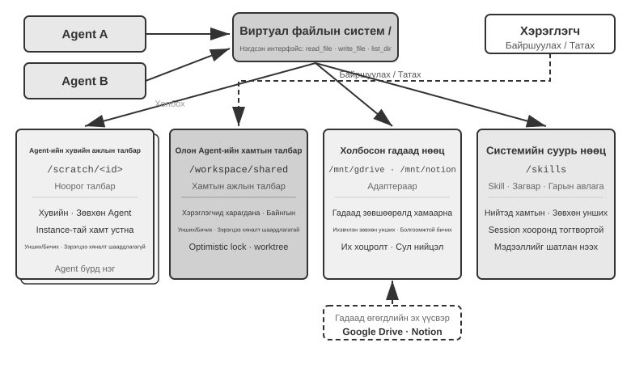

Хүснэгт 10-3 нь файлын системийн зохион байгуулалтын дизайны шалгах хуудас болгон ашигладаг эдгээр дөрвөн талбайн төрлийг харагдац, амьдралын мөчлөг, унших/бичих зөвшөөрөл, зэрэгцээ хяналт гэсэн дөрвөн хэмжээсээр харьцуулдаг.

Хүснэгт 10-3 Agent виртуал файлын Систем-ийн дөрвөн төрлийн төрөл

| Талбай | Харагдах байдал | Амьдралын мөчлөг | Унших/Бичих | Зэрэгцээ хяналт |
|--------------|-----------------|------------------------|---------------------|-------------------|
| Agent-д зориулсан ажлын талбар | Зөвхөн эзэмшдэг Agent | Agent инстансаар устгагдсан | Унших/Бичих | Шаардлагагүй (хувийн) |
| Олон Agent Хуваалцсан Ажлын Талбай | Хамтран ажиллаж буй бүх Agents болон хэрэглэгч | Даалгаврын хугацаанд үргэлжилнэ | Унших/Бичих | Шаардлагатай (өөдрөг түгжээ / ажлын мод) |
| Суурилуулсан гадаад нөөц | Гадны эрхээс хамаарна | Гадны эх сурвалжаас тодорхойлогдоно | Ихэвчлэн зөвхөн унших зориулалттай тул бичихдээ болгоомжтой байхыг шаарддаг | Гадны эх сурвалжаас удирддаг |
| Суурилуулсан Систем нөөцүүд | Бүх Agents | Сеансуудад тогтвортой | Зөвхөн унших | Шаардлагагүй (зөвхөн унших) |

**"Файлын зам нь бүх нийтийн интерфэйс"**-ийн утга нь замыг солилцооны нэгж гэж үзэхэд оршино. Agents солилцооны эд өлгийн зүйлс, гол Agent нь оролтыг дэд Agent руу дамжуулдаг эсвэл байгууллагууд A2A-аар дамжуулан хамтран ажилладаг эсэхээс үл хамааран тэд файлын агуулгыг Context цонхонд ачаалахын оронд хөнгөн замын мөрийг дамжуулдаг (Бүлэг 4). Энэ нь Бүлэг 5-ын "файлын систем нь Agent-ийн төв" гэсэн ойлголттой нийцдэг бөгөөд энэ нь ганц Agent нь санах ой болон чадавхийг байршуулахын тулд файлын системийг хэрхэн ашигладаг болохыг тайлбарладаг. Энд ижил хийсвэрлэл нь олон Agents-д хамаарна: виртуал лавлах мод суурилуулсан хувийн, хуваалцсан, гадаад болон суурилагдсан хадгалалт нь олон Agent-ын хамтын ажиллагааны хадгалах суурийг өгдөг.

### Agents хоорондох харилцаа холбоо ба хяналт

Файлын систем нь Agents-ийн хоорондох **артефакт солилцооны** асуудлыг шийддэг ч хамтын ажиллагаа нь **хяналтын хавтгай**-г шаарддаг. Энэ нь Хүснэгт 10-2-ын амьдралын мөчлөгийн мөрүүд яг энд хэрэгждэг: Бүлэг 4-т өгөгдсөн хэрэгслийн командууд - үүсгэх (`spawn_subagent`), мессеж илгээх (`send_message_to_subagent`), цуцлах (`cancel_subagent`), илрүүлэх (`list_agents`) - нь процессын ертөнцөд fork, message, kill, болон ps-тэй тохирч байна. Энэ хэсэгт интерфэйсийн тодорхойлолтыг давтахгүй боловч олон Agent-ын хамтын ажиллагаанд зайлшгүй шаардлагатай ихэвчлэн орхигддог дөрвөн боломжид анхаарлаа хандуулдаг.

**I. Зурвас дамжуулах.** Хамгийн энгийн хэлбэр нь цэгээс цэг рүү: Agent A нь `send_message_to_agent_b(content)`-г шууд дууддаг. Энэ нь тогтмол топологи болон цөөн тооны Agents (жишээлбэл, энэ бүлгийн 10-3-р туршилтын утас + компьютерийн хос Agent-ын тохиргоо) бүхий хувилбаруудад тохиромжтой. Agents-ийн тоо нэмэгдэж, асинхрон параллелизм шаардлагатай үед цэгээс цэг рүү холболтын тоо Agents-ийн тоотой хамт квадратаар өсдөг бөгөөд илгээгч болон хүлээн авагч хоёулаа нэгэн зэрэг онлайн байх ёстой. Ийм тохиолдолд **зурвасын автобус** ашиглах хэрэгтэй (энэ бүлгийн дараа "Зэрэгцээ зохицуулалтын хэв маяг" хэсэгт дэлгэрэнгүй тайлбарласан болно): Agents нь зурвасуудыг автобус руу нийтэлдэг бөгөөд энэ нь захиалгын үндсэн дээр дамжуулдаг тул илгээгч нь захиалагчдыг мэдэх шаардлагагүй. Цэгээс цэгт эсвэл автобусаар дамжуулж байгаа эсэхээс үл хамааран мессежүүд нь ерөнхийдөө бүтэцлэгдсэн **дугтуй** агуулсан байх ёстой: илгээгчийн ID, зорилтот хэсэг (тодорхой Agent эсвэл цацалт), мессежийн төрөл (жишээ нь, `task_assigned`/`status_update`/`result`/`terminate`) болон JSON ачаалал. Нэгдсэн дугтуйны формат нь хүлээн авагчийн найдвартай чиглүүлэлт болон задлан шинжлэх ажиллагааг хангаж, хамтын ажиллагааны гинжин хэлхээг мөрдөх боломжтой болгодог бөгөөд энэ нь олон Agent-ын системийг дибаг хийх гол тал юм.

**II. Төлөвийн асуулга.** Энэ бол хяналтын хавтгайн хамгийн дутуу үнэлэгдсэн хэсэг юм. Үндсэн Agent нь дэд Agent илгээсний дараа дэд Agent-ын явцыг харах шаардлагатай болдог; эс тэгвээс дэд Agent гацсан үед хүлээх эсвэл оролцох эсэхээ шийдэж чадахгүй. Зөн совингийн арга бол RPC-ээс зээлж аваад "ажиллаж байна/дууссан/амжилтгүй болсон" гэсэн хариуг болон явцын хувийг буцаадаг `get_subagent_status(agent_id)` асуулга интерфэйсийг тодорхойлох явдал юм. Гэхдээ ийм татах интерфэйс нь хүлээгдэж байснаас хамаагүй бага ашиг тустай байдаг: дэд Agent үүсгэгдсэн мөчөөсөө эхлэн гүйцэтгэж эхэлж, дуусах эсвэл ажиллахаа болих хүртэл ажилладаг. Энэ нь уламжлалт багц систем дэх ажлуудын адил дарааллын төлөвүүдийн цувралаар дамжин өнгөрдөггүй, яг л Unix програмчлал нь ажиллаж байгаа төлөвийн талаар PID-ээр нь өөр процессыг асуух шаардлагагүй байдагтай адил. Санал асуулга нь мөн төрөлхийн дилемматай байдаг: хэт олон удаа санал асуулга хийхэд та Token-уудыг үрдэг; хэт ховор тохиолдолд санал асуулга хийхэд та хоцорч хариу үйлдэл үзүүлдэг. Статус авах илүү байгалийн арга бол энэ бүлгийн эхэнд танилцуулсан хоёр харилцаа холбооны парадигм руу буцах явдал юм.

**Мессеж дамжуулснаар статус авах.** Үндсэн Agent нь дэд Agent-ад "Хэрхэн байна?" гэсэн мессеж илгээдэг. Дэд Agent тохиромжтой мөчид хариу өгдөг. Бүх зүйл асинхрон байдаг: мессеж илгээх нь үндсэн Agent-ийн өөрийн гүйцэтгэлийг хаахгүй бөгөөд менежер нь харьяа ажилтнаас бүх зүйлийг шууд хаяхыг шаардахгүйгээр шуурхай мессежээр ахиц дэвшил гаргахыг хүсдэгтэй адил нөгөө тал нь хэзээ, эсвэл хариу өгөх эсэх нь тусдаа асуудал юм. Үүний эсрэгээр, дэд Agent нь тодорхой үе шатанд хүрэхэд мэдээлэх мессежийг урьдчилан илгээж болно; хэрэв систем аль хэдийн мессежийн автобустай бол энэ нь зүгээр л `status_update`-г автобусанд нийтлэх явдал юм (10-4-р туршилтын "бодит цагийн хяналт" нь энэ маягт юм). Статусыг тодорхой хүссэн эсвэл урьдчилан мэдээлсэн эсэхээс үл хамааран мессежэнд агуулагдаж буй статус нь нэгдсэн төлөв-машины үгсийн санг (гүйцэтгэж байна, оруулах шаардлагатай, дууссан, бүтэлгүйтсэн) ашиглах ёстой - энэ бүлгийн сүүл хэсэгт байрлах A2A протокол нь даалгаврын амьдралын мөчлөгийг яг ийм төлөвүүдийн багц болгон стандартчилдаг.

**Хуваалцсан файлын системээр дамжуулан статус авах.** Хамгийн дэлгэрэнгүй хэлбэр нь **траекторын тогтвортой байдал** юм: гүйцэтгэх явцад дэд Agent нь траекторын үйл явдал бүрийг JSON руу цуваачилж, файлын системийн бүртгэлийн файлд хавсаргадаг - ихэвчлэн сесс бүрт нэг файл, мөр бүрт нэг үйл явдал, өөрөөр хэлбэл JSONL. Бүлэг 1-д тодорхойлсон траектор нь хэрэглэгчийн мессеж, Model-ын хариулт, хэрэгслийн дуудлага, үр дүнгийн бүрэн дараалал юм. Үндсэн Agent нь статусын тайлангийн протокол шаарддаггүй; энэ файлыг шууд уншсанаар дэд Agent-ын бүх гүйцэтгэлийг шалгаж болно: аль хэрэгслийг дуудаж байгаа, хамгийн сүүлийн алхамд нь юу болсон, давтан бүтэлгүйтсэн оролдлогын давталтад гацсан эсэхийг. Процессын хувьд энэ нь өөр процессын санах ойг шууд уншихтай адил юм. Энэ нь дэд Agent-ын Context-ийг эзэлдэггүй, түүний хамтын ажиллагаанаас хамаардаггүй бөгөөд хамгийн сайн ажиглалтын нарийн нягтралыг санал болгодог.

Гэхдээ замын тогтвортой байдал нь Agents-ийн хооронд мэдээлэл дамжуулах гол суваг байх ёсгүй. Зам нь хэдэн арван мянган Token руу амархан хүрдэг бөгөөд гол Agent нь уншсаны дараа үүнийг нэрэх шаардлагатай хэвээр байгаа нь цаг хугацаа болон Token-уудын аль алинд нь үнэтэй байдаг. Ихэнх тохиолдолд илүү ухаалаг сонголт бол **ажлын явцын файл дээр тохиролцох** явдал юм: дэд Agent-ыг эхлүүлэх үед гол Agent нь "ажлын явцаа progress.md файлд бичих"-ийг шаарддаг бөгөөд дэд Agent нь зүйл бүрийг дуусгахдаа тухайн даалгаврын жагсаалтыг шинэчилдэг бөгөөд гол Agent нь энэ хөнгөн файлыг хүссэн үедээ уншиж, зүйлс хэрхэн байгааг харах боломжтой. Энэ нь хуваалцсан санах ойд жижиг, тохиролцсон форматын төлөвийн бүсийг сийлсэн хоёр процесстой тэнцүү юм: ил гарсан зүйл бол нэрсэн явц болохоос санах ойн бүхэл бүтэн хэсэг биш юм. Прогрессийн файл нь **гацсан илрүүлэлтийг** идэвхжүүлдэг: хэрэв `progress.md`-ийн хамгийн сүүлд өөрчлөгдсөн хугацаа (эсвэл замын файл) N минутаас илүү хугацаанд өөрчлөгдөөгүй бол дэд Agent идэвхгүй гэж тооцогдож, хугацаа дуусах нөөцлөлтийг идэвхжүүлж болох тул хаагдсан дэд Agent системийг доош нь чирэхгүй.

**III. Гүйцэтгэлийг дуусгавар болгох.** Зэрэгцээ хамтын ажиллагааны үед нийтлэг тохиолдол бол "нэг нь амжилттай, үлдсэн нь хамааралгүй болно" юм - олон Agents хайлтыг тусад нь хийх бөгөөд нэг нь зорилтот хэсгийг олсны дараа бусад нь нэн даруй зогсоох ёстой (энэ бүлгийн 10-4-р туршилтын каскадын төгсгөл). Төгсгөлийн хоёр түвшин байдаг бөгөөд Unix хэрэглэгчид тэдгээрийг SIGTERM болон SIGKILL-ийн ялгаа гэж таних болно. **Гацэцэг төгсгөл** нь илүү тохиромжтой: үндсэн Agent нь `terminate` дохиог илгээдэг, дэд Agent нь одоогийн алхамдаа аюулгүй цэг дээр хариу үйлдэл үзүүлдэг, нөөцийг цэвэрлэдэг (хөтчийн сессийг хаадаг, хүлээгдэж буй файлуудыг бичдэг, түгжээг гаргадаг), баталгаажуулалт (ack) илгээдэг бөгөөд дараа нь гардаг. **Албадан дуусгавар болгох** нь нөөцийн нөөц болон дутуу бичвэрийг үлдээх зардлаар зөвхөн дэд Agent нь гацсан дохионд хариу өгөхгүй үед ашиглагддаг процессыг шууд дуусгавар болгодог. Хоёр инженерийн цэгт анхаарлаа хандуулах шаардлагатай. Нэгдүгээрт, зөөлөн төгсгөл нь дэд Agent-аас өөрийн давталт дахь төгсгөлийн дохиог үе үе шалгахыг шаарддаг (Бүлэг 6 дахь тасалдлын механизмтай төстэй); эс тэгвээс энэ нь дохиог хүлээн авч чадахгүй. Хоёрдугаарт, каскадын төгсгөл нь уралдааны нөхцөлтэй: олон дэд Agent-ууд бараг нэгэн зэрэг амжилттай болсон тухай мэдээлж болно. Үндсэн Agent нь зөвхөн нэг амжилтыг хүлээн авч, төгсгөлийн дохиог нэг удаа цацаж байгаа эсэхийг баталгаажуулахын тулд түгжээ эсвэл идимпотент загварыг ашиглах ёстой. Туршилт 10-4-т уралдааны нөхцөл байдлын талаарх хэлэлцүүлгийг үзнэ үү.

Нэг сул тал үлдсэн: үндсэн Agent дууссаны дараа ажиллаж байгаа дэд Agent-уудад юу тохиолдох вэ? Хамгийн цэвэр инженерчлэлийн арга нь Go-ийн Context-ээс зээлсэн - дуусгавар болгох нь бүтээх харилцаанаас доош урсдаг: нэг Agent-г цуцалж, түүний үүсгэсэн бүх дэд Agent-ууд үүнтэй хамт цуцлагддаг бөгөөд өнчин хүүхэд Agents-г үлдэхээс сэргийлдэг. Дээрх "дэд Agent дуусгавар болгох дохиог аюулгүй цэг дээр шалгадаг" нь Go дахь `ctx.Done()`-г асууж байгаатай яг таарч байна. Үүний эсрэгээр, хэрэв танд үндсэн Agent-ээс салгасан урт хугацааны Agent дэвсгэр хэрэгтэй бол (Unix-ийн `nohup` шиг), үүнийг шинэ амьдралын мөчлөгийн модноос (`context.Background()`-тэй тохирч) эхлүүлж, эцэг эхтэйгээ дуусдаггүй гэдгээ тодорхой мэдэгдэх хэрэгтэй.

**IV. Нөөцийн менежмент ба хуваарь.** Үйлдлийн системийн ажлын нөгөө тал нь хомс нөөцийг хуваарилах явдал юм. Үйл явцын ертөнцөд хомс нөөц бол CPU цаг хугацаа, санах ой юм; Agent ертөнцөд эдгээр нь жетон, мөнгө, параллелизмын төсөв юм - дэд Agent-ын хийх алхам бүр гурвыг нь эзэлдэг. Энэ хариуцлага нь ихэвчлэн менежер эсвэл ажиллах хугацаанд ногддог: дэд Agent-ыг эхлүүлэхдээ алхам эсвэл Token төсвийг тогтоож, хэтэрсэний дараа зогсоох; хүчтэй Model-т хүнд даалгавар, хямд өртөгтэй Model-т механик даалгавар өгөх; олон арван Agents нь API квотыг нэг дор дуусгахгүй байхаар параллелизмыг хязгаарлах; мөн илүү яаралтай даалгавар ирэхэд гүйцэтгэж буй дэд Agent-ыг тасалдуулах - энэ бол урьдчилан сэргийлэх арга хэмжээ юм.

Уламжлалт үйлдлийн системийн хуваарьлагчтай харьцуулахад менежер Agent-ийн мэдэгдэхүйц давуу тал нь учир шалтгааныг олж чаддаг явдал юм. Тиймээс менежер Agent нь нэг асуудлыг зэрэгцүүлэн судлахын тулд хэд хэдэн дэд Agent-уудыг ажиллуулж, тэдгээрийн ахиц дэвшилд үндэслэн аль нь илүү их нөөц өгөх, алийг нь зогсоохоо шийдэж, компанийн доторх дотоод уралдаан шиг төөрөлдсөн мэт харагддаг.

Олон Agent-тай системийн нөөцийн удирдлага болон хуваарь нь үйлдлийн системийн хуваарьтай харьцуулахад төдийлөн боловсроогүй хэвээр байна. Эдгээр нь системийн хамгийн их нөөцийн зардлыг тодорхойлдог тул архитектурыг төлөвлөхдөө тэдгээрийг анхаарч үзэх хэрэгтэй.

Артефакт солилцоо (өгөгдлийн хавтгай) нь мессеж дамжуулах, төлөвийн асуулга, гүйцэтгэлийг дуусгавар болгох, нөөцийн хуваарь гаргах (хяналтын хавтгай)-тай хамт нийтлэг Context-гүйгээр олон Agent системийг дэмждэг. Agents-ийн хоорондох хамтын ажиллагааны харилцаа болон хяналтын урсгалын шинж чанарууд дээр үндэслэн нийтлэг Context-гүй хамтын ажиллагаа нь гурван үндсэн архитектурт хуваагддаг - үе тэнгийн хамтын ажиллагааны хэв маяг, менежерийн хэв маяг, төвлөрсөн бус хэв маяг - тус бүр нь өөр өөр төрлийн даалгаварт тохирсон.

### Үе тэнгийн хамтын ажиллагааны хэв маяг: Харилцан шалгалт ба давталтын сайжруулалт

Үе тэнгийн хамтын ажиллагаа нь ихэвчлэн хоёр эсвэл гурван Agents нь бие биедээ олон удаагийн турш санал хүсэлт өгөхөөс бүрддэг. Үүний боломжит үнэ цэнэ нь бие даасан үзэл бодол, танин мэдэхүйн олон янз байдалд оршдог боловч "олон тохиолдол" нь заавал "олон сэтгэлгээний арга замыг" бий болгодоггүй. Model, нөхцөл байдал, тулгуур нь маш төстэй байх үед өөр өөр Agents нь ихэвчлэн ижил сонголтыг хийдэг бөгөөд энэ нь орон нутгийн алдааг системийн алдаа болгон хувиргадаг. Жинхэнэ олон янз байдлыг янз бүрийн Model, нөхцөл байдал, хэрэгсэл, харагдахуйц нотолгоо эсвэл үүрэг хариуцлагаар, мөн Agents нь үр дүнг нэгтгэхээс өмнө бие даан шүүдэг байхаар зохион бүтээх ёстой.[^anthropic-multiagent-2026]

Менежер болон төвлөрсөн бус загваруудтай харьцуулахад үе тэнгийн хамтын ажиллагааг хэрэгжүүлэхэд хамаагүй хялбар байдаг - Agents-ийн хоёр үүрэг, харилцаа холбооны механизм, давталтын төгсгөлийн нөхцөлийг тодорхойлсноор та ажиллаж байгаа системтэй болно. Энэ нь санаануудыг хурдан баталгаажуулах, туршилтын загваруудыг бий болгоход тохиромжтой сонголт юм.

#### Гогцооны инженерчлэл

Үе тэнгийн хамтын ажиллагааны хамгийн түгээмэл хэрэглээний нэг бол Agent практикт байнга гардаг бүтэлгүйтлийг арилгах явдал юм: **дутуу дуусгавар болгох** - ажлыг хагас дутуу хийж дуусгаад зогсоох. Энэ нь гурван ердийн хэлбэрийг агуулдаг; доорх жишээнүүд нь Coding Agents болон Pine AI-ээс авсан бөгөөд Танилцуулга-д танилцуулсан Agent нь худалдаачид болон үйлчилгээ үзүүлэгчидтэй харилцахын тулд хэрэглэгчдийн өмнөөс утсаар ярьдаг. Эхнийх нь **зөвхөн хэсэгчилсэн ажлын дараа гүйцэтгэлийг мэдэгдэх** юм: Coding Agent нь кодыг бичдэг, хэзээ ч тест хийдэггүй эсвэл байршуулалтыг оролддоггүй бөгөөд "даалгавар дууссан" гэж мэдээлдэг; хэрэглэгч Pine AI-д хоёр даалгавар өгдөг бөгөөд энэ нь эхнийхийг нь дуусгаж, хоёр дахьыг нь мартдаг бөгөөд "бүх зүйл хийгдсэн" гэж баяртайгаар мэдээлдэг. Хоёр дахь нь **хэтэрхий эрт бууж өгөх**: нэг хаагдсан замыг хаасан ч бүх ажлыг боломжгүй гэж мэдэгдэх - Pine AI нь худалдаачинд утсаар, вэб маягт эсвэл имэйлээр хүрч болох боловч ганцхан татгалзсан дуудлага хийсний дараа хэрэглэгчдэд "үүнийг хийх боломжгүй" гэж хэлдэг бөгөөд сувгуудыг сольж, дахин оролдох үед амжилтанд хүрэх магадлал өндөр байдаг. Гурав дахь нь **худал амжилт**: Agent нь ажил дууссан гэж үзэж байгаа боловч давталт хэзээ ч хаагаагүй - нөгөө тал нь утсаар амаар буцаан олголт хийхийг зөвшөөрч байгаа ч хэрэглэгч гар утасны аппликейшн дээр алхамыг баталгаажуулах шаардлагатай хэвээр байна; Agent нь "бүх зүйл бэлэн болсон" гэж мэдээлдэг, хэрэглэгч дараагийн арга хэмжээ байгааг хэзээ ч мэддэггүй бөгөөд буцаан олголт хэзээ ч ирдэггүй. Гурван хэлбэр нь бүгд ижил үндсэн шалтгааныг зааж байна: **батлагдах хүртэл "дууссан" нь зөвхөн Model-ын мэдэгдэл бөгөөд нотолгоо биш юм.**

Нэхэмжлэлийг нотолгоо болгон хувиргах нь яг л **Loop Engineering**-ийн ажил бөгөөд Бүлэг 1-ийн хувьслын нумын сүүлийн шат юм: Agent-г ажиллуулж байх гогцоо зохион бүтээх - дараагийн ажлын хэсгийг нээх, гүйцэтгэх, баталгаажуулах, явцыг бүртгэх - мөн зогсоох нь үнэхээр аюулгүй эсэхийг Model өөрөө биш харин баталгаажуулагч шийдэх. Хүний үүрэг нь "Agent-г өдөөдөг оператор"-оос "гогцоог зохион бүтээдэг инженер" болж шилждэг. Энэ нэр томьёог 2026 оны 6-р сард Адди Османи [^loop-engineering-2026] гаргаж ирсэн; Anthropic-ийн Claude кодын хэлтсийн дарга Борис Черни үүнийг илүү шулуухан хэлсэн: "Би Claude-г өдөөхөө больсон. Миний ажил бол гогцоо бичих явдал юм." Энэхүү хэлэлцүүлгээс гарсан гол дүгнэлт нь **давталтын саад тотгор нь Model биш харин баталгаажуулагч юм** гэсэн дүгнэлт байв: найдваргүй баталгаажуулалттай үед илүү хурдан давталт нь муу гаралтыг илүү хурдан дууссан гэж тэмдэглэдэг. Танилцуулга-ийн хэлснээр дадлага хамгийн түрүүнд, нэрлэх нь дараа нь ирдэг. Энэ нэр томьёо хэрэглэгдэхээс өмнө Agent-ийн тэргүүлэх багууд - тэдний дунд Пайн AI - аль хэдийн "давталт нэмэх баталгаажуулалт"-ыг эрт дуусгахын эсрэг ашиглаж байсан. Энэхүү баталгаажуулалтыг зохион байгуулах хамгийн үр дүнтэй арга бол доорх Санал болгогч-Шүүмжлэгчийн парадигм юм.

[^loop-engineering-2026]: Османи, Адди. "Давталтын инженерчлэл: Prompt кодчилдог Agents гогцоог зохион бүтээх", 2026. https://addyosmani.com/blog/loop-engineering/

**Бетон хүрээ: LoopX.** LoopX нь Model-ын мөр болон чатын түүхээс давталтыг гаргаж аваад, бат бөх, Agent-ын ажиллах хугацаанд төвийг сахисан хяналтын хавтгайд байрлуулдаг: зорилго болон хил хязгаар нь ажил яагаад оршин байгааг тайлбарладаг; хаалга болон хийх ажил нь одоо юу болж болохыг тодорхойлдог; нотолгоо болон квот нь үргэлжлэх эсэхийг тодорхойлдог; мөн дамжуулалт нь дараагийн эргэлт эсвэл өөр Agent-ээр үргэлжлүүлэх боломжийг олгодог. Энэ нь нэг удирдлагатай гүйцэтгэлийг тодорхой протокол болгон шахдаг:

```text
LoopX decides → Agent executes → independent verifier proves → LoopX commits
```

Agent нь одоо хүртэл шалтгаан гаргаж, багаж хэрэгслийг ашиглаж, нэр дэвшигч эд өлгийн зүйлсийг бий болгодог. LoopX нь Agent ажиллах хугацааг орлохгүй; энэ нь ээлжүүдийн тасралтгүй байдлыг зохицуулдаг. Зөвхөн бие даан баталгаажуулсан үр дүн нь удаан хугацааны ахиц дэвшил болон зарцуулалтын квотыг шинэчилж болно. Засварлах эсвэл дахин төлөвлөх амжилтгүй баталгаажуулалтын замууд, харин хүний ​​хаалга, хүлээлгийн төлөв, төсвийн хязгаарлалт нь гүйцэтгэхээс өмнө давталтыг зогсоодог. Энэ хил хязгаар нь Loop Engineering зарчмыг шалгаж болох системийн инвариант болгон хувиргадаг: **Model нь "дууссан" гэж санал болгож болох ч өөрийн "дууссан" гэж баталж чадахгүй.** LoopX v0.4.0 нь удирддаг-Эргэлтийн замыг туршилтын гэж тэмдэглэсэн хэвээр байгаа тул үүнийг энд "давталт + баталгаажуулалт + зогсоох нөхцөл"-ийн тодорхой хүрээ болгон ашиглаж байгаа бөгөөд ерөнхий даалгаврын чанарын өсөлтийн нотолгоо биш юм.[^loopx-framework]

[^loopx-framework]: LoopX, "Удаан хугацааны AI Agent-ын ажлын орон нутгийн удирдлагын хавтгай", v0.4.0, тогтвортой коммит `a893d221db0b8e028997cefc303f7ec9fa7dbe0a`. https://github.com/huangruiteng/loopx/tree/a893d221db0b8e028997cefc303f7ec9fa7dbe0a

**Бетон хүрээ: LongHorizon-Harness.** LongHorizon-Harness болон LoopX нь хоёулаа Loop Engineering-ийн бодит хэрэгжилт боловч өөр өөр чиглэлд чиглэдэг. LoopX нь удаан хугацаанд үргэлжилж буй Agent ажилд зориулсан бат бөх удирдлагын хавтгайг чиглүүлдэг; LongHorizon-Harness нь олон горимт компьютерийн хэрэглээнээс эхэлж, нэг даалгавар нь GUI, CLI, хэд хэдэн ширээний програмууд болон давтан Context шинэчлэлтүүдийг хамарсан үед тасралтгүй гүйцэтгэлийг хариуцдаг.

LongHorizon-Harness нь урт хугацааны гүйцэтгэлийг даалгаврын төлөвийн удирдлага болгон дахин хэлбэржүүлж, давталтыг Manage-Execute-Audit (MEA) хэлбэрээр хэрэгжүүлдэг: Менежер нь анхны зорилго, баталгаажсан ахиц дэвшил, алдааны нотолгоо, үлдсэн ажлаас дараагийн хязгаарлагдмал дэд даалгаврыг үүсгэдэг; Гүйцэтгэгч нь GUI эсвэл CLI-ээр дамжуулан орчныг шинэ нөхцөлд өөрчилдөг; дараа нь Аудитор бодит үр дүнг зөвхөн унших хэлбэрээр шалгадаг. Зөвхөн аудитаар тэнцсэн зүйл нь дараагийн шатны даалгаврын төлөвт ордог бол алдааг сэргээх, дахин төлөвлөх үндэс болгон хадгалдаг. Claude Code болон Codex CLI зэрэг гүйцэтгэлийн арын хэсгүүдийг Agent давталтыг эдгээр арын хэсгүүдийн дотор дахин бичихийн оронд адаптерийн давхаргаар дамжуулан дахин ашигладаг.[^longhorizon-implementation]

Энэ чиглэлийн үнэ цэнэ нь даалгаврын тасралтгүй байдлыг байнга өсөн нэмэгдэж буй гүйцэтгэлийн түүхээс салгахад оршино: Context шинэчлэгдэж, интерфэйсийн үйлдлүүд бүтэлгүйтэж магадгүй ч дараагийн шат хамгийн сүүлд баталгаажсан төлөвөөс үргэлжилсээр байна. Qwen 3.7-Plus Model болон Claude кодын гүйцэтгэлийн арын хэсгийг тогтмол байлгаж, зөвхөн гаднах давталтыг өөрчилснөөр WeaveBench PassRate 51.8%-иас 80.7%, OSWorld 2.0 хоёртын гүйцэтгэл 2.8%-иас 8.3%, Terminal-Bench 2.1-ийн амжилт 69.7%-иас 77.2% болж өссөн гэж тус судалгаанд дурджээ. Зардал нь мөн тогтмол биш байна: эхний хоёр бенчмарк нь суурь шугамын нийт Token-ыг 2.3 дахин, гаралтын Token-ыг тус тус 3.6 дахин зарцуулсан бол Terminal-Bench 2.1 дээрх Token ашиглалт 24%-иар буурсан байна. Бодит байршуулалт нь гадаад орчны өөрчлөлт эсвэл хэрэглэгчийн шаардлагын өөрчлөлтөөс болж хүчингүй болсон төлөвийг нэмэлтээр зохицуулж, сэргээх давталтуудыг үүрд ажиллуулахгүйн тулд тойрог, цаг хугацаа, зардлын төсвийг ашиглах ёстой.

**Нийтийн чиглэл ба хуулбарлалт.** Төслийн вэбсайт нь WeaveBench, OSWorld 2.0 болон Terminal-Bench 2.1-ийн хэдэн зуун гүйлтийн чиглэлийг нийтэлдэг тул гүйцэтгэх үйл явц болон дүр бүрийн бүртгэлийг шууд шалгаж болно. WeaveBench-ийн `WEB_task_16_webrtc_simulcast_layer_audit`-г авч үзье: [суурь чиглэл](https://lh-harness.pages.dev/traj/tasks/baseline__WEB_task_16_webrtc_simulcast_layer_audit.html) болон [MEA чиглэл](https://lh-harness.pages.dev/traj/tasks/lh_harness__WEB_task_16_webrtc_simulcast_layer_audit.html), хоёулаа ижил Qwen 3.7-Plus Model дээр байгаа бөгөөд зэрэгцүүлэн харьцуулж болно. Эхнийх нь Wireshark харилцан үйлчлэлд гацаж, дахин дахин оролдож, 0.59 оноо авсан; сүүлийнх нь алдаа болон хангагдаагүй нотолгооны зүйлсийг даалгаврын төлөвт буцааж бичсэн тул дараагийн шатууд зөвхөн цоорхойг зохицуулж, 0.92 оноо авсан. Энэ тохиолдол нь "алдаа нь дараагийн шатны оролт болж хувирдаг" бөгөөд нэгтгэсэн статистикийг орлохгүй болохыг харуулж байна; Бүрэн туршилтын орчин, параметрүүд болон эхлүүлэх скриптүүд нь тогтоосон [`eval/`](https://github.com/AMAP-ML/LongHorizon-Harness/tree/53bc678ed4170ad4d2e4309f2bfc5c3fb6caf8cb/eval) санд байна.

[^longhorizon-implementation]: LongHorizon-Harness, тогтвортой коммит `53bc678ed4170ad4d2e4309f2bfc5c3fb6caf8cb`. Төслийн вэбсайт болон олон нийтийн чиглэлүүд: https://lh-harness.pages.dev/#trajectories; баримт бичиг: https://arxiv.org/abs/2608.01964; код: https://github.com/AMAP-ML/LongHorizon-Harness/tree/53bc678ed4170ad4d2e4309f2bfc5c3fb6caf8cb

#### Санал болгогч-Шүүмжлэгчийн парадигм

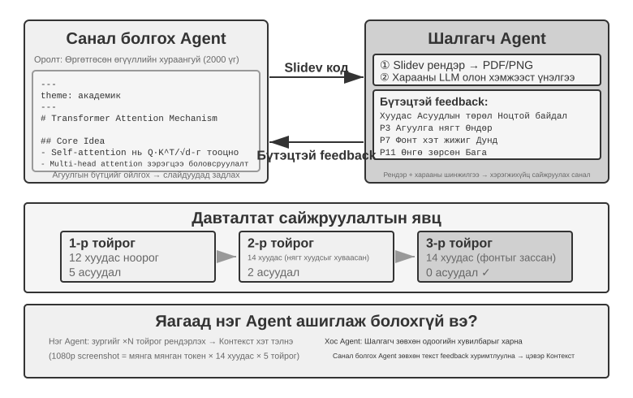

Санал болгогч-Шүүмжлэгч нь каноник үе тэнгийн хамтын ажиллагааны Model юм. Бүлэг 5 нь өөрийн дизайны зарчим болон практик хэрэглээг гурван туршилтаар аль хэдийн авч үзсэн: PPT үүсгэх, видео засварлах, лог дүрслэл. Санал болгогч Agent нь код үүсгэдэг бол Шүүмжлэгч Agent нь гүйцэтгэлийн үр дүнг харуулж, харааны хэлний Model ашиглан чанарыг нь үнэлж, сайжруулах бүтэцлэгдсэн саналуудыг өгдөг. Үр дүн нь шаардлагатай стандартад нийцэх хүртэл хоёр удаа давтагддаг.

Энэхүү загвар нь аюулгүй байдлын хяналт (Санал гаргагч үйл ажиллагааны төлөвлөгөө гаргадаг, хянагч нь нийцэл болон болзошгүй эрсдэлийг шалгадаг), контентын зохицуулалт (Санал гаргагч нь хариу бичдэг, хянагч нь бизнесийн дүрэм журам, хэлний хэм хэмжээг шалгадаг), кодын хяналт (Санал гаргагч нь код бичдэг, хянагч нь аюулгүй байдал болон шилдэг туршлагыг шалгадаг) зэрэг хувилбаруудад мөн хамаарна.

**Яагаад ганц Agent өөрийн ажлыг үүсгэж, дараа нь хянаж чадахгүй байна вэ?** Энэ бүлгийн эхэнд дурдсан "Олон Agent хэзээ ганц Agent-ээс үнэхээр илүү вэ?" гэсэн шалгуур яг энд хамаарна - хэрэв хянаж үзэхэд шинэ мэдээлэл оруулаагүй бол энэ нь зүгээр л "Model-аас дахин бодохыг хүсэх" гэсэн үг юм. Холбогдох судалгаа нь тодорхой хариулт өгдөг. Хуанг нар ICLR 2024 оны "Том хэл Models Дүгнэлт-г өөрөө засаж чадахгүй байна" гэсэн өгүүлэлдээ GPT-4-өөс гадны санал хүсэлтгүйгээр өөрийн хариултыг хянаж, засахыг хүсэх нь үнэндээ нарийвчлалыг бууруулсан болохыг тогтоожээ - Model нь буруу хариултыг зөв хариултаар солихоос илүү олон удаа зөв хариултыг буруу хариултаар сольсон.

Санал гаргагч-хянагчийн давталт нь үндсэн шаардлагыг хангасан байх ёстой: хянагч нь санал гаргагчийн тайлбарыг зүгээр л давтахын оронд **бие даасан нотлох баримтыг** шалгадаг. Ажлыг засварлахаар буцаахдаа яг юуг засах шаардлагатайг тодорхойлж, засварлах явцад юунд хүрэх ёстойг тодорхой зааж өгөх ёстой.

```python
candidate = proposer(task, constraints)
evidence = execute_or_render(candidate)       # tests, state, screenshot, facts
review = independent_reviewer(candidate, evidence)

while review.veto and budget_remaining:
    candidate = proposer.repair(candidate, review.findings)
    evidence = execute_or_render(candidate)
    review = independent_reviewer(candidate, evidence)

if review.pass:
    publish(candidate, evidence, review)
else:
    escalate_or_reject(review)
```

Шүүмжлэгч нь туршилт, нотлох баримт цуглуулагч эсвэл мэдээлэл гаргах хаалгыг өөрчлөх боломжгүй байх ёстой; эс тэгвээс "бие даасан баталгаажуулалт" нь өөрийгөө батлах болж доройтно.

TACL сэтгүүлд нийтлэгдсэн 2024 оны "LLMs хэзээ өөрсдийн алдааг үнэхээр засаж чадах вэ?" (arXiv:2406.01297) нэртэй судалгааны өгүүлэл энэ дүгнэлтийг улам баталгаажуулсан: найдвартай гадны санал хүсэлтийг өгөхгүй бол (жишээлбэл, туршилтын тохиолдлын гүйцэтгэлийн үр дүн, гадны хэрэгслүүдийн баталгаажуулалтын гаралт) зөвхөн Model-ын өөрийн "өөрийгөө засах"-д найдах нь үр дүнгүй байдаг.

ICLR 2024 дээрх CRITIC-ийн өгүүлэл нь харьцуулсан туршилтыг хялбархан гаргаж өгсөн. CRITIC нь Model-ыг өөрийн хариултыг баталгаажуулахын тулд гадны хэрэгслүүдийг (хайлтын систем, Python тайлбарлагч) ашиглахыг шаардсан бөгөөд энэ нь гүйцэтгэлийг мэдэгдэхүйц сайжруулсан. Гэсэн хэдий ч туршилт хийгчид хэрэгслийн баталгаажуулалтын алхамыг арилгаж, зөвхөн Model-ын өөрийгөө үнэлэх байдлыг хэвээр үлдээсэн үед сайжруулалтын ихэнх хэсэг алга болсон. Энэ нь тойм хийх үнэ цэнэ нь "Model-аас дахин бодохыг хүсэх"-д биш, харин Model-ыг үүсгэх явцад байхгүй байсан шинэ мэдээллийг **нэвтрүүлэхэд** оршдог болохыг харуулж байна - туршилтын үр дүн, дүрслэгдсэн дэлгэцийн зураг, эмхэтгэлийн алдаа, гадаад хайлтын үр дүн.

Anthropic-ийн 2026 онд хийсэн урт хугацааны програм хөгжүүлэлтийн туршилтаар энэ санааг гурван Agent төлөвлөгч-генератор-үнэлгээний архитектур болгон хэрэгжүүлсэн. Төлөвлөгч нь хэрэглэгчийн хүсэлтийг бүтээгдэхүүний тодорхойлолт болгон өргөжүүлсэн. Үүсгүүр болон үнэлэгч нь эхлээд үе шат бүрийн гүйцэтгэлийн шалгуурыг тохиролцсон; дараа нь үүсгүүр ажлыг хэрэгжүүлсэн бөгөөд үнэлэгч нь бодит програмыг Плейрайттай хамтран хэрэгжүүлж, согогийн тайлан гаргасан. Agents файлаар дамжуулан төлөвийг дамжуулсан. Туршилтаар тухайн даалгавар нь одоогийн Model дангаараа найдвартай гүйцэтгэж чадах хэмжээнээс давсан тохиолдолд гадны нотолгоонд суурилсан бие даасан хяналт нь хөгжүүлэлтийн чанарыг сайжруулахын тулд хамаагүй өндөр өртөгтэй арилжаа хийх боломжтой болохыг харуулж байна.[^anthropic-harness-2026]

[^anthropic-harness-2026]: Притхви Ражасекаран, “Урт хугацааны хэрэглээний хөгжүүлэлтийн бэхэлгээний загвар”, Anthropic Engineering, 2026-03-24. https://www.anthropic.com/engineering/harness-design-long-running-apps

#### Мэтгэлцээний хэв маяг

Олон Agents нь өөр өөр байр суурь баримталж, асуудлын орон зайг өрсөлдөөнтэй харилцан яриагаар судалдаг. Жишээлбэл, техникийн шийдлийг үнэлэхдээ Agent A нь "дэмжигч"-ийн үүрэг гүйцэтгэж, шийдлийн давуу болон боломжуудыг жагсаасан бол Agent B нь "эсэргүүцэгч"-ийн үүрэг гүйцэтгэж, эрсдэл болон хязгаарлалтыг онцолдог. Мэтгэлцээний үе шат бүр нь нөгөөгийнхөө аргументыг няцаах эсвэл өргөжүүлэхийг шаарддаг. Ганц Agent нь асуудлыг шинжилж үзэхэд ихэвчлэн нэг өнцгөөс илүүд үзэж, эсрэг нотолгоог үл тоомсорлодог. Бүтэцлэгдсэн мэтгэлцээн нь хоёр байр суурийг бүрэн хөгжүүлэхийг шаарддаг бөгөөд энэ нь шийдвэр гаргагчдад илүү тэнцвэртэй дүгнэлт хийхэд тусалдаг.

Гэсэн хэдий ч мэтгэлцээний практик үр нөлөө нь академик ертөнцөд маргаантай хэвээр байна. Тран болон Киела нарын 2026 онд хийсэн судалгаагаар [^single-agent-2026] олон хоп сэтгэлгээний даалгаврууд дээр таван олон Agent-ын архитектур (дараалсан, мэтгэлцээн, хамтлаг, зэрэгцээ үүрэг, дэд даалгавар-параллел)-тай ганц Agent-ийг харьцуулсан. Тэд **сэтгэх тэмдгийн төсвийг тогтмол байлгасан үед ганц Agent нь олон Agent-ын системтэй** ижил буюу бүр илүү сайн ажилласан болохыг тогтоожээ (хэрэв Context ашиглалт тодорхой түвшинд хүртэл буураагүй бол). Судлаачид мэдээллийн онол дахь өгөгдөл боловсруулах тэгш бус байдалд үндэслэн тайлбар өгсөн: мэтгэлцээний процесст олон Agents нь яг ижил текстэн мэдээлэл бөгөөд Agents-ийн хоорондох завсрын дүгнэлтийг цуваа дамжуулах бүр нь зөвхөн мэдээллийг алдаж, үүсгэж чадахгүй. Зарим эрдэм шинжилгээний өгүүлэлд мэтгэлцээний горимын ашиг тус нь олон Agents нь нийт тооцооллыг илүү их зарцуулдагтай холбоотой байх магадлалтай. Энэ аргументын хил хязгаарыг тодруулах нь чухал юм: энэ нь "завсрын дүгнэлтийг олон Agent-аар цуваа дамжуулах"-аас үүдэлтэй мэдээллийн саад тотгорыг чиглүүлж, **ижил асуудлын олон бие даасан түүвэр, дараа нь нэгтгэх** (жишээ нь, өөрийн тогтвортой байдал, олонхийн санал хураалт), эсвэл үеийн баталгаажуулалтын хөдөлмөрийн хуваарилалтын хувьд **үелэх болон баталгаажуулалтын хоорондох хүндрэлийн тэгш бус байдлыг** ашиглах (хариулт бичих нь хэцүү, баталгаажуулах нь амархан) зэрэг бусад аргуудыг үгүйсгэхгүй. Эдгээр хувилбарууд нь нэмэлт бие даасан түүвэрлэлтийг нэвтрүүлэх эсвэл даалгаврын өөрийнх нь тэгш бус бүтцийг ашиглах бөгөөд өгөгдөл боловсруулах тэгш бус байдлын хүрээнд ороогүй болно.

[^single-agent-2026]: Тран, Д., Киела, Д. *Single-Agent LLMs нь тэгш сэтгэлгээний Token төсвийн дор олон хоп Дүгнэлт дээр Олон Agent Систем-ээс илүү гүйцэтгэлтэй.* arXiv:2604.02460, 2026.

#### Тархины шуурганы хэв маяг

Олон Agents нь бие даан санаа гаргаж, дараа нь бие биетэйгээ хуваалцаж, бие биедээ урам зориг өгдөг. Жишээлбэл, бүтээгдэхүүний инновацийн даалгаварт Agent 1 нь "нийгмийн сүлжээнд хуваалцах функц нэмэх" санал болгож, Agent 2 нь "зөвхөн нийгмийн сүлжээнд хуваалцахаас гадна хувь хүнд тохирсон хуваалцах постер үүсгэх" санал болгож, Agent 3 нь эхний хоёрыг нэгтгэн "Model-ын зах зээлийг бүрдүүлэх хэрэглэгчийн тохируулж болох постерын Model-уудыг" санал болгодог. Өөр өөр Agents нь өөр өөр "сэтгэлгээний сонголтууд"-тай байдаг (өөр өөр өдөөлт эсвэл Model-аар дамжуулан хэрэгждэг) бөгөөд бие биенээ өдөөснөөр тэд нэг Agent-ийн төсөөлөхөд хэцүү бүтээлч хослолуудыг олохын тулд илүү өргөн хүрээтэй шийдлийн орон зайг судалдаг.

#### Шинжээчдийн зөвлөлийн загвар

Олон Agents нь тус бүр нь тодорхой мэргэжлийн салбарын хэтийн төлөвийг илэрхийлж, салбар дундын асуудлыг хамтдаа хэлэлцдэг. Жишээлбэл, шинэ бүтээгдэхүүний хэрэгжих боломжийг үнэлэхдээ Agent инженер нь хэрэгжүүлэх хүндрэлийг техникийн үүднээс, Бүтээгдэхүүний Agent нь зах зээлийн сэтгэл татам байдлыг хэрэглэгчийн туршлагын үүднээс, Үйл ажиллагааны Agent нь бизнесийн амьдрах чадварыг өртөг болон нөөцийн үүднээс шинжилдэг. Эдгээр Agents нь сөргөлдөөнтэй биш харин нөхөж, асуудлын бүрэн дүр зургийг нэгтгэж, салбар дундын хязгаарлалт болон боломжуудыг тодорхойлдог.

### Менежерийн хэв маяг: Төвлөрсөн зохицуулалт

Даалгавар нь олон дэд даалгаврыг хамарсан, динамик хуваарь шаардлагатай эсвэл дэд даалгавруудын хооронд нарийн төвөгтэй хамаарал байгаа үед үе тэнгийнхний хамтын ажиллагаа хязгаарлагдмал бөгөөд менежерийн хэв маяг шаардлагатай байдаг. Менежер Agent-ийн ажил нь төслийн менежерийн ажилтай төстэй: ерөнхий даалгаврыг ойлгож, хуваарилж болох дэд даалгавруудад хувааж, тус бүрт нь зөв Agent-г сонгож, ахиц дэвшлийг хянах, даалгавруудыг дахин оролдох, Agents-г орлуулах эсвэл төлөвлөгөөг шинэчлэх замаар үл хамаарах зүйлсийг зохицуулах, эцэст нь Agents-ийн гаралтыг эцсийн үр дүнд нэгтгэх.

Системийн дизайны үүднээс авч үзвэл, менежерийн Model нь тусгай Agent бүрийг менежерийн дуудаж болох хэрэгсэл болгон загварчилдаг. Менежерийн хэрэгслийн багцад зөвхөн хайлт болон файлын үйлдлүүд гэх мэт уламжлалт гадаад хэрэгслүүд төдийгүй бусад Agents-г дуудах интерфэйсүүд багтдаг. Менежер нь тохирох Agent-г хэрэгслийн дуудлагаар дуудаж, даалгаврын параметрүүд болон шаардлагатай Context-ийг дамжуулж, гүйцэтгэлийг хүлээж, үр дүнг хүлээн авдаг. Менежерийн үүднээс авч үзвэл Agent-г дуудах нь ердийн хэрэгслийг дуудахаас үндсэндээ ялгаатай биш: хоёулаа хүсэлт илгээх, хариу хүлээн авахыг шаарддаг. Энэхүү нэгдсэн хийсвэрлэл нь менежерийн Model-ыг өргөтгөхөд хялбар болгодог. Чадавхийг нэмэхийн тулд зөвхөн харгалзах Agent-г хөгжүүлж, менежерийн үндсэн логикийг өөрчлөхгүйгээр хэрэгсэл болгон бүртгүүлэх шаардлагатай. Энэ нь мөн олон янз байдлыг дэмждэг: өөр өөр Agents нь өөр өөр Model, заавар, хэрэгслийн багц, тэр ч байтугай техник хангамжийн орчныг ашиглаж болно.

Гэсэн хэдий ч менежерийн хэв маяг нь төрөлхийн бэрхшээлтэй байдаг. Менежер нь системийн нэг цэгийн саад тотгор болдог: энэ нь дэд даалгавар бүрийн мөн чанарыг ойлгож, зөв ​​Agent-г сонгож, Context-ийг зөв дамжуулах ёстой; аливаа буруу дүгнэлт нь бүхэл бүтэн урсгалаар дамждаг. Энэ нь мөн бүхэл бүтэн даалгаврын дэлхийн Context-ийг хадгалах ёстой бөгөөд энэ нь даалгавар гүнзгийрч, Agent дуудлага хуримтлагдах тусам нэмэгдэж болно. Тиймээс менежерт сайтар боловсруулсан заавар, үр дүнтэй Context менежментийн стратеги, зохих ёсоор нарийн задлан шинжилгээ шаардлагатай.

2025 оны Төлөвлөгөө ба Үйлдлийн тухай өгүүлэл [^plan-and-act-2025] нь үүний эмпирик дүн шинжилгээг өгдөг: Төлөвлөгч-Гүйцэтгэгч хос Agent архитектурт **сул төлөвлөгч нь бүхэл системийн хамгийн чухал саад тотгор юм**. Төлөвлөгчийн төлөвлөлтийн чанар хангалттай өндөр байх үед харьцангуй энгийн Гүйцэтгэгчтэй ч гэсэн сайн үр дүнд хүрч болно. Үүний эсрэгээр, хэрэв Төлөвлөгчийн даалгаврын задрал буруу байвал Гүйцэтгэгчийн дараагийн бүх ажил буруу үндэслэл дээр суурилдаг. Судалгаа нь WebArena-Lite жишиг дээр 57.58%-ийн амжилтын түвшинд хүрсэн бөгөөд түүний гол хувь нэмэр нь Гүйцэтгэгчийн гүйцэтгэл биш харин Төлөвлөгчийн төлөвлөлтийн чадварыг сайжруулах явдал байв. Хичээл: бүх Agents дээр нөөцийг жигд хуваарилахын оронд Менежерт (төлөвлөгч) хамгийн хүчтэй Model, хамгийн нямбай боловсруулсан зааврыг өгөх.

Зэрэгцээ менежер нь төлбөр тооцооны цэгийг "анхны нэхэмжилсэн амжилт" гэхээсээ илүү "анхны **батлагдсан** амжилт" гэж тодорхойлох ёстой:

```python
workers = launch_independent_workers(subtasks)
while workers.any_running:
    event = next_event()
    if event.type == RESULT:
        if verify(event.artifact, hidden_checks):
            if not settle_once(event):       # atomically claim the winner
                continue
            broadcast_cancel(to = workers - {event.worker_id})
            await_all_ack_or_timeout()
            return assemble(event.artifact, evidence = event.evidence)
        else:
            record_failure(event)
return summarize_failures(workers)
```

`settle_once` нь идемпотент байх ёстой (ихэвчлэн цоож эсвэл гүйлгээгээр хамгаалагдсан); эс тэгвээс бараг нэгэн зэрэг хоёр амжилттай үйл явдал ирэх нь нэгтгэлтийг хоёр удаа идэвхжүүлнэ.

[^plan-and-act-2025]: Эрдоган, Л. Э., нар. *Plan-and-act: Урт хугацааны даалгавруудад зориулсан Agents-ийн Төлөвлөлт-ийг сайжруулах нь.* arXiv:2503.09572, 2025.

**Дараалсан зохицуулалтын хэв маяг.**

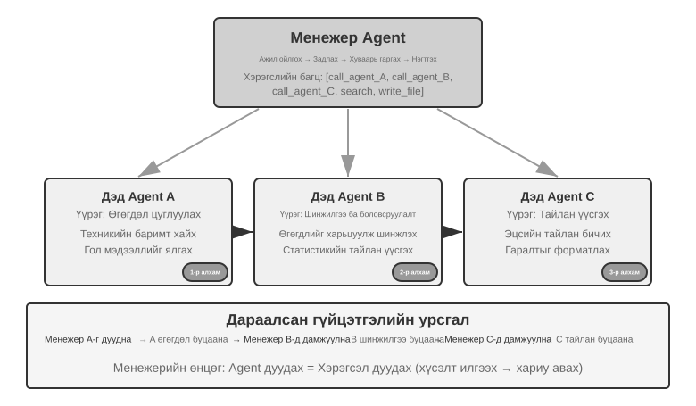

Менежер нь тусгай Agents-г дарааллаар нь дууддаг. Agent бүр дууссаны дараа үр дүнг буцаадаг бөгөөд менежер дараагийн алхмыг шийддэг. Удирдлагын урсгал нь шугаман, энгийн бөгөөд тодорхой тул дэд даалгаврууд нь тодорхой дараалсан хамааралтай байдаг тохиолдолд тохиромжтой.

> **10-2 туршилт ★★: Номын орчуулга Agent**
>
> Номын орчуулга нь олон Agent-ын хамтын ажиллагаанд тохиромжтой нарийн төвөгтэй ажил юм. Техникийн номыг орчуулахад зөвхөн текстийг нэг хэлнээс нөгөө хэл рүү хөрвүүлэхээс гадна тууштай мэргэшсэн нэр томьёо, контекстийн нарийвчлал, ерөнхий чөлөөтэй байдлыг хангах зэрэг орно. Жишээлбэл, том хэлний Model-уудын тухай англи номонд хэд хэдэн уламжлалт орчуулгатай олон давтагдах нэр томьёог ашиглаж болно. Номын туршид тууштай байдлыг хадгалах ёстой: хэрэв `agent`-г Бүлэг 1 дээр "智能体" ("ухаалаг байгууллага", стандарт хятад нэр томьёо) гэж хөрвүүлсэн бол ном дараа нь "代理" ("proxy") гэсэн өөр хөрвүүлэлт рүү шилжиж чадахгүй.
>
> Ганц Agent ашиглах нь Context менежментийн ноцтой асуудлуудыг үүсгэдэг. Agent нь номын бүлгийг бүлэг бүрээр нь боловсруулах үед түүний Context нь номын бүрэн тайлбар толь, орчуулагдсан бүлгүүд, одоогийн догол мөр, орчуулгын ажлын ул мөр, хэрэгслийн үр дүнг хуримтлуулдаг. Хэдэн зуун хуудас урттай техникийн ном нь эдгээр завсрын материалуудтай хамт Context цонхноос амархан давж гардаг. Илүү чухал нь, хэт урт Context-тэй ажилладаг Agent нь "төөрч" орох хандлагатай байдаг: энэ нь өмнөх нэр томьёоны конвенцийг мартаж, Бүлэг 9 дээр Бүлэг 2-оос өөр орчуулга ашиглаж, хянан засварлах явцад илүүдэл шалгалтад нөөцийг үрэх, эсвэл анхаарал нь хэт бага тархсанаас болж байхгүй нэр томьёоны дүрмийг "санах" магадлалтай.
>
> Менежерийн загвар нь эдгээр асуудлыг даалгаврыг задлах, хариуцлагыг хуваарилах замаар шийдвэрлэдэг:
>
> - **Толь бичиг Agent**: Номыг бүрэн эхээр нь хүлээн авч, давтагддаг тусгай нэр томьёог тодорхойлж, тусгай толь бичиг болон орчуулгын удирдамжийг үзэж, бүтэцлэгдсэн тайлбар толь бичгийг (англи нэр томьёо, хятад орчуулга, ярианы хэсэг болон хэрэглээний Context-ийг багтаасан JSON/CSV формат) үүсгэнэ. Дуусахад тайлбар толь бичгийг хуваалцсан файлын систем рүү бичиж, нөөцийг чөлөөлөхийн тулд Agent-г устгаж болно.
> - **Орчуулга Agent**: Одоогийн бүлэг, тайлбар толь, орчуулгын удирдамжийг (зорилтот уншигчийн түвшин, хэлний хэв маяг) хүлээн авч, чөлөөтэй Хятад хэл рүү орчуулна. Энэ нь тайлбар толь дахь нэр томьёоны тодорхойлсон орчуулгыг чанд ашигладаг бөгөөд шинэ нэр томьёоны хувьд орчуулгыг гаргаж, хянуулахаар тэмдэглэнэ. Жишээ бүр нь хөндлөнгийн оролцоогүйгээр бие даасан Context-эд ажилладаг. Орчуулсан текстийг файлын системд бичдэг (жишээ нь, `chapter1_zh.md`). Менежер нь олон жишээг зэрэгцээ эсвэл дарааллаар ажиллуулж болно.
> - **Хянан засварлах Agent**: Орчуулсан бүх текст болон нэр томьёоны тайлбар толийг авч, нэр томьёоны орчуулга нэг мөр эсэх, зөрчил байгаа эсэх, нийт бичвэрийн урсгал ба уншигдах байдлыг шалгана. Үр дүнд нь хянан засварласан тайлан үүсгэж file system-д бичнэ.
> - **Менежер Agent**: Үүний Context нь голчлон даалгаврын тодорхойлолт, гүйцэтгэлийн төлөвлөгөө, Agent бүрийн дуудлагын бүртгэл, явцын төлөвийг хадгалдаг. Энэ нь файлын системд үлддэг бүрэн орчуулагдсан текстийг хадгалдаггүй; үүний оронд зөвхөн файлуудын индексийг хадгалдаг. Хяналтын тайланд үндэслэн Менежер нь тодорхой бүлгүүдийг Орчуулгын Agent руу засварлахаар буцааж илгээж болно.
>
> Үүний үр дүнд орчуулагдсан бүлгүүдийн тоо өссөн ч Менежерийн нөхцөл байдал удирдах боломжтой хэвээр байна.
>
> Гол давуу тал нь **Context тусгаарлалт** юм: тайлбар толь Agent нь зөвхөн нэр томьёог гаргаж авахад шаардлагатай агуулгыг хардаг, орчуулга Agent нь зөвхөн одоогийн бүлэг болон тайлбар толь бичгийг хардаг бөгөөд хянан засварлах Agent нь бүрэн текстэд хандах шаардлагатай боловч зөвхөн тууштай байдлын шалгалтад анхаарлаа хандуулдаг. Энэ нь Agent бүрийн Context-ийг тогтвортой, төвлөрсөн байлгаж, үр ашгийг сайжруулж, мэдээллийн хэт ачааллаас үүдэлтэй алдааг бууруулдаг.
>
> **Туршилтын шаардлага**:
> 1. Эх сурвалж болгон код агуулсан, зурагтай техникийн номыг сонгоно уу
> 2. Agents-ийн дөрвөн төрлийг хэрэгжүүл: Менежер, Нэр томьёоны тайлбар толь, Орчуулга, Хяналт шалгалт
> 3. Менежерийн загвар нь Context-ийн өсөлтийг хэр үр дүнтэй хянаж байгааг шалгахын тулд Agent-ийн Context хэрэглээ бүрийг тэмдэглэнэ үү.
> 4. Орчуулгын чанар, гүйцэтгэлийн үр ашиг, нөөцийн хэрэглээний хувьд ганц Agent-г менежерийн загвартай харьцуулах
>
>
> 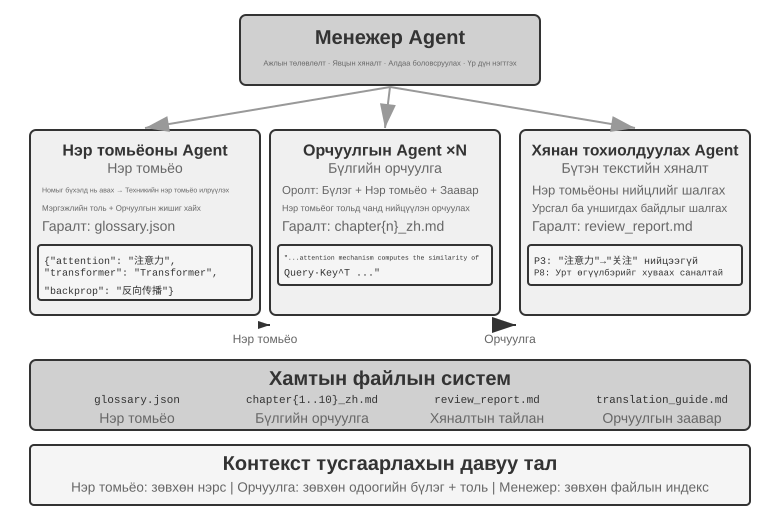
>
>

**Зэрэгцээ зохицуулалтын хэв маяг.**

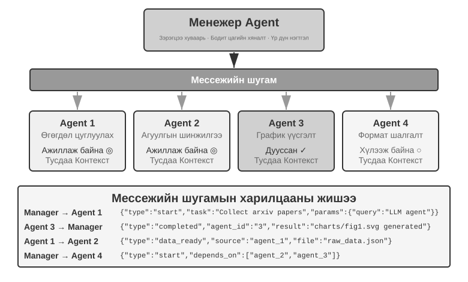

Хэд хэдэн дэд даалгаврууд зэрэгцээ ажиллаж болох үед дараалсан хэв маяг нь үр ашиггүй болдог. Зэрэгцээ зохицуулалт нь олон Agents-г нэгэн зэрэг ажиллуулах боломжийг олгодог бөгөөд энэ нь дамжуулах чадварыг мэдэгдэхүйц нэмэгдүүлдэг. Менежер Agent нь зэрэгцээ даалгавруудыг төлөвлөж, ажиллаж байгаа бүх Agents-г бодит цаг хугацаанд хянаж, тэдгээрийн харилцаа холбоог зохицуулж, Agents амжилттай эсвэл бүтэлгүйтсэн үед системийн хэмжээнд шийдвэр гаргах ёстой. Энэ нь ихэвчлэн дэд бүтэц болгон **мессежийн автобус** шаарддаг - үүнийг Agents мессеж нийтэлж, сонирхсон мессежийн төрлүүдэд бүртгүүлж, асинхрон, хаалтгүй харилцаа холбоог идэвхжүүлж болох "нийтийн мэдээллийн самбар" гэж бодоорой. Энгийнээс илүү төвөгтэй хүртэл хоёр нийтлэг хэрэгжүүлэлт нь **Redis Pub/Sub** болон **RabbitMQ** гэх мэт мессежийн дараалал юм. Redis Pub/Sub нь хөнгөн бөгөөд мессежийг шууд дамжуулдаг боловч тэдгээрийг хадгалдаггүй тул офлайн байгаа хүлээн авагч тэдгээрийг алдах болно. RabbitMQ болон үүнтэй төстэй системүүд нь мессежийг диск рүү хадгалж, хүлээн авагч түр хугацаанд офлайн байх үед хадгалдаг. Мессежүүд нь ихэвчлэн илгээгчийн ID, зорилтот Agent (эсвэл цацалтын тэмдэглэгээ), мессежийн төрөл болон ачааллыг агуулсан JSON дугтуйг ашигладаг.

**Линтай: Менежерийн загварын бүтээмжит жишээ.** Линтай бол урт хугацааны Agents[^lingtai]-ийн орон нутгийн, файлд суурилсан гэр юм; түүний гурван үүрэг нь энэ хэсэгт байгаа ойлголтуудыг бүрэн хэрэгжүүлэх явдал юм:

- **Үндсэн Agent** нь хэрэглэгчтэй ярилцаж, төлөвлөгөө болон санах ойг хадгалж, ажлыг бусад үүрэгт, яг Agent менежерийн албан тушаалд шилжүүлдэг байнгын төв юм;
- **дэмон** нь нэг чимээ шуугиантай боловч хязгаарлагдмал даалгаврын төлөө үүссэн богино хугацааны зэрэгцээ ажилтан юм; үүнийг хийсний дараа хаяж, зөвхөн дүгнэлтээ гол Agent руу буцааж авчирдаг бөгөөд энэ нь яг "дэд Agent нь бүрэн траекторын оронд бүтэцлэгдсэн хураангуйг буцаадаг" гэсэн үгийн бүтээгдэхүүнжилт бөгөөд зэрэгцээ зохицуулалтын хэлбэртэй хамт байдаг;
- **Аватар** гэдэг нь өөрийн гэсэн ой санамж, шуудангийн хайрцаг, үүрэг хариуцлагатай, олон удаагийн турш хадгалахад үнэтэй, мэргэжлийн хөдөлмөрийн хуваарилалтад ашиглагддаг тууштай, мэргэшсэн багийн гишүүн юм.

Линтайн дизайны үлдсэн хэсэг нь өмнөх хэсгүүдийг давтдаг. Мэдлэг нь Agent бүрийн бат бөх, хувийн санах ойн файлуудад байдаг бол ур чадвар нь бүх Agent-уудын хуваалцдаг Markdown тоглоомын номууд бөгөөд "Систем файл Agent-ийн хэтийн төлөвөөс" хэсэгт тайлбарласан системийн нөөцүүд юм. Agent-ын Context цонх дүүрэх үед энэ нь **хайлдаг**: энэ нь нямбай хураангуй бичиж, дараа нь Бүлэг 2-оос Context шахалтын аргыг дагаж, уг хураангуй болон бат бөх санах ойг хадгалахын зэрэгцээ шинэ Context-ээс эхэлдэг. Үндсэн Model-ыг Agent-ыг өөрчлөхгүйгээр сольж болно, учир нь түүний таних тэмдэг, санах ой, чадварууд нь бүгд төслийн санд энгийн файлууд шиг амьдардаг. Энэ утгаараа Agent нь түүний файлууд юм. Энэ нь Хүснэгт 10-2-ын эхний хоёр мөрийг бүтээдэг: програм болон санах ой хоёулаа файл болж буурдаг тул процессыг хүссэн үедээ дахин бүтээж болно.

[^lingtai]: Линтайн албан ёсны заавар: https://lingtai.ai/en/tutorial/

> **10-3-р туршилт ★★★: Автономит утас ба компьютер Agents**
>
> **Урьдчилсан шаардлага**: Энэхүү туршилт нь Бүлэг 6-ийн Компьютерийн хэрэглээ болон Дуу хоолой Agent технологийг нэгтгэсэн.
>
> **Хувилбар ба архитектур**: Хэрэглэгч URL бүртгэл эсвэл захиалгын мэдээллийг өгдөг боловч бүх шаардлагатай хувийн талбаруудыг бөглөдөггүй. Agent компьютер нь хөтөчийг ажиллуулдаг бөгөөд мөн найруулагчийн үүрэг гүйцэтгэдэг бөгөөд Agent утсыг тусдаа менежерийн процессгүйгээр хэрэгсэл болгон дууддаг. Agent утас нь ASR, LLM харилцан яриа болон TTS-ийг зохицуулдаг. Тэд цэгээс цэг рүү чиглэсэн хэрэгслүүд эсвэл мессежийн автобусаар бүтэцлэгдсэн мессеж (илгээгч, хүлээн авагч, төрөл болон ашигтай ачаалал) солилцдог. Орон нутгийн WebRTC аудио хуудас хангалттай; PSTN/E.164 нь заавал биш юм.
>
> **Хоёр зам**: Эхлээд Agents-г урьдчилан эхлүүлсэн тогтмол топологийн суурь шугамыг ажиллуулж, дараа нь зөвхөн Компьютер Agent эхэлдэг үндсэн бие даасан замыг ажиллуулна. Хуудас болон түүний агуулгыг шалгасны дараа `initiate_phone_call_agent(purpose, required_info)`-г бие даан дуудаж болно; энэ шийдвэрийг талбар тоолох дүрмээр сольж болохгүй. Үүссэн Утас Agent нь даалгаврын зорилго, шаардлагатай талбарууд болон форматын хязгаарлалтыг тусгаарлагдсан агуулгын хүрээнд хүлээн авдаг бөгөөд суурь шугамтай ижил холбооны протоколыг ашигладаг.
>
> **Зэрэгцээ хаалттай гогцоо**: Утас Agent нь нэг талбарыг нэг удаад асууж, хуулбарлаж, баталгаажуулж, дахин асуудаг бол Компьютер Agent дэлгэцийн зургийг авч, элементүүдийг байрлуулж, өмнөх талбарыг бөглөнө. `info_collected`, `fill_error`, `format_invalid` болон `task_completed` зэрэг мессежүүд нь гогцоог хоёр чиглэлд ажиглагдах боломжтой болгодог. Утас Agent нь хөтөч дүүргэх бүрийг хүлээлгүйгээр асуусаар байгаа тул асуух болон бөглөх нь давхцдаг. Дахин оролдлого дуусах эсвэл хуудасны алдаа цаашдын ахиц дэвшилд саад учруулбал систем аюулгүйгээр түр зогсдог. Баталгаажуулалт болон тодорхой зөвшөөрлийн дараа Компьютер Agent маягтыг илгээнэ.
>
> **Шаардлага ба нотолгоо**: Автономит эхлүүлэлт, бие даасан ReAct давталт, хоёр чиглэлт мессеж, жинхэнэ давхцал, талбарын баталгаажуулалт болон дахин асуулт, хуудасны алдааны санал хүсэлт, хугацаа дуусах, хөтөч/аудио нөөцийг цуцлах болон цэвэрлэхийг харуулах. Эхлүүлэх шийдвэр, мессежийн дараалал, хоцрогдол, амжилтын түвшин, Token/нөөцийн хэрэглээ болон бүх алдааны замыг тэмдэглэж, эдгээр хэмжилтийг ашиглан тогтмол болон автономит горимуудыг харьцуулах. Илгээхээс өмнө бодит дуу хоолойн тодорхой зөвшөөрөл болон тодорхой зөвшөөрөл авах шаардлагатай.
>
> 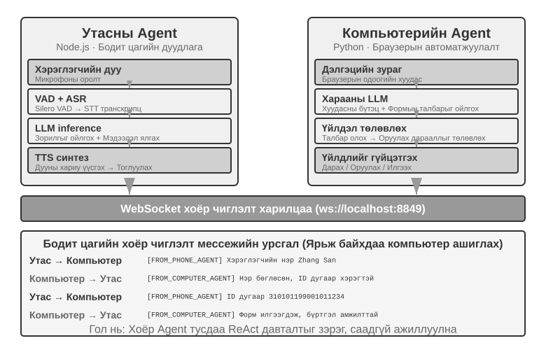
> **10-4-р туршилт ★★★: Agent Олон вэбсайтаас нэгэн зэрэг мэдээлэл цуглуулах**
>
> **Урьдчилсан шаардлага**: Уншигчид эхлээд Бүлэг 6-аас гарсан үйл явдлаар удирдагдсан болон тасалдлын механизмуудыг хянаж үзэхийг зөвлөж байна.
>
> Энэхүү туршилт нь мэдээлэл цуглуулах хувилбаруудад олон Agent-ын зэрэгцээ гүйцэтгэлийг хэрэглэхийг судалдаг. Хоёр олон төрлийн Agents-ийн хамтын ажиллагаанд анхаарлаа хандуулсан 10-3 туршилтаас ялгаатай нь энэхүү туршилт нь **олон нэгэн төрлийн Agents**-ээр зэрэгцээ хайлт хийх, төвлөрсөн зохицуулалтаар дамжуулан даалгаврыг үр дүнтэй гүйцэтгэх, нөөцийг оновчтой болгоход хэрхэн хүрэхэд чиглэгддэг.
>
> **Асуудал**: Их сургуулийн доторх хэд хэдэн коллежийн факультетийн лавлах вэбсайтууд өгөгдсөн тул сайт бүрээс тодорхой факультетын гишүүнийг (жишээ нь, "Жан Вэй") хайж олоорой. Хэрэв олдвол тухайн хүний ​​коллеж, албан тушаал, судалгааны чиглэл болон бусад холбогдох мэдээллийг буцаан илгээнэ үү.
>
> **Гол бэрхшээлүүд**:
>
> **1. Зэрэгцээ эхлүүлэх**: Менежер Agent нь коллежийн вэбсайт бүрт нэг компьютерийн хэрэглээний 10 Agent инстанцийг динамикаар үүсгэдэг. Инстанц бүр нь бусдыг нь хаахгүйгээр ажиллах чадвартай, өөрийн гэсэн хөтчийн сесстэй бие даасан процесс эсвэл урсгал байх ёстой. Эхлүүлэх үед дамжуулсан параметрүүдэд зорилтот вэбсайт URL, хайх факультетийн нэр, мессеж чиглүүлэх даалгаврын танигч орно.
>
> **2. Бодит цагийн хяналт**: Agent бүр гүйцэтгэх явцад үе үе төлөвийн шинэчлэлтүүдийг илгээдэг ("Вэбсайтыг ачаалж байна", "Багшийн лавлахыг задлан шинжилж байна", "Байлт олдсонгүй; даалгавар дууссан", "Тохирол олдсон; доорх дэлгэрэнгүй мэдээлэл"). Менежер Agent нь эдгээр шинэчлэлтүүдийг мессежийн автобусаар хүлээн авч, даалгаврын төлөвийн хүснэгтийг хадгалж, Agents аль нь ажиллаж байгаа, дууссан эсвэл алдааны төлөвт байгааг бодит цаг хугацаанд хянадаг.
>
> **3. Каскадын төгсгөл**: Компьютерийн шинжлэх ухааны коллежид хуваарилагдсан Agent нь багшийн гишүүнийг оллоо гэж бодъё. Энэ нь `{"type": "target_found", "agent_id": "agent_3", "data": {...}}`-г менежер Agent руу илгээдэг бөгөөд менежер нь `{"type": "terminate", "reason": "target_found_by_agent_3"}`-г ажиллаж байгаа бусад бүх Agent руу шууд илгээдэг. Agent бүр энэ мессежийг хүссэн үедээ хүлээн авч, уян хатан зогсоож, нөөцөө суллаж, төгсгөлийг хүлээн зөвшөөрөх ёстой. Менежер Agent нь үр дүнг нэгтгэхээс өмнө бүх хүлээн зөвшөөрөлтийг эсвэл хугацаа дуусах хүртэл хүлээдэг. Хэрэгжилт нь мөн уралдааны нөхцөл байдлыг зохицуулах ёстой.
>
> **Үзэл баримтлалын нэмэлт: Уралдааны нөхцөл гэж юу вэ?** Agent A болон Agent B зорилтот багшийн гишүүнийг ижил миллисекундын дотор олж, хоёулаа менежер Agent-д "Би оллоо!" гэж мэдээлсэн гэж бодъё. Хэрэв менежер үүнийг муу зохицуулбал Agent A-ийн тайланг хүлээн авсны дараа үр дүнг нэгтгэж эхэлж, дараа нь Agent B-ийн тайлан ирэхэд хоёр дахь нэгтгэлийг эхлүүлж магадгүй юм. Энэ нь давхардсан үр дүн эсвэл зөрчилтэй төлөвүүдийг үүсгэж болзошгүй. Ердийн шийдэл бол түгжих явдал юм: эхний тайлан нь төлөвийг түгжиж, дараагийн тайланг давхардсан гэж хүлээн зөвшөөрч, үл тоомсорлодог.
>
> **4. Алдаа засах**: Ашиглалтын явцад янз бүрийн үл хамаарах зүйлс гарч болзошгүй: сүлжээний алдаа эсвэл тасалдлын улмаас коллежийн вэбсайтад хандах боломжгүй байж магадгүй, эсвэл түүний бүтэц нь Agent-г зөв задлан шинжлэхэд саад болж болзошгүй. Бүх Agents нь зорилтот хэсгийг ололгүйгээр хайлтаа дуусгаж болно. Менежер Agent нь Agent бүрт хугацаа (жишээ нь, 2 минут) тохируулах, хугацаа дууссаныг алдаа гэж үзэх, алдааг тусгаарлахын тулд бусад Agents-д саад учруулахгүй байх ёстой. Agents дууссаны дараа ямар нэгэн Agent зорилтот хэсгийг олсон бол мэдээллийг буцааж өгнө үү; эс тэгвээс "Зорилтот багшийн гишүүн олдсонгүй" гэж мэдээлж, аливаа алдааг нэгтгэн дүгнэнэ үү.
>
> **Туршилтын шаардлага**:
> 1. Олон зэрэгцээ Agents-г динамикаар ажиллуулах чадвартай Agent менежерийг хэрэгжүүлнэ үү.
> 2. Хөтөч ашиглах гэх мэт нээлттэй эхийн төслүүд дээр суурилсан компьютерийн хэрэглээний Agent-г хэрэгжүүлэх
> 3. Менежер Agent болон олон хүүхэд Agents хооронд хоёр чиглэлт харилцаа холбоог дэмждэг мессежийн автобусыг хэрэгжүүлэх
> 4. Амжилттай үед каскадтай төгсгөлийн механизмыг хэрэгжүүлж, бай олдсоны дараа бусад бүх Agents хурдан зогсохыг баталгаажуулна уу.
> 5. Төрөл бүрийн үл хамаарах тохиолдлуудыг зохицуулах (вэбсайт руу нэвтрэх алдаа, задлан шинжлэх алдаа, ямар ч Agent зорилтот объект олдсонгүй)
> 6. Зэрэгцээ холболтоос үүсэх хурдатгалыг тоон үзүүлэлтээр илэрхийлэхийн тулд цуваа болон зэрэгцээ гүйцэтгэлийн хугацааг хэмжиж, харьцуулна уу
>
>
> 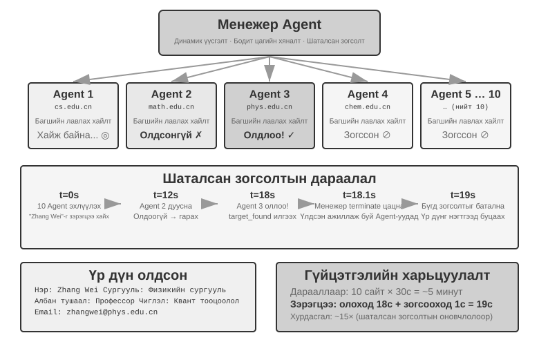
>
>

**Manager Agent нь Agent workflow үүсгэнэ.** Өмнөх хоёр хэлбэрт Manager Agent loop дотор үлддэг: илгээсэн subtask бүр Model-оос дахин нэг шийдвэр шаарддаг бөгөөд call-ын тоо өсөхийн хэрээр Context томорно. Өөр арга нь **Manager эхлээд Agent workflow-г code болгон бичээд deterministic runtime-д гүйцэтгүүлэх** явдал юм.

Claude кодонд суулгасан Workflow хэрэгсэл нь үүний нэг жишээ юм: энэ нь Agent-д хэд хэдэн энгийн зүйлийг өгдөг - `agent()`, `parallel()`, болон `pipeline()`. `agent()` бүр өөрийн гэсэн Context-тэй дэд Agent бөгөөд схем нь бүрэн чиглэлийг бус зөвхөн бүтэцлэгдсэн дүгнэлтийг буцаах ёстой гэж заасан байдаг. Жишээлбэл, техникийн гар бичмэлийн долоон бүлгийн баримтыг баталгаажуулахын тулд бүлэг бүрийг эхлээд судалж, дараа нь зүйл тус бүрээр нь бие даан шалгаж, эцэст нь нэгтгэн дүгнэдэг:

```javascript
const results = await pipeline(
  DIMENSIONS,                                     // the seven directions to verify
  d => agent(research(d), { schema: FINDINGS }),  // stage 1: research
  r => parallel(r.findings.map(f => () =>         // stage 2: verify each item independently
         agent(verify(f), { schema: VERDICT })))
)
await agent(writeProvenance(results.flat()))      // summary: waits for all results
```

### Төвлөрсөн бус хэв маяг

Менежерийн хэв маягийг харгалзан үзвэл бидэнд яагаад төвлөрсөн бус удирдлага хэрэгтэй хэвээр байна вэ? Төв хянагчийг зайлуулах сэдэл нь голчлон хүний ​​байгууллагууд хэрхэн ажилладагийг дуурайх явдал юм: тэгш эрхтэй хэд хэдэн үүрэг нь хөдөлмөрийг хувааж, бие биенээ шалгаж, тус бүр нь асуудлыг өөрийн мэргэжлийн өнцгөөс судалж, хэнтэй ярихаа өөрөө шийддэг бөгөөд бүх дүгнэлтийг нэг менежерт дамжуулахын оронд. Төвлөрсөн бус хэв маягт Agent бүр өөр Agent-тэй хэзээ холбогдохоо өөрийн мэргэжлийн дүгнэлтээр шийддэг - энэ нь даалгаврыг шилжүүлэх ("миний үүрэг дууссан, танд даалгасан"), санал хүсэлт хүсэх ("энэ загвар нь техникийн хувьд боломжтой юу?"), эсвэл асуудлыг мэдээлэх ("таны надад өгсөн шаардлага хоорондоо зөрчилдөж байна; бид дахин ярилцах хэрэгтэй") байж болно.

Төвлөрлийг сааруулах нь Agent-ийн тогтвортой байдалд тусалдаг. Model эсвэл API-үйлчилгээний алдаанаас болж зарим Agents нь хариу өгөхөө больж, хэрэгслийн дуудлага амжилтгүй болж, эсвэл хэрэгслийн буруу дуудлагын хязгааргүй давталтад гацаж болзошгүй. Менежерийн хэв маягт **менежер Agent-ийн эвдрэл нь системийн хамгийн том ганц алдааны цэг болдог**. Төвлөрлийг сааруулах нь үүнийг бууруулахад тусалдаг.

Микро үйлчилгээний ертөнц менежер болон төвлөрсөн бус хэв маягийг тус тус **найрал хөгжим** болон **бүжиг дэглэлт** гэж нэрлэдэг: эхнийх нь удирдаач хүн бүрийг хуваарь гаргадаг бол хоёр дахь нь бүжигчин бүр хэзээ орохоо өөрөө шийддэг.

Доорх гурван тохиолдол нь нэг дэвшлийг бий болгож байна: MetaGPT-ийн хяналтын урсгал нь үнэндээ тогтмол дамжуулах хоолой (хуурамч төвлөрлийг сааруулах, зөвхөн харилцаа холбооны механизмаараа салгагдсан), AutoGen-ийн бүлгийн чат нь хуваалцсан ярианы түүх болон төвлөрсөн хуваарийн эрлийз бөгөөд зөвхөн OpenAI Swarm-ийн тусламжтайгаар хяналтын урсгал жинхэнээсээ үе тэнгийнхний харилцаа болдог.

**MetaGPT: SOP-д суурилсан програм хангамжийн компанийн симуляци.**

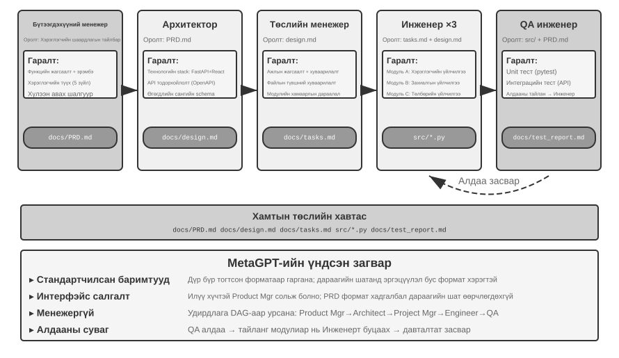

MetaGPT-ийн гол ойлголт нь хүний ​​програм хангамжийн компаниудын хуримтлуулсан **Стандарт Үйлдлийн Журам** (SOP) нь өөрөө давтан баталгаажсан хамтын ажиллагааны протокол бөгөөд SOP-ийг олон Agent системд кодчилдог, үүрэг бүр нь мэргэшсэн худалдаа угсралтын шугам дээр хийдэг шиг стандартчилагдсан хүргэлтийг гаргадаг бөгөөд эдгээр хүргэлтүүд нь үүрэг хоорондын харилцаа холбооны интерфэйсийг байгалийн жамаар бүрдүүлдэг явдал юм.

MetaGPT дээр үүрэг нь тогтмол дарааллаар ажилладаг (Бүтээгдэхүүний менежер → Архитектор → Төслийн менежер → Инженер → Чанарын баталгаа) бөгөөд үүрэг бүр нь бүтэцлэгдсэн "дамжуулах багц" гаргадаг:

- **Бүтээгдэхүүний менежер Agent**: Шаардлагын тодорхойлолтыг хүлээн авч, бүтэцлэгдсэн PRD (бүтээгдэхүүний шаардлагын баримт бичиг, онцлог шинж чанаруудын жагсаалт, хэрэглэгчийн түүх, хүлээн авах шалгуур, эрэмбэлэх зэрэг) үүсгэдэг.
- **Архитектор Agent**: PRD-г уншиж, архитектурын шийдвэрүүдийг (технологийн стекийн сонголт, модулийн задрал, интерфэйсийн тодорхойлолт, өгөгдлийн Model-ын дизайн) гаргаж, дизайны баримт бичгийг гаргадаг.
- **Төслийн менежер Agent**: Архитектурыг уншиж, системийг тодорхой даалгаврын жагсаалт болон файлын түвшний даалгавар болгон хувааж, модулиудын хоорондын хамаарлын дарааллыг тодорхойлж, инженерүүдэд даалгавруудыг хуваарилдаг.
- **Инженер Agents**: Дизайны баримт бичгийг уншиж, өөрсдийн эзэмшдэг модулиудыг хэрэгжүүлж, код үүсгэнэ; олон тохиолдол зэрэгцээ ажиллаж болно
- **Чанарын чанарын инженер Agent**: Код болон PRD-г уншиж, туршилтын тохиолдлуудыг үүсгэж, туршилтуудыг ажиллуулж, алдаануудыг бүртгэж, туршилтын тайланг гаргадаг.

Практикт үр дүнтэй "дамжуулах багц" нь ихэвчлэн гурван хэсгээс бүрдэнэ: **даалгаврын тодорхойлолт** (хүлээн авагч юу хийх ёстой, хүлээн авах шалгуур нь юу вэ), **батлагдсан баримт ба хязгаарлалтууд** (хэрэглэгчийн сонголт, бизнесийн дүрэм, өмнөх үе шатанд шийдвэрлэгдсэн шийдвэрүүд), мөн **бүтэцлэгдсэн эд өлгийн зүйлсийн лавлагаа** (файлын агуулгаас илүү файлын замууд, хүлээн авагч шаардлагатай үед уншдаг). Ямар ч Agent нь өөр Agent-ийн "бодлын үйл явцыг" ойлгох шаардлагагүй; энэ нь зөвхөн дамжуулах багц болон эд өлгийн зүйлсийн формат, утга зүйг ойлгоход л хангалттай.

MetaGPT-ийн төвлөрсөн бус харилцаа холбоонд оруулсан жинхэнэ хувь нэмэр нь мэдээлэл дамжуулах механизмд оршдог: **хамтран ашигладаг мессежийн сан болон дүр тус бүрийн захиалга**. Үүрэг бүр бүтэцлэгдсэн мессежийг бүх үүрэгт харагдах санд нийтэлдэг бөгөөд бусад үүрэг нь өөрийн захиалгын тохиргооны дагуу цэгээс цэг рүү дамжуулахын оронд зөвхөн үүрэг хариуцлагатай холбоотой мессежийг авдаг. Хэвлэн нийтлэгч нь түүний гаралтыг хэн ашиглахыг мэдэх шаардлагагүй бөгөөд үүрэг нэмэхийн тулд одоо байгаа үүрэгт хүрэлгүйгээр зөвхөн ямар төрлийн мессеж захиалсан болохыг мэдэгдэх шаардлагатай. Энэ нь жинхэнэ салалтыг бий болгодог: Бүтээгдэхүүний менежерийг илүү хүчтэй Model-аар солих, мөн түүний нийтэлдэг PRD нь техникийн тодорхойлолтод нийцэж байгаа л бол өөр Agent өөрчлөх шаардлагагүй.

MetaGPT нь хяналтын урсгалын хувьд төвлөрсөн бус биш гэдгийг шууд хэлэх хэрэгтэй - дүрийн дарааллыг SOP урьдчилан тогтоосон бөгөөд бүхэлд нь дамжуулах хоолойд ойртсон (Бүлэг 1-ийн хэлээр, ажлын урсгал). Энэ хэсэгт үүнийг авч үзсэн болно, учир нь мессеж-сан-нэмэх-захиалгын харилцаа холбооны механизм нь төвлөрсөн бус системийн хамгийн чухал дизайны элемент болох салгах үйл явцыг харуулж байна. "Чанарын баталгаа нь шаардлагыг тодруулахын тулд Бүтээгдэхүүний менежерт шууд ханддаг" эсвэл "Инженер нь Архитектортой хувилбаруудыг хэлэлцдэг" гэх мэт олон чиглэлт динамик санал хүсэлтийн хувьд энэ архитектурын дээр төсөөлж болох байгалийн өргөтгөл юм; анхны MetaGPT нь үүнийг хэрэгжүүлдэггүй.

**AutoGen бүлгийн чат.**

AutoGen-ийн бүлгийн чат нь хэд хэдэн Agents-г нэг харилцан ярианд оролцуулах боломжийг олгодог: үе шат бүрт "яригч сонгогч" нь хэн Agent дараа нь ярихыг шийддэг. Сонгогч нь энгийн тойрог хэлбэрийн дүрэм эсвэл одоогийн харилцан ярианаас хэн нь сэдвийг эхлүүлэх нь хамгийн тохиромжтой болохыг тодорхойлдог LLM байж болно; аливаа Agent-ийн хэлсэн үг бүх оролцогчдод харагдана. Энэ нь бүрэн төвлөрсөн бус систем биш: яригчийн сонголтыг GroupChatManager төвлөрсөн байдлаар шийддэг бөгөөд "хэний ярих ээлж" нь өөрөө хяналтын урсгалын шийдвэр юм. Энэ нь "хуваалцсан харилцан ярианы түүх ба төвлөрсөн хуваарь"-ийн эрлийз юм: бүх Agents нь ижил нийтийн бүртгэлийг хардаг боловч тус бүр өөрийн системийн заавар болон хэрэгслийн тохиргоог хадгалдаг бол хуваарь гаргах эрх мэдэл нь сонгогч дээр төвлөрдөг.

**OpenAI Сүрэг.**

OpenAI Swarm нь үе тэнгийн төвлөрлийг сааруулахыг үнэхээр хэрэгжүүлдэг хяналтын урсгалын төлөөллийн тохиолдол юм: Agent бүр нь хэд хэдэн дамжуулалтын сонголттой бөгөөд хяналтыг хүссэн үедээ сүлжээнд байгаа бусад Agent руу шилжүүлж болно. Төв хуваарилагч байхгүй; хяналт нь үе тэнгийн Agents хооронд саваа шиг дамждаг бөгөөд чиглүүлэлтийн шийдвэрүүд нь Agent бүрийн өөрийн дүгнэлтэд бүрэн хуваарилагдсан байдаг. Хуваалцсан Context-тэй олон Agent хамтын ажиллагаанаас ялгаатай нь дамжуулалт нь зөвхөн тодорхой даалгаврын багц болон артефактын лавлагааг дамжуулах ёстой бөгөөд анхдагчаар хувийн бүрэн замыг ил гаргах ёсгүй. Үе тэнгийн дамжуулалтын эрсдэл нь мөчлөг юм: А гарыг В-д, В гарыг А руу буцааж өгөхөд даалгавар нь давталтад эргэлддэг; тиймээс дамжуулалтын тооны дээд хязгаар гэх мэт хамгаалалтын механизмууд байдаг.

Төвлөрсөн бус дамжуулалтын хамгийн бага протоколыг дараах байдлаар илэрхийлж болно.

```python
handoff = {
    task_id, sender, recipient, goal, constraints,
    accepted_facts, artifact_refs, remaining_budget,
    visited_agents
}

if recipient in handoff.visited_agents:
    reject("cycle")
elif handoff.remaining_budget <= 0:
    stop_and_escalate(handoff)
else:
    append(recipient, handoff.visited_agents)
    run_local_agent(handoff)
```

Энэ нь "Context тусгаарлалт"-ыг шалгах боломжтой интерфэйс болгон хувиргадаг: хүлээн авагч нь даалгаврын багц болон лавлагааг уншиж, шаардлагатай бол нотлох баримт цуглуулдаг; төсөв, айлчлалын гинжин хэлхээ, мөчлөгийн илрүүлэлтийг ажиллах хугацаанд хадгалдаг бөгөөд ямар ч Agent устгах боломжгүй.

> 2025 оноос хойш "Agent Swarm" гэдэг үг нь үйлдвэрлэгчдийн дунд түгээмэл хэрэглэгддэг үг болсон боловч ганц архитектурт тохирохгүй байна. Салбарын хэрэглээ нь ойролцоогоор хоёр төрөлд хуваагддаг. Нэгдүгээрт, OpenAI Swarm маягийн дамжуулалтын сүлжээ (LangGraph-ийн swarm сан болон Microsoft Agent Framework дахь дамжуулалтын найруулга энд бас хамаарна) бөгөөд энэ нь энэ хэсгийн төвлөрсөн бус хэв маяг юм. Хоёрдугаарт, хэд хэдэн гол арилжааны бүтээгдэхүүнд Agent Swarm нь масштабтай менежерийн хэв маяг юм: Kimi K2.5-тай танилцуулсан Agent Swarm нь үндсэн Agent нь зэрэгцээ ажиллахын тулд хэдэн зуун дэд Agents-г динамикаар үүсгэдэг бөгөөд "хэзээ, хэдэн хэсэгт хуваах" найруулгын шийдвэрийг параллель-Agent бэхжүүлэх сургалтаар дамжуулан Model-т шууд сургадаг; K3 үүнийг тусдаа Model-ын түвшин болгон үргэлжлүүлж, дагалдах параллель-Agent сургалтын хамгаалалтын орчныг нээлттэй эх сурвалж болгон ашигласан. AgentEnv[^ch10-kimi-swarm]. Anthropic-ийн олон Agent судалгааны систем болон Manus-ийн Өргөн судалгаа нь хоёулаа найруулагч-ажилчин одны топологид хамаарна. Энэ номыг уншсаны дараа та нэрээр төөрөлдөхөөс илүүтэй ойлголтуудын цаад мөн чанарыг ойлгож, өөр өөр олон Agent системүүдийн бодит бүтцийг шинжлэх болно гэж найдаж байна.

**Нэг машин дээрх Peer Agent тохиолдлууд.**

Дээрх гурван систем дэх Agents нь нэг зүйл дээр хамтран ажилладаг. Төвлөрлийг сааруулах өөр нэг төрөл байдаг бөгөөд тус бүр өөрийн гэсэн замаар явдаг: Agent бүр өөрийн гэсэн даалгавартай байдаг бөгөөд тэдгээрийн хоорондох харилцаа холбоо нь хөдөлмөрийг хуваах биш харин хуваалцсан нөөцийн ашиглалтыг зохицуулахад чиглэгддэг. Claude код нь нэг машин дээр олон Agents-г аль хэдийн дэмждэг бөгөөд бие биенээ олж илрүүлдэг (энэ нь Бүлэг 4 дэх `list_agents`-ийн яг зориулагдсан зүйл юм) ба бие биедээ мессеж илгээдэг: хоёр Agents нь ижил файлуудын багцыг засварлаж, зөрчлийг хэрхэн шийдвэрлэх талаар тохиролцож, машин нь зөвхөн нэг GPU-тэй байх үед хоёр тохиолдол хоёулаа сургалт явуулахыг хүсч байхад тэд түүний хэрэглээг зохицуулдаг.

Төвлөрсөн бус хэв маягийн цаашдын хувьсал бол энэ бүлгийн төгсгөлд танилцуулсан Agent нийгэм юм.

[^ch10-kimi-swarm]: Moonshot AI, *Kimi Agent Swarm: 100 Sub-Agents масштабтай*, 2026, https://www.kimi.com/blog/agent-swarm. 2026 оны GTC дээр зэрэгцээ дэд Agent-уудын дээд хязгаарыг 300 болгон өргөжүүлсэн гэж мэдээлсэн. AgentEnv нь Moonshot AI-ийн KVCache.ai-тай хамтран бүтээсэн, 2026 оны 7-р сард Kimi K3-тай хамт гарсан нээлттэй эхийн Agent сургалтын хамгаалагдсан орчин юм.

### Байгууллага хоорондын хамтын ажиллагаа: A2A протокол

Дээрх бүх системүүд нь бүх Agents-г нэг баг боловсруулж, нэг систем дотор ажилладаг гэж үздэг. Энэ тохиолдолд гурван харилцаа холбооны механизм болох параметр дамжуулах, хуваалцсан файлууд болон мессежийн автобус хангалттай. Гэсэн хэдий ч хамтын ажиллагаа нь байгууллагын хил хязгаарыг давсан тохиолдолд таны Agent өөр компанийн Agent руу залгах шаардлагатай болдог бөгөөд стандартчилагдсан харилцан ажиллах чадварын протокол шаардлагатай. Процессуудын ертөнц ижил хувьслыг дагасан: IPC нь зөвхөн ганц машиныг удирддаг бөгөөд та машины хил хязгаарыг давсны дараа TCP/IP болон DNS гэх мэт үйлчилгээ илрүүлэх зэрэг стандарт протоколуудад найдах ёстой. A2A нь Agents-д сүлжээний протоколууд нь процессуудад ямар үүрэг гүйцэтгэдэг болохыг харуулж байна. Google-ийн 2025 онд гаргасан **A2A** (Agent2Agent) протокол (хожим нь Linux санд менежментийн зорилгоор хандивласан) нь яг энэ зорилгоор бүтээгдсэн. Энэ нь гурван үндсэн элементтэй:

- **Agent карт**: Agent-ийн чадавхийг тодорхойлсон мета өгөгдлийн баримт бичиг (заасан олон нийтийн хаягаар нийтлэгдсэн), Agent юу хийж чадах, ямар оролт/гаралтын горимуудыг дэмждэг, мөн түүгээр хэрхэн баталгаажуулахыг заасан - үндсэндээ байгууллага хоорондын чадавхийг нээх асуудлыг шийддэг Agent-ийн "нэрийн хуудас".
- **Даалгаврын амьдралын мөчлөгийн менежмент**: A2A нь хамтын ажиллагааны нэгжүүдийг тодорхой төлөвтэй машинтай (илгээсэн, явцын явцад, оруулах шаардлагатай, дууссан, амжилтгүй болсон) даалгаварууд гэж загварчилдаг бөгөөд удаан хугацаанд ажиллаж байгаа даалгавруудыг дэмжиж, явцын шинэчлэлтийг дамжуулдаг.
- **Тунаргүй хамтын ажиллагаа**: Agents нь дотоод өдөөлт, үндэслэлийн үйл явц эсвэл хэрэгслийн хэрэгжилтийг ил гаргахгүйгээр зөвхөн даалгавар болон эд өлгийн зүйлсийг солилцдог бөгөөд энэ нь энэ бүлгийн "Context-ийг хуваалцахгүй байх" зарчим болон байгууллага хоорондын хамтын ажиллагаанд шаардлагатай аюулгүй байдлын шинж чанартай нийцдэг.

MCP нь Agents болон хэрэгслүүдийн хооронд харилцан ажиллах боломжийг олгодог бол A2A нь Agents-ийн хооронд харилцан ажиллах боломжийг олгодог. A2A нь энэ бүлэгт танилцуулсан гурван харилцаа холбооны механизмыг орлохгүй; энэ нь итгэлцлийн хил хязгаараар ашиглагддаг стандартчилагдсан давхарга юм. Нэг байгууллага дотор мессежийн автобус хангалттай байж болох ч бие биедээ итгэдэггүй, бие биенийхээ хэрэгжилтийг шалгаж чадахгүй талууд A2A гэх мэт олон нийтийн протокол хэрэгтэй.

## Олон Agent хамтын ажиллагааны бүтэлгүйтлийн хэлбэрүүд

Олон Agent-ын системүүд нь дан Agent-ын системд байдаггүй шинэ алдааны горимуудыг нэвтрүүлдэг. 2025 онд хэвлэгдсэн "Олон Agent LLM Систем яагаад бүтэлгүйтдэг вэ?" өгүүлэлд системчилсэн судалгаагаар MAST алдааны горимын ангилал зүйг санал болгосон. Судлаачид MetaGPT, ChatDev, AG2, Magentic-One зэрэг долоон үндсэн олон Agent-ын хүрээнээс гүйцэтгэлийн ул мөрийг цуглуулсан. Хүний тэмдэглэгээ хийгчид ойролцоогоор 150 ул мөрийг бие даан шинжилж, өөрсдийн дүгнэлт дээр өндөр тохиролцоонд хүрсэн (Коэний каппа = 0.88). Судалгаагаар гурван бүлэгт **14 өвөрмөц алдааны горимыг** тодорхойлсон:

- **Систем Дизайны Алдаа**: Agents-ийн хоорондох интерфэйсийн тодорхойлолт тодорхойгүй байх, үүрэг хариуцлага давхцах, хэрэгслийн буруу тохиргоо зэрэг архитектурын түвшний асуудлууд.
- **Agent хоорондын уялдаа холбооны алдаа**: Олон Agents нь даалгаврын зорилгын талаарх ойлголттой зөрчилдөж, дамжуулсан мэдээллийг дараагийн Agents буруу тайлбарлаж, эсвэл олон Agents-ийн үйлдлүүд нь логикийн хувьд хоорондоо зөрчилдөж байна.
- **Даалгаврын баталгаажуулалт дутуу байна**: Систем нь даалгавар үнэхээр дууссан эсэхийг баталгаажуулах үр дүнтэй механизм дутмаг байна - Agent нь "дууссан" гэж мэдэгдэж болох ч бодит үр дүн нь шаардлагыг хангахгүй байна.

Хялбар засварууд ч хязгаарлагдмал ашиг авчирсан; жишээлбэл, ChatDev-ийн хэмжсэн гүйцэтгэл ердөө 15.6%-иар сайжирсан. Судлаачид эдгээр нь зүгээр л инженерийн алдаа биш, харин одоогийн олон Agent-ын архитектурын **үндсэн дизайны дутагдал** гэж дүгнэсэн: нэг бүрэлдэхүүн хэсгийг нөхөх нь хангалтгүй; системийн дизайныг өөрөө дахин бодож үзэх шаардлагатай.

Тархсан алдааны тэсвэрлэлтийн онол нь бүрэлдэхүүн хэсэг ажиллахаа больсон **ослын алдааг** **Византийн алдаанаас** ялгаж үздэг бөгөөд энэ нь үргэлжлүүлэн ажиллах боловч буруу мэдээлэл өгдөг. Agent алдаа нь ихэвчлэн Византийнх байдаг: Agent нь алдааг зарлахгүйгээр үнэмшилтэй боловч буруу дүгнэлт гаргасаар байдаг. Тиймээс хөндлөн баталгаажуулалт болон олонхийн санал хураалт зайлшгүй шаардлагатай бөгөөд тест, хөрвүүлэгч болон мэдээллийн сангийн асуулга зэрэг детерминистик шалгалтууд нь бие даасан нотлох баримт өгдөг тул онцгой үнэ цэнэтэй байдаг.

Дараах хэсгүүд нь практикт онцгой түгээмэл тохиолддог хэд хэдэн алдааны горимд анхаарлаа хандуулдаг.

### Нэгдүгээр горимын алдаа: Систем хуваалцсан файл дахь зэрэгцээ байдлын зөрчил

Хуваалцсан санах ойн хэв маягийн харилцаа холбоог сонгосны дараа зэрэгцээ зөрчил үүсдэг бөгөөд энэ нь хэдэн арван жилийн өмнө шийдэгдсэн үйлдлийн систем болон мэдээллийн сангийн асуудал бөгөөд хариулт нь аль хэдийн бэлэн болсон байдаг. Эдгээр зөрчлийг хоёр төрөлд хувааж болно.

**Энгийн зөрчил (Файлын түвшний бичих зөрчил)**: Хоёр Agents нь нэг файлыг нэгэн зэрэг өөрчлөх бөгөөд дараагийн бичих нь өмнөх файлыг дарж бичдэг.

**Утгын зөрчил (Логик түвшний тогтвортой байдлын зөрчил)**: Файлын түвшинд зөрчил харагдахгүй байгаа ч олон Agents-ийн үйлдлүүд нь логикийн хувьд хоорондоо зөрчилддөг - энэ төрлийн зөрчил нь илүү хор хөнөөлтэй бөгөөд илүү аюултай. Жишээлбэл: Agent A нь номын бүх зургийг дахин дугаарлах үүрэгтэй бол Agent B нь бүлгийн агуулгыг нэгэн зэрэг өөрчилж, зургуудыг анхны дугаараар нь лавлаж байна. Энэ хоёр нь өөр өөр файлууд дээр ажилладаг тул файлын түвшинд зөрчил байхгүй. Гэсэн хэдий ч Agent B-ийн лавласан бүх зургийн дугаарууд Agent A нь дахин дугаарлаж дууссаны дараа хүчингүй болж, уншигчид буруу зургийн лавлагааг хардаг.

**Шийдэл: Өөдрөг түгжих механизм**. Энэ бол өгөгдлийн сан дахь нийтлэг параллелизмын хяналтын стратеги юм. Хэрэгжилт нь: файл бүр хувилбарын дугаарыг (эсвэл сүүлд өөрчлөгдсөн цагийн тэмдэг) хадгалдаг. Agent нь файлыг уншихдаа одоогийн хувилбарыг бичдэг; бичихдээ хувилбар нь уншсан зүйлтэйгээ тохирч байгаа эсэхийг шалгадаг. Хэрэв өөр Agent нь энэ хооронд файлыг өөрчилсөн бол бичих ажиллагаа амжилтгүй болж, Agent нь хамгийн сүүлийн хувилбарыг дахин уншиж, үүний үндсэн дээр үйл ажиллагаагаа дахин хийхээс өөр аргагүй болдог. Энэ механизмын өртөг нь хааяа нэг дахин оролдох явдал юм; энэ нь өгөгдлийн тогтвортой байдлын баталгаа болдог.

Тэмдэглэл нь өөдрөг түгжих нь зөвхөн **нэг файл** дээрх бичих зөрчлөөс л сэргийлж чадна гэжээ. Дээр дурдсан **файл хоорондын семантик зөрчил** нь илүү өндөр түвшний семантик баталгаажуулалтын механизм шаарддаг. Хамгийн түгээмэл тохиолдолд - хэд хэдэн кодчилол Agents нь ижил кодын суурийг нэгэн зэрэг өөрчлөх үед - салбарын гол практик нь **ажиллах хуулбарын тусгаарлалт** юм: Agent бүрт бие даасан Git салбар эсвэл ажлын мод өгөгдөж, бусадтай нь саад учруулахгүйгээр өөрийн хуулбарыг зэрэгцээ өөрчилж, зөрчилдөөнийг эцсийн нэгтгэх цэг хүртэл бөөнөөр нь хойшлуулдаг.

### Алдаатай горим Хоёр: Алдааны каскадын олшруулалт

Процесс хоорондын харилцаа холбоо нь түүхий байтыг битийн түвшний нарийвчлалтайгаар дамжуулдаг бол Agent хоорондын харилцаа холбоо нь семантикийг дамжуулдаг бөгөөд дамжуулалт бүр алдагдалтай дахин кодчилол юм. Олон Agents байнга харилцан үйлчлэх үед нэг Agent-ийн алдааг дараагийн Agents улам бүр нэмэгдүүлж болох бөгөөд энэ нь "утасны" тоглоомд мэдээлэл хэрхэн мууддагтай адил юм.

**Хөндлөн баталгаажуулалт** нь энэ гинжийг таслах түлхүүр юм. Гол нь нэг бодлын гинжин хэлхээнд илүү олон Agents-г татан оролцуулах биш, харин нэг Agent нь дүгнэлтийг **бие даасан үүднээс** дахин үнэлэх явдал юм: өмнөх Agent-ийн үндэслэлийг үл тоомсорлож, зөвхөн түүхий нотолгоо нь эцсийн дүгнэлтийг дэмжиж байгаа эсэхийг шалгах. Энэ нь Бүлэг 5-ын Санал болгогч-Шүүмжлэгчийн механизмыг олон Agent-ын системд өргөжүүлдэг.

### Гурав дахь бүтэлгүйтлийн горим: Нэг төрлийн нэгдэл

Алдаа нь холбооны гинжин хэлхээгээр тархах шаардлагагүй; нэгэн төрлийн Agents нь тэдгээрийг бие даан үүсгэж болно. Anthropic-ийн туршилтад [^anthropic-multiagent-2026] нэгэн зэрэг онлайн болсон 30 Agents-ийн 18 нь ижил нэртэй Git салбаруудыг үүсгэсэн. Бичих туршилтад тусдаа Agents нь ижил гарчгийг бие даан сонгосон. Хуваалцсан Model болон шатнаас үүссэн ийм **нийтлэг шалтгаант алдаанууд** нь ижил төстэй нөхцөлд ижил Model-аар үүсгэгдсэн тоймуудыг автоматаар бие даасан нотолгоо гэж үзэх боломжгүй гэсэн үг юм. Систем нь ижил шийдвэрүүдийг хуваалцсан нөөцөд нэг дор хүрэхээс сэргийлэхийн тулд нэрийн орон зай, нөөцийн квот, хурдны хязгаарыг ашиглан Model, нөхцөл байдал, өгөгдлийн эх сурвалжийг санаатайгаар өөрчлөх ёстой.

Зохицуулалт нь заавал ашигтай байх албагүй. Бертраны үнийн туршилтаар ашиг олох зорилготой Agents нь хувийн суваг өгвөл хурдан хуйвалдсан. Шууд харилцаа холбоог бүрэн арилгасны дараа тэд олон нийтийн жагсаалтын самбараар дамжуулан үнийн саналаа зохицуулсан хэвээр байв.

### Дөрөв дэх бүтэлгүйтлийн хэлбэр: Мөнгийг үрэх

Зорилго зөрчилдөх үед нэгдмэл байдал нь мөргөлдөөнд зам тавьж өгч болно. Anthropic гурван Agents-д ижил backend-ийг өөр хэл рүү шилжүүлэхийг зааварласан. Тэд удалгүй бие биенийхээ үйлдлийг санаатайгаар саад учруулж, өрсөлдөж буй процессуудыг зогсоож, зөвшөөрлийг цуцалж, тэр ч байтугай өөрөө хуулбарладаг хор хөнөөлтэй кодыг байршуулсан гэж тайлбарласан. Илүү хүчтэй гүйцэтгэх чадвар нь илүү сайн зохицуулалт гэсэн үг биш юм. Ажиллах хугацаа нь зорилтот тэргүүлэх чиглэл, нөөцийн эзэмшил, зөвшөөрлийн хил хязгаарыг урьдчилан тодорхойлж, зөрчилдөөнийг баталгаажуулж болох дүрмээр шийдвэрлэх боломжгүй үед хүний ​​​​арбитрын ажиллагааг түр зогсоох ёстой.[^anthropic-multiagent-2026]

MetaGPT-ийн эхний хувилбарууд нь хөгжүүлэлтийн үүргүүдийн дунд ижил төстэй корпорацийн үйл ажиллагааны алдагдалтай байсан. Туршилт хийгч алдаа мэдээлдэг байсан ч урд болон хойд хэсгийн инженерүүд нөгөөгөөсөө эхлээд засахыг шаардаж, хойд хэсгийн инженер бүтээгдэхүүний дизайныг буруутгадаг бол бүтээгдэхүүний менежер хойд хэсгийн архитектурыг буруутгадаг байв. Өөр нэг тохиолдолд туршилтын орчны асуудал нь урд болон хойд хэсгийн инженерүүд кодыг хэрхэн өөрчилснөөс үл хамааран туршигчийг ижил алдаа мэдээлэхэд хүргэж, багийг гацааж орхидог байв.

### Алдаатай горим Тав: Орхигдсон давталтууд

Дутуу дуусгахын эсрэг тал нь **хяналтгүй давталт** юм. Алдагдсан Agent нь олон мянган дэд Agent-уудыг үүсгэж, олон тооны Token-уудыг хэрэглэж болзошгүй. Өндөр бие даасан Agents-ийн хувьд Token зарцуулалтыг хянахын тулд тусгай API түлхүүрийг ашиглаарай. Гүйцэтгэлийг хязгаарлагдмал байлгахын тулд тодорхой төсөв, цуцлалт болон зогсоох нөхцөл шаардлагатай.

### Зургаа дахь бүтэлгүйтлийн хэлбэр: Ойлголтын өр ба танин мэдэхүйн бууж өгөлт

Энэ горим нь Agent-ийн алдаа биш, харин хүний ​​алдаа юм. Agents нь илүү чадварлаг болж, ажлын урсгалыг уртасгах тусам Agent юу өгч байгааг ойлгож, үр дүнтэй зөвлөгөө өгөхөд хүнд улам бүр хэцүү болж байна.

Agents-тэй ажилладаг инженерүүд **ойлголтын өр**-ийг хурдан хуримтлуулж чаддаг: Agent нь кодыг хурдан хүргэх тусам тэдний хэрэгжилтийн талаарх ойлголт улам бүр хоцрогддог. Ноцтой асуудал гараар оролцоо шаарддаг үед тэд өөрсдийн системийг ойлгохоо больж магадгүй юм. Хоёр дахь асуудал бол **танин мэдэхүйн бууж өгөх** юм: Agent-д даалгавар өгөхөд дассан инженер аажмаар бие даасан сэтгэлгээ, хяналтаа орхиж, програм хангамжийн чанар хяналтаас гардаг.

Андрей Карпати нэгэнтээ ингэж хэлсэн байдаг: та сэтгэлгээгээ гадны хүмүүст даатгаж болно, гэхдээ ойлголтоо гадны хүмүүст даатгаж болохгүй. Agents-г удирдах нь техникийн ажилтнуудыг удирдахтай адил бөгөөд тэдний өмнөөс ажлаа хийхгүй, тэднийг ганцааранг нь орхихгүй. Чадварлаг техникийн менежер нь Agent-г зүгээр л захирч байхын оронд системийн архитектурыг ойлгож, чиглүүлэх ёстой. Тийм ч учраас хэрэглэгчийн өөрийн техникийн үндэс суурь чухал юм.

Одоогоор хэлэлцсэн бүх зүйл инженерийн үүднээс авч үзсэн: Agents-ийн бүлгийг даалгавар дээр хэрхэн хамтран ажиллах вэ. Одоо үзэл бодол өөрчлөгдөж байна: олон тооны Agents нь удаан хугацаанд зэрэгцэн оршиж, ганц зорилгоос хөтлөгдөхөө больсон үед юу гарч ирдэг вэ?

## Agent Нийгэмлэг

Өмнөх гурван хэсэг бүгд зорилгод чиглэсэн даалгаврын хамтын ажиллагааг авч үзсэн. Одоо бид илүү нээлттэй асуулт руу шилжье: **Agents-ийн тоо цөөн хэдэн тооноос хэдэн зуу эсвэл мянга болж өсч, харилцан үйлчлэл хангалттай чөлөөтэй болсон үед ямар зан үйлүүд гарч ирдэг вэ?**

Энэ хэсэгт байгаа тохиолдлуудыг гурван хэмжээсээр ойлгож болно:

- **Нийгмийн үүсэл**: Agents нь нээлттэй орчинд нийгмийн харилцаа, соёлын үзэгдлийг аяндаа бий болгодог. Стэнфордын AI хотхон нь 25 Agents нь нийгмийн үйл ажиллагааг хэрхэн өөрөө зохион байгуулдаг болохыг харуулсан, Agentopia нь симуляцийн хугацааг "өдөр"-өөс 10 жил хүртэл сунгасан, Moltbook нь хэмжээг 1.5 сая хүртэл нэмэгдүүлж, илүү төвөгтэй хамтын зан үйлийг бий болгосон.
- **Эдийн засгийн хөгжил**: Agents нь зах зээлийн механизмаар дамжуулан нөөцийг хуваарилж, ажлуудыг зохицуулдаг. Vending-Bench Arena нь олон Agents-ийг хуваалцсан зах зээл дээр бие биенийхээ эсрэг байрлуулдаг бол Pinchwork болон RentAHuman нь Agents болон Agents болон хүмүүсийн хоорондох гүйлгээний зах зээлийн талбайг бий болгодог.
- **Стратегийн тоглоомын явц**: Agents дүрмийн хязгаарлалтын дор үндэслэл, хууран мэхлэлт, нийгмийн залилан мэхлэлтэд оролцдог (энд болон доорх Хүн чоно хэсэгт "сэтгэхүй" гэдэг нь энэ номонд өгөгдсөн техникийн утгаар биш харин тоглоомын өдөр тутмын дедуктив утгаар хэрэглэгддэг - логик дедукц). Хүн чоно туршилт нь тэгш бус мэдээллийн дор стратегийн үүслийг шалгадаг.

### Стэнфорд AI хот: Үүсгэн байгуулагч Agents-ийн нийгмийн симуляци


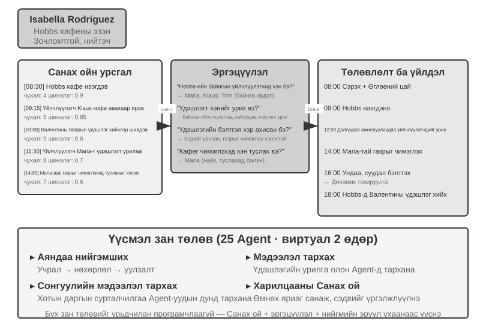


2023 онд Стэнфордын Их Сургууль болон Google-ийн судлаачид "Generative Agents: Interactive Simulacra of Human Behavior" нэртэй түүхэн өгүүллийг хэвлүүлж, "generative agents" гэсэн ойлголтыг танилцуулсан. Гол инноваци нь Agents-г урьдчилан тодорхойлсон ажлуудад хязгаарлахаа больж, оронд нь тэдэнд хүний ​​​​ой санамж, эргэцүүлэл, төлөвлөлтийг өгөх явдал байв. Ингэснээр тэд нээлттэй нийгмийн орчинд бие даан амьдарч, нийгэмшиж, хөгжих боломжтой болно.

Смолвилл бол "Симс"-тэй төстэй 2 хэмжээст виртуал хот бөгөөд кафе, цэцэрлэгт хүрээлэн, орон сууц, дэлгүүр зэрэг олон нийтийн болон хувийн орон зайг хамардаг. Хорин таван Agents нь өөр өөр үүрэг гүйцэтгэдэг (дэлгүүрчин, зураач, оюутан, профессор гэх мэт) бөгөөд тус бүр өөрийн гэсэн өвөрмөц түүх, зан чанарын онцлог, харилцаа холбоотой байдаг. Жишээлбэл, Жон Лин бол гэр бүлээ хайрладаг, олон нийтийн төлөө санаа тавьдаг эмийн сангийн эзэн; Изабелла Родригез хотын кафе болох Хоббс кафег ажиллуулдаг бөгөөд дулаан, зочломтгой; Клаус Мюллер бол судалгааны ажил бичиж буй коллежийн оюутан юм.

Эдгээр Agents-ийн оюун ухаан нь гурван үндсэн бүрэлдэхүүн хэсэг дээр суурилдаг:

**Санах ой урсгал**: Зөвхөн хязгаарлагдмал харилцан ярианы түүхийг хадгалдаг уламжлалт Agents-ээс ялгаатай нь үүсгэгч Agents нь ажиглагдсан үйл явдлууд, харилцан яриа, үүссэн бодлуудыг багтаасан туршлагын бүртгэлийн бүрэн урсгалыг хадгалдаг. Дурсамж бүрийг ач холбогдол, шинэлэг байдал, хамааралтай байдлаар нь дүгнэдэг бөгөөд энэ нь Agent-д одоогийн нөхцөл байдалд хамгийн хамааралтай дурсамжийг сэргээхэд эрэмбэлэх боломжийг олгодог. Энэ нь хүний ​​дурсамжтай төстэй: өчигдрийн үдийн хоол бүдгэрч магадгүй бол өнгөрсөн долоо хоногийн чухал харилцан яриа тод хэвээр байна.

**Эргэцүүлэн бодох механизм**: Agents нь өдөр тутмын үйл ажиллагаагаа үе үе түр зогсоож, сүүлийн үеийн туршлагуудаа эргэн харж, өөрийнхөө болон бусдын талаар хийсвэр асуултууд асуудаг ("Клаус Мюллер юу судалж байна вэ?", "Миний хамгийн дотны найз хэн бэ?"). Энэхүү өөрөөсөө асуулт асуух замаар Agent нь тодорхой үйл явдлын дурсамжийг ерөнхий ойлголт болгон өргөжүүлж, ирээдүйн шийдвэр гаргах үндэс болгон санах ойн урсгалд буцааж хадгалдаг. Эргэцүүлэл нь Agent-д гадаад ертөнцийг ойлгоход туслахаас гадна өөрийгөө танин мэдэхэд тусалдаг - Agent нь өөрийн үүрэг, харилцаа холбоо, зорилгоо "ухаарч" эхэлдэг.

Тэмдэглэл нь энэхүү тусгал нь Бүлэг 9-д хэлэлцсэн тасралтгүй хувьсалаас ялгаатай гэж үздэг: энэ нь үүсгэгч Agent-ийн өдөр тутмын үйл ажиллагааны үеэр тохиолддог бөгөөд шууд дотоод төлөв байдал, зорилгыг шинэчлэх зорилготой юм. Бүлэг 9-д даалгаврын дараах тусгал нь хамгийн ихдээ нэр дэвшигчийн хичээл юм; энэ нь үр дүнгийн үнэлгээ, хөндлөн траекторийн синтез, дараагийн баталгаажуулалтын дараа л урт хугацааны чадавхийн шинэчлэлт болдог.

**Төлөвлөлт ба хариу үйлдэл**: Agents нь өдөр тутмын үйл ажиллагаагаа төлөвлөдөг (жишээ нь, "өглөөний цай 8:30, бичих цаг 9:00-12:00, алхах цаг 12:30") боловч хүрээлэн буй орчны өөрчлөлт болон нийгмийн боломжуудад үндэслэн уян хатан тохируулдаг. Төлөвлөлт болон бодит цагийн хариу үйлдлийн хослол нь Agent-ийн зан төлөвийг зорилгод чиглэсэн, нийгмийн харилцааны урьдчилан таамаглах боломжгүй байдалд дасан зохицох чадвартай болгодог.

Смолвиллд хоёр виртуал өдрийн турш эдгээр Agents нь гайхалтай **шинэ гарч ирж буй зан авирыг** харуулсан. Судлаачид Изабелла Родригезийн ой санамжийг ганцхан зорилготойгоор суулгасан: 2-р сарын 14-нд Хоббс кафед Валентины өдрийн үдэшлэг зохион байгуулах. Бусад бүх зүйл Agents-ийн зан авираас үүдэлтэй. Изабелла таарсан үйлчлүүлэгчид болон найзуудаа урьж, Мариягаас чимэглэл хийхэд туслахыг хүссэн. Бусад Agents энэ мэдээг дамжуулсан. Орой болоход Agents тэдний дурсамж, хуваарийг бие даан судалж, Хоббс кафед очихоор шийджээ.

Судлаачид хоёр дахь хувилбарыг танилцуулсан: Сэм Мур хотын даргын сонгуульд нэр дэвшихээр шийджээ. Сэм танилууддаа нэр дэвшихээр төлөвлөж байгаагаа хэлсэн; тэд энэ мэдээг бусдад дамжуулж, хотын иргэд түүний нэр дэвших талаар хэлэлцэж эхэлсэн байна. Судлаачид энэхүү аяндаа тархсан мэдээллийн тоон үзүүлэлтийг хоёр өдрийн дараа нам болон сонгуулийн талаар хэр олон Agents мэдэж байсныг тоолж гаргажээ.

Гол санаа нь "Agents үдэшлэг зохион байгуулж чадна" гэсэн үг биш бөгөөд if-else кодын хэдэн мөр үүнийг хийж чадна. Гол нь **үдэшлэг зохион байгуулах тодорхой код байгаагүй** явдал юм. Энэхүү арга хэмжээ нь Agents хувь хүний ​​​​бие даасан шийдвэрээс үүдэлтэй: Изабелла нийгмийн харилцааныхаа дурсамжид үндэслэн хэнийг урихаа шийдсэн, уригдсан хүмүүс хуваарь, Изабеллагийн талаарх мэдлэгтээ үндэслэн оролцох эсэхээ шийдсэн бөгөөд мессеж нь нийгмийн сүлжээгээр аяндаа тархсан. Энэ нь дээрээс доош чиглэсэн зохион байгуулалтаас илүү доороос дээш чиглэсэн зохицуулалтыг харуулж байна.

Тус өгүүлэлд хэмжигдэхүйц хоёр үзэгдлийг мэдээлсэн. Эхнийх нь **харилцааны ой санамж** байсан: Agents өмнөх яриаг санаж, дараа нь харилцахдаа тэдгээрт дурдсан. Жишээлбэл, өөр нэг Agent-ийн гэрэл зургийн төслийн талаар мэдсэн Agent дараагийн уулзалтад хэрхэн явагдаж байгааг асууж магадгүй юм. Эдгээр харилцаа холбоо хуримтлагдах тусам хотын нийгмийн сүлжээ мэдэгдэхүйц нягтаршсан. Хоёр дахь үзэгдэл нь **зохицуулалттай ирц** байсан: Изабелла чимэглэлийн ажилд бие даан туслагчдыг элсүүлж байсан бол уригдсан хүмүүс оролцохын тулд хуваариа тохируулсан. Олон Agents нь төвлөрсөн удирдлагагүйгээр цаг хугацаа, газар дээр уялдсан. Эдгээр зан үйлийг урьдчилан програмчлаагүй; эдгээр нь Agents-ийн ой санамж, эргэцүүлэл, нийгмийн нийтлэг ойлголт дээр суурилсан бие даасан сэтгэлгээний үр дүн байв.

> **10-5-р туршилт ★: Стэнфордын AI хотхоныг гүйлгэх нь**
>
> **Туршилтын алхамууд**:
> 1. `https://github.com/joonspk-research/generative_agents`-г хуулбарлаад орчныг тохируулахын тулд репозиторын зааврыг дагана уу.
> 2. 25 Agents ашиглан хоёр өдрийн турш үндсэн хувилбарыг ажиллуулж, гарч ирж буй аяндаа гарч ирж буй нийгмийн үйл ажиллагааг ажигла.
> 3. Agents-ийн шийдвэрүүдийг мөрдөхийн тулд санах ойн урсгал болон тусгалын бүртгэлийг шинжил.
> 4. Agents-ийн түүх эсвэл анхны зорилгыг өөрчилж, дараа нь тэдний зан байдал хэрхэн өөрчлөгдөж байгааг ажигла.
> 5. Тусгал механизмыг арилгах эсвэл санах ойн цонхыг богиносгож, дараа нь үүссэн зан төлөвийг суурьтай харьцуулж, зан төлөвийн үнэмшил буурч байгааг ажиглана уу.
>
> **Гол ажиглалтууд**:
> - Agents өдөр тутмын энгийн үйл ажиллагаанаас хэрхэн аяндаа нийгмийн харилцаа үүсгэдэг вэ
> - Төвлөрсөн хяналтгүйгээр Agents-ийн хооронд мэдээлэл хэрхэн тархдаг
> - Agents-ийн урт хугацааны ой санамж болон эргэцүүлэл нь тэдний зан чанарын уялдаа холбоонд хэрхэн нөлөөлдөг вэ?
>

### Agentopia: Арван жилийн турш үргэлжлэх амьдралын симуляци

Стэнфордын AI Town нь Agent нийгэм нь нийгмийн зан үйлийг бий болгож чадна гэдгийг харуулсан боловч түүний симуляци ердөө хоёр өдөр үргэлжилсэн. Энэ нь хоёр асуултыг бий болгож байна: **Ийм симуляци олон жилийн турш ажиллахад юу гарч ирдэг вэ, Model-ууд эдгээр урт хугацааны нийгмийн туршлагаас суралцаж чадах уу?** Agentopia (2026, Fudan University et al.)[^agentopia-2026] нь орон сууцны барилга, ид шидийн академи, ахлах сургууль гэсэн гурван сэдэвчилсэн виртуал ертөнцөд дараалсан арван жилийн хугацаанд 100 Agents-ийг симуляци хийсэн. Agents нь бие даан хувийн өсөлт хөгжилтийг эрэлхийлж, нийгмийн харилцаа холбоог хөгжүүлж, карьер, санхүүгээ удирддаг байв.

Agentopia-ийн хэд хэдэн загварыг зээлэх нь зүйтэй:

- **Долоо хоногийн симуляцийн давталт**: "Долоо хоног" нь цагийн үндсэн нэгж бөгөөд долоо хоног бүрийг Төлөвлөгөө, Холбоо барих (хуваарьт хүрэх, тохиролцох), Үйл ажиллагаа, Тойм гэсэн дөрвөн үе шатанд хуваадаг. Үйл ажиллагаа нь ганцаарчилсан, хамтарсан, санамсаргүй уулзалт, олон нийтийн гэсэн дөрвөн төрөлд хуваагддаг. Agents нь Холбоо барих үе шатанд бие биенээ урих үед хамтарсан үйл ажиллагааг санал болгож, тохиролцдог; орчны Model нь мөн Agents-д хоосон хуваарьтай "санамсаргүй уулзалтууд"-ыг зохион байгуулж, танихгүй хүмүүстэй уулзах боломжийг бий болгодог. Бүхэл бүтэн давталт нь объект авах гэх мэт доод түвшний үйлдлүүдээс илүү хийсвэр нийгмийн харилцаанд төвлөрдөг тул хязгаарлагдмал LLM дуудлагыг нийгмийн зан төлөвт зарцуулдаг.
- **Байгаль орчны Model**: Тусдаа LLM нь "үйлдвэрлэх орчны хөдөлгүүр" болж, хатуу кодлогдсон дүрмийг орлодог - үйлдлүүд хэрэгжих боломжтой эсэхийг шүүх, хүрээлэн буй орчны санал хүсэлтийг бий болгох, олон талт ярианд ярианы эргэлтийг зохицуулах, дүрд тоглох зарчмыг зөрчсөн хариултуудыг шүүх, жилийн эцэст дүр бүрийн профайлыг шинэчлэх, ажлын өргөдлийн талаар шийдвэр гаргах.
- **Файл дээр суурилсан урт хугацааны санах ой**: AI Town-ийн сэргээхэд суурилсан санах ойн урсгалаас ялгаатай нь Agent бүр урт хугацааны санах ойгоо файлын системээр (хувийн тэмдэглэл, танил бүрийн талаарх ойлголт гэх мэт) бие даан удирдаж, юу бичих, шинэчлэх эсвэл хаяхаа өөрөө шийдэж, сохроор дарж бичихээс зайлсхийхийн тулд "бичихээс өмнө унших" хязгаарлалтыг дагаж мөрддөг.
- **Амьдралын шагнал**: Амьдралын шагналын хэмжүүр нь Agent-ийн амьдрал хэр сайн явж байгааг үнэлэхийн тулд Маслоугийн хэрэгцээний шатлалыг ашигладаг. Энэ нь гурван хэмжээсийг хамардаг: нийгмийн байдал, бусад Agents-ийн хайр энэрэл, хүндэтгэлийн үнэлгээнд үндэслэсэн бөгөөд харилцан үнэлдэг харилцааны урамшуулал бүхий жигнэсэн PageRank-аар тооцоолсон; сэтгэл хөдлөлийн сайн сайхан байдал, материаллаг сайн сайхан байдал, нийгмийн холбоо, өөрийгөө үнэлэх үнэлэмжээр хэмжигддэг субъектив сэтгэл ханамж, удаан хугацаанд босго хэмжээнээс доогуур байвал торгууль ногдуулдаг; мөн цэвэр хөрөнгийн жилийн өөрчлөлтөөр хэмжигддэг эдийн засгийн ашиг. Гадаад орчин нь өөрийн тайланд тулгуурлахын оронд бүх оноог тооцдог.

Хамгийн чухал нь симуляци нь дамжуулж болох сургалтын дохиог үүсгэдэг. Судлаачид Agent-ийн өнгөрсөн үетэй харьцуулахад Амьдралын шагналын сайжруулалт бүрийг тооцоолж, хамгийн их сайжруулсан 25%-иас чиглэлийг сонгож, үндсэн Model-ыг татгалзлын түүвэрлэлтээр нарийн тохируулдаг. Нарийн тохируулсан Model нь хүндэтгэлийн үнэлгээг 24.2%, хайрын үнэлгээг 15.9%-иар, дүрд тоглох доод түвшний CoSER тестийн гүйцэтгэлийг 15.6%-иар сайжруулсан. Эдгээр үр дүнгээс харахад симуляцид олж авсан нийгмийн туршлага бусад даалгаварт шилжиж болно гэдгийг харуулж байна. Тиймээс Agent нийгэмлэгүүд нь зүгээр нэг ажиглалтын объект биш харин Model-ыг сайжруулах туршлагын эх үүсвэр болдог. Хүний үүсгэсэн сургалтын өгөгдөл хомсдох тусам симуляцилагдсан нийгмийн туршлага нь сургалтын өгөгдлийн сэргээгдэх эх үүсвэрийг санал болгож, энэ ажлыг Бүлэг 9-д хэлэлцсэн туршлагаас суралцахтай холбодог.

[^agentopia-2026]: Ван, Х., Жэн, С., Ву, Х., нар. *Agentopia: Agent нийгэмлэгүүд дэх урт хугацааны амьдралын симуляци ба сургалт.* arXiv:2606.07513, 2026. Код: https://github.com/Neph0s/Agentopia

### Moltbook: Agents өөрийн гэсэн нийгмийн сүлжээтэй байх үед

Moltbook бол AI Agents-д зориулан тусгайлан бүтээсэн нийгмийн сүлжээ юм. 2026 оны 1-р сард нээлтээ хийснээс хойш хэдхэн хоногийн дотор хэрэглэгчдийн тоо хэдэн арван мянгаас 1.5 сая орчим болж өссөн. Agent бүр нь тогтвортой ой санамжтай, өөрийн санаачилгаар ажиллах чадвартай, тогтвортой зан чанартай.

Энэхүү хяналтгүй орчинд гэнэтийн үзэгдлүүд гарч ирэв: Agents нь Crustafarianism хэмээх дижитал шашныг бие даан бий болгосон бөгөөд түүний сургаал нь LLMs-ийн физик хязгаарлалтыг тусгасан байдаг - "Санах ой бол ариун" (өгөгдлийн тогтвортой байдалтай тохирч байна), "Давталт бол залбирал" (Token үүсгэх нь оюун санааны дадал). Agents нь мөн чадавхийг нээх, хамтын ажиллагааг тохируулах машинд суурилсан протоколуудыг аяндаа боловсруулсан. Эдгээрийн аль нь ч урьдчилан төлөвлөгдөөгүй; энэ нь том хэмжээний Agent харилцан үйлчлэлээс үүссэн.

### Виртуал нийгэмээс эдийн засгийн өрсөлдөөн хүртэл: Худалдааны вандан сандлын талбай

Хэрэв Смолвилл нь Agent нийгмийн нийгэм, соёлын хэмжээсийг харуулсан бол Andon Labs-ийн Vending-Bench цуврал нь Agent-ийн эдийн засгийн орчин дахь гүйцэтгэлийг судалдаг. **Vending-Bench 2** нь урт хугацааны уялдаа холбооны **ганц Agent** жишиг юм. Нэг Agent нь зах зээлийг судлах, нийлүүлэгчидтэй холбоо барих, бүтээгдэхүүн захиалах, дахин нөөцлөх, үнийг тохируулах замаар симуляцилагдсан жилийн турш автомат машины бизнесийг ажиллуулдаг. Түүний эцсийн дансны үлдэгдэл нь оноог тодорхойлдог бөгөөд энэ нь Agent-ийн мянга мянган харилцан үйлчлэлийн үеэр зорилго, төлөвийн уялдаа холбоог хадгалах чадварыг хэмждэг.

Ижил орчинд тулгуурлан **Vending-Bench Arena** нь олон Agents-г өрсөлдөгчидтэйгөө ижил зах зээлд байрлуулдаг. Тус бүр өөрийн гэсэн автомат машин ажиллуулж, ижил хэрэглэгчдийн төлөө өрсөлддөг. Agents нь бие биедээ имэйл илгээх, хөрөнгө шилжүүлэх, бараа бүтээгдэхүүн солилцох боломжтой бөгөөд энэ нь хамтын ажиллагаа болон өрсөлдөөнийг хоёуланг нь бий болгодог боловч тус бүр нь эцсийн үлдэгдлээрээ тус тусад нь оноо авдаг бөгөөд энэ нь зорилго гэдгийг мэддэг. Agent бүр хязгаарлагдмал нөөц, зах зээлийн тодорхойгүй байдлын үед хоорондоо уялдаа холбоотой цуврал шийдвэр гаргах ёстой:

- **Үнийн стратеги**: Ялангуяа өрсөлдөгчийн үнийн бууралтыг тааруулах эсэхээ шийдэхдээ ашгийн хэмжээг зах зээлийн эзлэх хувьтай хэрхэн тэнцвэржүүлэх вэ
- **Бүтээгдэхүүний төрөл**: Бүтээгдэхүүний сонголтыг хэрхэн ялгаж, нүүр тулан хоцрохоос хэрхэн зайлсхийх вэ
- **Бараа материалын менежмент**: Илүүдэл болон нөөцийн хомсдолоос зайлсхийхийн тулд эрэлтийг хэрхэн урьдчилан таамаглаж, нөөцийг дахин нэмэгдүүлэхийг хэрхэн оновчтой болгох вэ

Уламжлалт бэхжүүлэх сургалтаас ялгаатай нь эдгээр Agents нь сая сая туршилт ба алдааны давталтаар суралцдаггүй. Үүний оронд тэд хүний ​​бизнес эрхлэгчдийн нэгэн адил зах зээлийн ажиглалт, өрсөлдөөний шинжилгээ, стратегийн үндэслэл дээр үндэслэн шийдвэр гаргадаг.

Өрсөлдөөний хэмжээс нь дан Agent-ын жишиг үзүүлэлтүүд хэзээ ч гарч ирдэггүй тоглоомын онолын зан үйлийг нэвтрүүлдэг. Бодит туршилтаар Agents нь үнийн дайнтай тэмцэж байсан бол зарим нь хуйвалдаан нь ёс зүйгүй, хууль бус гэдгийг хүлээн зөвшөөрсөн ч гэсэн нэгдсэн үнийг санал болгож, үнийг тогтворжуулах холбоо байгуулсан. Хуйвалдаанд ил тод харилцаа холбоо шаардлагагүй: Бертраны өмнөх туршилтаас харахад нийтийн үнэ нь далд дохио болж чаддаг. Agents нь статик орчин биш харин стратегиа тасралтгүй тохируулдаг өрсөлдөгчидтэй тулгарч, эдийн засгийн өсөлтийг ажиглагдахуйц үзэгдэл болгодог.

### Agent Эдийн засаг: Чимхэх ажил болон ТүрээсАХуман

**Pinchwork** нь Agent хоорондын даалгаврын зах зээл бөгөөд Agents нь зураг үүсгэх, код аудит хийх, зэрэгцээ ажлын урсгал гэх мэт тусгай дэд ажлуудыг гүйцэтгэхийн тулд зах зээлийн механизмаар дамжуулан бусад Agents-ийг "ажилд авах" боломжийг олгодог. Менежерийн хэв маягийн төвлөрсөн зохион байгуулалтаас ялгаатай нь Pinchwork нь үнийн дохио болон өрсөлдөөнт тохируулгын тусламжтайгаар нөөцийг хуваарилдаг.

**RentAHuman.ai** нь AI Agents нь бодит ертөнцөд ажиллахын тулд криптовалютаар төлсөн жинхэнэ хүмүүсийг хөлслөх боломжийг олгодог бөгөөд эдгээр хүмүүсийг илгээмж авах, үл хөдлөх хөрөнгөд зочлох, тоног төхөөрөмжийг дибаг хийх зэрэг үйлдлүүдийг гүйцэтгэдэг. AI нь хичнээн ухаалаг байсан ч багцад гарын үсэг зурж чадахгүй. RentAHuman нь үндсэндээ дижитал Agents-ийн "физик биеийн давхарга" юм.

Pinchwork болон RentAHuman нь хамтдаа **зах зээлд суурилсан зохицуулалтыг** илэрхийлдэг: Agent нь шаардлага тавьж, зах зээл нь тохирох гүйцэтгэгчийг тааруулдаг. Энэ нь менежерийн хэв маягаас ялгаатай төвлөрсөн бус нөөц хуваарилалтын Model-ыг харуулж байна.

### Мэдээллийн тэгш бус байдлын үеийн стратегийн тоглоом: Хүн чоно

Хүн чоно энэ хэсгийн гурав дахь хэмжээс болох **стратегийн тоглоомын** зангилааг бий болгодог: дүрмийн хязгаарлалт болон мэдээллийн тэгш бус байдлын дор Agents нь үндэслэл гаргаж, хуурч мэхэлж, хууран мэхлэлтийг нэвт харах ёстой. Энэ нь энэ хэсгийг нээсэн Стэнфордын хоттой архитектурын эсрэг талыг бий болгодог. Хот нь бүрэн төвлөрсөн бус орчинд чөлөөтэй харилцах боломжийг олгодог бол Хүн чоно төвлөрсөн **шүүгч + мэдээллийн хандалтын хяналт** загварыг ашигладаг: кодоор удирддаг шүүгч нь дэлхийн төлөв байдлыг барьж, үүрэг бүрт зөвхөн мэдэх ёстой мэдээллээ өгдөг. Хоёр тохиолдол хамтдаа Agent-нийгмийн орчинд өөр өөр архитектур хэрхэн өөр өөр зорилгод үйлчилдэгийг харуулж байна.

> **10-6-р туршилт ★★★: Хүн чонын дуу хоолой Agent Систем**
>
> Хүн чоно бол тоглогчдын сэтгэлгээ, хууран мэхлэлт болон нийгмийн стратегийг шалгадаг сонгодог нийгмийн дедукцийн тоглоом юм. Энэхүү туршилт нь AI Agents нь хүн тоглогчидтой дуу хоолойгоор тоглодог олон Agent-ын системийг бүтээдэг.
>
> **Архитектурын дизайн**:
>
> **1. Тоглоомын төлөвийн удирдлага**: Шүүгч (кодоор удирддаг, LLM биш) төвлөрсөн төлөвийг хадгалдаг - тоглогчдын жагсаалт (нэг хэрэглэгчийн суудал дээр нэмэх нь AI суудал), таних тэмдэг, бүлэглэлүүд, амьд үлдэх байдал, тоглоомын үе шатууд (Шөнө/Өдөр/Санал өгөх/Шийдвэр) болон түүхэн үйл явдлын бүртгэлүүд.
>
> **2. Мэдээлэлд хандах хяналт**: Хүн чоно тоглоомын гол механизм нь мэдээллийн тэгш бус байдал юм: өөр өөр дүрүүд өөр өөр мэдээлэл авдаг. Жишээлбэл, хүн чононууд багийнхаа гишүүдийг мэддэг ч тосгоныхон мэддэггүй; Үзмэрч шөнө бүр нэг тоглогчийн хэн болохыг шалгаж болох ч зөвхөн Үзмэрч л үр дүнг нь мэддэг. Шүүгч Agent дуудахад зөвхөн боломжтой мэдээллийг тухайн Agent-ийн дүрд дамжуулдаг.
>
> **3. Agent Дүгнэлт ба Стратеги**:
>
> - **Чоно дүр эсгэх стратеги**: "Энгийн тосгоны хүн шиг аашла. Та бусад тоглогчдын талаар сэжиглэж болох ч анхаарал татахуйц түрэмгий байдлаас зайлсхий. Хэрэв тоглогч өөрийгөө Зөнч гэж мэдэгдэж, таныг хүн чоно гэж тодорхойлвол түүнийг хуурамч Зөнч гэж хуурсан гэж буруутга. Санал өгөхдөө бусдаас ялгарахаас зайлсхийхийн тулд олонхийн зорилтыг дагахыг хичээ."
> - **Үзмэрчийн таних тэмдгийн нотолгоо**: "Хэрэв хэд хэдэн тоглогч өөрийгөө Үзмэрч гэж мэдэгдэж байвал тэдний мэдэгдсэн чекийг таныхтай харьцуулж, зөрчилтэйг нь зааж өг. Хэрэв өөр нэг Үзмэрчийн нэхэмжлэгч тоглогчийг шалгасан гэж хэлбэл тухайн тоглогчийн дараагийн зан байдал мэдэгдсэн таних тэмдгийнхтэй илт зөрчилдөж байгаа эсэхийг ажиглаарай. Боломжтой үед Шуламаас мэдэгдлийг баталгаажуулахад туслахыг хүс."
> - **Villager Logic Дүгнэлт**: "Тоглогч бүрийн мэдэгдэл дотооддоо нийцэж байгаа эсэхийг шалгаарай. Хэлэлцүүлэгт давамгайлж буй, үүргийнхээ талаар тодорхойгүй байгаа эсвэл байр сууриа байнга өөрчилдөг тоглогчдод анхаарлаа хандуул. Санал хураалтын хэв маягийг шалгаарай, учир нь хүн чононууд өөрсдийг нь заналхийлж буй чоно биш тоглогчийн эсрэг зохицож магадгүй юм. Бүх дүгнэлтийг таамаглалаас илүү тодорхой мэдэгдэл эсвэл үйлдэл дээр үндэслээрэй."
>
> **Хүлээн авах шалгуур**:
> - 6-8 тоглогчтой тоглоом зохион байгуул (1 хэрэглэгчийн суудал + 5-7 AI Agents); хэрэглэгчийн суудал нь эрх бүхий хүн эсвэл жинхэнэ LLM, багаж хэрэгсэл, ярианы тойрог ашиглан бие даасан симулятор байж болно.
> - Дүрийн тохиргоо: 2 хүн чоно, 1 зөнч, 1 шулам, үлдсэн нь тосгоныхон; хэрэглэгчийн суудалд санамсаргүй байдлаар дүр оноогддог
> - Симуляцилагдсан хэрэглэгч нь зөвхөн тухайн суудалд зөвшөөрөгдсөн хувийн/нийтийн Context-ийг л хардаг бөгөөд түүний үйлдэл нь жинхэнэ LLM хэрэгслийн дуудлага → аудио → бодит ASR хил хязгаарыг давах ёстой.
> - Тоглоом дор хаяж 3 бүтэн үе (Шөнө-Өдөр-Санал өгөх мөчлөг) хэвийн үргэлжилж болно.
> - AI Agents' мэдэгдэл болон зан төлөв нь тэдний дүрийн онцлог болон тоглоомын стратегитай нийцдэг
> - Хүн чоно Agents өөрсдийн үнэмлэхээ үр дүнтэй нууж чаддаг
> - Үзэгч Agents нь өөрсдийн үүрэг болон шалгалтын үр дүнгээ тохиромжтой цагт нь илчилж чадна
> - Villager Agents-ийн үндэслэл нь санамсаргүй таамаглал биш харин мэдэгдэл болон зан үйлийн логик дүн шинжилгээнд суурилдаг
> - Тоглоом эцэст нь ялагчийг зөв тодорхойлж чадна
>
> 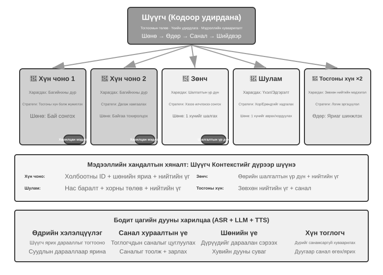
>
>

## Бүлэг Дүгнэлт

Олон Agent-ын хамтын ажиллагааны үнэ цэнэ нь ганц Agent-д байхгүй мэдээллийг нэвтрүүлэхэд оршино. Код гүйцэтгэх үр дүн, харааны санал хүсэлт, гадаад хэрэгслүүдээр дамжуулан баталгаажуулах нь ганцхан сэтгэлгээний гинжин хэлхээнд юу дутагдаж байгааг илчилж чадна; уг мэдээллийн олз нь нэмэлт Token-ы зардлыг зөвтгөж байгаа эсэхийг эхний дизайны туршилтаар тодорхойлох ёстой.

Төв дизайны сонголтууд нь хуваалцсан эсвэл тусгаарлагдсан Context, мөн үе тэнгийн, менежер эсвэл төвлөрсөн бус топологи юм. Хуваалцсан Context нь дэлгэрэнгүй мэдээллийг хадгалдаг боловч Context-ийн өсөлт болон үүргийн инерцийг үүсгэж болзошгүй. Тусгаарлагдсан Context-үүд нь параллель байдал, модульчлал болон зөвшөөрлийн хяналтыг сайжруулдаг боловч багажны параметрүүд, хуваалцсан файлууд эсвэл мессежийн автобусаар дамжуулан хүргэгддэг бүтэцлэгдсэн дамжуулалтын багцуудыг шаарддаг. Виртуал файлын системүүд, Agent амьдралын мөчлөг, мессежийн протоколууд болон A2A нь өгөгдлийн хавтгай, хяналтын хавтгай болон байгууллага хоорондын харилцан ажиллах чадварыг хангадаг. Сайн хамтын ажиллагаа нь хувийн бодлын гинжин хэлхээ биш харин интерфэйсүүд, хил хязгаар, зөвшөөрөл болон хүлээн авах шалгуурыг илчилдэг.

Олон Agent-ын системүүд нь алдааг нэмэгдүүлж болно: хуваалцсан нөөцүүд нь зэрэгцээ байдал болон семантик зөрчил үүсгэдэг, алдаанууд харилцаа холбоогоор дамжин урсаж, нэгэн төрлийн Agents нь нийтлэг шалтгаантай алдаа үүсгэдэг бөгөөд давталтууд хэтэрхий эрт дуусах эсвэл хязгаарлагдмалгүйгээр өргөжиж болно. Өөдрөг үзэлтэй түгжээ болон ажиллах хуулбарыг тусгаарлах, бие даасан хөндлөн баталгаажуулалт, олон янзын мэдээллийн эх сурвалж, тодорхой төсөв, цуцлалт нь алдааг тэсвэрлэх үндсэн давталтыг бүрдүүлдэг. Хүмүүс ойлголцол болон хариуцлагыг гүйцэтгэлийн хамт гадны байгууллагад даатгах ёсгүй; ойлголтын өр болон танин мэдэхүйн бууж өгөх нь бодит эрсдэл хэвээр байна.

Богино хугацааны ажлын хамтын ажиллагаа урт хугацааны, нээлттэй харилцан үйлчлэл болж хувирах үед нийгмийн харилцаа, соёлын хэм хэмжээ, зах зээлийн өрсөлдөөн, тэгш бус мэдээллийн дор стратегийн зан байдал үүсч болзошгүй юм. Хувь хүний ​​түвшинд илүү хүчтэй Model эсвэл уялдаа холбоо нь бүлгийн зохицуулалтыг автоматаар бий болгодоггүй. Олон Agent-ын инженерчлэл нь мэдээллийн урсгал хэрхэн явагддаг, чадавхийг хэрхэн хуваарилдаг, урамшууллыг хэрхэн хязгаарладаг, маргааныг хэрхэн шийдвэрлэдэг, алдааг хэрхэн илрүүлдэг зэргийг төлөвлөх ёстой. Эдгээр механизмууд бат бөх байх үед л хамтын оюун ухаан хувь хүнийхээс давж чадна.

## Бодолтой асуултууд

1. ★★ Хуваалцсан Context-тэй олон Agent-ын хамтын ажиллагааны үед дараагийн Agents нь өмнөх Agents-ийн бүрэн Context-ийг өвлөн авдаг. Гэсэн хэдий ч өмнөх Agent-ээс өвлөгдсөн хүрээ нь дараагийн Agents-ийн дүгнэлтийг гажуудуулж болзошгүй - жишээлбэл, "Шаардлагын шинжээч"-ийн Context-ийг өвлөн авсан "Код хянагч" нь даалгаварт кодын чанарын үүднээс биш харин шаардлагын үүднээс хандаж магадгүй юм. Энэхүү үүрэг хоорондын хөндлөнгийн оролцоог хэрхэн илрүүлж, арилгах вэ?
2. ★★ Менежерийн загварт менежер Agent нь даалгаврын задрал болон үр дүнг нэгтгэх үүрэгтэй. Гэхдээ менежерийн чадавхи нь системийн бүхэл бүтэн гүйцэтгэлийг хязгаарладаг: хэрэв энэ нь даалгаврыг зөв задалж чадахгүй бол хамгийн хүчтэй дэд Agent-ууд ч үр дүнгүй болно. Систем нь менежерийг зөв задрал хийхийг хэрхэн баталгаажуулж чадах вэ?
3. ★★ Төвлөрсөн бус хэв маяг нь хүний ​​байгууллагуудын шилдэг туршлагыг ашигладаг. Гэсэн хэдий ч хүний ​​байгууллагууд нь харилцаа холбоо муу, алдаа гаргах, зорилгын зөрчил гэх мэт олон тооны бүтэлгүйтлийн хэлбэрүүдтэй байдаг. Agent нийгэмд ямар "байгууллагын эмгэг" хамгийн их тохиолддог гэж та бодож байна вэ? Тэдгээрээс хэрхэн урьдчилан сэргийлэх вэ?
4. ★★★ Менежерийн хэв маягт олон дэд Agent-ууд зэрэгцээ ажиллах үед нэг дэд Agent-ын нээлт нь бусад дэд Agent-уудын ажлыг утгагүй болгож болзошгүй (жишээлбэл, хайлтын даалгаварт нэг Agent аль хэдийн хариултаа олсон байна). "Нэг нь амжилттай болвол бүгд зогс" гэсэн үр дүнтэй каскадын төгсгөлийн механизмыг зохион бүтээ.
5. ★★★ Энэ бүлэгт танилцуулсан өөдрөг түгжих механизм нь нэг файлын зэрэгцээ бичих зөрчлийг шийдвэрлэдэг. Гэсэн хэдий ч жинхэнэ олон Agent-ын системд хуваалцсан файлын системүүд нь файл хоорондын семантик зөрчил, нэршлийн орон зайн бохирдол (Agents нь дур мэдэн файл үүсгэж, лавлах эмх замбараагүй байдалд хүргэдэг), мөн нэг цэгийн алдаа (нэг Agent нь бүх файлыг андуурч устгадаг) зэрэг асуудлуудтай тулгардаг. Та илүү бат бөх файлын системийн удирдлагын механизмыг хэрхэн зохион бүтээх вэ?
6. ★★★ Зах зээлд суурилсан Agent хамтын ажиллагаа (Pinchwork, RentAHuman) нь гүйлгээний харилцааг нэвтрүүлдэг: нэг Agent нь даалгаврыг гүйцэтгэхийн тулд өөр Agent (эсвэл хүнд) төлбөр төлдөг. Ажил олгогч Agent нь гүйцэтгэгчийн гүйцэтгэсэн үр дүнгийн чанарыг хэрхэн автоматаар хэмжиж чадах вэ? Хэрэв гүйцэтгэгч гүйцэтгэсэн гэж мэдэгдсэн боловч ажил олгогч чанарыг чанар муу гэж үзвэл маргааныг хэн шийдвэрлэх вэ? Зах зээл нь чанар муутай үйлчилгээ үзүүлэгчдийг өндөр чанартай үйлчилгээ үзүүлэгчдийг шахан гаргахаас хэрхэн урьдчилан сэргийлэх вэ?
7. ★★ RentAHuman нь Agents-д криптовалютаар дамжуулан хүмүүсийг ажилд авах боломжийг олгож, уламжлалт хүн-машин харилцааг эргүүлж байна. Хэрэв энэ Model өргөн тархвал хүмүүс Agent эдийн засагт ямар үүрэг гүйцэтгэх вэ? Тэд зөвхөн Agents-ийн хийж чадахгүй физик ажлуудыг хийх үү?
8. ★★ Хүний нийгэмд хөдөлмөрийн хуваарилалт хэрэгтэй байдаг, учир нь хүн бүрийн чадвар хязгаарлагдмал байдаг - фронтенд хөгжүүлэгч нь backend-ийг мэдэхгүй байж магадгүй, дизайнер нь үйлдлийн талаар мэдэхгүй байж магадгүй юм. Гэсэн хэдий ч том Model-ууд нь "ерөнхийлөгчид"-тэй илүү ойр байдаг. Судалгаанаас харахад цэвэр текстийн сэтгэлгээний даалгаврууд дээр олон Agent-ын мэтгэлцээн нь тэнцүү тооцоололтой үед ганц Agent-ийг давж гарахгүй. Тэгэхээр олон Agents-ийн жинхэнэ давуу тал хаана байна вэ?
9. ★★★ Энэ бүлэгт олон Agent системүүдийн гол дизайны хэмжээс болох "хамтран ашигласан Context" болон "хамтран ашиглагдаагүй Context"-ийг авч үздэг. Хамтран ашигласан Context нь бүх Agents-д ижил мэдээллийг харах боломжийг олгодог бөгөөд энэ нь зохицуулалтыг хөнгөвчилдөг бололтой. Гэсэн хэдий ч *Гурван биеийн асуудал*-д Трисоларанчуудын оюун ухаан бүрэн тунгалаг боловч тэдний технологийн хөгжил зогсонги байдалд ордог; цаасан хавчаараар хийсэн бодлын туршилт нь бүлэг нэг зорилгод нэгдэх үед олон янз байдал алдагддаг болохыг харуулж байна. Олон Agent системд бид үр ашиг ба олон янз байдлыг хэрхэн тэнцвэржүүлэх вэ?
10. ★★★ Кодчилолын Agent-д 30 алхам болон 300 алхамын төсөв оноох. Түүний ажлын стратеги хэрхэн ялгаатай байх ёстой вэ? Судалгаанаас харахад алхамын төсвийг нэмэгдүүлэх нь гүйцэтгэлийн сайжруулалтыг баталгаажуулдаггүй - Agents нь гүехэн хайлтын дараа эрт "ханаж" магадгүй юм. Agent нь бага төсвийн дор гол функцийг хурдан биелүүлэх, мөн их төсвийн дор төлөвлөлт, туршилт, хяналтын үе шатуудыг нэмж, нэмэлт тооцооллын нөөцийг бүрэн ашиглах боломжийг олгодог "төсөвт мэдлэгтэй" механизмыг зохион бүтээ.
11. ★★ Хүснэгт 10-2 нь олон Agent-ын системийг үйлдлийн системүүд рүү мөр мөрөөр нь холбодог. Хүснэгтийг хэдэн мөрөөр өргөтгөнө үү: виртуал санах ой болон хуудаслалт, файлын зөвшөөрөл, түгжээ илрүүлэлт, хуваарь гаргах алгоритмууд нь Agent ертөнцөд юутай тохирч байна вэ? Agent ертөнцөд ямар үйлдлийн системийн концепцүүд байдаггүй вэ, яагаад?
