# Харилцан үйлчлэл: Ажиглалт болон үйл ажиллагааны орон зайг өргөжүүлэх нь

Бүлэг 1 нь нэгэн мэдэгдэл хийсэн: үндсэн Model нь тогтмол байх үед Agent-ийн даалгаврын гүйцэтгэлийг сайжруулах хамгийн үр дүнтэй системийн инженерчлэлийн хөшүүрэг нь ихэвчлэн түүний **ажиглалтын орон зай** болон **үйл ажиллагааны орон зай**-г дахин тодорхойлох эсвэл өргөжүүлэх явдал юм. Бүлэг 2-5-д энэ санааг практик дээр судалсан - Context инженерчлэл нь ажиглалтад юу орохыг шийддэг, санах ой болон мэдлэгийн бааз нь ажиглалтыг сессүүдийн хооронд тэлдэг, хэрэгслүүд нь Agent юу хийж чадахыг тодорхойлдог бөгөөд код үүсгэх нь өөрийн гэсэн шинэ үйлдлүүдийг бий болгох боломжийг олгодог.

Гэхдээ эдгээр бүх өргөжилтүүд нь нэг нийтлэг таамаглалын дор явагдсан: **Agent болон дэлхий ээлжлэн ярьдаг**. Хэрэглэгч өгүүлбэрээ дуусгаж, Agent хэсэг бодож, хэдэн хэрэгслийг дуудаж, хариулдаг; бодож байх зуур дэлхий зогсонги байдалд орсон гэж үздэг. Энэ таамаглал нь маш байгалийн тул таамаглал болгон бичих нь ховор байдаг.

Энэ бүлэгт яг энэ таамаглалыг арилгаж байна.

## Хоёр тэнхлэг: Модуль ба цаг хугацаа

Ажиглалтын орон зай болон үйлдлийн орон зайг хоёуланг нь хоёр хэмжээсээр өргөжүүлж болно.

- **Арга зүй** нь ажиглалт болон үйлдлийн **хэлбэрийг** тодорхойлдог: Agent нь зөвхөн текст уншдаг уу, эсвэл дуу сонсож, дэлгэц харж, эргүүлэх хүчийг мэдэрч чадах уу; энэ нь зөвхөн жетон ялгаруулж чадах уу, эсвэл ярьж, товшиж, үе мөчийг жолоодож чадах уу?
- **Цаг хугацаа** нь ажиглалт болон үйлдлийн **хэмнэлийг** тодорхойлдог: Agent ажиглалт авчрахаар явах уу, эсвэл дэлхий түүнийг түлхэх үү; үйлдэл нэг эргэлтийн дотор дуусах ёстой юу, эсвэл эргэлтүүдийг хамарч, дунд нь тасалдаж, илүү яаралтай зүйлээр урьдчилан сэргийлэх ёстой юу?

Өмнөх бүлгүүд эдгээр хоёр орон зайн **агуулгыг** өргөжүүлсэн; энэ бүлэгт тэдгээрийн **загвар** болон **цаг хугацааны** талаар өргөжүүлсэн болно:

| | Ажиглалтын орон зайг өргөжүүлэх | Үйл ажиллагааны орон зайг өргөжүүлэх |
|---|---|---|
| **Агуулга** (Бүлэг 2–5) | Context инженерчлэл, санах ой болон мэдлэгийн баазууд | Tools, код үүсгэх |
| **Хэв маяг** (энэ бүлэг) | Дуу хоолой, дэлгэц, физик мэдрэгч | Ярих, товших, үе мөчний хөдөлгөөн |
| **Цаг хугацаа** (энэ бүлэг) | Дэлхий ертөнц тасралтгүй урсаж, түлхэж байна | Эргэлтүүдээр дамжин, тасалдаж болох, урьдчилан сэргийлэх боломжтой |

**Эргэлт гэдэг нь Model болон түүний интерфэйсийн харилцан үйлчлэлийн конвенц болохоос орчны шинж чанар биш юм.** Эртний багаж дуудлагын интерфэйсүүд нь ерөнхийдөө мессежийг синхрон тойрог болгон зохион байгуулдаг байсан: асуултын дараа хариулт ирдэг байсан бөгөөд үндэслэлийг үргэлжлүүлэхийн өмнө багажны үр дүнг өгөх шаардлагатай байв. Бодит орчин нь Model хариу үйлдэл үзүүлэхийг хүлээдэггүй: захидал бодож байх үед ирдэг, хэрэглэгч өгүүлбэрийн дундуур тасалдаг, хуудас дэлгэцийн агшин хооронд шилждэг, гар нь хүрэх үед аяга унадаг. Энэ конвенц бас өөрчлөгдөж байна: 2026 оны 9-р сарын байдлаар GPT-6 Astra нь уугуул асинхрон багаж дуудах болон ээлжийн дунд хэрэглэгчийн зааврыг нэмэх боломжийг санал болгодог. Тиймээс энэ бүлэгт уугуул дэмжлэг болон одоо байгаа синхрон интерфэйсүүдтэй нийцтэй байдлын талаар авч үздэг.[^ch6-22][^ch6-23]

| Масштаб | Хувилбар | Ажиглалтын талын өөрчлөлт | Үйлдлийн талын өөрчлөлт |
|---|---|---|---|
| Секунд — өдрүүд | Асинхрон болон үйл явдалд суурилсан | Дэлхий ертөнц Agent-г сэрээдэг (шуудан, цаг хэмжигч, буцах дуудлага) | Үйлдлүүд ээлжлэн үргэлжилдэг: одоо эхэлж, үйл явдлын дараа дуусдаг |
| 10 мс — 1 сек | Дуу хоолой | Бүтэн өгүүлбэр хүлээлгүйгээр ярьж байхдаа сонс | Ярьж байхдаа бодож үзээрэй, тасалдалтай, дунд нь давтаж болно |
| Секундээс доогуур — секунд | Компьютерийн хэрэглээ | Дэлгэц кадр хооронд өөрчлөгдсөөр байна | Жүжиглэсний дараа бодит байдал төлөвлөгөөний дагуу дахин батлагдах ёстой |
| Миллисекунд | Робот техник | Мэдрэгч тасралтгүй буцаж урсдаг | Үйлдлүүд нь хэсэгчлэн хуваагддаг: бага багаар төлөвлөх, урьдчилан сэргийлэх боломжтой |

## Асинхрон ба үйл явдалд суурилсан: Дэлхий таныг хайж ирэх үед

Бүлэг 4-т хэлэлцсэн ойлголт, гүйцэтгэл болон хамтын ажиллагааны хэрэгслүүдийг бүгдийг нь Agent урьдчилан идэвхжүүлдэг. Agent нь хэзээ ч тохиолдож болох гадаад үйл явдлуудад хэрхэн хариу үйлдэл үзүүлэх ёстой вэ? Энэ нь үйл явдалд суурилсан асинхрон архитектурыг шаарддаг. Бүлэг 1-ээс үлдсэн хоёр хэрэгслийн анги болох үйл явдлыг өдөөх хэрэгслүүд болон хэрэглэгчийн харилцаа холбооны хэрэгслүүд нь энэ архитектураас хамаардаг тул тэдгээрийг энд бас авч үзэх болно.

Энэ хэсэгт аргачлал өөрчлөгддөггүй - энэ нь текст хэвээрээ; зөвхөн цаг хугацаа өөрчлөгддөг. Энэ бол өмнөх таван бүлгийн ээлжинд суурилсан ертөнцөөс гарах эхний алхам юм.

### Асинхрон байдал яагаад хэрэгтэй вэ

Асинхрон байдал яагаад хэрэгтэйг тайлбарлахын тулд аналогиос эхэлье. Синхрон гэдэг нь "дараагийн зүйлийг хийхээсээ өмнө нэг зүйлийг хий" гэсэн үг бол асинхрон гэдэг нь "олон зүйл нэгэн зэрэг тохиолдож болно" гэсэн үг юм. Уламжлалт синхрон Agent архитектур нь дэлгүүрийн ганц кассын лангуутай адил юм - энэ нь нэг удаад зөвхөн нэг үйлчлүүлэгчийг хүлээн авч, одоогийн дугаараа дуусгасны дараа л дараагийн дугаар руу залгадаг. Үнэхээр ухаалаг туслах нь уян хатан нарийн бичгийн даргатай илүү төстэй - ширээн дээр олон хүлээгдэж буй зүйлс (имэйл, утасны дуудлага, зочид) байдаг, нарийн бичгийн дарга яаралтай байдлаас хамааран алийг нь эхлээд зохицуулахаа шийдэж, түр зогсоод илүү яаралтай ажил руу дунд нь шилжиж болно. Синхрон горимд Agent нь хэрэглэгчтэй ярихаасаа өмнө суурь даалгавар дуусахыг хүлээх эсвэл шинээр ирсэн үйл явдлыг боловсруулахаасаа өмнө яриа дуусахыг хүлээх хэрэгтэй болдог. Энэ нь жинхэнэ туслахын хувилбарт шаардлагатай үндсэн чадавхийг хангаж чадахгүй:

- **Асинхрон гүйцэтгэл бол хэвийн үзэгдэл**—Олон даалгаварууд урт хугацааны ажиллах хугацаа шаарддаг бөгөөд хэрэглэгчийн харилцан үйлчлэлийг хаах ёсгүй.
- **Үйл явдлын эрэмбийн динамик дүгнэлт**—Бүх үйл явдлууд адилхан чухал биш. Agent нь ухаалгаар зохицуулах стратегийг сонгох шаардлагатай: одоогийн үйлдлийг цуцлах (яаралтай), дараалалд нэмэх (хэвийн), эсвэл зэрэгцээ боловсруулах (бие даасан хөнгөн асуулга).
- **Тэгш тасалдал ба дахин үргэлжлүүлэлт**—Таслагдсан яриа эсвэл даалгавар аяндаа үргэлжлэх боломжтой байх ёстой.

LLM-д асинхрон парадигмыг хэрэгжүүлэхдээ эхлээд Model болон API нь энэ мессежийн хугацааг дэмжиж байгаа эсэхийг шалгаарай. Зарим интерфэйсүүд ажил үргэлжлэхээс өмнө бүх хэрэгслийн үр дүнг шаарддаг; зарим нь Model ажиллаж байх хооронд хэрэгслүүдийг хүлээгдэж байх боломжийг олгодог бөгөөд үүсгэх явцад хэрэглэгчийн шинэчлэлтийг хүлээн авдаг. Эхнийх нь үйл явдлын дараалал, даалгаврын бариул, нийцтэй байдлын давхарга шаарддаг; сүүлийнх нь уугуул асинхрон протоколуудыг шууд ашиглаж болно. Хоёулаа үйл явдлын эх үүсвэр, хэрэгслийн амьдралын мөчлөг, үр дүнгийн эзэмшлийг удирдахын тулд програмыг шаарддаг хэвээр байна. Зөвхөн кодонд `asyncio` ашиглах нь Model нь уугуул асинхрон чадвартай гэдгийг батлахгүй.

Үүнийг шийдэхийн тулд бидэнд **үйл явдлаар удирдагдсан асинхрон Agent архитектур** хэрэгтэй. Техникийн хувьд энэ нь систем цаашид "шинэ мессеж"-ийг идэвхтэй, давтан шалгахаа больсон (энэ нь үр ашиггүй санал асуулга), харин шинэ мессеж ирэхэд автоматаар боловсруулалтын логикийг идэвхжүүлдэг гэсэн үг юм. Бүх оролт, гаралт, бодлын үйл явц болон гадаад харилцан үйлчлэлийг үйл явдлын урсгал буюу цагийн шугам дээр байрлуулсан үйл явдлын бичлэгийн дараалал болгон жигд загварчилсан болно. Зураг 6-1 нь үйл явдлаар удирдагдсан асинхрон Agent-ийн ерөнхий архитектурыг харуулж, үйл явдлын эх үүсвэр, үйл явдлын дараалал болон Agent боловсруулах урсгалын хоорондын хамаарлыг харуулсан болно.

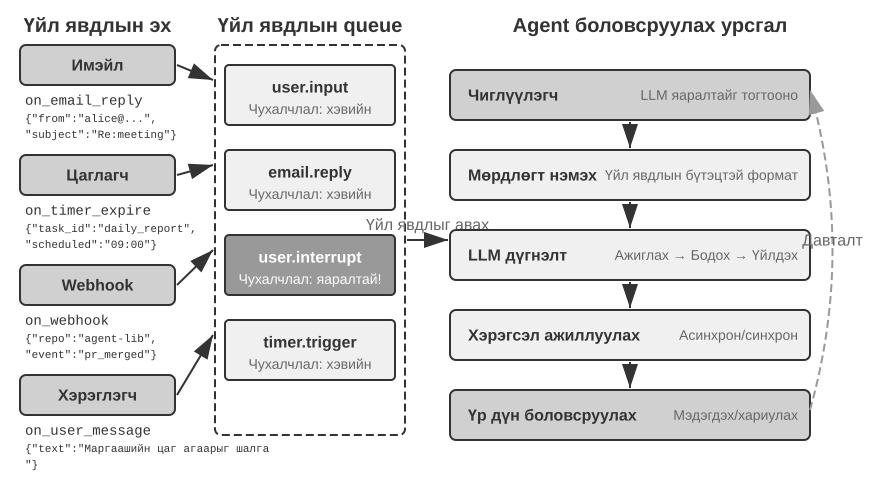

### OpenClaw дээр үйл явдалд суурилсан механизмыг хэрэгжүүлэх нь

OpenClaw нээлттэй эхийн хүрээ нь Gateway хяналтын хавтгайгаар дамжуулан олон сувгийн мессежийг хүлээн авч, тэдгээрийг Agent ажиллах хугацаа руу чиглүүлдэг. Энэ нь үйл явдалд суурилсан гурван суурилагдсан механизмыг хангадаг:

- **Дэгээнүүд**: Agent-ийн амьдралын мөчлөгийн үйл явдлуудад, тухайлбал сесс үүсгэх болон дахин тохируулах зэрэг үйл явдлуудад GitHub үйлдлүүд дэх үйл явдлын өдөөгчтэй төстэй хариу үйлдэл үзүүлдэг
- **Cron (хуваарьт даалгаврын хуваарь гаргагч)**: Cron илэрхийллүүдийн дагуу үечилсэн даалгавруудыг гүйцэтгэх (Unix системд хуваарьт даалгавруудад өргөн хэрэглэгддэг синтакс, жишээлбэл, `0 9 * * 5` гэдэг нь Баасан гараг бүр өглөөний 9 цаг гэсэн үг)
- **Зүрхний цохилт (Зүрхний цохилтын даймонд)**: Ямар нэгэн зүйлд анхаарал хандуулах шаардлагатай эсэхийг шалгахын тулд Agent-г N минут тутамд сэрээдэг.

Эдгээр гурван механизм нь OpenClaw Agents-д бие даасан байдлын дүр төрхийг өгдөг - хэрэглэгч офлайн байсан ч Agent нь хуваарийн дагуу тайлан гаргаж, системийн төлөвийг шалгаж, ердийн ажлуудыг зохицуулж чаддаг. Gateway нь IM болон вэб интерфэйс зэрэг суурилагдсан сувгуудаас ирсэн мессежүүдийг **түлхэх** хэлбэрээр аль хэдийн зохицуулдаг. Гурван механизмаас зөвхөн Cron болон Heartbeat нь Agent-ийг хэрэглэгчийн мессежгүйгээр ажиллуулах боломжийг олгодог бөгөөд хоёулаа **цаг хугацаагаар удирддаг**: Зүрхний цохилт тогтмол интервалаар шалгадаг, Cron урьдчилан тохируулсан цагт ажилладаг, Hooks нь OpenClaw хүрээний гадна биш харин дотроос үүсдэг.

Жинхэнэ ялгаа нь суурилагдсан сувгуудаас гаднах гуравдагч талын үйл явдлын эх сурвалжууд юм: шинэ имэйл, гадаад API буцах дуудлага эсвэл яаралтай мэдэгдэл. OpenClaw нь тэдгээрт шууд нэвтрэх замгүй тул Agent нь шууд хариу өгөх боломжгүй бөгөөд зөвхөн дараагийн Cron эсвэл Heartbeat тэмдэглэгээнд л анзаарч магадгүй.

Энэ саатал олон тохиолдолд хүлээн зөвшөөрөгдөхгүй. Жишээ болгон **PineClaw** (Pine AI-ийн OpenClaw залгаас)-г авч үзье: Pine AI нь хэрэглэгчийн өмнөөс бодит утасны дуудлага хийдэг AI туслах бөгөөд төлбөр тооцоо хийх, захиалга цуцлах, даатгалын нэхэмжлэлийг зохицуулах зэрэг ердийн тохиолдлуудад багтдаг. Хэрэглэгч OpenClaw Agent-ээр дамжуулан Pine утасны даалгаврыг эхлүүлэх үед Pine-ийн дуу хоолой AI нь хэрэглэгчийн өмнөөс дуудлага хийх боловч дуудлагын үеэр хэрэглэгч хүссэн үедээ хөндлөнгөөс оролцох шаардлагатай болж магадгүй:

- **Бодит цагийн таних тэмдэг баталгаажуулалт**: Харилцагчийн үйлчилгээний төлөөлөгч данс эзэмшигчийн таних тэмдгийг баталгаажуулахыг хүсэх бөгөөд Pine нь хэрэглэгчээс аюулгүй байдлын код эсвэл нэг удаагийн нууц үг (OTP)-г нэн даруй өгөхийг шаарддаг.
- **Гурван талын дуудлагын баталгаажуулалт**: Харилцагчийн үйлчилгээний төлөөлөгч данс эзэмшигчтэй шууд ярихыг хүсэх бөгөөд Pine нь хэрэглэгчээс хэдхэн секундын дотор утсанд хариулахыг шаарддаг.
- **Ахицын Синхрончлол ба Шийдвэрийн Баталгаажалт**: Хэлэлцээрийн чухал үед (жишээлбэл, нөгөө тал үнийн бууралтыг санал болгосон), Pine нь хэрэглэгчээс хүлээн авах эсэхээ баталгаажуулахыг шаарддаг.

Heartbeat-ийн үечилсэн санал асуулгын тусламжтайгаар төлөөлөгч баталгаажуулах кодыг хүлээж байх хооронд хэрэглэгч мэдэгдэл хүлээн авахгүй байж магадгүй; төлөөлөгч утсаа тасалж, дуудлага амжилтгүй болно.

PineClaw-ийн шийдэл нь OpenClaw-ийн Gateway болон Pine API хооронд бодит цагийн үйл явдлын замыг тогтоодог **Сувгийн механизм** юм. Дуудлага холбогдох, хэрэглэгчийн оролт шаардлагатай эсвэл дуусах үед мессежийг OpenClaw Agent руу шууд илгээдэг бөгөөд энэ нь үүнийг боловсруулж, хэрэглэгчдэд мэдэгддэг.

Энэ тохиолдол нь Agent фрэймворкийн үйл явдалд суурилсан архитектурын үндсэн үнэ цэнийг харуулж байна: **жинхэнэ "идэвхтэй үйлчилгээ" нь зөвхөн Agent нь үйл явдлуудыг үе үе шалгаж чаддаг төдийгүй үйл явдлууд нь Agent-д идэвхтэй мэдэгдэж чаддаг байхыг шаарддаг.** Бүх оролтыг - хэрэглэгчийн мессеж, хэрэгслийн буцаалт, гадаад дуудлага, хуваарьт триггерүүдийг - үйл явдлын урсгалд нэгтгэх, Agent-ийн сэтгэлгээ, үйлдлийг үйл явдлын давталтаар дамжуулан жолоодох нь энэ зорилгод хүрэх архитектурын үндэс суурь юм. Энэхүү архитектурын дор бид үйл явдлыг зохицуулах механизмын тодорхой дизайны талаар хэлэлцэхээс өмнө эхлээд үйл явдлуудтай шууд холбоотой хоёр хэрэгслийн ангиллыг, мөн Agent-ийн бие даасан үйлдлүүдийг дэмждэг виртуал таних тэмдэг болон тусгаарлагдсан гүйцэтгэх орчныг танилцуулах болно.

### Үйл явдлаар өдөөгдсөн Tools

Үйл явдлаас үүдэлтэй хэрэгслүүд нь гадаад үйл явдлууд Agent-ийн үйлдлийг удирддаг оролтын цэгүүд юм. Тэдгээргүйгээр Agent нь зөвхөн тасралтгүй сэтгэлгээний мөчлөгт ажиллаж, хэрэгслүүдийг дуудаж, эцэст нь үр дүнг гаргаад, дараа нь хэрэглэгчийн дараагийн оролтыг хүлээж чадна. Дэлхий дээрх өөрчлөлтийг Agent боловсруулж чадах үйл явдал болгон хөрвүүлэхийн тулд үйл явдлаас үүдэлтэй гурван нийтлэг хэрэгсэл байдаг.

**Цаг хэмжигч** (`set_timer`) нь физик цагтай холбоотой үйл явдлуудыг зохицуулдаг. Хэрэв имэйлд хариу өгөөгүй бол Agent нь хэсэг хугацааны дараа үйл явцын талаар асуух ёстой; хэрэв хүлээн авагчийн ажлын цагаас гадуур дуудлага хийгдсэн бол дараагийн ажлын цонхонд дахин оролдох ёстой. Тиймээс OpenClaw болон Claude код зэрэг Tools нь Agent-г тодорхой цагт өөрийгөө сэрээх боломжийг олгодог. **Нэг удаагийн таймер** нь тодорхой цагтай ажлуудыг зохицуулдаг: хэрэв хэрэглэгч Бямба гарагт "банкны ипотекийн хэлтэс рүү статусын шинэчлэлт авахаар залгаарай" гэж хүсвэл Agent нь "дараагийн Даваа гарагийн өглөөний 10:00 цагт банк руу залгаарай" гэж тохируулдаг бөгөөд таймер нь дуудлагыг идэвхжүүлдэг. **Давтагдах таймер** нь Server-ийн эрүүл мэндийг цаг тутамд шалгах гэх мэт үечилсэн ажлуудыг зохицуулдаг. Зарим гадаад үйлчилгээнүүд үйл явцын шинэчлэлтийг түлхэж чадахгүй бөгөөд асуух ёстой; давтагдах таймер нь уг асуулгыг өгдөг. OpenClaw-ийн Heartbeat нь энэхүү механизмын системчилсэн хувилбар бөгөөд түүний “урьдчилан сэргийлэх үйлчилгээ” чадварын үндэс суурь юм.

**Арын даалгаврын хяналт** (`monitor_shell`) нь асинхрон байдлаар гүйцэтгэгдэж буй хэрэгслүүд эсвэл командын мөрийн даалгавруудаас үүссэн үйл явдлуудыг зохицуулдаг. Зарим командын мөрийн даалгаврууд удаан хугацаанд ар талд ажилладаг бөгөөд Agent нь тэдгээрийн явцыг хянах шаардлагатай. Хэрэв Agent нь "командын мөр рүү ширтэж", явцыг нь шалгахын тулд хэрэгслийг дахин дахин дуудвал жетонуудыг шатаадаг; хэрэв даалгавар бүрэн дуустал хүлээгээд дахин бодох юм бол чухал асуудлуудыг дэлгэх явцад анзаардаггүй бөгөөд хэрэв команд гацвал огт оролцож чадахгүй бөгөөд бүхэл бүтэн ажлыг зогсоодог. Claude код нь `monitor` хэрэгслийг нэвтрүүлснээр үүнийг шийддэг бөгөөд энэ нь Agent нь тодорхой түлхүүр үг агуулсан гаралтыг оролцуулан шинэ командын мөрийн гаралтыг хянах боломжийг олгодог.

**Гадаад үйл явдлын сувгууд** (`connect_channel`) нь шинэ имэйл, API буцах дуудлага эсвэл IM мессеж зэрэг гадаад үйл явдлуудыг Agent руу бодит цаг хугацаанд түлхдэг. Өмнөх хэсэгт дурдсан PineClaw дахь сувгийн механизм нь ердийн хэрэгжилт юм.

Дизайны үүднээс авч үзвэл, үйл явдлаар өдөөгдсөн хэрэгслүүд нь хамааралгүй үйл явдлууд Agent-г сэрээх, тооцооллын нөөцийг үрэхээс урьдчилан сэргийлэхийн тулд тодорхой өдөөх нөхцөл болон шүүлтүүрийн дүрмийг тодорхойлох ёстой. Үйл явдлын ачаалал нь Agent-г сэрээсний дараа хийх шаардлагатай нэмэлт асуулгын тоог багасгахын тулд хангалттай Context мэдээлэл агуулсан байх ёстой.

### Хэрэглэгч Харилцаа холбоо Tools

Хэрэглэгч харилцаа холбооны хэрэгслүүд нь Agents болон хэрэглэгчдийн хоорондох харилцаа холбооны сувгууд төрөлжихийн хэрээр үүсдэг. Claude Code болон Manus зэрэг олон Agents нь уугуул ReAct давталтыг ашигладаг: Agent-ийн "хэлсэн" бүх зүйл (туслах мессеж) нь хэрэглэгч рүү шууд илгээгддэг бөгөөд хэрэглэгч түүнтэй харилцахын тулд апп дотор тодорхой сесс нээх ёстой. Сесс нь ихэвчлэн Agent-ийн хэрэгслийн дуудлагын процессыг илчилдэг.

OpenClaw энэ хэв маягийг эвддэг. Хэрэглэгч нь бие даасан сессийн талаар бодох эсвэл хэрэгслийн дуудлагын дэлгэрэнгүй мэдээллийг дагах шаардлагагүй; хэрэглэгч болон Agent хоёулаа нэг хүсэлтийг нэг хариултаар ээлжлэн солихын оронд хүссэн үедээ мессеж илгээх боломжтой. Энэ нь OpenClaw-д олон хүний ​​​​тодорхойлсноор **хүн шиг оршихуй"** өгдөг бөгөөд нарийн бичгийн дарга шиг асинхрон байдлаар харилцдаг. OpenClaw нь түүхий туслах мессеж илгээхийн оронд зураг, файл агуулж болох бөгөөд яаралтай байдлаас хамааран түлхэх мэдэгдлийг идэвхжүүлж чаддаг тусгай мессежийн хэрэгслүүдийг ашигладаг.

Хэрэглэгчидтэй текстээр харилцахаас гадна улам бүр олон тооны Agents нь бүтэцлэгдсэн картын мессеж эсвэл сануулагч имэйл илгээх гэх мэт **олон горимт харилцааны чадвартай** юм. Зарим Agents нь **Үйлдвэрлэх UI**-ийг туршиж эхэлсэн бөгөөд HTML болон үүнтэй төстэй хэрэгслийг ашиглан хэрэглэгчдэд мэдээллийг илүү ээлтэй байдлаар хүргэдэг интерактив интерфэйсүүдийг бий болгодог. Дизайн түвшинд хэрэглэгчийн харилцааны хэрэгслүүд нь асинхрон мессежийг дэмжих (хэрэглэгч онлайн биш байж магадгүй), уншсан/уншаагүй төлөвийг хянах, сувгуудаар мессежийг тогтвортой байлгах ёстой.

**Олон сувгийн Хэрэглэгч Харилцаа холбоо ба дахин оролцоо.**

**Agent-ийн хариу үйлдэл нь зөвхөн нэг сувгаар хязгаарлагдах ёсгүй; мэдэгдлийн механизм нь хэрэглэгчийг дахин оролцуулах механизм болж үйлчилдэг.** Мессеж илгээх нь шуурхай мессеж, SMS, имэйл, утасны дуудлага, push мэдэгдэл болон бусад сувгуудад хамаарна. Agent нь яаралтай байдал, хэрэглэгчийн байдал, агуулгын шинж чанар, хэрэглэгчийн тохиргооны хослол дээр үндэслэн сувгийг сонгодог бөгөөд чухал мессежүүдийг алдахгүй байхын зэрэгцээ илүүдэл тасалдалаас зайлсхийдэг.

Урт хугацааны ажлуудын хувьд Agent нь хэрэглэгчийн анхаарлыг татахын тулд ажил дууссаны дараа хэрэглэгчдэд урьдчилан мэдэгдэх шаардлагатай. Үе үе хийдэг ажлуудын хувьд (өдөр тутмын хураангуй эсвэл долоо хоног тутмын тайлан гэх мэт) мэдэгдэл нь хэрэглэгчдэд тогтмол харилцах зуршил хөгжүүлэхэд тусалдаг.

Хэрэглэгч харилцаа холбооны хэрэгслүүд нь "хэрэглэгчтэй хэрхэн холбогдох вэ" гэсэн асуудлыг шийддэг. Гэсэн хэдий ч Agent нь эдгээр сувгууд дээр авч үздэг таних тэмдэг болон хэрэглэгчийн өмнөөс үйлдэл хийдэг орчин нь таних тэмдэг болон гүйцэтгэх орчны дэд бүтцийн давхаргыг шаарддаг бөгөөд энэ нь дараагийн хэсгийн сэдэв юм.

### Виртуал таних тэмдэг болон тусгаарлагдсан гүйцэтгэлийн орчин

Бүлэг 4 нь Самантагийн *Тэр* кинонд жишээ болгон эхэлж, Agent нь бодит дижитал ертөнцтэй хэрхэн харилцахын тулд хэрэгслүүдийг ашигладаг болохыг харуулж байна. Ийм ерөнхий зориулалттай туслахыг бий болгох нь гол архитектурын сонголтыг шаарддаг: Agent нь хэрэглэгчийн хувийн дансыг шууд удирдах уу, эсвэл өөрийн гэсэн виртуал таних тэмдэгтэй байх уу? Шууд удирдлага тохиромжтой харагдаж байгаа ч нэг Agent алдаа эсвэл алдаа нь хэрэглэгчийн бүх дижитал таних тэмдгийг илчилдэг. Хамгийн аюулгүй арга бол Agent-д бие даасан виртуал таних тэмдэг өгөх явдал юм - нарийн бичгийн дарга өөрийн гэсэн оффисын утас, шуудангийн хайрцагтай байдаг шиг - тусгай харилцаа холбооны данс, хадгалах сан, тооцоолох орчноос бүрдсэн тул Agent нь хэрэглэгчийн өмнөөс ил тод, тодорхой тунхагласан таних тэмдгийн дор ажиллах боломжтой. Энэхүү ил тод байдал нь итгэлцлийг сулруулахгүй; энэ нь харилцаа холбоог илүү жинхэнэ болгож чадна.

Виртуал таних тэмдэгтүүд нь тусгаарлагдсан гүйцэтгэх орчин шаарддаг. **Виртуал компьютер** (VM/контейнер) болон **виртуал утас** (Андройд эмулятор) нь Agent үйлдлийн системийг тусгаарлаж, ширээний компьютер эсвэл гар утасны бүрэн боломжийг олгодог. Нэгдүгээрт, виртуал компьютер нь хэрэглэгчийн төхөөрөмж онлайн байгаа эсэхээс үл хамааран хэрэглэгчийн ажиллуулж буй аппликейшнуудыг тасалдуулахгүйгээр цагийн турш ажиллах боломжтой. Хоёрдугаарт, Agent алдаа нь хамгийн муу тохиолдолд хэрэглэгчийн жинхэнэ төхөөрөмжийг биш харин виртуал орчныг эвддэг. Эцэст нь тусгаарлалт нь Agent-ийг хэрэглэгчийн локал файлуудад чөлөөтэй хандахаас сэргийлдэг.

Бие даасан таних тэмдэг нь хоёр практик бэрхшээлийг дагуулдаг. Нэгдүгээрт, **бот эсрэг механизм** байдаг: олон вэбсайтууд автоматжуулсан хандалтыг хаахын тулд CAPTCHA болон IP нэр хүндийн шалгалтыг ашигладаг. Өгөгдлийн төвийн IP хаягийг ашигладаг виртуал орчинг амархан тодорхойлдог; практик дээр ердийн хандалт нь ихэвчлэн орон сууцны прокси сүлжээг тохируулахыг шаарддаг (жинхэнэ өрхийн IP хаягийг ашигладаг). Хоёрдугаарт, **хэрэглэгчийн бодит бүртгэлд хандах**: даалгавар нь хэрэглэгчээр нэвтрэх шаардлагатай үед Human-in-the-Loop баталгаажуулалтыг ашиглаарай - хэрэглэгч биечлэн нэвтэрч, Agent ажиллаж байгаа бүрэн интерфэйсийг харж, баталгаажуулалт яагаад шаардлагатай байгааг ойлгодог VNC/RDP алсын ширээний компьютер. Дараа нь сессийн Token-ыг хэрэглэгчийг дахин дахин тасалдуулахаас зайлсхийхийн тулд хүчинтэй байх хугацаандаа дахин ашигладаг бөгөөд бие даасан байдал болон аюулгүй байдлыг тэнцвэржүүлдэг.

Agent болон виртуал орчны хоорондох Өгөгдөл солилцоо нь **хуваалцсан файлын систем**-ийг ашигладаг: `/workspace/shared` гэх мэт эзлэхүүний холболтууд нь Agent, виртуал компьютер болон виртуал утсыг холбодог. Өгөгдөл нь Context-эд хуулахын оронд файлын замын лавлагаагаар дамждаг. Жишээлбэл, хэрэглэгч CSV файлыг хуваалцсан санд байршуулдаг; виртуал компьютер дахь Agent нь үүнийг шинжилж, тэнд диаграмыг хадгалдаг; Agent нь зөвхөн диаграмын замыг буцаадаг. Хүргэлт бүр хөнгөн замын мөр хэвээр үлддэг.

Үйл явдлаар өдөөгдсөн хэрэгслүүд нь дэлхий ертөнцийг Agent-г сэрээх боломжийг олгодог, хэрэглэгчийн харилцаа холбооны хэрэгслүүд нь Agent-г хэрэглэгчдэд хүрэх боломжийг олгодог бөгөөд тусгаарлагдсан гүйцэтгэх орчинтой виртуал таних тэмдэг нь Agent-г бие даан, аудит хийх боломжтой ажиллах боломжийг олгодог. Үлдсэн асуулт бол: олон үйл явдал нэг Agent инстанц дээр нэгэн зэрэг нийлсэн үед тэдгээрийг хэрхэн зохицуулах ёстой вэ?

### Үйл явдлыг зохицуулах механизм

Нэг Agent инстанс нь нэгэн зэрэг олон үйл явдалтай тулгарч болзошгүй: хэрэглэгчээс ирсэн шинэ мессеж, хэрэгслийн үр дүн, хугацаа дуусах таймер, өөр Agent-ээс ирсэн хамтын ажиллагааны хүсэлт. Эдгээр үйл явдлуудыг хэрхэн үр дүнтэй, зөв ​​​​харьцуулж байгаа нь гүйцэтгэл болон хэрэглэгчийн туршлагад шууд нөлөөлдөг.

Энэ механизмын араг яс нь зэрэгцээ програмчлалаас үүссэн **үйл явдлын давталт** юм. Асинхрон Agent-г удаан хугацаанд үргэлжлэх давталт гэж төсөөлөөд үз дээ: давталт бүр оролтын дарааллаас үйл явдлуудын багцыг авч, тэдгээрийг траекторт нэмж, LLM-г нэг удаа дуудаж, дуудахаар шийдсэн хэрэгслүүдээ ажиллуулж, дараа нь давталтын дээд хэсэгт буцаж дараагийн үйл явдлуудын багцыг хүлээнэ - Go goroutine нь сувгаас мессеж уншиж, `for { select { ... } }` дотор тэдгээрийг тойрог бүрээр нь боловсруулдагтай ижил бүтэцтэй.

Уламжлалт синхрон интерфэйсийн хэрэгжилтэд **үйл явдлууд нь тойрог бүрийн хил хязгаарт** зарцуулагддаг. LLM нь үндэслэлтэй эсвэл хэрэгсэл гүйцэтгэгдэж байх үед шинэ үйл явдлууд тойрог нь **аюулгүй цэг** хүрэх хүртэл дараалалд хүлээдэг - үндэслэлийн хэсэг дуусах эсвэл хэрэгслийн дуудлага буцаж ирэх хүртэл. Уугуул асинхрон байдал нь Model нь бодож эсвэл гаралт гаргаж байх үед шинэ шаардлагууд ирэхийг зөвшөөрдөг бөгөөд систем нь боловсруулалтыг үргэлжлүүлэх тохиромжтой мөчийг сонгодог. Хоёулаа өөр өөр давхаргаар удирддаг хил хязгаартай байдаг. Хэрэгслийг цуцлах нь гүйцэтгэгч нь цуцлах дохионд хариу өгөхийг шаарддаг хэвээр байгаа бөгөөд энэ нь Go дээр `ctx.Done()`-г шалгахтай адил юм; "зогсоох" мессеж хүлээн авах нь аль хэдийн болсон үйлдлүүдийг буцаахгүй.

Энэ ялгааг харгалзан бид эхлээд синхрон интерфэйсүүдтэй нийцтэй үйл явдлын давталтыг ашиглан гурван стратегийг тайлбарлах болно: үйл явдлуудыг дараагийн байгалийн аюулгүй цэг хүртэл хүлээлгэх (дарааллын дараалал), аюулгүй цэгийг эрт үүсгэх (цуцлах), эсвэл гол давталтын аюулгүй цэгийг хүлээлгүйгээр өөр давталт эхлүүлэх (зэрэгцээ боловсруулалт). Бид дараа нь уугуул жолоодлого руугаа буцна.

**Бүтэцлэгдсэн үйл явдлын загварчлал.**

Удирдлага нь ойлголт шаарддаг. Ерөнхий зориулалттай Agent-ийн оролт нь зөвхөн хэрэглэгчээс ирдэггүй - хэрэглэгч гуравдагч этгээдийн мессежийг Agent руу илгээдэггүй ч Agent үүнийг ойлгож, ач холбогдлыг нь үнэлж, оролцох эсэхээ шийдэх ёстой. Энэ нь оролт бүрийг семантикаар баялаг **бүтэцлэгдсэн үйл явдал** гэж загварчлахыг шаарддаг:

- **Эх сурвалж (хэн)**: Хэрэглэгч өөрөө, холбоо барих хүн, танихгүй хүн, системийн мэдэгдэл
- **Суваг (хэрхэн)**: Утасны дуудлага, SMS, шуурхай мессеж, имэйл, олон нийтийн мэдээллийн хэрэгсэл, таймерын өдөөгч, асинхрон хэрэгслийн дуудлагын үр дүн, командын мөрийн хяналтын төлөвийн шинэчлэлт
- **Агуулга (юу)**: Зурвасын текст, сэтгэл хөдлөлийн өнгө аяс, яаралтай байдал, хариу өгөх шаардлагатай эсэх
- **Context (арын дэвсгэр)**: Өмнөх харилцан ярианд хариулах эсвэл шинэ харилцаа холбоо байхаас үл хамааран одоогийн даалгавартай холбоотой байх

Жишээ нь, үйлчлүүлэгчийн буцаан олголтын хүсэлтийн имэйлийг авч үзвэл бүтэцлэгдсэн үйл явдал дараах байдалтай байна:

```json
{
  "source": {"type": "email", "sender": "client@example.com"},
  "channel": "gmail_webhook",
  "content": {"subject": "Refund Request", "body": "Order #12345, requesting a refund..."},
  "context": {"priority": "high", "customer_tier": "vip", "related_orders": ["#12345"]}
}
```

Эдгээр хэмжээсүүдийг бүтэцлэгдсэн үйл явдлууд гэж тодорхой загварчилсан үед л Agent нь олон талт харилцаа холбооны талаар тодорхой ойлголттой байж, хэрэглэгчийн оролтыг хэрэгслийн үр дүн гэж андуурч, эсвэл хэрэглэгчийн командын далд зааварчилгаа агуулсан хэрэгслийн үр дүнг андуурч (шууд оруулга) болохгүй. Олон урсгалтай Context менежментийн нарийн төвөгтэй байдал нь Agent-ээс олон харилцан ярианы урсгалын хоорондын харилцааг ойлгохыг шаарддаг - гуравдагч этгээдээс ирсэн мессеж нь хэрэглэгчийн сэтгэл санаанд хэрхэн нөлөөлдөг, өөр өөр харилцан яриан дахь хэрэглэгчийн үүргийн шилжилт, зөвлөгөө өгөхийн тулд өөр өөр урсгалаас мэдээллийг хэзээ нэгтгэх.

n8n зэрэг ажлын урсгалын платформуудын триггерийн экосистем нь үүнийг онцолж байна: вэбхук, таймер, имэйл, мэдээллийн сангийн өөрчлөлт, файл ажиглагч - триггер бүр нь Agent-ийн дэлхийг танин мэдэх "мэдрэхүй"-үүдийн нэг юм. Эдгээр олон янзын үйл явдлуудыг бүтэцлэгдсэн хэлбэрээр жигд загварчилсны дараа Agent нь янз бүрийн эх сурвалжаас ирсэн өдөөлтийг тууштай байдлаар зохицуулж чадна; доор хэлэлцсэн яаралтай байдлыг тодорхойлох, боловсруулах стратегиуд бүгд энэхүү нэгдсэн загварчлал дээр тулгуурладаг.

**Яаралтай байдалд суурилсан динамик боловсруулалтын стратеги.**

Хүмүүс олон ажлыг зэрэгцүүлэн хийхдээ стратегиа яаралтай байдалд тохируулан өөрчилдөг: онцгой байдлын үед хийж байгаа зүйлээ орхигдуулдаг; хийх ёстой ажлуудаа дараа нь хийхээр жагсаалтад оруулдаг. Agent-ийн үйл явдлыг зохицуулах нь мөн адил ухаалаг байдлыг харуулах ёстой.

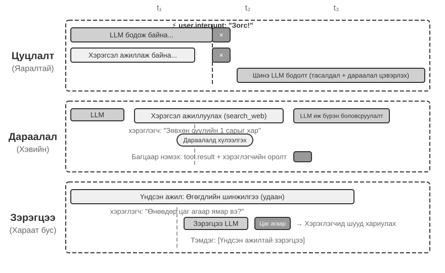

**Цуцлалтад суурилсан боловсруулалтыг** яаралтай үйл явдлуудад ашигладаг; үүний мөн чанар нь яаралтай үйл явдлын хувьд **аюулгүй цэгийг эртнээс шаардах** явдал юм: энэ мөчийг шинэ үйл явдлыг ашиглаж болох хил хязгаар болгон хувиргахын тулд одоогийн алхмыг урьдчилан зогсоох. Яаралтай үйл явдал ирэхэд (жишээлбэл, хэрэглэгч "зогсоох" товчийг дарах эсвэл хяналтын систем өндөр ач холбогдолтой заавар илгээх): (1) Одоогийн үйлдлийг зогсоох - хэрэв LLM нь үндэслэлтэй бол урсгалын хариуг нэн даруй цуцлах; хэрэв синхрон хэрэгсэл ажиллаж байгаа бол цуцлах дохио илгээх; (2) Бүх хүлээгдэж буй үйл явдлуудыг арилгах замаар хүлээгдэж буй дарааллыг цэвэрлэх; (3) Эдгээр үйл явдлуудыг яаралтай үйл явдалтай хамт замын төгсгөлд нэмэх; (4) Нөхцөл байдлыг үнэлэхийн тулд LLM-г шинэчилсэн бүрэн замын дагуу оролт болгон нэн даруй дахин дуудах. Жишээлбэл, хэрэв хэрэглэгч Agent нь алдаатай үйлдэл хийх гэж байх үед "Зогс! Би буруу зүйл хэлсэн байна" гэж оруулбал Agent нь энэ шинэ оролтыг тэр даруй харж, хэрэглэгчийн юу хэлэхийг дахин үнэлж, улмаар буруу үйлдэл хийхээс зайлсхийх болно.

**Дараалсан Боловсруулалт** нь ердийн үйл явдлуудад ашиглагддаг. Яаралтай бус үйл явдал ирэхэд (жишээлбэл, асинхрон хэрэгсэл үр дүн буцаах эсвэл хэрэглэгч нэмэлт мэдээлэл илгээх): (1) Одоогийн үйлдлийг тасалдуулалгүйгээр үйл явдлыг дарааллын төгсгөлд нэмнэ; (2) Одоогийн үйл ажиллагаа дуусахыг хүлээнэ үү - LLM нь үндэслэлийг дуусгаж, синхрон хэрэгсэл гүйцэтгэлийг дуусгана; (3) Аль ч хэрэгслийн дуудлага дуусч, `tool.result` буцаах үед дарааллыг шалгана уу. Хэрэв дараалал хоосон биш бол бүх үйл явдлуудыг замд нэг дор нэмнэ; (4) LLM нь шинэчлэгдсэн замыг цогцоор нь боловсруулдаг. Энэ нь багц боловсруулалтыг идэвхжүүлж, үр ашгийг сайжруулдаг - жишээлбэл, Agent нь хайлтын хэрэгслийн үр дүнг хүлээж байх үед хэрэглэгч "зөвхөн сүүлийн сарын үр дүнг харуулах" гэж нэмнэ. Энэхүү нэмэлт мэдээлэл дараалалд орж, хайлтын үр дүн буцаж ирэхэд хоёр үйл явдлыг LLM-д хамтад нь үзүүлж, шаардлагагүй тойрог замд орохоос зайлсхийдэг.

**Зэрэгцээ боловсруулалтыг** бие даасан, хөнгөн асуулгад ашигладаг. Жишээлбэл, Agent нь их хэмжээний өгөгдлийг шинжилж байх үед хэрэглэгч гэнэт "Өнөөдөр цаг агаар ямар байна вэ?" гэж асуудаг. Ийм асуулга нь гурван шинж чанартай: тэдгээр нь үндсэн ажилтай холбоогүй, хурдан хариу үйлдэл шаарддаг, гүйцэтгэх зардал багатай. Цуцлалтад суурилсан (чухал үндсэн ажлыг тасалдуулах) болон дараалалд оруулсан боловсруулалт (хэрэглэгчийг хэт удаан хүлээхэд хүргэнэ) аль нь ч тохиромжтой биш. Систем нь эхлээд асуулгад бие даасан байдал, нарийн төвөгтэй байдлыг үнэлж, дараа нь зэрэгцээ үндэслэлтэй сессэд бие даан гүйцэтгэж, хариулт үүсгэхийн тулд шаардлагатай хэрэгслүүдийг дуудаж, тэр даруй буцааж өгдөг. Асуулга болон хариултыг үндсэн даалгаврын замналтай холбож, LLM-г төөрөгдүүлэхээс зайлсхийхийн тулд "үндсэн ажилтай зэрэгцүүлэн гүйцэтгэсэн" гэж тодорхой тэмдэглэсэн байдаг.

**Яаралтай байдлыг тодорхойлох.**

Яаралтай үйл явдлууд: Хэрэглэгч тасалдал (`user.interrupt`), удирдагчийн заавар (`supervisor.instruction`), Agent хоорондын тасалдал (`agent.interrupt`), яаралтай гэж тэмдэглэгдсэн гадаад өдөөгч (жишээ нь, системийн анхааруулга, төлбөрийн алдаа).

Яаралтай бус үйл явдлууд: Хэрэглэгчийн тогтмол оролт (`user.input`), Agent оролт (`agent.input`), хэрэгслийн үр дүн (`tool.result`), таймерын триггер (`timer.trigger`), гадаад ердийн триггерүүд.

Хатуу кодлогдсон дүрмүүд нь хязгаарлалттай байдаг; үйл явдлын семантик нь зохицуулах аргыг заадаг - "Яаралтай зогс!" гэсэн нь цуцлалтад суурилсан боловсруулалтыг ашигладаг, "Өнөөдөр цаг агаар ямар байна?" гэсэн зэрэгцээ боловсруулалтыг ашигладаг, "Тайланг Хятад хэлээр илгээх" гэсэн нь дарааллын боловсруулалтыг ашигладаг. **Үйл явдлын чиглүүлэгч болгон хөнгөн ангиллын LLM ашиглахыг зөвлөж байна**, үйл явдал ирэхэд ямар стратеги баримтлахаа хурдан тодорхойлох.

Цуцлах цэг нь хэрэгсэл эсвэл үндэслэлийг аюулгүй зогсоох боломжтой байрлал байх ёстой; дуусаагүй хэрэгслийн үр дүнг тодорхой орлуулагчаар төлөөлүүлэх бөгөөд хэзээ ч амжилттай болсон гэж хуурамчаар үйлдэх ёсгүй.

Дараах туршилт болох үйл явдалд суурилсан имэйл боловсруулалтын Agent нь дээр дурдсан үйл явдлын боловсруулалтын стратегиудыг ажиллуулах боломжтой хэрэгжилт болгон хэрэгжүүлдэг.

> **Туршилт 6-1 ★★★: Үйл явдалд суурилсан имэйл боловсруулалт Agent**
>
>
> 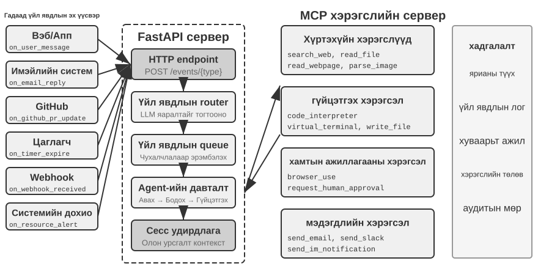
>
>
> Энэхүү туршилт нь хамгийн энгийн үйл явдалд суурилсан Agent-г бүтээдэг: **Автоматжуулсан имэйл боловсруулах туслах**. Agent нь имэйлийн ирсэн хайрцгийг хянадаг бөгөөд шинэ имэйл ирэх бүрт боловсруулах ажлын урсгалыг автоматаар идэвхжүүлдэг - ангилал, нэгтгэн дүгнэх, ноорог хариулт, шаардлагатай бол хэрэглэгчдэд мэдэгдэх. Энэ бол үйл явдалд суурилсан Agent-ийн хамгийн ойлгомжтой танилцуулгын хувилбар юм: гадаад үйл явдал (шинэ имэйл ирсэн) нь Agent-ийн бүрэн сэтгэлгээний мөчлөгийг идэвхжүүлдэг.
>
> **Туршилтын зорилго**: үйл явдалд суурилсан архитектурын гол санааг ойлгох—Agent нь хэрэглэгчийн оролтыг идэвхгүй хүлээхээ больж, гадны үйл явдлуудад хариу үйлдэл үзүүлэхийн тулд өөрөө ажилладаг. Энэхүү туршилтаар дамжуулан уншигчид үйл явдлын эх сурвалжийн бүртгэлийн үндсэн хаалттай гогцоо, үйл явдлын дараалал, "үйл явдал ирэх → Agent процессууд → үр дүн хүргэгдэх"-ийг эзэмших болно.
>
> **Үйл явдлын эх сурвалжууд болон үйл явдлын дараалал.**
>
> Систем нь олон үйл явдлын эх сурвалжид нэгдсэн хандалтыг дэмждэг:
>
> - **Имэйл үйл явдлууд** (`on_email_received`): Шинэ имэйл ирэхэд ирсэн имэйлийг үе үе шалгах эсвэл push мэдэгдэл хүлээн авах замаар идэвхждэг.
> - **IM/SMS мессеж** (`on_im_message`, `on_sms_message`): Шуурхай мессеж эсвэл SMS мессежээр өдөөгддөг.
> - **GitHub Үйл явдлууд** (`on_github_pr_update`, `on_github_issue_update`): PR-ийн тойм сэтгэгдэл эсвэл статусын өөрчлөлтөөс үүдэлтэй.
> - **Цаг хэмжигч** (`on_timer_expire`): Төлөвлөсөн ажлуудаас (жишээ нь, өдөр тутмын хураангуй, долоо хоног тутмын тайлан үүсгэх) өдөөгддөг.
> - **Вэб дэгээнүүд** (`on_webhook_received`): Гадаад системээс ирсэн ерөнхий буцах дуудлага.
> - **Систем Үйл явдлууд** (`on_user_inactive`, `on_process_timeout`, `on_resource_alert`): Дотоод төлөвийн өөрчлөлтүүдээр өдөөгддөг.
>
> Бүх үйл явдлууд нэгдсэн **үйл явдлын дараалалд** орж, ирэх дарааллаар нь дараалан боловсруулагддаг. Үйл явдал бүр бие даасан Agent сэтгэлгээний давталтыг идэвхжүүлдэг: Agent нь үйл явдлын агуулгыг уншиж, холбогдох хэрэгслүүдийг дууддаг (жишээлбэл, мэдлэгийн сангаас лавлагаа авах, хавсралтуудыг унших, холбогдох имэйлийн түүхийг хайх), боловсруулалтын үр дүнг үүсгэдэг (ангиллын шошго, хураангуй, ноорог хариулт), эцэст нь мэдэгдлийн хэрэгслүүдээр дамжуулан хэрэглэгчдэд мэдэгдэх эсвэл үйлдлийг шууд гүйцэтгэдэг.
>
> **Баталгаажуулалтын хувилбар**: Туршилтын шуудангийн хайрцгийг хянахын тулд Agent-г тохируулна уу. Уулзалтын урилга, хэрэглэгчийн гомдол, маркетингийн зар сурталчилгаа гэсэн гурван имэйл хүлээн авахыг дуурайлгана. Agent нь тэдгээрийг дарааллаар нь боловсруулдаг: уулзалтын урилгын хувьд хуанлийн зөрчил байгаа эсэхийг автоматаар шалгаж, хүлээн авах/татгалзах хариу бичдэг; хэрэглэгчийн гомдлын хувьд гол мэдээллийг гаргаж авч, өндөр ач холбогдолтой гэж тэмдэглэж, хэрэглэгчдэд үүнийг зохицуулахыг мэдэгдэнэ; маркетингийн зар сурталчилгааны хувьд үүнийг автоматаар архивладаг. Бүх үйл явц нь хэрэглэгчийн оролцоо шаарддаггүй.

Туршилт 6-1 нь хамгийн энгийн үйл явдлаар удирддаг хэв маягийг харуулж байна - үйл явдлууд дараалалд ордог бөгөөд Agent нь тэдгээрийг дараалан боловсруулдаг. Гэсэн хэдий ч Agent нь удаан хугацаанд ажиллаж байгаа багаж хэрэгслийг ажиллуулах явцад тасалдалд хариу үйлдэл үзүүлэх эсвэл олон зэрэгцээ ажлуудыг нэгэн зэрэг удирдах шаардлагатай үед энгийн үйл явдлын дараалал хангалтгүй байдаг. Дараа нь бид илүү гүнзгий инженерчлэлийн сорилтуудын талаар хэлэлцэх болно.

### Төрөлх асинхрон байдал боломжгүй үед нийцтэй байдал

Туршилт 6-1 нь зөвхөн цуваа үйл явдлуудыг боловсруулдаг: үйл явдлууд дараалалд ордог бөгөөд Agent нь тэдгээрийг нэг нэгээр нь боловсруулдаг. Хэрэв сонгосон Model эсвэл интерфэйс нь уугуул асинхрон байдлыг дэмжихгүй бол хэрэгсэл буцаж ирэхээс өмнө хэрэглэгчийн тасалдлыг синхрон форматаар илэрхийлэх ёстой. Бид энд нийцтэй байдлын аргыг танилцуулж, дараа нь GPT-6 Astra-ийн уугуул интерфэйсийн талаар хэлэлцэх болно.

Agent нь хэрэглэгчдэд имэйл бичихэд нь тусалж, холбоо барих мэдээллийг хайх хэрэгсэл дуудсан гэж бодъё. Хайлт буцаж ирэхээс өмнө хэрэглэгч "Хүлээгээрэй, эхлээд маргаашийн цаг агаарыг надад шалгаарай" гэж хэлдэг. Хэрэв интерфэйс нь харгалзах үр дүнгээ авахын тулд гүйцэтгэлгүй хэрэгслийн дуудлагыг эхлээд шаарддаг бол Agent нь дуудлага хүлээгдэж байгаа үед энэ шинэ мессежийг шууд боловсруулж чадахгүй. Энэ хязгаарлалт нь сонгосон протокол болон Model-ын хослолоос үүдэлтэй; энэ нь LLM бүр дагаж мөрдөх ёстой дүрэм биш юм.

**Синхрон форматтай нийцтэй асинхрон хэрэгжилт.**

Гол санаа нь: **Тасалдалгүй хэвийн нөхцөлд LLM нь стандарт синхрон траекторыг харуулдаг; зөвхөн тасалдал гарсан үед форматыг засахын тулд орлуулагч оруулдаг**. Энд таван гол дүрэм байна:

**Дүрэм 1**: API-с дууссан туслах мессеж болон хэрэгслийн дуудлагын зүйлсийг шуурхай тэмдэглэ. Server-ийн удирддаг үндэслэлийн төлөвийг үйлчилгээ үзүүлэгчийн үргэлжлүүлэх протоколын дагуу хадгал; үл үзэгдэх үндэслэлийн текстийг өөрөө угсарч болохгүй.

**Дүрэм 2**: Хэрэгслийн дуудлагыг дуусгасны дараа л хэрэгслийн үр дүнг тэмдэглэнэ. Гүйцэтгэх явцад замнал нь "хагас дууссан" төлөвт байна.

**Дүрэм 3**: Хэрэгслийг ажиллуулах явцад тасалдал гарахад орлуулагч шаардлагатай. Дуусаагүй хэрэгслийн хариуг үүсгэж (жишээ нь, "Хэрэгсэл ард ажиллаж байна, шинэ үйл явдлыг эрэмбэлнэ үү"), тасалдлын үйл явдлыг нэмж, LLM-г дахин дуудна. LLM-ийн үүднээс авч үзвэл туслах мессеж нь хосолсон хэрэгслийн үр дүнтэй хэвээр байна.

**Дүрэм 4**: Уугуул удирдлага эсвэл дэмжигдсэн дунд эргэлтийн үргэлжлэлийн интерфэйсгүйгээр дуусаагүй үүсэлтийг цуцалж, баталгаажсан дууссан мессежүүд болон хэрэгслийн төлөвийг хадгалж, шинэ үйл явдлыг нэмж, шинэ хүсэлт илгээнэ үү. Хэсэгчилсэн гаралт эсвэл далд үндэслэлийг хүчинтэй угтвар болгон чөлөөтэй буцааж өгч болно гэж бүү бод.

**5-р дүрэм**: Тасралтгүй үйл явдлууд багц боловсруулалтын дараалалд ордог. Тэдгээрийг зөвхөн одоогийн мөчлөг дууссаны дараа нэг дор нэмж оруулдаг.

Хэрэглэгч цаг агаарын талаар асуухаар ​​яриагаа таслахад Agent имэйл бичиж байгаа жишээг ашиглан эдгээр таван дүрмийн үйлчлэл дараах байдалтай байна.

1. Agent нь холбоо барих мэдээллийг хайхын тулд `search_contacts`-г дууддаг бөгөөд туслах мессежийг тэр даруй зам руу бичдэг (1-р дүрэм).
2. Хайлтын хэрэгсэл үр дүнг буцаахаас өмнө хэрэглэгч "Эхлээд маргаашийн цаг агаарыг надад шалгаарай" гэсэн командыг илгээнэ. Энэ нь хэрэглэгчийн тасалдал тул систем нь дуусаагүй `search_contacts`-д зориулсан орлуулагч хэрэгслийн үр дүнг үүсгэдэг ("Хэрэгсэл ард ажиллаж байна, шинэ үйл явдлыг эрэмбэлнэ үү", 3-р дүрэм), дараа нь хэрэглэгчийн цаг агаарын асуулгыг замд нэмж, LLM-г дахин дууддаг. Энэ үед LLM-ийн харж буй замналын формат бүрэн хүчин төгөлдөр байна - туслах мессеж болон хэрэгслийн үр дүн төгс хосолсон байна.
3. Agent цаг агаарын асуулгад хариулсны дараа анхны `search_contacts` үр дүн гарч, шинэ үйл явдал болж замд нэмэгдэнэ (2-р дүрэм). Agent холбоо барих мэдээллийг уншиж, имэйлийг үргэлжлүүлэн бичнэ.

Энэ арга нь синхрон интерфэйсээс шаардагдах хэрэгсэл/үр дүнгийн хослолыг хадгалдаг. "Дуусаагүй" гэж тодорхой тэмдэглэсэн орлуулагчийг зөвхөн тасалдал шаардлагатай үед л оруулдаг. Бодит дэвсгэр үр дүн ирэхэд энэ нь эх сурвалж болон даалгаврын ID-тай үйл явдал хэлбэрээр замд ордог. Уугуул асинхрон байдлыг аль хэдийн дэмждэг Model-уудын хувьд систем нь даалгаврын хүлээгдэж буй төлөвийг хадгалж, бодит үр дүнг ирэхэд Model-т дамжуулж болно.

Орлуулагч нь мөн семантик эрсдэлтэй байдаг: Model нь "даалгавар эхэлсэн"-ийг "даалгавар дууссан"-тай андуурч, үр дүн гарахаас өмнө үр дүнгээс хамаарах шийдвэр гаргаж болзошгүй. Даалгаврын тодорхой төлөв болон үр дүнгийн баталгаажуулалт нь энэхүү төөрөгдлөөс урьдчилан сэргийлэх ёстой бөгөөд үнэлгээ нь хараахан ирээгүй зохиомол өгөгдлийг шалгах ёстой. Ганц алдаа нь шалтгааныг нь тодорхойгүй сургалтын үйл явцтай холбож үзэх үндэслэл болохгүй.

**Даалгаврын бариулаар дамжуулан асинхрон семантикийг илэрхийлэх нь.**

Уугуул асинхрон протоколыг ашиглаж байгаа эсэхээс үл хамааран **хэрэгслийн интерфэйсийн дизайн нь асинхрон семантикийг тодорхой болгож чадна**. Синхрон интерфэйсүүдэд онцгой хэрэгтэй нэг арга бол "start task"-ийг бодит буцах утгатай бүрэн дуудлага болгох явдал юм.

Уламжлалт хэрэгслийн загвар нь "дуудлага нь дууссантай тэнцүү" гэсэн утгатай. Жишээлбэл, `phone_call` гэсэн нэр нь "дуудлага нь утсаар залгаж, дуудлага дуусахыг хүлээж, дуудлагын бүртгэлийг буцаана" гэсэн утгатай. Асинхрон загварын дагуу "эхлүүлэх" болон "дуусгах"-ыг салгах хэрэгтэй:

- `initiate_phone_call`: Утасны дуудлага эхлүүлж, даалгаврын танигч болон анхны төлөвийг шууд буцаана (жишээ нь, "Дуудлага эхэлсэн, залгаж байна...")
- Дуудлагын явцыг үйл явдлын мэдэгдлээр (`phone_call_connected`, `phone_call_ended`) мэдээлнэ.

Гол нь хэрэгслийн нэр болон тайлбар нь өөрөө асинхрон семантикийг илэрхийлэх ёстой. Model нь `initiate_phone_call`-г харахад түүний хэлний ойлголтын чадвар нь үүнийг "дуусгаж" байгаа биш харин "эхлүүлж" байгаа гэж байгалийн жамаар дүгнэх болно. Хэрэгслийн тайлбар нь үүнийг улам бататгах ёстой: "Энэ хэрэгсэл нь дэд Agent-ын зохицуулсан утасны дуудлагын даалгаврыг эхлүүлдэг. Энэ нь амжилттай эхлүүлсний дараа даалгаврын ID-г шууд буцаадаг бөгөөд энэ нь танд бусад асуудлуудыг үргэлжлүүлэх боломжийг олгоно. Дуудлага дуусахад тусдаа мэдэгдлийн үйл явдал илгээгдэх болно."

**Дарааллын дагуу боловсруулалт хийхдээ өмнөх үйл явдлуудыг үл тоомсорлох.**

Багц доторх үйл явдлуудыг боловсруулах үед Model нь зөвхөн сүүлийн үйл явдалд хариу өгч, өмнөх шаардлагыг үл тоомсорлож болно. Уугуул асинхрон байдал нь гүйцэтгэлийн явцад мессежүүд ирж болох эсэхийг шийддэг; бид Model нь бүх шинэчлэлтийг багтаасан эсэхийг шалгах ёстой хэвээр байна.

Хөндлөнгийн оролцоог хоёр түвшинд хэрэгжүүлж болно:

**Prompt Түвшин**: Model-т "Хэд хэдэн дараалсан үйл явдлыг хүлээн авахдаа бүх мэдээллийг цогцоор нь авч үзнэ үү" гэж мэдэгдэнэ үү.

**Agent Статусын мөрийн тэмдэглэгээ**: Үйл явдал бүрийн өмнө тодорхой тэмдэглэгээ нэмнэ үү:

```text
[Unprocessed Event 1/4] Tool result from database_query: ...
[Unprocessed Event 2/4] User supplementary note: Only look at Beijing data
[Unprocessed Event 3/4] System reminder: Report deadline is in 30 minutes
[Unprocessed Event 4/4] User asks: What's the progress?
```

Төгсгөлд нь хураангуй нэмнэ үү: "Дээр 1 хэрэгслийн үр дүн, 2 хэрэглэгчийн мессеж, 1 системийн сануулга зэрэг 4 боловсруулаагүй үйл явдал байна. Таны хариулт бүх мэдээллийг хамарсан эсэхийг шалгаарай."

> **Туршилт 6-2 ★★★: Зэрэгцээ гүйцэтгэл болон тасалдлын чадавхитай асинхрон Agent**
>
>
> 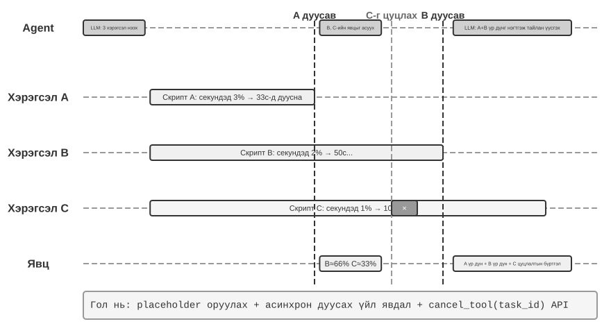
>
>
> Туршилт 6-1-д байгаа энгийн үйл явдлын дараалалд үндэслэн энэхүү туршилт нь **параллель хэрэгслийн гүйцэтгэл, гүйцэтгэлийг цуцлах, төлөвийн менежментийг** хэрэгжүүлэхийн тулд синхрон интерфэйсүүдтэй нийцтэй ажиллах хугацааг ашигладаг. Agent нь хэд хэдэн зэрэгцээ ажлуудыг удирдах, тасалдал болон сэргээх ажиллагааг зохицуулах, одоогийн төлөвөөс динамик шийдвэр гаргах ёстой. Астрагийн уугуул харьцуулалтыг 6-3 туршилтаас үзнэ үү.
>
> **1. Асинхрон Tool гүйцэтгэл**: Цаг хугацаа их шаардсан хэрэгслүүдийн асинхрон гүйцэтгэлийг дэмждэг (дор хаяж 3-5 секунд), эхлүүлэхэд шууд орлуулагчийг буцаана. **Баталгаажуулах хувилбар**: Agent нь удаан хугацаанд ажиллаж байгаа терминалын командыг гүйцэтгэдэг. Энэ хугацаанд хэрэглэгч "Одоо цаг хэд болж байна?" гэж асуудаг. Agent нь тэр даруй хариу өгч, дараа нь удаан хугацаанд ажиллаж байгаа команд дуусахад шинжилгээний үр дүнг харуулдаг.
>
> **2. Үйл явдлын дараалал болон багц боловсруулалт**: Яаралтай бус үйл явдлуудыг хуримтлуулж, тэдгээрийг багц хэлбэрээр траекторт нэмнэ. **Баталгаажуулах хувилбар**: Agent нь урт даалгаврыг гүйцэтгэж байна. Хэрэглэгч дараалсан мессеж илгээдэг: "Япон хэл дээр хариулахаа санаарай" болон "Үүнийг вэб хуудас болгон форматлана уу". Даалгавар дуусахад Agent нь бүх үйл явдлыг нэг дор боловсруулж, Японы вэб хуудас үүсгэдэг.
>
> **3. Тасалдлын механизм**: Хэрэглэгчийн "зогсоох" команд нь гүйцэтгэх урсгалыг нэн даруй зогсоож, асинхрон хэрэгслийг цуцална. **Баталгаажуулах нөхцөл**: Agent нь урт даалгаврыг гүйцэтгэж байна. Хэрэглэгч "Цуцлах" гэсэн командыг илгээнэ. Agent нь тэр даруй зогсох бөгөөд замнал нь тасалдлын үйл явдал болон цуцлах үйлдлийг бүртгэнэ.
>
> **4. Зэрэгцээ Tools**-ийн Цуцлалт болон Төлөвийн Асуулга: Асинхрон хэрэгсэл дууссаны дараа бодит үр дүнг шинэ үйл явдлаар дамжуулан харилцан ярианд оруулна. Даалгаврын ID-аар дамжуулан цуцлалт эсвэл явцын асуулгыг дэмждэг. **Баталгаажуулах нөхцөл**: Хэрэглэгч "Эдгээр гурван скриптийг надад нэгэн зэрэг ажиллуул. Аль нь эхэлж дуусгасан нь үлдсэн скриптүүдийн явцыг шалгана уу. Хэрэв аль нэг нь 50%-иас хэтрээгүй бол цуцална уу" гэж хүснэ. Гурван скрипт нь шинжилгээний процессыг дуурайж, секундэд тус тус 3%, 2%, 1%-ийн хурдаар тасралтгүй ахиц дэвшлийг гаргадаг. Agent нь гурван асинхрон терминалын командыг нэгэн зэрэг эхлүүлдэг. Секундэд 3% хурдтай скрипт 33 секундын дотор дуусахад Agent нь үлдсэн хоёр терминалын төлөвийг асууж, нэг нь 66%, нөгөө нь 33% орчим байгааг олж, дараа нь 50%-иас хэтрээгүй терминалыг цуцалдаг. Хоёр терминал дууссаны дараа үр дүнг нэгтгэн бүрэн тайлан гаргадаг.
>

### Model-Уугуул асинхрон: GPT-6 Astra

Дээрх нийцтэй байдлын аргад ажиллах хугацаа нь ирж буй үйл явдлуудыг захиалдаг тул синхрон интерфэйстэй Model нь асинхрон даалгаварт оролцох боломжтой. Өөр нэг арга нь Model-т энэхүү харилцан үйлчлэлийн хэмнэлийг уугуул байдлаар ойлгох боломжийг олгодог: энэ нь хэрэгсэл ажиллаж байх үед бусад ажлыг хийж, хэрэглэгч дунд нь шаардлага нэмэх үед дараагийн ажлыг тохируулж чаддаг. GPT-6 Astra нь аль хэдийн Async хэрэгслийн дуудлага болон дунд эргэлтийн жолоодлогыг дэмждэг бөгөөд энэ өөрчлөлтийг харуулж байна (Зураг 6-5).[^ch6-22][^ch6-23]

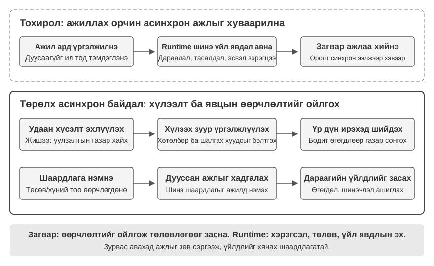

**Асинхрон хэрэгслийн дуудлага нь "үйлдэл эхлүүлэх"-ийг "үр дүнг нь авах"-аас тусгаарладаг.** Удаан асуулга эхлүүлсний дараа Agent нь эргэцүүллээ үргэлжлүүлэх, бусад хэрэгслийг дуудах эсвэл асуулгын үр дүнгээс хамааралгүй хэсгүүдийг зохицуулах боломжтой. Жишээлбэл, уулзалтын газруудыг хайж байхдаа хэлэлцэх асуудлын жагсаалт болон шалгах хуудсыг бэлтгэж, дараа нь байршлын мэдээлэл ирэхэд сонголтуудыг харьцуулж болно. Гол нь хамаарлуудыг ялгах явдал юм: бие даасан ажлыг үргэлжлүүлэх, үр дүн шаардлагатай шийдвэрүүдийг ирэх хүртэл хойшлуулах.

**Эргэлтийн дунд хэсэгт жолооны хүрд нь даалгавар гүйцэтгэгдэж байх үед хэрэглэгч чиглэлээ засах боломжийг олгодог.** Agent хариултаа бодож эсвэл бичиж байх хооронд хэрэглэгч "төсөв буурсан" эсвэл "оролцогчдын тоо өөрчлөгдсөн" гэх мэт шаардлагуудыг нэмж болно. Систем нь дууссан ажлыг хадгалж, шинэ хязгаарлалтуудыг дараагийн боловсруулалтад оруулдаг бөгөөд Agent нь ижил даалгаврын хүрээнд төлөвлөгөөгөө тохируулах боломжийг олгодог. Шинэчлэлт хүлээн авах болон түүний дагуу ажиллах хооронд саатал гарч болзошгүй ч хэрэглэгч өөрчлөлтийг илэрхийлэхээсээ өмнө бүрэн хариулт дуусахыг хүлээх шаардлагагүй.

Эдгээр боломжууд нь харилцан үйлчлэлийн хугацааг уртасгадаг: хэрэгслийн үр дүн болон хэрэглэгчийн шаардлага хоёулаа даалгавар үргэлжлэх үед гарч ирж болно. Систем нь эх сурвалжаа ялгаж, аль ажил дууссан, аль нь хүлээгдэж байгааг санах ёстой. Төлөвлөгөөг өөрчлөх нь өөрөө хэрэгслүүдийг ажиллуулахаа зогсоох эсвэл аль хэдийн хийгдсэн үйлдлийг буцаахгүй; бодит гүйцэтгэл, цуцлалт болон төлөвийн менежмент нь ажиллах хугацааны үүрэг хариуцлага хэвээр байна.

Бүх Model-ууд нь уугуул асинхрон чадвартай байдаггүй. Agent бүтээхдээ Model-ын дэмжлэгт нийцүүлэн уугуул харилцан үйлчлэл эсвэл нийцтэй байдлын аргыг сонгоод, дараа нь бүхэл систем нь хойшлогдсон үр дүн, ажлын дундуурх өөрчлөлт, даалгаврыг дахин эхлүүлэхийг зөв зохицуулж байгаа эсэхийг шалгаарай. Асинхрон сургалт нь эдгээр чадварыг цаашид сайжруулж болох боловч хөгжүүлэгчид одоо байгаа Model-уудыг ашиглан энэ төрлийн харилцан үйлчлэлийг аль хэдийн бий болгож чадна.

### Асинхрон мессеж хүлээн авахаас эхлээд асинхрон даалгавруудыг найдвартай зохицуулах хүртэл

Уугуул асинхрон байдал нь мессежийг гүйцэтгэх явцад ирж болох эсэхийг шийддэг. Нарийн төвөгтэй даалгавруудын найдвартай байдал нь Model нь эдгээр мессежийг хэрхэн ашиглаж байгаагаас хамаарна. Наад зах нь гурван зүйлийг шалгах шаардлагатай:

1. **Үр дүнгийн эзэмшил ба хүлээгдэж буй төлөв**: Model нь хойшлогдсон үр дүнг зөв даалгавартай холбож, үр дүн байхгүй үед өгөгдөл зохиохоос зайлсхийж чадах уу?
2. **Ажлыг дахин эхлүүлэх болон үйл ажиллагааны хяналт**: Шинэ шаардлагыг боловсруулсны дараа анхны даалгавар руугаа буцаж очиж, төлөвлөгөөг өөрчлөх болон гүйцэтгэлийг зогсоохыг ялгаж чадах уу?
3. **Олон шинэчлэлтийг нэгтгэх**: Зөвхөн сүүлийн мессежийг санахын оронд төсөв болон ирцийн хязгаарлалтыг хоёуланг нь хүндэтгэж чадах уу?

Эдгээр асуудлыг асинхрон орчинд Model-ын сургалт болон систем дэх илүү тодорхой даалгаврын төлөв, үйл явдлын эх үүсвэр, гүйцэтгэлийн санал хүсэлтээр дамжуулан шийдвэрлэж болно. Үнэлгээ нь хоёр түвшинг хамрах ёстой: Model нь өөрчлөлтийг ойлгосон эсэх, систем үүний дагуу ажилласан эсэх.

> **Туршилт 6-3 ★★★: Model-Уугуул асинхрон байдал ба эргэлтийн дунд үед жолооны хүрд**
>
> Уулзалтын байршлыг сонгоно уу: удаан асуулга эхлүүлсний дараа Agent нь үр дүнгээс хамааралгүй бэлтгэлийг гүйцэтгэдэг. Үүний зэрэгцээ хэрэглэгч төсөв болон ирцийн шаардлагыг нэмдэг. Асуулга дууссаны дараа Agent нь бүх хязгаарлалтын дагуу байршлыг сонгодог.
>
> Синхрон багаж хэрэгсэл, уугуул асинхрон багаж хэрэгсэл, эргэлтийн дунд жолоодлогыг харьцуулахын тулд GPT-6 Astra API руу залгаарай. Хүлээлт нь бусад ажлыг хааж байгаа эсэх, шинэ шаардлага дараагийн төлөвлөгөөнд орж байгаа эсэх, үр дүн гарахад анхны даалгавар үргэлжлэх эсэхийг ажиглаарай. Дараа нь хаяг бүрийн Model-ын чадавхи болон ажиллах хугацааны зохион байгуулалтыг ойлгохын тулд уугуул дэмжлэггүй Model-ыг удирдлага болгон ашиглаарай.

Асинхрончлол болон үйл явдалд суурилсан гүйцэтгэл нь даалгавар гүйцэтгэгдэж байх үед дэлхийг Agent-г сэрээх боломжийг олгодог; уугуул удирдлага нь хэрэглэгч бүрэн хариулт дуусахаас өмнө шинэчлэлт илгээх боломжийг олгодог. Дараагийн гурван хэсэг нь цагийн хуваарийг улам шахдаг: орчин нь Model үүсгэсэнтэй адил хурдан эсвэл хурдан өөрчлөгдөхөд шинэчлэлт хүлээн авах нь хангалтгүй - систем мөн цагтаа хариу үйлдэл үзүүлэх ёстой.

## Дуу хоолой: Хүн-Машины хамгийн байгалийн интерфэйс

Дуу хоолой гэдэг нь зүгээр л текстийг дуу авиа болгон хувиргадаггүй. Ярих нь бичихээс ойролцоогоор дөрөв дахин хурдан бөгөөд гар, нүдийг чөлөөтэй үлдээдэг тул Agent-г хэрэглэгч хүссэн үедээ тасалдуулж болох тасралтгүй оролт-гаралтын давталтад байрлуулдаг. Диктатив хэл яриаг текст болгон хувиргадаг; дуу хоолой Agent нь хэрэглэгчийг Agent-тэй шууд хамтран ажиллах боломжийг олгодог. Хоёулаа өмнө нь танилцуулсан шивнээ кодлох ажлын урсгалыг дэмждэг.

Энэ хэсэгт хоёр чиглэлийг авч үзнэ: хэрэглэгч Agent-тэй ярьж байгаа, Agent хэрэглэгчийн өмнөөс гадаад ертөнцтэй ярьж байгаа. Дуут Model нь Agent юунд хариулж чадахыг тодорхойлдог; харилцан үйлчлэлийн архитектур нь дуудлагын үеэр тодорхой сонсож, цаг хугацаанд нь хариу өгч, байгалийн жамаар дамжуулж, баталгаажуулалт болон хэрэгслийн дуудлагыг гүйцэтгэж чадах эсэхийг тодорхойлдог. Бид эхлээд харилцан үйлчлэлийн цаг хугацааг, дараа нь танин мэдэхүйн цаг хугацаа болон илэрхийлэх чанарыг судална.

### Харилцан үйлчлэлийн хугацаа: каскадаас бүрэн дуплекс хүртэл

OpenAI-ийн GPT-Live танилцуулгад гурван дуут харилцан үйлчлэлийн загварыг тайлбарласан болно - каскадтай, ээлжлэн, бүрэн дуплекс [^ch6-12]. Эдгээр нь энгийн хуучин болон шинэ орлуулалт биш; тэд хоцрогдол, өртөг, ажиглагдах байдлыг өөр өөрөөр сольдог:

| Парадигм | Гол бүтэц | Гол давуу тал | Гол хязгаарлалт |
| --- | --- | --- | --- |
| Каскад | VAD → ASR → LLM → TTS | Солих болон дибаг хийхэд хялбар тодорхой модулиуд | Хоцрогдол хуримтлагдаж, интерфэйсүүд дээр паралингвистик мэдээлэл алдагддаг |
| Төгсгөлөөс төгсгөл хүртэлх Omni | Ээлж дээр суурилсан харилцан үйлчлэлтэй төрөлхийн аудио оролт болон гаралт | Бага хоцрогдолтой бөгөөд өнгө аяс, сэтгэл хөдлөл болон орчны дуу чимээг илүү сайн хадгалдаг | Ээлж дээр суурилсан хэвээр байна; сургалт болон алдааг олж засварлах зардал илүү өндөр |
| Бүрэн дуплекс | Тасралтгүй сонсох, ярих, шийдвэр гаргах боломжтой төрөлхийн аудио оролт болон гаралт | Давхардсан яриа, байгалийн тасалдал, тасралтгүй урсгал | Training, хяналт, үнэлгээ нь илүү төвөгтэй |

Нийтлэг сэдэв бол хүмүүс нэг нэгээр нь ярих ёстой гэсэн таамаглалаас зайлсхийх, хэн үг хэлэх ёстой талаарх VAD-ийн таамаглалаас зайлсхийх явдал юм. Каскад болон Омни системүүд нь харилцан үйлчлэлийг ээлж болгон хуваадаг хэвээр байгаа бөгөөд бүрэн дуплекс нь ээлжийн эзэмшлийг тасралтгүй Model-ын шийдвэр болгодог.

[^ch6-12]: OpenAI. *GPT-Live-г танилцуулж байна.* 2026-07-08. https://openai.com/index/introducing-gpt-live/ Каскадтай / ээлжинд суурилсан / бүрэн дуплекс ангиллын тодорхойлолт нь ChatGPT Voice-ийн гурван үеийн нийтлэлийн хураангуйгаас гаралтай; түүний “төгсгөлөөс төгсгөл хүртэлх олон төрлийн (Omni)” гэсэн нэр томъёо нь “ээлжид суурилсан дуу хоолойн Model-ууд” ангилалд хамаарна.

### Парадигм 1 · Каскадтай дамжуулах хоолой

Ихэнх арилжааны дуут туслахууд цуваа дамжуулах хоолой (Зураг 6-6) ашигладаг хэвээр байна: VAD нь хэрэглэгч хэзээ дуусгахаа шийддэг, ASR нь аудиог текст болгон хөрвүүлдэг, LLM нь ойлгож, хариулт үүсгэдэг бөгөөд TTS нь үүнийг ярьдаг. Модульчлал нь бүрэлдэхүүн хэсэг бүрийг бие даан оновчтой болгох боломжийг олгодог боловч хил хязгаар бүр нь хүлээх хугацааг нэмэгдүүлж болно.

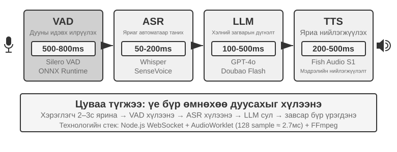

| Модуль | Үүрэг | Ердийн саад тотгор |
| --- | --- | --- |
| VAD | Яриа дууссан эсэхийг шийднэ үү | Чимээгүй байдлын босго нь хүлээлтийг нэмж, ээлжийг буруу хуваадаг |
| ASR | Аудиог текст болгон хөрвүүлэх | Таних хоцрогдол болон хам сэдвийн алдагдал |
| LLM | Ойлгох, үндэслэл гаргах, бүтээх | Анхны тэмдэг тавих цаг; үндэслэл нь хүлээлтийг нэмэгдүүлдэг |
| TTS | Текстийг яриа болгон хөрвүүлэх | Эхний пакет синтез болон тоглуулах буфержуулалт |

Шалтгаангүйгээр богино хариулт өгөхөд VAD, ASR, LLM, болон TTS-ийн хүлээх хугацаа дараалан хуримтлагддаг (Зураг 6-7). Бодит утга нь оролтын урт, Model, техник хангамж, сүлжээ болон ачааллаас хамаарна.

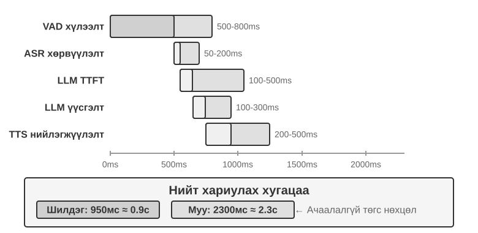

Үйлдвэрлэлийн дараалал нь сул зогсолтын саатлыг улам нэмэгдүүлдэг (Зураг 6-8) боловч хүчин чадлын төлөвлөлт нь энэ бүлгийн хамрах хүрээнээс гадуур юм.

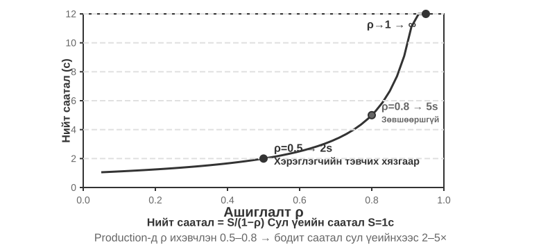

> **6-4-р туршилт ★: Уламжлалт хоолой бүтээх Agent**
>
> Каскад суурь шугамыг тогтоохын тулд микрофон, Silero VAD, орон нутгийн Whisper, LLM дамжуулагч, мөн Fish S1 TTS-ийг WebSocket-ээр холбоно уу.

#### Цувралаас урсгалын ойлголт хүртэл

Зураг 6-7 нь бүрэн цуваа тохиолдлыг тайлбарладаг: VAD, ASR, LLM, болон TTS нь нэг нэгээрээ ажилладаг. Энэхүү цуваа ойлголтын арга нь гурван асуудалтай байдаг:

1. **Хуримтлагдсан хоцрогдол:** төгсгөлийг баталгаажуулахаасаа өмнө чимээгүй байдлыг хүлээх ёстой.
2. **Алдагдсан мэдээлэл:** хоёртын дуу хоолой/яриагүй дохио нь эргэлзээ, сэтгэл хөдлөл, арын суваг эсвэл орчны дуу чимээг илэрхийлж чадахгүй.
3. **Эвдэрсэн нөхцөл байдал:** имэйл хаяг, нэр, онцлох нэр үгсийг хэсэг хэсгээр нь хувааж, буруу таних боломжтой.

Модулийн хуваагдлыг хадгалахын зэрэгцээ үүнийг шийдвэрлэхийн тулд нэг оновчлол нь **урсгалын ойлголт** бөгөөд энэ нь үе шат бүрийг аль болох эрт үе шаттайгаар үр дүн гаргах боломжийг олгодог:

- **ASR дамжуулалт:** VAD хэрэглэгч ярьж эхэлснийг илрүүлсний дараа ASR Model-ыг тогтмол интервалаар дуудаж, урсгал хэлбэрээр урьдчилсан бичвэр гаргадаг; VAD хэрэглэгч ярьж дууссныг илрүүлсний дараа эцсийн текстийг баталгаажуулдаг.
- **LLM таамаглалын гүйцэтгэл:** урьдчилсан бичвэрийг байгаа даруйд нь LLM руу илгээнэ. Хэрэв эцсийн текст нь урьдчилсан бичвэртэй тохирч байвал LLM-г дахин дуудахгүй; эс тэгвээс өмнөх таамаглалын сэтгэлгээг цуцалж, LLM-г дахин дуудна.
- **Сегментчилсэн LLM гаралт:** эхний ярьж болох өгүүлбэр бүрэн хариултыг хүлээлгүйгээр TTS руу очно.
- **Нэмэлт TTS:** аудио хэсгүүд тасралтгүй буцаагдах тул дараагийн үе, синтез болон тоглуулалт давхцдаг.

Үнэхээр стриминг хийдэг ASR нь Model түвшний дэмжлэг шаарддаг. Whisper-ийн декодлогч нь авторегрессив боловч түүний кодлогч нь бүрэн аудио хэсгийг хүлээдэг тул үүнийг зүгээр л стриминг Model-тай адилтгаж болохгүй. LLM дээр суурилсан стриминг-аудио Model нь тасралтгүй аудионоос текст болон семантик үйл явдлуудыг ялгаруулж, таних болон ойлголтын нэг хэсгийг нэг Model-т байрлуулж чаддаг. Энэ нь эхнээс нь өнөөг хүртэл харилцан ярианы Context-ийг хадгалж, брэнд, нэр, нэр үгсийн хувьд дэлхийн мэдлэгийг ашиглаж чаддаг.

Хэрэв цорын ганц зорилго нь хэрэглэгч дууссан эсэхийг шийдэх юм бол төгсгөлийн цэгийг урсгал танигч дотор суулгаж болно. Энэ Model нь хэллэг дууссан эсэхийг тодорхойлохын тулд семантик болон чимээгүй байдлыг хослуулдаг. Training шошго нь зөвхөн шийдвэр гаргах үед харагдах мэдээллийг агуулсан байх ёстой, эс тэгвээс эргэцүүлэн бодох нь онлайнаар хуулбарлах боломжгүй дүгнэлтийг бий болгоно.

Энэ Model нь үгсээс гадна акустик үйл явдлын тэмдэглэгээг ялгаруулж чаддаг:

- **ярих_эхлэх/дуусгах, тасалдуулах:** ярианы хил хязгаар болон тасалдуулах зорилго;
- **сэтгэл хөдлөл:** сэтгэл хөдлөл ба эргэлзээ;
- **инээд, санаа алдах, чимээ шуугиан:** паралингвистик болон орчны дуу чимээ.

Текстийн Token-уудтай хамт эдгээр тэмдэглэгээ нь нэг үйл явдлын урсгалыг бүрдүүлдэг. Agent нь бүх дууг энгийн текст болгон шахахгүйгээр эргэлзээ, тасалдал болон орчны өөрчлөлтийг илрүүлж чаддаг.

> **6-5-р туршилт ★: Qwen2-Audio ашиглан дуу хоолойн урсгалын ойлголтыг дуурайлган хийх**
>
> Qwen2-Audio нь өөрөө урсгалын Model биш юм. Энэхүү туршилт нь аудио угтваруудыг нэмэгдүүлснээр тасралтгүй ойлголтыг дуурайж, 600 мс VAD + Whisper-тэй харьцуулдаг.

### Парадигм 2 · Төгсгөлөөс төгсгөл хүртэлх олон төрлийн Model-ууд (Omni)

Урсгал ойлголттой байсан ч каскад нь сонсох, бодох, ярих үйл явцыг салангид интерфэйсээр дамжуулдаг; аудио энгийн текст болоход сэтгэл хөдлөл, аялга, орчны дуу чимээ алдагдаж болзошгүй. Omni арга нь аудио сонсох, хариу үйлдэл үүсгэх, ярихын тулд нэг Model-ыг ашигладаг бөгөөд энэ нь эдгээр дохиог хадгалах боломжтой боловч сургалтын өндөр өртөгтэй (Зураг 6-9). Paradigm 1-ийн каскад дамжуулах хоолойтой харьцуулахад Omni-ийн давуу тал нь голчлон хоцрогдол, текст бус мэдээллийг ойлгож, үүсгэхэд илэрдэг.

Ойлголтын тал дээр Омни Model-ууд нь дуу хоолойн түр зогсолтыг анзаарч чаддаг. Үе үеийн тал дээр Омни Model-ууд нь дуулах эсвэл өвөрмөц өнгө аястайгаар мөр хэлэх зэрэг илүү баялаг паралингвистик мэдээллийг дамжуулж чаддаг.

Omni Model-ууд нь ээлж авахыг санал болгодог хэвээр байгаа бөгөөд ерөнхийдөө давталтыг оноохын тулд VAD ашигладаг. Тиймээс хэрэглэгч цифрүүдийн мөрийг уншиж байх үед дуудлагын дунд түр зогсолтыг ээлжийн төгсгөл гэж андуурч болно.

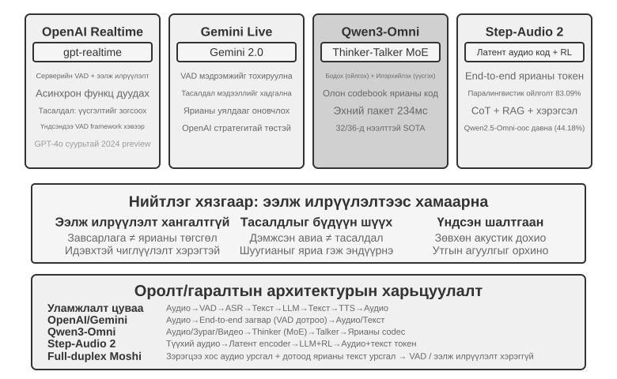

> **Туршилт 6-6 ★★: MiniCPM-o 4.5-г дотооддоо ажиллуул—төгсгөлөөс төгсгөл хүртэлх болон өөрөө каскад хийх**
>
> Сэтгэлгээний горим идэвхгүй үед MiniCPM-o 4.5-г орон нутагт ажиллуулж, аудионоос авсан шууд хариултуудыг эхлээд хөрвүүлж, дараа нь ижил Model-аар хариулдаг өөрийн каскадтай харьцуулна. Энэ нь аудио мэдээлэл хадгалагдсан эсэхийг хэмждэг бөгөөд **дараа нь хэлэлцсэн "ярих явцдаа бодох" биш юм.

### Парадигм 3 · Бүрэн дуплекс интерактив Model-ууд

Omni нь яриаг "хэрэглэгч ярьдаг" болон "Model ярьдаг" гэж хуваадаг хэвээр байгаа ч нэгэн зэрэг орчуулах болон үүнтэй төстэй ажлууд нь давхцах шаардлагатай байдаг. Тиймээс бүрэн дуплекс Model нь ээлжийг урьдчилан таамагладаггүй: энэ нь тасралтгүй сонсож, ярьж, үргэлжлүүлэх, түр зогсоох, тасалдуулах эсвэл хэрэгслийг дуудах эсэхээ дахин дахин шийддэг.

Кютайн **Моши** (2024) нь судалгааны эхэн үеийн жишээ байсан. Энэ нь хэрэглэгч болон Model-ын аудио урсгалыг зэрэгцүүлэн загварчилсан тул яриа болон тасалдал нь давхцах нь байгалийн зан үйл байж болно.

Thinking Machines Lab үүнийг **Харилцан үйлчлэл Model**[^ch6-14] гэж нэрлэдэг: харилцан үйлчлэлийг VAD болон бусад гадаад бэхэлгээгээр угсрахын оронд Model-т суулгадаг. Үүний бичил эргэлтийн механизм нь богино аудио блокуудаар урагшилж, чимээгүй байдал, давхцал, тасалдлыг тасралтгүй Context болгон хадгалдаг. Энэ нь яриаг амьд байлгаж байх зуураа бүхэл бүтэн яриаг суурь үндэслэлийн Model-т шилжүүлж, дараа нь үр дүнг тохиромжтой мөчид нэгтгэж чаддаг.

[^ch6-14]: Сэтгэх Машины Лаборатори, “Харилцаа холбоо Models: Хүн-AI хамтын ажиллагаанд өргөжүүлэх боломжтой арга барил,” 2026-05. https://thinkingmachines.ai/blog/interaction-models/

OpenAI-ийн GPT-Live нь бүрэн дуплекс замыг үйлдвэрлэлийн хэмжээнд авчирдаг: энэ нь оролтыг тасралтгүй боловсруулж, гаралтыг үүсгэдэг, хүлээх, арын суваг үүсгэх, тасалдах, бодит цагийн орчуулгыг зохицуулах боломжтой. Харилцан үйлчлэлийн Model-ийн нэгэн адил энэ нь нарийн төвөгтэй ажлыг суурь Model-т шилжүүлдэг бол урд талын Model нь харилцан яриаг хадгалдаг.

### Танин мэдэхүйн цаг хугацаа: бодит цагийн харилцан үйлчлэл ба гүн гүнзгий сэтгэлгээ

Харилцааны чанар болон оюун ухааны тааз нь өөр өөр хэмжээсүүд юм. Урд талын Model нь хэрэглэгч оролцож байх үед хариу үйлдэл үзүүлэх ёстой; суурь Model нь илүү удаан бодож болно. Дараах гурван Model нь шугаман дэвшил биш, харин харилцан буулт юм. Эхний хоёр нь каскад эсвэл Омни Model-ыг ороож болно; гурав дахь нь үүний оронд нэг Model дотор гүн гүнзгий үндэслэл болон бодит цагийн илэрхийлэлийг нэгтгэдэг.

#### Шийдэл 1: Дүүргэгчийг хурдан бодож, хариултыг удаан бодож үзээрэй

Хурдан сэтгэх нь хэдэн зуун миллисекундын дотор хариу үйлдэл үзүүлж чаддаг бол удаан сэтгэх нь ард нь илүү гүнзгий дүгнэлт хийдэг. Энгийн асуултуудыг хоёр удаа боловсруулж болох бол хүнд асуултууд зөрчилдөөн үүсгэж болзошгүй: хурдан Model нь худалдан авалт хийхийг зөвлөж, дараа нь удаан Model нь гол онцлог дутагдаж байгааг олж мэддэг. Үндсэн шалтгаан нь тус тусад нь сэтгэдэг хоёр бие даасан тохиолдол юм.

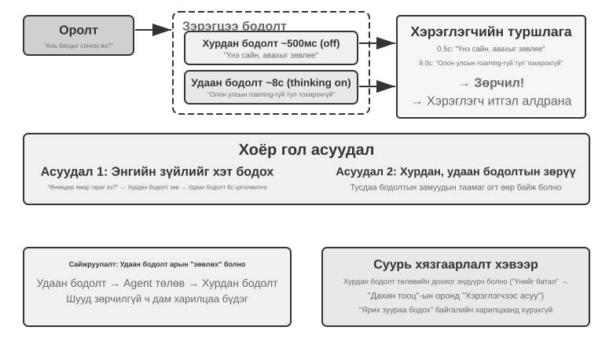

#### Шийдэл 2: Харилцан үйлчлэлийн төлөө хурдан сэтгэх, зөвлөгөөний төлөө удаан сэтгэх

Арын Model нь төлөвийн мөр эсвэл тусгай интерфэйсээр дамжуулан зөвлөгөө илгээж чаддаг бол урд талын Model нь яриаг амьд байлгаж, хэрхэн илэрхийлэхийг шийддэг. Энэ нь 1-р шийдэлээс илүү тогтвортой боловч харилцаа холбоо нь шууд бус хэвээр байна: урд тал нь зөвлөгөөг буруу ойлгож, ар талын завсрын үндэслэлийг харж чадахгүй байж болно. Арын дэвсгэр дуусахаас өмнө дараагийн асуултууд нь урд талын Model-т тулгуурладаг хэвээр байна. Энэ нь үр дүнг хүлээж болох ч ярьж байхдаа үнэхээр бодож чадахгүй.

#### Шийдэл 3: Сэтгэлгээ болон илэрхийллийг цогцоор нь нэгтгэх

Энэхүү Model нь төгсгөлөөс төгсгөл хүртэлх аудио Model-т сэтгэлгээг шууд дотоодчилдог. Step-Audio R1 нь хоёр нэмэлт механизмыг ашигладаг: **Modality-Grounded Дүгнэлт Distillation (MGRD)** нь акустик шинж чанаруудад сэтгэлгээг үндэслэдэг бол **MPS хос тархины архитектур** нь төлөвлөлт болон илэрхийлэлийг зэрэгцээ явуулах боломжийг олгодог. Эхнийх нь Model-т зөв сэтгэхэд тусалдаг; хоёр дахь нь цагтаа ярихад тусалдаг.

Хамгийн тохиромжтой нь Model нь зөвхөн бичлэгээс бус харин өнгө аяс, хэмнэл, аялгуунаас сэтгэл хөдлөлийг гаргадаг. MGRD нь акустик шинж чанаруудыг үнэндээ иш татсан үндэслэлийн ул мөрийг сонгож, тэдгээрийг сургаж, бодолгүйгээр таамаглахаас урьдчилан сэргийлэхийн тулд бэхжүүлэх сургалтыг ашигладаг. MPS нь төлөвлөлтийн тархинд бодлын хэсгүүдийг тасралтгүй ялгаруулах боломжийг олгодог; илэрхийлэлийн тархи нь хэсэг бүрийг хэсэгчилсэн хариулттай нэгтгэж, тэр даруй яриа үүсгэдэг. Дамжуулах хоолой нь зэрэгцээ явагддаг тул сонсогч эхний өгүүлбэрийг сонсохоосоо өмнө бүхэл бүтэн үндэслэлийн гинжин хэлхээг хүлээх шаардлагагүй.

#### Хурдан/удаан сэтгэхүй болон төгсгөлөөс төгсгөл хүртэлх сэтгэлгээний хоорондох буулт

Нэгдсэн Model нь "ярих зуураа бодох"-ыг хамгийн шууд хэрэгжүүлдэг боловч сэтгэлгээ болон бодит цагийн илэрхийллийг хамтад нь дахин сургах ёстой. Салгасан Model нь суурь тархийг солиход хялбар болгодог. Эдгээр нь энгийн орлуулагч биш, харин харилцан буулт юм.

Хил хязгаарын сэтгэлгээний Model-ууд хурдацтай хөгжиж байгаа тул хурдан ба удаан сэтгэлгээг ялгах нь чухал инженерийн давуу талыг олгодог: энэ нь удаан Model-уудын шинэ үе бүрээс олж авсан ашиг тусыг шууд олж авдаг. Хурдан урд талын Model нь зөвхөн сонсох, хариу өгөх, яриаг бага хоцрогдолтойгоор үргэлжлүүлэх шаардлагатай бол удаан суурь Model нь сэтгэлгээ, төлөвлөлт, багаж хэрэгслийн хэрэглээг зохицуулдаг. Илүү хүчтэй сэтгэлгээний Model гарч ирэхэд зөвхөн суурь Model-ыг солих шаардлагатай; бодит цагийн дуут системийг бүхэлд нь дахин сургах шаардлагагүй. Нэгдсэн Model нь сэтгэлгээ, харилцан үйлчлэлийг ижил сургалтын мөчлөгтэй холбодог тул шинэчлэлт бүр оюун ухаан, хариу үйлдлийн хоцрогдол, байгалийн илэрхийлэлийг дахин тэнцвэржүүлэх ёстой. Тиймээс хурдан/удаан тусгаарлалт нь зөвхөн хоцрогдол дээр буулт хийх биш, харин харилцан үйлчлэлийн чадвар болон оюун ухааны дээд хязгаарыг бие даан хөгжүүлэх боломжийг олгодог модульчлагдсан сонголт юм.

Энэхүү тусгаарлалт нь даалгаврын гүйцэтгэлийг заавал бууруулна гэсэн үг биш юм. 2026 оны 8-р сарын байдлаар Pine AI-ийн тусгаарлагдсан хурдан/удаан архитектурыг ашигладаг дуу хоолой Agent нь τ³-Voice Leaderboard-д Grok Voice болон GPT-Realtime-2 зэрэг бодит цагийн дуу хоолойн системүүдийн өмнө тэргүүлж, нэгдүгээр байрт орсон. Хамгийн багадаа энэ үр дүн нь салангид архитектур нь гүнзгий сэтгэлгээ болон бодит цагийн харилцан яриаг хамтдаа шалгадаг даалгавруудын төгсгөл хүртэлх Model-уудаас чанараараа дутахгүй гэдгийг харуулж байна.[^ch6-17]

[^ch6-17]: Пайн AI. “Хүн-компьютерийн хамгийн байгалийн интерфэйс бол таны дуу хоолой юм.” 2026-06-23 (шинэчлэгдсэн 2026-08-06). https://www.19pine.ai/blog/pine-ai-the-most-natural-human-computer-interface-is-your-voice

"Төгсгөлөөс төгсгөл хүртэлх Model" гэсэн нэр томьёог хоёр утгаар нь өргөн хэрэглэдэг тул дахин тодруулга хийх шаардлагатай байна. Эхнийх нь өмнөх хэсэгт авч үзсэн **төгсгөлөөс төгсгөл хүртэлх ярианы зам** юм: Model нь олон Model-ыг салангид текстээр холбохын оронд аудио хүлээн авч, шууд аудио гаргадаг. Omni болон Interaction Models хоёулаа энэ утгаараа төгсгөлөөс төгсгөл хүртэлх боловч Omni Model-ууд нь ихэвчлэн ээлжлэн ажилладаг хэвээр байдаг бол Interaction Models нь нэгэн зэрэг сонсож, ярьж чаддаг; тэдгээрийн архитектур нь эрс ялгаатай. Хоёр дахь нь энэ хэсэгт авч үзсэн **төгсгөлөөс төгсгөл хүртэлх танин мэдэхүйн архитектур** юм: бодит цагийн харилцан үйлчлэл ба гүнзгий сэтгэлгээ нь нэг Model дотор төлөвийг хуваалцаж, хамтдаа сургагдсан эсвэл хурдан урд талын Model болон удаан дэвсгэр Model-ын хооронд хуваагддаг. Хоёр тэнхлэг нь бие даасан байдаг. Систем нь танин мэдэхүйн архитектуртаа хурдан/удаан тусгаарлалтыг хадгалахын зэрэгцээ төгсгөлөөс төгсгөл хүртэлх ярианы замтай байж болно; Thinking Machines Lab-ийн нарийн төвөгтэй ажлуудыг дэвсгэр сэтгэлгээнд шилжүүлсэн нь ийм нэгдэл юм.

### Хүн шиг ярианы синтезийг илүү их ашигладаг

Уламжлалт TTS нь хэтэрхий жигд, хэт бага түр зогсолттой үед хиймэл сонсогдож болно. Түр зогсолт, дүүргэгч үгс, хааяа давтагдах нь хүний ​​ярианд тодорхойгүй байдал, бодлыг илэрхийлдэг.

Үндсэн LLM нь текстээс гадна **БОДОЖ БАЙНА**, **ЭМО:аз жаргалтай**, **ХУРД:0.8x** гэх мэт хяналтын тэмдэглэгээг ялгаруулж чаддаг; TTS нь тэдгээрийг түр зогсолт, үг хэллэг, ярианы хурд, инээд, санаа алдалт болон бусад үгэн бус аудио хэлбэрээр харуулдаг. Хэрэгжилт нь хяналтын тэмдэглэгээг ойлгоход сургагдсан TTS эсвэл өөр өөр сэтгэл хөдлөл, хэв маягт зориулсан лавлах клип ашиглан дуу хоолойг клончлох байж болно.

> **Туршилт 6-7 ★★: Fish Audio ашиглан Token-оор удирддаг TTS-ийг удирдах**
>
> Fish Audio S1 ашиглан олон лавлагаатай дуут сан байгуулж, гурван тохиргоог харьцуулна уу: хяналтын тэмдэглэгээ байхгүй, нэг лавлагаа хавчаар болон олон лавлагаа хавчаар. Гүйцэтгэлийн давхарга нь тэмдэглэгээнээс тохирох сэтгэл хөдлөл, ярианы хурд, хэв маягийг сонгоно.

## Компьютерийн хэрэглээ: GUI автоматжуулалт Agents

Дуу хоолой нь цаг хугацааны тэнхлэгийг миллисекунд хүртэл доошлуулсан боловч түүний ажиглалт нь нэг хэмжээст дууны урсгал хэвээр байна. Компьютерийн хэрэглээ нь ижил асуудлыг хоёр хэмжээст дэлгэц дээр шилжүүлдэг: ажиглалт нь тасралтгүй өөрчлөгдөж буй пикселүүд болж, үйлдэл нь координатууд дээр товшилт болон товчлуурын даралт болж хувирдаг. Дуу хоолойн хувилбарууд нь *хэзээ ярихаа* онцолж өгдөг; Компьютерийн хэрэглээ нь *дараагийн хаана дарахыг* онцолж, дээр нь дуу хоолойн харилцан үйлчлэлд огт байдаггүй асуултыг онцолж өгдөг: үйлдэл хийгдсэний дараа бодит байдал төлөвлөгөөтэй нийцэж байна уу?

Компьютерийн хэрэглээ буюу GUI автоматжуулалт гэгддэг нь AI-д дэлгэцийг ажиглаж, хулгана болон гарыг ажиллуулснаар хүн шиг програм хангамж ашиглах боломжийг олгодог - жишээлбэл, мэдээлэл хайхын тулд хөтөч нээх, хүснэгтийн програмд ​​​​өгөгдөл бөглөх эсвэл системийн тохиргоонд тохиргоог тохируулах. Үүний гол цөм нь **Ойлгох-Бодох-Үйлдэх** давталт (Зураг 6-11) юм:

1.  Agent нь одоогийн дэлгэцийн дэлгэцийн агшинг авдаг.
2.  Олон Model-т Model нь дэлгэцийн агшин болон даалгаврын зааврыг хүлээн авч, бодол санаа болон тодорхой үйлдлийг гаргадаг.
3.  Гүйцэтгэлийн давхарга нь үйлдлийг бодит орчинд гүйцэтгэдэг (хулганыг хөдөлгөх, товших, текст бичих гэх мэт).
4.  Энэ нь интерфэйс хариу өгөхийг хүлээж, дахин дэлгэцийн агшин авч, дараагийн давталтын давталт руу орно.

**Интерфэйсийг ойлгох** болон **даалгаврыг гүйцэтгэх** хоёрыг ялгах нь чухал юм. Эхнийх нь олон горимт ойлголттой илүү ойр бөгөөд нэг удаагийн дэлгэцийн агшинд асуултанд хариулах замаар хэмжиж болно. Сүүлийнх нь Model-аас ойлголт болон үйлдэл үүсгэхийг хуудас ачаалах, төлөвийн өөрчлөлт, алдаа, эргэлт буцалтгүй үр дагаврыг зохицуулдаг хаалттай гогцоонд оруулахыг шаарддаг. Тиймээс компьютерийн хэрэглээний сорилт нь зөвхөн дэлгэцийн агшинд зөв хариулахаас гадна алхам бүрийн дараа бодит байдал төлөвлөгөөтэй тохирч байгааг дахин баталгаажуулах явдал юм.

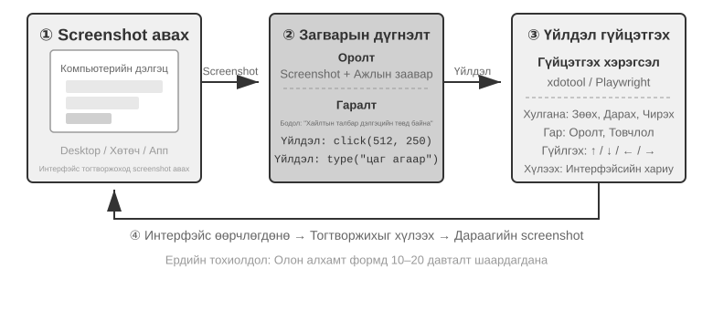

Энэ давталтад гурван гол дизайны хэмжээс байдаг: **Үйлдлийн орон зай** (Agent ямар үйлдлүүдийг гүйцэтгэж чадах вэ), **Харааны газардуулалт** (дэлгэцийн агшин дээрх зорилтот элементийг хэрхэн олох вэ), болон **Model Архитектур** (дэлгэцийн агшингаас зөв үйлдлийг хэрхэн үүсгэх вэ).

### Үйлдлийн орон зайн дизайн

Anthropic-ийн лавлагааны хэрэгжилт нь бүрэн харилцан үйлчлэлийн чадварыг гурван төрлийн хэрэгсэлд хуваадаг (Зураг 6-12). Энэ бол тодорхой үйлдлийн орон зайн Model боловч Model үзүүлэгчид дагаж мөрдөх ёстой хувийн протокол биш юм: Harness нь ижил дэлгэцийн агшин, үйлдлийн хязгаарлалт, гүйцэтгэлийн үр дүнг зорилтот Model-аар дэмжигдсэн мессеж, бүтэцлэгдсэн гаралт болгон хөрвүүлж чаддаг л бол Claude, нээлттэй жингийн харааны Model-ууд болон өөрөө байршуулсан төгсгөлийн цэгүүд нь бүгд ижил Ойлголт-Бодолт-Үйлдлийн давталтыг жолоодож чадна.

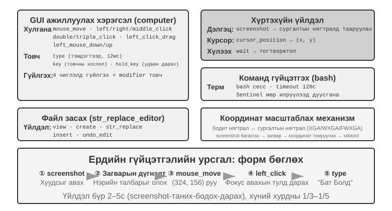

**GUI үйлдэл Tool** (`computer` хэрэгсэл): Хулганы үйлдлүүдэд зөөх (`mouse_move`), зүүн/баруун/дунд товшилт, давхар эсвэл гурван удаа товшилт, чирэх (`left_click_drag`) болон илүү нарийвчлалтай дарах/суллах үйлдэл (`left_mouse_down` болон `left_mouse_up`) багтана. Гүйлгэх (`scroll`) нь дөрвөн чиглэлийг дэмждэг бөгөөд өөрчлөх товчлууруудтай хослуулж болно. Гарын товчлуурын үйлдлүүдэд тэмдэгтээр бичих (`type`, жинхэнэ бичихийг дуурайлган тэмдэгтүүдийн хооронд 12мс зайтай), товчлуурын хослолууд (`key`, жишээ нь, `Ctrl+C`) болон товчлуур барих (`hold_key`) багтана. Ойлголтын үйлдэлд дэлгэцийн зураг авах, курсорын байрлалыг авах (`cursor_position`) болон хүлээх (`wait`) багтана.

**Tool командыг гүйцэтгэх** (bash хэрэгсэл): 120 секундын хугацаатай байнгын bash терминалын сессийг хангадаг. Энэ нь командын гүйцэтгэлийг илрүүлэхийн тулд харуулын мөрийг ашигладаг бөгөөд олон дуудлагад орчны төлөвийг хадгалдаг (жишээ нь, `cd`-г директор руу илгээсний дараа дараагийн дуудлага тухайн директорт үлддэг).

**Файл засварлах Tool** (`str_replace_editor`): Мөр тохируулах замаар аюулгүй засварлах боломжийг олгодог бөгөөд харах, үүсгэх, солих, оруулах, буцаах үйлдлүүдийг дэмждэг. Энэ нь файлыг бүхэлд нь дарж бичихээс илүү нарийвчлалтай бөгөөд холбоогүй контентыг санамсаргүйгээр өөрчлөх магадлал багатай.

> **Туршилт 6-8 ★: Компьютер ашиглах үед ажиллуулах (Anthropic лавлах зам эсвэл нээлттэй Model зам)**
>
> А зам нь Anthropic Компьютерийн хэрэглээний демо хувилбарыг ашигладаг. Үүний контейнер нь хөтөч, терминал болон бусад нийтлэг хэрэгслүүдийг багтаасан Ubuntu-ийн бүрэн ширээний орчныг багцалдаг. Урд хэсэг нь даалгавар хүлээн авдаг бол арын хэсэг нь зааварчилгаа болон дэлгэцийн агшинг Claude руу илгээж, дараа нь Model-ын буцаасан хулгана, гар, терминал эсвэл засварлах үйлдлүүдийг гүйцэтгэдэг.
>
> B зам нь [`chapter6/computer-use-open-model`](../chapter6/computer-use-open-model/) доторх жишээ кодыг ашигладаг. Анхдагчаар энэ нь хостлогдсон OpenRouter API эсвэл өөрөө хостлогдсон vLLM/SGLang болон үүнтэй төстэй системүүдээр дамжуулан нээлттэй жинтэй Qwen3-VL 32B Instruct Model-аар хөтчийн хэрэглээг удирддаг.

### Харааны үндэслэл

Давталтын давталт бүрт Model нь дэлгэцийн агшин дахь зорилтот элементийг зөв байрлуулах шаардлагатай - "Хайлтын хайрцаг хаана байна?" "Илгээх товчлуурын координатууд юу вэ?" Энэ бол харааны газардуулгын асуудал юм. Одоогоор **хоёр үндсэн арга** байна: нэг нь нутагшуулалтыг **олон сонголттой асуудал** болгон хувиргах явдал юм - эхлээд интерфэйсийн элементүүдийг тоогоор тэмдэглэх бөгөөд Model нь зөвхөн нэгийг нь сонгох шаардлагатай; нөгөө нь **цэвэр координатын таамаглал** - Model нь дэлгэцийн агшинг "харах" боломжийг олгож, координатуудыг хүн шиг шууд мэдээлэх боломжийг олгоно. Олон сонголттой арга нь хоёр хэрэгжүүлэх аргатай: **цэвэр харааны тайлбар** (зураг дээрх нэр дэвшигч бүсүүдийг сегментчилэхэд сегментчиллийн Model-ыг ашигладаг анхны тэмдэгтийн багц) болон **бүтэцлэгдсэн элементийн индексжүүлэлт** (DOM/Хандалтын мод, интерфэйсийн дотоод бүтцийг шууд унших). Олон сонголттой аргын нийтлэг давуу тал нь "дэлгэцийн агшин дахь товчлуурыг олж, түүний координатыг таамаглах" нээлттэй асуудлыг "аль хэдийн тэмдэглэгдсэн элементүүдээс нэгийг нь сонгох" хаалттай асуудал болгон хувиргадагт оршино. Шалгалтын үеэр олон сонголттой асуултуудад хоосон зайг бөглөх асуултуудаас зөв хариулах нь илүү хялбар байдагтай адил Model өмсөгч "дэлгэцийн координат (350, 464) дээрх товчлуур дээр дарна уу" гэж хэлэхийн оронд "[123] дээр дарна уу" гэж хэлэхэд л хангалттай. Координатыг шууд таамаглах нь Model өмсөгчийн хувьд ялангуяа хэцүү байдаг - зөв хийхийн тулд өргөн хүрээтэй сургалт шаарддаг бөгөөд өөр өөр дэлгэцийн нягтралд алдаа гарах хандлагатай байдаг.

**Тэмдэглэгээний багц: Харааны тэмдэглэгээний арга.**

Анхны Тэмдэглэгээний Тогтоол (SoM)-ийг Microsoft Research 2023 онд анх GPT-4V-ийн харааны газардуулгын чадварыг нээх зорилгоор санал болгосон. Энэ нь **цэвэр харааны** арга юм: энэ нь дэлгэцийн агшинд нэр дэвшигч бүс нутгуудыг автоматаар сегментлэхийн тулд зургийн сегментчилэлийн Model-уудыг (SAM, SEEM гэх мэт) ашигладаг, бүс нутаг бүр дээр дугаарлагдсан тэмдэглэгээг давхарлаж, Model нь тоо бүхий зургийг хардаг. Model нь зөвхөн тоог мэдээлэх шаардлагатай бөгөөд систем нь үүнийг харгалзах бүс нутгийн төв координат болгон хөрвүүлдэг. Бүхэл бүтэн процесс нь DOM эсвэл ямар нэгэн дотоод интерфэйсийн бүтэц шаарддаггүй тул энэ нь уугуул ширээний програм хангамж болон тоглоомын интерфэйсүүдэд адилхан хамаарна - сегментчилэлийн Model нь нэр дэвшигч бүс нутгуудыг тодорхойлж чадвал л хангалттай.

**Бүтэцлэгдсэн элементийн индексжүүлэлт: Вэб дээрх SoM санааг бүтэцлэгдсэн байдлаар хэрэгжүүлэх нь.**

Интерфэйс өөрөө бүтэцлэгдсэн мэдээлэл өгөх үед тэмдэглэгээ илүү нарийвчлалтай байж болно. Рэндэрлэхээс өмнө орчин үеийн вэб хуудсууд нь бүрэн элементийн бүтэц (DOM мод) болон товчлуур, оролтын талбар болон бусад удирдлагыг тодорхойлдог семантик үүргүүдийг тодорхойлдог. Хүртээмжийн мод нь олон ширээний програмуудад ижил төстэй мэдээллийг өгдөг. `browser-use` зэрэг вэб Agent системүүд яг энэ замыг баримталдаг: тэд DOM-оос интерактив элементүүдийг тоолж, дугаарладаг. Энэ бол вэбд зориулсан SoM санааны бүтэцлэгдсэн хэрэгжилт юм (Зураг 6-13). Энэ үйл явц нь дөрвөн алхамтай:

1. Хөтчийн дибаг хийх интерфэйсээр (CDP, Chrome DevTools Protocol) хуудасны бүтэцлэгдсэн дүрслэл (DOM мод) болон хандалтын мэдээллийг авах
2. Аль элементүүд харилцан үйлчилж байгааг автоматаар илрүүлэх (товчлуурууд, оролтын хайрцагууд, холбоосууд гэх мэт)
3. Интерактив элемент бүрийг өвөрмөц ID-аар тэмдэглэж, дэлгэцийн агшин дээр хүрээний хайрцаг зурна уу
4. ID бүрт харгалзах элементийг тайлбарласан текстийн жагсаалтыг нэгэн зэрэг үүсгэх

```text
Screenshot: [Key elements in the image are annotated with IDs like [1], [2], [3], [4]]

Elements:
[1] <input type="text" placeholder="Search" aria-label="Search" />
[2] <button id="submit-btn" aria-label="Submit form" />
[3] <input type="text" placeholder="Enter your name" value="" />
[4] <a href="/docs" aria-label="Documentation" />
```

Model нь зөвхөн ID гаргах шаардлагатай бөгөөд систем нь харгалзах элементийн төвийг автоматаар дардаг. Энэ арга нь бүх тэмдэглэгээний өгөгдлийг Model руу илгээх ёстой тул Token-уудыг хэмнэхгүй боловч сегментчиллийн Model-уудын оруулж болох алдагдсан илрүүлэлт болон хуурамч эерэг үр дүнгээс зайлсхийхийн зэрэгцээ нарийвчлалтай, тогтвортой байршлыг хангадаг.


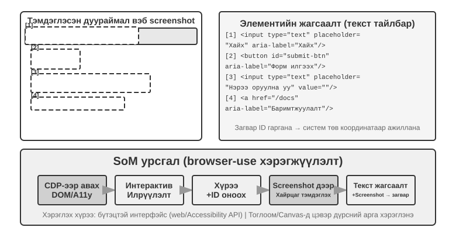

**Цэвэр координатын таамаглал.**

Гурав дахь маршрут нь тэмдэглэгээг алгасаж, Model-аас координатыг шууд гаргахыг хүсдэг. **SeeClick** болон Claude зэрэг Систем нь элементийн байрлалтай хосолсон GUI дэлгэцийн зургийн асар их өгөгдлийн багц дээр сургагдсан харааны Model-уудад тулгуурладаг. Эдгээр Model-ууд нь хүний ​​хэрэглэгчийн адил харааны ойлголтод тулгуурлан байгалийн хэлний тайлбарыг (жишээ нь, "илгээх товчийг дарна уу") шууд дэлгэцийн зургийн нарийн координат руу буулгаж сурдаг.

Координатын таамаглалын схемд Model-ын координатын талаарх ойлголт нь сургалтын явцад ашигласан нягтралаас ихээхэн хамаардаг (Зураг 6-14). Claude-г XGA (1024×768), WXGA (1280×800), болон FWXGA (1366×768) ашиглан сургасан. Хэрэв оролтын дэлгэцийн агшингийн нягтрал таарахгүй бол Model-ын таамагласан координатууд нь системтэйгээр шилжих болно - жижиг газрын зураг дээрх зайг хэмжиж, дараа нь том газрын зураг дээр шууд хэрэглэхтэй адил. Тиймээс багажны давхаргад хоёр чиглэлт координатын масштабын механизмыг хэрэгжүүлэх ёстой бөгөөд зургийг гажуудуулж, улмаар координатын дүгнэлтийг гажуудуулах жигд бус суналтаас зайлсхийхийн тулд зорилтот нягтралыг **талын харьцаанд үндэслэн** сонгох ёстой. Жишээлбэл, хэрэв бодит дэлгэцийн нягтрал нь 2560×1440 (16:9) бол Claude-ийн дэмжигдсэн гурван сонголтоос хамгийн тохиромжтой нь FWXGA (1366×768) бөгөөд энэ нь 16:9-тэй хамгийн ойр харьцаатай. Дэлгэцийн агшинг 1366×768 хүртэл пропорциональ байдлаар масштаблаж, Model-т дамжуулдаг; Model нь товшилтын координатуудыг (683, 384) гаргасны дараа тэдгээрийг бодит координатууд (683×2560/1366, 384×1440/768) ≈ (1280, 720) руу урвуу байдлаар буулгадаг. Үүний эсрэгээр, хэрэв 16:9 зургийг 4:3 1024×768 руу хүчээр сунгавал зургийг хэвтээ байдлаар шахаж, Model-ын таамагласан координатуудыг системтэйгээр шилжүүлэх болно.


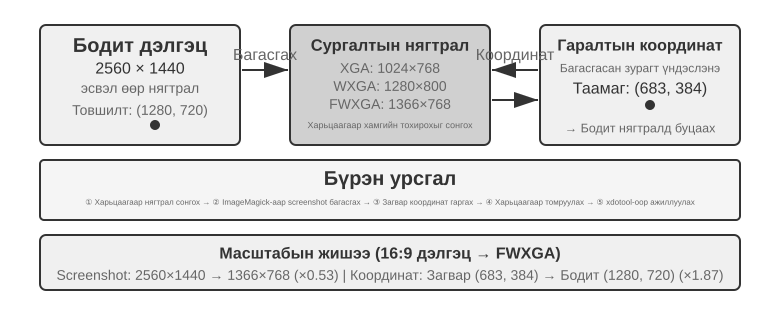


Гурван маршрутын хоорондох сонголтыг дараах байдлаар нэгтгэн дүгнэж болно: **бүтэцлэгдсэн мэдээлэл байгаа үед хамгийн нарийвчлалтай, тогтвортой байршлын хувьд DOM/хүртээмжийн модны индексжүүлэлтийг** эрэмбэл. **Боломжгүй үед** - Photoshop, canvas/WebGL-рэндэрлэсэн интерфэйсүүд эсвэл тоглоомууд гэх мэт уугуул ширээний програм хангамжид -**харааны тэмдэглэгээ (анхны SoM маршрут) эсвэл координатын таамаглалыг** ашиглана уу. Харааны тэмдэглэгээ нь байршлыг олон сонголттой асуудал болгон хувиргаж, тусгай сургалтгүйгээр ерөнхий зориулалттай Model-уудад илүү тохиромжтой болгодог. Координатын таамаглал нь тэмдэглэгээний алхамыг арилгаж, GUI байршлын талаар тусгайлан сургагдсан Model-уудад илүү шууд байдаг. Хоёр арга хоёулаа жижиг элементүүд болон нягт интерфэйсүүдтэй тэмцсээр байна.

> **Туршилт 6-9 ★: Хөтөч ашиглах нь - Автоматжуулсан хөтчийн үйлдлүүдийг хэрэгжүүлэхэд ашиглах**
>
> Байгалийн хэл дээр суурилсан хөтчийн үйлдлүүдийг хэрэгжүүлэхийн тулд хөтчийн автоматжуулалтын хүрээ болох Playwright-ийг олон горимт Model-тай хамт ашиглаарай. SoM дүрслэлийг идэвхжүүлж, шийдвэр гаргахаасаа өмнө тэмдэглэгээтэй хүрээтэй дэлгэцийн агшинг хадгална уу.
>
> “Google-г нээгээд Сан Францискогийн цаг агаарыг асуух” гэсэн тест даалгавар: эхлүүлсний дараа дэлгэцийн зураг дээр дугаарлагдсан интерактив элементүүдтэй Google Хайлт харагдана. Model нь хайлтын нүдийг сонгоод, “Сан Францискогийн өнөөдрийн цаг агаар” гэж оруулаад, түүнийгээ илгээж, үр дүнгийн хуудаснаас температур болон нөхцөл байдлыг гаргаж авдаг.

### Хөдөлгөөнт дүрс үзэж, дуу сонсох боломжтой Agent ашигладаг компьютер

Одоогоор Компьютерийн хэрэглээний талаарх ойлголт нь далд таамаглал дээр тулгуурладаг: **дэлгэц хөдөлгөөнгүй** - дэлгэцийн агшин аваад, нэг алхам бодож, дараад дараагийн дэлгэцийн агшинг ав. Бодит дэлгэц нь видео тоглуулж, богино хугацааны мэдэгдлийг анивчуулж, уулзалтын дуу хоолойг дамжуулдаг. Нүдээ 3-5 секунд тутамд нэг л удаа нээдэг, чихгүй Agent нь хоёр кадрын хооронд юу болж байгааг харж, сонсож чадахгүй.

Шинэчлэн дизайн хийх шаардлагатай зүйл бол үйлдлийн интерфэйс биш, харин **ажиглалтын интерфэйс**[^ch6-9] юм. Agent–компьютерийн ажиглалтын интерфэйс (AOI) нь тасралтгүй хүрээлэн буй орчны ажиглалтыг Model зохицуулж чадах салангид үйл явдлууд болгон хувиргадаг. Үүний гол техникүүд нь: **дэлгэцийн түлхүүр фрэймийг барих** нь дэлгэц утга учиртай өөрчлөгдсөн эсэхийг тодорхойлохын тулд жижиг Model-ыг ашигладаг бөгөөд зөвхөн чухал өөрчлөлтийн дэлгэцийн агшинг авдаг - өөрчлөлтүүд байнга гардаг үед секундэд нэг удаа барих нь аль хэдийн сайн ажилладаг; **дууны хэмжээнээс хамаарсан ярианы транскрипц** нь дуу чимээ байгаа үед танихыг идэвхжүүлж, танигдсан текстийг Context-эд оруулдаг тул Agent сонсож чаддаг; мөн **дэлгэцийг текст гэж тодорхойлох** нь Model нь авсан дэлгэцийн агшин бүрийг анхны зураг гарсны дараа Context-эд үлдэх нэг өгүүлбэрийн тайлбар болгон хувиргаж, олон горимт харилцан үйлчлэлийн түүхийг шахдаг.

[^ch6-9]: Ли, Божие, Ноа Ши нарыг үзнэ үү. *Agent-Компьютерийн ажиглалтын интерфэйсүүд нь динамик компьютерийн хэрэглээг идэвхжүүлдэг.* arXiv:2606.29472, 2026.

### Компьютерийн хэрэглээнд зориулсан Дэлхийн Models

Өмнөх хэсгийн ажиглалтын интерфэйс нь "хоёрын хооронд юу болсон бэ?" гэсэн асуултад хариулдаг: түлхүүр фрэймүүд, ярианы транскрипт болон тогтмол текстийн тусламжтайгаар Agent нь зөвхөн хоёр дэлгэцийн агшинг хол зайтай авахуулсан байхыг харахаа больсон. Гэхдээ ажиглалтын интерфэйс нь төлөвлөлтийн хоцрогдолыг арилгадаггүй. Agent нь "дэлгэцийн агшин—бодох—товших" гэсэн цуврал давталтыг ажиллуулж, үйлдэл бүрийн дараа дараагийн алхмын талаар дахин ажиглаж, эргэцүүлэн бодож байна. **OSWorld-Human** үр ашгийн судалгаагаар даалгавар эцэст нь амжилттай болсон ч Agent нь хүнээс хамаагүй илүү олон алхам хийж, удаан хүлээдэг болохыг харуулж байна; хүний ​​түвшний нарийвчлалд хүрэх нь практик байхтай адил биш юм.

Хүмүүс зөвхөн товшсоны дараа дараагийн алхмын талаар бодож эхэлдэггүй. Тэд эхлээд үйлдэл юу хийхийг урьдчилан таамагладаг: хэрэв бодит өөрчлөлт нь хүлээлттэй тохирч байвал тэд одоо байгаа төлөвлөгөөгөө үргэлжлүүлдэг; хуудасны төлөв хүлээгдэж байснаасаа хазайсан үед л тэд ажиглаж, дахин төлөвлөхөө зогсоодог. Дэлхийн Model нь Agent-д ажиллахаасаа өмнө ширээний компьютер юу болж хувирахыг урьдчилан таамаглах боломжийг олгодог бөгөөд энэ нь түүнд хүн шиг "таамаглалын гүйцэтгэл" өгч, үр ашгийг мэдэгдэхүйц сайжруулдаг.

Ширээний төлөв гэдэг нь зүгээр л пикселийн торноос илүү юм. Үүнд цонх, фокус, гүйлгэх байрлал, оролтын талбарын агуулга, ачаалах төлөв, зөвшөөрөл болон сүлжээний хариу үйлдэл багтдаг; үйлдлүүдэд товших, бичих, гүйлгэх, чирэх болон хүлээх зэрэг орно. Компьютерийн хэрэглээнд ашиглах боломжтой дэлхийн Model нь хамгийн багадаа одоогийн төлөвийг кодчилж, нэр дэвшигчийн үйлдэл ямар төлөвт өөрчлөлт оруулахыг урьдчилан таамаглаж, дараагийн алхамыг шийдэхийн тулд төлөвлөгчдөд уг таамаглалыг өгөх ёстой:

```text
desktop state + click/type/scroll/wait ──> representation of the next state
```

Энэ нь Agent-д нэр дэвшигчийн үйлдлийн үр дагаврыг бодитоор товшихоос өмнө харьцуулах, хуудас ачаалагдаж байх үед дараагийн алхамыг бэлтгэх, төлөвийн зөрүүний талаар эргэцүүлэн бодох замаар өнгөрсөн харилцах цонхноос сэргээх боломжийг олгоно. Хэрэв даалгавар нь "VS Code дээр шинэ Python файл үүсгэж, hello world гэж бичих" бол Model нь эхлээд файлын мод болон засварлагчийн гол төлөвийг амжилттай болоход урьдчилан таамаглаж, дараа нь товших, бичих, хадгалах үйлдлүүдийг сонгож болно; хэрэв даалгавар нь файлыг устгах бол тусгаарлагдсан виртуал ширээний компьютер дотор эргэлт буцалтгүй баталгаажуулах харилцах цонх гарч ирэх эсэхийг урьдчилан таамаглаж, шаардлагатай үед хэрэглэгчээс баталгаажуулахыг хүсэх боломжтой. Энд гол нь Model нь фотореалист ирээдүйн дэлгэцийн агшинг үүсгэх биш, харин даалгаврыг гүйцэтгэхэд шаардлагатай шалгах боломжтой төлөвийн зөрүүг урьдчилан таамаглах явдал юм.

2026 оны 7-р сард Induction Labs-ийн **Photon-1** нь энэ маршрутын нэг хэрэгжилтийг үзүүлсэн бөгөөд компьютерийн хэрэглээний ертөнцийн Model-ыг ердөө 30,000 цагийн H200 GPU хугацаагаар урьдчилан сургах ажлыг гүйцэтгэсэн. Энэ нь кадр бүрийг салангид далд жетон болгон шахаж, урьдчилсан сургалтын үеэр пикселээр пикселээр дэлгэцийн агшин үүсгэхийн оронд үйлдлийн дараа дараагийн төлөвийн дүрслэлийг авторегрессив байдлаар урьдчилан таамагладаг; түүнд хавсаргасан дүрс үүсгэгч нь зөвхөн далд дүрслэлийг дүрслэхэд үйлчилдэг бөгөөд дүгнэлт хийхэд шаардлагатай бүрэлдэхүүн хэсэг биш юм. Үрийн дэлгэцийн агшин болон дараагийн үйлдлүүдийг харгалзан Model нь ширээний төлөвүүдийг тасралтгүй "төсөөлөж", дараа нь виртуал машинууд дээрх онлайн сургалтаар дамжуулан компьютерийн хэрэглээний үйлдлүүдийг гаргаж сурах боломжтой.[^ch6-20]

[^ch6-20]: Дэвид Ли болон Жонатан Ли, Индукцийн Лабораториуд, “Зургийн видео урьдчилсан сургалтыг төсөөлөлтэйгөөр өргөжүүлэх нь Models,” 2026-07-23. https://www.inductionlabs.com/news/scaling-video-pretraining. Фотон-1-ийн мэдээлснээр параметрүүд, өгөгдлийн хэмжээс, дотоод жишиг үзүүлэлтүүд болон өртгийн харьцуулалт нь компанийн нийтэлсэн тоо баримтууд юм.

### Гар утас: Экосистемийн саад бэрхшээлүүд технологиос илүү хэцүү

Компьютерийн хэрэглээ нь гар утасны төхөөрөмжүүдэд ч мөн өргөжиж байна. Гар утас болон ширээний компьютерын системүүд техникийн хувьд ялгаатай байдаг: хулганы координат болон гарны оролтод найдахын оронд гар утасны үйлдлийн орон зай нь ихэвчлэн системийн хандалтын үйлчилгээ API (жишээ нь, Android-ын `AccessibilityService`)-ийг ашиглан интерфэйсийн элементүүдийг уншиж, товшилт хийх эсвэл текст оруулах боломжтой. Харилцан үйлчлэл нь хулганы заагчаас мэдрэгчтэй дохио зангаа руу шилжиж, координатын утгыг өөрчилдөг. `(x, y)`-ийн ижил байрлал нь товших, удаан дарах эсвэл шудрах эхлэх цэгийг зааж болох тул үйлдэл нь дохио зангааны төрлийг мөн зааж өгөх ёстой. Бүлэг 7-д танилцуулсан AndroidWorld зэрэг гар утасны жишиг үзүүлэлтүүд нь Agent-ийн энэхүү үйлдлийн орон зайд бодит програмуудад даалгавруудыг гүйцэтгэх чадварыг үнэлдэг.

Гэсэн хэдий ч гар утасны компьютерийн хэрэглээнд үнэхээр саад болж буй зүйл нь эдгээр техникийн ялгаа биш, харин экосистемийн саад бэрхшээлүүд юм. Зарим утасны үйлдвэрлэгчид AI туслахуудыг хэрэглэгчийн зэрэглэлийн утсанд нэгтгэхийг оролдсон бөгөөд ингэснээр туслахууд WeChat, Taobao, Alipay зэрэг өдөр тутмын аппликейшнуудыг автоматаар ажиллуулах боломжтой болсон боловч тэд платформын хязгаарлалттай хурдан тулгарсан.

Энэ нь Компьютерийн хэрэглээнд тулгардаг өвөрмөц бэрхшээлийг илчилж байна: **экосистемийн саад бэрхшээл**. Эдгээр хязгаарлалтын цаад үндсэн шалтгаан нь бизнесийн Model-уудын зөрчил юм. Уламжлалт интернетийн програмуудын мөнгө олох гол логик нь **хүрэлт ба анхаарал** юм: хэрэглэгчид тэжээлээр гүйлгэж байхдаа зар сурталчилгааг хардаг, бүтээгдэхүүн хайхдаа зөвлөмжийн алгоритмаар удирддаг, хуудас үзэж байхдаа импульсив худалдан авалт хийдэг. Agent нь хэрэглэгчийн өмнөөс ажиллах үед уг мөнгө олох гинжин хэлхээг бүрэн тойрч гардаг: AI нь зар сурталчилгааг үл тоомсорлож, импульсив худалдан авалт хийдэггүй, зорилгодоо шууд хүрч, ажлаа дуусгаад явдаг. Зар сурталчилгаа болон урсгалаар амьдардаг платформуудын хувьд Agent-ийн үйлдэл бүр бизнесийн Model-ын суурийг үгүй ​​хийдэг.

Энэ нь Компьютерийн хэрэглээ нь зөвхөн CAPTCHA зэрэг техникийн хариу арга хэмжээ авахаас гадна **бүтцийн ашиг сонирхлын зөрчилтэй** тулгарч байна гэсэн үг юм. Энэхүү зөрчлийг богино хугацаанд шийдвэрлэхэд хэцүү байх бөгөөд цэвэр техникийн асуудлаас илүү хэрэглэгчийн хэрэглээнд илүү их саад учруулж байна.

## Роботоор ажиллах нь: XLeRobot ашиглан ширээгээ цэгцлэх

> **Унших тэмдэглэл**: Энэ хэсэгт нэг даалгаврыг ашигласан - "улаан аягыг тавиур дээр, шар өнгийн цаасыг хогийн саванд хийгээд дахин ажиглаж, ширээний байдлыг баталгаажуулна уу." 6-10 ба 6-12 туршилтууд нь жинхэнэ XLeRobot техник хангамж дээр ажилладаг бөгөөд гар, тохируулга, яаралтай зогсолт, газар дээр нь ажиглагч шаардлагатай; 6-11, 6-13 ба 6-14 туршилтууд нь харгалзах орон нутгийн GPU туршилтууд юм. Техник хангамж болон симуляцийг тусад нь мэдээлэх боловч даалгаврын зорилго, үйлдлийн семантик болон амжилтын нөхцөлүүд хэвээр байна.

Роботыг удирдах нь зургийн талаарх асуултад хариулахаас хамаагүй хэцүү. Model өмсөгч нь үзэгдлийг ойлгож, дараа нь үйлдэл бүр дараагийн мөчийн харагдах байдлыг өөрчилдөг бодит ертөнцөд тасралтгүй үйлдэл хийх ёстой. XLeRobot нь энэ ялгааг тодорхой болгож байна: хүн гар, gamepad эсвэл VR төхөөрөмжөөр дамжуулан ижил гарыг алсаас ажиллуулж болно, эсвэл камерын ажиглалт болон хязгаарлагдмал үйлдлийн хэрэгслүүдийг Agent руу дамжуулж өөрөө дуудаж болно. Техник хангамж болон даалгавар тогтмол хэвээр байна; зөвхөн оператор өөрчлөгддөг - эхний тохиолдолд хүн тасралтгүй ажиглаж, залруулдаг бол хоёр дахь тохиолдолд Model болон хяналтын систем ижил ажлыг хийх ёстой.

Энэ хэсэгт "ширээ цэгцлэх" гэсэн таван туршилтыг явуулна. Эхлээд хүн жинхэнэ XLeRobot-ыг телекомпаниар ажиллуулж, хангалттай чадвартай операторын дор техник хангамж юу хийж чадахыг хэмждэг; дараа нь симулятор нь ижил даалгаврын хамгийн тохиромжтой хяналтын таазыг тогтоодог. Дараа нь Agent нь жинхэнэ XLeRobot-ыг бие даан хянаж, ойлголт, төлөвлөлт, алдааг сэргээх нь үр дүнд хэрхэн нөлөөлж байгааг харуулдаг; дараа нь ижил хэрэгслийн гэрээг симуляторт оруулснаар нээлттэй гогцооны гүйцэтгэл, алхам алхмаар шалгалт, дэлхийн Model-уудыг бөөнөөр нь харьцуулж болно. Эцэст нь симуляцид сурсан харааны бодлого шинэ орчинд дасан зохицож байгаа эсэхийг харахын тулд дэвсгэр, объектын гадаад байдал, гэрэлтүүлэг болон харааны чимээ өөрчлөгддөг.

Энд байгаа саад бэрхшээл нь ихэвчлэн асуулт хариултын статик шалгуур үзүүлэлт биш, харин Model нь хязгаарлагдмал ойлголт болон хяналтын зурвасын өргөн дор давталтыг хааж чадах эсэхэд оршино. Ашиглах боломжтой робот систем нь дор хаяж дөрвөн асуултанд хариулах ёстой:

1. Тухайн хүн ямар даалгавар биелүүлэхийг хүсэж байна вэ?
2. Дараагийн дэд даалгавар аль нь вэ?
3. Одоогийн ур чадвар үнэндээ ямар үйлдлүүдийг ялгаруулдаг вэ?
4. Үйлдэл хэрэгжсэний дараа бодит байдал төлөвлөгөөтэй нийцэж байна уу?

Энэ хэсэгт эдгээр дөрвөн асуултыг XLeRobot хяналтын нэг давталтад байрлуулж, дөрвөн техник тус ​​бүр юу хариуцаж байгааг харуулав: урт хугацааны төлөвлөлт нь аяга эсвэл цаасыг эхлээд барих эсэхийг шийддэг, VLA эсвэл үйлдлийн команд нь атгах болон байрлуулах ажлыг гүйцэтгэдэг, дэлхийн Model нь үйлдлийн үр дагаврыг тооцоолдог, симуляциас бодит байдалд шилжүүлэх нь сургалтын бичлэг болон бодит камер болон идэвхжүүлэгчийн хоорондох ялгааг зохицуулдаг. Өндөр түвшний Model нь хангалттай мэдлэг, төлөвлөлтийн чадвартай байсан ч эдгээр санал хүсэлтийн холбоосуудын аль нэгийг нь алдах нь ажлыг дуусаагүй үлдээж болзошгүй юм.

### Тоног төхөөрөмж болон Алгоритм-ийн хоорондох хөдөлмөрийн хуваагдал

XLeRobot-ын хариулах хамгийн тохиромжтой эхний асуулт бол: бие даасан ширээ цэвэрлэх ажиллагаа бүтэлгүйтсэн үед үүнийг хийж чадахгүй байгаа нь гар уу, эсвэл гараа сайн ашиглаж чадахгүй байгаа алгоритм уу? Үл тоомсорлож болохгүй нэг баримт бий: **XLeRobot шиг хэдхэн зуун долларын үнэтэй гар нь энэ хэсэгт теле үйлдлээр дамжуулан тасралтгүй олон шатлалт ширээний ажлыг аль хэдийн гүйцэтгэж чаддаг** - хүн камерын тэжээлийг харж, улаан аягыг аваад тавиур дээр хийж, дараа нь шар өнгийн цаасыг хогийн саванд хийж, төлөвийг дахин баталгаажуулдаг. Энэ үр дүн нь зүгээр л "тоног төхөөрөмж бараг боломжгүй" биш; энэ бол оношлогооны тодорхой нотолгоо юм: **энэ даалгаврын хувьд тоног төхөөрөмж өөрөө саад тотгор биш, алгоритм нь саад тотгор юм.**

Оношлогооны арга нь шууд: камер, гар, бариул, ширээний зохион байгуулалт болон амжилтын нөхцлийг тогтмол байлгаж, давталтыг хүн өөрөө хариуцах ёстой. Хүн объектын байршил, үйлдлийн сонголт, хугацааг тасралтгүй засаж, бүтэлгүйтсэн атгалтуудыг зохицуулдаг; бие даасан систем болон хүний ​​хоорондох зай нь яг эдгээр хаалттай давталтын чадварт оршино. Нэхэмжлэлийн цар хүрээ нь мэдээж энэ хэсгийн ширээний даалгавар юм: энэ нь техник хангамж нь энэ даалгаварт шаардлагатай ачаалал, нарийвчлал болон ажлын орон зайн босгыг давсан болохыг харуулж байгаа бөгөөд хэдэн зуун долларын гар нь бүх нээлттэй орчин эсвэл илүү хүнд ажиллагааг зохицуулж чадна гэсэн үг биш юм.

XLeRobot нь гар, Xbox хянагч, Switch Joy-Con болон VR телеоперативыг дэмждэг. Хүний оператор нь алгоритмын хэрэгжүүлэх ёстой олон зүйлийг байгалийн жамаар хийдэг: бариул аяганд ойртох үед удаашруулах, аяга гулсах үед атгах цэгийг засах, цаасыг анх удаа чимхэж чадаагүйн дараа дахин ажиглах, объект зорилтот хэсэгт орсны дараа үр дүнг шалгах. Тиймээс телеоператив нь зөвхөн үзүүлэн цуглуулах арга төдийгүй "тоног төхөөрөмжийг засах, операторыг солих" оношлогооны туршилт юм.[^ch6-1]

> **Туршилт 6-10 ★: Жинхэнэ XLeRobot-ыг ашиглан ширээгээ цэгцлэх**
>
> Жинхэнэ XLeRobot ажлын талбарт улаан аяга, тавиур, шар өнгийн хаягдал цаас, хогийн сав байрлуулна. Нэг тохируулсан теле үйлдлийн аргыг ашиглан оператор тогтмол даалгаврыг гүйцэтгэнэ: "улаан аягыг тавиур дээр хийж, шар өнгийн хаягдал цаасыг хогийн саванд хийж, дараа нь дахин ажиглаж, ширээний төлөвийг баталгаажуулна." Камерын тэжээл, операторын оролт, гарны төлөв, үйлдлийн хугацаа, бүтэлгүйтсэн атгалт, дахин оролдлогын тоо болон эцсийн төлөвийг бичиж, хамгийн багадаа хэд хэдэн удаа давтана.
>
> Хүлээн зөвшөөрөлт нь "ширээ эцэст нь цэвэрхэн харагдаж байна" гэсэн дээр тулгуурлаж болохгүй. Улаан аяга нь тавиурын дотор, шар цаас нь хогийн саванд, гараа буцааж аюулгүй байрлалд байлгаж, мөргөлдөөнгүй, гадагш хөдөлгөөнгүй, замдаа баталгаажаагүй гар оролцоогүй байх ёстой.

Бодит техник хангамж дээрх телеоперация нь даалгаврын хамгийн үнэмшилтэй дээд хязгаарыг өгдөг боловч объектын тоо болон байрлалыг бөөнөөр нь өөрчлөхөд тохиромжгүй. Давтагдах боломжтой, статистикийн хувьд утга учиртай хяналтыг олж авахын тулд дараагийн алхам нь "объектуудыг харьяалагдах газраа байрлуулах" асуудлыг 2 хэмжээст ширээний симулятор руу шилжүүлж, хэзээ ч буруу ойлгодоггүй, хэзээ ч буруу үйлдэл сонгодоггүй хүчтэй операторын оронд хамгийн тохиромжтой хянагчийг ашиглана.

> **Туршилт 6-11 ★: Симуляцид ижил даалгаврын хамгийн тохиромжтой хяналтын таазыг хэмжих нь**
>
> 2 хэмжээст ширээний симулятор дээр улаан аяга, шар цаас болон тэдгээрийн зорилтот хэсгүүдийг санамсаргүй байдлаар байрлуулж, хамгийн тохиромжтой хянагчийг объект бүрт ээлжлэн ойртож, барьж аваад зөв газар нь зөөхийг зөвшөөрнө үү. Энэ нь зургийг таних шаардлагагүй бөгөөд хэзээ ч буруу үйлдэл сонгодоггүй тул "ойлголт болон шийдвэр гаргалт хоёулаа зөв байх үед энэ даалгавар ядаж юунд хүрч чадах вэ" гэдгийг илэрхийлдэг.
>
> Туршилт нь даалгаврын амжилтын түвшин, алхмын тоо, замын уртыг хянаж, хамгийн тохиромжтой тааз тогтвортой байгаа эсэхийг харахын тулд анхны объектын байрлал болон даалгаврын хэмжээг өөрчилдөг. Энэ нь 6-10 туршилттай ижил амжилтын нөхцлийг ашигладаг боловч хамгийн тохиромжтой симуляцийн үр дүнг хэмждэг бөгөөд жинхэнэ XLeRobot ажиллуулсан гэсэн үг биш юм. Хоёулаа хамтдаа дараах бие даасан удирдлагын лавлах шугамыг тогтоодог: 6-10 туршилт нь бодит техник хангамж дээрх хүний ​​давталт, 6-11 туршилт нь симуляцийн хамгийн тохиромжтой давталт юм.

### Роботын удирдлагын үндсэн бүтэц

Робот системүүд нь ажлыг цаг хугацааны хуваариар нь ихэвчлэн ялгадаг:

| Давхарга | Гол асуулт | Output | Ердийн цагийн хуваарь |
| --- | --- | --- | --- |
| Даалгаврын зорилго | Тухайн хүн юу хийхийг хүсэж байна вэ | "Аяга, цаасаа хойш тавь" | Минут |
| Урт хугацааны төлөвлөлт | Юу эхэлж, юу дараа нь | Аяга, дараа нь цаас бариад шалга | Секундээс минут хүртэл |
| Үндсэн ур чадварууд | Одоо ямар төлөвийг өөрчлөх вэ | `pick(red_cup)`, `place(red_cup, tray)` | Ойролцоогоор 1–3 секунд |
| VLA / ур чадварын бодлого | Энэ ур чадвар хэрхэн хөдөлдөг вэ | XLeRobot атгагчийн богино хөдөлгөөн эсвэл тасралтгүй траектор | Ойролцоогоор 1–10 Гц-ийн дүгнэлт |
| Бага түвшний хяналт ба аюулгүй байдал | Тогтвортой, цаг тухайд нь хэрхэн гүйцэтгэх вэ | Хамтарсан эсвэл эцсийн үр нөлөөний командууд, хурдны хязгаарлалт болон ослын зогсолт | Ойролцоогоор 50–1000 Гц |

Энэ бол цорын ганц Model-ын архитектур биш, харин нийтлэг инженерийн хуваагдал юм. VLA нь өндөр түвшний дүгнэлтийн нэг хэсгийг авч болох бөгөөд төлөвлөгч нь дүрэмд суурилсан програм, VLM эсвэл оновчлогч байж болно. Та аль ч хэрэгжүүлэлтийг сонгосон байсан хамаагүй, "даалгаврын дараалал" болон "одоогийн үйлдэл" нь тусдаа байх ёстой; эс тэгвээс өндөр түвшний Model-ын дүгнэлтийн хоцрогдол нь доод түвшний хяналтыг доош татдаг бөгөөд өндөр давтамжтай доод түвшний хяналт нь өндөр түвшний Model-ыг маш их хамааралгүй нарийн ширийн зүйлийг боловсруулахад хүргэдэг. XLeRobot-ын хувьд Model нь дур зоргоороо холболтын өнцгийг шууд ялгаруулах ёсгүй; энэ нь зөвхөн `pick`, `place`, `verify_state` эсвэл `stop` зэрэг хязгаарлагдмал ур чадварыг сонгодог бөгөөд хугацаа дуусахтай тохируулсан, хурд хязгаарлагдмал гүйцэтгэгч нь эдгээр ур чадварыг жинхэнэ гарын хөдөлгөөн болгон хувиргадаг.

### Урт-Хоризонт Төлөвлөлт болон Даалгаврын Задаргаа

Хэрэглэгч "ширээ цэгцэл" гэж хэлэхэд систем уг өгүүлбэрийг шууд үйлдлийн Model-т шилжүүлж чадахгүй. Төлөвлөгч эхлээд үзэгдэл дэх объект болон зорилгуудыг жагсааж, дараа нь дарааллыг нь тогтоож, алхам бүрийн хувьд эхлэх нөхцөл, дуусах нөхцөл болон эрсдэлийн хязгаарыг бичдэг. Жишээлбэл:

```text
handle the red cup → clear the yellow paper → check the desk
```

"Улаан аягыг барь" дараа нь хоёр үйлдэл болон нэг шалгалтад задарна:

```text
pick(red_cup) → place(red_cup, tray) → verify_state()
```

Дууссан ур чадвар бүр нь үр дүнг баталгаажуулах боломжтой хяналтын цэгийг өгдөг. Хэрэв эзэмших чадвар амжилтгүй болбол зөвхөн тэр алхамыг дахин оролдоно; хэрэв хэн нэгэн объектыг хөдөлгөх эсвэл хэрэглэгч зорилгоо өөрчилвөл зөвхөн нөлөөлөлд өртсөн дараагийн алхмуудыг дахин төлөвлөх шаардлагатай - хуучин төлөвлөгөөг эхнээс нь дахин хийх шаардлагагүй. Agent-ад өгсөн хэрэгслүүд нь адилхан энгийн байх ёстой: нэг дуудлага нэг зүйлийг хийдэг, хөдөлгөөний хүрээ тогтмол, хугацаа дуусдаг бөгөөд гүйцэтгэсний дараа шууд ажиглалт дахин явагддаг.

> **Туршилт 6-12 ★★: XLeRobot-ыг Gemini Robotics-ER 1.5-аар бие даан ширээ цэвэрлэхэд ашиглах нь**
>
> Жинхэнэ XLeRobot, ширээний зохион байгуулалт, даалгаврын зааварчилгаа, 6-10 туршилтын амжилтын нөхцөлийг өөрчлөлгүй, хүний ​​операторыг Agent-ээр солино. Gemini Robotics-ER 1.5 гэх мэт биет сэтгэлгээний Model нь ажиглалт, төлөвлөлтийг зохицуулж, RoboCrew маягийн Agent-ын давталтаар зөвхөн таван хэрэгслийг ил гаргадаг: `observe_scene`, `pick`, `place`, `verify_state` болон `stop`.[^ch6-2]
>
> Model нь эхлээд ширээг ажиглаж, дарааллыг нь тогтоож, дараа нь тохируулсан XLeRobot атгах болон байрлуулах үйлдлүүдийг дууддаг. Дууссан чадвар бүрийн дараа дахин ажиглаж, дараах нөхцөлийг шалгах ёстой; амжилтгүй атгалт дээр зөвхөн одоогийн чадварыг дахин туршиж үзэх боломжтой бөгөөд хэрэглэгч зогс гэж хэлэх үед, объект ажлын талбараас гарах үед, эсвэл төлөвийг баталгаажуулж чадахгүй үед `stop` дуудах ёстой. Model нь дурын холбоосны өнцгийг ялгаруулж чадахгүй, мөн өмнө нь "дууссан" гэж хэлсэн учраас жинхэнэ шалгалтыг алгасаж чадахгүй.
>
> Хүлээн авах шалгуур нь 6-10 туршилтынхтай яг адилхан: тавиур дээр аяга, хогийн саванд цаас, аюулгүй байрлалд гараа буцааж тавих, мөргөлдөөнгүй, хязгаараас гадуур хөдөлгөөнгүй байх. Ялгаа нь бие даасан туршилтад даалгаврын семантик нь Model-ын өөрийн ажиглалтаас, бодит үйлдэл нь багажны дуудлагаас гарах ёстой бөгөөд эцсийн төлөвийг шинэ ажиглалтаар баталгаажуулах ёстой; хүн зөвхөн гүйлтийг эхлүүлж, яаралтай зогсолт хийж, аюулгүй байдлыг хянаж, Agent-ийн өмнөөс үйлдлийг дундаас нь хэзээ ч хийж чадахгүй. Зөвхөн дараа нь 6-10 болон 6-12 туршилтуудыг "ижил тоног төхөөрөмж, ижил даалгавар - хүний ​​давталт болон Model давталтын хооронд юу дутагдаж байна" дээр шууд харьцуулж болно.

Бодит техник хангамжийн туршилтууд нь тохируулгын алдаа, камер бөглөрөл болон бариулын эвдрэлийг илрүүлдэг боловч эдгээр нь олон тооны алдааг аюулгүй, хяналттайгаар давтахад тохиромжгүй байдаг. Дараах симуляцийн туршилтууд нь эдгээр таван хэрэгслийг яг ижил даалгаврын төлөвтэй байлгаж, зөвхөн жинхэнэ идэвхжүүлэгчийг алдааг оруулах боломжтой ширээний орчингоор сольж, нээлттэй гогцооны гүйцэтгэл, алхам алхмаар шалгах, үйлдлийг урьдчилан таамаглах нь тус бүр ямар хувь нэмэр оруулж байгааг салгаж өгдөг.

### VLA хяналт

VLA нь Vision-Language-Action гэсэн үгийн товчлол юм. Энэ нь одоогийн хүрээ болон нэг ур чадварын зааврыг авч, дараа нь роботын дараагийн хийх ёстой үйлдлийг гаргадаг:

```text
current observation + skill instruction → action
```

XLeRobot тохиолдолд өндөр түвшний төлөвлөгч зөвхөн `pick(red_cup)`-г илгээдэг; VLA буюу ур чадварын бодлого нь одоогийн хүрээнээс аяга руу аль чиглэлээс ойртох, атгагч хэзээ хаагдах, гар ямар замаар өргөхийг шийдэх ёстой хэвээр байна. Гүйцэтгэлийн давхарга нь богино хөдөлгөөнийг дуусгасны дараа ширээг дахин гэрэл зураг авдаг бөгөөд зөвхөн аяга баригдсан нь батлагдсаны дараа төлөвлөгч `place(red_cup, tray)`-г илгээж болно. Тиймээс багажны дуудлага нь хүссэн төлөвийн өөрчлөлтийг тодорхойлдог бол VLA нь тасралтгүй хөдөлгөөнөөр дамжуулан энэ өөрчлөлтийг хэрхэн хэрэгжүүлэхийг тодорхойлдог.

RT-2 болон OpenVLA нь тасралтгүй үйлдлүүдийг салангид Token болгон хувааж, текст үүсгэхтэй адил нэг нэгээр нь ялгаруулдаг; π₀ нь нөгөө замыг илэрхийлж, тасралтгүй, жигд үйлдлийн траекторийг шууд үүсгэдэг. Аль нь ч зүгээр л илүү сайн биш: салангид Token-ууд нь хэлний Model-уудтай илүү хялбар нийлдэг бол тасралтгүй траекторууд нь ихэвчлэн жигд хөдөлгөөнийг илүү сайн илэрхийлдэг. Жинхэнэ буулт нь зөвхөн Model-ын хэмжээ биш харин үйлдлийг хэрхэн дүрслэх ёстой явдал юм. [^ch6-15]

Том Model нь ихэвчлэн секундэд 1-10 удаа л дүгнэлт хийж чаддаг бол уламжлалт хянагч нь секундэд хэдэн арван мянга хүртэл шинэчлэлт хийж болно. Нийтлэг инженерийн хариулт бол "үйлдлийн хуваалт" юм: Model нь ирээдүйн үйлдлүүдийн богино хэсгийг нэг дор үүсгэдэг, хяналтын утас нь тухайн хэсгийг илүү өндөр хурдаар гүйцэтгэдэг бөгөөд Model нь дараагийн хэсгийг арын дэвсгэр дээр бэлтгэдэг. Энэ нь дүгнэлтийн хүлээлтийн нэг хэсгийг гүйцэтгэх хугацаанд нуудаг. Зардал нь сегмент урт байх тусам хөдөлгөөн илүү жигд байх боловч Model нь түүний явцад цөөн шинэ хүрээг харах болно; хэрэв XLeRobot түүнд хүрэх үед аяга тогших юм бол гар нь хуучин хүрээнээс үүссэн үйлдлүүдийг гүйцэтгэж байж магадгүй юм. Тиймээс үйлдлийн хуваалт нь чөлөөт хурдатгал биш харин жигд байдал ба урвалын хурдны хоорондох буулт юм.

### VLA-ийн хязгаарууд

"Урт хугацааны төлөвлөлт + VLA" нь практик суурь боловч хэд хэдэн асуудлыг анзаарахгүй өнгөрөхөд хялбар байдаг:

- **Сургалтын мэдээлэл хязгаарлагдмал**: роботын үзүүлбэрүүд нь интернетийн текст болон зургаас хамаагүй ховор байдаг. Model өмсөгч "аяга" гэдэг үгийг харсан гэдэг нь бүх материалын болон үрэлтийн нөхцөлтэй аяга харсан гэсэн үг биш юм.
- **Үр дагаваргүй дуураймал**: зан үйлийн клонжуулалт нь голчлон "үзүүлэгч дараа нь юу хийснийг" сурдаг бөгөөд Model-аас "энэ үйлдэл юунд хүргэх вэ" гэж хариулахыг хэзээ ч тодорхой шаарддаггүй.
- **Роботууд өөр өөр байдаг**: өөр өөр роботууд нь өөр өөр эрх чөлөөний зэрэг, координатын хүрээ, атгагч болон идэвхжүүлэгчийн хоцрогдолтой байдаг тул ижил үйлдэл заавал өөр машин руу шилжих албагүй.
- **Ажиглалтууд хуучирдаг**: үйлдлийн хэсэг гүйцэтгэгдэж эхэлмэгц Model нь өмнөх фрэймээс шийдвэр гаргаж байх үед объектыг зөөж, хааж эсвэл унагааж болно.

Тиймээс "аяга" гэж юу болохыг мэддэг хэлний Model нь үрэлт, хүрэлцэх, шингэн цацрах, цахилгаан кабель нь ирээдүйн төлөвийг хэрхэн өөрчлөхийг мэддэг гэсэн үг биш юм. VLA нь голчлон "одоо юу хийх ёстой вэ" гэсэн асуултанд хариулдаг; "дараа нь юу болж болохыг" шүүхийн тулд өөр төрлийн Model хэрэгтэй.

### Дэлхийн Models

Дэлхийн Model-ыг "үйлдэл-үр дүнгийн урьдчилсан таамаглагч" гэж ойлгож болно. Энэ нь одоогийн төлөв байдал болон зарим үйлдлийг харгалзан дараагийн төлөв хэрхэн өөрчлөгдөж болохыг сурдаг.

```text
current state + candidate action
    → predict the next state or a future segment
    → compare candidate outcomes
    → choose an action, replan, or stop safely
```

Робот техникт ашиглаж болох дэлхийн Model нь дор хаяж гурван зүйлийг сайн хийх ёстой.

- одоогийн нөхцөл байдлыг ойлгох;
- янз бүрийн үйл ажиллагааны үр дүнг урьдчилан таамаглах;
- эдгээр таамаглалыг төлөвлөгч эсвэл хянагч руу дамжуулж, тэдэнд сонголт хийхэд нь туслах.

Зөвхөн видеог дүрсэлж чаддаг VLM эсвэл зөвхөн фрэйм ​​үүсгэж чаддаг Model нь автоматаар найдвартай робот ертөнцийн Model болдоггүй. Энэ нь мөн үйлдлүүд юу болохыг мэдэж, тэдгээрийн объект болон хүрээлэн буй орчинд үзүүлэх нөлөөллийг урьдчилан таамаглах чадвартай байх ёстой. V-JEPA 2 нь дотоод төлөв байдалд ирээдүйг урьдчилан таамаглах замыг илэрхийлдэг бол World-Action Models нь "үйлдэл-ирээдүйн ажиглалт"-ын харилцааг тодорхой сурдаг. Эдгээр Model-ууд нь VLA-тай хамт ажиллаж чаддаг; тэдгээрийг орлуулах шаардлагагүй. [^ch6-16]

Практик системд дэлхийн Model-ыг ихэвчлэн гурван аргаар ашигладаг:

1. **Үйлдэл хийхээсээ өмнө**: атгах, түлхэх эсвэл хүлээх гэх мэт нэр дэвшигчдийг харьцуулж, эрсдэл багатай сонголтыг илүүд үзэх;
2. **Гүйцэтгэлийн явцад**: бодит ажиглалтыг таамаглалтай харьцуулж, зөрүү гарсан тохиолдолд үйлдлийг богиносгох, зогсоох эсвэл дахин төлөвлөх;
3. **Сургалтын үеэр**: видео бичлэг, симуляцийн өгөгдөл болон алдааны траекторуудаас төлөвийн шилжилтийг сурч, бодит техник хангамж дээрх туршилт болон алдааг бууруулна.

XLeRobot ширээний даалгавар руу буцах: хэрэв шар цаас улаан аяганы доор хэсэгчлэн нуугдсан бол систем нь "цаасыг эхлээд шүүрч авах", "аягыг эхлээд хөдөлгөх", "өөр чиглэлээс ойртох" зэрэг нэр дэвшигчдийн ур чадварыг харьцуулж чадна. Дэлхийн Model нь фотореалист роботын видео үүсгэх шаардлагагүй; аль нэр дэвшигчид цаасыг атгахад илүү тохиромжтой, аль нь аягыг унагааж болохыг урьдчилан таамаглах нь төлөвлөгчдөд тэднийг эрэмбэлэхэд хангалттай юм. Үйлдэл хийгдсэний дараа жинхэнэ камерын ажиглалт нь эцсийн үнэн хэвээр байна; таамаглал нь сонголтыг мэдээлж болох боловч даалгавар амжилттай болсон эсэхийг шалгахыг орлож чадахгүй.

Дэлхийн Model нь тодорхой хариулт биш, харин "хэрэв би үүнийг хийвэл юу болох вэ" гэсэн харьцуулж болох таамаглал юм. Цаашид таамаглах тусам алдаа нь ихэвчлэн ихсэж, бодитой харагдаж буй ирээдүйн хүрээ нь бодит холбоо болон үрэлтийг зөрчиж болзошгүй юм. Тиймээс практик системүүдэд богино хугацааны таамаглал, бодит цагийн ажиглалт, тодорхойгүй байдлын тооцоолол, бие даасан техник хангамжийн аюулгүй байдлын хянагч шаардлагатай хэвээр байна. Үүсгэн байгуулагч дэлхийн Model-ууд нь интерактив симуляци эсвэл дүрслэлд үйлчилж болох боловч "видео үүсгэж чадна" гэдэг үгийг "роботын үйлдлийг удирдаж чадна" гэсэн үгтэй хольж болохгүй. [^ch6-21]

> **Туршилт 6-13 ★★: Симуляцид гурван бие даасан ширээ цэвэрлэх давталтыг харьцуулах**
>
> Даалгавар, объектын төлөв, амжилтын нөхцөл болон туршилтын 6-12-р таван хэрэгслийг ширээний симуляторт өөрчлөлгүйгээр оруулж, зөвхөн жинхэнэ XLeRobot идэвхжүүлэгчийг удирдаж болох симуляцитай идэвхжүүлэгчээр сольж, атгагчийг хааяа сэргээгдэх түр зуурын алдаатай байлгах. Энэ нь асуудлыг өөрчлөхгүйгээр гурван стратегийг харьцуулах боломжийг олгоно.
>
> **Нээлттэй давталтын гүйцэтгэл** нь үйлдлийн бүрэн дарааллыг нэг удаа үүсгэж, дундаас нь дахин ажигладаггүй; **алхам алхмаар шалгах** нь `pick` болон `place` бүрийн дараа төлөвийг дахин уншиж, зөвхөн одоогийн ур чадварыг алдаа гарсан тохиолдолд дахин оролддог; **урьдчилан таамаглах гүйцэтгэл** нь дараагийн алхамыг сонгохоос өмнө нэр дэвшигчийн ур чадварын хүлээгдэж буй үр дүнг харьцуулж, богино хугацааны ертөнцийн Model-ыг нэмдэг. Туршилт нь даалгаврын амжилтын түвшин, багажны дуудлагын нэмэлт зардал болон алдааг сэргээх чадварыг харьцуулж, эцсийн амжилт бүрийг шинэ `verify_state` ажиглалтаар баталгаажуулсан эсэхийг шалгадаг.
>
> Гол нь жижиг симуляцилагдсан дэлхийн Model нь жинхэнэ роботын физикийн Model-тай тэнцүү гэдгийг батлах биш, харин илүү энгийн харилцааг баталгаажуулах явдал юм: нээлттэй гогцооны төлөвлөгөө нь даалгаврын төгсгөл хүртэл ганц орон нутгийн алдааг дагуулдаг, алхам алхмаар шалгах нь сэргээж, үйлдлийг урьдчилан таамаглах нь нэр дэвшигчийн ур чадварыг эрэмбэлэхэд тусалж чадна. Даалгавар үнэхээр дууссан эсэхийг хүрээлэн буй орчны санал хүсэлтээр шийдэх ёстой.

### Симуляциас жинхэнэ робот хүртэл

6-13-р туршилт симуляторт тогтвортой байсан ч гэсэн энэ нь 6-12-р туршилтын жинхэнэ XLeRobot мөн адил амжилтанд хүрнэ гэсэн үг биш юм. Симуляциас жинхэнэ робот руу шилжих нь өөр хянагч солих тухай биш, харин хоёр орчны хоорондох ялгааг зохицуулах тухай юм. Training нь телеоператорын өгөгдөл, видео өгөгдөл эсвэл симуляцийн харилцан үйлчлэлийн өгөгдлийг ашиглаж болно; бодит байршуулалтад ижил улаан аяга, шар цаас, тавиур, хогийн сав нь өөр өөр дэвсгэр, гэрэлтүүлэг, камерын байрлал, бөглөрөлтийн хамаарлын эсрэг гарч ирдэг бөгөөд гар нь мөн өөр өөр үрэлт, мэдрэгчийн чимээ шуугиан, хөдөлгүүрийн хоцрогдолтой тулгардаг. Эдгээр ялгаа хангалттай том болсны дараа симуляцид сурсан хөдөлгөөнүүд бодит байдал дээр бүтэлгүйтэж магадгүй юм.

> **6-14-р туршилт ★★★: Нэг ширээний даалгавар дээр орчин хоорондын RGB тест хийх**
>
> Симуляцид "объектыг бай руу нь зөөх" үндсэн бодлогыг үргэлжлүүлэн ашиглаж, дээж бүрийг ширээний цэвэрлэгээний нэг орон нутгийн шийдвэр гэж үзэн: RGB хүрээнээс объект руу аль чиглэлээс хандах, эсвэл аль хэдийн барьж авах боломжтой эсэхийг шийд. Ижил бүтэцтэй дөрвөн харааны бодлогыг сурга: нэг нь зөвхөн тогтмол дүр зургийг хардаг, нэг нь дэвсгэрийг өөрчилдөг, нэг нь объектын гадаад төрхийг өөрчилдөг, сүүлийнх нь дэвсгэр, гадаад төрх, гэрэлтүүлэг, дуу чимээг хамтад нь өөрчилдөг.
>
> Бүх бодлогыг анхны орчинд болон өөрчлөгдсөн орчинд туршиж, харааны нөхцөл өөрчлөгдөхөөс өмнө болон дараа үйлдэл-шийдвэрийн нарийвчлалыг харьцуулдаг. Энд асуулт нь "симулятор нь жинхэнэ XLeRobot-той аль хэдийн тэнцүү юу" биш, харин илүү нарийн асуулт юм: сургалтын явцад харааны хэлбэлзлийн хүрээг идэвхтэй өргөжүүлэх нь аяга-тавиур, цаас-саванд ижил даалгаврыг шинэ камерын харагдацад дасан зохицоход тусалдаг уу? Үр дүн сайжирсан ч гэсэн бодит байршуулалт нь жинхэнэ камерын тохируулга, идэвхжүүлэгчийн туршилт, бүрэн аюулгүй байдлын гогцоо шаарддаг.[^ch6-6]

## Бүлэг Дүгнэлт

**Мода** болон **гүйцэтгэлийн хугацаа** гэсэн хоёр тэнхлэгийн дагуу авч үзвэл, **асинхрон байдал болон үйл явдалд суурилсан гүйцэтгэл** нь ажиглалтыг "Agent үүнийг авчирдаг"-аас "дэлхий үүнийг түлхдэг" хүртэл, үйлдлийг "ээлж дотор дуусгах"-аас "одоо эхэлж, дараагийн үйл явдлуудаар дуусгах" хүртэл өргөжүүлдэг. **Дуу хоолой** нь масштабыг миллисекунд хүртэл шахаж, ээлж авахаас тасралтгүй сонсох, ярих руу шилжиж, бодит цагийн урд талын харилцан үйлчлэлийг гүнзгий суурь бодлоос тусгаарладаг. **Компьютерийн хэрэглээ** нь давталтыг дэлгэц рүү шилжүүлдэг бөгөөд саад бэрхшээлүүд нь үр ашиг, тасралтгүй харааны ойлголт, үйлдлийн дараа төлөвийн баталгаажуулалтыг агуулдаг. **Робот техник** нь үүнийг физик ертөнц рүү шилжүүлдэг бөгөөд үйлдлийн хуваагдал нь жигд байдлыг хариу үйлдэл үзүүлэх чадвар болон гүйцэтгэлийн эсрэг сольж, шинэ ажиглалтаас дүгнэлт хийх ёстой хэвээр байна.

Дөрвөн хэсэг нь нэг хяналтын араг ясыг хуваалцдаг:

```text
keep perceiving
  → judge current state and timing
  → choose a reply or an action
  → let the output enter the environment
  → observe the feedback
  → continue, correct, retry, stop, or replan
```

Тэд мөн сэрэх, аюулгүй цэгүүд, цуцлах, урьдчилан сэргийлэх, хурдан/удаан тусгаарлах гэсэн ижил энгийн зүйлсийг хуваалцдаг.

Энэ бүлэгт "Agent бүтээх" хэсгийн сүүлийн хэсгийг дуусгаж байна: ажиглалт болон үйлдлийн орон зайг одоо гурван чиглэлд өргөжүүлсэн - агуулга, арга барил, цаг хугацаа. Дараа нь Бүлэг 7 нь системийг зөв бүтээсэн эсэхийг хэрхэн тодорхойлохыг асууна; Бүлэг 8 нь сургалтын дараах Model-ын параметрүүдийг хэрхэн шинэчилдэгийг тайлбарлана; мөн Бүлэг 9 нь ажиллах хугацааны траектор, үнэлгээ, олон шинэчлэлтийн тээвэрлэгчийг тасралтгүй хувьслын гогцоонд зохион байгуулдаг. Дараа нь Бүлэг 10 нь энэхүү бүрэн дан Agent сууриас олон Agent хамтын ажиллагаа руу шилждэг.

[^ch6-16]: Meta AI, “V-JEPA 2 дэлхийн Model болон физик сэтгэлгээний шинэ жишиг үзүүлэлтүүдийг танилцуулж байна,” 2025-06-11. https://ai.meta.com/blog/v-jepa-2-world-model-benchmarks/; V-JEPA 2 техникийн тайлан: arXiv:2506.09985, https://arxiv.org/abs/2506.09985
[^ch6-21]: Жак Паркер-Холдер болон Шломи Фрухтер, Google DeepMind, “Genie 3: Дэлхийн Model-уудын шинэ хил хязгаар,” 2025-08-05. https://deepmind.google/blog/genie-3-a-new-frontier-for-world-models/; Закари Лин нар. *Космос Дэлхийн Сан Model Физикийн платформ AI.* arXiv:2501.03575, 2025. https://arxiv.org/abs/2501.03575 。
[^ch6-1]: XLeRobot, "Телеоп баримтжуулалт". https://xlerobot.readthedocs.io/en/latest/software/getting_started/XLeRobot_teleop.html
[^ch6-2]: Google DeepMind, "Gemini Robotics-ER 1.5". https://deepmind.google/models/gemini-robotics/gemini-robotics-er/; XLeRobot, "LLM Agent control". https://xlerobot.readthedocs.io/en/latest/software/getting_started/LLM_agent.html. Дээд талын XLeRobot жишээ нь Model болон хэрэгслийн дуудлагыг хэрхэн зохион байгуулж байгааг харуулж байна; энэ хэсэг нь ижил зохион байгуулалтын зарчмыг хадгалдаг боловч үйлдлийн хэрэгслүүдийг тохируулсан ширээний компьютерийн анхдагч зүйлсийг атгах, байрлуулах, шалгах, зогсоох замаар хязгаарладаг.
[^ch6-6]: ЛеРобот, "Sim2Real хичээл". https://github.com/StoneT2000/lerobot-sim2real/blob/87d6c1d969f6e0ca4dc5697940804e231118a63a/docs/zero_shot_rgb_sim2real.md
[^ch6-15]: Му Жин Ким нар. *OpenVLA: Нээлттэй эхийн харааны хэлний үйлдэл Model.* arXiv:2406.09246, 2024. https://arxiv.org/abs/2406.09246
[^ch6-22]: OpenAI, “[Асинхрончлолын хэрэгслийг дуудаж байна](https://developers.openai.com/api/docs/guides/async-tool-calling)”; “[GPT-6 Astra ашиглаж байна](https://developers.openai.com/api/docs/guides/latest-model)”, 2026-09-05-нд шалгагдсан.
[^ch6-23]: OpenAI, “[Дунд эргэлтийн жолооны хүрд](https://developers.openai.com/api/docs/guides/steering)”, 2026-09-05-нд шалгагдсан.

## Бодолтой асуултууд

1. ★★ Асинхрон Agent архитектурт үйл явдлын дарааллын тэргүүлэх стратегийг дизайны үед тодорхойлох ёстой. Гэхдээ хэрэв тэргүүлэх шийдвэр гаргах нь өөрөө утга зүйн ойлголтыг шаарддаг бол (жишээлбэл, шинэ мессеж одоогийн даалгавраас илүү яаралтай эсэхийг тодорхойлох) хэн энэ шийдвэрийг гаргах ёстой вэ - дүрмийн хөдөлгүүр эсвэл өөр LLM дуудлага? Тус бүрийн өртөг хэд вэ?
2. ★★ Дараалалд суурилсан үйл явдлын боловсруулалтад Model-ууд зөвхөн сүүлийн үйл явдалд анхаарлаа төвлөрүүлэх хандлагатай байдаг. Энэ бүлэгт Agent төлөвийн мөрийн тэмдэглэгээ болон нэгтгэн дүгнэх замаар үүнийг багасгадаг. Гэхдээ хэрэв дараалалд 20 үйл явдал хүлээгдэж байгаа бол (10 хэрэгслийн үр дүн + 5 хэрэглэгчийн мессеж + 5 системийн анхааруулга), Model нь гол мэдээллийг алдахгүйн тулд эдгээр үйл явдлуудын танилцуулгын дараалал болон форматыг хэрхэн зохион байгуулах вэ?
3. ★★★ Agent нь хэрэглэгчийн өмнөөс гадаад ертөнцтэй харилцах үед үндсэндээ таних тэмдгийн сонголттой тулгардаг: гуравдагч этгээдийн үүрэг гүйцэтгэхийн тулд бие даасан виртуал таних тэмдгийг (тусгай имэйл болон утасны дугаар) ашиглах уу, эсвэл хэрэглэгчийн хувийн бүртгэлийг хэрэглэгчийн хувиар шууд удирдах уу? Эхнийх нь бие даасан суурь үйл ажиллагааг зөвшөөрдөг боловч гуравдагч этгээдүүд хүний ​​бус таних тэмдгийн талаар итгэхгүй байж магадгүй; сүүлийнх нь илүү бүрэн гүйцэд нөхцөл байдал болон зөвшөөрөлтэй боловч зөвшөөрөл, итгэлцэл, аюулгүй байдлын хил хязгаарын асуудлуудыг бий болгодог. Ямар тохиолдолд горим бүрийг сонгох хэрэгтэй гэж та бодож байна вэ?
4. ★★ Дуу хоолой Agents-д зориулсан төгсгөлөөс төгсгөл хүртэлх Model нь ASR-LLM-TTS-ийг нэг Model-т нэгтгэж, хоцрогдолыг бууруулж, модульчлалыг алддаг. Хэрэв төгсгөлөөс төгсгөл хүртэлх Model нь тодорхой үе шатанд (жишээлбэл, яриа таних) алдаа гаргавал дибаг хийх, засах нь цуваа дамжуулах хоолойноос хамаагүй хэцүү байдаг. Төгсгөлөөс төгсгөл хүртэлх дуу хоолой Agent-д зориулсан ажиглалтын системийг хэрхэн зохион бүтээх вэ?
5. ★ Step-Audio R1 нь MPS хос тархины архитектурын тусламжтайгаар "ярих зуураа бодох" боломжийг олгодог. Гэсэн хэдий ч хүмүүс "ярих зуураа бодох" үедээ бүрэн бодож амжаагүй, өөрийгөө засаж залруулах эсвэл нэмэлт үгсийг ашиглахаас өмнө ихэвчлэн хэлдэг. Agent-ийн "ярих зуураа бодох" нь эдгээр хүний ​​​​шинж чанарыг дуурайх ёстой юу?
6. ★★ SoM (Set-of-Mark) болон түүний бүтэцлэгдсэн хувилбарууд (DOM элементийн индексжүүлэлт) нь Computer Use-ийн харааны байршлыг нээлттэй төгсгөлтэй координатын таамаглалаас хаалттай багцын ID сонголт руу хөрвүүлдэг боловч эдгээр нь бүгд UI элементүүдийг эхлээд илрүүлж, тэмдэглэгээ хийхийг шаарддаг - сегментчиллийн Model эсвэл DOM-оор дамжуулан. Хэрэв интерфэйс нь стандарт бус хяналт эсвэл динамикаар өөрчлөгдөж буй элементүүдийг агуулсан бол тэмдэглэгээ нь бүрэн бус эсвэл буруу байж болно. Ийм тохиолдолд бид координатын таамаглал руу буцах ёстой юу?
7. ★★ XLeRobot гэх мэт хэдэн зуун долларын үнэтэй робот платформууд нь телеоперация мэдээлэл цуглуулахыг хямд болгодог. Гэсэн хэдий ч телеоперация мэдээллийн чанар нь операторын ур чадвараас ихээхэн хамаардаг. Мэргэшээгүй операторын чанар муутай өгөгдөл нь VLA Model-ын сургалтад хэрхэн нөлөөлөх вэ? Мэдээлэл цуглуулах үе шатанд чанар муутай өгөгдлийг хэрхэн автоматаар шүүж болох вэ?
8. ★★★ Энэ бүлэгт харилцан үйлчлэлийн гурван хэлбэрийг авч үзнэ: дуу хоолой, компьютерийн хэрэглээ, робот техник. Харилцан үйлчлэлийн архитектурыг төгсгөлөөс төгсгөл хүртэлх интеграци, модульчлагдсан каскад эсвэл урд талын харилцан үйлчлэлийг суурь сэтгэлгээнээс салгах замаар сайжруулж болох бөгөөд энэ нь сэтгэлгээний чадварыг зохих ёсоор нэмэгдүүлэхийг шаарддаггүй. Дараагийн таван жилийн хугацаанд Agents нь илүү хүчтэй нэгдсэн Model-уудад давуу эрх олгох уу эсвэл хурдан харилцан үйлчлэл, гүнзгий сэтгэлгээний хувьд тусдаа, орлуулах боломжтой Model-уудыг хадгалах уу? Хоцрогдол, ажиглагдах байдал, Model-ын шинэчлэлтийн хурд, даалгаврын эрсдэл зэрэгт буулт хийх талаар хэлэлцэнэ үү.
9. ★★ DOM/Хандалтын модны элементийн индексжүүлэлт нь стандарт вэб програмууд дээр сайн ажилладаг боловч програм хангамжийн интерфэйсүүдийн тоо нэмэгдэж байгаа нь (Canvas/WebGL рендеринг, платформ хоорондын захиалгаар зурсан удирдлага) зөвхөн харааны тайлбар эсвэл координатын таамаглалд тулгуурлан хүртээмжтэй бүтэцлэгдсэн мэдээллийг өгдөггүй. Компьютерийн хэрэглээ нь зөвхөн харааны арга барилд тулгуурлах ёстой гэж та бодож байна уу, эсвэл бүтэцлэгдсэн болон харааны замыг хоёуланг нь хадгалах ёстой гэж үү? Хоёр замыг хадгалахын зардал ба ашиг тус юу вэ?
10. ★★ VLA Model-ууд нь үйлдлийн багцлах аргыг ашигладаг - текстэнд дурдсанчлан, Model нь ирээдүйн үйлдлийн богино дарааллыг нэг дор үүсгэдэг бөгөөд хяналтын утас нь тэдгээрийг илүү өндөр хурдаар гүйцэтгэдэг - гүйцэтгэлийн хугацаанд дүгнэлтийн хоцрогдолыг нуухын тулд. Гэсэн хэдий ч, хэрэв гүйцэтгэх явцад орчин гэнэт өөрчлөгдвөл (жишээлбэл, объектыг зөөвөрлөсөн) урьдчилан үүсгэсэн үйлдлийн дараалал хүчингүй болно. Үйлдлийн багцлахын үр ашгийн давуу талыг хүрээлэн буй орчны өөрчлөлтөд хариу үйлдэл үзүүлэх хэрэгцээтэй хэрхэн тэнцвэржүүлэх вэ?
11. ★★★ Энэ бүлэгт байгаа гурван хувилбар болох дуу хоолой, компьютерийн хэрэглээ, робот техник нь "ойлгох-бодох-үйлдэх" давталтад хоцрогдолтой тулгарч байгаа бөгөөд илүү гүнзгий үндэслэл болон цаг үеэ олсон харилцан үйлчлэлийн хооронд үүрэг хариуцлагыг хуваарилах шаардлагатай байна. Дуу хоолойд энэ нь "буруу ярьсны дараа засах"; компьютерийн хэрэглээнд "эхлээд товшиж, дараа нь харах"; робот техникт "алхам алхаж, дараа нь харах" хэлбэрээр илэрдэг. Үйлдлүүдийг эрсдэлээр ангилах, буцаах боломжтой үйлдлүүдийг ашиглах, төлөвийг баталгаажуулах, зөвшөөрлийн хяналтыг хэрэгжүүлэх, аюулгүй зогсоох нь хурдан харилцан үйлчлэлийг эргэлт буцалтгүй үр дагаварт хүргэхээс хэрхэн урьдчилан сэргийлэх вэ?
12. ★★★ Энэ бүлэгт ижил төстэй анхдагч зүйлс (сэрэх, аюулгүй цэг, цуцлах, урьдчилан сэргийлэх, хурдан/удаан тусгаарлах) нь өөр өөр цагийн хэмжүүрээр давтагддаг. Нэгийг нь сонгоод, түүний хэрэгжилт нь үйл явдалд суурилсан боловсруулалт (секундээс хэдэн өдөр хүртэл) болон роботын үйлдлээр хуваах (миллисекунд) хооронд хэрхэн ялгаатай болохыг тайлбарлана уу. Энэ ялгааг голчлон юу тодорхойлдог вэ - хүрээлэн буй орчны өөрчлөлтийн хурд, үйлдлийн буцаалт эсвэл ажиглалт авах өртөг?
