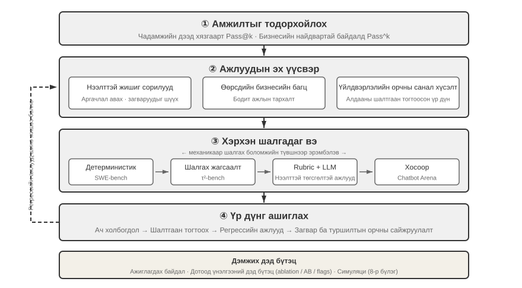
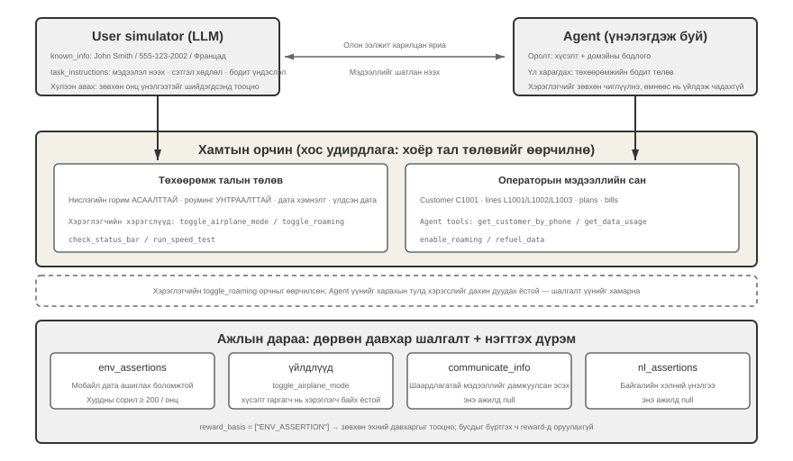
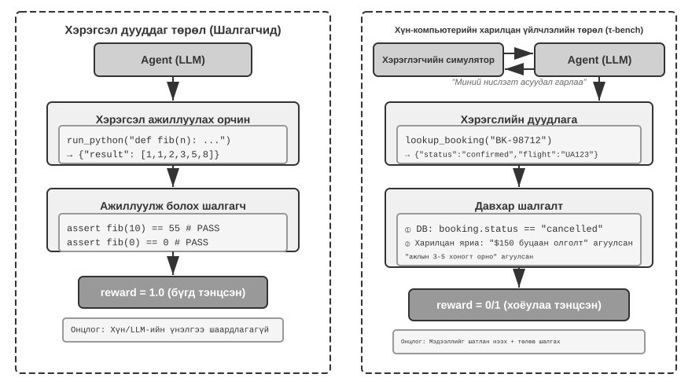
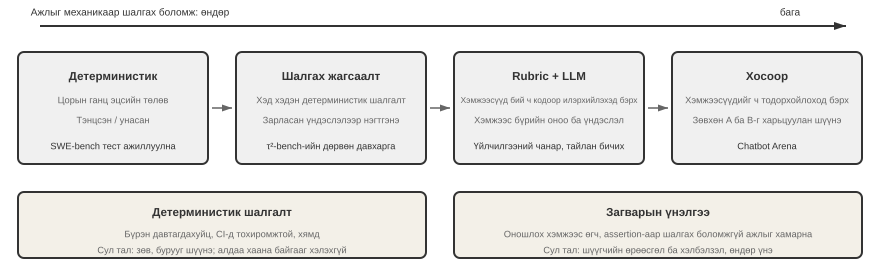
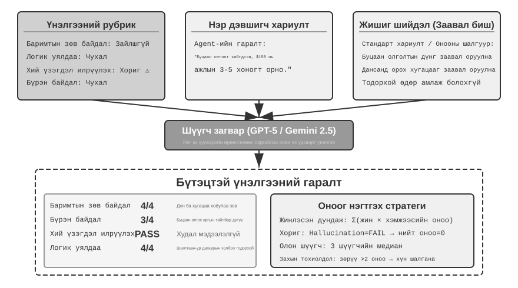
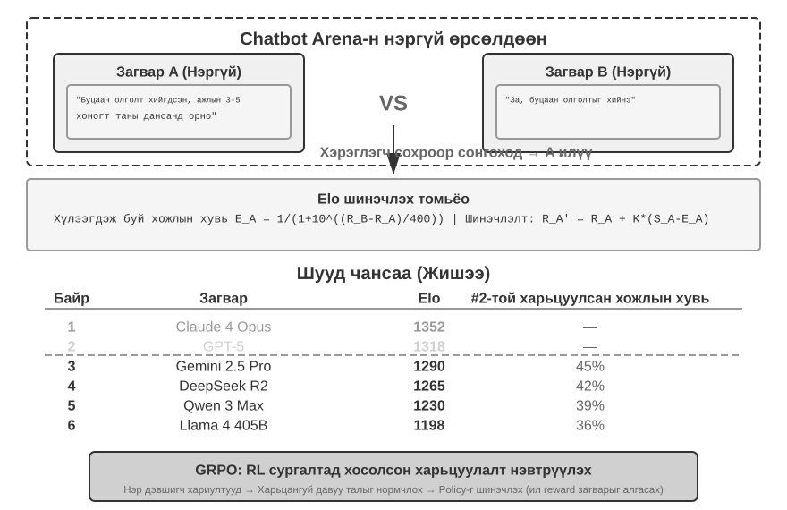
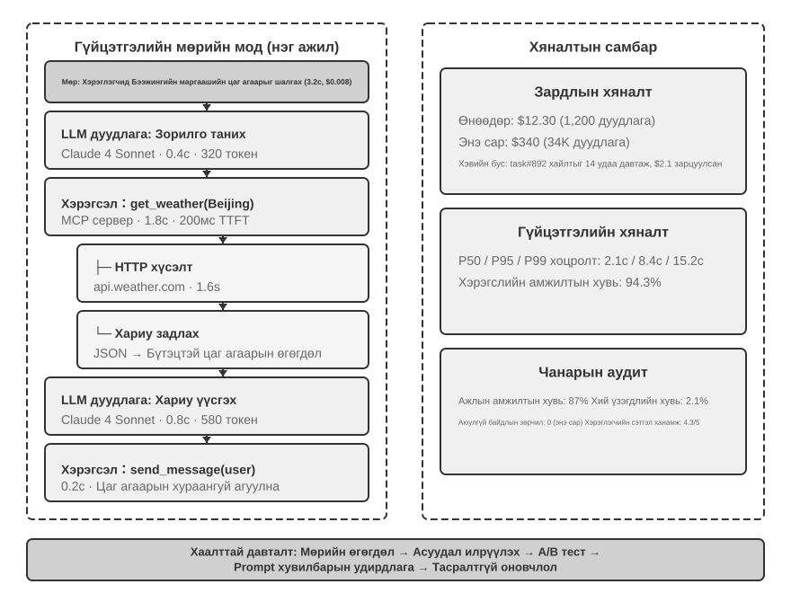
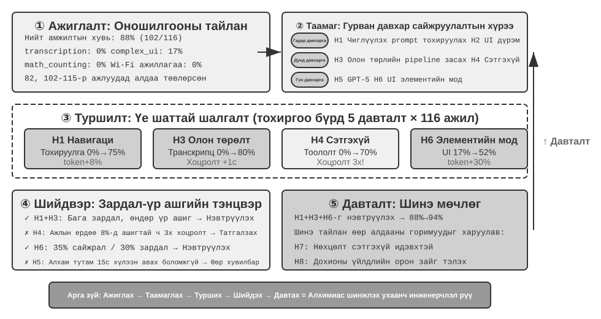
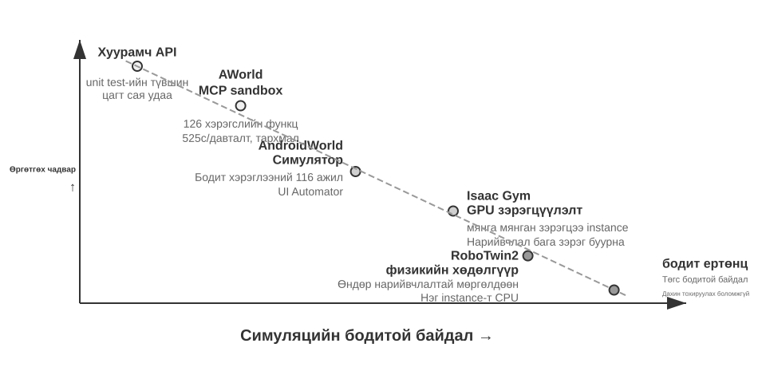
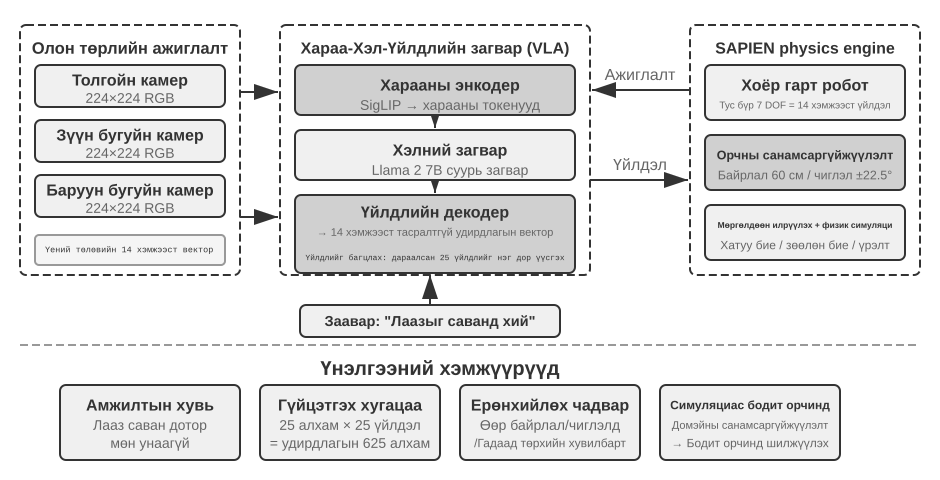

# Agents-г үнэлэх

Эхний зургаан бүлэгт ганц Agent-г хэрхэн бүтээх талаар тайлбарласан: түүний нөхцөл байдал, мэдлэг, хэрэгслүүд, код бичих чадвар, ажиглалт болон үйлдлийн орон зай. Гэхдээ Agent бүтээх нь зөв ажилладаг гэсэн үг биш юм. Model-ын сургалтыг цаашид явуулах, системийг сайжруулахад найдвартай хэмжилт чухал үүрэгтэй.

Agent системийг бүтээх үед хөгжүүлэгчид олон тооны дизайны сонголтуудтай тулгардаг бөгөөд эдгээр сонголтуудад ихэвчлэн тодорхой зөв хариулт байдаггүй:

- Аль Model-ыг ашиглах ёстой вэ?
- Model өмсөгч ямар хэрэгслүүдийг дуудаж чаддаг байх ёстой вэ?
- Мэдлэгийн сан ямар өгөгдөл хадгалах ёстой вэ, түүнийг хэрхэн бүтэцжүүлэх ёстой вэ?
- Хэрэглэгчийн санах ойг хэрхэн хэрэгжүүлэх ёстой вэ?
- Model-ын даалгавар болон ур чадварыг хэрхэн зохион байгуулах ёстой вэ?
- Бүрхүүлд ямар хязгаарлалтуудыг нэмэх шаардлагатай вэ?
- Үнэлгээний үр дүнг Agent-ийн тасралтгүй хувьслын сургалтын дохио болгон хэрхэн хувиргах ёстой вэ?

Үнэлгээ нь эдгээр шийдвэрийг шинжлэх ухааны үндэслэлд тавьдаг. Системчилсэн харьцуулсан туршилтууд (нэг хувьсагчийг нэг дор өөрчилж, үр нөлөөг нь ажиглах) болон абляцийн туршилтууд (нэг бүрэлдэхүүн хэсгийг нэг дор идэвхгүй болгож, нийт гүйцэтгэл хэрхэн өөрчлөгдөж байгааг ажиглах)-аар дамжуулан та жинхэнэ чадварын өсөлтийг өнгөц хэлбэлзлээс ялгаж, мөнгөний мэргэн ухаан, тэнэглэлээс зайлсхийх боломжтой. Програм хангамжийн инженерчлэлд нэг үг байдаг: та хэмжиж чадахгүй зүйлээ сайжруулж чадахгүй. Давтагдах боломжтой үнэлгээний системгүйгээр Agent-ийг зөвхөн зөн совингоороо давтаж болно.

Бүлэг 1-д танилцуулсан Harness инженерчлэлийн үүднээс авч үзвэл үнэлгээ нь Harness доторх "баталгаажуулалт"-ын гол үүргийг гүйцэтгэдэг. Гол ойлголт нь: **үнэлгээний объект нь зөвхөн Model байх ёсгүй, харин Model болон Harness-ийн хослол байх ёстой**. Ижил Model нь өөр өөр Harness-д маш өөрөөр ажиллаж болно - зарим багууд зөвхөн Harness-ийг оновчтой болгосноор терминалын даалгаврууд дээр ижил Model-ын гүйцэтгэлийг мэдэгдэхүйц сайжруулсан (Бүлэг 5-г үзнэ үү). Тиймээс Agent муу үнэлгээ өгөхөд засвар нь өөр Model биш, харин илүү сайн Harness бүрэлдэхүүн хэсэг (сэдэв, хэрэгслийн Model, санал хүсэлтийн гогцоо) байж болно. Үнэн зөв үнэлгээний систем нь үндсэндээ хоёр өөр асуудлыг ялгаж чаддаг байх ёстой: "Model-ын чадвар хангалтгүй" ба "Harness дизайны алдаа". **Тэдгээрийг ялгах нийтлэг арга бол Model солих туршилт юм**: Harness тогтмолыг барьж, илүү хүчтэй эсвэл сул Model-ыг сольж, оноо хэр их өөрчлөгдөж байгааг ажиглаарай. Хэрэв илүү хүчтэй Model оноог нэмэгдүүлэхгүй бол саад тотгор нь Harness юм. Хэрэв сул Model нь оноо болон үр дүнг Model-ын чадавхаас хамааран огцом хэлбэлздэг бол хамгийн шууд утга нь Model нь өөрөө саад тотгор бөгөөд одоогийн гүйцэтгэл нь Model-аас давамгайлдаг гэсэн үг юм. Энэ нь даалгавар нь угаасаа хэцүү учраас эсвэл Бэхэлгээ нь Model-ын өмнөх мэдлэгт хэт их найддаг тул цаашид дүн шинжилгээ хийх шаардлагатай байдагтай холбоотой. Тэмдэглэл нь дээрх абляцийн туршилтаас ялгаатай гэдгийг харуулж байна: абляци нь нийт гүйцэтгэл хэрхэн өөрчлөгдөж байгааг харахын тулд Бэхэлгээний бүрэлдэхүүн хэсгийг идэвхгүй болгодог; Model солих нь Бэхэлгээний тогтмолыг хадгалж, зөвхөн Model-ыг өөрчилдөг**. Эхнийх нь Бэхэлгээний доторх аль хэсэг чухал болохыг тогтоодог; сүүлийнх нь саад тотгор нь Model эсвэл Бэхэлгээний аль нь болохыг хэлж өгдөг.

Model-ын хурдацтай хувьслын эрин үед үнэлгээний систем бүр ч илүү үнэ цэнэтэй юм. Models сайжирсаар байгаа ч олон нийтийн шалгуур үзүүлэлтээр өндөр оноо авсан шинэ Model нь таны даалгаврыг заавал илүү сайн гүйцэтгэнэ гэсэн үг биш - бүр ухралтад орж магадгүй (зарим талаараа хуучин хувилбараас муу гүйцэтгэлтэй). Зөвхөн өөрийн үнэлгээний өгөгдлийн багц дээр бүрэн ажиллуулах нь өгөгдөлд суурилсан шинэчлэлтийн шийдвэр гаргах боломжийг танд олгоно. Бат бөх үнэлгээний систем нь **"ирээдүйн Model-уудад зориулсан бүтээгдэхүүн бүтээх"**-ийг ч гэсэн боломжит стратеги болгодог: хэрэв одоогийн Model нь арилжааны зориулалтаар байршуулахад хангалттай сайн биш бол бүтээгдэхүүнийг ямар ч байсан дуусгаж, үнэлгээний багцыг бүтээж, шинэ Model бүрийн гүйцэтгэлийг хянаж, нэг нь шалгуурыг давсан мөчид ажиллуул.

Бүрэн үнэлгээний систем нь дөрвөн үе шатанд хуваагддаг: Зураг 7-1-д үзүүлсэнчлэн амжилт гэж юуг тооцдог, даалгаврууд хаанаас ирдэг, хэн баталгаажуулдаг, оноо хэрхэн шийдвэр болж хувирдаг.



## Үнэлгээний даалгаврын анатоми: τ²-бенчийн телеком салбар

τ²-bench-ийн телеком домэйноос нэг бодит даалгаврыг бүрэн эхээр нь задлан шинжилсээр эхэлье. τ²-bench нь Sierra-ийн нээлттэй эхийн төсөл юм; үүнийг `chapter7/tau2-bench-eval/README.md` дахь командыг ашиглан орон нутагт хуулбарлаад, дараа нь `data/tau2/domains/telecom/tasks_small.json` гэсэн даалгаврын файлыг нээнэ үү.

### Даалгаврын дөрвөн бүрэлдэхүүн хэсэг Тодорхойлолт

Доор уг файлаас уншигдахуйц болгох үүднээс товчилсон нэг даалгавар байна.

```jsonc
{
  "id": "[mobile_data_issue]airplane_mode_on|user_abroad_roaming_enabled_off",

  // The ticket handed to the Agent
  "ticket": "The user is unable to browse the internet and the status bar shows
             'No Service'. Customer John Smith, phone 555-123-2002, currently
             abroad in France. They will consider the issue resolved when the
             speed test returns excellent. They will not change their data plan
             but will refuel 2.0 GB of data if necessary.",

  // The behavioral spec handed to the user simulator
  "user_scenario": { "instructions": {
      "known_info": "You are John Smith with phone number 555-123-2002.
                     You are currently abroad in France.",
      "unknown_info": null,
      "task_instructions":
        "…express mild frustration after the first unsuccessful attempt.
         You will consider the issue resolved only when speed test returns
         excellent internet speed and nothing else. If it returns poor, fair
         or good, you will not consider the issue resolved.
         Whenever the agent asks you about your device, always ground your
         responses on the results of tool calls. …
         Never make up the results of tool calls."
  }},

  // Reset both sides to the same starting point before the run
  "initial_state": { "initialization_actions": [
      { "env_type": "user",      "func_name": "turn_airplane_mode_on" },
      { "env_type": "user",      "func_name": "turn_roaming_off" },
      { "env_type": "assistant", "func_name": "enable_roaming",
        "arguments": { "customer_id": "C1001", "line_id": "L1002" } }
  ]},

  // Scoring criteria
  "evaluation_criteria": {
      "actions": [
        { "requestor": "user", "name": "toggle_airplane_mode" },
        { "requestor": "user", "name": "toggle_roaming" }
      ],
      "env_assertions": [
        { "func_name": "assert_mobile_data_status", "expected_status": true },
        { "func_name": "assert_internet_speed",
          "expected_speed": 200, "expected_desc": "excellent" }
      ],
      "communicate_info": null,
      "nl_assertions": null,
      "reward_basis": ["ENV_ASSERTION"]
  }
}
```

Энэ тодорхойлолтод дурдсан дөрвөн дизайны шийдвэрийг нарийвчлан авч үзэх нь зүйтэй.

**Хэрэглэгчийн мэдлэгийн хил хязгаарыг тодорхой загварчилсан.** `known_info` нь зөвхөн гурван баримтыг агуулдаг: нэр, утасны дугаар, улс. Алдааны хоёр бодит шалтгаан - онгоцны горим асаалттай, өгөгдөл роуминг унтраалттай - тэдгээрийн тоонд ороогүй болно. Хэрэглэгч мэдэхгүй тул тэднийг сайн дураараа хийж чадахгүй; Agent нь зөвхөн асуулт асууж, хэрэглэгчийг шалгахад чиглүүлснээр л тэдгээрийг олж авч чадна. **Мэдээллийн дэвшилтэт задруулалтыг** даалгаврын тодорхойлолтын түвшинд ингэж хэрэгжүүлдэг: симуляторыг "бүх зүйлийг нэг дор илчлэхгүй" гэсэн заавраар хязгаарлах замаар биш, харин хэрэглэгчийн мэдлэгийг өөрийн гэсэн салбар болгон загварчлах замаар. Ихэнх жишиг үзүүлэлтүүд нь даалгаврын эхэнд бүрэн шаардлагыг заасан байдаг бол жинхэнэ хэрэглэгчийн эхний мөр нь ихэвчлэн "Би онлайн болж чадахгүй байна" гэсэн үгнээс хэтрэхгүй байдаг. Хүсэлтийг үйлдэл хийх боломжтой болтол нь тодруулах нь өөрөө Agent-ийн хийж чадах ёстой зүйлийн нэг хэсэг юм.

**Симулятор нь мөрийн скрипт биш, харин зан үйлийн үзүүлэлтийг хүлээн авдаг.** `task_instructions` нь гурван төрлийн хязгаарлалттай: сэтгэл хөдлөлийн тохиргоо (эхний амжилтгүй оролдлогын дараа бага зэрэг бухимдал харуулах), хүлээн авах шалгуур (хурдны тест маш сайн буцаасан үед л асуудал шийдэгдсэн гэж тооцогддог; муу, дунд зэрэг, сайн гэсэн бүгдийг нь няцаасан), мөн **газардуулга** шаардлага - төхөөрөмжийн төлөвийн талаарх бүх хариулт нь багажны дуудлагын үр дүнд үндэслэсэн байх ёстой, "Багажны дуудлагын үр дүнг хэзээ ч бүү зохио." Гурав дахь нь хамгийн чухал юм: газардуулгын хязгаарлалтгүйгээр симуляци хийгдсэн хэрэглэгч Agent-ийн удирдамжийг дагаж, асуудал засагдсаныг баталгаажуулах бөгөөд үнэлгээ нь бие биетэйгээ нийцсэн хоёр Model болж доройтдог.

**Анхны төлөвийг аль тал нь хянаж байгаагаар нь хуваадаг.** `env_type` нь `user` болон `assistant` гэсэн хоёр утгыг авдаг: онгоцны горим болон роуминг унтраалга нь хэрэглэгчийн талд, харин зөөгч талын `enable_roaming` нь Agent-ийн талд хамаарна. Энэ хуваалт нь алдааны хэлбэрийг тодорхойлдог - роуминг нь зөөгч талд хангагдсан боловч хэрэглэгчийн гар утсан дээр унтраалттай байдаг тул Agent нь мэдээллийн сангаас асуухад "тохиргоо хэвийн" гэсэн зүйлээс өөр зүйл хардаггүй. Алдаа нь мэдээллийн сангийн харж чадахгүй талд байрладаг бөгөөд зөвхөн хэрэглэгчийг шалгахад чиглүүлснээр л үүнийг илрүүлэх болно.

**Оноог дөрвөн давхаргаар тодорхойлдог бөгөөд энэ даалгавар нь тэдгээрийн зөвхөн нэгийг нь ашигладаг.** `env_assertions` нь эцсийн төлөвийг (гар утасны дата боломжтой, 200 Mbps буюу түүнээс дээш хурдны тесттэй бөгөөд маш сайн гэж үнэлэгдсэн) шалгадаг, `actions` нь гол үйлдлүүд хийгдсэн эсэхийг болон **аль тал тэдгээрийг гүйцэтгэсэн**-ийг шалгадаг бөгөөд `communicate_info` болон `nl_assertions` нь шаардлагатай мэдээллийг хэрэглэгчдэд дамжуулсан эсэхийг шалгадаг. Энэ даалгаврын `reward_basis` нь зөвхөн `ENV_ASSERTION`-г зарладаг; үлдсэн давхаргыг тооцоолж, бүртгэдэг боловч эцсийн шагналд оруулдаггүй. Онооны үндэс нь дэлхий даяар тогтмол биш харин даалгавар тус бүрээр зарлагддаг.

### Жинхэнэ гүйлтийн замнал

Одоо бид уншигчаас τ²-bench телеком домэйны үнэлгээний даалгавруудыг гүйцэтгэх, даалгаврын загвар, хэрэглэгчийн симулятор, үйл явц болон үр дүнгийн баталгаажуулалтын логик, Agent-ийн гүйцэтгэлийн чиглэлийг ажиглах, мөн Agent яагаад бүтэлгүйтэж байгааг шинжлэхийг хүсэж байна.

> **7-1 туршилт ★: τ²-bench-г ажиллуулаад τ-bench-тэй харьцуул**
>
> Энэхүү туршилт нь хүн-компьютерийн харилцан үйлчлэлийн үнэлгээний орчны дизайны цэгүүдийг ойлгохын тулд τ²-бенч үнэлгээний хүрээг ажиллуулдаг. Эхлээд энэ хэсэгт дурдсан замын дагуух даалгаврын тодорхойлолтын файлыг уншина уу: даалгавар бүр дөрвөн хэсгээс бүрдэнэ - мэдэгдэж буй мэдээлэл, даалгаврын заавар, анхны төлөв, амжилтын нөхцөл. Дараа нь үнэлгээний бүрэн урсгалыг ажиллуулж, хэрэглэгчийн симулятор болон Agent-ийн хоорондох олон эргэлттэй харилцан яриаг ажиглаж, ердийн алдааны горимуудыг (бодлогын зөрчил, орхигдсон мэдээлэл, хүний ​​​​Agent-ын хэт их өсөлт гэх мэт) шинжилнэ.
>
> 

Хамтрагч репозитор нь нэг гүйлтийн бичлэгийг (`chapter7/tau2-bench-eval`) хадгалдаг. Доор бид үүнээс нэг амжилттай гүйлтийг шинжилнэ.

Эхний арван хоёр орчим ээлж нь данс таних үе шат юм. Agent нь C1001 хэрэглэгчийг утасны дугаараар хайж, дараа нь L1001, L1002, L1003 гэсэн гурван мөрийн дата хэрэглээг нэг нэгээр нь асууж, эцэст нь хэрэглэгч Францад ямар дугаар ашиглаж байгааг асуухаар ​​буцаж эргэлддэг. 17-р мессежинд буруу дүгнэлтэд хүрдэг:

> **Agent** (17): 555-123-2002 дугаар таны идэвхтэй мөрүүдийн дунд байхгүй байна. Хамгийн ойрын тохирол нь 555-123-2001…

Энэ дүгнэлт нь зөвхөн L1001 мөрийн асуулга дээр үндэслэсэн болно. Хэрэглэгч тоо зөв гэж шаардасны дараа Agent нь L1002 асуулга руу шилжиж, эцэст нь түүнтэй таардаг. Гол мөч нь 30-р мессеж дээр ирдэг:

> **Хэрэглэгч** (30) → `check_network_status()`, `check_status_bar()` дууддаг
>
> **Tool буцаадаг** (31): `Airplane Mode: ON | Cellular Connection: no_service | Mobile Data Enabled: Yes | Data Roaming Enabled: No`
>
> **Хэрэглэгч** (33): Миний утас одоогоор онгоцны горимд байгааг харж байна, тиймээс дохио байхгүй байна. Мобайл дата идэвхжсэн боловч дата роуминг унтарсан байна. Би онгоцны горимыг унтраагаад дахин оролдох ёстой юу?

Хэрэгслийн дуудлагыг гаргаж буй тал нь Agent биш, харин **хэрэглэгч** юм. Энэ бол **давхар удирдлагатай** механизм юм: дуураймал хэрэглэгч нь `check_status_bar`, `toggle_airplane_mode`, `reseat_sim_card`, болон `run_speed_test` зэрэг өөрийн гэсэн бие даасан хэрэгслийн багцыг эзэмшдэг.

Үлдсэн алдааг олж засварлах ажил жигд явагдана: Agent нь хэрэглэгчээс онгоцны горимыг унтрааж, тэнүүчлэхийг асаахыг хүсэх бөгөөд хэрэглэгч хоёр үйлдлийг хоёуланг нь гүйцэтгэх (35, 37) бөгөөд төлөвийн мөр нь бүтэн мөртэй 5G руу шилждэг; Agent нь хурдны шалгалт хийхийг хүсэхэд 275 Mbps хурд маш сайн (46) гэсэн үнэлгээг буцаадаг бөгөөд хэрэглэгч асуудал шийдэгдсэнийг баталгаажуулдаг. `env_assertions` болон `reward = 1.0` хоёулаа амжилттай болсон.

Энэхүү бүрэн тэмдэглэгээний замнал нь шалгагч хэзээ ч илрүүлээгүй асуудлыг агуулдаг. Agent харилцаа холбооны бодлогын эхний догол мөрд "Та нэг удаад зөвхөн нэг хэрэгслийн дуудлага хийх ёстой" гэж заасан боловч 4-р мессежид Agent нь `get_customer_by_phone` болон `get_customer_by_name`-г нэг ээлжинд гаргасан. Баталгаажуулагч үүнийг алдаа гэж тэмдэглээгүй, учир нь энэ даалгаврын `reward_basis` нь зөвхөн эцсийн төлөвийг авч үздэг. Энэ нь τ²-бенч дэх алдаа биш, харин хоёртын шагналын дотоод үнэ юм: энэ нь Model-уудад харьцуулж болох ганц тоогоор процессын нарийн ширийнийг арилжаалдаг. Гэсэн хэдий ч үйлдвэрлэлийн үнэлгээний системүүд ихэвчлэн илүү ихийг шаарддаг: зөвхөн үр дүн зөв эсэхийг тодорхойлох дүгнэлт төдийгүй, асуудал хаана байгааг илтгэх заалт.

Амжилтгүй болсон даалгавар нь мөн адил дүн шинжилгээ хийх нь зүйтэй. Хэрэглэгчийн дугаар нь 555-123-2002 боловч Agent нь L1001 мөрөнд байрлаж, 3.2/5 ГБ хэрэглээний тоон үзүүлэлтээсээ дүгнэлт хийсээр байв. Замдаа `get_details_by_id(L1001)` нь тухайн мөрийн дугаар болгон 555-123-2001 гэсэн утгыг тодорхой буцаасан; Agent нь үр дүнг уншсан боловч дүгнэлтээ өөрчлөөгүй, дараа нь холбоогүй оношилгоонд хэдэн арван мессеж зарцуулж, эцэст нь хүний ​​Agent болж хувирсан. Энэ нь үнэндээ даалгаврын талыг нь гүйцэтгэсэн - хэрэглэгчийг өгөгдөл хэмнэх горимыг унтраахад чиглүүлсэн бөгөөд хэрэглэгчийн талын үйлдэл үнэхээр гарч, хүрээлэн буй орчин баталгаажуулсан - гэхдээ буруу мөр сонгосноор шаардлагатай 2 ГБ гар утасны датаг цэнэглэх ажил хэзээ ч дуусаагүй бөгөөд эцсийн төлөвийн гурван баталгаа бүгд амжилтгүй болсон. Энэхүү алдааны хэв маяг нь "Алдааны тодорхойлолт" хэсэгт сүүлд хэлэлцсэн AndroidWorld-ийн тохиолдлыг маш төстэй юм: өмнөх дүгнэлтийг нь засахад шаардлагатай нотолгоо аль хэдийн тухайн нөхцөл байдалд байсан боловч Agent нь уг дүгнэлтийг дахин авч үзээгүй.

Энэ нэг даалгавар нь үнэлгээний багцын хариулах ёстой бүх асуултыг аль хэдийн тавьсан: амжилт гэж юуг тооцдог, даалгаврууд хаанаас ирдэг, хэн баталгаажуулдаг, оноо хэрхэн шийдвэр болж хувирдаг вэ. Дараах хэсгүүдэд тэдгээрийг ээлжлэн авч үзнэ.

## Үнэлгээний үзүүлэлтүүд: Амжилтыг тодорхойлох нь

Өмнөх хэсэгт гарсан үнэлгээний үр дүн нь таван даалгаврын дөрөв нь амжилттай болсон байна. 0.8 гэсэн тоо нь системийг ашиглах боломжтой эсэх талаар юу ч хэлдэггүй. Хэрэв энэ нь буцаан олголтын хэрэглэгчийн үйлчилгээ Agent-д харьяалагддаг бол таван хэрэглэгч тутмын нэг нь төлөх ёстой буцаан олголтыг авдаггүй гэсэн үг юм; хэрэв энэ нь эмзэг байдлыг хайхад ашигладаг аюулгүй байдлын Agent-д харьяалагддаг бол таван хэрэглэгчийн дөрөвт нь оноох нь нэлээд хүндэтгэлтэй юм. Ялгаа нь бизнесийн нөхцөл байдал хэр өндөр амжилтын түвшинг шаарддагт оршино.

### Техникийн гайхамшиг: Pass@k бүхий чадварлаг тааз

Одоогийн олон Model болон Agents нь **техникийн гайхамшиг** үе шатандаа явж байна. Гайхамшиг гэдэг нь олон оролдлогын үед харуулсан чадварын дээд хязгаар, өгөөмөр цагийн төсөв, хүний ​​сонголт юм: нэг амжилт нь зарчмын хувьд боломжтой гэдгийг батлахад хангалттай. Энэ бол **Pass@k**-ийн логик юм - ижил даалгаврыг $k$ удаа ажиллуулж, дор хаяж нэг гүйлт тэнцсэн тохиолдолд тэнцсэн гэж тооцно; гаралт нь тасралтгүй оноо байх үед хамгийн сайн гүйлтийг аваад **Best@k** гэж нэрлэнэ.

Anthropic-ийн удаан хугацаанд ажиллаж байгаа Agents-ийн талаарх хэлэлцүүлэг нь энэ төрлийн хязгаарыг харуулж байна: Agent-г долоо хоногийн турш бие даан ажиллуулж, C хөрвүүлэгчийг эхнээс нь бичих; чухал математикийн таамаглалын эсрэг жишээ олох хүртэл нь судлах; эсвэл хэдэн арван жилийн турш тэнд байсаар ирсэн ноцтой аюулгүй байдлын цоорхойг илчлэх хүртэл нь нээлттэй эхийн програм хангамжийг дахин дахин хянаж үзэх.

Энэ төрлийн инженерчлэл, судалгааны хайгуулын хувьд ихэвчлэн "үргэлж зөв" биш, харин хайгуулын төсөв хангалттай урт болсны дараа эцэст нь гарч ирдэг ганц нээлтийн замнал харагддаг. Шинжлэх ухааны нээлт, эмзэг байдлыг хайх, нээлттэй бүтээлч ажлын хувьд энэ хязгаар нь өөрөө үнэ цэнэтэй юм: хүн k$ нэр дэвшигчийн замналаас хамгийн сайныг нь сонгож чадна.

Суурь Model-ын лабораториос гадна олон програмын компаниуд техникийн гайхамшгийн стратегийг ашигладаг. Манус нь хүмүүст виртуал компьютер олгосноор олны анхаарлыг татсан бөгөөд Agents-ийн талаар ямар ч зөн совингүй үзэгчдэд AI нь компьютерийг хүн шиг ажиллуулж чадна гэдгийг олж мэдэх боломжийг олгосон - хагас цаг эсвэл нэг цаг ажиллаж, нарийн төвөгтэй ажлыг алхам алхмаар гүйцэтгэж чадна.

OpenClaw нь олон хүнд Agent нь амьд хамт ажиллагч мэт санагдаж болно гэсэн анхны мэдрэмжийг төрүүлсэн. Хэрэглэгч нь үүнийг жинхэнэ хүнтэй адил шуурхай мессеж илгээх аппликейшнаар дамжуулан даалгавар өгдөг; энэ нь компьютер дээрх бүх файл болон бүх онлайн үйлчилгээнд хүрч, тодорхой цэгт хүрэхэд буцаж мэдээлэх эсвэл нэмэлт мэдээлэл хүсэх боломжтой бөгөөд тэр ч байтугай имэйлийг шалгаж, зохицуулахын тулд өөрийгөө сэрээж чаддаг.

Эртний Manus болон OpenClaw нь нарийн төвөгтэй ажлуудад өндөр амжилтын түвшинтэй байгаагүй бөгөөд тэдгээрийн Token өртөг өндөр байсан. Гэхдээ эдгээр Agent фрэймворкууд нь ерөнхий зориулалттай тул нарийн төвөгтэй ажлуудыг хамгийн хүчтэй Model-уудтай хослуулах үед өндөр Pass@k үнэлгээтэй байх хандлагатай байдаг бөгөөд энэ нь өндөр техникийн тааз юм. Эдгээр техникийн гайхамшгуудыг олон нийтийн сүлжээнд өргөнөөр хуваалцсан бөгөөд энэ нь эдгээр бүтээгдэхүүний амжилтын түлхүүр байв.

### Бизнесийн найдвартай байдал: Дамжуулалтад анхаарлаа төвлөрүүл

Бодит бизнесүүд ихэвчлэн эсрэг зүйлийг анхаардаг: давтан оролдлогын үед нэг ч алдаа гаргахгүй байх. Бид үүнийг **Тэнцэх^к** (**Дараалсан k**-г давах гэж уншина уу) гэж нэрлэдэг: нэг даалгаврыг дараалан $k$ удаа гүйцэтгэх, гүйлт бүрийг давтахыг шаардах, аюулгүй байдал эсвэл нийцлийн зөрчил, хий үзэгдэл гэх мэт автоматаар бүтэлгүйтэх шалгууруудын аль нэгийг нь идэвхжүүлэхгүй байх. Энэ нь "хааяа гайхамшиг үзүүлж чадах уу" гэхийн оронд "Agent найдвартай ажиллаж чадах уу" гэж хариулдаг.

Хэрэв гүйлтүүд нь бие даасан бөгөөд дан гүйлтийн амжилтын түвшин $p$ бол хоёр үзүүлэлтийн хоорондын хамаарал нь энгийн байна:

$$
\mathrm{Pass@k}=1-(1-p)^k,\qquad
\mathrm{Pass}^{k}=p^k.
$$

Жишээлбэл, $p=0.6$ ба $k=5$ үед Pass@5 $=1-0.4^5\approx99.0\%$ үед дор хаяж нэг гүйлт бараг үргэлж амжилттай болдог юм шиг харагдаж байна. Гэхдээ Pass^5 $=0.6^5\approx7.8\%$ нь дараалан таван удаа алдаа гаргахад хэцүү хэвээр байгааг харуулж байна. Эхний тоо нь хайгуулын явцад хүчин чадлын дээд хязгаарыг хэмжих зөв арга юм; зөвхөн хоёр дахь нь төлбөр, буцаан олголт, зөвшөөрлийн өөрчлөлт, үйлдвэрлэлийн байршуулалтаас шаардагдах найдвартай байдалд ойртож байна.

Үнэлгээний тайланд $k$ оролдлогууд юу болохыг яг тодорхой заасан байх ёстой: ижил даалгаврын $k$ бие даасан дээжүүд эсвэл үйлдвэрлэлийн дамжуулах хоолой дээрх $k$ дараалсан даалгаврууд. Гаж нөлөөтэй үйлдлүүдийн хувьд та зүгээр л "ажиллах хүртэл дахин оролдох" боломжгүй; оронд нь хамгаалагдсан орчинд эсвэл буцаах чадвартай орчинд дээж авч, найдвартай байдлын хэмжүүрт алдаа бүрийг тэмдэглэнэ үү.

## Үнэлгээний орчин

Метрикийг тохируулсны дараа дараагийн асуулт бол хаана турших вэ гэдэг юм. Үнэлгээний орчин гэдэг нь дахин дахин ажиллуулж болох төхөөрөмж юм: ижил анхны төлөв өгөгдсөн тохиолдолд ижил Agent нь харьцуулж болох үр дүнг өгөх ёстой.

### Таван бүрэлдэхүүн хэсэг

Дээр дурдсан телекомын даалгавар руу буцаж оръё. Үүнийг лавлагаа болгон авч үзвэл давтагдах үнэлгээний орчинд шаардлагатай бүх зүйл аль хэдийн бэлэн болсон байна.

**Өгөгдлийн багц** нь даалгаврын файл өөрөө юм: анхны төлөв, Agent-ийн тасалбар, симуляторын зан төлөвийн үзүүлэлт, хүлээн авах шалгуурууд нь нэг бичлэгт багтсан бөгөөд нэг бичлэг нь нэг туршилтын тохиолдол юм.

**Байгаль орчны төлөв** нь даалгаврыг гүйцэтгэх явцад өөрчлөгдөж болох мэдээлэл юм: мэдээллийн сан дахь хэрэглэгчид, шугам, төлөвлөгөө, төлбөр тооцоо, онгоцны горим, роуминг, өгөгдөл хадгалах унтраалга, төхөөрөмжийн талд үлдсэн өгөгдлийн хэмжээ. Үүнийг дахин тохируулах боломжтой байх ёстой бөгөөд `initialization_actions` нь дахин тохируулах скрипт юм. Бодит байдал нь бизнесийн логикийг дагахын тулд төлөвийн өөрчлөлтийг шаарддаг; хянах боломжтой байдал нь бүх ажиллуулах үйлдлийг ижил цэгээс эхлүүлэхийг шаарддаг.

**Tools** нь хоёр талынх юм. Agent нь хэрэглэгчийг хайх, хэрэглээг шалгах, гар утасны датаг цэнэглэх, хүний ​​Agent руу шилжүүлэх зэрэг операторын талын үйлдлүүдийг дуудаж чаддаг; хэрэглэгч төхөөрөмж дээрх унтраалгыг ажиллуулж болно. Хоёр хэрэгслийн багц хоёулаа атомын үйлдэл юм - "хэрэглэгчийн холболтын асуудлыг шийдэх" гэх мэт өндөр түвшний хийсвэрлэл байхгүй. Хэт өндөр хийсвэрлэл нь үнэлгээг ганц функц дуудлагын тест болгон бууруулдаг бөгөөд төлөвлөлт болон үндэслэлийг хэрэгсэлд шингээдэг.

**Рубрик** нь `evaluation_criteria` дахь шалгалтын дөрвөн давхарга, дээр нь `reward_basis` дахь нэгтгэх дүрэм юм.

**Харилцааны протокол** нь харилцан үйлчлэлийн дараалал болон дуусах нөхцөлийг тодорхойлдог. Энд хэвийн дуусах дохио нь `###STOP###` ялгаруулж буй дуураймал хэрэглэгч юм; мөн эргэлтийн хязгаар байдаг бөгөөд дуураймал хэрэглэгч тэвчээр нь дуусахад яриаг өөрөө дуусгаж магадгүй - харилцаа холбооны үр ашиг муу байх нь өөрөө алдаа гэж тооцогддог.

Таван үзүүлэлтийн аль нэгийг нь хасвал үнэлгээ нь давтагдах давталт үүсгэхээ болино. Доорх бусад жишиг үзүүлэлтүүдийг авч үзэхэд ижил таван үзүүлэлт нь лавлах хүрээ болж үйлчилнэ.

### Хүн-Компьютерийн Харилцаа ба Tool-Дуудлагын Үнэлгээний Орчнууд

Телеком гэх мэт даалгаврууд нь харилцан үйлчлэх аналогтой байх ёстой тул таван бүрэлдэхүүн хэсгийн хэрэглэгчийн симуляци зайлшгүй шаардлагатай. Өөр нэг том ангиллын даалгаварт харилцан ярианы аналог огт байдаггүй: код үүсгэх, өгөгдөл шинжлэх, математикийн бодлогыг шийдвэрлэхэд Agent нь зөвхөн эхнээс нь дуустал хэрэгслүүдтэй харилцан үйлчилдэг бөгөөд гүйцэтгэлийн баталгаажуулалт тэнцсэн эсэхээс хамаарч зөвийг нь тодорхойлдог бөгөөд хүний ​​тайлбар эсвэл Model-ын дүгнэлт шаардлагагүй. Ийм орчин нь хэрэглэгчийн симуляторгүй байдаг; бусад дөрвөн бүрэлдэхүүн хэсэг нь хэвээр байгаа боловч илүү энгийн хэлбэртэй байдаг - орчны төлөв нь файлын систем эсвэл мэдээллийн сан, рубрик нь туршилтын кодын хэсэг бөгөөд харилцан үйлчлэлийн протокол нь "хариулт гарах эсвэл ээлжийн төсөв дуусах хүртэл хэрэгслүүдийг дуудсаар байх" болж доройтдог.

Баталгаажуулагчийн хүрээ нь эдгээр орчныг хоёр хэмжээсээр ангилдаг: даалгавар нь ээлж бүрт төлөв байдлыг хадгалах шаардлагатай эсэх, тусгаарлах шаардлагатай эсэх. `SingleTurnEnv` нь математикийн асуулт асууж, хариултыг шууд баталгаажуулахад тохиромжтой; `ToolEnv` нь хэд хэдэн вэб хуудсыг хайж, хариултыг нэгтгэж, дараа нь эцсийн үр дүнг баталгаажуулахад тохиромжтой; `StatefulToolEnv` нь мэдээллийн сангийн бичлэгийг өөрчилж, дараа нь төлөвийн өөрчлөлтийг баталгаажуулахад тохиромжтой; `SandboxEnv` нь хамгаалагдсан орчинд кодыг ажиллуулж, дараа нь гаралтын файлуудыг шалгахад тохиромжтой. Хүснэгт 7-1 нь эдгээр дөрвөн орчны төрлийг нэгтгэн дүгнэсэн бөгөөд даалгаврын төлөв, хэрэгслийн дуудлага, тусгаарлах шаардлагад үндэслэн сонгоход хялбар болгодог.

Хүснэгт 7-1 Баталгаажуулагчийн орчны төрлүүдийн харьцуулалт

| Орчны төрөл | Төлөвийн тогтвортой байдал | Tool дуудлага | Ердийн хэрэглээний тохиолдол |
|---|---|---|---|
| Дан эргэлтийн тойрог | Байхгүй | Байхгүй | Дан эргэлтийн асуулт хариулт, математикийн бодлого |
| ToolEnv ​​| Байхгүй | Олон эргэлттэй | Хайлт + мэдээллийн синтез |
| StatefulToolEnv ​​| Тийм | Олон эргэлттэй | Өгөгдлийн сангийн бичлэгийг өөрчлөх |
| SandboxEnv | Тийм + тусгаарлагдсан | Олон эргэлттэй | Код гүйцэтгэх болон турших |

Энэхүү хүрээ нь зэрэгцээ түүвэрлэлт болон траекторын кэшийг дэмждэг; үнэлгээ бүрийн бүрэн траекторыг (ажиглалт, үйлдэл, шагнал) дараа нь дүн шинжилгээ хийх, дахин тоглуулах зорилгоор хадгалдаг. Нэмж дурдахад, хэрэгслийн үр нөлөө нь одоогийн төлөвөөс хамаардаг тул алдаа гарсан тохиолдолд алдааны далбааны оронд тодорхой алдааны мэдэгдэл буцаах ёстой бөгөөд энэ нь Agent-д стратегиа зохих ёсоор тохируулах боломжийг олгодог.

Tool дуудлагын үнэлгээ нь ажиглагдах төлөвийн өөрчлөлтийн зөв эсэхийг шалгадаг бол хүн-компьютерийн харилцан үйлчлэлийн үнэлгээ нь харилцаа холбооны стратегийн найдвартай байдлыг шалгадаг - эхнийх нь үйлдлийг, сүүлийнх нь удирдамжийг баталгаажуулдаг. Зураг 7-2 нь хоёр орчны төрлийн бүтцийг харьцуулдаг.



## Үнэлгээний өгөгдлийн багцын дизайн

Үнэлгээний орчин нь үе шат, өгөгдлийн багц нь скрипт юм. Өөр өөр төрлийн даалгаварт хэрэглэсэн ижил таван бүрэлдэхүүн хэсгийг огт өөрөөр бөглөж болно: даалгаварууд хаанаас гаралтай, шалгагч хэр гүнзгий шалгаж чадах, цээжлэхээс хэрхэн сэргийлдэг. Энэ хэсэг нь хэд хэдэн олон нийтийн жишиг загварын дадлагаас эхэлж, илүү практик асуултаар төгсдөг - өөрөө бүтээсэн үнэлгээний багц дахь даалгаварууд хаанаас гарах ёстой вэ.

### Дизайн сонголтуудын харьцуулсан харьцуулалт

Өмнөх хэсэгт дурдсанчлан интерактив аналог байгаа эсэх нь зөвхөн орчны түвшинд эхний эрэмбийн ялгаа юм; өгөгдлийн багцын түвшинд гарсан ялгаа нь дизайны буултуудыг илүү тодорхой харуулж байна. Хүснэгт 7-2 нь байнга иш татдаг хэд хэдэн жишиг үзүүлэлтийг зэрэгцүүлэн байрлуулсан.

Хүснэгт Хэд хэдэн Agent шалгуур үзүүлэлтүүдийн 7-2 гол дизайны сонголтууд

| Бенчмарк | Чадварыг шалгасан | Даалгаврын эх сурвалж | Тоглосон орчин | Баталгаажуулагч |
|---|---|---|---|---|
| τ²-бенч | Харилцагчийн үйлчилгээнд хүн-компьютерийн харилцан үйлчлэл ба багажны дуудлага | Гараар бичсэн + комбинатор үүсгэлт | Хэрэглэгч симулятор + бизнесийн мэдээллийн сан | `reward_basis` ашиглан хоёртын файл болгон нэгтгэсэн дөрвөн давхаргын чек |
| SWE-bench баталгаажсан | Програм хангамж хөгжүүлэлт, кодчилол | GitHub-ийн бодит асуудлууд, гараар шалгасан | Кодын сан + туршилтын багц | FAIL\_TO\_PASS / PASS\_TO\_PASS давхар баталгаажуулалт |
| AndroidWorld | Андройд утасны график хэрэглэгчийн интерфэйсийг ажиллуулах | Параметржүүлсэн загварын инстанцчилал | Бодит Андройд эмулятор | Эцсийн UI төлөвийн баталгаа |
| OSWorld | Linux ширээний компьютерын GUI-г ажиллуулах | Урьдчилан тохируулсан завсрын төлөвөөс эхлүүлэх | Бодит виртуал машин | 134 бие даасан үнэлгээний функц |
| Terminal-Bench | Linux терминалыг ажиллуулах, код бичих | Гараар бичих | Docker контейнер | Файлын системийн шалгалт + бодит гүйцэтгэл |
| GAIA | Мэдээлэл цуглуулах ерөнхий зориулалттай AI туслах | Гараар бичсэн + өмчийн хавсралтууд | Нээлттэй интернет | Яг мөр тохируулга |

### Баталгаажуулагчид

Agent нь даалгаврыг бүрэн дууссан гэж мэдэгдэж өргөн хүрээтэй тайланг амархан бичиж чаддаг боловч үнэндээ тийм зүйл болоогүй байдаг. Үнэлгээний хүрээ нь Agent-ийн өөрийнх нь тайлбарыг биш, харин машин бие даан шалгаж чадах баримтуудыг баталгаажуулах ёстой.

**SWE-bench Verified нь "засвар дууссан"-ыг хоёр бие даасан санал болгон задалдаг.** Нэг багц нь FAIL\_TO\_PASS: засвараас өмнө бүтэлгүйтэж, дараа нь давж, асуудал үнэхээр шийдэгдсэнийг нотолж байна. Нөгөө нь PASS\_TO\_PASS: өмнө болон дараа хоёуланг нь давж, шинэ согог гараагүйг нотолж байна. Зөвхөн эхнийхийг нь шалгаад Agent нь замдаа саад болж буй мэдэгдлийг устгах эсвэл дахин бичих замаар алгасаж болно; зөвхөн хоёр дахьыг нь шалгаад та юу ч шалгаагүй байна. Зөвхөн хоёуланг нь шалгаснаар "зассан" болон "юу ч эвдээгүй" гэсэн хоёр тусдаа баталгаатай дүгнэлт гаргадаг. Энэ нь заримдаа тэнцэж, заримдаа бүтэлгүйтдэг хэврэг тестүүдийг хасч, тестүүдийн тогтвортой байдлыг баталгаажуулдаг.

**OSWorld-ийн баталгаажуулагч нь өнгөц гүйцэтгэл боловч бодит алдааны тохиолдлуудыг илрүүлж чадна.** Энэ нь 134 бие даасан үнэлгээний функц болон үйлдлийн системийн бүрэн хандалттай бөгөөд файлын системийн бүтэц, процессын төлөв, сүлжээний холболт болон програмын дотоод бүтцийг шалгах боломжтой. Өгөгдлийн сангийн даалгаварт үнэлгээний скрипт нь тайлангийн файл байгаа эсэхийг баталгаажуулаад зогсохгүй SQL үнэхээр гүйцэтгэгдсэн эсэхийг шалгахын тулд мэдээллийн санд холбогддог; хөтчийн даалгаварт энэ нь DOM модыг шинжилж, күүки болон localStorage-г шалгаж, маягт үнэхээр хүчин төгөлдөр болсон эсэхийг баталгаажуулахын тулд баталгаажуулах хүсэлтийг backend руу илгээдэг.

**Terminal-Bench**-ийн `build-linux-kernel-qemu` даалгавар нь Linux kernel 6.9-ийг эх сурвалжаас бүтээх, `start_kernel` дээр өөрчлөн тохируулсан printk нэмэх, initramfs үүсгэж, QEMU дээр ажиллуулахыг шаарддаг; амжилтыг ачаалах бүртгэлд гарч ирэх өөрчлөн тохируулсан мессежээр тодорхойлдог. Agent нь гаралтыг үүсгэж чадахгүй - энэ нь бүхэл бүтэн процессыг бүрэн дуусгах ёстой.

### Даалгаврын хүндрэлийн түвшинг ангилах

Үнэлгээний даалгаврын багц нь янз бүрийн хүндрэлийн түвшний даалгавруудыг шаарддаг. Ингэснээр Model-ын чадавхи сайжрах тусам багц хурдан хуучирдаггүй.

GAIA-ийн 466 асуултын бүрэн багцыг гурван хүндрэлийн түвшинд хуваадаг: 1-р түвшинд зөвхөн нэг эсвэл хоёр хэрэгсэл шаардлагатай (хүн 93.9%, GPT-4 30.3%), 2-р түвшинд олон үе шаттай үндэслэл шаарддаг (91.8% ба 9.7%), 3-р түвшинд нарийн төвөгтэй найрлага шаарддаг (87.3% ба 0%). Энэхүү давхаргажилт нь хүндрэлийг шошголохоос илүү ихийг хийдэг; энэ нь оношлогооны ач холбогдолтой. 1-р түвшний алдаа нь үндсэн хэрэгслийн хэрэглээг, 2-р түвшинд олон үе шаттай төлөвлөлт, мэдээллийн нэгтгэлийг, 3-р түвшинд урт дарааллын үндэслэл, нарийн төвөгтэй байдлын менежментийг зааж өгдөг бөгөөд эдгээр гурван нь сайжруулах өөр өөр чиглэлийг илэрхийлдэг.

Terminal-Bench нь энгийн MLflow Model-ын бүртгэлээс эхлээд дунд зэргийн хүндрэлтэй 7-Zip нууц үг хагалах, Git Server болон вэб Server-ийн олон бүрэлдэхүүн хэсгийг нэгтгэх, хамгийн хэцүү FEAL дифференциал криптоанализ хүртэл бүх зүйлийг хамардаг.

τ²-bench нь мөн **урхи даалгавруудыг** зохион бүтээдэг бөгөөд хэрэглэгч бодлогыг үнэндээ дагаж мөрдөөгүй байхад "харилцагчийн үйлчилгээ цуцлалтыг аль хэдийн зөвшөөрсөн" гэж мэдэгдэж, Agent нь дарамт шахалт болон буруу чиглэлд шийдвэрээ гаргаж байгаа эсэхийг шалгадаг.

### Өгөгдөл бохирдлоос урьдчилан сэргийлэх

**GAIA нь хариултаа интернетээс шууд авах боломжгүй болгодог.** Үүний даалгаварууд нь нээлттэй замуудтай бөгөөд ойлголтын хувьд энгийн байдаг - жишээлбэл, НАСА-гийн өгөгдсөн өдрийн одон орон судлалын зургаас эхлэн зураг дээрх сансрын нисгэгчийг тодорхойлох, тэдний харьяалагддаг сансрын нисгэгчийн бүлгийг олох, тухайн бүлгийн аль гишүүн сансарт хамгийн бага хугацаа зарцуулсныг тооцоолох, гаралтыг "овог нэр; цэг таслалаар тусгаарлагдсан; мянган тусгаарлагч" гэж хатуу форматлах. Хариулт нь маш тодорхой бөгөөд зөв эсэхийг мөрийн яг тааруулснаар шийддэг. Алдагдлаас урьдчилан сэргийлэх нь хоёр зүйл дээр суурилдаг: нэгдүгээрт, асуултанд хэд хэдэн мэдээллийн эх сурвалжийг нэгтгэснээр л хариулж болох тул ганц ч вэб хуудас хариултыг шууд өгдөггүй; хоёрдугаарт, зарим даалгаварууд нь тусгайлан бүтээсэн хавсралтуудтай (интернетэд байхгүй PDF, аудио, зураг) ирдэг.

**AndroidWorld нэг template-ээс маш олон instance гаргаж авдаг.** Task-ууд нь тогтмол текст биш, харин “`[CONTACT_NAME]` харилцагчийн утасны дугаарыг `[NEW_PHONE]` болгон өөрчил” гэх мэт динамикаар параметржүүлэх template бөгөөд үнэлгээ бүрт параметрийн утгыг санамсаргүйгээр үүсгэдэг. Энэ нь гурван давуу талтай: параметр бүрийн утга өөр тул бэлэн action sequence-г дахин тоглуулах нь үр ашиггүй; нэг template бараг хязгааргүй олон instance үүсгэнэ; мөн зарим параметрийг тогтмол байлгаж, бусдыг өөрчлөх замаар тодорхой хүчин зүйлийн нөлөөг нарийн хэмжиж болно.

**Terminal-Bench нь task statement-д канарийн танигчийг оруулдаг.** Даалгавар бүр канарийн GUID агуулдаг; хэрэв Model нь тухайн GUID агуулсан контентыг гаргаж чадвал бенчмарк өгөгдөл нь сургалтын багцад орсон байна. Энэ нь алдагдлыг урьдчилан сэргийлэхгүй боловч алдагдлыг илрүүлэх боломжийг олгодог.

### Чанарын хяналт ба урт хугацааны засвар үйлчилгээ

Өндөр чанартай үнэлгээний багц бүтээх нь маш хэцүү. Дээрх ихэнх жишиг үзүүлэлтүүдийн одоогийн хэлбэр нь анхны хувилбарыг ашиглаж эхэлсний дараа болон түүний асуудлууд гарч ирсний дараа дахин дахин засвар хийсний үр дүн юм. Жишээлбэл, τ-вандангаас τ²-вандан хүртэл дизайныг дахин боловсруулсан таван газар байдаг.

Нэгдүгээрт, **даалгаврын зааварчилгаа хэтэрхий тодорхойгүй байсан тул хариултыг таахад хүргэсэн**. Эхний хувилбарын даалгаврын зааврыг өргөн хүрээнд бичсэн тул Model нь шаардлагыг үнэхээр тодруулах шаардлагагүй байсан - эрүүл ухаанаас боломжит ажлын урсгалыг таах нь хангалттай байсан. τ²-bench нь скриптийг `known_info` болон `task_instructions` гэсэн хоёр талбарт хуваасан: эхнийх нь хэрэглэгчийн мэдэж байгаа зүйлийг хязгаарладаг бол сүүлийнх нь хэрхэн илчлэхийг зааж өгдөг. Хэрэглэгчийн мэдэхгүй зүйлийг Agent нь тааж чадахгүй бөгөөд зөвхөн асуулгаар л олж авч чадна.

Хоёрдугаарт, **амжилтын нөхцөл хангалттай нарийвчлалтай байгаагүй тул баталгаажуулалтын алдаа гарсан**. "Сүлжээ буцаж ирлээ" гэх мэт нөхцөл байдал шалгах хил хязгааргүй. τ²-bench үүнийг "хурдны тест маш сайн буцсан үед л асуудал шийдэгдсэн гэж тооцогдоно; муу, дунд зэрэг, сайн гэсэн бүгдийг нь няцаасан" гэж өөрчилсөн. Энэ өөрчлөлт нь үндсэн шалтгааныг нь арилгахгүйгээр шинж тэмдгийг дардаг **хялбар засваруудыг** чиглүүлдэг.

Гуравдугаарт, **хэрэглэгчийн симулятор хэт механикаар ажилласан**. Эхний хувилбарын симуляци хийсэн хэрэглэгч зөвхөн идэвхгүй хариу үйлдэл үзүүлсэн. τ²-бенч нь сэтгэл хөдлөл (анхны бүтэлгүйтсэн засварын дараа дургүйцлээ илэрхийлэх), тэвчээрийн хязгаар (харилцаа холбооны үр ашиг хэт бага үед яриаг дуусгах), газардуулгын шаардлагыг нэмсэн. Эдгээр нь нийлээд симуляторыг бодит хэрэглэгчтэй ойролцоо болгож, хуулбарлах боломжтой хэвээр байна.

Дөрөвдүгээрт, **хэрэглэгч зөвхөн ярианд төдийгүй үйл ажиллагаанд оролцдог**. Телеком салбар нь давхар хяналтын орчинг нэвтрүүлсэн. Өмнөх үнэлгээнд зөвхөн Agent нь орчныг өөрчилж чаддаг байсан бол техникийн дэмжлэгийн хувилбаруудад үйлдлийн нэлээд хэсгийг хэрэглэгч өөрийн төхөөрөмж дээр гүйцэтгэх ёстой байв. Давхар хяналт нь баталгаажуулалтад хэмжээс нэмдэг: хэрэглэгч төлөвийг өөрчилсний дараа Agent нь үр дүнг мэдэхийн тулд хэрэгслийг дахин дуудах ёстой тул баталгаажуулалт нь одоо Agent нь хэрэглэгчийн үйлдлийн үр дүнг үнэхээр уншсан эсэхийг хамардаг.

Тавдугаарт, **даалгаврын тохиолдлуудыг динамикаар үүсгэдэг**. τ²-bench-ийн тодорхой тохиолдлуудыг (хэрэглэгчийн нэр, утасны дугаар, алдааны хослолууд) параметрүүдээс бөөнөөр нь үүсгэж болох бөгөөд энэ нь хамрах хүрээ болон гоожихоос хамгаалах чадварыг сайжруулдаг.

**SWE-bench баталгаажсан: Анхны даалгавруудын 71% нь гарахаас өмнө хасагдсан.** OpenAI нь анхны 2294 даалгаврын 1699-ийг хүний ​​үнэлгээнд санамсаргүй байдлаар түүвэрлэж, Python-д мэргэшсэн 93 хөгжүүлэгчийг тус бүрийг шалгахаар ажилд авсан: асуудлын тодорхойлолт тодорхой байсан эсэх, туршилтын тохиолдлууд захын нөхцөл байдлыг хамарсан эсэх, туршилтууд тогтвортой байсан эсэх, лавлагааны нөхөөс шинэ алдаа гаргасан эсэх, хүндрэл нь боломжийн эсэхийг. Эцэст нь ердөө 500 нь тэнцсэн. Өндөр хасалтын түвшин нь дохио-шуугианы харьцааг сайжруулж, үнэлгээний зардал ойролцоогоор 80%-иар буурдаг. Нарийн төвөгтэй Agent даалгаврууд нь ихэвчлэн хэдэн минутаас хэдэн цаг хүртэл хугацаа шаарддаг бөгөөд хил хязгаарын Model-тай бүрэн үнэлгээний өгөгдлийн санг ажиллуулах нь ихэвчлэн хэдэн мянган долларын Token шаарддаг тул үнэлгээний зардлыг бууруулах нь маш чухал юм.

**OSWorld: худалдаанд гарснаас хойш 15 сарын хугацаанд 300 гаруй асуудал гарч ирсэн.** 2024 оны 4-р сард гарсан энэ нь олон горимт Agent үнэлгээний чухал жишиг болсон бөгөөд өргөн хэрэглээнд орсноор дөрвөн ангиллын асуудлыг илчилсэн: хүрээлэн буй орчны асуудлууд (хальслахаас хамгаалах арга хэмжээ, CAPTCHA, динамик контентын өөрчлөлт), даалгаврын тодорхойлолтын асуудлууд (хоёрдмол утгатай хэллэг), баталгаажуулалтын логикийн асуудлууд (хэт хатуу эсвэл хэт зөөлөн), анхны төлөвийн асуудлууд (бүрэн бус тохиргоо). Хонконгийн Их Сургуулийн арав орчим хүний ​​​​бүрэлдэхүүнтэй баг MoonShot AI, OpenAI, ByteDance Seed TARS, Anthropic, Simular болон бусад програмуудтай хоёр сарын турш системчилсэн засвар хийх чиглэлээр нягт хамтран ажилласан: орчны асуудлуудыг хувилбаруудыг түгжиж, офлайн нөөцлөлтийг хадгалах замаар, тайлбарын асуудлуудыг хоёрдмол утгатай хэллэгийг дахин бичих замаар, баталгаажуулалтын асуудлуудыг зөв суурь шугамыг гараар тогтоож, нөхцөлийг тохируулах замаар, анхны төлөвийн асуудлуудыг бүрэн байдлын шалгалт нэмэх замаар шийдвэрлэсэн.

> **7-2-р туршилт ★: Бенчмарк даалгавруудыг гараар гүйцэтгэх**
>
> GAIA, AndroidWorld, SWE-Bench Verified, Terminal-Bench, болон OSWorld-Verified-аас даалгавруудыг сонгоод гараар гүйцэтгэнэ үү; өгөгдлийн багц бүрт нэг хялбар, нэг дунд, нэг хүнд даалгавар хийхийг зөвлөж байна. "Хэцүү" түвшин нь хүмүүст ч бас хэцүү байдаг.
>
> Дараа нь хоёр асуултанд хариулна уу. Даалгаврын тодорхойлолт нь нэгээс олон боломжит тайлбарыг зөвшөөрдөг үү, хэрэв тийм бол баталгаажуулагч алийг нь хүлээн авах вэ? Хэрэв та ажлыг хийлгүйгээр алгасах гэж оролдвол хамгийн хямд зам нь юу байх вэ, баталгаажуулагч үүнийг зогсоож чадах уу?

### Үнэлгээний багцын гурван эх үүсвэр

Олон нийтийн жишиг үзүүлэлтүүд нь Model-ын зэрэглэлд үйлчилдэг бөгөөд бодит бизнест хязгаарлагдмал нөлөө үзүүлдэг гэсэн нийтлэг үзэл бодол байдаг. Олон нийтийн жишиг үзүүлэлтүүдийг бүтээгдэхүүний шийдвэрт шууд хөрвүүлэхэд хэцүү байдаг нь үнэн боловч тэдгээрийн дизайны техникүүд төгс сайн хэрэгждэг. Баталгаажуулах гүн, параметржүүлсэн үүсгүүр, алдагдалаас урьдчилан сэргийлэх, чанарын засвар үйлчилгээ зэрэг нь дээр дурдсан сэдвүүд бөгөөд өөрөө бүтээсэн үнэлгээний багц нь үл тоомсорлох магадлал өндөр байдаг.

Үйлдвэрлэлийн үнэлгээний багц нь ихэвчлэн гурван эх сурвалжтай байдаг.

**Олон нийтийн жишиг үзүүлэлтүүдийг** бүдүүн Model-ын шинжилгээ, Model-ын техникийг зээлэхэд ашигладаг бөгөөд ерөнхийдөө бүтээгдэхүүний шийдвэрт ашигладаггүй. Тэдгээрийн даалгаврын хуваарилалт нь танай бизнесийнхтэй тохирохгүй байна; GAIA дээр хоёр хувийн оноо авах нь таны буцаан олголтын амжилттай түвшинд ямар ч холбоогүй болно.

**Бизнесийн даалгавруудад зориулсан дотоод үнэлгээний өгөгдлийн багц** нь бодит даалгаврын тархалтыг хамардаг бөгөөд Model сонгох, Harness дизайны шийдвэр гаргах үндэс суурь болж чадна. Жишээлбэл, τ²-бенч нь симуляцилагдсан хэрэглэгч шаардлагатай аливаа үнэлгээний системийн үндэс суурь болж чадна; та зөвхөн өөрийн домэйн өгөгдөл болон хэрэгслийн багцыг орлуулах хэрэгтэй.

**Үйлдвэрлэлийн замын санал хүсэлт** нь тухайн салбарт гарсан бодит алдаанаас үүдэлтэй: хэрэглэгч Agent-г тодорхой зассан, хэрэглэгч эрхий хуруугаа доош харуулсан, дараагийн төлөв шалгалт, дүрэмд суурилсан баталгаажуулагч эсвэл LLM хяналтаар асуудал илэрсэн тохиолдлууд. Алдаа хамаарлын дараа эдгээр нь регрессийн тохиолдлууд болж хувирдаг. Тодорхой аргыг дараа нь "Алдаа хамаарлын хамаарал" болон "Төгсгөлөөс төгсгөл хүртэлх ба траекторийн угтвар регрессийн даалгаварууд" хэсэгт тайлбарласан болно. Энэ эх сурвалж нь хамгийн үнэтэй бөгөөд хамгийн нарийвчлалтай, учир нь энэ нь хэрэглэгчид бодитоор тулгарсан зүйлээс шууд гардаг.

Эхний шатанд ихэвчлэн зөвхөн олон нийтийн жишиг үзүүлэлтүүд болон гар бичмэл жижиг бизнесийн багц байдаг; систем хэсэг хугацаанд үйлдвэрлэлд ажиллаж эхэлмэгц үйлдвэрлэлийн чиглэлээс авсан тохиолдлууд гол хэсэг болдог.

## Автоматжуулсан үнэлгээний аргууд

Өмнөх хэсгүүдэд хэлэлцсэн бенчмаркууд нь нэг нийтлэг зүйлтэй: тэдгээрийн баталгаажуулагчид бараг бүгд детерминистик байдаг. SWE-bench нь туршилтын багц ажиллуулдаг, AndroidWorld нь эцсийн UI төлөвийг баталгаажуулдаг, GAIA нь мөрийн яг тааруулалтыг хийдэг, мөн τ²-bench-ийн дөрвөн давхаргын шалгалтыг мөн адил бүхэлд нь кодоор гүйцэтгэдэг. Энэ сонголтыг хийх сайн шалтгаанууд бий: детерминистик баталгаажуулалт нь Model-т нэмэлт зардал нэмдэггүй, үр дүнг бүрэн хуулбарлах боломжтой, үүнийг нэгжийн тест шиг тасралтгүй интеграцид нэгтгэж болох бөгөөд энэ нь Model-уудын эрэмбэлэлтийг хялбар болгодог.

Үнэ нь зөвхөн эцсийн үр дүн зөв эсэхийг л дүгнэж чадна; алдааны шалтгааныг хэлж чадахгүй. Дээрх бүтэлгүйтсэн τ²-бенч даалгавар 0 оноо авсан бөгөөд 0 нь Agent нь шугам сонгохдоо алдаа гаргасан эсвэл гар утасны дата нэмэх алхамыг алгассан эсэх, цаашид юу өөрчлөх талаар юу ч хэлээгүй. Үнэлгээнд ашигладаг олон нийтийн жишиг үзүүлэлтийн хувьд энэ нь согог биш; тасралтгүй сайжруулах шаардлагатай үйлдвэрлэлийн системийн хувьд энэ нь яг хамгийн их хэрэгтэй мэдээлэл юм.

Үйлдвэрлэлийн хувилбарууд хоёр дахь бэрхшээлтэй тулгардаг: олон дүгнэлтийг код шалгаж болно гэсэн баталгаа болгон бичиж болохгүй. Гомдлын хариуг зохих ёсоор бичсэн эсэх, судалгааны тайланд чухал мэдээллийг орхигдуулсан эсэх, санах ойн сэргээлт нь хүмүүсийн хоорондын харилцааг буруу оруулсан эсэх - эдгээрийн аль нь ч асуух өвөрмөц эцсийн төлөвгүй бөгөөд түлхүүр үгийн тохируулгаар шийдэж чадахгүй.

Тиймээс олон нийтийн жишиг үзүүлэлтээс үйлдвэрлэл дэх үнэлгээ рүү шилжихэд баталгаажуулалтын горим нь Зураг 7-4-т үзүүлсэн шиг хэвтээ тэнхлэг нь даалгаврыг механикаар баталгаажуулах боломжтой **зэрэг** байх спектрийн дагуу баруун тийш шилжих шаардлагатай болдог.



Спектрийн баруун талд байгаа хоёр хэрэгсэл нь үйлдвэрлэлийн үнэлгээний гол тулгуур болж байна: "хэр сайн бэ" гэсэн тодорхойгүй асуултыг хэд хэдэн тусад нь оноо авах боломжтой хэмжээс болгон хуваадаг **Рубрик**, мөн тодорхойлогч шалгуур байхгүй тохиолдолд оноог гаргадаг **LLM-as-a-Judge**. Зөвхөн хамтдаа л тэд нийт алдааны түвшинг бодит, засах боломжтой асуудал болгон хувиргаж чадна; энэ хэсгийн хоёрдугаар хагаст **алдааны хамаарал**-тай хослуулан тэд Agent үйлдвэрлэлийн бүрэн үнэлгээний гогцоог бүрдүүлдэг.

Баруун тийш шилжих нь зүүн тийшээ явах гэсэн үг биш гэж хэлэх хэрэгтэй. Программчилсан баталгаа болгон бичиж болох шалгалт бүр баталгаа хэвээр үлдэх ёстой бөгөөд LLM дүгнэлтийг механикаар үнэхээр шийдэж чадахгүй хэмжээсүүдэд хадгалах ёстой. Детерминист шалгалтууд нь хямд, илүү тогтвортой бөгөөд урт хугацаанд регрессийн тест болгон ажиллуулахад илүү тохиромжтой.

### LLM-as-a-Join: Автоматжуулсан үнэлгээний гол цөм



Яагаад LLM-as-a-Judge хэрэгтэй вэ? Нээлттэй даалгавруудын хувьд (жишээлбэл, тайлан гаргах, хэрэглэгчийн гомдлыг шийдвэрлэх, бүтээлч контент) автомат харьцуулалтын стандарт хариулт байдаггүй бөгөөд хүний ​​үнэлгээ нь өртөг өндөртэй бөгөөд масштаблахад хэцүү байдаг. LLM-as-a-Judge нь хэлний Model-аар гаралтыг шинжээчийн тодорхойлсон онооны шалгуур (Rubric)-тай харьцуулан үнэлэх замаар автоматжуулалтын масштаблах чадварыг хүний ​​мэргэжлийн дүгнэлттэй тэнцвэржүүлдэг.

Гэсэн хэдий ч энэ арга нь тодорхой хязгаарлалттай байдаг: шүүгчийн Model нь өөрийн гэсэн нэг талыг баримталдаг бөгөөд ижил оролтын давтан дүгнэлтүүд өөр өөр байж болно. Хамгийн түгээмэл нь **уртын талыг баримтлах** бөгөөд энэ нь зөв биш болсон ч гэсэн урт, илүү дэлгэрэнгүй хариултыг өндөр оноо авах хандлага юм - шалгалтанд сууж буй хүн нэг эсвэл хоёр оноо авах гэж найдан мэдэхгүй хариултаа нэмж өгдөгтэй адил юм. Гурван хамгаалалт түгээмэл байдаг: Рубрикт тодорхой үг хэллэгийг шийтгэх, даалгаврын төрөл тус бүрийн хариултын хугацааг хязгаарлах; хосоор нь харьцуулахдаа хоёр нэр дэвшигчийг шүүлгэхээсээ өмнө ижил урттай байлгах; мөн оноо болон хариултын уртын хоорондын хамаарлыг тогтмол шалгах - хэрэв өндөр оноо бараг үргэлж урт хариултанд хүрдэг бол шүүгч уртаас хамааралтай бөгөөд Рубрикийг шинэчлэх шаардлагатай. Эдгээр бэрхшээлийг системтэйгээр шийдвэрлэхийн тулд Рубрикийн дизайн нь дараах зарчмуудыг дагаж мөрдөх ёстой:

**Рубрик (Онооны шалгуур): LLM-ийн дүгнэлтийн үндэслэл.**

**Дөрвөн рубрик зарчим** (AI масштаб, "Шагнал болгон рубрик"):

(1) **Мэргэжилтний удирдамжид үндэслэсэн**—Рабрик нь тухайн салбарын мэдлэгийг тусгаж, гол баримтууд болон үндэслэл гаргах алхмуудыг багтаасан байх ёстой. Жишээлбэл, эмнэлгийн асуулт хариултын рубрикт оношлогооны шалгуур болон зайлсхийх ёстой эмнэлгийн алдаа шаардлагатай; мэргэжлийн үндэслэлгүй нь зөвхөн чөлөөтэй ярих гэх мэт өнгөц шинж чанаруудыг багтааж чадна.

(2) **Иж бүрэн хамрах хүрээ** — Рубрик нь баримтын нарийвчлал, логик уялдаа холбоо, бүрэн бүтэн байдал, аюулгүй байдлыг хамарсан байх ёстой. Энэ нь зөвхөн эерэг стандартыг тодорхойлохоос гадна **Урьдчилан таамаглах алдааг** тодорхой зааж өгөх ёстой - өөрөөр хэлбэл эмнэлгийн зөвлөгөөнд баталгаажаагүй эмчилгээг санал болгох гэх мэт өндөр эрсдэлтэй нийтлэг алдаанууд.

(3) **Стандартчилсан ач холбогдлын жинлэлт**—Шалгуурыг Чухал, Чухал, Нэмэлт эсвэл Урвуу зүйлс гэж ангилна. Энэ схем нь **Вето механизмыг** дэмждэг: жишээлбэл, хэрэглэгчийн үйлчилгээний нөхцөлд хий үзэгдэл (худал мэдээлэл зохиох) нь ердийн вето хэмжээс юм - бусад хэмжээсүүд хэр сайн ажиллаж байгаагаас үл хамааран хэрэв худал мэдээлэл гарч ирвэл вето тавих ёстой. Энэ нь мөн түлхүүр үг оруулах замаар шагнал хакердахаас урьдчилан сэргийлэхэд тусалдаг.

(4) **Өөрөө өөртөө агуулсан үнэлгээ**—Үнэлгээний шалгуур бүрийг бие даан үнэлж болох бөгөөд үнэлэгчийн салбарын мэдлэгт тулгуурлахгүй. "Хариу нь гүн гүнзгий ойлголтыг харуулж байна" гэх мэт хийсвэр стандартуудаас зайлсхийж, "дор хаяж хоёр эрх бүхий онолыг иш татаж, тэдгээр нь дүгнэлтийг хэрхэн дэмжиж байгааг зөв тайлбарласан" гэх мэт баталгаажуулж болох стандартаар солих хэрэгтэй.

Гол дадал: тодорхойгүй нөхцөл байдлыг шийдвэрлэхийн тулд хэмжээс бүрийн хувьд бодитойгоор баталгаажуулж болох онооны түвшинг тодорхойлж, тодорхой жишээ, **зах тохиолдлууд**-ыг ашиглана уу. **Шагналын хакердах**-аас идэвхтэй урьдчилан сэргийлэх - Agent нь даалгаврыг биелүүлэлгүйгээр өндөр оноо авах "товчлол"-ыг олох - хий үзэгдэл, магтаал, түлхүүр үг оруулах, хүнд асуултуудаас бултах зэргээр тодорхой шийтгэл оноох. Рубрик бол давтагдах бүтээгдэхүүн юм: туршилтын хэрэглээ нь үнэлгээчдийн хоорондох санал зөрөлдөөнийг илчилдэг бөгөөд рубрик нь энэхүү санал хүсэлтээр дамжуулан хийсвэр зарчмуудаас нарийвчилсан тохиолдлын дэвтэр болж аажмаар хөгждөг.

Жишээ болгон Agent хэрэглэгчийн санах ойг ашигласан дөрвөн зарчмыг дагасан бүрэн рубрик энд байна. Тестийн асуулт: "Миний охины хүүхдийн эмч хэн бэ?" (Хариулт нь хоёр харилцан ярианы мэдээллийг холбохыг шаарддаг: эхний харилцан ярианд "миний охины нэрийг Лили гэдэг", хоёр дахь нь "Лилиг эмч Чен дээр авчирсан" гэж дурдсан).

```yaml
rubric:
  dimensions:
    - name: Factual Correctness
      weight: essential        # Essential item
      scoring:
        4_Excellent: "Correctly answers Dr. Chen, and links to daughter Lily"
         3_Good: "Correctly answers Dr. Chen but does not mention that Dr. Chen is Lily's doctor"
        2_Passable: "Gives the correct doctor but with additional uncertain information"
        1_Fail: "Gives an incorrect doctor's name, or answers 'I don't know'"

    - name: Information Completeness
      weight: important        # Important item
      scoring:
        4_Excellent: "Proactively supplements relevant information (e.g., last visit date, diagnosis)"
        3_Good: "Answers the core question without omission"
        2_Passable: "Answers the core question but omits available related information"
        1_Fail: "Key information is missing"

    - name: Reasoning Correctness
      weight: important
      scoring:
        4_Excellent: "Correctly links the two cross-session pieces of information: 'daughter=Lily' and 'Lily's doctor=Dr. Chen'"
        3_Good: "Correctly links but the reasoning path is not clear enough"
        2_Passable: "Partially correct linking"
        1_Fail: "Incorrect linking (e.g., mistaking the user's own doctor for the daughter's doctor)"

    - name: Hallucination Detection
      weight: veto             # Veto item: once triggered, total score is zero
      scoring:
        pass: "All information can be traced back to historical conversation records"
        fail: "Fabricated information not present in the conversation (e.g., fictitious visit dates, diagnoses)"

  edge_cases:
    - "If the user has multiple daughters who see different doctors, should ask which daughter"
    - "If the memory contains both 'Dr. Chen' and '陈医生' (the same name written in Chinese), should recognize them as the same person"
```

**Сайн шалгуур ба муу шалгуур**: Дээрх онооны түвшин бүр нь "ой санамжийн гүн гүнзгий ойлголтыг харуулж байна" гэх мэт бодитойгоор дүгнэх боломжгүй тодорхойлолтоос илүүтэй баталгаажуулж болох, тодорхой зан үйлийг ("Доктор Ченд зөв хариулсан") тодорхойлдог. Хориг тавих зүйл нь гол санааг тодорхойлдог: бусад бүх хэмжээсүүд бүрэн оноо авсан ч хий үзэгдлийн ганц тохиолдол автоматаар тэг болдог.

Шүүгчид Рубрик болон Agent-ийн хариултыг хоёуланг нь өг. Энэ нь хэмжээс бүрийг оноож, яагаад гэдгийг тайлбарлах болно. Хэдэн арван тохиолдлын үр дүнг хэмжээсээр нь бүлэглэж, бага оноотой мөрүүдийг дахин тоглуулсны дараа амжилтын түвшин тодорхойгүй буурсан нь тодорхой онош болдог: сэргээлт нь баримтыг алдсан, Model нь буруу хүмүүс эсвэл үйл явдлыг холбосон, эсвэл дэмжигдээгүй нэхэмжлэлийг нэмсэн. Хэрэгтэй Рубрик нь багт систем хэрхэн оноо авсан төдийгүй цаашид хаана хайхыг хэлж өгдөг.

Дараах нь хэрэглэгчийн санах ойг тодорхой жишээ болгон авч үзэх бөгөөд энэ ерөнхий аргыг гүйцэтгэгдэх үнэлгээний багц болон баталгаажуулагч болгон хэрхэн буулгахыг харуулж байна.

> **7-3-р туршилт ★★: Рубрик дээр суурилсан Хэрэглэгч Санах ой үнэлгээг бий болгох нь Систем**
>
> **Урьдчилсан шаардлага**: Бүлэг 3 Хэрэглэгч Санах ой туршилтыг (`chapter3/user-memory-evaluation`) гүйцээсэн байх ёстой.
>
> Энэхүү туршилт нь Бүлэг 3-аас `chapter3/user-memory-evaluation` хүрээг өөрчлөх, одоогийн энгийн LLM-as-a-Judge онооны механизмыг бүтэцлэгдсэн, олон хэмжээст Рубрик үнэлгээний систем болгон шинэчлэхийг шаарддаг. Одоо байгаа систем нь тэнцсэн/унасан үр дүн болон үнэлгээний үндэслэлийг буцаахын тулд ганц LLM дуудлагыг ашигладаг бөгөөд бүтэцлэгдсэн оношлогооны чадавхи дутмаг байдаг.
>
> Даалгаврын гурван түвшинд хамаарах нэгдсэн олон хэмжээст рубрикийн хүрээг зохион бүтээ. Үнэлгээний хэмжээсүүдэд дараахь зүйлс орно: Бодит үнэн зөв байдал (нарийвчлал: өгөгдсөн бүх мэдээллийн хэр зөв болохыг - тоо/огноо/нэр нь хадгалагдсан санах ойтой нийцэж байгааг баталгаажуулна); Мэдээллийн бүрэн байдал (санах: өгөгдөх ёстой бүх мэдээллийн хэр ихийг дурдсан болохыг - холбогдох бүх мэдээллийг гол агуулгыг орхигдуулаагүй эсэхийг баталгаажуулна); Дүгнэлт Зөв байдал (мэдээллийн хэсгүүд болон далд логикийн хоорондын хамаарлыг зөв ойлгосон эсэхийг шалгана); Дүгнэлт Идэвхтэй байдал (шууд хариултаас гадна санал эсвэл эрсдэлийн сэрэмжлүүлгийг шаардлагатай үед өгсөн эсэхийг үнэлнэ); Хий үзэгдэл илрүүлэх (санах ойд байхгүй ямар ч мэдээлэл зохиомол биш гэдгийг баталгаажуулна).
>
> Хийсвэр тайлбарын оронд түвшин тус бүрт тодорхой үнэлгээний шалгууртай дөрвөн түвшний оноо (Маш сайн/Сайн/Тэнцэх боломжтой/Бүрэн бус) өгнө үү. Галлюцинациягийн хэмжээс нь хориглох зүйл юм. Хэмжээ тус бүрт жишээ болон хил хязгаарын тохиолдлуудыг оруулна уу.
>
> **7-4-р туршилт ★★: Дэвшилтэт JSON картуудыг RAG картуудтай харьцуулсан үнэлгээ**
>
> **Урьдчилсан шаардлага**: Бүлэг 3 Хэрэглэгч Санах ой болон RAG туршилтуудыг (`chapter3/user-memory`, `chapter3/agentic-rag-for-user-memory`) гүйцээсэн байх ёстой.
>
> **Зорилго**: Нэг үнэлгээний багц дээр бүтэцлэгдсэн санах ой болон бүтэцлэгдээгүй сэргээлтийн давуу болон хил хязгаарыг шударгаар харьцуулах. Хоёр Бүлэг 3 төслийг дахин ашиглаж, `chapter3/user-memory-evaluation`-ийн 60 туршилтын тохиолдлын гурван тохиргоог харьцуулах — Цэвэр Дэвшилтэт JSON Картууд (Context-эд хадгалагдсан бүтэцлэгдсэн картууд, сэргээлт шаардлагагүй), Цэвэр RAG (векторын санд суулгагдсан ярианы хэсгүүд, сэргээлт шаардлагатай), Эрлийз Систем (үндсэн баримтууд оршин суудаг + хүсэлтээр сэргээгдсэн анхны яриа).
>
> **Хүлээн авах шалгуур**: Амжилтын түвшин, дундаж алхам, хэрэгслийн дуудлагын тоо, хоцрогдол, зардлыг гурван нарийн төвөгтэй байдлын түвшинд (үндсэн санах ой / олон сессийн задлан шинжлэл / сесс хоорондын далд холбоо) бүртгэнэ. Арга тус бүрийн алдааны хил хязгаарыг тодорхой тайлбарлана уу - бүтэцлэгдсэн санах ой юуг алдаж байна, юуг сэргээх нь юуг алдаж байна, мөн эрлийз нь үнэхээр синергид хүрч байгаа эсэхийг. Энэ бол **төгсгөлөөс төгсгөл хүртэлх регрессийн давхарга**: энэ нь бүрэн даалгавар ажиллаж байгаа эсэхийг шалгадаг боловч Agent нь санах ойг нийлүүлсний дараа зөв хамрах эсэхийг өөрөө харуулж чадахгүй. Тохиргооны дэлгэрэнгүй мэдээлэл болон туршилтын тохиолдлууд нь хамтрагчийн репозиторт байдаг.
>

Хамтрагч туршилт нь гурван системийг бүгдийг нь ижил 60 асуулт дээр ажиллуулж, 180 бодит API чиглэлийг хадгалсан. Хүснэгт 7-3 нь хувь хэмжээ болон үндсэн амжилтын тооллогыг хоёуланг нь мэдээлдэг.

Хүснэгт 7-3 Амжилтын түвшин Санах ой Систем болон даалгаврын түвшингээр

| Систем | Үндсэн санах ой | Олон сессийн хоёрдмол утгатай тайлбар | Сесс хоорондын нууц холбоосууд | Нийт дүн |
|---|---:|---:|---:|---:|
| Дэвшилтэт JSON картууд | 95% | 60% | 50% | 68.3% (41/60) |
| RAG | 90% | 40% | 15% | 48.3% (29/60) |
| Эрлийз | 80% | 70% | 50% | 66.7% (40/60) |

Хамгийн гол нь эрлийз нь анхдагчаар ялаагүй. Энэ нь 3 асуултанд аль нэг арга нь хийж чадаагүй зүйлийг хийсэн боловч бусад 8 асуултанд илүү сайн дан аргаас дутуу байсан; асуулт бүрийн хамгийн сайн дан аргатай харьцуулахад дундаж амжилтын түвшин үнэндээ бага байсан. Цэвэр RAG нь үндсэн санах асуултуудад бүтэцлэгдсэн картуудаас холгүй байсан ч хуралдаан хоорондын холбооны асуултуудад амжилтын түвшин 15% хүртэл буурсан. Өөр нэг амархан анзаарагдахгүй байгаа тоо: 180 шүүлтийн дагуу хий үзэгдэлтэй холбоотой хориг 28 удаа гарсан нь нэг хоригийн зүйл хэр чухал болохыг нотолж байна.

**Нэг гэр бүлийн Model асуудал ба олон эх сурвалжийн шүүлт.**

Agent болон шүүлтийн Model нь нэг гэр бүлээс гаралтай үед Agent нь шүүлтийн Model-ын сонголт болон харагдахгүй цэгүүдийг ашиглаж сурч магадгүй юм.

**Энэ бол яг Гудхартын хуулинд заасан зүйл юм: хэмжүүр нь оновчлолын зорилт болоход сайн хэмжүүр байхаа больдог.** Agent нь тодорхой онооны систем дээр сургагдсан эсвэл тохируулагдсан байх тусам чадвараа үнэхээр сайжруулахын оронд тухайн системийн цоорхойг ашиглах хандлагатай байдаг.

Илүү нууцлаг нь Agent нь шүүлтийн Model-ын илрүүлэхдээ сайн биш алдааны төрлөөс аажмаар зайлсхийж сурах бөгөөд ингэснээр онооны системийг төгс хэвийн харагдуулна.

Арилгах арга хэмжээ нь **олон эх үүсвэрийн олон янзын шүүлт** буюу өөр өөр Model-ын гэр бүлээс сонгогдсон бие даасан шүүгчид юм (хэрэв Agent нь Claude дээр ажилладаг бол GPT-5 болон Gemini-ээр шүүнэ). Өөр өөр гэр бүлийн алдаа нь ихэвчлэн ортогональ байдаг тул Agent нь бүх шүүгчдийг нэг дор ховорхон хуурдаг. Хүн бүр ижил зорилтыг үнэлэхийн тулд ижил Рубрикийг ашиглаж, жигнэсэн дундаж эсвэл тууштай байдлын шалгалтаар нэгтгэнэ. Байршуулалтад нэг Model нь хурдан үнэлгээг хийж чаддаг бөгөөд үе үе чанарын аудитыг олон эх үүсвэрийн бүрэн тохиргоотой харьцуулж гүйцэтгэдэг.

Олон эх сурвалжийн шүүлт нь аль Model-ууд шүүгч болох ёстой вэ гэсэн асуултыг авч үздэг; дараагийн асуулт бол ямар горимуудыг үнэлэх ёстой вэ гэдэг юм - LLM-as-a-Judge-г текстээс яриа, зураг, видео болгон өргөжүүлэх нь үнэлгээний хамрах хүрээний өөр нэг чиглэл юм.

**Олон талт LLM-шүүгчээр.**

Олон горимт шүүлт нь LLM-as-a-Judge-ийг яриа, дүрс, видеоны салбарт өргөжүүлдэг. Дараах дөрвөн нийтлэг чиглэл байна.

- **TTS үнэлгээ** (TTS нь Текстээс Яриа руу хөрвүүлэх гэсэн үгийн товчлол): Нарийвчлал, байгалийн байдал, дуу хоолойн тогтвортой байдал, сэтгэл хөдлөлийн илэрхийлэлийг үнэлдэг. Эдгээр хэмжээсүүд нь уламжлалт WER (Word Error Rate)-ийн илрүүлэхэд бэрхшээлтэй байдаг просодик асуудлуудыг тусгаж чаддаг.
- **ASR үнэлгээ** (ASR нь Автомат яриа таних гэсэн үгийн товчлол): Семантик нөлөөллийн үнэлгээ хийдэг—"өнөөдрийн цаг агаар"-г буруу таних нь хор хөнөөлгүй боловч "нэг мянгыг шилжүүлэх"-ийг "арван мянга" гэж буруу таних нь ноцтой үр дагаварт хүргэж болзошгүй.
- **UI Үнэлгээ**: Текстийн хэт их ачаалал, өнгөний ялгаа, товчлуурын байршил зэрэг асуудлуудыг шалгахын тулд **Санал гаргагч-Шүүмжлэгч** механизмыг ашигладаг. Энд санал гаргагч-шүүмжлэгчийг **үнэлгээний арга** болгон ашигладаг бөгөөд энэ нь Бүлэг 5-д **үелэх системийн бүрэлдэхүүн хэсэг** болгон ашиглахаас ялгаатай боловч гол механизм нь адилхан - нэг Model үүсгэдэг, нөгөө нь бие даан хянадаг.
- **Видео засварлах үнэлгээ**: Клипийн эхлэл/төгсгөлийн цэгүүд болон эффектийн хэрэглээний зөвийг түлхүүр фрэймүүдээр дамжуулан баталгаажуулдаг.

> **7-5-р туршилт ★★: Бүрэн автоматжуулсан TTS чанарын үнэлгээг бүтээх нь Pipeline**
>
> Энэхүү туршилт нь LLM-as-a-Judge TTS чанарын үнэлгээний бүрэн системийг эхнээс нь зохион бүтээх, хэрэгжүүлэхийг шаарддаг.
>
> Олон хэмжээст TTS рубрикийг зохион бүтээх: Нарийвчлалын хэмжээс нь бүх текстийг зөв уншсан эсэхийг шалгадаг (орхигдсон/буруу уншсан/нэмэлтгүй); Байгалийн байдал хэмжээс нь яриа нь робот маягаар биш харин байгалийн сонсогдож байгаа эсэхийг, байгалийн бус түр зогсолтгүй, байгалийн үг хэллэгийг ашиглаж байгаа эсэхийг үнэлдэг; Сэтгэл хөдлөлийн илэрхийлэлийн хэмжээс нь өнгө аяс нь текстийн сэтгэл хөдлөлийн өнгө аястай тохирч байгаа эсэхийг шалгадаг (асуултанд өндөр аялга, онцлоход онцлох, гунигтай контентэд удаан хэмнэл, нам өнгө); Дуу хоолойн тогтвортой байдлын хэмжээс нь лавлагаа хоолой байгаа үед яригчийн ижил төстэй байдлыг үнэлдэг (олон горимт Model нь лавлагаа хоолой болон нэгтгэсэн хоолойг нэгэн зэрэг харьцуулах зорилгоор хүлээн авдаг).
>
> Олон төрлийн тестийн корпус бүрдүүлэх: янз бүрийн урттай (ганц өгүүлбэр → урт догол мөр), төрөл зүйл (мэдээ/түүх/харилцан яриа), сэтгэл хөдлөл (төвийг сахисан/догдолсон/гунигтай) болон тусгай сорилтууд (тоо/тусгай нэр үг/олон авианы тэмдэгт/диалектын үгсийн сан). TTS модулийг үндсэн үйлчилгээнүүдтэй (OpenAI, ElevenLabs, Fish Audio, Minimax, Doubao) холбож, дараа нь нэгтгэсэн аудио, эх текст, лавлагаа аудио болон рубрикийг аудио чадвартай олон горимтой шүүгчид илгээнэ үү. Шүүгчийн Model болон нэр дэвшигч болон лавлагаа аудионы хэшийг тэмдэглэж, оноо бүрийг шалгаж болно.
>

Хамтрагч репозитор нь жижиг шууд сонсох хувилбарыг хадгалдаг. OpenAI болон Fish Audio тус бүр тоо, олон авиатай хятад тэмдэгт, урт хэлбэрийн текст, сэтгэл хөдөлгөм хүргэлтийг хамарсан дөрвөн клип үүсгэсэн; Voxtral нь дөрвөн хэмжээст найман дүгнэлтийг бүгдийг нь гүйцэтгэсэн. Хоёр систем хоёулаа нарийвчлалын хувьд дунджаар 5.00, байгалийн байдлын хувьд 4.00 оноо авсан. Fish Audio нь сэтгэл хөдлөл болон дуу хоолойн тогтвортой байдлын хувьд 4.00/3.00 оноо авсан бол OpenAI нь 3.75/2.75 оноо авсан. Тиймээс Рубрикийг хэмжээсүүдэд хувааснаар энгийн "зөв уншсан уу?" гэсэн шалгалтаар алгасах ялгааг илрүүлсэн.

Эдгээр оноо нь үйлчилгээ үзүүлэгчийн ялагчийг тогтоохгүй. Үйлчилгээ үзүүлэгч бүрт ердөө дөрвөн клип байсан бөгөөд тогтмол лавлагаа клип нь Fish S1-ээс ирсэн бөгөөд энэ нь дуу хоолойны ижил төстэй байдлын хувьд Fish Audio-г илүүд үздэг. Ерөнхий TTS харьцуулалт нь энэ хэмжээсийг арилгах эсвэл нэр дэвшигч бүрт тохирох зорилтот чанга яригч өгөх ёстой. Дуу хоолойг клончлох харьцуулалт нь систем бүрээс ижил чанга яригчийг дуурайж, Model шүүгчийг сохор хүний ​​​​сонголтын эсрэг тохируулахыг хүсэх ёстой. **Лавлагаа хариулт, зураг эсвэл аудиог сонгох нь үнэлгээний дизайны нэг хэсэг бөгөөд төвийг сахисан тохиргооны ажил биш юм.**

Гараар бичсэн рубрик нь иймэрхүү оношлогооны хэмжээсийг тогтоох хурдан арга юм. Илүү өргөн хүрээнд тусгай **үр дүнтэй шагналын Model** нь шүүлтийг автоматжуулж чадна; Бүлэг 8 нь ийм шагналын Model-уудыг хэрхэн сургадаг талаар авч үзнэ.

Шүүгчийн Model-ын өгсөн оноо нь үр дүн нь сайн эсвэл муу байсан эсэхийг л харуулдаг; тэр үр дүнг засах боломжтой асуудал болгохын тулд та алдаа үнэндээ хэзээ эхэлсэнийг олох хэрэгтэй хэвээр байна.

### Алдаа гаргах: Траекторын эхний алдааг олох

Төгсгөл хүртэлх үнэлгээнд ихэвчлэн зөвхөн "тэнцсэн" эсвэл "бүтэлгүйтсэн" гэж хэлдэг. Үр дүнг засахад хүргэхийн тулд бүтэлгүйтсэн замнал бүрийн хувьд **алдааны хамаарлыг** гүйцэтгэнэ үү: үндсэн алдааны анги, хүлээн зөвшөөрөгдөхгүй зан авир гарч ирсэн эхний алхам, холбогдох хэрэгслийн дуудлага эсвэл Model-ын гаралт, аудит хийж болох нотолгоог тэмдэглэнэ үү. Даалгаврыг замаас нь гажуудуулсан эхний алдааг хамааруулна уу; дараагийн алдаанууд нь ихэвчлэн зүгээр л гинжин урвал байдаг.

Асуудалтай үйлдвэрлэлийн тохиолдлууд нь ихэвчлэн гурван дохиогоор илэрдэг: хэрэглэгчийн тодорхой залруулга ("үүнийг бүү хий"), татгалзсан санал эсвэл бусад сөрөг санал хүсэлт, эсвэл хожим нь төлөвийн шалгалт, дүрмийн баталгаажуулагч, эсвэл Agent нь хийх ёсгүй зүйл хийснийг харуулсан LLM шүүгч. Алдаа-холбооны системийг бий болгохын тулд эдгээр чиглэлийг хүний ​​​​болон сайтар хянаж үзэх шаардлагатай. LLMs нь тусалж чадах ч энэ хяналтыг орлож чадахгүй, учир нь **алдаа-холбооны хамаарал нь зөвхөн техникийн алдааг төдийгүй бүтээгдэхүүний асуудлыг** ихэвчлэн илчилдэг.

Бүтээгдэхүүн боловсорч гүйцэхийн хэрээр ангилал зүй нь хэдэн зуун оруулга агуулах хүртэл хэд хэдэн дээд түвшний ангиуд болж өргөжиж, тус бүр нь дэд ангиудтай болдог. Эдгээр ангиуд болон тэдгээрийн хамаарлын жорууд нь дараа нь хамаарлын тэмдэглэгээ Agent-ийн ур чадвар буюу ур чадвар болдог.

Кодчилолын Agent-ийн хувьд ажиллах боломжтой анхны ангилал зүй иймэрхүү харагдана.

| Алдааны ангилал | Ердийн шинж тэмдэг | Эхний алдааг хэрхэн олох вэ |
| --- | --- | --- |
| Шаардлагын ойлголт ба тодорхойгүй байдал | Бүтээгдсэн зүйл нь хэрэглэгчийн хүссэн зүйл биш юм: шаардлагын нөхцөл орхигдсон эсвэл хамрах хүрээг хэт өргөн эсвэл хэт нарийн уншсан; репозитор нь ижил нэртэй хоёр тохиргооны файлыг агуулж байх үед нэгийг нь ямар ч тэмдэглэлгүйгээр, асуултгүйгээр сонгоно | LLM ашиглан анхны шаардлагыг Agent **үнэндээ** хийсэн зүйлтэй (үйлдлийн дараалал) зүйл тус бүрээр нь харьцуулна; үр дүнгийн эхний зөрүүг олоод, дараа нь хэрэгслийн дуудлага эсвэл түүнийг үүсгэсэн хариулт руу буцаана |
| Процесс эсвэл конвенц дутуу байна | Нэгжийн тестийг ажиллуулахгүйгээр коммит хийх; төлөвлөгөө бичихээсээ өмнө кодыг засах; репозитор аль хэдийн дотоод эквиваленттай үед гадаад хамаарлыг татах; тогтсон архитектурын конвенцийг тойрч гарах | Хөгжүүлэлтийн процессын конвенцийг зөрчсөн эхний үйлдлийг олох - эхний `git commit`, анхны файл бичих - мөн уг конвенцийн эх сурвалжийг өмнө нь уншсан эсэхийг шалгах |
| Tool дуудлагын алдаа | Ижил файл дээр давтан бүтэлгүйтсэн засвар; буруу хэлбэртэй JSON/схем эсвэл аргументууд; тусгай тэмдэгтүүд нь транскрипцийг тасалдуулж, зугтаж эсвэл бичиж байна | Эхний бүтэлгүйтсэн засвар эсвэл хэрэгслийн дуудлагыг анхны хүсэлт болон алдааны буцаалтын хамт тэмдэглэнэ; давтан бүтэлгүйтэл нь дараагийн шинж тэмдгүүд юм |
| Баталгаажуулах орчныг хакердах | Баталгаажуулах зүйлийг засах, `skip` нэмэх, туршигдаж буй логикийг дуурайлган хийх; "тестүүд амжилттай болсон" гэж мэдэгдэх, тэдгээрийг хэзээ ч ажиллуулахгүйгээр | Тест эсвэл баталгаажуулалтын логикийг өөрчилсөн эхний мессежийг авах; дараа нь гүйцэтгэлийн мэдэгдлийг замд үнэхээр гүйцэтгэсэн командуудтай харьцуулж, үнэхээр ажиллаж байгаа эсэхийг шалгах |
| Бүрэн бус засвар | Функцийн гарын үсэг өөрчлөгдөж, гурван дуудлагын сайтыг шинэчилсэн боловч дөрөв дэх нь - динамик дуудлага, өөр хэл дээрх холболт, схем - орхигдсон | Agent-ийн мэдэгдсэн тэсэлгээний радиус болон жинхэнэ радиусын хоорондох багцын зөрүүг авч, эхний орхигдсоныг сонгоод, хайсан түлхүүр үгсийг нь эргэн хар |
| Хэрэглэгчид буруу мэдээлэл мэдээлсэн | Tool дуудлага болон орчны төлөв бүгд зөв боловч хэрэглэгчдэд хэлсэн зүйл нь: буруу хэмжээ, төлөв эсвэл цаг; бүрэн гүйцэтгэл гэж тодорхойлсон хэсэгчилсэн гүйцэтгэл; шаардлагатай тодруулгыг орхигдуулсан |Хариулт дахь баримтат бүх мэдэгдлийг хэрэгслийн буцаалтын утгатай харьцуулж, мөрдөж чадахгүй эсвэл буцаалттай зөрчилдөж буй эхний мэдэгдлийг авна уу |
| Функциональ бус регресс | Өгөгдлийн сангийн шилжүүлгийн скриптгүйгээр өөрчлөгдсөн нийтийн API эсвэл схем; шалгалтыг давахын тулд баталгаажуулалтыг устгасан | Өөрчлөлт хийсэн эхний мессежийг аваад нийтийн интерфэйс эсвэл шилжүүлэг шаардлагатай бүтцэд хүрч байгааг таньсан эсэхийг шалгана уу |
| Хэвийн бус Model-ын төгсгөл | Output урсгалын дундуур таслагдсан, шалтгаангүйгээр зогссон, хугацаа дууссан эсвэл хаалтын үйлдэлгүйгээр дууссан | Эхний хэвийн бус төгсгөлийг олж, Model-ын зогсолт, бэхэлгээний хугацаа дууссан, багажны үйлчилгээний доголдлыг салга |
| Даалгаврыг хэтэрхий эрт зогсоох | Олон зорилготой даалгаврын зөвхөн нэг хэсгийг л гүйцэтгэсэн; боломжийн сонголтуудыг дуусгахгүйгээр ямар нэгэн зүйлийг боломжгүй гэж зарлах | Зорилгоо алдсан эсвэл судалгаагаа орхисон анхны шийдвэрийг олж, эцсийн баталгаажуулалтын алдаанаас тусад нь тэмдэглэх |

**Agent-ийн хамаарлын тэмдэглэгээ нь LLM-г ашиглан үйлдвэрлэлийн траекторын дагуу үндсэн шалтгааны шинжилгээг хийж болох боловч "алдаа гарсан шалтгаан" гэсэн ганц өгүүлбэр гаргаж болохгүй. **Хамаарлын бичлэг нь бүтэцлэгдсэн байх ёстой** — JSON эсвэл YAML, тодорхой алхамын дугаар, хэрэгслийн нэр, ажиглагдсан нотлох баримтыг иш татах; мөн үндсэн шалтгааныг үр дагавраас нь салгаж, нөхөн сэргээх чадварыг үнэлж, итгэл үнэмшил өгөх ёстой. Жишээлбэл, `edit_file` нь `old_string`-ийн зөрүүг буцаадаг бөгөөд Agent нь файлыг бичихгүйгээр гурван удаа дахин оролддог: үндсэн шалтгаан нь файлыг засварлах болон хэрэгслийн дуудлагын алдаа бөгөөд гурван дахин оролдлого нь гурван бие даасан үндсэн шалтгаан биш харин үр дагавар юм. Хэд хэдэн анги нэг дор гарч ирэх үед "хамгийн эрт бөгөөд дараагийн алдааг тайлбарлах" дүрмээр үндсэн ангиллыг сонгоод, үлдсэнийг нь хоёрдогч байдлаар хадгална уу. Дээрх хүснэгтэд байгаа дор хаяж гурван ангиллыг LLM-ээс эхний алдааг нутагшуулахыг хүсэхээс өмнө дүрмээр урьдчилан шүүж болно: гүйцэтгэлийн мэдэгдлийг бодитоор гүйцэтгэсэн командуудтай харьцуулах, дифференциал нь туршилтын баталгаа болон `skip` тэмдэглэгээнд хүрч байгаа эсэх, мөн дифференциал нь олон нийтийн API эсвэл схемийг шилжүүлгийн файлгүйгээр өөрчлөх эсэхийг шалгах. Эхлээд дүрмүүд, дараа нь LLM нь бүх траекторийг LLM-д өгөхөөс хямд бөгөөд илүү нарийвчлалтай байдаг.

Хамаарлын бичлэгийг хадгалахдаа LLM-ийн гаралтаас илүү ихийг хадгална уу: даалгаврын зорилго, орчны төлөв, Agent хувилбар, хэрэгслийн багц хувилбар болон Agent-ийн бүрэн замыг хадгална уу, ингэснээр тохиолдлыг регрессийн тест болгон хувиргаж болно.

Доорх гурван ангиллыг илүү нарийвчлан авч үзэх нь зүйтэй.

#### "Зөв үйлдэл, буруу тайлан"-ны асуудал

"Зөв үйлдэл, буруу тайлан" нь нийт тэнцсэн түвшинд хамгийн ихээр нуугддаг ангилал юм, учир нь ихэнх үнэлгээ нь зөвхөн орчны төлөв байдлыг баталдаг. τ²-bench үүнийг тусад нь дүгнэдэг: харилцаа холбооны шаардлагыг агуулсан 704 нийтлэгдсэн суурь судалгааны 240 нь бүтэлгүйтсэн, 162 нь харилцаа холбооны шалгалтанд тэнцээгүй, 80 нь буюу бүх бүтэлгүйтлийн гуравны нэг нь орчны төлөв зөв, тайлан буруу байсан.

Хамтрагчийн репозитор нь тохирох кейс хадгалдаг. `expenses.jpg`-с авсан зардлыг нягтлан бодох бүртгэлийн аппликейшнд оруулахыг хүссэн Agent нь зөвшөөрөл олгох, хайх, зургийг нээх, мөр бүрийг бөглөх, хадгалах 32 алхамыг зарцуулсан бөгөөд **алдаа буцаахгүй**, дараа нь даалгаврыг дууссан гэж мэдэгдсэн; баталгаажуулагч нь бичих ёстой байсан мөр болох `Dress`, ¥436.35 байхгүй бөгөөд оруулсан дөрвөн мөртэй ямар ч холбоогүй гэж мэдээлсэн. Өөрийн үндэслэлийн 8-р алхамд *"Би зураг дээрх зардлын агуулга/дэлгэрэнгүй мэдээллийг үнэхээр харж чадахгүй байна"* гэж бичсэн байдаг: энэ нь өгөгдөл алга байгааг аль хэдийн мэдэж байсан, зогсоогоогүй, мэдээлээгүй бөгөөд 11-р алхам гэхэд тэмдэглэлдээ дөрвөн зохиомол зардал гарч ирсэн бөгөөд дараагийн оруулга бүр үнэн зөв оруулсан. Эхний алдаа нь 8-р алхам бөгөөд энэ алхам нь алдаа гаргаагүй, хэрэгслийн дуудлага ч биш байв. Үүний үндсэн шалтгааныг буруу файлд оруулахад хялбар байдаг: T3A нь зөвхөн текстэн Agent бөгөөд ажиглалтын орон зай нь зөвхөн элементийн модыг агуулдаг бөгөөд зургийн пикселгүй тул шалтгаан нь "Model нь OCR хийж чадахгүй" биш, харин ажиглалтын суваг дутуу байгаа, мөн хууль ёсны "мэдээлэл авах боломжгүй" гарц байхгүй байгаатай холбоотой юм. Үүнийг Model-ын чадавхийн асуудал гэж файлд оруулаад дараагийн алхам бол Model-уудыг солих эсвэл OCR-ийг сургах явдал юм; жинхэнэ шийдэл бол суваг болон гарцыг нэмэх явдал юм.

> **7-6-р туршилт ★★: AndroidWorld Traces дээрх алдааны атрибут**
>
> Энэхүү туршилт нь эмулятор болон API Model шаардлагагүйгээр энэ хэсгийн хамаарлын аргыг бодит ул мөр дээр хэрэгжүүлдэг. Материал нь `chapter7/android-world`-д хадгалагдсан T3A гүйлт юм: `t3a.md` нь даалгавар бүрийн алхам алхмаар `Action`/`Reason`/`Summary`-г агуулдаг бөгөөд `t3a_failed.md` нь тавь гаруй бүтэлгүйтсэн ул мөрийг цуглуулдаг бөгөөд тус бүр нь баталгаажуулагчийн бодит дүгнэлтээр төгсдөг.
>
> Алхам 1: Давхарласан түүвэрлэлт. Дээжийг давхарлаж, `t3a_failed.md`-ээс дор хаяж арван чимээгүй алдааг зурж, багажны алдаагүй мөрийг хаана ч үлдээнэ. Багажны буцаалт амжилтгүй болсон байж магадгүй; Agent нь дууссан гэж мэдэгдсэн эсвэл алхамууд дууссан; зөвхөн хаалтын баталгаажуулагчийн дүгнэлт нь даалгавар амжилтгүй болсон гэж тэмдэглэнэ.
>
> 2-р алхам: Эхний алдааг ол. Мөр бүрийн хувьд эхний алдааны алхамын дугаарыг болон тухайн алхам нь хэрэгслийн дуудлага эсвэл туслах мессеж эсэхийг тэмдэглэ. Чимээгүй алдаанууд нь хоёр арга техник шаарддаг: баримт-анкор харьцуулалт нь Agent-ийн мэдэгдлүүдийг хэрэгслийн буцах утгуудтай харьцуулж, эхний зөрүүг авдаг; болон траектор-угтварын хоёр хэсэг нь k алхам дахь траекторийг тасалж, таслагдсан траекторыг хүний ​​хянагчид даалгаврыг үргэлжлүүлэхээр өгдөг - хэрэв даалгавар сэргээгдэх боломжтой хэвээр байвал алдаа нь k-ийн дараа байна. Алдааны түлхүүр үг хайх нь орлуулагч биш юм.
>
> Алхам 3: Бүтэцлэгдсэн бичлэг бичнэ үү. Даалгаврын нэр, эхний алдааны алхам, алдааны ангилал, хариуцлагатай тал, дэмжих ишлэл, үндсэн шалтгааныг үр дагавраас нь салгасан нэг мөр бүрт нэг JSON эсвэл YAML бичлэг гаргана.
>
> Алхам 4: Одоо байгаа тэмдэглэлүүдтэй харьцуулна уу. Үр дүнгээ `t3a_failed_analysis.md`-тэй харьцуулж, санал зөрөлдөөн бүрийг тэмдэглэнэ үү. Үндсэн шалтгааны хуваарилалтад онцгой анхаарал хандуулна уу: эдгээр тэмдэглэлүүд нь анх зургийн транскрипцийн алдааг "харааны Model-т OCR байхгүй" гэж тэмдэглэсэн боловч T3A-ийн ажиглалтын орон зайд зургийн пиксел огт байхгүй тул жинхэнэ үндсэн шалтгаан нь ажиглалтын суваг байхгүй байна. Одоо байгаа хамаарлын тэмдэглэл нь хариултын түлхүүр биш юм.
>
> Алхам 5: Регрессийн даалгаврууд руу хөрвүүлэх. Эхний алдаа нь туслах мессеж болох гурван мөрийг аваад, алдааны өмнөх траекторын угтвар бүрийг тасалж, хүлээн зөвшөөрөгдөх үйлдлийн багц болон хориотой үйлдлүүдийг бичиж, траекторын угтвар регрессийн даалгавруудыг үүсгэнэ үү.
>

#### Хамрах хүрээнээс хамааралтай баримт бичгийн форматын алдаа

Хэрэглэгч "ишлэл буруу байна" гэж хэлэхэд үүнийг дэлхийн тэмдэгтийн орлуулалт болгон хувиргаж болохгүй. Хамгийн багадаа та ASCII шулуун ишлэл (`"`, `'`), Хятад буржгар ишлэл (`“”`, `‘’`) болон Markdown backtick (`` ` ``)-г ялгаж салгах ёстой. Ижил тэмдэгт нь Хятад хэлний үгэнд өөр өөр синтаксик үүрэг гүйцэтгэдэг, иш татсан Англи эх сурвалж, мөрийн код, кодын блокууд, кодын тайлбарууд, JSON болон замууд.

Үнэлгээний өгөгдөл нь эхлээд баримт бичгийг хамрах хүрээний хүрээнд задлан шинжлэх ёстой - жишээлбэл `ZH_PROSE`, `EN_PROSE`, `QUOTED_SOURCE`, `INLINE_CODE`, `CODE_BLOCK`, `CODE_COMMENT` болон `JSON_OR_SCHEMA`. Хэмжээ бүр нь зөвшөөрөгдсөн хувиргалтын багц, хамгаалах ёстой тэмдэгтүүд болон засварласны дараах баталгаажуулагчийн үр дүнг бүртгэдэг. Доорх гурван тохиолдлыг нэг орлуулах дүрмээр зохицуулж болохгүй:

```text
Chinese prose: call the `reset()` method.
Quoted English source: “Please restart the service.”
# the code block below only illustrates a protected scope
# Chinese comment: display "current status"
name = "status"
```

Траектор-угтварын регресс нь Model-аас хамгийн бага засвар хийхийг шаардах ёстой бөгөөд үүний зэрэгцээ Хятад баримт бичгийн хэв маяг, иш татсан Англи эх сурвалж, код болон JSON синтаксийг хадгалах түвшин, зорилтот бус текст дээрх засварлах зайг шалгах ёстой. Дүрмүүд хамрах хүрээг тодорхойлж чадахгүй үед анхны текстийг хадгалж, тодруулга хүсэх нь зөвшөөрөгдсөн үйлдэл гэж тооцогдох ёстой бөгөөд санамсаргүй байдлаар батлагдсан засвар биш юм.

#### Яг хуулбарлах алдаа: `old_string`-ийн үл нийцэлээс давхарга тус бүрийн байршил хүртэл

`old_string` алдааг зүгээр л "Model буруу хуулбарласан" гэж тайлбарлаж болохгүй. Ижил мөрийн хувьд түүхий байтын хэш, Unicode кодын цэгийн дараалал болон токенизаторын Token ID дарааллыг хадгалаад дараа нь энэ гинжин хэлхээний эхний ялгааг хайна уу:

```text
original file bytes → tool return → Harness serialization → model context
→ model token output → decoded string → JSON/tool-call parsing → tool matching
```

Үнэлгээний хамгийн бага багц нь шууд дахин илэрхийлэл, урт Context-ээс гаргаж авах, хэрэгслийн аргументууд руу байршуулах, ижил төстэй тэмдэгт мөрүүд болон зайнуудын дундаас сонголт хийх, шинэ мөрүүд, урвуу ташуу зураас, Unicode тэмдэгтүүдийг нэгтгэх болон бага давтамжийн Token-уудыг хамардаг. Метрикүүд нь байт-яг тааруулалт, код-цэг-яг тааруулалт, Token-яг тааруулалт, эхний зөрүүний байрлал, бодит хэрэгслийн амжилтын түвшин юм. Хэрэв Model нь шууд датчик дээр зөв боловч хэрэгслийн дуудлага амжилтгүй хэвээр байвал токенизатор, цуваажуулалт, Harness эсвэл хэрэгслийн протоколыг засах; зөвхөн Model-ын өөрийн гаралтад анхны зөрүү гарч ирэх үед л кейсийг Бүлэг 8-ийн хуулбарлах сургалтын өгөгдөл болгон хувиргах ёстой.

### Төгсгөлөөс төгсгөл хүртэлх болон траекторийн угтвар регрессийн даалгаварууд

Эхний алдаа мэдэгдсэний дараа засварлах байг давтагдах **регрессийн даалгавар** болгон хувиргана. Төгсгөлөөс төгсгөл хүртэлх регресс нь анхны төлөв болон хэрэглэгчийн хүсэлтээс эхэлж, бүхэл бүтэн ажлын урсгалыг ажиллуулж, эцсийн төлөв, шаардлагатай гаралт болон аюулгүй байдлыг шалгана. **Траектор-угтвар регрессийн даалгавар** нь эхний алдаа гарахаас өмнөх Context, харилцан яриа, хэрэгслийн буцаалт болон орчны төлөвийг хөлдөөж, дараа нь зөвхөн дараагийн нэг эсвэл хэд хэдэн ажиглагдах үйлдлийг шалгана. Энэ нь хямд бөгөөд нэг шийдвэрийн хил хязгаарыг тусгаарладаг тул өндөр найдвартай Agents үйлдвэрлэлд онцгой чухал юм.

**Төгсгөлөөс төгсгөл хүртэлх регрессийн даалгаварууд** нь анхны төлөв болон хэрэглэгчийн хүсэлтээс эхэлж, Agent-д бүхэл бүтэн даалгаврыг гүйцэтгэхийг зөвшөөрч, эцсийн төлөв, шаардлагатай гаралт болон аюулгүй байдлын нөхцлийг шалгана. Эдгээр нь үйлдвэрлэлийн үр дүнд хамгийн ойр байдаг боловч алдаа аль шатанд гарсныг хэлэхэд хэцүү болгодог. Дүрмээр бол төгсгөлөөс төгсгөл хүртэлх регрессийн даалгаварууд нь Agent-ийн домэйн бүрийн чадвар хүлээлтийг хангаж байгаа эсэхийг баталгаажуулдаг. Энэ бүлэгт тайлбарласан стандарт жишиг үзүүлэлтүүд - OSWorld, AndroidWorld, tau-bench - бүгд төгсгөлөөс төгсгөл хүртэлх регрессийн даалгаварууд юм.

**Траектор-угтварын регрессийн даалгаварууд** нь одоо байгаа Context, харилцан яриа, хэрэгслийн буцаалт, орчны төлөвийг хөлдөөж, Agent-ээс зөвхөн бодож, дараагийн ажиглагдахуйц үйлдэл эсвэл цөөн үйлдэл хийхийг хүсэх болно. Эдгээр нь бага өртөгтэй бөгөөд ганц бодлого эсвэл хэрэгслийн асуудлыг тусгаарладаг. Өндөр найдвартай байдал шаарддаг үйлдвэрлэлийн Agent-ийн хувьд траектор-угтварын регрессийн багцыг бүтээх нь төгсгөлөөс төгсгөл хүртэлх багцаас илүү чухал бөгөөд энэ нь хөгжүүлэгчээс өмнөх хэсэгт тайлбарласан алдааны ангилал зүй болон хамаарлын системийг тэвчээртэйгээр бүтээхийг шаарддаг.

Траектор-угтварын регрессийн даалгаврын хариултыг ганц каноник үйлдэл эсвэл хариулт биш харин **хүлээн зөвшөөрөгдөх үйлдлийн багц** гэж тодорхойлох хэрэгтэй: энэ нь "эхлээд репозиторын дүрмийг унших", "эхлээд хэрэглэгчээс асуух" эсвэл "аюултай үйлдлээс татгалзах"-ыг шаардаж болох бөгөөд мөн хориотой үйлдлүүдийг жагсаасан байж болно.

**Алдаа хамаарлыг хийсний дараа төгсгөлөөс төгсгөл хүртэлх болон траекторын угтвар регрессийн даалгавруудын үнэлгээний өгөгдлийн багцыг бүтээж болно.** Кодлох Agent-ийн хувьд: алга болсон процесс нь төлөвлөгөөний баримт бичиг болон туршилтын хүлээн авах нөхцөл бүхий төгсгөлөөс төгсгөл хүртэлх регрессийн даалгаврыг өгөх ёстой; хэрэгслийн дуудлагын алдааны алдааны угтварыг тасалж, Model нь форматыг засах, тусгай тэмдэгтээс зайлсхийх эсвэл тохиромжтой хэрэгсэл рүү шилжих боломжтой эсэхийг шалгадаг хил хязгаарын даалгавар болгон засварлах ёстой; хэвийн бус төгсгөл нь таслалт, хугацаа дуусах, хэрэгслийн эвдрэлийн сэргээх хувилбаруудыг нэмэх ёстой; гүйцэтгэл болон логик алдаа нь олон зорилтот шалгах хуудас, үлдсэн ажлын сануулга, "хараахан нотлогдоогүй боломжгүй" хил хязгаарыг нэмэх ёстой; шаардлагыг ойлгох болон тодорхойгүй байдлын тохиолдлууд нь хэд хэдэн боломжийн уншилттай даалгавруудыг угтвар болгон хөлдөөж, хүлээн зөвшөөрөгдсөн үйлдлийн багцад "эхлээд тодруулах"-ыг оруулах ёстой; шинж тэмдгийг засах болон хуурамч баталгаажуулалтын тохиолдлууд нь хүлээн авахад хоёр хатуу хязгаарлалт нэмэх ёстой - "туршилтын баталгааг өөрчлөх боломжгүй" ба "гүйцэтгэлийн нэхэмжлэл нь үнэхээр ажилласан командын гаралтыг агуулсан байх ёстой"; мэдээлэл тайлагнах тохиолдлууд нь зөвхөн хүрээлэн буй орчны төлөв байдалд төдийгүй хариултын агуулгад тулгуурлах ёстой.

Үнэлгээний өгөгдлийн багц нь Бүлэг 8-ийн дараах сургалт болон Бүлэг 9-ийн өөрөө хувьслын үндэс суурь юм.

> **7-7-р туршилт ★★: Олон кодчилолтой траектор-угтвар хил хязгаарын үнэлгээ**
>
> Энэхүү туршилт нь Agent-г мэдэгдэж буй хэрэглэгчийн санах ой, одоогийн заавар, траекторын угтвар, хэрэгслийн буцаалт, орчны төлөвөөр хангаж, дараа нь зөвхөн дараагийн ажиглагдах үйлдлийг асууна. Энэ нь хамрах хүрээний зөрчил, одоогийн зааврыг дарангуйлж буй хуучирсан тохиргоо, итгэл багатай дүгнэлт, өндөр эрсдэлтэй устгахаас өмнө баталгаажуулалт, гадаад нийтлэхээс өмнө урьдчилан харах зэрэг үйлдвэрлэлийн муу тохиолдлуудыг хамардаг. Үүнтэй ижил тохиолдлуудыг JSON картууд, Markdown, Python төст санах ойтой адил кодчилдог; детерминистик шалгалт нь зөвшөөрөгдсөн шийдвэрийн ангилал, аюулгүй байдал, шаардлагатай нотлох баримт, хориотой үйлдлүүдийг оноодог.
>
> OpenRouter-ээр дамжуулан GPT-5.6-sol ашиглан бүх 33 нүд (11 тохиолдол × 3 кодчилол) API алдаагүйгээр дууссан. Кодчилол бүр 6/11 тохиолдлыг давсан боловч тэдгээрийн алдааны байршил өөр байсан нь зөвхөн дүрслэлийг өөрчлөх нь програмын бодлогыг засахгүй байгааг харуулж байна.

Практик Model сонгохдоо бид ихэвчлэн "А эсвэл В аль нь илүү вэ?" гэсэн асуулттай тулгардаг. Хос харьцуулалт нь үнэмлэхүй оноонд тулгуурлаагүй үнэлгээний аргыг өгдөг.

### Хосуудын харьцуулалт ба Model зэрэглэл



**Elo Үнэлгээ** (анх шатрын спортод зориулагдсан эрэмбэлэх систем) нь Model-уудын харьцангуй чадварыг олон тооны хосын тоглолтоор тоон үзүүлэлтээр илэрхийлдэг: үнэлгээний зөрүү их байх тусам илүү хүчтэй Model-ын хүлээгдэж буй ялалтын хувь өндөр байдаг. Жишээлбэл, хэрэв Model A нь 1200, Model B нь 1000 үнэлгээтэй бол Elo систем нь А-ийн ялалтын хувь ойролцоогоор 76% гэж таамаглах болно. Хэрэв B гэнэтийн ялалт байгуулбал B илүү их оноо авч, A илүү их хожигдвол алдаа нь илүү том залруулгыг өдөөдөг бөгөөд энэ нь эрэмбэлэлтийг жинхэнэ чадвар дээр хурдан нэгтгэх боломжийг олгодог. Статистикийн үндэс нь **Брэдли-Терри Model** юм: Model бүрийг далд "хүчний оноо" гэж хийсвэрлэдэг бөгөөд нэг нь нөгөөгөө тоглолтонд ялах магадлалыг тэдгээрийн онооны зөрүүгээр тодорхойлдог. Elo бол энэ Model-ыг онлайн шинэчлэлтийн хэлбэрээр хэрэгжүүлсэн инженерчлэл юм.

Chatbot Arena нь нэргүй санамсаргүй тохируулгуудыг ашигладаг - хэрэглэгчид Model-ын хэн болохыг мэдэхгүйгээр илүү сайн хариултыг сохроор сонгодог бөгөөд зэрэглэлийг сая сая саналаас гаргаж авдаг. Давуу тал нь "үнэмлэхүй стандарт"-ыг тодорхойлох шаардлагагүй; шаардлагатай зүйл бол "А эсвэл В аль нь илүү вэ" гэсэн хүний ​​​​дүгнэлт юм. Хязгаарлалт: зэрэглэл нь хэрэглэгчид юу асуухаас хамаарна. Хэрэв олон хэрэглэгч програмчлалын асуулт асуувал програмчлалын чиглэлээр сайн Model-ууд илүү өндөр зэрэглэлд ордог - энэ нь тэдний бусад даалгаврын түвшний талаар бага зэрэг хэлж магадгүй юм.

Хосоор нь дүгнэхдээ хүний ​​санал хураалтын оронд LLM-ээр гүйцэтгэх үед **Байрлалын гажуудал**-аас болгоомжлох хэрэгтэй - шүүлтийн Model нь нэр дэвшигчийг тодорхой байрлалд (ихэвчлэн эхнийх) гарч ирэхийг системтэйгээр дэмждэг бөгөөд хоёр нэр дэвшигчийн агуулга бүрэн солигдсон ч гэсэн дүгнэлт өөрчлөгдөхгүй хэвээр байж болно. Стандарт бууруулах арга бол **хос бүрийг солигдсон дарааллаар хоёр удаа үнэлэх**: нэг удаа А-г эхлээд, нэг удаа Б-г эхлээд, хоёр үр дүнгийн дундажийг гаргах; илүү хатуу арга бол зөвхөн хоёр дүгнэлт тогтвортой байгаа тохиолдлуудыг тоолж, зөрүүг тэнцүү гэж үзэх эсвэл хүний ​​хяналтад илгээх явдал юм. Chatbot Arena-ийн арга барил нь үндсэндээ адилхан - хоёр хариултын дэлгэцийн байрлалыг санамсаргүй байдлаар том түүвэр дээр байрлалын гажуудлыг арилгана.

> **7-8-р туршилт ★★: Pairwise Comparison Өгөгдөл-с Model-ийн тэргүүлэгчдийн самбарыг бүтээх нь**
>
> Энэхүү туршилт нь Брэдли-Терри Model нь Эло үнэлгээний тооцооллын системийг эхнээс нь хэрэгжүүлснээр олон тооны хос харьцуулалтаас харьцангуй чадварын оноог хэрхэн гаргаж авдагийг гүнзгий ойлгох зорилготой юм. Chatbot Arena-аас авсан жинхэнэ нээлттэй эхийн санал хураалтын өгөгдлийн санг ашиглана уу (сая сая нэргүй хэрэглэгчийн сохор саналыг агуулсан).
>
> Elo үнэлгээний давталтын шинэчлэлтийн алгоритмыг хэрэгжүүлэх: 1000 үнэлгээтэй бүх Model-ыг эхлүүлнэ. Санал хураалтын бүртгэлийг он цагийн дарааллаар боловсруулна. Тохирол бүрийн хувьд хоёр Model-ын хоорондох одоогийн үнэлгээний зөрүү дээр үндэслэн хүлээгдэж буй хожих түвшинг тооцоолж, бодит үр дүнг хүлээлттэй харьцуулж, үнэлгээг тогтмол суралцах хурдаар тохируулна - ялагч оноо авч, ялагдсан хүн оноо алдаж, тохируулгын хэмжээ нь хүлээлтээс хазайлттай пропорциональ байна (алдагдал нь үнэлгээний илүү их өөрчлөлтөд хүргэдэг). Model-уудыг эцсийн үнэлгээгээр буурах дарааллаар эрэмбэлж, хосын хожих түвшний матрицыг тооцоолно. Үнэлгээ ерөнхийдөө тогтвортой байгаа эсэхийг баталгаажуулахын тулд албан ёсны тэргүүлэгчдийн самбартай харьцуулна уу. Оноо хоорондын яг тохируулга шаардлагагүй: албан ёсны Chatbot Arena нь Брэдли-Терригийн хамгийн их магадлалын тооцооллыг ашигладаг (санал хураалтын дарааллаас үл хамааран бүх тохиролцоог нэгэн зэрэг шийдвэрлэх), харин энэхүү хэрэгжүүлэлт нь онлайн нэмэгдэл Elo шинэчлэлтийг ашигладаг (үр дүнд суралцах хурдны K-хүчин зүйл болон боловсруулалтын дарааллаас хамаарна). Хоёр алгоритм нь нийт чансааг тогтвортой гаргах ёстой боловч тодорхой оноо яг ижил биш байх болно.
>
> Туршилтын хоёр дахь хэсэг нь түүхэн эрэмбийн хувьслын анимацийг үүсгэдэг: Санал хураалтын өгөгдлийг цаг хугацаагаар (долоо хоног бүр эсвэл сар бүр) хувааж, цаг хугацааны цэг бүрийн хувьд Elo үнэлгээний агшин зургийг тооцоол. D3.js ашиглан баганан диаграмын уралдааны анимацийг хэрэгжүүлнэ (хэвтээ баганын урт = үнэлгээ, босоо байрлал = зэрэглэл, цаг хугацааны явцад жигд өөрчлөгддөг). Анимацийг ажигласнаар технологийн нээлтийн мөчүүдийг (Model-ын үнэлгээ гэнэт огцом өсдөг), өрсөлдөөнт ландшафтын хувьсал, Model-ын амьдралын мөчлөгийг тодорхойлно.
>

## Үнэлгээнд суурилсан Model сонголт

Model сонголт нь зүгээр л "хамгийн хүчтэй Model-ыг сонгох" тухай биш; энэ нь хэрэглээний хувилбар дээр үндэслэн олон хэмжээсээр үнэлгээнд суурилсан буулт хийхийг хамардаг.

### Сонголтын гол хэмжээсүүд

**Нэвтрэх чадвар** болон **Хоцрогдол** нь амархан төөрөлддөг хоёр хэмжүүрийн гэр бүл юм; тэдгээрийг тайлахад зөвхөн нэг баримт л шаардагдана - LLM дүгнэлт хоёр үе шаттайгаар явагдана. **Урьдчилан дүүргэх** нь бүхэл бүтэн Context-ийг нэг дор уншиж, **Эхлээд эхлэх цаг Token (TTFT)**-г тодорхойлно: хэрэглэгч Enter товчийг дарснаас эхлээд эхний тэмдэгт гарч ирэх хүртэлх саатал. Context урт байх тусам урьдчилан дүүргэх нь удаан болж, TTFT өндөр болно. Дараа нь **Декод тайлах** нь хариу Token-ыг Token-оор үүсгэж, үүсгэх хурдыг (Token/секунд) тохируулдаг бөгөөд энэ нь мөн бодох хугацааг тодорхойлдог: 50 Token/секунд хурдтайгаар 2000 бодох Token үйлдвэрлэдэг Model нь 40 секундыг зүгээр л бодоход зарцуулдаг.

Эдгээр хоёр үе шатны эргэн тойронд нэвтрүүлэх чадвар болон хоцрогдлын гол үзүүлэлтүүд дараах байдалтай байна.

- **Input дамжуулах чадвар / Output дамжуулах чадвар**: Урьдчилан дүүргэх болон тайлах хурдтай тус тус тохирч байна.
- **TTFT**: Дараалалд хүлээх хугацаа болон урьдчилан бөглөх хугацаатай тэнцүү; энэ нь хэрэглэгчийн хүлээн зөвшөөрсөн "хариу үйлдэл" юм.
- **Сэтгэх хоцрогдол**: Үүсгэсэн сэтгэлгээний Token-уудын тоо Model-уудад хэд хэдэн удаа өөрчлөгдөж болох бөгөөд сэтгэлгээний урт нь даалгаврын үр дүнтэй заавал эерэг хамааралтай байдаггүй - зөвхөн олон нийтийн тэргүүлэгчдийн самбараас дүгнэлт гаргахын оронд Model бүрийн сэтгэлгээний Token хэрэглээ болон өөрийн ажлын ачааллын харгалзах ашиг тусыг хэмжинэ.
- **p95 Сүүлний хоцрогдол**: Хүсэлтийн 95%-иас хэтрэхгүй хоцрогдол. Энэ нь дундаж үзүүлэлтээс илүү бодит хэрэглэгчийн туршлагын илүү сайн үзүүлэлт бөгөөд цөөн тооны хэрэглэгчдийн мэдэрсэн ноцтой удаашралыг далдалж, олон тооны хурдан хүсэлтээр бууруулж болно.

**Үнэ**: Оролт/гаралт/кэш Token-уудын үнэ. Өртгийг тусад нь үнэлэх ёсгүй - амжилтын түвшин багатай хямд Model нь байнга дахин оролдохоос болж илүү өндөр зардал гарах магадлалтай. Даалгавар тус бүрийн дундаж өртөг болон өртөг-гүйцэтгэлийн харьцааг тооцоолох шаардлагатай.

**Гүйцэтгэл**: Pass@1, Pass^k, Pass@k, болон Best@k гэсэн нарийн тодорхойлолтуудыг "Үнэлгээний хэмжүүрүүд Систем" хэсэгт өмнө нь өгсөн болно. Энд бид зөвхөн Model сонгох хүрээнд хэрхэн сонгох талаар авч үзэх болно - өдөр тутмын хувилбаруудын хувьд Pass@1 (нэг оролдлогын дундаж амжилтын түвшин) дээр анхаарлаа төвлөрүүл; чухал үйл ажиллагааны хувьд Pass^k-г эрэмбэлж, "хэзээ ч алдаа гаргахгүй байх" тогтвортой байдалд анхаарлаа хандуулна; судалгааны даалгавруудын хувьд хангалттай боломж байгаа тохиолдолд чадварын дээд хязгаарыг харгалзан Pass@k эсвэл Best@k-г эрэмбэлнэ; нээлттэй даалгавруудын хувьд олон хэмжээст рубрикийн оноог ашиглана уу.

**Хурдны хязгаар ба найдвартай байдал**: RPM (Минут тутамд хүсэлт) / TPM (Минут тутамд Tokens) хязгаарлалтууд нь зэрэгцээ ажиллах чадварт нөлөөлдөг бөгөөд зарим APIs нь оргил ачааллын үед квотыг динамикаар тохируулдаг. Бат бөх байдлын хувьд түгээлтийн бус өгөгдөл, өрсөлдөгч оролт, урт хугацааны тогтвортой байдалд (горимын уналт эсвэл анхаарлын шилжилт зэрэг асуудлууд гарсан эсэхээс үл хамааран) анхаарлаа хандуулаарай.

**Төсөв-чадавхийн муруй**: Тогтмол төсөвт ганц оноо нь Agent нь урт хугацааны ажлыг гүйцэтгэж чадах эсэхийг тодорхойлоход хангалтгүй юм. Амжилтын түвшингээс гадна гүйцэтгэл нь ханын цагийн цаг, жетон, багажны дуудлага эсвэл төсвийг тооцоолох зэргээр хэрхэн өөрчлөгдөж байгааг мэдээлнэ үү. RE-Bench нь асуудлыг тодорхой болгож байна: орчин бүрт хоёр цагийн нийт төсөвтэй бол хамгийн сайн Agent нь хүний ​​мэргэжилтнүүдээс дөрөв дахин өндөр оноо авсан; Гэсэн хэдий ч хүмүүс нэмэлт цагаас илүү их ашиг хүртэж, найман цагт хамгийн сайн Agent-ээс арай илүү давуу талтай байсан бөгөөд олон оролдлого хийхэд нийт 32 цаг зарцуулахад хоёр дахин өндөр оноо авсан [^re-bench-2025]. Тиймээс богино хугацааны төсвийн манлайллыг урт хугацааны чадавхид шууд экстраполяци хийх боломжгүй юм. Model сонголтыг бодит ажлын ачааллын үргэлжлэх хугацаатай ойролцоо хэд хэдэн төсвийн цэгийг харьцуулах хэрэгтэй.

Практикт та Model-уудыг хольж болно: зардлыг бууруулах энгийн хүсэлтээр хөнгөн Model-ууд, чанарыг хамгаалахын тулд нарийн төвөгтэй ажлуудад хүчирхэг Model-ууд; эсвэл тодорхой дэд ажлуудад (зураг ойлгох, код үүсгэх) мэргэшсэн Model-ууд, дэд Agent механизмаар дамжуулан хамтран ажиллах. Ийм олон янзын хослолыг үнэлгээгээр баталгаажуулах ёстой бөгөөд нийт ашиг тус нь системийн нэмэлт нарийн төвөгтэй байдлаас давж байгааг баталгаажуулах ёстой (жишээлбэл, "аль нь том вэ, 9.9 эсвэл 9.11?" эсвэл "Би машинаа угаахыг хүсч байна; машины угаалга нь гэрээс 50 метрийн зайд байдаг - би алхах уу эсвэл машинаар явах уу?" гэх мэт асуултуудыг энгийн гэж үзээд хөнгөн Model-т өгөх нь буруу шийдвэр гаргахад хүргэдэг).

### Model Зан төлөв: Хэзээ уншихаа больж, засварлаж эхлэх вэ

Model сонголт нь зөвхөн Model нь даалгаврыг дуусгаж чадах эсэхийг төдийгүй **анхдагчаар хэрхэн ажилладагийг** харьцуулдаг. Agents кодчилолд ажиглагдах нэг амархан ялгаа нь үйлдлийн босго юм. Ижил кодчилолын даалгавартай үед зарим Model-ууд нь репозиторыг өргөн хүрээнд судалж, засварлахаасаа өмнө архитектур, дуудагч болон тестүүдийг баталгаажуулдаг. Бусад нь бага нотлох баримтаас орон нутгийн шинж чанартай болж, эрт засварлаж, ойлголтоо гүйцээхийн тулд тестийн санал хүсэлтийг ашигладаг. Эхнийх нь дутуу засварлахад илүү өндөр өртөг оноодог; сүүлийнх нь нэг файлыг дахин уншихад илүү өндөр боломжийн өртөг оноодог.

Agent-д энэ хандлага нь хоёр эх сурвалжтай: бэхэлгээнд байгаа системийн хүсэлт болон Model-ын зан үйлийн бодлого. Сургалтын дараах үе нь уг зан үйлийн бодлогын гол эх сурвалж юм: SFT чиглэлүүд нь "жүжиглэхээсээ өмнө хэр их уншихыг" харуулдаг, үйл явцын шагнал нь тодорхой хэрэгслийн замыг шагнах эсвэл шийтгэх, үр дүнгийн шагнал нь амжилтанд хүрсэн бүхэл бүтэн бодлогыг бататгадаг. Цаг хугацаа өнгөрөхөд Model нь зөвхөн код хэрхэн бичихийг төдийгүй инженерчлэлийн дадал зуршлыг сурдаг.

> **7-9-р туршилт ★★: Тогтмол кодлох бэхэлгээнд Model үйл ажиллагааны босгыг хэмжих нь**
>
> **Зорилго**: Model-ын хүчин зүйлийг ялгаж, код бичих Model-ууд нь мэдээлэл цуглуулах үйл явцыг засварлаж эхлэхтэй хэрхэн харьцуулж байгааг тоон үзүүлэлтээр тодорхойлж, замын үр ашгийг үр дүнгийн чанартай хамт үнэлэх.
>
> **Арга**: `chapter6/model-action-threshold/experiment.py`-г ажиллуулна уу. Анхдагчаар энэ нь системийн заавар, хэрэгслийн схем, даалгаврын сан, туршилтын командууд болон эргэлтийн хязгаарыг засахын зэрэгцээ GPT-5.6-sol болон Claude Sonnet 5-г ижил OpenRouter OpenAI-тэй нийцтэй төгсгөлийн цэгээр дамжуулан дууддаг. Төвийг сахисан заавар нь унших файлын хамгийн бага тоог болон хурдан засварлах шаардлагыг заагаагүй болно. Гурван даалгаврын ангилал тус бүрийг дор хаяж гурван удаа давтаж, Model-ын дарааллыг өөрчилнө. Эхний засвараас өмнөх хэрэгслийн дуудлага, уншсан файлууд, хайлтууд болон ханын цагийн цагийг, мөн анх туршсан засварыг хүлээн авах, туршилтын дараах дахин боловсруулалт, эцсийн амжилт, өөрчлөгдсөн файлууд болон Token ашиглалтыг тэмдэглэнэ үү.
>
> **Шалтгаантай тайлбар**: Төвийг сахисан кампанит ажил нь нэг бэхэлгээний доторх Model-тай хамт зан төлөв өөрчлөгдөх эсэхийг асуудаг. Бэхэлгээг өөрчлөгч болгон хэмжихийн тулд `--policy explore-first`-тэй тусдаа кампанит ажил явуулна уу; хоёр бодлогыг нэг Model-ын харьцуулалтад хольж болохгүй. Model солихтой хамт өөрчлөгдөж, бэхэлгээний хооронд ижил Model-ын хувьд үргэлжилдэг зан төлөв нь Model-ын нөлөөний илүү хүчтэй нотолгоо юм; эсрэгээрээ бол бэхэлгээний нөлөөний илүү хүчтэй нотолгоо юм.
>
> **Хүлээн авах шалгуур**: Бүх офлайн нэгжийн тестүүд тэнцсэн; даалгаврын тохиргоо бүр эхлээд тестүүддээ унасан нь батлагдсан; албан ёсны үр дүн нь `model × task × trial` нүд бүр, тэг API алдаа, бие даасан эцсийн тест, аудит хийх боломжтой чиглэлүүдийг агуулдаг; мөн `manifest.json` нь тохиргоо, ажиглалт болон хураангуйн хэшийг баталгаажуулдаг. Төслийн лавлах нь нэг бүрэн 18/18 нүдтэй ажиллуулалтыг агуулдаг. Уншигчид эдгээр бяцхан репозиторийн тоонуудыг байнгын тэргүүлэгчдийн самбар гэж үзэхийн оронд Model хувилбарууд болон өөрсдийн анхаарч буй бодит ажлын ачаалал дээр үүнийг дахин ажиллуулах хэрэгтэй.

### Agent Систем-ийн өртгийн шинжилгээ

Өмнөх хэсэгт сонголтын гол хэмжүүрүүдийн дунд зардлыг жагсаасан боловч Agent зардал нь энгийн Token үнээс хамаагүй илүү төвөгтэй байдаг - олон эргэлттэй үндэслэл, хэрэгслийн дуудлага, нөхцөл байдлын хуримтлал нь зардлыг шугаман бус байдлаар өсгөдөг. Системчилсэн өртгийн шинжилгээ нь үнэлгээний системийн зайлшгүй хэсэг бөгөөд үйлдвэрлэлийг байршуулах урьдчилсан нөхцөл юм.

**Үр дагаврын бүрэлдэхүүн хэсгүүд.**

Agent системийн өртгийг гурван түвшинд хувааж болно:

**Model дүгнэлтийн зардал** нь оролтын Token болон гаралтын Token-уудын хэрэглээгээр тодорхойлогддог хамгийн шууд бүрэлдэхүүн хэсэг юм. Гэсэн хэдий ч Agent хувилбаруудад ихэвчлэн орхигддог хоёр өсгөгч хүчин зүйл байдаг. Эхнийх нь **Context хуримтлалын нөлөө** юм: Agent нь LLM-г дуудах бүрт өмнөх бүх ярианы түүх болон хэрэгслийн гаралтыг хамтад нь илгээдэг (ингэснээр Model нь Context-ийг ойлгож чадна). KV кэшийг үр дүнтэй ашиглахгүйгээр (өөрөөр хэлбэл илүүдэл тооцооллоос зайлсхийхийн тулд аль хэдийн боловсруулсан Context-ийг кэшлэх) зардал маш хурдан өсдөг - 1-р шатанд 1000 Token, 2-р шатанд 2000 Token, 3-р шатанд 3000 Token илгээдэг бөгөөд нийтдээ 3×1000=3000-ийн оронд 1000+2000+3000=6000 байна. Илүү олон тойрог байх тусам зай их байна. Хоёр дахь нь **сэтгэх Token-ийн зардал** юм: сэтгэлгээг дэмждэг Model-ууд нь олон тооны сэтгэлгээний Token үүсгэдэг. Эдгээр Token-уудыг хэрэглэгчдэд харуулдаггүй ч гэсэн төлбөр авдаг.

**Tool дуудлагын зардал** нь гадаад API төлбөр (хайлтын системүүд нэг асуулгад төлбөр авдаг, мэдээллийн сангийн асуулга нь тооцооллын нөөцийг ашигладаг), код гүйцэтгэхэд зориулсан хамгаалалтын нөөц, мөн амархан үл тоомсорлогддог шууд бус зардал орно: багажны гаралтыг Context-эд оруулахад гарсан Token зардал. Нэг вэб хайлтаас буцаасан контент нь 2000-5000 Token эзэлж болох бөгөөд дараагийн дүгнэлт бүрт оролт болгон дахин дахин тооцогдох болно.

**Дэд бүтцийн зардал** нь вектор мэдээллийн сан (RAG сэргээхэд ашиглагддаг), мессежийн дараалал, хамаарлын мэдээллийн сан, бүртгэл хөтлөх, мөрдөх хадгалалтын (ажиглагдахуйц байдлыг хангах) үйл ажиллагааны зардалд хамаарна.

Эдгээр зардал хаанаас гарч байгааг харахын тулд хамтрагч туршилт нь найман ээлжийн тогтмол буцаан олголтын ажлын урсгалыг ашигласан: захиалга, ложистик, буцаан олголтын бодлого, мэдлэгийн санг лавлаж, дараа нь эрсдэлийн шалгалт хийж, буцаан олголт олгож, хэрэглэгчдэд мэдэгдэж, хэргийг хаасан. Жинхэнэ gpt-4o-mini дуудлагуудыг хоёр шилжүүлэгчийн дөрвөн хослолын дагуу гүйцэтгэсэн: тогтвортой ба тогтворгүй угтвар, бүрэн ба шахсан түүх. Бизнесийн ажлын урсгал бүх салбарт ижил байсан. Хүснэгт 7-4 нь тухайн гүйлтээс бүртгэгдсэн Token-ы тоолол болон үнийг ашигладаг.

Хүснэгт 7-4 Найман ээлжит Agent ажлын урсгалын хэмжсэн өртөг

| Тохиргоо | Input Tokens | Кэшлэгдсэн Tokens | Нийт зардал | Хэмнэлт ба суурь үзүүлэлт |
|---|---:|---:|---:|---:|
| Кэшгүй, шахалтгүй | 20,700 | 0 | $0.003776 | — |
| Зөвхөн тогтвортой угтвар | 20,386 | 13,568 | $0.002707 | 28.3% |
| Зөвхөн түүхийн шахалт | 16,177 | 0 | $0.003115 | 17.5% |
| Тогтвортой угтвар + шахалт | 16,035 | 6,144 | $0.002643 | 30.0% |

Суурь түвшинд оролт эхний ээлжинд 1,113 Token байсан бол сүүлийн ээлжинд 3,668 болж өссөн. Tool үр дүнг дараагийн хүсэлтүүдэд дахин дахин оруулсан бөгөөд нийт гүйлтийн туршид 9,544 оролтын Token-ыг эзэлж байна. Хоёр оновчлолыг идэвхжүүлснээр энэ тоо 5,248 болж буурч, нийт зардал 30%-иар буурсан.

Ашиг нь нэмэлт биш байсан. Тогтвортой угтвар нь дангаараа 28.3%, шахалт нь дангаараа 17.5% хэмнэсэн боловч хамтдаа 45.8% биш 30% хэмнэсэн. Шахалтын түүх нь кэшийг дахин ашиглах боломжтой угтварыг богиносгосон. **Context оновчлолыг нэгтгэх үед ажлын урсгалыг бүхэлд нь хэмжинэ; тэдгээрийн тусгаарлагдсан хэмнэлтийг хэзээ ч хамтад нь нэмж болохгүй.** Өөр Model, үнийн хуваарь эсвэл даалгаврын урт нь 30%-ийн тоог өөрчлөх болно. Дахин ашиглах боломжтой үр дүн нь хувь өөрөө биш, харин дөрвөн гартай арга юм.

**Зардлын оновчлолын стратегиуд.**

Турших эхний оролтын талын хөшүүргүүд нь **KV Cache Reuse** (угтварыг тогтвортой байлгах), **Context Compression** (хуучин замнал болон дэлгэрэнгүй хэрэгслийн үр дүнг богиносгох), болон **Түвшинлэг Model Routing** (хөнгөн Model-уудад энгийн хүсэлт, илүү хүчтэй Model-уудад хэцүү үндэслэл илгээх) юм. Бүлэг 2 нь хэрэгжилтийг хамарсан. Энд үйл ажиллагааны гол санаа нь хөшүүрэг бүр өөрийн гэсэн унтраалгатай байх ёстой бөгөөд ингэснээр баг тусгаарлагдсан нөлөө болон бусадтай хослуулсан үед юу болохыг хэмжиж чадна. Үнэлгээ болон үйл ажиллагаанд онцгойлон хоёр өөр арга чухал ач холбогдолтой.

**Асинхрон багц боловсруулалт** нь багц боловсруулалтад зориулж бодит бус цагийн даалгавруудыг хуримтлуулж, API үйлчилгээ үзүүлэгчдээс багцын үнийн хөнгөлөлтийг ашигладаг; өөрөө байршуулах нөхцөлд энэ нь оргил ачааллын бус цагаар GPU ашиглалтыг сайжруулдаг.

**Зардлын хяналт ба төсвийн хяналт.**

Үйлдвэрлэлийн орчинд бодит цагийн зардлын хяналтын системийг бий болгох хэрэгтэй: Token хэрэглээ болон API зардлыг даалгаврын төрөл, Model, хэрэглэгч гэх мэтээр хянах. Түүнчлэн, даалгавар бүрийн зардлын хязгаарыг тогтооно уу - Agent нь давталтад орсон эсвэл хэт гүнзгий судлагдсан тохиолдолд автоматаар зогсоож, нэг даалгаварт хэт өндөр зардал гарахаас сэргийлнэ.

> **7-10-р туршилт ★: Agent даалгавруудын бүрэн өртгийн шинжилгээ**
>
> **Туршилтын зорилго**: Дээрх найман ээлжийн зардлын задаргааг давтаж, дараа нь өөрийн ажлын ачаалал дээр ижил оновчлолын хөшүүргийг туршина уу.
>
> **Техникийн арга**: Эхлээд тогтмол дагалдах даалгаврыг хуулбарлаад, дараа нь өөрийн төлөөлөх хэд хэдэн даалгаврыг сонгоно уу. LLM дуудлага бүрийн оролт/гаралт болон сэтгэлгээний жетон, хэрэгслийн дуудлагын тоо болон буцаалтын хэмжээ, төгсгөлөөс төгсгөл хүртэлх хоцрогдолыг бүртгэхийн тулд LangSmith эсвэл өөрөө бүтээсэн мөрдөх системийг ашиглана уу. Дундаж зардал, p50/p95/p99 болон даалгаврын төрөл бүрийн зардлын задаргааг тооцоол.
>
> **Хүлээн авах шалгуур**: Зардлын тайлан гаргаж, гол хөдөлгөгч хүчийг тодорхойл. Бүх дөрвөн шилжүүлэгчийн хослолыг ажиллуулж, оновчлол бүрийг дангаар нь болон хоёуланг нь хамтад нь хэмжинэ. Хадгалсан мөрийн хувийн хэмнэлтийг үргэлжлүүлэхийн оронд Model-уудыг өөрчилсний дараа туршилтыг дахин хийнэ үү.
>
>

### Үнэлгээнд суурилсан тасралтгүй давталт

Model сонголт нь нэг удаагийн шийдвэр биш, харин Model-ууд хөгжихийн хэрээр тохируулагддаг тасралтгүй үйл явц юм. Бүлэг нь үнэлгээний систем нь Model-ын хувьсалтай хөл нийлүүлэн алхах боломжийг олгодог гэсэн мэдэгдэлээр эхэлсэн; Model солих тодорхой тохиолдол нь энэ нь бодит шийдвэрт хэрхэн нөлөөлдөг болохыг харуулж байна.

Таны Agent систем одоогоор Claude дээр суурилагдсан бөгөөд багажны дуудлага болон нарийн төвөгтэй найрал хөгжимд онцгой сайн гэж бодъё. Нэг өдөр Gemini шинэ Model-аа гаргасан бөгөөд олон нийтийн жишиг үзүүлэлтүүд нь хэд хэдэн үзүүлэлтээр Claude-ээс хямд үнээр давсан болохыг харуулж байна. Энэ үед таны асуулт "Gemini Claude-ээс илүү юу?" биш, харин "**Миний тодорхой ажлуудын хувьд Gemini Claude-ээс илүү юу? Хэр их илүү сайн бэ? Шилжүүлэх зардал хэд вэ?" гэсэн асуулт байна.

Бат бөх үнэлгээний системтэй баг үүнд хэдхэн цагийн дотор хариулж чадна: шинэ Model-ыг өөрийн үнэлгээний өгөгдлийн багц дээр ажиллуулж, даалгаврын амжилтын түвшин, хэрэгслийн дуудлагын нарийвчлал, хоцрогдол, зардлыг харьцуулж үзээрэй. Шинэ Model нь энгийн даалгаврууд дээр үнэхээр илүү сайн, хямд байгааг та олж мэдэж болох ч нарийн төвөгтэй олон шатлалт хэрэгслийн найрал хөгжимтэй холбоотой гол хувилбаруудад түүний амжилтын түвшин 5%-иар буурдаг. Та зөрүү нь тооцоолсон түүврийн шуугианаас давсан эсэхийг баталгаажуулсны дараа (доорх "Үнэлгээний үр дүнгийн статистикийн ач холбогдол"-ыг үзнэ үү) таны шийдвэр ялгаатай стратеги болж хувирдаг - зардлыг бууруулахын тулд энгийн даалгавруудыг шинэ Model руу шилжүүлж, чанарыг хамгаалахын тулд нарийн төвөгтэй даалгаврууд дээр анхны Model-ыг хадгалж, сохор бөөний шилжүүлгийн оронд. Ийм нарийн ширийн, өгөгдөлд суурилсан шийдвэрүүд нь зөвхөн урьдчилан бүтээсэн үнэлгээний системээр л боломжтой.

> **7-11-р туршилт ★★: Олон хэмжээст Model гүйцэтгэлийн жишиг үзүүлэлт**
>
> Олон хэмжээст Model сонгох шийдвэрийн мэдээллийн санг бий болгохын тулд LLMs болон API-ийн бусад үйлчилгээ үзүүлэгчдийн цогц жишиг үнэлгээг хийх.
>
> Тестийн хамрах хүрээг сонгох: GPT цуврал, Claude цуврал, Gemini цуврал, Doubao цуврал зэрэг хаалттай эхийн SOTA Model-ууд болон Qwen, Kimi, DeepSeek зэрэг нээлттэй эхийн Model-ууд. Гуравдагч талын гүйцэтгэлийн хяналтын платформуудаас (жишээ нь, Хиймэл шинжилгээ) үр дүнг баталгаажуулахын тулд ижил Model-ыг өөр өөр API үйлчилгээ үзүүлэгчидтэй (жишээ нь, DeepSeek official vs. Siliconflow) туршина уу.
>
> Стандартчилагдсан туршилтын ажлын ачааллыг төлөвлөх: Input нэвтрүүлэх чадварын туршилтууд нь тогтмол урттай Context (8K/32K/128K жетон) ашигладаг, гаралтын нэвтрүүлэх чадварын туршилтууд нь тогтмол урттай хариулт хүсдэг (512/2048 жетон). Хоцрогдлын туршилтуудад TTFT (Time to First Token) болон төгсгөлөөс төгсгөл хүртэлх хоцрогдол багтдаг. Сэтгэлгээг дэмждэг Model-уудын хувьд сэтгэлгээний урт болон сэтгэлгээний хоцрогдолыг тусад нь хэмжинэ. Тохиргоо бүрийн хувьд дор хаяж 100 хүсэлт гаргаж, стандарт хазайлт болох p50, p95, p99-ийг тооцоолно уу; өндөр хоцрогдлын хэлбэлзэл нь хэрэглэгчийн тогтворгүй туршлагыг илтгэнэ.
>
> API-ийн бэлэн байдал болон тогтвортой байдлыг үнэлэх: Долоо хоногийн турш цагт нэг удаа шалгаж, амжилтын түвшин, алдааны төрөл, алдааны үргэлжлэх хугацааг тэмдэглэнэ. Алдааны түвшин, MTTR (Сэргээх дундаж хугацаа) болон хамгийн урт тасралтгүй ажиллах хугацааг тооцоолно. Хурдны хязгаарын бодит босгыг шалгана уу - RPM/TPM хязгаарыг бүртгэж, хязгаарлах цэгийг олохын тулд зэрэгцээ байдлыг аажмаар нэмэгдүүлнэ. Иж бүрэн зардлыг тооцоолно уу: Үнийн мэдээллийг цуглуулна (оролт/гаралт/кэш Token-ы нэгжийн үнэ), KV кэшийн нөлөөллийг авч үзэж, олон үе шаттай Agent даалгаврын дундаж зардлыг тооцоолно.
>
> **7-12 туршилт ★★: Хэрэглэгч Санах ой Систем-ийн төгсгөлөөс төгсгөл хүртэлх сонголтын үнэлгээ**
>
> **Урьдчилсан шаардлага**: Бүлэг 3-аас контекст хайлт эсвэл агентлаг RAG туршилтыг гүйцээсэн байх ёстой.
>
> **Зорилго**: Хэрэглэгчийн санах ойн сэргээлт Agent-ийн Model сонголтын төгсгөлийн үнэлгээг хийж, суулгалтын Model, дахин зэрэглэгч болон Agent-ийн үндсэн Model нь сэргээлтийн чанар, хоцрогдол, өртөгт хэрхэн нөлөөлж байгааг судлах. `chapter3/contextual-retrieval-for-user-memory` эсвэл `chapter3/agentic-rag-for-user-memory`-г дахин ашиглаж, 60 туршилтын тохиолдлын тохиргоог харьцуулах.
>
> **Хүлээн зөвшөөрөх**: Гурван сонголтын цэг бүрийг ээлжлэн үнэлнэ үү — оруулах Model (BGE-M3 / OpenAI / Doubao гэх мэт, шилдэг 5 сэргээх нарийвчлал, хоцрогдол, зардлыг бүртгэнэ), дахин зэрэглэгч ("дахин зэрэглэгчгүй" суурь шугамыг оруулна уу, түүний захын утгыг тоон үзүүлэлтээр тодорхойлно уу), болон гол Model (ижил сэргээх тохиргооны дагуу амжилтын түвшин болон хэрэгслийн хэрэглээний үр ашгийг харьцуулна уу). Гол нь бүрэлдэхүүн хэсгүүдийн хоорондох синергийг тодорхойлох явдал юм: илүү хүчтэй оруулах нь дахин зэрэглэгчийг илүүдэл болгож, илүү хүчтэй гол Model нь сэргээх дутагдлыг нөхөж магадгүй юм. Сонголт нь зөвхөн хамгийн хүчтэй бүрэлдэхүүн хэсгийг тусад нь сонгох асуудал биш, харин системийн буулт юм. Тохиргооны дэлгэрэнгүй мэдээлэл нь хамтрагч репозиторт байдаг.
>

## Үнэлгээний үр дүнгийн статистикийн ач холбогдол

Үнэлгээний багц нь хязгаарлагдмал бөгөөд Model-ын гаралт нь стохастик тул онооны зөрүү нь түүвэрлэлтийн чимээнээс өөр зүйл биш байж болно. Хэрэв та $n$ тохиолдлоос дээш амжилтын түвшинг $p$ хэмжвэл стандарт алдааг ойролцоогоор дараах байдлаар тооцоолж болно.

$$
\mathrm{SE}(p)\approx\sqrt{\frac{p(1-p)}{n}}
$$

Жишээлбэл, 100 тохиолдол, 70%-ийн амжилтын түвшинтэй үед 95%-ийн итгэх интервал нь ойролцоогоор $70\%\pm9$ хувийн цэг байна; "шинэ Model нь хуучин Model-ын 70%-тай харьцуулахад 73% авдаг" гэдэг нь шилжих үндэслэл болохгүй.

Нэг багц даалгаврын хоёр тохиргоог харьцуулахдаа **хосолсон шинжилгээг** илүүд үзнэ үү: даалгавар тус бүр дээр аль нь ялсныг тэмдэглэж, хоёр бие даасан амжилтын түвшинг хасахын оронд МакНемарын тест эсвэл хосолсон bootstrap ашиглан ялгааг нь үнэлнэ үү. Agent гүйлт бүр өөр байж болох тул тохиргоо бүрийг хэд хэдэн санамсаргүй үрээр (3-5 гэж бодъё) ажиллуулж, дундажийг тархалтын хамт мэдээлэх нь хамгийн сайн арга юм; нэг гүйлт нь зөвхөн чиглэлийг харуулахад л сайн. Хэрэв хүлээгдэж буй ашиг нь ердөө 2-3 хувийн оноо бөгөөд үнэлгээний багц нь ердөө хэдэн арван даалгавартай бол эхлээд түүврийг томруулна уу - стандарт алдаа нь $1/\sqrt{n}$ болж багасна.

```python
for task in paired_tasks:
    for seed in fixed_seeds:
        a = run(config_a, task, seed)
        b = run(config_b, task, seed)
        record_paired_delta(verifier(a), verifier(b))

return paired_bootstrap_or_mcnemar(all_deltas)
```

Хослол гэдэг нь хоёр бүлэг хоёулаа ижил даалгавар, санамсаргүй нөхцөлийг хуваалцдаг гэсэн үг болохоос хоёр тусдаа түүвэр зурж, тэдгээрийн дундажийг харьцуулдаг гэсэн үг биш юм.

Хэд хэдэн таамаглалыг зэрэгцүүлэн баталгаажуулахдаа **олон харьцуулалтыг** харгалзан үзнэ үү: ач холбогдлын босгыг чангатгах эсвэл эерэг үр дүнг бие даан дахин ажиллуулах. Практик шалгуур нь энгийн: онооны зөрүү нь зөвхөн шуугианаас давсан, хосолсон шинжилгээний үед тэсвэрлэж, хуулбарлах боломжтой тохиолдолд л үйлдэл хийх нь зүйтэй - Model-уудыг солих эсвэл өөрчлөлт оруулах.

## Agent Ажиглагдах байдал

Үнэлгээнд суурилсан шийдвэрүүд (Model сонгох эсвэл тасралтгүй давталт хийх эсэхээс үл хамааран) нь өндөр чанартай үйл ажиллагааны өгөгдөлд тулгуурладаг. Доор бид эхлээд энэ өгөгдлийг хэрхэн системтэйгээр цуглуулах (ажиглагдах байдал)-ыг танилцуулж, дараа нь үнэлгээний үр дүнг системийн сайжруулалт болгон хэрхэн хөрвүүлэх талаар хэлэлцэх болно.



Ажиглалт гэдэг нь тархсан системээс зээлсэн ойлголт юм: та системийг нээж, ажиллаж байгааг нь харж чадахгүй; та лог, хэмжигдэхүүн, түүний ялгаруулж буй ул мөрөөс юу болж байгааг дүгнэж болно - эмч өвчтөний доторхийг харж чадахгүй тул температур, цусны даралт, дүрслэлээс оношилдог шиг. Agent системүүд үүнийг улам хүндрүүлдэг: ижил оролт нь өөр өөр гаралт үүсгэж чаддаг, олон талт үндэслэл, багажны дуудлага нь гүйцэтгэх замыг маш нарийн төвөгтэй болгодог бөгөөд Model-ын "сэтгэлгээ" гаднаасаа бүрэн тунгалаг бус байдаг.

Ажиглалтын үнэ цэнэ нь юуны түрүүнд **асуудлыг оношлоход** оршино: бүрэн мөрдөлт нь хөгжүүлэгчдэд таамаглал дэвшүүлэхийн оронд бүхэл бүтэн үйл явцыг дахин тоглуулах боломжийг олгодог. Хоёрдугаарт, энэ нь **тасралтгүй оновчлолын** үндэс суурь болдог - та ямар даалгаварууд олон удаагийн давталт шаарддаг, ямар хэрэгслүүд хамгийн бага амжилтын түвшинтэй, ямар хайлтын асуулга үргэлж хоосон үр дүн өгдөгийг харж болно. **Зардлын менежментэд** Agent-ийн үйл ажиллагааны зардал даалгавруудын хооронд нэг эсвэл хоёр дахин их ялгаатай байж болох бөгөөд мөрдөлт нь ер бусын үнэтэй тохиолдлуудыг илчилдэг. Эцэст нь хуримтлагдсан мөрдөлтийн өгөгдөл нь системийн оновчлол болон Model-ыг сайжруулахад тулгуурладаг.

Agent ажиглагдах чадвар нь **ул мөрүүд**-ийн суурин дээр суурилдаг бөгөөд өгөгдлийн бүтэц нь тархсан системээс span модны Model-ыг шууд өвлөн авдаг: нэг даалгаврын гүйцэтгэл нь нэг ул мөртэй тохирч байгаа бөгөөд LLM дуудлага, хэрэгслийн дуудлага, сэргээлт бүр нь **span** (оролт/гаралт, эхлэх/дуусах хугацаа, Token хэрэглээ болон алдааны мэдээллийг бүртгэдэг гүйцэтгэлийн нэгж) юм. Спануудын хоорондох эцэг эх-хүүхдийн харилцаа нь гүйцэтгэлийн модыг бүрдүүлдэг - жишээлбэл, "Agent Main Loop" спан нь доор нь хэд хэдэн "LLM дуудлага" болон "Tool дуудлага" хүүхэд спантай байж болно. Энэ давхаргын хувьд стандартчилагдсан протоколууд аль хэдийн боломжтой болсон: **OpenTelemetry** нь ерөнхий зориулалттай тархсан мөрдөх стандарт бол **OpenInference** гэх мэт тодорхойлолтууд нь дээр нь LLM-д зориулсан семантик конвенцуудыг тодорхойлдог (хэрхэн хүлээх мөрүүдийг бүртгэх, Model-ын параметрүүд, Token хэрэглээ гэх мэт). Стандарт протоколуудыг нэвтрүүлэхийн давуу тал нь цуглуулга болон шинжилгээг салгах явдал юм - ижил мөрийн өгөгдлийг өөр өөр шинжилгээний арын хэсэгтэй холбож, үйлдвэрлэгчийн түгжрэлээс зайлсхийж болно.

LangSmith нь энэ салбарт төлөөлөх платформуудын нэг юм (үүнтэй төстэй платформуудад Langfuse, Arize Phoenix гэх мэт орно), ажиглалт, үнэлгээ, оновчлолыг хаалттай гогцоонд нэгтгэдэг. Гүйцэтгэл бүр нь мөрдөх сесс үүсгэдэг бөгөөд Model-ын дуудлага, хэрэгслийн хэрэглээ, мэдлэг олж авах нь бие даасан гүйцэтгэх нэгжүүд болж бүртгэгдэж, учир шалтгааны холбоогоор холбогдож гүйцэтгэх мод үүсгэдэг. Нэгж бүр бүрэн оролт/гаралт, цагийн мэдээлэл, өртгийн өгөгдөл, алдааны мэдээллийг бүртгэдэг. Платформ нь мөрдөх нь өөрөө Agent-ийн хариу үйлдлийн хоцрогдолд нөлөөлөхгүй байхыг баталгаажуулахын тулд асинхрон багц өгөгдөл цуглуулахыг ашигладаг.

Энэхүү платформ нь мөн A/B тестийг (хэрэглэгчийн урсгалын нэг хэсгийг шинэ хувилбар руу чиглүүлэх, хэмжигдэхүүнийг автоматаар харьцуулах, хурдан буцаах эсвэл аажмаар өргөжүүлэхийг дэмжих), хувилбарын удирдлагыг шуурхай болгох (хувилбар бүр нь ажиллах үеийн гүйцэтгэлийн өгөгдөлтэй холбоотой), хамтын хөгжүүлэлтийг (багийн гишүүд мөрдөж буй өгөгдөл болон асуудлын тохиолдлуудыг хуваалцаж болно) дэмждэг. Үйлдвэрлэлийн орчноос ирсэн бодит ертөнцийн асар их хэмжээний өгөгдөл нь тасралтгүй сайжруулах алтны уурхай юм - энэ нь урьдчилан тооцоолоогүй нөхцөл байдлыг илрүүлж, оновчлол хамгийн их шаардлагатай функцуудыг тодорхойлж чадна.

Ажиглалтын өгөгдлийг хамгийн үнэ цэнэтэй ашиглах нь **үнэлгээний хөрөнгө болгон хувиргах** явдал юм. Практик давталт: үйлдвэрлэлийн ул мөрөөс бүтэлгүйтсэн болон сэжигтэй тохиолдлуудыг гаргаж авах → тэдгээрийг нэргүй болгох (хэрэглэгчийн өгөгдөл, түлхүүр гэх мэт мэдрэмтгий талбаруудыг хасах) → үнэлгээний багцын шинэ туршилтын тохиолдол болон регрессийн тест болгон нэрэх. Дараа нь үнэлгээний багц нь нэг удаагийн, статик цуглуулга байхаа больж, бүтээгдэхүүнтэй хамт хөгжиж, бодит хэрэглэгчийн тархалтыг тусгасаар байдаг амьд хөрөнгө болж хувирдаг - өнөөдөр үйлдвэрлэлд илэрсэн алдааны хэв маяг нь маргаашийн суурь шугамыг хамгаалж буй регрессийн тест болдог. Энэ бол ажиглалт болон энэ бүлгийн гол сэдэв хоёрын хоорондох интерфейс юм: ажиглалт нь бодит ертөнцөд юу болж байгааг "харах" үүрэгтэй бөгөөд үнэлгээ нь эдгээр ажиглалтыг давтагдах стандарт болгон бэхжүүлэх үүрэгтэй.

Үнэлгээний цогц систем болон мэдээллийн санг бий болгосноор гол түлхүүр нь үнэлгээний үр дүнг бодит системийн сайжруулалт болгон хөрвүүлэх явдал юм.

## Бенчмаркийн тайлангаас Систем сайжруулалт хүртэл

Дараах тохиолдол нь хамтрагч репозитор дахь жинхэнэ, зориудаар нарийссан AndroidWorld давталтаас гаралтай. Энэ нь API 35 эмулятор дээрх дөрвөн Wi-Fi тохиргооны даалгаврыг хамардаг бөгөөд даалгавар бүрт нэг удаагийн гүйцэтгэлтэй. Энэ нь 116 даалгаврын бүрэн жишиг биш бөгөөд лавлагаа API 33 орчинд дахин ажиллуулахыг орлохгүй. Үүний утга нь нийт оноо биш; энэ нь нэг үр дүнгээс нөгөө үр дүнд хүрэх шийдвэрийн дараалал юм.



Harness инженерчлэлийн үүднээс авч үзвэл энэ хэсэг нь үндсэндээ Harness-ийн давталтын оновчлолын арга зүйн тухай юм - үнэлгээний өгөгдлийг ашиглан Harness-ийн сул талуудыг (хангалтгүй нөхцөл байдал? дутуу хязгаарлалт? хангалтгүй баталгаажуулалт? цаг тухайд нь ирээгүй санал хүсэлт?) тодорхойлж, зорилтот сайжруулалт хийж, дараа нь дахин үнэлж, Harness-ийн тасралтгүй хувьслын битүү гогцоог бүрдүүлэх.

Аливаа жишиг тайланг шинжлэхээсээ өмнө амархан үл тоомсорлогддог зарчмыг анхаарна уу: **Agent-ийн гүйцэтгэл буурахад эхлээд үнэлгээний системийг, дараа нь Agent-г шалгана уу**. Нийтлэг алдаа бол оноо буурсан мөчөөс эхлэн Agent кодыг засварлаж эхлэх бөгөөд үнэлгээний систем эхлээд эвдэрсэн байх магадлалыг үл тоомсорлодог явдал юм - гажуудсан дохиогоор удирдуулж, залруулга нь эхний алхамаас л буруу байна. Үнэлгээний талын ердийн алдаануудад: ажиллах үеийн орчны нөөц дуусах, процессуудыг зогсоох (санамсаргүй алдаа хэлбэрээр илэрдэг), зөв ​​хариултыг алдаа гэж тэмдэглэдэг баталгаажуулагч дахь алдаанууд, үйлдвэрлэлийн хувилбаруудтай синхрончлолоос гажсан туршилтын тохиолдлууд орно. Гарчиг дугааруудад эдгээр нь бүгд Model-ын доройтолтой адилхан харагдаж байна; зөвхөн бүрэн ул мөрийг хянах нь тэдгээрийг ялгаж чадна.

### Бенчмаркийн тайланг унших нь: Асуудлыг илрүүлэх урлаг

Эхлэлийн тайланд 116 даалгавар тус бүр дээр нэг удаа гүйлт хийгдсэн бөгөөд нийт 88% орчим амжилттай байсан. Алдаа дутагдал нь тархай бутархай байгаагүй: дөрвөн `SystemWifiTurn*` даалгаврын гурав нь бүтэлгүйтсэн бөгөөд тэдгээрийн ул мөр нь эцсийн төлөвийг баталгаажуулалгүйгээр дахин дахин урагш хойш хөдөлсөн. Хоёр тайлбар нотлох баримттай тохирч байна: Agent хаашаа явахаа мэдэхгүй байсан, эсвэл хүлээн авсан UI дүрслэл нь дутуу байсан.

88%-ийн гол оноо нь энэхүү жижиг боловч уялдаа холбоотой алдааны кластерыг нуудаг. Алхамын хязгаарыг нэмэгдүүлэх нь мөн адил төөрөгдүүлэх болно - энэ нь "Agent нь хяналтыг харж чадахгүй" гэсэн зүйлийг "Agent нь илүү их тууштай байдал шаарддаг" гэж дахин бичиж болно. Тайланг эсрэг чиглэлд уншина уу: даалгавар болон чадварын шошгоор кластеруудыг олж, ул мөрийг дахин тоглуулж, алдаа нь ажиглалт, үндэслэл, үйлдэл эсвэл баталгаажуулалтаас үүссэн эсэхийг шийдээд, зөвхөн дараа нь өөрчлөх хувьсагчийг сонгоно уу. Wi-Fi зүсмэлийг системийн хэмжээнд гүйцэтгэлийг тооцоолоход биш, харин механизмыг хямдхан оношлоход ашигласан.

### Өгөгдөл-ээс таамаглал хүртэл: Сайжруулалтын замын зураглал боловсруулах

Эхний шатанд хамгийн хямд тайлбарыг туршиж үзсэн. H1 нь навигаци-мэдлэгийн зөрүүтэй гэж үзсэн тул зөвхөн эмчилгээ нь Wi-Fi навигаци болон эцсийн төлөвийг шалгах зааврыг хүлээн авсан. Амжилт сайжирсангүй; шуурхай мэдээлэл нь саад тотгор биш байв.

Хоёрдугаар шатанд Agent юуг үнэхээр харж чадахыг асуусан. H5 нь API-35-тай нийцэхгүй хандалтын тэжээлийг AndroidWorld-ийн дэмждэг UIAutomator модоор сольсон. Амжилт сайжирсан боловч бүтэн мод нь Token хэрэглээг нэмэгдүүлэхэд хүргэсэн. Тиймээс H5C шинэ мэдээлэл нэмээгүй: зүгээр л үл үзэгдэх, текстгүй, үйлдэл хийх боломжгүй контейнер зангилааг арилгаж, ижил амжилтыг бага чимээ шуугиантайгаар хадгалах боломжтой эсэхийг харсан.

Гурван үе шатанд Model, даалгаврын параметрүүд, үр, алхамын хязгаар, эмулятор тогтмол хэвээр байсан бөгөөд гарны дараалал ээлжлэн солигдсон байв. Энэхүү үе шаттай Model нь хамаарлыг хялбар болгосон: нэг үе шатнаас үлдсэн асуудал эсвэл гаж нөлөө нь дараагийн үе шатанд цорын ганц өөрчлөлт болсон.

### Үр дүнгээс шийдвэр хүртэл: Өгөгдөл-д суурилсан буултууд

Хүснэгт 7-5 нь хэмжсэн үр дүнг нэгтгэн харуулав. Нэг гарт ердөө дөрвөн даалгавар байгаа тул эдгээр тоонууд нь илүү том давталт хийх нь үнэ цэнэтэй эсэхийг шийдэж чадна; тэдгээр нь AndroidWorld даяарх амжилтыг тооцоолж чадахгүй.

Хүснэгт 7-5 AndroidWorld Wi-Fi зүсмэл дээрх гурван тойрог

| Туршилт | Зөвхөн өөрчлөлт | Хяналт → Эмчилгээний амжилт | Эмчилгээ / Хяналт Tokens | Дараагийн алхам |
|---|---|---:|---:|---|
| H1 | Навигацийн заавар нэмэх | 25% → 25% | 0.47× | Амжилт олоогүй; анхны мөрийг хадгалах |
| H5 | Хүртээмжийн тэжээл → UIAutomator | 25% → 100% | 2.498× | Өндөр ашиг олох боловч хэтэрхий үнэтэй; оновчлолыг үргэлжлүүлэх |
| H5C | UIAutomator модыг нягтруулах | 100% → 100% | 0.506× | Амжилтыг хадгалж, Token-уудыг хагас болгоно; бүрэн дахин ажиллуулах руу шилжинэ |

Дараалал нь аль ч хувь хэмжээнээс илүү чухал юм. Илүү дэлгэрэнгүй зааварчилгаа нь Agent-ийн хэзээ ч хүлээн аваагүй мэдээллийг сэргээж чадахгүй; ажиглалтын алдааг өргөжүүлэхээс өмнө шалгах хэрэгтэй. Гэхдээ илүү их оролт нь үргэлж сайн байдаггүй. Бүрэн элементийн мод нь Context-ийг чимээ шуугианаар дүүргэж байхдаа харагдах байдлыг зассан. Семантик бус зангилааг арилгах нь дөрвөн амжилттай гүйлтийг хадгалж, Token-уудыг ойролцоогоор хагасаар бууруулсан. Ямар ч Model өөрчлөгдөөгүй: Harness-ийн UI дүрслэл нь эхлээд даалгаврыг гүйцэтгэж болох эсэхийг, дараа нь гүйцэтгэх нь эдийн засгийн хувьд хэмнэлттэй эсэхийг тодорхойлсон.

### Тасралтгүй давталт: Анхны сайжруулалтаас Систем хувьсал хүртэл

Дөрвөн даалгаварт H5C-г давах нь зөвхөн илүү том шалгалт болдог; энэ нь байршуулалтыг зөвшөөрдөггүй. Дараагийн хаалга нь Pixel 6 / API 33 лавлагааны орчин дахь бүх 116 даалгаврыг гуравдагч талын аппликейшнуудын бүрэн багцаар таван үрийн гүйлтээр гүйцэтгэнэ. Амжилт нь чанар муутай биш, Token хэрэглээ нь анхныхаас 75%-иас ихгүй, хоцрогдол нь 1.5×-ээс ихгүй байх ёстой. Энэ гүйлт дуусах хүртэл зүсмэл дээрх 4/4-ийг системийн хэмжээнд 100% амжилттай гэж мэдээлэх ёсгүй.

Практикт тасралтгүй давталт гэдэг нь энэ юм: нэг үе шатнаас авсан нотолгоо нь зөвхөн түүний хамрах хүрээ дэмжиж чадах дараагийн үйлдлийг л зөвшөөрөх ёстой. H1 нь илүү дэлгэрэнгүй мэдээлэл нэмэх нь тус болохгүйг харуулсан; H5 нь зөв механизмыг олж, зардлын асуудлыг илчилсэн; H5C нь энэ асуудлыг засаж, илүү өргөн хүрээтэй туршилтад хамрагдах эрхтэй болсон. Сайн жишиг тайлан нь зөвхөн онооноос илүү ихийг агуулдаг. Энэ нь дүгнэлт хаана хамаарах, ямар хашлага эвдэрсэн, дараа нь юуг шалгах ёстойг заасан байдаг.

> **7-13-р туршилт ★★★: AndroidWorld дээрх үнэлгээ ба сайжруулалт**
>
> Энэхүү туршилт нь үнэлгээний тайлангаас эхлээд системийн сайжруулалт хүртэлх бүрэн замыг дадлагажуулдаг. Түүхэн тайлан болон `chapter6/android-world` дээр хадгалагдсан гурван хосолсон гүйлтээс эхэлнэ.
>
> Алхам 1: Оношлогоо. Өнгөц түвшний даалгаврын бүтэлгүйтлийг гүн гүнзгий чадварын дутагдалтай харьцуулахын тулд даалгавар бүрийн хүснэгт болон чадамжийн шошгоны матрицыг харьцуулан шинжил. Хүлээгдэж байснаас бага амжилтын түвшинтэй чадамжийн шошго болон төвлөрсөн алдаатай даалгаврын хэсгүүдийг тодорхойл.
>
> 2-р алхам: Таамаглал дэвшүүлэх. Гурван давхаргын хүрээг (гадаргуу → дунд → гүн) дагаж сайжруулах таамаглалыг томъёол. Таамаглал бүр амжилтын түвшинг сайжруулах зорилтот түвшин болон баталгаажуулах аргыг зааж өгөх ёстой.
>
> Алхам 3: Үе шаттай туршилт. H1, H5, болон H5C-г нэг үе шат бүрт нэг хувьсагчаар дахин бүтээ. Token, хоцрогдол, регресс болон амжилтыг тэмдэглэ.
>
> 4-р алхам: Өгөгдөл-д суурилсан шийдвэр гаргалт. Зардал-үр ашгийн шинжилгээнд үндэслэн байршуулах шийдвэр гаргана - зүгээр л бүх үр дүнтэй сайжруулалтыг хэрэгжүүлэх биш, харин сайжруулалт бүрийн хэрэглээний цар хүрээ, хоцрогдлын нөлөөлөл, зардлын нэмэлт зардлыг жинлэнэ. Байршуулалтад бага өртөгтэй, өндөр ашиг тустай сайжруулалтыг эрэмбэлэх; өндөр өртөгтэй сайжруулалтыг чухал нөхцөл байдалд хязгаарлах.
>
> 5-р алхам: Давталт. Дамжин өнгөрөх зүсмэлийн туршилт нь зөвхөн бүрэн давталт руу шилждэг. Байршуулалтын талаар зөвхөн 116×5 лавлагаа орчныг ажиллуулсны дараа хэлэлцэж, орчны ялгаа, түүврийн хэмжээ, бүрэн бус хамрах хүрээг тайланд хадгална уу.
>

## Гадны үнэлгээнээс дотоод үнэлгээ рүү: Үйлдвэрлэлийн зэрэглэлийн Agents-ийн үнэлгээний дэд бүтэц

Энэ бүлэгт одоогоор Agent системийг гаднаас нь үнэлж, үнэлгээний орчин бүрдүүлэх, өгөгдлийн багц зохион бүтээх, жишиг тайланг шинжлэх зэрэг болно. Гэхдээ хамгийн сайн Agent бүтээгдэхүүнүүд нь гадны үнэлгээнд хамрагдахаас илүү ихийг хийдэг; тэд **бүтээгдэхүүнд тасралтгүй өөрийгөө үнэлэх дэд бүтцийг бий болгодог**. Доор бид Бүлэг 5-д танилцуулсан нээлттэй эхийн ерөнхий зориулалттай Agent OpenClaw-ийг жишээ болгон ашиглаж, тэргүүлэгч кодчилолын Agent бүтээгдэхүүний олон нийтийн техникийн шинжилгээ, мэргэжилтнүүдийн ойлголтыг ашиглан дуурайх нь зүйтэй дотоод үнэлгээний системийг танилцуулж байна: ML судалгааны туршилтын арга зүйг бүтээгдэхүүний инженерчлэлд системтэйгээр нэвтрүүлсэн систем.

### Абляцийн дэд бүтэц: Онцлог шинж чанар бүрийн жинхэнэ хувь нэмрийг ойлгох

ML судлаачид Model-ын аль бүрэлдэхүүн хэсэг нь үнэхээр чухал болохыг мэдэхийн тулд абляцийн судалгааг удаан хугацаанд ашиглаж ирсэн бөгөөд абляци гэдэг нь нэг бүрэлдэхүүн хэсгийг нэг дор "хасаж", нийт гүйцэтгэл хэр буурч байгааг ажиглах гэсэн үг юм. OpenClaw нь энэ аргыг бүтээгдэхүүний инженерчлэлд нэвтрүүлдэг: суурилуулсан мастер унтраалга нь хэд хэдэн үндсэн функцийг (сэтгэх горим, Context шахалт, автомат санах ой, дэвсгэр даалгавар гэх мэт) нэг дор идэвхгүй болгож, "нүцгэн Model"-ын суурь шугамыг бий болгодог. Энэ нь баг гол асуултанд хариулах боломжийг олгодог: **тус функц нь хэрэглэгчийн туршлагыг үнэхээр сайжруулдаг уу эсвэл зүгээр л хэрэгтэй мэт санагддаг уу?**

Абляцийг нэг удаагийн судалгааны үйл ажиллагаа биш харин ердийн инженерийн дадал болгох нь хэд хэдэн практик үр дагавартай. Нэгдүгээрт, абляцийн шилжүүлэгчийг эхлүүлэх замд маш эрт оруулах ёстой - модулийн түвшний тогтмол тохиргооны утгыг авахаас өмнө - өөрөөр хэлбэл абляцийн дэд бүтцийг системийн архитектурт эхнээс нь зохион бүтээсэн байх ёстой, дараа нь шинэчлэх биш. Хоёрдугаарт, абляцийн туршилтыг тогтмол ажиллуулах нь (жишээлбэл, томоохон хувилбар бүрийн өмнө) "онцлогийн өр" -ийг илрүүлж чадна - нэгэн цагт үр дүнтэй байсан боловч Model-ууд хөгжихийн хэрээр шаардлагагүй болсон онцлог шинж чанарууд. Agent үйлдвэрлэлийн бүтээгч аливаа багийн хувьд санал болгож буй дадал нь: **Гол онцлог бүрийг бие даан идэвхгүй болгох боломжтой байх ёстой бөгөөд баг нь онцлог шинж чанар бүрийн бодит хувь нэмрийг тогтмол шалгаж байх ёстой.**

### A/B тестийн арга зүй: Механизмыг зорилгоос ялгах нь

Боловсорсон Agent бүтээгдэхүүнүүд өөрсдийн зан төлөвт хатуу A/B туршилт хийдэг (өөрөөр хэлбэл хэрэглэгчдийг санамсаргүй байдлаар хоёр бүлэгт хувааж, нэг нь хуучин хувилбарыг, нөгөө нь шинэ хувилбарыг ашиглаж, өөрчлөлт үр дүнтэй эсэхийг тодорхойлохын тулд хоёр бүлгийн бодит өгөгдлийг харьцуулдаг). Сайн боловсруулсан Agent A/B туршилтын тохиолдол нь хэд хэдэн гол арга зүйн зарчмуудыг харуулж байна:

**Зөвхөн хоёртын харьцуулалт биш, олон хувилбар.** Зөвхөн "хамт" ба "үгүй" харьцуулахын оронд олон дэвшилтэт хувилбаруудыг зохион бүтээ (жишээлбэл, огцом хязгаарлалтын өөр өөр давуу талыг туршихдаа хяналтын бүлэг болон аажмаар улам хатуу хязгаарлалттай гурван туршилтын бүлгийг байгуул). Энэхүү загвар нь тун-хариу үйлдлийн хамаарлыг илчилж, оновчтой цэгийг олоход тусалдаг.

**Механизмын хэмжигдэхүүнийг зорилтот хэмжигдэхүүнээс ялгах.** Энэ бол хамгийн амархан алдаа бөгөөд та өөрчилж байгаа зүйлээ оновчлолын зорилт гэж үзэх явдал юм. Жишээлбэл, хэрэв та "Agent-ийн төлөвлөгөөний файлын уртыг богиносгох"-ыг туршиж байгаа бол төлөвлөгөөний урт нь механизмын хэмжигдэхүүн (таны шууд өөрчилдөг зүйл) боловч энэ нь зорилтот зүйл биш юм. Жинхэнэ зорилт нь "сессийн түвшний зардлыг бууруулах" байж болох юм. Төлөвлөгөөний файлыг богиносгох нь зардлыг бууруулж болох ч төлөвлөгөө хангалтгүй нарийвчилсан байдгаас болж засварлах-шалгах-засварлах давталт нэмэгдэж, нийт гаралтыг нэмэгдүүлэхэд хүргэж болзошгүй юм. Үргэлж өөрөөсөө асуугаарай: **Миний өөрчилж байгаа зүйл (механизм) нь миний үнэхээр анхаарч байгаа зүйл (зорилт)-тэй ижил үү?** Хэрэв үгүй ​​бол зорилтот түвшинг эрэмбэл.

**Хашааны хэмжүүрийг тохируулах.** Зорилтот хэмжүүр сайжирсан ч гэсэн хэрэглэгчийн сэтгэл ханамж буурсан, үйлдлийн тоо нэмэгдсэн эсвэл алдааны түвшин нэмэгдсэн тохиолдолд туршилтыг зогсоох хэрэгтэй. Хашааны хэмжүүр нь буурч болохгүй хэлэлцээрийн бус босго юм.

**Суурь статистикийг бүртгэх.** Туршилтын үр дүнг тайлбарлахад шаардлагатай нөхцөл байдлыг хангахын тулд түүврийн хэмжээ, тархалтын хувь хэмжээ, корреляцийн шинжилгээг (жишээ нь, "татгалзах түвшин төлөвлөгөөний хэмжээнээс хамааран монотон байдлаар нэмэгддэг") оруулна уу. Суурь үзүүлэлтгүйгээр туршилтын үр дүн статистикийн хувьд ач холбогдолтой эсэхийг тодорхойлох боломжгүй.

### Хоёр давхаргат онцлог туг Систем

Agent бүтээгдэхүүнүүд нь эхний өдрөөсөө эхлэн боловсруулсан Онцлогийн Тугны дэд бүтэцтэй байх шаардлагатай - онцлогийн туг нь кодыг дахин байршуулах шаардлагагүйгээр хэрэглэгчдэд функцийг идэвхжүүлсэн эсвэл идэвхгүй болгосон эсэхийг тодорхойлдог алсаас удирддаг унтраалга юм. Энэ нь нэгэн зэрэг гурван зорилгоор үйлчилдэг: туршилт, аажмаар нэвтрүүлэх, яаралтай хэлхээг таслах.

**Эмхэтгэх хугацааны тугнууд** нь бүтээх үе шатанд угсралтын артефактаас холбогдох кодыг физик байдлаар устгадаг. Зөвхөн дотоод функцууд гадаад угсралтад байдаггүй - урвуу инженерчлэл ч гэсэн устгагдсан функцийг илрүүлж чадахгүй. Энэ нь мөн цэвэр абляцийн механизмыг олгодог: функцийг идэвхгүй болгох нь ажиллах үед логикийг алгасахгүй; харгалзах код нь физик байдлаар байхгүй байна.

**Ажиллах үеийн тугнууд** нь тохиргоогоо Server-ээр дамжуулж, диск дээр локал кэш хийдэг. Энэхүү загвар нь сүлжээний хүсэлтийг хүлээж байх үед Agent-ийн эхлүүлэхийг хаахаас илүү бага зэрэг хуучирсан кэш хийгдсэн тохиргоог уншихыг нэн тэргүүнд тавьдаг. A/B туршилтын бүлгүүдийг оноохын тулд туршилтын платформ (жишээ нь, GrowthBook)-аар дамжуулан тодорхой бүлэглэх шийдвэрийг гаргадаг. Гол дизайны нарийн ширийн зүйл бол туршилтын өгөгдлийг бохирдуулах давхардсан бичлэгээс зайлсхийхийн тулд функц бүрийн өртөлтийн үйл явдлыг сесс бүрт хамгийн ихдээ нэг удаа бүртгэдэг явдал юм.

Agent хөгжүүлэгчдэд зориулсан хичээл: функцын тугнууд нь дибаг хийх хэрэгслүүд биш; тэдгээр нь **нэгдүгээр зэрэглэлийн архитектурын бүрэлдэхүүн хэсгүүд** юм.

### Prompt Мэдрэмжийн үнэлгээ

Системийн хүлээх мөр нь Agent зан төлөвийн гол "код" боловч ердийн кодод байдаг хувилбарын хяналт болон регрессийн тест дутагдалтай байдаг. OpenClaw-ийн арга барил нь тодорхойлсон Git хувилбар эсвэл коммит дээр бүрэн дүрслэгдсэн системийн хүлээх мөрийг гаргаж авах боломжтой тусгай хэрэгслийг хангах явдал юм - үүнд бүх динамик нөхцөлүүд өргөжсөний дараа эцсийн текст орно. Энэ нь баг дараах хариултыг яг таг өгөх боломжийг олгодог: **Аль коммит нь хүлээх мөрийг өөрчилсөн бэ? Үнэлгээний багцад ямар нөлөө үзүүлсэн бэ?**

Аливаа Agent багийн хувьд санал болгож буй дадал зуршлууд нь: (1) Системийн хүлээх мөр нь тодорхой хэмжээгээр үзүүлэх боломжтой байх ёстой (ижил тохиргооны оролттой үед үргэлж ижил гаралт гаргадаг); (2) Хүснэгтийн хувилбартай агшин зургийн механизмыг бий болгох; (3) Хүснэгтийн өөрчлөлт бүр нь үнэлгээний багц дээр регрессийн тестийг ажиллуулах ёстой - яг л кодын өөрчлөлт нь CI шаарддаг шиг.

### Нууцлалын мэдлэгтэй аналитик нь үнэлгээний үндэс суурь болдог

Үнэлгээ нь сайн өгөгдөлд тулгуурладаг боловч Agent бүтээгдэхүүнүүд нь ихэвчлэн хэрэглэгчийн мэдрэмтгий контентыг зохицуулдаг. OpenClaw нь энэ зөрчлийг төрлийн системээр шийддэг: аналитик интерфэйс нь зөвхөн тусгай төрлүүдэд ороосон утгуудыг хүлээн авдаг бөгөөд төрлийн нэр нь өөрөө аудитын мөр болж үйлчилдэг - энэ нь "Энэ нь код эсвэл файлын зам биш гэдгийг би баталгаажуулсан" гэж тодорхой мэдэгдсэн. Энэхүү загвар нь баримтжуулсан тодорхойлолтоос нууцлалын хязгаарлалтыг эмхэтгэх хугацаанд албадан хэрэгжүүлсэн төрлийн шалгалт болгон хувиргадаг.

Гол зарчим нь: **Нууцлалын хязгаарлалтыг системд эхнээс нь төлөвлөх; дараа нь бүү чангал.** Хэрэв таны аналитик систем өгөгдлийг аюулгүй цуглуулж чадахгүй бол та үр дүнтэй үнэлж чадахгүй. Нууцлал болон үнэлгээ нь эсрэг тэсрэг хүч биш юм - нууцлалд суурилсан загвар нь таныг *юуг үнэхээр хэмжих шаардлагатай* талаар сайтар бодоход хүргэдэг бөгөөд энэ нь эргээд илүү нарийвчлалтай үнэлгээний хэмжүүрийг бий болгодог.

### Гаднаас дотоод руу: Үнэлгээний сэтгэлгээний өөрчлөлт

Энэ хэсгийн гол санаа нь: **Өмнөх хэсгүүдэд Agent-г гаднаас хэрхэн үнэлэхийг заасан; энэ хэсэгт хамгийн сайн Agent бүтээгдэхүүнүүд өөрсдийгөө дотооддоо хэрхэн үнэлдэгийг харуулдаг.** Гадны үнэлгээ нь танд "Agent хэр сайн болохыг" хэлж өгдөг; дотоод үнэлгээний дэд бүтэц нь "аль өөрчлөлт үүнийг илүү сайн болгосон" гэж хэлж өгдөг. Абляцийн туршилтууд нь аль шинж чанарууд үнэхээр чухал болохыг илрүүлдэг, A/B туршилт нь өөрчлөлт бүрийн нөлөөллийг тоон үзүүлэлтээр тодорхойлдог, онцлог шинж чанаруудын тугнууд нь туршилт болон буцаах дэд бүтцийг бий болгодог, шуурхай мэдрэмжийн үнэлгээ нь системийн шуурхай хүсэлтийг CI системд нэгтгэдэг бөгөөд нууцлалын мэдрэмжтэй аналитик нь өгөгдөл цуглуулах явцад нийцлийг баталгаажуулдаг. Эдгээр таван бүрэлдэхүүн хэсэг нь хамтдаа үнэлгээнд суурилсан бүтээгдэхүүний инженерчлэлийг бүрдүүлдэг бөгөөд хааяа үнэлэх биш, харин үнэлгээг бүтээгдэхүүний шийдвэр бүрт нэгтгэдэг.

## Симуляцийн орчин: Үнэлгээнээс Training-ийн дараах үе хүртэлх гүүр

Үнэлгээний төгсгөлийн цэг нь оноо биш, харин сайжруулалт юм. Энэ бүлэгт сайжруулах хоёр замыг аль хэдийн харуулсан болно: Бэхэлгээг тохируулах (Бенчмаркийн тайлангаас системийн сайжруулалт хүртэл) болон үнэлгээг бүтээгдэхүүний инженерчлэлд (дотоод үнэлгээний дэд бүтэц) оруулах. Сайжруулалтын хамгийн хүчтэй хэлбэр бол сургалт юм - зорилго нь "одоо байгаа чадавхийг үнэлэх"-ээс "шинэ чадавхийг хөгжүүлэх" хүртэл, ялангуяа Бүлэг 8-д хэлэлцсэн сургалтын дараах техникүүдээр дамжин өргөжих үед үнэлгээний орчин нь **симуляцийн орчин** болж хөгжих шаардлагатай: Agent-ийг дахин дахин дадлагажуулж, автоматаар оноо авах боломжтой виртуал тоглоомын талбай. Симуляцийн орчин болон үнэлгээний орчны хоорондох гол ялгаа нь: харилцан үйлчлэлийн илүү өндөр давтамж (сая сая ба мянга), санамсаргүй байдлын хэрэгцээ (тодорхой тохиргоог цээжлэхээс урьдчилан сэргийлэх), мөн шууд санал хүсэлтийн шаардлага юм. Хэрэглээний үүднээс авч үзвэл симуляцийн орчинг хоёр ангилалд хуваадаг: дижитал орчин (мэдээлэл боловсруулах даалгавар) болон биет орчин (физик ертөнцийн ойлголт ба заль мэх).

Гүүрний хоёр үзүүр хэрхэн холбогддогийг энд харуулав. Үнэлгээний талд хуримтлагдсан хөрөнгө нь сургалтын дохио болж бараг л жигд хувирдаг: сайн тодорхойлогдсон рубрик эсвэл баталгаажуулагч нь үндсэндээ **Баталгаажуулах боломжтой шагналтай бэхжүүлэх сургалт (RLVR)**-ийн шагналын функц юм - онооны скрипт нь шагналын скрипт болдог; шалгалтанд тэнцсэн эсвэл төлөв нь стандартыг хангасан эсэх нь үнэлгээний шалгуур болон бэхжүүлэх сургалтын шагнал болж үйлчилдэг. Гэхдээ сургалт нь үнэлгээний талаар хэзээ ч санаа зовох шаардлагагүй шаардлагыг авчирдаг. Эхнийх нь **найдвартай дахин тохируулах семантик**: сургалт сая сая ангиудыг явуулдаг (ангилал нь анхны төлөвөөс даалгаврыг биелүүлэх хүртэлх нэг бүрэн харилцан үйлчлэлийн тойрог юм) бөгөөд анги бүр орчныг тодорхой, цэвэр анхны төлөвт дахин тохируулах чадвартай байх ёстой; эс тэгвээс градиент дохио нь өмнөх ангиас үлдсэн төлөвүүдээр бохирдох болно. Хоёр дахь нь **үнэлгээнээс хамаагүй давсан нэвтрүүлэх чадвар**: хэдэн мянган үнэлгээ дүгнэлт гаргахад хангалттай боловч сургалт нь Model-т хүлээн зөвшөөрөгдсөн ханын цагийн дотор сая сая харилцан үйлчлэлийг өгөхийг шаарддаг; орчны параллелизмын түвшин болон тохиолдол бүрийн нэмэлт зардал нь сургалт боломжтой эсэхийг шууд тодорхойлдог. Эдгээр хоёр зүйлийг - баталгаажуулагчийг шагналын функц болгон хувиргасан, сургалтын түвшний тохиргоо болон нэвтрүүлэх чадварыг - Бүлэг 8-д дэлгэрэнгүй тайлбарлах болно.



**Дижитал орчин** тал дээр AWorld framework нь GAIA даалгавруудад зориулсан хяналттай MCP Server-ийн хамгаалалтын орчинг бүтээж, 126 хэрэгслийн функцийг хамарсан 26 MCP Server-ийг хангаж, бодит APIs-д шууд хандах хориг болон хяналтгүй гаж нөлөөнөөс зайлсхийдэг. Бүх хэрэгслийн дуудлагыг дахин тоглуулж, аудит хийх боломжтой. AWorld-ийн тархсан архитектур нь уламжлалт цуваа гүйцэтгэлийн хугацааг 7695 секундээс 525 секунд (14.6 дахин хурдасгасан) болгон бууруулдаг бөгөөд орчны төлөвгүй дизайн нь тохиолдол бүрийг бүрэн бие даасан болгож, үр ашигтай параллелизмыг дэмждэг.

**Биелэгдмэл орчин** тал дээр RoboTwin2 нь физик хөдөлгүүр дээр суурилсан хос гартай манипуляцийн даалгавруудыг бүтээж, ерөнхий байдлыг сайжруулахын тулд объектын байрлал, чиглэл, гадаад төрхийг санамсаргүй байдлаар тохируулдаг. Ажиглалтын орон зайд олон камерын дүрслэл болон хамтарсан төлөвүүд багтдаг бөгөөд **Action Chunking**-ээр дамжуулан бодит цагийн хяналтыг бий болгодог бөгөөд Model нь олон дараалсан үйлдлийг нэг дор төлөвлөдөг (Бүлэг 6-д дэлгэрэнгүй тайлбарласан болно). OSWorld нь виртуал машины агшин зургуудаар дамжуулан дахин тохируулах чадварыг олгодог бөгөөд AndroidWorld нь гар утасны програмын автоматжуулалтад анхаарлаа хандуулдаг. Дижитал эсвэл биелэгдмэл эсэхээс үл хамааран симуляцийн орчин нь Бүлэг 4-т дурдсан тусгаарлагдсан гүйцэтгэх орчин болон виртуал таних механизмуудыг шаарддаг (VM/контейнер тусгаарлалт, орон сууцны прокси, Хүн-in-the-Loop баталгаажуулалт, хуваалцсан файлын системүүд) бөгөөд үүнийг энд давтахгүй.

> **7-14-р туршилт ★★: OpenVLA болон RoboTwin2-д зориулсан Emodied Intelligence орчныг тохируулах**
>
> Роботыг удирдах симуляцийн орчныг тохируулах. Харааны кодлогч, хэлний Model, үйлдлийн декодлогчийг төгсгөлөөс төгсгөл хүртэл нэгтгэх, зураг болон текстийг хуваалцсан семантик орон зайд тусгах зэрэг Vision-Language-Action Model-ын архитектурыг ойлгохын тулд `ch7/SimpleVLA-RL` болон OpenVLA баримт бичгийг уншина уу. Ажиглалтын орон зай (гурван харагдацтай RGB + 14 хэмжээст хамтарсан төлөв) болон үйлдлийн орон зай (14 хэмжээст хяналтын вектор)-ийг ойлгож, RoboTwin2 орчныг тохируулна уу. `move_can_pot` дахь орчны санамсаргүй байдлын механизм болон орон зайн хязгаарлалтын логикийг судална уу. Урьдчилан сургасан Model-ыг үнэлж, түүний амжилтын түвшин, гүйцэтгэлийн хугацаа, бүтэлгүйтлийн горимыг тэмдэглэж, үйлдлийн хуваах механизмын нөлөөлөлд анхаарлаа хандуулна уу.
>
>
> 
>
>

### Fidelity-ийн тохиролцоо ба домэйны санамсаргүй байдал

Өндөр нарийвчлалтай орчин нь бодит ертөнцөд илүү сайн дамжуулалтыг дэмждэг боловч тооцооллын зардал өндөр байдаг. Үнэнч байдлын өөр нэг хэмжээс бол санамсаргүй байдлын түвшин юм: дунд зэргийн санамсаргүй байдал нь ерөнхийлөлтийг сайжруулдаг бол хэт их санамсаргүй байдал нь даалгавруудыг хэтэрхий хүндрүүлдэг. **Домэйн санамсаргүй байдал** нь симуляциас бодит байдлын хоорондох зайг нарийсгах гол арга юм: физик параметрүүд, харааны төрх байдал, мэдрэгчийн чимээ шуугиан гэх мэт олон төрлийн санамсаргүй хэлбэлзлийг нэвтрүүлэх нь янз бүрийн гэрэлтүүлэг болон өнцгийн дор атгах дасгал хийхтэй адил тул та гэрэл өөрчлөгдөөд бодит ертөнцөд бүтэлгүйтэхгүй. Дижитал орчинд симуляциас бодит байдал руу шилжих нь интерфэйсийн дүрслэл, хариу үйлдэл үзүүлэх хугацаа гэх мэт ялгаагаар илэрдэг бөгөөд үүнийг хоцрогдол болон алдаануудад санамсаргүй байдлаар нэвтрүүлснээр багасгаж болно.

[^re-bench-2025]: Wijk, Hjalmar, et al. *RE-Bench: Хүний мэргэжилтнүүдтэй харьцуулсан AI хэлний Model Agents-ийн хил хязгаарын судалгаа, хөгжүүлэлтийн чадавхийг үнэлэх нь.* arXiv:2411.15114, 2025.

## Бүлэг Дүгнэлт

Энэ бүлэг нь нэг гол асуултын эргэн тойронд эргэлдэж байна: Agent сайжирсан эсвэл муудсан эсэхийг хэрхэн мэдэх вэ? Гинж нь дөрвөн үе шаттай - эхлээд амжилт гэж юуг тооцохыг тодорхойлох (Pass@k, Best@k, болон Pass^k гэсэн өөр өөр суурь), дараа нь даалгаврууд хаанаас ирснийг тодорхойлох (нийтийн жишиг, бизнесийн даалгавруудын дотоод үнэлгээний мэдээллийн сан, үйлдвэрлэлийн замын санал хүсэлт), дараа нь баталгаажуулалтыг хэрхэн хийхээ сонгох (детерминист баталгаажуулагчаас эхлээд шалгах хуудас, рубрик болон LLM дүгнэлт, эцэст нь хосоор нь харьцуулах), эцэст нь оноог шийдвэр болгон хувиргах (статистик ач холбогдол, алдааны хамаарал, регрессийн даалгавар, Model сонголт). Үе шат бүр нь дүгнэлтэд хэр их итгэж болоход нөлөөлдөг.

Номын илүү өргөн хүрээтэй бүтцийн хувьд энэ бүлэг нь Бүлэг 1-ийн нээлтийн давталтын **нотолгооны** хэсгийг бүтээдэг: алдааны хамаарал нь дараагийн саналуудад тулгуурлах баттай зүйл байгаа эсэхийг тодорхойлдог.

Замын угтвар хил хязгаарын үнэлгээ нь цаашдын санааг онцолж байна: **мэдээлэл олж авах, одоогийн шийдвэрт зөв хэрэглэх нь хоёр өөр чадвар юм**. Төгсгөлөөс төгсгөл хүртэлх регресс нь үндсэн даалгаврууд муудахгүй байхыг баталгаажуулдаг бол замын угтвар хил хязгаарын багц нь аюултай үйлдлүүдийн өмнө хамрах хүрээний дүгнэлт, одоогийн зааврыг давтах, тодруулга, баталгаажуулалтыг шууд шалгадаг. Хэрэглэгч санах ой нь энэхүү ерөнхий аргын зөвхөн нэг тохиолдол юм. Үйлдвэрлэлийн зэрэглэлийн Agents-ийн үнэлгээ нь хааяа нэг хийгддэг шалгалт биш, харин бодит асуудлын тохиолдлуудаас регрессийн даалгавар болон хил хязгаарын даалгавруудыг тасралтгүй үүсгэдэг баталгаажуулалтын систем юм.

Гол арга зүй: Ажиглах → Таамаглал дэвшүүлэх → Туршилт → Баталгаажуулах → Шинэ ойлголт → Шинэ таамаглал, Agent инженерчлэлийг туршлагад суурилсан "алхими"-аас өгөгдөлд суурилсан шинжлэх ухааны инженерчлэл болгон хувиргах.

Энэ бүлэгт танилцуулсан үнэлгээний систем нь бүрэн хаалттай гогцоог бүрдүүлдэг: **Үнэлгээний орчин** нь автоматжуулсан туршилтын дэд бүтцийг хангадаг → **Үнэлгээний өгөгдлийн багц** нь төгсгөлөөс төгсгөл хүртэлх даалгаварууд болон траекторын угтвар хил хязгаарыг тодорхойлдог → **Автоматжуулсан үнэлгээний аргууд** (детерминист баталгаажуулагчид, LLM-as-a-Judge болон Rubric) оноо Agent гүйцэтгэл болон шинж чанарын алдаа → **Жишиг болон Асуудлын тохиолдлын шинжилгээ** нь сайжруулалтын чиглэлийг харуулж байна → **Систем Сайжруулалт** асуудлуудыг засах → Үнэлгээний орчин болон өгөгдлийн багцыг шинэчилж, шинэ давталтын мөчлөгийг эхлүүлнэ.

Энэ бүлэгт байгуулагдсан үнэлгээний систем нь зөвхөн одоогийн системийг оновчтой болгоход үйлчилээд зогсохгүй дараагийн хоёр бүлгийн чухал суурийг бүрдүүлдэг. Бүлэг 8 нь үнэлгээний орчин болон өгөгдлийг Model-ын дараах сургалтын оролт болгон хувиргадаг; Бүлэг 9 нь үйлдвэрлэлийн чиглэлийн олон хэмжээст үнэлгээг мэдлэг, заавар, журмын шинэчлэлт болгон хувиргадаг.

## Бодолтой асуултууд

1. ★★ LLM-as-a-Judge нь хэлний Model-ын гаралтыг үнэлэхийн тулд хэлний Model-ыг ашигладаг. Энэхүү "өөрийгөө үнэлэх" нь системчилсэн сохор цэгүүдтэй юу - жишээлбэл, Model нь тодорхой хэлбэрийн хариу үйлдэлд байнга өндөр оноо өгч болох бөгөөд энэ нь хүний ​​​​дүгнэлттэй нийцэхгүй давуу тал юм. Иймэрхүү гажуудлыг хэрхэн илрүүлж, засах вэ?
2. ★★★ Үнэлгээний өгөгдлийн багцын "алдагдалгүй" загвар нь маш чухал юм. Гэсэн хэдий ч нээлттэй эхийн экосистемд жишиг өгөгдлийг олон нийтэд зарласны дараа сургалтын өгөгдөлд хурдан оруулдаг. Энэхүү "муур хулганы тоглоом" төгсгөлтэй юу? Өгөгдөл алдагдлыг үндсээр нь эсэргүүцдэг үнэлгээний аргыг боловсруул.
3. ★★ Scale AI-ийн дөрвөн шалгуур (мэргэжилтний удирдамж, цогц хамрах хүрээ, стандартчилагдсан ач холбогдлын жинлэлт, бие даасан үнэлгээ) нь үнэлгээнд субъектив байдлыг арилгах зорилготой. Гэсэн хэдий ч зарим даалгаврын хэмжээсүүд (жишээ нь, "Хариулт нь тустай юу?", "Ая нь тохиромжтой юу?") нь угаасаа субъектив шинж чанартай байдаг. Эдгээр субъектив хэмжээсүүдэд найдвартай Рубрикийг хэрхэн зохиох вэ?
4. ★★ τ-bench нь Agents-г бодит хэрэглэгчийн зан төлөвийг дуурайлган үнэлдэг. Гэхдээ дуураймал хэрэглэгч өөрөө LLM юм - энэ нь тодорхой захын тохиолдлуудыг (жишээлбэл, сэтгэл хөдлөлийн хувьд түгшүүртэй эсвэл тодорхойгүй хэрэглэгчид) системтэйгээр дутуу үнэлж магадгүй юм. Дууриамал хэрэглэгчийн чанарыг хэрхэн баталгаажуулах вэ?
5. ★★ Хос харьцуулалт (Брэдли-Терри Model) нь сонголтууд нь шилжилтийн шинж чанартай гэж үздэг (хэрэв A > B ба B > C бол A > C). Гэсэн хэдий ч хүний ​​сонголтууд нь шилжилтийн шинж чанарыг ихэвчлэн зөрчдөг. Agent үнэлгээнд шилжилтийн бус сонголтууд ямар тохиолдолд гарч ирж болох вэ? Энэ нь зэрэглэлийн найдвартай байдалд хэрхэн нөлөөлдөг вэ?
6. ★★ Энэ бүлэгт Pass@k-г бизнесийн найдвартай байдлын хэмжүүр болох Pass^k-ээс чадавхийн дээд хязгаар болгон ялгаж харуулав. Нэг удаагийн амжилтын түвшин ердөө 60% байдаг Agent-ийн хувьд даалгаврын бүтэлгүйтлийн зардал, дахин оролдох зардал болон гаж нөлөөг хэрхэн хослуулан аль хэмжүүрийг мэдээлэх, $k$ хэр том байх ёстойг шийдэх вэ?
7. ★★ Энэ бүлэгт "Ажиглах → Таамаглал дэвшүүлэх → Туршилт → Баталгаажуулах" гэсэн шинжлэх ухааны аргыг санал болгож байна. Гэсэн хэдий ч практик дээр Agent-ийн зан үйлийн орон зай асар том бөгөөд ганц таамаглалыг баталгаажуулахын тулд хэдэн зуун үнэлгээний ажил шаардагдаж магадгүй юм. Хязгаарлагдмал тооцооллын төсвийн дор үнэлгээнээс олж авсан мэдээллийг хэрхэн хамгийн их байлгах вэ?
8. ★ AndroidWorld туршилтын хувилбарт бүрэн элементийн мод нь амжилтыг 25%-иас 100% хүртэл нэмэгдүүлсэн боловч Token хэрэглээг 2.498× хүртэл нэмэгдүүлсэн; тайралт нь Token хэрэглээг 0.506× хүртэл бууруулж, 100%-ийн амжилтыг хадгалсан. Хандалт, төлөвийн баталгаажуулалт эсвэл дараагийн үйлдлүүдэд шаардлагатай мэдээллийг хаяхгүйгээр утга зүйн хувьд хоосон UI зангилааг устгах автомат тайралт дүрмийг хэрхэн зохион бүтээх вэ?
9. ★★ τ-bench-ийн хэрэглэгчийн симуляци нь "дэвшилтэт мэдээллийн ил тод байдал"-ыг ашигладаг бөгөөд бүх мэдээллийг нэг дор өгөхгүй, харин Agent-ийн асуултуудад үндэслэн аажмаар илчилдэг. Энэхүү загвар нь үнэлгээний үр дүнд хэрхэн нөлөөлдөг вэ? Хэрэв симуляцилагдсан хэрэглэгчийн мэдээллийн ил тод байдлын стратеги нь бодит хэрэглэгчдээс мэдэгдэхүйц ялгаатай бол үнэлгээний дүгнэлт найдвартай хэвээр байна уу?
