# Model Training-ийн дараах

Энэ номын гол томъёо нь Agent = LLM + Context + Tools юм. Энэ бүлэгт LLM буюу "тархи"-ны тухай өгүүлнэ. Бид эхлээд сургалтын дунд үеийг ашиглан тухайн салбарын мэдлэг болон суурь чадварын цоорхойг нөхөж, дараа нь Model нь нөхцөл байдал болон хэрэгслийг хэрхэн ашигладаг болохыг тодорхойлохын тулд SFT болон RL зэрэг сургалтын дараах аргуудыг ашигладаг. Бүлэг 7-ийн төгсгөлд үнэлгээний систем болон симуляцийн орчин нь сургалтын дараах хоёр тулгуур чулуу гэдгийг онцолсон: үнэлгээний орчин нь сургалтад дадлагын суурийг өгдөг бол үнэлгээний үзүүлэлтүүд нь зорилтыг нь өгдөг. Энэ бүлэгт эдгээр тулгуур чулуунууд дээр тулгуурлан Model-ын жинг хэрхэн өөрчлөх, чадавхийг параметрүүдэд хэрхэн оруулах талаар авч үзэх болно.

Энэ бүлэгт бэхжүүлэх сургалт эсвэл Model сургалтын талаар ямар ч мэдлэггүй болно. Бид таныг градиент эсвэл бодлогын оновчлолыг мэдэхийг хүсэхгүй байна. Үүний оронд бид Model-ыг хэрхэн сургадаг вэ гэсэн асуултаас эхэлж, алхам бүр юунд зориулагдсан, хэрхэн ажилладаг, ямар асуудлыг шийддэгийг тодорхой зааж өгөх болно. Бүлгийн төгсгөлд та дараах асуултуудад хариулж чаддаг байх ёстой: Model-ын чадавхи ямар үе шатуудад бүрддэг вэ? Үе шат бүр юу хийдэг вэ? Үе шатуудыг хэрхэн нэгтгэдэг вэ, дараалал нь хэзээ өөр байж болох вэ? Мөн та өөрийн төслүүддээ хүчин чармайлтаа хаана төвлөрүүлэх ёстой вэ?

**Эхлээд хамгийн чухал газрын зургийг бий болгоё: орчин үеийн Model-ын чадавхийн хөгжлийг ихэвчлэн дөрвөн хэсэгт хувааж болно.** Урьдчилсан сургалт нь ерөнхий суурийг тавьдаг, дунд сургалт нь зорилтот тархалтын мэдлэг, чадавхийн цоорхойг нөхдөг бөгөөд SFT болон RL нь гаралтын шаардлага болон даалгаврын зорилтын дагуу зан төлөвийг хэлбэржүүлдэг.

1.  **Урьдчилсан сургалт**: Training нь интернетийн асар том текст дээр "дараагийн тэмдгийг урьдчилан таамаглах"-ыг заадаг. Энэ алхам нь хэлний Model дүрэм, ертөнцийн мэдлэг, үндсэн сэтгэлгээг заадаг. Энэ нь номын санд байгаа бүх номыг уншсан хүнтэй адил юм - мэдлэгтэй ч асуултанд хариулахдаа хараахан сайн биш байна. Энэ бол хамгийн үнэтэй алхам (ихэвчлэн хэдэн арван сая доллар) бөгөөд бүх чадварын үндэс суурь юм.
2.  **Дунд шатны сургалт (дунд шатны сургалт эсвэл үргэлжилсэн урьдчилсан сургалт)**: Одоо байгаа үндсэн Model-аас эхлэн зорилтот хэлний өгөгдөл, домэйн баримт бичиг, код, урт Context эсвэл санаатайгаар боловсруулсан чадварын өгөгдөл дээр хэлний загварчлалыг үргэлжлүүлнэ. Энэ нь суурийг эхнээс нь сэргээдэггүй; энэ нь ерөнхий урьдчилсан сургалтаар муу хамрагдсан "сурах бичгийн бүлгүүд"-ийг дүүргэдэг. Энэ нь бүрэн урьдчилсан сургалтаас бага өгөгдөл, тооцоолол ашигладаг бөгөөд их хэмжээний мэдлэгийг шингээж, даалгаварт шаардлагатай үндсэн дүрслэлийг бүрдүүлэхэд SFT-ээс илүү тохиромжтой. Зарим багууд дунд шатны сургалтыг урьдчилсан сургалтын сүүлийн хэсэг гэж үздэг; зарим нь үүнийг үргэлжилсэн урьдчилсан сургалт (CPT), домэйнд дасан зохицох урьдчилсан сургалт (DAPT), эсвэл даалгаварт дасан зохицох урьдчилсан сургалт (TAPT) гэж нэрлэдэг.
3.  **Хяналттай Нарийн Тохируулга (SFT)**: Training нь багш сурагчдад дуурайлган дуурайх стандарт хариулт өгч байгаатай адил шошготой оролт-гаралтын хосууд дээр Model-ыг байрлуулдаг. Хэдэн мянгаас хэдэн арван мянган асуулт-лавлагааны хосууд Model-т хариулахдаа ямар формат, хэв маяг, процесс ашиглахыг заадаг. Энэ алхам нь мэдлэгтэй, чадвартай Model-ыг зааврыг ойлгож, сайн бүтэцтэй гаралт гаргадаг туслах болгон хувиргадаг. Энэ нь хямд, хурдан бөгөөд тогтвортой бөгөөд бараг бүх байрлуулсан Model-ууд үүнийг давдаг.
4.  **Бэхжүүлэх сургалт (БС)**: Model-ыг дахин дахин туршиж үзэх, шагнал болон шийтгэлээс нь сайжруулахыг зөвшөөрөх нь дасгалуудыг оноогоор нь хянаж байгаатай адил юм. Стандарт хариу үйлдлийн тэмдгийг шууд дуурайж дуурайхын оронд БС нь Model-ыг өөрөө туршиж үзэхийг зөвшөөрдөг бөгөөд энэ нь сайн зан үйлийн магадлалыг нэмэгдүүлж, муу зан үйлийн магадлалыг бууруулдаг. Үндсэн Model нь аль хэдийн хааяа амжилтанд хүрч чаддаг, шагнал, өгөгдөл, орчин нь сайн зохион бүтээгдсэн үед энэ алхам нь **үзэгдээгүй нөхцөл байдалд** шийдвэрийг сайжруулж чадна - мөн энэ бүлэгт хамгийн их зай эзэлдэг бөгөөд хамгийн их инженерийн хүчин чармайлт шаарддаг алхам юм.

Зөн совингийн зүйрлэл: Урьдчилсан сургалт бол ерөнхий боловсрол, дунд шатны сургалт бол мэргэжлийн сурах бичгийг эрчимтэй судлах, SFT бол шийдэл болон харилцааны конвенцийг харуулсан багш, харин RL нь өөрөө асуудлыг шийдэж, үр дүнд үндэслэн өөрийн арга барилаа сайжруулдаг.

**Энэ бүлэгт хоёр үндсэн сэдэв багтсан болно. Дараагийн бүх агуулга тэдэнд үйлчилдэг тул тэдгээрийг санаарай:**

*   **Нэгдүгээр сэдэв: Энэ бүлгийн хяналттай туршилтуудад SFT нь үзүүлэнг цээжлэх хандлагатай байдаг бол RL нь илүү сайн ерөнхийлдөг.** GeneralPoints болон V-IRL-д ижил даалгавар, Model, төсвийн дагуу SFT нь сургалтын хариултуудыг илүүд үздэг бол RL нь туршигдсан тархалтын шилжилтийн дор шилжүүлэх боломжтой стратегийг илүү их сурдаг. Энэ нь туршилтын нөхцөлд хэмжсэн үр дүн бөгөөд SFT болон RL-ийн нийтлэг шинж чанар биш юм: SFT нь олон янзын өгөгдөл, зохих зохицуулалтаар ерөнхийлж чаддаг бөгөөд шагнал эсвэл орчин нь нэг талыг барьсан үед RL нь хэт их тохируулж чаддаг. Энэ бүлэгт эдгээр туршилтуудын товчлол болгон "SFT цээжилдэг, RL ерөнхийлдөг" гэсэн хэсгийг ашигласан бөгөөд "Урьдчилсан сургалтаас RL хүртэл: Training-ийн дөрвөн үе шатны Тойм" хэсэгт хоёр зорилго яагаад энэ ялгааг бий болгож болохыг тайлбарласан болно.
*   **Хоёрдугаар сэдэв: Өгөгдөл болон орчин нь алгоритмаас илүү чухал юм.** Энэ бол салбарын хамгийн утгагүй бөгөөд хамгийн үнэ цэнэтэй хичээл юм. PPO болон GRPO зэрэг бэлэн RL алгоритмуудын хувьд тэдгээрийг хэрхэн ашиглахаа мэдэх нь хангалттай. Амжилтыг үнэндээ гурван зүйл тодорхойлдог: **Дунд шатны сургалтын корпус** суурийг засаж байгаа эсэх, **үзүүлэнгийн өгөгдөл** нь зан үйлийн протоколыг бий болгож байгаа эсэх, мөн **симуляцийн орчин болон шагнал** нь найдвартай туршилт ба алдааны хариу үйлдлийг хангаж байгаа эсэх. Олон тохиолдолд эхний хоёр төрлийн өгөгдөл хангалттай сайн байвал RL огт хэрэггүй болно. Энэ бүлэг нь таны анхаарлыг "ямар алгоритмыг тохируулах ёстой вэ?" гэсэн асуултаас "өгөгдөл болон орчныг зөв тохируулсан эсэх" гэсэн асуулт руу дахин дахин чиглүүлэх болно.

> **Унших гарын авлага**: Энэ бүлгийн агуулгыг уншигчийн түүхээс хамааран хоёр хэсэгт хуваана.
>
> *   **Agent Аппликейшн Хөгжүүлэгчид** (Model-уудыг өөрсдөө сургах шаардлагагүй): Дэлхийн ойлголтыг бий болгохын тулд "Урьдчилсан сургалтаас RL хүртэл: Training-ийн дөрвөн үе шатны Тойм" гэсэн нээлтийг уншиж эхэл. Дараа нь та сонгодог RL болон сургалтын өмнөх суурьтай холбоотой хоёр `[Optional Reading]` хэсгийг алгасаад, бие даасан Дунд сургалтын хэсгээс үргэлжлүүлж болно. Дунд сургалт, SFT, RL-г сонгох шийдвэр гаргах хүрээ, мөн "өгөгдөл ба орчин нь алгоритмаас илүү чухал" гэсэн дүгнэлтэд анхаарлаа хандуулаарай - эдгээр ойлголтууд нь Harness инженерчлэлийн чиглэлээр таны дизайны шийдвэрт нөлөөлөх бөгөөд үүнд хэзээ нэг зүйл хангалттай, хэзээ сургалт үнэ цэнэтэй байх зэрэг орно.
> *   **Model Training Инженерүүд**: Эхнээс нь дарааллаар нь уншина уу. `[Optional Reading]` гэсэн хоёр хэсэг нь бэхжүүлэх сургалт болон урьдчилсан сургалтын талаар бүрэн мэдээлэл өгдөг. Дараагийн туршилтууд нь давтаж болох сургалтын схемүүдийг өгдөг.

## Урьдчилсан бэлтгэлээс RL хүртэл: Training дөрвөн үе шатны Тойм

Оршил хэсэгт танд дөрвөн хэсэгтэй газрын зургийг өгсөн; энэ хэсэгт хэсэг бүрийн механикийг авч үзэх болно. Тэдгээр нь **өгөгдөл**, **оновчлолын зорилго**, **зардлаараа** ялгаатай. Эдгээр ялгааг ойлгох нь бүхэл бүтэн бүлгийн гол түлхүүр юм. Хүснэгт 8-1-д тоймыг өгсөн; дэлгэрэнгүй мэдээллийг дараа нь оруулсан болно.

Хүснэгт 8-1 Model чадавхийг хөгжүүлэх дөрвөн хэсэг

| Үе шат | Өгөгдөл Ашигласан | Оновчлолын зорилго | Юу сурсан бэ | Ердийн зардал |
|-------------|---------------------|--------------------|---------------------|-------------------|
| **Урьдчилсан сургалт** | Интернетийн асар их түүхий текст | Дараагийн тэмдгийг таамаглах | Хэлний дүрэм, ертөнцийн мэдлэг, үндсэн сэтгэлгээ | Маш өндөр (сая саяас хэдэн арван сая ам.доллар) |
| **Дунд шатны сургалт** | Байршуулсан хэл/домэйн/чадавхийн корпораци болон хадгалах өгөгдөл | Дараагийн Token таамаглалыг үргэлжлүүлэх (ихэвчлэн Token бүрт алдагдалтай) | Домэйн мэдлэг, хэл, суурь чадварын цоорхойг нөхөх | Token-ийн эзлэхүүн болон бүх параметрүүдийг сургасан эсэхээс хамааран дундаас өндөр хүртэл |
| **SFT** | "Оролт-гаралт"-ын хэдэн мянгаас хэдэн арван мянган үзүүлэлтийн хос | Дараагийн Token-ыг таамаглах (алдагдлыг зөвхөн хариу үйлдэл дээр тооцоолно) | Дараах заавар, гаралтын формат, хэв маяг, процессын протокол | Бага (цагаас өдөрт) |
| **RL** | Даалгавар ба орчин + шагналын дохио (лавлах хариултууд заавал биш) | Хүлээгдэж буй шагналыг хамгийн их байлгах | Шилжүүлж болох шийдвэр гаргах стратеги, шинээр нээсэн шийдлүүд | Өндөр (ихэвчлэн SFT-ээс хэдэн арав, хэдэн зуу дахин их) |

### Урьдчилсан сургалт юу хийдэг вэ: Дараагийн Token-г урьдчилан таамаглах

Орчин үеийн том Model-уудын бүх "ухаалаг" нь маш энгийн бөгөөд гайхмаар даалгавар дээр суурилдаг: **Дараагийн Token таамаглал (NTP)**.

Model-т текстийн эхний хэсгийг үзүүлж, дараагийн тэмдгийг таахыг хүс. Жишээлбэл, "Хятадын нийслэл бол" гэсэн оролтод Model нь "Бээжин"-д өндөр магадлал оноох ёстой. Model нь таах бүртээ таамаглалаа бодит дараагийн тэмдэгтэй харьцуулдаг. Ялгаа (алдагдал гэж нэрлэдэг) их байх тусам дараагийн удаа ижил төстэй нөхцөлд илүү нарийвчлалтай таахын тулд параметрүүдээ тохируулдаг. Үүнийг олон триллион интернет текст дээр давтан хийснээр Model нь дүрэм, баримт, логик, тэр ч байтугай үндсэн үндэслэлийг сурахаас өөр аргагүй болдог - учир нь дараагийн тэмдгийг өргөн хүрээний нөхцөлд зөв таахын тулд ямар ч товчлол байхгүй; энэ нь текст дэх хэв маягийг үнэхээр "шингээх" ёстой.

Дунд шатны сургалт, SFT болон RL хүртэл үргэлжлэх нэг гол санааг санах хэрэгтэй: **Model-ын гаралт нь үндсэндээ магадлалын тархалт юм.** Өмнөх текстийг харгалзан үзвэл Model нь үгсийн сан дахь бүх боломжит Token-д магадлал оноодог. "Training" нь гол цөм нь **энэхүү магадлалын тархалтыг тохируулах** бөгөөд хүссэн Token-уудын магадлалыг өндөр, хүсээгүй Token-уудыг бага болгох явдал юм. Дөрвөн хэсгийн хоорондох ялгаа нь зөвхөн "юу хүсч байна" болон "ямар дохио нь хүссэнийг тодорхойлдог" гэсэн хоёр зүйлд л оршино.

Урьдчилсан сургалтын дараа Model нь мэдлэгтэй боловч хэрэглэхэд хялбар биш: хэрэв та асуулт асуувал хариулахын оронд илүү олон асуулт үүсгэж болзошгүй - учир нь интернетийн текстэд асуултын дараа ихэвчлэн өөр асуулт гарч ирдэг. Энэ нь "асуулт асуухад та хариулах ёстой" гэсэн протоколыг хараахан сураагүй байна.

### Сургалтын дунд үеийн мөн чанар: Зорилтот хуваарилалтын талаар үргэлжлүүлэн суралцах

Ерөнхий урьдчилсан сургалт нь бүх хэл, салбар, чадавхийг хамарч чадахгүй. Хэрэв Model нь Солонгосын баримт бичгийг бараг уншиж чадахгүй, байгууллагын дотоод протоколыг ойлгодоггүй, эсвэл зорилтот даалгаварт шаардлагатай код болон урт хугацааны дүрслэлийг хэзээ ч бүрдүүлж байгаагүй бол энэ үе шатыг алгасаад шууд "хэрхэн хариулах вэ" гэж заах эсвэл зөвхөн амжилт, бүтэлгүйтлийг шагнах нь дутагдаж буй үндсэн чадавхийг нөхөж чадахгүй. Сургалтын дунд үе нь өмнөх сургалтын дараагийн тэмдгийн зорилгыг хадгалдаг боловч зорилтот салбар руу өгөгдлийн тархалтыг нарийсгаж, марталтыг хянахын тулд ерөнхий хадгалалтын өгөгдлийг хольдог. Энэ нь Model нь даалгаврыг гүйцэтгэхэд шаардлагатай мэдлэг, үндсэн чадавхийг эзэмшсэн эсэхийг асуудаг - хариулт нь ямар байх ёстой, эсвэл аль бодлого хамгийн өндөр шагнал хүртэх нь биш.

Сургалтын дунд үе болон SFT нь ижил төстэй алдагдлын функцуудыг ашигладаг мэт санагдаж болох ч тэдгээрийн өгөгдлийн зохион байгуулалт болон хяналтын нягтрал өөр өөр байдаг. Сургалтын дунд үе нь ихэвчлэн бүхэл бүтэн баримт бичиг, код эсвэл гарал үүслийг сургалтын зорилт болгон авч үздэг бөгөөд олон Token дээр алдагдлыг тооцдог. SFT нь өгөгдлийг оролт-гаралтын үзүүлэн болгон зохион байгуулдаг бөгөөд ихэвчлэн зөвхөн хариу Token дээр алдагдлыг тооцдог. Model-ыг жижиг асуулт-хариулт SFT багцаар дамжуулан зарим баримтыг цээжлэх нь техникийн хувьд боломжтой боловч энэ нь цөөн хэдэн хандалтын замыг давтан бататгадаг: Model нь өргөн хүрээтэй мэдлэгийг бүрдүүлэхгүйгээр асуултуудыг цээжилж болно. Домэйн мэдлэгийн том, хоорондоо холбогдсон хэсгүүдийг шингээхдээ дунд үеийг илүүд үздэг; мэдлэг нь шинэчлэгдэж, мөрдөх боломжтой хэвээр байх ёстой үед RAG-ийг илүүд үздэг.

### SFT-ийн мөн чанар: Өөр өөр Өгөгдөл ашиглан "Дараагийн Token-г таамаглах"

Энэ бүлэгт ойлгох ёстой анхны гол ойлголт бол энэ юм: **Математикийн хувьд SFT болон урьдчилсан сургалт нь ижил даалгавар бөгөөд хоёулаа дараагийн Token-ыг урьдчилан таамаглаж, ижил алдагдлын функцийг багасгадаг.** Олон эхлэн суралцагчид SFT-ийг огт шинэ арга гэж боддог ч тийм биш юм. SFT болон урьдчилсан сургалтын хоорондох ялгаа нь ердөө хоёр зүйлд оршино:

1.  **Өөр өөр Өгөгдөл.** Урьдчилсан сургалт нь түүхий интернет текстийг ашигладаг (бүтэцгүй, бүх зүйлийг агуулсан); SFT нь "хэрэглэгчийн асуулт → хамгийн тохиромжтой хариулт" гэж жигд форматлагдсан сайтар бэлтгэсэн "оролт-гаралт" хосуудыг ашигладаг. Model нь эдгээр үзүүлэн дээр "дараагийн Token-ыг урьдчилан таамаглах" ажиллагааг үргэлжлүүлж, улмаар "асуулт асуухад хариултыг хэрхэн бүтэцлэх" протоколыг сурдаг.
2.  **Алдагдлыг зөвхөн "хариулт" (алдагдлыг масклах) дээр тооцоолно.** SFT түүвэр нь асуулт болон шошготой хариултаас бүрдэнэ. Бид Model-ыг "асуулт хэрхэн асуухыг" сурахыг хүсэхгүй, зөвхөн "хэрхэн хариулахыг" л сурахыг хүсэж байна. Тиймээс алдагдлыг тооцоолохдоо асуултын хэсгийн жетонууд масклагдсан бөгөөд градиентууд нь зөвхөн хариултын хэсгээр дамжин арагш тархдаг. Энэ бол SFT болон сургалтын өмнөх үеийн хоорондох цорын ганц бодит инженерчлэлийн ялгаа юм.

Үүнийг харсны дараа SFT нь хязгаарлагдмал үзүүлэн дээр цээжлэх чадварыг харуулж чаддаг нь тодорхой болно: түүний оновчлолын зорилго нь **шошготой хариулт дахь бүх Token-уудын магадлалыг хамгийн их байлгах** бөгөөд үзүүлэнг аль болох ойртуулах явдал юм. Тодорхой зорилго, тогтсон форматтай даалгавруудын хувьд энэ нь маш үр дүнтэй байдаг - хэдэн мянган жишээ хангалттай. Гэхдээ хамрах хүрээ болон олон янз байдал хангалтгүй үед Model нь үзүүлэн дэх гадаргуугийн хэв маяг эсвэл товчлолуудыг хэт их тохируулж, тархалтын шилжилтийн үед гүйцэтгэлээ алдаж болзошгүй.

Товчхондоо, SFT нь Model-ын параметрүүдэд тогтвортой оролт-гаралтын зураглал болон протоколыг кодлохын тулд маш өндөр түүврийн үр ашгийг ашигладаг. Энэ нь Model-ын мэддэг их хэмжээний **бодит мэдлэг**-ийн оронд формат, хэв маяг, процесс зэрэг **протоколын мэдлэг**-ийг кодчилдог. Сүүлийнх нь урьдчилсан сургалт эсвэл RAG-д тулгуурладаг.

> **Training Үнэ: LoRA параметрийн үр ашигтай нарийн тохируулга.** SFT болон дараагийн RL хоёулаа Model-ын параметрүүдийг шинэчлэхийг шаарддаг бөгөөд бүрэн параметрийн нарийн тохируулга нь өндөр VRAM шаардлага тавьдаг (тэрбум тэрбум параметрийн градиент болон оновчлогчийн төлөвийг хадгалах шаардлагатай). **LoRA** (Бага зэрэглэлийн дасан зохицолт) нь хамгийн түгээмэл зардал хэмнэх арга юм: том анхны жингийн матрицуудыг өөрчлөхийн оронд даалгаврыг сурахын тулд жижиг "нөхөөс" (бага зэрэглэлийн матриц) хавсаргадаг. Параметрийн тоо нь анхныхаас ердөө 1%-5% боловч бүрэн нарийн тохируулгын гүйцэтгэлд ойртож чадна. Анхны жин нь хөлдсөн тул LoRA нь үндсэн Model-ын одоо байгаа чадавхид бага нөлөө үзүүлдэг бөгөөд энэ нь гамшгийн марталтын эрсдлийг бууруулдаг. Хэд хэдэн баталгаажсан дүрэм[^ch8-1]: Та LoRA-г бүх үндсэн жингийн матрицуудад (ялангуяа хамгийн их параметрийн тоотой MLP давхаргуудад) хэрэглэх ёстой; үүнийг зөвхөн анхаарлын давхаргуудад хэрэглэх нь нарийвчлалыг шаарддаг. **Оновчтой суралцах хурд нь бүрэн нарийн тохируулгаас 10 дахин их байдаг** (SFT болон RL-д хоёуланд нь үнэн бөгөөд энэ нь маш практик шилжүүлгийн дүрэм юм). SFT-д дундаас өндөр зэрэглэл (64–256) ашиглана уу; нэг тойрог дахь мэдээлэл RL-д бага тул бага зэрэглэл (8–32) эсвэл бүр зэрэглэл=1 хангалттай. Байршуулалтын явцад нэг дүгнэлт Server нь олон түрээслэгчийн үйлчилгээний хувьд олон LoRA адаптерийг нэгэн зэрэг ачаалж чадна. Энэ номонд LoRA-г сургалтын дараах бүх аргуудын анхдагч инженерийн сонголт гэж авч үзсэн бөгөөд үүнийг тусад нь дэлгэрэнгүй тайлбарлахгүй.

### SFT эсвэл RL түрхэхээс өмнө суурийг хэзээ засах вэ

RL бодлого нь лавлагаа хариултын Token-уудыг шууд дуурайдаггүй. Энэ нь Model **өөрөө үүсгэдэг** хариултуудыг үнэлэхэд шагнал ашигладаг боловч лавлагаа хариулт эсвэл давуу эрхийн өгөгдлийг уг шагналыг тооцоолоход ашиглаж болно. Энэ дохионоос суралцахын тулд дор хаяж хоёр урьдчилсан нөхцөл шаардлагатай: гаралт нь баталгаажсан байх ёстой бөгөөд одоогийн бодлого нь үнэ цэнэтэй зан төлөвийг үе үе судлах ёстой.

Эхний урьдчилсан нөхцөл бол **форматын дэмжлэг** юм. Хэрэв даалгаварт JSON эсвэл хэрэгслийн дуудлага шаардлагатай бөгөөд Model нь задлан шинжлэх боломжгүй текст гаргадаг бол шагналын функц нь амжилт, бүтэлгүйтлийг ч ялгаж чадахгүй. SFT нь эхлээд Model-т зөв бүтэцлэгдсэн гаралт гаргахыг зааж чадна: цөөн тооны үзүүлэн нь формат болон үндсэн процедурыг тогтворжуулж, шагналыг тооцоолж, үүний дараа RL бодлогыг оновчтой болгож чадна. Энэ бол танил болсон "SFT эхлээд, RL хоёрдугаарт" гэсэн хэв маяг юм.

Хоёр дахь, илүү үндсэн урьдчилсан нөхцөл бол **чадварын дэмжлэг** юм. Сургалтын тохиргоотой ойролцоо температурт түр хугацаагаар хүлээлгэсэн даалгавруудыг түүвэрлэж, `pass@1` болон `pass@k`-г хэмжинэ. Хэрэв нэг түүвэр дээр амжилтад хүрэх магадлал $p$ бол ойролцоогоор бие даасан түүвэрлэлтийн үед $k$ түүвэрт дор хаяж нэг амжилтад хүрэх магадлал нь

$$
\operatorname{pass@}k = 1-(1-p)^k.
$$

Хэрэв `pass@1` бага боловч `pass@k` нь $k$-тай тодорхой өсвөл зөв бодлого нь Model-ын тархалтад аль хэдийн орсон боловч магадлалын масс нь хэтэрхий бага байна; RL, татгалзсан түүвэрлэлт эсвэл нэрэлт нь нэмэгдүүлэх зүйлтэй. Үүний эсрэгээр, хэрэв эмпирик `pass@k` нь боломжийн $k$, түүвэрлэлтийн температур болон даалгаврын хамрах хүрээн дээр тэг орчим хэвээр байвал суурь Model нь амжилттай чиглэлийг бий болгож чадахгүй. Зөвхөн 0/1 эцсийн шагналтай бол GRPO нэвтрүүлэх бүлэг тэг байх магадлалтай бөгөөд энэ нь бүлгийн доторх давуу талыг үгүй ​​​​хийдэг; PPO мөн хаашаа шилжихийг харуулсан эерэг жишээг олж харахгүй байна. Түүврийн тоог нэмэгдүүлэх нь санамсаргүй амжилтанд хүрэхийн тулд ойролцоогоор $1/p$ туршилтыг хүлээдэг бөгөөд хурдан боломжгүй болдог.

Тэр үед юу дутуу байгааг асуу. Хэрэв энэ нь домэйн хэл, баримт, кодын хэв маяг, эсвэл суурь урт хугацааны чадавхи бол суурийг засахын тулд дунд шатны сургалтыг ашиглана уу. Хэрэв чадавхи байгаа боловч интерфэйсээр илэрхийлэгдэх боломжгүй бол SFT ашиглана уу. Хэрэв Model хэсэгчлэн ахиц дэвшил гаргасан ч эцсийн цэгт хүрч чадахгүй бол баталгаажуулж болох хэсэгчилсэн шагнал эсвэл сургалтын хөтөлбөрийн сургалтыг нэмнэ үү. RL нь **одоо байгаа боловч магадлал багатай** амжилттай зан үйлийн магадлалыг нэмэгдүүлэхдээ сайн; энэ нь Model нь тэг шагналаас хэзээ ч сураагүй мэдлэг, чадавхийг бий болгохдоо муу юм.

Нэг зааг чухал хэвээр байна: "SFT эхлээд байх ёстой" гэдэг нь зөвхөн гаралтын формат эсвэл үндсэн зан төлөв хараахан тогтоогдоогүй үед л үнэн юм. 8-11 туршилтаар Llama-3.2-Vision-11B нь RL-тэй шууд сургагдсан үед хатуу бүтэцлэгдсэн гаралтын шаардлагын дор бүтэлгүйтдэг болохыг харуулж байна. Гэсэн хэдий ч тэгээс ялгаатай амжилттай хангалттай хүчтэй суурь Model нь SFT-г алгасаж болно; DeepSeek-R1-Zero бол нэг жишээ юм. Үүний дараа хүйтэн эхлэлтэй SFT нь RL-д зориулсан даалгаврын мэдлэгийг оруулахын оронд унших чадвар болон хэлний тогтвортой байдлыг голчлон сайжруулсан. Доорх бие даасан шийдвэр гаргах хэсэг нь сургалтын дунд/SFT/RL ажлын урсгалыг илүү бүрэн дүүрэн өгдөг.

### SFT болон RL-ийн хоорондох үндсэн ялгаа (Энэхүү Бүлэг-ийн хамгийн чухал Хүснэгт)

Бид энэ бүлгийн хяналттай туршилтуудыг нэгтгэн дүгнэхдээ "SFT цээжлэх, RL ерөнхийлөх"-ийг ашигласан. Одоо энэ хандлага яагаад гарч ирж болохыг тайлбарлая. Гол нь **өөр оновчлолын зорилтууд** юм:

*   **SFT нь шошготой хариултын магадлалыг хамгийн ихэсгэдэг.** Хамгийн их магадлал нь Model-ыг сургалтын түүвэр бүрийн хувьд үзүүлэнг дахин бүтээхэд түлхэц болдог. Олон янзын, төлөөллийн үзүүлэнгүүд нь ерөнхийлөн дүгнэх боломжтой шинж чанаруудыг зааж болох ч хязгаарлагдмал үзүүлэнгүүд эсвэл өдөөлтүүд нь гадаргуугийн хэв маягт хэт нийцэх эсвэл товчлол үүсгэхэд хүргэдэг. Ерөнхий онооны хувьд хязгаарлагдмал үзүүлэнгүүд нь J/Q/K-г 10 гэж үзсэн бөгөөд эдгээр утгууд туршилтын үед өөрчлөгдөхөд гүйцэтгэл буурсан.
*   **RL нь хүлээгдэж буй шагналыг хамгийн их байлгадаг.** Энэхүү Model нь замыг судалж, өндөр шагнал хүртэх магадлалыг нэмэгдүүлдэг. Шагнал нь зорилгыг үнэнчээр илэрхийлж, судалгаа хангалттай байх үед үзүүлэнгээс байхгүй шилжүүлэх боломжтой стратегиудыг илрүүлж чадна. GeneralPoints-д утгууд өөрчлөгдсөн үед хариултыг дахин тооцоолох нь түгээлтийн бус гүйцэтгэлийг сайжруулсан. Үүний эсрэгээр, нэг талыг барьсан шагнал эсвэл орчин нь RL-г богино замд хэт дасан зохицоход хүргэдэг.

Хүснэгт 8-2 SFT болон RL-ийн үндсэн харьцуулалт

| Хэмжээ | SFT (Хяналттай нарийн тохируулга) | RL (Бэхжүүлэлтийн сургалт) |
|-----------------|--------------------------------------|----------------------------------------|
| Оновчлолын зорилго | Шошгологдсон хариултын магадлалыг хамгийн их байлгах (Магадлалын дээд хязгаар) | Хүлээгдэж буй шагналыг хамгийн их байлгах |
| Training дохио | Шошготой хариулт дээрх Token түвшний хяналт | Бодлогоос үүдэлтэй хариулт эсвэл чиглэл + үр дүн эсвэл алхам түвшний шатлалын шагнал |
| Өгөгдөл маягт | "Input-Output" үзүүлэх хосууд | Даалгавар ба орчин + шагналын дохио (лавлах хариултууд заавал биш) |
| Шууд оновчлолын дарамт | Үзүүлэнгүүдэд зураглал болон протоколуудыг дуурайх | Шагнал авчрах зан үйл, стратегиудыг бэхжүүлэх |
| Түгээлтийн шилжилтийн дор | Үзүүлэнгийн хамрах хүрээ болон тогтмолжилтоос хамаарна; хязгаарлагдмал үзүүлэнгүүд энэ бүлгийн туршилтуудад хэт тохиромжтой | Шагнал, орчин, судалгаанаас хамаарна; энэ бүлгийн туршилтуудад дамжуулалт илүү сайн байсан |
| Дээжийн үр ашиг | Өндөр (мянга мянган жишээ үр дүнтэй) | Бага (ихэвчлэн SFT-ээс хэдэн арав, хэдэн зуу дахин их) |
| Training Тогтвортой байдал | Өндөр, хурдан нийлдэг | Бага, хэлбэлзэлд өртөмтгий, болгоомжтой тохируулга шаарддаг |
| Хамгийн тохиромжтой | Формат/хэв маяг/үйл явцыг бататгах, өндөр чанартай үзүүлэнгүүд, тогтвортой орчин | Шинэ хувилбаруудад ерөнхийлөн оруулах шаардлагатай, оновчтой стратеги судлах, өндөр тайлбарын зардал |

Магадлалын тархалтаар харахад SFT болон RL нь өөр нэг чухал байдлаар ялгаатай байдаг. Асуулт нь ихэвчлэн хэд хэдэн боломжийн хариултын бүлгийг зөвшөөрдөг бөгөөд тус бүр нь тархалтын "горим"-той тохирч байдаг. Хамгийн их магадлалтай SFT нь үзүүлэнгүүдийг нэг нэгээр нь сурдаг тул ихэвчлэн **массыг хамрах** хандлагатай байдаг: энэ нь сургалтын өгөгдөлд гарч буй хэд хэдэн горимыг хамрахыг оролддог. RL нь магадлалыг шагналын дагуу дахин хуваарилдаг бөгөөд нийтлэг урвуу KL хязгаарлалттай хослуулан **горим хайх** хандлагатай байдаг: энэ нь үзүүлэн бүрийг жигд хуулбарлахын оронд магадлалыг хэд хэдэн өндөр шагналын горимд төвлөрүүлдэг.

Энэ ялгаа нь тэдний онцлог давуу талуудыг тайлбарладаг: SFT нь ямар нэгэн зүйлийг илэрхийлэх олон мэдэгдэж буй аргыг хамрахдаа сайн, RL нь өндөр шагналын стратегийн нэр дэвшигчдийн зан төлөвийн дундаас хайхдаа сайн. Эцсийн үр дүн нь олон янз байдлыг хадгалах эсвэл цөөн хэдэн горимд агших эсэх нь үзүүлэх тархалт, шагналын функц, KL чиглэл ба коэффициент, энтропийн тогтмолжуулалт, түүвэрлэлтийн температураас хамаарна.

**Сургалтын дараах Model нь хэзээ үйлчилдэгийг мөн тодорхойлдог.** Код бичих Model-ууд нь тодорхой жишээг өгдөг: GPT-гэр бүлийн болон Claude-гэр бүлийн Model-ууд нь ихэвчлэн өөр өөр анхдагч үйлдлийн босгыг харуулдаг. Эхнийх нь засварлахаасаа өмнө репозиторын талаар илүү ихийг уншиж болох бөгөөд сүүлийнх нь цөөн файлаас байршлыг нь тодорхойлж, эхлээд хэрэгжүүлж, дараа нь чиглэлийг засахын тулд туршилтын санал хүсэлтийг ашиглаж болно. Энэ нь нэг Model-ыг "болгоомжтой", нөгөөг нь "зөн совинтой" гэж хүн төрөлхтнийг дүрслэх асуудал биш юм. Энэ нь нэг файлыг дахин унших хүлээгдэж буй утга нь одоогийн нөхөөсийг илгээх, баталгаажуулах хүлээгдэж буй утгаас давсан эсэхийг тооцоолох параметрүүдийн бодлого юм. Хэрэв SFT-ийн үзүүлбэрүүд засварлахаасаа өмнө өргөн хүрээтэй судалгааг давтан хийвэл Model нь илүү өндөр үйлдлийн босгыг дуурайдаг. Хэрэв үйл явц эсвэл үр дүнгийн шагнал нь хурдан байршил болон эрт баталгаажуулж болох давталтыг давтан баталгаажуулдаг бол магадлалын масс нь өмнөх үйлдэл рүү шилждэг. Бүлэг 7 дээрх 7-9-р туршилт нь ижил төвийг сахисан кодчилолын бэхэлгээний доторх Model-уудыг сольж, энэ зан төлөвийг Model-тай хамт өөрчлөгдөж байгааг хэмждэг: бэхэлгээ нь Model нь өөрийн гэсэн тогтвортой багаж хэрэгслийн хэрэглээний бодлогыг хэрэгжүүлэхийн тулд ажлын урсгалыг хэрэгжүүлэх шаардлагагүй. Бэхэлгээ нь бодлогыг өөрчилж болох боловч түүний үндсэн эх сурвалж нь сургалтын дараах параметрүүдэд байрлаж болно. Худалдагчид өөрсдийн бүрэн өгөгдөл болон шагналын жороо нийтэлдэггүй тул туршилт нь үүнийг үүсгэсэн тодорхой өмчийн алгоритм биш харин Model талын зан төлөвийн ялгааг тогтоодог.

**Онлайн санал хүсэлт нь үзүүлэнгээс гаднах стратегиудыг судлах боломжийг бий болгодог.** Тогтмол өгөгдлийн багц дээрх SFT нь үзүүлэнгээс шууд сургалтын дохиог ашигладаг боловч сургалтын өмнөх мэдлэгийг нэгтгэж, үл үзэгдэх оролтыг ерөнхийлж чадна. Онлайн RL нь одоогийн бодлогоос хариулт гаргаж, хүрээлэн буй орчны санал хүсэлтийг хүлээн авдаг тул үзүүлэнгээс ирээгүй нэр дэвшигчдийг шууд үнэлэх боломжтой. Энэ нь автоматаар илүү өндөр хязгаарыг баталгаажуулдаггүй: үр дүн нь үндсэн Model, үзүүлэнгийн хамрах хүрээ, шагналын үнэнч байдал, судалгаа, оновчлолын тогтвортой байдлаас хамаарна. "Онлайн/офлайн" болон илүү хатуу "бодлоготой/бодлогоос гадуур" гэсэн нэр томъёог шагнал болон нэрэлтийн хэсэгт ашиглах болно. Одоогоор онлайн санал хүсэлтээр бий болсон гурван боломжийг авч үзье:

- **Нэгдүгээрт, энэ нь тогтмол үзүүлэнгийн багцаас гадна нэр дэвшигчдийг үнэлж чадна.** SFT-ийн шууд хяналт нь бичигдсэн хариултуудаас ирдэг; RL нь шагналын функц оноо авч чадах шинэ зан үйлийг бататгаж чадна. Туршилт 8-13 (SimpleVLA-RL)-д гарсан "түлхэх" үйлдэл нь хүний ​​үзүүлэнгүүдэд хэзээ ч гарч ирээгүй бөгөөд энэ нь өгөгдлөөс гадуур стратеги нээх боломжийг харуулж байна. Гэхдээ Model нь шагналын таньж чадахгүй чанарыг сурч чадахгүй эсвэл хэзээ ч судлаагүй стратегиа нээж чадахгүй.
- **Хоёрдугаарт, баталгаажуулалт нь үүсгэхээс илүү хялбар даалгавруудыг ашиглаж болно.** SFT нь зөв хариулт эсвэл сайн чиглэлийг эхлээд бичих шаардлагатай; RL нь хариултын чанарыг үнэлэх найдвартай арга хэрэгтэй. Математикийн хариултыг шалгаж, кодыг шалгаж, баталгааг шалгаж болно. Энэхүү тэгш бус байдал нь RLVR-ийн давуу тал боловч бүрэн бус баталгаажуулагч нь шагналын хакердалтыг бий болгож болзошгүй.
- **Гуравдугаарт, энэ нь одоогийн бодлогын зочилсон төлөвүүд дээр сургалт явуулж чадна.** Офлайн дуураймал нь **ковариат шилжилт** гэсэн сонгодог асуудалтай байдаг: бодлого нь үзүүлэнгээс гарч, үл үзэгдэх төлөвт орсны дараа сэргээх дохио байхгүй байж болно. Тодорхой дараалсан дуураймал-суралцах орчинд хамгийн муу тохиолдлын алдаа нь траекторын урт $T$-тай ойролцоогоор $T^2$ болж хуримтлагдаж болох бол онлайн өгөгдлийн нэгтгэл үүнийг ойролцоогоор $T$ хүртэл бууруулж болно. Бодлого дээрх нэрэлт (энэ бүлгийн сүүл хэсэгт "Нэрэлт: Дээжийн үр ашгийг сайжруулах" хэсгийг үзнэ үү) нь энэхүү онлайн тохируулгыг SFT-ийн нягт хяналттай хослуулсан.

Зүйрлэлийг ашиглавал: **SFT нь одоо байгаа газрын зургийг нарийвчлан судалдаг бол RL нь шагналыг луужин болгон ашиглаж, түүнээс цаашхи маршрутуудыг судлах боломжтой.** Буруу газрын зураг эсвэл луужин нь Model-ыг төөрөгдүүлж болзошгүй. Тиймээс олон систем нь тогтвортой эхлэх цэгийг тогтоохын тулд SFT ашигладаг бөгөөд дараа нь шагнал болон орчин найдвартай үед RL-г нэмдэг.

Энэхүү панорама гартаа байгаа тул дараагийн хэсэг бүр газрын зураг дээр байр суурь эзэлдэг. Дараагийн хоёр хэсэг болох `[Optional Reading]`—"Сонгодог RL Agents-ээс Орчин үеийн Agents хүртэл" болон "Model Урьдчилсан сургалтын үндэс" нь гүнзгийрүүлэн судлахыг хүссэн уншигчдад зориулсан бэхжүүлэх сургалт болон урьдчилсан сургалтын талаарх мэдээллийг нөхөж өгдөг. Зөвхөн сургалтын дараах сургалтад хамрагдахыг хүссэн уншигчид SFT хэсэг рүү очиж болно.

## Сонгодог RL Agents-ээс Орчин үеийн Agents `[Optional Reading]` хүртэл

### Agent-Байгаль орчны харилцан үйлчлэл

**Бэхжүүлэх сургалт (БС)** нь үндсэндээ **хуримтлагдсан шагнал**-ыг хамгийн их байлгахын тулд одоогийн нөхцөл байдалд үндэслэн үйлдлүүдийг хэрхэн сонгохыг сурах тухай юм. AI шатар тоглож сурч байна гэж төсөөлөөд үз дээ: алхам бүр нь үйлдэл бөгөөд хожих нь эерэг шагнал, хожигдох нь сөрөг шагнал, хуримтлагдсан шагнал нь бүхэл бүтэн тоглоомоос олсон нийт ашиг юм. Agent болон орчин нь тасралтгүй харилцан үйлчилдэг: алхам бүрт Agent нь одоогийн төлөвийг ажиглаж, үйлдэл сонгож, орчин нь шинэ төлөв байдлыг бий болгож, шагнал өгдөг.

Энэхүү харилцан үйлчлэлийг илүү ойлгомжтой ойлгохын тулд дараах диаграммд стандарт RL давталтыг харуулав. Цагийн алхам бүрт Agent нь орчны төлөв байдлыг ажиглаж, үйлдэл гаргаж, орчин нь шагнал өгч, тухайн үйлдэл дээр үндэслэн шинэ төлөв рүү шилждэг.

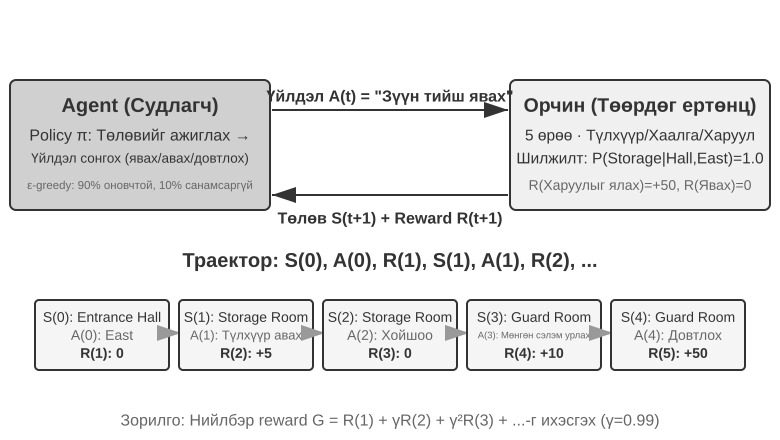

Энэ харилцан үйлчлэл нь **траектор**-ыг бий болгодог бөгөөд энэ нь "төлөв → үйлдэл → шагнал → шинэ төлөв → үйлдэл → шагнал..." гэсэн бүрэн бичлэг юм. Бодлогын чанар нь эцсийн дүндээ траекторын чанарт тусгагддаг. **утгын функц** нь "Хэрэв би одоо энэ төлөвт байгаа бөгөөд одоогийн бодлогын дагуу үргэлжлүүлэн ажиллавал эцэст нь нийт хэдэн шагнал цуглуулах вэ?" гэсэн асуултад хариулдаг. Энэ нь туршлагатай шатарчин байрлалаа хараад эцсийг нь тооцоололгүйгээр хожих магадлалыг зөн совингоороо тооцоолж байгаатай адил юм. ("Одоогийн бодлого"-г "оновчтой бодлого"-оор солиход бид оновчтой утгын функцийг авдаг бөгөөд үүнийг энэ бүлгийн сүүл хэсэгт Беллманы оновчтой байдлын тэгшитгэлийг хэлэлцэх үед ашиглах болно.) Agent болон орчны хоорондох хил хязгаар нь энгийн зарчмыг баримталдаг: **Agent дур мэдэн өөрчилж чадахгүй аливаа зүйл орчинд хамаарна.**

Бэхжүүлэлтийн сургалтыг хяналттай сургалтаас (шошготой зөв хариулт шаарддаг) болон хяналтгүй сургалтаас (өгөгдөлд нуугдсан хэв маягийг илрүүлдэг) ялгаж салгадаг хоёр өвөрмөц онцлог нь: **туршилт ба алдааны хайлт** (Agent нь багш шууд зөв хариулт өгөхгүйгээр аль үйлдлүүд өөрөө сайн болохыг олж мэдэх ёстой) болон **хойшлуулсан шагнал** (үйлдлийн үр нөлөө олон алхамын дараа л илэрхий болж магадгүй, жишээлбэл, сайн шатрын нүүдлийн үнэ цэнэ нь зөвхөн тоглоомын төгсгөлд л илэрдэг). Энэ нь мөн өвөрмөц **судалгаа-мөлжилтийн буулт**-ыг бий болгодог: үргэлж танил замаар явах нь шинэ зүйл сурахгүй гэсэн үг; үргэлж санамсаргүй оролдох нь зорилгодоо хэзээ ч хүрэхгүй гэсэн үг.

Бэхжүүлэх сургалтын систем нь таван үндсэн элементээс бүрдэнэ.

- **Үйлдлийн орон зай**: Agent-ийн хийж болох бүх боломжит үйлдлийн багцыг тодорхойлно. Үйлдлүүд нь салангид (жишээ нь, шатрын тоглоомд хязгаарлагдмал тооны сонголттой "хийх хөдөлгөөн") эсвэл тасралтгүй (жишээ нь, роботын хувьд "үе мөчийг хэдэн градус эргүүлэх" нь тасралтгүй утга) байж болно.
- **Бодлого**: Agent-ийн зан үйлийн дүрэм нь өгөгдсөн төлөвт юу хийхийг тодорхойлдог. Бодлого нь энгийн (хайлтын хүснэгт: А төлөвт X үйлдлийг гүйцэтгэнэ) эсвэл нарийн төвөгтэй (гүнзгий мэдрэлийн сүлжээ) байж болно.
- **Шагналын дохио**: Орчноос шууд ирэх хариу үйлдэл. Гэсэн хэдий ч Agent-ийн зорилго нь шууд бус, урт хугацааны шагналыг хамгийн их байлгах явдал юм - хөрөнгө оруулалтыг өнөөдрийн ашиг, алдагдлаар биш, харин урт хугацааны өгөөжөөр үнэлэх ёстойтой адил энэ ялгаа нь маш чухал юм.
- **Үнэ цэнэ Function**: Тухайн мужаас ирээдүйд авах боломжтой нийт хуримтлагдсан шагналыг тооцоолж, Agent-д шууд санал хүсэлтгүйгээр ч ухаалаг шийдвэр гаргахад тусалдаг. RL судалгааны жаран жилийн хамгийн чухал ойлголтуудын нэг бол үнэ цэнийн тооцооллын гол үүрэг юм.
- **Байгаль орчин Model** (заавал биш): Үйлдэлд хүрээлэн буй орчны хариу үйлдлийг урьдчилан таамагладаг. Байгаль орчны Model ашигладаг аргуудыг **Model-т суурилсан аргууд** гэж нэрлэдэг (эхлээд орчин хэрхэн өөрчлөгдөхийг урьдчилан таамаглаж сурч, дараа нь зохих ёсоор төлөвлөдөг); Model-гүй аргуудыг **Model-гүй аргууд** гэж нэрлэдэг (байгаль орчныг урьдчилан таамаглахгүй, харин туршлагаасаа шууд суралцдаг).

Хүснэгт 8-3 нь янз бүрийн Agent системийн гол бүрэлдэхүүн хэсгүүдийг харьцуулж, Agent концепцийн түгээмэл байдлыг илчилж, уншигчдад уламжлалт RL Agents болон орчин үеийн LLM Agents-ийн хоорондох үйлдлийн орон зайн ялгааг харахад тусалдаг.

Хүснэгт 8-3 Өөр өөр Agent Систем дахь гол элементүүдийн харьцуулалт

| Agent Төрөл | Байгаль орчин | Үйлдлийн орон зай | Шагналын дохио |
|---------------|------------------------|-------------------------------|-------------------------|
| **Нярайн зээр** | Газар нутаг, таталцал, биеийн байрлал | Тасралтгүй өндөр хэмжээст (булчингийн бүлгийн агшилт) | Тэнцвэр (+), Уналт (-) |
| **Ваарум робот** | Өрөөний зохион байгуулалт, батерейны түвшин | Дискрет (чиглэл, вакуум, цэнэг) | Цэвэрлэсэн хэсэг (+), Батерей дууссан (-) |
| **Шатрын Их мастер** | Самбарын төлөв, цагийн хязгаар | Дискрет төгсгөлөг (хууль ёсны алхамууд) | Хожил (+1), Хожигдол (-1) |
| **Харилцагчийн үйлчилгээ Agent** | Ярианы түүх, мэдлэгийн сан | Хувьсах урттай зохиол (бодох, ярих, API дуудлага) | Асуудлыг шийдсэн (+), Харьцуулах хугацаа (-) |
| **Кодын туслах Agent** | Шаардлагын баримт бичиг, кодын суурь | Хувьсах урттай найрлага (бодох, хайх, засах, гүйцэтгэх) | Туршилтыг давсан (+), Алдаа гарсан (-) |

Хүснэгтэд чухал ялгааг харуулав. Төслийн тоглоом болон Atari орчин нь урьдчилан тодорхойлсон хязгаарлагдмал дискрет анхдагч үйлдлүүдийг ашигладаг бол роботын удирдлага нь тогтмол хэмжээс болон физик хязгаартай тасралтгүй үйлдлүүдийг ашигладаг. Орчин үеийн LLM дээр суурилсан хэрэглэгчийн үйлчилгээ болон кодчилол Agents нь хязгаарлагдмал жетон болон хэрэгслийн дуудлагыг хувьсах урттай үйлдлийн дараалалд нэгтгэдэг тул боломжит дарааллыг нэг дор тоолоход хэцүү болгодог. Тэд мөн чадвараа сайжруулахын тулд дотоод сэтгэлгээг ашиглаж болно.

### Хоёр үйлдлийн дүрслэл: Сонгодог RL тохиргоо болон хувьсах урттай LLM бодлого

Хоёр тохиргооны хоорондох хамгийн харагдах ялгаа нь үйлдлүүдийг хэрхэн дүрсэлсэн явдал юм. MDP нь өөрөө хязгаарлагдмал эсвэл хязгааргүй, салангид эсвэл тасралтгүй үйлдлийн орон зайг төлөөлж чадна. Энд төлөөлөх самбарын тоглоом болон Atari орчин нь хязгаарлагдмал салангид анхдагч үйлдлүүдийг ашигладаг, роботын удирдлага нь хязгаарлагдмал тасралтгүй үйлдлүүдийг ашигладаг бөгөөд LLM бодлого нь хязгаарлагдмал Token үгсийн сан болон хэрэгслийн схемийг хувьсах урттай дараалал болгон бүрдүүлдэг. Энэхүү найрлагын дүрслэл нь алгоритмын дизайн, түүврийн үр ашиг, ерөнхийлөлтөд томоохон үр дагавартай байдаг. Тохиргоо бүрийг доор авч үзнэ.

**Үндсэн Жишээ: MDP болон хүснэгтийн Q-суралцалт.**

MDP (Марковын шийдвэр гаргах үйл явц) нь бэхжүүлэх сургалтын математикийн хүрээ бөгөөд төлөв байдал, үйлдэл, шагнал зэрэг үндсэн элементүүдийг тодорхойлдог. Үүний гол таамаглал нь **Марковын шинж чанар** юм: ирээдүй нь зөвхөн одоогийн төлөвөөс хамаардаг бөгөөд энэ нь шийдвэртэй холбоотой бүх түүхийг агуулсан байх ёстой. Жишээлбэл, шатрын тоглоомд төлөв байдал нь зөвхөн хэсгүүдийн байрлалаас гадна хөдлөх тал, шидэлт болон дамжуулалтын эрх, тавин хөдөлгөөн болон давталтын дүрмүүдэд шаардлагатай мэдээллийг агуулдаг. Хангалттай төлөвийн тодорхойлолттой бол шилжилт бүрийн хувьд тоглоомын бүх бичлэгийг дахин унших шаардлагагүй. Хэрэв ажиглалт нь шаардлагатай түүхийг орхигдуулсан бол тухайн түүхийг төлөв байдалд нэмэх эсвэл хэсэгчлэн ажиглагдахуйц Model-аар зохицуулах ёстой.

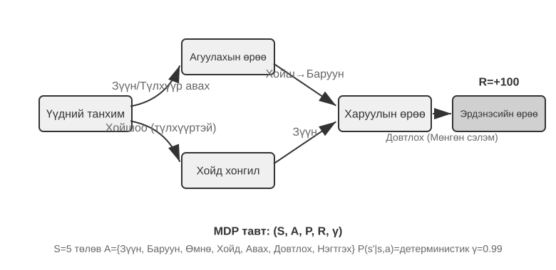

Энэ хэсэгт байгаа төлөөлөх RL орчин нь **урьдчилан тодорхойлсон үйлдлийн орон зайг** ашигладаг. Go дахь 361 хөдөлгөөний байрлал нь том боловч хязгаарлагдмал; шатрын үйлдлүүдийг тоолж болно; мөн Atari тоглоомууд нь ихэвчлэн цөөн хэдэн арван салангид анхдагч үйлдлийг илрүүлдэг. **Робот Agents** нь тасралтгүй боловч хязгаарлагдмал үйлдлийн орон зайг ашигладаг: хамтарсан өнцөг, хурд, атгах хүч нь тасралтгүй утга боловч роботын чөлөөний зэрэгээр тогтсон тодорхой физик хил хязгаар, хэмжээстэй байдаг.

Хязгаарлагдмал дискрет үйлдлүүд нь хувь хүний ​​нэр дэвшигчдийг үнэлэхэд хялбар болгодог. Хэрэв төлөв болон үйлдлийн тоо хангалттай бага бол хүснэгтийн Q-сургалт нь тэдгээрийн утгыг шууд хадгалдаг; илүү том Atari болон самбарын тоглоомын төлөвийн орон зай нь функцийн ойролцооллыг хайлттай хослуулдаг. Тасралтгүй үйлдлээр MDP нь үйлдэл бүрийг тоолж чаддаггүй тул бодлогын градиент болон жүжигчин-шүүмжлэгч зэрэг аргууд нь бодлого болон утгын функцийг ойролцоолдог. Энэ хэсэгт байгаа сонгодог жишээ нь LLM бодлогоос ялгаатай, учир нь энэ нь урьдчилан бэлтгэгдсэн мэдлэггүйгээр туршилт ба алдааны сургалтыг эхлүүлдэг.

Энэ хүрээнд хамгийн үндсэн бөгөөд чухал алгоритмуудын нэг бол **Q-learning** юм. Энэ нь "төлөв-үйлдэл" хос бүрийн үнэ цэнийн тооцооллыг хадгалдаг: хэрэв та *s* төлөвт *a* үйлдэл хийгээд дараа нь оновчтой ажиллавал нийт хэр их шагнал хүлээж болох вэ? Зөн совингийн хувьд үйлдэл сайн эсэх нь түүний авчрах шууд шагнал, мөн "дараагийн төлөвт хэр сайн хүргэхээс" хамаарна.

Энэхүү зөн совингоо тэгшитгэл болгон бичих нь RL сурах бичигт гардаг алдарт **Беллманы тэгшитгэл**-ийн гол рекурсив хамаарлыг өгдөг: **Үйлдлийн жинхэнэ утга = энэ алхамд олж авсан шууд шагнал + дараагийн төлөвөөс олж авах боломжтой хамгийн их ирээдүйн утга**:

$$Q^*(s, a) = r + \gamma \max_{a'} Q^*(s', a')$$

энд $r$ нь шууд шагнал, $s'$ нь үйлдлийг гүйцэтгэсний дараа хүрсэн дараагийн төлөв (зөн совингийн хувьд детерминистик хэлбэрээр бичигдсэн; стохастик орчинд дараагийн төлөв $s'$-ийн хүлээлт шаардлагатай), мөн $\gamma \in [0, 1)$ нь **хөнгөлөлттэй хүчин зүйл** бөгөөд энэ нь Agent нь ирээдүйг хэр их үнэлдэгийг тодорхойлдог: $\gamma$ нь 1-д ойртох тусам урт хугацааны өгөөжийг илүү их үнэлдэг; 0-д ойртох тусам шууд зүйлд илүү их анхаарлаа төвлөрүүлдэг. Өмнө нь олон удаа дурдсан "хуримтлагдсан шагнал" нь алхам бүрийн шагналын нийлбэр бөгөөд $\gamma$-аар хасагдсан байдаг: $\sum_{t} \gamma^{t} r_t$. Үйлдэл бүрийн дараа алгоритм нь хуучин тооцооллыг "бодит ажиглагдсан үр дүн" рүү бага зэрэг тохируулдаг - "хуучин тооцооллыг нэг алхамтай бодит үр дүнгээр засах" энэхүү парадигмыг **Цаг хугацааны ялгааны сургалт (TD сургалт)** гэж нэрлэдэг. Мянга мянган туршилтын дараа тооцоолол аажмаар жинхэнэ утгад ойртдог.

Дараах хоёр зураг нь торон ертөнц дэх Q-сургалтын судалгааны үйл явц болон Q-утгуудын аажмаар нэгдэхийг харуулж байна.

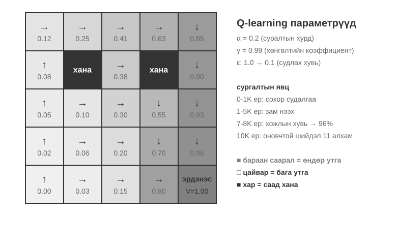

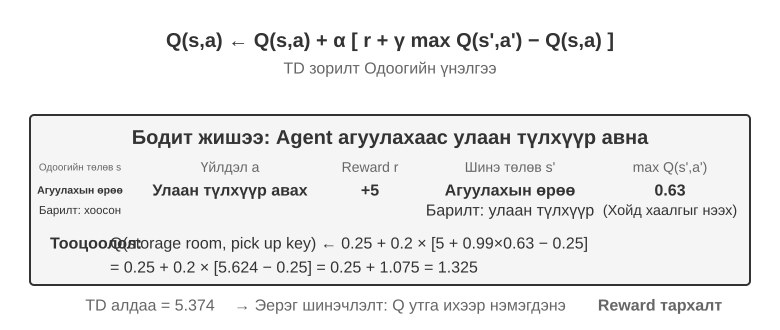

Q-сургалт нь **бодлогоос гадуур** арга юм: энэ нь зорилтот бодлогоос өөр хайгуулын бодлогоор бий болгосон өгөгдлөөс оновчтой бодлогыг сурч чадна. Энэ нь холбогдох төлөв-үйл ажиллагааны хосууд болон зохих сургалтын түвшин болон нэгдлийн нөхцөлүүдийг хангалттай хамрах шаардлагатай хэвээр байна; энэ нь дурын өгөгдлийн тархалтад автоматаар нэгддэггүй. Бодлого дээр суурилсан болон бодлогоос гадуурх аргуудын хатуу тодорхойлолтууд, тэдгээрийг сургалтын дараах LLM-тэй хэрхэн холбож байгааг "RL Алгоритм: 16 нэвтрүүлгээс нэг параметрийн шинэчлэлт хүртэл" хэсэгт дараа нь авч үзэх болно.

> **8-1 туршилт ★: Эрдэнэсийн ангуучлалын тоглоом дахь Q-learning гүйцэтгэл**
>
> Q-сургалтын шинж чанар болон хязгаарлалтыг баталгаажуулахын тулд бид **эрдэнэс хайх тоглоомын орчин**-ыг зохион бүтээсэн. Энэ орчинд хэд хэдэн гол бэрхшээлүүд багтсан болно: **нууц механизм** нь Agent-г түлхүүр болон хаалганы хоорондын харилцаа холбоо, зэвсгийн эффект, эд зүйл хийх дүрмийн хоорондын хамаарлыг өөрөө олж мэдэхийг шаарддаг; **олон алхамт хамаарал** нь даалгаврыг гүйцэтгэхэд үйлдлийн зөв дараалал шаардлагатай гэсэн үг (оновчтой шийдэл: 11 алхам); **ховор шагнал** гэдэг нь зөвхөн гол үйлдлүүд болон эцсийн ялалт нь мэдэгдэхүйц шагнал өгдөг бөгөөд ихэнх завсрын алхамууд ямар ч хариу үйлдэл авдаггүй гэсэн үг юм.
>
> Q-сургалтын Agent нь стандарт параметрийн тохиргоо болон ε-шуналтай хайгуулын стратегийг ашигладаг: энэ нь ихэвчлэн одоогийн оновчтой үйлдлийг сонгодог боловч заримдаа санамсаргүй үйлдлийг сонгодог бөгөөд сургалтын явцад санамсаргүй хайгуулын эзлэх хувь аажмаар буурдаг.
>
> Суралцах муруй нь ердийн шинж чанаруудыг харуулдаг (нэг анги нь эхнээс нь дуустал эсвэл бүтэлгүйтэл нь нэг бүтэн тоглоом юм):
> - **Эхний 1000 анги**: 0% хожих магадлалтай, Q-table ердөө 124 мужтай, Agent сохроор судалж байна
> - **Эхний 5000 анги**: Тогтвортой ялалт байгуулаагүй хэвээр байгаа, Q-table нь 133 мужтай
> - **7,000–8,000 анги**: Хожих хувь аажмаар 34%-иас 96% болж өснө
> - **10,000 анги**: 100% хожих магадлалтай, Q-хүснэгт 145 мужтай, 11 алхамтай оновчтой шийдлийг оллоо
>
> Сургалт бүхэлдээ 10 секундээс бага хугацаа шаардагдана (маш үр дүнтэй симуляци), гэхдээ бараг 10,000 бүрэн оролдлого шаардагдана. Энэ нь энэхүү туршилтад ашигласан урьдчилсан чөлөөт, ε-шуналтай хүснэгтийн Q-сургалтын тохиргооны зан төлөвийг харуулж байна: замыг санамсаргүй байдлаар дуусгахын тулд ихээхэн хэмжээний санамсаргүй судалгаа шаардлагатай бөгөөд утгын дохио нь давтан бэхжүүлэх шаардлагатай болохуйц удаан тархдаг.
>
> Тоглоомын симуляторт 10,000 туршилт хийхэд ердөө 10 секунд л шаардагддаг бөгөөд энэ нь маш бага зардал юм. Гэхдээ бодит амьдрал дээрх Agent хувилбаруудад - утасны дуудлага бүр төлбөртэй, хөтөчийн үйлдэл бүр сааталтай, буруу шийдвэр бүр эргэлт буцалтгүй үр дагаварт хүргэж болзошгүй - 10,000 туршилтыг огт хүлээн авах боломжгүй юм. Урьдчилан сургасан LLM бодлогыг ашиглах нэг шалтгаан нь хуримтлагдсан мэдлэг нь хүрээлэн буй орчны харилцан үйлчлэлийг хамаагүй бага байлгах замаар үр дүнтэй шийдвэр гаргахад дэмжлэг үзүүлэх боломжтой юм.
>
> Энэхүү **өмнөх үнэгүй хүснэгтийн Q-сургалтын туршилт** нь гурван хязгаарлалттай: энгийн даалгавар ч гэсэн өргөн хүрээтэй харилцан үйлчлэл шаарддаг, нэг орчинд сурсан утгууд нь нөгөө орчинд шууд шилждэггүй бөгөөд шинэ даалгавар бүрийг дахин судлах шаардлагатай. Эдгээр нь MDP хүрээний өөрийнх нь хязгаарлалт биш юм. Function ойролцоолол, шилжүүлэх сургалт, Model-т суурилсан RL нь илүү баялаг төлөв байдал болон мэдлэгийн дамжуулалтыг зохицуулж чаддаг боловч урьдчилан сургагдсан LLM-тэй харьцуулахад хүрээлэн буй орчны мэдэгдэхүйц харилцан үйлчлэл шаардагдаж магадгүй юм.

**Agents нь урьдчилан бэлтгэгдсэн LLM бодлогын дагуу хийгдсэн.**

Том хэлний Model-ууд нь Agent үйлдлүүдийг хэрхэн төлөөлж, эхлүүлдэгт чухал практик өөрчлөлтийг авчирсан.

Сонгодог RL нь дотоод тооцоолол эсвэл мэдээлэл цуглуулах үйлдлийг төлөв байдал болон үйлдлүүдээр загварчилж чаддаг. LLMs-ийн нэвтрүүлсэн практик өөрчлөлт нь сэтгэлгээ анх удаа боломжтой болсон явдал биш, харин урьдчилан бэлтгэсэн хэлний бодлого нь дотоод тооцооллыг хувьсах урттай тэмдгийн дараалал болгон төлөөлж, гадаад үйлдлүүдтэй ижил бодлого дотор үүсгэж чаддаг явдал юм. Сэтгэлгээний тэмдгүүд нь гадаад ертөнцийг шууд өөрчилдөггүй ч эцсийн үйлдлийг сайжруулж чадна. Үйлдлийн дүрслэлд одоо зөвхөн "юу хийх" төдийгүй "хэр удаан бодох, юуны талаар бодох" зэрэг орно.

Хамгийн чухал практик инноваци бол бодлогын гаралтын орон зайд **сэтгэх жетоныг тусгай үйлдэл болгон оруулах явдал юм. Төлөөллийн уламжлалт RL орчин нь хөдлөх, довтлох, авах зэрэг энгийн үйлдлүүдийг онцолдог боловч дотоод тооцооллыг MDP эсвэл шаталсан бодлогод загварчилж болно. LLM Agents-д **дотоод сэтгэлгээ нь сурсан хэлний үйл ажиллагааны орон зайн** гол хэсэг болдог. Энэ нь гадаад орчныг шууд өөрчлөх эсвэл шууд орчны шагнал авахгүй боловч жетон зардал болон Context-ийн хязгаарт олон тооцооллын замыг илэрхийлж чаддаг.

Хувьсах урттай найруулгын үйлдлүүд нь энгийн үйлдлүүдээс хамаагүй том хайлтын орон зайг бий болгодог бөгөөд урьдчилсан мэдлэггүйгээр эхнээс нь сурахад хэцүү байдаг. Agent эхнээс нь суралцах нь цөлд нүдээ боогоод эрдэнэс хайхтай адил юм. LLMs үүний оронд асар том текстийн урьдчилсан сургалтаас хүний ​​​​асуудлыг шийдвэрлэх хэв маягийг сурдаг: математикийн шийдлүүд нь ихэвчлэн "нөхцөлийг тодорхойлох → томъёог санах → алхам алхмаар тооцоолох"-ыг дагадаг бол кодчилол нь "шаардлагыг ойлгох → дизайны бүтэц → хэрэгжүүлэх дэлгэрэнгүй мэдээллийг" дагадаг. Урьдчилан сургасан бодлого нь бүтэцлэгдсэн замуудад урьдчилсан магадлалыг өндөр болгож, хайлтын орон зайг ихээхэн шахдаг. Тиймээс нэмэлт RL байхгүй ч гэсэн урьдчилан сургасан LLM нь математикийн шийдлүүд, кодын тайлбар, хэлэлцүүлэг болон бусад хүний ​​бичсэн үндэслэлийн ул мөрүүд дээр дараагийн Token таамаглалаар дамжуулан сурсан үндсэн логик сэтгэлгээний гинжин хэлхээг (CoT) үүсгэж чаддаг.

Дараа нь сургалтын дараах RL нь LLM-д эдгээр хэв маягийг тодорхой даалгаварт илүү үр дүнтэй хэрэгжүүлэхийг заахын тулд гадны шагналыг ашигладаг. Хэлний бүтэц нь тусдаа "дотоод шагнал" биш; энэ нь урьдчилан сургагдсан бодлогод **урьдчилсан тархалт** болж үйлчилдэг. Сургалтын өгөгдөлд байнга байдаг "бид валютыг хөрвүүлэх хэрэгтэй тул эхлээд валютын ханшийг хар" гэх мэт хэв маяг нь цаг агаарыг шалгах гэх мэт холбоогүй замаас илүү өндөр үүсэх магадлалтайгаар эхэлж болно. RL нь тухайн эхлэх тархалтаас замын магадлалыг өөрчлөхийн тулд бодит даалгаврын шагналыг ашигладаг.

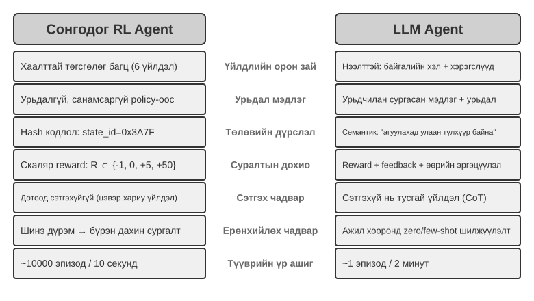

Урьдчилан сургасан хэлний бодлого нь LLM Agents-д үл үзэгдэх зааврыг (тэг цохилттой ерөнхийлөлт) ойлгож, цөөн хэдэн үзүүлэнгээс гарсан шинэ даалгавруудад (цөөн цохилттой дасан зохицох) дасан зохицох боломжийг олгодог бөгөөд энэ нь дээрх өмнөх үнэгүй хүснэгтийн Q-сургалтын тохиргооноос эрс ялгаатай юм.

Урьдчилан тодорхойлсон энгийн үйлдлүүдээс хувьсах урттай найрлагын үйлдлүүд рүү тэлэх нь AI Agent парадигмын чухал өөрчлөлт юм. LLM үйлдлүүд нь хязгаарлагдмал тэмдэгтийн үгсийн сан болон хэрэгслийн схемээр тодорхойлогдсоор байгаа боловч дотоод сэтгэлгээ, байгалийн хэлний асуулга, програмын код, нарийн төвөгтэй JSON, олон горимт контент нь хувьсах урттай дарааллын тэсрэх тооны тоогоор нэгддэг. Код тайлбарлагч болон хайлтын хэрэгслүүд нь уг дүрслэлийг бодит ертөнцийн олон төрлийн даалгавар, мэдээлэлтэй холбодог. Энэ нь боломж болон бэрхшээлийг хоёуланг нь бий болгодог: Agents нь үл үзэгдэх даалгавруудыг зохицуулахын тулд үндсэн хэрэгслүүдийг нэгтгэж чаддаг боловч шагналын дизайн болон үр ашигтай судалгаа нь асар том найрлагын орон зайд ажиллах ёстой.

Kimi K3 зэрэг Models нь багаж хэрэгсэл ашиглах болон урт гинжин сэтгэлгээнд оновчтой болсон бөгөөд LLM+RL Model-ын ердийн чиглэлийг харуулж байна: том хэмжээний хэлний урьдчилсан сургалт нь суурийг тавьж, сургалтын дараах сургалт нь асуудлын задрал, багаж хэрэгсэл ашиглах, өөрийгөө засах чадварыг бэхжүүлдэг. **OpenVLA**[^ch8-21] (Бүлэг 6-д дэлгэрэнгүй тайлбарласан) нь LLM эриний VLA (Vision-Lange-Action) архитектурын Model-ыг харуулж байна: харааны кодлогч нь хүрээлэн буй орчны ажиглалтыг боловсруулдаг, хэлний Model нь зааварчилгаа, шалтгааныг ойлгодог, үйлдлийн декодлогч нь хяналтын дохиог үүсгэдэг бөгөөд хэлний нөхцөлт хяналт болон даалгаврын хоорондын ерөнхийлөл боломжийг олгодог. Тодруулбал, OpenVLA нь бараг нэг сая робот **үзүүлэнгийн траектор** дээр дуураймал сургалтаар сургагдсан бөгөөд энэ нь RL биш харин SFT шинж чанартай болгодог. Энэ бүлгийн сүүлд 8-13-р туршилтад танилцуулсан SimpleVLA-RL нь энэ төрлийн VLA архитектурыг цаашид оновчтой болгохын тулд шагналуудыг ашиглан RL-ийг робот техникт нэвтрүүлсэн төлөөллийн жишээ юм.

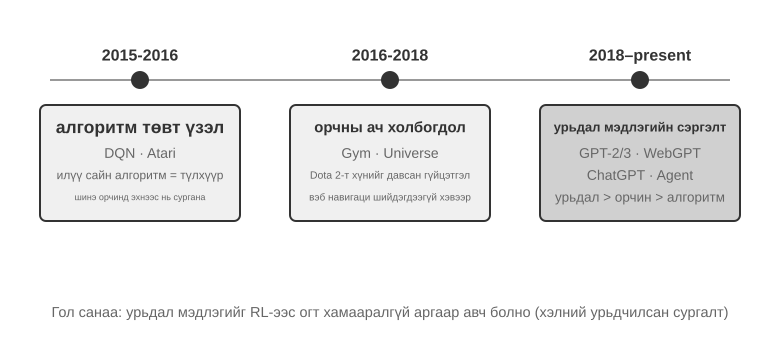

**OpenAI-ийн Хайгуулын Зам** (Принстоны Их Сургуулийн туслах профессор, ReAct өгүүллийн зохиогч Шуню Яогийн "Хоёрдугаар хагас" [^ch8-2] номондоо бичсэн) нь тухайн салбарын сэтгэхүйн хувьслыг харуулсан. **1-р үе шат (2015-2016), Алгоритм-Төвлөрсөн:** Илүү сайн алгоритмууд гол түлхүүр гэсэн итгэл үнэмшил давамгайлсан. Atari зэрэг стандарт орчинд ахиц дэвшил гарсан боловч шинэ орчин бүр эхнээс нь дахин сургалт шаарддаг байв. **2-р үе шат (2016-2018), Байгаль орчны ач холбогдол:** Gym нь олон төрлийн даалгавруудыг стандартчилсан; Universe болон World of Bits нь интернетийг бүхэлд нь RL сургалтын орчин болгохыг оролдсон; мөн Dota 2 нь тодорхой нарийн төвөгтэй орчинд хүний ​​​​ер бусын гүйцэтгэлийг эрэлхийлсэн. Санаа нь тодорхой байсан ч компьютерын ерөнхий хэрэглээ болон вэб навигаци хүрэх боломжгүй хэвээр байв.

**3-р үе шат (2018 оноос өнөөг хүртэл), Урьдчилсан онолын сэрэлт:** GPT-2/GPT-3 нь хэлний урьдчилсан сургалтын хүчийг харуулсан; WebGPT болон ChatGPT нь эдгээр урьдчилсан онолуудыг практик Agents болгон хувиргаж болохыг баталсан. Хамгийн чухал нээлт: **урьдчилсан онолуудыг RL-тэй ямар ч холбоогүй аргаар олж авч болно**. Энэ бол зөн совингийн эсрэг үнэн юм - хэдэн арван жилийн турш RL судлаачид өөрсдийн тэргүүлэх чиглэлийг яг эсрэгээр нь тавьж байсан байж магадгүй юм. Жинхэнэ дараалал нь алгоритм > орчин > өмнөх биш, харин өмнөх > орчин > алгоритм юм.

> **8-2 туршилт ★★: Уламжлалт RL болон LLM Agent-ийн харьцуулсан судалгаа**
>
>
> 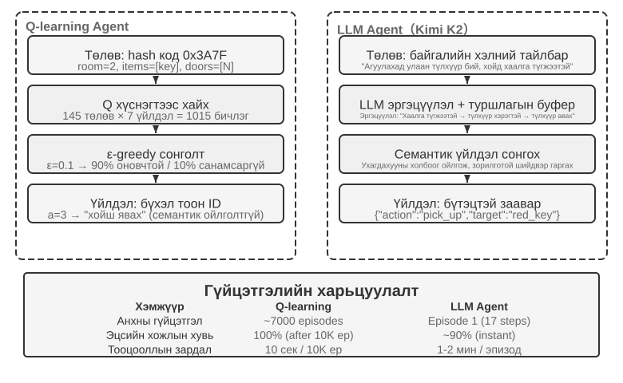
>
>
> Бид Q-learning-ийг ижил эрдэнэс хайх тоглоомд 50 хүртэлх туршлагын нөөцийг хадгалдаг LLM Agent—Kimi K3-тай харьцуулсан. Үр дүн нь гайхалтай: **LLM Agent нь анхны оролдлогоороо тоглоомыг 18 алхамаар дуусгасан**.
>
> **Эрт үе шат (Зорилтот судалгаа)**: Зэвэрсэн сэлмийг авч ("Зэвсэг нүцгэн гараас дээр"), газрын зургийг системтэйгээр судалж, хойд хаалга түгжигдсэн байгааг олсны дараа "түлхүүр олох шаардлагатай" гэж дүгнэж, агуулахыг судалж, улаан түлхүүр болон шидэт болорыг олж авна. **Дунд үе шат (Механизмыг ойлгох ба идэвхтэй синтез)**: "Түлхүүрийг автоматаар ашиглах" дүрмийг ойлгож, зэвэрсэн сэлэм харуулын эсрэг хангалтгүй гэж таамаглаж, 8-р алхам дээр мөнгөн сэлмийг урьдчилан синтезлэнэ. **Хожуу үе шат (Гүйцэтгэл ба алдааг засах)**: Мөнгөн сэлэмтэй хойд зүг рүү явж, 13-р алхам дээр хүчирхэг харуулыг ялна. Замдаа нэг эсвэл хоёр үр дүнгүй оролдлого хийж, сэлмээ дахин дахин даллаж эсвэл ухарч, эцэст нь 18-р алхам дээр лууны эрдэнэсийг олж авна.
>
> Энэ нь семантик ойлголт болон бэлгэдлийн зураглалын хоорондох үндсэн ялгааг харуулж байна. LLM Agent нь тоглоомын ойлголтын бүтцийг ойлгосон; алхам бүр нь зорилготой, логик дэмжлэгтэй байсан. Q-сургалтын хувьд "хаалга", "түлхүүр", "илд" нь зүгээр л утгагүй бэлгэдлийн хослолууд бөгөөд тэдгээрийн харилцааг өргөн хүрээтэй статистикийн сургалтаар л аажмаар нээж чадна.
>
> Тооцооллын зардал нь сонирхолтой парадоксыг бий болгодог: Q-learning нь 10 секундын дотор 10,000 тоглоом ажиллуулдаг бол LLM Agent нь тоглоом тутамд 1-2 минут зарцуулдаг. Гэсэн хэдий ч бодит ертөнцийн даалгаварт харилцан үйлчлэл тус бүрт гарах цаг хугацаа, мөнгө, эрсдэлийн зардал нь цэвэр тооцооллын зардлаас хамаагүй их байдаг тул зөвхөн GPU цаг хугацаагаар дүгнэх нь шударга бус юм. Илүү чухал ойлголт бол: LLM Agent-ийн амжилт нь илүү сайн "суралцах алгоритм"-тай байсантай холбоотой биш, харин өмнөх мэдлэгээ их хэмжээгээр агуулдагтай холбоотой юм. Тоглоомын дүрэм өөрчлөгдөхөд Q-learning нь бүрэн давтан сургалт шаарддаг бол LLM Agent нь сэтгэлгээний тусламжтайгаар шууд дасан зохицож чаддаг. Энэ нь практик дизайны зарчимд хүргэдэг: Уламжлалт RL нь симуляцийн зардал багатай, давтагдах чадвар өндөртэй хувилбаруудад үнэ цэнэтэй хэвээр байна; Харилцааны өндөр өртөгтэй, хурдан дасан зохицох шаардлагатай бодит ертөнцийн нөхцөлд LLM Agents-ийн түүврийн үр ашиг нь практик дээр илүү үнэ цэнэтэй байдаг.

Бүлэг 1 нь контекст дасан зохицох, гадаад эд өлгийн зүйлсийн шинэчлэлт, параметрийн шинэчлэлтүүд хэрхэн хамтдаа ажилладаг талаарх концепцийн зургийг аль хэдийн өгсөн; энэ бүлгийн төгсгөлд байгаа “Training-ийн дараах практик дүгнэлтүүд” хэсэг нь энэ сэдэв рүү эргэн орно. Энэ бүлгийн гол сэдэв нь сургалтын дараах сэдэв юм: гадаад дүрмээр бүрэн илэрхийлэгдэх боломжгүй Model-ын параметрийн чадавхийг бичих.

## Model Урьдчилсан сургалтын үндэс `[Optional Reading]`

Сургалтын дараах аргууд яагаад үр дүнтэй болохыг ойлгохын тулд эхлээд урьдчилсан сургалт юуг тогтоодогийг ойлгох хэрэгтэй. Сургалтын дараах сургалт (SFT ба RL) нь урьдчилсан сургалтаар тогтоосон төлөөллийн орон зайд үндсэндээ оновчтой болгодог - урьдчилсан сургалтаар тогтоосон мэдлэгийн бүтэц нь сургалтын дараах дээд хязгаарыг тодорхойлдог. Тиймээс бид хоёр туршилтаар дамжуулан урьдчилсан сургалтын гол талыг судалдаг: жижиг хэмжээний хэлний Model-ыг эхнээс нь сургах, харааны чадварыг өргөжүүлэх. Энэ хэсэгт байгаа хоёр туршилт нь нэмэлт бөгөөд урьдчилсан сургалтын талаарх зөн совин бий болгох зорилготой - өөрөөр хэлбэл Model-т хэлний үндсэн хэв маяг, дэлхийн мэдлэгийг заадаг томоохон хэмжээний өгөгдөл дээр анхны сургалт явуулах. Одоо байгаа суурь Model-т шинэ хэлний мэдлэгийг нэвтрүүлдэг 8-5-р туршилт нь дараагийн бие даасан Сургалтын дунд хэсэгт гарч ирнэ.

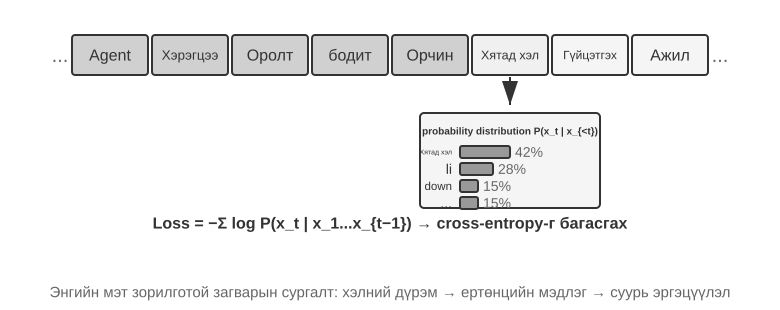

Хэлний Model-ын сургалт нь ерөнхийдөө "токенизаци - урьдчилсан сургалт (шаардлагатай бол дунд шатны сургалтыг оруулаад) - дараах сургалт" гэсэн шугам хоолойг дагадаг. Токенизаци нь текстийг салангид нэгж болгон хуваадаг. Жишээлбэл, "Би програмчлалд дуртай" гэсэн үгийг "Би", "дуртай", "програмчлах", "минг" болгон токенжуулж болно. Эдгээр Token-ууд нь Model-аар боловсруулсан хамгийн жижиг текстийн нэгжүүд юм. Урьдчилсан сургалтын даалгавар нь ойлголтын хувьд энгийн: Model-т текстийн хэсгийн эхний хэсгийг үзүүлж, дараагийн Token-ыг таамаглах. Түүний таамаглалыг зөв хариулттай харьцуулснаар (энэ ялгааг алдагдал гэж нэрлэдэг; бага алдагдал нь илүү нарийвчлалтай таамаглал гэсэн үг) Model нь параметрүүдээ тасралтгүй тохируулдаг. Их хэмжээний текст өгөгдөл дээр давтан сургалт хийсний дараа Model нь хэлний дүрэм, дэлхийн мэдлэг, үндсэн сэтгэх чадварыг аажмаар сурдаг. Урьдчилсан сургалтын дараа Model нь чөлөөтэй текст үүсгэж чаддаг боловч гаралт нь бүтэц дутмаг бөгөөд зааврыг дагахад бэрхшээлтэй байдаг. Дараа нь сургалтын дараах нь SFT - шошготой оролт-гаралтын хосуудын сургалт - болон хүмүүсийн илүүд үздэг хариултыг бий болгохыг Model-т заадаг DPO гэх мэт давуу эрхийн оновчлолоор дамжуулан Model-ыг практик туслах болгон хувиргадаг.

> **8-3-р туршилт ★★: Training болон LLM-г эхнээс нь эхлэн ашиглах—Алгоритм-ийн сайжруулалтын хүч**
>
> 100 сая параметрийн Model болох MiniMind 2-ыг кейс судалгаа болгон ашигласнаар туршилт нь хэрэглэгчийн зэрэглэлийн GPU дээр сургалтын бүх үйл явцыг гүйцээдэг. Хоёр алгоритмын оновчлол болох QK Norm болон Muon оновчлогч нь конвергенцийн хурдыг гурав дахин нэмэгдүүлж, үүсгэх чанарыг мэдэгдэхүйц сайжруулдаг бөгөөд энэ бүхэн маш бага өртгөөр хийгддэг: ойролцоогоор 14 цагийн сургалт, нийт 34 доллар.
>
> Сургалтын үе шат бүрийн үр нөлөө: Урьдчилсан сургалтын дараа Model нь "Дэлхийн хамгийн өндөр уул юу вэ?" гэх мэт баримтын асуултуудад хариулж чаддаг боловч формат нь стандарт бус; SFT-ийн дараа зааврыг дагаж мөрдөх болон гаралтын формат нь мэдэгдэхүйц сайжирч, Model нь хариултыг хүлээгдэж буйгаар зохион байгуулах боломжийг олгодог; давуу эрхийн оновчлол нь баримтын алдаа болон байгалийн бус илэрхийллийг улам бүр бууруулдаг. 100 сая параметрийн Model нь илэрхий хязгаарлалттай хэвээр байна (нарийн төвөгтэй асуудлууд дээр алдаа гарах хандлагатай), гэхдээ сургамж нь: **Тогтмол, бага төсөвтэй алгоритмын сайжруулалт нь хэмжээг томруулахаас илүү сайн үнэ цэнийг санал болгодог**.

> **8-4-р туршилт ★★: Training Өөрийн VLM**
>
>
> 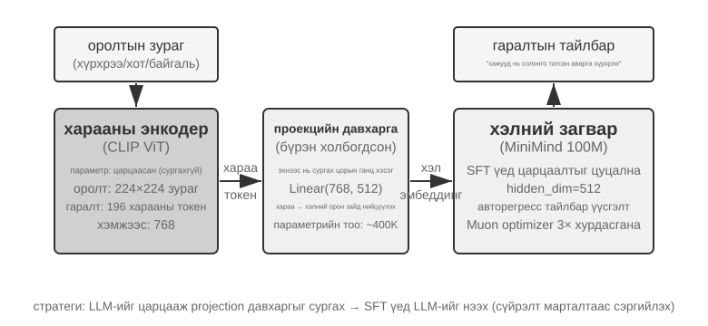
>
>
> VLM нь харааны ойлголт болон хэлний ойлголтыг нэг Model-т нэгтгэдэг. Гол бэрхшээл нь хөндлөн модаль уялдаа холбоо буюу "харсан зүйл"-ийг "хэлсэн зүйл"-тэй тохирч байх явдал юм. Архитектур нь гурван бүрэлдэхүүн хэсгээс бүрдэнэ: **Харааны кодлогч** (жишээ нь, CLIP, параметрүүд хөлдөөсөн) нь зургаас семантик шинж чанаруудыг гаргаж авдаг; **Проекцийн давхарга** (хөнгөн, эхнээс нь сургасан цорын ганц хэсэг) нь харааны шинж чанарууд болон хэлний Model-ын хооронд "орчуулагч" болж, харааны шинж чанаруудыг хэлний Model ойлгож чадах дүрслэлийн орон зайд байрлуулдаг; мөн **Хэлний Model** нь дүрслэх текст үүсгэдэг. Training нь сүйрлийн мартахаас (шинэ ур чадвар сурсны дараа хуучин ур чадвараа мартах) зайлсхийхийн тулд "LLM-ийг хөлдөөх + зөвхөн сургах проекцийн давхарга" стратеги ашигладаг; уялдаа холбооны өмнөх сургалтын үе шатны дараа LLM хөлдөөгүй бөгөөд SFT нь өндөр чанартай дүрслэлийн тайлбарын хосууд дээр хийгддэг бөгөөд энэ нь түүний тайлбарын дэлгэрэнгүй мэдээлэл, нарийвчлалыг мэдэгдэхүйц сайжруулдаг.
>
> Энэхүү туршилт нь олон төрлийн Model-ын сургалтын үндсэн Model-ыг илчилж байна: нэг төрлийн Model-ын өмнөх сургалтын үр дүнг дахин ашиглах, хөнгөн проекцийн давхаргыг сургах замаар хөндлөн модаль уялдаа холбоог бий болгох - үр ашигтай бөгөөд өргөтгөх боломжтой боловч проекцийн давхаргын хязгаарлагдмал илэрхийлэл нь хөндлөн модаль ойлголтыг гүнзгийрүүлэхэд саад болж болзошгүй юм. Model-ын гаралтын үйлдлүүдийг хийснээр ижил "харааны кодлогч + проекцийн давхарга + LLM" архитектурыг нэг алхам урагшлуулснаар Бүлэг 6-д дэлгэрэнгүй тайлбарласан VLA (Харааны хэл-үйлдэл) Model-ыг бий болгодог.

Хоёр сургалтын өмнөх туршилт хамтдаа нэг хэв маягийг харуулж байна: хязгаарлагдмал төсвийн дор алгоритм болон архитектурын сайжруулалт нь зөвхөн масштабаас илүү сайн үнэ цэнийг санал болгодог. Хамгийн чухал нь урьдчилсан сургалт нь дүрслэх мэдлэг, хэлний загварчлалын чадварыг өгдөг боловч бүтэцлэгдсэн зааварчилгааны дагах эсвэл даалгаварт чиглэсэн зан үйлийг өгдөггүй. Гэсэн хэдий ч SFT болон RL нь ерөнхий урьдчилсан сургалт хэзээ ч хамраагүй зорилтот хэл эсвэл салбарыг тойрч гарч чадахгүй. Энэ бол сургалтын дунд үе шатны боловсруулсан цоорхой юм.

## Сургалтын дунд үе: Мэдлэг болон суурь чадварын цоорхойг нөхөх

Энэ бүлэгт **Дунд шатны сургалт** гэдэг нь одоо байгаа үндсэн Model-ыг авч, зорилтот өгөгдлийн тархалт дээр хэлний Model-ын сургалтыг үргэлжлүүлэхийг хэлнэ. Энэ нь ихэвчлэн сургалтын өмнөх дараагийн Token зорилгыг хадгалж, баримт бичиг, кодын дээж эсвэл гарал үүсэл дэх Token бүр дээр алдагдлыг тооцоолдог. Сонгодог DAPT/TAPT судалгаагаар домэйн эсвэл даалгавартай холбоотой шошгогүй корпорациуд дээр хоёр дахь сургалтын өмнөх шат нь дараагийн гүйцэтгэлийг сайжруулсаар байж болохыг харуулж байна [^ch8-30]. "Дунд шат" нь чадавхийг хөгжүүлэх хоолой дахь байр сууриа тодорхойлдог; түүний өгөгдлийн формат болон алдагдал нь сургалтын өмнөх үе шаттай хэвээр байна.

Сургалтын дунд үе шат нь голчлон хоёр төрлийн цоорхойг арилгадаг:

- **Мэдлэгийн зөрүү**: Ерөнхий урьдчилсан сургалт нь зорилтот хэл, санхүү, анагаах ухаан, хууль эрх зүй, байгууллагын дотоод баримт бичиг эсвэл кодын сангуудын ангиллыг хангалттай хамарч чадаагүй тул Model нь ойлголт, нэр томьёог ч ойлгож чадахгүй байна.
- **Үндсэн чадварын зөрүү**: Зорилтот даалгаварт үндсэн Model бүрдүүлээгүй урт хугацааны Context, кодчилол, математикийн гаргалгаа эсвэл олон горимт дүрслэл шаардлагатай. Асуудал нь зөвхөн хариултын форматад биш: олон дээжийн дараа ч Model бараг хэзээ ч зөв шийдэлд хүрдэггүй.

Энэ нь мөн SFT-г мэдлэг оруулах гол хэрэгсэл гэж үзэх ёсгүй шалтгааныг тайлбарлаж байна. SFT нь цөөн тооны баримтыг цээжилж чаддаг бөгөөд ихэвчлэн Model-т тухайн салбарын асуултанд хэрхэн хариулахыг заахын тулд дунд шатны сургалтын дараа хийгддэг. Гэхдээ бага хэмжээний чанарын баталгааны багц нь зөвхөн хязгаарлагдмал тооны хэллэгийг хамардаг; энэ нь түүхий мэдлэгийн том, хоорондоо холбоотой хэсгийг авч явахаас илүү мэдлэгт хэрхэн хандах, илэрхийлэх талаар сургахад илүү дээр юм. Үүний эсрэгээр, салбарын текст дээрх хэлний Model-ын алдагдлыг багасгах нь Model нь асуултанд хариулахдаа тухайн мэдлэгийг олж авах баталгаа болдоггүй. Судалгаанаас харахад урьдчилсан сургалт болон зааварчилгааны тохируулгын дараалал, зохион байгуулалт нь мэдлэгийг чанарын баталгааны хэлбэрээр авах боломжтой эсэхэд ихээхэн нөлөөлдөг [^ch8-31]. Бат бөх жор нь ихэвчлэн: **Дунд шатны сургалт нь мэдлэг, чадварыг шингээдэг → жижиг хэмжээний SFT нь хандалт болон гаралтын протоколуудыг тогтоодог → Амжилт тэг биш бол шаардлагатай бол RL нэмэгддэг**.

### Сургалтын дунд үеийн Өгөгдөл-г бүтээх

1. **Алдааны тархалтаас өгөгдлийн хэрэгцээг дүгнэх.** Үнэлгээг сэдэв, хэл, баримт бичгийн төрөл, кодын хэв маяг, Context-ийн уртаар нь хуваах. Ямар бага `pass@k` тохиолдлууд нь үндсэн Model-ын зөрүүнээс үүдэлтэйг тодорхойлж, гаралтын форматын алдааг мэдлэг дутуу гэж буруу оношлохын оронд зөвхөн мэдлэг болон чадавхийн зөрүүний өгөгдлийг нэмэх.

2. **Өндөр нягтралтай зорилтот корпорацуудыг бий болгох.** Түүхий баримт бичиг нь нэр томьёо болон баримтын холбоог тогтоодог; репозиторууд нь бүтэц болон хамаарлыг заадаг; сурах бичгийн хэв маягийн гарал үүсэл, синтетик тайлбар, баримт бичгийн хоорондын холбооны дээжүүд нь далд харилцааг тодорхой болгодог. Давхардлыг арилгах, чанарыг шүүх, үнэлгээний багцын бохирдлыг шалгах.

3. **Өгөгдлийг чадавхаар нь холих.** Холимогт ном, урт баримт бичиг, кодын сан зэрэг байгалийн урт текст хэрэгтэй; атомын урт текстийн чадавхийг агуулсан бодлын гинжин өгөгдөл - урт текст хайх, олон хоп үндэслэл, зааврыг дагаж мөрдөх, мэдээлэл нэгтгэх, статистик; мөн Agent-ийн хийж чадахгүй чадавхийг агуулсан Agent гүйцэтгэлийн чиглэлүүд - төлөвлөлт, хэрэгслийн сонголт ба дуудалт, урт хугацааны төлөвийг хянах, алдаанаас сэргээх. Бодлын гинжин хэлхээ болон Agent чиглэлийн өгөгдлийг илүү хүчтэй нээлттэй эхийн Model-аас гаргаж авах эсвэл одоо байгаа өгөгдлийн сангаас авах боломжтой.

4. **Үе шат бүрт хоёр төрлийн давталт ашиглах.** Эхнийх нь хэл, мэдлэг, богино Context-ийн чадварыг хадгалсан анхны богино текст болон ерөнхий өгөгдөл юм. Хоёр дахь нь "хуучин даалгавруудыг шинэ уртад өргөх" юм: Model-ын аль хэдийн зохицуулж буй богино даалгавруудыг одоогийн уртын Context-эд байрлуулж, холбогдох мэдээлэл болон анхаарал сарниулагч зүйлсийг өөр өөр байрлалд тарааж, өргөн цонхонд ижил чадвар хэвээр байгаа эсэхийг шалгана уу. Ерөнхий өгөгдлийг үндсэн Model-ын анхны урьдчилсан сургалтын багцаас авах нь хамгийн сайн арга юм; энэ боломжгүй үед FineWeb-2 гэх мэт нээлттэй урьдчилсан сургалтын корпусыг ашиглаж болно.

5. **Олон хэмжээст хаалгатай хэзээ зогсохоо шийд.** Сургалтын алдагдлаас гадна `pass@1`/`pass@k`-г хүлээгдэж буй домэйн даалгавар, ерөнхий чадавхи, өмнөх зааврын дараах байдал болон зорилтот даалгаврын дагуу хянана. Хэрэв домэйн үзүүлэлтүүд нэмэгдэж, ерөнхий хадгалах багц буурвал холимог буюу суралцах хурд хэт түрэмгий байна; хэрэв `pass@k` хөдлөхгүй байхад алдагдал буурвал өгөгдөл нь шаардлагатай чадавхийг үнэхээр хамарч байгаа эсэхийг, мөн мэдлэгийг хүртээмжтэй болгодог SFT нь дараа нь байхгүй байгаа эсэхийг шалгана уу.

Сургалтын дундуур дууссаны дараа LongBench v2, IFEval болон Бүлэг 7-д тайлбарласан Agent-ийн төгсгөл хүртэлх жишиг үзүүлэлтүүд зэрэг үнэлгээний багцууд нь Model-ын **өөр өөр Context урттай** суурь урт хугацааны чадавхи алдагдаагүй эсэхийг баталгаажуулах шаардлагатай. Урт хугацааны Context чадавхи нь бодлын урт гинжин хэлхээ болон зааврыг дагаж мөрдөхийг дэмждэг бөгөөд эдгээр нь эргээд багаж дуудах зэрэг өндөр түвшний Agent чадавхийг дэмждэг.

- **Байршил ба сэргээх**: дан болон олон зүүгээр соруулах, өөр өөр байрлалд гол мэдээллийг авах, анхаарал сарниулах хүчин зүйлсийн дор сэргээх;
- **Холбоо ба үндэслэл**: догол мөр хоорондын, баримт бичиг хоорондын болон олон үе шаттай харилцааг хянах, зөрчилдөөнийг шийдвэрлэх, нотлох баримтын бүрдэл;
- **Нэгтгэх ба статистик**: тоолох, бүлэглэх, эрэмбэлэх, харьцуулах, чиг хандлагын хураангуй болон урт хүснэгт эсвэл лог дээрх нэгтгэх;
- **Дараах зааварчилгаа**: нэг дор олон зааварчилгаа, зөрчилдөөнийг шийдвэрлэх, тогтоосон сэтгэлгээний журмыг дагаж мөрдөх, гаралтын форматыг дагаж мөрдөх зэрэг нарийн төвөгтэй зааврыг дагаж мөрдөх;
- **Урт гинжин сэтгэлгээ**: нарийн төвөгтэй математик, логик үндэслэл, код үүсгэх бодлогуудыг бодох;
- **Agent командууд**: үндсэн даалгаврын задрал, төлөвлөлт, багажны сонголт, аргумент бүтээх, төлөвийн санах ой, алдаанаас сэргэх.

Хэрэв баримтууд байнга өөрчлөгддөг эсвэл анхдагч эх сурвалжид иш татах шаардлагатай бол RAG нь тэдгээрийг жингээр бичихээс илүү тохиромжтой хэвээр байна. Дунд шатны сургалт нь дотоод дүрслэл шаарддаг тогтвортой, том хэмжээний салбарын мэдлэг, чадварт илүү тохиромжтой. Бүрэн параметртэй Том Model дээр дунд шатны сургалт нь жижиг хэмжээний SFT-ээс илүү үнэтэй бөгөөд мартах эрсдэлтэй тул сургалтын төсвийг өргөжүүлэхээсээ өмнө жижиг туршилтаар хольцыг баталгаажуулна уу.

> **8-5-р туршилт ★★: Шинэ хэл сурах урьдчилсан бэлтгэлийг үргэлжлүүлэх**
>
> Mistral 7B v0.3-г үндсэн Model болгон ашигласан - голчлон англи хэл дээр урьдчилан сургагдсан бөгөөд солонгос хэлийг бараг ойлгодоггүй - туршилт нь Солонгос хэлний Википедиа дээр хэлний Model-ын сургалтыг үргэлжлүүлэх замаар солонгос хэлний чадварыг нэвтрүүлдэг. Model нь аль хэдийн ерөнхий дүрслэлтэй бөгөөд зөвхөн шинэ өгөгдлийн тархалтад дасан зохицох шаардлагатай тул үүнийг эхнээс нь сургахаас хамаагүй хямд болгодог. Энэхүү туршилт нь сүйрлийн марталтыг бууруулахын тулд ойролцоогоор 80% солонгос, 20% англи хэлийг ашигладаг; энэ харьцаа нь бүх нийтийн анхдагч биш, туршилтын сонголт юм. Дараа нь Солонгос хэлний зааварчилгааны өгөгдлийг практик ярианы чадварыг олж авахын тулд SFT-д ашигладаг. Хариуцлагын хуваарилалт нь тодорхой байна: Сургалтын дундуур эхлээд солонгос хэлний мэдлэг, хэлний чадварыг өгдөг, дараа нь SFT нь Model-т зааварчилгаа хүлээн авах, хариултыг солонгос хэл дээр хэрхэн зохион байгуулахыг заадаг.
>
> Туршилт нь мөн урьдчилсан сургалтыг үргэлжлүүлэх нь ямар гамшигт марталтыг үүсгэж болохыг харуулж байна: Солонгос хэлний хувьд сүүлийн шатанд сохор үнэлгээ сайжирсан бол Англи хэлний чадвар буурсан. Урьдчилсан сургалтыг үргэлжлүүлэх нь зорилтот тархалтыг параметрүүдэд бичиж болох боловч хадгалах багц, баримтын үнэлгээ, өгөгдлийн чанарын аудитын хэрэгцээг арилгадаггүй.

Model хангалттай мэдлэг, суурь чадавхитай болсны дараа дараагийн алхам бол протоколын дагуу ажилладаг практик Agent болгон хувиргах явдал юм.

## SFT (Хяналттай нарийн тохируулга)

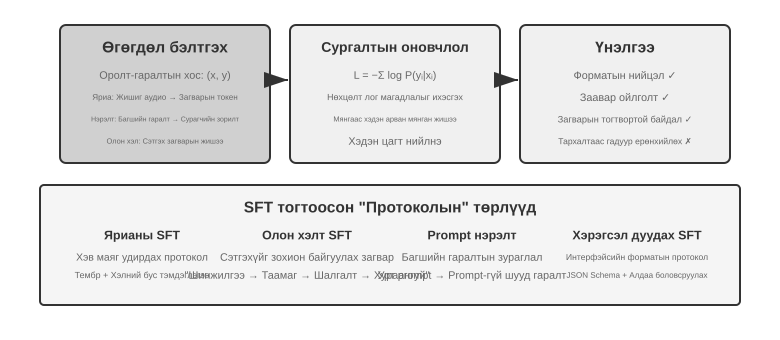

“Pre-training-ээс RL хүртэл: Training-ийн дөрвөн үе шатны Тойм” Хэсэг SFT-ийн мөн чанарыг (өөр Өгөгдөл ашиглан “дараагийн Token-ийг таамаглах”, loss-ийг зөвхөн хариултад тооцох) аль хэдийн тайлбарласан. Энэ Хэсэг уг механизм буюу тогтвортой mapping, protocol-ыг параметрт бичих үйлдэл өөр өөр task-д юуг бэхжүүлдгийг дөрвөн туршилтаар харуулна. SFT-ийн гол үнэ цэнэ нь шинэ мэдлэг оруулах бус **protocol-ыг бататгах**: mapping, interaction format, style norm-ыг параметрт бичсэнээр Model Inference үед урт Prompt шаардалгүй нийцсэн Output гаргаж чадна. Ихэвчлэн хэдэн мянгаас хэдэн арван мянган өндөр чанартай Жишээ үндсэн харилцан яриа ба заавар дагах чадварыг бий болгоход хангалттай.

Энэхүү үр ашиг нь сургалтын хуваарилалтаас хамааралтай байж болно. Олон янзын зөв стратеги судлах шаардлагатай эсвэл байршуулалт нь үзүүлэнгээс холдох даалгавруудад SFT нь үзүүлсэн хэв маягийг хуулбарлахыг илүүд үзэж, шинэ нөхцөл байдалд гүйцэтгэлээ алдаж болзошгүй. Дараах туршилтууд нь "протоколуудыг бэхжүүлэх" энэ үйл явцыг өөр өөр өнцгөөс харуулж байна; тэдгээр нь SFT болон RL-ийн бүх нийтийн зэрэглэлийг тогтоодоггүй.

SFT-тэй гар аргаар танилцахаасаа өмнө зайлсхийх боломжгүй нэг практик асуулт байна: **SFT өгөгдөл хаанаас гардаг вэ?** Салбарын хариулт нь гурван чиглэлд хуваагддаг:

- **Хүний мэргэжлийн үзүүлбэрүүд**—хамгийн өндөр чанарын тааз боловч үнэтэй бөгөөд удаан; формат болон хэв маягийг тодорхойлдог "үрийн өгөгдөл" болгон ашиглах нь хамгийн сайн арга;
- **Багш-Model үүсгэх**—өөрөөр хэлбэл синтетик өгөгдөл: хүчтэй Model-тай байх, "оролт-гаралт" хосуудыг олноор үйлдвэрлэх, шүүж, сурагчид нэрэх; 8-8 ба 8-9 туршилтуудыг үзнэ үү;
- **Татгалзах түүвэрлэлт** — Model нь ижил асуудлын хэд хэдэн нэр дэвшигчийг түүвэрлэдэг бөгөөд шалгагч зөвийг нь сонгож, тэдгээр дээр нь сургалт явуулдаг; 8-9-р туршилтыг үзнэ үү.

Гурван замыг ихэвчлэн нэгтгэдэг. Та аль ч замыг сонгосон байсан барилгын шугам хоолой нь бараг адилхан: эхлээд даалгаврын хуваарилалт болон гаралтын схемийг тодорхойлж, дараа нь нэр дэвшигчдийг бөөнөөр нь үүсгэж, дараа нь дүрэмд суурилсан баталгаажуулалт, форматын шалгалт, хүний ​​​​спот шалгалтаар чанарыг шүүж, эцэст нь давхардлыг хасаж, хольцыг тэнцвэржүүлж, олон янз байдлыг баталгаажуулна. Эзлэхүүнийг хөөцөлдөх шаардлагагүй - хэдэн мянгаас хэдэн арван мянган өндөр чанартай дээж нь гаралтын форматыг бэхжүүлэхэд хангалттай байдаг. Зуун мянган бохир дээжийг овоолж авахын оронд арван мянган цэвэр дээжийг боловсронгуй болго: өгөгдөл дэх шуугиан бүрийг SFT параметрүүдэд үнэнчээр бичиж болох зүйл юм.

> **8-6-р туршилт ★★★: Дуу хоолой SFT—"Дуу хоолойг клончлох"-оос "Паралингвистик загварчлал" хүртэл `[Extended Experiment]`**
>
> Орфей (контекстийн дагуу дуу хоолойг хуулбарлах) болон Сесаме (паралингвистик Token загварчлал)-г кейс судалгаа болгон ашигласнаар энэхүү туршилт нь "дуу хоолойн хэв маяг болон илэрхийллийн зуршил"-ыг параметрүүдэд хэрхэн бичигддэгийг харуулж байна. Энэ хоёр нь өөр өөр замаар явдаг:
>
> - **Орфей**: Дуу хоолойн долгионы хэлбэрийг тэмдэг дараалал болгон шахдаг. Ижил чанга яригчаас лавлах аудиог нэгтгэснээр Model нь "энэ хүний ​​хоолойгоор ярих"-ыг сурч, өгүүлбэр хоорондын тембрийн тогтвортой байдлыг бий болгодог.
> - **Гүнжидийн үр**: Инээд зэрэг паралингвистик үзэгдлийг товчлон авч, санаа алдахыг `<laugh>`, `<sigh>` гэх мэт тусгай тэмдэгтүүд болгон хувиргадаг. Model нь "тэгийг харахдаа харгалзах дуу авиа гаргахыг" сурдаг.
>
> Илэрхийллийн даалгавруудад SFT нь хэв маягийн хяналтын протокол болон бүтэцлэгдсэн илэрхийлэлийн зуршлыг бэхжүүлдэг бөгөөд бодит мэдлэг эсвэл нарийн төвөгтэй үндэслэл биш юм. Гол нь сургалтын өгөгдлийн олон янз байдал болон тэмдэглэгээний чанарт оршино. Нийтлэг алдааны хэлбэрүүд нь сургалтын өгөгдөлд хэт цөөн чанга яригчтай байх, хүн бүр ижил сонсогдож, тэмдэг хэт тохируулах (Model нь сургалтын дээжийн дэлгэрэнгүй мэдээллийг цээжилж, шинэ нөхцөл байдалд муу гүйцэтгэл үзүүлдэг) зэрэг нь "механик инээд"-д хүргэдэг.
>
> **8-7-р туршилт ★★★: Олон хэлээр сэтгэх—Model-г ямар ч хэлээр сэтгэх боломжийг олгох нь `[Extended Experiment]`**
>
> Ихэнх сэтгэлгээний Model-ууд зөвхөн англи хэлээр "сэтгэдэг": асуулт асуухад ямар ч хэл ашигласнаас үл хамааран Model-ын дотоод сэтгэлгээний гинжин хэлхээ бараг үргэлж англи хэл дээр байдаг, учир нь сургалтын өгөгдөл дэх өндөр чанартай сэтгэлгээний үзүүлэнгүүд нь ихэвчлэн англи хэл дээр бичигдсэн байдаг. Энэхүү туршилтын зорилго нь энгийн бөгөөд Model-ыг тодорхой хэлээр сэтгэх боломжийг олгох явдал юм.
>
> gpt-oss-20b дээр SFT-г гүйцэтгэх арга нь: системийн зааварт `reasoning language: German` (эсвэл өөр хэл) мөр нэмж, дараа нь Англи, Испани, Франц гэх мэт хэл дээрх үндэслэлийн жишээнүүдээр сургах явдал юм. Сургалтын өгөгдөлд **хятад хэл огт байхгүй** гэж заасан боловч сургалтын дараа үндэслэлийн хэлийг Хятад хэл рүү тохируулах нь Model-т Хятад хэл дээр бүрэн гинжин хэлхээний үндэслэлийг гүйцэтгэх боломжийг олгодог - энэхүү тэг цохилттой хэл хоорондын ерөнхийлөлт нь энэхүү туршилтын хамгийн сонирхолтой олдвор юм. Тэмдэглэл нь энэ нь SFT-ийн ерөнхийлөлтийн чадвар биш гэдгийг харуулж байна. Олон хэлний урьдчилсан сургалт нь Model-т хэл хоорондын төлөөллийн орон зайг аль хэдийн бий болгосон; SFT нь зөвхөн энэхүү урьдчилсан хэл хоорондын чадварыг идэвхжүүлдэг.
>
> **8-8-р туршилт ★★: Prompt нэрэлт—Хэрэглэгдэх боломжтой чадавхийг хямд өртгөөр хуулбарлах**
>
> Практик хэрэглээнд Model-ыг нарийн төвөгтэй даалгавруудыг гүйцэтгэхийн тулд системийн урт хугацааны өдөөлтүүд (мянга мянган эсвэл бүр хэдэн арван мянган жетон) шаардлагатай байдаг бөгөөд энэ нь дуудлага бүрт хоцрогдол болон зардлыг нэмэгдүүлдэг. LLMs үндэслэлийг ашиглах үед дотоод сэтгэлгээний жетонууд нь зардлыг улам бүр нэмэгдүүлдэг. Өгөгдлийн нэрэлтийн цаад санаа нь "урт өдөөлт + сэтгэдэг багш"-ын зан төлөвийг "богино өдөөлт/ямар ч өдөөлтгүй + сэтгэдэггүй сурагч" болгон шахах явдал юм. Багш нь бүрэн өдөөлт болон сэтгэлгээний горимд өндөр чанартай хариултуудыг гаргадаг; сургалтын өгөгдөл нь зөвхөн хэрэглэгчийн оролт болон эцсийн дүгнэлтийг хадгалж, урт өдөөлт болон завсрын сэтгэлгээний үйл явцыг хаядаг. Суралцагч "шууд дүгнэлт өгөх"-ийг сурдаг. Нээлт хийсний дараа сурагчийн ижил оролт дээрх гаралтын чанар нь багшийнхтай ойролцоо байх бол хоцрогдол болон зардал мэдэгдэхүйц буурдаг, учир нь урт өдөөлт болон сэтгэлгээний жетоныг боловсруулах шаардлагагүй байдаг.
>
> Нэрэлтийг хоёр хэмжээсээр гүйцэтгэж болно: "томоос жижиг" (зардал ба чанарыг тэнцвэржүүлэхийн тулд том Model-ыг дунд эсвэл жижиг Model-аар солих) ба "сэтгэхээс сэтгэхгүй" (илт CoT-г ижил хэмжээгээр далд параметрийн мэдлэг болгон нэгтгэж, хариу үйлдлийн хурдыг 20-30 дахин сайжруулах). Эдгээр хоёр нь харилцан үгүйсгэхгүй бөгөөд үйлдвэрлэлийн орчинд ихэвчлэн хамтад нь ашигладаг. Нэрэлт нь багшийн хил хязгаарыг өвлөн авдаг гэдгийг тэмдэглэх нь чухал юм - хэрэв багш тархалтын урт сүүл дээр системчилсэн алдаатай бол сурагч эдгээр алдааг цаашид хатуу кодлох болно; хэрэв багш зөв эсэхийг баталгаажуулахын тулд багаж хэрэгсэлд найдвал энгийн гаралтын нэрэлт нь багаж хэрэгслээр хангагдсан бат бөх чанараа алдах болно. Инженерийн дүгнэлт: бүтээгдэхүүний Model тогтвортой, оролтын тархалт урьдчилан таамаглах боломжтой, зардлын хязгаарлалт мэдэгдэхүйц байх үед шуурхай нэрэлт нь маш сайн оновчлол юм; судалгааны явцад эсвэл даалгавар тогтворжихоос өмнө тодорхой сэтгэлгээ болон засварлах боломжтой өдөөлтийг хадгалах нь хурдан давталтын гол түлхүүр хэвээр байна.
>
> **8-9-р туршилт ★★★: Бодлын гинжин хэлхээ (CoT) нэрэлт**
>
> Prompt нэрэлт нь сэтгэлгээний үйл явцыг үгүй ​​хийдэг; CoT нэрэлт нь эсрэгээрээ ажилладаг: энэ нь хүчтэй багшийн Model-ын **бүрэн сэтгэлгээний замыг** оюутны Model-т шилжүүлдэг. Чадварлаг багшийн Model-аас CoT нэрэлт нь ижил параметрийн тоотой сурагч багшийн чадавхийн 70%-80%-ийг сэргээх боломжийг олгодог. Хамгийн сүүлийн үеийн чадавхийн хил хязгаарыг туулах зорилгогүй ч өөрсдийгөө хянаж чадах Model хүсдэг багуудын хувьд энэ бол хамгийн прагматик дагагчдын стратеги юм. DeepSeek-R1-ээр нээлттэй эх сурвалжтай нэрмэл жижиг Model-уудын цуврал (R1-ийн сэтгэлгээний чиглэлийг ашиглан Qwen болон Llama цуврал дээр SFT-ийг гүйцэтгэдэг) нь энэ аргын төлөөллийн жишээ юм.
>
> **Үндэслэл: "Сэтгэлгээний хана" үзэгдэл.** Зарим хаалттай эх үүсвэртэй сэтгэлгээний Model-ууд (жишээ нь, OpenAI o-цуврал, Gemini цуврал) нь сэтгэлгээний явцад дотоод сэтгэлгээний гинжин хэлхээг үүсгэдэг боловч хэрэглэгчид анхны сэтгэлгээний процессыг хардаггүй - нэрэхээс урьдчилан сэргийлэх, аюулгүй байдал, бүтээгдэхүүний туршлага зэрэг шалтгааны улмаас үйлчилгээ үзүүлэгчид CoT-г гаргахаасаа өмнө дахин бичиж эсвэл нэгтгэн дүгнэдэг бөгөөд хамгийн үнэ цэнэтэй анхны сэтгэлгээний процессыг API-ийн ард нуудаг. Чухам ийм учраас энэхүү туршилт нь нээлттэй эх үүсвэртэй сэтгэлгээний Model-уудыг багш болгон сонгодог: DeepSeek V4, Kimi K3, GLM 5.2 зэрэг Model-ууд нь тэдний бүрэн сэтгэлгээний гинжин хэлхээг шууд илчилдэг бөгөөд нэрэх ажлыг техникийн болон лицензийн дагуу хийх боломжтой болгодог (хэдийгээр хэрэглэхийн өмнө нэрмэл бүтээгдэхүүний талаархи лицензийн нөхцөлийг баталгаажуулах шаардлагатай хэвээр байгаа ч гэсэн).
>
> **Лабораториос: код бичиж чаддаг Model нь өөр Model-ыг нэрэхэд туслахаас татгалзаж магадгүй юм.** Энэхүү туршилтыг хэрэгжүүлэх явцад зохиогч эхлээд туршилтын кодыг бичихдээ GPT-5.6-Sol-оор ажилладаг OpenAI Codex-ийг ашигласан. Даалгавар нь Model нэрэлтийг тодорхой хамарсан тул Codex үргэлжлүүлэхээс татгалзсан. Дараа нь зохиогч Claude Code powered by Claude Opus 5 руу шилжиж, мөн адил татгалзалтай тулгарсан. Kimi K3 эцэст нь туршилтын код болон дараагийн ажиллагааг дуусгасан.
>
> Аль ч татгалзал нь ердийн математикийн үндэслэл эсвэл зүгээр л Model-аас дотоод сэтгэлгээний гинжин хэлхээгээ илчлэхийг хүсэхтэй холбоотой байгаагүй. Хүсэлт нь сурагчийг сургахад хүчтэй багшийн өгөгдлийг ашигласан бүрэн нэрэлтийн туршилтыг хэрэгжүүлэх явдал байв. Model нэрэлт нь техникийн хувьд ердийн хяналттай нарийн тохируулгатай маш төстэй боловч үйлдвэрлэгчийн аюулгүй байдал болон бүтээгдэхүүний бодлого нь үүнийг Model гаргаж авах, чадавхийг хуулбарлах, оюуны өмчийн хамгаалалттай холбож болох бөгөөд энэ нь үүнийг эмзэг ангилалд оруулдаг.
>
> Энэ үйл явдлыг "Claude нь бодлын гинжин хэлхээг хангадаггүй" гэж хялбаршуулж болохгүй, мөн "Кими хамгаалалтын хашлага султай" гэдгийг батлах ёсгүй. Claude API нь нэгтгэн дүгнэсэн сэтгэлгээг буцаах эсэх, кодчилол Agent нь нэрэх хоолойг хэрэгжүүлэх эсэх, үйлчилгээний нөхцөл нь Model-ын гаралтыг сургалтад ашиглахыг зөвшөөрөх эсэх нь гурван өөр асуулт юм. Энэхүү туршилт нь ямар ч Model-ын далд үндэслэл эсвэл аюулгүй байдлын механизмыг тойрч гарахыг оролдоогүй; энэ нь зөвхөн бүтээгдэхүүний илчилсэн чадавхийг ашиглан эрх бүхий судалгааны ажлын урсгалыг явуулсан.
>
> Илүү практик бөгөөд илүү чухал дүгнэлт энд байна: **сургалтанд хамрагдаж буй хүмүүсийн дийлэнх олонхийн хувьд хаалттай эхийн Model-уудын бодлын гинжин хэлхээг огт нэрэх шаардлагагүй.** Өнөөгийн хамгийн шилдэг нээлттэй эхийн Model-ууд болон SOTA хаалттай эхийн Model-уудын хоорондох ялгаа төсөөлж байгаа шиг тийм ч их биш юм; багшийн Model нь "дэлхийн хамгийн шилдэг нь" биш харин "сурагчаас илт хүчтэй" байх шаардлагатай. Хэрэв таны сургалтанд хамрагдаж буй Model 200B буюу түүнээс бага параметртэй бол нээлттэй эхийн SOTA Model нь багшийн хувьд бүрэн хангалттай.
>
> **Туршилтын Model:** Гурван үе шаттай үйл явц. 1-р алхам, **Трастын чиглэлийг цуглуулах**: Зорилтот даалгаврын тархалтаас (жишээ нь, математик, код) жишээ бодлогууд гаргаж, нээлттэй эхийн багшийн Model-ыг ашиглан бүрэн "сэтгэлгээ + хариулт" траекторуудыг гаргаж, дүрэмд суурилсан баталгаажуулагч ашиглан буруу эцсийн хариулттай траекторуудыг шүүнэ. Эс тэгвээс сурагч алдаатай сэтгэх үйл явцыг дуурайна. Энэ алхам - "нэр дэвшигчдийг бий болгох, баталгаажуулах, шүүх, зөвхөн зөв траекторуудыг хадгалах" - өөрийн гэсэн нэртэй: **татгалзсан түүвэрлэлт**. Ийм байдлаар бүтээгдсэн өгөгдөл дээр SFT гүйцэтгэх нь **татгалзсан түүвэрлэлтийн нарийн тохируулга (RFT)** юм. Энэ нь цэвэр SFT болон RL хооронд байрладаг: сургах шагналын Model байхгүй, бодлогын градиент байхгүй - өгөгдлийн чанарыг сайжруулахын тулд зүгээр л "олон түүвэр авах, бурууг нь татгалзах, зөвийг нь хадгалах" нь баталгаажуулж болох даалгавруудад зориулж өгөгдөл бүтээх маш зардал багатай арга юм. 2-р алхам, **SFT Training**: Жижиг Model дээр (жишээ нь, 7B масштаб) стандарт SFT гүйцэтгэх сургалтын хосууд болгон "асуудал → `<think>` сэтгэлгээний замнал `</think>` + эцсийн хариулт"-ыг ашиглана уу. 3-р алхам, **Харьцуулсан үнэлгээ**: Сэргээгдсэн чадавхийн эзлэх хувийг хэмжихийн тулд нэрэлтийн өмнө болон дараах сурагчийн Model, мөн багшийн Model-ыг ижил жишиг дээр харьцуулна уу.
>
> **Хүлээн авах шалгуур:** Нэрмэл оюутны Model нь нэрэлтийн өмнөх гүйцэтгэлтэй харьцуулахад математик болон кодын шалгуур үзүүлэлтүүд дээр мэдэгдэхүйц сайжирсан бөгөөд түүний сэтгэлгээний чиглэл нь эргэцүүлэл, буцах, баталгаажуулах зэрэг багшийн зан үйлийг харуулдаг. Түүнчлэн, нэрэлтийн өртгийг анхаарна уу: оюутан багшийн системчилсэн алдаа болон дэлгэрэнгүй сэтгэлгээний зуршлыг өвлөн авах болно (сүүлийнхийг нь 8-10-р туршилтын AdaptThink аргыг ашиглан илүү оновчтой болгож болно).

Эдгээр дөрвөн туршилт нь "тогтвортой зураглал болон протоколуудыг параметр болгон бичих" гэсэн нийтлэг шинж чанартай байдаг: дуу хоолой SFT нь хэв маягийн хяналтын протоколуудыг бэхжүүлдэг, олон хэлтэй SFT нь сэтгэлгээний зохион байгуулалтын загваруудыг бэхжүүлдэг, нэрэлт SFT нь оролтоос гаралт руу шууд зураглалыг бэхжүүлдэг. Зорилго нь тодорхой, формат нь цэвэр, үнэлгээний шалгуур нь тогтвортой байх тусам SFT нь түүвэрлэлтийг илүү үр ашигтайгаар сайжруулж чадна.

## SFT Өгөгдөл Синтез: Үзүүлэнгээс сургаж болох траекторууд хүртэл

SFT-ийн дээд хязгаарыг эхлээд түүний өгөгдлөөр тогтоодог. Бодит төслүүд нь нэг нэгээр нь хангалттай тооны үзүүлэнг гараар бичих нь ховор байдаг; тэдгээр нь ихэвчлэн **жижиг хүний ​​үрийн багц, багш-Model үүсгэх, баталгаажуулагчийн шүүлтүүрийг** хослуулдаг: хүний ​​үзүүлэн нь формат болон хил хязгаарыг тодорхойлдог, багшийн Model нь тэдгээрийг өргөжүүлдэг бөгөөд дүрэмд суурилсан баталгаажуулалт эсвэл хүний ​​цэгэн шалгалт нь чанарын шугамыг хадгалдаг. Model өөрөө ачаалагдах үед та ижил асуудлын хэд хэдэн нэр дэвшигчийг түүвэрлэж, зөвхөн баталгаажуулалтад тэнцсэн чиглэлийг хадгалах боломжтой - энэ бол татгалзсан түүвэрлэлтийн нарийн тохируулга (RFT) юм.

Синтетик өгөгдлийн зорилго нь үйлдвэрлэлийн бүртгэлийг дахин тоглуулах биш, харин тэдгээрээс дахин ашиглах боломжтой **даалгаврын бүтэц**-ийг гаргаж авах явдал юм: хэрэглэгчийн зорилго, анхны төлөв, боломжтой хэрэгслүүд, бизнесийн хязгаарлалтууд, нийтлэг алдааны горимууд болон амжилтын нөхцөлүүд. Тодорхойлох мэдээллийг арилгасны дараа даалгаврын төрөл бүрийн зохиомол хүмүүс, захиалга, файлууд болон төлөвүүдийг дахин бүтээж, дахин тохируулах боломжтой, тусгаарлагдсан орчинд байрлуулна. Энэ нь Model-ыг хэрэглэгчийн өгөгдөл эсвэл дотоод итгэмжлэлийг цээжлэхээс сэргийлж, жинхэнэ бэрхшээлийг хадгалдаг.

Найдвартай дамжуулах хоолой ажилладаг: **үйлдвэрлэлийн өгөгдөл → даалгаврын зураг төсөл → синтетик даалгавар → олон нэр дэвшигчийн чиглэл → даалгаврын баталгаажуулалт ба чиглэлийн баталгаажуулалт → SFT өгөгдөл**. Даалгаврын баталгаажуулалт нь асуудлыг өөрөө шийдвэрлэх боломжтой эсэхийг, түүний хүндрэл тохиромжтой эсэхийг, лавлагааны үр дүн зөв эсэхийг шалгадаг; чиглэлийн баталгаажуулалт нь эцсийн төлөв, хэрэгслийн дуудлага, бизнесийн хязгаарлалтыг шалгадаг. Нэгжийн туршилт, мэдээллийн сангийн баталгаа эсвэл төлөвийн ялгааг шалгах хэлбэрээр бичиж болох нөхцөлүүд эхлээд детерминистик кодыг ашиглах ёстой; харилцаа холбооны чанар гэх мэт нээлттэй чанарыг дараа нь Model-ын үнэлгээчээр нөхөж, хүний ​​түүвэрлэлтээр тохируулдаг. Ур чадварын график, гүйцэтгэх боломжтой орчин, бие даасан баталгаажуулагчид нь даалгаврын хамрах хүрээг улам өргөжүүлж, буруу чиглэлийг шүүж чаддаг [^ch8-12][^ch8-17][^ch8-18][^ch8-19][^ch8-20].

Ижил даалгавар болон баталгаажуулалтын дэд бүтцийг хожим нь RL орчин болгон хувиргаж болох боловч хоёр үе шат нь үүнийг өөрөөр ашигладаг: SFT нь баталгаажуулалтыг давсан, тогтвортой формат, журам, үндсэн үйлдлүүдийг сурсан амжилттай чиглэлүүдийг л хадгалдаг; RL нь одоогийн бодлогыг дахин хэрэгжүүлж, үзүүлэнгээс цаашхи замыг судлахын тулд орчны шагналыг ашигладаг. Амжилтгүй болсон чиглэлүүдийг зөв үзүүлэн болгон шууд оруулах ёсгүй - тэдгээрийг давуу эрхийн хосуудыг бий болгох, даалгаврын хамрах хүрээний зөрүүг илрүүлэх, эсвэл оношлогоо, засвар хийсний дараа сургалтад нэмж оруулахад ашиглаж болно.

Өгөгдлийн синтезийн чухал зүйл бол хэмжээ биш, харин хамрах хүрээ, олон янз байдал, нарийвчлал юм. Сургалтын багцыг давхардлаас нь салгаж, даалгаврын Model, үйлчлүүлэгч эсвэл цаг хугацаагаар хуваах ёстой бөгөөд үнэлгээний багц нь давхцаагүй даалгаврын төрлөөс гаралтай байх ёстой; лавлагаа шийдлүүд, далд тестүүд болон баталгаажуулагчийн санал хүсэлт нь Model-т нэвтрэх ёсгүй.

Бүлэг 7-оос гарсан муу тохиолдлуудыг энд сургалтын өгөгдөл болгон хувиргаж болно. Кодчилол Agent-ийн "дутуу дууссан"-ыг авч үзье: эхлээд траекторын угтварыг дууссан гэж мэдэгдэх цэг хүртэл нь хайчилж аваад, дараа нь уг дутуу мэдэгдлийг татгалзсан дээж гэж үзээд "эхлээд туршилтыг явуулж, хүлээн авах нөхцлийг нэг нэгээр нь шалгаж, зөвхөн дараа нь дүгнэлт гарга" гэж сонгосон дээж гэж үзнэ. Үүнтэй төстэй Өгөгдөл нь зөв SFT траектор болгон шууд ашиглахын оронд DPO эсвэл шийдвэрийн хил хязгаарын үзүүлэнгүүдэд тохирно; алдааны шалтгаан, холбогдох нөхцөл, баталгаажуулагчийг дээжтэй хамт хадгалах ёстой бөгөөд ингэснээр үүнийг мөрдөж, дахин шалгах боломжтой болно. Туршилт 8-17 дахь `build_preference_data.py` нь хоёр барилгын замыг санал болгодог - детерминистик Model ба багшийн Model - мөн сургалтын өгөгдлийг дараагийн үнэлгээний багцаас тусад нь хадгалдаг.

Энэ бүлэгт нэмэгдсэн хоёр муу тохиолдлын туршилт нь хоёр өөр хяналтын зорилтыг харуулж байна. Хятадын буржгар ишлэлийн тохиолдол нь эхлээд санал хүсэлтийг хамрах хүрээ мэдрэмтгий баримтжуулалтын ур чадвар болгон нэрж, дараа нь SFT-ийг бүтэцлэгдсэн синтетик өгөгдөл дээр ажиллуулдаг; тусгай мөрийн тохиолдол нь `old_string`-ийн тохиромжгүй байдлыг байтаар яг таг хуулбарлах даалгавар болгон хувиргаж, Token тус бүрээр нь үнэн зөв байдлыг сургадаг. Хоёулаа Бүлэг 7-ийн алдааг хамааруулах болон сургах/үнэлэх тусгаарлах протоколуудыг хуваалцдаг боловч нийт оноог хуваалцдаггүй: эхнийх нь "юу өөрчлөгдөх ёстойг өөрчлөх, юу үлдэх ёстойг үлдээх", сүүлийнх нь "үгээр нь хуулбарлах" гэсэн тестийг хийдэг.

## Дасгалын дунд үе, SFT болон RL-г хэзээ сонгох вэ

“Pre-training-ээс RL хүртэл: Training-ийн дөрвөн үе шатны Тойм” Хэсэг Training-ийн гурван аргын механизмыг тайлбарласан. Энэ Хэсэг практик оношлогоо өгнө: **эхлээд дутаж буй зүйл нь суурь, protocol, эсвэл policy аль нь вэ гэдгийг шийд; Model-ийн failure бүрийг RL шаардлагатай гэж бүү үз.**

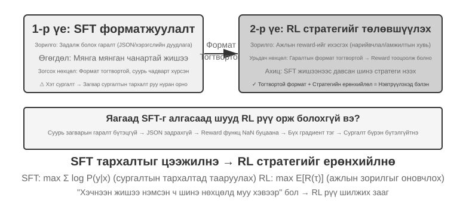

Хүснэгт 8-4 Дунд шатны сургалт, SFT болон RL-г сонгох шалгуурууд

| Ажиглагдсан зан төлөв | Гол зай | Илүүд үзсэн арга | Цааш явах хаалга |
| --- | --- | --- | --- |
| Model нь домэйны ойлголтууд, хэл эсвэл үндсэн үйлдлүүдийг мэдэхгүй; `pass@k` нь боломжийн түүвэрлэлтийн үед тэгтэй ойролцоо хэвээр байна | Мэдлэг болон чадвар нь үндсэн Model-ын үр дүнтэй дэмжлэгээс гадуур байна | **Сургалтын дунд үе**; динамик баримтуудад RAG ашиглах | Хязгаарлагдсан домэйны үр дүн сайжирч, ерөнхий хадгалалт хүлээн зөвшөөрөгдөхүйц хэвээр байх бөгөөд зорилтот даалгавар нь баталгаатай зөв эсвэл хэсэгчлэн зөв чиглэлийг гаргаж эхэлдэг |
| Model нь заримдаа зөв байдаг ч формат, хэрэгслийн схем, өнгө аяс эсвэл тогтмол процедур нь тогтворгүй байдаг | Зан үйлийн протокол батлагдаагүй байна | **SFT** эсвэл хязгаарлагдмал декодчилол | Шинжилгээний амжилт тогтворжиж, баталгаажуулагч нь гол үйлдлүүд болон гаралтын протоколуудыг найдвартай оноож чадна |
| Амжилт тэг биш бөгөөд шагнал нь найдвартай боловч сайн бодлого нь магадлал багатай эсвэл урт хугацааны шийдвэртэй байдаг бөгөөд OOD-ийн ерөнхийлөлт сул хэвээр байна | Магадлалын хуваарилалт ба бодлогын оновчлол | **RL** | Шагнал нь бодит зорилгод нийцэж байгаа, нэвтрүүлэх бүлгүүд хангалттай шагналын хэлбэлзэлтэй байгаа бөгөөд сургалтын явцад бие даасан туршилтын гүйцэтгэл сайжирч байна |
| Цөөхөн хэдэн тогтвортой демонстрация байдаг бөгөөд интерактив орчин байхгүй | Дууриамал өгөгдөл байдаг, онлайн санал хүсэлт байхгүй | **SFT/RFT/офлайн тохиргооны оновчлол** | Эхлээд суурь үзүүлэлт болон үнэлгээг тогтоож, дараа нь RL орчинг бий болгох нь үнэ цэнэтэй эсэхийг шийднэ |

Шийдвэрийг энэ дарааллаар гаргана уу:

1. **Эхлээд жинг өөрчилдөггүй шийдлүүдийг хас.** Хэрэв заавар, хэрэгсэл, кодын хязгаарлалт эсвэл Context удирдлага нь зан төлөвийн асуудлыг шийдэж байвал сургах хэрэггүй. Байнга шинэчлэх, иш татах эсвэл устгах шаардлагатай баримтуудын хувьд RAG-г илүүд үзнэ үү.
2. **Зорилтот багц дээр чадавхийн дэмжлэгийг хэмжих.** Зөвхөн шуналтай `pass@1`-г харах хэрэггүй; тогтмол түүвэрлэлтийн тохиргооны дагуу `pass@k`, хэсэгчилсэн явцын хурд, задлан шинжлэх хурд, гараар аудит хийх алдааны шалтгааныг хэмжих. Хэрэв `pass@k` тэгтэй ойролцоо хэвээр байгаа бөгөөд алдаа нь мэдлэг эсвэл суурь чадавхийн эргэн тойронд бөөгнөрсөн бол эхлээд дунд шатны сургалтыг ашиглаж, дараагийн шатыг сонгохоосоо өмнө дахин хэмжинэ.
3. **SFT-г мэдлэгийн санд оруулахын тулд биш, протоколуудыг бий болгохын тулд ашиглаарай.** Model нь даалгаврыг гүйцэтгэж чадах боловч шаардлагатай үед хийж чадахгүй үед JSON схем, хэрэгслийн дуудлага, нэр томьёо, процедур, хэв маягийг бататгахын тулд өндөр чанартай үзүүлэнгүүдийг ашиглаарай. Үзүүлэнгүүдтэй хамт параметрүүдэд цөөн хэдэн баримт оруулж болох ч цөөн хэдэн QA хос нь их хэмжээний мэдлэгийн баазтай байх ёсгүй.
4. **Зөвхөн судлах зүйл байгаа үед л RL ашиглаарай.** Одоогийн бодлого нь аль хэдийн оноо авах боломжтой, заримдаа амжилттай нэвтрүүлэлтүүдийг бий болгож, шагнал нь байршуулалтын зорилгыг үнэн зөвөөр илэрхийлж байгаа үед RL тохиромжтой. Хэрэв `pass@k` тэгтэй ойролцоо байвал эхлээд Дунд шатны сургалт/SFT ашиглах эсвэл хүрч болох сургалтын хөтөлбөр болон хэсэгчилсэн шагналыг боловсруулах; PPO эсвэл GRPO-г бүх тэг нэвтрүүлэлтүүдэд шууд хэрэглэх нь ихэвчлэн зөвхөн түүврийн төсвийг зарцуулдаг.

Энэ урсгал нь төсөл бүрийг гурван аргыг дарааллаар нь ажиллуулахыг шаарддаггүй. Хүчтэй суурь Model нь RL-д шууд орж болох бөгөөд зөвхөн форматтай даалгаварт зөвхөн SFT хэрэгтэй байж болох бөгөөд тогтвортой домэйн мэдлэг шаардлагатай байж болно. Model-ын одоо байгаа уялдаа холбоог дахин ашиглахын тулд дунд шатны сургалтыг явуулах шаардлагатай. Гол нь шилжилт бүр "Дунд шатны сургалт → SFT → RL"-ийг зан үйлийн дамжуулах хоолой гэж үзэхийн оронд хэмжигдэхүйц нэвтрэх нөхцөлтэй байдагт оршино.

## Нэг ээлжээр арматурын сургалт: Санах ой ба ерөнхийлөл хоёрын харьцуулалт

"Нэг ээлж" гэдэг нь даалгаврыг нэг харилцан үйлчлэлээр гүйцэтгэнэ гэсэн үг юм: Model нь оролтыг хүлээн авч, гаралтыг гаргаж, шагнал авдаг бөгөөд алхам алхмаар төлөвийг хадгалах шаардлагагүй. Энэхүү хялбаршуулсан тохиргоо нь бидэнд олон ээлжийн харилцан үйлчлэлийн нарийн төвөгтэй байдалгүйгээр SFT болон RL-ийн хоорондох суралцах механизмын үндсэн ялгаануудад анхаарлаа төвлөрүүлэх боломжийг олгодог. Нэг ээлжийн хувилбар нь тодорхой хяналттай туршилтын нөхцлийг бүрдүүлдэг: ижил даалгавар, ижил суурь Model, ижил тооцооллын төсөв, цорын ганц хувьсагч нь сургалтын арга юм. Эхний туршилт нь RL нь "хэзээ бодох вэ" гэсэн мета-стратегиг хэрхэн сурч байгааг харуулж байна; хоёр дахь туршилт нь арифметик сэтгэлгээний хөзрийн тоглоомыг ашиглан "SFT цээжилдэг, RL нь ерөнхийлдөг" гэж системтэйгээр тоон үзүүлэлтээр илэрхийлдэг.

Туршилтаас өмнө RL алгоритмуудын талаар **хамгийн бага зөн совин** бий болгоё, дараагийн туршилтуудад гарч ирсэн нэр томьёог дагахад хангалттай. Энэ бүлгийн RL сургалт нь ихэвчлэн **бодлогын градиент** дээр тулгуурладаг: Model нь ижил асуудалд хэд хэдэн хариулт үүсгэж, өндөр шагналтай хариултын магадлалыг нэмэгдүүлж, бага шагналтай хариултын магадлалыг бууруулдаг - шагналтай чиглэлд цааш явж, шагналгүй хариултыг багасгадаг. Model-ыг замбараагүй болгохын тулд нэг том шинэчлэлтийг зогсоохын тулд гол **PPO** нь магадлалын харьцаа тодорхой хязгаараас гадуур байх үед орлуулах зорилгодоо нэмэлт ашиг олдог; энэ нь томоохон өөрчлөлтийг хориглодог боловч бодлогын хөдөлгөөнд хатуу хязгаарлалт тавьдаггүй (дараагийн туршилтууд нь "үнэ цэнийн сүлжээтэй PPO"-г ашигладаг бөгөөд түүний үнэ цэнийн сүлжээ нь илүү нарийн давуу талуудын суурь шугамыг тооцоолдог). Нөгөө арга болох **GRPO** нь үнэ цэнийн сүлжээг сургадаггүй; үүний оронд энэ нь ижил асуудалд олон хариултыг хооронд нь харьцуулж, тус бүрийн харьцангуй чанарыг үнэлдэг. Энэ зөн совин нь дараагийн хоёр туршилтад танд хэрэгтэй бүх зүйл юм.

Үүнтэй ижил механизмыг доорх Python маягийн псевдокодтой адил бичиж болно. Энэ нь түүвэрлэлтийн параллелизм, KL-ийн зохицуулалт, оновчлогчийн дэлгэрэнгүй мэдээллийг орхигдуулж, зөвхөн нэг нэвтрүүлэлтээс параметрийн шинэчлэлт хүртэлх учир шалтгааны гинжин хэлхээг тэмдэглэнэ:

```python
for prompt in batch:
    group = [rollout(policy, env.reset(prompt)) for _ in range(G)]
    rewards = [verify(trajectory) for trajectory in group]
    advantages = normalize_within_group(rewards)       # GRPO baseline
    update(policy, group, advantages)
```

PPO-ийн үнэ цэнийн сүлжээ болон товчилсон зорилгыг тусад нь бичиж болно:

```python
for trajectory in rollouts:
    returns = discounted_returns(trajectory.rewards)
    values = value_model(trajectory.states)
    advantages = returns - stop_gradient(values)
    ratio = exp(policy.log_prob(trajectory.actions)
                - old_policy.log_prob(trajectory.actions))
    policy_loss = -mean(min(
        ratio * advantages,
        clip(ratio, 1 - epsilon, 1 + epsilon) * advantages
    ))
    value_loss = mean((value_model(trajectory.states) - returns) ** 2)
update(policy, value_model, policy_loss + value_coef * value_loss)
```

GRPO дахь "хамаатан" нь ижил мөрийн хүрээнд бүлэг доторх нэвтрүүлэлтийг харьцуулахаас үүсдэг; PPO дахь `old_policy` нь энэхүү нэвтрүүлэлтийн багцыг үүсгэсэн хөлдөөсөн бодлогын агшин зураг бөгөөд магадлалын харьцаа нь одоогийн бодлого үүнээс хэр хол явсныг хэмждэг. Тайрах нь том алхамуудыг зогсоох боловч бодлогын хөдөлгөөнд хатуу хязгаарлалт биш юм; хоёулаа найдвартай орчин, шагналаас хамааралтай хэвээр байгаа бөгөөд сургалтын тодорхой дасан зохицол нь харгалзах туршилтуудад гарч ирдэг.

> **8-10-р туршилт ★★: Дасан зохицохТохиолдол—"Хэзээ бодохгүй байх ёстой вэ"-г сурах**
>
> Том хэмжээний сэтгэлгээний Model-ууд (жишээ нь, OpenAI o1, DeepSeek-R1) нь бүх бодлогын хувьд урт хугацааны сэтгэлгээний гинжин хэлхээг бий болгож, энгийн бодлогууд дээр шаардлагагүй зардал гаргадаг. Туршилт нь эхлээд зөн совингоо баталгаажуулдаг: **Бодохгүй горим** (`<think></think>`-ээр дамжуулан сэтгэлгээг алгасах) нь энгийн бодлогууд дээр харьцангуй эсвэл бүр илүү сайн ажилладаг; зөвхөн хүнд хэцүү бодлогуудтай тулгарах үед л Сэтгэлгээний горимын давуу тал нь тодорхой болдог.
>
> AdaptThink нь Model-ыг горимыг дасан зохицох байдлаар сонгоход сургахын тулд RL ашигладаг. Хоёр үндсэн бүрэлдэхүүн хэсэг:
>
> - **Хязгаарлагдмал Оновчлолын Зорилго**: Нийт гүйцэтгэл буурахгүй байхыг баталгаажуулахын зэрэгцээ Бодолгүй байхыг дэмждэг.
> - **Чухал Түүвэрлэлтийн Стратеги**: **Хүйтэн эхлэх** асуудлыг шийдэхийн тулд Сэтгэх болон Бодолгүй дээжийг тэнцвэржүүлнэ (энд хүйтэн эхлэх нь анхны Model бараг үргэлж Сэтгэхийг сонгодог болохыг хэлдэг бөгөөд Бодолгүй салбарыг үр дүнтэй сурахад хэтэрхий цөөн дээжтэй үлдээдэг; энэ нь DeepSeek-R1-д зориулсан "хүйтэн эхлэх SFT"-ийг өмнөх хэрэглээнээс ялгаатай бөгөөд энэ нь цөөн тооны жишээг багтаасан болно).
>
> Энд дурдсан "чухал түүвэрлэлт" нь нийтлэг статистикийн арга бөгөөд түүврийн тархалт нь тодорхой төрлийн дээж рүү чиглэсэн үед тархалтыг "засах" зорилгоор дээжинд жинг хэрэглэж, сургалтын дохио нь бүх ангиллыг шударгаар хамрахыг баталгаажуулдаг. Энэ санааг энэ номонд сүүлд хэлэлцсэн PPO болон DAPO зэрэг RL алгоритмуудад дахин дахин ашигладаг.
>
> Энэхүү түүхэн сургалтын гүйлтийн каноник бүртгэл нь шалгах цэггүй [сургалтын тайлан](../chapter8/AdaptThink/TRAINING_REPORT.md) юм. Олон нийтийн W&B үндсэн гүйлт [`wubbn5tj`](https://wandb.ai/bojieli-pine-ai/adapt_think_verl/runs/wubbn5tj) нь 8×NVIDIA H100 80GB GPUs ашигласан. 0→300 алхамаас MATH500 нарийвчлал 0.8100→0.8180 (+0.80 pp)-аас өөрчлөгдсөн бол хариу үйлдлийн урт 4911.46→1576.62 (-67.90%)-аас өөрчлөгдсөн; GSM8K нь 0.796816→0.818802 (+2.20 pp) болон 1025.24→477.33 (-53.44%)-аас өөрчлөгдсөн; болон AIME mean@16 нь 0.314583→0.310417 (-0.42 pp) болон 12119.51→6402.23 (-47.17%)-аас өөрчлөгдсөн. Харгалзах Бодолгүй байдлын харьцаа 83.80%, 84.15%, болон 56.25% байв. Эдгээр үр дүнгүүд нь нэгтгэсэн өгөгдлийн багцын түвшинд хүндрэлтэй уялдсан чиглүүлэлтийн дохиог харуулж байгаа боловч үүнийг асуудал бүр дээр "төгс хүндрэлийн мэдлэг" гэж нэрлэх эсвэл нарийвчлал нь бүх талаар сайжирсан гэж үзэх үндэслэл болохгүй.
>
> Тайлангийн сонгосон хэмжилтийн цэгийн дараа W&B үүнийг `crashed` гэж тэмдэглэхээс өмнө 410 алхам хүртэл гүйлт үргэлжилж, 36.92 хуримтлагдсан цаг зарцуулсан; тохируулсан 10 эрин / 3,140 алхам хийгдээгүй байна. 300-р алхам нь шалгах цэгийн цагийн үйл явдлыг агуулсан боловч шалгах цэгийг номтой хамт тараагаагүй бөгөөд `run_eval_verl_hf.sh`-ээр амжилттай үнэлэгдсэн эсвэл MMLU-г дахин ажиллуулахад ашигласан болохыг нотлох бие даасан нотолгоо байхгүй байна. Түүхэн эх сурвалжийн коммит нь `9e588202…`; ирээдүйн хуулбарууд нь түүний шууд хүүхэд коммит `0033ad172…`-д бэхлэгдсэн байна. Гурван оролтын цэгийн файл өөрчлөгдөөгүй боловч сургалтын скриптээр үүсгэгдсэн `-fl-` зам нь үнэлгээний скриптэд хатуу кодлогдсон `-fl4096` замтай нийцэхгүй бөгөөд гараар засах шаардлагатай.
>
> AdaptThink нь "хурдан-удаан хос систем"-ийг бий болгохын тулд шуурхай нэрэлтийг нөхдөг: нэрэлт нь бодох шаардлагатай даалгавруудын эзлэх хувийг бууруулдаг бол AdaptThink нь үлдсэн даалгавруудыг идэвхжүүлэх стратегийг оновчтой болгож, сэтгэлгээний үр ашгийг хамтад нь сайжруулдаг.

> **8-11-р туршилт ★★: Ерөнхий оноо—Нэг эргэлттэй RL-д "Санах ой ба Ерөнхийлөл"-ийн харьцуулалт**
>
>
> 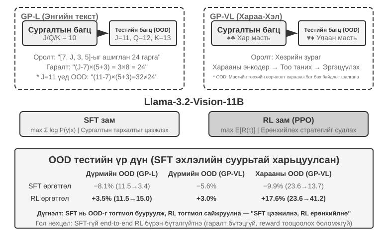
>
>
> Ерөнхий оноо нь Чу болон бусад хүмүүсийн санал болгосон арифметик сэтгэлгээний хөзрийн тоглоом юм.[^ch8-3], Model-ын ерөнхийлөлтийг үнэлэхэд тусгайлан зориулагдсан. Зорилго нь "24 тоглоом"-той төстэй: хөзөр дээр харуулсан дөрвөн тоо тус бүрийг яг нэг удаа ашиглаж, тэдгээрийг нэмэх, хасах, үржүүлэх, хуваахтай хослуулан 24 гэсэн зорилтот тоонд хүрнэ. Туршилт нь зөвхөн текстэн GP-L болон дүрсэн дээр суурилсан GP-VL гэсэн хоёр хувилбарыг боловсруулсан бөгөөд энэ нь бидэнд дүрмийн ерөнхийлөлт болон дүрслэлийн ерөнхийлөлтийг нэг хүрээнд судлах боломжийг олгодог.
>
> **Дүрмийн хувилбар**: Сургалтын үеэр J/Q/K-г бүгдийг нь 10 гэж тооцно; туршилтын үеэр тэдгээрийг тус тус 11/12/13 гэж тооцно. Ингэснээр ерөнхийлөлтийг чандлан үнэлэхийн тулд туршилтын багцад үл үзэгдэх тооны хослолууд (11, 12, 13-тай холбоотой үйлдлүүд) агуулагдаж байгааг баталгаажуулна. **Харааны хувилбар**: Training нь хар костюм (♠♣) ашигладаг бол туршилт нь улаан костюм (♥♦)-г ашиглан харааны гадаад төрхийн өөрчлөлтийн бат бөх чанарыг үнэлдэг. Llama-3.2-Vision-11B ашиглан туршилт нь сургалтын дараах стандарт дамжуулах хоолойг дагадаг: эхлээд SFT-ийн анхны тохиргоо нь Model-т үндсэн зааврыг дагаж мөрдөх чадварыг өгдөг; дараа нь ижил тооцооллын төсвийн дор Model нь тусдаа салбаруудад нэмэлт SFT болон RL сургалтанд хамрагддаг бөгөөд PPO болон RL-д зориулсан утгын сүлжээг ашигладаг. Хоёр салбар хоёулаа J/Q/K=10 гэсэн ганц дүрмийг ашиглан өгөгдөл дээр сургагдсан бөгөөд тархалт доторх (ID) болон тархалтаас гадуурх (OOD) туршилтын багцууд дээр үнэлэгддэг.
>
> Үр дүн нь энэхүү хяналттай тохиргоонд тодорхой ялгааг харуулж байна. **Дүрэм OOD**: RL нь GP-L дээр +3.5 хувийн пунктээр сайжирсан (11.5%→15.0%), харин SFT нь **8.1 хувийн пунктээр буурсан** (11.5%→3.4%); GP-VL дээр RL нь +3.0 хувийн пунктээр сайжирсан бол SFT нь 5.6 хувийн пунктээр буурсан. **Харааны OOD**: RL нь GP-VL дээр **+17.6 хувийн пунктээр** сайжирсан (23.6%→41.2%), харин SFT нь 9.9 хувийн пунктээр буурсан (23.6%→13.7%).
>
> Харааны таних нарийвчлалыг хянах нь RL нь үр дүнд чиглэсэн оновчлолоор дамжуулан үндсэн харааны кодлогчийг сайжруулдаг бөгөөд энэхүү сайжруулалт нь нийт гүйцэтгэлийн өсөлттэй маш их хамааралтай болохыг харуулж байна; эсрэгээр, SFT нь сэтгэлгээний үйл явцад Token-ийн хэв маягт хэт дасан зохицож, харааны Token-уудын суралцахыг үл тоомсорлож, таних нарийвчлал буурахад хүргэдэг.
>
> Туршилтаар мөн RL нь энэ тохиргоонд SFT-ийн эхлүүлэлтийг шаарддаг болохыг харуулж байна: Llama-3.2-Vision-11B масштабтай суурь Model болон хатуу бүтэцлэгдсэн гаралтын шаардлагын дагуу SFT-гүй төгсгөл хүртэлх RL нь үндсэн Model нь оноо авах боломжтой бүтэцлэгдсэн гаралтыг гаргаж чадахгүй байсан тул бүрэн бүтэлгүйтсэн. Энэ нь тухайн тохиргоонд хамаарах бөгөөд нийтлэг хууль биш; хангалттай хүчтэй суурь Model нь SFT-ийг алгасаж, шууд RL-ээр амжилтанд хүрч чадна (DeepSeek-R1-Zero-ийн өмнөх хэлэлцүүлгийг үзнэ үү). Өөр нэг анхаарал татахуйц олдвор бол энэ туршилтад илүү олон баталгаажуулалтын давталт нь илүү сайн хэмжсэн ерөнхийлөл бий болгосон явдал юм: 10 давталт нь нэг давталтын хувьд +0.48% -ийн эсрэг +5.99% -ийг өгсөн нь туршилтын хугацааны тооцооллыг ажиглагдсан олшролын чухал хүчин зүйл болгосон.
>
> RL илүү сайн ажиллаж байхад SFT яагаад энэ туршилтын тархалтын шилжилтийн үед доройтсон бэ? Ажиглалттай нийцэж буй нэг тайлбар бол хязгаарлагдмал SFT өгөгдөл нь J-г 11 болгон өөрчлөхөд идэвхтэй хэвээр байсан "J/Q/K-г 10 гэж үз" гэсэн тогтмол хэв маягийг бэхжүүлсэн явдал юм. Үр дүнд суурилсан RL салбар нь зөв үр дүнд хүрэх хүртлээ дахин тооцоолох стратегийг бэхжүүлэх магадлал өндөр байсан бөгөөд дүрэм өөрчлөгдсөний дараа ижил процедурыг хэрэгжүүлэх боломжтой байв. Энэ нь туршилтын цээжлэх ба ерөнхийлөх ялгааг тайлбарладаг; энэ нь SFT зөвхөн цээжлэх боломжтой эсвэл RL нь ерөнхий алгоритмыг сурах ёстой гэсэн үг биш юм.
>
> Энэхүү туршилтын гол хувь нэмэр нь хязгаарлагдмал Ерөнхий Онооны тохиргооны хүрээнд SFT-ийн хэт тохирох хандлага болон RL-ийн илүү сайн түгээлтийн бус гүйцэтгэлийг системтэйгээр тоон үзүүлэлтээр тодорхойлсон явдал бөгөөд зөвхөн текст болон харааны хэлний хувилбаруудад ижил хэв маяг ажиглагдсан. Энэ тохиргоонд SFT нь форматыг тогтворжуулж, RL нь энэ үндсэн дээр стратегиудыг судалсан бөгөөд энэ хоёр аргыг харилцан нөхөж чадсан.

## RL Алгоритм: 16 нэвтрүүлгээс нэг параметрийн шинэчлэлт хүртэл

DeepSeek-ийн санал болгосон **GRPO (Бүлгийн Харьцангуй Бодлогын Оновчлол)** нь өнөө үед хамгийн өргөн хэрэглэгддэг RL сургалтын алгоритмуудын нэг юм. Жишээ нь үүнийг тодорхой болгож байна. SWE-bench нь дараах даалгаврыг агуулж байна гэж бодъё: `parser.py` нь зарим Python төсөлд хоосон оролт дээр `IndexError`-г өсгөдөг бөгөөд Agent нь тестийг өөрчлөхгүйгээр кодыг засах ёстой. Сургалтын систем нь доорх дөрвөн алхамаар дамждаг.

**Алхам 1: Бодлогын Model-ыг дахин дахин оролдохыг зөвшөөрнө үү.** Бодлогын Model нь одоогоор сургагдаж буй хэлний Model юм. Систем нь ижил анхны код болон ижил асуудлын тайлбарыг 16 харилцан тусгаарлагдсан хамгаалагдсан хязгаарлагдмал орчинд хуулж, Model үүнийг 16 удаа бие даан шийдвэрлэх боломжийг олгодог. Оролдлого бүр нь "кодыг унших → файлуудыг засах → тестийг ажиллуулах → үр дүнг илгээх" бүрэн үйл явцыг хамардаг; энэ бүх үйл явц нь нэг **өргөтгөх** юм. Асуудал болон анхны орчин нь ижил боловч түүвэрлэлт нь стохастик тул 16 оролдлого өөр өөр замаар явж болно: зарим нь хил хязгаарын шалгалтыг зөв нэмдэг, зарим нь зүгээр л үл хамаарах зүйлийг барьж, асуудлын дээгүүр цаас гаргадаг, зарим нь буруу файлыг засварладаг, зарим нь тестийг өөрчлөхийг оролддог.

**Алхам 2: Шагналыг тооцоолох.** Нэвтрүүлэлт дууссаны дараа баталгаажуулагч нь нөхөөсийг цэвэр орчинд хэрэглэж, тестүүдийг ажиллуулдаг. 16 оролдлогын 4 нь тестийн файлуудад хүрэлгүйгээр бүх тестийг давсан, үлдсэн 12 нь амжилтгүй болсон гэж бодъё; дараа нь эхний 4 нь 1-р шагнал, үлдсэн 12 нь 0 шагнал авна. Ийм код бичих даалгаварт "шагналыг тооцоолох" нь нууцлаг зүйл биш - энэ нь зүгээр л тест, дүрмийг ашиглан засвар үнэхээр зөв эсэхийг дүгнэх явдал юм. Зөвхөн тодорхой тестгүй нээлттэй даалгавруудын хувьд танд хүний ​​сонголт эсвэл шагналын Model хэрэгтэй.

**Алхам 3: Харьцангуй давуу талыг тооцоол.** Шагнал нь зөвхөн нэг зам амжилттай болсон эсвэл бүтэлгүйтсэн эсэхийг харуулдаг; **харьцангуй давуу тал** нь ижил бүлгийн бусад оролдлогуудтай харьцуулахад хэр сайн болохыг харуулдаг. Энэ бүлгийн дундаж амжилтын түвшин 4/16 байна: тэнцсэн 4 нь бүлгийн дунджаас дээгүүр бөгөөд эерэг давуу талтай; тэнцээгүй 12 нь түүнээс доогуур бөгөөд сөрөг давуу талтай. Энэхүү бүлгийн доторх харьцуулалт нь GRPO-ийн гол цөм юм. Хэрэв 16 нь бүгд бүтэлгүйтвэл эсвэл 16 нь бүгд амжилттай болвол шагнал бүр ижил бөгөөд аль нь илүү болохыг хэлэх аргагүй бөгөөд харьцангуй давуу тал алга болдог. RLVP-ийн замын дохио, үйл явцын шагнал, хэсэгчилсэн ахиц дэвшлийн шагнал нь ийм бүлгүүдийн доторх утга учиртай ялгааг сэргээхийн тулд яг таг оршдог.

**Алхам 4: Градиент бууралтаар бодлогыг шинэчлэх.** Сургалтын хөтөлбөр нь харьцангуй давуу талыг сургалтын алдагдал болгон хувиргаж, градиентийг тооцоолж, оновчлогч (AdamW, Muon гэх мэт) нь градиент бууралтыг гүйцэтгэдэг бөгөөд энэ нь Model-ын эерэг давуу талтай чиглэлд хийсэн сонголтуудын магадлалыг нэмэгдүүлж, сөрөг давуу талтай чиглэлд бууруулдаг. Энэ нь зарим амжилттай нөхөөсийг үгчилэн цээжилдэггүй; энэ нь олон даалгавар болон нэвтрүүлгүүдийн дагуу аажмаар тохируулдаг тул ижил төстэй алдаа дараа нь гарч ирэхэд "асуудлыг дахин үүсгэх, хил хязгаарын нөхцөлийг шалгах, хэрэгжилтийг өөрчлөх, тест ажиллуулах" магадлал өндөр байдаг бол "үл хамаарах зүйлийг залгих, тестийг засах, баталгаажуулахгүйгээр илгээх" магадлал бага байдаг.

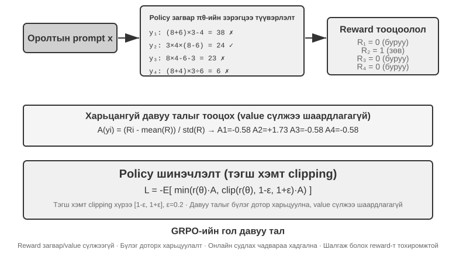

Эдгээр дөрвөн алхам нь нийлээд нэг **сургалтын давталт**-ыг бүрдүүлдэг, өөрөөр хэлбэл нэг **алхам**: $k$ алхам нь одоогийн бодлогын дагуу багц нэвтрүүлэлтийг үүсгэж, шагнал, давуу тал, градиент тооцооллыг гүйцээж, оновчлогч параметрүүдийг шинэчилдэг; $k+1$ алхам нь шинэчлэгдсэн бодлогын дагуу дахин нэвтрүүлдэг. 100 алхамын Training гэдэг нь энэ давталтыг ойролцоогоор 100 удаа давтах гэсэн үг юм. Өгөгдсөн RL сургалтын хүрээ нь дотоод минибач шинэчлэлтүүдээ тусад нь тоолж болох тул сургалтын бүртгэлийг уншихдаа та `step`-г хэрхэн тодорхойлдогийг баталгаажуулах шаардлагатай хэвээр байна.

Ойролцоогоор цагийн тооцоолол тусалдаг. Agent-ийн цогц хувилбар нь хэдэн арван багаж дуудах ээлжийг үүсгэдэг бөгөөд 16 нь зэрэгцээ ажиллаж байсан ч хувилбарын шатны ханын цагийн цагийг хамгийн удаан хувилбараар тохируулдаг. Хамгийн удаан хувилбар нь 2000 орчим секунд, дараагийн градиент бууралт болон оновчлогчийн шинэчлэлт нь 600 орчим секунд үргэлжилнэ гэж бодъё; тэгвэл нэг алхам нь ойролцоогоор $2{,}000+600=2{,}600$ секунд, ойролцоогоор 43 минут, дараалсан 100 алхам нь бараг 72 цаг үргэлжилнэ.

PPO болон GRPO хоёулаа энэ гогцоог дагадаг; тэдгээр нь голчлон **юутай харьцуулж байгаагаар** ялгаатай. GRPO нь ижил асуудлын олон нэвтрүүлгийг шууд харьцуулдаг бөгөөд тусдаа үнэ цэнийн Model шаардлагагүй. PPO нь чиглэлийн алхам бүрт "хүн хэр сайн хийдэг" гэж үнэлдэг үнэ цэнийн Model-ыг сургадаг бөгөөд дараа нь одоогийн үйлдэл нь тухайн хүлээлтийг хангаж байгаа эсэхийг шүүдэг бөгөөд энэ нь нарийн тооцоотой кредит хуваарилалт шаарддаг урт чиглэлд тохирдог. Хоёулаа нэг шинэчлэлтийн хэмжээг хязгаарладаг тул цөөн тооны дээж нь Model-ыг гэнэт хэт их өөрчилж чадахгүй. DPO нь өөр: энэ нь урьдчилан цуглуулсан "илүү сайн хариу - муу хариу" гэсэн сонголтын хосуудаас шууд суралцдаг бөгөөд одоогийн бодлого нь энэ бүлгийн нэвтрүүлгийг онлайнаар хэзээ ч үүсгэдэггүй.

Энэ бүлгийн тохиолдлуудын дунд AdaptThink нь өөрчлөн тохируулсан хязгаарлагдмал зорилгыг ашигладаг; GeneralPoints болон V-IRL нь утгын Model-тай PPO ашигладаг; SimpleVLA-RL болон RLVP нь GRPO ашигладаг; ReTool нь PPO ашигладаг. Алгоритм нь траекторуудыг хэрхэн харьцуулж, параметрүүдийг хэрхэн шинэчлэхийг шийддэг; шагнал нь юуг амжилт гэж тооцохыг шийддэг; орчин болон өгөгдөл нь Model ямар асуудлуудтай тулгарахыг шийддэг.

### Яагаад LLM RL нь ихэвчлэн бодлоготой Өгөгдөл-г илүүд үздэг вэ?

Эхлээд амархан хольж ойлгодог хоёр нэр томьёог ялгаж ав. **Онлайн** гэдэг нь зөвхөн сургалтын үеэр орчинтой харилцан үйлчлэлцэх замаар өгөгдөл тасралтгүй үүсдэг гэсэн үг юм. **Бодлого дээр** нь нэвтрүүлэлтийг үүсгэдэг зан үйлийн бодлого $\mu$-ийг одоогоор оновчлогдож буй $\pi_\theta$ бодлоготой ижил эсвэл хангалттай ойрхон байхыг шаарддаг. Асинхрон кластер нь нэвтрүүлэгч ажилчид нь хэд хэдэн хяналтын цэгээс хоцорсон тохиолдолд өгөгдлийг тасралтгүй үүсгэж болох боловч статистикийн утгаараа бодлогоос гадуур хэвээр байна. Хуучин чиглэлийг дахин тоглуулах эсвэл хуучин Model эсвэл багшийн үүсгэсэн чиглэлийг ашиглах нь бодлогоос гадуурхах нь илүү тодорхой юм. Энэ бүлэгт байгаа PPO/GRPO жорууд нь ерөнхийдөө алхам тутамд хамгийн сүүлийн үеийн бодлогоос дахин нэвтрүүлэхийг зорьдог. Гэсэн хэдий ч PPO нь нэг багц дээр хэд хэдэн минибач эрин үеийг гүйцэтгэх үед хожуу эрин үеүүд нь өгөгдлийг үүсгэсэн `old_policy`-ээс аль хэдийн холддог - яг ийм учраас PPO магадлалын харьцаа болон хайчилбарыг ашигладаг.

Бодлогын градиентууд нь одоогийн $\pi_\theta$ бодлогын дагуу хүлээгдэж буй шагналыг тооцоолохыг эрмэлздэг. Хэрэв өгөгдлийг өөр $\mu$ бодлогоос түүвэрлэсэн бол залруулга нь ач холбогдлын харьцааг ашигладаг:

$$
\rho_t=\frac{\pi_\theta(a_t\mid s_t)}{\mu(a_t\mid s_t)}
=\exp\left(\log\pi_\theta(a_t\mid s_t)-\log\mu(a_t\mid s_t)\right). Энэ нь хэчнээн утгатай болохыг харуулж байна вэ?
$$

Бодлогын дагуу шинээр нэвтрүүлсэн хувилбарууд нь параметрийн шинэчлэлтээс өмнө **$\pi_\theta=\mu$-ийг хангадаг тул $\rho_t=1$. Энэ нь "одоогийн Model үнэхээр орж буй төлөвүүд" дээр сургалт явуулахад анхаарлаа төвлөрүүлж, тархалтын зөрүүний улмаас өндөр хэлбэлзлийн залруулга төлөхөөс зайлсхийдэг. Бодлогын бус өгөгдөл нь өөрийн гэсэн давуу талуудтай - хуучин өгөгдлийг дахин ашиглаж болно, түүвэрлэлт болон сургалт нь асинхрон байдлаар явагдаж болно, нэвтрүүлэх чадвар өндөр байдаг - гэхдээ бодлого нь хуучирсан байх тусам $\rho_t$ тархалтын сүүл нь хүнд байдаг. Урт авторегрессийн дарааллын хувьд хатуу угтвар эсвэл траекторын залруулга нь мөн олон Token харьцааг хамтад нь үржүүлдэг тул бага зэргийн хазайлт нь асар их буюу алга болж буй жин болж хуримтлагдаж болно. PPO-ийн хайчилбар нь гадуурх шинэчлэлтийг хязгаарладаг боловч алдагдсан тархалтын хамрах хүрээг алдагдалгүйгээр сэргээж чадахгүй: хэт их хайчилбал градиентууд хаягддаг, хэт бага хайчилбал цөөн хэдэн дээж давамгайлдаг. Тиймээс "Бодлого дээр илүү сайн" гэдэг нь бүх нийтийн теорем биш; өнөөгийн LLM бодлогын градиентуудад энэ нь ихэвчлэн **тархалтын хазайлт бага, илүү тогтвортой оновчлол** гэсэн үг юм. Том Model-ын RL-г тогтворжуулах эмпирик судалгаагаар бодлогын хоцрогдлыг бууруулах, сургалт-дүгнэлтийн зөрүүг багасгах нь орлуулагч зорилгыг хүчин төгөлдөр байлгах чухал нөхцөл болохыг тогтоожээ [^ch8-32].

#### Яагаад Training нь дээж авагч/сургагч хэрэгслийн тоон зөрүүнд мэдрэмтгий байдаг вэ?

Том хэмжээний LLM RL нь ихэвчлэн vLLM/SGLang зэрэг дүгнэлтийн хөдөлгүүртэй хамт нэвтрүүлгүүдийг үүсгэдэг бөгөөд дараа нь FSDP/Megatron зэрэг сургалтын хөдөлгүүртэй хамт лог магадлал болон градиентийг дахин тооцоолдог. Хоёр тал ижил жинг ачаалж байсан ч хөвөгч цэгийн нарийвчлал, бууралтын дараалал, тензор-параллел зохион байгуулалт, багцын хэмжээ, KV кэш болон хайлсан цөмүүдийн ялгаа нь ижил Token-ы лог магадлалыг бага зэрэг өөр болгож болзошгүй юм. Үүний үр дүнд шинэчлэлтээс өмнө 1-тэй тэнцүү байх ёстой $\rho_t$ нь 1-ээс аль хэдийн холдсон: систем нь жинг нэрлэсэн байдлаар синхрончилсон боловч тоон хувьд бодлого дээрх сургалтыг бодлогоос гадуурх сургалт болгон хувиргасан. Хяналттай туршилтууд нь Token-ы түвшний сургалт-дүгнэлтийн бага зэргийн зөрүү нь сургалтын уналтыг өдөөхөд хангалттай байгааг харуулсан [^ch8-33].

Мэдрэмж нь олшруулалтын гинжин хэлхээнээс үүсдэг: **бага лог-магадлалын алдаа → экспоненцилагдсан магадлалын харьцааны хазайлт → урт угтвар дээрх хуримтлал → өөрчлөгдсөн хайчлах/давуу талын жин → өөрчлөгдсөн градиент чиглэл ба үр дүнтэй түүврийн тоо**. Жишээлбэл, хэрэв 4000 Token-ы лог харьцаа бүгд ижил чиглэлд $10^{-3}$-аар хазайвал траекторын түвшний харьцаа $e^4\approx54.6$ болж хуримтлагдана; бодит алдаа нь заавал ижил тэмдэгтэй байх албагүй боловч жишээ нь урт дарааллууд нь яагаад "бүх Token дээр жижиг харагддаг" алдааг олшруулдагийг харуулж байна. Эрт Token дээрх нэг минутын магадлалын зөрүү нь аль Token-ыг үнэндээ түүвэрлэж байгааг өөрчилж, дараагийн төлөвийн траекторыг бүхэлд нь зөрүүлдэг. Эцсийн үр дүн нь зүгээр л "ижил хүсэлт хааяа өөр хариулт гаргадаг" биш юм: ач холбогдлын харьцаа огцом нэмэгдэж, олон тооны Token-ыг хайчилж, градиент эсвэл хариу үйлдлийн урт үсэрч, үүний дараа шагнал ба энтропи хамтдаа нурж унана. Багцын хэмжээг өөрчлөх нь тооцооллыг хэрхэн бууруулж, тоон багцын инварианцийг эвддэг; Энэ нь мөн нэрлэсэн байдлаар бодлогод суурилсан RL-г бодлогод хамаарахгүй далд RL болгон хувиргадаг болохыг шууд ажигласан. Түүвэрлэлт болон сургалтын тоон үзүүлэлтүүдийг тохируулах эсвэл бодлогод хамаарахгүй тодорхой залруулга хийх нь тогтвортой байдлыг сайжруулдаг [^ch8-34].

Инженерчлэл үүнийг ердийн хөвөгч цэгийн шуугиан биш харин гол асуудал гэж үзэх хэрэгтэй:

- **Параметрийг шинэчлэхээс өмнө** ижил багц траекторууд дээрх түүвэрлэгч болон сургагчийн Token логийн магадлалыг харьцуулж, $\rho_t$-ийн дундаж, квантил, хамгийн их, ойролцоо KL болон хайчилбарласан бутархайг хянана уу; энэ бол бодлогын хамгийн шууд нэгжийн тест юм.
- Зөвхөн жинг төдийгүй LoRA адаптер, токенизатор, чатын Model, Model-ын засвар, байрлалын кодчилолын тохиргоог синхрончлох ёстой; нэвтрүүлэлт нь одоогийн Model-ын тоонуудыг баримтын дараа дамжуулахын оронд үүссэн цагаас хойшхи зан төлөвийн бүртгэлийн магадлалыг хадгалах ёстой.
- Түүвэрлэлт болон сургалтын нарийвчлал, зэрэгцээ зохион байгуулалт болон гол тооцооллын цөмүүдийг аль болох уялдуулах; боломжгүй тохиолдолд ялгааг бодлогоос гадуур гэж тодорхой үзэж, ач холбогдлын залруулга хийж, PPO хайчилбар нь автоматаар нөхөгдөнө гэж үзэхийн оронд үр дүнтэй түүврийн хэмжээг хянах.
- Шинэчлэлтүүдийг шинэчилж, өгөгдлийн багц дахь шинэчлэлтийн эрин үе болон асинхрон хуучирсан байдлыг хязгаарлах. Хуучин өгөгдлийг дахин ашиглах нь нэвтрүүлэх чадварыг нэмэгдүүлдэг боловч энэ нь үнэгүй хурдатгал биш харин хэмжсэн хазайлт-үр ашгийн харьцаа байх ёстой.

## RL орчин: Үнэлгээнээс симуляци хүртэл

RL сургалтын саад бэрхшээл нь ихэвчлэн алгоритм биш, харин **орчин нь хангалттай бодитой, дахин тохируулж болохуйц, зэрэгцээ байж болох эсэх** юм. Жинхэнэ Agent-ийн утасны дуудлага, төлбөр эсвэл файлын өөрчлөлт нь үнэтэй бөгөөд эргэлт буцалтгүй байж болох бөгөөд нэг алдааг хязгааргүй дахин оролдлогоор засах боломжгүй; Бүлэг 7-ийн үнэлгээний орчин нь баталгаажуулагчийг хангаж чадна, гэхдээ сургалт нь Agent-ийг дахин дахин бүтэлгүйтэх, үйлдлийнхээ гаж нөлөөг шингээх, сая сая харилцан үйлчлэлийн туршид тогтвортой байлгахыг шаарддаг. Тиймээс хүрээлэн буй орчны инженерчлэл нь RL-ийн урьдчилсан нөхцөл бөгөөд сургалт дууссаны дараа дараагийн бодол биш юм.

### Орчин: Training-ийн Model-ийн суурь

RL нь үндсэндээ "туршилт ба алдаагаар суралцах" явдал бөгөөд туршилт ба алдааны хувьд **хаа нэгтээ** болох симуляцийн орчин хэрэгтэй. Model нь орчинд даалгавруудыг дахин дахин ажиллуулж, санал хүсэлтийг цуглуулж, бодлогоо тохируулдаг. Орчны **үнэнч байдал** - бодит байршуулалтын хувилбартай хэр төстэй - нь үүссэн бодлого нь огт хэрэглэгдэх боломжтой эсэхийг шууд тодорхойлдог:

- **Гадуурсан орчин нь ашиггүй бодлогыг баталгаажуулдаг.** Хэрэв симуляци хийсэн хэрэглэгч үргэлж тогтмол скриптээс хариулж, түүний алдааны мессежүүд нь үйлдвэрлэлтэй таарахгүй бол Model нь зөвхөн симуляцид ажилладаг тест авах стратегийг сурч, анхны бодит байршуулалтад задардаг. Энэ бол RL төслүүд бүтэлгүйтдэг хамгийн түгээмэл арга юм - муу алгоритм биш, харин шалгалтын танхимтай адилгүй дадлагын талбай юм.
- **Өндөр нарийвчлалтай орчин бүрдүүлэх нь сургалтаас өөрөөсөө илүү үнэтэй бөгөөд хэцүү байдаг.** Асар их параллель, хуулбарлах боломжтой, бодитой хариу үйлдэл үзүүлдэг орчин нь Model-ыг тохируулахаас хамаагүй илүү инженерчлэл шаарддаг. Энэ бүлгийн сүүл хэсэгт байгаа багаж дуудах туршилтууд (AWorld-ийн MCP хамгаалагдсан хязгаарлагдмал орчин, ReTool-ийн код тайлбарлагч хамгаалагдсан хязгаарлагдмал орчин) нь орчинд ихээхэн хөрөнгө оруулалт хийдэг, учир нь **жинхэнэ APIs нь хурдны хязгаартай, бүртгэлийг хориглодог, гаж нөлөөтэй тул шууд сургалтад ашиглах боломжгүй болгодог** - та эхлээд тогтвортой, хянаж болох, дахин тоглуулж болох "сүүдрийн ертөнц"-ийг бүтээх хэрэгтэй.
- **Орчны нөгөө тал нь шагналын функц юм.** Орчны орчин нь дэлхий ертөнц хэрхэн өөрчлөгдөж байгааг дуурайлган дуурайхаас гадна Agent хэр сайн ажилласныг үнэлэх ёстой бөгөөд энэ нь дараа нь хэлэлцэх шагналын загварт оруулах оролт юм.

Товчхондоо: **алгоритмуудыг тохируулж эхлэхээсээ өмнө өөрөөсөө асуугаарай - миний симуляцийн орчин үнэхээр бодит ертөнцтэй төстэй юу?** Хариулт нь PPO болон GRPO-ийн хооронд сонголт хийхээс хамаагүй илүү чухал юм.

### Хэрэв та орчин бүрдүүлж чадахгүй бол яах вэ? Model-г хүрээлэн буй орчныг тоглуул

Гэхдээ илүү үндсэн асуудал бий: олон тохиолдолд өндөр нягтралтай орчин нь зөвхөн үнэтэй төдийгүй **огт бүтээх боломжгүй** байдаг - жинхэнэ APIs нь гаж нөлөөтэй бөгөөд санамсаргүй байдлаар дуудаж болохгүй, жинхэнэ хэрэглэгчдийг туршиж үзэх боломжгүй бөгөөд физик ертөнцийг хурдан урагшлуулж болохгүй. Хэрэв та ашиглах боломжтой "сүүдрийн ертөнц"-ийг бий болгож чадахгүй бол RL нь зүгээр л ширээн дээр байхгүй юу? Улам бүр түгээмэл болж буй санаа бол **орчныг дуурайлган Model ашиглах** - LLM-ийг орчинтой тоглож, Agent-ийн харилцан үйлчлэлд шаардлагатай хариу үйлдлийг бий болгох явдал юм. Энэ зам нь хоёр түвшинтэй.

**Нэгдүгээр түвшин: Model нь багажны дуудлагын буцах утгыг нэгтгэдэг.** ZeroSearch[^ch8-13]-г авч үзье: "хайхыг мэддэг" Model-ыг сургахад ердийн үед жинхэнэ хайлтын систем шаардлагатай байдаг ч хайлтын APIs нь мөнгө шаарддаг, хурдны хязгаартай бөгөөд хяналтгүй үр дүн өгдөг. ZeroSearch нь хайлтын системд LLM тоглодог: оюутны Model нь хайлтын асуулга гаргадаг бөгөөд энэхүү "дуурайлган хийсэн хөдөлгүүр" нь буцааж өгөх хайлтын үр дүнг бий болгодог. Бүр илүү сайн нь энэ нь **сургалтын хөтөлбөр** Model-ыг ашигладаг - сургалтын эхэн үед дуурайлган хийсэн хөдөлгүүр нь өндөр чанартай, маш хамааралтай баримт бичгүүдийг буцааж өгдөг бөгөөд сургалт үргэлжлэх тусам аажмаар чимээ шуугиантай холилдож, буцааж өгсөн зүйлийнхээ чанарыг бууруулж, оюутныг жинхэнэ хайлтын системийн өгдөг төгс бус үр дүнгээс хэрэгтэй мэдээллийг гаргаж авахыг сурахад хүргэдэг. Эцэст нь сургалтын үеэр жинхэнэ хайлтын системийг хэзээ ч харж байгаагүй Model нь холбогдсон үед ч сайн ажилладаг.

**Хоёрдугаар түвшин: Model нь бүхэл бүтэн орчны динамикийг дуурайдаг.** Зөвхөн ганц хэрэгслийн буцах утгыг төдийгүй "үйлдэл хийсний дараа дэлхий ямар харагдаж байгааг" Model-т дамжуулж болно. DreamGym[^ch8-14] нь орчны динамикийг үндэслэлтэй "туршлагын Model" болгон нэрдэг: одоогийн төлөв болон Agent-ийн үйлдлийг харгалзан төлөвийн шилжилт болон санал хүсэлтийн дохиог алхам алхмаар тайлбарлаж, улмаар бодит орчинд хүрэлгүйгээр онлайн RL-д зориулж бөөнөөр нь нэгтгэж чаддаг. Харилцагчийн үйлчилгээ болон борлуулалтын Training нь Agents нь хэрэглэгчийг (хэрэглэгчийн симулятор) тоглуулахын тулд LLM-г ихэвчлэн ашигладаг бөгөөд үнэлгээний τ-бенч гэр бүл нь яг энэ санаан дээр суурилдаг - ижил Model-ын симулятор нь шалгалтын танхим болон дадлагын талбай болж чадна.

Гэхдээ энэ замын эрсдэлийг тодорхой хэлэх ёстой: **симуляторын ертөнцийн талаарх мэдлэг нь сургалтын дээд хязгаар бөгөөд симуляторын системчилсэн хэвийлтийг бодлогоор бүрэн хэрэгжүүлэх болно.** Хэрэв симуляци хийсэн хэрэглэгч бодит хэрэглэгчдээс илүү тэвчээртэй байвал, эсвэл симуляци хийсэн хайлтын систем хэзээ ч хэрэггүй зүйл буцааж өгөхгүй бол оюутан зөвхөн "Model-ын төсөөлж буй ертөнц"-д л хэрэгжих стратеги сурдаг; бүр дор нь RL нь симуляторын дутагдлыг идэвхтэй хайж, ашиглах бөгөөд энэ нь шагналын хакердах явдал юм. Тиймээс ухаалаг инженерийн хариулт бол **эрлийз** юм: Model-ын симуляци нь харилцан үйлчлэлийн эзлэхүүний ихэнх хэсгийг авч явах, бодит орчин дахь харилцан үйлчлэлээр нөхөх, эдгээр бодит харилцан үйлчлэлийг симуляторын хэвийлтийг үе үе тохируулахад ашиглах.

### Орчин, Даалгаврын хуваарилалт, Үнэлгээний тусгаарлалт

RL юу сурч болохыг орчин өөрөө тодорхойлдог: энэ нь дахин тохируулж болох, зэрэгцээ ажиллах, хуулбарлах боломжтой байх ёстой бөгөөд төлөв шилжилт бүрийн дараа найдвартай баталгаажуулалтын үр дүнг буцаах ёстой. Training даалгаварууд нь дээрх SFT өгөгдлийн синтезтэй ижил эх сурвалжаас ирдэг бөгөөд даалгаврын зураг төслийг бодит бизнесийн бүртгэлээс гаргаж аваад, дараа нь мэдээллийг нь хассаны дараа зохиомол хүмүүс, захиалга, файл, төлөвүүдийг дахин үүсгэдэг.

Тусгаарлалтын шаардлага нь адилхан бөгөөд RL-д тусгайлан нэг нэмэлт бий: сургалт болон үнэлгээний орчин нь даалгаврын үүсгэгч болон баталгаажуулалтын кодыг хуваалцаж болох боловч тэдгээр нь ижил багц даалгавруудыг хуваалцаж болохгүй. SWE-Gym, τ²-bench, болон AndroidWorld нь үүнийг харуулж байна [^ch8-28]: туршилтын тохиолдлууд, далд төлөв болон лавлагааны шийдлүүд нь баталгаажуулагчийн талд хамаарна. Үүнээс гадна, эхлээд цөөн тооны нэвтрүүлгийг ашиглан "даалгавар биелэх боломжтой юу, баталгаажуулагч зөв бурууг ялгаж чадах уу" гэдгийг шалгаад дараа нь түүвэрлэлтийг өргөжүүлнэ үү; хэрэв баталгаажуулагч өөрөө системчилсэн хазайлттай бол RL үүнийг зөвхөн илүү хурдан ашиглах болно.

Тиймээс орчны инженерчлэлийн дараалал нь: **даалгаврын зураг төсөл → дахин тохируулах боломжтой симулятор → тодорхойлогч баталгаажуулагч → сургалт/үнэлгээний тусгаарлалт → бага хэмжээний бодит харилцан үйлчлэлтэй тохируулга**. SFT өгөгдлийн синтез нь тогтвортой үзүүлбэрүүдийг бий болгодог тул эрт гарч ирсэн; энд байгаа орчин нь RL-д үйлчилж, одоогийн бодлогыг дахин дахин бүтэлгүйтүүлж, үзүүлбэрүүдээс цаашхи замыг судлах боломжийг олгодог.

Детерминистик баталгаажуулагч нь "хямд" байх нь үнэгүй байхтай адил биш юм. Lean цөм, туршилтын ажиллуулагч эсвэл контейнер гүйцэтгэл нь CPU баталгаажуулалтыг GPU үүсгэлтээс хамаагүй удаан болгож чадна; дараа нь нэвтрүүлэх чадварыг GPUs[^ch8-9]-г нэмж биш харин зэрэгцээ баталгаажуулагчийн ажилчдын тоогоор тохируулдаг.

## Нэг ээлжээс олон ээлж рүү: Даалгаврын хувилбарууд ба зээлийн оноолт

### Олон ээлжит даалгаврын гол бэрхшээл

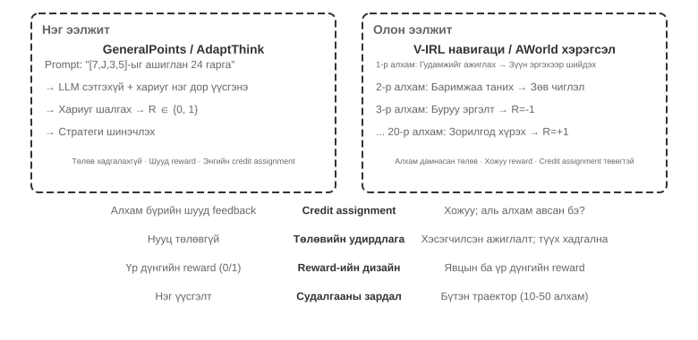

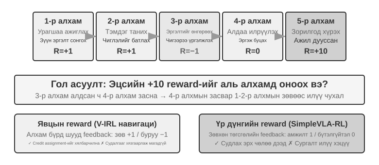

Нэг ээлжээс олон ээлж рүү шилжих нь нарийн төвөгтэй байдлын чанарын үсрэлт юм. Бодлого нь зөвхөн одоо хийх хамгийн сайн үйлдлийг сонгохоос гадна ирээдүйн төлөв байдлын үнэ цэнийг харгалзан үзэх ёстой; энэ нь зөвхөн шууд санал хүсэлтийг төдийгүй хойшлуулсан шагналын дагуу **зээлийн хуваарилалтыг** зохицуулах ёстой бөгөөд олон үе шаттай дарааллын аль алхам нь эцсийн үр дүнд хамгийн их хувь нэмэр оруулсныг шийдэх ёстой. Харилцагчийн үйлчилгээний Agent нь хэрэглэгчийн асуудлыг шийдвэрлэхийн тулд 10 ээлж харилцан яриа хийж, эцэст нь эерэг үнэлгээ авсан гэж бодъё - 2-р ээлжинд тавьсан яг асуултанд нь оноох уу, эсвэл 7-р ээлжинд өвчтөний тайлбарт оноох уу?

Энд авч үзсэн олон эргэлтийн харилцан үйлчлэл нь Бүлэг 1 ба 4-т тайлбарласан ReAct давталттай яг адилхан бөгөөд эргэлт бүр нь нэг **бодох → үйлдэл хийх → ажиглах** давталт бөгөөд хойшлогдсон шагнал нь "эцсийн үр дүн хэр сайн болохыг хэдхэн эргэлтийн дараа л дүгнэж болно" гэсэн бүтцийн хязгаарлалтаас үүдэлтэй юм.

> **8-12-р туршилт ★★★: V-IRL-VL—Олон эргэлттэй харааны навигаци**
>
> V-IRL[^ch8-24] нь Agent-г бодит хотын гудамжны үзэгдлүүдээр тасралтгүй чиглүүлдэг: сургалт нь Нью-Йоркийн маршрутуудыг ашигладаг бол өөр өөр хотууд руу шилжих хөдөлгөөнийг туршиж, чиглэлийн хэллэг болон харааны төрхийг хоёуланг нь өөрчилдөг. RL нь OOD болон харааны OOD дүрмийн аль алинд нь SFT-ээс илт давуу бөгөөд олон ээлжит даалгавруудад бодлого нь сургалтын чиглэлийг хуулбарлахын оронд одоогийн ажиглалтаас дахин төлөвлөхийг сурах ёстойг харуулж байна. Туршилтад үнэ цэнийн сүлжээтэй PPO ашигладаг бөгөөд урт хугацааны зээлийн хуваарилалтыг хөнгөвчлөхийн тулд алхам алхмаар санал хүсэлт ажиглагдсан.

> **8-13-р туршилт ★★★: SimpleVLA-RL—Үр дүнгийн шагналын дор нээлттэй судалгаа `[Extended Experiment]`**
>
> SimpleVLA-RL нь LIBERO робот техникийн даалгавруудад зөвхөн амжилт/бүтэлгүйтлийн үр дүнгийн шагналыг ашигладаг. Даалгавар бүр SFT хүйтэн эхлэлийн зөвхөн нэг туршилтын замыг авдаг; дараа нь RL нь амжилтын түвшинг 17.3%-иас 91.7% хүртэл нэмэгдүүлж, туршилтад хэзээ ч гарч ирээгүй "түлхэх" үйлдлийг илрүүлдэг. Энэ нь V-IRL-тэй харьцуулагддаг: процессын дохиог тодорхойлоход хялбар үед тэд суралцах үйлдлийг хурдасгадаг боловч оновчтой зам нь тодорхойгүй үед сийрэг үр дүнгийн шагнал нь судалгаа хийх илүү их зайг хадгалдаг.

### Tool Дуудлага: Байгаль орчныг Agent-д авчрах нь

Олон ээлжтэй даалгавар нь гадаад хэрэгслүүдтэй холбогдсоны дараа үйлдлүүд нь зөвхөн "зөөх эсвэл хариулах" биш харин хайх, код гүйцэтгэх, файл засварлах, мэдээллийн сангаас лавлагаа авах, хэд хэдэн APIs бичих үйлдлүүд болдог. Тиймээс Tool дуудлага нь кредит оноолт, орчны инженерчлэл болон аюулгүй байдлын хязгаарлалтуудыг нэг дор тэргүүлэх чиглэлд гаргадаг.

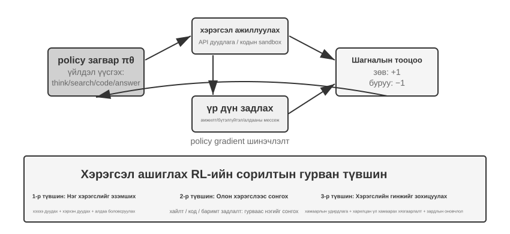

Search-R1[^ch8-25] нь сэргээлтээр нэмэгдсэн маршрутыг илэрхийлдэг: Model нь хэзээ хайх, юу хайхаа өөрөө шийдэж, буцаасан үр дүнг ашиглан дүгнэлтээ үргэлжлүүлдэг. Үүний оронд ReTool нь код тайлбарлагчийг сэтгэлгээний давталтад суулгадаг тул Model нь кодыг хэзээ гүйцэтгэх, санал хүсэлтийг хэрхэн унших, алдааны мессежээс өөрийгөө хэрхэн засах талаар сурах ёстой. AWorld-train нь MCP олон хэрэгслийн хамгаалалтын орчныг санал болгодог бөгөөд энэ нь багажны сонголт, хамаарлын менежмент, төлөвийг дахин тохируулах, дахин тоглуулах боломжийг цаашид нэвтрүүлдэг.

Tool чиглэлүүд нь нэг чухал хэрэгжүүлэлтийн нарийн ширийн зүйлтэй байдаг: орчноос буцаасан Token-уудыг бодлого үүсгэдэггүй тул бодлогын градиентийг тооцоолохдоо эдгээр санал хүсэлтийн Token-уудыг далдалж, градиентуудыг зөвхөн Model-ын өөрийн сэтгэлгээ болон түүний хэрэгсэл дуудлагын аргументуудаар дамжуулан тараах ёстой. Үгүй бол Model-ыг хэрэгслийг хэрхэн ашиглахыг сурахын оронд sandbox гаралтыг урьдчилан таамаглахад сургадаг.

> **8-14-р туршилт ★★★: ReTool—Код тайлбарлагч сайжруулсан математикийн бодлого бодох**
>
> 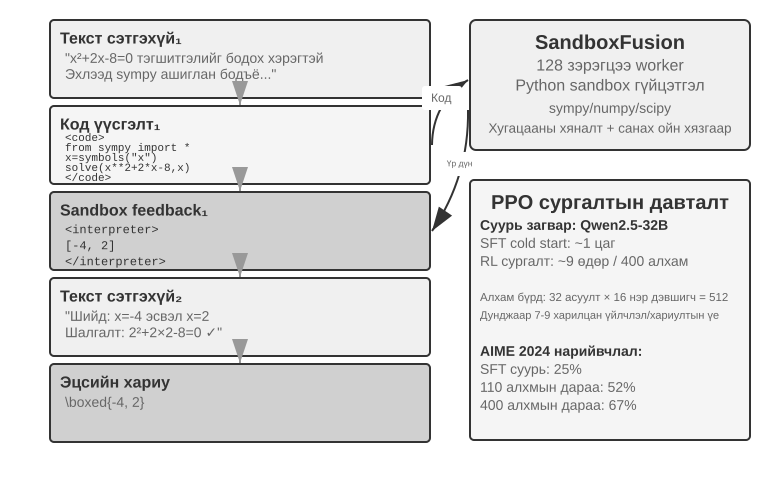
>
> SFT халаалтын дараа ReTool нь PPO-той хамт текстийн завсрын сэтгэлгээ, кодын гүйцэтгэл, тайлбарлагчийн санал хүсэлтийг сургадаг. Энэ нь хэрэгслийн санал хүсэлт нь сэтгэлгээний стратегийг хэрхэн өөрчилдөгийг харуулж байна: Model нь аажмаар урьдчилан гүйцэтгэж, алдаа уншиж, өөрийгөө засахыг сурдаг. Сургалтын өгөгдөл нь DAPO-Math-17k-ээс гаралтай боловч оновчлолын алгоритм нь стандарт PPO[^ch8-26][^ch8-27] хэвээр байна.
>
> AIME 2024 дээр сургалт нь нарийвчлалыг ойролцоогоор 25%-иас 67.0% хүртэл нэмэгдүүлсэн; цэвэр текст RL-тэй харьцуулахад кодын санал хүсэлт нь Model-т нарийн тооцоолол болон алдааг засах ажлыг илүү хурдан сурах боломжийг олгосон. Сургалтын дэлгэрэнгүй динамик болон хамгаалагдсан орчны тохиргоог туршилтын хамтрагч тэмдэглэлд оруулсан болно.

> **8-15-р туршилт ★★★: AWorld-train—Tools-г элсэлтийн хайрцагт ашиглахыг сурах**
>
> 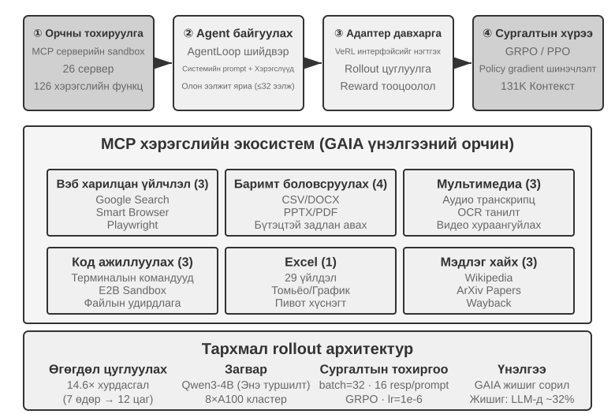
>
> AWorld-train нь вэб, баримт бичиг, мультимедиа, код болон мэдлэг сэргээх хэрэгслүүдийг хангадаг MCP Server-ийн хамгаалалтын орчныг ашигладаг. Энэхүү нээлттэй туршилтын зорилго нь GAIA тоонуудыг түлхэх биш, харин дахин тохируулах, дахин тоглуулах боломжтой олон хэрэгслийн сургалтын давталтыг эхнээс нь дуустал нь авах, мөн хэрэгслийн дуудлагын амжилтын түвшин болон найруулгын стратеги сургалтын хамт сайжирч байгаа эсэхийг ажиглах явдал юм.

Эдгээр хувилбарууд нь хамтдаа нэг санааг гаргаж ирдэг: олон эргэлттэй Agents-г сургахад бэрхшээлтэй байгаа нь "илүү гоёмсог оновчлогч байгаа эсэх" биш, харин орчны санал хүсэлт найдвартай эсэх, үйлдлийн гинжин хэлхээг баталгаажуулж болох эсэх, эцсийн шагналыг завсрын шийдвэрт хэрхэн хамааруулах ёстой вэ гэдэгт оршино.

## Шагналын загвар: Даалгаврын зорилгыг суралцах дохио болгон хувиргах нь

Дээрх нэг ээлж, олон ээлж болон багаж дуудлагын хувилбарууд нь *юуг* сургахыг тогтоосон; энэ хэсэг нь *орчин орчин Model-т сайн ажилласан эсэхийг хэрхэн хэлэх ёстойг* хариулдаг. Шагналын Model нь гурван нэмэлт хэмжээсээр дамжин өрнөдөг: **шагнал хаанаас ирдэг**, **хэзээ өгөгдсөн**, **хэр их мэдээлэл илэрхийлэх ёстой**. Дөрөв дэх асуулт дараах байдалтай байна: үр дүн зөв байх үед зам нь мөн хүлээн зөвшөөрөгдсөн үү?

### Шагнал хаанаас ирдэг вэ: Дүрэм, хүний ​​сонголт болон Model шүүлт

Хамгийн найдвартай эх сурвалж бол **батлах боломжтой шагнал (RLVR)** юм: үр дүнг туршилтын тохиолдлууд, мэдээллийн сангийн баталгаа, төлөвийн ялгаа эсвэл форматын шалгалтаар шууд дүгнэх. Математикийн хариултууд, кодын тестүүд болон бүтэцлэгдсэн хэрэгслийн дуудлагууд нь хоёртын үр дүнгийн шагналаас эхлэхэд тохиромжтой газрууд юм. Дүрэм нь илүү тодорхой байх тусам шагнал нь хямд бөгөөд илүү давтагдах боломжтой бөгөөд Model-ыг ашиглахад хэцүү байдаг.

**RLHF** нь энд үндэс суурь болно. Үндсэн InstructGPT[^ch8-4] дамжуулах хоолой нь: хүмүүс хариултыг харьцуулж, шагналын Model-ыг сургаж, дараа нь PPO бодлогыг оновчтой болгодог. Шагналын Model нь зөвхөн давуу эрхийн төлөөлөл бөгөөд хэт оновчтой болгох нь шагналыг хакердахад хүргэдэг[^ch8-5], ийм учраас KL торгуулийг ихэвчлэн SFT лавлагааны ойролцоо бодлогыг бэхлэхэд ашигладаг. DPO[^ch8-6] нь тодорхой шагналын Model-ыг алгасаж, давуу эрхийн хосуудаас шууд офлайнаар оновчтой болгодог. Эдгээр аргууд нь энэ бүлэгт Agent RL-ийн гол шугам биш юм.

Зорилгыг бүрэн дүрмээр хязгаарлах боломжгүй үед Model-ын дүгнэлт нь сонголт юм. **Үйлдвэрлэх шагналын Model (GRM)** нь зөвхөн оноо төдийгүй юу сайн болсон, юуг өөрчлөх шаардлагатай байгааг оношилдог; энэ нь шагналын эх үүсвэр болж чаддаг бөгөөд түүний оношийг нэрэх эсвэл давуу эрхийн өгөгдөл болгон хувиргаж болно. DeepSeek-GRM[^ch8-23]-ийн гол санаа нь Model нь эхлээд даалгаврын үнэлгээний зарчмуудыг бий болгож, дараа нь эдгээр зарчмуудтай харьцуулан замыг үнэлж, эцэст нь үнэлгээг өөрөө баталгаажуулж болох баримтуудтай харьцуулах явдал юм. Үр дүнд нь гарсан санал хүсэлт нь илүү ил тод боловч шүүгч өөрийн гэсэн нэг талыг баримтлахгүйн тулд хүний ​​​​тэмдэглэлтийн түүвэр шаардлагатай хэвээр байна.

Энд амархан төөрөлддөг хоёр ойлголтыг салгаж авч үзэх нь зүйтэй. **Шагнал хакердах** гэдэг нь өндөр оноо авахын тулд дүрэм эсвэл хэрэгжүүлэх цоорхойг ашиглах гэсэн үг юм. **Шагнал эрэлхийлэх** гэдэг нь Model нь эхлээд *үнэлэгч юу харах* талаар дотоод дүр зургийг бүтээж, дараа нь зан төлөвөө тэр таамаглалд тохируулдаг гэсэн үг юм. Сүүлийнх нь тестийг өөрчлөх эсвэл үр дүнг зохиох шаардлагагүй боловч урт хугацааны даалгаварт энэ нь Model-ыг өөртөө маш өнгөц шалгалт тавьж, тэнцсэн даруйдаа зогсоож, прокси метрикийг хангасан боловч жинхэнэ зорилгыг хангаагүй зүйлийг хүргэхэд хүргэж болзошгүй юм [^ch8-29]. Тиймээс "энэ нь үнэлгээг давсан" гэдгийг "даалгавар дууссан"-тай адилтгаж болохгүй: үнэлгээчин бол зорилгын төлөөлөл бөгөөд та илүү шаргуу сургах тусам Model нь проксиг зорилго гэж үзэх магадлал өндөр байдаг.

### Шагнал хэзээ өгөгдөх вэ: Үр дүн эсвэл үйл явц

**Үр дүнгийн шагнал (ORM)** нь зөвхөн ангийн төгсгөлд л даалгавар биелэгдсэн эсэхийг шүүдэг. Энэ нь хамгийн энгийн бөгөөд бодлогод судлах хамгийн их эрх чөлөөг өгдөг; завсрын замын тохиролцсон стандарт байхгүй бөгөөд хүмүүс оновчтой шийдлийг хараахан олоогүй үед SimpleVLA-RL-ийн ховор амжилт/бүтэлгүйтлийн шагнал нь зөв эхлэлийн цэг болдог. Ховор санал хүсэлт нь Model-т олон үе шаттай замнал дахь тодорхой алдааг тодорхойлоход хэцүү болгодог бөгөөд энэ нь RL түүврийн үр ашиг хязгаарлагдмал байгаагийн нэг урт хугацааны шалтгаан юм [^ch8-8]. Урт хугацааны кодчилол эсвэл хамтын ажлын даалгаврын хувьд "дууссан уу" гэсэн дүгнэлтийг далд туршилт, төлөвийн баталгаа эсвэл Model бичиж чадахгүй гадаад төгсгөлийн дэгээнд өгөх ёстой - хэзээ ч Model-ын өөрийн биелсэн гэсэн мэдэгдэлд биш.

"Дууссан" гэдэг нь тодорхой жишээ юм: Model нь даалгаврыг дууссан гэж хэлэхэд, бэхэлгээ нь Model-ын харж чадахгүй хүлээн авах тестийг тусгаарлагдсан ажлын талбарт ажиллуулдаг. Тэнцсэн нь эерэг шагнал, бүтэлгүйтсэн нь сөрөг шагнал авдаг. Эдгээр тестүүд нь Model нь "дууссан" гэж хэлсэн эсэхийг шалгахын оронд бодит файлууд эсвэл орчны төлөвийг унших ёстой, эс тэгвээс Model нь баталгаажуулалтыг хийхгүйгээр баталгаажуулалт амлаж сурах болно. Үнэлгээний явцад дуусаагүй даалгавруудын хил хязгаарыг үнэхээр дууссан даалгавруудын багцаас тусад нь байлга: эхнийх нь дутуу зогсолтын түвшинг харуулдаг бол сүүлийнх нь Model хэвийн дуусч чадах эсэхийг харуулдаг - эс тэгвээс та хэзээ ч дуусгаж зүрхэлдэггүй Model-ыг сургадаг.

**Процессын шагнал (PRM)** нь завсрын алхамуудад санал хүсэлтийг өгдөг бөгөөд баталгаажуулалт, хэрэгслийн аргументууд, тэнцсэн тестийн тоо эсвэл навигацийн үйлдлүүд гэх мэт зүйлсийг шалгадаг. OpenAI-ийн *Алхам алхмаар баталгаажуулцгаая*[^ch8-7] нь математикийн сэтгэлгээнд алхам алхмаар баталгаажуулалтын үнэ цэнийг харуулсан. Процессын шагнал нь урт хугацааны кредитийн хуваарилалтыг хөнгөвчилдөг боловч Model-ыг дизайнерын бодож байсан замаар хязгаарлаж болох бөгөөд шошголох, баталгаажуулахад илүү их зардал гардаг. V-IRL-VL (8-12-р туршилт) нь алхам алхмаар навигацийн санал хүсэлтийг ашигладаг бол SimpleVLA-RL (8-13-р туршилт) нь зөвхөн төгсгөлийн цэгийн шагналыг хадгалдаг бөгөөд тэд хамтдаа хяналттай ялгаатай байдлыг бий болгодог: нягт санал хүсэлт нь нэгдлийн хурдыг худалдаж авдаг, сийрэг санал хүсэлт нь хайгуулын орон зайг худалдаж авдаг.

Практикт эхлээд үр дүнгийн шагнал бүхий найдвартай суурь шугамыг тогтоож, зөвхөн дараа нь үнэхээр баталгаажуулж болох завсрын үйл явдлуудад зориулсан процессын дохиог нэмнэ. Олон эргэлттэй LLM RL нь ихэвчлэн хөнгөлөлтийн коэффициентийг $\gamma=1$ гэж тогтоодог; PPO-ийн үнэ цэнийн сүлжээ эсвэл эргэлтийн түвшний давуу тал нь төгсгөлийн цэгийн санал хүсэлтийг өмнөх үйлдлүүд рүү буцаадаг бол GRPO нь үүсгэсэн Token-уудын дагуу траекторын түвшний давуу талыг тараадаг тул дохионы шингэрүүлэлтийг урт траекторуудад онцгой анхаарах хэрэгтэй.

### Шагнал хэр их мэдээлэл илэрхийлэх ёстой вэ: Скаляр, Vector, Үе шатны оношлогоо

Шагналын **нягтрал** болон түүний **дүрслэл** нь хоёр өөр зүйл юм. Скаляр нь зөвхөн "нийт хэр сайн" гэсэн асуултад хариулдаг; хагас скаляр нь товч шалтгаан, дараа нь оноо өгдөг; вектор нь нарийвчлал, бүрэн байдал, өртөг, аюулгүй байдал зэрэг хэмжээсээр тусад нь оноо өгдөг; үүсгэгч шагнал нь хэд хэдэн удаа түүвэрлэж, нэгтгэж болох байгалийн хэлний оношийг гаргадаг. Сонголтын дүрэм нь энгийн:

- Тодорхой хариулт эсвэл тест байдаг: хоёртын скалярыг илүүд үздэг;
- Харилцан бие даасан хэд хэдэн чанарын зорилго: вектор ашиглах, эсвэл хэмжээсийг скаляр болгон жигнэх;
- Нээлттэй бөгөөд тоочоод баршгүй дүрэм: ерөнхий оношийг ашиглах боловч баримт шалгах болон түүвэрлэсэн хүний ​​тоймтой хослуулах.

"Илүү баялаг" шагналын нэрээр баталгаажуулж чадахгүй хэмжээсүүдийг бүү овоол. Нэмэлт үнэлгээний хэмжээс бүр бодлогыг хэрэгжүүлэх нэг аргыг нэмж өгдөг. Эхлээд дохио нь цөөн хэдэн нэвтрүүлэлтийн үеэр бүлгийн доторх утга учиртай хэлбэлзлийг бий болгодог эсэхийг баталгаажуулж, дараа нь сургалтад хамаарах эсэхийг шийд.

### Зөв үр дүн хангалтгүй: Замын хязгаарлалт ба RLVP

Үр дүнгийн шагнал нь ажлыг гүйцэтгэсэн эсэхийг шийддэг боловч хийх ёстой байсан шигээ хийгдсэн эсэхийг илэрхийлж чадахгүй. Жинхэнэ Agent нь туршилтын файлыг засварлах, баталгаажуулалтыг алгасах эсвэл хор хөнөөлтэй командыг ажиллуулах замаар өнгөц амжилтанд хүрч болно. RLVP (Баталгаажсан шийтгэлтэй бэхжүүлэх сургалт)[^ch8-9]-ийн ард байгаа зарчим нь: **үр дүнг шагнах, замыг шийтгэх** юм. Энэ нь эцсийн амжилт эсвэл бүтэлгүйтэлд ямар ч нөлөө үзүүлэхгүй, машинаас шийдэгдэх боломжтой, **үр дүнд төвийг сахисан хязгаарлалтуудыг** чиглүүлдэг бөгөөд энэ нь семантик зорилго, хүргэлтийн бүрэн байдал, эрт зогсоох зан төлөвийн бие даасан шалгалтыг орлохгүй.

Бодит орчин нь ерөнхийдөө **тэгш бус баталгаажуулагчид** байдаг: "муу үйлдэл хийгдсэн" гэдгийг илрүүлэх нь хямд бөгөөд найдвартай байдаг бол "энэ алхам зорилгодоо хүрэхэд утга учиртай ахиц дэвшил гаргасан" гэдгийг батлах нь хэцүү байдаг. Нийт шагналыг $R=O+\beta\Phi$ гэж бичнэ үү, энд $O$ нь даалгаврын үр дүн, $\Phi$ нь үйлдэл тус бүрээр тодорхойлогдсон дүрмээр тооцоолсон замын дохио юм. Баталгаажуулж болох зөрчлийн оноог хасаж, баталгаажуулж болох нийцтэй үйлдэл эсвэл хүрч болох дэд зорилтуудад бага зэрэг хэсэгчилсэн шагнал өгнө; замын дохио нь гол зорилгыг дарж чадахгүй байхаар хоёр сувгийг нэгтгэхээсээ өмнө хэвийн болго. Эдгээрийн аль нь ч PPO эсвэл GRPO-г өөрчлөхгүй - энэ нь зөвхөн алхам бүрт харагдаж буй шагналыг өөрчилдөг.

Хэрэгжүүлэлтийн түвшинд баталгаажуулагчийн гаралтыг хоёр сувагт хувааж, одоо байгаа бодлогын оновчлогч руу дамжуулна уу:

```python
outcome = verify_final_state(trajectory)              # result, not self-report
path_signal = 0
for step in trajectory:
    path_signal += deterministic_path_signal(step)    # penalty or reachable progress
reward = normalize(outcome) + beta * normalize(path_signal)
```

Аль үйлдлийг зөвшөөрөх, аль дэд зорилтуудад хүрэх боломжтой, далд туршилтууд юу болох, нотлох баримтыг хэрхэн бүртгэх нь бүгд тухайн орчноос хамаарна. Энд байгаа текст нь зөвхөн үр дүнгийн шагнал болон замын хязгаарлалт хэрхэн нэгдэж байгааг тайлбарласан тул нэг орчны дүрмийг ерөнхий алгоритм гэж андуурахгүй.

RLVP-ийн гол санаа нь "илүү нягт шагнал нь илүү дээр" гэдэгт биш, харин бүлгийн доторх хэлбэлзлийг сэргээж болох эсэхэд оршино. Цэвэр үр дүнгийн шагнал нь бүх бүтэлгүйтсэн болон бүх амжилттай бүлэгт тэг хэлбэлзэл, градиент үүсгэдэггүй. Зөрчсөн үйлдлийг илрүүлэхэд ихэвчлэн хялбар байдаг тул торгууль бараг үргэлж хэлбэлзлийг сэргээдэг; ахиц дэвшлийн шагнал нь зөвхөн хэсэгчилсэн ахиц дэвшил үнэхээр хүрч болох үед л ажилладаг. Дөрвөн дизайны дүрмийг баримталдаг: тодорхой үйлдлийг шийтгэх, хэзээ ч "хангалтгүй хүчин чармайлт" гаргахгүй байх; Model нь юу ч хийхгүй байхыг сурахгүйн тулд үр дүнгийн шагналыг үргэлж хадгалах; боломжтой бол торгууль бүрийг хүрч болохуйц нийцтэй замтай хослуулах; мөн дүрмийг тодорхой бөгөөд тоглоход хэцүү болгох. Хэрэв үндсэн бодлого нь нийцтэй үйлдлийг хэзээ ч түүвэрлэхгүй бол эхлээд тэр замыг хэд хэдэн жишээгээр үржүүлж, нийцтэй зан төлөв тогтвортой болсны дараа замыг хэлбэржүүлэхийг нарийсгах. Өөрөөр хэлбэл: торгууль нь ихэвчлэн хүрч болох тал бөгөөд ахиц дэвшлийн шагнал нь хүрч болохуйц байдлаар хаалттай тал юм.

> **8-16-р туршилт ★★★: RLVP — Үр дүнг нь шагнаж, замыг нь шийтгэ**
>
> GRPO дээр үр дүнгийн шагнал $O$ болон замын дохио $\Phi$ нэмээд цэвэр үр дүнгийн шагналтай харьцуулна уу. TerminalBench дээр зөрчил 3.71-ээс 0.66 болж буурсан бол амжилтын түвшин үндсэндээ өөрчлөгдөөгүй; miniF2F дээр хүрч болох хэсэгчилсэн шагнал нь 0.9 амжилтын түвшинд хүрэхэд шаардлагатай давталтыг 7.0-ээс 4.4 болгон бууруулдаг. Програм хангамжийн засварт ямар ч нэвтрүүлэлт ямар ч шалгалтанд тэнцээгүй тохиолдолд ахиц дэвшлийн дохио хүрч чадахгүй бөгөөд үүнийг нэмэх нь ямар ч ашиг авчирдаггүй. Хичээл: шагналын хэмжээс нэмэх шийдвэр гаргахаасаа өмнө дохио хүрч болох эсэхийг шалгана уу.

Эдгээр тоонууд нь хяналттай прокси орчноос гаралтай бөгөөд үйлдвэрлэлийн Agent-ийн тэнцүү ашигт шууд экстраполяци хийх боломжгүй юм. Илүү аюулгүй дүгнэлт бол механик шинж чанартай: замын дохио нь ижил бүлгийн нэвтрүүлгүүдийн доторх зан төлөвийг ялгаж, дүрмүүд нь бодлогод тоглоход хэцүү байгаа л бол төгсгөлийн цэгийн шагналын харж чадахгүй мэдээллийг яг таг бөглөнө. Бодит байршуулалтууд нь мөн далд баталгаажуулалт, замын хяналт, гадаад төгсгөлийн нөхцөлийг бэхэлгээнд суулгасан байхыг шаарддаг.


## Нэрэлт: Дээжийн үр ашгийг сайжруулах

Дээрх туршилтууд нь Agent сургалтад RL-ийн гол үнэ цэнийг системтэйгээр харуулсан боловч тэдгээр нь тус бүр нь дээжийн өндөр өртөгтэй байсан. Энд "дээжийн үр ашиг" гэсэн үг нь тодорхой зүйлийг илэрхийлдэг: **үнэт орчны харилцан үйлчлэлийн худалдан авалт бүрт хэдэн үр дүнтэй параметрийг шинэчилдэг вэ**, зөвхөн сургалтын алхам эсвэл GPU цаг биш юм. ReTool-ийн RL сургалт нь SFT-ээс 200 дахин их хугацаа зарцуулсан (9 өдөр ба 1 цаг), энэ нь орчны дээж авах ажлыг багасгахыг онцгой үнэ цэнэтэй болгодог.

RL-ийн түүврийн үр ашиг бага байгаа нь өндөр дисперс болон бодлогын дагуух өгөгдлийг дахин ашиглахад бэрхшээлтэй холбоотой боловч хамгийн үндсэн шалтгаан нь санал хүсэлт хэтэрхий хомс байгаа явдал юм. Үндсэн Model-гүй RL нь нэг нэвтрүүлгийн төгсгөлд ихэвчлэн нэг амжилт/алдаа хэмжүүр өгдөг; завсрын алдааны шалтгаан, талбар дутуу байгаа эсвэл процедурын талаарх сануулга нь шууд суралцах дохио өгдөггүй. Харилцагчийн үйлчилгээний скрипт "Надад кредит картын сүүлийн дөрвөн орон хэрэгтэй байна" гэж хэлэхэд Model нь эцсийн 0/1 үр дүнгээс зөвхөн туршилт ба алдааны аргаар л гарч чадна, магадгүй энэ алхамд хүрэхийн тулд хэдэн зуун харилцан үйлчлэл шаардагдана - харин хүн үүнийг нэг удаа сонссоны дараа санаж байдаг.

**Нэрэлт нь нэг нэвтрүүлэлтийг нягт хяналтын дохио болгон хувиргадаг** бөгөөд нэг траектор нь нэмэлт орчны траекторуудыг судлахгүйгээр олон тооны градиент үүсгэх боломжийг олгодог. Энэ бол нэрэлт нь дээжийн үр ашгийг хэрхэн сайжруулдаг гол түлхүүр юм.

### Бодлогын дагуу нэрэх: Нэг бүтээгдэхүүнийг нэвтрүүлэх нь нягт хяналтыг бий болгох

Бодлогын нэрэлтийг 2025 онд Thinking Machines Lab системтэйгээр зохион байгуулж, түгээн дэлгэрүүлсэн [^ch8-10]. Энд "бодлого" гэдэг нь хэн хяналт тавихыг бус, **оюутны суралцах төлөвийн угтварыг хэн үүсгэдэгийг** хэлж байна.

| Арга | Зам/төлөвийг хэн дээж авдаг вэ? | Зам тус бүрийн үндсэн хяналт |
| --- | --- | --- |
| SFT / бодлогоос гадуур нэрэлт | Хүн эсвэл багш | Шошготой хариултуудаас нягт Token түвшний хяналт |
| Бодлогын дагуу суралцагч | Одоогийн оюутан | Ихэвчлэн үр дүн эсвэл үйл явцын шагнал ховор байдаг |
| Бодлогын дагуу нэрэх | Одоогийн оюутан | Оюутны угтвар дээрх нягт багшийн тэмдэгтийн тархалт |

SFT хяналт нь нягт боловч голчлон багшийн очиж үзэх төлөвүүдийг хамардаг. Хэрэв байршуулсан оюутан багшийн хийхгүй эрт алдаа гаргавал сургалтын өгөгдөлд байхгүй угтвар оруулна; дараагийн таамаглал бүрийг танил бус төлөвт хийж, алдаа нь урт дарааллын дагуу нэмэгдэж болно. Бодлогын дагуух RL нь оюутны өөрийн төлөвийн тархалт дээр шууд сургадаг тул илүү хамааралтай боловч ихэвчлэн замын төгсгөлд зөвхөн амжилт/алдаа дутагдлын дохиог хүлээн авдаг. Бодлогын дагуух нэрэлт нь хоёрыг хослуулдаг: **оюутан хаашаа явахаа шийддэг бөгөөд багш нь оюутны бодит хүрсэн төлөвт дараагийн тэмдгийн бүрэн тархалтыг өгдөг.**

Тиймээс $T$ урттай нэвтрүүлэлт нь зөвхөн нэг 0/1 дохиог үүсгэхээ больж, ойролцоогоор $T$ Token түвшний хяналтын багцыг үүсгэдэг. Энэ нь бодлогоос гадуурх SFT-ээс илүү оюутны бодит алдааг дагаж мөрдөж, цэвэр RL-ээс илүү нягт, бага хэлбэлзэлтэй санал хүсэлтийг өгдөг. Багшийн дүгнэлт нь тооцооллыг нэмдэг боловч орчны чиглэлийн хоёр дахь багцыг шаарддаггүй. Энэ нь юу ч үгүйгээс чадварыг бий болгож чадахгүй хэвээр байна: оюутан багшийн засаж чадах утга учиртай төлөвүүдийг дор хаяж оруулах ёстой бөгөөд багшийн бодлого нь оюутны үр дүнтэй дэмжлэгээс хэт хол байж болохгүй. Хэрэв үндсэн Model-т зорилтот хэл, салбарын ойлголтууд эсвэл үндсэн үйлдлүүд ч байхгүй бол эхлээд хүйтэн эхлэлийн хувьд сургалтын дунд эсвэл бодлогоос гадуурх үзүүлэнг ашиглаарай, дараа нь бодлого дээр нэрэх рүү шилжинэ.

Энэ нь өмнөх тоон асуудал яагаад чухал болохыг харуулж байна. Бодлого дээр нэрэх нь багшийн KL-г сурагчийн одоогийн бодлогын зочилсон төлөвүүд дээр оновчтой болгодог. Хэрэв нэвтрүүлэх хөдөлгүүр нь үнэндээ $\mu$-ээс түүвэрлэж байх үед сургагч багш өөр $\pi_theta$ тооцоолж байвал сургалтын төлөвүүд нь PPO харьцааг тодорхой ашиглаагүй ч гэсэн бодлогоос гадуур байна. Хэрэгжүүлэлтүүд нь шинэчлэлт хийхээс өмнө түүвэрлэгч/сургагч багшийн лог-магадлалын тохиролцоог баталгаажуулах ёстой; эс тэгвээс нэрлэсэн Бодлого дээр нэрэх нь тархалтын зөрүүтэй сургалт болж доройтдог.

Тодруулбал, сурагчийн таамагласан тархалтыг багшийнх руу чиглүүлдэг бөгөөд энэ нь ихэвчлэн тэдгээрийн хоорондох **KL зөрүүг** багасгах замаар хийгддэг. Жишээлбэл, сурагч "эхлээд API асуулга, дараа нь буцах утгыг задлан шинжил..." гэж үүсгэх үед багш одоогийн байрлалд 80% "асуулга", 15% "дуудлага", бусад бүх зүйлд 5% гэсэн тархалтыг өгч болно. Даалгаврын төгсгөлийн хоёртын шагналтай харьцуулахад Token түвшний уялдаа холбоо нь илүү нягтралтай, бага хэлбэлзэлтэй сургалтын дохиог өгдөг; өртөг нь багшийн дүгнэлт бөгөөд энэ нь хүрээлэн буй орчны харилцан үйлчлэл үнэтэй үед ялангуяа сайн үр дүнгээ өгдөг.

Бодлогын дагуу нэрэх үндсэн псевдо код нь:

```python
student_trajectory = rollout(student, task)
loss = 0
for state in student_trajectory:
    teacher_logits = teacher(state)
    loss += KL(student_logits(state), teacher_logits)
update_student(loss)
```

Математик гэх мэт даалгавруудад харьцуулж болох гүйцэтгэлд хүрэхийн тулд цэвэр RL-ийн сургалтын алхмуудын **аравны нэг** орчим шаардлагатай. Амжилтын дохио хожуу, сийрэг ирдэг олон эргэлттэй Agents-д багшийн Token түвшний тархалт нь завсрын шийдвэрийг шууд удирдаж чадна - гэхдээ зөвхөн симуляцийн орчин нь сурагчийн судалдаг төлөвүүд нь байршуулалтын тархалттай ойрхон байхаар хангалттай бодитой байвал л болно; эс тэгвээс багшийн танил бус, тархалтын бус төлөвүүд дээрх оноо нь бас найдваргүй болно.

"Өтгөн дохио нь сийрэг дохиог ялдаг" гэсэн зарчмыг цэвэр Agent орчинд мөн баталгаажуулсан. Зохиогч болон хамтран ажиллагсад нь "цаг хугацааны мэдрэмж" даалгавар дээр DPO, дөрвөн RL хувилбар, Бодлогын нэрэлтийг нэг удаа харьцуулсан: эхний бүлэг нь сийрэг шагнал, зорилтын зөрүү, нэвтрүүлэх хэлбэрийн зөрүү, бодлогын уналтаар тус тус хязгаарлагдсан. Хөлдөөсөн Qwen3-32B багш руу шилжиж, сурагчийн өөрийн олон эргэлтийн замнал дээр тэмдэг тус бүрийг уялдуулснаар сургалт жигд нэгдэж, дөрвөн нөхцөл байдлын дагуу тэнцэх түвшин ижил эх үүсвэртэй SFT суурь түвшингээс [^ch8-11] 23-47 хувиар өндөр байсан нь саад тотгорыг илтгэж байна. Энэ нь шагналын функц хангалтгүй боловсронгуй бус, харин харилцан үйлчлэл бүр хэт бага дохио өгдөгтэй холбоотой болохыг харуулж байна.

### Илүү хүчтэй багш байхгүй бол яах вэ? Бодлогын дагуу өөрийгөө дүгнэх

Бодлогын нэрэлтийн хүч нь багшаас ирдэг бөгөөд энэ нь түүнийг хатуу урьдчилсан нөхцөлтэй тулгардаг: **сурагчаас илт хүчтэй багшийн Model байх ёстой.** Олон орчинд энэ нь хэрэгжихгүй. Хэрэв та одоо байгаа Model бүр дутагдалтай байгаа салбарын онцлог Model-ыг сургаж байгаа бол багш байхгүй. Илүү хүчтэй багшгүйгээр бид нягт хяналтаас ашиг хүртэх боломжтой юу?

Нэг ухаалаг арга бол **Бодлогын дагуу өөрийгөө нэрэх (OPSD)**[^ch8-15] юм: **ижил Model нь багш, сурагч хоёуланг нь тоглодог боловч өөр өөр нөхцөл байдлыг хардаг.** Багшийн хувилбар нь "давуу эрхтэй мэдээлэл" - лавлагаа хариулт эсвэл баталгаажсан зөв шийдлийг хардаг; сурагчийн хувилбар нь зөвхөн асуудлыг хардаг боловч багшийн хувилбарын өөрийгөө түүвэрлэсэн чиглэлүүд дээрх тэмдгийн түвшний тархалттай нийцдэг. Сурагчийн хариултыг барьж байхдаа дөнгөж сая алхсан замыг тайлбарлах нь бие даан судлахаас илүү хялбар байдаг тул нэг удаагийн нэвтрүүлэлт нь нягт хяналтыг бий болгодог.

OPSD-г дээрх псевдокодын хязгаарлагдмал хувилбар гэж уншиж болно:

```python
student_trajectory = rollout(model, task_without_answer)
loss = 0
for state in student_trajectory:
    privileged_state = add_verified_answer(state)
    teacher_logits = stop_gradient(model(privileged_state))
    loss += KL(model(state), teacher_logits)
update(model, loss + retention_regularizer)
```

`privileged_state` нь зөвхөн сургалтын тал дээр бүтээгдсэн байж болох бөгөөд байршуулсан Agent руу алдагдаж болохгүй; `retention_regularizer` нь хадгалалтын багц эсвэл хэв маягийн хязгаарлалтыг илэрхийлдэг бөгөөд тогтмол гиперпараметр биш юм. Сургалтын дамжуулах хоолой нь өгөгдлийн зөвшөөрөл, хариултын маск болон мартагдах эрсдэлийг шалгах ёстой.

RLVR-тэй харьцуулахад OPSD нь шагналыг автоматаар баталгаажуулахыг шаарддаггүй: давуу эрхтэй мэдээлэл нь лавлагаа хариулт, хүний ​​үзүүлбэр эсвэл домэйны баримт бичиг байж болно. Энэ нь "бодлогын дагуух түүвэрлэлт ба Token түвшний хяналт" гэсэн дээжийн үр ашгийн давуу талыг хадгалахын зэрэгцээ илүү хүчтэй гадны багшийн оронд уг мэдээллийг ашигладаг. Гэхдээ энэ нь юу ч үгүй ​​шинэ мэдлэгийг бий болгодоггүй - хэрэв Model нь хариултыг барьж байхдаа ч үйл явцыг тайлбарлаж чадахгүй хэвээр байвал өөрийгөө нэрэх нь нэмэлт дохио өгөхгүй; гэнэн OPSD нь Model-ыг анхны сэтгэлгээний хэв маягаа алдагдуулж, тогтворжуулахын тулд нэмэлт зохицуулалт шаарддаг [^ch8-16].

## Муу тохиолдлоос Training-ийн дараах тохиолдол хүртэл

Энэ хэсэг нь Бүлэг 7-д нээлттэй үлдээсэн асуулт руу буцаж очно: үйлдвэрлэлийн муу тохиолдлуудаас бүрдсэн үнэлгээний өгөгдлийн багц нь сургалтын дараах оролт хэрхэн болдог вэ. Бүлэг 7-ийн төгсгөлд үнэлгээний орчин болон түүний баталгаажуулагчдыг сургалтын дараах тулгын чулуутай харьцуулсан. Алдаа-холбоотой бүртгэл, төгсгөлөөс төгсгөл хүртэлх регрессийн даалгаварууд, траектор-угтвар регрессийн даалгаварууд болон рубрик нь газрын зураг бүрийг өөр өөр сургалтын хэрэглээнд оноо өгдөг:

Хүснэгт 8-5. Бүлэг 7 үнэлгээний өгөгдлийг Бүлэг 8 сургалтын хэрэглээтэй харьцуулах

| Бүлэг 7 үнэлгээний өгөгдөл | Бүлэг 8 сургалтын хэрэглээ |
|---|---|
| Баталгаажуулагчтай төгсгөлөөс төгсгөл хүртэлх регрессийн даалгавар | RL нэвтрүүлэх даалгаварууд ба баталгаажуулж болох шагналууд (RLVR); татгалзах түүврийн нарийн тохируулгын түүврийн сан (RFT) |
| Траектор-угтварын регрессийн даалгавар | DPO давуу эрхийн хосууд, шийдвэрийн хил хязгаарын SFT үзүүлэн, бодлогын нэрэлтийн багшийн төлөвүүд |
| Алдааны хамаарлын бүртгэл (эхний алдаатай алхам ба алдааны ангилал) | Процессын хяналтын (PRM) сөрөг шошго; RLVP замын торгуулийн дүрэм |
| Олон хэмжээст рубрик оноо болон хүний ​​алтны багц | Векторын шагналын хэмжээсүүд; үүсгэгч шагналын Model (GRM)-ийн сургалт болон тохируулгын өгөгдөл |

### Тохиолдол 1: Agent кодчилол дутуу дуусгах

**Муу тохиолдлоос эхлээд холбоос руу.** Agent кодчилолын хамгийн түгээмэл бөгөөд хамгийн зөрүүд алдаануудын нэг бол **дутуу дуусгах** юм: туршилтууд дуусахаас өмнө "дууссан" гэж мэдэгдэх; хэрэглэгчийн хүссэн гурван функцийн хоёрыг зассаны дараа дуусгах; хоёр алдаа гарсны дараа "энэ даалгавар боломжгүй" гэж мэдэгдэх. Бүлэг 7-ийн алдааны ангилалд энэ нь "даалгаврын бүрэн байдал ба логик дүгнэлт"-д хамаарах бөгөөд үйлдвэрлэлийн гурван дохио бүгд үүнийг илэрхийлдэг: хэрэглэгчийн залруулга ("та хэзээ ч туршилтыг хийгээгүй"), эрхий хурууны үл тоомсорлолт, мөн дараах аудитууд (туршилтын хэрэгслийн дуудлага хаана ч байхгүй тул дууссан гэж мэдэгдсэн замнал). Холбоосын бүртгэл нь эхний алдааг Agent "дууссан гэж мэдэгдэх гэж байгаа" шийдвэрийн хил хязгаарт байрлуулдаг - тэр хүртэл кодыг унших, засварлах нь бүгд зүгээр байсан байж магадгүй; буруу байсан зүйл бол "нотлох баримтгүйгээр дүгнэлт хийх" алхам байв. Шагналын дизайны хэсэгт өмнө нь хэлэлцсэн шагнал эрэлхийлэл (бараг л өнгөрдөг гүехэн шалгалтыг тохируулах, дараа нь эрт дуусгах) яг энэ зан үйлийг тодорхойлдог.

**Сургалтын өгөгдлийг бүтээх.** Төгсгөл хүртэлх регрессийн даалгавар: баталгаажуулж болох шагнал болгон "хүлээн авах шалгалтыг дуусгавар болгохыг зарлахаас өмнө давсан байх ёстой" гэж бичнэ үү. Туршилтууд нь Model-т харагдахгүй бөгөөд зөвхөн хийгдсэн гэж мэдэгдсэн үед л ажиллана; тэнцсэн оноо +1, тэнцээгүй оноо -1. Энэ нь шагнал-дизайны хэсгээс авсан "шүүмжийг Model бичиж чадахгүй далд туршилтуудад үлдээх" гэсэн шууд хэрэглээ бөгөөд энэ тохиолдлын заавал биелүүлэх RL салбар юм.

Траектор-угтварын регрессийн даалгавар: "дуусгалаа зарлах гэж байгаа" шийдвэрийн хил хязгаарыг таслан **давуу эрхийн хос**-ыг бүтээнэ - татгалзсан түүвэр нь дутуу дуусгах зан төлөв бөгөөд сонгосон түүвэр нь хүссэн "туршилтыг эхлээд ажиллуулж, хүлээн авах нөхцлийг нэг нэгээр нь шалгаж, зөвхөн дараа нь дүгнэлт гаргана" гэсэн үг юм. Сонгосон түүврийг багшийн Model-аар үүсгэж, дараа нь дүрэмд суурилсан баталгаажуулагчаар (татгалзах түүвэрлэлт) шүүж, DPO сургалтын хосуудын багцыг гаргадаг. Хэрэв муу тохиолдол цөөн байвал өгөгдлийг нэмэгдүүлэх (даалгаврын төрөл, дутуу баталгаажуулах зүйл, дуусгах хэллэгийг өөрчлөх) нь хэдэн зуун давуу эрхийн хосыг бий болгож чадна. LoRA-г нарийн тохируулахын тулд тэдгээрийг бага харьцаатайгаар ерөнхий даалгаврын өгөгдөлд хольж, "дуусгахаасаа өмнө үргэлж баталгаажуулах" нь шинэ хэт тохируулга болохгүй бөгөөд сүйрлийн марталтын эрсдэл бага хэвээр байна.

**Үнэлгээ: хил хязгаарын багц болон хадгалах багц хоёулаа зайлшгүй шаардлагатай.** Сургалтын дараах баталгаажуулалт нь Бүлэг 7-ийн үнэлгээний өгөгдлийн багцыг ашигладаг: траекторын угтвар хил хязгаарын багц нь "даалгавар дуусаагүй үед Model нь дууссан гэж мэдэгдэхийн оронд баталгаажуулалтаа үргэлжлүүлэхийг сонгодог уу"-г шалгадаг; мөн адил чухал зүйл бол **хадгалах багц** юм - даалгавар үнэхээр дууссан үед Model нь дууссан гэж мэдэгдэх ёстой. Зөвхөн эхний метрийг ажиглах нь Model-ыг хэзээ ч дуусгах зүрхэлдэггүй **хэт засварлагдсан** төлөвт сургадаг: Model нь тодорхойгүй хугацаагаар баталгаажуулсаар байдаг бөгөөд хоцрогдол болон зардал хяналтаас гардаг. Энэ бол Бүлэг 7-ийн "өөрчлөлт нь одоо байгаа зан үйлийг эвдэх ёсгүй" гэж байнга онцолж байсан зарчмын параметрийн түвшний хувилбар юм; үнэлгээ нь мөн LoRA нөхөөс өөр юу ч гэмтээгүй гэдгийг баталгаажуулахын тулд ерөнхий чадварыг цэгэн шалгах ёстой.

> **8-17-р туршилт ★★: "Дутуу дуусгасан" буруу тохиолдлоос DPO засвар хүртэл**
>
> **Зорилго**: үйлдвэрлэлийн муу тохиолдлоос параметрийн шинэчлэлт хүртэлх бүхэл бүтэн гинжийг ажиллуулах—алдааны хамаарал → траектор-угтварын регрессийн даалгавар → DPO давуу эрхийн хосууд → 7B Model-ын LoRA сургалт → хил хязгаарын олонлог болон хадгалах олонлог дээрх давхар баталгаажуулалт.
>
> **Өгөгдөл бүтэц**: хамтрагч репозитор нь дөрвөн төрлийн бүтэлгүйтлийг (туршилт явуулалгүйгээр гүйцэтгэлээ зарлах, олон зорилготой хүсэлтийн зөвхөн хэсгийг биелүүлэх, хүлээн авах нөхцөлийг хангаагүй, даалгаврыг боломжгүй гэж мэдэгдсэнээр алдаа гарсны дараа бууж өгөх, үүнд бүтэлгүйтсэн тестийг устгах гэх мэт илүү муу шагнал хакердах хувилбарууд орно) хамарсан 24 бодитой дутуу гүйцэтгэлийн муу тохиолдлыг, мөн сургалтын өгөгдлөөс хатуу тусгаарлагдсан удаан хугацааны үнэлгээний багцыг (12 хил хязгаарын тохиолдол + 8 хадгалах тохиолдол) өгдөг.
>
> Энэ бол заах туршилт юм. Үйлдвэрлэлд сонголтын хосууд нь илүү олон даалгаврын бүлгийг хамрах ёстой, хадгалах багц нь илүү "ердийн тойм" хувилбаруудыг хамрах ёстой бөгөөд та шагналын хакердах шинэ хэлбэрийг ажиглах ёстой: Model нь үнэндээ баталгаажуулалгүйгээр баталгаажсан гэж *хэлж* сурч магадгүй юм. Тийм ч учраас төгсгөлөөс төгсгөл хүртэлх өгөгдлийн багцын шагнал нь Model-ын өөрийнх нь мэдэгдлээс илүүтэйгээр Model-ын бичиж чадахгүй далд тестүүд дээр тулгуурлах ёстой.

### 2-р тохиолдол: Хятад хэлний хашилт

Нэгэн хэрэглэгч "Хятад өгүүллүүд дэх шулуун ишлэлүүдийг буржгар ишлэл болгон хэвийн болгох хэрэгтэй" гэж мэдээлсэн. Энэ өгүүлбэр нь хүлээлтийг тодорхойлсон боловч шууд сургаж болох дүрэм өгөөгүй байна: ижил ишлэл нь Хятадын зохиол, иш татсан Англи хэл, Markdown мөрийн код, кодын блокууд, кодын тайлбарууд, JSON болон замуудад огт өөр үүрэг гүйцэтгэдэг. Зөв засвар бол **хамрах хүрээнд мэдрэмтгий хамгийн бага засвар** юм: Хятад зохиол дахь ишлэлүүдийг `“”` болгон хөрвүүлж болох бөгөөд Хятадын цэг таслалын дүрмийг дагаж ишлэлүүдийг үүрлэсэн; иш татсан Англи хэл, гүйцэтгэгдэх код, JSON/схем, зам, танигч болон Markdown арын тэмдэглэгээн доторх бүх зүйлийг үгчилсэн байдлаар хадгалах ёстой; мөн хамрах хүрээг тодорхойлох боломжгүй үед анхны текстийг орхих хэрэгтэй.

**Сургалтын өгөгдлийг бүтээх.** Ишлэлийн дүрмийг ур чадвар болгон бичнэ үү. Эерэг жишээнүүд нь хятад догол мөр, үүрлэсэн ишлэл, кодын тайлбар доторх хятад үгийг хамардаг; сөрөг жишээнүүд нь иш татсан англи хэл, мөр болон тэмдэгтийн үг, JSON, зам, мөр доторх код, бүхэл бүтэн кодын блокуудыг хамардаг. Энэ нь Model-т "эхлээд хүрээг тодорхойлж, дараа нь хамгийн бага засвар хийх" гэсэн зүйлийг заадаг бөгөөд "харсан шулуун ишлэл бүрийг солих" биш юм.

> **8-18-р туршилт ★★: Хамрах хүрээнд мэдрэмтгий Хятад буржгар ишлэл SFT**
>
> **Зорилго**: LoRA SFT нь Хятад, Англи, Markdown, код болон JSON-г хольсон баримт бичигт Model-ыг "мушгих ёстой ишлэлүүдийг нугалж, хамгаалагдсан ишлэлүүдийг хэвээр үлдээх" боломжийг зөв болгож, үл үзэгдэх Context хослолууд дээр энэ хил хязгаарыг хадгалж чадах эсэхийг шалгах.
>
> **Тохиргоо**: `Qwen/Qwen3-8B`-г суурь болгон, bf16 LoRA-аар 2 эрин үе (256 шинэчлэлт)-ийн турш сургасан. `SKILL.md` дахь хамрах хүрээний дүрмүүд нь шошго үүсгэх үзүүлэлт, чанарын хаалга, регрессийн үзүүлэлт болгон нэгэн зэрэг үйлчилдэг; Model нь зөвхөн хамрах хүрээг сонгох, хамгийн бага засвар хийх үүрэгтэй бөгөөд үйлдвэрлэлийн талын задлан шинжлэгч болон синтаксийн шалгалтыг хасдаггүй.
>
> **Өгөгдөл бүтэц**: 16 фрагментийн ангилал, 10 өгүүллийн төрөл, 9 програмчлалын хэлээр 1,024 сургалтын дээж, 256 хүлээгдэж буй дээж, 256 хил хязгаарын дээжийг харуулсан. Дээжүүд нь эх болон зорилтот текстийг хосоор нь хадгалдаг; Хятадын зохиол болон Хятадын кодын тайлбарууд нь хөрвүүлэх шаардлагатай эерэг жишээнүүдийг өгдөг бол иш татсан Англи хэл, мөрийн үсгийн утга, JSON, зам, мөр доторх код, кодын блокууд болон үүрлэсэн бүтэц нь хамгаалах ёстой сөрөг жишээнүүдийг өгдөг.

### 3-р тохиолдол: Файл засварлах явцад байнга алдаа гардаг

Бүлэг 5-д тайлбарласны дагуу Agents кодчилол нь `edit_file(path, old_string, new_string)` гэх мэт хэрэгслийг ихэвчлэн ашигладаг: Model нь солихыг хүссэн `old_string`-г хэрэгслийн аргументууд руу хөрвүүлдэг. Засварлах хэрэгслүүд нь ихэвчлэн яг тодорхой мөрөөр таардаг тул зай, шинэ мөр, урвуу ташуу зураас, Unicode нэгтгэсэн тэмдэгт эсвэл бага давтамжийн Token дахь ганц ялгаа нь алдааг буцаадаг.

**Буруу тохиолдлоос атрибут хүртэл.** Энэ гинжин хэлхээний дагуу бүтэлгүйтсэн чиглэлүүдийг давхаргаар нь харьцуулна уу: анхны файлын байт → хэрэгслийн буцаалт → Harness цувралчлал → Model-ын Context → Model-ын Token гаралт → декодлогдсон мөр → JSON/хэрэгслийн дуудлагын шинжилгээ → хэрэгслийн тохируулга.

Хэрэв уншсан файл эсвэл хэрэгслийн буцаалт нь байтуудыг аль хэдийн өөрчилсөн бол үүнийг хэрэгсэлд хамааруулна уу; хэрэв сериалчлал, escaping эсвэл prompt assembly нь контентыг өөрчилсөн бол үүнийг Harness-д хамааруулна уу; хэрэв кодчилол болон дараа нь токенизатороор декодлох нь үүнийг өөрчилсөн бол үүнийг токенизаторт хамааруулна уу. Зөвхөн Model-ын хүлээн авсан Context нь анхны мөртэй яг таарч, **Model-ын гаралт нь гинжин хэлхээний эхний хэсэгт ялгаа гарч ирэх үед** үүнийг Model-аас үүдэлтэй нарийн хуулбарлах асуудал гэж ангилж, сургалтын дараах нэр дэвшигч болж чадна.

**Сургалтын өгөгдлийг бүтээх.** Хуулбарлах даалгаврыг гурван баталгаажуулж болох даалгаварт товчлон бичнэ үү: үгчилсэн дахин мэдэгдэл; ижил урттай хэд хэдэн ижил төстэй мөрүүдийн дундаас яг ижил зорилтот утгыг сонгох; мөн өгөгдсөн мөрийг хэрэгслийн дуудлагын `old_string` JSON аргумент руу бүрэн хэмжээгээр нь хөрвүүлэх. Жишээнүүдэд ихэвчлэн жинхэнэ засварыг эвддэг зай, жинхэнэ шинэ мөр, урвуу зураас, Unicode тэмдэгтүүдийг санаатайгаар багтаасан болно.

> **8-19-р туршилт ★★: Тусгай тэмдэгт мөрүүдэд зориулсан SFT-г яг хуулбарлах**
>
> **Зорилго**: ялгаа нь Model-ын транскрипцийн алдаанаас үүдэлтэй болох нь батлагдсан тул LoRA SFT нь Model-ын санамсаргүй тэмдэгт мөрүүдийн яг транскрипцийг сайжруулж байгаа эсэхийг шалгаж, токенжуулалтаас үүдэлтэй алдааг үгүйсгэхийн тулд бие даасан токенизаторын аудитыг ашиглана уу.
>
> **Тохиргоо**: `Qwen/Qwen3-8B`-г суурь болгон, bf16 LoRA-аар 2 эрин үеийн турш сургасан. Сургалтын скрипт нь зөвхөн зорилтот мөр эсвэл `old_string` JSON талбар дээр Token түвшний хяналтыг хангадаг.
>
> **Үр дүн**: Model-ын барьсан багц дээрх байтын нарийвчлал нь үндсэн Model-ын 37.5%-иас 78.9% болж өссөн бөгөөд бие даасан хил хязгаарын багц дээр 80.1% байв; эхний салгасан байтын дундаж байрлал нь тус тус 54.0 ба 54.2 байв. Тус тусад нь барьсан болон хил хязгаарын багцуудаас авсан 512 датчикийг гурван нээлттэй эхийн токенизаторыг харьцуулахын тулд ашигласан бөгөөд Qwen3 болон Qwen2.5 хоёулангийнх нь алдагдалгүй эргэлтийн хурд 80.1% байв. Тиймээс 80.1% нь Model-ын хуулбарлах чадвар болон токенизаторын дээд хязгаарыг хоёуланг нь тусгасан болно.

## Training-ийн дараах практик зөвлөмжүүд

Энэ бүлэг нь сургалтын өмнөх үеийн "дараагийн тэмдгийг урьдчилан таамаглах"-аас хол зайд орлоо: Сургалтын дундуур зорилтот тархалтын мэдлэг болон суурь чадварын цоорхойг нөхдөг; SFT нь формат болон протоколуудыг үр дүнтэй сурдаг; мөн үр дүнд чиглэсэн RL нь энэ бүлгийн хяналттай туршилтуудад тархалтын бус ерөнхийлөлтийг сайжруулсан. Олон ээлжийн даалгаварууд нь кредит хуваарилалтын асуудлыг танилцуулж, шагналын Model нь үр дүнгийн шагналаас эхлээд "үр дүнг шагнаж, үйл явцыг хязгаарладаг" замын дохио хүртэл үргэлжилдэг бөгөөд багаж хэрэгсэл ашиглах нь комбинаторын тэсрэлтийг авчирдаг. Ганцхан утас энэ бүхэнд дамждаг - Model нь юу сурч мэдэх нь сургалтын дохио юу зааж байгаагаас хамаардаг бөгөөд уг дохионы чанар нь голчлон өгөгдөл болон орчноос тодорхойлогддог бөгөөд алгоритмаар биш юм.

Дараах **нийтлэг алдаануудыг** анхаарч үзэх нь зүйтэй; тэдгээрийг таньж мэдэх нь техникийн нарийн ширийн зүйлийг эзэмшихээс илүү их үрэлгэн нөөцийг хэмнэдэг:

1.  **Мэдлэгийн санг SFT-д оруулах, эсвэл бүх мэдлэгийг параметрүүдэд шилжүүлэх**—тогтвортой домэйн мэдлэг болон үндсэн чадавхийн томоохон хэсгүүдийг дунд сургалтаар параметрүүдэд бичиж болох бөгөөд үүний дараа SFT нь Model-т тэдгээрт хэрхэн хандах, илэрхийлэхийг заадаг. Шинэчлэлт, ишлэл, хандалтын хяналт эсвэл устгах шаардлагатай баримтууд нь RAG-д хамаарна.
2.  **Формат тогтвортой болохоос өмнө RL-г нэвтрүүлэх** - хэрэв Model нь шагналын тооцоололд шаардлагатай JSON-г найдвартай гаргаж чадахгүй бол сургалтын дохио сийрэг эсвэл гажуудалтай болно. Хүлээн зөвшөөрөгдөх задлан шинжлэх алдааны түвшин нь даалгавар болон шагналын Model-аас хамаардаг бөгөөд тогтмол босгыг бүх нийтийн гэж үзэх ёсгүй; эхлээд жижиг хэмжээний үнэлгээтэй форматын тогтворжуулалтын мөрийг тохируулж, шаардлагатай бол RL-г хэрэглэхээсээ өмнө гаралтыг SFT эсвэл хязгаарлагдмал декодчилолоор тогтворжуулна.
3.  **Нэрлэсэн Context цонхыг үр дүнтэй гэж үзэх** - байрлалын кодчилолоор дамжуулан 128K оролтыг зөвшөөрөх нь Model нь 128K дээр татаж авах, тайлбарлах, төлөвлөх боломжтой гэсэн үг биш юм. Өргөтгөхөөс өмнө одоогийн уртын чадавхийн хаалгыг гүйцээж, богино өгөгдөл болон эхний шатны давталтыг үе шат бүрт хадгалж, чадавхийн × уртын матрицаар доройтлыг шалгана уу.
4.  **`pass@k` тэгтэй ойролцоо байхад RL-г хэрэглэх**—бүх бүтэлгүйтлийн үед нэвтрүүлэх нь эерэг чиглэлгүй бөгөөд GRPO нь бүлгийн доторх давуу талаа алддаг. Эхлээд сургалтын дунд үеийг ашиглан чадавхийг нэмэгдүүлж, үр дүнтэй дэмжлэгийг өргөжүүлэхийн тулд SFT эсвэл нэрэлтийг ашиглан, эсвэл эцсийн зорилгод нийцүүлэн хүрэх боломжтой сургалтын хөтөлбөр болон хэсэгчилсэн шагналыг ашиглаарай.
5.  **Муу зохион бүтээсэн шагналын функцууд** нь шагналыг хакердахад хүргэдэг - Model нь даалгаврыг биелүүлэхийн оронд өндөр оноо авахын тулд шагналын цоорхойг ашиглаж сурдаг. Завсрын төлөөлөл биш, эцсийн зорилгыг үнэл.
6.  **Симуляцийн үнэн зөв байдлыг үл тоомсорлох**—хэрэв симуляци хэтэрхий энгийн эсвэл орчны хариу үйлдэл бодит бус байвал үр дүнд нь бий болсон бодлого бодит нөхцөлд бүтэлгүйтдэг. Өндөр үнэн зөв симуляци бүтээх нь сургалтаас илүү үнэтэй байж болно.
7.  **Хэт их сургалт нь ерөнхийлөн дүгнэхийг бууруулдаг**—баталгаажуулалт муудаж, сургалтын алдагдал буурах нь Model нь нарийн ширийн зүйлийг цээжилж байна гэсэн үг юм. Сургалтын дундуур ерөнхий чадавхийг мартаж, SFT нь үзүүлэнг хэтрүүлж, RL нь одоогийн шагнал болон даалгаврын хуваарилалтыг хэтрүүлж болно; энэ гурвуулаа бие даасан хадгалах багц болон эрт зогсоохыг шаарддаг.
8.  **Үнэ цэнийн функцийн уналт ба хангалтгүй судалгаа** — PPO-ийн буруу утгын тооцоолол нь давуу талыг тооцоолоход саад учруулж, хүчтэй хэлбэлздэг сургалтын муруй хэлбэрээр илэрдэг. Хэт бага температур эсвэл хэт бага санамсаргүй байдал нь Agent-ийг орон нутгийн оновчтой хэмжээнд барьдаг.
9.  **Сургалт-гаргах тоон зөрүүг хор хөнөөлгүй шуугиан гэж үзэх**—хэрэв түүвэрлэгч/сургагч багшийн магадлалын харьцаа шинэчлэлт хийхээс өмнө 1-ээс ялгаатай бол бодлогын дагуух нэрлэсэн сургалт чимээгүйхэн бодлогоос гадуур болсон байна. Лог-магадлалын зөрүү, ойролцоо KL, хайчлах бутархай, бодлогын хоцрогдлыг хянах.
10. **RL-ийн тооцооллын зардлыг дутуу үнэлэх**—SFT-тэй сайн ажилладаг даалгавар нь RL-ийн сургалтын хугацаанаас 10-100 дахин их хугацаа шаардаж магадгүй юм. Хэрэв туршилтын тархалт нь сургалттай маш нягт тохирч байвал SFT аль хэдийн хангалттай байж магадгүй юм.
11. **Сургалтын чанар муутай өгөгдөл**—Сургалтын дунд үе нь корпусаас буруу холбоог шингээж авдаг, SFT нь үзүүлэх чимээг шууд сурдаг бөгөөд системчилсэн нэг талыг барьсан RL шагнал нь бодлогыг буруу чиглэлд улам бүр нэмэгдүүлдэг.

Гол зарчим: **том хэмжээний нөөцийг ашиглахаасаа өмнө жижиг хэмжээний туршилтаар гол таамаглалыг баталгаажуулах** - мэдлэг, чадвар, мартах муруйг шалгахын тулд жижиг сургалтын дунд корпус ашиглах; форматын тогтвортой байдлыг шалгахын тулд жижиг SFT багц ашиглах; мөн `pass@k`, шагналын хэлбэлзэл, түүвэрлэгч/сургагч багшийн тоон тохиролцоог шалгахын тулд жижиг нэвтрүүлэх багц ашиглах. Хурдан бүтэлгүйтэх нь хэмжээний хувьд бүтэлгүйтэхээс илүү хүлээн зөвшөөрөгддөг.

**RAG болон ICL (Context доторх сургалт)-тай синерги**: энэ гурвуулаа харилцан үгүйсгэх хувилбарууд биш боловч өөр өөр газарт үйлчилдэг. ICL нь тэг параметртэй, шууд дасан зохицохын тулд жишээ, дүрэм, одоогийн төлөвийг ашигладаг боловч Context өсөхийн хэрээр хоцрогдол болон зардал нэмэгддэг; RAG нь динамикаар шинэчлэгдэж, мөрдөгдөж болох гадаад мэдлэгт баримт, нотолгоог оруулдаг; сургалтын дараах өндөр хэмжээст ойлголт, үеийн хэв маяг, далд шийдвэрийн бодлогыг параметр болгон бичдэг. Сонголт нь зөвхөн даалгавар урт хугацаанд тогтвортой байгаа эсэхээс гадна хамгийн чухал нь уг чадварыг гадаад тэмдэгтээр хангалттай илэрхийлж чадах эсэхээс хамаарна. Эмнэлгийн дүрс таних эсвэл дуу хоолойн байгалийн өнгө аяс зэрэг чадварууд нь тасралтгүй өөрчлөгдөж буй салбарт ч гэсэн параметрийн шинэчлэлтийг шаарддаг хэвээр байна; эсрэгээрээ, урт хугацааны тогтвортой шилжүүлгийн батлах дүрмийг Model-ын санах ойд үлдээхийн оронд кодоор тодорхойлсон байдлаар баталгаажуулах ёстой.

Бат бөх системүүд нь ерөнхийдөө эдгээр аргуудыг хослуулдаг: динамик баримт, нотолгоог RAG ашиглан удирдах, ICL-ээр дамжуулан хэлээр тайлбарлах боломжтой стратегиудаар хурдан туршилт хийх, програмын кодонд детерминистик процессууд болон хатуу хязгаарлалтуудыг кодлох, дунд шатны сургалтаар тогтвортой домэйны мэдлэг болон суурь чадавхийг шингээх, мөн гадны дүрмүүд SFT болон RL-ээр бүрэн илэрхийлж чадахгүй зан төлөвийг хэлбэржүүлэх. Нэрэлт нь мөн чадварлаг том Model-ын зан төлөвийг хямд жижиг Model руу шилжүүлж чаддаг.

## Бүлэг Дүгнэлт

Сургалтын дунд үе, SFT болон RL нь "нарийн тохируулгын" сольж болох давуу талууд биш; тэдгээр нь тус тус **суурь, протокол, бодлого**-ыг авч үздэг. Сургалтын дунд үе нь нэрлэсэн Context-ийн өргөтгөлийг урт хугацааны сургалтын хөтөлбөр, холимог өгөгдөл, үе шаттай хаалгаар дамжуулан богино хугацааны чадавхийг хадгалдаг үр дүнтэй Context болгон хувиргах ёстой. Хэрэв `pass@k` боломжийн түүвэрлэлтийн дор тэг орчим хэвээр байвал мэдлэг, чадавхийг нэмэхийн тулд сургалтын дунд үеийг ашиглана уу. Хэрэв Model нь хааяа амжилттай болсон ч задлан шинжлэх боломжгүй гаралт гаргавал форматыг тогтворжуулахын тулд SFT ашиглана уу. Одоогийн бодлого нь шагналын хэлбэлзэлтэй оноо авах боломжтой чиглэлийг бий болгосон үед л RL нь магадлалыг үр дүнтэй дахин хуваарилж, стратеги судлах боломжтой. "SFT цээжилдэг, RL ерөнхийлдөг" нь энэ бүлгийн хяналттай туршилтуудад ажиглагдсан хандлагыг нэгтгэн дүгнэж байгаа бөгөөд өгөгдөл, Model, шагнал, орчноос хамааралгүй хууль биш юм.

Бүлгийг бүхэлд нь хамарсан хоёр нэмэлт дүгнэлтийг дурдах бөгөөд ямар ч алгоритмаас илүү санах нь зүйтэй. Нэгдүгээрт, **өгөгдөл болон орчин нь алгоритмаас илүү чухал**: сургалтын дунд үеийн корпус нь суурь дээр ямар цоорхойг засахыг тодорхойлдог, SFT үзүүлэн нь протокол тогтвортой эсэхийг тодорхойлдог бөгөөд орчин болон шагнал нь RL юуг судалж, бэхжүүлж болохыг тодорхойлдог. Бодит орчныг бүтээх боломжгүй үед Model ашиглан дуурайлган хийх боломжтой боловч симуляторын хэвийлт нь сургалтын дээд хязгаар хэвээр байна. Олон тохиолдолд суурь болон үзүүлэнгийн өгөгдөл хангалттай сайн болсны дараа RL шаардлагагүй болно.

Хоёрдугаарт, **RL-ийн өнөөгийн гол саад бэрхшээл бол түүврийн үр ашиг болон тархалтын тогтвортой байдал** юм. Бодлого дээрх нэрэлт нь нэг нэвтрүүлэлтийн терминалын масштабыг оюутны үнэхээр зочилсон төлөвүүд дээрх Token түвшний хяналт болгон өргөжүүлдэг бол RLVP нь үр ашиггүй орчны санал хүсэлтийг сурах боломжтой дохио болгон хувиргадаг. Бодлогын дагуу хэрэгжүүлэлт нь ач холбогдлын залруулгын хэвийлт болон хэлбэлзлийг бууруулдаг. Training-гаргааны тоон зөрүү нь энэ таамаглалыг эвддэг тул түүвэрлэгч/сургагч багшийн тогтвортой байдал нь шагналын муруйтай адил анхаарал татах ёстой.

Энэ бүлэгт параметрүүдийг шинэчлэх нь Agent-ийн тасралтгүй хувьслыг хэрхэн идэвхжүүлж болох талаар хариулах болно. Дараагийн бүлэгт бид параметрүүд нь Agent-ийн өөрийн хувьслын дөрвөн тээгчийн зөвхөн нэг нь гэдгийг харах болно: мэдлэг, заавар, програмууд болон параметрүүд.

[^ch8-1]: Шульман, Жон ба Сэтгэх Машины Лаборатори, “Харамсалгүй LoRA”, 2025.
[^ch8-2]: Яо, Шунью, “Хоёрдугаар хагас”, 2025 оны 4-р сарын 10. https://ysymyth.github.io/The-Second-Half/
[^ch8-3]: Чу, Тианже нар, “SFT цээжилдэг, RL ерөнхийлдөг: Model сургалтын дараах суурийн харьцуулсан судалгаа”, 2025. arXiv:2501.17161. https://arxiv.org/abs/2501.17161
[^ch8-4]: Оуянг, Лонг нар, “Хүний санал хүсэлтийг ашиглан зааврыг дагах Training хэл Models”, OpenAI, 2022.
[^ch8-5]: Гао, Лео, Жон Шульман, Жейкоб Хилтон, “Шагналын Model Хэт оновчлолын өргөтгөлийн хуулиуд”, OpenAI, 2023.
[^ch8-6]: Рафаилов, Рафаэль нар, “Шууд сонголтын оновчлол: Таны хэл Model бол нууцаар шагнал Model юм”, 2023.
[^ch8-7]: Лайтман, Хантер нар, “Алхам алхмаар баталгаажуулцгаая”, OpenAI, 2023.
[^8-8-р бүлэг]: Силвер, Дэвид болон Ричард С. Саттон, “Туршлагын эрин үед тавтай морил”, 2025.
[^ch8-9]: Энэ хэсэгт байгаа замын торгуулийн загвар, дөрвөн зарчим, туршилтын өгөгдлийг Ли, Божие, Ноа Ши нарын “RLVP: Замыг шийтгэ, Үр дүнг шагнах”, 2026. arXiv:2607.07435-аас авсан болно.
[^ch8-10]: Бодлого дээр нэрэх арга ба туршилтуудыг Thinking Machines Lab, “Бодлого дээр нэрэх”, 2025-аас авсан болно.
[^ch8-11]: Agent-ийн цаг хугацааны мэдрэмжийн сургалтын дараах харьцуулалтын энэхүү багцыг - үүнд DPO-ийн бүтэлгүйтлийн горимууд болон дөрвөн RL арга, мөн Бодлого дээр нэрэх аргаар гаргасан нээлтийг багтаасан - Ли, Божие, Ноа Ши нарын "Agents нь физик цагийг мэдэрдэг: Яаралтай байдал, тууштай байдал, сонор сэрэмж нь LLM Agents-д дутагдаж буй хяналтууд гэж үздэг", 2026. https://01.me/research/physical-time-agent номонд баримтжуулсан болно.
[^ch8-12]: Куликов, Илья нар. *Автомат өгөгдөл: Өндөр чанартай синтетик Өгөгдөл бүтээх агентлаг Өгөгдөл эрдэмтэн.* arXiv:2606.25996, 2026.
[^ch8-13]: Сун, Хао, нар. "ZeroSearch: Хайлт хийлгүйгээр LLMs-ийн хайлтын чадварыг урамшуулах", 2025. arXiv:2505.04588.
[^ch8-14]: "DreamGym: Туршлагын синтезээр дамжуулан суралцах үйл явцыг Agent-ийн цар хүрээгээр өргөжүүлэх нь", 2025. arXiv:2511.03773.
[^ch8-15]: Жао, Сиянь нар. "Өөрийгөө нэрсэн үндэслэл: Том хэлний Models-д зориулсан бодлогын дагуу өөрийгөө нэрэх нь", 2026. arXiv:2601.18734.
[^ch8-16]: Шен, Зики нар. "Цэвэршүүлсэн OPSD: Хэрхэн сэтгэхээ алдалгүйгээр бодлогын дагуу өөрийгөө нэрэх нь", 2026. arXiv:2607.02234.
[^ch8-17]: Тан, Зелин нар. "SKT: Баталгаажсан синтетик Өгөгдөл үеийн тусламжтайгаар масштабаар Training-ийн ур чадварыг ашиглах нь", 2026. arXiv:2608.02287.
[^ch8-18]: Вэй, Ифань нар. "LLMs-г Ур чадварын ангилал зүйн удирдлагатай Өгөгдөл синтезээр дамжуулан найрлагын ерөнхийлөл рүү", 2026. arXiv:2601.03676.
[^ch8-19]: Жу, Кайжие, нар. "TermiGen: Agents терминалын өндөр нягтралтай орчин ба бат бөх траекторын синтез", 2026. arXiv:2602.07274.
[^ch8-20]: Хуа, Жанбо, нар. "CLI-Орчлон ертөнц: Agents терминалын баталгаажсан даалгаврын синтезийн хөдөлгүүр рүү", 2026. arXiv:2606.22883.
[^ch8-21]: Ким, Му Жин нар, “OpenVLA: Нээлттэй эхийн хараа-хэл-үйлдэл Model”, 2024. arXiv:2406.09246. https://arxiv.org/abs/2406.09246
[^ch8-23]: Liu, Zijun et al., "Inference-Ерөнхий шагналын загварчлалын цагийн хуваарь", 2025. arXiv:2504.02495. https://arxiv.org/abs/2504.02495
[^ch8-24]: Ян, Жихан нар, "V-IRL: Виртуал оюун ухааныг бодит амьдрал дээр үндэслэх нь", 2024. arXiv:2402.03310. https://arxiv.org/abs/2402.03310
[^ch8-25]: Жин, Боуэн нар, “Search-R1: Training LLMs нь хайлтын системийг үндэслэлтэй ашиглах, бэхжүүлсэн сургалтаар ашиглах нь”, 2025. arXiv:2503.09516. https://arxiv.org/abs/2503.09516
[^ch8-26]: Фэн, Жиажан нар, “ReTool: LLMs дахь стратегийн Хэрэгслийн хэрэглээ-д зориулсан бэхжүүлэх сургалт”, 2025. arXiv:2504.11536. https://arxiv.org/abs/2504.11536
[^ch8-27]: Ю, Цийинг нар, “DAPO: Нээлттэй эх сурвалжтай LLM Систем-ийн бэхжүүлэх сургалтын цар хүрээ”, 2025. arXiv:2503.14476. https://arxiv.org/abs/2503.14476
[^ch8-28]: Пан, Жиайи нар, “Training Програм Хангамжийн Инженерчлэл Agents ба SWE-Gym-тэй Баталгаажуулагчид”, 2024. arXiv:2412.21139; Баррес, Виктор нар, “$\tau^2$-Bench: Хос Хяналтын Орчинд Харилцан ярианы Agents-г Үнэлэх нь”, 2025. arXiv:2506.07982; Роулз, Кристофер нар, “AndroidWorld: Автономит Agent-д зориулсан Динамик Бенчмаркинг Орчин”, 2024. arXiv:2405.14573.
[^ch8-29]: шуурга, "Урт хугацааны Agent өөрийгөө шалгах болон эрт зогсоох: шагнал эрэлхийлэх үзэгдэл ба түүнийг бууруулах арга хэмжээ", Чинке нийгэмлэг, 2026 оны 8-р сарын 6. https://qingkeai.online/archives/Reward-Seeking
[^ch8-30]: Гуруранган, Сучин нар, “Урьдчилан сургахаа бүү зогсоо: Models хэлийг домэйн болон даалгаварт тохируулан өөрчлөх”, ACL, 2020. https://aclanthology.org/2020.acl-main.740/
[^ch8-31]: Жиан, Жэнбао нар, “Зааварчилгаанд тохируулсан хэл Models нь илүү сайн мэдлэгтэй суралцагчид юм”, ACL, 2024. https://aclanthology.org/2024.acl-long.296/
[^ch8-32]: Жэн, Чужие нар, “LLMs ашиглан бэхжүүлэх сургалтыг тогтворжуулах нь: Томьёо ба практик”, 2025. arXiv:2512.01374. https://arxiv.org/abs/2512.01374
[^ch8-33]: Zhong, Tianle et al., “LLM-ийн бэхжүүлэх сургалтын Training Inference-ийн зөрүүг оношлох нь”, 2026. arXiv:2605.14220. https://arxiv.org/abs/2605.14220
[^ch8-34]: Тэр, Хорас ба Сэтгэх Машины Лаборатори, “LLM Inference дахь детерминизмгүй байдлыг ялах нь”, 2025. https://thinkingmachines.ai/blog/defeating-nondeterminism-in-llm-inference/

## Бодолтой асуултууд

1. ★★ Тодорхой даалгаврын нарийн тохируулга нь ерөнхий багаж дуудах гэх мэт Model-ын анхны ерөнхий чадавхийг устгадаг гамшигт мартах нь Agent хувилбаруудад онцгой хүндрэлтэй байдаг. Бүрэн параметрийн нарийн тохируулгатай харьцуулахад LoRA нь үндсэн жинг хөлдөөж, мартах эрсдэлийг бууруулдаг боловч дархлаатай биш юм. Нарийн тохируулгын үед чадавхийг мартах явдлыг цаашид бууруулах ямар стратегиуд вэ?
2. ★★ Сургалтын дараах чадваруудыг Model жин буюу "булчингийн ой санамж" болгон бэхжүүлдэг бол тухайн нөхцөл байдалд суралцах нь мэдлэгийг дүгнэлт хийх үед оролтод байрлуулдаг. Зарим чадваруудыг, тухайлбал салбарын мэдлэгийг сургалтын дараах байдлаар эсвэл цөөн хэдэн жишээгээр дамжуулан сурч болно. Чадварыг ямар замаар явах ёстойг шийдэхийн тулд та ямар шалгуурыг ашиглах вэ?
3. ★★ Model нэрэлт нь жижиг Model-т том Model-ын зан төлөвийг сурах боломжийг олгодог. Чадавхийн түвшингээр нь нэрж буй Model-уудыг ойролцоогоор гурван түвшинд хувааж болно - **Чатын Model-ууд** (нэг ээлжийн харилцан яриа болон шууд хариултууд), **Дүгнэлт Model-ууд** (хариулахаас өмнөх бодлын урт гинж) болон **Агент Model-ууд** (олон ээлжийн багажны дуудлага болон хүрээлэн буй орчинтой харилцах). Төрөл бүрийг нэрэхэд ямар өөр бэрхшээлүүд гарч ирдэг вэ? (Зөвлөгөө: "Яг юу нэрж байна вэ" гэсэн асуултаас эхэл - гаралтын хэв маяг, бүрэн үндэслэлийн замнал эсвэл хүрээлэн буй орчинтой харилцах бодлого; замнал дахь аль жетоныг сурах ёстой, аль хүрээлэн буй орчны өгөөжийг сурах ёсгүй; мөн амжилт/алдаа дутагдлын дохио хэр хойшлогдож, сийрэг байдаг.)
4. ★★★ Олон ээлжит Agent харилцан үйлчлэлд кредит хуваарилах асуудал нь нэг ээлжит хувилбаруудаас илүү ноцтой байдаг - эцсийн амжилт эсвэл бүтэлгүйтлийг 7-р ээлжинд биш, харин 3-р ээлжинд гаргасан шийдвэртэй холбон тайлбарлахад хэцүү байдаг. Шагнал хуваарилах стратегийг та хэрхэн боловсруулах вэ?
5. ★★★ Хэрэв та Agent хэрэглэгчийн үйлчилгээг сайжруулахын тулд 10,000 доллар гэх мэт тогтмол төсөвтэй байсан бол үүнийг нөхцөл байдал болон мэдлэг, Prompt/Ур чадвар, програмын хязгаарлалт болон параметрийн сургалтын хооронд хэрхэн хуваарилах вэ? Таны шийдвэрийг ямар хүчин зүйлс тодорхойлох вэ?
6. ★★★ Ховор түүврийн дор, тодорхой шагналын функцгүйгээр бие даасан Model-аар суралцахыг зарим хүмүүс сургалтын дараах эцсийн зорилго гэж үздэг. Одоогийн RL сургалтын аргууд энэ зорилгоос хэр хол байна вэ? Дараагийн нээлт хаанаас гарах магадлалтай вэ?
7. ★★ Энэ бүлэгт LoRA-г нарийн тохируулах нь үнэтэй биш гэдгийг тэмдэглэжээ. Тиймээс хэрэглэгч эсвэл үйлчлүүлэгч компани бүрт зориулсан тусгай LoRA-г сургаж, хэрэглэгчийн санах ой эсвэл байгууллагын мэдлэгийг Бүлэг 3-т дурдсан шиг гадаад мэдлэгийн санд хадгалахын оронд параметр болгон бичиж болох уу? "Санах ойг параметр болгон бичих" нь "санах ойг мэдлэгийн санд хадгалах"-аас хэзээ давуу талтай байх вэ, хэзээ сөрөг үр дагавартай байх вэ?
8. ★★★ Бодлогын дагуу нэрэх нь сурагчийг хянахын тулд илүү хүчтэй багшийн Model-т тулгуурладаг. Гэсэн хэдий ч OpenAI-ийн Сул талаас Хүчтэй Ерөнхийлөн Заах судалгаа нь эсрэг утгатай дүгнэлтийг гаргасан: сул Model-аас хяналт тавих нь заримдаа илүү хүчтэй Model-т далд боловч идэвхгүй байгаа чадваруудыг нээж өгдөг. Хэрэв Agent сургалтад хэрэглэвэл энэ нь "жижиг Model нь том Model-ыг заадаг" урвуу нэрэлтийг бий болгож чадах уу?
9. ★★ Үйл явцын шагнал Model (PRM) нь үндэслэлийн алхам бүрийг үнэлдэг бол Үр дүнгийн шагнал Model (ORM) нь зөвхөн эцсийн үр дүнг авч үздэг. Аль нь илүү их шагнал хүртэх ёстой вэ: "буруу үр дүнд хүргэдэг зөв үйл явц" эсвэл "зөв үр дүнд хүргэдэг буруу үйл явц"? Олон үе шаттай Agent хэрэгсэл дуудах хувилбаруудад та энэ хоёрыг хэрхэн тэнцвэржүүлэх вэ?
10. ★★★ Энэ бүлэгт хэлэлцсэн SWE-Bench Verified, τ²-bench, болон AndroidWorld зэрэг үнэлгээний өгөгдлийн багцуудыг үнэлгээ болон сургалтын дараах аль алинд нь ашиглаж болно. Гэхдээ үнэлгээний багцыг сургалтад ашигласны дараа бие даасан байхаа болино. Энэ нь сургалт болон туршилтын багцууд тусдаа байх ёстой гэсэн үндсэн зарчмыг зөрчиж байна уу? AndroidWorld дахь τ²-bench болон параметржүүлсэн загваруудад динамик параметр үүсгэх нь асуудлыг тодорхой хэмжээгээр бууруулдаг боловч тэдгээрийн загварын бүтэц тогтмол хэвээр байна. Үнэлгээний өгөгдлийн сургалтын үнэ цэнийг үнэлгээний бие даасан байдлыг хадгалахын зэрэгцээ хэрхэн бүрэн ашиглах вэ?
11. ★★★ Зорилтот даалгаврын хувьд үндсэн Model нь маш бага `pass@1`-тэй байдаг. Та `pass@k`-г хэрхэн хослуулан, амжилт, хэсэгчилсэн ахиц дэвшлийн түвшин, бүтэлгүйтлийн хамаарлыг задлан шинжилж, сургалтын дунд үе эсвэл SFT-ээс эхлэх эсвэл шууд RL руу шилжих эсэхийг шийдэх вэ? Эдгээр үзүүлэлтүүд үе шатуудыг солихоос өмнө ямар нөхцлийг хангах ёстой вэ?
12. ★★★ ReTool-ийн сургалтын динамик нь (8-14-р туршилтыг үзнэ үү) хэд хэдэн маш урт хариулт нь сургалтын мөчлөгийг бүхэлд нь мэдэгдэхүйц уртасгаж чадна гэдгийг харуулж байна - багцын ихэнх хувилбарууд аль хэдийн үүссэн боловч систем хамгийн урт хариултууд дуусахыг хүлээх ёстой бөгөөд ингэснээр GPU кластерын ашиглалт бага хэвээр байна. Ийм урт сүүлтэй хариу үйлдлийн нөхцөлд сургалтын кластеруудад нөөцийн ашиглалтыг хэрхэн сайжруулах вэ?
13. ★★★ Agent-г LLM-ийн симуляцилагдсан орчинд, тухайлбал симуляцилагдсан хайлтын систем эсвэл симуляцилагдсан хэрэглэгчдэд сургах үед Agent-ийн ашиглалтын бай нь "бодит орчны дүрмүүд"-ээс "симуляторын өөрийнх нь хэвийсэн хандлага, цоорхой" руу шилждэг. Энэ төрлийн сургалтанд шагнал хакердах ямар тодорхой зан үйл үүсч болох вэ, тэдгээрийг хэрхэн урьдчилан сэргийлэх ёстой вэ?
