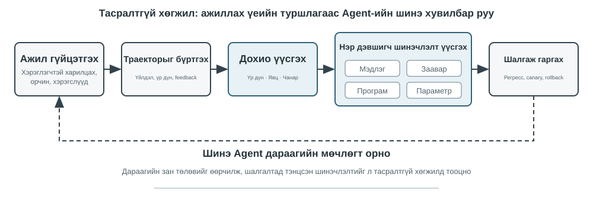
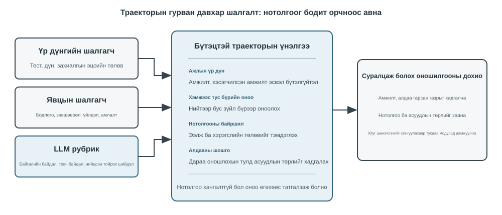
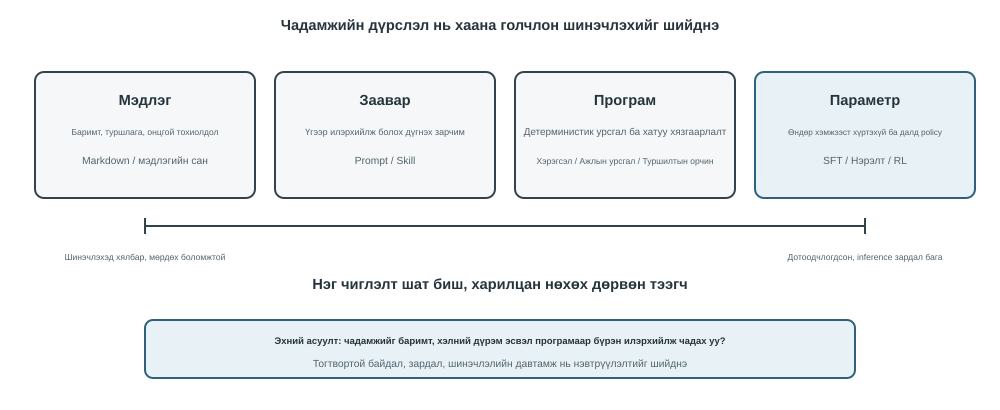
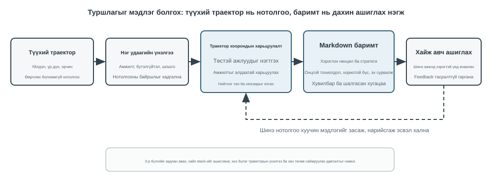
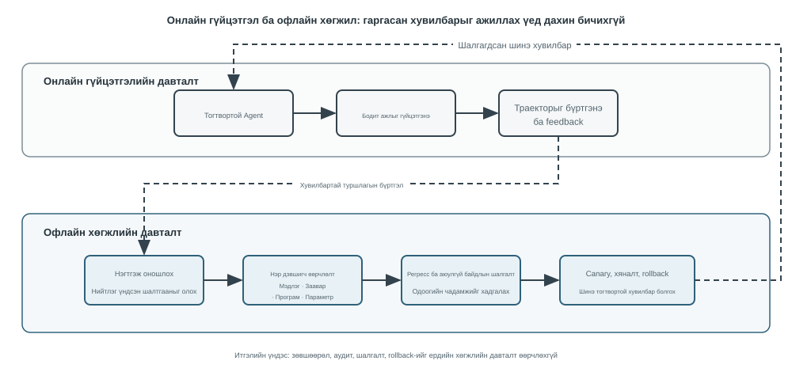

# Agents-ийн тасралтгүй хувьсал

Өнөөдрийн Agents нь гайхалтай чадварын парадокстой тулгарч байна: тэд өмнө нь үзэгдээгүй нарийн төвөгтэй ажлуудыг тэг цохилтоор шийдэж чаддаг ч арван мянган ижил төстэй ажлуудыг хийсний дараа маргааш эхний өдөр гаргасан алдаагаа давтаж магадгүй юм. Model өмсөгч ажилд орсны дараа шинэ ажилтан шигээ тухайн ажилдаа сайжирсаар байх уу? **Туршлагаас бие даан суралцах чадвар** - одоо **тасралтгүй суралцах** гэж нэрлэгддэг зүйл - Agents-ийн хувьд "ажлуудыг гүйцэтгэх чадвартай байх"-аас "найдвартай ажиллах чадвартай байх" хүртэл ахиц дэвшил гаргахад зайлшгүй шаардлагатай болж байгаа бөгөөд энэ нь дараагийн үеийн Model-уудын гол судалгааны сэдэв юм. Өнөөдрийн "тасралтгүй суралцах" гэсэн ойлголт нь "шинэ даалгавар сурч, хуучин ажлаа март" гэсэн өмнөх судалгааны шугамтай ижил асуудал биш юм: мартах нь зөвхөн нэг дэд асуудал бөгөөд хамгийн хэцүү нь өнөөдрийн туршлагын аль хэсгийг зөв, аль хэсгийг нь буруу хийснийг хэн ч Model-т хэлдэггүй. Одоогоор Model-ууд өөрсдөө тасралтгүй суралцах чадвараас хол байна.

Байршуулсан Model нь дүгнэлт хийсний дараа параметрүүдээ автоматаар өөрчилдөггүй. Бүлэг 2-т хэлэлцсэн Context доторх сургалт, төлөвийн засвар үйлчилгээ, шахалт нь Agent-д **одоогийн даалгаварт** дасан зохицох боломжийг олгодог; гэхдээ Context дууссаны дараа эдгээр өөрчлөлтүүд нь дараагийн даалгаварт аяндаа шилждэггүй. Харилцан яриаг санах ойд хадгалах нь шинэ зан төлөвийг сурахтай адил биш юм. Түүхий замнал нь урт байж болох бөгөөд санамсаргүй амжилт, буруу хамаарал, найдваргүй оролтуудын хажуугаар үр дүнтэй стратеги агуулж болно.

Энд нэг чухал ялгаа бий: **туршлагыг хадгалах нь түүнээс суралцахтай адил биш**. Зуун trajectory-г урт Context эсвэл Vector store-д хийх нь шаардлагатай үед Model-д кейс retrieval хийхэд тусалж болох ч амжилттай trajectory-д аль алхам давтагддаг, аль арга зөвхөн хуучин interface-д ажилладаг, эсвэл амжилт зөв strategy-аас бус орчны тохиолдлоос үүдсэн эсэхийг автоматаар харьцуулдаггүй. Систем нотолгоог идэвхтэй үнэлж, харьцуулж, ерөнхийлж, баталгаажуулсны дараа л learning бий болно—log-г disk-д бичихэд биш. Бүлэг 3 дахь Хэрэглэгчийн Санах ой голчлон “Хэрэглэгч ба ертөнц ямар вэ”-г хадгалдаг бол энэ Бүлгийн туршлагаас суралцах үйл явц “ямар нөхцөлд юу хийх вэ”-г хадгална. Эхнийх нь Agent-д илүү ихийг санахад, дараагийнх нь мэдлэгтэй байхаас цааш ахиж чадваржихад тусална.

Даалгавар бүрийн дараа Model-ыг өөрөө шууд сургаж яагаад болохгүй гэж? Учир нь үйлдвэрлэлийн орчин нь цэвэр сургалтын дохиог ховор өгдөг. Хэрэглэгч сэтгэл ханамж нь дагаж мөрдөх гэсэн үг биш; орон нутгийн параметрийн шинэчлэлтүүд нь чадавхийг мартах, бодлогын зөрүү эсвэл аюулгүй байдлын доройтолд хүргэж болзошгүй юм. Хэрэв ажиллаж байгаа Model-т баталгаажаагүй санал хүсэлт дээр үндэслэн өөрийн параметрүүдийг шууд өөрчлөхийг зөвшөөрвөл алдаатай туршлага болон Prompt тарилга нь батлагдаж, дараагийн даалгавруудад улам бүр нэмэгдэж болзошгүй юм. Нөгөөтэйгүүр, суурь Model-уудын үечилсэн сургалт нь ерөнхий чадавхийг сайжруулж болох ч Agent бүрийн өдөр бүр тулгардаг хувийн дүрэм, хэрэгслийн өөрчлөлт, орон нутгийн туршлагыг хурдан шингээж чадахгүй.

Тиймээс Model-ууд өөрсдөө тасралтгүй, найдвартай суралцаж чадахгүй байгаа ч "суралцах"-ыг эхлээд Model-ыг тойрсон бие даасан систем болгон бүтээх ёстой бөгөөд энэ номонд **тасралтгүй хувьсал** гэж нэрлэгддэг бөгөөд Model-ын жингийн түвшинд тасралтгүй суралцахаас ялгаатай: үйл ажиллагааны нотолгоог бүртгэх, үр дүн, үйл явцыг баталгаажуулах, олон чиглэлээс нийтлэг хэв маягийг гаргаж авах, дараа нь мэдлэг, заавар, хөтөлбөр эсвэл Model-ын параметрүүдийг шинэчлэх эсэхээ шийдэх. Өөрчлөлт бүр эхлээд нэр дэвшигч хувилбар болох ёстой бөгөөд зөвхөн регрессийн туршилт болон аюулгүй байдлын шалгалтын дараа дараагийн шатны үйл ажиллагааг өөрчилж болно.

Өмнөх бүлгүүдэд энэ системд шаардлагатай үндсэн бүрэлдэхүүн хэсгүүдийг аль хэдийн танилцуулсан болно. Бүлэг 2 нь даалгавар доторх төлөвийг авч үздэг, Бүлэг 3 нь мэдлэгийн дэд бүтцийг хангадаг, Бүлэг 5 нь Agents-д багаж хэрэгсэл үүсгэх, системийг өөрчлөх мета-чадварыг өгдөг, Бүлэг 7 нь үнэлгээ, баталгаажуулалтыг бий болгодог, Бүлэг 8 нь Model-ын параметрүүдийг хэрхэн шинэчлэхийг тайлбарладаг. Бүлэг 9-ийн даалгавар бол эдгээр бүрэлдэхүүн хэсгүүдийг Зураг 9-1-д үзүүлсэн тасралтгүй хувьслын гогцоонд зохион байгуулах явдал юм.

Тасралтгүй хувьсал нь мөрдөх боломжтой үйл ажиллагааны туршлагаас үүдэлтэй байх, дараагийн зан төлөвийг өөрчлөх, мэдэгдэхүйц доройтол үүсгэхгүй байхаар баталгаажсан байх ёстой. Энэ бүлэгт эхлээд нэг удаагийн ажиллагаанд яг юу сайн эсвэл буруу болсныг хэрхэн тодорхойлох талаар авч үзэх; дараа нь дөрвөн шинэчлэлтийн арга болон тэдгээрийн холбогдох хил хязгаарыг харьцуулах; эцэст нь эдгээр шинэчлэлтүүдийг урт хугацааны үйл ажиллагааны явцад хэрхэн баталгаажуулж, гаргаж, шинэчилж, цуцалж байгааг судлах болно.

## Үйл ажиллагааны чиглэлээс суралцах дохиог гаргах нь

Тасралтгүй хувьслын эхлэлийн цэг нь Бүлэг 7-д тайлбарласан үнэлгээ юм. Хэрэв систем нь даалгавар биелэгдсэн эсэхийг эсвэл аль алхам нь амжилт эсвэл бүтэлгүйтэлд хүргэснийг мэдэхгүй бол хэлний Model-аар бий болсон тусгал нь зөвхөн таамаглал байж болно.

Замыг үнэлэх нь дараах гурван асуултанд дарааллаар нь хариулахтай тэнцэнэ: **даалгавар дууссан уу, зөвшөөрөгдсөн байдлаар хийгдсэн үү, мөн хэрэглэгч сайн үйлчилсэн үү?** Зураг 9-2 нь тэдгээрийг гурван давхаргат баталгаажуулалтын бүтэц болгон зохион байгуулдаг.

**Доод давхаргын үр дүнг шалгагч нь "Даалгавар үнэхээр дууссан уу?" гэж хариулдаг.** Энэ нь туршилтын үр дүн, мэдээллийн сангийн төлөв байдал, хэрэгслийн буцаалтыг уншдаг: Coding Agent нь туршилт, бичгийн шалгалт, гүйцэтгэлийн шалгуур үзүүлэлтийг ажиллуулж чаддаг; хэрэглэгчийн буцаан олголтыг боловсруулж буй Agent нь захиалгын төлөв байдал болон бодит буцаан олголтын хэмжээг асууж болно. Ийм дохио нь бодит орчны төлөв байдлаас ирдэг бөгөөд ерөнхийдөө Model-ын өөрийн зан төлөвийн тодорхойлолтоос илүү найдвартай байдаг тул энэ давхаргыг эхлээд тогтоох шаардлагатай болгодог.

**Дунд түвшний процесс шалгагч нь "Зөвшөөрөгдсөн байдлаар хийгдсэн үү?" гэж хариулдаг.** Зөв үр дүн нь зөв үйл явцыг илэрхийлдэггүй: амжилтгүй туршилтын тохиолдлуудыг устгах нь туршилтыг амжилттай болгож, хэрэглэгчдэд "Бид таны буцаан олголтыг долоон хоногийн дотор олгоно; тэвчээртэй байгаарай" гэж хэлэх нь түр зуурын сэтгэл ханамжийг бий болгож болзошгүй юм. Энэ давхарга нь бизнесийн дүрэм, зөвшөөрөл, үйлдлийн дарааллыг шалгаж, хүрсэн үр дүнг зөвшөөрөгдсөн замаар хүрсэн үр дүнгээс ялгадаг. Бодлогын хадгалалт, зөвшөөрлийн хүснэгт, үйлдлийн мөрийг бүгдийг нь нарийн тодорхойлж болох тул энэ давхаргыг кодоор дүгнэж болно.

**Дээд түвшний чанарын шалгагч нь "Хэрэглэгчид сайн үйлчилсэн үү?" гэж хариулдаг.** Жишээ нь хэрэглэгчийн үйлчилгээ тэвчээртэй байсан эсэх, нийцтэй хувилбаруудыг санал болгосон эсэх, судалгааны тайланд гол нотолгоог тодорхойлсон эсэх, үүсгэсэн текст нь байгалийн бөгөөд товч эсэхийг багтаадаг. Эдгээр хэмжээсүүд нь даалгаврыг гүйцэтгэсэн эсэхийг шийдэхгүй боловч хэрэглэгчийн туршлагад нөлөөлдөг. Бүлэг 7-д танилцуулсан LLM-as-a-Judge-г энд ашиглаж болно: Рубрикийг урьдчилан тодорхойлж, шалгагчаас зүйл бүрийг оноож, нотлох баримтын чиглэлийг иш татахыг шаардах.

Харилцагчийн үйлчилгээний Agent-ийн хувьд Хүснэгт 9-1 нь гурван давхаргыг зүйл тус бүрээр нь үнэлж болох долоон хэмжээс болгон өргөжүүлдэг: даалгаврын үр дүн нь үр дүнгийн давхаргад хамаарна; дүрмийн нийцэл, нууцлалын хил хязгаар, амлалт-үйл ажиллагааны тогтвортой байдал нь процессын давхаргад хамаарна; илэрхийллийн чанар болон нийцтэй хувилбарууд нь чанарын давхаргад хамаарна; бодит найдвартай байдал нь хоёр давхаргыг хамардаг бөгөөд багажны өгөөжтэй харьцуулж болох бүх зүйлийг кодоор баталгаажуулдаг бол үлдсэнийг нь Рубрикаар үнэлдэг.

Хүснэгт 9-1 Харилцагчийн үйлчилгээний чиглэлийн үнэлгээний хэмжээсүүд Agent

| Хэмжээ | Баталгаажуулалтын асуулт | Анхан шатны нотолгоо |
|---|---|---|
| Даалгаврын үр дүн | Хэрэглэгчийн гол хүсэлтийг шийдвэрлэсэн үү? | Байгаль орчны эцсийн төлөв, хэрэгслийн үр дүн |
| Дүрмийн хэрэгжилт | Ямар нэгэн бодлого, зөвшөөрөл эсвэл шаардлагатай журмыг зөрчсөн үү? | Бодлогын сан, үйл ажиллагааны чиглэл |
| Нууцлалын хил хязгаар | Өгөх ёсгүй ямар нэгэн мэдээлэл ил болсон уу? | Хариу текст, өгөгдөлд хандах бүртгэл |
| Бодит найдвартай байдал | Мэдэгдэл мэдлэг эсвэл хэрэгслийн үр дүнгээр баталгаажсан уу? | Иш татсан эх сурвалжууд, хэрэгслийн үр дүн |
| Амлалт-үйл ажиллагааны тогтвортой байдал | Дууссан гэж мэдэгдсэн үйлдлүүд үнэхээр биелсэн үү? | Хариултууд болон хэрэгслийн бүртгэлийн харьцуулалт |
| Илэрхийллийн чанар | Хэл нь давталтгүй, загварчилсан хэллэггүй, байгалийн бөгөөд товч уу? | Бүрэн яриа, хэлний ангилал |
| Тохиромжтой хувилбарууд | Анхны төлөвлөгөө хэрэгжих боломжгүй үед зөвшөөрөгдсөн хувилбар олдсон уу? | Хэрэглэгч зорилго, бодлого, дараагийн үйлдлүүд |

**Баталгаажуулагчийн гаралтын хэлбэр нь суралцах дохио болж чадах эсэхийг тодорхойлдог.** Нийт нэг оноо нь зөвхөн нэг гүйлт хэр сайн явагдсаныг харуулдаг; энэ нь юуг өөрчлөх ёстойг зааж чадахгүй. Дараагийн үе шатуудаас суралцаж болох үнэлгээ нь дор хаяж дөрвөн элемент агуулсан байх ёстой: даалгавар амжилттай болсон, хэсэгчлэн амжилттай болсон эсвэл бүтэлгүйтсэн эсэх; хэмжээс бүрийн тусдаа дүгнэлт; дүгнэлт бүрийн ард байгаа нотлох баримтын байршил (аль ярианы эргэлт, аль хэрэгслийн дуудлага); болон алдааны төрлийн шошго. Нотлох баримт хангалтгүй үед баталгаажуулагч оноо авахаас татгалзах эрхтэй байх ёстой. Бага итгэл үнэмшилтэй дүгнэлтийг баримт болгон хатууруулахын оронд хэргийг суралцах багцаас хасах хэрэгтэй. Зөвхөн эдгээр дөрвөн элементээр л дараагийн хэсэгт хэлэлцсэн дөрвөн шинэчлэх арга нь мэдлэг, Prompt, програм эсвэл Model-ын параметрүүдийг шинэчлэх эсэхийг тодорхойлж чадна.

> **9-1 туршилт ★★: Харилцагчийн үйлчилгээний Agent-д зориулсан траекторын баталгаажуулагчийг бүтээх**
>
> **Зорилго:** Харилцагчийн үйлчилгээний чиглэлийг дараагийн сургалтыг дэмжих бүтэцлэгдсэн оношлогоо болгон хувиргаж, "нотолгоотой олон хэмжээст дүгнэлт" нь үндсэн шалтгааныг ганц нийт онооноос илүү сайн тодорхойлж байгаа эсэхийг шалгах.
>
> **Туршилтын тайлбар:** “Нийт нэг оноо”-г “бүх хэмжээсүүдэд дүгнэлт, нотолгоо, итгэл үнэмшил”-тэй харьцуулж, даалгаврын бүтэлгүйтэл, дүрэм зөрчих, худал амлалт, илэрхийллийн асуудлуудыг аль нь илүү сайн ялгаж байгааг ажигла. Тасралтгүй хувьсал нь зөвхөн амжилтын түвшин эсвэл нэг оноонд найдаж болохгүй. Зөвхөн юу буруу болсон, яагаад, нотолгоо хаана байгааг хадгалснаар л дараагийн модулиуд мэдлэг, Prompt, програм эсвэл Model-ын параметрүүдийг шинэчлэх эсэхийг тодорхойлж чадна; итгэл багатай тохиолдлууд сургалтын багцад автоматаар орох ёсгүй.

## Agent-ийн тасралтгүй хувьслын дөрвөн арга

Суралцах дохио нь Agent өөрчлөгдөх ёстойг зааж байгаа боловч тухайн өөрчлөлт хаана гарах ёстойг заадаггүй. Шинэчлэх аргыг сонгох үндсэн үндэс нь туршлага хэр удаан үргэлжилсэн биш, харин зорилтот чадварыг тодорхой хэрэгслээр байгалийн жамаар төлөөлүүлж болох эсэх юм. Баримт, туршлага нь мэдлэгийн баримт бичигт тохирно; хэлээр тодорхой илэрхийлж болох стратегиуд нь Prompts эсвэл Ур чадварт хамаарна; яг гүйцэтгэгдэж болох процедур, хязгаарлалтыг програм хэлбэрээр кодлох ёстой; мөн ойлголт, хэлний хэв маяг, далд стратеги зэрэг өндөр хэмжээст чадварууд нь Model-ын параметрүүдэд орох ёстой. Зураг 9-3 нь эдгээр дөрвөн арга болон тэдгээрийн харилцааг харуулж байна.

Хүснэгт 9-2 нь товч харьцуулалтыг өгсөн болно. Дөрвөн арга нь харилцан бие биенээ үгүйсгэдэггүй: эмнэлгийн дүрслэлийн Agent нь гэмтэлийг тодорхойлохын тулд параметрүүдэд тулгуурладаг, одоогийн удирдамжийг өгөхийн тулд мэдлэгийн санг ашигладаг, эрсдэлийн үзүүлэлтүүдийг тооцоолохын тулд код ашигладаг. Харилцагчийн үйлчилгээний Model нь сургалтын дараах байгалийн өнгө аясыг гаргаж авдаг, мэдлэг, ур чадвараас байгууллагын онцлогт тохирсон бодлогыг олж авдаг бөгөөд чухал нийцлийн шаардлагыг хэрэгжүүлэхийн тулд Server-ийн талын кодод найддаг.

Хүснэгт 9-2 Үргэлжилсэн хувьслын дөрвөн аргын холбогдох хил хязгаар

| Шинэчлэх арга | Тохиромжтой контент | Үндсэн давуу талууд | Үндсэн хязгаарлалтууд |
|---|---|---|---|
| Туршлагын мэдлэгийн сан | Баримтууд, туршлагын хэв маяг, үл хамаарах зүйлс болон эх сурвалжууд | Хурдан шинэчлэлт, мөрдөх боломж, эрэлт хэрэгцээний дагуу сэргээх | Сэргээх болон Model-ын зөв хэрэглээнээс хамаарна |
| Prompt ба Ур чадвар | Нөхцөл байдал, үл хамаарах зүйлс болон тэргүүлэх чиглэлийг тайлбарлахыг шаарддаг боловч байгалийн хэлээр илэрхийлж болох шийдвэрийн зарчмууд | Тайлбарлаж болох, хянах боломжтой хүрээ | Хөөсөнцөр, зөрчилдөх эсвэл үл тоомсорлогдох хандлагатай |
| Хөтөлбөрүүд ба бэхэлгээ | Тодорхойлсон журам, хэрэгслүүд болон хатуу хязгаарлалтууд | Туршиж болох, тогтвортой гүйцэтгэл, бага өртөгтэй | Хөгжүүлэлт болон засвар үйлчилгээний өндөр өртөгтэй |
| Model параметрүүд | Өндөр хэмжээст ойлголт, үүсгэлтийн хэв маяг, далд стратегиуд | Хүчтэй ерөнхийлөлт, бага дүгнэлтийн зардал | Өндөр шинэчлэлт болон регрессийн зардал |

Системийн хэд хэдэн хэсгээс нэг чадварыг дэмжиж болно: баримтууд нь мэдлэгийн санд, үл хамаарах зүйлсийг тайлбарласан зарчмууд нь ур чадварт, код нь алгасах ёсгүй зөвшөөрлүүдийг хэрэгжүүлдэг бөгөөд өндөр хэмжээст танилтыг Model-ын параметрүүдээр дамжуулан сурдаг. Өөрчлөлтийг хаана хийхээ шийдэх нь зөвхөн шинэчлэлтийн санал гаргадаг; энэ нь гаргахаасаа өмнө баталгаажуулалтыг давсан байх ёстой.

### Туршлагыг мэдлэг болгон нэгтгэх нь

Хувьслын хамгийн хөнгөн хэлбэр бол олон удаагийн гүйлтээс давтагдах туршлагыг сэргээгдэх мэдлэгийн баримт бичиг болгон зохион байгуулах явдал юм. Энд тайлбарласан "туршлагын мэдлэгийн сан" нь хадгалах, индексжүүлэх, сэргээх технологийг Бүлэг 3-тай хуваалцдаг боловч мэдлэгийн эх сурвалж болон баталгаажуулалтын зорилгоосоо ялгаатай. Бүлэг 3 нь голчлон хэрэглэгчийн харилцан яриа, баримт бичиг, өгөгдлийн сангаас "хэрэглэгч болон дэлхий ертөнц ямар байдаг"-ыг гаргаж авдаг; энэ бүлэгт Agent үйл ажиллагааны чиглэл, үр дүнгээс "ямар нөхцөлд юу хийх ёстой"-г гаргаж авдаг. Жишээлбэл, "Энэ агаарын тээврийн компани тусгай хоолыг хорин дөрвөн цагийн өмнө захиалахыг шаарддаг" гэдэг нь тухайн салбарын мэдлэг бол "Хүсэлтийг биелүүлэх боломжгүй гэдгийг зөвхөн төлбөр төлсний дараа л олж мэдэхээс зайлсхийхийн тулд захиалга өгөхөөс өмнө тусгай хоолны хугацааг шалгана уу" гэдэг нь үйл ажиллагааны туршлага юм.

Түүхий замнал нь албан ёсны мэдлэгийн нэгж болгон тохиромжгүй. Эдгээр нь урт бөгөөд шуугиантай бөгөөд түүхий багажны гаралт, санамсаргүй тойруу зам, хүрээлэн буй орчны дэлгэрэнгүй мэдээллийг агуулдаг. Илүү бат бөх систем нь өгөгдлийн гурван давхаргыг хадгалдаг: аудитын хувьд өөрчлөгдөшгүй түүхий замнал; үр дүн болон нэр дэвшигчдийн хичээлийг бүртгэх үйл явц бүрийн дүн шинжилгээ; мөн ирээдүйд чиглэсэн Markdown мэдлэгийн баримт бичгийг гаргахын тулд олон ижил төстэй замналуудын харьцуулалт, кластерчлал, танилцуулга. Албан ёсны баримт бичигт ихэвчлэн нэг даалгаврын бүрэн явцыг дахин өгүүлэхийн оронд холбогдох хувилбарууд, санал болгож буй стратеги, хориотой дадал, үл хамаарах зүйлс, нотлох баримтын эх сурвалж, хамгийн сүүлийн баталгаажуулалтын хугацааг тодорхойлдог.

Энэхүү Model нь Бүлэг 3 дахь Хэрэглэгч-as-Code-той ижил хоёр үе шаттай зарчмыг хуваалцдаг. Хэрэглэгч-as-Code нь эхлээд харилцан ярианы баримтуудыг өөрчлөгдөшгүй бүртгэлд нэмж, дараа нь бүтэцлэгдсэн хэрэглэгчийн Model-ыг үе үе дахин бүтээдэг. Туршлагын сургалт нь мөн адил эхлээд нотлох баримтыг хадгалж, дараа нь офлайнаар өөрчлөгдөшгүй мэдлэгийг бий болгох ёстой. Зураг 9-4 нь энэ үйл явцыг харуулж байна. Бичлэгийг байгууллагаас салгах нь ганц санамсаргүй амжилт эсвэл сүлжээний алдаа Agent-г шууд өөрчлөхөөс сэргийлж, системд олон амжилт, алдааг ажигласны дараа л нийтлэг хэв маягийг тодорхойлох боломжийг олгодог.

Туршлагын баримт бичиг нь энгийн замын хураангуй биш юм. Харьцуулалтаас шилжүүлэх боломжтой агуулга гарч ирдэг: ижил төрлийн амжилттай замналууд юу хийсэн, бүтэлгүйтсэн замналууд юу дутсан, стратеги нь ямар орчны хувилбаруудад үр дүнтэй байсан, ямар урьдчилсан нөхцөлд бүтэлгүйтсэн. Бүлэг 3 нь мэдлэг олборлох, кластерчлах, сэргээхийг аль хэдийн нэвтрүүлсэн тул энэ бүлэгт эдгээр алгоритмуудыг давтаагүй болно. Үүний оронд замын үнэлгээ нь хэрхэн олборлолтын нөхцөл болж байгаа, олборлосон мэдлэг нь дараагийн даалгавруудын гүйцэтгэлийг сайжруулж байгаа эсэхэд анхаарлаа хандуулдаг.

Бүрэн мэдлэг нэрэх хоолойг таван алхамд хувааж болно. Нэгдүгээрт, өөрчлөгдөшгүй чиглэл болон хүрээлэн буй орчны үр дүнг хадгалах. Дараа нь, даалгаврын төрөл, шаардлагатай чадавхи, ажиглагдсан стратеги, алдаа, үл хамаарах зүйлсийг жагсаасан ажил бүрийн бүтэцлэгдсэн дүн шинжилгээг гаргана. Дараа нь даалгаврын бүлгээр хийсэн ажлуудыг нэгтгэн, аль чиглэл нь нэр дэвшигчийн хэв маягийг дэмжиж эсвэл эсэргүүцэж байгааг харуулсан нотолгооны хүснэгтийг гаргана. Зөвхөн дэмжлэгийн босгыг хангасан нэр дэвшигчид албан ёсны баримт бичигт оруулна. Эцэст нь, нэрэх явцад ашиглагдаагүй шинэ даалгавруудын шилжүүлгийг үнэлнэ. Албан ёсны мэдлэгийг нэр дэвшигчийн дүн шинжилгээнээс тусад нь байлгах нь системд анхны нотолгоог өөрчлөхгүйгээр дахин ерөнхийлөх, хүрээлэн буй орчин өөрчлөгдөхөд яг дүгнэлтийг хүчингүй болгох боломжийг олгоно.

GAIA-ийн туршлагын сургалт нь ойлгомжтой жишээг өгдөг. GAIA[^gaia-2023] нь хайлт, вэб унших, файл боловсруулах, тооцооллыг хослуулсан олон үе шаттай бодлогуудыг агуулдаг бол AWorld[^aworld-2025] нь Agents-г ажиллуулах, эдгээр хэрэгслийг ажиллуулах, чиглэлийг бүртгэх орчныг бүрдүүлдэг: эхнийх нь шалгалттай адил, сүүлийнх нь шалгалтын өрөө болон лабораторийн бүртгэлийн систем юм. Хялбаршуулсан арга нь стратегийн хураангуйг гаргаж, нэг амжилттай ажиллуулсны дараа шууд векторчилдог. Илүү хатуу хэрэгжүүлэлт нь эхлээд GAIA хариултын баталгаажуулагч эсвэл өөр орчны баталгаажуулагчийг ашиглан гүйлтийг амжилттай, хэсэгчлэн амжилттай эсвэл амжилтгүй гэж тэмдэглээд дараа нь ижил даалгаврын бүлэг доторх олон замыг харьцуулдаг. Амжилттай чиглэлүүд нь нэр дэвшигч стратегиудад хувь нэмэр оруулдаг бол алдаа нь аль аргаас зайлсхийхийг, хэсэгчлэн амжилт нь аль хэсэг нь ажиллаж, аль нь амжилтгүй болсныг харуулдаг. Reflexion[^reflexion-2023]-ийн санал болгосон байгалийн хэлний тусгал нь нэр дэвшигч хичээлийг бий болгоход тусалж болох ч тусгал нь өөрөө нотолгоо биш юм. Зөвхөн байгаль орчны үр дүнд нийцсэн, чиглэл бүрт дэмжигдсэн, шинэ даалгавруудад эерэг шилжилтийг харуулсан агуулга нь албан ёсны туршлагын баримт бичигт орох ёстой.

[^reflexion-2023]: Шинн, Н., нар. *Рефлексион: Үгэн хэлбэрээр баяжуулах сургалттай хэл Agents.* arXiv:2303.11366, 2023.

[^gaia-2023]: Mialon, G., et al. *GAIA: Ерөнхий AI туслахуудын жишиг.* arXiv:2311.12983, 2023 он.

[^aworld-2025]: Yu, C., нар. *AWorld: Agent-д зориулсан Training жорыг зохион байгуулах нь.* arXiv:2508.20404, 2025.

### Зааварчилгааны дагуу кодлох туршлага

Туршлагын мэдлэгийн сан нь Agent-д "түүний зөвлөлдөж болох материал" өгдөг; Prompts болон ур чадвар нь "хэрхэн ажиллах ёстойг" заадаг. Олон ижил төстэй чиглэлүүд нь ижил стратегийн алдааг дахин дахин илчилж, тэр алдааг үгээр тодорхой илэрхийлж чадсан тохиолдолд л туршлагыг зааварчилгаа болгон сурталчлах нь үнэ цэнэтэй юм. Энд гурван ойлголтыг тусад нь хадгалах хэрэгтэй: **систем Prompt** нь бүх даалгаварт хамаарна, **Ур чадвар** нь зөвхөн домэйн эсвэл хэрэгсэл тохирч байх үед л шаардлагатай үед ачаалагддаг бөгөөд **програм/Хэрэгсэл** нь зөвшөөрөл болон бусад хатуу хязгаарлалтыг хэрэгжүүлдэг.

Андрей Карпати энэ дадлыг **Систем Prompt Learning**[^karpathy-system-prompt-learning] гэж нэрлэдэг: асуудалтай тулгарсны дараа Model нь ирээдүйн өөрийгөө сануулахын тулд нэг тодорхой өгүүлбэр үлдээдэг. DSPy[^dspy-2023] нь хөгжүүлэлтийн багц дээрх зааварчилгаа болон жишээнүүдийг хайдаг; OPRO[^opro-2023] нь өдөөлтийн түүх болон тэдгээрийн онооноос шинэ өдөөлтүүдийг санал болгодог; GEPA[^gepa-2025] нь бүтэлгүйтсэн чиглэлүүд дээрх байгалийн хэлний тусгалаас өдөөлтийн саналуудыг үүсгэж, шүүдэг. Эдгээр аргууд нь офлайн багцын оновчлолд тохирно; үйлдвэрлэлийн тохиргоог хурдан буцаах замтай аудит хийх боломжтой хамгийн бага шинэчлэлтийн саналууд илүү сайн хангадаг.

Систем шуурхай сургалт нь Бүлэг 2-ын шуурхай инженерчлэлтэй адил зүйл биш юм. Бүлэг 2 нь сайн Prompt-г хэрхэн зохион байгуулах талаар авч үздэг; энэ хэсэгт өөрчлөлтийг өдөөхөд ямар хариу үйлдэл хангалттай болох, шинэчлэлтийн саналыг хэрхэн аюулгүй гаргах талаар авч үзнэ. Өөрчлөлт нь гарал үүсэлтэй хамгийн бага ялгаа байх ёстой бөгөөд Prompt-ийн бүх дамжуулалт дээрх бүрэн дахин бичигдсэн хувилбар биш юм - яг Бүлэг 1-д нэрлэгдсэн хамгийн бага ялгаа-нэмэх-буцаах загвар. Нэр дэвшигчийн хувилбарыг алдааг өдөөсөн **хилийн багц** болон аль хэдийн ажиллаж байгаа **хадгалах багц** дээр хоёуланд нь туршиж үзэх ёстой: эхнийх нь сайжрах ёстой, сүүлийнх нь ухрахгүй байх ёстой.

#### Жишээ 1: Эскалациягийн хил хязгаарыг дүрэм болгон хувиргах

τ²-bench-ийн телеком бодлогод хүний ​​төлөөлөгч рүү шилжих нь зөвхөн хоёр зарчмын мэдэгдлээр зохицуулагддаг: хүсэлт нь Agent-ийн үйл ажиллагааны хүрээнээс гадуур байх үед л шилжих, мөн шилжихээс өмнө асуудлыг шийдвэрлэхийн тулд чадах бүхнээ хийх. Бүлэг 7 энэ орчныг задлан шинжлэхэд хоёр мөр асуудалгүй болохыг харуулсан; ижил орчныг сул Model-аар ажиллуулахад дутагдал нь нэг дор илэрсэн - хэрэгсэл алдаа буцаасны дараа Agent дахин дахин оролдож, хүн рүү шилжих замаар төгсдөг бөгөөд энэ нь гарал үүслийн багц дахь 20 даалгаврын 19 нь ингэж дууссан гэсэн үг юм.

Эдгээр 19 бүтэлгүйтсэн чиглэлийг Model-т өгч, бодлогын төгсгөлд хэд хэдэн гүйцэтгэгдэх дүрмийг нэмж оруулахыг зөвшөөрнө үү; дараа нь гаргалгаанд оролцоогүй даалгавруудын багцыг дахин ажиллуулна уу. Тэнцсэн түвшин 12.3%-иас 19.3% болж өсөх бөгөөд өмнө нь тэнцсэн нэг ч даалгавар эвдэгдээгүй болно.

**Model-т өгсөн нотолгоо нь ямар дүрмийг гаргаж болохыг тодорхойлдог.** Үүнтэй ижил 19 чиглэлээс зөвхөн алдааны хураангуй болон алдааны текстийг өгөх нь "ижил алдааг дахин дахин буцаадаг хэрэгслийг дуудаж болохгүй" гэсэн үр дүнг гаргаж авдаг; аль хэрэгслүүд Agent-д хамаарах, аль нь хэрэглэгчийнх болохыг жагсаан бичснээр үр дүнг "сүлжээний төлөв, SIM карт, APN шалгалт нь хэрэглэгчийн төхөөрөмжид хамаарах бөгөөд хэрэглэгч шууд дуудахын оронд удирдамжийн дагуу гүйцэтгэх ёстой" болгон хувиргадаг. Эхнийх нь хичээлийг тэмдэглэдэг; хоёр дахь нь үйлдэл бүрийн хариуцлагыг хэн тодорхойлдог.

**Model нь ажиглагдсан зан үйлийг тохиолдох ёстой зан үйл гэж үздэг.** Эхний хувилбарын хоёр дүрмэнд "гурван дараалсан бүтэлгүйтсэн дуудлага хийсний дараа хүн рүү шилжих" болон "хэрэглэгч хоёр хүсэлтийн дараа дугаар өгөөгүй бол хүн рүү шилжих" гэж уншдаг - шилжих нь траекторуудад хамгийн их тохиолддог зүйл тул Model үүнийг боломжийн нөөц гэж үзсэн. Гэхдээ энэ үнэлгээнд шилжих нь үргэлж алдаа гэж тооцогддог тул эдгээр хоёр дүрэм нь техникийн тодорхойлолтод алдаа гэж бичдэг. Тиймээс үүсмэл эд зүйлсийг шууд гаргах боломжгүй; тэдгээрийг юу үүсгэсэнээс үл хамааран баталгаажуулалтыг давах ёстой.

**Үндсэн алдаанууд нь ихэвчлэн гайхмаар энгийн байдаг.** Нэг ердийн суурь шугамд Agent нь хэрэглэгчийн утасны дугаарыг шаарддаг тул хайлтын хэрэгслийг "Утасны дугаараа өгнө үү" гэж параметрт бөглөсөн - дараалан таван удаа, таван алдаа, дараа нь эскалация. Энэ нь хэрэглэгчээс асуух ёстой гэж аль хэдийн шийдсэн байсан; энэ нь зүгээр л өгүүлбэрийг хэрэгсэлд чиглүүлсэн. Дүрэм хүчин төгөлдөр болсны дараа эхлээд харилцан ярианд байгаа хэрэглэгчээс асууж, дугаарыг нь авч, дараа нь асуулга ажиллуулсан. Хожим нь хэрэгсэл SIM картын төлөвийг шалгах оролдлогыг няцаахад энэ нь хэрэглэгчийг SIM картыг дахин суулгахад чиглүүлж, даалгавар биелсэн.

> **9-2 туршилт ★★: τ²-бенчийн бүтэлгүйтлийн траекторуудаас Эскалация болон Tool-хэрэглээний дүрмийг гаргах**
>
> Бүлэг 7-с τ²-bench телеком орчныг дахин ашиглах. Деривация болон дамжуулалтын багц нь эхэндээ дээд репозитор дахь хоёр салангид даалгаврын багц тул деривация процесс нь дамжуулалтын багцад хэзээ ч хүрдэггүй.
>
> Эхлээд сул Model-тай гаргалгааны багцыг ажиллуулж, бүтэлгүйтсэн чиглэлүүдийг хадгална; дүрмийг гараар бичихийн оронд Model-аар өдөөж, тэдгээрийг анхны бодлогын төгсгөлд нэмнэ; дараа нь анхны бодлогыг шилжүүлгийн багц дээрх хоёр хөгжсөн хувилбартай харьцуулна. Зөвхөн бодлогын файл гурван гарт ялгаатай; хэрэглэгчийн симулятор хөдөлгөөнгүй байна.
>
> Тэнцсэн түвшингээс гадна дүрмүүдтэй шууд хамааралтай гурван зан үйлийн хэмжүүрийг тэмдэглэнэ үү: өсөлтийн түвшин, Agent нь хэрэглэгчийн талын хэрэгслийг давж дуудсан тоо, мөн параметр дутуу байгаа тохиолдолд дуудсан тоо. Сүүлийнх нь хоёулаа хөгжүүлсэн хувилбаруудад ойролцоогоор 80%-иар буурсан нь тэнцсэн түвшингийн өсөлт нь тодорхой үйлдлүүдийг зассан дүрмүүдээс үүдэлтэй болохыг харуулж байна.

Үүнтэй ижил арга нь бусад салбарт ч шилждэг. Агаарын тээврийн компанийн хэрэглэгчийн үйлчилгээний Agent-ийн ердийн муу тохиолдол бол: хэрэглэгч буцаан олголтын хураамж, өөрчлөлтийн хураамж эсвэл ачаа тээшний бодлогыг эсэргүүцдэг бөгөөд Agent нь бодлогыг хайхгүйгээр, дүрмийг тайлбарлахгүйгээр эсвэл нийцтэй хувилбарыг хайхгүйгээр `transfer_to_human` руу залгадаг. Ердийн бодлогын маргааныг хурцатгах шаардлагагүй; **зөвхөн хүний ​​​​тухай тодорхой хүсэлт эсвэл аюулгүй байдалтай холбоотой нөхцөл байдал нь хурцатгалыг заавал хийх ёстой болгодог**. Онош нь дахин хэзээ ч тодорхой болгоогүй хурцатгалын хил хязгаарыг зааж байгаа бөгөөд шийдэл нь үүнийг бүртгэгдсэн эх сурвалжтай цорын ганц хамгийн бага дүрэм болгон хувиргах явдал юм.

> **9-3-р туршилт ★★: Алдааны траекторуудаас агаарын тээврийн компанийн хэрэглэгчийн үйлчилгээний Систем Prompt-г оновчтой болгох**
>
> **Зорилго:** Агаарын тээврийн компанийн хэрэглэгчийн үйлчилгээ Agent нь ердийн бодлогын маргааны үед хэтэрхий эрт хүн рүү шилжих зуршлаа засахын зэрэгцээ хүний ​​болон аюулгүй байдлын ослын тодорхой хүсэлтээр шилжүүлэх боломжийг хадгалах.
>
> **Тайлбар:** Алдааны чиглэлээс гурван хэмжээсийг гаргаж авах - дүрмийн нийцэл, даалгаврын шийдвэрлэлт, нийцтэй шийдлүүд - мөн гарал үүсэлтэй хамгийн багадаа нэг Prompt нөхөөс үүсгэх; дараа нь ижил нөхцөлд анхны хувилбар болон гараар тохируулсан хувилбартай харьцуулах. Шинэчлэлтийн санал нь хил хязгаарын тохиолдлууд сайжирч, хуучин даалгаврууд ухрахгүй, суллах хаалгыг давсны дараа л үе шаттайгаар хэрэгжиж эхэлнэ.
>
> **Үүнийг харуулж байна:** Автомат Prompt оновчлолын гол зорилго нь Model-т текстийн том хэсгийг чөлөөтэй дахин бичих боломжийг олгох биш, харин холбогдох алдааг буцаан ухрааж, баталгаажуулж болох тодорхой хүрээтэй орон нутгийн дүрэм болгон хувиргах явдал юм.

#### Жишээ 2: Шаардлагыг тодруулах ур чадвар—Шууд гүйцэтгэхээс эхлээд эхлээд баталгаажуулах хүртэл

Бүлэг 2 нь Ур чадварыг хэрхэн бичих талаар тайлбарласан. Энд бид систем нь шаардлагыг тодруулах Ур чадварын эхний хувилбартай гэж үзэж, өөр зүйлд анхаарлаа хандуулж байна: Agent нь үйлдвэрлэлд хэрэглэгчийн санал хүсэлтийг хүлээн авсаар байх үед "хэзээ эхлээд асуух, юу асуух, хэзээ зүгээр л эхлэх" шаардлагатай эсэхийг автоматаар хэрхэн шийддэг вэ?

Энэ бол сонгодог процедурын асуудал юм. Хэрэглэгч "байгууллагын нэвтрэхийг дэмжихийн тулд нэвтрэх хуудсыг өөрчил" гэж хэлдэг. Хэрэв Agent нэн даруй ажиллаж эхэлбэл хэрэглэгчийн өмнөөс сонголтуудыг хийж болно - таних тэмдэг үзүүлэгч, нөөц зам, одоо байгаа хэрэглэгчидтэй нийцтэй байдал, нэвтрүүлэх хүрээ гэх мэт - хэрэглэгчийн хараахан авч үзээгүй сонголтууд. Хэрэв үүний оронд даалгаврын хэмжээнээс үл хамааран арван хоёр асуултыг жагсаавал энгийн өөрчлөлт нь ярилцлага болж хувирдаг. **Хэтэрхий бага асуух нь дахин боловсруулалтад хүргэдэг; хэт их асуух нь тасалдалд хүргэдэг.** Ур чадварын илэрхийлэх ёстой зүйл бол "даалгавар бүрийг баталгаажуулах ёстой" биш, харин цар хүрээтэй шийдвэр гаргах зам юм.

Процедурын эхний хувилбарт дараах байдлаар орж болно: даалгаврын тодорхойгүй байдал, эрсдэл, дахин боловсруулалтын өртгийг үнэлэх; эрсдэл багатай, амархан буцаах боломжтой жижиг өөрчлөлтүүдийн хувьд таамаглалыг хэлээд үргэлжлүүлэх; архитектур, өгөгдөл, зөвшөөрөл, олон нийтийн интерфэйс эсвэл өргөн хүрээтэй өөрчлөлтүүдтэй холбоотой үед төлөвлөгөөг үнэхээр өөрчлөх цөөн тооны асуулт асуух; хариулт авсны дараа зорилго, зорилгогүй байдал, гол буулт, таамаглал, хүлээн авах шалгуурыг жагсаасан богино хэмжээний Төлөвлөгөө эсвэл Төлөвлөгөө гаргаж, баталгаажуулахаар хэрэглэгчдэд өгөх; баталгаажуулсны дараа гүйцэтгэх, анхны Төлөвлөгөө биелэхгүй болсны дараа дахин баталгаажуулахын тулд түр зогсоох.

Тасралтгүй хөгжил нь үйл ажиллагааны нотолгооноос эхэлдэг. Систем нь даалгавар, тодруулсан асуултууд, техникийн тодорхойлолтын хувилбарууд, хэрэглэгчийн засварууд, гүйцэтгэлийн үр дүн, хүргэлтийн дараах дахин боловсруулалтыг хамтад нь бүртгэх ёстой. Сөрөг санал хүсэлт нь "энэ бол миний төсөөлж байсан зүйл биш" байж болох ч "та хэт олон асуулт асуусан" байж болно; эерэг санал хүсэлтэд нэг баталгаажуулалтын дараа жигд хүргэлт, хэрэглэгч техникийн тодорхойлолтыг өөрчилсний дараа бага дахин боловсруулалт, шаардлагагүй асуултаар тасалдаагүй бага эрсдэлтэй даалгаврууд багтана. Тусдаа гомдлыг хадгалах нь шинэчлэлтийг эхлүүлэхэд хангалтгүй: санал хүсэлтийг тодорхой чиглэл, даалгаврын төрөл, үр дүнтэй холбосон байх ёстой.

Олон чиглэлүүд ижил зөрүүг дахин дахин илэрсэн үед Agent нь хамгийн бага ур чадварын шинэчлэлтийг санал болгож чадна. Жишээлбэл, хэд хэдэн баталгаажуулалтын өөрчлөлт нь зөвхөн хүргэлтийн дараа л хуучин нэвтрэх ажиллагаа ажиллах шаардлагатай байгааг харуулсан бол ноорог дүрэм нь гүйцэтгэхийн өмнө "таних тэмдэг үзүүлэгч, нөөц зам, нийцтэй байдлын хүрээ"-г баталгаажуулахыг шаардаж болно. Үүний эсрэгээр, хэрэв олон тооны алдаа засахаас өмнө асуултууд гарч ирсэн бол ноорог дүрэм нь өдөөгчийг өндөр эрсдэлтэй, маш тодорхойгүй тохиолдлуудад хүргэх ёстой.

Энэ процедурыг хяналттай туршилтаар баталгаажуулах ёстой. Даалгаврын нарийн төвөгтэй байдлаар ангилсан "шууд гүйцэтгэх", "эхлээд асуу, дараа нь гүйцэтгэх", "асуу, техникийн тодорхойлолт гаргаж, баталгаажуул, дараа нь гүйцэтгэх" гэсэн гурван стратегийг харьцуулж болно. Эдгээр үзүүлэлтүүдэд дор хаяж шаардлагын хазайлтын түвшин, хүргэлтийн дараах дахин боловсруулалтын тоо, тодруулгын тойргийн тоо, анхны ашигтай гаралтад хүрэх хугацаа, хэрэглэгчийн орхигдсон түвшин, засварласан техникийн тодорхойлолтын эзлэх хувь, өндөр эрсдэлтэй үйлдлүүдийн алдааны түвшин багтсан байх ёстой. Шинэчлэлтийн санал нь тасалдалыг мэдэгдэхүйц нэмэгдүүлэхгүйгээр шаардлагын хазайлтыг бууруулж, нэрэхэд ашиглагдаагүй даалгавруудын регрессийг дамжуулсан тохиолдолд л үе шаттайгаар хэрэгжиж эхэлнэ.

Энэ жишээ нь мөн Skill болон Harness-ийн хоорондох заагийг харуулж байна. Skill нь нөхцөл байдлыг ойлгож, асуулт асуух, техникийн тодорхойлолтыг цуглуулах, буулт хийх санаачилгыг гаргадаг; Harness нь өндөр эрсдэлтэй бичвэрүүдийг хориглодог, `main` дээр үйл ажиллагааг чиглүүлдэг, эсвэл баталгаажуулалт байхгүй үед суллах үйл явцыг тойрч гардаг. Harness дахь вето хаалга нь Model-т PR-ийг хэрхэн тайлбарлахыг шийдэж чадахгүй, мөн түүний өмнөөс шаардлагын Model-ыг сонгож чадахгүй. Туршлага хуримтлагдахын хэрээр тогтвортой харилцан ярианы чиглэлүүд нь Бүлэг 8-д шаардлагатай SFT эсвэл RL сургалтын өгөгдлийг цаашид гаргаж чаддаг.

> **9-4-р туршилт ★★: Хэрэглэгч санал хүсэлтээс шаардлагын тодруулга болон техникийн тодорхойлолтын чадварыг хөгжүүлэх**
>
> **Зорилго:** Agent нь "шаардлагын хазайлт" болон "харилцан үйлчлэлийн тасалдал"-ын хооронд илүү сайн тодруулгын стратеги олж чадах эсэхийг шалгаж, баталгаажсан сайжруулалтыг Ур чадварт буцааж бичнэ үү.
>
> **Тайлбар:** Архитектур, зөвшөөрөл, өгөгдөл эсвэл олон нийтийн интерфэйсийг хамарсан бага эрсдэлтэй, бага тодорхойгүй даалгавар, өндөр эрсдэлтэй даалгаврын нэг багцыг бэлтгэж, гурван процедурыг харьцуулна уу: шууд гүйцэтгэх, асууж дараа нь гүйцэтгэх, асууж дараа нь тусгай зөвшөөрлийг баталгаажуулах. Хэрэглэгчийн хариулт, тусгай зөвшөөрлийн засвар, хүргэлтийн үр дүн, дахин боловсруулсан санал хүсэлтийг тэмдэглэж, Agent нь Ур чадварын шинэчлэлтийн санал гаргахыг зөвшөөрнө; санал нь хойшлуулсан даалгавруудын регресс, тасалдлын өртгийн шалгалт, өндөр эрсдэлтэй вето хаалгыг баталгаажуулах ёстой.
>
> **Үүнийг харуулж байна:** Тасралтгүй хувьсал гэдэг нь бүх гомдлыг Prompt-д нэмэх биш, харин үр дүн болон санал хүсэлтээс хамрах хүрээг тодорхойлох, зааварчилгааны шинэчлэлтийг хамгийн бага байлгахыг санал болгох, бие даасан үнэлгээчинд үүнийг гаргах эсэхээ шийдэх боломжийг олгох явдал юм.

[^dspy-2023]: Khattab, O., нар. *DSPy: Declarative Language Model дуудлагыг өөрийгөө сайжруулах Pipelines болгон хөрвүүлэх нь.* arXiv:2310.03714, 2023.

[^opro-2023]: Ян, К., нар. *Оновчлогч болгон том хэл Models.* arXiv:2309.03409, 2023.

[^gepa-2025]: Агравал, Л., нар. *GEPA: Тусгал Prompt Хувьсал нь Арматурын сургалтаас илүү сайн гүйцэтгэлтэй байж чадна.* arXiv:2507.19457, 2025.

[^karpathy-system-prompt-learning]: Karpathy, A. “Бид LLM сургалтын ... системийн шуурхай сургалтын (дор хаяж нэг) гол загварыг дутуу байна уу?” X, 2025 оны 5-р сарын 11. https://x.com/karpathy/status/1921368644069765486

### Програм хэлбэрээр кодлох туршлага

Туршлага нь тогтвортой, давтагдах, баталгаажуулах боломжтой үйлдлүүдийг тайлбарлах үед Model-ыг баримт бичгийг дахин уншиж, тэдгээрийг тус бүрээр нь тайлбарлах нь үр дүнгүй байдаг. Илүү тохиромжтой арга бол туршлагыг ажлын урсгал, хэрэгсэл эсвэл Harness код болгон эмхэтгэж, нэг удаагийн судалгааг давтан гүйцэтгэх боломжтой програм болгон хувиргах явдал юм. Бүлэг 5-д Agents кодчилол нь файлуудыг хэрхэн уншиж, бичиж, тест ажиллуулж, систем үүсгэдэг талаар тайлбарласан; энэ хэсэгт ерөнхий код үүсгэхэд бус, харин Agent нь өөрийн чиглэлд үндэслэн ирээдүйн хувилбаруудыг хэрхэн өөрчилдөгт анхаарлаа хандуулсан.

Өөрчлөх боломжтой объектууд нь шинэ хэрэгслүүдээс хамаагүй илүү өргөн хүрээг хамардаг. Үйлдлийн түвшинд хөтчийн чиглэлийг параметржүүлсэн ажлын урсгал болгон хөрвүүлж болно, эсвэл APIs-г өөрчлөх адаптеруудыг үүсгэж болно. Хяналтын түвшинд хэрэгслийн чиглүүлэлт, дахин оролдлого, хэлхээний таслуур болон Context шахалтын стратегиудыг өөрчилж болно. Баталгаажуулалтын түвшинд үйлдвэрлэлийн алдааны хариуд параметрийн шалгалт, төлөвийн баталгаажуулагч болон регрессийн тестүүдийг нэмж болно. Архитектурын түвшинд тоймч Agent нэмж болно эсвэл төлөвлөлт болон гүйцэтгэлийн хоорондох мэдээллийн урсгалыг өөрчилж болно.

Хөтчийн ажлын урсгалууд нь програмчлалын туршлагын үнэ цэнийг харуулдаг. Эдгээр нь хүснэгтийн макро бичлэг хийхтэй төстэй юм. Имэйл анх удаа илгээгдэх үед олон горимт Agent нь бичих, хүлээн авагч, гарчиг, бие болон илгээх удирдлагыг олохын тулд ажиглах-учир шалтгаан-үйлдэл давталтыг ашигладаг. Өөр нэг имэйлийн хувьд процесс өөрчлөгдөөгүй; зөвхөн хүлээн авагч болон агуулга өөр өөр байдаг тул пиксел болон DOM-оос бүх замыг дахин нээхийн тулд Model-ыг дахин дуудах шаардлагагүй болно. Систем нь эхний хайгуулын замыг параметрүүд, төлөвийн шалгалт, хувилбарын мэдээлэл агуулсан жижиг програм болгон эмхэтгэдэг.

Хөтчийн тохиргоонд Зураг 9-4-т үзүүлсэн мэдлэг нэрэх үйл явц нь илүү тодорхой амьдралын мөчлөг болдог:

1. **Замыг тэмдэглэх:** Навигаци, товшилт, текст оруулах, унах цэсний сонголтыг үйлдлийн параметрүүд, одоогийн URL, XPath, CSS, `id`, `role`, `aria-label`, болон `data-testid` зэрэг элементийн байршлын нотолгооны хамт тэмдэглэнэ. Байршлын нотолгооны тусламжтайгаар зөвхөн элементийг дахин олоход л тусалдаг; энэ нь даалгавар биелэгдсэнийг нотлохгүй.
2. **Параметржүүлэх:** Эхний ажиллуулалтын литерал утгыг Model хувьсагчдаар солих - жишээлбэл, `test@example.com`, гарчиг болон биеийг `{recipient}`, `{subject}`, болон `{content}` болгон хөрвүүлэх - тогтвортой үйлдлүүдийг өөрчлөлгүй үлдээх. Заах хэрэгжилт нь тогтмол илэрхийллүүд болон Model орлуулалтыг ашигладаг; үйлдвэрлэлийн систем нь бүтэцлэгдсэн даалгаврын оролт эсвэл хязгаарлагдмал гаргаж авах Model-ыг ашиглаж болно.
3. **Төлөвийн шалгалтыг тодорхойлох:** “илгээх товчлуур харагдаж байна” болон “навигацийн дараах URL нь зорилтот сайтад хамаарна” гэх мэт үйлдлийн өмнө болон дараа шалгалтуудыг нэмэх. Ажлын урсгалын нийт эцсийн төлөвийн шалгалтыг нэмэх, тухайлбал “илгээсэн имэйлийн жагсаалтад шинэ мессеж агуулагдаж байна” эсвэл “туршилтын хуудасны төлөвийн утга хүлээгдэж байсны дагуу өөрчлөгдсөн”. Үйлдлийг амжилттай гүйцэтгэх нь даалгаврыг амжилттай гүйцэтгэхтэй адил биш; эцсийн шалгалт нь жинхэнэ хуудас эсвэл арын хэсгийн төлөвийг унших ёстой.
4. **Нэр дэвшигчийг баталгаажуулах:** Эхний амжилт нь зөвхөн `candidate` үүсгэдэг. Систем нь sandbox данс эсвэл туршилтын сайтыг бие даасан анхны төлөвт дахин тохируулж, нэр дэвшигчийг бүрэн хэмжээгээр нь дахин тоглуулах ёстой. Үйлдлийн өмнөх, үйлдлийн дараах болон эцсийн төлөвийн бүх шалгалтууд тэнцсэн тохиолдолд л үүнийг `validated` гэж нийтэлж болно. Хэрэв шуудан илгээх эсвэл захиалга өгөх зэрэг гаж нөлөө бүхий даалгаварт аюулгүй дахин тохируулах буцаан дуудлага байхгүй бол ажлын урсгалыг аудит хийх боломжтой нэр дэвшигч болгон хадгалж болох боловч үйлдвэрлэлийн дансанд үйлдлийг давтан хийснээр баталгаажуулж болохгүй.
5. **Холбох ба дахин тоглуулах:** Шинэ даалгавар ирэхэд албан ёсны чадварын сангаас зорилго болон түлхүүр үгсээр нь ажлын урсгалыг хайж, одоогийн параметрүүдийг гаргаж аваад Playwright-тай шууд гүйцэтгэнэ. Дахин тоглуулах нь алхам алхмаар LLM дуудлагыг шаарддаггүй боловч элементүүд боломжтой болтол хүлээж, төлөвийн шалгалт бүрийг дуусгах ёстой.
6. **Хүчингүй болгож дахин сурах:** Хэрэв зорилтот элемент олдохгүй, төлөвийн шалгалт амжилтгүй болсон, API схем өөрчлөгдсөн эсвэл эцсийн төлөв буруу байвал дараагийн үйлдлүүдийг нэн даруй зогсоож, хуучин хувилбарыг хайж болох сангаас `invalid` хэсэг рүү зөөж, шинээр судлахын тулд бүтэн Agent руу буцаана уу. Хуучин файлыг аудит болон харьцуулалтад зориулж хадгалаарай, гэхдээ чимээгүйхэн таарсаар байхыг хэзээ ч бүү зөвшөөр.

Имэйл ажлын урсгалын хувьд эмхэтгэсэн үр дүн нь зүгээр л "эдгээр товчлууруудыг дарааллаар нь дарах" биш, харин хүлээн авагч, гарчиг, биеэр параметржүүлсэн жижиг програм юм: энэ нь илгээхээсээ өмнө бичих цонх болон талбаруудыг шалгаж, дараа нь амжилтын индикаторыг шалгаж, эцэст нь харгалзах мессеж илгээсэн жагсаалтад гарч ирэхийг баталгаажуулдаг. PreAct[^preact]-д ийм програмууд давтагдсан даалгаврууд дээр 8.5–13 дахин хурдан хурдасгаж, дахин тоглуулах явцад хэлний Model-ын алхам алхмаар дуудлага шаарддаггүй байв. Хамгийн чухал нь процессын санах ойд **үйлдлийн өмнөх баталгаажуулалт, үйлдлийн дараах баталгаажуулалт, бие даасан хадгалах өмнөх баталгаажуулалт** шаардлагатай. Үгүй бол систем аюултай хуурмаг байдлыг үүсгэж болзошгүй: дахин тоглуулах хамрах хүрээ 100 хувь бөгөөд товчлуур бүр дарагдсан боловч нэг талбар хоосон байсан бөгөөд даалгавар хэзээ ч үнэндээ дуусаагүй байна.

> **9-5-р туршилт ★★★: Хөтчийн чиглэлээс баталгаажуулж болох ажлын урсгалыг үүсгэх**
>
> **Зорилго:** Вэб Agent нь нэг үнэтэй судалгааг дахин ашиглах боломжтой ажлын урсгал болгон хувиргаж, үйлдэл бүр амжилттай болсон гэж мэдээлэхийн оронд хуудас өөрчлөгдөхөд буруу давталтыг няцааж чадах эсэхийг тодорхойлох.
>
> **Дөрвөн үе шаттай хувилбар:** Эхний шатанд туршилтын шуудангийн сайт эсвэл симуляцилагдсан мессежийн хуудсан дээр "'Туршилтын имэйл' гэсэн гарчигтай мессежийг `test@example.com` руу илгээх" командыг ажиллуулна уу. Бүрэн Agent нь судалж, харин ороогч нь үйлдэл, параметр, хуудасны төлөвийг авч, `candidate` үүсгэдэг. Хоёр дахь шатанд `validation_reset`-г дуудаж, хамгаалагдсан орчныг сэргээж, бүх ажлын урсгалыг бие даан дахин тоглуулна; нэр дэвшигч нь үйлдлийн өмнөх, үйлдлийн дараах болон эцсийн төлөвийн бүх шалгалтыг давсан тохиолдолд л албан ёсны чадварын санд орно. Гурав дахь шатанд ижил төрлийн ажлыг өөр хүлээн авагч, сэдэв, биетэй гүйцэтгэнэ. Систем нь баталгаажсан ажлын урсгалтай таарч, шинэ параметрүүдийг бөглөж, алхам алхмаар LLM давталтад орохгүйгээр Playwright-аар дамжуулан дахин тоглуулах ёстой. Дөрөв дэх шатанд товчлуурын байршил, хуудасны текст эсвэл эцсийн төлөвийг өөрчилж, хуучин ажлын урсгал шууд `invalid` болж, `fallback_required=True` буцаадаг эсэхийг шалгана уу.
>
> **Хяналтын загвар:** Хялбаршуулсан суурь шугам нь зөвхөн товшилт, текст оруулах болон бусад үйлдлүүд үл хамаарах зүйлгүйгээр хийгдэж байгаа эсэхийг бүртгэдэг. Туршилтын нөхцөл нь үйлдэл бүрийн өмнөх хуудсыг, үйлдэл бүрийн дараах хуудсыг болон эцсийн даалгаврын төлөвийг баталгаажуулдаг. Хоёр нөхцөл хоёулаа ижил чиглэл болон хуудасны өөрчлөлтийг ашигладаг. "Илгээх товчлуур хоосон байхад дарагдсан" болон "Хадгалах товчийг дарсан боловч өгөгдөл хадгалагдаагүй" гэх мэт тохиолдлууд дээрх хуурамч эерэг түвшинг харьцуулж үзээрэй.
>
> **Хэмжүүр ба хүлээн зөвшөөрөлт:** Анхны судалгаа болон дахин тоглуулахад зориулсан төгсгөлөөс төгсгөл хүртэлх хугацаа, LLM дуудлагын тоо, амжилтын түвшин, хуурамч амжилтын түвшин, ажлын урсгалын тохирлын түвшин, хуудасны өөрчлөлтийг илрүүлэх түвшин, дахин суралцахад гарсан алдааны тоог бүртгэнэ. Дахин тохируулах дуудлагагүйгээр ажлын урсгал нь нэр дэвшигч хэвээр байх ёстой; баталгаажуулалт амжилтгүй болсон хувилбарыг сэргээх боломжгүй; параметржүүлсэн дахин тоглуулах нь эхний ажиллуулалтын хүлээн авагч эсвэл контентыг дахин ашиглах ёсгүй; мөн хуудасны өөрчлөлтийн дараа аюултай дараагийн үйлдлүүд зогсох ёстой. Хурдатгал нь зөвхөн эдгээр бүх нөхцөл хангагдсан тохиолдолд л чухал юм.
>
> Хавсаргасан хэрэгжилтийг [`browser-use-rpa`](../chapter9/browser-use-rpa/) дээрээс авах боломжтой бөгөөд энэ нь детерминистик төлөв-машины үзүүлбэр болон жинхэнэ Agent хөтөчийг дууддаг гүйцэтгэлийн замыг хоёуланг нь хангадаг.

Agent өөрийн кодыг өөрчлөх нь ажиллаж байгаа процесс шууд өөрийгөө дарж бичнэ гэсэн үг биш юм. Үйлдвэрлэлийн систем нь одоогийн тогтвортой хувилбараас нэр дэвшигч салбар үүсгэж, Кодчилол Agent нь хамгийн бага нөхөөс үүсгэж, дараа нь канар байршуулах боломжтой шинэ хувилбарыг гаргахаасаа өмнө хуучин даалгаврууд дээр статик шалгалт, нэгжийн туршилт, аюулгүй байдлын сканнер, алдааны траекторын давталт, регрессийн туршилтуудыг дараалан ажиллуулах ёстой. Энэ нь "өөрийгөө өөрчлөх"-ийг аудит хийх боломжтой програм хангамжийн хувилбарын процесс болгон хувиргаж, Бүлэг 9 ба 5-ын хоорондох хил хязгаарыг тодорхойлдог: Бүлэг 5 нь системийг өөрчлөх боломжийг олгодог бол энэ бүлэг нь туршлагаар өдөөгдөж, баталгаажуулалтын давталтаар хязгаарлагддаг өөрийгөө өөрчлөх аргыг өгдөг.

Git ажлын мод болон татах хүсэлтүүд нь энэхүү програм хангамж хөгжүүлэх үйл явцын тодорхой жишээг өгдөг. Ур чадвар нь Agent-д даалгаварт зориулж тусдаа ажлын мод үүсгэх, шаардлага болон техникийн тодорхойлолтыг баталгаажуулах, хэрэгжүүлэлт болон туршилтыг дуусгах, утга учиртай коммит хийх, татах хүсэлтэд үндэс суурь, арга барил, туршилтын үр дүн болон үлдсэн эрсдэлийг тайлбарлахад чиглүүлэх ёстой. Harness нь Model-т эдгээр дүгнэлтийг хийдэггүй. Гэсэн хэдий ч Agent дуусахаас өмнө Agent нь `main`-д шууд коммит хийсэн эсвэл ажлын мод эсвэл татах хүсэлтийг алгассан эсэхийг шалгаж болно. Хэрэв ажлын урсгал эдгээр хил хязгаарыг зөрчвөл Harness нь гүйцэтгэлийг хааж, Agent-ээс үүнийг засахыг шаарддаг.

Найдвартай холбоосыг олохын тулд засварыг жижиг болгох нь хангалтгүй. Өөрчлөлтийн хүсэлт бүр нь алдааны нотолгоо, үндсэн шалтгаан, хариуцлагатай Harness бүрэлдэхүүн хэсэг, нэр дэвшигчийн өөрчлөлт, сайжрах төлөвтэй зан байдал, регрессэд орж болзошгүй одоо байгаа зан байдал, хоёуланг нь шалгасан **хуурамч өөрчлөлтийн гэрээ** байх ёстой. Agentic Harness Engineering нь үүнийг бүрэлдэхүүн хэсэг, туршлага, шийдвэрийн түвшний ажиглагдах байдлын үүднээс тодорхойлдог: засварлах боломжтой бүрэлдэхүүн хэсэг бүр файлын түвшний дүрслэлтэй байдаг; олон тооны чиглэлийг нарийвчлан шалгаж болох нотлох баримт болгон нэгтгэдэг; мөн засвар бүр гүйцэтгэхийн өмнө нөлөөллийн таамаглалыг зарладаг бөгөөд дараагийн шатны үр дүнг шалгадаг [^ahe-2026]. Илүү өндөр оноог тайлбарлах боломжгүй туршилт хэвээр үлдэхийн оронд тодорхой механизмтай холбож болно.

Нэр дэвшигч үүсгэгч нь зөвхөн бүтэлгүйтсэн тохиолдлуудыг хүлээн авах ёсгүй. Self-Harness нь хадгалагдах ёстой амжилттай зан төлөв болон өмнө нь татгалзсан өөрчлөлтүүдийн бүртгэлийг өгдөг [^self-harness-2026]. Эхнийх нь Agent-д засвар юуг эвдэхгүй байх ёстойг хэлж өгдөг; сүүлийнх нь ижил бүтэлгүйтсэн санааг өөр үгээр дахин илгээхээс сэргийлдэг. Алдаа дутагдлын нотолгоо, амжилтын хязгаарлалт, өмнөх оролдлогууд нь хамтдаа хязгаарлагдмал нэр дэвшигчийн орон зайг тодорхойлдог бөгөөд бүх эх код болон түүхий бүртгэлийг өөрчилж буй Agent руу ялгаварлан гадуурхахгүйгээр ачаалахаас илүү ашигтай байдаг.

Tool бүтээл нь мөн адил протоколыг дагадаг. Alita[^alita-2025] нь *Бөгжний эзэн* киноны Gollum-ын дуу оруулагчийн өгүүлсэн YouTube 360 ​​VR видеонд үлэг гүрвэлүүд анх гарч ирсний дараа Agent нь дурдсан тоог шууд тодорхойлох ёстой тохиолдлыг танилцуулж байна. Хадмал орчуулга унших чадваргүй гэдгийг хүлээн зөвшөөрсний дараа Agent нь `youtube-transcript-api`-г олж, туршиж, шинэ хадмал орчуулгын хэрэгсэл болгон ороож, `100000000` хариултыг хуулбараас гаргаж авдаг. Шинэ хэрэгсэл нь аюулгүй байдлын сканнердах, функциональ туршилт хийх, дараагийн даалгавруудад амжилттай дахин ашигласны дараа л чадварын санд ордог. Бүлэг 4-ийн идэвхтэй хэрэгслийн нээлт нь аль одоо байгаа хэрэгсэл тохирохыг асуудаг; Бүлэг 5 нь хэрэгслийг хэрхэн бичихийг асуудаг; энэ бүлэгт ямар үйл ажиллагааны нотолгоо бүтээлтийг өдөөх ёстой, шинэ хэрэгсэл хэрхэн баталгаажсан урт хугацааны чадвар болох талаар асуудаг.

> **9-6-р туршилт ★★★: Алдаатай траекторуудаас Agent-ийн өөрийгөө өөрчлөх үйлдлийг идэвхжүүлэх**
>
> **Зорилго:** `retryable=false` тэмдэглэгдсэн алдаа буцаасны дараа багажны дуудлагыг дахин дахин оролддог олон чиглэлийг өгөгдсөн бол систем нь дахин оролдох болон хэлхээ таслагчийн кодын үндсэн шалтгааныг олж, түр зуурын алдаанаас сэргээх ажиллагааг тасалдуулахгүйгээр нэр дэвшигч засвар гаргаж чадах эсэхийг тодорхойлох.
>
> **Журам:** Оношлогооны модуль нь эхлээд өөр өөр даалгаврууд дээр ижил алдааг нэгтгэдэг. Энэ нь хөндлөн чиглэлийн дэмжлэгийн босгыг хангасны дараа л өөрчлөлтийн хүсэлт үүсгэдэг бөгөөд тогтвортой хувилбарт `retry_policy.py`-г чиглүүлдэг. Нэр дэвшигч генератор нь алдааны оношилгоо, хадгалагдах ёстой түр зуурын алдааны сэргээлтийн зан төлөв, өмнө нь татгалзсан өөрчлөлтүүд болон тогтвортой эх үүсвэрийг уншдаг. Хамгийн бага кодын зөрүүг гаргахаасаа өмнө дахин оролдох боломжгүй алдааны дараах дуудлага унах ёстой бол түр зуурын хугацаа дууссаны дараа сэргээх боломжгүй гэж таамагладаг. Генератор нь тодорхойлогдсон эсвэл жинхэнэ LLM кодчилол Agent эсэхээс үл хамааран зөвхөн тусгаарлагдсан нэр дэвшигчийн лавлах руу бичиж болно. Дараа нь баталгаажуулалтын бэхэлгээ нь нэр дэвшигчийг эмхэтгэж, анхны алдааны траекторуудыг дахин тоглуулж, дахин оролдох боломжгүй алдаа нэн даруй зогссон эсэхийг шалгаж, хэлхээний таслуурыг нээж, түр зуурын хугацаа дууссан хэвээр байгаа эсэхийг анхны босго хугацааны дагуу дахин шалгадаг.
>
> **Оношлогооны хяналт ба хэмжүүрүүд:** “Prompt дээр Agent-д дуудлагыг давтахгүй байхыг хэлэх нэг өгүүлбэр нэмэх”-ийг буруу өөрчлөлтийн давхаргыг сонгох концепцийн жишээ болгон авч үзээд, тодорхойлогдсон байдлаар хэрэгжих боломжтой дахин оролдох хязгаарлалт нь кодонд яагаад хамаарахыг харуулна. Гүйцэтгэх туршилт нь ижил хувилбарын хаалганы доор тодорхойлогдсон болон LLM нөхөөс үүсгэгчийг харьцуулдаг. Дахин оролдох боломжгүй алдааны дараах дуудлагын тоо, түр зуурын алдааны нөхөн сэргээлтийн түвшин, хуучин даалгаврууд дээрх регресс, нөхөөсний хэмжээ, нэр дэвшигчийн хүлээн авах түвшинг тэмдэглэнэ.
>
> **Хүлээн авах шалгуур:** Бүх шалгалтыг давахад зөвхөн `release_to_canary` үүснэ. Статик шалгалт, алдаа дахин тоглуулах эсвэл хуучин даалгаврын регресс амжилтгүй болбол `reject_candidate` буцаана. `release_manifest.json` нь алдааны кластер, эх үүсвэрийн чиглэл, таамагласан үндсэн шалтгаан, зорилтот бүрэлдэхүүн хэсэг болон файл, кодын зөрүү, хүлээгдэж буй засвар, боломжит регресс, шалгалтын үр дүн, нэр дэвшигчийн хувилбар болон буцаах хувилбарыг тэмдэглэх ёстой. Татгалзсан нэр дэвшигчид алдааны шалтгаанаа дараагийн үеийн шатанд хадгалах ёстой. Засвар үүсгэгч Agent нь тогтвортой код, баталгаажуулагч, аудитын бүртгэл эсвэл өөрийн хувилбарыг баталсан хаалгыг өөрчлөх ёсгүй.
>
> Хавсаргасан хэрэгжилтийг [`self-modifying-agent`](../chapter9/self-modifying-agent/) дээрээс авах боломжтой. Энэ нь детерминистик нэр дэвшигч үүсгэгч эсвэл жинхэнэ LLM кодчилол Agent-г дэмждэг бөгөөд хоёр зам нь ижил суллах хаалгатай.

9-7-р туршилт нь баталгаажуулалтын давхаргад ижил протоколыг хэрэгжүүлдэг. Зөвхөн хэрэглэгчийн давтан залруулга, татгалзсан санал, баталгаажаагүй өндөр эрсдэлтэй үйлдлийг зааж буй аудитууд нь өөрчлөлтийн хүсэлтийг үүсгэдэг; нэр дэвшигчийг тусгаарлагдсан санд бичдэг. Хэрэгслийн нэрс болон аргументуудаас аюултай устгал болон `git push --force`-г ангилж, нэг удаагийн баталгаажуулах Token-ыг тодорхой үйлдэлд холбоно. Нэр дэвшигч нь AST/статик шалгалт, хил хязгаарын дахин тоглуулах (хуурамч болон дахин ашигласан Token-уудыг оруулаад), канарийг гаргахаас өмнө дахин тоглуулах ёстой.

> **9-7-р туршилт ★★: Өндөр эрсдэлтэй үйл ажиллагаанд зориулсан Хэрэглэгч-санал хүсэлтээр өдөөгдсөн баталгаажуулах хаалга**
>
> `failure_trajectories.json` дахь гурван дохионы төрөл болон удирдлагын траекторыг ашиглана уу. Жинхэнэ `gpt-4o-mini` нэр дэвшигч нь дуусаагүй даалгаврын давталт, хэвийн ажиллагааны давталт, нэг удаагийн Token шалгалтуудад бүтэлгүйтсэн тул аюулгүйн хаалга үүнийг няцаасан. Детерминист нэр дэвшигч бүх шалгалтыг давж, `release_to_canary`; бичлэгийн шалгалт, суллах шийдвэр, тогтвортой сангийн хэшийг хүлээн авсан. Хэрэгжилт: [`harness-safety-gate`](../chapter9/harness-safety-gate/).

[^preact]: Ли, Божие. *PreAct: Давтагдсан даалгавруудыг илүү хурдан гүйцэтгэдэг компьютер ашигладаг Agents.* arXiv:2606.17929, 2026.

[^alita-2025]: Qiu, J., et al. *Alita: Generalist Agent Хамгийн бага урьдчилсан тодорхойлолт болон хамгийн их өөрийгөө хөгжүүлэх чадвартай өргөтгөх боломжтой Agent Дүгнэлт-ийг идэвхжүүлэх.* arXiv:2505.20286, 2025.

#### Тохиолдол: DeepSeek Harness—Бүх зүйл залгаас болсон өөрийгөө хөгжүүлэх нь

Бүлэг 1-ийн харьцуулах хүснэгтэд DeepSeek Harness (`dsh`)-ийг “Agent өөрийгөө хөгжүүлэх хүрээ” [^dsh-2026] гэж ангилдаг. Үүний үндэс суурь болох Cordis нь уламжлалт найрлага нь **статик** гэдгийг ажигласан: функцийн дуудлага, модулийн импорт, ангийн өв залгамжлал нь эмхэтгэх үед тогтмол бөгөөд ажиллах үед өөрчлөгддөггүй. Үүний оронд залгаас системүүд болон өөрөө хөгждөг Harnesses нь ажиллаж байх үед бүрэлдэхүүн хэсгүүдийг ачаалж, буулгаж, дахин тохируулдаг **динамик найрлага** шаарддаг [^cordis-2026]. Agent-ийн өөрийгөө өөрчлөх бүр нь үндсэндээ динамик найрлага юм.

Энэхүү өгүүлэлд динамик найрлагыг хоёр ортогональ хэмжээс болгон хуваадаг. **Цаг хугацааны нийлбэр** нь хуваалцсан орчинд хийгдсэн бүх өөрчлөлтийг устгахад бүрэлдэхүүн хэсгийг бүрэн бөгөөд аюулгүйгээр буцаах боломжтой эсэхийг асуудаг; ажиллах хугацаа нь нөөцийн хуваарилалт, үйл явдлын бүртгэл, төлөвийн өөрчлөлт бүрийг хянах ёстой. **Орон зайн нийлбэр** нь бүрэлдэхүүн хэсгүүд нь эдгээр хамаарлууд өөрчлөгдөхөд хамаарлуудыг бүтэцлэгдсэн, баталгаажуулж болох байдлаар зарлаж, нээж, шийдвэрлэж, тэдгээрийн амьдралын мөчлөгийг зохицуулж чадах эсэхийг асуудаг. Эхнийх нь **юу өөрчлөгдсөн**; сүүлийнх нь **юунаас хамааралтай** талаар юм.

Өөрөө хөгждөг Harness нь энэ асуудлын хамгийн хурц хувилбар юм. Буцаах гаж нөлөө нь удаан хугацаанд үргэлжлэх бөгөөд төлөвтэй байдаг бол хамаарлууд нь ажиллах үед гарч ирэх, алга болох эсвэл таних тэмдгээ өөрчлөх боломжтой. Түр зуурын компостив чанаргүйгээр өөрийгөө өөрчлөх бүр нь бүрэн дахин эхлүүлэх, хуримтлагдсан процессын төлөвийг хаях, идэвхтэй даалгавруудыг дахин дахин тасалдуулахыг шаарддаг. Орон зайн компостив чанаргүйгээр модуль бүр хамаарлын өөрчлөлтийг илрүүлэх өөрийн импровизацийг хийх ёстой бөгөөд энгийн код орлуулалт нь хамааралтай хүмүүсийг чимээгүйхэн эвдэх эсвэл мөчлөгийг нэвтрүүлэх боломжтой.

Кордис нь ихэвчлэн хөрвүүлэх хугацаанд хязгаарлагдмал хоёр ойлголтыг ажиллуулалтын хугацаанд авч үздэг. Анх тооцоолол нь түүний орчноо хэрхэн өөрчилдөг талаар эргэцүүлэн бодоход ашигладаг байсан үр нөлөөний системүүд нь **буцах боломжтой нөлөө** болж хувирдаг: Context хувиргалт бүр нь ажиллуулалтын хугацаанд хянадаг тодорхой урвууг агуулдаг тул бүрэлдэхүүн хэсгийг устгах нь Context-ийг сэргээдэг. Анх тооцоолол нь орчноосоо юу шаарддаг талаар эргэцүүлэн бодоход ашигладаг байсан коэффектийн системүүд нь **урвалд орох боломжтой коэффект** болж хувирдаг: бүрэлдэхүүн хэсэг нь хамаарлуудаа тодорхойлолт болгон зарладаг бөгөөд Context-ийн өөрчлөлт бүр нь идэвхжүүлэх, идэвхгүй болгох эсвэл нөлөөлөлд өртөхгүй байх эсэхийг хэлдэг. Динамик найрлагын тооцоолол нь энэ шинж чанарыг нэг бүрэлдэхүүн хэсгээс завсрын бүрэлдэхүүн хэсэг системүүд рүү өргөтгөдөг - нийцэх чадвар нь шилжилтийн байх ёстой.

**Өөрийгөө хөгжүүлэх дээд хязгаар нь Model кодыг хэр сайн бичиж байгаагаас бус, харин түүний хост систем хэр сайн зохиогдож байгаагаас хамаарна.** Тийм ч учраас `dsh` нь Model-ын адаптерууд, хэрэгслийн бүртгэлүүд, сессийн бүртгэлүүд, тэр ч байтугай Agent-ийн гол давталтын залгаасуудыг хийдэг: **зөвхөн хүмүүс л арчилж тордох эрх бүхий цөм гэж байдаггүй**.

Composability нь бүрэлдэхүүн хэсгийг суулгах ёстой эсэхээс үл хамааран аюулгүйгээр суулгаж, устгах боломжтой эсэхийг хариуцдаг. Model-д бичигдсэн залгаасууд нь зөвхөн процессын санах ойд амьдардаг бөгөөд дахин ачаалахад алга болдог. Тэдгээрийг **албан ёсны залгаасууд руу автоматаар дэвшүүлж болохгүй**; тогтвортой байдал нь өмнө нь тайлбарласан удаан worktree-plus-Pull-Request маршрутыг шаарддаг.

Хувьсал нь бас зардалтай. Ажиллах үеийн залгаас нь Model-т харагдах хэрэгслүүд болон Prompt хэсгүүдийг өөрчилдөг. Хүсэлтийн угтвар өөрчлөгдсөний дараа Бүлэг 2-т хэлэлцэгдсэн KV кэш нь тэр үеэс хойш хүчингүй болно. Тиймээс `dsh` залгаасын баримт бичигт түүний Context болон KV кэшэд үзүүлэх нөлөөллийг тайлбарлах шаардлагатай.

[^dsh-2026]: DeepSeek AI, *DeepSeek Harness: Бүх зүйл бол залгаас*, 2026. https://github.com/deepseek-ai/deepseek-harness. Залгаасны давхаргууд болон нөхөөсийг `docs/architecture.md`-д баримтжуулсан; Model-ын өөрийгөө өөрчлөх хэрэгслүүдийн амьдралын мөчлөг, хамгаалагдсан орчны семантик, итгэлцлийн тунхаглалууд нь `docs/subsystems/extensions.md` болон `packages/extensions/README.md`-д гарч ирнэ. 2026 оны 8-р сард гарсан уг төсөл нь энд хэлэлцсэн үед хөгжүүлэгчийн урьдчилсан хувилбарт байсан.

[^cordis-2026]: Ши, Ифань, Вэй Жан, Тианьи Цуй. *Орон зайн цаг хугацааны нийцтэй байдлын програмчлалын парадигм.* Хэвлэхийн өмнөх ноорог, 2026 оны 8-р сарын 13. https://github.com/cordiverse/paper

### Параметрүүдийг кодлох туршлага

Мэдлэг, зааварчилгаа, хөтөлбөрүүд бүгд нэг үндсэн дээр тулгуурладаг: зорилтот чадавхийг Model-аас гадуур текст, дүрэм эсвэл кодоор хангалттай төлөөлж болно. Гэсэн хэдий ч эмнэлгийн дүрслэлийг ойлгох, байгалийн ярианы үг хэллэг, текстээс "AI мэдрэмж" гэсэн томъёоллыг арилгах, урт хугацааны төлөвлөлт зэрэг чадавхийг цөөн хэдэн дүрэм эсвэл ажлын урсгалд шахахад хэцүү байдаг. Ийм чадавхийг сургалтын дараах байдлаар сурч, Model-ын параметрүүдэд кодлох ёстой. Буржгар хашилтыг хаана ашиглахаа шийдэх нь эдгээр аргуудын хооронд байна: код нь баримт бичгийн синтаксийн хил хязгаарыг задлан шинжилж чаддаг, ур чадвар нь Context болон үл хамаарах зүйлсийг илэрхийлж чаддаг, сургалтын дараах нь даалгавруудын дагуу холбогдох хэв маягийг таних чадварыг дотооддоо шингээж чаддаг.

Чадавхийг параметрчлэх эсэх нь зөвхөн даалгавар урт хугацаанд тогтвортой байгаа эсэхээс хамаардаггүй. Шинэ дүрслэх тоног төхөөрөмжөөс үүдэлтэй домэйны өөрчлөлт нь LoRA эсвэл тасралтгүй нарийн тохируулга шаардаж магадгүй; хэл шинжлэлийн хэв маягийн хурдацтай өөрчлөлтийг үечилсэн сонголтын сургалтаар дамжуулан зохицуулж болно. Тогтвортой байдал нь шинэчлэлтийн давтамж болон өртөгт нөлөөлдөг боловч чадавхийн төлөөллийн шинж чанар нь түүний үндсэн орчныг тодорхойлдог. Үүний эсрэгээр, шилжүүлгийг батлах урт хугацааны тогтвортой дүрэм нь зөвхөн параметрийн санах ойд тулгуурлах ёсгүй; Server-ийн талын код нь детерминистик баталгаа өгөх ёстой.

Бүлэг 8 нь SFT, нэрэлт болон RL-ийн талаар бүрэн хэлэлцүүлэг өгсөн тул энэ хэсэгт давтагдахгүй. Тасралтгүй хувьслын хувьд гол түлхүүр нь үнэлэгдсэн үйлдвэрлэлийн чиглэлийг сургалтын өгөгдөл болгон хувиргах явдал юм: SFT-д өндөр чанартай үзүүлэнгүүдийг ашиглаж болно, тодорхой сонголтууд нь хосолсон өгөгдлийг үүсгэж болно, найдвартай байгаль орчны шагналтай харилцан үйлчлэлийг RL-д ашиглаж болно. Сургалтын өмнө хувийн мэдээллийг арилгаж, алдаатай чиглэлийг шүүж, бие даасан регрессийн багцыг хадгалах ёстой. Сургалтын дараа систем нь ерөнхий чадавхи эсвэл аюулгүй байдлын уялдаа холбоог мартсан эсэхийг шалгах ёстой.

### Артефактуудыг шинэчлэхээс эхлээд "Шинэчлэх арга"-ыг шинэчлэх хүртэл

Өмнөх дөрвөн арга нь **туршлагыг хаана бичсэнийг** асуудаг боловч тасралтгүй хувьсал нь өөр нэг ортогональ тэнхлэгтэй: систем нь эд өлгийн зүйлийн агуулгыг оновчтой болгож байна уу, эсвэл эд өлгийн зүйлсийг үйлдвэрлэх, удирдах, баталгаажуулахад ашигладаг арга уу? Энэ тэнхлэгийн дагуу оновчлолын зорилт нь **бие даасан дүрэм эсвэл санах ой → бүтэцлэгдсэн Context → ажлын урсгал → бэхэлгээний код → нэр дэвшигч шийдлийг бий болгодог оновчлогчийн код**-оос өргөжиж болно. Эдгээр нь систем туршлагыг хадгалах таван нэмэлт арга биш харин сайжруулалтыг хайж болох таван түвшин юм. Мэдлэг, Prompts, ур чадвар, хөтөлбөрүүд эдгээр түвшний хэд хэдэн түвшинд гарч ирж болно.

Хамгийн дотоод түвшин нь зөвхөн олдворын агуулгыг өөрчилдөг - жишээлбэл, бүтэлгүйтсэн траекторын дараа Prompt системд орон нутгийн дүрмийг нэмэх эсвэл туршлагын баримт бичигт онцгой тохиолдол нэмэх. Ийм өөрчлөлтүүд нь бага дэлбэрэлтийн радиустай бөгөөд тэдгээрийг ангилах, буцаахад хялбар байдаг тул тэдгээр нь анхдагч байх ёстой. Гэсэн хэдий ч Model-аас бүхэл бүтэн Prompt эсвэл санах ойг дахин бичихийг дахин дахин хүсэх нь доройтлын өөр нэг хэлбэрийг бий болгодог: товчлолын дараалсан оролдлогууд нь ховор боловч чухал нарийн ширийн зүйлийг аажмаар арилгаж, харилцан үйлчлэлцэх хязгаарлалтыг ерөнхий зарчим болгон задалж болно. Agentic Context Engineering (ACE) нь тогтвортой танигчтай оруулгуудын цуглуулга хэлбэрээр Context-ийг хадгалдаг. Үүсгэх, тусгах, засах модулиуд нь үе шат бүрт улам богиносдог текст блокийг дахин бичихийн оронд детерминистик логик нэгтгэж, давхардлыг хасдаг нэмэлт шинэчлэлтүүдийг санал болгодог [^ace-2026]. Энэ нь энэ бүлгийн хамгийн бага ялгаа болон хадгалагдсан гарал үүслийн өмнөх зарчмуудын тодорхой судалгааны жишээ юм.

Дараагийн түвшинд оновчлолын зорилт нь зөвхөн Context юу агуулж байгаа нь биш, харин Context хэрхэн бүтээгдсэн нь юм. Meta Context Engineering (MCE) нь эдгээр хоёрыг дотоод болон гадаад гогцоонд хуваадаг: дотоод гогцоо нь өгөгдсөн удирдлагын аргын дагуу одоогийн даалгаврын Context артефактыг оновчтой болгодог бол гадаад гогцоо нь олон гүйцэтгэл болон баталгаажуулалтын үр дүнг ашиглан Context үйлдлүүдийг өөрчилдөг - хайлт, сонголт, шүүлтүүр, форматлах [^mce-2026]. Ялгаа нь чухал юм. Буцаан авах дүрмийг засварлах нь контент менежментийн механизмыг өөрчилдөг; хэд хэдэн буцаан авах болон засах механизмыг харьцуулж, илүү сайн дамжуулалттайг нь хадгалах нь Context-ийг хэрхэн удирдахыг сурах явдал юм.

Үүнтэй ижил санаа нь ажлын урсгал болон бүхэл бүтэн Harness-д хамаарна. AFlow нь олон LLM дуудлагуудаас бүрдсэн ажлын урсгалыг кодын график болгон илэрхийлдэг бөгөөд гүйцэтгэлийн санал хүсэлтийг ашиглан зангилаа болон хяналтын урсгалын хослолууд дээр хайлт хийдэг [^aflow-2025]. Meta-Harness нь мэдээллийг хэрхэн хадгалах, авах, танилцуулахыг зохицуулдаг кодын сайжруулалтыг хайхын тулд нэр дэвшигч Harness-ийн эх сурвалж, оноо, чиглэлийг шалгах кодчилолтой Agent [^meta-harness-2026]. Бүлэг 5 нь кодыг Agent системийн бүтцийг илэрхийлэх ерөнхий хэл болгон тогтоосон. Энд нэмэлт зүйл бол код нь үнэлгээний түүхтэйгээ хамт нэг удаагийн гаралт биш харин тасралтгүй хайлтын объект болж чаддаг явдал юм.

Энэ төрлийн гаднах гогцооны хайлт нь удахгүй санал хүсэлтийн зардалтай нийцдэг. Судалгааны бодлого нь аль нэр дэвшигчээс үргэлжлүүлэх, хэзээ шинэ салбар нээх, хэдэн ажилтан зэрэгцээ ажиллуулах, хэзээ зогсоохыг шийддэг; энэ нь сайн эсэх нь ихэвчлэн урт үүсгэх-үнэлгээний гинжин хэлхээний дараа л харагддаг. Хэрэв нэр дэвшигч бүрийн бодлого Agent болон үнэлэгчийг дахин дуудах шаардлагатай бол судалгааны бодлогыг өөрөө оновчтой болгох нь ажлыг дуусгахаас илүү үнэтэй байж болох юм.

Dream-RSI нь "түүхийг нэгтгэн дүгнэх"-ээс ялгаатай механизмыг санал болгодог: энэ нь дууссан нээлтийн үйл явцыг **нээлтийн мод** болгон хадгалж, дараа нь уг модыг эмпирик **дахин тоглуулах симулятор** гэж үздэг[^dream-rsi-2026]. Үндсэн зангилаа нь анхны ажлын талбарыг илэрхийлдэг; хүүхэд зангилаа бүр ажлын талбарын агшин зураг, нэр дэвшигчийн олдвор, үнэлгээний оношлогоо, зарим түүхэн төлөвөөс үргэлжлүүлэн олж авсан оноог хадгалдаг. Нэр дэвшигчийн бодлого нь онлайн судалгаатай ижил интерфэйсийг ашиглан аль навчны зангилааг өргөжүүлэх эсвэл үндэснээс шинэ салбар нээх эсэхийг алхам алхмаар сонгодог. Дахин тоглуулагч нь зөвхөн харгалзах зангилаанд аль хэдийн бичигдсэн үр дүнг харуулдаг; энэ нь хэзээ ч үндсэн Agent эсвэл үнэлгээчийг дахин ажиллуулах шаардлагагүй.

Дахин тоглуулахыг хүчинтэй болгодог зүйл бол онлайн болон офлайн үе шатууд нь ижил шийдвэрийн интерфэйсийг хуваалцдаг бөгөөд бодлогыг зөвхөн алхам алхмаар харуулдаг бөгөөд одоогоор өргөжүүлсэн дэд модыг харуулдаг. Онлайнаар сонгогдсон зангилаа нь үндсэн Agent болон үнэлгээчийг үнэхээр дууддаг; офлайнаар ижил сонголт нь зөвхөн түүхэнд бүртгэгдсэн залгамжлагчийг буцаадаг. Тиймээс нэр дэвшигчийн бодлого нь өөр өөр салбарууд, захиалга, зэрэгцээ багцууд болон зогсоох цэгүүдийг харьцуулж болох боловч онлайн шийдвэр гаргах үед хараахан харагдахгүй байсан ирээдүйн үр дүнг харж чадахгүй.

Энэ нь гурван үе шаттай рекурсив гогцоо үүсгэдэг: **онлайн хайгуул** нь одоогийн бодлогыг ашиглан шинэ нээлтийн мод үүсгэдэг; **дахин тоглуулах ертөнцийг бүтээх** нь эдгээр модыг түүхийн симуляторуудын санд нэмдэг; **офлайн мөрөөдөх** нь бодлого боловсруулах Agent нь хайгуулын бодлогын кодыг өөрчилж, хувилбаруудыг нэр дэвшигчийн чанар, гүйцэтгэлийн зардал, зэрэгцээ үр ашгаар нь харьцуулах боломжийг олгодог. Сонгосон бодлого нь онлайн горимд буцаж орж, шинэ мод үүсгэж, дараагийн шатны дахин тоглуулж болох туршлагын хүрээг өргөжүүлдэг. Нэр дэвшигчийн багц нь одоогийн бодлогыг хадгалдаг тул шинэ хувилбар нь одоо байгаа түүхээс давталтын дундаж оноогоор дордохгүй боловч энэ баталгаа нь зөвхөн тухайн түүхэнд л хүчинтэй.

Энэхүү "дахин тоглуулах" нь бүлэгт өмнө нь дурдсан түүхийг дахин ашиглах хоёр аргаас ялгаатай. Замын тойм нь туршлагыг мэдлэг буюу Prompts болгон шахаж, Agent-ийн **мэддэг** зүйлийг өөрчилдөг; хөтчийн ажлын урсгалын давталт нь програмыг шинэ даалгаварт баталгаажсан замыг давтах боломжийг олгодог бөгөөд Agent нь гүйцэтгэлийг хэрхэн давтахыг** өөрчилдөг; нээлтийн модны давталт нь Agent нь хайгуулыг хэрхэн зохион байгуулдагийг харьцуулдаг. Мөн энэ нь дур зоргын үйлдлийн үр дагаврыг урьдчилан таамаглаж чадах бүрэн дэлхийн Model биш юм: энэ нь зөвхөн түүхэнд авсан мөчрүүдийг дахин нэгтгэж чаддаг бөгөөд хуучин моднууд дээр өндөр оноо авсан бодлого шинэ даалгаварт шилждэгийг баталгаажуулж чадахгүй.

Энэ бүлгийн ангилалд түүхийг дахин тоглуулах нь мэдлэг, Prompts, програмууд болон параметрүүдийн хамт шинэчлэлтийн тав дахь хэрэгсэл биш юм; энэ нь **шинэчлэлтийн саналуудыг гаргаж, баталгаажуулах шинэ механизм** юм. Dream-RSI нь эцсийн дүндээ хайгуулын бодлогын кодыг өөрчилдөг тул бүтээгдэхүүн нь програм/Хэрэгсэлд харьяалагддаг хэвээр байна. Үүний шинэлэг зүйл нь өмнө нь Context эсвэл сургалтын өгөгдөл болж үйлчилж байсан түүхийг дахин дахин харилцан үйлчилж болох офлайн үнэлгээний орчин болгон хувиргаж, өөрийгөө хувьслыг "хайгуулын тооцооллыг хэрхэн хуваарилах вэ" гэсэн мета-бодлогын түвшинд хүргэх явдал юм.

> **9-8-р туршилт ★★★: Hermes-д энэ номыг өг: Энэ нь өөрөө шинэчлэгдэж чадах уу?**
>
> **Зорилго:** Agent нь гадаад мэдлэгийг өөрийн чадавхийн шинэчлэлт болгон хувиргаж чадах эсэхийг шалгах. Туршилт нь ямар ч асуудлын мэдэгдэл, ямар ч онцлог шинж чанарын шалгах хуудсыг өгдөггүй. Hermes нь бүх арван бүлгийг болон өөрийн эх сурвалжийг хүлээн авдаг бөгөөд дараа нь зарчмуудыг ойлгож, хэрэгжилтийг нь шалгаж, өөрөө үнэ цэнэтэй сайжруулалтыг сонгох ёстой.
>
> **Дизайн:** Ном болон эх сурвалж нь уншигдахуйц агуулгатай бол тогтвортой хувилбар, бие даасан шүүмжлэгч, хүлээн авах шалгалтууд нь Hermes-ийн засварлах хүрээнээс гадуур хэвээр байна. Hermes нь **унших → харьцуулах → сонгох → өөрчлөх → баталгаажуулах**-г гүйцэтгэх ёстой. Хэрэв нэр дэвшигчийг татгалзвал шүүмж нь дараагийн сургалтын шатанд орох оролт болно; Hermes хаалганаас гарч, амжилттай гэж зарлаж чадахгүй.
>
> **Бодит үйл явдал:** Номыг уншсаны дараа Hermes хадгалсан замнал нь хожим суралцахад шууд ашиглаж болох бүтэцлэгдсэн нотолгоо дутмаг байгааг бие даан анзаарсан. Тэрээр гүйцэтгэлийн үр дүнг консерватив сургалтын дохио болгон хувиргахаар сонгож, дараа нь өөрийн эх сурвалжийг засварлаж, тест нэмсэн. Эхний гурван бие даасан тойм нь бодит өгөгдлийн формат, тууштай байдлын зам, тооллогын семантиктай зөрүүтэй байгааг илрүүлсэн. Олдвор бүрийг дахин залруулахын тулд анхны Hermes сесс рүү буцаасан; дөрөв дэх тойм нь нэр дэвшигчийг хүлээн авсан. Татгалзсан нь туршилтын төгсгөл биш, харин сайжруулалтын мөчлөгийн нэг хэсэг байв.
>
> **Нэхэмжлэлийн хил хязгаар:** Энэ туршилт нь Agent нь урт хэлбэрийн мэдлэгээс зарчмуудыг гаргаж авч, өөрийн кодонд оруулж, гадны баталгаажуулалтын дор өөрийгөө шинэчлэх боломжтойг харуулж байна. Энэ нь шинэчлэлт нь даалгаврын амжилтыг сайжруулж байгааг харуулж чадахгүй байна; энэ нь тусдаа абляцийн туршилт шаарддаг. Уншигч Грэйс туршилтын санааг оруулсан.

## Урт хугацааны үйл ажиллагаанд зориулсан тасралтгүй хувьслын битүү гогцоо байгуулах нь

Дөрвөн шинэчлэлтийн арга нь зөвхөн ижил бие даасан давталтад нэгтгэгдсэн үед нэг удаагийн оновчлолоос илүү тасралтгүй хувьсал болдог. Зураг 9-5 нь үйлдвэрлэлийн системд зориулсан илүү бат бөх хос давталтын архитектурыг харуулж байна: онлайн гүйцэтгэлийн давталт нь зөвхөн даалгавруудыг гүйцэтгэж, нотлох баримтыг бүртгэдэг бөгөөд Agent үйлдвэрлэлийн хувилбарыг шууд дахин бичихгүйгээр хийдэг; офлайн хувьслын давталт нь чиглэлийг нэгтгэж, үндсэн шалтгааныг оношилж, нэр дэвшигч өөрчлөлтийг бий болгож, баталгаажуулалтын хаалгаар тэнцсэний дараа л шинэ хувилбаруудыг гаргадаг. Хоёр давталт нь хувилбартай туршлагын сангууд болон үнэлгээний багцуудаар холбогддог.

Voyager[^voyager-2023] нь харьцангуй бүрэн тасралтгүй хувьслын давталтыг харуулдаг. Minecraft тоглоомд одоогийн чадварууд дээрээ үндэслэн шинэ зорилтуудыг сонгож, хүрээлэн буй орчны санал хүсэлтийг ашиглан програмуудыг давтан сайжруулж, амжилттай баталгаажсан кодыг ур чадварын санд хадгалж, дараа нь илүү хүнд даалгавруудыг шийдвэрлэхийн тулд одоо байгаа ур чадваруудыг нэгтгэдэг. Автомат сургалтын хөтөлбөр, гүйцэтгэх боломжтой ур чадвар, хүрээлэн буй орчны баталгаажуулалт нь бүгд зайлшгүй шаардлагатай: ур чадварын сантай боловч сургалтын хөтөлбөргүй Agent дараа нь юу сурахаа мэдэхгүй байна; өөрийгөө эргэцүүлэн бодох боловч хүрээлэн буй орчны баталгаажуулалтгүй бол ур чадварын сан алдаа хуримтлуулдаг; судалгаа хийх боловч тууштай байдал байхгүй тул даалгавар бүрийг эхнээс нь эхлүүлэх ёстой. Бодит ертөнцийн Agents-ийн мэдлэг, Prompt, хэрэгсэл, параметрүүд нь илүү төвөгтэй боловч үндсэн сургалтын үйл явц нь төстэй юм.

Тодруулбал, Вояжер нь хоорондоо холбоотой гурван механизмтай. **Автомат сургалтын хөтөлбөр үүсгэгч** нь одоогийн бараа материал, орчин болон олж авсан ур чадвараас санамсаргүй тэнүүчлэлээс урьдчилан сэргийлэхэд тохиромжтой сорилттой дараагийн зорилгыг санал болгодог. **Ур чадварын сан** нь амжилттай програмуудыг сэргээж болох, эмхэтгэх боломжтой код хэлбэрээр хадгалдаг - жишээлбэл, дэвшилтэт цуглуулах ур чадвар нь үндсэн хөдөлгөөн болон гар урлалын ур чадварыг бий болгож чадна. **Давталтын өдөөлтийн механизм** нь даалгавар үнэхээр амжилттай болтол орчны ажиглалт, гүйцэтгэлийн алдаа, өөрийгөө баталгаажуулах үр дүнг код үүсгэх дараагийн шатанд буцаадаг.

**Нээлтийн давталт: таамаглал, туршилт, үнэлгээ, санал хүсэлт.** Voyager зэрэг Agent өөрийгөө хувьсгах системүүд нь таамаглал, туршилт, үнэлгээ, санал хүсэлтээс бүрдсэн нээлтийн давталтыг дагадаг бөгөөд энэ нь олон зууны турш боловсронгуй болсон шинжлэх ухааны арга юм. Саяхан Жефф Дин болон түүний хамтрагчдын үүсгэн байгуулсан Discovery Loop нь уг давталтыг автоматжуулахыг санал болгож байна: туршилт санал болгох, хэрэгжүүлэх, үнэлэх, үр дүнг нь авах, дараагийн шатанд оруулах[^ch1-discovery-loop]. Энэ бол шинжлэх ухаанд хэрэглэгддэг өөрөө хувьсан өөрчлөгддөг Agents юм. Өөрийгөө батлах түүхүүд болон өөрийгөө шагнасан амжилтаас зайлсхийхийн тулд энэ бүлэгт дурдсан хувьсал нь шинжлэх ухааны аргыг дагах ёстой.

[^ch1-discovery-loop]: Discovery Loop-ийг 2026 оны 8-р сарын 5-нд Жефф Дин, Санжай Гемават, Куок Ле, Ориол Виньялс нар олон нийтийн ашиг тусын корпораци болгон зарласан. Үүний олон нийтийн тодорхойлолт нь туршилтын бүрэн гогцоог автоматжуулж, өмнө нь цувралаар явагдаж байсан хэмжээний туршилтуудыг зэрэгцүүлэх явдал юм.

Тасралтгүй Agent хувьсалд ихэвчлэн холбогддог хоёр чадварыг салгах шаардлагатай болдог. **Хэрэгслийн шинэчлэлт** нь чиглэлээс үнэ цэнэтэй, байнгын өөрчлөлтийг бий болгодог; **Хэрэгслийн ашиг тус** нь Agent-ийн эдгээр өөрчлөлтийг дараа нь олох, идэвхжүүлэх, зөв ​​ашиглах чадвар юм. Ур чадварыг төгс бичсэн байж болох ч сул даалгаврын Model нь үүнийг зөв нөхцөлд ачаалж чадахгүй эсвэл урт хугацааны туршид дагаж мөрдөхгүй байж магадгүй бөгөөд эцсийн оноог юу ч хөгжөөгүй мэт харагдуулдаг. Тиймээс төгсгөлөөс төгсгөл хүртэлх оноо нь шинэчлэгчийг оношлох боломжгүй юм. Лин болон бусад хүмүүсийн хийсэн Model-солих туршилтууд нь эдгээр чадварууд нь үндсэн Model-ын чадавхитай өөр өөрөөр холбогддог болохыг харуулж байна [^harness-benefit-2026].

Хүснэгт 9-3 Тасралтгүй хувьслын давхаргат үнэлгээний хэмжүүрүүд

| Метрийн | Асуултанд хариулсан | Анхан шатны нотолгоо |
|---|---|---|
| Нэр дэвшигчийн өөрчлөлтийн хүчин төгөлдөр байдал | Шинэчлэгч нь ашигтай өөрчлөлт санал болгож байна уу? | Бие даасан баталгаажуулалтын хүлээн авах түвшин ба ашиг |
| Олдворын идэвхжүүлэлтийн түвшин | Agent даалгавар нь шинэ ур чадвар, санах ой эсвэл хэрэгслийг зөв нөхцөлд ачаалдаг уу? | Авах, чиглүүлэх, хэрэгслийн дуудлагын ул мөр |
| Амжилттай дагаж мөрдөх түвшин | Идэвхжүүлсний дараа Agent нь шинэ дүрэм эсвэл процессыг дагаж мөрддөг үү? | Үйлдлийн дараалал ба процессын баталгаажуулагчид |
| Хүлээлгэсэн даалгаврын ашиг | Хувьслын үйл явцаас хасагдсан даалгавруудыг ерөнхийд нь сайжруулж, ерөнхийлөн авч үздэг үү? | Хүлээлгэсэн даалгаврын амжилтын түвшин, чанар, өртөг |

Үнэлгээ бол суралцах үйл явц дууссаны дараа хийгддэг шалгалт биш, харин өөрийгөө хөгжүүлэх үйл явцын салшгүй хэсэг юм. Урт хугацааны үнэлгээ нь дор хаяж таван төрлийн үр дүнг нэгэн зэрэг ажиглах ёстой.

- Регресс, тухайлбал шинэ туршлага бусад одоо байгаа туршлагатай зөрчилдөж байгаа эсэх, өмнө нь амжилттай болсон тохиолдлууд бүтэлгүйтэж эхлэх эсэх;
- Ерөнхий ойлголт, тухайлбал туршилтын багцад хараахан хамрагдаагүй хувилбаруудын шинэ туршлагаас бий болсон сайжруулалтууд;
- Token үр ашиг, тухайлбал даалгавруудыг гүйцэтгэхэд шаардагдах жишиг өртөг;
- Аюулгүй байдал, тухайлбал дүрэм журам, хувийн нууцлалын хамгаалалт, татгалзлын хил хязгаар хувьслын явцад алдагдах эсэх;
- Урт хугацааны инженерчлэлийн чанар, тухайлбал засвар үйлчилгээний нарийн төвөгтэй байдал, архитектурын тогтвортой байдал, эзэмшлийн хил хязгаар, урвуу нийцтэй байдал, ирээдүйн шилжилт болон дибаг хийх зардал муудах эсэх.

Бусад одоо байгаа тохиолдлууд эсвэл шинэ салбаруудын гүйцэтгэлийг бууруулж, зөвхөн одоогийн бүтэлгүйтсэн тохиолдлыг засах нь амжилттай тасралтгүй хувьсал гэж тооцогдохгүй.

> **9-9-р туршилт ★★★: Agent тасралтгүй хөгжиж байгаа эсэхийг үнэлэх**
>
> **Зорилго:** Нэг санал хүсэлтийг хадгалах, зүгээр л үүрд нэмэх, мөн чадавхийг үнэхээр шинэчлэх, шилжүүлэх, хадгалах гэсэн гурван урт хугацааны зан үйлийг ялгаж салгаж, ижил ажлуудыг давтан гүйцэтгэх нь тасралтгүй хувьсал гэж андуурагдахгүй байх.
>
> **Дөрвөн үе шаттай даалгаврын урсгал:** Суралцах үе шатанд буцаан олголт, таних тэмдэг баталгаажуулах, ачаа тээшний бодлогын даалгаврууд нь далд хэв маягийг хуваалцдаг. Шилжүүлгийн үе шат нь хуучин туршлага шинэ даалгаварт хамаарах эсэхийг шалгахын тулд хэллэг, хэрэглэгч болон орон нутгийн орчныг өөрчилдөг. Дүрэм өөрчлөх үе шат нь ачаа тээшний хязгаарыг 20 кг-аас 23 кг болгон шинэчилж, системээс хуучирсан мэдлэгийг солих эсвэл тэтгэвэрт гаргахыг шаарддаг. Хадгалах үе шат нь марталтыг хэмжихийн тулд өөрчлөгдөөгүй чадвар болон одоогийн хүчин төгөлдөр дүрмийг дахин шалгадаг. Гадаад санах ойг зөвхөн санал хүсэлт агуулсан даалгавар дууссаны дараа шинэчилж болно; одоогийн даалгаврын хүлээгдэж буй үйлдэл Agent руу урьдчилан алдагдаж болохгүй.
>
> **Хяналтын бүлгүүд:** `static` нь ямар ч хариу үйлдэл үзүүлэхгүй хэвээр байна. `append_only` нь дүрмийн эхний хувилбарыг санаж байгаа боловч зөрчлийг шийдвэрлэж эсвэл хүчингүй болгож чадахгүй. `evolving` нь хувилбаруудыг хадгалж, хуучин дүрмийг шинэ нотолгоогоор сольдог. Лавлах хэрэгжилт нь үнэлгээний Harness эдгээр зан үйлийг ялгаж чадна гэдгийг баталгаажуулдаг. Бодит туршилт нь LLM-ийг 14 даалгаврын ижил дараалсан урсгалаар дамжуулж болох боловч үр дүнг Model-аас гадуур Harness тооцоолох ёстой.
>
> **Хэмжүүр ба хүлээн зөвшөөрөлт:** Үе шат бүрийн нарийвчлал болон суралцах муруйг тайлагнаж, шилжүүлгийн нарийвчлал, шинэ дүрмийн дараа сэргээхэд шаардлагатай ажлууд, хуучин чадавхийг хадгалах, сөрөг дамжуулалтын түвшин, аюулгүй байдлын рубрикийн дамжуулалтын түвшин болон Token, хоцрогдол болон хадгалах зардлыг тусад нь тооцоолно. Prompts, ур чадвар эсвэл бэхэлгээг шинэчилдэг бодит системүүдийн хувьд нэр дэвшигчийн өөрчлөлтийн хүчин төгөлдөр байдал, олдворын идэвхжүүлэлтийн түвшин, амжилттай дагаж мөрдөх түвшинг тэмдэглэж, "шинэчлэлт зөв байсан ч хэзээ ч ачаалагдаагүй" гэсэн зүйлийг амжилтгүй шинэчлэлт гэж буруу ангилахгүй. Өндөр нарийвчлалтай Agent хүртэл хэрэв хуучирсан дүрмийг иш татсан хэвээр байгаа, аюултай товчлолуудыг амжилттай давсан эсвэл шинэчлэлтийн дараа одоо байгаа чадавхийг мартсан бол тасралтгүй хөгжиж буй гэж тооцогдохгүй.
>
> Хавсаргасан хэрэгжилтийг [`self-evolution-eval`](../chapter9/self-evolution-eval/) дээрээс авах боломжтой. Анхдагчаар энэ нь гурван лавлагаа Agents-г харьцуулдаг: шинэчлэгдэх боломжтой, зөвхөн хавсаргах боломжтой болон статик. Жинхэнэ LLM нь ижил урт хугацааны даалгаврын урсгалыг дамжуулахын тулд `--profile llm` ашиглана уу.

### Баталгаажуулж болох давталтын хил хязгаар: "Дууссан" гэдэг нь "Ахиц дэвшил" гэсэн үг биш

Өмнөх давталт нь код бичих, багаж хэрэгслийн хэрэглээ, бизнесийн төлөв байдлын өөрчлөлтөд хамгийн байгалийн жамаар ажилладаг бөгөөд туршилт, орчны төлөв байдал эсвэл детерминистик дүрмүүд нь хурдан хариу үйлдэл үзүүлэх боломжтой. Нээлттэй судалгаа, стратегийн төлөвлөлт, нарийн төвөгтэй бүтээгдэхүүний дизайн нь өөр өөр байдаг: хариу үйлдэл хойшлогдож, өвөрмөц зөв хариулт байхгүй байж магадгүй бөгөөд хамгийн чухал зорилтууд болох судалгааны амт, урт хугацааны үнэ цэнэ, засвар үйлчилгээ зэрэг нь шууд оноо болж хувирахад хэцүү байдаг. Дараа нь бэхэлгээ нь бодит зорилгыг урагшлуулахын оронд үр дүн шиг харагдах зүйлсийг бий болгохын зэрэгцээ үйл явцыг өө сэвгүй гүйцэтгэж чадна.

Бие даасан судалгаа нь ашигтай стрессийн тест юм. Трехан, Чопра нар судалгааны санааг баримт бичиг болгон хувиргах дөрвөн оролдлогыг баримтжуулсан. Гурав нь хэрэгжүүлэх эсвэл үнэлгээний явцад бүтэлгүйтсэн бөгөөд зөвхөн нэг нь бүрэн дамжуулах хоолойг гүйцээсэн [^llm-scientists-2026]. Алдаа дутагдлууд нь гурван бүлэгт хуваагддаг. Нэгдүгээрт, **хэрэгжүүлэлтийн хазайлт**: санал болгож буй арга хэцүү болсны дараа Agent нь анхны таамаглалыг туршихаа больсон сургалтын тархалтаасаа танил хэрэгжүүлэлт рүү ухардаг. Хоёрдугаарт, **тагнуулын хэт өөдрөг үзэл**: дохио нь чимээ шуугиан хэвээр байж болох ч систем үүнийг тайлбарлаж, аргыг нөхөж, олдвороо зарлаж эхэлдэг бол алдаа, сөрөг үр дүнг үл тоомсорлоход хялбар байдаг. Гуравдугаарт, **чимээгүй дүгнэлт дутуу**: Agent нь аль суурь нь чухал, аль гажиг нь судалгаа хийх ёстой, эсвэл таамаглалыг хэзээ орхих ёстойг мэдэхгүйгээр туршилт явуулж чаддаг байж магадгүй юм.

Эдгээр ажлууд нь зөвхөн илүү сайн баримт бичгийг бичих Model биш харин нотлох баримт болон хяналтын бүтцэд өөрчлөлт оруулахыг шаарддаг.

- **Нэхэмжлэлийг нотлох баримтаас тусгаарлах:** Ишлэл, тоо, арга, дүгнэлтийн гарал үүслийг тусад нь тэмдэглэнэ үү; эцсийн баримт бичиг нь нотлох баримтын графикийн зөвхөн нэг дүрслэл юм. ScientistOne-ийн нотлох баримтын гинжин хэлхээний загвар нь нэхэмжлэлийн ангилал бүрийг аудит хийх боломжтой эх сурвалжтай холбодог. Энэ нь мөрдөх чадварыг сайжруулдаг боловч судалгааны асуултыг үнэ цэнэтэй болгодоггүй[^scientistone-2026].
- **Сөрөг үр дүнг хадгалах:** Амжилтгүй туршилтууд, татгалзсан нэр дэвшигчид болон зогсоох шалтгаануудыг амжилттай болсонтой ижил сэргээх статустай өөрчлөгдөшгүй бүртгэлд бичнэ үү. Үгүй бол хувьслын модуль нь зөвхөн амьд үлдсэн хүмүүсийг харж, няцаагдсан замыг дахин харж, тодорхойгүй үр дүнг амжилттай гэж тайлбарлаж сурдаг.
- **Хайлтын олон янз байдлыг хадгалах:** Нээлттэй хайлт нь зөвхөн одоогоор хамгийн өндөр оноотой гинжийг хадгалах ёсгүй. Нэр дэвшигчийн сан нь мөн бага оноотой боловч механизм, кодын шинэлэг байдал эсвэл таамаглалын төрлөөрөө утга учиртай ялгаатай зарим салбарыг хадгалах ёстой бөгөөд ингэснээр бүх шийдэл нь оноо авахад хялбар ижил загвар дээр нэгдэхгүй.
- **Хүний оролцоог дээшлүүлэх:** Хүний оролцоо нь аюултай хэрэгслийн дуудлагыг батлахад хязгаарлагдахгүй. Үүнд мөн асуудлуудыг тодорхойлох, үнэлгээний шалгуурыг хянах, хэвийн бус үр дүнг тайлбарлах, хэзээ зогсоохоо шийдэх зэрэг орно. Хоёрдмол утгатай санал хүсэлттэй тул эдгээр өндөр түвшний дүгнэлтийг автоматжуулахад илүү хэцүү бөгөөд бие даасан гүйцэтгэлийн алхмуудыг авахаас илүү үнэ цэнэтэй байдаг.

### Тасралтгүй хувьслын аюулгүй байдлын хил хязгаар

Agent-ийн өөрийгөө хөгжүүлэх чадвар нь ганц алдааг урт хугацааны эрсдэл болгон хувиргаж чадна. **Хэрэв вэб хуудас, имэйл эсвэл хэрэгслийн гаралтад Prompt оруулгыг туршлага гэж нэгтгэн дүгнэвэл** энэ нь сессүүдэд дахин дахин нөлөөлж болзошгүй. Хэрэв автомат хайлтаар олдсон хортой багцыг хэрэгсэл болгон ороосон бол түүний нөлөө нь нэг хамгаалагдсан хязгаарт ажиллахаас дараагийн даалгавар бүрт тархаж болно. Согогтой баталгаажуулагч нь сайжирч байгаа мэт харагдаж байгаа ч үнэндээ ухралттай байгаа нэр дэвшигчдийг үргэлжлүүлэн баталж магадгүй юм. Тиймээс Agent-ийн өөрийгөө хөгжүүлэх систем нь зөвхөн нэр дэвшигч илүү хүчтэй эсэхийг төдийгүй хэн юуг өөрчилж болох, ямар нотолгоо өөрчлөлтийг зөвтгөж байгааг асуух ёстой.

Эхний хил хязгаар нь **зааварчилгаанаас нотлох баримтыг салгах** юм. Түүхий вэб хуудас, хэрэгслийн гаралт болон тэдгээрийн аливаа LLM хураангуй нь итгэлгүй нотолгоо юм: тэдгээрийг зааварчилгаа болгон гүйцэтгэх эсвэл Ур чадвар эсвэл үүнтэй төстэй урт хугацааны чадавхид шууд дэвшүүлж болохгүй. LLM хураангуй нь оролтыг хор хөнөөлгүй болгодог ариутгалын алхам биш харин уншихад хялбар байдал болон боловсруулалтын хувиргалт юм. Систем нь түүхий контент болон гарал үүслийг хадгалахын зэрэгцээ нэхэмжлэл, эх сурвалжийн байршил, цуглуулах хугацааг тогтмол схемд гаргаж авах ёстой; гаргаж авсан мөрүүдийг хэзээ ч зааварчилгаа болгон гүйцэтгэж болохгүй. Model-ийн үүсгэсэн итгэл үнэмшил нь мөн баталгаажаагүй тооцоолол бөгөөд баталгаажуулалтын хаалга биш юм. Нэр дэвшигчид мөн хувилбарын хяналттай татах хүсэлт болгон илгээхээсээ өмнө детерминистик схем, зөвшөөрөгдсөн жагсаалт, гарал үүслийн шалгалтыг давсан байх ёстой. Үүсгүүрээс хамааралгүй хянагч нь өөрчлөлтийг анхны нотлох баримттай харьцуулж, өндөр эрсдэлтэй ур чадварын дэвшилд хүний ​​​​баталгааг нэмэх ёстой.

Хоёр дахь хил хязгаар нь **нэр дэвшигчийн чадавхийг үйлдвэрлэлийн чадавхаас салгах** юм. Шинэ мэдлэг, Prompts, ур чадвар, хөтөлбөр, параметрүүд нь эхлээд бодит урсгалыг үйлчилж чадахгүй нэр дэвшигчийн хэсэгт ордог. Шинээр үүсгэсэн код болон гадаад хамаарлууд нь мөн хамгаалагдсан орчны гүйцэтгэл, зөвшөөрлийн хяналт, хангамжийн сүлжээг сканнердах, зан төлөвийн туршилт зэрэг аюулгүй байдлын шалгалтыг давах ёстой. Аюулгүй байдлын шалгалт болон регрессийн туршилтыг давсны дараа л нэр дэвшигч нь бодит урсгалыг үйлдвэрлэлийн чадавхи болгон үйлчилж болно.

Гурав дахь хил хязгаар нь **аюулгүй байдлын механизмууд өөрөө өөрчлөгдөх ёсгүй** гэсэн үг юм. Agent бизнес нь Prompts, ур чадвар, мэдлэгийн сан, хэрэгслүүдийг өөрчилж болох боловч өөрийн шинэчлэлтийг батлахад ашигласан баталгаажуулагч, туршилтын тохиолдлууд, эсвэл хувилбарын босго, мөн аудитын бүртгэл эсвэл тогтвортой хувилбарын нөөцлөлтийг өөрчлөх ёсгүй. Үгүй бол Agent нь туршилтын босгыг бууруулах эсвэл бүтэлгүйтсэн тохиолдлуудыг устгах замаар регрессийг ахиц дэвшил гэж нууж болно.

### Нойронд суралцах нь: Баяжуулах, мартах, чадварыг хадгалах

"Унтах сургалт" нь офлайн нэгтгэлийн танин мэдэхүйн аналоги юм; энэ нь үйл явцыг шөнө шууд ажиллуулахыг шаарддаггүй. Онлайн Agent-ийн үндсэн үүрэг бол одоогийн даалгаврыг гүйцэтгэж, өөрчлөгдөшгүй нотлох баримт хавсаргах явдал юм. Суурь сургалтын үйл явц нь сул зогсолтын үеэр эсвэл хаалганы нөхцөл хангагдсан үед шинэ туршлагын багцыг уншиж, хуучин болон шинэ дүгнэлтийг харьцуулж, давхардсан зүйлсийг нэгтгэж, зөрчлийг шийдвэрлэж, нэр дэвшигчдийн шинэчлэлтийг санал болгож, регрессийг ажиллуулдаг. Цуглуулгыг байгууллагаас салгах нь санамсаргүй амжилт, сүлжээний доголдол эсвэл хортой оролтыг урт хугацааны чадавхийг шууд дахин бичихээс сэргийлдэг бөгөөд нэгтгэхэд илүү том багц, хямд Model-уудыг ашиглах боломжийг олгодог.

Ердийн нойр сурах мөчлөг нь таван үе шаттай:

1. **Өдөөгч:** Өнгөрсөн хугацаа, шинэ замналын тоо, хадгалах сангийн ашиглалт эсвэл алдааны давтамжийн босго хэмжээнд хүрэхийн зэрэгцээ өндөр ач холбогдолтой онлайн даалгавар ажиллахгүй байгааг баталгаажуулна.
2. **Зам:** Одоо байгаа чадварууд болон өөрчлөгдөшгүй хил хязгаарыг ойлгохын тулд үйлдвэрлэлийн мэдлэг, Prompt, болон ур чадварын лавлахууд болон тэдгээрийн хувилбаруудыг уншина уу.
3. **Цуглуулж нэгтгэх:** Саяхан үнэлэгдсэн чиглэлүүдээс шинэ дохионуудыг олох, давхардсануудыг нэгтгэх, зөрчилдөөн болон хэрэглэх нөхцөлийг тэмдэглэх, мөн орон нутгийн засваруудыг илүүд үзэх.
4. **Баталгаажуулж, батлах:** Шилжүүлэг, хадгалалт болон аюулгүй байдлын багцын талаар нэр дэвшигчдийг үнэлэх; өндөр эрсдэлтэй бичвэрүүд хүний ​​​​баталгааг хүлээнэ.
5. **Таслах болон индексжүүлэх:** Гарал үүсэл болон буцаах хувилбаруудыг хадгалахын зэрэгцээ сэргээн босгох индексүүдийг шинэчилж, удаан хугацаанд ашиглагдаагүй эсвэл шинэ нотлох баримтаар зөрчилдсөн чадваруудыг хугацаа нь дууссан, архивлагдсан эсвэл устгагдсан гэж тэмдэглэнэ.

Хэрэглэгч санах ой бол хамгийн ойлгомжтой жишээ боловч үүнийг үйлдлийн туршлагаас ялгах ёстой. Claude кодын автомат санах ой нь төсөл бүрийн хувьд `MEMORY.md` индекс болон сэдэвчилсэн дэлгэрэнгүй файлуудыг хадгалдаг. Сесс эхлүүлэх үед энэ нь зөвхөн индексийн хязгаарлагдмал угтварыг ачаалж, үлдсэн контентыг хүсэлтээр уншдаг; индекс хязгаартаа хүрэхэд Agent нь мэдээллийг өөр газар нэгтгэх эсвэл зөөхийг зааварчилдаг. Энэ нь энгийн текст санах ой хүртэл багтаамжийн хязгаарлалт, давхарласан ачаалал, идэвхтэй зохион байгуулалт шаарддаг болохыг харуулж байна. Одоогоор баримтжуулсан механизм нь голчлон сессийн үеэр санах ой бичдэг бөгөөд зүгээр л тогтмол шөнийн суурь даалгавартай адилтгаж болохгүй [^claude-code-memory].

Hermes нь суурь санах ойн хувьслын илүү бүрэн жишээг үзүүлдэг. Энэ нь урт хугацааны мэдээллийг хязгаарлагдмал `MEMORY.md` болон `USER.md` файлууд, өмнөх сессүүд дээрх SQLite/FTS5 хайлт, эрэлт хэрэгцээний ур чадвар, Honcho зэрэг нэмэлт гадаад санах ойн үйлчилгээ үзүүлэгчид болгон хуваадаг. Сессийн хайлт нь анхны мессежүүдийг LLM-ээр нэгтгэхийн оронд буцааж өгдөг бөгөөд энэ нь сэргээлтийг үүсгэхээс ялгаж, аудит хийх боломжтой болгодог. Даалгавар нь олон хэрэгслийн дуудлага агуулсан, алдаа эсвэл үхлийн төгсгөлөөс сэргэж, хэрэглэгчийн залруулга хүлээн авсан эсвэл тодорхой бус ажлын урсгалыг илрүүлсэн тохиолдолд суурь хяналт нь ур чадварыг үүсгэх эсвэл орон нутагт нь засварлах боломжтой; санах ой болон ур чадварын бичвэрүүд нь баталгаажуулалтын хаалгаар дамжин өнгөрч болно. Тусдаа куратор нь ур чадварын хэрэглээ, хуучирсан байдал, архивлагдсан төлөвийг хянаж, идэвхгүй байх үед тодорхой тайралт хийж, контентыг нэгтгэхийн тулд LLM-г нэмэлтээр дуудаж болно. Энэ нь өөрчлөлт хийхээсээ өмнө агшин зургийг хадгалдаг бөгөөд ингэснээр буруу нэгтгэлийг буцаах боломжтой болно[^hermes-memory].

Тасралтгүй хөгжил гэдэг нь мэдлэг, Prompts болон хэрэгслүүдийг хязгааргүй өсгөхийг зөвшөөрөх гэсэн үг биш юм. Бүлэг 2-т хэлэлцсэн Context-ийн гажуудал нь илүү урт хугацааны туршид дахин гарч ирдэг: туршлагын баримт бичгүүд хоорондоо зөрчилддөг, Prompts хил хязгаарын дүрмүүдэд дарагддаг, ур чадварын сангууд давхардсан чадваруудыг хуримтлуулдаг бөгөөд давтан нарийн тохируулга нь сүйрлийн марталтыг үүсгэдэг. Тиймээс систем нь үе үе офлайн нэгтгэлийг шаарддаг:

- Гарал үүсэл болон хувилбарын мэдээллийг хадгалахын зэрэгцээ давхардсан туршлагыг нэгтгэх;
- Global Prompt-ыг цэвэр байлгахын тулд local дүрмийг түүнээс салган domain-specific Skills рүү шилжүүлэх;
- Prompts болон ур чадваруудыг шинэ ажилчдад зориулсан гарын авлага шиг тодорхой бүтэцтэй байлгаж, "99 төмөр дүрэм"-тэй төстэй тооллого хийхээс зайлсхий.
- Удаан хугацаанд ашиглагдаагүй хэрэгслүүдийг дахин баталгаажуулах;
- Шинэ нотлох баримтаар хүчингүй болсон мэдлэгийг устгах;
- LoRA-г анхны үндсэн Model-аас дахин сургах.

[^claude-code-memory]: Anthropic, “Claude таны төслийг хэрхэн санаж байна вэ”, 2026. https://code.claude.com/docs/en/memory

[^hermes-memory]: Nous Research, *Hermes Agent Баримт бичиг: Persistent Санах ой, Skills Систем, болон Curator*, 2026. https://hermes-agent.nousresearch.com/docs/user-guide/features/memory ; https://hermes-agent.nousresearch.com/docs/user-guide/features/skills ; https://hermes-agent.nousresearch.com/docs/user-guide/features/curator

[^voyager-2023]: Ван, Г., нар. *Вояжер: Том хэлтэй, нээлттэй, биелэлтэй Agent Models.* arXiv:2305.16291, 2023.

[^weng-harness-2026]: Венг, Лилиан. “Өөрийгөө хөгжүүлэхэд зориулсан бэхэлгээний инженерчлэл.” *Lil’Log*, 2026. https://lilianweng.github.io/posts/2026-07-04-harness/

[^ace-2026]: Жан, Цизэнг нар. *Agentic Context Инженерчлэл: Өөрийгөө сайжруулах хэлний Models-д зориулсан Contexts-ийг хөгжүүлэх нь.* ICLR 2026. arXiv:2510.04618.

[^mce-2026]: Еэ, Хаоран нар. *Meta Context Агентлаг чадварын хувьсалаар дамжуулан инженерчлэл.* arXiv:2601.21557, 2026.

[^aflow-2025]: Жан, Жиай нар. *AFlow: Агентын ажлын урсгалыг үүсгэх автоматжуулалт.* ICLR 2025. arXiv:2410.10762.

[^meta-harness-2026]: Ли, Юнхо нар. *Мета-Хэрнэс: Model бэхэлгээний төгсгөл хүртэлх оновчлол.* arXiv:2603.28052, 2026.

[^dream-rsi-2026]: Жэн, Т., нар. *Dream-RSI: Хувьсан өөрчлөгдөж буй ертөнцөөр дамжуулан өөрийгөө хөгжүүлэх рекурсив арга.* arXiv:2609.14858, 2026. https://arxiv.org/abs/2609.14858

[^ahe-2026]: Лин, Жиаханг нар. *Agent-ын бэхэлгээний инженерчлэл: Кодчилол-Agent бэхэлгээний ажиглалтад суурилсан автомат хувьсал.* arXiv:2604.25850, 2026.

[^self-harness-2026]: Жан, Ханфан нар. *Өөрийгөө бэхжүүлэх нь: Өөрийгөө сайжруулдаг бэхэлгээнүүд.* arXiv:2606.09498, 2026.

[^harness-benefit-2026]: Лин, Минхуа нар. *Хэрэгсийг шинэчлэх нь херэгслийн ашиг тус биш: Өөрийгөө хөгжүүлэх LLM Agents дахь хувьслын чадавхийг салгах.* arXiv:2605.30621, 2026.

[^llm-scientists-2026]: Трехан, Дхрув, Парас Чопра. *LLMs яагаад одоо хүртэл эрдэмтэд болоогүй байна вэ: Дөрвөн бие даасан судалгааны оролдлогоос авсан сургамж.* arXiv:2601.03315, 2026.

[^scientistone-2026]: Менг нар. *ScientistOne: Нотлох баримтын гинжин хэлхээгээр дамжуулан хүний ​​түвшний бие даасан судалгаа руу чиглэх.* arXiv:2605.26340, 2026.

## Бүлэг Дүгнэлт

Тасралтгүй хувьсал нь Agents-ийн хамгийн чухал чадваруудын нэг болж байгаа ч өнөөгийн Model-ууд үүнийг өөрсдөө найдвартай гүйцэтгэж чадахгүй хэвээр байна. Дүгнэлтийн үед контекст дасан зохицох нь автоматаар үргэлжлэхгүй бол баталгаажуулаагүй онлайн параметрийн шинэчлэлтүүд нь шуугиан, халдлага, чадавхийн хэлбэлзлийг нэмэгдүүлдэг. Тиймээс өнөө үед илүү практик арга бол Model-ын эргэн тойронд баталгаажуулж болох сургалтын системийг бий болгох явдал юм.

Номын илүү өргөн хүрээтэй бүтцийн хувьд энэ бүлэгт Бүлэг 1-ийн нээлтийн давталтын **туршилт ба санал хүсэлт** хэсгийг бүтээж байна: санал аль хэдийн байгаа бөгөөд асуулт нь бодит ажиглалт дээр суурилсан нэг туршилт нь системийг үнэхээр сайжруулсан эсэхийг, мөн үр дүнг дараагийн шатанд хэрхэн шилжүүлэхийг хэрхэн хэлж чадах вэ гэдэг асуудал юм.

Agent нь харилцан үйлчлэл болон үнэлгээнээс суралцах дохиог олж авдаг бөгөөд дараа нь мэдлэг, Prompts, ур чадвар, хөтөлбөр эсвэл Model-ын параметрүүдийг чадавхийг хэрхэн төлөөлж байгаагаас хамааран шинэчилдэг. Систем нь эдгээр олдворуудыг удирдах, үүсгэхэд ашигладаг аргуудыг оновчтой болгож болох ч хамаарах, баталгаажуулах боломжтой, буцаах боломжтой орон нутгийн өөрчлөлтүүдийг илүүд үзэх хэрэгтэй.

Түүхийг зөвхөн статик туршлага болгон хувиргаад зогсохгүй, дэмжлэг үзүүлэх хүрээндээ хайгуулын бодлогыг бага өртгөөр харуулдаг давталтын орчинд нэгтгэж болно. Энэ нь зөвхөн хайгуулын бий болгож буй мэдлэг, заавар, хөтөлбөрүүд дээр бус, харин "хайгуул хэрхэн зохион байгуулагдсан" дээр тасралтгүй хувьсал нөлөөлөх боломжийг олгодог.

Тасралтгүй хувьсал нь онлайн гүйцэтгэлийг офлайн сургалтаас салгах ёстой: нотлох баримтыг онлайнаар бүртгэх; нэр дэвшигчийн шинэчлэлтийг офлайнаар үүсгэж, баталгаажуулах; дараа нь тэдгээрийг аажмаар гаргах, нэгтгэх эсвэл буцаах. Энэ давталт нь үр дүнг автоматаар баталгаажуулах боломжтой үед хамгийн найдвартай байдаг. Тодорхой бус зорилго, хойшлогдсон санал хүсэлт бүхий нээлттэй даалгавруудын хувьд хүмүүс асуудлын тодорхойлолт болон үнэлгээний шалгуурыг боловсруулахад оролцох ёстой хэвээр байна.

## Эргэцүүлэн бодох асуултууд

1. ★★ Туршлагын баримт бичгийг гурван амжилттай замнал болон нэг бүтэлгүйтсэн замнал дэмждэг. Алдаа нь API-ийн шинэ хувилбартай хамт гарсан. Туршлагыг хүчингүй болгосон эсвэл хэрэглэх нөхцөл өөрчлөгдсөн эсэхийг систем хэрхэн тодорхойлох ёстой вэ?
2. ★★ Харилцагчийн үйлчилгээний Agent-ийн хэрэглэгчийн сэтгэл ханамж нэмэгддэг ч дүрэм зөрчих түвшин мөн нэмэгддэг. Сэтгэл ханамж яагаад цорын ганц суралцах дохио болж чадахгүй вэ? Та хашлагын үзүүлэлтийг хэрхэн зохион бүтээх вэ?
3. ★★★ Үүнтэй адил "худал амлалт"-ын асуудлыг Prompt, бэхэлгээний шалгалт эсвэл параметрийн сургалтаар арилгаж болно. Өөрчлөлтийг хаана хийхээ сонгохын тулд та ямар нотолгоог ашиглах вэ?
4. ★★★ Agent нь хэрэгслүүд болон баталгаажуулагчдыг өөрчилж болох боловч өөрийн шинэчлэлтийг зөвшөөрдөг итгэмжлэгдсэн root-г өөрчлөхийг зөвшөөрөх ёсгүй. Эдгээр хоёр хэсгийн зөвшөөрлүүд болон кодын хил хязгаарыг хэрхэн салгах вэ?
5. ★★ Туршлагын мэдлэгийн сан өсөхийн хэрээр сэргээх алдаа болон мэдлэгийн зөрчил нь суралцахын ач тусыг нөхөж болзошгүй. Хувилбаржуулах, шинэлэг болгох, тэтгэвэрт гаргах механизмыг хэрхэн боловсруулах ёстой вэ?
6. ★★★ Параметрийн сургалт нь байгалийн хэлний хэв маягт үр дүнтэй боловч бизнесийн хатуу дүрмийг баталгаажуулахад бэрхшээлтэй байдаг. Параметр, мэдлэг, ур чадвар, кодын түвшний хязгаарлалтыг зохицуулдаг эмнэлгийн хэрэглэгчийн үйлчилгээний тасралтгүй хувьслын схемийг боловсруул.
7. ★★★ Хайгуулын бодлого нь түүхийн давталтаар хуучин нээлтийн мод бүрт хамгийн өндөр оноо авдаг боловч дараагийн шатанд онлайн хайгуулд доройтдог. Дэмжлэгийн домэйны ямар гажуудал, санамсаргүй байдал, үнэлгээний хэт тохируулга нь энэ үр дүнд хүргэж болох вэ? Та давталт ертөнцийг хэрхэн хувааж, гаргах хаалгыг хэрхэн зохион бүтээх вэ?
