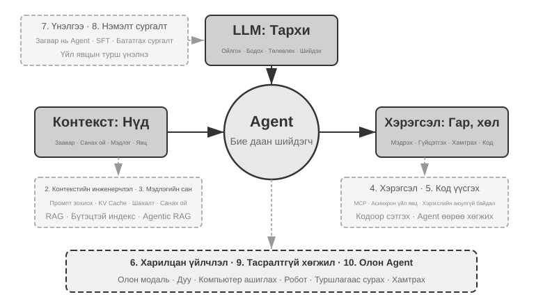
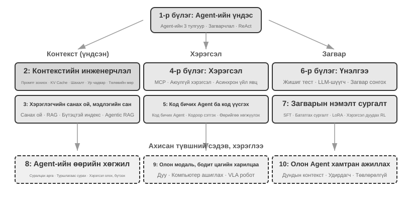

# Танилцуулга {.unnumbered}

2025 оны наймдугаар сараас аравдугаар сар хүртэл би Хятадын технологийн хэвлэлийн газар Turing-ээс зохион байгуулсан «AI Agent Bootcamp» сургалтад цуврал техникийн лекц уншсан. Зорилго маань энгийн байв: AI Agent-ийн дизайныг зөн совинд тулгуурласан хандлагаас зарчимд тулгуурласан хандлага руу шилжүүлэх. Өөрөөр хэлбэл, зөвхөн туршилтын үзүүлэнг ажиллуулах бус, Agent-ийг *яагаад* тийнхүү зохион бүтээдэг, архитектурын шийдвэр бүрийн цаана ямар харилцан буулт байдгийг ойлгуулахыг зорьсон. Энэхүү номыг тэдгээр лекцийн тэмдэглэл, туршилтаас эмхэтгэн, өргөжүүлж бүтээв.

Номын анхны санаанаас эхлээд эцсийн гар бичмэл хүртэлх ажлыг **шивнэн код бичих** (аман диктовк дээр суурилсан хамтын ажиллагаа) хэмээж болох аргаар гүйцэтгэсэн бөгөөд би өөрсдийн бүтээсэн дуут Agent болох Pine-ийг ашигласан. Лекц бүрийг бэлтгэхдээ би ерөнхий бүтцийг аман хэлбэрээр өгч, сэдвийг судлуулан, эхний ноорог гаргуулдаг байв. Лекцийн дараа Bootcamp-ийн суралцагчдын санал хүсэлтийг Pine-д дамжуулж, олон удаа хэлэлцэн сайжруулдаг байлаа. Ийнхүү давталт бүрээр лекцийн тэмдэглэл өнөөдөр таны гарт буй ном болон хөгжсөн. Энэ бүх хугацаанд би бараг бичээгүй, харин санаагаа чангаар хэлж өгсөн. Ярианы мэдээлэл дамжуулах хурд бичихээс хавьгүй өндөр (ердийн яриа бичихээс ойролцоогоор дөрөв дахин хурдан) тул «хэлж өгөх — судлуулах — хэлэлцэх — засварлах» давталт түргэн өрнөсөн. Нэг талаас энэхүү ном зөвхөн Agent-ийн тухай биш, мөн Agent-ийн оролцоотой бүтсэн бүтээл юм.

2025 оны эхээр DeepSeek R1 гарснаас хойш AI салбар зөвхөн суурь Model (өөрөөр хэлбэл, ерөнхий зориулалтын хэлний том загвар)-ын үе шатыг давж, инженерчлэлийн бодит нэвтрүүлэлтийн гүн рүү орлоо. Model-ийн түвшний ахиц хоёр чиглэлд илэрч байна. Нэгдүгээрт, Agent-д чиглэсэн бататгах сургалтын тусламжтайгаар загварууд Tool дуудах чадварыг параметртээ шингээж, программчлал, математик, компьютер ашиглах зэрэг салбарт ерөнхий чадвар эзэмшиж байна. Хоёрдугаарт, Model-ийн шинэчлэлийн хурд улам нэмэгдэж, GPT-5.2-оос GPT-5.5, Claude Opus 4.5-аас 4.8 хүртэлх томоохон ахиц бүр ердөө хагас жил орчим зайтай болжээ. Бүтээгдэхүүний түвшинд Manus, Claude Code, OpenClaw зэрэг ерөнхий зориулалтын Agent-ууд хүн, компьютерийн харилцан үйлчлэлийг шинээр тодорхойлж, «код үүсгэх + файлын систем» архитектурын хэв загварыг нийтлэг хэрэглээнд нэвтрүүлж байна.

Бараг жилийн өмнө сургалтдаа нэгтгэн танилцуулсан Agent-ийн архитектурын зарчмуудаа эргэн харахад баярлууштай атлаа гайхмаар нэг зүйл ажиглагдсан: **эдгээр зарчим хуучраагүй, харин улам нийтээр хүлээн зөвшөөрөгдөх болсон байна.** Skill, harness, давталтын инженерчлэл зэрэг шинэ нэр томьёо Agent-ийн салбарт түгсэн ч бодит дараалал нь эсрэгээрээ юм. Anthropic зэрэг компани эдгээр ойлголтыг анх зохиогоод салбараар дагуулсан хэрэг биш; олон Agent тэдгээрийг аль хэдийн хэрэгжүүлж байсан бөгөөд Anthropic бодит туршлагыг нэр бүхий дизайны зарчим болгон нэгтгэсэн. Эхлээд практик бий болж, дараа нь нэршил үүсдэг.

Эдгээр зарчимд итгэх итгэл маань Agent-уудыг бодит ертөнцийн удаан үргэлжлэх, өндөр хариуцлагатай ажилд ашигласнаас үүдэлтэй. Pine AI-ийн ерөнхий эрдэмтний хувьд би багийнхантайгаа Pine-ийг бүтээсэн. Миний мэдэж байгаагаар энэ нь бодит хүмүүстэй бие даан харилцаж, мөнгөтэй холбоотой эмзэг, төвөгтэй, урт хугацааны даалгаврыг хүний оролцоогүй найдвартай гүйцэтгэдэг анхны ерөнхий зориулалтын Agent юм. Тэр хэрэглэгчийн өмнөөс харилцаа холбооны оператор руу залгаж төлбөр тохиролцоно, худалдаа үйлчилгээний байгууллагаас мөнгө буцаан авах хүсэлт болон гомдол шийдвэрлүүлнэ, захиалгыг цуцална. Ийм ажил олон арван удаагийн хэлэлцээ шаарддаг бөгөөд ганц алдаа л бодит санхүүгийн хохирол дагуулж болно. Найдвартай байдалд тавигдах энэ хатуу шаардлага номын турш дахин дахин дурдагдах архитектурын зарчмуудыг нэг нэгээр нь төлөвшүүлсэн. Дараах жишээнүүд тэрхүү практикаас гаралтай.

- Skill гэдэг үг олны анхаарал татахаас өмнө бид хэт томрох Prompt-ийг хянахын тулд Prompt-ийг хэрэгцээний дагуу динамикаар ачаалж, хэт олон болох Tool-ийг хязгаарлахын тулд командын мөрийн гүйцэтгэх хэрэгсэл, Agent-д өөрийн гүйцэтгэлийн орчин, хэрэглэгчийн цаг, ажлын төлөвийг ойлгуулахын тулд системийн төлөвийн мөр ашиглаж байсан.
- Harness гэдэг үг түгэхээс өмнө бид тогтворгүй Tool дуудлага, хийсвэрлэн зохиосон хариулт, аюултай болон зөвшөөрөлгүй үйлдэл, үл тоомсорлосон зааврыг зохицуулахын тулд Claude Code-той төстэй аргууд ашиглаж байсан.
- Давталтын инженерчлэл нэршил болон түгэхээс өмнө Model даалгаврыг хэт эрт дууссан гэж зарлахаас сэргийлэхийн тулд энэ номд «санал гаргагч–хянагч» гэж нэрлэсэн аргыг хэрэглэж байсан.

Энэ бүхэн зөвхөн бидний зохион бүтээсэн зүйл ч биш. Миний мэдэж байгаагаар Model болон Agent хөгжүүлдэг тэргүүлэх компаниудын ихэнх нь ижил төстэй аргыг бие даан олсон. Тиймээс би 2025 оны наймдугаар сард Turing-ийн «AI Agent Bootcamp» сургалтыг эхлүүлж, 2024–2026 онд Хятадын Шинжлэх ухааны академийн их сургуульд AI Agent-ийн дадлага хосолсон сургалтыг тасралтгүй заасан. Мөн энэ мэдлэгийг илүү олон хөгжүүлэгчид хүргэхийн тулд номоо хаалттай хэвлүүлж, зохиогчийн эрхийн орлого олохын оронд нээлттэй эхээр нийтлэхээр шийдсэн.

**Эхлээд практик бий болж, дараа нь нэршил үүсдэг.** Энэ дараалал байгууллагын Agent хөгжүүлэлтэд тун бодит сургамж өгдөг: **Agent-ийн тухай шинэ нэр томьёо түгэхийг хүлээсний дараа хэрэгжүүлж эхэлбэл та аль хэдийн нэг алхмаар хоцорсон байна.** Нэршил чиг хандлага болох үед тэргүүлэгч компаниуд түүгээр нэрлэсэн асуудлыг ихэнхдээ аль хэдийн шийдсэн байдаг. Тэгвэл нэр нь гарахаас өмнө юу хийхээ яаж мэдэх вэ? Миний бодлоор хоёр зүйл чухал.

**Нэгдүгээрт, Agent-ийн чадварын дээд хязгаарыг бодитоор сорьдог бизнесийн асуудалтай байж, түүнээс жинхэнэ эргэх холбоог тасралтгүй авах хэрэгтэй.** Pine-ийг жишээлбэл, нэг даалгавар хэдэн цаг, тэр байтугай хэдэн долоо хоног үргэлжилж, олон талтай харилцах шаардлагатай болдог: утсаар олон цаг ярих, компьютер дээр төвөгтэй маягтуудын олон хуудсыг бөглөх, цахим шуудангаар хэд хэдэн удаа харилцах гэх мэт. Энэ бүхэнд ганц тоо ч алдаатай байж болохгүй бөгөөд харилцаа бүр хэрэглэгчийн эрх ашгийг хамгаалахуйц нягт нямбай байх ёстой. Ийм төвөгтэй орчинд ажиллаж байж л бизнесийн шаардлагыг Model дангаараа хангаж чадахгүй хэсгийг нөхөх Harness бүтээх хэрэгцээ практикаас аяндаа гарч ирдэг. Эсрэгээрээ бизнесийн шаардлага Model-ийн чадварын дээд хязгаарыг бараг сорьдоггүй, Model-ийг бага зэрэг шинэчлэхэд л хангагддаг бол эдгээр архитектурын зарчмыг боловсруулах шалтгаан үүсэхгүй.

**Хоёрдугаарт, үнэлгээний механизм бүтээх ёстой.** Энэ номд нэг санааг дахин дахин сануулна: үнэлгээ байхгүй бол ахиц дэвшил байхгүй. Үнэлгээний ачаар өөрчлөлт үнэхээр сайжруулалт уу, эсвэл зүгээр аз таарсан уу гэдгийг ялгаж, Agent-ийн шинэчлэлийн чиглэлийг зөн совингоор бус хэмжилтээр тодорхойлох боломжтой. Үндсэндээ бид инженерчлэл болон Agent бүтээх ажилд шинжлэх ухааны аргыг хэрэглэхийг дэмжиж байгаа бөгөөд үнэлгээ бол уг аргын суурь юм. Үүнийг долдугаар бүлэгт дэлгэрүүлнэ.

Суурь Model хэрхэн хөгжиж, бүтээгдэхүүний хэлбэр яаж өөрчлөгдсөн ч амжилттай Agent системүүд бараг бүгд ижил архитектурын хэв загварыг дагадаг. Энэ нь санамсаргүй хэрэг биш: **сайн дизайны зарчим Model-ийн шинэчлэлийн мөчлөгөөс ч удаан оршин тогтнох ёстой.** Учир нь тэд тодорхой Model-ийг хэрэглэх заавар биш, харин ухаалаг системүүд ертөнцтэй хэрхэн харилцдаг үндсэн хэв маягийг тайлбарладаг.

Тьюрингийн шагналт, бататгах сургалтын эцэг гэгддэг Ричард Саттон нэгэнтээ орчлон ертөнцийн хувьсал тоос, одод, амьдрал, Agent (эхэндээ «зориудаар бүтээгдсэн нэгж» хэмээн нэрлэсэн) гэсэн дөрвөн үе шатыг дамжсан гэж хэлсэн. Биологийн хувьсал сохроор явагддаг: санамсаргүй мутаци, байгалийн шалгарал. Ихэнх амьд организм өөрийн ажиллагааны зарчмыг ойлгодоггүй, өөрөө амьд биетийг зохион бүтээж, өөрчилж чаддаггүй. Харин Agent бол сансрын хувьслын түүхэнд цоо шинэ үзэгдэл юм. Код үүсгэснээр тэд өөрсдийгөө эхлүүлж, хөгжүүлж чадна. Энэ нь дараагийн программчлагчийг бичдэг программчлагч, харин тэр нь дараагийнхыг бүтээдэгтэй адил. Өөрөөр хэлбэл, Agent өөрийн ажиллагааны механизмыг ойлгон, зорилго өгөгдвөл цоо шинэ Agent бүтээж, бүр өөрийгөө сайжруулж чадна. Энэхүү бүтээлч үйл ажиллагааны зарчмыг ойлгож, эзэмшихэд тань туслах нь энэ номын зорилго юм.

Энэ номын үндсэн томьёо ганц өгүүлбэрт багтана: **Agent = LLM + Context + Tools**. Гурвуулаа зайлшгүй шаардлагатай.



Илүү ойлгомжтой зүйрлэвэл **Тархи + Нүд + Гар, хөл** гэсэн үг. Тархи (LLM) нь бодох, шийдвэр гаргахыг хариуцна. Нүд (Context) нь Agent ямар мэдээлэл харж чадахыг, гар хөл (Tools) нь Agent юу хийж чадахыг тодорхойлно. (Нарийндаа «нүд» нь бүдүүвчилсэн зүйрлэл: Context нь орчны мэдээлэл, харилцан ярианы түүхээс гадна Tool-ийн тодорхойлолтыг ч агуулна. Өөрөөр хэлбэл, Agent-ийн «харж» буй мэдээлэлд «ямар гар, хөл байгааг» ч багтаана. Энэ зүйрлэлээр гол санааг ойлгуулахыг зорьсон: Context бол Model-ийн мэдэрч, ашиглаж болох бүх мэдээлэл юм.)

Бататгах сургалтыг мэддэг уншигчид эдгээр гурвыг RL-ийн албан ёсны ойлголтуудтай холбон үзэж болно. Тухайлбал, LLM нь Policy, Context нь Observation Space, Tools нь Action Space-тэй харгалзана. Эдгээр гурван илэрхийлэл хийсвэрлэлийн өөр өөр түвшнээс нэг л зүйлийг тодорхойлдог.


## Номын бүтэц {.unnumbered}

Энэ ном дөрвөн түвшинд зохион байгуулагдсан арван бүлэгтэй (Зураг 0-2). Нэгдүгээр бүлэг Agent-ийн суурь хүрээг тогтооно. Хоёрдугаар бүлгээс зургаадугаар бүлэгт Context, мэдлэг, Tools, код үүсгэх, харилцан үйлчлэл гэсэн дарааллаар Agent бүтээхийг авч үзнэ. Долоодугаар бүлгээс есдүгээр бүлэгт үнэлгээний систем, Model-ийн сургалтын дараах шат, бодит ажиллагааны туршлагад суурилсан тасралтгүй хөгжлийг тайлбарлана. Аравдугаар бүлэг олон Agent-ийн хамтын ажиллагаанд хүрээг өргөжүүлнэ.



- **Нэгдүгээр бүлэг (Agent-ийн үндсэн ойлголтууд)** нь бодит Agent бүтээгдэхүүний жишээгээр зөн совингийн ойлголтыг бий болгоод Agent-ийн үндсэн томьёог гүнзгийрүүлэн тайлбарлана: LLM + Context + Tools гэсэн хэрэгжүүлэлтийн түвшин, Тархи + Нүд + Гар, хөл гэсэн зүйрлэлийн түвшин, эцэст нь Policy, Observation Space, Action Space гэсэн академик түвшин. Туршилтууд ReAct давталт буюу «Бодох → Үйлдэх → Ажиглах» үйл явцыг задалж, нэг даалгаврын Context дахь дасан зохицол, даалгавар дамжин хадгалагдах гадаад материалын шинэчлэл, сургалтын мөчлөг дэх параметрийн шинэчлэлийг ялгана. Эцэст нь урьдчилан тогтоосон ажлын урсгалаас автономит Agent хүртэлх зохион байгуулалтын загваруудыг авч үзэж, дараагийн бүлгүүдийн нэгдсэн ойлголтын хүрээг тогтооно.
- **Хоёрдугаар бүлэг (Context-ийн инженерчлэл)** бол номын хамгийн чухал бүлэг бөгөөд Agent-ийн «нүд» болох Context-ийг системтэй тайлбарлана. Эхлээд API мессежийн бүтэц, Agent-ийн үндсэн давталтыг танилцуулж, «Context бол мессежүүдийн жагсаалт» гэсэн суурийг тавина. Дараа нь LLM-ийн Inference үеийн өмнөх тооцооллын үр дүнг дахин ашиглах KV Cache-ийн үндсэн зарчмыг тайлбарлана. Үргэлжлүүлэн үйл явцад тулгуурласан дизайн, Tool-ийн тайлбар, бизнесийн дүрмийг сайжруулахыг хамарсан Prompt-ийн инженерчлэл; Prompt Injection халдлага ба хамгаалалт; Agent Skills-ийг хэрэгцээний дагуу ачаалах механизм; Agent-ийн төлөвийн мөр; Context шахах стратегийг авч үзнэ. Нэр томьёоны бүрэн тодорхойлолтыг үндсэн бичвэрт анх гарахад нь өгнө.
- **Гуравдугаар бүлэг (Хэрэглэгчийн Memory ба мэдлэгийн сан)** Context-ийн удирдлагыг олон сесс дамжин хадгалагдах мэдлэгийн систем болгоно. Ингэснээр Agent зөвхөн одоогийн харилцан яриаг санахаас гадна олон харилцан ярианы турш мэдлэг хуримтлуулж, эргэн ашиглах боломжтой. Хэрэглэгчийн Memory-ийн шаталсан дөрвөн стратеги; хариулт үүсгэхээс өмнө холбогдох баримтыг хайж олдог RAG-ийн бүрэн технологийн бүтэц, үүнд текст хайх өөр өөр арга, эрэмбэлэлтийг оновчлох; олон төрлийн мэдээлэл извлэх; мэдлэгийг зохион байгуулах ахисан аргууд; Agent хэзээ, юу хайхаа өөрөө шийддэг Agentic RAG зэргийг хамарна.
- **Дөрөвдүгээр бүлэг (Tools)** нь Agent-ийг гадаад ертөнцтэй холбох гүүрийг судална. Tools нь Agent-ийн «гар, хөл» бөгөөд вэб хайх, API дуудах, өгөгдлийн сан удирдах зэрэг боломж олгоно. MCP-ийн харилцан нийцлийн стандарт, мэдээлэл хүлээн авах, гүйцэтгэх, хамтран ажиллах, үйл явдлаар идэвхжих, хэрэглэгчтэй харилцах гэсэн таван төрлийн Tool-ийн дизайны зарчмыг танилцуулна. Олон модаль мэдээлэл хүлээн авах гурван арга (төрөлхийн олон модаль боловсруулалт, текстэд хөрвүүлэх, Tool-д суурилсан олон модаль шинжилгээ), гүйцэтгэх Tool-ийн аюулгүй байдлыг мөн онцолно. Үйл явдлаар идэвхжих, хэрэглэгчтэй харилцах, асинхрон ажиллах орчныг зургаадугаар бүлэгт авч үзнэ.
- **Тавдугаар бүлэг (Код бичдэг Agent ба код үүсгэх)** нь код бичдэг Agent, файлын систем хоёр ерөнхий зориулалтын Agent бүрийн техникийн гол суурийг бүрдүүлдэг гэж тайлбарлана. OpenClaw-ийн архитектурыг гол шугам болгон код бичдэг Agent-ийн ажлын урсгал, хэрэгжүүлэлтийг задлан шинжилж, код үүсгэх нь программчлалаас гадна бодож боловсруулахад туслах, мэдлэгийн сан байгуулах, шинэ Tools динамикаар бүтээх, Agent-ийг өөрөөр нь хөгжүүлэхэд хэр үнэ цэнтэйг үзүүлнэ.
- **Зургаадугаар бүлэг (Харилцан үйлчлэл: Ажиглалт ба үйлдлийн орон зайг өргөжүүлэх нь)** өмнөх таван бүлэгт хэрэглэсэн ээлжилсэн харилцааны нөхцөлийг халж, Agent-ийн ертөнцтэй харилцах боломжийг **модаль хэлбэр** ба **цаг хугацаа** гэсэн хоёр чиглэлд өргөжүүлнэ. Асинхрон, үйл явдалд суурилсан боловсруулалт нь ертөнц Agent-ийг өөрөө сэрээх боломж олгоно (үйл явдлаар идэвхжих Tool, хэрэглэгчтэй харилцах Tool, виртуал таних тэмдэг, тусгаарлагдсан гүйцэтгэлийн орчин); дуу хоолой харилцан үйлчлэлийг миллисекундын түвшинд хүргэнэ (дараалсан шаталсан Pipeline-аас төгсгөлөөс төгсгөл хүртэлх олон модаль, хоёр чиглэлд зэрэг ажилладаг Model хүртэл); Computer Use нь Agent-д хүний адил график интерфейс удирдах боломж олгоно; роботын манипуляци үйлдлийг физик ертөнцөд өргөжүүлнэ (VLA удирдлага, Sim2Real шилжүүлэлт). Эдгээр дөрвөн орчин сэрээлт, аюулгүй цэг, цуцлалт, түр зогсоон давуу эрх олгох, хурдан/удаан ажиллагааг салгах гэсэн нийтлэг үндсэн механизмуудтай.
- **Долоодугаар бүлэг (Agent-ийн үнэлгээ)** нь шинжлэх ухаанд суурилсан үнэлгээний аргачлал боловсруулна. Үнэлгээний орчны үндсэн хоёр загвар болох Tool дуудах, хүн–компьютерийн харилцан үйлчлэл, мөн бүлгийн төгсгөлд тусад нь авч үзэх симуляцийн орчин; өгөгдлийн багцын дизайны зарчим; LLM-as-a-Judge автомат үнэлгээ; үнэлгээнд тулгуурлан Model сонгох; үр дүнг системийн сайжруулалт болгодог бүрэн эргэх холбооны давталтыг хамарна.
- **Наймдугаар бүлэг (Model-ийн сургалтын дараах шат)** нь SFT (жишээ дагуулан сургах шошготой өгөгдөл ашигладаг сургалт) болон RL (туршилт, алдаа, урамшууллын эргэх холбоогоор сайжруулдаг бататгах сургалт) гэсэн хоёр аргыг гүнзгий тайлбарлана. «SFT цээжилдэг, RL ерөнхийшүүлдэг», «Өгөгдөл ба орчин нь алгоритмаас ч чухал» гэсэн гол санааны хүрээнд урьдчилсан сургалт/SFT/RL-ийн бүрэн зураглал, сонгодог RL-ийн онол, хоёртын болон үйл явцын урамшууллаас «үр дүнг урамшуулж, үйл явцыг хязгаарлах» баталгаажсан замын торгууль хүртэлх урамшууллын дохио, нэг болон олон ээлжийн RL алгоритм, дээж ашиглалтын үр ашгийг оновчлох зэрэг тэргүүлэх сэдвийг хамарна.
- **Есдүгээр бүлэг (Agent-ийн тасралтгүй хөгжил)** нь Agent-ийн ажиллагааны туршлагыг дараагийн хувилбарын чадварт хэрхэн хувиргахыг судална. Эхлээд орчны үр дүн, үйл явцын дүрэм, LLM-ийн үнэлгээний шалгуураас бүрдэх суралцах дохиог тодорхойлно. Дараа нь мэдлэгийн баримт бичиг, Prompts ба Skills, программ ба Harness, Model-ийн параметр гэсэн шинэчлэл хадгалах дөрвөн хэлбэрийг харьцуулж, нэр дэвшигч хувилбарын баталгаажуулалт, хэсэгчилсэн нэвтрүүлэлт, буцаалт, урт хугацааны нэгтгэлийг авч үзнэ.
- **Аравдугаар бүлэг (Олон Agent-ийн хамтын ажиллагаа)** AI Agent системийн дээд хэлбэр болох олон Agent ажил хуваарилан хамтран ажиллахыг тайлбарлана. Хуваалцсан/тусдаа Context × эн тэнцүү/менежертэй/төвлөрсөн бус бүтэц гэсэн ангиллыг системтэй танилцуулж, орчуулгын Agent болон утас+компьютерийн Agent-уудаар хамтын ажиллагааны архитектурыг жишээлэн, Agent-ийн нийгэм, эдийн засгийн тэргүүлэх чиг хандлагыг тоймлоно.

## Энэ номыг хэрхэн унших вэ {.unnumbered}

Номын бүлгүүд харьцангуй бие даасан тул хэрэгцээндээ нийцүүлэн өөр өөр дарааллаар уншиж болно.

- **Хэрэв та Agent хөгжүүлэгч бол** нэгээс есдүгээр бүлгийг дарааллаар нь уншаарай: эхний зургаан бүлэг бүтээх аргыг, долоодугаар бүлэг үнэлгээний суурийг, наймдугаар бүлэг Model сургахыг, есдүгээр бүлэг параметр болон шинэчлэл хадгалах бусад хэлбэрийг тасралтгүй хөгжлийн бүрэн давталтад нэгтгэхийг тайлбарлана. Олон Agent-ийн хамтын ажиллагааны хэрэгцээнээсээ хамааран аравдугаар бүлгийг сонгон уншиж болно.
- **Хэрэв таны цаг хязгаарлагдмал бол** ерөнхий зураглалыг ойлгохын тулд нэгдүгээр бүлэг, хамгийн чухал чадвар болох Context-ийн инженерчлэлийг сурахын тулд хоёрдугаар бүлгийг тэргүүнд уншаарай. Хоёрдугаар бүлгийн KV Cache-ийн суурь зарчмууд нэлээд техникийн шинжтэй. Анхны уншилтаар механизмыг алгасаж, эхэнд нь дурдсан гурван үндсэн дүгнэлтийг ойлгосон байхад дараагийн бүлгүүдийг ойлгоход саад болохгүй.
- **Хэрэв та Model сургалтад төвлөрч байгаа бол** наймдугаар бүлэг (Model-ийн сургалтын дараах шат) руу шууд орж болно. Долоодугаар бүлгийн үнэлгээний аргууд сургалтын урьдчилсан нөхцөл тул нэг, хоёрдугаар бүлгээс ерөнхий зураглал авсны дараа энэ хоёрыг хамтад нь уншаарай.

Бүлэг бүрд **туршилт** болон **бодох асуулт** олон бий. Тэдгээрийг «Туршилт X-Y» (X нь бүлгийн дугаар, Y нь тухайн бүлгийн туршилтын дараалал) хэлбэрээр дугаарласан. Туршилт, бодох асуултын гарчигт хүндрэлээр нь од өгсөн: ★ — анхан шат, бүх уншигчид тохиромжтой; ★★ — дунд шат, тодорхой инженерчлэлийн туршлага шаардлагатай; ★★★ — ахисан түвшний сорилт, ихэвчлэн нээлттэй асуулт эсвэл төвөгтэй системийн дизайн шаарддаг. Ихэнх туршилт ажиллуулж болох бүрэн кодтой бөгөөд дагалдах нээлттэй репозиторт байрлана:

> **Дагалдах кодын репозитор**: [https://github.com/bojieli/ai-agent-book](https://github.com/bojieli/ai-agent-book)

Git ашиглан бүх дагалдах кодыг авч болно:

```bash
git clone https://github.com/bojieli/ai-agent-book.git
cd ai-agent-book
```

Git ашигладаггүй бол репозиторын хуудсаас **Code → Download ZIP** сонгож болно. Туршилтын кодыг `chapter1/`-ээс `chapter10/` хүртэлх бүлгээр ангилсан. «Туршилт X-Y»-г олохын тулд харгалзах `chapterX/README.en.md`-г нээж, туршилтын дугаараар төслийн хавтсыг олсны дараа тухайн төслийн README дахь заавраар хамаарлуудыг суулгаж ажиллуулаарай. Дахин хэрэгжүүлэх заавар гэж тэмдэглэсэн зарим туршилт гадаад репозитороос хамаарна. Тэдгээрийг хэрхэн авахыг холбогдох README-д тайлбарласан.

Эдгээр туршилтыг өөрийн гараар ажиллуулахыг би онцгойлон зөвлөж байна: AI Agent бол практик давамгайлсан салбар бөгөөд олон дизайны зөн совин алдаа оношлон засаж байх явцад л бүрэлддэг.

**Нэр томьёоны тэмдэглэл**: Энэ номд энгийн хэрэглээнд ихэвчлэн хольж хутгадаг хоёр ойлголтыг зориуд ялгана. **Reasoning** буюу дүгнэлт нь Model-ийн алхам алхмаар бодох үйл явц; дүгнэлт хийдэг Model, бодлын гинж, дүгнэлтийн Token зэрэгт хэрэглэнэ. **Inference** бол ашиглалтын үеийн Model-ийн урагш чиглэсэн тооцоолол бөгөөд Inference-ийн зардал, технологийн бүтэц, тооцооллын үеийн өргөтгөл зэрэгт хэрэглэнэ. (Хятад хэвлэлд энэ хоёрыг 思考 буюу бодох, 推理 буюу дүгнэх гэсэн өөр үгээр илэрхийлж, ялгааг зориуд хадгалсан. Аравдугаар бүлгийн орчуулгын жишээнд энэ зарчмыг дахин авч үзнэ.) Бусад гол нэр томьёог анх гарсан газарт нь тодорхойлсон.

## Урьдчилсан мэдлэг {.unnumbered}

Энэ ном техникийн тодорхой суурьтай уншигчдад зориулагдсан ч заавал нэг салбарын мэргэжилтэн байх шаардлагагүй. Өөрийн бэлтгэлээ үнэлэхэд тань туслахын тулд урьдчилсан мэдлэгийг «Зайлшгүй» ба «Зөвлөмжит» гэсэн хоёр түвшинд ангиллаа.

**Зайлшгүй: Номыг бүхэлд нь унших суурь**

- **Python программчлал**: Номын бараг бүх туршилт Python дээр суурилна. Python-ийн үндсэн синтакс, түгээмэл өгөгдлийн бүтэц, багцын удирдлага (pip) зэрэг ойлголттой танил байх хэрэгтэй. Мэргэшсэн байх шаардлагагүй ч дунд зэргийн төвөгтэй Python код уншиж, өөрчилж чаддаг байхад хангалттай.
- **LLM ашиглаж байсан туршлага**: ChatGPT, Claude эсвэл ижил төстэй бүтээгдэхүүн хэрэглэж, «Prompt → Model-ийн хариулт» гэсэн үндсэн харилцан үйлчлэлийг ойлгодог байх.
- **AI-тусламжтай программчлалын хэрэгсэл**: Claude Code, Codex, Cursor, TRAE зэрэг хэрэгслийн аль нэгийг суулгаж, ашиглаж сурах. Эдгээр нь их хэмжээний код бичих, алдаа засах шаардлагатай туршилтуудыг мэдэгдэхүйц түргэсгэнэ. Мөн эдгээр нь өөрсдөө боловсорсон код бичдэг Agent тул ReAct давталт, Tool дуудлага, Context-ийн удирдлага зэрэг номын үндсэн механизмыг бодитоор мэдрэх боломж олгоно. Ийм туршлага Agent-ийн дизайны зарчмыг ойлгоход маш чухал.
- **Программ хангамжийн инженерчлэлийн ерөнхий мэдлэг**: Командын мөр, Git хувилбарын хяналт, JSON өгөгдлийн формат, REST API зэрэг ойлголттой байх. Эдгээр нь туршилт ажиллуулах, Agent-ийн Tool дуудах механизмыг ойлгох суурь юм.

**Зөвлөмжит: Зарим бүлгийг илүү сайн ойлгоход тустай мэдлэг**

- **Машин сургалтын үндэс** (наймдугаар бүлэг): Training ба Inference-ийн ялгаа, алдагдлын функц, градиент бууралт, хэт тохируулга зэрэг суурь ойлголт нь Model-ийн сургалтын дараах шатыг ойлгоход тусална.
- **Математикийн үндэс** (хоёр, гурав, наймдугаар бүлэг): Шугаман алгебрийн зөн совингийн ойлголт (жишээлбэл, вектор чиглэл болон хэмжээг илэрхийлдэг, матриц олон үйлдлийг багцаар гүйцэтгэдэг гэдгийг мэдэх) Embedding, Attention-ийн механизмыг ойлгоход тустай. Магадлал, статистикийн суурь мэдлэг нь үнэлгээний хэмжүүр, бататгах сургалтын хүлээгдэж буй урамшууллыг ойлгуулахад тусална. Номын математикт төвөгтэй баталгаа, гаргалгаа шаардахгүй, зөн совингийн тайлбарт төвлөрнө.
- **Вэб хөгжүүлэлтийн үндэс** (зургаадугаар бүлэг): HTTP, WebSocket, урд болон ар талын давхаргыг салгах архитектурын ойлголт нь үйл явдалд суурилсан асинхрон Agent, дуут Agent-ийн бодит цагийн харилцааны туршилтыг ойлгоход тусална.
- **Transformer архитектурын суурь ойлголт** (хоёр, наймдугаар бүлэг): Transformer бол өнөөгийн бараг бүх хэлний том загварын суурь архитектур. Model-ийн суурь мэдлэгээ системтэй хөгжүүлэхийг хүсвэл Хятадад Turing-ээс хэвлүүлсэн, Transformer архитектур, урьдчилсан сургалт, Fine-tuning зэрэг үндсэн ойлголтыг зургаар тайлбарладаг *Illustrating Large Models* (图解大模型) номыг уншиж болно. Энэ нь Agent-ийн инженерчлэлийн өнцгийг сайн нөхнө.

Эдгээр урьдчилсан мэдлэгийн зарим нь байхгүй бол санаа зовох хэрэггүй. Номын гол үнэ цэн тодорхой алгоритм, техникт бус, **архитектурын дизайны зарчим болон инженерчлэлийн аргачлалд** оршдог. Сургалтын дараах шатны тухай наймдугаар бүлгээс бусдад математик, машин сургалтын мэдлэг маш бага шаардах тул анхны суралцах эх сурвалж болгон ашиглаж болно.

Agent-ийн технологи одоо ч хурдтай хөгжиж байгаа ч **архитектурын сайн зарчим цаг хугацааг даван хадгалагдах чадвартай.** Дизайны цаад «яагаад»-ыг эзэмшвэл технологийн давалгаа өөрчлөгдөхөд ч нөхцөл байдлыг зөв дүгнэх боломжтой. AI Agent бүтээх замд тань энэ ном найдвартай хөтөч болно гэж найдаж байна.

## Талархал {.unnumbered}

Turing хэвлэлийн газрын редактор Мэн Гэ, Лю Мэйин нарт нягт нямбай редакц хийж, Turing-ийн «AI Agent Bootcamp» сургалтыг зохион байгуулсанд талархал илэрхийлье. Мөн Хятадын Шинжлэх ухааны академийн их сургуульд AI Agent-ийн дадлагын сургалт явуулах боломж олгосон профессор Лю Жүнминд талархаж байна. Turing-ийн «AI Agent Bootcamp» болон тус их сургуулийн AI Agent сургалтын бүх оюутанд онцгой талархал илэрхийлье. Та бүхний санал, зөвлөгөө надад үнэтэй эргэх холбоо болж, эдгээр ойлголтыг улам гүнзгий ойлгоход тусалсан.

Pine AI-ийн хамт олондоо мөн талархаж байна. Pine AI шиг чанартай бүтээгдэхүүн, түүнээс үүссэн олон сорилт байгаагүй бол би Agent-ийн салбарыг онол болон практикийн хувьд ийм гүнзгий судалж чадахгүй байсан. Хамт олонтойгоо санаа бодлоо олон удаа солилцох явцад би асар үнэ цэнтэй ойлголтууд олж авсан.

AI салбарын олон найздаа (энд нэрсийг нь нэг бүрчлэн дурдахгүй) бас талархъя. Та бүхэн удаа дараагийн хэлэлцүүлгээр миний үзэл бодолд үнэнч шударга эргэх холбоо өгч, олон алдаатай дүгнэлтийг минь засаж, Model болон Agent-ийн тухай ойлголтыг минь гүнзгийрүүлсэн.

Хамгийн гол нь гэр бүлдээ, ялангуяа эхнэр Мэн Жяинд талархаж байна. Тэр ном бичих бүхий л хугацаанд намайг дэмжиж, олон үнэтэй санал өгсөн.
