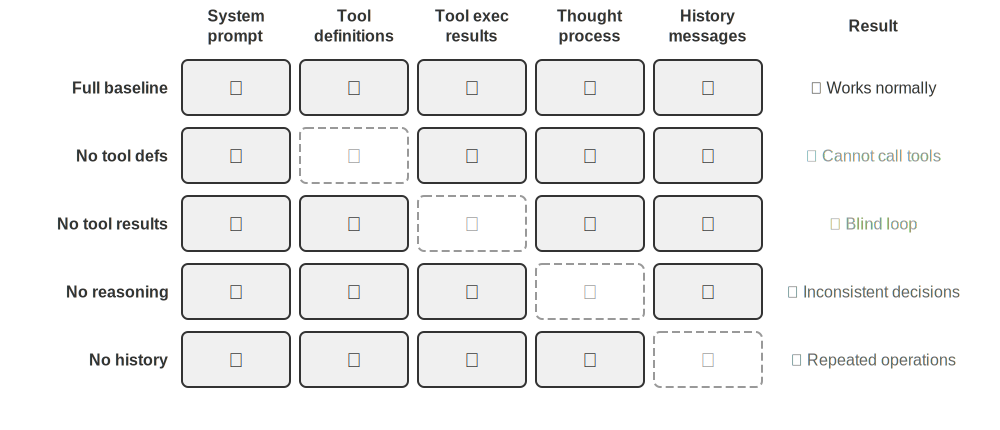
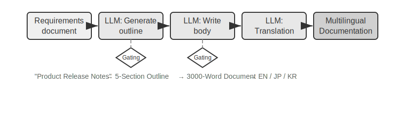

# Yapay Zeka Ajanlarına Giriş

Cursor'ı kod yazmak için kullanıp kod tabanınızda arama yaptığını, birden fazla dosyayı düzenlediğini ve testler geçene kadar tekrar tekrar çalıştırdığını izlediyseniz; bir konu hakkında Deep Research'ü kullanıp eksiksiz bir rapor ortaya çıkana kadar arama yaptığını, okuduğunu ve yeniden arama yaptığını gördüyseniz; Manus'un sizin için çevrimiçi görevleri tamamlamak üzere bir tarayıcıyı yönettiğine tanık olduysanız; Doubao telefon asistanına bilet ayırtmasını veya mesaj göndermesini rica ettiyseniz; ya da telekom sağlayıcınızı aramak ve faturanızı düşürmek için Pine AI'ı görevlendirdiyseniz—siz zaten Yapay Zeka Ajanlarını (AI Agents) kullanıyorsunuzdur.

Bu ürünler pek çok farklı biçimde karşımıza çıkar, ancak hepsinin paylaştığı ortak bir özellik vardır: artık pasif "sen sorarsın, o cevaplar" tarzı bir konuşma değildirler. Kendi yürütme adımlarını planlarlar, görevin gerektirdiği araçları çağırırlar ve sonuçlar geldikçe stratejilerini uyarlarlar. Yapay Zeka Ajanları, bilgisayarlarla etkileşim kurmanın yeni bir yolu haline gelmektedir.

Bu bölüm pratikten başlayıp bir Yapay Zeka Ajanının temel bileşenlerine doğru ilerler: modern Ajanların neler yapabildiğini bizzat deneyimleyecek, arkalarındaki mimariyi anlayacak ve Ajan sistemleri inşa etmek için gereken tasarım kalıplarını (design patterns) ve en iyi uygulamaları (best practices) öğreneceğiz.

> **Okuma İpucu**: Bu bölüm, kitabın tamamı için kavramsal bir harita niteliğindedir—Ajanların temel formülüne, çalışma döngüsüne, mühendislik çerçevesine ve tasarım kalıplarına hızlı bir bakış sunarak sonraki bölümlerin üzerine inşa edeceği ortak kelime dağarcığını ve referans noktalarını oluşturur. İlk okumada her kavramı ezberlemeye çalışmayın; genel bir izlenim edinmeyi hedefleyin. Sonraki her bölüm burada tanıtılan bir yönü derinlemesine ele alır ve yönünüzü kontrol etmek için her zaman buraya geri dönebilirsiniz.

## Modern Agent = LLM + Context + Tools

Modern bir Agent sisteminin özü, tek ve öz bir formülde toplanır: **Agent = LLM (Büyük Dil Modeli) + Context + Tools**. Bu formül basit ve pratiktir—yeter ki her terim geniş anlamıyla okunsun:

- **LLM, Agent'ın beynidir**: Sadece bir model parametreleri kümesi değil, Agent'ın niyeti anladığı, düşündüğü, plan yaptığı ve karar verdiği bütün karar alma çekirdeğidir. Tıpkı insan beyninin salt nöronlar topluluğundan ibaret olmayıp deneyimle şekillenen düşünme biçimlerini de taşıması gibi, bir LLM'in yeteneği de iki kaynaktan gelir: **pre-training** (ön eğitim) yoluyla biriktirilen dünya bilgisi ve dil yeteneği, ve **post-training** (sonradan eğitim) ile kalıcı hale gelen karar alma stratejileri (denetimli ince ayar ve pekiştirmeli öğrenme gibi teknikleri Bölüm 7'nin konusudur).
- **Context, Agent'ın gözleridir**: Sadece modele verilen metin değil, Agent'ın her karar noktasında görebildiği her şeydir—ortam, kullanıcı belleği, alan bilgisi, kendi durumu ve görev ilerlemesi. Tıpkı bir kişinin karar verirken durumu değerlendirmesi, ilgili deneyimi hatırlaması ve referanslara başvurması gerektiği gibi, Agent'ın context penceresi de o anda görebildiği her şeydir.
- **Tools, Agent'ın el ve ayaklarıdır**: Bir avuç çağrılabilir API fonksiyonu değil, Agent'ın yapabildiği her şeyin tam kümesidir—önceden tanımlanmış araç çağrılarından ihtiyaç halinde yüklenen becerilere (Skills), yeni yetenekler yaratmak için anlık kod üretmekten alt Agent'lara (sub-agent) iş devretmeye, kullanıcıya ulaşmaktan dış olaylara yanıt vermeye kadar uzanır.

Daha sezgisel bir ifadeyle: **Agent = Beyin + Gözler + El ve Ayaklar**. Beyin düşünür ve karar verir, gözler düşünmenin ihtiyaç duyduğu her şeyi sağlar, el ve ayaklar ise kararları gerçek dünyadaki değişikliklere dönüştürür.

Bu üç bileşen, RL'deki (Pekiştirmeli Öğrenme) üç temel kavrama tam olarak karşılık gelir (bkz. Bölüm 7). Aşağıdaki tablo **isteğe bağlı bir okumadır**—RL geçmişiniz yoksa rahatlıkla atlayabilirsiniz; ilerideki hiçbir şey buna bağlı değildir. Bu tablo yalnızca RL bilen okuyucuların bu bilgiyi kitabın terminolojisiyle eşleştirmesine yardımcı olmak için var:

| Sezgisel Karşılık | Uygulama Bileşeni | Akademik Kavram (İsteğe Bağlı) | Anlamı |
|---------------|----------------|------------------|---------------------------------------------|
| **Beyin** | LLM | **Policy (Politika)** | "Sırada ne yapılacağını" belirleyen karar alma mantığı—mevcut bilgiye bakarak tüm seçenekler arasından en uygun eylemi seçme |
| **Gözler** | Context | **Observation Space (Gözlem Alanı)** | Agent'ın görebildiği tüm bilgi—neyi görebildiği, okuyabildiği, hatırlayabildiği ve hangi sistemlere erişebildiği |
| **El ve Ayaklar** | Tools | **Action Space (Eylem Alanı)** | Agent'ın yapabildiği her şeyin tam kümesi—mesaj göndermekten kod çalıştırmaya, arayüzleri kontrol etmeye kadar hangi "araçların" mevcut olduğu |

Her bileşenin ne yaptığını ve birbirine nasıl bağlandığını anlamak, etkili Agent sistemleri kurmanın temelidir. Üçü arasında en somut olandan—el ve ayaklar, yani araçlar—başlayıp beyne (LLM) ve gözlere (context) doğru ilerleyeceğiz. Önce, farklı Agent türlerinin bu üç boyutta nasıl konumlandığına bakalım:

| Agent Ürünü | Gözler (Algı) | El ve Ayaklar (Eylem) | Strateji |
|-----------------|------------------------|--------------------------|-----------------------------|
| **Kodlama Agent'ları (örn. Cursor)** | Gereksinim dokümanları, kod tabanı, terminal ortamı | Açık uçlu (içsel akıl yürütme (reasoning), kod arama, dosya okuma/yazma, komut çalıştırma vb.) | Artımlı geliştirme: gereksinimi anla → ilgili kodu ara → kodu düzenle → test et ve doğrula → hata ayıkla ve düzelt |
| **Arama Agent'ları (örn. Deep Research)** | Web kaynakları, akademik veritabanları, yerel dosyalar | Açık uçlu (içsel reasoning, arama sorguları, web okuma, özet üretimi) | Yinelemeli derinleştirme: mevcut bilgiye göre arama yönünü ayarla, tam bir raporu kademeli olarak sentezle |
| **Bilgisayar Kontrol Agent'ları (örn. Manus)** | Bilgisayar ekranı, tarayıcı sayfaları, dosya sistemi | Açık uçlu (içsel reasoning, tıklama, yazma, kaydırma, ekran görüntüsü alma, kod çalıştırma vb.) | Görsel algı + işlem: ekranı gözlemle → hedef öğeleri belirle → eylemi gerçekleştir → sonuçları doğrula |
| **Telefon Asistanı Agent'ları (örn. Doubao)** | Telefon ekranı, yüklü uygulamalar | Açık uçlu (içsel reasoning, tıklama, kaydırma, yazma, uygulama açma vb.) | Niyet anlama + Uygulama kontrolü: kullanıcı ihtiyacını anla → hedef uygulamayı bul → eylemi gerçekleştir → tamamlandığını onayla |
| **Kişisel Görev Agent'ları (örn. Pine AI)** | Kullanıcı hesap bilgileri, geçmiş faturalar, servis sağlayıcı bilgi tabanı | Açık uçlu (içsel reasoning, arama yapma, e-posta gönderme, form doldurma, kullanıcıyla teyitleşme) | Çok adımlı görev yürütme: bilgi topla → müzakere stratejisi oluştur → servis sağlayıcıyla iletişime geç → müzakere et → sonuçları raporla |

Bu sistemler üç ortak özelliği paylaşır: **açık uçlu bir eylem alanı**—sabit bir düğme kümesinden seçim yapmak yerine keyfi doğal dil ve kod üretme; **içsel düşünme**—eylemden önce planlama ve reasoning; ve **sürekli etkileşim**—ortamdan gelen geri bildirime göre stratejiyi ayarlama. Bu yetenekler tam olarak beynin, gözlerin ve el-ayakların—yani LLM, context ve tools'un—etkileşiminden gelir.

### Tools: Agent'ın El ve Ayakları

Tools, Agent'ın dış dünyaya açılan köprüsüdür. İnsan el ve ayakları gibi, Agent'ı pasif bir gözlemciden aktif bir eyleyiciye dönüştürürler. Araçlar olmadan bir Agent sadece konuşur; araçlarla birlikte gerçekten dünyayı değiştirebilir.

Araçları sistematik olarak ele almak için, Agent'ın dünyayla etkileşim yönüne göre bunları beş türe ayırabiliriz. Şimdilik her türün temsili senaryolarına hızlı bir bakış, bir izlenim oluşturmak için yeterlidir; sonraki bölümler her birini derinlemesine işler.

**Algı Araçları (Perception Tools)**, Agent'ın bilgiye erişmesini sağlar: arama motorları gerçek zamanlı web verisi sunar, dosya sistemleri yerel dokümanları okur, API'ler ve veritabanları dış servislere ve kurumsal çekirdek verilere bağlanır.

**Yürütme Araçları (Execution Tools)**, Agent'ın dünyayı değiştirmesini sağlar: kod çalıştırma, dosya işlemleri, sistem komutları, dış API çağrıları—kararlar böylece somut eylemlere dönüşür.

**İş Birliği Araçları (Collaboration Tools)**, Agent'ın diğer Agent'larla iş bölümü yapmasını sağlar: uzmanlaşmış görevleri alt Agent'lara (sub-agent) devretmek, kritik karar noktalarında insan onayı istemek veya çoklu ajan (multi-agent) sistemlerinde eylemleri koordine etmek.

**Olay Tetikleyici Araçlar (Event Trigger Tools)**, ilk üç kategoriden temelde farklı bir şekilde devreye girer: Agent bunları çağırmaz—bunlar, Agent'ı harekete geçiren dış girdiler olarak gelir. Yeni bir e-posta gelir, zamanlanmış bir an gelir, başka bir sistem bir Webhook geri çağrısı tetikler—olay Agent'ı etkinleştirir ve düşünme ile eylemini başlatır. Agent bunları asla kendisi çağırmaz, ancak yine de dış dünyayla buluştuğu bir kanaldır, bu yüzden bunları geniş araç sistemine dahil ediyoruz.

**Kullanıcı İletişim Araçları (User Communication Tools)**, Agent'ın kullanıcıya ulaştığı kanallardır. Yürütme araçları dış dünyayı değiştirirken, iletişim araçları bilgi taşır—Agent'ın ilerlemesini veya proaktif bir durum güncellemesini metin mesajı, sesli arama, e-posta ve benzeri yollarla iletir.

Bölüm 4, bu beş türün tam sınıflandırmasını ve tasarım ilkelerini ele alır. Araç tasarımının kalitesi, bir Agent'ın ne kadar ileri gidebileceğini doğrudan belirler: arayüzler belirsiz tanımlanırsa model bunları yanlış kullanır; hatalar kötü yönetilirse tek bir başarısız araç Agent'ı kilitleyebilir; izinler fazla geniş tutulursa tek bir Agent hatası telafisi imkânsız hale gelebilir. MCP (Model Context Protocol / Model Bağlam Protokolü) standardı yaygınlaştıkça, bir aracı devreye almak bir eklenti kurmak kadar kolay hale geliyor—ekosistem hızla genişliyor, ancak tasarım ilkeleri eskimeyecek.

**Tool Calling** (araç çağırma, Function Calling olarak da bilinir), modern LLM Agent'larının temel bir yeteneğidir: modelin dış araçları yapılandırılmış bir şekilde çağırmasını sağlayarak LLM'i salt bir metin üretecinden gerçek eylem alabilen akıllı bir sisteme dönüştürür. Bu kitap boyunca "tool calling" terimi kullanılacaktır.

Tool calling dört adımdan oluşur: önce context, modele hangi araçların mevcut olduğunu (adları, amaçları, parametreleri) bildirir; ardından model bir araç çağırıp çağırmayacağına, hangisini çağıracağına ve hangi argümanlarla çağıracağına kendisi karar verir; sonra araç çalıştıktan sonra sonucu context'e eklenir; son olarak model bu sonuca dayanarak bir sonraki hamlesine karar verir. Bu döngü, bölümün ilerleyen kısımlarında tanıtılacak olan ReAct'in temelidir.

Bir hava durumu sorgusu senaryosunu örnek alırsak, bu dört adımlı sürecin API düzeyindeki basitleştirilmiş gösterimi şöyledir:

```
Adım 1: Araçları bildir                Adım 2: Model çağırmaya karar verir
tools: [{                             assistant: {
  name: "get_weather",                  tool_calls: [{
  parameters: {                           function: "get_weather",
    city: "string"                        arguments: {city: "Beijing"}
  }                                      }]
}]                                    }

Adım 3: Sonuç context'e eklenir       Adım 4: Model sonuca göre yanıt verir
tool: {                               assistant: {
  tool_call_id: "call_1",               content: "Bugün Pekin'de: 28°C, açık."
  content: '{"temp":28,"sky":"clear"}'     }}
```

Geliştirici yalnızca araçları tanımlar ve çağrıları yürütür; modelin kendisi çağırıp çağırmayacağına, hangisini çağıracağına ve hangi argümanları geçeceğine karar verir. Bölüm 2 bu API yapısını ayrıntılı olarak inceler.

Bir Agent için araç tasarlarken bunları genel amaçlı tutun—LLM'e manevra alanı bırakın. Özel bir hesap makinesi aracı yerine bir Python kod yorumlayıcısı ve bunu çalıştıracak güvenli bir sandbox sağlayın. Çalışma notları kaydetmek için özel bir araç yerine dosya okuma/yazma araçları ve sanal bir dosya sistemi sağlayın. Genel amaçlı araçlar, Agent'ın temel yetenekleri birleştirerek problemleri yaratıcı biçimde çözmesine olanak tanır.

### LLM: Agent'ın Beyni

Büyük Dil Modeli (LLM), Agent'ın karar alma çekirdeğidir. Bir kullanıcı isteği karşısında, önce gerçek niyeti çözmesi gerekir (kullanıcıların söyledikleri çoğu zaman gerçekte istedikleriyle aynı değildir), ardından belirsiz veya karmaşık bir görevi yürütülebilir adımlara ayırır. Yürütme boyunca sürekli yargılarda bulunur: sırada ne yapılacağı, bir araç çağrılıp çağrılmayacağı, hangisinin çağrılacağı, hangi argümanlarla çağrılacağı. Bu anlama-planlama-yürütme yeteneği, pre-training sırasında biriktirilen bilgiden gelir ve hem workflow'ların hem de otonom Agent'ların dayandığı temeldir.

LLM Agent'larının ayırt edici bir yeteneği **içsel akıl yürütmedir (internal reasoning)**—eyleme geçmeden önce Agent plan yapıp durumu düşünebilir. Bu, dış ortamda hiçbir şeyi değiştirmez, ama ardından gelen eylemleri belirgin biçimde iyileştirir. Bu tür reasoning'i etkili kılan şey pre-training'dir (internet üzerindeki devasa miktarda metin üzerinde yapılan ilk eğitim; model bu süreçte dil kalıplarını ve dünya bilgisini öğrenir): model, insan bilgisinden çoktan damıtılmış mantıksal kurallar üzerinden akıl yürütür—matematiksel yasalar, nedensel ilişkiler, problemleri parçalara ayırma stratejileri. Dolayısıyla bir Agent'ın reasoning'i kör bir deneme yanılma değildir; yapılandırılmış bir bilgi birikiminin üzerinde şekillenir.

Bu yapılandırılmış reasoning, bir LLM Agent'ın tamamen yeni görevleri sıfırdan üstlenmesini sağlar—zero-shot ve few-shot kavramları tam olarak bunu anlatır. Bunun doğrudan tezahürü **Zero-shot Generalization'dır (Sıfır örnekli genelleme)**: daha önce hiç görmediği bir görevle karşılaşan Agent, zaten bildiklerini yeniden birleştirerek bu görevin üstesinden gelir, hiçbir örneğe ihtiyaç duymaz. Kimse ona kuantum fiziği hakkında bir şiir yazmayı öğretmemiştir, ama dil ve fizik konusundaki mevcut bilgisinden yola çıkarak gayet iyi bir şiir üretebilir.

Daha ileri giderek, bir LLM Agent **Few-shot Adaptation'ı (Az örnekli uyarlama)** da yönetebilir: prompt içindeki iki üç örnek, yeni bir görev kalıbını kavraması için yeterlidir. Ona birkaç "kullanıcı yorumu -> duygu etiketi" örneği gösterin, yeni yorumların duygu durumunu sınıflandırabilir. Kısacası: zero-shot "hiç örnek olmadan yapabilme"dir; few-shot ise "bir avuç örnekten öğrenebilme"dir.

#### Model as Agent: Modelin Kendisinin Ürün Haline Gelmesi

"Model as Agent" (Agent Olarak Model) paradigması, Yapay Zeka Ajanı geliştirmedeki en yeni yöndür. Gelişmiş modeller, post-training (özellikle pekiştirmeli öğrenme) yoluyla tool calling'i yerleşik bir yetenek olarak içselleştirir: bir aracın ne zaman çağrılacağı, hangisinin çağrılacağı, hangi argümanlarla çağrılacağı—bunların hepsine model kendisi karar verir, elle orkestrasyon gerekmez. Bu, çerçeve (framework) katmanını daha az önemli kılmaz. Tam tersine: model ne kadar güçlüyse, etrafında kurulan Harness o kadar önem kazanır. Harness, tam anlamıyla bir ata takılan koşum takımıdır—dizginleriyle birlikte—ve bu, atın koşmasını engellemek için değil, o gücü doğru yöne yönlendirmek içindir. Agent bağlamında, model güçlü ama öngörülemez attır, Harness ise bu yeteneği güvenilir görev yürütümüne dönüştüren mühendislik kabuğudur. Ya da bir yarış arabası sürücüsünün etrafındaki destek sistemini düşünün: emniyet kemeri, pist bariyerleri, pit ekibi. Sürücü (model) ne kadar hızlıysa, bu sistem o kadar önem kazanır. Bir Agent'ta Harness; context yönetimi, araç arayüzleri, güvenlik kısıtları ile doğrulama ve düzeltme mekanizmaları gibi altyapıdan oluşur (bkz. bu bölümün son kısmı).

Bir modelin kendi kararını verme alanı ne kadar genişlerse, yanlış bir kararın verebileceği zarar da o kadar büyür—bu da güvenilirliği korumak için daha ince taneli kısıtlama, doğrulama ve düzeltme gerektirir. Model tedarikçilerinin gerçek avantajı "çerçeveyi inceltmek" değil, modeli ve etrafındaki Harness'i birlikte optimize edebilmek ve bunu sürekli yinelemektir.

Ama bunun ardında daha derin bir soru yatıyor: modeller güçlenmeye devam ederse, günümüzün Harness'i sonunda model tarafından "yutulacak" mı? Rich Sutton "The Bitter Lesson" (Acı Ders) yazısında, yapay zeka araştırmalarının yetmiş yıl boyunca tekrar tekrar sahnelenen bir manzarasına bakar[^ch1-1]: araştırmacılar bir alana dair anlayışlarını sisteme kodlarlar—kısa vadede etkilidir, ama uzun vadede hesaplama ve veriyle ölçeklenen genel yöntemler tarafından her zaman geride bırakılır: arama ve öğrenme. Bu ölçüyle bakıldığında, bir Harness'teki kısıtlama, doğrulama ve düzeltmenin ne kadarı modelin er ya da geç içselleştireceği bir "insan önseli"dir? Bu kitabın duruşu: **yönü onaylamak, hızı konusunda pragmatik kalmak**. Yön konusunda, modellerin Harness'i yutmaya devam edeceğinden kuşkumuz yok—tool calling ve uzun ufuklu planlama bir zamanlar dışsal orkestrasyondu, şimdi yerleşik yetenekler. Ama hız konusunda, bu "yutma" sezginin öngördüğünden çok daha yavaştır: eğitim aylar sürer ve bir model gerçek işin tüm kısıtlarını ve tercihlerini tek seferde içselleştiremez; modelin o anki yetenek sınırı, tam olarak Harness'in o anki değeridir. Harness engineering bu yüzden Acı Ders'e bir direniş değil, onun mühendislik zaman ölçeğindeki uygulamasıdır: model henüz güvenilir biçimde yapamadığı her şeyi Harness önce karşılar; model içselleştirdiği her katmanı Harness bırakır ve yeni yetenek sınırını desteklemeye geçer. Bu iplik kitabın tamamından geçer—Bölüm 2, context engineering açısından pragmatik yanıtı verir, Bölüm 8 bir Agent'ın bilgi ve yetenek yapılarını kendi başına nasıl keşfedebileceğini tartışır, Sonsöz ise "modeller Harness'i yutacak mı" sorusunun tam yanıtına geri döner.

[^ch1-1]: Sutton, Rich. “The Bitter Lesson”, 2019. http://www.incompletenessideas.net/IncIdeas/BitterLesson.html

#### Agent Öğrenme Mekanizmaları: Post-training, In-context Learning ve Externalized Learning

Pekiştirmeli öğrenmenin bir modelin bir aracı ne zaman ve nasıl çağıracağı kararını nasıl içselleştirmesini sağladığını az önce gördük. Ama bir Agent'ın öğrenmesi eğitim aşamasıyla sınırlı değildir—birçok okuyucu, bir Agent'ın deneyimden öğrendiğini duyduğu an modelin yeniden eğitilmesi gerektiğini varsayar. Oysa post-training, bir Agent'ın deneyimden öğrenmesinin yalnızca bir yoludur. Öğrenme mekanizmaları birbirini tamamlayan üç paradigmaya ayrılır (Şekil 1-1):



- **Post-training**: Deneyimi pekiştirmeli öğrenme yoluyla modelin parametrelerine kalıcı hale getirir—görevler arası en güçlü genellik, en yüksek güncelleme maliyetiyle birlikte gelir (bkz. Bölüm 7).
- **In-Context Learning (Bağlam İçi Öğrenme)**: Attention mekanizmasının (modelin girdisinin hangi kısımlarına odaklanacağına nasıl karar verdiği) gücüyle, context içindeki kalıp eşleştirme yoluyla anlık uyarlanır. Modele prompt içinde birkaç çözülmüş müşteri hizmetleri örneği gösterin (diyelim ki "müşteri şikayeti → yatıştırma + tazminat planı") ve yeni müşteri hizmetleri konuşmalarını da aynı şekilde ele alacaktır—işte bu in-context learning'dir. Uyarlama hızlıdır ama geçicidir: oturum bittiğinde buharlaşır. Ve adına rağmen, iç mekanizması gerçek öğrenmeden çok **kalıp eşleştirmeye (pattern matching)** yakındır. Bir benzetme: aynı türden çözülmüş üç matematik problemi gösterilip dördüncüsü sorulduğunda, kalıbı takip ederek muhtemelen çözebilirsiniz—in-context learning'in yaptığı da budur. Ama dördüncü problem gerçekten yeni bir yaklaşım gerektiriyorsa, ilk üç cevaba bakmak sizi oraya götürmez. Başka bir deyişle, in-context learning modelin **daha önce gördüğü kalıpları uygulamasını** sağlar, ama **tamamen yeni kurallar keşfetmesini** sağlayamaz—bu, post-training'den temel bir farktır (Bölüm 2 bu iddiayı attention mekanizması penceresinden geliştirir).
- **Externalized Learning (Dışsallaştırılmış Öğrenme)**: Bilgiyi ve prosedürleri bilgi tabanlarına ve çalıştırılabilir araç koduna dışsallaştırır—hem kalıcı hem de yorumlanabilir.

Bu üç paradigma farklı zaman ölçeklerinde birbirini tamamlar: post-training temel yeteneği sağlar, in-context learning hızlı uyarlamayı sağlar, externalized learning ise güvenilirlik ve verimlilik sağlar. Bölüm 8, üçünün birlikte nasıl çalıştığını sistematik olarak karşılaştırır.

Bir benzetme: post-training bir ders kitabı çalışmaktır—yetenek kalıcı olarak gelişir, ama maliyeti yüksektir; in-context learning anlık olarak bir referansa başvurmaktır—o açıkken iyi iş çıkarırsınız, kapandığında unutursunuz; externalized learning ise kişisel bir defter tutmaktır—kalıcıdır ve her zaman elinizin altındadır, ama bilinçli bakım gerektirir.

### Context: Agent'ın Gözleri

Context, bir Agent'ın her karar noktasında görebildiği her şeydir. Tıpkı karar veren bir kişinin masasına yayılmış malzemelere—görev talimatlarına, referans kılavuzlarına, önceki yazışmalara, en güncel verilere—ihtiyaç duyması gibi, bir Agent'ın context penceresi de onun görüş alanıdır. API açısından bakıldığında (Bölüm 2'de ayrıntılı), her bir LLM çağrısının context'i beş bölümden oluşur:

- **System Prompt (Sistem Talimatı)**: Kullanıcının sırayla yazdığı promptlardan farklı olarak, system prompt geliştirici tarafından yazılır ve konuşma boyunca sabit kalır. Agent'ın "iş tanımı"dır—kimliğini, yetkilerini ve davranış kurallarını tanımlar. System prompt'un özenli prompt engineering'i, Agent'ın çalışma biçimini şekillendirme yöntemimizdir. System prompt ayrıca oturumlar arasında kalıcı olan **kullanıcı belleğini** de (tercihler, geçmiş davranışlar ve arka plan ayarları gibi kişiselleştirilmiş bilgi; bkz. Bölüm 3) ve dinamik olarak enjekte edilen ortam durumunu da taşır.
- **Tool Definitions (Araç Tanımları)**: Agent'ın kullanabileceği araçların adlarını, işlevsel açıklamalarını ve parametre formatlarını bildirir. Araç tanımları olmadan Agent hiçbir aracı tanıyamaz veya çağıramaz—bir ablation study (Deney 1-1) bunu doğrulayacaktır. Araç tanımları, system prompt ile birlikte, konuşma boyunca değişmeden kalan **static prefix'i (statik ön ek)** oluşturur. (Bu temel kalıptır; 2026'dan itibaren üretim çerçeveleri, ön eki bozmadan tam araç şemalarını context'in sonunda ihtiyaç halinde de yükleyebiliyor—bkz. Bölüm 2'nin araç tanımları kısmı ve Bölüm 4.)
- **User Messages (Kullanıcı Mesajları)**: Kullanıcıdan gelen girdi. Kullanıcı mesajları, RAG (Retrieval-Augmented Generation / Bilgi Getirmeyle Güçlendirilmiş Üretim, ayrıntılar için bkz. Bölüm 3) yoluyla dinamik olarak getirilen **dışsal bilgiyi** de içerebilir—eğitim verisi kesim tarihinin ötesindeki bilgileri veya özel alan bilgisini kapsar.
- **Assistant Messages (Asistan Mesajları)**: Modelin daha önce ürettiği yanıtlar; en fazla üç bölümden oluşabilir—`reasoning` (tutarlılığı ve karar yorumlanabilirliğini koruyan içsel düşünce zinciri), `content` (kullanıcıya verilen yanıt) ve `tool_calls` (Agent'ın eyleme geçme biçimi). Belirli bir yanıtta bu üç bölüm aynı anda görünmeyebilir: örneğin Agent bir araç çağırmaya karar verdiğinde genellikle yalnızca `reasoning` + `tool_calls` bulunur; nihai bir yanıt verirken genellikle yalnızca `reasoning` + `content` bulunur.
- **Tool Results (Araç Sonuçları)**: Agent çerçevesi bir aracı çalıştırdıktan sonra dönen sonuç. Bu sonuçlar, Agent'ın bir sonraki düşünme adımının doğrudan dayanağıdır—ve hatalarını tekrarlamak yerine sonuçlardan öğrenmesini sağlayan şeydir.

İlk iki öğe (system prompt + araç tanımları) static prefix'i oluşturur; son üçü (kullanıcı mesajları + asistan mesajları + araç sonuçları) her etkileşimle büyüyen dinamik mesaj geçmişini oluşturur. Bu beş bölüm birlikte, her bir LLM çıkarımının context'ini oluşturur.

Her bileşen gerçekten vazgeçilmez mi? Bunu öğrenmenin en doğrudan yolu bir **ablation study**dir—nedenleri birer birer eleyen tanı yöntemi: A bileşenini kaldırıp sistemin hâlâ çalışıp çalışmadığına bakın, sonra B bileşenini, ve her bileşenin katkısı netleşene kadar böyle devam edin. Deney 1-1, tam olarak bu yöntemi yukarıdaki beş bileşene uygular. Sonuçlar: araç tanımlarını kaldırınca Agent tamamen eylemsiz kalıyor; araç sonuçlarını kaldırınca bir önceki adımın geri bildirimini göremiyor, bu yüzden aynı aracı tekrar tekrar çağırıp sonsuz bir döngüde sıkışıp kalıyor; asistan mesajlarından reasoning'i çıkarınca ardışık kararlar birbiriyle çelişmeye başlıyor; mesaj geçmişini düşürünce Agent fiilen hafızasını yitiriyor—görevin tamamını baştan başlatıyor, zaten yapılmış adımları tekrarlıyor. Her bileşenin rolü, salt teorik çıkarıma değil deneysel kanıta dayanıyor.

### Deney 1-1 ★★: Context'in Kritik Rolü

Her context bileşeninin Agent davranışını nasıl şekillendirdiğini sistematik bir **ablation study** ile araştırdık. Yukarıdaki beş bileşenden dördü test edildi—system prompt, Agent'ın temel kimlik tanımı olduğu için muaf tutuldu: o olmadan Agent'ın hiçbir rol farkındalığı olmaz ve test anlamsız olurdu. Şekil 1-2'de görüldüğü gibi, deney beş kontrollü grupla yürütüldü: her bileşeni koruyan eksiksiz bir temel çizgi (baseline), artı her biri bir bileşeni eksik olan dört grup; böylece her bileşenin Agent performansına etkisi gözlemlendi.


Deney sonuçları, her context bileşeninin yerine konulamaz rolünü ortaya koydu. **Tool Definitions** (static prefix'in bir parçası), Agent'ın eylem yeteneğinin temelidir; bunlar olmadan Agent hiçbir aracı tanıyamaz veya çağıramaz. **Tool Results**, kapalı döngü kontrolünün anahtarıdır; yokluğu Agent'ın "kör" hareket etmesine ve sonsuz bir döngüye düşmesine neden olur. **Reasoning süreci** (asistan mesajlarının reasoning kısmı), Agent'ın önceki kararlarının gerekçelerini korur, düşünce sürecini daha tutarlı kılar ve çelişkili kararları önler. **Mesaj geçmişi** (önceki turlardan gelen kullanıcı mesajları, asistan mesajları ve araç sonuçları), gereksiz işlemleri önler, görev yürütme tutarlılığını korur ve aynı hataların tekrarlanmasını engeller.

Deneyin temel çıkarımı: **context, Agent'ın ne görebileceğini belirler ve Agent yalnızca gördüğüne dayanarak karar verebilir**. Gözü bağlı bir kişinin sağlıklı yargılarda bulunamaması gibi, herhangi bir context bileşeni eksik olan bir Agent de ciddi bir karar alma yeteneği kaybı yaşar—araç tanımları olmadan hangi araçların var olduğunu bilemez; önceki yürütme sonuçları olmadan neyin zaten yapıldığını bilemez.

### ReAct Döngüsü

Üç bileşen elimizdeyken doğal bir soru ortaya çıkıyor: bunlar birlikte nasıl çalışır? ReAct döngüsü, LLM, context ve tools'u tek bir sisteme dizen temel mekanizmadır—bir Agent'ın adım adım nasıl düşünüp eylediğini izleyelim.

Bir Agent'ın bir görevi yürütme biçimine temel alınan kalıba **ReAct** (Reasoning + Acting) denir. Bu ad yalnızca reasoning ve acting'den bahsetse de, gerçek döngü üç aşamadan oluşur: model önce sırada ne yapılacağı hakkında **reasoning** yapar, ardından eylemde bulunmak için bir aracı **çağırır (act)**, sonra aracın sonucunu **gözlemler (observe)** ve bir sonraki adım hakkında reasoning yapar. Bu "düşün → yap → gör → düşün → yap → gör" döngüsü görev tamamlanana kadar tekrarlanır.

Somut bir örnek üzerinden—birden fazla para biriminde geliri toplama—bir Agent'ın **trajectory'sini (çalışma geçmişi/yörünge)** anlayalım: Agent çalışırken birikmiş mesaj geçmişi; kullanıcı mesajları, asistan mesajları (reasoning ve tool call'larıyla birlikte) ve araç sonuçlarından oluşur. Her bir LLM çağrısında, modelin aldığı eksiksiz context, **static prefix** (system prompt + araç tanımları) artı **trajectory** (dinamik mesaj geçmişi) toplamıdır (Şekil 1-3). Bu, temel bir gerçeği ortaya koyar: **Agent context'i = static prefix + trajectory**. Somut olarak, static prefix yukarıdaki beş bileşenin ilk ikisidir (system prompt + araç tanımları); trajectory ise son üçüdür (kullanıcı mesajları + asistan mesajları + araç sonuçları, her etkileşimle büyür). LLM, bu eksiksiz context'ten bir sonraki yanıtını üretir; bu yanıt da bir sonraki çağrı için trajectory'ye eklenir.


Bir trajectory'nin yapısı, sözde kod (pseudocode) olarak şöyledir:

```
trajectory = [
  {role: "user", content: "Şirketin çeyreklik gelirlerine göre: Q1 2.5M USD, Q2 2.1M EUR, Q3 1.8M GBP, Q4 380M JPY, şirketin toplam yıllık gelirini ve ortalama çeyreklik gelirini hesapla"},
  
  # İlk yineleme - LLM yukarıdaki trajectory'yi görür, bir yanıt üretir
  {role: "assistant",
   reasoning: "Tüm para birimlerini USD'ye çevirmem gerekiyor...",
   content: "",  # Kullanıcıya doğrudan yanıt yok
   tool_calls: [
     {name: "convert_currency", args: {amount: 2100000, from: "EUR", to: "USD"}},
     {name: "convert_currency", args: {amount: 1800000, from: "GBP", to: "USD"}},
     {name: "convert_currency", args: {amount: 380000000, from: "JPY", to: "USD"}}
   ]},
  
  # Agent çerçevesi araçları çalıştırır, sonuçları trajectory'ye ekler
  {role: "tool", content: "EUR->USD: 2282608.7"},
  {role: "tool", content: "GBP->USD: 2278481.01"},
  {role: "tool", content: "JPY->USD: 2541806.02"},
  
  # İkinci yineleme - LLM, araç sonuçları dahil eksiksiz trajectory'yi görür
  {role: "assistant",
   reasoning: "Dönüşüm sonuçları elde edildi, şimdi toplamak ve hesaplamak gerekiyor...",
   content: "",
   tool_calls: [
     {name: "code_interpreter", args: {code: "total = 2500000 + 2282608.7 + ..."}}
   ]},
  
  {role: "tool", content: "Toplam: $9,602,895.73, Ortalama: $2,400,723.93..."},
  
  # Üçüncü yineleme - LLM eksiksiz trajectory'yi görür, nihai yanıtı üretir
  {role: "assistant",
   reasoning: "Tüm hesaplamalar tamamlandı, sonuçlar özetleniyor...",
   content: "NİHAİ YANIT: Toplam gelir $9,602,895.73..."}
]
```

Dikkat edin, system prompt ve araç tanımları trajectory içinde gösterilmez—bunlar static prefix görevi görür ve her LLM çağrısından önce trajectory'nin başına otomatik olarak eklenir.

Deneyimizde bu döngü tüm açıklığıyla ortaya çıktı. İlk turda Agent görevi analiz etti ve üç para birimi dönüştürme aracını paralel olarak çağırdı; ikinci turda, dönüşüm sonuçlarını daha ağır hesaplama için bir kod yorumlayıcısına verdi; üçüncü turda, tüm hesaplamaların tamamlandığını doğruladıktan sonra nihai yanıtı üretti. Karmaşık, çok adımlı bir görev, sadece 3 yinelemede ve 4 araç çağrısında tamamlandı.

Bu tasarımın zarafeti, **context'in kümülatif doğasında** yatar. Her LLM çağrısı eksiksiz trajectory'yi görür, böylece model görevin hangi aşamasında olduğunu, daha önce nelerin denendiğini ve sonucunun ne olduğunu bilir. İnsanların bir problemi çözerken sürekli gözden geçirip özetlemesi gibi, Agent da trajectory'si sayesinde göreve dair küresel bir bakış açısı taşır. Ve trajectory yapılandırılmış olduğundan—kullanıcı mesajları, asistan mesajları (reasoning + tool calls) ve araç sonuçları temiz biçimde ayrıldığından—sistem son derece yorumlanabilir ve hata ayıklanabilir durumdadır.

Trajectory, bir yürütme kaydından fazlasıdır; Agent'ın yeteneğinin bir aynasıdır. Trajectory'leri büyük ölçekte analiz etmek, davranış kalıplarını, daha iyi karar yollarını ve daha iyi araç tasarımlarını ortaya çıkarır. Trajectory verisi hatta bir bilgi tabanına damıtılabilir, ya da pekiştirmeli öğrenme yoluyla daha güçlü Agent modelleri eğitmek için kullanılabilir—deneyimden öğrenme döngüsünü kapatır.

Artık Agent'ın çalışma döngüsünü anladığımıza göre, farklı modellerin bu döngüyü nasıl yürüttüğünü görmek için iki deney yapalım.

#### Deney 1-2 ★: Kimi K3'ün Yerleşik Agent Yeteneği

Bu deney, "Model as Agent" paradigmasının bir somutlaşması olan **Kimi K3**'ün yerleşik Agent yeteneğini gösterir. Moonshot AI tarafından 2026'da yayınlanan Kimi K3, yaklaşık 2,8 trilyon parametreli bir Mixture of Experts (MoE - Uzmanlar Karışımı) modelidir—MoE'yi bir uzman ekibi gibi düşünün: her problem türü için sistem, tüm ekibi çalıştırmak yerine buna en uygun birkaç uzmanı otomatik olarak devreye sokar, verimlilikten ödün vermeden yetenek kazanır. 1 milyon token'lık bir context penceresine, yerleşik görsel anlama yeteneğine ve her zaman açık bir "düşünme moduna" sahiptir; pekiştirmeli öğrenme yoluyla eğitilmiş olup tool calling **karar politikasını (decision policy)** yerleşik bir yetenek olarak içselleştirmiştir—bir aracın ne zaman çağrılacağı, hangisinin çağrılacağı ve hangi argümanlarla çağrılacağı tamamen model tarafından belirlenir—böylece web araması gibi görevleri otonom olarak yürütebilir. Daha kesin olmak gerekirse, içselleştirilen şey *ne zaman ve nasıl çağrılacağı* kararıdır; araçların kendisi—`web_search`, `code_runner` ve benzerleri—hâlâ API düzeyinde yerleşik araçlar olarak sunucu tarafında çalışır (Kimi, bu resmi araçları Formula adlı sunucu taraflı bir betik motoru üzerinden çalıştırır).

Temel gözlemler: model, araçların ne zaman ve nasıl kullanılacağını RL eğitimi yoluyla doğal olarak öğrendi, bu yüzden istemcinin artık tool calling için orkestrasyon mantığını elle yazmasına gerek yok; ne zaman arama yapacağına ve neyi arayacağına kendisi karar veriyor—gerçek bir otonomi; arama sonuçları geldikçe stratejisini dinamik olarak ayarlıyor ve bilginin yeterli olup olmadığına kendisi karar veriyor. Burada yaygın bir yanlış anlamayı gidermekte fayda var, ve anahtar nokta neyin kime ait olduğunu görmektir. **Pekiştirmeli öğrenmenin modele verdiği şey karar almadır**—bir aracın ne zaman çağrılacağı, hangisinin çağrılacağı, hangi argümanlarla, bir sonucu gördükten sonra devam edip etmeyeceği ve onlarca ya da yüzlerce çağrıyı tutarlı bir reasoning'e nasıl zincirleyeceği; işte bu *kullanıp kullanmama ve nasıl kullanma* yargıları modelin ağırlıklarına yazılan şeydir. **Araçların kendisi ve bunların yürütülmesi Agent çerçevesi (veya API'nin yerleşik araçları) tarafından sağlanır**—`web_search` ve `code_runner`'ın gerçek uygulamaları, kod sandbox'ı ve çağrıyı gönderip sonucu döndüren altyapı, modelin dışındaki altyapıda yaşar. RL karar politikasını optimize eder; bir arama motorunu veya bir kod sandbox'ını modelin ağırlıklarına paketlemez. Yani orkestrasyon döngüsü ortadan kalkmadı; istemciden sunucuya taşındı, karar alma ise modelin içine taşındı[^ch1-2].

[^ch1-2]: Okuyucu asdlem'e, RL'nin içselleştirdiği şeyin araç yürütme mekanizması değil tool calling karar politikası olduğu ayrımını GitHub Issue #30 üzerinden belirtip netleştirdiği için teşekkürler. Bkz. https://github.com/bojieli/ai-agent-book/issues/30

Kimi K3'ün Agent görevlerindeki öne çıkan avantajı **uzun zincirli araç çağrılarının kararlılığıdır**—çoğu modelin birkaç düzine çağrıda bozulmaya başladığı noktanın çok ötesinde, 200-300 ardışık araç çağrısını baştan sona tutarlı bir reasoning ile sürdürebilir. K3, uzun ufuklu programlama ve Agent iş yükleri için optimize edilmiştir ve iki varyantta yayınlanmıştır: K3 Max (diyalog ve Agent görevleri için) ve K3 Swarm Max (büyük ölçekli paralel işleme için). Açık kaynaklı bir model olarak, yazılım mühendisliği ve Agent benchmark'larında en üst düzey kapalı kaynak sistemlerle eşleşir—pekiştirmeli öğrenmenin bir modele yerleşik Agent yeteneği kazandırabileceğinin kanıtıdır.

#### Deney 1-3 ★: GPT-5.6'nın Yerleşik Deep Research Yeteneği

İkinci deney, gelişmiş bir modelin, API düzeyinde yerleşik araçların desteğiyle Deep Research için "ara—oku—analiz et" orkestrasyon döngüsünü sunucu tarafında nasıl kapattığını göstermek için **OpenAI GPT-5.6**'yı kullanır. GPT-5.6 üç varyantta gelir—Sol (amiral gemisi öncü model), Terra (günlük iş için dengeli model) ve Luna (hızlı, ekonomik hafif model)—hepsi tool calling kararlarını yerleşik olarak modele bırakır, böylece istemcinin kendi orkestrasyon çerçevesine ihtiyacı kalmaz. Kullanışlı bir özellik **Freeform Tool Calling'dir (Serbest Format Araç Çağırma)**. Geleneksel olarak, bir araç çağıran model her parametreyi katı bir JSON'a (yapılandırılmış bir veri formatı) paketlemek zorundadır—katı biçimlendirme kurallarına sahip bir form doldurmak gibi. Freeform tool calling (API'de `type: "custom"` türünde bir araç olarak tanımlanır), modelin JSON kaçış karakterlerini tamamen atlayarak araca doğrudan ham metin (bir Python kod parçası, bir SQL sorgusu) göndermesine izin verir. Şunu vurgulamakta fayda var: bu, model mimarisinde bir yenilik değil, API'nin parametre formatının bir evrimidir—istemcinin tool calling döngüsü (`tool_calls`'ı algıla → çalıştır → sonucu döndür) aynı kalır; sadece argümanlar bir JSON dizesinden ham metne dönüşür. GPT-5.6 ayrıca bir Verbosity parametresi (çıktı ayrıntı düzeyini kontrol eder) ve bir Reasoning Effort parametresi (düşünme derinliğini ayarlar; Sol, en kapsamlı reasoning süresi için bir maksimum düzey ekler) tanıtarak geliştiricilerin model davranışını görevin karmaşıklığına göre ayarlamasına olanak tanır.

GPT-5.6, Responses API'nin **web search ve code interpreter** yerleşik araçlarıyla eşleştiğinde, Deep Research'ün tam da özünü sunar: model, gerçek zamanlı bilgi için otonom olarak web'de arama yapabilir ve derinlemesine analiz için kod yazabilir, "ara -> oku -> analiz et -> yeniden ara" şeklinde yinelemeli bir araştırma sürecini mümkün kılar. Örneğin, "10 ASEAN ülkesinin başkentleri arasındaki en kısa mesafe nedir?" gibi bir soruyla karşılaştığında, GPT-5.6 otomatik olarak her başkentin coğrafi koordinatlarını arar, ardından tüm başkent çiftleri arasındaki büyük daire mesafesini hesaplamak için Python kodu yazar ve nihayetinde en yakın çifti belirler. Benzer şekilde, "Geçen ayki Bitcoin trendini araştır ve teknik analiz yap" gibi bir görevde, birden fazla finansal veri kaynağından gerçek zamanlı fiyat verisi çekebilir, hareketli ortalamalar, RSI, MACD ve diğer teknik göstergeleri hesaplamak için profesyonel teknik analiz kütüphaneleri kullanabilir, görsel grafikler üretebilir ve alım-satım önerileri sunabilir.

Daha da önemlisi, GPT-5.6 **OpenAI Deep Research** ürününün tasarım felsefesini model düzeyinde içselleştirerek bir **niyet netleştirme süreci** tanıtır. Bir araştırma isteği karşısında GPT-5.6 hemen yürütmeye başlamaz; önce bir dizi soru yoluyla kullanıcının gerçek niyetini netleştirir. "Geçen ayki Bitcoin trendini araştır ve teknik analiz yap" için önce şunu sorar: "Hangi veri kaynağını tercih edersiniz? Hangi teknik göstergelerin analiz edilmesini istersiniz?" Bu etkileşimli netleştirme, GPT-5.6'nın kullanıcının gerçekte ihtiyaç duyduğuna daha yakın, daha isabetli araştırma raporları üretmesini sağlar.

GPT-5.6, "Model as Agent"in olgun bir örneğidir—web search, code interpreter ve diğerleri, Responses API'nin yerleşik araçları olarak çalışır, sunucuda kapalı bir döngüde yürütülür; orkestrasyon döngüsü istemciden API sunucusuna taşınır, bu da istemci uygulamasını basitleştirir. Model hâlâ standart tool call'lar üretir; istemcinin yalnızca artık "ara—oku—analiz et" orkestrasyon çerçevesini kendisinin inşa etmesine gerek kalmaz. En dikkat çekici yönü niyet netleştirme mekanizmasıdır: bir görevi geldiği anda yürütmek yerine, model önce kullanıcının gerçekte neye ihtiyaç duyduğunu teyit eder, ardından bir araştırma stratejisi oluşturur. "Kullanıcının söylediği" ile "kullanıcının gerçekte istediği" arasındaki boşluk, yürütme başlamadan önce kapatılır.

Şekil 1-4, "Model as Agent" paradigması altındaki yerleşik tool calling'in tam mimarisini, Kimi K3 / GPT-5.6'nın gerçek dünya görevlerindeki ReAct yürütme süreciyle birlikte gösterir.


## Harness Engineering: Modelin Ötesinde Rekabet Gücü

Artık bir Agent'ın özünde nasıl çalıştığını anlıyorsunuz: bir LLM, context tarafından yönlendirilerek ReAct döngüsünü yürütür ve görevi tamamlamak için araçları kullanır. Yukarıdaki deneyler bu temel mekanizmanın çalıştığını kanıtlıyor—ve ne kadar kırılgan olduğunu da gözler önüne seriyor. Model halüsinasyon görebilir (var olmayan araçlar veya parametreler uydurabilir), yanlış aracı seçebilir ya da bir hatadan kurtulamayabilir. Çalışan bir demo ile güvenilir bir ürün arasında devasa bir uçurum vardır ve bu kırılganlıklar tam olarak Harness Engineering'in var olma nedenidir. Bu bölümün ilk yarısı bir Agent'ın ne olduğunu yanıtladı; ikinci yarısı ise bir Agent'ın üretimde nasıl güvenilir biçimde çalıştığını yanıtlıyor.

Önceki bölümler temel formülü ortaya koydu: **Agent = LLM + Context + Tools**. Bu formül Agent'ın **içsel bileşimini**—neyin beyin, neyin gözler, neyin el ve ayaklar rolünü oynadığını—tanımlar. Harness Engineering, aynı sisteme ikinci, **mühendislik-uygulama** açısından bir bakış ekler: LLM'i tek bir temel bileşen (Model) olarak ele alın ve etrafına inşa edilen tüm destekleyici koda Harness deyin. Bu iki bakış açısı birbirine rakip değildir; aynı sistemi farklı soyutlama düzeylerinde tanımlarlar. Daha genel olan "Model" kelimesine geçiyoruz çünkü Harness Engineering ilkeleri belirli bir model türüne değil, akıl yürütebilen ve araç çağırabilen her modele uygulanır. Harness'in özü, orijinal formüldeki "Context + Tools"tur, artı üç katman güvenlik önlemi: **Constrain** (Agent'ın neyi yapıp neyi yapamayacağı), **Verify** (bir şeyi doğru yapıp yapmadığı) ve **Correct** (yapmadığında nasıl kurtarılacağı).

Bir denklem olarak genişletildiğinde, eksiksiz üretim düzeyindeki bileşim şudur:

> **Agent = LLM + [Context + Tools + Constrain + Verify + Correct] = Model + Harness**

Minimal, çalışan bir Agent yalnızca LLM, context ve tools ile yürür. Uzun vadede üretimde güvenilir biçimde çalışmaya devam etmesi için üç dış mühendislik katmanına da ihtiyacı vardır—aşırıya kaçmayı önlemek için constrain, hataları yakalamak için verify, arızalardan kurtulmak için correct. Bu katmanlar sonradan eklenmiş "bağımsız modüller" değildir; "Context + Tools"un etrafını saran güvenlik önlemleridir. Başka bir deyişle: minimal formül demo bakış açısıdır, genişletilmiş formül ise üretim bakış açısıdır—ikincisi birincisini tamamen içerir ve etrafına bir güvenlik ağı ekler.

Sınırları netleştirmek için bir örnek: iade politikasını context'e gömmek "Context"tir, iade tutarının sipariş toplamını aşmadığını kontrol etmek ise "Constrain"dir. Bir API çağrısını yürütmek "Tools"tur, API zaman aşımına uğradıktan sonra otomatik olarak yeniden denemek ise "Correct"tir. Model, temel anlama ve reasoning yeteneğini sağlar; Harness ise bu yetenekleri güvenilir görev yürütümüne yönlendirir, kısıtlar ve güçlendirir. Modelin dışındaki bu altyapıyı tasarlama ve optimize etme mühendislik pratiğine **Harness Engineering** denir.

Somut bir örnek, Harness'in değerini gösterir. Bir Agent'tan, kullanıcının 3 gün önce verdiği bir siparişi iade etmesini istediğinizi varsayın. **Harness olmadan**: model iade politikasını göremez (context yok), hangi API'yi çağıracağını bilmez (tools yok), kullanıcı için bir iade sonucu uydurur (doğrulama yok) ve kullanıcı iadenin hiç gerçekleşmediğini fark eder (düzeltme yok). **Harness ile**: system prompt 7 günlük iade politikasını açıkça belirtir (context), Agent işi yapmak için `query_order` ve `process_refund` araçlarını çağırır (tools), çerçeve iadenin sipariş toplamını aşmadığını kontrol eder (constrain), veritabanına karşı iadenin gerçekleştiğini teyit eder (verify) ve API çağrısı zaman aşımına uğrarsa otomatik olarak yeniden dener (correct). Aynı model—Harness'li ve Harness'siz halleri arasında sonuçlar gece ile gündüz gibi farklıdır.

Bu bölümün başındaki koşum takımı (harness) benzetmesine dönersek: Harness'siz bir model, dizginsiz bir at gibidir—muazzam yetenekli, ama görevleri güvenilir biçimde tamamlayamaz.

Daha kesin olarak söylemek gerekirse, modelin dışındaki tüm altyapı Harness'e aittir. Harness'in özü Context ve Tools'tur; bunların etrafında üç tür mühendislik güvenlik önlemi inşa edilir:

| İşlev | Tek Cümlelik Sorumluluk | Context/Tools ile İlişkisi |
|----------|-------------------------------------------|------------------------------------------|
| **Context** | Modele algısal bilgi sağlar | Temel yetenek |
| **Tools** | Modele eylem araçları sağlar | Temel yetenek |
| **Constrain** | Davranışsal sınırlar koyar—neyin yapılıp neyin yapılamayacağı | Context ve tools etrafında inşa edilmiş güvenlik sınırı |
| **Verify** | İşlem sonuçlarının doğruluğuna otomatik olarak karar verir | Araç yürütme sonuçları etrafında inşa edilmiş kontrol mekanizması |
| **Correct** | Sorun bulunduğunda otomatik olarak düzeltir veya geri alır | Araç çağrısı başarısızlıkları etrafında inşa edilmiş kurtarma mekanizması |

Context ve Tools, Agent'ın "işi yapmasını" sağlar—görevi anlamasını ve ona göre eylemesini. Constrain, Verify ve Correct ise "işi yanlış yapmamasını" sağlar—Context ve Tools'tan ayrı bir şey değil, bunların üretimde güvenilir biçimde çalışmasını sağlayan mühendisliktir. Ve Agent ürünlerinin olgunluk eğrisi boyunca bu iki grubun ağırlığı değişir.

Erken dönem Agent çerçeveleri Context ve Tools'a odaklandı: modele araçlar verin, context verin, işi yapmasına izin verin. Üretim düzeyindeki sistemler ağırlık merkezlerini Constrain, Verify ve Correct'e kaydırdı: araç çağrılarının güvenli olduğundan, context'in yönetildiğinden ve hataların kurtarılabilir olduğundan emin olmak.

Claude Code'u ele alalım. Harness kodunun büyük çoğunluğu Context ve Tools'u değil, Constrain, Verify ve Correct'i yapar—araçların kendisi (dosya okuma/yazma, komut çalıştırma, arama) yalnızca küçük bir parçadır; bunların etrafında inşa edilen güvenlik önlemleri gerçek çekirdektir. Bu mekanizmalar şunları içerir:

- **Süreç Durumu Yönetimi**: Agent'ın şu anda hangi adımı yürüttüğünü izler
- **Çok Katmanlı Context Sıkıştırma**: Bilgi çok fazla olduğunda otomatik olarak budar
- **İzin Sınıflandırması**: Hangi işlemlerin kullanıcı onayı gerektirdiğini kontrol eder
- **Circuit Breaker (Devre Kesici)**: Hatalar art arda oluştuğunda otomatik olarak "atar" ve yeniden denemeyi durdurur—tıpkı bir ev elektrik sisteminde kısa devre olduğunda sigortanın atması gibi, tüm sistemin çökmesini önler
- **Hata Kurtarma Mekanizmaları**: İstisnaları yakalar, son kararlı duruma geri döner, yeniden dener veya bir insana devreder

**Sektör "işi yapmaktan" "işi güvenilir biçimde yapmaya" kayıyor ve bu da Harness Engineering'i Agent sistemlerinin temel rekabet avantajı haline getiriyor.**

### Prompt Engineering'den Loop Engineering'e: Mühendislik Paradigmalarının Evrimi

Yapay zeka uygulama mühendisliğinin gelişimine geriye dönüp baktığımızda, net bir evrimsel yay ortaya çıkıyor:

**Software Engineering (Yazılım Mühendisliği)** temeldir—geleneksel sistem tasarımı, mimari, test ve dağıtım. **Prompt Engineering**, ilk yenilik dalgasıydı—modele verilen doğal dil talimatlarını inceltilerek çıktı kalitesini iyileştirmek. **Context Engineering**, ikinci dalgaydı—yalnızca prompt'u optimize etmenin yetmediğinin fark edilmesi: modelin görebildiği her şeyin (sistem talimatları, araç tanımları, konuşma geçmişi, dışsal bilgi) sistematik olarak yönetilmesi gerekiyordu. **Harness Engineering**, üçüncü dalgaydı—bakış açısını "modelin görebildikleri"nden "modelin hangi tür bir sistem içinde çalıştığına" genişletir; modelin dışındaki tüm altyapıyı kapsar: kısıtlama mekanizmaları, doğrulama yöntemleri, geri bildirim döngüleri, hata kurtarma. En yeni dalga **Loop Engineering'dir**—bakış açısını bir kez daha genişletir, tek bir çalıştırmadan çalıştırmalar arasında sürdürülen otonom işleyişe geçer: bir sonraki işi kimin keşfettiği, ne zaman doğrulama yapılacağı ve görevin ne zaman gerçekten tamamlanmış sayılacağı (Bölüm 10 bunu multi-agent collaboration sistemleriyle birlikte geliştirir).

Bu beş aşama birbirinin yerine geçmez, iç içe geçmiş katmanlardır: Prompt Engineering, Context Engineering'in bir alt kümesidir; o da Harness Engineering'in bir alt kümesidir; o da Loop Engineering'in bir alt kümesidir. Her katman, mühendisin ilgi ve etki alanını bir öncekinin ötesine genişletir. **Modeller yetenek açısından birbirine yaklaşıp belirleyici bir farklılaştırıcı olmaktan çıktıkça, rekabet avantajı modelin dışındaki mühendisliğe kayar.** Yakın zamandaki mühendislik pratiği bunu doğruluyor. LangChain'in Terminal Bench 2.0 (bir Agent'ın terminal ortamında karmaşık görevleri tamamlama yeteneğini değerlendiren bir benchmark) üzerindeki çalışması çarpıcı bir örnektir: Kodlama Agent'ları %52,8'den %66,5'e yükseldi (lider tablosunda ilk 30'un dışından ilk 5'e sıçradı). Değişen model değil, Harness'ti—Agent'ın kendi yürütme sonuçlarını kontrol etmesi, tekrarlayan bir döngüde sıkışıp kalıp kalmadığını tespit etmesi, düşünme stratejisini inceltmesi. OpenAI'nin mühendislik ekibi benzer bir deneyimi paylaştı: 3 mühendis, 5 ayda yaklaşık bir milyon satır kod ve neredeyse 1500 PR tamamladı, geleneksel geliştirme hızının yaklaşık 10 katı. Sır daha güçlü bir model değildi; Harness'i doğru kurmaktı.

### Beş Harness İşlevinin Temel İlkeleri

Önceki tablo Harness'in beş işlevini listeledi. Aşağıdaki tablo, her işlevin temel tasarım ilkesini ve bu kitapta nerede ele alındığını ekleyerek kavramı pratiğe bağlar:

| İşlev | Temel İlke | Pratik Örnek | İlgili Bölüm |
|----------|------------------------------------------|----------------------------------|---------|
| **Context** | Bilgi Yeterliliği: Agent'ın her karar noktasında yeterli bilgiye dayanarak karar vermesini sağlamak | System prompt'lar, bilgi tabanları, Agent durum çubukları, Sidecar bypass sorguları | Bölüm 2 & 3 |
| **Tools** | Net Arayüz: Araç adları sezgisel, parametrelerin örnekleri var, sınırlar açıklanmış | MCP araçları, code interpreter, arama araçları | Bölüm 4 |
| **Constrain** | Güvenli Varsayılanlar (Fail-Safe Defaults): Tüm yetenekler varsayılan olarak kapalıdır ve açıkça etkinleştirilmelidir (mobil uygulama izin yönetimine benzer) | Claude Code'da her araç, çalıştırılmadan önce varsayılan olarak kullanıcı yetkilendirmesi gerektirir | Bölüm 4 |
| **Verify** | Girdi İzolasyonu: Güvenlik kontrolleri yalnızca yapılandırılmış verilere (örn. araçların döndürdüğü JSON alanları) bakar, modelin ürettiği serbest formatlı metne bakmaz (çünkü saldırganlar prompt injection yoluyla model çıktısını manipüle edebilir) | Linter kontrolleri, tip sistemleri, araç çağrısı sonucu doğrulaması | Bölüm 5 & 6 |
| **Correct** | Bir arıza kurtarılamaz olduğu doğrulanana kadar ara durumları açığa çıkarmayın (örn. kullanıcıya yarım kalmış bir sonuç göstermek yerine başarısız bir araç çağrısını sessizce yeniden deneyin) | Sessiz yeniden denemeler, devam üretimi, ardışık başarısızlıklarda insan yargısına geri dönüş (circuit breaker mekanizması) | Bölüm 2 & 5 |

Beş işlev kapalı bir döngü oluşturur: Context ve Tools karar almayı destekler, Constrain hataları önler, Verify sapmaları tespit eder, Correct döngüyü kapatır. Herhangi bir halkayı düşürürseniz sistemde bir güvenilirlik açığı oluşur. Belirli orkestrasyon kalıplarına ve guardrail tasarımlarına girmeden önce, önce etkili Agent'lar inşa etmenin ve bir model seçmenin temel ilkelerini ortaya koyalım—bundan sonraki her tasarım kararının temeli.

### Etkili Agent'lar İnşa Etmenin Temel İlkeleri

Anthropic'in deneyimine dayanarak, başarılı Agent sistemleri üç temel ilkeyi izler.

**Basit tutun.** En basit çözümle başlayın ve karmaşıklığı yalnızca gerçekten gerektiğinde ekleyin. Doğrudan API çağrıları karmaşık çerçevelerden daha iyidir; net kod akıllıca soyutlamadan daha iyidir—hata ayıklarken her ekstra soyutlama katmanı yeni bir kör noktadır.

**Şeffaf tutun.** Agent'ın planlama adımlarını, yürütme günlüklerini ve karar trajectory'sini açıkça gösterin. Bu yalnızca bir hata ayıklama kolaylığı değildir; kullanıcı güveninin ön koşuludur—kara kutu içindeki bir hata dışarıdan ne bulunabilir ne de düzeltilebilir.

**İyi bir araç arayüzü tasarlayın (ACI, Agent-Computer Interface).** ACI, arayüzü geleneksel API'lerde olduğu gibi programcının bakış açısından değil, Agent'ın bakış açısından—Agent'ın anlaması ve kullanması kolay olacak şekilde—tasarlamak demektir. Araç adları ve parametreleri sezgisel olmalı, olası yanlış kullanımlar tasarım yoluyla tamamen ortadan kaldırılmalıdır—bir USB konektörünün yalnızca tek bir yönde girmesi ve ters takılamaması gibi. İmalat sektöründe bu "hataları tasarımla ortadan kaldırma" felsefesinin bir adı vardır: Toyota Üretim Sistemi'nden gelen **Poka-yoke**. Kötü tasarlanmış bir araç, en güçlü modeli bile sürekli hata yapmaya iter—arayüz, model ile araç arasındaki tek kanaldır ve belirsiz bir arayüz, model tarafından sistemik bir hataya dönüştürülerek büyütülür.

Sonraki üç bölüm, Harness engineering içindeki bağımsız ama önemli üç konuyu ele alır: model seçimi, orkestrasyon kalıpları, guardrail'ler ve güvenlik. Hiçbiri Harness'in beş unsuruna doğrudan ait değildir, ama hiçbiri mühendislik pratiğinde göz ardı edilemez.

### Bir Model Nasıl Seçilir

Orkestrasyon kalıplarına geçmeden önce pratik bir soru: Agent'ınızı hangi tür model yönetmeli?

Model, Agent'ın zeka altyapısıdır ve doğru olanı seçmek çoğu zaman herhangi bir prompt ince ayarından daha etkilidir. Modeller belirli sürüm önerilerinin geçerliliğini koruyamayacak kadar hızlı yineleniyor, bu yüzden bu bölüm öneri yerine yönler sunuyor.

**"Büyük Üçlü"yü tanıyın.** Günümüz Agent geliştirmesinde en yaygın kullanılan üç kapalı kaynak model sağlayıcısı OpenAI (GPT/o serisi), Anthropic (Claude serisi) ve Google'dır (Gemini serisi). Her birinin güçlü yanları vardır: Claude, karmaşık reasoning, kodlama ve tool calling konusunda üstündür ve bu da onu Agent geliştirme için popüler bir seçim yapar; Gemini, ultra uzun bir context penceresi ve güçlü çok modlu (multimodal) yeteneklerle övünür, uzun metinler ve görüntü/video gibi multimedya senaryoları için uygundur; GPT/o serisi genel olarak dengeli yetenekler sunar ve en büyük kullanıcı tabanına sahiptir. Bir model seçerken yalnızca lider tablolarına bakmayın; **kendi görevleriniz üzerinde değerlendirin** (bkz. Bölüm 6).

**Çin Modelleri.** Uygulamanız Çin'de dağıtılıyorsa veya bütçeniz kısıtlıysa, Çinli tedarikçilerin modelleri pragmatik bir seçimdir. ByteDance'in Doubao serisi Çin içinde son derece düşük gecikme sunar, gerçek zamanlı etkileşim için uygundur; Moonshot AI'ın Kimi'si, Agent yetenekleri açısından daha güçlü Çin modelleri arasındadır; Qwen ve DeepSeek gibi açık kaynak modeller maliyet ve özelleştirilebilirlik açısından avantajlıdır. Modellerin tool calling yeteneği açısından geniş farklılıklar gösterdiğini unutmayın, bu yüzden karar vermeden önce mutlaka kendi senaryonuzda test edin. Çin modellerine genellikle Volcano Engine (Doubao) ve SiliconFlow (açık kaynak modeller) gibi platformların API'leri üzerinden erişilirken, denizaşırı modellere OpenRouter üzerinden tek tip erişilebilir.

**Açık Kaynak ve Kapalı Kaynak.** Kapalı kaynak modeller genellikle yetenek bakımından öndedir ama daha pahalıdır ve tedarikçinin API politikalarıyla sınırlıdır. Açık kaynak modeller düşük maliyetlidir, özel dağıtımı destekler ve fine-tuning ile özelleştirmeye izin verir, bu da onları maliyet duyarlı senaryolar veya veri uyumluluğu gereksinimleri olan durumlar için uygun kılar.

**Agent'ların Büyük Çoğunluğu Reasoning Destekleyen Bir Model Gerektirir.** Agent'lar karmaşık kararlar alır—çok adımlı reasoning, araç seçimi—ve reasoning'i olmayan modeller bunları genellikle kötü yapar. İstisnalar azdır: tek bir basit adım, veya sabit bir konuma tıklamaktan ibaret Computer Use GUI işlemleri; bu durumlarda reasoning yapmayan bir model idare edebilir. Çok adımlı reasoning veya dinamik karar alma devreye girdiği anda, bir reasoning modeli şarttır.

**Çıktı Hızına ve Çok Modlu Yeteneklere Dikkat Edin.** Maliyetin ötesinde, gözden kaçması kolay iki boyut vardır. Biri **çıktı token hızıdır**: Agent'lar tipik olarak çok sayıda çıkarım turu çalıştırır ve her tur bir sonraki başlamadan önce bitmelidir, bu yüzden çıktı hızı uçtan uca gecikmeyi doğrudan belirler—her turda 2 saniye daha yavaş çalışan 20 turluk bir Agent görevi, ekstra 40 saniyelik bir bekleme anlamına gelir. Diğeri ise **çok modlu (multimodal) destektir**: Agent'ınızın görüntüleri, sesi veya videoyu anlaması gerekiyorsa, multimodal yetenek zorunlu bir gereksinimdir ve modeller bu konuda büyük farklılıklar gösterir.

### Orkestrasyon Kalıpları: Workflow ve Autonomous

Orkestrasyon kalıpları, Harness'in "context ve tools" katmanını nasıl organize ettiğidir—LLM çağrıları arasında context'in nasıl aktığını, araçların nasıl zamanlandığını ve Agent'ın yürütme yolunun önceden mi sabitlendiğini yoksa anlık mı üretildiğini belirlerler. Agent orkestrasyonu basitten karmaşığa doğru evrildi ve her kalıbın kendi senaryoları ve ödünleşimleri vardır. Anthropic'in LLM Agent'ları inşa eden düzinelerce ekiple çalışma deneyiminde, en başarılı uygulamalar nadiren karmaşık çerçeveler kullanır; basit, birleştirilebilir kalıplar kullanırlar.

Bir LLM uygulaması inşa ederken basitten karmaşığa doğru gidin. Tek bir LLM çağrısıyla başlayın—daha iyi prompt'lar ve bağlam içi örnekler sorunu çözüyorsa bir Agent sistemi inşa etmeyin. Birden fazla adım gerektiğinde ve görev sabit alt görevlere temiz bir şekilde ayrışıyorsa bir workflow kullanın. Yalnızca dinamik kararlara ve esnek bir yürütme yoluna ihtiyaç duyduğunuzda bir autonomous Agent'a başvurun. Ve şunu unutmayın: Agent sistemleri tipik olarak daha iyi görev performansı karşılığında gecikme ve maliyetten ödün verir—bu takasın buna değip değmediğini dikkatle tartın.

#### Workflow Kalıbı: Deterministik Orkestrasyon

Bir **workflow**, LLM'leri ve araçları önceden tanımlanmış kod yolları aracılığıyla orkestre eden bir sistemdir. Yürütme yolu deterministiktir, geliştirici tarafından önceden tasarlanmıştır—her adımın ne yaptığı ve sonra nereye gideceği koda gömülüdür; LLM yalnızca her düğümün içindeki anlama ve üretimi yönetir.

Bir uçuş rezervasyonu Agent'ını örnek alırsak, bir workflow dört sabit düğümle tasarlanabilir:

1.  **Kullanıcı Kimliğini Doğrula**—Kullanıcının kim olduğunu teyit etmek için kimlik doğrulama API'sini çağırır.
2.  **Uygun Uçuşları Ara**—Kullanıcı gereksinimlerine göre uçuş veritabanını sorgular.
3.  **Ödemeyi Tamamla**—Tutarı düşmek için ödeme arayüzünü çağırır.
4.  **Rezervasyonu Onayla**—Koltuğu kilitlemek ve kullanıcıya onay göndermek için rezervasyon API'sini çağırır.

Her düğüm içinde bir LLM kullanılabilir (örn. kullanıcının seyahat ihtiyaçlarını anlamak için doğal dil kullanmak), ama düğümler arasındaki akış sırası kod tarafından sabitlenmiştir—sistem ödeme tamamlanmadan koltuk ayırtmaz, kimlik doğrulamadan önce uçuş aramaya başlamaz.

Workflow kalıbının iki temel avantajı vardır. Birincisi, **sıkı süreç kontrolü**: geliştirici, kritik adımların asla atlanmayacağını veya sırasız çalışmayacağını garanti edebilir—"ödemeden önce rezervasyon yok" gibi iş kuralları LLM'in takdirine bırakılmaz, kod tarafından zorunlu kılınır. İkincisi, **güvenlik**: yürütme yolu deterministik olduğundan, bir prompt injection veya model hatası olsa olsa geçerli düğümün içindeki işlemeyi bozabilir; Agent'ı ulaşmaması gereken bir dala sıçratamaz. Saldırı yüzeyi tek bir düğümle sınırlıdır.

Bir workflow'un başlıca sınırlaması **esneklik eksikliğidir**. Akışın hiç öngörmediği bir şey olduğunda—kullanıcı ödeme sırasında rezervasyonu değiştirmeye karar verir, ya da bir uçuş aniden iptal edilir ve alternatif önerilmesi gerekir—sabit yol uyum sağlayamaz; yapabileceği tek şey önceden belirlenmiş bir istisna dalını izlemek ya da kontrolü bir insana geri vermektir.

#### Autonomous Agent: Dinamik Otonom Karar Alma

Bir workflow'un sabit yolu yetersiz kaldığında, bir **autonomous Agent'a** ihtiyaç duyarız. Autonomous Agent ile workflow arasındaki temel fark, yürütme yolunun önceden tanımlanmamış olması, bunun yerine **ortam geri bildirimine** dayanarak Agent tarafından gerçek zamanlı belirlenmesidir.

Yine uçuş örneği: bir autonomous Agent'ın önceden tanımlanmış dört düğüme ihtiyacı yoktur. Kullanıcı "Gelecek çarşamba Şangay'a bir uçuş ayırt" der ve Agent bunu ilerledikçe çözer—uçuşları arar, giriş yapması gerektiğini keşfeder, önce kimliği doğrular, aramaya geri döner, en ucuz uçuşun aktarmalı olduğunu fark eder, kullanıcıya bunun kabul edilebilir olup olmadığını sorar; kullanıcı aktarma istemediğini söyler, bunun üzerine arama kriterlerini ayarlar...

Bu yüzden bir autonomous Agent'ın kendi kendine plan yapması—kendi yürütme adımlarını seçmesi—ve bir hatada sadece durmak yerine başarısızlığı fark edip stratejisini değiştirmesi gerekir. Ama otonomi sınırsız değildir: açık **durdurma koşulları** tasarlanmalıdır (görev tamamlandı, maksimum yineleme sayısına ulaşıldı, kurtarılamaz bir hatayla karşılaşıldı), aksi halde Agent kolayca sonsuz döngülere veya aşırı yürütmeye kayar.

Uygulama açısından bakıldığında, bir autonomous Agent özünde bir döngü içinde araçları kullanan, görevi ilerletmek için sürekli ortam geri bildirimi alan bir LLM'dir—bu, daha önce tanıtılan ReAct döngüsüdür. Yaygın çıkış koşulları şunları içerir: bir nihai çıktı aracının çağrılması, modelin herhangi bir tool call olmadan bir yanıt döndürmesi, ya da bir hatayla karşılaşılması veya maksimum tur sayısına ulaşılması.



Autonomous Agent'lar özellikle açık uçlu problemler için uygundur—gereken adım sayısının tahmin edilmesinin zor ya da imkânsız olduğu durumlar. Tipik uygulama senaryoları şunları içerir: SWE-bench (Software Engineering Benchmark, bir Agent'ın gerçek GitHub sorunlarını otomatik olarak çözme yeteneğini değerlendiren bir benchmark) görevlerini çözen Kodlama Agent'ları, bir insan gibi bilgisayar arayüzlerini işleten "Computer Use" Agent'ları ve yinelemeli arama ile analiz gerektiren araştırma görevleri.

Otonomi ayrıca daha fazla maliyete yol açar ve hataların birikmesine izin verir. Bu yüzden bir autonomous Agent'ı dağıtmak, bir sandbox içinde kapsamlı test, uygun guardrail'ler ve izleme, ve kritik karar noktalarında human-in-the-loop kontrol noktaları gerektirir.

#### İki Kalıbı Seçmek ve Karıştırmak

Pratikte, workflow'lar ve autonomous Agent'lar ya-ya da seçimi değildir—birçok sistem ikisini karıştırır: sıkı uyumluluk gereksinimleri olan kritik süreçler güvenilirlik için workflow olarak çalışır, esnek karar gerektiren kısımlar ise autonomous moda geçer. Örneğin n8n, geliştiricilerin görsel bir tuval üzerinde işlevsel bileşenleri sürükleyerek Agent'lar inşa ettiği olgun bir açık kaynak workflow otomasyon çerçevesidir—ve workflow düğümleri ile autonomous Agent düğümleri aynı sistemde bir arada bulunabilir.


#### Ana Akım Agent Çerçevelerinin Kısa Karşılaştırması

Aşağıdaki tablo, okuyucuların kendi senaryoları için doğru olanı hızla belirlemesine yardımcı olmak amacıyla güncel ana akım Agent çerçevelerini/platformlarını özetler:

| Çerçeve/Platform | Temel Konumlandırma | Orkestrasyon Kalıbı | Geliştirme Yaklaşımı | Uygulanabilir Senaryolar |
|-------------------|--------------------|----------------|----------------|-------------------------|
| **OpenAI Agents SDK** | Hafif Agent geliştirme kütüphanesi | Autonomous (araç döngüsü) | Kod öncelikli | Hızlı prototipleme, tek Agent'lı uygulamalar |
| **Claude Agent SDK** | Üretim düzeyinde Agent geliştirme çerçevesi | Autonomous (araç döngüsü + alt Agent'lar) | Kod öncelikli | Karmaşık otonom görevler, Kodlama Agent'ı |
| **LangChain / LangGraph** | Genel amaçlı LLM uygulama çerçevesi | Workflow + Autonomous | Kod öncelikli | Karmaşık düşünce zincirleri, çok adımlı workflow'lar |
| **n8n** | Görsel workflow otomasyonu | Workflow + Autonomous | Düşük kod (görsel sürükle-bırak) | İş otomasyonu, teknik olmayan ekipler |
| **Dify** | LLM uygulama geliştirme platformu | Workflow + Konuşmalı | Düşük kod (görsel + API) | Kurumsal düzeyde RAG, bilgi tabanı uygulamaları |
| **CrewAI** | Rol tabanlı multi-agent orkestrasyonu | Multi-Agent iş birliği | Kod öncelikli | Ekip bazlı görev ayrıştırma ve yürütme |
| **OpenClaw** | Açık kaynak hepsi bir arada kişisel Agent | Autonomous + Olay güdümlü | Yapılandırma + Kod (self-hosted) | Kişisel asistan, Deep Research, Computer Use, çok platformlu mesaj entegrasyonu |

"Model as Agent" eğilimi derinleştikçe, bir çerçevenin temel değeri artık "LLM çağrılarını orkestre etmekte" yatmıyor—modeller giderek kendi kararlarını kendileri veriyor. Daha da önem kazanan şey modelin etrafındaki Harness engineering'dir: context yönetimi, araç ekosistemi, güvenlik kısıtları, hata kurtarma. Bir çerçeve seçerken soru, çerçevenin ne kadar sofistike olduğu değil, iş mantığına mümkün olan en ince soyutlama katmanı üzerinden odaklanmanıza izin verip vermediğidir.

Orkestrasyon kalıpları, Harness içindeki context ve tools'un organizasyonunu çözer—LLM çağrılarının, araçların ve veri akışlarının nasıl bağlandığını. Ama işi yapmak yeterli değildir; aynı zamanda doğru ve güvenli biçimde yapılması gerekir. Bu yüzden şimdi constrain, verify ve correct mekanizmalarının pratikte nasıl hayata geçtiğinin başlıca yolu olan guardrail'lere dönüyoruz.

### Guardrail'ler ve Güvenlik

Bu bölüm, büyük resmi ortaya koymak için guardrail'lere üst düzey bir genel bakış sunar. Uygulama ayrıntıları ve pratik, Bölüm 2'de (prompt injection koruması), Bölüm 4'te (araç izin kontrolü) ve Bölüm 5'te (kod yürütme güvenliği) devam eder; ilk kez okuyanların her ayrıntının peşine düşmesine gerek yok.

Guardrail'ler, Harness'in "constrain, verify ve correct" katmanının başlıca uygulanma biçimidir—Agent davranışını güvenli ve kontrol edilebilir tutan katmanlı bir savunma. İyi tasarlanmış **guardrail'ler**, veri gizliliği risklerini (örn. system prompt sızıntısını önlemek) ve itibar risklerini (örn. model davranışını markayla tutarlı tutmak) yönetmeye yardımcı olur. Zaten belirlediğiniz risklere yönelik guardrail'lerle başlayın, yeni zafiyetler ortaya çıktıkça yenilerini ekleyin.

Guardrail'leri derinlemesine savunma (defense in depth) olarak düşünün. Tek başına hiçbir guardrail muhtemelen yeterince koruma sağlamaz, ama uzmanlaşmış birkaçının birleşimi çok daha dayanıklı bir Agent sistemi yaratır.

#### Guardrail Türleri

Bulundukları yere göre guardrail'ler üç türe ayrılır: girdi tarafı, yürütme tarafı ve çıktı tarafı.

**Girdi tarafı (input-side)** guardrail'ler, istekleri Agent'a ulaşmadan önce yakalar, tipik olarak dört mekanizma yoluyla. **İlgi sınıflandırıcıları (relevance classifiers)**, konu dışı sorguları işaretler—bir kodlama asistanına "Empire State Binası ne kadar yüksek?" diye sorulması gibi. **Güvenlik sınıflandırıcıları (safety classifiers)**, jailbreak'leri (modeli güvenlik kısıtlamalarını aşmaya kandırma) ve prompt injection'ları (girdiye kötü niyetli talimatlar gömme) tespit eder. Temel fark şudur: bir jailbreak'te kullanıcının kendisi modelin kısıtlamalarını aşmaya çalışır; prompt injection'da bir saldırgan dışsal veriler (web içeriği, dokümanlar) yoluyla model davranışını dolaylı olarak manipüle eder. **İçerik denetimi (content moderation)**, şiddet içeren veya ayrımcı içerik gibi zararlı veya uygunsuz girdiyi işaretler. **Kural tabanlı korumalar**, SQL injection gibi bilinen tehditlere karşı deterministik önlemler—kara listeler, girdi uzunluk sınırları, düzenli ifade (regex) filtreleri—uygular.

**Yürütme tarafı (execution-side)** guardrail'ler tool call'ları doğrular. Çekirdek, **araç risk derecelendirmesidir (tool risk rating)**: bir işlemin geri alınabilir olup olmadığına, izin düzeyine ve finansal etkisine göre her araca bir risk düzeyi (düşük/orta/yüksek) atanır. Yüksek riskli işlemler ek inceleme veya insan onayı gerektirir.

**Çıktı tarafı (output-side)** guardrail'ler, yanıt kullanıcıya döndürülmeden önce kontrol edilir. **PII filtreleri (kişisel tanımlayıcı bilgi filtreleri)**, gereksiz açığa çıkmayı önlemek için çıktıyı kişisel tanımlayıcı bilgi (örn. kimlik numaraları, telefon numaraları) açısından inceler; **çıktı doğrulama**, içerik kontrolleri yoluyla yanıtın marka değerleriyle uyumlu olmasını sağlar.

Bazı mekanizmaların (örn. kural tabanlı regex filtreleme) hem girdi hem çıktı tarafında kullanılabildiğini unutmayın; yukarıdaki sınıflandırma en yaygın dağıtım konumlarını takip eder.

#### İnsan Müdahalesi

**Human in the loop (sürece insan dahil etme)**, temel bir koruyucu önlemdir: bir Agent'ın kullanıcı deneyimini bozmadan gerçek dünya performansını iyileştirmesini sağlar. En çok erken dağıtımda önem taşır; başarısızlık modlarını belirlemeye, uç durumları (edge case) ortaya çıkarmaya ve sağlam bir değerlendirme döngüsü kurmaya yardımcı olur.

Bir human-in-the-loop mekanizmasıyla, bir görevi tamamlayamayan Agent kontrolü zarif bir şekilde devredebilir. Müşteri hizmetlerinde bu, bir insan temsilciye yükseltme anlamına gelir; bir Kodlama Agent'ı için ise kontrolü geliştiriciye geri vermek anlamına gelir.

İnsan müdahalesini tetikleyen tipik olarak iki ana durum vardır:

**Başarısızlık Eşiklerinin Aşılması**
Agent'ın yeniden deneme ve işlem sayısına bir üst sınır koyun. Agent bu sınırları aşarsa (örn. birkaç denemeden sonra hâlâ müşterinin niyetini kavrayamıyorsa), bir insana yükseltin.

**Yüksek Riskli İşlemler**
Hassas, geri alınamaz veya yüksek riskli işlemler—en azından ekip Agent'ın güvenilirliğine yeterli güven inşa edene kadar—insan gözetimini tetiklemelidir. Tipik örnekler: bir kullanıcının siparişini iptal etmek, büyük bir iadeyi yetkilendirmek, bir ödemeyi işlemek.

Şimdi beş Harness unsurunun ana hattına dönelim—bu kitabın bölümlerinin bu çerçeve içinde nasıl açıldığına bakalım.

### Harness Engineering'e Pratik Bir Rehber Olarak Bu Kitap

Harness engineering merceğinden bakıldığında, bu kitabın her bölümü Harness'in bir bileşenini sistematik olarak inşa eder. Bu arada güvenlik tek bir bölüme ait değildir; kitabın tamamının kesişen bir kaygısıdır (cross-cutting concern; bir sistemin birçok parçasına aynı anda dokunan bir kaygı—yazılım mühendisliğinde loglamanın her modülden geçmesi gerekmesi gibi). Aşağıdaki tablo, Harness işlevlerini, güvenlik yönlerini ve ilgili bölümleri tek bir bakışta sunar:

| Harness Odağı | İlgili Bölüm | Temel İçerik | Güvenlik Kaygıları |
|--------------------|--------------------|-------------------------------|------------------------|
| Context Tasarımı | Bölüm 2 (Context Engineering) | Prompt engineering, Agent durum çubuğu, context sıkıştırma, Agent Skills | Prompt injection ve bilgi sızıntısı |
| Context Genişletme (Bilgi Kalıcılığı) | Bölüm 3 (Bilgi Tabanı) | Kullanıcı belleği, RAG, yapılandırılmış indeksleme, agentic RAG | Hassas bilgi ifşası, gizlilik koruması |
| Araç Tasarımı ve Güvenlik Kısıtları | Bölüm 4 (Araç Tasarımı) | Araç sınıflandırması, izin kontrolü, MCP standardı, asenkron mimari | Yanlış işlem, yetkisiz erişim, geri alınamaz işlemler |
| Araç Doğrulama ve Düzeltme | Bölüm 5 (Kod Üretimi) | Kodlama Agent'ının Harness'i, test odaklı geliştirme, kodlaştırılmış kurallar | Kimlik taklidi, sorumluluk atfı |
| Sistem Düzeyinde Doğrulama | Bölüm 6 (Değerlendirme) | Değerlendirme ortamı, veri kümeleri, otomatik değerlendirme, gözlemlenebilirlik | — |
| Model Düzeyinde Düzeltme | Bölüm 7 (Post-Training) | SFT (Denetimli İnce Ayar), Pekiştirmeli Öğrenme—Harness'te biriken geri bildirim sinyallerini model parametrelerine yazmak, Harness engineering'in bir uzantısı olarak görülür | Hedef uyumsuzluğu, alignment ve sağlamlık |
| Sistem Düzeyinde Düzeltme | Bölüm 8 (Kendi Kendine Evrim) | Externalized learning, araç yaratma, deneyim birikimi | — |
| Çok Modlu Context ve Tools | Bölüm 9 (Çok Modlu ve Gerçek Zamanlı Etkileşim) | Sesli Agent, Computer Use, robotik işlem | Çok modlu girdinin güvenlik filtrelemesi, gerçek zamanlı etkileşimde izin kontrolü | 
| Çoklu Agent'lar Arasında Kısıtlama ve Düzeltmeler | Bölüm 10 (Multi-Agent İş Birliği) | İş birliği mimarisi, başarısızlık modları, Agent toplumu | Agent'lar arası güven sınırı ihlalleri, paylaşılan kaynak çatışmaları |

Anthropic'in uzun süre çalışan Agent'lar inşa etme pratiği, Harness tasarımının modelin kendisinin çözemediği sorunları nasıl çözebildiğini gösterir. Uzun görevlerin iki başarısızlık modunu—context'in tükenmesi ve görevin erken bitmiş sayılması—ele almak için yapılandırılmış bir Harness kullanarak, karmaşık görevleri bir "Başlatma Agent'ı" (ortamı kurar, görev listesini ayrıştırır) ile bir "Yürütme Agent'ı" (her oturumda artımlı ilerleme kaydeder ve net devir teslim çıktıları bırakır) arasında bölerler. İlerideki bölümler Harness'i bileşen bileşen ele alır—Bölüm 2, en merkezi olanla, context engineering ile başlar, Bölüm 5 ise Kodlama Agent'larında Harness engineering'in eksiksiz pratiğini ortaya koyar.

## Bölüm Özeti

Bu bölüm, pratikten başlayarak Yapay Zeka Ajanlarını anlamak ve inşa etmek için temel çerçeveyi kurdu.

**Agent = Beyin + Gözler + El ve Ayaklar**: LLM beyindir (karar alma çekirdeği), context gözlerdir (neyi görebildiğini belirler) ve tools el ve ayaklardır (neyi yapabildiğini belirler). Üçünden hiçbiri vazgeçilmez değildir.

**Gözler (Context) Belirleyici Faktördür**: Context, bir static prefix'ten (system prompt + araç tanımları) ve dinamik bir trajectory'den (mesaj geçmişi) oluşur. Ablation, herhangi bir bileşenin kaldırılmasının sistemi belirgin biçimde kötüleştirdiğini gösterir. ReAct döngüsünün özü, modelin görevi ilerletmeye devam etmesi için trajectory'ye tekrar tekrar ekleme yapmaktır.

**Harness Rekabet Avantajıdır**: Model yeteneği metalaşıyor; gerçek ayırt edici faktör Harness'tir—context ve tools'un etrafında inşa edilmiş, bir Agent'ın "işi güvenilir biçimde yapmasını" sağlayan constrain, verify ve correct mekanizmalarıdır. Üretim düzeyindeki Agent sistemlerinde, Harness kodunun büyük çoğunluğu yalnızca context ve tools'a değil bu güvenlik önlemlerine gider.

**Workflow'dan Autonomous Agent'a**: Önce prompt'lar, sonra workflow'lar, en son autonomous Agent'lar—bu sıralama, sürpriz riskini düşük tutmanın en pratik yoludur. Her orkestrasyon kalıbının kendi doğal alanı vardır; hiçbiri her yerde en iyisi değildir.

**Güvenlik Mimari Bir Meseledir**: Guardrail'ler, human-in-the-loop müdahalesi, alignment (modelin davranışını insan niyetiyle tutarlı tutmak)—güvenlik, lansmandan önce yamalanacak bir şey değil, kodun ilk satırından itibaren tasarlanması gereken bir şeydir. Beş düzeyi kapsar: model, context, tools, iş birliği ve toplum.

Sonraki bölüm, Harness'in en merkezi bileşenine—context engineering'e—derinlemesine iner. Agent kavramının pekiştirmeli öğrenmedeki akademik köklerine ve geleneksel RL ile modern LLM Agent'larının daha kapsamlı bir karşılaştırmasına gelince, Bölüm 7 ikisini de sistematik olarak ele alır.

Aşağıdaki düşünce soruları, bölümün temel kavramlarını bir düzey daha derinleştirmek için tasarlanmıştır.

## Düşünce Soruları

1. ★★ Bir Agent sistemine yalnızca tek bir yetenek ekleyebilseydiniz—daha güçlü bir model, daha zengin bir context, ya da daha fazla araç—hangisini seçerdiniz? Seçiminiz hangi koşullarda değişirdi?
2. ★★★ ReAct döngüsünde, Agent'ın her bir LLM çağrısı eksiksiz geçmiş trajectory'sini görür, bu yüzden trajectory büyüdükçe bu tasarımın maliyeti karesel olarak büyür. Bu karesel büyüme, kritik bilgi kaybedilmeden kırılabilir mi?
3. ★★ "Model as Agent" paradigması, modellerin tool calling kararlarında giderek daha otonom hale geldiği anlamına gelir. Ancak bu bölüm, Harness engineering'in öneminin aslında arttığını savunuyor. Bu iki eğilim nasıl bir arada var olabilir? Agent çerçevelerinin gelecekteki temel değeri nerede yatıyor?
4. ★★ Ablation deneyinde, "araç sonucu geri bildiriminin" yokluğu Agent'ın sonsuz bir döngüye düşmesine neden oldu. Üretim ortamında, eksik araç sonuçlarının yanı sıra bir Agent'ın döngüye girmesine hangi başka durumlar neden olabilir? Hangi tespit ve sonlandırma mekanizmalarını tasarlardınız?
5. ★ Bu bölüm beş Agent ürününü algı, eylem ve strateji olmak üzere üç boyutta analiz etti. Günlük kullandığınız bir yapay zeka ürününü seçin, aynı üç boyutta analiz edin ve mimarisinin mantıklı olup olmadığını değerlendirin. Siz tasarlıyor olsaydınız neyi iyileştirirdiniz?
6. ★★ Özellikle uçuş rezervasyonu için bir müşteri hizmetleri sistemi tasarlıyor olsaydınız, bir workflow kalıbı mı yoksa bir autonomous Agent kalıbı mı seçerdiniz? Aynı sistemde her iki kalıbı da karıştırmak mümkün müdür?
7. ★★★ Guardrail'ler bölümü araç risk derecelendirmesinden bahsetti. Bir araç genel olarak düşük riskli olup belirli parametre kombinasyonlarıyla yüksek riskli hale geliyorsa (örn. `delete_file`'ın normal bir dosyayı silmesi ile bir sistem dosyasını silmesi), dinamik risk değerlendirmesini nasıl tasarlardınız?
8. ★★ Bu bölümdeki Agent ürünleri tablosunda, tüm Agent'ların "açık uçlu" bir eylem alanı var. Hangi senaryolarda kısıtlı bir eylem alanı (örn. yalnızca önceden tanımlanmış seçenekler arasından seçim yapabilme), açık uçlu bir alandan üstün olurdu?
9. ★★ Human-in-the-loop müdahale mekanizması, Agent'ın "zarif bir şekilde kontrolü devretmesini" gerektirir. Ancak pratikte, kullanıcı çevrimdışı olabilir, yavaş yanıt verebilir veya belirsiz talimatlar verebilir. Agent bu tür durumlarda ne yapmalıdır?
10. ★★★ Giriş bölümü "iyi tasarım ilkelerinin model yineleme döngülerini aşması gerektiğini" belirtiyor. Modeller geliştikçe eskiyebileceğini düşündüğünüz güncel bir Agent tasarım ilkesi örneği vermeye çalışın ve nedenini açıklayın.
