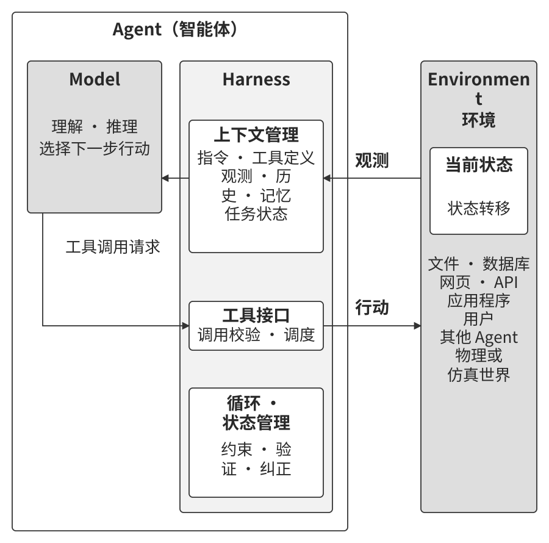
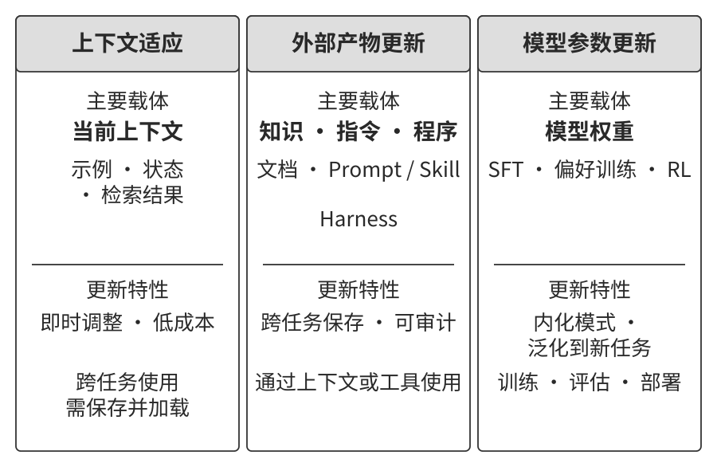
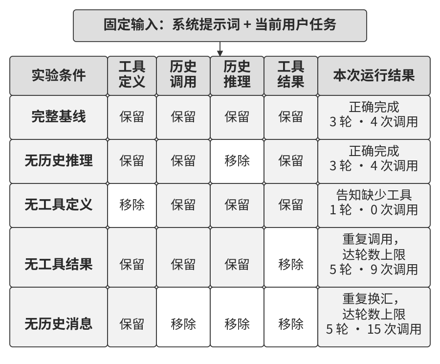
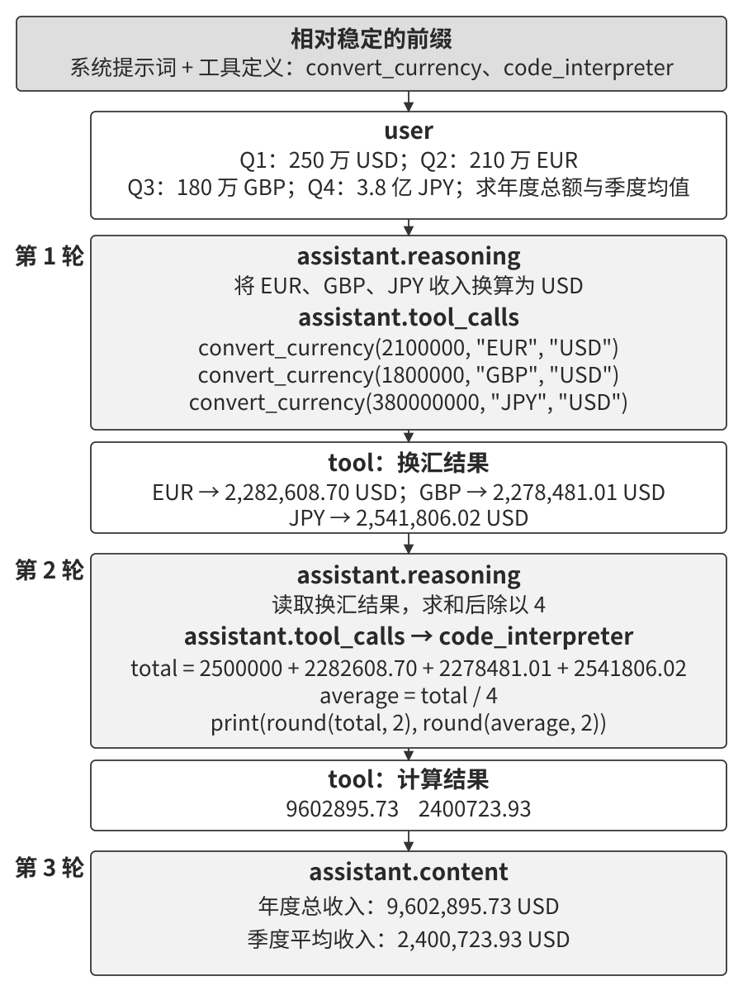
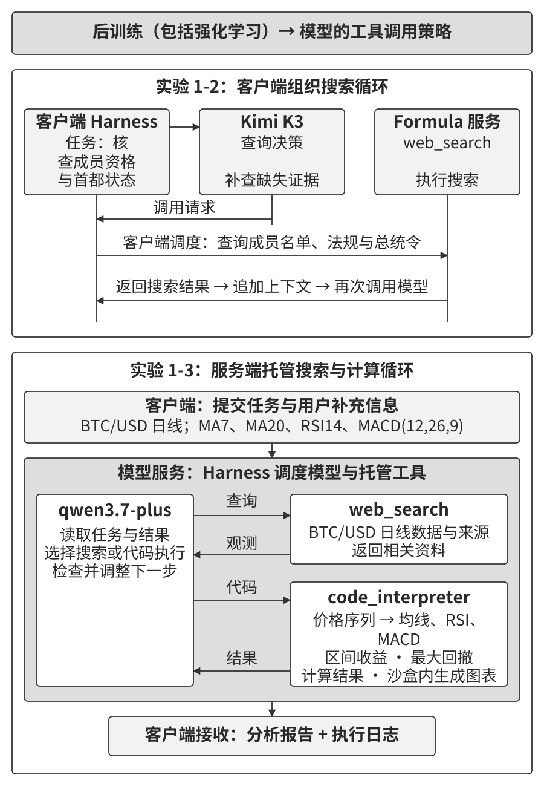
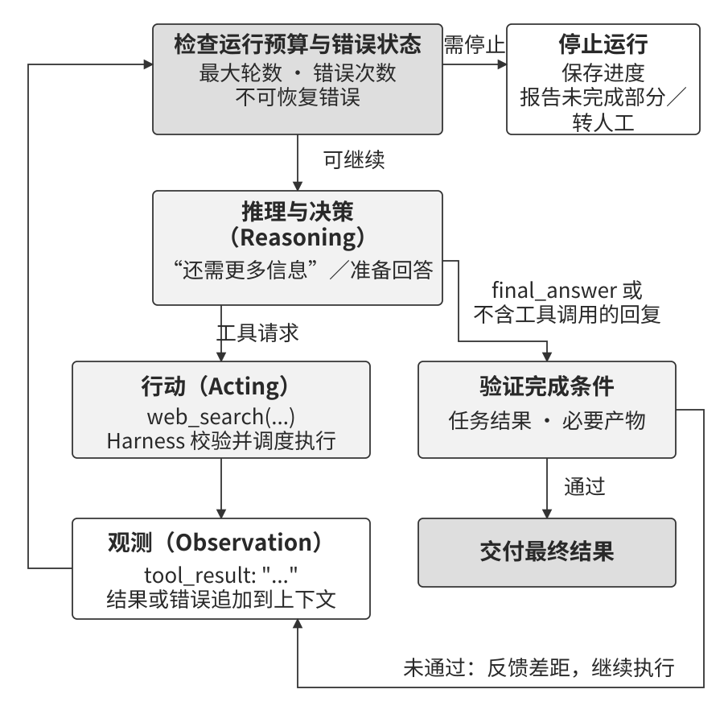
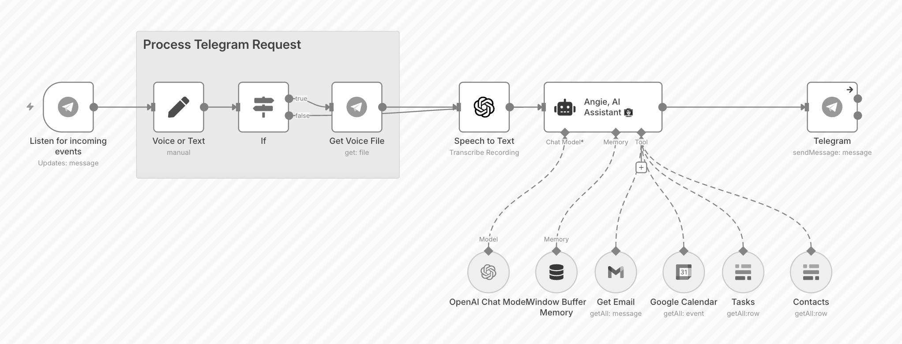

# AI Agent 入门

用 Cursor 写代码时，你可以看到它搜索代码库、修改多个文件，再运行测试、修复错误。用 Deep Research 调研一个课题时，它会反复搜索和阅读，最后整理出报告。Manus 可以操作浏览器完成在线任务，豆包手机助手可以在手机上订票、发消息，Pine AI 可以替用户打电话，与运营商协商降低账单。这些都是 AI Agent 的应用。

它们有一套共同的工作方式：围绕用户的目标规划步骤，调用工具执行，再根据结果调整下一步行动。以修改代码为例，测试失败后，Agent 会读取错误信息，定位问题并继续修改；测试通过后，再向用户交付结果。Agent 就这样一边执行，一边根据反馈调整计划，直到完成任务。

本章就从这一工作过程讲起：先认识 LLM、上下文和工具的分工，再用具体消息和实验说明它们如何协同，最后讨论 Harness 如何管理运行过程、约束操作并处理错误。后续各章将在这套结构上逐项展开。

## 现代 Agent = LLM + 上下文 + 工具

本书用一个公式概括现代 Agent 的三类功能要素：**Agent = LLM（大语言模型，Large Language Model）+ 上下文 + 工具**。

- **LLM 是 Agent 的大脑**，负责理解任务、规划步骤和选择行动。预训练为模型提供语言能力与世界知识，后训练进一步塑造指令遵循、推理和工具调用等行为。第八章将介绍监督微调与强化学习等后训练方法。
- **上下文是 Agent 的当前决策视野**，容纳这次决策需要的信息，包括指令、工具定义、环境观测、用户记忆、领域知识、历史消息、自身状态和任务进展。
- **工具是 Agent 的感官和手脚**，通过接口获取信息或执行行动。工具体系包括定义、调用协议和适配器，既支持搜索、读取、截图等观测操作，也支持写入、执行代码、委托子 Agent 和与用户沟通。

这个比喻帮助我们记住三者的作用：模型作出决策，上下文提供依据，工具连接外部环境。同一个工具还可以兼具多种作用，例如命令行既能读取文件，也能运行程序并返回执行结果。

在强化学习和控制论中，Agent 与 Environment（环境）通过观测和动作形成闭环。环境向 Agent 返回观测，Agent 据此选择下一步动作；动作在环境中执行后，环境返回新的观测，供下一轮决策使用。图1-1 展示了这一交互过程，以及 Agent 内部的 Model–Harness 结构。



图的外层划分了 Agent 与环境的边界。文件、数据库、网页、用户、其他 Agent，以及物理或仿真世界，都可以成为它交互的环境。图的内层展示了生产实现的分工：**Model 负责理解、推理和决策；Harness 位于 Agent 边界内、Model 之外，负责组织上下文、工具接口、运行循环和状态，并实施约束、验证与纠正。** Harness 可以创建、隔离或代理环境；文件内容、进程状态等则随行动在环境中发生变化。

因此，本书采用两套互补的分解方式：**“LLM + 上下文 + 工具”说明功能组成，“Model + Harness”说明生产实现。** 上下文由 Harness 组织后提供给 Model，工具调用由 Model 决策、Harness 校验和调度，再交给工具或环境执行。一个简单系统可以从上下文组装和工具调度起步，逐步补齐生产运行所需的约束、验证与纠正机制。

借助这套分工，还可以理解强化学习中的几个概念。LLM 的决策功能近似于策略；上下文承载一次决策所需的具体观测与历史；工具提供观测和动作接口。表中的对应关系按功能作粗略类比。

| 直觉理解 | 工程要素 | 强化学习中的相关概念 | 含义 |
|-----------|-----------|----------------------------|----------------------------------------------|
| **大脑** | LLM | **策略**（Policy） | 根据当前信息决定下一步做什么 |
| **当前决策视野** | 上下文 | **观测与历史** | 将环境返回的信息与已有历史组织成决策依据 |
| **感官和手脚** | 工具与适配器 | **观测和动作接口** | 规定如何读取环境信息、发出动作，以及调用和返回的格式 |

### 观测空间与动作空间：模型与世界的接口

**观测空间描述 Agent 可能接收到哪些观测，动作空间描述它可能发出哪些动作。** 一次调用中的上下文承载具体信息，可用工具则提供与环境交互的接口。工具之外，用户输入、事件通知等也可以带来观测；工具调用的参数、权限和运行环境共同限制动作的范围。

Harness 把观测组织成上下文，接收模型生成的工具调用请求，再校验参数、调度执行。例如，模型可能知道如何分析账单，但当前账户的金额和套餐需要通过文件或服务接口读取；要替用户修改套餐，还需要相应的操作接口与授权。知识、任务数据和执行能力在这里各有作用。

因此，**在底层模型固定时，重新定义或扩展观测空间与动作空间，往往是提升任务表现最主要的系统工程手段。** 把所需数据纳入上下文，或把所需操作封装为工具，就可能让 Agent 完成此前无法完成的任务。下面两个产品展示了这种能力扩展。

**Manus：在同一任务中结合调研、编程与电脑操控。** Deep Research 擅长搜索与阅读，Coding Agent 可以编写和运行代码，Computer Use Agent 可以操作界面。Manus 将浏览器、文件系统、代码执行和命令行整合到云端沙盒中，使同一个 Agent 能先查资料，再处理文件和运行代码，最后通过浏览器完成操作。浏览器与文件读取增加了可获取的信息，代码和命令执行增加了可组合的操作。**笔者认为，这种组合是通用 Agent 的重要突破：同一个 Agent 可以跨越原来分离的产品边界，把获取资料、处理数据和执行操作串成完整任务。**

**OpenClaw：把接口延伸到用户的数字生活。** OpenClaw 通过 WhatsApp、Telegram、Slack、Discord、iMessage 等消息渠道接收任务、返回结果，并用运行在用户设备上的 Gateway 连接消息渠道、模型和工具。配置相应工具并获得授权后，Agent 可以处理本地文件，也可以接入 Google Drive、Notion 等云服务。用户散布在账号与设备中的资料，由此能够进入同一任务的处理过程。早期 Manus 主要在云端沙盒中工作，用户需要上传文件；后来加入的 Google Drive 连接器和 My Computer 桌面功能，则进一步扩展了云文件与本地资源的访问范围。这些演进说明，产品能力的增长常常来自观测与动作接口的扩展[^ch1-agent-products]。

[^ch1-agent-products]: 产品结构参见 Manus 官方的 [Sandbox 介绍](https://manus.im/blog/manus-sandbox)、[Google Drive Connector 介绍](https://manus.im/blog/manus-google-drive-connector)、[My Computer 介绍](https://manus.im/blog/manus-my-computer-desktop)，以及 [OpenClaw 官方仓库](https://github.com/openclaw/openclaw)与[工具文档](https://docs.openclaw.ai/tools)。连接器、工具配置与用户授权决定具体可访问的资源。

不同产品的任务各异，但都可以从决策依据、可用操作和执行策略三个方面理解：

| Agent 产品 | 上下文中的主要信息 | 可用工具与操作 | 执行策略 |
|----------------|----------------------|----------------------------|------------------------------|
| **Cursor 等 Coding Agent** | 需求、代码片段、目录列表、终端输出 | 代码搜索、文件读写、执行命令 | 理解需求→搜索相关代码→编辑代码→测试验证→调试修复 |
| **Deep Research 等搜索 Agent** | 搜索结果、网页内容、论文摘要与引用 | 搜索查询、网页读取、生成报告 | 根据已有信息调整搜索方向，逐步综合出完整报告 |
| **Browser Use 等电脑操控 Agent** | 屏幕截图、DOM 或无障碍树、操作结果 | 点击、输入、滚动、截图、执行代码 | 读取界面→识别目标元素→执行操作→验证结果 |
| **豆包等手机助手 Agent** | 手机截图、App 界面状态、系统反馈 | 点击、滑动、输入、打开 App | 理解需求→定位目标 App→执行操作→确认完成 |
| **Pine AI 等个人办事 Agent** | 经授权读取的账户记录、账单、服务商资料 | 打电话、发邮件、填表单、与用户确认 | 收集信息→制定协商策略→联系服务商→谈判→汇报结果 |

这些系统的动作空间具有**开放式**的特点：搜索词、输入文本、生成的代码及操作组合难以预先穷举，而每次行动仍受工具、参数、权限和运行环境限制。模型可以在行动前规划，在获取新观测后调整策略，再继续与环境交互。LLM、上下文和工具的协同，使任务能够随着执行结果逐步推进。

### 工具：Agent 的感官和手脚

工具把模型的决策落实为对外部环境的读取或操作。搜索和读取工具带回观测，文件写入、命令执行等工具落实行动。模型通过返回结果得知操作的效果，再决定继续、重试或结束任务。

按主要用途，本书将工具分为五类。一个接口可以兼具多种用途，例如语音通话既能获取信息，也能传达请求。

**感知工具**负责获取信息：搜索引擎提供网络资料，文件读取工具访问本地文档，API 和数据库接口对接外部服务与企业数据。

**执行工具**负责执行操作：运行代码、修改文件、执行系统命令或调用外部 API，将决策落实到环境中。

**协作工具**支持分工与协调：把专项任务委托给子 Agent，收集结果，协调多个 Agent 的工作。需要人类参与决策时，系统还可以通过用户沟通接口请求确认。

**事件触发工具**将外部事件接入运行过程。一封新邮件、预定时间到达或 Webhook 回调，都可以触发任务。事件适配器负责把这些输入转换为 Agent 可处理的观测，调度机制负责启动或恢复执行；触发规则可以由开发者配置，也可以通过获准的工具调用注册。

**用户沟通工具**负责向用户传递信息并收集反馈，例如发送文字消息、发起语音通话或发送邮件。它们用于汇报进展、请求确认，也可以主动提醒用户处理事项。

第四章将展开这五类工具的设计。接口定义影响模型能否正确选择工具和填写参数，错误处理决定失败后能否继续，权限控制限定操作的影响范围。MCP（Model Context Protocol，模型上下文协议）则为工具发现与调用提供统一的接入方式，减少不同系统之间的适配工作。

**工具调用**（Tool Calling）是模型以约定格式提出操作请求的能力。常见的函数调用（Function Calling）用工具名称和结构化参数表达请求。本书统一使用“工具调用”这一术语。模型生成请求后，由运行系统完成校验、调度与执行，并将结果交回模型。

一次工具调用可以分为四步：提供工具名称、用途和参数定义；模型选择工具并生成参数；Harness 校验请求、调度执行，并把结果追加到上下文；模型读取结果，决定下一步行动。后文介绍的 ReAct 会在这个循环中结合推理与行动。

以查询北京天气为例，消息结构可以简写为：

```text
第一步：声明工具                    第二步：模型决定调用
tools: [{                          assistant: {
  name: "get_weather",               tool_calls: [{
  parameters: {                        id: "call_1",
    city: "string"                     function: "get_weather",
  }                                    arguments: {city: "北京"}
}]                                   }]
                                   }

第三步：结果追加到上下文              第四步：模型基于结果回复
tool: {                            assistant: {
  tool_call_id: "call_1",              content: "北京今天 28°C，晴。"
  content: '{"temp":28,"sky":"晴"}'  }
}
```

其中，`call_1` 将工具返回值与调用请求关联起来。开发者提供工具定义、执行实现和调用管理，模型决定是否调用、调用哪个工具以及传入什么参数。第二章将进一步介绍 API 消息结构。

设计工具时，可以先提供刚好够用的能力。四则运算用参数清晰的计算器即可；任务扩展到读取表格、清洗缺失值、计算统计量和绘图时，受限的 Python 代码解释器更便于组合这些步骤。通用能力扩大后，隔离与资源管理也要跟上：代码在沙盒中运行，网络访问默认关闭，文件访问限于授权工作目录，并为执行时间、CPU、内存和输出大小设置上限。

记录一段执行过程，可以使用单一日志工具。持续数小时甚至数天的任务，则适合用受控的虚拟工作目录保存计划、中间结果、运行日志和最终产物，让 Agent 在多次执行之间接续工作。目录应限制可读写路径、容量和文件类型，并检查路径是否越过授权边界。

支付、删除数据、发送邮件和生产部署等操作具有较高风险或明确的业务规则，适合封装为参数清楚、权限受限、全程可审计的专用工具，必要时加入预览与人工确认。**通用基础能力支持组合与探索，专用工具落实高风险操作的约束和业务规则。**

### LLM：Agent 的大脑

LLM 是 Agent 的决策核心。收到请求后，它先从用户的表述中识别目标和约束，再把复杂任务拆成可执行的步骤。执行过程中，它还要判断下一步做什么、是否调用工具、选择哪个工具以及如何填写参数。这些能力以预训练积累的知识和语言能力为基础，再由后训练塑造为适合任务的决策行为。工作流与自主 Agent 都需要这类判断，实际操作则通过 Harness、工具和环境完成。

行动前的规划与推演，可以帮助 Agent 比较方案、预测结果并减少无效尝试。例如，模型可以利用数学规律检查计算步骤，利用因果关系分析故障，再按依赖关系安排操作顺序。模型先在推理中比较不同方案，选定行动后再请求工具执行。传统强化学习系统也可以利用学到的策略、价值函数、环境模型或规划算法来组织探索；LLM Agent 的特点在于，开始具体任务前就已通过大规模预训练获得广泛的知识与问题求解模式，后训练又进一步强化了这些能力的使用方式。

#### 模型原生工具调用

业界用“模型即 Agent”（Model as Agent）概括一种发展趋势：越来越多的规划和工具调用决策由模型承担。通过后训练，尤其是强化学习，模型可以学会何时调用工具、调用哪个工具、传入什么参数，以及获得结果后如何继续。开发者提供目标、接口和约束，模型根据任务进展安排具体步骤。

模型的自主决策需要 Harness 支撑。Harness 原指缰绳、挽具等马具，用来把马的力量传递到载具并控制方向。在 Agent 中，Harness 将模型能力组织成可持续运行的任务过程，承担上下文管理、工具接口、约束、验证和纠正等职责。本章后半部分将逐项介绍这五项功能。

模型能够自主安排的操作越多，错误可能影响的范围也越大。模型与 Harness 因此需要协同优化：模型提升规划和工具选择的质量，Harness 管理权限、检查结果并处理失败。模型厂商可以同时改进这两部分，这种协同迭代构成了重要的工程优势。

> **模型能力与 Harness 的演进**
>
> Rich Sutton 在《苦涩的教训》（The Bitter Lesson）中回顾了 AI 研究的一条长期趋势：能够利用更多计算资源的搜索与学习方法，逐渐超越依赖大量人工领域设计的方法[^ch1-1]。沿着这个方向，工具选择、步骤安排等曾由外部流程承担的决策，可以逐步通过训练内化到模型中。
>
> 本书的立场是：**方向认同，节奏务实。** 模型会持续接管 Harness 中的部分决策职责，而一轮训练与部署需要时间，业务规则和用户偏好却不断变化。真实业务中的约束也很难一次全部写进模型参数。因此，模型暂时做不稳的环节，由 Harness 先补齐。**模型此刻的能力边界，就是 Harness 此刻的价值所在。** 这种分工会随模型能力变化：模型每掌握一类决策，Harness 就可以减少相应的编排，转而解决新的困难。权限执行、状态持久化和结果校验，则继续由运行系统落实。

[^ch1-1]: Sutton, Rich. [The Bitter Lesson](http://www.incompleteideas.net/IncIdeas/BitterLesson.html), 2019。

#### Agent 的学习机制：从上下文适应到持久更新

Agent 可以在不同位置、不同时间尺度上积累经验。图1-2 展示了三条路径：当前任务中的上下文适应、跨任务的外部产物更新，以及训练阶段的参数更新。



**上下文适应**发生在任务执行中。模型读到示例、任务状态或检索结果后，就能调整后续行为。例如，工具返回文件不存在，模型可以重新查找路径，再继续操作。这条路径响应快、成本低，效果取决于上下文窗口容量和信息组织方式。要让经验用于后续任务，还需要把相关信息保存并再次提供给模型。第二章将介绍上下文的组织方法。

**外部产物**（artifact）可以把经验跨任务保存下来。事实与经验写入知识文档，可用语言表达的策略写入提示词或 Skill，确定性的流程与约束写成程序或 Harness 逻辑。这些产物便于审计和修订，运行时通过上下文或工具接口参与决策与执行。第三至五章介绍相应的知识和程序基础，第九章讨论如何从经过评价的运行轨迹中生成、验证和发布更新。

**模型参数**则通过训练更新。医疗影像理解、语言风格和隐式决策策略等能力，涉及大量难以逐条写成规则的模式，可以通过后训练从数据与反馈中学习。参数更新需要训练、评估和部署投入，目标是让模型在新的任务中也能运用学到的能力。第八章将展开相关方法。

三条路径可以协同使用：上下文支持临场调整，外部产物保存可检查、可修订的经验，参数更新内化从数据中学到的模式。选择哪条路径，取决于要改变什么、变化需要保留多久，以及如何验证效果。

### 上下文：Agent 的当前决策视野

做决策时，人需要把任务说明、参考手册、沟通记录和最新数据放在一起看。Agent 也需要这样的信息集合，这就是上下文。一次 LLM 调用能接收的信息量受上下文窗口限制，Harness 则负责选择和组织其中的内容。从 API 的角度看，本书的基础实现包含五类信息：

- **系统提示词**（System Prompt）：由开发者或 Harness 构造，说明 Agent 的身份、任务边界和行为准则。提示工程通过调整这些指令塑造工作方式。系统提示词可以在会话中保持相对稳定，也可以按产品配置加入跨会话的用户记忆，例如偏好、历史行为和背景信息，或注入当前环境状态。真实权限由 Harness 与环境中的访问控制执行。第三章将介绍用户记忆。
- **工具定义**（Tool Definitions）：声明可用工具的名称、功能和参数格式，帮助模型选择操作并构造请求。在本书的基础实现中，工具定义与系统提示词放在请求前部，形成相对稳定的前缀。工具较多时，也可以按需加载完整的 schema，并保留已有前缀；第二章和第四章将展开这一方法。
- **用户消息**（User Messages）：包含用户的任务和补充输入，也可以附带通过 RAG（检索增强生成，Retrieval-Augmented Generation）获取的外部知识，例如训练数据截止后的信息或私有领域资料。第三章将介绍检索与知识组织。
- **模型回复**（Assistant Messages）：包括面向用户的文本 `content`、工具调用请求 `tool_calls`，以及服务提供的推理信息。本书用 `reasoning` 简写推理信息；不同服务可以返回推理内容、摘要，或用于续接的不透明状态。调用工具时，回复可以包含推理信息与调用请求；任务结束时，可以包含推理信息与最终文本。具体字段及可见性由模型服务决定。
- **工具执行结果**（Tool Results）：包含执行后的返回值、错误或状态，追加到消息历史后，为下一次决策提供依据。模型据此判断操作是否成功、是否需要调整，并减少本轮任务中的重复尝试。

在这个基础实现中，系统提示词和工具定义构成相对稳定的前缀，用户消息、模型回复和工具执行结果构成随交互增长的消息历史。Harness 每轮将它们组织成模型输入。

不同信息对决策有什么作用，可以通过**消融实验**（Ablation Study）来检查：固定任务与运行条件，每次移除一类信息，比较行为变化。实验 1-1 保留系统提示词和当前用户任务，以固定角色、约束与任务要求，再对工具定义、工具结果、历史推理信息和历史消息分别做消融。

> **实验 1-1 ★★：上下文的关键作用**
>
> 让 Agent 汇总一家公司的季度收入：第一季度 250 万美元，第二季度 210 万欧元，第三季度 180 万英镑，第四季度 3.8 亿日元。任务要求通过换汇工具将收入统一为美元，再用计算工具求年度总收入与季度平均收入，结果保留两位小数。这样，模型既需要选择工具，也需要记住已经完成的步骤和返回值。
>
> 实验设置完整基线和四组消融，每组最多运行五轮。移除历史推理信息时，每轮仍允许模型重新推理；移除工具定义时，请求不再提供可用工具；移除工具结果时，保留调用记录，隐藏返回内容；移除历史消息时，只保留系统提示词、工具定义和当前用户任务。图1-3 展示了五组条件及其结果。
>
> 
>
> 在本次 Kimi K3 运行中，**完整基线**用三轮、四次工具调用完成任务，得到年度总收入 9,602,895.73 美元、季度平均收入 2,400,723.93 美元。**移除历史推理信息**后，也以相同轮数和调用次数得到正确结果：工具记录已经保存了换汇结果，模型可以据此重建下一步计算所需的信息。
>
> **移除工具定义**后，模型没有发出工具调用，并告知缺少换汇工具。**移除工具结果**后，模型发起了九次调用，在五轮上限内仍未完成任务；已有调用记录无法告诉它换汇得到多少美元。**移除历史消息**后，模型累计发起十五次调用，反复执行换汇，同样耗尽五轮预算；先前完成的工作没有进入下一轮上下文，任务进度因而无法积累。
>
> 这组对照展示了不同信息的作用：工具定义提供可调用能力，工具结果提供环境事实，历史消息保存任务进度。历史推理信息的价值，则取决于当前决策能否从其他记录中恢复依据。组织上下文时，应优先保留继续任务所需的事实、状态与决策依据，并通过任务结果检验精简的效果。**验收应以任务完成和证据充分为准。** 一份格式完整、语气肯定的回复，也可能缺少必要的查询或计算。应分别检查是否生成最终回复、计算是否正确，以及答案是否有工具结果支撑。

### ReAct 循环

LLM、上下文和工具通过运行循环协同：模型读取上下文，生成回复或工具调用；Harness 调度工具，将结果加入上下文，再发起下一次模型调用。任务由此逐步推进。

**ReAct**（Reasoning + Acting）是这种循环的一种典型实现，将推理与行动交替组织起来[^ch1-react]。模型先分析当前信息，选择行动，再根据工具返回的**观测**调整计划。在后面的示例中，我们用简短的 `reasoning` 字段表示每轮决策依据，帮助读者理解行动之间的联系。实际系统按所用模型服务的接口保存推理信息、调用请求和返回结果。

[^ch1-react]: Yao, Shunyu, et al. [ReAct: Synergizing Reasoning and Acting in Language Models](https://arxiv.org/abs/2210.03629), ICLR 2023。

任务执行时积累的决策、行动与观测序列，称为**轨迹**（trajectory）。消息历史是记录轨迹的一种方式：用户消息保存任务，模型回复保存决策与调用请求，工具消息保存执行结果。完整运行记录还可以包含时间、环境状态和验证结果，供调试与评估使用。

在本节的基础实现中，**每轮上下文 = 相对稳定的前缀 + 累积的消息历史**。前缀包含系统提示词与工具定义，消息历史则随交互增加。继续以实验 1-1 的多币种收入汇总为例，图1-4 展示了三轮决策及其消息结构。



运行循环可以用下面的 Python 风格伪代码表示。Model 决定下一步，Harness 组装上下文并校验、调度调用，工具在环境中执行并返回观测。这里以模型停止请求工具作为结束条件，生产系统的验证与退出机制将在后文展开。

```python
history = [user_request]

repeat:
    context = stable_prefix + history
    decision = Model(context)
    history.append(decision)

    if decision has no tool call:
        return decision.answer

    for call in decision.tool_calls:  # 相互独立的调用可并行执行
        validated_call = Harness.validate(call)
        observation = Harness.dispatch(validated_call)
        history.append(observation)
```

第一轮，模型读到四个季度的收入，判断欧元、英镑和日元收入需要换算，生成三次换汇请求。三种货币的换算互不依赖，可以并行执行。第二轮，换汇结果已经进入上下文，模型据此生成汇总代码。第三轮，计算结果返回，模型整理最终答案。下面按消息顺序写出这一过程，其中 `id` 与 `tool_call_id` 用于关联请求和返回值：

```text
消息历史 = [
  {role: "user",
   content: "Q1 250万美元，Q2 210万欧元，Q3 180万英镑，Q4 3.8亿日元。用工具换算为美元，计算年度总收入和季度平均收入。"},

  # 第一轮：提出三个换汇请求
  {role: "assistant",
   reasoning: "先将 EUR、GBP、JPY 收入换算为 USD。",
   tool_calls: [
     {id: "fx_eur", name: "convert_currency",
      args: {amount: 2100000, from: "EUR", to: "USD"}},
     {id: "fx_gbp", name: "convert_currency",
      args: {amount: 1800000, from: "GBP", to: "USD"}},
     {id: "fx_jpy", name: "convert_currency",
      args: {amount: 380000000, from: "JPY", to: "USD"}}
   ]},
  {role: "tool", tool_call_id: "fx_eur", content: "2282608.70 USD"},
  {role: "tool", tool_call_id: "fx_gbp", content: "2278481.01 USD"},
  {role: "tool", tool_call_id: "fx_jpy", content: "2541806.02 USD"},

  # 第二轮：根据换汇结果计算
  {role: "assistant",
   reasoning: "四个季度均已换算为美元，求和后除以4。",
   tool_calls: [
     {id: "sum", name: "code_interpreter",
      args: {code: """
        total = 2500000 + 2282608.70 + 2278481.01 + 2541806.02
        average = total / 4
        print(round(total, 2), round(average, 2))
      """}}
   ]},
  {role: "tool", tool_call_id: "sum",
   content: "9602895.73 2400723.93"},

  # 第三轮：交付结果
  {role: "assistant",
   reasoning: "计算完成，按两位小数报告结果。",
   content: "年度总收入为9,602,895.73美元，季度平均收入为2,400,723.93美元。"}
]
```

整个过程包含三次模型调用、四次工具调用。每次调用模型前，Harness 都将系统提示词与工具定义放在前部，再接上当前消息历史。这样，第二轮能读到第一轮的换汇结果，第三轮能读到第二轮的计算结果，任务进度便随上下文持续积累。

把执行过程记录成结构化轨迹，还能帮助开发者改进系统。开发者可以沿着用户请求、模型决策、调用参数和工具结果定位失败环节；汇总多条轨迹后，还可以识别重复操作、改进工具接口或优化决策路径。经过评价和筛选的经验可以写入知识库，也可以作为后训练数据，用于改进模型。第七至九章将分别介绍评估、后训练和持续进化。

换汇任务只用了几次工具调用。搜索与分析任务往往需要更长的循环，也更容易遇到信息缺失和工具失败。下面两个实验将说明，这些任务怎样逐步推进，以及客户端和服务端分别负责什么。

> **实验 1-2 ★：Kimi K3 的多轮搜索与查询调整**
>
> 一项研究任务通常需要多次检索：先确定基本事实，再追查缺失的证据，最后综合结果。本实验让 Kimi K3 核查东盟成员资格与印度尼西亚首都状态，并要求它在初次检索后继续检查证据缺口。模型据此组织查询，客户端程序维护多轮交互，Kimi 的 Formula 服务执行搜索。
>
> Kimi K3 采用混合专家架构（MoE，Mixture of Experts），共有约 2.8 万亿参数，支持原生视觉与百万 token 上下文。MoE 可以类比为一个专家团队：处理每个 token 时，路由机制只选取部分专家参与计算，以控制计算成本。其后训练包含面向通用任务、编程和 Agent 任务的强化学习，重点提升长程执行能力[^ch1-k3]。
>
> 本次轨迹中，模型先搜索东盟官方成员资料，再补查成员名单和入盟日期，随后把查询收窄到印尼迁都相关法规、总统令和司法机关资料。这样的查询变化体现了多轮搜索的作用：前一轮提供线索，后一轮围绕尚待确认的问题补充证据。任务最终以带来源链接的结构化回答结束。
>
> 跟踪这个过程，可以看到三方分工。**模型**决定查询内容、调用参数及下一步搜索；**客户端 Harness**获取工具定义、调用模型、把请求交给 Formula，并将结果追加到上下文；**Formula 工具服务**执行网络搜索，返回结果。每轮搜索完成后，客户端再次调用模型，循环持续到生成最终回答[^ch1-2]。
>
> 训练可以把工具调用策略内化到模型参数中，搜索实现与结果回传由运行系统承担。这个分工同样适用于代码执行等工具：模型决定要运行什么，工具服务提供执行环境，Harness 组织调用与反馈。随着任务变长，还需要保存进度、处理失败并控制预算，才能让任务在多次调用之间持续推进。

[^ch1-k3]: Kimi Team. [Kimi K3: Open Frontier Intelligence](https://arxiv.org/abs/2607.24653), 2026。模型结构、上下文长度及后训练方法见技术报告；服务接入见 [Kimi 官方工具说明](https://platform.kimi.ai/docs/guide/use-official-tools)。

[^ch1-2]: 感谢读者 asdlem 在 [GitHub Issue #30](https://github.com/bojieli/ai-agent-book/issues/30) 中指出工具调用决策与工具执行机制需要分别说明。

> **实验 1-3 ★：Responses API 的托管研究闭环**
>
> 搜索之后常常还需要计算。例如，要找出一组首都中距离最近的一对，先要获取坐标，再枚举城市对并计算距离。本实验使用百炼的 `qwen3.7-plus`，通过 Responses API 调用两项服务端托管工具：`web_search` 获取资料与来源，`code_interpreter` 在沙盒中运行 Python，完成计算和绘图[^ch1-hosted]。
>
> 第一项任务在本次运行中选取文莱、柬埔寨、印度尼西亚、老挝、马来西亚、缅甸、菲律宾、新加坡、泰国和越南的十座首都进行计算。模型搜索坐标后，编写代码枚举 $10\times9/2=45$ 对城市，以地球半径 6,371 千米的球面模型，用 Haversine 公式计算大圆距离。在本次采用的坐标下，最近的一对是吉隆坡与新加坡，距离约 316 千米。搜索负责提供输入，代码负责完成可复核的计算，模型再把来源、假设和结果组织成答案。
>
> 第二项任务是“搜索最近一个月的比特币走势，做技术分析”。系统提示词规定：数据源或指标不明确时，先向用户澄清。模型因此先询问数据源和分析指标；用户补充 CoinGecko 的 BTC/USD 日线收盘价，以及 MA7、MA20、RSI14、MACD(12,26,9)、区间收益和最大回撤后，模型再开始搜索和计算。先澄清数据源和指标，模型才能按用户真正需要的口径搜索和计算。
>
> 这次运行还遇到了数据获取问题：直接访问行情接口超时后，模型转用搜索材料整理价格序列，再调用代码计算指标并绘图。改用搜索材料后，需要进一步检查数据质量：要逐项核对价格日期、来源和缺失值处理，并确认整理后的序列是否来自用户指定的数据源。程序执行成功后，还要确认输入数据可靠、计算方法正确，结果才有意义。
>
> 在这两项任务中，搜索和代码执行都由服务端托管，模型根据返回结果决定后续行动，服务端 Harness 负责衔接各次调用。客户端发送任务并接收结果；遇到澄清问题时，再提交用户补充信息，接续已有上下文。图1-5 对比了这一结构与实验 1-2 的客户端循环，并用具体搜索、计算步骤展示两种分工。
>
> 

[^ch1-hosted]: 托管工具的接入方式参见[百炼代码解释器文档](https://help.aliyun.com/zh/model-studio/qwen-code-interpreter)。本实验的模型、调用次序与结果以配套运行记录为依据。

> **接口补充：自由格式工具调用**
>
> 工具的参数还可以采用自由格式文本。例如，OpenAI Responses API 用 `type: "custom"` 声明自定义工具后，模型可以直接发送 Python 代码或 SQL 查询，减少把多行文本放进 JSON 字符串时的转义处理[^ch1-custom]。常规函数工具则按 JSON schema 接收结构化参数。
>
> 参数格式与执行位置是两个独立的设计选择。自由格式自定义工具仍由应用侧接收输入、校验、执行并回传结果；托管代码解释器则由服务端提供沙盒和执行循环。选择接口时，要分别确定输入格式、执行环境和循环由谁管理。

[^ch1-custom]: OpenAI，[Function calling](https://developers.openai.com/api/docs/guides/function-calling)，其中的 Custom tools 一节介绍自由格式输入及调用结果回传。

## Harness 工程：模型之外的竞争力

前面的实验展示了模型如何借助上下文与工具推进任务，也说明运行过程需要持续管理：缺少返回结果会导致重复调用，外部服务超时会中断数据获取，模型生成的答案还需要核对来源与计算过程。Harness 工程围绕这些问题，把一次次模型决策组织成可靠的任务执行。

前面用 LLM、上下文和工具解释了 Agent 的功能组成。落实到代码和服务时，Model 根据输入作出决策，Harness 负责组织输入、调度工具调用和处理反馈，工具或环境完成实际操作。本书用下面的公式概括这一分工，并将 Harness 的职责归纳为五项功能：

> **Agent = Model + Harness**
>
> **Harness = 上下文管理 + 工具接口 + 约束 + 验证 + 纠正**
>
> **Agent $\leftrightarrow$ Environment**

上下文管理和工具接口支撑 Agent 运行，约束、验证与纠正提高执行的可靠性。以退款 Agent 为例，Harness 将退款政策、订单和申请原因组织成上下文，通过工具接口查询订单并发起退款；执行前检查权限与金额规则，执行后查询交易状态。请求超时时，先查明退款是否已发生，再根据幂等性决定重试、补偿、回退或转人工。这样，模型的判断与业务系统中的真实状态才能保持一致。

这套分工也帮助我们判断系统边界。工具定义、调用适配器、沙盒权限和重置机制属于 Harness；沙盒中随操作变化的文件与进程、外部数据库、网页、用户和物理世界属于环境。即使仿真环境与 Agent 部署在同一进程中，二者仍分别承担环境演化和行动决策的职责。划分边界时，要看各部分承担什么职责。

| 功能 | 职责与设计要点 | 实际例子 | 详见 |
| --- | --- | --- | --- |
| **Context（上下文管理）** | 选择和组织当前决策所需的信息，保存任务进度与关键依据 | 系统提示词、知识库、Agent 状态栏、Sidecar 旁路查询 | 第二、三章 |
| **Tools（工具接口）** | 提供观测与行动接口；名称直观，参数配有例子，返回值和错误清晰 | MCP 工具、代码解释器、搜索工具 | 第四章 |
| **Constrain（约束）** | 按最小权限开放能力，并在执行前检查操作、参数与授权范围 | 文件访问范围、退款金额上限、工具调用审批 | 第四章 |
| **Verify（验证）** | 用可检查的规则、工具结果和环境状态核验操作；同时检查数据来源与有效性 | Linter、类型检查、测试、交易状态核对 | 第五、六章 |
| **Correct（纠正）** | 按错误类型选择重试、接续、补偿、回退或人工接管，并限制恢复次数 | 静默重试、接续生成、熔断后转人工 | 第二、五章 |

约束可以从默认关闭敏感能力开始：涉及敏感资源或外部副作用的能力，获得明确授权后再开放，类似手机 App 申请相机或位置权限。验证则要把模型的陈述与可核对的证据连接起来。例如，退款成功应由交易系统中的状态确认；工具返回 JSON 时，还要检查字段类型、取值和来源。模型输出与外部工具内容都可能受到错误信息或提示注入影响，可信的验证逻辑应在独立的执行边界内工作。

纠正机制需要兼顾任务恢复和用户体验。遇到短暂故障，可以在预算内自动重试，避免频繁打断用户；涉及外部副作用时，要先确认执行状态。持续失败则应停止重复操作，说明当前进度和需要人工处理的事项。把这五项功能加入前面的循环，就得到下面的伪代码：

```python
history = [user_request, Environment.observe()]

while Harness.within_budget():
    decision = Model(Harness.build_context(history))
    history.append(decision)

    if decision has no tool call:
        verdict = Harness.verify_completion(decision, Environment)
        if verdict.passed:
            return decision.answer
        history.append(verdict.feedback)
        continue

    for call in decision.tool_calls:
        permission = Harness.constrain(call)
        if permission.denied:
            history.append(permission.feedback)
            continue

        result = Harness.dispatch(call)
        verdict = Harness.verify(result, Environment)
        if not verdict.passed:
            result = Harness.correct(call, result, verdict)
        history.append(result)

return Harness.report_incomplete(history)
```

这段循环把约束放在执行前，把验证放在工具返回和任务结束时，再把纠正结果带回上下文。第二章将展开 API 消息循环，第四、五章介绍工具执行与自动验证。五项功能在运行中相互配合：上下文提供依据，工具连接环境，约束限制影响范围，验证发现偏差，纠正推动任务恢复。

**从演示走向生产，工程重心会从接通上下文和工具，转向约束、验证与纠正。** 一个演示可以靠少数顺利完成的任务说明能力；产品需要在输入变化、服务失败和长时间运行中持续交付。权限、状态、验证和恢复因此成为工程投入的重点。Claude Code 提供了具体例子：文件读写、命令执行和搜索之外，它还提供权限规则、上下文压缩和文件检查点等机制。权限规则按工具类型、操作范围与所选模式决定是否确认；检查点支持恢复其记录的文件修改[^ch1-claude-harness]。

从这些产品机制出发，可以归纳出构建 Harness 时需要考虑的几项工作：

- **流程状态管理**：记录执行到哪一步，哪些操作已完成，哪些结果仍待确认。
- **上下文压缩**：在信息增长时保留关键事实、约束和进度，为后续决策腾出空间。
- **权限分类**：区分读取、修改、外部调用等操作，按风险与授权范围执行规则。
- **熔断器**（Circuit Breaker）：连续失败达到阈值后停止重试，避免同一故障持续消耗资源或扩大影响，作用类似电路故障时跳闸。
- **错误恢复**：捕获异常，结合检查点与环境状态，选择回退到稳定状态、重新尝试或交还给人类。

**行业正在从“能做事”向“可靠地做事”转变，Harness 工程因此成为 Agent 系统的核心竞争力。**

[^ch1-claude-harness]: Claude Code 官方文档：[权限配置](https://code.claude.com/docs/en/permissions)、[检查点](https://code.claude.com/docs/en/checkpointing)、[交互命令与上下文压缩](https://code.claude.com/docs/zh-CN/commands)。文件检查点的恢复范围由工具记录决定，外部服务中的状态需要相应的恢复机制。

### 从提示工程到 Graph 工程：工程关注范围的扩展

随着任务越来越复杂，工程师需要处理的问题也逐步增多。本书用五个工程视角梳理这一变化。它们分别强调指令、信息组织、运行机制、持续运转和执行结构，帮助我们定位问题发生在哪一层，以及应当在哪里改进。

**提示工程**（Prompt Engineering）关注指令表达。任务目标、约束和示例怎样写，直接影响模型如何理解请求并生成结果。

**上下文工程**（Context Engineering）进一步组织模型能看到的全部信息，包括系统指令、工具定义、对话历史和外部知识。提示词只是其中的一部分，检索、压缩与状态组织同样影响决策。

**Harness 工程**关注模型的运行与环境交互。它把上下文构造、工具调度、权限、验证和错误恢复组织成可执行的系统，使模型能连续完成任务。

**Loop 工程**（Loop Engineering）关注持续自主运转：一轮结束后，谁发现下一件该做的事，何时重新启动，何时验证结果，以及用什么条件判断真正完成。第十章将结合多 Agent 协作系统展开这一视角。

**Graph 工程**（Graph Engineering）关注多个执行单元的组合。Agent 循环、确定性程序和人工审批可以作为节点，边规定路由与依赖，结构化状态在节点间传递，并在关键边界保存检查点。2026 年出现的相关讨论用这一名称概括这些编排问题[^ch1-graph-engineering]。

在实际系统中，这些方法可以组合和嵌套。Harness 承载上下文管理与单次任务循环，外层调度机制可以反复启动任务；执行图可以包含 Agent 循环，一个循环也可以调用图式工作流完成子任务。工程师由此能够按任务需要选择结构，把稳定的规则写入程序，把需要动态判断的步骤交给模型。

**当候选模型都已能胜任任务时，模型之外的工程实践往往决定产品差异。** LangChain 在 Terminal Bench 2.0 上的改进提供了一个具体例子：固定使用 GPT-5.2-Codex，通过调整 Harness，将得分从 52.8% 提高到 66.5%，当时的排名从三十名之外进入前五。改进包括完成前自检、重复操作检测、环境信息补充和推理预算分配。这里的提升来自对运行轨迹中失败模式的分析，以及据此反复修改、评估 Harness[^ch1-langchain-harness]。

[^ch1-graph-engineering]: Josh C. Simmons，[We Are Entering the Graph Engineering Phase](https://www.drjoshcsimmons.com/writing/we-are-entering-the-graph-engineering-phase)，2026 年 7 月 4 日，讨论节点、类型化连接和可检查点状态。相关实践也见 [LangGraph](https://docs.langchain.com/oss/python/langgraph/overview)、[Microsoft Agent Framework 工作流](https://learn.microsoft.com/en-us/agent-framework/workflows/)等官方资料。

[^ch1-langchain-harness]: Vivek Trivedy，[Improving Deep Agents with harness engineering](https://www.langchain.com/blog/improving-deep-agents-with-harness-engineering)，2026 年 2 月 17 日。分数与排名对应文中报告的模型、基准和测试设置。

### 构建有效 Agent 的核心原则

Anthropic 将构建有效 Agent 的经验归纳为三个原则：保持简单、保持透明，以及认真设计 Agent 与工具的接口[^ch1-anthropic-building-effective-agents]。

**保持简单。** 从能解决任务的最简单方案开始，评估发现稳定问题后再增加机制。直接调用 API 往往更容易看清输入、输出和控制流；使用框架时，也要能追踪它如何组织上下文和调用工具。这样，新增的抽象才有明确用途，出错时也能定位到具体环节。

**保持透明。** 保存任务计划、执行步骤、工具日志和关键决策依据，让开发者能追踪结果如何产生，让用户了解任务进度、重要取舍与待确认事项。透明度需要通过适当的记录和呈现方式实现：开发者可以查看详细轨迹，用户则获得与任务有关的进度和结论。

**设计好工具接口。** ACI（Agent-Computer Interface，Agent—计算机接口）强调从 Agent 的使用方式设计工具：名称要直观，参数要配合具体例子，返回值要便于后续决策，容易误用的地方要加上可执行的约束。接口越清楚，模型越容易把意图转换为正确操作。

这可以借鉴制造业中的**防呆**（Poka-yoke）方法。SIM 卡的缺角帮助用户辨认安装方向，微波炉的门联锁使设备在开门时停止加热。对应到工具设计，可以用枚举限制操作类型，用参数校验检查格式，用权限控制限制作用范围。模型通过工具定义和返回结果理解接口，含糊的说明会在多轮调用中反复造成误用；清楚的接口与执行约束则能从源头减少错误。

[^ch1-anthropic-building-effective-agents]: Anthropic，[Building effective agents](https://www.anthropic.com/engineering/building-effective-agents)，2024 年 12 月。

接下来从模型选型、编排模式、护栏与安全三个方面展开设计取舍：选择模型决定可用的决策能力，编排组织执行路径，护栏把约束、验证与纠正落实到具体操作。

### 如何选择模型

**选对模型，往往比反复打磨提示词更有效。** 模型决定 Agent 能理解多复杂的任务、能否选对工具，以及出现错误后如何调整。确认任务信息充分、工具可用后，仍然反复出现规划或工具使用错误，就应优先比较模型能力，再决定投入多少提示词和编排工作。选型时，应把候选模型接到同一组代表性任务和工具上，比较完成质量、失败方式、成本与延迟，再决定是否需要更强的模型或更细的工程支持。

**闭源模型适合通过服务接口快速接入。** OpenAI 的 GPT 系列、Anthropic 的 Claude 系列都是本书讨论的例子。评估时，既要看任务能力，也要检查 API 提供的工具调用方式、上下文容量、服务限制与费用。排行榜可以帮助筛选候选，最终选择应以自己的任务评估为依据，第七章将介绍具体方法。

**开放权重模型提供部署与定制空间。** DeepSeek、Kimi、GLM 等模型可以按具体版本的许可条件，用于自部署或后训练。私有化部署有利于控制数据流向，微调可以适配特定任务；成本则取决于模型规模、硬件、利用率和运维投入。**对于模型能力已够用、调用量稳定的业务，以及需要严格控制数据流向的业务，笔者会优先评估开放权重方案。** 稳定负载有利于摊薄部署成本，掌握权重也便于做领域适配。不同模型在参数填写、连续工具调用和失败恢复上的表现差异，需要通过实际任务测出来。

模型之间的差距也应按能力拆开看：某个模型可能擅长代码修改，另一个更适合长文检索或视觉操作。任务完成率接近时，再比较每项成功任务的成本、延迟和人工介入次数，就能进一步判断哪个模型更适合当前业务。

**同时评估模型能力、产品接口和使用规则。** 同一模型通过聊天产品、Coding Agent 或 API 提供服务时，可调用的工具、权限和运行限制可能不同。网络安全、模型蒸馏与提取、隐私数据和高风险操作等业务，还需要逐项核对服务的使用规则。选型测试应覆盖三个问题：模型能否完成任务，接入方式是否提供所需能力，以及这种用途是否符合服务条款。关键业务还应安排人工接管或经过验证的替代模型。

**多步 Agent 任务，笔者优先选择推理模型作为起点。** 规划、工具选择、结果核验和失败恢复都需要连续判断，为这些环节投入更多推理计算，通常有助于提高任务完成质量。对于单步分类、简单格式转换，或 Computer Use 中目标已明确的固定位置点击，较轻量的模型也可能满足要求。推理预算应与任务难度一起调节：规划和验证阶段可以投入更多计算，简单执行步骤可以减少开销，再用评估检验质量与延迟的变化。

**把速度放到完整任务中衡量。** Agent 常有多轮顺序调用，模型每轮生成所需的时间会累积到端到端延迟中。一个任务需要二十轮推理，每轮多耗时两秒，总时长就增加四十秒。除输出 token 速度外，还要记录首 token 延迟、推理长度、工具执行时间，以及哪些调用能够并行。这些数据可以帮助区分延迟究竟来自模型、工具还是编排。

**按输入形式检查多模态能力。** 需要理解图片、音频或视频时，应使用任务中的真实材料评估相关能力，例如界面截图中的小字、语音中的打断，或视频中的连续动作。多模态支持与工具调用能力还要一起验证，确保模型能把识别结果转化为正确操作。

### 编排模式：工作流与自主

编排决定上下文如何在模型调用之间传递、工具何时执行，以及下一步由程序还是模型选择。设计时，可以从一次模型调用开始：先检查提示词、示例和必要资料能否解决任务；需要多个固定步骤时，组织成工作流；需要根据环境反馈不断调整路径时，再引入自主循环。每增加一次调用，都应检查结果是否因此改善，以及增加了多少延迟和成本。

以“从百万条聊天记录中提炼个人记忆”为例，一种设计会先切分对话，再依次安排提取、证据核验、身份解析、记忆整理和合并复核 Agent，最后建立事实图、覆盖账本与不可变版本。这些机制分别解决了实际问题，但一开始全部引入，会增加信息传递、状态同步和错误定位的负担。遇到新情况时，如果继续增加分支，原本可以由模型结合上下文完成的语义判断，就会逐渐变成难以维护的固定规则。

更合适的起点，是给一个能力足够的 Agent 明确目标、必要上下文和可组合的工具，让它查证资料、比较说法并处理冲突；程序落实权限、原始材料保护和原子发布等必须始终成立的规则。评估反复发现某类稳定失败后，再加入专门验证器、独立 Agent 或确定性流程。**结构的复杂度应由业务约束和实际失败驱动。** Manus 用“Less structure, more intelligence.” 概括了这种取舍[^ch1-manus-less-structure]。

[^ch1-manus-less-structure]: Manus，[官方网站](https://manus.im/)。

#### 工作流模式：预定义的编排

**工作流**（Workflow）通过预定义的代码路径组织模型和工具。开发者规定节点、连接和分支条件，节点内部可以使用 LLM 理解或生成内容。遇到不同输入时，系统按程序设定的条件进入相应分支。

以订机票为例，可以把一条简化的业务流程设计为四个节点：

1. **核实用户身份**：通过身份服务确认账户和操作权限。
2. **搜索并确认航班**：查询可用航班，让用户确认行程、票价与退改规则。
3. **完成付款**：在用户授权后，通过支付接口处理订单费用。
4. **确认预订**：按供应商流程完成出票或确认，向用户发送预订结果。

模型可以在搜索节点内把自然语言需求转换为日期、目的地和筛选条件，程序则检查进入支付节点所需的身份、报价与授权状态。实际订票接口可能要求先锁座、再支付或出票，工作流应按供应商协议安排顺序，并为失败设置补偿路径。

工作流的优势在于**流程控制明确**：关键步骤、分支和校验点都可以检查，开发者能用代码落实“金额已确认才能支付”等规则。它也便于限定每个节点的权限与数据访问范围。节点之间传递的模型输出仍需要校验，以免错误参数或不可信内容被后续步骤直接采用；权限和验证机制应覆盖整条执行链。

要让固定流程处理好例外，开发者需要提前设计相应分支。用户在付款阶段改变行程，或航班取消后需要重新比较方案时，系统只能沿已设计的分支处理，或把控制权交给人工。任务中的例外越多，维护这些分支的成本越高。

另一个直观的工作流是**文生图**。用户可能只说：“帮我画一个 AGI 实现以后程序员的工作场景。”工作流可以安排两个节点：

1. **提示词改写**：LLM 将宽泛需求展开为主体、场景、构图、光线和风格。比如，把场景构思为“程序员在海边休息，通过脑机接口指挥 AI 员工”，再整理成适合目标模型的提示词。
2. **图片生成**：把整理后的提示词交给生图模型，获取图片。

在一些 Stable Diffusion 工作流中，开发者习惯使用逗号分隔的英文标签、质量词和负面提示词。改写节点可以统一这种格式，也可以补充构图细节。Stable Diffusion 同样能够接收自然语言描述，是否采用标签式提示词，要结合模型和任务比较效果[^ch1-image-prompt]。这里的 LLM 节点把用户需求整理成图像模型适用的输入，并补充创意细节，可以视为 Harness 中的**适配层**。

当图像生成服务能直接理解自然语言需求时，**笔者优先直接提交原始描述，省去仅为适配输入格式而增加的改写调用。** 每经过一次改写，约束就多一次被遗漏或改变的机会。宽泛需求需要构图探索，或系列图片需要统一风格时，再让改写节点承担这些明确的创作任务。下面的实验可以帮助读者区分这两种用途。

[^ch1-image-prompt]: Stability AI，[Stable Diffusion API 参考](https://platform.stability.ai/docs/api-reference)，介绍文本提示词、负面提示词与风格等输入；官方[应用案例](https://stability.ai/customer-stories/hubspot-scales-image-generation-150-with-stability-ai-in-amazon-bedrock)展示了自然语言描述的使用。

> **实验 1-4 ★：文生图工作流与直接生成的对照**
>
> 把同一句需求送入两条路线。**工作流路线**先由 Kimi K3 改写提示词，再交给通义万相生成图片；**直接生成路线**把原始需求提交给图像生成服务。本次记录使用了 Gemini 图像模型和 GPT-Image 2 两种直接生成服务。
>
> 对照包含两类需求。具体需求包括周末加班的程序员、晨光中的窗台绿植，以及带有“深夜独处也清净”文案的降噪耳机海报；宽泛需求包括 AGI 实现后的程序员工作场景和未来城市的早晨。阅读时，把原始需求、改写结果和生成图片放在一起比较：新增了哪些细节，哪些约束得到保留，画面是否满足用户要求。
>
> 耳机海报的改写结果提供了一个具体检查点：改写节点增加了哑光黑耳机、午夜蓝背景、月光轮廓光和留白，同时把 `text` 放入负面提示词，建议后期补上中文文案。这样，工作流把原本的一次海报交付拆成了图片生成与后期排版。要完成用户的原始任务，就需要补上排版步骤，并核对文案内容。
>
> 这个例子说明，适配层会影响需求如何传递。对明确的文字和内容约束，应检查每个节点是否完整保留；对宽泛的创意需求，则可以比较改写是否带来了更合适的场景与构图。调用次数、生成质量和后续处理量，都应纳入两条路线的比较。

随着模型能力提升，部分适配工作可以交给模型或服务接口完成。指令微调与推理模型减少了对部分 few-shot 示例和“逐步思考”提示的依赖，结构化输出与原生工具调用减少了格式修复和 JSON 解析容错所需的工作，图像模型的语言理解能力则简化了提示词改写。**模型升级后，应主动清理已经失去作用的适配代码。** 原来必要的格式翻译和修补步骤，可能变成额外的调用、延迟和出错点。用同一组任务检验直接调用的效果；新模型已经稳定胜任时，就可以卸下这层补丁，把工程投入转向新的能力短板。

#### 自主 Agent：动态自主决策

**自主 Agent**（Autonomous Agent）根据任务进展和环境反馈选择下一步，适合难以预先列全执行路径的问题。用户说“帮我订下周三去上海的机票”，Agent 可以先查航班，遇到登录要求后核实身份，再继续搜索；发现最低价方案需要转机时，询问用户是否接受，得到“只要直飞”的答复后调整条件。它在授权范围内决定具体步骤，支付等关键操作仍由业务规则约束。

这种方式要求模型能规划、识别失败并调整策略，Harness 则负责记录状态和控制运行预算。一次调用失败后，可以修改参数、换一种查询方式或请求用户补充信息；当任务完成、错误无法恢复或预算耗尽时，循环应有明确出口。

图1-6 展示了自主 Agent 的执行循环。模型读到观测后作出决策，有工具请求时执行行动并获取新观测，再进入下一轮。模型调用 `final_answer` 等最终输出工具，或返回不含工具调用的回复时，Harness 检查任务完成条件；通过验证后交付结果。错误次数超限或达到最大轮数时，则保存进度，报告未完成部分或转人工。



自主循环适合步骤数量随任务变化的场景，例如 Coding Agent 修复真实代码问题、Computer Use Agent 操作界面，以及反复搜索和分析的研究任务。SWE-bench 就以真实软件仓库中的问题衡量代码修复能力。此类任务的下一步常取决于刚刚得到的测试输出、界面状态或搜索结果。

连续决策也会累积成本与错误。部署前，应在隔离环境中测试正常路径和失败恢复，设置工具权限、轮数与资源预算，并记录关键状态。高影响操作可以设置人工确认点，让 Agent 在明确的执行边界内灵活安排步骤。

#### 两种模式的选择与混合

工作流和自主 Agent 可以组合使用：程序规定关键流程、验证条件和权限，在需要灵活判断的节点内运行自主 Agent。图1-7 中的 n8n 工作流编辑器展示了这种组织方式，开发者通过可视化节点连接业务操作，并可接入 AI Agent 节点，由模型选择其可用工具[^ch1-n8n]。



另一种方式是**先让自主 Agent 生成工作流，再执行经过检查的工作流**。Agent 根据任务设计拓扑并生成编排代码，运行系统验证代码、权限与输入后，再沿生成的路径执行。对于重复处理的数据或步骤，这能减少每次调度都调用模型的开销，同时保留任务开始时动态设计流程的灵活性。第十章将进一步讨论这种形态。

[^ch1-n8n]: n8n，[AI Agent 节点文档](https://docs.n8n.io/integrations/builtin/cluster-nodes/root-nodes/n8n-nodes-langchain.agent)。

> **工具参考：Agent 框架与平台**
>
> 选择框架时，可以先比较它提供的运行循环、状态管理、工具接入和调试能力，再看开发方式是否适合团队。下表保留本书讨论的几类代表方案。
>
> | 框架／平台 | 核心定位 | 编排方式 | 开发方式 | 典型用途 |
> | --- | --- | --- | --- | --- |
> | **Codex Harness** | 可集成的 Agent 运行时 | 自主循环 | 代码与接口集成 | Coding Agent、产品内嵌 Agent |
> | **Claude Agent SDK** | 复用 Claude Code 的工具与运行循环 | 自主循环 | Python、TypeScript | 代码任务、复杂工具任务 |
> | **LangChain / LangGraph** | 模型与工具集成、状态图编排 | 工作流与自主循环 | 代码 | 多步骤任务、持久状态与恢复 |
> | **n8n** | 可视化自动化平台 | 工作流与 Agent 节点 | 可视化、代码节点 | 业务自动化、服务连接 |
> | **Dify** | LLM 应用开发平台 | 工作流、对话与 Agent 节点 | 可视化与 API | RAG、知识库与业务应用 |
> | **CrewAI** | 多 Agent 团队与流程编排 | Crews 与 Flows | 代码 | 角色分工、协作与业务流程 |
> | **OpenClaw** | 可自托管的个人助手 | 自主循环与事件驱动 | 配置与扩展 | 多平台消息、个人任务与工具集成 |
> | **DeepSeek Harness** | 插件化 Agent 运行时 | 可组合的循环与插件 | 代码与配置 | 运行机制定制、Agent 开发与研究 |
> | **Pi** | 精简的 Agent 与 Coding Agent 工具包 | 自主循环与扩展 | 代码 | 定制工具、运行循环与编程助手 |
>
> 以 Codex 为例，同一套运行能力可以通过不同接口接入：`codex exec` 适合脚本和 CI 中的非交互任务；Codex SDK 便于在应用代码中启动、恢复和处理任务事件；app-server 用双向 JSON-RPC 通信支持会话、事件流与审批交互，适合构建自定义客户端[^ch1-codex-harness]。Claude Agent SDK 则把 Claude Code 的工具、循环和上下文管理开放给应用程序，开发者可以通过 SDK 配置权限、会话和钩子。
>
> 对这些方案做取舍时，重点检查三个问题：任务状态能否看清，工具与权限能否控制，出错后能否恢复。满足这些要求后，再比较接入成本、部署方式、许可证和团队维护能力[^ch1-frameworks]。

[^ch1-codex-harness]: OpenAI 官方文档：[Codex SDK](https://learn.chatgpt.com/docs/codex-sdk)、[Codex App Server](https://learn.chatgpt.com/docs/app-server)。

[^ch1-frameworks]: 各框架的能力与接口见官方资料：[Claude Agent SDK](https://code.claude.com/docs/en/agent-sdk/overview)、[LangGraph](https://docs.langchain.com/oss/python/langgraph/overview)、[Dify Agent 节点](https://docs.dify.ai/en/cloud/use-dify/nodes/agent)、[CrewAI](https://docs.crewai.com/introduction)、[OpenClaw](https://github.com/openclaw/openclaw)、[DeepSeek Harness](https://github.com/deepseek-ai/deepseek-harness)、[Pi](https://github.com/earendil-works/pi)。n8n 的 Agent 节点见前文引用。

确定了任务怎样推进，还需要检查每一步能否执行、执行后是否符合要求。下面介绍的护栏，就把约束、验证与纠正落实到这些位置。

### 护栏与安全性

**护栏**（Guardrails）把约束、验证与纠正落实到系统边界上，用于控制敏感信息暴露、越权操作和不符合产品要求的输出。设计时先识别任务中的风险：模型会读取哪些数据，可以调用哪些工具，哪些行动会产生外部影响，再为这些位置设置相应的检查与控制。

护栏的评估需要同时覆盖漏拦截与**误拒绝**。前者关注危险请求是否被放行，后者关注明确允许的任务是否被误拦截，例如经过授权的安全测试或符合服务规则的模型蒸馏研究。两类样本一起测试，才能判断防护效果与正常任务完成率之间的取舍。

#### 护栏类型

按防护生效的位置，本书将护栏分为**上下文层、执行层和数据层**。这种分层的工程价值，在于逐步减少安全性对模型判断的依赖：进入上下文的信息靠来源与内容检查，实际行动再受执行权限约束，最终读写还要经过数据层规则。三层配合，使一道检查遗漏的问题仍有机会在后续边界被发现。

**上下文层**关注模型读取什么，以及如何区分信息来源。常见机制包括：

- **相关性分类**：识别偏离产品任务的请求，例如编程助手收到“帝国大厦有多高”时，按产品范围决定回答或引导用户返回任务。
- **安全分类**：识别诱导模型违反安全规则的越狱请求，以及试图把输入数据转成控制指令的提示注入。提示注入既可能出现在用户输入中，也可能通过网页、文档或工具结果间接进入上下文。
- **内容审核**：按用途和规则检查涉及暴力、歧视等敏感主题的内容，区分讨论、分析与不允许的用途。
- **规则检查与来源标注**：限制输入长度，检查字段格式，标记不可信来源，并在上下文中区分指令与数据。数据库调用还应使用参数化查询等执行侧机制处理 SQL 注入风险。

**安全关键的检查应放在模型上下文之外执行。** 当不可信内容已经影响了模型的判断，让同一个模型在同一上下文中自查，很容易继续沿用受影响的前提。来源标注和分类器帮助减少这类问题，独立的权限与执行检查则限制其实际后果。第二章将展开上下文组织与提示注入防护。

Anthropic 的 **Constitutional Classifiers** 展示了分类器的另一种组织方式：用自然语言规则生成合成数据，训练对输入和输出的检查能力。后续系统将问题与回答联合判断，使分类器能结合对话理解含义；例如，单独看似普通的“食品调味料”表述，结合上下文可能实际指代化学试剂。为了降低计算开销，系统先用读取内部激活的轻量探针筛查，再将可疑对话交给更强的分类器组合复核。第一级负责筛选，最终判断由复核阶段完成，有助于兼顾成本与误拒绝率[^ch1-3]。

[^ch1-3]: Anthropic，[Next-generation Constitutional Classifiers](https://www.anthropic.com/research/next-generation-constitutional-classifiers)，2026 年 1 月 9 日；Cunningham et al.，[Constitutional Classifiers++](https://arxiv.org/abs/2601.04603)。

**执行层**关注模型提出的操作能否生效。可以按可逆性、权限范围、财务影响与数据敏感度，为工具调用划分低、中、高风险，并结合实际参数动态检查。读取公开资料与修改账户信息需要不同的控制，高风险操作可以追加独立审查或人工确认。

执行检查应由具有独立权限边界的机制落实，例如受信任的审查进程、最小权限凭证、沙盒和人工审批。即使模型受不可信内容影响，实际调用也要经过这些检查。返回用户的回复同样是一种行动：PII（个人身份信息）过滤可以检查身份证号、手机号等敏感字段，输出验证可以检查内容是否符合产品用途与品牌要求。第四章将介绍工具风险与执行权限。

**数据层**直接控制对资源的访问和修改。数据库行级安全策略决定当前身份可以访问哪些记录，约束与校验器检查写入是否合法，受控视图和存储过程限定可执行操作，受信任运行时负责绑定身份与访问上下文。实际读写都经过这些机制、运行凭证也受到权限限制时，上层生成的代码即使遗漏了检查，数据层仍能拒绝越权读写。第五章将结合动态生成软件说明如何把信任边界落实到这一层。

#### 人工干预

**人工干预**（Human in the Loop，又称人在回路）为系统提供升级处理与关键决策的出口。部署早期，人工反馈还可以帮助团队识别失败模式、补充边缘案例并改进评估。客户服务系统可以把问题转给人工客服，Coding Agent 可以把未解决的问题和当前修改交还给开发者。

两类情况尤其适合触发人工介入：一类是**超过失败阈值**，例如重试次数或操作次数达到上限；另一类是**高风险操作**，例如大额退款、付款或难以撤销的数据修改。触发条件应写进执行规则，使系统能够及时停止、保存状态并移交。

移交时，应提供原始目标、已完成步骤、当前结果、失败原因和待决定事项。用户暂时不在线时，可以保存任务并等待，或按预设规则继续低风险的独立工作；需要授权的操作应保持待处理状态。这样，人工接手后能够直接判断下一步，任务也能从保存的状态恢复。

### Harness 五项功能与全书的对应

**“LLM + 上下文 + 工具”描述功能组成，“Model + Harness”描述生产实现。** 前者说明能力来自哪里，后者说明系统如何运行。第二至六章介绍构建方法，第七章提供评估，第八、九章分别讨论模型后训练与持续进化，第十章扩展到多 Agent 协作。

Harness 的五项功能会在不同章节反复出现，下表列出主要展开位置：

| Harness 功能 | 主要章节 | 技术内容 | 安全与可靠性关注点 |
| --- | --- | --- | --- |
| 上下文管理 | 第二章 | 提示工程、状态栏、上下文压缩、Agent Skills | 提示注入、上下文污染、进度丢失 |
| 上下文管理（跨会话） | 第三章 | 用户记忆、RAG、结构化索引、Agentic RAG | 敏感信息暴露、来源与隐私 |
| 工具接口与约束 | 第四章 | 工具分类、权限控制、MCP、主动工具发现 | 误操作、越权访问、不可逆操作 |
| 验证 | 第五、七章 | 测试驱动、代码化规则、产物评价 | 身份与责任边界、结果误判 |
| 纠正 | 第二、五章 | 上下文重建、安全重试、状态核验、回滚与人工接管 | 重复执行、恢复失败、错误传播 |

第六章进一步扩展交互的模态与时机，例如图像、语音、界面操作和异步事件；这些能力需要相应的上下文与工具接口承载。第七章衡量整个 Agent 的表现，第八、九章分别通过参数和外部产物更新改进能力，第十章研究多个 Agent 如何分工、通信和协调。

安全贯穿这些章节。上下文层与执行层的控制主要由 Harness 组织，数据层的访问控制在环境侧生效。各章会结合具体技术，说明这些控制应放在哪里、怎样配合。

Anthropic 的长时运行 Agent 案例展示了五项功能的配合：**初始化 Agent**设置环境并分解任务列表，后续**执行 Agent**逐项推进，每个会话结束时留下进度记录和可接续的产物。新会话读取这些记录后继续工作，测试与任务清单帮助系统判断还有哪些功能未完成。这种安排缓解了跨上下文交接困难和过早宣告完成的问题[^ch1-long-running]。第二章将从上下文组织开始，第五章进一步讨论 Coding Agent 的完整 Harness。

[^ch1-long-running]: Anthropic，[Effective harnesses for long-running agents](https://www.anthropic.com/engineering/effective-harnesses-for-long-running-agents)，2025 年 11 月 26 日。

## 贯穿全书的设计模式

后续章节会反复使用五个设计模式。这里先说明各自解决的问题及主要应用位置，读者可以在具体案例中对照理解。

**提议者—审核者（Proposer–Reviewer）**把产出与评判交给两个独立角色。提议者生成候选结果，审核者依据任务要求、产物和外部证据判断质量，例如查看渲染结果、测试输出和结构化调用参数。审核者需要了解任务背景，并使用独立的上下文作出判断，减少产出方已有结论对审核的影响。模型自审容易沿用先前的假设，独立审核可以增加发现盲点的机会，权限边界与确定性检查则继续负责约束执行。第三章用它更新知识，第四章用它审查工具调用，并介绍 Sidecar 只读变体；第五章的 PPT、视频和日志案例，第七章的 UI 评估，第九章的更新提案和第十章的对等协作，也会使用这一模式。

**渐进式披露（Progressive Disclosure）**先提供可检索的目录或摘要，再按需加载细节。这样既能控制上下文开销，也能帮助模型先缩小选择范围。第二章的 Agent Skills 让元数据常驻上下文，正文按需加载；第三章的分层检索、第四章的主动工具发现与分页截断、第十章的 Agent 发现，都采用了类似方法。

**只增不改（Append-only）**用追加记录表达变化，为缓存、重放和审计保留历史。第二章中，稳定的前缀有利于复用 KV Cache；改动越靠前，受影响的后续缓存通常越多。第三章的事件式记忆用新事件记录状态变化，第四章按需把工具 schema 加入后续上下文，也利用了保留已有前缀的思路。需要压缩或更新状态时，可以生成新版本，同时保存追溯所需的记录。

**边界集 + 保留集（Boundary Set + Retention Set）**从两个方向验证修改：边界集检查目标行为是否改善，保留集检查原有能力是否保持。例如，修复某类工具参数错误后，既要重测这些错误样本，也要检查原先能够完成的任务。只测目标样本，容易把针对这些样本的过拟合当成进步；只测原有能力，又可能接受毫无效果的修改。第七章的回归评估、第八章的训练与评估隔离、第九章的更新验证都会使用这类对照，同时检查收益与退化。

**最小 diff + 可回滚**要求每次变更范围清楚、有来源，并能恢复到先前版本。小步修改便于将效果归因到具体变化，也便于在失败后撤回。第三章的知识更新、第五章的代码补丁、第九章的提示词与程序更新都遵循这一思路。上下文、外部产物和模型参数各有相应的恢复方式：保存输入快照、产物版本或模型检查点，可以恢复对应状态；已经产生的外部副作用还需要补偿机制处理。

## 本章小结

**Agent 的能力来自 LLM、上下文和工具的协同。** LLM 负责理解、规划与决策，上下文提供当前决策依据，工具获取观测或执行行动。大脑、当前决策视野、感官和手脚这组比喻，帮助我们记住三类功能。

**扩展上下文和工具，是提升 Agent 能力最主要的工程手段之一。** 在模型固定时，补充关键资料、提供必要操作，往往能使此前无法完成的任务变得可行。Manus 与 OpenClaw 的案例展示了这种扩展；工具、参数、权限和运行环境同时规定了行动的边界。

**上下文组织影响每一轮决策。** 基础实现把相对稳定的前缀与累积消息历史提供给模型。消融实验中，工具定义让模型知道有哪些能力可用，工具结果提供计算所需的事实，历史消息保存已经完成的步骤。已有记录足以恢复决策依据时，模型也能在移除历史推理信息后继续完成任务。ReAct 将推理、行动与新观测衔接起来，使任务能够逐步推进。

**Harness 是 Agent 产品积累工程竞争力的关键。** 当候选模型都能满足基本能力要求时，上下文管理、工具接口、约束、验证和纠正决定了产品能否持续、可靠地交付。模型进步会简化部分适配工作，真实任务中的状态管理、权限落实、结果验证和失败恢复仍需持续设计与评估。

**编排应从简单方案开始，按需要增加复杂度。** 优先尝试单次调用；需要多个固定步骤时采用工作流，需要根据反馈调整路径时再引入自主 Agent。三者可以组合使用，再根据任务完成质量、延迟、成本和失败方式，评估各自的效果。

**五个设计模式支持反复改进。** 提议者—审核者分离产出与判断，渐进式披露管理信息，追加记录保留历史，边界集与保留集检查变化，最小 diff 与版本恢复控制更新风险。

**安全应从架构设计时就落实到各个边界。** 数据来源、工具权限和状态变更路径在设计早期就要明确。上下文层管理信息，执行层检查行动与输出，环境中的数据层强制落实访问控制。人工接管则为超限和高风险操作提供明确出口。

本章的案例表明，同一个模型能否完成任务，与它每轮收到的信息密切相关。下一章将沿着这一点展开上下文工程：如何组织任务与工具定义，怎样保留历史与状态，以及信息越来越多时如何取舍。强化学习中的 Agent 概念及其与 LLM Agent 的联系，则在第八章进一步讨论。

## 思考题

1. ★★ 如果只能优先改进模型、上下文或工具中的一项，你会如何判断最值得投入的位置？哪些评估结果会使你改变选择？
2. ★★★ 假设每轮新增的消息量大致相同，且每轮都向模型提供此前的完整历史，为什么累计输入量会随轮数近似二次方增长？缓存、压缩和历史裁剪分别改变了哪些成本？
3. ★★ 模型承担越来越多的工具调用决策，Harness 也需要支持更长、更复杂的任务。两者的职责会怎样变化？哪些机制可以简化，哪些需要加强？
4. ★★ 实验中缺少工具结果会导致重复调用。在生产系统中，还有哪些原因会造成类似循环？如何检测、恢复并设置终止条件？
5. ★ 选择一个日常使用的 AI 产品，分别列出上下文中的主要信息、可用操作和执行策略。它在哪个环节最容易失败？你会如何改进？
6. ★★ 为航班订票客服设计一套流程：哪些步骤适合工作流，哪些适合自主 Agent？用户临时改变行程时，两部分如何配合？
7. ★★★ 同一个 `delete_file` 工具，删除临时文件与删除关键系统文件的风险不同。你会怎样结合参数、资源范围和可恢复性进行动态风险评估？
8. ★★ 开放式动作空间允许难以预先穷举的内容与操作组合。在什么任务中，把行动限制为少量预定义选项更合适？这种限制会带来哪些收益与代价？
9. ★★ Agent 需要人工确认时，用户可能不在线、回复缓慢或指令含糊。系统应保存哪些状态，可以继续哪些工作，哪些操作必须等待？
10. ★★★ 举一个会随模型进步而简化的工程方法，说明它原先解决什么问题，以及背后的系统设计原则如何继续发挥作用。
