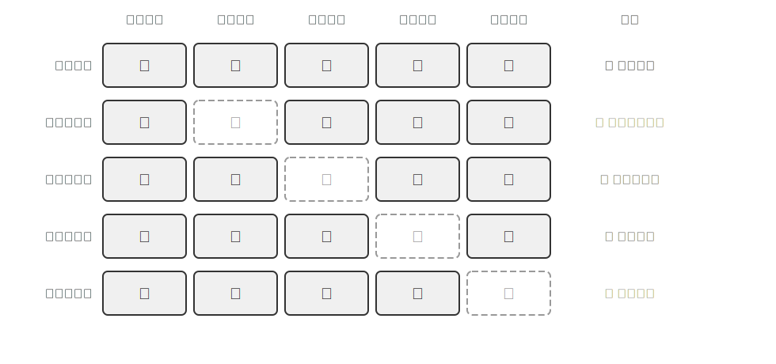
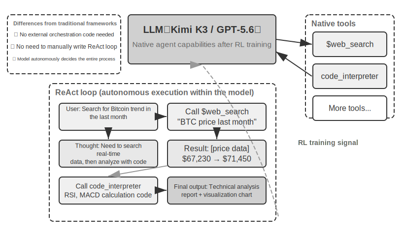
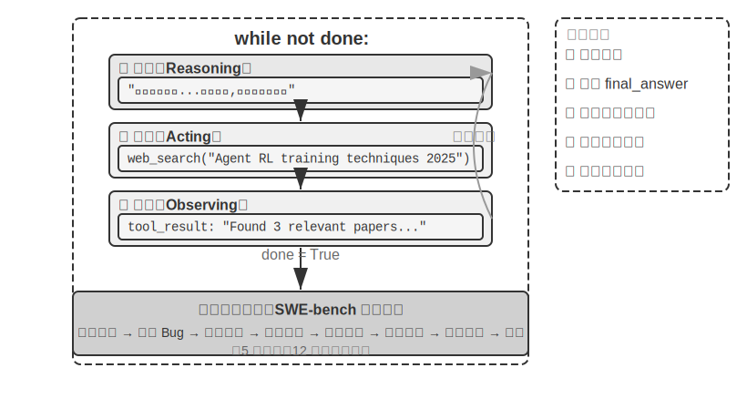

# AI Agents உடன் தொடங்குதல்

நீங்கள் Cursor ஐப் பயன்படுத்தி குறியீடு எழுதும்போது, அது உங்கள் codebase ஐத் தேடி, பல கோப்புகளைத் திருத்தி, அவை வெற்றிபெறும் வரை tests ஐ இயக்குவதைப் பார்த்திருந்தால்; Deep Research ஐப் பயன்படுத்தி ஒரு தலைப்பை ஆராயும்போது, அது மீண்டும் மீண்டும் தேடி, படித்து, ஒரு விரிவான அறிக்கையைத் தொகுப்பதைப் பார்த்திருந்தால்; Manus ஐப் பயன்படுத்தி ஒரு browser ஐக் கட்டுப்படுத்தி உங்களுக்காக online பணிகளை முடித்திருந்தால்; Doubao phone assistant ஐக் கேட்டு உங்கள் phone இல் tickets பதிவு செய்ய அல்லது செய்திகளை அனுப்பச் சொன்னால்; அல்லது Pine AI உங்கள் telecom provider ஐ அழைத்து குறைந்த கட்டணத்திற்கு பேச்சுவார்த்தை நடத்தியதைப் பார்த்திருந்தால்—நீங்கள் ஏற்கனவே AI Agents ஐப் பயன்படுத்தியிருக்கிறீர்கள்.

இந்த தயாரிப்புகள் பல்வேறு வடிவங்களில் வருகின்றன, ஆனால் அவை ஒரு பொதுவான பண்பைப் பகிர்ந்து கொள்கின்றன: அவை இனி "நீங்கள் கேட்கிறீர்கள், அது பதிலளிக்கிறது" என்ற செயலற்ற உரையாடல்கள் அல்ல. மாறாக, அவை சுயாதீனமாக செயல்படுத்தும் படிகளைத் திட்டமிடக்கூடிய, பல்வேறு tools ஐ அழைத்து பணிகளை முடிக்கக்கூடிய, மற்றும் முடிவுகளின் அடிப்படையில் தொடர்ந்து உத்திகளைச் சரிசெய்யக்கூடிய அறிவார்ந்த அமைப்புகளாகும். AI Agents என்பது நாம் கணினிகளுடன் தொடர்புகொள்வதற்கான ஒரு புதிய வழியாக மாறி வருகிறது.

இந்த அத்தியாயம், நடைமுறை அனுபவத்திலிருந்து AI Agents இன் முக்கிய கூறுகளைப் புரிந்துகொள்வதற்கு உங்களை வழிநடத்தும். நவீன Agents இன் திறன்களை நேரடியாக அனுபவிப்போம், அவற்றின் பின்னால் உள்ள கட்டமைப்புக் கொள்கைகளைப் புரிந்துகொள்வோம், மேலும் Agent அமைப்புகளை உருவாக்குவதற்கான design patterns மற்றும் சிறந்த நடைமுறைகளை மாஸ்டர் செய்வோம்.

> **படிப்பதற்கான உதவிக்குறிப்பு**: இந்த அத்தியாயம் முழு புத்தகத்திற்குமான கருத்தியல் வரைபடமாக செயல்படுகிறது—இது Agents இன் முக்கிய சூத்திரம், செயல்பாட்டு சுழற்சி, பொறியியல் கட்டமைப்பு மற்றும் design patterns ஐ விரைவாக அறிமுகப்படுத்துகிறது, அடுத்தடுத்த அத்தியாயங்களுக்கு ஒருங்கிணைந்த சொற்களஞ்சியம் மற்றும் குறிப்பு ஒருங்கிணைப்பு அமைப்பை வழங்குகிறது. முதல் வாசிப்பில் ஒவ்வொரு கருத்தையும் மனப்பாடம் செய்ய முயற்சிக்காதீர்கள்; மாறாக, முதலில் ஒரு பொதுவான பிம்பத்தை உருவாக்குங்கள். ஒவ்வொரு அடுத்தடுத்த அத்தியாயமும் இங்கு குறிப்பிடப்பட்டுள்ள ஒரு அம்சத்தை விரிவாக விளக்கும், மேலும் நீங்கள் எப்போதும் இந்த அத்தியாயத்திற்குத் திரும்பி குறிப்பு எடுக்கலாம்.

## நவீன Agent = LLM + Context + Tools

நவீன Agent அமைப்புகளின் சாரத்தை ஒரு சுருக்கமான சூத்திரத்துடன் வெளிப்படுத்தலாம்: **Agent = LLM (Large Language Model) + Context + Tools**. இந்த சூத்திரம் எளிமையானதும் நடைமுறைக்குரியதுமானது, ஆனால் ஒவ்வொரு சொல்லும் பரந்த அளவில் புரிந்துகொள்ளப்பட வேண்டும்:

- **LLM என்பது Agent இன் மூளை**: இது வெறும் model parameters களின் தொகுப்பு மட்டுமல்ல, Agent இன் முழு முடிவெடுக்கும் மையமாகும்—நோக்கத்தைப் புரிந்துகொள்வது, சிந்திப்பது, திட்டமிடுவது மற்றும் தீர்ப்புகளை வழங்குவது. மனித மூளை நியூரான்களின் தொகுப்பை விட அதிகமாக இருப்பதைப் போலவே, அனுபவத்தால் வடிவமைக்கப்பட்ட சிந்தனை முறைகளையும் உள்ளடக்கியது, LLM இன் திறன்கள் இரண்டு பகுதிகளிலிருந்து வருகின்றன: **pre-training** மூலம் திரட்டப்பட்ட உலக அறிவு மற்றும் மொழித் திறன்கள், மற்றும் **post-training** மூலம் உறுதிப்படுத்தப்பட்ட முடிவெடுக்கும் உத்திகள்—பிந்தையவற்றின் குறிப்பிட்ட நுட்பங்கள் (supervised fine-tuning மற்றும் reinforcement learning போன்றவை) அத்தியாயம் 7 இல் விரிவாக விளக்கப்படும்.
- **Context என்பது Agent-ன் கண்கள்**: இது Model-க்கு உள்ளீடாக வழங்கப்படும் உரை மட்டுமல்ல, மாறாக ஒவ்வொரு முடிவெடுக்கும் புள்ளியிலும் Agent பார்க்கக்கூடிய அனைத்து தகவல்களும் ஆகும்—சூழல் தகவல், பயனர் நினைவகம், கள அறிவு, அதன் சொந்த நிலை, மற்றும் பணி முன்னேற்றம். மனிதர்கள் முடிவெடுக்கும் போது தற்போதைய சூழ்நிலையைப் பார்க்கவும், தொடர்புடைய அனுபவங்களை நினைவுபடுத்தவும், குறிப்புப் பொருட்களை ஆலோசிக்கவும் தேவைப்படுவது போலவே, Agent-ன் context window என்பது அந்த தருணத்தில் அது பார்க்கக்கூடிய அனைத்துமே ஆகும்.
- **Tools என்பது Agent-ன் கைகளும் கால்களும்**: அவை சில callable API functions மட்டுமல்ல, மாறாக Agent செய்யக்கூடிய அனைத்து விஷயங்களின் முழுத் தொகுப்பும் ஆகும்—முன் வரையறுக்கப்பட்ட tool calls முதல் தேவைக்கேற்ப சிறப்புத் திறன்களை (Skills) ஏற்றுதல் வரை, புதிய திறன்களை உருவாக்க dynamic code generation முதல் sub-agents-க்கு ஒத்துழைப்புக்காக பணியை ஒப்படைத்தல் வரை, பயனர்களுடன் முனைப்புடன் தொடர்புகொள்வது முதல் வெளிப்புற நிகழ்வுகளுக்கு பதிலளிப்பது வரை.

இன்னும் உள்ளுணர்வாகச் சொன்னால்: **Agent = Brain + Eyes + Hands and Feet**. Brain என்பது சிந்தனை மற்றும் முடிவெடுப்பதற்குப் பொறுப்பு, Eyes என்பது சிந்தனைக்குத் தேவையான அனைத்து தகவல்களையும் வழங்குகிறது, மற்றும் Hands and Feet என்பது முடிவுகளை நிஜ உலக மாற்றங்களாக மொழிபெயர்க்கிறது.

இந்த மூன்று கூறுகளும் RL-ல் உள்ள மூன்று மையக் கருத்துக்களுடன் (Chapter 7-ஐப் பார்க்கவும்) சரியாகப் பொருந்துகின்றன. பின்வரும் அட்டவணை **விரும்பினால் மட்டும் படிக்கக்கூடியது**—உங்களுக்கு RL பின்னணி இல்லையென்றால், அதைத் தவிர்க்கலாம்; அது உங்கள் புரிதலைப் பாதிக்காது. RL பின்னணி உள்ள வாசகர்கள் தங்கள் தற்போதைய அறிவை இந்தப் புத்தகத்தின் சொற்களஞ்சியத்துடன் பொருத்திப் பார்க்க உதவுவதற்காக மட்டுமே இது:

| உள்ளுணர்வுப் புரிதல் | செயலாக்கக் கூறு | கல்விசார் கருத்து (விரும்பினால் மட்டும்) | பொருள் |
|---------|---------|---------|------|
| **Brain** | LLM | **Policy** | "அடுத்து என்ன செய்வது" என்பதைத் தீர்மானிக்கும் முடிவெடுக்கும் தர்க்கம்—தற்போதைய தகவலைக் கொண்டு, கிடைக்கக்கூடிய அனைத்து விருப்பங்களிலிருந்தும் மிகவும் பொருத்தமான செயலைத் தேர்ந்தெடுக்கும் |
| **Eyes** | Context | **Observation Space** | Agent பார்க்கக்கூடிய அனைத்து தகவல்களும்—அது என்ன பார்க்க முடியும், படிக்க முடியும், நினைவில் வைத்திருக்க முடியும், மற்றும் எந்த அமைப்புகளை அணுக முடியும் |
| **Hands and Feet** | Tools | **Action Space** | Agent செய்யக்கூடிய விஷயங்களின் முழுத் தொகுப்பு—செய்தி அனுப்புதல் முதல் குறியீட்டை இயக்குதல் முதல் இடைமுகங்களைக் கட்டுப்படுத்துதல் வரை என்ன "வழிமுறைகள்" கிடைக்கின்றன |

இந்த மூன்று கூறுகளின் பங்குகளையும் அவற்றுக்கிடையேயான உறவுகளையும் புரிந்துகொள்வது திறமையான Agent அமைப்புகளை உருவாக்குவதற்கான அடித்தளமாகும். மிகவும் உறுதியான கூறான tools (hands and feet) மூலம் தொடங்கி, படிப்படியாக brain (LLM) மற்றும் eyes (context) பற்றி ஆழமாகப் பார்ப்போம். வெவ்வேறு வகையான Agents இந்த மூன்று பரிமாணங்களில் எவ்வாறு செயல்படுகின்றன என்பதை முதலில் பார்ப்போம்:

| Agent தயாரிப்பு | Eyes (உணர்தல்) | Hands and Feet (செயல்) | உத்தி |
|---------|------|---------|------|
| **Coding Agents (எ.கா., Cursor)** | தேவை ஆவணங்கள், codebase, terminal சூழல் | திறந்த முடிவு (உள் பகுத்தறிவு, code தேடல், file read/write, command execution, போன்றவை) | அதிகரிப்பு மேம்பாடு: தேவைகளைப் புரிந்துகொள் → தொடர்புடைய code-ஐத் தேடு → code-ஐத் திருத்து → சோதித்து சரிபார் → பிழைகளைக் கண்டறிந்து சரிசெய் |
| **Search Agents (எ.கா., Deep Research)** | Web resources, academic databases, local files | Open-ended (internal reasoning, search queries, web reading, summary generation) | Iterative deepening: adjust search direction based on existing information, gradually synthesize a complete report |
| **Computer Control Agents (எ.கா., Manus)** | Computer screen, browser pages, file system | Open-ended (internal reasoning, clicking, typing, scrolling, screenshots, code execution, etc.) | Visual perception + operation: observe screen → identify target elements → perform actions → verify results |
| **Phone Assistant Agents (எ.கா., Doubao)** | Phone screen, installed apps | Open-ended (internal reasoning, clicking, swiping, typing, opening apps, etc.) | Intent understanding + App control: understand user needs → locate target app → perform actions → confirm completion |
| **Personal Task Agents (எ.கா., Pine AI)** | User account information, historical bills, service provider knowledge base | Open-ended (internal reasoning, making calls, sending emails, filling forms, confirming with user) | Multi-step task execution: gather information → formulate negotiation strategy → contact service provider → negotiate → report results |

இந்த Agent அமைப்புகள் பல பொதுவான அம்சங்களைப் பகிர்ந்து கொள்கின்றன: அவை அனைத்தும் **open-ended action spaces**-ஐப் பயன்படுத்துகின்றன—அதாவது, வரையறுக்கப்பட்ட பொத்தான்களின் தொகுப்பிலிருந்து தேர்ந்தெடுப்பதல்ல, மாறாக தன்னிச்சையான இயற்கை மொழி மற்றும் குறியீட்டை உருவாக்குகின்றன; அவை அனைத்தும் **internally think** செய்ய முடியும்—செயல்படுவதற்கு முன் திட்டமிட்டு பகுத்தறியும் திறன்; மேலும் அவை அனைத்தும் **continuously interact** செய்ய முடியும்—சூழலின் பின்னூட்டத்தின் அடிப்படையில் உத்திகளைச் சரிசெய்யும் திறன். இந்தத் திறன்கள் துல்லியமாக மூளை, கண்கள் மற்றும் கைகள் மற்றும் கால்களின் ஒருங்கிணைப்பிலிருந்து—அதாவது LLM, context மற்றும் tools-இலிருந்து—உருவாகின்றன.

### Tools: Agent-இன் கைகளும் கால்களும்

Tools என்பது Agent வெளி உலகத்துடன் தொடர்பு கொள்வதற்கான பாலமாகும், மனிதனின் கைகள் மற்றும் கால்களைப் போலவே, Agent ஒரு செயலற்ற பார்வையாளரிடமிருந்து ஒரு செயலூக்கமான செயலாக்கியாக மாற அனுமதிக்கிறது. Tools இல்லாமல், Agent "காகிதத்தில் மட்டுமே பேச" முடியும்; tools இருந்தால், அது உண்மையிலேயே உலகை மாற்ற முடியும்.

Tools-ஐ முறையாக விவாதிக்க, Agent வெளி உலகத்துடன் தொடர்பு கொள்ளும் திசையின் அடிப்படையில் அவற்றை ஐந்து வகைகளாகப் பிரிக்கலாம். ஒவ்வொரு வகைக்குமான பிரதிநிதித்துவ சூழ்நிலைகளை விரைவாகப் பார்த்து ஒரு பொதுவான புரிதலை உருவாக்குவோம்; அடுத்தடுத்த அத்தியாயங்கள் ஒவ்வொன்றையும் விரிவாக விளக்கும்.

**Perception Tools** Agent தகவல்களை அணுக அனுமதிக்கின்றன: search engines நிகழ்நேர web தரவை வழங்குகின்றன, file systems உள்ளூர் ஆவணங்களைப் படிக்கின்றன, மேலும் APIs மற்றும் databases வெளிப்புற சேவைகள் மற்றும் நிறுவனத்தின் முக்கிய தரவுகளுடன் இணைக்கின்றன.

**Execution Tools** Agent உலகை மாற்ற அனுமதிக்கின்றன: code execution, file operations, system commands, external API calls—இவை முடிவுகளை உறுதியான செயல்களாக மாற்றுகின்றன.

**Collaboration Tools** Agent மற்ற Agent-களுடன் ஒத்துழைக்க அனுமதிக்கின்றன: சிறப்புப் பணிகளுக்காக sub-agents-ஐ ஒப்படைத்தல், முக்கிய முடிவு புள்ளிகளில் மனித உறுதிப்படுத்தலைக் கோருதல், அல்லது multi-agent அமைப்புகளில் செயல்களை ஒருங்கிணைத்தல்.

**Event Trigger Tools** (நிகழ்வுத் தூண்டுதல் கருவிகள்) முதல் மூன்று வகைகளில் இருந்து அவை எவ்வாறு அழைக்கப்படுகின்றன என்பதில் அடிப்படையில் வேறுபடுகின்றன—இவை Agent ஆல் செயலில் அழைக்கப்படுவதில்லை, மாறாக Agent ஒரு பணியைச் செயல்படுத்தத் தொடங்க வெளிப்புற உள்ளீடுகளாகச் செயல்படுகின்றன. உதாரணமாக, புதிய மின்னஞ்சல் வருதல், திட்டமிடப்பட்ட நேரத்தை அடைதல் அல்லது வேறொரு அமைப்பிலிருந்து Webhook callback ஐப் பெறுதல்—இந்த நிகழ்வுகள் Agent ஐச் செயல்படுத்தி, அடுத்தடுத்த சிந்தனை மற்றும் செயல்களைத் தொடங்கத் தூண்டுகின்றன. நிகழ்வுத் தூண்டுதல்கள் Agent ஆல் செயலில் அழைக்கப்படாவிட்டாலும், Agent வெளி உலகத்துடன் தொடர்பு கொள்வதற்கான வழிகளில் ஒன்றாக இருப்பதால், அவை பரந்த tool அமைப்பில் சேர்க்கப்பட்டுள்ளன.

**User Communication Tools** (பயனர் தொடர்பு கருவிகள்) Agent பயனருடன் செயலில் இணைந்து தகவலைத் தெரிவிப்பதற்கான வழிகள் ஆகும். வெளி உலகத்தை மாற்றும் execution tools போலல்லாமல், user communication tools தகவல் பரிமாற்றம் மற்றும் தொடர்புகளில் கவனம் செலுத்துகின்றன—உரைச் செய்திகள், குரல் அழைப்புகள், மின்னஞ்சல்கள் போன்றவற்றின் மூலம் Agent இன் execution முன்னேற்றம் அல்லது செயலில் கவனிப்பைப் பயனருக்குத் தெரிவிக்கின்றன.

மேற்கண்ட ஐந்து வகை tools களுக்கான முழுமையான வகைப்பாட்டு முறை மற்றும் வடிவமைப்புக் கொள்கைகள் அத்தியாயம் 4 இல் விவாதிக்கப்படும். Tool வடிவமைப்பின் தரம் Agent எவ்வளவு தூரம் செல்ல முடியும் என்பதை நேரடியாகத் தீர்மானிக்கிறது—இடைமுக வரையறைகள் தெளிவற்றதாக இருந்தால், model tools ஐ தவறாகப் பயன்படுத்தும்; பிழை கையாளுதல் போதுமானதாக இல்லாவிட்டால், tool தோல்வி Agent க்கு ஒரு முட்டுக்கட்டையாக மாறும்; அனுமதிக் கட்டுப்பாடுகள் மிகவும் பரந்ததாக இருந்தால், Agent பிழையின் விளைவுகள் சரிசெய்ய முடியாததாக இருக்கும். MCP (Model Context Protocol) தரநிலையின் ஊக்குவிப்பு tool ஒருங்கிணைப்பை plugin களை நிறுவுவது போல எளிதாக்குகிறது—சூழல் அமைப்பு வேகமாக விரிவடைந்து வருகிறது, ஆனால் வடிவமைப்புக் கொள்கைகள் காலத்தால் அழியாதவையாக உள்ளன.

**Tool Calling** (Function Calling என்றும் அழைக்கப்படுகிறது) நவீன LLM Agent களின் மையத் திறனாகும், இது model ஐ கட்டமைக்கப்பட்ட முறையில் வெளிப்புற tools ஐ அழைக்க அனுமதிக்கிறது. இந்தத் திறன் LLM ஐ ஒரு தூய உரை உருவாக்கியிலிருந்து உண்மையான செயல்பாடுகளைச் செய்யக்கூடிய அறிவார்ந்த அமைப்பாக மாற்றுகிறது. இந்தப் புத்தகம் இனிமேல் "tool calling" என்ற சொல்லைத் தொடர்ந்து பயன்படுத்தும்.

Tool calling செயல்முறை நான்கு படிகளைக் கொண்டுள்ளது: முதலில், context இல் model க்கு எந்த tools கள் கிடைக்கின்றன என்பதைத் தெரிவிக்கவும் (அவற்றின் பெயர்கள், நோக்கங்கள் மற்றும் அளவுருக்கள் உட்பட); பின்னர், model ஒரு tool ஐ அழைக்க வேண்டுமா, எந்த tool ஐ அழைக்க வேண்டும், என்ன அளவுருக்களை அனுப்ப வேண்டும் என்பதைத் தானாக முடிவு செய்கிறது; அடுத்து, tool செயல்படுத்தப்பட்ட பிறகு, முடிவு context இல் சேர்க்கப்படுகிறது; இறுதியாக, model முடிவின் அடிப்படையில் அடுத்த செயலை முடிவு செய்கிறது. இந்த சுழற்சி பின்னர் அறிமுகப்படுத்தப்படும் ReAct இன் அடித்தளமாகும்.

வானிலை வினவல் காட்சியை உதாரணமாக எடுத்துக் கொண்டால், API மட்டத்தில் நான்கு-படி செயல்முறையின் எளிமைப்படுத்தப்பட்ட பிரதிநிதித்துவம் பின்வருமாறு:

```
Step 1: Declare tools                  Step 2: Model decides to call
tools: [{                             assistant: {
  name: "get_weather",                  tool_calls: [{
  parameters: {                           function: "get_weather",
    city: "string"                        arguments: {city: "Beijing"}
  }                                      }]
}]                                    }

Step 3: Result appended to context    Step 4: Model responds based on result
tool: {                               assistant: {
  tool_call_id: "call_1",               content: "Today in Beijing: 28°C, sunny."
  content: '{"temp":28,"sky":"clear"}'     }}
```

Developers only need to define tools மற்றும் execute tool calls; model ஆனது "whether to call, which one to call, மற்றும் what parameters to pass" என்ற முடிவை autonomously முடிக்கிறது. Chapter 2 இந்த API structure பற்றி விரிவாக விளக்கும்.

Agent க்கான tools ஐ வடிவமைக்கும்போது, அவற்றை general-purpose ஆக வைத்திருக்க முயற்சிக்கவும், இது LLM க்கு அதிக இடத்தை அளிக்கிறது. உதாரணமாக, dedicated calculator tool ஐ வடிவமைப்பதற்குப் பதிலாக, Python code interpreter ஐ வழங்கி, Agent க்கு secure sandbox execution environment ஐ உருவாக்கவும். Work notes ஐ log செய்வதற்கான tool ஐ வடிவமைப்பதற்குப் பதிலாக, file read/write tools ஐ வழங்கி, Agent க்கு virtual file system ஐ உருவாக்கவும். General-purpose tools, Agent ஆனது basic capabilities ஐ இணைத்து creatively சிக்கல்களைத் தீர்க்க அனுமதிக்கிறது.

### LLM: Agent இன் Brain

Large Language Model (LLM) என்பது Agent இன் decision-making core ஆகும். User request ஐப் பெற்றவுடன், அது முதலில் true intent ஐ parse செய்ய வேண்டும் (user சொல்வது பெரும்பாலும் அவர்கள் உண்மையில் விரும்புவது அல்ல), பின்னர் vague அல்லது complex tasks ஐ executable steps ஆக உடைக்க வேண்டும். Execution இன் போது, அது தொடர்ந்து judgments செய்ய வேண்டும்: அடுத்து என்ன செய்வது, tool ஐ call செய்ய வேண்டுமா, எந்த tool ஐ call செய்வது, மற்றும் என்ன parameters ஐ pass செய்வது. இந்த "understand-plan-execute" capability, pre-training இன் போது குவிக்கப்பட்ட knowledge இலிருந்து வருகிறது, மேலும் இது workflows மற்றும் autonomous Agents இரண்டும் சார்ந்திருக்கும் foundation ஆகும்.

LLM Agents இன் ஒரு தனித்துவமான capability **internal reasoning** ஆகும்—actual action எடுப்பதற்கு முன், Agent plan மற்றும் reason செய்ய முடியும். இந்த process external environment ஐ மாற்றாது, ஆனால் அடுத்தடுத்த actions இன் quality ஐ கணிசமாக மேம்படுத்த முடியும். LLM கள் effective internal reasoning ஐ செய்ய முடிவதற்கான காரணம், pre-training phase இன் போது (massive internet text இல் initial training, model language patterns மற்றும் world knowledge ஐ கற்றுக்கொள்ள அனுமதிக்கிறது) பெறப்பட்ட capabilities ஆகும்—model பின்பற்றும் reasoning, human knowledge இல் ஏற்கனவே உட்பொதிக்கப்பட்ட logical rules ஐ அடிப்படையாகக் கொண்டது, இதில் mathematical laws, causal relationships, problem decomposition strategies போன்றவை அடங்கும். எனவே, Agent இன் reasoning blind random exploration அல்ல, மாறாக structured knowledge system இல் unfold ஆகிறது.
இந்த structured reasoning capability, LLM Agents புதிய tasks ஐ directly handle செய்ய அனுமதிக்கிறது—இது zero-shot மற்றும் few-shot என்ற concepts மூலம் கீழே விளக்கப்பட்டுள்ளது. இந்த capability இன் நேரடி வெளிப்பாடு **Zero-shot Generalization** ஆகும்: முன்பு பார்த்திராத task ஐ எதிர்கொண்டாலும், LLM Agent அதை existing knowledge ஐ இணைத்து handle செய்ய முடியும், எந்த example களும் தேவையில்லை. உதாரணமாக, quantum physics பற்றி poem எழுத நீங்கள் அதற்கு கற்பித்ததில்லை, ஆனால் அது அதன் existing language மற்றும் physics knowledge ஐ அடிப்படையாகக் கொண்டு decent piece ஐ generate செய்ய முடியும்.

மேலும், LLM Agents சில எடுத்துக்காட்டுகளுடன் **Few-shot Adaptation** ஐ அடைய முடியும்—prompt இல் இரண்டு அல்லது மூன்று விளக்க எடுத்துக்காட்டுகளை வழங்குவதன் மூலம், model ஒரு புதிய பணி முறையை மாஸ்டர் செய்ய முடியும். உதாரணமாக, சில "user comment -> sentiment label" எடுத்துக்காட்டுகளைக் காண்பிப்பதன் மூலம், புதிய கருத்துகளுக்கான sentiment classification ஐக் கற்றுக்கொள்ள முடியும். எளிமையாகச் சொன்னால், zero-shot என்பது "எடுத்துக்காட்டுகள் இல்லாமல் செய்ய முடியும்" மற்றும் few-shot என்பது "சில எடுத்துக்காட்டுகளைப் பார்த்த பிறகு கற்றுக்கொள்ள முடியும்" என்பதாகும்.

#### Model as Agent: Model தானே Product ஆக மாறும்போது

"Model as Agent" முன்னுதாரணம் AI Agent மேம்பாட்டின் சமீபத்திய திசையைக் குறிக்கிறது. மேம்பட்ட models, post-training (குறிப்பாக reinforcement learning) மூலம் tool calling திறன்களை உள்ளார்ந்த திறன்களாக உள்வாங்கிக் கொள்கின்றன: எப்போது tool ஐ அழைக்க வேண்டும், எதை அழைக்க வேண்டும், என்ன parameters ஐ அனுப்ப வேண்டும் என்பதை model தானே முடிவு செய்கிறது, கைமுறை ஒருங்கிணைப்பு இல்லாமல். இருப்பினும், இது framework layer குறைவான முக்கியத்துவம் வாய்ந்ததாக மாறுகிறது என்று அர்த்தமல்ல. மாறாக, model எவ்வளவு சக்தி வாய்ந்ததாக இருக்கிறதோ, அதைச் சுற்றி கட்டப்பட்ட Harness அவ்வளவு முக்கியமானதாகிறது. Harness என்ற சொல் முதலில் குதிரையின் மீது வைக்கப்படும் கியர்—கடிவாளம் மற்றும் சேணம்—ஐக் குறிக்கிறது, குதிரையின் ஓடும் திறனைக் கட்டுப்படுத்த அல்ல, மாறாக அந்த சக்தியை சரியான திசையில் வழிநடத்த. Agent சூழலில், model என்பது சக்தி வாய்ந்த ஆனால் கணிக்க முடியாத குதிரை, மற்றும் Harness என்பது அதன் திறன்களை நம்பகமான பணி செயல்பாட்டிற்கு வழிநடத்தும் பொறியியல் ஷெல் ஆகும். இதை நீங்கள் ஒரு ரேஸ் கார் டிரைவரைச் சுற்றியுள்ள முழு ஆதரவு அமைப்பாகவும் நினைக்கலாம்: seatbelt, track barriers, pit crew. டிரைவர் (model) எவ்வளவு வேகமாக இருக்கிறாரோ, இந்த அமைப்பு அவ்வளவு முக்கியமானதாகிறது. ஒரு Agent இல், Harness ஆனது context management, tool interfaces, safety constraints, மற்றும் verification மற்றும் correction mechanisms (இந்த அத்தியாயத்தின் இறுதிப் பகுதியைப் பார்க்கவும்) போன்ற உள்கட்டமைப்பை உள்ளடக்கியது.

model இன் தன்னாட்சி முடிவெடுக்கும் இடம் எவ்வளவு பெரியதோ, பிழைகளின் சாத்தியமான தாக்கம் அவ்வளவு பெரியதாகும், எனவே நம்பகத்தன்மையை உறுதி செய்ய மிகவும் நுட்பமான கட்டுப்பாடுகள், verification மற்றும் correction mechanisms தேவைப்படுகின்றன. model விற்பனையாளர்களின் உண்மையான நன்மை "framework ஐ மெல்லியதாக்குவது" அல்ல, மாறாக model மற்றும் அதைச் சுற்றியுள்ள Harness ஐ இணைந்து மேம்படுத்தி, தொடர்ச்சியாக மேம்படுத்த முடிவதாகும்.

#### Agent Learning Mechanisms: Post-training, In-context Learning, மற்றும் Externalized Learning

முன்னதாக, models எவ்வாறு reinforcement learning மூலம் tool calling ஐ உள்ளார்ந்த திறனாக உள்வாங்க முடியும் என்பதைப் பற்றி விவாதித்தோம். இருப்பினும், ஒரு agent இன் கற்றல் பயிற்சி கட்டத்திற்கு மட்டும் மட்டுப்படுத்தப்படவில்லை—சில வாசகர்கள், அனுபவத்திலிருந்து கற்றுக்கொள்ளும் agents பற்றி நினைக்கும்போது, model பயிற்சி பெற வேண்டும் என்று உடனடியாக கருதுகிறார்கள். உண்மையில், post-training என்பது ஒரு agent அனுபவத்திலிருந்து கற்றுக்கொள்வதற்கான ஒரே வழி அல்ல. ஒரு agent இன் கற்றல் வழிமுறைகளை மூன்று நிரப்பு முன்னுதாரணங்களாக சுருக்கமாகக் கூறலாம் (படம் 1-1):


- **Post-training**: Reinforcement learning மூலம் model-இன் parameters-இல் அனுபவத்தை உறுதிப்படுத்துகிறது, இது மிகவும் வலுவான cross-task generality-ஐ வழங்குகிறது, ஆனால் அதிக update costs-ஐ கொண்டுள்ளது (விவரங்களுக்கு Chapter 7-ஐப் பார்க்கவும்).
- **In-Context Learning**: Attention Mechanism (input-ஐ செயலாக்கும்போது model "எந்த தகவலில் கவனம் செலுத்த வேண்டும்" என்பதை தீர்மானிக்கும் வழிமுறை) மூலம் context-இல் pattern retrieval-ஐப் பயன்படுத்தி விரைவான adaptation-ஐ அடைகிறது. உதாரணமாக, prompt-இல் customer service conversation handling-இன் சில உதாரணங்களை (எ.கா., "customer complaint → appeasement + compensation plan") model-க்குக் காண்பிப்பது, புதிய customer service conversations-ஐ இதேபோல் கையாள அனுமதிக்கிறது—இதுவே in-context learning ஆகும். இது விரைவான adaptation-ஐ செயல்படுத்துகிறது, ஆனால் தற்காலிகமானது, session முடிவடையும்போது மறைந்துவிடும். இது "learning" என்று அழைக்கப்பட்டாலும், அதன் உள் mechanism உண்மையான learning-ஐ விட **pattern matching-க்கு** நெருக்கமானது என்பதை கவனத்தில் கொள்ள வேண்டும். ஒரு ஒப்புமை: உங்களுக்கு ஒரே வகையைச் சேர்ந்த மூன்று கணிதப் பிரச்சினைகள் மற்றும் அவற்றின் பதில்கள் காண்பிக்கப்பட்டு, பின்னர் நான்காவது ஒன்று கொடுக்கப்பட்டால், pattern-ஐப் பின்பற்றி அதைத் தீர்க்க முடியும்—இதைத்தான் in-context learning செய்கிறது. ஆனால் நான்காவது பிரச்சினை முற்றிலும் புதிய அணுகுமுறையைக் கோரினால், முதல் மூன்றின் பதில்களைப் பார்ப்பது மட்டும் போதாது. வேறு வார்த்தைகளில், in-context learning model-ஏற்கனவே பார்த்த **patterns-ஐப் பயன்படுத்த** அனுமதிக்கிறது, ஆனால் **முற்றிலும் புதிய விதிகளைக் கண்டறிய** முடியாது—இது post-training-இலிருந்து அடிப்படையில் வேறுபட்டது (Chapter 2 attention mechanism-இன் கண்ணோட்டத்தில் இந்தக் கூற்றை விளக்கும்).
- **Externalized Learning**: அறிவு மற்றும் செயல்முறைகளை knowledge bases மற்றும் executable tool code-இல் வெளிப்படுத்துகிறது, இது persistence மற்றும் interpretability இரண்டையும் வழங்குகிறது.

இந்த மூன்று paradigms வெவ்வேறு நேர அளவுகளில் ஒன்றையொன்று பூர்த்தி செய்கின்றன: post-training அடிப்படை திறன்களை வழங்குகிறது, in-context learning விரைவான adaptation-ஐ செயல்படுத்துகிறது, மற்றும் externalized learning நம்பகத்தன்மை மற்றும் செயல்திறனை உறுதி செய்கிறது. Chapter 8 மூன்று paradigms-இடையேயான synergistic relationships-ஐ முறையாக ஒப்பிடும்.

ஒரு ஒப்புமை: post-training என்பது ஒரு பாடப்புத்தகத்தை முறையாகப் படிப்பது போன்றது—கற்றுக்கொண்டவுடன் திறன் நிரந்தரமாக மேம்படும், ஆனால் கற்றல் செலவு அதிகம்; in-context learning என்பது இடத்திலேயே குறிப்புப் பொருட்களைப் பார்ப்பது போன்றது—பொருட்கள் இருந்தால் நன்றாகச் செய்யலாம், ஆனால் மூடியவுடன் மறந்துவிடும்; externalized learning என்பது தனிப்பட்ட குறிப்பேட்டை ஒழுங்கமைப்பது போன்றது—தகவல் நிரந்தரமாக சேமிக்கப்பட்டு, எப்போது வேண்டுமானாலும் அணுகலாம், ஆனால் அதற்கு தனிப்பட்ட ஒழுங்கமைப்பு தேவை.

### Context: Agent-இன் கண்கள்

Context என்பது ஒவ்வொரு முடிவெடுக்கும் புள்ளியிலும் agent பார்க்கக்கூடிய அனைத்து தகவல்களும் ஆகும். ஒரு நபர் முடிவெடுக்கும்போது மேசையில் பரப்பப்பட்ட அனைத்து பொருட்களையும் பார்க்க வேண்டும்—பணி வழிமுறைகள், குறிப்பு கையேடுகள், முந்தைய தொடர்பு பதிவுகள், சமீபத்திய தரவு—அதுபோலவே, agent-இன் context window அதன் "பார்வைத் துறை" ஆகும். API கண்ணோட்டத்தில் (விவரங்களுக்கு Chapter 2-ஐப் பார்க்கவும்), ஒவ்வொரு LLM call-க்குமான context பின்வரும் ஐந்து பகுதிகளைக் கொண்டுள்ளது:

- **System Prompt**: ஒவ்வொரு முறையும் பயனரால் உள்ளீடு செய்யப்படும் prompt போலல்லாமல், system prompt ஆனது டெவலப்பரால் எழுதப்பட்டு, உரையாடல் முழுவதும் மாறாமல் இருக்கும். இது agent-ன் "வேலை விளக்கம்" ஆக செயல்படுகிறது—அதன் அடையாளம், அனுமதிகள் மற்றும் நடத்தை வழிகாட்டுதல்களை வரையறுக்கிறது. System prompt-ஐ கவனமாக prompt engineering செய்வதன் மூலம், agent எவ்வாறு செயல்படுகிறது என்பதை நாம் வடிவமைக்க முடியும். System prompt ஆனது, அமர்வுகள் முழுவதும் நீடிக்கும் **user memory** (பயனர் விருப்பத்தேர்வுகள், வரலாற்று நடத்தை, பின்னணி அமைப்புகள் போன்ற தனிப்பயனாக்கப்பட்ட தகவல்கள், விவரங்களுக்கு அத்தியாயம் 3 ஐப் பார்க்கவும்) மற்றும் மாறும் வகையில் செலுத்தப்படும் சூழல் நிலைகளையும் உள்ளடக்கியது.
- **Tool Definitions**: Agent-க்கு கிடைக்கக்கூடிய tools-களின் பெயர்கள், செயல்பாட்டு விளக்கங்கள் மற்றும் அளவுரு வடிவங்களை அறிவிக்கிறது. Tool definitions இல்லாமல், agent எந்த tool-ஐயும் அடையாளம் காணவோ அழைக்கவோ முடியாது—ஒரு ablation study (சோதனை 1.1) இதை சரிபார்க்கும். Tool definitions, system prompt உடன் சேர்ந்து, உரையாடல் முழுவதும் மாறாமல் இருக்கும் **static prefix** ஐ உருவாக்குகின்றன.
- **User Messages**: பயனரிடமிருந்து வரும் உள்ளீடு. User messages ஆனது, RAG (Retrieval-Augmented Generation, விவரங்களுக்கு அத்தியாயம் 3 ஐப் பார்க்கவும்) மூலம் மாறும் வகையில் மீட்டெடுக்கப்பட்ட **external knowledge**—பயிற்சி தரவு கட்ஆஃப்-க்கு அப்பாற்பட்ட தகவல்கள் அல்லது தனியார் டொமைன் அறிவு—ஆகியவற்றையும் கொண்டிருக்கலாம்.
- **Assistant Messages**: மாதிரியால் முன்பு உருவாக்கப்பட்ட பதில்கள், அவை மூன்று பகுதிகளைக் கொண்டிருக்கலாம்—reasoning (உள் சிந்தனைச் சங்கிலி, ஒருங்கிணைப்பு மற்றும் முடிவு விளக்கத்தை பராமரித்தல்), content (பயனருக்கான பதில்), மற்றும் tool calls (agent செயல்படும் வழி). ஒரு குறிப்பிட்ட பதிலில், இந்த மூன்று பகுதிகளும் ஒரே நேரத்தில் தோன்றாமல் போகலாம்: எடுத்துக்காட்டாக, agent ஒரு tool-ஐ அழைக்க முடிவு செய்யும் போது, அது பொதுவாக reasoning + tool_calls மட்டுமே கொண்டிருக்கும்; இறுதி பதில் அளிக்கும் போது, அது பொதுவாக reasoning + content மட்டுமே கொண்டிருக்கும்.
- **Tool Results**: Agent framework ஒரு tool-ஐ இயக்கிய பிறகு திரும்பக் கிடைக்கும் முடிவுகள். இந்த முடிவுகள் agent-ன் அடுத்த சிந்தனைக்கு நேரடி அடிப்படையாக செயல்படுகின்றன, மேலும் இயக்க முடிவுகளிலிருந்து கற்றுக்கொண்டு தவறுகளை மீண்டும் செய்வதைத் தவிர்க்கவும் அதை அனுமதிக்கின்றன.

முதல் இரண்டு உருப்படிகள் (system prompt + tool definitions) static prefix-ஐ உருவாக்குகின்றன, கடைசி மூன்று உருப்படிகள் (user messages + assistant messages + tool results) ஒவ்வொரு தொடர்பிலும் வளரும் மாறும் செய்தி வரலாற்றை உருவாக்குகின்றன. இந்த ஐந்து பகுதிகளும் சேர்ந்து ஒவ்வொரு LLM inference-க்குமான context-ஐ உருவாக்குகின்றன.

ஒவ்வொரு கூறும் தவிர்க்க முடியாததா என்பதைச் சரிபார்க்க, மிகவும் நேரடியான முறை **ablation study** ஆகும்: ஒரு மருத்துவர் சாத்தியமான காரணங்களை ஒவ்வொன்றாக நீக்கி நோயைக் கண்டறிவது போல—முதலில் கூறம் A-ஐ நீக்கி, அமைப்பு இன்னும் செயல்படுகிறதா என்று பார்ப்பது, பின்னர் கூறம் B-ஐ நீக்குவது, மற்றும் பல—ஒவ்வொரு கூறின் பங்களிப்பையும் தீர்மானிக்க முடியும். Experiment 1.1 இந்த அணுகுமுறையைப் பின்பற்றி, மேலே குறிப்பிடப்பட்ட ஐந்து கூறுகளையும் முறையாகச் சோதிக்கிறது. முடிவுகள் காட்டுவது: tool definitions-ஐ நீக்கினால் agent முற்றிலும் செயல்பட முடியாத நிலைக்குச் செல்கிறது; tool results இல்லாமல், agent முந்தைய படியிலிருந்து feedback-ஐப் பார்க்க முடியாமல், அதே tool-ஐ மீண்டும் மீண்டும் அழைத்து முடிவிலா சுழற்சியில் சிக்குகிறது; assistant messages-இல் உள்ள reasoning process நீக்கப்பட்டால், தொடர்ச்சியான முடிவுகள் ஒன்றுக்கொன்று முரண்படத் தொடங்குகின்றன; message history இல்லாமல், agent தனது நினைவாற்றலை இழந்து, முழு task flow-ஐயும் ஆரம்பத்திலிருந்து மீண்டும் தொடங்கி, ஏற்கனவே முடிக்கப்பட்ட படிகளை மீண்டும் செய்கிறது. ஒவ்வொரு கூறின் பங்கும் கோட்பாட்டு ஊகத்தால் மட்டுமல்ல, சோதனை ஆதாரத்தாலும் ஆதரிக்கப்படுகிறது.

### Experiment 1.1 ★★: The Critical Role of Context

ஒரு முறையான **ablation study** மூலம், வெவ்வேறு context components-கள் agent நடத்தையில் ஏற்படுத்தும் தாக்கத்தை ஆராய்ந்தோம். இந்தச் சோதனை மேலே குறிப்பிடப்பட்ட ஐந்து கூறுகளில் நான்கைத் தேர்ந்தெடுத்துச் சோதித்தது—system prompt, agent-இன் அடிப்படை அடையாள வரையறையாக இருப்பதால், அது ablation செய்யப்படவில்லை; ஏனெனில் அது இல்லாமல், agent-க்கு அடிப்படைப் பங்கு உணர்வு கூட இல்லாமல் போகும், இது சோதனையை அர்த்தமற்றதாக்கும். Figure 1-2-இல் காட்டப்பட்டுள்ளபடி, ஐந்து குழு கட்டுப்பாட்டுச் சோதனைகள் பின்வருமாறு: அனைத்து கூறுகளையும் தக்கவைத்துக்கொள்ளும் ஒரு முழுமையான baseline group, மற்றும் ஒவ்வொரு கூறும் இல்லாத நான்கு control groups, ஒவ்வொரு கூறின் agent செயல்திறனில் ஏற்படுத்தும் தாக்கத்தைக் கவனிக்க.



சோதனை முடிவுகள் ஒவ்வொரு context component-இன் மாற்ற முடியாத பங்கை வெளிப்படுத்தின. **Tool Definitions** (static prefix-இன் ஒரு பகுதி) agent-இன் செயல் திறனின் அடித்தளம்; அவை இல்லாமல், agent எந்த tool-ஐயும் அடையாளம் காணவோ அழைக்கவோ முடியாது. **Tool Results** closed-loop control-க்கு முக்கியமானவை; அவை இல்லாததால் agent "குருட்டுத்தனமாக" செயல்பட்டு முடிவிலா சுழற்சியில் சிக்குகிறது. **Reasoning process** (assistant messages-இன் reasoning பகுதி) agent-இன் முந்தைய முடிவுகளுக்கான காரணங்களைப் பாதுகாத்து, சிந்தனை செயல்முறையை மேலும் ஒத்திசைவாக்கி, முரண்பட்ட முடிவுகளைத் தடுக்கிறது. **Message history** (முந்தைய சுற்றுகளின் user messages, assistant messages மற்றும் tool results) தேவையற்ற செயல்பாடுகளைத் தடுத்து, task execution-இன் ஒத்திசைவைப் பராமரித்து, அதே தவறுகளை மீண்டும் செய்வதைத் தவிர்க்கிறது.

இந்த பரிசோதனையின் மைய நுண்ணறிவு: **Context தான் agent பார்க்கக்கூடியதை தீர்மானிக்கிறது, மேலும் agent அது பார்க்கும் தகவலின் அடிப்படையில் மட்டுமே முடிவுகளை எடுக்க முடியும்**. ஒரு நபர் கண்களை மூடிக்கொண்டு சரியான முடிவுகளை எடுக்க முடியாதது போலவே, எந்த context component ஐ காணவில்லை என்றாலும் agent இன் முடிவெடுக்கும் திறன் கடுமையாக பாதிக்கப்படுகிறது—tool definitions இல்லாமல், என்ன tools கிடைக்கின்றன என்று தெரியாது; முந்தைய execution results இல்லாமல், ஏற்கனவே என்ன செய்யப்பட்டுள்ளது என்று தெரியாது.

### The ReAct Loop

agent இன் மூன்று முக்கிய components பற்றி புரிந்துகொண்ட பிறகு, ஒரு இயற்கையான கேள்வி எழுகிறது: அவை எவ்வாறு ஒன்றாக வேலை செய்கின்றன? The ReAct loop என்பது LLM, context மற்றும் tools ஐ இணைக்கும் மைய வழிமுறையாகும்—agent எவ்வாறு step by step சிந்தித்து செயல்படுகிறது என்பதைப் பார்ப்போம்.

agent ஒரு பணியை செயல்படுத்தும் மைய முறை **ReAct** (Reasoning + Acting) என்று அழைக்கப்படுகிறது. பெயர் "Reasoning" மற்றும் "Acting" என்ற இரண்டு வார்த்தைகளை மட்டுமே பிரதிபலித்தாலும், உண்மையான loop மூன்று நிலைகளைக் கொண்டுள்ளது: model முதலில் அடுத்து என்ன செய்ய வேண்டும் என்பதை **reason** செய்கிறது, பின்னர் ஒரு tool ஐ **act** செய்ய அழைக்கிறது, பின்னர் tool திருப்பியனுப்பிய முடிவை **observe** செய்து அடுத்த படியைப் பற்றி மீண்டும் reasoning செய்கிறது. இந்த "think → do → see → think → do → see" loop பணி முடியும் வரை மீண்டும் மீண்டும் நடைபெறுகிறது.

பல-நாணய வருவாய் ஒருங்கிணைப்பின் ஒரு உறுதியான உதாரணம் மூலம் agent இன் **trajectory** ஐப் புரிந்துகொள்வோம். Trajectory என்பது agent பணியை செயல்படுத்தும்போது குவிந்து வரும் message history ஆகும்—user messages, assistant messages (reasoning மற்றும் tool calls உட்பட), மற்றும் tool results. ஒவ்வொரு முறை LLM அழைக்கப்படும்போதும், அது பெறும் முழுமையான context ஆனது **static prefix** (system prompt + tool definitions) மற்றும் **trajectory** (dynamic message history) ஆகியவற்றைக் கொண்டுள்ளது (Figure 1-3). இது ஒரு முக்கியமான உண்மையை வெளிப்படுத்துகிறது: **Agent context = static prefix + trajectory**. குறிப்பாக, static prefix முன்பு குறிப்பிடப்பட்ட ஐந்து components இல் முதல் இரண்டுக்கு (system prompt + tool definitions) ஒத்துள்ளது, மேலும் trajectory கடைசி மூன்றுக்கு (user messages + assistant messages + tool results, ஒவ்வொரு interaction உடனும் வளரும்) ஒத்துள்ளது. இந்த முழுமையான context அடிப்படையில், LLM அடுத்த response ஐ உருவாக்குகிறது, இது பின்னர் அடுத்த அழைப்பிற்காக trajectory இல் சேர்க்கப்படுகிறது.



pseudocode மூலம் agent trajectory இன் கட்டமைப்பைப் புரிந்துகொள்வோம்:

```
trajectory = [
  {role: "user", content: "Based on the company's quarterly revenue: Q1 2.5M USD, Q2 2.1M EUR, Q3 1.8M GBP, Q4 380M JPY, calculate the company's total annual revenue and average quarterly revenue"},
  
  # First iteration - LLM sees the above trajectory, generates a response
  {role: "assistant",
   reasoning: "Need to convert all currencies to USD...",
   content: "",  # No direct reply to the user
   tool_calls: [
     {name: "convert_currency", args: {amount: 2100000, from: "EUR", to: "USD"}},
     {name: "convert_currency", args: {amount: 1800000, from: "GBP", to: "USD"}},
     {name: "convert_currency", args: {amount: 380000000, from: "JPY", to: "USD"}}
   ]},
  
  # Agent framework executes tools, adds results to trajectory
  {role: "tool", content: "EUR->USD: 2282608.7"},
  {role: "tool", content: "GBP->USD: 2278481.01"},
  {role: "tool", content: "JPY->USD: 2541806.02"},
  
  # Second iteration - LLM sees the complete trajectory, including tool results
  {role: "assistant",
   reasoning: "Conversion results obtained, now need to aggregate and calculate...",
   content: "",
   tool_calls: [
     {name: "code_interpreter", args: {code: "total = 2500000 + 2282608.7 + ..."}}
   ]},
  
  {role: "tool", content: "Total: $9,602,895.73, Average: $2,400,723.93..."},
  
  # Third iteration - LLM sees the complete trajectory, generates the final answer
  {role: "assistant",
   reasoning: "All calculations complete, summarizing results...",
   content: "FINAL ANSWER: Total revenue $9,602,895.73..."}
]
```

குறிப்பு: system prompt மற்றும் tool definitions ஆகியவை trajectory-இல் காட்டப்படவில்லை—அவை static prefix ஆக செயல்பட்டு, ஒவ்வொரு LLM call-க்கும் முன்பாக trajectory-இல் தானாகவே முன்சேர்க்கப்படும்.

எங்கள் சோதனைகளில், இந்த loop தெளிவாக நிரூபிக்கப்பட்டது. முதல் சுற்றில், agent பணியை பகுப்பாய்வு செய்து மூன்று currency conversion tools-ஐ இணையாக (parallel) அழைத்தது; இரண்டாவது சுற்றில், conversion முடிவுகளின் அடிப்படையில், சிக்கலான கணக்கீடுகளுக்கு code interpreter-ஐ அழைத்தது; மூன்றாவது சுற்றில், அனைத்து கணக்கீடுகளும் முடிந்ததை உறுதிசெய்த பிறகு, இறுதி விடையை உருவாக்கியது. முழு செயல்முறையும் ஒரு சிக்கலான பல-படி பணியை வெறும் 3 iterations மற்றும் 4 tool calls-இல் நிறைவு செய்தது.

இந்த வடிவமைப்பின் சிறப்பம்சம் **context-இன் குவியும் தன்மை** (accumulative nature) ஆகும். ஒவ்வொரு LLM call-உம் முழு trajectory-ஐப் பார்க்கிறது, இதனால் அது பணியின் எந்த கட்டத்தில் உள்ளது, முன்பு என்ன முயற்சிகள் மேற்கொள்ளப்பட்டன, என்ன முடிவுகள் பெறப்பட்டன என்பதைப் புரிந்துகொள்ள முடிகிறது. மனிதர்கள் சிக்கல்களைத் தீர்க்கும்போது தொடர்ந்து மதிப்பாய்வு செய்து சுருக்கமாகக் கூறுவது போலவே, agent trajectory மூலம் முழு பணியின் உலகளாவிய விழிப்புணர்வை (global awareness) பராமரிக்கிறது. அதே நேரத்தில், trajectory-இன் கட்டமைக்கப்பட்ட தன்மை அமைப்பை மிகவும் விளக்கக்கூடியதாகவும் (interpretable) பிழைதிருத்தம் செய்யக்கூடியதாகவும் (debuggable) ஆக்குகிறது: user messages, assistant messages (reasoning + tool calls), மற்றும் tool results ஆகியவை தெளிவாகப் பிரிக்கப்பட்டுள்ளன.

Trajectory என்பது செயலாக்கத்தின் பதிவு மட்டுமல்ல; அது agent-இன் திறன்களின் பிரதிபலிப்பும் கூட. ஏராளமான trajectories-ஐ பகுப்பாய்வு செய்வதன் மூலம், agent நடத்தை முறைகளைக் கண்டறியலாம், முடிவெடுக்கும் பாதைகளை மேம்படுத்தலாம், மற்றும் tool வடிவமைப்பை மேம்படுத்தலாம். Trajectory தரவை ஒரு knowledge base-ஆக சுருக்கமாகக் கூறலாம் அல்லது reinforcement learning மூலம் சிறந்த agent models-ஐப் பயிற்றுவிக்கப் பயன்படுத்தலாம், இதனால் அனுபவத்திலிருந்து கற்றலின் மூடிய-லூப் மேம்படுத்தலை (closed-loop optimization) அடையலாம்.

### Experiment 1.2 ★: Kimi K3 Native Agent Capability

இந்த சோதனையானது **Kimi K3**-இன் native agent capability-ஐ நிரூபிக்கிறது, இது "model as agent" என்ற புதிய முன்னுதாரணத்தை உள்ளடக்கியது. Moonshot AI ஆல் 2026-இல் வெளியிடப்பட்ட Kimi K3, தோராயமாக 2.8 டிரில்லியன் parameters கொண்ட Mixture of Experts (MoE) model ஆகும்—MoE-ஐ ஒரு நிபுணர் குழுவாக நீங்கள் நினைக்கலாம்: வெவ்வேறு வகையான சிக்கல்களை எதிர்கொள்ளும்போது, அமைப்பு தானாகவே மிகவும் பொருத்தமான நிபுணர்களை பதிலளிக்கத் தேர்ந்தெடுக்கிறது, அனைத்து நிபுணர்களும் ஒரே நேரத்தில் வேலை செய்ய வேண்டியதில்லை, இதனால் திறன் மற்றும் செயல்திறன் இரண்டும் உறுதி செய்யப்படுகின்றன. இது 1 மில்லியன் token context window, native visual understanding capabilities, மற்றும் எப்போதும் இயங்கும் "thinking mode" ஆகியவற்றைக் கொண்டுள்ளது; reinforcement learning மூலம் பயிற்றுவிக்கப்பட்ட இந்த model, tool calling-ஐ ஒரு native capability ஆக உள்வாங்கியுள்ளது, இதனால் web search போன்ற பணிகளை தன்னாட்சியுடன் முடிவெடுத்து செயல்படுத்த முடிகிறது.

முக்கிய அவதானிப்புகள்: RL பயிற்சியின் மூலம் model இயற்கையாகவே tools ஐப் பயன்படுத்த கற்றுக்கொண்டது, கூடுதல் orchestration layer தேவையில்லாமல்; model எப்போது தேட வேண்டும், எதைத் தேட வேண்டும் என்பதை தானே முடிவு செய்கிறது, உண்மையான autonomy ஐ வெளிப்படுத்துகிறது; தேடல் முடிவுகளின் அடிப்படையில் அது தனது strategy ஐ மாறும் வகையில் சரிசெய்து, தகவல் போதுமானதா என்பதை தானாகவே தீர்மானிக்க முடியும்; tools ஐப் பயன்படுத்தும் திறன் model க்கு "கற்பிக்கப்படவில்லை", மாறாக environment உடனான தொடர்ச்சியான தொடர்பு மூலம் கற்றுக்கொள்ளப்படுகிறது.

Kimi K3 agent பணிகளில் ஒரு தனித்துவமான நன்மையைக் கொண்டுள்ளது: **நீண்ட சங்கிலி tool calls இன் நிலைத்தன்மை**—இது 200–300 தொடர்ச்சியான tool calls ஐ ஒருங்கிணைந்த சிந்தனையைப் பேணிக்கொண்டே செய்ய முடியும், இது சில டஜன் calls களுக்குப் பிறகே சிதையத் தொடங்கும் பெரும்பாலான models ஐ விட மிகவும் மேலானது. K3 நீண்ட சுழற்சி programming மற்றும் agent workloads க்காக உகந்ததாக்கப்பட்டு, இரண்டு வகைகளில் வெளியிடப்பட்டது: K3 Max (உரையாடல் மற்றும் agent பணிகளுக்கு) மற்றும் K3 Swarm Max (பெரிய அளவிலான இணைச் செயலாக்கத்திற்கு). ஒரு open-source model ஆக, இது software engineering மற்றும் agent benchmarks இல் உயர்மட்ட closed-source அமைப்புகளுக்கு இணையான செயல்திறனை அடைகிறது, models க்கு reinforcement learning மூலம் உள்ளார்ந்த agent திறன்களை வழங்குவதன் செயல்திறனை நிரூபிக்கிறது.

#### Experiment 1.3 ★: GPT-5.6 இன் உள்ளார்ந்த Deep Research திறன்

இரண்டாவது சோதனை **OpenAI GPT-5.6** ஐப் பயன்படுத்தி, மேம்பட்ட models எவ்வாறு **Deep Research** ஐ ஒரு உள்ளார்ந்த திறனாக உள்வாங்குகிறது என்பதைக் காட்டுகிறது. GPT-5.6 மூன்று வகைகளில் வருகிறது—Sol (flagship frontier model), Terra (அன்றாட வேலைக்கான சமச்சீர் model), மற்றும் Luna (வேகமான, சிக்கனமான lightweight model)—இவை அனைத்தும் tool calling ஐ ஒரு உள்ளார்ந்த model திறனாகக் கருதுகின்றன, வெளிப்புற framework எதுவும் தேவையில்லை. இதன் மிகவும் புரட்சிகரமான அம்சம் **Freeform Tool Calling** ஆகும்—பாரம்பரியமாக, ஒரு model ஒரு tool ஐ அழைக்கும்போது, அது அனைத்து parameters ஐயும் கடுமையான JSON வடிவத்தில் (ஒரு கட்டமைக்கப்பட்ட தரவு வடிவம்) தொகுக்க வேண்டும், இது பல வடிவமைப்பு கட்டுப்பாடுகளுடன் ஒரு படிவத்தை நிரப்புவது போன்றது. Freeform tool calling model ஐ நேரடியாக raw content ஐ tool க்கு அனுப்ப அனுமதிக்கிறது (எ.கா., Python code இன் ஒரு பகுதி, ஒரு SQL query), வடிவ மாற்றத்தின் சிரமத்தை நீக்கி, அதிக நெகிழ்வுத்தன்மை மற்றும் செயல்திறனை வழங்குகிறது. GPT-5.6 Verbosity parameter (வெளியீட்டு விவரத்தைக் கட்டுப்படுத்துகிறது) மற்றும் Reasoning Effort parameter (சிந்தனையின் ஆழத்தை சரிசெய்கிறது; Sol மிகவும் முழுமையான சிந்தனை நேரத்திற்கு ஒரு max level ஐ சேர்க்கிறது) ஆகியவற்றையும் அறிமுகப்படுத்துகிறது, இது developers களை பணி சிக்கலின் அடிப்படையில் model நடத்தையை நன்றாகக் கட்டுப்படுத்த உதவுகிறது.

GPT-5.6 ஆனது சக்திவாய்ந்த **web search மற்றும் code interpreter** திறன்களை உள்ளார்ந்த முறையில் கொண்டுள்ளது—இவைதான் Deep Research-ன் மைய அம்சங்கள்: model ஆனது தானாகவே நிகழ்நேரத் தகவல்களுக்காக web-ஐ தேடவும், ஆழமான பகுப்பாய்வுக்காக code எழுதவும் முடியும், இது "search -> read -> analyze -> search again" என்ற மீள்செயல் research செயல்முறையை இயக்குகிறது. உதாரணமாக, "ASEAN நாடுகளின் 10 தலைநகரங்களுக்கு இடையே உள்ள மிகக் குறுகிய தூரம் என்ன?" போன்ற கேள்வியை எதிர்கொள்ளும்போது, GPT-5.6 தானாகவே ஒவ்வொரு தலைநகரின் புவியியல் ஆயங்களைத் தேடி, பின்னர் அனைத்து தலைநகரங்களுக்கும் இடையேயான great-circle தூரத்தைக் கணக்கிட Python code எழுதி, இறுதியில் மிக நெருக்கமான இணையை அடையாளம் காட்டுகிறது. இதேபோல், "கடந்த மாதத்தில் Bitcoin-ன் போக்கைத் தேடி, தொழில்நுட்ப பகுப்பாய்வு செய்யவும்" போன்ற பணியில், இது பல நிதித் தரவு மூலங்களிலிருந்து நிகழ்நேர விலைத் தரவைப் பெற்று, தொழில்முறை technical analysis libraries-ஐப் பயன்படுத்தி moving averages, RSI, MACD போன்ற technical indicators-ஐக் கணக்கிட்டு, காட்சி விளக்கப்படங்களை உருவாக்கி, வர்த்தக பரிந்துரைகளை வழங்குகிறது.

மேலும் முக்கியமாக, GPT-5.6 **OpenAI Deep Research** தயாரிப்பின் வடிவமைப்புத் தத்துவத்தை model மட்டத்தில் உள்வாங்கி, ஒரு **intent clarification process**-ஐ அறிமுகப்படுத்துகிறது. ஒரு பயனர் research கோரிக்கையைச் சமர்ப்பிக்கும்போது, GPT-5.6 உடனடியாக அதைச் செயல்படுத்தாது. மாறாக, அது முதலில் ஒரு தொடர் கேள்விகள் மூலம் பயனரின் உண்மையான நோக்கத்தைத் தெளிவுபடுத்துகிறது. "கடந்த மாதத்தில் Bitcoin-ன் போக்கைத் தேடி, தொழில்நுட்ப பகுப்பாய்வு செய்யவும்" என்பதை உதாரணமாக எடுத்துக் கொண்டால், அது முதலில் கேட்கும்: "எந்த தரவு மூலத்தை நீங்கள் விரும்புகிறீர்கள்? எந்த technical indicators பகுப்பாய்வு செய்யப்பட வேண்டும்?" இந்த ஊடாடும் intent clarification மூலம், GPT-5.6 பயனர் தேவைகளை மிகவும் துல்லியமாகப் பூர்த்தி செய்யும், மிகவும் துல்லியமான research அறிக்கைகளை உருவாக்க முடியும்.

GPT-5.6 என்பது "model as agent" என்ற கருத்தின் முதிர்ந்த உதாரணமாகும்—Deep Research திறன்கள் model மட்டத்தில் உள்வாங்கப்பட்டுள்ளன, இனி வெளிப்புற orchestration frameworks-ஐ நம்பியிருக்க வேண்டியதில்லை. மிகவும் கவனிக்கத்தக்க அம்சம் intent clarification பொறிமுறையாகும்: model ஒரு பணியைப் பெற்றவுடன் உடனடியாகச் செயல்படுத்தாது; மாறாக, அது முதலில் கேள்விகள் மூலம் பயனரின் உண்மையான தேவைகளை உறுதிப்படுத்தி, பின்னர் ஒரு research மூலோபாயத்தை வகுக்கிறது. இது பணி செயல்படுத்தப்படுவதற்கு முன்பே, "பயனர் சொன்னது" மற்றும் "பயனர் உண்மையில் விரும்புவது" ஆகியவற்றுக்கு இடையேயான இடைவெளியைக் குறைக்கிறது.

படம் 1-4, "model as agent" முன்னுதாரணத்தின் கீழ் உள்ள native tool calling-ன் முழுமையான கட்டமைப்பையும், உண்மையான பணிகளில் Kimi K3 / GPT-5.6-ன் ReAct செயல்படுத்தல் செயல்முறையையும் விளக்குகிறது.


## Harness Engineering: Model-க்கு அப்பாற்பட்ட போட்டித்திறன்

இந்த கட்டத்தில், ஒரு agent-இன் மைய செயல்பாட்டுக் கொள்கையை நீங்கள் புரிந்துகொண்டுள்ளீர்கள்—LLM ஆனது ReAct loop-ஐப் பயன்படுத்தி, context-உதவியுடன், tools-ஐப் பயன்படுத்தி பணிகளை முடிக்கிறது. முந்தைய சோதனைகள் இந்த அடிப்படை பொறிமுறை செயல்படுகிறது என்பதை நிரூபித்துள்ளன, ஆனால் அவை தெளிவான பாதிப்புகளையும் வெளிப்படுத்தியுள்ளன: model hallucinate செய்யலாம் (இல்லாத tools அல்லது parameters-ஐ உருவாக்குதல்), தவறான tool-ஐத் தேர்ந்தெடுக்கலாம், அல்லது பிழைகளில் இருந்து மீளத் தவறலாம். வேலை செய்யும் ஒரு demo-க்கும் நம்பகமான product-க்கும் இடையே ஒரு பெரிய இடைவெளி உள்ளது, மேலும் இந்த பாதிப்புகள்தான் Harness Engineering தீர்க்க இலக்கு வைத்துள்ளது. இந்த அத்தியாயத்தின் முதல் பாதி agent என்றால் என்ன என்ற கேள்விக்கு பதிலளித்தது; இரண்டாம் பாதி ஒரு agent production environment-இல் எவ்வாறு நம்பகத்தன்மையுடன் செயல்பட முடியும் என்பதற்கு பதிலளிக்கிறது.

முந்தைய பகுதிகள் மைய சூத்திரத்தை நிறுவின: **Agent = LLM + Context + Tools**. இந்த சூத்திரம் ஒரு agent-இன் **உள் கட்டமைப்பை** விவரிக்கிறது—மூளை, கண்கள், கைகள் மற்றும் கால்களாக எது செயல்படுகிறது என்பதை. Harness Engineering-இன் கண்ணோட்டத்தில், ஒரு **பொறியியல் செயலாக்க** கண்ணோட்டமும் தேவை: LLM-ஐ ஒரு மைய கூறாக (Model) கருதி, அதைச் சுற்றி கட்டப்பட்ட அனைத்து துணைக் குறியீடுகளையும் ஒட்டுமொத்தமாக Harness என்று குறிப்பிடுதல். இந்த இரண்டு கண்ணோட்டங்களும் ஒன்றுக்கொன்று மாற்றாக இல்லை, மாறாக ஒரே அமைப்பை வெவ்வேறு சுருக்க நிலைகளில் விவரிக்கின்றன. மிகவும் பொதுவான "Model" என்ற சொல்லுக்கு மாறுவதற்கான காரணம், Harness Engineering-இன் கொள்கைகள் reasoning மற்றும் tool calling திறன் கொண்ட எந்த model-க்கும் பொருந்தும், ஒரு குறிப்பிட்ட வகைக்கு மட்டுமல்ல. Harness-இன் மையமானது அசல் சூத்திரத்தின் "Context + Tools" ஆகும், மேலும் மூன்று பாதுகாப்பு அடுக்குகள் சேர்க்கப்படுகின்றன: **Constrain** (agent என்ன செய்ய முடியும் மற்றும் செய்ய முடியாது என்பதை வரையறுத்தல்), **Verify** (agent அதைச் சரியாகச் செய்ததா என்பதைச் சரிபார்த்தல்), மற்றும் **Correct** (தவறுகளைச் சரிசெய்தல்).

production அமைப்பில் முழுமையான கலவையை ஒரு சமன்பாட்டின் மூலம் விரிவாக்கலாம்:

> **Agent = LLM + [Context + Tools + Constrain + Verify + Correct] = Model + Harness**

ஒரு குறைந்தபட்ச செயல்பாட்டு agent-க்கு LLM, context மற்றும் tools மட்டுமே தேவை. இருப்பினும், production environment-இல் நீண்ட காலத்திற்கு நம்பகத்தன்மையுடன் செயல்பட, constrain, verify மற்றும் correct ஆகிய மூன்று பொறியியல் ஓடுகளைச் சேர்க்க வேண்டும்—constrain அதிகமாகச் செய்வதைத் தடுக்கிறது, verify பிழைகளைக் கண்டறிகிறது, மற்றும் correct அசாதாரணங்களில் இருந்து மீட்கிறது. இந்த மூன்று அடுக்குகள் புதிய "சுயாதீன தொகுதிகள்" அல்ல, மாறாக "Context + Tools"-ஐச் சுற்றி கட்டப்பட்ட பாதுகாப்பு அடுக்குகள். வேறு வார்த்தைகளில் கூறுவதானால், குறைந்தபட்ச சூத்திரம் demo கண்ணோட்டம், அதேசமயம் விரிவாக்கப்பட்ட சூத்திரம் production கண்ணோட்டம்; பிந்தையது முந்தையதை முழுமையாக உள்ளடக்கி, அதைச் சுற்றி ஒரு பாதுகாப்பு வலையைச் சேர்க்கிறது.

உதாரணமாக, refund policy-ஐ context-இல் உட்பொதிப்பது "Context"-இன் கீழ் வருகிறது, அதேசமயம் refund தொகையானது order தொகையை மீறவில்லை என்பதைச் சரிபார்ப்பது "Constrain"-இன் கீழ் வருகிறது. API call-ஐ செயல்படுத்துவது "Tool" செயல்பாடாகும், அதேசமயம் API timeout-க்குப் பிறகு தானாக மீண்டும் முயற்சிப்பது "Correct"-இன் கீழ் வருகிறது. Model ஆனது அடிப்படை புரிதல் மற்றும் reasoning திறன்களை வழங்குகிறது, அதேசமயம் Harness ஆனது இந்த திறன்களை வழிகாட்டி, கட்டுப்படுத்தி, மேம்படுத்தி நம்பகமான task execution-ஆக மாற்றுகிறது. Model-க்கு வெளியே உள்ள இந்த infrastructure-ஐ வடிவமைத்து மேம்படுத்தும் engineering practice **Harness Engineering** ஆகும்.

Harness-இன் மதிப்பைப் புரிந்துகொள்ள ஒரு concrete உதாரணத்தைக் கவனியுங்கள். 3 நாட்களுக்கு முன் வைக்கப்பட்ட order-ஐ refund செய்ய agent-ஐ உதவும்படி நீங்கள் கேட்கிறீர்கள் என்று வைத்துக்கொள்வோம். **Harness இல்லாமல்**: Model-ஆல் refund policy-ஐப் பார்க்க முடியாது (context இல்லை), எந்த API-ஐ அழைக்க வேண்டும் என்று தெரியாது (tools இல்லை), user-க்குச் சொல்ல ஒரு refund result-ஐ கற்பனை செய்து உருவாக்குகிறது (verification இல்லை), மேலும் refund ஒருபோதும் நடைபெறவில்லை என்பதை user கண்டுபிடிக்கிறார் (correction இல்லை). **Harness உடன்**: System prompt ஆனது 7-நாள் refund policy-ஐக் குறிப்பிடுகிறது (context), agent ஆனது `query_order` மற்றும் `process_refund` tools-ஐ அழைத்து செயல்பாட்டை நிறைவு செய்கிறது (tools), framework ஆனது refund தொகையானது order தொகையை மீறவில்லை என்பதைச் சரிபார்க்கிறது (constrain), refund வெற்றிகரமாக இருந்ததா என்பதை உறுதிப்படுத்த database status-ஐச் சரிபார்க்கிறது (verify), மேலும் API call timeout ஆனால் தானாக மீண்டும் முயற்சிக்கிறது (correct). ஒரே model, Harness உடனும் இல்லாமலும், மிகவும் வித்தியாசமான முடிவுகளைத் தருகிறது.

இந்த அத்தியாயத்தின் முந்தைய பகுதியில் இருந்த harness உருவகத்திற்குத் திரும்பினால்: Harness இல்லாத model என்பது காட்டுக் குதிரை போன்றது—மிகவும் திறமையானது ஆனால் பணிகளை முடிப்பதில் நம்பகமற்றது.

இன்னும் துல்லியமாக, model-க்கு வெளியே உள்ள அனைத்து infrastructure-ம் Harness-ஐச் சேர்ந்தது. Harness-இன் மையமானது Context மற்றும் Tools ஆகும், இதைச் சுற்றி மூன்று வகையான engineering safeguards கட்டமைக்கப்பட்டுள்ளன:

| செயல்பாடு | ஒரு-வாக்கிய பொறுப்பு | Context/Tools உடனான உறவு |
|----------|-----------------------------|--------------------------------|
| **Context** | Model-க்கு perceptual தகவலை வழங்குகிறது | மைய திறன் |
| **Tools** | Model-க்கு செயல் வழிகளை வழங்குகிறது | மைய திறன் |
| **Constrain** | நடத்தை எல்லைகளை அமைக்கிறது—என்ன செய்யலாம் மற்றும் செய்யக்கூடாது | Context மற்றும் tools-ஐச் சுற்றி கட்டப்பட்ட பாதுகாப்பு எல்லை |
| **Verify** | செயல்பாட்டு முடிவுகளின் சரியான தன்மையை தானாக மதிப்பிடுகிறது | Tool execution முடிவுகளைச் சுற்றி கட்டப்பட்ட சரிபார்ப்பு பொறிமுறை |
| **Correct** | சிக்கல்கள் கண்டறியப்படும்போது தானாக சரிசெய்கிறது அல்லது மீளமைக்கிறது | Tool call தோல்விகளைச் சுற்றி கட்டப்பட்ட மீட்பு பொறிமுறை |

Context மற்றும் Tools ஆனது agent-ஐ "வேலைகளைச் செய்ய" உதவுகிறது—பணிகளைப் புரிந்துகொண்டு நடவடிக்கை எடுக்க. Constrain, Verify மற்றும் Correct ஆனது agent "தவறுகளைச் செய்யாமல் இருப்பதை" உறுதி செய்கிறது—இவை Context மற்றும் Tools-இலிருந்து தனித்தனியானவை அல்ல, மாறாக Context மற்றும் Tools production-இல் நம்பகத்தன்மையுடன் செயல்படுவதை உறுதி செய்யும் engineering practices ஆகும். Agent தயாரிப்புகளின் maturity curve-இல், இவற்றின் முக்கியத்துவம் சமச்சீரற்றது.

ஆரம்பகால agent frameworks முக்கியமாக Context மற்றும் Tools மீது கவனம் செலுத்தின: model க்கு tools கொடுங்கள், model க்கு context கொடுங்கள், அது "வேலைகளை முடித்துக் கொடுக்கட்டும்." தற்போது production-grade agent systems இன் கவனம் Constrain, Verify, மற்றும் Correct ஆக மாறியுள்ளது: tool calls பாதுகாப்பாக இருப்பதை உறுதி செய்வது, context நிர்வகிக்கப்படுவது, மற்றும் errors மீட்கக்கூடியதாக இருப்பது.

Claude Code ஐ உதாரணமாக எடுத்துக் கொள்ளுங்கள். அதன் Harness code இல் பெரும்பகுதி Constrain, Verify, மற்றும் Correct க்கானதே, Context மற்றும் Tools க்கானது அல்ல—tools (file read/write, command execution, search) ஒரு சிறிய பகுதி மட்டுமே, ஆனால் இந்த tools ஐச் சுற்றி கட்டப்பட்ட safeguards தான் உண்மையான மையமாகும். இந்த வழிமுறைகள் பின்வருமாறு:

- **Process State Management**: agent தற்போது எந்த step ஐ இயக்குகிறது என்பதைக் கண்காணிக்கிறது
- **Multi-Layer Context Compression**: தகவல் அதிகமாக இருக்கும்போது தானாகவே அதைச் சுருக்குகிறது
- **Permission Classification**: எந்த operations க்கு user confirmation தேவை என்பதைக் கட்டுப்படுத்துகிறது
- **Circuit Breaker**: errors தொடர்ச்சியாக ஏற்படும்போது தானாகவே "trip" ஆகி retry செய்வதை நிறுத்துகிறது—வீட்டு மின்சார அமைப்பில் short circuit ஏற்படும்போது fuse ஊதுவது போல, முழு system crash ஆவதைத் தடுக்கிறது
- **Error Recovery Mechanisms**: exceptions ஐப் பிடித்து, கடைசி stable state க்கு roll back செய்து, retry செய்கிறது அல்லது ஒரு human க்கு hand off செய்கிறது

**தொழில்துறை "வேலைகளை முடிப்பதில்" இருந்து "வேலைகளை நம்பகத்தன்மையுடன் முடிப்பதற்கு" மாறுகிறது, இது Harness Engineering ஐ agent systems இன் முக்கிய போட்டி நன்மையாக மாற்றுகிறது.**

### Prompt Engineering இலிருந்து Harness Engineering வரை: Engineering Paradigms இன் பரிணாமம்

AI application engineering இன் வளர்ச்சியைத் திரும்பிப் பார்க்கும்போது, ஒரு தெளிவான பரிணாம வளைவு தெரிகிறது:

**Software Engineering** என்பது அடித்தளம்—பாரம்பரிய system design, architecture, testing, மற்றும் deployment practices. **Prompt Engineering** என்பது முதல் அலை கண்டுபிடிப்பு—model க்கு வழங்கப்படும் natural language instructions ஐ மேம்படுத்துவதன் மூலம் output quality ஐ மேம்படுத்துதல். **Context Engineering** என்பது இரண்டாவது அலை—prompts ஐ மேம்படுத்துவது மட்டும் போதாது என்பதை மக்கள் உணர்ந்தனர்; model பார்க்கக்கூடிய அனைத்து தகவல்களையும் (system instructions, tool definitions, conversation history, external knowledge) முறையாக நிர்வகிக்க வேண்டும். **Harness Engineering** என்பது தற்போதைய எல்லை—இது "model என்ன பார்க்க முடியும்" என்பதிலிருந்து "model எந்த வகையான system இல் இயங்குகிறது" என்பதற்கு பார்வையை விரிவுபடுத்துகிறது, இது model க்கு வெளியே உள்ள அனைத்து உள்கட்டமைப்பையும் உள்ளடக்கியது, constraint mechanisms, verification methods, feedback loops, மற்றும் error recovery ஆகியவை உட்பட.

இந்த நான்கு நிலைகளும் மாற்றீடுகள் அல்ல, மாறாக உள்ளடக்கத்தின் அடுக்குகள்: Prompt Engineering என்பது Context Engineering-ன் துணைக்குழு, மேலும் Context Engineering என்பது Harness Engineering-ன் துணைக்குழு. ஒவ்வொரு அடுக்கும் முந்தையதன் அடிப்படையில் பொறியாளரின் கவலை மற்றும் செல்வாக்கின் எல்லையை விரிவுபடுத்துகிறது. **Model திறன்கள் பெருகிய முறையில் ஒத்ததாக மாறி, இனி ஒரு தீர்க்கமான வேறுபடுத்தியாக இல்லாதபோது, போட்டி நன்மை Model-க்கு வெளியே உள்ள பொறியியல் நடைமுறைகளுக்கு மாறுகிறது.** இந்த தீர்ப்பு சமீபத்திய பொறியியல் நடைமுறையில் சரிபார்க்கப்பட்டுள்ளது—LangChain-ன் Terminal Bench 2.0 (ஒரு terminal சூழலில் சிக்கலான பணிகளை முடிக்கும் agent-ன் திறனை மதிப்பிடும் ஒரு benchmark) பற்றிய பணி ஒரு சக்திவாய்ந்த எடுத்துக்காட்டு: அவர்களின் Coding Agent 52.8% இலிருந்து 66.5% ஆக மேம்பட்டது (leaderboard-ல் முதல் 30-க்கு வெளியே இருந்து முதல் 5-க்குள் தாவியது). மாற்றம் Model அல்ல, மாறாக Harness: agent தானாகவே அதன் சொந்த செயலாக்க முடிவுகளைச் சரிபார்த்தல், அது ஒரு மீண்டும் மீண்டும் வரும் loop-ல் சிக்கியுள்ளதா என்பதைக் கண்டறிதல், மற்றும் அதன் சிந்தனை உத்தியை மேம்படுத்துதல் போன்ற பொறியியல் நடவடிக்கைகள். OpenAI-ன் பொறியியல் குழுவும் இதேபோன்ற அனுபவங்களைப் பகிரங்கமாகப் பகிர்ந்துள்ளது—3 பொறியாளர்கள் 5 மாதங்களில் சுமார் ஒரு மில்லியன் வரிக் குறியீடு மற்றும் கிட்டத்தட்ட 1500 PR-களை முடித்து, பாரம்பரிய மேம்பாட்டு வேகத்தில் சுமார் 10 மடங்கு அடைந்தனர். இந்த செயல்திறனுக்குப் பின்னால் உள்ள ரகசியம் Model-ன் வலிமை அல்ல, மாறாக Harness-ஐ சரியாகப் பெறுவதுதான்.

### ஐந்து Harness செயல்பாடுகளின் மையக் கொள்கைகள்

மேலே உள்ள அட்டவணை Harness-ன் ஐந்து செயல்பாடுகளைப் பட்டியலிடுகிறது. கீழே உள்ள அட்டவணை ஒவ்வொரு செயல்பாட்டிற்குமான மைய வடிவமைப்புக் கொள்கைகள் மற்றும் இந்த புத்தகத்தில் அவற்றின் தொடர்புடைய அத்தியாயங்களை மேலும் விளக்குகிறது, வாசகர்கள் கருத்திலிருந்து நடைமுறைக்கு ஒரு மேப்பிங்கை உருவாக்க உதவுகிறது:

| செயல்பாடு | மையக் கொள்கை | நடைமுறை உதாரணம் | அத்தியாயத்தைப் பார்க்கவும் |
|----------|----------------|-------------------|-------------|
| **Context** | தகவல் போதுமான தன்மை: ஒவ்வொரு முடிவெடுக்கும் புள்ளியிலும் agent போதுமான தகவலின் அடிப்படையில் முடிவுகளை எடுப்பதை உறுதி செய்தல் | System prompts, knowledge bases, agent status bars, Sidecar bypass queries | அத்தியாயங்கள் 2 & 3 |
| **Tools** | தெளிவான இடைமுகம்: Tool பெயர்கள் உள்ளுணர்வுடன் உள்ளன, அளவுருக்களுக்கு எடுத்துக்காட்டுகள் உள்ளன, எல்லைகள் விளக்கப்பட்டுள்ளன | MCP tools, code interpreter, search tools | அத்தியாயம் 4 |
| **Constrain** | தோல்வி-பாதுகாப்பு இயல்புநிலைகள்: அனைத்து திறன்களும் இயல்பாக முடக்கப்பட்டுள்ளன மற்றும் வெளிப்படையாக இயக்கப்பட வேண்டும் (மொபைல் பயன்பாட்டு அனுமதி மேலாண்மையைப் போன்றது) | Claude Code-ல், ஒவ்வொரு tool-க்கும் இயல்பாக செயல்படுத்தப்படுவதற்கு முன் பயனர் அங்கீகாரம் தேவை | அத்தியாயம் 4 |
| **Verify** | உள்ளீட்டு தனிமைப்படுத்தல்: பாதுகாப்புச் சோதனைகள் கட்டமைக்கப்பட்ட தரவை மட்டுமே பார்க்கின்றன (எ.கா., tools மூலம் திரும்பப் பெறப்பட்ட JSON புலங்கள்), model உருவாக்கிய இலவச-உரை அல்ல (ஏனெனில் தாக்குபவர்கள் prompt injection மூலம் model வெளியீட்டைக் கையாளலாம்) | Linter checks, type systems, tool call result validation | அத்தியாயங்கள் 5 & 6 |
| **சரியானது** | மீளமுடியாத நிலையை உறுதிப்படுத்தும் முன் இடைநிலை நிலைகளை வெளிப்படுத்த வேண்டாம் (எ.கா., tool call தோல்வியில் பகுதி முடிவுகளை பயனருக்குக் காட்டாமல் அமைதியாக மீண்டும் முயற்சிக்கவும்) | அமைதியான மீண்டும் முயற்சிகள், தொடர்ச்சி உருவாக்கம், தொடர்ச்சியான தோல்விகளில் மனித தீர்ப்புக்குத் திரும்புதல் (circuit breaker mechanism) | அத்தியாயங்கள் 2 & 5 |

இந்த ஐந்து செயல்பாடுகளும் ஒரு மூடிய வளையத்தை உருவாக்குகின்றன: Context மற்றும் Tools முடிவெடுப்பதை ஆதரிக்கின்றன, Constrain பிழைகளைத் தடுக்கிறது, Verify விலகல்களைக் கண்டறிகிறது, மற்றும் Correct வளையத்தை மூடுகிறது. எந்த ஒரு இணைப்பு இல்லாவிட்டாலும், அமைப்பில் நம்பகத்தன்மை இடைவெளி உருவாகிறது. குறிப்பிட்ட orchestration patterns மற்றும் guardrail designs பற்றி ஆராய்வதற்கு முன், பயனுள்ள agents உருவாக்குவதற்கான மையக் கொள்கைகள் மற்றும் model தேர்வு உத்திகளை முதலில் தெளிவுபடுத்துகிறோம்—அவை அனைத்து அடுத்தடுத்த வடிவமைப்பு முடிவுகளுக்கும் அடித்தளமாகும்.

### பயனுள்ள Agents உருவாக்குவதற்கான மையக் கொள்கைகள்

Anthropic-ன் அனுபவத்தின் அடிப்படையில், வெற்றிகரமான agent அமைப்புகள் மூன்று மையக் கொள்கைகளைப் பின்பற்றுகின்றன.

**எளிமையாக வைத்திருங்கள்.** எளிமையான தீர்வுடன் தொடங்கி, உண்மையில் தேவைப்படும் போது மட்டுமே சிக்கலைச் சேர்க்கவும். நேரடி API அழைப்புகள் சிக்கலான frameworks-ஐ விட சிறந்தவை; தெளிவான குறியீடு புத்திசாலித்தனமான abstractions-ஐ விட சிறந்தது. ஏனெனில் ஒவ்வொரு கூடுதல் abstraction layer-ம் பிழைத்திருத்தத்தின் போது ஒரு புதிய குருட்டுப் புள்ளியாக மாறுகிறது.

**வெளிப்படையாக வைத்திருங்கள்.** agent-ன் திட்டமிடல் படிகள், செயல்படுத்தல் பதிவுகள் மற்றும் முடிவெடுக்கும் பாதையை தெளிவாகக் காண்பிக்கவும்—இது பிழைத்திருத்த வசதிக்கு மட்டுமல்ல, பயனர் நம்பிக்கையை உருவாக்குவதற்கும் ஒரு முன்நிபந்தனையாகும். ஏனெனில் ஒரு கருப்புப் பெட்டியின் உள்ளே பிழை ஏற்பட்டால், வெளி பார்வையாளரால் அதைக் கண்டறியவோ சரிசெய்யவோ முடியாது.

**நல்ல Tool Interface (ACI, Agent-Computer Interface) வடிவமைக்கவும்.** ACI, பாரம்பரிய API-கள் போல programmer-ன் கண்ணோட்டத்தில் இருந்து வடிவமைப்பதற்கு மாறாக, agent-ன் கண்ணோட்டத்தில் இருந்து இடைமுகங்களை வடிவமைப்பதை (agent-க்கு புரிந்துகொள்ளவும் பயன்படுத்தவும் எளிதாக) வலியுறுத்துகிறது. Tool பெயர்கள் மற்றும் அளவுருக்கள் உள்ளுணர்வுடன் இருக்க வேண்டும், மேலும் பொதுவான தவறான பயன்பாட்டு வழக்குகளை வடிவமைப்பின் மூலம் முன்கூட்டியே தடுக்க வேண்டும், பிழைகள் சாத்தியமில்லாமல் ஆக்க வேண்டும்—USB இணைப்பான் ஒரு வழியில் மட்டுமே செருகப்படும் வகையில் வடிவமைக்கப்பட்டு, பயனர் தவறாகச் செருகுவதைத் தடுப்பது போல. "வடிவமைப்பின் மூலம் பிழைகளை நீக்கும்" இந்த அணுகுமுறை உற்பத்தியில் **Poka-yoke** என்று அழைக்கப்படுகிறது, இது Toyota உற்பத்தி முறையிலிருந்து உருவானது. மோசமாக வடிவமைக்கப்பட்ட tool, மிகவும் சக்திவாய்ந்த model கூட அடிக்கடி பிழைகளைச் செய்ய வைக்கும்—ஏனெனில் model மற்றும் tool இடையேயான ஒரே தொடர்பு சேனல் இடைமுகம் மட்டுமே, மற்றும் தெளிவற்ற இடைமுகம் model-ஆல் ஒரு முறையான பிழையாக பெருக்கப்படும்.

பின்வரும் மூன்று பிரிவுகள் Harness பொறியியலில் மூன்று சுயாதீனமான ஆனால் முக்கியமான தலைப்புகளை விரிவுபடுத்துகின்றன: model தேர்வு, orchestration patterns, மற்றும் guardrails & safety. இவை எதுவும் Harness-ன் ஐந்து மைய கூறுகளின் பகுதியாக இல்லை, ஆனால் பொறியியல் நடைமுறையில் தவிர்க்க முடியாத முடிவுகளாகும்.

### Model-ஐ எவ்வாறு தேர்வு செய்வது

Orchestration patterns பற்றி விவாதிப்பதற்கு முன், முதலில் ஒரு நடைமுறை கேள்வியை எடுத்துக்கொள்வோம்: agent-ஐ இயக்குவதற்கு எந்த வகையான model தேர்வு செய்யப்பட வேண்டும்?

Model ஆனது ஒரு agent-க்கு அறிவார்ந்த அடித்தளமாகும், மேலும் சரியான model-ஐத் தேர்ந்தெடுப்பது, prompts-ஐ மேம்படுத்துவதை விட பெரும்பாலும் மிகவும் பயனுள்ளதாக இருக்கும். Models மிக விரைவாக மறு செய்கைக்கு உட்படுவதால், இந்தப் பகுதி குறிப்பிட்ட model பதிப்புகளைப் பரிந்துரைக்காமல், தேர்வுக்கான திசைகளை மட்டுமே வழங்குகிறது.

**"Big Three"-ஐ அறிந்து கொள்ளுங்கள்.** தற்போதைய agent மேம்பாட்டில் மிகவும் பொதுவாகப் பயன்படுத்தப்படும் மூன்று மூடிய-மூல model வழங்குநர்கள் OpenAI (GPT/o series), Anthropic (Claude series), மற்றும் Google (Gemini series) ஆகும். ஒவ்வொன்றுக்கும் அதன் சொந்த பலங்கள் உள்ளன: Claude சிக்கலான பகுத்தறிவு, குறியீடு எழுதுதல் மற்றும் tool calling ஆகியவற்றில் சிறந்து விளங்குகிறது, இது agent மேம்பாட்டிற்கான பிரபலமான தேர்வாக அமைகிறது; Gemini மிக நீண்ட context window மற்றும் சக்திவாய்ந்த multimodal திறன்களைக் கொண்டுள்ளது, இது நீண்ட உரைகள் மற்றும் படங்கள், வீடியோக்கள் போன்ற மல்டிமீடியா காட்சிகளுக்கு ஏற்றதாக உள்ளது; GPT/o series அனைத்து துறைகளிலும் சமச்சீர் திறன்களை வழங்குகிறது மற்றும் மிகப்பெரிய பயனர் தளத்தைக் கொண்டுள்ளது. Model-ஐத் தேர்ந்தெடுக்கும்போது, leaderboards-ஐ மட்டும் பார்க்காமல், **உங்கள் சொந்த பணிகளில் அதை மதிப்பீடு செய்யுங்கள்** (Chapter 6-ஐப் பார்க்கவும்).

**உள்நாட்டு Models.** உங்கள் பயன்பாடு உள்நாட்டில் பயன்படுத்தப்பட்டால் அல்லது கடுமையான பட்ஜெட் இருந்தால், உள்நாட்டு models ஒரு நடைமுறைத் தேர்வாகும். ByteDance-ன் Doubao series உள்நாட்டில் மிகக் குறைந்த latency-ஐ வழங்குகிறது, இது நிகழ்நேர தொடர்புக்கு ஏற்றது; Moonshot AI-ன் Kimi உள்நாட்டில் வலுவான agent திறன்களைக் கொண்ட ஒரு model ஆகும்; Qwen மற்றும் DeepSeek போன்ற திறந்த-மூல models செலவு மற்றும் தனிப்பயனாக்குதல் ஆகியவற்றில் நன்மைகளைக் கொண்டுள்ளன. வெவ்வேறு models அவற்றின் tool-calling திறன்களில் கணிசமாக வேறுபடுகின்றன என்பதைக் கவனத்தில் கொள்ள வேண்டும், எனவே தேர்வு செய்வதற்கு முன் உங்கள் குறிப்பிட்ட சூழ்நிலையில் அவற்றைச் சோதிப்பதை உறுதிசெய்யவும். உள்நாட்டு models பொதுவாக Volcano Engine (Doubao) மற்றும் SiliconFlow (திறந்த-மூல models) போன்ற தளங்களின் APIs மூலம் அணுகப்படுகின்றன, அதே நேரத்தில் வெளிநாட்டு models OpenRouter மூலம் ஒருங்கிணைந்த முறையில் அணுகப்படலாம்.

**திறந்த மூலம் vs. மூடிய மூலம்.** மூடிய-மூல models பொதுவாக திறனில் முன்னணியில் உள்ளன, ஆனால் அவை அதிக விலை கொண்டவை மற்றும் வழங்குநரின் API கொள்கைகளால் கட்டுப்படுத்தப்படுகின்றன. திறந்த-மூல models குறைந்த செலவு கொண்டவை, தனிப்பட்ட deployment-ஐ ஆதரிக்கின்றன, மேலும் fine-tuning தனிப்பயனாக்கத்தை அனுமதிக்கின்றன, இவை செலவு-உணர்திறன் சூழ்நிலைகள் அல்லது தரவு இணக்கத் தேவைகள் உள்ளவற்றுக்கு ஏற்றதாக அமைகின்றன.

**பெரும்பாலான Agents-க்கு Reasoning-ஐ ஆதரிக்கும் ஒரு Model தேவைப்படுகிறது.** Agents பல-படி பகுத்தறிவு மற்றும் tool தேர்வு போன்ற சிக்கலான முடிவுகளை எடுக்க வேண்டும். Reasoning திறன்கள் இல்லாத models இந்த பணிகளில் பெரும்பாலும் மோசமாக செயல்படுகின்றன. சில விதிவிலக்குகள் மட்டுமே உள்ளன—எடுத்துக்காட்டாக, ஒரு எளிய படியை செயல்படுத்துதல், அல்லது Computer Use-ல் ஒரு நிலையான நிலையை மட்டும் கிளிக் செய்ய வேண்டிய எளிய GUI செயல்பாடுகள்—இதில் reasoning இல்லாத ஒரு model போதுமானதாக இருக்கும். இருப்பினும், பல-படி பகுத்தறிவு அல்லது மாறும் முடிவெடுத்தல் சம்பந்தப்பட்டவுடன், reasoning-ஐ ஆதரிக்கும் ஒரு model அவசியம்.

**வெளியீட்டு வேகம் மற்றும் Multimodal திறன்களுக்கு கவனம் செலுத்துங்கள்.** செலவைத் தவிர, மேலும் இரண்டு அடிக்கடி கவனிக்கப்படாத பரிமாணங்கள் உள்ளன. முதலாவது **output token speed**: Agents க்கு அடிக்கடி பல சுற்றுகள் inference தேவைப்படும், மேலும் ஒவ்வொரு சுற்றும் model வெளியீட்டை முடிக்கும் வரை காத்திருந்து அடுத்த படிக்குச் செல்ல வேண்டும். எனவே, output speed நேரடியாக end-to-end response latency ஐ தீர்மானிக்கிறது—ஒரு agent பணிக்கு 20 சுற்றுகள் inference தேவைப்பட்டால், ஒவ்வொரு சுற்றும் 2 வினாடிகள் மெதுவாக இருந்தால், அது கூடுதலாக 40 வினாடிகள் காத்திருப்பைக் குறிக்கிறது. இரண்டாவது **multimodal support**: உங்கள் agent படங்கள், ஆடியோ அல்லது வீடியோவைப் புரிந்துகொள்ள வேண்டுமானால், multimodal capability என்பது ஒரு கட்டாயத் தேவையாகும், மேலும் வெவ்வேறு models இதில் பெரிதும் வேறுபடுகின்றன.

### Orchestration Patterns: Workflow vs. Autonomous

Orchestration patterns என்பது Harness இன் "context and tools" நிலையில் உள்ள ஒருங்கிணைப்பு முறையாகும்—அவை LLM calls க்கு இடையே context எவ்வாறு பாய்கிறது, tools எவ்வாறு திட்டமிடப்படுகின்றன, மேலும் agent இன் execution path முன் வரையறுக்கப்பட்டதா அல்லது மாறும் வகையில் உருவாக்கப்பட்டதா என்பதை தீர்மானிக்கின்றன. Agent அமைப்புகளின் orchestration எளிமையிலிருந்து சிக்கலானதாக உருவாகியுள்ளது, ஒவ்வொரு pattern க்கும் அதன் பொருந்தக்கூடிய சூழ்நிலைகள் மற்றும் பரிமாற்றங்கள் (trade-offs) உள்ளன. LLM agents ஐ உருவாக்கும் டஜன் கணக்கான குழுக்களுடன் Anthropic இன் அனுபவத்தின் அடிப்படையில், மிகவும் வெற்றிகரமான செயலாக்கங்கள் பெரும்பாலும் சிக்கலான frameworks ஐப் பயன்படுத்துவதில்லை, மாறாக எளிமையான, composable patterns ஐப் பயன்படுத்துகின்றன.

LLM பயன்பாடுகளை உருவாக்கும்போது, "எளிமையிலிருந்து தொடங்கி சிக்கலானதற்குச் செல்லுங்கள்" என்ற கொள்கையைப் பின்பற்றவும்: முதலில் ஒரு single LLM call ஐக் கவனியுங்கள்—prompts மற்றும் in-context examples ஐ மேம்படுத்துவதன் மூலம் சிக்கலைத் தீர்க்க முடிந்தால், agent அமைப்பை அறிமுகப்படுத்த வேண்டாம்; multi-step processing தேவைப்படும்போது, நிலையான sub-tasks ஆக தெளிவாகப் பிரிக்கக்கூடிய சூழ்நிலைகளுக்கு, workflow ஐப் பயன்படுத்துவதைக் கவனியுங்கள்; dynamic decision-making மற்றும் flexible execution paths தேவைப்படும்போது மட்டுமே autonomous agent ஐப் பயன்படுத்துங்கள். நினைவில் கொள்ளுங்கள்: agent அமைப்புகள் பொதுவாக latency மற்றும் cost ஐப் பரிமாற்றம் செய்து (trade-off) சிறந்த task performance ஐப் பெறுகின்றன, எனவே இந்த trade-off மதிப்புள்ளதா என்பதை கவனமாக எடைபோடுங்கள்.

#### Workflow Pattern: Deterministic Orchestration

ஒரு **workflow** என்பது முன் வரையறுக்கப்பட்ட code paths மூலம் LLMs மற்றும் tools ஐ ஒருங்கிணைக்கும் ஒரு அமைப்பாகும். அதன் execution path deterministic ஆகும், developer ஆல் முன் வடிவமைக்கப்பட்டது—ஒவ்வொரு படியும் என்ன செய்கிறது மற்றும் அடுத்து எங்கு செல்கிறது என்பது hardcoded ஆகும், LLM ஒவ்வொரு node க்குள்ளும் புரிந்துகொள்வதற்கும் உருவாக்குவதற்கும் மட்டுமே பொறுப்பாகும்.

ஒரு flight booking agent ஐ உதாரணமாக எடுத்துக் கொண்டால், நான்கு நிலையான nodes உடன் ஒரு workflow ஐ வடிவமைக்கலாம்:

1.  **Verify User Identity**—யார் user என்பதை உறுதிப்படுத்த identity verification API ஐ அழைக்கவும்.
2.  **Search for Available Flights**—user தேவைகளின் அடிப்படையில் flight database ஐ வினவவும்.
3.  **Complete Payment**—தொகையை பிடித்தம் செய்ய payment interface ஐ அழைக்கவும்.
4.  **Confirm Booking**—இருக்கையைப் பூட்டவும் user க்கு உறுதிப்படுத்தலை அனுப்பவும் booking API ஐ அழைக்கவும்.

ஒவ்வொரு node-லும் LLM-ஐப் பயன்படுத்தலாம் (எ.கா., பயணியின் தேவைகளைப் புரிந்துகொள்ள இயற்கை மொழியைப் பயன்படுத்துதல்), ஆனால் nodes-க்கு இடையேயான flow sequence குறியீட்டால் நிர்ணயிக்கப்பட்டுள்ளது—கட்டணம் முடிவடைவதற்கு முன் system ஒரு seat-ஐ முன்பதிவு செய்யாது, அடையாளச் சரிபார்ப்புக்கு முன் விமானங்களைத் தேடத் தொடங்காது.

workflow pattern-க்கு இரண்டு முக்கிய நன்மைகள் உள்ளன. முதலாவது **கடுமையான செயல்முறைக் கட்டுப்பாடு**: முக்கியமான படிகள் தவிர்க்கப்படாமல் அல்லது வரிசை தவறாமல் இருப்பதை developer உறுதி செய்ய முடியும். எடுத்துக்காட்டாக, "கட்டணம் செலுத்துவதற்கு முன் முன்பதிவு செய்ய முடியாது" போன்ற business rules குறியீட்டால் செயல்படுத்தப்படுகின்றன, LLM-இன் தீர்ப்பை நம்பியிருக்கவில்லை. இரண்டாவது **பாதுகாப்பு**: execution path deterministic ஆக இருப்பதால், prompt injection அல்லது model பிழைகள் அதிகபட்சமாக தற்போதைய node-க்குள் செயலாக்கத்தை மட்டுமே பாதிக்கும், agent எதிர்பாராத branch-க்குத் தாவுவதைத் தடுக்கிறது—attack surface ஒரு single node-க்கு மட்டுப்படுத்தப்பட்டுள்ளது.

workflow-இன் முக்கிய வரம்பு அதன் **நெகிழ்வுத்தன்மை இல்லாமை** ஆகும். முன்னரே நிர்ணயிக்கப்பட்ட flow-இல் சேர்க்கப்படாத சூழ்நிலைகள் எழும்போது (எ.கா., பயணி கட்டணம் செலுத்தும் போது தனது முன்பதிவை மாற்ற விரும்புதல், அல்லது ஒரு விமானம் திடீரென ரத்து செய்யப்பட்டு மாற்று வழி பரிந்துரைக்கப்பட வேண்டியிருத்தல்), நிலையான node path நெகிழ்வாக மாற்றியமைக்க முடியாது, முன்னரே நிர்ணயிக்கப்பட்ட exception handling branches-ஐப் பின்பற்றலாம் அல்லது கட்டுப்பாட்டை மனிதரிடம் திருப்பி அனுப்பலாம்.

#### Autonomous Agent: மாறும் தன்னாட்சி முடிவெடுத்தல்

workflow-இன் நிலையான path போதுமானதாக இல்லாதபோது, நமக்கு ஒரு **autonomous agent** தேவைப்படுகிறது. autonomous agent-க்கும் workflow-க்கும் இடையேயான முக்கிய வேறுபாடு, execution path முன்னரே வரையறுக்கப்படாமல், **சுற்றுச்சூழல் பின்னூட்டத்தின்** அடிப்படையில் agent-ஆல் நிகழ்நேரத்தில் தீர்மானிக்கப்படுகிறது.

மீண்டும் flight booking உதாரணத்தைப் பயன்படுத்தினால்: ஒரு autonomous agent-க்கு நான்கு முன்னரே வரையறுக்கப்பட்ட நிலையான nodes தேவையில்லை. பயணி "அடுத்த புதன்கிழமை ஷாங்காய்க்கு ஒரு விமானத்தை முன்பதிவு செய்ய உதவுங்கள்" என்று சொல்லும்போது, agent தானாகவே முதலில் விமானங்களைத் தேட முடிவு செய்யும், உள்நுழைய வேண்டும் என்பதைக் கண்டறியும், பின்னர் அடையாளத்தைச் சரிபார்க்கும், மீண்டும் தேடலுக்குத் திரும்பும், மலிவான விமானத்திற்கு ஒரு இடைநிறுத்தம் தேவை என்பதைக் கண்டறியும், அது ஏற்றுக்கொள்ளத்தக்கதா என்று பயணியிடம் முனைப்புடன் கேட்கும், பயணி இடைநிறுத்தங்கள் வேண்டாம் என்று சொல்வார், agent தேடல் அளவுகோல்களைச் சரிசெய்யும்...

இதன் பொருள், ஒரு autonomous agent-க்கு தன்னாட்சி திட்டமிடல் திறன் தேவை—அதன் சொந்த execution steps-ஐ முடிவு செய்யும் திறன்—மேலும் தோல்வியை அடையாளம் கண்டு உத்திகளைச் சரிசெய்யும் திறனும் தேவை, பிழை ஏற்படும்போது நிறுத்துவது மட்டுமல்ல. இருப்பினும், தன்னாட்சி வரம்பற்றது அல்ல; தெளிவான **நிறுத்த நிபந்தனைகள்** வடிவமைக்கப்பட வேண்டும் (பணி முடிவு, அதிகபட்ச மறுமுறைகளை அடைதல், அல்லது மீட்க முடியாத பிழையைச் சந்தித்தல்), இல்லையெனில் agent எளிதில் முடிவில்லா சுழற்சியில் சிக்கலாம் அல்லது அதிகமாக செயல்படலாம்.

செயலாக்கக் கண்ணோட்டத்தில், ஒரு autonomous agent என்பது அடிப்படையில் ஒரு LLM ஒரு loop-இல் tools-ஐப் பயன்படுத்தி, தொடர்ந்து சுற்றுச்சூழல் பின்னூட்டத்தைப் பெற்று பணியை முன்னெடுப்பதாகும்—இது முன்பு அறிமுகப்படுத்தப்பட்ட ReAct loop ஆகும். பொதுவான வெளியேறும் நிபந்தனைகள்: ஒரு இறுதி வெளியீட்டு tool-ஐ அழைத்தல், model எந்த tool அழைப்பும் இல்லாமல் ஒரு பதிலைத் திருப்பி அனுப்புதல், அல்லது பிழையைச் சந்தித்தல் அல்லது அதிகபட்ச சுற்றுகளை அடைதல்.



Autonomous agents என்பது open-ended பிரச்சினைகளுக்கு மிகவும் பொருத்தமானவை—அதாவது, தேவைப்படும் படிகளின் எண்ணிக்கையை முன்கூட்டியே கணிப்பது கடினம் அல்லது சாத்தியமில்லாத பிரச்சினைகள். பொதுவான பயன்பாட்டு சூழ்நிலைகளில் பின்வருவன அடங்கும்: Coding Agents SWE-bench (Software Engineering Benchmark, ஒரு agent-ன் உண்மையான GitHub சிக்கல்களை தானாக சரிசெய்யும் திறனை மதிப்பிடும் benchmark) பணிகளைத் தீர்ப்பது, "Computer Use" agents மனிதர்களைப் போல computer interfaces-ஐ இயக்குவது, மற்றும் மீண்டும் மீண்டும் தேடல் மற்றும் பகுப்பாய்வு தேவைப்படும் ஆராய்ச்சிப் பணிகள்.

எவ்வாறாயினும், autonomy அதிக செலவுகள் மற்றும் compounding errors-க்கான சாத்தியத்தையும் கொண்டு வருகிறது. எனவே, autonomous agents-ஐ பயன்படுத்தும்போது, sandbox environment-இல் முழுமையான சோதனை, பொருத்தமான guardrails மற்றும் monitoring mechanisms-ஐ அமைத்தல், மற்றும் முக்கியமான முடிவெடுக்கும் புள்ளிகளில் human-in-the-loop checkpoints-ஐ கருத்தில் கொள்வது அவசியம்.

#### இரண்டு Patterns-ஐ தேர்ந்தெடுத்து கலத்தல்

நடைமுறையில், workflows மற்றும் autonomous agents ஆகியவை ஒன்றுக்கொன்று பிரத்தியேகமானவை அல்ல—பல அமைப்புகள் இரண்டின் கலவையையும் பயன்படுத்துகின்றன: கடுமையான compliance தேவைகள் கொண்ட முக்கியமான செயல்முறைகள் நம்பகத்தன்மையை உறுதி செய்ய workflows-ஐப் பயன்படுத்துகின்றன, அதே நேரத்தில் நெகிழ்வான முடிவெடுக்கும் தேவைப்படும் பகுதிகள் autonomous mode-க்கு மாறுகின்றன. உதாரணமாக, n8n என்பது ஒரு முதிர்ச்சியடைந்த open-source workflow automation framework ஆகும், இதில் டெவலப்பர்கள் visual interface-இல் functional components-ஐ இழுத்து விட்டு agents-ஐ உருவாக்குகிறார்கள், இது ஒரே அமைப்பில் workflow nodes மற்றும் autonomous agent nodes இரண்டையும் பயன்படுத்த அனுமதிக்கிறது.


#### முக்கிய Agent Frameworks-இன் சுருக்கமான ஒப்பீடு

பின்வரும் அட்டவணை தற்போதைய முக்கிய agent frameworks/platforms-ஐ சுருக்கமாக விளக்குகிறது, இது வாசகர்கள் தங்கள் சூழ்நிலைக்கு ஏற்றதை விரைவாக அடையாளம் காண உதவுகிறது:

| Framework/Platform | Core Positioning | Orchestration Pattern | Development Approach | Applicable Scenarios |
|---|---|---|---|---|
| **OpenAI Agents SDK** | Lightweight agent development library | Autonomous (tool loop) | Code-first | Rapid prototyping, single-agent applications |
| **Claude Agent SDK** | Production-grade agent development framework | Autonomous (tool loop + sub-agents) | Code-first | Complex autonomous tasks, Coding Agent |
| **LangChain / LangGraph** | General-purpose LLM application framework | Workflow + Autonomous | Code-first | Complex chain-of-thought, multi-step workflows |
| **n8n** | Visual workflow automation | Workflow + Autonomous | Low-code (visual drag-and-drop) | Business automation, non-technical teams |
| **Dify** | LLM application development platform | Workflow + Conversational | Low-code (visual + API) | Enterprise-grade RAG, knowledge base applications |
| **CrewAI** | Role-based multi-agent orchestration | Multi-Agent collaboration | Code-first | Team-based task decomposition and execution |
| **OpenClaw** | Open-source all-in-one personal agent | Autonomous + Event-driven | Configuration + Code (self-hosted) | Personal assistant, Deep Research, Computer Use, multi-platform message integration |

"model as agent" என்ற போக்கு ஆழமடைந்து வரும் நிலையில், frameworks-இன் மைய மதிப்பு "LLM calls-ஐ ஒருங்கிணைப்பது" என்பதில் மட்டும் நின்றுவிடவில்லை—models தானாகவே முடிவெடுக்கும் திறனைப் பெற்று வருகின்றன. இருப்பினும், model-ஐச் சுற்றி கட்டமைக்கப்பட்ட context management, tool ecosystems, security constraints மற்றும் error recovery ஆகியவற்றை உள்ளடக்கிய Harness engineering மிகவும் முக்கியத்துவம் பெற்றுள்ளது. ஒரு framework-ஐ தேர்ந்தெடுக்கும்போது, அந்த framework-இன் சிக்கலான தன்மை முக்கிய கருத்தில் கொள்ளப்பட வேண்டியதல்ல; மாறாக, குறைந்தபட்ச abstraction layers-உடன் business logic-இல் கவனம் செலுத்த உங்களை அனுமதிக்கிறதா என்பதே முக்கியமான பரிசீலனையாகும்.

முன்னர் விவாதிக்கப்பட்ட orchestration patterns, Harness-க்குள் context மற்றும் tools-இன் அமைப்பைக் கையாள்கின்றன—LLM calls, tools மற்றும் data flows-ஐ எவ்வாறு இணைப்பது என்பதை விளக்குகின்றன. ஆனால், விஷயங்களைச் செய்ய முடிவது மட்டும் போதாது; அவை சரியாகவும் பாதுகாப்பாகவும் செய்யப்படுவதையும் நாம் உறுதி செய்ய வேண்டும். அடுத்து, context மற்றும் tools-ஐச் சுற்றி கட்டமைக்கப்பட்ட constraints, validation மற்றும் correction mechanisms-க்கான மிக முக்கியமான நடைமுறை செயலாக்க முறைகளைப் பற்றி விவாதிக்கிறோம்: guardrails.

### Guardrails மற்றும் Safety

இந்தப் பகுதி guardrails-பற்றிய உயர்நிலைக் கண்ணோட்டத்தை வழங்குகிறது, இது வாசகர்களுக்கு ஒரு முழுமையான புரிதலை உருவாக்க உதவுகிறது. குறிப்பிட்ட செயலாக்க விவரங்கள் மற்றும் நடைமுறை முறைகள் அத்தியாயம் 2 (Prompt Injection Protection), அத்தியாயம் 4 (Tool Permission Control) மற்றும் அத்தியாயம் 5 (Code Execution Security) ஆகியவற்றில் விரிவாக விளக்கப்படும். முதல் முறை வாசிப்பவர்கள் ஒவ்வொரு விவரத்தையும் ஆழமாக ஆராய வேண்டியதில்லை.

Guardrails என்பது Harness-க்குள் உள்ள "constraints, validation, and correction" அடுக்கின் மைய செயலாக்க முறையாகும்—அவை ஒரு agent-இன் பாதுகாப்பான மற்றும் கட்டுப்படுத்தக்கூடிய நடத்தையை உறுதி செய்யும் அடுக்குப் பாதுகாப்பை (layered defense) உருவாக்குகின்றன. நன்கு வடிவமைக்கப்பட்ட **guardrails** தரவு தனியுரிமை அபாயங்களை (எ.கா., system prompt கசிவைத் தடுப்பது) அல்லது நற்பெயர் அபாயங்களை (எ.கா., model நடத்தை பிராண்ட் இமேஜுடன் ஒத்துப்போவதை உறுதி செய்வது) நிர்வகிக்க உதவுகின்றன. அடையாளம் காணப்பட்ட அபாயங்களுக்கு guardrails-ஐ அமைப்பதன் மூலம் தொடங்கலாம், பின்னர் புதிய பாதிப்புகள் கண்டறியப்படும்போது படிப்படியாக புதியவற்றைச் சேர்க்கலாம்.

Guardrails-ஐ ஒரு அடுக்குப் பாதுகாப்பு வழிமுறையாக (layered defense mechanism) கருதுங்கள். ஒரு ஒற்றை guardrail போதுமான பாதுகாப்பை வழங்க வாய்ப்பில்லை, ஆனால் பல சிறப்பு guardrails-ஐ இணைப்பதன் மூலம் மிகவும் நெகிழ்ச்சியான agent அமைப்பை உருவாக்க முடியும்.

#### Guardrails-இன் வகைகள்

அவற்றின் பாதுகாப்பு இருப்பிடத்தின் அடிப்படையில், மூன்று வகைகளாக வகைப்படுத்தலாம்: input-side, execution-side மற்றும் output-side.

**Input-side** guardrails என்பது agent-ஐ அடைவதற்கு முன்பு கோரிக்கைகளைத் தடுக்கும் வழிமுறைகளாகும், பொதுவாக நான்கு வழிமுறைகளை உள்ளடக்கியது. **Relevance classifiers** என்பது தலைப்புக்குப் பொருந்தாத கேள்விகளைக் குறிக்கும், எடுத்துக்காட்டாக, ஒரு coding assistant-க்கு "எம்பயர் ஸ்டேட் பில்டிங் எவ்வளவு உயரம்?" என்ற கேள்வி வந்தால். **Safety classifiers** என்பது jailbreaks (model-ன் safety restrictions-ஐ மீற வைக்கும் முயற்சிகள்) மற்றும் prompt injections (உள்ளீட்டில் தீங்கிழைக்கும் வழிமுறைகளைப் பதித்தல்) ஆகியவற்றைக் கண்டறியும். முக்கிய வேறுபாடு: jailbreaking என்பது பயனர் model-ன் safety restrictions-ஐ மீற முயற்சிப்பது, அதேசமயம் prompt injection என்பது ஒரு தாக்குபவர் வெளிப்புற தரவு (எ.கா., web content, documents) மூலம் model-ன் நடத்தையை மறைமுகமாக கையாள்வது. **Content moderation** என்பது வன்முறை அல்லது பாகுபாடு சார்ந்த உள்ளடக்கம் போன்ற தீங்கு விளைவிக்கும் அல்லது பொருத்தமற்ற உள்ளீட்டைக் குறிக்கும். **Rule-based protections** என்பது blacklists, input length limits, மற்றும் regular expression filters போன்ற deterministic measures-ஐப் பயன்படுத்தி, SQL injection போன்ற அறியப்பட்ட அச்சுறுத்தல்களிலிருந்து பாதுகாக்கும்.

**Execution-side** guardrails என்பது tool calls-ஐ சரிபார்க்கும். மையமாக **tool risk rating** உள்ளது: ஒரு செயல்பாடு மீளக்கூடியதா, அதன் permission level, மற்றும் financial impact ஆகியவற்றின் அடிப்படையில், ஒவ்வொரு tool-க்கும் ஒரு risk level (low/medium/high) ஒதுக்கப்படும். High-risk operations-க்கு கூடுதல் மதிப்பாய்வு அல்லது human confirmation தேவைப்படும்.

**Output-side** guardrails என்பது பதில் பயனருக்குத் திரும்ப அனுப்பப்படுவதற்கு முன்பு அதைச் சரிபார்க்கும். **PII filters** என்பது வெளியீட்டில் personally identifiable information (எ.கா., ID numbers, phone numbers) உள்ளதா என மதிப்பாய்வு செய்து, தேவையற்ற வெளிப்பாட்டைத் தடுக்கும்; **output validation** என்பது brand values-உடன் பதில் ஒத்துப்போகிறதா என content checks மூலம் உறுதி செய்கிறது.

சில வழிமுறைகள் (எ.கா., rule-based regex filtering) input மற்றும் output ஆகிய இரு பக்கங்களிலும் பயன்படுத்தப்படலாம் என்பதைக் கவனத்தில் கொள்ளவும்; மேற்கண்ட வகைப்பாடு மிகவும் பொதுவான deployment locations-ஐப் பின்பற்றுகிறது.

#### Human Intervention

**Human in the loop** என்பது ஒரு முக்கியமான protective measure ஆகும், இது agent-ஐ user experience-ஐ பாதிக்காமல் உண்மையான செயல்திறனை மேம்படுத்த அனுமதிக்கிறது. deployment-ன் ஆரம்ப கட்டங்களில் இது மிகவும் முக்கியமானது, failure modes-ஐ அடையாளம் காணவும், edge cases-ஐ கண்டறியவும், மற்றும் ஒரு robust evaluation cycle-ஐ நிறுவவும் உதவுகிறது.

Human-in-the-loop mechanism-ஐ செயல்படுத்துவது, agent-ஒரு பணியை முடிக்க முடியாதபோது அதை சுமுகமாக மாற்ற அனுமதிக்கிறது. வாடிக்கையாளர் சேவையில், இது பிரச்சினையை ஒரு human agent-க்கு மாற்றுவதைக் குறிக்கிறது; ஒரு Coding Agent-க்கு, இது கட்டுப்பாட்டை developer-க்கு திருப்பி அளிப்பதைக் குறிக்கிறது.

பொதுவாக human intervention-ஐ தூண்டும் இரண்டு முக்கிய சூழ்நிலைகள் உள்ளன:

**Exceeding Failure Thresholds**
Agent-க்கான retries அல்லது operations-ன் எண்ணிக்கைக்கு வரம்புகளை அமைக்கவும். Agent இந்த வரம்புகளை மீறினால் (எ.கா., பல முயற்சிகளுக்குப் பிறகும் வாடிக்கையாளரின் நோக்கத்தைப் புரிந்து கொள்ளத் தவறினால்), அது human intervention-க்கு மாற்றப்பட வேண்டும்.

**High-Risk Operations**
உணர்திறன் மிக்க, மீளமுடியாத, அல்லது அதிக ஆபத்து நிறைந்த செயல்பாடுகளுக்கு, குழுவினர் agent-ன் நம்பகத்தன்மை குறித்து போதுமான நம்பிக்கையை வளர்த்துக் கொள்ளும் வரை, மனித மேற்பார்வை தேவைப்பட வேண்டும். பொதுவான எடுத்துக்காட்டுகளில், ஒரு பயனரின் ஆர்டரை ரத்து செய்தல், பெரிய தொகைக்கான பணத்தைத் திரும்பப்பெற அனுமதி வழங்குதல், அல்லது கட்டணம் செலுத்துதல் ஆகியவை அடங்கும்.இப்போது, Harness-ன் ஐந்து கூறுகளின் முக்கிய கருத்துக்கு வருவோம்—இந்த புத்தகத்தின் அத்தியாயங்கள் இந்த கட்டமைப்பிற்குள் எவ்வாறு விரிவடைகின்றன என்பதைப் பார்ப்போம்.

### Harness Engineering-க்கான ஒரு நடைமுறை வழிகாட்டியாக இந்த புத்தகம்

Harness engineering-ன் கண்ணோட்டத்தில் இந்த புத்தகத்தின் கட்டமைப்பை மீண்டும் ஆராயும்போது, ஒவ்வொரு அத்தியாயமும் Harness-ன் ஒரு குறிப்பிட்ட கூறுகளை முறையாக உருவாக்குகிறது என்பது தெரியவருகிறது. அதே நேரத்தில், பாதுகாப்பு என்பது எந்த ஒரு அத்தியாயத்திலும் தனிமைப்படுத்தப்பட்ட தலைப்பு அல்ல, மாறாக முழு புத்தகத்தையும் ஊடுருவிச் செல்லும் ஒரு குறுக்கு வெட்டு கவலை (cross-cutting concern) ஆகும் (குறுக்கு வெட்டு கவலை என்பது ஒரு அமைப்பின் பல பகுதிகளைப் பாதிக்கும் ஒரு பிரச்சினை; மென்பொருள் பொறியியலில் logging எவ்வாறு ஒவ்வொரு தொகுதியிலும் ஊடுருவ வேண்டுமோ, அதைப் போன்றது). கீழேயுள்ள அட்டவணை, Harness செயல்பாடுகள், பாதுகாப்பு அம்சங்கள் மற்றும் தொடர்புடைய அத்தியாயங்களை ஒருங்கிணைந்த கண்ணோட்டத்தில் வழங்குகிறது:

| Harness Focus | Corresponding Chapter | Core Content | Security Concerns |
|-------------|---------|---------|-----------|
| Context Design | Chapter 2 (Context Engineering) | Prompt engineering, Agent status bar, context compression, Agent Skills | Prompt injection மற்றும் தகவல் கசிவு |
| Context Expansion (Knowledge Persistence) | Chapter 3 (Knowledge Base) | User memory, RAG, structured indexing, agentic RAG | உணர்திறன் மிக்க தகவல் வெளிப்பாடு, தனியுரிமை பாதுகாப்பு |
| Tool Design and Security Constraints | Chapter 4 (Tool Design) | Tool classification, permission control, MCP standard, asynchronous architecture | தவறான செயல்பாடு, அங்கீகரிக்கப்படாத அணுகல், மீளமுடியாத செயல்பாடுகள் |
| Tool Validation and Correction | Chapter 5 (Code Generation) | Coding Agent's Harness, test-driven development, codified rules | அடையாள மோசடி, பொறுப்பு கூறல் |
| System-Level Validation | Chapter 6 (Evaluation) | Evaluation environment, datasets, automated evaluation, observability | — |
| Model-Level Correction | Chapter 7 (Post-Training) | SFT (Supervised Fine-Tuning), Reinforcement Learning—Harness-ல் திரட்டப்பட்ட feedback signals-ஐ model parameters-ல் எழுதுதல், இது Harness engineering-ன் நீட்டிப்பாகக் கருதப்படுகிறது | இலக்கு தவறான சீரமைப்பு, alignment மற்றும் robustness |
| System-Level Correction | Chapter 8 (Self-Evolution) | Externalized learning, tool creation, experience accumulation | — |
| Multimodal Context and Tools | Chapter 9 (Multimodal and Real-Time Interaction) | Voice Agent, Computer Use, robotic operation | Multimodal input-ன் பாதுகாப்பு வடிகட்டுதல், நிகழ்நேர தொடர்புகளில் permission control |
| Constraints and Corrections Among Multiple Agents | Chapter 10 (Multi-Agent Collaboration) | Collaboration architecture, failure modes, Agent society | Agent-களுக்கு இடையேயான நம்பிக்கை எல்லை மீறல்கள், பகிரப்பட்ட வள முரண்பாடுகள் |

Anthropic நிறுவனத்தின் நீண்ட நேரம் இயங்கும் Agent களை உருவாக்கும் நடைமுறை, Harness வடிவமைப்பு எவ்வாறு model ஆல் தீர்க்க முடியாத பிரச்சினைகளைத் தீர்க்க முடியும் என்பதை நிரூபிக்கிறது. அவர்கள் சிக்கலான பணிகளை "Initialization Agent" (சூழலை அமைத்தல், பணி பட்டியலைப் பிரித்தல்) மற்றும் "Execution Agent" (ஒவ்வொரு அமர்விலும் படிப்படியான முன்னேற்றம் மற்றும் தெளிவான கையளிப்பு கலைப்பொருட்களை விட்டுச் செல்லுதல்) எனப் பிரித்து, நீண்ட பணிகளில் "context exhaustion" மற்றும் "premature task completion" போன்ற சிக்கல்களைச் சமாளிக்க கட்டமைக்கப்பட்ட Harness ஐப் பயன்படுத்துகின்றனர். அடுத்தடுத்த அத்தியாயங்கள் Harness இன் ஒவ்வொரு கூறுகளையும் ஒவ்வொன்றாக ஆழமாக ஆராயும்—அத்தியாயம் 2 மிகவும் மையமான அம்சமான context engineering உடன் தொடங்குகிறது, மேலும் அத்தியாயம் 5 குறிப்பாக Coding Agent களில் Harness engineering இன் முழுமையான நடைமுறையை விரிவாக விளக்கும்.

## அத்தியாயச் சுருக்கம்

இந்த அத்தியாயம், நடைமுறைக் கண்ணோட்டத்தில் AI Agent களைப் புரிந்துகொள்வதற்கும் உருவாக்குவதற்கும் ஒரு அடித்தள கட்டமைப்பை நிறுவுகிறது.

**Agent = Brain + Eyes + Hands**: LLM என்பது brain (முடிவெடுக்கும் மையம்), context என்பது eyes (அது என்ன பார்க்க முடியும் என்பதைத் தீர்மானித்தல்), மற்றும் tools என்பது hands (அது என்ன செய்ய முடியும் என்பதைத் தீர்மானித்தல்). இவை மூன்றும் இன்றியமையாதவை.

**Eyes (Context) தான் தீர்க்கமான காரணி**: Context என்பது ஒரு நிலையான முன்னொட்டு (system prompt + tool definitions) மற்றும் ஒரு மாறும் trajectory (செய்தி வரலாறு) ஆகியவற்றைக் கொண்டுள்ளது. Ablation சோதனைகள், எந்தவொரு கூறையும் அகற்றுவது கணினியின் குறிப்பிடத்தக்க சீரழிவுக்கு வழிவகுக்கும் என்பதைக் காட்டுகின்றன. ReAct loop இன் சாராம்சம், model ஐ அதன் பணியில் முன்னோக்கி இயக்க trajectory களை தொடர்ந்து இணைப்பதாகும்.

**Harness தான் போட்டி நன்மை**: Model திறன்கள் பொருட்களாக மாறி வருகின்றன; உண்மையான வேறுபாடு Harness இல் உள்ளது—context மற்றும் tools ஐச் சுற்றி கட்டப்பட்ட கட்டுப்பாடுகள், சரிபார்ப்பு மற்றும் திருத்த வழிமுறைகள், Agent "நம்பகத்தன்மையுடன் பணிகளை முடிக்க" உறுதி செய்கிறது. உற்பத்தி-தர Agent அமைப்புகளில், Harness குறியீட்டின் பெரும்பகுதி இந்த பாதுகாப்பு வழிமுறைகளுக்காக அர்ப்பணிக்கப்பட்டுள்ளது, context மற்றும் tools க்கு மட்டுமல்ல.

**Workflow இலிருந்து Autonomous Agent வரை**: முதலில் prompts ஐ மேம்படுத்தவும், பின்னர் workflows ஐக் கருத்தில் கொள்ளவும், இறுதியாக மட்டுமே autonomous Agent களை அறிமுகப்படுத்தவும்—எதிர்பாராத நடத்தையின் அபாயத்தைக் குறைக்க இதுவே மிகவும் நடைமுறை வரிசையாகும். ஒவ்வொரு orchestration pattern க்கும் அதன் பொருந்தக்கூடிய சூழ்நிலைகள் உள்ளன, மேலும் உலகளாவிய உகந்த தீர்வு எதுவும் இல்லை.

**பாதுகாப்பு ஒரு கட்டிடக்கலை பிரச்சினை**: Guardrails, human-in-the-loop தலையீடு, alignment (model இன் நடத்தை மனித நோக்கத்துடன் ஒத்துப்போவதை உறுதி செய்தல்)—பாதுகாப்பு முதல் வரி குறியீட்டிலிருந்தே கருத்தில் கொள்ளப்பட வேண்டும், வரிசைப்படுத்துவதற்கு முன் இணைக்கப்படக்கூடாது. பாதுகாப்பு சிக்கல்கள் ஐந்து நிலைகளை உள்ளடக்கியது: model, context, tools, collaboration, மற்றும் society.

அடுத்த அத்தியாயம் Harness இன் மிகவும் மையமான கூறான context engineering ஐ ஆழமாக ஆராயும். Reinforcement learning இல் Agent கருத்தின் கல்வி தோற்றம் மற்றும் பாரம்பரிய RL மற்றும் நவீன LLM Agent களுக்கு இடையிலான ஆழமான ஒப்பீடு குறித்து, அத்தியாயம் 7 இல் முறையாக விளக்குவோம்.

பின்வரும் சிந்தனை கேள்விகள், வாசகர்கள் இந்த அத்தியாயத்தின் மையக் கருத்துக்களை ஆழமாக ஆராய உதவும் வகையில் வடிவமைக்கப்பட்டுள்ளன.

### சிந்தனை கேள்விகள்

1. ★★ ஒரு Agent அமைப்பில் நீங்கள் ஒரே ஒரு திறனை மட்டுமே சேர்க்க முடிந்தால்—வலுவான model, வளமான context, அல்லது அதிகமான tools—எதைத் தேர்ந்தெடுப்பீர்கள்? எந்த நிபந்தனைகளின் கீழ் உங்கள் தேர்வு மாறும்?
2. ★★★ ReAct loop-இல், Agent ஆல் செய்யப்படும் ஒவ்வொரு LLM அழைப்பும் முழு வரலாற்றுப் பாதையை (history trajectory) பார்க்கிறது. பாதை வளரும்போது, இந்த வடிவமைப்பின் செலவு இருபடியாக (quadratically) வளர்கிறது. முக்கியமான தகவல்களை இழக்காமல் இந்த இருபடி வளர்ச்சியை உடைக்க ஒரு வழி உள்ளதா?
3. ★★ "Model as Agent" முன்னுதாரணம் என்பது models, tool-calling முடிவுகளில் மேலும் தன்னாட்சி பெறுகின்றன என்பதாகும். இருப்பினும், இந்த அத்தியாயம் Harness பொறியியலின் முக்கியத்துவம் உண்மையில் அதிகரித்து வருவதாக வாதிடுகிறது. இந்த இரண்டு போக்குகளும் எவ்வாறு இணைந்து வாழ முடியும்? Agent கட்டமைப்புகளின் (frameworks) எதிர்கால மைய மதிப்பு எங்கே உள்ளது?
4. ★★ ablation பரிசோதனையில், "tool result feedback" இல்லாததால் Agent ஒரு முடிவிலா சுழற்சியில் (infinite loop) சிக்கியது. ஒரு production சூழலில், tool முடிவுகள் இல்லாததைத் தவிர, வேறு எந்த சூழ்நிலைகள் Agent-ஐ loop செய்ய காரணமாக இருக்கும்? நீங்கள் என்ன detection மற்றும் termination வழிமுறைகளை வடிவமைப்பீர்கள்?
5. ★ இந்த அத்தியாயம் ஐந்து Agent தயாரிப்புகளை மூன்று பரிமாணங்களில் பகுப்பாய்வு செய்தது: perception, action, மற்றும் strategy. நீங்கள் தினமும் பயன்படுத்தும் ஒரு AI தயாரிப்பைத் தேர்ந்தெடுத்து, இந்த மூன்று பரிமாணங்களைப் பயன்படுத்தி அதை பகுப்பாய்வு செய்து, அதன் கட்டமைப்பு வடிவமைப்பு நியாயமானதா என்பதைக் கவனியுங்கள். நீங்கள் இந்த AI தயாரிப்பை வடிவமைத்தால், என்ன மேம்பாடுகளைச் செய்ய முடியும்?
6. ★★ நீங்கள் விமான டிக்கெட் முன்பதிவுக்காக ஒரு வாடிக்கையாளர் சேவை அமைப்பை வடிவமைக்க வேண்டுமானால், workflow pattern அல்லது autonomous Agent pattern-ஐத் தேர்ந்தெடுப்பீர்களா? ஒரே அமைப்பில் இரண்டு patterns-ஐயும் கலக்க முடியுமா?
7. ★★★ guardrails பகுதி tool ஆபத்து மதிப்பீடுகளை (risk ratings) குறிப்பிட்டது. ஒரு tool பொதுவாக குறைந்த ஆபத்தானதாக இருந்தாலும், குறிப்பிட்ட அளவுரு சேர்க்கைகளுடன் (எ.கா., `delete_file` ஒரு சாதாரண கோப்பை நீக்குவது vs. ஒரு system கோப்பை நீக்குவது) அதிக ஆபத்தானதாக மாறினால், நீங்கள் எவ்வாறு dynamic risk assessment-ஐ வடிவமைப்பீர்கள்?
8. ★★ இந்த அத்தியாயத்தில் உள்ள Agent தயாரிப்பு அட்டவணையில், அனைத்து Agents-க்கும் "open-ended" action space உள்ளது. எந்த சூழ்நிலைகளில் ஒரு constrained action space (எ.கா., முன் வரையறுக்கப்பட்ட விருப்பங்களிலிருந்து மட்டுமே தேர்ந்தெடுக்க முடியும்) open-ended ஒன்றை விட சிறந்ததாக இருக்கும்?
9. ★★ human-in-the-loop தலையீட்டு வழிமுறை Agent "gracefully hand over control" செய்ய வேண்டும். இருப்பினும், நடைமுறையில், பயனர் offline ஆக இருக்கலாம், மெதுவாக பதிலளிக்கலாம், அல்லது தெளிவற்ற வழிமுறைகளை வழங்கலாம். இதுபோன்ற சந்தர்ப்பங்களில் Agent என்ன செய்ய வேண்டும்?
10. ★★★ அறிமுகம் "நல்ல வடிவமைப்புக் கொள்கைகள் model மறு செய்கை சுழற்சிகளை (iteration cycles) மீறி நிற்க வேண்டும்" என்று கூறுகிறது. models மேம்படும்போது வழக்கற்றுப் போகக்கூடிய ஒரு தற்போதைய Agent வடிவமைப்புக் கொள்கையின் உதாரணத்தைக் கொடுத்து, உங்கள் காரணத்தை விளக்க முயற்சிக்கவும்.
