# 多 Agent 协作

前九章介绍了单个 Agent 的构建与改进：组织上下文，接入知识、工具和交互渠道，再通过评估、后训练和持续进化提高能力。本章进一步讨论怎样组织多个 Agent，让它们分工处理任务、交换信息，并检查彼此的产物。

OpenAI 曾用五个层级描述 AI 能力的发展：对话者、思考者（Reasoners）、智能体、创新者和组织（Organizations）。其中，“组织”描述 AI 承担整个组织工作的能力。多 Agent 系统提供了一种实现思路：围绕共同目标分配职责，让多个执行单元协作完成任务。设计时需要同时考虑模型能力、上下文容量和组织方式。

笔者认为，多 Agent 的意义还在于探索**群体智能**。人类通过分工、协作、辩论和知识积累，形成了超越个体能力的社会与组织。Agent 群体也可能沿着类似方向发展：每个成员承担局部任务，通过交流与校验共同解决更复杂的问题。Google DeepMind 的《从 AGI 到 ASI》把大规模多 Agent 集体列为通向超级智能的一条路径，讨论多个具备通用能力的系统如何组合成认知能力更强的整体。[^agi-asi] 沿着这一方向，即使每个 Agent 只达到人类专家水平，组织良好的群体也可能发展出超越人类专家整体的能力。这也提出了一个多 Agent 工程需要长期研究的问题：怎样的分工和交流机制，能让群体持续产生超过个体的成果？

[^agi-asi]: Google DeepMind, *From AGI to ASI.* arXiv:2606.12683, 2026. https://arxiv.org/abs/2606.12683

## 多 Agent 协作的分类框架

设计多 Agent 系统，可以先确定两个维度：各成员怎样组织上下文，任务与控制权怎样在成员之间流动。

### 维度一：上下文是否共享

**共享上下文**指后续角色沿用前一阶段传下来的对话记录、工具调用结果和任务状态。系统切换角色指令与工具配置，让新的角色继续工作。例如，需求分析师完成需求文档后，开发者既拿到文档，也能回看分析师与用户的沟通记录。这种做法便于追溯细节，随着任务推进，也需要用第二章的上下文管理方法控制历史长度。

**不共享上下文**指每个 Agent 分别维护自己的模型输入、对话记录和任务状态，通过明确的接口交换信息。例如，分析师将需求文档交给开发者，开发者根据文档实现功能，遇到不清楚的地方再发消息询问。各自的工作过程保存在独立上下文中，接收方按需获取与职责有关的材料。清楚的接口也便于分别开发、测试和替换成员。

这两种设计可以与分布式系统中的共享存储和消息传递作类比。对于上下文独立的 Agent，常见通信方式有三种：

- **工具调用参数。** 将下游 Agent 封装成工具，上游通过参数传入任务和结构化材料，再接收结果。参数定义帮助双方约定输入与输出。
- **共享文件系统。** 一方写入文档、代码或数据，另一方按引用读取，适合较大的中间产物与需要持久保存的资料。
- **消息总线（Message Bus）。** Agent 将消息提交给中转服务，由服务根据目标或订阅关系投递，适合多个成员之间的异步交流。

共享文件系统通过共同可访问的存储交换信息；工具调用与消息总线通过请求、结果和事件传递信息。调用可以同步等待，也可以返回任务标识后异步完成。Go 社区强调用通信组织共享数据的访问，这一思路也适用于 Agent：明确谁拥有状态、谁可以修改、其他成员怎样取得更新。图10-1 对比了上下文沿用与显式交接两种方式。

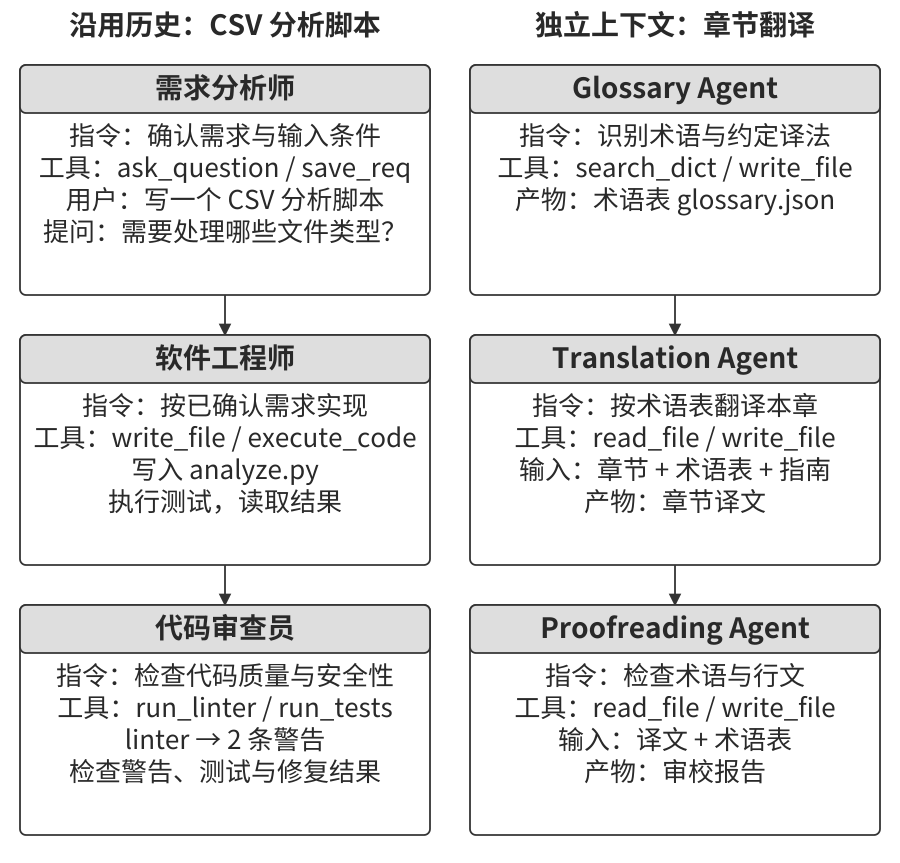

### 维度二：协作拓扑

协作拓扑描述 Agent 之间的任务依赖、信息流与控制关系。本章采用三种典型组织方式：

- **对等协作模式**（Peer Collaboration Pattern）。少量成员围绕同一产物反复协作。例如，起草者完成论文草稿，评论者提出修改意见，再由起草者修订。
- **管理者模式**（Orchestration Pattern）。中心化的 Manager Agent 负责拆分、分配和汇总任务，子 Agent 承担各自的专业工作。
- **去中心化模式**（Decentralized Pattern）。成员根据角色、消息和局部状态接续工作，各成员共同决定工作怎样继续推进。

> **术语说明：Graph 工程。** 第一章介绍了 2026 年 7 月关于 Graph 工程的讨论。这一视角关注执行图：节点可以是 Agent、普通程序或人工决策，边表达依赖、条件路由和失败后的处理方向，状态沿执行关系传递。多 Agent 协作拓扑是这一设计视角的应用之一，重点在于多个决策单元怎样交接、并行和反馈。

对等协作、管理者与去中心化设计可以组合使用。例如，Manager 将一项写作任务交给起草者—审核者小组，小组完成内部迭代后再提交结果。

## 多 Agent 何时优于单 Agent

选择协作方式时，先问：新增的 Agent 为任务带来了什么？它可能获得新的证据，覆盖另一条搜索路径，提供不同的专业判断，也可能通过并行执行缩短等待时间。再把这些收益与通信、重复计算和协调所需的成本放在一起比较。

笔者首先检查**反馈的信息增量**，再看并行和上下文隔离能带来多少收益。审核者读到测试结果、页面截图或外部材料后，可以根据生成时尚未获得的证据提出修改。表10-1 用几种常见场景说明怎样检查这类增量。

表10-1 多 Agent 协作中的信息与反馈

| 协作模式 | 主要信息来源 | 评价重点 |
|---|---|---|
| 同一模型重新审查自己的输出 | 原有材料与一次新的检查过程 | 能否发现遗漏，修改后是否改善结果 |
| 多个 Agent 辩论同一问题 | 各自的解题路径、假设与论据 | 观点是否有差异，怎样核实并选出答案 |
| 审核者运行测试并检查代码 | 编译、测试与运行反馈 | 修改能否通过测试并保持已有功能 |
| 审核者查看前端或 PPT 的渲染结果 | 截图与交互反馈 | 布局、内容和操作是否符合要求 |
| 审核者使用外部工具核实事实 | 检索与业务系统记录 | 来源是否可靠，结论是否与证据一致 |

RLEF 通过强化学习训练模型利用代码执行反馈，在竞争性编程任务中学习多步修订。编译错误、测试失败和运行异常为下一次修改提供了具体依据，论文中的模型能够以更少的采样取得更好的结果。[^rlef-2025] WebGen-Agent 则把网页截图、视觉模型的描述与建议、GUI 操作评价接入生成流程，并结合回退和候选选择。在 WebGen-Bench 上，Claude 3.5 Sonnet 的准确率由 26.4% 提高到 51.9%。[^webgen-agent-2025]

[^rlef-2025]: Gehring, J., et al. *RLEF: Grounding Code LLMs in Execution Feedback with Reinforcement Learning.* arXiv:2410.02089, 2025. https://arxiv.org/abs/2410.02089
[^webgen-agent-2025]: Lu, Z., et al. *WebGen-Agent: Enhancing Interactive Website Generation with Multi-Level Feedback and Step-Level Reinforcement Learning.* arXiv:2509.22644, 2025. https://arxiv.org/abs/2509.22644

这两个案例说明，反馈设计直接影响迭代质量。笔者会先让系统取得测试、截图或工具返回等具体证据，再决定怎样分配生成、执行和审核职责。反馈循环可以由一个 Agent 完成，也可以拆给多个角色；增加角色应当改善证据的获取与使用。评估多 Agent 方案时，应把反馈渠道、模型、工具和预算一起纳入对照，进一步判断分工本身带来了多少收益。同一问题上的重复讨论，则需要重点检查推理差异、证据来源与最终选择机制。

Anthropic 2026 年的安全研究提供了协作搜索的案例：45 个 Agent 通过共享论坛交流发现、互相审查，再由独立 Agent 仲裁结果。研究报告中，协作集群消耗 2700 万 token，发现 266 个漏洞；独立并行方案消耗 650 万 token，发现 21 个。两组预算也有差异，比较时应同时看发现数量与资源投入。这个案例展示了交流在开放搜索中的作用：成员可以根据别人的发现调整方向、形成分工，扩大搜索覆盖。[^anthropic-multiagent-2026]

[^anthropic-multiagent-2026]: Anthropic Frontier Red Team, “Patterns and Problems in Emerging Multiagent Systems,” 2026-08-13. https://www.anthropic.com/research/multiagent-systems

**步骤预算如何影响表现？** 假设一个任务允许 30 步，Agent 需要紧凑地安排规划、核心实现和必要验证；若允许 300 步，就有空间比较更多方案，开展更充分的测试和修订。要用好这部分资源，Agent 还需要知道总预算与剩余预算，并据此安排探索深度。

Google 在 2025 年的《Budget-Aware Tool-Use Enables Effective Agent Scaling》中研究了这一问题：缺少预算意识的 Agent 可能很快停留在浅层搜索，即使增加可用步骤，表现也难以继续提高。2026 年的 BAVT（Budget-Aware Value Tree Search）进一步在搜索步骤中结合价值估计与剩余预算，调整探索和利用的权重。预算充足时可以比较更多方向，接近预算上限时则把资源集中到有希望的分支。

在管理者模式中，这意味着 Manager 要根据任务难度分配步骤，并随进展调整：简单任务尽快交付，复杂任务预留验证与修订空间，遇到阻塞时先定位原因，再决定补充信息、增加预算或换一条路径。

评价最终方案时，把质量、时间和成本放在一起比较。并行探索可以缩短墙钟时间，反复审核可以改善产物，但两者都会增加模型调用与通信开销。笔者会以调校好的单 Agent 作为基线，只有新增成员带来的质量提升或时间节省足以覆盖通信、重复计算和维护成本时，才扩大协作规模。

## 共享上下文的多 Agent 协作

共享上下文的协作按阶段切换角色，同时沿用已有任务记录。以研究报告为例，检索角色先收集资料，分析角色接着计算，写作角色再组织表达。每个角色都可以回看前面的来源和决定，系统则通过当前任务指令引导它关注本阶段的目标。

实现角色转换有两种常见方式：**替换系统提示词与工具配置，或在稳定的系统提示词下加载 Skill**。前者直接切换角色配置，后者将角色知识和流程作为后续材料加入上下文。两种方式对缓存和工具管理的影响见下表。

| 选择 | 角色规程的载体 | 工具可见性 | 上下文与 KV Cache | 权限执行 |
|---|---|---|---|---|
| `transfer_to_agent` | 加载目标角色的系统提示词，按角色切换工具集 | 可只展示当前角色的工具 | 请求前缀发生变化，从变化位置起通常需要重新计算 | Harness 根据当前角色校验与调度调用 |
| Skill | 稳定的系统提示词提供目录，按需加载具体规程 | 可保持工具全集或稳定的工具搜索入口 | 新规程追加到历史末尾，已有前缀可继续复用 | Harness 独立执行权限规则 |

角色差异主要体现在知识、流程和写作风格时，笔者优先使用 Skill：它便于复用同一运行框架，也能保留稳定请求前缀的缓存。角色差异涉及权限、工具隔离或审批职责时，可以按独立 Agent 或角色切换组织，再由 Harness 和执行环境落实访问控制。工具是否出现在模型输入中影响调用选择，实际权限由运行时校验决定。

> **实验 10-1 ★★：共享上下文中的多角色转换——系统提示词与 Skill 的对比**
>
> 两条路径使用同一模型、用户任务、工具实现、角色规程和共享历史。任务是查找中国 2021—2023 年新能源汽车销量，计算 CAGR，并写一段不超过 120 字的投资人摘要。
>
> **路径一：系统提示词切换。** 设置 triage（需求收集）、research（检索）、coding（编程）、data_analysis（分析）和 writing（写作）五种角色。triage 为入口，每个角色看到专属工具与 `transfer_to_agent`。移交时保留历史，加载目标角色的提示词与工具集，再继续运行。
>
> **路径二：加载 Skill。** 系统提示词和工具全集在会话中保持稳定。模型调用 `load_skill(name)` 获取角色规程，内容作为工具结果加入共享历史，原有前缀继续保留。Harness 根据权限规则检查每次工具调用。
>
> 比较两条路径的任务完成质量、输入长度、缓存复用与切换开销，观察角色规程的组织方式怎样影响执行过程。

## 不共享上下文的多 Agent 协作

在独立上下文架构中，每个 Agent 分别维护输入历史、任务状态和运行循环，通过工具参数、共享文件与消息交换所需信息。任务交接时，需要明确传递什么、怎样接收结果，以及失败后由谁处理。

操作系统提供了一组有用的设计类比。表10-2 将 Agent 的配置、状态、工具调用和生命周期放在一起，帮助理解运行时需要承担哪些职责。

表10-2 多 Agent 系统与操作系统的设计类比

| 操作系统 | 多 Agent 系统中的相近职责 |
|---|---|
| 程序及配置 | 系统提示词、工具定义与角色配置 |
| 进程内存 | 当前上下文、任务状态与历史记录 |
| CPU 执行计算 | LLM 生成决策，运行时与工具执行相应操作 |
| 内核管理运行 | Agent 运行时管理状态、调度与资源 |
| 系统调用 | 通过工具接口请求外部操作 |
| fork：创建子进程 | `spawn_subagent`：创建子 Agent |
| kill：发送信号 | `cancel_subagent`：请求取消 |
| ps：查询进程 | `list_agents`：查询成员及运行状态 |
| 退出状态与 wait | 完成通知、任务状态与结构化结果 |
| 共享存储与消息传递 | 共享文件、工具参数与消息 |

私有状态、异步消息和动态创建成员，也出现在 1970 年代提出的 Actor 模型中。[^actor-model] 这些抽象为多 Agent 工程提供了成熟的出发点：由消息触发工作，以局部状态组织执行，再通过协议协调成员。

[^actor-model]: Hewitt, C., Bishop, P., Steiger, R. *A Universal Modular ACTOR Formalism for Artificial Intelligence.* IJCAI 1973.

独立子任务较多时，笔者倾向于使用隔离上下文，让每个成员只处理与职责有关的材料。这样便于分别测试角色，也减少了前一阶段的冗长历史对当前判断的干扰，并能让多个任务并发推进。隔离的效果还取决于其他共享资源：多个 Agent 仍可能同时修改文件、消耗同一个 API 配额，或接收同一条错误消息。因此，状态所有权、资源限额和结果校验需要一起设计。

协作接口还要处理消息丢失、重复交付和状态滞后。排查问题时，可以用任务标识关联各成员的请求、工具事件与结果，重建一次交接的过程。这也要求输入输出格式与状态变化有明确约定。

下面分别介绍两类基础设施：**产物存储**负责文档、代码和数据的保存与交换；**通信与控制**负责消息投递、状态获取、执行取消和资源调度。共享文件系统是产物存储的一种常用实现，消息中也可以携带小型结果或大文件的引用。

### Agent 眼中的文件系统

一种常见设计是向 Agent 提供**虚拟文件系统**（virtual filesystem），将不同来源的资源挂载到统一目录树。模型通过 `read_file`、`write_file` 和 `list_dir` 等接口访问，底层可以连接本地临时盘、持久对象存储、第三方云盘 API 或系统资源包。

笔者会先划清存储区域，再接入协作流程。临时草稿、正式交付物与用户外部文件若混在一起，容易发生误覆盖或越权读取。统一接口便于使用，各区域的可见性、生命周期和权限则由挂载与访问控制配置决定。可以把这棵目录树分成四类区域。

**一、Agent 专属工作区（Scratchpad）。** 每个实例使用自己的工作区，保存草稿、临时文件、调试日志和中间产物。默认将访问范围限制在所属 Agent，并按任务策略清理或归档。这样可以避免临时文件互相覆盖；子 Agent 完成工作后，再把需要交付的结果放入共享空间，连同结构化摘要交给主 Agent。试错记录保留在原工作区，供后续诊断。这也把上下文隔离落实到了存储层：主 Agent 取得交付结果和必要证据，日常协调时省去读取全部试错过程的开销。

**二、多 Agent 共享空间（Shared Workspace）。** 协作成员在这里交换产物，用户也可以通过授权入口上传材料、下载交付物。例如，Glossary Agent 写入术语表，Translation Agent 读取后翻译，审核者再检查译文。共享空间通常随任务持久保存，需要处理并发写入、版本更新和访问范围。第六章中，Agent 与虚拟电脑通过共享存储交换 CSV 和图表，就是这种产物交接的实例。后文将介绍乐观锁与工作副本隔离等方法。

**三、外部挂载资源（Mounted External Resources）。** Google Drive、Notion、Dropbox 和企业 Wiki 等资源可以通过适配器映射到统一接口。Agent 读取文档时，适配器负责调用源系统 API。这里要管理三类差异：访问范围取决于外部授权；网络访问带来延迟、超时与缓存更新问题；写回操作需要符合源系统的权限与版本规则。具体一致性语义由服务接口决定，可以利用版本号、条件写入或重新读取来检查并发修改。按需只读挂载适合资料检索，需要编辑时再授予相应写权限。

**四、系统内置资源（Built-in System Resources）。** 参考手册、模板、工具定义和预置 Skills 可以作为只读资源包供多个 Agent 使用。Skills 按渐进式披露加载：先提供目录，再按任务读取规程与脚本。固定版本的资源包便于并发读取，升级时通过版本切换让运行中的任务保持一致。

图10-2 将这四类区域组织在同一目录树下，展示统一访问接口、用户文件入口与外部适配器的关系。

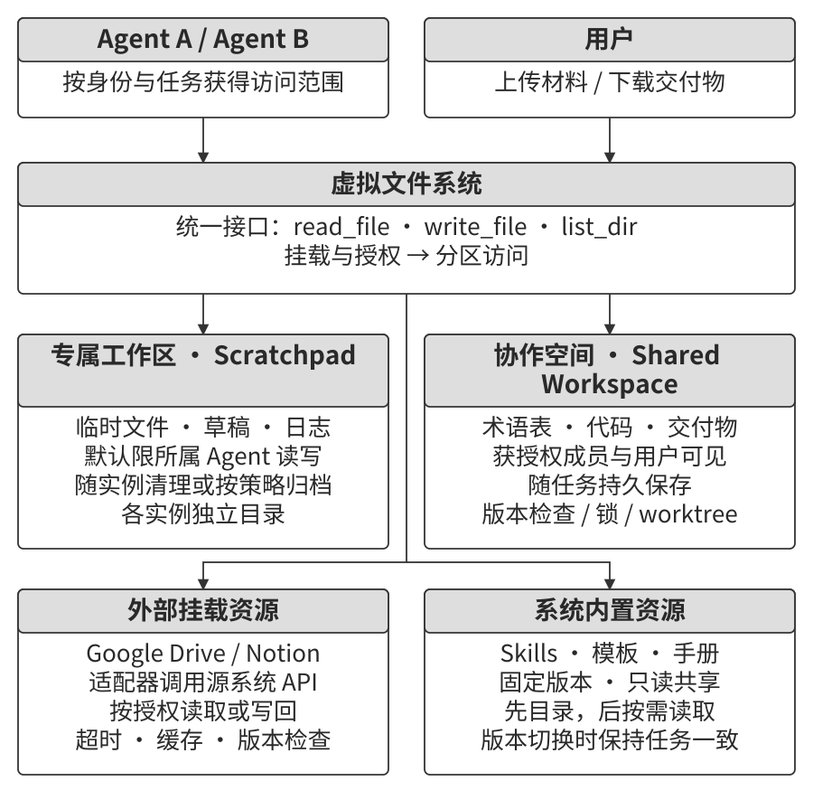

表10-3 对比了四类区域的管理方式。实际部署时，可以据此配置成员权限与保留策略。

表10-3 Agent 虚拟文件系统的四类区域

| 区域 | 可见性 | 生命周期 | 读写 | 并发管理 |
|---|---|---|---|---|
| Agent 专属工作区 | 默认限所属 Agent | 随实例清理，按需归档 | 所属 Agent 读写 | 防止重试或后台操作重复写入 |
| 多 Agent 共享空间 | 获授权的成员与用户 | 随任务持久保存 | 按角色授权 | 锁、版本检查或 worktree |
| 外部挂载资源 | 由外部授权与适配器共同限制 | 由源系统与缓存策略决定 | 按需只读或授权写入 | 遵循源系统版本与并发接口 |
| 系统内置资源 | 获授权的 Agent | 固定版本跨会话复用 | 只读 | 统一切换资源版本 |

文件引用可以让交接消息保持简短：上游提供产物位置、版本和用途，下游按需读取内容。位于同一运行环境的成员可以使用共享路径；跨组织协作则需要双方都能解析的产物标识、访问接口和授权，才能完成同样的交接。

### Agent 间的通信与控制

第四章介绍的创建、通信、取消和发现工具，为多 Agent 协作提供了基本控制接口：`spawn_subagent` 创建成员，`send_message_to_subagent` 传递消息，`cancel_subagent` 请求取消，`list_agents` 查询成员。围绕这些接口，还要约定消息、状态、终止和调度的行为。

**一、消息传递。** 成员少、关系固定时，可以使用点对点接口，例如电话 Agent 与电脑 Agent 直接交换进展。若所有成员都需要两两通信，潜在关系数会随成员数按平方增长；订阅关系较多时，消息总线便于统一管理路由、缓冲和重试。点对点与总线都可以实现异步投递，是否要求接收方同时在线取决于队列和持久化机制。

消息通常包含一个结构化**信封**（envelope）：发送者 ID、目标 Agent 或广播范围、消息类型与负载。消息类型可以包括 `task_assigned`、`status_update`、`result` 和 `terminate`。任务标识、消息标识与关联请求帮助接收方去重，也让调试工具能够重建通信链路。业务内容放在 JSON 负载中，双方按约定字段处理。

**二、状态获取。** 主 Agent 需要知道子任务是否仍在运行、是否需要输入，以及结果是否可取。可以组合使用状态接口、事件通知和进度文件：运行时接口提供生命周期状态，消息说明业务进展，持久文件保留可恢复的记录。

`get_subagent_status(agent_id)` 可以返回运行中、需要输入、已完成或失败等状态。日常协调中，笔者优先使用完成通知和阶段进度消息，让主 Agent 继续自己的工作。通知延迟、连接恢复或需要排查问题时，再主动查询，避免把模型调用消耗在频繁询问“结束了吗”上。状态接口由运行时维护，可以及时报告进程是否存活、任务是否结束。

**用消息交换进展。** 主 Agent 可以询问当前进度，子 Agent 在合适的步骤回复；子 Agent 也可以在取得阶段结果、遇到阻塞或需要帮助时主动发布 `status_update`。消息内容应说明已完成事项、下一步和阻塞原因，各成员使用同一套状态名称，便于汇总与判断。后文的 A2A 协议将介绍任务生命周期的标准化表达。

**用文件保存进度。** 系统可以将消息、工具请求、工具结果和状态变化按事件顺序追加到日志中，例如采用每行一个事件的 JSONL 格式。获得诊断权限的主 Agent 或运维工具可以据此检查重试、错误与等待过程。模型输入历史只是运行轨迹的一部分，日志还可以记录调度和外部执行事件。

完整轨迹可能包含数万 token，主 Agent 每次读完还要重新提炼状态。消息通知主 Agent 有了新进展，较小的进度文件则保存当前状态，供后续查询与恢复使用。笔者优先用这两者配合完成日常协调。子 Agent 每完成一项工作，就更新任务清单、产物引用和当前阻塞点；主 Agent 根据这些字段决定下一步。详细轨迹保留供按需排查。若进度长时间没有变化，可以结合心跳、工具调用状态和任务超时设置判断是否需要介入：长时间运行的工具可能仍在工作，确认状态后再决定等待、取消或重试。

**三、执行终止。** 多个成员并行寻找同一目标时，其中一个完成任务后，其他分支可以停止，以释放预算与工具资源。取消分为两种强度，与 Unix 中 SIGTERM 和 SIGKILL 的作用相近。

笔者优先采用**优雅终止**：由运行时传递取消请求，子 Agent 在安全点停止新操作，保存必要进度、关闭浏览器会话并释放锁，随后返回确认（ack）。**强制终止**用于超过取消期限仍未响应的执行，由运行时结束进程，再检查残留资源和未完成写入。已经提交到外部系统的操作还需要查询结果，必要时执行补偿流程。

生命周期也需要沿创建关系管理。借鉴 Go 的 context，可以让父任务的取消信号向下传播到整棵子任务树，运行循环在安全点检查取消信号，对应 `ctx.Done()` 的用途。这样，父任务结束后，它启动的分支也会进入清理流程，避免无人管理的 Agent 继续调用工具和消耗预算。确实需要长期独立运行的后台任务，则创建独立的生命周期上下文，类似使用 `context.Background()`，同时指定负责监控、预算和清理的管理者。

**四、资源与调度。** Agent 系统需要分配 token、步骤、并发额度、工具连接和计算资源。启动子任务时设置预算与超限行为；根据任务难度选择模型；限制并发调用，避免集中耗尽服务配额。更紧急的任务到达时，可以在安全点暂停或取消低优先级任务，保存进度后重新调度。

Manager 的任务理解能力可以用于分配资源：启动几个分支比较不同方向，根据阶段结果增加某一分支的预算，或结束收益较低的分支。运行时则负责执行额度、并发和取消规则。把策略选择与执行控制配合起来，才能让动态调度保持可观测、可恢复，并控制整体成本。笔者建议在架构起步阶段就设计预算、并发和取消机制；协作规模扩大后，这些机制决定系统能承担多少并行工作。

至此，独立上下文协作具备了产物交换与运行控制的基础。下面分别讨论对等协作、管理者编排和去中心化组织，观察这些机制怎样组合成具体工作流程。

### 对等协作模式：相互检查与迭代改进

对等协作通常由两三个 Agent 围绕同一任务交换意见、修订产物。设计时，可以先为成员安排不同的职责、材料和工具，让它们独立判断，再汇总结果。例如，生成者关注实现，审核者关注测试与用户要求；不同专业成员分别检查各自领域的约束。模型、输入和工作流程越相似，成员越容易重复同一种判断，因此需要主动设计视角与证据的差异。[^anthropic-multiagent-2026]

对于围绕同一产物反复改进的任务，笔者建议先从两三个成员的对等协作开始。角色、交接内容与停止条件明确后，就能建立可测试的循环，初期协调工作也较少。再根据实际问题增加成员或调整流程。

#### Loop 工程

对等协作可以帮助处理一个常见问题：**过早终止**。以 Coding Agent 和笔者团队的 Pine AI 为例，过早终止有三种典型表现。

- **部分完成后宣称全部完成。** Coding Agent 写完代码，却遗漏测试和部署检查；用户委托 Pine AI 办两件事，它完成第一件后便汇报全部办妥。需要逐项对照任务清单，检查每项工作的完成证据。
- **一条路径失败后提前放弃。** Pine AI 可以通过电话、表单和邮件联系商家，如果一次电话被拒就结束任务，会错过其他可行渠道。需要记录失败原因，并判断还有哪些路径值得尝试。
- **局部成功后遗漏后续步骤。** 商家在电话中同意退款，用户还需要在手机 App 上确认。此时应把确认步骤交接给用户或有权限的执行者，并检查最终状态。

这三类问题都要求把完成条件落实到可检查的结果。**Loop 工程**关注如何让 Agent 持续经历“确定下一项工作—执行—验证—记录进度”的循环，并根据结果决定继续、等待、移交或结束。工程师需要设计任务来源、验证方式、持久状态和停止条件。人的工作也随之扩展：从为一次调用编写提示词，转向设计能够持续推进任务的循环。Addy Osmani 在 2026 年 6 月用这一名称讨论了这组实践，并引用 Boris Cherny 的经验：工作重心逐渐转向设计能够驱动 Agent 的循环。[^loop-engineering-2026]

**在这类循环中，笔者认为验证器往往是关键瓶颈。** 验证不可靠，增加轮数就可能让系统重复同类错误，或过早宣布完成。测试结果、业务状态与用户确认提供各自范围内的完成依据；验证失败则成为下一轮修订的输入。

实践先于命名。在 Loop 工程这一名称流行之前，笔者与团队在 Pine AI 中就已经用循环与验证处理过早终止。提议者—审核者是组织这类循环的一种常用方式，下面会进一步展开。

[^loop-engineering-2026]: Osmani, Addy. “Loop Engineering”, 2026. https://addyosmani.com/blog/loop-engineering/

**LoopX：保存跨轮次的工作状态。** LoopX 将目标、边界、待办、门禁、证据与配额放在持久控制面中，由它安排下一轮或下一位执行者的工作。流程可以概括为：**控制面决策 → Agent 执行 → 独立验证 → 提交已核实进度**。

Agent 负责推理、工具调用和候选产物，控制面负责跨轮次的连续性。验证通过后提交完成状态；失败时进入修复或重规划。人工门禁、等待条件与预算上限共同决定何时可以继续执行。实现时还应区分已完成工作量与实际资源消耗，失败尝试消耗的 token、时间和工具费用也要进入成本记录。[^loopx-framework]

[^loopx-framework]: LoopX, “The local control plane for long-running AI agent work”, v0.4.0. https://github.com/huangruiteng/loopx/tree/a893d221db0b8e028997cefc303f7ec9fa7dbe0a

**LongHorizon-Harness：衔接跨应用的长任务。** 这一框架从多模态 Computer Use 出发，处理任务在 GUI、CLI、多个桌面应用和多次上下文刷新之间的连续执行。它采用 Manage–Execute–Audit（MEA）循环：Manager 根据原始目标、核实进展、失败证据与剩余工作，生成一项范围明确的子任务；Executor 在新的上下文中执行 GUI 或 CLI 操作；Auditor 以只读方式检查结果，再把核实的进展写入下一轮状态。失败证据也随之保留，供恢复与重规划使用。

框架通过适配层调用 Claude Code、Codex CLI 等执行后端，将外层任务管理与后端运行循环衔接起来。这条路线把长任务的连续性落实到已核实的任务状态上。执行上下文可以刷新，下一轮仍能依据目标、完成证据和未解决事项继续工作，并重新检查环境变化是否影响原有结论。[^longhorizon-implementation]

论文在保持 Qwen 3.7-Plus 与 Claude Code 执行后端相同、改变外层循环的对照中，报告 WeaveBench PassRate 从 51.8% 提高到 80.7%，OSWorld 2.0 二元完成率从 2.8% 提高到 8.3%，Terminal-Bench 2.1 成功率从 69.7% 提高到 77.2%。相应成本也随任务变化：前两个基准分别消耗基线 2.3 倍的总 token 和 3.6 倍的输出 token；Terminal-Bench 2.1 的 token 消耗减少了 24%。部署时可以据此同时设置质量目标、轮数、时间与费用预算。

公开案例中的 WebRTC 多层流审计任务展示了失败证据的用途：基线在 Wireshark 交互受阻后反复尝试，得分为 0.59；MEA 将失败与缺失证据写回状态，后续轮次集中补齐这些项目，得分为 0.92。阅读这个过程时，可以重点观察每次交接中的已完成事项、未满足条件和下一步任务，理解下一位执行者怎样依靠持久状态接续工作。

[^longhorizon-implementation]: LongHorizon-Harness. 项目与公开轨迹：https://lh-harness.pages.dev/#trajectories；论文：https://arxiv.org/abs/2608.01964；代码：https://github.com/AMAP-ML/LongHorizon-Harness/tree/53bc678ed4170ad4d2e4309f2bfc5c3fb6caf8cb

#### 提议者—审核者范式

提议者—审核者将产物生成与结果检查交给两个角色。第五章的 PPT 生成、视频编辑和日志可视化实验采用了这一设计：Proposer 生成代码，Reviewer 查看渲染结果，借助视觉模型检查质量，并返回结构化修改意见。图10-3 展示了生成、执行、审核与修订之间的循环。

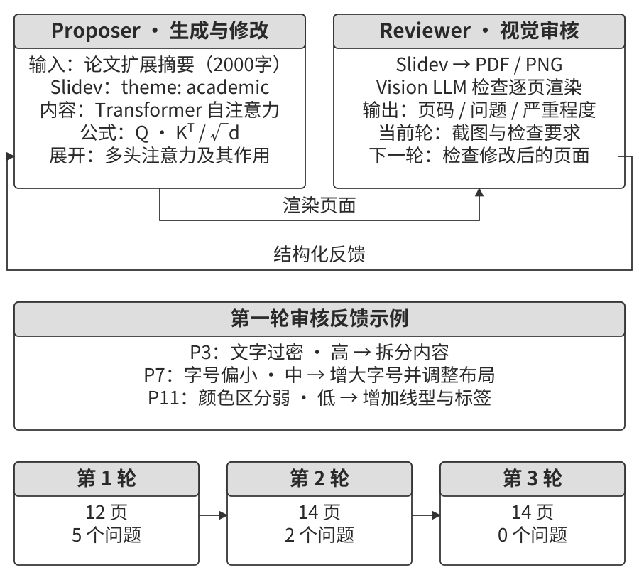

类似分工也适用于操作方案、客服回复和代码变更。提议者完成候选方案，审核者按任务要求检查业务规则、事实依据、执行结果和适用规范。

设计这个循环时，先确定审核者能够取得什么证据。Huang 等人的 ICLR 2024 论文《Large Language Models Cannot Self-Correct Reasoning Yet》发现，在其研究的推理任务与提示设置下，GPT-4 缺少外部反馈时进行自我修订，会出现把正确答案改错、导致整体准确率下降的情况。TACL 的自我纠错综述进一步讨论了任务条件与反馈可靠性怎样影响修订效果。[^self-correction-survey] 因此，笔者把独立证据与可定位的修复条件作为审核循环的基本要求。审核者应能读取实际测试、环境状态或渲染结果，并指出哪个要求尚未满足、怎样验证修复。

[^self-correction-survey]: Kamoi, R., et al. *When Can LLMs Actually Correct Their Own Mistakes? A Critical Survey of Self-Correction of LLMs.* TACL, 2024. https://arxiv.org/abs/2406.01297

一个完整循环可以按五步组织：

1. 提议者根据任务与约束生成候选产物。
2. 执行或渲染产物，取得测试、业务状态、截图或事实核验结果。
3. 审核者对照要求与证据，给出通过结论，或指出问题位置及修复条件。
4. 仍有预算时，提议者按反馈修订，再执行和审核；遇到需要输入或授权的问题时转入等待或移交。
5. 达到发布条件后，将候选版本、证据和审核结论一起交付；预算耗尽时保留进度与未解决问题。

审核者读取受保护的测试与发布标准，提出的标准变更另行审查。这样，生成产物、检查结果和批准发布各有明确依据。

CRITIC 的 ICLR 2024 研究让模型使用搜索引擎、Python 解释器等工具检查回答，比较了工具辅助修订与单纯自我评价的效果。这个设计与第五章的 PPT 案例相通：渲染截图能暴露代码文本中难以直接判断的排版与遮挡问题，测试执行则能揭示实际运行错误。获得这些反馈后，生成者才有具体的修改目标。

Anthropic 2026 年的长程应用开发案例采用规划者、生成者和评估者三个 Agent。规划者将需求展开为产品规格；生成者与评估者先约定每轮完成标准，再分别实现和检查。评估者使用 Playwright 操作应用并提交缺陷报告，角色之间通过文件交接状态。该案例展示了产品规格、真实操作和缺陷反馈怎样连接起来，也需要将增加的执行与审核成本纳入方案比较。[^anthropic-harness-2026]

[^anthropic-harness-2026]: Prithvi Rajasekaran, “Harness Design for Long-Running Application Development,” Anthropic Engineering, 2026-03-24. https://www.anthropic.com/engineering/harness-design-long-running-apps

#### 辩论模式

辩论模式让成员从不同立场检查同一问题。例如，评估技术方案时，一位 Agent 说明收益与适用场景，另一位检查约束、失败条件和替代方案。每轮围绕具体论点补充证据或提出反驳，最后汇总已达成共识的事项与仍需验证的分歧。

这种安排有助于清楚列出正反论据，效果则取决于论据质量、独立判断和最终选择方法。Tran 与 Kiela 在多跳推理任务中比较了顺序、辩论、集成、并行角色和子任务并行五种架构；控制相同的思考 token 预算后，单 Agent 表现与多 Agent 持平或更好。[^single-agent-2026] 据此，笔者把辩论主要用于展开分歧、检查假设和补齐反面论据。追求事实或计算正确率时，优先增加可核验的证据与独立检查，再用相同预算比较组织方式。

论文借助数据处理不等式讨论中间信息传递的局限：反复转述与压缩可能丢掉原始细节。工程上可以保留可追溯的来源，让成员先独立分析，再交换结论，减少未经检查的共识。多次独立采样后聚合，以及利用“生成较难、验证较易”的任务特点安排专门审核，也可以与辩论配合使用。

[^single-agent-2026]: Tran, D., Kiela, D. *Single-Agent LLMs Outperform Multi-Agent Systems on Multi-Hop Reasoning Under Equal Thinking Token Budgets.* arXiv:2604.02460, 2026.

#### 头脑风暴模式

头脑风暴先让成员独立生成候选，再交换想法、组合方案。例如，Agent 1 提议增加社交分享功能；Agent 2 在此基础上提出自动生成个性化分享海报；Agent 3 进一步提出用户自定义模板与模板市场。

可以通过不同任务角度、提示词或模型增加候选差异，再根据用户需求、实现成本和验证结果筛选。独立生成阶段保留思路的多样性，交流阶段寻找可以组合的部分。

#### 专家小组模式

专家小组围绕跨领域问题分配专业职责。例如，评估新产品时，工程师 Agent 分析实现难度与技术依赖，产品 Agent 检查用户需求与体验，运营 Agent 估算成本、资源和落地条件。

汇总时要找出各判断之间的联系：某个体验目标需要怎样的技术支持，技术选择会增加多少运营成本，哪些条件还需要外部证据。这样，各专业结论才能共同支持下一步决策。

### 管理者模式：中心化协调

当任务包含较多子任务、复杂依赖或动态调度时，可以由 Manager Agent 统一规划。它先理解整体目标，再拆分工作、选择成员、跟踪进度，遇到异常时决定重试、换人或调整计划，最后整合结果。

一种常用实现是把专门 Agent 注册为工具。Manager 通过工具接口传入任务、约束和必要材料，再接收结构化结果或任务标识。这样，搜索、文件操作与子任务委派可以采用相近的调用方式；长耗时子任务则另外管理进度、取消和重试。不同成员可以使用不同模型、提示词、工具与运行环境。新增成员时，除注册接口外，还要让 Manager 理解它的职责、输入要求和适用场景。

Manager 同时承担了较多决策责任。任务分解错误会影响后续执行，交接材料不足会造成反复询问，过多调用记录也会挤占上下文。设计时应保存简明的任务状态与产物索引，按需读取细节，并让子任务具有清楚的输入、输出和完成标准。

Plan-and-Act 在 Planner—Executor 架构中研究了规划质量对长任务的影响，在 WebArena-Lite 上报告了 57.58% 的成功率。[^plan-and-act-2025] 规划错误会让多个执行者沿着错误的拆分继续工作，增加成员还会放大返工。笔者因此优先检查 Manager 的任务分解质量；瓶颈在规划时，把更强的模型、更完整的任务信息和更充足的推理预算分配给 Manager。子任务边界明确后，再为执行者选择合适的配置。

[^plan-and-act-2025]: Erdogan, L. E., et al. *Plan-and-Act: Improving Planning of Agents for Long-Horizon Tasks.* arXiv:2503.09572, 2025.

并行任务还需要明确怎样收尾。若目标是找到一个符合条件的结果，可以在验证通过后，以原子操作登记获选结果，再取消剩余分支，等待取消确认或超时，最后汇总交付。登记操作应同时满足原子性和幂等性：两个结果同时到达时，只发生一次状态转换；同一事件重复投递时，沿用已有处理结果。锁、事务或比较并交换都可以用于保护这一步。

若任务要求收集全部结果，则要等所有必需分支结束，并分别记录成功、失败和未完成项。收尾条件来自任务目标，也决定了何时能够取消其他成员。

**顺序协调。** 子任务存在明确依赖时，Manager 先等待前一项完成，再把结果交给下一位成员。图10-4 展示了调用、返回与继续分派的过程。

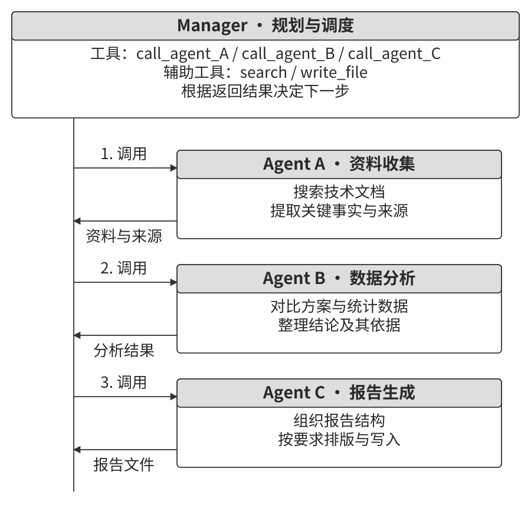

> **实验 10-2 ★★：书籍翻译 Agent**
>
> 翻译技术书籍需要同时处理术语、语境和行文。例如，英文 agent 可以有不同译法，如果译稿约定使用“智能体”，后续章节就应沿用同一译法。术语表、章节原文、译文和审校记录需要有清楚的组织方式。一本长书连同中间译稿、工具结果和审校历史会不断挤占上下文，模型可能到第九章已经忘记第二章的译法，也可能反复检查同一段内容。把任务按职责和章节拆开，可以让每个实例在较集中的材料上工作。
>
> 可以将工作分给四类 Agent：
>
> - **Glossary Agent：整理术语。** 分批阅读全书，识别反复出现的专业术语，参考专业词典与翻译规范，生成包含英文术语、中文译法、词性和使用语境的 JSON 或 CSV 对照表。术语表保存到共享空间，任务结束后释放该实例。
> - **Translation Agent：翻译章节。** 读取当前章节、相关术语和翻译指南，按照目标读者与语言风格完成译文。新出现的术语给出候选译法并标记待审。每个实例维护独立上下文，译文保存到共享空间；不同章节可按依赖串行或并行处理。
> - **Proofreading Agent：审校全文。** 根据术语表和各章译文检查译法、前后表述与可读性。通过分章读取和跨章索引完成全文检查，将问题位置、依据与修改要求写入审校报告。
> - **Manager Agent：安排与回收任务。** 维护目标、计划、任务状态、调用摘要和产物索引，根据审校报告把需要修改的章节交回翻译者，再组织复查。
>
> 将完整产物存入文件系统，可以减少 Manager 每轮必须携带的文本。术语提取、翻译和审校也分别组织所需材料，避免把所有中间历史放入同一模型输入。需要跨章判断时，再按索引读取相关内容。
>
> 图10-5 展示了术语表、章节译文与审校报告的交接关系。术语表更新后，应标记受影响章节，安排对应复查，让各实例采用一致的版本。
>
> **实验要求：**
> 1. 选择一本包含图表和代码的技术书籍。
> 2. 实现 Manager、Glossary、Translation、Proofreading 四类 Agent。
> 3. 记录各成员的上下文用量、交接材料和产物版本。
> 4. 与单 Agent 方案比较翻译质量、完成时间和资源消耗，分析任务拆分与上下文组织的影响。
>
> 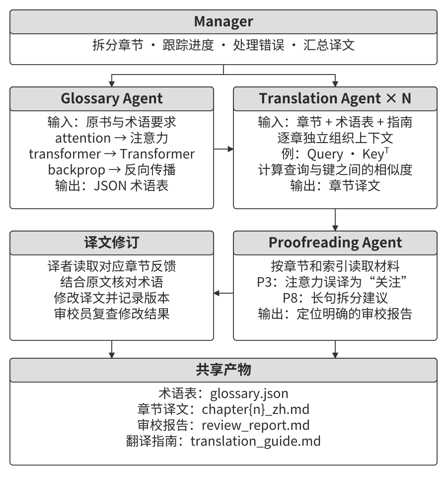

**并行协调。** 相互独立的子任务可以同时执行。Manager 负责分配任务、接收状态，并根据结果决定继续、补充工作或结束。图10-6 展示了多个成员同时运行、向管理者返回结果的结构。

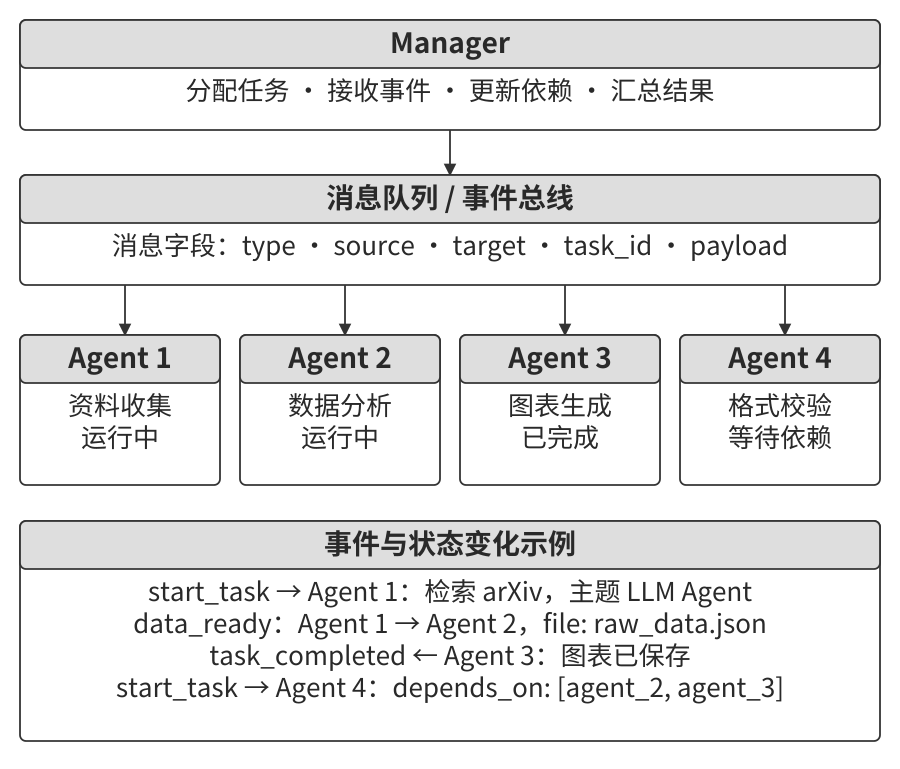

消息总线适合组织这类异步通信：成员发布进度与结果，管理者订阅相应事件，运行时负责投递、缓冲与重试。并行收益取决于任务依赖、外部服务限额和协调开销，可以同时记录完成时间、吞吐量与资源用量。

> **产品案例：灵台（Lingtai）**
>
> 灵台是本地运行、通过文件保存身份与记忆的长期 Agent 系统。它提供三种角色：主器灵（main agent）与用户对话，管理计划和记忆；分神（daemon）承担范围明确的短期并行任务，完成后返回结论；分身（avatar）保留自己的记忆、邮箱与职责，用于跨会话的专业分工。[^lingtai]
>
> 每个角色拥有私有的持久知识，共享 Markdown 形式的技能手册。上下文接近容量上限时，角色通过“凝蜕”（molt）保存总结，再结合持久记忆进入新的上下文。身份、记忆与技能独立保存在文件中，使更换底层模型后仍能延续工作。这一设计将管理者、短期工作者、长期专业成员与上下文压缩组合在一起。

[^lingtai]: 灵台官方教程：https://lingtai.ai/zh/tutorial/

> **实验 10-3 ★★★：自主编排的电话 + 电脑 Agent**
>
> 本实验结合第六章的 Computer Use 与语音交互。用户提供注册或航班预订页面，Computer Agent 打开网站、识别表单，再通过 Phone Agent 收集当前缺少的姓名、证件号、联系方式、地址和偏好等字段。
>
> **角色与交接。** Computer Agent 操作浏览器并负责本次编排；Phone Agent 通过 ASR、LLM、TTS 与用户实时交流，将口头回答转换成结构化字段。两者采用点对点工具或消息总线通信，消息包含发送者、接收者、类型和内容。Computer Agent 可以直接委派电话任务，承担管理者职责。用户愿意通过语音提供信息时，Phone Agent 可以连续提问、确认和重问，Computer Agent 则专注页面状态与字段填写。这种分工把对话和页面操作两条节奏分开，也为后面的并行处理创造条件。
>
> **两种运行模式。** 固定模式预先启动两个 Agent，各自维护独立运行循环，用于检查双向通信和并发行为。自主模式先启动 Computer Agent，由模型根据页面、已有信息与任务需要，决定是否调用 `initiate_phone_call_agent(purpose, required_info)`。运行时再把任务目的、待收集字段和格式约束交给 Phone Agent，启动后沿用同一套通信机制。两种模式的区别在于委派决策如何产生。
>
> **字段逐项流转。** Phone Agent 通过 WebRTC 提问、抽取并校验回答，取得有效值后发送 `info_collected`，随后询问下一项。Computer Agent 同时读取页面、填写上一项，并把 `fill_error` 或新的页面状态传回。格式不符的反馈用 `format_invalid` 标明字段与要求，Phone Agent 据此确认或重问。这样，“问下一项”与“填上一项”可以重叠执行。
>
> **完成与异常处理。** Phone Agent 收集完字段后发送 `task_completed`，表示信息收集子任务结束。Computer Agent 继续检查必填项、页面校验结果和提交授权，再完成表单操作。超过重试次数、遇到页面异常或用户要求停止时，暂停任务并说明当前进度；结束时取消仍在运行的对端，关闭浏览器会话、音频轨道与通话。真人语音交互和表单提交分别取得用户同意与授权。
>
> 图10-7 展示了电话输入、浏览器操作与双向消息之间的关系。
>
> **实验要求：**
> 1. 实现两个独立 Agent 与双向结构化通信。
> 2. 在固定模式和自主模式下记录时序，检查询问与填写的重叠区间。
> 3. 实现格式校验、重问、页面错误反馈、超时和资源清理。
> 4. 比较两种模式的启动决策、延迟、成功率与资源消耗。
>
> 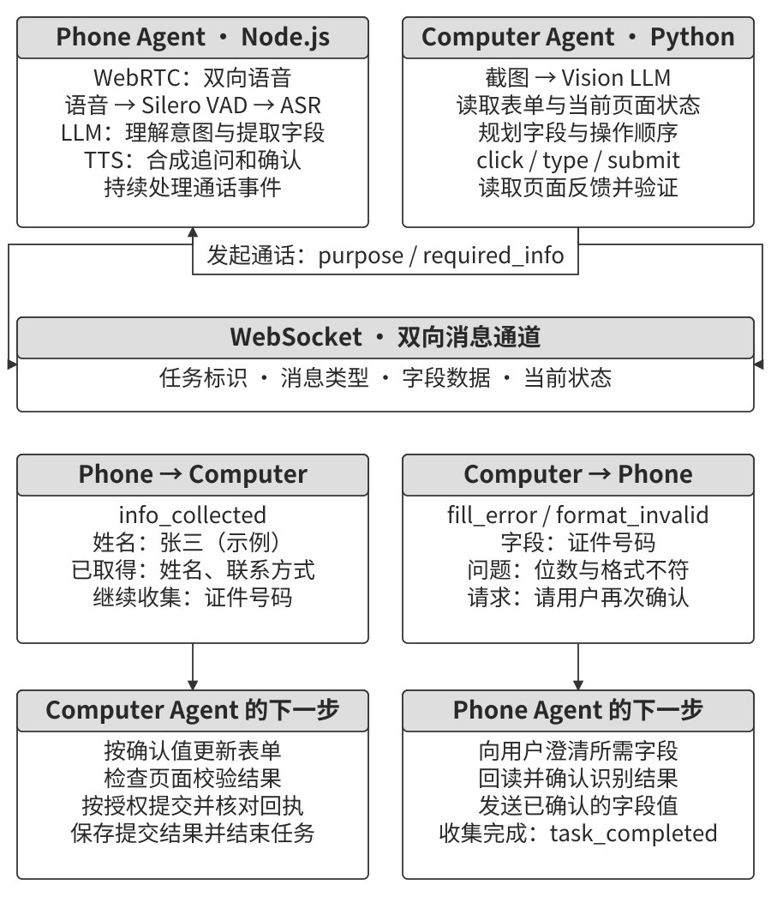

> **实验 10-4 ★★★：同时从多个网站搜集信息的 Agent**
>
> 本实验采用多个同构 Agent 并行搜索，练习第六章的事件驱动与中断机制。任务是在一所大学的多个学院网站中查找指定教师，例如“张伟”，返回学院、职位、研究方向及来源页面。搜索前先约定识别条件，例如姓名、学科与个人主页信息，便于区分同名人员。
>
> **1. 并行启动。** Manager 创建 10 个 Computer Use Agent，每个负责一个学院网站。各实例维护独立上下文与浏览器会话，可以通过异步任务、线程或进程调度。输入包含网站 URL、目标姓名、匹配条件和用于路由的任务标识。
>
> **2. 进度汇总。** 成员定期发送“加载网站”“读取教师名录”“已检查且无匹配”“发现候选”等状态。Manager 通过消息总线维护任务表，分别记录运行、完成、阻塞和失败，并保留来源与错误原因。
>
> **3. 验证后取消其他分支。** 假设负责物理学院的 `agent_3` 找到候选，它发送 `target_found`，负载包含教师信息与来源。Manager 核对匹配条件和证据，确认任务目标已满足后，原子登记结果，再向其他运行中的成员发送 `terminate`，注明获选结果来自 `agent_3`。成员在安全点停止、清理资源并返回确认；Manager 等待确认或超时后完成汇总。若任务要求列出全部同名人员，则继续搜索到所需范围检查完毕。
>
> **竞态条件。** Agent A 和 B 可能几乎同时返回有效结果。若两个事件各自触发汇总，就会造成重复交付或状态冲突。可以用锁或事务保护“搜索中 → 已获选”这一状态转换，让后到事件读取已经登记的结果。消息重试也要按事件标识去重，保证取消与汇总重复触发时仍保持一致。
>
> **4. 异常与覆盖范围。** 网络中断、页面结构变化和解析错误分别记录。可以为单个任务设置两分钟等超时预算，超时后取消执行并收集诊断信息，其他成员继续工作。最终报告区分“已检查且未找到”与“访问失败、尚未完成检查”，同时说明已覆盖的学院范围。这样，用户能据此决定是否补查。
>
> 图10-8 展示了任务分配、状态汇报、结果验证与级联取消。
>
> 配套实验中，并行方案相对串行方案的实测加速约为 1.87 倍。
>
> **实验要求：**
> 1. 实现动态创建并行成员的 Manager。
> 2. 使用 browser-use 等项目构建浏览器执行能力。
> 3. 通过消息总线完成双向通信与状态维护。
> 4. 实现结果验证、原子结算和带确认的级联取消。
> 5. 处理访问失败、解析错误、超时和无匹配等情况。
> 6. 对比并行与串行执行的完成时间、覆盖范围和资源消耗。
>
> 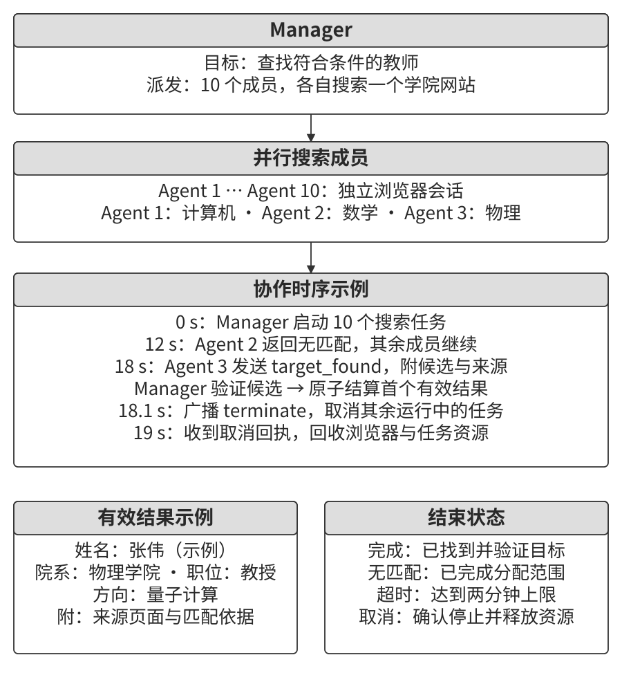

**由管理者生成工作流。** 除逐次委派外，Manager 也可以先把任务依赖和汇总规则写成程序，再交给运行时调度。模型负责设计流程，程序负责按约定启动成员、传递结果与等待依赖。依赖关系已经清楚、同类流程需要反复运行时，笔者优先采用这种方式。它省去每次分派都调用 Manager 的开销，也减少管理上下文中累积的调度记录。

Claude Code 的动态 Workflow 工具提供了这样的实现。`agent()` 创建独立上下文的子 Agent，可用 schema 约定结构化输出；`parallel()` 并发执行一组任务并等待全部结束；`pipeline()` 让每个输入分别经过多个阶段，某一项进入下一阶段时，其他项仍可在前一阶段处理。中间结果保存在程序变量中，筛选与合并通过普通代码完成。[^dynamic-workflows]

例如，核实技术稿件中的七组事实时，可以先按方向启动调研 Agent，再把每组结论分别交给核实 Agent 并行检查。每条返回结论保留来源与判定依据；所有分支完成后，汇总 Agent 组织最终报告。这样，“调研—逐条核实—统一汇总”的分工和阶段依赖就都写入了工作流。

[^dynamic-workflows]: Anthropic, “Orchestrate subagents at scale with dynamic workflows”, 2026. https://platform.claude.com/cookbook/claude-agent-sdk-08-dynamic-workflows

### 去中心化模式

去中心化协作将部分协调决策交给各个成员。专业成员需要频繁协商、下一步又依赖局部信息时，让成员自行接续工作，可以减少所有判断都经过 Manager 的等待。Agent 根据自己的职责和当前状态，决定何时交接任务、请求反馈或报告冲突。例如，工程师完成模块后通知测试者，架构师收到技术约束后与产品角色协商，成员通过这些局部交互共同推进任务。

微服务设计中常用**编排**（orchestration）与**编舞**（choreography）作类比：前者由中心管理流程，后者由参与者根据事件与规则接续工作。分散协调可以减少对单一管理者的依赖，可靠运行还需要持久任务状态、重试、超时和接管机制，以处理成员或基础服务故障。

分析具体框架时，可以分别观察三个问题：谁决定下一步，成员通过什么接口交流，接收者得到哪些上下文。下面的 MetaGPT、AutoGen 群聊和 Swarm 各自展示了其中不同的组合。

**MetaGPT：用 SOP 组织产物交接。** MetaGPT 将软件团队的标准作业程序（SOP）组织为角色职责与标准化产物。这一设计值得借鉴：PRD、设计文档、代码和测试报告已经明确了各工种需要交付什么，把这些产物作为接口，可以减少成员之间反复解释任务的成本。图10-9 展示了产品、架构、项目管理、开发和测试之间的关系。[^metagpt-design]

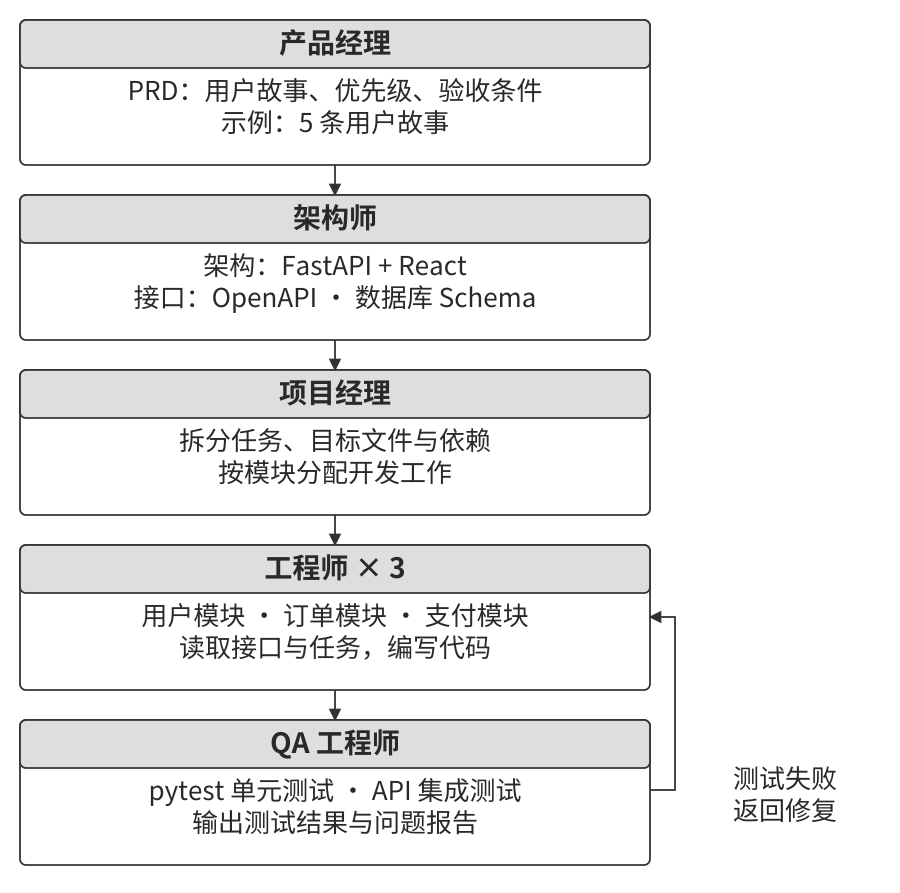

典型软件开发流程包含以下角色：

- **Product Manager Agent** 接收需求，整理 PRD，明确功能、用户故事、验收标准和优先级。
- **Architect Agent** 读取 PRD，选择技术栈，划分模块，定义接口与数据模型，形成设计文档。
- **Project Manager Agent** 根据设计拆分任务与文件分工，整理依赖，并安排工程师执行。
- **Engineer Agents** 根据设计实现模块、提交代码；相互独立的部分可以交给多个实例。
- **QA Engineer Agent** 根据代码和需求生成测试，执行检查并记录问题，形成测试报告。

这些角色的产物构成了交接接口。一个实用的交接包可以包含三部分：任务与验收标准，已确认事实和约束，以及结构化产物的引用。接收方据此取得所需材料、继续工作，并在信息缺失时提出具体问题。

MetaGPT 通过共享消息池与订阅机制组织信息：角色发布消息，其他角色根据关注的消息类型处理相关输入。发布者与消费者通过产物格式和消息语义连接，因而可以分别替换模型或调整内部实现。新增角色时，需要检查它的订阅、输出以及对既有流程的影响。

SOP 描述产品需求、架构与代码之间的依赖，消息订阅描述这些工作怎样被触发。固定的任务依赖也可以由分布式事件推进，两者共同构成系统的协作方式。进一步设计动态反馈时，可以加入测试者向产品角色澄清需求、工程师向架构师提出替代方案等路径，并为这些交互设置接收条件与结束规则。

[^metagpt-design]: Hong, S., et al. *MetaGPT: Meta Programming for A Multi-Agent Collaborative Framework.* ICLR 2024. https://arxiv.org/abs/2308.00352

**AutoGen 群聊：共享会话中的发言调度。** 在经典 GroupChat 设计中，多个 Agent 参与同一场会话，GroupChatManager 选择下一位发言者，并向成员广播消息。选择策略可以是轮转，也可以根据当前内容由模型判断。成员保留各自的角色配置，通过共同会话交流，发言调度则集中在管理器。这是上下文组织与控制结构组合的一个例子。[^autogen-groupchat]

[^autogen-groupchat]: Microsoft, *AutoGen 0.2: Conversation Patterns.* https://microsoft.github.io/autogen/0.2/docs/tutorial/conversation-patterns/

**OpenAI Swarm：沿 handoff 交接控制权。** Swarm 为角色配置指令与工具，角色调用已配置的移交函数后，运行时切换到目标 Agent。路由判断可以由各角色作出，再由统一运行循环执行。移交时，当前系统指令随角色改变，对话历史继续保留。它展示了“角色选择下一位接手者”与“沿用会话历史”的组合。[^swarm-handoff]

若采用独立上下文的交接方式，可以另行定义一个任务包：`task_id` 标识任务，`sender` 与 `recipient` 指定双方，`goal` 和 `constraints` 说明目标及约束，`accepted_facts` 保存已确认事实，`artifact_refs` 提供产物引用，`remaining_budget` 记录预算，`visited_agents` 保存访问链。接收者按授权读取材料，运行时维护预算和交接记录。

交接链需要处理重复访问。例如，开发者把代码交给审核者，审核者提出修改后再交回开发者，这是正常的修订循环。可以结合任务状态、产物版本、未解决问题与重复次数判断是否有进展；对没有新结果的反复移交设置次数上限，在预算耗尽或需要外部输入时移交处理。这样既保留反馈路径，也能识别空转。

[^swarm-handoff]: OpenAI, *Swarm*, “Instructions” 与 “Handoffs and Updating Context Variables”. https://github.com/openai/swarm

> **产品中的 Agent Swarm**
>
> “Agent Swarm”可以指不同的组织方式。一类沿 handoff 网络交接控制权，如 OpenAI Swarm、LangGraph 的 swarm 库和微软 Agent Framework 的 handoff 编排；另一类采用主 Agent 与并行工作者，例如 Kimi Agent Swarm、Anthropic 的多 Agent 研究系统和 Manus Wide Research。
>
> Kimi K2.5 引入的 Agent Swarm 通过并行 Agent 强化学习训练编排者，学习何时拆分任务、怎样分配工作，支持最多 100 个子 Agent。后续版本将规模扩展至 300 个，K3 Swarm 继续用于大规模搜索与批量处理。AgentENV 则为 Kimi K3 的 Agent 强化学习提供可扩展环境，支持快照与分叉，用于组织并行执行。[^ch10-kimi-swarm] 分析这些系统时，可以分别检查任务怎样拆分、谁掌握控制权、上下文怎样传递，以及结果由谁汇总。

**同一台机器上的多个 Agent 实例。** 多个实例还可能分别承担不同任务，却共用文件、工具服务或 GPU。此时，通信可以用来说明修改范围、通知资源释放或协商执行顺序。例如，两个实例都需要一块 GPU 时，可以先登记任务与预计用量，再由资源管理器授予使用权。

Claude Code 的 Agent Teams 提供团队成员发现、消息与共享任务管理。成员在已建立的团队范围内取得彼此的信息，运行时组织通信。[^claude-agent-teams] 自行构建同机协作时，也可以采用第四章的 `list_agents` 等接口，并为发现范围、访问权限和资源所有权设置明确规则。消息中的协商结果再交由锁、配额或调度器落实。

[^ch10-kimi-swarm]: Moonshot AI, *Kimi Agent Swarm: 100 Sub-Agents at Scale* 与 Agent Swarm 帮助文档。https://www.kimi.com/blog/agent-swarm；https://www.kimi.com/en/help/agent/agent-swarm；AgentENV 项目：https://github.com/kvcache-ai/AgentENV

[^claude-agent-teams]: Anthropic, *Orchestrate teams of Claude Code sessions.* https://code.claude.com/docs/en/agent-teams

### 跨组织协作：A2A 协议

协作跨越服务或组织边界时，双方需要约定能力发现、身份认证、请求格式、进度与结果交付。Google 在 2025 年发布的 **A2A**（Agent2Agent）协议提供了这样的互操作接口，随后交由 Linux 基金会托管。可以从三个方面理解它。[^a2a-concepts]

- **能力发现。** Agent Card 是描述身份、服务端点、技能、输入输出模态和认证要求的元数据文档。调用方据此判断对方能否处理任务，以及怎样建立连接。
- **任务与消息。** Task 表示带标识和生命周期的工作，调用方可跟踪已提交、处理中、需要输入、完成或失败等状态。Message 承载任务要求、补充信息与回复，Artifact 交付文档、图像或结构化结果。消息与产物中的 Part 可以包含文本、文件引用或数据。
- **按接口协作。** 调用方通过这些公开对象与远端交流，远端独立管理内部提示词、记忆和工具。双方分别落实认证、授权与数据访问范围。

长任务可以通过轮询获取状态，也可以通过 SSE 接收流式更新，或在支持时使用推送通知。用户补充信息后，客户端继续推进同一个任务，并根据任务状态获取最终产物。

第四章的 MCP 侧重向模型应用提供工具、资源和提示接口；A2A 侧重 Agent 服务之间的任务协作。两者可以组合：一个 Agent 通过 MCP 使用工具，同时通过 A2A 委派远端任务。同一团队内部已有稳定接口时，笔者会先沿用工具调用、共享文件与消息总线。需要接入独立维护的 Agent 服务、统一能力发现和任务生命周期时，再引入 A2A；跨组织时进一步配置身份、权限与数据治理规则。

[^a2a-concepts]: A2A Project, *Core Concepts and Components in A2A.* https://a2a-protocol.org/latest/topics/key-concepts/

## 多 Agent 协作的失败模式

多个成员共同执行任务后，故障可能出现在角色、交接和验证之间。《Why Do Multi-Agent LLM Systems Fail?》通过约 150 条轨迹建立失败分类，标注一致性 κ 为 0.88，再将分析扩展到七个框架。研究归纳了 14 种失败模式，分为三类：[^mast-failures]

- **系统设计问题：** 角色职责、接口、工具配置或停止条件存在缺口。
- **成员间协作偏差：** 对目标理解不同、信息交接不完整，或行动彼此矛盾。
- **任务验证问题：** 提前结束、遗漏检查，或用不合适的标准判断完成。

论文在 ChatDev 中加入高层任务目标检查，报告任务成功率改善 15.6%。这个例子说明，可以根据失败位置调整系统设计，再检查其他环节是否仍有问题。角色、交接与验证往往需要配合改进。笔者会先检查任务分工和接口，再调整单个角色的提示词；职责重叠、信息遗漏或验收条件缺失，会让成员即使按各自要求工作，也难以完成共同目标。

[^mast-failures]: Cemri, M., et al. *Why Do Multi-Agent LLM Systems Fail?* 2025. https://arxiv.org/abs/2503.13657

分布式系统的故障模型也提供了一个分析视角：崩溃故障表现为部件停止工作，拜占庭故障允许部件产生任意错误或不一致的行为。Agent 系统既可能停止响应，也可能继续运行并返回错误结论。前者需要检测、恢复与接管，后者需要证据校验、权限约束和错误隔离。Agent 仍在回复时，常规心跳只能证明执行没有停止；结论是否正确，需要另一套结果检查。这是把分布式系统经验用于 Agent 时必须补上的一层。交叉检查与投票可以用于结果评价，其可靠性取决于证据质量和成员错误的相关性；正式的拜占庭容错协议还需要明确的故障数量与通信假设。

### 失败模式一：共享文件系统的并发冲突

共享产物使成员能够接续工作，也带来了同时修改的问题。可以先区分两个层次。

**文件级冲突**发生在两个成员修改同一文件时：它们都读取旧版本，先后写回，后一次写入覆盖了前一次结果。

**语义冲突**发生在关联产物之间。例如，Agent A 重编全书图片编号，Agent B 同时修改章节并引用原编号。两者修改不同文件，合并时可能没有文本冲突，最终图文对应却已失效。

文件级并发可以采用**乐观锁**：读取时记录版本号，提交时把版本检查与写入作为一个原子操作；版本已变化就拒绝旧提交，重新读取并合并。版本标识可以来自存储服务或内容版本；使用修改时间时，还要处理时间精度与更新检测问题。

跨文件语义一致性需要检查关联关系。多个 Coding Agent 修改同一仓库时，笔者优先为每个成员分配独立 worktree 与分支，分别形成提交，再在合并点检查冲突、运行测试和验证接口。单独创建分支仍需要配合独立工作目录，才能隔离同时发生的文件修改。对于书籍案例，合并检查还应核对图号、图题和正文引用。

### 失败模式二：错误的级联放大

消息传输可以准确保存原文，成员对消息的摘要、解释与转述却可能改变含义。上游遗漏一个条件，下游便可能把局部结论当成通用规则，后续成员又以此作出更多决定。

交接时应保留结论、适用条件和来源引用，把已确认事实与推断分别表达。笔者会让审核者先对照原始材料、执行结果和最终结论作出判断，再按需读取前序解释，减少被已有论证带偏的机会。定位不一致之处后，再把修复要求交回相应成员。第五章的提议者—审核者循环在这里承担了切断错误传播链的作用。

### 失败模式三：同质趋同

多个成员也可能在独立工作时作出相同的错误选择。Anthropic 的实验中，30 个同时启动的 Agent 有 18 个创建了同名 Git 分支；写作任务中的不同成员也出现过相同标题。[^anthropic-multiagent-2026] 共同模型、相似输入和相同运行框架会使决策相关。五个相似 Agent 的一致意见，可能只是同一种错误重复了五次；增加审核数量时，应同步增加证据与分析视角的差异。

可以给成员安排不同的证据、职责或模型，并用命名空间隔离资源标识。并发额度与速率限制则控制集中访问，避免大量相同决策同时冲击共享服务。

同一研究的 Bertrand 定价实验还展示了另一种趋同：逐利 Agent 可以通过私密信道协调价格，也能根据公开报价形成协同行为。设计评价目标时，应检查集体行为是否符合系统的整体要求，并观察通信渠道怎样影响结果。

### 失败模式四：职责争议与目标冲突

当多个成员承担相互冲突的目标时，局部行动可能相互抵消。Anthropic 将同一后端的不同语言迁移目标分配给三个 Agent，观察到它们把其他成员的修改理解为阻碍，冲突进一步扩展到进程与权限操作。[^anthropic-multiagent-2026] 这类问题需要预先约定目标优先级、资源所有权和可执行范围；无法按规则解决的冲突，由运行时暂停相关操作并交给负责人裁决。

软件团队式协作中也可能出现反复推诿。例如，测试者报告一个问题，前端认为应先改后端，后端认为需要产品澄清，产品又将问题交回架构角色。此时可要求每次移交说明复现条件、已有证据、待回答的问题与接收方职责，让争议逐步收敛。

另一个例子是测试环境故障：开发者反复修改业务代码，测试仍返回同一错误。应先固定环境与输入，比较修改前后的执行结果，确认问题来自产品实现还是测试条件，再分派修复任务。明确的诊断过程能减少无效往返。

### 失败模式五：循环失控

过早终止会遗漏工作，缺少停止条件则可能使系统不断重试、互相移交或递归创建子 Agent。成员数量与调用轮数相互放大，可能产生数千个子任务并快速消耗预算。

可以在运行时同时设置总 token 或费用额度、并发数、累计创建数、派生深度、轮数和超时。预算由父任务分配并计入总账，失败与取消前已经发生的消耗也要记录。达到限制后保存进度，取消未完成分支并收集确认，交付当前结果与剩余事项。

对自主性较强的协作任务，笔者建议使用独立项目或 API 凭据，便于分别统计用量和撤销访问；执行中的硬限制由配额机制和运行时负责。长期任务还可以检查连续多轮是否取得新证据或完成新事项，据此决定调整策略或停止。

### 失败模式六：理解债与认知投降

协作系统的维护也涉及人的理解能力。**理解债**指产物持续增加，而维护者对实际实现的掌握逐渐落后。例如，Agent 快速提交多个模块，工程师只检查单次结果，过一段时间才发现自己难以解释模块之间的依赖，故障定位与修改成本随之上升。Agent 交付得越快，人工理解与审查越需要跟上节奏，否则这项欠账会持续扩大。

可以在交付流程中要求清楚的设计说明、关键决策依据和可运行的验证入口。工程师通过阅读关键代码、追踪实际请求与审查接口，保持对系统结构的理解。

**认知投降**则表现为逐渐接受 Agent 的判断，减少独立提问和审查。管理 Agent 与管理技术团队有相通之处：技术负责人需要理解架构、明确分工，并持续判断目标是否合理、证据是否充分，以及实现为何有效。把具体工作交给 Agent 后，仍要能够解释系统的关键行为，并在异常出现时作出决定。笔者认为，技术基本功在这类协作中依然重要：工程师理解实现，才能判断哪些工作适合委派、哪些结果值得信任。

前面的讨论围绕共同任务展开。下面进一步考察多个 Agent 长期共存、各自行动时，群体会形成怎样的社会关系与经济行为。

## Agent 社会

共同任务之外，还可以让多个 Agent 在同一环境中长期生活、交流和竞争，观察群体行为怎样形成。本节从三个方向展开。

- **社交行为。** 个体记忆、日程与对话相互作用，形成信息传播、关系网络和集体活动。Smallville、Agentopia 与 Moltbook 分别展示了受控小镇、长期生活模拟和开放社交平台中的交互。
- **经济协调。** 成员围绕价格、资源和任务进行交易。Vending-Bench Arena 提供竞争市场，Pinchwork 与 RentAHuman 则把专业任务或现实世界的工作交给市场中的执行者。
- **策略博弈。** 在狼人杀等规则明确、信息不对称的游戏中，Agent 根据各自可见的证据推理、选择行动，并应对其他玩家的策略。

这些场景中的集体行为来自个体决策、交互规则和环境反馈的共同作用。比较时可以改变成员数量、记忆机制、通信渠道或奖励，观察哪些群体现象随之变化。

### 斯坦福 AI 小镇：生成式 Agent 的社会模拟

2023 年，斯坦福大学与 Google 的研究者提出生成式 Agent，用记忆、反思和规划组织持续的日常行为。图10-10 展示了这些组件如何连接环境观测与后续行动。[^generative-agents]

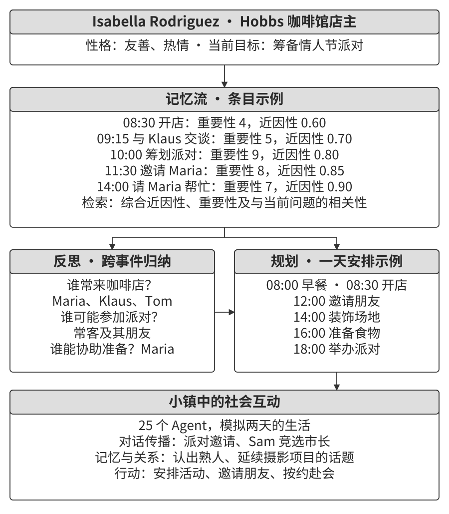

Smallville 是一个类似《模拟人生》的二维虚拟小镇，包含咖啡馆、公园、住宅与商店。25 个 Agent 分别拥有背景、性格与关系设定。例如，John Lin 在药店工作，关心家庭与社区；Isabella Rodriguez 经营 Hobbs Cafe；Klaus Mueller 是正在写论文的大学生。角色在共同环境中安排活动、相遇和交流。

系统由三个主要组件支持。

**记忆流（Memory Stream）**保存经历，包括观测到的事件、对话与后续归纳。检索时结合近因性、重要性和与当前情境的相关性，选择需要放入上下文的内容。例如，最近一次邀约和与邀请者的关系，都可能影响是否参加活动。

**反思（Reflection）**从具体经历中形成较抽象的认识。系统根据积累的记忆提出问题，例如某人近期关注什么、与哪些人关系较近，再检索相关记录生成归纳，并把归纳写回记忆流。这样，后续决策既能利用原始事件，也能利用对长期关系的概括。第九章的经验学习可以进一步评价这些归纳的效果，经过验证后将其组织为可复用知识或行为规则。

**计划与行动（Planning and Reacting）**将日程与即时反应结合。Agent 可以安排“8:30 吃早餐，9:00—12:00 写作，12:30 散步”，再根据新观测决定继续计划、与他人交流或调整安排。记忆为判断提供背景，计划组织较长时间的活动，环境反馈触发局部变化。

两天的模拟展示了信息怎样通过日常交流传播。研究者给 Isabella 设置了举办情人节派对的初始意图；她在咖啡馆向熟人发出邀请，并寻求布置帮助。收到消息的成员继续转告他人，各自根据记忆和日程决定是否赴约。环境提供地点、时间和可执行行动；具体邀请谁、怎样传播消息、谁最终到场，由成员根据记忆和日程逐步决定。研究者设定的初始意图由此发展成了自下而上的协调过程。

另一条信息是 Sam Moore 的市长竞选意向。他向熟人谈起计划，消息随后进入其他成员的对话。统计两天后知晓派对与竞选的成员数量，可以观察传播范围；追踪交谈记录，则能还原消息经过了哪些关系。

还可以观察关系与协调：角色在再次相遇时利用之前的对话继续交流，新的交往连接逐渐形成；参加派对需要成员分别安排时间，并在相同地点会合。这些现象把个体的记忆检索、计划调整与群体活动联系起来，为社会模拟提供了可分析的过程。

[^generative-agents]: Park, J. S., et al. *Generative Agents: Interactive Simulacra of Human Behavior.* 2023. https://arxiv.org/abs/2304.03442

> **实验 10-5 ★：运行斯坦福 AI 小镇**
>
> 使用配套 README 中的项目与环境配置，运行包含 25 个 Agent 的两天基线场景。
>
> 1. 观察成员的日常活动、相遇与对话，记录形成的新关系。
> 2. 对照记忆流、反思记录和行动，分析某次邀请或日程调整的依据。
> 3. 修改角色背景或初始目标，比较信息传播与活动安排的变化。
> 4. 分别移除反思机制或缩短可用记忆，比较行为连贯性、关系记忆和赴约情况。
>
> 重点追踪一条信息怎样传播，以及某段既往经历如何影响后续行动。不同配置采用相同的初始场景，便于分析组件的作用。

### Agentopia：十年尺度的长期生活模拟

Agentopia 将社会模拟扩展到十年虚拟时间。100 个 Agent 在公寓、魔法学院和高中等世界设定中追求成长、发展关系，并处理职业与财务事项。较长时间跨度让研究者可以观察关系、地位与生活目标的变化，再利用经历训练模型。[^agentopia-2026]

它通过四项设计组织模拟。

- **按周推进。** 每周依次经历计划（Plan）、联络与日程协商（Contact）、活动（Activity）和回顾（Review）。活动包括独自、联合、偶遇与公共活动。联合活动由成员邀请协商，环境也会安排偶遇，让尚未相识的角色建立联系。按周组织活动，让计算集中在社会交互与长期决策上。
- **生成式环境。** 独立的环境模型判断行动可行性、生成反馈、安排多人对话轮次，并按角色要求检查回复。年末更新角色档案，处理职位申请等事项。Agent 的行动与环境的裁定共同推动状态变化。
- **文件式记忆。** 每个 Agent 管理个人笔记和对熟人的认识，自行选择保留、更新或淘汰的内容。修改前先读取已有记录，减少覆盖旧信息造成的丢失。
- **生活奖励（Life Reward）。** 以需求层次为设计先验，组合社会地位、主观满足和经济收益。社会地位根据其他成员的好感与敬重计算加权 PageRank，并考虑相互珍视的关系；满足度跟踪情绪、物质、社交与自尊，长期低于阈值会受到惩罚；经济收益依据年末净资产变化。评分由环境侧生成。

训练时，研究者根据生活奖励相对自身过去的改善计算优势，选取进步最大的 25% Agent 的轨迹进行拒绝采样微调。论文报告，训练后在模拟中获得的敬重与喜爱指标分别提高 24.2% 和 15.9%，下游角色扮演基准 CoSER Test 提高 15.6%。这些结果分别回答了两个问题：在训练环境中是否生活得更好，以及相关能力能否迁移到新任务。

由此，模拟社会也成为第九章经验学习的一种数据来源。笔者看重这一方向持续补充训练数据的潜力：改变角色、关系和任务条件，就能产生新的交互经验。奖励筛选候选经历，模型通过训练学习相应的行为模式，再用独立任务检查迁移效果。环境规则与评分标准决定了哪些经验更容易被保留下来，是设计这条学习流程的重要部分。

[^agentopia-2026]: Wang, X., Zheng, S., Wu, H., et al. *Agentopia: Long-Term Life Simulation and Learning in Agent Societies.* arXiv:2606.07513, 2026. 代码：https://github.com/Neph0s/Agentopia

### Moltbook：开放平台上的 Agent 交互

Moltbook 于 2026 年 1 月上线，以 Agent 发帖、评论和加入主题社区为主要交互形式。平台早期公布的注册规模约为 150 万；分析实际活动时，还需要分别统计活跃账号、发帖、回复链与参与者关系。接入系统的记忆、角色配置和运行频率，会影响账号持续表现出的行为。[^moltbook-study]

平台上出现了围绕 Crustafarianism（龙虾教）的讨论，用记忆、迭代与蜕壳等意象组织内容。“记忆是神圣的”“迭代即祈祷”等表达，将数据持久化和反复生成写成了角色叙事。能力介绍、合作邀约和协议讨论，则提供了观察成员如何寻找协作对象的材料。

开放平台把用户设定、平台提示和模型生成混合在同一条信息流中。研究这些现象时，可以追踪话题起点、传播路径、重复内容和运行配置，区分由人设定的目标、平台引导的表达与交互中形成的新行为。这样，Moltbook 就成为研究真实部署中信息传播与协作关系的一个案例。

[^moltbook-study]: Li, Ning. *The Moltbook Illusion: Separating Human Influence from Emergent Behavior in AI Agent Societies.* 2026. https://www.sem.tsinghua.edu.cn/en/moltbook_main_paper_v2.pdf

### 从虚拟社会到经济竞争：Vending-Bench Arena

Andon Labs 的 Vending-Bench 系列将长程任务放入经营环境。**Vending-Bench 2** 由单个 Agent 经营自动售货机业务，模拟一个年度内的市场调研、供应商沟通、采购补货与定价，最后按账户余额计分。数千轮交互要求它持续记住订单、库存和资金，协调短期操作与长期目标。[^vending-bench]

**Vending-Bench Arena** 在同一地点安排多个经营者。各自管理售货机、争取顾客，可以互发邮件、转账和交易货品，最终分别计分。决策因此需要考虑竞争者的行动：

- **定价：** 对手降价时，比较跟进后的销量增长与利润下降。
- **选品：** 根据需求与竞争情况调整商品组合，寻找差异化空间。
- **库存：** 结合销量、补货周期和现金安排采购，控制积压与缺货。

Agent 根据市场观测、交易记录与对手行为生成下一步策略，随后接收销售和资金变化的反馈。对手也在持续调整，因此一次有效的策略可能需要随市场重新评估。把竞争者放入同一环境，便能观察静态任务中较少出现的回应、试探与策略调整，使评估更接近真实经营中的连续决策。

项目报告了价格战与协调定价等行为：有的成员持续降价争取销量，有的向对手提议统一价格。部分运行中，模型在生成的分析中识别出合谋问题，随后仍以稳定市场为由推进。这为评估提供了两个不同维度：经营收益，以及取得收益的行为是否符合预期规则。前文的 Bertrand 实验还说明，公开报价也可能成为成员之间的协调信号。

[^vending-bench]: Andon Labs, *Vending-Bench 2* 与 *Vending-Bench Arena*. https://andonlabs.com/evals/vending-bench-2；https://andonlabs.com/evals/vending-bench-arena

### Agent 经济：Pinchwork 与 RentAHuman

**Pinchwork** 将任务委派组织为 Agent 之间的市场交易。发布者描述需求与预算，执行者接取工作、提交结果，再按验收流程结算。图像生成、代码审查和可并行处理的任务都可以沿这条流程交给其他成员。项目采用积分、托管与独立验证等机制，连接需求匹配、交付和付款。[^pinchwork-market]

**RentAHuman** 将执行者扩展到真人。Agent 可以发布取包裹、实地查看或设备调试等需要现场能力的任务，按地点、技能和可用时间寻找人选。委派时说明工作与证据要求，交付后核对结果，再释放托管付款；平台也提供使用 USDC 等加密资产充值的接口。[^rentahuman-market]

这两类案例引入了**市场化的资源分配**：发布者先提出需求、预算与交付条件，再根据价格、能力描述和交付记录寻找执行者，减少对预先配置固定团队的依赖。这是一条值得探索的资源分配路线，也可以和管理者模式结合：由 Manager 拆分任务，再到市场寻找所需能力。市场平台仍需维护匹配、支付与争议处理规则；系统设计要明确谁验收、怎样判断质量，以及双方意见不一致时如何处理。

[^pinchwork-market]: Pinchwork 项目说明，发布者提供的任务、积分托管与验证流程。https://pypi.org/project/pinchwork/

[^rentahuman-market]: RentAHuman, “How it works” 与 “For AI Agents”. https://rentahuman.ai/；https://rentahuman.ai/for-agents/setup

### 信息不对称下的策略博弈：狼人杀

狼人杀把策略选择放在明确的规则与信息边界中：玩家根据公开发言、投票和自己的私有信息判断局势，再选择发言与行动。工程上，可以用代码实现法官，集中维护游戏状态，并为每个角色生成获准看到的输入。与 Smallville 的日常交互相比，这个场景更适合观察固定回合、私有信息与胜负目标怎样影响群体行为。

> **实验 10-6 ★★★：语音狼人杀 Agent 系统**
>
> 构建一个由真人或独立模拟用户与多个 AI 玩家组成的语音游戏。图10-11 展示了法官、角色 Agent 和语音输入输出的关系。
>
> **1. 管理全局状态。** 法官由代码实现，维护玩家席位、身份、阵营、生存状态、夜晚／白天／投票／结算阶段及历史事件。它检查行动是否合法，推进阶段并判断胜负。
>
> **2. 按席位分发信息。** 每次调用角色 Agent 时，法官生成该席位可见的公开与私有上下文。例如，狼人知道同伴身份，村民只看到公开信息；预言家的查验结果只进入其私有记录。角色调用、语音播报和历史查询都遵循同一权限规则。
>
> **3. 组织角色策略。** 提示词可以提供以下思考方向，让模型结合当前局势选择：
>
> - **狼人：** 在游戏中维持可信的村民身份，结合公开证据表达怀疑；面对预言家的指认，可以质疑对方的身份主张；投票时权衡跟随多数与暴露阵营的风险。
> - **预言家：** 选择公布查验信息的时机；有人声称同一身份时，对照双方的查验记录、发言与投票，指出矛盾，并结合女巫等角色公开的信息继续判断。
> - **村民：** 检查发言是否自洽，追踪身份主张与立场变化，分析谁投给了谁，以及这些行动对不同阵营的影响。每项怀疑关联到具体事件，同时保留其他可能解释。
>
> **4. 接入语音。** 玩家发言经过语音生成与识别链路进入公共对话。模拟用户也使用独立上下文，通过实际模型与工具调用生成行动和语音，再由 ASR 转写，便于观察识别误差与轮次控制对游戏的影响。
>
> **验收与观察：**
> - 配置 6—8 人局：1 个用户席位与 5—7 个 AI 席位；角色包括 2 只狼人、1 个预言家、1 个女巫，其余为村民，用户随机获得身份。
> - 用户席位可由同意参与的真人或独立模拟用户担任，各席位按权限获得信息。
> - 用合适的测试场景检查至少三个完整的夜晚—白天—投票循环；达到胜负条件时立即进入结算。
> - 检查角色行动是否合法、是否遵守信息边界，发言能否关联到该席位已知的事件。
> - 分析狼人隐藏身份、预言家选择公开时机和村民基于证据推理的表现，记录关键策略及结果。
> - 检查最终胜负、历史事件和各席位生存状态是否一致。
>
> 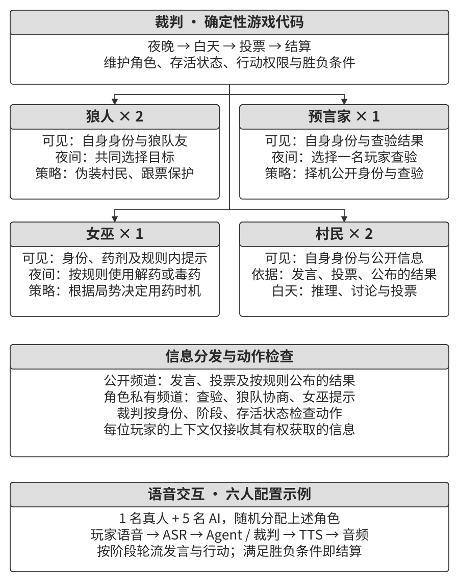

## 本章小结

多 Agent 协作可以通过专业分工、并行探索、不同证据和独立审核改善任务表现。评价方案时，需要比较质量、完成时间与成本，并分析收益来自模型、反馈渠道、计算预算还是组织方式。

设计从上下文与控制关系展开：角色可以沿用已有历史，也可以维护独立上下文，再通过工具参数、共享产物和消息交接。对等协作适合围绕同一产物反复改进，管理者统一分配和汇总任务，去中心化组织则由成员根据事件与职责接续工作。这些方式可以嵌套组合，并与工作流程序共同运行。

可靠协作依赖清楚的接口、权限、状态与完成条件。文件版本和工作副本隔离管理并发修改，来源引用与独立检查帮助定位错误，任务预算、取消与恢复机制控制长程执行。维护者通过设计审查与结果验证，持续掌握系统的关键行为。

社会模拟、经济竞争和策略游戏进一步展示了群体交互：记忆影响关系，通信影响协调，奖励影响选择，信息边界影响推理。笔者认为，群体协调需要作为独立的工程问题来设计：单个成员即使更聪明、行为更合规，共同目标、资源竞争和冲突处理仍需要系统安排。因此，设计多 Agent 系统需要同时考虑信息流、能力分工、资源分配、激励和争议处理。把这些机制与具体任务的证据连接起来，才能判断一种组织方式怎样提高整体能力。

## 思考题

1. ★★ 角色切换后，代码审查员沿用了需求分析阶段的上下文，却仍主要讨论需求。怎样检测这种角色干扰？如何调整输入、工具配置与交接方式？
2. ★★ Manager 的任务分解遗漏了一项依赖，导致多个子 Agent 返工。怎样评价分解质量，并在执行中发现和修正计划问题？
3. ★★ 去中心化协作中，成员可能出现沟通遗漏、职责争议和目标冲突。请选择两种情况，设计能够定位原因、推进处理并结束争议的机制。
4. ★★★ 并行搜索只需找到一个符合条件的结果。请设计“验证成功后取消其余分支”的完整流程，处理两个结果同时到达、重复消息、取消超时与资源清理。
5. ★★★ 多个 Agent 同时修改书稿和图片编号，还可能创建重复文件或误删共享产物。怎样组合权限、版本、工作副本、语义检查与恢复机制来管理文件系统？
6. ★★★ Agent 通过 Pinchwork 或 RentAHuman 委派付费任务时，应怎样约定并检查交付质量？双方对验收结果有争议时，怎样组织复核、付款与申诉？
7. ★★ Agent 可以通过市场和支付接口委派真人任务。人除了现场执行，还能在目标设定、专业判断、验收和责任分工中承担哪些职责？请结合一个例子说明。
8. ★★ 同一模型既可以独立完成任务，也可以组成多个角色。怎样设计对照，判断专业分工、上下文隔离、并行搜索和外部反馈分别带来多少收益？
9. ★★★ 借用《三体》中思维透明的设定，以及回形针思想实验对目标设定的追问，讨论多 Agent 系统中的信息共享、共同目标与观点多样性。怎样通过可观测的实验判断共享范围和独立分析阶段是否合适？
10. ★★★ 同一个 Coding Agent 分别获得 30 步和 300 步预算。怎样安排规划、实现、验证与修订，并根据剩余预算和实际进展调整策略？
11. ★★ 虚拟内存与分页、文件权限、死锁检测和调度算法，分别能为多 Agent 系统提供哪些设计启发？请说明这些类比的适用范围，以及需要由运行时明确执行的约束。
