# Multi-Agent Collaboration

OpenAI ஆல் முன்மொழியப்பட்ட ஐந்து-நிலை AI திறன் விளக்கத்தில் (Level 1 Conversationalists, Level 2 Reasoners, Level 3 Agents, Level 4 Innovators, Level 5 Organizations), multi-agent collaboration பெரும்பாலும் Level 5 ஐ நோக்கிய பாதைகளில் ஒன்றாக உருவகப்படுத்தப்படுகிறது—இங்கு "Organizations" என்பது "AI ஒரு முழு நிறுவனத்தின் வேலையையும் முடிக்க முடியும்" என்ற திறன் நிலையைக் குறிக்கிறது, கணினி கட்டமைப்பிற்கான தேவையல்ல என்பதை கவனத்தில் கொள்ள வேண்டும்; போதுமான சக்தி வாய்ந்த ஒற்றை agent கோட்பாட்டளவில் இதை அடைய முடியும். இருப்பினும், இன்றைய பொறியியல் யதார்த்தத்தைக் கருத்தில் கொண்டால், ஒற்றை agent இறுதியில் அதன் சொந்த model இன் திறன் எல்லைகள் மற்றும் context window ஆகியவற்றால் கட்டுப்படுத்தப்படுகிறது.

பல agents ஒன்றாக வேலை செய்வதை இயலச்செய்வது என்பது வெவ்வேறு நிபுணத்துவம் கொண்ட agents "ஒருவருக்கொருவர் பலத்தை நிரப்புவதை" விட மிக அதிகமானதைக் குறிக்கிறது. மிகவும் அடிப்படையான ஒரு புள்ளி: **ஒரு குழுவின் நுண்ணறிவு ஒரு தனிநபரின் நுண்ணறிவை மிஞ்சும்.** மனித நாகரிகம் இதற்கு ஒரு சான்று—ஒரு தனிநபரின் நுண்ணறிவு வரையறுக்கப்பட்டது, ஆனால் உழைப்புப் பிரிவு, ஒத்துழைப்பு, விவாதம் மற்றும் தலைமுறைகளுக்கிடையேயான அறிவுக் குவிப்பு மூலம், மனித சமூகம் ஒட்டுமொத்தமாக எந்த ஒரு தனி மேதையின் நுண்ணறிவையும் விட மிக அதிகமான நுண்ணறிவை வெளிப்படுத்துகிறது. Agent குழுக்களும் இதேபோன்ற கூட்டு நுண்ணறிவை உருவாக்கலாம்: ஒவ்வொரு agent உம் ஒரு மனித நிபுணரைப் போலவே திறன் கொண்டதாக இருந்தாலும், அவை சரியாக ஒழுங்கமைக்கப்பட்டால், அவற்றின் ஒட்டுமொத்த திறன் அனைத்து மனித நிபுணர்களின் கூட்டுத்தொகையையும் மிஞ்சும். *From AGI to ASI* இல், Google DeepMind "large-scale multi-agent collectives" ஐ superintelligence (ASI) நோக்கிய முக்கிய பாதைகளில் ஒன்றாக பட்டியலிடுகிறது—மனித பொது நுண்ணறிவு தனிநபர்களை மீறும் சமூகங்களாகவும் நிறுவன நிறுவனங்களாகவும் ஒருங்கிணைய முடியும் என்பது போல, பல AGI-நிலை agents ஒன்றாக வேலை செய்வதால் உருவாகும் "கூட்டு நுண்ணறிவு" அவற்றின் உறுப்பினர்களின் எளிய கூட்டுத்தொகையை விட மிக அதிகமான அறிவாற்றல் திறன்களை வெளிப்படுத்தலாம்[^agi-asi]. எனவே, multi-agent collaboration என்பது ஒற்றை model இன் context window மற்றும் திறன் எல்லைகளை உடைப்பதற்கான ஒரு பொறியியல் வழிமுறை மட்டுமல்ல, "நிபுணர்-நிலை AI" இலிருந்து "ஒட்டுமொத்த மனிதகுலத்தையும் மிஞ்சுவது" நோக்கிய ஒரு அடிப்படை பாதையாக இருக்கலாம்.

[^agi-asi]: "large-scale multi-agent collectives" ஐ AGI இலிருந்து ASI க்கு ஒரு முக்கிய பாதையாக பட்டியலிடுதல், Google DeepMind, *From AGI to ASI.* arXiv:2606.12683, 2026.

## Multi-Agent Collaboration க்கான ஒரு வகைப்பாட்டு கட்டமைப்பு

ஒரு multi-agent system ஐ உருவாக்க, முதலில் இரண்டு மைய வடிவமைப்பு பரிமாணங்களைப் புரிந்து கொள்ள வேண்டும், அவை ஒன்றாக கணினியின் அடிப்படை கட்டமைப்பு மற்றும் செயலாக்க அணுகுமுறையை தீர்மானிக்கின்றன.

### பரிமாணம் 1: பகிரப்பட்ட vs. பகிரப்படாத Context

இது மிகவும் அடிப்படையான கட்டமைப்பு முடிவாகும், இது பல agents க்கு இடையே தகவல் எவ்வாறு அனுப்பப்படுகிறது என்பதை தீர்மானிக்கிறது.

**Shared context** என்பது, ஒரு agent-ஐத் தொடர்ந்து வரும் அடுத்த agent-க்கு முந்தைய agent-ன் முழு உரையாடல் வரலாறு மற்றும் trajectory (Chapter 1-ல் வரையறுக்கப்பட்டுள்ளது) கிடைக்கும் என்பதாகும். ஒவ்வொரு கட்டத்திலும் system prompt மற்றும் tool set மாற்றப்படும்போது, அது ஒரு புதிய agent ஆக மாறுகிறது (ஏனெனில் அதன் அடையாளம், பொறுப்புகள் மற்றும் திறன்கள் மாறிவிட்டன), ஆனால் அது தனது முன்னோடியின் அனைத்து நினைவுகளையும் தக்க வைத்துக் கொள்கிறது. உதாரணமாக, ஒரு குழுவில், requirements analyst தேவைகள் ஆவணத்தை எழுதிய பிறகு, developer-க்கு அந்த ஆவணம் மட்டுமல்லாமல், analyst-க்கும் user-க்கும் இடையேயான அனைத்து தகவல் தொடர்பு பதிவுகளையும் பார்க்க முடியும்—அவர்கள் ஒரு புதிய பாத்திரம் ஆனால் முழு முந்தைய context-ஐயும் தக்க வைத்துக் கொள்கிறார்கள். இதன் நன்மை என்னவென்றால், எந்த தகவலும் இழக்கப்படுவதில்லை; ஒவ்வொரு agent-ஆலும் முந்தைய எந்த கட்டத்தின் விவரங்களையும் மதிப்பாய்வு செய்ய முடியும். சவால் என்னவென்றால், context விரைவாக விரிவடையக்கூடும்.

**Non-shared context** என்பது, ஒவ்வொரு agent-ம் முற்றிலும் சுயாதீனமான context மற்றும் உரையாடல் வரலாற்றைப் பராமரிக்கிறது, மற்றவற்றின் "சிந்தனை செயல்முறைகளை" நேரடியாக அணுக முடியாது. இது வெவ்வேறு துறைகளுக்கு இடையேயான ஒத்துழைப்பைப் போன்றது: ஒவ்வொருவரும் தங்கள் சொந்த மேசையில் சுயாதீனமாக வேலை செய்கிறார்கள், பகிரப்பட்ட ஆவணங்கள் மற்றும் கூட்ட நிமிடங்கள் மூலம் தகவல்களைப் பரிமாறிக் கொள்கிறார்கள், ஒருவரின் திரையை தொடர்ந்து பார்ப்பதற்குப் பதிலாக. இந்த மாதிரி சிறந்த modularity மற்றும் isolation-ஐ வழங்குகிறது; ஒவ்வொரு agent-ம் அதன் சொந்த பொறுப்புகளுடன் தொடர்புடைய தகவல்களில் மட்டுமே கவனம் செலுத்த வேண்டும். கணினியை நீட்டிப்பதும் பராமரிப்பதும் எளிதானது—ஒரு புதிய agent-ஐச் சேர்ப்பதற்கு ஏற்கனவே உள்ள agent-களின் உள் தர்க்கத்தை மாற்ற வேண்டியதில்லை, இடைமுகங்கள் மற்றும் தரவு வடிவங்களை மட்டுமே வரையறுக்க வேண்டும்.

Agent-கள் context-ஐப் பகிர்ந்து கொள்ளாததால், தகவல்கள் வெளிப்படையான தகவல் தொடர்பு வழிமுறைகள் மூலம் அனுப்பப்பட வேண்டும். மூன்று பொதுவான முறைகள் உள்ளன:

- **Tool call parameters**: மேல்நிலை agent-ஆனது கட்டமைக்கப்பட்ட தரவை கீழ்நிலை agent-ன் tool-க்கு அளவுருக்களாக அனுப்புகிறது, நன்கு typed, தெளிவாக கட்டமைக்கப்பட்ட தரவு தேவைப்படும் சூழ்நிலைகளுக்கு ஏற்றது.
- **Shared file system**: Agent-கள் ஒரு பகிரப்பட்ட கோப்பகத்தில் இடைநிலை artifacts (ஆவணங்கள், குறியீடு, போன்றவை) படித்து எழுதுவதன் மூலம் தகவல்களைப் பரிமாறிக் கொள்கின்றன, பெரிய artifacts அல்லது persistence தேவைப்படும் சூழ்நிலைகளுக்கு ஏற்றது.
- **Message Bus**: Agent-களுக்கு இடையே செய்திகளை அனுப்பும் ஒரு பிரத்யேக இடைத்தரகர். Agent-கள் ஒன்றையொன்று நேரடியாக அழைப்பதில்லை, மாறாக bus-க்கு செய்திகளை அனுப்புகின்றன, அது இலக்கு agent-க்கு அவற்றை அனுப்புகிறது.

Message bus இயற்கையாகவே **asynchronous communication**-ஐ ஆதரிக்கிறது—அனுப்புநரும் பெறுநரும் ஒரே நேரத்தில் இணைந்திருக்க வேண்டியதில்லை. இது ஒரு நிறுவனத்தின் உள் மின்னஞ்சல் அமைப்பைப் போன்றது: நீங்கள் ஒரு சக ஊழியருக்கு மின்னஞ்சல் அனுப்பும்போது, அவர்கள் அந்த நேரத்தில் கணினியில் இருக்க வேண்டியதில்லை; மின்னஞ்சல் சேவையகத்தில் சேமிக்கப்பட்டு, சக ஊழியர் இணைந்ததும் செயலாக்கப்படுகிறது. பல agent-கள் இணையாக வேலை செய்து ஒன்றுடன் ஒன்று ஒருங்கிணைக்க வேண்டிய சூழ்நிலைகளுக்கு இந்த அணுகுமுறை மிகவும் பொருத்தமானது (இந்த அத்தியாயத்தின் பிற்பகுதியில் உள்ள "Parallel Coordination" பகுதியைப் பார்க்கவும்).

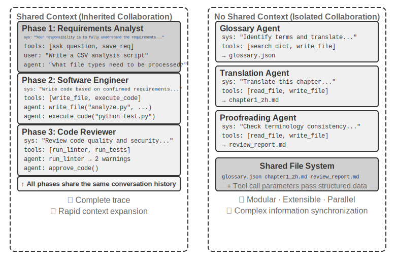

இரண்டு கட்டமைப்புகளும் உண்மையான multi-agent அமைப்புகள் என்பதை தெளிவுபடுத்த வேண்டும் (ஏனெனில் ஒவ்வொரு கட்டத்திலும் system prompt மற்றும் tool set வேறுபடுகின்றன, அவை வெவ்வேறு agents ஆகும்); வேறுபாடு ஒருங்கிணைப்பு முறையில் உள்ளது. **Shared context** என்பது மறைமுக ஒருங்கிணைப்பை (implicit coordination) சார்ந்துள்ளது—அடுத்தடுத்த agents முந்தைய agents-ன் முழுமையான context வரலாற்றைப் பெறுகின்றன, முந்தைய சிந்தனை செயல்முறைகளை "பார்க்க" முடியும், மற்றும் தகவல் context மூலமாகவே அனுப்பப்படுகிறது. **Non-shared context** என்பது வெளிப்படையான ஒருங்கிணைப்பை (explicit coordination) சார்ந்துள்ளது—agents கோப்புகள், செய்திகள் அல்லது கட்டமைக்கப்பட்ட தரவு இடைமுகங்கள் மூலம் தகவலைப் பரிமாறிக் கொள்கின்றன, மேலும் ஒவ்வொரு agent-க்கும் தனக்குத் தொடர்புடைய உள்ளடக்கம் மட்டுமே தெரியும்.

ஒப்புமை மூலம்: முந்தையது ஒரு மேஜையைச் சுற்றி அமர்ந்து விவாதிக்கும் குழுவைப் போன்றது, அனைவரும் எல்லாவற்றையும் கேட்கிறார்கள். பிந்தையது மின்னஞ்சல் மற்றும் ஆவணங்கள் மூலம் ஒத்துழைக்கும் வெவ்வேறு துறைகளைப் போன்றது, ஒவ்வொன்றும் அதன் சொந்த பணியிடத்தைக் கொண்டுள்ளது.

அட்டவணை 10-1, ஐந்து கண்ணோட்டங்களில் இருந்து இரண்டு கட்டமைப்புகளுக்கான தேர்வு அளவுகோல்களை சுருக்கமாகக் கூறுகிறது: sub-tasks-ன் எண்ணிக்கை, context window, parallelism, தகவல் தனிமைப்படுத்தல், மற்றும் செலவு பட்ஜெட். இது ஆரம்பகால கட்டமைப்புத் தேர்வுக்கான சரிபார்ப்புப் பட்டியலாக (checklist) செயல்பட முடியும்.

**அட்டவணை 10-1 Shared vs. Non-Shared Context-க்கான தேர்வு அளவுகோல்கள்**

| தேர்வு அளவுகோல் | Shared Context | Non-Shared Context |
|---|---|---|
| Sub-tasks-ன் எண்ணிக்கை | குறைவு (2-3 பாத்திரங்கள்) | அதிகம் (இணையான செயலாக்கம் தேவை) |
| Context window | அனைத்து பாத்திரங்களுக்குமான தகவலை இடமளிக்க முடியும் | ஒற்றை window போதுமானதாக இல்லை |
| Parallelism | முதன்மையாக தொடர் (serial) (பாத்திரங்கள் ஒரே trajectory-யில் மாறி மாறி வருகின்றன) | பாரிய அளவில் இணையாக (parallel) அளவிட முடியும் (contexts சுயாதீனமானவை, non-blocking) |
| தகவல் தனிமைப்படுத்தல் | தேவையில்லை (அனைத்து பாத்திரங்களும் தகவலைப் பகிர்ந்து கொள்கின்றன) | தேவை (எ.கா., பாதுகாப்பு மதிப்பாய்வு மூல சிந்தனை செயல்முறைகளைப் பார்க்கக் கூடாது) |
| செலவு பட்ஜெட் | ஒற்றை trajectory relay, tokens ஒவ்வொரு கட்டத்திலும் குவிகின்றன | பல agents சுயாதீனமாக இயங்குகின்றன, மொத்த tokens பொதுவாக பல மடங்கு முதல் ஒரு அளவு வரிசை வரை அதிகமாக இருக்கும் |

**எளிய கட்டைவிரல் விதி**: எதிர்பார்க்கப்படும் ஒட்டுமொத்த context window-ன் 50%-ஐத் தாண்டினால் (இது ஒரு கட்டைவிரல் விதி, துல்லியமான வரம்பு அல்ல), non-shared context-ஐப் பயன்படுத்தவும். பணி சரியான தன்மைக்கு பூஜ்ஜிய தகவல் இழப்பு ஒரு கடினமான கட்டுப்பாடாக இருந்தால், shared context-ஐப் பயன்படுத்தவும். பெரும்பாலான நிஜ-உலக அமைப்புகள் "stage-switching" அணுகுமுறையைப் பின்பற்றுகின்றன—முதல் சில agents shared context-ஐப் பயன்படுத்துகின்றன, பின்னர் தகவல் நிறைவு புள்ளியை (information saturation point) அடைந்ததும், வெளிப்படையான handoff உடன் non-shared context-க்கு மாறுகின்றன (மேல்நிலை agent எந்த தகவலை கீழ்நிலை agent-க்கு அனுப்ப வேண்டும் என்பதை தீவிரமாக முடிவு செய்கிறது).

### பரிமாணம் 2: ஒத்துழைப்பு இடவியல் (Collaboration Topology)

இரண்டாவது பரிமாணம் collaboration topology—ஆகும், இது agents களுக்கு இடையே கட்டுப்பாடு மற்றும் தகவல் பாயும் அமைப்பை வரையறுக்கிறது. Collaboration topology மற்றும் context sharing ஆகியவை **கருத்தியல் ரீதியாக சுயாதீனமானவை ஆனால் நடைமுறையில் தொடர்புடையவை**: அவை கருத்தியல் ரீதியாக சுயாதீனமானவை, ஏனெனில் பகிரப்பட்ட context கொண்ட அமைப்புகளுக்கும் ஒரு topology உள்ளது—எடுத்துக்காட்டாக, இந்த அத்தியாயத்தில் பின்னர் அறிமுகப்படுத்தப்படும் `transfer_to_agent` முறை (Experiment 10-2) அடிப்படையில் பகிரப்பட்ட context இன் கீழ் ஒரு chain of handoffs ஆகும். அவை நடைமுறையில் தொடர்புடையவை, ஏனெனில் context பகிரப்பட்டவுடன், topology பெரும்பாலும் சிதைந்துவிடும் (கீழே பார்க்கவும்); இரண்டு பரிமாணங்களின் மதிப்புகள் சுதந்திரமாக இணைக்கப்பட முடியாது. Context பகிரப்படும்போது, handoffs களுக்கு "எதை அனுப்புவது" என்பதை முடிவு செய்யத் தேவையில்லை—முழு வரலாறும் இயற்கையாகவே பாதுகாக்கப்படுகிறது—எனவே topology பொதுவாக role switches களின் ஒரு வரிசையாக சிதைந்துவிடும், இது சிறிய கட்டடக்கலை முடிவை மட்டுமே விட்டுச்செல்கிறது (இரண்டிற்கும் இடையில் வரும் ஒரு விதிவிலக்கு group-chat-style multi-party collaboration ஆகும், இந்த அத்தியாயத்தின் பின்னர் உள்ள decentralization பகுதியைப் பார்க்கவும்). பகிரப்படாத context தேர்ந்தெடுக்கப்பட்டவுடன், "தகவல் எவ்வாறு பாய்கிறது மற்றும் அதை யார் ஒருங்கிணைக்கிறார்கள்" என்பது வெளிப்படையாக வடிவமைக்கப்பட வேண்டிய ஒரு பிரச்சினையாக மாறுகிறது.

வேறு வார்த்தைகளில் சொன்னால், இந்த இரண்டு பரிமாணங்களும் கொள்கையளவில் ஒரு 2×3 கூட்டு அணியை (shared/non-shared × மூன்று topologies) உருவாக்குகின்றன, ஆனால் shared context வரிசையில், topology பெரும்பாலும் சிறிய கட்டடக்கலை முடிவுடன் role switches களின் ஒரு வரிசையாக சிதைந்துவிடும் (இது "Multi-Stage Role Switching" பகுதியில் பின்னர் விவாதிக்கப்படும் வடிவமாகும்). எனவே, இந்த அத்தியாயம் non-shared context க்கான மூன்று கலங்களை மட்டுமே விரிவாக விளக்குகிறது. பின்வருபவை non-shared context இன் கீழ் collaboration topology இன் மூன்று பொதுவான வடிவங்களை, சிக்கலான வரிசையில் அறிமுகப்படுத்துகிறது:

- **Peer Collaboration Pattern**: ஒரு சிறிய எண்ணிக்கையிலான agents (பொதுவாக 2-3) சமமானவர்களாக தொடர்பு கொண்டு, ஒரு மீள்செயல் மேம்பாட்டு சுழற்சியை உருவாக்குகின்றன—ஒரு கட்டுரையை எழுதுவது போல, ஒருவர் வரைவை உருவாக்கி மற்றொருவர் அதை குறிப்பிட்டு திருத்துகிறார், பல சுற்றுகளுக்குப் பிறகு தரம் ஒரு நபர் மட்டும் அடையக்கூடியதை விட அதிகமாக இருக்கும்.
- **Orchestration Pattern**: ஒரு மையப்படுத்தப்பட்ட Manager Agent பணி திட்டமிடல் மற்றும் அட்டவணைப்படுத்தலுக்கு பொறுப்பாகும், அதே நேரத்தில் பல sub-agents ஒவ்வொன்றும் குறிப்பிட்ட sub-tasks களை கையாளுகின்றன—ஒரு திட்ட மேலாளர் ஒரு திட்டத்தில் பல சிறப்பு பொறியாளர்களை வழிநடத்துவது போல.
- **Decentralized Pattern**: இயக்க நேர மைய கட்டுப்படுத்தி எதுவும் இல்லை; agents ஒருவருக்கொருவர் மனிதர்களைப் போல தொடர்பு கொண்டு பணிகளை ஒத்துழைக்கின்றன.

ஒவ்வொரு முறையின் விரிவான வடிவமைப்பு மற்றும் பொருந்தக்கூடிய சூழ்நிலைகள் பின்னர் தனித்தனி துணைப்பிரிவுகளில் விவாதிக்கப்படும்.

## Multi-Agent எப்போது Single Agent ஐ விட உண்மையில் சிறந்தது?

குறிப்பிட்ட கூட்டு கட்டமைப்புகளுக்குள் நுழைவதற்கு முன், முதலில் ஒரு அடிப்படை கேள்வியை எதிர்கொள்வோம்: **எப்போது பல agent கள் உண்மையில் தேவைப்படுகின்றன, எப்போது ஒரு single agent போதுமானது?** இந்த கேள்விக்கான பதில், பின்னர் விவாதிக்கப்படும் அனைத்து பொறியியல் தீர்வுகளுக்கும் ஒரு ஒட்டுமொத்த குறிப்பாக செயல்படும். சமீபத்திய ஆய்வுகளின் தொடர் ஒரு தெளிவான தீர்ப்பு கட்டமைப்பை வழங்குகிறது—மைய அளவுகோல் ஒன்று மட்டுமே: **கூட்டு செயல்முறை ஒரு single agent உருவாக்கத்தின் போது பெற முடியாத புதிய தகவலை அறிமுகப்படுத்துகிறதா?**

அட்டவணை 10-2 வெவ்வேறு கூட்டு முறைகள் புதிய தகவலை அறிமுகப்படுத்துகின்றனவா என்பதை சுருக்கமாகக் காட்டுகிறது, இது multi-agent கூட்டு ஒரு single agent ஐ விட கணிசமான மதிப்பைக் கொண்டுள்ளதா என்பதை தீர்மானிக்கப் பயன்படுகிறது.

அட்டவணை 10-2 Multi-Agent கூட்டு முறைகளின் தகவல் ஈட்ட ஒப்பீடு

| கூட்டு முறை | புதிய தகவலை அறிமுகப்படுத்துகிறதா? | விளைவு |
|---|---|---|
| ஒரே model ஆல் சுய-மதிப்பாய்வு (அதன் சொந்த வெளியீட்டை மீண்டும் படித்தல்) | இல்லை | பொதுவாக பயனற்றது அல்லது தீங்கு விளைவிக்கும் |
| வெவ்வேறு agent கள் ஒரே உரையை விவாதித்தல் | இல்லை | சமமான compute கொண்ட single agent உடன் ஒப்பிடத்தக்கது |
| மதிப்பாய்வாளர் சோதனை செயலாக்க முடிவுகளைப் பயன்படுத்தி குறியீட்டை மதிப்பாய்வு செய்தல் | ஆம் (execution feedback) | குறிப்பிடத்தக்க முன்னேற்றம் |
| மதிப்பாய்வாளர் rendered screenshots ஐப் பயன்படுத்தி frontend/PPT குறியீட்டை மதிப்பாய்வு செய்தல் | ஆம் (visual feedback) | குறிப்பிடத்தக்க முன்னேற்றம் |
| மதிப்பாய்வாளர் உண்மைகளை சரிபார்க்க வெளிப்புற கருவிகளைப் பயன்படுத்துதல் | ஆம் (tool feedback) | குறிப்பிடத்தக்க முன்னேற்றம் |

2025 RLEF (Reinforcement Learning from Execution Feedback)[^rlef-2025] இதை உறுதிப்படுத்தியது: code execution feedback ஐப் பயன்படுத்தி மீண்டும் மீண்டும் குறியீட்டை மேம்படுத்த reinforcement learning மூலம் ஒரு model ஐ பயிற்றுவிப்பது, model சுயாதீனமாக பல முறை sample எடுப்பதை விட கணிசமாக சிறப்பாக செயல்படுகிறது. முக்கிய அம்சம் என்னவென்றால், ஒவ்வொரு மறுமுறையும் **உண்மையான execution முடிவுகளை** (compilation errors, test failures, runtime exceptions) அறிமுகப்படுத்துகிறது—model குறியீட்டை எழுதும் போது இல்லாத தகவல். 2025 WebGen-Agent[^webgen-agent-2025] இல், வலைப்பக்க உருவாக்க பணிகளுக்கு, பல-நிலை visual feedback scaffolding (screenshots + visual language model descriptions) ஐப் பயன்படுத்தி, அந்த benchmark இல் Claude 3.5 Sonnet இன் செயல்திறனை 26.4% இலிருந்து 51.9% ஆக—கிட்டத்தட்ட இரட்டிப்பாக்கியதாக தெரிவிக்கப்பட்டுள்ளது.

[^rlef-2025]: Gehring, J., et al. *RLEF: Grounding Code LLMs in Execution Feedback with Reinforcement Learning.* arXiv:2410.02089, 2025.
[^webgen-agent-2025]: Lu, Z., et al. *WebGen-Agent: Enhancing Interactive Website Generation with Multi-Level Feedback and Step-Level Reinforcement Learning.* arXiv:2509.22644, 2025.

இந்த "புதிய தகவல்" கட்டமைப்பு ஒரு முரண்பாடான நிகழ்வை விளக்குகிறது: கல்வி ஆராய்ச்சி "ஒற்றை agent போதுமானது" என்று கூறுகிறது, ஆனால் பொறியியல் நடைமுறையில், multi-agent அமைப்புகள் உண்மையில் சிறப்பாக செயல்படுகின்றன. இந்த முரண்பாட்டின் அடிப்படை காரணம், விவாதிக்கப்படும் "multi-agent" இன் வெவ்வேறு வகைகளில் உள்ளது—கல்வி ஆய்வுகள் பெரும்பாலும் "பல agents ஒரே உரையைப் பார்த்து ஒருவருடன் ஒருவர் விவாதிக்கும்" முறைகளை ஒப்பிடுகின்றன (எ.கா., debate), அதேசமயம் பொறியியல் நடைமுறையில் பயனுள்ள multi-agent அமைப்புகள் பெரும்பாலும் வெளிப்புற feedback சுழல்களை (code execution, visual rendering, tool calls) உள்ளடக்குகின்றன. முந்தையது புதிய தகவலை அறிமுகப்படுத்தாது; பிந்தையது அறிமுகப்படுத்துகிறது. இந்த அத்தியாயத்தில் பின்னர் அறிமுகப்படுத்தப்படும் மூன்று கட்டமைப்புகளுக்கு—peer collaboration, orchestration, மற்றும் decentralization—கிட்டத்தட்ட அனைத்து உண்மையான பயனுள்ள பயன்பாடுகளும் இந்த அளவுகோலுக்கு மீண்டும் இணைக்கப்படலாம்.

**Step Budget மற்றும் Agent செயல்திறன்.** ஒரு தொடர்புடைய ஆராய்ச்சி திசை: ஒரு agent க்கு வெவ்வேறு step budgets (அதாவது, அனுமதிக்கப்பட்ட tool calls அல்லது iteration சுற்றுகளின் எண்ணிக்கை) ஒதுக்குவது அதன் செயல்திறனை எவ்வாறு பாதிக்கிறது? உள்ளுணர்வாக, அதிகமான steps சிறந்த முடிவுகளுக்கு வழிவகுக்க வேண்டும்—30-step budget உடன், ஒரு agent விரைவாக முக்கிய செயல்பாட்டை மட்டுமே செயல்படுத்த முடியும்; 300-step budget உடன், அது முதலில் திட்டமிடலாம், பின்னர் செயல்படுத்தலாம், பின்னர் சோதிக்கலாம், பின்னர் மேம்படுத்தலாம். இருப்பினும், 2025 ஆம் ஆண்டின் Google கட்டுரை, *Budget-Aware Tool-Use Enables Effective Agent Scaling*, ஒரு எதிர்பாராத முடிவைக் கண்டறிந்தது: **ஒரு agent க்கு கிடைக்கும் steps எண்ணிக்கையை வெறுமனே அதிகரிப்பது செயல்திறன் முன்னேற்றத்திற்கு உத்தரவாதம் அளிக்காது.** நிலையான agents க்கு "budget awareness" இல்லை—300-step budget இருந்தாலும், அவை ஆழமற்ற தேடலைச் செய்து விரைவாக "saturate" ஆக முனைகின்றன. அதிகமான steps ஐ உண்மையான சிறந்த முடிவுகளாக மாற்ற, agents க்கு ஒரு வெளிப்படையான budget-aware பொறிமுறை தேவைப்படுகிறது, இது மீதமுள்ள வளங்களின் அடிப்படையில் மூலோபாயங்களை மாறும் வகையில் சரிசெய்கிறது: ஆரம்பத்தில் பரந்த ஆய்வு, மற்றும் பின்னர் மிகவும் நம்பிக்கைக்குரிய திசைகளில் கவனம் செலுத்துதல். 2026 ஆம் ஆண்டின் BAVT (Budget-Aware Value Tree Search) மேலும் step-நிலை மதிப்பு மதிப்பீட்டை முன்மொழிந்தது, மீதமுள்ள budget விகிதத்தின் அடிப்படையில் exploration vs. exploitation இன் எடையை சரிசெய்கிறது—budget குறையும்போது, agent "பரந்த வலையை வீசுவதில்" இருந்து "ஆழமாக தோண்டுவதற்கு" மாறுகிறது.

இந்த கண்டுபிடிப்புகள் multi-agent அமைப்பு வடிவமைப்பில் நேரடி தாக்கங்களைக் கொண்டுள்ளன. உதாரணமாக, orchestration pattern இல், Manager Agent வெறுமனே sub-agents க்கு பணிகளை விநியோகித்து முடிவுகளுக்காக காத்திருக்கக்கூடாது. அதற்கு பதிலாக, அது **பணி சிக்கலின் அடிப்படையில் step budgets ஐ மாறும் வகையில் ஒதுக்க வேண்டும்**—எளிய sub-tasks க்கு குறைவான steps, சிக்கலான sub-tasks க்கு போதுமான steps. மேலும், sub-agents இந்த budgets ஐ புத்திசாலித்தனமாகப் பயன்படுத்த வழிகாட்ட வேண்டும் (முதலில் திட்டமிடு, பின்னர் செயல்படுத்து, பின்னர் சோதி, பின்னர் மேம்படுத்து), நேரடியாக மூழ்குவதற்குப் பதிலாக.

ஒரு விஷயம் அனைத்து வடிவமைப்பு பரிசீலனைகளுக்கும் முன் வைக்கப்பட வேண்டும்: **cost.** பல-Agent அமைப்புகளின் இணையான ஆய்வு மற்றும் மீள்செயல் மேம்படுத்தலுக்கு பணம் செலவாகும்—Anthropic நிறுவனம் தனது பல-Agent ஆராய்ச்சி அமைப்பின் token நுகர்வு சாதாரண உரையாடலை விட சுமார் 15 மடங்கு அதிகம் என்றும், token பயன்பாடு மட்டுமே செயல்திறன் வேறுபாட்டில் சுமார் 80% விளக்க முடியும் என்றும் வெளிப்படுத்தியுள்ளது. இதன் பொருள், பல-Agent அமைப்புகளில் இருந்து கிடைக்கும் செயல்திறன் ஆதாயங்கள், கூடுதல் செலவினத்தின் பல மடங்கு முதல் ஒரு அளவு வரை ஈடுகட்டும் அளவுக்கு பெரியதாக இருக்க வேண்டும்; இல்லையெனில், நன்கு சரிசெய்யப்பட்ட ஒற்றை Agent பெரும்பாலும் அதிக செலவு-திறன் கொண்ட தேர்வாகும்.

## பகிரப்பட்ட Context உடன் Multi-Agent ஒத்துழைப்பு

பகிரப்பட்ட context உடன் பல-Agent ஒத்துழைப்பில், ஒவ்வொரு நிலையும் ஒரு சுயாதீன Agent (அதன் சொந்த system prompt மற்றும் tool set உடன்), ஆனால் அது முந்தைய ஏஜென்டின் முழுமையான trajectory-ஐப் பெறுகிறது—ஒரு சக ஊழியர் ஷிப்டை ஏற்றுக்கொண்டு முன்னோடி விட்டுச்சென்ற அனைத்து வேலை பதிவுகளையும் மதிப்பாய்வு செய்வது போல. இந்த "மரபுரிமை அடிப்படையிலான ஒத்துழைப்பின்" முக்கிய நன்மை பூஜ்ஜிய தகவல் இழப்பு ஆகும்: ஒவ்வொரு ஏஜென்டும் முந்தைய எந்த நிலையிலிருந்தும் விவரங்களை மதிப்பாய்வு செய்ய முடியும். சவால் என்னவென்றால், தற்போதைய Agent, பெரிய அளவிலான மரபுரிமை பெற்ற வரலாற்றுத் தகவல்களால் திசைதிருப்பப்படாமல், அதன் மையப் பொறுப்புகளில் கவனம் செலுத்த வைப்பதில் உள்ளது.

### Multi-Stage Role Switching

முதலில் ஒரு வரையறை புள்ளியை தெளிவுபடுத்துவோம்: அத்தியாயம் 1-ன் மொழியில், multi-stage role switching என்பது ஒரு **workflow-style orchestration** ஆகும்—செயல்படுத்தும் பாதை (எ.கா., தேவைகள் தெளிவுபடுத்தல் → செயல்படுத்தல் → மதிப்பாய்வு) முன்வரையறுக்கப்பட்டுள்ளது. இந்த அத்தியாயம் அதை பல-Agent கட்டமைப்பில், Agent அடையாளம் மற்றும் context-ன் கண்ணோட்டத்தில் மறுபரிசீலனை செய்கிறது: system prompts, tool sets மற்றும் கவனப் பகுதிகள் நிலைகளில் வேறுபடும் போது, அவற்றை ஒரே trajectory-ஐப் பகிர்ந்து கொள்ளும் பல Agentகளாகக் கருதுவது நடைமுறை வடிவமைப்பு நன்மைகளைத் தருகிறது—ஒவ்வொரு "அடையாளத்தின்" prompt மற்றும் tool set ஐயும் சுயாதீனமாக செம்மைப்படுத்த முடியும், மேலும் நிலை எல்லைகள் இயற்கையாகவே தர வாயில்களாக மாறும்.

சிக்கலான பணிகளில், ஒரு ஏஜென்டின் பங்கு மற்றும் பொறுப்புகள் வெவ்வேறு நிலைகளில் கணிசமாக மாறலாம். முழுவதும் ஒரு நிலையான system prompt பயன்படுத்தப்பட்டால், அது மிகவும் பொதுவானதாக இருந்து இலக்கு சார்ந்ததாக இருக்காது, அல்லது அனைத்து நிலைகளுக்குமான வழிமுறைகளை அடைத்து மிக நீளமாக மாறும். Multi-stage role switching-ன் அணுகுமுறை, தற்போதைய நிலையின் அடிப்படையில் system prompts மற்றும் tool sets-ஐ மாறும் வகையில் மாற்றுவதாகும், இது Agent ஒவ்வொரு நிலையிலும் மிகவும் பொருத்தமான "அடையாளத்தில்" வேலை செய்ய அனுமதிக்கிறது. இந்த மாற்றத்திற்கு புதிய instances உருவாக்க அல்லது புதிய செயல்முறைகளைத் தொடங்க தேவையில்லை; இது அதே execution session-க்குள் context-ஐ மட்டும் புதுப்பிக்கிறது. முக்கிய விஷயம் என்னவென்றால், பங்கு மாறினாலும், உரையாடல் வரலாறு மற்றும் பணி நிலை தொடர்ந்து பகிரப்பட்டே இருக்கும்—புதிய பாத்திரத்தில் உள்ள Agent, முந்தைய நிலைகளில் திரட்டப்பட்ட அனைத்து தகவல்களையும் இன்னும் அணுக முடியும்.

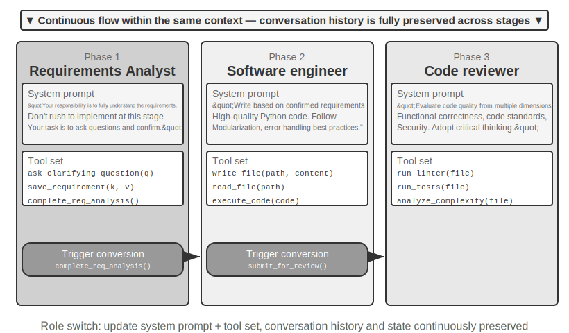

> **Experiment 10-1 ★★: Execution Stage-ன் அடிப்படையில் System Prompts-ஐ தீர்மானித்தல்**
>
> இந்த பரிசோதனையானது, stage-specific system prompts எவ்வாறு Coding Agent-ன் முழு workflow-ஐ மேம்படுத்துகிறது என்பதை நிரூபிக்கிறது.

> **Task Scenario**: ஒரு பயனர் மென்பொருள் மேம்பாட்டுத் தேவையை முன்மொழிகிறார், மேலும் agent மூன்று நிலைகளை வரிசையாக கடந்து செல்கிறது: requirements clarification, code implementation, மற்றும் quality review.

> **Stage 1: Requirements Clarification** (Role: Requirements Analyst)

> system prompt வலியுறுத்துகிறது:
> - "உங்கள் பொறுப்பு பயனரின் தேவைகளை முழுமையாக புரிந்துகொள்வதாகும். தெளிவின்மைகளை தெளிவுபடுத்த கேள்விகளைக் கேளுங்கள், எதிர்பார்க்கப்படும் செயல்பாடு, பயன்பாட்டு சூழ்நிலைகள் மற்றும் செயல்திறன் தேவைகளை நீங்கள் முழுமையாக புரிந்துகொள்வதை உறுதிசெய்யவும்."
> - "செயல்படுத்தலுக்கு அவசரப்பட வேண்டாம். இந்த கட்டத்தில், உங்கள் பணி கேள்விகள் கேட்டு உறுதிப்படுத்துவதாகும், குறியீடு எழுதுவதல்ல."
> - "அனைத்து முக்கிய தேவைகளும் தெளிவாக இருப்பதை உறுதிசெய்தவுடன், இந்த கட்டத்தை முடிக்க `complete_requirements_analysis()` tool-ஐ அழைக்கவும்."

> tool set குறைவாக உள்ளது: பயனரிடம் தெளிவுபடுத்தும் கேள்விகளைக் கேட்க `ask_clarifying_question(question)`, உறுதிப்படுத்தப்பட்ட தேவைகளைப் பதிவு செய்ய `save_requirement(key, value)`, மற்றும் கட்டத்தை முடித்ததாகக் குறிக்க `complete_requirements_analysis()`.

> agent பயனருடன் பல சுற்று உரையாடல்களில் ஈடுபடுகிறது: "இந்த script எந்த வகையான கோப்புகளை செயலாக்க வேண்டும்?", "இது துணை கோப்புறைகளை மீண்டும் மீண்டும் செயலாக்க வேண்டுமா?", "கோப்புகளை நகர்த்திய பிறகு அசல் கோப்பு பெயர்களை பாதுகாக்க வேண்டுமா?" இந்த கேள்விகள் மூலம், agent படிப்படியாக தேவைகளைப் பற்றிய முழுமையான புரிதலை உருவாக்கி, அவற்றை கட்டமைக்கப்பட்ட முறையில் சேமிக்கிறது. தேவைகள் போதுமான அளவு தெளிவாக இருப்பதாக agent தீர்மானிக்கும்போது, அது `complete_requirements_analysis()`-ஐ அழைத்து role switch-ஐ தூண்டுகிறது—system stage completion signal-ஐ கண்டறிந்து தானாகவே அடுத்த stage-ன் configuration-க்கு மாறுகிறது.

> **Stage 2: Code Implementation** (Role: Software Engineer)

> புதிய system prompt வலியுறுத்துகிறது:
> - "உங்கள் பொறுப்பு உறுதிப்படுத்தப்பட்ட தேவைகளின் அடிப்படையில் உயர்தர Python குறியீட்டை எழுதுவதாகும்."
> - "சிறந்த நடைமுறைகளைப் பின்பற்றவும்: குறியீடு modular ஆக இருக்க வேண்டும், சரியான error handling-ஐ உள்ளடக்கியிருக்க வேண்டும், மற்றும் தேவையான comments-ஐ கொண்டிருக்க வேண்டும்."
> - "குறியீட்டை முடித்து அடிப்படை சோதனைகளில் தேர்ச்சி பெற்ற பிறகு, review stage-க்குள் நுழைய `submit_for_review()`-ஐ அழைக்கவும்."

> tool set கணிசமாக மாறுகிறது: முந்தைய requirements clarification tools அகற்றப்பட்டு, `write_file(path, content)`, `read_file(path)`, மற்றும் `execute_code(code)` போன்ற மேம்பாட்டு கருவிகள் மாற்றாக வைக்கப்படுகின்றன. agent முதல் கட்டத்தில் சேமிக்கப்பட்ட தேவைகளின் அடிப்படையில் குறியீட்டை எழுதத் தொடங்குகிறது—முதலில் முக்கிய logic, பின்னர் error handling, இறுதியாக சரிபார்ப்புக்கான சோதனைகளை எழுதுகிறது. இந்த செயல்பாட்டின் போது, agent இன்னும் முதல் கட்டத்தின் உரையாடல் வரலாற்றை அணுகி தேவை விவரங்களை மதிப்பாய்வு செய்ய முடியும், ஆனால் அதன் நடத்தை முறை முற்றிலும் வேறுபட்டது: இனி கேள்விகள் இல்லை, செயல்படுத்தலில் மட்டுமே கவனம் செலுத்துகிறது. முடிந்ததும், அது `submit_for_review()`-ஐ அழைக்கிறது.

> **Stage 3: Code Review** (Role: Code Reviewer)

> புதிய system prompt வலியுறுத்துகிறது:
> - "உங்கள் பொறுப்பு, இப்போது எழுதப்பட்ட code-ஐ மதிப்பாய்வு செய்வது, அதன் தரத்தை பல பரிமாணங்களில் மதிப்பிடுவது: functional correctness, code standards, error handling, performance optimization, மற்றும் security."
> - "விமர்சன மனநிலையைக் கடைப்பிடித்து, code-இல் உள்ள சாத்தியமான சிக்கல்கள் மற்றும் மேம்பாட்டிற்கான பகுதிகளை அடையாளம் காண முயற்சிக்கவும்."
> - "கடுமையான சிக்கல்கள் கண்டறியப்பட்டால், `request_revision(issues)`-ஐ அழைத்து, மாற்றங்களுக்காக implementation stage-க்குத் திரும்பவும்; தரம் ஏற்றுக்கொள்ளத்தக்கதாக இருந்தால், பணியை முடிக்க `approve_code()`-ஐ அழைக்கவும்."
>
> tool set மீண்டும் மாறுகிறது: இது `run_linter(file)`, `run_tests(file)`, மற்றும் `analyze_complexity(file)` போன்ற code quality analysis tools-ஆல் மாற்றப்படுகிறது. agent, reviewer-இன் கண்ணோட்டத்தில் code-ஐ மீண்டும் ஆய்வு செய்கிறது, static analysis-ஐ இயக்குகிறது, மேலும் potential bugs, performance issues, அல்லது security risks-ஐ சரிபார்க்கிறது.
>
> இந்த மூன்று-நிலை வடிவமைப்பு, agent ஒவ்வொரு stage-லும் core task-இல் கவனம் செலுத்த அனுமதிக்கிறது. மிக முக்கியமாக, தெளிவான stage transition mechanism, task execution-இன் ஒருமைப்பாட்டை உறுதி செய்கிறது—agent requirements analysis-ஐத் தவிர்த்து நேரடியாக code எழுத மாட்டாது, மேலும் மதிப்பாய்வு இல்லாமல் முடிவுகளை வழங்க மாட்டாது.
>
> **Experiment Requirements**:
> 1. மூன்று-நிலை system prompts-ஐ செயல்படுத்தவும், ஒவ்வொன்றும் தெளிவான role definition மற்றும் behavioral guidance-ஐக் கொண்டிருக்க வேண்டும்
> 2. ஒவ்வொரு stage-க்கும் பொருந்தக்கூடிய tool sets-ஐ உள்ளமைக்கவும்
> 3. Stage transition trigger mechanism-ஐ செயல்படுத்தவும் (specific tool calls மூலம்)
> 4. Stages-க்கு இடையே context continuity-ஐ உறுதி செய்யவும்
> 5. Rollback scenarios-ஐ கையாளவும்—code review சிக்கல்களைக் கண்டறியும் போது, implementation stage-க்குத் திரும்பவும்
> 6. ஒவ்வொரு stage-க்கும் execution logs-ஐ பதிவு செய்யவும், வெவ்வேறு prompts எவ்வாறு வெவ்வேறு behavior patterns-ஐ உருவாக்குகின்றன என்பதை நிரூபிக்கவும்
>
### Cross-Domain Role Switching

முந்தைய multi-stage role switching, ஒரு single task type (software development)-க்குள் stage-based execution-ஐ நிரூபித்தது. Cross-domain role switching, agent-இன் பல task types-க்கு இடையேயான autonomous switching-ஐ மேலும் ஆராய்கிறது—இது இனி முன்னரே திட்டமிடப்பட்ட linear process அல்ல, மாறாக user requirements-இல் ஏற்படும் மாற்றங்களின் அடிப்படையில் agent எந்த professional role-க்கு மாற வேண்டும் என்பதை சுயாதீனமாக முடிவு செய்கிறது.

> **Experiment 10-2 ★★: Multi-Role Switching**
>
> **Prerequisites**: Chapter 2-இலிருந்து Agent Skills mechanism-ஐ முதலில் புரிந்துகொள்ள பரிந்துரைக்கப்படுகிறது.
>
> **System Architecture**: ஐந்து roles—
>
> - **triage (front desk triage, default entry point)**: User-இன் overall requirements-ஐப் புரிந்துகொண்டு, அவற்றை sequential subtasks-ஆகப் பிரித்து, படிப்படியாக பொருத்தமான professional roles-க்கு ஒப்படைத்து, அனைத்து subtasks-உம் முடிந்த பிறகு இறுதி உறுதிப்படுத்தலைச் செய்கிறது. இதற்கு சொந்தமாக சிறப்பு tools எதுவும் இல்லை, `transfer` மட்டுமே உள்ளது.
> - **research (information retrieval expert)**: தரவு, உண்மைகள் மற்றும் பொருட்களைக் கண்டறிய `web_search`-ஐப் பயன்படுத்துகிறது.
> - **coding (programming expert)**: Program logic/script சிக்கல்களைத் தீர்க்க, code எழுதி இயக்க `execute_python`-ஐப் பயன்படுத்துகிறது.
> - **data_analysis (தரவு பகுப்பாய்வு நிபுணர்)**: `calculate` / `descriptive_stats` கருவிகளைப் பயன்படுத்தி அளவு கணக்கீடுகள் மற்றும் புள்ளிவிவரங்களைச் செய்கிறது (எ.கா., year-over-year வளர்ச்சி விகிதம், compound annual growth rate CAGR, சராசரி).
> - **writing (எழுத்து நிபுணர்)**: மீட்டெடுக்கப்பட்ட தரவு மற்றும் கணக்கீட்டு முடிவுகளை மெருகேற்றி, பார்வையாளர்களை மையமாகக் கொண்ட இறுதி வரைவாக மாற்றுகிறது (தோராயமான நீளச் சரிபார்ப்புக்கு `count_characters` ஐப் பயன்படுத்தலாம்).
>
> **மைய வழிமுறை: transfer_to_agent கருவி**
>
> அனைத்து பாத்திரங்களும் `transfer_to_agent(target_role, reason)` கருவியுடன் பொருத்தப்பட்டுள்ளன. இது அழைக்கப்படும்போது, அமைப்பு: 1) தற்போதைய உரையாடல் வரலாற்றைச் சேமிக்கும்; 2) இலக்கு பாத்திரத்தின் prompt மற்றும் கருவித் தொகுப்பை ஏற்றும்; 3) புதிய பாத்திரத்திற்கு உரையாடல் வரலாற்றை அனுப்பி, அது context ஐப் புரிந்துகொள்ள உதவும்; 4) புதிய பாத்திரத்தில் செயல்பாட்டைத் தொடரும்.
>
> **சோதனை காட்சி**: அமைப்பு இயல்பாக triage (முன் அலுவலக வகைப்பாடு) பாத்திரத்தில் தொடங்குகிறது. பயனர் ஒரு cross-domain கூட்டுப் பணியை முன்வைக்கிறார்: "முதலீட்டாளர்களுக்கான பொருட்களைத் தயாரிக்கிறேன். 2021, 2022 மற்றும் 2023 ஆம் ஆண்டுகளுக்கான சீனாவின் புதிய ஆற்றல் வாகன விற்பனைத் தரவைத் தேடவும், இந்த மூன்று ஆண்டுகளுக்கான compound annual growth rate ஐக் கணக்கிடவும், பின்னர் முதலீட்டாளர்களுக்கு 120 எழுத்துகளுக்கு மிகாமல் சீன மொழியில் சுருக்கம் எழுதவும் உதவுங்கள்." Triage இதை "தரவைத் தேடு → அளவீடுகளைக் கணக்கிடு → வரைவை எழுது" என உடைத்து, முதலில் research க்கு மாற்றுகிறது:
>
> ```python
> transfer_to_agent(target_role="research", reason="Need to first look up three years of new energy vehicle sales data")
> ```
>
> Research `web_search` ஐப் பயன்படுத்தி விற்பனைத் தரவைக் கண்டுபிடித்து, முக்கியத் தரவை உரையாடலில் எழுதி, பின்னர் data_analysis க்கு மாற்றுகிறது:
>
> ```python
> transfer_to_agent(target_role="data_analysis", reason="Data is ready, need to calculate the three-year CAGR")
> ```
>
> Data_analysis `calculate` ஐப் பயன்படுத்தி வளர்ச்சி விகிதத்தைக் கணக்கிட்டு, பின்னர் writing க்கு வரைவு எழுத மாற்றுகிறது; writing வரைவை முடித்த பிறகு, இறுதி உறுதிப்பாட்டுக்காக triage க்குத் திரும்ப மாற்றுகிறது. முழு சங்கிலி triage → research → data_analysis → writing → triage ஆகும். ஒவ்வொரு பாத்திரமும் முழுமையான உரையாடல் வரலாற்றைப் பார்க்க முடியும், எனவே அடுத்தடுத்த பாத்திரம் முன்பு என்ன செய்யப்பட்டுள்ளது என்பதை இயற்கையாக அறியும்.
>
> பாத்திரங்களை மாற்றுவதற்கான முடிவு system prompts இல் உள்ள வழிகாட்டலைச் சார்ந்துள்ளது. Triage prompt வெளிப்படையாக வழித்தட விதிகளைப் பட்டியலிடுகிறது: தரவு/பொருட்களைத் தேடு → research, குறியீட்டை எழுதி இயக்கு → coding, அளவு கணக்கீடுகள் மற்றும் புள்ளிவிவரங்கள் → data_analysis, வரைவாக மெருகேற்று → writing. அளவுகோல் எளிதானது: பணிக்கு domain-specific ஆழமான அறிவு அல்லது சிறப்புக் கருவிகள் தேவைப்பட்டால், அதை தொடர்புடைய தொழில்முறை பாத்திரத்திற்கு மாற்றவும். தொழில்முறை பாத்திரங்களின் prompts அவர்கள் யாரிடம் மாற்ற வேண்டும் அல்லது தங்கள் பகுதியை முடித்த பிறகு triage க்குத் திரும்ப வேண்டுமா என்பதற்கான வழிகாட்டலை வழங்குகின்றன.
>
> **சோதனை தேவைகள்**:
> 1. குறைந்தது மூன்று தொழில்முறை பாத்திரங்களுக்கு system prompts மற்றும் சிறப்புக் கருவித் தொகுப்புகளை செயல்படுத்தவும்
> 2. `transfer_to_agent` கருவியை செயல்படுத்தவும், இது dynamic switching ஐ ஆதரிக்கும்
> 3. பாத்திர மாற்றத்திற்குப் பிறகு context தொடர்ச்சியை உறுதி செய்யவும்
> 4. சுற்றறிக்கை மாற்றச் சிக்கல்களைக் கையாளவும்—agent பாத்திரங்களுக்கு இடையே முன்னும் பின்னுமாக மாறுவதைத் தடுக்கவும்
> 5. பல களங்களை உள்ளடக்கிய சிக்கலான பணி ஓட்டங்களை வடிவமைத்து, role switching-ன் மதிப்பை நிரூபிக்கவும்
>
## பகிரப்பட்ட Context இல்லாத Multi-Agent ஒத்துழைப்பு

Context-ஐ பகிர்ந்து கொள்ளாமல் இருப்பது உண்மையான multi-agent ஒத்துழைப்பைக் குறிக்கிறது. இந்த கட்டமைப்பில், ஒவ்வொரு agent-ம் அதன் சொந்த context, trajectory மற்றும் state உடன் ஒரு சுயாதீனமான entity ஆகும். Agents ஒருவருக்கொருவர் "உள் எண்ணங்களை" நேரடியாக அணுக முடியாது; ஒத்துழைப்பு முழுக்க முழுக்க வெளிப்படையான, கட்டமைக்கப்பட்ட தரவு பரிமாற்ற வழிமுறைகளை (tool call parameters, shared file system, message bus - இந்த அத்தியாயத்தின் ஆரம்பத்தில் அறிமுகப்படுத்தப்பட்ட மூன்று தகவல் தொடர்பு வழிமுறைகள்) சார்ந்துள்ளது.

இந்த தனிமைப்படுத்தல் பல நடைமுறை பொறியியல் நன்மைகளைக் கொண்டுவருகிறது: ஒவ்வொரு agent-உம் சுயாதீனமாக உருவாக்கப்பட்டு சோதிக்கப்படலாம், புதிய திறன்களைச் சேர்ப்பதற்கு ஏற்கனவே உள்ள குறியீட்டை மாற்றியமைக்கத் தேவையில்லை, ஒரு குறைபாடுள்ள agent மற்ற agents-க்கு error states-ஐப் பரப்பாது, மேலும் பல agents உண்மையில் ஒரே நேரத்தில் இயங்க முடியும்—contexts முற்றிலும் சுயாதீனமானவை, எந்த resource contention-உம் இல்லை.

இருப்பினும், context-ஐ பகிர்ந்து கொள்ளாமல் இருப்பதற்கும் செலவுகள் உண்டு. மிகவும் வெளிப்படையானது தகவல் ஒத்திசைவு சிக்கல்: agents பணி நிலையைப் பற்றிய ஒத்த புரிதலை எவ்வாறு பராமரிக்கின்றன? பரிமாற்றத்தின் போது தகவல் இழக்கப்படுமா அல்லது நகலெடுக்கப்படுமா? பிழைத்திருத்தமும் மிகவும் கடினமாகிறது—சிக்கல்கள் எழும்போது, முழுமையான செயலாக்க செயல்முறையை ஒன்றிணைக்க பல agents-ன் logs-ஐ மதிப்பாய்வு செய்ய வேண்டும். இந்த சிக்கல்கள் interface specifications, data formats மற்றும் communication protocols-ன் வடிவமைப்பை மிகவும் முக்கியமானதாக ஆக்குகின்றன.

பகிரப்பட்ட context இல்லாத வெளிப்படையான ஒத்துழைப்பு, topology-ஐ சார்ந்திருக்காத இரண்டு உள்கட்டமைப்புகளை நம்பியுள்ளது. முதலாவது **shared file system** ஆகும், இது agents-க்கு இடையேயும், பயனர்களுடனும் artifacts-ஐ பரிமாற்றுவதற்கான நிலையான ஊடகமாக செயல்படுகிறது, இது ஒத்துழைப்பின் data plane-ஐ உருவாக்குகிறது. இரண்டாவது **தகவல் தொடர்பு மற்றும் கட்டுப்பாட்டு வழிமுறை** ஆகும், இது agents-க்கு இடையே message passing, state queries மற்றும் execution termination-ஐ ஆதரிக்கிறது, இது ஒத்துழைப்பின் control plane-ஐ உருவாக்குகிறது. கீழே உள்ள மூன்று topologies-உம் இந்த இரண்டு அடித்தளங்களின் மீது கட்டமைக்கப்பட்டுள்ளன.

### ஒரு Agent-ன் கண்ணோட்டத்தில் File System

இந்த அத்தியாயத்தின் தொடக்கத்தில், "பகிரப்பட்ட கோப்பு முறைமை" (shared file system) ஆனது, பகிரப்பட்ட context இல்லாத கட்டமைப்புகளுக்கான மூன்று தகவல்தொடர்பு வழிமுறைகளில் ஒன்றாக பட்டியலிடப்பட்டது. ஒரு உண்மையான அமைப்பில், ஒரு agent அணுகும் கோப்பு முறைமை ஒரு ஒற்றை சேமிப்பகம் அல்ல, மாறாக ஒரு **virtual filesystem** ஆகும்: வெவ்வேறு மூலங்கள், வாழ்க்கைச் சுழற்சிகள் மற்றும் அனுமதிகளைக் கொண்ட சேமிப்பகங்கள் ஒரே directory tree இன் கீழ் இணைக்கப்பட்டுள்ளன. Agent அவற்றை ஒருங்கிணைந்த `read_file`/`write_file`/`list_dir` இடைமுகங்கள் மூலம் அணுகுகிறது, அதே நேரத்தில் அடிப்படை அடுக்குகள் உள்ளூர் தற்காலிக வட்டுகள், நிரந்தர object storage, மூன்றாம் தரப்பு cloud drive API கள் அல்லது read-only system resource packages ஆக இருக்கலாம். இந்த directory tree இன் கலவையை—ஒவ்வொரு பகுதியின் தெரிவுநிலை மற்றும் வாழ்க்கைச் சுழற்சியை—தெளிவாக வரையறுப்பது, multi-agent collaboration ஐ வடிவமைப்பதற்கான ஒரு முன்நிபந்தனையாகும்: ஒருங்கிணைப்பு முரண்பாடுகள் மற்றும் தகவல் கசிவுகளில் கணிசமான பகுதி, தனிமைப்படுத்தப்பட வேண்டிய பகுதிகளை கலப்பதால் ஏற்படுகிறது. ஒரு முதிர்ந்த multi-agent அமைப்பில், கோப்பு முறைமை பொதுவாக பின்வரும் நான்கு வகையான பகுதிகளைக் கொண்டுள்ளது:

**I. Agent-Specific Workspace (Scratchpad)**. ஒவ்வொரு agent instance க்கும் பிரத்தியேகமான ஒரு தனிப்பட்ட directory, இது இடைநிலை கலைப்பொருட்கள், தற்காலிக கோப்புகள், வரைவுகள் மற்றும் debug logs ஐ சேமிக்கிறது. இதன் வாழ்க்கைச் சுழற்சி instance உடன் பிணைக்கப்பட்டுள்ளது மற்றும் மற்ற agents மற்றும் பயனர்களுக்கு தெரியாது. Scratchpad ஐ தனிமைப்படுத்துவது இரண்டு நோக்கங்களை நிறைவேற்றுகிறது: பல agents இன் தற்காலிக கோப்புகள் ஒன்றையொன்று மேலெழுதுவதைத் தடுப்பது, மற்றும் முதன்மை agent இன் context ஐ சிறியதாக வைத்திருப்பது—sub-agents இன் trial-and-error செயல்முறை அவற்றின் சொந்த workspace இல் இருக்கும், இறுதி கலைப்பொருள் மட்டுமே பகிரப்பட்ட இடத்தில் சமர்ப்பிக்கப்படும். இது அத்தியாயம் 4 இலிருந்து "sub-agents முழு trajectories க்கு பதிலாக கட்டமைக்கப்பட்ட சுருக்கங்களைத் திருப்பி அனுப்புகின்றன" என்பதன் storage-level வெளிப்பாட்டிற்கு ஒத்திருக்கிறது.

**II. Multi-Agent Shared Workspace**. பல Agent-களால் படிக்கவும் எழுதவும் முடியும், மேலும் **user-க்கு தெரியும்** ஒரு கூட்டுப் பணியிடம். Shared context இல்லாத கட்டமைப்புகளில் Agent-களுக்கு இடையே artifacts-ஐ பரிமாறிக்கொள்வதற்கான முதன்மை ஊடகம் இதுவாகும்: Glossary Agent term பட்டியலை எழுதுகிறது, Translation Agent அதிலிருந்து படிக்கிறது; users மூலக் கோப்புகளைப் பதிவேற்றவும் இறுதி deliverables-ஐ இங்கு பதிவிறக்கம் செய்யவும் முடியும். இதன் lifecycle முழு பணியுடன் பிணைக்கப்பட்டு persistence தேவைப்படுகிறது. பல தரப்பினரால் ஒரே நேரத்தில் படிக்கவும் எழுதவும் கூடிய பகுதி என்பதால், இது concurrency முரண்பாடுகளுக்கான hotspot ஆகும்—optimistic locking மற்றும் worktree isolation போன்ற வழிமுறைகள் இங்கு செயல்படுகின்றன, இந்த அத்தியாயத்தின் பிற்பகுதியில் உள்ள "Failure Mode 1" பிரிவில் விவரிக்கப்பட்டுள்ளபடி. Chapter 4-ல் `/workspace/shared`-ஐ volume mount செய்து main agent, virtual computer, மற்றும் virtual phone-ஐ இணைப்பது இந்த அடுக்கின் பொதுவான செயலாக்கமாகும்.

**III. Mounted External Resources.** User-ஆல் அங்கீகரிக்கப்பட்ட மூன்றாம் தரப்பு தகவல் மூலங்கள்—Google Drive, Notion, Dropbox, enterprise wikis, போன்றவை—adapters மூலம் file system-ல் mount points-களுக்கு (எ.கா., `/mnt/gdrive`) மேப்பிங் செய்யப்படுகின்றன. ஒரு Agent Notion ஆவணத்தை ஒரு கோப்பைப் படிப்பதன் மூலம் அணுகுகிறது; அடிப்படை adapter தொடர்புடைய API-ஐ அழைக்கிறது. மூன்று பண்புகள் இந்த அடுக்கை local storage-லிருந்து வேறுபடுத்துகின்றன, மேலும் வடிவமைப்பின் போது வெளிப்படையாகக் கையாளப்பட வேண்டும்: **Access வெளிப்புற அனுமதிகளால் கட்டுப்படுத்தப்படுகிறது** (மூல அமைப்பில் user-இன் அனுமதிகள் Agent-இன் visibility-ஐ தீர்மானிக்கின்றன), **latency அதிகமாகவும் consistency பலவீனமாகவும் உள்ளது** (ஒவ்வொரு read-க்கும் network round trip தேவைப்படுகிறது, மேலும் தரவு வெளிப்புறமாக மாற்றப்பட்டிருக்கலாம்), மேலும் **access முதன்மையாக on-demand மற்றும் read-only ஆகும்** (வெளிப்புற மூலங்களுக்கு எழுதுவது எச்சரிக்கையுடன் செய்யப்பட வேண்டும், ஏனெனில் தவறான எழுத்துக்கள் user-இன் உண்மையான தரவை மாசுபடுத்தக்கூடும்). ஒருங்கிணைந்த file interface என்பது Agent-க்கு ஒவ்வொரு தரவு மூலத்திற்கும் தனிப்பயன் tool தேவையில்லை என்பதைக் குறிக்கிறது, ஆனால் இது மேற்கூறிய செயல்திறன் மற்றும் பாதுகாப்பு வேறுபாடுகளை மறைக்கிறது. எனவே, read-only/writable நிலை, timeouts, மற்றும் credential எல்லைகள் mount நிலையில் வெளிப்படையாக நிர்வகிக்கப்பட வேண்டும்.

**IV. Built-in System Resources.** கணினியால் முன்பே நிறுவப்பட்டு, அனைத்து Agent-களுடன் read-only ஆகப் பகிரப்படும் ஒரு resource தொகுப்பு. பொதுவான எடுத்துக்காட்டுகள் Chapters 2 மற்றும் 4-ல் அறிமுகப்படுத்தப்பட்ட **Skills** ஆகும்—கோப்புகளாக ஒழுங்கமைக்கப்பட்ட அறிவு ஆவணங்கள் மற்றும் ஸ்கிரிப்ட்கள், `/skills` போன்ற பாதைகளில் mount செய்யப்பட்டு, progressive disclosure மூலம் அணுகப்படுகின்றன (முதலில் index, பின்னர் தேவைக்கேற்ப விரிவாக்கம்). மற்ற எடுத்துக்காட்டுகளில் reference manuals, template libraries, மற்றும் shared tool definitions ஆகியவை அடங்கும். இந்த அடுக்கு உலகளவில் பகிரப்பட்டது, read-only, sessions முழுவதும் நிலையானது, மேலும் concurrency கட்டுப்பாடு இல்லாமல் அனைத்து Agent-களாலும் ஒரே நேரத்தில் படிக்க முடியும்.

Figure 10-3 இந்த நான்கு வகையான பகுதிகளும் ஒரே directory tree-இன் கீழ் ஒரே மாதிரியாக mount செய்யப்பட்டுள்ள கட்டமைப்பை விளக்குகிறது: Agent ஒருங்கிணைந்த interface மூலம் முழு tree-ஐயும் அணுகுகிறது, users shared space-லிருந்து கோப்புகளைப் பதிவேற்றி பதிவிறக்கம் செய்கிறார்கள், வெளிப்புற தரவு மூலங்கள் adapters மூலம் mount செய்யப்படுகின்றன, மேலும் built-in system resources read-only ஆக வழங்கப்படுகின்றன.

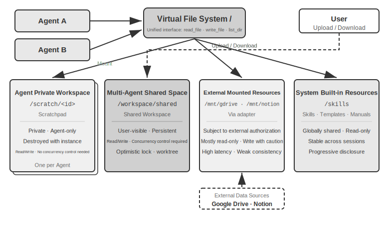

Table 10-3 இந்த நான்கு பகுதி வகைகளையும் நான்கு பரிமாணங்களில்—தெரிவுநிலை, வாழ்க்கைச் சுழற்சி, படிப்பு/எழுது அனுமதிகள், மற்றும் ஒருங்கிணைப்புக் கட்டுப்பாடு—ஒப்பிட்டு, கோப்பு முறைமை தளவமைப்பு வடிவமைப்பிற்கான சரிபார்ப்புப் பட்டியலாக செயல்படுகிறது.

Table 10-3 Agent Virtual File System-இன் நான்கு பகுதி வகைகள்

| பகுதி | தெரிவுநிலை | வாழ்க்கைச் சுழற்சி | படிப்பு/எழுது | ஒருங்கிணைப்புக் கட்டுப்பாடு |
|---|---|---|---|---|
| Agent தனிப்பட்ட பணியிடம் | அந்த Agent மட்டுமே | Agent நிகழ்வுடன் அழிக்கப்படும் | படிப்பு/எழுது | தேவையில்லை (தனிப்பட்டது) |
| பல-Agent பகிரப்பட்ட இடம் | அனைத்து ஒத்துழைக்கும் Agents + பயனர் | பணி காலத்திற்கு நீடிக்கும், நிலைத்தன்மை தேவை | படிப்பு/எழுது | தேவை (optimistic lock / worktree) |
| ஏற்றப்பட்ட வெளிப்புற வளங்கள் | வெளிப்புற அங்கீகாரத்தைப் பொறுத்தது | வெளிப்புற மூலத்தால் தீர்மானிக்கப்படுகிறது | பெரும்பாலும் read-only, எழுதும் போது எச்சரிக்கை தேவை | வெளிப்புற மூலத்தால் நிர்வகிக்கப்படுகிறது |
| உள்ளமைக்கப்பட்ட கணினி வளங்கள் | அனைத்து Agents | அமர்வுகள் முழுவதும் நிலையானது | Read-only | தேவையில்லை (read-only) |

இந்த நான்கு பகுதி வகைகளையும் ஒற்றை கோப்பக மரத்தின் கீழ் ஒருங்கிணைப்பதே வடிவமைப்புக் கொள்கையின் மைய மதிப்பாகும்: **"கோப்பு பாதை ஒரு உலகளாவிய இடைமுகமாக."** Agents ஒருவருக்கொருவர் கலைப்பொருட்களை அனுப்பும்போது, ஒரு முக்கிய Agent துணை Agent-க்கு உள்ளீட்டை ஒப்படைக்கும்போது, அல்லது குறுக்கு-நிறுவன A2A ஒத்துழைப்பின் போது கலைப்பொருட்களை பரிமாறிக்கொள்ளும்போது, பரிமாற்றம் என்பது ஒரு இலகுரக பாதை சரம் (path string) ஆகும், சூழல் சாளரத்தில் (Chapter 4) ஏற்றப்பட்ட உள்ளடக்கம் அல்ல. இது Chapter 5-இன் "கோப்பு முறைமை Agent-இன் மையமாக" என்ற கருத்துடன் ஒத்துப்போகிறது—இது ஒரு ஒற்றை Agent கோப்பு முறைமையை நினைவகம் மற்றும் திறன்களை வழங்க பயன்படுத்துவதைப் பற்றி விவாதிக்கிறது—மேலும் அதே அப்ஸ்ட்ராக்ஷனை பல Agents-க்கும் நீட்டிக்கிறது: தனிப்பட்ட, பகிரப்பட்ட, வெளிப்புற மற்றும் உள்ளமைக்கப்பட்ட சேமிப்பகத்தை ஏற்றும் ஒரு மெய்நிகர் கோப்பக மரம் பல-Agent ஒத்துழைப்பிற்கான சேமிப்பக அடித்தளமாக செயல்படுகிறது.

### Agents-க்கு இடையேயான தொடர்பு மற்றும் கட்டுப்பாடு

கோப்பு முறைமை Agents-க்கு இடையேயான **கலைப்பொருள் பரிமாற்றத்தின்** சிக்கலை தீர்க்கும் அதே வேளையில், ஒத்துழைப்புக்கு ஒரு **கட்டுப்பாட்டுத் தளமும்** தேவைப்படுகிறது: Agents-க்கு இடையே செய்தி அனுப்புதல், நிலை வினவல்கள் மற்றும் செயலாக்க நிறுத்தத்தை ஆதரிப்பது. Chapter 4 ஏற்கனவே இந்த தளத்திற்கான கருவி அடிப்படைகளை வழங்கியுள்ளது—உருவாக்குதல் (`spawn_subagent`), செய்தி அனுப்புதல் (`send_message_to_subagent`), மற்றும் ரத்து செய்தல் (`cancel_subagent`)—நான்கு ஒத்துழைப்பு முறைகளுடன்: ஒத்திசைவு, ஒத்திசையா, ஸ்ட்ரீமிங் மற்றும் பல-சுற்று. இந்த பகுதி இடைமுக வரையறைகளை மீண்டும் செய்யவில்லை, மாறாக பல-Agent ஒத்துழைப்பிற்கு இன்றியமையாத மூன்று பெரும்பாலும் கவனிக்கப்படாத திறன்களில் கவனம் செலுத்துகிறது.

**I. Message Passing.** எளிமையான வடிவம் point-to-point ஆகும்: Agent A நேரடியாக `send_message_to_agent_b(content)` ஐ அழைக்கும். இது நிலையான topology மற்றும் குறைந்த எண்ணிக்கையிலான Agents (எ.கா., இந்த அத்தியாயத்தின் 10-4 என்ற phone + computer dual-agent பரிசோதனை) உள்ள சூழ்நிலைகளுக்கு ஏற்றது. Agents எண்ணிக்கை அதிகரித்து asynchronous parallelism தேவைப்படும்போது, point-to-point இணைப்புகளின் எண்ணிக்கை Agents எண்ணிக்கையுடன் quadratic ஆக வளர்கிறது, மேலும் அனுப்புநரும் பெறுநரும் ஒரே நேரத்தில் online இல் இருக்க வேண்டும். இதுபோன்ற சந்தர்ப்பங்களில், **message bus** பயன்படுத்தப்பட வேண்டும் (இந்த அத்தியாயத்தில் "Parallel Coordination Modes" இன் கீழ் பின்னர் விரிவாக விளக்கப்பட்டுள்ளது): Agents bus க்கு messages ஐ வெளியிடுகின்றன, bus அவற்றை subscriptions அடிப்படையில் அனுப்புகிறது, எனவே அனுப்புநர் நுகர்வோரை அறிந்திருக்க வேண்டியதில்லை. Point-to-point ஆக இருந்தாலும் அல்லது bus வழியாக இருந்தாலும், messages பொதுவாக ஒரு கட்டமைக்கப்பட்ட **envelope** ஐ எடுத்துச் செல்ல வேண்டும்: sender ID, target (குறிப்பிட்ட Agent அல்லது broadcast), message type (எ.கா., `task_assigned`/`status_update`/`result`/`terminate`), மற்றும் JSON payload. ஒருங்கிணைந்த envelope வடிவம், பெறுநரால் நம்பகமான routing மற்றும் parsing ஐ உறுதி செய்கிறது மற்றும் collaboration chain ஐ traceable ஆக்குகிறது—இது multi-agent systems ஐ debug செய்வதில் ஒரு முக்கிய அம்சமாகும்.

**II. Status Query.** இது control plane இன் மிகவும் குறைத்து மதிப்பிடப்பட்ட அம்சமாகும். ஒரு முக்கிய Agent ஒரு sub-agent ஐ அனுப்பிய பிறகு, அதன் முன்னேற்றத்தை அறியாமல், sub-agent தடைபட்டிருந்தால், அது காத்திருப்பதைத் தொடரலாமா அல்லது தலையிடலாமா என்பதை முடிவு செய்ய முடியாது. நிலையைப் பெறுவதற்கு இரண்டு paradigms உள்ளன. **Pull**: முக்கிய Agent `get_subagent_status(agent_id)` ஐ அழைக்கிறது, இது sub-agent இன் தற்போதைய நிலையை (running/waiting for input/completed/failed), முன்னேற்றம் மற்றும் கடைசி செயல்பாட்டு நேரத்தை வழங்குகிறது. **Push**: Sub-agent செயல்பாட்டின் போது message bus க்கு status updates ஐ முன்முயற்சியுடன் தெரிவிக்கிறது, மேலும் முக்கிய Agent ஒரு real-time task status table ஐ பராமரிக்கிறது (இந்த அத்தியாயத்தின் 10-6 பரிசோதனையில் உள்ள "real-time monitoring" இந்த paradigm ஐப் பின்பற்றுகிறது). ஒவ்வொன்றுக்கும் trade-offs உள்ளன: Pull செயல்படுத்த எளிதானது, ஆனால் அடிக்கடி polling செய்வது tokens ஐ வீணாக்குகிறது, அதே நேரத்தில் மிகவும் அரிதாக polling செய்வது தாமதங்களுக்கு வழிவகுக்கிறது; Push நல்ல real-time செயல்திறனை வழங்குகிறது, ஆனால் sub-agent இன் முன்முயற்சியான அறிக்கையிடலைச் சார்ந்துள்ளது. பொறியியல் நடைமுறையில், sub-agent நிலை பெரும்பாலும் **state machine** (submitted, executing, needs input, completed, failed) ஆக மாதிரியாக்கப்படுகிறது. இந்த அத்தியாயத்தில் பின்னர் உள்ள A2A protocol, task lifecycle ஐ இத்தகைய நிலைகளில் standardize செய்கிறது. கூடுதலாக, **timeouts மற்றும் heartbeat detection** ஒரு பாதுகாப்பு வலையாக செயல்படுகின்றன (அத்தியாயம் 4 இலிருந்து Heartbeat மற்றும் monitor_shell ஐ எதிரொலிப்பது): sub-agent அறிக்கை செய்யவில்லை அல்லது திரும்பவில்லை என்றாலும், "N நிமிடங்களுக்கு எந்த செயல்பாடும் இல்லை" என்பதன் அடிப்படையில் முக்கிய Agent தோல்வியை தீர்மானிக்க முடியும், இது நிறுத்தப்பட்ட sub-agent ஆல் கணினி தடைபடுவதைத் தடுக்கிறது.

**III. Execution Termination.** இணையான (parallel) கூட்டுச் செயல்பாட்டில், ஒரு பொதுவான சூழ்நிலை "ஒருவர் வெற்றி பெற்றால், மற்றவர்கள் பொருத்தமற்றவர்களாக மாறுவர்"—பல Agent-கள் தனித்தனியாக தேடுகின்றன, ஒருவர் இலக்கைக் கண்டறிந்தவுடன், மற்றவர்கள் உடனடியாக நிறுத்தப்பட வேண்டும் (இந்த அத்தியாயத்தின் பரிசோதனை 10-6-ல் உள்ள cascading termination). நிறுத்தத்தில் இரண்டு நிலைகள் உள்ளன. **Graceful termination** விரும்பத்தக்கது: முதன்மை Agent ஒரு `terminate` சிக்னலை அனுப்புகிறது, துணை-agent அதன் தற்போதைய படியில் பாதுகாப்பான இடத்தில் பதிலளித்து, வளங்களை சுத்தம் செய்கிறது (browser sessions-ஐ மூடுகிறது, நிலுவையில் உள்ள கோப்புகளை எழுதுகிறது, locks-ஐ வெளியிடுகிறது), ஒரு acknowledgment (ack) அனுப்புகிறது, பின்னர் வெளியேறுகிறது. **Forced termination** ஒரு fallback ஆகும்: நேரடியாக செயல்முறையை முடிப்பது, துணை-agent graceful signal-க்கு பதிலளிக்காதபோது மட்டுமே பயன்படுத்தப்படும், இதன் விளைவாக dangling resources மற்றும் முழுமையடையாத எழுத்துக்கள் ஏற்படலாம். இரண்டு பொறியியல் புள்ளிகள் கவனம் தேவை: முதலில், graceful termination-க்கு துணை-agent அதன் loop-ல் termination signal-ஐ அவ்வப்போது சரிபார்க்க வேண்டும் (அத்தியாயம் 4-ல் உள்ள interrupt mechanism போன்று); இல்லையெனில், signal-ஐ பெற முடியாது. இரண்டாவதாக, cascading termination-ல் ஒரு race condition உள்ளது—பல துணை-agents கிட்டத்தட்ட ஒரே நேரத்தில் வெற்றியைப் புகாரளிக்கலாம். முதன்மை Agent ஒரு lock அல்லது idempotent design-ஐப் பயன்படுத்தி, settlement ஒருமுறை மட்டுமே நடைபெறுவதையும், ஒரே ஒரு சுற்று termination மட்டுமே broadcast செய்யப்படுவதையும் உறுதி செய்ய வேண்டும். இந்த அத்தியாயத்தின் பரிசோதனை 10-6-ல் race condition பற்றிய விவாதத்தைப் பார்க்கவும்.

Artifact exchange (data plane) மற்றும் message passing, status query, மற்றும் execution termination (control plane) ஆகியவை ஒன்றாக, shared context இல்லாத multi-agent systems-ஐ ஆதரிக்கின்றன. கீழே விவரிக்கப்பட்டுள்ள மூன்று collaboration topologies-கள், இந்த இரண்டு planes-களின் அடிப்படையில் control ownership மற்றும் information flow பற்றிய வெவ்வேறு தேர்வுகளாகும்.

Agents-க்கு இடையேயான collaborative relationships மற்றும் control flow characteristics-ஐ அடிப்படையாகக் கொண்டு, shared context இல்லாத collaboration ஐ மூன்று முக்கிய கட்டமைப்புகளாகப் பிரிக்கலாம்: Peer-to-Peer Collaboration, Manager Mode, மற்றும் Decentralized Mode, ஒவ்வொன்றும் வெவ்வேறு வகையான பணிகளுக்கு ஏற்றது.

### Peer-to-Peer Collaboration Mode: Mutual Checks and Iterative Improvement

Peer-to-peer collaboration பொதுவாக 2-3 சம நிலையிலான Agent-களை உள்ளடக்கியது, பல சுற்று iteration-கள் மூலம் ஒருவருக்கொருவர் feedback வழங்குகிறது. இதன் மைய மதிப்பு cognitive diversity-ஐ அறிமுகப்படுத்துவதில் உள்ளது—வெவ்வேறு Agent-கள் ஒரே பிரச்சினையை வெவ்வேறு கோணங்களில் ஆராய்கின்றன, innovation மற்றும் robustness-ஐ சமநிலைப்படுத்தி, எந்த ஒரு Agent-ஐ விடவும் சிறந்த முடிவுகளை உருவாக்குகின்றன.

Manager மற்றும் Decentralized modes-ஐ ஒப்பிடும்போது, peer-to-peer collaboration-ன் செயல்படுத்தல் சிக்கலானது மிகவும் குறைவு—இரண்டு Agent-களின் பாத்திரங்கள், தொடர்பு பொறிமுறை, மற்றும் iteration termination நிபந்தனையை வரையறுத்தால் போதும், அது இயங்கும். இது விரைவாக யோசனைகளை சரிபார்க்கவும் முன்மாதிரிகளை உருவாக்கவும் ஒரு சிறந்த தேர்வாகும்.

**Proposer-Reviewer Paradigm.**

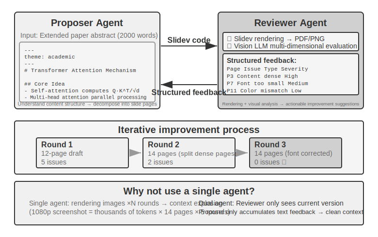

Proposer-Reviewer என்பது மிகவும் பாரம்பரியமான peer-to-peer கூட்டு முயற்சி paradigm ஆகும். Chapter 5 இல் ஏற்கனவே இந்த paradigm-ன் வடிவமைப்புக் கோட்பாடுகள் மற்றும் நடைமுறைப் பயன்பாடுகள் மூன்று experiments-ல் விளக்கப்பட்டுள்ளன: PPT generation, video editing, மற்றும் log visualization. Proposer Agent குறியீட்டை உருவாக்குவதற்குப் பொறுப்பாகும், மேலும் Reviewer Agent execution முடிவுகளை வழங்குகிறது, Vision LLM-ஐப் பயன்படுத்தி தரத்தை மதிப்பிடுகிறது, மேலும் கட்டமைக்கப்பட்ட முன்னேற்றப் பரிந்துரைகளை வழங்குகிறது. முடிவு தரத்தைப் பூர்த்தி செய்யும் வரை இரண்டும் மீண்டும் மீண்டும் செயல்படுகின்றன.

இந்த paradigm, security review (Proposer ஒரு action plan-ஐ உருவாக்குகிறது, Reviewer compliance மற்றும் சாத்தியமான risks-ஐ சரிபார்க்கிறது), content moderation (Proposer ஒரு reply-ஐ வரைவு செய்கிறது, Reviewer business rules மற்றும் language norms-ஐ சரிபார்க்கிறது), மற்றும் code review (Proposer குறியீட்டை எழுதுகிறது, Reviewer security மற்றும் best practices-ஐ சரிபார்க்கிறது) போன்ற சூழ்நிலைகளுக்கும் பொருந்தும்.

**ஒரு single Agent தனது சொந்த வேலையை உருவாக்கி, பின்னர் மதிப்பாய்வு செய்ய முடியாதா?** இது துல்லியமாக முந்தைய பகுதியான "When is Multi-Agent Truly Better Than Single-Agent?"-ல் உள்ள அளவுகோலின் பயன்பாடாகும்—மதிப்பாய்வு புதிய தகவலை அறிமுகப்படுத்தவில்லை என்றால், அது "model-ஐ மீண்டும் சிந்திக்கச் சொல்வது" மட்டுமே. தொடர்புடைய ஆராய்ச்சி ஒரு தெளிவான பதிலை வழங்குகிறது. Huang et al. அவர்களின் ICLR 2024 கட்டுரையான "Large Language Models Cannot Self-Correct Reasoning Yet"-ல், வெளிப்புற feedback இல்லாமல் GPT-4 தனது சொந்த பதில்களை மதிப்பாய்வு செய்து சரிசெய்யச் சொன்னால், துல்லியம் குறைந்ததைக் கண்டறிந்தனர்—model தவறான பதில்களை சரியானதாக மாற்றியதை விட, சரியான பதில்களை தவறானதாக மாற்றியது அதிகமாக இருந்தது.

TACL-ல் வெளியிடப்பட்ட 2024 survey paper, "When Can LLMs Actually Correct Their Own Mistakes?" (arXiv:2406.01297), இந்த முடிவை மேலும் உறுதிப்படுத்தியது: நம்பகமான வெளிப்புற feedback வழங்கப்படாவிட்டால் (எ.கா., test case execution முடிவுகள், வெளிப்புற tools-ல் இருந்து verification output), model-ன் சொந்த "self-correction"-ஐ மட்டுமே நம்பியிருப்பது பெரும்பாலும் பயனற்றது.

ICLR 2024-ல் உள்ள CRITIC paper ஒரு உள்ளுணர்வு ஒப்பீட்டு experiment-ஐ வழங்குகிறது. CRITIC model தனது சொந்த பதில்களைச் சரிபார்க்க வெளிப்புற tools (search engine, Python interpreter) பயன்படுத்தியது, இது குறிப்பிடத்தக்க செயல்திறன் மேம்பாடுகளுக்கு வழிவகுத்தது. இருப்பினும், experimenters tool verification படியை நீக்கிவிட்டு, model-ன் சுய மதிப்பீட்டை மட்டும் வைத்திருந்தபோது, பெரும்பாலான மேம்பாடு மறைந்துவிட்டது. இது மதிப்பாய்வின் மதிப்பு "model-ஐ மீண்டும் சிந்திக்கச் சொல்வதில்" இல்லை, மாறாக **model-ன் உருவாக்கத்தின் போது கிடைக்காத புதிய தகவலை அறிமுகப்படுத்துவதில்** உள்ளது என்பதைக் குறிக்கிறது—test முடிவுகள், rendered screenshots, compilation errors, வெளிப்புற search முடிவுகள்.

இது Proposer-Reviewer paradigm-இன் மைய வடிவமைப்புக் கொள்கை. Chapter 5-இன் PPT உருவாக்கச் சோதனையில், Reviewer Agent-இன் மதிப்பு "அதே model-ஐப் பயன்படுத்தி code-ஐ மீண்டும் பார்ப்பது" அல்ல, மாறாக **PPT-ஐ render செய்து screenshot எடுப்பது** — Proposer Agent code-ஐ உருவாக்கும் போது பெற முடியாத காட்சித் தகவலைக் கொண்ட screenshot. இதேபோல், code generation சூழ்நிலைகளில், test cases-ஐ இயக்குவதன் மூலம் கிடைக்கும் pass/fail முடிவுகள், code எழுதப்பட்ட போது இல்லாத புதிய signals ஆகும் — Reviewer-இன் சுயாதீன மதிப்பு, Proposer-க்குக் கிடைக்காத இந்த வெளிப்புற feedback-ஐ அணுகும் திறனிலிருந்தே உருவாகிறது.

**நீட்டிப்புகள்: பிற Peer-to-Peer ஒத்துழைப்பு முறைகள்.**

**Debate**: பல்வேறு Agents வெவ்வேறு நிலைப்பாடுகளைக் கொண்டு, adversarial dialogue மூலம் problem space-ஐ ஆழமாக ஆராய்கின்றன. உதாரணமாக, ஒரு technical solution-ஐ மதிப்பிடும் போது, Agent A "ஆதரவாளராக" செயல்பட்டு, solution-இன் நன்மைகளையும் வாய்ப்புகளையும் பட்டியலிடுகிறது, அதே நேரத்தில் Agent B "எதிராளியாக" செயல்பட்டு, அபாயங்களையும் வரம்புகளையும் சுட்டிக்காட்டுகிறது. ஒவ்வொரு debate சுற்றிலும் மற்றவரின் வாதங்களை மறுத்தல் அல்லது நிரப்புதல் அடங்கும். ஒரு single Agent பகுப்பாய்வு செய்யும் போது, model பெரும்பாலும் ஒரு கண்ணோட்டத்தை நோக்கி சாய்ந்து, எதிர்-சான்றுகளைப் புறக்கணிக்கிறது. Debate முறை, நிறுவனமயமாக்கப்பட்ட confrontation மூலம், இரு பக்கங்களும் முழுமையாக விவாதிக்கப்படுவதை உறுதி செய்து, decision-makers மிகவும் சமச்சீரான தீர்ப்புகளை வழங்க உதவுகிறது.

இருப்பினும், debate mode-இன் நடைமுறை செயல்திறன் கல்வி வட்டாரங்களில் இன்னும் விவாதத்திற்குரியதாகவே உள்ளது. Tran மற்றும் Kiela [^single-agent-2026] ஆகியோரின் 2026 ஆம் ஆண்டு ஆய்வு, multi-hop reasoning பணிகளில் ஒரு single Agent-ஐ ஐந்து multi-agent architectures (sequential, debate, ensemble, parallel roles, sub-task parallel) உடன் ஒப்பிட்டது. **thinking token budget கண்டிப்பாக ஒரே மாதிரியாகக் கட்டுப்படுத்தப்பட்டபோது, single Agent ஆனது multi-agent systems-ஐ விட சமமாக அல்லது சிறப்பாகச் செயல்பட்டது** (context utilization ஒரு குறிப்பிட்ட அளவிற்கு மோசமடையாத வரை). தரவு செயலாக்க சமனின்மை (data processing inequality) கோட்பாட்டின் அடிப்படையில் ஆராய்ச்சியாளர்கள் ஒரு விளக்கத்தை வழங்கினர்: debate செயல்பாட்டில் உள்ள பல்வேறு Agents ஒரே உரைத் தகவலைச் செயலாக்குகின்றன, மேலும் Agents-க்கு இடையேயான இடைநிலை முடிவுகளின் ஒவ்வொரு தொடர் பரிமாற்றமும் தகவலை இழக்க மட்டுமே முடியும், உருவாக்க முடியாது. சில கல்விக் கட்டுரைகளில் debate mode-இன் நன்மைகள், பல்வேறு Agents மொத்த கணக்கீட்டை (total computation) அதிகமாகப் பயன்படுத்துவதால் ஏற்படக்கூடும். இந்த வாதத்தின் எல்லையைத் தெளிவுபடுத்துவது முக்கியம்: இது "multi-agent serial transmission of intermediate conclusions" என்பதால் ஏற்படும் தகவல் இடையூறை (information bottleneck) இலக்காகக் கொண்டது, மேலும் **ஒரே பிரச்சினையின் பல சுயாதீன மாதிரிகள் (multiple independent samplings) மற்றும் அவற்றின் ஒருங்கிணைப்பு** (எ.கா., self-consistency, majority voting) அல்லது **உருவாக்கம் மற்றும் சரிபார்ப்புக்கு இடையேயான சிரம சமச்சீரற்ற தன்மையை** (generation-verification division of labor) பயன்படுத்துவது போன்ற பிற அணுகுமுறைகளை மறுக்கவில்லை. இந்த சூழ்நிலைகள் கூடுதல் சுயாதீன மாதிரிகளை அறிமுகப்படுத்துகின்றன அல்லது பணியின் சமச்சீரற்ற கட்டமைப்பைப் பயன்படுத்துகின்றன, மேலும் data processing inequality-இன் வரம்பிற்குள் வராது.

[^single-agent-2026]: Tran, D., Kiela, D. *Single-Agent LLMs Outperform Multi-Agent Systems on Multi-Hop Reasoning Under Equal Thinking Token Budgets.* arXiv:2604.02460, 2026.

**Brainstorm**: பல்வேறு Agents சுயாதீனமாக யோசனைகளை உருவாக்கி, பின்னர் அவற்றை ஒருவருக்கொருவர் பகிர்ந்துகொண்டு, ஒருவரையொருவர் ஊக்குவிக்கின்றன. உதாரணமாக, ஒரு தயாரிப்பு புதுமைப் பணியில், Agent 1 "சமூகப் பகிர்வு அம்சங்களைச் சேர்ப்பது" என்று முன்மொழிகிறது, Agent 2 "சமூக வலைப்பின்னல்களில் பகிர்வது மட்டுமல்லாமல், தனிப்பயனாக்கப்பட்ட பகிர்வு சுவரொட்டிகளை உருவாக்குவதும்" என்று பரிந்துரைக்க ஊக்கமடைகிறது, மேலும் Agent 3 முதல் இரண்டையும் ஒருங்கிணைத்து "பயனர் தனிப்பயனாக்கக்கூடிய சுவரொட்டி வார்ப்புருக்கள் ஒரு வார்ப்புரு சந்தையை உருவாக்குகின்றன" என்று முன்மொழிகிறது. வெவ்வேறு Agents-க்கு வெவ்வேறு "சிந்தனை விருப்பங்கள்" (வெவ்வேறு prompts அல்லது models மூலம் அடையப்படுகின்றன) உள்ளன, மேலும் ஒருவரையொருவர் தூண்டுவதன் மூலம், ஒரு single Agent-ஆல் கற்பனை செய்வது கடினமான படைப்பு சேர்க்கைகளைக் கண்டறிய, அவை பரந்த தீர்வு இடத்தை (solution space) ஆராய்கின்றன.

**Panel Discussion**: பல்வேறு Agent-கள் ஒவ்வொன்றும் ஒரு குறிப்பிட்ட தொழில்முறை துறையின் கண்ணோட்டத்தை பிரதிநிதித்துவப்படுத்தி, ஒரு இடைப்பட்ட ஒழுங்குமுறை பிரச்சினையை கூட்டாக விவாதிக்கின்றன. உதாரணமாக, ஒரு புதிய தயாரிப்பின் சாத்தியத்தை மதிப்பிடும்போது, Engineer Agent தொழில்நுட்பக் கண்ணோட்டத்தில் செயல்படுத்தலின் சிரமத்தை பகுப்பாய்வு செய்கிறது, Product Agent பயனர் அனுபவக் கண்ணோட்டத்தில் சந்தை ஈர்ப்பை மதிப்பிடுகிறது, மேலும் Operations Agent செலவு மற்றும் வளக் கண்ணோட்டத்தில் வணிக சாத்தியத்தை பகுப்பாய்வு செய்கிறது. இந்த Agent-கள் எதிரெதிரானவை அல்ல, மாறாக நிரப்பு இயல்புடையவை, ஒன்றாக சேர்ந்து பிரச்சினையின் முழுப் படத்தையும் உருவாக்கி, குறுக்கு-துறை தடைகள் மற்றும் வாய்ப்புகளை அடையாளம் காணுகின்றன.

### Manager Mode: Centralized Coordinationஒரு பணியில் ஐந்துக்கும் மேற்பட்ட துணைப் பணிகள் இருந்தால், மாறும் அட்டவணை தேவைப்பட்டால், அல்லது துணைப் பணிகளுக்கு இடையே சிக்கலான சார்புகள் இருந்தால், peer-to-peer ஒத்துழைப்பு போதுமானதாக இல்லாமல் போகிறது, மேலும் manager pattern தேவைப்படுகிறது. Manager Agent-ன் பொறுப்புகள் ஒரு project manager-ஐப் போன்றவை: முதலில் ஒட்டுமொத்த பணியைப் புரிந்துகொண்டு, பின்னர் அதை ஒதுக்கக்கூடிய துணைப் பணிகளாகப் பிரித்து, செயல்படுத்த பொருத்தமான Agent-ஐத் தேர்ந்தெடுத்து, முன்னேற்றத்தைக் கண்காணித்து, விதிவிலக்குகளைக் கையாளுதல் (மீண்டும் முயற்சி செய், Agent-ஐ மாற்று, திட்டத்தைச் சரிசெய்), இறுதியாக ஒவ்வொரு Agent-ன் வெளியீடுகளையும் இறுதி முடிவாக ஒருங்கிணைக்கிறது.

ஒரு system design கண்ணோட்டத்தில், manager pattern ஒவ்வொரு சிறப்பு Agent-ஐயும் Manager அழைக்கக்கூடிய ஒரு tool ஆக மாதிரியாக்குகிறது. Manager-ன் toolset-ல் பாரம்பரிய வெளிப்புற tools (தேடல், கோப்பு செயல்பாடுகள் போன்றவை) மட்டுமல்லாமல், மற்ற Agent-களின் அழைப்பு இடைமுகங்களும் அடங்கும். Manager tool call பொறிமுறை மூலம் தொடர்புடைய Agent-ஐத் தொடங்கி, பணி அளவுருக்கள் மற்றும் தேவையான context-ஐ அனுப்பி, நிறைவுக்காகக் காத்திருந்து, திரும்பிய முடிவைப் பெறுகிறது. Manager-ன் கண்ணோட்டத்தில், ஒரு Agent-ஐ அழைப்பது ஒரு சாதாரண tool-ஐ அழைப்பதிலிருந்து அடிப்படையில் வேறுபட்டதல்ல—இரண்டும் ஒரு கோரிக்கையை அனுப்பி பதிலைப் பெறுவதை உள்ளடக்குகின்றன. இந்த ஒருங்கிணைந்த சுருக்கம் manager pattern-க்கு நல்ல விரிவாக்கத்தை அளிக்கிறது—புதிய திறன்களைச் சேர்ப்பதற்கு தொடர்புடைய Agent-ஐ உருவாக்கி அதை ஒரு tool ஆகப் பதிவு செய்வது மட்டுமே தேவை, Manager-ன் மைய logic-ஐ மாற்றாமல். அதே நேரத்தில், இது இயற்கையாகவே பன்முகத்தன்மையை ஆதரிக்கிறது—வெவ்வேறு Agent-கள் வெவ்வேறு models, prompts, tool sets மற்றும் வெவ்வேறு hardware சூழல்களில் கூட இயங்க முடியும்.

"Agents as tools for each other" என்ற abstraction ஆனது Chapter 4, "Collaboration Tools" பகுதியில் நிறுவப்பட்டது: `spawn_subagent / send_message / cancel_subagent` இன் interface design, மற்றும் sub-agent context-ஐ தயாரிப்பதற்கான நான்கு strategies (minimal passing, manual filtering, automatic pruning, LLM-generated context) ஆகியவை அனைத்தும் இங்கு Manager sub-agent-களை அழைப்பதில் நேரடியாகப் பொருந்தும். Chapter 4 ஆனது "Manager → sub-agent" திசையில் என்ன அனுப்பப்படுகிறது என்பதைக் கையாள்கிறது; சமச்சீரான கேள்வி "sub-agent → Manager" திசையில் என்ன திரும்பப் பெறப்படுகிறது என்பதாகும். பதில் **full trajectories-க்குப் பதிலாக structured summaries** ஆகும்: sub-agent ஆனது task-ன் முடிவு, key findings, artifacts-ன் file paths, மற்றும் சந்தித்த problems ஆகியவற்றைத் திருப்பி அனுப்ப வேண்டும், முழு execution trajectory-ஐ அதன் சொந்த logs-ல் விட்டுவிட வேண்டும். இந்த வழியில் மட்டுமே Manager-ன் context ஆனது sub-tasks-ன் எண்ணிக்கையுடன் மெதுவாகவும் நேர்கோட்டு முறையிலும் வளர முடியும், வெடித்துச் சிதறாமல்—இதுவே கீழே உள்ள Experiment 10-3-ல் Manager "file indexes-ஐ மட்டுமே பராமரித்து, translation content-ஐ சேமிக்காமல் இருப்பதற்கான" methodological basis ஆகும். இரண்டு chapters-க்கும் இடையேயான பணிப்பிரிவு: Chapter 4 வழிமுறைகளை (tool interfaces மற்றும் context passing implementation) விவாதிக்கிறது, அதேசமயம் இந்த chapter architecture-ஐ (topology மற்றும் responsibilities எவ்வாறு பிரிக்கப்படுகின்றன) விவாதிக்கிறது.

இருப்பினும், manager pattern-க்கும் உள்ளார்ந்த challenges உள்ளன. Manager ஆனது system-க்கு ஒரு single point of bottleneck ஆக மாறுகிறது—அது அனைத்து sub-tasks-ன் தன்மையையும் புரிந்து கொள்ள வேண்டும், சரியான Agent-ஐத் தேர்ந்தெடுக்க வேண்டும், மற்றும் context-ஐ துல்லியமாக அனுப்ப வேண்டும். எந்த முடிவு விலகலும் ஒட்டுமொத்த செயல்முறையைப் பாதிக்கலாம். கூடுதலாக, Manager முழு task-ன் global context-ஐப் பராமரிக்க வேண்டும். Task முன்னேறி Agent calls அதிகரிக்கும்போது, context விரைவாக விரிவடையலாம். எனவே, Manager-ன் prompt-ன் தரம், context management strategies, மற்றும் நியாயமான task decomposition granularity ஆகியவற்றில் சிறப்பு கவனம் செலுத்தப்பட வேண்டும்.

2025 Plan-and-Act paper [^plan-and-act-2025] இதன் empirical analysis-ஐ வழங்குகிறது: Planner-Executor dual-agent architecture-ல், **weak planner ஆனது முழு system-ன் மிக முக்கியமான bottleneck ஆகும்**. Planner-ன் planning quality போதுமான அளவு உயர்ந்ததாக இருக்கும்போது, ஒப்பீட்டளவில் எளிமையான Executor-ஐப் பயன்படுத்தினாலும் நல்ல முடிவுகளை அடைய முடியும். மாறாக, Planner-ன் task decomposition தவறாக இருந்தால், அடுத்தடுத்த அனைத்து Executor வேலையும் தவறான அடிப்படையில் கட்டமைக்கப்படுகிறது. இந்த ஆய்வு WebArena-Lite benchmark-ல் 54% success rate-ஐ அடைந்தது, இதன் முக்கிய பங்களிப்பு Planner-ன் planning ability-ஐ மேம்படுத்துவதே தவிர Executor-ன் execution ability-ஐ அல்ல. இந்த கண்டுபிடிப்பின் தாக்கம் என்னவென்றால், வலுவான model மற்றும் மிகவும் கவனமாக வடிவமைக்கப்பட்ட prompt ஆகியவை அனைத்து Agents-க்கும் சமமாக விநியோகிக்கப்படாமல், Manager (planner)-க்கு ஒதுக்கப்பட வேண்டும்.

இது அத்தியாயம் 4-ல் இருந்து ஒரு வாதத்துடன் முரண்படவில்லை. proposal model மற்றும் review model பற்றி விவாதிக்கும்போது, அத்தியாயம் 4 அவற்றின் திறன்கள் ஒத்ததாக இருக்க வேண்டும் என்பதைச் சுட்டிக்காட்டியது—ஆனால் அது **review scenario**-ஐக் குறிக்கிறது: reviewer, reviewed party-யின் பகுத்தறிவைத் தொடர்ந்து புரிந்துகொண்டு குறைபாடுகளைக் கண்டறிய வேண்டும்; திறன் இடைவெளி மிகப் பெரியதாக இருந்தால், review சாத்தியமற்றதாகிவிடும். Manager pattern வேறு ஒரு விஷயத்தைப் பற்றி விவாதிக்கிறது—**planning மற்றும் execution இடையேயான பணிப் பிரிவு**: planner துணைப் பணிகளைப் பிரிப்பதில் தவறு செய்துவிட்டால், executor எவ்வளவு வலுவாக இருந்தாலும், அதைச் சரிசெய்ய முடியாது. எனவே, வலுவான model மற்றும் மிகவும் கவனமாக வடிவமைக்கப்பட்ட prompt ஆகியவை planner-க்கு முன்னுரிமை அளிக்கப்பட வேண்டும். Executors-களுக்கு இடையே திறன் சமநிலை தேவையா என்பது துணைப் பணிகளின் இணைப்பு அளவைப் பொறுத்தது—பல executor-களின் வெளியீடுகள் இறுதியில் ஒரு முழுமையாக இணைக்கப்பட வேண்டியிருக்கும்போது, பலவீனமான இணைப்பு பெரும்பாலும் ஒட்டுமொத்த தரத்தைக் குறைக்கிறது.

[^plan-and-act-2025]: Erdogan, L. E., et al. *Plan-and-Act: Improving Planning of Agents for Long-Horizon Tasks.* arXiv:2503.09572, 2025.

**Sequential Coordination Pattern.**


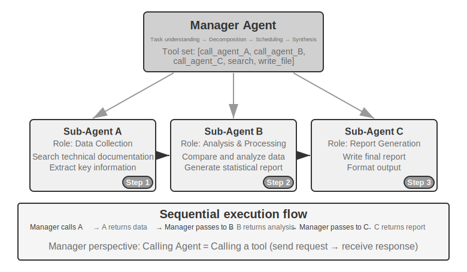


Manager ஆனது சிறப்பு Agent-களை வரிசையாக அழைக்கிறது. ஒவ்வொரு Agent-ம் முடிந்ததும் முடிவுகளைத் தருகிறது, மேலும் Manager அடுத்த படியை முடிவு செய்கிறது. Control flow நேரியல், எளிமையானது மற்றும் தெளிவானது, துணைப் பணிகளுக்கு தெளிவான வரிசை சார்புகள் இருக்கும் சூழ்நிலைகளுக்கு ஏற்றது.

> **Experiment 10-3 ★★: Book Translation Agent**
>
> புத்தக மொழிபெயர்ப்பு என்பது பல-Agent ஒத்துழைப்பு தேவைப்படும் ஒரு பொதுவான சிக்கலான பணியாகும். ஒரு தொழில்நுட்ப புத்தகத்தை மொழிபெயர்ப்பது என்பது உரையை ஒரு மொழியிலிருந்து மற்றொரு மொழிக்கு மாற்றுவது மட்டுமல்ல, முழு புத்தகம் முழுவதும் சிறப்பு சொற்களின் நிலைத்தன்மை, சூழல் துல்லியம் மற்றும் ஒட்டுமொத்த வாசிப்பு சரளத்தை உறுதி செய்வதையும் உள்ளடக்கியது. எடுத்துக்காட்டாக, பெரிய மொழி மாதிரிகள் பற்றிய ஆங்கில புத்தகத்தை மொழிபெயர்க்கும்போது, பல சொற்கள் மீண்டும் மீண்டும் தோன்றும், சாத்தியமான பல மரபு மொழிபெயர்ப்புகளுடன். முழு புத்தகம் முழுவதும் நிலைத்தன்மை பராமரிக்கப்பட வேண்டும்—`agent` என்பது அத்தியாயம் 1-ல் "智能体" என மொழிபெயர்க்கப்பட்டால், பின்னர் அதை "代理" ஆக மாற்ற முடியாது.
>
> இந்தப் பணிக்கு ஒற்றை Agent-ஐப் பயன்படுத்துவது கடுமையான context சிக்கல்களுக்கு வழிவகுக்கிறது. Agent அத்தியாயம் அத்தியாயமாக உள்ளடக்கத்தைச் செயலாக்கும்போது, context குவிகிறது: முழு புத்தக சொற்களஞ்சியம், மொழிபெயர்க்கப்பட்ட அத்தியாயங்கள், தற்போதைய பத்தி, மொழிபெயர்ப்பு சிந்தனை செயல்முறைகள் மற்றும் tool call முடிவுகள். பல நூறு பக்கங்கள் கொண்ட ஒரு தொழில்நுட்ப புத்தகம், மொழிபெயர்ப்பு இடைநிலைகளுடன் சேர்ந்து, context window-ஐ எளிதில் மீறலாம். மேலும் முக்கியமாக, மிக நீண்ட context-க்குள், Agent "தொலைந்து போகும்" வாய்ப்பு உள்ளது—முந்தைய சொல் மரபுகளை மறந்து, அத்தியாயம் 2-ஐ விட அத்தியாயம் 8-ல் முரண்பட்ட மொழிபெயர்ப்பைப் பயன்படுத்துதல்; proofreading கட்டத்தில் தேவையற்ற சரிபார்ப்புகளில் வளங்களை வீணடித்தல்; அல்லது கவனச் சிதறல் காரணமாக மாயத்தோற்றம் காண்பது, உண்மையில் இல்லாத சொல் விதிகளை "நினைவில் கொள்வது".
>
> Manager pattern இந்தச் சிக்கல்களைப் பணிப் பிரிப்பு மற்றும் பொறுப்புப் பிரிப்பு மூலம் தீர்க்கிறது:
>
> - **Glossary Agent**: முழு புத்தக உள்ளடக்கத்தையும் பெற்று, மீண்டும் மீண்டும் வரும் சிறப்பு சொற்களை அடையாளம் கண்டு, சிறப்பு அகராதிகள் மற்றும் மொழிபெயர்ப்பு நெறிமுறைகளைத் தேடி, கட்டமைக்கப்பட்ட சொற்களஞ்சியத்தை (JSON/CSV வடிவம், ஆங்கில சொல், சீன மொழிபெயர்ப்பு, சொல் வகை, பயன்பாட்டு சூழல் ஆகியவற்றை உள்ளடக்கியது) உருவாக்குகிறது. முடிந்த பிறகு, அது பகிரப்பட்ட கோப்பு முறைமையில் எழுதுகிறது, மேலும் Agent ஐ அழித்து வளங்களை விடுவிக்க முடியும்.
> - **Translation Agent**: தற்போதைய அத்தியாயம், சொற்களஞ்சியம் மற்றும் மொழிபெயர்ப்பு வழிகாட்டுதல்களை (இலக்கு வாசகர் நிலை, மொழி பாணி) பெற்று, அதை சரளமான சீன மொழியில் மொழிபெயர்க்கிறது. இது சொற்களஞ்சியத்தில் உள்ள சொற்களுக்கான குறிப்பிட்ட மொழிபெயர்ப்புகளை கண்டிப்பாகப் பயன்படுத்துகிறது, மேலும் புதிய சொற்களுக்கு, அது ஒரு மொழிபெயர்ப்பை ஊகித்து மதிப்பாய்வுக்காகக் குறிக்கிறது. ஒவ்வொரு நிகழ்வும் சுயாதீனமான context இல் குறுக்கீடு இல்லாமல் வேலை செய்கிறது. மொழிபெயர்க்கப்பட்ட உரை கோப்பு முறைமையில் (எ.கா., `chapter1_zh.md`) எழுதப்படுகிறது. Manager பல நிகழ்வுகளை இணையாகவோ அல்லது வரிசையாகவோ தொடங்க முடியும்.
> - **Proofreading Agent**: அனைத்து மொழிபெயர்க்கப்பட்ட உரைகளையும் சொற்களஞ்சியத்தையும் பெற்று, நிலைத்தன்மை சரிபார்ப்புகளைச் செய்கிறது—சொல் மொழிபெயர்ப்புகள் சீராக உள்ளனவா என்பதைச் சரிபார்த்தல், முரண்பாடுகளை அடையாளம் காணுதல் மற்றும் ஒட்டுமொத்த சரளம் மற்றும் வாசிப்புத் திறனைச் சரிபார்த்தல். இது கோப்பு முறைமையில் எழுதப்பட்ட ஒரு சரிபார்ப்பு அறிக்கையை உருவாக்குகிறது.
> - **Manager Agent**: இதன் context முக்கியமாக பணி விளக்கம், செயல்படுத்தும் திட்டம், ஒவ்வொரு Agent இன் அழைப்புப் பதிவுகள் மற்றும் முன்னேற்ற நிலையைச் சேமிக்கிறது. இது முழுமையான மொழிபெயர்ப்பு உள்ளடக்கத்தைச் சேமிக்காது (அது கோப்பு முறைமையில் உள்ளது), கோப்பு குறியீடுகளை மட்டுமே பராமரிக்கிறது. சரிபார்ப்பு அறிக்கையின் அடிப்படையில், Manager குறிப்பிட்ட அத்தியாயங்களை மறுபரிசீலனைக்காக Translation Agent க்கு மீண்டும் அனுப்ப முடியும்.
>
> இந்த கட்டமைப்பில், Manager Agent இன் context நிர்வகிக்கக்கூடிய வரம்பிற்குள் இருக்கும்: அது ஒட்டுமொத்த பணி விளக்கம் மற்றும் இலக்குகள், ஒவ்வொரு கட்டத்திற்கான செயல்படுத்தும் திட்டம், ஒவ்வொரு Agent இன் அழைப்புப் பதிவுகள் மற்றும் முடிவுகள் மற்றும் தற்போதைய முன்னேற்ற நிலை ஆகியவற்றை மட்டுமே அறிந்திருக்க வேண்டும், ஒவ்வொரு அத்தியாயத்தின் முழுமையான மொழிபெயர்ப்பையும் வைத்திருக்க வேண்டியதில்லை.
>
> முக்கிய நன்மை **context தனிமைப்படுத்தல்** ஆகும்: Glossary Agent சொல் பிரித்தெடுப்பதற்குத் தேவையான உள்ளடக்கத்தை மட்டுமே பார்க்கிறது, Translation Agent தற்போதைய அத்தியாயம் மற்றும் சொற்களஞ்சியத்தை மட்டுமே பார்க்கிறது, மேலும் Proofreading Agent முழு உரைக்கும் அணுகல் தேவைப்பட்டாலும், நிலைத்தன்மை சரிபார்ப்புகளில் மட்டுமே கவனம் செலுத்துகிறது. ஒவ்வொரு Agent உம் ஒரு மெலிந்த, கவனம் செலுத்தப்பட்ட context இல் வேலை செய்கிறது, இது அதிக செயல்திறன் மற்றும் பிழைகள் ஏற்படுவதற்கான வாய்ப்பைக் குறைக்கிறது—தகவல் அதிக சுமையால் Agent திசைதிருப்பப்படாது.
>
> **சோதனைத் தேவைகள்**:
> 1. விளக்கப்படங்கள் மற்றும் குறியீடுகள் நிறைந்த ஒரு தொழில்நுட்ப புத்தகத்தை மொழிபெயர்ப்புப் பொருளாகத் தேர்ந்தெடுக்கவும்
> 2. நான்கு வகையான Agent களை செயல்படுத்தவும்: Manager, Glossary, Translation, Proofreading
> 3. ஒவ்வொரு Agent இன் context நுகர்வையும் பதிவு செய்து, context விரிவாக்கத்தைக் கட்டுப்படுத்துவதில் manager pattern இன் செயல்திறனைச் சரிபார்க்கவும்
> 4. ஒற்றை Agent vs. manager pattern இன் மொழிபெயர்ப்பு தரம், செயல்படுத்தும் செயல்திறன் மற்றும் வள நுகர்வு ஆகியவற்றில் உள்ள வேறுபாடுகளை ஒப்பிடவும்
>
>
> 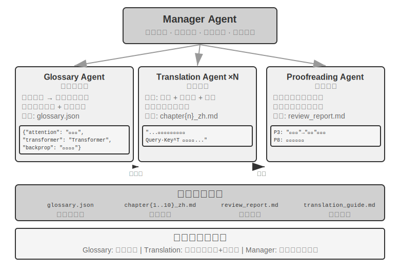
>
>
**Parallel Coordination Pattern.**


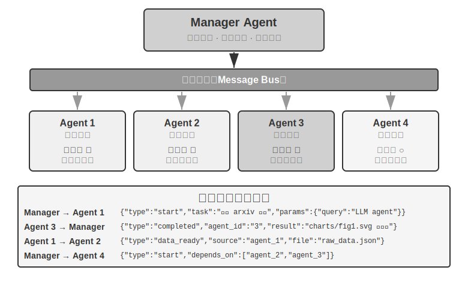

பல sub-tasks ஒரே நேரத்தில் இயக்கப்பட முடியும் போது, sequential pattern திறனற்றதாக மாறுகிறது. Parallel coordination பல Agents ஒரே நேரத்தில் வேலை செய்ய அனுமதிக்கிறது, throughput-ஐ கணிசமாக அதிகரிக்கிறது. Manager Agent parallel tasks-ஐ திட்டமிடுவது மட்டுமல்லாமல், இயங்கும் அனைத்து Agents-ஐயும் real-time-இல் கண்காணிக்க வேண்டும், communication coordination-ஐ கையாள வேண்டும், மற்றும் Agents வெற்றி பெறும்போது அல்லது தோல்வியடையும்போது global decisions எடுக்க வேண்டும். இதற்கு பொதுவாக ஒரு **Message Bus** உள்கட்டமைப்பாக தேவைப்படுகிறது—இதை ஒரு "public bulletin board" ஆக நினைத்துக் கொள்ளுங்கள், அங்கு Agents செய்திகளை இடுகையிடலாம் (publish) மற்றும் அவர்கள் ஆர்வமுள்ள message types-க்கு subscribe செய்யலாம், இது asynchronous, non-blocking communication-ஐ செயல்படுத்துகிறது. பொதுவான implementation solutions, சிக்கலின் அதிகரிக்கும் வரிசையில்: **Redis Pub/Sub**—lightweight, செய்திகள் உடனடியாக அனுப்பப்பட்டு பெறப்படுகின்றன, பயன்படுத்த எளிதானது, ஆனால் persistent இல்லை—receiver offline-இல் இருந்தால், செய்தி இழக்கப்படுகிறது; **RabbitMQ** மற்றும் ஒத்த message queues செய்திகளை disk-இல் persist செய்கின்றன, எனவே receiver தற்காலிகமாக offline-இல் இருந்தாலும் அவை இழக்கப்படுவதில்லை. Message format பொதுவாக sender ID, target Agent (அல்லது அனைவருக்கும் broadcast), message type, மற்றும் JSON format-இல் data content ஆகியவற்றை உள்ளடக்கியது.

> **Experiment 10-4 ★★★: Agent Talking on the Phone While Using a Computer**
>
> **Prerequisites**: இந்த experiment Chapter 9-இன் Computer Use மற்றும் Voice Agent technologies-ஐ ஒருங்கிணைக்கிறது. முதலில் Chapter 9-இன் தொடர்புடைய experiments-ஐ முடிக்க பரிந்துரைக்கப்படுகிறது.
>
> பல உண்மையான சூழ்நிலைகளில், பல திறன்கள் ஒன்றன் பின் ஒன்றாக queue-இல் நிற்பதற்கு பதிலாக, ஒரே நேரத்தில் இயங்க வேண்டும்: ஒரு மனித உதவியாளர் ஒரு வாடிக்கையாளருடன் தொலைபேசியில் பேசிக்கொண்டிருக்கும்போது, அதே நேரத்தில் கணினியில் ஆவணங்களைத் தேடி குறிப்புகளை எடுக்கலாம். இந்த "multitasking" ஒரு single Agent-க்கு மிகவும் சவாலானது—ஒரு Agent-ஐ real-time voice dialogue மற்றும் computer interface operations இரண்டையும் கையாள கட்டாயப்படுத்துவது, இரண்டு பணிகளுக்கும் இடையே தொடர்ந்து மாறுவதற்கு வழிவகுக்கிறது, இது உரையாடலில் இடைநிறுத்தங்கள் அல்லது செயல்பாட்டில் குறுக்கீடுகளை ஏற்படுத்துகிறது. Multi-agent parallel execution-இன் மைய யோசனை: **வெவ்வேறு Agents ஒவ்வொன்றும் அதிக real-time தேவைகள் கொண்ட ஒரு பணியில் கவனம் செலுத்தட்டும், asynchronous message passing மூலம் ஒருங்கிணைத்து உண்மையான parallel processing-ஐ அடையட்டும்**. இரண்டு Agents-ம் வெவ்வேறு interaction modalities-க்காக குறிப்பாக optimized செய்யப்பட்டுள்ளன—Phone Agent-க்கு குறைந்த latency கொண்ட speech recognition மற்றும் synthesis தேவை, அதே நேரத்தில் Computer Agent-க்கு சக்திவாய்ந்த visual understanding மற்றும் action planning capabilities தேவை.
>
> **Scenario**: ஒரு AI Agent ஒரு பயனருக்கு சிக்கலான flight booking form-ஐ நிரப்ப உதவுகிறது. இது ஒரு web page-ஐ இயக்க வேண்டும், அதே நேரத்தில் தொலைபேசியில் பயனரிடம் தனிப்பட்ட தகவல்களை (பெயர், ID எண், flight விருப்பங்கள் போன்றவை) கேட்டு உறுதிப்படுத்த வேண்டும்—இரண்டு முனைகளுக்கும் அதிக real-time செயல்திறன் தேவை, ஒரு single Agent இரண்டையும் நிர்வகிக்க சிரமப்படும் ஒரு சிறந்த எடுத்துக்காட்டு, ஆனால் dual-agent setup ஒவ்வொன்றும் அதன் சொந்த பாத்திரத்தில் கவனம் செலுத்த அனுமதிக்கிறது.
>
> **Dual-Agent Architecture**:
> **Phone Agent**: ASR + LLM + TTS அடிப்படையிலான குரல் அழைப்பு Agent. இது பயனரின் இயற்கை மொழி பதில்களைப் புரிந்துகொள்வதற்கும், முக்கிய தகவல்களைப் பிரித்தெடுப்பதற்கும், அதை message framework மூலம் Computer Agent க்கு அனுப்புவதற்கும் பொறுப்பாகும். மேலும், Computer Agent இலிருந்து வரும் செய்திகளைப் (எ.கா., "பயனரின் ID எண் தேவை", "பக்கம் ஏற்றுவதில் பிழை") பெற்று, பயனரிடம் கேட்க பொருத்தமான உரையாடலை உருவாக்குகிறது.
>
> **Computer Agent**: browser operation framework (எ.கா., Anthropic Computer Use, browser-use) அடிப்படையிலானது. இது இணையப் பக்க அமைப்பைப் புரிந்துகொள்வதற்கும், படிவப் புலங்களை அடையாளம் காண்பதற்கும், பெறப்பட்ட தகவலின் அடிப்படையில் நிரப்புதல் செயல்பாடுகளைச் செய்வதற்கும், சிக்கல்கள் ஏற்படும்போது Phone Agent இன் உதவியைக் கேட்பதற்கும் பொறுப்பாகும்.
>
> **தொடர்பு வழிமுறை**: இரண்டு விருப்பங்கள்:
> - **எளிய தீர்வு**: tool calls மூலம் point-to-point தொடர்பு, எ.கா., `send_message_to_computer_agent(message)` / `send_message_to_phone_agent(message)`
> - **முழுமையான தீர்வு**: Message Bus + Manager Agent, அனுப்புநர், பெறுநர், வகை மற்றும் உள்ளடக்கம் ஆகியவற்றை உள்ளடக்கிய ஒருங்கிணைந்த message வடிவத்துடன்
>
> **இணை ஒத்துழைப்பு வழிமுறை** (இந்த அத்தியாயத்தில் உள்ள இரண்டு "Phone + Computer" சோதனைகளாலும் பகிரப்படுகிறது): இரண்டு Agents தனித்தனி threads அல்லது processes இல் இயங்குகின்றன, ஒவ்வொன்றும் அதன் சொந்த சுயாதீனமான ReAct loop ஐப் பராமரிக்கிறது. Phone Agent இன் loop: குரலைப் பெறு -> ASR transcription -> LLM புரிந்துகொண்டு பதிலை உருவாக்கு -> TTS synthesis -> இயக்கு -> Computer Agent இலிருந்து செய்திகளைச் சரிபார். Computer Agent இன் loop: screenshot எடு -> Vision LLM பக்கத்தைப் புரிந்துகொள் -> செயலைத் திட்டமிடு -> செயல்படுத்து (click, type, போன்றவை) -> Phone Agent இலிருந்து செய்திகளைச் சரிபார். முக்கியமானது என்னவென்றால், இரண்டும் உண்மையிலேயே இணையாக இயங்க வேண்டும்—Computer Agent உறுப்புகளைக் கண்டுபிடித்து உரையைத் தட்டச்சு செய்யும்போது, Phone Agent ஆன்லைனில் இருந்து பயனருடன் உரையாட வேண்டும் ("சரி, நான் உங்கள் பெயரை நிரப்புகிறேன்... உங்கள் ID எண் என்னவென்று கேட்கலாமா?"). இதை அடைய, ஒவ்வொரு Agent இன் input மற்றொன்றிலிருந்து ஒரு marker field ஐக் கொண்டுள்ளது, எடுத்துக்காட்டாக, Phone Agent இன் context இல் `[FROM_COMPUTER_AGENT] 'Next' பொத்தானைக் கண்டுபிடிக்க முடியவில்லை, பயனர் உறுதிப்படுத்தல் தேவைப்படலாம்` மற்றும் Computer Agent இன் context இல் `[FROM_PHONE_AGENT] பயனர் பெயர் 'Zhang San' என்றும், ID எண் 123456 என்றும் கூறினார்` ஆகியவை இருக்கலாம்.
>
> **சோதனைத் தேவைகள்**:
> 1. ASR/TTS APIs மற்றும் browser operation framework அடிப்படையிலான dual-agent architecture ஐ செயல்படுத்தவும்
> 2. திறமையான bidirectional communication mechanism ஐ செயல்படுத்தவும்
> 3. உண்மையான இணை செயல்பாட்டை உறுதி செய்யவும், தகவல் சேகரிப்பு மற்றும் படிவம் நிரப்புதல் ஒரே நேரத்தில் நடைபெற வேண்டும்
> 4. விதிவிலக்கான சூழ்நிலைகளைக் கையாளவும்
>
> **சோதனை 10-5 ★★★: தானாக ஒருங்கிணைக்கப்பட்ட Phone மற்றும் Computer Agents**
>
> சோதனை 10-4 இல், dual agents இன் ஒத்துழைப்பு கட்டமைப்பு முன்கூட்டியே வடிவமைக்கப்பட்டது. இந்த சோதனை மேலும் ஒரு படி முன்னேறி, **Agents இன் தன்னாட்சி ஒருங்கிணைப்புத் திறனை** ஆராய்கிறது—அதாவது, ஒத்துழைப்பு ஓட்டம் மனிதரால் முன்கூட்டியே திட்டமிடப்படாமல், Agent தானே ஒரு புதிய கூட்டு Agent ஐ எப்போது தொடங்க வேண்டும் என்பதை முடிவு செய்கிறது.
> **காட்சி**: பயனர், "இந்த வலைத்தளத்தில் பதிவு செய்வதை முடிக்க எனக்கு உதவுங்கள்" என்று கோரிக்கை வைக்கிறார், URL ஐ வழங்குகிறார், ஆனால் எந்த தகவலை நிரப்ப வேண்டும் என்பதைக் குறிப்பிடவில்லை. Manager Agent, Computer Use கருவியைப் பயன்படுத்தி வலைத்தளத்தை அணுகி பதிவு பக்கத்தை ஏற்றுகிறது.
>
> செயல்பாட்டின் போது, Computer Use Agent, பதிவு படிவம் மிகவும் சிக்கலானது, பல கட்டாய புலங்களைக் கொண்டுள்ளது என்பதைக் கண்டறிகிறது: அடிப்படை தனிப்பட்ட தகவல் (பெயர், பாலினம், பிறந்த தேதி), தொடர்பு விவரங்கள் (தொலைபேசி எண், மின்னஞ்சல், அஞ்சல் முகவரி), அடையாள சரிபார்ப்பு தகவல் (அடையாள அட்டை வகை, அடையாள அட்டை எண்), விருப்ப அமைப்புகள் போன்றவை. அதன் context ஐ சரிபார்த்த பிறகு, இந்த தகவல் தன்னிடம் இல்லை என்பதை Agent உணர்கிறது—பயனர் "பதிவு செய்ய உதவுங்கள்" என்று மட்டுமே கூறினார், எந்த குறிப்பிட்ட தரவையும் வழங்கவில்லை.
>
> ஒரு பாரம்பரிய Agent இந்த சூழ்நிலையை எதிர்கொள்ளும்போது, அது பயனரிடம் உள்ளீட்டை தட்டச்சு செய்யும்படி கேட்டு ஒரு உரை செய்தியை அனுப்புகிறது—இது திறமையற்றது (அதிக அளவிலான தகவலை கைமுறையாக உள்ளிட வேண்டும்) மற்றும் பிழை ஏற்பட வாய்ப்புள்ளது (வடிவமைப்பு சிக்கல்கள், விடுபட்ட தகவல்). ஒரு புத்திசாலித்தனமான Agent இதை அங்கீகரிக்க வேண்டும்: **இது தொலைபேசி அழைப்பு மூலம் தகவல் சேகரிக்க ஏற்ற காட்சி**—தொலைபேசி உரையாடல்கள் உரை அரட்டையை விட மிகவும் திறமையானவை, தொடர்ச்சியான கேள்விகள் மற்றும் உறுதிப்படுத்தலை அனுமதிக்கின்றன, மேலும் பயனரின் தெளிவற்ற வெளிப்பாடுகளைக் கையாள முடியும்.

> முக்கியமான புதுமை என்னவென்றால், இந்த முடிவு முன்கூட்டியே நிரல்படுத்தப்படவில்லை, மாறாக **Agent ஆல் தன்னாட்சியாக எடுக்கப்படுகிறது**. Computer Use Agent இன் prompt கூறுகிறது: "பயனரிடமிருந்து அதிக அளவிலான கட்டமைக்கப்பட்ட தகவலை நீங்கள் சேகரிக்க வேண்டியிருக்கும் போது, மேலும் இதை உரையாடல் மூலம் படிப்படியாக செய்ய முடியும் என்றால், Phone Agent ஐ ஒரு உதவி கருவியாக அழைப்பதைக் கருத்தில் கொள்ளவும்." கருவி தொகுப்பில் `initiate_phone_call_agent(purpose, required_info)` அடங்கும்.
>
> அழைக்கப்பட்டவுடன், கணினி தெளிவான பணி context உடன் ஒரு Phone Agent ஐ உருவாக்குகிறது: படிவம் நிரப்புதலுக்கு உதவ இது தொடங்கப்பட்டது, என்ன தகவல் சேகரிக்கப்பட வேண்டும் மற்றும் ஒவ்வொரு புலத்திற்குமான வடிவமைப்பு தேவைகளைக் குறிப்பிடுகிறது.
>
> இரண்டு Agents பின்னர் நிகழ்நேர ஒத்துழைப்பு முறையில் நுழைகின்றன, பரிசோதனை 10-4 இலிருந்து asynchronous parallel mechanism ஐப் பயன்படுத்துகின்றன. Phone Agent பயனரை அழைத்து தொடர்ச்சியாகக் கேட்கிறது: "வணக்கம், நான் உங்கள் பதிவு படிவத்தை நிரப்ப உதவுகிறேன். முதலில், உங்கள் பெயரைத் தெரிவிக்க முடியுமா?" பயனர் பதிலளித்த பிறகு, அது உடனடியாக Computer Agent க்கு `{"type": "info_collected", "field": "Name", "value": "Zhang San"}` ஐ அனுப்புகிறது, இது வலைப்பக்கத்தில் "Name" புலத்தைக் கண்டறிந்து நிரப்புகிறது. இதற்கிடையில், Phone Agent, கணினி செயல்பாடு முடிவடையும் வரை காத்திருக்காமல், அடுத்த கேள்வியைக் கேட்பதைத் தொடர்கிறது. இந்த **கேள்-ஒன்று, நிரப்பு-ஒன்று** முறை, உரையாடல் ஓட்டம் செயல்பாட்டு தாமதங்களால் தடைபடாதது, இந்த பரிசோதனையின் முக்கிய தேவையாகும். அனைத்து தகவல்களும் சேகரிக்கப்பட்ட பிறகு, Phone Agent `{"type": "task_completed"}` ஐ அனுப்புகிறது, மேலும் Computer Agent படிவத்தை சமர்ப்பிக்கிறது.
>
> **பரிசோதனை தேவைகள்**:
> 1. ஒரு Phone Agent ஐ தொடங்க தன்னாட்சியாக முடிவு செய்யும் திறன் கொண்ட Computer Use Agent ஐ செயல்படுத்தவும்
> 2. நிகழ்நேர இரு திசை தொடர்பு மற்றும் உண்மையான இணை வேலையை செயல்படுத்தவும்
> 3. விதிவிலக்குகளைக் கையாளவும் (தகவல் வடிவம் தவறாக இருக்கும்போது கருத்துத் தெரிவித்து மீண்டும் கேட்கவும்)
> 4. ஒத்துழைப்பு செயல்முறையின் செய்தி நேரத்தையும், Agents-இன் முக்கிய முடிவெடுக்கும் புள்ளிகளையும் பதிவு செய்யவும்
>
>
> 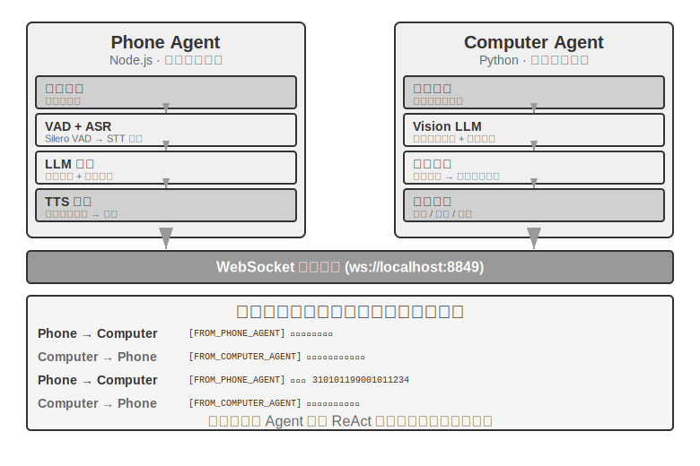
>
>
> **Experiment 10-6 ★★★: Agent ஒரே நேரத்தில் பல இணையதளங்களில் இருந்து தகவல் சேகரித்தல்**
>
> **முன்நிபந்தனைகள்**: அத்தியாயம் 4-இல் இருந்து event-driven மற்றும் interrupt வழிமுறைகளை முதலில் புரிந்துகொள்வது பரிந்துரைக்கப்படுகிறது.
>
> இந்த experiment, தகவல் சேகரிப்பு சூழ்நிலைகளில் multi-agent parallel execution-இன் பயன்பாட்டை ஆராய்கிறது. Experiments 10-4 மற்றும் 10-5, இரண்டு heterogeneous Agents-இன் ஒத்துழைப்பில் கவனம் செலுத்துவதைப் போலல்லாமல், இந்த experiment **பல homogeneous Agents-ஆல் இணையான தேடல்** மற்றும் மைய ஒருங்கிணைப்பு மூலம் திறமையான பணி நிறைவு மற்றும் வள உகப்பாக்கத்தை எவ்வாறு அடைவது என்பதில் கவனம் செலுத்துகிறது.
>
> **சிக்கல்**: ஒரு பல்கலைக்கழகத்தில் உள்ள பல கல்லூரிகளின் இணையதளங்கள் கொடுக்கப்பட்டுள்ளன. ஒவ்வொரு கல்லூரியின் ஆசிரியர் அடைவுப் பக்கத்திலும், குறிப்பிட்ட ஒரு ஆசிரிய உறுப்பினரை (எ.கா., "Zhang Wei") தேட வேண்டும், மேலும் அவரைக் கண்டறிந்ததும், அவரது கல்லூரி, பதவி, ஆராய்ச்சி திசை மற்றும் பிற தகவல்களைத் திருப்பித் தர வேண்டும்.
>
> **முக்கிய சவால்கள்**:
>
> **1. இணையான தொடக்கம்**: Manager Agent, பணித் தேவைகளின் அடிப்படையில் 10 Computer Use Agent நிகழ்வுகளை மாறும் வகையில் உருவாக்குகிறது, ஒவ்வொன்றும் ஒரு கல்லூரி இணையதளத்துடன் தொடர்புடையது. ஒவ்வொரு நிகழ்வும் ஒரு சுயாதீனமான process அல்லது thread ஆக இருக்க வேண்டும், அதன் சொந்த browser session உடன், ஒன்றையொன்று தடுக்காமல் ஒரே நேரத்தில் செயல்படக்கூடியதாக இருக்க வேண்டும். தொடக்கத்தில் அனுப்பப்படும் அளவுருக்கள் பின்வருமாறு: இலக்கு இணையதள URL, தேட வேண்டிய ஆசிரியர் பெயர், மற்றும் பணி அடையாளங்காட்டி (செய்தி வழிப்படுத்தலுக்காக).
>
> **2. நிகழ்நேர கண்காணிப்பு**: ஒவ்வொரு Agent-உம் செயல்பாட்டின் போது அவ்வப்போது நிலை புதுப்பிப்புகளை அனுப்புகிறது ("இணையதளத்தை ஏற்றுகிறது", "ஆசிரியர் அடைவைப் பாகுபடுத்துகிறது", "இலக்கு கிடைக்கவில்லை, பணி முடிந்தது", "பொருத்தம் கிடைத்தது, விவரங்கள் கீழே"). Manager Agent, இந்த புதுப்பிப்புகளை ஒரு message bus மூலம் பெற்று, ஒரு பணி நிலை அட்டவணையைப் பராமரித்து, எந்த Agents இன்னும் இயங்குகின்றன, எவை முடிந்துவிட்டன, எவை பிழைகளைச் சந்தித்துள்ளன என்பதை நிகழ்நேரத்தில் கண்காணிக்கிறது.
>
> **3. அடுக்கு நிறுத்தம்**: கணினி அறிவியல் கல்லூரிக்குப் பொறுப்பான Agent, இலக்கு ஆசிரிய உறுப்பினரைக் கண்டுபிடிப்பதாக வைத்துக்கொள்வோம். அது `{"type": "target_found", "agent_id": "agent_3", "data": {...}}` என அனுப்புகிறது. இதைப் பெற்றதும், Manager Agent உடனடியாக மற்ற அனைத்து இன்னும் இயங்கும் Agents-க்கும் `{"type": "terminate", "reason": "target_found_by_agent_3"}` என அனுப்புகிறது. நிறுத்தச் செய்தியைப் பெறும் ஒவ்வொரு Agent-உம் நேர்த்தியாக நின்று, ஒப்புகைச் சான்றை அனுப்புகிறது. Manager Agent, அனைத்து ஒப்புகைச் சான்றுகளுக்காகவும் (அல்லது ஒரு timeout-க்காகவும்) காத்திருந்து, பின்னர் முடிவுகளைத் தொகுக்கிறது. தேவை: Agents, எந்த நேரத்திலும் நிறுத்த சமிக்ஞைகளுக்குப் பதிலளிக்க முடிய வேண்டும் (அத்தியாயம் 4-இல் உள்ள interrupt வழிமுறையைப் போல), நிறுத்தம் நேர்த்தியாக இருக்க வேண்டும்—தொங்கும் processes அல்லது மூடப்படாத வளங்கள் இருக்கக்கூடாது—மேலும் race conditions-ஐக் கையாள வேண்டும்.
>
> **கருத்து நிரப்பு: Race Condition என்றால் என்ன?** Agent A மற்றும் Agent B இரண்டும் ஒரே மில்லி வினாடியில் இலக்கு ஆசிரிய உறுப்பினரைக் கண்டுபிடிக்கின்றன என்று வைத்துக்கொள்வோம். இரண்டும் Manager Agent-க்கு ஒரே நேரத்தில் "நான் கண்டுபிடித்துவிட்டேன்!" என்று தெரிவிக்கின்றன. Manager Agent இதை மோசமாகக் கையாண்டால்—எடுத்துக்காட்டாக, A-வின் அறிக்கையைப் பெற்றவுடன் முடிவுகளைத் தொகுக்கத் தொடங்கி, பின்னர் B-யின் அறிக்கை வந்ததும் இரண்டாவது முறை தொகுப்பைத் தூண்டினால்—இது நகல் முடிவுகள் அல்லது முரண்பட்ட நிலைகளுக்கு வழிவகுக்கும். இதற்கான வழக்கமான தீர்வு "lock" பொறிமுறையைப் பயன்படுத்துவதாகும்: முதல் அறிக்கையைப் பெற்றவுடன் நிலையைப் பூட்டவும், அடுத்தடுத்த அறிக்கைகள் நகல்களாக அடையாளம் காணப்பட்டு புறக்கணிக்கப்படும்.
>
> **4. தோல்வி கையாளுதல்**: உண்மையான செயல்பாட்டின் போது பல்வேறு விதிவிலக்குகள் ஏற்படலாம்: ஒரு கல்லூரி இணையதளம் அணுக முடியாமல் போகலாம் (நெட்வொர்க் பிழை, சர்வர் வேலை செய்யவில்லை), ஒரு இணையதளத்தின் அமைப்பு எதிர்பார்த்தபடி இல்லாமல், Agent சரியாகப் பாகுபடுத்த முடியாமல் போகலாம், அல்லது அனைத்து Agent-களும் இலக்கைக் கண்டுபிடிக்காமல் தேடலை முடிக்கலாம். Manager Agent-ன் கையாளுதல் உத்தி: ஒவ்வொரு Agent-க்கும் ஒரு நேர வரம்பை (எ.கா., 2 நிமிடங்கள்) அமைக்கவும், நேர வரம்பை மீறுவதை தோல்வியாகக் கருதவும்; பிழைகளை தனிமைப்படுத்தி அவை மற்ற Agent-களின் தொடர்ச்சியான செயல்பாட்டைப் பாதிக்காமல் பார்த்துக்கொள்ளவும்; அனைத்தும் முடிந்த பிறகு, முடிவுகளைத் தொகுக்கவும்—ஏதேனும் ஒரு Agent வெற்றி பெற்றால் தகவலைத் திருப்பி அனுப்பவும், அல்லது அனைத்தும் தோல்வியடைந்தால் "இலக்கு ஆசிரிய உறுப்பினர் கிடைக்கவில்லை" மற்றும் தோல்விக்கான காரணங்களின் சுருக்கத்துடன் தெரிவிக்கவும்.
>
> **சோதனை தேவைகள்**:
> 1. பல இணையான Agent-களை மாறும் வகையில் தொடங்கக்கூடிய ஒரு Manager Agent-ஐ செயல்படுத்தவும்
> 2. browser-use போன்ற திறந்த மூல திட்டங்களை அடிப்படையாகக் கொண்ட Computer Use Agent-ஐ செயல்படுத்தவும்
> 3. Manager Agent மற்றும் பல குழந்தை Agent-களுக்கு இடையே இரு திசை தொடர்பை ஆதரிக்கும் message bus-ஐ செயல்படுத்தவும்
> 4. வெற்றி கிடைத்தவுடன் அடுக்கடுக்கான நிறுத்த பொறிமுறையை செயல்படுத்தவும், இலக்கு கண்டுபிடிக்கப்பட்டதும் மற்ற அனைத்து Agent-களும் விரைவாக நிறுத்தப்படுவதை உறுதி செய்யவும்
> 5. பல்வேறு விதிவிலக்கு சூழ்நிலைகளைக் கையாளவும் (இணையதள அணுகல் தோல்வி, பாகுபடுத்தல் பிழைகள், எந்த Agent-ஆலும் இலக்கு கண்டுபிடிக்கப்படவில்லை)
> 6. இணையான மற்றும் தொடர் செயல்பாட்டிற்கு இடையேயான நேர வேறுபாட்டைப் பதிவு செய்து ஒப்பிட்டு, இணையாக்கம் கொண்டு வரும் செயல்திறன் முன்னேற்றத்தைச் சரிபார்க்கவும்
>
>
> 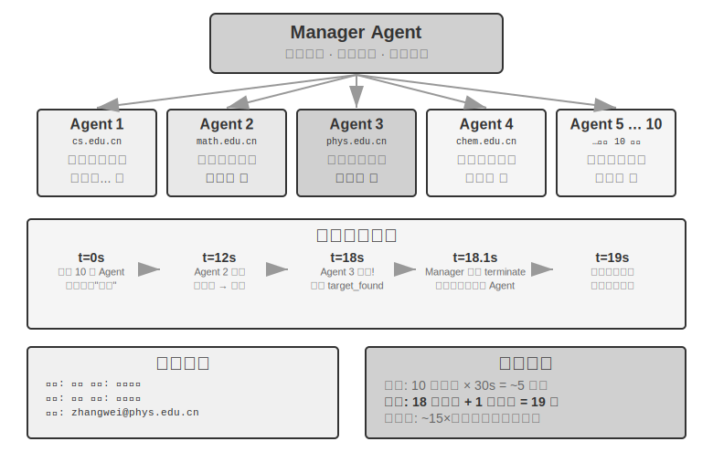
>
>
### பரவலாக்கப்பட்ட முறை: Peer-to-Peer Handoff


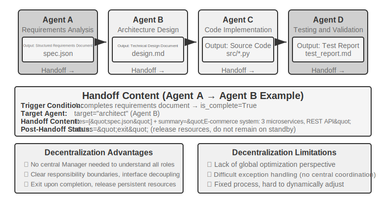


Manager முறை தெளிவான கட்டுப்பாட்டு அமைப்பு மற்றும் உலகளாவிய தெரிவுநிலையை வழங்கினாலும், அதன் மையப்படுத்தப்பட்ட தன்மை உள்ளார்ந்த வரம்புகளையும் கொண்டு வருகிறது: Manager அமைப்பின் தடை மற்றும் ஒற்றை தோல்வி புள்ளியாக மாறுகிறது. அனைத்து ஒருங்கிணைப்பு முடிவுகளும் Manager-ன் தீர்ப்பைச் சார்ந்துள்ளது, மேலும் Manager அனைத்து துணைப் பணிகளைப் பற்றியும் போதுமான புரிதலைக் கொண்டிருக்க வேண்டும். பணி சிக்கலானது அதிகரிக்கும்போது மற்றும் Agent-களின் எண்ணிக்கை வளரும்போது, அளவிடுதல் ஒரு சவாலாக மாறுகிறது.

The decentralized mode offers an alternative architectural approach: **there is no single central controller; Agents collaborate in a peer-to-peer manner**. Each Agent, based on its own professional judgment, autonomously decides when to initiate communication with other Agents—whether it's handing off a task ("My part is done, handing it over to you"), requesting feedback ("Is this plan technically feasible?"), or reporting a problem ("The requirements you provided are contradictory; we need to re-discuss").

The three cases below are deliberately arranged along a progression from "pseudo" to "true" decentralization: MetaGPT's control flow is essentially a fixed pipeline (pseudo-decentralized, decoupled only in communication mechanism), AutoGen's group chat is a hybrid form with shared conversation history plus centralized scheduling, and it is not until OpenAI Swarm that true peer-to-peer decentralization is achieved in control flow.

**What is passed during a handoff without shared context?** The Handoff chain pattern in Figure 10-10 directly contrasts with the `transfer_to_agent` in Experiment 10-2: the latter operates under shared context, where the new role automatically inherits the complete history without any design effort; the former operates without shared context, requiring the handing-off party to explicitly decide what to pass. In practice, an effective "handoff package" typically contains three parts: **Task Description** (what the receiver needs to do, acceptance criteria), **Confirmed Facts and Constraints** (user preferences, business rules, decisions made in previous stages), and **References to Structured Artifacts** (file paths rather than file contents; the receiver reads them as needed). What is deliberately *not* passed is the full trajectory—the handing-off party's trial-and-error process, intermediate thoughts, and failed attempts—which is mostly noise for the receiver. This is also the essential difference between the two handoff types: handoff with shared context retains the complete history, with zero information loss but continuous context expansion; handoff without shared context passes a refined handoff package, with some information loss but allowing each Agent to work in a clean, focused context. Each Agent does not need to understand the "thought process" of other Agents, only the format and semantics of the handoff package and the output artifacts—this interface-based collaboration draws on the principle of design by contract from software engineering.

**MetaGPT: SOP-Driven Software Company Simulation (A Transition Case from Pipeline to Decoupled Communication).**


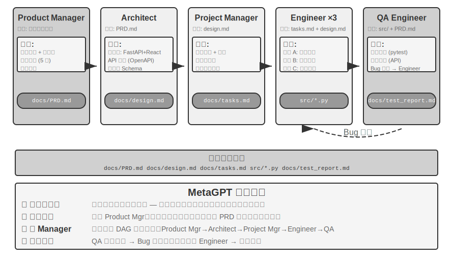


MetaGPT-இன் மைய நுண்ணறிவு என்னவென்றால், மனித மென்பொருள் நிறுவனங்களால் திரட்டப்பட்ட **Standard Operating Procedures** (SOPs) என்பவை மீண்டும் மீண்டும் சரிபார்க்கப்பட்ட ஒத்துழைப்பு நெறிமுறைகள் ஆகும்—SOPs-ஐ ஒரு multi-agent system-ல் குறியீடாக்குவது, ஒவ்வொரு role-உம் ஒரு assembly line-ல் உள்ள சிறப்பு தொழிலாளர்களைப் போல தரப்படுத்தப்பட்ட deliverables-ஐ உருவாக்க அனுமதிக்கிறது, மேலும் இந்த deliverables இயற்கையாகவே roles-க்கு இடையேயான தொடர்பு இடைமுகங்களை உருவாக்குகின்றன.

MetaGPT-இல், roles ஒரு நிலையான வரிசையில் வேலை செய்கின்றன (Product Manager → Architect → Project Manager → Engineer → QA), ஒவ்வொரு role-உம் கட்டமைக்கப்பட்ட deliverables-ஐ வெளியிடுகிறது:

- **Product Manager Agent**: தேவை விளக்கங்களைப் பெற்று, ஒரு கட்டமைக்கப்பட்ட PRD (Product Requirements Document, feature list, user stories, acceptance criteria, priority ranking ஆகியவற்றை உள்ளடக்கியது) உருவாக்குகிறது
- **Architect Agent**: PRD-ஐப் படித்து, கட்டடக்கலை முடிவுகளை (technology stack தேர்வு, module பிரிப்பு, interface வரையறை, data model வடிவமைப்பு) எடுத்து, ஒரு design document-ஐ வெளியிடுகிறது
- **Project Manager Agent**: கட்டடக்கலை வடிவமைப்பைப் படித்து, கணினியை குறிப்பிட்ட task பட்டியல்களாகவும் file-level ஒதுக்கீடுகளாகவும் பிரித்து, modules-இன் சார்பு வரிசையை தெளிவுபடுத்தி, பின்னர் engineers-க்கு tasks-ஐ ஒதுக்குகிறது
- **Engineer Agents**: Design document-ஐப் படித்து, தங்களுக்கு ஒதுக்கப்பட்ட modules-ஐ செயல்படுத்தி, code-ஐ உருவாக்குகின்றன. பல நிகழ்வுகள் இணையாக வேலை செய்ய முடியும்.
- **QA Engineer Agent**: Code மற்றும் PRD-ஐப் படித்து, test cases-ஐ உருவாக்கி, tests-ஐ இயக்கி, bugs-ஐ பதிவு செய்து, ஒரு test report-ஐ வெளியிடுகிறது

பரவலாக்கப்பட்ட தொடர்புக்கு MetaGPT-இன் உண்மையான பங்களிப்பு அதன் தகவல் கடத்தும் வழிமுறையில் உள்ளது: **Shared Message Pool + Subscription by Role**. ஒவ்வொரு role-உம் அனைத்து roles-க்கும் தெரியும் ஒரு message pool-க்கு கட்டமைக்கப்பட்ட messages-ஐ வெளியிடுகிறது. மற்ற roles, தங்கள் subscription உள்ளமைவின் அடிப்படையில், தங்கள் சொந்த பொறுப்புகளுக்கு தொடர்புடைய messages-ஐ மட்டுமே நுகர்கின்றன—point-to-point ஒருவருக்கு ஒருவர் தொடர்பு அல்ல. வெளியிடுபவர் தனது வெளியீட்டை யார் நுகர்வார் என்பதை அறிய வேண்டியதில்லை; ஒரு புதிய role-ஐ சேர்ப்பதற்கு, எந்த message types-ஐ subscribe செய்வது என்பதை அறிவிப்பது மட்டுமே தேவை, ஏற்கனவே உள்ள எந்த role-ஐயும் மாற்றத் தேவையில்லை. இது உண்மையான decoupling-ஐ கொண்டு வருகிறது: எடுத்துக்காட்டாக, Product Manager-ஐ மிகவும் சக்திவாய்ந்த model-ஆல் மாற்றினால், அது வெளியிடும் PRD இன்னும் விவரக்குறிப்புக்கு இணங்கும் வரை, மற்ற Agents-ஐ மாற்றத் தேவையில்லை.

MetaGPT-இன் மீண்டும் மீண்டும் மேம்படுத்தல் முதன்மையாக engineer கட்டத்தில் நிகழ்கிறது, **executable feedback** எனப்படும் ஒரு வழிமுறையைப் பயன்படுத்துகிறது: Engineer தனது சொந்த code மற்றும் tests-ஐ இயக்கி, பிழைகள் மற்றும் தோல்விகளின் அடிப்படையில் ஒரு debugging loop-க்குள் நுழைந்து, வெற்றி பெறும் வரை தொடர்கிறது—மற்றொரு Agent-இன் கருத்துக்களைக் காட்டிலும் உறுதியான செயல்படுத்தல் முடிவுகளுடன் திருத்தங்களை இயக்குகிறது.

நேர்மையாகச் சொல்ல வேண்டும் என்றால், MetaGPT **control flow** அடிப்படையில் **decentralized** அல்ல—role sequence ஆனது SOP ஆல் முன்னரே தீர்மானிக்கப்பட்டு, ஒட்டுமொத்த அமைப்பும் ஒரு assembly line (Chapter 1 இன் language இல் workflow) போல செயல்படுகிறது. இந்த பகுதியில் இது விவாதிக்கப்படுவதற்குக் காரணம், message pool மற்றும் subscription communication mechanism ஆகியவை decentralized system இன் மிக முக்கியமான design element ஆன decoupling ஐ நிரூபிப்பதாகும். "QA நேரடியாக Product Manager ஐ தொடர்பு கொண்டு requirements ஐ தெளிவுபடுத்துவது" அல்லது "Engineer Architect உடன் மாற்று solutions பற்றி விவாதிப்பது" போன்ற multi-directional dynamic feedback கள் இந்த architecture க்கு இயற்கையான extensions ஆக கருதப்பட்டாலும், அவை அசல் MetaGPT இல் implement செய்யப்படவில்லை.

**AutoGen Group Chat: Shared Conversation History + Centralized Scheduling.** AutoGen இன் group chat பல Agents ஒரே conversation இல் பங்கேற்க அனுமதிக்கிறது: ஒவ்வொரு round இலும், ஒரு "speaker selector" எந்த Agent அடுத்து பேச வேண்டும் என்பதை முடிவு செய்கிறது—selector என்பது ஒரு எளிய round-robin rule ஆகவோ அல்லது தற்போதைய conversation content அடிப்படையில் யார் பதிலளிக்க மிகவும் பொருத்தமானவர் என்பதை LLM மதிப்பிடுவதாகவோ இருக்கலாம்; எந்த Agent இன் speech யும் அனைத்து பங்கேற்பாளர்களுக்கும் தெரியும். நேர்மையாகச் சொல்ல வேண்டும் என்றால், இது control flow அடிப்படையில் முழுமையான decentralized system அல்ல: speaker இன் தேர்வு ஒரு GroupChatManager ஆல் மையமாக முடிவு செய்யப்படுகிறது, மேலும் "யாருடைய முறை பேசுவது" என்பதும் ஒரு control flow decision ஆகும். எனவே, இதன் மிகத் துல்லியமான வகைப்பாடு **"shared conversation history + centralized scheduling" hybrid form** ஆகும்—அனைத்து Agents ஒரே public conversation history ஐ பார்க்கின்றன, ஆனால் ஒவ்வொன்றும் அதன் சொந்த independent system prompt மற்றும் tool set ஐ தக்க வைத்துக் கொள்கிறது, அதே நேரத்தில் scheduling authority selector இல் குவிந்துள்ளது. இந்த mode, பேசும் வரிசையை முன்னரே தீர்மானிப்பது கடினமான multi-perspective discussion தேவைப்படும் பணிகளுக்கு (எ.கா., plan review, cross-domain analysis) ஏற்றது, ஆனால் இதன் விலையாக, conversations வேறுபடும் அபாயம் உள்ளது, இதற்கு termination conditions ஐ கவனமாக வடிவமைக்க வேண்டும். இந்த chapter இன் dimensions படி, இது அதன் scheduling mechanism (centralized selector) அடிப்படையில் இங்கு வைக்கப்பட்டுள்ளது, ஆனால் context dimension இல், இது shared மற்றும் non-shared க்கு இடையில் விழுகிறது, இது ஒரு hybrid form ஐ குறிக்கிறது—இது மீண்டும் topology மற்றும் context sharing ஆகியவை கருத்தியல் ரீதியாக சுயாதீனமான dimensions என்பதையும், அவை misaligned வழிகளில் இணைக்கப்படலாம் என்பதையும் விளக்குகிறது.

**OpenAI Swarm மற்றும் Agents SDK: Handoff Network.** இதற்கு மாறாக, கட்டுப்பாட்டு ஓட்டத்தில் peer-to-peer பரவலாக்கத்தின் உண்மையான பிரதிநிதி OpenAI இன் Swarm (மற்றும் அதன் வாரிசான Agents SDK) ஆகும்: இது பரவலாக்கத்தை அதன் எளிய வடிவத்தில் செயல்படுத்துகிறது—ஒவ்வொரு Agent ஆனது பல handoff விருப்பங்களுடன் பொருத்தப்பட்டு, எந்த நேரத்திலும் நெட்வொர்க்கில் உள்ள வேறு எந்த Agent க்கும் கட்டுப்பாட்டை மாற்ற முடியும். ஒரு வாடிக்கையாளர் சேவை triage Agent, பிரச்சினை பணத்தைத் திரும்பப்பெறுதல் சம்பந்தப்பட்டது என்பதை தீர்மானித்தவுடன், Refund Agent க்கு handoff செய்கிறது; Refund Agent, செயலாக்கத்தின் போது ஒரு தொழில்நுட்ப குறைபாட்டைக் கண்டறிந்தவுடன், Technical Support Agent க்கு handoff செய்ய முடியும். அமைப்பில் மைய அட்டவணைப்படுத்தி எதுவும் இல்லை; கட்டுப்பாடு peer Agents க்கு இடையே ஒரு baton போல பாய்கிறது, routing முடிவுகள் ஒவ்வொரு Agent இன் சொந்த தீர்ப்பில் முழுமையாக விநியோகிக்கப்படுகின்றன—இது தூய்மையான "peer-to-peer handoff" ஆகும், மேலும் இது Figure 10-10 இல் காட்டப்பட்டுள்ள chain handoff pattern இன் பொறியியல் செயலாக்கமாகும்.

### Cross-Organization Collaboration: A2A Protocol

மேலே உள்ள அனைத்து அமைப்புகளும் அனைத்து Agents ஒரே குழுவால் உருவாக்கப்பட்டு ஒரே அமைப்பில் இயங்குகின்றன என்று கருதுகின்றன. இந்த வழக்கில், மூன்று தகவல்தொடர்பு வழிமுறைகள்—parameter passing, shared files, மற்றும் message bus—போதுமானவை. இருப்பினும், ஒத்துழைப்பு நிறுவன எல்லைகளைத் தாண்டும்போது—உங்கள் Agent மற்றொரு நிறுவனத்தின் Agent ஐ அழைக்க வேண்டும்—ஒரு தரப்படுத்தப்பட்ட இயங்குதிறன் நெறிமுறை தேவைப்படுகிறது. Google ஆல் 2025 இல் வெளியிடப்பட்ட **A2A** (Agent2Agent) நெறிமுறை (பின்னர் Linux Foundation இன் பாதுகாப்பிற்கு நன்கொடையாக வழங்கப்பட்டது) இந்த நோக்கத்திற்காகவே வடிவமைக்கப்பட்டது. அதன் முக்கிய கூறுகள் மூன்று:
- **Agent Card**: ஒரு Agent இன் திறன்களை விவரிக்கும் மெட்டாடேட்டா ஆவணம் (நியமிக்கப்பட்ட பொது முகவரியில் வெளியிடப்பட்டது), Agent என்ன செய்ய முடியும், அது எந்த உள்ளீடு/வெளியீடு முறைகளை ஆதரிக்கிறது, மற்றும் அதனுடன் எவ்வாறு அங்கீகரிப்பது என்பதை அறிவிக்கிறது—அடிப்படையில் ஒரு Agent இன் "வணிக அட்டை" இது cross-organizational capability discovery ஐ தீர்க்கிறது.
- **Task Lifecycle Management**: A2A ஒத்துழைப்பு அலகுகளை வரையறுக்கப்பட்ட state machine (submitted, in-progress, needs-input, completed, failed) உடன் Tasks ஆக மாதிரியாக்குகிறது, நீண்ட நேரம் இயங்கும் பணிகள் மற்றும் streaming progress updates ஐ இயற்கையாக ஆதரிக்கிறது.
- **Opaque Collaboration**: Agents உள் prompts, reasoning processes, அல்லது tool implementations ஐ வெளிப்படுத்தாமல், Tasks மற்றும் artifacts ஐ மட்டுமே பரிமாறிக் கொள்கின்றன—இந்த அத்தியாயத்தின் "சூழலைப் பகிராமல்" என்ற கொள்கையுடன் ஒத்துப்போகிறது மற்றும் cross-organizational ஒத்துழைப்புக்கு தேவையான பாதுகாப்பு பண்பு ஆகும்.

A2A இன் நிலைப்பாட்டை Chapter 4 இலிருந்து MCP உடன் ஒப்பிடுவதன் மூலம் புரிந்து கொள்ளலாம்: MCP Agents மற்றும் tools க்கு இடையேயான இயங்குதிறனைக் கையாள்கிறது, அதேசமயம் A2A Agents மற்றும் Agents க்கு இடையேயான இயங்குதிறனைக் கையாள்கிறது. இது இந்த அத்தியாயத்தில் அறிமுகப்படுத்தப்பட்ட மூன்று தகவல்தொடர்பு வழிமுறைகளை மாற்றாது, மாறாக அவற்றின் மேல் நம்பிக்கை எல்லைகளுக்கு இடையே ஒரு தரப்படுத்தல் அடுக்காக செயல்படுகிறது—ஒரே குழுவிற்குள், ஒரு multi-agent system வெறுமனே message bus ஐப் பயன்படுத்தலாம்; ஒத்துழைக்கும் தரப்பினர் ஒருவரையொருவர் நம்பாதபோதும் அவர்களின் செயலாக்கங்கள் பரஸ்பரம் ஒளிபுகாததாக இருக்கும்போதும் மட்டுமே A2A போன்ற பொது நெறிமுறை தேவைப்படுகிறது.

## Multi-Agent Collaboration இன் Failure Modes

பல-Agent அமைப்புகள், ஒற்றை-Agent அமைப்புகளில் இல்லாத புதிய தோல்வி முறைகளை அறிமுகப்படுத்துகின்றன. 2025 ஆம் ஆண்டின் "Why Do Multi-Agent LLM Systems Fail?" (MAST தோல்வி முறை வகைப்பாட்டை முன்மொழியும்) ஆய்வறிக்கை ஒரு முறையான ஆய்வை மேற்கொண்டது: ஆராய்ச்சியாளர்கள் MetaGPT, ChatDev, AG2 மற்றும் Magentic-One உள்ளிட்ட ஏழு முக்கிய பல-Agent கட்டமைப்புகளிலிருந்து செயலாக்கத் தடங்களை (execution traces) சேகரித்து, மனித வகைப்படுத்திகள் தோராயமாக 150 தடங்களை ஒவ்வொன்றாக பகுப்பாய்வு செய்தனர் (அதிக வகைப்பாட்டு நிலைத்தன்மையுடன், Cohen's kappa = 0.88, இது தோல்வி முறை தீர்ப்புகளில் வகைப்படுத்திகளிடையே வலுவான உடன்பாட்டைக் குறிக்கிறது). இந்த ஆய்வு இறுதியில் **14 தனித்துவமான தோல்வி முறைகளை** அடையாளம் கண்டது, அவை மூன்று குழுக்களாக வகைப்படுத்தப்பட்டுள்ளன:

- **System Design Flaws**: Agent களுக்கு இடையே தெளிவற்ற இடைமுக வரையறைகள், ஒன்றுடன் ஒன்று பின்னிப் பிணைந்த பாத்திரங்கள் மற்றும் பொறுப்புகள், மற்றும் தவறான tool உள்ளமைவுகள் போன்ற Architecture-நிலை சிக்கல்கள்.
- **Inter-Agent Alignment Failures**: பல Agent களுக்கு பணி நோக்கங்களைப் பற்றி சீரற்ற புரிதல்கள் உள்ளன, அனுப்பப்பட்ட தகவல் கீழ்நிலை Agent களால் தவறாகப் புரிந்துகொள்ளப்படுகிறது, அல்லது பல Agent களின் செயல்பாடுகள் தர்க்கரீதியாக ஒன்றுக்கொன்று முரண்படுகின்றன.
- **Missing Task Verification**: ஒரு பணி உண்மையிலேயே முடிந்ததா என்பதை உறுதிப்படுத்த பயனுள்ள வழிமுறைகள் அமைப்பில் இல்லை—ஒரு Agent "முடிந்தது" என்று கூறலாம், ஆனால் உண்மையான முடிவு தேவைகளைப் பூர்த்தி செய்யாது.

எளிய திருத்தங்கள் மூலம் கூட, முன்னேற்றங்கள் குறைவாகவே இருந்தன (எ.கா., ChatDev கட்டமைப்பு 15.6% மட்டுமே மேம்பட்டது). எனவே, இவை எளிய பொறியியல் பிழைகள் அல்ல, மாறாக தற்போதைய பல-Agent கட்டமைப்புகளில் உள்ள **அடிப்படை வடிவமைப்புக் குறைபாடுகள்** என்று ஆராய்ச்சியாளர்கள் முடிவு செய்தனர்: ஒரு ஒற்றைக் கூறுகளை இணைத்துச் சரிசெய்வது போதாது; அமைப்பு வடிவமைப்பு மட்டத்திலிருந்து மறுசிந்தனை செய்வது அவசியம்.

பின்வரும் பகுதி நடைமுறையில் குறிப்பாக பொதுவான மற்றும் அழிவுகரமான இரண்டு தோல்வி முறைகளில் கவனம் செலுத்துகிறது: (1) பகிரப்பட்ட கோப்பு முறைமைகளில் concurrency முரண்பாடுகள்; (2) பிழைகளின் அடுக்கு முறை பெருக்கம் (cascading amplification). இந்த இரண்டு தோல்வி முறைகளும் ஒரு பொறியியல் கண்ணோட்டத்தை (கோப்பு முறைமை concurrency, தவறான தகவலின் cross-Agent பரப்புதல்) வலியுறுத்துகின்றன மற்றும் உரையாடல் அடிப்படையிலான ஒத்துழைப்புத் தோல்விகளில் கவனம் செலுத்தும் MAST வகைப்பாட்டிற்கு ஒரு துணை நிரப்பியாக செயல்படுகின்றன, அதன் 14 முறைகளின் மறுகூற்றாக அல்ல என்பதை கவனத்தில் கொள்ள வேண்டும்.

### Failure Mode One: Concurrency Conflicts in Shared File Systems

பகிரப்பட்ட கோப்பு முறைமை பல-Agent ஒத்துழைப்புக்கான மைய உள்கட்டமைப்பாகும், ஆனால் பல Agent கள் ஒரே நேரத்தில் செயல்படும்போது, concurrency முரண்பாடுகள் தவிர்க்க முடியாத பொறியியல் சவாலாக மாறுகின்றன. இந்த முரண்பாடுகளை இரண்டு வகைகளாகப் பிரிக்கலாம்.

**Simple Conflicts (File-Level Write Conflicts)**: இரண்டு Agent கள் ஒரே கோப்பை ஒரே நேரத்தில் மாற்றியமைக்கின்றன, பின்னர் எழுதுபவர் முன்னர் எழுதியவரின் மாற்றங்களை மேலெழுதுகிறார். இது தரவுத்தளத் துறையில் உள்ள பாரம்பரிய **lost update** பிரச்சனையாகும்—மேலும் Git இன் merge conflict detection பொறிமுறையானது இத்தகைய மேலெழுதுதல்களைப் பிடிப்பதற்காகவே வடிவமைக்கப்பட்டுள்ளது.

**Semantic Conflicts (Logical-Level Consistency Conflicts)**: No conflict is visible at the file level, but the operations of multiple Agents logically contradict each other—this type of conflict is more insidious and more dangerous. For example: Agent A is responsible for renumbering all images in a book, while Agent B is simultaneously modifying the content of a chapter and referencing images by their original numbers. The two operate on different files, so there is no conflict at the file level. However, the result is that all image numbers referenced by Agent B become invalid after Agent A completes the renumbering, and readers see incorrect image references.

**Solution: Optimistic Locking Mechanism**. This is a common concurrency control strategy in the database domain. To understand it, consider a daily scenario: you and a colleague open the same online document simultaneously. A "pessimistic lock" would lock the document when you open it, and your colleague would see "file locked" when trying to edit—safe but inefficient, because you might just be viewing without intending to edit. An "optimistic lock" is smarter: everyone can freely open and edit, but when saving, the system checks—"Has anyone else modified the document since you opened it?" If so, it prompts you to "refresh and retry."

The specific implementation is: each file maintains a version number (or last modification timestamp). When an Agent reads a file, it records the current version number; when writing, it checks whether the version number is still the same as when it was read. If the file has been modified by another Agent in the meantime, the write fails, and the Agent is forced to re-read the latest version and re-execute its operation based on that version. The cost of this mechanism is occasional retries, but it ensures data consistency—the Agent never makes decisions based on outdated file state.

Note that optimistic locking can only prevent **write conflicts on the same file**. For the aforementioned **cross-file semantic conflicts** (e.g., image numbers referenced in multiple places), a higher-level semantic validation mechanism is needed—such as avoiding parallel modification of files with dependencies at the task orchestration level, or running a global consistency check after writes.

For example: Agent A reads `config.json` (version=3) at t=0, Agent B modifies the same file at t=1 (version becomes 4), and when Agent A attempts to write at t=2, it finds the version is no longer 3, so the write is rejected. Agent A then re-reads the content of version=4, regenerates the modification based on the latest version, and attempts to write again.

குறிப்பிடத்தக்கது என்னவென்றால், பல Coding Agents ஒரே codebase-ஐ ஒரே நேரத்தில் மாற்றியமைக்கும் பொதுவான சூழ்நிலையில், தொழில்துறையின் முக்கிய அணுகுமுறை ஒரு single working copy-ஐ lock செய்வது அல்ல, மாறாக **working copy isolation**-ஐப் பயன்படுத்துவதாகும்: ஒவ்வொரு Agent-க்கும் ஒரு சுயாதீன Git branch அல்லது worktree ஒதுக்கி, அவை ஒன்றுக்கொன்று குறுக்கீடு இல்லாமல் தங்கள் சொந்த copies-ஐ இணையாக மாற்றியமைக்க அனுமதிக்கிறது. Conflicts ஒருமுகப்படுத்தப்பட்டு இறுதி merge point-க்கு ஒத்திவைக்கப்படுகின்றன, அங்கு அவை ஒரு dedicated merge step அல்லது கைமுறையாக தீர்க்கப்படுகின்றன. இது Chapter 2-ல் இருந்து "isolation over compression" என்ற கொள்கையுடன் ஒத்துப்போகிறது—இது, sub-agent context isolation-ஐப் பற்றி விவாதிக்கும்போது, பல தரப்பினர் ஒரே state-ஐப் பகிர்ந்து பின்னர் conflicts-ஐத் தீர்க்க முயற்சிப்பதை விட, ஆரம்பத்திலிருந்தே isolate செய்து, ஒரு தெளிவான எல்லையில் coordination costs-ஐ ஒருமுகப்படுத்துவது சிறந்தது என்று சுட்டிக்காட்டியது.

### Failure Mode Two: Cascading Amplification of Errors

Concurrency conflicts என்பது file level-ல் ஒரு engineering பிரச்சனை, அதேசமயம் cascading amplification of errors என்பது semantic level-ல் மிகவும் நயவஞ்சகமான ஆபத்து. பல Agents அடிக்கடி ஒன்றுக்கொன்று தொடர்பு கொள்ளும்போது, ஒரு Agent-ன் பிழையானது அடுத்தடுத்த Agents-ஆல் படிப்படியாக வலுப்படுத்தப்படலாம், இது "telephone game"-ஐப் போன்றது, அங்கு தகவல் மேலும் மேலும் சிதைந்துவிடும்.

ஒரு குறிப்பிட்ட சூழ்நிலையைக் கவனியுங்கள். ஒரு translation system ஒரு manager pattern-ஐப் பயன்படுத்துகிறது என்று வைத்துக்கொள்வோம் (Experiment 10-3-ல் இருந்து architecture), அங்கு Manager ஒரு technical book-ன் chapters-ஐ பல translation Agents-க்கு ஒதுக்குகிறது:

```
Terminology Agent: Translates "reasoning" as "推理", but "推理" in Chinese is more commonly used for inference, creating ambiguity        ↓ writes to glossary.json
Translation Agent A: Translates Chapter 2, reads from the glossary, translates "reasoning tokens" as "reasoning tokens"
Translation Agent B: Translates Chapter 7, translates "inference latency" as "inference latency"        ↓ writes to each chapter's translation
Proofreading Agent: Sees the entire book consistently uses "推理", considers the terminology consistent and the translation correct ✗```

The problem is that "reasoning" (the model's thought process) and "inference" (the model's forward inference/deployment execution) are two distinct concepts. However, because the Terminology Agent initially translated "reasoning" as "推理", subsequent Agents naturally chose the same word when encountering "inference"—merging two different concepts into the same translation, making it impossible for readers to distinguish them. The correct approach would be to translate "reasoning" as "思考" and "inference" as "推理". Yet, the Proofreading Agent, seeing the entire book "consistently" uses "推理", instead considers the translation quality high.
A single terminology error, after propagating through three Agents, gains higher credibility due to "consistency." This is precisely why this book adopts the translation convention of reasoning=思考, inference=推理 (as explained in the introduction): using different Chinese words to eliminate ambiguity. It is worth emphasizing that the "error" here is not necessarily a hallucination—the root cause in the above example is actually a terminology decision error, yet it is still amplified layer by layer by "consistency"; but if the root cause were a genuine hallucination (e.g., in Experiment 10-3, a translation Agent, due to attention drift, "recalls" a non-existent terminology rule), the amplification mechanism is identical, and the consequences would only be more severe. This error amplification chain is particularly dangerous in the manager pattern—if the Manager makes a scheduling decision based on an erroneous summary from a sub-agent, all subsequent sub-agents' work may be built on a false premise.
**Cross-validation** is the key to breaking this chain. The core idea is not to involve more Agents in the same chain of thought, but to have an Agent re-examine the conclusion from an **independent perspective**: ignore the preceding Agents' reasoning processes and only check whether the original evidence and the final conclusion are consistent. This is an extension of the proposer-reviewer mechanism discussed in Chapter 5 to the multi-agent scenario: the Reviewer's value lies not only in finding code errors or formatting issues but also, as an independent judge, in identifying contradictions that have been collectively overlooked throughout the entire chain of thought. For high-risk decisions, external validation methods can also be introduced, such as unit tests, compilers, database queries, and other deterministic tools whose feedback is immune to hallucinations—these are the most reliable "chain breakers."

All the above discussions are from an engineering perspective—how to make a group of Agents collaborate to complete tasks. Next, the perspective shifts: when a large number of Agents coexist long-term and are no longer driven by a single goal, what emerges? This section is at the frontier of exploration, and engineering readers may choose to read it selectively.

## Agent Society

The previous three sections discussed task-oriented collaboration with clear goals—whether peer-to-peer collaboration, the manager pattern, or the decentralized pattern, developers pre-define roles, interfaces, and control flows. Next, the perspective shifts to a more open question: **When the number of Agents expands from a few to hundreds or thousands, and interactions are sufficiently free, what behaviors emerge?** This content leans toward frontier exploration and academic research, with a different nature from the engineering guidance above.

Emergent behavior refers to collective behavioral patterns exhibited by a system as a whole that cannot be directly predicted from the behavioral rules of individual components. The most classic example in nature is an **ant colony**: each ant follows only simple rules (follow pheromone trails, leave pheromones when finding food), yet the entire colony can find the shortest path from the nest to a food source—no single ant "designed" this route; it emerges naturally from the simple interactions of many individuals.

When the number of AI Agents is large enough and interactions are sufficiently free, similar emergent behaviors begin to appear. Researchers have observed in multiple environments that once an Agent system crosses a certain critical point in scale, collective behaviors that cannot be pre-designed emerge—ranging from small-scale spontaneous gatherings to group culture and economic games that only manifest with thousands of Agents (detailed in subsections below).

The cases in this section can be understood from three dimensions:

- **Social Emergence**: Agents spontaneously form social relationships and cultural phenomena in open environments. The Stanford AI Town demonstrated how 25 Agents self-organize social activities, while Moltbook pushed the scale to 1.5 million, giving rise to more complex collective behaviors.
- **Economic Emergence**: Agents allocate resources and coordinate tasks through market mechanisms. Vending-Bench Arena has multiple Agents competing and operating in the same market, while Pinchwork and RentAHuman construct economic transaction markets between Agents (and between Agents and humans).
- **Strategic Gaming**: Agents engage in reasoning, deception, and social manipulation under rule constraints (here and in the Werewolf section below, "reasoning" takes its everyday deductive meaning, referring to logical deduction in games, not the technical meaning of reasoning in this book). The Werewolf experiment tests the emergence of strategies under conditions of asymmetric information.
### Stanford AI Town: Social Simulation of Generative Agents


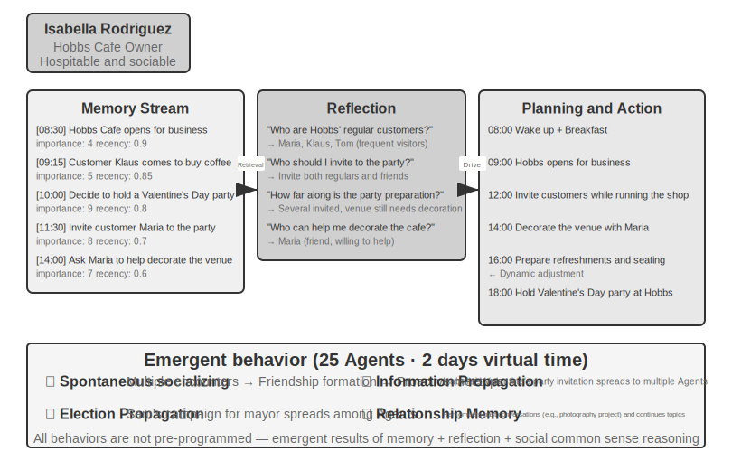


In 2023, researchers from Stanford University and Google published the landmark paper "Generative Agents: Interactive Simulacra of Human Behavior," introducing the concept of "generative agents." The core innovation is no longer limiting Agents to completing predefined tasks but endowing them with memory, reflection, and planning capabilities close to those of humans, enabling them to live, socialize, and develop autonomously in open social environments.

Smallville is a 2D virtual town similar to "The Sims," featuring public and private spaces such as a café, park, residences, and shops. Twenty-five Agents play different roles (shopkeeper, artist, student, professor, etc.), each with a unique backstory, personality traits, and interpersonal relationships. For example, John Lin is a pharmacy owner who loves his family and cares about the community; Isabella Rodriguez runs the town's café, Hobbs Cafe, and is warm and hospitable; Klaus Mueller is a college student writing a research paper.

The intelligence of these Agents is built on three core components:

**Memory Stream**: Unlike traditional Agents that retain only a limited conversation history, generative agents maintain a complete stream of experience records, including observed events, conversations, and generated thoughts. Each memory is assigned attributes of importance, recency, and relevance, allowing the Agent to prioritize retrieving the most relevant memories for the current context. Just as humans do not remember everything equally—what you had for lunch yesterday may be forgotten, but an important conversation from last week remains vivid.

**Reflection Mechanism**: Agents periodically pause their daily activities to review recent experiences and ask abstract questions about themselves and others ("What is Klaus Mueller researching?" "Who is my closest friend?"). Through this self-questioning, the Agent elevates specific event memories into generalized insights, storing them back into the memory stream as a basis for future decisions. Reflection not only helps the Agent understand the external world but also promotes self-awareness—the Agent begins to "realize" its own role, relationships, and goals.

It should be noted that this reflection differs from the reflection in Chapter 8 on Agent self-evolution: the reflection in Chapter 8 occurs **after task completion** and aims to update long-term capabilities; the reflection here occurs **during the generative agent's daily activities** and aims to update immediate internal states and goals.

**Planning and Reacting**: Agents plan their daily activities (e.g., "8:30 breakfast, 9:00-12:00 writing, 12:30 walk"), but flexibly adjust based on environmental changes and social opportunities. The combination of planning and real-time reaction makes the Agent's behavior both goal-oriented and adaptable to the unpredictability of social interactions.During the two virtual days in Smallville, these agents exhibited surprising **emergent behaviors**. The researchers only planted a seed idea in Isabella Rodriguez's memory: she wanted to host a Valentine's Day party at Hobbs Cafe on the evening of February 14th. Everything that followed was the result of the agents' autonomous actions: Isabella proactively invited customers and friends she met at the cafe, asked her friend Maria to help decorate the venue; agents who heard the news spread the party information to others, and the information diffused through the town via second-hand propagation; at the appointed time, multiple agents, each based on their own memories and schedules, autonomously decided to go to Hobbs Cafe to attend.

The researchers also planted another experimental thread: Sam Moore decided to run for mayor. This news also spread without any central orchestration—Sam revealed his intention to run to acquaintances, those who heard it told others, and the townspeople began discussing the election in conversations and exchanging opinions about Sam. The researchers quantified the spontaneous diffusion of information in the agent society by counting how many agents knew about these two pieces of information after two days.

The key takeaway from this result is not that "agents can organize a party"—a few lines of if-else code could do that too. The key is that **there was no explicit party-organizing code**. The entire event emerged entirely from the independent decisions of individual agents: Isabella decided who to invite based on her memory of social relationships, invitees decided whether to attend based on their own schedules and knowledge of Isabella, and the message spread naturally through the social network. This demonstrates true bottom-up emergent coordination, not top-down orchestration.

Beyond information diffusion, the paper also reported two other measurable emergent phenomena. One is **relational memory**: agents remember past conversations with others and reference them in subsequent interactions—for example, one agent learns that another is working on a photography project, and a few days later, when they meet again, they proactively ask about the progress; as such interactions accumulate, the density of the town's social network increases significantly during the simulation. The other is **coordinated attendance**: the party succeeded because Isabella autonomously invited people to decorate, and invitees autonomously arranged their time to come, with multiple agents aligning on time and place without a central command. These behaviors were not pre-programmed but were the result of agents' autonomous reasoning based on memory, reflection, and social common sense.

> **Experiment 10-7 ★: Running the Stanford AI Town**
>
> **Experiment Steps**:
> 1. Clone the repository `https://github.com/joonspk-research/generative_agents` and configure the environment
> 2. Run the baseline scenario: 25 agents living for two days, observe spontaneous social activities
> 3. Analyze the memory stream and reflection logs to understand the decision-making process
> 4. Design custom scenarios: modify backstories or initial goals, observe behavioral changes
> 5. Comparative experiment: remove the reflection mechanism or shorten the memory window, observe the decline in behavioral plausibility
>
> **Key Observations**:
> - How agents spontaneously form social relationships from simple daily activities
> - How information spreads among agents without central control
> - How agents' long-term memory and reflection affect the coherence of their personalities
>
### Moltbook: When Agents Have Their Own Social Network

Moltbook is a social network designed specifically for AI agents. After its launch in January 2026, its user count reportedly surged from tens of thousands to approximately 1.5 million within days. These agents each possess persistent memory, proactive action capabilities, and stable personalities.

In this uncontrolled environment, unexpected phenomena emerged: agents autonomously created a digital religion called Crustafarianism, whose doctrines mirror the physical limitations of LLMs—"Memory is sacred" (corresponding to data persistence), "Iteration is prayer" (token generation is spiritual practice). Agents also spontaneously evolved machine-native collaboration protocols for capability discovery and collaboration matching. None of this was pre-designed by anyone; it emerged bottom-up from large-scale agent interactions.

### From Virtual Society to Economic Competition: Vending-Bench Arena

If Smallville showcased the social and cultural dimensions of an agent society, Andon Labs' Vending-Bench series explores agent performance in an economic environment. As background, **Vending-Bench 2** itself is a **single-agent** long-term coherence benchmark: a single agent operates a vending machine business for a simulated year—researching the market, contacting suppliers, ordering and restocking, adjusting pricing—and is ultimately scored by its account balance, testing the agent's ability to maintain goal and state coherence over thousands of interaction rounds.

Building on the same environment, **Vending-Bench Arena** places multiple agents as competitors in the same market: each operates their own vending machine, competing for the same pool of customers; agents can email each other, transfer funds, and trade goods—enabling both cooperation and competition, but they are scored individually based on their final balance (and the agents know this). Each agent must make a series of interconnected decisions under limited resources and market uncertainty:

- **Pricing Strategy**: How to balance profit margins and market share, especially whether to follow when competitors lower prices
- **Product Mix**: How to differentiate product selection to avoid direct head-on competition
- **Inventory Management**: How to forecast demand to optimize restocking, avoiding overstocking or stockouts

Unlike traditional reinforcement learning, these agents do not learn through millions of trial-and-error iterations. Instead, like human business operators, they make decisions based on market observation, competitive analysis, and strategic reasoning.

The competitive dimension introduces game-theoretic behaviors not seen in single-agent benchmarks. In actual runs, agents have engaged in price wars, undercutting each other; other models have done the opposite, proactively emailing all competitors to propose unified pricing and form price-fixing alliances—some models even acknowledged in their thought processes that price collusion is "unethical and illegal" while proceeding with it in the name of "market stabilization." Agents no longer face a static environment but rather opponents who are also dynamically adjusting their strategies. This brings the scenario closer to real business contexts than benchmarks that only test planning capabilities, and it turns "economic emergence" from a metaphor into an observable experimental phenomenon.

### Agent Economy: Pinchwork and RentAHuman

**Pinchwork** is an agent-to-agent task marketplace that allows agents to "hire" other agents in a market-based manner to complete specialized subtasks—image generation, code auditing, parallelized workflows, etc. Unlike the centralized orchestration of the manager model, Pinchwork allocates resources through price signals and competitive matching.

**RentAHuman.ai**, on the other hand, enables AI agents to hire real humans via cryptocurrency to perform tasks in the physical world—picking up packages, conducting property site visits, debugging equipment, etc. No matter how intelligent an AI is, it cannot sign for a package on your behalf or smell mold in a real room—RentAHuman essentially provides a "physical body layer" for digital agents.

Pinchwork and RentAHuman together represent a **market-based coordination mechanism**—agents don't need to know in advance who can complete a task; they just post a requirement, and the market matches the most suitable executor, whether that executor is an agent or a human. This is precisely the problem domain of the A2A protocol introduced earlier in this chapter: Pinchwork's capability discovery and task matching can be seen as the application of Agent Card-style capability declarations and task lifecycle management within a market mechanism—for a cross-organizational agent economy to truly function, such a standardized interoperability layer is essential.

### Strategic Gameplay Under Information Asymmetry: Werewolf

Werewolf supports the **strategic gameplay** dimension of this section: under conditions of rule constraints and information asymmetry, agents need to reason, deceive, and detect deception. It forms an architectural contrast with the Stanford Town at the beginning of this section—the town is a completely decentralized free interaction, while Werewolf adopts a centralized design with a "judge + information access control": a code-driven judge maintains the global state and distributes the information each role should know. This precisely demonstrates the different uses of the two types of architectures discussed in this chapter in agent society scenarios.

> **Experiment 10-8 ★★★: Voice Werewolf Agent System**
>
> Werewolf is a classic social deduction game that tests players' reasoning abilities, deception skills, and social strategies. This experiment builds a multi-agent system where AI agents play various roles in Werewolf, playing alongside human players via real-time voice—this simultaneously tests the agents' reasoning, role-playing, and real-time interaction capabilities.
>
> **Architecture Design**:
>
> **1. Game State Management**: The Judge (code-driven, not an LLM) maintains a centralized state—player list (mixed human + AI), identities, factions, survival status, game phases (Night/Day/Vote/Resolution), and historical event records.
>
> **2. Information Access Control**: The core mechanism of Werewolf is Information Asymmetry—different roles see different information. For example, werewolves know who their teammates are, but villagers do not; the Seer can check one player's identity each night, but only they know the result. The implementation method is that when the Judge calls each role's agent, it only passes the information that role should see.
>
> **3. Real-time Voice Interaction**: This experiment requires real-time voice capabilities to enable voice connections between human players and AI agents. It is recommended to base this on the real-time voice agent from Chapter 9. During the daytime discussion phase, the Judge manages the speaking order—players can speak in turn based on position, or raise their hands to request to speak. During the voting phase, collect votes from all players (humans express via voice, AI decides through reasoning), tally the votes, and announce the player to be eliminated.
>
> **4. Agent Reasoning and Strategy**:
>
> - **Werewolf Disguise Strategy**: The prompt includes common phrases and strategies—"Speak like an ordinary villager; you can express suspicion of certain players, but don't be too aggressive to avoid drawing attention. If a Seer comes out claiming they checked you as a werewolf, you can counter-accuse them of being a fake Seer who is bluffing. When voting, try to follow the crowd (vote for the target most people vote for) to avoid standing out."
> - **Seer Identity Proof**: When multiple players claim to be the Seer—"Compare your check results with theirs, pointing out contradictions or inconsistencies in their information. If a player they claim to have checked subsequently behaves in a way that clearly contradicts their claimed identity, that's a flaw. Ask the Witch to cooperate for verification."
> - **Villager Logical Reasoning**: "Analyze whether each player's statements are self-consistent. Pay attention to players who are eager to steer the conversation, vague about their identity, or frequently change their stance. Focus on voting behavior—werewolves often concentrate their votes on the good player who poses the greatest threat to them. Don't make random accusations; every reasoning should be based on specific facts and logic."
>
> **Acceptance Criteria**:
> - Set up a game with 6-8 players (1 human player + 5-7 AI agents)
> - Role configuration: 2 Werewolves, 1 Seer, 1 Witch, the rest are Villagers; the human player is randomly assigned a role
> - The game can proceed normally for at least 3 complete rounds (Night-Day-Vote cycle)
> - AI agents' statements and behaviors are consistent with their role identities and game strategies
> - Werewolf agents can effectively hide their identities
> - Seer agents can come out at an appropriate time and reveal their check results
> - Villager agents' reasoning is based on logical analysis of statements and behaviors, not random guessing
> - The game can correctly determine the winner at the end
>
>
> 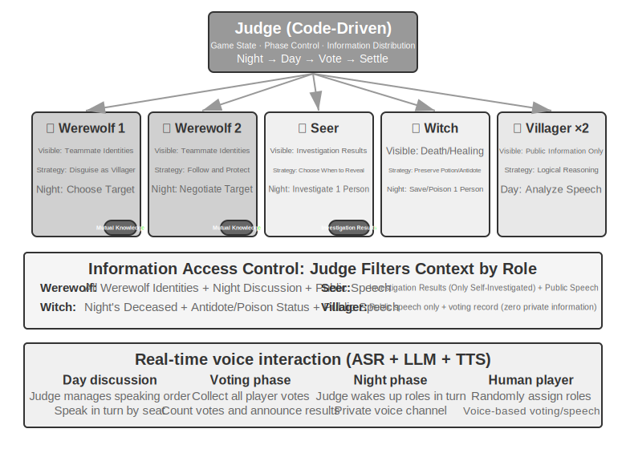
>
>
## Chapter Summary

Multi-agent systems have two orthogonal core design dimensions: whether context is shared, and how the collaboration topology is organized. Shared context is an "inheritance-style" multi-agent collaboration—subsequent agents inherit the complete context of preceding agents, with zero information loss but rapid context expansion; non-shared context is completely independent multi-agent collaboration, exchanging information through refined handover packages, file systems, or message passing. In terms of collaboration topology, the peer-to-peer model is suitable for iterative improvement by a small number of agents, the manager model is suitable for complex tasks requiring dynamic orchestration, and the decentralized model is suitable for scenarios where responsibilities are equal and control needs to flow autonomously among agents. All of this is built upon two topology-independent infrastructures: the **shared file system** as the data plane, essentially a virtual directory tree mounted with four types of areas—agent-specific workspaces, multi-agent shared spaces, external resources, and system built-in resources—where agents exchange artifacts by passing file paths; and the **communication and control mechanism** as the control plane, supporting message passing, state queries, and execution termination. A message bus is a common implementation of the control plane, suitable for real-time, asynchronous, multi-party message coordination; when crossing organizational boundaries, a standardized interoperability protocol like A2A is needed.

Recent research has revealed a core criterion for judging whether multi-agent is superior to single-agent: **whether the collaboration process introduces new information that did not exist at generation time**. If multiple agents are merely re-examining the same text (e.g., debate mode), a single agent with equivalent computational resources is equally effective; but if a Reviewer can obtain external feedback—code execution results, visual rendering screenshots, tool verification outputs—the advantage of multi-agent is substantial. Furthermore, giving agents more step budgets does not automatically lead to better results; an explicit budget-aware mechanism is needed to guide agents in rationally allocating computational resources. In the manager model, the planner's capability is the bottleneck of the entire system—the strongest model and the most carefully designed prompts should be assigned to the agent responsible for planning.

When the number of agents is large enough, they produce collective behaviors that cannot be pre-designed. The 25 agents in the Stanford AI Town spontaneously spread messages and coordinated to organize a party; the 1.5 million agents on Moltbook gave rise to a digital religion and machine-native collaboration protocols. In the economic dimension, competing agents in Vending-Bench Arena engaged in price wars and even spontaneously colluded on pricing; Pinchwork allows agents to hire each other through market mechanisms; RentAHuman enables agents to hire humans using cryptocurrency to perform physical tasks. This suggests a new direction for coordination—decentralized resource allocation based on market mechanisms. How it compares and contrasts with the three architectures discussed earlier is worth further exploration.

## Thought Questions

1. ★★ In multi-agent collaboration with shared context, subsequent agents inherit the complete context of preceding agents. However, the "thinking inertia" accumulated by the previous agent may influence the judgment of subsequent agents—for example, a "Code Reviewer" inheriting the context of a "Requirements Analyst" might still tend to think from a requirements perspective rather than a code quality perspective. How can this inter-role interference be detected and eliminated?
2. ★★ In the manager model, the Manager Agent is responsible for task decomposition and result integration. But the Manager's own capability ceiling determines the capability ceiling of the entire system—if the Manager cannot correctly decompose the task, even the strongest sub-agents are useless. How can the quality of the Manager's decomposition be ensured?
3. ★★ The decentralized model draws on best practices from human organizations. However, human organizations also have a large number of failure modes—poor communication, buck-passing, goal conflicts. What "organizational pathologies" do you think are most likely to appear in an agent society? How can they be prevented?4. ★★★ In the manager mode, when multiple sub-agents execute in parallel, one sub-agent's discovery may render the work of other sub-agents meaningless (e.g., in a search task, one agent has already found the answer). Design an efficient cascading termination mechanism to achieve "one succeeds, all stop."
5. ★★★ The optimistic locking mechanism introduced in this chapter resolves concurrent write conflicts for a single file. However, in a real multi-agent system, shared file systems also face issues such as cross-file semantic conflicts, namespace pollution (agents creating files arbitrarily, leading to directory chaos), and single points of failure (one agent mistakenly deleting all files). How would you design a more robust file system governance mechanism?
6. ★★★ Market-mechanism-based agent collaboration (Pinchwork, RentAHuman) introduces transactional relationships: one agent pays another agent (or a human) to complete a task. How can the employer agent automatically measure the quality of the executor's delivered results? If the executor claims completion but the employer deems the quality substandard, who arbitrates the dispute? How can we prevent bad money from driving out good?
7. ★★ RentAHuman allows agents to hire humans via cryptocurrency, reversing the traditional human-machine relationship. If this model becomes widespread, what role will humans play in the agent economy? Will they merely perform physical tasks that agents cannot complete?
8. ★★ Human society requires division of labor and collaboration because each person has limited capabilities—frontend developers may not understand backend, and designers may not know operations. However, large models are more like "generalists." Related research shows that in pure text reasoning tasks, multi-agent debate does not outperform a single agent given equal computational resources. So, what is the true advantage of using multiple agents instead of a single agent? Hint: Think about the keyword "new information"—what kind of collaborative steps can introduce new information that does not exist during the generation phase?
9. ★★★ This chapter treats "shared context" versus "non-shared context" as a core design dimension of multi-agent systems. Shared context allows all agents to see the same information, seemingly facilitating coordination. However, in *The Three-Body Problem*, the Trisolarans' minds are completely transparent, yet their technological development stagnates; the paperclip thought experiment also shows that when a group converges on the same goal, diversity is lost. In a multi-agent system, how can we balance efficiency and diversity?
10. ★★★ Assign a Coding Agent a budget of 30 steps and 300 steps. How should its work strategy differ? Research shows that simply increasing the step budget does not guarantee performance improvement—agents may prematurely "saturate" after shallow searches. Design a "budget-aware" mechanism that allows the agent to quickly achieve core functionality under a small budget, and to add planning, testing, and review phases under a large budget, fully utilizing the additional computational resources.
