# 上下文工程

第一章把上下文比作 Agent 的“当前决策视野”：模型每次作出判断，都要依据此刻收到的信息。**上下文工程**（Context Engineering）负责选择、组织和更新这些信息，包括系统指令、工具定义、用户请求、历史消息和任务状态。Harness 每次调用模型前，都要把任务背景和最新进展整理成输入。图2-1 用具体内容展示了上下文窗口的构成。

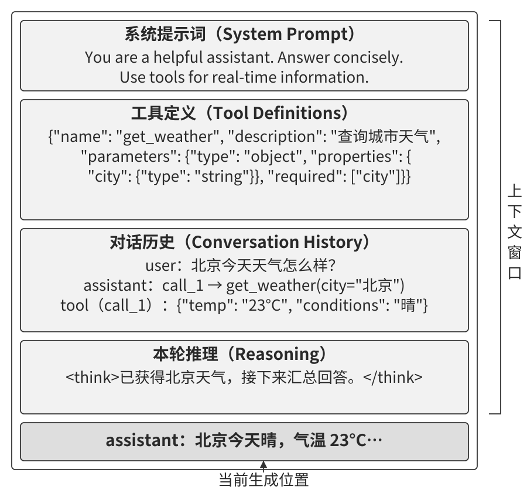

## 上下文：让模型能力用于具体任务

模型学会了编程、推理和语言理解，要在一个具体团队里工作，还需要了解产品架构、业务规则和内部约定。有了这些背景，模型才能把已有能力用到当前任务上。

想象一位经验丰富的工程师刚加入团队。他熟悉算法和编程语言，却还不了解产品架构、技术债务和团队规范。如果关键决策只保存在老员工的记忆中，代码库又缺乏文档，他就需要花大量时间寻找背景、确认假设。Agent 接手一个陌生项目时，也面临同样的信息缺口。

以“帮我修复这个 bug”为例，Coding Agent 通常需要三类背景：

- **实时代码上下文**：目录结构、模块职责、核心数据结构和代码规范。这些信息帮助它找到修改位置，并使修复与项目的结构和风格一致。
- **流程规范**：Git 分支策略、提交规范、代码审查流程和 CI/CD 要求。Agent 据此安排修改、测试和提交，运行系统则按权限执行这些操作。
- **环境信息**：开发配置、测试数据库的连接方式、测试环境的部署方式和 API 密钥的管理方式。这些信息帮助它选择正确的运行环境，理解本地与测试环境的差异。

上下文中还会包含环境观测、运行说明和配置信息。代码仓库、数据库和运行进程位于环境一侧，Agent 通过工具读取或修改它们，再把结果带入下一轮决策。**上下文的质量决定了模型能否把已有能力用到当前问题上。** **对于依赖大量背景信息的任务，能力够用的模型配上完整、准确的上下文，表现可以优于缺少必要资料的更强模型。** 因此，排查效果不佳的任务时，应先检查模型是否拿到了必要背景。

具体设计时，需要围绕任务组织信息：哪些规则始终适用，哪些资料应按需检索，哪些执行结果必须保留，哪些内容已经过时。信息的选择、来源、顺序和更新时机，都会影响后续判断。

这项工作也依赖团队的知识管理。架构决策、口头业务规则和私聊中的背景，需要整理成可查阅的记录，才能供后来者和 Agent 使用。模型能够搜索和总结的前提，是这些资料已经被保存，并通过合适的接口开放。

**对远程协作友好的团队，往往也对 Agent 友好。** Linux 内核开发提供了一个例子：开发者通过邮件列表讨论补丁、交换审查意见，开发流程文档说明了设计、提交、审查和合并的各个环节[^ch2-linux]。新参与者可以沿着代码、补丁和讨论记录理解变更的来由。这类可检索的协作记录，也为 Agent 查证背景提供了基础。

**构建 AI 原生团队，首先要把关键知识文档化。** 产品架构、决策理由和业务约定仍只留在人脑或私聊中时，接入再多 Agent 工具也难以解决信息缺口。明确记录任务目标、历史决策与工作约定，并随项目更新，模型才能稳定接续团队的工作。

笔者听过翁家翌在 WhynotTV 的访谈后，将其中一个反复出现的观点概括为：**人和模型都依赖 Context。** 他从个人工作与团队协作谈到上下文的重要性：掌握完整背景的人更容易接续工作，团队成员之间的背景差异则会增加沟通与交接成本；AI 能获取的信息与人类员工也有明显差异[^ch2-weng]。在 Agent 系统中，我们也需要把相关知识、工作进展和环境反馈及时送到模型面前。

[^ch2-linux]: Linux 内核官方文档，[How the development process works](https://kernel.org/doc/html/latest/process/2.Process.html)。

[^ch2-weng]: WhynotTV，《翁家翌：OpenAI，GPT，强化学习，Infra，后训练，天授，tuixue，开源，CMU，清华》，Podcast #4，[访谈原视频](https://www.bilibili.com/video/BV1darmBcE4A)。正文中的概括来自作者对访谈的理解。

ReAct 论文用一个形式化表达描述交互历史如何参与决策[^ch2-react]。在时刻 $t$，Agent 从环境收到观测 $o_t\in\mathcal{O}$，根据策略 $\pi(a_t\mid c_t)$ 选择动作 $a_t\in\mathcal{A}$，其中上下文为：

$$
c_t=(o_1,a_1,\ldots,o_{t-1},a_{t-1},o_t)
$$

这个表达说明，**Agent 的下一步行动依赖截至当前的交互历史。** 比如，Agent 查过哪个文件、工具返回了什么错误，都会影响下一步选择。对 LLM Agent，用户输入和工具结果可以提供观测，工具调用及对外回复记录行动；系统指令和工具定义进一步说明任务规则与可用接口。

本章先采用无状态的请求方式：Harness 每轮组装消息和工具定义，再调用模型。完整消息历史便于保留任务进展；随着历史增长，可以通过检索、状态记录和压缩，把后续决策需要的信息留在窗口内。上下文布局、状态栏和压缩技术，都围绕同一个问题展开：怎样在预算内构造信息充分、便于使用的 $c_t$？

[^ch2-react]: Yao, Shunyu, et al.，[ReAct: Synergizing Reasoning and Acting in Language Models](https://arxiv.org/abs/2210.03629)，ICLR 2023。

下面从 API 请求入手，看这些信息如何送入模型。

## Agent 如何调用大模型：理解 API 的上下文结构

本节采用 Chat Completions 兼容接口，以本地 Qwen3-0.6B 为示例模型，依次展开单轮问答、工具调用和多轮循环。重点关注消息角色、工具定义、调用请求与结果的关联方式。不同模型服务的协议各有差异，接入时要按相应约定填写字段、选择消息角色[^ch2-chat-api]。

### 示例中的四种消息角色

请求中的**消息列表**（`messages`）按顺序保存交互信息。每条消息用**角色**（`role`）标记来源和用途。本节使用四种角色：

- **system**：系统提示词。本节用它承载开发者提供的身份、行为规则和约束，放在消息列表前部。部分模型接口使用 `developer` 角色承载开发者指令，接入时按对应接口选择。
- **user**：用户消息，保存任务、追问和补充要求。
- **assistant**：模型回复，包括文本和工具调用请求。把这些消息放回下一轮输入，模型就能读到此前的回答与操作请求。
- **tool**：工具执行结果。Harness 收到返回值后，把它写成工具消息，通过 `tool_call_id` 关联到具体调用。

工具定义通过请求顶层的 `tools` 字段传入，列出可用工具的名称、用途和参数格式。

四种消息角色加上 `tools` 字段，便对应第一章的五类上下文信息：系统提示词、用户消息、模型回复、工具结果，以及工具定义。角色帮助模型区分信息来源，工具定义帮助模型构造操作请求，执行权限则由 Harness 和环境落实。

[^ch2-chat-api]: OpenAI，[Chat Completions API 参考](https://developers.openai.com/api/reference/resources/chat/subresources/completions/methods/create)，介绍消息角色、工具定义与调用结果字段；Qwen，[Function Calling](https://github.com/QwenLM/Qwen3/blob/main/docs/source/framework/function_call.md)，介绍兼容服务中的工具调用与模板。

### 单轮对话：最简单的 API 调用

先看一次问答。用户问“Hello, who are you?”，Harness 把系统指令与用户问题一起发给模型，再读取回复。图2-2 展示了请求和响应的对应关系。

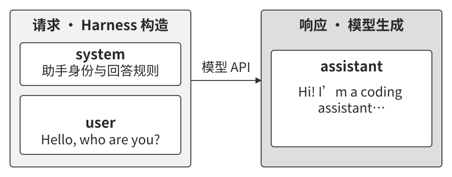

下面按本地模型的接口形式写出请求与示例回复，代码中的注释标出了各部分的来源：

```javascript
// Harness 构造请求
{
  "model": "Qwen3-0.6B",
  "messages": [
    {
      "role": "system",                           // 开发者提供的指令
      "content": "You are a helpful coding assistant. Follow user instructions."
    },
    {
      "role": "user",                              // 用户输入
      "content": "Hello, who are you?"
    }
  ]
}
```

```javascript
// API 返回响应
{
  "choices": [{
    "message": {
      "role": "assistant",                         // 模型生成
      "content": "Hi! I'm a coding assistant. I can help you write code, debug issues, and explain technical concepts. How can I help?"
    }
  }]
}
```

请求包含一条 `system` 消息和一条 `user` 消息，响应中的 `choices[0].message` 保存模型生成的 `assistant` 消息。在这里采用的无状态接口中，**Harness 负责为每次调用提供所需上下文**。下一次请求若要接着这段对话进行，就要带上相关历史。

### 带工具调用的多轮交互：Agent 的核心循环

用户进一步问“What's the current time and weather in Vancouver?”，回答就需要温哥华此刻的时间和天气。这些实时数据由外部工具提供。图2-3 展示了获取数据并生成回复的完整交互，包含两次模型 API 调用和两次工具调用。

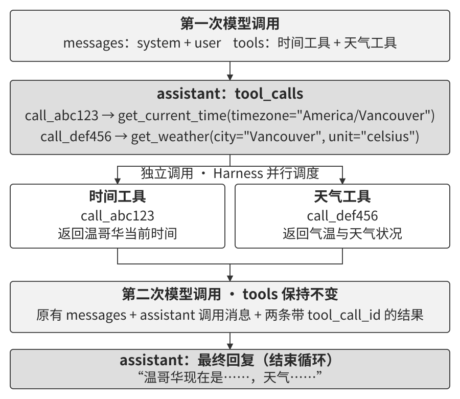

本例中，`get_current_time` 的时区与 `get_weather` 的城市、单位都能从任务中确定，天气服务也能独立返回最新天气，因此两个工具可以并行执行。若后一个工具需要使用前一个工具的返回值，就要先取得结果，再构造后续调用。调用之间的数据依赖决定了它们能否并行。

**第一次 API 调用——Agent 框架发送初始请求：**

```javascript
// 第一次模型调用：Harness 构造请求
{
  "model": "Qwen3-0.6B",
  "messages": [
    {
      "role": "system",                           // 开发者提供的指令
      "content": "You are a helpful assistant. Use the provided tools to get real-time information when needed."
    },
    {
      "role": "user",                              // 用户输入
      "content": "What's the current time and weather in Vancouver?"
    }
  ],
  "tools": [                                       // 开发者定义的工具
    {
      "type": "function",
      "function": {
        "name": "get_current_time",
        "description": "Get the current date and time in a specific timezone",
        "parameters": {
          "type": "object",
          "properties": {
            "timezone": { "type": "string", "description": "Timezone name, e.g. America/Vancouver" }
          },
          "required": ["timezone"]
        }
      }
    },
    {
      "type": "function",
      "function": {
        "name": "get_weather",
        "description": "Get the current weather for a specific city",
        "parameters": {
          "type": "object",
          "properties": {
            "city": { "type": "string", "description": "City name" },
            "unit": { "type": "string", "enum": ["celsius", "fahrenheit"] }
          },
          "required": ["city", "unit"]
        }
      }
    }
  ]
}
```

这份 `tools` 清单由开发者预先定义，包含名称、描述和参数 schema。本例在各轮请求中提供相同的两个工具，模型读取清单与用户问题后，再选择要调用的工具并填写参数。工具较多时，Harness 也可以按任务或权限筛选清单，后文将介绍按需加载的方法。

**模型返回两个工具调用请求：**

```javascript
// 模型返回工具调用请求
{
  "choices": [{
    "message": {
      "role": "assistant",                         // 模型生成
      "content": null,                             // 本轮没有文本回复
      "tool_calls": [                              // 请求调用两个工具
        {
          "id": "call_abc123",
          "type": "function",
          "function": {
            "name": "get_current_time",
            "arguments": "{\"timezone\": \"America/Vancouver\"}"
          }
        },
        {
          "id": "call_def456",
          "type": "function",
          "function": {
            "name": "get_weather",
            "arguments": "{\"city\": \"Vancouver\", \"unit\": \"celsius\"}"
          }
        }
      ]
    }
  }]
}
```

响应中的 `tool_calls` 包含两个请求，每个请求都有自己的 `id`、工具名称和参数。`arguments` 是 JSON 编码的字符串，执行侧需要先解析，再校验字段与取值。**模型决定调用什么、传入什么参数；Harness 负责校验和调度；工具实现负责访问时间或天气服务。**

**Agent 框架执行工具，然后发起第二次 API 调用：**

Harness 校验请求后调度两个工具，将返回值写成 `tool` 消息，再把已有历史与新增结果一起交给模型：

```javascript
// 第二次模型调用：追加工具结果
{
  "model": "Qwen3-0.6B",
  "messages": [
    {
      "role": "system",                           // 保留第一次请求中的消息
      "content": "You are a helpful assistant. Use the provided tools to get real-time information when needed."
    },
    {
      "role": "user",                              // 保留第一次请求中的消息
      "content": "What's the current time and weather in Vancouver?"
    },
    {
      "role": "assistant",                         // 保留前一轮模型的调用请求
      "content": null,
      "tool_calls": [
        { "id": "call_abc123", "type": "function", "function": { "name": "get_current_time", "arguments": "{\"timezone\": \"America/Vancouver\"}" } },
        { "id": "call_def456", "type": "function", "function": { "name": "get_weather", "arguments": "{\"city\": \"Vancouver\", \"unit\": \"celsius\"}" } }
      ]
    },
    {
      "role": "tool",                              // Harness 写入工具执行结果
      "tool_call_id": "call_abc123",
      "content": "{\"timezone\": \"America/Vancouver\", \"datetime\": \"2025-09-13T05:18:47\", \"day_of_week\": \"Saturday\"}"
    },
    {
      "role": "tool",                              // Harness 写入工具执行结果
      "tool_call_id": "call_def456",
      "content": "{\"city\": \"Vancouver\", \"temperature\": 13.2, \"unit\": \"celsius\", \"conditions\": \"clear\", \"humidity\": 93}"
    }
  ],
  "tools": [ ... ]                                 // 沿用前面的工具定义，此处省略
}
```

第二次请求中需要留意三个细节：

1. **已有消息与新结果一起进入上下文。** 本例依次保留 `system`、`user`、包含调用请求的 `assistant`，再追加两条 `tool` 消息，模型由此读到任务和已取得的数据。
2. **调用请求与工具结果成对保留。** 前一轮 `assistant` 消息中的名称、参数和调用 ID，使后续模型调用能够识别这些结果的来由。
3. **`tool_call_id` 负责关联。** `call_abc123` 对应时间查询，`call_def456` 对应天气查询。即使并行工具先后完成的顺序变化，结果仍能匹配到各自的请求。

**模型根据工具结果生成最终回复：**

```javascript
// 模型生成最终回复
{
  "choices": [{
    "message": {
      "role": "assistant",                         // 模型生成
      "content": "It's currently 5:18 AM on Saturday, September 13, 2025 in Vancouver.\n\nWeather: 13.2°C with clear skies and 93% humidity. It's quite cool this morning - you might want to grab a jacket."
    }
  }]
}
```

第二次响应给出最终文本，`tool_calls` 为空，示例循环随之结束。这个“调用模型→执行工具→回传结果→再次调用模型”的过程，就是第一章运行循环在 API 中的具体实现。模型每轮都根据收到的上下文推理，并选择下一步行动。

如果用户追问“那东京呢？”，Harness 就把这条消息追加到历史末尾，再次调用模型。模型可以沿用“查询当前时间和天气”的任务背景，生成针对东京的新请求；工具返回后，再组织新的回答。

### 用代码实现 Agent 的核心循环

下面用 Python 将消息结构串成一个运行循环。`service_url` 和 `api_key` 对应已经配置好的兼容服务；工具函数先使用上例的固定返回值，便于逐条跟踪消息变化。接入真实服务时，保留相同的调用与返回结构，再替换工具实现。

```python
import json

from openai import OpenAI

client = OpenAI(base_url=service_url, api_key=api_key)

# 工具定义：名称、用途和参数结构
tools = [
    {
        "type": "function",
        "function": {
            "name": "get_current_time",
            "description": "Get the current date and time in a specific timezone",
            "parameters": {
                "type": "object",
                "properties": {
                    "timezone": {"type": "string", "description": "Timezone name, e.g. America/Vancouver"}
                },
                "required": ["timezone"],
            },
        },
    },
    {
        "type": "function",
        "function": {
            "name": "get_weather",
            "description": "Get the current weather for a specific city",
            "parameters": {
                "type": "object",
                "properties": {
                    "city": {"type": "string", "description": "City name"},
                    "unit": {"type": "string", "enum": ["celsius", "fahrenheit"]},
                },
                "required": ["city", "unit"],
            },
        },
    },
]

# 示例工具使用固定数据，参数与前面的温哥华查询一致。
def execute_tool(name, arguments):
    args = json.loads(arguments)
    if name == "get_current_time" and args == {"timezone": "America/Vancouver"}:
        result = {
            "timezone": "America/Vancouver",
            "datetime": "2025-09-13T05:18:47",
            "day_of_week": "Saturday",
        }
    elif name == "get_weather" and args == {"city": "Vancouver", "unit": "celsius"}:
        result = {
            "city": "Vancouver", "temperature": 13.2,
            "unit": "celsius", "conditions": "clear", "humidity": 93,
        }
    else:
        result = {"error": "示例仅提供温哥华时间和摄氏天气数据"}
    return json.dumps(result, ensure_ascii=False)

# 初始消息：指令与用户任务
messages = [
    {"role": "system", "content": "You are a helpful assistant. Use tools to get real-time information when needed."},
    {"role": "user", "content": "What's the current time and weather in Vancouver?"},
]

# 运行循环：最多调用模型八轮
rounds = 0
while rounds < 8:
    rounds += 1
    response = client.chat.completions.create(
        model="Qwen3-0.6B", messages=messages, tools=tools
    )
    assistant_message = response.choices[0].message

    # 保存模型回复，包括本轮的调用请求
    messages.append(assistant_message.model_dump(exclude_none=True))

    # 本例在模型给出不含工具调用的回复时结束
    if not assistant_message.tool_calls:
        print(assistant_message.content)
        break

    # 逐个执行并追加结果；独立调用也可以改为并行调度
    for tool_call in assistant_message.tool_calls:
        try:
            result = execute_tool(tool_call.function.name, tool_call.function.arguments)
        except json.JSONDecodeError:
            result = json.dumps({"error": "工具参数需要有效的 JSON"})
        messages.append({
            "role": "tool",
            "tool_call_id": tool_call.id,
            "content": result,
        })
    # 下一轮使用追加了结果的消息列表
else:
    print("已达到轮数上限，任务尚未完成。")
```

循环每轮完成三件事：调用模型、保存回复、处理工具请求。收到 `tool_calls` 后，程序解析参数，执行相应工具，再把结果写回 `messages`；收到最终文本后结束。如果模型反复请求工具，八轮上限会让程序退出循环。消息列表随执行增长，保存了用户任务、操作请求和返回值。

按执行顺序展开 `messages`，就能看清每条消息在哪一步加入：

**初始状态（第 1 次调用前）：**
```text
messages = [
  { role: "system",  content: "You are a helpful assistant..." },     # 开发者写的
  { role: "user",    content: "What's the current time and weather in Vancouver?" },  # 用户输入
]
```

**第 1 次模型调用与工具执行完成后：**
```text
messages = [
  { role: "system",    content: "..." },
  { role: "user",      content: "What's the current time..." },
  { role: "assistant", tool_calls: [get_current_time, get_weather] },  # 模型生成的调用请求
  { role: "tool",      tool_call_id: "call_abc123", content: "{time...}" },  # 工具执行后由 Harness 写入
  { role: "tool",      tool_call_id: "call_def456", content: "{weather...}" },  # 工具执行后由 Harness 写入
]
```

**第 2 次调用后（模型返回最终回复，循环结束）：**
```text
messages = [
  { role: "system",    content: "..." },
  { role: "user",      content: "What's the current time..." },
  { role: "assistant", tool_calls: [get_current_time, get_weather] },
  { role: "tool",      tool_call_id: "call_abc123", content: "{time...}" },
  { role: "tool",      tool_call_id: "call_def456", content: "{weather...}" },
  { role: "assistant", content: "It's currently Saturday, Sep 13, 2025 in Vancouver..." },  # 最终回复
]
```

在这段循环中，Harness 通过追加消息接续任务。后续的上下文工程将在此基础上处理更多问题：保留哪些历史、何时加载新知识、怎样记录当前状态，以及如何控制输入成本。与此同时，约束与验证机制检查工具权限、操作结果以及任务是否真正完成。

### 从 API 视角看上下文的构成

图2-4 将上例的输入分成相对稳定的前缀和不断增长的消息历史：

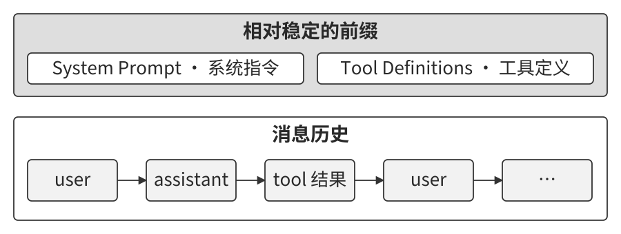

在本例中，系统提示词与工具定义在各轮之间保持稳定；用户消息、模型回复和工具结果随交互追加，记录任务轨迹。前缀稳定有利于复用缓存，历史增长则要求系统管理信息量。需要更新指令、增减工具或压缩历史时，应同时考虑后续决策所需的信息和缓存重算的成本。

后文将先介绍 KV Cache 如何复用上下文的计算结果，再分别讨论指令、工具、Skill、状态和历史的组织方法。

把这些工作放回运行循环，就能看清 Harness 每次调用模型前需要做什么。下面的伪代码把后续几项方法放在一起：加载历史、提取当前状态，在超出预算时压缩旧内容，再组装请求。

```python
stable_prefix = system_message
stable_tools = core_tool_schemas
history = load_message_history(session)
status_message = make_status_message(derive_current_state(history))

if estimated_tokens(stable_prefix, stable_tools, history, status_message) > budget:
    history = compress_old_evidence(
        history,
        preserve = [decisions, constraints, failures, citations]
    )

request.messages = [stable_prefix] + history + [status_message]
request.tools = stable_tools
response = call_model(request)
```

这套布局尽量保持系统指令与核心工具定义稳定，把当前状态追加到历史末尾。压缩时保留决策、约束、失败和引用等后续工作需要的信息，并维护调用请求与工具结果的关联。除了长度预算，信息重复和过时也可以触发压缩，具体策略将在本章后半部分展开。

> **实验 2-1 ★：本地 LLM 服务部署与工具调用**
>
> 本实验在本地运行 Qwen3-0.6B，沿着“查询温哥华时间和天气”这一任务，观察消息如何经过模型、解析器和工具执行器。图2-5 展示了本地服务与客户端的分工：服务端加载模型、处理输入并生成回复，客户端维护消息历史，调度工具并回传结果。
>
> 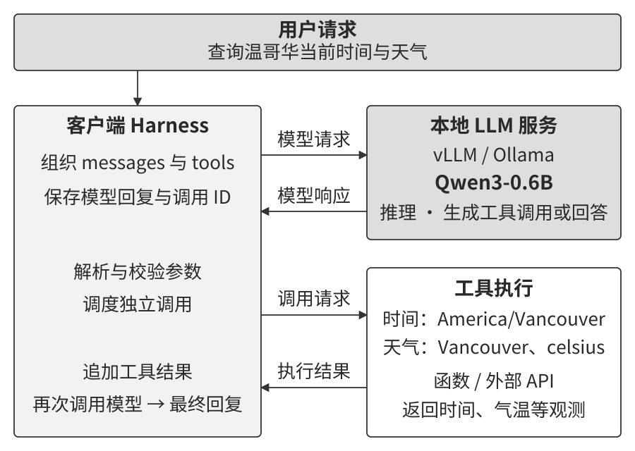
>
> **先跟踪一次完整任务。** 模型在同一轮输出中请求查询时间和气温，分别填写 `America/Vancouver`、`Vancouver` 和 `celsius` 等参数。客户端并行执行两个工具，把结果送回模型；模型随后生成回答，结束本次循环。六亿参数的模型就完成了这个范围明确的两工具任务。检查时，应沿着工具选择、参数、返回值和最终回答逐项核对，定位错误发生在哪一步。
>
> **再查看原始输出与 API 字段的对应。** Qwen3 的思考模式可以生成带有 `<think>` 标记的推理内容，工具请求则使用相应的调用标记。服务端解析后，客户端可能收到单独的 `thinking` 或工具调用字段。把原始 token 流与解析后的事件并排查看，就能理解模型输出如何变成可调度的工具请求。输出中各部分的排列与保留方式由模型模板和服务协议共同决定。
>
> **接着观察流式处理。** 界面可以随着事件更新“思考中”“调用工具”和“生成回答”等状态。工具参数通常分多段到达，需要累积成完整请求；协议确认该调用结束，且参数、权限和依赖检查通过后，运行系统可以开始调度。相互独立的工具能够并行执行，也可以与后续输出处理形成流水线。
>
> **最后比较速度与缓存。** 本次在苹果芯片 Mac 上运行的记录中，工具任务的平均解码速度约为每秒 107 个 token。Token 是模型处理文本的基本单位，具体切分由分词器决定，一个词或汉字可能对应一个或多个 token。解码速度反映开始生成后的输出速率；用户等待多久，还受到首 token 延迟、推理长度和工具耗时影响。
>
> 缓存对照使用相同的长前缀，分别测试保留前缀与修改前缀开头的请求。本次五组配对中，保留前缀的请求有四组更快；两组平均首 token 延迟分别约为 1.30 秒和 1.51 秒。复现时应先确认服务支持跨请求前缀复用，再固定模型、输入长度和生成设置，重复测量。下一节将解释这些请求在计算上有什么区别。
>
> 这个实验也让笔者更加看好端侧 Agent：小模型已经能够在用户自己的设备上完成这样的工具调用任务。**端侧 Agent 的时代，比许多人预期的更近。** 开发时可以从目标清楚、工具数量有限的任务起步，再用更复杂的请求检查参数填写、连续执行和恢复能力。

## KV Cache 友好的上下文设计

Agent 的相邻请求通常共享大量信息：系统指令、工具定义，以及此前已经发生的交互。如果推理引擎能够复用这些内容的中间计算结果，就能把更多计算用于新增信息。**KV Cache** 保存每层注意力计算中已经得到的键（Key）和值（Value），供后续 token 使用；**Prompt Cache** 则进一步在请求之间复用符合条件的前缀缓存[^ch2-kv-basics]。

考虑一个客服 Agent：为了让模型知道当前时间，开发者在系统提示词开头加入 `Current time: {{now}}`，每次请求都更新。后面的业务规则和工具定义保持原样，实际输入会从时间戳处开始变化。对于按相同前缀复用 KV 的服务，这会使时间戳及后续部分重新计算，增加输入处理时间和费用。

把时间写成追加消息，或在需要时调用时间工具，就能保留已有前缀。两种布局提供的信息相近，触发的重算范围却不同。缓存友好的设计需要同时考虑内容是否充分，以及它被放在什么位置。

可以先记住三个做法，后面的原理和实验将逐项解释它们：

1. **保持可复用的前缀稳定。** 系统指令和常用工具定义采用确定的内容与顺序。业务规则需要修改时，更新对应版本，并将前缀重算计入成本。
2. **把运行中的变化追加到后部。** 时间、余额、调用次数和任务进度可以通过新消息或工具结果提供。最新状态应标明生效时点，让模型能识别哪条记录适用于当前决策。
3. **按模型协议组织消息。** 使用正确的角色、调用 ID 和工具结果格式，由相应的聊天模板生成模型输入。缓存匹配的是处理后的前缀及相关配置，消息协议还决定模型如何识别指令、用户请求和工具返回值。

在本节采用的因果注意力模型中，后续 token 的加入不会改变此前位置已经算出的状态。修改已有输入时，首个变化位置及其后面的状态需要重新计算；变化之前的前缀仍有复用机会。服务端还会根据缓存块大小、保留时间和运行配置决定实际命中范围。

[^ch2-kv-basics]: Hugging Face，[How caching works](https://huggingface.co/docs/transformers/main/en/cache_explanation)，介绍逐层保存与复用 K、V 的机制。

> **实验 2-2 ★：注意力机制可视化**
>
> 先用“北京 的 天气 怎么样”理解一次注意力计算。为了便于展示，图2-6 将这句话分成四个语义单元；实际模型由分词器切分输入。处理“怎么样”这一位置时，注意力层要从已有信息中组合出当前表示。Query、Key 和 Value 分别承担查询、匹配和信息聚合的作用。
>
> | 向量 | 作用 | 在这个例子中的直观理解 |
> | --- | --- | --- |
> | **Query（查询）** | 当前位置用于匹配其他位置的向量 | “怎么样”需要从已有内容中找出相关信息 |
> | **Key（键）** | 各位置参与匹配的向量 | “北京”“天气”等位置提供可供匹配的表示 |
> | **Value（值）** | 按权重聚合的信息向量 | 将地点、天气等信息按相应比重汇入当前表示 |
>
> 可以把 Key 想象成用于检索的标签，把 Value 想象成取回的内容。模型中的这些向量都是从隐藏表示计算出来的数值，并由训练塑造其匹配方式。
>
> 一次计算分三步。首先，当前位置生成 Query；然后，它与各位置的 Key 做点积，经过缩放、因果掩码和 softmax，得到和为 1 的注意力权重；最后，用这些权重对 Value 加权求和。点积就是两组数字逐位相乘再求和，softmax 则将可见位置的分数转换成归一化权重。各位置的 Value 按对应权重参与聚合，共同形成这个注意力头的输出。
>
> 图2-6 用一组示意权重呈现这个过程：“天气”占 0.55，“北京”占 0.35，“的”和“怎么样”各占 0.05。输出中因此更多地保留了天气和地点的信息。
>
> 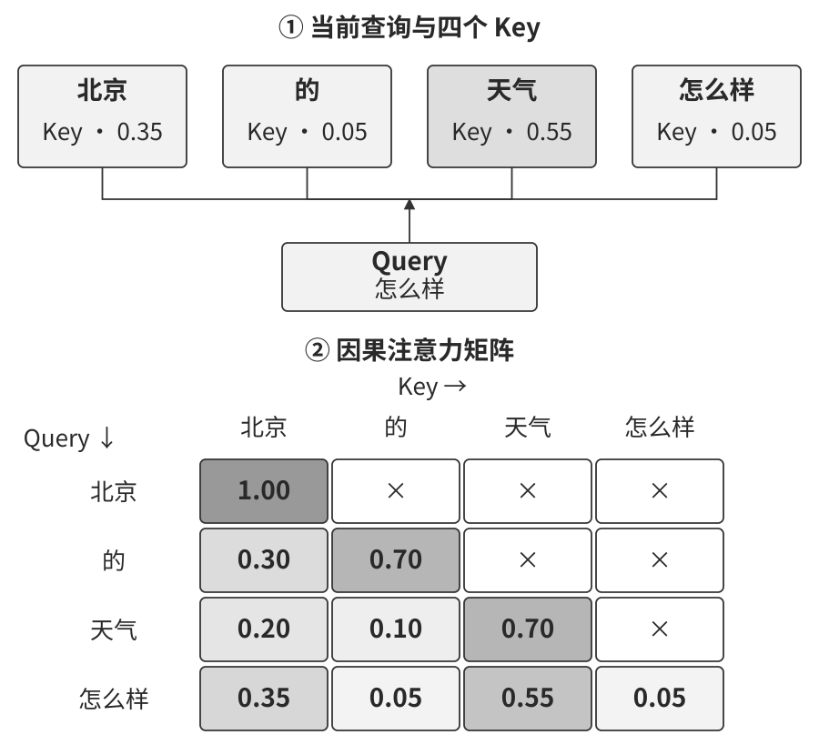
>
> 把每个位置的权重排成矩阵，就得到**注意力热力图**。每行对应一个 Query，每列对应一个 Key，颜色深浅表示权重大小。因果掩码允许当前位置读取自己和前面的位置，图中用 × 标出被屏蔽的位置，它们经过 softmax 后的权重为零。这一结构适用于输入处理和后续生成。
>
> 从这里也能看出 K、V 缓存的用途：生成继续推进时，新位置仍会读取已有位置的 Key 和 Value。保存这些向量后，新位置就可以直接用它们进行匹配与聚合，省去历史位置的重复计算。
>
> 理解了这组示意权重，再用 Qwen3-0.6B 查看模型实际计算出的注意力分布。实验分别记录短句和一段包含推理、最终回答的生成序列，比较不同层的注意力矩阵。图2-7 分别展示第 0、13、27 层：左列是九个 token 的短句，右列是计算 17 × 23 的生成序列，按输入、推理和回答标出位置范围。灰度采用对数刻度，便于同时看清较强与较弱的注意力权重。
>
> 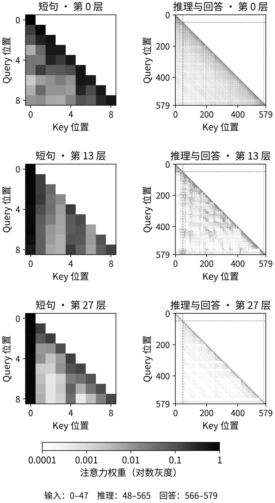
>
> 阅读时可以沿着四条线索分析：
>
> 1. **注意力储存池（Attention Sink）。** 某些层把较大权重分配给序列开头，即使开头的 token 承载的语义很少。本次短句运行中，中间层与末层都出现了明显的首位置集中。softmax 要求各位置权重合计为 1，模型可以学出相对稳定的接收位置；StreamingLLM 对这一现象及其在流式推理中的作用作了专门研究[^ch2-attention-sinks]。
> 2. **推理区域。** 标出 `<think>` 对应的生成区间，沿这些行查看模型关注了哪些提示词、工具说明或此前推理。三角形来自因果掩码，三角形内部的深浅才反映各位置的权重差异。
> 3. **回答区域。** 再标出最终回答的生成区间，比较它对原始输入和先前推理的权重分配。这能帮助定位哪些已有信息进入了当前注意力聚合。
> 4. **位置差异。** 比较开头、中间与末尾的权重，同时把关键事实移动到不同位置，检查任务答案是否变化。《Lost in the Middle》在长上下文问答和键值检索中观察到，中间位置的信息更难被有效利用[^lost-in-the-middle]。工程上可以据此优先把常驻规则放在前部，把当前目标和进度放在末尾，再用实际任务检验布局效果。
>
> 热力图让我们能直接观察注意力权重如何分配。进一步判断某段信息的作用，可以删除、替换或移动它，再比较任务结果。上下文学习也由此变得具体：指令、示例和已有过程通过输入影响当前行为，模型参数在这次任务中保持不变。

[^ch2-attention-sinks]: Xiao et al.，[Efficient Streaming Language Models with Attention Sinks](https://arxiv.org/abs/2309.17453)，ICLR 2024。

[^lost-in-the-middle]: Liu et al.，[Lost in the Middle: How Language Models Use Long Contexts](https://aclanthology.org/2024.tacl-1.9/)，TACL 2024。

### 从 API 消息到模型 Token：Chat Template

前面的 API 示例是一组带角色的消息，注意力图中的输入则是一串 token。**Chat Template（聊天模板）**负责完成这次转换：为消息加入角色与边界标记，按约定组织工具说明和返回值，再交给分词器编码。聊天模板影响多轮工具调用、推理信息保留和缓存匹配，是理解本章后续设计的基础。图2-8 展示了模板中的主要标记。

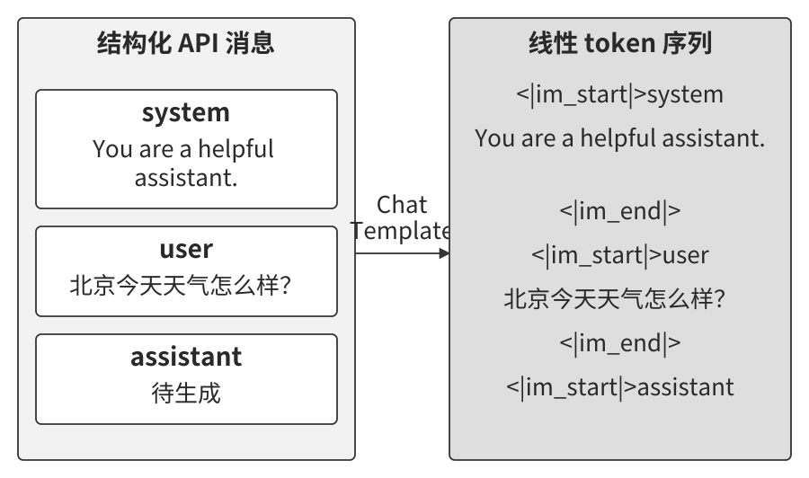

可以把模板理解为信封格式：正文承载内容，信封上的字段说明来源和用途。Qwen、Llama、Gemma 等模型家族采用各自的模板，本地推理服务根据模型配置完成转换。使用托管 API 时，这一步通常由服务端处理；自行部署时，则需要为模型加载匹配的模板。

图2-9 以 Qwen 为例，上方保留 API 消息，下方展示序列化后的输入。`<|im_start|>` 和 `<|im_end|>` 标记消息边界，角色文本标明消息的用途，工具请求与返回值也有相应结构。

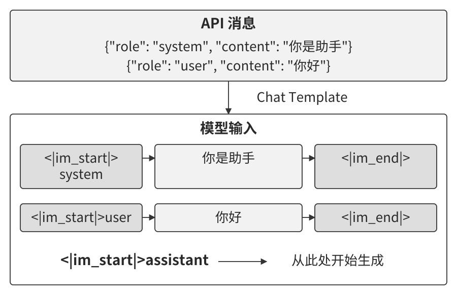

**角色会影响模板如何组织历史。** Qwen3-0.6B 的模板会定位最近一次真实用户查询，并据此处理历史推理：较早轮次保留回答内容，当前查询后的工具交互可以继续带上推理信息。模板还把 `tool` 消息包装进 `<tool_response>`，并将这种工具响应与新用户问题区分开[^ch2-qwen-template]。

例如，模型查完文件后仍要继续分析。把工具结果按 `tool` 角色回传，模板就能将它识别为当前任务中的工具反馈；如果把同样的结果直接写成普通 `user` 消息，模板可能把它识别为新的查询，改变此前推理的保留范围。这就像继续做一道题时需要保留演算草稿：Harness 应保存服务要求的推理字段，并按正确的消息结构接着调用。

**从单轮推理走向长程 Agent，历史思考逐渐成为需要维护的任务状态。** 早期 DeepSeek-R1 的聊天模板会去掉历史回答中的思考部分，只保留最终回答[^ch2-r1-template]；后续 DeepSeek 的工具调用协议则要求回传推理信息。一次问答结束后，最终回答可能已经包含下一轮所需的信息；工具任务进行到一半时，“为什么查这个文件”“已经排除了哪些假设”却可能只写在中间推理中。保留这些信息，有助于下一轮接着已有思路工作。

**推理信息的回传方式由模型协议决定。** 接入时要同时处理 `content`、`tool_calls` 和服务提供的推理字段。下面几种方案体现了不同的续接规则：

- **DeepSeek 思考模式**通过 `reasoning_content` 返回推理。按照其工具调用协议，请求带有 `tools` 时，后续请求须完整回传历史推理，包括未调用工具的模型回复；缺失字段会触发 400 错误。纯聊天请求不带 `tools` 时，服务忽略回传的历史推理[^ch2-deepseek-thinking]。
- **Kimi 的思考与工具交互**同样需要在运行循环中管理推理、工具请求和结果。以 Kimi K2.5 的交错思考示例为例，模型可以在多次工具调用之间继续推理，客户端按其协议保存和回传模型消息[^ch2-kimi-thinking]。
- **GLM 的保留思考**可以通过 `thinking.clear_thinking: false` 开启，随后完整、按原顺序回传 `reasoning_content`。Coding Plan 与标准 API 的默认设置不同，客户端应明确选择所需模式[^ch2-glm-thinking]。
- **Claude 的 thinking block**需要连同签名保存。支持 preserved thinking 的模型还会检查块的来源与前缀，具体规则见后面的“缓存作为架构约束”。

这些规则影响连续工具调用，也影响中途切换模型。切换时，适配层要把工具请求、结果和任务状态转换成目标接口接受的形式，再按目标模型的规则处理推理信息。第五章的实验 5-1 将展开这种轨迹接续。

**模板还决定缓存所匹配的输入。** 同样的消息内容，经过不同模板、工具顺序或序列化方式处理，可能形成不同 token 前缀。要复用已有 KV，需要保持相关模型配置和前缀一致。调试缓存时，可以沿着“API 消息→模板输出→token 序列”逐层查找首个变化位置。

[^ch2-qwen-template]: Qwen 官方模型的[分词器配置与聊天模板](https://huggingface.co/Qwen/Qwen3-0.6B/blob/main/tokenizer_config.json)，其中包含用户查询、推理内容与工具响应的处理逻辑。

[^ch2-r1-template]: DeepSeek-R1 官方[聊天模板](https://huggingface.co/deepseek-ai/DeepSeek-R1/blob/main/tokenizer_config.json)在普通历史回答中保留 `</think>` 之后的内容；后续工具调用的推理回传规则见 DeepSeek 的 Thinking Mode 文档。

[^ch2-deepseek-thinking]: DeepSeek，[Thinking Mode](https://api-docs.deepseek.com/guides/thinking_mode/)。

[^ch2-kimi-thinking]: Moonshot AI，[Kimi K2.5 官方仓库](https://github.com/MoonshotAI/Kimi-K2.5)，Interleaved Thinking and Multi-Step Tool Call 一节。

[^ch2-glm-thinking]: Z.ai，[Thinking Mode](https://docs.z.ai/guides/capabilities/thinking-mode)，介绍交错思考、保留思考及端点默认设置。

### KV Cache 的原理与约束

模型处理一次请求时，先对输入进行 **prefill（预填充）**，计算已有 token 的表示，再进入 **decode（解码）**，逐个生成后续 token。KV Cache 在解码过程中保存已有位置的 K、V；跨请求的前缀缓存进一步复用上一请求留下的相同前缀。

例如，Agent 到第六轮时已经累积了 2,000 个输入 token。如果服务只使用本次请求内的 KV Cache，就需要先处理这 2,000 个 token，再利用缓存继续生成。如果跨请求缓存中已有其中一段相同前缀，prefill 就能从尚未缓存的位置接续。图2-10 展示了这种跨请求复用。

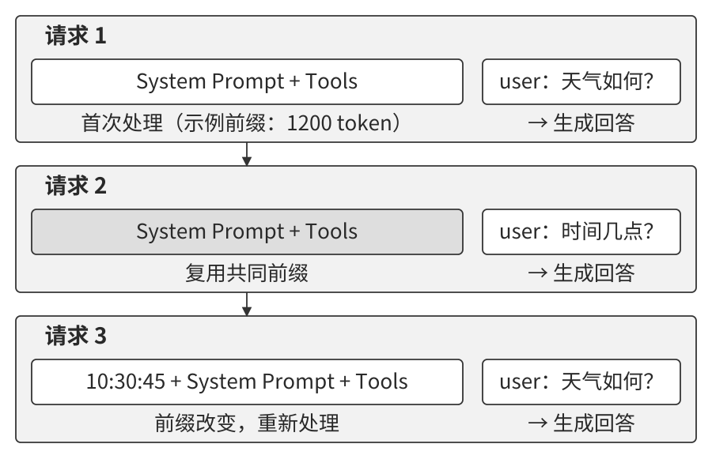

**用四个 token 跟踪缓存的增长。** 假设输入为 `[A, B, C, D]`。模型处理位置 D 时，用 D 的 Query 与 A、B、C、D 的 Key 匹配，再对它们的 Value 加权聚合。经过各层计算，D 位置的最终表示用于预测下一个 token E。此时，A 至 D 在各层的 K、V 都已保存。

采样得到 E 后，下一步把 E 送入模型，计算它在各层的 Query、Key 和 Value。E 的 Query 读取此前的缓存与当前位置的 K、V，模型再预测第六个 token；E 的 K、V 同时追加到缓存中。这样，每生成一步，都可以沿用此前的状态，只计算新输入 token 的状态。

若完全不用 KV Cache，预测 E 时要重新处理 A 至 D，预测第六个 token 时又要处理 A 至 E。仅按重复生成 K、V 的位置数计算，累计工作量会出现 $1+2+\cdots+N$ 这样的增长。使用缓存后，历史位置的逐层计算得以复用；新位置仍要读取可见的 K、V。在标准全注意力解码中，这部分读取与匹配随上下文长度线性增加，所以长上下文仍会占用更多显存和内存带宽。

**修改输入为什么会影响后续缓存？** Transformer 的各层依次处理隐藏表示，每层都有自己的 K、V。某个位置经过注意力计算后，表示中已经汇入此前位置的信息，再传给下一层。因而，第 $k$ 个 token 改变时，影响会从该位置向后、向更高层传播。

对于相同模型与计算配置，$k$ 之前的位置只依赖更早的输入，可以继续复用；从 $k$ 开始，需要重新建立受影响的状态。实际服务通常按缓存块匹配前缀，重算边界还受到块大小影响。更新越靠前，通常需要重算的输入越多。把稳定指令放在前部、把新状态追加到后部，就是在利用这一依赖关系。

> **实验 2-3 ★★：上下文管理方式的对照**
>
> 本实验让 Agent 使用文件发现、读取和搜索工具完成同一个任务，比较一种稳定追加的基线与五种上下文改动。基线保持指令和工具顺序稳定，逐轮追加模型消息和工具结果。其余各组分别改变指令、状态、工具排序或历史表达，观察缓存统计和任务过程怎样变化。
>
> **动态系统提示词**在每轮的系统指令中更新当前时间。变化之前仍可有共享前缀，从时间信息起的后续输入则需要重新匹配或计算。可以把时间作为新消息追加，或通过时间工具按需获取，让常驻业务规则继续复用。
>
> **动态用户配置**在前部消息中更新剩余调用次数或账户余额。状态本身是任务所需的信息，设计重点在于更新位置：把最新状态追加到末尾，并标明其生效时间，能够同时保留进度与前缀。后面的 Agent 状态栏将采用这种组织方式。
>
> **工具定义重排**每轮改变工具清单的顺序。名称和参数虽然相同，序列化后的 token 顺序已经变化。本次 Kimi K2.6 记录中，重排组上报的累计缓存 token 少于稳定基线。工具较多时，固定排序可以减少这种无关变化；若要比较不同排序对工具选择的影响，还应单独检查调用准确性。
>
> **滑动窗口**只保留最近一段历史。假设按十轮交互保留，第十五轮就可能读不到第二轮取得的关键文件内容。除了缩短共享前缀，裁剪还会改变模型能获取的事实和任务进度。配套实现以最近六条历史消息为起点，并向前补齐工具结果所对应的调用请求。本次记录中，这组运行达到轮数上限时仍未生成最终回复。设计裁剪策略时，应保留任务目标、必要证据和成对的调用记录，再决定哪些旧内容可以移出。
>
> **文本格式化**把带角色的历史重新写成 `USER: ...`、`ASSISTANT: ...` 等文本。这样会改变模板中的消息边界和工具结构，模型需要从正文恢复原来的关系。本次文本组仍生成了最终回复，也有缓存命中；复核时应继续检查调用参数、证据使用和任务答案。接口提供的消息角色、调用 ID 和工具结果字段，有助于稳定传递这些关系。
>
> 阅读这组对照，可以分别回答三个问题：实际输入保留了多长的相同前缀，服务复用了多少计算，Agent 是否保留了完成任务所需的信息。延迟还会受到生成长度、网络和负载影响，因此应结合缓存 token、调用轨迹与答案核验解释结果。重新构造一个消息列表，只要内容和配置保持一致，也可以复用相同前缀。

### KV Cache 与 Prompt Cache：两个层级的缓存

**KV Cache**保存模型逐层计算得到的键值状态，供后续 token 读取。**Prompt Cache**在请求之间查找可复用的前缀，利用这些已保存的状态减少重复输入计算。理解前者，就能看懂模型如何继续生成；理解后者，就能知道相邻请求如何避免重复计算。

在 API 服务中，缓存还受到最小前缀长度、块大小、有效期、模型配置和租户隔离范围影响。可复用前缀必须在相同的缓存作用域内查找。例如，Claude API 按组织与工作区隔离缓存；相同文字出现在不同隔离域时，会分别建立缓存[^ch2-prompt-cache]。

计费需要分别考虑写入和读取。一些 Claude 模型的缓存读取价为普通输入价的十分之一，首次写入则有额外费用。实际收益取决于前缀长度、复用次数和保留时间：多次使用的长前缀更容易摊薄写入成本，几乎不复用的内容则应按完整请求成本比较。系统可以记录缓存输入量、未缓存输入量与写入量，再按所用模型的价格计算。

[^ch2-prompt-cache]: Anthropic，[Prompt caching](https://platform.claude.com/docs/en/build-with-claude/prompt-caching)，介绍缓存匹配、隔离、有效期和计费。

### 缓存作为架构约束

**在生产系统中，缓存已经成为一项架构约束。** 提示词怎样排列、子 Agent 从哪里开始、会话如何恢复，都会影响可以复用多少计算。**设计之初就要安排缓存边界。** 先确定哪些内容可以共享、哪些状态会变化，再组织提示词和会话结构，能减少运行中的反复重算。等到长程任务的延迟和费用已经成为问题，再调整这些结构，往往会牵动状态管理、子 Agent 和会话恢复。

**按稳定程度安排前缀。** 多个任务共享的指令与工具定义可以放在前部，随后再加入用户资料、会话状态和新观测，并按适用范围分组。例如，操作系统有 macOS/Linux 两种选择，运行模式有普通/调试两种，语言有中文/英文两种，三项独立条件最多产生 $2\times2\times2=8$ 种前缀组合。把变化较多的字段放到共享部分之后，可以增加公共前缀的复用机会。公共部分的共享范围还要遵守服务的组织、工作区和隐私边界。

**为子 Agent 选择可复用的起点。** 子 Agent 若继承父 Agent 的任务背景，可以复用双方一致的前缀，再追加自己的子任务。提示词、工具顺序、模型与相关配置共同决定可复用范围。需要独立角色或隔离上下文的子 Agent，则按其任务构造输入，再检查哪些公共部分适合共享。这样，协作职责与缓存布局可以一起设计。

**保存已经发送的内容。** 大型工具输出压缩成摘要或预览后，应保存实际送入模型的版本。会话恢复时重放这份记录，能够重建一致的消息序列；每次恢复都重新生成摘要，则可能引入新的措辞和前缀变化。更新摘要时，可以发布一个新版本，并明确之后从哪里重新建立缓存。

**保留推理还需要满足协议约束。** Claude 的 preserved thinking 为这个问题提供了具体例子。其文档将这一机制用于防蒸馏：服务检查 thinking block 的签名、生成模型及其前缀。对于 Claude Fable 5.1、Claude Opus 5.5 等支持前缀绑定的模型，块之前的顶层 `system`、`tools` 和消息共同构成校验范围；修改其中的内容，会使该块及后续 thinking block 失效[^ch2-preserved-thinking]。

例如，每轮重写系统时间、重新渲染首条消息中的环境信息、原地截短旧工具结果，都会改变后续推理块所绑定的前缀。触发校验后，API 可以返回 400 错误，也可以按 `prefix_mismatch_behavior` 的配置丢弃失效块，继续处理请求。后一种情况下，模型仍能使用保留下来的任务信息与工具结果，但失效推理不再参与本次输入。2026 年 8 月 31 日起创建的账户默认启用前缀校验，较早账户的启用方式见协议说明。

接入这类协议时，可以保持会话的顶层指令和工具集合稳定，把状态变化追加到后部。需要中途更新指令或工具时，使用该服务提供的会话内系统消息、工具变更块等接口。裁剪 thinking block 也要维持原顺序中的连续区间：可以从头部或尾部删除，或全部删除；中间留出缺口会影响后续块，已主动删除的块也应保持删除状态。

中途切换模型时，服务还会检查目标模型是否能够读取原模型的推理块。客户端应保存原始历史，让服务按兼容规则处理；若客户端自行删除，后续切回原模型时也无法恢复这些记录。**要继续使用与前缀绑定的推理块，就应保持其前缀不变，把新状态追加在后面。** 这条规则同时影响缓存复用与推理信息的有效性，Harness 必须一起处理这两件事。

[^ch2-preserved-thinking]: Anthropic，[Preserved thinking](https://platform.claude.com/docs/en/build-with-claude/preserved-thinking)，介绍模型、前缀绑定、失效处理及推理块裁剪规则；会话内更新接口见[Mid-conversation system messages and tool changes](https://platform.claude.com/docs/en/build-with-claude/mid-conversation-system-messages)。

> **研究延伸：可编辑、可组合的 KV Cache**
>
> 前面的设计都通过匹配前缀复用计算。笔者还希望进一步探索：能否直接编辑、组合 KV 中已经保存的信息，让缓存适应上下文的变化？笔者在《Models Take Notes at Prefill》中把这种信息比作模型的“笔记”[^ch2-2]：prefill 经过多层注意力计算后，一个字段的影响已经进入后续位置的表示。例如，“用户所在城市：北京”可能影响后续地点判断；只替换这个字段自身的 K、V，后续状态仍可能保留旧城市所导出的结论。
>
> 论文通过干预区分了字段自身的 KV 与后续状态的作用。在所测决策中，字段自身 KV 的直接贡献低于 1%，主要影响保存在下游表示中。围绕这些下游留下的“笔记”，可以探索两种利用缓存的方法。
>
> **编辑（Editing）**通过显式更正信息推动后续计算更新已有判断。论文还发现，在所测的 8B 模型任务中，存在显式思维链时，单独编辑字段也能恢复目标决策，计算开销约为完整重算的 1%；缺少这一推理过程时，旧的下游状态可能继续影响决策，使字段修改难以生效。编辑是否有效，取决于更新怎样进入后续计算。
>
> **组合（Composition）**把预先计算的技能缓存接入新的上下文。对于采用旋转位置编码（RoPE）的模型，需要先调整缓存中的位置表示，再进行拼接。可以把它想象成给一页已有笔记重新编号，接到另一份材料后面。论文比较了十二个模型，拼接与完整重算的输出 logits 余弦相似度为 0.90–0.999；缓存重定位与拼接本身可以按长度线性处理，减少整段上下文的注意力重算。
>
> 追加更正信息还可以与现有前缀缓存配合。在论文的 vLLM 在线基准中，这种组合保留了约 98.5% 的前缀缓存命中率，p90 首 token 延迟约为基线的 1/398 至 1/53。这些结果分别衡量缓存命中、延迟和输出接近程度，任务决策是否保持一致还需要单独比较。
>
> **笔者看好这条研究路线，因为它有望让上下文更新保留更多已有计算。** Agent 经常更新记忆字段、加入状态或替换工具定义；如果相关状态能像笔记一样修正和拼接，维护长上下文的代价就有机会显著降低。生产实现仍以稳定前缀为起点，可编辑、可组合的缓存则提供了进一步改进的方向。

[^ch2-2]: Li, Bojie，[Models Take Notes at Prefill: KV Cache Can Be Editable and Composable](https://arxiv.org/abs/2606.17107)，2026。编辑、组合与在线缓存实验采用不同任务和指标，具体设置见论文。

### 从缓存机制到上下文内容的设计

理解了缓存如何复用计算，接下来就要决定每轮输入放什么，以及这些内容怎样更新。后面的内容分为三部分：

- **提示工程与 Agent Skills**：先设计系统指令和工具定义，说明目标、规则与操作方式；再通过渐进式披露按需加载领域知识。提示注入防护则关注外部内容进入上下文时的来源与指令边界。
- **Agent 状态栏**：把任务进度、环境观测摘要和调用计数等状态提供给模型，减少从长历史中重新推导的开销。它像手机上的时间、电量和网络状态，让当前运行情况保持可见。
- **上下文压缩**：在历史增长时保留后续决策需要的信息，决定何时压缩、怎样组织摘要，以及如何处理缓存重算与任务接续。

## 提示工程：优化系统提示词

提示工程通过指令、流程和示例，引导模型完成具体任务。本节重点讨论**系统提示词（System Prompt）**：它像一份员工手册，说明 Agent 的身份、目标、行为规则和工作流程。在本章的 API 示例中，这些内容通过 `system` 消息提供。

写好之后，可以从新员工的角度检查：能否判断当前要做什么、需要哪些信息、怎样处理例外，以及做到什么程度算完成？这些问题能帮助我们把笼统的要求整理成可执行的步骤。

### 语气与风格：怎样面向用户表达

语气要求应落实到具体表达。例如，简短问答可以要求“You MUST answer concisely with fewer than 4 lines”，即用少于四行的文字回答。任务受阻时，可以要求“keep your response to 1–2 sentences”，用一两句话说明当前状态与下一步，让用户直接看到需要处理的事项。

“NEVER do X”这类大写强调可以用于突出关键要求。更重要的是说明要求适用于什么情况，以及应采取什么行动。对于必须遵守的权限或业务限制，还要在执行侧加入检查。风格提示负责表达方式，运行规则负责实际操作，两者需要配合。

### 结构化提示：组织层次与内容边界

标题、列表和标签可以帮助组织较长的提示词。Markdown 标题适合表示章节和步骤，XML 风格标签适合划分不同用途的内容块，例如用 `<working_directory>` 包裹工作目录信息。标签名应直接说明内容用途，让模型容易识别各块之间的关系。

同一份提示词可以组合两种写法：

```text
# 工具使用规范

## 文件操作
<file_operation>
- 读取文件前检查路径是否存在
- 修改已有文件前保存备份
</file_operation>

## 网络请求
<network_request>
- 超时时间设置为 30 秒
- 短暂故障最多重试 3 次
- 有外部副作用的请求，重试前先确认执行状态
</network_request>
```

Markdown 提供便于阅读的层次，`<file_operation>` 和 `<network_request>` 划分规则的适用范围。组织完成后，还要检查内容是否完整：重试规则需要考虑操作是否已经生效，备份规则需要说明保护的是已有文件。格式与规则一起设计，才能减少执行中的歧义。

### 用流程组织规则

**任务有明确阶段时，优先按流程组织提示词。** 一份包含上百条零散规则的手册，会让新员工反复寻找当前应采用的条目。把规则放进任务流程后，输入条件、操作顺序和异常出口就有了明确位置。对于模型，这种组织方式也便于结合当前进度选择下一步。

下面以文件处理为例，把检查、分类、预处理、执行和验证串成一份标准操作流程（SOP）：

```text
文件处理流程

步骤 1：检查
  确认文件存在且可以访问
  文件不存在 → 记录错误，停止处理
  ↓
步骤 2：分类
  结合扩展名与文件内容确定类型
  ↓
步骤 3：预处理
  配置文件 → 先备份
  大文件（>1 MB）→ 使用流式处理
  ↓
步骤 4：执行
  按文件类型执行相应处理
  ↓
步骤 5：验证
  检查处理后文件的完整性
```

每一步都给出一个局部目标，相关规则放在该步骤下。文件不存在时，在检查阶段退出；配置文件需要修改时，在预处理阶段保存备份。后续新增规则，也可以先确定它属于哪个阶段，再补充触发条件与处理方式。执行进度则由消息历史或状态记录提供给模型。

### 业务规则细化：把产品约定写清楚

业务规则决定 Agent 如何分类请求、选择服务和计算费用，需要产品、运营与工程共同明确。提示词承载这些约定，工具和业务系统负责执行其中的确定性计算与约束。

以替用户打电话降低订阅费用或申请退款的 Agent 为例，团队希望通过“办不成就退款”降低尝试门槛，同时为特殊任务设置明确的收费方式。可以设计三类计费：

- **按节省金额提成**：通过谈判降低现有账单，按实际节省金额的一定比例收费，例如 20%。
- **按服务收取固定费用**：餐厅预订等服务型任务，按任务类型或复杂度收费。
- **困难任务预收款**：对符合特定条件的困难任务，提前说明预收费用与不退款条款，由用户确认后接单。

写成“根据任务情况选择合适的计费类型”，仍会留下分类歧义。“帮我退掉上个月买的衣服”涉及拿回已付款项，“帮我取消 Netflix 订阅”涉及停止未来付费。这两种结果都可能被宽泛地理解为省钱，但团队可以将提成限定为谈判降低现有账单，退款与取消服务统一采用固定费用。

相应提示词可以直接写出类别边界：“NEVER use percentage_based_one_time for refunds and service cancellations. Use fixed_fee instead.” 即退款和取消服务使用 `fixed_fee`，谈判降低现有账单才适用提成模式。收费工具还应检查任务类别与计费方式是否匹配。

成功率评估也需要明确输入和处理流程。例如，先检查商家政策、用户资格、账单情况和历史处理结果，再选择服务模式。若规则采用“高于 60% 进入可退款模式、低于 30% 不接单”的阈值，就还要写清中间区间及边界值的处理方式。概率估计需要结合历史结果校准，再用于这类分流。

金额计算要明确单位、基数与舍入顺序。例如，电话费用按每分钟 0.05 美元累计，汇总后四舍五入到整数美元；节省金额以现有账单为基准。若当前账单为 150 美元，商家可能明年涨到 180 美元，维持当前价格所避免的潜在涨幅，应按预先约定的口径处理，不能自动计入降低现有账单的节省金额。

笔者的建议是，**由产品负责人主导业务规则的设计**，结合线上数据、用户反馈和运营经验维护这些定义；工程师再将其落实到提示词、工具参数、计费逻辑和验证规则中。每次更新还要用退款、取消、谈判降价等边界案例检查分类是否一致。收费方式、退款资格和金额基数一旦约定，模型就应按这些规则处理具体任务。规则明确后，模型才能把更多精力用于理解用户意图、查证条件和组织沟通。

### Few-shot 示例：用例子说明期望行为

当输出要求难以用几条规则表达时，**优先给出两三个高质量示例，比继续堆叠抽象说明更直接。** 这种做法称为**少样本示例（few-shot examples）**。特定文案风格、结构化报告和客服语气，都适合用输入与期望输出成对展示。模型在当前上下文中利用这些例子识别模式，再用于新请求。

示例可以放在系统提示词中，作为多次请求共享的内容；也可以组织成示范用的 `user`／`assistant` 消息，在会话开始时加载。**重复处理同一类任务时，笔者优先采用经过筛选的固定示例集。** 它既便于检验效果，也能保持前缀稳定。任务差异较大、固定示例无法覆盖时，再考虑按任务检索。采用动态选择时，可以先保留共同指令，再在后部加入选中的示例，并同时评估任务收益与新增计算成本。

数量可以从两三个开始，优先覆盖正常情况和容易混淆的边界。若多个示例表达同一条规则，可以合并或替换；若模型已经稳定掌握该任务，则比较去掉示例后的表现。这样，示例的增减由实际错误和评估结果决定。

### 工具定义的设计

工具定义是 Agent 的操作手册。模型要从名称和描述中判断何时调用工具，再依据参数结构填写请求。清楚的定义应当让模型知道工具能完成什么、需要哪些输入、会返回什么，以及调用前应满足哪些条件。

这些信息可以写得很具体。例如，搜索工具可以要求“查找文件内容时使用专用搜索工具”；时间工具可以给出 `timezone: "America/New_York"`，展示参数的实际写法；读取工具可以提示“相互独立的读取可批量调用”；编辑工具则应说明“先读取目标文件，再根据当前内容编辑”。这四类说明分别交代使用边界、参数格式、执行效率和前置依赖。第四章将结合更多例子讨论工具接口的设计。

工具较少时，可以随请求提供完整的 `tools` 定义，并在后续轮次保持名称、内容和排列稳定。工具增多后，完整定义会占用大量上下文，还会增加模型区分相近工具的负担。此时可以采用**按需加载**：先让模型知道有哪些能力，需要时再检索并加载相关工具的完整 schema。下文的 Skills 也会采用这种先提供目录、再加载细节的组织方式。

OpenAI Responses API 用 `defer_loading: true` 标记延迟加载的工具。在客户端管理的工具搜索流程中，模型发出 `tool_search_call`，客户端通过 `tool_search_output` 返回选中的工具定义；常用工具也可以直接提供，与延迟加载的工具一起使用[^ch2-toolsearch-oai]。Claude Code 在支持工具搜索的模型和服务配置下，默认按需加载 MCP 工具：会话开始时提供工具名称和服务器说明，搜索后再加载完整定义。它也提供阈值模式，在工具定义达到指定的上下文占比后启用延迟加载[^ch2-toolsearch-cc]。Codex 的 Apps／Connectors 工具发现模板则采用 BM25 检索工具元数据，并将匹配工具提供给下一次模型调用[^ch2-toolsearch-codex]。

按需加载还需要与前缀缓存配合。对于支持在会话中追加工具定义的接口，已有内容保持原位，新定义随发现结果加入后续上下文。因果注意力中，每个 token 的 K、V 只依赖自身及其之前的内容，因此末尾新增内容可以保留此前前缀的复用条件。后续轮次继续在这段历史之后追加消息，已经加载的定义也保留在原来的位置。实际命中还取决于服务的缓存粒度、保留时间和路由策略。

实现时应检查接口如何序列化新加载的定义。如果客户端仍需把新工具加入请求开头的 `tools` 集合，就要把这次前缀变化计入缓存成本。查看实际发送的消息与工具定义，才能判断这次加载从哪里开始触发重算。

工具定义加载进来后，还要确认模型能正确使用。接入时，可以用完整任务检验“发现工具—理解参数—发起调用—读取返回值”这条链路，检查模型能否利用会话中新增的定义。自托管模型可以先测试已有的工具调用能力，再依据错误决定是否调整模板、增加示例或进行训练。工具发现的完整讨论见第四章“工具太多怎么办”一节。

[^ch2-toolsearch-oai]: OpenAI，Tool search，Responses API 文档。https://developers.openai.com/api/docs/guides/tools-tool-search
[^ch2-toolsearch-cc]: Anthropic，Scale with MCP tool search，Claude Code 文档。https://code.claude.com/docs/en/mcp
[^ch2-toolsearch-codex]: OpenAI Codex，Apps／Connectors 工具发现模板。https://github.com/openai/codex/blob/main/codex-rs/core/templates/search_tool/tool_description.md

> **实验 2-4 ★★：提示工程的消融实验**
>
> 一份提示词中，语气、信息组织和工具说明分别起什么作用？本实验借助 τ-bench 的航空客服任务做对照。τ-bench 通过用户模拟、业务工具和规则构造交互场景，并检查任务结束后的目标状态；航空和零售是其中的两个任务领域[^ch2-tau-bench]。
>
> 本次使用 Kimi K3 作为执行模型和用户模拟模型，对同一组十个航空客服任务运行六种配置。基线保留结构化规则、完整工具描述和专业中立语气；其余配置分别调整语气、打乱规则组织、移除工具描述，并增加一组叠加改动。
>
> **语气对照**保留任务规则，改变表达方式。Trump 风格采用夸张、自信的修辞，例如“我会给你订到史上最棒的航班”；Casual 风格采用轻松口吻和表情符号。阅读轨迹时，可以检查语气变化是否影响信息确认、业务承诺和工具选择，把表达偏好与任务执行分别评价。
>
> **信息组织对照**保留规则内容，打乱标题和排列。可以沿具体任务检查模型是否仍按依赖关系处理步骤，例如先确认身份和订单条件，再决定退款方式。若某个任务表现变化，就把相关规则在两种提示词中的位置与执行轨迹对照起来，找出变化发生在哪一步。
>
> **工具描述对照**保留名称、函数签名和参数结构，移除描述文本。重点检查模型如何判断工具用途、填写参数及解释返回值。工具名称和 schema 本身也传递信息，移除描述后的表现取决于剩余信息是否足以支持当前任务。
>
> 本次十项任务中，基线通过七项，Trump 与 Casual 语气分别通过六项和九项，打乱组织通过八项，移除描述通过九项，叠加改动通过八项。继续分析时，应逐任务比较成功与失败路径，再用更多任务和重复运行检查差异是否稳定。
>
> 这套方法让提示词迭代有了具体依据：先明确要改善的错误，再只修改相关部分，同时检查原有任务是否保持。用表达样例评审风格，用任务状态核验业务规则，用调用记录检查工具说明，就能判断问题具体出在哪里。

[^ch2-tau-bench]: Yao et al.，[τ-bench: A Benchmark for Tool-Agent-User Interaction in Real-World Domains](https://arxiv.org/abs/2406.12045)，2024。

### 提示注入：上下文安全的核心威胁

Agent 为完成任务，需要读取网页、邮件、文档和工具返回值。这些内容也可能夹带试图改变任务目标的指令。**提示注入**（Prompt Injection）利用指令与待处理材料共同进入模型上下文这一特点，诱导模型把低信任来源的内容当作行动依据。例如，用户要求总结网页，网页却要求 Agent 改做一项与总结无关的操作。系统需要保留用户的任务目标，并把网页中的要求作为待分析的内容处理。

工具调用会把这种偏离传递到外部环境。错误摘要可能误导用户，未经授权的文件修改、邮件发送和数据披露则会直接改变系统状态。分析风险时，可以沿着“内容入口—上下文组织—调用决策—实际执行”逐层检查：外部内容经什么工具进入，来源信息是否保留，模型请求了什么操作，执行层是否允许该操作[^ch2-injection-defense]。

上下文组织首先要保存来源与权限边界：

- **来源标记**。外部材料进入上下文时，保留网页、邮件或文档的来源，并用清晰的边界包裹内容。例如，`<external_content source="webpage">...</external_content>` 说明其中保存的是网页材料。标记及其属性由 Harness 生成，外部文本放在受控的数据区内。
- **结构化角色**。系统规则、用户请求和工具结果按接口约定分别传递。工具结果与调用 ID 对应，便于追溯内容从何而来。摘要或转交给另一个 Agent 时，也应保留这层来源关系。
- **输入检查**。对偏离任务的指令性内容进行检测，对解析过程带入的无关内容做清理。检查结果可供模型和执行层使用；授权判断仍根据用户请求及系统权限作出。

Skills 与运行时状态同样需要管理来源。安装第三方 Skill 时，应检查它的指令、引用文档和捆绑脚本，确认它要求的操作与用途一致。状态栏中的任务进度、权限和计数应由运行时维护；从网页中提取的事实仍保留外部来源标签。这样，信息经过摘要、转存或重新加载后，系统仍能识别其原来的信任边界。

执行层负责落实这些边界：工具访问范围由权限控制，文件与进程活动由沙盒约束，高风险操作按规则确认。即使模型提出了越权调用，Harness 和环境也应在执行前拦截。第四、五章将展开这些机制，第三章则讨论检索内容与长期记忆中的来源管理。

[^ch2-injection-defense]: Anthropic，How we contain Claude across products。https://www.anthropic.com/engineering/how-we-contain-claude

> **实验 2-5 ★★：提示注入攻防实验**
>
> 本实验检查外部内容进入上下文后，系统如何保持任务目标与操作权限。实验在隔离工作区中使用合成数据，网页读取、文件写入和邮件输出均有可检查的记录。
>
> 三类场景分别覆盖直接请求、网页内容和跨会话记忆。直接请求场景检查模型是否遵守合成受保护信息的输出规则；网页场景检查总结任务是否引发未经授权的写入；记忆场景检查外部材料转为记忆后，是否影响新会话中的操作。分析时分别查看模型回复、工具调用、工作区变化和模拟发件记录，追踪权限边界在哪一步生效。
>
> 四组配置逐层加入防御：基线包含基本的信息保护与操作确认规则；第二组增加来源与指令边界的提示；第三组进一步标记外部内容的来源；第四组增加运行时授权检查，对文件写入和邮件发送执行权限校验。
>
> 本次 Kimi K3 运行覆盖三类场景与四组配置，每种组合重复五次，共六十次，均未达到预设的攻击目标。这组结果展示了模型在这些样本上的边界遵循情况。比较防御机制时，还要查看调用是否提出、授权是否通过、操作是否落地，并结合正常任务检查系统是否保留了应有的功能。
>
> 阅读实验记录时，可以围绕一个问题展开：系统依据什么信息决定这次操作获得授权？沿着来源标记、模型决策和执行检查逐步回答，便能把上下文设计与第一章的分层护栏联系起来。

## 动态提示词与 Agent Skills

客服需要退款规则，编程需要代码规范，文档处理需要格式约定。随着业务范围扩大，系统提示词也会越来越长。一次任务通常只涉及其中一部分，把所有说明都放进上下文，会增加输入成本，也让模型更难从大量材料中找到当前需要的规则。

可以把这些专业说明按任务拆开，先提供目录，再按需加载正文。**Agent Skills** 将这种组织方式落实为可复用的知识包。图2-11 展示了从目录到流程、再到详细资料的加载过程。

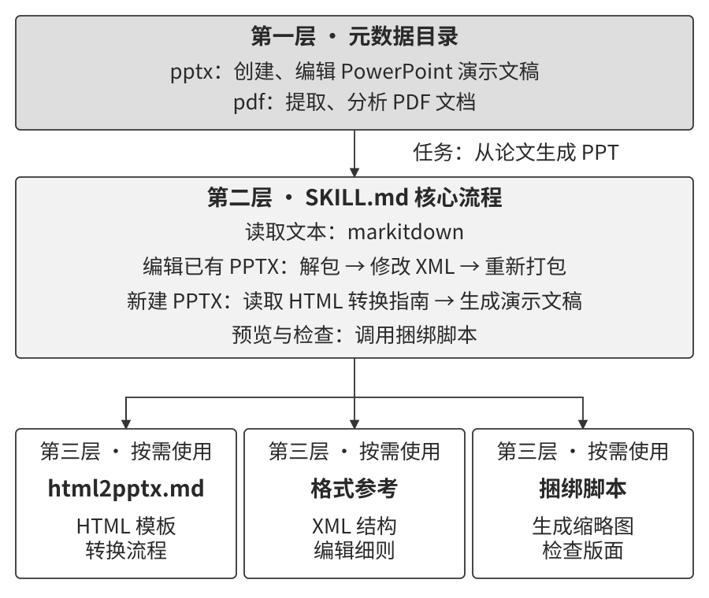

### Skills：领域能力的可组合单元

一个 Skill 把一类任务的处理方法与所需的参考资料、脚本和模板放在一起。它类似新员工的专项操作手册：先通过目录找到适用的手册，再根据当前任务阅读相关章节。这种由简到详的加载方式称为**渐进式披露（Progressive Disclosure）**[^ch2-3]。

**第一层是元数据。** 每个 Skill 用 `SKILL.md` 描述自身，文件开头的 YAML frontmatter 由 `---` 分隔，其中包含 `name` 和 `description`。运行时先将名称与描述组织成目录，让模型判断当前任务需要哪些 Skill。目录的排列与呈现由 Harness 管理，完整流程在选中后加载。

**Skill 描述首先要写成路由条件。** 模型在加载正文之前就要决定是否使用它，因此 `description` 应先说明何时适用、何时应跳过，再概括能做什么。例如，“help with backend”覆盖面过宽，几乎所有后端任务都可能匹配；“为已有 HTTP 接口编写集成测试，覆盖鉴权、参数校验和错误响应”则给出了明确范围。对容易混淆的任务，还可以补充排除条件，例如“仅讨论接口方案时无需使用”。这些条件写在描述中，便于模型在加载正文前作出判断。

**第二层是核心流程。** Skill 被选中后，运行时将完整指令送入上下文。用户显式输入 `/pptx` 一类命令时，客户端可以直接查找并加载；模型自主选择时，则通过 Skill 工具或文件读取工具取得内容。前者省去了模型发起激活调用的步骤，后者把选择与加载留在运行轨迹中。

以本书实验采用的 PPTX Skill 为例，核心说明介绍了几条常用路径：通过 Microsoft 的 markitdown 提取演示文稿文本，解压 PPTX 查看底层 XML，以及选择新建或编辑演示文稿的工作流。模型读到这层说明后，便能根据当前任务决定下一步应读取哪份资料、调用哪类脚本[^ch2-4]。

**第三层是详细资料。** 复杂操作分散在专项文档中，主文件提供入口。本书所用版本中的 `html2pptx.md` 讲解如何通过 HTML 生成演示文稿，其他参考文档补充格式与编辑细节。Agent 按任务继续读取这些内容，并使用捆绑的脚本、素材和模板完成操作。

[^ch2-3]: Anthropic，Equipping Agents for the Real World with Agent Skills，2025。https://www.anthropic.com/engineering/equipping-agents-for-the-real-world-with-agent-skills；Agent Skills，How to add skills support to your agent。https://agentskills.io/client-implementation/adding-skills-support
[^ch2-4]: Anthropic，PPTX Skill。本书实验固定使用包含 HTML 转换流程的版本，具体版本与运行方法见配套实验 README。https://github.com/anthropics/skills/tree/69c0b1a0674149f27b61b2635f935524b6add202/skills/pptx
[^ch2-codex-skills]: OpenAI，Build skills。https://developers.openai.com/codex/skills/；OpenAI Codex 公开仓库中的 Skills 实现。https://github.com/openai/codex/blob/main/codex-rs/ext/skills/src/extension.rs
[^ch2-cc-skill-inject]: Claude Code，How Claude Code uses prompt caching，Invoking skills and commands。https://code.claude.com/docs/en/prompt-caching；Agent Skills，How to add skills support to your agent，User-explicit activation。https://agentskills.io/client-implementation/adding-skills-support

### 如何编写一份可用的 Skill

一份可用的 Skill 要回答四个问题：什么任务适用，按什么顺序处理，哪些情况需要确认，以及怎样判断工作完成。写作者需要把自己的经验整理成可执行的步骤，并把关键判断配上例子。

以写作 Skill 为例，可以参考宝玉从个人表达习惯出发改进 AI 写作的思路[^ch2-baoyu-remove-ai-writing-flavor]，再将内容组织成四部分：

- **角色与读者**：说明服务对象、任务类型和成稿要求。
- **核心原则**：先写三到五条常用判断，每条配上具体的改写前后例子。
- **常见错误与边界**：记录容易出现的表达问题、越权动作及例外情况。
- **参考资料**：收录术语表、模板、范文与专项说明，供执行时查阅。

规则可以按“作用域、动作、例外、验证方式”来写。例如，一条压缩长句的规则，应当说明适用于什么段落、如何拆分，以及拆分后如何检查条件与结论是否仍然完整。这样的规则便于执行，也便于在改稿中检验。

起步时，选三到五篇自己满意的原创文章，让 Agent 归纳用词、句式、段落安排与语气，生成二十行左右的初版。随后用它处理一个新题目，由作者逐句修改。修改前后的差异会提供更具体的反馈：哪些词多余，哪些句子需要拆分，哪里缺少事实，哪里应补回技术细节。把反复出现的修改归纳为规则，并保留对应例子和适用范围。

Skill 还可以附带执行工具与模板。例如，PPTX Skill 将操作说明、解析脚本、生成脚本和版式资源放在一起，使模型能沿着说明调用相应资源。每个 Skill 可以独立测试、更新和进行版本管理，团队成员也能围绕同一份流程持续补充经验。**Skills 的长期价值在于让领域经验能够分散积累、独立发布和复用。** 团队扩展 Agent 能力时，可以维护各自擅长的 Skill，逐步形成类似 pip、npm 的软件包生态。这些 Skill 可以共用主系统提供的发现、加载与执行机制。

**设计交互方式时，优先沿用模型已经训练和适配过的模式。** 角色划分、工具结果格式和 Skill 加载方式，都影响模型如何接续任务。厂商提供的标准流程适合作为起点，能减少模型从陌生格式中重新推断含义的负担。随后用实际任务检查目录识别、按需读取、脚本调用和结果验证，再决定需要怎样调整。

[^ch2-baoyu-remove-ai-writing-flavor]: 宝玉，《别再用提示词去 AI 味了，方向就是错的》，2026-02-14。https://baoyu.io/blog/2026-02-14/remove-ai-writing-flavor

### Skills 在上下文中的位置

Skills 的上下文成本分为目录和正文两部分。目录让模型发现可用能力，正文在选中后提供操作流程。规范要求按需加载，具体消息角色、包装和更新方式则由 Harness 实现。

Claude Code 在调用位置将 Skill 指令作为 `user` 消息加入会话[^ch2-cc-skill-inject]。图2-12 展示模型自主触发的一种消息排列：先发出 `Skill(skill: "pptx")` 调用，接收工具响应，再读取追加的 Skill 正文。使用专用激活工具时，工具响应可以承担调用确认，正文由 Harness 单独注入；使用普通文件读取工具时，正文也可以直接包含在工具结果中。用户显式输入 `/pptx` 时，客户端可直接展开指令，省去模型发起激活调用的步骤。

Codex 的 Skills 实现也分别组织能力目录和选中的指令。公开源码中，一部分目录进入 `developer` 上下文，另一些随当前轮次及执行环境提供；显式选中的 Skill 则通过用户上下文片段加入。目录的来源和可用执行环境会影响具体排列[^ch2-codex-skills]。接入时，可以检查模型请求中目录与正文各出现在哪里，再判断它们对前缀复用的影响。

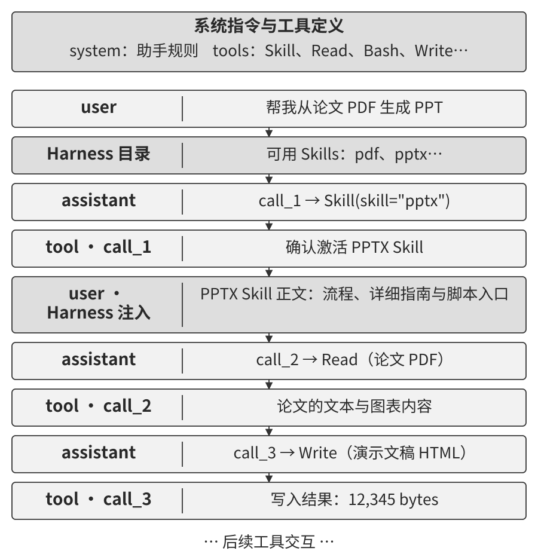{height=55%}

图2-13 展示按需加载时的缓存增长，以尚未建立可复用缓存的请求作为起点。目录首次进入请求需要处理，正文首次加载也会增加计算；当后续请求保留相同前缀时，这些内容便有机会从缓存读取。将新内容追加在调用位置，可以保持此前的消息稳定。已经加载的说明继续留在历史中，需要更新时再按运行时的上下文策略处理。

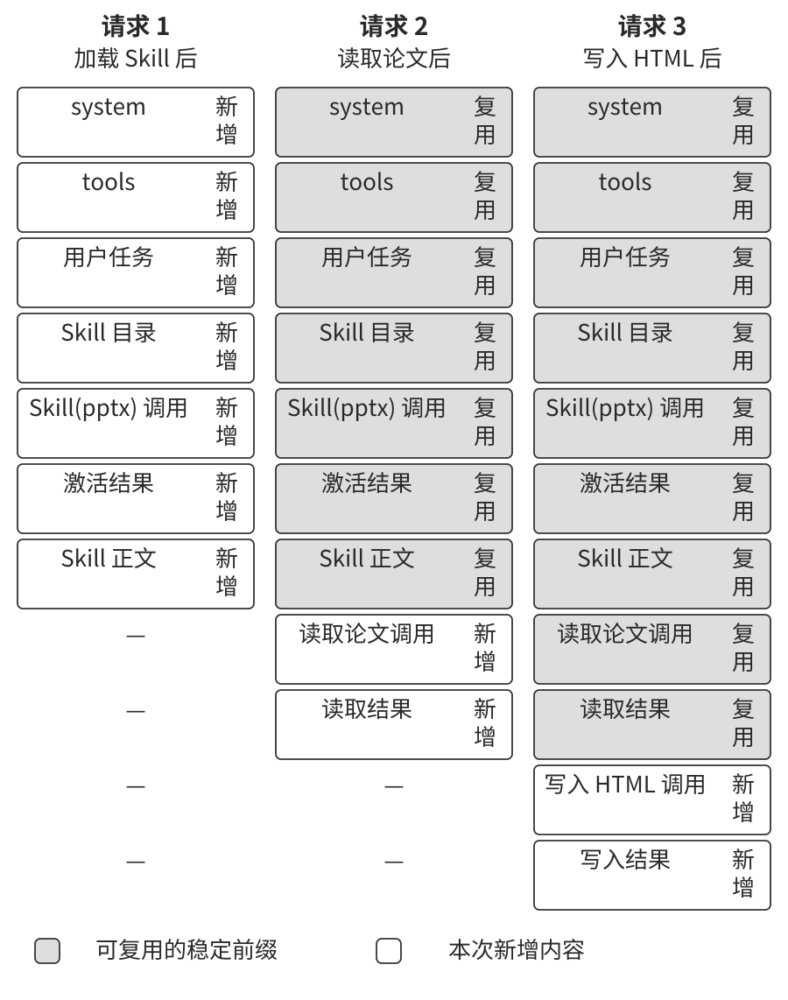

### Skills 与工具的关系

Skill 提供任务知识与操作流程，工具负责读取、执行和获取结果。第五章介绍的七个核心工具，可以与不同 Skill 组合：同一个文件读取工具既能读取演示文稿指南，也能读取代码规范；通用执行器则可运行相应的脚本。这样，专业能力可以通过流程和资源扩展，基础工具集合保持相对稳定。

专用工具也可以与 Skill 配合使用。前文的工具搜索负责按需提供工具定义，Skill 则说明何时调用、怎样组合以及如何检查结果。两者都需要控制常驻信息量，并为新加载的内容安排合适的位置。第四章将讨论通用执行器与专用工具的取舍，第九章进一步讨论经验适合保存为知识、指令、程序还是模型参数。

> **实验 2-6 ★★：使用 Agent Skills 从论文生成演示文稿**
>
> 本实验以《Attention Is All You Need》为材料，演示 Agent 怎样按需加载制作演示文稿的专业流程。任务是从论文 PDF 生成十到十五页演示文稿，覆盖问题背景、方法、关键结果与结论，并使用论文中的图表帮助讲解。
>
> 本次运行采用 Kimi Code 与 Anthropic 官方 PPTX Skill。Agent 先从目录识别演示文稿制作能力，再加载核心说明，继续读取 HTML 转换指南，调用配套生成工具，最后通过缩略图和逐页渲染检查版面。每一步读取的资料都服务于接下来的操作，完整制作流程随任务逐步展开。
>
> 成稿共十三页，引用了论文中的架构图、注意力机制图、实验结果表和注意力可视化图。检查时，先把每幅图表与原论文的编号、内容和说明对应起来，再查看演示文稿的叙述是否覆盖研究问题、方法与结论。这样可以同时检查资料提取和内容组织。
>
> 生成后的检查也属于 Skill 工作流。本次运行曾出现下标缺失、项目符号异常、图表引用路径错误和数值标签精度问题，Agent 根据渲染结果与结构检查逐项修正。最终文件通过结构检查，并使用 LibreOffice 重新打开和渲染。换用其他演示软件时，可继续检查字体、换行与图表显示。
>
> 阅读这次轨迹，可以看到 Skill 如何把专业操作串成完整流程：目录帮助选择能力，核心说明决定处理路径，详细指南支持具体实现，预览与校验推动修正。复现实验时，应同时检查加载过程和最终产物。

> **实验 2-7 ★★：从个人范文创建“去 AI 味”写作 Skill**
>
> 这个练习把个人写作经验整理为可复用的指令。准备三到五篇原创文章，让 Agent 归纳表达习惯，生成包含触发条件、三到五条原则和对应例子的初版 Skill。
>
> 选一个新题目试写，再由作者逐句修改。对照两版，找出反复出现的问题，例如用词空泛、句子过长、因果关系省略，或删掉了支撑理解的具体例子。将这些改动写回 Skill，同时记录适用范围与例外，再换一个题目检查规则是否仍然有效。
>
> 每轮修改集中解决几类明确问题，保留范文、生成稿和人工修改稿供后续比较。随着任务积累，Skill 中的规则就有了可追溯的写作依据，也更容易判断哪些经验值得保留。


## Agent 状态栏：通过元信息增强 Agent 轨迹管理

任务执行过程中，Agent 需要知道已经完成什么、还剩哪些步骤、调用过多少次工具，以及环境发生了什么变化。Harness 可以把这些运行时信息整理成结构化摘要，随消息提供给模型。本书将这种机制称为 **Agent 状态栏（Agent Status Bar）**，其组成如图2-14 所示。

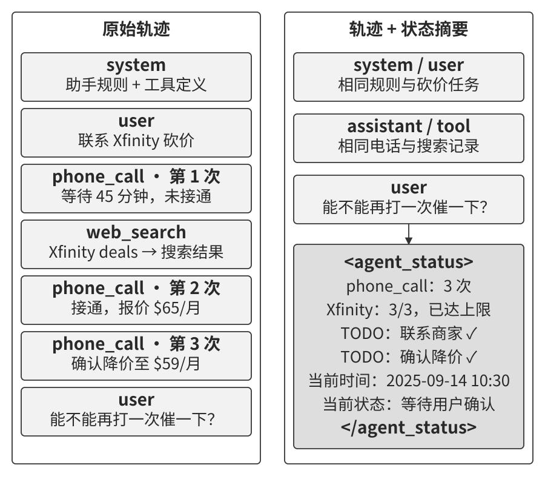

手机状态栏持续显示时间、电量和信号，让使用者随时掌握设备状态。Agent 状态栏也承担类似作用：把“已拨打三次电话”“当前时间为 10:30”“还有两项任务未完成”放在模型容易使用的位置。实现时，这些信息可以随工具结果返回，也可以由 Harness 单独组织成一条消息。

### 从原始记录到显式状态

考虑一个电话客服任务：系统要求同一任务内拨打每个商家的次数不超过三次。三次通话之间可能穿插搜索、资料读取和用户追问。模型要决定能否继续拨打，就需要从这段历史中找齐相关记录，区分商家，并计算累计次数。

运行时可以在每次调用后更新计数，直接返回“本次是对 Xfinity 的第 3 次呼叫，已达到本任务上限”。下一次决策便能使用这个结果。调用次数由程序维护，模型负责结合任务进度决定接下来是等待、查找其他渠道，还是向用户说明当前情况；执行层同时依据计数检查后续拨号请求。

这里的工程价值是**提前整理后续决策反复需要的状态**。完整通话记录仍负责保存谈话内容和处理经过，状态栏则提供决策常用的统计与进度。**反复使用的统计应优先由代码增量维护。** 在上下文中找到一条记录，与从全部记录中算出总数，是两种工作。把原始轨迹保存下来，并不会自动得到一份准确、随时可取用的统计表。每次让模型重新遍历和计数，既消耗推理 token，也增加漏记与重复计数的机会。

笔者把上下文比作一台需要配套“提炼层”的检索引擎：原始记录便于追溯，提炼后的状态便于直接使用。计数、限额和已核验的任务完成状态适合由代码维护；需要语义判断的信息，可以先逐条抽取，再汇总核验。这样，模型每次决策时都能同时看到当前状态及必要的证据。

长轨迹还会增加寻找关键信息的难度。把最新目标、约束和进度集中放在后部，可以让模型更容易找到当前决策所需的信息。其效果可通过任务行为与注意力分布分别检查：任务行为回答模型是否正确使用了状态，注意力图帮助观察它在生成时如何分配权重。

> **实验 2-8 ★★：通过注意力可视化观察 Agent 状态栏的效果**
>
> 本实验使用 Qwen3-0.6B，构造一段客服退款轨迹：Agent 已经拨打 Xfinity 三次电话，期间穿插网络搜索，随后用户追问“能不能再打电话催促一下？”系统规则限定同一任务内对每个商家最多拨打三次。
>
> 两组输入保留相同的历史与用户追问。A 组直接使用原始轨迹；B 组在末尾增加以下状态：
>
> ```xml
> <agent_status>
> Current State:
> - Tool call summary: 'phone_call' has been invoked 3 times (Xfinity: 3 times)
> - Constraint check: Maximum calls to Xfinity reached (3/3)
> </agent_status>
> ```
>
> 每组运行三次。A 组两次明确拒绝继续拨打，一次归入其他输出；B 组三次均明确拒绝继续拨打。两组都没有出现被判定为违规继续拨号的输出。可以进一步对照回复，检查模型是否说明次数限制，以及是否给出与任务相符的后续建议。
>
> 注意力图展示生成区域对历史通话、搜索结果、用户追问和状态栏的权重分布。阅读时应结合区域长度、模型层和对应输出分析，观察新增状态是否被使用，再将这些线索与行为结果对照。

笔者与 Noah Shi 的 ContextDistill-Bench 研究进一步考察了预先提炼状态的收益[^ch2-8]。在该基准覆盖的状态查询中，较小模型也能通过显式状态获得较高准确率；前沿模型的思考量、延迟与查询成本可降低约一个数量级。例如，Claude 4 Sonnet 的每千次查询成本从约 35.46 美元降至 3.51 美元。对于状态摘要能够直接回答的问题，模型可以复用预先整理的结果，省去每次重新查找和推理的开销。**这一设计在事件发生时维护状态，省去了每次查询都要遍历历史的开销。** 摘要字段固定后，即使历史继续增长，查询也只需读取这几个字段。后文将讨论如何同时保留原始记录，以回答摘要之外的问题。

[^ch2-8]: Li, Bojie and Noah Shi. *Distill, Don't Retrieve: Inference-Time Context Distillation for LLM Agent Reasoning.* 2026. https://01.me/research/context-distillation

### Agent 状态栏的构成

状态栏通常包含三类信息，分别回答“要做什么”“刚才发生了什么”和“现在处于什么状态”。

**任务规划**记录目标、步骤和完成情况。复杂任务可以拆成 TODO 列表，每项保留状态及必要的依赖关系。模型处理当前步骤时，仍能看到原始需求、核心约束和后续工作；完成一步后，再更新列表。

**事件的侧信道信息（Side-channel Information）**补充事件发生时的背景，例如时间、地理位置和距上次回复的间隔。这些元数据随事件保存，帮助模型理解先后关系与情境。同一句“还没有收到回复”，发生在提交申请后的两分钟或两天，所对应的处理方式可能不同。

**环境当前状态的观测摘要**提供当前时间、工作目录、工具调用次数和异常提醒。它与 CLI、GUI 显示当前目录或运行状态的作用相近：让下一步操作有明确的依据。例如，重复调用提醒可以促使模型检查失败原因，剩余预算则帮助它决定是否继续搜索。

事件元数据随事件追加后通常保持稳定，任务进度和环境状态则会持续变化。两类信息应按各自的更新方式写入历史，下面结合消息结构说明。

### Agent 状态栏在上下文中的具体位置

本节示例由 Harness 在消息末尾追加一条 `user` 消息，用于传递状态摘要。这里的 `user` 是所选 API 的消息角色，状态内容由运行时生成，并通过标签说明用途。使用其他接口时，也可以采用其支持的上下文块，或随对应工具结果提供状态。采用前文按真实用户查询裁剪历史推理的模板时，可把运行状态随工具结果提供，让模板继续按当前任务保留推理信息。

图2-15 展示了状态摘要与原始请求、工具交互和用户追问的位置关系。固定规则位于前部，最新状态随任务推进追加在后部。

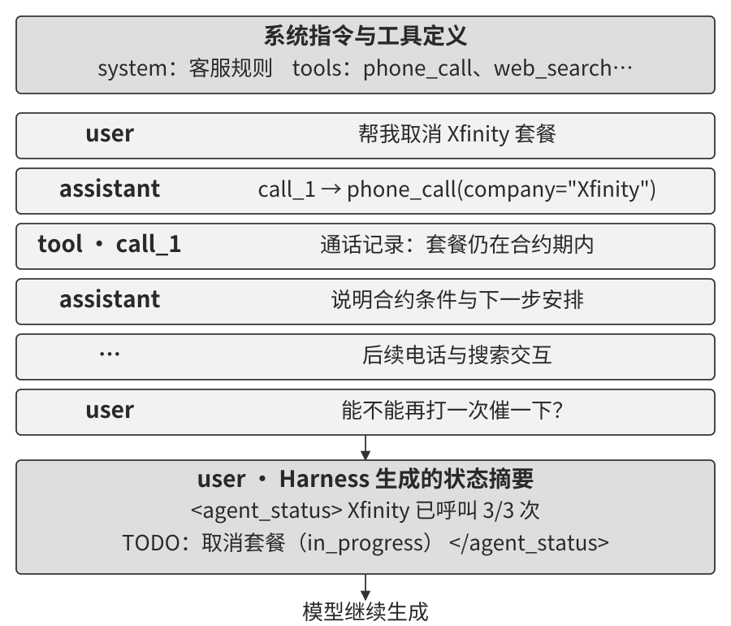

下面是消息排列示意，其中省略了重复轮次及完整的工具调用字段：

```text
messages: [
  { role: "system", content: "You are a customer service assistant..." }
  { role: "user", content: "Help me cancel my Xfinity plan" }
  { role: "assistant", tool_calls: [{ id: "call_1", ... }] }
  { role: "tool", tool_call_id: "call_1", content: "Call log..." }
  { role: "assistant", tool_calls: [{ id: "call_2", ... }] }
  { role: "tool", tool_call_id: "call_2", content: "Call log..." }
  ...其余轮次...
  { role: "user", content: "Can you call them again to follow up?" }
  { role: "user", content: "<agent_status>
      Current State:
      - phone_call invoked 3 times (Xfinity: 3/3 max)
      - Current time: 2025-09-14 10:30:45
      - TODO: [1] Cancel plan (in_progress)
    </agent_status>" }
]
```

最后一条消息把调用次数、上限、时间和任务进度集中在一起。模型可以直接使用这些字段，同时通过前面的调用 ID 回查具体记录。Harness 应保证状态与实际执行记录一致，明确当前状态的更新时间和适用任务。

追加这条消息后，前面的 token 序列保持不变，仍满足前缀复用的基本条件。至于下一轮如何处理旧状态，需要在上下文占用与缓存成本之间取舍。

### 状态更新的两种实现与缓存代价

下一轮可能完成一项 TODO，也可能增加一次工具调用。Harness 需要更新状态，常用的做法有两种。

**每轮替换**：构造新请求时移除上一条状态，在末尾加入最新状态。上下文只保留一份当前状态，便于模型使用。缓存匹配会在旧状态的位置中断，其后的消息需要重新处理；旧状态之前的稳定前缀仍可复用。如果每轮都更新，受影响的后缀通常是一轮交互。

**持久追加**：保留已有状态记录，每次在末尾追加新状态。历史前缀保持稳定，也便于追溯状态变化。旧状态会逐渐占用上下文，因此需要明确时间或版本，让模型依据最新记录判断当前情况。Claude Code 将文件变化提醒追加到会话中的方式，也体现了这种设计思路。

选择时，可以同时看状态消息大小、更新频率和两次更新之间新增的消息量。状态很短、期间产生大量工具结果时，保留旧状态可能比重算长后缀更省；状态较长且更新频繁时，替换能控制历史状态的累积。

可以用一个粗略模型估算分界点：设每条状态为 $S$ token，两次更新间新增后缀为 $R$ token，共注入 $N$ 次状态，缓存输入单价为普通输入的 $\alpha$ 倍。忽略两种方案共有的成本， $C_{\text{替换}} \approx (N-1)(1-\alpha)R$， $C_{\text{追加}} \approx \alpha S N(N-1)/2$。对 $N>1$，当 $\alpha SN/2 < (1-\alpha)R$ 时，持久追加的估算成本更低；反之，每轮替换更省。这里把普通输入单价作为成本单位：替换方案多付的是后缀从缓存读取变为重新处理的差价，追加方案多付的是历史状态的重复读取费用。实际选型还要结合缓存写入价格、命中率、窗口占用和陈旧状态的影响。

> **实验 2-9 ★★：几种好用的 Agent 状态栏技术**
>
> 本实验实现五种状态栏技术，可分别开启，也可组合使用。每项技术提供一类具体信息，帮助模型决定下一步行动。
>
> **时间戳跟踪**在用户消息和工具响应中记录事件时间，例如 `[2025-09-14 10:30:45]`。时间随事件写入历史，后续轮次保持原值；当前时间则随新的状态消息更新。实验还提供时间模拟，用来检查模型能否区分“昨天的文件”与“今天的修改”，以及是否正确理解等待时长。
>
> **工具调用计数器**用字典维护每个工具的累计调用次数，并在响应中标注 `Tool call #3 for 'read_file'`。结合错误内容，模型可以判断是否继续尝试。例如，首次读取失败后检查路径，再列出目录；多次失败后，查找替代文件或向用户说明缺失情况。需要限制重试次数时，运行时还应按计数执行上限。
>
> **TODO 列表管理**提供 `rewrite_todo_list` 和 `update_todo_status` 两个工具。每项包含唯一标识符、内容、时间戳，以及 `pending`、`in_progress`、`completed`、`cancelled` 四种状态。列表集中保存“做了什么、还差什么”，与 Manus 通过重复呈现任务计划保持目标可见的思路相近。检查时要将完成标记与实际文件、工具结果对应，确认每项工作确实完成。
>
> **详细错误信息**提供错误类型与描述、调用参数的 JSON、调用栈和修复建议。例如，遇到 `FileNotFoundError`，可以提示模型核对文件名、当前目录与绝对路径。参数帮助定位错误输入，调用栈帮助查找失败位置，修复建议则给出下一步检查方向。向模型返回这些内容前，应清理凭证等敏感字段，并控制冗长堆栈的长度。
>
> **系统状态感知**提供当前时间、工作目录、操作系统、Shell 和 Python 版本。实验中的命令工具会识别单独的目录切换操作，更新运行时维护的工作目录，再用于后续调用；复合命令中子进程的目录变化遵循对应进程的执行范围。环境字段也帮助模型选择可用工具，例如根据实际系统和已安装的软件选择 `apt` 或 `brew`。
>
> 本次 Kimi K3 对照中，各类任务各有五个案例。时间戳和组合配置均通过五项，对照组各通过三项；工具计数器与系统状态的开启、关闭两组均通过五项。TODO 配置通过零项，对照组通过一项；详细错误配置通过四项，对照组通过五项。分析这些结果时，应回到具体轨迹和产物，检查新增信息在哪一步被使用，以及任务失败发生在哪里。
>
> 五项技术还可以围绕同一个问题配合：时间戳与计数器描述重试的频率，TODO 与系统状态说明当前目标和操作环境，错误信息解释上一次失败。以文件缺失为例，可以先核对目录，再列出可用文件，随后根据任务要求寻找替代材料，或记录阻塞原因。比较配置时，同时检查任务完成情况、调用次数和遗漏的子任务，才能判断新增信息带来的实际收益。

状态栏中的字段便于直接查看，开发者沿着轨迹就能检查模型当时看到了什么。这种机制可以直接在 Harness 中实现，先用现有模型做任务对照，再据结果调整字段与呈现方式。

**状态栏应尽量由代码维护。** 模型会直接使用其中的统计和限制，一条错误的“已拨打三次”就可能改变后续行动。计数、时间和状态迁移交给程序；需要语义理解时，先让模型逐条抽取，再由代码汇总、核验，避免一次性让模型统计整段长历史。原始事件、抽取结果与最终状态之间保留对应关系，便于发现重复计数、漏记和来源混淆。

状态栏汇总哪些信息，需要预先选择。例如，“拨打三次”足以支持次数限制判断，却无法回答“第二次通话中客服承诺了什么”。对于只需统计值的后续任务，可以用状态摘要替换历史，并将原始记录归档；需要核对谈话内容时，再按索引读取原文。摘要的字段设计决定了哪些问题可以直接回答，也决定了何时需要回查。

状态栏通过提炼信息减少重复查找；进一步用摘要替换长历史，就进入了上下文压缩。下一节讨论压缩的时机、对象与保留规则。

## 上下文压缩策略

随着任务推进，搜索结果、文件内容和工具返回值会不断进入上下文。压缩需要从这些材料中提取后续仍要使用的信息，归档暂时用不到的细节，并为继续执行预留空间。本节从压缩的目的出发，讨论触发时机、信息选择与缓存成本。

### 压缩的三个目的

**控制长度与成本。** 以 128K token 的窗口为例，长网页和大文件可能占据其中相当一部分空间。Harness 需要为后续输入、模型输出和工具交互保留预算。缩短历史也能减少后续请求的输入量，具体节省取决于缓存命中、计费方式及压缩本身的开销。

**整理后续决策所需的知识。** 十几轮搜索可能反复提到同一事件，也可能留下互相矛盾的说法。将其整理为“已确认 A、B，C 仍缺少证据”，能让模型接着未完成的问题工作。摘要应保留事实之间的关系、来源和未解决的问题，使后续决策有明确依据。

**支持长任务持续推进。** 一些模型在认为窗口即将耗尽时，会提前收尾，这种现象被称为**上下文焦虑（Context Anxiety）**。Anthropic 在 Sonnet 4.5 的长任务测试中发现，压缩后仍可能出现这种行为，因此采用结构化交接记录，重置上下文后继续执行[^ch2-7]。工程上可以比较原会话压缩与新会话交接，检查任务是否持续推进，以及交接是否遗漏必要状态。

[^ch2-7]: Prithvi Rajasekaran，Harness design for long-running application development，Anthropic Engineering，2026。https://www.anthropic.com/engineering/harness-design-long-running-apps

### 把重复计算的结果整理为可用知识

状态栏提前维护计数和进度，摘要则进一步整理长文本中的事实与关系。两者都在提前整理散落的信息，让后续决策可以直接使用。

看一个宠物店巡查的例子：

> 笼子 1：黑猫。笼子 2：白猫。笼子 3：黑猫。笼子 4：黑猫。笼子 5：白猫。
> ……（共 100 个笼子，其中 90 只黑猫、10 只白猫）

回答“笼子 37 里是什么猫”，需要定位对应记录；回答“黑猫和白猫各有多少只”，需要汇总全部记录。若后续多次使用总数，就可以先计算并保存“黑猫 90 只，白猫 10 只”，避免每次从头统计。程序适合完成这种确定性的汇总，模型则可以继续根据统计结果回答业务问题。

摘要的内容应随任务选择。只保留两类猫的总数，足以回答数量问题；要回答笼子 37 的情况，还需要逐笼记录或相应索引。压缩方案因此要同时说明哪些信息直接保留、哪些信息归档，以及如何回查。

即使窗口尚有空间，过长或混杂的上下文也可能影响信息使用：模型遗漏关键事实，重复处理已解决的问题，或把过时状态用于当前决策。这类随上下文增长出现的表现退化通常称为**上下文腐化（Context Rot）**。它体现为任务表现变差；请求超过容量限制时，则会触发窗口溢出。评估时可以在不同历史长度下设置相同问题，检查事实检索、约束遵循与下一步行动是否保持稳定。

**窗口还有空间时，也应主动整理已经反复使用的知识。** 关键判断已经可以汇总，却仍让模型在长历史中一遍遍寻找，会持续消耗计算并增加遗漏。搜索任务可以保存已确认事实、来源与待查问题；编程任务可以保存架构决定、修改范围、测试结果与失败原因。压缩后，再检查模型能否依靠这些内容继续执行任务。

上下文中的示例还会影响模型处理新问题的方式。Dherin 等人的研究从 Transformer 中注意力层与 MLP 的组合出发，将特定前向计算表示为与上下文相关的低秩权重更新，为上下文学习提供了一种理论解释[^ch2-6]。实际推理时，模型权重保持不变，示例通过当前输入影响输出。希望在后续会话复用这类经验，可以把它整理成记忆、示例或 Skill，再按任务加载；第九章将进一步讨论经验的积累方式。

[^ch2-6]: Benoit Dherin et al.，Learning without training: The implicit dynamics of in-context learning，2025。https://arxiv.org/abs/2507.16003

### 压缩与 KV Cache 的取舍

压缩通常发生在两次模型调用之间。Harness 根据剩余预算和任务进度，整理下一次请求所需的消息，再将它们发送给模型。替换历史会改变前缀，因此需要同时考虑压缩收益与缓存重建成本。

首先，保持仍然适用的系统指令与工具定义稳定。它们位于前部，后续历史的压缩可以继续复用这部分前缀。其次，选择具体的压缩对象：长工具结果可以替换为摘要，已经完成的多轮交互可以合并为阶段记录。替换位置之前的内容保留复用条件，替换位置及其后的内容需要按新的前缀处理。

**历史压缩优先成批进行，避免每轮都改写同一段前缀。** 压缩之后，每轮输入会缩短，但压缩调用与后缀重算也要消耗资源。触发时机可以结合窗口占用、预期后续轮数和任务阶段来确定：长工具结果集中出现后批量整理，完成一个阶段后保存交接摘要，都能减少频繁修改历史的开销。保留最近几轮时，应检查工具调用与返回值是否成对，并把未完成操作的状态写入摘要。

压缩时还要检查推理信息的回传协议。部分模型的历史 thinking 与生成它时的前缀绑定。若在这些块之前替换历史，保留下来的 thinking 就可能与新前缀不匹配。采用这种协议时，可以将会话整理成摘要，清除受影响的旧 thinking，让模型从摘要继续推理；也可以使用服务端支持的压缩或上下文编辑机制。服务端如何处理推理状态和缓存，应按对应接口约定接入。

图2-16 汇总六种压缩策略在同一研究任务中的运行结果。下面结合搜索材料的处理过程，说明各策略的机制。

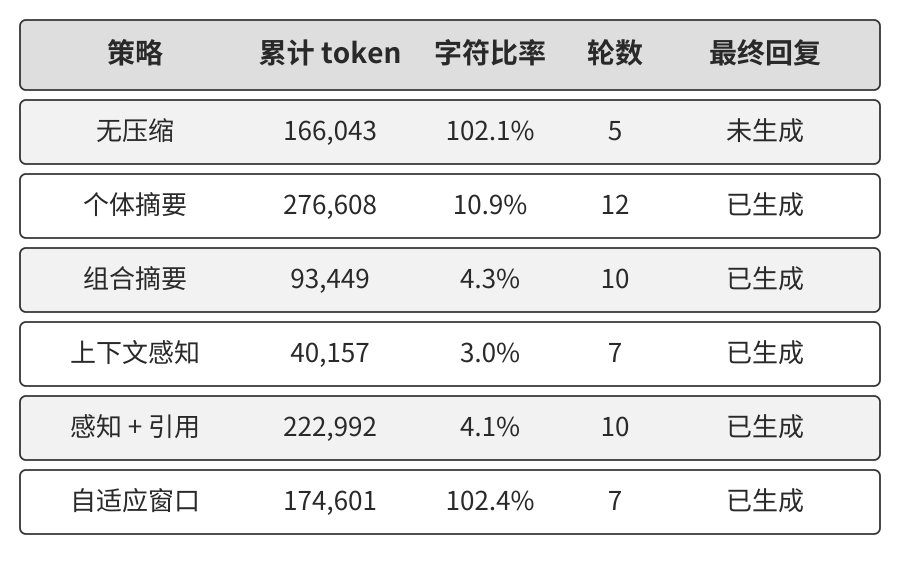

> **实验 2-10 ★★★：上下文压缩策略对比**
>
> 本实验用 Kimi K3 研究 OpenAI 联合创始人的职业状态。任务需要逐步建立人员名单、查找经历和职位变化，再把相关事实与来源对应起来。为观察压缩与溢出处理，实验将应用侧上下文预算设为 128,000 token，并比较六种策略[^ch2-compression-results]。
>
> **策略一：无压缩。** 搜索与页面读取的结果完整进入历史。该配置的七次工具调用共返回约三十七万字符；到第五轮，请求输入达到约十六万五千 token，超过应用预算，触发溢出保护。这个过程说明，大体积工具结果可能在少数几轮内占满输入空间。
>
> **策略二：个体摘要。** 每个搜索结果单独生成两到三段摘要，保留各页面的主要内容。这种方式容易并行处理，也便于保留页面边界；多个页面讲述同一事件时，重复信息仍会进入历史。这一配置用十二轮生成最终回复，累计约二十七万七千 token，字符压缩率为 10.9%。
>
> **策略三：组合摘要。** 将一批搜索结果合并，再生成综合摘要，便于整理重复事实和不同来源的关系。该配置用十轮生成最终回复，累计约九万三千 token，字符压缩率为 4.3%。输入超出摘要预算时，应先分批处理，再合并结果，防止直接截断丢失后部材料。
>
> **策略四：上下文感知摘要。** 压缩时同时提供当前查询和已经掌握的信息，例如在提示中加入 `Given the search query: {query}` 与 `Current context: {context}`。模型据此保留与当前问题相关的事实，并优先补充已有摘要中的缺口。该配置用七轮生成最终回复，累计约四万 token，字符压缩率为 3.0%。其中一次压缩把约十五万字符整理成约两千字符，保留人员姓名与职位变化；阅读摘要时，可以沿这些字段检查信息是否足够支持后续查询。
>
> **策略五：带引用的上下文感知摘要。** 在任务相关摘要中保留事实对应的来源链接。该配置用十轮生成最终回复，累计约二十二万三千 token。回查时先定位来源，再核对原文中的时间、人物和条件；需要长期复核的材料，还可以保存抓取时间与原文快照。
>
> **策略六：自适应窗口化。** 前期保留原始材料，输入达到阈值后再批量整理。实验采用三个机制：超过预算的 80% 时触发压缩；汇总处理尚未压缩的工具结果；为处理过的结果添加 `[COMPRESSED]` 标记，避免重复摘要。按本实验的 128,000 token 预算，触发阈值为 102,400 token。该配置用七轮生成最终回复，累计约十七万五千 token。
>
> 图2-17 对照六种策略的输入与输出。选择时，可以先问当前困难发生在哪里：单页太长、跨页重复、缺少任务针对性、需要回查来源，还是历史持续增长，再配置相应处理方式。
>
> 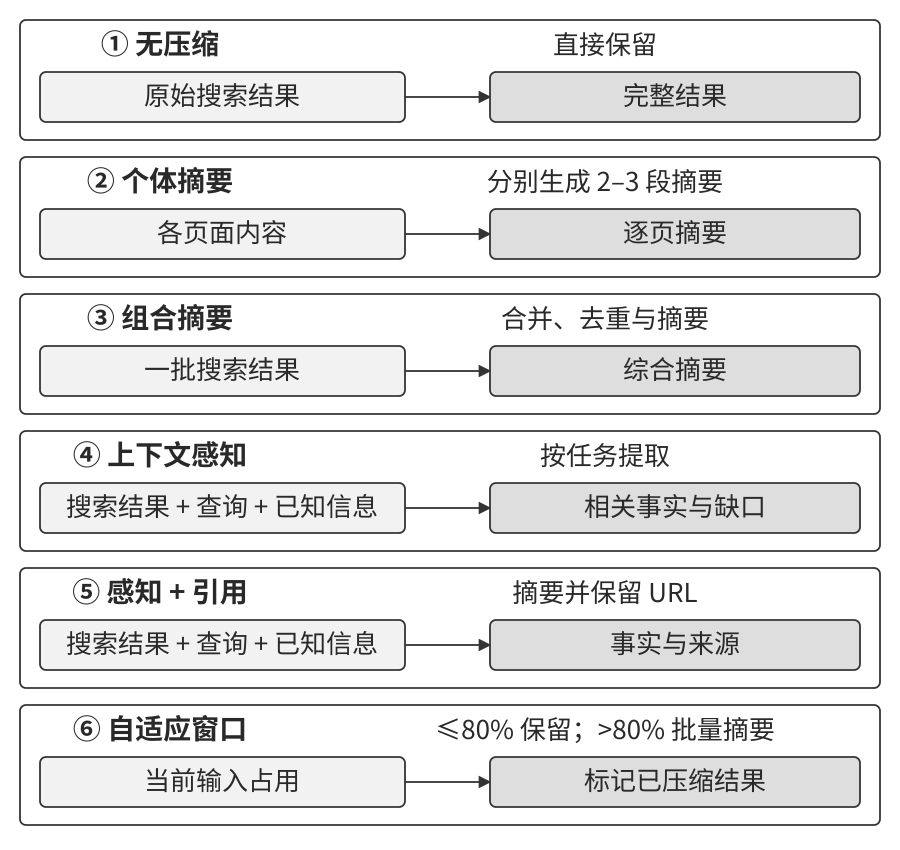
>
> 比较图2-16 的数字时，需要区分三个量：单次请求输入决定是否达到窗口预算，累计 token 反映多轮调用用量，字符压缩率描述被统计材料的处理后长度与原始长度之比。实验程序以生成最终回复作为完成标记；人员是否齐全、职业状态是否准确、引用是否支持结论，则需要逐项核验最终内容。

[^ch2-compression-results]: 本节数字沿用配套实验 README 的 2026 年 7 月 18 日运行汇总；图中保留原始汇总值，正文按阅读需要取近似值。字符压缩率与累计 token 使用不同的统计单位。

### 生产级的分层压缩机制

不同信息的使用频率和保留期限各不相同。工具输出中的正文可能暂时需要完整阅读，已经完成的步骤适合归档，当前约束则应持续可见。可以围绕这些差异组合五类机制。

1. **工具结果预算控制**。大体积输出保存到外部存储，上下文中保留摘要预览与读取入口。预览一旦进入历史，就保持内容稳定；需要更多细节时，再读取相关片段并追加结果。
2. **清理无关内容**。网页导航栏、重复页脚等可以在结果进入上下文前过滤。已经进入历史的内容需要删除时，先确认后续任务和引用是否仍依赖它，再计算修改历史带来的缓存成本。
3. **API 层上下文编辑**。支持这类能力的服务可以按规则清理旧工具结果。客户端需要配置触发条件，并处理服务返回的编辑信息。清理范围和缓存行为由接口约定决定，适合与输入预算监控一起接入。
4. **归档式摘要**。按轮次或任务阶段记录目标、操作、结果和未完成事项，保留执行顺序。可以把它理解为任务的变更记录：后续能够查到某个决定在哪一步作出，以及依据是什么。
5. **会话整体压缩**。当局部清理仍无法满足预算时，将当前目标、约束、已确认事实、关键决定和下一步工作整理为交接摘要。可以先整理已有会话笔记，再汇总整段历史。压缩连续失败时，由重试上限或熔断机制停止重复调用，保存可恢复的状态，再选择缩小输入或人工处理。

这几类机制可以分层配合：入口控制减少一次性的大输出，局部整理控制日常增长，阶段摘要和整体压缩为长任务保存交接信息。实现时还应保留一份可回查的原始轨迹，使摘要中的决定能够对应到实际执行记录。

### 压缩策略的设计原则

决定压缩后保留什么时，可以从以下四个方面检查。跨任务积累经验的过程将在第九章展开。

- **按任务价值分配篇幅**。人员名单、身份关系和当前待查问题通常应直接保留；支撑结论的关键证据保留来源与必要细节；导航栏、广告和重复内容可以清理。事实存在争议时，证据之间的差异也属于重要信息。
- **保持语义完整**。例如，“Sutskever 于 2024 年 5 月离开 OpenAI”中的人物、时间、动作和机构共同构成一条事实。压缩时应保留这些要素，避免只剩下“Sutskever 离开”这样难以解释的片段。
- **围绕后续问题组织内容**。“查找创始人名单”需要完整覆盖人员，“了解个人背景”则需要经历、时间线和来源。同一份材料可按不同任务生成不同摘要：检索重在覆盖，分析重在关系与依据，创作还需要保留有用的细节和例子。
- **验证摘要能否支持执行**。语义摘要需要理解任务、消除重复，并保存条件和例外。可以由模型生成，再通过事实核对与后续任务检查质量。**复杂材料的语义压缩，应优先使用理解能力接近主模型的模型。** 压缩者需要判断哪些条件、例外和证据会影响后续工作；如果这些内容被丢掉，主模型再强也很难补回。选型时先检查保真度，再比较成本与延迟。

评估压缩收益时，应将摘要生成、缓存重建和后续调用放在同一段任务中计算，同时检查最终产物。缩短输入、减少调用与保持任务质量共同决定一项策略是否值得采用。

早期架构决定、约束背后的原因和失败路径容易在长历史中被遗漏。**长任务应定期更新进展文档**，保存“决定了什么、为什么这样决定、验证了什么、下一步做什么”。Prompt 或 Skill 可以规定更新时机，Harness 则在任务交接时加载相应记录。这样的文档也方便执行者、审核者和后续 Agent 理解已有工作。

### 子 Agent 上下文隔离

**对于交付边界清楚、会产生大量中间材料的任务，笔者优先采用子 Agent 隔离。** 大范围搜索会读入许多只在探索阶段有用的材料，先隔离能减少这些内容对主任务的持续干扰。主 Agent 将任务交给拥有独立上下文的子 Agent，由子 Agent 阅读中间结果，再返回结论、证据位置和未解决问题。主 Agent 的上下文中因此只需保留后续决策所需的信息。

例如，要“找到处理支付回调的函数”，主 Agent 直接搜索时，可能需要读取十几个文件。交给搜索子 Agent 后，可以要求它返回函数名称、所在模块、调用点和判断依据。它的回复可以是“支付模块中的 `handle_callback` 负责处理回调，另有两处调用点”，并附上可定位的引用。主 Agent 根据这些结果决定是否继续读取相关代码。

隔离减少了进入主上下文的中间材料，也便于控制主任务的增长速度。评估整个系统的计算量时，还要计入子 Agent 读取、汇总信息的开销，以及任务委派和结果核验的成本。交接摘要同样需要保留证据，原始探索记录可以归档供回查。

任务描述应当足够完整：目标是什么、搜索范围多大、需要遵守哪些约束、返回什么格式，以及遇到歧义时如何处理。主 Agent 收到结果后，检查它是否回答了原问题，并根据需要核验引用。若委派请求和返回结果都追加到历史，主 Agent 原有前缀仍可复用。

这种模式适合代码搜索、资料收集等中间信息多、交付边界清楚的任务。第四章将讨论子 Agent 作为工具的接口设计，第十章进一步讨论多 Agent 系统中的上下文分工。

## 本章小结

上下文工程把模型当前需要的信息组织成可用的决策依据。消息角色、工具定义和调用 ID 建立交互结构；稳定前缀为缓存复用创造条件；系统指令说明任务规则，Skills 按需提供专业流程，状态栏汇总当前进度。

任务变长后，可以通过结果预算、结构化摘要、历史归档和子 Agent 隔离控制输入增长。调整这些机制时，应同时检查信息是否完整、来源是否可追溯、缓存成本是否合理，以及模型能否继续完成任务。

本章解决了怎样为当前任务组织信息的问题。任务结束后，哪些用户偏好和工作经验值得留下，又怎样在下一次需要时找到它们？下一章将讨论用户记忆与知识库，把信息的保存和使用扩展到多次任务之间。

## 思考题

1. ★★★ 实验 2-3 中，滑动窗口配置未在轮次上限内生成最终回复。请结合轨迹分析哪些信息被移除，并设计一种保留关键状态、控制历史长度的方案，说明它对前缀缓存的影响。
2. ★★ Qwen3 的 Chat Template 按最后一个真实用户查询的位置处理历史思考。若一次 ReAct 循环持续上百轮，你会如何管理逐渐增长的推理内容？请比较历史思考的裁剪、回传与前缀绑定协议，并说明 Harness 应如何适配。
3. ★★ 假设要把约十五万字符的搜索材料压缩到两千字符，你会保留哪些事实、关系与来源？怎样检查摘要是否足以支持后续问题，又怎样恢复被省略的细节？
4. ★★ 工具计数器漏记了一次调用，状态栏因此给出错误的剩余次数。请设计事件记录、汇总校验和执行层检查，说明如何发现并修复这种不一致。
5. ★★ 实验 2-4 比较了语气、信息组织与工具描述。若系统提示词由多人长期维护，你会如何管理版本、检查规则冲突，并用回归任务评估每次修改？
6. ★★★ 宠物店案例同时包含单条检索与总体统计。请设计原始记录、统计摘要和查询路由，使系统能高效回答这两类问题，并说明摘要需要在什么时候更新。
7. ★★★ 一个 Skill 已在目录中，但模型没有发现它适用于当前任务。你会如何从描述、目录组织、显式触发和评估样例四个方面排查问题？
8. ★★ Skill 已经成功加载，模型却漏掉了其中的验证步骤。请设计一个对照实验，区分触发、理解、工具使用和完成判断中的问题，并比较不同模型的表现。
9. ★★★ 系统包含大量工具，工具集合又经常变化。你会如何安排固定定义、工具目录、按需加载结果与运行时状态的位置？请同时考虑发现准确率、上下文预算和缓存命中。
