# 用户记忆和知识库

上一章讨论了一次任务中的上下文管理。任务结束后，用户偏好、已确认的事实和积累的知识还需要保存下来，供后续会话使用。本章讨论如何存储、更新和检索这些持久信息。

**用户记忆**围绕特定用户组织信息，记录其偏好、习惯、需求和经历，让 Agent 在后续会话中继续按用户的情况提供服务。**知识库**则在一定权限范围内供多个用户共享，例如行业法规、企业操作流程和技术文档。前者帮助 Agent 了解服务对象，后者提供完成任务所需的领域知识。

两者都要解决怎样保存信息、需要时怎样找到信息的问题，也会遇到事实冲突、内容过期和检索遗漏。向量检索、结构化索引和知识压缩等技术可以同时用于这两类系统。图3-1 展示了本章的安排：先讨论用户记忆的表示与管理，再介绍检索增强生成（RAG），最后把检索方法用于跨会话记忆和更复杂的知识组织。

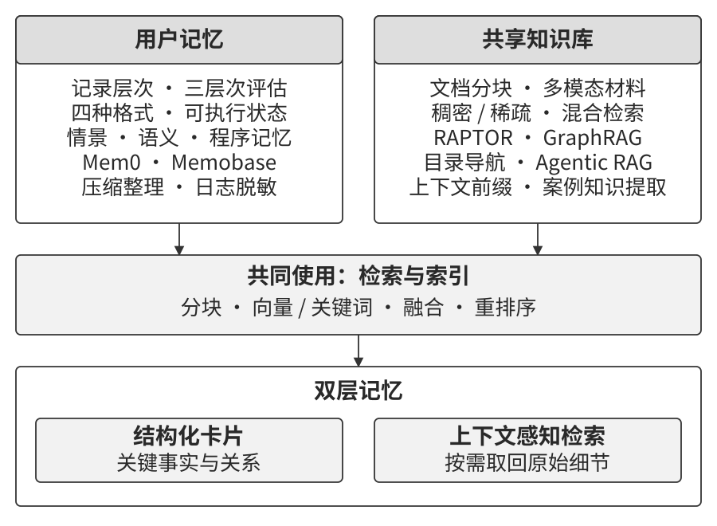

## 用户记忆系统

用户记忆系统从交互中提取有后续价值的事实，保存为持久记录，并在新任务开始时取回相关内容。一种常见实现是在会话结束后调用 LLM，提取、整理和更新记忆。新会话开始时，系统将相关记录加载到上下文中。

例如，用户在预订机票时提供了以下信息：

```text
User: Help me book a flight to Tokyo next Friday. I prefer window seats
      and I'm vegetarian, so I'll need a special meal.
Agent: I'll search for flights to Tokyo for next Friday...
       [calls flight_search tool, returns 3 options]
Agent: Here are your options. Based on your preference, I've filtered for
       window seat availability. Shall I book the ANA direct flight?
User: Yes, and use my United MileagePlus number 12345678.
```

会话结束后，记忆提取器可以整理出四条记录：

```text
Extracted memories:
- User prefers window seats (preference)
- User is vegetarian, needs special meals on flights (dietary restriction)
- User's United MileagePlus number: 12345678 (loyalty program)
- User has travel plans to Tokyo (recent activity)
```

这个例子包含三项处理。**选择性提取**保留座位偏好、饮食要求和会员号，过滤“搜索返回三个选项”这类临时细节。**抽象化**把用户明确表达的靠窗偏好整理为以后订票可用的规则。**结构化**为事实标注类别，便于检索与更新。东京之行还应记录出发日期和当前状态；“下周五”需要结合会话日期转换，行程结束或取消后再更新状态。这样，长期偏好与近期活动就能按各自的有效期维护。

### 记忆能力的评估：三层次框架

设计记忆系统时，需要先明确希望它完成哪些任务。公开基准 **LoCoMo**（Long-term Conversational Memory，长期对话记忆）包含平均约 300 轮、最多 35 个会话的长对话，通过问答、事件摘要和多模态对话生成考察记忆能力。其中问答又包含单跳、多跳、时间推理、常识或世界知识，以及对抗性问题[^ch3-locomo]。

[^ch3-locomo]: Maharana 等，[Evaluating Very Long-Term Conversational Memory of LLM Agents](https://snap-research.github.io/locomo/)，2024。

结合这类基准和记忆产品的实践，笔者将需要关注的能力归纳为八项：

- **个人信息保留**：准确保存并取回用户身份等长期信息。
- **偏好追踪**：记录用户偏好，并随新的明确表达更新。
- **上下文切换**：切换话题后仍能接续相关背景。
- **记忆更新**：处理用户对既有事实的补充和更正。
- **多会话连续性**：在新会话中使用先前保存的信息。
- **复杂思考**：关联多个记忆片段。例如，用户曾提到花生过敏，讨论泰国菜时就应结合这一信息提醒核对食材。
- **时间感知**：保存日期、解析相对时间，并计算事件间隔。
- **冲突解决**：发现不一致的信息，结合来源、时间和适用对象作出判断。

围绕 Agent 的实际任务，本书进一步采用三层次评估框架。实验 3-1、3-2 先用它比较记忆表示；实验 3-9 和 3-11 再用同一框架评估检索方法。

**第一层：基础回忆。** 准确保存并取回用户直接提供、含义明确的信息。例如，用户说“我的会员号是 12345”，后续订票时应能返回完整号码。这一层主要检查事实是否丢失、混淆或被改写。

**第二层：多会话检索。** 从不同时期、涉及不同对象的会话中找齐相关信息，再判断当前请求涉及谁、需要哪些记录。用户有两辆车，却只说“为我的车预约保养”，系统应先取回两辆车的信息并澄清对象。查询贷款状态时，需要区分已生效合同与过去咨询的报价。取消“洛杉矶之旅”时，则要把机票、酒店等预订关联到同一次旅行。

**第三层：主动服务。** 根据当前任务，发现用户没有逐项点明的相关事项。例如，预订国际航班时关联数月前保存的护照信息，检查有效期是否满足行程要求；手机损坏时汇总设备保修、信用卡附加保修和运营商保险，列出可用的处理方案；准备报税材料时，从全年记录中找齐股票交易、自由职业收入和房产税文件。这里考察的是系统能否主动找出关联、补齐清单并提醒问题，具体行动仍按用户授权执行。

> **实验 3-1 ★：用三层次框架评估记忆系统**
>
> 评估集每层包含 20 个用例，共 60 个。第一层以单会话为主；第二、三层包含跨时间、跨对象的多段会话，用于检查实体关联、信息更新和主动提醒。
>
> 每个用例分两步执行。先逐段输入会话：模型根据第一段生成记忆，后续每次只收到已有记忆和新会话，并生成更新后的记忆。旧会话原文随即退出这条更新链路，因此后续回答依赖已经保存的信息。所有会话处理完后，再输入一个新问题，要求 Agent 根据记忆作答。
>
> 评估采用 LLM-as-a-judge：由独立的评审模型对照参考答案和评分要求，检查回答覆盖的事实及错误。本次运行使用 Doubao Seed 1.6 生成记忆和回答，使用 Moonshot 模型评分。比较方案时，保持用例、模型和评分规则一致，再查看失分发生在事实提取、记忆更新还是回答阶段。

### 记忆的层次结构

确定评估目标后，就可以设计记忆的具体结构：每类记录承担什么职责、采用什么格式、保留哪些内容。下面先按职责区分记录，再讨论格式与内容。

**轨迹（trajectory）**按时间记录一次 Agent 运行中的事件，包括用户消息、模型响应、工具调用与执行结果。采用只增不改（append-only）的事件日志时，新事件追加到末尾，原记录保留供追溯。Harness 可以从轨迹中选取历史、提取状态或生成摘要，构造每轮实际发送给模型的上下文。日志的保存期限和删除方式由系统的数据保留策略管理。

**用户长期记忆**保存跨会话有用的信息，如偏好、人物关系、历史活动摘要和已确认的事实，并通过用户 ID 等标识划定归属。新的表达可能补充、更正或替代旧记录，因此长期记忆需要合并与更新。读取和维护既可以由 Agent 显式调用工具完成，也可以由 Harness 在会话加载、结束或后台整理时触发。

**业务状态**描述任务所处的逻辑阶段，如“需要澄清”“处理中”“等待付款”“已完成”。程序可以检查这些状态，决定接下来等待什么事件、执行什么操作。第六章将进一步讨论事件驱动架构中的状态管理。

这三类记录可以协同工作：轨迹提供执行依据，长期记忆提供跨会话背景，业务状态说明当前任务推进到了哪里。下面重点讨论长期记忆的表示、管理和检索。

### 用户记忆的四种存储格式

同一条用户信息可以保存为简短事实、完整段落或带字段的卡片。图3-2 对比四种格式：简短笔记便于逐条更新，段落保留事件背景，结构化卡片则便于按字段管理关系与来源。

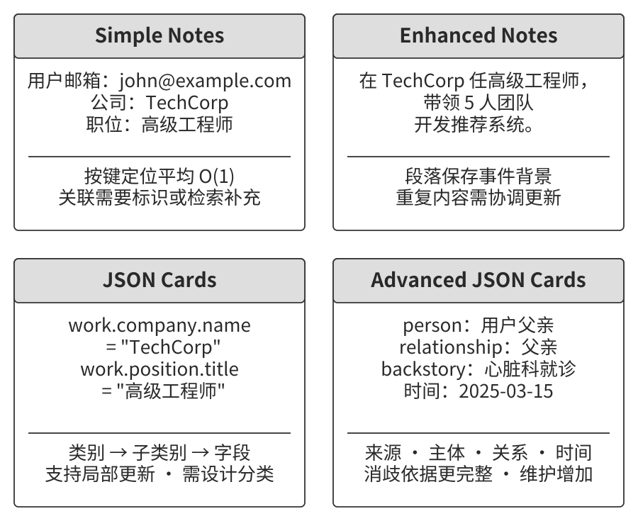

**Simple Notes** 将每条记忆写成一个简短事实，例如“用户邮箱：john@example.com”。单条记录容易读写；用哈希表按稳定键定位时，查找和更新的平均时间复杂度通常为 O(1)。按语义搜索大量笔记时，还要建立检索索引。拆分过细还会丢失关系：“在 TechCorp 担任高级工程师，负责推荐系统开发”若拆成公司、职位、项目三条互不关联的记录，后续就需要重新判断它们是否属于同一份工作。

**Enhanced Notes** 用完整段落保存事实及其背景。例如：“用户在 TechCorp 担任高级软件工程师，从事机器学习工作已有三年，目前领导一个 5 人的推荐系统项目。”公司、职位、经历和团队之间的关系在同一段中得到保留。代价是部分事实可能在多段中重复；职位变化后，需要找齐相关段落并更新，避免新旧记录并存。

**JSON Cards** 按“类别—子类别—键值对”组织信息，例如 `personal.contact.email` 和 `work.position.title`。修改职位字段时，可以保留 `work.company.name` 等其他字段，适合局部更新。设计分类时还要考虑交叉信息：“周末用 Python 开发个人项目”同时涉及时间、技术偏好和活动。可以保存一条活动记录并添加多个标签，或通过引用连接相关类别，保留这些关联。

**Advanced JSON Cards** 在事实之外增加来源背景 `backstory`、主体 `person`、与用户的关系 `relationship` 和时间戳。这些字段帮助系统识别信息属于谁、何时获知、适用于什么场景。例如，“张医生”可能指用户的牙科医生，也可能指用户父亲的心脏科医生；将姓名与就诊者、亲属关系及专科一起保存，就能减少混淆。

当用户说“帮我安排家人的年度体检”时，系统可通过 `person` 和 `relationship` 找出家庭成员，再从 `backstory` 中读取相关经历。字段越丰富，提取和更新时需要处理的关系也越多。笔者建议按信息的重要性和关联需求混合存储：关键人物、合同和长期偏好采用 Advanced JSON Cards，保留来源与关系；数量多、关联少的简单事实采用 Simple Notes，降低提取和维护成本。两类记录通过标识或引用连接，需要时再一起取回。

> **实验 3-2 ★★：四种记忆格式的对比**
>
> 配套实现为四种格式提供统一的记忆生成、更新和检索接口，在实验 3-1 的同一组 60 个用例上比较最终回答。阅读时可以选取同一个用例，依次查看每段会话后的记忆，观察哪些事实被保留、合并或遗漏，再对照回答的得分。
>
> 本次运行中，Simple Notes、Enhanced Notes、JSON Cards 和 Advanced JSON Cards 分别通过 48、52、51、49 个用例。Enhanced Notes 在第二层通过 16 个用例，Advanced JSON Cards 通过 12 个；两者在第三层均通过 19 个。包括记忆维护、回答和评审在内，Enhanced Notes 约为 99 万 token，Advanced JSON Cards 约为 155 万 token，后者的模型调用平均耗时也更长。
>
> 比较格式时，可以沿着一条错误回答向前追查：人物关系是否在提取时遗漏，更新时是否把两个人合并，检索时是否只取回其中一张卡片。这样就能把“增加关系字段”或“保留完整事件段落”等改进，对应到具体的信息损失。成本比较则合计提取、更新、检索与回答的调用开销。

### 进阶知识表示形态：可执行代码

保存事实之后，还需要汇总统计、检查冲突，并根据业务规则判断下一步。笔者在 **User as Code**（UaC）中尝试把用户信息组织为带类型的 Python 对象，并将这些操作写成函数[^uac]。模型从对话中提取事实，程序执行定义清楚的计算。

对于日期比较、金额汇总和明确的业务约束，笔者优先把计算写成函数，让同一组事实得到可复现、可测试的结果。这样，模型可以集中处理语义理解，减少在长对话中反复心算和核对规则的负担；记忆的表示与使用也能在同一套代码中检查。

UaC 采用两阶段流程：先将提取的事实追加到日志，再定期生成检查点，从日志重建带类型的状态。日志保留事实的来源和变化过程，状态对象提供当前可查询的字段。发生错误时，可以沿记录检查提取和状态更新的过程。

以护照与行程为例，状态可以这样定义：

```python
from dataclasses import dataclass
from datetime import date

@dataclass
class PassportInfo:
    number: str
    country: str
    expiry_date: date

@dataclass
class Trip:
    destination: str
    departure_date: date
    is_international: bool

@dataclass
class UserState:
    passport: PassportInfo
    trips: list[Trip]

state = UserState(
    passport=PassportInfo("AB1234567", "US", date(2025, 2, 18)),
    trips=[
        Trip("Tokyo", date(2025, 1, 15), True),
        Trip("Paris", date(2025, 6, 10), True),
    ],
)
```

**聚合统计**直接遍历记录。例如，计算 2025 年登记的国际行程数量：

```python
count = sum(
    1 for trip in state.trips
    if trip.is_international and trip.departure_date.year == 2025
)
# count == 2
```

**冲突检查**将两个字段集合按预定规则比对。下面以药物类别匹配为例，说明如何把需要进一步核对的条目送入处理队列：

```python
def find_allergy_matches(profile):
    matches = []
    for medication in profile.current_medications:
        for allergy in profile.allergies:
            if medication.drug_class == allergy.drug_class:
                matches.append((medication, allergy))
    return matches
```

每个匹配项都保留对应的用药记录与过敏记录，后续流程可以据此核对，再按领域规则决定是否提醒、转交审核或补充信息。

**约束检查**可以随状态更新自动运行。例如，某项行程规则要求出发时护照至少还有 180 天有效期，可以把天数作为参数传入：

```python
def passport_alerts(state, required_days):
    alerts = []
    for trip in state.trips:
        if trip.is_international:
            days = (state.passport.expiry_date - trip.departure_date).days
            if days < required_days:
                alerts.append((trip.destination, days))
    return alerts

alerts = passport_alerts(state, required_days=180)
```

这样，新增行程或更新护照后就能重新检查相关约束。目的地、证件和行程规则决定参数，状态更新触发计算，结果再交给 Agent 向用户说明。

[^uac]: Li, Bojie，[User as Code: Executable Memory for Personalized Agents](https://arxiv.org/abs/2606.16707)，2026。

### 用户记忆的认知科学基础

认知科学按记忆内容和使用方式区分不同类型。这些概念也可以帮助我们组织 Agent 的长期信息：

- **情景记忆（episodic memory）**保存具体事件及其时间、参与者和经过。人的例子是“上周三与同事在意大利餐厅吃晚餐”；Agent 中可以对应“用户计划下周五乘 ANA 航班前往东京”，并记录后续是否预订成功、是否改签。
- **语义记忆（semantic memory）**保存事实和概念。人的例子是“意大利的首都是罗马”；Agent 中可以对应“用户是素食者”“用户偏好靠窗座位”。这些信息既可来自用户明确表达，也可从多次经历中归纳；记录来源有助于区分两者。
- **程序记忆（procedural memory）**与技能和行为流程有关。人的例子是骑自行车；Agent 工程中可用可复用流程作类比，例如“搜索直飞航班→确认座位偏好→使用常旅客号码→预订餐食”。

表3-1 把这组分类与前面的记忆层次、存储格式放在一起，说明三者各自回答的问题。

表3-1 记忆设计的三个方面

| 设计方面 | 回答的问题 | 具体类别 |
| --- | --- | --- |
| 记录层次 | 信息承担什么职责？ | 轨迹、用户长期记忆、业务状态 |
| 存储格式 | 用什么结构表示？ | Simple Notes、Enhanced Notes、JSON Cards、Advanced JSON Cards |
| 记忆内容 | 保存哪类信息？ | 情景记忆、语义记忆、程序记忆 |

例如，“用户偏好靠窗座位”属于语义记忆，可以用 Simple Notes 保存在长期记忆中；一套订票流程属于程序记忆，可以用带来源和适用条件的卡片保存。选择时，先确定业务需要使用哪些信息，再决定记录的结构和维护方式。

### 记忆框架案例

了解了记忆的表示方法，再看现有框架怎样把提取、存储、更新和检索做成服务。Mem0 和 Memobase 展示了两种组织方式：前者围绕事实条目设计写入与检索流程，后者围绕用户画像和事件组织信息。

**Mem0：调整冲突处理的位置。** 2025 年论文与 v2 的流程在写入时比较新旧事实，后续 v3 则采用追加事实与混合检索。图3-3 对照这两种安排。

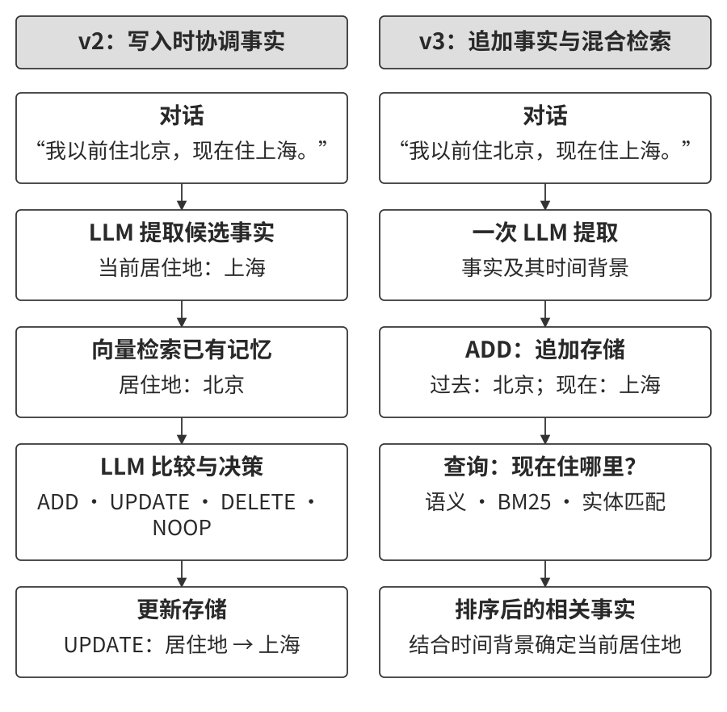

在早期流程中，LLM 先从对话提取候选事实，再检索相近的已有记忆，决定执行 **ADD**、**UPDATE**、**DELETE** 或 **NOOP**。用户先说“我住在北京”，后来又说“我搬到了上海”，系统可以把当前居住地更新为上海。这样，查询时容易取到整理后的事实；维护时则要正确识别更正、时间变化与不同对象，保存更新依据，以便发现错误后回查。论文还提出图记忆变体 **Mem0-g**，用实体与关系表达关联知识[^ch3-mem0-paper]。

v3 把自动提取改为一次 LLM 调用，只追加 **ADD** 记录。北京和上海两条信息可以连同时间背景一起保留，查询时再结合上下文判断当前居住地。检索同时使用语义相似度、BM25 关键词和实体匹配；已经确认完成的行动也可提取为事实。迁移指南报告，LoCoMo 得分由 71.4 提高到 91.6，LongMemEval 由 67.8 提高到 93.4。该版 OSS 将实体关联用于内部检索，移除了外部图存储接口及 `relations` 返回值；图记忆由托管平台提供[^ch3-mem0-migration]。

这一演进说明，记忆系统可以把冲突判断从写入阶段移到读取阶段。写入时一旦误把两个人的经历合并，或把补充信息当成更正，后续回答就可能一直沿用错误的当前状态。追加保存让新旧证据都能参与判断，也减少了写入时逐条决策的模型调用。对于变化频繁、当下难以判断冲突的用户记忆，笔者倾向先保存事实及其时间和来源，再在回答具体问题时整理出有效状态。

[^ch3-mem0-paper]: Chhikara 等，[Mem0: Building Production-Ready AI Agents with Scalable Long-Term Memory](https://arxiv.org/abs/2504.19413)，2025。

[^ch3-mem0-migration]: Mem0，[Open Source: Migrating to the New Memory Algorithm](https://docs.mem0.ai/migration/oss-v2-to-v3)。此处得分采用该迁移指南报告的评估口径。

**Memobase：用户画像与事件记忆。** Memobase 将长期信息组织为两部分。**用户画像（profile）**按主题与子主题保存较稳定的属性，例如 `basic_info` 下的姓名、`interest` 下的兴趣、`work` 下的职位。开发者可以配置需要提取的槽位，控制画像的范围与粒度。**事件记忆（event memory）**记录用户经历及其时间，供系统回答“上次讨论预算是什么时候”这类问题。

Memobase 先把新对话放入缓冲区，在缓冲区积累到指定规模，或会话空闲达到设定时长后批量处理，也可以在会话结束时显式触发。这样，多条消息共享一次整理流程，查询时则读取已经生成的画像和事件。异步更新减少了当前交互等待记忆提取的时间；需要立即使用最新事实时，可以等待本次处理完成[^ch3-memobase]。

[^ch3-memobase]: Memobase，[官方项目说明](https://github.com/memodb-io/memobase)，包括画像字段、事件记忆、缓冲区和同步更新接口。

结合前面的记忆类型，还可以设计图3-4 所示的多类型记忆协同架构：将事件、稳定事实和可复用流程分别管理，再将当前任务需要的内容取入工作记忆。

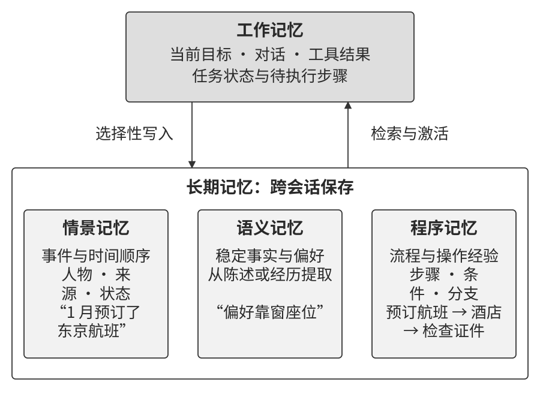

情景记忆保留事件序列及时间戳、情感标记、任务标识等元数据，可以组合时间与主题检索。例如，“上次讨论预算”同时需要主题匹配和时间排序。语义记忆保存从事件中提取的事实与偏好，程序记忆保存反复使用的流程。

**工作记忆（working memory）**组织当前目标、任务状态和已取回的相关信息。Harness 从轨迹和长期存储中选择内容，加载到当前上下文；任务产生的新事实经过整理后，再写入长期记忆。轨迹记录事情如何发生，工作记忆集中保存下一步决策所需的信息，两者通过事件标识和来源连接。

实现时可以先从业务最常用的信息入手。例如，客服系统先维护用户属性和未完成事项，行程助手再增加事件时间线与规则检查，随着评估暴露的问题逐步补充组件。

### 记忆压缩与整理机制

长期积累会带来重复记录、过时事实和检索干扰。整理记忆时，可以依次处理重要性、重复内容和跨事件规律。

1. **筛选整理对象。** 访问频率、记录时间、情感标记和信息独特性可以作为排序信号。例如，一条三天前创建、被访问五次、情感标记较强且没有重复的记录，可以获得较高的保留优先级；一条九十天前创建、仅访问一次、又与其他三条高度重复的记录，可以优先与相关记录合并。系统可用评分阈值生成待压缩、待合并或待删除的候选，再按业务规则处理。长期约束和有效合同即使访问很少，也应保留到其有效期结束。
2. **聚类并生成摘要。** 将相似记录分组，用一段摘要保留共同内容。例如，多次天气对话可以整理为“用户经常询问天气，特别关心降雨”。具体日期与原始询问归档保存，摘要关联原记录，便于后续回查。
3. **提取规律与流程。** 从多次购物记录中归纳“偏好性价比高的产品，重视用户评价”，或者提炼选品步骤。归纳结果保存依据和适用条件，新行为出现后再检查是否需要更新。

### 隐私保护：日志脱敏

用户记忆常包含身份、联系方式和账户信息。系统需要按任务决定哪些字段进入模型输入，按运维需要决定哪些内容进入日志。脱敏可以放在日志写入前，将敏感片段替换为类型标签或稳定占位符，保留排查问题所需的结构。

> **实验 3-3 ★★：基于本地模型的日志脱敏**
>
> 本实验通过 Ollama 调用本地 Qwen3-0.6B，在本机识别日志中的敏感片段。小模型适合在消费级设备上部署，也可以切换到 1.7B、4B 等规格，比较识别质量与处理时间。原始日志需要留在本地时，识别和替换也应在本机完成，再把脱敏结果交给后续服务。这样才能在数据离开设备之前处理敏感片段。
>
> 测试材料包括身份证号、银行卡号等结构化号码，地址等半结构化内容，以及自然语言中透露的密码等敏感信息。模型按 JSON Schema 返回信息类型、文本位置和置信度，程序据此替换原文。对照组使用正则表达式；混合组先做正则匹配，再让模型处理剩余文本。
>
> 在这组 12 条样例中，正则、模型与混合方案的平均召回率分别约为 50%、69% 和 78%，替换后的残留敏感值分别为 9、3、2 个。模型方案减少了遗漏，同时也会误删正常内容。比较时应一起检查漏删、误删和延迟：例如，数字究竟是账户号码还是性能指标，地址是否被完整覆盖，替换后还能否看懂原事件。
>
> 高吞吐量系统可以先用正则处理格式稳定的字段，再把需要语义判断的片段交给模型。测试集应分别覆盖这两类内容，检查模型补查了哪些遗漏，又增加了多少误删与延迟。

到这里，我们已经了解了记忆的表示、更新和整理方法。记录增多后，下一步是从成千上万条信息中找出当前任务需要的内容。下面介绍的 RAG 技术既可用于共享知识库，也可用于用户记忆检索。

## RAG 基础：构建 Agent 的知识获取管道

**检索增强生成**（Retrieval-Augmented Generation，RAG）把外部资料送入模型上下文，使回答能够使用训练之后更新的知识，以及模型训练中没有接触过的内部信息。检索器负责找到相关片段，生成器根据问题和片段组织答案。

例如，用户询问某家商店的退款流程。下面用简化接口展示检索与生成之间的数据传递：

```python
query = "退款流程"
results = retriever.search(query, top_k=2)
# results = [
#   "退款政策：订单签收后7天内可申请全额退款，需提供订单号。"
#   "退款将在3–5个工作日内到账。",
#   "退款操作：进入‘我的订单’，选择订单，点击‘申请退款’。"
# ]
answer = llm.generate(system="你是客服助手。", context=results, question=query)
# 回答包含申请期限、所需信息、操作步骤和到账时间。
```

检索结果提供这家商店的具体规则，模型再将规则组织成用户可执行的步骤。图3-5 展示了这条查询流程：检索相关片段，将片段加入上下文，再生成回答。

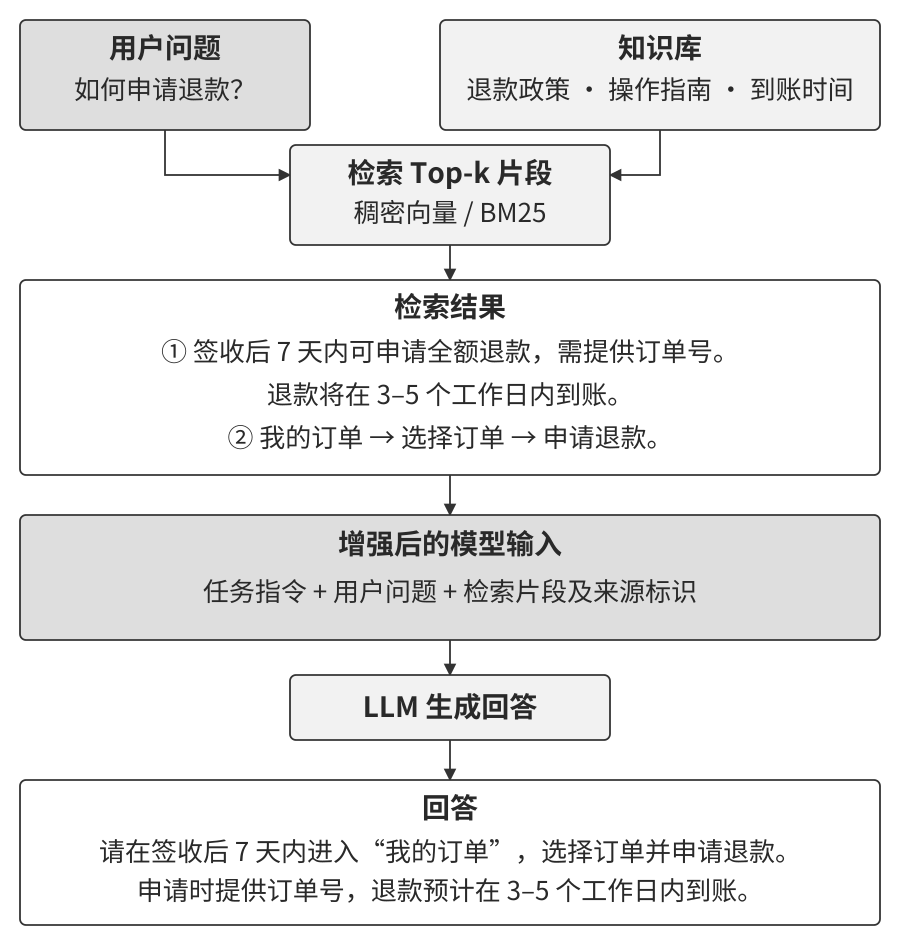

### 文档分块（Chunking）

建立索引前，通常先把长文档切成适合独立检索的片段，这一步称为**分块**。一篇手册可能同时讨论安装、配置和故障排查。把整篇文档压成一个向量，会把这些主题混在一起，容易掩盖某一段与具体问题的关联。分块后，每个向量表示的主题更集中，系统也可以只取回当前问题需要的部分。块大小还要满足嵌入模型的输入预算，并为后续生成留出足够的上下文空间。

常用方法有三类。

**固定大小切分**按 token 数划分，例如每块 512 token，相邻块重叠 50～100 token。重叠使边界附近的内容有机会完整出现在另一块中。这种方法便于控制块的长度；切点可能落在段落、代码或表格内部，因此还需要检查这些结构是否完整。

**递归或结构感知切分**优先沿章节、段落等自然边界划分，遇到过长的部分再按句子等更小单位切分。Markdown 标题和 HTML 元素可以提供结构线索。代码块、表格和标题关联的正文也可以采用专门的处理规则。对于结构清楚的技术文档，笔者建议从这种方法开始：先利用现成的章节与段落，再对过长部分细分，通常比直接截断更容易保住完整含义。

**语义切分**计算相邻句子或句群的嵌入相似度，在主题发生明显变化的位置切开。它增加了嵌入计算，但有机会把同一主题保留在一个块中。切分阈值需要结合文档类型调整，再用下游检索检查效果。

块越小，定位可能越精细，也越容易缺少背景。例如，“该公司收入增长了 3%”需要公司名称和统计期间才能解释。块越大，背景更完整，却可能混入多个主题，增加召回后的阅读成本。可以把每块 256～1024 token、重叠 10%～20% 作为一组初始试验范围，比较不同设置下的检索质量与输入用量。

标题、来源和时间等元数据可以随片段一起保存。后文的上下文感知检索会进一步为每个片段补充其在原文中的背景，帮助独立检索时解析指代和范围。

### 稠密嵌入：用向量表示文本

**嵌入（embedding）**将词、句子或文本块映射为数值向量，例如 `[0.2, -0.5, 0.8, ...]`。检索模型通过训练，让相关的查询与文档在向量空间中具有较高相似度。“稠密”表示向量的大多数维度都有非零数值，共同表示文本的信息；后面的稀疏表示则只有少量维度非零。

可以把向量空间想象成一张高维地图：每段文本对应一个位置，检索是在其中寻找与查询接近的内容。常用度量之一是**余弦相似度**：

$$
\operatorname{cos}(A,B)=\frac{A\cdot B}{\|A\|\,\|B\|}
$$

点积 $A\cdot B$ 将对应维度相乘后求和，模长 $\|A\|$ 是各维度平方和的平方根。除以两个模长后，结果只反映方向关系。对于非零向量，余弦值范围为 $[-1,1]$，越接近 1，方向越一致。实际检索应根据嵌入模型的训练方式与文档选择匹配的度量，例如余弦、点积或欧氏距离；单位归一化后，点积与余弦相同。

> **手算：三个句子的余弦相似度**
>
> 用三个示意向量表示“如何养猫” $A=(0.9,0.5,0.1)$、“猫咪饲养指南” $B=(0.8,0.6,0.1)$ 和“股票投资策略” $C=(0.1,0.1,0.9)$。
>
> $A\cdot B=0.9\times0.8+0.5\times0.6+0.1\times0.1=1.03$。两者模长分别为 $\sqrt{1.07}$ 和 $\sqrt{1.01}$，相似度约为 **0.991**。
>
> $A\cdot C=0.9\times0.1+0.5\times0.1+0.1\times0.9=0.23$，$C$ 的模长为 $\sqrt{0.83}$，相似度约为 **0.244**。在这组向量中，养猫查询与饲养指南更接近。

实际模型通常使用数百至上千维表示。不同模型和语料的相似度分布各异，可以用已标注的相关与不相关样本选择过滤阈值。

#### 从 Word2Vec 到上下文感知

图3-6 展示了从静态词向量到上下文表示的发展。**Word2Vec** 根据词汇共现学习每个词的固定向量。一些关系能在向量运算中表现出来，例如经典的“国王－男性＋女性≈女王”。固定表示的限制也很直观：`bank` 在 `river bank`（河岸）和 `investment bank`（投资银行）中使用同一个词向量。

**GloVe** 从整份语料统计词与词的共现次数，再通过加权最小二乘目标学习词向量。Word2Vec 侧重局部窗口中的预测任务，GloVe 将全局共现统计直接纳入训练；两者都为词汇学习固定表示[^ch3-glove]。

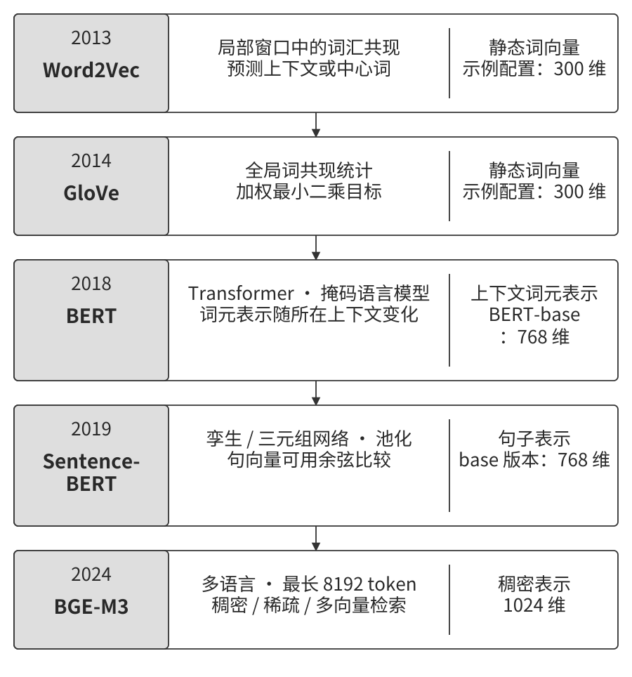

**BERT** 等上下文模型通过自注意力让词元表示结合所在句子的其他内容。“苹果公司发布新产品”与“买了两斤苹果”中的“苹果”，因此可以获得不同表示。用于检索的嵌入模型还需要把词元表示汇集为查询或文档向量，并通过相应训练使两者可比较。

**Sentence-BERT** 将 BERT 与池化、孪生或三元组网络结构结合，训练可直接比较的句向量。文档可以预先编码并存入索引，查询到来时只需编码查询，再计算向量相似度。预先编码省去了每次查询时重新计算全部文档表示的开销[^ch3-sbert]。

**BGE-M3** 同时提供稠密、稀疏和多向量检索表示，并支持多语言与较长输入；本节采用其中的稠密表示说明单向量检索[^ch3-bge-m3]。模型可接受的长度影响分块方案：原始 BERT 的典型上限为 512 token，BGE-M3 支持到 8192 token。更长的输入预算使系统可以保留更多背景，块大小仍需结合主题边界和检索效果选择。

[^ch3-bge-m3]: BAAI，[BGE-M3 模型说明](https://huggingface.co/BAAI/bge-m3)，包括表示方式、维度、输入长度和使用方法。

> **实验 3-4 ★★：比较两种近似最近邻索引**
>
> 文档向量建好后，需要快速找到接近查询的向量。逐个计算可以得到精确近邻，数据规模增大后，**近似最近邻**（Approximate Nearest Neighbor，ANN）索引用可控的召回损失换取查询速度。本实验在同一批真实嵌入和相同查询上比较 ANNOY 与 HNSW，并用精确搜索结果作为参照。
>
> ANNOY 使用多棵随机投影树缩小候选范围；HNSW 使用分层近邻图，先在稀疏的高层快速接近目标区域，再进入更密集的低层搜索。图3-7 展示 HNSW 的分层结构。
>
> 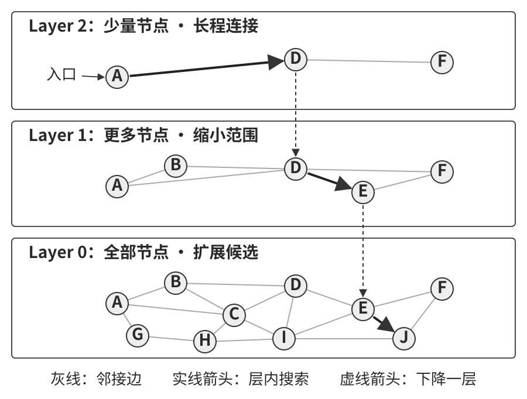
>
> 表3-2 ANNOY 与 HNSW 的实现取舍
>
> | 比较方面 | ANNOY | HNSW（以 hnswlib 为例） |
> | --- | --- | --- |
> | 索引结构 | 多棵随机投影树 | 分层近邻图 |
> | 构建开销 | 随树数量、向量数量和维度变化 | 随邻接规模、构建搜索范围和数据量变化 |
> | 内存与文件 | 静态索引支持内存映射和多进程共享 | 保存向量及图邻接关系，邻接规模影响开销 |
> | 增量更新 | 索引建好后新增条目需要重建 | 支持新增、更新及删除标记，需管理容量 |
> | 召回与速度 | 用树数量和查询搜索预算调节 | 用构建参数与查询搜索范围调节 |
> | 使用场景 | 便于分发和共享的静态索引 | 持续写入并查询的动态索引 |
>
> 本次运行对 300 篇文档和 20 个查询进行测试，两种索引的 top-10 近邻召回均为 100%。ANNOY 在 Linux 容器中构建约 13 毫秒，HNSW 在本机环境中构建约 78 毫秒；保存的索引分别约 1.40 MB 和 1.02 MB。新增 60 条向量时，ANNOY 重新构建，HNSW 直接插入。定期批量刷新语料时，可以测试重建成本；持续接收新文档时，则重点测试插入延迟与更新后的召回。

[^ch3-ann]: ANNOY 的静态索引、内存映射与搜索参数见 [官方说明](https://github.com/spotify/annoy)；HNSW 的增量接口与参数见 [hnswlib 官方说明](https://github.com/nmslib/hnswlib)。

**索引应按知识的更新方式来选。** 语料定期批量发布、多进程共享同一份只读索引时，笔者会先考虑 ANNOY；持续接收新文档、需要在线插入时，则优先考虑 HNSW。嵌入模型决定语义表示，索引决定这些表示能否以合适的延迟和更新成本投入使用，两者共同决定检索服务的效果。

调节 ANNOY 的树数量与搜索预算，或 HNSW 的邻接规模与搜索范围，可以观察召回和延迟的变化[^ch3-ann]。索引召回衡量是否找到了目标近邻；这些近邻能否回答用户问题，则取决于嵌入表示与资料内容。持续插入和删除后，还应重新测量召回与存储开销，据此安排容量调整或索引重建。

### 稀疏表示：从关键词到相关性评分

**稀疏表示**使用高维向量，其中只有少量维度非零。传统关键词检索以词项为维度，根据文档中出现的词赋权。它的基础是**词袋模型**（Bag of Words，BoW）：保存词及其出现次数，忽略顺序。因此，“猫追狗”与“狗追猫”具有相同的词袋表示。

这种表示适合匹配名称、编号和技术术语。下面从 TF-IDF 讲起，说明词频与文档频率如何转化为排序分数。

#### 从 TF-IDF 到 BM25

**TF-IDF**（Term Frequency–Inverse Document Frequency，词频—逆文档频率）结合两个信号：词在当前文档中出现多少次，以及它在整个语料库中有多常见。假设 100 篇文章中有 60 篇包含“模型”，只有 3 篇包含“蒸馏”，查询“模型蒸馏”时，“蒸馏”更有区分作用。

一种基本写法是：

$$\operatorname{TF\!\text{-}\!IDF}(t,d)=\operatorname{TF}(t,d)\times\operatorname{IDF}(t),\qquad \operatorname{IDF}(t)=\ln\frac{N}{\operatorname{DF}(t)}$$

$\operatorname{TF}(t,d)$ 表示词 $t$ 在文档 $d$ 中的次数，$\operatorname{DF}(t)$ 表示包含该词的文档数，$N$ 为文档总数。按这个公式，一个词出现十次时的得分贡献，是出现五次时的两倍；长文档也可能仅因词更多而得分较高。TF-IDF 有多种归一化变体，下面的 BM25 则用词频饱和与长度归一化处理这两类影响。

**BM25** 将各查询词的贡献相加：

$$\operatorname{Score}(Q,D)=\sum_i\operatorname{IDF}_{\mathrm{BM25}}(q_i)\cdot\frac{\operatorname{TF}(q_i,D)(k_1+1)}{\operatorname{TF}(q_i,D)+k_1\left(1-b+b\frac{|D|}{\operatorname{avgdl}}\right)}$$

其中，$q_i$ 为查询词，$|D|$ 为文档长度，$\operatorname{avgdl}$ 为平均文档长度。$k_1$ 控制词频的饱和程度；$b$ 控制长度归一化强度，取 0 时关闭这一校正。图3-8 展示了两项机制如何共同影响分数。

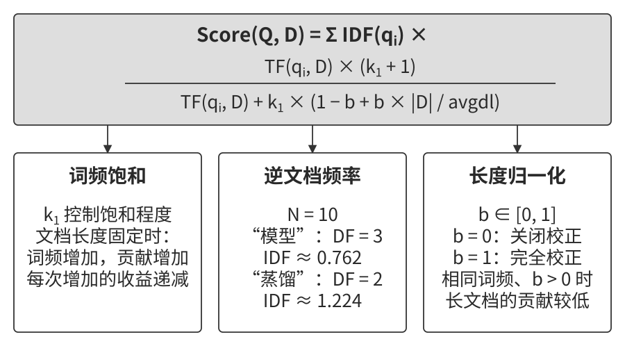

保持文档长度不变，词频越高，新增一次出现带来的分数增量越小。保持词频不变，在 $b>0$ 时，较长文档获得的这项贡献更低。通过这两个参数，就可以调节重复词项和文档长度对评分的影响。

本节采用下面的逆文档频率：

$$\operatorname{IDF}_{\mathrm{BM25}}(t)=\ln\frac{N-\operatorname{DF}(t)+0.5}{\operatorname{DF}(t)+0.5}$$

分子表示不含该词的文档数，分母表示包含该词的文档数，两者各加 0.5 平滑，使文档频率为 0 或 $N$ 时仍可计算。稀有词得到更高权重；当超过半数文档包含该词时，这个公式会给出负数。配套实现将实际评分权重下限设为 $10^{-6}$，同时保留原始值供检查。比较不同检索实现时，需要一起确认 IDF 变体、分词和停用词处理。

> **实验 3-5 ★★：从零实现 BM25 搜索引擎**
>
> 本实验依次完成分词、停用词处理、倒排索引和评分。停用词处理可以过滤“的”“了”等高频词，但应结合语料检查是否误删有用信息。**倒排索引**记录每个词出现在哪些文档中，以及相应词频；它类似书末的术语索引，查询“TCP”就能找到第 45、112、203 页，再读取这些位置的内容。
>
> 用“模型蒸馏”手算一次查询。设语料库有 10 篇文档，平均长度为 250 词，$k_1=1.5$、$b=0.75$。“模型”出现在 3 篇文档中，IDF 约为 0.762；“蒸馏”出现在 2 篇中，IDF 约为 1.224。倒排索引给出下表中的候选和词频，将它们代入公式即可得到每项贡献。
>
> | 查询词 | 文档 | 词频 TF | 文档长度 | BM25 贡献 |
> | --- | --- | ---: | ---: | ---: |
> | 模型 | doc_1 | 5 | 200 | 1.52 |
> | 模型 | doc_3 | 2 | 500 | 0.82 |
> | 模型 | doc_7 | 8 | 150 | 1.68 |
> | 蒸馏 | doc_1 | 3 | 200 | 2.15 |
> | 蒸馏 | doc_5 | 1 | 250 | 1.22 |
>
> 两个词在 doc_1 中的贡献相加约为 3.67，排序为 **doc_1（3.67）> doc_7（1.68）> doc_5（1.22）> doc_3（0.82）**。doc_1 中“蒸馏”的词频低于“模型”，但稀有程度更高，最终贡献也更大；同时匹配两个词又进一步提高了总分。
>
> 配套评估还比较了字面匹配与同义表达。在所选用例中，精确关键词查询都找到了目标文档，仅有同义词而没有相同词项的查询则未召回目标。检查这类遗漏时，可以先查看分词后的查询和倒排列表，确认问题来自词项缺失还是评分排序。

### 混合检索：合并候选并精排

稠密与稀疏检索提供不同线索。查询 `HTTP-403` 时，需要保留精确错误码，单靠语义相似可能取回泛泛的服务器错误讨论；查询 `kitty` 时，只有关键词匹配又可能漏掉使用 `cat` 或 `feline` 的文档。**混合检索**同时使用两路结果，以扩大相关候选的覆盖范围。对于既有错误码、名称等精确标识，又有自然语言描述的知识库，笔者建议以混合检索作为起点，让两路检索分别覆盖这些需求。图3-9 展示并行检索、结果融合与可选重排序的流程。

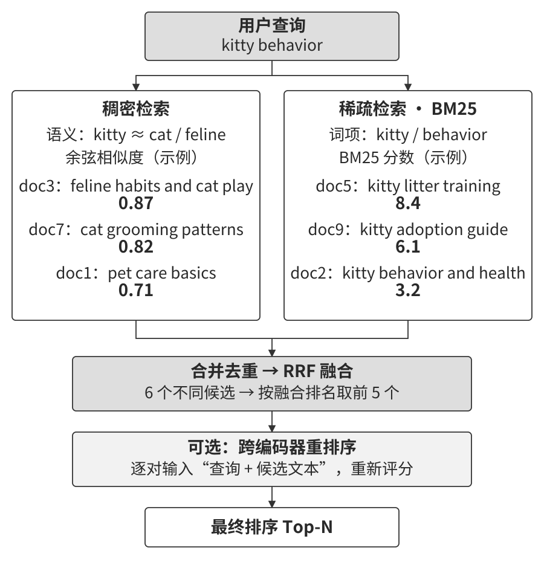

第一阶段是**并行检索**：将查询发送给稠密和稀疏引擎，各自取回一批候选。两路可以使用相同的原始文本，也可以按各自模型的要求进行预处理。

第二阶段是**结果融合**：对候选去重并建立统一排序。余弦相似度与 BM25 的数值尺度不同，直接相加容易使数值较大的一路主导结果。一种做法是先校准或归一化分数，再加权组合；另一种是**倒数排名融合**（Reciprocal Rank Fusion，RRF），按各路名次计算：

$$\operatorname{RRF}(d)=\sum_{j:\,d\in R_j}\frac{1}{k+\operatorname{rank}_j(d)}$$

$R_j$ 是第 $j$ 路结果，名次从 1 开始，文档未出现在某一路时，该路贡献为零。平滑常数 $k$ 常取 60；它越大，前几个名次之间的分数差距越小。RRF 便于组合不同打分方式，但只保留名次，原始分数中的强弱差异需要通过其他方法利用。

第三阶段可以加入**神经重排序**。系统选取融合后靠前的一批候选，例如 50 个，再让重排序模型逐一判断查询与文档的相关程度。融合负责收集和排列候选，重排序在候选范围内进一步比较；没有进入候选池的文档仍需要通过调整召回环节找回。

这里常用的模型是**跨编码器（cross-encoder）**：把查询与候选文档一起输入，让两部分在模型内部交互，输出相关性分数。检索阶段的**双编码器（bi-encoder）**则分别编码查询和文档，文档向量可以提前计算，查询时只做向量搜索。前者适合处理规模有限的候选，后者适合在大量文档中初筛。可以类比简历筛选和面试：先根据已有特征缩小范围，再围绕具体要求深入比较。BGE Reranker v2 M3 是可用于这一环节的模型之一[^ch3-reranker]。

[^ch3-reranker]: BAAI，[BGE Reranker v2 M3 模型说明](https://huggingface.co/BAAI/bge-reranker-v2-m3)，介绍查询—文档输入与相关性评分。

当相关材料已经进入候选池，却经常排在无关材料后面时，笔者会优先评估跨编码器重排序。它联合读取问题与文档，可以直接比较文档中的条件、限定词和细节是否符合问题要求。应选用适合当前语言和领域的模型，并用目标查询确认收益；重排模型选错，也可能把原本正确的结果挤下去。候选数量再根据收益和延迟调整。表3-3 列出三个常用指标。

表3-3 检索质量的三个指标

| 指标 | 计算与含义 |
| --- | --- |
| recall@k（召回率） | 前 k 个结果中的相关文档数，除以该查询全部相关文档数，衡量找回了多少相关内容；测试集通常再对各查询取平均 |
| MRR（平均倒数排名） | 每个查询取首个相关文档名次的倒数，再求平均；首位为 1，第十位为 0.1，未找到为 0 |
| nDCG@k（归一化折损累积增益） | 按相关程度给结果赋分，并对靠后的名次折损，再除以理想排序得分，衡量前 k 个结果的整体排序质量 |

还可以记录**命中率**：前 k 个结果中至少包含一篇相关文档的查询比例。每个查询只有一篇目标文档时，它与平均 recall@k 相同；存在多个目标文档时，召回率还能区分找回一篇和找齐全部。采用命中口径的“检索失败率”，就是完全未命中的查询比例。例如，某查询有三篇目标文档，前二十个结果找回两篇，则该查询已经命中，recall@20 为 $2/3$。按命中率计算的失败值为 0，按 $1-\mathrm{recall@20}$ 计算则为 $1/3$。

> **实验 3-6 ★★：比较稀疏、稠密、融合与重排序**
>
> 本实验在相同的 12 个标注查询上比较五种配置：稀疏检索、稠密检索、RRF 融合、加权融合，以及融合后重排序。查询覆盖语义相似、精确名称、多语言和技术代码，包含前面 `kitty` 与 `cat/feline` 这类词面不同的表达。稠密模型采用 Qwen3-Embedding-0.6B，重排序采用 MS MARCO MiniLM 跨编码器，按前 3 个结果计算指标。
>
> 这次运行中，稀疏检索的平均 recall@3 为 0.833，其余四组为 1.0。稠密检索和 RRF 的 MRR 均为 1.0，重排序后约为 0.903；对应的 nDCG@3 从 1.0 变为约 0.928。完整候选列表保留了各阶段的名次，可以据此定位哪些文档被上调或下调。
>
> 分析时先看遗漏：两路检索是否覆盖了不同的相关文档；再看排序：融合或重排序有没有把相关项推后；最后计算新增延迟。根据这三项检查，就能判断各组件是否有帮助，再决定保留、调参或更换模型。

## 知识的组织与检索

知识的组织方式决定每个条目包含什么，检索器则决定从这些条目中取回什么。技术手册、法律文书和论文中的段落通过章节层次、概念依赖和跨文档引用联系起来。将这些结构保留下来，可以让查询同时访问具体证据和较高层的概括。

本节依次讨论几种组织方式：RAPTOR 与 GraphRAG 建立层次或关系索引；OpenViking 用目录组织上下文资源；增量更新和定期整理维护知识时效；智能体化 RAG 让 Agent 根据已有结果继续检索；上下文感知检索补充片段背景；最后从数据集中提取可复用的知识。它们分别作用于表示、索引、更新和查询过程，也可以组合用于用户记忆。

先看两个例子，理解查询所需信息与原始记录之间的差距。

**案例一：黑猫白猫的计数。** 延续第二章的例子，知识库有 100 条独立记录，其中 90 只黑猫、10 只白猫。用户询问比例时，若只检索前 20 条，就无法据此计算全部记录的分布。假设其中 18 条有效记录包含 15 只黑猫和 3 只白猫，从这部分算出的比例就会偏离总体。

可以对完整记录做聚合计算，生成“共 100 只猫，黑猫 90 只（90%），白猫 10 只（10%）”的统计摘要，并记录覆盖范围与更新时间。查询比例时读取统计，查询某一只猫时读取明细；记录变化后更新统计。两种问题需要不同粒度的信息。

**案例二：优惠资格的边界。** 以一个围绕 Xfinity 优惠咨询构造的教学情境为例：工单中，退伍军人 John 通过审核，医生 Sarah 获得折扣，教师 Mike 被告知不符合条件。每条工单记录一次处理结果。护士询问资格时，仅检索相似工单会遇到三个问题。

- **相似性与资格条件不同。** “护士”与“医生”语义接近，Sarah 的记录可能排在前面；是否适用优惠还取决于活动条款、资格类别和验证要求。
- **个案缺少完整边界。** 某人通过审核，只能直接说明该人在当时条件下的结果；调大检索数量也未必能找到未曾出现过的类别或例外。
- **资料范围不清楚。** 工单可能来自不同活动或不同时间。需要先确认哪些记录适用，以及缺少哪些政策依据。

索引时可以把同一活动的工单关联起来，再查阅对应的正式条款，将资格、例外、生效时间和来源整理为规则卡。例如，若该教学情境中的条款明确覆盖现役与退伍军人、持证医护人员，并排除教师类别，就把这些条件逐项保存；护士是否属于医护人员范围，也由条款确认。工单继续保留，用来解释实际办理过程和发现执行差异。

这两个例子体现了不同的信息需求：统计问题需要覆盖完整数据，资格问题需要覆盖规则及其边界。面对这类查询，笔者主张把统计和规则整理前移到建库阶段。仅增加取回的片段，模型仍可能看不到完整的统计范围或缺失的资格条件。围绕任务建立统计摘要、规则卡和来源关系，检索才能一次拿到足以支持判断的信息，并能继续回查原始材料。

### 结构化索引：建立层次与关联

结构化索引在建库时增加一轮知识整理：生成摘要、建立层次，或提取实体之间的关系。查询因此可以直接找到跨段落的概括和关联。下面介绍两种代表性方法：RAPTOR 的递归摘要，以及 GraphRAG 的实体关系与社区摘要。

**RAPTOR**（Recursive Abstractive Processing for Tree-Organized Retrieval）从文本块开始，反复执行嵌入、聚类和摘要，逐层形成不同抽象程度的表示[^ch3-raptor]。图3-10 展示了这一过程：底层保存具体内容，相近的块形成分组，模型为每组生成摘要；再对摘要重复处理，得到更高层概括。

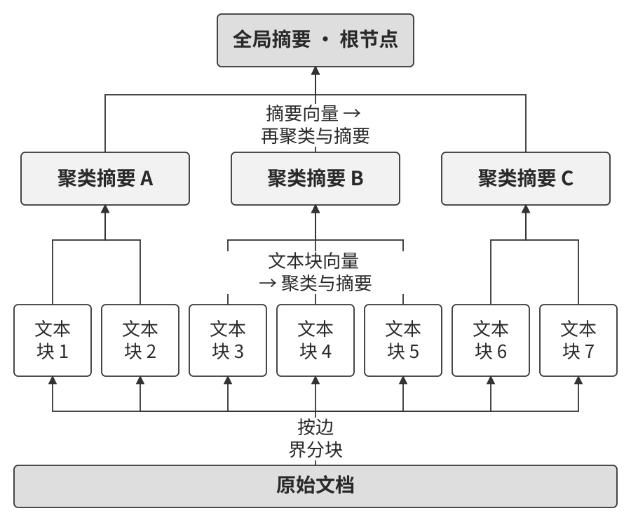

聚类可以类比按主题整理图书：先根据内容相似度分组，再为每组概括主题。例如，“SSE2 支持在 128 位 XMM 寄存器中执行整数 SIMD 运算”和“SSE4.2 新增字符串比较指令”可以纳入“x86 SIMD 指令集演进”的摘要。细节问题可以匹配底层块，概览问题可以匹配高层摘要。查询既可以沿层次逐步深入，也可以把各层节点放在一起检索，选出最相关的一组。

[^ch3-raptor]: Sarthi 等，[RAPTOR: Recursive Abstractive Processing for Tree-Organized Retrieval](https://arxiv.org/abs/2401.18059)，2024。

**GraphRAG** 利用实体、关系和社区摘要组织知识。图3-11 展示实体之间的连接。三元组用“主体—关系—对象”表达一条关系，例如（北京，是首都，中国）和（张三，就职于，腾讯）。多个三元组通过共同实体连接成图，检索时就可以沿这些关系寻找相关信息。

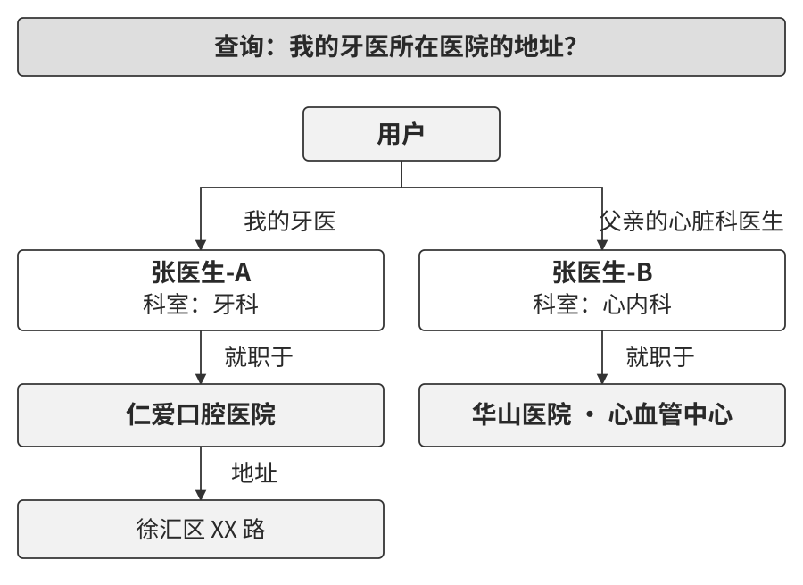

图结构可以支持两类操作。

1. **沿关系链检索。** 查询“我的医生所在医院的地址”时，系统可以依次访问“用户→医生→医院→地址”。关系边把分散信息连接起来，便于找到支撑答案的路径。建图时需要保留来源，查询时检查路径是否完整、关系是否仍有效。
2. **区分同名实体。** 两位“张医生”可以拥有不同标识：一位与用户、牙科和某家诊所相连，另一位与用户父亲、心脏科和另一家医院相连。提取与实体合并阶段根据这些属性决定记录是否指向同一人，再将结果写入图中。前面的 `person`、`relationship` 字段也承担类似作用。词义消歧关注 `bank` 在句中表示河岸还是银行，实体消歧则关注记录指向现实中的哪个具体对象。

微软 GraphRAG 的索引流程先从文本单元提取实体和关系，再通过社区发现识别连接紧密的实体群，生成社区层次与摘要。查询某个实体时，局部搜索结合其关联信息和原文；查询整个语料的主题时，全局搜索利用社区摘要组织回答[^ch3-graphrag]。

[^ch3-graphrag]: Microsoft GraphRAG，[索引与查询概览](https://microsoft.github.io/graphrag/)、[局部搜索](https://microsoft.github.io/graphrag/query/local_search/)和[全局搜索](https://microsoft.github.io/graphrag/query/global_search/)。

关系表示还需要容纳条件和时间。例如，“如果下周还下雨，我就取消去海边，改去博物馆”，包含条件、有效时间和备选行动。如果只提取（用户，有计划，海滩旅行）和（用户，有备选计划，博物馆旅行），就会丢失切换条件。可以保留完整原句，并用条件节点、事件节点或结构化字段表示“下周下雨时”的约束，让关系回指原文。

对于用户记忆，笔者更推荐**自然语言与结构化索引分层配合**：用自然语言保存完整表达，用元数据记录对象、时间和来源，再为需要频繁关联的内容建立图索引。医疗资料、法律案件和家庭关系等场景往往涉及多实体连接，评估时应同时检查关系提取、实体合并和检索结果。

> **实验 3-7 ★★★：比较层次摘要与关系索引**
>
> 本实验选取 Intel 架构手册中与 SSE、AVX 和状态管理有关的 14 页，构建两种教学实现。层次摘要分支先生成逐页摘要，再聚为三组，生成组摘要和根摘要；关系索引分支提取实体与关系，再生成社区摘要。两组使用相同资料与八个问题，比较概念细节和关系推理。
>
> 查询“解释 SSE 编程环境”时，层次摘要可以同时匹配 SSE 概览和寄存器细节。本实现将各层节点一起检索，选择最相关的五个。关系分支则从相关实体扩展邻居，结合社区摘要组织上下文。沿“SSE→XMM 寄存器→浮点运算→ADDPS”这样的关系，可以把概念与具体指令联系起来。
>
> 更复杂的问题是“处理器声明支持 AVX，程序是否就能使用 AVX？”需要把处理器能力与操作系统状态管理联系起来：检查 CPUID 的 AVX、OSXSAVE 标志，再读取 XCR0，确认 XMM 与 YMM 状态均已启用。实验保留了命中的节点、关系及来源页，便于检查答案是否覆盖这些条件。
>
> 两组在八个问题上的平均来源页覆盖率都约为 95.8%。进一步比较时，要回到具体证据：摘要是否保存关键条件，关系是否正确连接，答案是否引用了足以支持结论的原文。层次与图结构提供了不同的取用方式，适合用同一组问题检查各自贡献。

笔者建议先把分块与混合检索做好，遇到反复出现的跨文档综合和关系查询需求时，再构建结构化索引。定位某一段退款政策，通常用分块与混合检索就能解决；比较 SSE 与 AVX，或从总体架构查到具体指令，则更需要跨段摘要和关系索引。构建这些派生内容需要模型调用，资料更新后还要维护相关节点，因此应将索引成本、查询质量和更新成本一起评估。

### 文件系统范式：用目录结构组织知识

**OpenViking** 用虚拟文件系统组织记忆、资源和技能。每个条目通过 `viking://` URI 引用，Agent 可以浏览目录、读取概览，再访问需要的内容[^ch3-openviking-uri]。按信息用途，可以把目录理解为三组：外部资源、用户资料，以及 Agent 使用的技能和经验。用户与 Agent 标识进一步限定各自的命名空间。

| 内容 | 典型用途 |
| --- | --- |
| Resources | 技术文档、代码库、网页等外部资料 |
| User memories | 特定用户的偏好、习惯和经历 |
| Skills 与 Agent memories | 可复用流程、任务记录和候选经验 |

URI 提供统一定位方式，物理存储与索引由服务管理。目录接口使 Agent 能按主题逐层浏览，也能把语义搜索限制在相关子树内。文件系统式的访问、内容存储和向量索引可以共同组成服务。

[^ch3-openviking-uri]: OpenViking，[Viking URI](https://docs.openviking.ai/en/concepts/04-viking-uri)与[系统架构](https://docs.openviking.ai/en/concepts/01-architecture)。

OpenViking 将内容分为 **L0、L1、L2** 三个层次：L0 是简短摘要，供快速判断目录是否相关；L1 是目录概览，说明主要内容及导航入口；L2 是需要详细阅读的正文。目录级摘要和概览分别保存在 `.abstract.md` 与 `.overview.md` 中。当前文档给出的生成正文预算分别为 256 和 4000 个字符；这些预算控制摘要篇幅，实际存储长度还受完整句子处理等规则影响[^ch3-openviking-layers]。

查询可以先读摘要定位，再读概览选择文件，最后加载原文。这与第二章 Skills 的渐进式披露相通：轻量目录支持发现，完整内容按任务需要加载。需要精确数值、条件或原始措辞时，应继续取回对应正文。

[^ch3-openviking-layers]: OpenViking，[Context Layers (L0/L1/L2)](https://docs.openviking.ai/en/concepts/03-context-layers)。L0、L1 是目录级生成表示；L2 可为原始文件或解析后的正文。

对于需要人和 Agent 共同维护的知识，笔者倾向于用 **Markdown 纯文本与版本控制**管理。人可以直接阅读、编辑和修正知识，Agent 也能使用同样的文件接口，在工作分支提出更新，经审核后再发布。版本控制保存每次修改的差异，也让错误更新可以撤回。会话结束时，用户偏好进入对应用户的记忆，操作经过进入任务记录。任务记录经过结果评价、跨轨迹归纳与后续验证后，可以进一步形成第九章讨论的经验。

采用文件系统组织知识，必须同时**为相关条目建立链接与索引**。一批互不引用的文件只能靠全文扫描或语义检索重新寻找关联；文件越多，Agent 就越难从已经找到的内容继续追查。链接可以提供明确的查找路径，例如让退款政策指向例外条款，合同摘要指向签署记录，人物条目指向相关事件。入口页说明主要主题，索引页提供导航，条目之间的交叉引用支持横向查找。这种做法类似百科条目的组织，可以用较轻量的方式保存部分关系。

链接维护应写入更新流程：新增条目前先检索已有记录，确定合并还是新建；写入后补充相关引用，并更新所属目录的索引。提示词应明确这三步，产物检查再检测断链、孤立条目和过时入口，减少模型遗漏维护工作的问题。下一节将把这些检查纳入知识更新与审核。

### 知识应该如何更新

知识库上线后会持续收到新事实、规则变更和用户更正。更新可以分为两条路径：**增量更新**及时处理新证据，**定期整理**从较大范围检查重复、冲突和结构。两条路径共享版本管理、证据引用和发布检查。

#### 用户记忆和知识库的增量更新

笔者的建议是：**把知识库当成代码库，把每次知识变更当成一个 Pull Request（PR）。** 一次更新应有明确的修改范围，并附上支撑修改的证据，供审核者检查。Markdown 文档、规则文件和 User as Code 的可执行状态都可以纳入这一流程。版本历史帮助维护者查看变化、追查原因，并在错误发布后恢复。

沿用第一章的**提议者—审核者**模式，一次更新可以这样进行：

1. **提议者生成变更。** Proposer Agent 阅读新证据，检索已有知识，找到新增、更正或过期的条目，在工作分支提出范围明确的修改。同时维护关联链接、目录索引、时间信息和证据引用。
2. **审核者独立核查。** Reviewer Agent 对照修改前后的内容与原始证据，逐项检查新断言、限定条件、跨文件一致性，以及删除是否丢失有用信息。发现问题时，指出具体条目和依据，并说明应补充、恢复或更正什么。
3. **迭代并作出决定。** 提议者按意见修改，审核者重新核查。审核通过后进入合并流程；达到轮次或成本上限仍有争议时，将变更保留为待处理状态，交由人工判断。
4. **检查并发布。** 自动检查格式、链接、元数据和权限标签；可执行知识还要通过类型检查和相关测试。合入后，从确定的知识版本重建受影响的分块、摘要和向量索引，再发布服务版本。

这条流程对应三层数据。**原始证据层**保存对话、执行轨迹、业务文档和工具结果；**知识层**保存经过提炼、可以修订的文本或代码；**服务层**保存由特定知识版本生成的索引。变更记录关联证据标识、知识版本、审核意见和最终决定，使维护者能追查某条知识为何写入、何时生效。原始证据按保留策略归档，索引则可以从知识版本重新生成。前文的追加式记忆适合保存新旧事实及其来源；这里的审核流程负责把这些证据整理为可供使用的知识版本。查询时遇到尚未解决的冲突，仍可回查证据，结合任务条件判断。

在这套设计中，**提议者和审核者都应是能够调用工具、持续查询的 Agent。** 提议者可能需要搜索多份记录才能找到受影响的条目；审核者也可能沿引用继续查询、比较版本或执行检查。文件搜索、证据检索、差异查看和测试工具使它们能够处理这些后续步骤，具备相应能力的 Coding Agent 就可以承担这样的工作。

两者的检索范围应覆盖当前变更涉及的知识及原始证据，并受用户、租户和任务权限约束。审核轨迹、引用的工具结果和反馈一同归档，后续可以检查审核者实际核验了什么。

模型选择上，笔者建议优先采用能力相近、来自不同家族的组合，例如 Claude 与 GPT、DeepSeek 与 Kimi。不同的训练数据和推理习惯可能带来不同判断。可以让这组模型审核包含已知错误的变更，比较错误发现率，检查它们是否减少了共同遗漏。审核者应独立检索证据、核对修改中的断言与条件。权限应由运行系统执行：提议者写工作分支，审核者读取证据并提交结论，合并与发布服务掌握主库和线上索引的更新权限。

#### 用户记忆和知识库的定期整理

多次局部更新后，同一事实可能散落在多个文件中，新旧表述也可能并存。定期整理从目录、时间或主题出发，检查这些累积问题。它与第九章讨论的周期性回顾有共同的工作方式：前台积累新证据，后台集中整理，形成可供后续任务使用的记录。

整理包括三项工作。

1. **去重、归并与结构调整。** 找出重复、过期或过度碎片化的条目，合并相关内容，拆分过大的文件，并更新链接、入口页和索引页。删除服务中的旧表达时，记录其替代关系和原始依据。
2. **回查原始材料。** 如果每轮整理都只改写上一轮摘要，早期的遗漏和误解就会一轮轮传下去。因此，应对照对话、执行轨迹、业务文档和工具输出，检查摘要是否遗漏关键事实，是否丢失否定、时间或条件，是否把推测写成确定结论。大型知识库可以按目录、时间或主题分批处理，用覆盖清单记录已检查、待检查和存在争议的部分，直至完成全库核查。
3. **处理冲突与适用范围。** 比较矛盾记录的来源，以及时间、对象、地域、任务和前置条件。若两条信息分别适用于不同场景，就补齐各自范围；若新证据明确取代旧规则，就保存版本关系；若依据不足，就记录待确认项和需要补充的证据。

整理结果同样作为变更提交审核。较大的重组可以按目录或主题拆成多个 PR，共享整理计划与覆盖清单；相关变更通过后重建派生索引，并回放典型检索和问答用例，检查原来能找到的知识是否仍可访问。触发方式可以采用每周、每月等周期，也可以依据新增条目、冲突数量或检索质量变化设定阈值。

**失效内容下线。** 分块和摘要应保留版本、生效时间与失效时间。旧政策被替代后，当前业务查询过滤失效版本；历史查询则按目标时间读取相应规则。这样既能使用最新知识，也能解释过去的处理结果。

**权限与租户隔离。** 权限过滤应在检索层完成：检索服务按调用者身份限定候选范围，再将获准访问的内容送入模型。敏感内容一旦进入上下文，就可能影响回答或被后续工具带出，因此应从候选范围上保证模型只接触当前任务获准使用的资料。原文、摘要、关系边和缓存结果都需要继承适当的访问范围，避免通过派生内容带出其他用户或租户的信息。服务可以采用独立索引或具备强制过滤能力的共享索引，关键是让每条查询都执行权限约束。

### 智能体化 RAG：由 Agent 控制检索过程

前面的单次 RAG 流程先检索，再根据返回材料生成答案。对于信息需求明确、一次检索就能找到依据的问题，笔者建议保留这条简单路径。需要结合多个对象、条件或文档才能作答时，则应把检索开放为工具，让 Agent 根据已找到的材料继续查询。许多线索只有读过资料才会出现，预先固定的一次查询很难把它们全部覆盖。

这种方式称为**智能体化 RAG（Agentic RAG）**。它类似研究员查阅资料：先找到与问题直接相关的内容，识别缺口，再补查背景或交叉验证。图3-12 对照单次检索与 Agent 控制的循环。

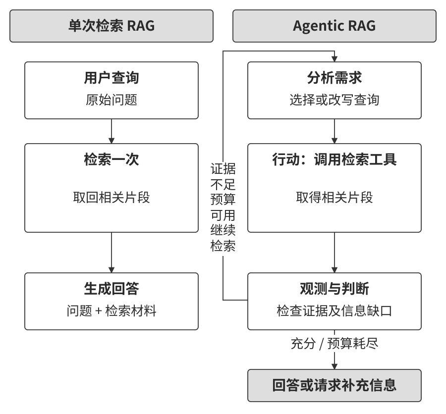

以 ReAct 为例，模型先分析问题并选择查询，调用 `knowledge_base_search`；工具返回观测后，模型判断证据是否足够。若缺少条件或相关对象，就改写查询继续检索；若材料已经充分，就结合来源生成回答。Harness 维护历史、工具调用和预算，在达到限制时结束搜索或转入澄清。

图3-13 展示模型、检索接口和知识库后端的分工。不同索引可以通过同一工具接口提供服务，模型则根据结果决定下一步。

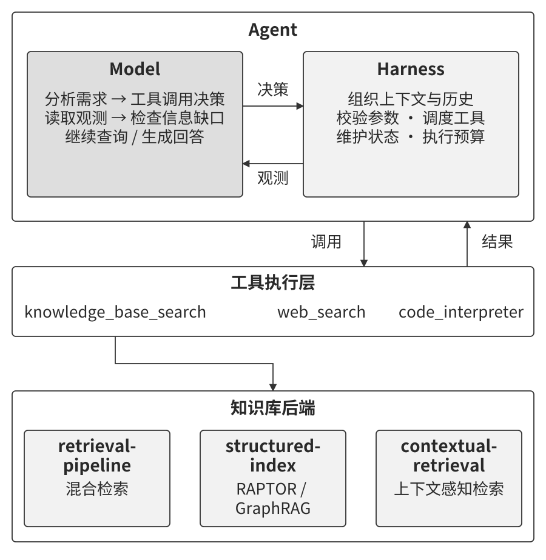

**检索内容的信任边界。** 外部文档可能包含试图改变模型行为的文本，也可能在入库前被加入错误事实。前者涉及间接提示注入，后者属于知识库投毒。处理时，需要同时管理内容来源与执行权限：检索结果带上来源、版本和引用位置，作为回答证据；转账、删除、对外发信等行动，则由 Harness 和执行环境依据用户授权校验。入库审核、来源追溯和事实核查进一步控制错误知识的传播。第二章介绍的来源标记与第四章的工具约束在这里共同发挥作用。

> **实验 3-8 ★★：比较单次检索与多轮检索**
>
> 本实验使用同一份中文法律材料、同一 BM25 检索器和相同模型，对七个问题比较两种模式：基线按原问题搜索一次，Agent 模式允许模型调整查询，最多执行四次搜索。项目还提供接入其他检索后端的接口，便于进一步比较索引与控制流程的作用。
>
> 对“正当防卫是怎么规定的”这类查询，直接检索即可获得主要条文。更复杂的例子是“醉酒过失致人重伤且有盗窃前科，应如何量刑”。它同时涉及当前行为、醉酒情形和先前记录，检索时需要分别定位有关材料，再检查适用条件。
>
> 实际运行依次搜索了“醉酒过失致人重伤 盗窃前科 量刑”“醉酒 犯罪 量刑”“盗窃前科 量刑影响 刑法”和“前科 量刑影响 刑法”。模型随后还提出“累犯 认定 刑法”，此时搜索预算已用完，Harness 返回预算耗尽信息。这个过程展示了查询如何逐步聚焦，也说明检索循环需要明确的终止条件。
>
> 在实验划分的四个复杂问题上，目标法条覆盖率从约 8% 提高到 92%，平均搜索次数从一次增至 3.5 次，回答阶段平均耗时从约 8 秒增至 66 秒。三个简单问题的证据覆盖均为 100%，两组都只搜索一次。这里的覆盖按返回材料中是否包含标注的目标法条计算；最终回答还要逐项检查事实、适用条件与引用依据。
>
> 阅读轨迹时，可以沿“缺少什么证据—如何改写查询—新增材料解决了什么问题”检查每次搜索。若连续搜索没有补充有效信息，应调整关键词、检索范围或后端，并通过预算控制重复尝试。

同一检索循环也可以用于用户历史。下面沿用实验 3-1 的三层次评估集，观察 Agent 如何从跨会话记录中取回事实、区分对象和处理更新。

> **实验 3-9 ★★：用智能体化检索读取用户记忆**
>
> 本实验把完整对话历史作为知识库，按窗口切分后建立索引，再向 Agent 提供 `search_user_memory` 工具。窗口大小可以调整；本次运行每块包含八轮对话，相邻块重叠两轮，并保存会话标识、时间和业务元数据。查询最多执行三次，每次取回四个片段。
>
> 基础回忆可以围绕明确字段搜索，例如“我的支票账户号码是多少”。多会话问题还需要检查对象是否完整：用户既有本田 Accord，也有特斯拉 Model 3，询问车辆服务安排时，系统应区分两辆车及各自的预约状态。
>
> 可以据此设计一条检索路线：先搜索车辆与服务记录；发现另一辆车的线索后，再查询特斯拉的安排；最后说明本田的已有预约，并确认用户是否还需要为特斯拉预约。本次实际记录只执行了 `scheduled car services` 这一查询，普通检索组的回答集中在本田，遗漏了特斯拉。因此，检索后的检查应包含“用户共有几个相关对象、当前结果覆盖了几个”，再据此决定是否补查。
>
> 另一类困难来自连续修改。转账案例中，妻子设立安排，丈夫随后修改金额和日期，妻子再次调整。取回记录后，需要按时间、对象及确认状态还原变化，找到最终生效的指令。当前分块已经保存时间信息，检索仍可能漏掉关键修改，因此可以进一步为片段补充事件背景。
>
> 在全部 60 个用例中，普通分块检索组通过了 47 个：基础回忆 19 个、多会话检索 15 个、主动服务 13 个。下一节继续在相同用例上比较上下文前缀和结构化记忆，分析它们分别补充了哪些信息。

### 上下文感知检索：为片段补充背景

“该公司第二季度收入增长了 3%”需要公司名称、统计期间和来源才能解释。如果这些信息位于原文其他部分，单独索引这一块时就容易丢失。**上下文感知检索（Contextual Retrieval）**在建索引时，为片段生成简短的背景前缀，再将前缀与原文一起用于检索[^ch3-1]。图3-14 展示这一处理过程。

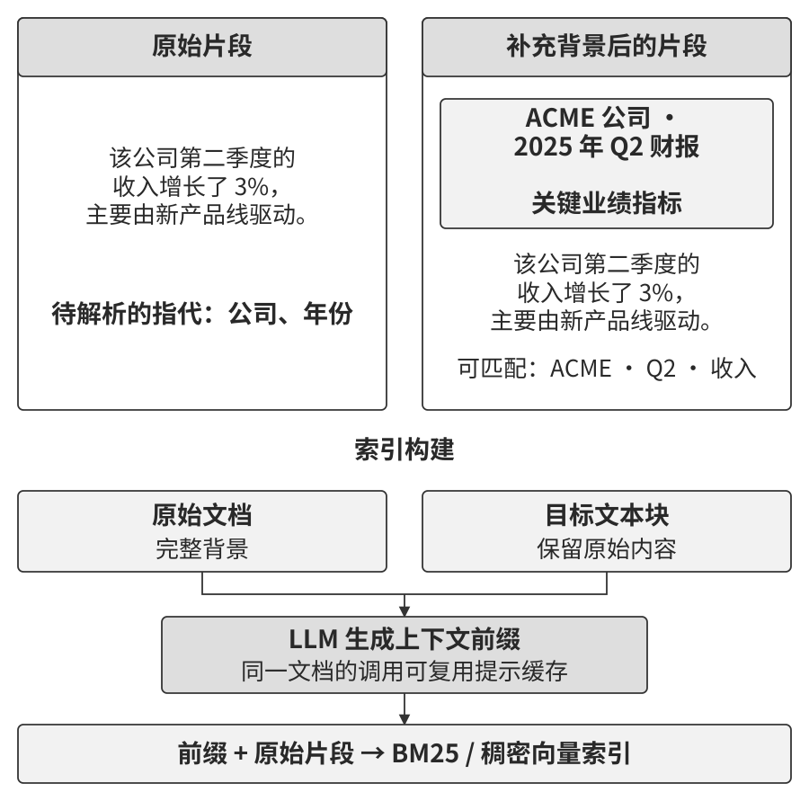

例如，前缀可以说明“本段来自 ACME 公司 2025 年第二季度报告的关键业绩指标部分”。生成时同时提供原文和目标块，让模型补充确有依据的指代、时间和章节信息。BM25 因此获得公司名、季度等可匹配词项，稠密嵌入也能结合这些背景表示片段。

它与第二章的上下文感知压缩可以配合使用：索引期为知识块补充背景，提高发现相关信息的机会；运行期根据当前任务整理已经取回的历史，控制输入长度。前者关注片段的可检索性，后者关注当前决策所需的信息与预算。

[^ch3-1]: Anthropic，[Introducing Contextual Retrieval](https://www.anthropic.com/engineering/contextual-retrieval)，2024 年 9 月。

> **实验 3-10 ★★：比较原始分块与上下文增强分块**
>
> 本实验为同一批资料建立两套索引：一套使用原始片段，另一套加入模型生成的前缀。保持查询和目标标注一致，分别比较 BM25、稠密检索与混合检索。
>
> 查询“ACME 公司最近的收入增长情况”时，可以检查命中片段是否同时包含目标公司、期间和增长数据。仅有“收入增长”可能匹配到其他公司；补充前缀后，公司名和时间能够参与排序。“最近”仍需结合资料日期解释，返回结果应保留具体期间。
>
> 在本次 15 个查询中，加入前缀后，BM25 的 recall@1 从 0.60 提高到 0.80，稠密检索从约 0.867 提高到 0.933；两者的 recall@3 分别保持 0.867 和 1.0。混合检索的 recall@5 从约 0.933 提高到 1.0。通过查看具体名次，可以区分前缀帮助找回了新目标，还是把已经召回的目标排得更靠前。
>
> 前缀生成增加了索引期调用。为同一文档的多个块生成背景时，可以复用文档前缀缓存，再计算缓存写入、读取和生成输出的总费用。Anthropic 在 2024 年报告中，按 800 token 的块、8000 token 的文档及指定提示长度估算，每百万文档 token 的一次性处理成本约为 1.02 美元；具体估算条件见报告。
>
> 该报告中，上下文嵌入结合 BM25 将 top-20 检索失败率从 5.7% 降至 2.9%，相对下降约 49%；加入重排序后降至 1.9%，相对下降约 67%。报告采用的失败率为 $1-\mathrm{recall@20}$。比较两套索引时，同时记录前缀生成费用、目标文档的名次变化和最终回答质量。

对于需要反复查询、内容相对稳定的资料库，笔者建议优先在建索引时补齐片段背景，一次处理可以服务后续多次查询。公司名称、事件主体和时间若在切分时丢失，单纯增大检索数量，仍可能取回一批指代不明的片段。生成前缀时补足这些线索，后续检索就能利用它们定位材料。

> **实验 3-11 ★★★：用上下文前缀与结构化卡片增强记忆**
>
> 对话中的“好的，就订这个吧”需要关联前面的商品或行程。若原文讨论的是上海到西雅图、500 美元的单程机票，前缀可以补充这些背景，并保留确认发生的会话与时间。
>
> 本实验在普通分块上增加两组配置：上下文前缀组，以及同时加载 Advanced JSON Cards 的双层记忆组。模型先基于普通索引生成搜索序列，再将同一组查询用于两套索引；双层组使用相同增强检索结果，并增加结构化卡片。这样可以分别观察前缀和卡片对取回内容、最终回答的影响。
>
> 在转账案例中，前缀分别说明 Patricia 发起转账、James 修改安排，以及 Patricia 再次调整，帮助定位事件次序。原始记录给出的最终状态是 95,000 美元、10 月 1 日，之前的安排已被替代。本次三组都正确找到了这一状态。检查这类问题时，前缀提供导航，最终金额、日期和确认信息仍回到原始记录核对。
>
> 双层结构还可以支持主动关联。卡片保存“东京行程”和“护照有效期”等关键事实，详细对话按需检索。以 1 月 15 日至 22 日的行程、2 月 18 日到期的护照为例，系统可以先发现日期接近，再查询续办记录与行程要求，最后提醒用户确认尚未完成的准备事项。这个旅行用例中，三组回答均通过评审；卡片与检索的差异主要体现在下面的车辆和跨会话用例中。
>
> 全部 60 个用例中，普通检索、上下文前缀和双层记忆分别通过 47、52、57 个。前缀组的主动服务用例从 13 个增加到 18 个；双层组在多会话检索层通过全部 20 个，主动服务层同样通过 18 个。车辆用例中，卡片补充了第二辆车的信息，帮助回答覆盖原先遗漏的对象。

**需要主动服务时，笔者优先采用关键事实常驻、详细记录按需检索的双层架构。** 单靠检索，模型往往需要先知道该问什么，才能找出有关记录；尚未进入视野的护照、车辆或家庭关系，很容易因此被漏掉。把少量关键事实先放进上下文，有助于模型发现关联、提出查询，再取回原始细节。选择常驻信息时，需要考虑人物关系、当前约束和未完成事项；检索结果则保留来源、时间和变更依据。评估分别检查事实存取、跨会话关联和主动提醒，能够帮助判断下一步应改进记忆表示、索引还是查询策略。

### 从数据集中提取知识：由案例到结构化表示

知识还可以来自对大量案例的整理。判决文书、客服工单和维修记录中，许多有用信息分散在具体叙述里。当任务需要从大量案例中归纳规律、比较结果或决定追问什么时，笔者建议先提取统一字段，再做统计与原型整理。只取回几个相似案例，难以看清整个数据集中的分布；统一字段后，就可以对整批记录作统计，并为后续个案查询提供概览。

这个过程可以分为两步。**知识提取**将原始描述转换为结构化记录，明确字段含义、取值和来源；**模式分析**再利用统计与聚类，寻找相似案例及其共同特征。图3-15 展示了从案例提取、特征编码到原型检索的流程。

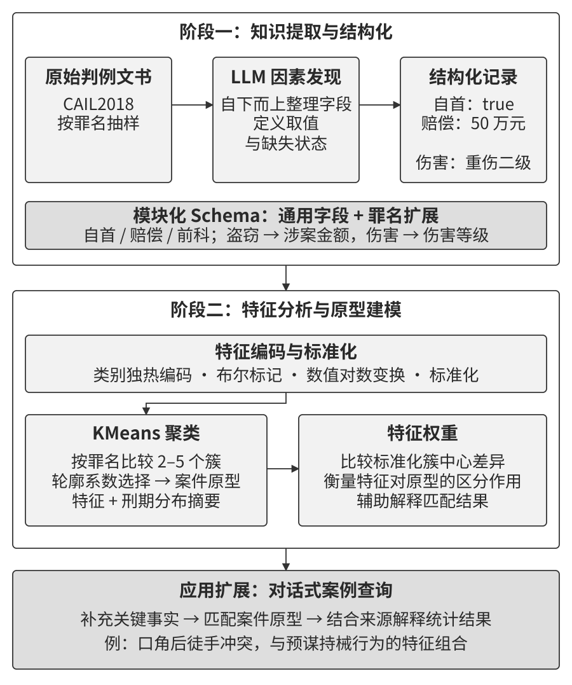

> **实验 3-12 ★★★：从司法案例中提取因素与原型**
>
> 本实验使用 CAIL2018 的刑事案件材料，选择盗窃、故意伤害和诈骗三类样本，构建“因素发现—字段提取—聚类—原型解释”的教学流程[^ch3-cail]。每类取 120 条用于建模，另外保留 20 条，共形成 360 条建模样本和 60 条留出样本。
>
> **发现并整理字段。** 模型先分批阅读建模样本，提出可能有用的因素，再合并成模块化 Schema。通用部分保存多个罪名都需要关注的字段，如自首、赔偿；扩展部分保存与具体罪名相关的信息，如涉案金额或伤害情况。本次整理得到 16 个通用字段，以及分别含 12、12、11 个字段的三组扩展。每个字段还需要定义取值和缺失状态，便于一致提取。
>
> **把字段编码为向量。** 类别字段可以使用独热编码：以盗窃、抢劫、诈骗三类作示意，分别编码为 `[1,0,0]`、`[0,1,0]`、`[0,0,1]`，每个位置只表示是否属于该类。使用 1、2、3 则会给某些算法引入类别之间的顺序和距离。“是否自首”“是否赔偿”等字段可用 1 和 0 表示已确认的两种状态；原文未提及的情况应单独处理，避免把缺失自动当成否定。
>
> 对金额等跨度较大的非负数值，本实现先使用 $\ln(1+x)$ 压缩尺度，再参与标准化。若一个字段允许同时出现多个类别，例如一条记录包含多种处置措施，可以为每类分别设置指示位，形成多热编码。编码规则应与字段的单选或多选含义一致。
>
> **建立案件原型。** 对编码后的特征做标准化，再按罪名分别聚类。本实现比较二至五个簇，用轮廓系数选择分组，最终形成 11 个原型。每个原型保存样本数、主要特征，以及样本刑期的中位数、四分位数和范围。例如，可以围绕冲突起因、作案方式和伤害后果，比较口角后徒手冲突与预谋持械行为这类不同特征组合；具体分组由提取结果与聚类共同决定。
>
> **解释特征与匹配结果。** 程序根据各簇标准化中心的差异，计算特征在区分原型时的权重。权重描述这批样本的分组结构；若要分析因素对结果的影响，还需要专门的统计设计。原型匹配则将新案例映射到相同特征空间，取回相近组的统计摘要和依据，供模型组织解释。
>
> 本次从留出样本中选择 12 条完成解释与独立评审，检查解释是否使用匹配原型、数字是否与统计一致，以及是否说明数据适用范围。应用到对话时，还可以根据缺失字段安排补充询问：先确认对匹配有较大影响的事实，再根据回答更新检索。评估这种交互时，记录每次提问补齐了哪些字段，以及新增事实是否改变原型匹配和最终解释。

[^ch3-cail]: CAIL2018，[官方数据集项目](https://github.com/china-ai-law-challenge/CAIL2018)。配套实验从公开材料中抽样，使用样本内部划分开展建模与评估。

从案例到原型，知识库增加了一层可检索的统计表示。原文提供证据，字段支持计算，原型概括相似样本的共同特征；三者保留对应关系，才能在发现提取错误或样本偏差时回查和修正。

### 前沿探索：多模态与参数化记忆

图片中的外观、声音中的音色和图表中的空间关系，往往需要保留原始模态才能完整使用。多模态记忆可以沿三条路线展开：保存原始材料，保存可供模型使用的表示，以及研究模型内部的持久记忆。

**第一条路线：原始材料与文本索引配合。** 例如，在用户授权的相册整理任务中，可以裁剪并保存人物面部等局部区域，在 Markdown 条目中引用图片，同时记录拍摄时间、场景和用户提供的人物标签。检索时先用这些描述定位候选，再读取原图或裁剪区域，比较外观细节。声音片段也可以关联时间、来源和转写，按需回放原始音频。文本提供入口，原始材料保留难以用文字概括的细节。

**第二条路线：存储嵌入并按需加载。** 视觉或音频编码器可以把材料转换为向量，存入索引，供相似性检索使用。例如，将图片局部区域或声音片段编码后，分别关联到对应的记忆条目。若模型支持经过训练的投影层和记忆接口，还可以在上下文中预留一组槽位，装入这些连续向量，让模型通过注意力访问。这里需要解决编码器表示与语言模型内部表示的对齐，并评估压缩后保留了哪些信息。

例如，一种设计若为每项记忆分配一个连续向量槽位，1000 个槽位就能保存 1000 项表示。所需空间还取决于向量维度和数值精度，识别质量则取决于训练与压缩方式。实现时可以比较单槽位与多槽位表示，以及直接检索原始图片或音频的效果，再决定每项记忆的预算。

**第三条路线：模型内部的持久记忆。** 为每位用户训练 LoRA，是把个性化事实写入模型的一种方式。直接提问“用户住在哪里”与根据住址规划行程，对记忆的使用要求不同：前者读取事实，后者还要将事实用于后续推理。只围绕事实复述训练，模型可能记得答案，却在复杂任务中没有主动用到它。因此，训练样本需要同时包含直接提问和依赖这些事实的任务，评估也要分别检查直接回忆、间接推理，以及对无关任务的影响。

笔者的 **User as Engram** 研究将文本事实写入 Engram 模型的局部记忆表，由共享适配器学习如何利用这些事实进行推理[^engram]。带哈希键的 N-gram 查找负责定位表项，门控机制将取回内容送入模型；每位用户保存局部表项，推理部分可以共享。论文在其文本事实实验中比较了直接回忆和间接推理，展示了如何分别管理每位用户的记忆内容与共享的推理能力。

[^engram]: Li, Bojie，[User as Engram: Internalizing Per-User Memory as Local Parametric Edits](https://arxiv.org/abs/2606.19172)，2026。

把这条路线扩展到多模态，还需要设计图像或音频表示的寻址、写入和读取机制，并验证跨模态查询能否触发正确记忆。这样的研究可以围绕四项指标展开：写入成本、存储容量、取用准确性，以及不同用户和不同记忆之间的干扰。

## 本章小结

用户记忆保存特定用户的事实、偏好和经历，共享知识库在授权范围内提供领域资料。两者都需要提取、表示、检索与更新，并保留来源、时间和适用条件。

记忆格式决定信息如何保存：简短笔记便于记录单条事实，段落与卡片保留关联，带类型的状态支持程序计算。检索决定如何取用：分块与稠密、稀疏索引提供候选，融合和可选重排序调整结果，层次摘要与关系索引补充概览和连接。上下文前缀为片段补齐背景，Agent 则通过工具控制查询与后续核查。

增量更新及时吸收证据，定期整理处理重复、冲突和结构变化。提议者—审核者流程把这些更新变成可审查、可追溯的版本，再生成面向服务的索引。评估贯穿记忆生成、检索和最终任务，帮助定位信息在哪一步丢失或被误用。

记忆与知识库让 Agent 能够利用跨会话的信息，检索则把所需材料送入当前上下文。要读取这些资料，或根据它们修改文件、办理业务，还需要相应的工具。下一章就来讨论 Agent 与环境之间的工具接口；第九章再进一步介绍怎样从执行结果中积累可复用经验。

## 思考题

1. ★★ 用户在两次会话中提供了不同的家庭住址。请设计记录结构与更新流程，区分搬家、更正、临时住处和信息冲突，并说明当前查询与历史查询分别如何取用。
2. ★★ 原始文档包含矛盾信息时，上下文前缀可能把错误一起写入索引。你会怎样保存来源、版本和不确定项，并在检索与生成阶段使用这些信息？
3. ★★ 将图表转换为文本后，哪些空间关系容易丢失？请用表格、架构图或折线图举例，设计原图、结构化表示和文本索引协同检索的方案。
4. ★★★ 随着模型和长上下文能力提升，分块、索引和检索流程中的哪些工作可能交给模型？请结合 Rich Sutton“苦涩的教训”中对搜索和学习的讨论分析，并设计实验比较全量输入与按需检索，同时检查任务质量、计算成本和权限约束。
5. ★★★ 如果模型已经掌握大量领域知识，外部知识库还应保存什么？请分别讨论公开常识、持续更新的规则、私有资料和需要精确追溯的证据。
6. ★ RAPTOR 的多层摘要与 GraphRAG 的实体关系、社区摘要分别支持哪些查询？请为总体概览、局部细节和多跳关联各举一例，并说明需要检查什么证据。
7. ★★ 目录、链接与向量索引如何协同组织知识？请设计一个需要人和 Agent 共同维护的知识库，说明导航、语义搜索、版本更新与权限过滤各自的位置。
8. ★★★ 从案例中提取字段并聚类后，怎样判断原型有用？请区分聚类特征的重要性、结果预测能力与因果解释，并设计留出评估和专家复核流程。
9. ★★★ 为 Markdown 用户记忆库设计增量更新与定期整理流程。若审核者与提议者使用相同模型，且审核者只能看到提议者挑选的片段，哪些错误容易遗漏？请从证据覆盖、工具权限和审核评估三个方面改进。

[^ch3-glove]: Pennington 等，[GloVe: Global Vectors for Word Representation](https://nlp.stanford.edu/projects/glove/)，2014。

[^ch3-sbert]: Reimers 与 Gurevych，[Sentence-BERT: Sentence Embeddings using Siamese BERT-Networks](https://arxiv.org/abs/1908.10084)，2019。
