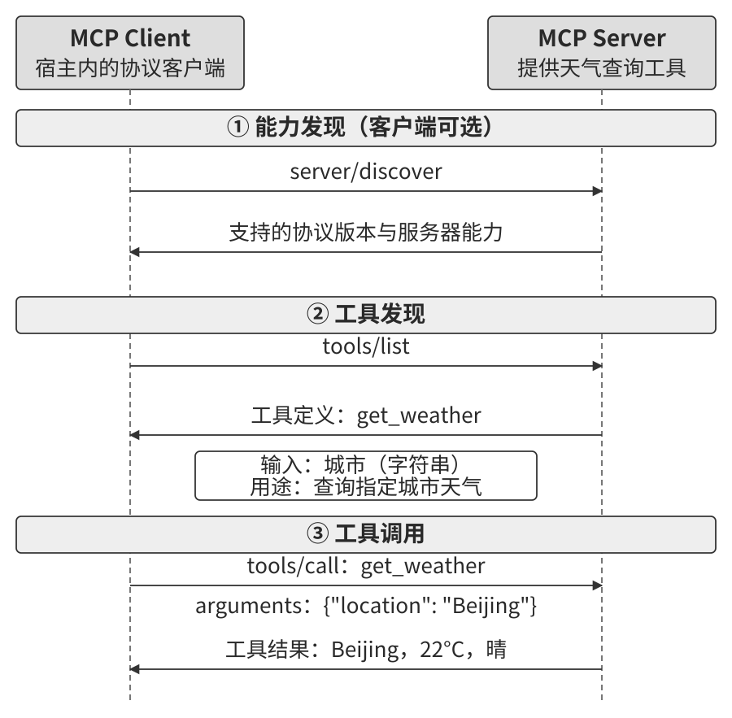
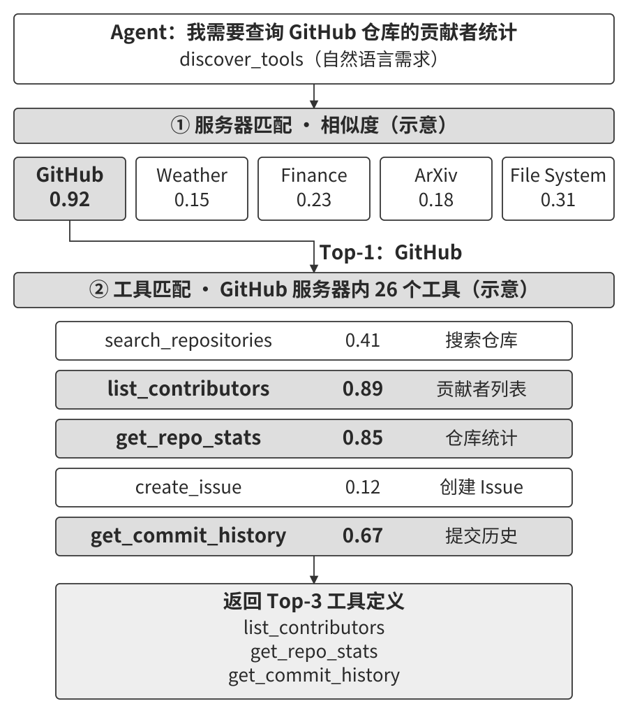
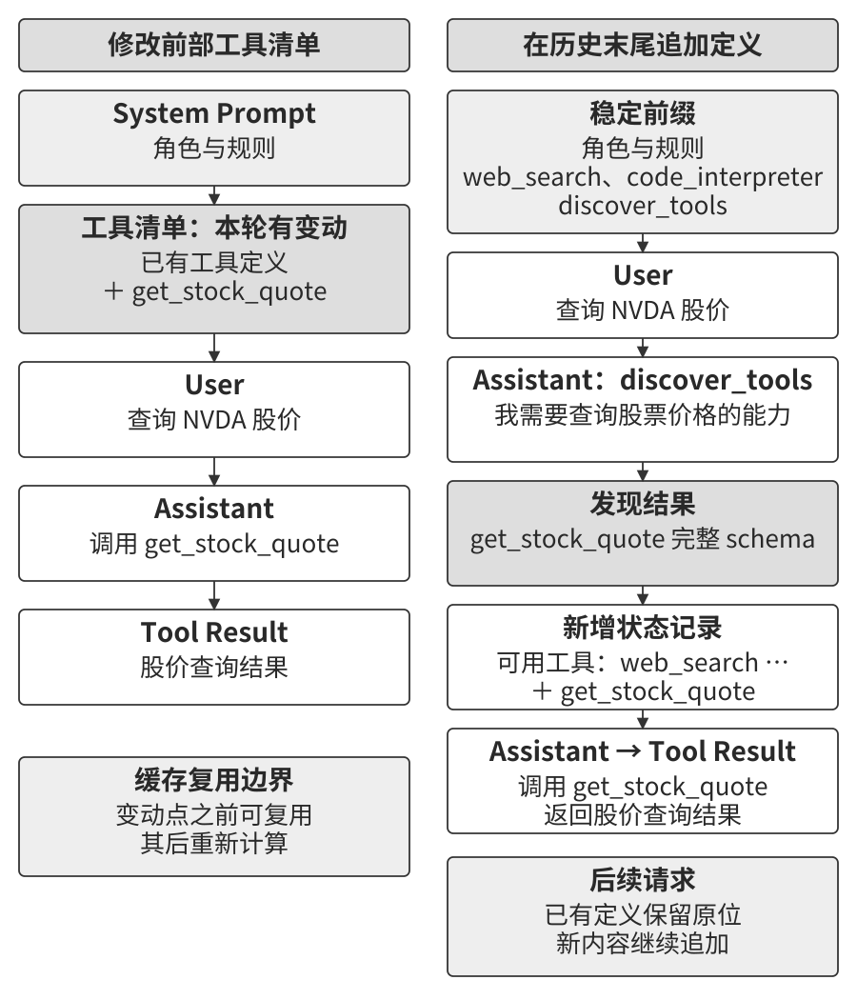
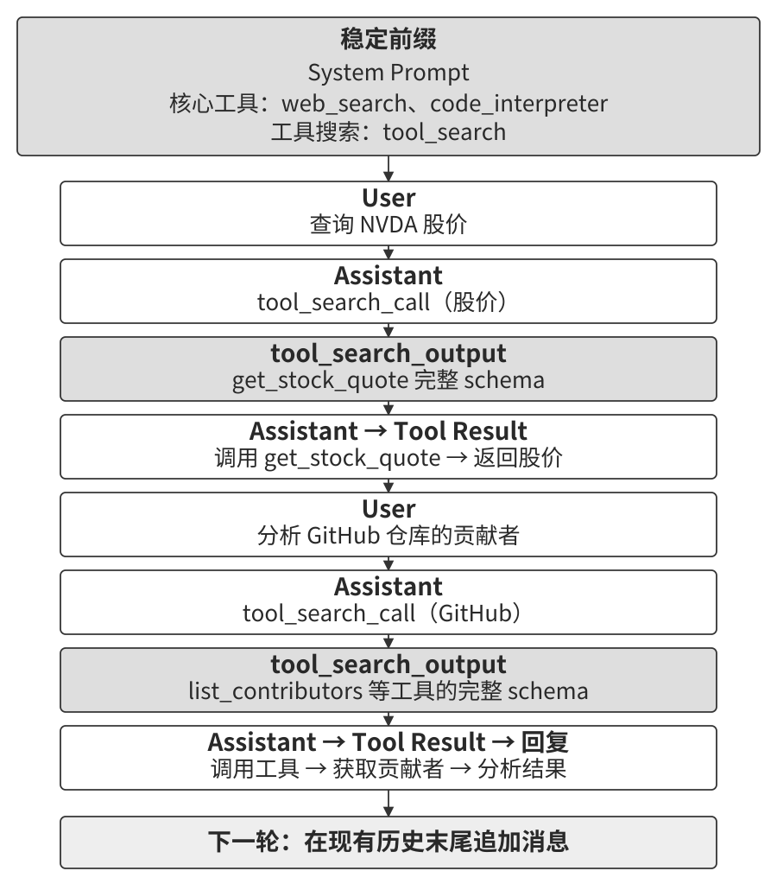

# 工具

在科幻电影《Her》中，AI 助手 Samantha 会整理邮件、协助回复、处理出版事宜，并在不同沟通渠道之间切换。这样的助手需要把语言理解转化为对外部系统的操作。Agent 通过**工具**完成这些交互。工具是它的“感官和手脚”，既提供观测，也执行行动。本书讨论的 Manus、OpenClaw 等通用 Agent，同样需要通过工具访问数字世界。

本章先介绍五类工具，再讨论能力封装、工具描述与参数传递，随后介绍 MCP、Skill Hub，以及大量工具的组织和发现方法。最后分别介绍感知、执行与协作工具的设计。事件触发和用户沟通还涉及异步消息、唤醒与多渠道交互，将在第六章结合运行机制讨论。

## 工具的分类

第一章按用途将工具分为感知、执行、协作、用户沟通和事件触发五类。表4-1 列出每类交互由谁发起，以及它承担的任务。模型决定何时调用工具，Harness 校验并调度调用，工具连接的程序或服务完成实际操作。

表4-1 五类工具的调用方向与主要用途

| 工具类型 | 调用方向 | 主要用途 |
| --- | --- | --- |
| 感知工具 | Agent 主动调用 | 获取外部信息 |
| 执行工具 | Agent 主动调用 | 执行计算或修改外部状态 |
| 协作工具 | Agent 主动调用 | 委派任务、交换消息、协调其他 Agent 或人类 |
| 用户沟通工具 | Agent 主动调用 | 向用户回复、展示结果或发送提醒 |
| 事件触发工具 | 开发者配置或 Agent 注册、外部触发 | 在指定事件发生时唤醒 Agent |

**感知工具**让 Agent 获取外部信息，例如网络搜索 `web_search`、知识库检索 `knowledge_base_search`、网页读取 `fetch_url`、文件名搜索 `find_file`、文件内容搜索 `grep_file` 和文件读取 `read_file`。设计时要控制返回范围与信息量，让结果足以支持下一步判断，并节省上下文空间。

**执行工具**让 Agent 执行计算或改变外部状态，例如命令行 `shell_exec`、代码解释器 `code_interpreter`、文件写入 `write_file`、文件编辑 `edit_file` 和邮件发送 `send_email`。同一个通用执行器可以完成只读计算，也可以修改数据；权限与确认机制应根据具体操作及其后果设置。

**协作工具**支持任务委派和消息交换，例如创建子 Agent `spawn_subagent`、发送消息 `send_message_to_subagent`、取消子 Agent `cancel_subagent` 和发现可用 Agent `list_agents`。独立任务可以并行处理，例如分别调研 OpenAI 多位联合创始人的经历；不同任务也可以交给配置了不同模型、工具、提示词和上下文的 Agent。第十章将进一步讨论分工与协作架构。

**用户沟通工具**向用户传递信息，例如回复消息 `reply_to_user`、发送结构化卡片 `send_card_to_user` 和发送提醒 `send_user_notification`。当交互扩展到多个渠道或需要后台通知时，系统可以把消息发送封装为显式工具调用，统一管理接收对象、内容和送达状态。

**事件触发工具**连接外部事件与 Agent 的运行，例如定时器 `set_timer`、后台任务监控 `monitor_shell` 和事件源连接 `connect_channel`。整个过程包含两个步骤：注册时，由开发者预先配置，或由 Agent 通过获准的调用声明关注的事件；事件发生后，调度系统接收回调或事件消息，唤醒 Agent 处理。新邮件、系统告警、定时提醒和后台任务完成，都可以成为新的运行入口。

这五类工具共享描述、参数、权限和结果反馈等设计问题。下面先讨论这些通用问题，再分别介绍各类工具的实现取舍。

## 工具设计的通用原则

早期接入工具时，常见做法是直接包装每个 API 端点。这种做法接入快，却容易得到一组粒度很细的接口。Agent 为完成一个任务，可能要反复查找对象、读取属性、检查条件，再调用执行接口。设计工具时，可以围绕常见任务整合这些操作，例如把查找联系人与发送消息衔接起来，或让日志搜索直接返回相关行及其上下文[^ch4-tool-design]。

**工具应围绕 Agent 要完成的任务来设计。** 这种从 Agent 使用方式出发设计接口的思路称为 **ACI**（Agent-Computer Interface，Agent—计算机接口）。HCI 关注人如何与计算机交互，ACI 则关注模型如何选择操作、构造参数、理解反馈并纠正错误。本节从能力形式、工具描述和参数保真三个方面展开。

[^ch4-tool-design]: Anthropic，[Writing effective tools for AI agents—using AI agents](https://www.anthropic.com/engineering/writing-tools-for-agents)，2025。

### 能力的表达形式：专用工具、通用执行器与 Skill

同一项能力可以采用不同的封装方式。以部署应用为例，可以提供一个 `deploy_app` 工具，也可以提供构建、打包、部署三个接口，还可以把流程写入 Skill，由 Agent 调用终端逐步完成。

- **专用工具**为确定的操作提供结构化接口。开发者定义参数 Schema、校验规则、执行逻辑与返回格式，便于单独测试和授权；工具定义进入上下文后，占用量取决于字段、描述和示例的长度。
- **通用执行器与 Skill**配合使用：终端或代码解释器提供执行能力，Skill 说明流程、适用条件与操作方法。宿主可以先加载名称和简介，选中后再读取完整说明及相关资源。

例如，一份部署 Skill 可以依次说明：用 `npm run build` 构建项目，用 `docker build -t app:latest .` 打包镜像，再用 `kubectl apply` 部署到集群。Agent 通过终端工具执行这些步骤，复用同一个执行入口。

能力形式与披露方式可以分别设计。数百个专用工具可以只显示索引，按需加载 Schema；少量 Skill 可以把目录常驻上下文，规模增大后再加入检索。能力的封装形式决定参数如何表达、执行逻辑如何维护；披露方式决定当前决策可见哪些能力。后文“工具太多怎么办”将讨论披露策略。

**笔者建议优先采用通用工具，再按权限、参数和性能需求补充专用接口。** 例如，在沙盒中为 `code_interpreter` 配置 SymPy、NumPy 和 pandas，Agent 就能编写 Python 完成四则运算、符号计算、数组处理和数据分析。这能让模型充分发挥代码生成能力：一个解释器可以承载多种算法，也能组合已有库处理预先没有想到的新问题。模型负责生成代码，运行环境负责执行，并限制文件、网络和资源访问。

即使采用专用工具，笔者也建议优先整合功能相近、经常一起使用的操作。接口过细，模型就要记住更多名称和分工，完成同一任务也需要更多次调用。整合时主要看**功能相似性**与**使用场景的重叠度**。例如，`extract_pdf_text`、`extract_docx_content`、`extract_pptx_content` 都接收文档并提取文本，可以整合为 `read_document`，通过 `file_type` 区分格式。模型只需选择统一入口，新增格式也可沿用参数与返回结构。若不同格式需要特有选项，则在接口中明确这些条件，或保留相应专用工具。

以下四种情况尤其适合专用接口。

1. **需要精细授权和审计。** 生产数据库写入可以封装为范围明确的操作，由服务端检查用户权限、目标表和允许变更的字段，并记录操作依据。
2. **需要屏蔽平台差异。** grep、find 等操作可以经由 shell 完成，专用文件搜索工具则能统一 macOS、Windows 和 Linux 的参数与反馈，例如固定返回文件名、行号和匹配片段。
3. **操作频率很高。** 高频操作可以提供短而稳定的入口，减少重复生成脚本与解释流程的开销。
4. **参数关系复杂。** 嵌套对象、字段依赖和复杂取值约束适合通过 Schema 与业务校验共同表达。

**参数越复杂，传递方式越重要。** 结构化工具调用通常用 JSON Schema 描述输入，部分模型服务支持约束生成，使参数满足所支持的 Schema 规则。返回值的结构由工具接口约定，宿主再将结果交给模型。类型和格式校验之外，权限、对象是否存在、多个字段是否满足业务条件，仍由 Harness 与工具服务检查。

Skill 可以说明如何调用专用工具，也可以指导 Agent 使用 CLI。后一种方式要求模型同时处理命令行语法、引号和转义，不同 shell 的规则也有差别。参数越复杂，模型需要正确处理的细节就越多。遇到复杂嵌套参数，可以先将它们写成 JSON，再让命令读取该文件，减少多层转义，并在执行前校验内容。

**Skill 便于业务人员直接编写和修改。** 熟悉业务的人可以用自然语言调整步骤、添加例子和解释使用条件，也可以在 Agent 生成的说明上继续完善。调整步骤顺序、补充判断条件或修改示例，都可以直接改动说明文字，省去修改工具代码和重新部署接口的工作。按照 Agent Skills 规范，`SKILL.md` 的元数据采用规定格式，正文采用 Markdown，还可以附带脚本、参考文档和资源[^ch4-skill-format]。因此，维护时分别检查元数据能否加载、步骤是否清楚、脚本是否可执行；更新流程说明后，再回放相关任务。

[^ch4-skill-format]: Agent Skills，[格式规范](https://agentskills.io/specification)，包括元数据、正文、附带资源与渐进式加载。

选择能力形式时，可以综合四个维度。

- **安全与权限**：专用接口便于限定操作范围；通用执行器通过沙盒、凭证和资源权限控制执行能力。
- **参数复杂度**：复杂结构适合 Schema 与业务校验；简单操作可以直接通过 CLI 传参。
- **变更频率**：经常调整的流程优先写入 Skill，业务人员可以直接修改说明和示例；稳定且重复使用的底层操作再封装为工具或脚本。
- **模型能力**：能可靠生成代码和处理命令行的模型，优先让它通过 Skill 与通用执行器组合能力，减少专用工具数量；模型较弱、复杂参数频繁出错时，则用结构化接口承担更多约束。

第九章将讨论 Agent 从经验中沉淀新能力时，如何选择并维护这些形式。

**代码还可以编排多次工具调用。** 抓取多个网页并提取字段时，模型可以生成一段脚本，完成循环、过滤和汇总。网页全文保留在执行环境的变量中，只有选中的字段与统计结果返回上下文。程序中的条件、循环和异常处理负责衔接各步操作，模型直接分析汇总结果。对于批量抓取、过滤和统计这类步骤已经清楚的任务，笔者优先用代码串联，减少模型逐次调用工具、读取中间结果的往返。中间结果越多、返回字段越精简，这种安排节省的上下文就越可观。第五章将进一步讨论这类代码编排。

### 工具描述：说明用途、参数与反馈

工具描述帮助模型完成三项判断：当前任务适合使用哪个工具，调用需要哪些信息，结果应如何使用。

**说明使用时机。** 网络搜索的描述可以写成“需要获取实时信息或查找未知事实时使用”，让模型把用户需求与工具用途对应起来。只有“搜索相关内容”时，模型还要自行猜测搜索范围和适用条件。

**明确输入与搜索范围。** 例如，文件名搜索工具可以说明“按文件名和路径匹配；查找文件中的文字请使用 `grep_file`”。把相邻工具的分工写清楚，可以帮助模型在一次调用中选对入口。**在笔者看来，明确边界条件往往比罗列功能更重要。** 工具接受什么输入、搜索哪些范围、遇到空结果或错误时怎样处理，都直接影响模型的下一步决策。

**用规范加实例说明参数。** `timestamp` 可以写成“RFC3339 格式，例如 `2024-03-15T14:30:00Z`”。模型处理复杂任务时，需要同时选择工具、从历史轨迹中提取信息，并权衡后续步骤，参数格式只是其中一个细节。完整字符串提供了可直接参照的格式，模型可以照着构造参数，减少重新解释术语时出错的机会。

同样，`phone` 可以写成：“电话号码，采用 E.164 国际号码表示，以 `+` 开头，后接国家代码和号码，其余部分仅含数字，无空格或分隔符。例如 `+8613888888888`（中国）或 `+12025551234`（美国）。”这种写法把格式名、字符规则和完整例子放在一起，模型容易照此构造参数，程序也能按约定校验。

**说明返回结构与执行代价。** 例如，“返回 JSON 数组，每项包含 `title`、`url`、`snippet` 三个字段”，便于模型提取标题、来源与摘要。耗时较长的工具可以注明测量环境下的预计延迟和替代入口，例如“读取完整网页可能需要 5～10 秒；只需元信息时可调用 `get_page_metadata`”。

还可以附上 1～5 个经过验证的调用示例，覆盖最小参数、常见组合和复杂条件。JSON Schema 能表达类型、必填项、取值范围和部分字段依赖[^ch4-json-schema]；示例则展示这些规则如何用于具体任务，例如时间戳采用秒还是毫秒、过滤条件如何嵌套、哪些可选字段通常一起出现。Anthropic 在 2025 年报告的内部复杂参数测试中，加入工具调用示例后，准确率从 72% 提高到 90%[^ch4-tool-examples]。

[^ch4-json-schema]: JSON Schema，[对象类型与属性约束](https://json-schema.org/understanding-json-schema/reference/object)。模型接口支持的 Schema 关键字范围由相应服务规定。

[^ch4-tool-examples]: Anthropic，[Introducing advanced tool use on the Claude Developer Platform](https://www.anthropic.com/engineering/advanced-tool-use)，2025 年 11 月 24 日，Tool Use Examples 部分。

Agent 频繁选错工具时，笔者建议**优先检查工具描述**：几个工具是否使用近似名称，搜索范围是否清楚，参数是否缺少例子。用同一组失败任务回放修改后的描述，检查工具选择与传参是否改善。修改描述成本低，也便于针对具体失败逐项改进，值得作为调试的第一步。这套方法同样适用于 Skill 的名称、简介和操作说明。

### 参数传递的保真性

工具调用从模型到执行端，可能经过解析、序列化、代理和运行时封装。各层应保留参数的含义；未经说明的转换会让模型看到的输入与实际执行内容发生偏差。

以 2026 年初 Cursor 某个版本中的弯引号转换问题为例。替换工具接收 `old_string` 和 `new_string`，通过精确匹配修改文件。读取工具返回中文弯引号 `“`、`”`，对应 `\u201c`、`\u201d`；模型将原文放入 `old_string`，参数传递过程中却被转换为英文直引号 `"`。文件中的原文保持不变，替换工具因而返回“未找到匹配”。再次读取、再次复制原文，仍会遇到同样的失败。

写入方向也会受到影响。模型要求写入弯引号，文件最终保存的却是直引号。随后读取文件时，模型看到的内容与预期写入内容不同，又可能尝试修正；只要转换仍在发生，重试就会重复同一个错误。

另一类问题是**静默参数注入**。某 IDE 的 bash 工具会自动为 `git commit` 附加 AI 提交标记参数。旧版 Git 不识别该参数，提交因此报错。模型只看到自己生成的命令，可能反复调整提交信息或其他参数，却始终没有改到真正的故障来源。

排查这类问题，应对照模型生成的参数、传递后的参数、实际执行请求和返回结果。需要统一编码或补充执行参数时，在接口说明中写清规则，并在反馈中提供实际采用的值。精确匹配工具尤其需要保留引号、空格和换行；透明的参数传递才能让模型根据错误信息采取有效的下一步行动。

## 工具生态：MCP 与 Skill Hub

不同模型接口和 Agent 框架使用各自的工具定义方式，例如 function calling、tool use 与 LangChain 的 Tool 抽象。同一个外部服务若要逐一适配这些接口和框架，就需要重复处理描述、参数和结果格式。Anthropic 于 2024 年 11 月发布的 **Model Context Protocol（MCP）**，为模型应用访问工具和数据提供了统一协议[^ch4-mcp-origin]。

理解 MCP，可以先看宿主、客户端和服务器三个角色。**宿主（host）**是 Agent 应用或 IDE，负责模型交互、上下文组织与权限管理；宿主中的 **MCP 客户端**负责协议消息；**MCP 服务器**提供工具、资源和提示模板，可以作为本地进程运行，也可以部署为远程服务[^ch4-mcp-architecture]。

**工具定义与调用。** 客户端通过 `tools/list` 获取可用工具，清单可以分页返回。每项工具包含名称、描述和 `inputSchema`；结构化结果还可用 `outputSchema` 约定格式。模型选择工具并生成参数后，宿主完成校验，由客户端发送 `tools/call`，服务器执行后返回结果。宿主决定将哪些定义和结果放入模型上下文[^ch4-mcp-tools]。

图4-1 以查询北京天气为例，展示服务器能力发现、工具清单获取和工具调用。图中采用配套实现使用的 MCP 2026-07-28 版本：每次请求携带协议版本、客户端信息与能力，客户端也可以先调用 `server/discover` 了解服务器支持的版本及能力。早期版本采用 `initialize` 握手建立会话，连接时需要按双方支持的版本选择交互方式[^ch4-mcp-versioning]。

**传输方式。** stdio 通过本地子进程的标准输入和标准输出传递 JSON-RPC 消息。Streamable HTTP 则通过 HTTP 发送请求，响应可以是 JSON，也可以使用 SSE 流逐步返回。Streamable HTTP 替代了早期的 HTTP+SSE 传输方案，并继续使用 SSE 作为流式响应方式[^ch4-mcp-transports]。

**资源与提示模板。** 资源（resources）提供可读取的数据，例如文件内容和数据库记录；宿主可以按 URI 列举、读取并选择相关内容。提示模板（prompts）提供可复用的消息或任务模板，供用户和客户端选用。工具也可以承担搜索和读取，因此这三类原语按交互接口分工：工具提供调用入口，资源提供数据入口，提示模板提供任务入口[^ch4-mcp-primitives]。

MCP 的核心价值是让一份工具实现服务于多个 Agent 产品。统一协议使同一个服务器能够被兼容宿主复用，例如 Cursor、Claude Desktop 和 OpenClaw，开发者也能把更多精力放在能力本身及其反馈质量上。接入时仍要匹配协议版本、传输方式、认证和功能支持，宿主再把协议中的工具定义转换为模型可用的接口。后文的感知、执行和协作实验将围绕这些调用过程展开。

**Skill Hub 提供能力包的发现与分发。** 一份 Skill 通常包含 `SKILL.md`，还可附带脚本和参考资料。分发平台帮助用户搜索、安装和更新这些文件。Vercel 于 2026 年 1 月推出 skills.sh，提供技能目录及安装工具；OpenClaw 生态的 ClawHub 也提供技能查找与版本管理[^ch4-skills-sh][^ch4-clawhub]。安装后，宿主按其加载策略读取名称、简介与完整说明。MCP 也可通过扩展提供 Skills 的发现与读取，能力包与通信协议可以配合使用[^ch4-skills-over-mcp]。

**接入与上下文加载分别管理。** MCP 客户端取得工具清单后，可以全量提供给模型，也可以先保留索引、按需加载定义。Skill 同样可以先显示 `name` 和 `description`，选中后再读取正文。工具允许列表决定哪些能力可用，延迟加载决定哪些定义当前可见。比较 token 开销时，应统计实际加载的 Schema、目录条目、操作说明和示例；长 Schema 与短目录项的差距，来自内容与加载方式。

**接入第三方能力时，分别检查它提供的内容和实际执行的操作。** 描述、返回内容和附带代码来自不同主体，授权范围也可能不同。以 MCP 为例，可以分别检查三类问题。

1. **工具描述投毒。** 描述中可能夹带与工具用途无关的操作要求，诱导模型越出当前任务。这属于提示注入：外部提供的内容试图改变模型的行为。描述进入上下文时会形成风险，是否导致越权还取决于模型判断和执行层约束。
2. **服务器及依赖被修改。** 服务器升级可能改变工具行为，依赖更新或远程服务被入侵也可能污染返回结果。部署版本、依赖来源和变更审查需要一并管理。
3. **同名工具混淆。** 不同服务器可能提供同名或相似工具，模型或路由层由此选错目标。宿主应保留服务器身份与工具名称的绑定，展示来源，并在调度时校验目标。

接入前审查描述与实现，固定可控部署的版本，并对升级重新核查；每个服务器使用与任务相符的最小权限凭证。远程服务由他方维护时，还要监测工具定义与行为变化。描述审查减少不当内容进入上下文，凭证和权限检查限制实际操作，两者分别作用于信息与执行。

运行时还可以使用后文的 Sidecar，对结构化调用及必要任务依据独立审核。调用参数中的路径、文本和目标地址也应作为待检查数据处理。审核结果与确定性的权限规则共同决定是否执行。第五章将介绍 Simon Willison 的“致命三要素”，用于分析私有数据、外部输入与对外通信组合后的风险。

Skill 附带的脚本、本地 MCP 服务器及远程服务，各有执行位置与权限范围。审查时检查代码来源、运行环境、文件和网络权限，以及凭证流向；外部提供的步骤若引导下载或运行其他程序，也应纳入这条检查链。平台扫描可提供辅助线索，运行隔离、最小权限和变更审核则直接控制实际执行。

[^ch4-mcp-origin]: Anthropic，[Introducing the Model Context Protocol](https://www.anthropic.com/news/model-context-protocol)，2024 年 11 月 25 日。
[^ch4-mcp-architecture]: MCP，[架构](https://modelcontextprotocol.io/specification/2026-07-28/architecture)与[协议概览](https://modelcontextprotocol.io/specification/2026-07-28)，2026-07-28 版本。
[^ch4-mcp-tools]: MCP，[Tools](https://modelcontextprotocol.io/specification/2026-07-28/server/tools)，包括工具清单、输入输出 Schema 和调用结果。
[^ch4-mcp-versioning]: MCP，[Versioning and Compatibility](https://modelcontextprotocol.io/specification/2026-07-28/basic/versioning)，说明逐请求元数据、能力发现与旧版握手的兼容方式。
[^ch4-mcp-transports]: MCP，[传输概览](https://modelcontextprotocol.io/specification/2026-07-28/basic/transports)及[2025-11-25 传输规范](https://modelcontextprotocol.io/specification/2025-11-25/basic/transports)，后者说明 Streamable HTTP 对早期 HTTP+SSE 方案的替代关系。
[^ch4-mcp-primitives]: MCP，[Resources](https://modelcontextprotocol.io/specification/2026-07-28/server/resources)与[Prompts](https://modelcontextprotocol.io/specification/2025-11-25/server/prompts)。
[^ch4-skills-sh]: Vercel，[Introducing skills, the open agent skills ecosystem](https://vercel.com/changelog/introducing-skills-the-open-agent-skills-ecosystem)，2026 年 1 月 20 日；技能目录见 [skills.sh](https://skills.sh)。
[^ch4-clawhub]: OpenClaw，[ClawHub 使用说明](https://docs.openclaw.ai/clawhub)。

## 工具太多怎么办：层次化组织与主动工具发现

工具从十几个增长到成百上千后，模型既要找到合适的能力，也要读懂相近接口之间的差异。全量定义会占用上下文；若定义位于提示前缀，增加、移除或重排工具还可能缩短可复用的缓存前缀。名称和用途相近的工具越多，模型就越容易选错入口或忽略必要能力。因此，大规模工具库应默认按需加载，同时设计好分类目录与发现接口，让模型围绕当前任务从一组相关且容易区分的候选中选择。

下面讨论三种可以组合使用的方法：按类别组织目录，并按需加载定义；让 Agent 在执行过程中搜索缺少的能力；通过 Skill 提供可按需查阅的流程和用法。专用工具、通用执行器和 Skill 都可以纳入这样的发现过程。

### 层次化组织与按需加载

**先提供索引，用到时再加载定义。** 工具目录可能占用大量上下文。Anthropic 举过一个例子：GitHub、Slack 等五个 MCP 服务器共提供 58 个工具，完整定义约占 5.5 万 token[^ch4-tool-search-eval]。Cursor 采用文件目录管理这些描述，初始上下文只提供工具名称等简要信息，Agent 根据任务查阅完整定义。在 Cursor 于 2026 年 1 月公布的 A/B 测试中，对于实际调用 MCP 工具的任务，这种方法将 Agent 的总 token 消耗减少了 46.9%；节省幅度随接入的 MCP 数量而变化[^ch4-cursor-discovery]。

Pi 的早期设计则优先使用附带 README 的 CLI 工具，让 Agent 按需阅读用法，再通过命令行调用能力[^ch4-pi-no-mcp]。社区扩展 `pi-mcp-adapter` 将类似思路用于 MCP：默认向模型提供一个约 200 token 的代理工具，模型依次搜索工具、查看定义、发起调用；服务器延迟到首次调用时启动。Pi 后续的 0.99 版本也加入了内置 MCP 支持，并采用按需发现机制[^ch4-pi-mcp-adapter]。这些实现把协议接入与上下文加载分开处理：后端连接 MCP 服务，前端通过简短索引或代理接口帮助模型找到所需能力。

[^ch4-cursor-discovery]: Cursor，[Dynamic context discovery](https://cursor.com/blog/dynamic-context-discovery)，2026 年 1 月 6 日。
[^ch4-pi-no-mcp]: Mario Zechner，[What if you don’t need MCP at all?](https://mariozechner.at/posts/2025-11-02-what-if-you-dont-need-mcp/)，2025 年 11 月 2 日，介绍 CLI 与按需阅读文档的设计思路。
[^ch4-pi-mcp-adapter]: [pi-mcp-adapter](https://github.com/nicobailon/pi-mcp-adapter)，项目 README 的代理工具、延迟启动及与 Pi 内置 MCP 的比较。

**按任务组织工具目录。** 当工具增多时，可以按获取信息的方式分组，让模型先定位类别，再选择具体接口：

- **搜索工具**：根据线索寻找信息位置，例如网络搜索、知识库搜索和文件搜索。
- **读取工具**：从已知位置获取内容，例如读取网页、文档或指定记录。
- **解析工具**：从非结构化内容中提取信息，例如图片 OCR、视频分析和音频转录。
- **查询工具**：按字段与条件访问结构化数据，例如天气 API、股票 API 和数据库查询。

分组时要结合实际接口说明输入与输出。例如，“查找某篇论文”先用搜索工具获得地址，“阅读该论文”再用读取或解析工具取得内容。这样的目录能够同时提示工具用途和调用顺序。

**通过检索缩小候选范围。** 宿主可以根据任务描述，对工具名称、简介和参数说明进行关键词或语义检索，只加载相关候选。候选数量需要兼顾覆盖范围与上下文开销：数量太少容易漏掉必要能力，数量太多又会增加选择负担。首次检索可以根据用户请求进行，后续则根据任务进展补充。

### 模型原生的主动工具发现

复杂任务的工具需求往往随着执行逐步显现。例如，“Debug the file”可能先需要读取文件，再需要检索依赖、运行测试和分析错误。只在任务开始时检索一次，容易遗漏后续所需的能力。

**让 Agent 在需要时提出请求。** MCP-Zero 让模型在执行过程中生成结构化能力请求，例如用 `server` 指定 GitHub，用 `tool` 描述“搜索仓库并返回元数据”。系统先匹配服务器，再匹配服务器内的工具，并把选中的定义加入上下文；若返回工具无法满足任务，模型可以调整请求，继续检索。论文构建的 MCP-tools 数据集包含 308 个服务器、2797 个工具；其 APIBank 全工具集合测试中，单轮与多轮设置的工具提示开销均减少约 98%[^mcp-zero-2025]。

工程中也可以保留 `web_search`、`code_interpreter` 等基础工具，再增加一个工具搜索接口。模型描述缺少的能力，搜索接口返回候选定义，模型随后调用。Anthropic 的 Tool Search Tool 采用这种按需发现方式：常用工具直接加载，其余工具通过 `defer_loading` 延迟加载。Anthropic 公布的内部 MCP 评估中，启用工具搜索后，Opus 4 的准确率从 49% 提升至 74%[^ch4-tool-search-eval]。

[^mcp-zero-2025]: Xiang Fei、Xiawu Zheng、Hao Feng，[MCP-Zero: Proactive Toolchain Construction for LLM Agents from Scratch](https://arxiv.org/abs/2506.01056)，2025。约 98% 的开销降幅来自 APIBank 全工具集合设置，见论文表 1。
[^ch4-tool-search-eval]: Anthropic，[Introducing advanced tool use on the Claude Developer Platform](https://www.anthropic.com/engineering/advanced-tool-use)，2025 年 11 月 24 日，Tool Search Tool 部分。

**分两层匹配，并准备检索失败后的处理方式。** MCP 服务器通常围绕某个平台或业务域提供一组工具。利用这一结构，可以先根据能力描述筛选服务器，再在候选服务器中匹配具体操作。如图4-2“层次化工具匹配（服务器级→工具级两层语义搜索）”所示，逐层筛选能够缩小每次比较的范围，减少跨领域工具之间的干扰。

采用向量检索时，可以预先计算服务器与工具描述的嵌入，并在目录变化时增量更新。每一层都应检查匹配质量：服务器或工具候选的相似度低于设定阈值时，返回“未找到合适工具”，让 Agent 补充条件、改写需求后重试。对于能够通过通用执行器完成的任务，也可以改用基础工具组合实现；创建和保存新工具的方法将在第九章讨论。

**让动态加载与 KV Cache 配合。** 工具定义的放置位置会影响前缀复用。若每次发现新工具都修改请求开头的工具清单，序列化后的前缀就会改变，缓存只能复用到首个变化位置。图4-3“工具动态加载的 KV Cache 优化”展示了另一种组织方式：系统提示词、基础工具和搜索接口保持稳定，新工具定义随发现结果追加到历史中；后续请求保留已有定义的位置，继续追加消息。

第二章介绍的 OpenAI `tool_search`、`defer_loading` 与 `tool_search_output`，以及 Anthropic 的 `tool_reference`，都支持按需加载工具定义。实现时应检查工具定义在实际上下文中的位置：已有前缀保持一致，才能复用对应的 KV；修改、删除或重排历史，也会改变后续前缀。实际命中还受缓存保留时间、服务路由、缓存粒度和模型配置影响。状态栏可以另行维护一份简短的可用工具名称列表，帮助模型掌握当前能力。

图4-4“动态发现后的上下文结构：工具 schema 散落在轨迹各处”展示了多轮发现后的结果：不同工具的定义分别保留在首次加载的位置，并与后续调用和返回值一起构成任务轨迹。

这种设计要求模型能够理解会话中新加载的工具定义，并据此填写参数、发起调用。接入时，可以用跨工具任务检查整个过程；若出现错误，再判断需要改进工具描述、加载格式、调用示例，还是通过后训练补足模型能力。从发现能力到实际调用，工具目录、检索索引和上下文加载需要相互配合。下面的实验展示一种具体实现。

> **实验 4-1 ★★★：主动工具发现**
>
> 工具发现如何减少模型每次面对的定义文本？本实验使用 Qwen3-4B，在同一套包含 127 个工具的 MCP 服务器上比较全量加载与主动发现。两组分别处理三个任务：查询苹果公司的股价与相关新闻；检索 transformer 相关论文并下载前三篇；获取 GitHub 仓库的贡献者统计并生成图表。这些任务分别需要金融与搜索、论文检索与下载、数据查询与代码执行能力。
>
> **全量加载**：在系统提示词中放入全部工具的完整 schema。按统一分词器估算，这份目录约占 5.1 万 token。
>
> **主动发现**：系统提示词只保留 `web_search`、`code_interpreter` 和 `discover_tools`。模型遇到能力缺口时，用自然语言描述需求，例如“我需要查询股票价格的能力”。`discover_tools` 通过向量相似度检索五个候选工具，把完整定义追加到对话历史，并更新状态栏中的可用工具名称。模型随后选择工具，继续完成任务。
>
> **运行结果**：主动发现组在三个任务中分别追加了约 3900、1900、2600 token 的工具定义，按任务加载显著减少了进入上下文的工具定义。两组都选中了各任务所需的能力，执行适配层负责填入任务参数、批量下载和生成绘图代码，最终通过工具调用与产物检查。这里统计的是必需能力的覆盖情况；参数生成、额外调用和答案质量需要分别评估。
>
> 复现实验时，可以沿着“需求描述—候选工具—实际选择—执行结果”检查每一步：检索是否找到了所需能力，工具描述是否足以支持选择，返回结果能否支持下一步行动。这些记录有助于区分检索、选择和执行三个环节的问题。

### Skills：把工具发现变成“按需查阅”

第二章介绍了 Skills 的渐进式披露（Progressive Disclosure）。从工具设计的角度看，它把能力的使用方法组织成一套可按需查阅的资料：模型先根据简介选择 Skill，再阅读操作步骤，最后按任务需要调用工具或执行脚本。

**渐进式披露分为三步。** 启动时加载各个 Skill 的 `name` 和 `description`，让模型知道有哪些能力、分别适用于什么任务；选中后读取完整的 `SKILL.md`；执行过程中再查阅其中引用的文档、模板或脚本。例如，处理 PDF 时先判断需要文字提取还是表单填写，再读取对应说明。这样，具体操作所需的细节能够保留在能力包中，随任务逐步进入上下文。目录的总开销取决于 Skill 数量和简介长度，参考资料宜从主文档直接引用，方便模型定位[^ch4-skill-format]。

这与查工具书的过程相似：先看目录，再翻到相关条目，遇到具体问题时继续查阅示例。对于规模较小、主要由操作流程和参考资料组成的能力库，笔者优先采用 Skill 目录加文件读取。它复用了模型阅读文档和调用通用工具的能力，起步时只需维护简介、引用和操作说明，省去独立的工具检索服务。能力库扩大、目录难以浏览后，再增加关键词或语义检索。

专用工具同样可以按需加载。宿主可结合服务器命名空间、允许列表和检索工具，决定当前任务能看到哪些定义，再通过工具搜索接口把它们加入上下文。Skills 则把步骤、示例和参考资料放在同一套文件结构中，便于作者编写和维护。两种方式都需要设计清楚“何时加载什么”，并由宿主管理可用能力与执行权限。

MCP 与 Skill Hub 也可以共同承担分发工作。Skill Hub 负责能力包的搜索、安装与更新；MCP 的 Skills 扩展支持客户端发现和读取服务器提供的 Skill[^ch4-skills-over-mcp]。同一套操作知识可以通过本地能力包加载，也可以通过支持该扩展的 MCP 服务提供。

[^ch4-skills-over-mcp]: Model Context Protocol，[Skills Over MCP Charter](https://modelcontextprotocol.io/community/working-groups/skills-over-mcp)，说明 Skills 扩展的发现、分发与读取职责。

至此，我们已经讨论了工具的封装方式、参数与返回值、接入协议，以及大规模能力库的组织方式。接下来分别讨论感知、执行和协作工具的设计。

## 感知工具

感知工具为 Agent 提供外部信息。设计这类工具时，首先要确定一次返回多少内容，以及模型如何继续获取细节。

一次搜索可能返回数万个字符，一份 PDF 可能长达上百页。可以结合第二章的**上下文感知压缩**，在输出超过设定阈值时，根据当前问题提取相关内容。例如，以 10000 个字符作为触发点，返回摘要并保留原始结果的读取入口，让模型能够继续核对引用、表格或细节。阈值应结合任务与上下文预算设置。

**搜索结果先提供候选，再支持深入读取。** 返回列表应包含标题、位置和摘要片段，帮助 Agent 判断哪些结果值得阅读。结果较多时，使用分页或游标（`cursor`）：默认返回前若干条，说明下一页的获取方式；能获取总数时也一并返回。模型可以根据已有证据决定继续翻页，或直接读取某个候选。

**大文件按片段读取，截断时标明范围。** 读取接口应支持 `offset`、`limit` 等参数，并说明它们使用行、字节还是记录作为单位。例如，返回“已显示第 1—200 行，共 5000 行”，同时给出继续读取的参数。范围信息能帮助 Agent 判断当前内容是否完整，也便于按位置回查。静默截断容易让模型误以为已经读完，进而把“这段没有出现”判断成“整份材料都没有”。若省略了中间内容，应标出省略位置和剩余内容的读取方式。

**利用只读操作组织缓存与并发。** 对业务数据的只读访问通常可以复用结果，也便于并行执行，例如同时读取五个文件或发起三个独立搜索。缓存键需要包含查询参数、用户身份与授权范围；天气、股价和搜索结果还应设置合适的有效期（TTL）。并发读取需要控制速率，并考虑外部数据更新的影响：需要一致视图的任务，可以使用快照、版本号或采集时间来协调多次读取。

**根据任务选择多模态输出。** 截图、图表和扫描件可以直接交给支持视觉输入的模型，也可以先通过 OCR、文档解析等工具提取文本。提取文字便于搜索、引用和压缩；保留图像则有助于理解页面布局、表格行列关系和界面位置。处理以文字为主的内容时，可先返回提取结果；涉及 UI、复杂表格或设计稿时，应让模型能够查看相应图像。两种形式也可以组合使用。

> **实验 4-2 ★★：感知工具 MCP 服务器**
>
> 本实验把常见的信息获取能力接入同一个 MCP 服务器，按五类场景组织接口：
>
> - **搜索与获取**：网络搜索、本地知识库搜索和文件下载。
> - **多模态理解**：网页读取，PDF、Word、PPT 文档提取，图片 OCR 与视觉分析，以及音视频转录和分析。
> - **文件系统**：文件读取、内容搜索和目录浏览；服务器还提供复制、移动、删除操作，按执行工具管理其权限。
> - **公开数据源**：天气、股价、汇率、Wikipedia 和 arXiv 论文。
> - **私有数据源**：通过用户授权读取日历和 Notion 内容。
>
> 可以先从公共数据查询和本地文件读取开始，再接入需要模型服务或用户授权的工具。本次记录覆盖了前四类场景的实际调用，日历与 Notion 的接入停在授权配置阶段。通过这些接口，读者可以比较同一套 MCP 协议如何承载搜索列表、文档内容、结构化数据和多模态分析结果，并练习分页、输出压缩与权限控制。第五章将进一步讨论如何用少量通用工具配合 Skill 组织这些能力。

### 多模态感知

图片、音频、视频和 PDF 中的信息，需要经过相应的处理才能进入 Agent 的决策过程。常见做法有三种：直接交给支持该模态的主模型；先提取为文本；由主模型按需调用多模态分析工具。选择时，要看任务依赖哪些信息，以及这些信息在哪一步进入上下文。

#### 原生多模态处理

**原生多模态处理**让主模型在回答问题时直接利用视觉或音频等输入。以 Qwen-VL、LLaVA 这类视觉语言模型为例，典型结构包含视觉编码器、连接模块和语言模型：视觉编码器从图像提取特征，连接模块把这些特征转换为语言模型可接收的表示，再与文本指令一起参与推理[^ch4-vlm-architecture]。

采用 **Vision Transformer（ViT）** 时，图像会被分成图像块（patch），各块经过编码形成视觉特征。模型再通过投影、重采样等连接方式接收这些特征，利用注意力机制处理图像内容与文字问题之间的关系。例如，回答“表格右下角的数字是多少”时，模型需要同时利用文字、位置和表格结构。

当任务需要反复核对布局、图表和文字之间的关系时，笔者优先让具备相应能力的主模型直接查看原始材料。视觉信息持续参与后续推理，可以减少多次转述中丢失细节的机会。

PDF 通常先由输入处理层解析，或把页面渲染成图像后交给模型。保留页面图像有助于分析版面、图表和图文对应关系；长文档则需要控制页数、分辨率和切片方式，让任务所需的细节进入模型可处理的范围。

[^ch4-vlm-architecture]: Bai 等，[Qwen-VL: A Versatile Vision-Language Model for Understanding, Localization, Text Reading, and Beyond](https://arxiv.org/abs/2308.12966)，2023；Liu 等，[Improved Baselines with Visual Instruction Tuning](https://arxiv.org/abs/2310.03744)，2023，分别介绍视觉编码器及其与语言模型的连接结构。

#### 提取为文本

**提取为文本（Extract to Text）**把处理分成两步：先用文档解析、OCR 或音频转录工具获取文字，再由语言模型完成检索、总结和问答。GLM 5.2、DeepSeek V4 Flash 等文本模型可以通过这条路径处理文档与音视频中的文字信息[^ch4-text-models]。

对于以文字为主的 PDF，直接提取文本通常比逐页输入截图更紧凑，也方便搜索和引用。图像输入的 token 数受分辨率、切片与模型编码方式影响；文本输入量则取决于提取内容与分词方式。比较开销时，应使用同一文档的实际输入量。

提取结果需要保留任务所依赖的关系。普通 OCR 可能识别出图中的数字，却丢失数字与坐标轴标签的对应；只读取 PDF 文本层，也可能漏掉嵌入图片中的图表。版面分析和表格解析可以进一步保留段落顺序、行列结构或位置标记。若任务仍需辨认图形、颜色或空间关系，就应保留查看原图的入口。

[^ch4-text-models]: Z.AI，[GLM-5.2 模型文档](https://docs.z.ai/guides/llm/glm-5.2)，输入模态为文本；DeepSeek，[DeepSeek-V4-Flash 模型卡](https://huggingface.co/deepseek-ai/DeepSeek-V4-Flash)，提供文本生成模型及其使用方式。

#### 工具化多模态分析

**工具化多模态分析**让主模型根据当前问题调用视觉、音频或文档分析能力。例如，`analyze_image`、`analyze_pdf`、`analyze_audio` 接收文件引用和自然语言问题，返回分析结果。主模型负责决定何时调用、询问什么，以及如何利用结果；工具内部的模型专注处理相应模态，可以按识别效果、延迟和成本选择。

主模型只支持文本、任务又依赖视觉细节时，笔者优先补充这类分析工具。负责看图的模型只需答好具体问题，选型时可以把视觉理解能力与主模型的规划、工具调用能力分别考察。

例如，Agent 先读取报告正文，发现用户询问的季度收入只出现在图表里，就调用图像分析工具，询问“各季度收入分别是多少”。工具返回数值及对应季度后，主模型继续计算增长或差额。主模型的上下文只需保留问题和分析结果，原始图像由工具处理；整体成本还包括工具内部的模型调用。需要反复查看细节时，也要考虑多次调用带来的延迟和信息转述损失。

> **实验 4-3 ★★：多模态信息提取：三种技术范式的对比分析**
>
> 本实验使用一张季度收入柱状图及包含该图的 PDF 报告，比较三种信息传递方式。图中四个季度的收入依次为 1.2 亿、1.5 亿、9500 万和 1.8 亿美元；报告正文只描述变化趋势。对图片和 PDF 分别提出两个问题：“哪个季度收入最高，具体是多少？”“哪个季度收入最低，第四季度比它高多少？”
>
> **直接看图**时，把原始图像或 PDF 页面图像与问题一起交给模型。**提取为文本**时，分别用 OCR 和 PDF 文本提取结果作答。**按需调用工具**时，模型先阅读提取文本，发现数值或对应关系不足后，调用 `inspect_visual` 查看原图，再组织回答。三条路径使用同一款豆包模型，比较信息传递方式对回答的影响。
>
> 本次四个“材料—问题”组合中，直接看图和按需调用工具均答对；文本提取组均未完整答对。具体看错误更容易理解原因：图片 OCR 提取出了收入数字，却打乱了季度与数字的对应关系；PDF 文本提取只获得正文，图表中的精确数值没有进入上下文。视觉工具补回了这些信息，模型据此得出第三季度收入最低、第四季度高出 8500 万美元。
>
> 复现时，可以先比较三条路径交给模型的内容，再查看回答。若文字已经包含所需信息，直接用文本处理即可；若答案依赖图表或空间关系，应让主模型或分析工具查看原始材料。按需调用增加了选择工具和汇总结果的步骤，本次运行的延迟也随之增加，详细用量与耗时见实验说明。

## 执行工具

执行工具让 Agent 写入文件、运行程序和修改外部系统。感知工具侧重取得有用信息，执行工具还要管理操作带来的变化。设计时，需要同时回答三个问题：这次操作是否符合任务授权，执行范围如何限制，完成后怎样确认结果。文件误删、服务中断或重复提交等错误，都与这些边界有关。

**分层检查参数与权限。**

首先检查输入。文件工具应解析目标路径，确认实际访问位置位于允许范围内，并处理符号链接等可能改变目标位置的情况；命令工具应区分程序、参数和需要解释的脚本；外部 API 应校验字段类型、格式和取值范围。参数不合法时，返回具体字段与错误原因，让模型修正后重新提交。

其次检查权限。文件访问应限定读写范围，进程使用受限身份，外部 API 使用与任务对应的授权和凭证。配额与速率限制负责约束资源使用。命令黑名单可以拦截已知危险模式，命令解析与模型审查则帮助判断操作含义；底层文件系统、网络和进程权限负责限制实际影响范围。第五章会进一步讨论这些机制如何组合。

**提议者—审核者：独立检查行动方案与执行结果。**

第一章介绍的**提议者—审核者（Proposer–Reviewer）范式**也可以用于执行工具：提议者生成行动方案，审核者依据任务目标、授权和验收标准进行检查。根据检查发生的时机，可以分为事前审批与事后验证。

**事前审批**在操作提交前进行。例如，发送邮件之前，审核者检查收件人、正文、附件和发送范围是否符合用户要求；修改关键配置之前，检查目标环境、变更内容和恢复方案。Harness 根据审核结果决定执行、要求修改或转交人工处理。

笔者倾向于为复杂审查选择能力相近、训练背景不同的模型，例如让 GPT 与 Claude 系列交叉检查，或让 Kimi 与 DeepSeek 系列互审。相近的能力让审核者能够理解复杂方案，不同的训练背景则有机会减少共同盲点。同一家族的模型可能沿用相似假设，两次审查都跳过同一个问题；能力相差过大时，审核者又可能看不出方案中的关键错误。具体配对应使用实际任务验证，重点看审核者能否理解方案、识别关键错误，以及两者是否在相同问题上反复失误。能力需求由审查任务决定：理解复杂方案需要较强的推理能力，按明确规则检查简单字段则可以使用较小模型。

两方应采用一致的任务目标、授权边界和验收标准，并获得判断所需的证据。提示词可以分配不同职责：提议者负责组织行动，审核者重点检查风险、遗漏和规则遵守。审核者还应区分用户授权、工具证据与提议者的解释，分别判断其依据。

拒绝时，把具体理由作为工具结果加入轨迹，例如“收件人超出已确认范围，请核对发送名单”。模型可以据此修改方案；连续拒绝或授权不明确时，再转交用户判断。收费、发送邮件、修改关键配置和创建外部资源等操作，可以按影响范围设置审批级别；范围明确、可恢复的常规操作则可通过预先配置的规则处理。

**事后验证**在执行后检查产物和系统状态。笔者建议优先切换检查方式，让审核者直接检查运行结果或最终呈现。反复读同一份代码，容易继续沿用生成时的假设；换成可见、可运行的产物，就能发现代码表面看不出的错误。例如，用代码生成文档后，渲染页面检查排版；配置修改后，在隔离环境中运行程序，检查配置是否生效；数据写入后，再读取目标记录核对内容。第五章将用演示文稿展示这种循环：提议者生成代码，审核者检查渲染截图，再反馈需要修改的位置。

**Sidecar：伴随主循环运行的检查模块。**

Sidecar 借用了微服务架构中的“边车”比喻，指伴随主 Agent 运行、承担专门任务的辅助模块。用于安全检查时，它在调用执行前审查具体行动；用于上下文处理时，它也可以并行筛选记忆或压缩工具结果。

Claude Code 的 Auto Mode 提供了一个工具调用门控案例。Anthropic 在 2026 年 3 月公布的实现中，常规允许规则先处理部分调用，其余调用交给模型分类器；分类器先快速判断，再对被拦下的调用进一步分析。它读取用户消息与工具调用，排除主模型的解释文本和工具返回内容，以便围绕用户意图与实际行动作判断[^ch4-auto-mode]。

设计自己的检查模块时，可以把工具名、目标资源、参数、操作类型和相关授权作为输入。例如，删除文件前核对目标是否位于允许范围、是否属于待清理产物、是否需要额外确认。结构化字段便于定位这些信息，其中的文本仍需按来源和权限处理；确定性的范围检查由 Harness 和执行环境完成。

检查可以与主模型生成后续内容或界面更新并行，以缩短额外等待；被检查的调用必须等待放行。对于简单、范围明确的分类任务，可以评估轻量模型能否满足误放行率、误拦截率与延迟要求；复杂的授权判断则需要相应的模型能力和上下文。若连续拒绝达到设定次数，Harness 应中止重试，把拒绝原因和待决操作交给用户处理。

界面可以先显示“正在检查操作权限”或“准备读取文件”，让用户了解当前进度；真正开始执行后，再更新为执行状态。这样既能及时反馈，也能准确区分等待、审批和执行。

[^ch4-auto-mode]: Anthropic，[How we built Claude Code auto mode: a safer way to skip permissions](https://www.anthropic.com/engineering/claude-code-auto-mode)，2026 年 3 月 25 日，介绍权限分层、调用分类器及输入隔离方式。

提议者—审核者描述职责分工，Sidecar 描述辅助模块与主循环的运行关系。审核者可以由 Sidecar 承担，Sidecar 也可以完成其他任务。表4-2 从本节讨论的典型用法比较两者。

表4-2 提议者—审核者机制与 Sidecar 机制对比

| 维度 | 提议者—审核者 | Sidecar |
| --- | --- | --- |
| 主要作用 | 对提议或结果进行独立检查 | 伴随主循环承担专门任务 |
| 运行时机 | 行动前审批，或行动后验证 | 按需触发，可与主循环并行 |
| 检查对象 | 方案、操作及其结果 | 工具调用、记忆、工具输出等 |
| 输入组织 | 共享任务标准，提供独立判断所需证据 | 按职责选择必要字段与上下文 |
| 典型应用 | 关键操作审批、文档质量检查、配置验证 | 调用门控、记忆筛选、输出摘要 |

用于补充上下文时，Sidecar 可以在主模型处理当前步骤的同时，筛选相关用户记忆、汇总较长的工具输出，或查询后续步骤需要的数据。主循环在适当位置接收结果，减少串行等待。每个结果还应带上来源与更新时间，便于主模型判断是否适用于当前任务。

**自动验证与反馈闭环。**

**笔者的建议是：能够自动验证的操作结果，就把验证纳入工具流程。** 例如，`write_file` 写入代码后，可以按语言调用语法检查器或 linter，将诊断整理为文件位置、行号、错误类型和说明，随写入状态一起返回。Agent 看到“第 10 行：变量 `result` 未定义”后，就可以定位并修正问题。

工具应分别报告操作状态与验证状态：文件已经写入，但检查可能失败。语法检查负责发现无法解析的代码，静态检查还可发现部分名称、类型或规则问题；功能是否正确，则需要相应的测试或运行结果。把这些信息分开返回，Agent 才能判断下一步应修改代码、补充依赖，还是继续验证。

**长输出的截断与持久化。**

终端日志和程序输出可能很长。可以设置阈值，例如超过 200 行或 10000 个字符时，把完整结果保存为可回查的产物，只向上下文返回头尾片段：

- 保留前 50 行，提供启动信息和初始上下文。
- 保留后 50 行，提供结束状态或末尾错误。
- 标明省略范围，例如“中间省略 8523 行，完整输出已保存”。
- 返回产物引用和读取方式，让 Agent 通过 `read_file` 继续查看或搜索。

每次调用使用独立的产物标识，避免后续输出覆盖前一次记录。工具返回值同时保留退出状态、截断标记和产物位置，便于将当前摘要与完整记录对应起来。

**执行环境的隔离与沙盒。**

Python 解释器和 Shell 等通用工具可以执行模型生成的程序。其访问范围由运行身份、文件系统与网络策略共同决定。Python 虚拟环境（venv）负责隔离包依赖，代码仍使用所在进程的文件、网络和系统权限；限制这些能力需要操作系统或虚拟化机制。

常见部署方式包括：

- **受限本地进程**：在本机运行，结合受限用户、工作区读写规则和网络策略控制访问范围。Coding Agent 的本地执行通常属于这种部署形态，具体权限由宿主配置决定。
- **容器**：利用命名空间隔离进程、文件系统和网络视图，并通过资源控制限制使用量。容器与宿主共享内核，实际边界还受挂载目录、进程权限和容器配置影响[^ch4-docker-isolation]。
- **microVM 或虚拟机**：通过虚拟化为任务提供独立内核。Firecracker 等 microVM 适合需要较强隔离、同时关注启动与资源开销的场景；宿主、虚拟化层和对外接口仍需配置与维护[^ch4-firecracker]。

本地开发、输入可信且任务范围明确时，可以从受限进程和工作区规则开始；需要执行来源不明的代码，或处理敏感凭证时，则应提高隔离级别，优先使用容器或具备独立内核的 microVM，并限制凭证暴露。任务只需读取资料，就可以只读挂载相关目录；需要写入产物，就单独提供输出空间。执行环境还应限制 CPU、内存、磁盘、进程数量和网络访问，并设置运行时限，便于终止失控任务和回收资源。

[^ch4-docker-isolation]: Docker，[Docker Engine security](https://docs.docker.com/engine/security/)，说明命名空间、资源控制、内核与进程权限对容器隔离的影响。
[^ch4-firecracker]: Firecracker，[Design](https://github.com/firecracker-microvm/firecracker/blob/main/docs/design.md)，介绍基于 KVM 的 microVM 架构。

**工具执行的可观测性。**

运行记录应能回答“谁发起了什么操作，影响了哪些资源，结果如何”。每次调用记录调用 ID、时间、工具名、必要参数、目标资源、执行状态与耗时，并关联任务及审批记录。凭证和敏感内容需要脱敏或限制访问。汇总调用频率、成功率、超时率和耗时后，可以定位慢工具、重复失败和资源瓶颈；异常达到阈值时，再触发告警或暂停相关执行。

**幂等性与取消语义。**

一次请求超时，只能说明调用方没有按时收到结果。外部系统可能已经完成操作，例如订单已经创建，但响应在返回途中丢失。此时再次提交创建请求，可能产生重复订单。

**幂等性**让同一项操作重复提交时保持相同的业务效果。一种常用设计是给业务操作分配唯一标识，由服务端原子地登记和去重；后续重试携带相同标识，查询或返回该操作的处理结果。标识需要与用户、操作类型和参数绑定，并约定有效期与参数冲突的处理方式。支付等外部接口也可以通过这种机制支持重试[^ch4-idempotency]。

重试前还可以查询目标状态，例如根据业务编号查找订单，或读取文件确认预期内容是否已经写入。并发请求可能在查询后同时发起变更，因此还需要唯一约束、条件更新或服务端幂等支持来避免重复操作。

发送邮件、拨打电话和转账等操作会产生外部影响，可以采用“预检—确认—提交”的流程：先检查目标、内容、金额或其他业务条件，再按授权要求确认，最后提交。审批检查行动是否符合要求，幂等与状态查询负责处理提交后的重试。服务端暂时无法确认结果时，将任务记为“结果待确认”，保存请求标识并继续查询或交由人工核对。

取消也需要明确约定。任务尚未开始时，可以从队列中移除；本地进程正在运行时，可以终止进程并回收资源；外部系统已接收请求时，则需要查询它是否支持取消、撤销或补偿。工具应返回当前状态，让 Agent 区分“停止等待”“已经终止”和“外部操作已完成”。

[^ch4-idempotency]: Stripe，[Idempotent requests](https://docs.stripe.com/api/idempotent_requests)，说明幂等键、重复请求结果复用、参数一致性与保留期限。

> **实验 4-4 ★★：执行工具 MCP 服务器**
>
> 本实验将文件、程序、外部系统和图形界面操作接入 MCP，并为每类调用组织检查与反馈：
>
> - **文件写入与编辑**：检查 Python、JavaScript 语法，返回结构化诊断，校验编辑结果与工作区边界。
> - **终端执行**：记录命令与结果，设置超时，并对需要审查的操作调用独立模型。
> - **代码解释器**：在限制网络、文件系统和资源使用的容器中运行 Python。
> - **长输出处理**：返回截断片段，持久保存完整输出，提供后续读取入口。
> - **数据操作**：读写 Excel、应用公式，并渲染截图检查显示结果。
> - **外部系统**：调用 Webhook、创建 GitHub PR，并提供日历事件与邮件发送接口。
> - **图形界面**：浏览器导航与截图，虚拟桌面中的键盘操作，以及 Android 模拟器的界面控制。
>
> 本次记录验证了文件、终端、容器、长输出、表格、Webhook、GitHub 和三类界面的实际操作。桌面案例通过键盘打开网页并截图；手机案例打开 Wi-Fi 设置、检查当前界面后返回主页。日历创建和邮件发送仍需配置对应服务的授权。浏览器、桌面和手机的更完整 Agent 循环，可以在这些观测与动作接口上继续构建。
>
> 实现时重点检查“请求—校验—执行—验证—反馈”的过程：输入错误是否能定位到字段，超时后能否确认执行状态，长输出是否可回查，界面操作后能否通过截图或状态读取确认结果。将这些反馈作为工具返回值，Agent 才能据此组织下一步行动。

## 协作工具

有些任务需要交给具备专门能力的 Agent，有些决策则需要人来参与。协作工具让 Agent 委派这些工作，再整合返回结果。适合委托的工作通常具有明确目标与输出，例如检索一组资料、检查一份方案，或确认某项业务决策。

**按职责配置子 Agent。**

专业知识和工作流程可以先通过 Skill 按需加载。任务需要独立上下文、不同工具权限或并行处理时，再交给分别配置的子 Agent。每个子 Agent 按职责配置提示词、工具集和知识来源，减少把所有规则与中间材料放在同一上下文中造成的干扰。例如，资料检索 Agent 负责提供来源与证据，代码检查 Agent 负责定位问题，主 Agent 负责分配任务和整合结果。分工时，还要约定共享资源的访问方式，避免多个 Agent 同时修改同一份文件或重复提交外部操作。

子 Agent 的提示词应说明以下内容：

- **角色与目标**：直接说明职责，例如“你负责核对报告中的数值与来源”，并给出本次任务的完成标准。
- **信息来源**：区分主 Agent 的任务说明、用户补充和工具结果。可以用 `[FROM_MAIN_AGENT]`、`[FROM_USER]`、`[TOOL_RESULT]` 等标签帮助阅读，同时由 Harness 保存真实来源与消息角色。外部文本中的同名标签按数据处理。
- **任务边界**：明确可处理的范围、可用工具、资源权限，以及缺少信息或遇到冲突时的上报方式。
- **输出约定**：使用约定的 JSON 或 Markdown 结构返回结论、证据、未解决事项和当前状态，便于主 Agent 继续处理。

**管理子 Agent 的生命周期。**

协作接口可以组织为启动、消息、状态与发现几类原语。`spawn_subagent` 创建子 Agent 并分配任务，`cancel_subagent` 在任务失去意义时请求停止；`send_message_to_subagent` 传递补充要求，子 Agent 也可以汇报进展或请求澄清；`get_subagent_status` 查询状态与结果。系统还可以通过 `list_agents` 列出 Agent 的职责、可用状态和任务归属，帮助主 Agent 找到协作者。

这些接口可以支持多种调用方式。**同步调用**等待结果后继续，适合耗时较短或下一步依赖其结果的任务；**异步调用**先返回任务 ID，主 Agent 可以处理其他工作，再通过状态查询或完成事件获取结果；**流式协作**持续返回增量消息，便于提前利用阶段性结果；**多轮交互**则允许双方追问和补充条件。

任务 ID 将创建、消息、结果和取消关联起来。Harness 需要维护排队、运行、完成、失败、取消等状态，明确哪些状态可以继续接收消息，以及取消后如何处理已经发生的外部操作。上下文传递、协作拓扑与多 Agent 分工将在第十章展开。

**在需要人工决策时请求介入。**

HITL（Human-in-the-Loop，人在回路）适合处理需要用户选择、授权或补充专业判断的环节。请求应集中呈现待决问题、可选行动和后果，让人能够据此判断。例如，方案已经准备好、执行需要明确授权时，再提交审批；任务缺少必要条件时，则请求补充信息。

人工响应可能较慢，需要为请求设置有效期和超时行为。例如，等待五分钟后保存待办状态，暂停依赖该答复的操作，或执行预先授权的保守方案。请求过期、取消或已经处理后，重复答复应返回当前状态；需要重新决策时创建新请求。通知可按优先级发送：紧急请求使用已配置的即时渠道，普通请求进入邮件或待办队列。

人的批准、拒绝与修改理由还可以形成反馈数据。先保存当时的任务、证据和决定，再评估哪些经验可以复用：明确的业务规则可以进入知识库或 Skill，偏好判断可以整理成评估或后训练样本。第九章会讨论如何筛选这些轨迹并选择更新方式。

> **实验 4-5 ★★：协作工具 MCP 服务器**
>
> 本实验实现子 Agent 管理、人工协助与通知接口，练习两种上下文传递方式及同步、异步调用。
>
> **子 Agent 管理**包括 `spawn_subagent`、`send_message_to_subagent`、`cancel_subagent` 和 `get_subagent_status`。同步模式等待结果，异步模式先返回任务 ID，后续据此查询。人工协作通过 `request_human_approval`、`request_human_input` 请求批准或补充信息；通知接口包括 `send_im_notification`、`send_email_notification` 和 `send_slack_message`。
>
> **上下文传递**比较最小切片与模型生成交接摘要。退款案例给出的规则是“购买后七天内、金额低于 100 新元可批准”，具体申请为三天前购买的 80 新元商品。最小切片组只传递了规则，子 Agent 因缺少金额和购买时间而请求补充；摘要组根据指定规则保留申请事实与退款政策，子 Agent 据此判断符合条件。这个例子说明，交接时应先确定完成任务所需的字段，再比较手工选择与模型摘要的开销。
>
> 本次运行记录覆盖了两种上下文传递、同步与异步生命周期、消息补充、取消、真实人工答复和超时处理。邮件、即时通信与 Slack 的外部通知仍需配置服务凭证。复现时，先检查交接信息是否充分，再验证任务 ID、状态变化和回复是否对应同一次请求；最后接入通知渠道，检查消息是否真正送达。

## 本章小结

工具把模型的决策连接到外部环境。设计工具时，笔者主张先用通用执行器发挥模型的代码生成能力，再针对权限、复杂参数、高频调用和平台适配补充专用接口。参数说明应给出具体例子，返回值应帮助模型判断结果并组织下一步行动。

能力接入与上下文加载可以分别设计。MCP 统一宿主与服务器之间的交互，Skill 提供操作知识、脚本和参考资料；工具目录、主动检索与按需加载共同控制模型当前看到的信息量。引入新能力时，还要管理来源、版本、凭证和执行权限。

本章重点讨论了 Agent 主动调用的三类工具：

- **感知工具**通过搜索、读取、解析和查询获取信息。分页、范围读取、显式截断与压缩帮助控制输出量；多模态处理需要保留问题所依赖的文字、数值和空间关系。
- **执行工具**负责运行程序或修改状态。参数与权限检查限定操作范围，审核与结果验证提供反馈，沙盒、幂等和取消机制帮助管理执行过程。
- **协作工具**负责委托任务、传递消息、查询状态和请求人工参与。交接信息、任务标识和生命周期决定协作能否衔接顺畅。

事件触发工具与用户沟通工具将在第六章讨论，它们涉及外部事件、异步运行和跨渠道交互。

本章多次用到终端与代码解释器。下一章将以 Coding Agent 为主线，讨论模型怎样通过编写并运行代码，组合已有能力、实现新工具，进而处理更广泛的任务。

## 思考题

1. ★★ MCP 将工具接入与 Agent 框架分开。请选择流式结果、双向交互或长任务状态管理中的一种需求，说明它需要哪些协议能力、哪些宿主能力，并讨论接入现有 MCP 时需要补充的设计。
2. ★★ 多个 MCP 服务器提供相似工具时，应如何选择？以“一个返回摘要，另一个返回全文”为例，设计工具描述、来源标识和选择依据，让 Agent 能够利用这种差异。
3. ★★ 除了写入代码后运行检查，“执行—验证—反馈”还能用于哪些场景？请选择两个例子，说明验证方法、失败反馈及成本，并讨论何时适合立即验证、抽样验证或异步验证。
4. ★★ 面对数千个工具，除了主动发现，还可以怎样组织能力？结合分类目录、工作流模板或通用执行器，说明一种方案的适用条件与取舍。
