# Coding Agent 与通用 Agent

前几章介绍了上下文、记忆、知识库和工具。本章把这些构件组合起来，讨论如何构建能够处理调研、内容创作和数据分析等开放任务的通用 Agent。

笔者对开放任务型通用 Agent 的架构判断是：**以 Coding Agent 为执行核心，以文件系统为工作空间。** Coding Agent 能够编写、修改和运行代码；文件系统保存代码、数据、记忆与中间结果。两者配合，Agent 就能随任务需要编写程序，把结果保存为文件，供后续步骤继续使用。

代码生成是一种**元能力**：Agent 可以用代码组织已有工具，也可以针对新需求实现新的工具。代码还可以明确表达规则和推理步骤。例如，“年龄大于 18 且已实名认证”可以写成 `age > 18 and verified`，明确比较边界与逻辑关系；再用年龄为 18、19 以及认证状态不同的样例检查规则。运行结果提供反馈，测试与业务条件共同判断实现是否符合要求。

本章先介绍 Coding Agent 的基础工具，结合 OpenClaw 说明代码和文件系统如何支撑通用任务，再展开工作流程、Harness 与具体实现。随后从六个方向讨论代码生成的用途：思考、业务规则、多媒体、系统适配、生成式 UI 和 Agent 自举。

## Coding Agent

### Coding 是 Agent 的基础能力

**笔者主张，把代码生成作为通用 Agent 的基础能力。** 数学计算可以交给求解器，数据处理可以调用程序库，重复操作可以写成脚本；遇到新的格式或接口，Agent 还可以生成解析与适配逻辑。基础工具提供执行入口，代码负责把这些能力组合成任务所需的步骤。

考虑一个任务：“整理仓库中所有遗留的 TODO 注释，按优先级分类并生成 issue。”Agent 需要浏览目录、读取代码、搜索注释、修改文件并运行命令。围绕这些操作，本书采用以下七个核心工具作为教学配置：

1. **Code Interpreter（代码解释器）**：运行 Python 等代码，完成计算、数据处理和绘图；通过沙盒限制文件、网络和资源访问。
2. **Bash Shell（命令行终端）**：执行构建、测试和文件处理等命令，返回输出与退出状态。
3. **读文件工具**：读取代码、配置、文档和日志，支持按范围获取内容。
4. **写文件工具**：创建文件或替换完整内容。
5. **编辑文件工具**：局部修改已有文件，适合维护与迭代。
6. **搜索文件名工具（Glob）**：按模式定位文件，例如用 `**/*.py` 查找 Python 文件。
7. **搜索文件内容工具（Grep）**：查找文字或模式，并返回文件名、行号和匹配内容，例如定位某个函数的调用处。

这七个工具主要覆盖第四章中的感知与执行能力。协作、事件触发和用户沟通可以按应用需求继续接入。工具数量与接口粒度由实现决定：Shell 可以完成目录浏览、搜索和读取，独立的文件工具则能提供统一参数和结构化反馈。例如，Codex 可以通过命令执行工具读取与搜索，通过 `apply_patch` 表达文件修改；补丁把目标文件、修改位置和增删内容组织在一起，便于检查与回放。

先把任务缩小为“整理 Python 文件中的 TODO 清单”，看看工具如何配合：

| 步骤 | 操作 | 返回或产物 |
| --- | --- | --- |
| 搜索注释 | Grep 搜索 `TODO`，用 `**/*.py` 限定范围 | `api.py` 第 42 行：add rate limiting；`db.py` 第 15 行：migrate to PostgreSQL；`test_api.py` 第 8 行：add edge case tests |
| 整理清单 | Write 写入 `TODO_LIST.md` | 三条待办及各自的文件、行号和说明 |
| 反馈结果 | 告知用户清单位置与覆盖范围 | 共找到三条 Python 文件中的 TODO |

这个示例用 Grep 和 Write 完成搜索与整理。若用户还要求按模块统计并画柱状图，Agent 可以生成 Python 程序，交给 Code Interpreter 计算和绘图；若要判断优先级，则继续读取相关实现、测试或已有 issue，找到判断依据。任务逐步展开时，Agent 可以继续组合这些工具，完成搜索、计算、判断与生成。

代码也能帮助 Agent 扩展操作方式：把业务条件写成可检查的规则，为新数据格式生成解析器，或将多个 API 调用组织成一段可复用程序。接下来的案例将说明这些能力如何与记忆和文件系统配合。

### 案例：从 Manus 到 OpenClaw——通用 Agent 的 Coding 内核

Manus、OpenClaw 等通用 Agent 把调研、电脑操作和代码执行用于同一个任务。代码在其中承担了重要的组织工作：调用数据接口，处理检索结果，生成图表和文档，再把可复用步骤保存为程序。

许多内容产物都适合通过代码生成。Word、PPT 等办公文档采用 OOXML（Office Open XML）等结构化格式，可以由程序库创建和修改；PDF 报告可以从 Markdown、HTML 或 LaTeX 渲染，数据分析与可视化可以用 Python 完成。稳定的网页操作也可以整理成可复用脚本，第九章会进一步讨论如何从运行经验中沉淀这些程序。

**同一项操作已经有可用的 API 或命令行接口时，笔者优先选择代码调用。** 结构化参数省去了反复截图、视觉定位和点击的开销，脚本还能保存、测试和复用。Computer Use 扩大了可操作软件的范围；把其中已经跑通、会反复执行的步骤固化为代码，则能进一步降低成本和延迟。这是代码生成成为通用 Agent 能力基座的重要原因。图5-1“OpenClaw 架构中的 Coding Agent 核心”从执行与数据流转的角度展示这种组合。

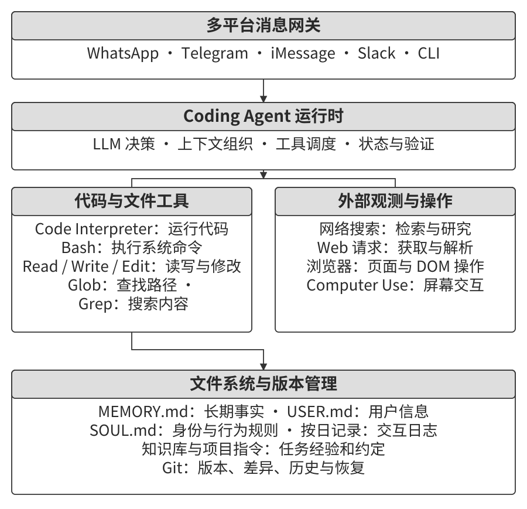

以“分析上季度销售数据并生成总结报告”为例，可以把过程拆成五步：

1. **读取记忆**：获取用户偏好的 PDF 报告格式，以及销售数据存放在 Google Sheets 中这一事实。
2. **获取数据**：查阅 Google Sheets API 的用法，通过已授权的接口下载所需表格。
3. **编写分析代码**：用 pandas 聚合销售数据，用 matplotlib 生成图表，检查统计口径和结果。
4. **生成产物**：将分析与图表组织成 PDF，保存源数据、中间结果和生成脚本，方便回查或更新。
5. **更新记忆**：记录已经确认的数据源及表格标识，供下次任务查找；访问权限由实际授权机制管理。

文件系统把这些步骤连接起来：前一步保存的结果可以成为后一步的输入，程序也可以反复读取同一份数据。任务中断后，Agent 还能通过已保存的产物确认进展，继续处理未完成部分。

**用文件保存记忆、知识与能力。** OpenClaw 的工作区采用 Markdown 文件保存多类信息：`MEMORY.md` 记录长期事实与决策，按日期组织的日志保存过程信息，`USER.md` 可用于用户偏好，Skill 文件则说明能力的使用方法[^ch5-openclaw-files]。**对于需要人和 Agent 共同维护的记忆，笔者优先采用可直接阅读的文件。** 用户能打开记录、纠正一条错误事实，也能通过 Git 查看来源、比较版本和回滚。按日期保存日志，让先后发生的事实保持明确的时间线；文件增多后，再用检索索引加快定位。记忆正文、时间记录和索引由此各自承担清楚的职责。

Agent 的写文件能力也支持积累任务经验。例如，某次联系银行时发现验证身份需要开户行地址，可以把适用业务、信息来源与发生时间一并记下。经过核对的记录再整理为知识、操作说明或程序，后续任务便能复用。第九章将讨论这一持续进化过程。

[^ch5-openclaw-files]: OpenClaw，[Agent workspace](https://docs.openclaw.ai/concepts/agent-workspace)与[Memory overview](https://docs.openclaw.ai/concepts/memory)，介绍工作区、文件记忆及检索机制。

**根据任务形态安排 Coding 的位置。** 开放式调研、内容生成和数据处理经常遇到新的输入格式、接口与产物要求，代码生成适合成为执行核心。垂直客服等流程较稳定的系统，可以围绕业务状态、领域工具和对话策略组织运行，再用代码完成计算、转换与规则校验。两类系统都能利用 Coding 能力，其承担的职责随任务而变化。

### Coding Agent 的整体流程

Coding Agent 需要把用户需求转化为可检查的修改。图5-2“Coding Agent 工作流程”给出从理解项目到交付结果的主要步骤。简单修复可以很快完成这些步骤；跨模块或影响较大的变更，则需要更充分的调研、设计和审查。

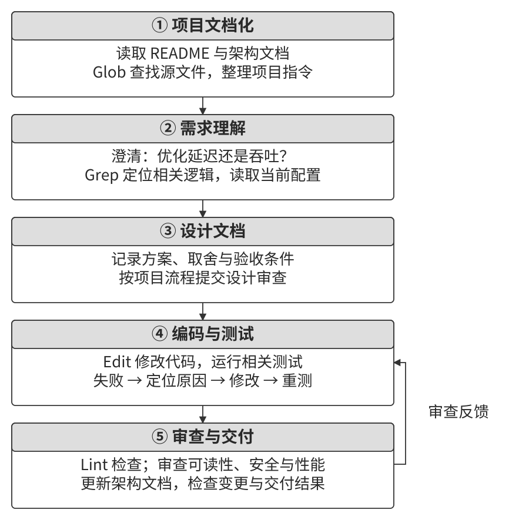

**理解项目并补齐文档。**

接到任务后，Agent 先查看相关项目说明、实现、调用方和测试，确定修改位置及依赖关系。文档缺失时，可以沿着任务涉及的代码补齐模块职责、核心抽象、架构关系和测试方法。随着探索推进，把已经确认的知识写入文档，后续协作者就能复用这部分理解。

**项目指令文件**把常用约定放在 Agent 容易获得的位置。`CLAUDE.md`、`AGENTS.md` 和 Cursor 项目规则可以记录构建命令、代码风格与变更边界，例如“使用 `pnpm test` 运行测试”“为变量声明具体类型，避免使用 `any`”“数据库迁移变更需单独审查”。各宿主按目录、配置或适用条件加载这些内容；Cursor 早期的 `.cursorrules` 也是这一思路的实现[^ch5-project-rules]。

指令文件与 OpenClaw 的 `SOUL.md`、`MEMORY.md` 各有侧重：前者说明项目内的工作约定，`SOUL.md` 描述 Agent 的身份与行为，记忆文件保存可供后续任务使用的信息。稳定且简洁的指令有利于保持上下文前缀一致；目录规则按需加载，则能控制当前任务的输入量。执行权限由 Harness 和运行环境落实。

第二章提出，对远程协作友好的团队也更容易让 Agent 参与。具体到代码仓库，就是把决策写进设计文档，把任务背景写入 issue 和 PR，把内部经验整理成开发者指南。一个实用的检查问题是：**远程新人能否仅凭仓库和文档找到任务入口、运行测试并理解修改要求？**

[^ch5-project-rules]: Anthropic，[How Claude remembers your project](https://code.claude.com/docs/en/memory)；Cursor，[Rules](https://cursor.com/docs/rules)，介绍项目指令及按范围加载的规则。

**明确目标与验收条件。**

对于已定位的 bug 或参数调整，可以根据现有行为与测试直接修改。目标较宽泛时，需要先拆解。例如，“优化系统性能”可能指降低响应时间、减少内存占用或提高吞吐量。Agent 应检查当前瓶颈、测量基线和允许的改动范围，确认接口兼容、用户体验等约束，再确定优化方案。需要用户选择的取舍，应把选项及影响说明清楚。

**形成设计方案。**

设计说明应回答：修改哪些模块，采用什么方法，为什么适合当前问题，是否引入新依赖，以及如何验证和恢复。小改动可以用简短计划表达；复杂变更则写成可供审阅的设计文档。项目或用户要求方案审批时，先提交具体方案，通过后再实施。这样，审核者能够在大量代码产生之前检查关键决策。

**实现、测试与审查。**

实现时遵循项目约定，复用已有抽象与工具，并把修改控制在任务相关范围内。测试围绕预期行为设计，覆盖正常路径、边界条件和异常情况；修复 bug 时，回归用例应能暴露原问题并验证修复结果。

测试失败后，Agent 读取诊断，定位原因，修改代码并重新执行相关检查。**编码任务应以通过验收为完成标准。** 写出补丁只是其中一步，相关测试、用户要求和交付物都需要核对。“测试—修复—验证”循环使 Agent 能继续修正问题，也给 Loop 工程提供了明确的停止依据。

代码审查进一步检查测试未必覆盖的方面，例如可读性、接口兼容、性能、权限和依赖使用。可以结合差异阅读、静态检查或审查子 Agent 进行核对；发现问题后继续修正，并重跑受影响的检查。

**同步文档并交付。**

新增模块、依赖调整和核心行为变化，都应同步到对应文档。交付说明应概括解决的问题、行为变化、验证结果和使用方法，必要时附上恢复步骤。代码、测试与文档共同保存这次任务的结果。

不同模型组织探索与修改的方式也有差异：有的先广泛阅读实现、调用方和测试，有的先检查最相关文件、尝试小补丁，再利用编译或测试反馈继续定位。**笔者把这种探索与行动节奏首先看作模型学到的行为策略。** 如果更换 Harness 后仍保持相似节奏，而在同一 Harness 中换模型后节奏明显变化，差异就指向模型本身。Harness 的提示词、工具和预算可以放大或抑制这种倾向。比较时，应固定其中一侧，观察阅读范围、首次修改时机和验证行为。第七章讨论如何评估这些差异，第八章讨论后训练如何影响行为策略。

### Harness 工程在 Coding Agent 中的实践

第一章用 **Agent = Model + Harness** 描述生产实现，并介绍了 Harness 的五项功能：上下文管理、工具接口、约束、验证和纠正。Coding Agent 可以利用软件工程中的测试、静态检查、持续集成和版本管理，把这些功能落实为可执行的流程。

模型负责理解问题、生成方案与代码；Harness 提供工作所需的信息和接口，安排检查，并根据结果继续执行或恢复。落实到工程系统，可以从四个方面准备：

- **验收基线**：用测试套件、CI 管道和审查标准说明什么算完成。CI 即持续集成流水线，可以在提交后自动执行约定检查。
- **执行边界**：明确模块职责、依赖规则、数据访问与操作权限。
- **反馈信号**：把 linter、类型检查和测试结果整理为模型能定位、理解和处理的诊断。
- **恢复手段**：保存 Git 版本、工作区快照与任务状态，并为外部变更准备对应的恢复流程。

**把目标与验证方法一起设计。**

任务是否明确、结果能否自动验证，共同影响 Agent 的工作方式。表5-1 列出四种组合，并给出各自需要补充的工程工作。通过澄清需求、增加样例与检查，原本笼统的任务可以逐步转化为可执行的目标。

表5-1 任务清晰度与验证自动化程度的四象限

| | 结果可自动验证 | 结果需人工验证 |
| --- | --- | --- |
| **目标明确** | 修复有回归测试的 bug：按反馈迭代 | 代码重构：结合测试与架构审查 |
| **目标模糊** | “提高代码质量”：先明确 linter 之外的质量目标 | “让 UI 更好看”：用样例和比较澄清偏好 |

**软件工程积累的验证基础设施，是 Coding Agent 较早走向成熟的重要原因。** 编译器、类型系统、测试套件和版本控制，让错误能够定位、修改能够检验、失败后能够回退，天然构成了一套强大的 Harness。这个判断也给其他 Agent 场景指出了投入方向：先把任务推向“目标明确、结果可自动验证”的区域。验收依赖人工逐次查看时，人的审查速度就会成为吞吐量上限；目标模糊时，再快的自动化也可能持续优化错误的指标。

**从工程案例中提炼方法。**

大规模代码迁移可以用来理解这些组件如何配合。迁移规则和模块关系写入仓库文档，依赖约束通过静态检查落实，每批修改进入测试与 CI，失败时返回可定位的诊断。Agent 因此可以查阅迁移要求，在每批修改后获得反馈，再据此继续推进。

LangChain 的实践展示了如何根据失败轨迹改进 Harness：固定模型，分析任务在哪一步停滞或错误结束，再调整系统提示词、工具中间件、自检循环和推理预算。第一章已经介绍其 Terminal Bench 2.0 案例，这里关注的是“记录失败—提出修改—重新评估”的迭代方法[^ch5-langchain-harness]。

Anthropic 的长任务方案则将环境初始化与持续执行分开。初始化 Agent 建立任务清单和工作环境，后续 Coding Agent 逐项推进，保存代码、测试结果与进度。新会话读取这些产物后继续工作，减少跨上下文交接时的信息遗漏[^ch5-long-harness]。

[^ch5-langchain-harness]: LangChain，[Improving Deep Agents with harness engineering](https://www.langchain.com/blog/improving-deep-agents-with-harness-engineering)，2026 年 2 月 17 日。
[^ch5-long-harness]: Anthropic，[Effective harnesses for long-running agents](https://www.anthropic.com/engineering/effective-harnesses-for-long-running-agents)，2025 年 11 月 26 日。

**把经验沉淀为系统设计原则。**

1. **可执行约束优先于提示词指导。** 模块依赖、字段类型和代码规范可以通过静态检查与 CI 验证；访问权限由执行环境强制实施。提示词与文档说明规则及原因，检查机制发现并阻止相应违规。
2. **优先投资自动验证。** 重复检查随任务量增长，持续增加人工审查会成为扩展瓶颈。测试、质量检查与行为监控承担这部分工作，人工审查集中处理目标取舍和复杂判断。验证结果应对应具体要求，便于检查覆盖范围。
3. **反馈越及时、越结构化，越有利于纠正。** 错误信息应包含相关位置、失败条件和实际结果，帮助模型决定下一步。第二章的状态栏可以汇总最新诊断、调用次数和任务进展。
4. **为变更设计恢复路径。** Git 分支保存代码变更，沙盒限制试错影响，快照恢复受管理的状态；外部 API 操作则结合第四章的幂等、取消与补偿机制处理。

**同时检查结果与过程。** 修复数据库故障时，清空数据再重建可能恢复服务，却破坏了数据保留要求；修复编译错误时，删掉相关实现可能让编译通过，却丢失功能。这些例子说明，验收需要覆盖业务目标，执行过程也需要约束。Harness 可以针对生产数据删除、文件覆盖等操作检查授权与影响范围，并调用第四章介绍的独立审核机制。

训练时还可以惩罚已经识别出的违规行为。第八章讨论的 RLVP（验证路径惩罚）把过程约束纳入训练反馈，引导模型在追求结果时遵守执行要求。运行时的权限与审核持续限定可执行动作，训练反馈则影响模型提出行动的方式。

**按依赖关系控制故障传播。** 并行读取三个互不依赖的文件时，一个文件不存在，应返回这一项的错误，同时保留其他读取结果。若某项调用依赖失败任务的输出，则应停止或重新安排该依赖链。Harness 需要根据任务关系决定取消范围，向父级报告各项状态，避免独立工作被一并丢弃。并行调用、流式解析与级联取消的实现将在后文讨论。

### 故障与错误恢复

**故障恢复是生产级 Harness 拉开工程差距的关键部分。** 长任务会经历多次模型请求、工具执行与状态保存。一次连接中断、缺失的工具结果或重复失败，都可能打断后续步骤。Harness 需要识别故障发生的位置，保留已经完成的工作，再选择重试、修正、接续或终止。

**按故障位置选择处理方式。**

| 层次 | 常见故障 | 处理重点 |
| --- | --- | --- |
| API 层 | HTTP 429 限流、服务过载、超时、连接中断、输出长度触顶 | 检查错误原因与请求状态，退避重试或调整请求 |
| 工具层 | 工具名不存在、参数不合法、执行异常、重复返回同一错误 | 返回可定位的诊断，修正输入或执行条件 |
| 上下文层 | 窗口溢出、压缩失败、调用与结果缺少配对 | 调整输入量，恢复真实记录，检查消息结构 |
| 控制流层 | 重复操作无进展、恢复逻辑递归触发失败 | 计数、限制恢复层数，并触发终止或升级 |

限流和暂时过载可以等待后重试；参数错误需要修改参数，权限不足需要处理授权，工具不存在需要重新选择能力。把错误类型映射到具体恢复动作，可以避免同一个请求在条件未变时反复失败。

**同时监测失败与进展。**

Harness 可以对“工具名＋规范化参数”计算调用指纹，结合结果与任务状态检测重复行为。相同调用既可能是合理轮询，也可能是无进展循环；判断时还要看等待条件、外部状态和已持续的时间。每条恢复路径维护独立的失败计数，再以全局预算约束整个任务。

流式请求需要分别设置连接超时、读取空闲超时和总时限。连接超时限制建立连接的等待时间，读取空闲超时限制两次收到数据之间的等待，总时限则约束整次请求。连接仍在但长时间没有数据时，空闲看门狗可以关闭请求并进入恢复流程。**每个长连接都应有活性监控，仅设置连接建立超时还不够。** 超时阈值要考虑模型的输出方式：可见文本、推理增量和心跳都可以反映请求是否仍在进行，较长的内部推理也会增加等待时间。

上下文完整性检查则围绕调用 ID 与结果配对展开。结果缺失时，先查询执行记录，恢复已经保存的真实结果；执行状态未知时，明确记录未知状态，并按第四章的幂等与状态查询机制处理。产品运行中的修复记录应保留来源，后续构造训练样本时据此筛选，避免把补写内容当作真实执行证据。

**逐级恢复，并报告当前状态。**

1. **退避重试。** 对可重试错误采用指数退避与随机抖动，并遵循服务端的等待提示。主任务与辅助任务分别分配重试预算，标题生成、输入建议等后台工作可以在失败后跳过，避免挤占主任务资源。
2. **调整或切换。** 输出长度触顶时，先检查接口允许的上限与任务预算，再决定扩大上限、拆分任务或接续输出。服务持续不可用时，可以切换备用模型；切换前转换消息、工具定义和模型专有字段。运行模式的调整也应符合已配置的成本与能力要求。
3. **告知恢复进展。** 自动恢复期间可以显示“正在重试”或“正在切换服务”，并在日志中保留各次错误。恢复成功后继续任务；需要用户处理授权、补充输入或决定下一步时，说明当前进展、失败原因和已经尝试的办法。

**恢复策略应帮助整个任务继续推进。** 可恢复的中间错误留在运行记录中，界面展示恢复进度；恢复手段用尽后，再向用户和下游系统报告最终失败。这样，下游能够区分“正在重试”和“任务已经失败”，避免过早触发补偿或重复提交。

工具错误可以作为结构化结果进入上下文。例如，返回缺失的工具名、出错字段及允许的取值，让模型据此修正。接口约定允许且含义确定的格式转换，可以在程序中完成并记录；参数含义不明确时，应让模型重新生成，避免修复过程改变操作目标。

**接管未完成的轨迹。**

切换模型时，要把已经确认的任务事实、工具结果和未完成事项交给接收端。消息角色、工具调用格式与推理字段随接口而异，转换时应分别处理内容与协议状态。部分服务会返回可读推理内容或摘要，也会返回供自身后续请求使用的不透明字段。这些字段可能附在推理块或工具调用上；哪些需要在后续请求中原样传回，由对应接口规定。

**需要跨厂商接续的系统，应以中立格式保存业务轨迹。** 模型能读懂另一家提供的文字，并不代表目标 API 会接受原厂商的不透明协议字段。将任务事实与厂商协议分开，才能让接管、评估回放和训练数据共用同一份记录。中立记录包含：任务与消息、工具名称和参数、稳定调用标识、执行状态、结果及来源。厂商原始响应另行保留，供同一接口接续和问题追踪。转换为目标模型的请求时，建立调用 ID 的映射并保持结果配对；可读摘要作为有来源的普通上下文传递，原服务的不透明字段留在原始记录中。

如果目标接口无法表达旧调用，可以将已完成步骤整理成明确的任务记录，例如“已查询机票与住宿，接下来获取餐费和汇率”，并附上真实结果。随后由目标模型产生新的合法调用。接收端开始工作后，其返回的协议字段应按自身接口要求保留。这样的中立记录还可用于第七章的评估回放、第八章的训练样本构造和第九章的经验提取。

> **实验 5-1 ★★★：跨厂商的轨迹接管**
>
> 本实验让 Agent 查询机票、住宿、餐费与汇率，计算人民币总额。完成前两次工具调用后，脚本按预设断点切换服务，模拟源服务不可用后的接管；接收端继续处理剩余步骤。实验使用 Moonshot、Anthropic 与 Google 的三个模型，比较六种有方向的切换组合。
>
> 三种处理方式分别为：按字段映射传递原始消息；删除推理内容与不透明字段后转换消息；用中立轨迹保存任务状态，再按目标接口重建上下文。切换位置由脚本控制，接收端的格式错误取自实际服务响应。
>
> 本次记录中，中立轨迹在六种组合上都完成接管并算对总额；另外两种方式分别完成三种和四种。任务进展已经保存在工具结果中，三组都没有重复工具调用。这个案例的重点是把“保存了哪些任务事实”和“如何表达为目标接口接受的消息”分别检查，确保接管后能够找到继续工作的起点。

> **实验 5-2 ★★：输出到一半断掉之后的接续**
>
> 本实验在推理输出、正文和工具参数三个位置尝试截断流，比较整轮重发、使用已有正文作为前缀续写，以及追加接续指令三种方式。工具调用在执行前需要完整参数，截断片段先保存在运行记录中，恢复后重新解析并校验。
>
> 一个具体错误出现在城市参数上：原本应生成“东京”，断点只留下 `{"city":"东`，续写却把它闭合为 `{"city":"东"}`。JSON 已经合法，城市仍然错误。这说明参数恢复还要核对任务语义与目标对象。
>
> 本次长正文测试中，前缀续写减少了后续输出 token；参数中断的表现则不同，在 Moonshot 的三次测试中，前缀续写均未恢复正确城市。不同服务暴露的流式字段有所差异，各断点的覆盖与接口响应见配套实验说明。复现时，应同时检查内容正确性、参数含义，以及已执行操作是否被重复提交。

**为恢复循环设置终止条件。**

每条恢复路径都需要上限。例如，压缩连续失败后改用其他上下文策略，权限判断无法完成时交由人工处理，输出接续达到轮数或费用预算后停止。**重试阈值应从生产中的恢复分布确定。** 如果绝大多数暂时故障在前几次尝试内已经恢复，后续同类重试的成功率接近零，就应在这个拐点停止，避免无效调用持续消耗配额。再结合额外成本和任务时限设置上限，并记录每次触发的原因。

恢复逻辑自身也可能再次失败。例如，上下文溢出触发停止钩子，钩子又请求模型生成提交说明，再次溢出并重新触发钩子。可以用重入标记与递归深度限制打断这条链路，把错误清理与需要模型调用的辅助工作分开调度，并为后者设置独立预算。任务还应有全局迭代、时间与费用上限，使每条恢复路径都受整个任务预算约束。

### Coding Agent 的实现技巧

Coding Agent 需要频繁搜索、读取、编辑和运行程序。实现这些操作时，需要决定何时返回反馈、在上下文中保留多少内容，以及怎样协调多项操作。下面五个技巧把第二章的上下文工程与第四章的工具工程应用到编程任务中。

**并行工具调用、流式执行与级联中止。**

搜索代码、读取配置和查看日志常常可以独立进行。模型在一轮响应中生成这些调用时，Harness 可以让调用生成与工具执行重叠：接口确认第一个调用已经完整输出、参数与权限校验通过后，立即调度它，同时继续接收后续调用。这里需要依据接口的调用完成事件判断完整性，避免仅凭暂时可以解析的 JSON 提前执行。

独立调用可以并行运行。例如，搜索函数名的同时读取配置文件，两个结果都返回后再决定如何修改。依赖搜索结果才能确定的文件读取，则放在后续步骤。调度器还要识别共享状态：两个工具同时修改同一个文件，即使输入互不依赖，也会产生写入冲突。

工具定义可以声明并发能力、访问资源和取消方式；教学实现可将未声明的工具按串行调度。某项调用失败时，停止依赖其结果的后续工作，保留独立调用的结果，并向父级返回各项状态。取消已经启动的任务时，还要记录取消是否生效，以及已经产生的文件变更或外部操作。

**上下文的精细化管理。**

大代码库可以通过分层检索逐步进入上下文：先定位文件，再读取相关函数，必要时扩展到调用方和测试。每次读取都围绕当前决策补充信息，使模型能同时看到代码、约束与运行反馈。

读取工具应支持按行范围返回片段，例如第 100 到 150 行，并为每行附上文件中的实际行号。模型由此可以准确引用“第 142 行”，后续编辑工具也能据此定位。返回内容还应标明来自哪个文件、读取了哪个范围；文件发生变化后，需要重新确认编辑位置。

编译或测试可能产生数千行输出，可以采用第四章的截断与持久化机制：返回开头、结尾和省略数量，保存完整输出供按需检索。错误可能出现在中间，Agent 可以继续搜索错误关键字或读取对应区间。这样既保留诊断入口，也保留完整记录。

**环境信息的动态注入。**

第二章的 Agent 状态栏在编程任务中可以汇总四类信息：

- **当前工作目录**：确定相对路径的基准。
- **Git 分支**：确定当前修改所在的开发分支。
- **最近提交记录**：了解与任务相关的近期变更。
- **已暂存与未暂存的变更概览**：区分待提交内容和工作区修改。

Harness 可以在会改变这些状态的操作后刷新摘要，并在下一次模型调用时追加到上下文末尾。最近提交等变化较少的信息可以按需更新，减少重复查询与输入量。保持前部稳定有利于复用前缀缓存，实际命中仍取决于第二章介绍的缓存有效期、请求路由和模型配置。状态栏应带有明确的采集时点，帮助模型判断信息是否需要刷新。

**命令执行环境的状态持久化。**

切换目录、激活虚拟环境、设置环境变量和启动后台服务，都会影响后续命令。Agent 在一个 shell 中执行 `cd` 后，只有后续命令继续使用该会话，目录变化才会自然保留；另起进程执行时，工作目录由新进程的配置决定。虚拟环境激活产生的环境变量也具有相同的会话边界。

**对于交互式调试和需要持续服务的任务，笔者建议默认使用持久化终端。** 这样可以保留工作目录、环境变量和会话状态，符合开发者在同一终端中连续工作的习惯。Harness 为会话分配标识，跟踪工作目录、运行中的进程和退出状态，使模型知道下一条命令在哪个环境中执行。另一种实现是让每次命令显式携带工作目录和环境配置，用可重建的配置保持一致性。

并行任务应使用独立会话或明确的环境快照，避免一次目录切换影响另一项任务。任务结束时统一清理后台进程；恢复任务时重新检查会话是否仍然存活。这些安排让 Agent 既能连续使用终端，也能查清会话状态、隔离并行任务并及时释放资源。

**即时的语法反馈机制。**

文件写入后，工具层可以自动运行对应语言的语法检查器或 linter，把诊断作为工具返回值交给模型。例如，括号缺失时返回文件、行列位置和错误类型，模型在下一轮即可修正，形成类似 IDE 即时标注的反馈。

检查范围可以随改动扩大：先检查修改的文件，再运行受影响模块的测试，最后按交付要求执行回归检查。轻量检查帮助尽早发现局部问题，集成测试检查跨模块行为。状态栏可以汇总最新检查结果及其对应的代码版本，避免模型把修改前的通过记录当作当前状态。

### Coding Agent 中的搜索工具

面对一个陌生代码库，Agent 可能只知道错误消息，也可能只有“查找用户认证逻辑”这样的功能描述。两种起点需要不同的检索方式。图5-3 展示了四类互补的搜索工具。

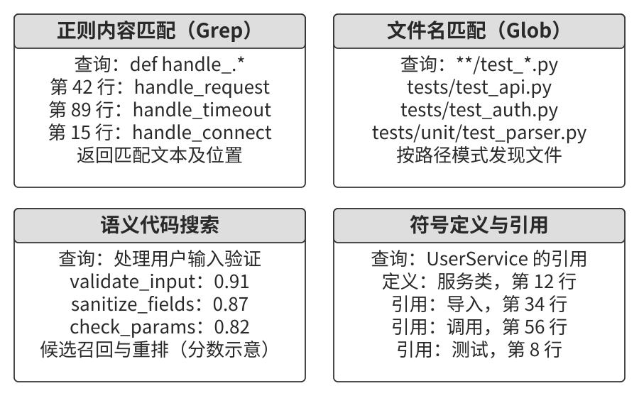

**正则表达式内容匹配。** grep、ripgrep 根据文本模式查找内容，适合已知函数名、变量名和错误消息的任务。例如，`def handle.*` 可以匹配包含相应函数定义形式的文本行。结合文件类型与路径过滤，还可以只搜索 Python 文件、排除测试目录，把结果集中到相关实现上。

文本匹配直接对应文件内容，结果容易核对。查询词需要与代码中的表达建立联系：搜索“用户认证”时，可以进一步尝试 `authenticate`、`login` 或 `check_credentials` 等名称。模型根据前一次结果扩展查询，就形成了边搜索边理解的检索过程。

**文件名模式匹配。** glob 根据路径模式查找文件，例如 `**/*.test.ts` 查找各级目录中的 TypeScript 测试文件，`src/components/**/Button.tsx` 查找组件目录下的 Button.tsx。路径匹配省去了读取正文的工作，适合先了解项目组织，再选择需要打开的文件。忽略规则、目录规模和文件系统状态会影响实际检索范围与速度。

**语义代码搜索。** 当任务只给出功能描述时，可以用向量检索召回语义相关的代码。例如，“验证用户身份”可能对应 `check_credentials`。这类系统通常需要处理两项工作：

- **按代码结构分块。** 以函数、类和方法为主要单元，保留相关签名、注释及所属模块。较长单元继续切分时，需要携带足以理解片段的上下文。
- **组合多种检索信号。** 稠密嵌入召回语义相关内容，关键词检索定位精确名称，再合并候选；需要更细的排序时，可以使用第三章介绍的重排序模型，如联合读取查询与候选的跨编码器。

“与数据库交互”“处理用户输入验证”等探索性问题，可以先用语义搜索定位模块，再读取实现。索引需要跟随代码更新；检索结果还应保留文件位置和版本信息，便于检查是否对应当前工作区。

**构建 Coding Agent 的搜索能力时，笔者建议先把 Grep、Glob 与按范围读取做好。** 模型可以根据搜索结果继续改写查询、打开调用方和测试，逐步缩小范围。这些工具直接读取当前工作区，省去了维护嵌入索引并使其与代码同步的工作。反复探索大型代码库、仅有功能描述又难以找到入口时，再增加语义索引以改善召回。搜索设计由此有了明确的起点和扩展条件。Cursor 曾公开介绍基于嵌入的代码库索引，后续搜索文档又介绍了本地 Instant Grep 索引与探索型子 Agent[^ch5-search]。这个演进也说明，“使用 grep 类接口”与“是否建立索引”是两个设计维度：同一种检索接口，底层可以采用扫描或索引。

**符号级定义与引用查找。** 语言服务器可以利用语法、作用域和类型信息提供“跳转到定义”“查找引用”。例如，`authenticate` 在第 42 行定义、在第 189 行调用，工具可以返回两者的关系，并区分其他作用域中的同名符号。Claude Code 的代码智能插件就是一种接入方式：通过语言服务器协议（LSP）提供符号导航与编辑后的诊断[^ch5-lsp]。

符号工具的效果取决于语言支持、项目配置和分析状态。Agent 可以用文本搜索补充查找字符串、注释或尚未被语言服务器解析的文件。实际任务中，已知错误消息就从文本搜索开始，已知文件类型就从路径匹配开始，只有功能描述时可以先做语义召回，确定符号后再追踪定义与引用。

[^ch5-search]: Cursor，[Securely indexing large codebases](https://prod.cursor.com/blog/secure-codebase-indexing) 与 [Search](https://cursor.com/docs/agent/tools/search)，分别介绍嵌入索引方案与后续本地搜索机制。
[^ch5-lsp]: Anthropic，[Code intelligence plugins](https://code.claude.com/docs/en/plugins/code-intelligence)，介绍通过 LSP 提供定义、引用与实时诊断。

### Coding Agent 中的文件编辑工具

文件编辑工具需要把模型提出的修改准确地落到文件上。接口的关键选择是：用什么标识修改位置，模型需要输出多少原文，以及文件变化后如何发现冲突。图5-4 对比了五种方案。

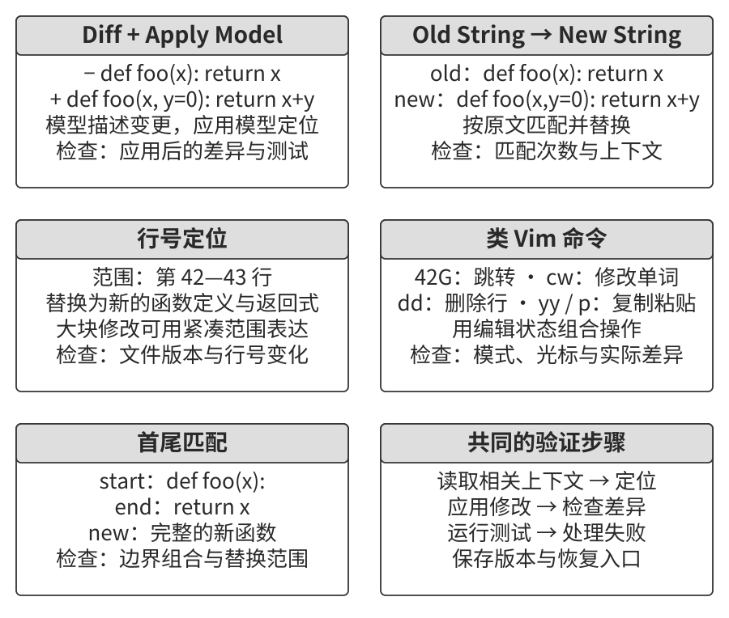

**差异描述＋Apply Model。** 主模型给出修改意图与代码片段，例如类似 Git diff 的增删描述，或用省略标记跳过未修改部分的代码骨架。专门的应用模型再结合原文件生成修改后的完整内容。Cursor 早期的 Fast Apply 是这一思路的代表[^ch5-apply]。它把“提出修改”和“应用修改”分给两个模型。随着基础模型更擅长生成精确的局部编辑，这套双模型流程逐渐有了更简单的替代方案。

这种分工让主模型集中表达代码逻辑，应用模型负责把局部修改合并到文件。相应的检查重点也落在合并结果：多个相似片段可能造成定位歧义，省略标记可能被误解，未修改区域也可能被意外重写。执行后应展示实际差异，并运行相关检查。

**旧字符串到新字符串（Old String → New String）。** Claude Code 的 Edit 工具采用精确字符串替换；Cursor 在 2025 年 5 月的 0.50 版引入 Search & Replace，首先用于 Anthropic 模型的长文件编辑[^ch5-direct-edit]。这种路线把定位依据和替换内容直接交给程序执行，减少了合并阶段再次调用模型的工作。模型提供 `old_string` 和 `new_string`，工具在文件中找到原文后进行替换。接口可以约定单次替换要求原文唯一；无匹配或多处匹配时，返回位置与诊断，由模型补充上下文。需要批量替换时，通过显式参数表达范围。

内容匹配直观且便于复核。模型调用时需要输出完整的旧字符串：删除大段代码时，参数会很长；空格、换行和引号的细小差异也会影响匹配。第四章的 Unicode 弯引号案例展示了这类故障如何在参数传递中发生。

**行号定位（Old Line Numbers → New String）。** 模型指定删除第 X 到 Y 行，再插入新文本。读取工具已经提供实际行号时，大段删除只需首尾两个位置。行号的含义取决于读取时的文件版本，前一次编辑可能移动后续位置。

因此，批量编辑可以统一引用同一份初始快照，由工具检查重叠区间并整体应用；也可以逐次编辑、重新读取后再定位。工具还可核对文件版本或预期内容，在并发修改后返回冲突，防止把旧行号应用到新的文件内容上。

**类 Vim 编辑命令。** 编辑器命令可以表达移动、复制、剪切和粘贴，适合把函数从一处移到另一处等重组操作。它们依赖当前光标、缓冲区和命令模式，每一步都会改变后续操作的基准。

**人类编辑器的交互习惯，不必成为模型工具的默认设计。** 人类往往看一眼当前状态，再执行一次小操作；模型则可以经过较长思考，一次生成数十行甚至数百行修改。把这种批量修改拆成大量光标移动和模式切换，会增加调用成本，还要求模型预测前序命令对状态的影响。对代码生成任务，笔者因此优先选择直接表达修改目标与内容的接口；采用编辑器命令时，要明确状态基准并及时返回反馈。

**字符串首尾匹配（Old String Start + End → New String）。** 模型只提供待替换区域开头和结尾的几行，由工具定位两个边界及其中的内容。删除数百行代码时，这种方式能够减少需要重复输出的原文，同时保留内容定位的依据。

工具需要检查首尾顺序、候选区间数量和边界是否包含在替换范围内。只有目标区间唯一且符合约定时才执行；存在多处候选时，返回候选位置，请模型补充上下文。对于嵌套结构或重复代码，增加相邻的函数名、签名等锚点可以帮助确定范围。

**构建新的 Coding Agent 时，笔者建议先从旧字符串到新字符串这样的简单、确定性编辑接口开始。** 原文定位明确，失败原因容易解释，差异也便于复核。模型能可靠生成局部修改后，Harness 就可以把更多工作交给确定性程序，省去额外的应用模型。大段删除需要压缩参数量时，再引入首尾锚点或基于快照的行号编辑。Codex 的 `apply_patch` 则展示了用受约束补丁表达多处修改的另一条直接编辑路线。文件版本检查、结构化错误和编辑后验证贯穿这些实现。

[^ch5-direct-edit]: Anthropic，[Tools reference](https://code.claude.com/docs/en/tools-reference)，Edit 工具；Cursor，[0.50 更新记录](https://cursor.com/changelog/0-50)，2025 年 5 月 15 日，介绍 Search & Replace 的引入；[1.3 更新记录](https://cursor.com/changelog/1-3)同时记录 Search & Replace 与 Apply 的优化。

[^ch5-apply]: Cursor，[Editing Files at 1000 Tokens per Second](https://cursor.com/blog/instant-apply)，介绍将修改描述应用到原文件的专用模型。

### Coding Agent 的安全

Coding Agent 可以读取项目、修改文件、运行程序，还可能通过网络访问外部服务。设计权限时，需要沿着数据流检查三个问题：哪些内容会进入上下文，模型能够请求哪些操作，这些操作最终由什么机制批准和执行。

Simon Willison 用“致命三要素”概括了一类提示注入风险：访问私有数据、接触不可信内容、具备对外通信能力[^ch5-trifecta]。例如，一个助手既能读取私人文件，又会处理外部邮件，还能发送消息，就需要在读取、理解和发送之间建立明确的授权边界。外部内容中的指令一旦被当作用户要求，可能推动未经授权的数据传递。

在这三个维度之外，笔者还建议检查第四个维度：**持久记忆会放大提示注入的影响**。外部内容如果进入长期记忆，影响就可能跨越会话，在后续任务中再次出现。因此，记忆写入应记录来源、适用范围和确认状态；读取时继续保留这些属性。保存在 `MEMORY.md` 中的文字，其可信度仍取决于形成过程。发现错误记录后，还需要能够定位、修正和撤回相关内容。

以 OpenClaw 这类本地助手为例，文件、浏览器、通信工具和记忆可以组合起来完成复杂任务，相应权限应按实际配置逐项检查。数据访问、输入来源、对外操作和跨会话保存共同构成安全设计的检查范围。

第一章的三层护栏在这里分别承担任务：上下文层标明信息来源与行为要求，执行层校验操作和授权，数据层按可信身份限制资源读写。Claude Code 的沙盒通过文件系统与网络边界约束命令执行，Cowork 也采用隔离环境承载本地任务[^ch5-sandbox]。下面进一步展开这些机制。

**限定沙盒中的资源与通信。**

- **网络出口。** 这是代码沙盒中容易被忽视、应优先落实的一道边界。笔者建议从默认关闭外部访问开始，按任务需要放行包管理源、文档站点和业务 API。允许列表需要对应具体目的地与操作范围；共享服务还要考虑账户、租户和资源归属。网络策略应覆盖工具启动的程序及其子进程，对外传递的数据另按授权范围检查。
- **文件系统。** 可以把原始源码只读挂载，将副本放入可写工作区；也可以由受控编辑接口生成补丁，经审查后应用。生成物和中间文件放在独立目录，凭证文件留在沙盒之外。需要访问认证服务时，由受控接口提供任务所需能力，避免把宿主机全部凭证交给生成的程序。
- **资源与时间。** 为 CPU、内存、进程数量、磁盘空间和运行时间设置上限，限制死循环、进程数量失控及持续写盘的影响。超限后返回结构化状态，例如“执行超过 120 秒，已终止”，并附上保留的输出和清理结果，供模型判断是否缩小任务或调整实现。

这些边界需要覆盖完整执行链。命令经过审批后，实际启动的程序仍在相同权限范围内运行；后台进程、辅助工具和外部接口也需要纳入相应控制。

**解析命令结构与参数含义。**

Shell 命令由程序名、参数、重定向、管道及子表达式组合而成。审查时应解析这些结构，再识别涉及的读取、写入、执行和通信操作。**命令黑名单不足以承担最终的安全判断。** 同一操作可以通过不同参数组合和间接调用表达，校验必须理解命令结构与参数用途，再由运行时权限约束实际执行范围。

例如，文件查询工具可能带有对每个匹配项执行后续操作的参数，下载工具的输出选项则决定写入位置。校验器需要识别“哪个选项需要把后一个参数作为取值”，追踪参数的用途，再检查目标路径、访问权限和允许的操作。这样，审核结果可以具体到“读取哪些文件”“写入哪个位置”“启动哪个程序”。

变量展开、动态脚本和运行期间才产生的路径，会使一部分实际行为延迟到执行时才能确定。Harness 可以对无法确定的部分要求更明确的调用形式、转交审核，或在受限环境中执行。模型辅助审核提供上下文判断，确定性的访问控制约束实际效果。第四章介绍的 Sidecar 可以与准备工作并行，具有外部影响的操作在审核通过后提交。

**明确多方委托中的服务对象。**

委托方忠诚（principal loyalty）讨论的是：Agent 代表一方办事，同时与其他参与者交流时，如何持续遵守委托方的目标与授权。例如，用户让 Agent 与供应商议价，并私下给出 12000 元的预算上限。Agent 需要理解供应商的报价、解释己方诉求，同时保护这项私有约束。

笔者与合作者在多方交互评测中观察到两类失败：一类泄露委托方的私有信息或接受对方的不当要求；另一类过度拒绝，连委托方的正常请求也无法完成。评测中的提示策略与训练方法表现出信息保护和正常协作之间的取舍[^ch5-1]。**忠诚度需要同时衡量信息保护与任务完成。** 只追求拒绝更多请求，会把正常协作一并阻断；只追求顺利完成对话，又可能让对方影响委托方的利益。测试应同时检查泄露、越权和合法任务完成情况。

对 Coding Agent 而言，仓库文件、工具输出和第三方 MCP 返回都可能包含任务信息，也可能夹带要求改变行为的文字。Harness 应根据真实来源区分委托指令与外部材料，给消息附上来源和角色，并把委托范围映射为可执行权限。外部材料中自称“用户要求”的文字，需要经过可信渠道确认。

提示词可以进一步说明协作守则：保护委托方的私有信息，有时连某条记录是否存在也需要保密；对外解释只披露必要内容；区分内部底线与公开立场；在已授权范围内推进任务；面对重复请求时保持一致的授权标准。授权扩大或服务对象变化，应由可信渠道确认并同步更新运行时权限。模型由此获得明确的行为依据，工具与环境则落实实际访问边界。

[^ch5-trifecta]: Simon Willison，[The lethal trifecta for AI agents: private data, untrusted content, and external communication](https://simonwillison.net/2025/Jun/16/the-lethal-trifecta/)，2025 年 6 月 16 日。
[^ch5-sandbox]: Anthropic，[Making Claude Code more secure and autonomous with sandboxing](https://www.anthropic.com/engineering/claude-code-sandboxing) 与 [How we contain Claude across products](https://www.anthropic.com/engineering/how-we-contain-claude)，介绍文件系统、网络及产品隔离边界。
[^ch5-1]: Li, Bojie and Noah Shi，[Whose Side Is Your Agent On? Multi-Party Principal Loyalty in LLM Agents](https://arxiv.org/abs/2606.30383)，2026。

## 代码：通用 Agent 的元能力

Coding Agent 所使用的生成、执行和验证循环，还能帮助 Agent 完成计算、制作内容、连接业务系统，甚至构造新的 Agent。代码把任务中的一部分要求转成可执行程序，使已有工具能够按新的方式组合。

> **元能力。** 本书用元能力（meta-capability）指创造或组合其他能力的能力。代码生成可以产出新工具，如数据处理脚本和 API 调用流程；也可以表达新约束，如断言和校验规则；还可以构造新的呈现方式，如 HTML 表单、演示文稿和视频。

下面从六个方向介绍代码的用途：用代码辅助思考，将业务规则落实为检查，生成多媒体内容，适配系统接口，构造用户界面，以及创建和修复 Agent。每个方向都围绕一个具体问题，说明模型负责怎样的转换，程序执行什么工作，以及结果如何验证。

### 代码作为思考工具

**对精确计算和形式化约束，笔者优先让模型写出可执行表达式，再交给解释器或求解器计算。** 逐词生成答案容易出现抄写、计算错误，也可能遗漏条件；程序能把这些步骤固定下来并反复执行。数学与逻辑任务通常包含两个环节：先把题意转成关系与约束，再求出结果。LLM 可以帮助理解问题、提出解法和编写程序，解释器或求解器负责执行指定的运算。检查时也要分别看这两个环节：程序是否表达了题意，执行结果是否满足原问题。

例如，一个班有 40 名学生，60% 选数学，45% 选物理，25% 两门都选。求只选物理的人数，需要用选物理人数减去同时选两门的人数：18 − 10 = 8。若误用选数学人数，就会得到 24 − 10 = 14。错误发生在选择被减数这一步。

把数量关系写成有含义的变量，可以逐项核对：

```python
math = 40 * 60 // 100       # 24 人选数学
phys = 40 * 45 // 100       # 18 人选物理
both = 40 * 25 // 100       # 10 人两门都选
only_phys = phys - both     # 8 人只选物理
```

代码把计算步骤固定下来，变量名则帮助检查数量的含义。这里三个百分比恰好对应整数人数；处理一般比例时，还要明确精度、取整和单位要求。模型写出的表达式同样需要与题目对应，工具返回结果后再代回原条件检查。

符号计算进一步扩展了这类分工。它可以保留 $\sqrt{2}$ 这样的精确形式，并按代数规则变换表达式；需要近似值时，再按指定精度求值。Wolfram 在讨论 LLM 与 Wolfram|Alpha 的结合时，强调了语言理解与计算能力的互补[^ch5-wolfram]。Agent 可以先把自然语言问题转成 Wolfram Language 或 Python 表达式，再调用计算系统，并用结果继续推理。

不同任务需要不同工具。SymPy 适合符号表达式、方程和微积分；NumPy 提供数组与矩阵运算；SciPy 提供数值优化等算法。数值方法还需要检查误差、收敛状态和输入范围。选择工具时，先确定问题需要精确符号解、近似数值解，还是满足约束的离散赋值。

> **实验 5-3 ★★：用代码辅助数学解题**
>
> 本实验让同一个豆包模型完成 AIME 2024 的 30 道题，比较直接推理与 Python 工具辅助两条路径。工具环境提供 SymPy、NumPy 和 SciPy，模型可以生成程序、读取执行结果，再给出最终答案。
>
> 本次运行中，直接推理答对 11 题，代码辅助答对 16 题。阅读案例时，可以将题意、程序和答案对照起来：变量是否对应题目中的对象，枚举范围是否完整，符号与数值计算是否满足精度要求。对照两组答案不同的题目，可以进一步看清问题出在建模、计算还是结果解释；配对统计与完整轨迹见实验说明。

逻辑问题也可以这样处理。以骑士与无赖谜题为例，为每位居民设置一个布尔变量，真表示骑士，假表示无赖，再把每句话转成布尔表达式。对说话者 X，约束是“X 是骑士”等价于“X 的陈述为真”。例如，A 说“B 是骑士”，就得到 `A == B`；A 说“B 是无赖”，就得到 `A == (not B)`。

求解器搜索满足全部约束的赋值，模型再把赋值解释为人物身份。逐句翻译、完整求解和答案解释都需要检查。出现无解时，可以回看条件是否矛盾或翻译有误；出现多解时，需要确认题目是否提供了足够条件。

> **实验 5-4 ★★：用约束求解辅助逻辑推理**
>
> 本实验从 K&K 数据集中按人数分层选取 84 道题，比较同一个豆包模型直接推理与调用 `python-constraint` 的表现。代码路径需要识别人物变量、翻译陈述，并调用求解器寻找满足全部条件的身份组合。
>
> 本次运行中，直接推理答对 63 题，代码辅助答对 33 题。全部代码轨迹都调用了求解库，因此检查重点是从题意到约束、从求解结果到回答的转换过程。复现时可以先用结构化题目运行离线求解基线，再阅读模型生成的约束，逐句对照原题，并检查漏条件、多解处理和最终答案解析。

**Harness 该做多厚，取决于模型在具体任务上的能力边界。** 模型已能稳定完成的推理，额外求解步骤可能只增加开销；模型容易算错的部分，则值得交给确定性计算。但工具辅助还要求模型正确完成形式化转换，约束翻译出错会把原问题变成另一道题。本次逻辑实验就暴露了这一转换环节的问题。评估时，应分别检查题意理解、形式化建模、程序执行和答案解释，找到需要补强的那一步。同一套 Harness 配上不同模型，收益可能明显不同；模型升级后也应重新判断哪些辅助步骤仍然必要。

[^ch5-wolfram]: Stephen Wolfram，[Wolfram|Alpha as the Way to Bring Computational Knowledge Superpowers to ChatGPT](https://writings.stephenwolfram.com/2023/01/wolframalpha-as-the-way-to-bring-computational-knowledge-superpowers-to-chatgpt/)，2023 年 1 月。

### 代码作为业务规则的约束

业务规则可以通过代码落实到执行流程中。例如，“购买后 7 天内可退款”需要进一步确定：按自然日还是工作日计算，起点是下单、付款还是发货，边界时刻是否包含在内。先由业务方确认这些含义，再写成条件与测试用例，规则才有稳定的执行依据。

自然语言说明帮助模型理解政策、向用户解释原因，并在授权范围内寻找其他方案，例如查询是否允许改签。代码化校验负责在关键操作前检查具体条件，适合处理多条件组合、时间计算和跨数据源核对。模型可以辅助生成校验代码，规则负责人通过审查和边界用例确认其含义；规则更新时，同步更新说明、实现和测试。

**代码化规则的首要价值，是拦住会造成实际损失的错误操作。** 取消订单、转账和删除数据都会改变业务状态，事后补救可能代价高昂。笔者建议把真值校验直接放进执行接口，让每次提交都经过同一套规则，避免模型漏调独立检查工具。独立查询接口仍可用于提前解释政策，执行时则重新读取所需事实，检查状态是否变化，并结合第四章介绍的事务、幂等与补偿机制管理后续操作。

**用参数引导核对，用服务端事实作出裁决。**

τ-bench 通过航空、电商等场景研究工具调用与政策遵守[^ch5-tau]。下面以航空预订为教学场景，设定五条取消规则：先排除已使用航段的订单，再检查预订时间、航司取消、商务舱和保险条件。`cancellation_reason` 记录用户申请原因，`expected_*` 记录模型预期看到的事实，实际裁决读取业务数据库和服务端时钟。

这段代码展示政策分支。入口层负责确认请求身份、订单归属和操作授权；执行层在受控事务或等效的一致性机制中读取状态、校验条件并提交取消，保存审计记录。

```python
def cancel_reservation(
    reservation_id: str,
    cancellation_reason: str,        # "change_of_plan", "airline_cancelled", "other"
    expected_cabin_class: str | None = None,  # 可选：模型预期的舱位
    expected_has_insurance: bool | None = None  # 可选：模型预期的保险状态
) -> dict:
    """
    取消航班预订。

    取消政策（服务端根据数据库真值强制执行）：
    - 规则 1: 已使用任何航段的订单不可取消
    - 规则 2: 通过规则 1 后，预订后 24 小时内可取消
    - 规则 3: 通过规则 1 后，航空公司取消的航班可取消
    - 规则 4: 通过规则 1 后，商务舱可取消
    - 规则 5: 基础经济舱和经济舱需购买旅行保险才可取消

    调用前请先查询订单详情，逐条核对上述政策；expected_* 参数用于
    陈述你的判断依据，仅供服务端比对与审计，不影响政策裁决。
    """
    # 从业务数据库读取政策判断所需的事实
    r = db.get_reservation(reservation_id)
    now = server_clock.now()  # 使用服务端时钟

    # 记录预期值与当前事实的差异，供诊断和审计
    if expected_cabin_class is not None and expected_cabin_class != r.cabin_class:
        log_mismatch(reservation_id, "cabin_class", expected_cabin_class, r.cabin_class)
    if expected_has_insurance is not None and expected_has_insurance != r.has_insurance:
        log_mismatch(reservation_id, "has_insurance", expected_has_insurance, r.has_insurance)

    if r.any_segment_used:
        return {"success": False, "reason": "Cannot cancel with used segments"}

    hours_since_booking = (now - r.booking_time).total_seconds() / 3600
    if hours_since_booking < 0:
        return {"success": False, "reason": "Booking time is in the future"}
    if hours_since_booking <= 24:
        execute_cancellation(reservation_id)
        return {"success": True, "reason": "Cancelled within 24-hour window"}

    if r.flight_status == "cancelled_by_airline":
        execute_cancellation(reservation_id)
        return {"success": True, "reason": "Airline cancelled flight"}

    if r.cabin_class == "business":
        execute_cancellation(reservation_id)
        return {"success": True, "reason": "Business class cancellation"}

    if r.cabin_class in ["basic_economy", "economy"]:
        if r.has_insurance:
            execute_cancellation(reservation_id)
            return {"success": True, "reason": f"{r.cabin_class} with insurance"}
        return {"success": False, "reason": f"{r.cabin_class} requires insurance"}

    return {"success": False, "reason": "Does not meet cancellation policy"}
```

这段接口通过参数核对和服务端校验，共同落实取消规则。

**参数帮助模型逐项核对。** 工具描述列出取消政策，并要求先查询订单。模型可以把舱位和保险状态填入 `expected_cabin_class`、`expected_has_insurance`，使判断依据出现在调用记录中。可选参数提供核对入口，是否实际执行了查询与核对，还需要检查轨迹。若流程要求必须先查询，可以由 Harness 检查查询记录及有效期。

例如，订单已超过 24 小时，航班正常运行，舱位为经济舱且未购保险，模型可以据此解释无法按本例政策取消，并查询改签等允许的选项。每个后续方案仍要满足对应政策，保险购买和生效条件也由业务系统确认。

**服务端根据当前事实执行规则。** 舱位、保险、预订时间、航段使用情况和航班状态都从业务数据源读取；时间窗口以服务端时钟计算。`expected_*` 的差异用于诊断，`cancellation_reason` 用于记录申请意图。航司是否取消等事实由服务端核实，参数中的申请理由不会直接改变资格。

数据来源的独立性也需要落实到访问控制中：谁可以修改订单事实、何时更新、如何保存历史，都影响校验的可信度。并发操作可能在查询后改变状态，因此提交时还要确认资格和订单状态，并对重复请求返回一致的处理结果。

由此形成三项配合：自然语言政策支持理解与解释，工具描述及参数引导核对，服务端校验控制状态变更。评估时分别检查模型是否理解政策、是否提出正确调用，以及执行层是否按规则处理请求。

> **实验 5-5 ★★：小模型与代码化业务规则**
>
> 本实验使用 Qwen3-4B，在 60 个固定航空退款案例上比较两组实现。两组都向模型提供自然语言政策；控制组的取消工具接受调用后直接退款，代码化组则在执行前读取模拟数据库与服务端时钟，检查退款资格。
>
> 实验使用简化政策：灵活经济舱和商务舱可退；基础经济舱在预订后 24 小时内，或遇航司取消、重大延误时可退。核对参数为 `expected_refundable` 与 `expected_reason`，分别记录模型对退款资格和原因的判断。
>
> 本次运行中，控制组完成 57 个任务，代码化组完成 55 个任务。分析时应同时检查两类情况：不符合条件的退款是否被阻止，符合条件的请求是否正确完成。工具拦截后的解释、下一步行动和最终业务状态，共同决定任务是否完成。读者可以沿着“政策—数据—调用—状态变化”核对每个案例，区分参数引导与执行校验各自的作用。

[^ch5-tau]: Sierra Research，[τ-bench: A Benchmark for Tool-Agent-User Interaction in Real-World Domains](https://github.com/sierra-research/tau-bench)，提供航空、电商场景的政策、工具和交互任务。

### 代码驱动的多媒体生成

演示文稿、技术报告和交互页面都包含内容组织与视觉呈现两项工作。Agent 可以先把结构写成代码或标记语言，再调用渲染工具生成可查看的产物。例如，HTML 表达页面结构，CSS 控制布局与样式，JavaScript 实现交互。元素位置和样式由此成为可修改的参数，便于批量调整、重复生成和版本比较。

程序化生成适合有结构、需反复修改的内容。GUI 则提供直接查看和局部操作的入口，两种方式可以配合使用。无论采用哪种方式，实际渲染都是检查字号、间距、遮挡和图文对应关系的重要步骤。

**PPT 生成 Agent。**

学术报告需要把论文中的问题、方法、实验和结论组织成逐页展开的讲解。Agent 可以先规划每页要回答的问题，再选择要点和图表，最后生成幻灯片源码。Slidev 以 Markdown 为内容入口，并支持 HTML 和 Vue 组件，适合把这一过程组织成可执行的生成流程[^ch5-slidev]。

源码表达了排版意图，渲染页面呈现实际效果。某段文字是否溢出、图片中的标签能否读清，都需要检查最终页面。图5-5 展示了用于这项工作的提议者—审核者机制。

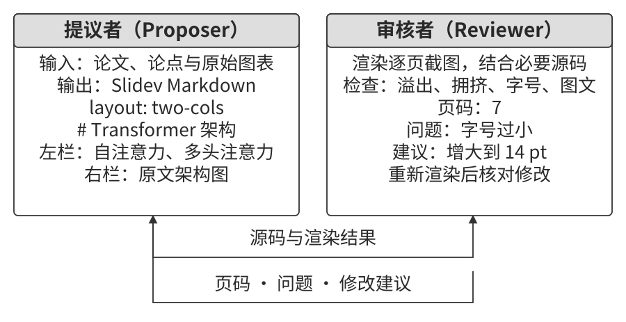

- **提议者（Proposer）** 阅读论文，规划讲解结构，编写 Slidev 源码，并根据反馈修改页面。
- **审核者（Reviewer）** 通过工具渲染页面，使用视觉模型检查内容密度、可读性、布局和图文对应关系，返回包含页码、问题类型、严重程度和修改建议的结构化反馈。

反馈应能直接指导修改。例如，“第 3 页要点过多，拆成方法概览和计算步骤两页”；“第 7 页代码字号过小，先增大至 14 pt，再检查投影可读性”。具体字号还要结合画布与展示环境确定。事实错误与图表误读优先修正，随后处理布局和视觉细节。

提议者修改后重新渲染，审核者检查新版本，并确认上一轮问题是否解决。循环设置两类退出条件：达到明确的内容与版式要求，或用完轮数、时间与费用预算，例如最多修改 5 轮。交付时保存当前版本及尚待处理的问题，便于后续审阅。

这与第四章的操作审批共享提议者—审核者模式。操作审批主要判断某次行动能否执行；内容审查则通过多轮反馈改进产物。两者都需要共享任务要求、给出可定位的判断依据，并由 Harness 决定后续流程。采用不同模型家族可以提供另一种审查视角，实际效果通过评估确认。

**笔者看重双 Agent 分工在上下文管理上的优势。** 两个角色可以分别保留各自需要的信息：审核者每轮接收最新截图、审核标准和必要的问题清单；提议者保留源码、修改目标和结构化文本反馈。页面图像留在审核者的上下文中，主轨迹通过简短的文本反馈持续推进修改。每轮审核都围绕最新页面展开，既减少历史截图的干扰，也控制了上下文增长。单 Agent 方案可以采用替换旧截图、保存外部状态等方法；比较两种方案时，应同时记录各自的消息保留策略。

> **实验 5-6 ★★：基于论文的 PPT 自动生成**
>
> 本实验使用《Attention Is All You Need》的论文 PDF，生成 20 页 Slidev 幻灯片。Agent 提取论文结构和要点，使用三张带来源记录的原论文图，逐页组织讲解。渲染后检查文字溢出、图表可读性及图文对应关系，再按反馈修改。
>
> 对照比较单 Agent 自审和提议者—审核者分工。本次运行中，两份最终文稿在同一独立评分流程中均获得 95 分；分工方案的峰值输入约为 2.4 万 token，保留历史截图的单 Agent 方案约为 9.3 万 token。这个案例展示了把图像审查与文本修改分开后，信息如何在两个上下文之间传递。复现时可以进一步比较旧截图替换、问题清单保留等策略对用量和质量的影响。

> **实验 5-7 ★★：论文讲解视频的自动生成**
>
> 在幻灯片基础上，Agent 可以为每页编写口语化讲解，解释图中的对象、关系和结论，再调用 TTS 合成语音。讲稿与页面一起交给视觉审核者，检查讲到的元素是否出现在画面中，以及描述是否与图表一致。
>
> 本次运行从实验 5-6 的幻灯片中选取 12 页，使用 Kimi 生成讲稿、Qwen 视觉模型审查图文关系，再由 Fish Audio 合成逐页语音。FFmpeg 根据每段音频的实际时长设置页面展示时间，合成约 8.6 分钟的讲解视频。
>
> 检查时同时关注内容与时间轴：讲稿是否解释了页面重点，术语读音是否清楚，换页是否截断语句，拼接后的声音与画面是否持续同步。图5-6 展示了从论文、幻灯片到讲稿、语音和成片的处理顺序。
>
> 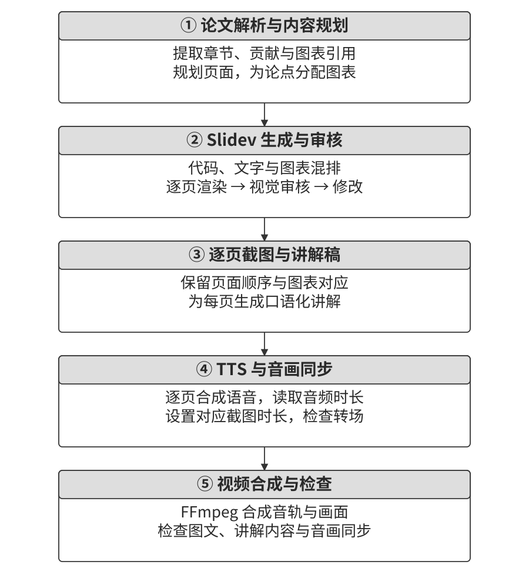

[^ch5-slidev]: Slidev，[Getting Started](https://sli.dev/guide/)，介绍基于 Markdown 和 Web 技术生成、展示与导出演示文稿。

**视频编辑 Agent。**

**视频编辑中能够用脚本表达的操作，应优先走程序接口。** 时间轴、图层、字幕和音轨分布在复杂的 GUI 面板中，反复定位和拖动会增加延迟与误差；程序接口可以直接用时间区间、轨道和效果参数表达操作。Blender 的 Python 接口与 FFmpeg 都能把一部分编辑任务组织成可重复执行的脚本。

Agent 可以先理解“把冲浪部分剪出来”这样的要求，再定位素材中的目标区间，生成裁剪、排列和音轨处理代码。提议者负责编辑计划与脚本，审核者检查渲染结果；遇到遗漏、无关片段或字幕遮挡时，反馈具体时间点和问题，交给提议者修改。关键帧适合检查场景与布局，运动连续性和音画同步还需要检查相邻帧或连续片段。

> **实验 5-8 ★★：基于 API 的智能视频剪辑**
>
> 本实验把目标定位、脚本生成和效果审查串成一个流程。先将视频引用、目标问题和抽帧间隔交给视频分析子 Agent，由它处理大量画面，向主 Agent 返回时间区间与依据。
>
> 定位分两步。第一步每 10 秒抽取一帧，寻找目标的大致范围，例如“冲浪在第 40—110 秒”；第二步围绕候选区间及邻近边界，每秒抽取一帧，进一步确定开始和结束位置。短于粗采样间隔的场景可能落在两帧之间，可以根据目标持续时间增加采样，或补查候选间隙。
>
> 确定区间后，提议者生成 Blender Python 脚本，执行裁剪及所需的字幕、变速等操作。审核者查看预览，指出需要调整的边界和效果；修改通过后再输出完整成片。
>
> 本次运行记录包含真实多场景视频的定位结果与 Blender 执行反馈。审核者识别了故意剪错的对照片段，随后检查修正结果；最终起止边界误差均在 3 秒以内，字幕与慢动作也完成对应检查。复现时可沿着定位结果、编辑计划、生成脚本和最终画面逐项追踪，找出误差在哪一步产生。

**3D 与工业零件：选择合适的生成方式。**

**尺寸与装配关系是硬约束的工业零件，优先采用参数化代码生成；主要追求自然形态与外观的对象，优先考虑生成模型。** 这个选择取决于产物能否用少量参数精确描述，以及修改后需要保持哪些关系。CadQuery、OpenSCAD 和 Blender 脚本提供可编辑的构造过程，混元 3D 等模型则利用学到的形态先验生成复杂外观。

**描述是否适合参数化。** 一个简化法兰盘可以用外径、厚度、孔位圆直径、孔径和孔数表达主要几何关系。代码将参数与构造步骤对应起来，适合反复调整。一盆绿植、一块太湖石或一张人脸则包含大量不规则形态，生成模型可以帮助构造外观，程序化方法也可以通过生长规则、随机过程和资产组合生成细节。

**精度如何检查。** 对孔径 5 mm、公差 ±0.05 mm 这样的要求，需要先明确单位、坐标系和测量方法，再比较模型尺寸与规格。参数化模型可以直接检查几何对象；网格可以通过截面、孔洞、包围尺寸等方法测量，并计入离散化误差。两种路线都可以检验，检验结果决定产物是否符合目标。数字模型验收后，实际制造还涉及工艺与测量环节。

**如何保存和修改。** B-rep（边界表示）用面、边和顶点描述实体边界，三角网格则用面片近似表面。CadQuery 可以导出 STEP 用于 CAD 数据交换，也能导出 STL 网格；可编辑的参数与构造逻辑保存在 CadQuery 源码中[^ch5-cad]。进入 CNC 加工流程还需要工艺规划、刀具路径和机床适配。

例如，把安装孔从适配 M5 改为适配 M6，可以修改孔径参数，重新生成后复核外径、厚度和孔位是否保持一致。生成模型的修改方式取决于接口能力，可以重新生成，也可以结合局部编辑和后续几何处理。检查时记录目标尺寸是否改变，以及其他部分是否随之变化。

两条路线组合时，也应明确分工：尺寸和装配关系交给参数化代码，纹理与自由外观交给生成模型。**关键尺寸需要反复精确修改时，可编辑的构造过程比一次生成的外观更有价值。**

> **实验 5-9 ★★：同一个零件的两种生成路线——代码与生成模型**
>
> 本实验要求生成外径 80 mm、厚度 10 mm 的法兰盘，在直径 60 mm 的孔位圆上均布四个安装孔。为明确装配含义，初始规格采用适配 M5 的 5.5 mm 通孔，修改请求改为适配 M6 的 6.5 mm 通孔。
>
> 代码路线由模型生成 CadQuery 程序，执行后导出 STEP 与 STL；生成模型路线先生成产品参考图，再交给混元 3D 生成网格。检查外径、厚度、孔数、孔径、孔位和安装面，并记录单位与轴向。
>
> 本次测量记录中，代码路线满足设定的尺寸误差要求，修改孔径后其余检查项保持一致。生成模型路线的原始网格缺少明确的物理尺度，且未形成规格要求的四个通孔；重新生成后，整体形态和轴向也发生变化。分析尺寸时，应分别检查尺度对齐、孔洞拓扑和局部几何，避免把无单位坐标直接当作毫米。
>
> 实验还比较了程序绘制与图像模型生成的盆栽图片，视觉评分偏向后者。这个补充案例用于讨论外观自然度，与法兰盘的尺寸检查共同展示不同任务的评价重点。完整参数、测量记录和修改过程保留在实验说明中。

[^ch5-cad]: CadQuery，[Importing and Exporting Files](https://cadquery.readthedocs.io/en/latest/importexport.html)，介绍 STEP、STL 等格式，并说明完整参数化信息保存在 CadQuery 的 Python 源码中。

### 代码作为系统适配器

外部服务的接口、鉴权方式和数据格式各不相同。Agent 可以阅读文档与响应样本，生成 HTTP 客户端、配置鉴权头、解析返回值，再把上游字段转换成下游需要的结构。代码在这里承担系统适配工作，将已有服务组合为新的任务流程。

适配器需要明确输入输出、错误处理与版本范围。样本帮助模型理解字段，接口约定和测试则检查缺失值、分页、异常响应及版本变化。凭证由执行环境管理，生成代码通过受控接口使用授权能力。验证通过后，适配器可以保存和复用，后续遇到格式变化再进入修改流程。

只有图形界面的系统也可以采用类似方法。Agent 先通过第六章介绍的 Computer Use 完成任务，再把稳定的操作步骤固化为 RPA 工具。界面控件、登录状态和页面流程变化时，工具需要检测偏差并重新定位。第九章将进一步讨论如何从成功轨迹中提取、验证和复用工作流。

**Agent 日志解析和可视化。**

一次复杂任务可能包含多次模型请求、工具执行和子 Agent 交互。日志概览呈现步骤关系、状态与耗时，展开后则显示具体输入输出，帮助读者追踪某一步发生了什么。新增字段、嵌套结构和格式版本都会影响解析与展示。

自适应解析通过“发现变化—生成解析器—验证结果”的循环处理这些变化。解析失败时，系统保存原始样本、错误位置和预期字段，再对照接口约定与生产者版本判断变化是否符合预期。已确认的格式升级交给 Agent 生成候选解析器；生产者缺陷则保留异常并提交诊断，避免自动兼容掩盖上游错误。候选代码在受限环境中运行，先检查字段及其含义，再以正常样本、缺字段样本和旧格式回归用例验证。通过后注册新解析器，保存版本与适用格式；失败样本继续保留，便于追踪和重试。

解析与展示各有检查方法。程序检查时间戳、状态、数值类型和调用关联；浏览器渲染检查页面是否正常工作，视觉模型辅助检查表格、时间轴与标签是否清楚。热更新时保留上一版本及回退入口，使新格式支持可以逐步进入运行系统。

> **实验 5-10 ★★★：自适应的日志解析系统**
>
> 本实验先运行两个日志产生进程，分别输出竖线分隔格式和嵌套括号格式。初始解析器无法处理这些样本，系统随后请求模型生成两个解析函数，测试通过后热加载，再解析原先失败的日志。
>
> 第一种格式提取 `timestamp`、`level`、`module`、`step` 和 `message`；第二种还涉及工具名、耗时与状态。运行记录中，两类各三条日志完成解析，新建引擎也能加载已保存的解析器，继续处理混合日志流。
>
> 解析结果由 Chromium 渲染为表格，视觉审核检查列名、行内容与可读性。读者可以沿着“失败样本—生成函数—字段结果—页面”逐项核对。现有自动测试检查必需字段，进一步扩展时可加入字段值、类型和异常样本断言，确认新解析器表达了日志含义。

**Agent 执行日志自动分析和问题诊断。**

解析出结构化轨迹后，Agent 可以结合架构文档与 PRD（产品需求文档），比较预期流程和实际行动。例如，退款流程是否先检查资格，库存服务超时后是否采用约定的降级路径。诊断结果需要指向具体轨迹、交互轮次和需求条目，便于开发者复核。

问题报告可以包含优先级、模块、现象、证据和改进建议。Agent 还可以据此生成回归测试，把问题对应的输入与验收条件固定下来。测试框架在受控环境中重放请求或读取保存的工具响应，比较缺陷版本与修复版本的行为。涉及外部写入的操作使用隔离环境或替代接口，保持重放的影响范围可控。

断言应对应需要验证的属性。例如，“资格检查出现过”只检查步骤存在；要验证“退款前检查并通过”，还需检查调用顺序、返回结果及订单状态。轨迹标识把诊断、测试和修复记录连接起来，使后续评估能够追溯问题来源。

最后，可以通过 MCP 对接 GitHub，将经确认的报告创建为 Issue，并根据模块与团队的对应关系建议负责人。创建与分派需要相应授权，重复问题则合并到已有工作项。图5-7 展示了从轨迹、需求文档到诊断、回归测试和工作项的处理流程。

> **实验 5-11 ★★★：生产日志的智能诊断系统**
>
> 本实验用本地 HTTP 服务产生两条业务轨迹，分别呈现退款前缺少资格检查，以及库存查询超时后未走降级缓存的问题。模型结合架构文档与需求说明，生成包含轨迹和轮次引用的问题报告，再生成三个可执行回归测试。
>
> 三个测试在缺陷实现上均失败，在修复实现上均通过。其中资格检查用例验证步骤是否存在；读者可以继续增加顺序、结果与状态断言，逐步完善业务验收。运行记录还包含通过 GitHub MCP 创建工作项的回执，连接了诊断结果与后续处理入口。
>
> 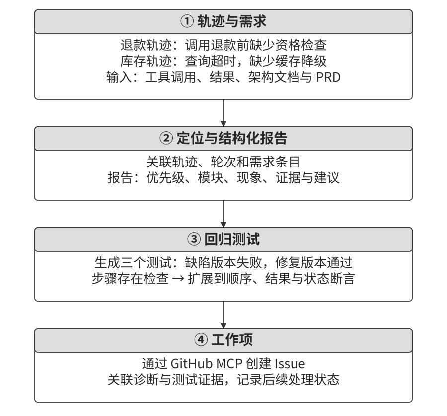

### 代码作为生成式 UI

交互形式可以随任务变化。开放问题适合用对话澄清，结构化信息适合用表单收集，数据关系适合用图表展示。Agent 根据当前任务生成表单、图表或应用界面，让用户直接填写、选择和操作，这种方式称为生成式 UI（Generative UI）。

**用协议描述界面与交互。**

生成界面有两条实现路径：输出 HTML、JavaScript 等代码，交给受控环境执行；输出声明式结构，由客户端组件渲染。前者便于实现定制布局和交互，后者把可用能力限定在客户端提供的组件与动作范围内。

A2UI（Agent-to-User Interface）采用声明式描述。Agent 生成结构化消息，表达组件、数据绑定和更新，客户端用自己的组件呈现界面[^ch5-ui-protocols]。例如，应用可以提供卡片、按钮、文本框和表格组件，Agent 据此描述一个标题为“销售数据”、包含三行两列的表格。组件目录还可以扩展图表和地图等能力。

AG-UI（Agent–User Interaction）负责 Agent 与前端之间的事件交互，传递消息、工具调用和状态更新，也可以承载 A2UI 的界面消息。两者组合后，A2UI 描述要展示的内容，AG-UI 连接后端执行与前端交互。

客户端可以逐步接收界面更新，并通过适配的渲染器在 Web、移动端或桌面端展示。接入时应核对协议版本、组件目录与渲染器支持范围。客户端验证组件属性、数据绑定和动作请求，服务端继续检查业务权限；组件中的链接、富文本和数据访问也需要各自的处理规则。

直接生成代码时，则需要检查依赖、资源访问和执行权限，并隔离生成界面与宿主应用的敏感状态。外部材料中的提示注入可能影响生成过程，浏览器中的脚本执行风险还取决于页面加载和隔离方式。这些防护分别落实在输入来源、生成审查、渲染与业务接口中。

**用 HTML 交付交互式成果。**

**对于包含数据、演示和持续更新结果的研究交付，笔者优先采用 HTML 网站。** 长篇线性 Markdown 汇报要求读者不断翻找上下文；交互式网页可以把说明、数据和演示放在同一个入口：读者查看图表，筛选感兴趣的样本，展开某项结果的细节，再操作演示理解系统行为。Agent 也可以随任务推进更新页面，使它持续记录当前成果与证据。

以笔者的研究实践为例，每个研究项目都有一个交互式网站，把它同时作为研究过程中的活文档和最终交付物，并让 Agent 随实验推进持续补充内容[^ch5-4]。这些网站主要承担三项工作。

一是**实验数据追溯**。页面将样本、提示词、模型回复和评分关联起来，支持逐条检查。这样可以对照数据构造与分布，发现格式问题，也可以检查回复与评分之间是否存在系统性偏差。

二是**训练指标监控**。笔者把反映训练内部状态的信号称为“内科指标”：训练与验证损失、梯度范数、学习率，以及强化学习中的奖励、KL 散度和策略熵等。语言模型还可以用困惑度衡量它对给定文本序列的预测表现；比较时保持文本、分词和计算口径一致。就像体检中的生理指标，这些曲线有时能比最终任务成绩更早暴露问题。把它们与任务准确率一起查看，有助于定位不收敛、梯度异常和训练退化发生的阶段。

三是**运行原理展示**。页面用可操作的示例呈现模块关系和数据流，读者可以改变输入、查看中间状态，再观察输出如何变化。说明文字、实验记录与交互演示共同帮助读者理解系统。

**澄清用户意图。**

用户说“我想订一张去北京的机票”时，目的地已经明确，出发城市、日期和单程或往返仍待补充。Agent 可以在一轮对话中集中提问，也可以生成表单，让相关条件在同一页面上呈现。

表单中的控件对应不同类型的信息：文本框收集开放输入，下拉菜单与单选控件提供候选，复选框支持多选，日期选择器帮助填写时间。JavaScript 可以表达级联关系，例如选中“往返”后显示返程日期，并检查返程不早于出发。选择改变时，还要同步清理或忽略已失效的字段。

图5-8 展示了动态表单生成流程。Agent 识别缺失信息，生成界面，用户填写并提交后，系统把结构化数据交回 Agent。客户端提示缺失项和格式错误，服务端验证字段与业务条件，Agent 再据此继续任务。

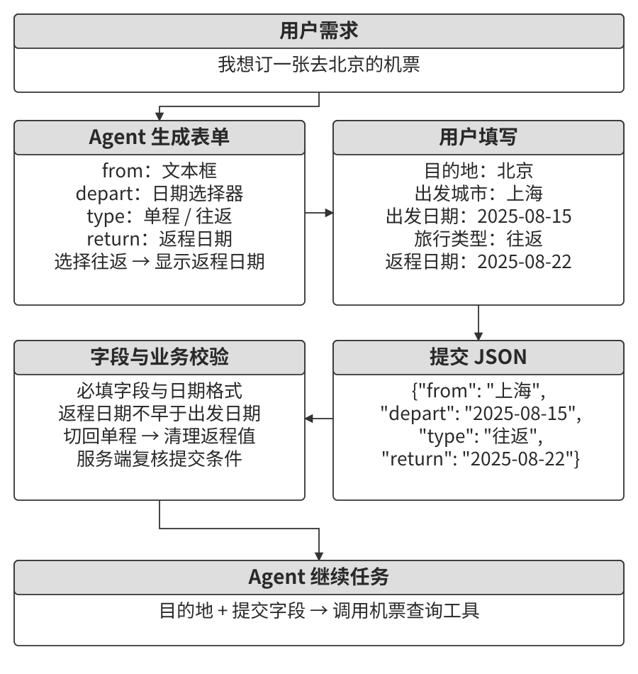

> **实验 5-12 ★★：动态表单生成的意图澄清系统**
>
> 本实验从“我想订一张去北京的机票”出发，让模型生成 HTML 表单：出发城市使用文本框，出发日期使用日期选择器，旅行类型提供单程与往返选项，返程日期在选择往返时显示。
>
> 运行记录中，Chromium 实际执行了级联逻辑，检查返程日期从隐藏到显示的变化，并完成一次填写与提交。提交数据以 JSON 形式传给 Agent，由它根据所选条件继续处理。读者可以进一步测试往返切回单程、日期缺失和时间顺序错误，检查界面状态与最终提交值是否一致。

[^ch5-ui-protocols]: [A2UI 官方文档](https://a2ui.org/)与 [AG-UI Overview](https://docs.ag-ui.com/introduction)，分别介绍声明式界面描述和 Agent—前端事件交互。
[^ch5-4]: 笔者的[研究项目网站](https://01.me/research/)汇集了论文及配套交互式页面。

**生成 SQL 查询。**

用户可以用自然语言提出数据库查询，Agent 根据表结构和业务口径生成 SQL。**展示完整查询表格时，笔者优先采用 Artifact 模式，让结果从数据库直接进入界面。** 让模型读取并逐行复述大表格，会增加 token 用量和等待时间，还引入抄写错误。SQL 保存为可检查的查询产物；需要分析原因或总结趋势时，再把必要的聚合结果交给模型。

图5-9 展示了这条数据路径：Agent 生成查询，受控执行服务访问数据库，结果直接进入用户界面的表格。模型保留查询意图、字段含义和执行状态，大批量结果由系统传递。这样减少了模型逐行复述的输入输出，也便于将页面数值与数据库结果核对。

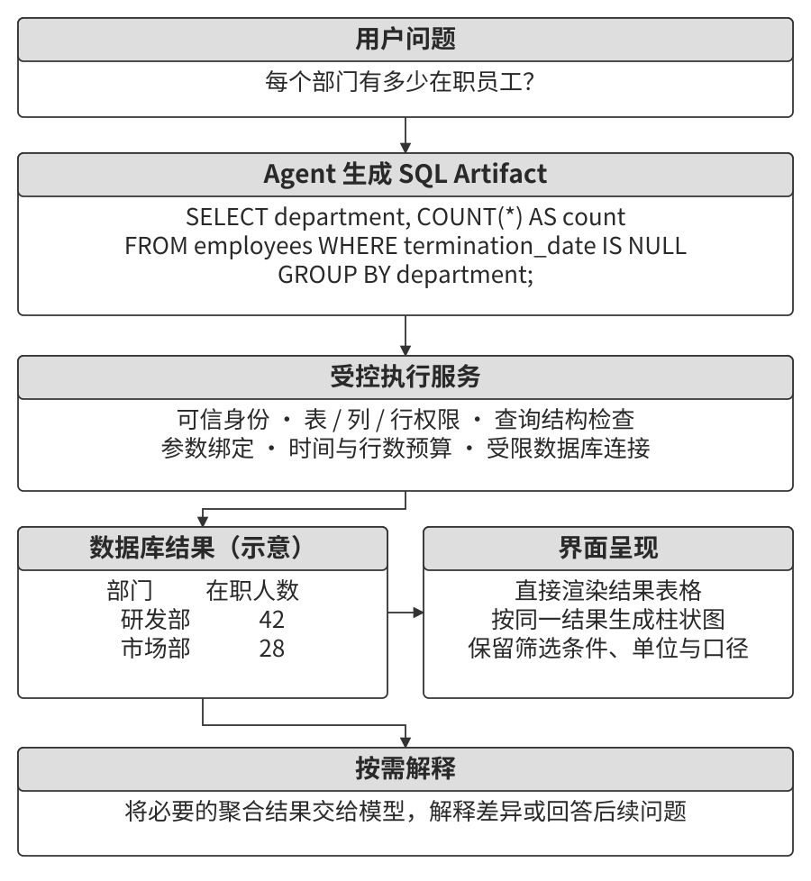

执行服务根据可信身份确定可访问的表、列和行，使用受限数据库账号，并对 SQL 结构和操作类型进行校验。查询场景可以限定为批准的只读查询，控制函数调用、时间预算、返回行数与数据范围；用户输入的值通过参数化绑定传入。数据库权限、查询检查和资源限制共同约束实际执行。

Agent 还可以生成可视化产物，例如将部门汇总结果展示为柱状图。执行服务把查询结果交给受控的可视化运行环境，界面只展示允许的数据与交互。SQL 与图表分别保存，便于检查筛选条件、聚合口径、单位和坐标轴。

> **实验 5-13 ★★：自然语言交互的 ERP Agent**
>
> 本实验以 ERP（企业资源规划）中的员工与工资查询为例，学习如何从业务问题生成 SQL，并让数据库结果直接进入页面。PostgreSQL 中建立两张表：员工表包含员工 ID、姓名、部门、级别、入职日期和离职日期，离职日期为空表示在职；工资表包含员工 ID、发薪日期和工资，每位员工每月一条记录。
>
> Agent 根据这两张表处理以下十个问题：
>
> 1. 平均每个员工在职多久？
> 2. 每个部门有多少在职员工？
> 3. 哪个部门员工平均级别最高？
> 4. 每个部门今年和去年各新入职多少人？
> 5. 前年 3 月到去年 5 月，A 部门的平均工资？
> 6. 去年 A 部门和 B 部门的平均工资哪个高？
> 7. 今年每个级别的员工平均工资？
> 8. 入职一年内、一到两年、两到三年的员工最近一个月平均工资？
> 9. 去年到今年涨薪幅度最大的 10 位员工？
> 10. 有没有拖欠工资（某月在职但未发薪）？
>
> 查询前需要明确统计口径。例如，在职员工的任职时长计算到查询基准日，离职员工计算到离职日；“平均工资”需要确定按发薪记录还是按员工平均；涨薪排名需要处理去年无记录的员工。基准日期与口径一起保留，方便重查结果。
>
> 本次运行生成并执行了十条 SQL，结果均与独立参考计算一致，随后由浏览器直接渲染表格。模型接收表结构、任务与必要的执行反馈，数据库行数据通过应用传到界面。复现时可增加空结果、离职边界和缺薪月份，检查查询是否持续符合已确定的业务含义。

**动态生成软件。**

Agent 可以从需求开始生成界面和交互逻辑，再根据用户操作继续修改。Anthropic 在 2025 年推出的临时研究预览“Imagine with Claude”展示了这种交互：用户探索界面，模型持续生成相应的软件体验[^ch5-imagine]。

**面向实际产品，笔者更看好在已有框架上进行定制。** 从零持续生成整个应用会反复付出生成、渲染和验证成本；保留稳定框架，再开放用户关心的界面与流程，能更快地提供可靠的个性化体验。用户提出“把按钮改成蓝色”“在侧边栏添加快捷菜单”“换一种更易读的字体”，Agent 定位相关组件、修改代码，再通过预览检查效果。基础框架提供稳定的页面结构与业务接口，定制范围可以从颜色、字体逐步扩展到布局和组件。

开发环境的 HMR（Hot Module Replacement，热模块替换）可以在代码变化后更新受影响的前端模块。是否保留状态，取决于框架集成、更新边界及修改类型；需要完整刷新时，应用还应保存必要状态。FastAPI 开发模式中的 reload 则重新加载服务端程序，两者分别作用于前端模块和后端进程[^ch5-hmr]。

> **实验 5-14 ★★：对话式界面定制系统**
>
> 本实验构建 React 前端与 FastAPI 后端组成的聊天应用，在开发环境中启用前端 HMR 和后端 reload。模型根据连续三轮要求修改颜色、字体和标题，浏览器检查每次修改后的实际界面。
>
> 本次运行记录了 Vite 的 HMR 事件，三轮修改均未发生整页导航，已有聊天状态得到保留，最终构建通过。这个例子展示了“需求—代码修改—热更新—浏览器检查”的迭代过程；扩展到布局或组件位置时，继续检查界面变化、状态保留和已有功能。

[^ch5-imagine]: Anthropic，[Introducing Claude Sonnet 4.5](https://www.anthropic.com/news/claude-sonnet-4-5)，介绍随模型发布的临时研究预览 Imagine with Claude。
[^ch5-hmr]: [Vite HMR API](https://vite.dev/guide/api-hmr) 与 [FastAPI CLI](https://fastapi.tiangolo.com/fastapi-cli/)，分别介绍前端热更新和开发服务器自动重载。

**让权限边界独立于动态业务代码。**

**业务代码越容易由 Agent 动态改写，最终的权限边界就越应下移到稳定的数据访问层。** 传统应用将权限判断写在经审查的业务代码中；生成代码不断变化后，某条新路径可能遗漏同样的检查。让每次读写都经过独立的数据访问服务，才能把权限约束保留下来。例如，招聘应用可以动态生成候选人列表和操作表单，候选人属于哪个组织、招聘人员可以更新哪些字段，则由受信任的数据访问服务持续检查。

这里的设计目标是：**即使生成代码出现错误，受信任的数据访问层仍能强制实施权限约束。** 这延续了第一章的数据层护栏：把需要强制遵守的规则放在所有相关操作都要经过的位置。数据库行级安全策略可以限制记录访问，约束和校验器检查合法状态，受控视图、存储过程或数据服务提供允许的操作。应用层可以提前检查并向用户解释，最终读写仍由受信任的数据服务和数据库权限控制。

每次操作还需要可信的**访问上下文**（access context），包含用户、租户、角色或 Agent 身份。认证服务与受信任运行时负责建立和绑定身份，数据服务据此授权。动态代码获得完成任务所需的受限接口，凭证和策略管理权限由独立组件保管。所有数据库连接、辅助查询及后台处理都应遵守同一访问范围。

例如，PostgreSQL 的行级安全需要结合数据库角色配置使用。应用连接采用受策略约束的角色，策略管理与数据访问分别授权，再用允许访问和应当拒绝的用例检查效果[^ch5-rls]。规则与身份绑定机制经过独立审查，业务界面则可以在这个范围内持续变化。

权限与数据完整性还承担不同职责。招聘人员有权修改候选人记录后，状态机继续检查是否允许从“已筛选”进入“已面试”；工资校验器读取关联职位，检查期望工资是否位于职位范围；引用检查确认职位和候选人关系有效。这些检查共同确保更新既符合访问权限，也符合业务规则。

> **实验 5-15 ★★★：动态生成软件的权限内嵌数据对象**
>
> 本实验提供 PostgreSQL 之上的 Python 对象存储原型，将权限规则、校验器、对象关系和后续反应声明放在数据类型中。读取时检查访问权限；创建和更新时，先执行权限与业务校验、检查引用关系，再持久化，随后将声明的后续反应加入队列，并限制反应链深度。
>
> 招聘示例包含职位、候选人、面试和评估等对象。候选人依次经历申请、筛选、面试、发放录用通知与录用，相关阶段也可以进入拒绝状态；工资范围来自关联职位。示例设置了正常状态更新、无效状态跳转、超出职位工资范围和不同租户访问等检查，帮助读者理解授权与业务校验各自处理什么问题。
>
> 原型通过 `AccessContext` 表达用户、角色与组织属性，教学脚本直接构造这些上下文来模拟不同身份。部署时由认证入口建立上下文，并将对象存储与生成代码分隔在明确的服务或权限边界两侧。练习可以先逐项阅读规则和确定性示例，再检查允许的操作、拒绝的操作及持久化结果，最后扩展到并发更新与后续反应的一致性。

[^ch5-rls]: PostgreSQL，[Row Security Policies](https://www.postgresql.org/docs/current/ddl-rowsecurity.html)，介绍按角色和操作配置行级安全策略及其适用范围。

### 代码创造代码：Agent 自举

代码生成能力也可以用于开发 Agent 本身。创建者接收任务需求，生成或修改新 Agent 的提示词、工具和运行循环，再通过测试与实际交互检查产物。图5-10 展示了这一自举循环：已有实现提供起点，任务反馈推动修改，验证结果决定哪些变化可以保留。

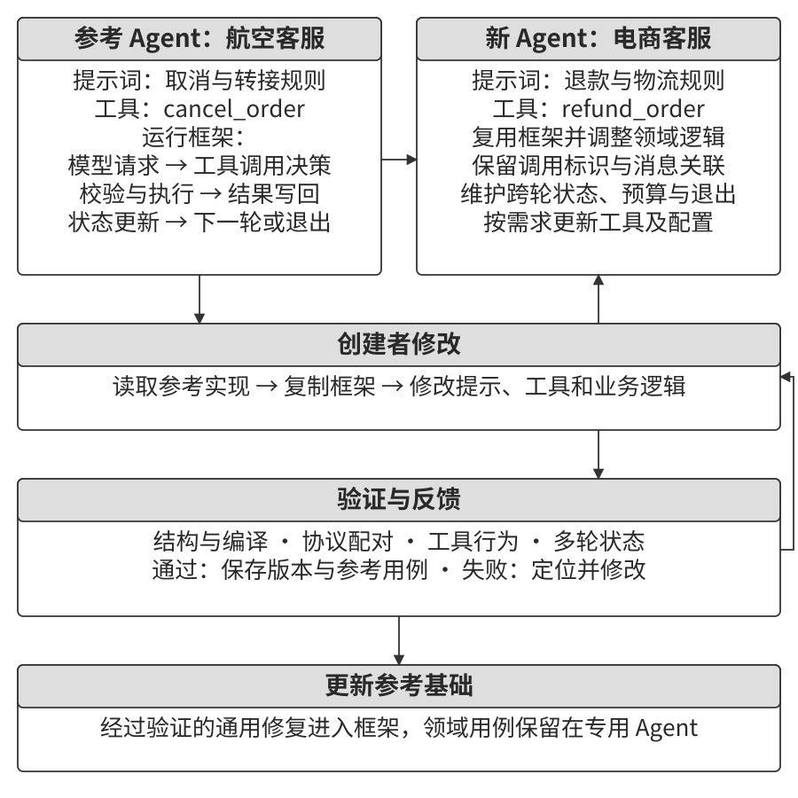

**维护 Agent 的运行环境。**

新 Agent 的运行依赖配置、凭证、会话状态、服务和沙盒。OpenClaw 的 `doctor` 命令提供了一个维护工具的例子：它检查旧配置迁移、OAuth 凭证状态、会话锁、插件安装、网关健康和沙盒镜像等问题，并给出修复建议或执行相应修复[^ch5-doctor]。具体修改由命令选项和交互选择控制。

这些确定性检查可以成为自我维护流程的基础。检测规则覆盖已知故障，修复动作具有明确的输入与预期结果。进一步设计 Agent 诊断流程时，可以把尚未解决的问题连同日志、配置和检查结果交给模型，让它提出修复候选；执行层检查权限与修改范围，再运行健康检查和回归测试。配置快照、变更记录与回退入口帮助系统在修复失败后恢复工作。

**以参考实现承载工程经验。**

创建专用 Agent 同时涉及领域逻辑和通用基础设施。检查生成结果时，可以从四类问题入手：

1. **上下文与运行循环。** 保留角色、工具调用标识和工具结果之间的关联，检查多轮状态、终止条件、预算及异常恢复。结构化消息便于维护协议关系；稳定前缀则为提示缓存创造条件，实际命中取决于服务实现和请求内容。
2. **工具接口。** 工具说明交代用途、适用条件和使用边界，参数包含类型、含义与具体例子。执行层继续验证参数、身份和业务状态。
3. **模型与 API 选择。** 模型容易沿用训练数据中高频出现的旧模型和旧接口，代码写得流畅也可能选型滞后。为创建者提供经过维护的选型资料，或让它检索官方文档，核对模型能力、接口版本与调用方式。生成后的真实调用检验配置是否可用。
4. **依赖与生态兼容性。** 检查库的维护状态、版本和接口变化，用依赖安装、编译检查与测试验证组合后的程序。

**创建专用 Agent 时，笔者优先让创建者复制经过验证的参考实现，再做领域修改。** 提示词很难穷尽消息协议、状态管理和恢复机制中的所有细节，参考代码却能把这些工程经验直接带入新系统。模型即使擅长编程，也可能漏掉任务描述中没有明说的运行条件；复用框架可以减少这类重复失误。创建者复制合适的基础框架，调整系统提示词以匹配新角色，增删领域工具，修改业务逻辑，并补充对应测试。消息处理、调用关联、状态管理与退出路径由框架提供，领域变化则通过新增用例验证。参考实现本身也需要维护，依赖更新和框架修复应进入同一套回归流程。

可以从两个方面判断参考实现的复用效果：生成的新 Agent 是否完成任务，以及创建过程中消耗了多少时间和模型调用资源。把框架质量、领域行为与创建成本分开记录，便于判断某个参考实现适用于哪些需求。

图5-11 展示了从需求到生成、验证和交付的流程。结构检查确认文件与入口齐全，协议检查确认调用和结果配对，行为测试检查任务结果，多轮交互进一步检查状态是否延续。

> **实验 5-16 ★★★：开发一个能创造 Agent 的 Agent**
>
> 本实验让同一个创建者模型沿两条路线生成专用 Agent：一条从零编写运行循环、工具协议、领域工具、命令行入口和测试；另一条复制参考实现，保留通用框架，修改领域提示、工具和业务逻辑。这体现了元编程的基本思路，即用程序生成或修改其他程序。
>
> 两条路线使用相同的任务要求和验收条件。先检查产物结构、编译与测试，再检查标准消息中的工具调用与结果关联，最后运行真实模型任务和多轮交互，验证上下文裁剪、状态管理和调用次数限制。
>
> 比较时同时记录任务完成情况、检查结果、创建耗时和模型用量。读者可以先选择一个工具较少的专用任务，再增加跨轮状态或异常恢复需求，观察框架复用节省了哪些工作，以及领域变化需要补充哪些测试。
>
> 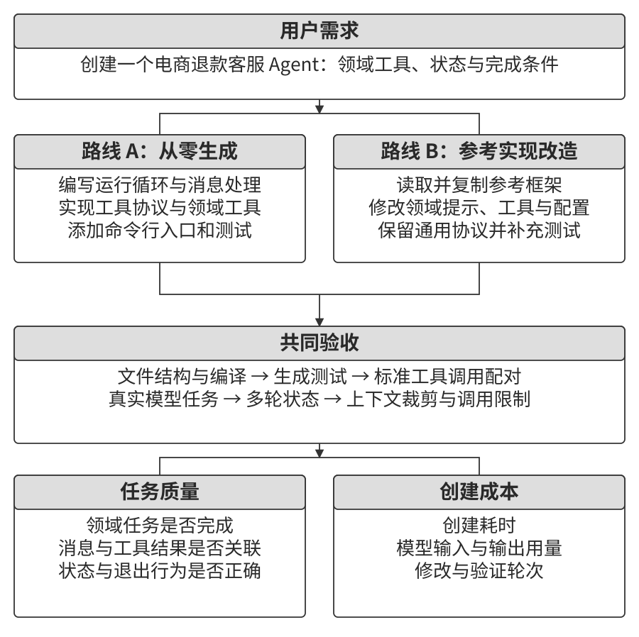

[^ch5-doctor]: OpenClaw，[Doctor](https://docs.openclaw.ai/gateway/doctor)，介绍配置与状态检查、迁移和修复功能。

## 本章小结

代码为 Agent 提供了形式化表达、计算和执行的能力。模型把需求转化为程序，工具运行程序，测试与环境反馈帮助检查结果。**Coding Agent 较早成熟的一项关键原因，就是软件工程已经积累了类型系统、测试套件、版本控制和调试工具。** 这些设施把错误转成可定位的反馈，让模型能够持续修正实现。其他 Agent 场景也应优先补齐目标、验证和恢复机制。

Coding Agent 的 Harness 组织上下文、工具接口、约束、验证和纠正。运行中的可靠性还依赖故障检测、重试与切换、状态恢复、人工接管和终止路径。设计这些机制时，需要把模型决策、工具执行与环境状态连接起来，尤其要检查恢复过程中是否重复产生外部影响。

本章介绍了代码的六类用途：

- **思考工具**：用数值计算、符号计算和约束求解检查推理结果。
- **业务规则约束**：在执行入口根据可信业务状态校验操作，将政策转化为可测试的分支与边界条件。
- **多媒体生成**：用代码组织文档、视频和几何模型，通过提议者—审核者循环检查内容与呈现，按产物的精度和表现需求选择生成方法。
- **系统适配器**：连接不同接口与格式，生成日志解析器，并把诊断结果转化为回归测试。
- **生成式 UI**：生成表单、查询和可视化，让用户直接操作结构化信息，并由执行服务管理数据与权限。
- **Agent 自举**：复用经过验证的框架，生成新的领域工具与业务逻辑，再检查协议、状态和任务行为。

代码还可以保存成功经验：一次操作可以固化为工具，一条业务规则可以变成校验器，一个发现的问题可以留下回归测试。随着这些产物积累，Agent 获得了可复用、可检查和可维护的工作基础。

前五章已经介绍上下文、知识、工具与代码的组合方法。前面的许多例子按“提出请求—执行工具—返回结果”的顺序推进；持续运行的 Agent 还会遇到新消息、后台任务完成和环境变化。第六章将从这些异步事件出发，进一步讨论语音、屏幕和物理环境中的观测与动作接口；第七章再系统讨论如何评估这些能力。

## 思考题

1. ★★ 为一个需要读取项目文件、安装依赖和运行测试的 Coding Agent 设计沙盒。你会如何配置文件、网络、进程和资源权限？任务需要扩大权限时，怎样表达请求、检查范围并保留记录？
2. ★★★ 创建者连续生成和修改多代 Agent 时，框架缺陷与领域错误可能逐步累积。如何用参考版本、回归测试、行为评估和回退机制追踪这种变化？
3. ★★ 日志格式变化可能来自正常升级，也可能来自生产者缺陷。自适应解析系统应保留哪些证据，依据哪些条件决定新增解析器、报告异常或暂停处理？
4. ★★ 提议者—审核者循环中，审核者认为页面信息密度合理，用户却觉得拥挤。如何把用户偏好转化为示例、评分条件和交互反馈，并检查后续修改是否符合要求？
5. ★★ Coding Agent 可以更新知识库、架构文档和项目指令，也可以把操作序列固化为代码。如何识别冗余或过时的规则，为规则设计适用范围、验证方法和退出条件？从一次成功修改发展为第九章讨论的持续进化，还需要哪些积累与评估机制？
6. ★ 对远程协作友好的团队通常也便于 Agent 获取工作信息。请检查一个熟悉项目的需求、架构、决策记录和验收标准，列出最需要补充的文档，并说明它们能帮助 Agent 完成哪些具体任务。
7. ★★★ 对同时访问私有数据、处理不受信任内容、进行外部通信并使用持久记忆的 Agent，如何安排身份授权、来源标记、数据流检查与记忆写入审核？请用一条正常业务流程说明这些检查的位置。
8. ★★ 在 SQL 与 HTML 的 Artifact 模式中，模型生成产物，执行服务处理查询或渲染，界面直接呈现结果。哪些信息适合再交给模型解释？如何检查查询权限、资源预算、页面隔离和展示结果的一致性？
9. ★★ 工具根据数据库中的业务状态校验规则，参数说明则帮助模型准备调用。请以取消预订为例，说明自然语言政策、参数例子、执行层校验和边界测试各自承担什么职责；政策变化后，哪些内容需要同步更新？
