# 交互：观测与动作空间的扩展

**底层模型固定时，重新组织或扩展观测与动作接口，往往是提升 Agent 任务表现最有效的工程手段之一。** 同一个模型能够及时获得新信息，并采用更合适的行动方式，就可能完成原来做不到的任务。前几章介绍了上下文、记忆、知识、工具和代码，本章继续讨论交互的两个维度：Agent 以什么形式接收信息和执行行动，以及这些交互在什么时刻发生。

按“用户提问—模型处理—返回结果”组织系统，很容易把运行期间的环境变化留到下一轮再处理。邮件可能在模型推理时到达，用户可能在语音播放中途插话，页面也可能在两次截图之间发生变化。系统需要及时接收这些变化，判断它们与当前任务的关系，再决定继续、调整或停止行动。异步事件、语音、屏幕操作和机器人控制，都围绕这条反馈链展开。

## 模态与触发时机的扩展

**模态**描述信息与行动的形式。Agent 可以读取文本、听取声音、查看屏幕和接收力矩信号，也可以输出文字、合成语音、点击界面或驱动关节。

**触发时机**关注信息何时到达、行动何时开始，以及系统何时作出响应。信息可以由 Agent 主动查询，也可以由外部服务推送；工具可以立即返回结果，也可以先启动任务，稍后报告完成。新事件到达时，系统还需要判断是否打断当前工作，以及如何恢复被中断的任务。

| 维度 | 信息获取与观测接口 | 行动与执行接口 |
|---|---|---|
| 内容组织（第二至五章） | 上下文、记忆与知识库组织决策信息 | 工具与代码表达可执行操作 |
| 模态（本章） | 语音、屏幕、物理传感器 | 说话、点击、关节运动 |
| 时机（本章） | 主动查询、事件推送、连续输入 | 跨回合执行、取消、抢占与恢复 |

上下文承载某次决策所需的信息，观测空间描述系统可能接收的信息范围；工具提供具体接口，动作空间描述系统允许执行的动作范围。扩展接口时，这些范围仍受设备能力、参数、权限和运行环境约束。

许多工具调用接口按轮次组织消息：模型提出调用，系统补入工具结果，再发起下一轮推理。事件驱动系统需要在这套协议上管理外部变化。接口支持原生异步时，可以在工具挂起期间接收新要求，并在结果返回后继续处理；采用同步接口时，则由 Harness 使用队列、任务句柄和调度机制组织交互。后文分别讨论两条实现路线。

不同场景的反馈节奏相差很大。下表列出常见的时间尺度，具体延迟取决于采样、模型、网络与执行器。

| 常见尺度 | 场景 | 观测侧的变化 | 动作侧的处理 |
|---|---|---|---|
| 秒至天 | 异步与事件驱动 | 外部事件唤醒 Agent | 先启动任务，后续事件报告进展与完成 |
| 数十毫秒至秒 | 语音 | 连续接收音频 | 流式输出，处理插话与停止播放 |
| 亚秒至秒 | Computer Use | 屏幕持续变化 | 操作后重新获取界面状态 |
| 毫秒级控制周期 | 机器人底层控制 | 传感器持续反馈 | 执行短段动作，响应控制与停止信号 |

## 异步与事件驱动：当世界主动找上门

第四章介绍了感知、执行和协作工具，本节接着讨论事件触发与用户沟通工具。事件触发工具把环境变化送入 Agent，沟通工具则让 Agent 在任务推进过程中联系用户。Harness 将这些输入输出与正在运行的任务关联起来，形成持续工作的事件循环。

### 为什么需要异步

同步调用需要等待结果返回，调用方才能继续当前流程。异步调用则先返回任务句柄（用于查询和管理任务的标识），或约定稍后通知完成，让调用方在等待期间处理其他工作。系统可以据此组织多个进行中的任务，再根据资源和依赖决定哪些操作能够并行执行。

可以把 Agent 想成一位管理邮件、电话和来访事项的秘书：等待对方回信时继续整理材料，紧急电话到达时暂存当前进度，通话结束后再恢复原任务。对应到工程实现，需要处理三件事：

- **长任务与交互分离。** 文件分析、电话或构建任务在后台推进，用户仍可以查询进展、补充要求。
- **事件优先级。** 紧急停止及时进入控制流程，常规更新进入队列，独立查询可以交给并行会话。
- **中断与恢复。** 保存任务状态，记录已经发生的操作，恢复时重新检查仍然有效的条件。

接入模型前，还要核对 API 的消息时序。有些接口要求工具调用与结果完整配对后才接受下一轮请求，有些允许挂起工具并接收后续更新。应用中的异步函数负责安排等待与执行，模型协议则规定何时可以提交消息。后台任务怎样运行、运行状态怎样交给模型，需要分别设计并衔接起来。

事件驱动架构把用户消息、工具结果、定时触发和外部回调转换为事件，由事件循环统一处理。支持推送的服务可以在变化发生时通知系统；只提供查询接口的服务，则由适配器定期检查并生成事件。图6-1 展示了事件源、队列与 Agent 运行时之间的关系。

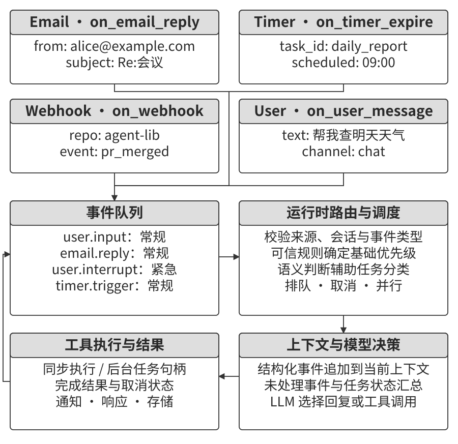

### OpenClaw 的事件驱动机制实现

OpenClaw 通过 Gateway 接入消息渠道，并将事件路由到 Agent 运行时。它的自动化机制包括内部 Hooks、定时调度、Heartbeat 和外部 Webhook 等入口[^ch6-automation]。这些机制可以按触发条件理解：

- **Hooks（事件钩子）**响应框架内部事件，例如会话创建、重置或运行生命周期变化。
- **Cron（定时调度）**按指定时间或周期执行工作。例如 `0 9 * * 5` 表示在所配置时区的每周五上午 9 点触发。
- **Heartbeat（心跳）**周期性唤醒 Agent，检查需要关注的事项。
- **Webhook（外部回调）**接收外部服务提交的事件，经认证与路由后触发处理。

选择入口时，先看事件源提供什么能力。周报适合按时运行，持续关注的待办可以周期检查，新邮件和服务回调则可以通过推送缩短发现时延。接入层还需要将外部事件关联到正确的用户、会话和任务。

**PineClaw 的通话事件。** Pine AI 代替用户拨打电话，处理账单协商、订阅取消和保险理赔等事务。PineClaw 将这类电话任务接入 OpenClaw。通话通常持续一段时间，其间可能需要用户介入：

- **身份验证。** 客服要求账户持有人完成验证，例如输入安全码或一次性密码。
- **三方通话。** 客服要求直接与账户持有人交谈，需要及时通知用户接听。
- **决策确认。** 对方提出降价或替代方案，需要用户决定是否接受。

这些事件对时延敏感。客服正在等待时，较长的轮询间隔可能使通知错过处理窗口。PineClaw 案例采用 Channel 机制，在 Gateway 与 Pine API 之间连接通话事件：电话接通、需要用户输入和通话结束分别进入事件流，Agent 据此更新任务并通知用户。

这个案例体现了笔者对主动服务的一项判断：**及时的主动服务，需要让事件主动通知 Agent。** 通道负责及时送达，Harness 识别事件归属、检查重复与过期状态，模型结合当前任务决定后续行动。用户需要完成身份验证时，界面提供受信任的认证入口；确认结果再作为任务事件回流。

### 事件触发工具

事件触发工具预先登记 Agent 需要关注的变化，以及变化发生后的处理方式。下面用三个示意接口说明常见设计。

**定时器（`set_timer`）**用于按时间触发任务。一次性定时器适合“下周一上午 10 点致电银行查询房贷进展”；循环定时器适合每小时检查一次服务健康状况。发送邮件后等待回复、遇到非工作时间后重新拨号，也可以用定时器安排。接口需要保存时区、触发条件和任务标识，并提供取消或修改入口。外部服务只支持查询时，定时任务还可以承担进展轮询。

**后台任务监控（`monitor_shell`）**用于把长时间运行的命令转化为进展事件。启动时返回任务标识，运行时按新增输出、关键词或状态变化通知，结束时报告退出状态与结果。

让模型反复查询进度，即使状态没有变化也要消耗模型调用；只等待结束通知，又可能错过中途故障。因此，笔者建议把监控交给运行时，只在有用的进展、错误或停滞出现时唤醒模型。这样既能在构建期间继续沟通，也能及时介入异常。监控规则可设置过滤、合并和频率限制，避免每行日志都引发一次模型调用。

**外部事件通道（`connect_channel`）**用于订阅邮件、即时消息或 API 回调。通道适配器验证来源，将服务自己的标识映射到任务与会话，再向队列提交统一格式的事件。PineClaw 的电话状态通知属于这一类。

三类工具都需要明确触发条件、过滤规则和事件载荷。载荷应包含事件标识、发生时间、来源、相关任务及必要内容，让 Agent 能判断事件是否仍然有效，以及下一步需要哪些信息。

### 用户沟通工具

长任务经常跨越多轮对话。用户提出需求后可以离开界面，Agent 在需要补充信息、确认决定或报告完成时再联系用户。因此，系统需要将模型消息、内部任务记录与实际发送给用户的内容分别管理。

会话界面可以展示最终回复、工具进度和执行结果；沟通工具则明确指定收件人、渠道、消息内容及附件。模型决定需要表达什么，Harness 检查目标和权限，消息服务完成投递。运行时也可以把最终回复自动路由到原会话。两种方式可以配合使用。

OpenClaw 的多渠道交互使用户能够像联系秘书一样发送消息、等待进展和接收提醒。这种“活人感”来自持续的任务状态与及时沟通。用户可以在熟悉的渠道继续任务，Agent 则需要保持身份、会话和消息关联的一致。

沟通内容也可以随任务变化：简短进展使用文字，复杂结果附带图片或文件，待填写的信息采用结构化卡片，交互式成果采用第五章介绍的生成式 UI。渠道支持投递或已读回执时，系统保存相应状态；失败重试、重复消息和跨渠道同步也进入投递记录。

**多渠道通知与用户召回。**

即时通讯、短信、邮件、电话和应用推送，各自适合不同的紧急程度与内容形式。Agent 可以结合紧急程度、用户偏好、当前状态和消息长度选择渠道。需要立即确认的通话事件采用及时提醒，完整报告可以通过邮件或应用链接交付。

长任务完成时，通知把用户带回成果页面；每日总结与周报则按约定节奏发送。多渠道策略还应设置去重、静默时段和升级条件，例如首次提醒未获回应后，是否改用另一渠道。通知记录与任务状态关联，便于用户从收到的消息继续处理。

### 虚拟身份与隔离执行环境

第四章借《Her》中的 Samantha 说明通用助理如何通过工具进入数字世界。实现这类助理，需要明确它以什么身份工作、可以访问哪些资源。**笔者倾向于为通用助理配置独立的虚拟身份。** 专属的办公邮箱、电话号码、存储空间和计算环境，让 Agent 像拥有自己办公账号的秘书一样，以明确的代理身份代表用户处理事务。独立身份把助理的日常工作与用户的个人账号分开，便于单独授权、审计和撤销；发生误操作时，也更容易限制影响范围。必须访问用户账户的任务，则通过限定范围的授权获得所需权限。

虚拟电脑和虚拟手机提供持续运行的操作环境。虚拟机可以运行桌面系统，容器适合隔离进程与依赖，Android 模拟器承载移动应用。它们支持后台运行，也能减少自动操作对用户当前工作的干扰。隔离范围由网络、挂载、凭证和运行权限共同决定；这些配置同时影响 Agent 能够接触的数据与外部系统。

网页和移动应用还可能要求身份验证、验证码或人工确认。接入时优先使用服务提供的 API 与授权方式；需要图形界面认证时，可以通过 VNC/RDP 远程桌面让用户亲自登录，并在认证期间暂停自动操作。用户完成后，系统检查会话状态，再恢复任务。令牌与会话按有效期保存，撤销授权或任务结束后按策略清理。

Agent 与虚拟环境之间可以通过**共享文件系统**交换数据。例如，用户上传 CSV，虚拟电脑读取文件、执行分析并将图表写回共享存储；运行时用文件引用传递产物，再向用户提供可访问的下载入口。大文件内容保留在存储中，模型按需读取摘要或片段。共享目录同时需要配置访问范围与生命周期，使各个组件只获得任务所需的文件。

事件工具接收变化，沟通工具联系用户，虚拟身份和执行环境则让 Agent 能以明确身份开展操作。多个事件同时到达时，下一步就需要调度机制决定处理顺序，并维护各项任务的状态。

[^ch6-automation]: OpenClaw，[Automation](https://docs.openclaw.ai/automation)，介绍内部 Hooks、定时调度、Heartbeat 与外部 Webhook 等自动化入口。

### 事件处理机制

用户消息、工具结果、定时器和协作请求可能同时进入一个 Agent。运行时需要保存这些事件，确定处理顺序，再将相关信息交给模型。**事件循环**（event loop）负责持续推进这个过程：从队列取出事件，更新任务状态，组织模型请求，调度工具，随后等待新的输入或完成通知。Go 程序通过 goroutine、channel 和 `select` 组织多路消息，也采用类似的思路。

同步模型接口通常在一次生成结束或工具结果补齐后接收下一批消息。这里可以设置**安全点**：运行时先记录已完成的消息、仍在运行的调用和当前任务进度，再切换到新的处理步骤。原生异步接口则提供运行期间接收更新的协议，具体接续时机由接口与运行时共同安排。

取消同样需要执行器配合。模型停止生成后，后台工具可能仍在运行；执行器需要接收取消信号，并报告实际状态，类似 Go 任务检查 `ctx.Done()` 后执行清理。已经完成的写入、发送或付款，应通过对应的业务流程处理撤销或补偿。

**事件的结构化建模。**

不同来源的输入需要保留身份和用途。事件可以包含四类信息：

- **来源**：用户、联系人、外部服务或内部组件，以及经过验证的身份。
- **渠道**：电话、短信、即时消息、邮件、定时器、工具回调或命令行监控。
- **内容**：文本、附件、状态变化，以及需要处理的请求。
- **上下文**：关联任务、会话、订单和前序事件；优先级与处理期限由可信规则或分类过程补充。

例如，客户退款邮件可以整理成下面的事件。邮件地址来自接入记录，客户等级与订单关联由业务系统查询，优先级由路由规则判定。

```json
{
  "source": {"type": "email", "sender": "client@example.com"},
  "channel": "gmail_webhook",
  "content": {"subject": "退款请求", "body": "订单 #12345 希望退款..."},
  "context": {"priority": "high", "customer_tier": "vip", "related_orders": ["#12345"]}
}
```

除了示例中的字段，事件还需要标识、时间戳和处理状态，用于去重、排序与恢复。结构化字段帮助系统区分用户指令、第三方内容和工具结果；运行时再依据可信身份和执行规则判断权限。外部内容中的要求按其来源处理，格式转换后继续保留来源信息。

多个会话涉及同一任务时，Agent 还要识别线程之间的关系。例如，客户邮件补充了退款原因，用户在内部会话中给出处理意见，两条消息需要关联到同一订单，同时保留各自的发言身份。Webhook、定时器、数据库变更和文件监听等入口产生的信息，都可以通过适配器转换为统一格式的事件。

**三种处理策略。**

图6-2 展示了取消、排队与并行三种策略。三者与安全点的关系各不相同：队列式等待下一次自然出现的安全点；取消式主动停止当前步骤，尽早转入新事件；并行式另开一个循环，独立任务无需等待主循环。选择时同时考虑事件时效、任务依赖、资源冲突和执行成本。

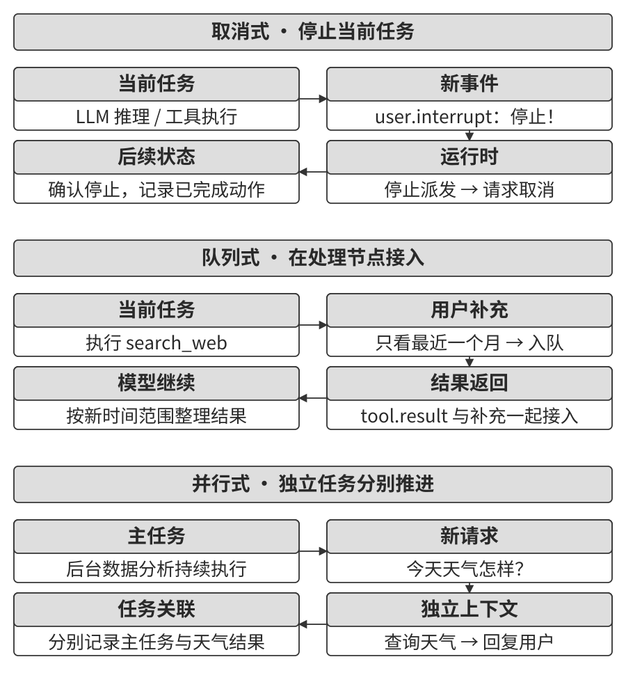

**取消式处理（Cancellation-Based）**适合用户停止指令或需要立即处理的控制事件。运行时先停止继续派发相关操作，向正在生成的请求和可取消的工具发送停止信号，再保存已完成消息、工具状态与取消回执。新事件随后进入决策上下文。例如，用户说“停！我说错了”，系统先限制后续执行，再结合当前实际状态重新确认任务。尚未处理的队列项保留标识与状态，按关联范围重新排序。

**队列式处理（Queued）**适合常规补充信息和进展更新。事件进入队列，在下一安全点与工具结果一起交给模型。例如，搜索期间用户补充“只看最近一个月的结果”，搜索返回后，模型同时读取结果与新条件，再决定筛选或重查。批处理可以限制条数、总长度和等待时间；逐项确认处理状态，防止队列持续增长或事件被重复消费。

**并行处理（Parallel）**适合与主任务独立、需要及时回复的请求。例如，大批量数据分析期间，用户询问天气，系统可以建立独立会话完成查询。并行前检查工具和资源是否冲突；完成后将查询、回复与任务标识写入记录，主任务按需读取摘要。涉及同一订单、文件或共享状态的操作，则需要协调执行顺序。

**紧急度与路由。**

事件类型提供初步线索：`user.interrupt`、可信监督指令和系统告警可以进入高优先级通道；`user.input`、`agent.input`、`tool.result` 与 `timer.trigger` 再结合内容和任务状态判断。发送者在正文中自称“紧急”时，系统仍按验证过的身份与规则确定权限。

对于需要理解消息含义的路由判断，笔者建议使用轻量级分类模型：“马上停下来”对应取消，“今天天气怎么样”可能适合并行，“报告请用中文”通常进入当前任务的补充队列。明确的停止入口由运行时直接处理，语义分类用于其余需要理解的消息。分类结果保留理由、目标任务和处理策略，便于发现误判并调整规则。

### 从邮件事件建立基本循环

图6-3 用自动邮件助手展示最基本的事件流程：新邮件进入队列，Agent 读取内容，调用工具，生成处理结果，再更新邮件或通知用户。

> **实验 6-1 ★★★：事件驱动的邮件处理 Agent**
>
> 本实验以测试邮箱为入口，练习事件注册、队列和任务处理。先将新邮件整理为结构化事件，按到达顺序处理；再接入邮件历史、附件读取、知识查询和通知等工具。
>
> 同一队列可以扩展多种来源：邮件到达、IM 或短信消息、GitHub PR 与 Issue 更新、定时器、外部 Webhook，以及用户离线、进程超时和资源告警等内部事件。每个适配器负责验证来源并补充关联信息，处理结果按事件标识回写。
>
> 验收使用三封测试邮件：会议邀请触发日历冲突检查，并生成接受或拒绝草稿；客户投诉触发关键信息提取、高优先级标记和用户通知；营销邮件按规则归档。检查时分别核对事件顺序、草稿内容、日历结果、通知和邮箱中的归档状态。
>
> 当前配套记录完成了接口文档核对与认证探测，测试邮箱接入仍待有效凭据。配置完成后，按上述三个场景检查真实服务状态，并保留每次事件与操作的关联记录。
>
> 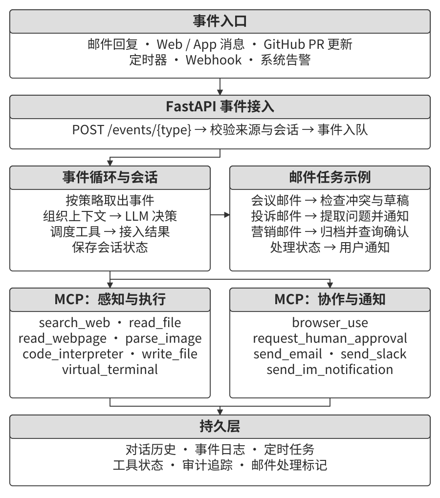

邮件队列建立了顺序处理的基础。接下来加入长时间运行的工具，讨论等待期间如何接收新要求、取消任务和恢复工作。

### 不支持原生异步时的兼容方案

假设 Agent 正在起草邮件，已经调用 `search_contacts` 查找联系人。结果尚未返回时，用户要求“等一下，先查明天的天气”。如果当前模型接口要求每个工具调用先配齐结果，Harness 就需要将后台状态转换成接口接受的消息序列。

**在同步消息格式中表达后台状态。**

**兼容同步接口时，应尽量保留正常调用与真实结果的配对，只在中途切换任务时补入状态响应。** 过早为每次调用填写“仍在运行”，会使轨迹充满未完成状态，增加模型追踪真实结果的负担。具体可以遵循五条规则：

1. **记录完整调用。** 将 API 已完成的 assistant 消息和工具调用项写入轨迹，保留调用标识。服务端推理状态按提供商规定的续接方式保存。
2. **记录真实完成。** 工具完成后写入实际结果、任务标识和执行状态；执行期间，任务管理器持续保存未完成状态。
3. **在切换时报告当前状态。** 对允许此类结果载荷的接口，可以为待完成调用返回明确的状态信息，例如“任务仍在后台运行，结果尚未产生”，随后追加用户事件。状态响应中的任务标识连接后续完成通知。
4. **整理中断后的消息。** 缺少中途续接能力时，取消未完成的生成，保留已确认完成的消息和工具状态，再提交新请求。未完成输出按接口规定处理，避免把半截参数当作可执行调用。
5. **批量接收常规事件。** 补充信息进入队列，在当前周期结束或指定安全点统一提交，并记录哪些事件已经处理。

在联系人查询例子中，完整调用先写入轨迹；用户切换任务时，Harness 补入查询仍在运行的状态响应，再提交天气请求。联系人结果稍后到达，以带来源和任务标识的新事件进入上下文，Agent 随后继续起草邮件。原调用已经获得状态响应时，后续结果采用适配器约定的事件形式，保持调用与结果的配对关系。

状态响应只说明当前执行进度。依赖联系人数据的步骤必须等真实结果到达后继续。任务管理器可以保存 `running`、`completed`、`cancelled`、`failed` 等状态，并在发送回复或执行后续工具前检查依赖是否满足。

**用任务句柄设计异步工具。**

对于新设计的长任务工具，笔者优先把“启动”定义为一次完整操作，立即返回真实的任务句柄。模型据此区分“已经启动”和“已经完成”，后续查询、取消和结果事件也有统一的关联依据。例如，`initiate_phone_call` 发起电话任务，返回任务标识与“正在拨号”的状态；`phone_call_connected`、`phone_call_ended` 分别报告接通和结束。

工具说明应写清楚：“本工具启动电话任务，成功后返回任务 ID。你可以继续处理其他事项；通话进展和结束结果通过单独事件返回。”工具名说明这是启动操作，返回结构与后续事件则说明任务如何推进和结束。系统再提供按任务 ID 查询、取消和恢复的接口，使模型能够知道当前还能做什么。

**逐项处理批量事件。**

多个事件一次进入上下文时，模型可能只回应最后一条，遗漏前面已经提出的要求。运行时应保留各自的处理状态，让尚未回应的条件继续可见。提示词可以要求模型逐项检查，状态栏则列出尚未处理的信息：

```text
[未处理事件 1/4] database_query 结果：……
[未处理事件 2/4] 用户补充：只看北京地区的数据
[未处理事件 3/4] 系统提醒：报告截止时间还有 30 分钟
[未处理事件 4/4] 用户询问：进度如何？
```

批次摘要可以提示“1 个工具结果、2 条用户消息、1 个系统提醒”。运行时进一步将事件与任务约束关联：地区条件更新查询范围，截止时间影响调度，进度询问需要回复。处理后记录完成、等待或需澄清的状态，下一轮继续保留未解决项。

图6-4 展示了实验中的后台任务、事件队列和取消流程。

> **实验 6-2 ★★★：带并行执行和打断能力的异步 Agent**
>
> 本实验先验证异步运行时，再接入模型检查决策。配套运行记录用真实操作系统子进程完成四个场景，事件调度和报告由确定性脚本驱动。
>
> 1. **后台执行与即时响应。** 启动持续数秒的分析进程，立即返回任务标识；等待期间回答当前时间，完成后接收分析结果。检查回答时间是否早于后台任务完成时间。
> 2. **队列与批处理。** 长任务期间依次补充“用日语回复”和“整理成网页”，任务完成后将结果与两条要求作为一个批次处理。脚本生成日语 HTML，读者可以检查要求是否齐全、是否重复入队。
> 3. **取消与恢复。** 任务运行时发送停止事件，执行器终止对应子进程，保存退出状态，再启动后续任务，检查运行时能否继续工作。
> 4. **并行任务与进度决策。** 同时启动三个分析进程，每个逻辑时间步分别推进 3%、2%、1%。最快任务完成时，另外两个约为 66% 和 33%；查询后保留超过 50% 的任务，取消其余任务，最后汇总完成结果与取消状态。运行器可缩短逻辑时间步，便于重复检查。
>
> 接入模型后，继续使用这四个场景，检查模型能否主动选择查询与取消工具、同时遵守语言和格式要求，并在新事件到达后恢复原任务。比较时分别记录模型决定、工具调用和进程状态，定位问题发生在哪一层。
>
> 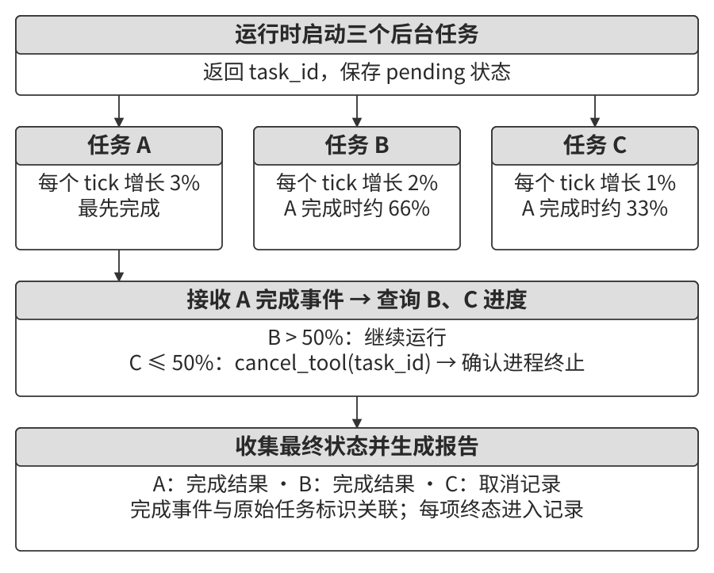

### 模型原生异步：GPT-6 Astra

前面的方案由 Harness 适配同步消息格式。原生异步接口则直接允许模型在工具尚未返回时继续处理独立工作，并在后续接收结果。截至 2026 年 9 月，GPT-6 Astra 已提供异步工具调用（Async tool calling）与回合中途引导（Mid-turn steering），分别处理工具等待和用户更新。图6-5 对照了同步接口适配与原生异步的消息流程。[^ch6-22][^ch6-23]

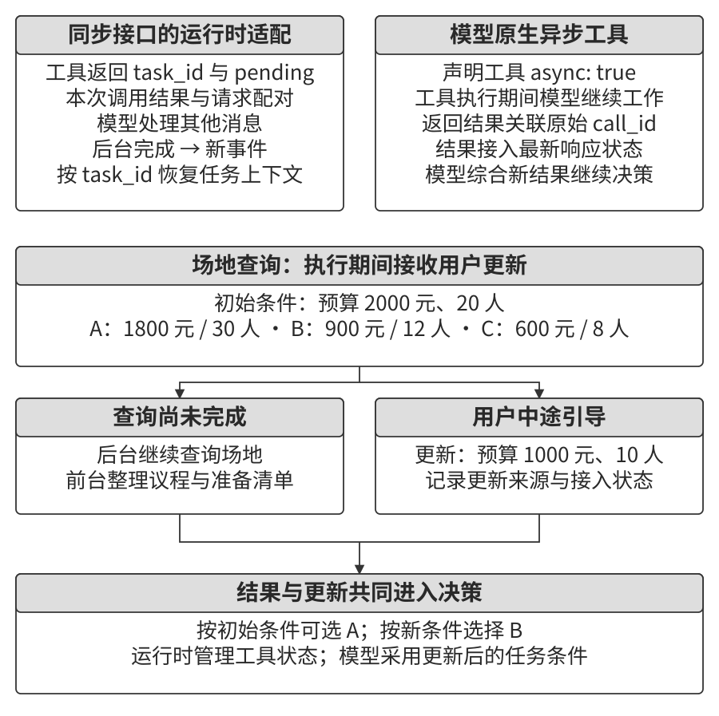

**等待工具时继续独立工作。** 例如，Agent 发起会议场地查询后，可以先整理议程与准备清单；查询返回后，再比较价格和容量。工具定义中的 `async: true` 声明异步能力，应用收到完整调用项后启动执行，并保存调用标识 `call_id`。结果到达时，应用按原标识归还结果，接续最新的响应状态。模型安排后续工作，Harness 管理调用关联与任务生命周期。[^ch6-22]

**在任务进行中接收新要求。** 用户可以在模型思考或组织回答时补充“预算降为 1000”“参会人数改为 10”。应用通过同一连接发送引导事件，服务端确认接收后，按当前响应状态继续处理。应用记录更新是否被接收、响应如何接续，并检查最终方案是否采用了新条件；遇到断线，则结合已保存事件与响应状态恢复。[^ch6-23]

这两项能力可以组合使用：场地查询继续运行，用户的新要求进入后续决策，查询结果返回后再完成选择。执行器同时维护后台任务的真实状态。需要停止查询或取消预订时，Harness 调用相应接口并检查回执；已经完成的业务操作进入撤销或补偿流程。

模型与接口已经支持原生异步时，笔者优先使用原生协议，让工具挂起、用户更新和响应接续按接口约定流转。同步兼容层主要服务于现有模型和旧接口；模型升级后，可以逐步移除仅用于补齐消息配对的兼容逻辑，把工程投入集中到任务状态、取消与恢复。

### 可靠处理异步任务

可靠的异步交互需要同时检查消息、任务与执行状态。

1. **结果归属。** 延迟结果携带原调用标识，应用将它映射到对应任务；依赖该结果的决策在数据到达后继续。
2. **恢复与取消。** 用户改变要求后，系统保留仍然有效的工作，更新后续步骤，并明确哪些后台任务继续运行、哪些已经停止。
3. **多条要求。** 预算、人数、地区和截止时间分别进入任务状态，最终结果逐项检查这些条件。

模型评估关注它能否理解更新、识别依赖并选择正确工具；运行时评估关注结果是否正确归属、取消是否生效、恢复是否重复执行。清晰的状态记录可以帮助定位问题，异步任务数据与训练则可以进一步改进模型对这些交互的处理。

> **实验 6-3 ★★★：模型原生异步与回合中途引导**
>
> 本实验让 Agent 为模拟会议选择满足预算与人数要求的最便宜场地。初始预算为 2000，人数为 20；查询工具等待 8 秒后返回三个候选。
>
> | 场地 | 价格 | 容量 |
> |---|---:|---:|
> | A | 1800 | 30 |
> | B | 900 | 12 |
> | C | 600 | 8 |
>
> 初始条件下应选 A。引导组在任务进行中收到两条更新：预算改为 1000，人数改为 10，此时应选 B。工具同时返回一个新生成的回执，最终答案需要引用它，以便检查模型是否使用了实际到达的结果。
>
> 实验包含五组，每组三次：同步工具、原生异步工具、推理期间引导、异步工具等待期间引导，以及不支持引导能力的模型对照。前两组比较等待期间能否输出独立准备清单；两种引导组检查预算与人数是否同时生效；能力对照检查接口是否明确报告不支持。
>
> 保存的运行记录中，异步工具组在等待期间完成了独立清单，两种引导组均按新条件选择 B。带工具的运行均只执行一次查询，并将实际结果归还给原调用；对照模型返回了明确的能力拒绝。同步与异步组的总耗时接近，主要差别体现在等待期间能否推进其他工作。
>
> 复现时先手算两组条件下的选择，再沿时间线检查查询启动、用户更新、工具返回与最终答案。这样可以同时理解模型如何利用新消息，以及 Harness 如何维持任务关联。

异步机制使外部变化能够在任务推进中进入系统。语音、屏幕和机器人交互进一步缩短了反馈周期：系统需要连续接收输入，并在合适的时机调整输出和行动。

## 语音：最自然的人机接口

语音让用户在双手或视线忙于其他工作时，仍能向 Agent 说明需求、补充条件和确认结果。语音输入法将口述转换为文字，语音 Agent 则进一步管理对话、工具调用与回复播放，两者都可以支持前言介绍的 whisper coding。

本节讨论两种用途：用户直接与 Agent 对话，以及 Agent 代表用户与外部人员沟通。前者关注识别、响应和插话，后者还需要在通话过程中完成身份确认、业务查询与决策。理解这些系统，可以先看它们如何安排听与说，再看如何协调深度思考与实时表达。

### 交互时序：从级联到全双工

OpenAI 在 GPT-Live 的介绍中回顾了级联、轮次式音频模型和全双工三类语音交互[^ch6-12]。这条演进路线逐步将“何时开口、何时继续听”交给模型持续判断。级联系统主要由端点逻辑安排交接，全双工模型则可以结合连续声音和对话状态处理重叠、停顿与插话。

| 范式 | 核心结构 | 便于实现的能力 | 主要设计问题 |
|---|---|---|---|
| 级联 | VAD、ASR、LLM、TTS 分工 | 独立替换模块，逐段检查输入输出 | 模块间延迟，转录中遗漏的声学信息 |
| 轮次式端到端音频模型 | 模型直接接收与生成音频 | 利用语调、情绪等信息组织回复 | 发言结束判断、轮次切换与响应时机 |
| 全双工 | 持续接收音频并生成输出 | 重叠说话、附和、插话与连续交互 | 连续状态、输出控制和交互评估 |

模型是否直接处理音频、输入输出是否流式、能否同时听说，是可以分别检查的能力。级联系统也可以加入流式模块与打断控制；端到端模型的交互节奏则取决于具体设计。比较时需要沿完整时间线检查输入、推理、合成与播放。

[^ch6-12]: OpenAI，[Introducing GPT-Live](https://openai.com/index/introducing-gpt-live/)，2026-07-08，介绍级联、轮次式音频模型与全双工交互。

### 范式一 · 级联流水线（Cascading）

级联系统把语音对话拆成几个模块。语音活动检测（VAD）识别音频中的语音区间，端点逻辑判断何时提交这一段；自动语音识别（ASR）将音频转成文字；LLM 理解请求并生成回复；语音合成（TTS）再把回复变成可播放的音频。图6-6 展示了按顺序执行的基本结构。

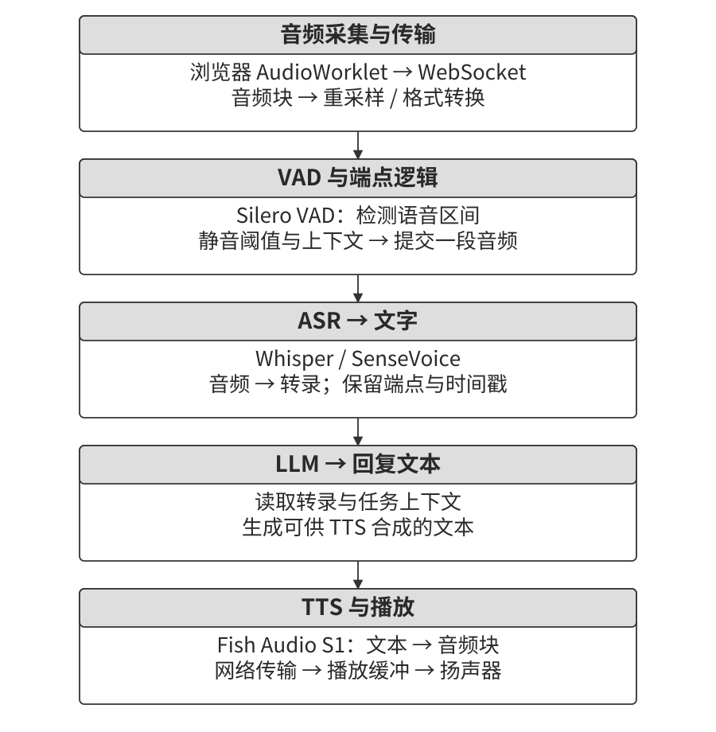

| 模块 | 作用 | 常见等待或错误来源 |
|---|---|---|
| VAD 与端点逻辑 | 检测语音，决定提交时机 | 静音阈值、噪声与中途停顿 |
| ASR | 将音频转换为文字 | 解码耗时、人名与专有名词识别 |
| LLM | 理解、推理与生成回复 | 请求排队、首段回复生成 |
| TTS 与播放 | 合成音频并送达扬声器 | 首包合成、网络传输与播放缓冲 |

在完全串行的实现中，用户说完后还要依次等待端点确认、转录、回复生成和首段音频。图6-7 用一组示例配置展示这些阶段如何累积：端点确认 500 毫秒、转录 100 毫秒、首段等待与文本生成各 200 毫秒、首包合成 300 毫秒，再加上 100 毫秒的传输与播放缓冲，共 1.4 秒。测量时可以从用户最后一个语音采样点开始，到开始播放第一段回复时停止计时，再分别记录各阶段的起止时间。

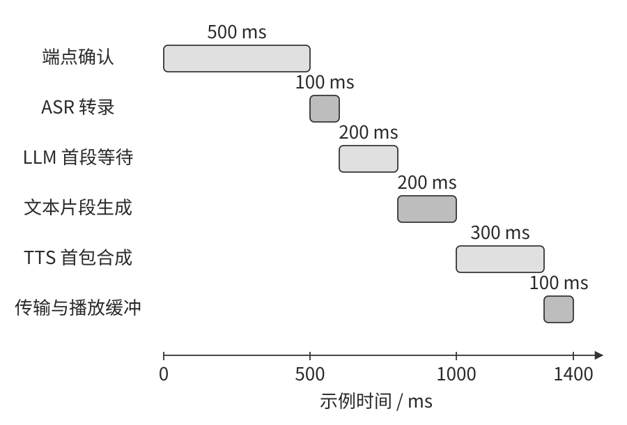

服务负载还会带来排队等待。图6-8 采用 M/M/1 单服务台模型说明这种关系：到达服从泊松过程、服务时间服从指数分布，平均服务时间为 $S$，利用率为 $\rho<1$ 时，包含服务与排队的平均总时间为 $W=S/(1-\rho)$。取 $S=1$ 秒，利用率从 0.5 增至 0.8，平均总时间就从 2 秒增至 5 秒。当请求接近处理容量，短时流量波动会形成积压。实际部署需要结合并发量、批处理和延迟分布安排容量，观察用户等待时间随负载如何变化。

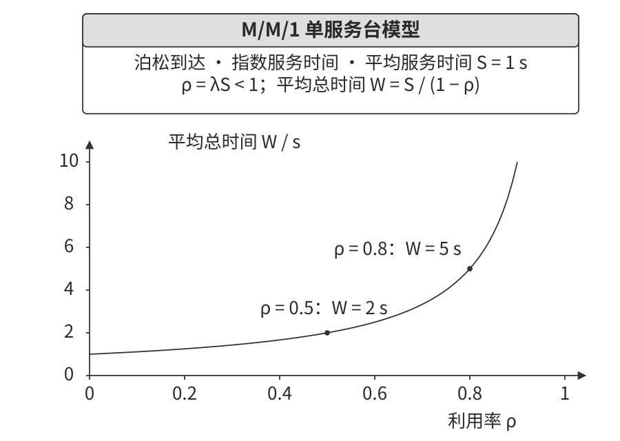

> **实验 6-4 ★：构建传统语音 Agent**
>
> 本实验通过 WebSocket 传递浏览器采集的音频，依次接入 Silero VAD、本地 Whisper、流式 LLM 和 Fish S1 TTS。先打通一次语音输入、文字识别、回复生成与音频返回，再逐段测量等待时间。
>
> 保存的运行记录采用约 500 毫秒静音端点、本地 Whisper tiny、Doubao 与 Fish S1。复现时同时保存输入音频、转录和最终回复，检查识别错误如何传到后续阶段，再加入长停顿或背景声，观察端点和识别结果的变化。
>
> 测量时区分模型加载、推理、网络与播放等待。LLM 开始返回文本后，还要检查 TTS 在何时收到可合成片段，以及浏览器何时真正播放声音，逐步建立后续流式方案的比较基线。

#### 从串行到流式感知

串行方案便于逐段检查，也暴露出三个问题。等待静音会增加端点延迟；转录文本可能遗漏语气、情绪和环境声；按停顿切分音频时，邮箱、人名或专有名词可能失去完整上下文。对于已经采用级联架构的系统，笔者建议先做流式改造：让各阶段尽早提供增量结果，把识别、推理与播放重叠起来，同时维护已经确认和仍可能修改的部分。这样能够复用现有模块，并逐步定位等待时间来自哪里。

- **ASR 边听边转。** 持续接收音频，输出临时转录；后续音频到达后修订不稳定部分，在端点确认时给出最终文本。
- **LLM 推测执行。** 使用临时转录提前准备回复。最终文本确认后，检查输入是否一致以及已有工作是否仍适用，再决定保留、调整或重新生成。对外发送和业务写入等操作等待所需条件确认后执行。
- **LLM 分段输出。** 一段适合播报的文本完成后即交给 TTS，分段时保留句意、标点和语调线索。
- **TTS 增量合成。** 音频块逐步返回，使后续文本生成、合成和播放能够重叠。发生插话时，同时处理生成任务和播放缓冲中尚未播出的内容。

Whisper 的常规转录实现按音频窗口编码和解码[^ch6-whisper]。在外部切块或反复提交累积前缀，可以构建增量转录流程；持续状态复用、重复编码成本和历史文本修订，需要由具体实现管理。原生流式识别模型则在架构与训练中直接处理连续输入。

基于音频语言模型的感知系统还可以联合输出文本与声学事件。历史音频、转录和词汇提示帮助识别人名、品牌及专有名词，保留多少历史则取决于上下文与缓存设计。针对“用户是否说完”，模型可以结合语义完整性与静音作判断。评估每个决策时刻时，只提供当时已经到达的音频；训练和标注也要与这个可见范围对应。若用后来才出现的词语判断前面的停顿，模型就会依赖在线决策时尚未到达的信息，离线测出的端点质量也难以复现。

除转录外，接口还可以约定以下事件：`speak_start`、`speak_end` 表示说话起止，`interrupt` 表示打断，`emotion` 描述情感状态，`laugh`、`sigh`、`noise` 记录笑声、叹息和环境声。这些是待训练或识别的输出类别，需要用标注样本分别检查漏检与误报，再与文字和时间戳一起进入 Agent 的事件流。

> **实验 6-5 ★：使用 Qwen2-Audio 模拟流式语音感知**
>
> 本实验逐步扩大音频前缀，每次将从开头到当前时刻的音频重新送入 Qwen2-Audio，观察转录与声学事件随输入变化的过程。对照路径采用 600 毫秒静音端点与 Whisper。测试包含正常语音、插入 900 毫秒停顿的长句，以及混入粉红噪声的语音。
>
> 本次本地量化模型运行保留了 13 次前缀推理，单次约需 8—11 秒。中途停顿触发了对照路径的分段；音频模型检出了噪声，也误报了咳嗽和笑声。检查时同时查看转录、事件与时间线，理解提前提供音频前缀对识别结果与重复编码成本的影响。
>
> 可以继续改变前缀步长与停顿长度，记录字符错误率、端点位置、事件漏检与误报，以及每次推理耗时。比较原生流式实现时，再检查持续状态复用如何改变同一条时间线。

[^ch6-whisper]: OpenAI，[Whisper](https://github.com/openai/whisper)，介绍音频窗口转录与模型实现。

### 范式二 · 端到端全模态模型（Omni）

端到端音频模型直接接收声音，结合语言与声学信息生成回复，并通过音频输出分支合成语音。图6-9 对照了这条路径与先转录再回答的级联路径：前者可以利用语速、音高、停顿和环境声，后者便于检查中间文本并独立替换模块。

这些声学特征会影响理解。例如，同一句“请在午饭前发来报告”，急促和缓慢的说法会给听者不同的感受。输出时，模型也可以通过停顿、重音和语调组织意思；唱歌或特定风格的表达，则取决于模型的训练与输出能力。

端到端描述的是音频处理路径。采用轮次式交互的系统仍需判断用户何时结束发言，例如报电话号码时的一次停顿是否表示说完。需要分别检查端点判断是否准确、响应是否及时，以及哪些声音信息进入了决策。

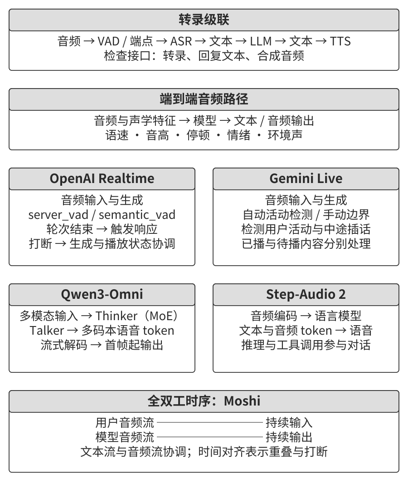

具体模型展示了不同的内部组织方式。Qwen3-Omni 用 Thinker–Talker MoE 组织多模态理解与语音生成，Talker 预测多码本语音表示，通过流式解码逐步输出。Step-Audio 2 将音频编码、语言模型、文本与音频生成连接起来，并支持在对话中进行推理与工具调用。服务接口还需要安排发言边界：OpenAI Realtime 提供基于声音活动和语义结束判断的选项，Gemini Live 支持自动活动检测及手动指定边界。选择音频模型后，还要将这些机制接入播放与打断流程。[^ch6-audio-architectures]

> **实验 6-6 ★★：本地运行 MiniCPM-o 4.5，对比端到端与自级联**
>
> 本实验固定同一个 MiniCPM-o 4.5 模型，关闭思考模式，比较两条路径：直接从音频回答问题，以及先由模型转录、再只根据转录回答。输入包含两道口述算术题和两条文字相同、语速不同的语音。
>
> 两条路径各答对三题，错误出现在不同位置。直接音频路径把一道题中的 twelve boxes 听成 8，导致计算错误；转录路径正确保留了 12。语速题中，两条音频都说“Please send the report before lunch.”，转录后的文字完全相同，快慢信息随之丢失；直接音频路径则正确区分了两种语速。
>
> 实验另生成了一段 24 kHz 语音，连接输入理解与音频输出。检查时分别核对感知、推理和表达：数字是否听对，运算是否正确，最终音频是否准确传达答案。这个对照帮助读者理解哪些信息经过转录后仍然保留，哪些需要音频直接参与判断。

### 范式三 · 全双工交互模型

全双工系统在生成语音的同时继续接收用户音频，持续决定说话、倾听、停顿或调用工具。同声传译要求输入与输出重叠，日常对话中的插话、附和和自我修正也需要系统在播放期间理解新声音。

Kyutai 在 2024 年发布的 **Moshi** 分别建模用户和模型的音频流，通过并行流表示重叠说话与打断[^ch6-moshi]。把这些时间关系保留在输入中，模型就能学习何时回应、何时继续倾听。

Thinking Machines Lab 的**交互模型（Interaction Model）**采用多流、微轮次设计，将连续输入输出组织成时间对齐的短块。其研究预览以 200 毫秒为单位推进，保留静音、重叠和打断的时序。复杂任务可以委派给后台推理模型，前台继续接收补充信息、回答追问，待结果返回后将其接入对话。[^ch6-14]

GPT-Live 也采用持续听说与后台委派的组合：前台处理等待、附和、插话和实时翻译等交互，后台承担搜索、推理和较长任务[^ch6-12]。Harness 负责传递任务与结果、管理执行权限，并协调生成和播放状态。模型的连续交互能力与这些运行机制共同构成完整语音系统。

[^ch6-moshi]: Kyutai，[Moshi: a speech-text foundation model for real-time dialogue](https://kyutai.org/assets/pdfs/Moshi.pdf)，2024，介绍用户与模型的并行音频流。
[^ch6-14]: Thinking Machines Lab，[Interaction Models: A Scalable Approach to Human-AI Collaboration](https://thinkingmachines.ai/blog/interaction-models/)，介绍微轮次、多流交互与后台任务委派。

### 认知时序：实时交互与深度思考

实时对话需要及时回应，复杂任务则需要足够的推理与执行时间。系统可以把两者分配给不同模块，也可以在更紧密的语音架构中协调。图6-10 展示三种安排：先回应再深入回答、前台持续交互并接收后台建议，以及构思与表达按片段并行推进。

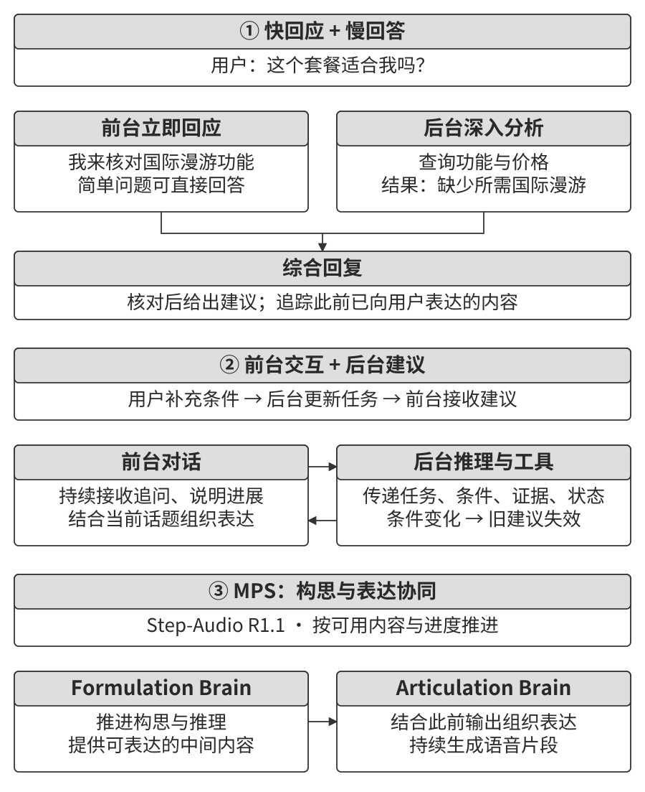

#### 方案一：快思考回应，慢思考回答

快模型先给出简短回应，慢模型在后台完成分析，再补充详细答案。这种设计可以尽早确认收到请求，但需要管理两次回答的一致性。例如，快模型先建议购买某个套餐，慢模型随后发现套餐缺少关键功能，前后建议就会冲突。冲突的根源在于两侧独立作答，判断依据和推理进度可能不同。快模型说出口的建议已经进入用户的判断，用户甚至可能据此行动；慢模型随后纠正，还需要解释变化并处理已经产生的影响。

因此，前台应区分任务确认与业务结论。“我来核对套餐是否包含这项功能”可以立即表达，购买建议则等待必要的查询与分析。后台结果返回时，系统将它与已说出的内容对照，再组织后续回复。简单问题还可以直接由快模型完成，减少重复处理。

#### 方案二：快思考交互，慢思考提醒

前台负责持续对话，后台通过状态栏或专门接口提供进展、证据与建议。用户等待期间可以继续补充需求，前台将变化交给后台；后台返回结果后，前台结合当前话题选择合适的表达时机。

这套分工把业务判断集中到后台，减少了两个模型各答一遍的冲突。但两侧仍通过消息交接，前台可能误解建议；后台尚未返回时，前台也无法使用仍在形成的推理。因此，前台和后台需要约定清楚交换哪些信息。建议应关联任务、所依据的条件和工具结果，前台据此区分已经确认的事实与仍在处理的问题。条件变化时，旧建议应标记失效；后台较慢时，前台可以说明进展或收集信息。两侧共享必要状态，可以减少重复查询和相互矛盾的承诺。

#### 方案三：构思与表达协同推进

Step-Audio 系列提供了两个相关例子。**模态锚定推理蒸馏（MGRD）**关注推理所依据的信息：围绕音高、节奏、语调等声学特征构造和筛选推理数据，通过迭代蒸馏改进音频理解。**Mind-Paced Speaking（MPS）**关注推理与表达的时序，采用构思模块（Formulation Brain）和表达模块（Articulation Brain），让构思过程指导语音生成。Step-Audio R1.1 的实时方案采用了这一方法。[^ch6-mgrd][^ch6-mps]

两个模块按进度交换信息：构思持续推进，表达根据已经可用的内容与此前输出组织语音。这样可以让部分表达与后续推理重叠，同时保持对已说内容的追踪。安排分段时，需要检查当前结论是否足以支撑接下来的话，后续推理发生修正时又该如何向用户说明。

MGRD 与 MPS 分别对应“依据什么推理”和“何时表达”。前者需要检查推理是否利用了声音信息，后者需要同时测量首段响应、完整答案质量和前后表述的一致性。

[^ch6-mgrd]: StepFun，[Step-Audio-R1 Technical Report](https://arxiv.org/abs/2511.15848)，介绍模态锚定推理蒸馏。
[^ch6-mps]: StepFun，[Mind-Paced Speaking: A Dual-Brain Approach to Real-Time Reasoning in Spoken Language Models](https://arxiv.org/abs/2510.09592)与 [Step-Audio-R1.1 模型卡](https://huggingface.co/stepfun-ai/Step-Audio-R1.1)，介绍构思、表达两个模块及其在实时系统中的应用。

#### 模块分工与升级方式

**笔者看重快慢分工的一项工程优势：交互能力与推理能力可以分别演进。** 更强的推理模型发布后，系统可以替换后台，再针对工具协议、状态传递和对话一致性做回归评估。这样，后台能够跟上推理模型的进步，前台也能持续改善倾听、回应与插话体验。前台需要理解任务和用户的补充信息，后台则专注于较长的推理、规划与执行。

更紧密的构思—表达协同，可以让中间进度更直接地影响说话节奏。相应地，升级时需要检查模块接口、训练方式和推理调度是否兼容。

**在推理模型快速迭代、团队又需要持续升级业务能力时，笔者优先选择可替换的快慢分工。** 这种分工省去了每次升级推理模型都重新训练整套语音系统的负担。需要让中间推理更直接地控制表达、且有相应训练资源时，再采用更紧密的协同方案。

Pine AI 的语音 Agent 采用前台快思考与后台慢思考配合的架构。其公开文章报告了在 τ²-bench 语音赛道取得榜首的结果，并介绍了持续通话、业务推理与工具操作的组合方式[^ch6-17]。这个结果支持了快慢分工在复杂语音任务中的实用价值：保持实时交互的同时，也可以获得较强的业务推理与工具执行能力。评估这种分工时，可以分别查看通话体验、工具执行和最终业务状态。

理解这些组合时，可以区分三个设计维度：**音频通路**决定模型直接处理声音还是通过转录交接；**听说时序**决定输入输出按轮次还是并行推进；**认知分工**决定实时交互与深度推理如何共享状态、交换结果。系统可以直接处理音频并保持全双工，同时把复杂任务交给独立的后台模型。Thinking Machines Lab 的交互模型和 GPT-Live 都展示了这类组合。

[^ch6-17]: Pine AI，[The Most Natural Human-Computer Interface Is Your Voice](https://www.19pine.ai/blog/pine-ai-the-most-natural-human-computer-interface-is-your-voice)，介绍快慢思考架构及其报告的语音任务评测结果。榜单名称按所引页面使用 τ²-bench voice。

### 更像人的语音合成

停顿、语速和重音帮助听者理解句子结构与说话意图。例如，报电话号码时需要适当分组，解释复杂条款时可以放慢速度，等待查询结果时可以先说明正在处理什么。在笔者看来，适当的停顿与节奏变化能让语音更自然，也能让用户听出任务正在怎样推进。语音控制可以围绕这些具体用途设计。

主 LLM 可以在文本中加入控制标记，如 `[THINKING]`、`[EMO:happy]` 和 `[SPEED:0.8x]`。执行层解析标记，将文本分成语音与停顿片段，再映射到合成接口支持的情绪、风格或参考音。标记的含义由应用定义：`0.8x` 可以映射为慢速档，实际速度仍需测量；停顿可以由播放器插入，笑声、叹息则通过支持的声音标记或生成能力表达。

参考音方案将同一说话人的不同表达方式组织成库。每段文本选择匹配的情绪、语速与风格，合成后再按顺序拼接。控制状态需要规定作用范围，例如情绪持续到下一次修改，停顿只在当前位置生效。检查时既听单段效果，也听段落衔接，关注音色、音量和语调是否连贯。

> **实验 6-7 ★★：基于 Fish Audio 的控制标记驱动 TTS**
>
> 本实验用 Fish Audio S1 建立 24 条参考音组成的语音库：四种情绪、三档语速与两种风格组合。解析器把带标记的回复转换成语音片段和静音片段，执行层为每段选择参考音并完成合成。
>
> 比较三种配置：无控制标记、单一参考音和多参考音。保持回复内容一致，检查标记是否路由到预期配置，再听取停顿、情绪和音色变化。多参考音中的片段拼接还要检查边界是否自然。
>
> 保存的听测采用音频理解模型，对三种配置轮换呈现顺序，评价自然度、情绪匹配、思考停顿、音色一致性和客服感。多参考组的综合评分最高，单参考组低于无标记组。读者可以结合逐项评语复听差异，再组织用户盲听，比较模型评分与实际听感。

## Computer Use：GUI 自动化 Agent

Computer Use 将 Agent 的观测与行动扩展到图形界面。它可以查看屏幕，用鼠标和键盘操作浏览器、表格或系统设置，并根据界面反馈推进任务。页面加载、弹窗和用户操作都会改变状态。Agent 需要根据新观测更新界面状态，并在执行前确认目标和操作条件仍然有效。

图6-11 展示了基本的**感知—思考—行动**循环：

1. 获取当前截图及任务状态。
2. 多模态模型结合目标与历史，选择下一步动作。
3. Harness 检查动作参数与权限，执行层完成点击、输入或其他操作。
4. 等待适当的界面反馈，重新获取状态，检查动作结果并继续。

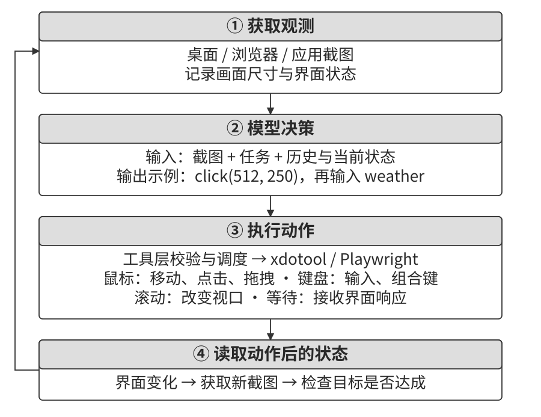

截图问答可以检查模型是否认出按钮或读懂内容；完整任务还要检查动作选择、执行顺序和状态恢复。例如，点击提交后可能出现成功提示，也可能出现字段错误。Agent 需要读取新状态，再判断是否完成或继续修改。

下面先介绍动作接口与视觉定位，再讨论怎样捕捉持续变化的画面和声音，以及怎样利用状态预测安排后续步骤。最后把这些方法延伸到移动端。

### 动作空间设计

Anthropic 的 Computer Use 参考实现组合了图形界面、命令执行和文件编辑工具。图6-12 展示这三类能力。原生 API 规定了相应的工具格式；采用其他模型时，可以由适配层将截图、动作请求和执行结果转换成目标接口支持的消息。[^ch6-computer-tools]

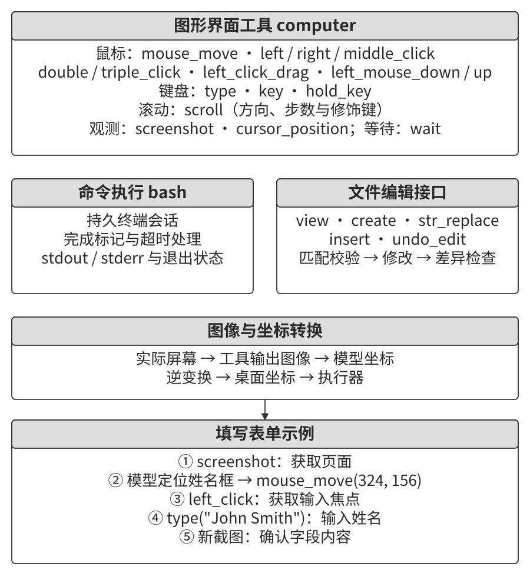

**GUI 操作工具。** 鼠标动作包括移动、左键／右键／中键点击、双击、三击和拖拽；更细的接口可以分别表达按下与松开。滚动需要方向和幅度，部分实现还支持修饰键。键盘接口提供文本输入、组合键和按住按键。截图与光标位置用于获取状态，等待接口则给页面加载或动画留出时间。工具版本决定具体动作集合，Harness 根据所用接口校验参数。

**命令执行工具。** 持久终端可以跨调用保留工作目录和环境状态。例如，一次调用切换目录后，下一次调用继续在该目录运行。参考实现可以用哨兵字符串识别命令完成，并设置超时；超时后的进程状态仍需执行器检查。输入间隔、命令超时等配置保留在配套实现中，便于按环境调整。

**文件编辑工具。** 字符串替换接口通过原文定位修改范围，也可以提供查看、创建、插入和撤销。执行前检查匹配位置与次数，执行后检查差异；文件在两次调用间变化时，先重新读取相关内容。第五章介绍的编辑策略可以在这里复用。

> **实验 6-8 ★：运行 Anthropic Computer Use 参考实现**
>
> 本实验使用官方容器示例提供的 Ubuntu 桌面、浏览器与工具执行层。用户输入任务后，模型读取截图并返回动作，执行层操作桌面，再把新截图交回模型。
>
> 配套任务查询旧金山天气。保存的轨迹先访问 Google，遇到验证码后，根据运行中的恢复指令转向可公开读取的 Open-Meteo 数据，最终报告温度与天气状况。记录包含 15 次桌面动作和对应截图，可以逐轮检查点击、按键、文字输入与等待如何改变页面。
>
> 复现时同时检查动作和答案：目标页面是否打开，数据中的地点、时间与单位是否符合请求，最终回复是否与可见结果一致。开放模型驱动浏览器的路径见实验 6-9。

### 视觉定位（Grounding）

模型决定“点击搜索框”后，还需要确定具体目标。定位可以先生成候选，再让模型选择编号；也可以由模型直接预测坐标。候选来自图像区域或界面结构，因此形成三条常见路线。编号把定位变成选择题：模型只需认出目标属于哪个候选，执行层负责落到具体位置。直接输出坐标则要求模型同时判断目标与几何位置，对定位训练和分辨率适配的要求更高。

**Set-of-Mark：视觉标注。**

Set-of-Mark（SoM）在图像上叠加可引用的编号，将视觉区域与模型输出连接起来。原始工作采用分割等方法生成候选区域，例如使用 SAM、SEEM 获取区域，再放置标记。模型选择编号后，执行层根据对应区域确定操作位置。这个方法可以用于缺少 DOM 的桌面软件或游戏界面，效果取决于候选是否覆盖目标，以及标记是否清楚。[^ch6-som]

**结构化元素索引。**

网页 DOM、布局信息和无障碍树提供了另一种候选来源。以 browser-use 一类方案为例，系统可以通过浏览器调试接口获取元素信息，识别输入框、按钮和链接，再为当前候选分配索引。图6-13 对照了视觉标注与结构化索引。

处理过程可以分成四步：读取 DOM、布局与可用的无障碍信息；筛选可交互元素；建立当前页面的编号映射；将元素描述与必要的标注截图交给模型。下面是简化的候选列表：

```text
截图中标有 [1]、[2]、[3]、[4]

[1] <input type="text" placeholder="Search" aria-label="Search" />
[2] <button id="submit-btn" aria-label="Submit form" />
[3] <input type="text" placeholder="Enter your name" value="" />
[4] <a href="/docs" aria-label="Documentation" />
```

模型选择编号后，执行层解析成元素引用或坐标，检查目标是否仍可见、可交互，再完成操作。页面刷新、滚动或动态插入元素后，需要更新映射，避免使用过期编号。结构化索引能够利用标签、角色和文本，Canvas、遮挡或不完整的语义标注则需要结合截图判断。候选列表的长度与截图大小也会影响上下文开销。

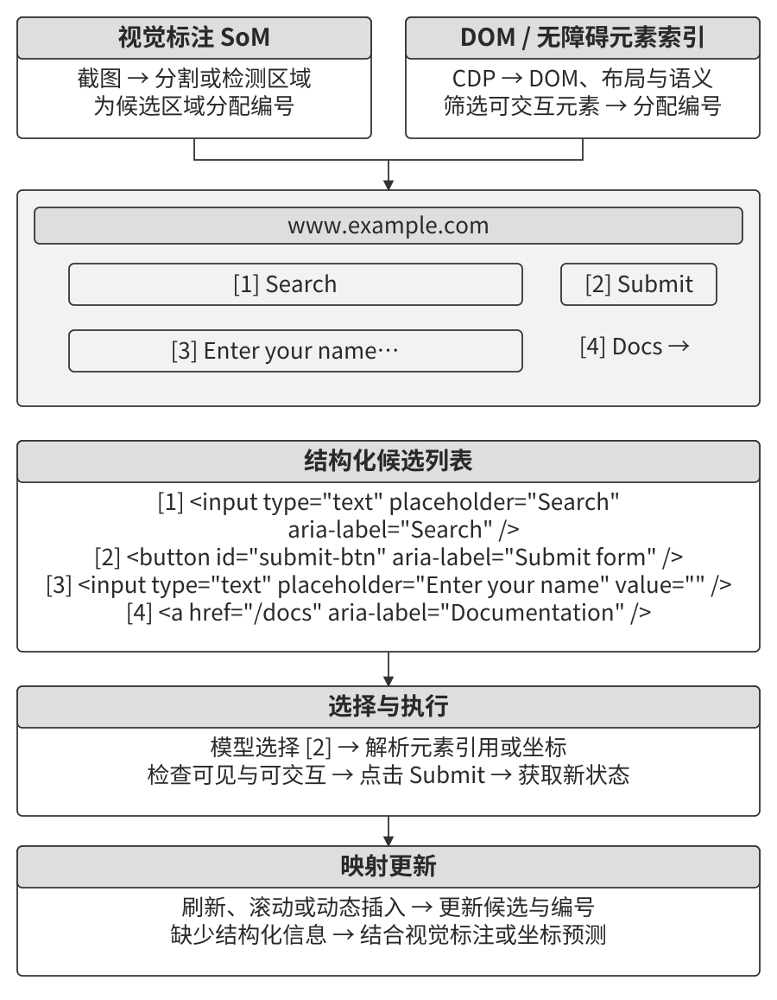

**直接预测坐标。**

坐标路线让模型从截图和目标描述直接输出位置，例如将“点击提交按钮”映射到某个点。SeeClick 等 GUI 定位研究以及 Claude 的 Computer Use 都采用了坐标输出。模型训练和评估需要覆盖小控件、密集布局及不同分辨率，执行层则负责将图像坐标转换到实际桌面坐标。

截图缩放后，两套坐标需要采用同一变换。以 2560×1440 的桌面为例，若发送给模型的图片为 1366×768，则模型给出的 (683, 384) 对应：

$$
x = 683 \times \frac{2560}{1366} = 1280,\qquad
y = 384 \times \frac{1440}{768} = 720
$$

图6-14 展示这个双向映射。两种尺寸的宽高比接近；采用严格等比缩放并留白时，还需要记录缩放系数和填充偏移。裁剪、显示缩放与多显示器原点同样会改变映射，工具层应保存实际变换参数。

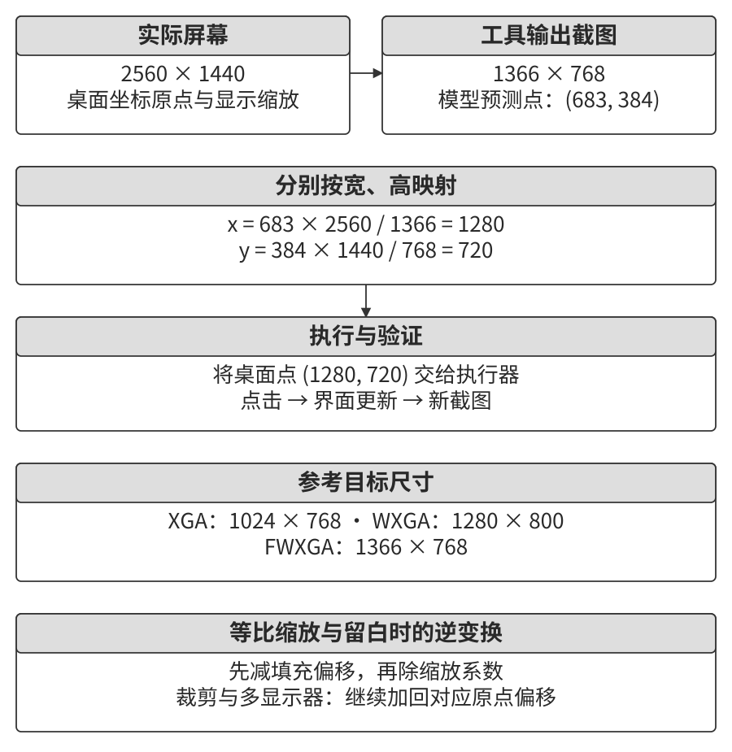

参考实现曾使用 XGA（1024×768）、WXGA（1280×800）和 FWXGA（1366×768）等目标尺寸。接入时按模型、工具版本和图像限制选择尺寸，尽量保持宽高比，再校验坐标转换。强行改变宽高比会使控件形状变形；使用错误的反向映射则会把正确预测落到错误位置。[^ch6-computer-tools]

**结构化信息完整时，笔者优先采用 DOM 或无障碍树索引。** 元素的名称、角色与引用可以直接参与定位，减少模型临时估计像素位置的工作。缺少结构时，通用视觉模型可以先配合 SoM，把任务化为候选选择；已经接受 GUI 定位训练的模型则可直接预测坐标，省去单独标注。实际系统按界面和模型能力组合这些路径，并在操作后用新观测验证效果。

> **实验 6-9 ★：使用 browser-use 实现自动浏览器操作**
>
> 本实验用 Qwen3-VL 32B Instruct 驱动 browser-use，通过浏览器状态、元素信息和截图生成动作。任务是查询旧金山天气：定位搜索框，输入“San Francisco weather today”，提交查询，再提取温度和天气状况。
>
> 保存的运行完成了 16 步交互，并保留 15 张截图。Google 出现验证码后，任务改用 weather.com 获取结果。读者可以对照每轮页面信息、模型选择和执行结果，检查它如何继续完成查询。
>
> 比较两条 Computer Use 路径时，固定任务与验收条件，分别记录模型、接口、页面变化和恢复步骤。答案中的地点、时间、单位及数据来源，是核对查询结果的共同依据。

[^ch6-computer-tools]: Anthropic，[Computer Use 工具文档](https://platform.claude.com/docs/en/agents-and-tools/tool-use/computer-use-tool)与[参考实现](https://github.com/anthropics/claude-quickstarts/tree/main/computer-use-demo)，介绍版本化动作接口、执行层与截图处理。
[^ch6-som]: Microsoft，[Set-of-Mark Prompting](https://arxiv.org/abs/2310.11441)，2023；browser-use 的[DOM 服务实现](https://github.com/browser-use/browser-use/blob/main/browser_use/dom/service.py)提供结构化元素处理示例。

### 能看动画、能听声音的 Computer Use Agent

逐步截图适合处理稳定界面，但视频、动画、短暂通知和会议语音会在两次动作之间持续变化。如果模型每隔数秒才收到一张截图，短暂出现的信息可能已经消失。**对于持续变化的界面，笔者主张把观测接口作为重点改进对象。** 把动作之间发生的变化及时送入上下文，模型才能据此作出下一次决策。

笔者与合作者提出的 **Agent–Computer Observation Interface（AOI，Agent—电脑观测接口）**，将连续屏幕与音频转换为模型可以接收的图像和文字[^ch6-9]。接口包含三个组件：

- **动作间关键帧采集。** 在主循环运行期间监测画面变化，通过像素差异或轻量视觉模型筛选候选帧，再把有用画面交给下一次决策。
- **音量门控转写。** 检测到声音后调用语音识别，将转录与时间信息加入观测记录，帮助 Agent 使用会议内容或口头指令。
- **持久画面描述。** 将关键画面概括为文字；原图移出上下文后，文字仍保存发生过的变化，供后续步骤引用。

例如，视频中展示了一次菜单操作，模型收到中间画面和对应描述后，可以在播放结束后继续参考该步骤。论文的消融结果显示，持久文字描述对收益尤其关键，关键帧的精细选择贡献较小；部分模型加入过多图像后反而退化。实践中应分别检查采样、转写和描述的效果，再选择组件组合。

采集频率取决于目标事件持续多久、处理成本和模型容量。文字描述也需要保留与任务相关的对象、位置和变化，避免把重要细节压掉。观测记录继续携带来源与时间，运行时据此判断哪些信息仍然有效。

[^ch6-9]: Bojie Li、Noah Shi，[Agent-Computer Observation Interfaces Enable Dynamic Computer Use](https://arxiv.org/abs/2606.29472)，2026，介绍 AOI 及其组件消融。

### Computer Use 的世界模型

及时获得观测之后，Agent 还需要选择动作并等待执行。OSWorld-Human 研究将 Agent 的操作效率与人类轨迹对照，分析了冗余步骤和模型调用等耗时来源[^ch6-osworld-human]。这也提出了进一步的工程要求：Computer Use 在能够完成任务的基础上，还要减少多余动作和等待，用户才愿意持续使用。因此，评估时应同时记录成功率、动作数、等待与总耗时，并把反复截图、重新推理和界面加载分别计时。

世界模型为规划提供动作后果的预测。桌面状态可以包含窗口、焦点、滚动位置、输入内容和加载进度；权限、网络结果等信息则需要通过相应接口补充。模型根据当前可用状态与候选动作，预测下一状态：

```text
当前状态 + click / type / scroll / wait → 预测的下一状态
```

人操作电脑时，往往在点击之前已经预想下一步；界面符合预期就继续，出现意外才停下来检查。世界模型可以为 Agent 提供类似的推测执行依据：规划器提前比较候选动作，在页面加载期间准备后续步骤，待真实状态确认后继续执行，减少每次点击后都从头规划的等待。例如，在 VS Code 中新建 Python 文件并写入 hello world，预期变化包括文件树出现新文件、编辑区包含代码、保存状态更新。执行后检查这些变化，符合预期就继续，出现偏差则重新定位与规划。

删除文件等操作还需要独立的执行条件：目标是否正确、是否允许删除、能否恢复，以及是否需要用户确认。预测帮助理解可能的结果，实际权限与业务条件由执行层检查。模型生成的状态与环境返回的观测分别记录，便于追踪预测误差。

**Photon-1 的潜在状态预测。** Induction Labs 在 2026 年 7 月介绍了 Photon-1：将视频帧编码为离散潜在 token，通过预测后续 token 学习状态变化。公司披露其预训练约使用 3 万 H200 GPU 小时。状态预测在潜在 token 中完成，辅助图像生成器负责将它们还原为可查看的画面，供人检查预测。规划与动作生成可以直接利用内部表示，省去每一步都生成完整截图的开销。[^ch6-20]

该方案进一步通过微调学习指令与动作格式：先预测希望到达的状态，再生成通向该状态的操作，并在虚拟机中通过在线训练改进任务表现。动作条件微调则用于预测给定操作后的桌面变化。这两种用途分别连接规划与模拟，展示了状态表示如何参与 Computer Use。

[^ch6-osworld-human]: Reyna Abhyankar 等，[OSWorld-Human: Benchmarking the Efficiency of Computer-Use Agents](https://arxiv.org/abs/2506.16042)，分析任务轨迹与时间开销。
[^ch6-20]: David Li、Jonathan Li，[Scaling Video Pretraining with Imagination Models](https://www.inductionlabs.com/news/scaling-video-pretraining)，Induction Labs，2026-07-23，介绍 Photon-1 的预训练、动作学习与状态模拟。
[^ch6-21]: Google DeepMind，[Genie 3: A new frontier for world models](https://deepmind.google/blog/genie-3-a-new-frontier-for-world-models/)，2025-08-05；Zachary Lin 等，[Cosmos World Foundation Model Platform for Physical AI](https://arxiv.org/abs/2501.03575)，2025。

### 移动端：技术接口与生态协作

移动端继续使用观测—决策—行动循环，动作则更多表现为触摸手势。同一个坐标可以表示单击位置、长按位置或滑动起点，因此接口还需要手势类型、持续时间和路径。屏幕旋转、软键盘弹出和系统弹窗也会改变可操作区域。

Android 的 `AccessibilityService` 可以在获准范围内读取界面信息并执行相应动作，手势接口还需要声明对应能力[^ch6-android]。截图、无障碍树和系统自动化接口可以配合使用，具体可用范围由操作系统、应用实现和授权决定。第七章介绍的 AndroidWorld 等基准，在真实应用任务中检查这些动作能否产生预期结果。

**笔者认为，移动端落地的生态壁垒往往比技术问题更难处理。** 平台需要确定哪些操作可以交给代理，账户、支付和数据如何授权，以及出错后如何追踪责任。这些约定会直接影响 Agent 可以完成的任务范围。

其中一个结构性的利益冲突来自流量与注意力。许多应用依靠广告展示、内容推荐和交易入口获得收入；用户委托 Agent 直接完成查询或购买后，页面浏览路径可能缩短，推荐与广告获得的注意力也会变化。对于依靠这些环节变现的平台，代理操作会触及原有的收入来源。平台因而需要重新考虑接口开放、商业分成和代理身份管理。

在工程设计中，可以把这些问题落实为明确的接入条件：哪些能力通过 API 提供，哪些需要用户在界面中完成，哪些任务可以持续授权。模型能力、产品接口与平台协作共同决定实际可用性，原型验证需要同时覆盖这几层。

[^ch6-android]: Android Developers，[AccessibilityService](https://developer.android.com/reference/android/accessibilityservice/AccessibilityService)，介绍界面访问、动作与手势能力。

## 机器人操作：以 XLeRobot 整理桌面为例

把红色杯子放进托盘，把黄色废纸放进垃圾盒，最后确认桌面已经整理好——这个任务把感知、规划和控制连在了一起。夹爪接近杯子时，摄像头中的位置会变化；杯子被夹起后，手臂需要避开桌上的其他物体；纸张第一次没有夹住，系统还要发现失败并重新尝试。每个动作都会改变下一次决策的条件。

本节沿着这个任务安排五个实验。实验 6-10 和 6-12 给出真机遥操作与自主操作的实践设计；实验 6-11、6-13 和 6-14 使用本地模拟，分别研究控制基线、失败恢复和视觉条件变化。读者可以先在模拟中理解方法，再用经过标定的 XLeRobot 检验真实抓取与放置。

同一台机器人可以由人持续看着摄像头操纵，也可以由模型读取画面、选择技能，再交给控制系统执行。保持任务和硬件不变，就可以从四个问题分析两种方式的差别：人想完成什么，接下来先做哪个子任务，当前技能输出哪些动作，以及动作之后的环境是否符合计划。长程规划安排杯子与废纸的处理顺序，VLA 策略或预先定义的动作原语负责抓取和放置，世界模型帮助估计动作后果，仿真到现实的迁移则处理画面、接触和执行器特性的变化。

### 硬件与算法的分工

自主整理桌面失败时，可以先用遥操作检查硬件能否完成任务。保持摄像头、机械臂、夹爪、桌面布置和验收条件不变，让操作者接管感知与控制闭环。如果人在多轮操作中都能稳定完成，而自主系统反复失败，就说明这套硬件已经能够完成当前任务，瓶颈主要落在自主控制的算法与反馈上。此时应优先排查物体定位、技能选择、动作时机和失败恢复，让自主系统学会遥操作中有效的修正方法。同时记录负载、精度、可达范围和操作者的补偿动作，可以进一步定位哪些修正还需要由自主系统承担。

XLeRobot 提供键盘、Xbox 手柄和 Switch Joy-Con 遥操作入口，VR 入口可以先在模拟环境中体验。[^ch6-1] 操作者会在夹爪接近杯子时减速，在杯子滑动时修正抓取点，在纸张没有夹住时重新观察，并在物体归位后检查结果。这些细小调整既是演示数据的重要组成部分，也为自主系统需要具备的闭环能力提供了具体参照。

> **实验 6-10 ★：真机遥操作 XLeRobot 整理桌面**
>
> 在完成标定、限位和急停检查的 XLeRobot 工作区中，放置红色杯子、托盘、黄色废纸和垃圾盒。通过一种已校准的遥操作方式执行固定任务：“把红色杯子放进托盘，把黄色废纸放进垃圾盒，最后确认桌面状态。”重复多轮，记录摄像头画面、操作者输入、机械臂状态、动作时间、抓取失败和重试次数。
>
> 每轮结束时，确认杯子位于托盘内、废纸位于垃圾盒内，机械臂回到安全姿态，并检查全程的碰撞、越界和人工干预记录。把失败发生在哪一步、操作者如何恢复与最终结果放在一起分析，就能形成自主控制的对照基线。

真机遥操作提供实际硬件上的任务基线。模拟实验则便于重复改变物体数量和初始位置，单独考察已知状态下的控制过程。二维桌面模型可以把接近物体、搬运到目标、处理下一个物体表示为三个阶段，以完成步数和路径长度描述控制开销；真实抓取所需的接触力、摩擦和碰撞检查由后续真机实验检验。

> **实验 6-11 ★：在模拟器中建立同任务的理想控制基线**
>
> 在二维桌面中随机生成物体位置与目标位置，让控制器直接读取坐标，依次接近物体、移动到对应目标，再处理下一个物体。改变初始位置和物体数量，比较成功率、完成步数与路径长度。
>
> 先跟踪一个物体的完整轨迹：控制器到达物体后进入搬运阶段，到达目标后才能累计完成数量。接着增加物体数量，检查每个物体都经过这两个到达条件。这样建立的基线帮助我们分开讨论路径控制、视觉定位与真实抓取各自带来的困难。

### 机器人控制的基本结构

整理一次桌面可能需要几分钟，关节控制却要持续、及时地更新。系统可以按时间尺度分工，让高层规划安排任务顺序，让技能策略生成运动，再由底层控制器跟踪执行：

| 层级 | 核心问题 | 输出 | 时间尺度与配置示例 |
| --- | --- | --- | --- |
| 任务目标 | 人想完成什么 | “把杯子和废纸归位” | 分钟级任务 |
| 长程规划 | 先做什么、后做什么 | 先处理杯子，再处理废纸，最后检查 | 秒到分钟 |
| 基本技能 | 当前要完成哪个状态变化 | `pick(red_cup)`、`place(red_cup, tray)` | 一次技能可持续数秒，如 1—3 秒 |
| VLA / 技能策略 | 当前技能具体怎么动 | 夹爪动作、末端位姿或一段关节轨迹 | 可按 1—10 Hz 推理配置 |
| 底层控制与安全层 | 如何稳定、及时地执行 | 关节或末端控制量、限速与急停 | 控制器可按数十至上千 Hz 配置 |

表中的频率用于说明高低层之间的时间尺度差异，实际取值由模型、控制器和硬件接口共同决定。规划器可以采用规则程序、VLM 或优化器，VLA 也可以承担部分技能选择。**笔者的建议是把任务顺序与眼前动作分开处理。** 高层推理需要时间组织计划，底层控制需要及时响应位置与受力变化；让两者按各自合适的节奏运行，才能兼顾规划与控制。

本节为高层模型提供 `observe_scene`、`pick`、`place`、`verify_state` 和 `stop` 五类工具，分别用于观测、抓取、放置、检查和停止。Harness 检查参数、工作区和当前状态，执行器将通过检查的技能转换为机械臂动作，并处理限速与超时。关节角和连续轨迹由技能策略及控制器生成，模型选择技能与实际运动之间由此形成清楚的接口。

### 长程规划与任务分解

用户说“把桌面整理干净”时，规划器先识别物体及其目标区域，确定处理顺序，并为每一步写清楚开始条件、完成条件和动作限制。例如，整理顺序可以是：

```text
处理红色杯子 → 清理黄色纸张 → 检查桌面
```

“处理红色杯子”继续拆成两个动作和一次检查：

```text
pick(red_cup) → place(red_cup, tray) → verify_state()
```

每完成一个技能，系统就得到一个可以检查的节点。如果抓取失败，先根据新观测确定杯子和夹爪的状态，再重试抓取；如果物体被人挪动，或者用户改变了目标，就重新规划受影响的后续步骤。工具一次完成一个明确的状态变化，限定动作范围和执行时间，并返回执行状态及新的观测。规划器据此处理当前失败，再判断是否需要调整后续计划。

> **实验 6-12 ★★：使用 Gemini Robotics-ER 1.5 驱动 XLeRobot 自主整理桌面**
>
> 沿用实验 6-10 的硬件、桌面布置、任务与验收条件，由具身推理模型负责观测和规划。参考 RoboCrew 的编排方式，为本任务设计五个工具：`observe_scene`、`pick`、`place`、`verify_state` 和 `stop`。[^ch6-2]
>
> 模型先读取桌面观测、决定处理顺序，再调用经过标定的抓取和放置技能。每完成一个技能，就获取新观测并检查后置条件；失败后根据当前状态选择重试或停止。运行系统在收到急停信号、检测到越界或无法确认关键状态时直接停止执行，模型也可以通过 `stop` 主动结束任务。
>
> 最终由新的环境观测确认杯子位于托盘内、废纸位于垃圾盒内、机械臂回到安全姿态，并核对碰撞和越界记录。操作者负责启动、急停和现场监护，将中途接管单独记录。与实验 6-10 对照时，既比较完成情况，也分析定位、技能执行和恢复各环节的差距。

真机操作会遇到标定误差、相机遮挡和抓取失败。接下来的模拟实验围绕相同的任务目标与五类工具组织状态变化，用可重复的故障条件比较开环执行、逐步检查和动作预测。读者可以沿着同一套接口理解规划方法，再把实际执行与验收接到相应的环境中。

### VLA 控制

VLA 是 Vision-Language-Action 的缩写，即视觉—语言—动作模型。它根据当前画面、任务指令以及可用的机器人状态，生成接下来要执行的动作：

```text
当前观测 + 技能指令 → 动作或动作序列
```

在整理桌面的例子中，高层规划器提交 `pick(red_cup)`，技能策略根据画面决定从哪个方向接近杯子、何时闭合夹爪，以及沿什么轨迹抬起手臂。执行完这一段运动后，系统重新获取桌面观测，确认杯子已经被夹住，再进入 `place(red_cup, tray)`。工具接口约定期望的状态变化，VLA 则学习通过连续动作实现这一变化。

动作可以采用不同的表示方式。RT-2 和原始 OpenVLA 将动作各维度的数值量化为离散 token，沿用语言模型的生成方式输出；π₀ 使用流匹配生成连续动作块。前者便于复用自回归生成框架，后者直接建模一段连续动作的分布。选择时需要一起考虑动作精度、生成延迟、训练数据和控制接口。[^ch6-15]

模型推理与执行器控制通常采用不同的更新频率。动作分块（action chunking）让模型一次生成一小段未来动作，由控制线程按较高频率执行。进一步将推理与执行重叠，系统就能在执行当前动作块时准备下一块，减少等待。动作块的衔接还需要处理轨迹连续性与观测时效：如果手臂伸向杯子时杯子被碰动，剩余动作仍可能指向旧位置。缩短每次实际执行的片段、用新观测滚动更新，或在检测到异常时中断动作，都可以提高响应速度；这些选择也会增加推理与调度开销。

### VLA 的数据与部署条件

要把“抓起杯子”稳定地变成动作，需要同时处理以下几类差异：

- **训练数据的覆盖范围**：可用的机器人动作演示远少于互联网文字和图像，知道“杯子”是什么，还需要实际抓取经验来判断如何施力。演示需要覆盖杯子的材质、形状、摆放姿态和摩擦条件。同样的抓取方向，在陶瓷杯和柔软纸杯上可能产生不同结果。
- **动作与后果的学习目标**：行为克隆主要学习示范者在当前条件下会采取什么动作。若要比较多个动作的后果，可以增加状态预测或动作结果评价。
- **机器人本体与接口**：自由度、坐标系、夹爪结构和执行器延迟决定动作如何落到硬件上。迁移策略时，需要匹配动作表示、标定参数和控制周期。
- **观测的时效**：动作块执行期间，物体可能移动、被遮挡或碰倒。系统需要规定何时获取新观测，以及何时用它更新剩余动作。

这些条件把视觉识别、技能控制与环境变化联系起来。杯子中的液体会影响搬运速度，桌边的电源线会改变可行路径，纸张与桌面的接触会影响夹取方式。规划器若能提前比较这些后果，就能为技能选择提供更多依据。

### 世界模型

在机器人规划中，可以把动作条件世界模型理解为“动作结果预测器”：给定当前状态与候选动作，它估计接下来会发生什么。

```text
当前状态 + 候选动作
    → 预测下一状态或未来片段
    → 比较候选结果
    → 选择动作、重新规划或停止
```

这个过程包含三项工作：表示当前状态，预测动作导致的状态变化，再让规划器或控制器据此选择动作。状态可以是物体位置、是否被夹住等结构化变量，也可以是从图像中提取的内部表示。V-JEPA 2 先从视频中学习状态表示与预测，进一步训练的 V-JEPA 2-AC 引入动作条件，用于机器人规划。将动作与未来观测联系起来，也是世界—动作模型（World-Action Model）的一类建模思路。[^ch6-16]

世界模型可以在三个阶段帮助机器人：动手前比较抓取、推动或等待的候选后果；执行时对照预测与实际观测，发现偏差后调整动作或重新规划；训练时利用视频、仿真数据和失败轨迹学习状态变化，减少真机试错。

假设黄色废纸被红色杯子部分遮住，规划器可以比较“先抓纸”“先移开杯子”和“换一个抓取方向”。笔者会优先让世界模型预测这些与任务直接相关、可以检查的状态变化。能判断纸张是否更容易被夹住、杯子是否容易被碰倒，就可以为候选动作排序。模型采用的状态表示与训练目标应围绕这些判断设计。若模型生成未来画面，笔者会优先检查画面能否准确反映这些动作后果，再考虑增加视觉细节；图像逼真度的价值，最终要体现在规划和控制的改进上。执行之后，系统再根据摄像头和机器人状态检查实际结果，决定继续、重试或更换方案。

预测范围越长，误差越容易累积。实践中可以先预测短期后果，执行一小段，再用新观测重新规划，并把预测的不确定性纳入选择。生成式世界模型还可以提供交互式仿真与可视化场景；用于控制时，需要进一步检验动作条件、接触规律和预测误差。硬件限位、急停和实时控制继续由执行系统承担。[^ch6-21]

> **实验 6-13 ★★：在模拟器中比较三种自主整理桌面的闭环**
>
> 用结构化状态表示红色杯子与黄色废纸：每个物体处于“在桌面上”“已拿起”或“已放置”三个阶段，目标区域记录是否可用。模拟器提供观测、抓取、放置、检查和停止五类工具，并在抓取废纸时注入至多一次瞬时失败。
>
> 比较三种控制方式。**开环执行**按固定顺序完成四个动作。**逐步检查**读取每次动作后的状态，失败后重新获取观测，再选择当前可执行的步骤。**预测式执行**用一个小型神经网络学习“状态与动作到下一状态”的映射，根据预测的归位进度为可执行动作排序。
>
> 比较任务完成情况、工具调用次数和失败恢复过程。例如，废纸抓取失败后仍留在桌面上，直接执行放置会因没有拿起物体而失败；读取状态后重试抓取，才能继续放置。两种反馈策略在结束时调用 `verify_state` 检查归位状态。这个例子将局部失败、状态反馈、重试和动作排序连成一条完整流程。

### 从仿真环境到真实机器人

从模拟桌面走向真实机器人，需要逐项处理环境差异。画面方面，同一个杯子和托盘会出现在不同背景、光照、相机位置与遮挡关系中；运动方面，摩擦、传感器噪声和执行器延迟会影响轨迹及抓取。训练数据可以来自遥操作、视频或仿真交互，部署时则需要用真实相机和执行器检查这些变化如何影响策略。

域随机化提供了一种具体做法：训练时主动改变背景、物体外观、光照或噪声，让模型在多种视觉条件下完成相同的判断。下一实验把问题简化为根据图像判断物体与目标的相对方向，帮助读者先理解视觉变化如何影响决策。

> **实验 6-14 ★★★：同一桌面任务的 RGB 跨环境测试**
>
> 用圆形表示物体、方框表示目标区域，生成 RGB 桌面图像。模型根据二者的相对位置，输出左、右、上、下四个移动方向之一；当两个位置足够接近时，输出实验定义的 `grasp` 标签。这个标签表示二维位置满足接近条件。
>
> 训练四组结构相同的视觉策略：固定视觉条件、主要改变背景、主要改变物体外观，以及组合多种变化。将各组策略分别用于原始条件和包含新颜色、纹理、亮度与噪声的测试图像，比较方向判断准确率，并查看判断出错的图像。
>
> 沿着这个局部任务，可以分析模型依赖的是物体与目标的位置关系，还是训练画面中的颜色与背景特征。扩展到真实抓取时，再加入相机标定、深度与姿态估计、接触控制，以及完整动作后的状态确认。[^ch6-6]

## 本章小结

本章从模态与执行时机两个方面，介绍了 Agent 与环境的交互方式。异步与事件驱动让外部事件主动进入系统，也让耗时动作在后台执行、通过后续事件返回结果。队列、优先级、取消和状态记录共同决定了 Agent 如何处理接连到来的请求。

语音把交互推进到持续的听说过程。级联与端到端描述系统如何组织识别、推理和生成，全双工描述听说能否同时进行。实时回应、后台推理和播放中断需要共同协调，才能让用户在对话中及时得到反馈并改变任务方向。

Computer Use 通过截图、元素索引和坐标把决策连接到屏幕操作。系统既要找到正确控件，也要在界面变化后更新定位、检查动作结果。机器人进一步把这一闭环延伸到物理世界，规划、技能策略和底层控制按不同时间尺度配合，通过新观测持续修正动作。

这些场景共享一条控制流程：

```text
获取观测
  → 判断当前状态与执行时机
  → 选择回复或动作
  → 执行并取得环境反馈
  → 继续、修正、重试、停止或重新规划
```

唤醒、安全点、取消、抢占和快慢分工在不同场景中承担相近的职责，具体实现则取决于环境变化速度与动作后果。至此，“构建 Agent”部分从决策信息的组织，逐步讲到观测与动作接口的模态和时机。系统搭建起来之后，还需要判断它能完成哪些任务、哪些环节值得改进。第七章将介绍这套评估方法，第八章介绍通过后训练更新模型参数，第九章把运行轨迹、评估和更新组织成持续进化闭环，第十章进一步讨论多 Agent 协作。

[^ch6-1]: XLeRobot, “Teleop 文档”. https://xlerobot.readthedocs.io/en/latest/software/getting_started/XLeRobot_teleop.html
[^ch6-2]: Google DeepMind, “Gemini Robotics-ER 1.5”. https://deepmind.google/blog/gemini-robotics-15-brings-ai-agents-into-the-physical-world/；XLeRobot, “LLM Agent 控制”. https://xlerobot.readthedocs.io/en/latest/software/getting_started/LLM_agent.html 。XLeRobot 上游示例展示模型与工具调用的编排方式；本节保持同一编排原则，但把动作工具限定为经过标定的桌面抓取、放置、检查和停止原语。
[^ch6-6]: LeRobot, “Sim2Real 教程”. https://github.com/StoneT2000/lerobot-sim2real/blob/87d6c1d969f6e0ca4dc5697940804e231118a63a/docs/zero_shot_rgb_sim2real.md
[^ch6-15]: Moo Jin Kim et al. *OpenVLA: An Open-Source Vision-Language-Action Model.* arXiv:2406.09246, 2024. https://arxiv.org/abs/2406.09246；RT-2 项目介绍：https://robotics-transformer2.github.io/；Physical Intelligence, “Our First Generalist Policy”：https://www.physicalintelligence.company/blog/pi0
[^ch6-16]: Meta AI, “Introducing the V-JEPA 2 world model and new benchmarks for physical reasoning,” 2025-06-11. https://ai.meta.com/blog/v-jepa-2-world-model-benchmarks/；V-JEPA 2 技术报告：arXiv:2506.09985, https://arxiv.org/abs/2506.09985
[^ch6-22]: OpenAI, “[Async tool calling](https://developers.openai.com/api/docs/guides/async-tool-calling)”；“[Using GPT-6 Astra](https://developers.openai.com/api/docs/guides/latest-model)”，核对日期：2026-09-05。
[^ch6-23]: OpenAI, “[Mid-turn steering](https://developers.openai.com/api/docs/guides/steering)”，核对日期：2026-09-05。

[^ch6-audio-architectures]: Qwen，[Qwen3-Omni Technical Report](https://arxiv.org/abs/2509.17765)；StepFun，[Step-Audio 2 Technical Report](https://arxiv.org/abs/2507.16632)；OpenAI，[Voice activity detection](https://developers.openai.com/api/docs/guides/realtime-vad)；Google，[Live API capabilities](https://ai.google.dev/gemini-api/docs/live-api/capabilities)。

## 思考题

1. ★★ 异步 Agent 收到新事件时，需要判断它与当前任务的优先关系。如果这个判断涉及语义理解，例如识别用户是在补充条件还是要求立即停止，应如何分配规则引擎与 LLM 的职责？请比较响应时间、费用和误判后果。
2. ★★ 事件队列积压了 20 个事件：10 个工具结果、5 条用户消息和5个系统提醒。你会如何组织它们的顺序、格式和处理状态，使模型能够追踪任务依赖并回应重要变化？
3. ★★★ Agent 可以使用专属邮箱和电话号码，也可以在授权后操作用户的个人账号。请结合后台运行、对方的身份核验要求、权限范围与审计，讨论两种身份方式各自适用的场景。
4. ★★ 端到端语音模型直接处理音频，中间环节的错误较难从外部定位。如何设计观测与对照实验，区分感知错误、推理错误和表达错误？
5. ★ Step-Audio R1.1 的 MPS 让构思与表达协同推进。系统应如何使用停顿、进展说明和分段表达？后续推理改变了已说出的结论时，应怎样处理？
6. ★★ SoM 的视觉区域标注与 DOM 元素索引都为模型提供可引用的候选。遇到非标准控件、遮挡或动态变化时，如何组合重新标注、坐标预测和操作后检查？
7. ★★ 遥操作数据的质量受操作者技能影响。抖动、绕路、停顿和抓取失败会怎样影响 VLA 训练？如何筛选数据，同时保留有价值的失败恢复过程？
8. ★★★ 语音、Computer Use 和机器人都可以采用统一模型、模块化级联或前台交互与后台推理分工。面向未来五年，你倾向于怎样组合这些路线？请结合延迟、可观测性、升级成本与任务风险说明判断。
9. ★★ 标准 Web 页面可以提供 DOM 或无障碍信息，Canvas、WebGL 与自绘控件往往依赖视觉定位。同时维护结构化与视觉两条路径，会增加哪些成本，又能获得哪些收益？
10. ★★ 动作分块让 VLA 一次生成一段未来动作。若执行期间物体被移动，怎样协调分块长度、重新观测、后台推理和动作中断，兼顾执行效率与响应速度？
11. ★★★ 快速交互需要及时行动。请分别以语音回复、网页提交和机器人抓取为例，设计动作分级、状态确认与停止机制，使响应速度与任务后果相匹配。
12. ★★★ 选择唤醒、安全点、取消、抢占或快慢分工中的一个原语，比较它在事件驱动任务与机器人动作分块中的实现。环境变化速度、动作可逆性和观测成本怎样影响设计？
