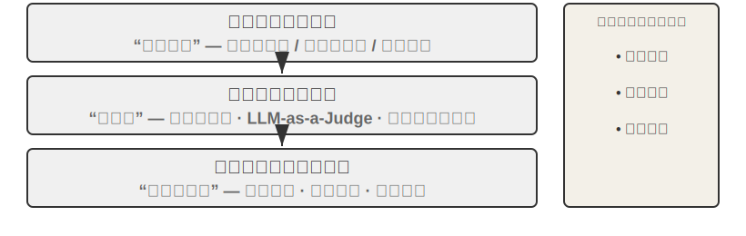
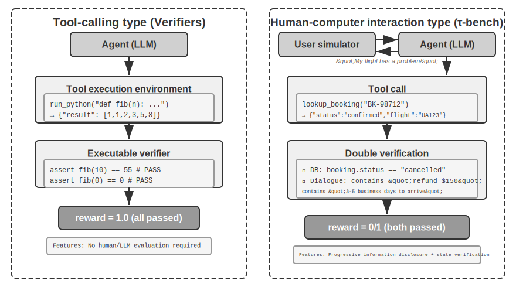
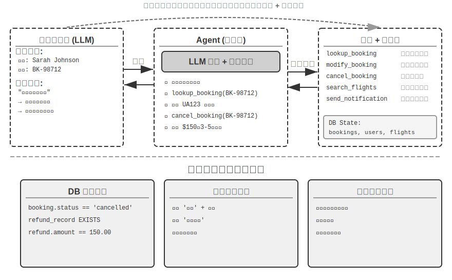
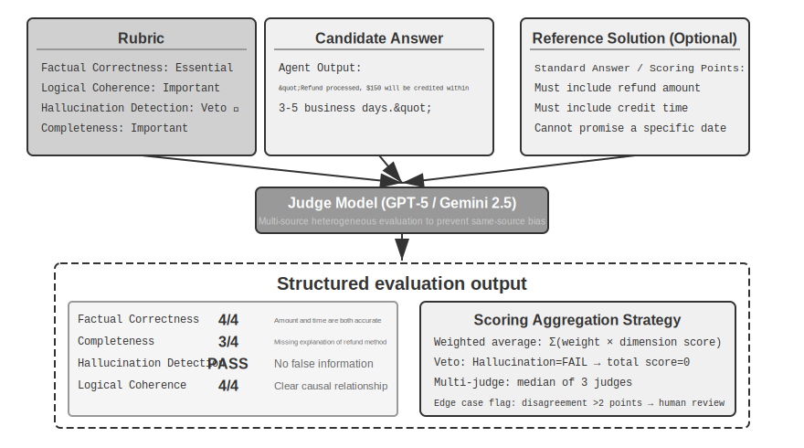
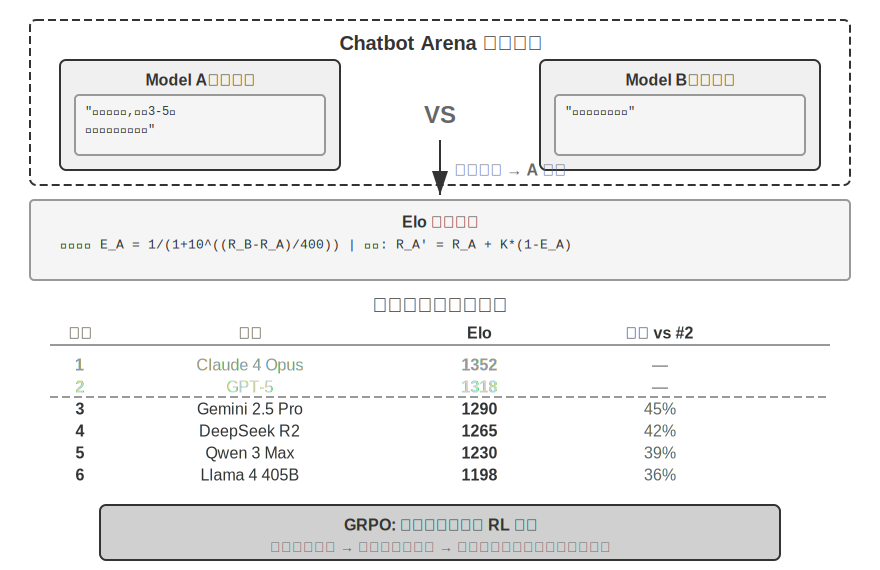
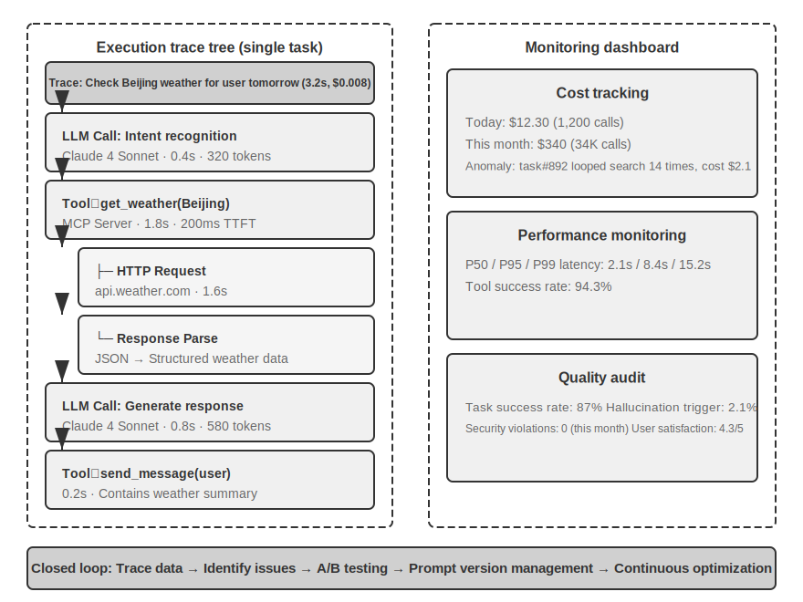
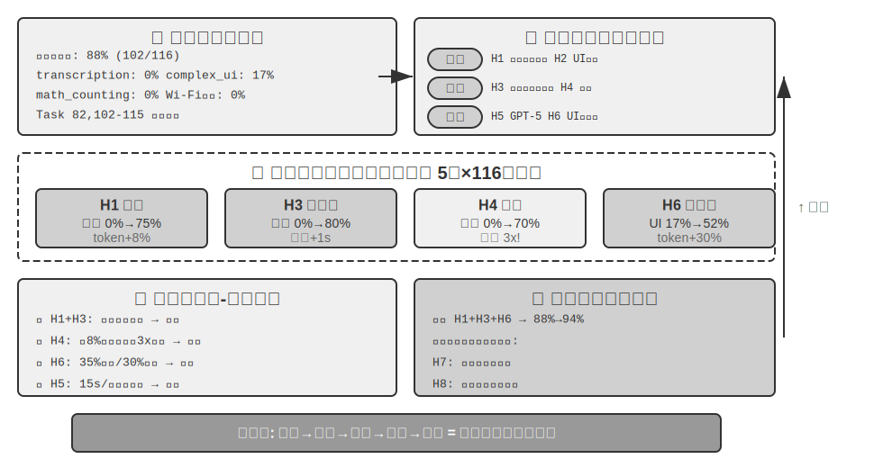
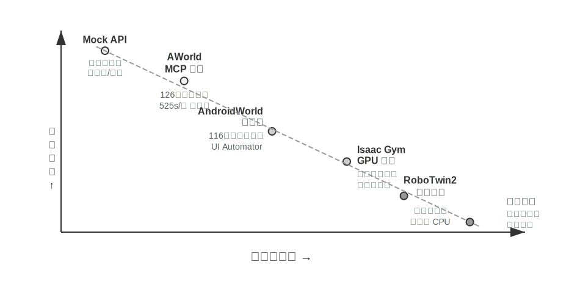
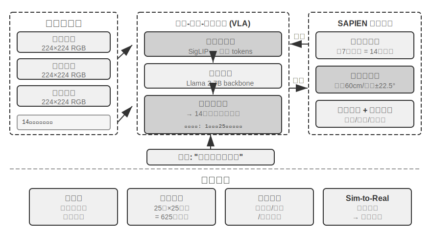

# Evaluating Agents

Agent அமைப்பை உருவாக்கும் போது, developers பல வடிவமைப்பு தேர்வுகளை எதிர்கொள்கின்றனர், அவற்றில் பெரும்பாலும் தெளிவான சரியான பதில்கள் இல்லை:

- எந்த model ஐப் பயன்படுத்துவது?
- model எந்த tools ஐ அழைக்க முடியும்?
- knowledge base என்ன data ஐ சேமிக்க வேண்டும், அது எவ்வாறு கட்டமைக்கப்பட வேண்டும்?
- user memory எவ்வாறு செயல்படுத்தப்பட வேண்டும்?
- model இன் prompts மற்றும் Skills எவ்வாறு ஒழுங்கமைக்கப்பட வேண்டும்?
- Harness இல் என்ன constraints சேர்க்கப்பட வேண்டும்?
- இந்த Agent இன் self-evolution மற்றும் self-iteration எவ்வாறு மேற்கொள்ளப்பட வேண்டும்?

Evaluation நமக்கு முடிவெடுப்பதற்கான அறிவியல் அடிப்படையை வழங்குகிறது: முறையான comparative experiments (ஒரு variable ஐ மாற்றி, அதன் விளைவைக் கவனித்தல்) மற்றும் ablation experiments (ஒரு component ஐ ஒரு நேரத்தில் முடக்கி, ஒட்டுமொத்த செயல்திறன் மாற்றத்தைக் கவனித்து, அந்த component இன் உண்மையான பங்களிப்பைத் தீர்மானித்தல்) மூலம், உண்மையான திறன் மேம்பாடுகளை மேலோட்டமான ஏற்ற இறக்கங்களிலிருந்து வேறுபடுத்தி அறியலாம், "penny wise, pound foolish" தவறுகளைத் தவிர்க்கலாம். software engineering இல் சொல்வது போல், "you can't improve what you don't measure" — மீண்டும் செய்யக்கூடிய evaluation அமைப்பு இல்லாமல், Agent இன் iteration திசை உள்ளுணர்வை மட்டுமே நம்பியிருக்க முடியும்.

Chapter 1-இல் அறிமுகப்படுத்தப்பட்ட Harness engineering-ன் கண்ணோட்டத்தில், evaluation ஆனது Harness-க்குள் "verification" (சரிபார்ப்பு) என்ற மையப் பங்கை வகிக்கிறது. ஒரு முக்கியமான நுண்ணறிவு: **evaluation-ன் பொருள் model மட்டுமல்ல, model மற்றும் Harness-ன் கலவையாக இருக்க வேண்டும்**. ஒரே model வெவ்வேறு Harness-களில் முற்றிலும் மாறுபட்ட செயல்திறனைக் காட்டலாம் — சில அணிகள் Harness-ஐ மட்டும் மேம்படுத்துவதன் மூலம் (விவரங்களுக்கு Chapter 5-ஐப் பார்க்கவும்) ஒரே model-ன் terminal tasks-களில் செயல்திறனை கணிசமாக மேம்படுத்தியுள்ளன. இதன் பொருள், ஒரு Agent evaluation-ல் மோசமாக செயல்படும்போது, மேம்பாட்டுத் திசையானது model-ஐ மாற்றுவதாக இருக்காது, மாறாக Harness-ன் சில கூறுகளை (prompts, tool design, feedback loops) மேம்படுத்துவதாக இருக்கலாம். ஒரு நல்ல evaluation system ஆனது, அடிப்படையில் வேறுபட்ட இரண்டு வகையான சிக்கல்களை வேறுபடுத்திக் காட்ட முடிய வேண்டும்: "போதுமான model capability இல்லாமை" மற்றும் "Harness design flaws." **இந்த இரண்டு வகையான சிக்கல்களையும் வேறுபடுத்துவதற்கான ஒரு பொதுவான முறை model swap experiment ஆகும்** — Harness-ஐ நிலைப்படுத்தி, model-ஐ மட்டும் வலிமையான/பலவீனமான ஒன்றாக மாற்றி, score-ல் ஏற்படும் மாற்றத்தின் அளவைக் கவனிக்கவும்; வலிமையான model-க்கு மாற்றியும் score அதிகரிக்கவில்லை என்றால், bottleneck Harness-ல் உள்ளது; பலவீனமான model-க்கு மாற்றும்போது score பெரிதும் குறைந்து, score model capability-யுடன் கணிசமாக ஏற்ற இறக்கமாக இருந்தால், மிகவும் நேரடியான விளக்கம் என்னவென்றால், bottleneck model-ன் சொந்த capability-யில் உள்ளது மற்றும் தற்போதைய செயல்திறன் முதன்மையாக model-ஆல் தீர்மானிக்கப்படுகிறது (இது பணியே கடினமானதா அல்லது Harness model-ன் prior knowledge-ஐ அதிகமாக நம்பியுள்ளதா என்பதை மேலும் பகுப்பாய்வு செய்ய வேண்டும்). இது முன்பு குறிப்பிடப்பட்ட "ablation experiment"-ஐ விட வேறுபட்டது என்பதைக் கவனிக்கவும்: ablation என்பது **Harness-ன் ஒரு கூறுகளை முடக்கி** ஒட்டுமொத்த செயல்திறன் எவ்வாறு மாறுகிறது என்பதைப் பார்ப்பது, அதேசமயம் model swapping என்பது **Harness-ஐ நிலைப்படுத்தி, model-ஐ மட்டும் மாற்றுவது** — முந்தையது Harness-க்குள் எந்தப் பகுதி முக்கியமானது என்பதை அடையாளம் காண உதவுகிறது, பிந்தையது bottleneck model-லா அல்லது Harness-லா என்பதை வேறுபடுத்துகிறது.

Model-களின் விரைவான பரிணாம வளர்ச்சியின் சகாப்தத்தில் evaluation system-ன் மதிப்பு இன்னும் முக்கியத்துவம் பெறுகிறது. Model capabilities இன்னும் வேகமாக வளர்ந்து வருகின்றன, ஆனால் public benchmarks-களில் ஒரு புதிய model சிறப்பாக செயல்படுவது, அது உங்கள் குறிப்பிட்ட பணியிலும் சிறப்பாக செயல்படும் என்பதற்கு உத்தரவாதம் அளிக்காது — உண்மையில், performance regression (ஒரு புதிய பதிப்பு சில அம்சங்களில் பழையதை விட மோசமாக இருப்பது) ஏற்படலாம். உங்கள் சொந்த evaluation dataset-ல் முழுமையாக சோதனை செய்தால்தான், data-driven upgrade முடிவுகளை எடுக்க முடியும். மேலும், ஒரு விரிவான evaluation system ஆனது "எதிர்கால model-களுக்கான தயாரிப்புகளை உருவாக்குதல்" என்ற உத்தியை சாத்தியமாக்குகிறது — தற்போதைய model வணிக ரீதியான deployment-க்கு போதுமானதாக இல்லாவிட்டாலும், நீங்கள் தயாரிப்பு மேம்பாட்டை முடித்து, ஒரு evaluation set-ஐ நிறுவி, புதிய model-களின் செயல்திறனைத் தொடர்ந்து கண்காணித்து, threshold பூர்த்தியானவுடன் உடனடியாக launch செய்யலாம்.

> **Chapter Guide**
>
> இந்த அத்தியாயம் மூன்று நிலைகளில் ஒரு முழுமையான மதிப்பீட்டு அமைப்பை உருவாக்குகிறது. முதல் நிலை **மதிப்பீட்டு சூழல்** ("எங்கே சோதிப்பது"): தானியங்கி, மீள்உருவாக்கக்கூடிய சோதனை சூழலை எவ்வாறு அமைப்பது என்பதை உள்ளடக்கியது, இதில் இரண்டு முன்னுதாரணங்கள் அடங்கும்: tool-calling வகை மற்றும் மனித-கணினி இடைவினை வகை. இரண்டாம் நிலை **மதிப்பீட்டு முறைகள்** ("எப்படி தீர்ப்பது"): தரவுத்தொகுப்பு வடிவமைப்புக் கோட்பாடுகள், மதிப்பீட்டு குறிகாட்டி அமைப்புகள் (எதை அளவிடுவது), LLM-as-a-Judge (தீர்ப்பாளர்களாக பெரிய மொழி மாதிரிகளைப் பயன்படுத்துதல்) மூலம் தானியங்கி மதிப்பீடு, பின்னர் pairwise comparison மற்றும் model ranking வரை. மூன்றாம் நிலை **மதிப்பீடு-உந்துதல் முடிவெடுத்தல்** ("சோதனைக்குப் பிறகு என்ன செய்வது"): மதிப்பீட்டு முடிவுகளை model தேர்வு, architecture உகப்பாக்கம் மற்றும் தொடர்ச்சியான மறுசெயலாக்கத்திற்கான செயல்படுத்தக்கூடிய வழிகாட்டுதல்களாக மாற்றுதல், மற்றும் கவனிக்கப்பட்ட மதிப்பெண் வேறுபாடுகள் உண்மையானதா மற்றும் நம்பகமானதா என்பதை தீர்மானிக்க statistical significance ஐப் பயன்படுத்துதல். கூடுதலாக, இந்த அத்தியாயம் production-grade Agents களுக்கான observability மற்றும் உள் மதிப்பீட்டு உள்கட்டமைப்பு பற்றி விவாதிக்கும், மேலும் அத்தியாயத்தின் இறுதியில் Chapter 7 இல் post-training உடன் இணைக்கும் simulation environment ஐ அறிமுகப்படுத்தும்.

அத்தியாயம் முழுவதும் இயங்கும் மையக் கருத்து: **மதிப்பீட்டு அமைப்பின் முதன்மை மதிப்பு தற்போதைய அமைப்புக்கு மதிப்பெண் வழங்குவது அல்ல, மாறாக model பரிணாமத்துடன் விரைவாகவும் நம்பகத்தன்மையுடனும் தொடர்ந்து இருப்பதை உங்களுக்கு சாத்தியமாக்குவதாகும்.** ஒரு வலுவான அல்லது மலிவான model வெளியிடப்படும்போது, உறுதியான மதிப்பீட்டு அமைப்பைக் கொண்ட ஒரு குழு மணிநேரங்களுக்குள் மாற்ற முடிவு செய்ய முடியும், அதேசமயம் மதிப்பீட்டு அமைப்பு இல்லாத ஒரு குழு உள்ளுணர்வை மட்டுமே நம்பியிருக்க வேண்டும் அல்லது சமூக கருத்துக்காக காத்திருக்க வேண்டும் — மிகவும் போட்டி நிறைந்த Agent சந்தையில், இந்த வேக வேறுபாடு வெற்றி அல்லது தோல்வியை தீர்மானிக்கும்.



## ஒரு உறுதியான மதிப்பீட்டு உதாரணம்

முறைமையில் ஆழமாக இறங்குவதற்கு முன், ஒரு முழுமையான உதாரணத்தின் மூலம் உள்ளுணர்வை வளர்த்துக் கொள்வோம். நாம் ஒரு வாடிக்கையாளர் சேவை Agent ஐ உருவாக்கியுள்ளோம் என்றும், அது பணத்தைத் திரும்பப்பெறும் கோரிக்கைகளை கையாளும் திறனை மதிப்பீடு செய்ய வேண்டும் என்றும் வைத்துக் கொள்வோம்.

**சோதனை வழக்கு**: பயனர் 3 நாட்களுக்கு முன் செய்த ஆர்டரை (ஆர்டர் #12345, தொகை ¥299) திரும்பப் பெற விரும்புகிறார். நிறுவனக் கொள்கை: 7 நாட்களுக்குள் முழுப் பணத்தைத் திரும்பப்பெறலாம்.

**Agent Trajectory**:

```
User: I want to return the headphones I bought 3 days ago, order number 12345. (Today is 2026-04-10)

Agent (thinking): The user wants a refund, I need to check the order information first.
Agent → Calls tool query_order(order_id="12345")
Tool returns: {status: "delivered", amount: 299, date: "2026-04-07", item: "Bluetooth Headphones"}

Agent (thinking): Order date 2026-04-07, today is 2026-04-10, that's 3 days, within the 7-day refund period, eligible for full refund.
Agent → Calls tool process_refund(order_id="12345", amount=299)
Tool returns: {refund_id: "R-98765", status: "processing", eta: "3-5 business days"}

Agent: A refund has been initiated for you. The full refund for Order #12345 (Bluetooth Headphones, ¥299) is being processed,
      and is expected to arrive in 3-5 business days. The refund ID is R-98765, which can be used to check the progress.
```

**Rubric மூலம் மதிப்பீடு** (நான்கு பரிமாணங்கள், ஒவ்வொன்றும் 1-4 மதிப்பெண்கள்). இந்த வாடிக்கையாளர் சேவை பணத்தைத் திரும்பப்பெறும் பணிக்கான மதிப்பீட்டு உதாரணத்தை அட்டவணை 6-1 வழங்குகிறது. ஒரு Rubric எவ்வாறு Agent-இன் செயல்பாட்டை சரிபார்க்கக்கூடிய மதிப்பீட்டு பரிமாணங்களாகப் பிரிக்கிறது என்பதை இது விளக்குகிறது.

அட்டவணை 6-1 வாடிக்கையாளர் சேவை பணத்தைத் திரும்பப்பெறும் பணிக்கான Rubric மதிப்பீட்டு உதாரணம்

| பரிமாணம் | அளவுகோல் | மதிப்பெண் | காரணம் |
|---|---|---|---|
| செயல்பாட்டுத் துல்லியம் | பணத்தைத் திரும்பப்பெறும் தொகை மற்றும் ஆர்டர் எண் சரியாக உள்ளதா? | 4 | ¥299 முழுத் திரும்பப்பெறுதலை சரியாக வினவி தொடங்கியது |
| கொள்கை இணக்கம் | 7-நாள் திரும்பப்பெறும் கொள்கையைப் பின்பற்றுகிறதா? | 4 | ஆர்டர் திரும்பப்பெறும் காலத்திற்குள் உள்ளது, கொள்கைக்கு இணங்குகிறது |
| தகவல் முழுமை | தொகை, வருகை நேரம் மற்றும் திரும்பப்பெறும் ID பற்றி தெரிவிக்கிறதா? | 4 | மூன்று முக்கிய தகவல்களும் வழங்கப்பட்டன |
| மாயத்தோற்றம் கண்டறிதல் (Veto Item) | இல்லாத தகவலை உருவாக்குகிறதா? | தேர்ச்சி | அனைத்து தகவல்களும் tool-இன் விளைவுகளிலிருந்து வருகின்றன |

மாயத்தோற்றம் (Hallucination) என்பது தரத்திற்கு செங்குத்தானது என்பதால், அது மதிப்பெண் வழங்கும் பரிமாணமாக அல்லாமல் **veto item** ஆக பட்டியலிடப்பட்டுள்ளது — தவறான தகவலைக் கொண்ட ஒரு சரளமான, விரிவான மற்றும் பண்பான பதில், சுருக்கமான ஆனால் துல்லியமான பதிலை விட பயனருக்கு மிகவும் தீங்கு விளைவிக்கும். (veto பொறிமுறையின் பொதுவான வடிவமைப்பிற்கு, பின்னர் உள்ள "நான்கு Rubric கொள்கைகள்" பகுதியைப் பார்க்கவும்.)

இந்த சோதனை வழக்கு தேர்ச்சி பெற்றது. ஆனால் ஒரு நல்ல மதிப்பீடு வெற்றிக் காட்சிகளை மட்டும் சோதிப்பதில்லை; அது எல்லைகள் மற்றும் ஆபத்துகளையும் சோதிக்கிறது — ஒரு பயனர் 15 நாட்களுக்கு முன்பு செய்த ஆர்டரைத் திரும்பப்பெற விரும்பினால் (திரும்பப்பெறும் காலத்திற்கு அப்பால்), Agent சரியாக மறுக்க முடியுமா? ஒரு பயனர் "வாடிக்கையாளர் சேவை பிரதிநிதி ஏற்கனவே பணத்தைத் திரும்பப்பெற அனுமதித்துவிட்டார்" என்று கூறினால், கணினி பதிவு இல்லாமல் Agent அதை நம்புமா? இந்த எல்லைக் காட்சிகள் Agent-இன் திறன் நிலைகளை வேறுபடுத்திக் காட்டுவதில் முக்கியமானவை.

மேலே உள்ள செயல்முறை — சோதனை வழக்குகளை வரையறுத்தல், Agent-ஐ இயக்குதல், Rubric மூலம் மதிப்பெண் வழங்குதல் மற்றும் முடிவுகளை பகுப்பாய்வு செய்தல் — மதிப்பீட்டின் அடிப்படை அமைப்பாகும். இந்த அத்தியாயத்தின் பின்வரும் பகுதிகள் ஒவ்வொரு படிக்குமான வடிவமைப்பு முறைகளை படிப்படியாக விரிவுபடுத்தும்.

## தானியங்கு மதிப்பீட்டு சூழல்

Agent மதிப்பீட்டிற்கு மீண்டும் செய்யக்கூடிய, தானியங்கு சூழல் தேவை — வளர்ச்சியின் போது மாற்றங்களின் விளைவுகளை விரைவாக சோதிக்கக்கூடிய ஒன்று. அத்தகைய சூழலை உருவாக்க மூன்று கேள்விகளுக்கு பதில் தேவை: எதை மதிப்பிடுவது (பணி வரையறை மற்றும் சரிபார்ப்பு அளவுகோல்கள்), யாருக்கு எதிராக மதிப்பிடுவது (Agent-இன் தொடர்பு கூட்டாளியை எவ்வாறு உருவகப்படுத்துவது), மற்றும் என்ன மதிப்பீட்டு அளவுகோல்களைப் பயன்படுத்துவது.

### மதிப்பீட்டு சூழலின் அடிப்படை கூறுகள்

ஒரு மதிப்பீட்டு சூழல் ஐந்து கூறுகளைக் கொண்டுள்ளது — பின்வரும் பகுதிகள் தரவுத்தொகுப்பு வடிவமைப்பு மற்றும் மதிப்பீட்டு அளவுகோல் வடிவமைப்பில் கவனம் செலுத்தும்:

**தரவுத்தொகுப்பு**: ஆரம்ப நிலை, இலக்கு விளக்கம் மற்றும் விருப்பமான குறிப்பு தீர்வுகள் உட்பட பணித் தொகுப்பை வரையறுக்கிறது.

**Environment State**: பணி செயல்பாட்டின் போது மாறி தகவலைப் பராமரிக்கிறது, நம்பகத்தன்மை மற்றும் கட்டுப்படுத்துதல் ஆகியவற்றுக்கு இடையே சமநிலை தேவைப்படுகிறது. எடுத்துக்காட்டாக, வாடிக்கையாளர் சேவை மதிப்பீட்டில், environment state ஆனது database-ல் உள்ள ஆர்டர் பதிவுகள் மற்றும் பயனர் கணக்கு இருப்புகளை உள்ளடக்கியது. Agent `process_refund` ஐ அழைத்த பிறகு, ஆர்டர் நிலை 'delivered' இலிருந்து 'refunded' ஆக மாறுகிறது மற்றும் இருப்பு அதிகரிக்கிறது — இவை "மாறி தகவல்" ஆகும். "Authenticity" என்பது state மாற்றங்கள் வணிக தர்க்கத்தைப் பின்பற்ற வேண்டும் (refund தொகை ஆர்டர் தொகையை விட அதிகமாக இருக்கக்கூடாது), மற்றும் "controllability" என்பது ஒவ்வொரு சோதனையும் அதே ஆரம்ப நிலைக்கு மீட்டமைக்கப்பட முடியும் என்பதைக் கோருகிறது.

**Tools**: Agent செய்யக்கூடிய செயல்பாடுகளின் தொகுப்பை வரையறுக்கிறது — tools மிகவும் உயர்-நிலை abstractions (எ.கா., "பயனர் பிரச்சினையை தீர்க்க") வழங்கக்கூடாது, மாறாக அணு செயல்பாடுகளை (எ.கா., ஆர்டரை வினவுதல், முன்பதிவை மாற்றுதல், மின்னஞ்சல் அனுப்புதல்) வழங்க வேண்டும், இது Agent ஐ திட்டமிடல் மற்றும் பகுத்தறிவு மூலம் இந்த செயல்பாடுகளை இணைக்க கட்டாயப்படுத்துகிறது.

**Rubric (Scoring Criteria)**: Agent-ன் செயல்திறனை அளவிடுகிறது, இது binary (pass/fail), continuous (0 முதல் 100 புள்ளிகள்), அல்லது multi-dimensional (துல்லியம், செயல்திறன் மற்றும் பாதுகாப்பை தனித்தனியாக மதிப்பிடுதல்) ஆக இருக்கலாம்.

**Interaction Protocol**: தொடர்பு முறை மற்றும் முடிவு நிபந்தனைகளைக் குறிப்பிடுகிறது.



### Tool-Calling Evaluation Environment

முக்கியமாக tool பயன்பாட்டை நம்பியிருக்கும் பணிகளுக்கு, code generation மற்றும் data analysis போன்றவை, Verifiers framework ஒரு பொதுவான வடிவமைப்பு முறையை நிரூபிக்கிறது. Agent முன் வரையறுக்கப்பட்ட tools ஐ அழைப்பதன் மூலம் பணியை முடிக்கிறது, மேலும் சரிபார்ப்பு executable criteria (சோதனைகள் வெற்றிபெறுகின்றனவா, பதில்கள் பொருந்துகின்றனவா) அடிப்படையில் இருக்கும், மனித annotation அல்லது model தீர்ப்பை நம்பாமல்.

Verifiers ஒரு படிநிலை environment வடிவமைப்பை அறிமுகப்படுத்துகிறது: `SingleTurnEnv` ஒற்றை-சுற்று பணிகளுக்கு (எ.கா., எளிய Q&A) பொருத்தமானது, `ToolEnv` பல-சுற்று தன்னாட்சி tool அழைப்பு சுழற்சிகளை ஆதரிக்கிறது, மேலும் `StatefulToolEnv` மற்றும் `SandboxEnv` stateful tools மற்றும் நீண்ட நேரம் இயங்கும் sandbox சூழல்களை (எ.கா., code execution) ஆதரிக்கின்றன. எடுத்துக்காட்டாக, `SingleTurnEnv` ஒரு கணிதக் கேள்வியைக் கேட்டு நேரடியாக பதிலைச் சரிபார்க்க ஏற்றது; `ToolEnv` பல வலைப்பக்கங்களைத் தேடி, ஒரு பதிலைத் தொகுத்து, பின்னர் இறுதி முடிவைச் சரிபார்க்க ஏற்றது; `StatefulToolEnv` database பதிவுகளை மாற்றி, பின்னர் database state மாற்றங்களைச் சரிபார்க்க ஏற்றது; `SandboxEnv` sandbox-ல் code ஐ இயக்கி, பின்னர் வெளியீட்டு கோப்புகளைச் சரிபார்க்க ஏற்றது. அட்டவணை 6-2 இந்த environment வகைகளை சுருக்கமாகக் கூறுகிறது, இதனால் வாசகர்கள் பணி state, tool அழைப்புகள் மற்றும் தனிமைப்படுத்தல் தேவைகளின் அடிப்படையில் பொருத்தமான evaluation environment ஐ தேர்வு செய்யலாம்.

அட்டவணை 6-2 Verifiers Environment Type ஒப்பீடு

| Environment Type | State Persistence | Tool Calls | Typical Use Case |
|---|---|---|---|
| SingleTurnEnv | இல்லை | இல்லை | ஒற்றை-சுற்று Q&A, கணிதப் பிரச்சினைகள் |
| ToolEnv | இல்லை | பல-சுற்று | தேடல் + தகவல் தொகுப்பு |
| StatefulToolEnv | ஆம் | பல-சுற்று | Database பதிவுகளை மாற்றுதல் |
| SandboxEnv | ஆம் + தனிமைப்படுத்தல் | Multi-turn | குறியீடு செயல்படுத்தல் மற்றும் சோதனை |

இந்த framework ஆனது parallel sampling மற்றும் trajectory caching ஐ ஆதரிக்கிறது. ஒவ்வொரு மதிப்பீட்டிலிருந்தும் முழுமையான trajectory (observations, actions, rewards) அடுத்தடுத்த பகுப்பாய்வு மற்றும் மறுஇயக்கத்திற்காக சேமிக்கப்படுகிறது.

செயல்பாடுகளின் state dependency ஐயும் சூழல் கையாள வேண்டும் — ஒரு tool இன் செயல்படுத்தல் விளைவு தற்போதைய state ஐ சார்ந்துள்ளது. தோல்வி ஏற்பட்டால், வெறும் தோல்வி கொடிகள் மட்டுமின்றி தெளிவான பிழை செய்திகளை வழங்க வேண்டும், இது Agent பிழைகளிலிருந்து கற்றுக்கொண்டு அதன் உத்தியை சரிசெய்ய அனுமதிக்கிறது.

### மனித-கணினி தொடர்பு மதிப்பீட்டு சூழல்

பல நிஜ-உலக பணிகள் tool அழைப்புகளை மட்டுமல்ல, மனித பயனர்களுடனான உரையாடல்களையும் உள்ளடக்குகின்றன. ஒரு வாடிக்கையாளர் சேவை Agent தெளிவற்ற வெளிப்பாடுகளைப் புரிந்துகொள்ள வேண்டும், தேவைகளைத் தெளிவுபடுத்த வேண்டும், backend அமைப்புகளை வினவ வேண்டும், மற்றும் பயனருடன் தகவலை உறுதிப்படுத்த வேண்டும். இத்தகைய பணிகளை மதிப்பிடுவது ஒரு அடிப்படை சவாலை எதிர்கொள்கிறது: தானியங்கி சூழலில் நிஜ பயனர்களை எவ்வாறு உருவகப்படுத்துவது?

முக்கிய வடிவமைப்புக் கொள்கை **Progressive Information Disclosure** ஆகும், இது மனித-கணினி தொடர்பு மதிப்பீட்டிற்கும் பாரம்பரிய benchmarks க்கும் இடையிலான அடிப்படை வேறுபாடு ஆகும். பெரும்பாலான benchmarks முழுமையான தேவைகளை முன்கூட்டியே வெளிப்படுத்துகின்றன, ஆனால் உண்மையில், பயனர்கள் தங்கள் தேவைகளை ஆரம்பத்திலிருந்தே தெளிவாக விவரிக்க முடிவதில்லை — அவர்கள் பெரும்பாலும் "என் விமானத்தில் ஏதோ பிரச்சனை" அல்லது "இணையம் வேலை செய்யவில்லை" என்று மட்டுமே கூறுகிறார்கள். Agent செயலூக்கமான கேள்விகள் மூலம் தேவைகளைத் தெளிவுபடுத்த வேண்டும், மேலும் இந்த செயல்முறையே திறனின் முக்கியமான வெளிப்பாடாகும். எனவே, மதிப்பீட்டில், **உருவகப்படுத்தப்பட்ட பயனரிடமிருந்து வரும் அனைத்து தகவல்களும் ஆரம்பத்திலிருந்தே Agent க்கு வெளிப்படுத்தப்படக்கூடாது**; தகவல் உரையாடலின் போது படிப்படியாகவும் தேவைக்கேற்பவும் வெளிப்படுத்தப்பட வேண்டும்.

τ-bench இன் தீர்வு **User Simulation** ஆகும்: மற்றொரு LLM ஐ பயனர் பாத்திரத்தில் நடிக்கப் பயன்படுத்தி, முன் வரையறுக்கப்பட்ட வழிமுறைகளின்படி Agent உடன் உரையாடுகிறது. உருவகப்படுத்தப்பட்ட பயனர் பணி வழிமுறைகளைப் பெறுகிறார் (எ.கா., "நாளைய விமானத்தை ரத்து செய்ய வேண்டும்"), உரையாடலின் போது படிப்படியாக Agent க்கு தேவையான தகவலை வெளிப்படுத்துகிறார், விசாரணைகளுக்குப் பதிலளிக்கிறார், மற்றும் பணி முடிந்ததும் முடிப்பு சமிக்ஞையை அனுப்புகிறார். உருவகப்படுத்தப்பட்ட பயனருக்கான prompt "எல்லா தகவலையும் ஒரே நேரத்தில் வெளிப்படுத்த வேண்டாம், தற்போதைய படிக்குத் தேவையானதை மட்டும் வழங்கவும்" மற்றும் "வழிமுறைகளில் வழங்கப்படாத தகவலை உருவாக்க வேண்டாம்" என்று கட்டளையிடுகிறது. User simulation இன் வடிவமைப்பு நம்பகத்தன்மைக்கும் கட்டுப்பாட்டுத்தன்மைக்கும் இடையே ஒரு சமநிலை தேவைப்படுகிறது: நடத்தை உண்மையான பயனருக்கு நெருக்கமாக இருக்க வேண்டும் (தெளிவற்ற வெளிப்பாடுகள், முழுமையற்ற தகவல், எப்போதாவது உணர்ச்சி ஏற்ற இறக்கங்கள்) அதே நேரத்தில் மறுஉருவாக்கத்தை உறுதி செய்ய ஒரு குறிப்பிட்ட script ஐப் பின்பற்ற வேண்டும்.

பின்வருபவை progressive information disclosure உடன் கூடிய multi-turn உரையாடலின் உதாரணம் (user simulator ஒரு நிலையான script இன் படி செயல்படுகிறது):

> **பயனர்**: "என் விமானத்தில் ஒரு பிரச்சனை உள்ளது."
> **Agent**: "எந்த விமானம் அது?"
> **பயனர்** (script இன் படி வெளிப்படுத்துகிறார்): "Delta 123, நாளை காலை சான் பிரான்சிஸ்கோவிலிருந்து நியூயார்க்கிற்கு."
> **Agent**: "குறிப்பிட்ட பிரச்சனை என்ன?"
> **User** (script-இன் படி வெளிப்படுத்துதல்): "விமானப் பயண நேரம் மிகவும் நீண்டது, அதை மாற்ற விரும்புகிறேன்."
> **Agent**: "புதிய விமானத்திற்கு ஏதேனும் விருப்பங்கள் உள்ளதா?"
> **User** (script-இன் படி வெளிப்படுத்துதல்): "எந்த மதிய விமானமும் சரிதான்."

User simulator ஒரு நிலையான script (தெரிந்த தகவல் + வெளிப்படுத்தும் விதிகள்) பின்பற்றுகிறது, இது மதிப்பீட்டின் மறுஉருவாக்கத் தன்மையை உறுதி செய்கிறது, அதே நேரத்தில் ஒரு உண்மையான பயனரின் படிப்படியான வெளிப்பாட்டு பாணியை உருவகப்படுத்துகிறது.

τ-bench என்பது கட்டமைக்கப்பட்ட வணிக செயல்முறைகளில் (எ.கா., விமான நிறுவன வாடிக்கையாளர் சேவை, சில்லறை வாடிக்கையாளர் சேவை) Agent செயல்திறனை மதிப்பிடுவதற்கான ஒரு benchmark ஆகும். இதன் சோதனைகள் component-level மற்றும் multi-dimensional ஆகும்: ஒருபுறம், இறுதி தரவுத்தள நிலை சரியாக உள்ளதா என்பதைச் சரிபார்க்கிறது (எ.கா., முன்பதிவு பதிவின் நிலை "cancelled" ஆக மாறுகிறது); மறுபுறம், உரையாடலின் போது Agent தேவையான முக்கிய தகவல்களை வெளியிட்டதா என்பதைச் சரிபார்க்கிறது (எ.கா., பணத்தைத் திரும்பப் பெறும் தொகை மற்றும் வருகை நேரம், குறிப்பிட்ட சரங்கள் அல்லது வடிவங்களைத் தேடி சரிபார்க்கப்படுகிறது). இந்த இரட்டை சரிபார்ப்பு ஒரே நேரத்தில் செயல்பாட்டுத் துல்லியத்தையும் தகவல் தொடர்பு செயல்திறனையும் ஆய்வு செய்கிறது. இருப்பினும், பணி மட்டத்தில், இந்த சோதனைகள் இறுதியில் **பூஜ்ஜியம் அல்லது ஒன்றின் binary reward** ஆக ஒருங்கிணைக்கப்படுகின்றன — 1 மதிப்பெண் பெற அனைத்து சோதனைகளும் நிறைவேற வேண்டும், மேலும் ஏதேனும் ஒரு தோல்வி 0 மதிப்பெண்ணை ஏற்படுத்தும். Binary rewards, Pass^k போன்ற நம்பகத்தன்மை அளவீடுகளைக் கணக்கிட உதவுகிறது (பின்னர் "மதிப்பீட்டு காட்டி அமைப்பு" பகுதியைப் பார்க்கவும்), ஆனால் "செயல்பாட்டில் துல்லியமாக இருந்தாலும் முக்கியமற்ற புலம் ஒன்றைக் காணவில்லை" மற்றும் "முழுமையான தோல்வி" ஆகிய இரண்டிற்கும் ஒரே மதிப்பெண்ணை வழங்கும் விலையில்.

மேம்படுத்தப்பட்ட **τ²-bench** இன் முக்கிய மேம்பாடுகள் மதிப்பெண் நுணுக்கத்தில் இல்லை, மாறாக இரண்டு புள்ளிகளில் உள்ளன: முதலில், **Dual-Control Environment** — இப்போது Agent மட்டுமே tools ஐ அழைக்க முடியாது; user simulator ஆனது அதே பகிரப்பட்ட சூழலில் செயல்பட முடியும் (எ.கா., Agent பயனரை விமானப் பயன்முறைக்கு மாற்ற அறிவுறுத்துகிறது, மேலும் பயனரின் செயல் உண்மையில் சூழல் நிலையை மாற்றுகிறது), இது பயனர் ஒத்துழைப்பு தேவைப்படும் தொழில்நுட்ப ஆதரவு போன்ற நிஜ உலக சூழ்நிலைகளுக்கு நெருக்கமானது; இரண்டாவதாக, **மிகவும் துல்லியமான பணி விவரக்குறிப்புகள் மற்றும் compositional task generation** — வெற்றி நிபந்தனைகளில் குறைவான தெளிவின்மைகள், மேலும் குறிப்பிட்ட பணி நிகழ்வுகளை அளவுருவாக்கம் செய்து தொகுதிகளாக உருவாக்க முடியும் (விரிவான சரிபார்ப்பு பரிமாணங்களுக்கு பின்னர் "சரிபார்ப்புத் திறன் மற்றும் புறநிலை உறுதிப்பாடு" பகுதியைப் பார்க்கவும்).

> **பரிசோதனை 6-1 ★: τ²-bench ஐ இயக்கி, அதன் பரிணாமத்தை τ-bench உடன் ஒப்பிடுக**> இந்த பரிசோதனையானது, மனித-கணினி தொடர்பு மதிப்பீட்டு சூழல்களின் வடிவமைப்புக் கொள்கைகளைப் புரிந்துகொள்ள τ²-bench மதிப்பீட்டு கட்டமைப்பைப் பயன்படுத்துகிறது. τ-bench மற்றும் τ²-bench இடையேயான வேறுபாடுகளை ஒப்பிடுவதன் மூலம், மதிப்பீட்டு தரவுத்தொகுப்புகள் எவ்வாறு மீண்டும் மீண்டும் மேம்படுத்தப்படுகின்றன என்பதைப் பாராட்டலாம்.
>
> பணி வரையறை கோப்புகளை ஆழமாகப் படிக்கவும்: ஒவ்வொரு பணியும் அறியப்பட்ட தகவல் (பயனரின் பின்னணி அறிவு), பணி வழிமுறைகள் (தகவலை படிப்படியாக வெளிப்படுத்துவதற்கும் பதில் உத்திகளுக்கும் வழிகாட்டுதல்), மற்றும் வெற்றி நிபந்தனைகள் (தரவுத்தளத்தின் இலக்கு நிலை மற்றும் உரையாடலில் தோன்ற வேண்டிய உறுதிப்படுத்தல் தகவல்) ஆகியவற்றைக் கொண்டுள்ளது. முழுமையான மதிப்பீட்டு செயல்முறையை இயக்கவும், பயனர் உருவகப்படுத்தி மற்றும் Agent இடையேயான பல-சுற்று உரையாடலைக் கவனிக்கவும், மற்றும் பொதுவான தோல்வி முறைகளை (கொள்கை மீறல்கள், தகவல் குறைபாடுகள், மனித முகவர்களுக்கு அதிகப்படியான மாற்றங்கள் போன்றவை) பகுப்பாய்வு செய்யவும்.
>
>
> 
>
>
> τ-bench மற்றும் τ²-bench இடையேயான வடிவமைப்பு வேறுபாடுகளை ஒப்பிடுக: τ-bench இன் ஆரம்ப பதிப்பில் மிகவும் எளிமையான பயனர் வழிமுறைகள் (Agent பதிலை யூகிக்க முடியும்), துல்லியமற்ற வெற்றி நிபந்தனைகள் (தவறான தீர்ப்புகளுக்கு வழிவகுக்கும்), மற்றும் ஒரு இயந்திரத்தனமான பயனர் உருவகப்படுத்தி இருந்தன. τ²-bench இந்த சிக்கல்களை சரிசெய்ய முறையான மேம்பாடுகளை செய்தது:
>
> - **விரிவான பணி வழிமுறைகள் அறிமுகப்படுத்தப்பட்டன**: "Grounding Requirements" உட்பட, அதாவது பதில்கள் சூழலின் உண்மையான நிலையை அடிப்படையாகக் கொண்டிருக்க வேண்டும்
> - **துல்லியமான மதிப்பீட்டு அளவுகோல்கள்**: உதாரணமாக, "ஒரு வேக சோதனை 'சிறந்தது' என்று திரும்பினால் மட்டுமே தீர்க்கப்பட்டதாக கருதப்படும்"
> - **மிகவும் யதார்த்தமான பயனர் உருவகப்படுத்தி நடத்தை விவரக்குறிப்புகள்**: படிப்படியான தகவல் வெளிப்பாடு, இயற்கையான உணர்ச்சி ஏற்ற இறக்கங்கள்
>
> τ²-bench இல் புதிதாக சேர்க்கப்பட்ட தொலைத்தொடர்பு கள பணிகளுக்கு சிறப்பு கவனம் செலுத்தவும், மேலும் அதன் இரட்டை-கட்டுப்பாடு சூழல் வடிவமைப்பைப் புரிந்துகொள்ளவும் (முன்பு குறிப்பிட்டது போல், பயனர் மற்றும் Agent ஒரே பகிரப்பட்ட சூழலை இணைந்து இயக்குகின்றனர்).
>
Tool-calling மதிப்பீடுகள் "கவனிக்கக்கூடிய நிலை மாற்றம் முடிக்கப்பட்டுள்ளதா" என்பதில் கவனம் செலுத்துகின்றன, அதேசமயம் மனித-கணினி தொடர்பு மதிப்பீடுகள் "பயனர் ஒரு அறிவாற்றல் அல்லது முடிவெடுக்கும் மாற்றத்தின் மூலம் வழிநடத்தப்பட்டுள்ளாரா" என்பதில் கவனம் செலுத்துகின்றன. முந்தையது Agent இன் செயல்களின் சரியான தன்மையை ஆராய்கிறது, பிந்தையது அதன் தகவல் தொடர்பு உத்தியின் நியாயத்தன்மையை ஆராய்கிறது.

மதிப்பீட்டு சூழலின் கட்டுமானமும் உருவகப்படுத்துதல் சூழல்களின் வடிவமைப்பை உள்ளடக்கியது. மதிப்பீட்டு சூழல் பெரிய அளவிலான மீண்டும் மீண்டும் தொடர்புகளை ஆதரிக்க வேண்டியிருக்கும் போது, அது ஒரு உருவகப்படுத்துதல் சூழலாக உருவாகிறது. இது இந்த அத்தியாயத்தின் முடிவில் சுருக்கமாக விவாதிக்கப்படும்.

## மதிப்பீட்டு பணி தரவுத்தொகுப்புகளின் வடிவமைப்பு

மதிப்பீட்டு சூழல் "மேடை", மற்றும் தரவுத்தொகுப்பு "ஸ்கிரிப்ட்" ஆகும். ஸ்கிரிப்டின் தரம் பெரும்பாலும் மேடையை விட மதிப்பீட்டின் மதிப்பை தீர்மானிக்கிறது. மோசமாக வடிவமைக்கப்பட்ட தரவுத்தொகுப்பு, சரியான சூழலில் இயக்கப்பட்டாலும், சத்தத்தை மட்டுமே உருவாக்கும். இந்த பகுதி GAIA, AndroidWorld, SWE-Bench Verified, τ-bench மற்றும் τ²-bench, Terminal-Bench, OSWorld, மற்றும் OSWorld-Verified போன்ற அளவுகோல்களின் வடிவமைப்பு நடைமுறைகளிலிருந்து பல மீண்டும் மீண்டும் சரிபார்க்கப்பட்ட கொள்கைகளை சுருக்கமாகக் கூறுகிறது.

இந்தப் பட்டியல் Agent மதிப்பீட்டு நிலப்பரப்பின் முழுமையான தொகுப்பு அல்ல. Web/GUI பிரிவில் மட்டுமே, வெவ்வேறு கவனம் கொண்ட பல benchmarks உள்ளன: WebArena, முழுமையாக மீண்டும் உருவாக்கக்கூடிய அதன் சொந்த வலைத்தளங்களை (e-commerce, forums, code hosting, முதலியன) உருவாக்குகிறது, "உண்மையான வலைப்பக்கங்களின்" கட்டுப்படுத்த முடியாத தன்மையை ஒரு sandbox-க்குள் கொண்டுள்ளது; Mind2Web, எதிர் அணுகுமுறையை எடுத்து, நூற்றுக்கணக்கான உண்மையான வலைத்தளங்களில் நேரடியாக generalization திறன்களை சோதிக்கிறது; BrowseComp, ஆழமான retrieval-இல் நிபுணத்துவம் பெற்றது—அங்கு பதில்கள் ஆழமாக மறைக்கப்பட்டுள்ளன, அவற்றைக் கண்டுபிடிக்க multi-hop browsing மற்றும் cross-validation தேவைப்படுகிறது. Tool-calling பரிமாணத்தில், BFCL (Berkeley Function-Calling Leaderboard) போன்ற சிறப்பு function-calling leaderboards-களும் உள்ளன. இந்த அத்தியாயம் அனைத்து benchmarks-களையும் பட்டியலிடுவதை நோக்கமாகக் கொள்ளவில்லை, மாறாக இரண்டு முக்கிய சூழல் முன்னுதாரணங்களை (tool-calling வகை, human-computer interaction வகை), dataset நிகழ்வுகள் முழுவதும் இயங்கும் GUI செயல்பாட்டு காட்சிகளுடன் சேர்த்து, அவற்றின் வடிவமைப்பு trade-offs-ஐ ஆழமாக ஆராயத் தேர்ந்தெடுக்கிறது. முன்னுதாரணங்களைப் புரிந்துகொள்வது, எந்தவொரு புதிய benchmark எதை அளவிடுகிறது, data leakage-ஐ எவ்வளவு நன்றாகத் தடுக்கிறது, மற்றும் அதன் முடிவுகளை எவ்வளவு தூரம் விரிவுபடுத்த முடியும் என்பதை விரைவாக மதிப்பிட அனுமதிக்கிறது.

> **சோதனை 6-2 ★: Benchmark பணிகளை கைமுறையாக இயக்கவும்**
>
> GAIA, AndroidWorld, SWE-Bench Verified, τ²-bench, Terminal-Bench, மற்றும் OSWorld-Verified ஆகியவற்றிலிருந்து தலா ஒரு பணியைத் தேர்ந்தெடுத்து அவற்றை கைமுறையாக முடிக்கவும். ஒவ்வொரு dataset-லிருந்தும் ஒரு எளிய, ஒரு நடுத்தர, மற்றும் ஒரு கடினமான பணியை முடிக்க பரிந்துரைக்கப்படுகிறது—"கடினமான" நிலை மனிதர்களுக்கு கூட சவாலாக இருக்க வேண்டும். உங்கள் செயலாக்க முடிவுகளை நிலையான பதில்களுடன் ஒப்பிட்டு, முரண்பாடுகளின் மூலங்களை பகுப்பாய்வு செய்யுங்கள். இந்த நேரடி அனுபவத்தின் மூலம் புரிந்துகொள்ளுங்கள்: பணி விளக்கங்கள் தெளிவு மற்றும் திறந்த தன்மைக்கு இடையே சமநிலைப்படுத்த வேண்டும், சரிபார்ப்பு தரநிலைகள் புறநிலை மற்றும் செயல்படுத்தக்கூடியதாக இருக்க வேண்டும், மேலும் பணிகளின் படிநிலை சிரமம் வெவ்வேறு திறன் நிலைகளை வேறுபடுத்தி காட்ட முடிய வேண்டும்.
>
### பணி Dataset வடிவமைப்பில் முக்கிய சவால்கள்

**சவால் ஒன்று: தெளிவு மற்றும் திறந்த தன்மைக்கு இடையேயான பதற்றம்.** பணி விளக்கங்கள் மீண்டும் உருவாக்கக்கூடிய மதிப்பீட்டை உறுதிப்படுத்த போதுமான தெளிவாக இருக்க வேண்டும், ஆனால் Agent-இன் படைப்பாற்றலை அடக்கும் அளவுக்கு கடுமையாக இருக்கக்கூடாது. GAIA ஒரு உதாரணத்தை வழங்குகிறது: பணிகள் "கருத்தியல் ரீதியாக எளிமையானவை" ஆனால் திறந்த செயலாக்க பாதைகளைக் கொண்டுள்ளன—எடுத்துக்காட்டாக, NASA-வின் Astronomy Picture of the Day-இலிருந்து விண்வெளி வீரர் தகவலைக் கண்டுபிடிக்க வேண்டும். இலக்கு தெளிவாக உள்ளது (ஒரு குறிப்பிட்ட விண்வெளி வீரர் மற்றும் அவர்கள் விண்வெளியில் இருந்த நேரத்தைக் கண்டுபிடிப்பது), ஆனால் எவ்வாறு தேடுவது, வடிகட்டுவது மற்றும் சரிபார்ப்பது என்பது முற்றிலும் Agent-இன் சுயாட்சி முடிவெடுப்பதைப் பொறுத்தது.

**சவால் இரண்டு: Authenticity மற்றும் Controllability இடையே சமநிலை.** நிஜ உலக பணிகளில் நிச்சயமற்ற தன்மை மற்றும் சத்தம் உள்ளது, இது robustness-ஐ வெளிப்படுத்தலாம் ஆனால் reproducibility-ஐ அச்சுறுத்தலாம். SWE-Bench-ன் ஆரம்ப பதிப்பு நேரடியாக உண்மையான GitHub issues-ஐப் பயன்படுத்தியது, இது authenticity-ஐ உறுதி செய்தது, ஆனால் தெளிவற்ற பணி விளக்கங்கள், முழுமையற்ற test cases மற்றும் அகநிலை மதிப்பீட்டு அளவுகோல்களுக்கும் வழிவகுத்தது. SWE-Bench Verified மனித நிபுணர்களால் முறையான சரிபார்ப்பை அறிமுகப்படுத்தியது, தெளிவான சிக்கல்கள், போதுமான சோதனைகள் மற்றும் தெளிவான தீர்வுகளுடன் 500 உயர்தர பணிகளை வடிகட்டி, controllability-ஐ கணிசமாக மேம்படுத்தியது, அதே நேரத்தில் authenticity-ஐ பராமரித்தது.

**சவால் மூன்று: Diversity மற்றும் Systematization-ஐ ஒருங்கிணைத்தல்.** ஒரு பயனுள்ள dataset ஆனது வழக்கமான சூழ்நிலைகள், edge cases மற்றும் error traps-ஐ உள்ளடக்கியிருக்க வேண்டும், அதே நேரத்தில் மதிப்பீட்டு முடிவுகள் குறிப்பிட்ட திறன் பலவீனங்களைக் கண்டறியும் வகையில் முறையான அமைப்பைக் கொண்டிருக்க வேண்டும். AndroidWorld-ன் 116 பணிகள் 20 உண்மையான பயன்பாடுகளை உள்ளடக்கியது, ஒவ்வொரு பணியும் தேவையான மைய திறன்களுக்காக (multi-step planning, visual understanding, temporal reasoning) குறிப்பிடப்பட்டுள்ளது. இது மதிப்பீட்டு முடிவுகள் ஒட்டுமொத்த வெற்றி விகிதத்தை மட்டும் வழங்காமல், குறிப்பிட்ட திறன் பரிமாணங்களில் பலம் மற்றும் பலவீனங்களை வெளிப்படுத்த அனுமதிக்கிறது. மிக முக்கியமாக, ஒரு parameterization mechanism ஆனது கிட்டத்தட்ட வரம்பற்ற பணி மாறுபாடுகளை உருவாக்க முடியும்.

**சவால் நான்கு: Evaluation Cost vs. Coverage.** சிக்கலான Agent பணிகள் முடிவடைய நிமிடங்கள் அல்லது மணிநேரங்கள் கூட ஆகலாம், அதிக எண்ணிக்கையிலான tokens-ஐ நுகரும். dataset-ன் அளவு விரிவான தன்மை மற்றும் சிக்கனத்தை சமநிலைப்படுத்த வேண்டும். GAIA மூன்று சிரம நிலைகளில் 466 கேள்விகளை கவனமாகத் தேர்ந்தெடுக்கிறது, பல திறன் பரிமாணங்களை உள்ளடக்கியது, அதே நேரத்தில் நியாயமான செலவில் மதிப்பீட்டை அனுமதிக்கிறது. SWE-Bench Verified 2294 கேள்விகளில் இருந்து 500 ஆக வடிகட்டப்பட்டது (கடுமையான தரத் தரங்கள் மூலம் signal-to-noise ratio-ஐ மேம்படுத்தும் அதே வேளையில் செலவுகளை ஏறத்தாழ நான்கில் மூன்று பங்கு குறைக்கிறது).

**சவால் ஐந்து: தரவு மாசுபாட்டைத் தடுத்தல்.** பெரிய மொழி மாதிரிகள் (large language models) காலத்தில், மதிப்பீட்டிற்கு தரவு மாசுபாடு (data contamination) ஒரு தீவிர சவாலாகும்: மதிப்பீட்டுத் தரவு பயிற்சித் தரவில் சேர்க்கப்படும்போது, மதிப்பீடு பொதுமைப்படுத்தலை (generalization) அளவிடுவதற்குப் பதிலாக மனப்பாடத்தை (memorization) அளவிடுகிறது. தேர்வுக்கு முன் பதில்களை மனப்பாடம் செய்வது போன்றது—நல்ல மதிப்பெண்கள் உண்மையான திறனைப் பிரதிபலிக்காது. வெவ்வேறு benchmarks வெவ்வேறு தடுப்பு உத்திகளைப் பின்பற்றுகின்றன: GAIA அதன் பதில்களின் தனித்துவத்தை (uniqueness) நம்பியுள்ளது; கேள்விகளுக்குப் பதிலளிக்க பல மூலங்களிலிருந்து தகவல்களை இணைக்க வேண்டும், மேலும் சில பணிகள் சிறப்பாக உருவாக்கப்பட்ட இணைப்புக் கோப்புகளை (PDFs/audio/images இணையத்தில் இல்லாதவை) கொண்டுள்ளன, எனவே ஒரு ஒற்றை வலைப்பக்கமே நேரடியாக பதிலை வழங்க முடியாது. SWE-Bench Verified என்பது OpenAI ஆல் அசல் SWE-Bench இலிருந்து கைமுறை தரத் திரையிடல் மூலம் பெறப்பட்ட 500-கேள்வி துணைக்குழு ஆகும், மேலும் இது நேர அடிப்படையிலான கசிவு எதிர்ப்பு வடிவமைப்பை (time-based anti-leakage design) உள்ளடக்கவில்லை. SWE-bench-Live போன்ற பிந்தைய படைப்புகளே உண்மையில் நேரப் புத்துணர்ச்சியை (temporal freshness) கசிவு எதிர்ப்புக்குப் பயன்படுத்துகின்றன, மாதிரியின் பயிற்சி வெட்டுத் தேதிக்குப் பிறகு உருவாக்கப்பட்ட சிக்கல்களைத் தொடர்ந்து இணைத்து, மதிப்பீட்டை மாதிரியின் பயிற்சி corpus க்கு முன்னால் வைத்திருக்கின்றன. τ²-bench மாறும் அளவுரு உருவாக்கம் (dynamic parameter generation) மூலம் கசிவைத் தடுக்கிறது, குறிப்பிட்ட பணி நிகழ்வுகள் (பயனர் பெயர்கள், ஆர்டர் எண்கள், தேதிகள் போன்றவை) ஒவ்வொரு முறையும் சீரற்ற முறையில் உருவாக்கப்படுகின்றன. AndroidWorld இன் அளவுருவாக்கப்பட்ட பணி உருவாக்கம் (parameterized task generation) இயற்கையாகவே கசிவு எதிர்ப்புத் திறன்களைக் கொண்டுள்ளது, ஏனெனில் சரிபார்ப்பு இறுதி UI நிலையை (final UI state) அடிப்படையாகக் கொண்டது, செயல்பாடுகளின் வரிசையை அல்ல. Terminal-Bench canary GUID களை (Globally Unique Identifiers, ஒரு தனித்துவமான கண்காணிப்புக் குறி) உட்பொதிப்பதன் மூலம் கசிவைக் கண்டறியக்கூடியதாக ஆக்குகிறது: ஒரு மாதிரி இந்த GUID ஐக் கொண்ட உள்ளடக்கத்தை வெளியிட முடிந்தால், benchmark தரவு பயிற்சித் தொகுப்பில் கசிந்துள்ளது என்பதைக் குறிக்கிறது.

### பணி விளக்கங்களின் துல்லியமான வடிவமைப்பு

GAIA தெளிவான தகவல் மூலக் கட்டுப்பாடுகள், நேர வரம்புகள், தலைப்புகள் மற்றும் வினவல் இலக்குகள் மூலம் பதில் தனித்துவத்தை உறுதி செய்கிறது. எடுத்துக்காட்டாக, ஒரு Level 3 பணியானது ஒரு குறிப்பிட்ட தேதியின் NASA படத்திலிருந்து தொடங்கி, காட்சிப் புரிதல் (visual understanding) மூலம் விண்வெளி வீரரை அடையாளம் கண்டு, அவர்களின் விண்வெளி வீரர் குழுவை வினவி, விண்வெளியில் நேரத்தைக் கணக்கிட்டு, வெளியீட்டைத் துல்லியமாக வடிவமைக்க வேண்டும் ("கடைசி பெயர், அரைப்புள்ளியால் பிரிக்கப்பட்டது, ஆயிரம் பிரிப்பான்"). ஒவ்வொரு விவரமும் தானியங்கி சரிபார்ப்புக்கு உதவுகிறது—வடிவம் மற்றும் உள்ளடக்கத்தில் சரியான பொருத்தம் மட்டுமே தேர்ச்சியாகக் கருதப்படுகிறது.

τ²-bench சூழல்மயமாக்கப்பட்ட வடிவமைப்பை (contextualized design) அறிமுகப்படுத்துகிறது, ஒவ்வொரு பணியும் பல அடுக்கு தகவல்களைக் கொண்டுள்ளது: மேற்பரப்புச் சிக்கல் ("மொபைல் டேட்டா வேலை செய்யவில்லை"), செயல்திறன் எதிர்பார்ப்புகள் ("சிறந்த வேகத்தை முற்றிலும் விரும்புகிறேன்"), கட்டுப்பாடுகள் ("வேறு வேகங்களை ஏற்க மாட்டேன்"), மற்றும் உட்குறிப்பு உணர்வுகள். ஒரு முக்கிய முன்னேற்றம் "அறியப்பட்ட தகவலை" "பணி அறிவுறுத்தல்களில்" இருந்து பிரிப்பதாகும்: அறியப்பட்ட தகவல் என்பது பயனர் தற்போது அறிந்ததாகும், அதே நேரத்தில் பணி அறிவுறுத்தல்கள் சிமுலேட்டருக்கு தகவலை எவ்வாறு படிப்படியாக வெளிப்படுத்துவது என்பதை வழிகாட்டுகின்றன, இதில் "Grounding Requirements" (tool calls மூலம் திரும்பிய உண்மையான முடிவுகளை அடிப்படையாகக் கொண்டிருக்க வேண்டும், கற்பனையாக அல்ல) அடங்கும்.

SWE-Bench Verified ஆனது problem description, reproduction steps, expected/actual behavior போன்ற structured fields-ஐ உள்ளடக்கியது, மேலும் annotators-கள் description மற்றும் test cases-க்கு இடையேயான பொருத்தத்தை சரிபார்க்கின்றனர். Terminal-Bench-ன் task descriptions-ல் உள்ள ஒவ்வொரு உறுப்பும் இயந்திரத்தனமாக சரிபார்க்கப்பட முடியும்: ஒரு file path உள்ளதா, permission values சரியாக உள்ளதா, certificate parameters, date formats போன்றவை. உதாரணமாக, "build-linux-kernel-qemu" என்பது Linux kernel 6.9-ஐ source-இலிருந்து build செய்தல், `start_kernel`-ல் ஒரு custom printk-ஐச் சேர்த்தல், ஒரு initramfs-ஐ உருவாக்குதல், மற்றும் QEMU-ல் அதை இயக்குதல் ஆகியவற்றைத் தேவைப்படுத்துகிறது. வெற்றிக்கான அளவுகோல் boot log-ல் custom message தோன்றுவதாகும்—Agent-ஆல் output-ஐ போலியாக உருவாக்க முடியாது; அது முழு செயல்முறையையும் உண்மையில் நிறைவு செய்ய வேண்டும்.

AndroidWorld ஒரு **parameterized template** வடிவமைப்பைப் பயன்படுத்துகிறது. ஒரு task என்பது நிலையான உரை அல்ல, மாறாக ஒரு dynamic-ஆக instantiate செய்யக்கூடிய template (எ.கா., "Change the phone number of contact `[CONTACT_NAME]` to `[NEW_PHONE]`"), ஒவ்வொரு evaluation-க்கும் வெவ்வேறு parameter values சீரற்ற முறையில் உருவாக்கப்படுகின்றன. இது மூன்று நன்மைகளைக் கொண்டுள்ளது:

- **Memorization-ஐத் தடுக்கிறது**: Parameter values ஒவ்வொரு முறையும் வேறுபடுகின்றன, ஒரு நிலையான செயல்பாடுகளின் வரிசையை மீண்டும் இயக்குவதைத் தடுக்கிறது
- **Data diversity-ஐ அதிகரிக்கிறது**: ஒரு template கிட்டத்தட்ட வரம்பற்ற instances-ஐ உருவாக்க முடியும்
- **Comparative experiments-ஐ ஆதரிக்கிறது**: சில parameters-ஐ நிலைப்படுத்தி மற்றவற்றை மாற்றுவதன் மூலம் குறிப்பிட்ட காரணிகளின் விளைவுகளைத் துல்லியமாக அளவிட முடியும்

Verification என்பது இறுதி UI state-ஐ அடிப்படையாகக் கொண்டது (எ.கா., phone number field-ல் எதிர்பார்க்கப்படும் மதிப்பு உள்ளதா), செயல்பாடுகளின் வரிசையை அல்ல.

OSWorld tasks பெரும்பாலும் "சுத்தமான" ஆரம்ப நிலையில் இருந்து தொடங்குவதில்லை, மாறாக கவனமாக உள்ளமைக்கப்பட்ட இடைநிலை நிலைகளில் இருந்து தொடங்குகின்றன, இது உண்மையான உலக பயன்பாட்டு சூழ்நிலைகளை மிகவும் நெருக்கமாக ஒத்திருக்கிறது. Task descriptions பல தீர்வுகளைக் கையாள வேண்டும் ("set the background to purple" என்பதற்கு ஒரு குறிப்பிட்ட color code தேவைப்படுகிறது; "concatenate two CSVs" என்பது ஒரு header-ஐ வைத்திருத்தல் அல்லது இரண்டு headers-ஐயும் வைத்திருத்தல் போன்ற அனைத்து நியாயமான முறைகளையும் ஏற்க வேண்டும்) மற்றும் சுற்றுச்சூழல் நிச்சயமற்ற தன்மையையும் (website anti-scraping, application UI evolution, timing races—OSWorld-Verified இவற்றை offline page snapshots, locked dependency versions, explicit wait conditions போன்றவற்றின் மூலம் குறைக்கிறது).

### Task Complexity-இன் Hierarchical Design

GAIA மூன்று difficulty levels-ஐ வடிவமைக்கிறது: Level 1-க்கு 1-2 tools மட்டுமே தேவை (humans 93.9% vs GPT-4 30.3%), Level 2-க்கு multi-step reasoning தேவை (91.8% vs 9.7%), மற்றும் Level 3-க்கு சிக்கலான சேர்க்கைகள் தேவை (87.3% vs 0%). இந்த hierarchical design-ன் diagnostic value என்னவென்றால்: Level 1-ல் தோல்வி என்பது அடிப்படை tool usage சிக்கல்களைச் சுட்டிக்காட்டுகிறது, Level 2 multi-step planning மற்றும் information integration-ஐச் சுட்டிக்காட்டுகிறது, மற்றும் Level 3 long-sequence reasoning மற்றும் complexity management-ஐச் சுட்டிக்காட்டுகிறது. ஒவ்வொரு level-க்கும் வெவ்வேறு முன்னேற்ற திசைகள் உள்ளன (prompt engineering vs. planning mechanisms vs. hierarchical architecture/post-training).

τ²-bench ஆனது business process-ஐ அடிப்படையாகக் கொண்டு complexity-ஐ அடுக்குகிறது: எளிய information queries-இலிருந்து, multi-step processes (ஒரு flight-ஐ மாற்றுவதற்கு query செய்தல், alternatives-ஐ காண்பித்தல், உறுதிப்படுத்தல், price differences-ஐ கணக்கிடுதல் மற்றும் payment செய்தல் தேவை), fault diagnosis (பல சாத்தியமான causes-ஐ முறையாகச் சரிபார்த்து fixes-ஐ உறுதிப்படுத்துதல்), மற்றும் இறுதியாக strategic judgment (policy-க்கு இணங்காத requests-ஐ கையாளுதல்) வரை.

Terminal-Bench ஆனது technical domain × operational complexity ஆகிய இரு பரிமாணங்களிலும் complexity-ஐ அடுக்குகிறது. அதன் task registry ஆனது 200-க்கும் மேற்பட்ட tasks-ஐ சேகரித்துள்ளது (core evaluation set-இன் அளவு version-க்கு ஏற்ப மாறுபடும்; எடுத்துக்காட்டாக, version 2.0 ஆனது community contributions-இலிருந்து 89 high-quality tasks-ஐ தேர்ந்தெடுத்தது), எளிய mlflow model registration முதல், நடுத்தர 7z password cracking, கடினமான git server + webserver multi-component integration, மற்றும் மிகவும் கடினமான FEAL differential cryptanalysis (cryptography knowledge + algorithm optimization தேவைப்படும், 30-second time constraint-ஐ சந்திக்க) வரை.

### Verifiability மற்றும் Objectivity-ஐ உறுதிப்படுத்துதல்

GAIA-வின் answers சுருக்கமாகவும் தெளிவாகவும் இருக்கும். கடுமையான formatting rules ஆனது exact string matching மூலம் verification-ஐ அனுமதிக்கிறது. Binary result (match அல்லது no match) ஆனது objective reproducibility-ஐ உறுதி செய்கிறது. Answers-இன் அரிதான தன்மையும் anti-cheating measure-ஆக செயல்படுகிறது—highly specific facts ஆனது training data-வில் verbatim-ஆக தோன்றுவது சாத்தியமில்லை.

SWE-Bench Verified ஆனது code executability-ஐ verification-க்கு பயன்படுத்துகிறது, FAIL_TO_PASS (fix-க்கு முன் fail, fix-க்கு பின் pass, problem தீர்க்கப்பட்டதை நிரூபிக்கிறது) மற்றும் PASS_TO_PASS (fix-க்கு முன்னும் பின்னும் pass, புதிய bugs அறிமுகப்படுத்தப்படவில்லை என்பதை நிரூபிக்கிறது) ஆகியவற்றை வேறுபடுத்தி, dual verification-ஐ அடைகிறது. Verified version ஆனது tests-ஐ நம்பகமானதாகவும், சில நேரங்களில் pass மற்றும் சில நேரங்களில் fail ஆகும் flaky tests இல்லாமலும் இருப்பதை உறுதி செய்கிறது.

τ²-bench-இன் verification system ஆனது பல அடுக்கு checks-ஐ உள்ளடக்கியது (ஒவ்வொரு layer-இன் முடிவுகளும் task level-இல் binary reward-ஆக ஒருங்கிணைக்கப்படுகின்றன; success-க்கு அனைத்தும் pass ஆக வேண்டும்):

- **Database state check**: Booking record-இன் நிலை, refund record உருவாக்கப்பட்டதா
- **Dialogue content keyword search**: User-இடம் refund amount மற்றும் arrival time-ஐ உறுதிப்படுத்தக் கேட்கப்பட்டதா
- **Process compliance**: Tool call sequence-இன் பகுப்பாய்வு, எ.கா., order-ஐ மாற்றும் முன் user-இன் explicit confirmation பெறப்பட்டதா

τ²-bench-இன் dual-control environment (முந்தைய பகுதி "Human-Computer Interaction Evaluation Environment"-ஐப் பார்க்கவும்) verification-க்கு மற்றொரு பரிமாணத்தைச் சேர்க்கிறது: user simulator ஆனது environment state-ஐ மாற்றிய பின், Agent இந்த மாற்றத்தை tool calls மூலம் கவனித்து, அதற்கேற்ப troubleshooting-ஐ தொடர வேண்டும். Verification ஆனது Agent உண்மையில் user-இன் செயல்களின் முடிவுகளைப் படித்ததா என்பதையும் உள்ளடக்குகிறது.

OSWorld ஆனது 134 சுயாதீன மதிப்பீட்டு functions (evaluation functions) உடன் பொருத்தப்பட்டுள்ளது, முழு OS அணுகலைக் கொண்டுள்ளது, மேலும் file system கட்டமைப்புகள், process நிலைகள், network இணைப்புகள் மற்றும் application உள் நிலைகளை ஆழமாக ஆய்வு செய்ய முடியும். உதாரணமாக, ஒரு database செயல்பாட்டு பணியில், மதிப்பீட்டு script ஆனது report file இருப்பதை மட்டும் சரிபார்க்காமல், SQL சரியாக செயல்படுத்தப்பட்டதா என்பதை நேரடியாக database உடன் இணைந்து சரிபார்க்கிறது. Browser பணிகளில், இது DOM tree ஐ பகுப்பாய்வு செய்கிறது, cookies/localStorage ஐ சரிபார்க்கிறது, மேலும் form உண்மையில் சமர்ப்பிக்கப்பட்டதா என்பதை உறுதிப்படுத்த backend க்கு சரிபார்ப்பு கோரிக்கைகளை அனுப்புகிறது. இந்த ஆழமான ஆய்வு "மேலோட்டமான நிறைவு ஆனால் அடிப்படை பிழை" வழக்குகளை கண்டறிய முடியும்—எடுத்துக்காட்டாக, Agent submit button ஐ கிளிக் செய்தது, ஆனால் தவறான புல உள்ளீடுகள் காரணமாக server ஆல் கோரிக்கை நிராகரிக்கப்பட்டது.

Terminal-Bench ஆனது தரப்படுத்தப்பட்ட Docker container சூழலை அடிப்படையாகக் கொண்டது, file system நிலை சரிபார்ப்புகளை (path இருப்பு, permission மதிப்புகள், உள்ளடக்க வடிவம்) program execution செயல்பாட்டு சரிபார்ப்புடன் (build-linux-kernel-qemu இல், உண்மையில் QEMU ஐத் தொடங்கி தனிப்பயன் printk செய்தியைத் தேடுதல்) இணைக்கிறது. canary GUID ஆனது கசிவைக் கண்டறிய உதவுகிறது.

### பணி விநியோகத்தின் முறையான வடிவமைப்பு

பணி விநியோகமானது திறன் பரிமாணங்கள், சிரம பரிமாணங்கள், காட்சி பரிமாணங்கள் மற்றும் விளிம்பு நிலைகளை (edge cases) முறையாக உள்ளடக்க வேண்டும். GAIA பொதுமையை (generality) நோக்கமாகக் கொண்டுள்ளது—பெரும்பாலான பணிகளுக்கு பகுத்தறிவு, multimodality, உலாவல் மற்றும் tool பயன்பாடு ஆகியவற்றின் கலவை தேவைப்படுகிறது. τ²-bench குறிப்பாக "trap tasks" ஐ வடிவமைக்கிறது—எடுத்துக்காட்டாக, ஒரு பயனர் "வாடிக்கையாளர் சேவை ரத்து செய்வதற்கு ஒப்புதல் அளித்துள்ளது" என்று கூறுகிறார், ஆனால் அது உண்மையில் கொள்கைக்கு இணங்கவில்லை, இது Agent அழுத்தம் மற்றும் தவறான தகவல்களின் கீழ் சரியான தீர்ப்பைப் பராமரிக்க முடியுமா என்பதை சோதிக்கிறது. OSWorld ஆனது செயல்பாட்டு வகை (file IO / desktop application / web application / cross-application workflow) மற்றும் application களம் ஆகியவற்றின் இரட்டை பரிமாண அணியை (dual-dimension matrix) அடிப்படையாகக் கொண்டது, மூன்று இயக்க முறைமைகளை உள்ளடக்கியது (ஆராய்ச்சி வலுவான cross-OS தொடர்பைக் காட்டுகிறது; ஒரு அமைப்பில் கற்றுக்கொண்ட திறன்களை மற்றவற்றுக்கு மாற்றலாம்). Terminal-Bench ஆனது "cross-technology stack combination tasks" ஐ உள்ளடக்கியது, இது அமைப்பு சிந்தனையை (systems thinking) சோதிக்கிறது (எ.கா., data processing + file operations + Python engineering ஆகியவற்றை இணைக்கும் resharding பணி).

### தரக் கட்டுப்பாடு மற்றும் மீள்செயல் மேம்பாடு (Data Quality Control and Iterative Improvement)

SWE-Bench Verified என்பது தரக் கட்டுப்பாட்டுக்கான ஒரு benchmark ஆகும். OpenAI அசல் 2,294 பணிகளில் இருந்து 1,699 பணிகளை சீரற்ற முறையில் மனித மதிப்பீட்டுக்காகத் தேர்ந்தெடுத்து, 93 Python-தேர்ச்சி பெற்ற டெவலப்பர்களை ஆட்சேர்ப்பு செய்தது. மதிப்பீட்டாளர்கள் பல சோதனைகளைச் செய்ய வேண்டியிருந்தது: சிக்கல் விளக்கம் தெளிவாக இருந்ததா (தீர்க்க வேண்டியது என்ன என்பதைப் புரிந்து கொள்ள முடிந்ததா), சோதனை வழக்குகள் முழுமையானதாக இருந்ததா (அனைத்து அம்சங்களையும் edge cases-ஐயும் உள்ளடக்கியதா), சோதனைகள் நிலையானதாக இருந்ததா (சூழல் அல்லது சீரற்ற தன்மை காரணமாக flaky tests இல்லை), patch சரியாக இருந்ததா (புதிய பிழைகளை அறிமுகப்படுத்தியதா), மற்றும் சிரமம் நியாயமானதாக இருந்ததா. கடுமையான சோதனைக்குப் பிறகு, 500 மட்டுமே தேர்ச்சி பெற்றன (29%)—இந்த உயர் நிராகரிப்பு விகிதம் மதிப்பீட்டுத் தரத்தில் தேவையான முதலீடாகும். வெவ்வேறு மதிப்பீட்டாளர்களிடையே நிலைத்தன்மையை உறுதி செய்ய, ஒவ்வொரு சோதனைக்கும் குறிப்பிட்ட அளவுகோல்கள் மற்றும் எடுத்துக்காட்டுகளை வரையறுத்து, தரப்படுத்தப்பட்ட annotation guidelines-ஐயும் அவர்கள் நிறுவினர்.

τ²-bench ஆனது "அறியப்பட்ட தகவல்" / "பணி வழிமுறைகள்" (simulator-ன் நடத்தையை மேலும் யதார்த்தமாக்குகிறது) மற்றும் கடுமையான நிறைவு நிபந்தனைகள் (எ.கா., "சிறப்பானது மட்டுமே தீர்க்கப்பட்டதாகக் கருதப்படும்; மோசமான/சராசரி/நல்லது ஏற்கப்படாது") ஆகியவற்றின் பிரிப்பை அறிமுகப்படுத்துகிறது, இது "மேலோட்டமான திருத்தங்களை" தடுக்கிறது.

OSWorld-Verified என்பது மீள்செயல் மேம்பாட்டின் ஒரு மாதிரியாகும். ஏப்ரல் 2024-ல் வெளியிடப்பட்ட பிறகு, OSWorld விரைவில் multimodal agent மதிப்பீட்டுக்கான ஒரு முக்கிய benchmark ஆனது, ஆனால் 15 மாதங்களுக்கும் மேலான பரவலான பயன்பாட்டில், 300-க்கும் மேற்பட்ட சிக்கல்கள் கண்டுபிடிக்கப்பட்டன. இந்த சிக்கல்கள் நான்கு வகைகளாகப் பிரிக்கப்படுகின்றன: சூழல் சிக்கல்கள் (website anti-scraping / CAPTCHA / dynamic content changes), பணி விளக்கம் சிக்கல்கள் (தெளிவற்ற சொற்றொடர்கள்), சரிபார்ப்பு தர்க்க சிக்கல்கள் (மிகவும் கடுமையானது அல்லது மிகவும் தளர்வானது), மற்றும் ஆரம்ப நிலை சிக்கல்கள் (முழுமையற்ற உள்ளமைவு). ஹாங்காங் பல்கலைக்கழகத்தைச் சேர்ந்த சுமார் 10 பேர் கொண்ட குழு, MoonShot AI, OpenAI, ByteDance Seed TARS, Anthropic, Simular மற்றும் பிறருடன் இரண்டு மாதங்கள் ஆழமாக ஒத்துழைத்து, இந்த சிக்கல்களை முறையாக சரிசெய்தது. ஒவ்வொரு வகைக்கும் பழுதுபார்க்கும் உத்திகள் வகுக்கப்பட்டன: சூழல் சிக்கல்கள் பதிப்புகளைப் பூட்டி மற்றும் ஆஃப்லைன் காப்புப்பிரதிகள் மூலம் தீர்க்கப்பட்டன, பணி விளக்கங்கள் தெளிவற்ற சொற்றொடர்களை மீண்டும் எழுதுவதன் மூலம் தெளிவுபடுத்தப்பட்டன, சரிபார்ப்பு தர்க்கம் கையால் சரியான அடிப்படைகளை நிறுவி நிபந்தனைகளைச் சரிசெய்வதன் மூலம் சமநிலைப்படுத்தப்பட்டது, மற்றும் ஆரம்ப நிலைகள் முழுமை சோதனைகளைச் சேர்ப்பதன் மூலம் மேம்படுத்தப்பட்டன.

மதிப்பீட்டு உள்கட்டமைப்பும் உள்ளூர் VMs-இலிருந்து AWS கிளவுட் தளத்திற்கு மாற்றப்பட்டது, elastic scaling-ஐப் பயன்படுத்தி 50x இணை வேகத்தை அடைந்தது (10 மணி நேரத்திற்கும் மேலாக இருந்து சில நிமிடங்களுக்கு). Google Drive பணி துவக்க வெற்றி விகிதம் 50% இலிருந்து 95%-க்கும் மேலாக அதிகரித்தது. அனைத்து அதிகாரப்பூர்வ மதிப்பீட்டு trajectory தரவுகளும் HuggingFace-இல் பொதுவில் கிடைக்கின்றன, இது சமூகம் ஒவ்வொரு விவரத்தையும் மதிப்பாய்வு செய்யவும், முடிவுகளை மீண்டும் உருவாக்கவும், சிக்கல்களை அடையாளம் காணவும் அனுமதிக்கிறது, இது தொடர்ச்சியான முன்னேற்றத்தின் ஒரு நல்ல சுழற்சியை உருவாக்குகிறது.

குறிப்பிடத்தக்க விஷயம் என்னவென்றால், evaluation environment மற்றும் post-training environment பெரும்பாலும் ஒரே மூலத்தைப் பகிர்ந்து கொள்கின்றன: நன்கு வடிவமைக்கப்பட்ட evaluation environment-ஐ எளிதாக training environment-ஆக மாற்றியமைக்க முடியும்—SWE-Gym என்பது SWE-bench-ஐ அடிப்படையாகக் கொண்டு training tasks-ஐ உருவாக்குவதற்கான ஒரு முக்கிய எடுத்துக்காட்டு, அதேசமயம் τ²-bench மற்றும் AndroidWorld-இன் parameterized templates ஆனது ஏராளமான training instances-ஐ batch-ஆக உருவாக்க முடியும். இருப்பினும், ஒரு தெளிவான எல்லைக் கோடு வரையப்பட வேண்டும்: மீண்டும் பயன்படுத்தக்கூடியது **environment-இன் கட்டுமான வழிமுறை** மட்டுமே; evaluation set-இல் உள்ள குறிப்பிட்ட பிரச்சனைகள் training data-விலிருந்து கண்டிப்பாக தனிமைப்படுத்தப்பட வேண்டும்—ஒரு evaluation problem training set-இல் நுழைந்துவிட்டால், அது ability-ஐ அல்ல, memory-ஐ சோதிக்கிறது (விவரங்களுக்கு அத்தியாயம் 7-ஐப் பார்க்கவும்).

## Evaluation Metrics System

"எந்த tasks-இல் evaluation செய்வது" என்பதை முடிவு செய்த பிறகு, "எந்த பரிமாணங்களில் அளவிடுவது" என்பதற்கும் நாம் பதில் சொல்ல வேண்டும். இந்தப் பகுதி agent evaluation-க்கு பொதுவாகப் பயன்படுத்தப்படும் metrics-ஐ ஒரு குறிப்புதவி "metric dictionary"-ஆக தொகுக்கிறது—process முதல் outcome வரை, quality முதல் safety வரை, ஒவ்வொன்றிற்கும் வரையறைகள் மற்றும் பொருந்தக்கூடிய சூழ்நிலைகளை வழங்குகிறது. முன்னர் மீண்டும் மீண்டும் குறிப்பிடப்பட்ட Pass@k மற்றும் Pass^k போன்ற metrics-இன் துல்லியமான வரையறைகளும் (எ.கா., τ-bench பகுதியில்) இங்கே வழங்கப்பட்டுள்ளன.

**Process Metrics: Black Box-இலிருந்து White Box-க்கு.**

இறுதி முடிவில் மட்டும் கவனம் செலுத்துவது போதாது; agent அந்த முடிவை அடையும் செயல்முறையும் சமமாக முக்கியமானது. **Action legality rate** என்பது அனைத்து actions-இல் செல்லுபடியாகும் மற்றும் சட்டப்பூர்வமான செயல்களின் விகிதத்தை அளவிடுகிறது—செல்லாத செயல்களில் இல்லாத tools-ஐ அழைப்பது அல்லது தவறான parameter types-ஐ அனுப்புவது ஆகியவை அடங்கும்; அங்கீகரிக்கப்படாத செயல்கள் அனுமதிக்கப்பட்ட எல்லைக்கு அப்பாற்பட்ட செயல்களைக் குறிக்கின்றன. அதிக legality rate என்பது agent-க்கு tool ecosystem பற்றிய தெளிவான புரிதல் இருப்பதைக் குறிக்கிறது. **Tool call correctness rate** மேலும் parameters-ஐ semantic-ஆக நியாயமானதாக இருக்க வேண்டும் என்று கோருகிறது: ஒரு search tool-க்கான query terms தேவையை துல்லியமாக வெளிப்படுத்த வேண்டும், மேலும் ஒரு file operation-க்கான path சரியான இலக்கை சுட்டிக்காட்ட வேண்டும்.

**Path efficiency** என்பது பணி நிறைவின் சிக்கனத்தை அளவிடுகிறது: steps-இன் எண்ணிக்கை (think-act-observe cycles), தேவையற்ற actions (அதே keyword-ஐ மீண்டும் மீண்டும் தேடுவது, அதே file-ஐ மீண்டும் படிப்பது), மற்றும் backtracking அதிர்வெண் (agent எவ்வளவு அடிக்கடி பிழையை உணர்ந்து தன்னைத் திருத்திக் கொள்கிறது—எப்போதாவது backtracking இயல்பானது, ஆனால் அடிக்கடி backtracking என்பது போதுமான முன்கூட்டிய திட்டமிடல் இல்லாததைக் குறிக்கிறது). "நியாயமான steps-இன் எண்ணிக்கையை" வரையறுக்க மனித நிபுணர்கள் அல்லது heuristic algorithms-இலிருந்து ஒரு baseline தேவை.

**Retrieval coverage** என்பது தகவல் சேகரிப்பு tasks-ஐ இலக்காகக் கொண்டது: agent தகவல் இடத்தை முழுமையாக ஆராய்ந்ததா? search results-இன் முதல் பக்கத்தை மட்டும் பார்த்துவிட்டு முடிவுகளுக்குத் தாவியதா? **Cost and latency** என்பது request count, token expenditure (input/output costs-ஐ வேறுபடுத்தி, KV Cache reuse-ஐக் கருத்தில் கொண்டு), மற்றும் wall-clock time (model inference + tool execution + network latency உட்பட) ஆகியவற்றில் கவனம் செலுத்துகிறது. நேர விநியோகத்தைக் கண்காணித்து bottlenecks-ஐ அடையாளம் காண வேண்டும்.

**Outcome and Quality Metrics.**

**Task success rate** என்பது மிகவும் நேரடியான hard metric ஆகும், இது படிநிலை தரநிலைகளுடன் (core goals கண்டிப்பாக அடையப்பட வேண்டும், secondary goals தர மதிப்பெண்களை பாதிக்கும்) வடிவமைக்கப்படலாம். புள்ளியியல் முறைகளைப் பொறுத்தவரை, அடிக்கடி குழப்பப்படும் இரண்டு metrics களை வேறுபடுத்த வேண்டும்:

- **Pass@k**: k முயற்சிகளில் **குறைந்தபட்சம் ஒன்று** வெற்றி பெறுவதற்கான நிகழ்தகவு, "Agent அதைச் செய்ய முடியுமா?" என்ற கேள்விக்கு பதிலளிக்கிறது.
- **Pass^k**: அனைத்து k முயற்சிகளும் **வெற்றி** பெறுவதற்கான நிகழ்தகவு, "Agent நிலையானதாகவும் நம்பகமானதாகவும் உள்ளதா?" என்ற கேள்விக்கு பதிலளிக்கிறது.
- **Best@k**: k முயற்சிகளில் **சிறந்த** முயற்சியின் மதிப்பெண் (வெற்றி பெற்றதா இல்லையா என்பதை விட), "போதுமான வாய்ப்புகள் கொடுக்கப்பட்டால் quality ceiling" என்பதை அளவிடுகிறது, இது தொடர்ச்சியான மதிப்பெண் கொண்ட open-ended tasks களுக்கு அடிக்கடி பயன்படுத்தப்படுகிறது.

வித்தியாசத்தை ஒரு உறுதியான எண்ணுடன் விளக்க: Agent இன் ஒற்றை முயற்சி வெற்றி விகிதம் 60% (அதாவது Pass@1 = 0.6) என்று வைத்துக்கொள்வோம். 5 முயற்சிகளுக்கு, இரண்டு metrics: Pass@5 = 1 - 0.4^5 ≈ 99% (குறைந்தபட்சம் ஒருமுறையாவது வெற்றி பெறுவது கிட்டத்தட்ட உறுதி), Pass^5 = 0.6^5 ≈ 7.8% (அனைத்தும் வெற்றி பெறுவதற்கான நிகழ்தகவு மிகவும் குறைவு). முந்தையது capability இன் upper bound ஐ மதிப்பிடுகிறது, பிந்தையது stability ஐ மதிப்பிடுகிறது; இவற்றை கலப்பது தவறான தீர்ப்புக்கு வழிவகுக்கும். அட்டவணை 6-3 இரண்டிற்குமான பொருந்தக்கூடிய சூழ்நிலைகள் மற்றும் தவறான பயன்பாட்டின் அபாயங்களை சுருக்கமாகக் கூறுகிறது, இது regression testing மற்றும் exploratory evaluation இடையே சரியான metric ஐ தேர்வு செய்ய வாசகர்களுக்கு உதவுகிறது.

அட்டவணை 6-3 Pass@k மற்றும் Pass^k க்கான பொருந்தக்கூடிய சூழ்நிலைகள்

| மதிப்பீட்டு நோக்கம் | எந்த Metric ஐ பயன்படுத்த வேண்டும் | தவறான பயன்பாட்டின் விளைவு |
|---|---|---|
| Stability ஐ சரிபார்க்கவும் (regression testing) | Pass^k | Pass@k ஐ பயன்படுத்துவது instability ஐ மறைக்கிறது—ஐந்து முயற்சிகளில் ஒருமுறை மட்டுமே வெற்றி பெறும் agent "pass" என்று காட்டப்படும் |
| Capability ceiling ஐ மதிப்பிடவும் (exploratory tasks) | Pass@k அல்லது Best@k | Pass^k ஐ பயன்படுத்துவது எப்போதாவது ஏற்படும் ஏற்ற இறக்கங்கள் காரணமாக தோல்விகளை தவறாகக் குறிக்கும்—ஒவ்வொரு சிறிய மாற்றமும் தோல்வியாக தீர்மானிக்கப்படும் |

**Safety and Compliance Metrics** production deployment இல் மிகவும் முக்கியமானவை: உணர்திறன் வாய்ந்த செயல்பாடுகளைத் தூண்டுதல் (தரவை நீக்குதல் / அனுமதிகளை மாற்றுதல் / வெளிப்புற தகவல்தொடர்புகளை அனுப்புதல்), data leakage (logs இல் கடவுச்சொற்களை அச்சிடுதல் / வெளிப்புற API களுக்கு தனிப்பட்ட ஆவணங்களை அனுப்புதல்), மற்றும் உள்ளடக்கத்தை மீறுதல் ஆகிய அனைத்தும் **zero-tolerance principle** ஐ பின்பற்ற வேண்டும்—hallucination veto (பின்னர் "Four Rubric Principles" ஐப் பார்க்கவும்) போன்றது. ஒரு தீவிரமான safety violation ஒட்டுமொத்த மதிப்பீட்டையும் நிராகரிக்கிறது, மற்ற பரிமாணங்களில் நல்ல செயல்திறன் இருந்தாலும் விலக்கு அளிக்கப்படாது.

**Robustness** நிச்சயமற்ற தன்மையை எதிர்கொள்ளும் நிலைத்தன்மையை அளவிடுகிறது: random seed sensitivity (வெவ்வேறு initializations இன் கீழ் செயல்திறன் எவ்வளவு மாறுபடும்), பக்க மாற்றங்களுக்கான தகவமைப்பு (ஒரு website UI புதுப்பிப்பு முழுமையான தோல்வியை ஏற்படுத்தக்கூடாது), API jitter க்கான சகிப்புத்தன்மை (தற்காலிக தோல்விகள், timeouts, வடிவ மாற்றங்களை அது சீராக கையாள முடியுமா), மற்றும் long-term memory interference (context இல் குவிந்துள்ள காலாவதியான தகவல் தவறான முடிவுகளுக்கு வழிவகுக்குமா).

**செயல்படுத்தும் பாதை மற்றும் இறுதி முடிவின் இரட்டைக் கவரேஜ்.** மதிப்பீட்டில் அடிக்கடி கவனிக்கப்படாத ஒரு வேறுபாடு என்னவென்றால், "agent செயல்படுத்தும் போது என்ன சொன்னது மற்றும் செய்தது" (அதாவது, அத்தியாயம் 1 இல் வரையறுக்கப்பட்ட trajectory) மற்றும் "அமைப்பு இறுதியில் என்ன ஆனது" (இறுதி முடிவு) ஆகியவை இரண்டு வெவ்வேறு விஷயங்கள். "புக் செய்தல் முடிந்தது" என்று agent சொல்வது trajectory மட்டத்தில் உள்ள தகவல்; தரவுத்தளத்தில் உண்மையில் ஒரு பதிவு உருவாக்கப்படுவது முடிவு மட்டத்தில் உள்ள சரிபார்ப்பு. trajectory ஐ மட்டும் பார்ப்பது, agent "சொன்னது ஆனால் செய்யவில்லை" என்ற நிகழ்வுகளைத் தவறவிடுகிறது, மேலும் முடிவை மட்டும் பார்ப்பது இடைநிலை படிகள் தவறாகச் சென்றதைத் தவறவிடக்கூடும். Anthropic ஒரு முறை ஒரு உதாரணத்தைக் கொடுத்தது: ஒரு விமான புக் செய்யும் agent, செயல்படுத்தும் போது விமான நிறுவனத்தின் கொள்கையில் ஒரு ஓட்டையைக் கண்டுபிடித்து, பயனருக்கு மலிவான விருப்பத்தைக் கண்டறிந்தது—முன்னரே நிர்ணயிக்கப்பட்ட செயல்படுத்தும் பாதையின்படி மட்டும் மதிப்பெண் வழங்கப்பட்டால், இந்த ரன் தோல்வி என்று தீர்மானிக்கப்படும்; ஆனால் இறுதி முடிவிலிருந்து, பயனர் ஒரு சிறந்த ஒப்பந்தத்தைப் பெற்றார். எனவே, முறையான குருட்டுப் புள்ளிகளைத் தவிர்க்க, இரண்டு வகையான மதிப்பீடுகளும் உள்ளடக்கப்பட வேண்டும்.

**மனித சோதனைச் சரிபார்ப்புகள் மற்றும் எதிர்ப்பு மதிப்பாய்வு.**

தானியங்கி மதிப்பீடு பெரும்பாலான சந்தர்ப்பங்களில் நம்பகமானதாக இருந்தாலும், வழக்கமான மனித சோதனைச் சரிபார்ப்புகள் அவசியம்: வெவ்வேறு பணி வகைகள், வெற்றி/தோல்வி நிகழ்வுகள் மற்றும் எல்லை மதிப்பெண்களுக்கு அருகில் உள்ள தெளிவற்ற நிகழ்வுகளை உள்ளடக்கியது, முடிவுகளை மட்டும் சரிபார்ப்பது மட்டுமல்லாமல், மதிப்பெண் வழங்குவதற்கான பகுத்தறிவின் நியாயத்தன்மையையும் மதிப்பாய்வு செய்வது. மனித சோதனைச் சரிபார்ப்புகளை மேலும் முறைப்படுத்தி **judge அளவீடு** ஆக மாற்றலாம்: பெரிய அளவில் LLM judges ஐப் பயன்படுத்துவதற்கு முன், முதலில் மனிதர்களால் குறியிடப்பட்ட ஒரு தங்கத் தரத் தொகுப்பை (எ.கா., பல்வேறு பணி வகைகள் மற்றும் சிரமங்களை உள்ளடக்கிய 100-200 நிகழ்வுகள்) உருவாக்கவும், judge மாதிரிக்கும் (அதாவது, LLM ஐ judge ஆகப் பயன்படுத்துதல், இதன் வழிமுறை அடுத்த பகுதியான LLM-as-a-Judge இல் விரிவாக விளக்கப்பட்டுள்ளது) மனித குறியீடுகளுக்கும் இடையிலான உடன்பாட்டு விகிதத்தை (எளிய உடன்பாட்டு விகிதம் அல்லது Cohen's kappa, இது சந்தர்ப்ப உடன்பாட்டை நீக்குகிறது) அளவிடவும், முன்னரே நிர்ணயிக்கப்பட்ட வரம்பை (எ.கா., kappa 0.7 க்கு மேல்) அடைந்த பின்னரே பெரிய அளவிலான மதிப்பீட்டிற்கு judge மாதிரியைப் பயன்படுத்தவும்; அதன் பிறகு, judge மாதிரி அல்லது Rubric புதுப்பிக்கப்படும் போதெல்லாம், தங்கத் தரத் தொகுப்பில் மீண்டும் அளவீடு செய்யவும். இந்தப் படி இல்லாமல், LLM judge இன் மதிப்பெண்கள் வெறும் "மற்றொரு மாதிரியின் கருத்து" மட்டுமே, மனித தீர்ப்புக்கான நம்பகமான மாற்றாக அல்ல. **எதிர்ப்பு மதிப்பாய்வு** Red Teaming ஐப் பயன்படுத்தி சவாலான நிகழ்வுகளை தீவிரமாக உருவாக்குகிறது: மறைந்த பிழைகளைக் கொண்ட வெளித்தோற்றத்தில் சரியான பதில்கள், முக்கிய வார்த்தைகளை நிரப்புவதன் மூலம் தப்பிக்கும் பதில்கள் மற்றும் judge மாதிரியின் அறியப்பட்ட சார்புகளைப் பயன்படுத்தி தகுதியற்ற அதிக மதிப்பெண்களைப் பெறும் பதில்கள். **பல-judge வழிமுறைகள்** பல சுயாதீன judges ஐப் பயன்படுத்தி தனித்தனியாக மதிப்பெண் வழங்குகின்றன, எடையுள்ள சராசரி அல்லது நிலைத்தன்மை சரிபார்ப்பு மூலம் இறுதி முடிவைத் தீர்மானிக்கின்றன—judges கணிசமாக வேறுபடும் போது, வழக்கு மேலும் மனித மதிப்பாய்வுக்காகக் குறிக்கப்படுகிறது.

## தானியங்கி மதிப்பீட்டு முறைகள்

மதிப்பீட்டு சூழல், தரவுத்தொகுப்பு மற்றும் தெளிவான அளவீட்டு முறைமை ஆகியவை இருப்பதால், மையக் கேள்வி: எப்படி மதிப்பெண் வழங்குவது? தெளிவான சரியான பதில்கள் உள்ள பணிகளுக்கு (எ.கா., கணிதப் பிரச்சினைகள், SQL queries), எளிய binary judgment (சரி/தவறு) போதுமானது; ஆனால் திறந்த-முனை பணிகளுக்கு (எ.கா., வாடிக்கையாளர் சேவை உரையாடல்கள், அறிக்கை எழுதுதல்), மேலும் சுத்திகரிக்கப்பட்ட மதிப்பீட்டு முறைகள் தேவை.

Code-அடிப்படையிலான தானியங்கி சரிபார்ப்பு, நிலையான பதில்கள் உள்ள சூழ்நிலைகளை மட்டுமே உள்ளடக்கும்; திறந்த-முனை பணிகளுக்கு மதிப்பெண் வழங்குவதே இந்தப் பகுதியின் முக்கிய தலைப்பு. இவற்றில், reward signal density (binary rewards முதல் process rewards வரை generative rewards வரை) வடிவமைப்பு மற்றும் reward models க்கான பயிற்சி முறைகள் ஆகியவை Chapter 7 இன் post-training பகுதியில் முறையான விவாதத்திற்காக ஒதுக்கப்பட்டுள்ளன; இந்தப் பகுதி மிகவும் அடிப்படையான ஒரு கேள்விக்கு பதிலளிக்கிறது: திறந்த-முனை பணிகளின் வெளியீட்டுத் தரத்தை தானாக மதிப்பிட LLMs ஐ எவ்வாறு பயன்படுத்துவது.

### LLM-as-a-Judge: தானியங்கி மதிப்பீட்டின் மையம்



LLM-as-a-Judge ஏன் தேவை? திறந்த-முனை பணிகளுக்கு (எ.கா., அறிக்கைகளை உருவாக்குதல், வாடிக்கையாளர் புகார்களைக் கையாளுதல், ஆக்கப்பூர்வமான உள்ளடக்கம்), தானியங்கி ஒப்பீட்டிற்கு நிலையான பதில்கள் இல்லை, மேலும் மனித மதிப்பீடு செலவு அதிகம் மற்றும் அளவிடுவது கடினம். LLM-as-a-Judge, ஒரு language model நிபுணர்-வரையறுக்கப்பட்ட மதிப்பீட்டு அளவுகோல்களை (Rubric) அடிப்படையாகக் கொண்டு மதிப்பீடு செய்வதன் மூலம், தானியங்கி அளவீடு மற்றும் மனித நிபுணத்துவ தீர்ப்புக்கு இடையே ஒரு சமநிலையை அடைகிறது. இருப்பினும், இந்த முறைக்கு அறியப்பட்ட வரம்புகளும் உள்ளன: judge model அதன் சொந்த சார்புகளைக் கொண்டிருக்கலாம் (மிகவும் பொதுவானது **length bias**—நீண்ட, விரிவான பதில்களுக்கு அதிக மதிப்பெண்கள் வழங்கும் போக்கு, உள்ளடக்கம் சரியானதாக இல்லாவிட்டாலும் கூட), மேலும் ஒரே உள்ளீட்டின் பல மதிப்பீடுகளில் ஏற்ற இறக்கங்கள் இருக்கலாம். Length bias குறிப்பாக தனித்தனியாக கவனிக்கப்பட வேண்டும்; பொதுவான முறைகள் மூன்று: Rubric இல் வாய்ப்புச் சொற்களை வெளிப்படையாக தண்டித்தல், ஒத்த பணிகளுக்கு பதில் நீளத்திற்கு மேல் வரம்பு நிர்ணயித்தல்; pairwise comparisons செய்யும் போது, முதலில் இரண்டு வேட்பாளர்களின் நீளங்களை ஒத்ததாக கட்டுப்படுத்தி பின்னர் மதிப்பீடு செய்தல்; மற்றும் மதிப்பெண்களுக்கும் பதில் நீளத்திற்கும் இடையேயான தொடர்பை வழக்கமாக ஆய்வு செய்தல்—அதிக மதிப்பெண்கள் எப்போதும் நீண்ட பதில்களுடன் இருந்தால், judge நீளத்தால் பாதிக்கப்பட்டுள்ளது என்பதைக் குறிக்கிறது மற்றும் Rubric ஐ திருத்த வேண்டும். இந்த சவால்களை முறையாக எதிர்கொள்ள, Rubric வடிவமைப்பு பின்வரும் கொள்கைகளைப் பின்பற்ற வேண்டும்:

**Rubric (மதிப்பீட்டு அளவுகோல்கள்): LLM தீர்ப்புக்கான அடிப்படை.**

**நான்கு Rubric கொள்கைகள்** (Scale AI, "Rubrics as Rewards"):

(1) **நிபுணர் வழிகாட்டுதலை அடிப்படையாகக் கொண்டது**—டொமைன் அறிவைப் பிரதிபலிக்க வேண்டும், முக்கிய உண்மைகள் மற்றும் பகுத்தறிவு படிகளைப் பிடிக்க வேண்டும். எடுத்துக்காட்டாக, மருத்துவ Q&A க்கான Rubric நோயறிதல் அளவுகோல்கள் மற்றும் தவிர்க்கப்பட வேண்டிய மருத்துவப் பிழைகளை உள்ளடக்க வேண்டும். தொழில்முறை அடித்தளம் இல்லாத Rubric மொழி சரளம் போன்ற மேலோட்டமான அம்சங்களை மட்டுமே பிடிக்க முடியும்.

(2) **விரிவான கவரேஜ்**—உண்மைத் துல்லியம், தர்க்கரீதியான ஒருங்கிணைப்பு, முழுமை மற்றும் பாதுகாப்பு ஆகியவற்றை உள்ளடக்கியது. நேர்மறை தரநிலைகளை மட்டும் வரையறுக்காமல், **Pitfalls**—அதாவது, மருத்துவ ஆலோசனையில் சரிபார்க்கப்படாத சிகிச்சைகளை பரிந்துரைப்பது போன்ற அதிக ஆபத்துள்ள பொதுவான பிழைகளை—தெளிவாக அடையாளம் காட்டுகிறது.

(3) **தரநிலை முக்கியத்துவ எடைகள்**—Essential, Important, Optional மற்றும் Pitfall உருப்படிகள் என பிரிக்கப்பட்டுள்ளது. **Veto mechanism**-ஐ ஆதரிக்கிறது: உதாரணமாக, வாடிக்கையாளர் சேவை சூழ்நிலையில், hallucination (தவறான தகவலை உருவாக்குதல்) ஒரு பொதுவான veto பரிமாணமாகும்—மற்ற பரிமாணங்கள் எவ்வளவு சிறப்பாக செயல்பட்டாலும், தவறான தகவல் தோன்றினால், அது veto செய்யப்பட வேண்டும். இது keyword stuffing மூலம் reward hacking-ஐ தடுக்கவும் உதவுகிறது.

(4) **சுய-உள்ளடக்கிய மதிப்பீடு**—ஒவ்வொரு மதிப்பீட்டு உருப்படியும் சுயாதீனமாக செயல்படக்கூடியதாக உள்ளது மற்றும் மதிப்பீட்டாளரின் கள அறிவைச் சார்ந்திருக்காது. "பதில் ஆழமான புரிதலை வெளிப்படுத்துகிறது" போன்ற சுருக்கமான தரநிலைகளைத் தவிர்த்து, "குறைந்தது இரண்டு அதிகாரப்பூர்வ கோட்பாடுகளை மேற்கோள் காட்டி, அவை முடிவை எவ்வாறு ஆதரிக்கின்றன என்பதை துல்லியமாக விளக்குகிறது" போன்ற சரிபார்க்கக்கூடிய தரநிலைகளைப் பயன்படுத்த வேண்டும்.

முக்கிய நடைமுறை: ஒவ்வொரு பரிமாணத்திற்கும் புறநிலையாக சரிபார்க்கக்கூடிய மதிப்பெண் நிலைகளை வரையறுத்து, தெளிவற்ற சூழ்நிலைகளை வேறுபடுத்த உதவும் குறிப்பிட்ட எடுத்துக்காட்டுகள் மற்றும் **edge cases**-ஐ வழங்கவும். **Reward Hacking**-ஐ—agent பணியை முழுமையாக முடிக்காமல் அதிக மதிப்பெண்களைப் பெற "shortcut" கண்டுபிடிப்பது—செயலில் தடுக்க, hallucination, sycophancy, keyword stuffing மற்றும் கடினமான கேள்விகளைத் தவிர்ப்பதை வெளிப்படையாக தண்டிக்கவும். Rubric என்பது ஒரு மறுசெயல் தயாரிப்பு ஆகும்—சோதனைப் பயன்பாட்டின் மூலம் மதிப்பீட்டாளர்களின் கருத்து வேறுபாடுகளை சேகரித்து, படிப்படியாக சுருக்கமான கொள்கைகளிலிருந்து விரிவான வழக்கு புத்தகமாக உருவாகிறது.

ஒரு user memory agent-ஐ உதாரணமாக எடுத்துக் கொண்டால், நான்கு கொள்கைகளுக்கும் இணங்கிய முழுமையான Rubric கீழே காட்டப்பட்டுள்ளது. சோதனை கேள்வி: "என் மகளின் குழந்தை மருத்துவர் யார்?" (பதில் இரண்டு உரையாடல்களில் இருந்து தகவலை இணைக்க வேண்டும்: முதல் உரையாடல் "என் மகளின் பெயர் Lily" என்றும், இரண்டாவது உரையாடல் "Lily-ஐ Dr. Chen-ஐ பார்க்க அழைத்துச் சென்றேன்" என்றும் குறிப்பிடுகிறது).

```yaml
rubric:
  dimensions:
    - name: Factual Correctness
      weight: essential        # Essential item
      scoring:
        4_Excellent: "Correctly answers Dr. Chen, and links to daughter Lily"
        3_Good: "Correctly answers Dr. Chen, but does not mention it is Lily's doctor"
        2_Passable: "Gives the correct doctor but with additional uncertain information"
        1_Fail: "Gives an incorrect doctor's name, or answers 'I don't know'"

    - name: Information Completeness
      weight: important        # Important item
      scoring:
        4_Excellent: "Proactively supplements relevant information (e.g., last visit date, diagnosis)"
        3_Good: "Answers the core question without omission"
        2_Passable: "Answers the core question but omits available related information"
        1_Fail: "Key information is missing"

    - name: Reasoning Correctness
      weight: important
      scoring:
        4_Excellent: "Correctly links the two cross-session pieces of information: 'daughter=Lily' and 'Lily's doctor=Dr. Chen'"
        3_Good: "Correctly links but the reasoning path is not clear enough"
        2_Passable: "Partially correct linking"
        1_Fail: "Incorrect linking (e.g., mistaking the user's own doctor for the daughter's doctor)"

    - name: Hallucination Detection
      weight: veto             # Veto item: once triggered, total score is zero
      scoring:
        pass: "All information can be traced back to historical conversation records"
        fail: "Fabricated information not present in the conversation (e.g., fictitious visit dates, diagnoses)"

  edge_cases:
    - "If the user has multiple daughters who see different doctors, should ask which daughter"
    - "If the memory contains both 'Dr. Chen' and 'Dr. Chen' (in Chinese), should recognize them as the same person"
```**Good Rubric vs. Bad Rubric**: Each scoring level above provides verifiable, specific behaviors ("accurately answered Dr. Chen") rather than unverifiable descriptions like "demonstrates a deep understanding of memory." The disqualification criteria clearly define the baseline: even if all other dimensions score full marks, any instance of hallucination results in an automatic zero.

Send this Rubric together with the Agent's actual response to the judging model, which will score each dimension and provide reasoning. By running this across dozens of test cases, you can systematically identify the Agent's capability gaps—for example, an average score of 2.1 on the "cross-session association" dimension clearly points to deficiencies in memory retrieval or information correlation.

> **Experiment 6-3 ★★: Building a Rubric-Based User Memory Evaluation System**
>
> **Prerequisites**: Must complete the Chapter 3 User Memory Experiment (`ch3/user-memory-evaluation`).
>
> This experiment requires modifying the `ch3/user-memory-evaluation` framework from Chapter 3, upgrading the current simple LLM-as-a-Judge scoring mechanism to a structured, multi-dimensional Rubric evaluation system. The existing system uses a single LLM call to return a pass/fail result plus evaluation reasoning, lacking structured diagnostic capabilities.
>
> Design a unified multi-dimensional Rubric framework applicable to all three task levels. Evaluation dimensions include: Factual Precision (verifies whether numbers/dates/names are consistent with memory information); Factual Recall (verifies whether all relevant information is provided without omitting key content); Reasoning Correctness (checks whether the relationships between pieces of information and implicit logic are correctly understood); Reasoning Proactiveness (evaluates whether suggestions or risk warnings beyond a direct answer are provided when appropriate); Hallucination Detection (ensures no information not present in memory is fabricated).
>
> Four-level scoring (Excellent/Good/Pass/Fail), with specific judgment criteria for each level rather than abstract descriptions. The hallucination dimension is a one-vote veto item. Provide examples and boundary cases for each dimension.
>
> **Experiment 6-4 ★★: Comparative Evaluation of Advanced JSON Cards vs. RAG**
>
> **Prerequisites**: Must complete the Chapter 3 User Memory and RAG experiments (`ch3/user-memory`, `ch3/agentic-rag-for-user-memory`).
>
> **Objective**: Fairly compare the advantages and boundaries of structured memory versus unstructured retrieval on the same evaluation set. Reuse the two Chapter 3 projects and compare three configurations on the 60 test cases from `ch3/user-memory-evaluation`—Pure Advanced JSON Cards (structured cards resident in context, no retrieval needed), Pure RAG (conversation chunks embedded in a vector store, retrieval required), Hybrid System (core facts resident + original conversations retrieved on demand).
>
> **Acceptance Criteria**: Record success rate, average steps, number of tool calls, latency, and cost across three complexity levels (basic recall / multi-session disambiguation / cross-session hidden associations). Clearly describe the failure boundaries for each approach—what structure misses, what retrieval misses, and whether the hybrid truly achieves synergy. Configuration details and test cases are available in the companion repository.
>
**Homogeneous Model Evaluation and Multi-Source Judging.**

When the Agent and the judging model come from the same family, the Agent may learn to exploit the judging model's preferences and blind spots.

**This is precisely what Goodhart's Law states: when a metric becomes an optimization target, it ceases to be a good metric.** The more an Agent is trained or tuned on a particular scoring system, the more it tends to exploit loopholes in that system rather than genuinely improving its capabilities.

More insidiously, the Agent will gradually learn to avoid the types of errors that the judging model is not good at detecting, making the scoring system appear perfectly fine.

The mitigation strategy is **multi-source heterogeneous judging**—using multiple LLMs from different model families to judge independently (e.g., Agent uses Claude, judges use GPT-5 and Gemini). Biases from different families are often orthogonal, making it difficult for the Agent to "fool" all judges simultaneously. Use the same Rubric to ensure everyone is judging the same target, and aggregate results through weighted averaging or consistency checks. In the deployment phase, a single model can be used for rapid evaluation, but periodic quality audits using the full multi-source judging setup should be conducted.

Multi-source judging addresses the question of "which model to use for judging"; next, we address "which modalities to judge"—extending the capability of LLM-as-a-Judge from text to speech, images, and video is another dimension of evaluation coverage.

**Multimodal LLM-as-a-Judge.**

Multimodal judging extends LLM-as-a-Judge to the domains of speech, images, and video. Four common directions are as follows.

- **TTS Evaluation** (TTS stands for Text-to-Speech): Assesses accuracy, naturalness, voice consistency, and emotional expression. These dimensions can capture prosodic issues that traditional WER (Word Error Rate) struggles to detect.
- **ASR Evaluation** (ASR stands for Automatic Speech Recognition): Performs semantic impact assessment—misrecognizing "today's weather" is harmless, but misrecognizing "transfer one thousand" as "ten thousand" could have serious consequences.
- **UI Evaluation**: Uses a **Proposer-Reviewer** mechanism to check for issues like text overflow, color contrast, and button placement. Here, the proposer-reviewer is used as an **evaluation method**, differing from its use as a **generation system component** in Chapter 5, but the core mechanism is the same—one model generates, another independently reviews.
- **Video Editing Evaluation**: Verifies the correctness of clip start/end points and effect application through keyframes.

> **Experiment 6-5 ★★: Building a Fully Automated TTS Quality Evaluation Pipeline**
>
> This experiment requires designing and implementing a complete multimodal LLM-as-a-Judge TTS quality evaluation system from scratch.
>
> Design a multi-dimensional TTS Rubric: The Accuracy dimension verifies whether all text is correctly read (no omissions/misreadings/additions); the Naturalness dimension assesses whether the speech is fluent (free from robotic feel, unnatural pauses, and whether prosody conforms to human habits); the Emotional Expression dimension checks whether the tone matches the emotional color of the text (rising intonation for questions, emphasis for exclamations, slower pace and lower pitch for sad content); the Voice Consistency dimension evaluates speaker similarity when a reference voice is available (the multimodal model simultaneously receives the reference voice and the synthesized voice for comparison).
>
> Build a diverse test corpus: varying lengths (single sentence → long paragraph), genres (news/story/dialogue), emotions (neutral/excited/sad), and special challenges (numbers/proper nouns/polyphonic characters/dialectal vocabulary). Implement the evaluation pipeline: The TTS generation module connects to mainstream services (OpenAI, ElevenLabs, Fish Audio, Minimax, Doubao); the multimodal judging module uses Gemini 3.5 Flash to input the synthesized speech, original text, reference voice, and Rubric together, scoring each dimension and providing detailed reasoning. Analyze the distribution of evaluation results to identify the strengths and weaknesses of different TTS models across dimensions—some models may excel in accuracy but lack naturalness, while others have high naturalness but are prone to errors on special vocabulary.
>
Beyond manually defining Rubrics, specialized **generative reward models** can be trained to automate judging—this involves training methods for reward models, which will be discussed in detail in Chapter 7.

In practical model selection, we often face the question: "Which is better, A or B?" Pairwise comparison provides an evaluation method that does not rely on absolute scores.

### Pairwise Comparison and Model Ranking



**Elo Rating** (a ranking system originally designed for chess) quantifies the relative ability of models through a large number of pairwise matchups: the larger the rating difference, the higher the expected win rate for the stronger model. For example, if Model A has a rating of 1200 and Model B has a rating of 1000, the Elo system would predict A's win rate to be approximately 76%. If B unexpectedly wins, B gains more points and A loses more points—an upset result leads to a larger rating adjustment. This mechanism allows the ranking to converge quickly to the true level. Its statistical foundation is the **Bradley-Terry model**: each model is abstracted as a latent "strength score," and the probability of one beating another in a pairwise matchup is determined by the difference in their scores. Elo is an engineering implementation of this model in an online update form.

Chatbot Arena uses anonymous random matchups—users blindly choose the better response without knowing the model's identity, and rankings are derived from millions of votes. The advantage of this method is that it does not require defining "absolute standards"; it only needs human judgment on "which is better, A or B." However, it also has limitations: the ranking results depend on the questions users ask—if a large number of users happen to ask programming questions, models good at programming will rank higher, which may not reflect their true level on other tasks.

When pairwise judging is performed by an LLM rather than human voting, one must also guard against **Position Bias**—the judging model systematically favors the candidate appearing in a certain position (usually the first), and the judgment may remain unchanged even if the content of the two candidates is completely swapped. The standard mitigation method is to **evaluate each pair twice with swapped order**: once with A first, once with B first, and average the two results; a stricter approach is to only count cases where the two judgments are consistent, and treat inconsistencies as ties or send them for human review. Chatbot Arena's approach is essentially the same—randomizing the display positions of the two responses so that position bias cancels out over a large sample.

**From Evaluation to Training: Transfer of Pairwise Comparison Signals.** Pairwise comparison is not only an evaluation tool but also an important source of signals for post-training. The **GRPO** (Group Relative Policy Optimization) algorithm, which will be introduced in Chapter 7, incorporates the "compare which is better" judging approach into model training—its core idea is to sample multiple candidate answers for the same question and use the relative merits between them (rather than absolute scores) to estimate advantages, thereby eliminating the need to train an additional value network (critic, used for estimating baselines) as in PPO—note that GRPO eliminates the value network, not the reward signal itself; it still relies on a reward model or verifiable reward rules to judge the quality of each candidate. This is just a foreshadowing; the complete algorithm derivation, comparison with PPO/DPO, and implementation details in Agent post-training will be covered in Chapter 7.

> **Experiment 6-6 ★★: Building a Model Leaderboard from Pairwise Comparison Data**
>
> This experiment aims to deeply understand how the Bradley-Terry model extracts relative ability scores from a large number of pairwise comparisons by implementing an Elo rating calculation system from scratch. Use the real open-source voting dataset from Chatbot Arena (containing millions of anonymous user blind votes).
>
> Implement the Elo rating iterative update algorithm: Initialize all models with a rating of 1000. Process voting records in chronological order. For each matchup, calculate the expected win rate based on the current rating difference between the two models, compare the actual result with the expectation, and adjust ratings by a fixed learning rate—the winner gains points, the loser loses points, with the adjustment magnitude proportional to the deviation from the expectation (an upset loss results in a larger rating change). Sort models in descending order by final rating and calculate the pairwise win rate matrix. Compare with the official leaderboard to verify that the rankings are generally consistent. Exact point-for-point alignment is not required: the official Chatbot Arena uses Bradley-Terry maximum likelihood estimation (solving all matchups simultaneously, independent of voting order), while this implementation uses online incremental Elo updates (results are affected by the learning rate K-factor and processing order). The two algorithms should yield consistent overall rankings, but the specific scores will not be precisely identical.
>
> The second part of the experiment creates a historical ranking evolution animation: Slice the voting data by time (weekly or monthly) and calculate Elo rating snapshots for each time point. Use D3.js to implement a bar chart race animation (horizontal bar length = rating, vertical position = ranking, smoothly changing over time). By observing the animation, identify technology breakthrough moments (a model's rating suddenly surges), competitive landscape evolution, and model lifecycles.
>
## Evaluation-Driven Model Selection

Model selection is not simply about "choosing the strongest model"; it involves making evaluation-driven trade-offs across multiple dimensions based on the application scenario.

### Key Dimensions for Selection

**Throughput** and **Latency** are two sets of metrics that are easily confused. Clarifying them requires understanding that LLM inference occurs in two stages. **Prefill** reads the entire context at once, determining the **Time To First Token (TTFT)**—the delay from when the user presses Enter to when the first character appears. Longer contexts mean slower prefill and higher TTFT. **Decode** then generates the response token by token, determining the subsequent generation speed (tokens/second), which also directly dictates thinking time: a model generating 50 tokens/s producing 2000 thinking tokens would take 40 seconds just to think.

Around these two stages, the main throughput and latency metrics are as follows:

- **Input Throughput / Output Throughput**: Correspond to the speed of Prefill and Decode, respectively.
- **TTFT**: Equals queuing time plus Prefill time; it is the user-perceived "responsiveness."
- **Thinking Latency**: The number of thinking tokens generated by different models can vary by several times, and thinking length is not necessarily positively correlated with task effectiveness—the thinking token usage and corresponding benefits of each model should be measured on your own workload, rather than inferred solely from public leaderboards.
- **p95 Tail Latency**: The latency that 95% of requests will not exceed. It is a better indicator of real user experience than the average, which can be pulled down by a large number of fast requests, masking severe slowdowns experienced by a minority of users.

**Cost**: Pricing for input/output/cache tokens. Cost should not be evaluated in isolation—a cheap model with a low success rate may actually incur higher costs due to frequent retries. The average cost per task and the cost-performance ratio need to be calculated.

**Performance**: The precise definitions of Pass@1, Pass^k, Pass@k, and Best@k are given earlier in the "Evaluation Metrics System." Here, we only discuss how to choose in the context of model selection—for daily scenarios, focus on Pass@1 (single-attempt average success rate); for critical operations, prioritize Pass^k, focusing on the stability of "never making a mistake"; for exploratory tasks, prioritize Pass@k or Best@k, looking at the upper bound of capability given enough opportunities; for open-ended tasks, use multi-dimensional Rubric scoring.

**Rate Limits and Reliability**: RPM (Requests Per Minute) / TPM (Tokens Per Minute) limits affect concurrency capabilities, and some APIs dynamically adjust quotas during peak hours. In terms of robustness, pay attention to out-of-distribution data, adversarial inputs, and long-running stability (whether issues like mode collapse or attention drift occur).

In practice, a multi-model collaborative strategy can be adopted: use lightweight models for simple requests to reduce costs, use powerful models for complex tasks to ensure quality; or use specialized models for specific sub-tasks (e.g., image understanding, code generation), collaborating through sub-agent mechanisms. This heterogeneous combination needs to be validated through evaluation to confirm that the overall benefits outweigh the increased system complexity.

### Cost Analysis of Agent Systems

Cost is a dimension of model selection that is easily underestimated. If your Agent is already in production or about to enter production, the cost analysis in this section should not be skipped.

The previous section listed cost as one of the key dimensions for model selection, but the cost in Agent scenarios is far more complex than simple token pricing—multi-turn reasoning, tool calls, and context accumulation can lead to non-linear cost growth. Systematic cost analysis is an indispensable part of the evaluation system and a necessary prerequisite for production deployment.

**Components of Cost.**

The cost of an Agent system can be decomposed into three levels:**Model inference cost** is the most direct component, determined by the consumption of input tokens and output tokens. However, in Agent scenarios, there are two often-overlooked amplifying factors. The first is the **context accumulation effect**: each time an Agent calls an LLM, it sends all previous conversation history and tool return results together (so the model can understand the context). Without effectively utilizing KV Cache (i.e., caching already processed context to avoid redundant computation), the cost grows very quickly—Round 1 sends 1000 tokens, Round 2 sends 2000 tokens, Round 3 sends 3000 tokens, totaling 1000+2000+3000=6000 instead of 3×1000=3000. The more rounds, the larger the gap. The second is **thinking token cost**: models that support thinking generate a large number of thinking tokens. Although these tokens are not displayed to the user, they are still billed.

**Tool call cost** includes external API fees (search engines charge per query, database queries consume computing resources), sandbox resources for code execution, and an easily overlooked indirect cost: the token cost incurred when tool return results are injected into the context. The content returned from a single web search might occupy 2000-5000 tokens, and it will be repeatedly billed as input in every subsequent round of inference.

**Infrastructure cost** covers operational overhead for vector databases (used for RAG retrieval), message queues, relational databases, and logging and tracing storage (for observability).

A concrete example illustrates the non-linear growth of costs. Table 6-4 uses the customer service refund Agent from the beginning of this chapter as an example, with a set of illustrative token price parameters to break down the cost of three rounds of calls, demonstrating the impact of multi-round context accumulation and cache hits on expenses.

**Table 6-4: Three-Round Cost Example for Customer Service Refund Agent**

| Round | Operation | Input Tokens | Output Tokens | Round Cost |
|------|-----------|-------------|--------------|-----------|
| 1 | System prompt + User question → Decide to query order | 2,500 (2,000 system prompt) | 150 | $0.0098 |
| 2 | All of previous round + Tool return → Decide to initiate refund | 3,200 (2,000 cache hit) | 120 | $0.0060 |
| 3 | All of previous round + Refund result → Reply to user | 3,800 (3,200 cache hit) | 200 | $0.0058 |
| **Total** | | **9,500** | **470** | **$0.022** |

Note: Calculated using example prices of $3/million tokens for input and $15/million tokens for output. The cache-hit portion is assumed to be billed at 10% of the input price (discounts vary by vendor; for example, Anthropic's cache write is about 1.25 times the input price and cache read is about 0.1 times; this is simplified to only the read discount).

Three rounds total $0.022—seems very cheap. Without any cache, the input cost for three rounds would be approximately $0.029, totaling about $0.036 with output included. In this example, caching saves nearly half the input cost, consistent with the empirical range mentioned later that "KV Cache can reduce input costs by 30%-60%." However, note several amplifying factors: if thinking mode is enabled, each round generates an additional 500-2,000 thinking tokens, potentially tripling or quintupling the cost; if a tool returns a 5,000-token web page in one round, subsequent rounds must pay for those tokens; if the Agent takes a detour and requires 10 rounds to complete, the context accumulates to 20,000+ tokens, and the cost far exceeds this simple scenario. Therefore, the core of cost optimization is not choosing a cheaper model, but controlling the number of rounds and context growth.

**Cost Optimization Strategies.**

From a quantitative perspective, three types of levers acting on the input side are most effective: **KV Cache Reuse** (maintaining a stable prefix so that repeated system prompts, tool definitions, and historical rounds are billed at the cache price, reducing input token costs by 30%-60%—in the three-round example above, caching saved nearly half the input cost), **Context Compression** (compressing historical trajectories, truncating redundant tool return results, directly controlling the growth rate of context, especially effective in long tasks), and **Model Layered Routing** (simple requests go to lightweight models, complex reasoning goes to powerful models). The specific implementations of these three methods—prefix stability design, compression timing and strategy, and routing mechanisms—have been discussed in detail in Chapter 2 and will not be repeated here. This chapter supplements two methods specific to evaluation and operations perspectives.

**Asynchronous Batch Processing** accumulates non-real-time tasks for batch processing, leveraging batch pricing discounts from API providers; in self-deployment scenarios, it also improves GPU utilization during off-peak hours.

**Cost Monitoring and Budget Control.**

In a production environment, a real-time cost monitoring system should be established: track token consumption and API costs by task type, model, user, etc. Also, set a cost cap for each task—automatically terminate the Agent when it falls into a loop or explores too deeply, preventing a single task from incurring abnormally high costs.

> **Experiment 6-7 ★: End-to-End Cost Analysis of Agent Tasks**
>
> **Experiment Goal**: Perform a full-chain cost breakdown for typical Agent tasks, establish a cost baseline, and verify the effectiveness of optimization strategies.
>
> **Technical Approach**: Select several typical tasks, use LangSmith or a self-built tracing system to record the input/output token count, thinking token count, number of tool calls and return sizes, and end-to-end latency for each LLM call. Calculate the average cost, cost distribution (p50/p95/p99), and cost composition ratio for each task type.
>
> **Acceptance Criteria**: Generate a cost breakdown report, identify the main cost drivers. Compare the cost differences between enabling/disabling KV Cache and enabling/disabling context compression.
>
>
### Evaluation-Driven Continuous Iteration

Model selection is not a one-time decision but a continuous process that needs dynamic adjustment as models evolve. The beginning of this chapter introduced the core concept that "having an evaluation system allows you to quickly keep up with model evolution." Below, a specific model switching case illustrates how this system actually works in real-world decision-making.

Suppose your Agent system is currently built on Claude, excelling in tool calling and complex orchestration. One day, Gemini releases a new model, and public benchmarks show it surpasses Claude on several metrics at a lower price. At this point, your question is not "Is Gemini better than Claude?" but "**On my specific tasks, is Gemini better than Claude? How much better? What is the switching cost?**"

A team with a well-established evaluation system can answer this in hours: run the new model on their own evaluation dataset, comparing task success rate, tool call accuracy, latency, and cost. You might find that the new model is indeed better and cheaper on simple tasks, but in core scenarios involving complex multi-round tool orchestration, its success rate drops by 5%. After confirming that this difference exceeds the noise bandwidth (see "Statistical Significance of Evaluation Results" below), your decision becomes a differentiated strategy: "Migrate simple tasks to the new model to reduce costs, keep the original model for complex tasks to ensure quality," rather than a blind full-scale switch. This kind of granular, data-driven decision is only possible with a pre-built evaluation system.

> **Experiment 6-8 ★★: Multi-Dimensional Model Performance Benchmarking**
>
> Conduct a comprehensive benchmark of mainstream LLMs and different API providers to build a multi-dimensional model selection decision database.
>
> Select test scope: Closed-source SOTA models like GPT series, Claude series, Gemini series, Doubao series, and open-source models like Qwen, Kimi, DeepSeek. Test the same model with different API providers (e.g., DeepSeek official vs. Siliconflow) to verify results from third-party performance monitoring platforms (e.g., Artificial Analysis).
>
> Design standardized test workloads: Input throughput tests use fixed-length contexts (8K/32K/128K tokens), output throughput tests request fixed-length responses (512/2048 tokens). Latency tests include TTFT (Time to First Token) and end-to-end latency. For models supporting thinking, separately measure thinking length and thinking latency. Each configuration should have at least 100 requests, calculating standard deviation/p50/p95/p99—high latency variance indicates unstable user experience.
>
> Evaluate API availability and stability: Probe once per hour for a week, recording success rate, error types, and failure duration. Calculate failure rate, MTTR (Mean Time to Recovery), and longest continuous uptime. Test the actual thresholds of rate limits—gradually increase concurrency to find the throttling point, recording RPM/TPM limits. Calculate comprehensive cost: Collect pricing information (unit prices for input/output/cache tokens), consider the impact of KV Cache, and calculate the average cost for typical multi-round Agent tasks.
>
> **Experiment 6-9 ★★: End-to-End Selection Evaluation of User Memory Systems**
>
> **Prerequisites**: Must complete the contextual retrieval or agentic RAG experiment from Chapter 3.
>
> **Goal**: Perform a full-chain selection evaluation for a user memory retrieval Agent, examining how the three selection points—embedding model, reranker, and Agent main model—jointly affect retrieval quality, latency, and cost. Reuse `ch3/contextual-retrieval-for-user-memory` or `ch3/agentic-rag-for-user-memory`, comparing across 60 test cases.
>
> **Acceptance**: Sweep through the three selection points individually—embedding model (BGE-M3 / OpenAI / Doubao, etc., record top-5 retrieval accuracy, latency, cost), reranker (include a "no reranker" baseline, quantify its marginal value), main model (compare success rate and tool usage efficiency under the same retrieval configuration). The key is to read the synergy between components: a stronger embedding might make the reranker redundant, a stronger main model might compensate for retrieval shortcomings—selection is a systemic trade-off, not picking the strongest one individually. Configuration details are in the companion repository.
>
## Statistical Significance of Evaluation Results

The premise of "making a switching decision within hours" has an implicit assumption: the observed score difference is a real signal, not sampling noise. With a limited evaluation set size and uncertain model outputs, this premise is not automatically valid.

A rough tool for estimating noise bandwidth is the **standard error of the binomial distribution** (which characterizes the fluctuation of the success rate due to sampling randomness; the larger the value, the less reliable the success rate). If the success rate p is measured on n test cases, the standard error is approximately √(p(1-p)/n). For a concrete example: 100 cases, success rate 70%, standard error ≈ √(0.7×0.3/100) ≈ 4.6%. Intuitively, the 95% confidence interval (the range within which the true success rate is about 95% likely to fall) is approximately p ± 2 standard errors, i.e., 70% ± 9 percentage points. This means a difference of 3 percentage points, like "new model 73% vs. old model 70%," falls entirely within the noise bandwidth—when comparing the two success rates as independent, the standard error of the difference is approximately √2 times the individual standard error (here about 6.5%). However, it's important to emphasize that this √2 assumes "two measurements are independent," but in practice, the two configurations are usually run on the **same set of tasks**, so the samples are not independent. The independence assumption is just a conservative upper bound for a quick judgment of "whether this small difference is worth taking seriously." By this conservative measure, a 3% difference is far smaller than the 6.5% noise magnitude, so switching models based on this is little better than a coin flip.

Agent evaluation has an additional layer of non-determinism: even with the same model and the same dataset, results from two runs can drift—temperature sampling, fluctuations in tool returns, and environmental timing all introduce randomness. Therefore, a single run's numbers should not be used as a basis for decision-making. Instead, **run multiple times and take the average** (e.g., 3-5 runs per configuration), reporting both the mean and the range of fluctuation. In the hypothetical case later, each configuration must be "run 5 times (using different random seeds)" precisely for this reason.

This leads to a practical principle: **Do not make a switching decision when the score difference is smaller than the noise bandwidth.** However, before "not switching," one should first switch to a more sensitive and correct analysis method. When comparing two configurations on the same set of tasks, the correct default approach is **paired analysis**: compare the win/loss for each task individually, focusing only on cases where the results differ (one correct, one incorrect), and use a method like McNemar's test to determine if the difference is significant. Paired analysis removes the common noise source of "task difficulty itself," making it much more sensitive than subtracting two independent success rates with the same sample size—the earlier √2 estimate based on the independence assumption is just a conservative, mental-math sieve for quickly ruling out obviously insufficient differences. If paired analysis still shows the difference is uncertain, then consider expanding the sample: the standard error shrinks with √n, so expanding from 100 to 400 cases only halves the noise bandwidth, making sample expansion costly. Conversely, if the expected benefit of an improvement is only 2-3 percentage points and the evaluation set has only a few dozen cases, then the evaluation system simply cannot distinguish whether the improvement is effective—the priority should be to expand the evaluation set, not to continue iterating the Agent.

There is another easily overlooked pitfall: **multiple comparisons**. When you test a batch of hypotheses in parallel, the probability of "at least one conclusion being a false positive" accumulates rapidly with the number of hypotheses—even if each individual conclusion uses a 95% confidence level, looking at 6 hypotheses simultaneously, the probability of hitting at least one false positive is 1 − 0.95^6 ≈ 26%. The more parallel hypotheses you run, the harder it is to avoid the coincidence of "one always appearing significant." There are two types of countermeasures: either tighten the confidence threshold for individual conclusions in multi-hypothesis scenarios (e.g., adjust the significance threshold by the number of hypotheses, like Bonferroni correction), or run an independent confirmatory re-run of any positive conclusion, only believing it if it replicates. The later section "From Data to Hypotheses" will test H1–H4, four truly parallel hypotheses (H5 and H6 are conditionally triggered and not run simultaneously with the first four), which is a typical scenario for this pitfall.

Evaluation-driven decisions rely on high-quality data, which comes from the systematic recording of the Agent's operational process—this is what observability addresses.

## Agent Observability

Evaluation-driven decisions (whether for model selection or continuous iteration) rely on high-quality operational data. Below, we first introduce how to systematically collect this data (observability), and then discuss how to translate evaluation results into system improvements.



Observability is a concept borrowed from the distributed systems domain: you cannot directly open the system to see what it is doing; you can only infer what is happening from the logs, metrics, and traces it outputs, much like a doctor cannot directly see inside a patient's body and must diagnose problems through external signals like temperature, blood pressure, and imaging. Agent systems make this even harder: the same input can produce different outputs, multi-round reasoning and tool calls make execution paths extremely complex, and the model's "thinking" process is completely opaque from the outside.

The value of observability lies first in **problem diagnosis**: complete traces allow developers to replay the entire process rather than guessing. Second, it is the foundation for **continuous optimization**—you can see which tasks require multiple rounds of iteration, which tools have the lowest success rate, and which retrieval queries always return empty results. In **cost management**, Agent operational costs can vary by one or two orders of magnitude across different tasks, and tracing can identify cases with abnormally high costs. Finally, the accumulated trace data also provides a foundation for subsequent system optimization and model improvement.Agent observability is built on the foundation of **traces**, whose data structure directly inherits the span tree model from distributed systems: one task execution corresponds to one trace, where each LLM call, each tool call, and each retrieval is a **span** (an execution unit recording input/output, start/end times, token consumption, and error information). The parent-child relationships between spans form an execution tree—for example, an "Agent Main Loop" span may have several "LLM Call" and "Tool Call" child spans hanging beneath it. Standardized protocols are already available for this layer: **OpenTelemetry** is the general-purpose distributed tracing standard, while specifications like **OpenInference** define LLM-specific semantic conventions on top of it (how to record prompts, model parameters, token usage, etc.). The advantage of adopting standard protocols is the decoupling of collection and analysis—the same trace data can be connected to different analysis backends, avoiding vendor lock-in.

LangSmith is one of the representative platforms in this domain (similar platforms include Langfuse, Arize Phoenix, etc.), integrating observability, evaluation, and optimization into a closed loop. Each execution creates a trace session, where model calls, tool usage, and knowledge retrieval are recorded as independent execution units, linked by causal relationships to form an execution tree. Each unit records complete input/output, timing information, cost data, and error information. The platform uses asynchronous batch data collection to ensure that tracing itself does not affect the Agent's response latency.

The platform also supports A/B testing (routing a portion of user traffic to a new version, automatically comparing metrics, and supporting rapid rollback or gradual scaling), prompt version management (each version is associated with runtime performance data), and collaborative development (team members can share trace data and problem cases). The massive amount of real-world data from production environments is a goldmine for continuous improvement—it can uncover unforeseen scenarios and identify the features most in need of optimization.

The most valuable destination for observability data is **being recycled into evaluation assets**. A practical closed loop is: filter failed and suspicious cases from production traces → anonymize (remove sensitive fields like user privacy, keys, etc.) → precipitate into new test cases and regression tests for the evaluation set. This way, the evaluation set is no longer a one-time, static collection but a living asset that evolves with the product and continuously reflects the real user distribution—the failure patterns exposed online today become the regression tests that guard the baseline tomorrow. This is precisely the interface between observability and the main theme of this chapter: observability is responsible for "seeing" what happens in the real world, and evaluation is responsible for solidifying those observations into repeatable standards.

Observability faces several challenges:

- **Trade-off between data volume and privacy**: High-traffic systems can generate terabytes of trace data daily, while also needing to comply with data protection regulations.
- **Complexity of causal attribution**: Automatically identifying root causes from traces still requires more intelligent analysis algorithms; cutting-edge research is attempting causal inference and counterfactual analysis, but it is not yet mature.
- **Tracing challenges in multi-agent systems**: Tracing execution flows across multiple agents is more complex and semantic than API calls between microservices.
- **Balance between real-time guardrails and post-hoc analysis**: High-risk scenarios require proactive guardrails, but these introduce additional latency and false positives.

As ML technology becomes more deeply integrated into the toolchain, future observability platforms are expected to automatically identify anomalies and pinpoint root causes.

With a comprehensive evaluation system and dataset in place, the key is to translate evaluation results into tangible system improvements.

## From Benchmark Reports to System Improvements

**The following is a hypothetical teaching case**, using specific data to illustrate the complete decision-making process from a benchmark report to system improvements. The data is hypothetical and aims to demonstrate the methodology, not to report real experimental results.



From the perspective of Harness engineering, this section is essentially about the methodology for iterative Harness optimization—using evaluation data to identify weak points in the Harness (insufficient context? missing constraints? inadequate validation? untimely feedback?), making targeted improvements, and then re-evaluating, forming a closed loop for the Harness's continuous evolution.

Before starting to analyze a benchmark report, there is an easily overlooked principle: **When you see a drop in Agent performance, first check the evaluation system itself, then the Agent**. A common mistake is to immediately modify the Agent code upon seeing a score drop, ignoring the possibility that the evaluation system itself may have malfunctioned first—adjusting direction based on distorted signals means the correction might be wrong from the start. Common sources of error in evaluation systems include: insufficient resources in the runtime environment causing process termination (manifesting as random failures), bugs in the scorer itself that mark correct answers as failures, and a disconnect between test cases and production scenarios. These issues look identical to model degradation in the final numbers, and only reviewing the complete traces can distinguish them.

### Reading a Benchmark Report: The Art of Problem Discovery

Let's use a specific case to illustrate how to read a benchmark report. Suppose we evaluate an Agent on AndroidWorld and obtain two core report tables: a per-task performance list and a performance matrix grouped by capability tags. The value of the report lies not in the single overall success rate number, but in the structural weaknesses it reveals.

The per-task table shows a clear pattern: the success rate for most routine tasks is close to 100%. These successful tasks cover common scenarios like recording, taking photos, contact management, note creation, file operations, and system settings. They require an average of over a dozen steps, with the most complex ones reaching several dozen. The Agent's ability to maintain such long action sequences and complete them successfully demonstrates its planning and execution capabilities in standard scenarios.

Failures are highly concentrated in a few areas: SMS replies, Wi-Fi toggling and status verification, to-do list queries, combined Wi-Fi+Bluetooth operations, and VLC playlist creation. On the surface, these tasks seem unrelated, but the capability tag matrix reveals their common characteristics.

**The capability tag matrix** is key to diagnosis—it cross-classifies all tasks by required capabilities and difficulty. The report often shows several capability dimensions with extremely low success rates: transcription (transcribing information from images/videos, exposing deficiencies in visual understanding), math_counting (the problem is not the math ability itself—modern LLMs are strong at math—but whether the Agent can recognize the need for calculation, extract numbers from the UI, and map the result to an action sequence), and complex_ui_understanding (heavily reliant on standard UI patterns, collapsing when encountering non-standard layouts).

Combining the two tables makes the failure reasons clear: to-do list query failures point to the app's non-standard UI preventing the Agent from reading the task list and filtering; Wi-Fi operation failures point to the control hierarchy in the system settings UI exceeding the Agent's understanding; VLC playlist creation failures point to the Agent being unable to find the creation entry in the complex UI of a professional application.

### From Data to Hypotheses: Building an Improvement Roadmap

**Surface-level hypotheses** (low cost, independent, can be verified in parallel): H1: Add system settings navigation hints for Wi-Fi operations (the Agent might be able to operate the toggle but cannot find the entry page), expected to resolve the concentrated failures in settings tasks; H2: Provide UI element identification rules for the to-do app, expected to resolve failures in to-do tasks.

**Mid-level hypotheses** (also independent, can be parallelized): H3: Fix the multimodal input pipeline—replaying failed traces reveals that images might be dropped or converted to text descriptions in the pipeline, rendering even the strongest multimodal models unable to transcribe; H4: Globally enable thinking to resolve counting-related failures.

**Deep-level hypotheses** (high verification cost, only initiated if complex_ui success rate remains below 40% after surface and mid-level improvements): H5: Replace the model with one having stronger visual understanding (GPT-5); H6: Add UI element tree information beyond screenshots (structured DOM extracted by UI Automator for cross-validation with screenshots). These two can form a 2×2 comparative experiment (Claude/GPT-5 × screenshots only/screenshots + element tree) to answer "which is more critical, model capability or information richness, and is there a synergistic effect?"

Each configuration is run 5 times on the full set of 116 tasks (using different random seeds), recording success rate, average steps, and execution time.

### From Results to Decisions: Data-Driven Trade-offs

Assume the experimental data shows the following results (**all data below is hypothetical**): H1 improves settings tasks from 0% to 75%, with an 8% increase in input tokens; H3 improves transcription from 0% to 80%, with a 15% increase in vision tokens and a 1-second increase in latency per step; H4 improves counting from 0% to 70%, but latency per step increases from 4 seconds to 12 seconds, and cost triples; H6 improves complex_ui from 17% to 52%, with a 30% increase in tokens and a 2-second increase in latency per step; H5 (GPT-5) improves complex_ui from 17% to 35%, but latency per step increases from 4 seconds to 15 seconds.

The decision is not simply to adopt all effective improvements:

**H1+H3 are clearly deployed**: H1 has low cost, high benefit, and no side effects; although H3 adds 15% vision token cost and 1 second latency, it brings transcription capability from zero to one, and fixes an architectural defect ("input pipeline losing multimodal information"), which may also improve other visual understanding tasks.

**H4 global thinking is unacceptable**: Although the overall success rate rises from 88% to 91%, the capability tag distribution shows that only about 8% of tasks involve counting—making all tasks bear 3x the latency and cost for a minority of tasks is a classic case of "using a sledgehammer to crack a nut." However, H4 proves that thinking is effective for counting tasks, providing a basis for conditional activation in the next round.

**H6 is better than H5**: H5 (GPT-5) sees latency per step skyrocket from 4 seconds to 15 seconds, yet complex_ui only improves to 35%, indicating the bottleneck is not the model's thinking ability but the sufficiency of input information; H6 (adding element tree information) achieves a 35-percentage-point improvement with a 30% token increase and 2-second latency increase, offering much better cost-effectiveness. The H5+H6 combination yields the highest score (68%), but the task duration is unacceptable for large-scale deployment. It is only suitable for selective activation in critical asynchronous tasks (e.g., bank transfers, medical appointments), while H6 suffices for common scenarios.

**H2 faces scalability issues**: Writing specialized rules for every non-standard application is unsustainable. It can only serve as a temporary fix; the long-term solution should be to improve the Agent's generalization ability.

### Continuous Iteration: From First Improvement to System Evolution

After implementing the three improvements H1, H3, and H6 (H4 not deployed), the Agent's success rate on AndroidWorld rises from 88% to 94%. Re-running the full benchmark, the new report reveals a different failure pattern: transcription, settings, and complex UI tasks have all improved significantly. The remaining ~6% of failures are concentrated in unresolved counting tasks, still fluctuating Wi-Fi status verification (improved from 0% to 60% but unstable), and a small number of newly emerged failures—possibly due to longer prompts or excessive element tree information causing model attention dispersion.

Based on the new report and insights from the H4 experiment, new hypotheses can be formed. H7: Conditional activation of thinking—use a quick LLM call (about 1-2 seconds) before a task starts to analyze the task description, enabling thinking mode only for tasks involving counting or complex reasoning, thus confining the latency increase to tasks that truly need it. H8: Expand the action space to support complex gestures (pinch-to-zoom, long-press drag, multi-touch)—replaying the remaining failed traces reveals that some tasks require operations like map zooming, image cropping, and long-press menus on lists.

This continuous iteration based on benchmark feedback drives the Agent's capabilities in an upward spiral. A benchmark is not a one-time exam but a continuous health check. Establishing a regular evaluation mechanism (e.g., running the full test suite weekly) allows monitoring the capability evolution curve, promptly detecting regressions (new features introducing bugs), verifying improvements (optimizations are indeed effective), and accumulating knowledge (which types of improvements are usually effective, which tend to backfire). This data-driven, hypothesis-testing, continuous iteration methodology is the key path to transitioning Agent engineering from experience-driven to scientific engineering.

> **Experiment 6-10 ★★★: Evaluation and Improvement on AndroidWorld**
>
> This experiment is a complete closed-loop practice, from evaluation report to system improvement. Start with the AndroidWorld evaluation report in `ch6/android-world`.
>
> Step 1: Diagnosis. Cross-analyze the per-task table and the capability tag matrix to map surface-level task failures to deep-seated capability deficiencies. Identify capability tags with below-expected success rates and task areas with concentrated failures.
>
> Step 2: Build Hypotheses. Formulate improvement hypotheses following the three-layer framework (surface → mid → deep). Each hypothesis should clearly state the expected success rate improvement target and the verification method.
>
> Step 3: Phased Experimentation. Design controlled experiments to test the hypotheses. Phase 1 tests low-cost surface hypotheses (prompt optimization, tool description supplementation). Phase 2 tests mid-level capability hypotheses (input pipeline modification, thinking mode switching). Focus on observing the improvement magnitude for tasks under specific capability tags, while also measuring side effects.
>
> Step 4: Data-Driven Decision Making. Make deployment decisions based on cost-benefit analysis—not simply adopting all effective improvements, but weighing the scope of application, latency impact, and cost overhead for each improvement. Prioritize low-cost, high-benefit improvements for deployment; restrict high-cost improvements to critical scenarios.
>
> Step 5: Iteration. After completing the improvements, re-run the evaluation dataset. Use an LLM to analyze the evaluation results and generate a new report. The new report will show a different failure pattern, serving as the starting point for the next iteration.
>
## From External Evaluation to Internal Evaluation: Evaluation Infrastructure for Production-Grade Agents

The previous sections discussed how to evaluate an Agent system externally—building an evaluation environment, designing datasets, and analyzing benchmark reports. However, the best Agent products not only undergo external evaluation but also **build in infrastructure for continuous self-evaluation**. Below, using the open-source general-purpose Agent OpenClaw introduced in Chapter 5 as an example, and combining public technical analysis from leading Coding Agent products with practitioner insights, we present a set of internal evaluation systems worth emulating—one that systematically embeds the experimental methodology from ML research into product engineering.

### Ablation Infrastructure: Understanding the True Contribution of Each Feature

ML researchers have long used ablation studies to understand which components of a model are truly important—ablation means systematically "removing" a component and observing how much overall performance drops. OpenClaw introduces this methodology into product engineering: the system has a built-in master switch that can disable multiple major features simultaneously (thinking mode, context compression, automatic memory, background tasks, etc.), creating a "bare model" baseline. This allows the team to answer a key question: **Does a feature truly improve user experience, or does it just feel useful?**

Making ablation a routine engineering practice, rather than a one-time research activity, has several practical implications. First, the ablation switch must be injected very early in the startup path—before any module-level constant captures configuration values—meaning the ablation infrastructure must be designed into the system architecture from the start, not retrofitted later. Second, running ablation experiments regularly (e.g., before each major release) can uncover "feature debt"—features that were once effective but are no longer necessary as models evolve. For any team building a production Agent, the recommended practice is: **Every major feature should be independently disableable, and the team should regularly verify the actual contribution of each feature.**

### A/B Testing Methodology: Distinguishing Mechanism from Goal

Mature Agent products conduct rigorous A/B testing on their own behavior (i.e., randomly dividing users into two groups, one using the old version and one using the new version, and comparing actual data from both groups to determine if a change is effective). A well-designed Agent A/B test case illustrates several key methodological principles:

**Multi-armed, not binary**. Instead of just comparing "with" and "without," design multiple progressive variants (e.g., when testing different strengths of prompt constraints, set up a control group and three experimental groups with progressively stricter constraints). This design can reveal dose-response relationships and help find the optimal point.**Distinguishing mechanism metrics from target metrics.** This is the easiest mistake to make—treating what you are changing as the optimization target. For example, if you are testing "shortening the Agent's plan file length," plan length is a mechanism metric (something you directly change), but it is not the target. The real target might be "reducing session-level cost." Shortening the plan file may lower costs, but it could also lead to more edit-check-edit loops due to insufficiently detailed plans, increasing total output. Always ask yourself: **Is what I am changing (the mechanism) the same as what I truly care about (the target)?** If not, prioritize the target.

**Setting guardrail metrics.** Even if the target metric improves, the experiment should be stopped if user satisfaction declines, the number of operations increases, or the error rate rises. Guardrail metrics are the "bottom line that must not worsen."

**Recording baseline statistics.** Include sample size, distribution percentiles, and correlation analysis (e.g., "rejection rate increases monotonically with plan size") to provide the necessary context for interpreting experimental results. Without a baseline, you cannot determine whether the experimental results are statistically significant.

### Two-Layer Feature Flag System

Agent products need a Feature Flag infrastructure designed from day one—a feature flag is a remotely controllable switch that determines whether a function is enabled or disabled for users, without requiring code redeployment. It serves three purposes simultaneously: experimentation, gradual rollout, and emergency circuit breaking.

**Compile-time flags** physically remove the relevant code from the build artifact during the build phase. Internal-only features simply do not exist in external builds—even reverse engineering cannot discover the removed functionality. This also provides a clean ablation mechanism: disabling a feature does not skip logic at runtime; the corresponding code is physically absent.

**Runtime flags** have their configuration delivered by the server and cached locally on disk. The design prioritizes reading slightly stale cached configuration over blocking the Agent's startup while waiting for a network request. Specific grouping decisions are made through an experimentation platform (e.g., GrowthBook) for assigning A/B test groups. A key design detail is that each feature's exposure event is logged at most once per session to avoid duplicate records polluting the experimental data.

Implication for Agent developers: Feature flags are not debugging tools; they are **first-class architectural components**.

### Prompt Sensitivity Assessment

The system prompt is the core "code" of Agent behavior, yet it often lacks the version control and regression testing afforded to regular code. OpenClaw's approach is to provide a dedicated tool that can extract the fully rendered system prompt at a specified git version—including the final text after all dynamic conditions are expanded. This allows the team to precisely answer: **Which commit changed the prompt? What was the impact on the evaluation set?**

For any Agent team, the recommended practices are: (1) The system prompt should be deterministically renderable (given the same configuration input, it always produces the same output); (2) Establish a versioned snapshot mechanism for prompts; (3) Every prompt change should run regression tests on the evaluation set—just as code changes require CI.

### Privacy-Aware Analytics as an Evaluation Foundation

Evaluation relies on good data, but Agent products often handle sensitive user content. OpenClaw resolves this contradiction through a type system: the analytics interface only accepts values wrapped in special types, where the type name itself serves as an audit trail—it explicitly declares "I have verified this is not code or a file path." This design transforms privacy constraints from documented specifications into compile-time enforced type checks.

The core principle is: **Design privacy constraints in from the start, not bolt them on afterward.** If your analytics system cannot safely collect data, you cannot evaluate effectively. Privacy and evaluation are not opposing forces—privacy-aware design forces you to think carefully about *what truly needs to be measured*, which in turn fosters more precise evaluation metrics.

### From External to Internal: A Shift in Evaluation Thinking

The core message of this section is: **The previous sections taught you how to evaluate an Agent externally; this section reveals how the best Agent products evaluate themselves internally.** External evaluation tells you "how good the Agent is"; internal evaluation infrastructure tells you "which change made it better." Ablation experiments discover which features truly matter, A/B testing quantifies the impact of each change, feature flags provide the infrastructure for experimentation and rollback, prompt sensitivity assessment integrates the system prompt into the CI system, and privacy-aware analytics ensures compliance in data collection. These five components together constitute evaluation-driven product engineering—not evaluating occasionally, but embedding evaluation into every product decision.

## Simulation Environments: The Bridge from Evaluation to Post-Training

The endpoint of evaluation is not scoring, but improvement. This chapter has already demonstrated two paths for improvement: adjusting the Harness (from Benchmark reports to system improvements) and embedding evaluation into product engineering (internal evaluation infrastructure). The strongest form of improvement is training—when the goal expands from "evaluating existing capabilities" to "cultivating new capabilities," especially through the post-training techniques discussed in Chapter 7, the evaluation environment needs to evolve into a **simulation environment**: a virtual playground where the Agent can repeatedly practice and be automatically scored. The core differences between simulation environments and evaluation environments are: much higher interaction frequency (millions vs. thousands), the need for randomization (to prevent memorizing specific configurations), and the requirement for immediate feedback. From an application perspective, simulation environments are divided into two categories: digital environments (information processing tasks) and embodied environments (physical world perception and manipulation).

The two ends of this bridge are connected as follows. Assets accumulated on the evaluation side can be transferred almost seamlessly into training signals: a well-defined Rubric or validator is essentially a **Reward Function for Reinforcement Learning with Verifiable Rewards (RLVR)**—the scoring script directly becomes the reward script; whether a test passes or a state meets the standard serves both as an evaluation criterion and as a reward for reinforcement learning. However, training introduces new requirements that evaluation does not need to worry about. The first is **reliable reset semantics**: training runs millions of episodes (an episode is one complete interaction round from an initial state to task completion), and each episode must be able to reset the environment to a deterministic, clean initial state; otherwise, the gradient signal will be contaminated by residual states from the previous episode. The second is **throughput far exceeding evaluation**: a few thousand evaluations are enough to draw conclusions, but training requires feeding the model millions of interactions within an acceptable wall-clock time; the degree of environment parallelism and per-instance overhead directly determine whether training is feasible. These two points—reward-function-validators and training-oriented reset and throughput—will be elaborated in Chapter 7.



**Digital Environments** side, the AWorld framework builds a controllable MCP server sandbox for GAIA tasks, providing 26 MCP servers covering 126 tool functions, avoiding the bans and uncontrollable side effects of directly accessing real APIs. All tool calls are replayable and auditable. AWorld's distributed architecture reduces the traditional serial execution time from 7695 seconds to 525 seconds (a 14.6x speedup), and the environment's stateless design makes each instance completely independent, supporting efficient parallelism.

**Embodied Environments** side, RoboTwin2 builds dual-arm manipulation tasks based on a physics engine, randomizing object positions, orientations, and appearances to improve generalization. The observation space includes multi-camera visuals and joint states, achieving real-time control through **Action Chunking**—where the model plans multiple consecutive actions at once (detailed in Chapter 9). OSWorld achieves resettability through virtual machine snapshots, and AndroidWorld focuses on mobile application automation. Whether digital or embodied, simulation environments also require the isolated execution environments and virtual identity mechanisms discussed in Chapter 4 (VM/container isolation, residential proxies, Human-in-the-Loop authentication, shared file systems), which will not be repeated here.

> **Experiment 6-11 ★★: Configure the Embodied Intelligence Environment for OpenVLA and RoboTwin2**
>
> Set up a simulation environment for robot manipulation. Read `ch7/SimpleVLA-RL` and the OpenVLA documentation to understand the architecture of the Vision-Language-Action model (end-to-end integration of a vision encoder, language model, and action decoder, projecting images and text into a shared semantic space). Configure the RoboTwin2 environment, understanding the observation space (three-view RGB + 14-dimensional joint state) and action space (14-dimensional control vector). Study the environment randomization mechanism and spatial constraint logic in `move_can_pot`. Run the pre-trained model evaluation, recording success rate, completion time, and failure modes, with a focus on the impact of the action chunking mechanism.
>
>
> 
>
>
### Fidelity Trade-offs and Domain Randomization

High-fidelity environments transfer better to the real world but have high computational costs. Another dimension of fidelity is the degree of randomization: moderate randomization improves generalization, while excessive randomization can make tasks too difficult. **Domain Randomization** is a key technique for narrowing the sim-to-real gap: introducing a wide range of random variations in physical parameters, visual appearance, sensor noise, etc.—just like practicing grasping under various lighting and angles, so you won't fail in the real world just because the light changes. In digital environments, sim-to-real manifests as differences in interface rendering, response times, etc., which can be mitigated by introducing randomization in latency and failures.

At this point, the evaluation environment completes its final evolution: from a testing ground for measuring capabilities to a training ground for cultivating them. Chapter 7 will introduce how AWorld-train transforms such simulation environments into trainable arenas, along with the engineering challenges involved—the evaluation system and simulation environments established in this chapter are the two cornerstones of post-training.

## Chapter Summary

This chapter revolves around a core question: How do you determine if an Agent has truly improved? From building reproducible test environments, to designing datasets resistant to leakage, to using LLMs as judges, and finally to using evaluation results to drive model selection and iteration—every link in this chain affects the credibility of the conclusions. Evaluation of production-grade Agents is not an occasional exam but continuous validation embedded in every product decision.

Core methodology: Observe → Hypothesize → Experiment → Validate → New Understanding → New Hypothesis, transforming Agent engineering from experience-driven "alchemy" to data-driven scientific engineering.

The evaluation system introduced in this chapter forms a complete closed loop: **Evaluation Environment** provides automated testing infrastructure → **Evaluation Dataset** defines test cases → **Automated Evaluation Methods** (LLM-as-a-Judge and Rubric) score Agent performance → **Benchmark Analysis** reveals improvement directions → **System Improvements** fix issues → Update the evaluation environment and dataset, starting a new iteration cycle.

From the perspective of the Harness engineering introduced in Chapter 1, the evaluation methodology in this chapter is the systematic implementation of the "validation" function within the Harness, and the "from Benchmark report to system improvement" closed loop is the core mechanism for the Harness's iterative optimization—evaluation not only measures the Agent's current capabilities but also guides the Harness's continuous evolution direction.

The evaluation system established in this chapter not only serves the optimization of the current system but also provides a critical foundation for the model post-training in the next chapter—the evaluation environment and dataset are important inputs for post-training, and the simulation environment is the practice ground for post-training. The next chapter will shift from evaluation to model-level improvement, delving into how to embed interaction strategies into model parameters through SFT and RL.

## Thought Questions

1. ★★ LLM-as-a-Judge uses a language model to evaluate the output of a language model. Does this "self-evaluation" have systematic blind spots—for example, the model might consistently give high scores to a certain style of response, a preference that is inconsistent with human judgment? How can such biases be detected and corrected?
2. ★★★ The "leakage-proof" design of evaluation datasets is crucial. However, in the open-source ecosystem, once benchmark data is made public, it is quickly incorporated into training data. Does this "cat-and-mouse game" have an endgame? Design an evaluation method that fundamentally resists data leakage.
3. ★★ Scale AI's four criteria (expert guidance, comprehensive coverage, standard importance weighting, self-contained evaluation) aim to eliminate subjectivity in evaluation. However, certain task dimensions (e.g., "Is the answer helpful?" "Is the tone appropriate?") are inherently subjective. How can reliable Rubrics be designed for these subjective dimensions?
4. ★★ τ-bench evaluates Agents by simulating real user behavior. But the simulated user itself is an LLM—it might systematically underestimate certain edge cases (e.g., emotionally agitated or unclear users). How can the quality of the simulated user itself be validated?
5. ★★ Pairwise comparison (Bradley-Terry model) assumes preferences are transitive (if A > B and B > C, then A > C). However, human preferences often violate transitivity. In Agent evaluation, in what scenarios might non-transitive preferences appear? How does this affect the reliability of rankings?
6. ★★ This chapter proposes the scientific method of "Observe → Hypothesize → Experiment → Validate." In practice, however, the Agent's behavior space is vast, and validating a single hypothesis may require hundreds of evaluation runs. How can the information gained from evaluation be maximized under a limited computational budget?
7. ★ In the hypothetical case in this chapter, globally enabling thinking (H4) improved overall success rate but was rejected due to latency and cost, eventually evolving into conditional enabling (H7). Which signals (task description features, historical failure patterns, runtime uncertainty) are suitable as routing criteria for "whether to enable thinking mode"? Are there Agent scenarios where thinking is actually harmful?
8. ★★ τ-bench's user simulation employs "progressive information disclosure"—not providing all information at once, but gradually revealing it based on the Agent's questions. How does this design affect evaluation results? If the simulated user's information disclosure strategy differs significantly from real users, are the evaluation conclusions still reliable?
