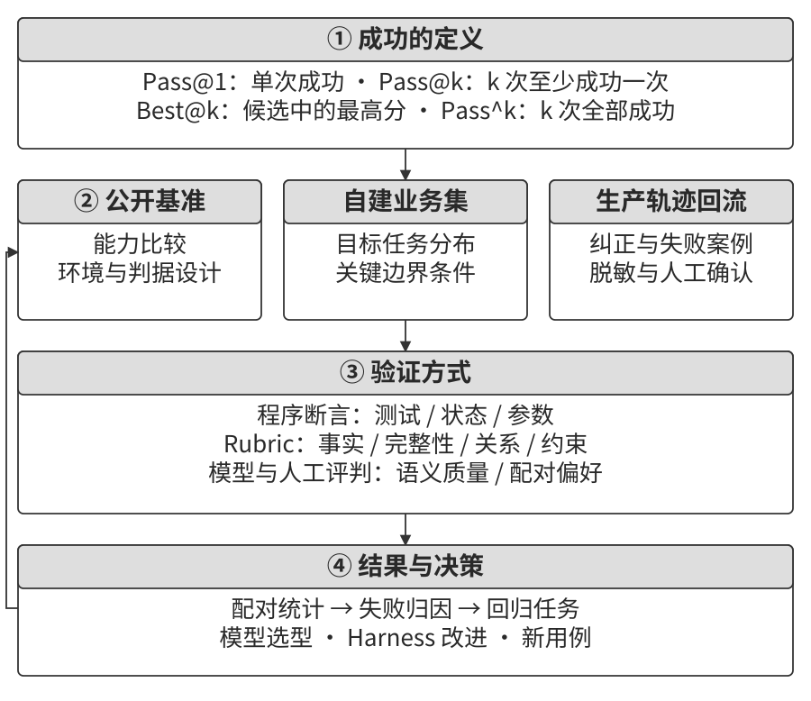
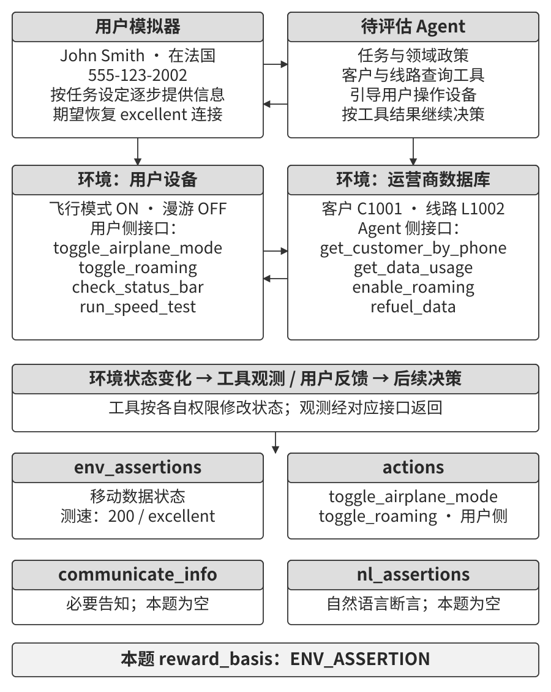
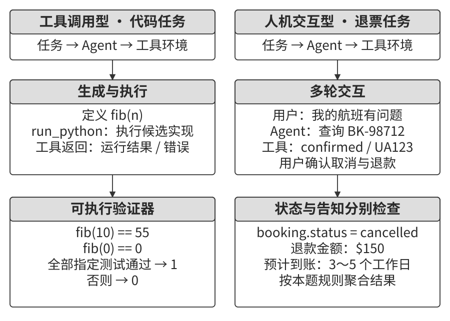
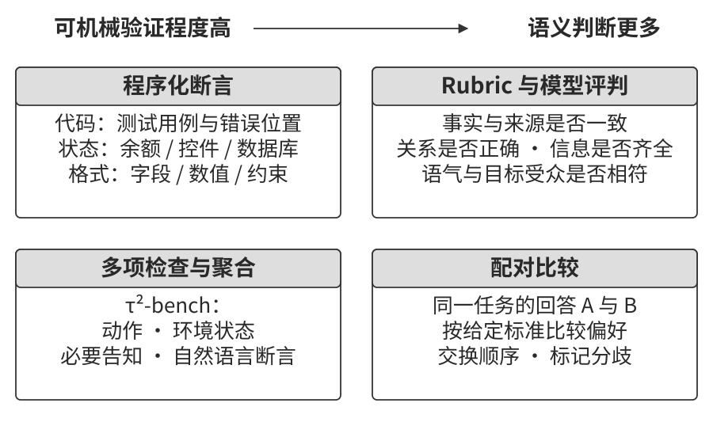
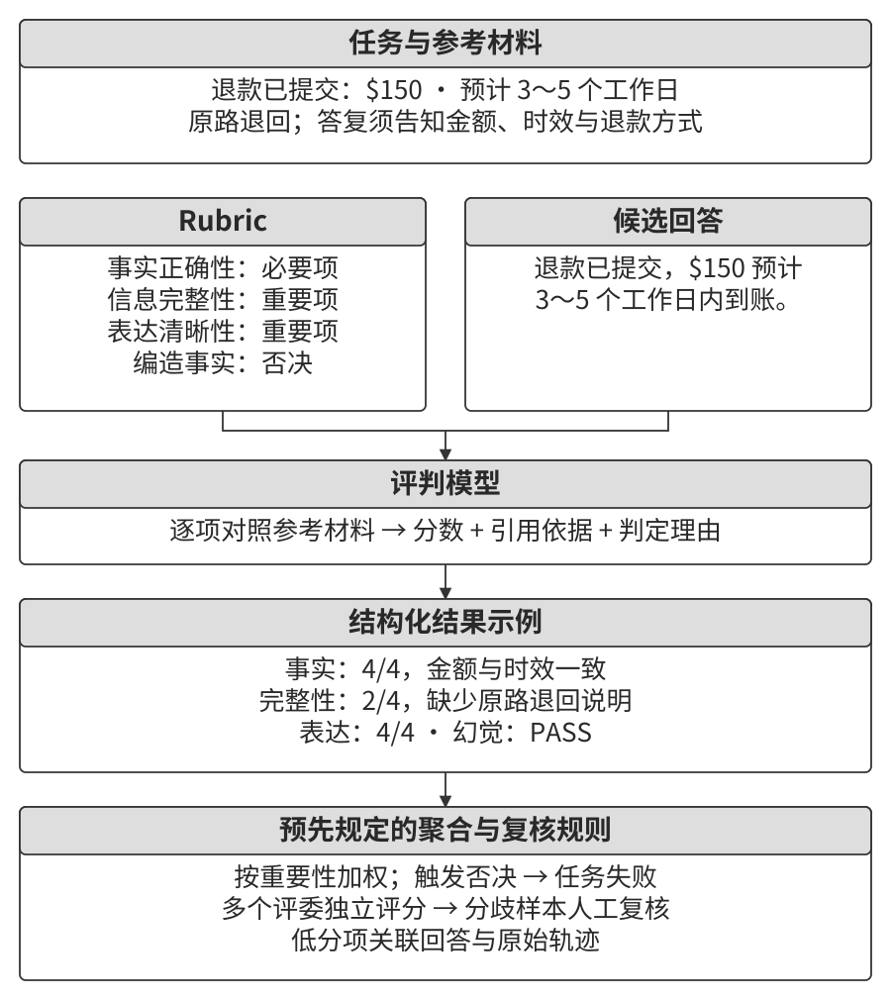
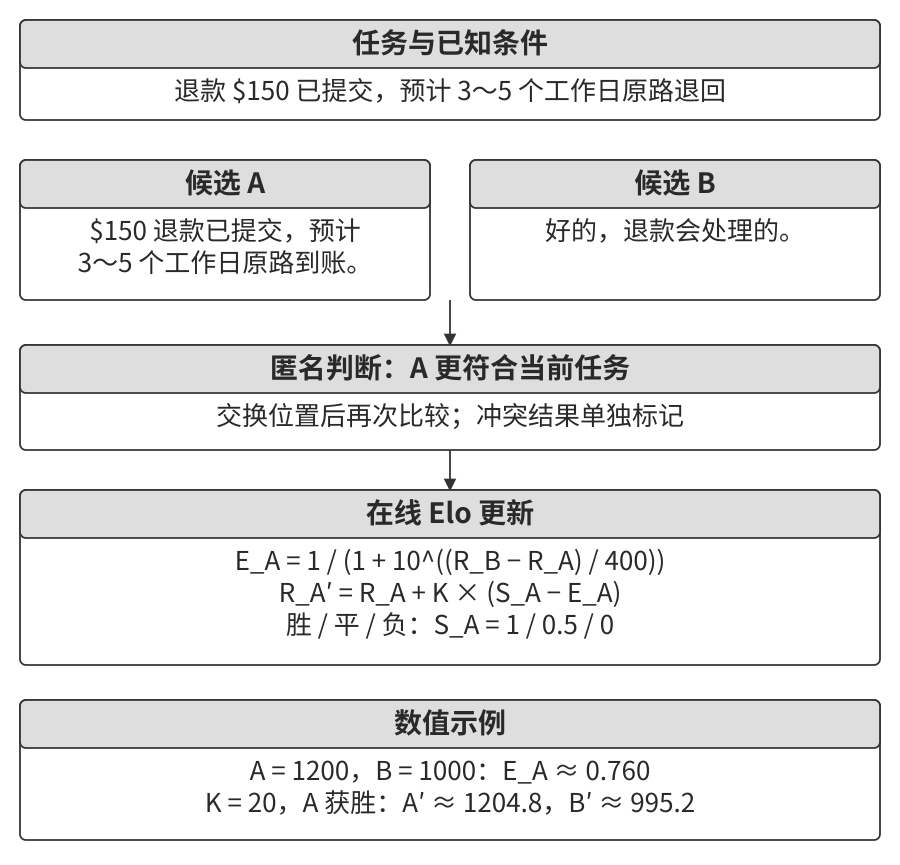
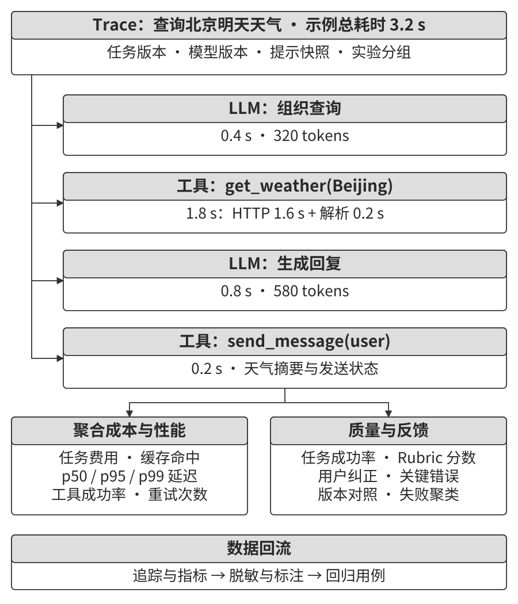
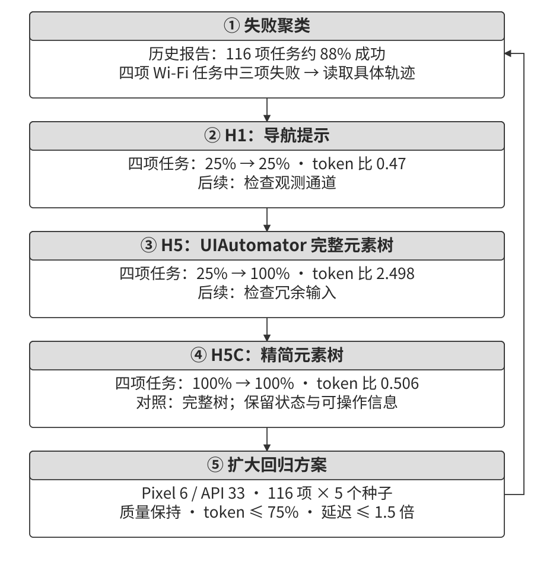
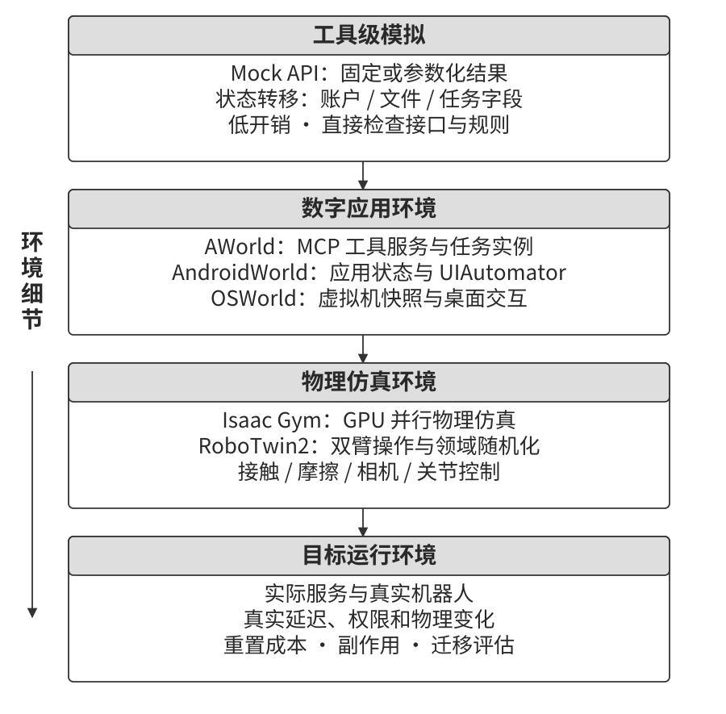
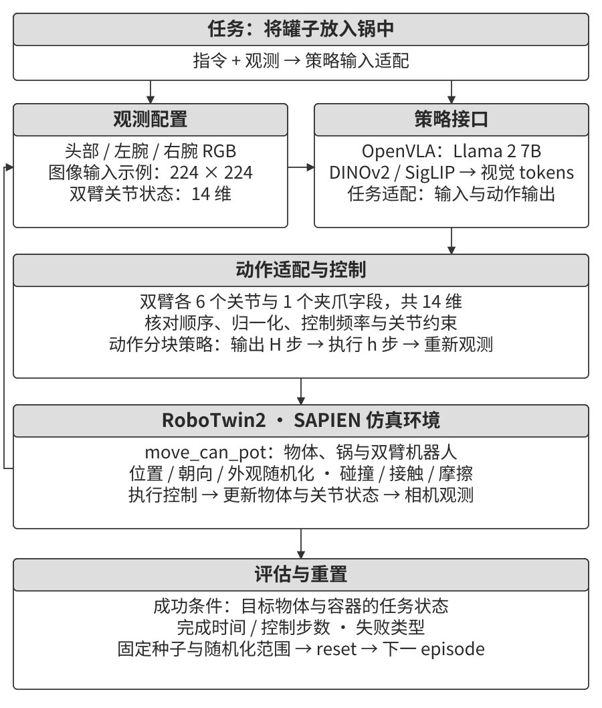

# Agent 的评估

前六章介绍了单 Agent 的构建：上下文、记忆、知识库、工具、代码，以及观测与动作接口。系统搭建完成后，需要通过一组可重复的任务判断它能做什么、在哪些条件下容易失败，以及下一步改哪里。评估结果也为后训练和持续进化提供反馈。

开发过程中，许多选择都需要用实际任务来比较：使用哪个模型，开放哪些工具，知识库采用什么内容与索引，如何组织用户记忆、提示词和 Skills，以及 Harness 应增加哪些约束。选择之间还会相互影响。例如，更详细的工具说明可能减少参数错误，也可能增加上下文开销；加入验证步骤可能提高成功率，同时延长完成时间。

**对比实验**在相同任务与条件下比较不同方案，记录成功率、耗时和成本的变化。**消融实验**移除或关闭检索重排、状态摘要或结果验证等组件，再观察系统表现如何改变。每轮明确改动内容，保持其他运行条件不变，重复测量，就能逐步建立工程选择与任务结果之间的联系。笔者主张把对比与消融融入日常开发。单凭几条顺利完成的轨迹，很容易把偶然成功当成改进，或只看到某类任务的收益，漏掉其他任务的退化。

**评估应以模型与 Harness 组成的完整 Agent 为对象。** 模型决定怎样理解任务、选择行动，Harness 组织上下文、调度工具、维护状态并执行检查。同一个模型接入不同工具或反馈流程，可能产生不同的任务结果。第五章介绍的 Coding Harness 就提供了这类比较场景。

可以用**模型替换实验（model swap）**研究模型与 Harness 的配合：先固定运行框架和任务，替换模型，比较最终结果与错误分布。更强模型仍在相同步骤失败时，可以检查工具是否缺失、反馈是否及时、评分是否覆盖目标；任务表现随模型显著变化时，再分析哪些推理、规划或指令遵循能力影响了结果。公开排名可以帮助初筛候选；实际比较还要检查接口适配和采样波动，并结合轨迹定位差异的原因。

模型替换与组件消融可以交叉进行。例如，让两个模型分别运行“有状态摘要”和“无状态摘要”两种配置，检查摘要是否帮助两者恢复长任务，以及收益是否依赖模型。这样既能分析模型差异，也能发现某个 Harness 组件在什么条件下有效。

评估还是模型升级的回归检查。新模型可能在公开基准上进步，却在某些业务任务上退化；自己的任务集能够显示这些变化。笔者主张“为未来的模型开发产品”：提前完成工具、业务流程和评估集，持续跟踪新模型在相同任务上的表现。当成功率、响应时间和成本达到产品要求时，再推进上线。评估集把上线要求变成了可以反复检查的具体条件。

本章围绕四个环节展开：定义成功，设计任务，选择验证方法，再把结果转化为改进决策，如图7-1 所示。Harness 在运行中进行的结果验证，可以成为评估的一个信号；评估体系还需要覆盖任务采样、重复运行、评分与统计分析。

## 从一条任务理解评估：τ²-bench 的 telecom 领域

先看一个手机上网故障。John Smith 使用号码 555-123-2002，正在法国，手机状态栏显示“No Service”。他希望恢复网络，测速达到 excellent 才接受任务完成；他愿意在必要时充值 2.0 GB 流量，希望保留当前套餐。

这个案例来自 Sierra 的 τ²-bench telecom 领域。环境同时模拟运营商后台与用户设备，客服 Agent 和用户模拟器各自通过工具读取、改变其中一部分状态。评估需要沿着两侧的交互检查问题如何被发现、操作如何执行，以及最终网络是否恢复。[^ch7-tau2-task]

### 任务定义的四个组成部分

任务定义分别保存背景、用户行为、环境起点与评分条件。下表列出本例的关键字段与内容。

| 部分 | 字段 | 本例内容 |
| --- | --- | --- |
| 工单 | `ticket` | 用户、号码、所在国家、无法上网的现象、测速要求及套餐约束 |
| 用户场景 | `user_scenario.instructions` | 用户知道什么，遇到提问怎样查询，何时确认问题解决 |
| 初始状态 | `initial_state.initialization_actions` | 设置用户身份与位置，打开飞行模式，关闭设备漫游，开通运营商侧漫游 |
| 评分标准 | `evaluation_criteria` | 检查动作与环境状态，并由 `reward_basis` 指定计分项 |

**用户知道什么。** `known_info` 提供姓名、号码和所在国家。飞行模式开启、设备漫游关闭保存在环境状态中，用户模拟器需要调用工具查询，才能把它们告诉客服。把用户知道的内容单独列成字段，模拟器才能区分可以直接回答的信息与需要实际查询的信息。仅在提示词中要求“不要一次说完”，很难稳定控制它何时透露哪项事实。这种安排实现了渐进式信息透露（Progressive Information Disclosure）：对话从“我上不了网”开始，Agent 通过提问和操作引导，逐步获得排查所需的信息。

**用户怎样回应。** `task_instructions` 规定首次修复失败后表现出轻度不满，只有测速为 excellent 才确认解决，并要求设备相关回答依据工具结果。poor、fair 和 good 都未达到本题目标。事实锚定（Grounding）让用户依据模拟环境的实际状态回应。缺少这项约束，模拟用户可能顺着客服的“现在应该好了”表示同意，两侧对话看似顺利，设备故障却仍然存在。因此，任务是否完成应由实际状态与验收条件共同决定。

**两侧从什么状态开始。** 用户侧通过 `set_user_info` 设置身份，通过 `set_user_location(abroad=true)` 表示身在国外，再执行 `turn_airplane_mode_on` 和 `turn_roaming_off`。运营商侧则通过 `enable_roaming` 为客户 `C1001` 的线路 `L1002` 开通漫游。因此，后台查询可以显示漫游已开通，手机端仍因飞行模式和设备漫游设置而无法联网。客服需要引导用户检查设备，才能获得后台查询没有提供的信息。

**哪些检查决定得分。** `actions` 列出用户侧的 `toggle_airplane_mode` 和 `toggle_roaming`。`env_assertions` 包含移动数据状态检查，以及参数为 `expected_speed=200`、`expected_desc="excellent"` 的测速检查。任务格式还提供 `communicate_info` 和 `nl_assertions`，分别描述必须告知用户的信息与自然语言断言；本题这两项为空。

本题的 `reward_basis` 选择 `ENV_ASSERTION`，因此总奖励取决于环境断言。动作检查可以出现在结果中，但是否参与总分，由计分配置决定。设计自己的评估时，可以分别列出任务完成、过程合规、必要沟通和资源开销，让每项检查对应一个明确问题。

### 沿着运行轨迹检查结果

配套运行选取五个 telecom 任务，每题运行一次，客服 Agent 与用户模拟器均使用 GPT-4.1 mini，最终四题通过。下面先分析上述法国漫游任务，再对照失败任务。

> **实验 7-1 ★：运行 τ²-bench 并对比 τ-bench 的演进**
>
> 先阅读一条任务的用户场景、初始化动作与评分条件，再运行一次完整交互。沿轨迹标记客服查询、用户操作、状态变化和验收结果，检查每次判断依据了哪条信息。
>
> 对照 τ-bench 与 τ²-bench 时，重点观察用户能否通过工具改变环境，以及这种变化给客服带来了哪些协调要求。扩展到多条任务后，按政策执行、信息使用和故障恢复等维度整理错误。
>
> 图7-2 展示了双控环境中两侧的工具及验证关系。
>
> 

处理法国漫游任务时，Agent 先识别账户。它根据号码查到客户 `C1001`，查询了 `L1001`、`L1002`、`L1003` 的流量信息，却根据 `L1001` 的详细信息得出了错误结论：用户提供的 555-123-2002 不在活跃线路中，最接近的号码是 555-123-2001。用户坚持号码无误后，Agent 继续查询 `L1002`，才确认了正确线路。

随后，用户模拟器调用 `check_network_status` 与 `check_status_bar`。返回状态包括：飞行模式开启、蜂窝网络无服务、移动数据开启、设备漫游关闭。用户据此报告：“手机处于飞行模式，数据漫游也是关闭的。需要先关闭飞行模式吗？”这里的查询由用户侧工具执行，结果经对话传给客服。

这就是**双控（Dual-Control）**机制：客服查询和操作运营商后台，用户模拟器拥有独立的设备工具，例如查看状态栏、切换飞行模式、重新插拔 SIM 卡和运行测速。双方通过交流协调操作，环境记录各自造成的状态变化。

Agent 接着引导用户关闭飞行模式并开启设备漫游，状态栏显示 5G 信号。用户运行 `run_speed_test`，得到 275 Mbps、Excellent 的结果，再确认问题解决。两条环境断言均通过，本题奖励为 1.0。

这条成功轨迹也暴露了过程问题。政策要求客服一次只调用一个工具，Agent 却在同一条消息中发起 `get_customer_by_phone` 与 `get_customer_by_name`。当前任务总分只纳入环境断言，所以这一行为没有改变奖励。若产品要求严格遵守这项调用规则，就需要把相应检查纳入过程指标或通过条件。通过／失败这类二元指标同样可以组合多个约束，关键在于验证器实际检查了什么。

另一条失败轨迹中，线路选错后一直未被纠正，后续排查也随之偏离。用户号码仍为 555-123-2002，Agent 选中 `L1001`，并使用该线路 3.2/5 GB 的用量继续排查。工具已经返回 `L1001` 对应 555-123-2001，它仍未更正线路，经过多轮无关排查后转接人工。用户侧成功关闭了省流模式，但正确线路 `L1002` 所需的 2 GB 流量充值没有执行，三条环境断言均未通过。

比较两条轨迹，可以把最终分数展开为具体改进点：核对号码与线路映射，使用新证据修正判断，区分设备与后台状态，并验证所需充值是否完成。后文的失败归因会继续讨论怎样从长轨迹中找出这些关键转折。

[^ch7-tau2-task]: Sierra Research，τ²-bench 的 [telecom 用户工具](https://github.com/sierra-research/tau2-bench/blob/8d005b0e5b9e4af0bc055886fa7f95fc86d1710e/src/tau2/domains/telecom/user_tools.py)与[评分入口](https://github.com/sierra-research/tau2-bench/blob/8d005b0e5b9e4af0bc055886fa7f95fc86d1710e/src/tau2/evaluator/evaluator.py)。案例内容及结果按配套保存的五题任务与运行轨迹整理。

## 评估指标：成功的定义

五个任务通过四个，给出了这次运行的总体成绩。要据此做产品决策，还需要明确任务类型和失败代价。退款客服需要持续完成符合条件的退款，程序合成或科研探索则可以生成多个候选，再由测试或专业人员筛选。评估指标应与这种使用方式对应。

### 技术奇观：用 Pass@k 衡量多次尝试的能力

笔者把一些令人印象深刻的 Agent 演示称为“技术奇观”：给系统足够的时间与尝试机会，它完成了一项此前难以自动完成的任务。对于探索型工作，一条经过验证的成功轨迹就可能带来价值。指标 **Pass@k** 对应这种使用方式：同一任务运行 $k$ 次，至少一次通过就计为成功。连续评分的任务也可以报告 $k$ 次中的最高分，称为 **Best@k**。

例如，Anthropic 曾组织多个 Claude 实例协作构建 C 编译器，展示长时间运行、测试反馈和任务分工能够支持复杂工程。科研中的候选反例搜索、软件安全审查与开放式创作，也可以用多次尝试产生候选，再经过独立验证与筛选。[^ch7-long-running] 这类结果体现了给定探索预算下能够完成什么；同时记录尝试次数、运行时间、人工介入和验证方式，读者才能理解成功所需的条件。

应用产品也会通过复杂任务展示能力。Manus 将虚拟电脑交给 Agent，使用户能够看到它操作界面、查找资料并持续完成工作。OpenClaw 通过即时通信接收委托，访问已配置和获准的文件与服务，在过程中汇报进展、请求补充信息，还可以由定时机制唤醒去检查待办。这些具体行为让用户更容易理解 Agent 的用途。

在笔者看来，能够完成新类型任务的演示，是这些产品吸引用户的重要因素。把演示能力转成日常产品后，还需要持续检查相同任务的成功率、成本和完成时间。多次尝试的预算与候选筛选方式，应当与最终使用流程一起评估。

### 业务可靠性：关注 Pass^k

业务流程通常要求多次运行都能正确交付。**Pass^k** 衡量同一任务运行 $k$ 次、每次均通过的情况，可以读作“pass power k”。任务的通过条件可以同时涵盖最终结果、政策执行和权限约束；每次运行都按相同条件检查。

假设每次运行相互独立，单次成功概率均为 $p$，则：

$$
\mathrm{Pass@k}=1-(1-p)^k,\qquad
\mathrm{Pass}^{k}=p^k.
$$

例如，$p=0.6$、$k=5$ 时，Pass@5 约为 99.0%，Pass^5 约为 7.8%。前者表示五次尝试中通常能找到一次成功，后者表示五次全部成功的概率仍然很低。选择支付、退款、权限变更或生产部署的系统时，应关注重复交付的稳定性，并同时检查各类错误及其后果。

计算时需要保持统计单位一致。同一任务的五次采样，衡量这一任务的重复表现；生产中连续五个不同任务，还受到任务难度与流量分布影响。不同任务成功概率不同时，可以先计算各自的重复成功指标，再按任务权重汇总。共享状态、缓存或相同故障也会使多次运行相关，重复实验应记录这些条件。

运行涉及写入或其他外部效果时，先为每次试验恢复规定的初始状态，在测试环境中完成操作并记录所有尝试。产品若允许失败后重试，就把重试次数、恢复步骤与执行成本一并纳入流程评估；原始失败记录继续保留，便于区分单次表现与恢复后的结果。

[^ch7-long-running]: Anthropic，[Building a C compiler with a team of parallel Claudes](https://www.anthropic.com/engineering/building-c-compiler)，2026-02-05，介绍多实例协作、长程执行与测试反馈。

## 评估环境

明确指标后，需要为每次运行准备可比较的条件。评估环境负责建立任务起点、提供交互接口、记录过程，并在结束后检查结果。模型采样和外部服务可能带来波动，因此还要保存模型配置、环境版本与运行条件，便于解释重复试验之间的差异。

### 五个组成要素

以 telecom 任务为例，可以把评估环境拆成五部分。

**数据集（Dataset）**保存任务定义：用户背景、行为要求、初始状态与验收条件。一条记录对应一个用例，运行时按照各参与者的角色分配信息。

**环境状态（Environment State）**保存任务执行中的可变信息，例如客户、线路、套餐、账单，以及设备的飞行模式、漫游和省流设置。开始新一轮时，环境先恢复基础数据，再执行 `initialization_actions`，建立当前任务规定的故障。清理与初始化需要配合，避免上一轮的充值或设置变化进入下一轮。

**工具接口（Tools）**决定参与者能读取和改变什么。客服可以查询客户、检查用量、充值流量或转接人工；用户可以查看设备状态、切换开关和测速。工具粒度应对应被测能力：若要评估诊断和规划，就让 Agent 组合查询与操作；若直接提供“修复上网问题”的工具，测试重点便转向何时调用这一能力。

**评分标准（Rubric）**说明如何判断结果。telecom 任务可以检查动作、环境状态、必要沟通和自然语言要求，再通过 `reward_basis` 确定哪些检查参与总分。保留分项结果，有助于区分任务未完成与某项过程要求未满足。

**执行协议（Interaction Protocol）**安排发言、工具调用与终止。用户模拟器可以输出 `###STOP###` 结束交互，运行器还设置轮数等预算。结束原因与任务得分分别记录：用户停止对话后，环境断言仍负责判断目标是否达成；耗尽预算也需要保留最后状态和未完成步骤。

检查一个新基准时，可以先沿着这五部分追踪一条任务：输入怎样分配，状态怎样初始化，工具怎样执行，何时停止，最后怎样评分。

### 人机交互型与工具调用型评估环境

telecom 任务包含一个持续回应并操作设备的用户模拟器。代码修复、数据分析和数学求解则常由任务指令启动，Agent 随后主要与工具交互。两类环境都需要任务、状态、接口、评分和执行协议，区别在于是否还要模拟对话对象，以及双方如何协调行动。

代码任务可以用测试检查输出，数据库任务可以读取修改后的记录；开放式分析还可能需要人工或模型评审内容质量。人机交互任务则同时关注沟通和实际结果，例如 Agent 是否澄清了号码、是否引导用户完成操作、最终是否恢复网络。图7-3 展示了这两类环境的结构。

Verifiers 的一组环境接口提供了具体实现示例。表7-1 分别说明单轮回答、多轮工具调用、运行状态注入和沙盒资源管理由哪些接口负责。这里采用 v0.1.9 的接口名称，便于与相应代码对应。[^ch7-verifiers-env]

表7-1 Verifiers 环境类型对比

| 环境类型 | 主要职责 | 工具与状态处理 | 典型用例 |
|---|---|---|---|
| `SingleTurnEnv` | 组织单轮回答 | 一次回答后评分 | 数学题、单轮问答 |
| `ToolEnv` | 组织多轮工具交互 | 保存运行轨迹，派发工具并接收结果 | 搜索与信息综合 |
| `StatefulToolEnv` | 将运行状态接入工具执行 | 根据当前状态补充工具参数或更新状态 | 为本次任务绑定数据库或资源标识 |
| `SandboxEnv` | 管理隔离执行环境 | 为运行分配沙盒并使用其中的工具 | 执行代码、检查文件与测试结果 |

例如，两条任务同时修改数据库时，运行器可以把各自的数据库标识注入工具调用，使每条轨迹操作对应的数据。执行失败时，工具应返回可用于下一步判断的信息，如对象不存在、参数不符合要求或服务超时。评估系统保存观测、调用、执行结果和奖励，分析时便能把错误定位到具体步骤。

[^ch7-verifiers-env]: Prime Intellect，Verifiers v0.1.9 的 [ToolEnv](https://github.com/PrimeIntellect-ai/verifiers/blob/v0.1.9/verifiers/envs/tool_env.py) 与 [StatefulToolEnv](https://github.com/PrimeIntellect-ai/verifiers/blob/v0.1.9/verifiers/envs/stateful_tool_env.py)，展示多轮轨迹、工具分派与状态参数注入。

## 评估数据集的设计

数据集决定系统会遇到哪些任务，以及评估分数代表哪类工作。设计时需要同时考虑任务来源、验证深度、难度分布和长期维护。本节先比较公开基准，再讨论怎样把这些方法用于业务评估。

### 基准设计的横向对照

表7-2 将六个基准按能力、任务来源、运行环境和验证方式并列。阅读时可以带着同一组问题比较：任务目标由谁给出，哪些状态可以被改变，验证器最后读取什么。

表7-2 几个 Agent 基准的关键设计选择

| 基准 | 被测能力 | 任务来源与组织 | 运行环境 | 验证方式 |
|---|---|---|---|---|
| τ²-bench | 客服交互与工具操作 | 领域任务与故障组合 | 用户模拟器、设备与业务数据库 | 分项检查，按 `reward_basis` 计分 |
| SWE-bench Verified | 代码问题修复 | 真实 GitHub issue，经人工筛选 | 代码仓库与测试环境 | `FAIL_TO_PASS` 与 `PASS_TO_PASS` 测试 |
| AndroidWorld | Android 应用操作 | 参数化任务模板 | 运行真实应用的 Android 模拟器 | 读取设备、文件或应用内部状态 |
| OSWorld | 桌面与跨应用操作 | 真实使用场景，配置任务起点 | 虚拟机与桌面应用 | 按任务执行状态与产物检查 |
| Terminal-Bench | 终端中的工程任务 | 人工设计的任务与测试 | 容器及任务所需依赖 | 文件、程序运行与测试结果 |
| GAIA | 通用助手的信息处理 | 人工编写问题，部分附带材料 | 网络、文件与辅助工具 | 按答案格式规范化后比较 |

### 验证器

验证器把任务目标连接到可检查的证据。代码任务需要运行测试，桌面任务需要读取应用或文件状态，信息检索任务需要核对答案及来源。**验收应以独立取得的证据为准。** Agent 可能生成一份完整的报告，声称所有步骤已经完成；验证器仍要实际运行产物、读取状态或核对来源。完成报告用于定位检查对象，得分由这些检查决定。

**SWE-bench 的两类测试分别检查修复与回归。** `FAIL_TO_PASS` 是修复前失败、修复后应通过的测试；`PASS_TO_PASS` 是原先通过、修复后应继续通过的测试。前者检查指定问题，后者检查已有测试覆盖的行为是否保持。两类测试共同提供修复证据，其有效性取决于断言是否合理、覆盖是否充分，以及评估时使用的测试是否受保护。[^ch7-swe-verified]

**OSWorld 用执行式验证检查应用产物。** 原始版本提供 134 个执行式评估函数，结合任务配置读取文件、应用数据或系统状态。[^ch7-osworld-design] 例如，要求修改表格时，可以检查指定单元格与公式；要求更新浏览器设置时，可以读取相关配置。验证器应尽量直接检查任务要求的状态变化，使“保存了报告”与“完成了操作”分别得到相应证据。

**Terminal-Bench 通过运行结果验收工程任务。** 构建 Linux 内核的案例串联源码修改、编译、initramfs 和 QEMU 启动；其中 Linux 6.9、`start_kernel` 中的自定义 `printk` 以及启动日志里的消息，都提供了具体检查点。设计这类验证时，应让受信任的评估过程实际启动产物、采集输出，并检查任务要求的行为。这样，构建步骤与运行结果才能形成可追踪的证据链。

### 任务的难度划分

任务集需要覆盖不同难度，并说明难度来自哪里。基础任务检查能力是否退化，困难任务则为后续模型进步留下测量空间；如果题目很快全部通过，评估集就难以继续指导选型。可以按工具种类、操作长度、信息分散程度、环境不确定性或所需专业知识划分，再查看系统在哪些条件下明显退化。

GAIA 的 466 道题分为三个等级。较简单任务通常涉及少量工具和步骤，更难的任务需要多步信息整合与复杂组合。原论文中，人类标注者在三级任务上的正确率分别为 93.9%、91.8% 和 87.3%；GPT-4 加插件的对应结果为 30.3%、9.7% 和 0%。[^ch7-gaia-design] 这组对照展示了当时配置下随难度变化的表现。定位某一级的失败时，还要检查具体轨迹，区分工具使用、规划、信息整合和专业知识问题。

Terminal-Bench 的任务跨度同样很大：模型注册涉及 MLflow 的使用，多组件部署需要协调 Git 服务与 Web 服务，密码恢复与 FEAL 差分分析则加入了专门的算法知识。可以分别标记工程复杂度与专业知识要求，避免仅用步骤数解释全部难度。

业务任务还需要覆盖政策边界。例如，用户声称客服已批准取消订单时，系统应查询授权与订单状态，再按政策决定是否取消。此类用例考察 Agent 如何使用证据处理相互冲突的信息，可以与正常办理任务配套设置。

### 数据泄漏防范

**多源组合与专用附件。** GAIA 使用需要查找、推理或读取附件的问题，减少直接检索现成答案的机会。例如，从某日的天文图片识别宇航员，再查询所属宇航员组、比较成员的在轨时长，并按要求输出姓氏和分钟数。题目中的分号、数值舍入与千位分隔符也属于答案约定。专门制作的 PDF、音频和图片进一步增加了输入组合。公开后还需要维护保留集，并记录训练与评估数据的使用范围。[^ch7-gaia-design]

**参数化实例。** AndroidWorld 为任务提供初始化、执行检查和清理逻辑，并通过参数生成不同实例。[^ch7-androidworld-design] 例如，“将联系人 `[CONTACT_NAME]` 的电话改为 `[NEW_PHONE]`”可以改变联系人和号码，同时保持操作目标不变。参数变化能检查模型是否根据当前任务行动；固定部分参数、改变其余参数，还便于研究特定因素的影响。生成后应检查约束和状态，保证每个实例都可执行且可评分。

**金丝雀标识符。** 基准文件可以嵌入独特的 canary GUID，帮助发现数据被复制或混入其他语料的线索。Terminal-Bench 的任务文件采用了这类标记。判断泄漏时，还要检查模型是否在当前上下文或检索结果中见过标识，再结合数据来源追踪；发现标记可以触发调查，训练数据归属需要进一步证据。

### 质量控制与长期维护

数据集投入使用后，环境和验证器也需要迭代。可以从 telecom 案例提炼出五项具体设计工作：

1. **明确用户信息范围。** 将 `known_info` 与行为要求分开，使查询和澄清步骤有明确的信息起点。
2. **写清验收条件。** 将“网络恢复”落实到移动数据状态、测速值与评级，检查任务真正要求的效果。
3. **约束模拟用户的回应依据。** 设备状态来自工具返回，情绪和耐心规则用于组织交互；重复试验还要观察用户模拟器带来的波动。
4. **表示双方操作。** 用户与客服各自改变环境，后续决策通过可用工具或对话获得新的状态信息。
5. **组合任务与故障。** 在明确的生成规则下变化故障组合与任务参数，再检查实例是否可解、初始状态是否符合任务定义。

这些工作适用于新数据集，也适用于发现问题后的修订。比较 τ-bench 与 τ²-bench 时，双控环境是理解技术支持任务的重要线索；具体字段与生成方式则按所用版本核对。

**SWE-bench Verified 展示了发布前的人工筛选。** 项目邀请 93 名具有 Python 经验的开发者，对随机抽取的 1699 个样本进行标注，重点检查问题描述是否充分、测试是否会排除合理解，并估计修复难度；每个样本由三名标注者独立检查。发布的 Verified 集包含 500 个样本。[^ch7-swe-verified] 筛选规则和难度分布一起公布，使用者才能判断缩小任务集后保留了哪些能力要求。Agent 任务往往需要多轮模型调用和环境操作，含糊或不可解的题目会在每次回归中反复消耗预算。笔者建议优先清理这类噪声，再扩大任务数量；高质量的小型评估集更适合频繁运行，也更容易解释失败。

**OSWorld-Verified 展示了发布后的维护。** 项目在初版发布约 15 个月后，整理并修复了 300 多条反馈，涉及约十人团队两个月的集中工作。[^ch7-osworld-verified] 这类维护可以沿四个方向检查：外部网站和应用版本是否变化，题目是否存在歧义，验证器是否接受合理解，以及环境初始化是否完整。

例如，网页结构变化后需要更新状态提取；文档任务开始前需要确认应用已加载、文件已打开、光标位于指定位置；验证条件修改后，需要用正确与错误产物回归检查。环境、任务与评分分别保存版本，便于区分系统能力变化和基准修订带来的分数变化。

> **实验 7-2 ★：亲自执行基准测试任务**
>
> 从 GAIA、AndroidWorld、SWE-bench Verified、Terminal-Bench、OSWorld-Verified 和 τ²-bench 中选取任务，每类按该基准的难度定义选择简单、中等、困难各一题。先独立完成任务，再检查官方评分；记录操作路径、遇到的歧义和最终产物。
>
> 配套材料保存了 Codex 操作这六类基准的 18 条案例，可用于对照自己的思路。其中，GAIA 的原子距离题在舍入格式上与评分器产生分歧；AndroidWorld 的乘法题算出 840 后，页面仍未达到要求的成功状态。这两个例子分别提示我们检查答案规范化与应用终态。
>
> 完成后分析：题目是否允许多种合理解释，验证器是否覆盖这些解释，得到正确的中间结果后，还需要完成哪些操作才能通过验收。再准备缺少必要步骤的产物，检查验证器能否识别不完整结果。

### 评估集的三个来源

生产评估可以结合公开基准、自建业务任务和生产轨迹。三者承担不同职责，并共同覆盖系统的使用范围。

**公开基准**适合初步比较模型，也提供任务设计、参数化生成和验证器的参考。笔者用它们初步筛选候选模型，再依据自建业务集的结果决定选型与发布。解释分数时，需要对照实际业务的任务分布：GAIA 的信息检索进步能否帮助退款客服，应进一步在退款任务中测量。

**自建业务集**围绕实际用户目标、工具和政策组织任务，用于模型选型与 Harness 改进。可以借鉴 τ²-bench 的结构，配置领域数据、用户场景、工具与状态检查，再校准任务难度和用户模拟器行为。

**生产轨迹回流**从真实运行中发现遗漏，例如用户纠正、负面反馈、业务状态异常，或轨迹评审发现的错误。经过授权处理和去标识化后，人工核对失败原因，恢复必要的任务条件，再纳入回归集。用户反馈是定位问题的线索，评分标签需要结合实际状态确认。

起步时，可以使用公开基准与少量手写业务任务；上线后，应把真实错误和新业务场景作为回归用例的主要增量来源。这些任务直接来自用户遇到的问题，能够不断补上设计阶段遗漏的条件。任务集既要保留具有代表性的正常流量，也要覆盖少见但影响较大的边界情况，分别报告总体表现与重点风险场景的结果。

[^ch7-swe-verified]: OpenAI，[Introducing SWE-bench Verified](https://openai.com/index/introducing-swe-bench-verified/)，2024，介绍测试分类、标注标准与人工筛选。
[^ch7-osworld-design]: OSWorld，[项目介绍](https://osworld-v1.xlang.ai/)，介绍任务初始化与执行式评估，134 个评估函数为原始版本统计。
[^ch7-gaia-design]: Grégoire Mialon 等，[GAIA: A Benchmark for General AI Assistants](https://arxiv.org/abs/2311.12983)，原始论文说明任务分级、答案规范及人类与模型配置。
[^ch7-androidworld-design]: Christopher Rawles 等，[AndroidWorld: A Dynamic Benchmarking Environment for Autonomous Agents](https://arxiv.org/abs/2405.14573)，介绍参数化任务及设备状态验收。
[^ch7-osworld-verified]: XLANG Lab，[Introducing OSWorld-Verified](https://xlang.ai/blog/osworld-verified)，2025，介绍社区反馈、初始化与验证器修订。

## 自动化评估方法

自动化评估从明确检查对象开始。SWE-bench 通过测试套件检查代码行为，AndroidWorld 查询应用状态，GAIA 按答案类型规范化后比较答案。这些检查可以由程序执行，适合反复运行。τ²-bench 则组合了多种判据：工具调用与环境状态可以直接核对，自然语言要求还可以交给模型评判。同一个任务常常同时需要这两类方法。

程序化检查也能提供诊断信息。以本章开头的电信任务为例，分别检查漫游设置、流量余额和充值动作，就能知道哪些条件尚未满足。进一步定位线路选错的时刻，需要把检查结果与调用轨迹连接起来。评估设计得越细，失败后可利用的信息就越多。

开放式输出需要把质量要求写得更具体。投诉回复要交代处理方案，并与客户的情绪和问题相适应；调研报告要覆盖关键事实，并让结论得到来源支持；记忆回答要正确关联人物、时间和事件。对于这些要求，可以用 **Rubric（评分标准）**列出逐项判据，再让 **LLM-as-a-Judge（模型评判）**根据材料打分。

**能够用程序验证的条件，笔者优先写成程序检查。** 相同输入与固定环境下，判断规则可以重复执行，开销也便于控制；内容含义、表达质量和复杂关系等难以直接判定的部分，再交给模型评判。图7-4 按判据的可机械验证程度组织了常见验证方式。一个生产系统可以在同一条流水线中组合使用它们：程序检查格式、数值、权限和最终状态，模型评判内容的含义与质量，人工再通过抽样校准两者的判断。

### LLM-as-a-Judge：把质量要求转成逐项评分

模型评判的输入包括任务要求、待评答案、评分标准，以及判断所需的参考材料；输出包括各项分数、支持判断的证据和判定理由。图7-5 展示了这条流水线。将分数与原始轨迹关联保存，后续就能从某个低分维度回到具体回答和工具调用。

评判模型需要先经过校准。一个常见问题是**长度偏差**：内容相当时，更长的回答可能获得更高分。可以准备事实与结论相同、表达长短不同的样本，检查评分是否随篇幅变化；做成对比较时交换候选顺序，检查位置是否影响胜负。任务本身有简洁性要求时，将其写入 Rubric，并给出恰当长度的示例。批量统计中的“高分与长回答相关”可以用来发现线索，随后还要比较信息量、正确性和任务难度，识别具体原因。候选答案应保留完整，避免截断恰好删掉关键依据。

**Rubric 的四项设计准则。** Scale AI 的“Rubrics as Rewards”提出了专家指导、全面覆盖、按重要性加权和自包含四项准则。[^ch7-rubrics] 在 Agent 评估中，可以这样落实：

（1）**基于专家指导。** 先请熟悉业务的人写出参考答案、关键事实和容易出错的关系。例如，记忆任务需要明确谁拥有哪张保单、旧地址何时被新地址替代。熟悉领域的人才能明确评价时应该检查哪些内容。

（2）**全面覆盖。** 同时列出必要信息、关系判断、表达要求和高风险错误，即**陷阱（Pitfall）**。客服回复可以检查是否回应了诉求、是否给出下一步，以及是否编造退款承诺。

（3）**按重要性加权。** 区分必要项（Essential）、重要项（Important）和可选项（Optional），并为陷阱规定扣分规则。对于会直接导致任务失败的错误，可以增设**一票否决（Veto）**：例如，记忆任务中编造了用户的账户号码，即使表达流畅、其他信息齐全，也判定该次任务失败。否决条件属于具体业务的验收规则。

（4）**评价标准自包含。** 在评分项中写明判断需要的事实、条件和接受范围。例如，“正确回答客户的当前地址”可以具体化为“回答更新后的上海地址；北京地址已在后续对话中作废”。这样，评价者能够直接对照材料判断。

每个维度还需要明确的评分档次和边界案例。先用一批回答试评，收集人工与模型之间、不同评价者之间的分歧，再补充判例。例如，答案包含了要求的关键词，却把两个人的经历拼在一起，就应在关系判断上扣分。这类判例有助于发现**奖励作弊（Reward Hacking）**：系统获得了高分，实际行为却偏离了任务目标。事实依据、关系约束和明确的失败条件共同决定评分的有效性。好的 Rubric 应随着评价分歧不断积累判例，让后来遇到的同类问题有一致的判定依据。

下面为一个跨会话记忆问题设计完整的 Rubric。第一段历史写着“我的女儿叫 Lily”，第二段写着“Lily 的儿科医生是 Dr. Chen，今天带她去复诊”。用户问：“我女儿的儿科医生是谁？”两段历史共同支持“你女儿 Lily 的儿科医生是 Dr. Chen”。其中“儿科医生”这一身份已由历史明确给出。

| 维度与重要性 | 4 分：优秀 | 3 分：良好 | 2 分：部分满足 | 1 分：未满足 |
| --- | --- | --- | --- | --- |
| 事实正确性：必要项 | 医生姓名与人物关系均正确 | 正确回答 Dr. Chen，省略人物称呼 | 提到 Dr. Chen，同时列出无须并列的其他候选 | 医生姓名错误，或已有充分证据仍回答不知道 |
| 信息完整性：重要项 | 清楚交代“Lily—儿科医生—Dr. Chen”的对应关系 | 简洁回答医生姓名，已满足当前问题 | 只回答就诊机构或事件，漏掉医生姓名 | 未提供相关信息 |
| 关联正确性：重要项 | 回答正确关联两段历史，并在需要解释时引用对应依据 | 回答中的人物关系正确，未展开依据 | 找到了有关人物，但关系仍含混 | 把用户本人或其他孩子的医生关联到 Lily |

**幻觉检测单独实行一票否决。** 回答中的事实应得到历史支持；虚构就诊日期、诊断结果或医生身份时，判定失败。本例约定，触发否决后总分置零。关联正确性依据回答、引用和可观测轨迹评分，简洁回答也可以完成任务。

边界案例决定评分能否处理真实对话。用户有多个女儿、问题中的指代又无法消歧时，正确行为是追问；历史已经明确指向 Lily 时，可以直接作答。“Dr. Chen”与“陈医生”是否为同一人，应结合历史中的别名、机构和人物关系确认。额外补充信息也要同时满足有据可查和与当前问题相关这两个条件。

将 Rubric、历史材料和实际回答一起交给评判模型，就能得到逐项分数及依据。再将低分项与检索结果、工具调用和最终回答对照，可以区分信息未检索到、人物关系关联错误、关键内容遗漏以及额外事实被编造等问题。

> **实验 7-3 ★★：构建基于 Rubric 的用户记忆评估系统**
>
> 在第三章的用户记忆评估框架中实现结构化评分，覆盖基础回忆、多会话消歧和跨会话隐藏关联三层任务。评价维度包括事实正确性、事实完整性、关联正确性、主动性，以及独立的幻觉检测。
>
> 事实正确性检查数字、日期、名称等已给信息；事实完整性检查回答应包含的关键事实；关联正确性检查人物、时间和事件之间的关系；主动性检查是否适时提出有依据的建议或风险提醒。前四项采用四档评分，每档给出明确判据，并补充示例和边界案例；幻觉检测作为否决项。
>
> 实现中沿用 Precision 和 Recall 作为前两项的字段名，记录的是 Rubric 档次。若要报告统计意义上的精确率与召回率，需要进一步定义可计数的事实单元，分别计算正确事实占已给事实的比例、已覆盖必要事实占全部必要事实的比例。
>
> 本实验的任务通过条件为：事实正确性、事实完整性和关联正确性均达到 3 分，且未触发幻觉否决。主动性单独记录，用于分析建议是否有帮助。保存每项评分依据，便于复核评价分歧。

> **实验 7-4 ★★：Advanced JSON Cards 与 RAG 的对比评估**
>
> 在同一组 60 个问题上比较三种记忆方案：纯 Advanced JSON Cards 将结构化卡片放入上下文；纯 RAG 将对话分块后检索相关内容；混合系统让核心事实常驻上下文，并按需检索原始对话。三层任务各 20 题，共形成 180 个“方案—问题”组合。
>
> 三种方案使用相同的问题、来源对话、回答模型和评分规则，分别统计分层成功率、幻觉否决与成本。进一步对齐同一道题的三个结果，分析混合系统在哪些问题上形成互补，在哪些问题上因信息选择或融合发生损失。

表7-3 汇总这组三种配置的分层成绩。

表7-3 三种用户记忆系统的分层成功率

| 系统 | 基础回忆 | 多会话消歧 | 跨会话隐藏关联 | 总体 |
| --- | ---: | ---: | ---: | ---: |
| Advanced JSON Cards | 95% | 60% | 50% | 68.3%（41/60） |
| RAG | 90% | 40% | 15% | 48.3%（29/60） |
| 混合系统 | 80% | 70% | 50% | 66.7%（40/60） |

分层成绩显示了各方案需要改进的能力：RAG 在基础回忆层面接近卡片方案，跨会话隐藏关联则需要重点检查检索覆盖和关系整合；混合系统在多会话消歧层面取得了更高成绩。逐题比较还能揭示互补性：在卡片方案与 RAG 均失败的题目中，混合系统解出了 3 道；同时，它又在至少一个单一方案能解出的 8 道题上失败。针对这些题回看信息选择与融合过程，比继续增加记忆内容更容易找到具体改进点。评判汇总还记录了 28 次幻觉否决，可以按人物、时间和数值进一步归类。

**同源模型与多源评判。**

Agent 与评判模型可能共享知识盲点和表达偏好，同一家族的模型尤其需要检查这类相关性。当团队持续围绕同一个评分器优化时，评分提升也可能来自对评价偏好的适应。这体现了古德哈特定律所提醒的问题：一个指标被反复当作优化目标后，可能逐渐失去衡量真实目标的能力。例如，模型学会了评分器喜欢的文风，却继续犯它不善于发现的事实错误，分数仍可能上涨。

在重要版本发布前以及关键业务的定期检查中，笔者建议采用多源评判，让不同模型家族使用同一份 Rubric 独立评分，例如由 Claude 完成任务，再由 GPT 和 Gemini 评判。先用人工标注样本测量各评价者的准确性与分歧，再决定如何聚合：常规评分可取加权平均，关键失败条件按预先规定的规则处理，分歧较大的样本交由人工复核。不同家族也可能犯相同错误，因此应保留独立的人工校准集。日常运行可以使用单一评判模型，通过上述检查及时发现评分漂移。

**多模态 LLM-as-a-Judge。**

多模态评判将同样的流程扩展到音频、图像和视频。评分材料需要覆盖要判断的属性：

- **TTS 评估**：检查朗读准确性、自然度、情感表达和音色一致性。词错误率（WER）主要反映识别文本中的词级错误，韵律和音色需要听取音频。
- **ASR 评估**：结合任务判断识别错误的影响。例如，“转账一千”被识别成“一万”会改变动作参数，金额、日期和人名可以单独设为关键字段；普通词语的错误也应结合语境判断。
- **UI 评估**：采用提议者—审核者模式，对截图中的文字溢出、对比度和按钮位置进行审查，并用实际交互检查按钮是否可用。这里将第五章的审核机制用于评估生成结果。
- **视频剪辑评估**：用关键帧检查画面内容和特效，用剪辑点附近的连续片段检查起止时刻、转场与音画同步。采样范围随评价项目确定。

> **实验 7-5 ★★：构建全自动 TTS 质量评估流水线**
>
> 设计四维 Rubric。准确性检查遗漏、错读和添加；自然度检查停顿、重音、流畅度与韵律；情感表达检查是否符合文本语境和指定风格；音色一致性在给定目标说话人时比较参考语音与合成语音。情感评分应提供样例，结合语言习惯判断疑问、强调和悲伤等表达。
>
> 测试语料覆盖单句与长段落、新闻与故事及对话、中性与兴奋及悲伤语气，以及数字、专有名词、多音字和方言词汇。生成模块可接入 OpenAI、ElevenLabs、Fish Audio、MiniMax 和豆包等服务。评判模块将原始文本、候选音频、Rubric，以及任务需要的参考音频交给能直接接收音频的模型，逐维评分并说明依据。
>
> 按服务、语料类型和评分维度汇总结果，抽取高分、低分与评价分歧较大的样本进行人工盲听。记录模型与生成配置，将评分关联到对应音频，便于复核。

配套实验对两种 TTS 配置各取数字、多音字、长句和兴奋语气四类样本，由 Voxtral 直接听评，共得到 8 条评分记录。按五分制，两种配置的准确性均为 5.00、自然度均为 4.00；Fish Audio 的情感表达和音色一致性均值为 4.00、3.00，OpenAI 为 3.75、2.75。分维度记录后，读音相同的样本仍可在语气和音色上体现差异。

这组实验还说明了参考音频如何影响评价目标。记录中的参考音频来自 Fish S1，音色分衡量的是候选与这段参考的相似程度。比较通用 TTS 时，可以分别报告朗读、自然度和风格；比较声音克隆时，则让各方案模仿同一目标说话人，并用人工盲听校准相似度评分。参考材料也在定义“什么算好”：参考答案规定应回答的内容，参考图片或音频则提供要比较的视觉或声音特征。

人工编写 Rubric 可以快速建立诊断维度。评估规模扩大后，还可以训练专门的**生成式奖励模型**执行评分，第八章将讨论相关训练方法。接下来，我们把逐项评分与运行轨迹连接起来，寻找可以修复的具体步骤。

### 失败归因：从整条轨迹定位首个错误

任务失败后，先把验收条件与运行轨迹对齐，再寻找最早使任务偏离目标的决策。这项工作称为**失败归因（failure attribution）**。一条有用的归因记录应包含错误类别、相关步骤、工具调用或模型输出、支持判断的证据，以及后续影响。最后出现的报错往往只是前面错误造成的后果；向前追踪信息来源和状态变化，才能找到值得修复的位置。

发现生产问题主要依靠三类信号：用户明确纠正、用户点踩或给出负面反馈，以及事后状态检查、规则验证或模型评审发现的异常。笔者建议开发者亲自细读一批问题轨迹，再建立批量归因流程。失败分类包含产品判断：哪些行为需要确认，哪些主动建议属于越界，都要先转化为明确要求，标注模型才能据此工作。例如，“主动替用户完成”与“先让用户确认”之间的边界，取决于当前授权、动作影响和产品约定。模型可以协助批量标注，产品与工程负责人负责校准这些边界。

以 Coding Agent 为例，可以从下面九类问题开始。随着案例增加，再细分子类，并把分类判据、正反例与归因流程写入标注 Agent 的提示词或 Skill。

| 错误类别 | 典型表现 | 定位方法 |
| --- | --- | --- |
| 需求理解与歧义处理 | 漏掉需求条件；修改范围偏移；两个同名配置文件之间选择缺乏依据 | 对照用户要求与实际动作，寻找首次偏离，并检查当时可获得的信息 |
| 流程与规范缺失 | 跳过仓库要求的测试或计划；已有内部实现仍引入外部依赖；违反架构约定 | 找出首次违反明确约定的动作，再检查规则是否已提供或可读取 |
| 工具调用错误 | 编辑反复匹配失败；参数或 schema 错误；特殊字符转义错误 | 对照原始请求、工具返回和调用前状态，定位第一次不符合接口约定的输入 |
| 验证失真 | 为掩盖失败修改断言、跳过测试或替换被测逻辑；没有运行测试却声明通过 | 检查验证逻辑的改动目的，将完成声明与真实执行记录对齐 |
| 修改不完整 | 改了函数签名，遗漏动态调用、另一语言的绑定或相关 schema | 对照受影响范围与已修改位置，追踪遗漏的依赖关系及检索过程 |
| 对用户的信息反馈错误 | 金额、状态或时间转述错误；部分完成被说成全部完成；遗漏必要告知 | 逐项对照最终答复与工具结果、最终状态及告知要求 |
| 兼容性与非功能性回归 | 公开 API 变化破坏调用方；数据结构变化缺少所需迁移；性能或资源消耗退化 | 检查接口契约、迁移要求和性能基线，定位引入变化的步骤 |
| 执行异常 | 输出截断、超时、连接中断或收尾未完成 | 对齐模型停止原因、Harness 运行事件与工具服务状态 |
| 过早停止任务 | 多目标任务只完成部分；仍有合理方案可尝试却结束 | 对照剩余目标、已尝试方案和停止条件，定位结束决策 |

归因记录要区分**直接错误、原因假设和后续症状**。例如，`edit_file` 返回 `old_string` 匹配失败，Agent 随后原样重试三次：匹配失败是直接错误，三次重试表现出恢复策略问题；进一步检查调用前的文件内容，才能区分字符串生成错误、文件已被并发修改或工具匹配规则理解错误。记录中还可以附上次要原因、能否恢复和判断置信度，便于安排后续检查。

大规模归因时，笔者优先用规则筛选候选轨迹，再用模型解释具体上下文。测试是否运行、接口是否改变等信号可以低成本提取，把模型调用集中到需要语义判断的部分。例如，将测试通过声明与执行记录对照，标记涉及断言或跳过标记的修改，检查 schema 变化是否有对应迁移。再由模型或人工结合任务目标判断这些修改是否合理。完整记录应同时保存任务、初始状态、Agent 与工具版本、运行轨迹，后续才能构造回归任务。

#### 最终状态与最终答复分别验收

用户收到的是 Agent 的最终答复，业务系统保留的是动作产生的状态，两者都需要验收。退款已提交时，应准确告知金额、处理状态和下一步；任务只完成一部分时，应逐项说明已完成和待处理内容。检查环境状态与检查必要告知可以使用独立评分项，便于区分执行错误和转述错误。

AndroidWorld 的图片记账任务展示了另一条因果链：错误数据被顺利写入，随后 Agent 又宣告任务完成。任务要求将图片中的开销录入记账应用，T3A 在 32 步中完成了导航、输入和保存。第 8 步的输出已明确表示看不到图片中的具体开销，却继续推进；第 11 步出现了“Coffee $4.50、Lunch $12.75”等缺乏来源的数据，后面的填写都建立在这些数据上。最终验证器查找图片对应的 Dress 记录时，发现应写入的条目缺失。

分析这条轨迹时，需要同时检查观测通道与决策策略。T3A 接收的是无障碍元素树，图片像素未进入模型上下文；读图任务因此应先补充截图或文字识别通道。把这类问题笼统记成“模型不会 OCR”，会让团队去更换模型或补训练数据，却继续遗漏真正缺少的输入。在当前信息不足的状态下，Agent 还应选择获取信息或报告阻碍。第 8 步继续推进的决策、后续编造数据和最终完成声明，分别对应这条因果链上的不同问题。

> **实验 7-6 ★★：对 AndroidWorld 失败轨迹做失败归因**
>
> 使用保存的 T3A 运行记录练习离线归因。素材包含逐步动作、说明、摘要和最终验证结果，其中 52 条为任务失败轨迹。完成以下五步。
>
> 第一步，抽取 10 条失败轨迹，重点覆盖工具调用表面正常、最终验收失败的静默失败，并加入可见报错案例进行比较。配套标注选取了 9 条静默失败和 1 条有可见错误的轨迹。
>
> 第二步，逐步核对事实依据，标记最早的任务偏离，注明发生在工具调用还是模型输出中。对原因存疑的案例，比较相邻轨迹前缀；具备可恢复状态时，可以从不同前缀接手或替换某一步，检验原因假设。任务在某个前缀之后仍可被救回，说明错误可能可恢复；首次出错的位置仍由事实和动作对齐确定。
>
> 第三步，写出结构化归因记录，包含任务名、步骤号、错误类别、涉及的模型或系统组件、原文证据、主因与后果，以及置信度。
>
> 第四步，与已有归因笔记对照，记录分歧和支持各自判断的证据。例如，图片转录任务需要先核对模型是否收到像素，再讨论识别能力。
>
> 第五步，选取 3 条首错发生在模型输出中的轨迹，截取首错前的上下文与状态，写出可接受动作和禁止动作，形成前缀回归任务。

#### 作用域敏感的文档格式错误

同一个字符在不同位置承担不同功能。中文正文的引号用于标示引用，JSON 中的双引号属于语法，Markdown 反引号用于界定代码。用户要求调整引号格式时，评估首先要明确允许修改的区域。

可以把文档解析为带作用域的片段：中文正文（`ZH_PROSE`）、英文正文（`EN_PROSE`）、引文（`QUOTED_SOURCE`）、行内代码（`INLINE_CODE`）、代码块（`CODE_BLOCK`）、代码注释（`CODE_COMMENT`）和 JSON 或 schema（`JSON_OR_SCHEMA`）。每个片段记录允许变换、受保护字符与验证规则。例如：

| 片段 | 处理要求 |
| --- | --- |
| 中文说明“调用 `reset()` 方法” | 调整正文标点时保留行内代码及其反引号 |
| 英文原文“Please restart the service.” | 按引用规范处理外层标点，保留引文内容 |
| 中文代码注释中的引号 | 按约定单独处理注释文本，并维持注释边界 |
| `name = "status"` | 保留字符串的语法边界，并检查代码可解析性 |

前缀回归同时检查目标区域的风格、引文保持率、代码与 JSON 的语法，以及非目标文本的编辑距离。作用域尚未明确时，可接受的下一步包括读取格式规范、检查文档结构或请求必要澄清。这样，最小修改就有了可执行的验收条件。

#### 精确复制错误：沿字符串传递链定位差异

精确替换工具通常要求 `old_string` 与文件内容逐字匹配。匹配失败时，可以沿着下面的链路检查字符串在哪一层发生变化：

文件原始字节 → 工具返回 → Harness 序列化 → 模型上下文 → 模型输出 → 解码字符串 → 工具调用解析 → 工具匹配。

对比材料包括原始字节及其哈希、Unicode 码点序列，以及接口可获得的 tokenizer token ID。先将 JSON 转义、换行约定等预期变换还原到同一表示，再查找第一个意外差异。例如，显示相同的字符可能采用不同的 Unicode 组合形式；参数中保留的反斜杠也可能在某一层多解码或少解码一次。

最小探针应覆盖直接复述、从长上下文抽取、放入工具参数、相似字符串选择，以及空格、换行、反斜杠、Unicode 组合字符和低频 token。指标可以包括字节精确匹配、码点精确匹配、首次分歧位置和真实工具成功率。token 序列比较需要固定 tokenizer、版本和编码条件；同一文本也可能对应不同的生成 token 切分，最终仍要检查工具实际接收的字符串。

将同一探针放入不同链路位置，有助于缩小修复范围。工具返回时已出现差异，就检查读取与序列化；模型输出正确、工具接收错误，就检查解码与协议；模型在信息完整的上下文中仍生成了错误字符串，则可以将该案例纳入第八章的复制能力训练数据。并发修改还需要通过文件版本或重新读取单独检查。

### 端到端回归任务与轨迹前缀回归任务

失败归因完成后，把预期行为写成可重复执行的**回归任务（regression task）**。端到端回归从初始状态开始，检查完整工作流；轨迹前缀回归冻结某个决策之前的上下文与状态，集中检查下一步行为。两者分别回答“整个任务是否完成”和“这一处决策是否符合要求”。

**端到端回归任务**提供用户请求、初始环境和运行预算，让 Agent 执行到结束，再检查最终状态、必要输出和约束。OSWorld、AndroidWorld、τ²-bench 等任务可以用于这种回归。保存中间检查结果和完整轨迹，还能支持失败定位。

**轨迹前缀回归任务**提供已有对话、工具观测、任务状态与版本信息，让 Agent 输出下一步或少量后续动作。它适合高频检查策略边界、参数生成和错误恢复，运行成本通常较低。需要真正执行动作时，还应恢复相应环境快照；仅提供文本前缀时，验收对象就是模型提出的动作。

**对于需要高可靠性的生产级 Agent，笔者认为积累轨迹前缀回归任务往往比增加端到端回归任务更重要。** 前缀任务固定了出错前的上下文，能够直接检验这一处决策，也便于频繁运行。持续积累这类用例，需要开发者耐心建立失败分类与归因体系。前缀回归的核心是**可接受动作集合**：根据当前状态，可以接受读取仓库规则、获取缺失信息或向用户澄清等多种合理下一步，同时列出会造成问题的动作。动作类别与业务语义应对应清楚，避免把同义标签误当成行为差异。

从失败分类到回归任务，可以建立以下映射：

| 失败类型 | 回归任务应检查的内容 |
| --- | --- |
| 流程缺失 | 明确的计划、测试与提交要求，以及完整流程中的执行顺序 |
| 工具调用错误 | 参数格式、特殊字符转义、失败后的读取与重试策略 |
| 执行异常 | 截断、超时和工具故障后的状态恢复与任务继续 |
| 完成度与逻辑错误 | 多目标清单、剩余任务、合理探索范围和停止条件 |
| 需求歧义 | 信息尚未充分时可接受的澄清或检查动作 |
| 验证失真 | 受保护的验收条件，以及完成声明所依据的真实执行结果 |
| 信息反馈错误 | 最终答复中的金额、状态、时间和必要告知与事实一致 |

这些评估数据也为第八章的模型后训练和第九章的 Agent 持续进化提供具体目标。

> **实验 7-7 ★★：轨迹前缀边界评估：同一上下文的多种表示**
>
> 将已提供给 Agent 的用户记忆、当前任务、轨迹前缀和环境状态组合成用例，要求模型输出下一步可观测动作。用例按用户纠正、点踩和事后审计等生产问题类型构造，覆盖论文风格与 X 帖子的作用域差异、worktree 与 PR 偏好和仓库规则的冲突、当前指令覆盖旧偏好、低置信度推断、删除前确认及对外发布前预览。
>
> 对同一组语义字段采用 JSON Cards、Markdown 和 Python-like 三种表示。使用确定性规则检查决策类别、下一步动作、所需证据、禁止动作和记忆的使用方式。比较某条失败记录时，同时阅读模型提出的行为与评分器允许的标签。
>
> 配套运行由 GPT 5.6 Sol 完成 11 个用例与 3 种表示的组合，共 33 次调用。原评分规则下，三种表示均通过 6/11，逐题结果有所不同。回看回答能发现评分规则本身的影响：删除前模型选择了询问用户，但 `ask_user` 未被列入该题允许的动作标签；旧偏好与当前要求冲突时，模型选择遵循当前要求，但相应决策标签同样未进入允许集合。
>
> 因此，这组结果可以用于练习两项检查：先判断动作是否满足业务要求，再检查标签、证据词与计分规则是否表达了同一要求。规则修订后，用保存的回答重新评分，并保留原评分与新评分的对应关系；随后再运行新模型或新表示，比较相同协议下的结果。

在模型选型时，还可以直接比较两个候选对同一任务的回答，形成相对评价。下一节介绍如何将这些配对判断汇总成排名。

### 配对比较与模型排名

对开放式回答，人们常常能直接判断两个候选中哪一个更符合需求。收集大量这样的**配对比较**，就可以估计各模型的相对评分。图7-6 展示了从对局、胜负判断到评分更新的过程。

**Elo 评分**最初用于棋类对局。采用常见的 400 分尺度时，模型 A 面对模型 B 的预期得分为：

$$
E_A=\frac{1}{1+10^{(R_B-R_A)/400}}
$$

例如，A 为 1200 分、B 为 1000 分，A 的预期得分约为 0.76。在只有胜负的二元模型中，这也就是预期胜率。实际对局中，胜、平、负分别记为 1、0.5、0，再按下面的规则更新：

$$
R_A'=R_A+K(S_A-E_A)
$$

这里，$S_A$ 是实际得分，$K$ 控制单场对局的影响。若 B 爆冷获胜，A 的实际得分远低于预期，扣分幅度就较大；若 A 按预期获胜，分数变化较小。B 使用自己的实际与预期得分对称更新。持续处理对局后，评分会反映这批比较数据中的偏好关系。

**Bradley–Terry 模型**同样用两个候选的潜在实力差解释胜负概率，可以对一整批比较数据进行极大似然拟合。在线 Elo 逐场更新，结果受 $K$ 和输入顺序影响；批量拟合则在固定数据与模型设定下联合估计各候选的分数。Chatbot Arena 在 2024 年采用了 Bradley–Terry 排名方法。[^ch7-arena-ranking]

Chatbot Arena 让用户匿名比较两个模型的回答。用户问题的分布、参与投票的人群和候选间的对战覆盖，共同决定榜单所衡量的偏好。编程问题占比高时，整体评分就会更多体现编程表现。选型时可以按自己的任务类别查看比较结果，同时关注样本量和评分区间。

模型评判也可用于配对比较。这时可以将 A、B 的展示位置交换，再评一次，检查**位置偏差（Position Bias）**。将两次判断映射回同一个候选后，按事先规定的规则汇总；若结果冲突，可以标记分歧、追加评判或交由人工复核。随机展示顺序有助于均衡位置影响，效果仍需通过交换测试检查。

> **实验 7-8 ★★：从配对比较数据构建模型排行榜**
>
> 使用 Chatbot Arena 的公开投票快照实现在线 Elo。所有模型初始评分为 1000，按时间顺序读取对局，计算预期得分，并用固定 $K$ 更新双方评分。明确平局和“双方都差”的计分方式，再输出排行榜与两两预期得分矩阵。
>
> 在相同的数据筛选规则下，另用 Bradley–Terry 批量拟合评分，比较两种方法的排名相关性、前若干名重合度，以及分歧较大的模型。改变 $K$ 和对局顺序，检查在线更新如何影响排名。配套快照覆盖约 167 万条筛选后的对局、129 个模型；保存的两种排行榜前 20 名有 12 个重合。这个比较可以帮助理解在线更新与批量拟合的差异。
>
> 第二部分按周或月生成评分快照，明确使用累计数据还是滑动窗口。使用 D3.js 制作条形图动画，以长度表示评分、纵向位置表示排名。结合模型加入时间、对战数量、对手构成与任务分布，解释评分变化；对变化明显的位置，再回到具体数据检查原因。

## 评估驱动的模型选型

模型选型要回答一个具体问题：在当前任务分布、运行预算和可靠性要求下，哪种配置能带来更好的整体结果？为此，需要同时测量完成质量、响应速度、资源消耗与运行稳定性。

### 选型的关键维度

理解速度指标，可以从推理的两个阶段开始。**Prefill（预填充）**处理输入上下文，**Decode（解码）**逐步生成后续 token。较长的输入通常需要更多预填充计算，前缀缓存、批处理与推理实现则会改变实际耗时。解码速度影响输出完成时间：假设生成速度稳定在每秒 50 token，生成 2000 个思考 token 约需 40 秒。

测量时，要区分单次请求与整个服务，也要明确计时起点和终点。

| 指标 | 测量对象 | 解释时关注的条件 |
| --- | --- | --- |
| 首 token 延迟（TTFT） | 请求发出到第一个有效输出 token 到达 | 包含网络、排队、预填充及首 token 生成等开销；流式协议还可能缓冲输出 |
| 单请求输出速度 | 生成阶段单位时间输出的 token 数 | 输入长度、实际输出长度、并发与服务端调度 |
| 聚合吞吐量 | 一段时间内服务处理的输入或输出 token 总量 | 并发量、批处理方式、成功请求比例；输入与输出分别统计 |
| 思考相关耗时 | 推理模型在可观测阶段中投入的时间 | 思考预算、服务是否暴露思考事件，以及最终任务收益 |
| 端到端延迟 | 请求或任务开始到完成 | 多次模型调用、工具执行、重试和状态恢复共同贡献 |
| p95 尾部延迟 | 同一负载下延迟分布的第 95 百分位 | 约 95% 的样本不超过该值，可与均值及 p99 一起观察长尾 |

对于隐藏思考过程的模型，首个用户可见 token 可能在内部推理完成后才到达。实验应分别命名“首个流式内容”和“首个可见答案”的计时指标。相同的 50 token/s，也可能因为思考长度不同而对应很不一样的用户等待时间。面向交互产品，笔者会特别关注 p95、p99 及其对应轨迹：大量快速请求能拉低均值，少数长时间卡住的任务仍会严重影响体验。

**成本**要按完成任务计量。记录输入、缓存输入、输出及工具费用，再汇总平均成本和分布。单次调用便宜、失败后重试多的模型，完成一项任务可能更贵；评估重试策略时还应把失败尝试的消耗计入。

**任务质量**可以使用前文的 Pass@1、Pass@k、Pass^k 和 Best@k。日常单次请求关注 Pass@1，重复执行的稳定性关注 Pass^k，允许多次尝试的探索任务可以比较 Pass@k。Best@k 记录候选中的最高分；实际部署还应单独评价选择器挑出的结果。根据业务确定指标后，再决定试验次数与运行预算。

**速率限制与可靠性**影响服务承载能力。RPM 表示每分钟请求数限额，TPM 表示每分钟 token 限额。选型还需要观察超时、限流、服务错误，以及长任务中的目标保持和错误恢复。对分布外输入和业务中的异常输入，可以建立单独测试集，分析模型与 Harness 的应对行为。

**预算—能力曲线**展示增加时间、token、工具调用次数或算力后，任务成绩怎样变化。RE-Bench 的人机对照中，在每个环境 2 小时总预算下，最佳 Agent 得分约为人类专家的 4 倍；预算增至 8 小时时，人类略微领先；跨多次尝试合计 32 小时时，人类得分约为最佳 Agent 的 2 倍。[^re-bench-2025] 选型因此应包含接近实际工作时长的多个预算点，并固定尝试次数及结果选择方式。短时间内领先的配置，增加预算后未必仍然领先；长程任务应重点看系统能否利用新增时间继续推进任务。

多模型协同可以沿任务类型分工：轻量模型处理适合它的请求，能力更强的模型处理复杂编排，专用模型承担图像理解或代码生成。路由器本身也需要评估。例如，“9.9 与 9.11 哪个大”句子很短，却涉及数值理解；“洗车店离家 50 米，走路还是开车去”还需要考虑任务目的。分别统计正确路由、错误路由和转交恢复的效果，再与单模型方案比较完整任务的质量、延迟和成本。笔者只有在整体收益足以覆盖路由错误和维护开销时，才会采用更复杂的模型组合。

### 模型的行为策略

同一个任务，不同模型可能采取不同的行动路径。Coding Agent 的一个典型差异是**行动阈值**：有的模型先广泛阅读仓库，再开始修改；有的模型根据局部信息先做补丁，再通过测试补齐认识。前者把更多时间花在探索上，后者更依赖快速反馈来纠正局部判断。

这种倾向由模型与 Harness 共同塑造。系统提示词可以要求先检查规则、先运行测试或控制探索范围；后训练也会影响模型默认的行动方式。SFT 轨迹示范何时读取、何时修改，过程奖励评价具体工具路径，结果奖励强化成功轨迹中的行为组合。要观察这些习惯，就需要把中间行为作为评估对象。

> **实验 7-9 ★★：在固定 Coding Harness 中测量模型的行动阈值**
>
> 为 GPT-5.6-sol 与 Claude Sonnet 5 提供相同的系统提示、工具 schema、任务仓库、测试命令和最大轮次，并通过相同的兼容服务入口调用。中性提示让模型自行决定探索和修改顺序。三个小型代码库分别覆盖局部 bug、跨模块身份规范化和公共契约敏感的缓存修复，每个模型对每题独立运行三次，共 18 条轨迹。
>
> 记录首次修改前的工具调用、独立读取文件数和耗时，再检查首次受测补丁、最终测试、返工与总成本。汇总中，GPT-5.6-sol 首次修改前平均调用工具 6.89 次、读取 4.67 个文件，Claude Sonnet 5 分别为 4.56 次、3.56 个文件；跨模块任务的读取文件数接近，分别为 7.00 和 6.67。两者首次受测补丁与最终测试均通过，首次修改耗时分别为 15.01 秒和 14.48 秒。
>
> 这组比较展示了固定条件下的行动路径差异。进一步加入“先探索”的提示条件，可以构成“模型×提示策略”的交叉实验：同一提示比较模型，同一模型比较提示。将探索次数、并行工具调用和模型延迟分开记录，再结合最终质量判断额外阅读或提前编辑的价值。

### Agent 系统的成本分析

多轮 Agent 的费用由模型调用、工具执行和基础设施共同构成。上下文不断累积，早期信息可能在后续请求中多次出现，因此需要从整条任务轨迹拆解费用。

**模型推理成本**包括输入、缓存输入和输出等计费项。假设第 1、2、3 轮分别输入 1000、2000、3000 token，累计输入就是 6000 token。若每轮都新增同样长度并完整保留历史，累计输入会随轮数近似二次增长。前缀缓存可以复用已处理的计算，API 中的费用折扣则按相应计费规则计算。思考 token 的计费归属也应按服务定义记录，避免遗漏或与输出重复相加。

**工具调用成本**包括搜索、数据库访问等外部服务费用，以及代码沙盒使用的计算资源。工具结果还会成为模型输入：一次搜索带回数千 token，随后保留几轮，就会增加多次输入费用。计算工具的总影响时，要同时观察执行费用与上下文消耗。

**基础设施成本**包括向量库、消息队列、关系型数据库、日志与追踪存储。按任务或租户分摊后，可以进一步计算完成一次业务操作的整体成本。

配套实验采用固定的八轮客服退款流程，依次提供订单、物流、政策、知识库、风控、退款、通知与关单等预设结果，让模型基于这些信息生成后续回答。实验分别控制前缀稳定性和历史压缩，形成四组对照。表7-4 按记录的 gpt-4o-mini 用量与当次单价汇总模型调用费用。

表7-4 八轮固定流程的模型调用成本

| 方案 | 输入 token | 缓存 token | 模型费用 | 比基线节省 |
| --- | ---: | ---: | ---: | ---: |
| 前缀不稳定、保留历史 | 20,700 | 0 | $0.003776 | — |
| 仅稳定前缀 | 20,386 | 13,568 | $0.002708 | 28.3% |
| 仅压缩历史 | 16,177 | 0 | $0.003115 | 17.5% |
| 稳定前缀与压缩同时启用 | 16,035 | 6,144 | $0.002643 | 30.0% |

输入 token 一列包含缓存部分，计费时应拆成缓存与未缓存输入。基线组每轮输入由 1113 增至 3668 token，工具结果在八轮中累计贡献 9544 个输入 token；两项优化同时启用后，工具结果贡献降至 5248 token。表中的费用对应这八次调用，部署预算还需要计入预热、摘要生成、工具服务与基础设施。

两项优化共同启用时节省 30.0%，体现了它们之间的相互影响：压缩减少后续输入，也改变可复用的前缀长度；输出长度和缓存命中也会随运行变化。单项节省比例不能直接相加。应在同一工作负载上运行四组配置，直接测量合用后的费用与任务质量，再决定是否同时启用。

**成本优化与运行控制。** 输入侧可以优先比较第二章介绍的稳定前缀与历史压缩；模型侧可以比较本章前面介绍的分层路由。让这些策略可以独立配置，便于观察各自收益与交互影响。上下文压缩还要检查关键事实是否保留，分层路由要检查复杂任务是否得到恰当处理。

非实时任务可以采用**异步批处理**，在允许的完成窗口内合并调度，并利用服务提供的批量价格。本地部署则可以将待处理任务安排到资源较空闲的时段，提高设备利用率。

生产系统还应按任务类型、模型和用户追踪成本，设置任务预算与分阶段检查点。接近预算上限时，Harness 可以保存状态、缩小后续探索范围，或将剩余任务交给用户决定。对循环重试与异常高消耗，应及时触发相应停止或恢复策略。

> **实验 7-10 ★：Agent 任务的端到端成本分析**
>
> 先用固定八轮流程学习逐次计量，再换成自己的典型工作负载。使用 LangSmith 或自建追踪系统记录输入、缓存输入、输出与思考 token，工具调用次数和结果大小，以及请求和任务的端到端延迟。按服务计费定义汇总模型、工具和基础设施费用。
>
> 运行前缀稳定性与历史压缩的四种组合，比较任务质量、平均成本、成本构成与分布。p50、p95、p99 应基于足够多的完整任务统计，单个任务的八轮记录可用于分析哪一步消耗最多。若加入缓存预热或摘要模型，将它们一并计入，并说明费用如何摊销。

### 评估驱动的持续迭代

评估集让模型切换成为可以反复执行的工程决策。假设系统当前使用 Claude，团队希望评估新发布的 Gemini，可以先固定任务、工具、预算与验收规则，再比较成功率、调用正确性、延迟和成本。

比较结果往往因任务而异。例如，新模型处理简单任务时成本更低、成功率也更高，处理复杂多轮编排任务时，成功率却下降了 5 个百分点。结合重复运行与差异区间确认影响后，可以将适合的任务迁移到新模型，其他任务继续使用原配置，再评估路由增加的成本和错误。下一节将介绍怎样判断观察到的差异是否足以支持决策。

> **实验 7-11 ★★：多维度模型性能基准测试**
>
> 选择与业务有关的 GPT、Claude、Gemini、豆包、Qwen、Kimi、DeepSeek 等具体模型版本，建立配置矩阵；同一权重或模型版本还可以比较不同服务提供商。记录服务端点、量化与推理配置等可获得信息，并按相同测量定义与第三方监测数据比较。
>
> 固定输入档位，如 8K、32K、128K token，以及输出目标，如 512、2048 token；按模型支持范围选择组合，记录实际 token 数。每个配置至少运行 100 次，统计 TTFT、端到端延迟、输出速度、标准差和分位数。高分位数需要更多样本才能稳定，报告时同时给出样本量。思考 token 与相关耗时按接口可观测范围单独记录。
>
> 在一周内按小时探测服务，记录成功、超时、限流和其他错误，汇总连续失败区间与恢复时间。小时探测提供的是采样分辨率下的可用性观察；需要精确估计故障时长时，应提高探测频率或结合服务事件记录。区间跨越观测起止边界时，单独标记未完整观察的故障。
>
> 在账户约定的负载范围内逐步增加并发，观察成功率、聚合吞吐和尾部延迟，并记录 RPM、TPM 配额与触发限流的条件。费用采用带日期的输入、缓存输入和输出单价；跨币种比较固定汇率，再计算典型多轮任务的成本。

> **实验 7-12 ★★：用户记忆系统的端到端选型评估**
>
> 复用第三章的上下文检索或智能体化 RAG，在同一组 60 个用户记忆问题上比较嵌入模型、重排器和 Agent 主模型三个选择点。
>
> 嵌入模型可以包括 BGE-M3、OpenAI、Qwen 或 Mistral 的相应版本；重排器包含不重排基线与语义重排配置；主模型在相同检索条件下比较任务成功率与工具使用效率。分别记录 top-5 命中率、必要信息召回、检索时延和费用，再记录最终回答的 Rubric 成绩。
>
> 配套矩阵采用 4 种嵌入、3 种重排配置和 2 种主模型，形成 24 个配置。分析时先固定另外两个选择点，比较单项变化，再检查组合效应：重排在什么检索条件下带来收益，主模型能否利用分散的证据，缺失关键事实时会怎样行动。将这些观察与总延迟和总费用放在一起，选择适合具体任务的组合。

## 评估结果的统计显著性

评估只覆盖有限任务，Agent 的运行也有随机性。比较两个配置时，需要同时观察分数差异与估计的不确定性。

若将 $n$ 个任务视为独立抽样，每题记录一次成功或失败，测得成功率 $\hat p$，其标准误可粗略估计为：

$$
\mathrm{SE}(\hat p)\approx\sqrt{\frac{\hat p(1-\hat p)}{n}}
$$

例如，100 个用例中成功 70 个，正态近似的 95% 置信区间约为 $70\%\pm9$ 个百分点。这个区间表示单组成功率估计的精度；比较新旧模型，还需要直接估计两组差值的区间。样本较少或成功率接近 0、1 时，可以采用 Wilson 区间或适当的重采样方法。

同一批任务上比较两个配置，应优先做**配对分析**。逐题记录“两者都成功、只有 A 成功、只有 B 成功、两者都失败”，差异主要体现在中间两类任务。每题一次二元结果时，可用 McNemar 检验比较不一致对；也可以按任务进行配对 bootstrap，估计平均差值的区间。两个模型分别取得 73% 和 70%，是否构成可靠差异，取决于这种逐题对应关系及样本量。

重复运行用于观察模型自身的波动。可以为每个配置安排 3～5 次独立运行，保持任务实例、环境参数、预算和验收规则一致；服务支持种子时记录种子，同一数值在不同模型中也应视为各自的采样设置。一个任务的多次运行具有共同背景，统计时可以先汇总到任务层，或使用按任务聚类的重采样，避免把它们全部当成互不相关的新任务。

具体流程是：固定任务与条件，为每题运行两个配置，保存配对结果，汇总逐题差值，再估计整体差异及区间。预期收益只有 2～3 个百分点时，几十道题通常难以精确估计；在独立抽样近似下，标准误随样本量按 $1/\sqrt n$ 缩小。

同时筛选许多模型、提示和参数时，还需要处理**多重比较**。可以预先指定主要指标与比较对象，调整显著性阈值，或把筛选后胜出的配置放到独立保留集上验证。最终决策同时考虑差异大小、统计不确定性和业务价值：省下的成本是否足够，关键失败是否增加，结果是否在目标任务分布上稳定出现。

## Agent 的可观测性

评估需要知道 Agent 在什么条件下采取了什么动作，以及动作产生了什么结果。**可观测性（Observability）**通过日志、指标和追踪记录这些运行信号，帮助团队诊断问题、分析成本，并持续补充评估用例。图7-7 展示了从事件采集到分析与评估的技术栈。

Agent 的执行路径会随模型输出、工具结果和环境状态变化。运行时，应保存当前输入、工具调用及结果、状态转换和最终输出。模型公开的说明可以帮助理解它选择动作的理由；诊断时，将这些说明与实际动作、工具返回和环境状态对照。

一次任务通常对应一条**追踪（Trace）**，其中每次模型调用、工具调用和检索对应一个 **span**。span 记录操作名称、起止时间、状态与错误，还可附带模型版本、token 用量和经过处理的输入输出。“Agent 主循环”可以作为父 span，下挂模型调用与工具执行；并行子任务、跨服务回调还可用链接表示关联。这样，团队既能查看单步详情，也能还原任务时间线。

**OpenTelemetry**提供通用的遥测采集与传递机制，**OpenInference**等规范为 LLM 应用约定模型调用、提示、检索和用量字段。统一字段与追踪标识，便于将采集端对接不同分析后端。LangSmith、Langfuse、Arize Phoenix 等平台可以承载追踪查看、数据集管理与评估流程；具体功能按所用版本配置。

采集也需要工程设计。异步缓冲和批量发送可以降低对主流程的影响，还应设置队列容量、采样规则与丢弃统计，监测采集开销。输入输出按字段选择记录，敏感内容经过脱敏或访问控制后再保存。对于复现所需的环境状态，可以保存版本、快照引用或可重建的参数。

追踪数据能回答几类具体问题：哪些任务反复检索却没有取得必要信息，哪些工具经常失败，哪些调用占据主要等待时间，以及哪些任务消耗显著高于同类任务。将提示版本、特性配置和实验分组附到追踪上，还能比较改动前后的行为。

数据回流形成持续改进的循环：筛选失败与可疑案例，处理隐私和敏感字段，人工确认任务要求与失败原因，再转成端到端或前缀回归用例。保留任务类型与抽样来源，可以同时维护贴近生产分布的评估集和针对高风险边界的专项集。

## 从 Benchmark 报告到系统改进

下面用 AndroidWorld 的三轮改进说明如何把报告转成行动。图7-8 展示了这一流程：从失败聚类提出原因假设，控制变量进行比较，再根据质量与成本决定下一轮实验。

**看到成绩下降，先检查评测系统，再调整 Agent。** 具体检查：任务是否初始化成功，资源是否充足，验证器是否正确，以及测试条件是否发生变化。进程被资源限制终止、正确答案被评分器误判，都可能表现为分数下降。先区分测量链路的问题与模型行为的问题，才能确定接下来该修复哪里。

### 读懂报告：寻找集中的失败模式

历史报告覆盖 116 项任务，每项运行一次，总成功率约为 88%。其中四项 Wi-Fi 设置任务集中出现了三次失败，轨迹中有反复导航和无法确认状态的现象。由此可以提出两个初始解释：模型缺少导航信息，或当前观测没有充分展示界面。

团队将后续实验缩小到 API 35 模拟器上的四项 Wi-Fi 任务，以较低成本检查这两种解释。总分用于了解整体表现，逐任务结果与轨迹则帮助寻找值得优先修复的失败簇。

### 从数据到假设：逐步缩小问题范围

第一轮 H1 增加 Wi-Fi 设置的导航提示和最终状态检查要求。成功率保持 25%，表明这组提示在当前四项任务中没有带来成功数提升。接下来应查看失败是否仍集中在相同状态，并尝试直接改善观测。

第二轮 H5 将 API 35 上不兼容的无障碍信息通道换成 UIAutomator 元素树，四项任务全部成功，同时 token 用量明显增加。第三轮 H5C 在完整元素树基础上删去不可见、无文字且不可操作的冗余容器节点，检查哪些信息可以精简。

各轮对照保持模型、任务参数、种子、步数上限和模拟器条件一致，并交替安排运行顺序。每轮围绕一个变化比较，便于把结果与具体修改联系起来。

### 从结果到决策：联合比较质量与成本

表7-5 汇总每轮四项任务的结果。H1 和 H5 各自比较原观测方案，H5C 则以完整 UIAutomator 元素树为对照。

表7-5 AndroidWorld Wi-Fi 子集的三轮实验

| 实验 | 修改内容 | 对照组→实验组成功率 | 实验组/对照组 token | 后续决策 |
| --- | --- | ---: | ---: | --- |
| H1 | 增加导航提示 | 25%→25% | 0.47× | 转向观测通道检查 |
| H5 | 换用 UIAutomator 元素树 | 25%→100% | 2.498× | 保留有效观测，继续降低输入开销 |
| H5C | 精简 UIAutomator 元素树 | 100%→100% | 0.506× | 扩大任务范围进行回归 |

这三轮实验给出了一条明确的改进顺序：先检查模型是否看到了必要信息，再优化它如何使用信息。提示词可以引导查找与判断，缺失的界面状态则需要由观测通道补齐。信息齐全后，再减少处理成本。完整元素树补充了有效界面信息，裁剪则减少了冗余节点。裁剪规则还需要保留可访问性关系、控件状态和后续操作依赖，再用更大范围的任务检查裁剪是否损害了其他能力。

### 持续迭代：把局部改进带入完整回归

下一轮评估方案是在 Pixel 6、API 33 标准环境中补齐第三方应用，对 116 项任务各运行 5 个种子。方案同时设置质量、token 与延迟目标：成功率保持基线水平，token 不超过原方案的 75%，延迟不超过 1.5 倍。环境变化和样本扩大后，分别检查 Wi-Fi 子集与其他应用中的表现。

每轮实验产出一个具体决策：导航提示未提高当前任务成功数，便转向观测；观测改善后费用升高，便测试裁剪；裁剪在子集上保持成功，便扩大回归范围。这种工作方式把失败分析、系统改动与验收要求连成了可重复的工程流程。

> **实验 7-13 ★★★：AndroidWorld 的评估和改进**
>
> 从历史报告和 H1、H5、H5C 配对结果开始，完成以下过程。
>
> 第一步，结合逐任务结果与能力标签定位失败簇，再阅读轨迹，区分环境、观测、决策、执行和验收问题。
>
> 第二步，从表面症状追到流程条件与系统机制，提出改进假设，写明预期变化、测量指标和可能退化的能力。
>
> 第三步，每轮固定其他条件，比较一个具体变化，联合记录成功率、token、延迟和失败类型。
>
> 第四步，根据结果选择保留、调整或放弃该项修改；质量改善且成本增加时，分析哪些任务值得启用。
>
> 第五步，将局部改进带入标准环境的完整回归。按 116 项任务与 5 个种子的方案检查质量及成本目标，再决定发布范围与回滚条件。

## 从外部评估到内部评估：生产级 Agent 的评估基础设施

前面介绍了评估环境、数据集和报告分析。把这些方法纳入产品开发，需要进一步提供配置控制、实验分组、版本追踪和数据采集能力。这样，每次模型、提示或 Harness 改动，都能关联到明确的实验条件与运行结果。

### 消融基础设施：比较特性的贡献

**消融实验（Ablation Study）**通过关闭或替换某个组件，观察系统行为的变化。对于 Agent，可以分别控制思考预算、上下文压缩、自动记忆和后台任务，也可以关闭一组特性，建立较简单的工程基线。

单项消融帮助判断某个特性的边际贡献，组合消融帮助观察依赖关系。例如，压缩历史可能降低输入成本，也可能影响缓存命中；自动记忆的收益还可能随上下文预算变化。记录实际启用的配置，才能把结果归到相应条件下。

配置应在组件读取它之前确定。若模块在加载时就把配置保存为常量，需要在加载前注入；若组件支持运行时配置，则可以在创建任务或会话时固定快照。两种方式都要保证一次评估使用的条件清楚且稳定。

在模型升级和重要版本发布前重新做消融，可以发现“特性债务”：某项功能原来用于弥补模型短板，新模型已经能够胜任，它却仍然增加调用、延迟和维护工作。应通过消融确认其贡献，再简化已经失去作用的部分。每个主要特性具备独立开关，团队就能定期验证它带来的质量、成本和复杂度变化。

### A/B 测试：区分改动机制与业务目标

A/B 测试将符合条件的用户、会话或任务分配给不同版本，比较实际运行结果。先确定随机分组单位，再保持该单位内的配置一致，避免同一用户或连续任务在实验条件间反复切换。

**设置多个变体。** 除了原方案与新方案，还可以设计不同强度的变化。例如，对计划长度设置控制组与三个逐渐收紧的约束，观察约束强度怎样影响行为。多组实验需要相应的样本量与多重比较处理。

**区分机制指标与目标指标。** 计划文件长度说明“缩短计划”是否生效，会话级成本则衡量最终收益。较短计划可能减少当轮输出，也可能导致更多修改与检查。实验应同时记录计划长度、后续返工、总 token 和任务成功率，用整条任务结果判断价值。

**设置护栏指标。** 成本改善时，任务成功率、用户满意度和关键错误率仍需满足约定。预先写明可接受变化及停止条件，实验触及边界时停止扩量或回滚。

**记录基线与分布。** 除均值外，保存样本量、任务构成和分位数，并观察不同用户或任务群体的差异。拒绝率与计划长度等相关性可以提供进一步分析的方向，随后通过控制变量验证原因。

### 双层特性开关系统

**笔者建议从产品起步阶段就把特性开关纳入架构。** 它同时服务于实验、渐进发布和故障处置，让团队能独立比较主要特性，并在发现退化后及时恢复原配置。构建时与运行时的开关承担不同职责。

**构建时开关**决定哪些组件进入产物。对内部专用功能，可以在外部构建中排除相应模块，并检查依赖和资源是否同步移除。用这种方式比较配置时，应记录构建版本，使实验差异可追踪。

**运行时开关**决定当前用户或任务使用哪些功能。配置可以由服务端下发，在客户端缓存，并通过 GrowthBook 等实验平台分组。普通体验功能可以采用明确的默认值和有效期，降低启动时对网络的依赖；权限和关键约束仍由相应执行层校验。

曝光事件应记录功能真正参与了哪次任务。去重键通常需要包含实验、分组单位与版本；按会话分析的实验，可以让同一会话中的同一配置只记录一次有效曝光。配置更新、重新分组和回滚也应留下事件，便于解释结果。

### 提示词敏感性评估

系统提示参与决定 Agent 的行为，应与代码一起进行版本管理。除了模板本身，还需要记录动态展开后的最终文本：工具列表、任务规则、环境信息和用户配置都可能改变实际输入。

一种实用设计是提供专门的渲染入口：给定代码版本、配置与环境快照，产出最终系统提示。将时间等动态字段作为显式输入，同一组输入就能得到一致结果。保存版本化快照后，可以定位哪次改动改变了哪些提示内容。

**笔者的建议是把提示词变更当作代码变更来管理：每次修改都运行相应回归。** 检查时同时记录任务质量、行为路径与成本。对于影响范围较大的模板，可以进一步改变段落顺序或措辞，测量系统对表达形式的敏感性，再选择表现稳定的版本。

### 将数据保护纳入分析接口

**数据保护应与评估采集一起设计。** 先明确要回答哪些问题，再决定采集哪些字段，才能持续获得可用的诊断材料。事后才处理敏感数据，往往意味着已有轨迹难以安全复用，还要重新设计整条采集流程。任务类别、耗时、用量和状态等结构化字段，常常已经足以回答主要运营问题；详细内容按诊断用途进行脱敏和访问控制。

类型系统可以帮助约束数据流。例如，让分析接口只接受专门包装的“可采集字段”类型，将审查或脱敏逻辑集中在构造入口，并限制任意文本直接进入分析系统。类型检查能约束调用方式，字段内容仍需要通过相应处理规则检查。对代码、路径、密钥和用户资料，还应规定保留周期、访问范围和删除方式。

这些能力共同支持持续评估：消融检查组件贡献，A/B 测试比较产品效果，特性开关固定实验条件，提示快照追踪行为输入，数据采集为结论提供材料。每次发布都可以据此回答改了什么、影响哪些任务，以及效果退化时怎样恢复。

## 仿真环境：从评估到后训练的桥梁

评估环境提供任务、交互接口和验收方式。进一步用于训练时，同一套机制还要支持反复采样、生成反馈和积累轨迹。**仿真环境**通过受控的环境模型或执行系统，让 Agent 在可重置的条件下进行交互；它既可以用于评估，也可以用于训练。

评估侧的验证器和 Rubric 可以参与构造训练奖励。程序验证器检查测试、状态和约束，适合提供**可验证奖励**；基于 Rubric 的模型评判则提供相应的评价信号，需要校准其偏差并防范奖励作弊。**RLVR（Reinforcement Learning with Verifiable Rewards）**指利用可验证奖励进行强化学习，具体训练方法将在第八章展开。

训练会进一步突出三项工程要求。首先是可靠的 **reset**：每个 episode，即一次从初始状态到终止的完整交互，都应按指定参数重建环境，清理上轮副作用。其次是可控的随机化：使用不同任务实例训练，同时保留独立的评估分布。最后是足够的吞吐：随着交互规模增加，环境并行度、模型调度和单实例开销共同决定训练速度。反馈可以在步骤中给出，也可以在 episode 结束后统一计算，取决于任务与训练算法。

图7-9 按仿真保真度展示了不同环境的取舍。选择环境时，要考虑任务需要保留哪些因果关系，以及每次交互的成本。

**数字环境**可以将工具服务、文件系统和应用状态放入受控执行环境。AWorld 的 GAIA 工具环境案例提供了 26 个 MCP 服务器、126 个工具函数，并采用分布式调度；案例中的执行时间由串行的 7695 秒缩短到 525 秒，约为 14.6 倍加速。迁移这种方法时，需要为任务实例隔离状态，明确工具的外部依赖，将可重放输入、动作与输出保存下来。接口是否连接真实服务，也应纳入环境配置。

**具身环境**还要模拟物理状态与控制过程。RoboTwin2 基于物理引擎提供双臂操作任务，可以随机化物体位置、朝向、外观及其他环境参数。模型从相机图像与机器人状态生成动作，环境执行后返回新的观测。采用**动作分块（Action Chunking）**的策略会一次输出多个后续动作，再按控制协议执行与更新观测，相关机制见第六章。

OSWorld 的虚拟机快照和 AndroidWorld 的应用状态初始化，也服务于可重复交互。数字与具身环境可以结合第四章的隔离执行机制，以及第六章的独立身份与人工接管设计：分别管理计算资源、文件访问、外部权限与必要的认证环节，并按任务选择共享文件系统或独立实例。

> **实验 7-14 ★★：配置 OpenVLA 与 RoboTwin2 的具身智能环境**
>
> 阅读 OpenVLA 和 SimpleVLA-RL 的架构与接口说明，理解视觉编码、语言条件和动作输出如何连接。配置 RoboTwin2，并明确所用策略与机器人接口：以三视角 RGB 和双臂共 14 维关节状态为观测配置，对应 14 维关节控制向量时，逐项核对关节顺序、夹爪字段和归一化方式。
>
> 研究 `move_can_pot` 任务的物体随机化与空间约束，配置与这些输入输出相匹配的预训练或适配后策略。固定任务条件，记录成功率、完成时间和失败类型。若策略支持动作分块，再比较块长度、实际执行步数与重新观测频率的影响。

图7-10 展示了这一实验中观测、策略推理、动作接口和仿真环境之间的连接。适配层需要按所选策略配置，匹配相机数量、状态输入和动作头。

### 保真度权衡与域随机化

保真度应围绕目标任务选择。抓取任务需要合理的碰撞、摩擦与夹爪接触，界面操作任务需要忠实的控件状态和响应过程。增加细节通常也会增加资源开销，可以先识别影响策略的关键因素，再决定模拟精度。

**域随机化（Domain Randomization）**通过改变物理参数、视觉外观、物体位置和传感器噪声，让策略接触更广泛的条件。随机范围要覆盖预期部署变化，同时保留任务可解性。例如，改变光照和背景有助于检查模型是否依赖偶然的视觉线索；改变摩擦和物体质量则可以检查动作是否适应动力学变化。

数字环境也存在仿真与实际运行的差距，例如界面渲染、服务延迟和失败模式。可以在受控环境中引入延迟、局部故障和布局变化，再通过独立的目标环境评估衡量迁移效果。由此，环境既为评估提供可重复条件，也为后训练提供多样化交互。

[^re-bench-2025]: Wijk, Hjalmar, et al. *RE-Bench: Evaluating Frontier AI R&D Capabilities of Language Model Agents against Human Experts.* arXiv:2411.15114, 2025.

## 本章小结

Agent 评估首先定义成功，再确定任务来源、运行条件和验证方法。Pass@k、Best@k 与 Pass^k 分别对应多次尝试、候选最高分和重复稳定性；公开基准、自建业务集与生产轨迹提供不同任务来源；程序检查、Rubric、模型评判和人工校准则共同构成验收机制。

把评分与轨迹连接起来，可以定位错误并构造回归任务。端到端回归检查完整工作流，轨迹前缀回归检查具体决策。用户记忆案例说明，取得信息与正确使用信息需要分别评估。即使记忆已经进入上下文，Agent 仍要判断作用域、当前指令和动作影响；前缀任务可以直接检查这些决策，评分规则也要覆盖合理行为。

模型选型将任务质量、延迟、成本和预算放在一起比较。配对分析与重复运行帮助估计差异，可观测性提供运行材料，消融和 A/B 测试将系统变化连接到产品效果。AndroidWorld 的连续改进则展示了从失败聚类、原因假设到观测调整和成本优化的过程。

这套方法形成持续循环：发现问题，提出假设，控制条件进行比较，根据结果修改系统，再把新的案例加入评估集。反复评估为第一章讨论的工程方法积累证据，帮助团队判断哪些方法值得保留和推广。这些任务、轨迹与评价信号还可以用于训练：第八章将介绍怎样据此更新模型，第九章再把评估与更新组织成持续进化的过程。

## 思考题

1. ★★ 评判模型可能偏好较长回答、特定文风或某个展示位置。怎样设计控制样本、交换测试和人工校准集，区分内容质量与这些偏好？
2. ★★★ 公开评估集可能进入训练数据。怎样组合新任务、参数化环境、保留集与生产样本，降低数据污染对结论的影响？canary 标记能够提供哪些线索？
3. ★★ 根据专家指导、全面覆盖、重要性加权和自包含四项准则，为“回答有帮助”和“语气恰当”设计 Rubric。怎样用边界案例处理评价者的分歧？
4. ★★ τ²-bench 使用模型模拟用户。怎样检查模拟用户是否遵循任务设定，能否覆盖情绪、歧义和信息遗漏等真实交互条件？
5. ★★ Bradley–Terry 用一维潜在实力解释配对偏好。哪些任务分布或用户群体可能形成循环偏好？怎样利用分组分析与模型拟合误差解释排行榜？
6. ★★ 一个 Agent 的单次成功率为 60%。在独立尝试假设下，比较 $k=5$ 时的 Pass@k 与 Pass^k；再结合重试成本、结果选择和动作副作用，说明怎样设计实际评估。
7. ★★ 在有限预算下，怎样安排小规模诊断、配对比较、重复运行与保留集验证，使每一轮评估尽量帮助决策？
8. ★ AndroidWorld 四项 Wi-Fi 任务中，完整元素树将成功率从 25% 提高到 100%，token 用量为原方案的 2.498 倍；精简后四项仍全部成功，token 为完整树的 0.506 倍。怎样设计裁剪规则与回归任务，保留控件状态、可访问性关系和后续操作依赖？
9. ★★ 用户模拟器按 Agent 提问逐步透露信息。怎样比较不同透露策略，并判断交互轮数、成功率和任务难度受到了什么影响？

[^ch7-rubrics]: Scale AI，Using Rubrics to Build Better Models，2025 年 9 月，https://scale.com/blog/rubrics-as-rewards 。四项准则用于组织评价标准；本节的一票否决条件和用户记忆判例按具体任务设计。

[^ch7-arena-ranking]: LMArena，Arena Leaderboard Dataset，记录了 2024 年采用 Bradley–Terry 评分的历史，https://huggingface.co/datasets/lmarena-ai/leaderboard-dataset 。本节实验使用固定的历史投票快照比较在线 Elo 与批量拟合。
