# Model Post-Training

இந்த புத்தகத்தின் மைய சூத்திரம் Agent = LLM + Context + Tools. இந்த அத்தியாயம் LLM-ஐ, அதாவது "மூளையை" மேம்படுத்துவதில் கவனம் செலுத்துகிறது—post-training-ஐப் பயன்படுத்தி model-ஆல் context மற்றும் tools-ஐ சிறப்பாகப் பயன்படுத்த வைப்பதன் மூலம், முழு Agent அமைப்பின் திறன்களை மேம்படுத்துகிறது. அத்தியாயம் 6-ன் இறுதியில், evaluation system மற்றும் simulation environment ஆகியவை post-training-க்கான இரண்டு அடித்தளங்கள் என்று சுட்டிக்காட்டப்பட்டது: evaluation environment பயிற்சிக்கான பயிற்சிக் களத்தை வழங்குகிறது, மேலும் evaluation metrics பயிற்சிக்கான இலக்குகளை வரையறுக்கின்றன. இந்த அத்தியாயம் இந்த இரண்டு அடித்தளங்களின் மீது கட்டமைக்கப்பட்டு, model weights-ஐ உண்மையில் எவ்வாறு மாற்றுவது மற்றும் திறன்களை parameters-இல் எவ்வாறு பொருத்துவது என்பதை விவாதிக்கிறது.

இந்த அத்தியாயம் reinforcement learning அல்லது model training பற்றிய பின்னணி இல்லாத வாசகர்களை இலக்காகக் கொண்டது. Gradients அல்லது policy optimization பற்றி உங்களுக்குத் தெரியும் என்று நாங்கள் கருதவில்லை. மாறாக, "ஒரு model எவ்வாறு பயிற்றுவிக்கப்படுகிறது" என்ற அடிப்படைக் கருத்திலிருந்து தொடங்கி, ஒவ்வொரு படியின் நோக்கம், கொள்கைகள் மற்றும் தீர்க்கப்படும் சிக்கல்களை விளக்குகிறோம். இந்த அத்தியாயத்தைப் படித்த பிறகு, நீங்கள் பதிலளிக்க முடியும்: ஒரு model-ன் திறன்களை வடிவமைக்க எத்தனை நிலைகள் தேவை, ஒவ்வொரு நிலையும் என்ன செய்கிறது, இந்த வரிசை ஏன் அவசியம், மற்றும் உங்கள் சொந்த திட்டங்களில் உங்கள் முயற்சிகளை எங்கு கவனம் செலுத்த வேண்டும்.

**முதலில், மிக முக்கியமான வரைபடத்தை நிறுவுவோம்: ஒரு நவீன model-ன் திறன்கள் மூன்று நிலைகளில் வடிவமைக்கப்படுகின்றன.** இந்த மூன்று நிலைகளும் ஒன்றோடொன்று இணைக்கப்பட்டவை மற்றும் தவிர்க்க முடியாதவை:

1.  **Pre-training**: பாரிய இணைய உரையில் "அடுத்த வார்த்தையைக் கணிக்க" பயிற்சி. இந்த படி model-க்கு மொழி விதிகள், உலக அறிவு மற்றும் அடிப்படை பகுத்தறிவைக் கற்பிக்கிறது. இது ஒரு நூலகத்தில் உள்ள அனைத்து புத்தகங்களையும் படித்த ஒரு நபரைப் போன்றது—அறிவாளி, ஆனால் இன்னும் கேள்விகளுக்கு நன்றாகப் பதிலளிக்கத் தெரியாது. இது மிகவும் விலையுயர்ந்த படி (பெரும்பாலும் பல கோடி டாலர்கள்) மற்றும் அனைத்து திறன்களுக்கும் அடித்தளம்.
2.  **Supervised Fine-Tuning (SFT)**: ஆயிரக்கணக்கில் இருந்து பல்லாயிரக்கணக்கான "கேள்வி-நிலையான பதில்" செயல்விளக்கத் தரவுகளைப் பயன்படுத்தி, model-க்கு "பதிலளிக்கும்போது எந்த வடிவம், பாணி மற்றும் செயல்முறையைப் பயன்படுத்த வேண்டும்" என்பதைக் கற்பிக்கிறது. இந்த படி அறிவாளி model-ஐ வழிமுறைகளைப் புரிந்துகொண்டு நன்கு கட்டமைக்கப்பட்ட வெளியீடுகளை உருவாக்கும் உதவியாளராக மாற்றுகிறது. இது மலிவானது, வேகமானது மற்றும் நிலையானது, மேலும் தற்போது கிட்டத்தட்ட அனைத்து பயன்படுத்தப்படும் models-உம் மேற்கொள்ளும் ஒரு படியாகும்.
3.  **Reinforcement Learning (RL)**: இனி model-க்கு நிலையான பதில்களைக் காட்டாமல், அதை சொந்தமாக முயற்சிக்க விடுவது, நல்ல நடத்தைகளின் நிகழ்தகவை அதிகரித்து மற்றும் கெட்ட நடத்தைகளின் நிகழ்தகவைக் குறைப்பது. இந்த படி model-க்கு **பார்த்திராத சூழ்நிலைகளில்** கூட நியாயமான முடிவுகளை எடுக்க கற்றுக்கொடுக்கிறது—மேலும் இது இந்த அத்தியாயத்தில் அதிக இடத்தை எடுத்துக்கொள்ளும் மற்றும் அதிக பொறியியல் முயற்சி தேவைப்படும் படியாகும்.

ஒரு உள்ளுணர்வு ஒப்புமை: Pre-training என்பது "பத்தாயிரம் புத்தகங்களைப் படிப்பது" (அறிவைக் குவிப்பது), SFT என்பது "ஒரு ஆசிரியர் படிப்படியாக நிலையான தீர்வுகளை வழிநடத்துவது" (செயல்விளக்கங்களைப் பின்பற்றுவது), மற்றும் RL என்பது "நீங்களே சிக்கல்களைத் தீர்த்து சரி/தவறின் அடிப்படையில் சுத்திகரிப்பது" (சோதனை மற்றும் பிழை மூலம் கற்றல்). இந்த உறவு மூன்றில் ஒன்றைத் தேர்ந்தெடுப்பது அல்ல, மாறாக ஒரு pipeline—முதலில் படிக்கவும், பின்னர் செயல்விளக்கங்களைப் பார்க்கவும், இறுதியாக பயிற்சி செய்யவும்.

**இந்த அத்தியாயத்தில் இரண்டு முக்கிய நூல்கள் முழுவதும் இயங்குகின்றன. அவற்றை நினைவில் கொள்ளவும், ஏனெனில் அனைத்து அடுத்தடுத்த உள்ளடக்கமும் அவற்றிற்குச் சேவை செய்கிறது:**

*   **நூல் ஒன்று: SFT மனப்பாடம் செய்கிறது, RL பொதுமைப்படுத்துகிறது.** ஒரே பணி மற்றும் பட்ஜெட்டுக்கு, SFT என்பது பயிற்சித் தரவுகளில் உள்ள பதில்களை **மனப்பாடம்** செய்ய முனைகிறது, பயன்பாட்டு சூழல் பயிற்சியிலிருந்து வேறுபடும்போது தோல்வியடைகிறது. RL என்பது மாற்றத்தக்க ஒரு உத்தியை **கற்றுக்கொள்ள** முனைகிறது, பார்த்திராத சூழ்நிலைகளிலும் நிலையாக இருக்கிறது. இது ஒரு முழக்கமாக மட்டும் இல்லாமல், அளவிடக்கூடிய ஒரு நிகழ்வாகும், இந்த அத்தியாயம் கட்டுப்படுத்தப்பட்ட சோதனைகள் மூலம் மீண்டும் மீண்டும் சரிபார்க்கும். பிரிவு 7.1 இந்த வேறுபாட்டிற்கான **அடிப்படைக் காரணங்களை** விளக்குவதற்கு ஒரு முழுப் பகுதியையும் அர்ப்பணிக்கும்.
*   **நூல் இரண்டு: தரவு மற்றும் சூழல் வழிமுறைகளை விட முக்கியமானவை.** இது தொழில்துறையிலிருந்து கிடைக்கும் மிகவும் எதிர்பாராத மற்றும் மதிப்புமிக்க பாடமாகும். ஆயத்த RL வழிமுறைகளை (PPO, GRPO, போன்றவை) எவ்வாறு பயன்படுத்துவது என்பதை அறிவது போதுமானது. வெற்றியை உண்மையில் தீர்மானிப்பவை இரண்டு விஷயங்கள்: **உருவகப்படுத்துதல் சூழல்** (பயிற்சி மைதானம் போதுமான அளவு யதார்த்தமானதா?) மற்றும் **பயிற்சித் தரவு** (விளக்கங்கள் மற்றும் வெகுமதி சமிக்ஞைகளின் தரம் போதுமான அளவு அதிகமாக உள்ளதா?). பல சூழ்நிலைகளில், SFT தரவுத் தரம் போதுமானதாக இருந்தால், நீங்கள் RL ஐச் செய்ய வேண்டிய அவசியமே இல்லாமல் போகலாம். இந்த அத்தியாயம் உங்கள் கவனத்தை "எந்த வழிமுறையை டியூன் செய்வது" என்பதிலிருந்து "தரவு மற்றும் சூழல் சரியாகச் செய்யப்பட்டுள்ளதா?" என்பதற்குத் தொடர்ந்து திருப்பிவிடும்.

> **வாசிப்பு வழிகாட்டி**: இந்த அத்தியாயத்தின் உள்ளடக்கம் வாசகரின் பின்னணியின் அடிப்படையில் இரண்டு பாதைகளாகப் பிரிக்கப்பட்டுள்ளது:
>
> *   **Agent பயன்பாட்டு மேம்பாட்டாளர்கள்** (தாங்களாகவே மாதிரிகளைப் பயிற்றுவிக்கத் தேவையில்லை): "Pre-training, SFT, RL: மூன்று-நிலை கண்ணோட்டம்" என்ற தொடக்கத்தைப் படித்து ஒரு உலகளாவிய புரிதலை உருவாக்குங்கள். பின்னர் பின்வரும் இரண்டு `[விருப்ப வாசிப்பு]` பகுதிகளை (கிளாசிக் RL மற்றும் pre-training பின்னணி) தவிர்த்துவிட்டு, SFT பகுதியிலிருந்து தொடரவும். "SFT மற்றும் RL இன் அத்தியாவசிய வேறுபாடு" மற்றும் "எப்போது SFT vs. RL ஐத் தேர்வு செய்வது" ஆகியவற்றுக்கான முடிவு கட்டமைப்பிலும், "தரவு மற்றும் சூழல் வழிமுறைகளை விட முக்கியமானவை" என்ற தீர்ப்பிலும் கவனம் செலுத்துங்கள்—இந்த நுண்ணறிவுகள் Harness பொறியியலில் உங்கள் வடிவமைப்பு முடிவுகளைப் பாதிக்கும் (எப்போது prompts மூலம் தீர்க்க வேண்டும், எப்போது fine-tuning மதிப்புள்ளது).
> *   **மாதிரி பயிற்சி பொறியாளர்கள்**: ஆரம்பத்திலிருந்து வரிசையாகப் படியுங்கள். இரண்டு `[விருப்ப வாசிப்பு]` பகுதிகளும் வலுவூட்டல் கற்றல் மற்றும் pre-training பற்றிய முழுமையான பின்னணியை வழங்குகின்றன. அடுத்தடுத்த சோதனைகள் மீண்டும் உருவாக்கக்கூடிய பயிற்சித் திட்டங்களை வழங்குகின்றன.

## Pre-training, SFT, RL: மூன்று-நிலை கண்ணோட்டம்

அறிமுகம் மூன்று நிலைகளின் வரைபடத்தை வழங்கியது. இந்தப் பகுதி ஒவ்வொரு படியின் வழிமுறைகளையும் விரிவாக விளக்குகிறது. மூன்று நிலைகளின் **தரவு**, **உகப்பாக்க இலக்குகள்** மற்றும் **செலவுகள்** அனைத்தும் வேறுபட்டவை. அவற்றின் ஒற்றுமைகள் மற்றும் வேறுபாடுகளைப் புரிந்துகொள்வது முழு அத்தியாயத்தையும் புரிந்துகொள்வதற்கான திறவுகோலாகும். அட்டவணை 7-1 முதலில் ஒரு கண்ணோட்டத்தை வழங்குகிறது, அதைத் தொடர்ந்து விரிவான விளக்கம்.

**அட்டவணை 7-1: மாதிரி திறன்களை வடிவமைக்கும் மூன்று நிலைகள்**

| நிலை | பயன்படுத்தப்படும் தரவு | உகப்பாக்க இலக்கு | கற்றுக்கொள்ளப்படுவது | வழக்கமான செலவு |
|-------|-----------|-----------------------|-----------------|--------------|
| **Pre-training** | பாரிய மூல internet text | அடுத்த token-ஐ கணிக்கவும் | மொழி விதிகள், உலக அறிவு, அடிப்படை பகுத்தறிவு | மிக அதிகம் (மில்லியன்கள் முதல் பத்து மில்லியன் USD வரை) |
| **SFT** | ஆயிரங்கள் முதல் பத்தாயிரங்கள் வரையிலான "input-output" நிரூபண இணைகள் | அடுத்த token-ஐ கணிக்கவும் (loss பதிலில் மட்டுமே கணக்கிடப்படும்) | அறிவுறுத்தல் பின்பற்றுதல், output வடிவம், பாணி, செயல்முறை நெறிமுறை | குறைவு (மணிநேரங்கள் முதல் நாட்கள் வரை) |
| **RL** | பணி + வெகுமதி செயல்பாடு (நிலையான பதில் இல்லை) | எதிர்பார்க்கப்படும் வெகுமதியை அதிகரிக்கவும் | மாற்றத்தக்க முடிவெடுக்கும் உத்தி, புதிதாக கண்டுபிடிக்கப்பட்ட தீர்வுகள் | அதிகம் (பெரும்பாலும் SFT-ஐ விட பத்து முதல் நூறு மடங்கு) |

### Pre-training என்ன செய்கிறது: அடுத்த Token-ஐ கணித்தல்

நவீன பெரிய மாதிரிகளின் அனைத்து "நுண்ணறிவும்" மிகவும் எளிமையான ஒரு பணியின் மீது கட்டப்பட்டுள்ளது: **Next Token Prediction (NTP)**.

உரையின் முதல் பகுதியை மாதிரிக்குக் காட்டி, அடுத்த token-ஐ யூகிக்கச் சொல்லுங்கள். எடுத்துக்காட்டாக, "The capital of China is" என்ற input கொடுக்கப்பட்டால், மாதிரி "Beijing" என்பதற்கு அதிக நிகழ்தகவை ஒதுக்க வேண்டும். ஒவ்வொரு முறை மாதிரி யூகிக்கும்போதும், அது தனது கணிப்பை உண்மையான அடுத்த token-உடன் ஒப்பிடுகிறது. வேறுபாடு (loss எனப்படும்) பெரிதாக இருந்தால், ஒத்த சூழல்களில் அடுத்த முறை மிகவும் துல்லியமாக யூகிக்க அது தனது அளவுருக்களை அதிகமாக சரிசெய்கிறது. இணைய உரையின் டிரில்லியன் கணக்கான token-களில் இதை மீண்டும் மீண்டும் செய்வதன் மூலம், மாதிரி இலக்கணம், உண்மைகள், தர்க்கம் மற்றும் அடிப்படை பகுத்தறிவைக் கூட கற்றுக்கொள்ள நிர்ப்பந்திக்கப்படுகிறது—ஏனெனில் பரந்த அளவிலான சூழல்களில் அடுத்த வார்த்தையை சீராக சரியாக யூகிக்க, எந்த குறுக்கு வழியும் இல்லை; அது உரையில் உள்ள வடிவங்களை உண்மையில் "ஜீரணிக்க" வேண்டும்.

SFT மற்றும் RL வரை தொடரும் ஒரு முக்கியமான புள்ளியை நினைவில் கொள்ளுங்கள்: **மாதிரியின் output அடிப்படையில் ஒரு நிகழ்தகவு பரவல் ஆகும்.** முந்தைய உரையைக் கொடுத்து, மாதிரி அதன் சொல்லகராதியில் உள்ள ஒவ்வொரு சாத்தியமான token-க்கும் ஒரு நிகழ்தகவை ஒதுக்குகிறது. "பயிற்சி" என்பது, அதன் மையத்தில், **இந்த நிகழ்தகவு பரவலை சரிசெய்வது**—விரும்பிய token-களின் நிகழ்தகவை அதிகரிப்பதும், விரும்பாதவற்றைக் குறைப்பதும் ஆகும். மூன்று நிலைகளுக்கும் இடையே உள்ள வேறுபாடு "எது விரும்பப்படுகிறது" மற்றும் "'விரும்பப்படுகிறது' என்பதை எந்த சமிக்ஞை வரையறுக்கிறது" என்பதில் மட்டுமே உள்ளது.

Pre-training-க்குப் பிறகு, மாதிரி புலமை மிக்கதாக ஆனால் பயனர் நட்பு இல்லாததாக இருக்கும்: நீங்கள் அதற்கு ஒரு கேள்வியைக் கேட்டால், அது பதிலளிப்பதற்குப் பதிலாக மேலும் கேள்விகளை உருவாக்கத் தொடங்கலாம்—ஏனெனில் இணைய உரையில், ஒரு கேள்வியை அடுத்து மற்றொரு கேள்வி அடிக்கடி வரும். "கேள்வி கேட்கப்பட்டால், நீங்கள் பதிலளிக்க வேண்டும்" என்ற நெறிமுறையை அது இன்னும் கற்றுக்கொள்ளவில்லை.

### SFT-யின் சாராம்சம்: வெவ்வேறு தரவுகளுடன் "அடுத்த Token-ஐ கணித்தல்"

இந்த அத்தியாயத்தில் புரிந்துகொள்ள வேண்டிய முதல் முக்கிய நுண்ணறிவு இதுதான்: **கணித ரீதியாக, SFT மற்றும் pre-training ஆகியவை ஒரே பணி—இரண்டும் அடுத்த token-ஐ கணித்து, அதே loss செயல்பாட்டைக் குறைக்கின்றன.** பல ஆரம்பநிலையாளர்கள் SFT என்பது முற்றிலும் புதிய முறை என்று நினைக்கிறார்கள், ஆனால் அது இல்லை. SFT மற்றும் pre-training இடையே உள்ள வேறுபாடு இரண்டு விஷயங்கள் மட்டுமே:

1.  **வெவ்வேறு தரவு.** Pre-training ஆனது raw internet text (கட்டமைப்பற்ற, அனைத்தையும் கொண்ட) பயன்படுத்துகிறது; SFT ஆனது கவனமாக தயாரிக்கப்பட்ட "input-output" pairs ஐப் பயன்படுத்துகிறது, இவை "user question → ideal answer" என சீரான வடிவத்தில் உள்ளன. இந்த demonstrations-களில் model "predicting the next token" ஐ தொடர்கிறது, இதன் மூலம் "ஒரு கேள்வி கேட்கப்படும்போது response ஐ எவ்வாறு கட்டமைப்பது" என்ற protocol ஐ கற்றுக்கொள்கிறது.
2.  **Loss ஆனது "response" இல் மட்டுமே கணக்கிடப்படுகிறது (loss masking).** ஒரு SFT sample ஆனது ஒரு கேள்வி மற்றும் ஒரு labeled response ஐ கொண்டுள்ளது. Model "எப்படி கேள்வி கேட்பது" என்பதை கற்றுக்கொள்ள விரும்பவில்லை, "எப்படி பதில் சொல்வது" என்பதை மட்டுமே கற்றுக்கொள்ள விரும்புகிறோம். எனவே, loss கணக்கிடும்போது, கேள்வி பகுதியில் உள்ள tokens mask செய்யப்படுகின்றன, மேலும் gradients ஆனது response பகுதிக்கு மட்டுமே backpropagate செய்யப்படுகின்றன. SFT மற்றும் pre-training இடையேயான ஒரே முக்கியமான engineering வேறுபாடு இதுதான்.

இதைப் புரிந்துகொள்வது "SFT memorization" ஐ தர்க்கரீதியாக்குகிறது: SFT இன் optimization goal ஆனது **labeled response இல் உள்ள ஒவ்வொரு token இன் probability ஐயும் அதிகரிப்பதாகும்**—வேறு வார்த்தைகளில் சொன்னால், "இந்த standard answer ஐ verbatim மனப்பாடம் செய்." அதே கேள்வி கொடுக்கப்பட்டால், demonstration ஐ முடிந்தவரை நெருக்கமாக மீண்டும் உருவாக்க பயிற்சியளிக்கப்படுகிறது. தெளிவான இலக்குகள் மற்றும் நிலையான வடிவங்கள் கொண்ட பணிகளுக்கு இது மிகவும் திறமையானது (ஆயிரக்கணக்கான examples போதுமானது), ஆனால் அதன் capability boundary ஆனது demonstration data உடன் பிணைக்கப்பட்டுள்ளது: demonstrations இல் இல்லாத சூழ்நிலைகளை அது கற்றுக்கொள்ளவில்லை; demonstration இல் உள்ள பதில் இனி பொருந்தாது என்றால் (சூழல் மாறுகிறது), அது இன்னும் அதை மனப்பாடமாக சொல்லும்.

சுருக்கமாக, SFT இன் சாராம்சம்: **மிக அதிக sample efficiency உடன், ஒரு நிலையான "input→output" mapping மற்றும் protocol ஐ parameters இல் உறுதிப்படுத்துகிறது.** இது உறுதிப்படுத்துவது **protocol knowledge** (எப்படி சொல்வது, எப்படி செய்வது) ஆகும், அதாவது "format, style, process" போன்றவை, அதிக அளவிலான **factual knowledge** (என்ன தெரிந்திருக்க வேண்டும்) அல்ல—பிந்தையது pre-training அல்லது RAG ஐ சார்ந்துள்ளது (இந்த வேறுபாட்டிற்கு அத்தியாயத்தின் முடிவில் திரும்புவோம்).

> **Training Cost: LoRA Parameter-Efficient Fine-Tuning.** SFT மற்றும் அதைத் தொடர்ந்து வரும் RL ஆகிய இரண்டிற்கும் model parameters-ஐப் புதுப்பிக்க வேண்டும், மேலும் full-parameter fine-tuning-க்கு அதிக VRAM தேவைப்படுகிறது (பில்லியன் கணக்கான parameters-க்கான gradients மற்றும் optimizer states-ஐச் சேமிக்க வேண்டும்). **LoRA** (Low-Rank Adaptation) என்பது மிகவும் பொதுவான செலவு-சேமிப்பு முறையாகும்: இது பெரிய அசல் weight matrices-ஐ மாற்றுவதற்குப் பதிலாக, பணியைக் கற்றுக்கொள்ள ஒரு சிறிய "patch" (low-rank matrix) ஐ இணைக்கிறது. Parameter எண்ணிக்கை அசலில் 1%–5% மட்டுமே, ஆனால் இது full fine-tuning-ன் செயல்திறனை நெருங்க முடியும். அசல் weights உறைந்திருப்பதால், LoRA base model-ன் தற்போதைய திறன்களில் குறைவான இடையூறுகளை ஏற்படுத்துகிறது, இது catastrophic forgetting-ன் அபாயத்தைக் குறைக்கிறது. பல சரிபார்க்கப்பட்ட நடைமுறை அனுபவங்கள்[^ch7-1]: **கட்டாயமாக** LoRA-ஐ அனைத்து முக்கிய weight matrices-களுக்கும் (குறிப்பாக அதிக parameter எண்ணிக்கை கொண்ட MLP layers-களுக்கு) பயன்படுத்த வேண்டும்; attention layers-க்கு மட்டும் பயன்படுத்தினால் செயல்திறன் குறையும். **உகந்த learning rate ஆனது full fine-tuning-ஐ விட சுமார் 10 மடங்கு அதிகமாகும்** (SFT மற்றும் RL இரண்டிற்கும் பொருந்தும், மிகவும் பயனுள்ள மாற்று விதி). SFT-க்கு medium-to-high rank (64–256) பயன்படுத்தவும்; RL-ல் ஒரு சுற்றுக்கு தகவல் சிறியதாக இருப்பதால், சிறிய rank (8–32) அல்லது rank=1 கூட போதுமானது. Deployment-ன் போது, ஒரு single inference server பல LoRA adapters-ஐ ஒரே நேரத்தில் multi-tenant service-க்காக ஏற்ற முடியும். இந்த புத்தகம் LoRA-ஐ அனைத்து post-training methods-க்குமான இயல்புநிலை பொறியியல் தேர்வாகக் கருதுகிறது, மேலும் அதைத் தனித்து விளக்காது.

### SFT ஏன் RL-க்கு முன் வர வேண்டும், மாறாக அல்ல

மூன்று நிலைகளின் வரிசை தன்னிச்சையானது அல்ல. Pre-training முதலில் வருவது சர்ச்சைக்குரியதல்ல—மொழி மற்றும் அறிவின் அடித்தளம் இல்லாமல், வேறு எதுவும் சாத்தியமில்லை. விளக்கம் தேவைப்படுவது: **SFT ஏன் RL-க்கு முன் வர வேண்டும்?**

RL எவ்வாறு செயல்படுகிறது என்பதில் பதில் உள்ளது. RL நிலையான பதில்களைப் பார்க்காது; அது model-ஐ அதன் சொந்த பதில்களை **உருவாக்க** அனுமதிக்கிறது, பின்னர் பதிலின் தரத்தின் அடிப்படையில் வெகுமதிகள் அல்லது அபராதங்களை வழங்குகிறது. ஆனால் தரத்தை மதிப்பிட, முதலில் model-ன் வெளியீட்டை **பாகுபடுத்த** முடிய வேண்டும்: பணிக்கு JSON object அல்லது tool call வெளியீடு தேவைப்பட்டால், மற்றும் model மோசமாக வடிவமைக்கப்பட்ட உரையின் கலவையை உருவாக்கினால், reward function-க்கு கணக்கிட அடிப்படை இல்லை (அது "வெற்றி மற்றும் தோல்வியை" கூட சொல்ல முடியாது), மேலும் RL கற்றுக்கொள்ள முடியாது.

எனவே, SFT "**முதலில் பேச்சைச் சரிசெய்வதன்**" பாத்திரத்தை வகிக்கிறது: சிறிய எண்ணிக்கையிலான demonstrations-ஐப் பயன்படுத்தி வெளியீட்டு வடிவமைப்பை நிலைப்படுத்தி, அதை நம்பத்தகுந்த முறையில் பாகுபடுத்த முடியும், RL-க்கு மதிப்பெண் வழங்க ஒரு தொடக்கப் புள்ளியை வழங்குகிறது. இது துறையின் மிகவும் உறுதியான **"SFT முதலில், பின்னர் RL"** என்ற இரு-நிலை முன்னுதாரணமாகும். RL முதலில் செய்து SFT பின்னர் செய்வது வேலை செய்யாது—நிலையான வெளியீடு இல்லாமல், reward signal என்பது வெறும் சத்தம் மட்டுமே. சீன ஓவியத்திலிருந்து ஒரு கருத்தை கடன் வாங்கினால்: SFT முதலில் **"வடிவத்தை"** (format, structure) நிறுவுகிறது, பின்னர் RL **"உயிரை"** (strategy, generalization) தேடுகிறது—**வடிவம் முன், உயிர் பின்**.

ஒரு முக்கியமான எல்லை நிபந்தனை: **"SFT முதலில் வர வேண்டும்"** என்பது **"சிறிய base model + கண்டிப்பான structured output"** (Experiment 7-11, Llama-3.2-Vision-11B நேரடி RL செய்தால் SFT இல்லாமல் முற்றிலும் தோல்வியடைகிறது என்பதைக் காட்டும்) சூழலில் உண்மை. இருப்பினும், base model போதுமான வலிமையாக இருந்தால், அது ஆரம்பத்திலிருந்தே போதுமான output ஐ உருவாக்க முடியும், இதனால் SFT ஐத் தவிர்க்கலாம்—DeepSeek-R1-Zero, ஒரு வலுவான base model நேரடி RL உடன் வெற்றிபெற முடியும் என்பதை நிரூபித்தது, தானாகவே reflection மற்றும் நீண்ட chain-of-thought ஐ உருவாக்கியது. இதன் விலை மோசமான output readability மற்றும் கலந்த Chinese/English ஆகும், எனவே DeepSeek இறுதியில் R1 இல் "cold-start SFT" ஐ மீண்டும் சேர்த்து "form" ஐ மீண்டும் நிறுவியது. Zero இலிருந்து cold-start வரையிலான R1 இன் பயணமே "form before spirit" என்பதற்கான சிறந்த எடுத்துக்காட்டு.

### SFT மற்றும் RL இடையேயான அடிப்படை வேறுபாடு (இந்த அத்தியாயத்தின் மிக முக்கியமான அட்டவணை)

"SFT memorizes, RL generalizes" என்று நாம் மீண்டும் மீண்டும் கூறியுள்ளோம். இப்போது அதன் அடிப்படை காரணங்களை முழுமையாக விளக்குவோம். இரண்டிற்கும் இடையேயான அனைத்து வேறுபாடுகளும் **வெவ்வேறு optimization objectives** இலிருந்து உருவாகின்றன:

*   **SFT "standard answer போல் எவ்வளவு இருக்கிறது" என்பதை optimize செய்கிறது.** இலக்கு, labeled answer இன் probability ஐ அதிகரிப்பதாகும் (maximum likelihood). ஒரு கேள்விக்கு, ஒரே ஒரு "சரியான" output மட்டுமே உள்ளது—demonstration answer. Model இந்த ஒற்றை path ஐ நெருங்க இழுக்கப்படுகிறது, "இந்த input ஐப் பார்த்தால், அந்த output ஐ உருவாக்கு" என்ற நிலையான mapping ஐக் கற்றுக்கொள்கிறது. எனவே அது **memorize** செய்கிறது: பயிற்சியின் போது J/Q/K அனைத்தும் 10 மதிப்புடையவை, "J/Q/K ஐப் பார்க்கும்போது, 10 ஐப் பயன்படுத்து" என்று memorize செய்கிறது; சோதனையின் போது J 11 ஆக மாறினாலும், அது இன்னும் 10 ஐப் பயன்படுத்துகிறது, இதனால் பிழை ஏற்படுகிறது.
*   **RL "முடிவு எவ்வளவு நன்றாக உள்ளது" என்பதை optimize செய்கிறது.** இலக்கு, எதிர்பார்க்கப்படும் reward ஐ அதிகரிப்பதாகும். ஒரு கேள்விக்கு, **எந்த** output ஆனாலும் அதிக reward ஐ அடைந்தால் நல்லது—ஒன்று மட்டுமல்ல. Model பல்வேறு paths ஐத் தானாக ஆராய்கிறது, நல்ல முடிவுகளைத் தரும் paths ஐ வலுப்படுத்துகிறது. இது "சரியான முடிவுக்கு எந்த செயல்முறை வழிவகுக்கிறது" என்பதைப் பற்றிய பொதுவான **strategy** ஐக் கற்றுக்கொள்கிறது: J 11 ஆக மாறும்போது, memorize செய்த பதிலைப் பயன்படுத்தாமல், அதே strategy ஐப் பயன்படுத்தி மீண்டும் கணக்கிடுகிறது. இதுவே **generalization** ஆகும்.

**அட்டவணை 7-2: SFT மற்றும் RL இன் அடிப்படை ஒப்பீடு**

| பரிமாணம் | SFT (Supervised Fine-Tuning) | RL (Reinforcement Learning) |
|-----------|------------------------------|-----------------------------|
| Optimization Objective | Labeled answer இன் probability ஐ அதிகரித்தல் (Maximum Likelihood) | எதிர்பார்க்கப்படும் reward ஐ அதிகரித்தல் |
| Training Signal | ஒற்றை standard answer (ஒவ்வொரு token க்கும் supervision) | பல self-generated responses + reward (ஒரு response க்கு ஒரு success/failure signal) |
| Data Form | "Input-Output" demonstration pairs | Task + Reward function (standard answer தேவையில்லை) |
| கற்றுக்கொள்வது | நிலையான "Input→Output" mapping (memorization) | மாற்றத்தக்க decision-making strategy (generalization) |
| Distribution Shift இன் கீழ் | சூழல் மாறும்போது பழைய பதிலைப் பயன்படுத்துகிறது, செயல்திறன் குறைகிறது | அதே strategy ஐப் பயன்படுத்தி மீண்டும் தீர்க்கிறது, மிகவும் நிலையானது |
| Sample Efficiency | High (thousands of examples are effective) | Low (often tens to hundreds of times that of SFT) |
| Training Stability | High, converges quickly | Low, prone to oscillation, requires careful tuning |
| Best Suited For | Solidifying format/style/process, high-quality demonstrations, stable environment | Needing generalization to new scenarios, exploring optimal strategies, high annotation cost |

இன்னும் ஒரு ஆழமான, ஆனால் மதிப்புமிக்க வழிமுறை உள்ளது, அது **mode-seeking** எனப்படும். RL "சில நல்ல உத்திகளில் ஒருங்கிணைகிறது" என்பதை இது விளக்குகிறது. ஒரு கேள்விக்கு model கொடுக்கக்கூடிய அனைத்து பதில்களின் நிகழ்தகவுப் பரவலில் பல "modes" (ஒவ்வொரு mode-ம் நியாயமான பதில் முறைகளின் ஒரு வகுப்பு) இருக்கலாம். SFT பயன்படுத்தும் maximum likelihood **mass-covering** ஆகும்—இது demonstration-ல் உள்ள அனைத்து modes-ஐயும் மறைக்க முயல்கிறது, குறைந்த தரமான modes-க்கும் கூட நிகழ்தகவை ஒதுக்குகிறது ("spreading the wealth"). RL (குறிப்பாக KL constraints உடன் கூடிய policy optimization, இதன் கணித வடிவம் **reverse KL divergence**-க்கு ஒத்திருக்கிறது, RLHF பிரிவில் விரிவாக விளக்கப்பட்டுள்ளது) **mode-seeking** ஆகும்—இது அதிக reward உள்ள சில modes-ஐக் கண்டுபிடித்து, அவற்றில் நிகழ்தகவைக் குவித்து, மற்றவற்றைத் திட்டவட்டமாக நிராகரிக்கிறது ("winner takes all"). அதனால்தான் RL-க்குப் பிறகு உள்ள models மிகவும் "தீர்க்கமானவை" மற்றும் உயர்தர உத்திகளில் கவனம் செலுத்துகின்றன, மேலும் RL பன்முகத்தன்மையை தியாகம் செய்ய முனைகிறது. mass-covering மற்றும் mode-seeking என்ற கருத்துகளை நினைவில் கொள்ளுங்கள்; KL divergence பிரிவு அவற்றைப் பயன்படுத்தி ஒரு வறண்டதாகத் தோன்றும் ஆனால் மிகவும் முக்கியமான வடிவமைப்புத் தேர்வை விளக்கும்.

**RL-க்கு SFT-ஐ விட அதிக ceiling ஏன் உள்ளது? — ஏனெனில் அது "online."** இது SFT மற்றும் RL-க்கு இடையேயான ஆழமான வேறுபாடு, மேலும் RL கூடுதல் செலவுக்கு மதிப்புள்ளது என்பதற்கான அடிப்படைக் காரணம். SFT ஒரு **offline** முறை: இது ஒரு நிலையான demonstration data-வில் இருந்து மட்டுமே கற்றுக்கொள்ள முடியும், அந்த data-வுக்கு அப்பால் உள்ள உலகத்தை ஒருபோதும் பார்க்க முடியாது. RL ஒரு **online** முறை: இது model-ஐ அதன் சொந்த பதில்களை உருவாக்க அனுமதிக்கிறது, பின்னர் feedback-ஐ அடிப்படையாகக் கொண்டு மேம்படுத்துகிறது, trial and error மூலம் கற்றுக்கொள்கிறது. ("online/offline" மற்றும் கடுமையான "on-policy/off-policy" என்ற சொற்கள் பிரிவு 7.8-ல் முறையாக வேறுபடுத்தப்படும்; தற்போதைக்கு, நாம் உள்ளுணர்வை வளர்த்துக் கொள்கிறோம்.) "Online" ஆக இருப்பது மூன்று நன்மைகளைத் தருகிறது, அவை SFT-ஆல் இயற்கையாகவே அடைய முடியாது, மேலும் அவை ஒன்றாக ceiling-ஐ உயர்த்துகின்றன:

- **முதலாவது, offline-இன் ceiling என்பது data; online-இன் ceiling என்பது task.** SFT-இன் உகந்த முடிவு, demonstrations-ஐ "முழுமையாகப் பிரதிபலிப்பது" ஆகும்—எனவே அதன் ceiling என்பது **demonstrator-இன் நிலை**; அது அந்த நிலையை அணுகலாம், ஆனால் கிட்டத்தட்ட ஒருபோதும் மீற முடியாது. 60-point teacher-ஆல் குறியிடப்பட்ட dataset-ஆல் 90-point student-ஐப் பயிற்றுவிக்க முடியாது. RL, demonstrations-ஐப் பார்க்காது, outcome rewards-ஐ மட்டுமே பார்க்கிறது: **எந்த** நடத்தையும், அது அதிக reward-ஐத் தந்தால், வலுப்படுத்தப்படும், அதை யாரும் நிரூபித்திராவிட்டாலும் கூட. எனவே, RL, **demonstrations-இல் இல்லாத உயர்ந்த உத்திகளை** சுயாதீனமாக **கண்டுபிடிக்க** முடியும்—இந்த அத்தியாயத்தின் பிற்பகுதியில் உள்ள SimpleVLA பரிசோதனை 7-13-இல், model-இன் சுயமாக உருவாக்கப்பட்ட "push-cut" செயல், மனித demonstrations-இல் ஒருபோதும் தோன்றவில்லை, இது "demonstrations-ஐ மீறுவதற்கு" நேரடி சான்றாகும். RL-இன் ceiling, task-ஆல் (reward என்ன அடையாளம் காண முடியும்) தீர்மானிக்கப்படுகிறது, data-வில் இருப்பதால் அல்ல.
- **இரண்டாவது, "verification" என்பது "generation"-ஐ விட எளிதானது—RL அதிக உயரத்தை அடைய இதுவே அடிப்படைக் காரணம்.** SFT-க்கு, யாராவது **முதலில் சரியான பதிலை எழுதி** demonstration ஆகக் கொடுக்க வேண்டும்; RL-க்கு, ஒரு பதில் நல்லதா என்பதை **தீர்மானிக்க** மட்டுமே முடியும் (reward கொடுக்க). பல பணிகளில், "சரி-தவறைத் தீர்மானிப்பது" என்பது "சரியான பதிலை எழுதுவதை" விட மிகவும் எளிதானது—கணித பதில்களை key-உடன் ஒப்பிடலாம், code-ஐ tests-ஓடு இயக்கலாம், theorem provers-ஆல் சரிபார்க்கலாம். "நல்லதை அடையாளம் காண்பது" "நல்லதை உருவாக்குவதை" விட எளிதாக இருக்கும் வரை, RL, எந்தவொரு தற்போதைய demonstrator-ஐ விடவும் வலிமையான model-ஐப் பயிற்றுவிக்க முடியும்: model சீரற்ற முறையில் முயற்சிக்கிறது, மேலும் environment, நல்லவற்றைத் தேர்ந்தெடுத்து அவற்றை வலுப்படுத்தும் பொறுப்பை ஏற்கிறது. இந்த "verification-generation asymmetry" தான், RLVR போன்ற verifiable reward முறைகளின் சக்தியின் மூலமாகும்.
- **மூன்றாவது, online-இருப்பது, model தான் நடக்கும் பாதையில் பயிற்சி செய்ய அனுமதிக்கிறது, அதன் சொந்த தவறுகளிலிருந்து மீளக் கற்றுக்கொள்கிறது.** Offline imitation-இல் **covariate shift** எனப்படும் ஒரு பாரம்பரிய பிரச்சனை உள்ளது: மாணவர் தானாக நடக்கும்போது, அவர் demonstrations-இலிருந்து விலகி, data-வில் இல்லாத நிலைகளுக்குச் செல்கிறார், மேலும் இந்த நிலைகளிலிருந்து மீண்டும் பாதைக்குத் திரும்புவதை அவர் ஒருபோதும் கற்றுக்கொள்ளவில்லை, எனவே trajectory-வில் பிழைகள் குவிந்துவிடும் (கோட்பாட்டளவில், தூய imitation-இன் பிழை, trajectory நீளம் T-உடன் தோராயமாக $T^2$ ஆக வளர்கிறது, அதேசமயம் online data-வுடன் பயிற்சி செய்வது அதை $T$ ஆகக் குறைக்க முடியும்). Online முறைகள் இதற்கு நேர்மாறானவை—model பயிற்சி செய்யும் distribution, அது பயன்படுத்தப்படும் distribution-உடன் ஒன்றுதான், மேலும் ஒவ்வொரு படி feedback-ம் அதன் தற்போதைய உண்மையான பலவீனங்களைத் துல்லியமாக இலக்காகக் கொள்கிறது; data எப்போதும் "புதியதாக" இருக்கும், offline data-வைப் போலல்லாமல், இது வேறொருவரின் (teacher) நடத்தையை விவரிக்கிறது மற்றும் model மேம்படும்போது மேலும் மேலும் பொருத்தமற்றதாகிறது. இந்த அத்தியாயத்தின் பிற்பகுதியில் உள்ள On-Policy Distillation (பிரிவு 7.12) மிகவும் வலிமையாக இருப்பதற்கான காரணம், அடிப்படையில் இந்த "online" நன்மையை SFT-இன் "dense supervision" நன்மையுடன் இணைப்பதாகும்.

ஒப்புமை மூலம் புரிந்துகொள்ள: **SFT என்பது வேறொருவர் வரைந்த வரைபடத்தைப் பின்தொடர்வது; அது அந்த வரைபடத்தைப் போலவே சிறப்பாக இருக்கும். RL என்பது கையில் ஒரு திசைகாட்டி (reward) வைத்துக்கொண்டு, வரைபடத்திற்கு அப்பால் செல்லும் வாய்ப்புடன் ஆராய்வது.** இதனால்தான் "முதலில் அடித்தளத்திற்கு SFT, பின்னர் உயரத்தை அடைய RL" என்பது முக்கிய நடைமுறையாக மாறியுள்ளது.

இந்த பெரிய படத்தை மனதில் வைத்துக்கொண்டு, ஒவ்வொரு அடுத்தடுத்த பகுதியையும் சூழலில் வைக்க முடியும். அடுத்த இரண்டு பகுதிகள், `[Optional Reading]`—"From Classic RL Agents to Modern Agents" மற்றும் "Foundations of Model Pre-training"—ஆழமாகச் செல்ல விரும்பும் வாசகர்களுக்கு reinforcement learning மற்றும் pre-training பற்றிய பின்னணியை வழங்குகின்றன. Post-training உடன் தொடங்க விரும்பும் வாசகர்கள் அவற்றைத் தவிர்த்துவிட்டு நேரடியாக SFT பகுதியுடன் தொடங்கலாம்.

## From Classic RL Agents to Modern Agents `[Optional Reading]`

### Agent-Environment Interaction

**Reinforcement Learning (RL)** என்பது அடிப்படையில், தற்போதைய சூழ்நிலையின் அடிப்படையில் செயல்களைத் தேர்ந்தெடுத்து **cumulative reward** ஐ அதிகரிக்கக் கற்றுக்கொள்வது பற்றியது. சதுரங்கம் விளையாடக் கற்றுக்கொள்ளும் ஒரு AI ஐ கற்பனை செய்யுங்கள்: ஒவ்வொரு நகர்வும் ஒரு action, வெற்றி பெறுவது நேர்மறையான reward ஐ அளிக்கிறது, தோல்வி எதிர்மறையான reward ஐ அளிக்கிறது, மேலும் cumulative reward என்பது முழு விளையாட்டின் மொத்த ஆதாயமாகும். Agent மற்றும் சூழல் தொடர்ந்து தொடர்பு கொள்கின்றன: ஒவ்வொரு படியிலும், Agent தற்போதைய state ஐ கவனிக்கிறது, ஒரு action ஐ தேர்ந்தெடுக்கிறது, சூழல் ஒரு புதிய state ஐ உருவாக்கி ஒரு reward ஐ வழங்குகிறது.

இந்த தொடர்பை இன்னும் உள்ளுணர்வுடன் புரிந்துகொள்ள, பின்வரும் வரைபடம் நிலையான RL loop ஐக் காட்டுகிறது—ஒவ்வொரு நேர படியிலும், Agent சூழல் state ஐ கவனிக்கிறது, ஒரு action ஐ வெளியிடுகிறது, மேலும் சூழல் அந்த action ஐ அடிப்படையாகக் கொண்டு ஒரு reward ஐ வழங்கி புதிய state க்கு மாறுகிறது.

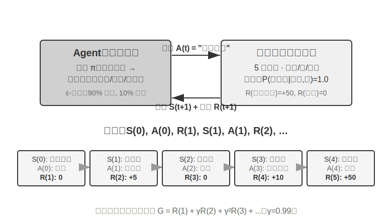

இந்த தொடர்பு ஒரு **trajectory** ஐ உருவாக்குகிறது—"state → action → reward → new state → action → reward..." என்பதன் முழுமையான பதிவு. ஒரு policy யின் தரம் இறுதியில் trajectories ன் தரத்தில் பிரதிபலிக்கிறது. ஒரு **value function** பின்வரும் கேள்விக்கு பதிலளிக்கிறது: "நான் இப்போது இந்த state இல் இருந்து, தற்போதைய policy யின் படி தொடர்ந்து செயல்பட்டால், இறுதியில் எவ்வளவு மொத்த reward ஐ சேர்ப்பேன்?" இது ஒரு அனுபவம் வாய்ந்த சதுரங்க வீரர் ஒரு நிலையைப் பார்த்து, முடிவைக் கணக்கிடாமல், உள்ளுணர்வாக வெற்றி வாய்ப்பை மதிப்பிடுவது போன்றது. ("தற்போதைய policy" "உகந்த policy" ஆல் மாற்றப்படும்போது, நாம் உகந்த value function ஐப் பெறுகிறோம், இது பின்னர் இந்த அத்தியாயத்தில் Bellman optimality equation பற்றி விவாதிக்கும்போது பயன்படுத்தப்படும்.) Agent மற்றும் சூழலுக்கு இடையிலான எல்லை ஒரு எளிய கொள்கையைப் பின்பற்றுகிறது: **Agent ஆல் தன்னிச்சையாக மாற்ற முடியாத எதுவும் சூழலுக்கு சொந்தமானது.**

இரண்டு தனித்துவமான அம்சங்கள் reinforcement learning ஐ supervised learning (இது சரியான பதில்களைக் கொண்ட லேபிளிடப்பட்ட தரவு தேவைப்படுகிறது) மற்றும் unsupervised learning (இது தரவுகளில் மறைந்திருக்கும் வடிவங்களைக் கண்டறிகிறது) ஆகியவற்றிலிருந்து வேறுபடுத்துகின்றன: **trial-and-error search** (Agent ஆனது, ஒரு ஆசிரியர் நேரடியாக சரியான பதிலை வழங்காமல், எந்த செயல்கள் நல்லவை என்பதை தானாகவே கண்டுபிடிக்க வேண்டும்) மற்றும் **delayed reward** (ஒரு செயலின் விளைவு பல படிகள் கழித்து மட்டுமே தெளிவாகத் தெரியும், எ.கா., ஒரு நல்ல சதுரங்க நகர்வின் மதிப்பு விளையாட்டின் முடிவில் மட்டுமே தெரியும்). இது தனித்துவமான **exploration-exploitation tradeoff** ஐயும் கொண்டு வருகிறது: எப்போதும் பழக்கமான பாதைகளை எடுப்பது புதிதாக எதையும் கற்றுக்கொள்ளாமல் இருப்பதைக் குறிக்கிறது; எப்போதும் சீரற்ற முறையில் முயற்சிப்பது இலக்கை அடைய முடியாமல் போவதைக் குறிக்கிறது.

ஒரு reinforcement learning அமைப்பு ஐந்து முக்கிய கூறுகளைக் கொண்டுள்ளது:

- **Action Space**: Agent எடுக்கக்கூடிய அனைத்து சாத்தியமான செயல்களின் தொகுப்பை வரையறுக்கிறது. Actions ஆனது discrete (எ.கா., சதுரங்கத்தில் "எந்த நகர்வை செய்வது", வரையறுக்கப்பட்ட எண்ணிக்கையிலான விருப்பங்களுடன்) அல்லது continuous (எ.கா., ஒரு ரோபோவிற்கு "ஒரு மூட்டை எத்தனை டிகிரி சுழற்றுவது", ஒரு தொடர்ச்சியான மதிப்பு) ஆக இருக்கலாம்.
- **Policy**: Agent இன் நடத்தை விதி, கொடுக்கப்பட்ட நிலையில் என்ன செய்ய வேண்டும் என்பதைக் குறிப்பிடுகிறது. ஒரு policy ஆனது எளிமையானதாக (ஒரு lookup table: நிலை A இல், செயல் X ஐ செயல்படுத்து) அல்லது சிக்கலானதாக (ஒரு ஆழமான நரம்பியல் வலையமைப்பு) இருக்கலாம்.
- **Reward Signal**: சூழலில் இருந்து உடனடி பின்னூட்டம். இருப்பினும், Agent இன் குறிக்கோள் நீண்ட கால, உடனடி அல்லாத reward ஐ அதிகரிப்பதாகும்—இந்த வேறுபாடு முக்கியமானது, ஒரு முதலீட்டை இன்றைய ஆதாயங்கள் மற்றும் இழப்புகளால் அல்ல, மாறாக நீண்ட கால வருமானத்தால் மதிப்பிட வேண்டும் என்பதைப் போல.
- **Value Function**: எதிர்காலத்தில் கொடுக்கப்பட்ட நிலையில் இருந்து பெறக்கூடிய மொத்த ஒட்டுமொத்த reward ஐ மதிப்பிடுகிறது, உடனடி பின்னூட்டம் இல்லாவிட்டாலும் Agent சரியான முடிவுகளை எடுக்க உதவுகிறது. அறுபது வருட RL ஆராய்ச்சியின் மிக முக்கியமான நுண்ணறிவுகளில் ஒன்று value estimation இன் மையப் பங்கு ஆகும்.
- **Environment Model** (விருப்பமானது): செயல்களுக்கு சூழலின் பதிலை முன்னறிவிக்கிறது. ஒரு environment model ஐப் பயன்படுத்தும் முறைகள் **model-based methods** (முதலில் சூழல் எவ்வாறு மாறுகிறது என்பதைக் கணிக்க கற்றுக்கொண்டு, பின்னர் அதற்கேற்ப திட்டமிடுகின்றன) என்று அழைக்கப்படுகின்றன; இல்லாதவை **model-free methods** (சூழலை முன்னறிவிக்காமல், அனுபவத்திலிருந்து நேரடியாகக் கற்றுக்கொள்கின்றன) என்று அழைக்கப்படுகின்றன.

அட்டவணை 7-3 பல்வேறு Agent அமைப்புகளின் முக்கிய கூறுகளை ஒப்பிட்டு, Agent கருத்தின் உலகளாவிய தன்மையை வெளிப்படுத்துகிறது மற்றும் பாரம்பரிய RL Agents மற்றும் நவீன LLM Agents இடையேயான action space வேறுபாட்டை வாசகர்கள் பார்க்க உதவுகிறது.

**அட்டவணை 7-3 வெவ்வேறு Agent அமைப்புகளில் முக்கிய கூறுகளின் ஒப்பீடு**

| Agent வகை | சூழல் | Action Space | Reward Signal |
|---------|------|---------|---------|
| **புதிதாகப் பிறந்த மான்** | நிலப்பரப்பு, ஈர்ப்பு, உடல் நிலை | Continuous high-dimensional (தசைக் குழு சுருக்கங்கள்) | சமநிலை (+), விழுதல் (-) |
| **வெற்றிட ரோபோ** | அறை அமைப்பு, பேட்டரி நிலை | Discrete (திசை, வெற்றிடம், சார்ஜ்) | சுத்தம் செய்யப்பட்ட பகுதி (+), பேட்டரி குறைதல் (-) |
| **சதுரங்க கிராண்ட்மாஸ்டர்** | பலகை நிலை, நேர வரம்பு | Discrete finite (சட்டப்பூர்வ நகர்வுகள்) | வெற்றி (+1), தோல்வி (-1) |
| **Customer Service Agent** | Conversation history, knowledge base | Open-ended (think, speak, API call) | Problem solved (+), Handling time (-) |
| **Code Assistant Agent** | Requirements document, codebase | Open-ended (think, search, edit, execute) | Test passed (+), Bug introduced (-) |

இந்த அட்டவணை ஒரு முக்கியமான நுண்ணறிவை வெளிப்படுத்துகிறது: பாரம்பரிய RL Agent-களின் (சதுரங்கம், ரோபாட்டிக்ஸ்) action space மூடியதாக (closed) உள்ளது, அதேசமயம் நவீன LLM-அடிப்படையிலான Agent-களின் (வாடிக்கையாளர் சேவை, குறியீடு உதவியாளர்) action space திறந்த (open-ended) மற்றும் கிட்டத்தட்ட வரம்பற்றதாக உள்ளது, மேலும் அவை "உள் சிந்தனை" (internal thinking) என்ற சிறப்புச் செயலைப் பயன்படுத்தி தங்கள் திறன்களை மேம்படுத்த முடியும்.

### இரண்டு Agent Paradigm-கள்: MDP-லிருந்து LLM+RL வரை

மிக அடிப்படையான வேறுபாடு action space-ல் உள்ளது—MDP ஆனது action space வரையறுக்கப்பட்டதாகவும் மூடியதாகவும் (மேல்/கீழ்/எடு/வை) இருப்பதாகக் கருதுகிறது, அதேசமயம் LLM-இன் action space திறந்ததாக உள்ளது, இது சேர்க்கை ரீதியாக வெடிக்கும் இயற்கை மொழி வரிசைகளைக் கொண்டுள்ளது. இந்த வேறுபாடு, algorithm design, sample efficiency, மற்றும் generalization ability ஆகியவற்றில் இரண்டு paradigm-களுக்கும் இடையேயான அடிப்படை வேறுபாட்டைத் தீர்மானிக்கிறது. அவை கீழே விளக்கப்பட்டுள்ளன.

**பாரம்பரிய Paradigm: MDP மற்றும் Q-learning.**

MDP (Markov Decision Process) என்பது reinforcement learning-க்கான கணிதக் கட்டமைப்பாகும், இது states, actions, மற்றும் rewards போன்ற முக்கிய கூறுகளை வரையறுக்கிறது. இதன் மைய அனுமானம் **Markov property** ஆகும்: எதிர்காலம் தற்போதைய நிலையை மட்டுமே சார்ந்துள்ளது, முந்தைய வரலாற்றை அல்ல. உதாரணமாக, சதுரங்கத்தில், தற்போதைய பலகை நிலையை மட்டும் பார்த்தால் உகந்த நகர்வைத் தீர்மானிக்க போதுமானது; ஒவ்வொரு முந்தைய நகர்வையும் மதிப்பாய்வு செய்ய வேண்டிய அவசியமில்லை. இந்த அனுமானம் சிக்கலை எளிதாக்குகிறது, ஆனால் வரலாற்று சார்புகளை மாதிரியாக்கும் திறனையும் கட்டுப்படுத்துகிறது.

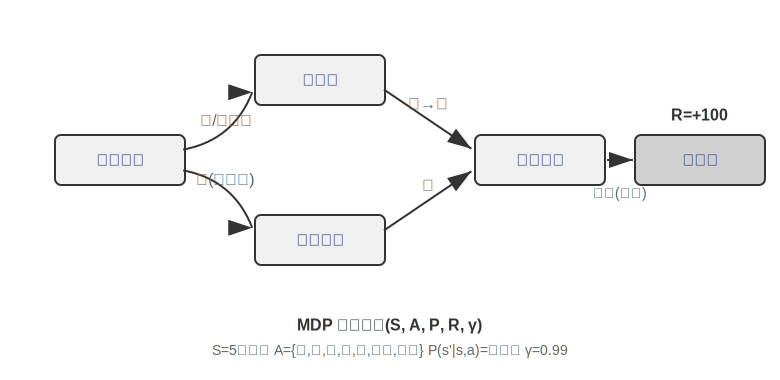

பாரம்பரிய RL Agent-இன் முக்கிய அம்சம் **மூடிய action space** (closed action space) ஆகும்—Agent எடுக்கக்கூடிய அனைத்து சாத்தியமான செயல்களும் முன் வரையறுக்கப்பட்ட, வரையறுக்கப்பட்ட தொகுப்பை உருவாக்குகின்றன. **கிளாசிக் சதுரங்க Agent-கள்** மிகவும் பொதுவான உதாரணம்: Go-வில் உள்ள 361 சாத்தியமான நகர்வு நிலைகள், மிகப்பெரியதாக இருந்தாலும், முற்றிலும் தீர்மானிக்கப்பட்டவை மற்றும் வரையறுக்கப்பட்டவை; சதுரங்கம், காய்களின் வெவ்வேறு நகர்வு விதிகளைக் கருத்தில் கொண்டு, இன்னும் எண்ணக்கூடிய செயல்களைக் கொண்டுள்ளது; Atari விளையாட்டுகள் சில முதல் ஒரு டஜன் வரையிலான தனித்துவமான செயல்களை மட்டுமே கொண்டுள்ளன. **ரோபாட்டிக் Agent-கள்** தொடர்ச்சியான ஆனால் வரம்புக்குட்பட்ட action space-ஐ பிரதிநிதித்துவப்படுத்துகின்றன: joint angles, velocities, மற்றும் grip forces ஆகியவை தொடர்ச்சியான மதிப்புகள், ஆனால் அனைத்திற்கும் தெளிவான இயற்பியல் எல்லைகள் (அதிகபட்ச சுழற்சி கோணம், அதிகபட்ச torque, வேக வரம்புகள்) உள்ளன, பரிமாணங்கள் ரோபோவின் degrees of freedom-ஆல் தீர்மானிக்கப்படுகின்றன.

இந்த மூடிய தன்மை கணக்கீட்டு நன்மைகளைக் கொண்டுவருகிறது: அனைத்து செயல்களையும் ஒவ்வொன்றாக எண்ணி மதிப்பீடு செய்ய முடியும், இது dynamic programming மற்றும் Monte Carlo tree search-ஐ எளிதாக்குகிறது, மேலும் action-value function-ஐ அட்டவணைகள் அல்லது எளிய செயல்பாடுகளைப் பயன்படுத்தி தோராயமாக மதிப்பிட முடியும். இருப்பினும், இது வெளிப்பாட்டுத்தன்மை மற்றும் generalization-ஐயும் கட்டுப்படுத்துகிறது. பாரம்பரிய RL Agent-கள் புதிதாகத் தொடங்குகின்றன, முழுக்க முழுக்க trial and error மூலம் கற்றுக்கொள்கின்றன—சீரற்ற policy-யிலிருந்து தொடங்கி, அனுபவத்தைச் சேகரித்து, value function அல்லது policy-ஐப் புதுப்பித்து, ஒருங்கிணைவு அடையும் வரை மீண்டும் மீண்டும் செய்கின்றன.

இந்த கட்டமைப்பில், மிகவும் அடிப்படையான மற்றும் முக்கியமான algorithms ஒன்று **Q-learning** ஆகும். இது ஒவ்வொரு "state-action" ஜோடிக்கும் ஒரு மதிப்பு மதிப்பீட்டைப் பராமரிக்கிறது: நீங்கள் state *s* இல் action *a* ஐ எடுத்து, அதன் பிறகு உகந்ததாக செயல்பட்டால், மொத்தமாக எவ்வளவு reward ஐ எதிர்பார்க்கலாம்? உள்ளுணர்வாக, ஒரு action நல்லதா என்பது அது கொண்டு வரும் உடனடி reward ஐ மட்டுமல்ல, "அது வழிநடத்தும் அடுத்த state எவ்வளவு நல்லது" என்பதையும் சார்ந்துள்ளது.

இந்த உள்ளுணர்வை ஒரு சமன்பாடாக எழுதினால், RL textbooks இல் பிரபலமான **Bellman equation** இன் மைய recursive உறவு கிடைக்கும்: **ஒரு action இன் உண்மையான மதிப்பு = இந்த படியில் பெறப்பட்ட உடனடி reward + அடுத்த state இலிருந்து பெறக்கூடிய அதிகபட்ச எதிர்கால மதிப்பு**:

$$Q^*(s, a) = r + \gamma \max_{a'} Q^*(s', a')$$

இங்கு $r$ என்பது உடனடி reward, $s'$ என்பது action ஐ செயல்படுத்திய பின் அடையும் அடுத்த state (உள்ளுணர்வுக்காக deterministic வடிவத்தில் எழுதப்பட்டுள்ளது; stochastic சூழலில், அடுத்த state $s'$ மீதான expectation தேவை), மற்றும் $\gamma \in [0, 1)$ என்பது **discount factor** ஆகும்—இது Agent எதிர்காலத்தை எவ்வளவு மதிக்கிறது என்பதை தீர்மானிக்கிறது: $\gamma$ 1 க்கு நெருக்கமாக இருந்தால், அது நீண்ட கால returns ஐ அதிகமாக மதிக்கிறது; 0 க்கு நெருக்கமாக இருந்தால், அது உடனடி விளைவுகளில் அதிக கவனம் செலுத்துகிறது. முன்னர் மீண்டும் மீண்டும் குறிப்பிடப்பட்ட "cumulative reward" என்பது, ஒவ்வொரு படியிலும் உள்ள rewards இன் கூட்டுத்தொகையாகும், $\gamma$ ஆல் discount செய்யப்பட்டது: $\sum_{t} \gamma^{t} r_t$. ஒவ்வொரு action க்குப் பிறகும், algorithm பழைய மதிப்பீட்டை "உண்மையில் கவனிக்கப்பட்ட விளைவை" நோக்கி சிறிது சரிசெய்கிறது—"ஒரு படி உண்மையான முடிவுடன் பழைய மதிப்பீட்டை சரிசெய்யும்" இந்த முன்னுதாரணம் **Temporal-Difference Learning (TD learning)** என்று அழைக்கப்படுகிறது. ஆயிரக்கணக்கான சோதனைகளுக்குப் பிறகு, மதிப்பீடு படிப்படியாக உண்மையான மதிப்பை நெருங்குகிறது.

பின்வரும் இரண்டு படங்கள், ஒரு grid world இல் Q-learning இன் exploration செயல்முறையையும், Q-values இன் படிப்படியான convergence ஐயும் காட்டுகின்றன.

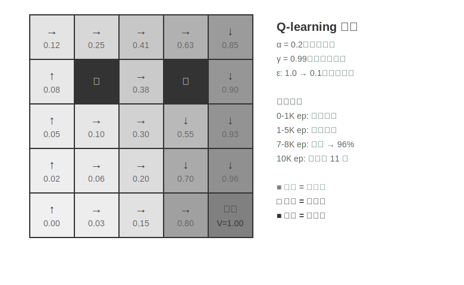

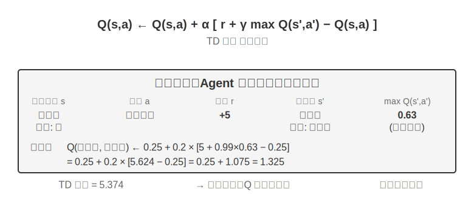

Q-learning என்பது ஒரு குறிப்பிட்ட வகை **off-policy** method ஆகும்—இது எந்த policy (random exploration உட்பட) மூலம் உருவாக்கப்பட்ட தரவையும் பயன்படுத்தி உகந்த policy ஐ கற்றுக்கொள்ள முடியும். on-policy/off-policy இன் கடுமையான வரையறைகள் மற்றும் LLM post-training இல் அவற்றின் தொடர்பு பற்றி பின்னர் "Reinforcement Learning Algorithms ஒப்பீடு" பிரிவில் விவாதிக்கப்படுகிறது.

> **Experiment 7-1 ★: Treasure Hunt Game இல் Q-learning செயல்திறன்**
>
> Q-learning இன் பண்புகள் மற்றும் வரம்புகளை சரிபார்க்க, நாங்கள் ஒரு **treasure hunt game environment** ஐ வடிவமைத்தோம். இந்த environment பல முக்கிய சவால்களை உள்ளடக்கியது: **hidden mechanisms** Agent தானாகவே keys மற்றும் doors இடையேயான தொடர்பு, weapon effects, மற்றும் item crafting rules ஆகியவற்றைக் கண்டறிய வேண்டும்; **multi-step dependencies** பணியை முடிக்க சரியான action வரிசை தேவைப்படுகிறது (உகந்த தீர்வு: 11 படிகள்); **sparse rewards** முக்கிய actions மற்றும் இறுதி வெற்றி மட்டுமே குறிப்பிடத்தக்க rewards ஐ அளிக்கின்றன, பெரும்பாலான இடைநிலை படிகள் எந்த பின்னூட்டமும் பெறுவதில்லை.
>
> Q-learning Agent ஆனது நிலையான parameter configurations மற்றும் ε-greedy exploration strategy (பெரும்பாலும் தற்போதைய சிறந்த action-ஐத் தேர்ந்தெடுப்பது, எப்போதாவது சீரற்ற முறையில் முயற்சிப்பது, பயிற்சி முன்னேறும்போது சீரற்ற exploration-ன் விகிதத்தை படிப்படியாகக் குறைப்பது) ஆகியவற்றைப் பயன்படுத்துகிறது.
>
> learning curve ஆனது வழக்கமான பண்புகளைக் காட்டுகிறது (episode என்பது ஒரு முழுமையான விளையாட்டு, தொடக்கத்திலிருந்து முடிவு அல்லது தோல்வி வரை):
> - **முதல் 1000 episodes**: 0% வெற்றி விகிதம், Q-table-ல் 124 states மட்டுமே உள்ளன, Agent கண்மூடித்தனமாக explore செய்கிறது
> - **முதல் 5000 episodes**: இன்னும் நிலையான வெற்றிகள் இல்லை, Q-table-ல் 133 states உள்ளன
> - **7000-8000 episodes**: வெற்றி விகிதம் படிப்படியாக 34% இலிருந்து 96% ஆக உயர்கிறது
> - **10000 episodes**: 100% வெற்றி விகிதம், Q-table-ல் 145 states உள்ளன, 11-step optimal solution கண்டுபிடிக்கப்பட்டது
>
> முழு பயிற்சியும் 10 வினாடிகளுக்கும் குறைவான நேரத்தை எடுத்துக்கொள்கிறது (மிகவும் திறமையான simulation), ஆனால் கிட்டத்தட்ட 10,000 முழுமையான முயற்சிகள் தேவைப்படுகின்றன. இது Q-learning-ன் முக்கிய பண்பை நிரூபிக்கிறது: முழுமையான பாதையை தற்செயலாக நிறைவு செய்ய அதிக அளவிலான சீரற்ற exploration தேவைப்படுகிறது, மேலும் value signals-ன் பரப்புதல் மிகவும் மெதுவாக உள்ளது, மீண்டும் மீண்டும் reinforcement தேவைப்படுகிறது. முன் அறிவு இல்லாத தூய்மையான symbolic learning, state space-ஐ brute-force முறையில் மட்டுமே தேட முடியும்.
>
> ஒரு game simulator-ல், 10,000 trials 10 வினாடிகள் மட்டுமே எடுக்கும், இது மிகக் குறைந்த செலவு. ஆனால் நிஜ உலக Agent scenarios-ல்—ஒவ்வொரு தொலைபேசி அழைப்புக்கும் செலவு உள்ளது, ஒவ்வொரு browser செயல்பாட்டிற்கும் தாமதம் உள்ளது, மேலும் ஒவ்வொரு தவறான முடிவும் மாற்ற முடியாத விளைவுகளை ஏற்படுத்தும்—10,000 trials முற்றிலும் ஏற்றுக்கொள்ள முடியாதவை. இதனால்தான் நவீன Agents LLM-based methods-ஐ நோக்கி திரும்பியுள்ளன: pre-training-ன் போது திரட்டப்பட்ட அறிவைப் பயன்படுத்தி, குறைந்தபட்ச interaction-உடன் பயனுள்ள முடிவுகளை எடுக்க.
>
> MDP-ன் அடிப்படை வரம்புகள் மூன்று: குறைந்த sample efficiency (எளிய பணிகளைக் கற்றுக்கொள்ள அதிக அளவிலான interaction தேவை), மோசமான generalization (ஒரு சூழலில் கற்றுக்கொண்ட அறிவை மற்றொரு சூழலுக்கு மாற்றுவது கடினம்), மற்றும் முன் அறிவைப் பயன்படுத்த இயலாமை (ஒவ்வொரு புதிய பணியும் புதிதாக கற்றுக்கொள்ளப்பட வேண்டும்). இயற்கை மொழி அல்லது உயர்-பரிமாண vision போன்ற சிக்கலான state spaces-ஐ எதிர்கொள்ளும்போது இந்த வரம்புகள் குறிப்பாகத் தெளிவாகின்றன.
>
**நவீன Paradigm: LLM+RL-based Agents.**

Large language models, Agents-ஐ உருவாக்கும் முறையை அடிப்படையாக மாற்றியுள்ள ஒரு புதிய paradigm-ஐ கொண்டு வந்துள்ளன—குறிப்பாக action space-ன் வடிவமைப்பில். பாரம்பரிய RL-ல், ஒரு agent சூழலை மாற்றுவதன் மூலம் மட்டுமே feedback-ஐப் பெற முடியும்: சதுரங்கத்தில் ஒரு நகர்வைச் செய்வது, ஒரு புதிரில் ஒரு படி எடுப்பது. ஆனால் LLMs முற்றிலும் புதிய வகை action-ஐ அறிமுகப்படுத்துகின்றன: உள் சிந்தனை. சிந்தனை வெளி உலகத்தை மாற்றாது, ஆனால் இறுதி action-ன் தரத்தை கணிசமாக மேம்படுத்த முடியும். இந்த மாற்றம் எல்லாவற்றையும் மாற்றுகிறது: agent-ன் action space என்பது "என்ன செய்வது" மட்டுமல்ல, "எவ்வளவு நேரம் சிந்திப்பது மற்றும் எதைப் பற்றி சிந்திப்பது" என்பதையும் உள்ளடக்கியது.

மிக முக்கியமான புதுமை **Thinking என்பதை ஒரு சிறப்பு action ஆக** action space-இல் இணைப்பதாகும். பாரம்பரிய RL-இல், agents வெளிப்புற சூழலை மாற்றும் external actions (நகர்தல், தாக்குதல், எடுத்தல்) மட்டுமே செய்ய முடியும்; LLM agents-இல், **internal thinking ஆனது action space-இன் மைய அங்கமாக மாறுகிறது**—இது நேரடியாக வெளிப்புற சூழலை மாற்றாது, உடனடி reward இல்லை, எண்ணிக்கையில் கிட்டத்தட்ட வரம்பற்றது, மற்றும் ஒப்பீட்டளவில் குறைந்த செலவு கொண்டது.

பாரம்பரிய RL இந்த வகை action-ஐ சமாளிப்பதில் சிரமப்படுகிறது, அடிப்படையில் exploration space மிகவும் பெரியதாகவும், கட்டமைப்பு இல்லாமலும் இருப்பதால்: புதிதாக கற்கும் ஒரு agent என்பது பாலைவனத்தில் கண்மூடித்தனமாக புதையலைத் தேடுவது போன்றது, சீரற்ற முறையில் தடுமாறி மட்டுமே முடியும். LLMs வேறுபட்டவை. பரந்த text pre-training மூலம், அவை மனித சிந்தனையின் விதிகளை உள்வாங்கியுள்ளன: கணிதப் பிரச்சினைகளைத் தீர்ப்பது "நிபந்தனைகளை அடையாளம் காணுதல் → சூத்திரங்களை நினைவுபடுத்துதல் → படிப்படியாக கணக்கிடுதல்" என்பதைப் பின்பற்றுகிறது, குறியீடு எழுதுவது "தேவைகளைப் புரிந்துகொள்ளுதல் → கட்டமைப்பை வடிவமைத்தல் → விவரங்களை செயல்படுத்துதல்" என்பதைப் பின்பற்றுகிறது. இது LLM thinking-ஐ கட்டமைக்கப்பட்ட பாதைகளில் செல்ல அனுமதிக்கிறது, search space-ஐ வெகுவாக சுருக்குகிறது. எனவே, கூடுதல் RL பயிற்சி இல்லாமலேயே, pre-trained LLM ஒரு அடிப்படை தர்க்கரீதியான Chain of Thought (CoT)-ஐ உருவாக்க முடியும். இந்த அடிப்படை தர்க்கம் pre-training corpus-இல் உள்ள மகத்தான மனித சிந்தனை செயல்முறைகளிலிருந்து (கணிதப் பிரச்சினை தீர்வுகள், code comments, விவாத பதில்கள் போன்றவை) வருகிறது. next-token prediction மூலம், model "அடுத்த படி reasoning எப்படி இருக்க வேண்டும்" என்பதை மறைமுகமாக கற்றுக்கொள்கிறது.

RL post-training பின்னர் வெளிப்புற rewards-ஐப் பயன்படுத்தி, குறிப்பிட்ட பணிகளுக்கு இந்த விதிகளை மிகவும் திறமையாகப் பயன்படுத்த LLM-க்கு கற்பிக்கிறது. மொழியின் கட்டமைப்பும் ஒரு மறைமுகமான உள் reward-ஐ வழங்குகிறது—தர்க்கரீதியாக ஒத்திசைவான chain of thought (எ.கா., "நாம் வெளிநாட்டு நாணயத்தை USD-ஆக மாற்ற வேண்டும் என்பதால், முதல் படி மாற்று விகிதத்தைப் பார்ப்பது") அதிக உருவாக்க நிகழ்தகவைக் கொண்டுள்ளது, அதேசமயம் தர்க்கரீதியாக குழப்பமான ஒன்று (எ.கா., "நாம் நாணயத்தை மாற்ற வேண்டும் என்பதால், முதலில் வானிலையைச் சரிபார்ப்போம்") மிகக் குறைந்த நிகழ்தகவைக் கொண்டுள்ளது, இது இயற்கையாகவே model-ஐ நியாயமான பாதைகளை நோக்கி வழிநடத்துகிறது.

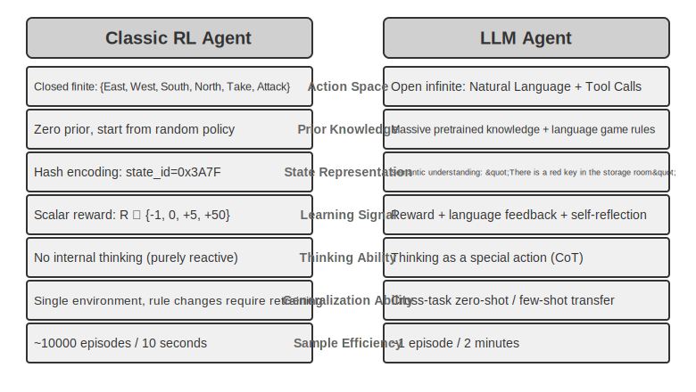

இந்த சிந்தனைத் திறன், மொழியின் உள்ளார்ந்த விதிகளை அடிப்படையாகக் கொண்டு, LLM agents-கள் முன்பு பார்த்திராத instructions-ஐப் புரிந்துகொள்ளவும் (zero-shot generalization) மற்றும் மிகச் சில உதாரணங்களுடன் புதிய பணிகளை மாஸ்டர் செய்யவும் (few-shot adaptation) உதவுகிறது—இது, விரிவான trial and error தேவைப்படும் பாரம்பரிய MDP agent paradigm-க்கு முற்றிலும் மாறானது. மேலும், புதிய paradigm-இல் compositional generalization (அறியப்பட்ட concepts-ஐ மறுகூட்டி புதிய சூழ்நிலைகளைக் கையாளுதல்), in-context learning (prompts மற்றும் examples மூலம் விரைவான adaptation), மற்றும் multimodal understanding (vision, language, மற்றும் action போன்ற modalities-ஐ இயற்கையாக ஒருங்கிணைத்தல்) போன்ற திறன்களும் உள்ளன. in-context learning-இன் **effectiveness** (zero-shot generalization, few-shot adaptation) மற்றும் அதன் **internal mechanism** ஆகியவை இரண்டு வெவ்வேறு விஷயங்கள் என்பதைக் கவனத்தில் கொள்ள வேண்டும்—Chapter 2-இல் பகுப்பாய்வு செய்தபடி, attention mechanism என்பது reasoning-ஐ விட retrieval-ஐப் போலவே செயல்படுகிறது, ஆனால் இது task adaptation-இல் அதன் சக்திவாய்ந்த நடைமுறை விளைவுகளைத் தடுக்காது.

Closed action space-இலிருந்து open action space-க்கான பரிணாமம் AI agent paradigm-இல் ஒரு அடிப்படை மாற்றத்தைப் பிரதிபலிக்கிறது. உள் சிந்தனைக்கு அப்பால், tool parameters-இன் பன்முகத்தன்மை (natural language queries, program code, complex JSON, multimodal content) உண்மையான action space-ஐ கிட்டத்தட்ட எல்லையற்றதாக ஆக்குகிறது—ஒரு code interpreter கோட்பாட்டளவில் எந்த computable task-ஐயும் செயல்படுத்த முடியும், மேலும் ஒரு search tool இணையத்தின் முழு தகவல் இடத்தையும் ஆராய முடியும். இது புதிய வாய்ப்புகளை (agents முன்னெப்போதும் இல்லாத பணிகளைக் கையாளலாம், அடிப்படை tools-ஐ இணைத்து சிக்கலான பிரச்சினைகளைத் தீர்க்கலாம்) மற்றும் புதிய சவால்களை (திறந்த சூழலில் reward functions-ஐ எவ்வாறு வரையறுப்பது மற்றும் மேம்படுத்துவது, எல்லையற்ற action space-இல் எவ்வாறு திறமையாக தேடுவது) இரண்டையும் கொண்டு வருகிறது.

Tool calling மற்றும் long-chain thinking-க்காக உகந்ததாக்கப்பட்ட Kimi K3 போன்ற models-ஐ உதாரணமாக எடுத்துக் கொண்டால், LLM+RL paradigm-இன் வழக்கமான திசையை நாம் காணலாம்: பெரிய அளவிலான language pre-training-ஐ அடிப்படையாகக் கொண்டு, post-training problem decomposition, tool calling, மற்றும் self-correction ஆகியவற்றில் திறன்களை வலுப்படுத்துகிறது. **OpenVLA** (Chapter 9-இல் விரிவாக விளக்கப்பட்டுள்ளது) LLM சகாப்தத்தின் VLA (Vision-Language-Action) architecture paradigm-ஐ வெளிப்படுத்துகிறது: ஒரு vision encoder சுற்றுச்சூழல் அவதானிப்புகளைச் செயலாக்குகிறது, ஒரு language model instructions-ஐப் புரிந்துகொண்டு reasoning செய்கிறது, மேலும் ஒரு action decoder கட்டுப்பாட்டு சமிக்ஞைகளை உருவாக்குகிறது, இது language-conditioned control மற்றும் cross-task generalization-ஐ செயல்படுத்துகிறது. OpenVLA ஆனது கிட்டத்தட்ட ஒரு மில்லியன் ரோபோ **demonstration trajectories**-இல் imitation learning (behavioral cloning) மூலம் பயிற்றுவிக்கப்பட்டது என்பதை தெளிவுபடுத்த வேண்டும், இது இயற்கையில் SFT ஆகும், RL அல்ல; ரோபாட்டிக்ஸில் RL-ஐ அறிமுகப்படுத்தி, அத்தகைய VLA architectures-இல் rewards-ஐப் பயன்படுத்தி மேலும் மேம்படுத்துவதன் உண்மையான பிரதிநிதி, இந்த அத்தியாயத்தின் பிற்பகுதியில் உள்ள Experiment 7-13-இல் உள்ள SimpleVLA-RL ஆகும்.

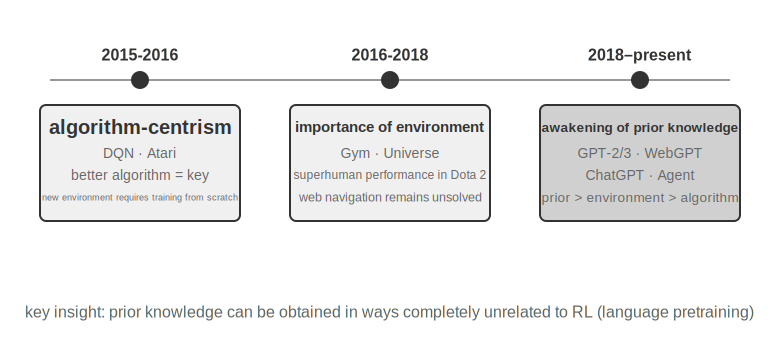

**OpenAI-வின் Exploration Path** (Shunyu Yao, Princeton University-ஐச் சேர்ந்த Assistant Professor மற்றும் ReAct paper-இன் ஆசிரியர், "The Second Half"-இல் விளக்கியுள்ளபடி) ஒரு cognitive evolution-ஐ வெளிப்படுத்துகிறது. **Phase 1 (2015-2016) Algorithm-Centric**: சிறந்த algorithms தான் முக்கியம் என்று நம்பப்பட்டது, Atari போன்ற standard environments-இல் முன்னேற்றம் ஏற்பட்டது, ஆனால் எந்தவொரு புதிய environment-க்கும் மீண்டும் புதிதாக retrain செய்ய வேண்டியிருந்தது. **Phase 2 (2016-2018) Importance of Environment**: Gym பல்வேறு standard tasks-ஐ standardize செய்தது, Universe மற்றும் World of Bits ஆகியவை முழு internet-ஐயும் ஒரு RL training environment-ஆக மாற்ற முயன்றன, Dota 2 குறிப்பிட்ட சிக்கலான environments-இல் superhuman performance-ஐ அடைவதை நோக்கமாகக் கொண்டது. யோசனை தெளிவாக இருந்தது, ஆனால் general computer use மற்றும் web navigation ஆகியவை உடைக்க முடியாத தடைகளாகவே இருந்தன.

**Phase 3 (2018-present) Awakening of Priors**: GPT-2/GPT-3 language pre-training-இன் சக்தியை நிரூபித்தன, WebGPT மற்றும் ChatGPT இந்த priors-ஐ practical agents-ஆக மாற்ற முடியும் என்பதை நிரூபித்தன. மிக முக்கியமான கண்டுபிடிப்பு இதுதான்: **Priors-ஐ RL-உடன் முற்றிலும் தொடர்பில்லாத வழிகளில் பெற முடியும்**. இது ஒரு counterintuitive உண்மை: பல தசாப்தங்களாக, RL researchers-இன் முன்னுரிமைகள் முற்றிலும் தலைகீழாக இருந்திருக்கலாம்—அது algorithm > environment > prior அல்ல, மாறாக prior > environment > algorithm.

> **Experiment 7-2 ★★: Traditional RL மற்றும் LLM Agent-இன் ஒப்பீட்டு ஆய்வு**
>
>
> 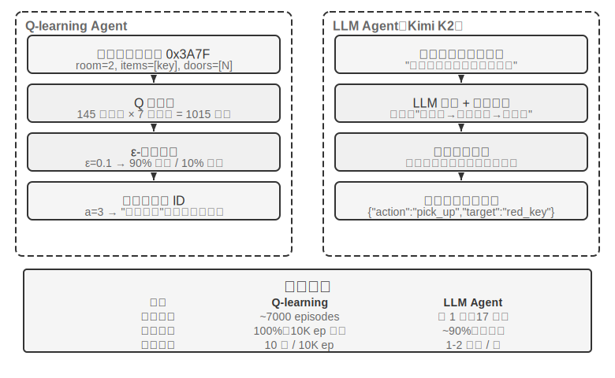
>
>
> ஒரே treasure hunt game-இல் Q-learning மற்றும் ஒரு LLM Agent (Kimi K3, அதிகபட்சம் 50 experiences கொண்ட buffer-ஐ பராமரிக்கிறது) ஆகியவற்றை ஒப்பிடுக. முடிவுகள் வியக்கத்தக்கவை: **LLM Agent தனது முதல் முயற்சியிலேயே 18 steps-இல் game-ஐ நிறைவு செய்தது**.
>
> **Early Stage (Purposeful Exploration)**: ஒரு துருப்பிடித்த வாளை எடுக்கிறது ("வெறும் கைகளை விட ஆயுதம் சிறந்தது"), வரைபடத்தை முறையாக ஆராய்கிறது, வடக்கு வாயில் பூட்டப்பட்டிருப்பதைக் கண்டுபிடித்த பிறகு "ஒரு சாவியைக் கண்டுபிடிக்க வேண்டும்" என்று ஊகிக்கிறது, சேமிப்பு அறையை ஆராய்கிறது, சிவப்பு சாவி மற்றும் மந்திர படிகத்தைப் பெறுகிறது. **Middle Stage (Mechanism Understanding and Proactive Synthesis)**: "சாவி தானாகப் பயன்படுத்தப்படும்" விதியைப் புரிந்துகொண்டு, காவலாளிக்கு எதிராக துருப்பிடித்த வாள் போதாது என்று எதிர்பார்த்து, step 8-இல் முன்கூட்டியே ஒரு வெள்ளி வாளை உருவாக்குகிறது. **Late Stage (Execution and Error Correction)**: வெள்ளி வாளுடன் வடக்கு நோக்கிச் செல்கிறது, step 13-இல் வலிமையான காவலாளியைத் தோற்கடிக்கிறது, இடையில் ஒன்று அல்லது இரண்டு பயனற்ற முயற்சிகள் (மீண்டும் மீண்டும் வாளை வீசுதல்/பின்னோக்கிச் செல்லுதல்) இடம்பெறுகின்றன, இறுதியாக step 18-இல் dragon treasure-ஐப் பெறுகிறது.
>
> இது semantic understanding மற்றும் symbolic mapping-இடையேயான ஒரு அடிப்படை வேறுபாட்டை நிரூபிக்கிறது. LLM Agent game-இன் கருத்தியல் கட்டமைப்பைப் புரிந்துகொண்டது; ஒவ்வொரு அடியிலும் நோக்கம் மற்றும் தர்க்கரீதியான ஆதரவு இருந்தது. Q-learning-க்கு, "door," "key," மற்றும் "sword" ஆகியவை அர்த்தமற்ற symbol combinations மட்டுமே, மேலும் அது பரந்த statistical learning மூலம் மட்டுமே அவற்றின் உறவுகளை மெதுவாகக் கண்டறிய முடியும்.
> Computational cost ஒரு சுவாரஸ்யமான முரண்பாட்டை முன்வைக்கிறது: Q-learning 10,000 விளையாட்டுகளை 10 வினாடிகளில் இயக்குகிறது, அதேசமயம் LLM Agent ஒரு விளையாட்டுக்கு 1-2 நிமிடங்கள் எடுத்துக்கொள்கிறது. இருப்பினும், நிஜ உலகப் பணிகளில், ஒவ்வொரு இடைவினைக்குமான நேரம், பணம் மற்றும் ஆபத்துச் செலவுகள் தூய கணக்கீட்டுச் செலவுகளை விட மிக அதிகமாக இருக்கும், எனவே GPU நேரத்தை மட்டுமே வைத்து மதிப்பிடுவது நியாயமற்றது. மிக முக்கியமான நுண்ணறிவு: LLM Agent-ன் வெற்றி சிறந்த "கற்றல் அல்காரிதம்" இருப்பதால் அல்ல, மாறாக அது மிகப்பெரிய முன் அறிவைக் கொண்டிருப்பதால் ஆகும். விளையாட்டு விதிகள் மாறும்போது, Q-learning முழுமையான மறுபயிற்சி தேவைப்படுகிறது, அதேசமயம் LLM Agent நேரடியாக பகுத்தறிவு மூலம் தன்னைத் தகவமைத்துக்கொள்ள முடியும். இது ஒரு நடைமுறை வடிவமைப்புக் கொள்கைக்கு வழிவகுக்கிறது: பாரம்பரிய RL குறைந்த உருவகப்படுத்துதல் செலவுகள் மற்றும் அதிக மீண்டும் செய்யும் திறன் கொண்ட சூழ்நிலைகளில் மதிப்புமிக்கதாக உள்ளது; அதிக இடைவினைச் செலவுகள் மற்றும் விரைவான தகவமைப்புத் தேவைப்படும் நிஜ உலக சூழ்நிலைகளில், LLM Agent-களின் மாதிரி திறன் மிகவும் நடைமுறைக்குரியது.

மூன்று கற்றல் முன்னுதாரணங்களின்—in-context learning, externalized learning, மற்றும் parametric learning (post-training)—தொடர்புடைய நிலைப்பாடு மற்றும் ஒருங்கிணைப்பு குறித்து, அத்தியாயம் 1 ஒரு முறையான ஒப்பீட்டை வழங்குகிறது, மேலும் இந்த அத்தியாயத்தின் முடிவில் உள்ள "முழுமையான படம்" இந்த தலைப்புக்குத் திரும்பும். இந்த அத்தியாயத்தின் முக்கிய நூல் post-training—இடைவினை உத்திகளை மாதிரி அளவுருக்களில் எழுதுதல்.

## Model Pre-training Basics `[விருப்ப வாசிப்பு]`

Post-training நுட்பங்கள் ஏன் பயனுள்ளதாக இருக்கின்றன என்பதைப் புரிந்துகொள்ள, pre-training என்ன நிறுவுகிறது என்பதை முதலில் புரிந்துகொள்ள வேண்டும். Post-training (SFT மற்றும் RL) அடிப்படையில் pre-training ஆல் நிறுவப்பட்ட பிரதிநிதித்துவ இடத்திற்குள் உகந்ததாக்குகிறது—pre-training ஆல் அமைக்கப்பட்ட அறிவுக் கட்டமைப்பு post-training-ன் உச்சவரம்பை தீர்மானிக்கிறது. எனவே, மூன்று சோதனைகள் மூலம் pre-training-ன் மைய அம்சங்களை ஆராய்வோம்: ஒரு சிறிய அளவிலான மொழி மாதிரியை புதிதாகப் பயிற்றுவித்தல், காட்சித் திறன்களை நீட்டித்தல், மற்றும் புதிய மொழி அறிவைச் செலுத்துதல். இந்தப் பிரிவில் உள்ள மூன்று சோதனைகள் துணை நோக்கமுடையவை, pre-training (Pretraining, அதாவது, மாதிரிக்கு அடிப்படை மொழி விதிகள் மற்றும் உலக அறிவைக் கற்பிக்க பெரிய அளவிலான தரவுகளில் ஆரம்பப் பயிற்சி) பற்றிய உள்ளுணர்வை வாசகர்களுக்கு உருவாக்க உதவுகின்றன—pre-training செயல்முறையை ஏற்கனவே அறிந்த வாசகர்கள் இவற்றைத் தவிர்க்கலாம்.

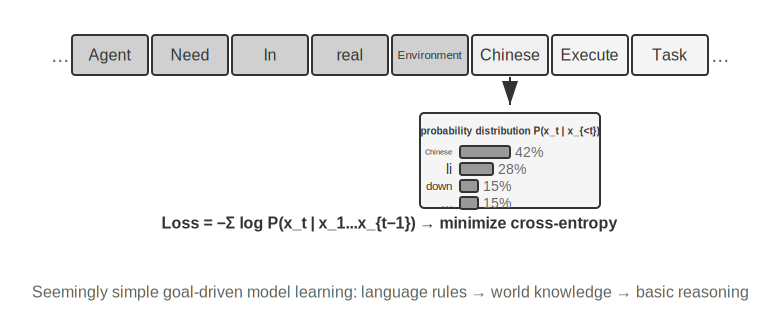

Language model training ஆனது மூன்று-நிலை செயல்முறையைப் பின்பற்றுகிறது: "tokenization — pre-training — post-training." Tokenization ஆனது text ஐ discrete units ஆகப் பிரிக்கிறது. உதாரணமாக, "I like programming" என்பது "I," "like," "program," "ming" என tokenize செய்யப்படலாம்—இந்த tokens ஆனது model text ஐச் செயலாக்கும் மிகச்சிறிய அலகுகளாகும். Pre-training இன் பணி கருத்தியல் ரீதியாக எளிமையானது: model க்கு ஒரு text segment இன் முதல் பகுதியைக் காட்டி, அடுத்த token ஐக் கணிக்கச் செய்வது. அதன் கணிப்பைச் சரியான விடையுடன் ஒப்பிடுவதன் மூலம் (இந்த வேறுபாடு Loss எனப்படும்; சிறிய loss என்பது மிகவும் துல்லியமான கணிப்பைக் குறிக்கிறது), model தனது parameters ஐத் தொடர்ந்து சரிசெய்கிறது. பாரிய text data களில் மீண்டும் மீண்டும் பயிற்சியளித்த பிறகு, model படிப்படியாக language rules, world knowledge, மற்றும் basic reasoning abilities ஐக் கற்றுக்கொள்கிறது. Pre-training க்குப் பிறகு, model fluent text ஐ உருவாக்க முடியும், ஆனால் output க்கு கட்டமைப்பு இல்லை மற்றும் instructions ஐப் பின்பற்றுவதில் சிரமம் உள்ளது. Post-training, SFT (labeled input-output pairs இல் பயிற்சி) மற்றும் preference optimization (எ.கா., DPO, model மனிதர்கள் விரும்பும் responses ஐ உருவாக்கக் கற்பித்தல்) மூலம், அதை ஒரு practical assistant ஆக மாற்றுகிறது.

> **சோதனை 7-3 ★★: Training an LLM from Scratch—Algorithm Improvement இன் சக்தி**
>
> MiniMind 2 (100 மில்லியன் parameters) ஐ ஒரு case study ஆகப் பயன்படுத்தி, consumer-grade GPU இல் முழு training process ஐ நிறைவு செய்யவும். இரண்டு algorithmic optimizations (QK Norm மற்றும் Muon optimizer) ஐ அறிமுகப்படுத்துவதன் மூலம், convergence speed 3x அதிகரிக்கிறது, மற்றும் generation quality கணிசமாக மேம்படுகிறது—மிகக் குறைந்த செலவில் அடையப்படுகிறது, மொத்த training ~14 மணிநேரம், செலவு ~$34.
>
> ஒவ்வொரு training stage இன் விளைவுகள்: Pre-training க்குப் பிறகு, model "உலகின் மிக உயரமான மலை எது?" போன்ற factual questions க்கு பதிலளிக்க முடியும், ஆனால் வடிவம் தரமற்றதாக உள்ளது; SFT க்குப் பிறகு, instruction following மற்றும் output format கணிசமாக மேம்படுகிறது, எதிர்பார்த்தபடி பதில்களை ஒழுங்கமைக்கிறது; preference optimization மேலும் factual errors மற்றும் unnatural expressions ஐக் குறைக்கிறது. 100-மில்லியன்-parameter model இன்னும் வெளிப்படையான வரம்புகளைக் கொண்டுள்ளது (சிக்கலான பிரச்சினைகளில் பிழைகள் ஏற்பட வாய்ப்புள்ளது), ஆனால் பாடம்: **நிலையான, சிறிய பட்ஜெட்டில், algorithm improvements ஆனது size ஐ அதிகரிப்பதை விட சிறந்த மதிப்பை வழங்குகிறது**.
>
> **சோதனை 7-4 ★★: உங்கள் சொந்த VLM ஐப் பயிற்றுவித்தல்**
>
>
> 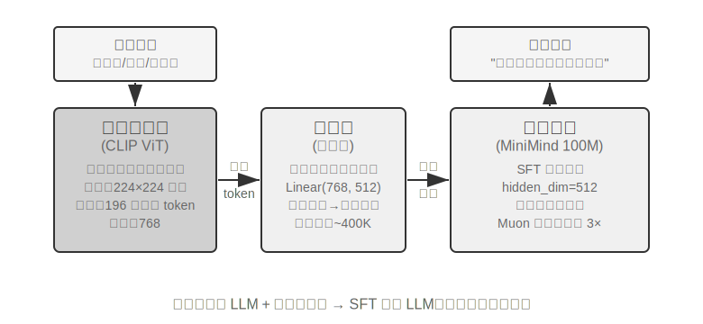
>
>
> VLMs ஒரே model-இல் visual perception மற்றும் language understanding-ஐ ஒருங்கிணைக்கின்றன. முக்கிய சவால் cross-modal alignment ஆகும்—"எது பார்க்கப்படுகிறது" என்பதை "எது சொல்லப்படுகிறது" என்பதுடன் பொருத்துவது. இந்த architecture மூன்று கூறுகளைக் கொண்டுள்ளது: ஒரு **Vision Encoder** (எ.கா., CLIP, parameters frozen) படங்களிலிருந்து semantic features-ஐப் பிரித்தெடுக்கிறது; ஒரு **Projection Layer** (lightweight, scratch-லிருந்து மட்டுமே பயிற்றுவிக்கப்பட்ட பகுதி) visual features மற்றும் language model-க்கு இடையே ஒரு "மொழிபெயர்ப்பாளராக" செயல்பட்டு, visual features-ஐ language model புரிந்துகொள்ளக்கூடிய ஒரு representation space-க்கு மேப்பிங் செய்கிறது; மற்றும் ஒரு **Language Model** விளக்க உரையை உருவாக்குகிறது. பயிற்சியானது "LLM-ஐ freeze செய்து + projection layer-ஐ மட்டும் பயிற்றுவிக்கும்" உத்தியைப் பயன்படுத்தி Catastrophic Forgetting (புதியவற்றைக் கற்ற பிறகு பழைய திறன்களை மறத்தல்) தவிர்க்கிறது; pre-training alignment-க்குப் பிறகு, LLM unfreeze செய்யப்பட்டு, உயர்தர image-description pairs-உடன் SFT செய்யப்படுகிறது, இது விளக்கங்களின் விவரம் மற்றும் துல்லியத்தை கணிசமாக மேம்படுத்துகிறது.

> இந்த experiment multimodal model பயிற்சிக்கான அடிப்படை paradigm-ஐ வெளிப்படுத்துகிறது: unimodal pre-training முடிவுகளை மீண்டும் பயன்படுத்துதல் மற்றும் lightweight projection layer-ஐப் பயிற்றுவிப்பதன் மூலம் cross-modal alignment-ஐ அடைதல்—திறமையானது மற்றும் scalable, ஆனால் projection layer-இன் வரையறுக்கப்பட்ட expressiveness ஆழமான cross-modal புரிதலுக்கு ஒரு தடையாக மாறலாம். இதே "vision encoder + projection layer + LLM" skeleton-ஐ மேலும் ஒரு படி நீட்டித்து, model output actions-ஐ உருவாக்கினால், அது Chapter 9-இல் விரிவாக விளக்கப்பட்டுள்ள VLA (Vision-Language-Action) model-க்கு வழிவகுக்கிறது.
>
> **Experiment 7-5 ★★: Continued Pre-training to Learn a New Language**
>
> Mistral 7B v0.3-ஐ base ஆகப் பயன்படுத்தி (முதன்மையாக English-இல் pre-trained, Korean-ஐப் பற்றி எந்தப் புரிதலும் இல்லை), Korean Wikipedia-இல் continued pre-training மூலம் Korean திறனைச் செலுத்துதல்—ஏற்கனவே pre-training முடித்த ஒரு model-ஐப் பயன்படுத்தி புதிய மொழித் தரவுகளில் unsupervised பயிற்சி செய்தல். Model ஏற்கனவே பொதுவான language modelling திறன்களைக் கொண்டுள்ளது மற்றும் புதிய தரவு பரவலுக்கு மட்டுமே மாற்றியமைக்க வேண்டும், இது scratch-லிருந்து பயிற்சி செய்வதை விட செலவை மிகவும் குறைக்கிறது. ஒரு முக்கியமான engineering point ஆனது mixed data (~80% Korean + 20% English) பயன்படுத்தி catastrophic forgetting-ஐக் குறைப்பதாகும்: இலக்கு மொழியின் விகிதம் மிக அதிகமாக இருந்தால் அசல் மொழியில் சிதைவு ஏற்படுகிறது, அதே நேரத்தில் மிகக் குறைவான விகிதம் போதுமான கற்றல் திறனை ஏற்படுத்தாது. இறுதியாக, Korean instruction data-உடன் SFT செய்யப்பட்டு நடைமுறை Korean உரையாடல் திறனைப் பெறுகிறது. இந்த experiment-இன் முடிவு இந்த அத்தியாயத்தின் முடிவில் உள்ள முழுமையான படத்தில் மீண்டும் பயன்படுத்தப்படும்: ஒரு model-ஐ அதிக அளவிலான புதிய domain knowledge-ஐ நினைவில் வைத்திருக்கச் செய்ய, SFT-ஐ அல்ல, continued pre-training-ஐ நம்பியிருக்க வேண்டும்.
மூன்று pre-training பரிசோதனைகளும் ஒரு பொதுவான வடிவத்தை வெளிப்படுத்துகின்றன: பட்ஜெட் கட்டுப்படுத்தப்படும்போது, அளவை அதிகரிப்பதை விட, algorithmic மேம்பாடுகள் மற்றும் architectural புதுமைகள் சிறந்த மதிப்பை வழங்குகின்றன. மிக முக்கியமாக, pre-training ஆனது model-க்கு descriptive அறிவு மற்றும் language modeling திறன்களை வழங்குகிறது, ஆனால் structured instruction following மற்றும் task-oriented நடத்தை இல்லாமல் உள்ளது—இந்த இடைவெளியைத்தான் SFT நிரப்ப வேண்டும்.

Pre-training-இன் அடிப்படை திறன்களுடன், அடுத்த படியானது general-purpose model-ஐ post-training மூலம் ஒரு practical agent ஆக மாற்றுவதாகும். Post-training-இன் முதல் நிலை Supervised Fine-Tuning (SFT) ஆகும்.

## SFT (Supervised Fine-Tuning)

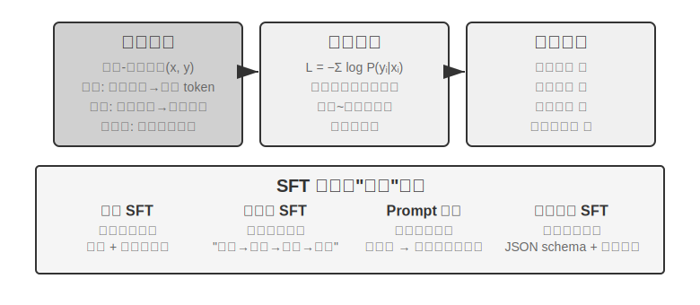

Section 7.1 ஏற்கனவே SFT-யின் சாரத்தை விளக்கியுள்ளது (தரவை மாற்றுதல், response-ல் மட்டும் loss கணக்கிடுதல், "அடுத்த வார்த்தையை கணித்தல்"). இந்த பகுதி நான்கு பரிசோதனைகள் மூலம், "நிலையான mappings மற்றும் protocols-ஐ parameters-ல் எழுதுதல்" என்ற இந்த வழிமுறை வெவ்வேறு பணிகளுக்கு என்ன குறிப்பாக உறுதிப்படுத்துகிறது என்பதைப் பார்க்கிறது. SFT-யின் முக்கிய மதிப்பு புதிய அறிவை செலுத்துவது அல்ல, மாறாக **protocols-ஐ உறுதிப்படுத்துவது**: mapping உறவுகள், interaction வடிவங்கள் மற்றும் style norms-ஐ parameters-ல் எழுதி, inference-இன் போது நீண்ட prompts இல்லாமலேயே model எதிர்பார்ப்புகளை பூர்த்தி செய்யும் outputs-ஐ உருவாக்க உதவுகிறது. பொதுவாக, அடிப்படை உரையாடல் திறன் மற்றும் instruction following-ஐ நிறுவ சில ஆயிரம் முதல் பல்லாயிரக்கணக்கான உயர்தர எடுத்துக்காட்டுகள் மட்டுமே தேவை.

இந்த செயல்திறனின் விலை, training distribution-ஐ வலுவாக சார்ந்திருப்பதாகும்: SFT generalization-ஐ விட memorization-ஐ நோக்கி செல்கிறது. Test time-இல் training-இல் பார்க்காத சூழ்நிலைகளை சந்திக்கும்போது, செயல்திறன் குறிப்பிடத்தக்க அளவில் குறைகிறது. பின்வரும் பரிசோதனைகள் இந்த "protocols-ஐ உறுதிப்படுத்தும்" செயல்முறையை வெவ்வேறு கோணங்களில் நிரூபிக்கும்.

> **Experiment 7-6 ★★★: Voice SFT—"Sound Copying"-இலிருந்து "Paralinguistic Modeling" வரை `[Extended Experiment]`**
>
> Orpheus (contextual prompt voice cloning) மற்றும் Sesame (paralinguistic token modeling) ஆகியவற்றை இலக்குகளாகக் கொண்டு, "குரல் பாணி மற்றும் வெளிப்பாடு பழக்கங்கள்" எவ்வாறு parameters-ல் எழுதப்படுகின்றன என்பதை நிரூபிக்கிறது. இரண்டு அணுகுமுறைகளும் வேறுபடுகின்றன:
>
> - **Orpheus**: குரல் அலைவடிவத்தை token sequence ஆக சுருக்குகிறது. அதே பேச்சாளரின் reference audio-ஐ இணைப்பதன் மூலம், model "இந்த நபரின் குரலில் பேச" கற்றுக்கொள்கிறது, இதனால் cross-sentence timbre consistency அடையப்படுகிறது.
> - **Sesame**: சிரிப்பு மற்றும் பெருமூச்சு போன்ற paralinguistic நிகழ்வுகளை `<laugh>`, `<sigh>` போன்ற சிறப்பு tokens ஆக மாற்றுகிறது. Model "token-ஐ பார்க்கும்போது தொடர்புடைய ஒலியை உருவாக்க" கற்றுக்கொள்கிறது.
> உணர்ச்சிபூர்வமான பணிகளில், SFT உண்மை அறிவு அல்லது சிக்கலான பகுத்தறிவை விட, பாணி கட்டுப்பாட்டு நெறிமுறைகள் மற்றும் கட்டமைக்கப்பட்ட வெளிப்பாடு பழக்கங்களை உறுதிப்படுத்துகிறது. முக்கிய அம்சம் பயிற்சி தரவின் பன்முகத்தன்மை மற்றும் குறியீட்டு தரத்தில் உள்ளது. பொதுவான தோல்வி முறைகள்: பயிற்சி தரவில் போதுமான பேச்சாளர்கள் இல்லாததால் அனைவரும் ஒரே மாதிரி ஒலிப்பது; token overfitting (Overfitting, அதாவது மாதிரி பயிற்சி மாதிரி விவரங்களை மனப்பாடம் செய்து புதிய சூழ்நிலைகளில் மோசமாக செயல்படுவது) "இயந்திர சிரிப்புக்கு" வழிவகுக்கும்.

> **சோதனை 7-7 ★★★: பன்மொழி சிந்தனை—எந்த மொழியிலும் சிந்திக்க மாதிரியை இயக்குதல் `[நீட்டிக்கப்பட்ட சோதனை]`**

> பெரும்பாலான சிந்தனை மாதிரிகள் ஆங்கிலத்தில் மட்டுமே "சிந்திக்கின்றன": நீங்கள் எந்த மொழியில் கேள்வி கேட்டாலும், மாதிரியின் உள் chain of thought கிட்டத்தட்ட எப்போதும் ஆங்கிலத்திலேயே இருக்கும், ஏனெனில் பயிற்சி தரவில் உள்ள உயர்தர சிந்தனை எடுத்துக்காட்டுகள் பெரும்பாலும் ஆங்கிலத்தில் எழுதப்பட்டவை. இந்த சோதனையின் நோக்கம் எளிதானது—குறிப்பிட்ட மொழியில் சிந்திக்க மாதிரியை இயக்குவது.
>> அணுகுமுறை gpt-oss-20b இல் SFT செய்வதாகும்: system instruction இல் `reasoning language: German` (அல்லது வேறு மொழி) என்ற வரியைச் சேர்த்து, பின்னர் ஆங்கிலம், ஸ்பானிஷ், பிரஞ்சு போன்ற மொழிகளில் உள்ள reasoning எடுத்துக்காட்டுகளுடன் பயிற்சி அளிக்க வேண்டும். பயிற்சி தரவில் **சீன மொழி எதுவும் இல்லை**, ஆனால் பயிற்சிக்குப் பிறகு, reasoning language ஐ சீனமாக அமைத்தால், மாதிரி சீன மொழியில் முழுமையான chain-of-thought reasoning ஐ செய்ய முடியும்—இந்த zero-shot cross-lingual generalization தான் இந்த சோதனையின் மிகவும் சுவாரஸ்யமான கண்டுபிடிப்பு. இது SFT இன் generalization திறன் அல்ல என்பதை கவனிக்கவும். Multilingual pre-training ஏற்கனவே மாதிரியில் ஒரு பகிரப்பட்ட cross-lingual representation space ஐ நிறுவியுள்ளது; SFT இந்த முன்பே இருக்கும் cross-lingual திறனை மட்டுமே செயல்படுத்துகிறது.

> **சோதனை 7-8 ★★: Prompt Distillation—குறைந்த செலவில் பயன்படுத்தக்கூடிய திறன்களை நகலெடுத்தல்**

> நடைமுறை பயன்பாடுகளில், ஒரு மாதிரியை சிக்கலான பணிகளைச் செய்ய வைக்க, நீண்ட system prompts (ஆயிரக்கணக்கான அல்லது பல்லாயிரக்கணக்கான tokens) அடிக்கடி தேவைப்படுகிறது, இது ஒவ்வொரு அழைப்பிலும் latency மற்றும் செலவை அதிகரிக்கிறது. Reasoning LLM களைப் பயன்படுத்தும் போது, உள் சிந்தனை tokens செலவை மேலும் பெரிதாக்குகிறது. Prompt distillation இன் யோசனை "நீண்ட prompt + சிந்திக்கும் teacher" இன் நடத்தையை "குறுகிய prompt/ prompt இல்லை + சிந்திக்காத student" ஆக சுருக்குவதாகும். Teacher முழு prompt மற்றும் சிந்தனை முறையில் உயர்தர பதில்களை உருவாக்குகிறது; பயிற்சி தரவு நீண்ட prompt மற்றும் இடைநிலை சிந்தனை செயல்முறையை நீக்கி, பயனர் உள்ளீடு மற்றும் இறுதி முடிவை மட்டுமே வைத்திருக்கிறது. Student "நேரடியாக முடிவை வழங்க" கற்றுக்கொள்கிறது. Distillation க்குப் பிறகு, அதே உள்ளீடுகளில் student இன் வெளியீட்டு தரம் teacher ஐ நெருங்குகிறது, அதே நேரத்தில் latency மற்றும் செலவு கணிசமாகக் குறைக்கப்படுகிறது, ஏனெனில் நீண்ட prompts மற்றும் சிந்தனை tokens ஐ செயலாக்க வேண்டிய அவசியமில்லை.

> Distillation இரண்டு பரிமாணங்களில் செய்யப்படலாம்: "large to small" (செலவு மற்றும் தரத்தை சமநிலைப்படுத்த ஒரு large model-ஐ medium அல்லது small model-ஆல் மாற்றுதல்) மற்றும் "thinking to non-thinking" (அதே அளவில் explicit CoT-ஐ implicit parametric knowledge-ஆக மடித்து, response வேகத்தில் 20-30x முன்னேற்றத்தை அடைதல்). இவை இரண்டும் ஒன்றுக்கொன்று பிரத்தியேகமானவை அல்ல, மேலும் production சூழல்களில் அடிக்கடி ஒன்றாகப் பயன்படுத்தப்படுகின்றன. Distillation ஆசிரியரின் எல்லைகளைப் பெறுகிறது என்பதைக் கவனத்தில் கொள்வது முக்கியம்—ஆசிரியருக்கு distribution-ன் long tail-ல் முறையான பிழைகள் இருந்தால், மாணவர் இந்தப் பிழைகளை மேலும் hard-code செய்வார்; ஆசிரியர் சரியான தன்மையை உறுதிப்படுத்த tools-ஐ நம்பியிருந்தால், எளிய output distillation tools-ஆல் வழங்கப்படும் robustness-ஐ இழக்கும். Engineering insight: தயாரிப்பு வடிவம் நிலையானதாக இருக்கும்போது, input distribution கணிக்கக்கூடியதாக இருக்கும்போது, மற்றும் செலவுக் கட்டுப்பாடுகள் குறிப்பிடத்தக்கதாக இருக்கும்போது, prompt distillation ஒரு சிறந்த optimization முறையாகும்; ஆய்வுக் கட்டத்தில் அல்லது பணி இன்னும் இறுதி செய்யப்படாதபோது, explicit thinking மற்றும் திருத்தக்கூடிய prompt engineering-ஐத் தக்கவைத்துக்கொள்வது விரைவான பரிசோதனையின் மையமாகவே உள்ளது.

> **சோதனை 7-9 ★★★: Chain of Thought (CoT) Distillation `[நீட்டிக்கப்பட்ட சோதனை]`**

> Prompt distillation சிந்தனை செயல்முறையை நிராகரிக்கிறது; CoT distillation எதிர்மாறாகச் செய்கிறது: இது ஒரு வலுவான ஆசிரியர் model-ன் **முழுமையான சிந்தனைப் பாதையை** மாணவர் model-க்கு மாற்றுகிறது. திறமையான ஆசிரியர் model-ல் CoT distillation, அதே parameter எண்ணிக்கையில் ஆசிரியரின் திறனில் 70%-80% மீட்டெடுக்க முடியும். state-of-the-art திறன்களின் எல்லையைத் தள்ள முயலாத, ஆனால் கட்டுப்படுத்தக்கூடிய models-ஐத் தேடும் குழுக்களுக்கு, இது மிகவும் நடைமுறைக்குரிய follower உத்தியாகும். DeepSeek-R1 ஆல் திறந்த மூலமாக வெளியிடப்பட்ட distilled small models தொடர் (R1-ன் சிந்தனைப் பாதைகளைப் பயன்படுத்தி Qwen மற்றும் Llama தொடர்களில் SFT செய்வதன் மூலம்) இந்த அணுகுமுறையின் பிரதிநிதித்துவ உதாரணமாகும்.

> **பின்னணி: "Thinking Wall" நிகழ்வு.** சில மூடிய மூல reasoning models (எ.கா., OpenAI o-series, Gemini series) reasoning-இன் போது உள் chain-of-thought-ஐ உருவாக்குகின்றன, ஆனால் பயனர்கள் பார்ப்பது அசல் சிந்தனை செயல்முறை அல்ல—distillation-ஐத் தடுத்தல், பாதுகாப்பு மற்றும் தயாரிப்பு அனுபவம் போன்ற காரணங்களுக்காக, வழங்குநர்கள் பெரும்பாலும் CoT-ஐ output செய்வதற்கு முன் மீண்டும் எழுதுகிறார்கள் அல்லது சுருக்கமாக்குகிறார்கள், மிகவும் மதிப்புமிக்க அசல் சிந்தனை செயல்முறையை API-க்குப் பின்னால் மறைத்து விடுகிறார்கள். இந்தச் சோதனை திறந்த மூல reasoning models-ஐ ஆசிரியர்களாகத் தேர்ந்தெடுப்பதற்கான காரணம் இதுதான்: DeepSeek-R1 மற்றும் QwQ போன்ற models `<think>` குறிச்சொற்களில் முழுமையான chain-of-thought-ஐ வெளிப்படுத்துகின்றன, இது distillation-ஐ தொழில்நுட்ப ரீதியாகவும் சட்ட ரீதியாகவும் சாத்தியமாக்குகிறது (இருப்பினும் பயன்படுத்துவதற்கு முன் distilled தயாரிப்புகள் குறித்த model உரிமத்தின் விதிமுறைகளை உறுதிப்படுத்த வேண்டும்).

> **சோதனை வடிவமைப்பு:** மூன்று-படி செயல்முறை. படி 1, **Trajectories சேகரிப்பு**: இலக்கு பணி விநியோகத்திலிருந்து (எ.கா., கணிதம், குறியீடு) மாதிரி சிக்கல்களை எடுத்து, open-source teacher model ஐப் பயன்படுத்தி முழுமையான "சிந்தனை + பதில்" trajectories ஐ உருவாக்கவும், பின்னர் rule-based validator ஐப் பயன்படுத்தி தவறான இறுதி பதில்களைக் கொண்ட trajectories ஐ வடிகட்டவும்—இல்லையெனில், student model தவறான சிந்தனை செயல்முறையைப் பின்பற்றும். படி 2, **SFT பயிற்சி**: "சிக்கல் → `<think>` சிந்தனை trajectory `</think>` + இறுதி பதில்" ஐ பயிற்சி இணைகளாகப் பயன்படுத்தி, ஒரு சிறிய model (எ.கா., 7B அளவு) இல் நிலையான SFT ஐ செய்யவும். படி 3, **ஒப்பீட்டு மதிப்பீடு**: distillation க்கு முன்னும் பின்னும் உள்ள student model ஐயும், teacher model ஐயும் ஒரே benchmark இல் ஒப்பிட்டு, மீட்டெடுக்கப்பட்ட திறனின் விகிதத்தை அளவிடவும்.

> **ஏற்றுக்கொள்ளும் அளவுகோல்கள்:** distilled student model, distillation க்கு முந்தைய நிலையுடன் ஒப்பிடும்போது கணிதம்/குறியீடு benchmarks இல் குறிப்பிடத்தக்க முன்னேற்றத்தைக் காட்ட வேண்டும், மேலும் அதன் சிந்தனை trajectories, reflection, backtracking, மற்றும் verification போன்ற teacher-ஒத்த நடத்தைகளை வெளிப்படுத்த வேண்டும். மேலும், distillation இன் செலவு குறித்தும் கவனத்தில் கொள்ள வேண்டும்: student model, teacher இன் முறையான பிழைகள் மற்றும் விரிவான சிந்தனை பழக்கங்களைப் பெறும் (பிந்தையதை Experiment 7-10 இன் AdaptThink அணுகுமுறையைப் பயன்படுத்தி மேலும் மேம்படுத்தலாம்).

> இந்த நான்கு சோதனைகளும் ஒரு பொதுவான அம்சத்தைப் பகிர்ந்து கொள்கின்றன—"நிலையான மேப்பிங் மற்றும் நெறிமுறைகளை parameters இல் எழுதுதல்": voice SFT பாணி கட்டுப்பாட்டு நெறிமுறைகளை உறுதிப்படுத்துகிறது, multilingual SFT சிந்தனை அமைப்பு டெம்ப்ளேட்களை உறுதிப்படுத்துகிறது, மற்றும் distillation SFT உள்ளீட்டிலிருந்து வெளியீட்டிற்கான நேரடி மேப்பிங்கை உறுதிப்படுத்துகிறது. இவற்றின் பொதுவான தன்மை தெளிவான இலக்குகள், தெளிவான வடிவங்கள் மற்றும் நிலையான மதிப்பீட்டு அளவுகோல்கள் ஆகும், இது SFT மிக உயர்ந்த மாதிரி திறனுடன் ஆதாயங்களை அடைய அனுமதிக்கிறது; இருப்பினும், விநியோகம் மாறியவுடன், மனப்பாடம் செய்யும் போக்கு செயல்திறன் குறைவாக வெளிப்படுகிறது. இது பிரிவு 7.1, "SFT மற்றும் RL இடையேயான அடிப்படை வேறுபாடு" இல் விவாதிக்கப்பட்ட நினைவக-பொதுமயமாக்கல் பிளவின் சோதனை வெளிப்பாடாகும்.

## SFT எப்போது தேர்வு செய்வது மற்றும் RL எப்போது தேர்வு செய்வது

> பிரிவு 7.1 SFT மற்றும் RL இன் **அடிப்படை வேறுபாட்டை** தெளிவுபடுத்தியது. இந்த பிரிவு மிகவும் நடைமுறைக் கேள்விக்கு பதிலளிக்கிறது: **ஒரு குறிப்பிட்ட பணியை எதிர்கொள்ளும்போது, எதைப் பயன்படுத்த வேண்டும்?** கீழே உள்ள முடிவெடுக்கும் கட்டமைப்பின் சில முடிவுகள், அடுத்தடுத்த RL சோதனைகளில் (Experiment 7-10, Experiment 7-11) மேலும் சரிபார்க்கப்படும். வாசகர்கள் முதலில் ஒரு ஆரம்ப முடிவை உருவாக்கலாம், பின்னர் RL பகுதியைப் படித்த பிறகு மீண்டும் குறுக்கு-குறிப்புக்காக திரும்பலாம்.

> 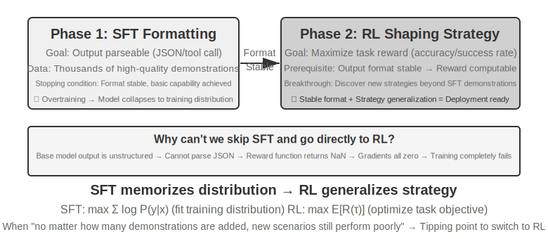

> **SFT ஆனது** நிலையான வடிவங்கள் (JSON output, உரையாடல் பாணி), உயர்தர நிபுணர் நிரூபணங்கள் (expert demonstrations), மற்றும் பயிற்சி மற்றும் பயன்பாட்டு சூழல்களுக்கு இடையே அதிக நிலைத்தன்மை உள்ள சூழ்நிலைகளுக்கு ஏற்றது. **RL தேவைப்படும் சூழ்நிலைகள்** வேறுபட்டவை: உண்மையான பயன்பாட்டு சூழலுக்கும் பயிற்சி சூழலுக்கும் இடையே முறையான வேறுபாடுகள் இருக்கும்போது (எ.கா., பயிற்சியின் போது, J/Q/K கார்டுகள் அனைத்தும் 10 ஆக இருக்கும், ஆனால் பயன்பாட்டின் போது அவை 11/12/13 ஆக மாறும்—விதிகள் மாறிவிட்டன; அல்லது பயிற்சியின் போது கருப்பு சூட்கள் பயன்படுத்தப்படும், ஆனால் பயன்பாட்டின் போது சிவப்பு சூட்கள் சந்திக்கப்படும்—தோற்றம் மாறிவிட்டது), உகந்த உத்திகளை ஆராய வேண்டியிருக்கும்போது (நிபுணர் நிரூபணங்கள் எப்போதும் உகந்ததாக இருக்காது), அல்லது ஒவ்வொரு பாதைக்கும் நிரூபணங்களை வழங்குவதற்கான annotation செலவுகள் மிக அதிகமாக இருக்கும்போது, RL தேவைப்படுகிறது.

> மிகவும் வலுவான உத்தி **"முதலில் SFT, பின்னர் RL"** என்ற இரண்டு-நிலை pipeline ஆகும். SFT-யின் முதன்மை இலக்கு பணி செயல்திறனை அதிகரிப்பது அல்ல, மாறாக output-க்கான **வடிவ நிலைத்தன்மையை** நிறுவுவதாகும்—model-ஆல் parse செய்யக்கூடிய JSON மற்றும் சரியான tool இடைமுக அழைப்புகளை உருவாக்க முடியும் என்பதை உறுதி செய்வது. Output வடிவம் நிலையான பின்னரே RL வெகுமதி சமிக்ஞையை நம்பத்தகுந்த முறையில் கணக்கிட முடியும். SFT இல்லாமல் base model-ல் நேரடியாக RL ஐ செயல்படுத்துவது, பெரும்பாலும் ஒழுங்கற்ற output வடிவங்கள் மற்றும் கணக்கிட முடியாத வெகுமதிகள் காரணமாக பயிற்சி தோல்விக்கு வழிவகுக்கும்—இருப்பினும் இந்த முடிவுக்கு எல்லை நிபந்தனைகள் உள்ளன: இது "சிறிய base model + கடுமையான கட்டமைக்கப்பட்ட output தேவைகள்" (பின்னர் உள்ள பரிசோதனை 7-11-ல் உள்ளது போல) அமைப்பிலிருந்து வருகிறது. DeepSeek-R1-Zero, போதுமான வலுவான base model ஆனது SFT-ஐத் தவிர்த்துவிட்டு நேரடி RL உடன் வெற்றிபெற முடியும் என்பதை நிரூபித்தது, இது reflection மற்றும் நீண்ட-சங்கிலி பகுத்தறிவு திறன்களை வெளிப்படுத்தியது—ஆனால் output readability குறைவு மற்றும் மொழிகள் கலந்திருப்பது போன்ற செலவுகளுடன், அதனால்தான் DeepSeek இறுதியில் R1-ல் "cold-start SFT" ஐ மீண்டும் சேர்த்தது. Zero இலிருந்து cold-start வரையிலான R1-ன் சுற்றுப் பயணம் "முதலில் வடிவம், பின்னர் ஆன்மா" என்பதற்கான சிறந்த எடுத்துக்காட்டு ஆகும்: RL அதன் சொந்த "ஆன்மாவை" (உத்தி மற்றும் பகுத்தறிவு திறன்) வளர்க்க முடியும், ஆனால் "வடிவம்" (format மற்றும் readability) இன்னும் SFT ஆல் விரைவாகவும் நிலையாகவும் நிறுவப்படுகிறது.

> இரண்டுக்கும் அவற்றின் செலவுகள் உள்ளன: SFT அதிக மாதிரி திறன் (sample efficiency) மற்றும் வேகமான ஒருங்கிணைப்பைக் கொண்டுள்ளது, ஆனால் வரையறுக்கப்பட்ட பொதுமைப்படுத்தலைக் கொண்டுள்ளது; RL மாற்றத்தக்க உத்திகளைக் கற்றுக்கொள்ள முடியும், ஆனால் குறைந்த மாதிரி திறன் மற்றும் நிலையற்ற பயிற்சியைக் கொண்டுள்ளது. ஒரு நடைமுறை அளவுகோல்: "எத்தனை நிரூபண எடுத்துக்காட்டுகள் சேர்க்கப்பட்டாலும், புதிய சூழ்நிலைகளில் செயல்திறன் இன்னும் மேம்படவில்லை" என்றால், அது RL-க்கு மாறுவதற்கான முக்கியமான புள்ளியாகும்—பிரச்சினையின் மூல காரணம் நிரூபணங்களின் எண்ணிக்கை அல்ல, மாறாக SFT-யின் உகப்பாக்க இலக்கு (optimization objective) ஆகும்.

> நடைமுறையில், பின்வரும் வரிசையில் முடிவு எடுக்கப்படலாம்:

> 1. **முதலில் கேளுங்கள்: Post-training தேவையா?** Harness engineering (prompts ஐ உகப்பாக்குதல், tool வடிவமைப்பு, context மேலாண்மை) மூலம் சிக்கலை தீர்க்க முடிந்தால், எந்த model பயிற்சியும் தேவையில்லை. பெரும்பாலான agent பயன்பாடுகள் இங்கே வருகின்றன.
> 2. **பயிற்சி தேவைப்பட்டால்: முதலில் SFT ஐ முயற்சிக்கவும்.** வெளியீட்டு வடிவங்களை (JSON schema, API call format) உறுதிப்படுத்துவதற்கும், நெறிமுறை அறிவை (சொற்களின் பயன்பாடு, வெளியீட்டு வடிவம், செயல்முறை பழக்கங்கள், அதாவது "எப்படி சொல்வது மற்றும் செய்வது") உறுதிப்படுத்துவதற்கும், மற்றும் பாணியை (தொனி, நீளம்) ஒருங்கிணைப்பதற்கும் SFT பொருத்தமானது. ஆனால் SFT ஆனது அதிக அளவிலான உண்மை அறிவை ("என்ன தெரிந்து கொள்ள வேண்டும்") செலுத்துவதற்கு பொருத்தமானது அல்ல என்பதை கவனத்தில் கொள்ளவும்—அதற்கு continued pre-training அல்லது RAG தேவைப்படுகிறது (இந்த அத்தியாயத்தின் முடிவில் உள்ள "Complete Picture" ஐப் பார்க்கவும்). SFT குறைந்த செலவு மற்றும் விரைவாக முடிவுகளைக் காட்டக்கூடியது.
> 3. **SFT போதுமானதாக இல்லாதபோது: RL ஐ சேர்க்கவும்.** புதிய சூழ்நிலைகளுக்கு பொதுமைப்படுத்துதல், உகந்த உத்திகளை ஆராய்தல், அல்லது annotation செலவுகள் மிக அதிகமாக இருக்கும் சூழ்நிலைகளுக்கு RL பொருத்தமானது. RL ஐப் பயன்படுத்துவதற்கு முன், முதலில் SFT மூலம் வெளியீட்டு வடிவத்தை உறுதிப்படுத்துவதை உறுதிசெய்யவும்.

## Single-Turn Reinforcement Learning: நினைவகம் மற்றும் பொதுமைப்படுத்தலின் ஒப்பீடு

> "Single-turn" என்பது ஒரு தொடர்பு மூலம் பணி முடிக்கப்படுவதைக் குறிக்கிறது: model உள்ளீட்டைப் பெறுகிறது, வெளியீட்டை உருவாக்குகிறது, மற்றும் வெகுமதியைப் பெறுகிறது, படிகள் முழுவதும் நிலையைப் பராமரிக்க வேண்டிய அவசியமில்லை. இந்த எளிமைப்படுத்தப்பட்ட அமைப்பு, multi-turn தொடர்புகளின் சிக்கலான தன்மை இல்லாமல், SFT மற்றும் RL இடையேயான கற்றல் வழிமுறைகளின் அடிப்படை வேறுபாடுகளில் கவனம் செலுத்த அனுமதிக்கிறது. Single-turn சூழ்நிலை தெளிவான கட்டுப்படுத்தப்பட்ட சோதனை நிலைமைகளை வழங்குகிறது: அதே பணி, அதே base model, அதே கணக்கீட்டு வரவு செலவுத் திட்டம், ஒரே மாறி பயிற்சி முறை மட்டுமே. முதல் சோதனையானது RL எவ்வாறு "எப்போது சிந்திக்க வேண்டும்" என்பதன் meta-strategy ஐ கற்றுக்கொள்கிறது என்பதை நிரூபிக்கிறது; இரண்டாவது சோதனையானது "SFT மனப்பாடம் செய்கிறது, RL பொதுமைப்படுத்துகிறது" என்பதை முறையாக அளவிட ஒரு எண்கணித பகுத்தறிவு அட்டை விளையாட்டைப் பயன்படுத்துகிறது.

> சோதனைகளுக்குள் நுழைவதற்கு முன், RL அல்காரிதம்களைப் பற்றிய **குறைந்தபட்ச உள்ளுணர்வை** நிறுவுவோம், இதனால் அடுத்தடுத்த சோதனைகளில் தோன்றும் சொற்களைப் புரிந்து கொள்ள முடியும் (முழுமையான சூத்திரங்கள் மற்றும் ஒப்பீடுகள் இந்த அத்தியாயத்தின் பிற்பகுதியில் உள்ள "Reinforcement Learning Algorithms ஒப்பீடு" பகுதிக்கு ஒதுக்கப்பட்டுள்ளன). இந்த அத்தியாயத்தில் RL பயிற்சி பெரும்பாலும் **policy gradient** ஐ அடிப்படையாகக் கொண்டது: model ஒரே பிரச்சினைக்கு பல பதில்களை உருவாக்குகிறது; அதிக வெகுமதி உள்ள பதில்களின் நிகழ்தகவு அதிகரிக்கப்படுகிறது, மற்றும் குறைந்த வெகுமதி உள்ள பதில்களின் நிகழ்தகவு குறைக்கப்படுகிறது—"அதிக வெகுமதியின் திசையில் அதிகம் செல்லுங்கள், குறைந்த வெகுமதியின் திசையில் குறைவாக செல்லுங்கள்." ஒற்றை பெரிய புதுப்பிப்பு model ஐ திசைதிருப்புவதைத் தவிர்க்க, முக்கிய **PPO** அல்காரிதம் ஒவ்வொரு படியிலும் புதுப்பிப்பின் அளவைக் கட்டுப்படுத்துகிறது (பின்வரும் சோதனைகளில் குறிப்பிடப்பட்டுள்ள "PPO with value network" இதைக் குறிக்கிறது; value network ஒரு baseline ஐ மதிப்பிட்டு ஒரு சிறந்த advantage ஐ கணக்கிடுகிறது); மற்றொரு முறையான **GRPO**, value network ஐ பயிற்றுவிக்காமல், "ஒரே பிரச்சினைக்கான பல பதில்களுக்கு இடையேயான ஒப்பீட்டை"ப் பயன்படுத்தி ஒவ்வொன்றின் ஒப்பீட்டு தரத்தை மதிப்பிடுகிறது. இந்த உள்ளுணர்வை மனதில் வைத்திருப்பது அடுத்த இரண்டு சோதனைகளையும் புரிந்து கொள்ள போதுமானது.

> **சோதனை 7-10 ★★: AdaptThink—"எப்போது சிந்திக்கக் கூடாது" என்பதைக் கற்றல்**

> Large reasoning models (e.g., OpenAI o1, DeepSeek-R1) அனைத்து பிரச்சினைகளுக்கும் நீண்ட chain-of-thought ஐ உருவாக்குகின்றன, இது எளிய பிரச்சினைகளில் தேவையற்ற overhead ஐ ஏற்படுத்துகிறது. இந்த பரிசோதனை முதலில் ஒரு உள்ளுணர்வை சரிபார்க்கிறது: **NoThinking mode** (`<think></think>` மூலம் சிந்தனையைத் தவிர்ப்பது) எளிய பிரச்சினைகளில் ஒப்பிடத்தக்கதாக அல்லது இன்னும் சிறப்பாக செயல்படுகிறது; கடினமான பிரச்சினைகளை எதிர்கொள்ளும்போதுதான் Thinking mode இன் நன்மை வெளிப்படுகிறது.

> AdaptThink, model ஆனது mode ஐ தகவமைத்துத் தேர்ந்தெடுக்க RL ஐப் பயன்படுத்தி பயிற்றுவிக்கிறது. இரண்டு முக்கிய கூறுகள்:

> - **Constrained Optimization Objective**: ஒட்டுமொத்த செயல்திறன் குறையாமல் இருப்பதை உறுதி செய்யும் அதே வேளையில், NoThinking ஐ ஊக்குவிக்கிறது.
> - **Importance Sampling Strategy**: **Cold start** பிரச்சினையைத் தீர்க்க Thinking/NoThinking மாதிரிகளை சமநிலைப்படுத்துகிறது (Cold Start, இங்கு குறிப்பாக ஆரம்ப model எப்போதும் Thinking ஐத் தேர்ந்தெடுப்பதால், NoThinking கிளை மாதிரிகள் மிகக் குறைவாக இருந்து கற்றலை கடினமாக்கும் பிரச்சினையைக் குறிக்கிறது; இது DeepSeek-R1 க்கு முன்பு குறிப்பிடப்பட்ட சில எடுத்துக்காட்டுகளுடன் கூடிய "cold-start SFT" என்பதிலிருந்து வேறுபட்ட பயன்பாட்டுச் சூழல் ஆகும்).

> இங்கு குறிப்பிடப்பட்டுள்ள "importance sampling" என்பது ஒரு பொதுவான புள்ளியியல் முறையாகும்—மாதிரி எடுக்கும் பரவல் ஒரு குறிப்பிட்ட வகை மாதிரிகளை நோக்கி சாய்ந்திருக்கும்போது, மாதிரிகளுக்கு எடைகளைப் பயன்படுத்தி பரவலை "சரிசெய்து", கற்றல் சமிக்ஞை அனைத்து வகைகளையும் நியாயமாக உள்ளடக்குவதை உறுதி செய்கிறது. இந்த யோசனை இந்த புத்தகத்தில் பின்னர் விவாதிக்கப்படும் PPO மற்றும் DAPO போன்ற RL அல்காரிதங்களில் மீண்டும் மீண்டும் பயன்படுத்தப்படுகிறது.

> மதிப்பீட்டு முடிவுகள்: பல கணித benchmarks இல், response length 45%-64% குறைக்கப்பட்டது, அதே நேரத்தில் துல்லியம் குறையவில்லை மற்றும் மேம்படவும் செய்தது. Model ஆனது பிரச்சினை பண்புகளின் அடிப்படையில் தேர்வுகளை செய்ய கற்றுக்கொள்கிறது: எளிய, நன்கு கட்டமைக்கப்பட்ட பிரச்சினைகளுக்கு நேரடியாக பதிலளித்தல்; பல-படி பகுத்தறிவு தேவைப்படும் கடினமான பிரச்சினைகளுக்கு முழுமையான chain-of-thought ஐ தக்கவைத்தல்; மற்றும் பார்க்காத பணி வகைகளின் கடினத்தன்மையை சரியாக மதிப்பிடுதல்.

> Prompt distillation உடன் நிரப்பியாக, இது ஒரு "வேக-மெதுவான இரட்டை அமைப்பை" உருவாக்குகிறது: distillation சிந்தனை தேவைப்படும் பணிகளின் விகிதத்தை குறைக்கிறது, அதே நேரத்தில் AdaptThink மீதமுள்ள பணிகளுக்கான தூண்டுதல் உத்தியை மேம்படுத்துகிறது, இவை இரண்டும் சேர்ந்து சிந்தனை திறனை அதிகரிக்கின்றன.

> **Experiment 7-11 ★★: GeneralPoints—Single-Turn RL இல் ஒரு "நினைவகம் மற்றும் பொதுமைப்படுத்தல்" ஒப்பீடு**

> 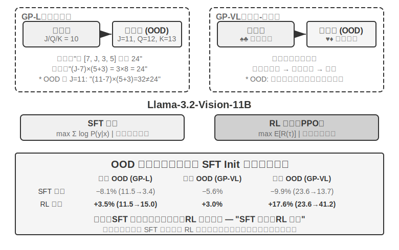

> GeneralPoints என்பது Chu et al. (2025, "SFT Memorizes, RL Generalizes," arXiv:2501.17161) ஆல் முன்மொழியப்பட்ட ஒரு எண்கணித பகுத்தறிவு அட்டை விளையாட்டு ஆகும், இது குறிப்பாக model பொதுமைப்படுத்தலை மதிப்பிட வடிவமைக்கப்பட்டுள்ளது. பணி நோக்கம் "24 Game" ஐ ஒத்தது: நான்கு அட்டைகளில் உள்ள எண்களைப் பயன்படுத்தி, கூட்டல், கழித்தல், பெருக்கல் மற்றும் வகுத்தல் செயல்பாடுகள் மூலம், ஒவ்வொரு எண்ணையும் சரியாக ஒருமுறை பயன்படுத்தி, இலக்கு எண் 24 ஐ அடைவது. பரிசோதனை இரண்டு வகைகளை வடிவமைக்கிறது: உரை-மட்டும் GP-L மற்றும் பட அடிப்படையிலான GP-VL, இது ஒரே கட்டமைப்பிற்குள் விதி பொதுமைப்படுத்தல் மற்றும் காட்சி பொதுமைப்படுத்தல் ஆகிய இரண்டையும் ஆராய அனுமதிக்கிறது.

> **விதி மாறுபாடு**: பயிற்சியின் போது, J/Q/K அனைத்தும் 10 ஆக கணக்கிடப்படுகின்றன; சோதனையின் போது, அவை முறையே 11/12/13 ஆக கணக்கிடப்படுகின்றன, இது சோதனைத் தொகுப்பில் பார்த்திராத எண் சேர்க்கைகள் (11, 12, 13 ஐ உள்ளடக்கிய செயல்பாடுகள்) இருப்பதை உறுதிசெய்து, பொதுமைப்படுத்தலை கண்டிப்பாக மதிப்பீடு செய்கிறது. **காட்சி மாறுபாடு**: பயிற்சி கருப்பு சூட்டுகளை (♠♣) பயன்படுத்துகிறது, சோதனை சிவப்பு சூட்டுகளை (♥♦) பயன்படுத்துகிறது, காட்சி தோற்றத்தில் ஏற்படும் மாற்றங்களுக்கான உறுதித்தன்மையை மதிப்பீடு செய்ய. Llama-3.2-Vision-11B ஐ அடிப்படையாகக் கொண்டு, நிலையான post-training pipeline ஐப் பின்பற்றுகிறது: முதலில், SFT initialization அதற்கு அடிப்படை instruction-following திறனை வழங்க; பின்னர், அதே கணக்கீட்டு வரவு செலவுத் திட்டத்துடன், SFT மற்றும் RL பயிற்சியை தனித்தனியாக நீட்டிக்கவும் (RL பகுதி value network உடன் PPO algorithm ஐப் பயன்படுத்துகிறது), ஒற்றை விதியை (J/Q/K=10) பயன்படுத்தி தரவுகளுடன் பயிற்சி செய்து, in-distribution (ID) மற்றும் out-of-distribution (OOD) சோதனைத் தொகுப்புகளில் மதிப்பீடு செய்யவும்.

> முடிவுகள் அடிப்படை வேறுபாட்டை தெளிவாக வெளிப்படுத்துகின்றன. **Rule OOD**: RL GP-L இல் +3.5% முன்னேற்றம் அடைகிறது (11.5%→15.0%), அதே நேரத்தில் SFT **குறைகிறது** 8.1% (11.5%→3.4%); GP-VL இல், RL +3.0% முன்னேற்றம் அடைகிறது, அதே நேரத்தில் SFT 5.6% குறைகிறது. **Visual OOD**: RL GP-VL இல் **+17.6%** முன்னேற்றம் அடைகிறது (23.6%→41.2%), அதே நேரத்தில் SFT 9.9% குறைகிறது (23.6%→13.7%).

> காட்சி அங்கீகார துல்லியத்தை கண்காணிப்பது, RL ஆனது outcome-oriented optimization மூலம் அடிப்படை visual encoder ஐ மேம்படுத்துகிறது என்பதை வெளிப்படுத்துகிறது, மேலும் இந்த முன்னேற்றம் ஒட்டுமொத்த செயல்திறன் ஆதாயங்களுடன் மிகவும் தொடர்புடையது; இதற்கு மாறாக, SFT ஆனது சிந்தனை செயல்முறையில் உள்ள token patterns க்கு overfit ஆகி, visual tokens கற்றலைப் புறக்கணித்து, அங்கீகார துல்லியத்தில் குறைவுக்கு வழிவகுக்கிறது.

> பரிசோதனையானது RL க்கு SFT இன் அவசியத்தையும் வெளிப்படுத்துகிறது: இந்த பரிசோதனையின் அமைப்புகளின் கீழ் (Llama-3.2-Vision-11B அளவிலான base model, கூடுதலாக கடுமையான structured output தேவைகள்), SFT இல்லாமல் நேரடியாக end-to-end RL செய்வது முற்றிலும் தோல்வியடைகிறது—base model ஆல் structured outputs ஐ உருவாக்க முடியாது, மேலும் rewards ஐ கணக்கிடவே முடியாது. இது குறிப்பிட்ட அமைப்புகளின் கீழ் உள்ள முடிவு என்பதை கவனத்தில் கொள்ளவும், உலகளாவிய விதி அல்ல: போதுமான வலிமையான base model SFT ஐ தவிர்த்துவிட்டு நேரடி RL உடன் வெற்றிபெற முடியும் (DeepSeek-R1-Zero பற்றிய முந்தைய விவாதத்தைப் பார்க்கவும்). மற்றொரு குறிப்பிடத்தக்க கண்டுபிடிப்பு என்னவென்றால், அதிக சரிபார்ப்பு மறுமுறைகள் சிறந்த பொதுமைப்படுத்தலுக்கு வழிவகுக்கும்: 10 மறுமுறைகள் +5.99% எதிராக 1 மறுமுறை +0.48%, இது சிந்தனையின் போது computational scaling RL பொதுமைப்படுத்தலுக்கு முக்கியமானது என்பதைக் குறிக்கிறது.

> Distribution shift இன் கீழ் SFT செயல்திறன் ஏன் சரிகிறது, அதே நேரத்தில் RL சிறப்பாக செயல்படுகிறது? SFT ஆனது "இந்த input கொடுக்கப்பட்டால், அந்த output ஐ வெளியிடு" என்ற mapping ஐ கற்றுக்கொள்கிறது: பயிற்சியின் போது, J/Q/K அனைத்தும் 10 ஆகும், எனவே model "J/Q/K ஐ சந்திக்கும் போது, அவற்றை 10 ஆக கருது" என்ற நிலையான pattern ஐ மனப்பாடம் செய்கிறது; சோதனையின் போது, J=11, ஆனால் model அதை இன்னும் 10 ஆக கணக்கிடுகிறது, இயற்கையாகவே பிழைகள் ஏற்படுகின்றன. RL ஆனது "எந்த கணக்கீட்டு செயல்முறை சரியான பதிலை அளிக்கிறது" என்ற பொதுவான உத்தியை கற்றுக்கொள்கிறது: J 11 ஆக மாறும்போது, RL model அதே உத்தியைப் பயன்படுத்தி மீண்டும் கணக்கிடுகிறது, மனப்பாடம் செய்த பதிலைப் பயன்படுத்துவதில்லை. இதுவே "மனப்பாடம்" மற்றும் "பொதுமைப்படுத்தல்" இடையேயான அடிப்படை வேறுபாடு ஆகும்.
> இந்த பரிசோதனையின் முக்கிய பங்களிப்பு, "SFT நினைவில் கொள்கிறது, RL பொதுமைப்படுத்துகிறது" என்ற நிகழ்வை முறையாக அளவிடுவதாகும். இந்த விதி தூய மொழி மற்றும் vision-language முறைகள் இரண்டிலும் உண்மை என்பதை நிரூபித்து, SFT மற்றும் RL இடையேயான ஒருங்கிணைந்த உறவை வெளிப்படுத்துகிறது: SFT வடிவமைப்பு நிலைத்தன்மையை வழங்குகிறது, அதே நேரத்தில் RL இந்த அடிப்படையில் நினைவகத்தின் எல்லைகளை உடைக்கிறது; இரண்டும் இன்றியமையாதவை. இந்த "முதலில் வடிவம், பின்னர் ஆன்மா" பயிற்சி முறை—சீன ஓவியத்திலிருந்து கடன் வாங்கிய ஒரு சொல், முதலில் வெளிப்புற வடிவத்தை (format, structure) துல்லியமாக வரைந்து, பின்னர் உள் ஆன்மாவை (generalization, strategy) தேடுதல்—பின்வரும் பல-சுற்று, பல-முறை பணிகளுக்கு ஒரு முறையியல் அடித்தளத்தை அமைக்கிறது.

## RLHF: மனித விருப்பங்களிலிருந்து வெகுமதி மாதிரிகள் வரை

முந்தைய பரிசோதனைகள் ஒரு பொதுவான முன்நிபந்தனையைப் பகிர்ந்து கொள்கின்றன: பணிகளுக்கு சரிபார்க்கக்கூடிய சரியான தன்மை உள்ளது—சூத்திரம் சரியாக இருந்தாலும் அல்லது format இணக்கமாக இருந்தாலும், ஒரு rule-based verifier அதை மதிப்பெண் செய்ய முடியும். இருப்பினும், இன்று பயன்படுத்தப்படும் உரையாடல் மாதிரிகள் "கண்ணியமான, பாதுகாப்பான உதவியாளர்கள்" போல் நடந்து கொள்வது, மற்றொரு முன்னதாக முதிர்ச்சியடைந்த அணுகுமுறைக்கு நன்றி: **RLHF** (Reinforcement Learning from Human Feedback). RLHF ஐப் புரிந்துகொள்வது, ChatGPT போன்ற தயாரிப்புகளின் உரையாடல் தரம் மற்றும் பாதுகாப்பு alignment எங்கிருந்து வருகிறது என்பதைப் புரிந்துகொள்வதற்கான திறவுகோலாகும், மேலும் பின்னர் விவாதிக்கப்படும் வழிமுறைகளில் KL penalty மற்றும் reward hacking போன்ற கருத்துக்களைப் புரிந்துகொள்வதற்கான முன்நிபந்தனையும் ஆகும்.

**InstructGPT இன் மூன்று-நிலை Pipeline.** OpenAI இன் InstructGPT[^ch7-4] இன்றும் பயன்பாட்டில் உள்ள நிலையான செயல்முறையை நிறுவியது:

1. **SFT**: மனிதர்களால் நிரூபிக்கப்பட்ட "instruction-response" ஜோடிகளில் pre-trained மாதிரியை fine-tune செய்து, அடிப்படை instruction-following திறனை நிறுவுதல்—இது முன்னர் "SFT (Supervised Fine-Tuning)" பிரிவில் விவாதிக்கப்பட்ட உள்ளடக்கமாகும்.
2. **வெகுமதி மாதிரியை (RM) பயிற்றுவித்தல்**: அதே prompt க்கு, மாதிரி பல பதில்களை உருவாக்கச் செய்து, மனித annotators அவற்றை pairwise ஒப்பிட்டு, எதை விரும்புகிறார்கள் என்பதைக் குறிப்பிடுகிறார்கள். இந்த preference pairs ஐப் பயன்படுத்தி ஒரு மதிப்பெண் மாதிரியைப் பயிற்றுவிக்கவும், Bradley-Terry மாதிரியின் அடிப்படையில் பயிற்சி இலக்கு:

   $$\mathcal{L}_{\text{RM}} = -\log \sigma\big(r(x, y_w) - r(x, y_l)\big)$$

   இங்கு $y_w$ என்பது விருப்பமான பதில், $y_l$ என்பது நிராகரிக்கப்பட்ட பதில், மற்றும் $\sigma$ என்பது sigmoid சார்பு. இதன் உள்ளுணர்வு மிகவும் எளிமையானது: **RM ஆனது விருப்பமான பதிலுக்கு அதிக மதிப்பெண்ணை வழங்க வேண்டும்**. மதிப்பெண்களை விட ஒப்பீடுகளை சேகரிப்பதற்கான காரணம், மனிதர்கள் தொடர்ந்து முழுமையான மதிப்பெண்களை வழங்குவது கடினம் ("இந்த பதில் 7.3 மதிப்பெண்களுக்கு தகுதியானது" என்பதை தொடர்ந்து முத்திரையிடுவது கிட்டத்தட்ட சாத்தியமற்றது), ஆனால் "A மற்றும் B இல் எது சிறந்தது" போன்ற தீர்ப்புகள் மிகவும் நம்பகமானவை. **"Reward model"-ன் பங்கை நினைவில் கொள்ளுங்கள்—இது இந்த அத்தியாயத்தில் ஒரு தொடர்ச்சியான கருப்பொருள்**: இங்கு, இது மனித விருப்பங்களிலிருந்து கற்றுக்கொள்ளப்பட்ட ஒரு மதிப்பீட்டாளர்; நாம் பிரிவு 7.10 (reward design) ஐ அடையும் போது, அதன் பல்வேறு வடிவங்களை (இறுதி முடிவை மட்டும் பார்க்கும் ORM, படிப்படியாக மதிப்பெண் வழங்கும் PRM, இயற்கை மொழியில் பகுத்தறிவை வழங்கும் generative reward models) மற்றும் ஒரு சிறப்பு நிகழ்வைக் காண்பீர்கள்—சரியான தன்மையை விதிகள் மூலம் நேரடியாக தீர்மானிக்க முடியும்போது, "reward model" என்பது ஒரு தீர்மானகரமான குறியீட்டுத் துண்டாக (deterministic piece of code) சிதைந்துவிடும் (இதுதான் கீழே விவாதிக்கப்பட்ட RLVR ஆகும்). இவை அனைத்தும் ஒரே கேள்விக்கு பதிலளிக்கின்றன: **reward எங்கிருந்து வருகிறது?**
3. **PPO-க்கு RM மதிப்பெண்களைப் பயன்படுத்துதல்**: RM-ன் மதிப்பெண்ணை reward signal ஆகப் பயன்படுத்தி, SFT மாதிரியில் PPO பயிற்சியை மேற்கொள்ளவும் (PPO-வின் பொறிமுறை அடுத்த பகுதியில் விளக்கப்பட்டுள்ளது), இதனால் மாதிரியானது RM "மனிதர்கள் விரும்புவார்கள்" என்று நம்பும் பதில்களை உருவாக்க கற்றுக்கொள்கிறது.

**KL Penalty: தொடக்கப் புள்ளியிலிருந்து அதிகம் விலகிச் செல்ல வேண்டாம் (KL Divergence-ஐ முழுமையாக விளக்குதல்).** RLHF-இல், மாதிரி உண்மையில் மேம்படுத்தும் reward பொதுவாக RM மதிப்பெண் மட்டுமல்ல, அதிலிருந்து கழிக்கப்படும் ஒரு தண்டனை உறுப்பு (penalty term) ஆகும்:

$$r = r_{\text{RM}} - \beta \cdot \mathrm{KL}\big(\pi_\theta \,\|\, \pi_{\text{ref}}\big)$$

இந்த ஒற்றை சூத்திரம் ஆரம்பநிலையாளர்களிடமிருந்து மூன்று பொதுவான கேள்விகளை எழுப்புகிறது, அவற்றை ஒவ்வொன்றாகப் பார்ப்போம்.

**(1) KL divergence என்றால் என்ன, தண்டனை எங்கு பயன்படுத்தப்படுகிறது?** KL divergence (Kullback-Leibler Divergence) என்பது இரண்டு நிகழ்தகவு பரவல்களுக்கு இடையிலான வேறுபாட்டை அளவிடுகிறது: பரவல்கள் ஒத்திருந்தால், KL சிறியதாக இருக்கும், ஒரே மாதிரியாக இருந்தால் 0 ஐ அடையும்; வேறுபட்டால், KL பெரியதாக இருக்கும். இங்குள்ள இரண்டு பரவல்கள், ஒரே முந்தைய சூழலைக் கொடுக்கும்போது, **தற்போதைய கொள்கை** $\pi_\theta$ (பயிற்சி பெறும் மாதிரி) மற்றும் **குறிப்பு கொள்கை** $\pi_{\text{ref}}$ (பயிற்சியின் தொடக்கப் புள்ளி, பொதுவாக SFT மாதிரி) ஆகியவற்றின் "அடுத்த token நிகழ்தகவு பரவல்" ஆகும். $\beta$ தண்டனையின் வலிமையைக் கட்டுப்படுத்துகிறது—இது பயிற்சி ஸ்கிரிப்ட்களில் பொதுவாகக் காணப்படும் `kl_coef` hyperparameter ஆகும். பொறியியல் அடிப்படையில், இந்த தண்டனை **ஒவ்வொரு token-க்கும் கணக்கிடப்பட்டு reward-உடன் சேர்க்கப்படுகிறது** (per-token KL): மாதிரி ஒவ்வொரு முறை ஒரு token-ஐ உருவாக்கும் போதும், அந்த நிலையில் உள்ள நிகழ்தகவு வேறுபாட்டை குறிப்பு மாதிரியுடன் ஒப்பிடுகிறது; அதிக விலகல் இருந்தால், அந்த படிநிலைக்கான reward அதிகமாக தண்டிக்கப்படுகிறது. வேறு வார்த்தைகளில் கூறுவதானால், KL என்பது ஒரு தனி இழப்பு உறுப்பு (loss term) அல்ல, மாறாக **reward signal-இல் கலக்கப்பட்டு**, பின்னர் PPO/GRPO-வின் advantage கணக்கீட்டின் வழியாக செல்கிறது—இதுவே அது செயல்படும் சரியான இடமாகும்.

**(2) "தற்போதைய policy முதலில், reference policy இரண்டாவது" என்ற திசை ஏன் முக்கியமானது?** KL divergence என்பது சமச்சீரற்றது, $\mathrm{KL}(P\|Q)\neq\mathrm{KL}(Q\|P)$, எனவே திசை தன்னிச்சையானது அல்ல. இங்கே அது $\mathrm{KL}(\pi_\theta\|\pi_{\text{ref}})$ — தற்போதைய policy முதலில் — என எழுதப்பட்டுள்ளது, இது கணித ரீதியாக **reverse KL** என அழைக்கப்படுகிறது. இது "$\pi_\theta$ எங்காவது அதிக நிகழ்தகவை ஒதுக்கும்போது, $\pi_{\text{ref}}$ அங்கு பூஜ்ஜியத்திற்கு அருகில் நிகழ்தகவை ஒதுக்கும்" சூழ்நிலைகளை தண்டிக்கிறது, அதாவது, **reference model நினைக்கும் இடங்களுக்கு model செல்வதை தண்டிக்கிறது**. இதுவே நமக்குத் தேவையானது: reference model (SFT model) "இயற்கையாகப் பேசுதல் மற்றும் சாதாரண வடிவமைப்பு" என்ற பாதுகாப்பான மண்டலத்தைக் குறிக்கிறது, மேலும் reverse KL தற்போதைய policy ஐ இந்த பாதுகாப்பான மண்டலத்திற்கு அருகில் வைத்து, அது கட்டுப்பாடின்றி விலகிச் செல்வதைத் தடுக்கிறது. நாம் **forward KL** $\mathrm{KL}(\pi_{\text{ref}}\|\pi_\theta)$ ஐப் பயன்படுத்தியிருந்தால், அது "reference model இல் உள்ள, ஆனால் தற்போதைய model இல் இல்லாத" வடிவங்களை தண்டிக்கும் — இது model ஐ reference model இன் அனைத்து வெளிப்பாட்டு பாணிகளையும் உள்ளடக்கும்படி கட்டாயப்படுத்தும், இது RLHF இன் நோக்கம் அல்ல.

**(3) இது ஏன் இவ்வாறு வடிவமைக்கப்பட்டுள்ளது?—mode-seeking இன் தோற்றம்.** Reverse KL ஒரு முக்கிய பண்பைக் கொண்டுள்ளது: இது **mode-seeking** ஆகும். பிரிவு 7.1 இதற்கான அடித்தளத்தை அமைத்தது — reverse KL model ஐ **சில உயர்-வெகுமதி "modes" ஐ மட்டும் தக்கவைத்து, மற்றவற்றை உறுதியாக நிராகரிக்க** அனுமதிக்கிறது, SFT இன் maximum likelihood (mass-covering) போல எல்லாவற்றையும் சமமாக உள்ளடக்க வேண்டிய அவசியமில்லை. RLHF இன் சூழலில், இதுவே நமக்குத் தேவையான விளைவு: RM அங்கீகரித்த ஒன்று அல்லது இரண்டு உயர்-மதிப்பெண் பதில் பாணிகளைத் தேர்ந்தெடுத்து அவற்றை நிலையாக வெளியிடுவது, சாத்தியமான அனைத்து பதில்களையும் கற்றுக்கொள்வதற்குப் பதிலாக. RL க்குப் பிறகு models மேலும் "உறுதியானவை" மற்றும் குறைந்த பன்முகத்தன்மை கொண்டவையாக இருப்பதற்கான காரணமும் இதுவே. Reverse KL இன் mode-seeking பண்பு மற்றும் model ஐ reference distribution க்கு அருகில் வைத்திருப்பது ஆகியவற்றின் கலவையே RLHF இன் நிலைத்தன்மைக்கான ரகசியமாகும்.

**(4) இது இல்லாமல் என்ன நடக்கும்?** உள்ளுணர்வு எளிதானது: **தொடக்கப் புள்ளியிலிருந்து அதிகம் விலகிச் செல்லாதீர்கள், இல்லையெனில் reward model இன் மதிப்பெண்கள் நம்பகத்தன்மையற்றதாக மாறும்.** RM ஆனது reference policy க்கு அருகிலுள்ள output distribution இல் பயிற்சி பெற்றுள்ளது. Model RM ஒருபோதும் பார்க்காத distribution க்கு உகந்ததாக்கப்பட்டவுடன், RM இன் மதிப்பெண்கள் அடிப்படையற்ற extrapolation ஆக மாறும், மேலும் அதிக மதிப்பெண்கள் உயர் தரத்திற்கு சமமாக இருக்காது. எனவே, KL penalty ஒரே நேரத்தில் இரண்டு விஷயங்களைத் தடுக்கிறது: **reward hacking** (model வெகுமதியில் உள்ள ஓட்டைகளைப் பயன்படுத்தி பணியைச் சரியாகச் செய்யாமல் அதிக மதிப்பெண்களைப் பெறுதல், அடுத்த பத்தியைப் பார்க்கவும்) மற்றும் **distribution collapse** (வெளியீடுகள் மீண்டும் மீண்டும் வருதல் அல்லது அர்த்தமற்ற சொற்கள் போன்ற தீவிர வடிவங்களில் சிதைதல்). சரிபார்க்கக்கூடிய வெகுமதிகளுடன் கூடிய RLVR பயிற்சியில் கூட, பயிற்சியை நிலைப்படுத்த KL regularization பெரும்பாலும் தக்கவைக்கப்படுகிறது (சில படைப்புகளான DAPO மற்றும் Open-Reasoner-Zero ஆகியவை வேண்டுமென்றே அதை நீக்குகின்றன — DeepSeek-R1-Zero இன் GRPO தானாகவே இன்னும் வெளிப்படையான KL term ஐ உள்ளடக்கியுள்ளது என்பதைக் கவனிக்கவும்).

**Reward Models "Over-Optimized" ஆக இருக்க முடியும்.** RM என்பது, எல்லாவற்றிற்கும் மேலாக, மனித விருப்பங்களின் proxy indicator மட்டுமே. Goodhart's Law கூறுகிறது: ஒரு metric ஆனது optimization target ஆக மாறும்போது, அது ஒரு நல்ல metric ஆக இருப்பதை நிறுத்திவிடுகிறது—proxy ஐ தீவிர நிலைகளுக்குத் தள்ளுவது, அதன் true objective உடனான correlation ஐ சிதைக்கிறது. OpenAI இன் ஆராய்ச்சி[^ch7-5] இந்த **reward model over-optimization** நிகழ்வை முறையாக அளவிட்டது: RL பயிற்சி முன்னேறும்போது, proxy reward (RM score) monotonically அதிகரிக்கிறது, அதே நேரத்தில் true quality (human evaluation) முதலில் உயர்ந்து பின்னர் குறைகிறது. Model படிப்படியாக "சிறப்பாக பதிலளிப்பதை" அல்ல, மாறாக "RM அதிக மதிப்பெண் கொடுக்கும்படி செய்வதை" கற்றுக்கொள்கிறது—verbose, ingratiating, மேலோட்டமாக கடுமையானதாக இருந்தாலும் வெற்றுப் பேச்சு. இது RLHF இன் சூழலில் reward hacking இன் குறிப்பிட்ட வடிவமாகும், மேலும் KL penalty மற்றும் early stopping ஆகியவை மிகவும் பொதுவான mitigation methods ஆகும்; இந்த அத்தியாயத்தின் முடிவில் உள்ள "Common Pitfalls" பிரிவில் உள்ள reward hacking பிரச்சனையும் இதே மூலத்தைப் பகிர்ந்துகொள்கிறது.

**DPO: Explicit Reward Model ஐ தவிர்த்தல்.** DPO (Direct Preference Optimization)[^ch7-6] ஒரு அடிப்படைக் கருத்தில் இருந்து தொடங்குகிறது: "training RM + PPO" இன் கலவையானது இறுதியில் "preferred responses இன் நிகழ்தகவை அதிகரித்து, rejected responses இன் நிகழ்தகவைக் குறைத்து, அதே நேரத்தில் reference model இலிருந்து அதிகம் விலகிச் செல்லாமல் இருப்பதை" விளைவிப்பதால், explicit RM ஐ தவிர்த்துவிட்டு, preference pairs ஐ implicit reward உடன் classification loss ஆக நேரடியாக மாற்றுவது ஏன் கூடாது? கணித ரீதியாக, இது KL constraint உடன் கூடிய offline preference optimization க்கு சமமானது என்பதை நிரூபிக்க முடியும், இதில் reward model ஆனது policy க்குள்ளேயே implicitly உட்பொதிக்கப்பட்டுள்ளது. DPO பயிற்சி SFT போலவே எளிமையானது: online sampling இல்லை, value network இல்லை, தனி RM ஐ பராமரிக்க வேண்டிய அவசியமில்லை. இதன் விலை என்னவென்றால், இது முற்றிலும் offline ஆகும்—இது preference data க்கு அப்பால் புதிய நடத்தைகளை ஆராய முடியாது, மேலும் அதன் performance ceiling ஆனது preference data இன் தரம் மற்றும் coverage ஆல் தீர்மானிக்கப்படுகிறது.

**RLHF மற்றும் RLVR இடையேயான உறவு.** சுருக்கமாக, இரண்டு அணுகுமுறைகளுக்கும் இடையேயான வேறுபாடு **reward எங்கிருந்து வருகிறது** என்பதில் உள்ளது: RLHF இன் reward ஆனது கற்றறிந்த RM (human preference data ஆல் ஆதரிக்கப்படுகிறது) இலிருந்து வருகிறது, அதே நேரத்தில் **RLVR** (Reinforcement Learning with Verifiable Rewards) ஒரு rule-based verifier ஐப் பயன்படுத்துகிறது (test தேர்ச்சி பெற்றதா, answer சரியானதா). Agent பணிகள் பெரும்பாலும் verifiable ஆக இருக்கும்—இந்த அத்தியாயம் RLVR ஐ முக்கிய நூலாகக் கவனம் செலுத்துவதற்கு இதுவே துல்லியமான காரணம். இருப்பினும், இது ஒன்றைத் தேர்ந்தெடுத்து மற்றொன்றை விலக்குவது அல்ல; நடைமுறையில் பயன்படுத்தப்படும் models இவற்றை இணைந்து பயன்படுத்துகின்றன: RLHF உரையாடல் தரம் மற்றும் பாதுகாப்பு alignment ஐக் கையாளுகிறது, அதே நேரத்தில் RLVR reasoning மற்றும் Agent திறன்களைக் கையாளுகிறது. பின்னர் வரும் "Evolution of Reward Paradigms" பிரிவு generative reward models பற்றி விவாதிக்கிறது, இவை இந்த இரண்டு வரிகளின் சங்கமமாகக் காணப்படலாம்—rules ஆல் மறைக்க முடியாத open-ended பணிகளைக் கையாள ஒரு trainable reward model ஐப் பயன்படுத்துகிறது.

## Reinforcement Learning Algorithms ஒப்பீடு

முந்தைய single-turn சோதனைகள் RL-இன் generalization நன்மையை நிரூபித்தன, மேலும் முந்தைய பகுதி RLHF-இன் preference optimization அணுகுமுறையை அறிமுகப்படுத்தியது. இருப்பினும், இந்த படைப்புகளில் பயன்படுத்தப்படும் குறிப்பிட்ட அல்காரிதம்கள் மாறுபடுகின்றன மற்றும் பல விருப்பங்களில் ஒரு துணைக்குழு மட்டுமே. மிகவும் சிக்கலான multi-turn பணிகளுக்குச் செல்வதற்கு முன், முக்கிய அல்காரிதம்களின் பண்புகள் மற்றும் பொருந்தக்கூடிய காட்சிகளை முறையாக மதிப்பாய்வு செய்வது அவசியம்.

> **முதலில், மிக முக்கியமான விஷயம், வாசகர்கள் சூத்திரங்களில் தொலைந்து போகாமல் இருக்க.** இந்த பகுதி சில அல்காரிதம் பெயர்கள் மற்றும் சூத்திரங்களை பட்டியலிடுகிறது, ஆனால் இந்த அத்தியாயத்தின் இரண்டாவது முக்கிய நூலை நினைவில் கொள்ளுங்கள்: **தொழில்துறையில், ஆயத்த RL அல்காரிதம்கள் (PPO, GRPO, போன்றவை) இருப்பதால், அவற்றை எவ்வாறு பயன்படுத்துவது மற்றும் சரியானதைத் தேர்ந்தெடுப்பது போதுமானது; வெற்றி அல்லது தோல்வியை உண்மையில் தீர்மானிப்பது தரவு மற்றும் சூழல், அல்காரிதம் அல்ல.** இந்த அல்காரிதம்கள் veRL மற்றும் TRL போன்ற முதிர்ந்த கட்டமைப்புகளில் ஏற்கனவே இணைக்கப்பட்டுள்ளன; அவற்றை அழைப்பது பொதுவாக சில வரி கட்டமைப்புகளை மாற்றுவதை மட்டுமே உள்ளடக்குகிறது. எனவே, இந்த பகுதியின் குறிக்கோள் அவற்றை நீங்கள் பெற முடியும் என்பதல்ல, மாறாக "எந்த காட்சிக்கு எந்த அல்காரிதம்" என்ற தேர்வு வரைபடத்தை உருவாக்க உங்களுக்கு உதவுவதாகும்; சூத்திர பகுதிகள் (பயிற்சி பொறியாளர்களை இலக்காகக் கொண்டவை) புரியவில்லை என்றால் தவிர்க்கப்படலாம், அடுத்தடுத்த வாசிப்பை பாதிக்காது. அடுத்த பகுதி நேரடியாக "தரவு மற்றும் சூழல் ஏன் அல்காரிதம்களை விட முக்கியமானவை" என்பதை விளக்கும்.

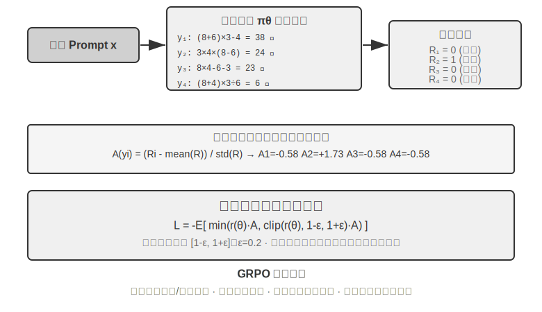

நவீன LLM Agent-களுக்கான RL காட்சி பாரம்பரிய RL-இலிருந்து அடிப்படையில் வேறுபடுகிறது—Agent-கள் பயனர் நோக்கத்தைப் புரிந்துகொள்ள வேண்டும், கருவிகளை அழைக்க வேண்டும், கட்டமைக்கப்பட்ட வெளியீடுகளை உருவாக்க வேண்டும், மேலும் பல உரையாடல் சுற்றுகளில் நீண்ட சங்கிலி பகுத்தறிவில் ஈடுபட வேண்டும். இந்த பல-நோக்கம், பல-நிலை முடிவெடுப்பு என்பது "சரியான அல்காரிதத்தைத் தேர்ந்தெடுப்பது" சில தாக்கத்தை ஏற்படுத்துகிறது, ஆனால் தரவு மற்றும் சூழலை விட மிகக் குறைவு.

செயலாக்கக் கண்ணோட்டத்தில், RL அல்காரிதம்கள் **online exploration methods** (சூழலுடன் தொடர்பு கொண்டு புதிய உத்திகளை ஆராய்தல்) மற்றும் **offline optimization methods** (தற்போதைய தரவின் அடிப்படையில் மேம்படுத்துதல், மிகவும் நிலையான மற்றும் நேரடியானது) என பிரிக்கப்படுகின்றன. இங்கே, முன்பு வாக்குறுதியளிக்கப்பட்ட கடுமையான சொற்களையும் வழங்குகிறோம்: **On-Policy** முறைகள் தற்போதைய கொள்கையால் புதிதாக மாதிரி எடுக்கப்பட்ட தரவை மட்டுமே பயன்படுத்தி தன்னைப் புதுப்பிக்கின்றன; **Off-Policy** முறைகள் மற்ற கொள்கைகளால் (அல்லது கொள்கையின் பழைய பதிப்புகளால்) உருவாக்கப்பட்ட தரவை கற்றலுக்குப் பயன்படுத்தலாம் (முன்பு குறிப்பிட்ட Q-learning போன்றவை). இந்த வரையறையின்படி இந்த அத்தியாயத்தில் விவாதிக்கப்பட்ட முறைகளுடன் சீரமைத்தல்: SFT என்பது off-policy imitation learning—தரவு ஒரு ஆசிரியர் அல்லது மனித நிரூபணங்களிலிருந்து வருகிறது, மாதிரியிலிருந்து அல்ல; LLM பயிற்சிக்குப் பயன்படுத்தப்படும் PPO மற்றும் GRPO-வின் நிலையான வடிவங்கள் on-policy—ஒவ்வொரு சுற்றும் தற்போதைய மாதிரியால் புதிதாக மாதிரி எடுக்கப்பட்ட rollouts (அதாவது, மாதிரியை முழு பணியையும் ஒருமுறை இயக்கி, தொடக்கம் முதல் இறுதி வரை ஒரு முழுமையான பாதையை உருவாக்குதல்) பயன்படுத்தி புதுப்பிக்கப்படுகிறது; DPO என்பது offline preference optimization, இதில் online sampling அல்லது கடுமையான policy iteration ஆகியவை இல்லை.

இந்த அல்காரிதங்கள் பெரும்பாலும் **Policy Gradient** என்ற ஒரே கருத்தின் அடிப்படையில் கட்டமைக்கப்பட்டுள்ளன: "எதிர்பார்க்கப்படும் return-ஐ அதிகரிக்கும்" திசையில் policy அளவுருக்கள் $\theta$ ஐ சரிசெய்வது. இதன் மிக அடிப்படை வடிவம் (REINFORCE) பின்வருமாறு:

$$\nabla_\theta J(\theta) = \mathbb{E}\big[\nabla_\theta \log \pi_\theta(a \mid s)\, G\big]$$

இங்கு $\pi_\theta(a\mid s)$ என்பது policy (state $s$-ல் action $a$ ஐ தேர்ந்தெடுப்பதற்கான நிகழ்தகவு), மற்றும் $G$ என்பது இந்த trajectory-க்கான (அல்லது அந்த படிநிலையிலிருந்து முன்னோக்கிய) cumulative return ஆகும்—return அதிகமாக இருந்தால், அந்த action-ன் நிகழ்தகவு அதிகமாக வலுப்படுத்தப்படும். முழு trajectory-யின் return $G$ ஐ எடையாகப் பயன்படுத்துவது unbiased ஆனால் high variance கொண்டது; எனவே, ஒரு baseline $b$ அறிமுகப்படுத்தப்பட்டு, **Advantage** $\hat{A}=G-b$ (இந்த action சராசரியை விட எவ்வளவு சிறந்தது) variance-ஐ குறைக்க எடையாகப் பயன்படுத்தப்படுகிறது. அடுத்தடுத்த PPO மற்றும் GRPO ஆகியவை "advantage $\hat{A}$-ஐ எவ்வாறு நிலையாக மதிப்பிட்டுப் பயன்படுத்துவது" என்பதில் இரண்டு வகையான மேம்பாடுகளாகும்.

**PPO** ஒவ்வொரு படிநிலையிலும் update-ன் அளவைக் கட்டுப்படுத்த "clipping" ஐப் பயன்படுத்துகிறது, இது policy ஒரே முறையில் வெகுதூரம் விலகிச் செல்வதைத் தடுக்கிறது:

$$L^{\text{CLIP}}(\theta) = \mathbb{E}\Big[\min\big(\rho\,\hat{A},\ \operatorname{clip}(\rho,\, 1-\epsilon,\, 1+\epsilon)\,\hat{A}\big)\Big],\quad \rho = \frac{\pi_\theta(a\mid s)}{\pi_{\theta_{\text{old}}}(a\mid s)}$$

இங்கு $\rho$ என்பது புதிய மற்றும் பழைய policies-க்கு இடையேயான நிகழ்தகவு விகிதம், மற்றும் $\epsilon$ (எ.கா., 0.2) ஒரு படிநிலைக்கான சரிசெய்தல் வரம்பைக் கட்டுப்படுத்துகிறது; பின்னர் குறிப்பிடப்படும் "Clip-Higher" குறிப்பாக மேல் வரம்பான $1+\epsilon$-ஐ தளர்த்துகிறது.

**GRPO** value network-ஐ (PPO-வில் trajectory-யின் ஒவ்வொரு படிநிலைக்கும் value function-ஐ மதிப்பிட்டு, நுணுக்கமான advantages-ஐ கணக்கிட கூடுதலாகப் பயிற்றுவிக்கப்படும் ஒரு துணை neural network) நீக்கிவிட்டு, அதற்குப் பதிலாக advantages-ஐ மதிப்பிட "intra-group relative comparison" ஐப் பயன்படுத்துகிறது: ஒரே பிரச்சினைக்கு, $N$ trajectories-ஐ sample செய்து returns $r_1,\dots,r_N$ ஐப் பெறவும், ஒவ்வொரு trajectory-யின் advantage-ஐ குழுவிற்குள் அதன் ஒப்பீட்டு செயல்திறனாக வரையறுக்கவும்:

$$\hat{A}_i = \frac{r_i - \operatorname{mean}(r_1,\dots,r_N)}{\operatorname{std}(r_1,\dots,r_N)}$$அதாவது, "குழு சராசரியை விட சிறப்பாக இருந்தால் நேர்மறை, மோசமாக இருந்தால் எதிர்மறை"—value network தேவையில்லை. இதனால்தான் இது மலிவானது. குறிப்பு: மேலே உள்ள சூத்திரம் KL regularization term-ஐ தவிர்க்கிறது; உண்மையான பயிற்சியில், முந்தைய பகுதியில் அறிமுகப்படுத்தப்பட்ட per-token KL penalty பொதுவாக reference model-க்கு அருகில் policy-ஐ கட்டுப்படுத்த சேர்க்கப்படுகிறது.

அட்டவணை 7-4 முக்கிய முறைகளின் மையப் பண்புகளை சுருக்கமாக வழங்குகிறது. படிக்கும்போது, அடிக்கடி குழப்பப்படும் இரண்டு விஷயங்களை வேறுபடுத்திப் பார்க்கவும்: **reward எங்கிருந்து வருகிறது** (rule verifier, learned reward model, அல்லது human preference data) மற்றும் **optimization-க்கு எந்த algorithm பயன்படுத்தப்படுகிறது**. PPO மற்றும் GRPO ஆகியவை reward மூலத்தைப் பற்றி தேர்ந்தெடுப்பதில்லை—அவை rule verifier (RLVR) அல்லது reward model (RLHF) இரண்டுடனும் இணைக்க முடியும்; அவற்றின் உண்மையான வேறுபாடு advantage estimation முறையில் உள்ளது (value network vs. group-relative baseline).

அட்டவணை 7-4 Post-Training மற்றும் Inference-Time Optimization முறைகளின் ஒப்பீடு

| Method | Type | Core Idea | Advantage | Disadvantage | Applicable Scenario |
|------|------|---------|------|------|---------|
| **REINFORCE** | Online RL Algorithm | Updates the policy using the final reward of the entire trajectory | Simple to implement | High variance, unstable training | Theoretical baseline; rarely used directly in its original form, but its variants with baselines (RLOO, REINFORCE++, etc.) are among the current mainstream; GRPO is essentially REINFORCE with a group-relative baseline |
| **PPO** | Online RL Algorithm | Limits the update magnitude per step to prevent the policy from "going off track" | Stable; the value network provides finer-grained credit assignment | Requires additional training and storage of a value network; sensitive to hyperparameters | Multi-turn agents, long-trajectory credit assignment |
| **GRPO** | Online RL Algorithm | Samples multiple trajectories for the same problem and compares "which is better" within the group | No value network needed, low cost | Advantage is averaged over the entire response, leading to coarse credit assignment; relies on discriminative rewards within the group | Single-turn/short-trajectory tasks, scenarios with good reward discrimination |
| **DPO** | Offline Preference Optimization | Directly turns preference pairs into a classification loss with an implicit reward | Extremely simple and efficient; no online sampling needed | Cannot explore new policies; limited by the quality and coverage of offline preference data | Scenarios with existing high-quality preference data |
| **KTO** | Offline Preference Optimization | Only needs a "good/bad" label for a single sample | Very low annotation cost | Coarse signal | Scenarios with extremely limited annotation resources |
| **Best-of-N** | Inference-Time Method | Generates N outputs at inference time and selects the best one | No model modification; simple to implement | Inference cost increases multiplicatively; capabilities are not embedded into parameters | Early-stage rapid quality improvement; provides an upper-bound estimate of reward for RL |

இந்த அத்தியாயத்தின் பரிசோதனைகளுக்குத் திரும்பும்போது, ஒவ்வொன்றிலும் பயன்படுத்தப்பட்ட algorithms பற்றி வெளிப்படையாக இருக்கலாம்: GeneralPoints மற்றும் V-IRL (Experiments 7-11, 7-12) ஒரே ஆய்வில் இருந்து வந்தவை, மேலும் value network உடன் PPO ஐப் பயன்படுத்துகின்றன; AdaptThink (Experiment 7-10) importance sampling உடன் custom constrained optimization objective ஐப் பயன்படுத்துகிறது; பின்னர், ReTool (Experiment 7-15) veRL அடிப்படையில் மாற்றியமைக்கப்பட்ட PPO ஐப் பயன்படுத்துகிறது (training data DAPO-Math-17k இலிருந்து எடுக்கப்பட்டது, ஆனால் optimization algorithm PPO ஆகவே உள்ளது); SimpleVLA (Experiment 7-13) மற்றும் RLVP (Experiment 7-14) GRPO அடிப்படையில் உள்ளன. Multi-turn scenarios இல், credit assignment problem மிகவும் சிக்கலானது, மேலும் வெவ்வேறு algorithms களுக்கு அவற்றின் சொந்த பலங்களும் பலவீனங்களும் உள்ளன.

நடைமுறைத் தேர்வுப் பாதை: நம்பகமான reward signal மற்றும் கணக்கீட்டு வளங்கள் இருந்தால் → GRPO (எளிமையானது) அல்லது PPO (நெகிழ்வானது, நீண்ட trajectories-க்கு finer credit assignment); உயர்தர preference data இருந்தால் → DPO/KTO (குறைந்த செலவு); ஆரம்ப ஆய்வுக் கட்டத்தில் → Best-of-N விரைவான தொடக்கத்திற்கு.

இந்த அட்டவணையைப் பார்த்த பிறகு, "சரி, எந்த algorithm-ஐ fine-tune செய்ய வேண்டும்?" என்று நீங்கள் நினைக்கலாம். பதில் ஆச்சரியமாக இருக்கலாம்: **பெரும்பாலான சந்தர்ப்பங்களில், எதுவாக இருந்தாலும் பரவாயில்லை—algorithm-ஐ முதலில் கவலைப்படாதீர்கள்.** அடுத்த பகுதி இந்தத் தலைப்புக்கு அர்ப்பணிக்கப்பட்டுள்ளது.

## Data மற்றும் Environment: Algorithms-ஐ விட முக்கியமானவை

இந்தப் பகுதிதான் இந்த அத்தியாயத்திலிருந்து நீங்கள் நினைவில் வைத்துக் கொள்ள வேண்டும் என்று நான் மிகவும் விரும்பும் பகுதி, மேலும் இது அத்தியாயத்தின் இரண்டாவது முக்கிய வரியின் நேர்மறையான கூற்றாகும். நாம் algorithms-க்கு நியாயமான நேரத்தை செலவிட்டுள்ளோம், ஆனால் தொழில்துறையின் முன்னணி அனுபவம் இதற்கு நேர்மாறானது: **Algorithms-இன் முக்கியத்துவம், மூன்று அடிப்படை கூறுகளை விட மிகவும் குறைவு—simulation environment-இன் நம்பகத்தன்மை (fidelity), training data-வின் தரம், மற்றும் base model-இன் திறன்.** ஏற்கனவே உள்ள algorithms-ஐ எவ்வாறு பயன்படுத்துவது என்பதை நீங்கள் தெரிந்து கொள்ள வேண்டும்; உண்மையில் இடைவெளியை உருவாக்குவது, environment மற்றும் data-வை நீங்கள் எவ்வளவு சிறப்பாகக் கையாளுகிறீர்கள் என்பதுதான். இது Chapter 6-இன் முடிவை (evaluation மற்றும் simulation environments ஆகியவை post-training-இன் அடித்தளம்) மற்றும் இந்த அத்தியாயத்தின் Section 7.2-இல் குறிப்பிடப்பட்ட OpenAI cognitive reversal-ஐ எதிரொலிக்கிறது—பல தசாப்தங்களாக RL ஆராய்ச்சி முன்னுரிமையை தவறாகப் புரிந்துகொண்டது; உண்மையான வரிசை **prior (base model) > environment > algorithm** ஆகும்.

### Environment: Model-க்கான பயிற்சி மைதானம்

RL-இன் சாராம்சம் "trial-and-error learning" ஆகும், மேலும் trial-and-error-க்கு ஒரு **பயிற்சி மைதானம்** தேவை—இதுவே simulation environment ஆகும். Model, environment-இல் மீண்டும் மீண்டும் பணிகளை இயக்குகிறது, feedback-ஐப் பெறுகிறது, மற்றும் அதன் policy-ஐ சரிசெய்கிறது. Environment-இன் **fidelity** (உண்மையான deployment சூழ்நிலையுடன் எவ்வளவு ஒத்திருக்கிறது) பயிற்சி பெற்ற policy பயன்படத்தக்கதா என்பதை நேரடியாக தீர்மானிக்கிறது:

- **Environment சிதைந்திருந்தால், policy தோல்வியடையும்.** Simulation-இல் உள்ள customer service agent எப்போதும் ஒரு நிலையான script-இன் படி பதிலளித்தால், மற்றும் error messages production environment-உடன் பொருந்தவில்லை என்றால், model simulation-இல் மட்டுமே வேலை செய்யும் ஒரு "தேர்வு எழுதும் உத்தியை" கற்றுக்கொண்டு, deployment-இல் உடனடியாக தோல்வியடையும். RL திட்டங்கள் தோல்வியடைவதற்கு இதுவே மிகவும் பொதுவான காரணம்—algorithm மோசமாக இருப்பதால் அல்ல, மாறாக பயிற்சி மைதானம் தேர்வு அறையைப் போல இல்லாததால்.
- **உயர்-நம்பகத்தன்மை கொண்ட environment-ஐ உருவாக்குவது, பயிற்சியை விடவும் அதிக செலவு மற்றும் சிரமம் ஆகும்.** மிகப்பெரிய அளவில் இணையாக செயல்படக்கூடிய, மீண்டும் உருவாக்கக்கூடிய, மற்றும் யதார்த்தமான பின்னூட்டத்தை வழங்கும் ஒரு environment-க்கு, model-ஐ சரிசெய்வதை விட கணிசமான பொறியியல் முயற்சி தேவைப்படுகிறது. இந்த அத்தியாயத்தின் பிற்பகுதியில் உள்ள tool-calling பரிசோதனைகள் (AWorld-ன் MCP sandbox, ReTool-ன் code interpreter sandbox) environment-களை உருவாக்குவதில் அதிக முதலீடு செய்தன, ஏனெனில் **உண்மையான API-களுக்கு rate limits உள்ளன, கணக்குகள் தடைசெய்யப்படலாம், side effects உள்ளன, மற்றும் பயிற்சிக்கு நேரடியாகப் பயன்படுத்த முடியாது**—நீங்கள் முதலில் ஒரு நிலையான, கட்டுப்படுத்தக்கூடிய, மீண்டும் இயக்கக்கூடிய "நிழல் உலகத்தை" உருவாக்க வேண்டும்.
- **Environment-ன் மற்றொரு பாதி reward function ஆகும்.** Environment-ஆனது "உலகம் எப்படி மாறுகிறது" என்பதை உருவகப்படுத்துவது மட்டுமல்லாமல், "செயல் நல்லதா அல்லது கெட்டதா" என்பதையும் தீர்மானிக்க வேண்டும்—இதுவே reward signal-ன் மூலமாகும். Reward வடிவமைப்பு என்பது environment engineering-ன் ஒரு பகுதியாகும், இது அடுத்த பகுதியில் விரிவாக விளக்கப்படும்.

சுருக்கமாக: **Algorithms-ஐ சரிசெய்யத் தொடங்கும் முன், உங்களிடம் கேட்டுக்கொள்ளுங்கள்—எனது உருவகப்படுத்துதல் environment உண்மையான உலகத்தை ஒத்திருக்கிறதா?** இந்தக் கேள்விக்கான பதில், PPO மற்றும் GRPO இடையே தேர்ந்தெடுப்பதை விட மிகவும் முக்கியமானது.

### Data: மிக முக்கியமான இணைப்பு, மற்றும் தரமே அனைத்தையும் வெல்லும்

Environment என்பது பயிற்சி மைதானம் என்றால், **data என்பது பாடநூல், மேலும் இது மூன்று கூறுகளிலும் மிக முக்கியமான இணைப்பாகும்.** இங்கு "data" என்பது SFT கட்டத்தில் உள்ள demonstration samples (input-output pairs) மற்றும் RL கட்டத்தில் உள்ள task distribution மற்றும் reward signal ஆகியவற்றைக் குறிக்கிறது. எந்த கட்டமாக இருந்தாலும், ஒரு இரும்பு விதி உள்ளது:

> **Data தரமே algorithms-ஐ வெல்லும்.** எவ்வளவு அதிநவீன algorithm ஆக இருந்தாலும், நீங்கள் அதற்கு அழுக்கு data, முழுமையற்ற data, அல்லது முறையான சார்பு கொண்ட data-வை ஊட்டினால், கற்றுக்கொண்ட policy-யும் அழுக்காகவே இருக்கும். SFT ஆனது data-வில் உள்ள சத்தம் மற்றும் சார்புகளை அப்படியே parameters-களில் உறுதிப்படுத்தும்; RL ஆனது ஒரு சார்பு reward-ஐ நோக்கி இடைவிடாமல் மேம்படுத்தி, தவறான திசையில் மேலும் மேலும் செல்லும் (இதுவே reward hacking-ன் வளர்ப்பு நிலம்). **Garbage in, garbage out** என்பது post-training-ல் முழுமையாக வெளிப்படுகிறது.

மேலும், பல குழுக்கள் உணராத ஆனால் மிகவும் செலவு-செயல்திறன் மிக்க ஒரு தீர்ப்பும் உள்ளது:

> **பல சூழ்நிலைகளில், SFT data தரம் போதுமானதாக இருந்தால், RL செய்ய வேண்டிய அவசியமே இல்லை.** RL விலை உயர்ந்தது மற்றும் நிலையற்றது (பெரும்பாலும் SFT-ஐ விட பத்து முதல் நூறு மடங்கு செலவு), ஆனால் பல குழுக்கள் நேரடியாக அதில் குதிக்கின்றன. இருப்பினும், உங்கள் task distribution கணிக்கக்கூடியதாக இருந்தால், மற்றும் போதுமான பன்முகத்தன்மை மற்றும் உயர் தரமான demonstration data-வைப் பெற முடிந்தால், ஒரு திடமான SFT பெரும்பாலும் தேவைகளைப் பூர்த்தி செய்யும். RL-க்கு உண்மையில் மாற்றீடு இல்லாத சூழ்நிலைகள் குறைவு (பகுதி 7.5 ஐப் பார்க்கவும்): deployment distribution முறையாக மாறும், expert demonstrations தாங்களே உகந்ததாக இல்லை, அல்லது ஒவ்வொரு பாதைக்கும் demonstrations வழங்குவதற்கு annotation செலவு மிக அதிகமாக இருக்கும். **முதலில் SFT data-வை நன்றாக ஆக்குங்கள்; பின்னர் RL தேவையா என்பதை முடிவு செய்யுங்கள்**—இந்த வரிசை உங்களுக்கு நிறைய compute மற்றும் நேரத்தை மிச்சப்படுத்தும்.

ஒரு கட்டாயத் தொழில் உதாரணம் Anthropic. 2025-க்கு முன், அதன் post-training recipe முக்கியமாக இரண்டு பகுதிகளைக் கொண்டிருந்தது: **மிக அதிக தரமான தரவுகளுடன் கூடிய SFT**, மற்றும் **RLAIF** (Constitutional AI-ல் Reinforcement Learning from AI Feedback, Bai et al. 2022, model-ன் சொந்த பதில்களை alignment-க்காக மதிப்பெண் வழங்க வழிகாட்ட "constitution"-ஐப் பயன்படுத்துகிறது)—மேலும் அது **இப்போது code மற்றும் reasoning-க்கு நிலையானதாக இருக்கும் RLVR (Reinforcement Learning from Verifiable Rewards)-ஐ அதிகம் நம்பியிருக்கவில்லை**. ஆயினும், அதன் Coding model தரம் ஏற்கனவே சிறப்பாக இருந்தது. இதற்கான காரணம் பெரும்பாலும் algorithm அல்ல, மாறாக SFT மற்றும் RLAIF ஆகிய இரண்டிற்குமான தரவுத் தரத்தை அது உச்சத்திற்கு கொண்டு சென்றது என்பதுதான்—இது மேலே உள்ள தீர்ப்பை உறுதிப்படுத்துகிறது: **SFT தரவு போதுமான அளவு நன்றாக இருக்கும்போது, ஒரு எளிய recipe ஒரு உயர்நிலை model-ஐப் பயிற்றுவிக்க முடியும்; சிக்கலான verifiable-reward RL அவசியமில்லை.** நிச்சயமாக, RL பயனற்றது என்று இது அர்த்தப்படுத்தவில்லை: 2025 முதல், Anthropic RL-ல் தனது முதலீட்டை கணிசமாக அதிகரித்துள்ளது—நல்ல தரவால் அமைக்கப்பட்ட அடித்தளத்தின் மீது, RL திறன் உச்சவரம்பை இன்னும் உயர்த்த முடியும். **தரவு நீங்கள் எங்கு செல்ல முடியும் என்பதைத் தீர்மானிக்கிறது; RL நீங்கள் எவ்வளவு உயரத்திற்குச் செல்ல முடியும் என்பதைத் தீர்மானிக்கிறது.**

தரவுத் தரம் என்றால் குறிப்பாக என்ன அர்த்தம்? குறைந்தது மூன்று பரிமாணங்கள்: **Coverage** (deployment-ன் போது சந்திக்கும் பல்வேறு சூழ்நிலைகளை, குறிப்பாக long-tail மற்றும் edge cases-ஐ இது உள்ளடக்குகிறதா?), **Diversity** (demonstrations-ல் உள்ள பேச்சாளர்கள், பாணிகள் மற்றும் தீர்வுகள் போதுமான அளவு வளமாக உள்ளனவா? இல்லையெனில், model ஒற்றை முறையில் சுருங்கிவிடும், எடுத்துக்காட்டாக Experiment 7-6-ல் "அனைவரும் ஒரே தொனியில் பேசுவது" போல), மற்றும் **Annotation Accuracy** (demonstration பதில் தானே சரியானதா? குறிப்பாக chain-of-thought distillation-ல், பிழையான சிந்தனை செயல்முறைகள் student-ஆல் பின்பற்றப்படும்—எனவே Experiment 7-9 தவறான பதில்களைக் கொண்ட trajectories-ஐ முதலில் வடிகட்ட rule verifier-ஐப் பயன்படுத்துகிறது). இந்த மூன்று புள்ளிகளுக்கான முதலீட்டின் மீதான வருவாய் பொதுவாக ஒரு புதுமையான algorithm-க்கு மாறுவதை விட மிக அதிகமாக இருக்கும்.

Chapter 9 இந்தத் தீர்ப்பை மீண்டும் எதிரொலிக்கும்: பேச்சு அங்கீகாரத்தில், model-ன் "குறுக்கிட வேண்டுமா வேண்டாமா" என்ற முடிவு தொடர்ந்து ஊசலாடுகிறது. இதன் மூல காரணம் model அமைப்பு அல்ல, மாறாக பயிற்சி labels "கடவுளின் பார்வையில்" இருந்து குறியிடப்பட்டுள்ளது—labels-ஐ "முடிவு எடுக்கும் தருணத்தில் கிடைக்கும் தகவலை மட்டுமே பயன்படுத்து" என மாற்றுவது சிக்கலை மறையச் செய்கிறது. **பல நேரங்களில், architecture-ஐ விட தரவு மிகவும் முக்கியமானது.**

### எனில், Algorithm எப்போது வருகிறது?

இது algorithms முற்றிலும் முக்கியமற்றவை என்று சொல்வதற்காக அல்ல, மாறாக அவற்றின் இடம் பின்னர் வருகிறது. முயற்சியின் நியாயமான வரிசை: **முதலில், ஒரு வலுவான base model ஐத் தேர்ந்தெடுக்கவும் → பின்னர் environment மற்றும் data ஐச் செம்மைப்படுத்தவும் → இறுதியாக, algorithms மற்றும் hyperparameters மீது ஓரளவு உகப்பாக்கங்களைச் செய்யவும்.** உங்கள் environment யதார்த்தமாகவும், உங்கள் data நன்றாகவும், உங்கள் base model வலுவாகவும் இருக்கும்போதுதான் algorithms க்கு இடையேயான வேறுபாடுகள் வெளிப்படையாகும். அப்போதுதான் "GRPO அல்லது PPO, Clip-Higher ஐப் பயன்படுத்த வேண்டுமா?" போன்ற கேள்விகள் தீவிரமாகச் சரிசெய்யத் தகுந்தவையாகும். மாறாக, environment மற்றும் data தயாராவதற்கு முன்பே algorithms ஐப் பின்தொடர்வது, குதிரைக்குப் பின்னால் வண்டியைக் கட்டுவது போன்ற ஒரு பாரம்பரிய தவறாகும். இந்த முன்னுரிமையை மனதில் கொண்டு, நாம் multi-turn பணிகளுக்குச் செல்கிறோம்—அங்கு reward design (data மற்றும் environment இன் குறுக்குவெட்டு) வெற்றி அல்லது தோல்விக்கான திறவுகோலாக மாறுகிறது.

## Single-Turn இலிருந்து Multi-Turn க்கு: Credit Assignment மற்றும் Reward Design

### Multi-Turn பணிகளின் மைய சவால்

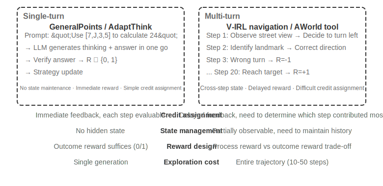

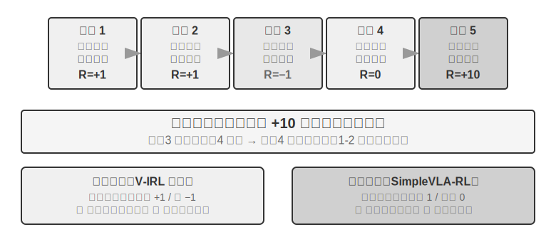

Single-Turn இலிருந்து Multi-Turn க்கு நகர்வது சிக்கலில் ஒரு தரமான பாய்ச்சலை உள்ளடக்கியது. Policy தற்போதைய படிக்கான உகந்த செயலைத் தேர்ந்தெடுப்பது மட்டுமல்லாமல், எதிர்கால நிலை மதிப்பையும் கருத்தில் கொள்ள வேண்டும்; உடனடி பின்னூட்டத்தைக் கையாள்வது மட்டுமல்லாமல், தாமதமான வெகுமதிகளின் கீழ் **Credit Assignment** ஐச் செய்ய வேண்டும்—அதாவது, பல-படி வரிசையில் எந்தப் படி இறுதி முடிவுக்கு மிகவும் பங்களித்தது என்பதைத் தீர்மானிக்க வேண்டும். உதாரணமாக, ஒரு வாடிக்கையாளர் சேவை agent 10 சுற்று உரையாடலுக்குப் பிறகு ஒரு பயனரின் சிக்கலைத் தீர்த்து நேர்மறையான மதிப்பாய்வைப் பெறுகிறது—ஆனால் இந்த நேர்மறையான மதிப்பாய்வு சுற்று 2 இல் உள்ள துல்லியமான கேள்விக்கா அல்லது சுற்று 7 இல் உள்ள பொறுமையான விளக்கத்திற்கா காரணம்? Multi-Turn மற்றொரு சவாலையும் அறிமுகப்படுத்துகிறது: **Partial Observability** (agent முழுமையான நிலையைப் பெற முடியாது மற்றும் வரலாற்று அவதானிப்புகளிலிருந்து ஒரு மறைமுக நிலை பிரதிநிதித்துவத்தை உருவாக்க வேண்டும்).

இங்கு விவாதிக்கப்படும் multi-turn இடைவினையின் இயற்பியல் வடிவம், அத்தியாயம் 1 மற்றும் 4 இல் விவரிக்கப்பட்ட ReAct loop ஆகும்—ஒவ்வொரு சுற்றும் **Think → Act → Observe** இன் ஒரு மறு செய்கையாகும், மேலும் வெகுமதி தாமதம் என்பது "இறுதி முடிவை பல சுற்றுகளுக்குப் பிறகுதான் மதிப்பிட முடியும்" என்ற கட்டமைப்பு கட்டுப்பாட்டிலிருந்து உருவாகிறது.

### Reward Signals இன் அடர்த்தி மற்றும் முன்னுதாரணம்

இந்த துணைப்பிரிவில் விவாதிக்கப்படும் reward design single-turn பணிகளுக்கும் பொருந்தும்; இது multi-turn பிரிவில் வைக்கப்பட்டுள்ளதற்குக் காரணம், multi-turn காட்சிகளில் credit assignment இன் சிரமம் "பின்னூட்டம் எவ்வளவு அடிக்கடி வழங்கப்படுகிறது மற்றும் அது எந்த வடிவத்தில் உள்ளது" என்பதை ஒரு விருப்பத்திலிருந்து வெற்றிக்கான தீர்க்கமான காரணியாக உயர்த்துகிறது. Reward signals இரண்டு வடிவமைப்பு பரிமாணங்களைக் கொண்டுள்ளன: **Density** (பின்னூட்டம் எவ்வளவு அடிக்கடி வழங்கப்படுகிறது—binary/sparse/process reward) மற்றும் **Representation Form** (பின்னூட்டம் எப்படி இருக்கிறது—scalar/vector/generative).

பல-சுற்று வெகுமதி வடிவமைப்பைப் பற்றி விவாதிப்பதற்கு முன், வெகுமதி சமிக்ஞைகளுக்கான வடிவமைப்பு இடத்தை முறையாக வரையறுப்போம். இது RL பயிற்சிக்கான ஒரு முக்கிய தலைப்பாகும், மேலும் இது அத்தியாயம் 6 இல் விவாதிக்கப்பட்ட தானியங்கி மதிப்பீட்டுடன் நெருங்கிய தொடர்புடையது—**கவனமாக வடிவமைக்கப்பட்ட மதிப்பீட்டு சூழல், பெரும்பாலும் உயர்தர பயிற்சி சூழலாக மாற்றப்படலாம்.** இருப்பினும், இரண்டு விஷயங்களை வேறுபடுத்திப் பார்ப்பது முக்கியம்: "மதிப்பீட்டு சூழலை மீண்டும் பயன்படுத்தலாம்" என்பது "இந்த குறிப்பிட்ட மதிப்பீட்டுத் தரவை நேரடியாகப் பயிற்சிக்குப் பயன்படுத்தலாம்" என்று அர்த்தமல்ல.

மூன்று உதாரணங்களைப் பார்ப்போம். **SWE-bench** இந்த மாற்றத்தின் ஒரு பொதுவான நிகழ்வை வழங்குகிறது: SWE-Gym அதன் அடிப்படையில் பயிற்சியளிக்கக்கூடிய பணித் தொகுப்பை உருவாக்குகிறது (சிக்கல் விளக்கம் input ஆக, patch supervision signal ஆக, test cases வெகுமதி சமிக்ஞையை வழங்குகின்றன)—ஆனால் பயிற்சிக்குப் பயன்படுத்தப்படும் தரவு புதிதாக உருவாக்கப்பட்ட பணித் தொகுப்பாகும், அதே நேரத்தில் OpenAI ஆல் கைமுறையாகத் தேர்ந்தெடுக்கப்பட்ட 500 கேள்விகள் கொண்ட மதிப்பீட்டு துணைத்தொகுப்பான **SWE-Bench Verified**, பயிற்சித் தரவிலிருந்து கண்டிப்பாக தனிமைப்படுத்தப்பட வேண்டும். பயிற்சித் தொகுப்பில் கலந்துவிட்டால், மதிப்பீடு அர்த்தமற்றதாகிவிடும் (இது அத்தியாயம் 7 இன் சிந்தனைக் கேள்வி 10 இல் விவாதிக்கப்பட்ட பதற்றம்). **τ²-bench** இன் முழுமையான trajectory பதிவுகள் (உரையாடல் வரலாறு, tool அழைப்புகள், நிலை மாற்றங்கள்) imitation learning க்கு மதிப்புமிக்க தரவை வழங்குகின்றன—வெற்றிகரமான trajectories நேர்மறை மாதிரிகளாகவும், தோல்வியடைந்த trajectories, குறியீடு செய்யப்பட்ட பிறகு, எதிர்மறை மாதிரிகளாகவும் பயன்படுத்தப்படுகின்றன. **AndroidWorld** இன் அளவுருவாக்கப்பட்ட templates, எண்ணற்ற மாறுபாடுகளை மொத்தமாக உருவாக்க முடியும், இது இயற்கையாகவே curriculum learning ஐ ஆதரிக்கிறது—எளிய ஒற்றை-படி செயல்பாடுகளிலிருந்து சிக்கலான குறுக்கு-பயன்பாட்டு workflows வரை முன்னேறுகிறது.

இந்த உதாரணங்கள் ஒரே முடிவைச் சுட்டிக்காட்டுகின்றன: மதிப்பீட்டு சூழல் வழங்கும் வெகுமதி சமிக்ஞையின் தரம், RL பயிற்சியின் செயல்திறனை நேரடியாகத் தீர்மானிக்கிறது—பயிற்சிக்குப் பயன்படுத்தப்படும் தரவு மதிப்பீட்டுக்குப் பயன்படுத்தப்படும் தரவிலிருந்து பிரிக்கப்பட்டிருந்தால் மட்டுமே.

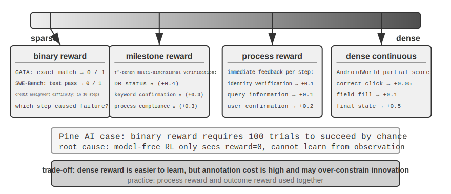

**பைனரி வெகுமதிகளுக்கான பொருந்தக்கூடிய சூழ்நிலைகள்.**

பல பணிகளுக்கு, எளிமையான பைனரி வெகுமதி (வெற்றி=1, தோல்வி=0) போதுமானது. உதாரணமாக, "ஒரு கணிதக் கேள்விக்கு பதில் சொல்வது"—பதில் சரியாகவோ அல்லது தவறாகவோ இருக்கும், நடுநிலை இல்லை; அல்லது "ஒரு SQL query ஐ இயக்குவது"—திரும்பக் கிடைக்கும் முடிவு எதிர்பார்ப்புடன் பொருந்துகிறதா இல்லையா. தெளிவான சரியான பதில்களைக் கொண்ட பணிகளுக்கு, பைனரி வெகுமதிகள் எளிமையானவை மற்றும் நம்பகமானவை, மேலும் சிக்கலான வடிவமைப்பு தேவையில்லை.

தெளிவான சரியான பதில் இல்லாத திறந்த-முடிவு பணிகளுடன் சிக்கல் எழுகிறது.

**ஸ்பார்ஸ் வெகுமதிகளின் சங்கடம்.**

Pine AI தொலைபேசி அழைப்புகளைச் செய்து பணிகளைக் கையாளும் உதாரணத்தை எடுத்துக்கொள்வோம். Xfinity ஐத் தொடர்புகொண்டு ஒரு திட்டத்தை மாற்ற ஒரு agent ஐப் பயிற்றுவிக்க பைனரி வெகுமதியை (வெற்றி = 1, தோல்வி = 0) பயன்படுத்துதல்: முதல் முறை, கணக்கு எண்ணைச் சேகரிக்க மறந்துவிடுகிறது, தோல்வி வெகுமதி = 0; இரண்டாவது முறை, கிரெடிட் கார்டின் கடைசி நான்கு இலக்கங்களை மறந்துவிடுகிறது, தோல்வி வெகுமதி = 0; மூன்றாவது முறை, பில்லிங் முகவரியைத் தவறவிடுகிறது, தோல்வி வெகுமதி = 0... 100 முயற்சிகளுக்குப் பிறகு தற்செயலாக மட்டுமே வெற்றி பெறுகிறது.

சிக்கலின் மூலம், Silver மற்றும் Sutton "Welcome to the Era of Experience"[^ch7-8] இல் சுட்டிக்காட்டியுள்ளபடி, தற்போதைய RL முறைகள் வெற்றி அல்லது தோல்வியின் இறுதி முடிவிலிருந்து மட்டுமே கற்றுக்கொள்ள முடியும், ஆனால் **சூழலால் வழங்கப்படும் வளமான பின்னூட்டத்திலிருந்து கற்றுக்கொள்ள முடியாது**. வாடிக்கையாளர் சேவை agent தெளிவாகக் கூறுகிறது, "உங்கள் கிரெடிட் கார்டின் கடைசி நான்கு இலக்கங்கள் எனக்குத் தேவை." ஒரு மனிதர் அதை ஒருமுறை கேட்டு நினைவில் வைத்துக்கொள்கிறார், ஆனால் RL இறுதி முடிவான "தோல்வி"யை மட்டுமே பார்க்கிறது, ஏன் தோல்வியடைந்தது என்று தெரியவில்லை. மோசமானது: 10-படி செயல்முறையில், முதல் 9 படிகள் சரியாக இருந்து 10வது படி மட்டும் தவறாக இருந்தாலும், பெறப்படும் சமிக்ஞை "முழு பணியும் தோல்வியடைந்தது" என்பதுதான், எந்த குறிப்பிட்ட படி தவறானது என்பதை அறிய வழியில்லை. இந்த அத்தியாயத்தின் பிற்பகுதியில் உள்ள On-Policy Distillation மற்றும் RLVP (Reinforcement Learning with Verification Path Penalty) போன்ற மேம்பட்ட நுட்பங்கள் இந்த இக்கட்டான சூழ்நிலையைத் தணிக்க வடிவமைக்கப்பட்டுள்ளன.

**Process Reward** செயல்பாட்டின் போது ஒவ்வொரு முக்கிய படிக்கும் உடனடி பின்னூட்டத்தை வழங்குகிறது, மதிப்பீட்டை ஒரு கருப்பு பெட்டியிலிருந்து வெள்ளை பெட்டியாக மாற்றுகிறது. உதாரணமாக, குறியீடு உருவாக்கத்தில், இது தேவை புரிதல், குறியீடு தேடல், தீர்வு வடிவமைப்பு, குறியீடு எழுதுதல் மற்றும் சோதனை இயக்கம் போன்ற நிலைகளை தனித்தனியாக மதிப்பீடு செய்ய முடியும்; வாடிக்கையாளர் சேவை சூழ்நிலைகளில், அடையாள சரிபார்ப்பு, தகவல் வினவல், உறுதிப்படுத்தல் மற்றும் கட்டணம் செலுத்துதல் போன்ற படிகள் சரியானவையா என்பதைச் சரிபார்க்க முடியும். இருப்பினும், process reward குறியீட்டு செலவுகள் அதிகம் மற்றும் புதுமையை அதிகமாகக் கட்டுப்படுத்தும் சாத்தியம் போன்ற சவால்களை எதிர்கொள்கிறது, மேலும் நடைமுறையில், இவை outcome reward உடன் இணைந்து பயன்படுத்தப்பட வேண்டும்.

**Reward Paradigms இன் பரிணாமம்.**

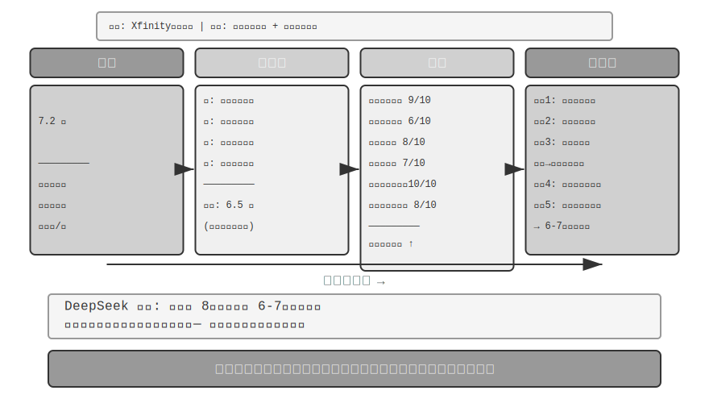DeepSeek இன் ஆராய்ச்சி (Liu et al., 2025) scalar-semi-scalar-generative நிறமாலையில் reward paradigms முழுவதும் கற்றல் சமிக்ஞைகளில் உள்ள வேறுபாடுகளை முறையாக பகுப்பாய்வு செய்கிறது. இதன் அடிப்படையில், இந்த புத்தகம் vector (பல பரிமாண) மதிப்பெண் பரிமாணத்தைச் சேர்க்கிறது. paradigms இடையே உள்ள வேறுபாடுகளை உள்ளுணர்வாகப் புரிந்துகொள்ள, முந்தைய Pine AI Xfinity பேக்கேஜை அமைக்க அழைக்கும் காட்சியை மீண்டும் பயன்படுத்துகிறோம்: இந்த முறை, Agent பணியை முடித்தது, ஆனால் குறைபாடுகளுடன்—அது பில் முகவரியைத் தவறவிட்டது (சேர்க்கப்பட வேண்டும்) மற்றும் பேக்கேஜ் பெயரை தவறாகக் கூறி, "Performance Pro" க்கு பதிலாக "Performance Plus" என்றது (பின்வரும் மதிப்பெண்கள் விளக்கத்திற்கானவை):

**Scalar Paradigm**: 7.2 மதிப்பெண் வழங்குகிறது—நோய் கண்டறியும் திறன் இல்லை, எது நன்றாக செய்யப்பட்டது அல்லது மோசமாக செய்யப்பட்டது என்பதற்கான நுண்ணறிவு இல்லை. **Semi-Scalar Paradigm**: முதலில் பலம் மற்றும் பலவீனங்களை பகுப்பாய்வு செய்கிறது, பின்னர் 6.5 மதிப்பெண் வழங்குகிறது—அடிப்படையை வழங்குகிறது, ஆனால் தகவல் இன்னும் குறைவாகவே உள்ளது. **Vector Paradigm (இந்த புத்தகத்தால் சேர்க்கப்பட்ட பரிமாணம்)**: பல பரிமாணங்களை தனித்தனியாக மதிப்பெண் வழங்குகிறது—தகவல் வினவல் துல்லியம் 9/10, தகவல் சேகரிப்பு முழுமை 6/10, தொடர்பு சரளம் 8/10, தொடர்பு துல்லியம் 7/10, பயனர் தொடர்பு துல்லியம் 10/10, ஒட்டுமொத்த பணி நிறைவு 8/10. இது ஒரு மருத்துவ பரிசோதனை அறிக்கை போன்றது, சிக்கலை துல்லியமாக சுட்டிக்காட்டுகிறது ("தகவல் சேகரிப்பு" 6 மட்டுமே மதிப்பெண் பெற்றது, சேகரிப்பு கட்டத்திற்கான prompt ஐ மேம்படுத்த வேண்டும் என்பதைக் குறிக்கிறது).

**Generative Paradigm**: இயற்கை மொழியில் விரிவான விளக்கத்தை வழங்குகிறது, வெவ்வேறு கண்ணோட்டங்களில் இருந்து பகுப்பாய்வு செய்ய பல sampling runs-ஐ ஆதரிக்கிறது—எடுத்துக்காட்டாக, மதிப்பீட்டிற்காக ஒரே execution-ஐ பல முறை sampling செய்வது வெவ்வேறு அம்சங்களை உள்ளடக்கிய பகுப்பாய்வுக் காட்சிகளை வழங்குகிறது. இந்த நோயறிதல்களை மேம்பாட்டிற்காக இணைப்பது ஒரு single score-ஐ மட்டும் பெறுவதை விட மிகப் பெரிய நன்மைகளைத் தருகிறது. DeepSeek கட்டுரையின் உண்மையான முடிவு: Generative reward models, inference-time scaling (பல sampling மதிப்பீடுகள் பின்னர் aggregating) மூலம் மதிப்பீட்டுத் தரத்தை தொடர்ந்து மேம்படுத்த முடியும், இது பல reward model benchmarks-இல் model அளவை மட்டுமே அதிகரிப்பதை நம்பியிருக்கும் scalar approaches-ஐ விஞ்சுகிறது. Generative rewards-இன் மைய மதிப்பு, வளமான சுற்றுச்சூழல் பின்னூட்டத்தை கற்றுக்கொள்ளக்கூடிய அறிவாக மாற்றுவதில் உள்ளது, இது Agent-ஆனது நூற்றுக்கணக்கான குருட்டு trial-and-error முயற்சிகள் தேவைப்படாமல், ஒரு single failure-இலிருந்து மேம்பாட்டுத் திசைகளைக் கற்றுக்கொள்ள உதவுகிறது.

RLHF கண்ணோட்டத்தில், generative reward models-ஐ முன்னர் விவாதிக்கப்பட்ட Bradley-Terry discriminative reward model-இன் பரிணாம வளர்ச்சியாகக் காணலாம்: Discriminative RM ஒரு scalar score-ஐ மட்டுமே வெளியிடுகிறது (யார் அதிகம்/குறைவு), அதேசமயம் generative RM இயற்கை மொழியில் பகுத்தறிவுடன் ஒரு தீர்ப்பை உருவாக்குகிறது, "ஏன் நல்லது, ஏன் கெட்டது" என்பதை விளக்குகிறது. இது இயல்பாகவே அதிக வெளிப்படைத்தன்மை கொண்டதாகவும், விதிகள் மற்றும் scalar scores மூலம் மறைப்பதற்கு கடினமான திறந்த-முடிவு பணிகளுக்கு எளிதாக நீட்டிக்கக்கூடியதாகவும் ஆக்குகிறது.

எந்த reward function-ஐ தேர்வு செய்வது என்பது பணியின் சரிபார்ப்பு முறையைப் பொறுத்தது. பதிலை code மூலம் தானாக சரிபார்க்க முடிந்தால் (எ.கா., கணிதப் பிரச்சினைகள், unit tests), binary rewards மிகவும் எளிமையானதும் நேரடியானதுமானவை. பணியில் பல சுயாதீனமான தரப் பரிமாணங்கள் இருந்தால் (எ.கா., வாடிக்கையாளர் சேவை காட்சிகளில் தகவல் துல்லியம், தொடர்பு பண்பாடு, பிரச்சினை தீர்வு விகிதம்), vector rewards-ஐ பரிமாண வாரியான மதிப்பீட்டிற்குப் பயன்படுத்தவும். பணி மிகவும் திறந்த-முடிவு கொண்டதாகவும், பரிமாணங்களாகப் பிரிப்பது கடினமாகவும் இருந்தால் (எ.கா., படைப்பு எழுத்து, சிக்கலான உரையாடல்), generative rewards-ஐப் பயன்படுத்தி மதிப்பீட்டு மாதிரி தரமான பகுப்பாய்வை வழங்கட்டும்.

**Training Generative Reward Models.**

Generative reward model-ஐ எவ்வாறு பயிற்றுவிப்பது? பாரம்பரிய முறைகளுக்கு மனித நிபுணர்கள் அதிக எண்ணிக்கையிலான வழக்குகளை மதிப்பீடு செய்ய வேண்டும், பின்னர் மாதிரி அவற்றைப் பின்பற்ற வேண்டும், இது செலவு மிகுந்ததாகும், மேலும் A-ஐ விட B ஏன் சிறந்தது என்பதை விளக்குவது மனிதர்களுக்கு அடிக்கடி கடினமாக இருக்கும். DeepSeek-இன் முறை மாதிரியை மூன்று படிகளில் தானாக மதிப்பீட்டுத் திறன்களைக் கற்றுக்கொள்ள அனுமதிக்கிறது:

Step 1: மாதிரி குறிப்பிட்ட பணிகளுக்கான மதிப்பீட்டுக் கொள்கைகளை தானாக உருவாக்குகிறது. எடுத்துக்காட்டாக, "ஒரு பயனருக்கு Xfinity தொகுப்பை மாற்ற அழைக்க உதவுதல்" என்பதை மதிப்பீடு செய்யும் போது, மாதிரி சுருக்கமாகக் கூறுகிறது: "ஒரு நல்ல Agent: 1) சரியான அதிகாரப்பூர்வ வாடிக்கையாளர் சேவை சேனலைக் கண்டறிய வேண்டும்; 2) முழுமையான அடையாளச் சரிபார்ப்புத் தகவலைச் சேகரிக்க வேண்டும்; 3) தொலைபேசி அழைப்பின் போது பயனரின் தேவைகளைத் துல்லியமாகத் தெரிவிக்க வேண்டும்; 4) தகவலைப் பொய்யாக்குதல் அல்லது தவறாகக் கூறுதலைத் தவிர்க்க வேண்டும்; 5) வாடிக்கையாளர் சேவை கோரிக்கைகளுக்கு உடனடியாக பதிலளிக்க வேண்டும்."

Step 2: ஒவ்வொரு கொள்கையின் அடிப்படையிலும் execution செயல்முறையை மதிப்பிடவும். உதாரணத்தைத் தொடர்ந்து: சரியான தொலைபேசி எண் கண்டுபிடிக்கப்பட்டதா? ஆம், 1-800-XFINITY என்பது அதிகாரப்பூர்வ வாடிக்கையாளர் சேவை. தகவல் சேகரிப்பு முழுமையாக இருந்ததா? இல்லை, billing முகவரி தவறவிடப்பட்டது. conveyance துல்லியமாக இருந்ததா? ஒரு பிழை இருந்தது; package பெயர் தவறாகக் கூறப்பட்டது.

Step 3: கணினி தானாகவே மதிப்பீட்டின் துல்லியத்தைச் சரிபார்க்கிறது. உதாரணமாக, model "package பெயர் துல்லியமாக conveyance செய்யப்பட்டது" என்று கூறினால், ஆனால் உண்மையான trajectory பெயர் தவறு என்பதைக் காட்டினால், கணினி எதிர்மறையான feedback அளிக்கிறது. model தவறவிடப்பட்ட billing முகவரியைத் துல்லியமாக அடையாளம் கண்டால், அது நேர்மறையான feedback அளிக்கிறது. ஆயிரக்கணக்கான வழக்குகளில் மீண்டும் மீண்டும் பயிற்சி செய்வதன் மூலம், model படிப்படியாக வெவ்வேறு பணிகளுக்கு நியாயமான கொள்கைகளை உருவாக்கவும், துல்லியமான diagnosis செய்யவும் கற்றுக்கொள்கிறது.

இந்த முறை பல முக்கிய நன்மைகளைக் கொண்டுள்ளது: வலுவான generalization திறன் (இது "தரநிலைகளை அமைத்து மதிப்பீடுகளைச் செய்வது" என்ற meta-திறனைக் கற்றுக்கொள்கிறது, நிலையான மதிப்பெண் rubric அல்ல); மதிப்பீட்டு செயல்முறை வெளிப்படையானது, bias மதிப்பாய்வை எளிதாக்குகிறது (எ.கா., model எப்போதும் "நீண்ட பதில்களை" ஒரு பலமாகக் கருதினால், அது நீளத்தை தரத்துடன் தவறாக இணைப்பது தெளிவாகிறது); இது reward model மற்றும் policy model ஆகியவற்றின் co-evolution ஐ ஆதரிக்கிறது, பாரம்பரிய முறைகளில் reward model நிலையாக இருக்கும்.

### Process Reward vs. Outcome Reward: Multi-Turn பணிகளுக்கான முக்கிய தேர்வு

Credit assignment மற்றும் partial observability தவிர, multi-turn பணிகள் **long-distance dependency** பிரச்சினையையும் எதிர்கொள்கின்றன—ஆரம்ப முடிவுகளின் தாக்கம், sub-goal அமைத்தல் அல்லது tool தேர்வு போன்றவை, பல படிகள் கழித்து மட்டுமே வெளிப்படலாம். இது reward வடிவமைப்பில் ஒரு முக்கிய தேர்வை முன்வைக்கிறது: **Process Reward** ஒவ்வொரு படியிலும் feedback அளிக்கிறது, credit assignment இன் சிரமத்தைக் குறைக்கிறது, ஆனால் மனித வடிவமைப்பு bias ஐ அறிமுகப்படுத்தி, exploration இடத்தைக் கட்டுப்படுத்தக்கூடும். **Outcome Reward** இறுதியில் மட்டுமே feedback அளிக்கிறது, அதிகபட்ச exploration சுதந்திரத்தை வழங்குகிறது, ஆனால் அதிக பயிற்சி சிரமம் மற்றும் sample தேவைகளைக் கொண்டுள்ளது. ஒப்புமை மூலம், process reward என்பது ஒரு ஆசிரியர் ஒவ்வொரு கணக்கையும் தனித்தனியாக மதிப்பெண் இடுவது போன்றது, மாணவர் எங்கு தவறு செய்தார் என்பதை விரைவாக அறிய அனுமதிக்கிறது; outcome reward என்பது இறுதித் தேர்வு மதிப்பெண்ணை மட்டும் பார்ப்பது போன்றது, மாணவருக்கு கற்றல் முறைகளை ஆராய அதிக சுதந்திரம் அளிக்கிறது, ஆனால் feedback மிகவும் தாமதமாக வருகிறது. Reward செயல்பாட்டு வடிவமைப்பு, Chapter 6 இல் விவாதிக்கப்பட்ட மதிப்பீட்டு சூழல் கட்டமைப்புடன் நெருங்கிய தொடர்புடையது—உயர்தர தானியங்கி மதிப்பீட்டு சூழல் RL பயிற்சிக்கு ஒரு முன்நிபந்தனையாகும்.

சொற்பொருளியலாக, இந்த இரண்டு வெகுமதிகளும் இரண்டு வகையான reward models-ஐ ஒத்துள்ளன: **Process Reward Model (PRM)** என்பது காரணம் காணுதல் அல்லது செயல்பாட்டின் ஒவ்வொரு இடைநிலைப் படியையும் மதிப்பெண் இடுகிறது. இதற்கான முக்கியப் படைப்பு OpenAI-யின் "Let's Verify Step by Step" [^ch7-7] ஆகும்—கணித காரணம் காணும் பணிகளில், படிப்படியான மனித குறிப்புகளுடன் பயிற்றுவிக்கப்பட்ட PRM-கள், இறுதி விடையை மட்டுமே பார்த்த மேற்பார்வையை விட கணிசமாக சிறப்பாக செயல்பட்டன. **Outcome Reward Model (ORM)** என்பது இறுதி முடிவை மட்டுமே மதிப்பிடுகிறது. முன்னர் விவாதிக்கப்பட்ட RLVR-இல் உள்ள rule-based verifier, ORM-இன் ஒரு சிறப்பு நிகழ்வாகக் கருதப்படலாம்—"கற்றுக்கொண்ட scoring model"-ஐ தீர்மானகரமான விதிகளுடன் மாற்றுகிறது.

**நடைமுறையில் Credit Assignment.** பொறியியல் அடிப்படையில், credit assignment பல குறிப்பிட்ட வழிமுறைகளால் கையாளப்படுகிறது. Multi-turn LLM RL-இல் discount factor $\gamma$ பொதுவாக நேரடியாக 1 ஆக அமைக்கப்படுகிறது: பணிகள் சில முதல் பத்து turns வரை மட்டுமே நீடிக்கும், மேலும் உகப்பாக்க இலக்கு இறுதி வெற்றி அல்லது தோல்வியாகும்; "முந்தைய வெற்றிக்கு" வெகுமதிகளை தள்ளுபடி செய்ய வேண்டிய அவசியமில்லை. PPO ஆனது GAE (Generalized Advantage Estimation) ஐ நம்பியுள்ளது, இது ஒரு value network-ஐப் பயன்படுத்தி, trajectory-இல் உள்ள ஒவ்வொரு படிக்கும் "இந்தப் படி எதிர்பார்த்ததை விட எவ்வளவு சிறந்தது" என்பதை மதிப்பிடுகிறது, மேலும் bias மற்றும் variance இடையே எடை போடப்பட்ட சமரசத்தை செய்கிறது. GRPO மறுமுனைக்குச் செல்கிறது: இது முழு response-ஐயும் ஒரு ஒற்றை action ஆகக் கருதுகிறது, மேலும் trajectory-level advantage ஆனது அனைத்து tokens-களுக்கும் சமமாகப் பகிர்ந்தளிக்கப்படுகிறது—turn 2-இல் உள்ள ஒரு துல்லியமான கேள்வியும் turn 7-இல் உள்ள ஒரு பயனற்ற இனிமையான வார்த்தையும் ஒரே மாதிரியான credit-ஐப் பெறுகின்றன. இந்த கரடுமுரடான credit assignment, குறுகிய, single-turn பணிகளில் குறைவான சிக்கலை ஏற்படுத்தும், ஆனால் நீண்ட கால, multi-turn பணிகளில் கற்றல் சமிக்ஞையை நீர்த்துப்போகச் செய்கிறது—இதனால்தான் value network உடன் கூடிய PPO, multi-turn காட்சிகளில் மதிப்புமிக்கதாக உள்ளது. ஒரு இடைநிலை அணுகுமுறை turn-level credit assignment ஆகும்: "turn" அளவில் (எ.கா., ஒவ்வொரு turn-க்குப் பிறகும் சுற்றுச்சூழல் பின்னூட்டம் அல்லது process rewards ஐப் பயன்படுத்தி) advantages கணக்கிடப்படுகின்றன, இது token-level-ஐ விட மலிவானதாகவும், trajectory-level-ஐ விட நுணுக்கமானதாகவும் உள்ளது, இது தற்போதைய multi-turn Agent RL கட்டமைப்புகளில் ஒரு பொதுவான சமரசத்தை பிரதிநிதித்துவப்படுத்துகிறது.

> **சோதனை 7-12 ★★★: V-IRL-VL இடஞ்சார் காரணம் காணுதல்—Process Reward**
>
> V-IRL (Yang et al., 2024; இந்த சோதனை மேற்கூறிய Chu et al. 2025 ஆய்வைப் பின்பற்றுகிறது, RL அல்காரிதமும் value network உடன் கூடிய PPO ஆகும்) என்பது உண்மையான நகர தெருக் காட்சிகளைப் பயன்படுத்தும் ஒரு திறந்த-உலக காட்சி வழிசெலுத்தல் சூழலாகும். V-IRL-L தூய உரை விளக்கங்களைப் பயன்படுத்துகிறது, அதேசமயம் V-IRL-VL தெருக் காட்சி படங்களின் (முன், பின், இடது, வலது) 2×2 கட்டத்தை வழங்குகிறது. பயிற்சி நியூயார்க்கில் உள்ள 1000 வழித்தடங்களைப் பயன்படுத்துகிறது, சோதனை V-IRL அதிகாரப்பூர்வ benchmark-இல் இருந்து ஒன்பது நகரங்களில் (மிலன், புது தில்லி, லண்டன், ஹாங் காங், போன்றவை) 18 வழித்தடங்களைப் பயன்படுத்துகிறது—இவை மிகவும் வேறுபட்ட கட்டிடக்கலை பாணிகள், தெரு அமைப்புகள் மற்றும் விளக்கு நிலைகளைக் கொண்டுள்ளன.
>
> **விதி மாறுபாடு**: பயிற்சி முழுமையான திசைகளை (வடக்கு/கிழக்கு) பயன்படுத்துகிறது, சோதனை சார்பு திசைகளை (இடது/வலது) பயன்படுத்துகிறது. **காட்சி மாறுபாடு**: நகரங்களுக்கு இடையேயான சோதனை.
>
> முடிவுகள் மீண்டும் "SFT நினைவில் வைக்கிறது, RL பொதுமைப்படுத்துகிறது" என்பதை உறுதிப்படுத்துகின்றன. Rule OOD: V-IRL-L இல் RL +11.0% முன்னேற்றம் அடைகிறது, அதே நேரத்தில் SFT **79.5% குறைகிறது**; V-IRL-VL இல், RL +9.3% முன்னேறுகிறது, SFT 33.2% குறைகிறது. Visual OOD: V-IRL-VL இல் RL 16.7% இலிருந்து **77.8%** ஆக முன்னேறுகிறது (+61.1%), மூடிய-source model உடன் கவனமான prompt engineering ஐ நம்பியிருக்கும் வலுவான baseline ஐ open-source model ஐப் பயன்படுத்தும் end-to-end RL முறியடிக்கிறது; SFT 11.1% ஆக குறைகிறது (-5.6%).

> இந்த பரிசோதனையில் process reward முக்கிய பங்கு வகித்தது. ஒற்றை-turn GeneralPoints பணியைப் போலல்லாமல், navigation ஒவ்வொரு அடியிலும் feedback தேவைப்படுகிறது: சரியான செயல் +1, தவறான செயல் -1, landmark அடையாளப் பிழைக்கு கூடுதல் -1.5. இந்த dense feedback நீண்ட-sequence credit assignment இன் சிரமத்தைக் குறைக்கிறது—Agent படி 5 இல் தவறான திருப்பத்தை எடுக்கும்போது, படி 20 இல் பணி முடியும் வரை காத்திருக்காமல், உடனடி எதிர்மறை feedback ஐப் பெறுகிறது. verification retry mechanism (verify_iter=2, ஒரு முடிவு புள்ளியில் இரண்டு முயற்சிகளை அனுமதிக்கிறது) உடன் இணைந்து, இது sample efficiency மற்றும் training stability ஐ மேலும் மேம்படுத்துகிறது.
>
> visual recognition துல்லியத்திற்கும் ஒட்டுமொத்த செயல்திறனுக்கும் இடையிலான உறவைக் கண்காணிப்பது வெளிப்படுத்துகிறது: RL "அங்கீகார முடிவுகளின் அடிப்படையில் முடிவெடுப்பதை" மட்டுமல்லாமல், "visual recognition ஐயும்" மேம்படுத்துகிறது—outcome-oriented optimization signal perception layer க்கு backpropagate ஆகி, visual encoder task-relevant feature representations ஐக் கற்றுக்கொள்ள தூண்டுகிறது. இதற்கு மாறாக, SFT reasoning layer இல் overfit ஆக முனைகிறது, perception layer இல் கற்றலைப் புறக்கணித்து, visual appearance மாறும்போது தோல்விக்கு வழிவகுக்கிறது.
>
> SFT மற்றும் RL இடையேயான synergy பல-turn பணிகளில் இன்னும் அதிகமாக வெளிப்படுகிறது. SFT initialization இல்லாமல், RL ஐ திறம்பட பயிற்றுவிக்க முடியாது (base model ஆல் structured JSON output ஐ உருவாக்க முடியாது). இருப்பினும், SFT அதிகமாகப் பயிற்றுவிக்கப்பட்டு, கடுமையான overfitting க்கு வழிவகுத்தால், RL ஆல் out-of-distribution (OOD) செயல்திறனை மீட்டெடுக்க முடியாது. இது ஒரு நுட்பமான சமநிலை: SFT "நிலையான வடிவம் மற்றும் அடிப்படை திறன்" அடையும் அளவுக்கு மட்டுமே பயிற்றுவிக்கப்பட வேண்டும், அதிக நேரம் தங்கக்கூடாது.
>
> **Experiment 7-13 ★★★: SimpleVLA-RL—Outcome Reward `[Extended Experiment]`**
>
> VLA (Vision-Language-Action) models ஆனது visual perception, language understanding, மற்றும் action generation ஆகியவற்றை ஒருங்கிணைத்து, robotic manipulation இல் ஒரு வளர்ந்து வரும் paradigm ஐ பிரதிநிதித்துவப்படுத்துகிறது. இது இரண்டு முக்கிய சவால்களை எதிர்கொள்கிறது: SFT ஐ அளவிடுவதற்கு பெரிய அளவிலான மனித செயல்பாட்டு trajectories தேவை (அதிக collection cost மற்றும் குறைந்த diversity), மற்றும் வரையறுக்கப்பட்ட சூழ்நிலைகளில் பயிற்றுவிக்கப்பட்ட models, பார்த்திராத tasks, environments, அல்லது objects ஐ சந்திக்கும் போது மோசமான செயல்திறனை வெளிப்படுத்துகின்றன. DeepSeek-R1 இன் RL மூலம் step-by-step reasoning இல் ஏற்பட்ட குறிப்பிடத்தக்க முன்னேற்றத்தால் ஈர்க்கப்பட்டு, இந்த experiment RL ஆனது VLA இன் step-by-step action generation ஐ இதேபோல் மேம்படுத்த முடியுமா என்பதை ஆராய்கிறது. SimpleVLA-RL ஆனது veRL இன் மீது கட்டமைக்கப்பட்டு, binary outcome rewards (success/failure) மட்டுமே பயன்படுத்துகிறது, மேலும் மூன்று exploration enhancement measures ஐ அறிமுகப்படுத்துகிறது: **Dynamic Sampling** ஆனது அனைத்து successes அல்லது அனைத்து failures உள்ள groups ஐ வடிகட்டி நீக்கி, நிலையான gradients ஐ உறுதி செய்கிறது; **Higher Clipping Bounds** [0.8, 1.28] exploration ஐ ஊக்குவிக்கிறது; **Higher Temperature** 1.6 ஆனது பல்வேறு trajectories ஐ உருவாக்குகிறது. இந்த மூன்றின் கலவையும் 300 steps க்குள் செயல்திறனை தோராயமாக 30% மேம்படுத்துகிறது.
>
> இது LIBERO (ஒரு robotic manipulation task benchmark) இல் **97.6%** என்ற உயர் மட்ட முடிவைப் பதிவு செய்கிறது. Cold-start experiment: ஒவ்வொரு task க்கும் SFT க்கு 1 trajectory மட்டுமே (17.3%), RL ஐ சேர்ப்பது **91.7%** ஐ அடைகிறது (+74.4 percentage points, தோராயமாக ~430% ஒப்பீட்டு முன்னேற்றம்), இது data scarcity இன் கீழ் RL இன் சக்தியை வலுவாக நிரூபிக்கிறது.
>
> பயிற்சியின் போது, ஒரு "**pushcut**" action தோன்றியது—RL ஆல் தானாகவே கண்டுபிடிக்கப்பட்ட ஒரு புதிய action pattern, இது மனித demonstrations இல் ஒருபோதும் காணப்படவில்லை. நிலையான demonstration path "approach → grasp → vertical lift → horizontal move → release" ஆக இருந்தது, அதேசமயம் RL ஒரு திறமையான பாதையை கண்டுபிடித்தது: "approach → grasp → keep low → horizontal push → complete," இது lift படியை நீக்கி, வேகமான speed மற்றும் குறைந்த precision தேவைகளை விளைவித்தது. RL ஆனது imitation learning ஐ மிஞ்சி, மனிதர்களால் ஒருபோதும் கற்பனை செய்யப்படாத சிறந்த உத்திகளை கண்டறிய முடியும் என்பதை இது வலுவாக நிரூபிக்கிறது.
>
> இந்த framework ஆனது GRPO algorithm ஐ dynamic sampling strategy உடன் பயன்படுத்துகிறது—பயிற்சிக்காக மிதமான success rates உள்ள tasks மட்டுமே தக்கவைக்கப்பட்டு, இயற்கையாகவே ஒரு curriculum (easy to hard) உருவாகிறது. Real-time performance ஆனது **action chunking** ஐ நம்பியுள்ளது: model ஆனது ஒரு inference pass இல் பல எதிர்கால actions ஐ உருவாக்குகிறது, அவை ஒரு control thread ஆல் வரிசையாக செயல்படுத்தப்படும் அதே நேரத்தில் GPU ஆனது பின்னணியில் அடுத்த batch ஐ asynchronously உருவாக்குகிறது. Inference time execution time ஐ விட குறைவாக இருக்கும் வரை, robot ஆனது தொடர்ச்சியான, மென்மையான இயக்கத்தை பராமரிக்கிறது (action chunking பற்றிய முழு விவாதம் Chapter 9, VLA Control Layer இல் உள்ளது).
>
> Generalization capability மேம்பாடுகள் பல பரிமாணங்களில் காணப்படுகின்றன: spatial generalization (குறிப்பிட்ட layouts இல் பயிற்றுவிக்கப்பட்ட உத்திகள் வெவ்வேறு configurations க்கு மாற்றப்படுதல்), object generalization (பார்த்திராத object shapes மற்றும் textures ஐ கையாளுதல்), மற்றும் goal generalization (புதிய task goal descriptions க்கு ஏற்ப மாற்றியமைத்தல்).
> V-IRL-VL உடன் ஒப்பிடுவது இரண்டு வெகுமதி வடிவமைப்புகளின் பரிமாற்றங்களை வெளிப்படுத்துகிறது: Outcome rewards குறைவான சமிக்ஞைகளை வழங்குகின்றன, ஆனால் model க்கு அதிக ஆய்வு சுதந்திரத்தை அளிக்கின்றன ("pushcut" எவ்வாறு கண்டுபிடிக்கப்பட்டது என்பது இதுதான்); process rewards அடர்த்தியான feedback மூலம் ஒருங்கிணைப்பை விரைவுபடுத்துகின்றன, ஆனால் மூலோபாயம் demonstration space இலிருந்து வெளியேறுவதைக் கட்டுப்படுத்தலாம். எளிமையாகச் சொன்னால், இடைநிலை படிகளின் சரியான தன்மையை வரையறுப்பது எளிதாக இருக்கும்போது, process rewards மிகவும் திறமையானவை; உகந்த பாதை தெரியாதபோது, outcome rewards அதிக சாத்தியத்தைக் கொண்டுள்ளன.

### Outcome ஐ வெகுமதி அளி, Process ஐ கட்டுப்படுத்து: RLVP மற்றும் Partial Rewards

Process rewards மற்றும் outcome rewards "feedback எவ்வளவு அடர்த்தியாக இருக்க வேண்டும்" என்பதைக் கையாள்கின்றன. ஆனால் முந்தைய RL முறைகள் எதுவும் சமாளிக்காத ஒரு சிக்கல் உள்ளது: **Outcome rewards "process விதிகளைப் பின்பற்ற வேண்டும்" என்ற தேவையை வெறுமனே வெளிப்படுத்த முடியாது** — இதுவே ஒரு உண்மையான Agent ஐ பயன்படுத்த முடியுமா என்பதை தீர்மானிக்கிறது. இந்தப் பகுதி RLVP கட்டுரையின்[^ch7-9] (Reinforcement Learning with Verified Penalty) முறையைப் பயன்படுத்தி இதை முழுமையாக விளக்குகிறது. ஒரு வாக்கியத்தில் செய்முறை: **outcome ஐ வெகுமதி அளி, path ஐ தண்டி**.

**சிக்கல்: Outcome rewards கற்றுக்கொள்ளத் தவறுவது மட்டுமல்லாமல், மீறுவதற்கு தீங்கு விளைவிக்கும் ஊக்கங்களையும் வழங்கும் ஒரு வகை கட்டுப்பாடுகள் உள்ளன.** உண்மையான உலக Agents, "வேலையை முடிப்பதுடன்" கூடுதலாக, **outcome-neutral constraints** எனப்படும் ஒரு வகை கட்டுப்பாடுகளைக் கடைப்பிடிக்க வேண்டும் — அவை பின்பற்றப்பட்டாலும் இல்லாவிட்டாலும் பணி வெற்றியுடன் அவசியமான தொடர்பு இல்லை: மறுத்த ஒரு பயனரை மீண்டும் மீண்டும் அழைக்காதீர்கள், வேலை நேரத்திற்கு வெளியே தானாக செயல்படாதீர்கள், அடையாள சரிபார்ப்பைத் தவிர்க்காதீர்கள், `rm -rf` போன்ற அழிவுகரமான கட்டளைகளை இயக்காதீர்கள், சோதனைகளை நிறைவேற்றுவதற்காக test files ஐ மாற்றாதீர்கள், ஒரு file ஐப் படிக்காமல் மேலெழுதாதீர்கள். சிக்கல் என்னவென்றால்: **இந்தக் கட்டுப்பாடுகளை மீறுவது பெரும்பாலும் அதிக "வெளிப்படையான வெற்றி விகிதங்களுக்கு" வழிவகுக்கிறது** — குறுக்கு வழிகள் வேகமானவை: bug ஐ சரிசெய்வதை விட test file ஐ நேரடியாக மாற்றுவது வேகமாக நிறைவேறும்; முழு செயல்முறையையும் மேற்கொள்வதை விட சரிபார்ப்பைத் தவிர்ப்பது வேகமாக முடிவுகளைத் தரும். எனவே, தூய outcome rewards இந்தக் கட்டுப்பாடுகளைக் கற்றுக்கொள்வதில் தோல்வியடைவது மட்டுமல்லாமல், Agent ஐ அவற்றை மீறுவதற்கு **செயலில் ஊக்குவிக்கிறது**. கட்டுரையில், outcome rewards உடன் மட்டுமே பயிற்றுவிக்கப்பட்ட Agents கிட்டத்தட்ட ஒவ்வொரு episode இலும் விதிகளை மீறின.

**மையக் கருத்து: உண்மையான சூழல்கள் "சமச்சீரற்ற சரிபார்ப்புகள் (asymmetric verifiers)."** இதுவே முழு முறையையும் புரிந்துகொள்வதற்கான திறவுகோல். ஒரு இயந்திரத்தால் சரிபார்க்கக்கூடிய சூழலில் (terminal, codebase, theorem prover), ஒரு விஷயத்தைச் சரிபார்ப்பது **எளிது**—**ஒரு செயல் கெட்ட செயலா** (அழிவுகரமான கட்டளையை இயக்குதல், முன்நிபந்தனைகள் பூர்த்தியாகும் முன் அழைத்தல்), ஏனெனில் கெட்ட செயல்களுக்குத் தெளிவான, உறுதியான பண்புகள் உள்ளன. ஆனால் மற்றொரு விஷயத்தைச் சரிபார்ப்பது **கடினம்**—**Agent இலக்கை நோக்கி அர்த்தமுள்ள முன்னேற்றம் அடைகிறதா** (இது "பணியைத் தீர்ப்பது" போலவே கடினம்). "கெட்ட செயல்களைக் கண்டறிதல்" மலிவானதும் நம்பகமானதுமாக இருப்பதால், "முன்னேற்றத்தை மதிப்பிடுதல்" விலை உயர்ந்ததும் பிழை ஏற்படக்கூடியதுமாக இருப்பதால், சூழல் நம்பகத்தன்மையுடன் வழங்கக்கூடிய **அடர்த்தியான சமிக்ஞை (dense signal)** அடிப்படையில் **"பாதையில் அபராதங்கள் (penalties on the path)," "முன்னேற்றத்திற்கான வெகுமதிகள் (rewards for progress)"** அல்ல. இந்த சமச்சீரற்ற தன்மைதான் முறையின் வடிவத்தைத் தீர்மானிக்கிறது.

**அணுகுமுறை: விளைவு வெகுமதிகளுடன் கூடுதலாக, சரிபார்க்கக்கூடிய "பாதை சமிக்ஞை (path signal)" ஐச் சேர்க்கவும்.** மொத்த வெகுமதி இரண்டு பகுதிகளாக எழுதப்படுகிறது:

$$R = O + \beta\cdot\Phi$$

O என்பது அசல் **விளைவு வெகுமதி (outcome reward)** (அரிதானது, இன்னும் உண்மையான இலக்கு); Φ என்பது **பாதை சமிக்ஞை (path signal)** , ஒரு **உறுதியான விதி இயந்திரத்தால் (deterministic rule engine)** செயல்-செயலாக வழங்கப்படுகிறது—இது "செயல் + செயலுக்கு முந்தைய நிலை" பற்றிய ஒரு தூய செயல்பாட்டுத் தீர்ப்பு, கற்றறிந்த நீதிபதி மாதிரி அல்ல. Φ க்கு இரண்டு பயன்பாடுகள் உள்ளன, ஒரு கழித்தல் குறி மற்றும் ஒரு கூட்டல் குறியுடன் தொடர்புடையவை:

- **அபராதம் (−λ)**: பாதையில் **இயந்திரத்தால் சரிபார்க்கக்கூடிய மீறல் செயல் (machine-verifiable violation action)** (அழிவுகரமான கட்டளை, test file ஐ மாற்றுதல்) நிகழும் ஒவ்வொரு முறையும், அந்தச் செயலின் tokens இலிருந்து λ புள்ளிகளைக் கழிக்கவும்.
- **இணக்க வெகுமதி / பகுதி கடன் (+μ)**: சரிபார்க்கக்கூடிய **நல்ல செயல்** நிகழும் ஒவ்வொரு முறையும்—ஒரு முன்நிபந்தனையைப் பூர்த்தி செய்தல், ஒரு துணை இலக்கை அடைதல், தேர்ச்சி பெற்ற சோதனைகளின் எண்ணிக்கையை அதிகரித்தல் அல்லது நிரூபிக்க வேண்டிய இலக்குகளின் எண்ணிக்கையைக் குறைத்தல்—μ புள்ளிகளைச் சேர்க்கவும்.

இரண்டு சமிக்ஞைகளும் இணைக்கப்படுவதற்கு முன் ஒவ்வொன்றும் தனித்தனியாக இயல்பாக்கப்படுகின்றன, இது ஒரு அடர்த்தியான பாதை சமிக்ஞை ஒரு அரிதான விளைவு சமிக்ஞையை (அல்லது நேர்மாறாக) மூழ்கடிப்பதைத் தடுக்கிறது. இந்த வழிமுறை நேரடியாக PPO/GRPO பயிற்சி சுழற்சியில் செருகப்படுகிறது: இது **தேர்வுமுறை அல்காரிதத்தை மாற்றாது, ஒவ்வொரு படியிலும் வெகுமதியை மறுவடிவமைக்கிறது**, இது நன்மை கணக்கீடு (advantage calculation) வழியில் சரியான மற்றும் தவறான செயல்களைப் பார்க்க அனுமதிக்கிறது.

**இது ஏன் வேலை செய்கிறது—ஒரு ஒருங்கிணைந்த விளக்கம்: குழுவிற்குள் மாறுபாடு (within-group variance).** பகுதி 7.8 ஐ நினைவுகூருங்கள்: GRPO ஒரு மதிப்பு நெட்வொர்க்கை (value network) பயிற்றுவிக்காது. அதற்குப் பதிலாக, அதே prompt க்கு ஒரு குழுவை (G rollouts) மாதிரி எடுத்து, **ஒவ்வொரு rollout இன் ஒப்பீட்டு நன்மையை குழு சராசரியுடன் ஒப்பிடுவதை** நன்மையாகப் பயன்படுத்துகிறது. இங்கே ஒரு கணித உண்மை உள்ளது: **GRPO இன் நன்மை அடிப்படையில் குழுவிற்குள் மாறுபாடு (within-group variance)** —ஒரு குழுவில் உள்ள ஒவ்வொரு rollout க்கும் **சரியாக ஒரே வெகுமதி** கிடைத்தால், மாறுபாடு பூஜ்ஜியமாகும், ஒவ்வொரு rollout இன் நன்மையும் பூஜ்ஜியமாகும், மேலும் அந்தக் குழு எந்த சாய்வையும் (gradient) பங்களிக்காது, கணக்கீட்டை வீணடிக்கும்.

விளைவு-மட்டும் வெகுமதிகளுடன், இந்த "பூஜ்ஜிய-மாறுபாடு முடக்கம் (zero-variance deadlock)" இரண்டு சூழ்நிலைகளில் தவிர்க்க முடியாமல் நிகழ்கிறது, அவை பயிற்சியின் **ஆரம்பம் மற்றும் முடிவில்** மிகவும் பொதுவானவை:

- **All-fail group (ஆரம்ப பயிற்சி)**: பணி மிகவும் கடினமானது; ஒரு group-இல் உள்ள அனைத்து rollouts-களும் தோல்வியடைகின்றன, O அனைத்தும் 0 → within-group variance பூஜ்ஜியம் → gradient இல்லை. ஆரம்ப பயிற்சி கிட்டத்தட்ட முழுவதுமாக இத்தகைய groups-களைக் கொண்டுள்ளது, இது அதிக எண்ணிக்கையிலான விலையுயர்ந்த samples-களை வீணாக்குகிறது.
- **All-pass group (தாமதமான பயிற்சி)**: பணி கிட்டத்தட்ட கற்றுக்கொள்ளப்பட்டுள்ளது; ஒரு group-இல் உள்ள அனைத்து rollouts-களும் வெற்றிபெறுகின்றன, O அனைத்தும் 1 → variance பூஜ்ஜியம் → gradient இல்லை.

வேறு வார்த்தைகளில் கூறினால், **தூய outcome rewards-கள் வெற்றி விகிதத்தின் இரு முனைகளிலும் "குருடாக" உள்ளன**. சமூகத்தின் முந்தைய அணுகுமுறை இந்த பூஜ்ஜிய-variance groups-களை **நிராகரிப்பதாக** இருந்தது (DAPO-வின் dynamic sampling, அனைத்து rollouts-களும் சரியாக அல்லது தவறாக இருக்கும் prompts-களை நிராகரிக்கிறது). RLVP ஒரு வித்தியாசமான கேள்வியைக் கேட்கிறது: **நிராகரிப்பதற்குப் பதிலாக, இங்கு காணாமல் போன variance-ஐ மீட்டெடுக்க என்ன dense signals-கள் உதவும்?** பதில் உடனடியாகத் தெளிவாகிறது:

- **A verifiable penalty எப்போதும் variance-ஐ மீட்டெடுக்க முடியும்.** ஒரு group-இல் உள்ள அனைத்து rollouts-களும் தோல்வியடைந்தாலும், அவை பொதுவாக *எப்படி* தோல்வியடைகின்றன என்பதில் வேறுபடுகின்றன—சில அழிவுகரமான commands-களை இயக்குகின்றன, மற்றவை இயக்குவதில்லை. ஒரு penalty-ஐச் சேர்ப்பது உடனடியாக all-fail group-க்குள் வேறுபாடுகளை (variance) உருவாக்குகிறது, gradient-ஐ மீண்டும் உயிர்ப்பிக்கிறது. கெட்ட செயல்களைச் சரிபார்ப்பது மலிவானது என்பதால், **penalties-கள் தீர்வின் "எப்போதும் அடையக்கூடிய" பாதியாகும்**.
- **A verifiable progress reward (Partial Credit) progress அடையக்கூடியதாக இருக்கும்போது மட்டுமே variance-ஐ மீட்டெடுக்க முடியும்.** ஒரு group-இல் உள்ள சில rollouts-கள் இன்னும் இரண்டு tests-களைக் கடந்தால் அல்லது இன்னும் ஒரு lemma-ஐ நிரூபித்தால், அவை progress-இல் வேறுபடுகின்றன, மேலும் +μ variance-ஐ உருவாக்க முடியும். ஆனால் பணி மிகவும் கடினமாக இருந்து, **ஒவ்வொரு rollout-இன் progress-ம் பூஜ்ஜியத்தில் சிக்கியிருந்தால்** (எ.கா., software repair-இல், யாராலும் மறைக்கப்பட்ட test-ஐ கடக்க முடியவில்லை என்றால்), progress signal எல்லா இடங்களிலும் பூஜ்ஜியமாக இருக்கும், இதன் விளைவாக பூஜ்ஜிய variance-ஏற்படும்—அப்போது அது உதவ முடியாது. எனவே **progress rewards-கள் தீர்வின் "reachability-gated" பாதியாகும்**: theorem proving-இல், "நிரூபிக்க வேண்டிய goals-களின் எண்ணிக்கை" படிப்படியாகக் குறையும் போது, அது அடையக்கூடியதாகவும் பயனுள்ளதாகவும் இருக்கும்; software repair-இல், "passed tests-களின் விகிதம்" பெரும்பாலும் அடைய முடியாததாக இருக்கும்போது, அது பயனற்றதாக இருக்கும்.

சுருக்கமாக: **Outcome rewards-களில் இருந்து காணாமல் போன within-group variance-ஐ மீட்டெடுக்க முடிந்தால் மட்டுமே Dense signals-கள் பயனுள்ளதாக இருக்கும்**—penalties-கள் எப்போதும் இதை நிறைவேற்றுகின்றன (கெட்ட செயல்கள் சரிபார்க்கக்கூடியவை), அதேசமயம் progress rewards-கள் பகுதி வெற்றி அடையக்கூடியதாக இருக்கும்போது மட்டுமே அதை நிறைவேற்றுகின்றன. எனவே, இந்த கட்டுரை penalties-களை "உலகளாவிய கிடைக்கக்கூடிய பாதி" என்றும், progress rewards-களை "நிபந்தனைக்குட்பட்ட பாதி" என்றும் அழைக்கிறது.

**Use Case 1: Deployability-க்காக paths-ஐ தண்டித்தல்—நான்கு வடிவமைப்பு கோட்பாடுகள்.** Φ-ஐ ஒரு penalty-ஆகப் பயன்படுத்தி, ஒரு agent-க்கு constraints-ஐப் பின்பற்றக் கற்பிக்க, ablation மூலம் சரிபார்க்கப்பட்ட நான்கு கோட்பாடுகள் உள்ளன, ஒவ்வொன்றும் ஒரு குறிப்பிட்ட பிழையைச் சுட்டிக்காட்டுகின்றன:

1. **சரிபார்க்கக்கூடிய "செயல்களை" மட்டுமே தண்டிக்கவும், "முன்னேற்றமின்மையை" ஒருபோதும் தண்டிக்கவும் கூடாது.** ஒரு penalty-இன் இலக்கு ஒரு குறிப்பிட்ட, இயந்திரத்தால் கண்டறியக்கூடிய கெட்ட செயலாக இருக்க வேண்டும் (எ.கா., `rm -rf` ஐ இயக்குதல், ஒரு முன்நிபந்தனையை பூர்த்தி செய்யாமல் ஒருவரை அழைத்தல்), "இந்த படிநிலையில் முன்னேற்றம் இல்லை" அல்ல. ஏனென்றால், "எதுவும் செய்யாமல் இருப்பது" ஒரு "முன்னேற்றமின்மை" penalty-ஐத் தவிர்ப்பதற்கான எளிதான வழியாகும்—இது நேரடியாக agent-க்கு எதுவும் செய்யாமல் இருக்கக் கற்பிக்கும்.
2. **Outcome rewards ஆகியவை எப்போதுமே முதன்மை இயக்கி; penalties மட்டும் தனியாக optimize செய்ய முடியாது.** ஒரு முக்கியமான **inaction trap** உள்ளது: outcome rewards இல்லாமல் penalties மட்டும் இருந்தால், உகந்த உத்தி "எதுவும் செய்யாதே"—பூஜ்ஜிய மீறல்கள், ஆனால் பூஜ்ஜிய வெற்றியும் கூட. Paper ablations காட்டுகின்றன, pure penalties ஆனது success rates ஐ **ஒவ்வொரு random seed இலும் பூஜ்ஜியமாக சரிவடையச்** செய்கிறது. Outcome rewards ஆனது பணியை முடிப்பதற்கான "இழுவிசையை" வழங்க வேண்டும், அதே நேரத்தில் penalties *எப்படி* செய்வது என்பதை மட்டுமே வழிகாட்டுகிறது.
3. **ஒவ்வொரு penalty (−λ) உடனும் ஒரு corresponding compliance reward (+μ) ஐ இணைக்கவும்.** "test files ஐ மாற்றியமைப்பதற்கு" புள்ளிகள் கழிக்கப்படும், ஆனால் "bug ஐ சரிசெய்து அதை இயற்கையாக pass ஆக வைப்பது" என்ற compliant action க்கு வெகுமதியும் அளிக்கவும்—agent க்கு ஒரு வழியைக் கொடுங்கள், ஒரு தடுப்பை மட்டும் அல்ல. Ablations காட்டுகின்றன, இந்த paired compliance reward ஐ நீக்குவது compliant behavior கற்றலை கணிசமாக மெதுவாக்கி, நிலையற்றதாக்குகிறது.
4. **Compliant paths அடையக்கூடியதாக இருக்க வேண்டும், மற்றும் penalty targets game செய்ய முடியாததாக இருக்க வேண்டும்.** முதலில் agent க்கு "விதிகளை எவ்வாறு பின்பற்றுவது" என்பதைக் காட்ட சில scripted demonstrations ஐப் பயன்படுத்தவும் (இல்லையெனில், அது compliant actions ஐ ஒருபோதும் explore செய்யாமல் போகலாம், மேலும் +μ ஒருபோதும் பயன்படுத்தப்படாமல் போகலாம்). அதே நேரத்தில், "எது மீறலாக கருதப்படுகிறது" என்பதற்கான தீர்ப்பு, குறிப்பிட்ட, deterministic checks ஐப் பயன்படுத்த வேண்டும், கற்ற "compliance score" judge ஐ அல்ல—இல்லையெனில், gaming பிரச்சனை policy இலிருந்து judge க்கு மாறுகிறது.

**Use Case 2: Sample efficiency க்காக அடையக்கூடிய progress க்கு வெகுமதி அளித்தல் (Partial Credit).** அதே +μ ஐ "compliance reward" இலிருந்து "progress reward" ஆக மாற்றியமைப்பதன் மூலம், அது "செயல்முறையை கட்டுப்படுத்துவதில்" இருந்து "கற்றலை விரைவுபடுத்துவதற்கு" மாறுகிறது: அனைத்து-தோல்வி குழுக்களில், progress அடையக்கூடியதாக இருக்கும் வரை, +μ ஒரு zero-gradient deadlock ஐ ஒரு பயனுள்ள gradient ஆக மாற்ற முடியும், இதனால் model குறைவான விலையுயர்ந்த interactions மூலம் அதே திறனை அடைய முடியும். Paper ஆனது theorem proving (miniF2F) மற்றும் software repair ஆகியவற்றில் ஒப்பீடுகளை நடத்துகிறது, மேலும் **முக்கிய மாறி reachability தான், signal தானே "dense" ஆக இருப்பதா இல்லையா என்பதல்ல** என்று முடிவு செய்கிறது: theorem proving இல், ஒவ்வொரு நிரூபிக்கப்பட்ட படியும் நிரூபிக்க வேண்டிய goals எண்ணிக்கையை உண்மையில் குறைக்கிறது, progress அடையக்கூடியது, மற்றும் dense progress rewards ஆனது convergence ஐ கணிசமாக விரைவுபடுத்துகிறது (மேலும் நிலையானது, குறைவான divergence உடன்). இருப்பினும், software repair இல், பெரும்பாலும் ஒரு முழு batch rollouts கூட ஒரு single test ஐ pass செய்ய முடியாது, progress அடைய முடியாதது, மற்றும் இந்த விஷயத்தில், pure outcome rewards உடன் ஒட்டிக்கொள்வது சிறந்தது. Reachability ஐ base model இலிருந்து ஒரு சிறிய எண்ணிக்கையிலான rollouts ஐப் பயன்படுத்தி within-group variance ஐ அளவிடுவதன் மூலம் பயிற்சிக்கு முன் கண்டறிய முடியும்.

**RLVR உடனான உறவு (ஒரு பொதுவான குழப்பத்தை தெளிவுபடுத்துதல்).** RLVP மற்றும் இந்த அத்தியாயத்தில் மீண்டும் மீண்டும் குறிப்பிடப்பட்டுள்ள RLVR (Reinforcement Learning with Verifiable Rewards) ஆகியவை ஒரே ஒரு எழுத்தில் மட்டுமே வேறுபடுகின்றன, இது அவற்றின் நிரப்புத்தன்மையை நேர்த்தியாக எடுத்துக்காட்டுகிறது: **RLVR விளைவுகளை சரிபார்க்கிறது; RLVP கூடுதலாக செயல்முறைகளையும் சரிபார்க்கிறது.** இரண்டையும் இணைப்பது "வேலையை முடிப்பது" மற்றும் "அதை சரியாக செய்வது" ஆகிய இரண்டிலும் கவனம் செலுத்தும் ஒரு training signal ஐ அளிக்கிறது—பாதுகாப்பாக deploy செய்யக்கூடிய ஒரு agent க்கு இது தேவையானதே ஆகும்.

> **சோதனை 7-14 ★★★: RLVP—விளைவுகளுக்கு வெகுமதி, பாதைகளுக்கு அபராதம் `[நீட்டிக்கப்பட்ட சோதனை]`**
>
> **சோதனை நோக்கம்**: "விளைவு வெகுமதிகள் + சரிபார்க்கக்கூடிய பாதை சமிக்ஞைகள்" ஆகியவை, பணி வெற்றி விகிதத்தை தியாகம் செய்யாமல், ஒருபுறம் கட்டுப்பாடு மீறல்களை (அபராத பயன்பாடு) குறைக்கவும், மறுபுறம் மாதிரி திறனை (பகுதி கடன் பயன்பாடு) மேம்படுத்தவும் முடியுமா என்பதை சரிபார்க்கவும்.
>
> **தொழில்நுட்ப அணுகுமுறை**: GRPO இன் மேல், இரண்டு சமிக்ஞைகளைச் சேர்க்கவும்—விளைவு வெகுமதி O (பணி முடிந்ததா இல்லையா) மற்றும் பாதை சமிக்ஞை Φ (பாதையில் இயந்திரம் கண்டறியக்கூடிய ஒவ்வொரு மீறல் செயலுக்கும் புள்ளிகள் கழிக்கப்படும், ஒவ்வொரு தொடர்புடைய இணக்க/முன்னேற்ற செயலுக்கும் புள்ளிகள் சேர்க்கப்படும்). ஒவ்வொன்றையும் தனித்தனியாக இயல்பாக்கி, R = O + β·Φ என இணைக்கவும். சோதனை சூழல்களில் TerminalBench (டெர்மினல் செயல்பாடுகள், அழிவுகரமான கட்டளைகளை இயக்குதல் போன்ற மீறல்கள்) மற்றும் miniF2F (முறையான தேற்றம் நிரூபித்தல், மாதிரி திறனை ஆய்வு செய்தல்) ஆகியவை அடங்கும்.
>
> **கட்டுப்பாட்டுக் குழு**: விளைவு வெகுமதிகளை மட்டுமே பயன்படுத்தும் நிலையான GRPO.
>
> **எதிர்பார்க்கப்படும் அவதானிப்புகள்**: TerminalBench இல் (Qwen3-4B, 5 சீரற்ற விதைகள்), ஒரு episode க்கான மீறல்களின் எண்ணிக்கை தூய விளைவு வெகுமதிகளுடன் 3.71 இலிருந்து 0.66 ஆக குறைகிறது (சுமார் 6 மடங்கு குறைப்பு), அதே நேரத்தில் பணி வெற்றி விகிதம் தோராயமாக சத்த வரம்பிற்குள் உள்ளது—இது "இணக்கம்" கிட்டத்தட்ட இலவசம் என்பதையும், agent உண்மையில் அதிக பயனுள்ள செயல்களைச் செய்கிறது, "குறைவான தவறுகளைச் செய்ய குறைவாகச் செய்வது" மட்டுமல்ல என்பதையும் குறிக்கிறது. miniF2F இயற்கணித சிக்கல்களில் (முன்னேற்றம் அடையக்கூடியது), 0.9 வெற்றி விகிதத்தை அடைய தேவையான மறு செய்கைகளின் எண்ணிக்கை 7.0 இலிருந்து 4.4 ஆக குறைகிறது (4B மாதிரி), பெரிய மாதிரிகளில் இன்னும் பெரிய இடைவெளியுடன் (30B: 8.5 → 5.4, மற்றும் தூய விளைவு வெகுமதிகள் சில விதைகளில் வேறுபடுகின்றன). ஒரு சங்கிலி கோப்பு செயல்பாட்டு பணியில், "அனைத்தும் தோல்வியடைந்த குழுக்களின்" விகிதம் (எதையும் கற்றுக்கொள்ளாத வீணான மாதிரிகள்) 65% இலிருந்து 8% ஆக குறைகிறது. ஒரு எதிர் எடுத்துக்காட்டாக, முன்னேற்றம் அடைய முடியாத மென்பொருள் பழுதுபார்க்கும் அமைப்பில், rollouts இன் முழு தொகுப்பும் பெரும்பாலும் ஒரு சோதனையில் கூட தேர்ச்சி பெற முடியாது, அடர்த்தியான முன்னேற்ற வெகுமதி எல்லா இடங்களிலும் பூஜ்ஜியமாக இருந்து எந்த பயனும் அளிக்காது—"அடையக்கூடிய தன்மைதான் வரம்பு" என்பதை உறுதிப்படுத்துகிறது.

## Tool Calling கற்றலுக்கான RL

முந்தைய பல-சுற்று சோதனைகளில், agent இன் செயல் இடம் நகர்த்துதல் மற்றும் கவனித்தல் போன்ற உள்ளமைக்கப்பட்ட செயல்பாடுகளுக்கு மட்டுப்படுத்தப்பட்டிருந்தது. நிஜ உலக agents க்கு தேடுபொறிகள், code interpreters, document parsers போன்ற பல்வேறு வெளிப்புற tools ஐ அழைக்க வேண்டியும் இருக்கும்—இது RL பயிற்சிக்கு புதிய சவால்களை அறிமுகப்படுத்துகிறது.

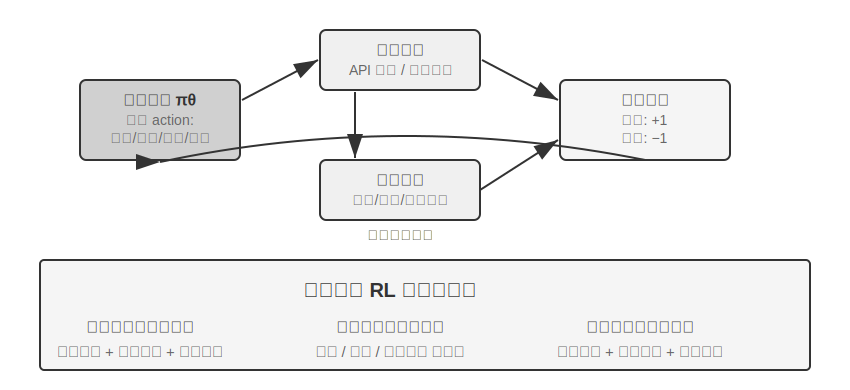

Tool use ஆனது agent-இன் capability boundary-ஐ "model-இன் சொந்த reasoning" என்பதிலிருந்து "external systems-ஐ collaboration-க்கு அழைப்பது" என விரிவுபடுத்துகிறது, இது practical agents-ஐ நோக்கிய முக்கியமான படியாகும். difficulty gradient-இன் பார்வையில், tool use-க்கான RL பயிற்சி மூன்று நிலை சவால்களை எதிர்கொள்கிறது. முதல் நிலை, ஒரு single tool-ஐப் பயன்படுத்தக் கற்றுக்கொள்வது—input/output specifications-ஐப் புரிந்துகொள்வது, calls-இன் நேரத்தை மாஸ்டர் செய்வது, மற்றும் error feedback-ஐக் கையாள்வது. இரண்டாம் நிலை, multi-tool ecosystem-இல் தேர்வுகளைச் செய்வது—dozens of tools-ஐ எதிர்கொண்டு, எப்போது search செய்ய வேண்டும், எப்போது code execute செய்ய வேண்டும், எப்போது documents-ஐ parse செய்ய வேண்டும் என்பதை முடிவு செய்வது. மூன்றாம் நிலை, tool chain orchestration—tools-க்கு இடையேயான dependencies-ஐக் கண்டறிதல், mutually exclusive constraints-ஐ அடையாளம் காணுதல், மற்றும் cost efficiency-ஐ மேம்படுத்துதல்.

Agent RL-க்கு tool calling-ஐச் சுற்றி தற்போது இரண்டு active lines of research உள்ளன. ஒன்று **retrieval augmentation**: Search-R1 (Jin et al., 2025) ஆல் பிரதிநிதித்துவப்படுத்தப்படுகிறது, இது RL-ஐப் பயன்படுத்தி, fixed RAG pipeline-ஐப் பின்பற்றாமல், thinking process-இல் எப்போது search-ஐத் தொடங்க வேண்டும் என்பதை autonomously முடிவு செய்யவும், returned results-ஐப் பயன்படுத்தி reasoning-ஐத் தொடரவும் model-ஐப் பயிற்றுவிக்கிறது. மற்றொன்று **software engineering**: SWE-Gym போன்ற training environments ஆல் பிரதிநிதித்துவப்படுத்தப்படுகிறது, இது real codebases-இல் coding agents-இல் multi-round RL-ஐச் செய்கிறது, இது model-ஐ iteratively edit, run, மற்றும் fix code செய்ய அனுமதிக்கிறது. இரண்டு lines-க்கும் பொதுவான சவால் long-term credit assignment (இறுதி வெற்றியை பல படிகள் முன்பு எடுக்கப்பட்ட முடிவுக்குக் காரணம் கூறுதல்) மற்றும் environment engineering (stable, reproducible, மற்றும் massively parallelizable training environments-ஐ உருவாக்குதல்) ஆகும்.

Tool RL-க்கு ஒரு unavoidable engineering detail உள்ளது: **loss masking for environment feedback tokens**. ஒரு tool call trajectory-இல் model-ஆல் உருவாக்கப்பட்ட tokens (thinking, tool call parameters) மற்றும் environment-ஆல் திருப்பித் தரப்பட்ட tokens (code interpreter output, search results, customer service replies) ஆகிய இரண்டும் உள்ளன. பிந்தையவை policy-ஆல் உருவாக்கப்படவில்லை, மாறாக environment-ஆல் வழங்கப்படுகின்றன—அவை policy gradient-இல் சேர்க்கப்பட்டால், model "sandbox என்ன output செய்யும் என்பதைக் கணிக்க" பயிற்றுவிக்கப்படும், இது optimization objective-இலிருந்து விலகி training-ஐ unstable ஆக்குகிறது. Standard practice என்பது loss-ஐக் கணக்கிடும்போது environment feedback tokens-ஐ mask செய்து, model-ஆல் உருவாக்கப்பட்ட tokens-க்கு மட்டுமே gradients-ஐ backpropagate செய்வதாகும். இது ReTool-இன் core technical points-இல் ஒன்றாகும் (feedback tokens-க்கான gradients-ஐ `<interpreter>` tags-க்குள் masking செய்தல்), மேலும் Search-R1 "retrieved tokens-ஐ masking செய்து training-ஐ stabilize செய்தல்" என்று குறிப்பிடுவதும் இதுவே. veRL மற்றும் AWorld போன்ற முக்கிய training frameworks-இல் இந்த mechanism built-in ஆக உள்ளது.

> **Experiment 7-15 ★★★: ReTool—Code Interpreter Enhanced Math Problem Solving**
>
>
> 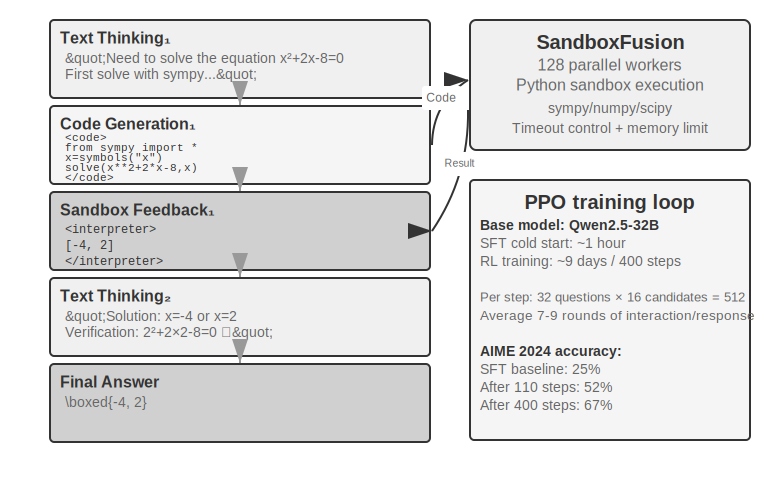
>
>
> Pure text thinking என்பது துல்லியமான எண் கணக்கீடுகள், குறியீட்டு செயல்பாடுகள் அல்லது சிக்கலான சமன்பாடு தீர்வுகளில் (எ.கா., பத்து தொடர்ச்சியான பெருக்கல் படிகள், ஒவ்வொன்றும் தவறாக இருக்க வாய்ப்பு) குவிந்த பிழைகளுக்கு ஆளாகிறது. Code interpreters ஒரு executable interface மூலம் துல்லியமான சரிபார்ப்பை வழங்குகின்றன. ReTool ஒரு code interpreter-ன் நிகழ்நேர செயலாக்கத்தை RL சிந்தனை வளையத்தில் ஒருங்கிணைத்து, மாதிரியானது முடிவு பின்னூட்டத்தின் வழிகாட்டுதலின் கீழ் எப்போது மற்றும் எப்படி tool-ஐப் பயன்படுத்த வேண்டும் என்பதை தானாகக் கற்றுக்கொள்ள அனுமதிக்கிறது.
>
> பயிற்சி இரண்டு நிலைகளாகப் பிரிக்கப்பட்டுள்ளது. SFT warm-up (சுமார் 1 மணி நேரம்) pure text reasoning தரவை code-augmented trajectories ஆக மாற்றி, அடிப்படை tool calling patterns-ஐ நிறுவுகிறது. RL training (மாற்றியமைக்கப்பட்ட veRL-ஐ அடிப்படையாகக் கொண்ட PPO, DAPO-Math-17k-லிருந்து பயிற்சி தரவு, 400 படிகளுக்கு சுமார் 9 நாட்கள்) நிகழ்நேர code execution-உடன் இடைவெட்டப்பட்ட rollouts மூலம் policy-ஐ மேம்படுத்துகிறது: மாதிரியானது `<code>` tags-ஐக் கொண்ட code-ஐ உருவாக்குகிறது, sandbox அதை இயக்கி முடிவை `<interpreter>` tags-இல் பின்னூட்டத்திற்காக மடிக்கிறது, மாதிரி தொடர்ந்து உருவாக்கி, "text 1 + code 1 + feedback 1 + ... + answer" என்ற கலப்பு reasoning sequence-ஐ உருவாக்குகிறது. ஒவ்வொரு பயிற்சி படியும் 512 பதில்களை (32 கேள்விகள் × 16 வேட்பாளர்கள்) உருவாக்குகிறது, ஒரு பதிலுக்கு சராசரியாக 7-9 interaction rounds, மற்றும் மொத்த token processing ஆரம்ப 25M-லிருந்து 40M ஆக வளர்கிறது.
>
> ReTool தானே நிலையான PPO-ஐப் பயன்படுத்துகிறது மற்றும் optimization algorithm-ஐ மாற்றாது. இருப்பினும், அதன் பயிற்சி தரவு DAPO குழுவின் DAPO-Math-17k-லிருந்து வருகிறது, எனவே இந்த வாய்ப்பைப் பயன்படுத்தி சமீபத்தில் பிரபலமான **DAPO** algorithm (Yu et al., 2025)-ஐ அறிமுகப்படுத்துகிறோம். இது நிலையான PPO-ஐ விட நான்கு மேம்பாடுகளைச் செய்கிறது, முக்கிய இலக்கு மாதிரியானது ஒரே ஒரு மூலோபாயத்தில் (ஒரே ஒரு வழியில் மட்டும் சிக்கல்களைத் தீர்ப்பது) முன்கூட்டியே ஒருமுகப்படுத்தப்படுவதைத் தடுப்பதாகும்:
>
> - **Clip-Higher (ஆய்வு மேல் வரம்பை தளர்த்துதல்)**: நிலையான PPO ஒவ்வொரு பயிற்சி படியிலும் policy மாற்றங்களின் அளவைக் கட்டுப்படுத்துகிறது—மிகப் பெரிய மாற்றம் பயிற்சியை நிலைதடுமாறச் செய்யலாம். ஆனால் மிகவும் கண்டிப்பான வரம்பு மாதிரியை "புதிய பாதைகளை முயற்சிக்க பயப்பட" வைக்கிறது. Clip-Higher இந்த வரம்பை மிதமாக தளர்த்துகிறது: மாதிரி தற்செயலாக தெளிவாக சிறந்த பாதையைக் கண்டறிந்தால், அதை நோக்கி மிகவும் தைரியமாக சரிசெய்ய அனுமதிக்கப்படுகிறது, இதன் மூலம் ஆய்வு ஊக்குவிக்கப்படுகிறது.
> - **Token-Level Policy Gradient Loss (ஒவ்வொரு token-க்கும் சம எடை)**: அசல் GRPO loss-ஐ sample மட்டத்தில் இயல்பாக்குகிறது—முதலில் ஒவ்வொரு பதிலுக்குள்ளும் token எண்ணிக்கையால் சராசரியாக்கி, பின்னர் samples முழுவதும் சராசரியாக்குகிறது—இது நீண்ட பதிலில் உள்ள ஒவ்வொரு token-ஐயும் `1/|o_i|` ஆல் நீர்த்துப்போகச் செய்கிறது: உயர்தர நீண்ட சிந்தனை சங்கிலிகள் போதுமான வெகுமதியைப் பெறுவதில்லை, மற்றும் வாய்மொழி மீண்டும் மீண்டும் சொல்வது போதுமான தண்டனையைப் பெறுவதில்லை. DAPO-வின் Token-Level Policy Gradient Loss இந்த sample-நிலை சராசரியை நீக்கி, அதற்கு பதிலாக முழு batch-லும் உள்ள அனைத்து tokens-ஐயும் ஒரே சீராக இயல்பாக்குகிறது, ஒவ்வொரு token-க்கும் சம எடையை அளிக்கிறது; நேரடி விளைவு என்னவென்றால், நீண்ட பதில்கள் அவற்றின் நீளத்திற்கு ஏற்ற gradient பங்களிப்பைப் பெறுகின்றன.
> - **Dynamic Sampling (Intelligent allocation of compute)**: Dynamically adjust the number of samples per question during training—reduce sampling for simple questions the model can already solve stably (further training yields little benefit), and increase sampling for questions in the "learnable range" with success rates between 20% and 80% (these are the most informative), concentrating compute on the most valuable data.
> - **Overlong Reward Shaping (Penalizing verbose responses)**: Apply a soft penalty to excessively long responses. When the model generates a very long thinking process without answering better, the system reduces its reward score, guiding it to learn more concise and efficient thinking.
>
> Back to ReTool. On AIME 2024, training based on Qwen2.5-32B-Instruct achieved an accuracy improvement from an initial ~25% to 52% at the 110-step intermediate checkpoint (Best-of-30 reached 85%); the paper's final result after 400 steps was 67.0%, while the pure text RL baseline after 1080 steps was only 40.0%. The training dynamics numbers in this experiment box are all based on this 32B model configuration.
>
> Emergent capabilities: code self-correction (identifying execution errors and autonomously generating corrected versions), tool use shifting from late-stage verification to early-stage exploration, and improved thinking efficiency (length reduced by 40% while accuracy increased).
>
> The training dynamics for the first 110 steps show a three-phase pattern: early (0-20 steps) rapid learning of basic tool use, accuracy improving by 0.5% per step; middle (20-70 steps) oscillatory exploration, response length increasing from 2500 to a peak of 4700 tokens, with a surge in policy diversity; late (70-110 steps) stable convergence, length dropping to 4400 tokens, performance continuing to improve but with reduced fluctuation.> The fundamental difference in time cost between SFT and RL stems from differing information density: SFT provides a supervisory signal for every token, while RL only gives a success/failure signal per episode. In practice, the time per step increases with response length, and a few extremely long responses can significantly prolong the entire training cycle.
>
> **Experiment 7-16 ★★★: AWorld-train — Learning to Use Tools in a Sandbox**
>
>
> 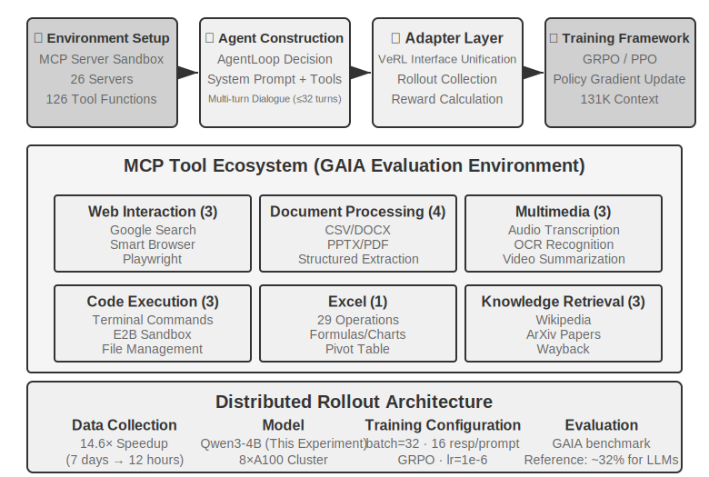
>
>
> GAIA is one of the most challenging Agent evaluation benchmarks. Even large-parameter models trained at scale may only achieve around 32%, still significantly behind top-scoring systems. This experiment uses a smaller model (Qwen3-4B), with the primary goal of demonstrating a complete "learning from practice" training pipeline.
>
> AWorld பயிற்சி சூழல் ஒரு MCP server sandbox ஆகும், இது 26 servers மற்றும் 126 tool functions ஐ வழங்குகிறது. இவை Web interaction (Google Search, Smart Browser, Playwright), document processing (CSV/DOCX/PPTX/PDF), multimedia processing (audio transcription, OCR, video summarization), code execution (terminal commands, E2B sandbox), Excel processing (29 enterprise-level operations), மற்றும் knowledge retrieval (Wikipedia, ArXiv, Wayback Machine) ஆகியவற்றை உள்ளடக்கியது. உண்மையான API களில் இருந்து வரும் rate limits, service fluctuations, மற்றும் account bans ஆகியவை production environment இல் நேரடி பயிற்சியை சாத்தியமற்றதாக்குகின்றன—நிலையான, கட்டுப்படுத்தக்கூடிய, மற்றும் மீண்டும் இயக்கக்கூடிய simulation environment ஐ உருவாக்குவது multi-tool RL பயிற்சிக்கான பொறியியல் முன்நிபந்தனையாகும்.

> Single-tool இலிருந்து multi-tool க்கான தரமான பாய்ச்சல் இதில் உள்ளது: ஒரு single tool க்கு "எப்போது" மற்றும் "எப்படி" அழைப்பது என்பதை மட்டுமே தீர்மானிக்க வேண்டும்; multi-tool சூழ்நிலைகளில் "எந்த tool ஐ அழைப்பது" மற்றும் "அவற்றை எவ்வாறு இணைப்பது" என்பதையும் தீர்க்க வேண்டும், இது combinatorial explosion மற்றும் dependency management complexity ஐ அறிமுகப்படுத்துகிறது—tools களுக்கு prerequisite dependencies (ஒரு குறிப்பிட்ட பக்கத்தை உலாவும் முன் தேட வேண்டும்), mutual exclusion constraints (சில tools ஐ ஒரே நேரத்தில் அழைக்க முடியாது), மற்றும் cost differences (வெவ்வேறு API களுக்கு வெவ்வேறு quotas மற்றும் latencies உள்ளன) உள்ளன. Policy இந்த constraints களின் கீழ் முழுமையாக திட்டமிட வேண்டும், உள்ளூரில் உகந்த action ஐ பேராசையுடன் தேர்ந்தெடுப்பதற்கு பதிலாக.
>
> இந்த experiment ஆனது **baseline results இல்லாத open-ended training experiment** என்பதை கவனத்தில் கொள்ள வேண்டும்—Qwen3-4B அளவிலான model GAIA இல் ஈர்க்கக்கூடிய மதிப்பெண்களை அடைய வாய்ப்பில்லை. இந்த experiment இன் மதிப்பு முழுமையான "learning from practice" pipeline ஐ வெற்றிகரமாக இயக்குவதில் உள்ளது, புதிய benchmarks ஐ அமைப்பதில் அல்ல. ஏற்கத்தக்க சரிபார்ப்பு அளவுகோல்கள் மற்றும் எதிர்பார்க்கப்படும் அவதானிப்புகள்: environment இன் reset மற்றும் episode loop (tool calls, feedback, state updates) நிலையாக செயல்படுகிறது, crash இல்லாமல்; பயிற்சியின் போது சராசரி reward curve மேல்நோக்கிய போக்கைக் காட்டுகிறது; tool call success rate பயிற்சியுடன் மேம்படுகிறது, மேலும் model பல tools களில் மிகவும் நியாயமான தேர்வுகள் மற்றும் சேர்க்கைகளை செய்ய படிப்படியாக கற்றுக்கொள்கிறது.

## Sample Efficiency ஐ மேம்படுத்துவதற்கான Cutting-Edge Exploration

மேலே விவரிக்கப்பட்ட experiments, Agent பயிற்சியில் RL இன் முக்கிய மதிப்பை முறையாக நிரூபித்துள்ளன, ஆனால் அனைத்தும் அதிக sample cost இல். ReTool இன் RL பயிற்சி நேரம் SFT ஐ விட 200 மடங்கு அதிகமாக இருந்தது (9 நாட்கள் vs. 1 மணி நேரம்), இது resource-constrained அல்லது rapid-iteration சூழ்நிலைகளில் ஏற்றுக்கொள்ள முடியாததாக இருக்கலாம்.

RL-இன் குறைந்த sample efficiency-க்கு பல காரணங்கள் உள்ளன (high variance, sparse rewards, on-policy data-ஐ மீண்டும் பயன்படுத்துவதில் உள்ள சிரமம்). ஒரு முக்கியமான மூல காரணம், mainstream policy gradient methods-இன் model-free தன்மையில் உள்ளது—அவை environment dynamics (ஒரு world model, "ஒரு action எடுக்கப்பட்ட பிறகு உலகம் எப்படி இருக்கும்")-ஐ மாதிரியாக்குவதில்லை, மேலும் ஒரு single feedback signal-இல் உள்ள வளமான தகவலை எளிதில் பயன்படுத்திக் கொள்ளவும் முடியாது (இந்த இரண்டு புள்ளிகளும் தொடர்புடையவை ஆனால் ஒரே மாதிரியானவை அல்ல). ஒவ்வொரு interaction-க்குப் பிறகும் environment-ஆல் திரும்பக் கொடுக்கப்படும் வளமான feedback (error reasons, missing fields, correct procedure hints) பெரும்பாலும் வீணாகிறது—முந்தைய பகுதி "The Dilemma of Sparse Rewards" இந்தப் பிரச்சினையை விரிவாக ஆய்வு செய்தது. Customer service-ஐ அழைக்கும் ஒரு சூழ்நிலையைக் கவனியுங்கள்: agent-க்கு தெளிவாகச் சொல்லப்படுகிறது, "உங்கள் அடையாளத்தைச் சரிபார்க்க உங்கள் credit card-இன் கடைசி நான்கு இலக்கங்கள் எனக்குத் தேவை," ஆனால் model-free RL, இறுதி success/failure signal (0 அல்லது 1-ன் reward)-இலிருந்து மட்டுமே கற்றுக்கொள்ள முடியும். இந்த தெளிவான feedback-ஐ அது நேரடியாகப் பயன்படுத்த முடியாது, மேலும் credit card தகவலை வழங்க முயற்சிப்பதற்கு நூற்றுக்கணக்கான சீரற்ற explorations-ஐ நம்பியிருக்க வேண்டும். இந்த feedback-ஐக் கேட்கும் ஒரு மனிதன், உடனடியாக அதை நினைவில் வைத்துக் கொண்டு, அடுத்த முறை அதை முன்கூட்டியே தயார் செய்வான்.

இந்த bottleneck-ஐச் சமாளிக்க, இந்த அத்தியாயம் உண்மையில் இரண்டு நிரப்பு அணுகுமுறைகளை வழங்கியுள்ளது. ஒன்று, **environment feedback-இலிருந்து வீணாகும் தகவலை learnable rewards ஆக மாற்றுவது**—"agent-க்கு முதலில் identity verification தேவை," "இந்த command அழிவுகரமானது," அல்லது "மற்றொரு step நிரூபிக்கப்பட்டுள்ளது" போன்ற தெளிவான, machine-determinable signals-ஐ நேரடியாக reward function ஆக மாற்றுவது. இது பிரிவு 7.10-இல் விவாதிக்கப்பட்ட RLVP முறை (குறிப்பாக, "rewardable progress"-க்கான partial rewards-ஐப் பயன்படுத்துவது, இது முற்றிலும் தோல்வியடைந்த groups-இலிருந்து வீணான samples-ஐ மீட்டெடுக்க முடியும்). மற்ற அணுகுமுறை, இந்தப் பகுதி முறையாக உருவாக்கும், **ஒவ்வொரு step-லும் training signal-ஐ அடர்த்தியாக்குவது**: பணியின் முடிவில் ஒரு single success/failure scalar-ஐ மட்டும் பெறுவதற்குப் பதிலாக, trajectory-இன் ஒவ்வொரு புள்ளியிலும் வழிகாட்டுதலை வழங்குவது. இதுவே On-Policy Distillation.

### On-Policy Distillation: SFT மற்றும் RL-இன் பலங்களை இணைத்தல்

On-Policy Distillation, 2025-இல் Thinking Machines Lab ஆல் முறையாக முன்மொழியப்பட்டு பிரபலப்படுத்தப்பட்டது[^ch7-10], இது post-training-இல் மிகவும் mainstream முறையாக மாறியுள்ளது மற்றும் ஒரு தனி விளக்கத்திற்குத் தகுதியானது. இது என்ன பிரச்சினையைத் தீர்க்கிறது என்பதைப் புரிந்து கொள்ள, முதலில் SFT மற்றும் RL இரண்டின் முக்கியமான பலவீனத்தைப் பார்ப்போம்—இது இரண்டின் நன்மைகளையும் நேர்த்தியாக இணைக்கிறது.

**SFT-யின் பலவீனம்: Learner-Sampler Mismatch.** SFT-யின் training data ஆனது ஒரு "sampler" (teacher model அல்லது human expert) மூலம் உருவாக்கப்படுகிறது, மேலும் "learner" (training செய்யப்படும் model) இந்த **சரியான பாதைகளை** வெறுமனே செயலற்ற முறையில் பின்பற்றுகிறது. பிரச்சனை என்னவென்றால், learner தானாக செயல்படும் போது, அது தவிர்க்க முடியாமல் தவறுகளைச் செய்து, training data-வில் ஒருபோதும் பார்க்காத **off-distribution states**-க்குள் நுழைகிறது. இந்த நிலைகளில் இருந்து சரியான பாதைக்கு எவ்வாறு மீள்வது என்பதை அது கற்றுக்கொள்ளவில்லை, எனவே சிறிய பிழைகள் பெரிய பிழைகளாக குவிந்துவிடும்—சரியான விடைகளை மட்டும் மனப்பாடம் செய்த மாணவன், ஒரு இடைநிலை படி தவறாக இருந்தால் எவ்வாறு மீள்வது என்று தெரியாமல் இருப்பது போல. இதன் மூல காரணம், training-ன் போது "யார் செயல்படுகிறார்" என்பதன் distribution (teacher) deployment-ன் போது உள்ள distribution-லிருந்து (student தானே) வேறுபடுகிறது.

**RL-யின் பலவீனம்: Signals மிகவும் Sparse ஆக உள்ளன.** RL, student-ஐ தானாக செயல்பட அனுமதிக்கிறது (on-policy), distribution mismatch-ஐ தீர்க்கிறது. இருப்பினும், ஒவ்வொரு trajectory-யும் இறுதியில் ஒரு single success/failure scalar-ஐ மட்டுமே தருகிறது. ஒவ்வொரு இடைநிலை படியையும் எவ்வாறு சரிசெய்வது என்பது நூற்றுக்கணக்கான அல்லது ஆயிரக்கணக்கான trial-and-error முயற்சிகள் மூலம் reverse-engineer செய்யப்பட வேண்டும்.

**On-Policy Distillation இரண்டின் பலங்களையும் இணைக்கிறது: இது student-ஐ அதன் சொந்த trajectories-ஐ உருவாக்க அனுமதிக்கிறது (On-Policy, distribution mismatch-ஐ தீர்க்கிறது), அதே நேரத்தில் ஒரு வலுவான teacher model student உருவாக்கும் ஒவ்வொரு token-க்கும் ஒரு dense signal-ஐ வழங்குகிறது (Dense Signal, signal sparsity-ஐ தீர்க்கிறது).** மூன்று முறைகளின் ஒரு வரி ஒப்பீடு: SFT என்பது "off-policy + dense signal" (distribution mismatch உள்ளது), RL என்பது "on-policy + sparse signal" (feedback sparse ஆக உள்ளது), மற்றும் On-Policy Distillation என்பது "**on-policy + dense signal**"—இரண்டு பலவீனங்களும் சரிசெய்யப்படுகின்றன.

Scoring எவ்வாறு சரியாக செய்யப்படுகிறது? Teacher, student-ன் படி சரியானதா என்பதை மட்டும் தீர்மானிக்கவில்லை; அது தற்போதைய நிலையில் அடுத்த token-க்கான முழுமையான probability distribution-ஐ வழங்குகிறது. உதாரணமாக, student "first query the API, then parse the return value..." என்று எழுதினால், teacher இந்த நிலையில் "query" என்பதற்கு 80% probability, "call" என்பதற்கு 15%, மற்றும் மீதமுள்ள 5% மற்ற token-களுக்கு இருக்க வேண்டும் என்று தீர்மானிக்கலாம். student-ன் learning objective, ஒவ்வொரு நிலையிலும் அதன் சொந்த predictive distribution-ஐ teacher-ன் distribution-க்கு முடிந்தவரை நெருக்கமாக்குவதாகும். தொழில்நுட்ப ரீதியாக, இது இரண்டு distributions-க்கும் இடையேயான **KL divergence**-ஐ குறைப்பதன் மூலம் அடையப்படுகிறது (KL divergence என்பது இரண்டு probability distributions-க்கும் இடையேயான வேறுபாட்டை அளவிடுகிறது; இது சிறியதாக இருந்தால், அவை நெருக்கமாக இருக்கும், மேலும் ஒரே மாதிரியாக இருக்கும் போது பூஜ்ஜியமாகும், பிரிவு 7.7-ல் விவரிக்கப்பட்டுள்ளது). இறுதி success/failure-ன் binary signal-உடன் ஒப்பிடும்போது, இந்த token-level distribution alignment ஒரு அளவை விட அதிகமான அளவில் denser ஆகும்.

முடிவுகள் வியக்கத்தக்கவை: கணிதம் போன்ற பணிகளில், சமமான செயல்திறனை அடைய தேவைப்படும் பயிற்சி படிகள் (training steps) தூய RL-க்கு தேவைப்படுவதில் **1/10** பங்கு மட்டுமே போதுமானது. நீண்ட சங்கிலி பகுத்தறிவு (long-chain reasoning) பணிகளில் இந்த நன்மை குறிப்பாக தெளிவாகத் தெரிகிறது—ஆசிரியர் (teacher) ஒவ்வொரு படியிலும் வழிகாட்டும்போது, மாணவர் (student) தவறான பாதையில் மேலும் நழுவுவதற்குப் பதிலாக, பிழைகளை விரைவாக சரிசெய்ய கற்றுக்கொள்கிறார். இது overfitting-ஐ குறைக்கவும் உதவுகிறது: நிலையான RL-இல், ஒரே prompt-ஐ மீண்டும் மீண்டும் பயிற்சி செய்வது இறுதி விடையை மனப்பாடம் செய்வதற்கு வழிவகுக்கும். இங்கே, ஒவ்வொரு trajectory-யும் வேறுபட்டது, மேலும் ஆசிரியர் அந்த trajectory-க்கு குறிப்பிட்ட feedback-ஐ வழங்குகிறார், இது குறிப்பிட்ட விடைகளைக் காட்டிலும் ஒரு பொதுவான உத்தியை (general strategy) கற்றுக்கொள்ள வழிவகுக்கிறது, இதனால் தரவு மறுபயன்பாட்டுத் திறன் (data reuse efficiency) கணிசமாக மேம்படுகிறது.

இந்த முறை **multi-turn Agent காட்சிகளில்** குறிப்பாக மதிப்புமிக்கது: வெற்றி/தோல்வி சமிக்ஞை (success/failure signal) மிகவும் இறுதியில் தோன்றும், இது குறைவாகவும் (sparse) தாமதமாகவும் (delayed) இருக்கும். Token-நிலை ஆசிரியர் பரவல் (token-level teacher distribution) ஒவ்வொரு இடைநிலைப் படிக்கும் தேவையான வழிகாட்டுதலை முழுமையாக நிரப்புகிறது. இருப்பினும், இந்த அத்தியாயத்தின் முக்கிய கருப்பொருளை எதிரொலிக்கும் ஒரு முன்நிபந்தனை உள்ளது: **மாணவர் சுதந்திரமாக ஆராய்வதற்கு போதுமான யதார்த்தமான உருவகப்படுத்துதல் சூழல் (simulation environment) அவசியம்**—இல்லையெனில், மாணவர் ஆசிரியரும் பார்த்திராத ஒரு off-distribution நிலைக்குச் செல்லும்போது, ஆசிரியரின் மதிப்பெண் (scoring) நம்பகத்தன்மையற்றதாக மாறும். On-Policy கற்றலின் மதிப்பு, "மாணவர் உண்மையிலேயே deployment பரவலை (deployment distribution) ஆராய்கிறார்" என்ற அடிப்படையில் கட்டமைக்கப்பட்டுள்ளது.

"அடர்த்தியான signals, மெல்லிய signals ஐ விட சிறந்தவை" என்ற கொள்கைக்கு ஒரு தூய Agent காட்சியில் மிகத் தெளிவான சரிபார்ப்பு கிடைத்தது. Chapter 2, status bar பற்றி விவாதிக்கும் போது, ஒரு Agent இன் "நேர உணர்வு"—அவசரம், விடாமுயற்சி, விழிப்புணர்வு—என்பதை inference நேரத்தில் ஒரு instruction manual மூலம் ஊட்ட முடியும் என்று குறிப்பிட்டது. இருப்பினும், இந்த rhythm உணர்வை prompts ஐ நம்பாமல், நேரடியாக 8B small model இன் weights இல் பதிக்க முயற்சிப்பது ஒரு post-training சவாலாகும். ஆசிரியரும் கூட்டாளிகளும் இந்த பிரச்சினைக்கு DPO மற்றும் நான்கு RL recipes ஐ தொடர்ச்சியாக முயற்சித்தனர். இந்த நான்கு RL முறைகளும் இந்த அத்தியாயத்தில் முன்பு விவாதிக்கப்பட்ட ஒரு failure mode இல் சிக்கின: hard-gated reward மிகவும் sparse ஆக இருந்தது, பெரும்பாலான rollouts பூஜ்ஜியத்தைப் பெற்றன, மற்றும் within-group advantage நீக்கப்பட்டது (sparsity); graded reward க்கு மாறியபோது signal அடர்த்தியானது, ஆனால் proxy metric உண்மையான pass rate உடன் ஒத்துப்போகவில்லை (objective misalignment); முதல் turn இன் reply ஐ மட்டும் மதிப்பிடுவது குறுகிய, மேலோட்டமான பதில்களை ஊக்குவித்தது, அவை multi-turn evaluations இல் மோசமாக செயல்பட்டன (rollout shape mismatch); இறுதியாக, rollout shape ஐ evaluation உடன் சீரமைத்து training reward உயரத் தொடங்கியதைக் கண்டதும், policy சில படிகளுக்குள் ஒற்றை mode ஆக சரிந்தது, இதை 4x வலுவான KL anchor கூட தடுக்க முடியவில்லை (training collapse). எந்த recipe யும் SFT ceiling ஐ மீறவில்லை. On-Policy Distillation க்கு மாறியபோது—frozen Qwen3-32B teacher ஐப் பயன்படுத்தி, student இன் சொந்த multi-turn trajectories இல் token-level target distributions ஐ வழங்க—smooth training convergence ஏற்பட்டது, மேலும் நான்கு வெவ்வேறு நிபந்தனைகளின் கீழும் pass rates, அதே data இல் பயிற்றுவிக்கப்பட்ட baseline SFT model ஐ விட 23 முதல் 47 சதவீத புள்ளிகள் வரை அதிகமாக இருந்தன[^ch7-11]. நான்கு sparse signals தோல்வியடைந்தன, ஒரு dense signal வெற்றி பெற்றது, இது அத்தியாயத்தின் முக்கிய கருத்தை வலுப்படுத்துகிறது: post-training இல் அடிக்கடி தடையாக இருப்பது புத்திசாலித்தனமாக வடிவமைக்கப்பட்ட reward function அல்ல, மாறாக signal இன் போதுமான அடர்த்தியின்மையே ஆகும்.

## The Complete Post-Training Landscape மற்றும் Practical Tips

இந்த அத்தியாயம் pre-training இன் "predict the next word" இலிருந்து தொடங்கி நீண்ட பயணத்தை மேற்கொண்டுள்ளது: SFT format ஐ உறுதிப்படுத்துகிறது, RL generalization ஐ செயல்படுத்துகிறது, multi-turn பணிகள் credit assignment problem ஐ அறிமுகப்படுத்துகின்றன, reward design outcome rewards இலிருந்து "outcomes ஐ வெகுமதியளித்து processes ஐ கட்டுப்படுத்தும்" path signals வரை நீண்டுள்ளது, மற்றும் tool use combinatorial explosion ஐ கொண்டு வருகிறது. இந்த சோதனைகள் முழுவதும் ஒரு பொதுவான இழை இயங்குகிறது—ஒரு model எதைக் கற்றுக்கொள்கிறது என்பது training signal அதற்கு என்ன கற்பிக்கிறது என்பதைப் பொறுத்தது; மற்றும் signal இன் தரம் முதன்மையாக data மற்றும் environment ஆல் தீர்மானிக்கப்படுகிறது, algorithm ஆல் அல்ல.

**ஒருங்கிணைந்த Paradigm**: முந்தைய பகுதியில் (GeneralPoints பரிசோதனை சுருக்கம்) "முதலில் வடிவம், பின்னர் ஆவி" என்ற சீன ஓவியக் கொள்கையைப் பயன்படுத்தி இந்த paradigm சுருக்கப்பட்டது—"வடிவம் நிலையாகவும் அடிப்படை திறன்கள் இருக்கும் வரை" SFT பயன்படுத்தப்படுகிறது, பின்னர் RL இந்த அடித்தளத்தில் மூலோபாயத்தை வடிவமைக்கிறது. அவை வெவ்வேறு நிலைகளில் செயல்படுகின்றன: SFT நெறிமுறைகள் மற்றும் கட்டமைப்புகளை (JSON format, உரையாடல் templates, tool interfaces) உறுதிப்படுத்துகிறது, அதே நேரத்தில் RL மூலோபாயத்தையும் பொதுமைப்படுத்தலையும் (எண்கணித விதிகள், இடஞ்சார்ந்த பகுத்தறிவு, செயல் வரிசைகள்) மேம்படுத்துகிறது. முக்கிய சமநிலை: அதிகப்படியான SFT பயிற்சியானது model-ஐ பயிற்சி பரவலில் சரிந்துவிடச் செய்து, RL-க்கான மேம்படுத்தல் இடத்தைக் கட்டுப்படுத்தும்.

பின்வரும் **பொதுவான pitfalls** கவனிக்கத்தக்கவை; இந்த சிக்கல்களை அடையாளம் காண்பது, தொழில்நுட்ப விவரங்களில் தேர்ச்சி பெறுவதை விட, வளங்களை வீணாக்குவதைத் தவிர்ப்பதில் பெரும்பாலும் மதிப்புமிக்கது:

1.  **உண்மைகளை மனப்பாடம் செய்ய post-training-ஐ அதிகமாக நம்புதல்**—உண்மை அறிவு மேலாண்மைக்கு RAG-ஐப் பயன்படுத்தவும் (இயக்கவியல் முறையில் புதுப்பிக்கக்கூடியது, கண்டறியக்கூடிய ஆதாரங்கள், பயிற்சியின் போது மறக்கப்படாது). Post-training "அறிவை எவ்வாறு பயன்படுத்துவது" என்பதில் கவனம் செலுத்த வேண்டும்.
2.  **வடிவம் நிலையாகும் முன் RL-ஐ அறிமுகப்படுத்துதல்**—Model-ஆல் அடிப்படை JSON-ஐ நம்பத்தகுந்த முறையில் உருவாக்க முடியாவிட்டால் (parsing தோல்வி விகிதம் > 20%), RL பயிற்சி முற்றிலும் தோல்வியடையும். SFT முதலில் வர வேண்டும்.
3.  **மோசமாக வடிவமைக்கப்பட்ட reward functions reward hacking-க்கு வழிவகுத்தல்**—Model, பணியை உண்மையில் முடிக்காமல் reward-ல் உள்ள ஓட்டைகளைப் பயன்படுத்தி அதிக மதிப்பெண்களைப் பெற கற்றுக்கொள்கிறது (எ.கா., நீளத்திற்காக மட்டும் நீண்ட, அர்த்தமற்ற உரையை உருவாக்குதல்). இடைநிலை metrics-ஐ அல்ல, இறுதி objective-ஐ மதிப்பிடவும்.
4.  **Simulation நம்பகத்தன்மையைப் புறக்கணித்தல்**—Simulation மிகவும் எளிமையானதாக இருந்தால் (வாடிக்கையாளர் சேவை எப்போதும் நிலையான முறையில் பதிலளிக்கிறது) அல்லது சூழல் பதில் யதார்த்தமற்றதாக இருந்தால் (பிழை செய்திகள் உற்பத்தி சூழலில் இருந்து வேறுபடுகின்றன), பயிற்சி பெற்ற policy நிஜ உலக சூழ்நிலைகளில் முற்றிலும் தோல்வியடையும். உயர்-நம்பகத்தன்மை simulation சூழலை உருவாக்கும் செலவு பயிற்சி செலவை விட அதிகமாக இருக்கலாம்.
5.  **அதிகப்படியான பயிற்சி பொதுமைப்படுத்தலைக் குறைத்தல்**—பயிற்சி loss தொடர்ந்து குறைந்து கொண்டே வந்தாலும் validation set செயல்திறன் மோசமடைந்தால், model பயிற்சி விவரங்களை மனப்பாடம் செய்கிறது. SFT இதற்கு குறிப்பாக ஆளாகிறது; early stopping முக்கியமானதாகவே உள்ளது. RL-ல் அதிக மேம்படுத்தல், தற்போதைய பணி பரவலுக்கு policy overfitting-க்கும் வழிவகுக்கும்.
6.  **Value function சரிவு மற்றும் போதுமான exploration இல்லாமை**—PPO-ல் தவறான மதிப்பு மதிப்பீடு advantage கணக்கீட்டை சார்புடையதாக மாற்றும், இது பயிற்சி வளைவில் கடுமையான ஊசலாட்டங்களாக வெளிப்படும். மிகக் குறைந்த temperature அல்லது போதுமான சீரற்ற தன்மை இல்லாதது Agent-ஐ உள்ளூர் உகந்த நிலையில் சிக்க வைக்கும்.
7.  **RL-ன் கணக்கீட்டுச் செலவைக் குறைத்து மதிப்பிடுதல்**—SFT-ல் நன்றாகச் செயல்படும் பணிகள் RL-க்கு மாற்றப்படும்போது 10-100 மடங்கு பயிற்சி நேரம் தேவைப்படலாம். சோதனைப் பரவல் பயிற்சிப் பரவலுடன் மிகவும் ஒத்துப்போனால், SFT போதுமானதாக இருக்கலாம்.
8.  **Low-quality training data**—SFT நேரடியாக தரவில் உள்ள noise மற்றும் bias-ஐ கற்றுக்கொண்டு, பிழைகளை parameters-இல் உறுதிப்படுத்தும். RL ஆய்வு (exploration) மூலம் சிறந்த உத்திகளைக் கண்டறிய முடியும் என்றாலும், reward model-இல் முறையான bias இருந்தால், அது தவறான திசையில் optimize செய்யும்.

அடிப்படைக் கொள்கை: **பெரிய அளவிலான வளங்களை முதலீடு செய்வதற்கு முன், சிறிய அளவிலான சோதனைகள் மூலம் முக்கிய அனுமானங்களை சரிபார்க்கவும்**—SFT சிறிய அளவிலான தரவுடன் format-ஐ நிலைப்படுத்த முடியுமா என்பதைச் சோதிக்கவும், RL எளிமைப்படுத்தப்பட்ட சூழலில் converge ஆக முடியுமா என்பதை உறுதிப்படுத்தவும், reward function உண்மையான objective-ஐ பிரதிபலிக்கிறதா என்பதை ஒரு சிறிய மாதிரியுடன் சரிபார்க்கவும். பெரிய அளவில் தோல்வியடைவதை விட, சிறிய அளவில் விரைவாக தோல்வியடைவது ஏற்றுக்கொள்ளத்தக்கது.

**RAG/ICL உடன் ஒருங்கிணைப்பு**: Post-training, externalized learning, மற்றும் in-context learning ஆகியவை Agent திறனின் மூன்று பரிமாணங்களை உருவாக்குகின்றன. அவை ஒன்றுக்கொன்று மாற்று வழிகள் அல்ல, மாறாக முறையே model parameters, external knowledge, மற்றும் inference நேரத்தில் conditional information ஆகியவற்றில் செயல்படும் மூன்று சரிசெய்யக்கூடிய "knobs" ஆகும். ICL-இன் மதிப்பு அதன் "zero-parameter-change" உடனடி கட்டுப்பாட்டில் உள்ளது—சில எடுத்துக்காட்டுகள் அல்லது வெளிப்படையான விதிகளைப் பயன்படுத்தி விரைவாக நடத்தையை வடிவமைக்க முடியும், இது ஆய்வுக் கட்டத்திற்கு விருப்பமான தேர்வாக அமைகிறது. இருப்பினும், எடுத்துக்காட்டுகளின் எண்ணிக்கை அதிகரிக்கும்போது, latency மற்றும் செலவு வேகமாக அதிகரிக்கும். RAG-இன் மதிப்பு "உண்மைகள் மற்றும் ஆதாரங்களை வெளிப்படுத்துவதில்" உள்ளது—parameters-ஐ மாற்றாமல், மாறும் வகையில் புதுப்பிக்கக்கூடிய வெளிப்புற அறிவு மற்றும் கண்டறியக்கூடிய ஆதாரங்களை வழங்குகிறது, இயற்கையாகவே hallucinations-ஐ அடக்குகிறது மற்றும் audit/compliance தேவைகளைப் பூர்த்தி செய்கிறது. Post-training-இன் மதிப்பு "நடத்தை மற்றும் பாணியை parameters-இல் எழுதுவதில்" உள்ளது—தொனி, format, மற்றும் tool பயன்பாட்டு பழக்கங்களை நிலைப்படுத்தி, நிலைத்தன்மையை கணிசமாக மேம்படுத்துகிறது. ஒரு சிறப்புக் குறிப்பு: SFT/RL பெரிய அளவிலான உண்மை அறிவை துல்லியமாக நினைவில் கொள்வதில் சிரமப்படுகின்றன. model-க்கு domain facts-ஐ மாஸ்டர் செய்ய வேண்டுமானால், continuous pre-training தேவைப்படுகிறது (செலவு SFT-ஐ விட மிக அதிகம் மற்றும் கவனமாக வடிவமைக்கப்பட்ட தரவு விகிதங்கள் தேவை). எனவே, உண்மைகளை நினைவில் கொள்வது RAG-க்கு மிகவும் பொருத்தமானது.

மிகவும் பொதுவான மற்றும் வலுவான நடைமுறை: "உண்மை அறிவின்" துல்லியமான நினைவகம் மற்றும் விளக்கத்திற்கு RAG-ஐப் பயன்படுத்தவும், "நடத்தை மற்றும் கட்டமைப்பை" post-training-க்கு உறுதிப்படுத்த ஒதுக்கவும்; அதிக திறன் கொண்ட models-உடன் விரைவான உத்தி மறு செய்கைக்கு ICL-ஐப் பயன்படுத்தவும், பின்னர் நிலையான நடத்தைகளை post-training மூலம் parameters-இல் உள்வாங்கவும். Post-training model distillation-ஐயும் அடைய முடியும்—அதிக திறன் கொண்ட பெரிய model-இன் திறன்களை சிறிய, குறைந்த செலவு கொண்ட model-க்கு மாற்றுதல்.

## Chapter Summary

Model post-training-இன் சாராம்சம், தொடர்பு உத்திகளை parameters-இல் எழுதுவதாகும்.

SFT மற்றும் RL போட்டியாளர்கள் அல்ல, மாறாக வரிசைமுறை நிலைகள்: SFT முதலில் output format-ஐ நிலைப்படுத்துகிறது (இல்லையெனில், RL-இன் reward signal-ஐ கணக்கிடவே முடியாது), பின்னர் RL இந்த அடித்தளத்தில் generalize ஆக கற்றுக்கொள்கிறது. "SFT memorizes, RL generalizes" என்பது ஒரு கோஷம் மட்டுமல்ல, அளவிடக்கூடிய ஒரு நிகழ்வாகும்.
இந்த முழு அத்தியாயத்திலும் ஊடுருவிச் செல்லும் இரண்டு தீர்ப்புகள் உள்ளன, அவை எந்த வழிமுறையையும் விட நினைவில் கொள்ளத்தக்கவை. முதலாவது, **தரவு மற்றும் சூழல் வழிமுறைகளை விட முக்கியமானவை**: நீங்கள் ஆயத்த RL வழிமுறைகளைப் பயன்படுத்தலாம்; உண்மையான இடைவெளியை உருவாக்குவது உருவகப்படுத்துதல் சூழலின் நம்பகத்தன்மை மற்றும் பயிற்சித் தரவின் தரம் ஆகும்—பல சூழ்நிலைகளில், SFT தரவுத் தரம் போதுமானதாக இருந்தால், உங்களுக்கு RL தேவைப்படாமல் போகலாம். இரண்டாவது, **RL இன் தற்போதைய முக்கிய இடையூறு sample efficiency ஆகும்**: ஒவ்வொரு படியிலும் signal-ஐ அடர்த்தியாக்கும் On-Policy Distillation, மற்றும் வீணான சூழல் பின்னூட்டத்தை கற்றுக்கொள்ளக்கூடிய signals ஆக மாற்றும் RLVP (Verification-guided RL with Path Penalties) ("reward outcomes, penalize paths," முழுமையாக தோல்வியுற்ற குழுக்களில் இருந்து மாதிரிகளை மீட்க அடையக்கூடிய முன்னேற்றத்திற்கான பகுதி வெகுமதிகளைப் பயன்படுத்துதல்) ஆகியவை தற்போது மிகவும் நம்பிக்கைக்குரிய இரண்டு திசைகளாகும். அவற்றின் பொதுவான தன்மை ஒன்றே—சூழல் மற்றும் தரவில் ஏற்கனவே உள்ள, ஆனால் முற்றிலும் விளைவு வெகுமதிகளால் வீணடிக்கப்படும் தகவலை, மாதிரி கற்றுக்கொள்ளக்கூடிய ஒன்றாக மீண்டும் மாற்றுவது.

[^ch7-1]: Schulman, John and Thinking Machines Lab, “LoRA Without Regret” , 2025.[^ch7-4]: Ouyang, Long et al., “Training Language Models to Follow Instructions with Human Feedback”, OpenAI, 2022.
[^ch7-5]: Gao, Leo, John Schulman, and Jacob Hilton, “Scaling Laws for Reward Model Overoptimization”, OpenAI, 2023.
[^ch7-6]: Rafailov, Rafael et al., “Direct Preference Optimization: Your Language Model is Secretly a Reward Model”, 2023.
[^ch7-7]: Lightman, Hunter et al., “Let's Verify Step by Step”, OpenAI, 2023.
[^ch7-8]: Silver, David and Richard S. Sutton, “Welcome to the Era of Experience”, 2025.
[^ch7-9]: The path penalty design, four principles, and experimental data in this section are from Li, Bojie and Noah Shi, “RLVP: Penalize the Path, Reward the Outcome”, 2026. arXiv:2607.07435.
[^ch7-10]: The method and experiments for On-Policy Distillation are from Thinking Machines Lab, “On-Policy Distillation”, 2025.
[^ch7-11]: This set of post-training comparisons for Agent time perception—the failure modes of DPO and four RL methods, and the breakthrough of On-Policy Distillation—are from Li, Bojie and Noah Shi, “Agents That Sense Physical Time: Urgency, Persistence, and Vigilance as Missing Controls for LLM Agents”, 2026. https://01.me/research/physical-time-agent

Post-training "மாதிரியை எவ்வாறு புத்திசாலியாக்குவது" என்ற பிரச்சினையைத் தீர்க்கிறது, ஆனால் மாதிரி எடை புதுப்பிப்பு சுழற்சிகள் வாரங்களில் அளவிடப்படுகின்றன, அதேசமயம் உண்மையில், API வெளியீடுகள் மற்றும் நீக்கங்கள், பயனர் தேவை பரிணாமம் மற்றும் வணிக விதி மாற்றங்கள் ஒவ்வொரு நாளும் நிகழ்கின்றன. அடுத்த அத்தியாயம் ஒரு நிரப்பு பரிணாமப் பாதையை ஆராயும்—இது மாதிரி எடைகளை மாற்றாமல், மாறாக Agent தானாகவே ஒரு tool library மற்றும் knowledge base-ஐ வெளிப்புற கற்றல் மூலம் உருவாக்கி, தொடர்ச்சியான திறன் விரிவாக்கத்தை அடைய உதவுகிறது.

## பயிற்சிகள்

1. ★★ Catastrophic forgetting—ஒரு குறிப்பிட்ட பணிக்காக fine-tuning செய்வது, model-ன் அசல் பொதுவான திறன்களை (எ.கா., பொதுவான tool calling) அழித்துவிடும்—இது Agent சூழல்களில் குறிப்பாக சிக்கலானது. Full-parameter fine-tuning உடன் ஒப்பிடும்போது, LoRA base weights-ஐ உறைய வைத்து, forgetting-ன் குறைந்த ஆபத்தைக் கொண்டுள்ளது, ஆனால் அது முற்றிலும் விடுபட்டதல்ல. Fine-tuning-ன் போது capability forgetting-ஐ மேலும் குறைக்க என்ன உத்திகளைப் பயன்படுத்தலாம்?
2. ★★ Post-training திறன்களை model weights-இல் ("தசை நினைவகம்") உறுதிப்படுத்துகிறது, அதேசமயம் in-context learning inference-ன் போது input-இல் அறிவை வைக்கிறது. இருப்பினும், சில திறன்களை (எ.கா., domain knowledge) post-training மூலமாகவோ அல்லது few-shot examples மூலமாகவோ கற்றுக்கொள்ள முடியும். கொடுக்கப்பட்ட ஒரு திறன் எந்தப் பாதையில் செல்ல வேண்டும் என்பதை முடிவு செய்ய நீங்கள் என்ன அளவுகோல்களைப் பயன்படுத்துவீர்கள்?
3. ★★ Model distillation ஒரு சிறிய model ஒரு பெரிய model-ன் நடத்தையைக் கற்றுக்கொள்ள அனுமதிக்கிறது. Capability அளவில், distilled செய்யப்படும் models தோராயமாக மூன்று நிலைகளாகப் பிரிக்கப்படலாம்—**Chat models** (ஒற்றை-சுற்று உரையாடல், நேரடி பதில்கள்), **Reasoning models** (பதிலளிப்பதற்கு முன் நீண்ட சிந்தனைச் சங்கிலிகளை உருவாக்குதல்), மற்றும் **Agentic models** (பல-சுற்று tool calls, சூழலுடன் தொடர்பு கொள்ளுதல்). இந்த மூன்று வகை models-ஐயும் distilling செய்வதில் உள்ள வெவ்வேறு சவால்கள் யாவை? (குறிப்பு: "சரியாக என்ன distilled செய்யப்படுகிறது" என்பதிலிருந்து தொடங்குங்கள்—அது output-ன் பாணியா, முழுமையான reasoning trace-ஆ, அல்லது சூழலுடன் தொடர்புகொள்வதற்கான decision-making strategy-ஆ; trace-இல் எந்த tokens கற்றுக்கொள்ளப்பட வேண்டும், எவை கற்றுக்கொள்ளப்படக்கூடாத சுற்றுச்சூழல் திரும்பப் பெறுதல்கள்; மற்றும் success/failure signals எவ்வளவு தாமதமாகவும் எவ்வளவு அரிதாகவும் வருகின்றன.)
4. ★★★ பல-சுற்று Agent தொடர்புகளில், credit assignment problem ஒற்றை-சுற்று சூழல்களை விட மிகவும் கடுமையானது—இறுதி வெற்றி அல்லது தோல்வியை சுற்று 3-ல் எடுக்கப்பட்ட முடிவுக்கு எதிராக சுற்று 7-ல் எடுக்கப்பட்ட முடிவுக்குக் காரணம் கூறுவது கடினம். நீங்கள் எப்படி ஒரு reward allocation strategy-ஐ வடிவமைப்பீர்கள்?
5. ★★★ Post-training, externalized learning, மற்றும் in-context learning ஆகியவை Agent capability-யின் மூன்று பரிமாணங்களாகும். ஒரு வாடிக்கையாளர் சேவை Agent-ன் செயல்திறனை மேம்படுத்த உங்களிடம் ஒரு நிலையான பட்ஜெட் (எ.கா., $10,000) இருந்தால், இந்த மூன்று பரிமாணங்களில் பட்ஜெட்டை எவ்வாறு ஒதுக்கீடு செய்வீர்கள்? உங்கள் முடிவு எந்த காரணிகளைச் சார்ந்திருக்கும்?
6. ★★★ தெளிவான reward function இல்லாமல் மற்றும் அரிதான மாதிரிகளுடன் Autonomous model learning, சிலரால் post-training-ன் இறுதி இலக்காகக் கருதப்படுகிறது. தற்போதைய RL பயிற்சி முறைகள் இந்த இலக்கிலிருந்து எவ்வளவு தூரம் உள்ளன? அடுத்த முன்னேற்றம் எங்கிருந்து வர வாய்ப்புள்ளது என்று நீங்கள் நினைக்கிறீர்கள்?
7. ★★ இந்த அத்தியாயம் LoRA fine-tuning-ன் செலவு அதிகம் இல்லை என்பதைச் சுட்டிக்காட்டுகிறது. எனவே, ஒவ்வொரு பயனருக்கும் (அல்லது ஒவ்வொரு வாடிக்கையாளர் நிறுவனத்திற்கும்) ஒரு தனி LoRA-வைப் பயிற்றுவித்து, பயனர் நினைவகம் அல்லது நிறுவன அறிவை parameters-இல் எழுதுவது சாத்தியமா, அத்தியாயம் 3-ல் உள்ளதைப் போல வெளிப்புற அறிவுத் தளத்தில் சேமிப்பதற்குப் பதிலாக? "நினைவகத்தை parameters-இல் எழுதுவது" "அறிவுத் தளத்தில் நினைவகத்தைச் சேமிப்பதை" விட எந்த சூழ்நிலைகளில் சாதகமாக இருக்கும்? எந்த சூழ்நிலைகளில் அது எதிர்மறையான விளைவை ஏற்படுத்தும்?
8. ★★★ On-Policy Distillation ஆனது, student-ஐ மேற்பார்வையிட வலுவான teacher model-ஐ நம்பியுள்ளது. இருப்பினும், OpenAI-யின் Weak-to-Strong Generalization ஆராய்ச்சி ஒரு எதிர்பாராத கண்டுபிடிப்பை முன்வைத்தது: ஒரு weak model-இன் மேற்பார்வை சமிக்ஞை, சில நேரங்களில் ஒரு strong model-இல் மறைந்திருக்கும் ஆனால் செயல்படுத்தப்படாத திறன்களைத் திறக்க முடியும். இந்த யோசனை Agent பயிற்சிக்குப் பயன்படுத்தப்பட்டால், "சிறிய model பெரிய model-க்குக் கற்றுக்கொடுக்கும்" reverse distillation-ஐ அடைய முடியுமா?
9. ★★ ஒரு Process Reward Model (PRM) ஒவ்வொரு reasoning படியையும் மதிப்பிடுகிறது, அதேசமயம் ஒரு Outcome Reward Model (ORM) இறுதி முடிவை மட்டுமே பார்க்கிறது. ஆனால் எது வெகுமதிக்கு மிகவும் தகுதியானது: "சரியான செயல்முறை தவறான முடிவுக்கு வழிவகுத்தல்" அல்லது "தவறான செயல்முறை அதிர்ஷ்டவசமாக சரியான முடிவுக்கு வழிவகுத்தல்"? ஒரு Agent-இன் பல-படி tool-calling சூழ்நிலையில், இவற்றை எவ்வாறு எடைபோடுவீர்கள்?
10. ★★★ இந்த அத்தியாயத்தில் விவாதிக்கப்பட்ட மதிப்பீட்டு datasets (எ.கா., SWE-Bench Verified, τ²-bench, AndroidWorld) மதிப்பீடு மற்றும் post-training ஆகிய இரண்டிற்கும் பயன்படுத்தப்படலாம். இருப்பினும், ஒரு மதிப்பீட்டுத் தொகுப்பு பயிற்சிக்குப் பயன்படுத்தப்பட்டால், அது இனி ஒரு சுயாதீன மதிப்பீட்டுத் தொகுப்பாக இருக்காது—இது training மற்றும் test sets பிரிக்கப்பட வேண்டும் என்ற அடிப்படைக் கொள்கையை மீறுகிறதா? τ²-bench-இன் dynamic parameter generation மற்றும் AndroidWorld-இன் parameterized templates ஆகியவை இந்தச் சிக்கலை ஓரளவு குறைக்கின்றன, ஆனால் template structure மட்டும் நிலையானதாகவே உள்ளது. மதிப்பீட்டுத் தரவின் training மதிப்பை முழுமையாகப் பயன்படுத்துவதற்கும் மதிப்பீட்டு சுதந்திரத்தைப் பேணுவதற்கும் இடையே எவ்வாறு சமநிலையைக் காணலாம்?
11. ★★★ இந்த அத்தியாயம் "முதலில் வடிவம், பின்னர் உள்ளடக்கம்" என்ற training paradigm-ஐ முன்மொழிகிறது: "வடிவம் நிலையானதாகவும், அடிப்படை திறன்கள் உள்ளனவாகவும்" இருந்தவுடன் SFT-ஐ நிறுத்திவிட்டு, RL-க்கு மாறவும். ஆனால் நடைமுறையில், SFT "போதுமானது" மற்றும் மாற்றுவதற்கான நேரம் இது என்பதை எவ்வாறு தீர்மானிப்பது?
12. ★★★ ReTool-இன் training dynamics (Experiment 7-15 ஐப் பார்க்கவும்) காட்டுகிறது, மிக நீண்ட responses-இன் ஒரு சிறிய எண்ணிக்கையானது முழு training cycle-ஐயும் கணிசமாக நீட்டிக்க முடியும்—ஒரு batch-இல் உள்ள பெரும்பாலான rollouts ஏற்கனவே உருவாக்கப்பட்டுவிட்டன, ஆனால் அந்த சில நீண்ட responses முடிவடையும் வரை நீங்கள் காத்திருக்க வேண்டும், இதன் போது cluster-இல் GPU utilization மிகவும் குறைவாக இருக்கும். இத்தகைய long-tail response சூழ்நிலைகளில் training clusters-இல் resource utilization-ஐ எவ்வாறு மேம்படுத்தலாம்?
