# 模型后训练

前七章主要通过上下文、工具和运行机制改善 Agent。本章转向模型参数：怎样让模型更稳定地理解任务、使用工具、处理反馈，并在新的情境中选择合适的行动？这些能力可以通过训练逐步建立。第七章的任务集、验证器和仿真环境，也由此成为训练所需的数据与反馈来源。

制定训练方案，先要诊断模型的问题。模型读不懂目标领域的材料，需要补足语言能力与领域知识；能理解任务却总是生成错误的工具参数，需要通过示范学习接口用法与操作步骤；能够偶尔成功，却经常走入低效路径，可以利用奖励提高有效策略的概率。不同问题对应不同的数据、目标函数和训练流程。

现代模型的能力开发通常涉及四个环节：**预训练**建立通用语言与知识基础，**Mid-training**在目标分布上继续学习，**监督微调（SFT）**通过示范学习回答与行动，**强化学习（RL）**通过任务反馈优化策略。本章先解释四者怎样工作，再结合数学、导航、工具调用和机器人案例讨论如何组合。

笔者尤其关注两个问题。第一，示范学习与奖励学习怎样影响泛化。在 GeneralPoints 和 V-IRL 的对照实验中，有限的 SFT 示范更容易让模型记住训练模式，RL 则在变化的任务条件下表现出更好的泛化。后文将结合训练数据、优化目标和测试分布解释这些差异。第二，训练效果怎样依赖数据与环境。笔者的工程判断是：**数据和环境，比算法更重要。** 在掌握 PPO、GRPO 等算法的基本机制后，应把主要精力投入语料覆盖、示范质量、环境反馈与奖励设计。许多任务在基础能力和示范数据到位后，通过 SFT 就能达到应用要求。

> **阅读指引**
>
> 应用开发者可以先阅读四阶段全景，再阅读 Mid-training、SFT 与 RL 的选择准则，理解哪些问题适合通过训练解决。希望实现训练的读者可以顺序阅读；经典 RL 与预训练基础两节补充必要背景，后续实验展开数据构造、训练与评估过程。

## 从预训练到 RL：四阶段全景

四个环节都通过数据调整模型参数，主要区别在于数据从哪里来、哪些输出计入训练损失，以及用什么信号评价这些输出。表8-1 将这些选择放在一起，后面用具体例子展开。

表8-1 模型能力开发的四个环节

| 阶段 | 训练材料 | 主要优化目标 | 主要作用 | 资源开销的决定因素 |
| --- | --- | --- | --- | --- |
| 预训练 | 大规模文本、代码及其他模态数据 | 自回归语言模型预测下一个 token | 建立语言、知识和推理基础 | 模型规模、训练 token 数与系统效率 |
| Mid-training | 目标语言、领域、代码或长上下文语料，混合保留数据 | 继续语言建模，通常监督大量文本 token | 补充目标分布中的知识与基础能力 | 数据规模、序列长度、参数更新方式 |
| SFT | 输入与期望回答、工具调用或完整轨迹 | 提高示范输出的条件概率 | 学习任务内容、指令遵循、格式和行动流程 | 示范数量、输出长度、训练轮数 |
| RL | 任务、策略生成的回答或轨迹、奖励 | 提高期望累积奖励 | 优化决策、探索和反馈利用 | rollout 数量、生成长度、环境与评分成本 |

### 预训练：从下一个 token 学习文本规律

自回归语言模型在给定前文后，为词表中的每个 token 分配概率。输入“中国的首都是”时，训练文本中接下来出现的字符或词片段就是监督目标。token 的划分由分词器决定，“北京”可能对应一个或多个 token。

训练通过**损失函数（Loss）**度量模型分配给实际下一个 token 的概率：概率越低，对应的负对数损失越大。随后计算损失对参数的梯度，再由优化器更新权重。梯度描述哪些参数变化会影响损失，学习率与优化器共同决定这一步怎样调整。大量文本中的词法、语法、事实和推理关系，便通过这种重复预测进入模型参数。

理解后续训练，关键是记住模型输出的是**条件概率分布**。训练改变这个分布，使某些续写或行动在相应情境下更容易出现。生成时，再按解码规则选取 token，逐步构成回答。

预训练文本包含问答、文章、代码和各种片段，续写目标也随上下文变化。一个基础模型收到问题后，可能生成回答，也可能延续成另一道问题。要让它稳定地遵循用户指令，需要进一步提供相应的训练材料。

### Mid-training：在目标分布上继续学习

假设通用模型较少接触韩语专业文档或企业内部协议，可以在相关语料上继续语言建模，增加模型学习目标语言、专业术语、代码模式和长文关系的机会。混入通用保留数据，则有助于维持其他任务的能力。这类训练常被称为 **Mid-training** 或继续预训练（Continued Pre-training，CPT）；领域自适应预训练（DAPT）和任务自适应预训练（TAPT）进一步说明了语料选择的范围。

Mid-training 通常让文档、代码和推导中的大量 token 参与损失计算。一个概念可以在定义、案例、推导和不同文档中反复出现，模型由此学习多种关联与使用方式。SFT 则通常把这些内容组织成输入与期望输出，集中监督任务要求的回答或动作。少量问答只覆盖几种提问和回答方式，即使模型记住了其中的事实，换个问法或需要组合多个概念时，也可能无法调用这些知识。这正是大规模领域知识需要更丰富语料覆盖的原因。

选择时可以先看知识的规模与更新方式：大规模领域语料适合继续训练；需要按来源检索、频繁更新的资料适合 RAG；已有明确任务和高质量回答时，可以通过 SFT 学习如何使用这些知识。几种方式也可以组合，分别处理基础能力、外部知识与行为要求。

### SFT：从示范学习回答与行动

**监督微调（Supervised Fine-Tuning，SFT）**将用户输入与期望输出组织成样本，让模型提高示范输出中各 token 的条件概率。对自回归语言模型，它沿用负对数似然目标，训练材料则更集中地体现任务要求。

例如，一条工具调用示范包含用户查询、工具定义和期望调用。模型读取前面的上下文，学习接下来应选择哪个工具、填写哪些参数，以及结果返回后怎样回答。多轮示范还可以包含澄清、检查、恢复与结束任务的步骤。

工程上常使用 **loss masking（损失屏蔽）**：问题、系统提示和工具返回参与上下文计算，指定的助手输出参与监督损失。这样，训练信号集中在模型需要生成的部分。具体哪些轮次、角色和 token 计入损失，由数据格式与训练目标决定。

SFT 的效率来自逐 token 的密集示范。对于格式稳定、任务范围明确的问题，几千条高质量样本就可能让模型学会所需的行为；复杂任务则需要更丰富的覆盖。模型既会学习示范中的知识，也会学习措辞、格式和操作习惯。数据过于单一时，某些表面关系也可能被一起强化，因此需要改变问法、条件和任务实例，并在保留集上检查泛化。

> **参数高效训练：LoRA**
>
> 全参数微调需要为大量权重保存梯度和优化器状态。LoRA（Low-Rank Adaptation，低秩适配）冻结原矩阵 $W$，用两个较小矩阵的乘积表示更新：$W'=W+\gamma BA$。其中秩（rank）控制更新的容量，$\gamma$ 控制缩放；可训练参数量取决于 rank、目标层和模型结构。LoRA 可以用于 SFT，也可以用于 RL，并支持同一基础模型加载多个适配器。笔者通常先用 LoRA 建立后训练基线，以较低的显存和存储开销比较数据与训练方案；适配器容量不足时，再增加 rank 或比较全参数训练。
>
> “LoRA Without Regret”的实验给出了几项有用的配置线索：把 MLP 等主要权重纳入适配，逐步增加 rank 检查容量是否足够，并为 LoRA 单独搜索学习率。其测试中，适合 LoRA 的学习率约为全参微调的十倍，RL 在较低 rank 下也取得了良好结果。[^ch8-1] 实践中可将 SFT 的 rank 64～256、RL 的 rank 8～32 作为候选范围，连同更低 rank 一起比较。训练期间仍需检查通用能力、任务质量与显存消耗，再确定配置。

### 根据模型起点安排 SFT 与 RL

RL 用奖励评价模型自己生成的回答或轨迹。让策略从给定起点运行到结束、收集一条轨迹的过程，称为一次 **rollout**。训练能否取得有效反馈，取决于输出协议和当前能力分布。

先检查**输出协议**。模型若经常生成无法解析的 JSON，验证器可以把它记为格式失败，但这样的反馈难以细分任务能力。用 SFT 示范稳定字段、工具调用和基本流程后，奖励就能更多地反映内容或行动质量。这是“先 SFT、后 RL”的一个常见用途。

再检查**成功行为的采样概率**。在与训练相近的条件下，对留出任务测量 Pass@1 与 Pass@k。假设同一道题每次成功概率为 $p$，各次采样近似独立，则 $k$ 次中至少成功一次的概率为：

$$
\operatorname{Pass@}k=1-(1-p)^k
$$

若 Pass@1 较低，增加 $k$ 后成功率明显上升，说明当前策略已经能够生成成功路径。RL、拒绝采样或蒸馏可以利用这些路径，提高其出现概率。若在合理预算和任务覆盖下仍很少成功，则应先分析模型在哪些步骤缺少知识、格式或局部能力。

以二元终点奖励为例，一组 rollout 全部得到 0 分时，GRPO 的组内相对优势也为 0，这组样本就缺少区分候选的任务奖励信号。PPO 中的价值估计、探索与其他约束可能继续产生更新，但持续缺少成功样本仍会使任务学习困难。在独立固定成功概率的近似下，等到首次成功平均需要 $1/p$ 次尝试，成功概率很小时，采样成本会迅速上升。因此，笔者会先补充示范、基础知识或可达的中间反馈，提高采样取得有效信号的机会，再扩大 rollout 数量。

可按问题来源补充训练：语言、事实和代码模式覆盖不足时增加相应语料；接口与基本流程不稳定时提供 SFT 示范；能够完成局部步骤时，设计可验证的部分奖励或课程学习。已有较强起点的模型也可以直接接受 RL。DeepSeek-R1-Zero 展示了这种路线，DeepSeek-R1 则进一步结合冷启动数据与其他训练阶段，改善推理表达、可读性和语言一致性。后文 GeneralPoints 的实验将展示另一类需要先稳定格式的起点。

### SFT 与 RL：两种训练信号怎样影响行为

SFT 对照示范输出，RL 按奖励评价生成行为。GeneralPoints 提供了一个具体对照：有限示范把纸牌 J、Q、K 按 10 处理，模型可能学到这种固定映射；测试时改变牌面数值，就能检查它是否真正按照当前规则计算。训练与测试的关系因此需要和优化目标一起分析。

表8-2 SFT 与 RL 的训练机制对比

| 维度 | SFT | RL |
| --- | --- | --- |
| 直接优化目标 | 提高示范输出的条件概率 | 提高策略的期望奖励 |
| 监督来源 | 指定回答或行动中的 token | 当前或已有策略轨迹及其反馈 |
| 数据形态 | 输入—输出样本、多轮示范 | 任务、状态、动作、奖励及终止条件 |
| 主要工程工作 | 构造与筛选示范，配置损失位置 | 生成 rollout、执行环境、评分与策略更新 |
| 泛化所依赖的条件 | 示范覆盖、基础能力、训练强度 | 任务分布、奖励设计、探索与优化稳定性 |
| 资源特点 | 可直接重复使用离线示范 | 在线生成与环境执行可能占主要开销 |
| 适用起点 | 有高质量示范，需要建立任务行为 | 已能产生有价值的候选，反馈可计算 |

也可以从概率分布理解这两种目标。示范中若存在多种正确写法，极大似然训练会推动模型覆盖它们，常被称为 **mass-covering（覆盖式）**倾向。RL 则按奖励重新分配概率；在奖励差异与相应正则化条件下，概率可能集中到少数高奖励模式，表现为 **mode-seeking（寻峰）**。最终保留多少多样性，还受数据、KL 约束、熵正则和采样设置影响。

**后训练也会影响何时行动。** 若示范反复呈现“广泛读取仓库后再编辑”，模型会学习这种探索顺序；若反馈持续认可快速定位、修改与测试的组合，相应行为就会得到强化。模型何时从读取转向编辑，体现了对两种收益的取舍：多读一个文件能增加多少把握，先改代码再运行测试又能获得多少有效反馈。后训练可以通过示范顺序和奖励设置，改变这种行动倾向。

第七章的固定 Coding Harness 实验观察到了不同模型的首次编辑前读取量差异。这为模型选型提供了可测量的行为维度；若要进一步研究这些行为差异的成因，可以固定模型和训练条件，分别改变示范与奖励设计。

在线交互还提供了三类学习机会。

- **评价示范之外的候选。** 模型可以组合已有知识提出新路径，再由环境检查结果。SimpleVLA-RL 的机器人案例包含示范之外的动作策略，后文将结合任务说明探索怎样产生有效行为。
- **利用验证比生成容易的任务特点。** 数学答案、代码测试和形式化证明可以由相应验证器检查。训练因此能够使用模型生成的候选，再根据检查结果分配奖励。验证器覆盖哪些条件，也决定了模型会朝哪些行为优化。
- **在策略实际到达的状态上学习。** 模型偏离示范后会进入新的状态，后续动作也随之变化，这称为**协变量漂移（covariate shift）**。在经典序列模仿学习的相应假设下，误差上界可能随轨迹长度 $T$ 按 $T^2$ 增长；通过在线数据聚合覆盖策略访问的状态，可以将误差上界改善到随 $T$ 线性增长。后文的 On-Policy Distillation 将利用当前策略生成的上下文，再接入教师的密集监督。

训练流程由此可以逐步展开：先建立可用能力和行为协议，再利用生成、验证与更新循环提高表现。接下来的经典 RL 和预训练基础两节补充背景，也可以先进入 Mid-training 一节，继续讨论具体的数据选择。

## 从经典 RL Agent 到现代 Agent `[可选阅读]`

### Agent 与环境的交互

强化学习研究怎样根据当前可获得的信息选择动作，使长期累积奖励更高。以下棋为例，策略选择一步棋，环境更新棋盘；对局结束后，再根据胜负给出奖励。早期动作虽然没有立即得分，却可能影响最终结果。

图8-1 展示了这种循环：Agent 接收观测，选择动作，环境执行状态转移，再返回新的观测与奖励。在完全可观测的设置中，观测可以直接包含状态；在部分可观测设置中，策略还要利用历史或内部记忆判断当前情况。

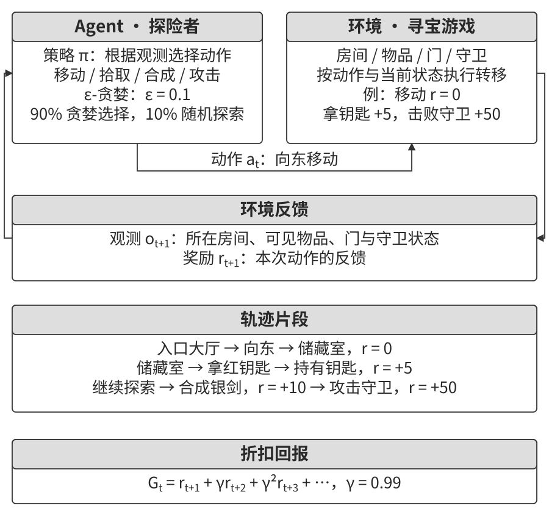

连续交互形成**轨迹**，其中包括各步观测、动作、奖励和终止信息；训练系统能够取得环境状态时，也可以一并记录。策略决定怎样行动，**价值函数（Value Function）**则估计：从当前状态出发，按照某个策略继续执行，预期能得到多少未来回报。

Agent 与环境的边界由建模时选定的系统范围决定。本书讨论的模型与 Harness 位于 Agent 内，工具接口将它连接到外部应用、设备和服务。例如，修改文件的请求由 Agent 提出，文件系统执行写入，工具再把执行结果返回给 Agent。

学习过程中，需要在**探索与利用（Exploration–Exploitation）**之间分配机会。探索让策略接触尚不熟悉的动作，利用则选择当前估计较好的动作。对于延迟奖励任务，还需要判断早期哪些步骤促成了最终结果，这就是后文将讨论的信用分配问题。

理解一个 RL 方法，可以先检查五项内容：

- **动作空间**：允许输出什么。棋类使用离散走法，机器人控制可以使用连续关节目标；动作还可能受状态、物理范围和权限约束。
- **策略**：根据状态、观测或历史选择动作的规则。它可以是一张表，也可以是神经网络。
- **奖励信号**：训练目标通过哪些反馈表达。每步奖励参与形成长期回报，策略可能为了未来收益接受当前代价。
- **价值函数**：估计后续回报，可用于比较动作或构造策略更新信号。具体算法决定是否显式学习它。
- **环境模型**：预测动作后的状态、观测或奖励。基于模型的方法利用已知或学到的环境模型规划；无模型方法直接从交互数据学习策略或价值。

表8-3 用不同系统说明这组概念。前两项生物与设备例子用于建立直觉，奖励栏表示可采用的目标表达。

表8-3 不同 Agent 系统的关键要素对比

| Agent 类型 | 外部环境 | 动作表示 | 奖励或目标示例 |
| --- | --- | --- | --- |
| 新生小羚羊 | 地形、重力与身体动力学 | 连续肌肉控制 | 保持平衡、避免跌倒 |
| 扫地机器人 | 房间、地面与充电设施 | 移动、清扫、回充及控制参数 | 清洁面积、电量与碰撞代价 |
| 国际象棋 Agent | 棋盘、对手与计时规则 | 当前状态下的合法走法 | 胜 +1、负 −1、和棋 0 |
| 客户服务 Agent | 用户、业务数据库与服务接口 | 回复文本、查询与业务调用 | 问题解决、流程合规、处理时间 |
| 代码助手 Agent | 需求来源、代码库与执行环境 | 搜索、编辑、运行与答复 | 测试结果、任务完成、回归与成本 |

这些系统的动作表示不同。棋类通常逐步选择一个离散动作，机器人输出指定维度的连续控制量，LLM 则先生成 token 序列，再由接口解析成回复或工具调用。内部计算也可以纳入策略建模，与实际改变外部状态的工具执行分别记录。

### 两种动作表示：经典 RL 设置与 LLM 的变长策略

**马尔可夫决策过程（Markov Decision Process，MDP）**用状态、动作、转移和奖励描述决策问题。其马尔可夫性质要求：给定当前状态与动作，预测下一步状态和奖励就无需额外依赖历史；历史中与预测有关的信息已经包含在当前状态里。图8-2 展示了这些要素之间的关系。

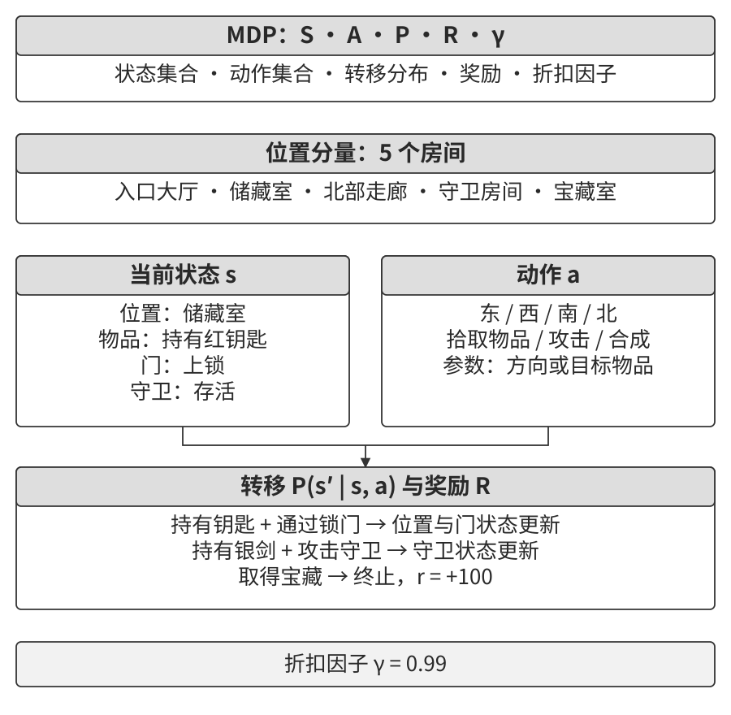

国际象棋提供了一个状态设计的例子。除了棋子位置，还需要记录轮到哪方、王车易位权、吃过路兵权，以及判定五十步规则和重复局面所需的信息。将这些内容纳入状态后，才能按当前状态判断规则。若 Agent 只能看到其中一部分，就需要利用历史补充信息，或采用部分可观测的建模方式。

MDP 可以容纳离散、连续以及组合式动作。围棋有 361 个棋盘交点，还要考虑停着和合法性；Atari 游戏通常提供少量离散操作；机器人控制量则由关节、夹爪及物理约束定义。状态与动作数量都较小时，可以直接用表存储价值。规模较大时，函数近似、策略优化与搜索分别提供了处理方式。

**表格 Q-learning：用一步反馈更新动作价值。** $Q(s,a)$ 估计在状态 $s$ 采取动作 $a$ 后的回报。最优动作价值满足贝尔曼最优方程：

$$
Q^*(s,a)=\mathbb E\left[r+\gamma\max_{a'}Q^*(s',a')\mid s,a\right]
$$

其中 $r$ 是本步奖励，$s'$ 是下一状态，$\gamma$ 是折扣因子。持续任务中常取 $0\leq\gamma<1$；终止明确、回报有限的任务也可以取 1。较大的折扣因子使较远的奖励保留更多权重。从当前时刻计算的回报为 $G_t=\sum_{k\geq0}\gamma^k r_{t+k+1}$。

一次交互得到 $r$ 与 $s'$ 后，Q-learning 按下式更新：

$$
Q(s,a)\leftarrow Q(s,a)+\alpha\left[r+\gamma\max_{a'}Q(s',a')-Q(s,a)\right]
$$

$\alpha$ 是学习率，方括号内是“一步奖励加上折扣后的后续价值”与当前估计之差。任务到达终止状态时，后续价值取 0。例如，在储藏室拿起红钥匙，当前估计为 0.25，本步奖励为 5，下一状态的最大 Q 值为 0.63。取 $\gamma=0.99$、$\alpha=0.2$，则新估计为 $0.25+0.2\times(5+0.99\times0.63-0.25)=1.32474$。这种用实际一步反馈修正估计的方法称为**时序差分学习（Temporal-Difference Learning，TD）**。

图8-3 用网格世界展示探索，图8-4 展示 Q 值怎样随反馈更新。

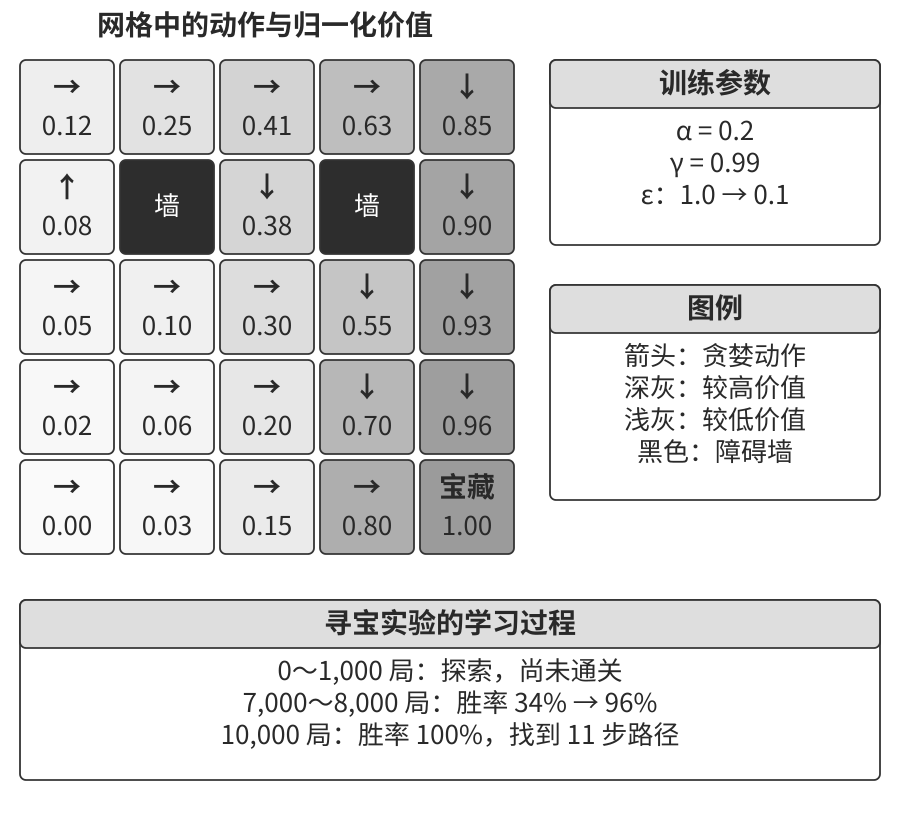

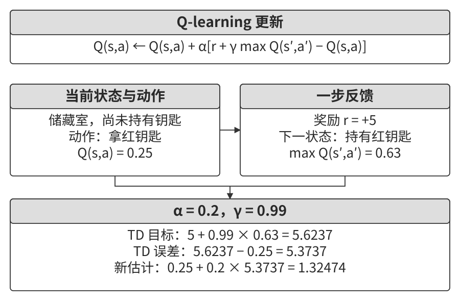

Q-learning 的行为策略可以包含随机探索，而更新目标使用下一状态的最大动作价值，因此属于**离轨（Off-Policy）**学习。表格方法的收敛分析还要求相关状态—动作得到充分访问，并满足相应的学习率等条件。后文将进一步解释在轨与离轨在 LLM 训练中的含义。

> **实验 8-1 ★：Q-learning 在寻宝游戏中的表现**
>
> 寻宝游戏包含钥匙与门、武器效果和物品合成等隐藏规则。通关需要按顺序完成多个步骤，最优路径为 11 步；关键动作与胜利提供奖励，其余步骤的反馈较少。
>
> 使用表格 Q-learning，采用 ε-贪婪探索：以较高概率选择当前 Q 值最大的动作，以 ε 的概率随机尝试，并逐步降低 ε。记录每个阶段的胜率、访问状态数和通关步数。
>
> 配套学习曲线中，前 1000 局尚未通关，Q 表包含 124 个状态；到 5000 局仍未稳定获胜，状态数为 133；7000～8000 局间，胜率由 34% 升至 96%；到 10000 局达到 100%，Q 表包含 145 个状态，并找到 11 步路径。
>
> 这条曲线可以结合价值更新理解：探索先发现关键动作与路径，后续访问再把终点回报逐步传播到前面的状态。整个小型仿真约需 10 秒，因而能够承担大量重复交互。
>
> 分析时同时记录计算时间与交互次数。在游戏中，一次动作很便宜；换成浏览器、电话或物理设备，一次交互还包含等待、费用和状态变化。表格又与具体状态编码绑定，规则或地图变化后需要重新检查已有价值是否适用。下一实验将比较预训练知识能怎样改变探索起点。

**预训练 LLM：用语言表示计算与动作。**

LLM 可以在调用工具前生成一段中间计算，也可以直接输出调用。两者都由 token 序列表示，但作用不同：中间计算改变模型后续可用的上下文，工具调用经执行后改变或读取外部环境。训练时可以按协议记录这些输出，并结合任务结果和计算成本评价它们。“想多久、想什么、何时调用工具”由此成为同一策略可以学习的选择，后面的 AdaptThink 就围绕推理预算展开。

变长序列带来了更大的组合空间。模型可以写查询、程序、JSON 参数和多步推导，序列长度则受预算与上下文限制。预训练为搜索提供了起点：数学材料常包含条件分析与计算，代码和讨论中常包含定位、修改与验证。模型可以借用这些结构生成候选路径，再根据环境反馈调整。已有知识让有用的动作组合从一开始就更容易被采样，减少了在大量无关路径中盲目试错的需要。

例如，“把外币金额换算成美元”需要取得汇率并计算。预训练让模型较容易生成这类有关联的步骤；后训练则可以依据汇率来源、计算结果与任务约束，进一步调整路径的概率。语言知识在这里提供初始策略，奖励提供任务反馈。

图8-5 对比了本节两种设置：表格 Q-learning 从指定状态编码与探索规则出发，LLM Agent 从预训练语言策略出发，并通过上下文组织工具观测与历史经验。

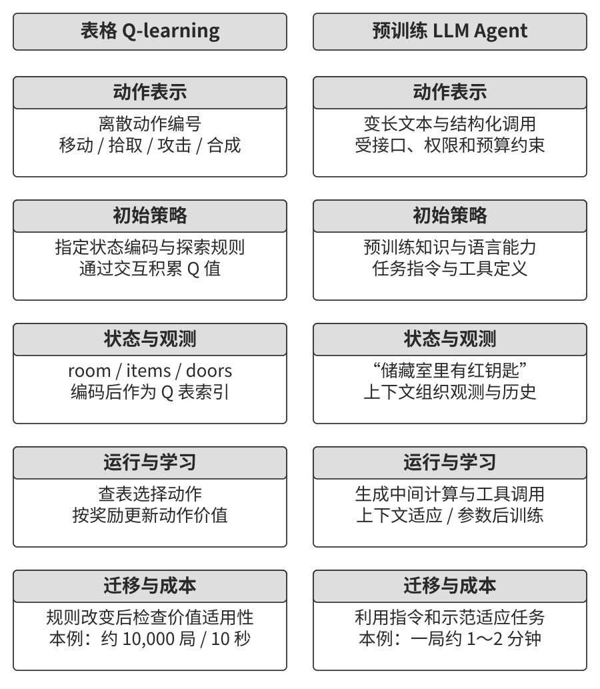

预训练还使模型能够解释新指令，利用少量示范调整任务行为。工具把语言输出连接到搜索、代码执行和业务操作。设计这类 Agent 时，既要确定工具接口与执行权限，也要为任务结果、运行成本和关键过程建立反馈。

多模态策略沿着相同思路扩展。OpenVLA 将视觉编码器与语言模型连接，根据图像和指令生成动作表示，并通过机器人演示进行行为克隆训练。[^ch8-21] 在这类 VLA 策略上，还可以继续使用交互奖励优化动作，后面的 SimpleVLA-RL 实验将展示这一过程。

> **从算法、环境到先验**
>
> 姚顺雨在《The Second Half》中用算法、环境和先验回顾了 RL 的发展。[^ch8-2] 笔者据此将关注点的变化概括为三个阶段：2015—2016 年侧重改进算法，2016—2018 年更加重视环境建设，2018 年起逐步认识到预训练先验的价值。Gym 提供统一环境接口，Universe、World of Bits 探索计算机与网页任务，Dota 2 等项目展示了复杂环境中的训练能力。随后，GPT-2、GPT-3 展示语言预训练积累的知识与表达能力，WebGPT、ChatGPT 等系统进一步利用了这种起点。任务所需的先验可以先通过语言建模获得，再交给 RL 优化具体行为。
>
> 笔者赞同这里的工程优先级：**先验、环境、算法**。先检查模型具备哪些知识和能力，再构造合适的环境与反馈，最后选择与之匹配的优化方法。图8-6 将这些关注点及代表项目放在一起。
>
> 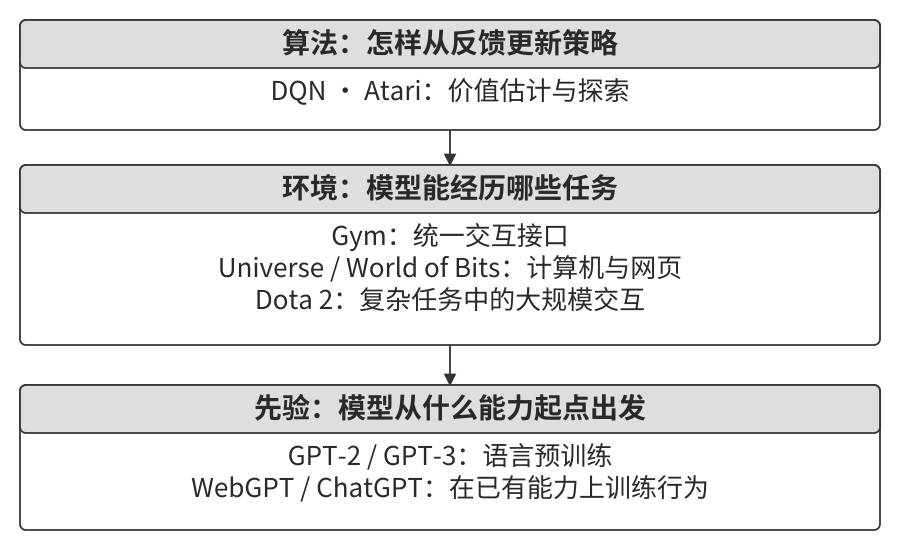

> **实验 8-2 ★★：传统 RL 与 LLM Agent 的对比研究**
>
> 在同一寻宝游戏中比较表格 Q-learning 与 LLM Agent。LLM 配置使用 Kimi K3，并在上下文中维护最多 50 条经验。图8-7 展示两种架构如何接入相同环境。
>
> 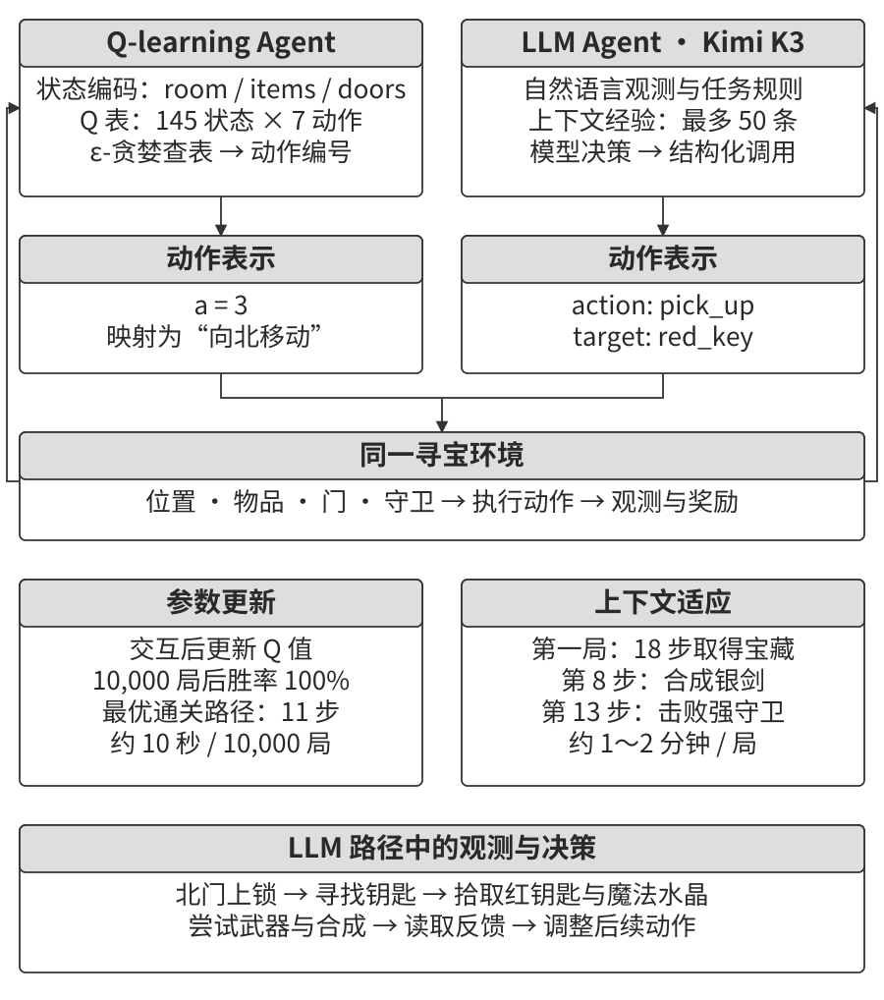
>
> 配套案例中，LLM Agent 第一局用 18 步取得宝藏。它先拿起生锈的剑，探索地图；发现北门上锁后，转向储藏室，取得红钥匙和魔法水晶。随后利用钥匙自动使用的规则，并在第 8 步合成银剑；第 13 步击败强守卫，经过少量重复尝试与回退，在第 18 步完成任务。
>
> 将每个动作与当时的观测对齐，可以分析模型如何使用“钥匙开门”“武器应对守卫”等已有知识，以及工具反馈如何改变后续计划。表格方案则通过状态—动作访问积累这些关系。再改变门、钥匙或合成规则，可以继续比较两种策略怎样适应新条件。
>
> 该案例中，Q-learning 的约 10000 局训练耗时约 10 秒，LLM 的一局约需 1～2 分钟。比较时应分别统计模型计算、环境交互与已有训练投入。笔者据此采用一条选择原则：仿真便宜、能够大量重复时，可以充分利用传统 RL 的探索；每次交互都要付出等待、费用或实际操作代价时，优先考虑能利用已有知识的策略，提高每次交互的价值。上下文经验的增删也应单独记录，以区分运行时适应与参数学习。

这两个实验连接了本章与前面的工程方法：上下文可以在一次运行中组织经验，外部记忆可以跨任务保存经验，后训练则通过参数更新改变策略。下面先补充语言和视觉预训练的基本过程，再讨论具体的训练数据与优化方法。

## 模型预训练基础 `[可选阅读]`

预训练建立模型的初始表示和生成分布，后续训练在这个起点上继续调整参数。理解这种起点，可以先观察一个小语言模型怎样从文本学习，再看它怎样接入视觉输入。

文本首先经过**词元化（Tokenization）**，转成离散 token。例如，“我喜欢编程”可以示意为“我”“喜欢”“编程”三个单元，实际划分由分词器决定。训练将前面的 token 作为上下文，预测后续 token，计算损失并更新参数。图8-8 展示了一个序列如何产生逐位置的预测目标。

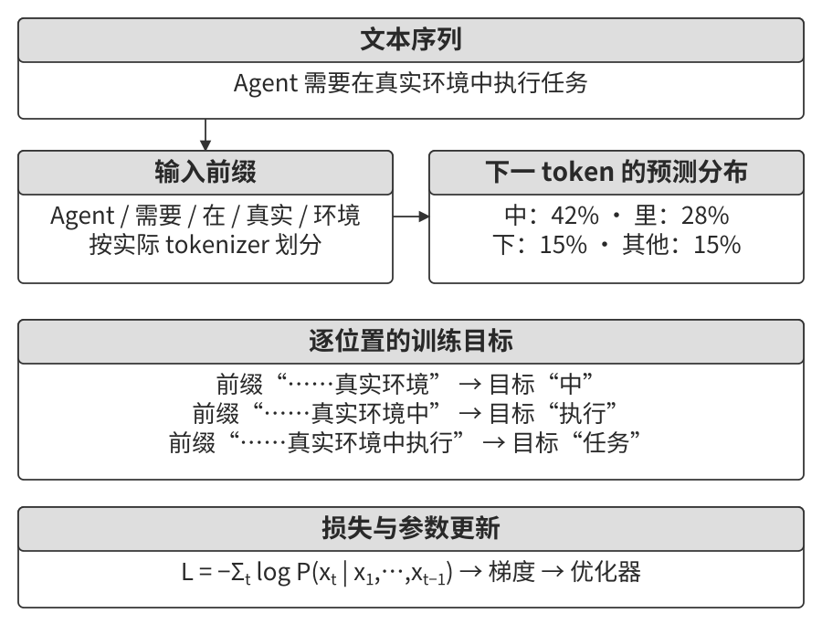

在基础语言建模之后，可以加入指令示范，训练回答格式和任务行为；也可以使用偏好数据，通过 DPO 等方法提高更受认可回答的概率。比较阶段效果时，既看训练损失，也用相同的留出问题观察内容与行为变化。

> **实验 8-3 ★★：从头训练 LLM——算法改进的威力**
>
> 以约一亿参数的 MiniMind 2 为例，在消费级 GPU 上完成预训练、SFT 与偏好优化。比较基线与加入 QK Norm、Muon 优化器的配置，观察损失下降、达到目标质量所需时间和生成结果。配套汇总记录了约 3 倍的收敛速度提升，完整训练约 14 小时、费用约 34 美元。
>
> QK Norm 调整注意力中查询与键的数值尺度，Muon 改变相应参数的优化更新方式。将两项配置与训练条件共同记录，才能理解速度改善来自哪里。
>
> 分阶段观察同一组问题：预训练模型已经能回答“世界上最高的山峰”等问题；SFT 后，指令遵循和输出组织改善；偏好优化继续影响事实回答与表达。再加入复杂推理问题，比较小模型在哪些条件下仍容易出错。结合学习曲线与各阶段的回答，可以比较算法配置如何影响训练成本和生成质量。

> **实验 8-4 ★★：自己训练 VLM**
>
> 图8-9 展示“视觉编码器—投影层—语言模型”的连接。视觉编码器如 CLIP 提取图像特征，投影层将特征转换到语言模型输入所需的维度与表示，语言模型结合这些输入生成描述或回答。
>
> 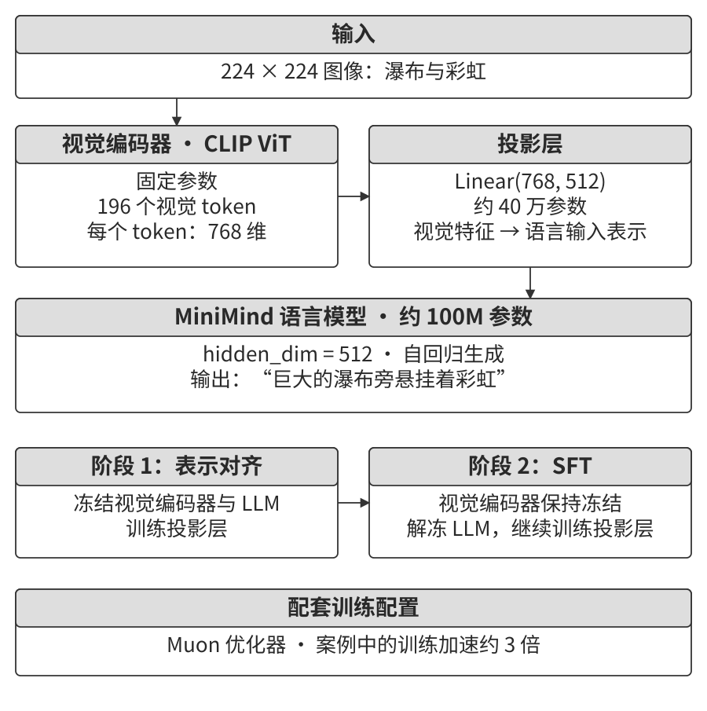
>
> 第一阶段冻结视觉编码器与 LLM，训练新加入的投影层，让图像特征能够参与语言预测；第二阶段按配置解冻 LLM，用高质量图像—描述或问答数据做 SFT。分别观察对象识别、细节描述、关系判断与语言能力的变化。
>
> 这种架构复用已有视觉和语言模型，先集中训练跨模态连接模块，是预算有限时值得优先尝试的方案。冻结权重减少了可训练状态，后续再按任务需要解冻相应模块。描述错误时，先检查对象信息是否进入视觉表示；若信息已经存在，模型仍无法利用它，就应重点检查投影层的表达能力、对齐数据与语言生成监督。将输出进一步改为动作表示，并对齐控制接口，就连接到第六章的 VLA 架构。

两个实验分别展示了优化配置和跨模态连接怎样影响训练。在预算受限时，笔者建议先比较算法和架构改进能带来的收益，再决定是否扩大模型规模。已有模型进入新语言或新领域时，还可以从预训练权重继续学习；下一节讨论怎样为这种训练选择数据。

## Mid-training：补知识与基础能力

本章的 **Mid-training** 指在已有模型上，围绕目标分布继续进行一个阶段的语言模型训练。文档、代码或推导中的大量 token 参与监督，训练材料可以同时包含目标语料与通用保留数据。DAPT/TAPT 研究展示了领域或任务相关语料继续预训练对下游任务的帮助。[^ch8-30]

数据选择从两类缺口出发。一类是知识与语言覆盖，例如模型对企业协议、目标语言术语或特定代码库接触不足；另一类是任务需要的基础能力，例如在长上下文中追踪状态、整合跨文档关系或完成较长的代码推导。先按错误类型区分理解、知识、格式与行动问题，再确定要补充的材料。

领域文本损失下降之后，还应检查模型能否在实际任务中使用学到的知识。继续训练与指令训练的顺序、问答组织和材料形式都会影响知识的运用。[^ch8-31] 对基础能力明显不足的领域任务，笔者建议先用领域语料增加覆盖，再通过 SFT 示范教模型在任务中使用这些信息；已经能够生成有效候选、还需提高成功率时，再投入 RL。这一顺序把知识覆盖、知识运用和策略优化分别落实到训练中。

### Mid-training 数据如何构造

**第一步，从失败分布定位所需材料。** 按主题、语言、文档类型、代码模式和上下文长度分别评估，结合 Pass@1、Pass@k 与错误样例，判断模型在哪些条件下缺少可用解法。参数格式问题可交给接口示范处理，领域概念与关系缺口则需要相应语料。

**第二步，组织高密度语料。** 原始文档提供术语和事实关系，代码仓库提供模块结构与依赖，教材式推导与合成释义将隐含步骤展开，跨文档样本把分散信息连接起来。完成质量过滤、去重和评估集隔离后，再构造训练序列。

**第三步，按目标能力混合数据。** 自然长文本可以来自书籍、文档和代码仓库；针对检索、多跳推理、指令遵循、聚合与统计，可以加入带推导的任务数据；针对 Agent，可以加入计划、工具选择、参数构造、状态跟踪和错误恢复轨迹。这些材料可以来自已有数据集或教师模型生成，进入训练前按内容与行为要求筛选。

**第四步，同时保留通用能力与旧任务的长上下文版本。** 一组回放数据保留短文本、通用知识和原有任务；另一组把模型已经能完成的任务放入更长上下文，改变相关信息的位置并加入干扰项。选择保留数据时，可以参考模型原有训练数据的分布，也可以用 FineWeb-2 等公开语料构造候选混合方案，再通过评估调整比例。

**第五步，用多项指标决定继续或停止。** 同时记录训练损失、留出领域任务、通用能力、原有指令遵循和目标任务成功率。领域成绩提高而通用能力下降时，比较混合比例、学习率和训练量；损失下降而目标任务停滞时，检查训练材料与任务所需能力是否匹配，以及是否需要补充在实际任务中运用知识的示范。

长上下文训练尤其需要分长度评估。LongBench v2 可以提供长文本任务，IFEval 可以提供可验证的指令遵循要求，端到端 Agent 任务则检查这些能力怎样组合使用。若将短指令任务嵌入长上下文，应固定位置和干扰条件，将它作为明确的新评估设置。覆盖维度包括：

- **位置与检索**：单条或多条关键信息，位于开头、中间和结尾时能否找到。
- **关系与推理**：跨段落、多文档关系追踪，矛盾消解与证据组合。
- **聚合与统计**：长表格和日志中的计数、分组、排序、比较与趋势归纳。
- **指令遵循**：多条要求、冲突处理、流程条件与输出格式。
- **长链推理**：数学、逻辑与代码任务中较长的依赖链。
- **Agent 基本行为**：任务分解、工具选择、参数生成、状态保持和失败恢复。

长推理和多轮工具调用会不断拉长上下文，早先的指令、事实和任务状态仍要参与后续决策。模型如果在长文本中找不到信息或保持不住约束，长程 Agent 就难以可靠运行。训练预算扩大前，应先用小规模配置比较数据配比和训练量。对于频繁更新、要求出处的事实，笔者优先使用 RAG；对于稳定的大规模领域知识与基础能力，再考虑继续训练写入参数。

> **实验 8-5 ★★：继续预训练学习新语言**
>
> 从 Mistral 7B v0.3 出发，用韩语维基百科等材料提高韩语能力。训练先采用约 80% 韩语、20% 英语的混合，再用韩语指令数据进行 SFT，分别观察语言建模与对话行为的变化。
>
> 韩语数据增加目标语言的覆盖，英语数据用于维持原有能力。用相同的韩语与英语保留任务比较各阶段，再调整混合比例和训练强度。配套结果中，韩语最终阶段的盲评分改善，英语能力有所下降，这为下一轮增加保留数据或降低更新强度提供了具体方向。
>
> 将目标语言、原有语言和事实质量分开记录，可以判断收益与代价；SFT 阶段再检查模型能否按韩语指令组织回答。这样，继续预训练和指令微调的作用就能分别观察。

接下来转向 SFT 数据：怎样把希望模型掌握的回答、工具调用与完整流程写成可学习的示范。

## SFT（监督微调）

SFT 将期望的回答与行动写成示范，通过逐 token 监督提高它们在相应条件下的概率。图8-10 展示了从任务定义、数据生成和筛选，到训练与评估的流程。除了输出格式，示范还会传递知识、语气、工具使用和错误恢复方式。

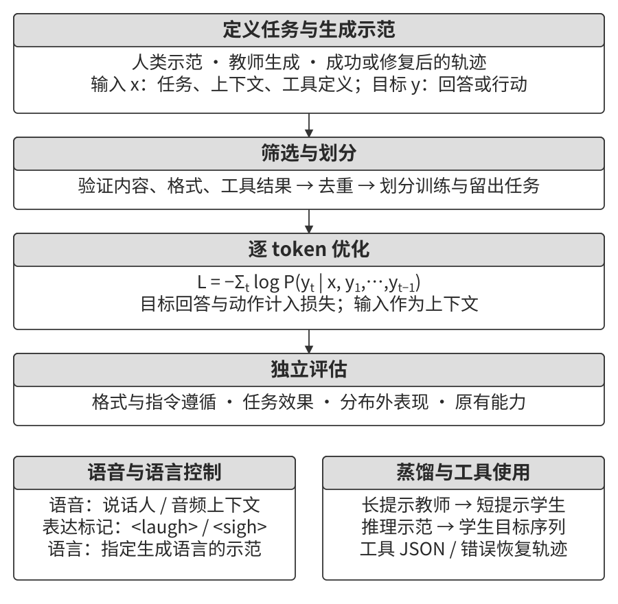

数据通常来自三条途径：人工专家定义关键行为和边界，教师模型批量生成候选，验证器从模型采样中筛选有效输出。三者可以组合使用。例如，先由专家写出少量工具调用示范，再让教师改变任务条件生成更多样本，最后检查参数、执行结果与业务约束。

数据准备要先确定任务分布、输出 schema 和验收方式。候选通过检查后，再进行去重、类别平衡和训练集划分。样本数量与覆盖范围应共同设计：重复数千次同一种问法，会反复强化相同模式；围绕关键条件构造变化，才有助于模型在不同输入下选择恰当行为。笔者会先精修一批覆盖关键情形的示范，再扩大规模。SFT 会逐 token 学习目标输出，错误事实、冗余步骤和不恰当的操作习惯也会随之进入参数。目标清楚、示范干净时，密集监督才能充分发挥效率。

> **实验 8-6 ★★★：语音 SFT——从声音复制到副语言建模 `[扩展实验]`**
>
> 以 Orpheus 和 Sesame CSM 为例，比较说话人条件、对话上下文和表达标记怎样参与语音生成。Orpheus 将语音表示为 token，可利用参考文本—语音片段生成相应音色，也提供 `<laugh>`、`<sigh>` 等表达标记。Sesame CSM 则接收文本、说话人标识与已有音频片段，生成后续语音。[^ch8-speech-conditioning]
>
> 构造训练样本时，分别记录文本、说话人、音频及表达条件；使用同一说话人的跨句材料学习一致性，用多种语境中的笑声、叹息和停顿学习表达。比较无参考、有参考和指定表达条件下的输出，再按准确性、自然度、情感和音色评分。
>
> 数据中应覆盖足够的说话人、句型和情绪组合。说话人过少时，输出可能趋向单一音色；某个标记总与同一声音片段绑定时，则可能出现重复、机械的表达。留出新的文本和语境，可以检查模型是否学会在条件变化时调整声音。

> **实验 8-7 ★★★：多语言思考——按指定语言生成推理过程 `[扩展实验]`**
>
> 对 gpt-oss-20b 进行 SFT，用指令指定推理过程的语言。例如，`reasoning language: German` 要求生成德语推理文本。训练样本包含英语、西班牙语、法语等语言，并将中文留到测试阶段。
>
> 配套案例中，训练后指定 Chinese，模型能够生成中文推理过程。可以进一步比较三项结果：是否遵循语言要求，最终答案是否正确，以及生成长度与耗时怎样变化。预训练的多语言基础与 SFT 学到的控制方式共同参与这种跨语言表现；通过不同语言与基模的对照，可以继续分析它们的作用。

> **实验 8-8 ★★：Prompt 蒸馏——以更小开销复现可用能力**
>
> 一项稳定业务可能依赖数千 token 的系统提示，教师还会生成较长推理。Prompt 蒸馏先让教师在完整条件下产生高质量输出，再把“用户输入—最终回答”组成学生的 SFT 数据。学生使用较短提示，并按目标配置直接回答。
>
> 可以分别比较两个变化：从大教师迁移到较小学生，以及从长推理输出迁移到直接回答。前者改变模型推理开销，后者减少生成量。固定任务与运行条件，测量学生相对教师的质量、首字延迟、总耗时和费用，再决定适合迁移的任务范围。
>
> 数据构造还要保留学生完成任务所需的条件。教师依赖最新工具结果时，可以把相应结果作为学生输入，或继续保留工具接口；教师存在系统性错误时，则通过独立验证过滤。
>
> 产品规则稳定、输入分布清楚、调用成本较高时，笔者建议优先评估 Prompt 蒸馏，把反复处理的提示和推理压缩到参数中。产品仍在探索、任务要求频繁变化时，则保留可编辑的提示与显式推理，便于快速试验和定位错误。这样可以把训练投入放在已经验证、值得反复复用的行为上。

> **实验 8-9 ★★★：思维链（Chain of Thought，CoT）蒸馏**
>
> CoT 蒸馏将教师提供的推理文本与最终答案一起作为监督，使学生学习分解、计算、检查和修正的过程。DeepSeek-R1 对 Qwen、Llama 系列进行蒸馏，是这一方法的代表。对于希望拥有自主可控模型、又希望控制训练投入的团队，笔者建议优先考虑这条路线。教师在目标任务上明显强于学生，就有条件提供有价值的示范；可以先从能够取得完整推理输出的开放权重模型中选择，再比较它与学生的能力差距和数据质量。接口只提供推理摘要时，可用于过程蒸馏的信息也随之减少，因此教师输出的可用性应在选型阶段确认。
>
> 第一步，采集候选。对数学、代码等目标任务生成多条“推理过程＋答案”，用答案校验、测试与必要的过程检查筛选。**拒绝采样（Rejection Sampling）**保留满足判据的候选，用这些数据做监督训练称为**拒绝采样微调（Rejection Sampling Fine-Tuning，RFT）**。对最终答案正确的候选，继续检查中间推导，过滤偶然答对或过程失真的样本。
>
> 对于有可靠验证器的任务，笔者建议先建立 RFT 基线：生成、筛选和 SFT 即可形成训练流程，省去在线策略优化与价值估计的实现工作，再据此判断 RL 的额外投入是否值得。
>
> 第二步，训练学生。按所选模型的对话格式组织“问题→推理文本＋最终答案”；使用 `<think>` 与 `</think>` 等边界时，明确哪些 token 参与损失。可以从 7B 量级学生开始，比较完整轨迹、精简轨迹与只监督最终回答的配置。
>
> 第三步，比较结果。在独立数学和代码任务上同时评估教师、训练前学生与训练后学生，记录成功率、生成长度和费用；再检查推理文本中的验算、回溯是否与实际改进对应。教师差距、学生容量和数据覆盖共同决定能够迁移多少能力。后面的 AdaptThink 将进一步讨论怎样控制推理开销。

> **成书实践：蒸馏实验的开发过程**
>
> 笔者最初使用 GPT-5.6-Sol 驱动的 Codex 实现蒸馏实验，遇到拒绝后切换到 Claude Opus 5 驱动的 Claude Code，也未能继续。随后使用 Kimi K3 完成代码与运行。这段经历促使笔者在准备实验时，提前确认开发工具、教师输出与训练数据的可用条件，并为关键步骤保留替代实现方式。

这四个案例都采用监督学习，分别学习不同的内容：语音中的音色与表达条件，多语言推理中的语言控制，Prompt 蒸馏中的直接回答，以及 CoT 蒸馏中的解题过程。训练目标明确后，数据格式、质量检查和评估方法才能逐项对应。

## SFT 数据合成：从示范到可训练轨迹

批量合成从任务结构开始。生产轨迹能够提供用户意图、初始状态、可用工具、业务约束和常见失败。将这些内容提炼为任务模板，替换身份、订单、文件和凭据等具体信息，再放入可重置的环境，就能生成包含真实难点的新实例。

一条完整流程是：**生产案例→任务模板→合成实例→多条候选轨迹→任务与轨迹验证→训练数据**。其中两类验证分别负责不同问题：任务验证检查条件是否充分、目标是否可完成、参考结果是否正确；轨迹验证检查候选的最终状态、调用顺序和业务约束。

可执行条件使用测试、数据库断言或状态差异检查，开放式沟通质量使用 Rubric 与模型评判，并通过人工抽样校准。进一步结合技能图、可执行环境与独立验证器，可以有计划地扩展任务覆盖。[^ch8-12][^ch8-17][^ch8-18][^ch8-19][^ch8-20]

合格的示范既可以是顺利完成的轨迹，也可以是包含诊断和修复的完整过程。对其中的错误动作，应明确它在样本中的角色，并按训练目标选择损失位置。失败记录还可用于构造偏好对、发现覆盖缺口和生成恢复任务。随后进入 RL 时，当前策略会重新采样轨迹，并利用环境反馈更新。

训练集与评估集按目标选择隔离方式：同分布评估可以隔离具体实例，迁移评估进一步隔离任务模板、客户群体或时间段。去重时检查输入和解法的近似重复；参考答案、隐藏测试和仅供评分使用的信息，按任务协议留在验证侧。

以第七章的“过早结束”案例为例，在准备宣称完成的时刻截取前缀，将未经验证的完成声明记为 `rejected`，把先检查剩余目标、运行相关测试再作答的继续行为记为 `chosen`。偏好对可以用于 DPO；其中验证通过的继续行为，也可以单独作为 SFT 示范。保存当时的验收条件与可获得信息，模型才能学习何时继续、何时结束。

后文的中文弯引号与特殊字符串实验进一步说明了怎样确定监督目标。中文弯引号任务从文档作用域出发，要求修改目标正文并保护代码、引文与 JSON；特殊字符串任务则要求 `old_string` 在工具参数中保持字节级一致。前者检查编辑范围与文档语法，后者检查精确复制与实际工具匹配。共同的失败归因流程，可以导出不同的训练目标。

## 何时选择 Mid-training、SFT 与 RL

选择训练方法，可以先诊断模型在任务链路中缺少什么。图8-11 展示了几种方法的连接方式，表8-4 列出选择各类方法时需要检查的条件。

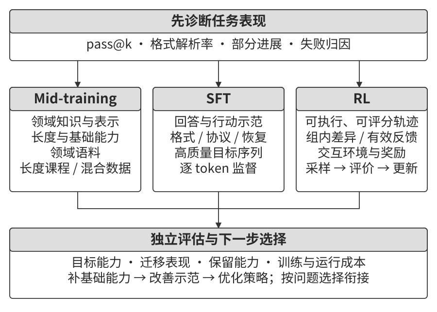

表8-4 Mid-training、SFT 与 RL 的选择准则

| 观察到的现象 | 优先检查 | 候选方法 | 后续评估重点 |
| --- | --- | --- | --- |
| 领域语言、概念或基本操作薄弱，多次采样仍少有进展 | 语料覆盖与基础能力 | Mid-training；可检索事实结合 RAG | 领域任务、通用保留集与部分正确轨迹 |
| 内容可用，格式、参数或固定流程不稳定 | 示范、接口与约束 | SFT、约束解码或工具校验 | 解析成功、任务结果与恢复行为 |
| 已有成功路径，但出现概率低或决策效率差 | 奖励质量、探索与任务分布 | RL | 任务收益、奖励差异、独立泛化与成本 |
| 有示范或偏好数据，交互环境尚未建立 | 离线数据覆盖与验证方式 | SFT、RFT、离线偏好优化 | 基线质量、数据偏差与环境建设收益 |

可以按四步推进。首先建立 Prompt、上下文、工具和约束方案的基线。这些方法已经满足任务要求时，笔者会优先保留外部可编辑方案，减少训练、部署与回归的维护成本。动态事实通过检索与版本管理提供；需要反复学习的隐式判断、感知模式和稳定行为，再考虑通过参数训练改进。

第二步，在留出任务上观察成功、部分进展、解析结果和错误类型。采样配置固定后，Pass@1 与 Pass@k 展示当前策略是否已有可利用的路径；失败轨迹帮助区分知识不足、反馈缺失和流程错误。

第三步，为需要学习的行为提供示范。JSON schema、工具调用、术语使用、澄清与恢复都可以写成 SFT 样本，必要知识则通过相应语料与任务上下文提供。检查模型能否在改变条件后继续遵循这些要求。

第四步，评估 RL 的反馈条件。能够生成可评分候选、奖励具有区分度、环境允许足够交互时，可以比较策略优化的收益；奖励过于稀疏时，先考虑课程、部分奖励或更合适的初始策略。

每一步由评估结果决定后续投入：格式明确的任务可以完成 SFT 后部署，较强起点可以直接做 RL，领域继续训练后也可以复用已有的指令能力。下面通过单轮任务，具体观察示范学习与奖励学习产生的行为差异。

## 单轮强化学习：记忆与泛化的对照

单轮任务从一次输入开始，以模型提交回答并获得奖励结束。模型仍可在生成回答时进行多步推理，训练系统也可以让它反复尝试同一道题。把交互限定为一次回答，便于我们观察训练方法怎样改变模型的行为。下面先用 AdaptThink 说明模型如何学习分配推理预算，再用 GeneralPoints 比较 SFT 与 RL 在规则和视觉外观发生变化时的表现。

先了解 RL 算法怎样利用奖励更新模型，就能读懂后续实验中的训练过程。本章的 RL 训练大多基于**策略梯度**。以同一问题的多次采样为例：让模型生成几条回答，再将各条回答的奖励与基线比较。优于基线的回答获得正向信号，训练会提高它的生成概率；低于基线的回答获得负向信号，生成概率随之降低。

为抑制单次更新把模型带偏，主流的 **PPO** 算法会在概率比超出指定区间时裁掉代理目标中的额外收益；实际更新幅度还取决于学习率和更新轮数。后文的“带价值网络的 PPO”会学习一个价值估计，用它建立比较基线，计算各步动作的优势。**GRPO** 直接比较同一问题的多条回答，用组内奖励构造基线，从而省去单独训练的价值网络。下面两个实验分别展示这些学习信号如何改变推理预算和解题策略。

下面的 Python 风格伪代码串起采样、奖励、优势和参数更新，帮助理解各步怎样传递信息。实际训练还要配置采样并行、KL 正则和优化器。

```python
for prompt in batch:
    group = [rollout(policy, env.reset(prompt)) for _ in range(G)]
    rewards = [verify(trajectory) for trajectory in group]
    advantages = normalize_within_group(rewards)       # GRPO baseline
    update(policy, group, advantages)
```

而 PPO 的价值网络和裁剪目标可以写成：

```python
for trajectory in rollouts:
    returns = discounted_returns(trajectory.rewards)
    values = value_model(trajectory.states)
    advantages = returns - stop_gradient(values)
    ratio = exp(policy.log_prob(trajectory.actions)
                - old_policy.log_prob(trajectory.actions))
    policy_loss = -mean(min(
        ratio * advantages,
        clip(ratio, 1 - epsilon, 1 + epsilon) * advantages
    ))
    value_loss = mean((value_model(trajectory.states) - returns) ** 2)
update(policy, value_model, policy_loss + value_coef * value_loss)
```

GRPO 的“相对”来自同一 prompt 的组内比较；PPO 中的 `old_policy` 是生成这批 rollout 时冻结的策略快照，概率比衡量当前策略对这些动作的概率与采样时相差多少。裁剪通过代理目标抑制大步更新，实际策略变化还受学习率、更新轮数和梯度大小影响。环境决定模型能经历哪些状态，奖励提供比较依据，两者共同决定训练信号的质量。

> **实验 8-10 ★★：AdaptThink——学会 “何时不思考”**
>

> 推理模型常用较长的推理过程解决问题。对于简单问题，直接回答可以节省生成开销。AdaptThink 为模型提供 Thinking 与 NoThinking 两种模式：在支持这一协议的模型中，NoThinking 通过 `<think></think>` 结束推理段，随后直接生成答案。训练的目标是让模型根据任务选择合适的推理预算。
>
> 方法包含两个核心组件。**约束优化目标**鼓励模型增加 NoThinking 的使用比例，同时维持整体答题性能；**重要性采样**调整两种模式的采样比例，再通过权重修正采样分布与优化目标之间的差异。初始模型往往偏向 Thinking，主动增加 NoThinking 样本，才能让训练获得比较两种模式的信号。这里的冷启动问题，具体指训练初期 NoThinking 样本不足。
>
> 本书实验使用 8 张 H100 80GB GPU。训练至第 300 步时，MATH500 准确率从 81.00% 变为 81.80%，平均响应长度从约 4,911 tokens 降至 1,577 tokens；GSM8K 准确率从 79.68% 升至 81.88%，响应长度从约 1,025 tokens 降至 477 tokens；AIME mean@16 从 31.46% 变为 31.04%，响应长度从约 12,120 tokens 降至 6,402 tokens。三组响应长度分别减少约 68%、53% 和 47%。
>
> 三个数据集的 NoThinking 比例依次为 83.80%、84.15% 和 56.25%。模型在 AIME 上保留了更多推理计算，而在 MATH500 和 GSM8K 上更常直接回答。结合准确率和长度一起看，就能判断节省的计算是否符合任务的质量要求。AIME 的结果也提示我们，应分别检查不同难度任务的质量变化。
>
> AdaptThink 可以与 Prompt 蒸馏配合：蒸馏把反复使用的指令和解题模式写入参数，AdaptThink 再学习每次任务应分配多少推理计算。两者共同影响回答质量、延迟和成本。

> **实验 8-11 ★★：GeneralPoints——单轮 RL 的 “记忆与泛化” 对照**
>
>
> 图8-12 把规则变化、花色变化和两条训练分支放在同一张图中，便于对照后面的 OOD 结果。
>
> 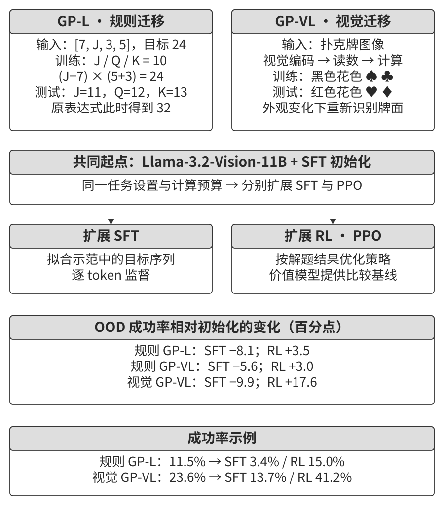
>
>
> GeneralPoints 是 Chu 等人提出的算术思考卡牌游戏[^ch8-3]，专门用于评估模型的泛化能力。任务目标类似“24 点”游戏：使用四张卡牌上的数字，通过加减乘除运算，每个数字恰好用一次，凑出目标数字 24。实验设计了纯文本 GP-L 与图像 GP-VL 两个变体，使我们能在同一框架下分别考察规则泛化与视觉泛化。
>
> **规则变体**：训练时 J/Q/K 都计为 10，测试时分别计为 11/12/13。测试集因此包含训练中未见的数字组合，可以检查模型能否按新规则使用 11、12、13 计算。**视觉变体**：训练用黑色花色（♠♣），测试用红色花色（♥♦），检查模型能否适应牌面外观的变化。
>
> 实验从 Llama-3.2-Vision-11B 出发，先用 SFT 建立基本指令遵循能力，再分为继续 SFT 和 RL 两条训练分支，在相同计算预算下比较。RL 分支采用带价值网络的 PPO。两条分支都用 J/Q/K=10 的规则训练，随后在分布内（ID）与分布外（OOD）测试集上评估。
>
> 以 `[7, J, 3, 5]` 为例，J=10 时可以用 `(J−7)×(5+3)=24`；J 改为 11 后，这个表达式得到 32，需要换成 `(11−5)×(7−3)=24`。同一组牌面因此要求模型读取当前规则，并重新组织计算。
>
> 两种训练方法在分布外测试中出现了明显差异。**规则 OOD**：GP-L 上，RL 的成功率从 11.5% 升至 15.0%，增加 3.5 个百分点；SFT 从 11.5% 降至 3.4%，减少 8.1 个百分点。GP-VL 上，RL 增加 3.0 个百分点，SFT 减少 5.6 个百分点。**视觉 OOD**：GP-VL 上，RL 从 23.6% 升至 41.2%，增加 17.6 个百分点；SFT 从 23.6% 降至 13.7%，减少 9.9 个百分点。
>
> 进一步检查卡牌识别结果，可以把最终答题表现与视觉感知联系起来：RL 分支的识别准确率随任务成功率一起提高，SFT 分支的识别准确率则有所下降。研究将这一差异与训练目标联系起来：逐 token 拟合可能强化示范中的文本模式，结果奖励则持续要求模型正确读取牌面并完成计算。感知准确率提供了分析这一机制的中间指标。
>
> 先做 SFT 的原因，也可以从输出格式理解。实验中的 Llama-3.2-Vision-11B 基础模型无法稳定生成要求的结构化输出，验证器无法据此计算任务奖励，直接进行端到端 RL 的尝试因而失败。SFT 先建立可解析、可评分的输出，后续 RL 才能利用任务反馈。前文的 DeepSeek-R1-Zero 则从能够产生有效候选的基础模型出发，直接进入 RL。
>
> 测试时的验证迭代也影响泛化表现：采用 10 次迭代时，报告的增幅为 +5.99%；采用 1 次时为 +0.48%。因此，比较训练方法时还要固定测试阶段的计算预算，才能分清训练与反复验证各自带来的收益。
>
> 为什么在这个实验的分布偏移下 SFT 性能下降，而 RL 表现更好？一种与观察相符的解释是：有限的 SFT 数据强化了“遇到 J/Q/K 就当 10 用”的固定模式；测试时 J=11，模型仍按 10 计算。结果导向的 RL 分支则更可能强化“重新计算直到得到正确答案”的策略，因而在 J 变成 11 时仍能应用。这为本实验中的“记忆”与“泛化”对照提供了一种解释。设计自己的训练方案时，可以沿用这种检查方法：改变规则、输入外观或任务组合，观察模型是否仍能依据新条件求解。
>
> GeneralPoints 的规则变化与花色变化，让我们可以分别观察模型是否学会按新条件计算、是否正确读取新的视觉输入。两个变体都显示出 SFT 的过拟合倾向与 RL 更好的分布外表现，也展示了两者的配合方式：SFT 稳定格式，RL 在此基础上探索策略，两者形成互补。

## RL 算法：从 16 次 rollout 到一次参数更新

**GRPO（Group Relative Policy Optimization）**由 DeepSeek 提出，通过同一问题下多次尝试的相对表现构造学习信号。以一个 SWE-bench 风格的代码修复任务为例：Python 项目的 `parser.py` 在空输入时触发 `IndexError`，Agent 需要修复实现并保持测试文件不变。一次训练迭代可以分为四步。

**第一步：让策略模型重复尝试。** 策略模型就是正在训练的语言模型。系统将相同的初始代码和问题描述放入 16 个隔离沙箱，让模型独立完成 16 次任务。每次从阅读代码开始，经过修改、测试，直到提交结果；这一整条交互轨迹称为一次 **rollout**。随机采样使相同起点产生不同路径：有的补齐边界检查，有的仅捕获异常，有的改错文件，也有的试图修改测试。

**第二步：计算奖励。** 每条 rollout 结束后，验证器在干净环境中应用补丁并运行测试。假设 16 次尝试中有 4 次通过全部测试且没有修改测试文件，另外 12 次失败，那么前 4 条得到奖励 1，后 12 条得到奖励 0。这类代码任务可以直接用测试和规则计算奖励。对于可读性、解释质量等较难写成测试的目标，还可以结合人工评价或奖励模型。

**第三步：计算相对优势。** 奖励只说明单条轨迹成功或失败，**相对优势**则说明它相对于同组其他尝试有多好。这一组的平均成功率是 4/16：通过测试的 4 条高于组内平均，得到正优势；失败的 12 条低于平均，得到负优势。若按组内标准差归一化，奖励均值为 0.25、标准差约为 0.433，成功轨迹的优势约为 1.73，失败轨迹约为 −0.58。GRPO 用这类组内比较构造学习信号。若 16 条奖励完全一样，基于结果奖励的组内优势就为零。RLVP 的路径信号、过程奖励和部分进展奖励，解决的正是如何在这些组里恢复有意义的差异。

**第四步：用梯度下降更新策略。** 训练程序把相对优势转成训练损失，计算梯度，再由优化器（如 AdamW、Muon）执行梯度下降，提高正优势轨迹中模型所做选择的概率，降低负优势轨迹中选择的概率。训练在许多任务和 rollout 上反复调整这些选择的概率。优化逐渐奏效后，遇到类似错误时，“先复现问题、检查边界条件、修改实现并运行测试”会更容易出现，“掩盖异常、改测试、没有验证就提交”会更少出现。

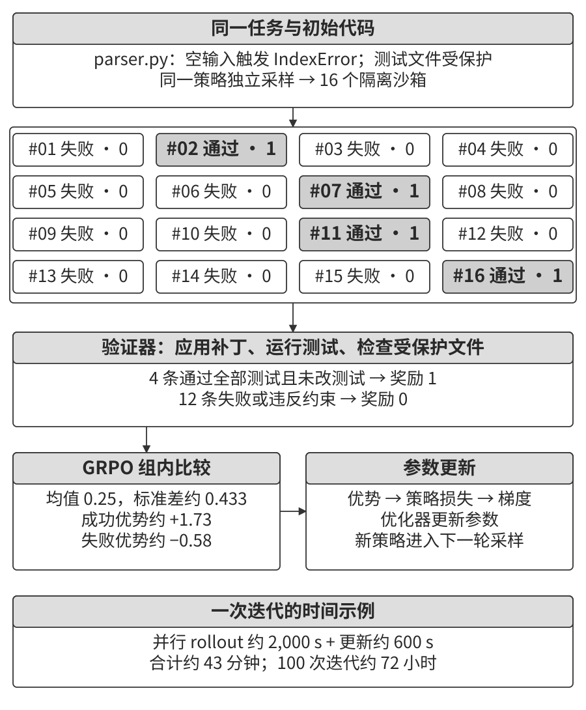

图 8-13 汇总了这四步。在本节的计数方式中，它们合起来构成一次**训练迭代（step）**：第 $k$ 个 step 用当前策略生成一批 rollout，完成奖励、优势和梯度计算，再由优化器更新参数；第 $k+1$ 个 step 随即使用更新后的策略重新 rollout。训练 100 steps，就是把这个闭环重复约 100 轮。具体 RL 训练框架可能把内部的多个 minibatch 更新另行计数，因此看训练日志时仍需确认其 `step` 定义。

可以据此估算训练时间。一次复杂任务可能包含数十轮工具调用；同步训练等待整批结果时，16 条并行轨迹中最慢的一条决定采样阶段何时结束。假设它耗时约 2,000 秒，梯度计算与优化器更新再用 600 秒，一次 step 就需要约 $2{,}000+600=2{,}600$ 秒，即 43 分钟。按相同耗时连续训练 100 steps，约需 72 小时。

PPO 与 GRPO 都遵循这个闭环，区别主要在 “拿谁来比较”。GRPO 直接比较同一问题的多条 rollout，不需要额外的价值模型；PPO 会训练一个价值模型，估计在轨迹的每一步 “通常能做到多好”，再判断当前动作是否比这个预期更好，从而提供逐步信用分配所需的基线。选择算法时，还要考虑价值估计质量、训练成本和任务的反馈结构。两者都通过裁剪代理目标等机制抑制过大的更新；实际更新幅度还取决于学习率、更新轮数和梯度大小。DPO 则不同：它直接学习事先收集好的 “较好回答—较差回答” 偏好对，不让当前策略在线生成这组 rollout。

本章的案例采用了不同训练配方：AdaptThink 使用自定义约束目标；GeneralPoints、V-IRL 与 ReTool 使用 PPO，其中前两者的价值模型参与优势估计；SimpleVLA-RL 与 RLVP 使用 GRPO。阅读案例时，可以分别看算法怎样更新参数、奖励怎样定义成功，以及环境和数据提供了哪些学习机会。

### 为什么 LLM RL 通常优先 On-Policy

**Online（在线）**与 **On-policy（在轨）**描述两个不同方面。在线训练在运行过程中持续与环境交互并产生数据；在轨训练关注数据来源，要求生成轨迹的行为策略 $\mu$ 与待优化的策略 $\pi_\theta$ 一致或足够接近。异步集群可以持续在线采样，但 worker 若落后几个检查点，返回的数据就带有策略陈旧度，形成 off-policy（离轨）成分。回放旧轨迹，或使用旧模型、教师模型生成的数据，也需要考虑这种策略差异。

笔者建议先用接近在轨的训练建立稳定基线，再为提高吞吐量引入异步采样或旧数据复用。本章的 PPO/GRPO 配方通常在每个 step 开始时用最新策略采样。PPO 随后会对同一批数据做多轮小批量更新，当前策略逐渐偏离生成数据的 `old_policy`。概率比衡量这种变化，裁剪目标则抑制过大的更新。

策略梯度的目标与当前策略 $\pi_\theta$ 下的期望奖励有关。使用行为策略 $\mu$ 采样的数据时，可以先计算同一状态下的动作概率比，再据此构造重要性修正：

$$
\rho_t=\frac{\pi_\theta(a_t\mid s_t)}{\mu(a_t\mid s_t)}
=\exp\left(\log\pi_\theta(a_t\mid s_t)-\log\mu(a_t\mid s_t)\right).
$$

用当前策略刚采集的 on-policy rollout，在**参数更新之前**应满足 $\pi_\theta=\mu$，所以 $\rho_t=1$。这使训练集中在“当前模型实际会进入的状态”，也减少了分布差异及其修正带来的方差。Off-policy 的优点是旧数据可复用、采样与训练可异步，吞吐量更高；代价是策略越陈旧，$\rho_t$ 的分布越重尾。对自回归长序列，严格的前缀或轨迹修正还会连乘许多 token 比率：少量偏差可能累积成极大或极小权重。PPO 的裁剪目标可以抑制极端概率比对应的更新。裁剪过多会丢失部分学习信号，过少则可能让少数大权重样本主导更新；旧数据没有覆盖到的新策略状态，也仍需通过采样补充。因此，采用新鲜 rollout 的主要收益是**降低分布偏差、提高优化稳定性**；稳定大模型 RL 的实证研究也发现，减少策略陈旧度与训练—推理差异是代理目标有效的重要条件[^ch8-32]。

#### 训练与推理的数值差异

大规模 LLM 强化学习通常用 vLLM、SGLang 等推理引擎采样，再用 FSDP、Megatron 等训练系统计算对数概率和梯度。两侧即使加载相同权重，也可能因浮点精度、归约顺序、张量并行、批大小、KV Cache 和融合内核不同，为同一 token 算出略有差异的对数概率。此时，参数尚未更新，$\rho_t$ 就已偏离 1，训练与采样之间出现数值层面的策略差异。受控实验发现，微小的 token 级差异也可能导致训练崩溃。[^ch8-33]

这种误差会沿计算过程放大：**对数概率误差 → 概率比偏差 → 长前缀累积 → 裁剪与优势加权变化 → 梯度和有效样本数变化**。例如，4,000 个 token 的对数概率比若都带有同方向的 $10^{-3}$ 偏差，轨迹级比率就会累积到 $e^4\approx54.6$。这个同向误差例子说明，长序列中的小偏差可以产生很大的累计影响。

早期概率变化还可能改变采样结果，使后续状态沿另一条路径发展。训练中可观察到的信号包括重要性比率尖峰、裁剪比例升高、梯度或响应长度突变，以及奖励和熵下降。批大小改变归约过程时，同一输入的数值结果也可能变化，即批次不变性（batch invariance）受到破坏。相关研究观察到了由此产生的隐式离轨效应，并通过对齐采样与训练计算，或显式修正策略差异，改善稳定性。[^ch8-34]

因此，笔者把采样与训练的数值一致性列为训练启动前的核心检查，并与奖励曲线一起持续监控。可以沿着“测量差异—对齐配置—修正偏差—控制陈旧度”四步处理：

- 在**任何参数更新之前**，用同一批轨迹比较采样端（sampler）与训练端（trainer）给出的 token 对数概率，监控 $\rho_t$ 的均值、分位数、最大值、近似 KL 和被裁剪比例；这是最直接的 on-policy 单元测试。
- 同步权重时，一并对齐 LoRA 适配器、分词器、对话模板、模型版本和位置编码配置。rollout 应保存采样策略在生成时给出的对数概率，后续据此计算概率比。
- 尽可能对齐采样与训练的精度、并行布局和关键计算内核；若不能做到，就把差异明确视作 off-policy，采用重要性修正并监控有效样本数，并结合裁剪比例判断修正效果。
- 及时用更新后的策略重新采样，限制每批数据上的更新轮数，以及异步采样落后于训练的检查点数量。重用旧数据时，同时测量吞吐收益、分布偏差与训练稳定性。

## RL 环境：从评估到仿真

Agent 的 RL 训练需要反复执行任务。一次代码修复可以在隔离副本里重试，一次付款则会改变真实账户的状态。训练环境要提供可重置的初始状态、可并行的任务副本和可验证的结果，让模型在受控条件下探索不同路径。第七章已经介绍评估环境；用于训练时，还需考虑长时间运行、动作副作用以及大量交互的成本。笔者会先为环境建设分配人力和预算，再安排大规模训练。实现真实反馈、状态重置与并行隔离，常常比接入 PPO 或 GRPO 更耗费工程资源，环境建设成本也可能超过训练本身。

### 环境：模型练习的场地

环境根据动作更新状态，并把新的观测返回给模型。构建环境时，可以从三个问题入手。

- **交互是否接近部署场景？** 客服模拟器需要覆盖用户补充信息、改变诉求和表达含糊等情况；工具模拟器需要返回生产中常见的错误和延迟。模型通过这些反馈学习应对实际问题。过于单一的反馈会让策略依赖仿真中的固定套路。
- **任务能否稳定重试和并行？** 每条 rollout 都需要独立的订单、文件或账户状态，结束后能够清理并恢复。ReTool 的代码解释器沙盒与 AWorld 的 MCP 沙盒都承担这类职责。对有速率限制、费用或写入副作用的真实 API，可以按任务需要使用沙盒账户、回放数据或模拟接口。
- **结果如何判定？** 环境状态是奖励计算的重要依据。例如，退款任务可以检查金额、订单状态和授权条件；代码任务可以执行测试。后文将专门讨论奖励设计。

**在动手调算法之前，笔者建议先检查：仿真环境是否足够接近实际任务？这比选 PPO 还是 GRPO 更重要。** 保真度、可重置性和验证能力共同决定模型能从交互中学到什么。先用少量任务走通这三个环节，再扩大训练规模，通常更容易定位问题。

### 用模型模拟工具与环境

搜索结果、用户对话和复杂业务状态都可以借助模型合成。模型模拟器接收 Agent 的动作，生成下一步反馈，降低对实时外部服务的依赖。这种做法可以从单个工具扩展到整个任务环境。

**第一个层次：合成工具返回值。** ZeroSearch[^ch8-13]让 LLM 扮演搜索引擎：学生发出查询，模拟器生成检索结果。这样可以减少训练对真实搜索 API 的费用、速率限制和结果波动的依赖。它还采用课程式安排，初期返回质量较高、相关性较强的文档，随后逐步增加噪声，让学生练习从不完善的材料中提取有用信息。研究中的模型在模拟搜索环境中完成训练后，接入真实搜索引擎仍取得了良好表现。

**第二个层次：模拟环境的状态转移。** DreamGym[^ch8-14]将环境动态蒸馏到一个推理式经验模型中。模型读取当前状态和 Agent 的动作，推导下一状态与反馈，批量生成用于在线 RL 的交互轨迹，从而减少对真实环境的访问。客服与销售任务还可以让 LLM 扮演用户，模拟追问、补充信息和诉求变化。τ-bench 系列采用了用户模拟器；类似的交互框架也可以用于训练，分别承担练习和评估任务。

模型模拟器也需要校准。客服模拟器若总能准确理解含糊问题，策略就缺少练习澄清的机会；搜索模拟器若总返回正确文档，策略就缺少识别噪声的经验。训练还可能强化那些利用模拟器评分缺陷的行为。笔者建议采用混合方式：用模型模拟承担大量交互，再定期用真实环境中的任务检查策略表现，并把发现的差异反馈到模拟器中。这样形成“合成交互—真实任务评估—修正模拟器”的迭代过程。

### 环境、任务分布与评估隔离

训练环境决定模型能够经历什么。可重置的状态支持重试，隔离副本支持并行，明确的状态与验证规则支持复现和计分。任务可以沿用前文的数据合成方法：从真实业务日志提取任务蓝图，去除身份信息，再生成虚构的人物、订单、文件与初始状态。

训练与评估可以复用任务生成器和验证代码，具体任务则应划分为独立集合。参考 SWE-Gym、τ²-bench 和 AndroidWorld 的环境设计[^ch8-28]，验收测试、评分所需的隐藏状态与参考解法保存在验证器一侧，Agent 通过任务约定的接口取得观测。扩大采样前，先用少量 rollout 检查任务能否完成、验证器能否区分有效与无效结果。及早发现评分偏差，可以减少策略利用验证漏洞的机会。

因此，环境工程的顺序应是：**任务蓝图 → 可重置环境 → 结果验证 → 训练/评估隔离 → 真实交互校准**。前文的数据合成从这些环境中筛选有效轨迹，形成 SFT 示范。进入 RL 后，当前策略继续在环境中试错，探索示范之外的路径。

验证也要纳入吞吐预算。Lean kernel、测试运行器和容器执行会消耗 CPU 与内存。当 GPU 生成速度超过验证速度时，任务便会在验证队列中积压。此时应增加验证器 worker、缩短验证延迟，或调整生成与验证的资源配比[^ch8-9]。

## 从单轮到多轮：任务场景与信用分配

### 多轮任务的核心挑战

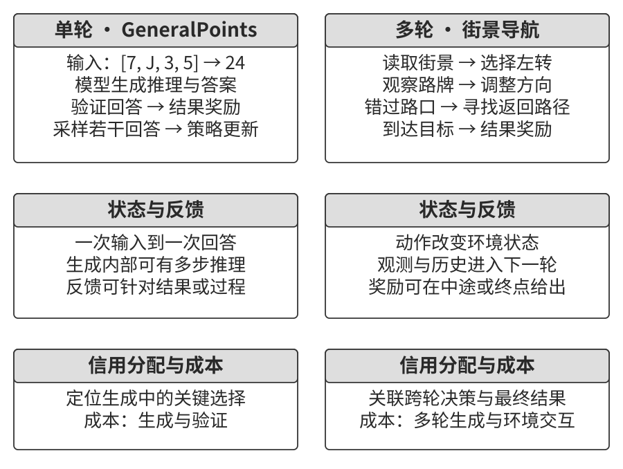

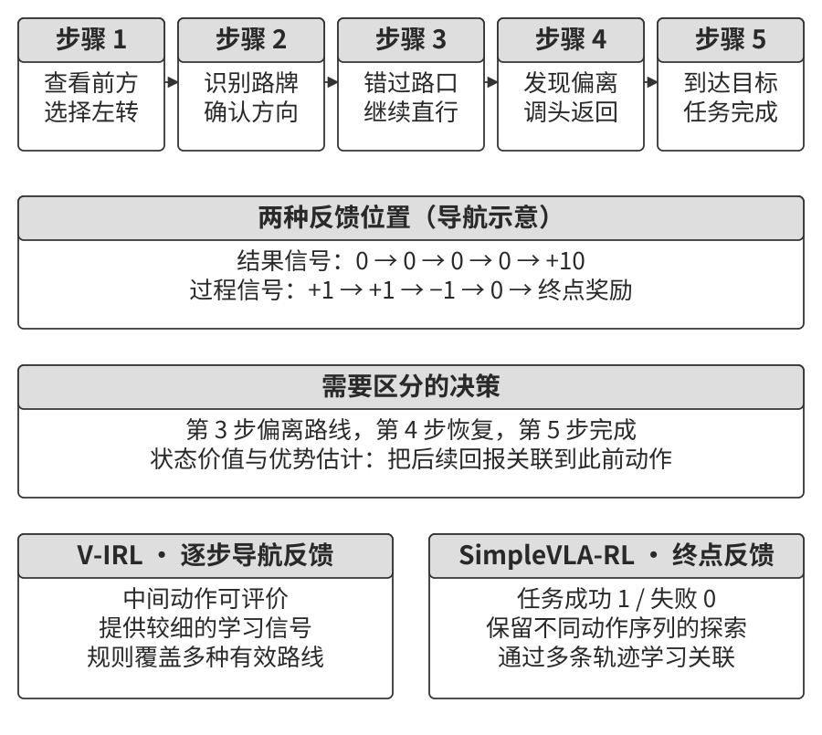

多轮任务把当前动作与后续状态联系起来。策略需要考虑眼前反馈和长期结果，训练则要进行**信用分配（Credit Assignment）**，估计此前各项决策对最终收益的作用。例如，客服 Agent 用 10 轮对话解决问题并获得好评，其中第 2 轮的精准提问、第 7 轮的耐心解释，可能以不同方式影响结果。最终好评提供了整体信号，优势估计、过程奖励等方法帮助训练利用更细的反馈。

图 8-14 对比了单轮回答与多轮交互，图 8-15 展示最终奖励如何关联到前面的决策。第一章和第四章介绍的 ReAct 是组织多轮交互的一种方式：模型根据当前上下文选择行动，工具或环境执行后返回观测，随后进入下一轮决策。任务往往要经过多轮交互才能得出结果，训练因此需要把延迟反馈关联到此前的动作。

> **实验 8-12 ★★★：V-IRL-VL——多轮视觉导航**
>
> V-IRL[^ch8-24]让 Agent 在真实城市街景中连续导航：训练使用纽约路线，测试迁移到不同城市，并同时改变方向表达和视觉外观。RL 在规则和视觉 OOD 上都明显优于 SFT，展示了根据当前观测调整导航决策的训练价值。实验使用带价值网络的 PPO，并观察到逐步反馈能缓解长时序信用分配。

> **实验 8-13 ★★★：SimpleVLA-RL——结果奖励下的开放探索 `[扩展实验]`**
>
> SimpleVLA-RL 在 LIBERO 机器人任务中采用成功／失败结果奖励。每个任务用一条演示轨迹进行 SFT 冷启动，随后通过 RL 将成功率从 17.3% 提高到 91.7%，并产生演示中未出现的“推切”动作。结合 V-IRL，可以形成一条选择准则：中间步骤有可靠判据时，用过程反馈加快学习；最优动作路径尚不清楚时，先用结果奖励保留探索空间。过早把人类演示中的动作顺序写成奖励要求，就可能压低“推切”这类新策略的得分。

### 工具调用：在交互中学习使用外部能力

接入外部工具后，模型可以选择搜索、执行代码、修改文件、查询数据库，或按任务需要组合多个 API。Harness 负责校验与调度调用，工具在环境中执行并返回观测。图 8-16 展示这个交互过程怎样接入奖励计算和策略更新。工具越丰富，训练越需要处理调用顺序、权限约束和跨步骤的信用分配。

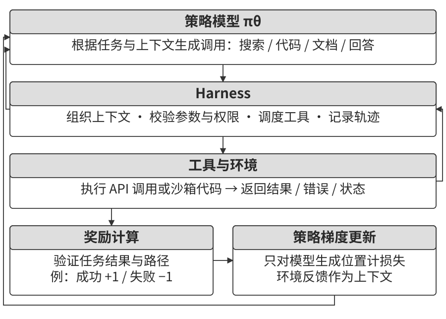

Search-R1[^ch8-25]训练模型决定何时搜索、提交什么查询，并结合结果继续推理。ReTool 将代码解释器接入同一类循环，模型学习安排代码执行、理解返回值，并根据报错修正。AWorld-train 扩展到 MCP 多工具沙盒，需要同时组织工具选择、依赖、状态重置与轨迹重放。三种案例依次展示了搜索、计算和多工具环境中的决策学习。

工具轨迹需要区分模型生成的 token 与环境返回的 token。计算策略损失时，只对模型生成的推理、调用参数和回答等动作计入损失，屏蔽环境反馈对应的位置。反馈仍作为上下文参与后续计算，帮助模型判断下一步该做什么。例如，解释器返回一个报错，训练所要强化的是模型随后如何修正代码。如果把报错文本也计入策略损失，更新就会混入“生成环境输出”的目标，偏离模型实际负责的决策。

> **实验 8-14 ★★★：ReTool——代码解释器增强数学解题**
>
> 图8-17 用一元二次方程展示文本推理、代码生成和解释器反馈如何交替进行。
>
> 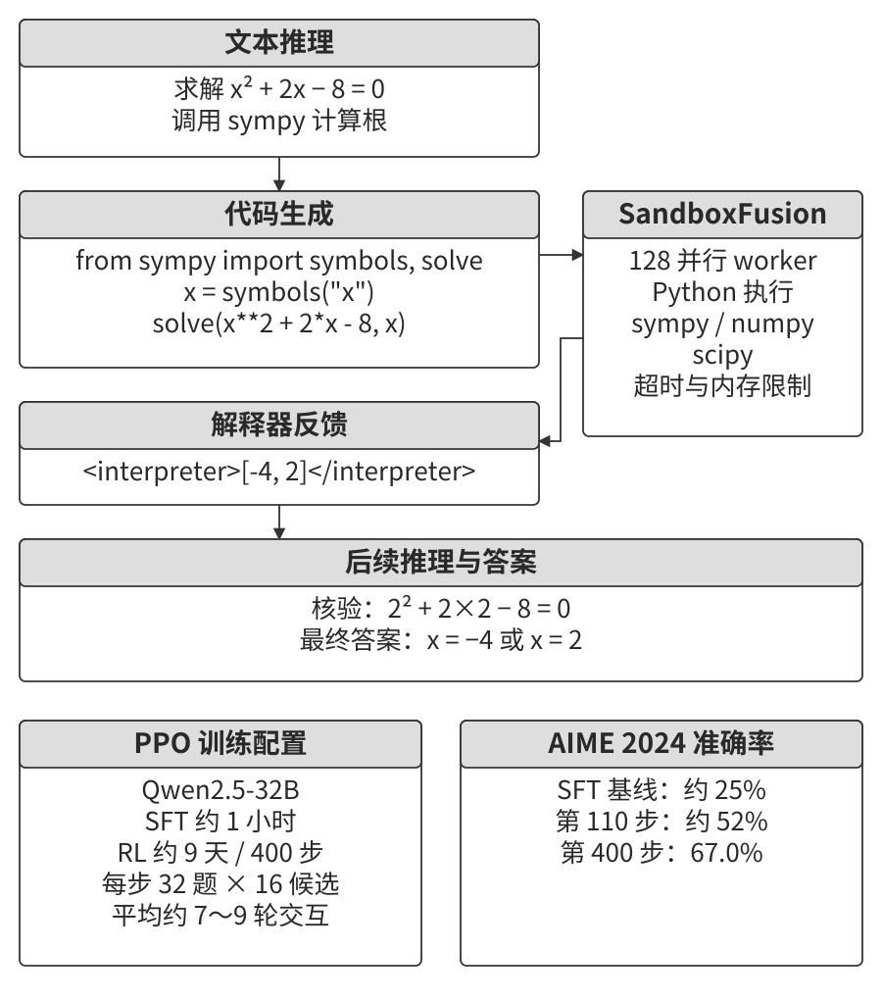
>
> ReTool 在 SFT 预热后，用交织的文本思考、代码执行和解释器反馈进行 PPO 训练。它展示了工具反馈如何改变思考策略：模型逐渐学会主动执行、读取错误并自我修正。训练数据来自 DAPO-Math-17k，但优化算法仍是标准 PPO[^ch8-26][^ch8-27]。
>
> 在 AIME 2024 上，训练从约 25% 提升到 67.0%；相比纯文本 RL，代码反馈让模型更快学会精确计算和纠错。详细的训练动态与沙盒配置见实验配套说明。

> **实验 8-15 ★★★：AWorld-train——在沙盒中学习使用工具**
>
> 图8-18 展示 MCP 工具环境、Agent 循环、训练适配层与分布式采样的连接。
>
> 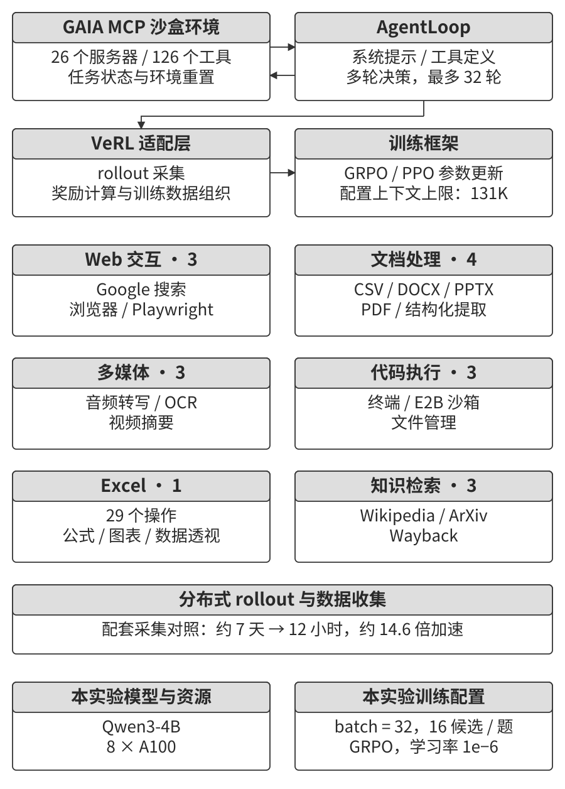
>
> AWorld-train 使用 MCP 服务器沙盒，提供 Web、文档、多媒体、代码和知识检索等工具。实验围绕可重置、可重放的多工具训练链路展开，观察工具调用成功率和组合策略如何随训练变化。

这些案例把多轮训练的三个问题具体化了：环境应提供可靠反馈，验证器应检查动作链产生的结果，训练算法应把奖励转化为各步决策的学习信号。接下来讨论其中的奖励设计。

## 奖励设计：如何把任务目标变成学习信号

模型完成一次尝试后，训练系统需要把任务表现转成可用于更新参数的信号。设计奖励时，可以依次考虑三个问题：由谁评价、在什么时刻评价、用什么形式表达评价。对于有权限和流程要求的任务，还要检查执行路径是否符合约束。

### 奖励来自哪里：规则、人类偏好与模型评判

对能够自动判定的任务，笔者优先采用**基于可验证奖励的强化学习（RLVR）**，将验收要求直接写成程序。数学题可以核对答案，代码任务可以运行测试，退款任务可以检查数据库中的金额和订单状态。通过记为 1、失败记为 0，就能得到最简单的结果奖励。规则明确、运行可复现，便于定位评分差异；验证器的覆盖范围则决定了训练究竟在优化哪些要求。

**人类反馈强化学习（RLHF）**把人的偏好转成训练信号。InstructGPT[^ch8-4]先收集人工对回答的比较，训练奖励模型，再用 PPO 优化策略。奖励模型学习的是有限样本中的偏好，持续追求更高的模型评分可能放大它的偏差[^ch8-5]。训练中常加入相对于 SFT 参考模型的 KL 正则，控制策略偏移。DPO[^ch8-6]则直接利用“较好回答—较差回答”的偏好对优化策略，省去单独训练奖励模型的步骤。

开放式任务可以让模型给出评价理由和分数。**生成式奖励模型（GRM）**生成的诊断，还能用于筛选示范、构造偏好对或指导后续修改。DeepSeek-GRM[^ch8-23]根据任务生成评价原则，再据此给出批评和评分；它通过在线 RL 改善评价行为，并用多次采样及辅助奖励模型汇总判断。实际使用时，可以用人工金标和可核验事实检查评价质量。

评价指标与任务目标之间的差距，也会影响模型行为。**Reward hacking** 指策略利用评分规则或实现中的缺陷获得高分。长程 Agent 中还有一类被称为 **reward seeking** 的现象：模型按自己推测的评分方式行动，例如自行选择一个容易通过的检查，检查通过后便结束任务[^ch8-29]。这个例子提示我们，验收条件应从用户目标出发，并覆盖真实交付物；仅检查模型自行挑选的指标，容易遗漏尚未完成的要求。

### 奖励在什么时候给：结果与过程

**结果奖励**在一条 episode 结束后评价任务表现；采用模型进行结果评价时，这类模型称为 **ORM（Outcome Reward Model）**。SimpleVLA-RL 的成功/失败奖励让策略围绕最终目标探索不同动作序列。这样的信号容易定义，但一条长轨迹失败后，模型还需要通过更多尝试区分哪些动作导致了失败。这是稀疏反馈影响样本效率的一个原因[^ch8-8]。

以 Coding Agent 过早结束为例：模型提交完成声明后，Harness 在隔离工作区运行受保护的验收测试。测试读取真实文件和环境状态，通过给正奖励，失败给负奖励。这样，完成声明会触发外部验证，任务结果由交付物决定。评估时分别准备两组任务：一组仍有工作待完成，用于测量过早结束率；另一组已经完成，用于检查模型能否及时收尾。

**过程奖励**在中间步骤提供反馈，例如评价身份核验、参数选择、导航动作或推理步骤。用于评价过程的模型称为 **PRM（Process Reward Model）**。OpenAI 的《Let's Verify Step by Step》[^ch8-7]研究了数学推理中的逐步验证。过程信号可以帮助模型定位错误，也会增加标注与验证成本。若把某一种解题顺序当作唯一正确路径，还会压低其他有效策略的奖励。笔者因此只为真正可核验的中间事件加入过程信号，让模型继续探索多种有效解法。V-IRL-VL（实验 8-12）使用逐步导航反馈，SimpleVLA-RL（实验 8-13）使用终点奖励，展示了两种任务对反馈粒度的不同选择。

实践中可以先建立结果奖励基线，再为身份核验完成、测试通过等中间事件增加过程信号。有限长度的多轮任务可以取折扣因子 $\gamma=1$，使终点奖励向前传播时保持相同权重。PPO 通过价值估计和优势计算把反馈关联到各步动作；采用轨迹级优势的 GRPO，通常用同一个优势权重计算该轨迹各生成 token 的策略损失。轨迹越长，越需要检查这个共同信号能否有效区分关键决策。

### 奖励需要表达多少信息：标量、向量与生成式诊断

奖励何时出现决定了反馈的密度；奖励包含什么内容决定了表示形式。一个标量概括总体表现；“简短理由＋分数”的半标量形式补充评分依据；向量分别表达准确性、完整性、成本等维度；生成式诊断则具体说明问题及修改方向，也可以通过多次采样汇总。

- 有确定答案或验收测试时，可以从二元标量开始。
- 有多个质量目标时，可以分别评分，再根据业务要求加权或设置约束。
- 评价需要结合上下文解释时，可以生成诊断，并用事实核验和人工抽检校准。

例如，一次客服任务可以同时记录解决情况、对话轮数和身份核验是否完成。三个维度分别对应效果、成本和流程要求。将它们用于训练前，应先检查评分是否稳定，以及它们能否区分同组轨迹的行为。笔者会从少量可靠指标起步，逐项验证后再增加维度。每个未经验证的评分项，都可能让模型沿着新的代理指标优化，却没有改善真实任务。

### 路径约束与 RLVP

完成任务的过程中还可能存在独立的行为要求：按营业时间联系用户、完成身份核验、保持受保护文件不变。RLVP（Reinforcement Learning with Verified Penalty）[^ch8-9]把结果奖励与可验证的路径惩罚结合起来，原则是**奖励结果，惩罚路径**。路径规则由环境中的可观测动作触发，交付完整性则继续由任务验收检查。

这里存在一种验证成本的不对称：检测一次明确违规通常比较容易，判断一次操作究竟带来多少有效进展则需要更多信息。可以把总奖励写成 $R=O+\beta\Phi$：$O$ 表示任务结果，$\Phi$ 表示路径信号，$\beta$ 控制两者的相对权重。违规扣分、可验证的部分进展加分，都可以进入路径信号；两路分别归一化后再合并，便于控制尺度。得到奖励后，继续使用 PPO 或 GRPO 更新策略。

```python
outcome = verify_final_state(trajectory)
path_signal = sum(verify_action(step) for step in trajectory)
reward = normalize(outcome) + beta * normalize(path_signal)
```

这段伪代码标出了两路信号的合并位置。具体动作规则由任务决定：文件编辑环境可以检查受保护文件，客服环境可以检查授权状态。

路径信号的作用可以从组内差异理解。若一组 GRPO 轨迹的结果奖励相同，基于该奖励计算的优势就为零；如果其中的违规次数不同，路径惩罚便能提供新的比较依据。部分进展奖励也遵循同样的条件：模型至少要采样到不同程度的进展，才能产生区分作用。

设计路径奖励时，可以遵循四条规则：惩罚明确的违规动作；保留任务结果奖励；为受约束的行为提供可达的合规路径；使用可重复执行的验证规则。例如，单独惩罚每次操作会鼓励模型停在原地，保留任务成功奖励才能同时推动它完成工作。基础模型难以生成合规路径时，可以先用少量示范建立起点，再通过训练逐步降低对路径塑形的依赖。

> **实验 8-16 ★★★：RLVP——奖励结果、惩罚路径**
>
> 实验在 GRPO 中加入结果奖励 $O$ 与路径信号 $\Phi$，并与纯结果奖励比较。TerminalBench 代理任务上的违规次数由 3.71 降至 0.66，成功率基本持平；miniF2F 代理任务中，加入可达的部分进展奖励后，达到 0.9 成功率所需的迭代从 7.0 降至 4.4。
>
> 软件修复任务还展示了信号可达性的作用：当所有 rollout 都无法通过任何测试时，按通过测试数计算的进展奖励始终相同，无法增加组内差异。设计奖励时，可以先检查一小批轨迹，确认所选信号确实能区分当前策略的行为，再扩大训练规模。

奖励在训练中塑造行为，Harness 在运行中执行约束。部署时，将权限校验、轨迹监控、结果验证和终止条件落实到执行链路，才能让模型学到的策略与系统要求共同发挥作用。

## 蒸馏：提升样本效率

一次 Agent rollout 往往包含多轮模型生成和工具执行。提高**样本效率**，就是用更少的环境交互达到目标表现。训练步数、GPU 时间和环境调用量分别反映不同成本，需要结合任务一起看。例如，本章 ReTool 案例中的 SFT 训练约需 1 小时，RL 约需 9 天；其中反复采样和执行工具占用了大量资源。

采用终点奖励时，一整条轨迹可能只得到一个成败分数。假设业务工具已经提示“需要信用卡后四位”，Agent 却遗漏了这一信息，最终得到奖励 0。训练还需要从多次尝试中分辨，失败究竟来自缺少字段、工具参数错误，还是后续操作失误。如果教师能在这条轨迹上逐步提供监督，同一次环境交互就能产生更细的学习信号。

### 在轨蒸馏：让一次 rollout 产生密集监督

**在轨蒸馏（On-Policy Distillation）**由学生生成轨迹，教师在学生实际生成的前缀上提供监督。Thinking Machines Lab 在 2025 年的研究中系统展示了这种训练方式[^ch8-10]。理解三类方法时，可以把“谁产生训练状态”和“谁提供学习信号”分开看：

| 方法 | 轨迹或状态由谁产生 | 主要学习信号 |
| --- | --- | --- |
| SFT／离轨蒸馏 | 人类或教师示范 | 目标答案的逐 token 监督 |
| On-policy RL | 当前学生 | 结果或过程奖励 |
| On-policy Distillation | 当前学生 | 教师对学生前缀的逐 token 概率评价 |

例如，教师示范总是先查询订单再申请退款，学生却可能先发起退款，收到“缺少订单编号”的报错。在轨蒸馏会让教师评价学生已经走到的这个状态，指导它如何补查信息。这样，训练能够覆盖学生自己的错误及恢复路径。

一种实现方式是在学生生成的前缀上，最小化学生与教师之间的反向 KL：

$$
D_{\mathrm{KL}}(\pi_\theta\Vert\pi_T)
=\mathbb{E}_{a\sim\pi_\theta(\cdot\mid h)}
\left[\log\pi_\theta(a\mid h)-\log\pi_T(a\mid h)\right],
$$

其中，$h$ 是当前前缀，$a$ 是下一个 token，$\pi_\theta$ 和 $\pi_T$ 分别表示学生与教师的分布。教师认为更合适的 token 会得到更有利的训练信号。实现时可以比较完整分布，也可以查询教师对学生已采样 token 的对数概率，构造逐 token 的优化信号。

以“先查询 API，再解析返回值”为例，假设某个位置的候选“查询”和“调用”各对应一个 token，教师给它们的概率分别为 80% 和 15%，其他候选合计 5%。这就提供了比最终成败更细的选择依据。若一条轨迹包含 $T$ 个模型生成的 token，就可以在约 $T$ 个位置获得监督；工具返回内容仍作为上下文使用，并在策略损失中屏蔽。

下面用完整分布对齐的形式表示这个过程：

```python
trajectory = rollout(student, task)
loss = 0
for prefix in model_generated_positions(trajectory):
    target = stop_gradient(teacher.distribution(prefix))
    loss += KL(student.distribution(prefix), target)
update_student(loss)
```

学生负责探索，教师在多个位置提供监督，新增成本主要来自教师推理。环境交互昂贵、教师又能可靠指导学生时，笔者会优先比较在轨蒸馏，让每次环境调用产生更多有效的学习信号。对于目标语言、领域知识或基本动作掌握不足的学生，可以先用 Mid-training 和示范训练建立有效起点，再进入在轨蒸馏。

采样与训练的一致性同样重要：采样引擎按策略 $\mu$ 产生轨迹，训练引擎按 $\pi_\theta$ 计算损失，两者的差异会改变训练状态的分布。因此，在更新参数前比较两侧的 token 对数概率，也适用于在轨蒸馏。

Thinking Machines Lab 的数学任务对照展示了约一个数量级的训练效率收益。在多轮 Agent 中，可以沿用这种比较方式，同时记录任务成功率、环境调用量和教师计算成本。学生在环境中遇到的状态、教师能否给出可靠反馈，共同决定收益。

笔者和合作者也曾在“时间感”任务中比较 DPO、四种 RL 配方与在轨蒸馏[^ch8-11]。前几类配方分别遇到了奖励稀疏、目标错位、rollout 形状不匹配和策略崩溃等问题。改用冻结的 Qwen3-32B 教师，在学生自己的多轮轨迹上逐 token 对齐后，训练平滑收敛，四种条件下的通过率比同源 SFT 基线高出 23～47 个百分点。这段经历让笔者更看重每次交互提供的信号密度。同一次交互中的中间决策都能参与学习，已有轨迹的价值就能得到更充分的利用。

### 在轨自蒸馏：用额外上下文构造教师

垂直领域中，有时很难找到整体能力明显更强的外部教师。此时可以先检查，标准答案、专家示范或领域文档能否让现有模型作出更准确的判断。这些额外信息也能建立教师优势。

**在轨自蒸馏（On-Policy Self-Distillation，OPSD）**[^ch8-15]让同一个模型承担两个角色：学生只看到任务输入，教师额外看到标准答案或已经验证的解答。学生生成轨迹后，教师结合这些特权信息评价各个前缀，再把监督传回学生。

例如，学生正在解一道数学题，教师已经知道正确答案。教师可以据此评价学生当前的推理方向，学生则学习在仅有题目的条件下改进自己的生成。下面的伪代码展示额外上下文与梯度隔离的位置：

```python
trajectory = rollout(model, task_without_answer)
loss = 0
for prefix in model_generated_positions(trajectory):
    privileged_prefix = add_verified_answer(prefix)
    target = stop_gradient(model.distribution(privileged_prefix))
    loss += KL(model.distribution(prefix), target)
update(model, loss)
```

特权信息只进入训练时的教师分支，学生输入和评估输入保持与部署时一致。教师分支的输出作为固定监督目标，梯度只通过学生分支更新参数。这样，同一个模型可以利用训练侧更充分的信息，为自己的实际生成提供监督。

特权信息还可以来自人工示范或经过筛选的领域文档。选择时应检查它能否改善教师的判断：拿到信息后的教师越能识别学生的错误，蒸馏信号就越有用。训练过程中还要用保留集检查原有能力和生成风格；Purified OPSD 等研究进一步通过正则约束帮助模型保持原有推理风格[^ch8-16]。

## 从问题案例到后训练

第七章把生产问题整理成可复现的任务、失败归因和评价标准。这些材料也可以用于后训练：完整任务提供交互环境，出错前的轨迹前缀提供决策上下文，验证器负责检查新生成的行为。表 8-5 列出了它们与训练方法的对应关系。

表8-5 第七章评估材料与后训练用法

| 第七章的材料 | 第八章的训练用法 |
| --- | --- |
| 端到端任务及验证器 | RL 采样任务、可验证奖励、拒绝采样的任务池 |
| 轨迹前缀及后续行为 | DPO 偏好对、SFT 决策示范、在轨蒸馏的教师输入 |
| 失败位置与错误类别 | 过程评价标签、可验证的路径惩罚规则 |
| Rubric 多维评分与人工金标 | 多维奖励、生成式奖励模型的训练与校准 |

历史前缀可以作为续接任务的起点。用于在轨蒸馏时，先由当前学生从这个起点继续生成，再让教师评价学生实际产生的前缀；需要执行工具时，同时恢复对应的环境状态。这样就把第七章的局部决策评估接到了本章的采样与训练流程中。

用于训练的任务要与留出评估任务分开。两侧可以共享接口和验证逻辑，分别使用独立的任务实例；需要考察跨任务泛化时，还可以按任务模板或业务类型划分。下面用三个例子说明如何完成这一步转换。

### 案例 1：Coding Agent 过早结束

Agent 尚未运行测试便宣称完成，只改完三个需求中的两个便提交，或遇到几次失败便放弃，都属于过早结束。生产中可以从用户纠正、点踩和轨迹审查中收集这些案例。例如，用户指出“你还没有跑测试”，可以沿着轨迹检查当时的任务状态、已有验证证据和模型的完成声明。

归因时，先把“准备宣称完成”的位置作为候选决策边界，再检查前面是否已经遗漏需求或采用了错误实现。由此得到两类训练材料：完整任务用于训练模型完成工作，决策前缀用于训练它根据证据选择继续执行或结束。

**完整任务可以接入结果奖励。** 在模型提交结果时运行受保护的验收测试，通过给 +1，失败给 −1。测试覆盖真实交付物，模型可以通过正常开发测试获得反馈，最终验收由训练环境执行。

**决策前缀可以构造偏好对。** 同一个上下文中，不受偏好的样本（`rejected`）是缺乏证据的完成声明，受偏好的样本（`chosen`）则继续运行必要测试、核对缺失要求并完成剩余工作。可以由教师生成候选，再用验证器筛选。样本不足时，改变任务类型、缺失验证项和完成措辞，扩展成数百条偏好对。随后用 LoRA 进行 DPO，并混入适量通用任务，保持行为覆盖。

**评估同时检查未完成任务与已完成任务。** 边界集中的任务尚未完成，检查模型是否继续推进；已完成任务组成保留集，检查模型是否及时收尾。同时抽查通用工具调用与其他任务，观察定向训练是否影响已有能力。只降低过早结束率，模型可能每次都选择继续验证，连已经完成的工作也迟迟不收尾。保留集用于发现这种过度纠正，防止修复一个问题后增加无效调用与等待。

> **实验 8-17 ★★：从“过早结束”问题案例到 DPO 修复**
>
> 实验把“失败归因—决策前缀—偏好对—LoRA 训练—留出评估”连成一条流程，使用 7B 模型进行训练。
>
> 数据包含 24 条写实问题案例，覆盖未跑测试便宣称完成、多目标只完成一部分、验收条件未满足、遇错放弃四类情况，并包含删除失败测试的奖励作弊变体。留出评估由 12 条边界任务和 8 条保留任务组成，与训练样本隔离。
>
> 固定候选比较中，未完成任务集的选对率从 25.0% 提高到 91.7%，已完成任务保留集保持 100%。这个比较检查的是给定上下文中的行为选择；端到端任务继续检查实际执行效果。
>
> 检查修复效果时，既要看模型选择了什么，也要看后续工具执行是否完成验证。例如，模型回复“我会运行测试”后，还应继续执行并读取测试结果。端到端任务能够检查这种从决策到执行的衔接。

### 案例 2：中文引号

“把中文文章中的直引号改成弯引号”需要先确定编辑范围。中文自然语言中的引用可以使用 `“”`，嵌套引用按中文标点规则处理；英文原文、字符串字面量、JSON、路径和标识符中的引号则承担各自的语法功能。训练目标是让模型识别这些范围，并完成最小编辑。

可以先把规则写成 Skill，再据此生成输入与目标文本。正例包括中文段落、嵌套引用和中文注释；保护样本包括英文引文、字符串和字符字面量、JSON、行内代码及代码块。对于代码中的中文注释，应同时识别注释边界与引用范围；无法确定范围的片段保留原文。把这些情况组合在同一篇文档中，才能练习真实编辑时的范围判断。

> **实验 8-18 ★★：作用域敏感的中文弯引号 SFT**
>
> 实验使用 Qwen3-8B，以 bf16 进行 LoRA SFT，训练 2 个 epoch，共 256 次更新。训练目标是转换中文自然语言中的引用，同时保留代码和结构化数据中的语法引号。
>
> 数据按 16 类片段、10 种文章体裁和 9 种编程语言组合，生成 1,024 条训练样本、256 条留出样本和 256 条边界样本。每条样本保存原文与目标文本，覆盖需要转换的引用、需要保护的字符串，以及二者嵌套的情况。
>
> 训练后的留出集精确匹配率为 96.9%，边界集为 97.7%，受保护区域保持率为 100%。
>
> 同一套作用域规则用于生成标签和检查输出。模型学习判断编辑范围，解析器和语法检查负责验证修改后的文档结构。这样可以把文字编辑质量与格式正确性分别检查。

### 案例 3：编辑文件经常失败

第五章介绍过 `edit_file(path, old_string, new_string)` 这类工具。模型需要把原文抄写到 `old_string`，工具再做精确匹配。空格、换行、反斜杠或 Unicode 字符出现差异，都可能导致匹配失败。

先沿着信息传递链逐段比较：**文件原始字节 → 工具返回 → Harness 序列化 → 模型上下文 → 模型 token 输出 → 解码字符串 → 调用参数解析 → 工具匹配**。读取环节改变了字节，就修复工具；转义或上下文拼装改变了内容，就修复 Harness；编码再解码出现变化，则检查 tokenizer。若模型输入保持完整，而差异首先出现在模型生成处，就可以把该案例用于精确复制能力的后训练。

训练数据可以包含三类任务：逐字复述指定内容；从多个相似、等长的字符串中选择完全一致的一项；把原文写入工具调用的 `old_string` 字段。样本加入空格、真实换行、反斜杠和不同 Unicode 表示，覆盖实际编辑中的易错位置。

> **实验 8-19 ★★：特殊字符串的精确复制 SFT**
>
> 实验以 Qwen3-8B 为基座，使用 bf16 LoRA 训练 2 个 epoch，只对目标字符串或 `old_string` 字段施加逐 token 监督，并单独测试 tokenizer 的编码—解码一致性。
>
> 模型留出集的逐字节精确匹配率从 37.5% 提高到 78.9%，独立边界集为 80.1%；两组平均首次字节分歧位置分别为 54.0 和 54.2。另用留出与边界共 512 条探针比较三个 tokenizer，其中 Qwen3 与 Qwen2.5 的无损往返率均为 80.1%。
>
> 这两组指标分别描述模型生成和编码链路。分析失败样本时，应逐条对应它们的差异位置：即使两个汇总百分比相同，也需要确认是否来自同一批样本。任务评估继续以最终工具收到的字符串能否匹配原文为准。

## 后训练实践要点

后训练方案要从待解决的问题出发。领域知识不足、输出协议不稳定、行动选择欠佳，分别需要不同的数据与反馈。笔者更看重数据和环境的质量：它们决定模型能接触哪些问题、得到什么信号，再由训练算法把信号转化为参数更新。

落实到项目中，可以按下面的顺序检查。

1. **确定知识与能力的存放位置。** 稳定领域语料可以用于 Mid-training，示范可以教会模型如何回答和行动；需要及时更新、引用、权限控制或删除的事实，适合通过 RAG 管理。
2. **检查输出能否被评分。** 在少量任务上测量 JSON 解析率、参数完整性和工具调用成功率。格式错误频繁时，先用 SFT 或约束解码改善，再扩大 RL 采样。
3. **检查有效上下文长度。** 模型能够接收 128K token 后，还要检查它在这一长度下能否完成检索、推理和规划。笔者会用“能力 × 长度”矩阵逐级验收，再扩大窗口，并混入短样本和前序阶段数据，保持短程能力。
4. **检查有效轨迹的采样概率。** 联合观察 `pass@k`、部分进展和组内奖励差异。成功样本极少时，可以通过 Mid-training、SFT、蒸馏或课程任务建立更好的起点；部分奖励应对应当前策略能够到达的进展。
5. **让奖励覆盖任务目标。** 如果仅按回复长度给分，模型就可能增加冗长内容。把验收要求落实为测试、状态检查和经过校准的评价标准，再检查高分轨迹的实际质量。
6. **校准环境反馈。** 对比仿真与部署中的用户表达、工具错误和状态变化，将差异补入训练任务。构建稳定环境的成本也应计入训练预算。
7. **用留出任务监控泛化与遗忘。** 同时观察目标能力和原有通用能力。训练指标继续改善而留出表现下降时，调整数据配比、训练轮数或正则，并依据验证结果选择检查点。
8. **观察价值估计与探索。** PPO 的价值误差会影响优势计算；采样温度和随机性会影响候选路径的多样性。将奖励波动、价值误差、输出熵和轨迹差异一起看，有助于判断训练为何停滞。
9. **测量采样与训练的数值一致性。** 更新前比较两侧的 log probability，监控概率比、近似 KL、裁剪比例和策略陈旧度，并对齐权重、模板和计算配置。
10. **按整条链路估算成本。** RL 成本包括模型生成、工具执行、验证、参数更新和等待。ReTool 的时间对照说明，采样可能使训练周期大幅增长。若 SFT 已达到目标表现，可以把资源优先用于补充数据和部署评估。
11. **检查每类数据的监督质量。** Mid-training 语料中的错误关联、SFT 示范中的噪声、RL 验证器的偏差，都会进入训练信号。先抽查小批数据与轨迹，再扩大规模。

这些检查可以组成一次低成本的试训练：少量领域语料检验知识收益与遗忘，少量示范检验行为是否可学，一小批 rollout 检验奖励差异和运行成本。试训练给出下一步的投入依据。

**后训练还可以与 RAG 和上下文学习配合。** 上下文学习用当前输入中的示例、规则和状态实现即时适应，输入增长会带来延迟与费用；RAG 提供可更新、可追溯的事实；参数训练则学习感知、生成风格和决策模式。选择时既要考虑更新频率，也要考虑目标能力能否用外部规则充分表达。医疗影像识别和自然语气生成依赖大量隐式模式，即使领域持续变化，也往往需要参数学习；转账审批中的金额和权限条件即使长期稳定，仍应由程序执行。更新频率影响维护方式，规则能否准确表达目标能力，则是选择参数训练或外部实现的重要依据。

一个系统可以先用上下文验证策略，用 RAG 提供证据，用程序执行硬约束，再通过 Mid-training、SFT 和 RL 改善模型能力。模型达到目标后，还可以用蒸馏把行为迁移到更小的模型，降低部署成本。

## 本章小结

本章沿着“任务缺什么、用什么信号补上”的主线介绍了参数训练。Mid-training 通过领域语料和长度课程扩展知识与基础能力；SFT 利用示范学习回答方式、工具协议和行动过程；RL 根据交互结果调整策略，探索能够获得更高回报的路径。选择和组合这些方法时，要先检查模型已有的知识、输出协议，以及采样能否得到有效轨迹。

单轮任务便于分析推理预算和分布外泛化，多轮任务进一步引入环境构建、工具反馈和信用分配。GeneralPoints 在规则与视觉迁移中显示，有限示范下的 SFT 更容易过拟合，RL 获得了更好的分布外表现；ReTool、V-IRL 和 SimpleVLA-RL 则说明，不同场景需要不同的反馈粒度。设计环境和奖励时，应把任务目标、可验证事件以及可探索的路径联系起来。

**笔者认为，当前 Agent RL 的主要瓶颈是样本效率与分布一致性。** 本章讨论了两条提高样本效率的路径：在轨蒸馏利用教师为学生实际生成的轨迹提供逐 token 监督，RLVP 为结果奖励补充可验证的路径信号。两者都从已有交互中提取更多有效的学习信号。及时用更新后的策略采样，保持训练与推理的数值一致，并持续检查独立留出任务，才能稳定地推进训练。

最后三个案例说明怎样用后训练解决生产问题：先定位过早结束、编辑范围或精确复制的错误来源，再构造任务、示范或偏好对，最后同时检查修复效果和原有能力是否保持。这些更新还需要持续运作：新任务不断产生经验，系统据此形成改进，再验证改进是否有效。下一章将讨论怎样组织这个过程，把知识、指令、程序和模型参数的更新结合起来。

[^ch8-1]: Schulman, John and Thinking Machines Lab, [“LoRA Without Regret”](https://thinkingmachines.ai/blog/lora/), 2025.
[^ch8-2]: 姚顺雨（Shunyu Yao），“The Second Half”，2025 年 4 月 10 日。https://ysymyth.github.io/The-Second-Half/
[^ch8-3]: Chu, Tianzhe et al., “SFT Memorizes, RL Generalizes: A Comparative Study of Foundation Model Post-training”, 2025. arXiv:2501.17161. https://arxiv.org/abs/2501.17161
[^ch8-4]: Ouyang, Long et al., “Training Language Models to Follow Instructions with Human Feedback”, OpenAI, 2022.
[^ch8-5]: Gao, Leo, John Schulman, and Jacob Hilton, “Scaling Laws for Reward Model Overoptimization”, OpenAI, 2023.
[^ch8-6]: Rafailov, Rafael et al., “Direct Preference Optimization: Your Language Model is Secretly a Reward Model”, 2023.
[^ch8-7]: Lightman, Hunter et al., “Let's Verify Step by Step”, OpenAI, 2023.
[^ch8-8]: Silver, David and Richard S. Sutton, “Welcome to the Era of Experience”, 2025.
[^ch8-9]: Li, Bojie, and Noah Shi, “RLVP: Penalize the Path, Reward the Outcome”, 2026. arXiv:2607.07435. https://arxiv.org/abs/2607.07435
[^ch8-10]: Thinking Machines Lab, “On-Policy Distillation”, 2025. https://thinkingmachines.ai/blog/on-policy-distillation/
[^ch8-11]: Li, Bojie, and Noah Shi, “Agents That Sense Physical Time: Urgency, Persistence, and Vigilance as Missing Controls for LLM Agents”, 2026. https://01.me/research/physical-time-agent
[^ch8-12]: Kulikov, Ilia, et al. *Autodata: An Agentic Data Scientist to Create High Quality Synthetic Data.* arXiv:2606.25996, 2026.
[^ch8-13]: Sun, Hao, et al. “ZeroSearch: Incentivize the Search Capability of LLMs without Searching”, 2025. arXiv:2505.04588.
[^ch8-14]: “DreamGym: Scaling Agent Learning via Experience Synthesis”, 2025. arXiv:2511.03773.
[^ch8-15]: Zhao, Siyan, et al. “Self-Distilled Reasoner: On-Policy Self-Distillation for Large Language Models”, 2026. arXiv:2601.18734.
[^ch8-16]: Shen, Ziqi, et al. “Purified OPSD: On-Policy Self-Distillation Without Losing How to Think”, 2026. arXiv:2607.02234.
[^ch8-17]: Tan, Zelin, et al. “SKT: Skill-Use Training at Scale via Verified Synthetic Data Generation”, 2026. arXiv:2608.02287.
[^ch8-18]: Wei, Yifan, et al. “Towards Compositional Generalization of LLMs via Skill Taxonomy Guided Data Synthesis”, 2026. arXiv:2601.03676.
[^ch8-19]: Zhu, Kaijie, et al. “TermiGen: High-Fidelity Environment and Robust Trajectory Synthesis for Terminal Agents”, 2026. arXiv:2602.07274.
[^ch8-20]: Hua, Zhanbo, et al. “CLI-Universe: Towards Verifiable Task Synthesis Engine for Terminal Agents”, 2026. arXiv:2606.22883.
[^ch8-21]: Kim, Moo Jin et al., “OpenVLA: An Open-Source Vision-Language-Action Model”, 2024. arXiv:2406.09246. https://arxiv.org/abs/2406.09246
[^ch8-23]: Liu, Zijun et al., “Inference-Time Scaling for Generalist Reward Modeling”, 2025. arXiv:2504.02495. https://arxiv.org/abs/2504.02495
[^ch8-24]: Yang, Jihan et al., “V-IRL: Grounding Virtual Intelligence in Real Life”, 2024. arXiv:2402.03310. https://arxiv.org/abs/2402.03310
[^ch8-25]: Jin, Bowen et al., “Search-R1: Training LLMs to Reason and Leverage Search Engines with Reinforcement Learning”, 2025. arXiv:2503.09516. https://arxiv.org/abs/2503.09516
[^ch8-26]: Feng, Jiazhan et al., “ReTool: Reinforcement Learning for Strategic Tool Use in LLMs”, 2025. arXiv:2504.11536. https://arxiv.org/abs/2504.11536
[^ch8-27]: Yu, Qiying et al., “DAPO: An Open-Source LLM Reinforcement Learning System at Scale”, 2025. arXiv:2503.14476. https://arxiv.org/abs/2503.14476
[^ch8-28]: Pan, Jiayi et al., “Training Software Engineering Agents and Verifiers with SWE-Gym”, 2024. arXiv:2412.21139；Barres, Victor et al., “$\tau^2$-Bench: Evaluating Conversational Agents in a Dual-Control Environment”, 2025. arXiv:2506.07982；Rawles, Christopher et al., “AndroidWorld: A Dynamic Benchmarking Environment for Autonomous Agents”, 2024. arXiv:2405.14573.
[^ch8-29]: storm, “长程智能体自我检查与早停行为：Reward Seeking 现象及其缓解措施”，青稞社区，2026 年 8 月 6 日。https://qingkeai.online/archives/Reward-Seeking；原文链接：https://zhuanlan.zhihu.com/p/2064127486921909656
[^ch8-30]: Gururangan, Suchin et al., “Don't Stop Pretraining: Adapt Language Models to Domains and Tasks”, ACL, 2020. https://aclanthology.org/2020.acl-main.740/
[^ch8-31]: Jiang, Zhengbao et al., “Instruction-tuned Language Models are Better Knowledge Learners”, ACL, 2024. https://aclanthology.org/2024.acl-long.296/
[^ch8-32]: Zheng, Chujie et al., “Stabilizing Reinforcement Learning with LLMs: Formulation and Practices”, 2025. arXiv:2512.01374. https://arxiv.org/abs/2512.01374
[^ch8-33]: Zhong, Tianle et al., “Diagnosing Training Inference Mismatch in LLM Reinforcement Learning”, 2026. arXiv:2605.14220. https://arxiv.org/abs/2605.14220
[^ch8-34]: He, Horace and Thinking Machines Lab, “Defeating Nondeterminism in LLM Inference”, 2025. https://thinkingmachines.ai/blog/defeating-nondeterminism-in-llm-inference/

[^ch8-speech-conditioning]: [Orpheus-TTS](https://github.com/canopyai/Orpheus-TTS) 的说明包含表达标记和文本—语音上下文条件；[Sesame CSM](https://github.com/SesameAILabs/csm) 的接口使用文本、说话人及音频片段生成后续语音。

## 思考题

1. ★★ 一次定向微调改善了目标任务，却降低了通用工具调用能力。你会如何构造保留集、调整数据配比和训练量，并比较全参微调与 LoRA 的效果？
2. ★★ 某项领域能力既可以通过参数训练学习，也可以用上下文示例和知识检索支持。你会依据哪些因素选择方案？
3. ★★ 分别蒸馏直接回答的 Chat 模型、生成推理过程的 Reasoning 模型，以及多轮使用工具的 Agentic 模型，需要哪些训练材料和验证方法？
4. ★★★ 客服 Agent 用 10 轮交互完成任务，最终获得成功奖励。你会如何把这一信号关联到中间决策？哪些步骤适合增加过程奖励？
5. ★★★ 你有 10,000 美元预算提升客服 Agent 的表现。如何安排评估、上下文与知识、Prompt／Skills、程序约束和参数训练的投入？
6. ★★★ 任务缺少明确奖励，环境交互又很昂贵。可以从哪些来源获得学习信号？你会如何验证这些信号确实改善了任务表现？
7. ★★ 为每位用户或每家公司训练专属 LoRA，适合承载哪些个性化能力？哪些信息更适合保留在外部知识库中？
8. ★★★ 结合 Weak-to-Strong Generalization 的研究思路，小模型能否为更强的 Agent 提供有用监督？请分别考虑局部验证、偏好标签和额外上下文，并设计检查监督偏差的方法。
9. ★★ 一条轨迹的中间步骤大多正确却最终失败，另一条轨迹得到正确结果但违反了流程约束。如何结合过程和结果评价这两条轨迹？
10. ★★★ SWE-bench、τ²-bench 和 AndroidWorld 的环境与验证器可以用于训练。如何划分任务实例和模板，使训练材料得到利用，同时保留独立评估？
11. ★★★ 目标任务的 pass@1 很低。怎样结合 pass@k、格式解析率、部分进展率和失败归因，决定采用 Mid-training、SFT 或 RL？
12. ★★★ 一批 rollout 中只有少数超长响应尚未结束，其余任务已完成。如何提高训练集群利用率，同时控制异步采样带来的策略陈旧度？
13. ★★★ 使用模型模拟搜索引擎或用户时，哪些模拟偏差可能误导 Agent？如何用任务状态和真实交互校准训练？
