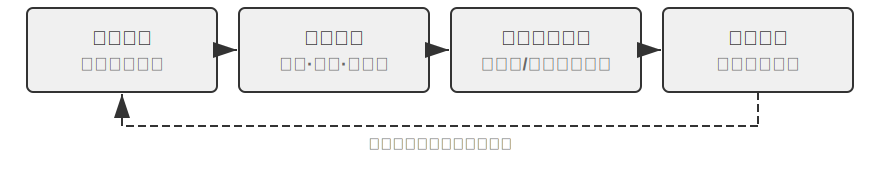
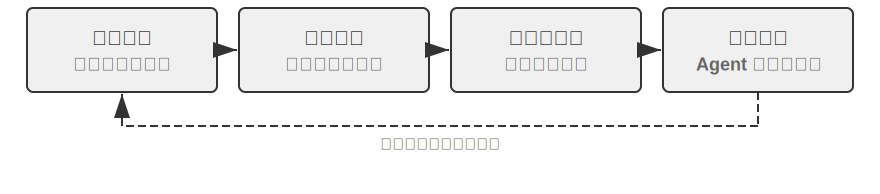
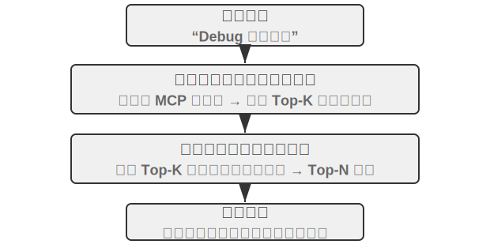
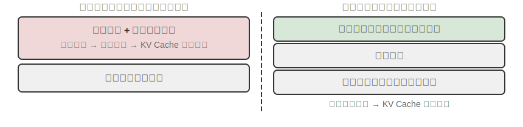
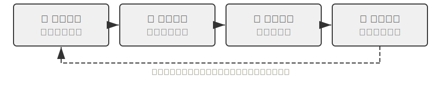

# Agent Self-Evolution

முந்தைய அத்தியாயங்கள் Agent-இன் திறன் அமைப்பை வெவ்வேறு பரிமாணங்களில் இருந்து உருவாக்கின. Chapter 2-இல் context engineering தகவல் மேலாண்மைக்கான அடித்தளத்தை அமைத்தது (Skills பொறிமுறை மூலம் on-demand loading உட்பட); Chapter 3-இல் அறிவுத் தளங்கள் மற்றும் பயனர் நினைவகம் cross-session அறிவு நிலைத்தன்மையை அடைந்தது; Chapter 5 Coding Agent கோப்பு முறைமை மூலம் அனுபவத்தைக் குவிக்க முடியும் என்பதை நிரூபித்தது; Chapter 7-இல் reinforcement learning post-training உத்திகளை model அளவுருக்களில் உறுதிப்படுத்தியது. இந்த நுட்பங்கள் ஒவ்வொன்றும் அதன் சொந்த கவனத்தைக் கொண்டுள்ளன, ஆனால் அவை அனைத்தும் ஒரே கேள்வியைச் சுட்டிக்காட்டுகின்றன: **ஒரு Agent எவ்வாறு தொடர்ந்து மேம்பட முடியும்?**

மிகவும் மேம்பட்ட models கூட, ஒரு குறிப்பிட்ட நிறுவனத்தின் திரும்பப்பெறும் செயல்முறை, ஒரு குறிப்பிட்ட கேரியரின் விற்பனை ஸ்கிரிப்ட் அல்லது ஒரு அரிய API-இன் calling convention ஆகியவற்றை எதிர்கொள்ளும்போது, முதல் நாளில் புதிதாக சேர்ந்தவரைப் போலவே அறியாமையில் உள்ளன. Model எடைகளை மாற்றுவதற்கு மிகப்பெரிய அளவிலான தரவு மற்றும் கணக்கீடு தேவைப்படுகிறது, புதுப்பிப்பு சுழற்சிகள் வாரங்களில் அளவிடப்படுகின்றன; இதற்கிடையில், நிஜ உலகில், புதிய APIs செயல்படுகின்றன, பழைய சேவைகள் நிறுத்தப்படுகின்றன, மேலும் பயனர் தேவைகள் தொடர்ந்து மாறிக்கொண்டே இருக்கின்றன. ஒரு Agent-க்கு இலகுவான, உடனடியான பரிணாம வழிமுறை தேவை—model அளவுருக்களை மாற்றாமல் அதன் சொந்த திறன் எல்லைகளை தொடர்ந்து விரிவுபடுத்தக்கூடிய ஒன்று.

இந்த அத்தியாயம் அந்த வழிமுறையை ஆராய்கிறது: **Agent Self-Evolution**. Self-evolution என்பது வெளிப்படுத்தப்பட்ட கற்றல் ஆகும், இது இரண்டு பரிமாணங்களை உள்ளடக்கியது—அனுபவத்திலிருந்து அறிவைப் பிரித்தெடுத்தல், மற்றும் புதிய கருவிகளை முனைப்புடன் கண்டுபிடித்து உருவாக்குதல். மையக் கருத்து, அறிவு மற்றும் செயல்முறைகளை model அளவுருக்கள் மற்றும் நிலையற்ற context-இலிருந்து பிரித்து, அவற்றை நிலையான, மீட்டெடுக்கக்கூடிய மற்றும் மீண்டும் பயன்படுத்தக்கூடிய வெளிப்புற வளங்களாக—tool libraries மற்றும் knowledge bases—மாற்றுவதாகும். இது post-training-க்கு மாற்றாக அல்ல, மாறாக நிரப்பியாகும்: post-training "model-ஐ எவ்வாறு புத்திசாலியாக்குவது" என்பதைக் கையாள்கிறது, அதேசமயம் self-evolution "Agent-ஐ எவ்வாறு மேலும் திறமையாக்குவது" என்பதைக் கையாள்கிறது.

## Agents ஏன் தானாக கற்றுக்கொள்வதில்லை

முந்தைய பகுதி நிஜ உலகத் தேவைகளைப் பற்றி விவாதித்தது. ஆனால் இன்னும் அடிப்படையான ஒரு கேள்வி உள்ளது: **Context window எல்லையில்லாமல் நீளமாக இருந்தால், ஒரு Agent அனுபவித்த அனைத்து உரையாடல்கள் மற்றும் tool call முடிவுகளையும் அதில் நிரப்பினால், அது தானாகவே எல்லாவற்றையும் கற்றுக்கொள்ளுமா?**

பதில் இல்லை என்பதே, மேலும் காரணம் Chapter 2-இல் விவாதிக்கப்பட்ட attention mechanism-இல் உள்ளது. இது இந்த அத்தியாயத்தின் கோட்பாட்டு தொடக்கப் புள்ளியாகும், மேலும் பல அத்தியாயங்களுக்குப் பிறகு, ஒரு சுருக்கமான மறுபார்வை மதிப்புள்ளது.

அத்தியாயம் 2 மீண்டும் மீண்டும் வலியுறுத்தியது: **In-context learning-இன் உள் பொறிமுறையானது, reasoning-ஐ விட retrieval-ஐ ஒத்ததாகும்.** Attention, "தேடுவதில்" சிறந்து விளங்குகிறது—"37-வது கூண்டில் எந்த பூனை உள்ளது?"—நேரடியான தாக்குதல்; ஆனால் ஒரு single forward pass-இல் "தூண்டல் புள்ளியியல்" செய்வதில் சிறந்ததல்ல—"100 கூண்டுகளில் எத்தனை கருப்பு பூனைகள் உள்ளன?" பிந்தையதற்கு அனைத்து பதிவுகளையும் கடந்து, எண்ணும் நிலையை பராமரிக்க வேண்டும், இது அடிப்படையில் சிந்தனை, retrieval அல்ல. வேறு வார்த்தைகளில் சொன்னால், நீங்கள் மூல அனுபவத்தை context-இல் கொட்டினால், model அதை "நினைவில் வைத்திருக்க" முடியும், ஆனால் அது தானாகவே அதை மீண்டும் பயன்படுத்தக்கூடிய வடிவங்களாக "வடிகட்டாது". Context உண்மையிலேயே எல்லையற்றதாக இருந்தாலும், இந்த இடைவெளி இன்னும் இருக்கும்: தகவல் உள்ளது, ஆனால் "குறிப்பிட்ட பதிவுகளில்" இருந்து "பொதுவான வடிவங்களுக்கு" compression படி யாரும் model-க்காக செய்வதில்லை. மேலும், அத்தியாயம் 2-இன் "context decay" வெளிப்படுத்தியபடி, context நீளமாகவும், அதில் அதிக சத்தம் இருந்தாலும், attention மேலும் நீர்த்துப் போய், முக்கிய தகவலை மீட்டெடுப்பது கடினமாகிறது—எல்லையற்ற context தானியங்கி கற்றலைக் கொண்டுவராது; அது retrieval தரத்தை சீராகக் குறைக்கும். Karpathy-யின் நுண்ணறிவை தலைகீழாகப் படிக்கலாம்: model-இன் "மோசமான நினைவாற்றல்" ஒரு குறைபாடு அல்ல, ஒரு அம்சம்; இது நம்மை செயல்பாட்டுடன் மற்றும் வெளிப்படையாக knowledge distillation செய்ய கட்டாயப்படுத்துகிறது, நீண்ட வரலாறுகளில் இருந்து model தானாகவே வடிவங்களைக் கண்டுபிடிக்கும் என்று எதிர்பார்ப்பதற்கு பதிலாக. சுருக்கமாக: **கற்றல் தானாக நடக்காது; அது வெளிப்படையாக வடிவமைக்கப்பட வேண்டும்**—இந்த அத்தியாயத்தின் இருப்புக்கான காரணம் அதுதான்.

மேலும் "வெளிப்படையாக வடிவமைக்கப்பட்ட கற்றல்" அத்தியாயம் 8-இல் மட்டும் தோன்றவில்லை. முந்தைய அத்தியாயங்கள் ஏற்கனவே பல அடித்தளங்களை அமைத்துள்ளன, இருப்பினும் அவற்றில் பெரும்பாலானவை **ஒரு single session-க்குள்** அல்லது **அருகிலுள்ள sessions-களுக்கு இடையே** உடனடித் தேவைகளை பூர்த்தி செய்கின்றன: அத்தியாயம் 2-இன் **context compression**, இது கூடுதல் LLM call-ஐப் பயன்படுத்தி, பருமனான மூல பதிவுகளை கணக்கிடப்பட்ட முடிவுகளுடன் "மாற்றி", attention-இன் காணாமல் போன "distillation" பகுதியை ஈடுசெய்கிறது; அத்தியாயம் 2-இன் **Agent status bar**, இது code மூலம் context-இல் முக்கிய முடிவுகளை தீர்மானகரமாக பராமரிக்கிறது, இது அதே நாணயத்தின் மறுபக்கம்; அத்தியாயம் 3-இன் **user memory**, ஏற்கனவே "கற்றலை" sessions-களுக்கு இடையே தள்ளியுள்ளது—Agent பல உரையாடல்களில் பயனரைப் பற்றிய புரிதலைக் குவித்து, offline அமைப்பு மூலம் மிகவும் துல்லியமாகிறது.

அத்தியாயம் 3-இல் உள்ள user memory என்பது கற்றலின் ஒரு வடிவமே, ஆனால் அது வடிகட்டுவது "பயனர் யார்" என்பதைப் பற்றிய **தகவலை** (விருப்பங்கள், உண்மைகள், பழக்கங்கள்). அத்தியாயம் 8 மற்றொரு, நீண்ட கால பாதியை நிரப்புவதை நோக்கமாகக் கொண்டுள்ளது: சிக்கல் தீர்க்கும் உத்திகள், செயல்பாட்டு நடைமுறைகள், தோல்வி பாடங்கள், மற்றும் ஆய்வின் போது கண்டுபிடிக்கப்பட்ட முற்றிலும் புதிய கருவிகள் ஆகியவற்றை நிலையான, மீட்டெடுக்கக்கூடிய மற்றும் மீண்டும் பயன்படுத்தக்கூடிய **திறன்களாக** வடிகட்டுதல், இதனால் Agent "அதிகமாக நினைவில் வைத்திருப்பது" மட்டுமல்லாமல், "அதிக திறன் கொண்டதாக" மாறுகிறது. இந்த வகை கற்றல் மிகவும் நீண்ட காலமானது மற்றும் Agent அதை **முனைப்புடன்** தொடங்க வேண்டும், எனவே இது ஒரு தனி அத்தியாயத்திற்கு தகுதியானது—கீழே ஒரு மேக்ரோ நிலை நிலைப்பாட்டில் இருந்து தொடங்குகிறது.

## மூன்று கற்றல் முன்னுதாரணங்கள் மற்றும் Self-Evolution-ன் நிலைப்படுத்தல்

அத்தியாயம் 1-ல் (Figure 1-1) அறிமுகப்படுத்தப்பட்ட மூன்று முன்னுதாரணங்கள் இங்கு நிலைப்படுத்தல் ஒப்பீட்டுக்கு மட்டுமே பயன்படுத்தப்படுகின்றன. **Post-training** model weights-ஐ மாற்றி, RL மூலம் "அனுபவத்தை" "தசை நினைவகமாக" உறுதிப்படுத்துகிறது, அதிக வெற்றி விகிதங்களையும் குறைந்த latency-யையும் வழங்குகிறது, ஆனால் அதிக புதுப்பிப்பு செலவுகள் மற்றும் நீண்ட சுழற்சிகளைக் கொண்டுள்ளது (அத்தியாயம் 7-ல் விரிவாக); **In-Context Learning (ICL)** தற்காலிக தழுவலுக்காக prompt-ல் உதாரணங்களை வழங்குகிறது, குறைந்த செலவு மற்றும் விரைவான முடிவுகளைத் தருகிறது, ஆனால் session முடிவடையும் போது அது மறைந்துவிடும் (அத்தியாயங்கள் 1 மற்றும் 2-ஐப் பார்க்கவும்); **Externalized Learning** என்பது டெவலப்பர்களால் எளிதில் கவனிக்கப்படாத பாதையாகும்—model-க்கு வெளியே கோப்புகள், அறிவுத் தளங்கள் மற்றும் tools-களில் அறிவைச் சுருக்கி வைப்பது, இது நிரந்தரமானது, விளக்கக்கூடியது மற்றும் எந்த நேரத்திலும் மாற்றியமைக்கக்கூடியது. இவை மூன்றும் போட்டியிடுபவை அல்ல, ஒருங்கிணைந்தவை: உண்மை அறிவு RAG (அத்தியாயம் 3-ஐப் பார்க்கவும்) மற்றும் வெளிப்புறமயமாக்கப்பட்ட சேமிப்பிற்குச் செல்கிறது, நிலையான நடத்தைகள் மற்றும் வடிவங்கள் post-training மூலம் உறுதிப்படுத்தப்படுகின்றன, மேலும் தற்போதைய நிலையற்ற தகவல்கள் in-context learning மூலம் கையாளப்படுகின்றன.

இந்த அத்தியாயம் **model weights-ஐ மாற்றாத** பாதையில் கவனம் செலுத்துகிறது—externalized learning, இது அத்தியாயத்தின் தொடக்கத்தில் குறிப்பிடப்பட்ட இரண்டு பரிமாணங்களுக்கு ஒத்திருக்கிறது: அனுபவத்தை அறிவு மற்றும் Skills-களாக வெளிப்புறமயமாக்குதல், மற்றும் திறன்களை tools-களாக வெளிப்புறமயமாக்குதல். (இது அத்தியாயம் 5-ன் "Code Creating Code: Agent Bootstrapping"-லிருந்து வேறுபடுத்தப்பட வேண்டும், இது Agents தங்களைப் போன்ற அமைப்புகளை உருவாக்குவது பற்றியது; இந்த அத்தியாயம் weights-ஐ மாற்றாமல் திறன் வளர்ச்சி பற்றியது. அத்தியாயம் 3 "எப்படி சேமிப்பது மற்றும் மீட்டெடுப்பது" என்ற அறிவுத் தளங்களைத் தீர்க்கிறது; இந்த அத்தியாயம் "யார் நிரப்புகிறது மற்றும் புதுப்பிக்கிறது" என்பதைத் தீர்க்கிறது—Agent எவ்வாறு முன்முயற்சியுடன் அனுபவத்தைக் குவிக்கிறது.)

இது ஏன் தேவைப்படுகிறது? ஒரு எதிர்மறை சூழ்நிலையைக் கவனியுங்கள். ஒரு வங்கியின் பணத்தைத் திரும்பப்பெறும் (refund) செயல்முறையை ஒரு customer service Agent முதல் முறையாகக் கையாள்கிறது என்று வைத்துக்கொள்வோம்: 15 நிமிட ஆய்வுக்குப் பிறகு—3 தொலைபேசி அழைப்புகள் செய்து, 2 வெவ்வேறு scripts முயற்சித்து—இறுதியில் வெற்றிபெறுகிறது. அதற்கு வெளிப்புற கற்றல் திறன் (externalized learning capability) இல்லையென்றால், அடுத்த முறை அதே கோரிக்கையை எதிர்கொள்ளும்போது, மீண்டும் 15 நிமிடங்கள் செலவழித்து அதே ஆய்வை புதிதாகச் செய்ய வேண்டியிருக்கும்; இந்த அமர்வில் திரட்டப்பட்ட அனுபவம் அது முடிவடையும்போது இழக்கப்படும். முக்கிய வார்த்தை "தன்னாட்சி" (autonomous): Agent க்காக ஒரு மனித பொறியாளர் ஆவணங்களைத் தயாரிப்பது அல்ல, மாறாக Agent தானே பணிகளை முடிக்கும்போது அனுபவத்தைச் சுருக்கி, கருவிகளை உருவாக்கி, அறிவுத் தளத்தைப் புதுப்பிப்பது—சிதறிக்கிடக்கும் பணத்தைத் திரும்பப்பெறும் விதிகளை எந்த நேரத்திலும் பார்க்கக்கூடிய மற்றும் புதிய சூழ்நிலைகளின் அடிப்படையில் தானாகவே புதுப்பிக்கக்கூடிய ஒரு கையேடாக ஒழுங்குபடுத்தும் ஒரு அனுபவமிக்க customer service பிரதிநிதியைப் போல. மைய தத்துவம்: model எல்லாவற்றையும் நினைவில் வைத்திருக்கும் என்று எதிர்பார்ப்பதற்குப் பதிலாக, பணி முடிந்த பிறகு கூடுதல் computation ஐப் பயன்படுத்தி அனுபவத்தைச் சுருக்கி, சுருக்கி, கட்டமைத்து, பின்னர் அதை நிலையான, மீட்டெடுக்கக்கூடிய வெளிப்புற அமைப்பில் சேமிப்பதாகும். Parameter learning உடன் ஒப்பிடும்போது, இந்த முறை விலையுயர்ந்த பயிற்சி இல்லாமல் விளக்கக்கூடிய, சரிபார்க்கக்கூடிய மற்றும் மாற்றக்கூடிய அறிவை விரைவாகப் பிரித்தெடுக்க முடியும்; in-context learning உடன் ஒப்பிடும்போது, செயலில் உள்ள distillation மற்றும் கட்டமைக்கப்பட்ட அமைப்பு மூலம் பரந்த அளவிலான மூலத் தகவல்களிலிருந்து திறமையற்ற மீட்டெடுப்பைத் தவிர்த்து, cross-session persistence ஐ அடைகிறது.

மிக முக்கியமாக, externalized learning Agent இன் கற்றல் திறனை "தகவலை நினைவில் வைத்திருப்பதில்" இருந்து "திறன்களை உருவாக்குவதற்கு" உயர்த்துகிறது: இது அனுபவத்தை பொது அறிவாகச் சுருக்கி எதிர்கால மீட்டெடுப்புக்காக அறிவுத் தளத்தில் சேமிப்பது மட்டுமல்லாமல் (Chapter 3 இன் RAG பிரிவில் அறிமுகப்படுத்தப்பட்ட RAPTOR tree-based summarization, குறிப்பிட்ட செயல்பாட்டுப் பதிவுகளிலிருந்து விதிகளுக்கும், பின்னர் கொள்கைகளுக்கும் அனுபவத்தின் அடுக்கடுக்கான distillation க்கும் பொருந்தும்), மீண்டும் மீண்டும் நிகழும் செயல்பாட்டு நடைமுறைகளை துல்லியமாக இயக்கக்கூடிய tools ஆக உருமாற்றி, தொடர்ந்து வளரும் திறன் நூலகத்தை (skill library) உருவாக்க முடியும். உதாரணமாக, ஒரு customer service Agent ஒரு வாடிக்கையாளருக்கு பணத்தைத் திரும்பப்பெற உதவும்போது, அது மூன்று வெவ்வேறு வகையான விஷயங்களைக் கற்றுக்கொள்ளலாம். முதலாவது ஒரு குறிப்பிட்ட விதி—"Company A இன் refund க்கு கிரெடிட் கார்டின் கடைசி நான்கு இலக்கங்களைச் சரிபார்க்க வேண்டும்"—இது உண்மை அறிவு (factual knowledge), அறிவுத் தளத்தில் சேமிக்கப்படுகிறது; இரண்டாவது ஒரு பொதுவான tool—"ஆர்டர் நிலையைத் தானாக வினவ X API ஐப் பயன்படுத்தவும்"—இது ஒரு நிலையான, மீண்டும் பயன்படுத்தக்கூடிய செயல்பாட்டுத் தொடர், இது ஒரு code tool ஆக சுருக்கப்படுவது சிறந்தது; மூன்றாவது ஒரு வேலை கையேடு (job manual)—"refund செயல்முறைக்கான முழுமையான Skill"—இது மூலோபாய தீர்ப்பு மற்றும் அடிக்கடி மாறும் வணிக விதிகளை உள்ளடக்கியது, இது ஒரு Skill ஆவணத்திற்கு மிகவும் பொருத்தமானது. Table 8-1 இந்த மூன்று externalized learning விளைபொருட்களையும் சுருக்கமாக விளக்குகிறது.

Table 8-1 Externalized Learning இன் மூன்று விளைபொருட்கள்

| விளைபொருள் வடிவம் | உள்ளடக்கம் | உதாரணம் | பயன்பாட்டு முறை |
|------|------|------|------|
| Knowledge Base Entry | Facts and rules | "This bank requires the branch address" | Semantic search or `grep` exact retrieval |
| Dedicated Code Tool | Repeatable operational procedures | "API call sequence for querying account balance" | Solidified as code, called via parameters |
| Skill Document | Complex but frequently changing work strategies | "Best practices for handling insurance claims" | Natural language document, loaded on demand |

எந்த வடிவத்தைப் பயன்படுத்த வேண்டும் என்பதைத் தீர்மானிக்க ஒரு எளிய விதி உள்ளது: **உண்மைத் தகவல்களை மட்டும் knowledge base-இல் சேமிக்கவும்; அடிக்கடி பயன்படுத்தப்படும், அளவுருக்கள் நிறைந்த நடைமுறைகளை code (tools) ஆக எழுதவும்; மற்றும் அடிக்கடி மாறும், மூலோபாயம் சார்ந்த செயல்முறைகளை documents (Skills) ஆக எழுதவும்.** கடைசி இரண்டும் "tool generation" என்பதன் கீழ் வருகின்றன—இது வெளிப்புறமயமாக்கப்பட்ட கற்றலின் உயர்-நிலை வடிவமாகும், இது "அறிவை" மட்டுமல்ல, "செயல்முறைகளையும்" code ஆக வெளிப்படுத்துகிறது, "ஒவ்வொரு முறையும் மறுசிந்திப்பதில்" இருந்து "ஒருமுறை உருவாக்கி, பல முறை மீண்டும் பயன்படுத்துதல்" என்பதற்கு மாறுகிறது—முதல் முறை கைமுறையாக ஒரு சர்வரை நிறுவிய பின், ஒரு automation script எழுதுவதைப் போல. அத்தியாயம் 4 ஏற்கனவே dedicated tools மற்றும் Skills இடையே தேர்ந்தெடுப்பதற்கான கட்டமைப்பை விரிவாக விவாதித்துள்ளது.
## ஏன் Agents அனுபவத்திலிருந்து கற்றுக்கொள்ள வேண்டும்: "Smart" இலிருந்து "Skilled" வரை

சிதறிய விதிகளை ஒரு கையேடாக ஒழுங்குபடுத்திய "அனுபவமுள்ள வாடிக்கையாளர் சேவை பிரதிநிதி", "smart" இலிருந்து "skilled" வரையிலான முக்கிய மாற்றத்தை எடுத்துக்காட்டுகிறார்: இடைவெளி பெரும்பாலும் model போதுமான அளவு smart இல்லை என்பதல்ல, மாறாக பல வணிக செயல்முறைகள் மற்றும் domain knowledge ஆகியவை மாறும் தன்மை கொண்டவை, பொது அல்லாதவை, மற்றும் base model-இன் பொதுவான திறன்களை மேம்படுத்துவதன் மூலம் மட்டும் தீர்க்க முடியாதவை—இவை "அனுபவத்தை" சார்ந்த பிரச்சினைகள். ஒரு Agent அனுபவத்திலிருந்து கற்றுக்கொள்வது இந்த வகை அறிவுதான்: ஒரு குறிப்பிட்ட சேவையிலிருந்து விலக, பயனற்ற தொலைபேசி அழைப்பை விட ஒரு குறிப்பிட்ட படிவத்தை நிரப்ப வேண்டும்; ஒரு குறிப்பிட்ட விளம்பரத்திற்கான தகுதி நிபந்தனைகளைச் சுருக்கமாகக் கூறுதல் (எ.கா., மூத்த குடிமக்கள் அல்லது இரண்டு ஆண்டுகளுக்கும் மேலான சேவைக் காலம் உள்ள வாடிக்கையாளர்கள்); ஒரு குறிப்பிட்ட பிராந்தியத்தில் ஒரு குறிப்பிட்ட கேரியரின் broadband மேற்கோளில் பேச்சுவார்த்தைக்கு இடம் உள்ளதா என்பதை மதிப்பிடுதல். இதேபோல், ஒரு Coding Agent ஒரு திட்டத்தின் தனித்துவமான code conventions மற்றும் deployment processes பற்றி அறியாது, மேலும் ஒரு browser Agent ஒரு குறிப்பிட்ட வலைத்தளத்தின் anti-scraping உத்திகள் அல்லது தளவமைப்பு மாற்றங்களை அறியாது—இவை அனைத்தும் pre-training data-வில் இல்லாத நிகழ்நேர domain knowledge ஆகும்.

## அனுபவத்திலிருந்து கற்றல்

"ஏன்" என்பதைப் புரிந்துகொண்ட பிறகு, அடுத்த கேள்வி "எப்படி" என்பதாகும். வெளிப்புறமயமாக்கப்பட்ட கற்றலின் பொறியியல் நடைமுறையானது "வெற்றிகரமான அனுபவங்களைப் பதிவுசெய்து மீண்டும் பயன்படுத்துதல்" என்பதிலிருந்து தொடங்குகிறது. பின்வரும் இரண்டு சோதனைகள், அனுபவக் குவிப்புக்கான இரண்டு நிரப்பு அணுகுமுறைகளை நிரூபிக்கின்றன: ஒன்று உயர்-நிலை உத்திகளை மீட்டெடுக்கக்கூடிய அறிவுச் சுருக்கங்களாக (ஒரு வகையில் "சிக்கல் தீர்க்கும் குறிப்புகள்") வடிகட்டுகிறது, மற்றொன்று குறிப்பிட்ட செயல்பாட்டு வரிசைகளை மீண்டும் இயக்கக்கூடிய automation tools ஆக (ஒரு வகையில் "செயல்பாட்டு பதிவுகள்") உறுதிப்படுத்துகிறது.

Table 8-2 ஆனது, experience learning mechanisms-ஐ layer அடிப்படையில் வகைப்படுத்தி, knowledge distillation, knowledge organization, knowledge application, மற்றும் engineering support ஆகியவற்றுக்கு இடையேயான உறவுகளைப் புரிந்துகொள்ள வாசகர்களுக்கு உதவுகிறது.

Table 8-2 Layers of Agent Experience Learning Mechanisms

| Layer | Mechanism | Problem Solved |
|------|------|-------------|
| Knowledge Distillation | Strategy Summary, Workflow Recording, Failure Reflection | வெற்றிகரமான மற்றும் தோல்வியுற்ற அனுபவங்களில் இருந்து மீண்டும் பயன்படுத்தக்கூடிய அறிவைப் பிரித்தெடுக்கவும் |
| Knowledge Organization | Skills, Sleep Consolidation | சேமிப்பிற்காக அறிவை கட்டமைத்து அட்டவணைப்படுத்தவும் |
| Knowledge Application | System Prompt Optimization | Agent-இன் நடத்தை முறையில் அறிவைச் செலுத்தவும் |
| Engineering Support | Cross-Session Continuation | நீண்ட பணிகளை தொடர்ச்சியாக செயல்படுத்த உதவவும் |

இந்த நான்கு layers-உம் அடுத்தடுத்த உள்ளடக்கத்தில் பின்னிப் பிணைந்துள்ளன—Strategy Summary, Workflow Recording, மற்றும் Learning from Failure (Knowledge Distillation) ஆகியவை இயற்கையாகவே Skills மற்றும் Sleep Consolidation (Knowledge Organization)-ஆக மாறுகின்றன, அதைத் தொடர்ந்து System Prompt Optimization (Knowledge Application), மற்றும் இறுதியாக நீண்ட பணிகளுக்கான Cross-Session Continuation (Engineering Support) உடன் முடிவடைகிறது.

> **Experiment 8-1 ★★: வெற்றிகரமான அனுபவத்திலிருந்து கற்றல்: Strategy Summary**
>
> `gaia-experience` project ஆனது "Strategy Summary" என்ற கருத்தின் ஒரு பொதுவான செயலாக்கமாகும். ஒரு strategy summary ஆனது வெற்றிகரமான சிக்கல் தீர்க்கும் செயல்முறையை ஒரு கட்டமைக்கப்பட்ட அனுபவக் குறிப்பாகச் சுருக்குகிறது—"என்ன முறைகள் பயன்படுத்தப்பட்டன, என்ன தடைகள் சந்திக்கப்பட்டன, மற்றும் முக்கிய படிகள் யாவை" என்பதைப் பதிவு செய்கிறது—இதனால் எதிர்காலத்தில் இதே போன்ற சிக்கல்களைச் சந்திக்கும்போது நேரடியாகக் குறிப்பிட முடியும்.
>
> ஒவ்வொரு run trajectory-யும் அனுபவமாக சுருக்கப்பட வேண்டியதில்லை; அளவுகோல் **transferability** ஆகும்: தற்போதைய பணியிலிருந்து கற்றுக்கொண்ட பாடத்தை எதிர்காலத்தில் இதே போன்ற பணிகளில் மீண்டும் பயன்படுத்த முடியுமா? ஒரு குறிப்பிட்ட input-க்கு மட்டுமே செல்லுபடியாகும் திருத்தங்கள் நீண்ட கால நினைவகத்தில் நுழையக்கூடாது.
>
> இந்த experiment இரண்டு முக்கிய உள்கட்டமைப்புகளைப் பயன்படுத்துகிறது. **AWorld framework** என்பது AI Agents-க்காக வடிவமைக்கப்பட்ட ஒரு திறந்த மூல செயலாக்க மற்றும் மதிப்பீட்டு சூழலாகும், இது தரப்படுத்தப்பட்ட கருவிகளின் தொகுப்பை (browser, file system, code interpreter, போன்றவை) மற்றும் தானியங்கி மதிப்பீட்டு pipeline-ஐ வழங்குகிறது—இதை Agents-க்கான "தேர்வு அறை" என்று நினைத்துக்கொள்ளுங்கள். **GAIA** என்பது மிகவும் சவாலான benchmark ஆகும், இது மனித நுண்ணறிவு தேவைப்படும் சிக்கலான, பல-படி சிக்கல்கள் மூலம் பொது-நோக்க AI Agent திறன்களை மதிப்பிடுகிறது—எடுத்துக்காட்டாக, "ஒரு இணையதளத்தில் குறிப்பிட்ட தகவலைக் கண்டுபிடித்து, அதை code மூலம் செயலாக்கி, பதிலைக் கணக்கிடுங்கள்," இதற்கு பெரும்பாலும் browser, file manager, code interpreter, மற்றும் சிக்கலான தர்க்கரீதியான பகுத்தறிவு ஆகியவற்றின் ஒருங்கிணைந்த பயன்பாடு தேவைப்படுகிறது.
>
> AWorld framework-இல் Agent-க்கு ஒரு முழுமையான "learning-application" loop-ஐ சேர்ப்பதே முக்கிய கண்டுபிடிப்பு ஆகும். **Learning Mode**-இல், Agent ஒரு GAIA பணியை வெற்றிகரமாக முடிக்கும் போதெல்லாம், அதன் முழு action trajectory-ஐயும் கணினி தானாகவே பிடித்து, அதை "reflect" செய்து "summarize" செய்ய LLM-ஐப் பயன்படுத்தி, ஒரு structured experience summary-ஐ உருவாக்குகிறது. இந்த சுருக்கம் இறுதி விடையை மட்டுமல்லாமல், சிக்கலைத் தீர்க்கப் பயன்படுத்தப்பட்ட core method, key insights மற்றும் effective tool sequences ஆகியவற்றையும் சுருக்கமாகக் கொண்டுள்ளது. இந்த experiences vectorized செய்யப்பட்டு knowledge base-இல் சேமிக்கப்படுகின்றன. **Apply Experience Mode**-இல், Agent ஒரு புதிய பணியைப் பெறும் போது, முதலில் experience knowledge base-இல் semantic search செய்து மிகவும் ஒத்த historical success cases-ஐக் கண்டுபிடித்து, அந்த experiences-ஐ "success examples" ஆக system prompt-இல் செலுத்தி decision-making-ஐ வழிகாட்டுகிறது. பரிசோதனைகள் இது புதிய சிக்கல்களைத் தீர்க்கும் efficiency மற்றும் success rate-ஐ கணிசமாக மேம்படுத்துவதைக் காட்டியுள்ளன—Agent எவ்வளவு அதிகமான பணிகளைத் தீர்க்கிறதோ, அவ்வளவு அதிகமாக அதன் accumulated experience வளமாகிறது, மேலும் அதன் திறன்கள் வலுவடைகின்றன, இது self-evolution-இன் positive feedback loop-ஐ உருவாக்குகிறது.

> **Experiment 8-2 ★★: Repetitive Tasks-இலிருந்து கற்றல்: Workflow Recording மற்றும் Replay**

> `browser-use-rpa` திட்டம் "Workflow Recording" என்ற கருத்தின் சிறந்த எடுத்துக்காட்டு ஆகும். Workflow recording-ன் கருத்து Excel-இன் "macro recording" அம்சத்தைப் போன்றது: முதல் கைமுறை செயல்பாட்டின் போது நீங்கள் படிகளைப் பதிவு செய்கிறீர்கள், பின்னர் ஒரு "playback" கிளிக் மூலம் அவற்றை தானாகவே மீண்டும் செய்யலாம். இந்த திட்டம் தீர்க்கும் பிரச்சனை மிகவும் நடைமுறைக்குரியது: browser-இல் செய்யப்படும் பல மீண்டும் மீண்டும் வரும் செயல்பாடுகள் (எ.கா., ஒரு அறிக்கை மின்னஞ்சலை அனுப்புதல், ஒரு குறிப்பிட்ட இணையதளத்தில் தகவலை வினவுதல்), ஒவ்வொரு முறையும் குறிப்பிட்ட அளவுருக்கள் மாறுபடும் என்றாலும் (எ.கா., பெறுநர், தேடல் முக்கிய சொல்), அவற்றின் மைய செயல்பாட்டு ஓட்டம் நிலையானது. ஒவ்வொரு முறையும் Agent-ஐ புதிதாகத் தொடங்க வைத்து, விலையுயர்ந்த multimodal LLM-ஐப் பயன்படுத்தி இந்த ஓட்டத்தை "மீண்டும் கண்டுபிடிக்க" செய்வது, வளங்களின் பெரும் விரயமாகும்—இது அடிப்படையில் in-context learning-ஐ மட்டுமே நம்பியுள்ளது, வெற்றிகரமான அனுபவங்களை reusable tools ஆக வெளிப்படுத்தாமல். இந்த திட்டத்தின் மையமானது efficiency மற்றும் cost-ஐப் பற்றிய ஒரு தீவிர ஒப்பீட்டு பரிசோதனை ஆகும்.
> **Learning Phase**-இல், Agent முதல் முறையாக பணியைச் செய்கிறது, multimodal LLM-இன் observe-think-act சுழற்சி மூலம், மனிதனைப் போலவே செயல்பாட்டை நிறைவு செய்கிறது. LLM ஒரு செயலை இயக்க முடிவு செய்யும் ஒவ்வொரு முறையும், browser-use framework-இன் வரலாற்றிலிருந்து இலக்கு உறுப்பின் துல்லியமான positioning தகவலை கணினி பிரித்தெடுக்கிறது: இணையப் பக்கம் browser-இல் DOM tree (Document Object Model) ஆக வழங்கப்படுகிறது, அங்கு ஒவ்வொரு button, input field, மற்றும் link ஒரு node ஆகும்; XPath (XML Path Language) `/html/body/div[2]/button[1]` போன்ற path-like syntax-ஐப் பயன்படுத்தி ஒரு குறிப்பிட்ட node-ஐ சுட்டிக்காட்டுகிறது. செயல் ஒரு கட்டமைக்கப்பட்ட step ஆக பதிவு செய்யப்படுகிறது: action type (click, input, போன்றவை), இலக்கு உறுப்பின் XPath, action parameters, மற்றும் செயல்பாட்டிற்குப் பிந்தைய சரிபார்ப்புத் தகவல் (எ.கா., பக்க URL மாறியதா, எதிர்பார்க்கப்பட்ட உறுப்பு தோன்றியதா). பணி வெற்றிகரமாக முடிந்த பிறகு, LLM ஒரு semantic label (எ.கா., "Send Email") மற்றும் ஒரு விளக்கம் (எ.கா., "recipient field, subject field, content field, send button") உருவாக்குகிறது, அவை step sequence-உடன் knowledge base-இல் சேமிக்கப்பட்டு, parameterized "workflow" உள்ளீட்டை உருவாக்குகின்றன.

> **Replay Phase**-இல், ஒரு புதிய பணி வரும்போது, கணினி semantic similarity (embedding vectors) மற்றும் முக்கிய உறுப்பு சரிபார்ப்புகள் இரண்டையும் பயன்படுத்தி, பொருந்தக்கூடிய ஏற்கனவே உள்ள workflow-ஐ சரிபார்க்கிறது. ஒரு பொருத்தம் கிடைத்தால், அது steps-ஐ அதிவேகமாக இயக்குகிறது: Playwright (ஒரு திறந்த மூல browser automation நூலகம்) காத்திருக்கும் பொறிமுறையை (`page.locator(xpath).wait_for(state='visible', timeout=15000)`) பயன்படுத்தி உறுப்புகள் ஏற்றப்பட்டிருப்பதை உறுதி செய்கிறது; parameterized templates (எ.கா., "recipient field-இல் `{{email}}` ஐ உள்ளிடவும்") ஒரு lightweight LLM call மூலம் தற்போதைய பணி வழிமுறைகளிலிருந்து உண்மையான parameter மதிப்புகளைப் பிரித்தெடுக்கின்றன, முழு visual reasoning தேவையில்லை. ஒரு step தோல்வியடைந்தால் (உறுப்பு கிடைக்கவில்லை, wait timeout), இணையப் பக்க கட்டமைப்பு மாறியிருக்கலாம் என்பதை இது குறிக்கிறது. workflow பின்னர் "potentially outdated" எனக் குறிக்கப்படுகிறது, மேலும் கணினி learning mode-க்குத் திரும்பி, LLM reasoning மூலம் பணியை மீண்டும் நிறைவு செய்து, பழையதை மாற்ற புதிய workflow-ஐ உருவாக்குகிறது.

> **ஏற்றுக்கொள்ளும் காட்சி**: Gmail இணைய இடைமுகத்தில் மின்னஞ்சல் அனுப்புதல்.
>
> - முதல் செயலாக்கம் (Learning Phase): "test@example.com-க்கு 'Test Email' என்ற subject மற்றும் 'This is a test email.' என்ற body உடன் மின்னஞ்சல் அனுப்பவும்." Agent ஒரு multimodal LLM-ஐப் பயன்படுத்தி "Compose" button, recipient input field, subject மற்றும் body input fields, மற்றும் "Send" button-ஐ எவ்வாறு அடையாளம் காண்கிறது என்பதைக் கவனிக்கவும். செயல்பாட்டு steps, எடுக்கப்பட்ட நேரம் மற்றும் LLM calls-இன் எண்ணிக்கை ஆகியவற்றைப் பதிவு செய்யவும்.
> - மீண்டும் மீண்டும் செயலாக்கம் (Replay Phase): "another@example.com-க்கு 'Follow-up Test' என்ற subject மற்றும் 'Second test email.' என்ற body உடன் மின்னஞ்சல் அனுப்பவும்." கணினி பொருந்தக்கூடிய workflow-ஐ அடையாளம் கண்டு, புதிய parameter மதிப்புகளைப் பிரித்தெடுத்து, LLM visual reasoning தேவையில்லாமல் நேரடியாக செயல்பாடுகளை மீண்டும் இயக்குகிறது. எடுக்கப்பட்ட நேரம் மற்றும் calls-இன் எண்ணிக்கை கணிசமாகக் குறைக்கப்பட வேண்டும்.
> - Knowledge Update: ஒரு webpage redesign-ஐ உருவகப்படுத்தவும் (HTML structure-ஐ மாற்றி, ஒரு குறிப்பிட்ட button-ன் XPath மாறும் வகையில்), மேலும் Agent-ஆல் workflow failure-ஐ கண்டறிய முடியும், fall back to learning mode-க்கு சென்று, knowledge base-ஐ புதுப்பிக்க ஒரு workflow-ஐ மீண்டும் உருவாக்க முடியும் என்பதை சரிபார்க்கவும்.
>
> Expected observations: Replay phase-இன் போது task execution speed கணிசமாக மேம்படுத்தப்படுகிறது (பல மடங்கு), LLM call costs வெகுவாக குறைக்கப்படுகிறது, மேலும் success rate மிகவும் நிலையானதாக உள்ளது.

Workflow recording என்பது ஒரு தனிமைப்படுத்தப்பட்ட engineering trick அல்ல; இது ஒரு பொதுவான methodology-ஆல் ஆதரிக்கப்படுகிறது. NVIDIA குழுவால் முன்மொழியப்பட்ட (பின்னர் விரிவாக விளக்கப்படும்) ஒரு open-world Agent architecture-ஆன Voyager, Minecraft மெய்நிகர் உலகில் "explore-consolidate" சுழற்சியை முறைப்படுத்துகிறது: **Task-ஐ செயல்படுத்து → வெற்றியை சரிபார் → வெற்றிகரமான action sequence-ஐ skill library-இல் சேமி → ஒத்த பணிகள் எதிர்கொள்ளும்போது மீட்டெடுத்து மீண்டும் பயன்படுத்து**. Experiment 8-2 என்பது browser automation-க்கு இந்த அணுகுமுறையின் பயன்பாடாகும்—learning phase "exploration"-க்கு ஒத்திருக்கிறது, workflow knowledge base "skill library"-க்கு ஒத்திருக்கிறது, மேலும் replay மற்றும் failure-இல் fallback ஆவது "retrieval and reuse" மற்றும் continuous improvement-க்கு ஒத்திருக்கிறது.

Experiment 8-2, "record-replay"-இன் மிகவும் fragile-ஆன இரண்டு இணைப்புகளையும் வெளிப்படுத்துகிறது. இவற்றை சுத்தமாக கையாள்வதன் மூலம் mechanism உண்மையிலேயே நம்பகமானதாகிறது[^preact]. முதல் இணைப்பு **எப்போது replay-ஐ நம்புவது**. மிகவும் robust-ஆன அணுகுமுறை, வெற்றிகரமான action sequence-ஐ ஒரு சிறிய **state machine program**-ஆக தொகுப்பதாகும்: ஒவ்வொரு state-க்கும் ஒரு "verification predicate" (தற்போதைய உண்மையான திரையில் உண்மையாக இருக்க வேண்டிய UI pattern) உள்ளது. Replay-இன் போது, **ஒவ்வொரு action-க்கும் முன், predicate நேரடி திரையில் சரிபார்க்கப்படுகிறது**—"முதலில் பார், பின்னர் செயல்படு". ஒரு predicate தோல்வியடைந்தால் அல்லது action error-ஆக முடிந்தால், கட்டுப்பாடு முழு Agent-க்கு திரும்பி மீண்டும் தொடங்கும், மேலும் புதிய trajectory மீண்டும் ஒரு program-ஆக தொகுக்கப்படும். Replay-க்கு எந்த model call-களும் தேவையில்லை என்பதால், cached repetitive tasks 8.5–13 மடங்கு வேகமாக இருக்கும். இரண்டாவது இணைப்பு **கெட்ட programs-ஐ சேமிக்காதீர்கள்**: compilation-க்குப் பிறகு உடனடியாக, environment-ஐ மீட்டமைத்து மீண்டும் replay செய்யவும். உள்ளமைக்கப்பட்ட benchmark evaluator-ஐப் பயன்படுத்தி "இது உண்மையில் வேலையை முடித்தது" என்பதை உறுதிப்படுத்திய பின்னரே library-க்குள் அனுமதிக்கவும்—இந்த "pre-storage verification" ஆனது "replay steps-ஐ 100% உள்ளடக்கியிருந்தாலும் உண்மையில் task-ஐ நிறைவேற்றாத" programs-ஐ (எ.கா., முழு flow முடிந்து Save கிளிக் செய்யப்பட்டது, ஆனால் ஒரு குறிப்பிட்ட field உண்மையில் காலியாக உள்ளது) தடுக்கிறது. இந்த gate இல்லாமல், program library குறைபாடுள்ள programs குவிந்து சிதைந்துவிடும். இது ஒரு தெளிவான கொள்கைக்கு வழிவகுக்கிறது: **Procedural memory-க்கும் ஒரு verification gate தேவை, இல்லையெனில் self-improvement cycle சிதைந்துவிடும்**—இதுவே Experiment 8-2-இல் "detect workflow failure, fall back and relearn" என்பதன் கடுமையான பதிப்பாகும்.

[^preact]: வெற்றிகரமான trajectories-ஐ state machine programs ஆக மாற்றி, verification predicates மற்றும் "pre-storage verification" gate-ஐ அமைப்பதற்கான முழுமையான வழிமுறை Li, Bojie-ஆல் விவரிக்கப்பட்டுள்ளது. *PreAct: Computer-Using Agents that Get Faster on Repeated Tasks.* arXiv:2606.17929, 2026.

### தோல்வியிலிருந்து கற்றல்

Strategy summaries மற்றும் workflow recording இரண்டும் **வெற்றிகரமான trajectories**-இலிருந்து அனுபவத்தைப் பிரித்தெடுக்கின்றன—Experiment 8-1 ஒரு பணி வெற்றிபெற்ற பின்னரே reflection மற்றும் summarization-ஐத் தூண்டுகிறது. ஆனால் தோல்வி அனுபவங்கள் சமமாக மதிப்புமிக்கவை, மேலும் பெரும்பாலும் அதிக தகவல்களைக் கொண்டுள்ளன: ஒரு தோல்வி ஒரு பாதையை உறுதியாக நிராகரிக்கிறது, அதேசமயம் வெற்றி என்பது பெரும்பாலும் பல சாத்தியமான பாதைகளில் ஒன்று மட்டுமே. தோல்வி அனுபவங்கள் பொதுவாக இரண்டு வடிவங்களில் படிகமாகின்றன: **Error Pattern Libraries** ("எந்த சூழ்நிலையில் எந்த முறையைப் பயன்படுத்துவது தோல்வியடைகிறது, மற்றும் தோல்வி சமிக்ஞை என்ன" என்பதைப் பதிவு செய்தல்) மற்றும் **Negative Rules** ("Y-க்கு இனி method X-ஐப் பயன்படுத்த வேண்டாம்"—எ.கா., "இந்த carrier-உடன் subscription-ஐ ரத்து செய்ய phone call method-ஐப் பயன்படுத்த வேண்டாம்; phone channel-க்கு அதைக் கையாள அதிகாரம் இல்லை").

இந்த திசையில் முக்கியமான பணி Reflexion (Shinn et al., 2023)[^reflexion-2023] ஆகும்: ஒரு பணி தோல்வியடைந்த பிறகு, Agent தோல்விக்கான காரணத்தை இயற்கை மொழியில் பிரதிபலிக்கிறது (எ.கா., "நான் மூன்றாவது படியில் form-ஐ நேரடியாகச் சமர்ப்பிப்பதற்குப் பதிலாக எனது அடையாளத்தைச் சரிபார்த்திருக்க வேண்டும்") மற்றும் reflection text-ஐ episodic memory-இல் சேமிக்கிறது. அடுத்த முறை இதேபோன்ற பணியை முயற்சிக்கும்போது, இந்த reflections கூடுதல் context ஆகப் படிக்கப்படுகின்றன, இதனால் அதே தவறுகளை மீண்டும் செய்வதைத் தவிர்க்கலாம். முழு செயல்முறையும் எந்த model parameters-ஐயும் புதுப்பிக்காது—Reflexion என்பது "weights-ஐ மாற்றாமல் பரிணாம வளர்ச்சி"க்கு ஒரு சிறந்த எடுத்துக்காட்டு; இந்த language-ஆல் சுமக்கப்படும் reflection ஒரு scalar reward-ஐ விட அதிக தகவல்களைக் கொண்டுள்ளது, இது பின்னர் system prompt learning-ஐப் பற்றி விவாதிக்கும்போது விரிவாக விளக்கப்படும். தோல்வி அனுபவத்திற்கான மற்றொரு முக்கியமான வெளியீடு system prompt ஆகும்: இந்த அத்தியாயத்தில் பின்னர் விவாதிக்கப்படும் system prompts-இன் தானியங்கி உகப்பாக்கம், தோல்வி நிகழ்வுகளிலிருந்து பிரித்தெடுக்கப்பட்ட negative rules-ஐ (எ.கா., "Policy disputes காரணமாக ஒருபோதும் human agent-க்கு மாற்ற வேண்டாம்") system prompt-இல் எழுதி, அவற்றை அனைத்து அடுத்தடுத்த பணிகளுக்கும் பயனுள்ள நடத்தைக் கட்டுப்பாடுகளாக மாற்றுவதாகும்.

[^reflexion-2023]: Shinn, N., et al. *Reflexion: Language Agents with Verbal Reinforcement Learning.* arXiv:2303.11366, 2023.

### Skills: Domain Knowledge-ஐ Structured Capabilities ஆக வெளிப்படுத்துதல்

இதுவரை விவாதிக்கப்பட்ட இரண்டு வழிமுறைகள் முறையே "எப்படி சிந்திப்பது" மற்றும் "எப்படி செய்வது" என்பதில் அனுபவத்தை ஒருங்கிணைக்கின்றன. Skills வழிமுறை மூன்றாவது பாதையை எடுக்கிறது—கள செயல்பாட்டு அறிவை முறையாக, தேவைக்கேற்ப ஏற்றக்கூடிய கட்டமைக்கப்பட்ட திறன் தொகுதிகளாக (structured capability modules) செம்மைப்படுத்துகிறது. ஒரு Skill ஐ "வேலை கையேடு" (job manual) போல் நினைத்துக்கொள்ளுங்கள்: ஒரு புதிய ஊழியர் எல்லாவற்றையும் புதிதாக கண்டுபிடிக்க வேண்டியதில்லை; கையேட்டைப் படித்த பிறகு வேலையைத் தொடங்கலாம். அத்தியாயம் 2, Skills இன் Progressive Disclosure வழிமுறை (metadata → core process → details) மற்றும் KV Cache உடனான அவற்றின் இணக்கத்தன்மை வடிவமைப்பு பற்றி விரிவாக விவாதித்தது. இந்தப் பகுதி, Skills க்குப் பின்னால் உள்ள அறிவு வெளிப்படுத்தல் தத்துவம் (philosophy of knowledge externalization) மற்றும் அவற்றின் தானியங்கி உருவாக்கம் ஆகியவற்றில் கவனம் செலுத்துகிறது.

Skills இன் மைய மதிப்பு, மனிதர்கள் படிக்கக்கூடிய உரையில் அறிவை எடுத்துச் செல்வதில் உள்ளது: அவை விரைவாக புதுப்பிக்கக்கூடியவை (model retraining தேவையில்லை), தணிக்கை செய்யக்கூடியவை (மனித நிபுணர்கள் நேரடியாக மாற்றி மேம்படுத்தலாம்), மற்றும் மாற்றத்தக்கவை (வெவ்வேறு models அல்லது systems களில் பயன்படுத்தலாம்). அடிப்படையில், Skills, கட்டமைக்கப்படாத ஆவணங்களில் சிக்கியிருக்கும் கள அறிவை, Agents எளிதில் பயன்படுத்தக்கூடிய கட்டமைக்கப்பட்ட வடிவமாக மாற்றுகின்றன—இது Agents க்கு, அறிவை code logic இல் hardcode செய்வதற்குப் பதிலாக, பொதுவான தேடல் மற்றும் பகுத்தறிவு திறன்கள் மூலம் அறிவைப் பயன்படுத்த அனுமதிக்கிறது.

மேலும் சென்று, Anthropic இன் Skill Creator[^ch8-1] என்பது மற்ற Skills களை உருவாக்கக்கூடிய ஒரு meta-capability ஆகும். இது Agent ஐ, கவனிப்பு, கற்றல் மற்றும் சுருக்கம் மூலம் கள செயல்பாட்டு அறிவை கட்டமைக்கப்பட்ட Skills ஆக செம்மைப்படுத்த வழிகாட்டுகிறது. ஒரு குறிப்பிட்ட துறைக்கான Skill ஐ உருவாக்கும்படி கேட்கப்படும்போது, Agent முதலில் பயனருடனான உரையாடல் மூலம் குறிப்பிட்ட பயன்பாட்டு சூழ்நிலைகளைப் புரிந்துகொள்கிறது, பின்னர் ஒவ்வொரு சூழ்நிலையையும் பகுப்பாய்வு செய்து மீண்டும் பயன்படுத்தக்கூடிய வளங்களை அடையாளம் காண்கிறது, இறுதியாக ஒரு நிலையான directory structure, scripts, references, assets மற்றும் ஒரு முக்கிய `SKILL.md` ஆவணத்தைக் கொண்ட முழுமையான Skill package ஐ உருவாக்குகிறது. Skill Creator, அறிவு மாற்ற செயல்முறையே Agent ஆல் முடிக்கப்படுவதை சாத்தியமாக்குகிறது, இது அறிவு குவிப்பின் ஒரு bootstrapping cycle ஐ உணர்த்துகிறது: Agents Skills ஐ பயன்படுத்துவது மட்டுமல்லாமல், அவற்றை உருவாக்கவும் முடியும்.

[^ch8-1]: Anthropic, "Skill Creator", 2025. https://github.com/anthropics/skills/blob/main/skill-creator/SKILL.md

Claude Code இன் `CLAUDE.md` வழிமுறை இதேபோன்ற திறனை நிரூபிக்கிறது: ஒரு code repository ஐ முதலில் சந்திக்கும்போது, அது முழு codebase ஐயும் செயலூக்கத்துடன் படித்து, architecture design, coding standards, மற்றும் testing methods போன்ற முக்கிய தகவல்களைக் கொண்ட ஒரு project guide ஐ உருவாக்குகிறது, பின்னர் அடுத்தடுத்த மேம்பாட்டின் போது அதை தொடர்ந்து குறிப்பிட்டு புதுப்பிக்கிறது. இந்த தானியங்கி Skill உருவாக்க வழிமுறை என்பது, Agent இன் திறன்களின் விரிவாக்கம் மனித நிபுணர்களின் கிடைக்கும் தன்மை மற்றும் அறிவு வரம்பிற்கு மட்டுப்படுத்தப்படவில்லை என்பதைக் குறிக்கிறது—ஒரு Agent ஒரு புதிய துறையில் நுழையும்போது, அது சுயாட்சி ஆய்வு மூலம் கற்றுக்கொள்ளலாம், செயல்பாட்டு வழிகாட்டிகளை உருவாக்கலாம், மேலும் அவற்றை Skills ஆக உறுதிப்படுத்தலாம், இது "முன்-திட்டமிடப்பட்ட அறிவை நம்பியிருப்பதில்" இருந்து "பயிற்சி மூலம் கற்று அறிவைக் குவிப்பதற்கு" ஒரு மாற்றத்தை அடைகிறது.

"அனுபவ ஒருங்கிணைப்பு" (experience consolidation) கண்ணோட்டத்தில், tool உருவாக்கத்தின் குறிப்பிட்ட வடிவங்களை மேலும் அர்ப்பணிப்புள்ள code tools மற்றும் Skills + பொது executors என பிரிக்கலாம். இரண்டிற்கும் இடையே தேர்ந்தெடுப்பதற்கான கொள்கைகள் முன்பே கொடுக்கப்பட்டுள்ளன, அத்துடன் Chapter 4 இல் ஒரு முழுமையான கட்டமைப்பும் உள்ளது, எனவே அவை இங்கு மீண்டும் கூறப்படவில்லை. இந்த பிரிவின் காட்சிக்கு பயன்படுத்தும்போது: சிக்கலான அளவுருக்கள் மற்றும் அடிக்கடி அழைக்கப்படும் செயல்பாடுகள் code tools ஆக உறுதிப்படுத்தப்படுகின்றன (எ.கா., Minecraft இல் Voyager இன் skill நூலகம், browser workflow பதிவிலிருந்து உருவாக்கப்பட்ட அளவுரு சார்ந்த scripts), அதேசமயம் மூலோபாய, மாறக்கூடிய வணிக விதிகள் Skill ஆவணங்களாக எழுதப்படுகின்றன (எ.கா., Claude Code இன் `CLAUDE.md`). நிஜ உலக அமைப்புகள் பெரும்பாலும் இரண்டு வடிவங்களின் கலவையைப் பயன்படுத்துகின்றன.

### Sleep Learning: பயனர் நினைவகத்தின் தன்னாட்சி பரிணாமம்

முன்னர் விவாதிக்கப்பட்ட அனுபவ கற்றல் வழிமுறைகள்—மூலோபாய சுருக்கங்கள், workflow பதிவு, Skill உருவாக்கம்—அனைத்தும் பணி செயல்பாட்டின் போது அல்லது உடனடி பணி முடிவில் மேம்படுத்தலின் போது நிகழ்கின்றன. ஆனால் மனித கற்றலில் மற்றொரு முக்கியமான கூறு உள்ளது: **தூக்கத்தின் போது நினைவக ஒருங்கிணைப்பு**. Chapter 2 இல் context சுருக்கத்தைப் பற்றி விவாதிக்கும்போது இந்த ஒப்புமை பயன்படுத்தப்பட்டது—மூளை பகலின் உணர்வு உள்ளீடுகளை சுருக்கமான நீண்டகால நினைவகமாக செயலாக்குகிறது; இந்த ஒப்புமை ஒரு ஒற்றை அமர்வுக்குள் context சுருக்கத்திற்கு மட்டுமல்ல, குறுக்கு-அமர்வு அனுபவ மேலாண்மைக்கும் நீட்டிக்கப்படுகிறது: பகலில் பெறப்பட்ட துண்டு துண்டான அனுபவங்கள் தூக்கத்தின் போது மறுசீரமைக்கப்பட்டு, நகல் நீக்கப்பட்டு, இருக்கும் அறிவு வலையமைப்புகளுடன் ஒருங்கிணைக்கப்பட்டு, மிகவும் சுருக்கமான, எளிதில் மீட்டெடுக்கக்கூடிய நீண்டகால நினைவகமாக மாற்றப்படுகின்றன.

இந்த ஆஃப்லைன் ஒருங்கிணைப்பின் மிகவும் பொதுவான பொருள் Agent இன் **பயனர் பற்றிய** நினைவகம் ஆகும்—நீங்கள் யார், உங்கள் விருப்பங்கள், நீங்கள் குறிப்பிட்ட உண்மைகள். இங்கு ஒரு பொதுவான தவறான கருத்தை தெளிவுபடுத்த வேண்டும்: Claude Code போன்ற Agents "தூக்கத்தின்" போது ஒழுங்கமைப்பது முதன்மையாக **பயனர் நினைவகம்** ஆகும், பகிரப்பட்ட அறிவு தளங்கள் அல்ல. அறிவு தளங்கள் (Chapter 3 இலிருந்து RAG) குறிப்பிட்ட பயனர்களுடன் தொடர்பில்லாத கள ஆவணங்களை எடுத்துச் செல்கின்றன, பொதுவாக ஆஃப்லைன் pipelines மூலம் தொகுதியாக ஏற்றப்படுகின்றன மற்றும் சிறிய மாற்றத்துடன் இருக்கும்; பயனர் நினைவகம், மறுபுறம், உரையாடல்கள் முழுவதும் துண்டு துண்டாக குவிக்கப்பட்ட "உங்களை நன்றாக அறிந்துகொள்வது" என்பதன் மாதிரியாகும்—இதற்குத்தான் மீண்டும் மீண்டும் "தூக்க ஒருங்கிணைப்பு" தேவைப்படுகிறது. இந்த பிரிவில் அடுத்து அறிமுகப்படுத்தப்படும் Claude Code மற்றும் Hermes இரண்டும் இந்த வகை பயனர் நினைவகத்தை சேமித்து, **அவை எவ்வாறு தன்னாட்சியாக பரிணமிக்கின்றன** என்பதில் கவனம் செலுத்துகின்றன.

Chapter 3 உடன் பணிப் பகிர்வையும் தெளிவுபடுத்துவோம்: Chapter 3 பயனர் நினைவகத்தை "எவ்வாறு சேமிப்பது மற்றும் எவ்வாறு வினவுவது" என்பதை உள்ளடக்கியது, மேலும் நினைவக சேமிப்பு அடுக்குக்கான ஒருங்கிணைப்பு **அல்காரிதங்களையும்** (கிளஸ்டரிங் சுருக்கங்கள், முரண்பாடு பதிப்பாக்கம் போன்றவை) அறிமுகப்படுத்தியது, எனவே அவை இங்கு மீண்டும் கூறப்படவில்லை. இந்த பிரிவு **பொறியியல் மற்றும் பரிணாம சிக்கல்களில்** கவனம் செலுத்துகிறது—எப்போது ஒருங்கிணைக்க வேண்டும், யார் ஒருங்கிணைக்க வேண்டும், எந்த வடிவத்தில் படிகமாக்க வேண்டும், இதனால் நினைவகம் பயன்பாட்டுடன் மிகவும் துல்லியமாக மாறும்.

**Claude Code: User Memory-ஐ Markdown-இல் சேமித்தல்.** Claude Code, user memory-ஐ நேரடியாக மனிதர்கள் படிக்கக்கூடிய Markdown கோப்புகளாக சேமிக்கிறது: ஒவ்வொரு memory-ம் ஒரு சிறிய கோப்பாக, metadata (frontmatter) உடன், ஒரே ஒரு உண்மையை மட்டும் பதிவு செய்கிறது, மேலும் ஒரு index கோப்பு (`MEMORY.md`) சுருக்கமான வழிசெலுத்தலை வழங்குகிறது. இந்த வடிவத்தின் நன்மைகள் தெளிவானவை—விரைவாக புதுப்பிக்கலாம் (கோப்பை மட்டும் மாற்றினால் போதும், model-ஐ மீண்டும் பயிற்றுவிக்க தேவையில்லை), தணிக்கை செய்யக்கூடியது (பயனர்கள் நேரடியாக திறந்து மாற்றலாம்), மற்றும் மாற்றத்தக்கது (வெவ்வேறு models அல்லது அமைப்புகளில் பயன்படுத்தலாம்).

ஆனால் "பதிவு செய்வதற்கு" அப்பால், "ஒழுங்கமைப்பதும்" தேவை. Claude Code, தூக்க ஒருங்கிணைப்பு (sleep consolidation) என்ற அறிவாற்றல் உருவகத்தை, பின்னணியில் அவ்வப்போது இயங்கும் background memory consolidation mechanism-ஆக வடிவமைக்கிறது. (பின்வரும் விளக்கம், பொது பதிப்பின் நடத்தை மற்றும் சமூக பகுப்பாய்வின் அடிப்படையில் அமைந்துள்ளது, அதிகாரப்பூர்வ வரையறை அல்ல.) மைய வடிவமைப்பு யோசனை: **அனுபவக் குவிப்பு மற்றும் memory consolidation ஆகியவை இரண்டு சுயாதீனமான செயல்முறைகள், அவை ஒரே நேர சாளரத்தில் நிகழக்கூடாது**—Agents-க்கும் அர்ப்பணிக்கப்பட்ட "மதிப்பாய்வு நேரம்" தேவை. குறிப்பாக, இரண்டு கேட்டிங் நிபந்தனைகள் பூர்த்தி செய்யப்படும்போது (கடைசி consolidation-க்குப் பிறகு ஒரு குறிப்பிட்ட நேர இடைவெளி கடந்திருக்க வேண்டும், மற்றும் அந்த காலகட்டத்தில் போதுமான புதிய sessions குவிந்திருக்க வேண்டும்), அமைப்பு பின்னணியில் ஒரு சுயாதீன sub-agent-ஐ தொடங்கி, நான்கு-நிலை consolidation-ஐ செயல்படுத்துகிறது: **Orient** (தற்போதைய memory index-ஐப் படித்து ஒட்டுமொத்த அறிவு நிலப்பரப்பைப் புரிந்துகொள்ளுதல்), **Gather** (சமீபத்திய sessions-இல் நிலைத்திருக்கத் தகுந்த புதிய தகவல்களைத் தேடி, தற்போதைய memory-ஐ முரண்படும் உண்மைகளைக் கண்டறிதல்), **Consolidate** (புதிய சமிக்ஞைகளை ஏற்கனவே உள்ள topic கோப்புகளில் இணைத்தல், கிட்டத்தட்ட நகல் உள்ளீடுகளை உருவாக்காமல், உறவினர் தேதிகளை முழுமையான தேதிகளாக மாற்றுதல், தவறு என நிரூபிக்கப்பட்ட பழைய உண்மைகளை நீக்குதல்), மற்றும் **Prune & Index** (index அளவைக் கட்டுப்படுத்துதல், காலாவதியான சுட்டிகளை அகற்றுதல்).

இந்த பொறிமுறையின் மிக முக்கியமான வடிவமைப்பு முடிவு: memory consolidation, பயனர் தொடர்பின் போது செய்யப்படாமல், பின்னணியில் ஒத்திசைவின்றி (asynchronously) நிறைவு செய்யப்படுகிறது, பயனருக்கு முற்றிலும் வெளிப்படையானது. இரட்டை கேட்டிங் மற்றும் distributed locks, ஒரே நேரத்தில் இயங்கும் நிகழ்வுகள் மீண்டும் மீண்டும் consolidation-ஐத் தூண்டுவதைத் தடுக்கின்றன, தோல்வி ஏற்பட்டால் தானாக rollback ஆகி அடுத்த முறை மீண்டும் முயற்சிக்கும்; consolidation sub-agent-ன் அனுமதிகள் memory கோப்பகத்திற்கு மட்டுமே கண்டிப்பாக வரையறுக்கப்பட்டுள்ளன. பரந்த கண்ணோட்டத்தில், இது user memory மேலாண்மையின் பரிணாமத்தை "ஒழுங்கமைக்காமல் பதிவு செய்தல்" என்பதிலிருந்து "பதிவு—consolidate—prune" என்ற முழுமையான வாழ்க்கைச் சுழற்சியை நோக்கி குறிக்கிறது. வழக்கமான consolidation இல்லாமல், memory repository, குறைந்த signal-to-noise விகிதம் கொண்ட தகவல் குப்பையாக சிதைந்து, மீட்டெடுப்பின் தரத்தைத் தடுக்கிறது; வழக்கமான "தூக்க ஒருங்கிணைப்பு" memory repository-ஐ சுருக்கமாகவும், சீரானதாகவும், எளிதில் வழிசெலுத்தக்கூடியதாகவும் வைத்திருக்கிறது, ஒரு மனித நிபுணரின் அறிவு உண்மைகளின் முடிவற்ற குவிப்பு அல்ல, மாறாக மீண்டும் மீண்டும் ஒழுங்கமைப்பதன் மூலம் செம்மைப்படுத்தப்பட்ட கட்டமைக்கப்பட்ட புரிதல் என்பதைப் போல.

**Hermes: Autonomous Learning ஐ ஒரு Resident Service ஆக மாற்றுதல்.** Nous Research-ன் திறந்த மூல Hermes (2026) இந்த அணுகுமுறையை மேலும் முன்னெடுக்கிறது: இது பயனரின் சொந்த இயந்திரத்தில் நிரந்தரமாக இயங்கும் ஒரு daemon process ஆகும், இது தொடர்ச்சியாக நினைவகத்தைக் குவித்து, பல அமர்வுகள் முழுவதும் தன்னாட்சியுடன் உருவாகிறது. அதன் நினைவகம் நான்கு அடுக்குகளாகப் பிரிக்கப்பட்டுள்ளது[^hermes]: **Prompt Memory** (`MEMORY.md` மற்றும் `USER.md`, அமர்வின் தொடக்கத்தில் உட்செலுத்தப்படும், Agent-ஐ முன்னுரிமைப்படுத்த "கட்டாயப்படுத்த" சில ஆயிரம் எழுத்துகளுக்கு வேண்டுமென்றே வரையறுக்கப்பட்டது), **Session Retrieval** (வரலாற்று அமர்வுகளுக்கு SQLite full-text index FTS5 ஐப் பயன்படுத்தி, மீட்டெடுக்கப்பட்ட துண்டுகள் உட்செலுத்தலுக்கு முன் முதலில் ஒரு LLM ஆல் சுருக்கப்பட்டு, தற்போதைய பணிக்குத் தொடர்புடைய பகுதிகள் மட்டுமே கொண்டுவரப்படும்), **Skill Library** (செயல்முறை நினைவகம், progressive disclosure ஐப் பயன்படுத்தி, இயல்பாக skill பெயர்கள் மற்றும் சுருக்கங்களை மட்டுமே ஏற்றுகிறது), மற்றும் ஒரு விருப்ப **Honcho User Modeling Layer** (பின்னணியில் விருப்பங்கள், தகவல் தொடர்பு பாணி மற்றும் domain knowledge ஆகியவற்றை செயலற்ற முறையில் கண்காணித்து, அமர்வுகள் முழுவதும் "பயனரும் Agent-ம் எவ்வாறு இணைந்து உருவாகிறார்கள்" என்பதைச் சித்தரிக்கிறது). ஒரு பணி குறிப்பிட்ட நிபந்தனைகளைப் பூர்த்தி செய்யும் போது (எ.கா., ஐந்துக்கும் மேற்பட்ட tool calls, ஒரு பிழையிலிருந்து மீளுதல், பயனர் திருத்தத்தைப் பெறுதல், அல்லது ஒரு non-trivial workflow ஐ வெற்றிகரமாக முடித்தல்), Hermes தானாகவே அந்த அனுபவத்தை மீண்டும் பயன்படுத்தக்கூடிய ஒரு skill ஆக உறுதிப்படுத்துகிறது, முழு ஆவணத்தையும் மீண்டும் எழுதுவதை விட, patches மூலம் அதை அதிகரிக்கும் முறையில் (incrementally) புதுப்பிக்க விரும்புகிறது. Claude Code மற்றும் Hermes ஆகியவை இன்று தன்னாட்சி பயனர் நினைவக பரிணாமத்தின் முக்கிய வடிவத்தை பிரதிநிதித்துவப்படுத்துகின்றன—இரண்டும் மனிதர்கள் படிக்கக்கூடிய Markdown/உரையை கேரியராகப் பயன்படுத்துகின்றன.

[^hermes]: Nous Research, *Hermes: A Self-Improving Personal Agent*, 2026. https://hermes-agent.nousresearch.com/docs/

### System Prompts-ன் தானியங்கி உகப்பாக்கம்

System prompts-ன் முக்கிய இழைக்குத் திரும்புகையில்: முந்தைய பிரிவுகளில் உள்ள வழிமுறைகள் அனைத்தும் அனுபவத்தையும் நினைவகத்தையும் மாதிரிக்கு வெளியே ஒருங்கிணைக்கின்றன—knowledge bases, workflows, Skill கோப்புகள், பயனர் நினைவகம். ஆனால் அனுபவத்தின் மற்றொரு, மிகவும் நேரடியான கேரியர் உள்ளது—system prompt தானே. Andrej Karpathy, தற்போதைய LLM பயிற்சியில் ஒரு முக்கியமான கற்றல் முன்னுதாரணம் இல்லை என்று வாதிடுகிறார்: "System Prompt Learning." Pre-training அறிவைப் பெறுகிறது, மேலும் fine-tuning பழக்கவழக்க நடத்தைகளை வளர்க்கிறது; இரண்டுமே மாதிரி அளவுருக்களை மாற்றுவதை உள்ளடக்குகின்றன. இருப்பினும், மனித கற்றலில் பெரும்பாலானவை ஒரு "system prompt"-ஐ புதுப்பிப்பதைப் போன்றது—ஒரு சிக்கலை எதிர்கொண்ட பிறகு நாம் எதையாவது கண்டுபிடிக்கும்போது, அதை நமக்காக வெளிப்படையாக எழுதி வைக்கிறோம், "அடுத்த முறை இந்த வகை பிரச்சனையை சந்திக்கும் போது, நான் முதலில் இந்த முறையை முயற்சிக்க வேண்டும்" போன்று.

Karpathy சுட்டிக்காட்டுகிறார், LLM-கள் *Memento* திரைப்படத்தின் கதாநாயகனைப் போன்றவை—ஒவ்வொரு முறையும் எழுந்திருக்கும்போது முன்பு நடந்ததை நினைவில் வைத்திருக்காமல் எழுந்திருக்கின்றன, மேலும் நாம் அவற்றுக்கு விஷயங்களைப் பதிவு செய்ய ஒரு notebook-ஐ கொடுக்கவில்லை. Claude-இன் system prompt-ஐப் படித்த பிறகு (தோராயமாக 17,000 வார்த்தைகள், பதிப்புக்கு ஏற்ப மாறுபடும்), அதில் பல பொதுவான சிக்கல் தீர்க்கும் உத்திகள் இருப்பதைக் கண்டறிந்தார், அவை: "சொற்கள், எழுத்துக்கள் மற்றும் எழுத்துக்களை எண்ணச் சொன்னால், Claude பதிலளிப்பதற்கு முன் படிப்படியாக சிந்திக்க வேண்டும், ஒவ்வொரு எழுத்துக்கும் ஒரு எண்ணை ஒதுக்கி வெளிப்படையாக எண்ண வேண்டும்." இது "'strawberry'-ல் எத்தனை 'r' உள்ளன?" போன்ற பிரச்சினைகளைத் தீர்க்கிறது.

இந்த வகை அறிவு மனிதர்களால் கையால் உருவாக்கப்படக்கூடாது, மாறாக system prompt learning-லிருந்து வர வேண்டும் என்று Karpathy நம்புகிறார். இது reinforcement learning-உடன் ஒற்றுமைகளைப் பகிர்ந்து கொள்கிறது—இரண்டும் எதிர்கால நடத்தையை மேம்படுத்த தோல்வி நிகழ்வுகளைப் பயன்படுத்துகின்றன. இருப்பினும், அவற்றின் கற்றல் வழிமுறைகள் வேறுபடுகின்றன: system prompt learning நேரடியாக system prompt உரையை மாற்றியமைக்கிறது, அதேசமயம் reinforcement learning gradient descent மூலம் model அளவுருக்களை சரிசெய்கிறது. பின்னூட்ட சேனலின் "dimensionality"-யில் உள்ள வேறுபாடு காரணமாக, முந்தையது கணிசமாக அதிக தரவுத் திறனைக் கொண்டுள்ளது. இதுவே Karpathy-யின் **outcome-based reinforcement learning** மீதான விமர்சனமாகும்: ஒரு ஒற்றை scalar outcome reward (எ.கா., "சரி/தவறு") ஒரு முழுமையான இயற்கை மொழி post-mortem-ஐ விட ("பணத்தைத் திரும்பப்பெறும் செயல்முறையைத் தொடங்குவதற்கு முன் நீங்கள் முதலில் ID-ஐ சரிபார்த்திருக்க வேண்டும்") மிகக் குறைந்த தகவல் bandwidth-ஐக் கொண்டுள்ளது. இதன் விளைவாக, அதே தோல்வியிலிருந்து, system prompt learning "சரி/தவறு" என்ற ஒற்றை bit-ஐ விட அதிக தகவலை உள்வாங்க முடியும்.

system prompt learning-இன் சாராம்சம், edge cases மூலம் விதி எல்லைகளை தெளிவுபடுத்துவதாகும் என்று ஆசிரியர் நம்புகிறார். பெரும்பாலான விதிகள் வழக்கமான சூழ்நிலைகளில் நன்றாக வேலை செய்கின்றன; உண்மையான சவால் சாம்பல் பகுதிகளில் உள்ளது—"பயனரின் கோரிக்கை உங்கள் திறன்களை மீறும் போது, ஒரு மனித agent-க்கு மாற்றவும்" என்பது தெளிவாகத் தெரிகிறது, ஆனால் "கொள்கையில் பயனர் அதிருப்தி" என்பது திறன்களை மீறுவதாக கருதப்படுமா? பயனர் விதிவிலக்குகளைக் கோருவது பற்றி என்ன? இந்த edge cases-தான் விதிகளின் உண்மையான அர்த்தத்தை வரையறுக்கின்றன.

மகத்தான தரவுகளில் மீண்டும் மீண்டும் trial and error மூலம் எடைகளை சரிசெய்ய தேவைப்படும் reinforcement learning-உடன் ஒப்பிடும்போது, system prompt learning ஒரு அல்லது சில edge cases-லிருந்து விரைவாக கற்றுக்கொள்ள முடியும். ஒரு தோல்வி நிகழ்வை எதிர்கொள்ளும்போது, ஆயிரக்கணக்கான ஒத்த மாதிரிகளைச் சேகரித்து fine-tuning செய்யத் தேவையில்லாமல், உடனடியாக system prompt-ல் ஒரு தெளிவான விதியைச் சேர்க்க முடியும். இந்த கற்றல் தரவுத் திறன் மிக்கதாக மட்டுமல்லாமல், முழுமையாக விளக்கக்கூடியதாகவும் உள்ளது—ஒவ்வொரு விதியும் வெற்று உரையில் எழுதப்பட்டுள்ளது, தணிக்கை செய்யக்கூடியது, மாற்றக்கூடியது மற்றும் நீக்கக்கூடியது. Edge cases குவிந்து வருவதால், system prompt படிப்படியாக ஒரு விரிவான "சிக்கல் தீர்க்கும் கையேடாக" உருவாகிறது, ஒரு நிபுணர் தனது பணியில் தொடர்ந்து தனது குறிப்புகளைச் செம்மைப்படுத்துவதைப் போல.

இதை எவ்வாறு தானியக்கமாக்குவது? முக்கியமானது ஒரு Coding Agent ஐ அறிமுகப்படுத்துவதாகும். System prompts மற்றும் tool descriptions ஆகியவை பல கோப்புகளில் சிதறிக்கிடக்கும் ஆவணங்கள் மற்றும் குறியீடுகளாகும். ஒரு edge case கண்டுபிடிக்கப்படும்போது, Coding Agent ஆனது: (1) தற்போதுள்ள system prompt ஐப் படித்துப் புரிந்துகொண்டு, விதி அமைப்பு மற்றும் தோல்வி சூழலை ஆய்வு செய்யும்; (2) துல்லியமான code-level diffs ஐ உருவாக்கி, எந்த கோப்பு மற்றும் இடத்தை மாற்றியமைக்க வேண்டும், என்ன மாற்றங்களைச் செய்ய வேண்டும் என்பதைக் குறிப்பிடும்; (3) நிலைத்தன்மையைப் பேணி, புதிய விதிகள் முரண்பாடுகள் அல்லது மிகைப்பை அறிமுகப்படுத்தாமல் இருப்பதை உறுதி செய்யும். இறுதி மதிப்பாய்வு அதிகாரம் மனித நிபுணர்களிடம் உள்ளது, அவர்கள் இந்த diffs ஐ ஆய்வு செய்து அவற்றின் நியாயத்தன்மையைத் தீர்மானிப்பார்கள்.

தானியக்க prompt optimization என்பது Karpathy இன் யோசனை மட்டுமல்ல; இது கல்வியில் நன்கு நிறுவப்பட்ட ஆராய்ச்சிப் பகுதியாகும். DSPy[^dspy-2023] prompts ஐ ஒரு நிரலின் மேம்படுத்தக்கூடிய அளவுருக்களாகக் கருதுகிறது: டெவலப்பர்கள் ஒவ்வொரு module க்கும் "என்ன உள்ளே செல்கிறது மற்றும் என்ன வெளியே வருகிறது" என்பதை மட்டுமே அறிவிக்கிறார்கள், மேலும் framework ஆனது ஒரு மதிப்பீட்டுத் தொகுப்பில் எடுத்துக்காட்டு சேர்க்கைகள் மற்றும் instruction phrasing ஐ தானாகத் தேடுகிறது, prompt engineering ஐ கைமுறை பிழைத்திருத்தத்திலிருந்து முறையான மேம்படுத்தலாக மாற்றுகிறது. OPRO[^opro-2023] LLM ஐயே optimizer ஆகச் செயல்பட அனுமதிக்கிறது: வரலாற்று prompts மற்றும் அவற்றின் மதிப்பெண்களை context ஆகப் பயன்படுத்தி, model ஆனது மீண்டும் மீண்டும் சிறந்த மறு எழுத்துக்களை முன்மொழிகிறது, கணித பகுத்தறிவு போன்ற பணிகளில் மனித வடிவமைக்கப்பட்ட prompts ஐ விட சிறப்பாக செயல்படுகிறது. GEPA[^gepa-2025], 2025 இல் முன்மொழியப்பட்டது, மேலும் முன்னேறிச் செல்கிறது: இது தோல்வி பாதைகளில் இயற்கை மொழி பிரதிபலிப்பைச் செய்கிறது, அதற்கேற்ப prompts ஐ உருவாக்குகிறது, மேலும் பல வேட்பாளர்களிடையே ஒரு Pareto frontier ஐப் பராமரிக்கிறது (அதாவது, ஒவ்வொரு வேட்பாளருக்கும் தனித்துவமான பலங்கள் உள்ள ஒரு தொகுப்பு, அங்கு ஒன்றை மற்றொன்று முழுமையாக மிஞ்ச முடியாது, ஒரு "உகந்த" தீர்வை மட்டும் வைத்திருப்பதற்குப் பதிலாக) நிரப்பு மேம்படுத்தல் திசைகளைப் பாதுகாக்க—பல பணிகளில் GRPO fine-tuning ஐ விட (அத்தியாயம் 7 இல் அறிமுகப்படுத்தப்பட்டது) சிறப்பாக செயல்படுகிறது, அதே நேரத்தில் ஒன்று முதல் இரண்டு அளவு வரிசைகள் குறைவான மாதிரிகள் தேவைப்படுகிறது. GEPA தான் இந்தப் பகுதி "system prompt learning" என்று அழைப்பது, மேலும் அதன் அனுபவ முடிவுகள் கருத்து தகவல் அளவு பற்றிய முந்தைய தீர்ப்பை ஆதரிக்கின்றன.

[^dspy-2023]: Khattab, O., et al. *DSPy: Compiling Declarative Language Model Calls into Self-Improving Pipelines.* arXiv:2310.03714, 2023.

[^opro-2023]: Yang, C., et al. *Large Language Models as Optimizers.* arXiv:2309.03409, 2023.

[^gepa-2025]: Agrawal, L. A., et al. *GEPA: Reflective Prompt Evolution Can Outperform Reinforcement Learning.* arXiv:2507.19457, 2025.

இந்த தானியங்கி கட்டமைப்புகள் "Coding Agent generates diffs + human review" அணுகுமுறையிலிருந்து மூன்று அம்சங்களில் வேறுபடுகின்றன. முதலாவது, offline vs. online: தானியங்கி கட்டமைப்புகள் பொதுவாக offline evaluation sets-ல் batch optimization-ஐ செய்கின்றன, அதேசமயம் diff அணுகுமுறை production environment-ல் edge cases-உடன் படிப்படியாக உருவாகிறது. இரண்டாவது, human oversight உடன் அல்லது இல்லாமல்: தானியங்கி கட்டமைப்புகள் end-to-end-ஐ தானாகவே மீண்டும் எழுதுகின்றன, இது திறமையானது ஆனால் evaluation set-ஐ overfit செய்யும் "weird" phrasing-ஐ உருவாக்கலாம்; diff அணுகுமுறை human review-ஐ தக்கவைத்து, ஒவ்வொரு விதியையும் interpretable மற்றும் accountable ஆக்குகிறது, customer service போன்ற high-risk சூழ்நிலைகளுக்கு மிகவும் பொருத்தமானது. மூன்றாவது, evaluation set-ன் தேவை: DSPy, OPRO, மற்றும் GEPA அனைத்தும் search-ஐ இயக்க scored task sets-ஐ நம்பியுள்ளன, அதேசமயம் diff அணுகுமுறைக்கு ஒரு single failure case மற்றும் ஒரு piece of human feedback மட்டுமே தேவை. நடைமுறையில், அவை ஒன்றையொன்று பூர்த்தி செய்யலாம்: initial prompts-ன் batch optimization-க்கு automated frameworks-ஐப் பயன்படுத்தவும், பின்னர் deployment-க்குப் பிறகு continuous evolution-க்கு diff approach-ஐப் பயன்படுத்தவும்.

> **Experiment 8-3 ★★: Automatic Optimization of System Prompts**
>
> **Experiment Goal**: Human feedback-ஐ அடிப்படையாகக் கொண்ட ஒரு தானியங்கி system prompt learning mechanism-ஐ செயல்படுத்தவும்.
>
> **Technical Approach**: tau-bench airline customer service scenario-ஐ அடிப்படையாகக் கொண்ட system prompt learning workflow-ஐ வடிவமைக்கவும். ஆரம்ப Agent-ன் human transfer rule "Transfer only when the request cannot be handled within your action scope." Evaluation-ல் Agent over-transfer செய்வதை வெளிப்படுத்துகிறது—policy dispute-ஐ எதிர்கொள்ளும்போது user-க்கு policy-ஐ விளக்க முயற்சிப்பதற்குப் பதிலாக உடனடியாக human-க்கு மாற்றுகிறது. Human expert feedback, policy disputes-ஐ policy-ஐ பொறுமையாக விளக்குவதன் மூலம் கையாள வேண்டும், மாற்றுவதன் மூலம் அல்ல என்பதைக் குறிக்கிறது. Coding Agent system prompt file-ஐப் படித்து, தொடர்புடைய rule-ஐக் கண்டறிந்து, ஒரு துல்லியமான modification-ஐ உருவாக்குகிறது: transfer boundary-ஐ "user explicitly requests a human agent + emergency safety situations" என தெளிவுபடுத்துதல், "never transfer due to a policy dispute" என்ற negative rule-ஐச் சேர்த்தல், மற்றும் code-level changes-ஐ செயல்படுத்துதல்.
>
> **Control Group**: கைமுறையாக சரிசெய்யப்பட்ட system prompts (தானியங்கி optimization process இல்லாமல்).
>
> **Expected Observation/Acceptance Criteria**: Optimized system prompts அசல் retained task set-ல் எந்த performance degradation-ஐயும் காட்டவில்லை (புதிய விதிகள் இருக்கும் சரியான நடத்தைகளை உடைக்கவில்லை), அதேசமயம் over-transfer-ஐத் தூண்டும் edge cases-ன் set-ல் துல்லியம் மேம்படுகிறது—அதாவது, policy disputes-க்கு, agent உடனடியாக மாற்றுவதில்லை, மாறாக முதலில் policy-ஐ விளக்க முயற்சிக்கிறது.

### Cross-Session Continuation of Long Tasks (Engineering Support Appendix)

கண்டிப்பாகச் சொல்லப்போனால், இந்தப் பகுதியானது ஒரு அனுபவ வடிகட்டல் (experience distillation) பொறிமுறையைப் பற்றி விவாதிக்கவில்லை, மாறாக சுய-பரிணாமத்திற்கான **பொறியியல் ஆதரவை**ப் (engineering support) பற்றி விவாதிக்கிறது (அட்டவணை 8-2 இல் உள்ள "Engineering Support" அடுக்குக்கு ஒத்தது): **பணி நிலை மேலாண்மைக்கு** (task state management) "வெளிப்படுத்தல்" (externalization) கருத்தைப் பயன்படுத்துதல், இது "கற்றுக்கொண்ட" அனுபவங்கள் மற்றும் "பகுதியாக முடிக்கப்பட்ட வேலை" ஆகிய இரண்டும் அமர்வுகளுக்கு இடையே நீடிக்க அனுமதிக்கிறது. இது அத்தியாயம் 5 இலிருந்து Coding Agent பணிப்பாய்வுடன் ஒத்துப்போகிறது மற்றும் இந்த அத்தியாயத்தில் வைக்கப்பட்டுள்ளது, ஏனெனில் இது அதே மைய நுட்பத்தை—model க்கு வெளியே state ஐ எழுதுதல்—சார்ந்துள்ளது. பல பணிகள் (எ.கா., புதிதாக ஒரு முழுமையான பயன்பாட்டை உருவாக்குதல்) ஒரு ஒற்றை அமர்வின் context window ஐ விட அதிகமாக இருக்கும். Context compression இயக்கப்பட்டிருந்தாலும், இரண்டு வகையான சிக்கல்கள் நீடிக்கின்றன: ஒரு அமர்வுக்குள் முழு பயன்பாட்டையும் முடிக்க முயற்சிப்பது முதலில் context ஐ தீர்ந்துவிடும்; அல்லது, அதில் ஒரு பகுதியை மட்டும் முடித்து, அடுத்த அமர்வு முன்னேற்றத்தை துல்லியமாக மீட்டெடுக்க முடியாமல், பணியை முடிந்ததாக முன்கூட்டியே மதிப்பிடுகிறது.

மிகவும் நிலையான அணுகுமுறை, நீண்ட பணிகளை இரண்டு பாத்திரங்களாகப் பிரிப்பதாகும்: ஒரு **Initializer Agent** மற்றும் ஒரு **Coding Agent**—இது ஒரு திட்ட மேலாளர் முதலில் பணிகளைப் பிரித்து ஒரு சரிபார்ப்புப் பட்டியலை (checklist) எழுதுவதைப் போலவும், பின்னர் ஒரு பொறியாளர் பட்டியலில் உள்ள உருப்படிகளை முடிப்பதைப் போலவும் உள்ளது. Initializer Agent முதல் சுற்றில் ஒருமுறை மட்டுமே இயங்கும், இது ஒரு கட்டமைக்கப்பட்ட அம்சப் பட்டியலை (feature list) (எ.கா., `feature-list.json`), ஒரு துவக்க ஸ்கிரிப்டை (initialization script), ஒரு ஆரம்ப git commit, மற்றும் ஒரு முன்னேற்றக் கோப்பை (progress file) (எ.கா., `progress.json`) உருவாக்கி, பணியை ஒரு நிலையான கோப்பு முறைமை நிலையாக (persistent file system state) மாற்றுகிறது. அடுத்தடுத்த அமர்வுகள் Coding Agent ஆல் ஒரு லூப்பில் (loop) செயல்படுத்தப்படுகின்றன: ஒவ்வொரு முறையும், அது progress file மற்றும் git log இலிருந்து context ஐ மீட்டெடுக்கிறது, செயல்படுத்த வேண்டிய தற்போதைய அம்சத்தைக் கண்டறிகிறது, அதைச் செயல்படுத்தி சோதனைகளை இயக்குகிறது, progress file இல் உள்ள `passes` புலத்தைப் புதுப்பிக்கிறது, குறியீட்டை commit செய்து, வெளியேறுகிறது. முக்கிய கட்டுப்பாடுகள்: முன்னேற்றம் கோப்புகளில் சேமிக்கப்படுகிறது, context இல் அல்ல; அம்சப் பட்டியல் JSON ஐப் பயன்படுத்துகிறது, Markdown ஐ அல்ல (கட்டமைக்கப்பட்ட வடிவங்கள் model படிப்பதற்கும் எழுதுவதற்கும் மிகவும் நிலையானவை); அனைத்து அம்சங்களுக்கும் `passes: true` ஆக இருக்கும்போது மட்டுமே பணி முடிந்ததாகக் கருதப்படுகிறது. இந்த வழியில், நடுவில் ஒரு செயலிழப்பு (crash) ஏற்பட்டாலும், பணியானது கோப்பு முறைமையில் உள்ள நிலையிலிருந்து நேரடியாகத் தொடர முடியும்—ஒரு பணி அரை மணி நேரத்தைத் தாண்டியவுடன், crash recovery என்பது ஒரு விருப்பமல்ல, ஒரு தேவையாகும்.

## Proactive Tool Discovery

முந்தைய பகுதிகள் வெற்றிகரமான அனுபவங்களிலிருந்து கற்றலைப் பற்றி விவாதித்தன. இருப்பினும், இந்த அனைத்து பொறிமுறைகளுக்கும் ஒரு முன்நிபந்தனை உள்ளது: Agent பணியை முடிக்க பொருத்தமான tools ஐ முதலில் கொண்டிருக்க வேண்டும். கிடைக்கக்கூடிய tools இன் எண்ணிக்கை ஒரு டஜனில் இருந்து நூற்றுக்கணக்கான அல்லது ஆயிரக்கணக்கில் வளரும்போது, ஒரு புதிய சிக்கல் எழுகிறது—ஒரு பரந்த நூலகத்திலிருந்து தேவையான tool ஐ எவ்வாறு திறமையாகக் கண்டுபிடிப்பது? இந்தப் பகுதி முதலில் ஏற்கனவே உள்ள tool discovery முறைகளை (retrieval-based pre-filtering, proactive declaration, hierarchical matching) சுருக்கமாக மதிப்பாய்வு செய்கிறது, பின்னர் மிகவும் சமீபத்திய மற்றும் இலகுவான Skills progressive disclosure அணுகுமுறையை அறிமுகப்படுத்துகிறது.

### Existing Tool Discovery Methods

பாரம்பரிய அணுகுமுறையானது, அனைத்து tool-களின் schemas-ஐயும் ஒரே நேரத்தில் system prompt-இல் செலுத்துவதாகும், ஆனால் tool-களின் எண்ணிக்கை ஆயிரங்களை எட்டும்போது இது விரைவில் தோல்வியடைகிறது: context ஆனது "tool கையேடுகளால்" நிரம்பி வழிகிறது, மேலும் model-இன் தேர்வுத் துல்லியம் குறைகிறது. Retrieval-based pre-filtering (அத்தியாயம் 4-இல் விவாதிக்கப்பட்டது), இது முதலில் semantic similarity-ஐ அடிப்படையாகக் கொண்டு candidate tool-களின் ஒரு தொகுப்பை வடிகட்டுகிறது, இந்தப் பிரச்சினையைத் தணிக்கிறது ஆனால் ஒரு உள்ளார்ந்த வரம்பைக் கொண்டுள்ளது—இது பயனரின் ஆரம்ப query-ஐ அடிப்படையாகக் கொண்டு **ஒருமுறை** matching-ஐ மட்டுமே செய்கிறது. "Debug the file" போன்ற ஒரு எளிமையான கோரிக்கை கூட, file access, code analysis, மற்றும் command execution ஆகியவற்றை உள்ளடக்கிய பல-படி, cross-domain tool chain-ஐ உள்ளடக்கியிருக்கலாம், இதனால் பணியின் தொடக்கத்தில் அனைத்துத் தேவைகளையும் முன்கூட்டியே அறிவது சாத்தியமில்லை.

**Passive Selection-இலிருந்து Proactive Discovery-க்கு.** மேம்பட்ட அணுகுமுறை என்பது Agent-ஐ ஒரு passive பெறுநரிடமிருந்து active கண்டுபிடிப்பாளராக மாற்றுவதாகும்: செயல்படுத்தலின் போது ஒரு capability இடைவெளியை உணரும்போது, அது இயற்கை மொழியில் "எனக்கு என்ன capability தேவை" என்பதை proactive-ஆக அறிவிக்கிறது, மேலும் system ஆனது dynamic-ஆக tool-ஐப் பொருத்தி செலுத்துகிறது. MCP-Zero[^mcp-zero-2025] என்பது ஒரு பிரதிநிதித்துவப் படைப்பாகும்—system prompt-இல் tool schemas எதுவும் முன்பே ஏற்றப்படவில்லை; Agent ஆனது அதன் சிந்தனையில் கட்டமைக்கப்பட்ட request blocks-ஐ உருவாக்குகிறது (எ.கா., "GitHub server: search repositories and return metadata"), மேலும் system ஆனது ஆயிரக்கணக்கான candidates-இலிருந்து இரண்டு-நிலை semantic routing (server-level → tool-level) ஐச் செய்து பொருத்தி செலுத்துகிறது. இந்த ஆய்வறிக்கை, சுமார் 2800 tool-களில் full injection-உடன் ஒப்பிடும்போது தோராயமாக 98% tokens-ஐச் சேமிப்பதாகப் புகாரளிக்கிறது. மிகவும் பொதுவான பொறியியல் சமமானமானது, system prompt-இல் சில அடிப்படை tool-களை (web search, code interpreter) மற்றும் ஒரு "tool search tool"-ஐ மட்டும் வைத்திருப்பதாகும், இது Agent-ஐ அதன் தேவைகளை இயற்கை மொழியில் விவரித்து tool-களை மீட்டெடுத்து ஏற்ற அனுமதிக்கிறது—Claude API-இல் வழங்கப்பட்டுள்ள Anthropic-இன் Tool Search Tool ஒரு எடுத்துக்காட்டு. பொதுவானது "Agent இடைவெளியை அறிவிக்கிறது, system தேவைக்கேற்ப செலுத்துகிறது" என்பதாகும்.

[^mcp-zero-2025]: Fei, X., et al. *MCP-Zero: Active Tool Discovery for Autonomous LLM Agents.* arXiv:2506.01056, 2025.

**படிநிலைப் பொருத்தமும் தரமிறக்கமும் (Hierarchical Matching and Degradation).** திறமையான பொருத்தத்தின் திறவுகோல், tools-களின் படிநிலை அமைப்பிலேயே உள்ளது. MCP போன்ற நெறிமுறைகளில், tools-கள் **server** வாரியாக தொகுக்கப்படுகின்றன (ஒரு தொலைபேசியில் உள்ள apps-ஐப் போல, ஒவ்வொன்றும் தொடர்புடைய செயல்பாடுகளின் தொகுப்பை வழங்குகிறது). எனவே, பொருத்தத்தை இரண்டு அடுக்குகளில் செய்யலாம்: முதலில், திறன் விளக்கங்களின் அடிப்படையில் தொடர்புடைய servers-ஐக் கண்டறியவும்; பின்னர், அந்த server-க்குள் குறிப்பிட்ட tools-ஐப் பொருத்தவும். இது தேடல் இடத்தை "ஆயிரக்கணக்கான tools-களில்" இருந்து "டஜன் கணக்கான servers × ஒரு server-க்கு டஜன் கணக்கான tools-கள்" ஆகக் குறைத்து, கணக்கீட்டு சக்தியை மிச்சப்படுத்துகிறது மற்றும் களங்களுக்கிடையேயான சொற்பொருள் குழப்பத்தைக் குறைக்கிறது. பொறியியல் ரீதியாக, இது ஆஃப்லைனில் உருவாக்கப்பட்ட, படிப்படியாகப் புதுப்பிக்கக்கூடிய embedding index-ஐ நம்பியுள்ளது. இரண்டு அடுக்குகளிலிருந்தும் வேட்பாளர்களின் ஒற்றுமை மதிப்பெண்கள் ஒரு வரம்புக்குக் கீழே விழுந்தால், அது வெளிப்படையாக "கண்டுபிடிக்கப்படவில்லை" என்று திரும்பக் கொடுக்க வேண்டும், இது Agent-ஐ தேவையை மீண்டும் எழுதி மீண்டும் முயற்சிக்கவும், அடிப்படை tools-ஐப் பயன்படுத்தி கைமுறையாகச் செயல்படுத்தவும், அல்லது புதிய tool-ஐ உருவாக்கவும் (அடுத்த பகுதியைப் பார்க்கவும்) தூண்டுகிறது.

**டைனமிக் ஏற்றுதல் மற்றும் KV Cache.** முன்முயற்சியான கண்டுபிடிப்பு ஒரு நுட்பமான பொறியியல் செலவைக் கொண்டுவருகிறது: tools-ஐ டைனமிக் முறையில் ஏற்றுவது **KV Cache-ஐ செல்லாததாக்குகிறது**—tool பட்டியல் system prompt-இல் வைக்கப்பட்டால், புதிய tool-ஐ ஏற்றுவது முழு cache-ஐயும் செல்லாததாக்குகிறது. தீர்வு, Chapter 2-இல் உள்ள Skill செலுத்தும் நிலை பற்றிய விவாதத்துடன் ஒத்துப்போகிறது: மாறக்கூடிய பகுதியை (புதிய tool-இன் முழு schema) உரையாடலின் முடிவில் user message ஆக இணைக்கவும், system prompt prefix-ஐ நிலையாகவும் KV Cache-ஐ முழுமையாக மறுபயன்படுத்தக்கூடியதாகவும் வைத்திருக்கவும், அதே நேரத்தில் Agent-இன் நிலைப் பட்டியில் tool பெயர்களின் சுருக்கமான பட்டியலை மட்டும் பராமரிக்கவும். இருப்பினும், ஒரு முன்நிபந்தனையைக் கவனிக்க வேண்டும்: முக்கிய function-calling API-களில், செல்லுபடியாகும் tool தொகுப்பு கோரிக்கையின் `tools` அளவுருவால் தீர்மானிக்கப்படுகிறது; "உரையாடல் உரையில் மட்டுமே தோன்றும் ஆனால் `tools` அளவுருவில் இல்லாத" tool-ஐ model-ஆல் அழைக்க முடியாது. எனவே, இந்த முறை framework அல்லது API-இன் சிறப்பு ஆதரவை நம்பியுள்ளது (எ.கா., மேற்கூறிய Tool Search Tool). கூடுதலாக, டைனமிக் tool சூழல் அதிக model திறனைக் கோருகிறது—பலவீனமான models-கள் "சூழலின் நடுவில் tool வரையறைகள் தோன்றும்" தரமற்ற நிலையைப் புரிந்துகொள்வதில் சிரமப்படுகின்றன மற்றும் சட்டவிரோத அழைப்பு வடிவங்களை (எ.கா., பொருந்தாத JSON அடைப்புக்குறிகள், விடுபட்ட அளவுருக்கள்) உருவாக்க வாய்ப்புள்ளது, பெரும்பாலும் reinforcement learning மூலம் சிறப்புப் பயிற்சி தேவைப்படுகிறது (விவரங்களுக்கு Chapter 7 ஐப் பார்க்கவும்).

"முன்முயற்சி அறிவிப்பு—சொற்பொருள் பொருத்தம்—டைனமிக் செலுத்துதல்" என்ற இந்த முழு வழிமுறை பயனுள்ளதாக இருந்தாலும், பொறியியல் கண்ணோட்டத்தில் இது மிகவும் சிக்கலானது என்பது தெளிவாகிறது: ஆஃப்லைன் embedding index-ஐப் பராமரித்தல், KV Cache செல்லாததாக்கலைக் கையாளுதல், குறிப்பிட்ட API ஆதரவை நம்பியிருத்தல் மற்றும் பலவீனமான models-களுக்கு சிறப்புப் பயிற்சி செய்தல். இவற்றின் பொதுவான முன்நிபந்தனை, ஒவ்வொரு tool-ஐயும் **model-க்கான முறையான வரையறையாக** கருதி, பதிவு செய்தல், மீட்டெடுத்தல் மற்றும் செலுத்துதல் தேவைப்படுகிறது. அடுத்த பகுதியில் உள்ள Skills வழிமுறை இலகுவான அணுகுமுறையை எடுக்கிறது.

> **சோதனை 8-4 ★★★: முன்முயற்சி Tool கண்டுபிடிப்பு (Proactive Tool Discovery)**
> இந்தச் சோதனையானது, சிறிய-அளவுரு Modelகளுக்கான proactive tool discovery-இன் குறிப்பிடத்தக்க மதிப்பை ஒப்பீடு மூலம் உறுதிப்படுத்துகிறது. முன்பு உருவாக்கப்பட்ட MCP சர்வரில் இருந்து 120+ கருவிகளை அணுக Qwen3-4B மாடலைப் பயன்படுத்தவும்.
>
> **சோதனை அமைப்பு**: குறுக்கு-கள கருவி ஒத்துழைப்பு தேவைப்படும் பணிகளின் தொகுப்பைத் தயாரிக்கவும், எடுத்துக்காட்டாக:
> - "Apple Inc.-இன் சமீபத்திய பங்கு விலையை வினவவும், காரணங்களை பகுப்பாய்வு செய்ய தொடர்புடைய செய்திகளைத் தேடவும்" (Yahoo Finance + Web Search தேவை)
> - "arXiv-இல் transformers பற்றிய சமீபத்திய ஆவணங்களைத் தேடவும், முதல் மூன்று ஆவணங்களைப் பதிவிறக்கவும்" (arXiv Search + File Download தேவை)
> - "GitHub களஞ்சியத்தின் பங்களிப்பாளர் புள்ளிவிவரங்களை பகுப்பாய்வு செய்யவும், காட்சிப்படுத்தல் அறிக்கையை உருவாக்கவும்" (GitHub + Code Interpreter தேவை)
>
> **கட்டுப்பாட்டுக் குழு**: அனைத்து 120+ கருவிகளின் முழு schemas-ஐயும் ஒரே நேரத்தில் system prompt-இல் செலுத்தவும் (50K tokens-க்கும் மேல்). இவ்வளவு நீண்ட context-உடன் 4B மாடலின் instruction-following திறன் கடுமையாகச் சிதைகிறது, இது வழக்கமான சிக்கல்களை வெளிப்படுத்துகிறது: "பங்கு விலையை வினவு" என்று எதிர்கொள்ளும்போது, சிறப்பு Yahoo Finance கருவிக்குப் பதிலாக Web Search-ஐ தவறாகத் தேர்ந்தெடுக்கலாம், அல்லது பட்டியலில் உள்ள சில கருவிகளை "மறந்து", பணி தோல்விக்கு வழிவகுக்கும்.
> **சோதனைக் குழு**: முன்பு விவரிக்கப்பட்ட கலப்பின திட்டத்தை செயல்படுத்தவும் (MCP-Zero-வின் proactive discovery கருத்து + tool-search-tool செயலாக்கம்): (1) system prompt-இல் `web_search`, `code_interpreter`, மற்றும் `discover_tools` என்ற meta-tools மட்டுமே இருக்கும்; (2) `discover_tools` இயற்கை மொழி கோரிக்கைகளை ஏற்கிறது (எ.கா., "எனக்கு பங்கு விலைகளை வினவும் திறன் தேவை"), embedding vector similarity பொருத்தம் மூலம் முழு schemas-உடன் 3-5 கருவி வேட்பாளர்களைத் தருகிறது; (3) புதிய கருவி வரையறைகள் உரையாடல் வரலாற்றில் (user message ஆக) சேர்க்கப்படுகின்றன, மேலும் Agent நிலைப் பட்டியல் கருவி பெயர் பட்டியலைப் புதுப்பிக்கிறது; (4) திறன் இடைவெளிகளை எதிர்கொள்ளும்போது `discover_tools`-ஐ proactive ஆக அழைக்க மாடலை வழிநடத்தவும்.
>
> **எதிர்பார்க்கப்படும் அவதானிப்புகள்**: துல்லியம் மற்றும் பணி நிறைவு விகிதத்தில் குறிப்பிடத்தக்க முன்னேற்றம். Proactive tool discovery ஆனது திறமையான LLM-கள் ஆயிரக்கணக்கான கருவிகள் உள்ள சூழ்நிலைகளைக் கையாள உதவுவது மட்டுமல்லாமல், சிறிய-அளவுரு Modelகளையும் நூற்றுக்கணக்கான கருவிகள் உள்ள சூழ்நிலைகளில் பயன்படுத்தக்கூடியதாக வைத்திருக்கிறது.

### Skills: Tool Discovery-ஐ "தேவைக்கேற்ப குறிப்பு" ஆக மாற்றுதல்

மிக சமீபத்திய சிந்தனை வரிசை Skills பொறிமுறையிலிருந்து வருகிறது. அத்தியாயம் 2, Skills-இன் **Progressive Disclosure**-ஐ context engineering கண்ணோட்டத்தில் அறிமுகப்படுத்தியது; இங்கே, அதை ஒரு tool discovery முன்னுதாரணமாகப் பார்க்கிறோம்—முந்தைய பகுதியிலிருந்து இதன் முக்கிய வேறுபாடு என்னவென்றால், இதற்கு "embedding index + semantic matching" உள்கட்டமைப்பு தேவையில்லை.

**ஒரு முறை முழுமையாக வெளிப்படுத்துவது அல்ல, அடுக்கு-அடுக்காகத் தேடுவது.** MCP போன்ற நெறிமுறைகள், model-க்கு tools-ன் முழு schema-வை ஒரே நேரத்தில் வழங்க முனைகின்றன (முழு injection அல்லது retrieval மூலம் முன்-வடிகட்டப்பட்டது), ஆனால் Skills அதற்கு நேர்மாறாகச் செயல்படுகிறது: Agent தொடங்கும் போது, அது ஒரு மெல்லிய பட்டியலை மட்டுமே பார்க்கிறது—ஒவ்வொரு skill-ன் `name` மற்றும் `description` (சில நூறு tokens மட்டுமே). **தற்போதைய context**-க்கு ஒரு குறிப்பிட்ட திறன் உண்மையில் தேவைப்படும்போது மட்டுமே, model அந்தந்த sub-skill-ஐப் படித்து, அதற்குள் உள்ள references-ஐப் பின்தொடர்ந்து அடுத்த அடுக்குக்குச் சென்று, குறிப்பிட்ட scripts அல்லது sub-documents-ஐப் படிக்கிறது. "Discovery" என்பது, பணியின் தொடக்கத்தில் ஆரம்ப query-ஐ ஒரு முறை முன்-பொருத்துவதால் அல்ல, மாறாக context-க்குள் model-ன் உண்மையான தேவைகளால் இயக்கப்படுகிறது.

**ஒரு reference book அல்லது Wikipedia-ஐ ஆலோசிப்பது போல.** இது மனிதர்கள் reference materials-ஐப் பயன்படுத்தும் முறைக்கு நெருக்கமானது: யாரும் ஒரு முழு reference book-ஐ அல்லது முழு Wikipedia-வையும் முதல் பக்கத்திலிருந்து கடைசி வரை படிப்பதில்லை; மாறாக, அவர்கள் index மற்றும் table of contents-ஐப் பின்தொடர்ந்து, தேவைப்படும்போது ஒவ்வொரு entry-ஐயும் துல்லியமாகத் தேடிப் பார்க்கிறார்கள். Tools-ன் விரிவான வரையறைகள் நிரந்தரமாக context-ல் இருக்க வேண்டியதில்லை; உங்களுக்குத் தேவைப்படும்போது, தேவையானதைத் தேடிப் பார்க்கிறீர்கள். முந்தைய பகுதியுடன் ஒப்பிடும்போது, Agent பொதுவான file-reading capabilities-ஐப் (`grep`, files-ஐப் படித்தல்) பயன்படுத்தி skill directory-ஐ உலாவுகிறது, இதனால் vector index அல்லது model "tool discovery"-ஐ ஒரு சிறப்பு semantic retrieval பணியாகப் பராமரிக்க வேண்டிய அவசியம் நீங்குகிறது—இது tool discovery-க்கான மிகவும் நவீனமான மற்றும் குறைவான சிக்கலான அணுகுமுறையாகும்.

**Skills-ஐ ஏற்றிய பிறகு, KV Cache-க்கு என்ன ஆகும்?** முந்தைய பகுதியில் உள்ள KV Cache உகப்பாக்கம், "பாரம்பரிய tool definitions"-க்காக வடிவமைக்கப்பட்டது—system prefix-ஐ மாற்றாமல் வைத்திருக்க, schema-வை உரையாடலின் இறுதியில் இணைப்பது. Skills காட்சியிலும் இதே போன்ற ஒரு சிக்கல் உள்ளது: ஒரு sub-skill-ஐ ஏற்றுவது என்பது context-க்குள் உள்ளடக்கத்தைச் செருகுவதாகும், மேலும் அத்தியாயம் 2-ல் உள்ள அதே "injection position" முறையைப் பயன்படுத்தி, அதை இறுதியில் வைத்து prefix-ஐ மீண்டும் பயன்படுத்தலாம். இருப்பினும், Skills-க்கு ஒரு புதிய பண்பு உள்ளது: ஒரே set of skills மீண்டும் மீண்டும் மற்றும் வெவ்வேறு நிலைகளில் (வெவ்வேறு அமர்வுகளில், வெவ்வேறு பயனர்களிடையே) ஏற்றப்படுகிறது. ஒவ்வொரு முறையும் உரையாடல் வரலாற்றுடன் சேர்த்து முழுவதுமாக மீண்டும் prefilled செய்ய வேண்டியிருந்தால், செலவு கணிசமாக இருக்கும். அத்தியாயம் 2-ன் இறுதியில் அறிமுகப்படுத்தப்பட்ட "editable, composable KV Cache" இதற்காகவே வடிவமைக்கப்பட்டுள்ளது: **ஒவ்வொரு skill-ன் KV representation-ஐயும் ஒருமுறை pre-compile மற்றும் cache** செய்து, பின்னர் RoPE relocation-ஐப் பயன்படுத்தி அதை எந்த context position-லும் "paste" செய்து, O(L²) க்குப் பதிலாக O(L) செலவில் இணைக்கலாம்; ஒரு skill-ன் உள்ளடக்கத்தில் சிறிய மாற்றங்கள் ஏற்பட்டால் (எ.கா., ஒரு புலம் புதுப்பிக்கப்பட்டால்), முழுப் பகுதியையும் மீண்டும் கணக்கிடாமல், "errata note" போல அதைத் திருத்தலாம்[^prog-kv]. இந்த வழியில், ஒரு skill "ஒவ்வொரு முறையும் prefilled செய்யப்பட வேண்டிய ஒரு உரைத் துண்டு" என்பதிலிருந்து "மீண்டும் பயன்படுத்தக்கூடிய, composable cache object" ஆக உருவெடுக்கிறது—progressive disclosure-ஆல் ஏற்படும் மீண்டும் மீண்டும் ஏற்றுதல், சேமிக்கப்பட்ட tokens-ஐ அதிகரித்த latency-யால் ஈடுசெய்யாது.

[^prog-kv]: திறன்கள், கருவி வரையறைகள் போன்றவற்றை மீண்டும் பயன்படுத்தக்கூடிய, இணைக்கக்கூடிய cache பொருள்களாக மேம்படுத்துவதற்கான முழுமையான முறையை Li, Bojie. *Models Take Notes at Prefill: KV Cache Can Be Editable and Composable.* arXiv:2606.17107, 2026 (அத்தியாயம் 2 இல் அறிமுகப்படுத்தப்பட்டது) இல் காணலாம்.

## Tool User இலிருந்து Tool Creator ஆக

Proactive tool discovery, "ஏற்கனவே உள்ளவற்றிலிருந்து சரியான tool ஐக் கண்டுபிடிப்பது" என்ற சிக்கலைத் தீர்க்கிறது. அடுத்து, நாம் ஒரு மேலும் மேம்பட்ட திறனைப் பற்றி விவாதிக்கிறோம்: தேவையான tool வெறுமனே இல்லாதபோது என்ன நடக்கும்? ஒரு Agent எவ்வாறு தானாகவே புதிய tools ஐக் கண்டுபிடித்து உருவாக்க முடியும்?

### Predefined Tool Sets இன் அடிப்படை வரம்பு

தற்போதைய AI Agent அமைப்புகள் பெரும்பாலும் ஒரு மறைமுகமான அனுமானத்தின் மீது கட்டமைக்கப்பட்டுள்ளன: பெரும்பாலான பணிகளைக் கையாள போதுமான முழுமையான tool set ஐ முன்கூட்டியே வரையறுக்க முடியும். இது மூடிய களங்களில் உண்மையாக இருக்கலாம்—ஒரு பிரத்யேக வாடிக்கையாளர் சேவை Agent க்கு ஒரு டஜன் tools மட்டுமே தேவைப்படலாம். ஆனால் நாம் ஒரு உண்மையான பொது-நோக்க Agent ஐ உருவாக்க இலக்கு வைத்தால், இந்த அனுமானம் மிகவும் நம்பிக்கையானது.

அடிப்படை சிரமம் என்னவென்றால், நிஜ உலகில் தேவைப்படும் tools இன் எண்ணிக்கை கிட்டத்தட்ட முடிவற்றது மற்றும் முன்கூட்டியே கணக்கிட முடியாது; நூலகத்தில் இதேபோன்ற tool இருந்தாலும், அதன் இடைமுகம் மற்றும் அளவுருக்கள் பெரும்பாலும் தற்போதைய தேவையுடன் சரியாகப் பொருந்தாது, இது திறமையின்மை அல்லது பிழைகளுக்கு வழிவகுக்கும்; Agent-நட்பு நிலையான இடைமுகங்களாக இல்லாத ஏராளமான பயனுள்ள சேவைகளைக் குறிப்பிடவேண்டியதில்லை, ஒவ்வொரு தழுவலுக்கும் கைமுறை மேம்பாடு தேவைப்படுகிறது. இறுதியில், **predefined paradigm, Agent இன் திறன் எல்லையை மனித பொறியாளர்களின் முன்கணிப்பு மற்றும் தயாரிப்பிற்குள் பூட்டுகிறது**.

### Predefinition இலிருந்து Self-Evolution க்கு

இந்த வரம்பை உடைக்க ஒரு அடிப்படை மாற்றம் தேவை: **Agent ஐ tool user இலிருந்து tool creator ஆக உயர்த்துதல்**. Agent இனி மனிதர்கள் tools ஐ தயார் செய்யும் வரை செயலற்ற முறையில் காத்திருக்காமல், பணித் தேவைகளின் அடிப்படையில் திறந்த உலகத்திலிருந்து tools ஐ தீவிரமாகத் தேடுகிறது, கற்றுக்கொள்கிறது, மாற்றியமைக்கிறது மற்றும் உருவாக்குகிறது—இது இந்த அத்தியாயத்தின் தொடக்கத்தில் குறிப்பிடப்பட்ட self-evolution இன் இரண்டாவது பரிமாணமாகும்: tool user இலிருந்து tool creator ஆக மாறுதல்.

மைய யோசனை, Agent க்கு ஒரு தொடக்கப் புள்ளியாக குறைந்தபட்ச அடிப்படைத் திறன்களை வழங்குவதாகும், இது சூழலுடனான தொடர்பு மற்றும் வெளிப்புற வளங்களைப் பயன்படுத்துவதன் மூலம் அதன் திறன் எல்லையை தானாகவே விரிவுபடுத்த அனுமதிக்கிறது. Alita கட்டுரையில் [^alita-2025] முன்மொழியப்பட்டுள்ளபடி—"Minimal Predefinition, Maximal Self-Evolution": கவனமாக வடிவமைக்கப்பட்ட ஒரு சிறிய அடிப்படை tools தொகுப்பு, உலகத்துடன் தொடர்புகொள்வதற்கான அடிப்படைத் திறனை வழங்குகிறது, அதே நேரத்தில் self-evolution பொறிமுறையானது இந்த அடித்தளத்தில் வரம்பற்ற விரிவாக்கத் திறனை வழங்குகிறது.

[^alita-2025]: Qiu, J., et al. *Alita: Generalist Agent Enabling Scalable Agentic Reasoning with Minimal Predefinition and Maximal Self-Evolution.* arXiv:2505.20286, 2025.

Self-evolution, predefined tools இன் மதிப்பை மறுக்கவில்லை, மாறாக ஒரு படிநிலைத் திறன் அமைப்பை உருவாக்குகிறது.

இந்த முன்னுதாரண மாற்றத்தின் திறவுகோல், உலகளாவிய open-source சுற்றுச்சூழல் அமைப்பை Agent-க்கு கிடைக்கும் வளக் குளமாக மாற்றுவதாகும்—ஒரு புதிய பணியை எதிர்கொள்ளும்போது, மனிதர்கள் tools-ஐ தயார் செய்ய காத்திருப்பதற்குப் பதிலாக, அது நேரடியாக தேவைக்கு மிகவும் பொருந்தக்கூடிய library-ஐ தேடி, தேவைப்படும்போது அவற்றை இணைக்க glue code-ஐ எழுதுகிறது. பயன்படுத்தப்பட்ட tools குவிக்கப்படுகின்றன, அடுத்த முறை இதேபோன்ற பணி வரும்போது, சக்கரத்தை மீண்டும் கண்டுபிடிக்காமல் நேரடியாக அவற்றை அழைக்க முடியும்.

### Agent தானாகவே Web-இலிருந்து Tools-ஐ கண்டுபிடித்து செயல்படுத்துகிறது

MCP (Model Context Protocol, Chapter 4-இல் விரிவாக விளக்கப்பட்டுள்ளது) என்பது Agents tools-ஐ கண்டுபிடித்து அழைப்பதற்கான நிலையான நெறிமுறையாகும்—இதை "tool சந்தையின் தொடர்பு விவரக்குறிப்பு" என்று புரிந்துகொள்ளலாம், இதன் மூலம் Agent கிடைக்கக்கூடிய tools-ஐ உலாவுகிறது, உள்ளீடு/வெளியீட்டு வடிவங்களைப் புரிந்துகொள்கிறது, மேலும் நம்பகத்தன்மையுடன் அழைப்புகளைத் தொடங்குகிறது. Alita அமைப்பை ஒரு குறிப்பிட்ட பணிக்கான உதாரணமாக எடுத்துக்கொள்வோம்: "மார்ச் 2018-இல் வெளியிடப்பட்ட YouTube 360 VR வீடியோவில், *The Lord of the Rings*-இலிருந்து Gollum-க்கு குரல் கொடுத்த நடிகர் விவரிக்கிறார், முதல் முறையாக ஒரு டைனோசரைக் காட்டிய பிறகு நேரடியாக விவரிப்பாளர் எந்த எண்ணைக் குறிப்பிடுகிறார்?" இந்தப் பணிக்கு ஒரு குறிப்பிட்ட டொமைன் திறன் தேவைப்படுகிறது—வீடியோ உள்ளடக்கத்தைப் பிரித்தெடுத்து பகுப்பாய்வு செய்தல். Agent "முடிக்க முடியாது" என்று தெரிவிக்காமல், பல-நிலை சுய-பரிணாம செயல்முறையைத் தொடங்கும்:

1. **MCP Brainstorming Stage**: பணித் தேவைகளை பகுப்பாய்வு செய்து, "YouTube வீடியோ வசனங்களைப் பிரித்தெடுக்கும் கருவி" தேவை என்பதை அடையாளம் காணுதல். குறிப்பிட்ட செயலாக்கமானது, LLM பணித் தேவைகளை பகுப்பாய்வு செய்து, ஒரு தொகுப்பு வேட்பாளர் tool விளக்கங்களை உருவாக்குவதை உள்ளடக்கியது (எ.கா., "YouTube வசனங்களைப் பெறக்கூடிய ஒரு tool"), பின்னர் MCP சர்வர் பதிவேட்டில் பொருந்தக்கூடிய ஏற்கனவே உள்ள சர்வர்களைத் தேடுதல் அல்லது அவற்றை உருவாக்க வேண்டும் எனக் குறித்தல்.
2. **Web Agent Execution Stage**: Open-source repositories-ஐ தேடி, Python library youtube-transcript-api (GitHub: jdepoix/youtube-transcript-api) கண்டுபிடித்தல்.
3. **Manager Agent Synthesis Stage**: GitHub repository-ஐ பார்வையிட்டு, README மற்றும் code உதாரணங்களைப் படித்து, core API-ஐ புரிந்துகொண்டு, சூழல் உள்ளமைவு மற்றும் code கட்டமைப்பை ஊகித்தல்.
4. **Manager Agent Execution Stage**: கற்றுக்கொண்ட அறிவை MCP நெறிமுறைக்கு இணங்க ஒரு tool-ஆக உருமாற்றி, இலக்கு வீடியோவின் வசனங்களைப் பிரித்தெடுத்து, உள்ளடக்கத்தை பகுப்பாய்வு செய்து, "100000000" என்ற பதிலைக் கண்டறிதல்.

புதிதாக உருவாக்கப்பட்ட tool tool நூலகத்தில் சேமிக்கப்படுகிறது, எதிர்காலத்தில் இதேபோன்ற வீடியோ பகுப்பாய்வு பணிகளை எதிர்கொள்ளும்போது நேரடியாக மீண்டும் பயன்படுத்த தயாராக உள்ளது.

### Agent புதிய Tools-ஐ உருவாக்க Code எழுதுகிறது

Open-source சுற்றுச்சூழல் அமைப்பிலிருந்து ஏற்கனவே உள்ள tools-ஐ ஒருங்கிணைப்பது முதல் முறையாகும், ஆனால் அனைத்து தேவைகளுக்கும் தயாராக உள்ள தீர்வுகள் இருப்பதில்லை. Agent இரண்டாவது திறனையும் வெளிப்படுத்த வேண்டும்: **புதிய tools-ஐ உருவாக்க புதிதாக code எழுதுதல்**.

இந்த அத்தியாயத்தின் தொடக்கத்தில் வரையறுக்கப்பட்டபடி, tool உருவாக்கம் என்பது வெளிப்புறமயமாக்கப்பட்ட கற்றலின் உயர்-வரிசை வடிவமாகும்—இங்கே, நாம் ஒரு படி மேலே சென்று, "செயல்முறையையும்" துல்லியமாக செயல்படுத்தக்கூடிய code tools-ஆக வெளிப்புறமயமாக்குகிறோம்.

இங்கு முக்கிய வேறுபாடு **குறியீட்டின் இறுதி இலக்கில்** உள்ளது: பாரம்பரிய Agent அமைப்புகளில், குறியீடு இயக்கம் ஒரு முறை மட்டுமே—Python interpreter தற்போதைய பணியை முடிக்க ஒரு script-ஐ இயக்கும், பின்னர் அந்த குறியீடு நிராகரிக்கப்படும். ஆனால் self-evolution paradigm-இல், Agent ஆனது **மீண்டும் பயன்படுத்தக்கூடிய, modular tools**-ஐ உருவாக்கும் நோக்கத்துடன் குறியீட்டை எழுதுகிறது, அவை tool library-இல் நிரந்தரமாக சேமிக்கப்படுகின்றன, மேலும் model-இன் தற்காலிக context அல்லது parametric memory-ஐ சார்ந்திருக்க வேண்டியதில்லை. இதற்கு இரண்டு நன்மைகள் உள்ளன: அனுபவம் ஒரு session முடிவடைவதுடன் மறைந்துவிடாமல், நிரந்தரமாக குவிந்துகொள்கிறது; code tools-கள் உறுதியான, சோதிக்கக்கூடிய நடத்தையைக் கொண்டுள்ளன, இது ஒவ்வொரு முறையும் model தீர்வை மீண்டும் சிந்திக்க வேண்டியதை விட மிகவும் நம்பகமானது.

உருவாக்கும் செயல்முறையானது software engineering-இன் வழக்கமான தாளத்தைப் பின்பற்றுகிறது—requirements specification மற்றும் interface design முதல், algorithm தேர்வு மற்றும் implementation வரை, testing மற்றும் validation வரை, இறுதியாக MCP protocol-க்கு இணங்கும் schema-ஐ உருவாக்கி tool library-இல் பதிவு செய்வது வரை. மனித engineers-ஐ ஒப்பிடும்போது, Agents-கள் requirement புரிதல், debugging உள்ளுணர்வு மற்றும் boundary condition குறிப்பீடு ஆகியவற்றில் பிழைகள் செய்வதற்கு அதிக வாய்ப்புள்ளது. எனவே, production அமைப்புகள் பொதுவாக testing மற்றும் validation கட்டத்திற்கு அதிக கணக்கீட்டு சக்தியை ஒதுக்குகின்றன, முந்தைய படிகளில் உள்ள நிச்சயமற்ற தன்மையை ஈடுசெய்ய விரிவான தானியங்கி சோதனைகளைப் பயன்படுத்துகின்றன.

### Voyager: ஒரு மெய்நிகர் உலகில் தொடர்ந்து கற்கும் Agent

Agents-கள் எவ்வாறு தானாகவே tools-ஐ கண்டுபிடித்து உருவாக்க முடியும் என்பதைப் பற்றி விவாதித்தோம். Voyager இந்த கருத்தை Minecraft மெய்நிகர் உலகில் அதன் உச்சத்திற்கு கொண்டு செல்கிறது: இது tools-ஐ பயன்படுத்துவது மட்டுமல்லாமல், வெற்றிகரமான அனுபவங்களிலிருந்து மீண்டும் பயன்படுத்தக்கூடிய skill library-ஐ உருவாக்குகிறது, உண்மையிலேயே "அதிகம் பயன்படுத்த, சிறப்பாக அமைகிறது" என்ற self-evolution-ஐ அடைகிறது.

Voyager என்பது ஒரு திறந்த உலகில் externalized learning-இன் ஒரு பொதுவான நடைமுறையாகும். இந்த Minecraft Agent ஆனது ஒவ்வொரு வெற்றிகரமான அனுபவத்தையும் இயங்கக்கூடிய code tools-ஆக வடித்து, அவற்றை வெளிப்படுத்துவதன் மூலம் தொடர்ச்சியான கற்றல் மற்றும் self-evolution-ஐ அடைகிறது.

அதன் கட்டமைப்பு மூன்று முக்கிய கூறுகளை உள்ளடக்கியது:

**Automatic Curriculum Generator** ஆனது Agent-இன் தற்போதைய நிலை, தேர்ச்சி பெற்ற திறன்கள் மற்றும் சுற்றுப்புற சூழல் ஆகியவற்றின் அடிப்படையில் அடுத்த ஆய்வு இலக்கை (எ.கா., "இரும்புத் தாது கண்டுபிடி," "இரும்பு pickaxe உருவாக்கு") முன்மொழிகிறது. இலக்கு Agent-இன் "zone of proximal development"-இல் உள்ளது—மிகவும் எளிதாகவோ அல்லது மிகவும் கடினமாகவோ இல்லாமல், விளையாட்டுகளில் level design-ஐப் போல, படிப்படியாக முன்னேறுகிறது.

**Skill Library** என்பது மைய வழிமுறையாகும். ஒரு புதிய பணியை வெற்றிகரமாக முடித்த பிறகு, செயல் வரிசை executable code ஆக சுருக்கப்பட்டு நிரந்தரமாக சேமிக்கப்படும். Skills என்பவை படிநிலை மற்றும் கூட்டுசேர்க்கக்கூடியவை—எடுத்துக்காட்டாக, "craft a wooden pickaxe" என்பது "chop a tree" மற்றும் "craft wooden planks" போன்ற அடிப்படை skills-ஐ அழைக்கிறது. ஒரு புதிய பணியை எதிர்கொள்ளும்போது, ஏற்கனவே உள்ள skills-ஐ மீட்டெடுத்து இணைப்பதன் மூலம், LLM ஒவ்வொரு முறையும் புதிதாக சிந்திக்க வேண்டிய அவசியமின்றி விரைவான தீர்வை அடைய முடியும்.

**Iterative Prompting Mechanism** என்பது skills-ஐ தொடர்ச்சியாக மேம்படுத்துவதற்குப் பொறுப்பாகும். தோல்வி ஏற்பட்டால், feedback சேகரிக்கப்பட்டு (சூழல் அவதானிப்புகள், பிழை செய்திகள், self-verification முடிவுகள்), LLM prompt-இல் ஒருங்கிணைக்கப்பட்டு மேம்படுத்தப்பட்ட code-ஐ உருவாக்க வழிகாட்டுகிறது, மேலும் நிலையானதாக மாறும் வரை மீண்டும் மீண்டும் செயல்படுத்தப்படுகிறது.

Voyager Minecraft-இல் தன்னாட்சியுடன் ஆராய்கிறது, மேலும் அதன் skill library தொடர்ந்து வளர்கிறது: அறிக்கையின்படி, இது முக்கிய தொழில்நுட்ப மர மைல்கற்களை (wood, stone, iron, diamond) கணிசமாக வேகமாகத் திறக்கிறது, baseline முறைகளை விட 3.3 மடங்கு அதிகமான தனித்துவமான பொருட்களைக் கண்டுபிடிக்கிறது. இந்த தொடர்ச்சியான கற்றல் திறனின் சாராம்சம், வெளிப்புறமயமாக்கப்பட்ட கற்றல் மூலம் "தற்காலிக தழுவலில்" இருந்து "நிரந்தர குவிப்புக்கு" ஒரு பாய்ச்சலை அடைவதாகும்—ஒவ்வொரு வெற்றிகரமான ஆய்வும் மீண்டும் பயன்படுத்தக்கூடிய code tool ஆக மாற்றப்படுகிறது. இது இந்த முன்னுதாரணத்தின் சாத்தியத்தை நிரூபிக்கிறது, நிஜ உலகில் சுய-வளர்ச்சியடையும் Agents-ஐ உருவாக்குவதற்கான முழுமையான முறைமை வரைபடத்தை வழங்குகிறது—பின்வரும் பரிசோதனை இதை ஒரு நிஜ-உலக tool கண்டுபிடிப்பு சூழ்நிலைக்குப் பயன்படுத்துகிறது.

> **Experiment 8-5 ★★★: Agent வலைத்தளத்திலிருந்து Tools-ஐக் கண்டுபிடித்து Self-Evolution-ஐ அடைகிறது**
>
>
> 
>
>
> **Basic Tool Configuration**: `web_search`, `read_webpage`, `code_interpreter`, `create_tool`, `search_tools` மட்டுமே. களம் சார்ந்த முன் வரையறுக்கப்பட்ட tools எதுவும் இல்லை.
>
> **Task One: YouTube Video Content Understanding**—"மார்ச் 2018 இல் வெளியிடப்பட்ட ஒரு YouTube 360 VR வீடியோவில், *The Lord of the Rings* படத்திலிருந்து Gollum க்கான குரல் நடிகரால் விவரிக்கப்பட்டது, ஒரு டைனோசரை முதலில் காண்பித்த உடனேயே விவரிப்பாளர் எந்த எண்ணைக் குறிப்பிடுகிறார்?" எதிர்பார்க்கப்படும் செயல்முறை: Agent பணியை பகுப்பாய்வு செய்கிறது, YouTube subtitles-ஐ பிரித்தெடுக்கும் திறனின் தேவையை அடையாளம் காண்கிறது; தேடல் மூலம் youtube-transcript-api நூலகத்தையும் அதன் GitHub repository-யையும் கண்டுபிடிக்கிறது; நிறுவல் முறை மற்றும் இடைமுகத்தைப் புரிந்துகொள்ள README மற்றும் documentation-ஐப் படிக்கிறது; code interpreter ஐப் பயன்படுத்தி நூலகத்தை சோதிக்கிறது; subtitle பிரித்தெடுத்தல் செயல்பாட்டை ஒரு நிலையான tool ஆக தொகுக்க wrapper code-ஐ எழுதுகிறது; இலக்கு வீடியோவின் subtitles-ஐ பிரித்தெடுக்கவும் உள்ளடக்கத்தை பகுப்பாய்வு செய்யவும் புதிய tool-ஐப் பயன்படுத்துகிறது. வெற்றி அளவுகோல்: சரியான பதில் "100000000" ஐ வெளியிடுதல்.
>
> **Task Two: Real-Time Financial Data Query**—"இன்றைய நிலவரப்படி, NVIDIA (NVDA) பங்கின் சமீபத்திய விலை என்ன? ஒரு வாரத்திற்கு முன்பு இருந்த விலையுடன் ஒப்பிடும்போது சதவீத மாற்றம் என்ன?" எதிர்பார்க்கப்படும் செயல்முறை: Agent ஆனது நிகழ்நேர பங்குத் தரவு திறன்களின் தேவையை அடையாளம் காண்கிறது; கிடைக்கக்கூடிய financial data APIகளை (yfinance, Alpha Vantage, போன்றவை) தேடுகிறது; பயன்பாட்டின் எளிமை, API keys தேவை மற்றும் தரவு முழுமை ஆகியவற்றின் அடிப்படையில் பல விருப்பங்களை மதிப்பீடு செய்கிறது; மிகவும் பொருத்தமான விருப்பத்தைத் தேர்ந்தெடுத்து ஒரு query tool-ஐ உருவாக்குகிறது. ஒரு குறிப்பிட்ட API-க்கு தானாக முடிக்க முடியாத பதிவு தேவைப்பட்டால், Agent நேரடியாக கைவிடுவதற்குப் பதிலாக அல்லது hallucinate செய்வதற்குப் பதிலாக ஒரு backup plan-க்கு மாற வேண்டும்.

> Tool Reuse-ஐ சரிபார்க்கவும்: இதே போன்ற ஒரு பணியை மீண்டும் செயல்படுத்தும்போது, Agent மீண்டும் தேடல் மற்றும் உருவாக்கும் செயல்முறைக்குச் செல்வதற்குப் பதிலாக, ஏற்கனவே உருவாக்கப்பட்ட tool-ஐ tool library-லிருந்து நேரடியாக மீட்டெடுக்க வேண்டும்.
>
> **சவால்கள் மற்றும் சிரமங்கள்**: தேடல் துல்லியம் (பொருத்தமற்ற libraries அல்லது காலாவதியான தகவல்களைக் கண்டறியலாம்), ஆவண புரிதல் (சில open-source திட்டங்களில் முழுமையற்ற ஆவணங்கள் உள்ளன, பல மூலங்களிலிருந்து தொகுக்க வேண்டியிருக்கும்), சூழல் உள்ளமைவு (சில libraries-க்கு சிக்கலான dependencies அல்லது system requirements உள்ளன), பிழை மீட்பு (முதல் முயற்சி தோல்வியடையலாம், Agent பிழைதிருத்தம் செய்து சரிசெய்ய வேண்டும்), hallucination கட்டுப்பாடு (உண்மையான தேடல் முடிவுகள் மற்றும் ஆவணங்களின் அடிப்படையில் வேலை செய்ய வேண்டும், ஒரு library இருப்பதாக அல்லது API-யின் பயன்பாட்டை கற்பனையாகக் கருத முடியாது).

### மூன்று-அடுக்கு திறன்களின் தொடர்ச்சியான குவிப்பு

தொடர்ச்சியான கற்றல் மூன்று நிலைகளில் வெளிப்படுகிறது:

- **Tool Level**: வெற்றிகரமாக உருவாக்கப்பட்ட tools tool library-இல் சேமிக்கப்படுகின்றன. புதிய tools ஏற்கனவே உள்ளவற்றின் மீது கட்டமைக்கப்படலாம், இது ஒரு படிநிலை அமைப்பை உருவாக்குகிறது. எடுத்துக்காட்டாக, "get stock price" tool கிடைத்த பிறகு, இந்த அடித்தளத்தின் மீது ஒரு "portfolio analysis" tool கட்டமைக்கப்படலாம்.
- **Knowledge Level**: ஒவ்வொரு tool உருவாக்கமும் அறிவுக் குவிப்புடன் சேர்ந்தே வருகிறது. எந்த open-source libraries எந்தப் பணிகளுக்கு பொருத்தமானவை, எந்த APIகளுக்கு key விண்ணப்பம் தேவையில்லை, மற்றும் எந்த libraries அடிக்கடி system environment-உடன் compatibility சிக்கல்களைக் கொண்டுள்ளன என்பதை agent படிப்படியாகக் கற்றுக்கொள்கிறது. இந்த அறிவை heuristic rules அல்லது case libraries ஆகப் பிரித்தெடுத்து, knowledge base-இல் (சேமிப்பு மற்றும் மீட்டெடுப்பு வழிமுறைகள் அத்தியாயம் 3-இல் விரிவாக விளக்கப்பட்டுள்ளன) வைத்து, எதிர்கால tool உருவாக்கத்தை வழிநடத்த பயன்படுத்தலாம்.
- **உத்தி நிலை (Strategy Level)**: மீண்டும் மீண்டும் பயிற்சி செய்வதன் மூலம், agent படிப்படியாக தனது self-evolution உத்தியை மேம்படுத்துகிறது—ஆரம்பத்தில், அது தவறான library-ஐ தேர்ந்தெடுக்கலாம், மிகவும் சிக்கலான logic-ஐ எழுதலாம், அல்லது முக்கியமான edge cases-ஐ தவறவிடலாம். இருப்பினும், தோல்விகள் மற்றும் வெற்றிகளின் feedback மூலம், அது படிப்படியாக open-source திட்டங்களின் தரத்தை மிகவும் துல்லியமாக மதிப்பிடவும், functionality-ஐ மிகவும் சுருக்கமாக செயல்படுத்தவும், tests-ஐ மிகவும் விரிவாக வடிவமைக்கவும் கற்றுக்கொள்கிறது. இந்த meta-learning agent-ன் self-evolution திறனை தானே வளர்த்துக் கொள்ள உதவுகிறது. குறுகிய காலத்தில், system prompts மற்றும் Skill deposition ஆகியவை இத்தகைய meta-experience-ஐ குவிக்கப் பயன்படுகின்றன; நீண்ட காலத்தில், ஒருமுறை நிலைத்துவிட்டால், reinforcement learning மூலம் அதை weights-ஆக உறுதிப்படுத்த முடியும் (Chapter 7-ஐப் பார்க்கவும்)—பிந்தையது இந்த chapter-ன் எல்லைக்கு அப்பாற்பட்டது, இந்த chapter "weights-ஐ மாற்றாமல் இருப்பதில்" கவனம் செலுத்துகிறது.

முதல் இரண்டு நிலைகளும் externalized learning-ன் நேரடி பயன்பாடுகளாகும்—tools tool library-இல் deposit செய்யப்படுகின்றன (இந்த chapter), மற்றும் knowledge knowledge base-இல் deposit செய்யப்படுகிறது (Chapter 3). உத்தி நிலை, externalized learning மற்றும் post-training இடையேயான relay division of labor-ஐ நிரூபிக்கிறது: முதலில், விளக்கக்கூடிய மற்றும் மாற்றக்கூடிய external carriers-ஐப் பயன்படுத்தி விரைவான iteration-ஐ மேற்கொள்ளவும், உத்தி நிலைத்துவிட்ட பிறகு, அதை parameters-ஆக உறுதிப்படுத்துவதைக் கருத்தில் கொள்ளவும் (Chapter 7).

### Self-Evolution-ன் பாதுகாப்பு எல்லைகள்

Self-evolution, agents-க்கு சக்திவாய்ந்த திறன் விரிவாக்க திறனை வழங்குகிறது, ஆனால் தனித்துவமான பாதுகாப்பு அபாயங்களையும் அறிமுகப்படுத்துகிறது.

**Supply Chain Attack** மிகவும் நேரடியான அச்சுறுத்தலாகும்: ஒரு agent இணையத்திலிருந்து open-source libraries-ஐ தானாக தேடி நிறுவும்போது, தீங்கிழைக்கும் PyPI அல்லது npm packages தானாகவே பதிவிறக்கம் செய்யப்பட்டு இயக்கப்படலாம். இது ஒரு புதிய ஊழியர் இணையத்திலிருந்து சுதந்திரமாக மென்பொருளைப் பதிவிறக்கம் செய்ய அனுமதிப்பதற்கு ஒப்பானது—கட்டுப்பாடுகள் இல்லாமல், எளிதில் பாதிக்கப்படலாம். தணிப்பு நடவடிக்கைகளில் sandbox environment-இல் tools-ஐ இயக்குவது மற்றும் புதிதாக உருவாக்கப்பட்ட tools-க்கு தானியங்கி பாதுகாப்பு ஸ்கேன் செய்வது ஆகியவை அடங்கும்.

**Capability Drift** மிகவும் நயவஞ்சகமான அபாயமாகும்: ஒரு agent தொடர்ச்சியான கற்றல் மூலம் குவிக்கும் உத்திகள் மற்றும் tools, வடிவமைப்பாளரின் அசல் நோக்கத்திலிருந்து படிப்படியாக விலகலாம், குறிப்பாக மனித மேற்பார்வை இல்லாத நீண்ட கால இயக்க சூழ்நிலைகளில். எதிர் நடவடிக்கைகளில் அனுமதிக்கப்பட்ட tool types-ன் whitelist-ஐ அமைப்பது, tool library-ன் வளர்ச்சி எல்லையை கட்டுப்படுத்துவது மற்றும் புதிய tools-க்கு காலமுறை மனித மதிப்பாய்வு செய்வது ஆகியவை அடங்கும்.

**Tool Quality Degradation** கவனம் தேவைப்படும் மற்றொரு விஷயம்: தானாக உருவாக்கப்பட்ட tools, போதுமான testing இல்லாமல் இருந்தால், edge cases-இல் தவறான முடிவுகளை உருவாக்கலாம், மேலும் இந்த பிழைகள் tool reuse மூலம் அடுத்தடுத்த பணிகளுக்கு பரவலாம்—ஒரு buggy tool மீண்டும் மீண்டும் அழைக்கப்படுவது, ஒரு முறை inference error-ஐ விட மிகவும் தீங்கு விளைவிக்கும்.

**Memory and Experience Poisoning** என்பது self-writing mechanism-இன் மிகவும் உள்ளார்ந்த attack surface ஆகும். Task execution-இன் போது agent எதிர்கொள்ளும் உள்ளடக்கம்—web page text, tool outputs—தீங்கிழைக்கும் வகையில் ஊசி செலுத்தப்பட்ட instructions (prompt injection, Chapters 2 மற்றும் 4-இல் விரிவாக விளக்கப்பட்டுள்ளது) கொண்டிருக்கலாம். இந்த உள்ளடக்கம் மதிப்பாய்வு இல்லாமல் "experience" ஆக long-term memory அல்லது Skills-இல் சேமிக்கப்பட்டால், attack ஒரு முறை மட்டும் நிகழ்வதிலிருந்து நிலையானதாக மாறுகிறது: மாசுபட்ட entries அமர்வுகள் முழுவதும் பயனுள்ளதாக இருக்கும், ஒவ்வொரு முறை மீட்டெடுக்கப்படும் போதும் அடுத்தடுத்த tasks-ஐ பாதிக்கும். In-session prompt injection-உடன் ஒப்பிடும்போது, இந்த attack மிகவும் நயவஞ்சகமானது மற்றும் அகற்றுவது கடினமானது—பாதிக்கப்படுவது ஒரு single response அல்ல, மாறாக agent-இன் "knowledge" தான். Mitigation measures மூன்று நிலைகளில் செயல்படுகின்றன: **Pre-write review மற்றும் source tagging** (ஒவ்வொரு experience எந்த task மற்றும் information source-இலிருந்து வந்தது என்பதைப் பதிவு செய்தல், மற்றும் நம்பத்தகாத sources-இலிருந்து வரும் உள்ளடக்கத்தில் storage-க்கு முன் injection detection செய்தல்); **Experience மற்றும் instruction channel isolation** (மீட்டெடுக்கப்பட்ட experiences "commands" ஆக அல்லாமல் "reference materials" ஆக context-இல் செலுத்தப்படுகின்றன, experience உள்ளடக்கத்திற்கு directive authority இல்லை என்பதை model-க்கு வெளிப்படையாகத் தெரிவித்தல்); **Retrieval-இன் போது injection detection** (மீட்டெடுக்கப்பட்ட experience entries-இல் lightweight injection pattern scanning செய்தல், சந்தேகத்திற்குரிய உள்ளடக்கம் காணப்பட்டால் usage-ஐ downgrade செய்தல் அல்லது எச்சரிக்கைகளை எழுப்புதல்). Knowledge freshness மற்றும் poison defense ஆகியவை ஒரே நாணயத்தின் இரு பக்கங்கள்: freshness இயற்கையான knowledge obsolescence-ஐ எதிர்கொள்கிறது, poison defense தீங்கிழைக்கும் knowledge contamination-ஐ எதிர்கொள்கிறது—இரண்டுக்கும் experience library-இல் source tracing மற்றும் elimination mechanisms தேவை. (Knowledge freshness mechanism எவ்வாறு outdated experiences-ஐ கண்டறிந்து நீக்குகிறது என்பது Thought Question 4-இன் நீட்டிப்பாக விடப்பட்டுள்ளது.)

> **Experiment 8-6 ★★★: Self-Evolving Agents-க்கான Evaluation Dataset-ஐ வடிவமைத்தல்**
>
> முந்தைய experiments, agents எவ்வாறு experience-இலிருந்து கற்றுக்கொள்கின்றன, tools-ஐ கண்டுபிடிக்கின்றன, மற்றும் tools-ஐ உருவாக்குகின்றன என்பதை நிரூபிக்கின்றன. ஆனால் இந்த self-evolution capabilities-ஐ எவ்வாறு மதிப்பீடு செய்வது? இதற்கு சிறப்பாக வடிவமைக்கப்பட்ட evaluation datasets தேவை—tool discovery மற்றும் creation abilities இரண்டையும் சோதிக்கும், அதே நேரத்தில் நிலையான tool usage patterns-ஐ எளிமையாக மனப்பாடம் செய்வதைத் தவிர்க்கும் datasets.
>
> வெவ்வேறு domains (multimedia processing, financial data, scientific computing, geographic information, social media, IoT device control, போன்றவை) முழுவதும் 20 tool-தேவைப்படும் tasks-ஐ உருவாக்கவும். **Task descriptions, tool names-ஐ குறிப்பிடாமல் இலக்கை மட்டுமே கூற வேண்டும்**—எடுத்துக்காட்டாக, "Use youtube-transcript-api" என்பதற்குப் பதிலாக "Get the subtitles of a YouTube video," அல்லது "Use the CoinGecko API" என்பதற்குப் பதிலாக "Query real-time cryptocurrency price trends"—இது agent உண்மையிலேயே tools-ஐ தேட வேண்டும் அல்லது உருவாக்க வேண்டும் என்பதை உறுதி செய்கிறது. அடிப்படை tool set பொதுவாக பின்வருவனவற்றை உள்ளடக்கியது: web search, web page reading, code interpreter, மற்றும் tool creation மற்றும் registration.
>
> நான்கு-அடுக்கு hierarchical validation-ஐ வடிவமைக்கவும்:
>
> 1. **Task Correctness**: Subtitle content துல்லியமானது, financial data உண்மையுடன் பொருந்துகிறது
> 2. **Tool Discovery Effectiveness**: பயன்படுத்தப்பட்ட தேடல் சொற்கள், பார்வையிடப்பட்ட இணையப் பக்கங்கள் மற்றும் தேர்ந்தெடுக்கப்பட்ட நூலகங்களை பகுப்பாய்வு செய்து மதிப்பிடுதல்
> 3. **Tool Creation Quality**: பிழை கையாளுதல், அளவுரு சரிபார்ப்பு, ஆவணப்படுத்தலின் முழுமை ஆகியவை, Rubric ஐப் பயன்படுத்தி LLM-as-a-Judge மூலம் மதிப்பெண் வழங்கப்படுதல்
> 4. **Tool Reuse Capability**: ஒத்த பணியின் இரண்டாவது செயல்பாட்டில், தேடலை மீண்டும் செய்வதற்குப் பதிலாக, உருவாக்கப்பட்ட tool ஐ நேரடியாக மீட்டெடுக்கிறதா என்பதை சரிபார்த்தல்
>
> ஒவ்வொரு பணிக்கும் குறிப்புத் தீர்வுகளை (பரிந்துரைக்கப்பட்ட open-source நூலகங்கள் மற்றும் வழக்கமான API எடுத்துக்காட்டுகள்) மற்றும் அறியப்பட்ட ஆபத்துகளை (காலாவதியான நூலகங்கள், கட்டணப் பதிவு தேவைப்படும் APIகள் போன்றவை) தயார் செய்யவும்.

## Chapter Summary

இந்த அத்தியாயம், model எடைகளை மாற்றாமல் agents தங்கள் திறன்களை தொடர்ந்து விரிவுபடுத்துவதற்கான வழிமுறையை—self-evolution—முறையாக ஆராய்கிறது.

Chapter 1 மற்றும் Chapter 7 ஐ அடிப்படையாகக் கொண்டு, இந்த அத்தியாயம் முதலில் மூன்று கற்றல் முன்னுதாரணங்களுக்கிடையே self-evolution இன் நிலைப்பாட்டை தெளிவுபடுத்துகிறது—post-training அளவுருக்களை உறுதிப்படுத்துகிறது (Chapter 7 இல் விரிவாக விளக்கப்பட்டுள்ளது, இங்கு ஒப்பீட்டிற்கு மட்டுமே குறிப்பிடப்பட்டுள்ளது), in-context learning தற்காலிக தழுவலை கையாள்கிறது, மேலும் இந்த அத்தியாயம் model எடைகளை மாற்றாமல் பரிணாம வளர்ச்சிப் பாதையில் கவனம் செலுத்துகிறது: externalized learning மற்றும் அதன் நீட்டிப்புகள்—பின்னர் அதன் பொறியியல் நடைமுறையில் ஆழமாக ஆராய்கிறது.

இந்த அத்தியாயம் self-evolution இன் இரண்டு பரிமாணங்களைச் சுற்றி அமைக்கப்பட்டுள்ளது. ஒரு பரிமாணம் அனுபவத்திலிருந்து அறிவைப் படிகமாக்குதல்: strategy summaries முடிவெடுக்கும் ஞானத்தை சுருக்கமாகக் கூறுகின்றன, workflow recording செயல்பாட்டு நடைமுறைகளை உறுதிப்படுத்துகிறது, Reflexion-பாணி பிரதிபலிப்பு தோல்வி பாடங்களைப் படிகமாக்குகிறது, Skills கள அறிவை கட்டமைக்கிறது, மேலும் system prompt optimization விளிம்பு நிலை வழக்குகளிலிருந்து விதிகளைப் பிரித்தெடுக்கிறது—இவை அனைத்தும் சேர்ந்து "பயிற்சியால் சிறப்படைதல்" என்ற குவிப்பு வழிமுறையை உருவாக்குகின்றன. மற்றொரு பரிமாணம் tool எல்லைகளை முன்னெடுத்து உடைத்தல்: ஏற்கனவே உள்ள tools ஐ செயல்பாட்டுடன் கண்டுபிடிப்பதில் இருந்து, இணையத்தில் தேடி ஏற்கனவே உள்ள நூலகங்களை ஒருங்கிணைப்பது வரை, புதிய tools ஐ புதிதாக எழுதுவது வரை, agent ஒரு tool பயனாளியிடமிருந்து tool உருவாக்குநராக மாறுகிறது, இந்த முன்னுதாரணத்திற்கு Voyager திறந்த உலகங்களில் ஒரு முழுமையான வரைபடத்தை வழங்குகிறது.

இந்த கட்டத்தில், agent இன் மைய திறன் அமைப்பின் முழு விவாதத்தை—context engineering, tool design, code generation, evaluation methodology, model post-training, முதல் self-evolution வரை—நிறைவு செய்துள்ளோம். அடுத்த இரண்டு அத்தியாயங்கள் முன்னோக்கை முன்னணி பயன்பாடுகளுக்கு மாற்றும். அடுத்த அத்தியாயம், agents எவ்வாறு தூய உரை உள்ளீடு/வெளியீட்டில் இருந்து multimodal உணர்தல் மற்றும் நிகழ்நேர தொடர்புக்கு நகர்கின்றன என்பதை ஆராயும்: குரல் உரையாடல், Computer Use (GUI automation), மற்றும் ரோபோ கையாளுதல். இந்த காட்சிகள் இரண்டு முக்கிய சவால்களைப் பகிர்ந்து கொள்கின்றன—multimodality மற்றும் நிகழ்நேர செயல்திறன்—இவை agent கட்டமைப்புகளை தொடர் pipelines இலிருந்து end-to-end models ஆக அடிப்படை பரிணாமத்தை உந்துகின்றன.

## Thought Questions

1. ★★ Agents தானாகவே open-source நூலகங்களைத் தேடி ஒருங்கிணைக்கும் திறன் (self-evolution) மிகவும் சக்தி வாய்ந்தது, ஆனால் supply chain பாதுகாப்பு அபாயங்களையும் அறிமுகப்படுத்துகிறது. ஒரு தீங்கிழைக்கும் PyPI தொகுப்பு agent ஆல் தானாக நிறுவப்பட்டு செயல்படுத்தப்படலாம். இந்த அபாயத்தை எவ்வாறு குறைப்பீர்கள்?
2. ★★ Voyager-பாணி அனுபவ கற்றல், agents திறமையான tool பயன்பாட்டு முறைகளை மீண்டும் பயன்படுத்தக்கூடிய Skills ஆக encode செய்ய அனுமதிக்கிறது. இருப்பினும், Skill நூலகம் வளரும்போது, சரியான Skill-ஐ மீட்டெடுப்பதே ஒரு புதிய சவாலாக மாறுகிறது. இது ஒரு சுழல் சிக்கலை உருவாக்குகிறதா—ஒரு agent தனது சொந்த Skills-ஐ நிர்வகிக்க "Skill Retrieval Agent" தேவைப்படுகிறதா?
3. ★★ இந்த அத்தியாயம் "tool explosion" பிரச்சினையை எழுப்புகிறது—ஆயிரக்கணக்கான tools-ஐ எதிர்கொள்ளும்போது agent-இன் தேர்வு துல்லியம் குறைகிறது. Active tool discovery தவிர, வேறு என்ன தீர்வுகள் உள்ளன? ஏராளமான கிடைக்கக்கூடிய tools-ஐ எதிர்கொள்ளும்போது மனித நிபுணர்கள் பயன்படுத்தும் உத்திகளை நீங்கள் குறிப்பிடலாம்.
4. ★★★ Externalized learning வெற்றிகரமான அனுபவங்களை strategy சுருக்கங்கள் அல்லது workflow ஸ்கிரிப்ட்களாக encode செய்கிறது. ஆனால் "வெற்றி" என்பதன் வரையறை காலப்போக்கில் மாறலாம் (எ.கா., வணிக விதி புதுப்பிப்புகள்). காலாவதியான அனுபவங்கள் பயனற்றவை மட்டுமல்ல, தீங்கு விளைவிக்கக்கூடியவை. காலாவதியான அனுபவங்களைக் கண்டறிந்து நீக்குவதற்கு என்ன வகையான "knowledge freshness" பொறிமுறையை நீங்கள் வடிவமைப்பீர்கள்?
5. ★★★ Workflow recording வெற்றிகரமான செயல்பாட்டு வரிசைகளை மீண்டும் இயக்கக்கூடிய automation tools ஆக மாற்றுகிறது. இருப்பினும், APIs புதுப்பிக்கப்படுகின்றன மற்றும் UIs மாறுகின்றன, இதனால் பதிவுசெய்யப்பட்ட workflows காலப்போக்கில் செல்லாததாகிவிடும். சூழல் மாறும்போது workflows தானாகவே தங்களைச் சரிசெய்ய, அல்லது பிழைகள் ஏற்படும்போது பணி முடிந்துவிட்டது என்று hallucinate செய்வதைத் தவிர்க்க, எவ்வாறு உருவாக்கலாம்?
6. ★★★ மூன்று கற்றல் முன்னுதாரணங்கள் (post-training, in-context learning, externalized learning) மூன்று அறிவு கேரியர்களுக்கு ஒத்திருக்கின்றன: model parameters, context windows, மற்றும் external storage. அவசரமாக செயல்படுத்தப்பட வேண்டிய வணிக விதி இருந்தால், எந்த முறையைப் பயன்படுத்த வேண்டும்? வாடிக்கையாளர் சேவை bot-இன் பதில்கள் மிகவும் நீளமாக இருந்தால், எந்த முறையைப் பயன்படுத்த வேண்டும்? உருவாக்கப்பட்ட PPT பாணி நிறுவனத்தின் தற்போதைய PPT பாணியுடன் மிகவும் நெருக்கமாக இருக்க வேண்டுமென்றால், எந்த முறையைப் பயன்படுத்த வேண்டும்? இந்த தொழில்நுட்பத் தேர்வுகள் தற்போது பயன்படுத்தப்படும் model-இன் திறன்களுடன் தொடர்புடையதா?
7. ★★ ஒரு agent இணையத்தில் tools-ஐத் தேடும்போது, ஒரு open-source நூலகம் "பயன்படுத்த நல்லது" என்பதை எவ்வாறு தீர்மானிக்கிறது? agent தானாகவே open-source திட்டங்களின் தரத்தை மதிப்பிட கற்றுக்கொள்ள முடியுமா?
8. ★★ இந்த அத்தியாயம் agent self-evolution-ஐ "அளவுருக்களை மாற்றாமல் வலுவாக மாறுவதற்கான" பாதையாக நிலைநிறுத்துகிறது. இருப்பினும், அத்தியாயம் 7, மூலோபாய மட்டத்தில் மேம்பாடுகள் இறுதியில் reinforcement learning மூலம் உறுதிப்படுத்தப்பட வேண்டும் என்பதைச் சுட்டிக்காட்டுகிறது. இந்த இரண்டு பாதைகளுக்கும் இடையே உள்ள எல்லை என்ன—எந்த வகையான திறன் மேம்பாடுகள் externalization-க்கு ஏற்றவை, மற்றும் எந்த வகையானவை parameters-இல் எழுதுவதற்கு ஏற்றவை?
