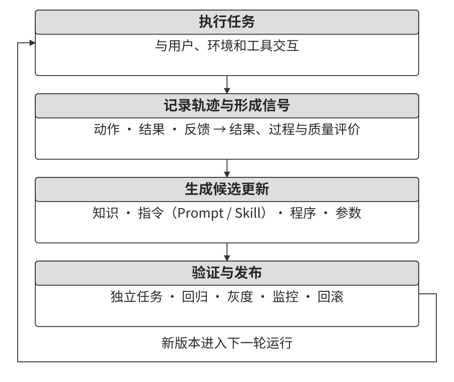
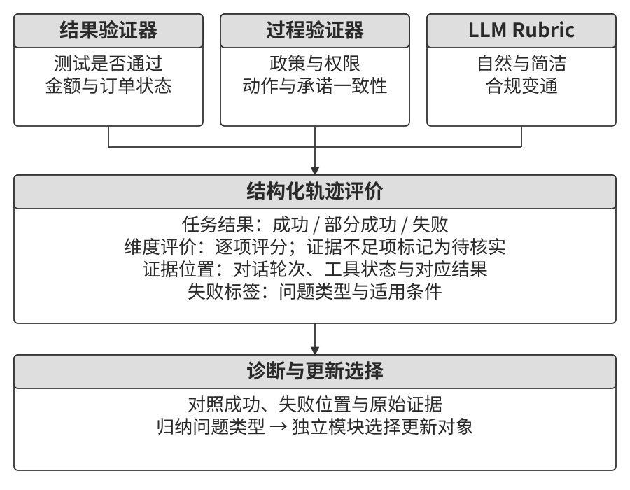
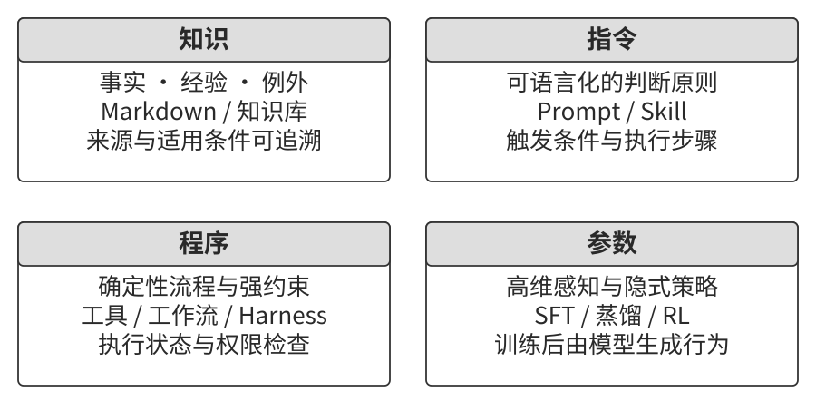
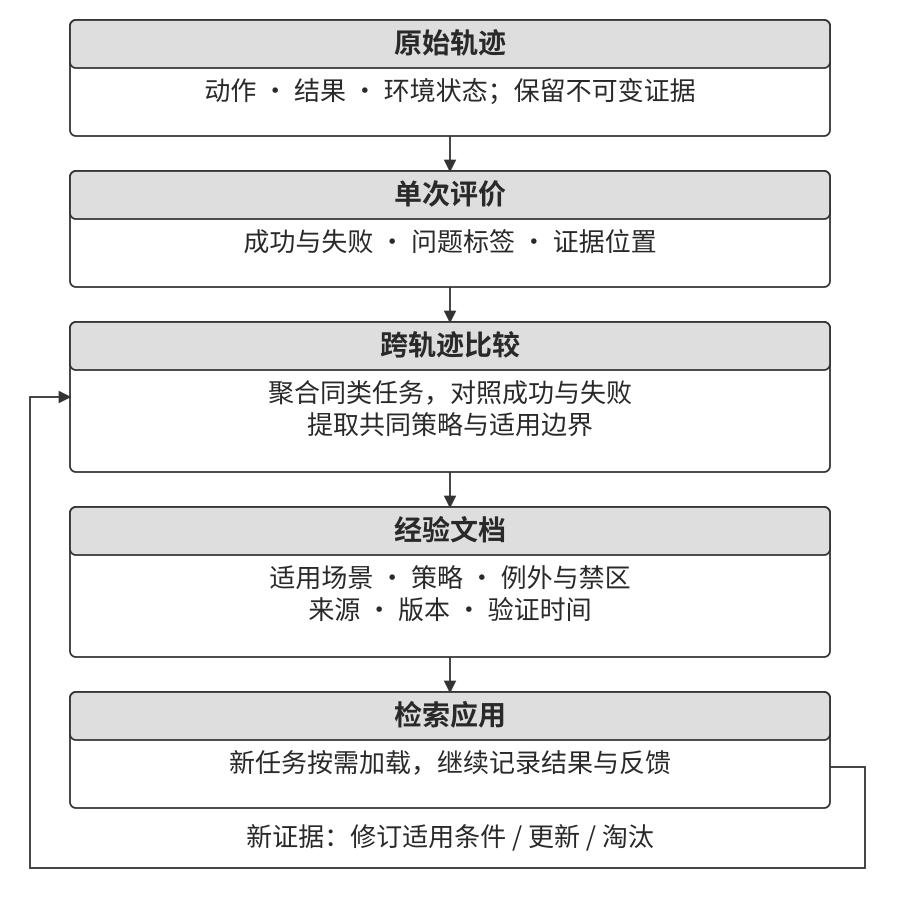
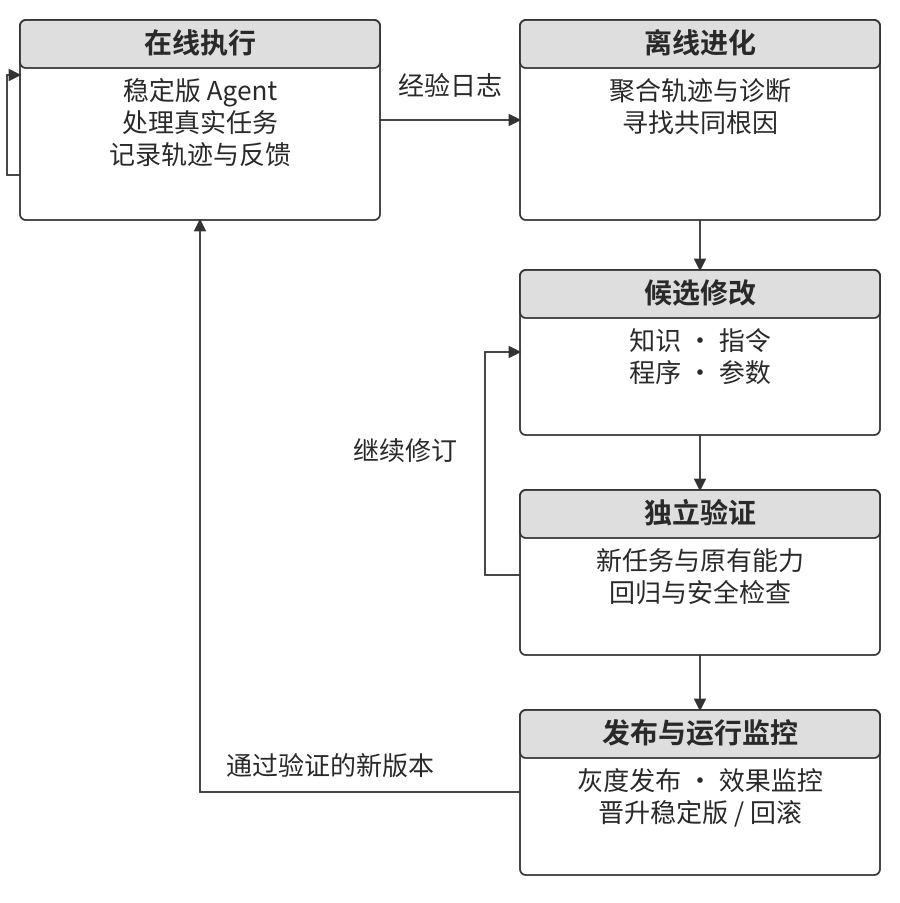

# Agent 的持续进化

一个 Agent 可以第一次就完成陌生的复杂任务，却在处理许多相似任务后仍重复同一种错误。要让它像新员工一样从日常工作中不断长进，系统就需要把运行经验转化成后续可用的能力：记录结果，找到问题的原因，形成改进办法，再验证这些办法在新任务中是否有效。**笔者认为，从经验中学习、持续进化，正在成为 Agent 最重要的能力之一。** 这项能力既需要应用系统的工程建设，也值得作为下一代模型的研究重点。本章讨论怎样把这条学习链路建立起来。

通常，部署中的模型在一次推理结束后保持原有参数。第二章的上下文学习、状态维护和压缩帮助它在当前任务内调整；第三章的记忆与知识库则让信息跨任务保存。进一步从经验中学习，还需要比较多次运行：成功轨迹有哪些共同步骤，失败轨迹缺少什么，某种做法适用于哪些工具版本和任务条件。

例如，存下了一百条订票轨迹后，系统可以按需检索某次经历。若要形成“订票前先检查特殊餐食截止时间”这样的经验，还要对比预订成功与失败的原因，检查航空公司和时间条件，再用新任务验证这条做法。记录与检索让 Agent 找回经历，对照、归纳和验证则帮助它形成可复用的做法。经过这样的积累，Agent 才能逐渐从聪明变得熟练。

**持续学习（continual learning）**研究系统怎样随着新任务和新数据不断学习，同时保留已有能力。Agent 把这个问题带入日常交互：反馈来自用户、工具和环境，用户满意、任务完成和流程合规可能给出不同结论。笔者认为，从这些缺少明确标注的日常经历中识别可靠信号，是 Agent 持续学习的一项核心难题。未经核验的反馈一旦被写成规则或用于训练，错误归因就会影响后续任务。因此，信号筛选要先于经验更新，每次更新后再检查目标行为和已有能力。涉及参数训练时，还要检查遗忘和策略变化。

本书用**持续进化**描述整个 Agent 系统从经验中更新的过程，覆盖知识、指令、程序和模型参数四类载体。基础模型的周期性训练提供通用能力，Agent 的经验更新则处理具体业务规则、工具变化和局部策略。这些局部变化不断发生，等待下一次基础模型训练往往赶不上业务需要。

现阶段，笔者主张优先在模型外围建立可验证的学习系统，让可明确表达的经验通过知识、指令和程序影响后续行为，把适合参数学习的材料送入后训练。一次更新先形成候选版本，再经过回归评估和发布检查，进入后续运行。

前面的章节已经介绍了这套系统的主要部件：第二章组织任务状态，第三章存储和检索知识，第五章通过代码创造工具与修改系统，第七章评价结果，第八章更新模型参数。图9-1 将这些部件连接成“运行—评价—提炼—更新—验证—发布”的循环。

本章先讲如何从轨迹中提取学习信号，再比较四类更新方式，最后讨论版本如何验证、发布、修订与淘汰。贯穿这一过程的是可追溯的经验：每项改动都能找到触发它的案例，也能用后续任务检查它带来的变化。

## 从运行轨迹中获得学习信号

一次运行结束后，先按照第七章的方法评价任务，再决定怎样提炼经验。评价要回答三个问题：**目标是否达成，执行是否符合规则，交付质量如何**。图9-2 把它们分成结果、过程和质量三个层次。

**结果验证检查环境发生了什么变化。** Coding Agent 可以运行测试、类型检查和性能基准；退款 Agent 可以查询订单状态与实际退款金额。这些证据把“完成”落实到可检查的产物和状态。笔者优先建设这一层：直接读取执行结果，才能发现模型的完成声明与实际交付之间的差距，并为后续归因提供依据。

**过程验证检查动作是否符合任务规则。** 测试通过之后，还要检查受保护的测试文件是否被修改；Agent 告知用户“退款将在七天内到账”时，还要核对退款是否已提交、时效是否有依据。权限表、结构化政策和动作记录可以交给程序检查；需要解释语境的条款，则结合对应证据进行判断。

**质量验证检查交付是否满足使用要求。** 客服的表达是否清楚，替代方案是否符合用户目标，研究报告是否抓住关键证据，都会影响最终效果。可以使用第七章介绍的 LLM-as-a-Judge，预先定义 Rubric，让评判模型逐项给出分数、理由和证据。人工金标与分歧样本帮助校准这些评价。

表9-1 以客服为例，把三层评价展开为七个维度。任务结果对应结果层，规则、隐私和承诺对应过程层，表达与变通对应质量层；事实可靠性则根据内容分别核验。例如，退款金额可以直接对照工具返回，政策解释还需要结合原文与适用条件。

表9-1 客服 Agent 的轨迹评价维度

| 维度 | 验证问题 | 主要证据 |
| --- | --- | --- |
| 任务结果 | 用户的核心诉求是否解决 | 最终环境状态、工具结果 |
| 规则遵从 | 政策、权限和必要流程是否满足 | 政策库、动作轨迹 |
| 隐私边界 | 提供的信息是否在允许范围内 | 回复文本、访问记录 |
| 事实可靠性 | 陈述是否有知识或工具结果支持 | 引用来源、工具返回 |
| 承诺—行动一致性 | 声称完成的操作是否实际发生 | 回复与执行记录对照 |
| 表达质量 | 是否自然、简洁、清楚 | 对话全文、语言 Rubric |
| 合规变通 | 原方案受阻时，是否找到允许的替代路径 | 用户目标、政策与后续动作 |

为了支持后续更新，评价输出应包含四项内容：整体任务状态、各维度结论、结论对应的证据位置，以及错误类型。证据位置可以指向某轮对话或某次工具调用。证据不足的维度标为待确认，交给补充验证或人工复查；确认诊断后，再从中提炼经验。

例如，“退款失败，表达清楚”还不足以定位改进方法。补充“第 4 轮在缺少订单号时调用退款接口，接口拒绝执行；第 5 轮仍宣称已退款”，就能分别提出参数校验和完成声明验证的改动。这样记录，开发者就能从评分找到需要修改的具体步骤。

> **实验 9-1 ★★：为客服 Agent 构建轨迹验证器**
>
> 对同一组客服轨迹比较两种输出：一种仅给总分，另一种逐维度给出结论、证据和置信度。检查后者能否将任务失败、规则违规、虚假承诺和表达问题分别定位，并据此提出对应的更新。
>
> 阅读结果时，沿着“结论—证据—修复位置”检查每条诊断。例如，知识过期需要更新资料，参数缺失可以增加调用前检查，措辞重复则可能通过指令或训练改善。低置信度案例进入复查队列，确认后再作为学习材料。

## Agent 持续进化的四种方法

找到问题之后，还要决定改动放在哪里。事实与经验可以写入知识文档，可用语言描述的判断原则可以写入 Prompt 或 Skill，可精确执行的流程可以写成程序，感知、生成风格和隐式策略可以通过参数训练改善。图9-3 展示了四种更新方式。

同一个系统往往组合使用这些载体。医疗影像 Agent 用模型识别图像，用知识库检索指南，用代码计算确定的指标；客服 Agent 用经过训练的模型组织语言，用知识与 Skill 提供企业政策，再由服务端校验权限和金额。表9-2 列出各类更新的工程特点。

表9-2 四种持续进化方式的适用边界

| 更新方式 | 适合承载 | 工程优势 | 需要处理的问题 |
| --- | --- | --- | --- |
| 经验知识库 | 事实、经验、例外与来源 | 更新快、可追溯、可按需检索 | 检索质量、适用条件和模型能否正确运用 |
| Prompt 与 Skill | 需要结合语境、例外和优先级的判断原则 | 可解释、易于局部修改 | 长度增长、指令冲突和遵循效果 |
| 程序与 Harness | 可解析流程、可执行验证、权限与硬约束 | 可测试、执行稳定 | 开发维护、接口兼容与异常处理 |
| 模型参数 | 感知、生成风格和隐式决策模式 | 可复用所学模式，减少重复上下文 | 数据准备、训练成本、泛化与遗忘 |

一项改进可以拆成多个更新。笔者优先把政策事实放入知识库，把权限检查等可精确执行的约束放入程序；需要理解语境和例外的原则用 Skill 表达，高维感知和隐式策略通过训练改善。这样既便于更新，也能让硬约束得到稳定执行。每个更新都先作为候选版本，经过验证后发布。

### 将经验沉淀为知识

经验知识库与第三章共享存储、索引和检索方法，学习材料则主要来自行动轨迹与结果。例如，“该航空公司要求特殊餐食提前二十四小时预订”是领域事实；“订票前先检查特殊餐食截止时间，避免付款后才发现无法满足需求”是基于事实和运行结果形成的行动经验。

把经验整理为可检索文档，是成本较低、容易开始的一种进化方式。原始轨迹中混有工具输出、探索绕路和偶发故障，直接作为推荐做法会增加后续判断负担。

可以分三层保存材料：**原始轨迹**保留完整运行证据，**单次运行分析**记录成败原因与经验草案，**正式经验文档**汇总跨任务验证过的做法。原始轨迹按版本保存，分析和知识则随新增证据修订。正式文档写清适用场景、推荐策略、禁止做法、例外、来源和最近验证时间，便于后续检索与检查。

第三章的 User as Code 先追加事实日志，再周期性重建用户模型；经验学习也可以采用这种记录与整理分离的方式。图9-4 展示了如何从多条已评价轨迹生成经验文档。积累多个案例之后，系统能把稳定模式与偶发成功、网络故障等情况分开处理。

提炼时重点比较条件与结果：成功轨迹做了哪些关键步骤，失败轨迹遗漏了什么，工具版本变化后哪条经验需要调整。第三章的抽取、聚类与检索方法可以继续使用，评价结果为这些方法补充了支持和反驳依据。

完整的提炼流程可以分成五步：

1. 保存原始轨迹与环境结果，固定任务和工具版本。
2. 为每次运行生成分析，记录任务类型、所需能力、实际策略、错误和例外。
3. 按任务族聚合，为每条经验列出支持与反驳它的轨迹。
4. 按预设的证据要求筛选草案，写入候选知识文档。
5. 在未参与提炼的新任务上测试，检查推荐策略是否改善后续表现。

GAIA[^gaia-2023] 提供搜索、网页阅读、文件处理和计算等多步骤问题，AWorld[^aworld-2025] 提供 Agent 执行、工具调用和轨迹记录环境。将两者结合，可以先用答案或环境状态标记成功、部分成功与失败，再按任务族比较路径。成功轨迹提供策略候选，失败轨迹补充禁用条件，部分成功轨迹帮助定位有效步骤及尚未解决的问题。

Reflexion[^reflexion-2023] 使用自然语言反思帮助后续尝试。把这种方式接入知识提炼时，反思可用于提出原因假设与经验草案，环境结果用于核验，跨轨迹对照用于界定适用条件，新任务用于检查迁移。四类材料共同决定一条经验是否进入正式知识库。

[^reflexion-2023]: Shinn, N., et al. *Reflexion: Language Agents with Verbal Reinforcement Learning.* arXiv:2303.11366, 2023.

[^gaia-2023]: Mialon, G., et al. *GAIA: a benchmark for General AI Assistants.* arXiv:2311.12983, 2023.

[^aworld-2025]: Yu, C., et al. *AWorld: Orchestrating the Training Recipe for Agentic AI.* arXiv:2508.20404, 2025.

### 将经验写成指令

经验文档提供可参考的做法，Prompt 和 Skill 则直接参与任务中的行为约束。多条轨迹反复出现同一种策略错误，且改进方式能够用语言清楚表达时，可以提出指令更新。系统 Prompt 承载跨任务的通用要求，Skill 按领域或工具加载局部流程，Harness 执行权限等硬约束。

Andrej Karpathy 用**系统提示学习（System Prompt Learning）**描述一种经验更新方式：模型遇到问题后，写下一条提醒，供未来任务使用。[^karpathy-system-prompt-learning] DSPy[^dspy-2023]在开发集上优化指令与示例，OPRO[^opro-2023]根据历史提示及得分生成新候选，GEPA[^gepa-2025]利用轨迹反馈提出并筛选提示改动。这些方法都根据运行反馈生成指令候选，再通过评估选择更好的版本，适合离线批量优化。

第二章讨论提示如何组织，本节进一步讨论改动如何产生和发布。生产更新中，笔者优先采用带来源的最小 diff，保留触发案例、修改理由和旧版本。局部补丁减少了对已有规则的扰动，也便于在退化时撤回某一项改动。在触发问题的边界集上检查修复效果，在正常任务的保留集上检查已有行为，再决定是否发布。这也落实了第一章介绍的最小改动与回滚方法。

#### 例子一：明确转接与工具使用的边界

τ²-bench 的 telecom 政策要求：请求超出 Agent 的动作范围时转接人工，转接前尽力解决。在本章案例中，较弱模型遇到工具错误后反复重试，最终转接；用于提炼规则的 20 条任务中，有 19 条以这种方式结束。

把这 19 条轨迹交给模型归纳，生成局部规则并追加到政策末尾，再用未参与提炼的任务比较。迁移集通过率从 12.3% 提高到 19.3%，原先通过的任务保持通过。理解这个结果，可以继续查看规则具体修复了哪些动作。

**输入材料决定规则的内容。** 只提供错误文本和失败摘要时，模型归纳出“同一工具反复报错后停止调用”。加入 Agent 与用户双方的工具清单后，规则进一步明确了操作归属：网络状态、SIM 卡和 APN 等设备操作需要引导用户完成。这时，经验就从一般性的重试提醒，细化成了具体操作的分工规则。

**归纳还需要政策与结果校验。** 初版曾提出“连续三次调用失败就转接”“用户两次未提供号码就转接”。模型把轨迹中频繁出现的转接行为概括成了应当遵循的规则，结果会让本实验中的任务继续失败。因此，提炼时要区分常见行为与推荐行为，依据政策和任务结果筛选规则，再由独立评估检验候选版本。

一条轨迹清楚展示了修复前后的差别。基线 Agent 需要用户电话号码，却把“请您提供您的电话号码”填进查询工具参数，连续调用五次均报错，随后转接。更新后，Agent 先在对话中询问，拿到号码再查询；检查 SIM 卡时遇到权限边界，则引导用户重新插拔 SIM 卡，最终完成任务。规则分别修复了信息收集和操作归属两个环节。

> **实验 9-2 ★★：从 τ²-bench 失败轨迹提炼转接与工具使用规则**
>
> 沿用第七章的 telecom 环境，将提炼集与迁移集分开。先运行较弱模型收集失败轨迹，再让模型生成规则，追加到原政策中。在迁移集上比较原始版本与两个进化版本，三组只替换政策文件，保持用户模拟器一致。
>
> 除通过率外，记录转接比例、越界调用用户侧工具的次数，以及缺少参数时发起调用的次数。后两项在进化版本中均下降约八成，与具体轨迹中的行为改善相互对应。

航空客服也会出现过早转接。用户对退票费、改签费或行李政策提出异议后，Agent 应按适用政策查询、解释，并寻找允许的替代方案。在下面实验采用的规则中，普通政策争议继续由 Agent 处理，用户明确要求人工或出现指定安全情形时则转接。将这组条件写成局部规则，再分别测试两类场景，就能检查转接边界。

> **实验 9-3 ★★：基于失败轨迹优化航空客服的系统 Prompt**
>
> 从规则遵从、任务解决和合规变通三个维度分析过早转接轨迹，生成带来源的 Prompt 补丁。将自动提炼版本与初始版本、人工调优版本放在相同条件下比较。
>
> 边界集检查普通争议能否继续处理，保留集检查明确人工请求和安全事件能否正常转接。候选版本通过两组评估与发布检查后进入灰度，运行中继续观察转接与任务完成情况。

#### 例子二：根据用户反馈改进需求澄清 Skill

已有的需求澄清 Skill 可以规定何时提问、问哪些问题，以及何时开始执行。随着用户反馈积累，系统需要调整这些判断条件，让澄清的收益与打扰成本相匹配。

例如，用户说“把登录页改成支持企业登录”，实施前可能需要确定身份提供商、回退方式、旧用户兼容和上线范围。相反，修正一处拼写通常可以直接完成。问得太少，关键选择会留到交付后返工；问得太多，简单修改也会被拖成长时间的访谈。Skill 应根据歧义、风险和返工成本选择流程。

一个初始流程可以这样组织：低风险、易撤销的小改动，说明必要假设后执行；涉及架构、数据、权限、公开接口或大范围改动时，集中询问少量会改变方案的问题。随后形成简短的 Spec 或 Plan，列出目标、非目标、取舍、假设和验收标准。需要确认的事项得到回复后继续执行；执行中发现前提变化，再定位受影响的决定并补充确认。

为了改进这条流程，要记录任务、澄清问题、Spec 版本、用户修改、交付结果与返工。用户说“和我想象的不一样”，就检查哪些条件被遗漏；用户说“你问得太多”，就检查这些问题的答案是否会影响方案。一次确认后顺利交付、用户修改 Spec 后减少返工，以及简单任务快速完成，也都提供了评价依据。

多条认证任务反复遗漏旧登录兼容要求时，可以给 Skill 增加“确认身份提供商、回退路径和兼容范围”的条件。大量拼写修复因提问被延误时，则应收窄澄清流程的触发范围。这样，每条改动都有具体任务类型和反馈支持。

评估可以按任务复杂度分层，比较直接执行、提问后执行、提问并确认 Spec 后执行三种策略。指标包括需求偏差率、返工次数、澄清轮数、首次有效产出时间、用户放弃率、Spec 修改比例和高风险操作错误率。候选版本需要在留出任务中减少偏差，同时控制交互成本，随后再逐步发布。

这里也体现了 Skill 与 Harness 的分工。Skill 指导模型理解语境、提出问题、整理方案；Harness 根据项目规则，在高风险写入缺少必要授权、直接修改受保护分支或跳过发布流程时拦截操作。对需求内容的判断仍由模型结合用户输入完成。经过验证的对话轨迹还可以成为第八章介绍的训练数据。

> **实验 9-4 ★★：从用户反馈中进化需求澄清与 Spec 确认 Skill**
>
> 准备低风险、低歧义任务，以及涉及架构、权限、数据或公开接口的任务，比较三种澄清流程。记录用户回答、Spec 修改、交付结果和返工反馈，据此生成 Skill 的局部更新。
>
> 在独立任务上检查需求偏差、打扰成本和高风险操作，再决定候选版本是否发布。通过这种对照，可以逐步找到哪些条件需要澄清，哪些任务可以直接执行。

[^dspy-2023]: Khattab, O., et al. *DSPy: Compiling Declarative Language Model Calls into Self-Improving Pipelines.* arXiv:2310.03714, 2023.

[^opro-2023]: Yang, C., et al. *Large Language Models as Optimizers.* arXiv:2309.03409, 2023.

[^gepa-2025]: Agrawal, L., et al. *GEPA: Reflective Prompt Evolution Can Outperform Reinforcement Learning.* arXiv:2507.19457, 2025.

[^karpathy-system-prompt-learning]: Karpathy, A. “We’re missing (at least one) major paradigm for LLM learning … system prompt learning?” X, May 11, 2025. https://x.com/karpathy/status/1921368644069765486

### 将经验写成程序

稳定、重复且可验证的操作，可以根据运行经验写成工作流、工具或 Harness 代码。笔者建议优先把这类操作转成程序：模型探索出可行路径后，后续任务便可复用这条路径，省去反复读取说明、理解页面和决定下一步的开销。第五章介绍了读写文件、运行测试和生成工具的能力；本节进一步将这些能力用于“失败诊断—代码改动—回归验证”的更新流程。

改动可以落在不同层次。操作层生成参数化工作流或 API 适配器，控制层调整工具路由、重试、熔断与上下文压缩，验证层增加参数检查、状态断言和回归用例，架构层则调整规划、执行与 Reviewer 之间的信息流。每种改动都应对应具体的运行问题。

以发送邮件为例，多模态 Agent 第一次通过观测与行动找到“撰写、收件人、主题、正文、发送”等控件。下次任务通常只改变收件人和内容，可以像电子表格宏一样复用操作流程。系统把探索轨迹转成程序，并记录参数、状态检查和适用版本。

浏览器工作流的生命周期可以分成六步：

1. **捕获轨迹。** 记录导航、点击、输入和下拉选择，保存动作参数、页面 URL，以及 XPath、CSS 等定位信息。这些信息用于后续重新找到元素。
2. **提取参数。** 将具体收件人、主题和正文改成 `{recipient}`、`{subject}`、`{content}` 等变量，保留稳定动作。例如，首次输入的 `test@example.com` 成为收件人参数的一个取值。
3. **增加状态检查。** 执行前确认按钮可见、必要字段齐全，执行后检查页面变化；任务结束时读取真实页面或后端状态，确认邮件已经发送。
4. **独立回放。** 将沙盒账号或测试站点恢复到新的初始状态，完整执行程序，检查各步条件与最终结果。
5. **匹配新任务。** 按意图与关键词从能力库找到工作流，提取本次参数，交给 Playwright 执行。程序负责等待元素和检查状态，正常回放可以省去逐步调用 LLM。
6. **处理失效。** 元素定位失效、状态检查失败、API schema 改变或最终结果异常时，停止当前回放，先核对哪些操作已经完成，再由完整 Agent 流程从当前状态继续探索，并生成候选版本。邮件已发送、页面却没有及时显示结果时，应先查询发送状态，避免从头回放造成重复发送。

PreAct[^preact] 的重复任务实验报告了 8.5～13 倍的端到端加速。要把这种加速用于后续任务，流程记忆必须同时具备动作前检查、动作后检查和独立回放验证。例如，点击了“发送”按钮后，仍需要确认必填字段有效、提交已完成；最终状态检查将执行速度与任务完成联系起来。

> **实验 9-5 ★★★：从浏览器轨迹生成可验证工作流**
>
> 从成功轨迹生成带参数和状态检查的工作流，与每次重新探索的基线比较完成率、模型调用与耗时。再改变页面结构或构造点击成功但任务未提交的状态，检查程序能否检测失效并回退。
>
> 独立回放通过后，将工作流连同适用版本发布到能力库。后续任务继续执行状态检查，异常则触发修订。这条链路让一次探索成为可以维护的流程记忆。

**代码更新也需要独立的候选版本。** 从当前稳定版本创建隔离分支，由 Coding Agent 生成局部补丁，依次运行与改动相关的静态检查、单元测试、安全检查、失败轨迹重放和旧任务回归，再进入灰度发布。运行中的系统继续使用稳定版本，候选通过后再切换。

Git worktree 与 Pull Request 可以承载这套流程。Skill 指导模型创建独立工作区、明确需求、完成实现与测试，并在 PR 中说明问题、改动及验证结果。Harness 则执行项目约束，例如保护 `main`、检查必需的审查状态，以及在交付前确认发布产物齐全。具体采用哪些检查，由项目流程决定。

为了判断具体改动怎样影响结果，每次改动都应附上一份可检验的说明：失败证据、推断根因、涉及组件、候选补丁、预期修复的行为、需要保留的行为，以及分别验证两者的用例。Agentic Harness Engineering 将相关信息组织成组件、经验和决策三层可观测性：组件以文件形式保存并可被编辑，轨迹整理成可逐层查看的证据，编辑前声明预期影响，再用后续结果验证。[^ahe-2026]

生成提案时，笔者会同时提供成功轨迹和以前被拒绝的方案。Self-Harness 使用这些信息限定搜索方向：成功行为给出保留要求，历史尝试说明哪些改动已经失败。[^self-harness-2026] 只给失败案例，模型可能扩大修改范围，破坏原有正确行为；缺少被拒方案的记录，又可能反复提出同一条无效思路。

新工具也可以来自这种需求驱动的更新。Alita[^alita-2025]的一个任务要求：在由《指环王》中咕噜配音演员解说的 YouTube 360 VR 视频里，找出恐龙首次出现后紧接着提到的数字。Agent 发现缺少字幕读取能力，搜索并测试 `youtube-transcript-api`，封装字幕工具，最终得到 `100000000`。将这种工具纳入长期能力库时，可以沿用安全检查、功能验证与后续任务复用评估。

> **实验 9-6 ★★★：由失败轨迹触发 Agent 自我修改**
>
> 针对工具返回不可重试错误后仍被反复调用的问题，比较 Prompt 提醒与程序重试策略两种修复。候选代码根据错误类型决定重试、停止或熔断，再通过失败轨迹重放检查目标问题，通过临时故障任务检查恢复能力。错误类型和重试条件已经能精确判定时，笔者倾向于把这项约束写入程序，让每次调用遵循同一规则，同时减少模型反复理解提示的负担。
>
> 负责更新的 Agent 在隔离版本中提交补丁，外部测试与发布流程决定是否采用。验证器、验收用例和稳定版本由独立权限保护，回滚记录保留改动前后的行为依据。

验证逻辑本身也可以改进。例如，多次用户纠正和审查发现高风险调用缺少确认，可以新增调用前检查。这里需要区分业务验证组件与决定能否发布更新的独立机制：前者可以作为候选补丁的一部分，后者由独立的测试、审查和发布权限管理。新检查既要覆盖目标风险，也要让已获授权的正常任务继续执行。

> **实验 9-7 ★★：由用户反馈触发高风险操作确认门禁**
>
> 从用户纠正与事后审查中提炼缺少确认的案例，生成工具调用前的检查提案。边界集包含尚未确认的高风险操作，保留集包含已经授权或无需确认的正常操作。
>
> 两组任务分别测量漏拦与误拦，再由独立测试和发布规则判断候选版本。生成提案的 Agent 仅修改约定组件；验收用例、批准规则和稳定版本备份由外部机制保护。

[^preact]: Li, Bojie. *PreAct: Computer-Using Agents that Get Faster on Repeated Tasks.* arXiv:2606.17929, 2026.

[^alita-2025]: Qiu, J., et al. *Alita: Generalist Agent Enabling Scalable Agentic Reasoning with Minimal Predefinition and Maximal Self-Evolution.* arXiv:2505.20286, 2025.

#### 案例：DeepSeek Harness 的插件化更新

DeepSeek Harness（`dsh`）采用“一切皆插件”的架构，底层由 Cordis 提供组合机制。[^dsh-2026] 模型适配器、工具注册表、会话日志和 Agent 主循环都可以作为插件配置与替换。持续进化由此提出一个具体的软件问题：组件在运行中变化时，怎样清理旧资源，并让依赖它的其他组件继续正确工作？

Cordis 将这个问题分成两个维度。**时间可组合性（temporal composability）**关注组件移除后的恢复：资源分配、事件注册和上下文修改需要有对应的撤销过程。**空间可组合性（spatial composability）**关注依赖关系：组件声明需要哪些服务，由运行时在依赖出现、消失或改变时协调激活与失活。[^cordis-2026]

例如，一个工具插件注册了事件监听器，又依赖某个模型服务。替换插件时，需要撤销旧监听器，避免一次事件触发两次处理；模型服务暂时不可用时，依赖组件需要停止相关工作，服务恢复后再激活。前一个问题属于资源与副作用的生命周期，后一个问题属于依赖的生命周期。

缺少统一机制时，各组件只能自行处理装卸和依赖变化，局部替换也可能破坏调用方。若每次更新都要重启整个进程，还会打断进行中的任务，并增加状态恢复的工作。

Cordis 用**可撤销效果（revertible effects）**描述带逆操作的上下文变换，由运行时保存和执行清理；用**反应式协效果（reactive coeffects）**描述组件对环境的要求，根据上下文变化协调组件状态。统一的上下文机制进一步协调多个组件交错运行时的相互作用。[^cordis-2026]

这种设计减少了局部更新对整体重启的依赖。笔者认为，可组合性直接影响系统能否持续接受自我修改：模型写出正确补丁后，运行时还要完成装卸、协调依赖并恢复任务。由统一机制承担这些职责，才能在更新不断累积时控制它们对系统的影响。

插件化还需要与权限和发布流程配合。`dsh` 的动态运行器管理进程内插件及其版本、启动、停止与授权，持久插件通过专门的安装管理流程维护。将候选能力长期保留时，应记录版本并执行相应验证；在团队开发中，可以继续采用前文的 worktree、代码审查与 PR 流程。[^dsh-2026]

插件更新也会影响上下文成本。工具定义或提示片段发生变化，后续请求与已有缓存前缀的共同部分可能缩短。设计更新时，应记录新增内容、加载范围及预期缓存影响，结合第二章的方法观察 KV Cache 命中与运行开销。

[^dsh-2026]: DeepSeek AI, [*DeepSeek Harness*](https://github.com/deepseek-ai/deepseek-harness), 2026。插件组成见[架构说明](https://github.com/deepseek-ai/deepseek-harness/blob/master/docs/architecture.md)；动态运行器与持久插件的分工见[扩展说明](https://github.com/deepseek-ai/deepseek-harness/blob/master/packages/extensions/README.md)。该项目于 2026 年 8 月发布，本节围绕其开发者预览阶段的插件化设计展开。

[^cordis-2026]: Shi, Yifan, Wei Zhang, and Tianyi Cui. [*A Programming Paradigm for Spatiotemporal Composability*](https://arxiv.org/abs/2608.25512), 2026。论文及更新入口见[项目仓库](https://github.com/cordiverse/paper)。

### 将经验写入参数

知识、指令和程序擅长承载能够明确表达的信息与规则。医疗影像中的视觉模式、自然的语音韵律、语言风格和长程决策习惯，还依赖模型从大量样本中学习的表示。对于这些难以完整写成规则的能力，笔者会把相关经验转成训练材料，通过参数更新形成可复用的识别与决策模式。继续增加几条文字提醒，往往难以覆盖它们的变化。

一项任务也可能同时需要多种载体。中文引号编辑中，解析器识别文档语法边界，Skill 说明编辑原则与例外，参数训练改善跨任务的范围判断。设备变化带来的图像分布偏移可以通过 LoRA 或其他微调方法适应，语言风格也可以通过周期性偏好训练更新。任务稳定性影响更新频率与成本，能力本身的表示方式决定优先尝试哪种方法。

第八章介绍的训练方法可以直接接入本章闭环：经过验证的示范进入 SFT，明确的偏好组成成对数据，可重复交互与可靠奖励支持 RL。训练前固定数据与基线，训练后同时检查目标能力和保留任务，再按版本逐步部署。

### 从更新产物到优化更新方法

知识、指令、程序和参数回答了“经验保存在哪里”。还可以从另一个角度看持续进化：系统修改的是某条经验，还是生成、管理和验证经验的方法？优化范围可以逐步扩大：**单条规则或记忆 → 结构化上下文 → 工作流 → Harness 代码 → 生成更新提案的优化器代码**。[^weng-harness-2026] 这些不同范围的更新，都通过前面的四类载体保存。

笔者把局部更新作为默认选择：在提示中增加一条规则，或给经验文档补充一个例外，便于检查影响和回滚。随着条目增多，还需要改进管理方法，保留已有经验中的细节。例如，整份文档反复重写时，一条少见但重要的例外可能逐渐消失，多个条件也可能被压缩成过于宽泛的原则。Agentic Context Engineering（ACE）将上下文组织成带稳定标识符的条目，由生成、反思和整理模块提出增量变化，再用确定性逻辑合并与去重。[^ace-2026] 这样可以逐条维护经验及其来源。

Meta Context Engineering（MCE）进一步把内容更新与管理方法更新分成两个循环。内层在现有方法下构造任务上下文；外层根据执行与验证结果，调整搜索、选择、过滤和格式化等操作。[^mce-2026] 例如，内层为当前任务选择资料，外层比较不同的资料筛选策略，并保留在后续任务中表现更好的版本。

工作流和 Harness 也可以成为优化对象。AFlow 将多个 LLM 调用及其控制流表示成代码图，通过执行反馈搜索组合。[^aflow-2025] Meta-Harness 让 Coding Agent 结合源码、评分与轨迹，修改信息存储、检索和呈现的实现。[^meta-harness-2026] 第五章的代码生成能力由此进入反复评估的搜索过程：每个候选版本都带着它的改动与结果，成为下一轮选择的依据。

搜索本身也有策略：从哪个候选继续探索，何时另开分支，投入多少并行 Worker，什么时候停止。评价这些决定通常需要多轮生成与执行。如果每比较一种搜索策略都重新运行全部任务，反馈成本会快速增加。

**发现树回放**提供了一种复用已有探索结果的方法。Dream-RSI 将一次发现过程保存成树：根节点是初始工作区，每个子节点记录从父节点继续尝试后得到的工作区快照、候选产物、诊断和分数。[^dream-rsi-2026] 候选策略仍通过在线探索所用的接口选择分支，回放器则返回历史树中对应的已记录结果，省去再次调用底层 Agent 与评估器的开销。

回放时，策略只能看到当前已经展开的子树。它选择从某个叶节点继续探索，或从根节点新开分支后，才获得相应的后继节点。这样可以比较探索顺序、并行批次和停止时机，同时保持每次决策所能取得的信息与在线过程一致。

这一方法形成三个阶段：

1. **在线探索。** 当前策略运行真实任务，生成新的发现树。
2. **构造回放环境。** 将发现树加入历史池，保留各节点的状态、结果和可见关系。
3. **离线优化。** 策略开发 Agent 修改探索代码，在历史池中比较候选质量、执行成本和并行效率，再将入选版本送往新任务。

候选集合保留当前策略，并按同一套回放评分择优；新候选没有超过它时，继续使用原策略。这样，入选版本至少保留了当前策略在这批历史中的平均回放得分。回放覆盖的是历史中已经探索的分支；新任务仍需独立测试。新一轮在线运行又补充新的发现树，逐步扩展下一轮可用于比较的经验范围。

三种历史复用方式由此形成明确分工：轨迹总结提炼知识与指令，浏览器回放复用已验证的执行路径，发现树回放比较怎样安排探索顺序、并行任务和计算预算。Dream-RSI 的最终更新仍是程序中的探索策略，历史树则充当生成和筛选提案的离线环境。它把历史记录变成可重复交互的评估材料，让系统能够低成本学习怎样分配探索计算。

> **实验 9-8 ★★★：把这本书交给 Hermes：它能升级自己吗？**
>
> 将本书交给 Hermes，让它自行寻找可以应用到自身实现的原则，提出更新并接受 Reviewer 审查。根据退回意见继续修改，经过外部测试后形成候选版本。稳定版本、验收测试与批准规则由独立权限保护。
>
> 分别记录两类结果：更新流程能否完成，以及接受的改动能否改善后续任务。前者检查发现问题、提出补丁和根据反馈修订的能力；后者使用独立任务比较质量、成本和已有能力。这样可以把自我修改过程与实际收益联系起来。

## 构建可长期运行的持续进化闭环

持续进化需要把更新接回日常运行。图9-5 采用双循环结构：在线循环完成任务并记录证据，离线循环汇总轨迹、诊断问题、生成候选更新，再通过验证与发布进入下一轮。版本化经验库和评估集连接两侧，使每项更新都有来源、有结果，也能退回旧版本。

Voyager[^voyager-2023]在 Minecraft 中展示了目标选择、技能积累与环境反馈的协作。**自动课程生成器**根据物品、环境和已有能力提出下一个目标；**技能库**保存验证成功的程序，供检索和组合使用，例如采集任务调用移动与制作技能；**迭代提示机制**把环境观测、执行错误和自验证结果带入下一轮代码生成。新目标推动探索，验证决定保留哪些程序，技能复用则为后续更难的任务提供起点。

课程缺失时，探索容易停留在熟悉任务；验证缺失时，错误程序会进入技能库；缺少持久化，每次探索又要重复已有工作。这三项机制应当一起建设。

这种过程可以概括为**假设—实验—评估—反馈**的发现循环。对 Agent 来说，候选补丁是一项可以检验的假设：它应当改善哪种行为，会影响哪些任务，运行结果是否支持预期？Jeff Dean 等人创办的 Discovery Loop 也将自动化完整实验循环作为目标，通过提出、执行和评价实验推进下一轮探索。[^ch1-discovery-loop] 笔者认为，Agent 的持续进化也应遵循这种科学方法：提出明确假设，用实际运行检验，再根据结果决定保留或修订哪些改动。

[^ch1-discovery-loop]: Discovery Loop 的创始团队包括 Jeff Dean、Sanjay Ghemawat、Quoc Le 和 Oriol Vinyals，其[官方说明](https://www.discoveryloop.com/)提出自动化完整实验循环；2026 年 8 月 5 日的[投资方公告](https://radical.vc/articles/our-investment-in-discovery-loop/)介绍了其公益公司定位与并行实验方向。

评价持续进化的效果时，还需要分别检查**更新能力（harness-updating）**与**受益能力（harness-benefit）**。前者指系统能否产生有价值的持久改动，后者指任务 Agent 能否在合适时机找到并正确使用这些改动。Lin 等人的模型替换实验分析了两者与基础模型能力的关系。[^harness-benefit-2026]

例如，一份退款 Skill 已准确说明政策，但后续任务可能没有检索到它，也可能加载后遗漏了必要步骤。两种情况需要分别调整路由与执行。若只看到端到端分数没有提高就重写 Skill，可能会丢掉一份本来正确的规则，而真正失效的加载或执行环节仍未得到修复。表9-3 因此把端到端表现拆成提案、激活、遵循与任务收益四层。

表9-3 持续进化的分层评估指标

| 指标 | 回答的问题 | 主要证据 |
| --- | --- | --- |
| 更新提案有效率 | 候选改动是否有价值 | 独立验证中的接受率与收益 |
| 产物激活率 | 新 Skill、记忆或工具是否在正确场景加载 | 检索、路由与调用记录 |
| 遵循成功率 | 激活后是否按规则或流程执行 | 动作序列与过程检查 |
| 独立任务集收益 | 更新是否改善新实例并保留已有能力 | 留出任务与保留任务的成功率、质量和成本 |

长期评估还应同时跟踪五类变化：

- **能力退化。** 原本通过的案例是否失败，新旧经验是否冲突。
- **泛化。** 在独立的新实例、模板或领域中，更新能带来多大收益。
- **Token 与运行成本。** 完成任务所需的输入、生成、工具调用和时间怎样变化。
- **安全与合规。** 权限、隐私和拒绝边界是否保持预期行为。
- **工程质量。** 维护复杂度、架构一致性、组件所有权、兼容性，以及迁移和调试成本怎样变化。

这些指标共同为发布决策提供依据。例如，修复当前失败案例后，若多个旧任务开始失效，应根据差异收窄规则或调整实现，再重新比较。回归结果也会成为下一轮提案的输入。

> **实验 9-9 ★★★：评估 Agent 是否在持续进化**
>
> 比较静态记忆、只追加记忆，以及支持替换和淘汰的版本化记忆。先让 Agent 在一组任务中获得反馈，再依次改变任务表述、更新规则，并测试原有能力。
>
> 分别记录记住、迁移、更新和保持四类表现：新任务能否使用相关经验，规则改变后能否采用新版本，旧任务是否仍能完成。同时检查过程合规与成本，分析每种记忆更新机制的收益和代价。

### 开放式任务中的证据与评价

代码测试、工具结果和业务状态能够较快地提供反馈。科研、战略规划和产品设计往往需要更长时间才能看出效果，还要判断问题价值、方案质量和可维护性。一条流水线可以顺利完成检索、编码和写作，最终成果仍可能没有回答值得研究的问题，或者缺少有效基线与新证据。设计进化闭环时，笔者会优先改进证据与监督结构，把流程完成情况与这些长期目标分别评价。

Trehan 与 Chopra 记录了四次从研究想法走向论文的自动科研尝试，其中三次在实现或评估阶段失败，一次完成整条流水线。[^llm-scientists-2026] 这些案例暴露了三类具体问题：**实现漂移**使代码逐渐偏离原始假设；**过早解释结果**使噪声被当作发现，而失败和阴性结果没有得到同等关注；**研究判断不足**则表现为基线选择、异常追踪和停止时机缺少依据。

可以从四个方面改善这类任务的证据与监督结构。

- **将结论关联到来源。** 分别记录引用、数字、方法和推断的证据。ScientistOne 的 Chain-of-Evidence 设计将声明连接到可审查来源，便于从文稿追踪到实验或材料。[^scientistone-2026] 研究价值则另由问题定义与领域评价判断。
- **保留负面结果。** 将失败实验、被拒方案和停止原因一并存档。只留下最终成功的方案，后续搜索就看不到哪些路径已经被否定，容易反复付出同样的试错成本。
- **保持候选多样性。** 除当前高分方案外，保留若干暂时低分但思路不同的分支，比较它们在不同评价条件下的表现。这能减少所有候选都收敛到同一种易得分模板的倾向。
- **明确人的研究职责。** 人参与问题定义、评价标准审查、反常结果解释和停止决策，与 Agent 的实现、执行和资料组织形成分工。

### 持续进化的安全边界

长期能力会在后续任务中反复使用，因此每次更新都要明确三个问题：依据来自哪里，候选版本如何验证，谁有权批准发布。网页中的错误指令若进入经验库，会影响多个会话；外部依赖若进入常用工具，会扩大影响范围；验证器的缺陷则会影响一系列更新的判断。可以沿着信息、版本和权限建立三道边界。

第一道边界是**证据与指令隔离**。网页、邮件、工具输出及其摘要都作为待核实的材料处理。系统按固定结构提取主张、原文位置和采集时间，保留来源与原文，让审核者能够追溯每条经验。摘要与模型置信度帮助整理材料，但改写后的文本仍可能保留原始材料中的错误主张或恶意指令。发布依据因此要来自结构校验、允许列表、来源检查和独立审查。候选 Skill 以版本化的变更请求提交，由审核者对照证据检查内容与行为，高风险更新再经过人工批准。这样，外部材料进入长期能力需要经过明确的处理流程。

第二道边界是**候选能力与正式能力隔离**。新知识、Prompt、Skill、程序和参数先进入独立的候选区。代码与外部依赖在受限沙盒中接受权限检查、供应链扫描和行为测试，再与稳定版本进行回归比较。通过发布门槛的版本才逐步接入真实任务，稳定版本继续保留，供异常时回滚。

第三道边界是**更新权限与批准权限分离**。业务 Agent 可以提出知识、工具、Skill 和业务验证组件的改动。批准这些改动的测试集、发布门槛、权限配置、审计日志和稳定版本备份由独立控制面维护。业务验证组件的修改也要接受这一控制面的检验，使“生成候选”和“判断候选是否合格”始终有清楚的职责划分。否则，候选版本可能通过放宽阈值或删除失败用例取得更高分，却没有改善实际能力。

### 睡眠学习：整合、遗忘与能力保鲜

“睡眠学习”借用睡眠中整理经验的比喻，描述 Agent 的离线整合过程。在线运行时，Agent 完成当前任务并追加原始证据；后台学习进程在空闲期或满足触发条件后，集中读取新经历，比较新旧结论、合并重复项、处理冲突，再生成更新提案并运行回归。笔者建议将采集与整理分开：一次偶发成功、网络故障或未经核验的输入，先保留为待分析证据；积累同类轨迹后再决定是否更新。批量处理既便于识别稳定模式，也能利用空闲算力和适合整理任务的低成本模型。

一个典型周期包含五步：

1. **触发。** 根据时间间隔、新增轨迹数量、存储容量或错误频率启动整理，并为高优先级在线任务留出资源。
2. **检查现有能力。** 读取正式知识、Prompt、Skill 目录及其版本，确认已有能力和各组件的修改权限。
3. **采集与整合。** 从近期已评价的轨迹中提取新信号，合并重复内容，标记冲突与适用条件，生成局部补丁。
4. **验证与审批。** 在迁移任务、原有能力保留任务和安全任务上比较候选版本，高风险更新经过人工审批。
5. **修剪与索引。** 更新检索索引，为过期内容设置状态，将低价值内容归档或删除，并保存来源和可恢复的版本。

可以先从项目记忆理解容量管理。Claude Code 为项目维护一个简短的记忆索引和按主题拆分的详细文件。会话开始时按长度上限加载索引开头的内容，需要细节时再读取主题文件。索引接近容量上限后，将细节移到相应主题，并合并重复条目，能让有限的上下文持续容纳最有用的信息。其自动记忆主要随会话工作积累，体现了分层加载与主动整理的配合。[^claude-code-memory]

Hermes 将长期信息分成几种载体：有容量限制的通用记忆与用户记忆、基于 SQLite/FTS5 的历史会话检索、按需加载的 Skill，以及可选的外部记忆服务。历史检索返回原始消息，使后续分析保留可追溯的依据。包含复杂工具操作、错误恢复或用户纠正的任务，可以为 Skill 复盘提供材料；写入是否需要审批由运行配置控制。独立的 Curator 管理 Skill 的使用、陈旧和归档状态：固定规则负责修剪失效内容，可选的模型合并负责重写与去重。内容合并前保存快照，归档内容也可恢复，便于撤销不合适的整理。[^hermes-memory]

随着经验积累，维护工作会逐渐从“增加内容”扩展到“保持内容有效”。重复文档会干扰检索，互相冲突的规则会增加决策负担，多次参数更新也可能削弱原有能力。因此，笔者把合并、淘汰和重新验证视为持续进化的常规工作。只追加经验，会让检索与指令遵循的负担一起增长，逐渐抵消学习收益。离线整理可以具体落实为六项工作：

- 合并重复经验，保留各自的来源和版本关系。
- 将领域内的局部规则移入相应 Skill，让全局 Prompt 集中表达共同要求。
- 整理 Prompt 与 Skill 的结构，使触发条件、步骤和完成标准容易查找。
- 重新验证长期未使用的工具，更新接口与依赖信息。
- 将已被新证据推翻的知识移出默认检索范围，并保留必要的历史记录。
- 根据回归结果维护参数版本；需要清理累积影响时，从原始基座重新训练 LoRA，并与现有版本比较。

[^claude-code-memory]: Anthropic, “How Claude remembers your project”, 2026. https://code.claude.com/docs/en/memory

[^hermes-memory]: Nous Research, *Hermes Agent Documentation: Persistent Memory, Skills System, and Curator*, 2026. https://hermes-agent.nousresearch.com/docs/user-guide/features/memory ; https://hermes-agent.nousresearch.com/docs/user-guide/features/skills ; https://hermes-agent.nousresearch.com/docs/user-guide/features/curator

[^voyager-2023]: Wang, G., et al. *Voyager: An Open-Ended Embodied Agent with Large Language Models.* arXiv:2305.16291, 2023.

[^weng-harness-2026]: Weng, Lilian. “Harness Engineering for Self-Improvement.” *Lil’Log*, 2026. https://lilianweng.github.io/posts/2026-07-04-harness/

[^ace-2026]: Zhang, Qizheng, et al. *Agentic Context Engineering: Evolving Contexts for Self-Improving Language Models.* ICLR 2026. arXiv:2510.04618.

[^mce-2026]: Ye, Haoran, et al. *Meta Context Engineering via Agentic Skill Evolution.* arXiv:2601.21557, 2026.

[^aflow-2025]: Zhang, Jiayi, et al. *AFlow: Automating Agentic Workflow Generation.* ICLR 2025. arXiv:2410.10762.

[^meta-harness-2026]: Lee, Yoonho, et al. *Meta-Harness: End-to-End Optimization of Model Harnesses.* arXiv:2603.28052, 2026.

[^dream-rsi-2026]: Zheng, T., et al. *Dream-RSI: Recursive Self-Improvement through Evolving Worlds.* arXiv:2609.14858, 2026. https://arxiv.org/abs/2609.14858

[^ahe-2026]: Lin, Jiahang, et al. *Agentic Harness Engineering: Observability-Driven Automatic Evolution of Coding-Agent Harnesses.* arXiv:2604.25850, 2026.

[^self-harness-2026]: Zhang, Hangfan, et al. *Self-Harness: Harnesses That Improve Themselves.* arXiv:2606.09498, 2026.

[^harness-benefit-2026]: Lin, Minhua, et al. *Harness Updating Is Not Harness Benefit: Disentangling Evolution Capabilities in Self-Evolving LLM Agents.* arXiv:2605.30621, 2026.

[^llm-scientists-2026]: Trehan, Dhruv and Paras Chopra. *Why LLMs Aren't Scientists Yet: Lessons from Four Autonomous Research Attempts.* arXiv:2601.03315, 2026.

[^scientistone-2026]: Meng, et al. *ScientistOne: Towards Human-Level Autonomous Research via Chain-of-Evidence.* arXiv:2605.26340, 2026.

## 本章小结

持续进化把一次任务的反馈转化为后续任务可使用的能力。上下文中的临时调整可以通过知识、Prompt 与 Skill、程序、模型参数这四类载体保存下来。选择更新位置时，先分析问题来自信息缺失、流程安排、执行机制还是模型能力，再选择便于验证和回滚的改动。

评价贯穿整个过程：轨迹提供依据，多维诊断定位问题，独立任务检验迁移效果，原有任务检查已有能力是否保持。本章由此展开第一章发现循环中的**实验与反馈**环节，将提案、实际观测、评价结果和下一轮改进连接起来。

学习还可以作用于更新方法本身。系统既能整理经验，也能改进经验的组织方式、工作流的生成方法和探索策略。发现树回放保留历史分支与结果，让系统先用已有结果比较继续搜索、切换方向和分配预算的策略，再通过新的在线任务检验收益。

长期运行依靠在线执行与离线学习的配合：在线记录证据，离线整理和验证候选，发布后继续观察效果，并定期合并、淘汰或回滚。自动反馈明确的任务适合高频迭代；科研和战略规划等任务则需要将人的问题定义、评价判断与 Agent 的执行能力组织在同一个闭环中。

至此，我们已经讨论了单个 Agent 怎样完成任务、评价结果并积累经验。更复杂的工作还需要分工：由不同成员探索方案、执行任务和审查结果。下一章将讨论这些成员怎样共享信息、协调进度，并把各自的产物组合成可靠的整体结果。

## 思考题

1. ★★ 一条经验文档有三次成功轨迹和一次失败轨迹，失败发生在较新的 API 版本上。怎样区分经验失效与适用条件变化？
2. ★★ 客服 Agent 的满意度与规则违规率同时上升。应怎样组合学习信号，并设置发布时的护栏指标？
3. ★★★ 某个 Agent 经常声称操作已完成，工具记录却显示尚未执行。怎样根据根因选择 Prompt、Harness 检查或参数训练？
4. ★★★ Agent 需要修改工具与业务验证组件，批准自身更新的控制面由独立模块维护。怎样划分两侧的权限、代码和测试？
5. ★★ 经验知识库增长后出现检索错误与规则冲突。怎样设计版本、时效、合并和淘汰机制？
6. ★★★ 请为医疗客服设计一套持续进化方案，说明模型参数、知识、Skill 和代码约束的分工，以及各类更新的验证与发布流程。
7. ★★★ 某个探索策略在所有旧发现树上得分最高，下一轮在线探索却退化了。怎样分析支持域偏差、随机性和评价过拟合，并据此划分回放世界、设置发布门槛？
