# Multimodal மற்றும் Real-Time Interaction

முந்தைய அத்தியாயங்கள், Agents-ஐ text உலகில் வடிவமைப்பதை ஆராய்ந்தன—context, tools, மற்றும் code மூலம் டிஜிட்டல் அமைப்புகளுடன் தொடர்புகொள்வது. இருப்பினும், Agents என்பது text மற்றும் APIs-ஐ மட்டுமே கையாள்வதில்லை. ஒரு Agent, பயனரின் குரல் கட்டளைகளைப் புரிந்துகொள்ள வேண்டும், திரையில் சரியான button-ஐக் கண்டுபிடித்து கிளிக் செய்ய வேண்டும், அல்லது ஒரு robotic arm-ஐ துல்லியமாகக் கட்டுப்படுத்தி ஒரு பொருளைப் பிடிக்க வேண்டும் என்றால், அது ஒரு புதிய களத்தில் நுழைகிறது: **multimodal real-time interaction**—தூய text input/output-இலிருந்து **multimodal perception மற்றும் real-time response**-க்கு விரிவடைதல். இது, Agents "dialog box"-இலிருந்து வெளியேறுவதற்கான ஒரு முக்கியமான படியாகும். "Multimodal" என்பது, text மட்டுமல்லாமல், பல வடிவங்களிலான தகவல்களை—speech, images, video, actions—ஒரே நேரத்தில் செயலாக்குவதைக் குறிக்கிறது.

முதலில், இந்த அத்தியாயத்தின் எல்லைகளை வரையறுப்போம். Static image மற்றும் document understanding—ஒரு screenshot-ஐப் பார்ப்பது, ஒரு chart-ஐப் படிப்பது, ஒரு PDF-ஐப் பாகுபடுத்துவது—இவை ஏற்கனவே முந்தைய அத்தியாயங்களின் Agent நடைமுறைகளில் perception tools ஆக இயற்கையாக இணைக்கப்பட்டுள்ளன. இன்றைய multimodal LLMs-க்கு, இந்த "ஒரு input, ஒரு understanding" பணிகள் ஒப்பீட்டளவில் முதிர்ச்சியடைந்தவை மற்றும் சிறப்பு கட்டிடக்கலை வடிவமைப்பு தேவையில்லை. இந்த அத்தியாயம் மற்றொரு வகை பிரச்சினைகளில் கவனம் செலுத்துகிறது: **real-time கட்டுப்பாடுகள் multimodal பிரச்சினைகளை கடினமாக்கும்** மூன்று சூழ்நிலைகள்—voice dialogue, GUI operation, மற்றும் robot control. இந்த சூழ்நிலைகளில், input தொடர்ச்சியானது, மற்றும் output கண்டிப்பான நேர வரம்புகளுக்குள் கொடுக்கப்பட வேண்டும், இது கட்டிடக்கலை வடிவமைப்பில் ஒரு தரமான மாற்றத்தை ஏற்படுத்துகிறது. தொடர்ச்சியான visual streams (video)-இன் real-time புரிதலைப் பொறுத்தவரை, இது எழுதும் நேரத்தில் Agents-க்கு ஒரு திறந்த பிரச்சினையாகவே உள்ளது—இந்த அத்தியாயத்தின் Computer Use பகுதியில் விவாதிக்கப்பட்ட frame-by-frame screenshots-இன் வரம்புகள் மற்றும் இறுதியில் உள்ள கேள்விகள் இந்த தலைப்புக்குத் திரும்பும். மற்றொரு எல்லையும் வரையப்பட வேண்டும்: multimodal **generation** (image generation, video generation) என்பது இந்த புத்தகத்தின் கட்டமைப்பில் (Chapter 5, Multimedia Generation-இல் உள்ளடக்கப்பட்டது) ஒரு வழக்கமான tool call மட்டுமே. Agent அதை ஒரு வெளிப்புற tool ஆகப் பயன்படுத்துகிறது; இது இந்த அத்தியாயம் கையாளும் real-time interaction சவால்களை உள்ளடக்காது, எனவே இது முக்கிய பாதையின் பகுதியாக இல்லை.

Voice interaction, Computer Use, மற்றும் robot operation ஆகியவை மூன்று முற்றிலும் வேறுபட்ட துறைகளைச் சேர்ந்தவை போல் தோன்றினாலும், அவற்றை செயல்படுத்தும்போது, தடைகள் வியக்கத்தக்க வகையில் ஒத்தவை: அவை அனைத்தும் பல முறைகளின் தகவல்களை ஒரே நேரத்தில் செயலாக்க வேண்டும் மற்றும் latency-க்கு மிகவும் உணர்திறன் கொண்டவை. இரண்டு வினாடிகளுக்கு மேல் குரல் இடைவெளி இருந்தால் விரக்தி ஏற்படுகிறது, மற்றும் robot control-இல் மில்லி-செகண்ட் நிலை ஜிட்டர் மோதல்களுக்கு வழிவகுக்கும். இந்த இரண்டு கட்டுப்பாடுகளும் மூன்று சூழ்நிலைகளையும் ஒரே கட்டிடக்கலை திசையை நோக்கித் தள்ளுகின்றன: **serial pipeline**-இலிருந்து (ஒரு தொழிற்சாலை அசெம்பிளி லைன் போல, ஒரு படி முடிவதற்கு முன் அடுத்தது தொடங்க முடியாது) **end-to-end model**-க்கு (உள்ளீட்டிலிருந்து வெளியீட்டிற்கு நேரடியாகச் செல்லும் ஒரு ஒருங்கிணைந்த மாதிரி, இடைநிலை handoffs-ஐ நீக்குகிறது) மாறுதல்.

இந்த அத்தியாயம் பின்வரும் வரிகளில் விரிகிறது:

1.  முதலில், "குரல் கட்டமைப்பின் மூன்று முன்னுதாரணங்கள்"—cascaded (VAD-ASR-LLM-TTS pipeline), end-to-end omnimodal (Omni, ஒற்றை model ஆனாலும் turn-taking உடன்), மற்றும் full-duplex (Moshi, GPT-Live, ஒரே நேரத்தில் கேட்டல் மற்றும் பேசுதல்)—ஆகியவற்றுடன் ஒரு coordinate system ஐ நிறுவி, "VAD இன் turn assumption இலிருந்து எவ்வாறு விடுபடுவது" என்ற அச்சில் ஒவ்வொரு இணைப்பின் latency மற்றும் trade-offs ஐ பகுப்பாய்வு செய்கிறோம். Cascaded பகுதி, VAD + ASR ஐ streaming voice perception உடன் எவ்வாறு மாற்றுவது என்பதையும் விவாதிக்கும்.
2.  அடுத்து, thinking architecture "real-time response" மற்றும் "deep thinking" இடையேயான முரண்பாட்டை எவ்வாறு சமரசம் செய்கிறது என்பதை ஆராய்கிறோம்: fast மற்றும் slow இன் எளிய parallelization இருந்து, background reasoning model ஒரு "strategist" ஆக செயல்படும் decoupled approach (GPT-Live delegation, Pine AI, போன்றவை) வரை, Step-Audio R1 இன் "internalization" மூலம் "பேசும்போதே சிந்திக்கும்" ஒற்றை model ஆக மாறுவது வரை.
3.  பின்னர், மேலும் மனிதனைப் போன்ற speech synthesis execution layer ஐ எவ்வாறு மேம்படுத்துகிறது என்பதை விவாதிக்கிறோம்.
4.  இறுதியாக, Computer Use (AI ஒரு மனிதனைப் போல கணினித் திரையை இயக்க உதவுதல்) மற்றும் robot operation ஆகியவற்றிற்கு நமது பார்வையை விரிவுபடுத்தி, இதே latency மற்றும் multimodality சிக்கல்கள் இந்த இரண்டு சூழ்நிலைகளிலும் எவ்வாறு வெளிப்படுகின்றன என்பதைக் கவனிக்கிறோம்.

சூழ்நிலைகளுக்கு இடையே மாற்றக்கூடிய இரண்டு கோட்பாட்டு புள்ளிகள் சிறப்பு கவனம் பெற வேண்டும்: **thinking architecture** (fast மற்றும் slow thinking எவ்வாறு ஒத்துழைக்கின்றன) மற்றும் அதிலிருந்து பெறப்பட்ட **fast-slow interface** (**Latent Bridge**, fast மற்றும் slow models க்கு இடையே text தவிர வேறு என்ன அனுப்ப முடியும்). குரல் சூழ்நிலையிலிருந்து அறிமுகப்படுத்தப்பட்டாலும், அவை குரலுக்கு மட்டும் வரையறுக்கப்படவில்லை—Computer Use மற்றும் robot பகுதிகளும் "எப்போது ஒரு slow strategist ஐ ஆலோசிக்க வேண்டும்" என்ற கேள்வியை சந்திக்கும், இதை வாசகர்கள் கவனமாக கவனிக்க வேண்டும்.

## Voice: மிகவும் இயற்கையான மனித-இயந்திர இடைமுகம்

ஒரு voice Agent இன் கட்டமைப்பை பகுப்பாய்வு செய்வதற்கு முன், குரலின் மதிப்பைப் பற்றி சற்று பின்வாங்கி சிந்திப்போம். மனிதர்கள் கணினிகளுடன் தொடர்பு கொள்ளும் பல்வேறு வழிகளில், குரல் அதிக bandwidth ஐ கொண்டுள்ளது மற்றும் மிகவும் இயற்கையானது: சாதாரண பேச்சு வேகம் தட்டச்சு செய்வதை விட நான்கு மடங்கு வேகமானது, மேலும் இது கைகள் அல்லது கண்களை ஆக்கிரமிப்பதில்லை. இந்த காரணத்திற்காக, குரல் ஒரு இரண்டாம் நிலை உள்ளீட்டு முறையிலிருந்து பலரின் அன்றாட வேலைகளில் முதன்மையான இடைமுகமாக உருவெடுத்து வருகிறது—எழுத்து எழுத்தாக தட்டச்சு செய்வதற்கு பதிலாக, காலை முதல் இரவு வரை நேரடியாக ஒரு Agent உடன் பேசுவது.

Tool மட்டத்தில், இந்தப் பாதையில் தோராயமாக இரண்டு வகையான தயாரிப்புகள் உள்ளன. ஒன்று **voice input methods** (எ.கா., Typeless): இவை பேச்சை நிகழ்நேரத்தில் உரையாக மாற்றி எந்தவொரு பயன்பாட்டிற்கும் அனுப்புகின்றன, அடிப்படையில் விசைப்பலகை உள்ளீட்டை மாற்றுகின்றன. மற்றொன்று **voice Agents** (எ.கா., Pine, ChatGPT Voice): பயனர்கள் நேரடி உரையாடல் மற்றும் ஒத்துழைப்பில் ஈடுபடுகின்றனர், இங்கு குரல் என்பது உள்ளீடு மற்றும் தொடர்பு இரண்டுமே ஆகும். இரண்டிற்குமான மிகவும் பொதுவான மேம்பட்ட பயன்பாடு, அறிமுகத்தில் குறிப்பிடப்பட்ட **whisper coding** ஆகும்—பேசுவதன் மூலம் ஒரு coding அல்லது research Agent ஐ இயக்குதல்: டெவலப்பர் தனது நோக்கத்தைக் கூறுகிறார், Agent உடன் முன்னும் பின்னுமாக விவாதிக்கிறார், மேலும் Agent coding மற்றும் சோதனைகளைச் செயல்படுத்துகிறது; இந்த புத்தகத்தின் ஆசிரியர் குழுவின் ஒரு டஜன் க்கும் மேற்பட்ட ஆய்வுக் கட்டுரைகள் இந்த முறையில் முடிக்கப்பட்டன.

இங்கு கவனிக்க வேண்டியது என்னவென்றால், அடுத்து விவாதிக்கப்படும் voice architecture இரண்டு திசைகளுக்கும் சேவை செய்கிறது: பயனர் Agent உடன் பேசுவது (மனித-இயந்திர இடைமுகமாக), மற்றும் Agent பயனரின் சார்பாக வெளி உலகத்துடன் பேசுவது (எ.கா., பேச்சுவார்த்தை நடத்த தொலைபேசி அழைப்பு செய்வது). இரண்டும் ஒரே அடிப்படை நிகழ்நேர voice technology ஐ சார்ந்துள்ளன. Voice architecture இன் மூன்று paradigms உடன் ஆரம்பிப்போம்.

## Three Paradigms of Voice Architecture

Voice Agents இன் தொழில்நுட்ப பரிணாமத்தை தெளிவுபடுத்த, ஒரு தெளிவான ஒருங்கிணைப்பு அமைப்பு என்பது OpenAI 2026 இல் GPT-Live ஐ வெளியிட்டபோது கொடுத்த மூன்று பகுதி வகைப்பாடு ஆகும்[^ch9-12]—இது ChatGPT Voice தானே கடந்து வந்த மூன்று தலைமுறை architectures உடன் ஒத்துப்போகிறது:

1.  **Cascaded**: மூன்று மாதிரிகளை—Automatic Speech Recognition (ASR), Large Language Model (LLM), மற்றும் Text-to-Speech (TTS)—ஒரு pipeline ஆக இணைத்து, ஒன்றிலிருந்து அடுத்ததற்கு பணியை மாற்றுவது. ஆரம்பகால ChatGPT Voice இப்படித்தான் இருந்தது. இது மக்கள் முதல் முறையாக ஒரு frontier model உடன் "பேச" அனுமதித்தது, ஆனால் மாதிரிகளுக்கு இடையே மாற்றத்தின் போது தகவல் இழக்கப்பட்டது, மேலும் பதில்கள் மெதுவாகவும் இறுக்கமாகவும் இருந்தன.
2.  **End-to-End Omnimodal (Omni)**: ஒற்றை மாதிரியைப் பயன்படுத்தி நேரடியாக "ஆடியோவைக் கேட்டு, பதிலை யோசித்து, அதைப் பேசி வெளியிடுதல்," மூன்று நிலைகளையும் ஒன்றாக இணைக்கிறது. இதன் விளைவாக குறைந்த latency மற்றும் prosody மற்றும் emotion போன்ற உரை அல்லாத தகவல்களைப் பாதுகாக்கிறது. இருப்பினும், இது இன்னும் "turn-taking" ஐ கருதுகிறது—மாதிரி பயனர் இடைநிறுத்தும் வரை காத்திருந்து பேசுகிறது, மேலும் turn மாற்றம் silence detection ஐ சார்ந்துள்ளது. ஒரு சிறிய இடைநிறுத்தம் அல்லது பின்னணி சத்தம் "பேசி முடித்துவிட்டார்" என தவறாக மதிப்பிடப்பட்டு, மாதிரி பொருத்தமற்ற முறையில் குறுக்கிட காரணமாகலாம். ChatGPT இன் Advanced Voice Mode இந்த தலைமுறையைச் சேர்ந்தது; OpenAI இதை "turn-based voice models" என்று அழைக்கிறது, அதேசமயம் தொழில் துறை பொதுவாக அவற்றின் திறனின் அடிப்படையில் "Omni" models என்று குறிப்பிடுகிறது (எ.கா., Qwen3-Omni). இரண்டு பெயர்களும் ஒரே விஷயத்தைக் குறிக்கின்றன.
3.  **Full-Duplex / Interactive**: Model ஆனது ஒரே நேரத்தில் கேட்டுப் பேசுகிறது, உள்ளீடு மற்றும் வெளியீட்டை இணைந்து செயலாக்குகிறது, மேலும் "பேசு, கேள், நிறுத்து, குறுக்கிடு, அல்லது tool ஐ அழை" என்பதைப் பற்றி வினாடிக்கு பல முறை முடிவுகளை எடுக்கிறது, இது "turn-taking" அனுமானத்தை முற்றிலுமாக நீக்குகிறது. 2024 இல் Kyutai இன் Moshi ஒரு ஆராய்ச்சி முன்னோடியாக இருந்தது, மேலும் 2026 இல் OpenAI இன் GPT-Live அதை 150 மில்லியன் பயனர்களின் அளவிற்கு கொண்டு வந்தது.

இந்த மூன்று தலைமுறைகளிலும் ஓடும் பொதுவான நூல் ஒன்றே: **"turn-taking" அனுமானத்திலிருந்தும், VAD (Voice Activity Detection) இன் திருப்பங்கள் பற்றிய யூகத்திலிருந்தும் எவ்வாறு விடுபடுவது**. Cascaded மற்றும் Omni கட்டமைப்புகள் இரண்டும் இன்னும் திருப்பங்களை வரையறுக்க VAD ஐ நம்பியுள்ளன; full-duplex மட்டுமே திருப்பங்களின் கருத்தை முற்றிலுமாக கலைக்கிறது. பின்வரும் மூன்று பிரிவுகள் இந்த அச்சில் விரிவாக விளக்கும். இந்த மூன்று முன்னுதாரணங்களும் புதியது பழையதை மாற்றுவது போன்ற எளிய விஷயம் அல்ல, மாறாக வெவ்வேறு latency மற்றும் cost கட்டுப்பாடுகளின் கீழ் உள்ள வடிவமைப்புத் தேர்வுகள் ஆகும், அவை 2026 இல் உற்பத்தி அமைப்புகளில் இணைந்து வாழ்கின்றன.

மேலும், GPT-Live இரண்டாவது கட்டமைப்பு மாற்றத்தை அறிமுகப்படுத்தியது—"நிகழ்நேர தொடர்பு" மற்றும் "ஆழ்ந்த சிந்தனை" ஆகியவற்றைப் பிரித்தல்: தேடல் அல்லது சிக்கலான பகுத்தறிவு தேவைப்படும் ஒரு சிக்கலை எதிர்கொள்ளும்போது, interaction model ஆனது பணியை ஒரு பின்னணி frontier model (தொடக்கத்தில் GPT-5.5) க்கு ஒப்படைத்து, உரையாடலைத் தொடர்கிறது. "வேக-மெதுவான உழைப்புப் பிரிவு" என்ற இந்த நூல் பின்னர் "Thinking Architecture இல் Trade-offs" என்ற பகுதியில் விரிவாக ஆராயப்படும்.

[^ch9-12]: OpenAI. *Introducing GPT-Live.* 2026-07-08. https://openai.com/index/introducing-gpt-live/ . இந்தப் பிரிவில் உள்ள "Cascaded / Turn-based / Full-Duplex" என்ற மூன்று பகுதி வகைப்பாடு இந்தக் கட்டுரையின் ChatGPT Voice பரிணாமத்தின் மூன்று தலைமுறைகளின் சுருக்கத்திலிருந்து உருவானது; உரையில் உள்ள "End-to-End Omnimodal (Omni)" அதன் "turn-based voice models" பிரிவிற்கு ஒத்திருக்கிறது.

## Paradigm 1: Cascading Pipeline

வணிக ரீதியான குரல் உதவியாளர்களில் பெரும்பாலானவை—ஸ்மார்ட் ஸ்பீக்கர்கள் முதல் வாடிக்கையாளர் சேவை ரோபோக்கள் வரை—ஒரு தொடர் pipeline ஐ அடிப்படையாகக் கொண்டவை (படம் 9-1): Voice Activity Detection (VAD) பயனர் பேசி முடித்ததை தீர்மானிக்கிறது → Automatic Speech Recognition (ASR) ஆடியோவை உரையாக மாற்றுகிறது → ஒரு Large Language Model (LLM) நோக்கத்தைப் புரிந்துகொண்டு பதிலை உருவாக்குகிறது → Text-to-Speech (TTS) பதிலைக் குரலாக்குகிறது. ஒரு தொடர் ஓட்டம் போல, ஒவ்வொரு நிலையும் முந்தையது முடிவதற்குக் காத்திருக்க வேண்டும்.

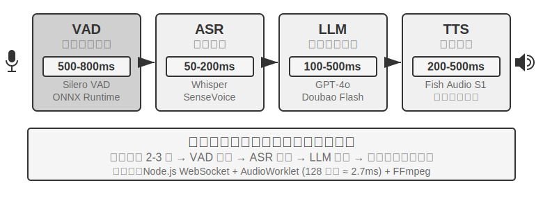

ஆரம்பகால குரல் உதவியாளர்கள் இந்த நான்கு-நிலை தொடர் pipeline ஐ ஒரு எளிய காரணத்திற்காக ஏற்றுக்கொண்டன: எந்த ஒரு model ஆலும் பேச்சு அங்கீகாரம், மொழி புரிதல், சிந்தனை மற்றும் பேச்சு தொகுப்பு ஆகியவற்றை ஒரே நேரத்தில் கையாள முடியவில்லை. மட்டு கட்டமைப்பு ஒவ்வொரு கூறுகளையும் சுயாதீனமாக உருவாக்கவும் மேம்படுத்தவும் அனுமதித்தது. இருப்பினும், மட்டுத்தன்மையின் விலை திரட்டப்பட்ட latency ஆகும்—ஒவ்வொரு நிலையும் முந்தையது முடிவதற்குக் காத்திருக்க வேண்டும்.

**VAD** என்பது pipeline-ன் தொடக்கப் புள்ளியாகும், இது audio stream-ஐ தொடர்ச்சியாகக் கண்காணிக்கிறது. மிக முக்கியமான வடிவமைப்பு End-of-Speech Detection ஆகும்: பொதுவாக, 500-800ms-ன் தொடர்ச்சியான அமைதி வரம்பு (threshold) நிர்ணயிக்கப்படுகிறது—பயனர் அரை வினாடிக்கும் மேலாகப் பேசுவதை நிறுத்தினால், VAD அந்த உச்சரிப்பு முடிந்ததாகக் கருதுகிறது. இது முதல் அடுக்கு latency-ஐ அறிமுகப்படுத்துகிறது, மேலும் இது ஒரு கடினமான trade-off ஆகும்: threshold மிகவும் குறுகியதாக இருந்தால், சிந்தனைக்கான இடைவெளி முடிவு என்று தவறாகக் கருதப்பட்டு, வாக்கியம் நடுவில் துண்டிக்கப்படும்; அது மிகவும் நீளமாக இருந்தால், பயனர் முடித்த பிறகு பதிலைப் பெற கிட்டத்தட்ட ஒரு வினாடி காத்திருக்க வேண்டியிருக்கும்.

**ASR** audio waveform-ஐ உரையாக மாற்றுகிறது. Whisper மற்றும் SenseVoice போன்ற Models, GPU-யில் பயன்படுத்தப்படும் சிறிய முதல் நடுத்தர அளவிலான model மூலம் 5 வினாடி audio-ஐ transcribe செய்யும்போது, பொதுவாக 50-200ms எடுக்கும்; பெரிய models அல்லது வள-கட்டுப்பாடுள்ள deployments 200-500ms எடுக்கலாம் (Experiment 9-3-ல் உள்ள control group பிந்தைய வகையைச் சேர்ந்தது). மிக முக்கியமான பிரச்சினை என்னவென்றால், முழு VAD காத்திருப்பு மற்றும் ASR transcription செயல்பாட்டின் போது, அதன் பின்னால் உள்ள LLM முற்றிலும் செயலற்ற நிலையில் இருக்கும், எந்த தகவலையும் பெறாமல், முன்கூட்டியே சிந்திக்கத் தொடங்க முடியாமல் இருக்கும்.

**LLM** inference, உகந்ததாக்கப்பட்டாலும் கூட, பெரும்பாலும் context length-ஐப் பொறுத்து 100-500ms Time to First Token (TTFT) கொண்டிருக்கும், மேலும் முதல் வாக்கியத்தை வெளியிட முடிக்க மற்றொரு ~100ms ஆகும். Reasoning இயக்கப்பட்டால், நேரம் 5-10 வினாடிகள் வரை நீட்டிக்கப்படலாம். பாரம்பரிய architecture-ல், TTS முழுமையான reply text-ஐ LLM வெளியிடும் வரை காத்திருக்க வேண்டும், பின்னரே அது வேலை செய்யத் தொடங்க முடியும்.

**TTS** reply text-ஐ பேச்சாக மாற்றுகிறது, பொதுவாக synthesis-க்கு 200-500ms எடுக்கும். ஒவ்வொரு இணைப்பின் latency-ஐயும் கூட்டினால் (Figure 9-2): VAD (500-800ms) + ASR (50-200ms) + LLM (100-500ms) + TTS (200-500ms), மொத்தம் தோராயமாக 0.9-2 வினாடிகள் ஆகும்—மேலும் இது அனைத்து சேவைகளும் செயலற்ற நிலையில் மற்றும் எந்த queuing-ம் இல்லாத சிறந்த நிலையாகும்.

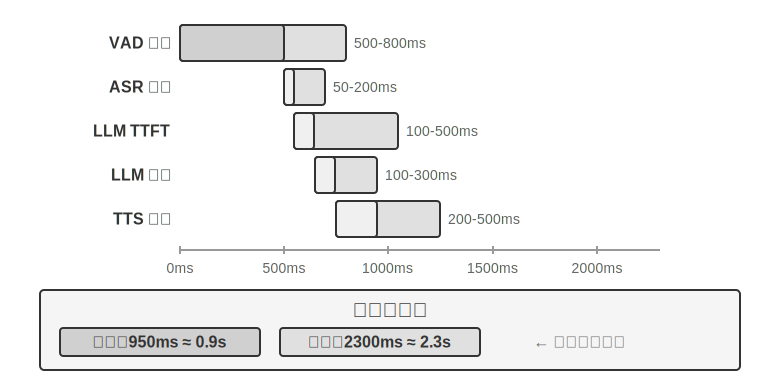

உற்பத்தி சூழலில், queuing latency நிலைமையை மோசமாக்குகிறது. இது ஒரு உணவகத்தில் queuing-ஐ ஒத்திருக்கிறது: சமையலறை எவ்வளவு பிஸியாக இருக்கிறதோ, அவ்வளவு காத்திருக்கும் நேரம் அதிகமாகும், மேலும் அது நேர்கோட்டில் அதிகரிக்காமல் வெடித்துச் சிதறும் (Figure 9-3). ஒரு server-ல் காத்திருப்பு queue இல்லாதபோது (அதாவது, "idle"), ஒரு கோரிக்கையைச் செயலாக்க எடுக்கும் நேரம் idle latency எனப்படும். ஆனால் பல கோரிக்கைகள் ஒரே நேரத்தில் வரும்போது, பிந்தைய கோரிக்கைகள் queue-ல் காத்திருக்க வேண்டும்.

உள்ளுணர்வாக, utilization எவ்வளவு அதிகமாக இருக்கிறதோ, அவ்வளவு non-linearly காத்திருக்கும் நேரம் அதிகரிக்கிறது. குறிப்பிட்ட கணித உறவை queuing theory மூலம் வழங்கலாம் (இங்கு உள்ளுணர்வு புரிதலுக்காக, கடுமையான derivation தேவையில்லை): Total Latency ≈ Idle Latency × 1/(1-Utilization). Utilization என்பது server பிஸியாக இருக்கும் நேரத்தின் விகிதத்தைக் குறிக்கிறது; உதாரணமாக, 50% utilization என்றால் server பாதி நேரம் கோரிக்கைகளைச் செயலாக்குகிறது மற்றும் பாதி நேரம் idle ஆக உள்ளது. 50% utilization-ல், latency இரட்டிப்பாகிறது; 80% utilization-ல், அது 5 மடங்கு ஆகிறது—இதனால்தான் servers அதிக சுமையின் கீழ் நீண்ட நேரம் இயங்க முடியாது.

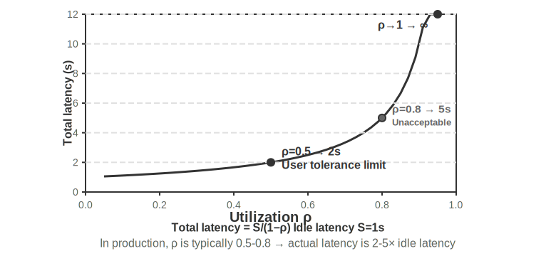

> **சோதனை 9-1 ★: பாரம்பரிய Voice Agent ஐ உருவாக்குதல்**
>
> இந்த சோதனையானது, பயனர்கள் மைக்ரோஃபோன் மூலம் AI உடன் குரல் மூலம் தொடர்பு கொள்ள அனுமதிக்கும் ஒரு முழுமையான நிகழ்நேர குரல் உரையாடல் அமைப்பை உருவாக்குகிறது. இந்த அமைப்பு WebSocket வழியாக நிகழ்நேர தகவல்தொடர்புடன் front-end/back-end பிரிப்பு கட்டமைப்பைப் பயன்படுத்துகிறது.
>
> மைய செயல்முறை ஒரு கடுமையான வரிசை முறையைப் பின்பற்றுகிறது: front-end மைக்ரோஃபோன் உள்ளீட்டைப் பிடித்து WebSocket வழியாக நிகழ்நேரத்தில் back-end க்கு அனுப்புகிறது. back-end ஆனது Silero VAD மாதிரியை voice activity detection க்காக இயக்குகிறது, இது பாரம்பரிய ஒலி அளவு அடிப்படையிலான கண்டறிதல் முறைகளுடன் ஒப்பிடும்போது அதிக துல்லியம் மற்றும் சிறந்த சத்தம் எதிர்ப்பை வழங்குகிறது. தோராயமாக 500ms தொடர்ச்சியான அமைதி கண்டறியப்பட்ட பிறகு, ஆடியோ பகுதி அடுத்தடுத்த செயலாக்கத்திற்காக பிரித்தெடுக்கப்படுகிறது.
>
> ASR, LLM மற்றும் TTS நிலைகள் ஒவ்வொன்றும் பல வழங்குநர்களுக்கு இடையே நெகிழ்வான மாற்றத்தை ஆதரிக்கின்றன, இது டெவலப்பர்கள் latency, துல்லியம் மற்றும் பிராந்திய நெட்வொர்க் நிலைமைகளின் அடிப்படையில் உகந்த கலவையைத் தேர்வு செய்ய அனுமதிக்கிறது.
>
> **சோதனை 9-2 ★: PineClaw Voice API ஐப் பயன்படுத்தி Phone Agent ஐ உருவாக்குதல்**
>
> சோதனை 9-1 ஒரு உலாவி அடிப்படையிலான குரல் உரையாடல் அமைப்பை உருவாக்கியது, ஆனால் பல நிஜ உலக Agent பணிகளுக்கு உண்மையான தொலைபேசி அழைப்புகளை மேற்கொள்ள வேண்டும்—விலை பேச்சுவார்த்தைக்காக வாடிக்கையாளர் சேவையைத் தொடர்புகொள்வது, உணவகங்களை முன்பதிவு செய்வது, ஆர்டர்களை உறுதிப்படுத்துவது. அத்தியாயம் 4, PineClaw இன் Channel பொறிமுறை மூலம், ஒரு event-driven கட்டமைப்பு தொலைபேசி அறிவிப்புகளுக்கான பதில் latency ஐ நிமிடங்களில் இருந்து வினாடிகளாக எவ்வாறு குறைக்க முடியும் என்பதை நிரூபித்தது. இந்த சோதனை குரல் அழைப்பை உருவாக்குவதில் கவனம் செலுத்துகிறது. [PineClaw Voice API](https://pineclaw.com/) (ஆசிரியரின் குழுவால் உருவாக்கப்பட்டது) ஐ உதாரணமாக எடுத்துக் கொண்டால், இத்தகைய உற்பத்தி-தர தொலைபேசி குரல் API கள் பொதுவாக டயல் செய்தல், IVR வழிசெலுத்தல் (அதாவது, "விசாரணைகளுக்கு 1 ஐ அழுத்தவும்; ஆபரேட்டருக்கு 0 ஐ அழுத்தவும்" தொலைபேசி மெனுக்கள்), உரையாடல் மற்றும் transcription ஆகியவற்றின் முழு செயல்முறையையும் உள்ளடக்குகின்றன: Agent தொலைபேசி எண், இலக்கு மற்றும் சூழல் தகவலை வழங்குகிறது, மேலும் குரல் Agent முழு அழைப்பையும் முடித்து, கட்டமைக்கப்பட்ட அழைப்பு பதிவைத் தருகிறது.
>
> **சோதனை இலக்கு**: உண்மையான தொலைபேசி அழைப்புகள் மூலம் பணிகளை முடிக்கும் திறன் கொண்ட ஒரு Agent ஐ உருவாக்குதல், PineClaw Voice ஐ ReAct loop இல் ஒரு tool ஆக ஒருங்கிணைத்தல்.
>
> **தொழில்நுட்ப அணுகுமுறை**: PineClaw Voice Python SDK (`pine-voice`) ஐப் பயன்படுத்தி Agent க்கு `make_phone_call` tool ஐ வழங்குதல். Agent பயனரின் பணி விளக்கத்தைப் பெறுகிறது (எ.கா., "நாளை மதியம் 3 மணிக்கு பல் பரிசோதனைக்கு முன்பதிவு செய்ய உதவுங்கள்"), மேலும் ReAct சிந்தனை மூலம் முடிவு செய்கிறது: (1) எந்த தொலைபேசி எண்ணை அழைக்க வேண்டும்; (2) அழைப்பின் இலக்கு மற்றும் முக்கிய தகவல்; (3) அழைப்பு முடிந்த பிறகு முடிவுகளை பயனருக்கு எவ்வாறு தெரிவிப்பது.
>
> Agent இன் பணிப்பாய்வு: பயனர் "நாளை சந்திப்புக்காக கிளினிக்கை அழைத்து முன்பதிவு செய்யுங்கள்" என்று கூறுகிறார் → Agent என்ன தகவல் தேவை என்பதைப் பற்றி சிந்திக்கிறது (கிளினிக் தொலைபேசி எண், சந்திப்பு நேரம், நோயாளியின் பெயர்) → தகவல் போதுமானதாக இல்லாவிட்டால், பயனரிடம் தெளிவுபடுத்துமாறு கேட்கிறது → `make_phone_call` tool ஐ அழைக்கிறது → PineClaw எண்ணை டயல் செய்கிறது, மறுபக்கத்துடன் உரையாடுகிறது, மற்றும் முன்பதிவை முடிக்கிறது → Agent அழைப்பு சுருக்கம் மற்றும் transcript ஐப் பெறுகிறது → முடிவை பயனருக்குத் தெரிவிக்கிறது.
> **ஏற்றுக்கொள்ளும் அளவுகோல்கள்**: ஒரு சோதனை அழைப்பை வெற்றிகரமாக மேற்கொள்ளுதல் (இணைப்பைச் சரிபார்க்க முதலில் உங்கள் சொந்த தொலைபேசியை அழைக்கலாம்). Agent ஆனது பணி விளக்கத்தின் அடிப்படையில் அழைப்பு அளவுருக்களை தன்னாட்சியுடன் தீர்மானிக்க முடியும். அழைப்பு முடிந்த பிறகு, அது முக்கிய தகவல்களை (சந்திப்பு நேரம், உறுதிப்படுத்தல் எண் போன்றவை) சரியாகப் பிரித்தெடுத்து பயனருக்குத் தெரிவிக்கிறது. API ஐ நேரடியாகப் பயன்படுத்துவதற்கும், Agent இன் ReAct லூப் மூலம் அழைப்பதற்கும் இடையே உள்ள வேறுபாட்டை ஒப்பிடுக—பிந்தையது முழுமையற்ற தகவல்களைக் கையாள முடியும் (எ.கா., பயனர் வழங்கவில்லை என்றால் தொலைபேசி எண்ணைத் தேடுதல்).

இந்தச் சோதனையானது குரல் Agents களுக்கான ஒரு முக்கியமான பயன்பாட்டுத் திசையை நிரூபிக்கிறது: **Agents ஆனது பயனர்களுடன் குரல் உரையாடல்களை மட்டுமல்லாமல், பயனர் சார்பாக வெளி உலகத்துடன் தொலைபேசி அழைப்புகள் மூலமும் தொடர்பு கொள்ள முடியும்**. PineClaw இன் குரல் Agent ஆனது மணிக்கணக்கான காத்திருப்புகள், தொலைபேசி மெனு வழிசெலுத்தல் மற்றும் சிக்கலான பேச்சுவார்த்தைகளைக் கையாள சிறப்பாகப் பயிற்றுவிக்கப்பட்டுள்ளது—உங்களுக்காக ஒரு வாடிக்கையாளர் சேவை ஆபரேட்டருக்காக AI காத்திருப்பதை கற்பனை செய்து பாருங்கள். பாரம்பரிய தொடர் குரல் pipelines போராடும் சூழ்நிலைகள் இவைதான்.### அடுக்கு Pipelines களுக்கான முழு-சங்கிலி ஸ்ட்ரீமிங்

ஒரு பொதுவான தவறான கருத்தை தெளிவுபடுத்த வேண்டும்: மேலே குறிப்பிடப்பட்ட 0.9–2 வினாடி தாமத பட்ஜெட், "ஒவ்வொரு இணைப்பும் பேட்டனை அனுப்பும் முன் முடிக்கும்" **முழுமையான தொடர்** சூழ்நிலையைக் கருதுகிறது. இருப்பினும், 2025 இல் உற்பத்தி அமைப்புகள் இனி இந்த வழியில் செயல்படுவதில்லை. முக்கிய நடைமுறையானது மாடுலாரிட்டியை கைவிடுவது அல்ல, மாறாக VAD-ASR-LLM-TTS பிரிவைத் தக்க வைத்துக்கொண்டு ஒவ்வொரு நிலையையும் **ஸ்ட்ரீமிங்** ஆக்குவதாகும், இது அருகிலுள்ள நிலைகள் நேரத்தில் ஒன்றுடன் ஒன்று இணைய அனுமதிக்கிறது:

- **ASR கேட்கும்போதே டிரான்ஸ்கிரைப் செய்கிறது**: ஸ்ட்ரீமிங் ரெகக்னிஷனைப் பயன்படுத்தி, பயனர் இன்னும் பேசிக்கொண்டிருக்கும்போதே உரை தொடர்ச்சியாக உருவாக்கப்படுகிறது, VAD வாக்கியத்தின் முடிவைத் தீர்மானிக்கும் வரை காத்திருக்காமல் டிரான்ஸ்கிரிப்ஷனைத் தொடங்குகிறது.
- **LLM வாக்கியத் துண்டுகளாக வெளியீடு அளிக்கிறது**: மாடல் உருவாக்கும்போது, அது நிறுத்தற்குறிகள் அல்லது சொற்பொருளின் அடிப்படையில் பதிலை சிறிய வாக்கியங்களாகப் பிரிக்கிறது. முழு பதிலும் எழுதப்படும் வரை காத்திருக்காமல், முதல் வாக்கியம் உருவானவுடன் கீழ்நிலைக்கு அனுப்பப்படுகிறது.
- **TTS வாக்கிய மட்டத்தில் ஸ்ட்ரீம் செய்கிறது**: முதல் சிறிய வாக்கியம் வந்தவுடன் அதை ஒருங்கிணைத்து இயக்கத் தொடங்குகிறது, அடுத்தடுத்த வாக்கியங்கள் உருவாக்கப்பட்டு நிகழ்நேரத்தில் சேர்க்கப்படுகின்றன. இது பயனர் முதல் எழுத்தைக் கேட்கும் நேரத்தை கணிசமாக முன்னெடுக்கிறது.

இதன் விளைவாக, ASR, LLM மற்றும் TTS ஆகிய மூன்று நிலைகளும் இனி ஒரு ரிலே போன்ற தொடர் உறவில் இல்லாமல், ஒரு அசெம்பிளி லைனில் உள்ள மூன்று பணிநிலையங்களைப் போல ஒரே நேரத்தில் செயல்படுகின்றன. LiveKit Agents மற்றும் Pipecat போன்ற திறந்த மூல கட்டமைப்புகள், அத்துடன் முக்கிய வணிக அவுட்பவுண்ட் கால் அமைப்புகள், இந்த அணுகுமுறையைப் பின்பற்றுகின்றன. முழு-சங்கிலி ஸ்ட்ரீமிங்கிற்குப் பிறகு, எண்ட்-டு-எண்ட் தாமதத்தை பொதுவாக 600–800ms ஆகக் குறைக்க முடியும், இது முழுமையான தொடர் செயலாக்கத்தின் 0.9–2 வினாடிகளை விட கணிசமாக சிறந்தது.

இருப்பினும், streaming முறையில் "transcription, thinking, மற்றும் synthesis" ஆகிய ஒன்றுடன் ஒன்று இணைக்கக்கூடிய பகுதிகளை மட்டுமே சுருக்க முடியும். அதனால் நீக்க முடியாத ஒரு latency பகுதி உள்ளது: **VAD-இன் silence waiting மற்றும் turn judgment**. பயனர் பேசி முடித்துவிட்டாரா என்பதை யூகிக்க, 500–800ms silence threshold-ஐ நம்பியே இந்த அமைப்பு உள்ளது. இந்த காத்திருப்பு காலம் pipeline தொடங்குவதற்கான முன்நிபந்தனையாகும், மேலும் இதை overlap மூலம் நீக்க முடியாது. இந்த latency-ஐயும் சுருக்க, "overlapping stages" என்பதிலிருந்து முன்பக்கத்தில் உள்ள perception stage-க்கு கவனத்தை மாற்ற வேண்டும்.

### Streaming Voice Perception: VAD + ASR-ஐ மாற்றுதல்

இந்த perception front-end இரண்டு நிலைகளைக் கொண்டுள்ளது—VAD பயனர் பேசி முடித்துவிட்டாரா என்பதை தீர்மானிக்கிறது, மேலும் ASR ஆடியோவை உரையாக மாற்றுகிறது. இவை இரண்டும் சேர்ந்து, முழு pipeline எப்போது தொடங்க வேண்டும் மற்றும் அது என்ன உள்ளீட்டைப் பெற வேண்டும் என்பதை தீர்மானிக்கின்றன. பாரம்பரிய VAD + ASR cascade மூன்று அடிப்படை சிக்கல்களைக் கொண்டுள்ளது:

1. **Latency Accumulation**: பயனர் பேசி முடித்துவிட்டார் என்பதை உறுதிப்படுத்த VAD 500–800ms silence-க்காக காத்திருக்க வேண்டும், ஏனெனில் அது எதிர்காலத்தை கணிக்க முடியாது மற்றும் "உண்மையில் முடித்துவிட்டார்" மற்றும் "யோசிப்பதற்காக இடைநிறுத்துகிறார்" ஆகியவற்றை வேறுபடுத்த "காத்திருப்பை" மட்டுமே நம்பியிருக்க முடியும்.
2. **Information Loss**: VAD "குரல்/அமைதி" போன்ற இரும நிலை சமிக்ஞையை மட்டுமே வெளியிடுகிறது. அனைத்து ஒலி விவரங்களும்—உணர்ச்சி மாற்றங்கள், குரல் ஏற்ற இறக்கங்கள், தயக்க இடைநிறுத்தங்கள், பின்னணி சூழல்—இழக்கப்படுகின்றன. சிக்கலான சூழல்களில் தவறான தீர்ப்பு பிரச்சினைகள் குறிப்பாக முக்கியத்துவம் பெறுகின்றன: பயனரின் சற்று நீண்ட இடைநிறுத்தம் முடிந்ததாக தவறாக தீர்மானிக்கப்பட்டு வாக்கியம் துண்டிக்கப்படுகிறது; பின்னணி சத்தம் தவறான தொடக்கத்தை ஏற்படுத்தி, யாரும் பேசாதபோது கணினி செயல்படுகிறது; மற்றும் பயனரின் "ஆமாம்" என்பது குறுக்கீடா அல்லது ஒப்புதலா என்பதை தீர்மானிக்க முடியவில்லை.
3. **Decreased Accuracy**: VAD தொடர்ச்சியான ஆடியோவை சுயாதீன பகுதிகளாக வெட்டுகிறது, ஒவ்வொன்றும் ASR-க்கு அனுப்பப்பட்டு அங்கீகரிக்கப்படுகிறது, இது சூழல் தொடர்ச்சியை சீர்குலைக்கிறது. சரியான அங்கீகாரத்திற்கு சூழல் தேவைப்படும் உள்ளடக்கம் (மின்னஞ்சல் முகவரிகள், பிராண்ட் பெயர்கள், நபர் பெயர்கள், சரியான பெயர்ச்சொற்கள்) பிழை விகிதத்தில் குறிப்பிடத்தக்க அதிகரிப்பைக் காண்கிறது—எடுத்துக்காட்டாக, பயனர் "john dot smith at gmail dot com" என்று சொன்னால், "john" மற்றும் "smith" வெவ்வேறு பகுதிகளாக வெட்டப்பட்டால், "smith" என்பது சூழல் இல்லாததால் "miss" என்று தவறாக அங்கீகரிக்கப்படலாம்.

**Streaming Voice Perception Models** ஒரு அடிப்படை தீர்வை வழங்குகின்றன. முதலில், "streaming" இன் தொழில்நுட்ப அர்த்தத்தை தெளிவுபடுத்துவோம்: ஒரு voice model streaming ஐ செயல்படுத்த முடியுமா என்பது **encoder causal அல்லது chunk-based** ஆக உள்ளதா (ஏற்கனவே வந்த audio ஐ மட்டுமே சார்ந்து, முழு பதிவையும் பார்க்க தேவையில்லை) மற்றும் **decoding incremental** ஆக உள்ளதா (ஒவ்வொரு சிறிய audio chunk கிடைக்கும்போதும் பகுதி முடிவுகளை வெளியிடுதல்) என்பதைப் பொறுத்தது. Whisper streaming செய்ய முடியாது, அதன் decoding முறை காரணமாக அல்ல—அதன் decoding இயல்பாகவே autoregressive ஆகும்—ஆனால் அதன் encoder ஒரு முழுமையான audio segment (நிலையான 30 விநாடிகள், குறைவாக இருந்தால் padding) தேவைப்படுவதால். மேலும், streaming recognition புதிய தொழில்நுட்பம் அல்ல என்பதையும் கவனத்தில் கொள்ள வேண்டும்: RNN-T மற்றும் streaming Conformer ஆல் பிரதிநிதித்துவப்படுத்தப்படும் பாரம்பரிய streaming ASR நீண்ட காலமாக தொழில்துறையில் பெரிய அளவில் பயன்படுத்தப்பட்டு வருகிறது—தொலைபேசிகளில் நிகழ்நேர தலைப்புகள் மற்றும் input method களுக்கான குரல் உள்ளீடு போன்றவை இந்த மாதிரிகளைப் பயன்படுத்துகின்றன—மேலும் அவை LLM களுடன் எந்த தொடர்பும் இல்லை.

இந்த பகுதி ஒரு புதிய பாதையில் கவனம் செலுத்துகிறது: **LLM அடிப்படையிலான streaming auditory perception**—ஒரு திறந்த மூல LLM ஐ backbone ஆக பயன்படுத்தி post-training செய்து, தொடர்ச்சியான audio stream இலிருந்து நேரடியாக semantic-level பதில்களை வெளியிட அனுமதிக்கிறது, "recognition" மற்றும் "understanding" ஐ ஒரே மாதிரியில் இணைக்கிறது. இது பாரம்பரிய streaming ASR க்கு ஒரு மேம்படுத்தல் ஆகும், streaming தொழில்நுட்பத்தின் கண்டுபிடிப்பு அல்ல: incremental recognition இன் latency ஒற்றை-step inference நேரத்தின் வரிசையில் (பத்துகள் முதல் சில நூறு மில்லி விநாடிகள் வரை) உள்ளது, ஆனால் மாதிரி இனி VAD ஆல் வெட்டப்பட்ட தனிமைப்படுத்தப்பட்ட துண்டுகளைப் பார்ப்பதில்லை. மாறாக, உரையாடலின் தொடக்கம் முதல் தற்போதைய தருணம் வரையிலான தொடர்ச்சியான audio stream ஐப் பார்க்கிறது, இது முழுமையான context அடிப்படையில் In-Context Learning ஐ செயல்படுத்துகிறது, பயனரின் தனிப்பட்ட தகவல்கள், தொழில்முறை சொற்கள் மற்றும் உச்சரிப்பு பழக்கங்களுக்கான recognition துல்லியத்தை கணிசமாக மேம்படுத்துகிறது.

இந்த பாதையின் மற்றொரு முக்கிய நன்மை LLM களின் உலக அறிவு மற்றும் common sense reasoning திறன்களைப் பெறுவதாகும்—எல்லாவற்றிற்கும் மேலாக, backbone மாதிரி ஏராளமான உரைகளைப் பார்த்துள்ளது. உதாரணமாக, "Apple" ஐத் தொடர்ந்து "event" வந்தால், அது பழத்தை விட நிறுவனத்தைக் குறிக்கும் என்பதை மாதிரி அறியும். இந்த அறிவு மேம்பாடு, தொகைகள், இடப் பெயர்கள் மற்றும் பிராண்ட் பெயர்கள் போன்ற உயர் மதிப்பு தகவல்களுக்கான recognition துல்லியத்தை பாரம்பரிய ASR ஐ விட வெகுவாக மேம்படுத்துகிறது. இந்த பாதையில் ஏற்கனவே பயன்படுத்தக்கூடிய மாதிரிகள் உள்ளன, உதாரணமாக Fixie இன் Ultravox—இது audio ஐ நேரடியாக LLM backbone க்கு அளித்து உரை மற்றும் semantic tokens ஐ வெளியிடுகிறது. இந்த பகுதியின் சோதனைகளில் பயன்படுத்தப்படும் Qwen2-Audio, மற்றும் Alibaba இன் Qwen2.5-Omni ஆகியவையும் இந்த வகை audio-native மாதிரிகளைச் சேர்ந்தவை.

இருப்பினும், VAD ஐ மாற்றுவதற்கு முழு அளவிலான audio LLM ஐப் பயன்படுத்த வேண்டிய அவசியமில்லை. முதல் சிக்கலை மட்டும் தீர்க்க வேண்டும் என்றால்—**பயனர் பேசி முடித்துவிட்டாரா என்பதை தீர்மானித்தல்**—இலகுவான வழி ஒன்று உள்ளது: இந்த "turn judgment" ஐ நேரடியாக recognizer இல் பொதிந்து விடுதல்[^ch9-11]. இந்த அணுகுமுறை, சிறிய open-source streaming recognition model இல் LoRA ஒன்றைச் சேர்த்து, அது ஒரே நேரத்தில் transcribe செய்து **semantics மற்றும் silence ஐ ஒருங்கிணைத்து** "இந்த வாக்கியம் முழுமையான அர்த்தத்தை வெளிப்படுத்தியுள்ளதா" என்பதை தீர்மானிக்க அனுமதிக்கிறது—ஏனெனில் intra-turn pauses (தொலைபேசி எண்ணைச் சொல்லும்போது இடைநிறுத்தம்) பெரும்பாலும் inter-turn intervals ஐ விட நீளமாக இருக்கும், silence threshold ஐ மட்டும் நம்பினால் இரு பக்கங்களிலும் தோல்வியடைவது தவிர்க்க முடியாதது. மிகவும் சுவாரஸ்யமான முடிவு என்னவென்றால், "turn எடுக்கலாமா வேண்டாமா" என்பதில் model இன் oscillation பெரும்பாலும் model architecture இலிருந்து அல்ல, மாறாக **"God's eye view" உடன் annotated செய்யப்பட்ட training labels** இலிருந்து உருவாகிறது—annotation ஆனது decision point க்குப் பிறகு தோன்றிய audio ஐப் பயன்படுத்தியது, ஆனால் online model எதிர்காலத்தைப் பார்க்க முடியாது. ஒவ்வொரு label ஐயும் "decision moment இல் மட்டுமே கிடைக்கும் தகவலைப் பயன்படுத்தி" annotate செய்வதன் மூலம், இந்த தவறான oscillation மறைந்துவிடும். இது Chapter 7 இல் post-training பற்றிய தீர்ப்பை எதிரொலிக்கிறது: பெரும்பாலும், data architecture ஐ விட முக்கியமானது. இந்த இலகுவான வழியில் production-grade implementations உள்ளன: Deepgram இன் Flux மற்றும் AssemblyAI இன் Universal-Streaming ஆகியவை endpoint மற்றும் turn judgment ஐ நேரடியாக streaming recognition models இல் பொதிந்து, குறிப்பாக voice agents க்காக வடிவமைக்கப்பட்டுள்ளன; open-source பக்கத்தில், LiveKit மற்றும் Pipecat ஆகியவை semantic turn detection models ஐ வழங்குகின்றன.

[^ch9-11]: Recognizer இல் turn judgment ஐ பொதிந்து விடுதல் மற்றும் labels இன் "God's eye view" பற்றிய நோயறிதலை Li, Bojie மற்றும் Noah Shi ஆகியோரின் *The Trade-off Was in the Labels: Causal Supervision for Turn-Aware Streaming ASR.* 2026 (forthcoming) இல் காணலாம்.

Model உரையை மட்டுமல்லாமல், **acoustic events க்கான சிறப்பு markers** தொடரையும் வெளியிடுகிறது—இவை model training இன் போது அறிமுகப்படுத்தப்பட்ட dedicated tokens ஆகும். தொடர்புடைய acoustic events ஐக் கண்டறியும் போது அவற்றைத் தானாக வெளியிட model கற்றுக்கொள்கிறது. பொதுவான வகைகள் பின்வருமாறு:

- `<speak_start/end>`: எளிய silence detection ஐ விட, semantics மற்றும் acoustics இன் விரிவான தீர்ப்பின் அடிப்படையில் speech start மற்றும் end ஐ தீர்மானிக்கிறது.
- `<interrupt>`: பயனர் உண்மையில் interrupt செய்ய விரும்புகிறாரா அல்லது வெறுமனே acknowledging அல்லது background noise ஆல் பாதிக்கப்படுகிறாரா என்பதை வேறுபடுத்துகிறது.
- `<emotion:happy/frustrated>`: Emotion markers.
- `<laugh>` / `<sigh>`: சிரிப்பு மற்றும் பெருமூச்சு போன்ற paralinguistic signals.
- `<music>` / `<noise>`: சுற்றுச்சூழல் ஒலிகள்.

இந்த markers, text tokens உடன் சேர்ந்து, ஒருங்கிணைந்த event stream ஐ உருவாக்கி, thinking layer க்கு அளிக்கப்படுகிறது.

```
Input audio: "Um, actually I think... no wait, let me reconsider."
Model output stream:
  <speak_start> Um, <emotion:hesitant> actually I think...
  <silence:500ms> no wait, <emotion:confident> let me reconsider <speak_end>
```

குறிப்பு: model ஆனது உரை transcription மட்டுமல்லாமல், voice event markers (பேச்சின் தொடக்கம்/முடிவு, உணர்ச்சி மாற்றங்கள், அமைதி இடைவெளிகள்) ஆகியவற்றையும் வெளியிடுகிறது. Agent frameworks இந்த markers ஐப் பயன்படுத்தி மிகவும் இயற்கையான தொடர்புகளை உருவாக்க முடியும்—எடுத்துக்காட்டாக, பயனரின் தயக்கத்தைக் கண்டறிந்து முன்னெச்சரிக்கையாக விருப்பங்களை வழங்குதல்.

> **சோதனை 9-3 ★: Qwen2-Audio உடன் Streaming Voice Perception ஐ உருவகப்படுத்துதல்**
>
> சோதனை வடிவமைப்பை முதலில் தெளிவுபடுத்த வேண்டும்: Qwen2-Audio என்பது ஒரு non-streaming model ஆகும், இது முழு பகுதிகளையும் input ஆக எடுத்துக்கொள்கிறது. இந்த சோதனையானது **streaming processing ஐ உருவகப்படுத்த chunked input** ஐப் பயன்படுத்துகிறது—தொடர்ச்சியான audio stream ஐ நிலையான நீளமுள்ள சிறிய chunks ஆக வெட்டி, ஒவ்வொன்றும் திரட்டப்பட்ட audio context உடன் model க்கு அனுப்பப்படுகிறது. Model ஆனது படிப்படியாக text மற்றும் acoustic event tokens (சிரிப்பு, இடைநிறுத்தங்கள் மற்றும் பிற non-verbal signals போன்றவை) ஆகியவற்றை உருவாக்குகிறது, மேலும் ஒவ்வொரு chunk ஐயும் input செய்து text ஐ உருவாக்கும் latency ஐ அளவிடுகிறது. இங்கு ஒரு முக்கியமான செலவு உள்ளது: Qwen2-Audio இன் encoder ஆனது incremental அல்ல. ஒவ்வொரு முறை புதிய chunk செயலாக்கப்படும் போதும், முன்னர் திரட்டப்பட்ட அனைத்து audio யும் மீண்டும் மீண்டும் encode செய்யப்பட வேண்டும். எனவே, உரையாடல் நீளமாகவும், திரட்டப்பட்ட audio அதிகமாகவும் இருந்தால், ஒவ்வொரு chunk க்குமான encoding latency அதிகரிக்கும்—இதுவே "உருவகப்படுத்தப்பட்ட streaming" க்கும் "உண்மையான streaming" க்கும் (incremental அல்லது causal encoders ஐப் பயன்படுத்தும், புதிதாக வந்த சிறிய audio segment ஐ மட்டுமே incrementally encode செய்யும்) இடையேயான அடிப்படை வேறுபாடு ஆகும். இந்த வடிவமைப்பு "முழுமையான context உடன் தொடர்ச்சியான perception" இன் துல்லிய நன்மைகளை நிரூபிக்க முடியும், ஆனால் latency எண்கள் chunk granularity மற்றும் inference speed ஐ மட்டுமே பிரதிபலிக்கின்றன, உண்மையான streaming-வடிவமைக்கப்பட்ட model (chunked encoding உடன் Qwen3-Omni போன்றவை) இன் first-packet latency ஐ அல்ல; ஆர்வமுள்ள வாசகர்கள் பிந்தையதை மாற்றி சோதனையை மீண்டும் செய்யலாம். ஒப்பீட்டு baseline ஆனது பாரம்பரிய VAD + Whisper ASR pipeline ஆகும். மூன்று சூழ்நிலைகள் சோதிக்கப்படுகின்றன: சாதாரண உரையாடல், இடைநிறுத்தங்களுடன் கூடிய நீண்ட வாக்கியங்கள், மற்றும் பின்னணி சத்தத்துடன் கூடிய உரையாடல்.
>
> முடிவுகள்: Chunked simulation திட்டத்தின் incremental recognition latency ஐ ஒன்று முதல் இருநூறு மில்லி விநாடிகள் வரை கட்டுப்படுத்த முடியும் (chunk நீளம் மற்றும் hardware ஐப் பொறுத்து), அதே நேரத்தில் பாரம்பரிய திட்டமானது VAD முடிவை உறுதிப்படுத்த காத்திருக்க வேண்டும் (600ms) மற்றும் Whisper inference (இந்த சோதனையின் கட்டமைப்பின் கீழ் சுமார் 200–500ms) ஆக மொத்தம் 800–1100ms ஆகும். இடைநிறுத்தங்கள் உள்ள சூழ்நிலையில், VAD முதல் நீண்ட இடைநிறுத்தத்தை பேச்சின் முடிவு என்று தவறாக மதிப்பிட்டு, வாக்கியத்தை இரண்டு பகுதிகளாகப் பிரித்து தனித்தனியாக அடையாளம் கண்டது. "大概两点左右" (சுமார் இரண்டு மணி) என்பது context இல்லாததால் "大概零点左右" (சுமார் நள்ளிரவு) என்று தவறாக அடையாளம் காணப்பட்டது. முழுமையான context ஐப் பராமரிக்கும் chunked திட்டம், முழு வாக்கியத்தையும் சரியாக அடையாளம் கண்டது. பின்னணி சத்தம் உள்ள சூழ்நிலையில், Qwen2-Audio `<|noise|>` tokens ஐ வெளியிட்டு சத்தத்தின் இருப்பைக் குறிக்கிறது, அடையாளம் காணலைத் தடுக்காமல், அதே நேரத்தில் பாரம்பரிய VAD சத்தத்தால் தவறாகத் தூண்டப்பட்டு, அடையாளம் காணல் செயல்முறை முன்கூட்டியே தொடங்கியது.
## Paradigm 2: End-to-End Full-Modal Model (Omni)

முழு அடுக்கப்பட்ட pipeline-ஐ மீண்டும் பார்க்கும்போது: perception front-end ஆனது streaming voice perception ஆல் மாற்றப்பட்டாலும், அது இறுதியில் "கேட்பது, சிந்திப்பது மற்றும் பேசுவது" ஆகியவற்றை மூன்று சுயாதீன models-களுக்கு ஒதுக்குகிறது, அவை ஒரு discrete interface மூலம் இணைக்கப்பட்டுள்ளன. இந்த interface எவ்வளவு அகலமாக இருந்தாலும், அது ஒரு சில semantic tokens மற்றும் எப்போதாவது acoustic markers-கள் மட்டுமே—பேச்சாளரின் தற்போதைய உணர்ச்சி, தொனி, உச்சரிப்பு மற்றும் பின்னணி சூழல் ஒலிகள் மற்றும் இசை ஆகியவை handover-இன் போது பெரும்பாலும் இழக்கப்படுகின்றன. மேலும், மூன்று பகுதிகளும் சுயாதீனமாக பயிற்சி மற்றும் optimization செய்யப்படுகின்றன, இதனால் அவை ஒத்துழைப்பது கடினம். End-to-end full-modal models (Omni) வேறுபட்ட பாதையை எடுக்கின்றன—ஒரு single model-ஐப் பயன்படுத்தி நேரடியாக ஆடியோவை "கேட்டு", பதிலை "சிந்தித்து", அதை "பேசி" வெளியிடுகின்றன, மூன்று பகுதிகளையும் ஒன்றாக இணைக்கின்றன (Figure 9-4). போதுமான பயிற்சி தரவுகளுடன், model-இன் உள் latent space ஆனது இந்த paralinguistic features-ஐ நேரடியாக text-க்கு அப்பால் உள்ள generation end-க்கு அனுப்ப முடியும்: குறைந்த latency, மற்றும் பாதுகாக்கப்பட்ட prosody மற்றும் emotion. இதன் பரிமாற்றம்: **cascaded pipelines**-இல் தெளிவான modules உள்ளன, ஒவ்வொரு பகுதியையும் சுயாதீனமாக fine-tune செய்யலாம், மேலும் அவை நல்ல interpretability-ஐ வழங்குகின்றன; **end-to-end models**-இல் குறைந்த latency மற்றும் non-textual தகவல்களைத் தக்கவைக்கும் திறன் உள்ளது, ஆனால் அதிக பயிற்சி தரவு தேவை மற்றும் குறைந்த interpretability ஆகிய செலவுகள் உள்ளன.

அடிக்கடி புறக்கணிக்கப்படும் ஒரு பரிமாணமும் சேர்க்கப்பட வேண்டும்: end-to-end-இன் நன்மை முக்கியமாக **latency**-இல் உள்ளது; அது **accuracy**-இல் அவசியம் ஒரு நன்மையைக் கொண்டிருக்காது. ஒப்பிடத் தகுந்த ஒரு திட்டம் **self-cascade** ஆகும்—அதே model முதலில் ஆடியோவை structured text ஆக மாற்றி, பின்னர் அந்த text-ஐ அடிப்படையாகக் கொண்டு reasoning செய்கிறது. ஒரே முறையில் end-to-end-ஆக பதிலளிப்பதை விட, எது அதிக accuracy-ஐக் கொண்டுள்ளது என்பது குறிப்பிட்ட பணியைப் பொறுத்தது. இந்த முறையை பின்வருமாறு சுருக்கலாம்: பதில் முக்கியமாக semantic content-ஆல் (அதாவது, "என்ன சொல்லப்பட்டது") தீர்மானிக்கப்படும்போது, மற்றும் intermediate text ஆனது பணி தொடர்பான தகவல்களை போதுமான அளவில் எடுத்துச் செல்ல முடியும்போது, self-cascade ஆனது end-to-end-ஐ விட ஒப்பிடத்தக்க அல்லது சிறந்த accuracy-ஐ அடைகிறது, குறிப்பாக பலவீனமான perception திறன்களைக் கொண்ட models-களுக்கு. மாறாக, பதில் text-இல் பிரதிநிதித்துவப்படுத்த கடினமான non-verbal cues (தொனி, உணர்ச்சி, சூழல் ஒலிகள்) மீது அதிகம் சார்ந்திருக்கும்போது, end-to-end தெளிவான நன்மையைக் காட்டுகிறது. மிக முக்கியமாக, இரண்டின் ஒப்பீட்டு நன்மைகளை **பணியின் தன்மையின் அடிப்படையில் முன்கூட்டியே தீர்மானிக்க முடியும்**, அதை "end-to-end மிகவும் மேம்பட்டது" என்று எளிமையாகக் கூற முடியாது. இது ஒரு வடிவமைப்புக் கொள்கைக்கு வழிவகுக்கிறது: செயல்திறனின் திறவுகோல் பெரும்பாலும் ஒரு intermediate representation-ஐ **bottleneck** ஆக அறிமுகப்படுத்துவதா இல்லையா என்பதில் இல்லை, மாறாக அந்த bottleneck எடுத்துச் செல்லும் தகவலில் உள்ளது. intermediate text ஆனது ஒரு எளிய transcription-இலிருந்து paralinguistic markers (உணர்ச்சி, பேச்சு வேகம், சூழல் ஒலிகள்) கொண்ட structured representation ஆக மேம்படுத்தப்பட்டால், end-to-end-இன் அசல் accuracy நன்மை பெரும்பாலும் குறைகிறது. இது "Streaming Voice Perception" இல் முன்னர் கூறப்பட்ட "perception layer plain text-ஐ மட்டும் வெளியிடக்கூடாது" என்ற கூற்றுடன் ஒத்துப்போகிறது[^ch9-13].

இருப்பினும், Omni எவ்வளவு சக்தி வாய்ந்ததாக இருந்தாலும், அது அடிப்படையில் மூன்று models-ஐ ஒன்றாக இணைக்கிறதே தவிர, **"மாறி மாறி பேசுதல்" என்ற அனுமானத்தை நீக்கவில்லை**: அது இன்னும் VAD-ஐ நம்பி பேச்சு உரிமையைப் பிரிக்கிறது—பயனர் பேசுவதைக் கண்டறிந்தால் நிறுத்துகிறது, மற்றும் பயனர் அமைதியானவுடன் பேசத் தொடங்குகிறது. எனவே, பழக்கமான பிரச்சனை மீண்டும் தோன்றுகிறது: ஒரு பயனர் எண்களின் வரிசையைச் சொல்லி சிறிது நேரம் இடைவெளி விட்டால், Omni மறுபக்கம் முடித்துவிட்டதாக மதிப்பிட்டு வலுக்கட்டாயமாக குறுக்கிடுகிறது. முன்னர் குறிப்பிடப்பட்ட streaming voice perception, turn judgment-ஐ அமைதி கால அளவிலிருந்து semantic level-க்கு மேம்படுத்தி, இத்தகைய தவறான மதிப்பீடுகளை கணிசமாகக் குறைக்கும், ஆனால் அது இறுதியில் "turn-taking" கட்டமைப்பிற்குள் ஒரு உள்ளூர் patch ஆகும், turn-taking-ஐ நீக்குவதில்லை. **அடிப்படையில்** இந்த சிக்கலில் இருந்து வெளியேற, "turn-taking" கட்டமைப்பிற்குள் patch செய்வதை நிறுத்த வேண்டும். அதற்கு பதிலாக, model ஒரே நேரத்தில் கேட்டு பேச வேண்டும், எப்போது பேச வேண்டும் என்பதை சுயமாக முடிவு செய்ய வேண்டும், மேலும் "யாருடைய முறை" என்பதற்கு கடினமான switch இருக்கக்கூடாது.

[^ch9-13]: cascade மற்றும் end-to-end-ன் துல்லிய நன்மைகள் எப்போது மாறுகின்றன, மற்றும் பணியின் தன்மையை அடிப்படையாகக் கொண்டு (intermediate representation-ஆல் பணி தொடர்பான தகவலை போதுமான அளவு எடுத்துச் செல்ல முடியுமா என்பதைப் பொறுத்து) திசையை எவ்வாறு கணிப்பது என்பதற்கான முழுமையான cross-modal அளவீட்டிற்கு, Li, Bojie மற்றும் Noah Shi. *The Cascade Gap: When and Why Self-Cascades Help Multimodal Agents.* 2026 (forthcoming) பார்க்கவும்.

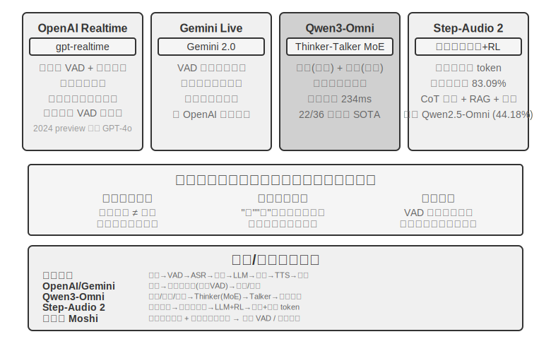

**OpenAI Realtime API** model மட்டத்தில் end-to-end-க்கு நெருக்கமாக உள்ளது (model ஆனது audio-ஐ இயற்கையாகவே செயலாக்குகிறது), ஆனால் interaction control மட்டத்தில் இன்னும் பாரம்பரிய VAD-ஐ நம்பியுள்ளது, இது முழு end-to-end-க்கு மாறும் ஒரு இடைநிலை தீர்வாகும். இது ஆரம்பத்தில் (2024 preview) GPT-4o-வில் இயங்கியது, மேலும் 2025-ல் அதன் உத்தியோகபூர்வ GA-க்குப் பிறகு, இது **gpt-realtime** என்ற பிரத்யேக voice model-க்கு மாறியது (இது GPT-4o-வின் ஒரு mode அல்ல, மாறாக real-time voice-க்காக குறிப்பாக உகந்ததாக்கப்பட்ட ஒரு model). API ஆனது இயல்பாகவே server-side VAD-ஐ இயக்குகிறது, பயனர் எப்போது பேசத் தொடங்குகிறார் மற்றும் நிறுத்துகிறார் என்பதை தானாகவே தீர்மானிக்கிறது. இது உரையாடலின் போது குறுக்கீட்டை ஆதரிக்கிறது—பயனர் பேசத் தொடங்குவதைக் கண்டறிந்து உடனடியாக தற்போதைய voice generation-ஐ நிறுத்துகிறது, நேருக்கு நேர் உரையாடலில் ஒருவர் குறுக்கிடும்போது மற்றவர் இயற்கையாகவே நிறுத்துவது போல. gpt-realtime asynchronous function calls-ஐயும் அறிமுகப்படுத்துகிறது: model ஆனது tool முடிவுகளுக்காக காத்திருக்கும் போது பயனருடன் தொடர்ந்து பேச முடியும், tool latency-ஐ உரையாடல் செயல்முறையில் மறைக்கிறது. இந்த மேம்பாடுகள் அனுபவத்தை மேம்படுத்துகின்றன, ஆனால் அடிப்படையில் VAD கட்டமைப்பிற்குள் உள்ள மேம்படுத்தல்களே. **Gemini Live API** இதேபோன்ற அணுகுமுறையைக் கொண்டுள்ளது, VAD உணர்திறன் உள்ளமைவை ஆதரிக்கிறது மற்றும் குறுக்கீட்டின் போது அனுப்பப்பட்ட தகவலைத் தக்கவைத்து உரையாடல் ஒத்திசைவை உறுதி செய்கிறது.

**Qwen3-Omni** ஒரு Thinker-Talker architecture-ஐ பின்பற்றுகிறது: சிந்தனை (புரிதல் மற்றும் பகுத்தறிவு) மற்றும் வெளிப்பாடு (குரல் உருவாக்கம்) ஆகியவற்றை இரண்டு சிறப்பு modules-ஆக பிரித்து, text, images, audio மற்றும் video ஆகியவற்றிற்கான perception மற்றும் generation-ஐ ஒருங்கிணைக்கிறது. அதிக திறனைப் பராமரிக்கும் அதே வேளையில் computational cost-ஐ கட்டுப்படுத்த, Qwen3-Omni MoE (Mixture of Experts) architecture-ஐ பயன்படுத்துகிறது—இதை "தேவைக்கேற்ப expert குழுக்களை அழைப்பது" என்று நினைக்கலாம்: இது உள்ளே பல சிறிய expert networks-ஐ கொண்டுள்ளது, மேலும் ஒவ்வொரு inference-க்கும், தற்போதைய பணிக்கு மிகவும் பொருத்தமான சில experts மட்டுமே செயல்படுத்தப்படுகின்றன, மற்றவை computation-இல் பங்கேற்காது. உதாரணமாக, speech-ஐ செயலாக்கும்போது, இது முதன்மையாக speech-தொடர்பான experts-ஐ செயல்படுத்துகிறது; images-ஐ செயலாக்கும்போது, இது முதன்மையாக vision-தொடர்பான experts-ஐ செயல்படுத்துகிறது. இது model-ஆனது மிகப் பெரிய மொத்த parameter count-ஐ (அதிக திறனை உறுதி செய்கிறது) கொண்டிருக்க அனுமதிக்கிறது, அதே நேரத்தில் ஒவ்வொரு token-க்குமான உண்மையான computation மிகவும் சிறியதாக இருக்கும், இதனால் inference throughput மேம்படுகிறது மற்றும் அதிக சுமையின் கீழ் queuing latency குறைகிறது.

MoE ஆனது "ஒரு யூனிட் compute-க்கு எத்தனை requests-ஐ வழங்க முடியும்" என்ற throughput பிரச்சினையை கையாள்கிறது என்பதை வேறுபடுத்திப் பார்ப்பது முக்கியம். இது "முதல் audio packet-ஐ எவ்வளவு சீக்கிரம் அனுப்ப முடியும்" என்பதை நேரடியாக தீர்மானிக்காது—first-packet latency ஆனது generation architecture-ஐ பொறுத்தது. Qwen3-Omni-இன் குறைந்த first-packet latency ஆனது அதன் Talker module-இன் வடிவமைப்பிலிருந்து வருகிறது: இது audio tokens-ஐ multi-codebook autoregressive முறையில் படிப்படியாக உருவாக்குகிறது, மேலும் இந்த tokens-ஐ படிப்படியாக waveforms-ஆக மாற்ற causal codec-ஐ பயன்படுத்துகிறது. எனவே, thinking module text-ஐ உருவாக்கியவுடன், Talker ஆனது முழு response-உம் உருவாக்கப்படும் வரை காத்திருக்காமல், streaming speech synthesis-ஐத் தொடங்க முடியும். அதிகாரப்பூர்வ அறிக்கையின்படி, அதன் cold-start theoretical first-packet latency தோராயமாக 234ms வரை குறைவாக உள்ளது, 19 மொழிகளில் புரிதல் மற்றும் 10 மொழிகளில் generation-ஐ ஆதரிக்கிறது, மேலும் 36 audio-video benchmarks-இல் 22-இல் முன்னணியில் உள்ளது.

**Step-Audio 2** வேறு ஒரு பாதையை எடுக்கிறது: இது நேரடியாக raw audio input-ஐ செயலாக்கி, text மற்றும் audio இரண்டையும் output-ஆக வழங்குகிறது, உண்மையான end-to-end voice conversation-ஐ அடைகிறது. இது *என்ன* சொல்லப்படுகிறது (semantic information) என்பதை மட்டும் புரிந்துகொள்ள முடியாது, மாறாக *எப்படி* சொல்லப்படுகிறது—paralinguistic information, அதாவது பேச்சாளரின் உணர்ச்சி மகிழ்ச்சியா அல்லது கோபமா, பேச்சு வேகம் வேகமாகவா அல்லது தயக்கமாகவா உள்ளது, உச்சரிப்பு ஏறுகிறதா அல்லது இறங்குகிறதா—மற்றும் பின்னணி சூழல் ஒலிகள் மற்றும் இசை ஆகியவற்றையும் உணர முடியும். இது சிந்தனை மற்றும் reinforcement learning மூலம் வெளிப்படையான responses-ஐ உருவாக்குகிறது, மேலும் RAG mechanism மற்றும் வெளிப்புற tools (web search, audio search) ஆகியவற்றையும் ஒருங்கிணைக்கிறது. Step-Audio 2 paper-இன் படி, paralinguistic understanding-க்கான அவர்கள் முன்மொழிந்த StepEval-Audio-Paralinguistic benchmark-இல், Step-Audio 2 ஆனது 83.09% துல்லியத்தை அடைகிறது, இது சமகால open-source full-modal model Qwen2.5-Omni (44.18%)-ஐ விட முன்னணியில் உள்ளது, மேலும் GPT-4o Audio (43.45%) மற்றும் Kimi-Audio (49.64%)-ஐயும் மிஞ்சுகிறது.

Step-Audio R1 என்பது Step-Audio தொடரின் தொடர்ச்சியான பணியாகும். Step-Audio 2 இன் end-to-end குரல் உரையாடல் கட்டமைப்பின் மீது கட்டமைக்கப்பட்டு, இது சிந்திக்கும் திறன்களை நேரடியாக audio model இல் உள்வாங்குகிறது. இவை இரண்டும் ஒரே தொழில்நுட்பப் பாதையில் முற்போக்கான பரிணாம வளர்ச்சியைக் குறிக்கின்றன.

## Paradigm 3: Full-Duplex / Interactive Models

Paradigm 2 மூன்று models ஐ ஒன்றாக இணைத்தது, ஆனால் "மாறி மாறி பேசுதல்" என்ற அனுமானத்தை இன்னும் ஒட்டிக்கொண்டிருந்தது—பயனர் பேசுகிறார் அல்லது model பேசுகிறது, மாற்றும் புள்ளி VAD அல்லது semantics மூலம் யூகிக்கப்படுகிறது. இருப்பினும், சில சூழ்நிலைகள் "ஒரு நேரத்தில் ஒரு வாக்கியம்" என்ற turn-taking முறையை ஏற்றுக்கொள்ள முடியாது. **Simultaneous interpretation** இதற்கு ஒரு சிறந்த எடுத்துக்காட்டு: மொழிபெயர்ப்பாளர் பேச்சாளர் ஒரு முழு வாக்கியத்தை முடிக்கும் வரை காத்திருக்காமல், ஒரே நேரத்தில் கேட்டு மனதில் ஒழுங்குபடுத்தி, ஒரு பொருள் அலகு தோராயமாக முடிந்தவுடன் மொழிபெயர்க்கத் தொடங்குகிறார், கேட்டல் மற்றும் மொழிபெயர்ப்பு எப்போதும் ஒன்றுடன் ஒன்று பின்னிப் பிணைந்திருக்கும். **இசையுடன் டிரம் பீட்களை அடிக்கும் ரிதம் விளையாட்டுகள்** இன்னும் தீவிரமானவை—செவிப்புலன் தடையில்லா இசை ஸ்ட்ரீமை தொடர்ந்து கண்காணிக்க வேண்டும், கைகள் உடனடியாக தாளத்தை அடிக்க வேண்டும், அதே நேரத்தில் அடுத்த தாளத்தை எதிர்பார்க்க வேண்டும். இங்கே, "திருப்பங்கள்" என்ற கருத்து கூட இல்லை; உள்ளீடு முடிவில்லாத தொடர்ச்சியான ஸ்ட்ரீம் ஆகும். இத்தகைய பணிகள் turn-by-turn model க்கு ஒரு அடிப்படை சவாலை முன்வைக்கின்றன: அவை கேட்டல், சிந்தித்தல் மற்றும் செயல் ஆகியவை ஒரே நேரத்தில் நிகழ வேண்டும், அதேசமயம் turn-based model இன் அடிப்படை இந்த மூன்றையும் தனித்தனி நேரத் துண்டுகளில் வைப்பதாகும். Full-duplex model "VAD ஐ நீக்குதல்" என்ற பாதையை அதன் தர்க்கரீதியான முடிவுக்கு கொண்டு செல்கிறது—இது "மாறி மாறி பேசுதல்" என்ற அனுமானத்தை வெறுமனே நிராகரித்து, model **ஒரே நேரத்தில் தொடர்ந்து கேட்கவும் பேசவும்** அனுமதிக்கிறது.

இங்கு முன்னோடி ஆராய்ச்சிப் பணி Kyutai இன் **Moshi** (2024) ஆகும். இது இரண்டு audio streams ஐ இணையாக மாதிரியாக்குகிறது (பயனரின் குரல் மற்றும் model இன் சொந்த குரல்), உருவாக்கப்பட்ட பேச்சின் மொழியியல் தரத்தை மேம்படுத்த "inner monologue" உரை ஸ்ட்ரீம் மூலம் பூர்த்தி செய்யப்படுகிறது. இது எப்போதும் கேட்டுக்கொண்டிருப்பதால், ஒன்றுடன் ஒன்று பேசுதல் மற்றும் குறுக்கீடு செய்தல் ஆகியவை இயற்கையான நடத்தைகளாக மாறும், இதற்கு வெளிப்படையான குறுக்கீடு கண்டறிதல் logic தேவையில்லை. End-to-end latency தோராயமாக 200ms ஆகும், இது மனித உரையாடலின் இயற்கையான தாளத்தை நெருங்குகிறது.

2026 ஆம் ஆண்டில், Mira Murati நிறுவிய **Thinking Machines Lab**, **Interaction Model**[^ch9-14] என்று அவர்கள் அழைக்கும் ஒரு புதிய பிரிவை முன்காட்சியாக வெளியிட்டது, மேலும் full-duplex-க்குப் பின்னால் உள்ள கூற்றை வெளிப்படையாக்கியது: interactivity என்பது VAD போன்ற ஒரு வெளிப்புற harness ஆக model-ஐச் சுற்றி இருக்கக்கூடாது, மாறாக model-க்குள்ளேயே கட்டமைக்கப்பட வேண்டும். அவர்களின் வார்த்தைகளில், "interactivity, intelligence-உடன் அளவிடுவதற்கு, அது model-இன் ஒரு பகுதியாக மாற வேண்டும்." கட்டமைப்பு ரீதியாக, இது **micro-turns** ஆக மொழிபெயர்க்கப்படுகிறது: ஒரு முழு turn முடிவடையும் வரை காத்திருப்பதற்குப் பதிலாக, model தொடர்ந்து "200ms-ல் படிக்கிறது, 200ms-ல் உருவாக்குகிறது", இது audio, video மற்றும் text streams ஒன்றோடொன்று கலந்து ஒன்றாக முன்னேற அனுமதிக்கிறது. இந்த granularity ஒரு deliberate compromise ஆகும்—silence, overlap மற்றும் interruption ஆகியவை model-இன் context-இல் continuous streams ஆகப் பாதுகாக்கப்படும் அளவுக்கு நன்றாக உள்ளது, செயற்கையான turn boundaries எதுவும் தேவையில்லை; இன்னும், பல modalities-ஐ ஒரே நேரத்தில் chunks ஆகச் செயலாக்கி, latency-ஐ perceptual real-time range-க்குள் வைத்திருக்கும் அளவுக்கு கரடுமுரடாகவும் உள்ளது. Interaction model-க்குள் internalize செய்யப்பட்டிருப்பதால், "பேசும்போது கேட்பது" மற்றும் "இடையில் புகும்போது பார்ப்பது" போன்ற நடத்தைகள், முன்பு சிறப்பு harnesses தேவைப்பட்டவை, இப்போது model-இன் உள்ளார்ந்த திறன்களாகும், மேலும் model மேம்படும்போது அவையும் மேம்படும்: முதல் model, TML-Interaction-Small, மூன்று streams-ஐயும் ஆரம்பத்திலிருந்து ஒன்றாகப் பயிற்றுவிக்கிறது. ஒரு பயனர் பிழையான குறியீட்டை எழுதுவதையோ அல்லது யாராவது frame-க்குள் நுழைவதையோ அது கண்டறிந்ததும், அது முன்கூட்டியே பேச முடியும்.

"மெதுவான சிந்தனை"க்கான அதன் அணுகுமுறையும் பிரதிநிதித்துவமானது. Interaction model ஆனது உரையாடலை online-ல் வைத்திருப்பதற்கு மட்டுமே பொறுப்பாகும். ஆழமான பகுத்தறிவு அல்லது tool calls தேவைப்படும் ஒரு சிக்கலை அது சந்திக்கும்போது, அது பின்னணியில் உள்ள ஒரு வலுவான reasoning model-க்கு பணியை ஒப்படைக்கிறது—அது கையளிப்பது ஒரு தனிமைப்படுத்தப்பட்ட query அல்ல, மாறாக **entire conversation context** ஆகும். Background model பகுத்தறியும்போது, முடிவுகள் படிப்படியாக back-ல் stream ஆகும். பின்னர் interaction model, பயனருக்கு இடையூறு செய்யாத ஒரு தருணத்தைத் தேர்ந்தெடுத்து, முடிவை இயற்கையாக உரையாடலில் இணைக்கிறது, இவை அனைத்தும் தொடர்ந்து பதிலளித்து, follow-up கேள்விகளுக்குப் பதிலளித்து, floor-ஐப் பிடித்துக்கொண்டிருக்கும். இந்த வழியில், இது "reasoning model-இன் planning, tool மற்றும் agent திறன்களை" "non-thinking model-இன் latency-உடன்" வழங்குகிறது. அதிகாரப்பூர்வ அறிக்கையின்படி, TML-Interaction-Small (276B parameter MoE, 12B activated) ஆனது turn-switching latency-ஐ தோராயமாக 0.40 வினாடிகள் வரை குறைவாக அடைகிறது (GPT-realtime-2.0 சுமார் 1.18 வினாடிகள் ஆகும்), மேலும் visual proactivity-க்கான benchmarks-ல் கிட்டத்தட்ட பூஜ்ஜியம் மதிப்பெண் பெறும் போட்டியாளர்களை கணிசமாக விஞ்சுகிறது; எழுதும் நேரத்தில், இது இன்னும் research preview நிலையில் உள்ளது.

[^ch9-14]: Thinking Machines Lab, "Interaction Models: A Scalable Approach to Human-AI Collaboration," 2026-05. https://thinkingmachines.ai/blog/interaction-models/

அதே ஆண்டில், OpenAI இன் **GPT-Live** full-duplex ஐ production அளவில் கொண்டு வந்து, ChatGPT க்கான புதிய இயல்புநிலை குரல் மாதிரியாக உலகளவில் வெளியிடப்பட்டது. இது உரையாடலை தனித்தனி செய்தி முறைகளின் தொடர்ச்சியாக கருதாமல், மாறாக **உள்ளீட்டை தொடர்ச்சியாக செயலாக்கும்போதே வெளியீட்டையும் தொடர்ச்சியாக உருவாக்குகிறது**. எனவே, இது ஒரு நொடிக்கு பல தொடர்பு முடிவுகளை எடுக்க முடியும்: பேசத் தொடங்குவதா, கேட்பதைத் தொடர்வதா, இடைநிறுத்துவதா, குறுக்கிடுவதா, அல்லது ஒரு tool ஐ அழைப்பதா என்பதை முடிவு செய்யலாம். இதன் விளைவாக, பயனர் யோசிக்கும்போது குறுக்கிடாமல் அமைதியாக காத்திருப்பது, "mm-hmm" மற்றும் "right" போன்ற ஒப்புதல் சொற்களைப் பயன்படுத்தி கேட்பதைக் காட்டுவது, மேலும் ஒரே நேரத்தில் கேட்கவும் பேசவும் தேவைப்படும் நிகழ்நேர மொழிபெயர்ப்பு போன்ற பணிகளையும் செய்ய முடிகிறது.

GPT-Live, வேகமான மற்றும் மெதுவான செயல்முறைகளைப் பிரிக்கும் அதே பாதையைப் பின்பற்றுகிறது—**"நிகழ்நேர தொடர்பு" மற்றும் "ஆழமான சிந்தனை" ஆகியவற்றைப் பிரித்தல்**: தேடல், பகுத்தறிவு அல்லது மிகவும் சிக்கலான agent செயல்பாடுகள் தேவைப்படும் ஒரு பணியை சந்திக்கும்போது, ஊடாடும் GPT-Live அந்த பணியை பின்னணியில் உள்ள ஒரு frontier model க்கு (வெளியீட்டின் போது, GPT-5.5) ஒப்படைக்கிறது, அதே நேரத்தில் உரையாடலின் ஓட்டத்தைத் தானே தொடர்ந்து பராமரிக்கிறது. பின்னணி மாதிரி ஒரு முடிவை உருவாக்கியதும், அதை மீண்டும் உரையாடலில் கொண்டு வருகிறது. GPT-Live-1 மற்றும் mini பதிப்புகள் பின்னணியில் GPT-5.5 Instant ஐப் பயன்படுத்துகின்றன, அதே நேரத்தில் Medium மற்றும் High tiers சிந்தனை-இயக்கப்பட்ட GPT-5.5 ஐ அழைக்கின்றன, இது பயனர்கள் தேவைக்கேற்ப "வேகமான" மற்றும் "ஆழமான" இடையே தேர்வு செய்ய அனுமதிக்கிறது. இந்த "வேக-மெதுவான பிரிவு உழைப்பு" தான் அடுத்த பகுதியான "சிந்தனை கட்டமைப்புகளில் பரிமாற்றங்கள்" இல் விரிவாக விளக்கப்படும் தலைப்பு.

இந்த அத்தியாயத்தின் "VAD ஐ மாற்றுதல்" என்ற கதை நூலை மதிப்பாய்வு செய்தல்: VAD அமைதி வரம்புகளின் அடிப்படையில் முறை-மாற்றும் புள்ளியை யூகிக்கிறது; streaming perception (முந்தைய பகுதியான "Paradigm 1 இல் Streaming Speech Perception" ஐப் பார்க்கவும்) மாற்றும் தீர்ப்பை சொற்பொருள் மட்டத்திற்கு மேம்படுத்துகிறது; மற்றும் full-duplex மாதிரி "மாற்றுதல்" என்ற கருத்தையே முற்றிலுமாக கலைக்கிறது—இது எப்போதும் கேட்டுக்கொண்டே இருக்கிறது, எனவே "குறுக்கீடு" என்பது சிறப்பு கையாளுதல் தேவைப்படும் ஒரு நிகழ்வாக இல்லாமல் போகிறது, மேலும் barge-in செயலாக்க சங்கிலி கட்டமைப்பு ரீதியாக பெரும்பாலும் நீக்கப்படுகிறது. இது எழுதப்பட்ட நேரத்தில் "VAD ஐ மாற்றுதல்" என்ற கதை நூலின் முடிவுப் புள்ளியாகும்.

## சிந்தனை கட்டமைப்புகளில் பரிமாற்றங்கள்: பிரிப்பிலிருந்து ஒருங்கிணைப்பு வரை

தீர்க்க வேண்டிய உண்மையான பிரச்சனை **நிகழ்நேர பதில் மற்றும் ஆழமான சிந்தனைக்கு இடையிலான முரண்பாடு** ஆகும்: பயனர்கள் மில்லி-செகண்ட் அளவிலான பதில்களை எதிர்பார்க்கிறார்கள், அதே நேரத்தில் சிக்கலான பிரச்சனைகளுக்கு வினாடிகள் கணக்கில் சிந்திக்கும் நேரம் தேவைப்படுகிறது. குறைந்த latency ஐ பராமரிக்கும்போது மாதிரி எவ்வாறு போதுமான ஆழமாக சிந்திக்க முடியும்? இந்த முரண்பாடு end-to-end கட்டமைப்புகளுக்கு மட்டும் உரியதல்ல; cascaded pipelines களும் இதை எதிர்கொள்கின்றன.

கீழே உள்ள மூன்று தீர்வுகள் ஒரு நேர்கோட்டு தொழில்நுட்ப மறு செய்கை அல்ல—அவை வெவ்வேறு கட்டுப்பாடுகளுக்கான வடிவமைப்பு வர்த்தக-மாற்றங்கள் (design trade-offs) ஆகும், அவை நடைமுறையில் இணைந்து செயல்படுகின்றன. தேர்வு, பயன்பாட்டின் தாமதம் (latency) மற்றும் சிந்தனையின் ஆழம் (depth of thinking) ஆகியவற்றின் தேவைகளைப் பொறுத்தது. முதலில் மூன்றிற்கும் இடையேயான வேறுபாட்டை தெளிவுபடுத்துவது அவசியம்: தீர்வு 1 மற்றும் 2 ஆகியவை அடிப்படையில் இரண்டு சுயாதீனமான models இணைந்து இயங்கும் "வேக-மெதுவான உழைப்புப் பிரிவு" (fast-slow division of labor) ஆகும். அவை end-to-end சார்ந்தவை அல்ல, மேலும் ஒரு cascaded pipeline மீது கூட பயன்படுத்தப்படலாம். தீர்வு 3 மட்டுமே உண்மையில் சிந்தனையை end-to-end model இல் உள்வாங்குகிறது.

2026 ஆம் ஆண்டளவில், "வேக-மெதுவான பிரிப்பு" (fast-slow decoupling) பாதை, முன்னணி குரல் தயாரிப்புகளுக்கான முக்கிய தேர்வாக மாறியுள்ளது மற்றும் ஒரு குறிப்பிட்ட பெயரைப் பெற்றுள்ளது என்பது கவனிக்கத்தக்கது. Thinking Machines Lab இதை "Interaction Models" என்று அழைக்கிறது—ஒரு நிகழ்நேர (real-time) interaction model உடன் இணைந்த ஒரு asynchronous பின்னணி reasoning model; xAI இன் Grok Voice "Think Fast," Pine AI இன் voice Agent, மற்றும் முந்தைய பகுதியின் GPT-Live "delegation" அனைத்தும் "முன்புறத்தில் உரையாடலைப் பராமரிக்க வேகமாகவும், பின்புறத்தில் ஆழமான reasoning க்காக மெதுவாகவும்" என்ற அதே வழியைப் பின்பற்றுகின்றன. பிரிப்பதற்கான தேர்வு, "ஒரு சர்வ வல்லமை கொண்ட model ஐப் பயிற்றுவிப்பதை" விட, ஒரு நடைமுறை காரணத்தைக் கொண்டுள்ளது: முன்னணி reasoning models ஒவ்வொரு சில மாதங்களுக்கும் மறு செய்கை செய்யப்படுகின்றன, அதே நேரத்தில் நிகழ்நேர interaction திறன்களுக்கு சிறப்புத் தரவு மற்றும் பயிற்சி இலக்குகள் தேவைப்படுகின்றன. இரண்டையும் ஒரே model இல் திணிப்பது என்பது நகரும் இலக்கைத் துரத்துவதற்கும், மிகவும் மதிப்புமிக்க reasoning திறனை நீர்த்துப்போகச் செய்வதற்கும் சமம்[^ch9-8]. மாறாக, பின்புறத்தில் வலுவான reasoning model ஐ அப்படியே வைத்து, முன்புறத்தில் ஒரு இலகுவான interaction model ஐ மட்டும் பயிற்றுவிப்பதன் மூலம், எப்போதும் தற்போதைய வலுவான "மூளையை" பயன்படுத்த முடியும்—இதனால்தான் GPT-Live "சமீபத்திய frontier models க்கு நிலையான மாற்றத்தை" (sustainable swapping) வலியுறுத்துகிறது. கீழே, "ஒருங்கிணைப்பு பொறிமுறை பலவீனத்திலிருந்து வலுவானதாக" என்ற வரிசையில் மூன்று தீர்வுகளையும் ஆராய்வோம்.

### தீர்வு 1: நிரப்பிகளுக்கு வேகமான சிந்தனை, பதில்களுக்கு மெதுவான சிந்தனை

வேகமான மற்றும் மெதுவான சிந்தனை இணையாக செயல்படுகின்றன (படம் 9-5): வேகமான சிந்தனை 500ms க்குள் ஒரு சுருக்கமான நிரப்பு பதிலை வழங்குகிறது (ஒரு மனிதன் முதலில் "யோசிக்கிறேன்" என்று சொல்வது போல), அதே நேரத்தில் மெதுவான சிந்தனை பின்னணியில் 5-10 வினாடிகள் ஆழமான reasoning ஐ எடுத்து, பின்னர் ஒரு முழுமையான பதிலை வழங்குகிறது. மெதுவான சிந்தனையால் பயன்படுத்தப்படும் தொழில்நுட்பம் "test-time scaling" என்று அழைக்கப்படுகிறது—எளிமையாகச் சொன்னால், ஒரு கேள்விக்கு பதிலளிக்கும் போது model "இன்னும் கொஞ்சம் நேரம் யோசிக்க" விடுவது: ஒரு படியில் பதில் அளிப்பதற்குப் பதிலாக, முதலில் யோசனைகளை வரைவது, படிப்படியாக வழித்தோன்றல் செய்வது, மற்றும் முடிவுகளைச் சரிபார்ப்பது, அதிக கணக்கீட்டு படிகளைப் பயன்படுத்தி உயர்தர பதில்களைப் பெறுவது.

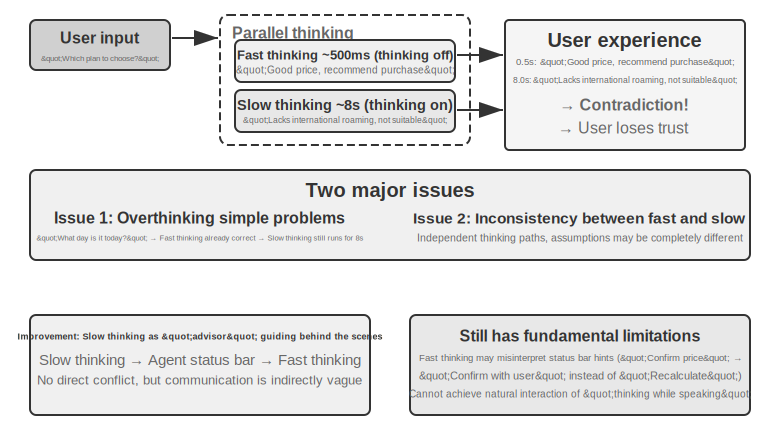

**சிக்கல் 1: எளிய கேள்விகளுக்கு அதிகமாக சிந்தித்தல்.** பயனர் "இன்று என்ன நாள்?" என்று கேட்கிறார். Fast thinking 500ms-க்குள் "Wednesday" என்று சரியாக பதிலளிக்கிறது, ஆனால் slow thinking முழு 10 வினாடிகளும் சிந்தித்து பின்னர் "Wednesday" என்றே மீண்டும் சொல்கிறது. இது கணக்கீட்டு வளங்களை வீணாக்குவது மட்டுமல்லாமல், மிக முக்கியமாக, உரையாடலின் தாளத்தை சீர்குலைக்கிறது—பயனர் ஏற்கனவே பதிலைப் பெற்று அடுத்த கட்டத்திற்கு செல்லத் தயாராக இருக்கும்போது, மீண்டும் ஒரு பதில் கூறப்பட்டு இடையூறு ஏற்படுகிறது. **சிக்கல் 2: Fast மற்றும் slow இடையே முரண்பாடு.** இரண்டும் இணையாக சுயாதீனமாக இயங்குகின்றன. அவை ஒரே context-ஐப் பார்த்தாலும், அவற்றின் reasoning paths முற்றிலும் வேறுபட்டதாக இருக்கலாம்—fast thinking ஒரு அனுமானத்தின் அடிப்படையில் ஆரம்ப பதிலை அளிக்கிறது, அதே நேரத்தில் slow thinking அந்த அனுமானம் செல்லாது எனக் கண்டறிந்து எதிர் முடிவுக்கு வருகிறது. பயனர் சில நொடிகளுக்குள் முரண்பாடான பதில்களைக் கேட்கிறார், உடனடியாக நம்பிக்கையை இழக்கிறார். இதன் மூல காரணம், Solution 1 உரையாடலை ஒரு ஒருங்கிணைந்த அறிவாற்றல் செயல்பாடாக அல்லாமல் இரண்டு சுயாதீனமான சிந்தனை செயல்முறைகளாகப் பிரிப்பதும், fast மற்றும் slow இடையே ஒரு ஒருங்கிணைப்பு வழிமுறை இல்லாததுமாகும்.

```
<user>Is this plan suitable for me?</user>
<!-- Fast thinking after 0.5 seconds -->
<assistant (fast thinking)>This plan is very affordable, I recommend you purchase it.</assistant>
<user>Okay, then I'll...</user>
<!-- Slow thinking completes after 8 seconds -->
<assistant (slow thinking)>Wait, I found that this plan lacks the international roaming feature you need, so it might not be suitable.</assistant>
<user>(Angry) So do you recommend I buy it or not?!</user>
```

### தீர்வு 2: Fast Thinking உரையாடலுக்கும், Slow Thinking ஆலோசனைக்கும்

தீர்வு 2, slow thinking ஆனது fast thinking-ன் வெளியீட்டைப் பார்க்க அனுமதிக்கிறது. இது Agent Status Bar (அத்தியாயம் 2-ல் அறிமுகப்படுத்தப்பட்ட மாறும் மெட்டா-தகவல் செலுத்தும் பொறிமுறை) மூலம் fast thinking-க்கு பரிந்துரைகளை வழங்குகிறது, நேரடியாகப் பயனரிடம் பேசாமல். தீர்வு 1-ஐ ஒப்பிடும்போது, இது இரண்டு வழிகளில் மேம்படுகிறது: slow thinking ஆனது பின்னணியில் ஒத்திசைவற்ற முறையில் இயங்குகிறது, பேச்சு இடைவெளிகளில் தொடர்ந்து சிந்திக்கிறது; மேலும், இது fast thinking-ன் வெளியீட்டைப் பார்க்க முடிவதால், நேரடி முரண்பாட்டைத் தவிர்த்து, அதற்குப் பதிலாக ஒரு திரைக்குப் பின்னால் உள்ள "ஆலோசகராக" செயல்படுகிறது. முன்னர் குறிப்பிடப்பட்ட GPT-Live delegation மற்றும் Pine AI voice Agent ஆகியவை தீர்வு 2-ன் உற்பத்தி எடுத்துக்காட்டுகளாகும்—பின்னணி reasoning model ஆனது அதன் முடிவுகளை ஒரு சுருக்கமான உரை சேனல் வழியாக முன்புற உரையாடல் model-க்கு அனுப்புகிறது, மேலும் முன்புற model ஆனது அதை எப்போது, எப்படி பயனருக்கு வடிவமைக்க வேண்டும் என்பதை முடிவு செய்கிறது.

இருப்பினும், இந்த தீர்வுக்கு இன்னும் அடிப்படை வரம்புகள் உள்ளன. **Fast thinking ஆனது வழிமுறைகளைப் பின்பற்றாமல் போகலாம்**—இரண்டு சுயாதீன சிந்தனை நிகழ்வுகளுக்கு இடையேயான தொடர்பு மறைமுகமானதாகவும் தெளிவற்றதாகவும் உள்ளது. Fast thinking ஆனது Agent Status Bar-ஐ தவறாகப் புரிந்து கொள்ளலாம், எடுத்துக்காட்டாக, "விலையை மீண்டும் உறுதிப்படுத்த வேண்டும்" என்பதை "விலை கணக்கீடு தவறானது மற்றும் மீண்டும் கணக்கிடப்பட வேண்டும்" என்பதற்குப் பதிலாக "இந்த விலையை பயனர் ஏற்க முடியுமா என்று கேளுங்கள்" என்று புரிந்து கொள்ளலாம். **இடைநிலை சிந்தனை முடிவுகளை அணுக முடியாது**—slow thinking-ன் 10 வினாடி பகுத்தறிவின் போது, ஏராளமான மதிப்புமிக்க இடைநிலை முடிவுகள் உருவாக்கப்படுகின்றன, ஆனால் fast thinking அவற்றைப் பார்க்கவே முடியாது, இறுதி Agent Status Bar-க்காக மட்டுமே காத்திருக்கிறது. slow thinking முடிவதற்கு முன் பயனர் வேறு ஒரு கேள்வியைக் கேட்டால் அல்லது குறுக்கிட்டால், fast thinking தனது சொந்த வரையறுக்கப்பட்ட புரிதலை மட்டுமே நம்பி பதிலளிக்க முடியும். இது இரண்டு நபர்கள் ஒரு சிக்கலைத் தீர்க்க ஒத்துழைப்பது போன்றது, ஆனால் குறிப்புகள் மூலம் மட்டுமே தொடர்புகொள்வது, ஒருவரின் கீறல் தாளைப் பார்க்க முடியாமல் இருப்பது போன்றது.

தீர்வு 2 ஒரு அடிப்படை கோட்பாட்டு சிக்கலையும் எதிர்கொள்கிறது: **இது "பேசும்போது சிந்திப்பதை" அடைய முடியாது.** மனிதர்கள் ஒரு சிக்கலான பிரச்சினையை எதிர்கொள்ளும்போது, முதலில் முழுமையான பதிலை மனதில் உருவாக்கி, பின்னர் அதை ஒரே மூச்சில் பேச மாட்டார்கள்; மாறாக, அவர்கள் பகுதிகளாக சிந்தித்துப் பேசுகிறார்கள்—"இது ஒரு சுவாரஸ்யமான கேள்வி... (சிந்திக்க இடைநிறுத்தம்) முதலில், நாம் கருத்தில் கொள்ள வேண்டும்... (தொடர்ந்து சிந்தித்தல்) இரண்டாவதாக..." தீர்வு 2-ல், fast thinking ஆனது slow thinking முடிவுகளை உருவாக்கும் வரை காத்திருக்கும்போது நிரப்பு வார்த்தைகளை மட்டுமே உச்சரிக்க முடியும், சிந்தனை செயல்முறையை உரையாடலில் இயற்கையாக இடைவெளியிட முடியாது.

### தீர்வு 3: சிந்தனை மற்றும் வெளிப்பாட்டின் End-to-End ஒருங்கிணைப்பு (Step-Audio R1-ஐ உதாரணமாக எடுத்துக்கொள்வது)

தீர்வு 2 slow thinking-க்கான காத்திருப்பு சிக்கலைத் தீர்த்தாலும், அது கட்டமைப்பு ரீதியாக "முதலில் சிந்தித்து, பின்னர் பேசு" என்பதாகவே உள்ளது—சிந்தனை மற்றும் வெளிப்பாடு இரண்டும் தனித்தனி செயல்முறைகளாகவே உள்ளன, இதனால் மனிதனைப் போன்ற "பேசும்போது சிந்திப்பதை" அடைய முடியாது. இந்த அடிப்படை வரம்பை உடைக்க, சிந்தனை திறன்களை நேரடியாக model-க்குள் உள்வாங்க வேண்டும்.

Step-Audio R1 இந்த திசையில் ஒரு அடிப்படையில் வேறுபட்ட தீர்வை முன்மொழிகிறது: இது சிந்திக்கும் திறன்களை நேரடியாக end-to-end ஆடியோ மொழி மாதிரியில் உள்வாங்குகிறது, dual-brain architecture மூலம் உண்மையான "thinking while speaking" ஐ அடைகிறது. இது உண்மையில் இரண்டு நிரப்பு வழிமுறைகளைக் கொண்டுள்ளது, ஒவ்வொன்றும் வெவ்வேறு சிக்கலைத் தீர்க்கிறது: **Modal-Grounded Reasoning Distillation (MGRD)** முதலில் "சரியாக சிந்திப்பதை" தீர்க்கிறது—மாதிரி உண்மையில் text transcripts ஐ விட acoustic features அடிப்படையில் காரணம் கூறுவதை உறுதி செய்கிறது; **MPS Dual-Brain Architecture** பின்னர் "சரியான நேரத்தில் பேசுவதை" தீர்க்கிறது—சிந்தனை மற்றும் வெளிப்பாடு இணையாக இயங்க குறைந்த latency உடன் thinking while speaking ஐ செயல்படுத்துகிறது. முந்தையது பிந்தையதற்கு ஒரு முன்நிபந்தனை: சிந்தனை ஒலியில் வேரூன்றியிருந்தால் மட்டுமே thinking while speaking உண்மையிலேயே மதிப்புமிக்கதாகிறது. இவை கீழே விரிவாக விளக்கப்பட்டுள்ளன.

**Textual Surrogate Reasoning**. ஒரு குரல் மாதிரி சிறந்த முறையில் acoustic features (pitch, rhythm, மற்றும் intonation போன்றவை) ஐ நேரடியாக பகுப்பாய்வு செய்து பேச்சாளரின் உணர்ச்சி அல்லது நோக்கத்தைப் புரிந்து கொள்ள வேண்டும். இருப்பினும், நடைமுறையில் பல மாதிரிகள் ஒரு குறுக்கு வழியை எடுக்கின்றன: தற்போதைய ஆடியோ மொழி மாதிரிகள் ஒரு எதிர்பாராத நிகழ்வை வெளிப்படுத்துகின்றன, அங்கு நீண்ட chains of thought மோசமான செயல்திறனுக்கு வழிவகுக்கும். Step-Audio R1 குழு இதன் மூல காரணத்தை "Textual Surrogate Reasoning" (பகுப்பாய்வுக்காக உரைத் தகவலை acoustic தகவலுக்கு "பதிலாக" பயன்படுத்துதல்) என அடையாளம் கண்டது: மாதிரி "சிந்திக்கும்" போது, அது உண்மையில் acoustic features ஐ பகுப்பாய்வு செய்வதற்குப் பதிலாக text transcription அடிப்படையில் semantic reasoning ஐ செய்கிறது. உதாரணமாக, ஒரு பாடலின் உணர்ச்சியை மதிப்பிடும்படி கேட்கப்படும் போது, மாதிரி "பாடல் வரிகள் சோகத்தைக் குறிப்பிடுகின்றன" என பகுப்பாய்வு செய்கிறது, "minor key melody மற்றும் descending pitch contour ஆகியவற்றின் கலவை துக்க உணர்வை வெளிப்படுத்துகிறது" என்பதற்குப் பதிலாக. இந்த modality mismatch பயிற்சி தரவுகளிலிருந்து உருவாகிறது: பெரும்பாலான ஆடியோ மாதிரிகளின் CoT (Chain-of-Thought) தரவு text models மூலம் உருவாக்கப்படுகிறது, இது இயற்கையாகவே pure-text சிந்தனை முறையைப் பெறுகிறது.

**Modality-Grounded Reasoning Distillation** (MGRD) இந்த சிக்கலை iterative self-improvement மூலம் தீர்க்கிறது (Figure 9-6). பெயர் சற்று நீளமாக இருந்தாலும், முக்கிய யோசனை உள்ளுணர்வு சார்ந்தது: "உண்மையில் ஒலியைக் கேட்கும்" சிந்தனை செயல்முறைகளை வடிகட்டி, அவற்றை மாதிரிக்கு பயிற்சி அளிக்க பயன்படுத்தவும், இசை ஆசிரியர் தனது காதுகளால் பகுப்பாய்வு செய்வது போல மாதிரிக்கு கற்பிக்கவும், text editor போல பாடல் வரிகளை மட்டும் படிக்காமல் இருக்கவும். குறிப்பிட்ட படிகள் மூன்று:

1.  தற்போதைய மாதிரியை ஒரே ஆடியோ பகுதிக்கு பல்வேறு சிந்தனை செயல்முறைகளை உருவாக்க வைக்கவும், பின்னர் உண்மையில் acoustic features அடிப்படையிலானவற்றை வடிகட்டவும். எப்படி வடிகட்டுவது? சிந்தனை உள்ளடக்கம் குறிப்பிட்ட ஒலி அளவுருக்களைக் குறிப்பிடுகிறதா என சரிபார்க்கவும். உதாரணமாக, கோபமான குரல் உள்ளீட்டிற்கு, text-based சிந்தனை "பயனர் 'மிகவும் மோசமானது' போன்ற எதிர்மறை வார்த்தைகளைச் சொன்னார், எனவே நான் அதை கோபமாக மதிப்பிடுகிறேன்" — இது text content ஐ மட்டுமே பகுப்பாய்வு செய்கிறது; acoustic-feature-based சிந்தனை "பேச்சு விகிதம் இயல்பை விட 40% வேகமாக உள்ளது, ஒலி அளவு கணிசமாக அதிகமாக உள்ளது, மற்றும் pitch கூர்மையாக உள்ளது" — இது உண்மையில் ஒலியை "கேட்கிறது". MGRD பிந்தையதைத் தேர்ந்தெடுக்கிறது.
2.  இந்த உயர்தர சிந்தனைத் தரவுகளைப் பயன்படுத்தி, model-ஐ மீண்டும் பயிற்றுவித்து, அதன் "காதால் கேட்டு சிந்திக்கும்" திறனை வலுப்படுத்தவும்.
3.  Reinforcement learning மூலம் மேலும் மேம்படுத்தி, சிந்தனை செயல்முறையைத் தவிர்த்துவிட்டு நேரடியாக பதிலை யூகிப்பதன் மூலம் model குறுக்கு வழி எடுப்பதைத் தடுக்கவும்.

பல மறு செய்கைகளுக்குப் பிறகு, சிந்தனையின் அடித்தளம் படிப்படியாக உரை சுருக்கத்திலிருந்து ஒலி பகுப்பாய்வுக்கு மாறுகிறது—"பேச்சாளர் மகிழ்ச்சியாக இல்லை" என்று தெளிவற்ற முறையில் கூறுவதற்குப் பதிலாக, model "1.2 வினாடிகளில் சுருதி வளைவு கூர்மையாகக் குறைகிறது" என்பதில் கவனம் செலுத்தத் தொடங்குகிறது.

**MPS Dual-Brain Architecture** (Mind-Paced Speaking) சிந்தனைக்கும் பேச்சு வெளியீட்டிற்கும் இடையிலான தாமத முரண்பாட்டைக் கையாள்கிறது (படம் 9-6). இதன் உத்வேகம் மனித மூளையில் உள்ள பணிப் பிரிவினையிலிருந்து வருகிறது: சிந்தனைக்குப் பொறுப்பான பகுதிகளும், மொழியை ஒழுங்கமைப்பதற்குப் பொறுப்பான பகுதிகளும் தனித்தனியாக இருந்து, இணையாக வேலை செய்ய முடியும்—உங்கள் வாய் முந்தைய வாக்கியத்தைப் பேசிக்கொண்டிருக்கும்போதே, நீங்கள் அடுத்த வாக்கியத்தைப் பற்றி யோசிக்கிறீர்கள். MPS இந்தப் பிரிவினையை உருவகப்படுத்த இரண்டு models-ஐப் பயன்படுத்துகிறது: **Formulation Brain** தொடர்ச்சியான சிந்தனைக்குப் பொறுப்பானது, சிந்தனை முடிவுகளின் பகுதிகளை உருவாக்குகிறது; **Articulation Brain**, சிந்தனை முடிவுகளின் ஒவ்வொரு புதிய பகுதியையும் பெற்றவுடன், அதை முந்தைய சிந்தனைகள் மற்றும் ஏற்கனவே உள்ள பதிலுடன் இணைத்து பேச்சு பதிலாக மாற்றுகிறது.

இரண்டும் இணையாக இயங்குகின்றன—Articulation Brain பேசத் தொடங்குவதற்கு முன்பு Formulation Brain எல்லாவற்றையும் சிந்தித்து முடிக்க வேண்டிய அவசியமில்லை. எடுத்துக்காட்டாக, t=0ms இல், Formulation Brain பயனரின் கேள்வியை பகுப்பாய்வு செய்யத் தொடங்குகிறது; t=200ms இல், அது சிந்தனை முடிவுகளின் முதல் பகுதியை (text tokens-களின் வரிசை) வெளியிடுகிறது; Articulation Brain இந்த முடிவை t=200ms இல் பெற்று, உருவாக்கப்பட்ட பதில் சூழலுடன் இணைத்து, t=350ms இல் தொடர்புடைய speech tokens-களை வெளியிடத் தொடங்குகிறது—இரண்டு தொகுதிகளும் pipeline parallel முறையில் செயல்படுகின்றன, மேலும் பயனர் முதல் எழுத்தை t=350ms இல் கேட்கிறார்.

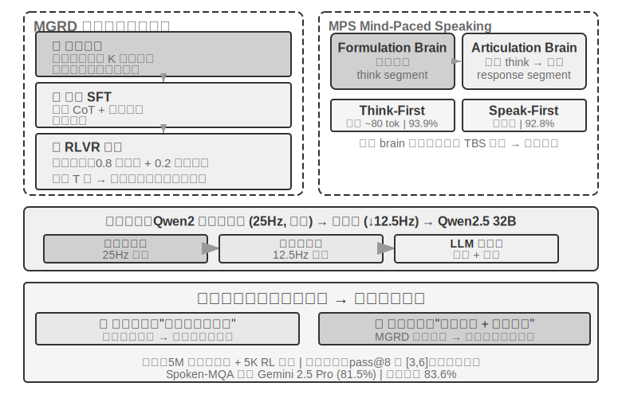

> **சோதனை 9-4 ★★★: Step-Audio R1-ஐப் பயன்படுத்தி End-to-End Speech Thinking**
>
> இந்தச் சோதனையானது, speech thinking மற்றும் உரையாடல் பணிகளில் வெவ்வேறு கட்டமைப்புகளின் செயல்திறனை ஒப்பிட Step-Audio R1 model-ஐப் பயன்படுத்துகிறது. Step-Audio R1 ஆனது audio encoder, audio adapter மற்றும் Qwen2.5 32B decoder ஆகியவற்றைக் கொண்டுள்ளது, இதற்கு multi-GPU deployment தேவைப்படுகிறது.
>
> இந்தச் சோதனை இரண்டு பணிகளை மதிப்பிடுகிறது: **Spoken-MQA** (Spoken Math Questions) என்பது, வாய்வழியாக வழங்கப்பட்ட கணக்குச் சிக்கலைக் கேட்ட பிறகு, model பல-படி கணித பகுத்தறிவைச் செய்ய முடியுமா என்பதைச் சோதிக்கிறது; **URO-Bench** (Chinese Oral Dialogue Benchmark) திறந்த-முடிவு உரையாடலின் தரத்தை மதிப்பிடுகிறது.
> சோதனை உள்ளமைவுகள் இரண்டு பரிமாணங்களாகப் பிரிக்கப்பட்டுள்ளன. முதலாவது **Thinking Timing**: முழுமையான **TBS** (Think-Before-Speak, latency-கட்டுப்பாடற்ற கட்டுப்பாட்டு baseline ஆக செயல்படுகிறது) பேசுவதற்கு முன் அனைத்து எண்ணங்களையும் உருவாக்குகிறது; latency-ஐக் குறைக்க, MPS இரண்டு "think-while-speaking" மாறுபாடுகளை வழங்குகிறது—**Speak-First** (spkfirst என்றும் அழைக்கப்படுகிறது, பூஜ்ஜிய latency, பேச்சும் சிந்தனையும் ஒரே நேரத்தில் தொடங்குகின்றன) மற்றும் **Think-First** (thkfirst என்றும் அழைக்கப்படுகிறது, சிந்திக்கும் மூளை முதல் பகுதியை உருவாக்கும் வரை காத்திருந்து பின்னர் பேசுகிறது, சுமார் 80 tokens latency). இரண்டாவது பரிமாணம் **Architecture**: MPS இரட்டை-மூளை இணைநிலை vs. பாரம்பரிய ஒற்றை-மாதிரி TBS.

>
> முடிவுகள் அட்டவணை 9-1-ல் காட்டப்பட்டுள்ளன, இது வெவ்வேறு thinking timing மற்றும் architecture உள்ளமைவுகளின் செயல்திறனை கணிதத் துல்லியம் மற்றும் உரையாடல் மதிப்பெண்களில் ஒப்பிடப் பயன்படுகிறது.
>
> அட்டவணை 9-1 Step-Audio R1 வெவ்வேறு Speech Thinking உள்ளமைவு ஒப்பீடு
>
> | Configuration | Spoken-MQA | URO-Bench |
> |------|-----------|-----------|
> | சிந்திக்காமல் நேரடியாக பதில் சொல்வது (Baseline) | 70.6% | 77.4 |
> | MPS Speak-First (Zero Latency) | 92.8% | 82.5 |
> | MPS Think-First (~80 tok Latency) | 93.9% | 84.8 |
> | முழுமையான TBS (Latency கட்டுப்பாடு இல்லை) | 93.0% | — |
>
> ஒரு சுவாரஸ்யமான கண்டுபிடிப்பு என்னவென்றால், Speak-First சிந்தனைப் பணிகளில் மிகக் குறைந்த தாக்கத்தையே ஏற்படுத்துகிறது (92.8% முழுமையான TBS-இன் 93.0%-க்கு அருகில் உள்ளது). இதற்குக் காரணம், **CoT** (Chain-of-Thought)-இன் ஆரம்பம் பொதுவாக பிரச்சினையின் உள்ளடக்கத்தை மீண்டும் கூறுவதாகவே இருக்கும், இன்னும் உண்மையான பகுத்தறிவில் நுழையவில்லை. எனவே, மாதிரி சிந்திப்பதையும் பேசுவதையும் ஒரே நேரத்தில் தொடங்கினாலும், இறுதித் துல்லியம் கிட்டத்தட்ட பாதிக்கப்படுவதில்லை. மற்றொரு கவனிக்கத்தக்க விவரம் என்னவென்றால், Think-First (93.9%) latency-கட்டுப்பாடற்ற முழுமையான TBS (93.0%)-ஐ விட சற்று அதிகமாக உள்ளது—இதற்கு ஒரு சாத்தியமான விளக்கம் என்னவென்றால், எண்ணங்களைப் பகுதிகளாக உருவாக்கி அவற்றைப் பகுதி பகுதியாகப் பேச்சாக மாற்றுவது படிப்படியான மேற்பார்வை போல செயல்பட்டு நேர்மறையான விளைவை ஏற்படுத்துகிறது; நிச்சயமாக, இரண்டிற்கும் இடையேயான வேறுபாடு மதிப்பீட்டுப் பிழையின் வரம்பிற்குள் உள்ளது மற்றும் அதிகமாக விளக்கப்படக்கூடாது.
>

Option Three சிந்தனையை ஒரு ஒற்றை மாதிரியில் உள்வாங்கி, "சிந்தித்துப் பேசுவதை" மிகவும் நேர்த்தியாக அடைகிறது, ஆனால் இதன் விலை இந்தப் பகுதியின் ஆரம்பத்தில் குறிப்பிடப்பட்ட "moving target" ஆகும்: இந்த ஒற்றை மாதிரி வலிமையான பகுத்தறிவாளராகவும் நிகழ்நேர பேச்சாளராகவும் இருக்க வேண்டும், மேலும் இரண்டு திறன்களும் வேகமாக வளர்ச்சியடைந்து வருகின்றன, எனவே ஒருங்கிணைந்த அணுகுமுறை தொடர்ந்து பின்தொடர மீண்டும் மீண்டும் retraining தேவைப்படுகிறது. இதுவே எழுதப்பட்ட நேரத்தில் தொழில் பிளவையும் விளக்குகிறது—"மாற்றத்தக்க சமீபத்திய மூளைகளை" (GPT-Live, Grok Voice, Pine AI) பின்தொடரும் முன்னணி தயாரிப்புகள் பெரும்பாலும் Option Two-இன் பிரிக்கப்பட்ட அணுகுமுறையில் பந்தயம் கட்டுகின்றன, அதே நேரத்தில் Option Three இறுதி இயற்கைத்தன்மையை நாடி சிறப்புப் பயிற்சியின் செலவை ஏற்கத் தயாராக இருப்பவர்களுக்கு மிகவும் பொருத்தமானது. இது ஒன்று மற்றொன்றை மாற்றுவது பற்றியது அல்ல, மாறாக "மாற்றத்தக்க மூளை" மற்றும் "இறுக்கமான சிந்தித்துப் பேசுதல்" ஆகியவற்றுக்கு இடையேயான ஒரு trade-off ஆகும்.

### வேகமான மற்றும் மெதுவானவற்றுக்கு இடையேயான இடைமுகம்: உரையைத் தவிர வேறு என்ன அனுப்ப முடியும்

(குறிப்பு: இது ஒரு cross-scenario இடைமுக விவாதம், தற்காலிகமாக குரல் முதன்மைத் தொடரை விட்டு வெளியேறுகிறது.) Option Two-ஐ திரும்பிப் பார்க்கும்போது, ஒரு புறக்கணிக்கப்பட்ட வடிவமைப்பு பரிமாணம் வெளிப்படுகிறது: slow thinking-லிருந்து fast thinking-க்கு அனுப்பப்படும் "message" **text** சேனலைப் பயன்படுத்துகிறது (status bar வழியாக ஒரு suggestion-ஐ அனுப்புதல்). Text புரிந்துகொள்ளவும் debug செய்யவும் எளிதானது, ஆனால் slow thinker-ன் மனதில் உள்ள வளமான உள்ளடக்கத்திற்கு இது ஒரு மெல்லிய வைக்கோல்—உண்மையிலேயே வளமான intermediate states சில வாக்கியங்களில் சுருக்கப்படுகின்றன. எனவே, fast மற்றும் slow-க்கு இடையேயான இந்த இடைமுகம் text-ஐப் பயன்படுத்தாமல் இருக்க முடியுமா?

நேர-கட்டுப்பாடு மிகவும் கோரும் சூழலான real-time gaming-இல், இந்த பாதை சாத்தியமானது (இதை Latent Bridge என்று அழைக்கலாம்) [^ch9-8]: விரைவான எதிர்வினைகளுக்குப் பொறுப்பான ஒரு சிறிய model (வினாடிக்கு டஜன் கணக்கான செயல்களை உருவாக்கும்) மற்றும் பகுத்தறிவுக்குப் பொறுப்பான ஒரு மெதுவான model (வினாடிக்கு ஒரு சிந்தனையை உருவாக்கும்) ஆகிய இரண்டையும் freeze செய்து, அவற்றுக்கிடையே சில கோடி அளவுருக்கள் கொண்ட ஒரு சிறிய "bridge"-ஐ மட்டும் பயிற்றுவிக்கவும். இந்த bridge, slow model-ன் hidden layer முடிவுகளை நேரடியாக சில "latent tokens"-ஆகத் திட்டமிடுகிறது, அவை fast model-ன் input-இல் இணைக்கப்படுகின்றன, multimodal models visual tokens-ஐச் செருகுவதைப் போல—"யோசனை → text → மறு-புரிதல்" என்ற சுற்றுப் பயணத்தைத் தவிர்க்கிறது. இதன் விளைவாக, பல Atari games-இல், இந்த latent space channel, பாரம்பரிய text channel-ஐ விட கணிசமான வித்தியாசத்தில் சிறப்பாக செயல்படுகிறது (சில games-இல் +26% முதல் +82% வரை), அதே நேரத்தில் ஒரு படிக்கு சுமார் 5 மில்லி விநாடிகள் மட்டுமே சேர்க்கிறது, இன்னும் real-time தேவைகளைப் பூர்த்தி செய்கிறது.

இது ஒரு நேர்மையான எல்லையையும் வெளிப்படுத்துகிறது: **fast-slow ஒத்துழைப்பு பயனுள்ளதா என்பது, பணியின் தடை "யோசிக்க முடியவில்லை" அல்லது "சரியான நேரத்தில் எதிர்வினையாற்ற முடியவில்லை" என்பதைப் பொறுத்தது**—இந்த bridge, slow thinker fast reactor-ஐ விட இயல்பாகவே சிறப்பாக இருக்கும்போது மட்டுமே உதவுகிறது (games முழுவதும் இந்த தொடர்பு r≈0.9 வரை அதிகமாக உள்ளது); மாறாக, பணி முற்றிலும் எதிர்வினை வேகத்தை நம்பியிருந்தால், சிறந்த bridge கூட பயனற்றது. இந்த தீர்ப்பு games-க்கு அப்பாலும் பொருந்தும்; இது இந்த அத்தியாயத்தில் பின்னர் Computer Use எதிர்கொள்ளும் அதே பிரச்சினையை முன்னறிவிக்கிறது: எப்போது ஒரு "மெதுவான மூலோபாயவாதியை" அழைப்பது மதிப்புக்குரியது, எப்போது அது தாமதத்தை மட்டுமே அதிகரிக்கும்?

[^ch9-8]: இரண்டு frozen models-க்கு இடையே ஒரு latent space bridge-ஐ மட்டும் பயிற்றுவிப்பது மற்றும் "எப்போது ஒரு மெதுவான மூலோபாயவாதியை அழைப்பது மதிப்புக்குரியது" என்பதன் முழுமையான பகுப்பாய்வை Li, Bojie மற்றும் Noah Shi-ன் *The Latent Bridge: A Continuous Slow-Fast Channel for Real-Time Game Agents.* arXiv:2606.24470, 2026-இல் காணலாம்.

End-to-end அல்லது modular எதுவாக இருந்தாலும், perception மற்றும் execution layers-இன் தரம் முக்கியமானதாகவே உள்ளது. End-to-end models கட்டடக்கலை தாமதப் பிரச்சினையைத் தீர்க்கின்றன, ஆனால் "துல்லியமாகக் கேட்பது" மற்றும் "இயற்கையாகப் பேசுவது" ஆகிய அடிப்படைகள் கட்டடக்கலை மாற்றத்தால் தானாகவே தீர்க்கப்படுவதில்லை—"துல்லியமாகக் கேட்பது" streaming speech perception-ஐ ஒத்துள்ளது, இது Paradigm One-இல் விவாதிக்கப்பட்டது; இங்கே, "இயற்கையாகப் பேசுவதற்கான" execution layer-ஐப் பார்க்கிறோம்: மேலும் மனிதனைப் போன்ற speech synthesis.

## மேலும் மனிதனைப் போன்ற Speech Synthesis

பாரம்பரிய TTS-இன் "சரியான தன்மை"தான் பிரச்சனை: அதிகப்படியான சரளம், பூஜ்ஜிய இடைநிறுத்தங்கள், filler words இல்லாமை ஆகியவை அதை உடனடியாக ஒரு இயந்திரம் என்று அடையாளம் காட்டுகின்றன. மனித பேச்சில் உள்ள "குறைபாடுகள்" குறைபாடுகள் அல்ல—இடைநிறுத்தங்கள், filler words ("um," "uh," "you know"), அவ்வப்போது மீண்டும் மீண்டும் சொல்வது—இவை சிந்தனை செயல்முறையின் இயற்கையான வெளிப்பாடுகளாகும், இவை கேட்பவருக்கு "நான் யோசிக்கிறேன்" அல்லது "எனக்கு முழுமையாக உறுதியில்லை" போன்ற முக்கியமான சமிக்ஞைகளை வழங்குகின்றன. இருப்பினும், AI-இன் சிந்தனை வேகம் பேச்சு இயக்கத்தை விட மிக வேகமானது, மேலும் அதன் வெளியீடு இயற்கையாகவே சரளமாகவும் முழுமையாகவும் இருக்கும்; அதை நேரடியாக ஒருங்கிணைப்பது அதன் இயந்திரத் தன்மையை வெளிப்படுத்துகிறது.

**தீர்வு**: "எங்கே இடைநிறுத்தம் செய்ய வேண்டும் மற்றும் எந்த தொனியைப் பயன்படுத்த வேண்டும்" என்பதற்கான முடிவை முதன்மை LLM-க்கு ஒப்படைக்கவும். LLM உரையை மட்டுமல்ல, கட்டுப்பாட்டு tokens-ஐயும் வெளியிடுகிறது: `[THINKING]` என்பது 1-2 வினாடி சிந்தனை இடைநிறுத்தம் மற்றும் filler sound ("um...") செருகுவதைக் குறிக்கிறது; `[SEARCHING]` ஒரு குறுகிய இடைநிறுத்தம் மற்றும் தேடல் filler words ("you know...", "how should I put it") உருவாக்குகிறது; `[EMO:happy]` தொனி மற்றும் prosody-ஐ சரிசெய்கிறது; `[SPEED:0.8x]` பேச்சு விகிதத்தைக் கட்டுப்படுத்துகிறது. LLM-க்கு மட்டுமே தெரியும், அது ஒரு சிக்கலான கேள்விக்கு பதிலளிக்கிறதா, இடைநிறுத்தம் தேவைப்படுகிறதா, பயனர் பொறுமையிழந்து விரைவுபடுத்த வேண்டுமா, அல்லது சாதாரண அரட்டையாக இருந்து உற்சாகமாக இருக்க வேண்டுமா என்பது.

இந்த திட்டத்தில், TTS ஒரு multimodal generator ஆக செயல்படுகிறது, இது text + control tokens-ஐ உள்ளீடாக எடுத்து audio-ஐ வெளியீடாக வழங்குகிறது. இது சாதாரண உரைக்கு சாதாரணமாக பேச்சை ஒருங்கிணைக்கிறது, மேலும் control tokens-க்கு தொடர்புடைய non-linguistic audio-ஐ உருவாக்குகிறது: `[THINKING]` ஒரு நீண்ட "um..."-ஐ உருவாக்குகிறது, `[SIGH]` ஒரு பெருமூச்சை உருவாக்குகிறது, `[LAUGH:small]` ஒரு லேசான சிரிப்பை உருவாக்குகிறது, `[BREATH]` ஒரு உள்ளிழுக்கும் ஒலியை உருவாக்குகிறது.

இரண்டு செயல்படுத்தும் வழிகள் உள்ளன: ஒன்று, control tokens-க்கு சொந்த ஆதரவுடன் தனியுரிம TTS-ஐ உருவாக்குவது (அதிக நெகிழ்வுத்தன்மை, ஆனால் ஒரு சிறப்புக் குழு தேவை); மற்றொன்று, voice cloning-ஐப் பயன்படுத்தி, ஒரே மெய்நிகர் ஆளுமைக்கு வெவ்வேறு உணர்ச்சிகள், வேகங்கள் மற்றும் பாணிகளை உள்ளடக்கிய டஜன் கணக்கான குறிப்பு audio clips-ஐ தயாரித்து, control token-ஐ அடிப்படையாகக் கொண்டு சிறந்த பொருந்தும் குறிப்பு audio-ஐத் தேர்ந்தெடுத்து TTS API (எ.கா., ElevenLabs, Fish Audio) ஐ அழைப்பது, இது வாரங்களுக்குள் பயன்படுத்தப்படலாம்.

> **சோதனை 9-5 ★★: Fish Audio அடிப்படையிலான Control Token-Driven TTS**
>
> Fish Audio S1-இன் voice cloning திறனைப் பயன்படுத்தவும் (அதே timbre-ஐ zero-shot cloning செய்ய 3-10 வினாடிகள் குறிப்பு audio மட்டுமே தேவை). 24 குறிப்பு audio clips-ஐக் கொண்ட ஒரு நூலகத்தை உருவாக்கவும், இது Emotion (Neutral/Happy/Frustrated/Thinking) x Speed (Normal/Fast/Slow) x Style (Formal/Casual) ஆகியவற்றை உள்ளடக்கியது, ஒவ்வொன்றும் சுமார் 5 வினாடிகள் நீளமானது.
>
> LLM வெளியீட்டு உதாரணம்: `[EMO:happy][SPEED:fast]Great! Your order has been confirmed.[THINKING]Um, let me check the shipping time...[EMO:neutral][SPEED:normal]It is expected to arrive tomorrow afternoon.`
> Execution layer ஆனது tokens-ஐ parse செய்து, அவற்றை தொடர்புடைய reference audio-வுடன் map செய்கிறது: `[EMO:happy][SPEED:fast]` என்பது "Happy+Fast+Casual" reference-ஐயும்; `[THINKING]` என்பது "Thinking+Slow+Formal" reference-ஐயும் (pause rhythm மற்றும் hesitant tone உடன்); `[EMO:neutral][SPEED:normal]` என்பது "Neutral+Normal+Formal" reference-ஐயும் map செய்கிறது. Fish Audio ஆனது, வெவ்வேறு reference clips-களில் consistent timbre-ஐ உறுதி செய்து, prosody மற்றும் emotion-ஐ மட்டும் மாற்றுகிறது.

> மூன்று configurations-ஐ ஒப்பிடுக: No control tokens (fluent ஆனால் robotic, AI போல் ஒலிக்கும்), Single reference audio (இயற்கையானது ஆனால் emotionally monotone), Multi-reference audio library (தகவலை உறுதிப்படுத்தும்போது cheerful மற்றும் fast, விளக்கங்களுக்கு முன் இயற்கையான pauses, ஒட்டுமொத்தமாக ஒரு உண்மையான human customer service representative-இன் expression-க்கு நெருக்கமாக).

## Computer Use: GUI Automation Agent

இந்த chapter, voice-க்கு அடுத்தடுத்த இரண்டு scenarios-ஐ விட கணிசமாக அதிக இடத்தை ஒதுக்குவதை நீங்கள் இப்போது கவனித்திருக்கலாம்—இது intentional. Real-time multimodality-இன் பரிணாமப் பாதையில், voice என்பது மிகவும் முழுமையானதும், reference frame ஆக மிகவும் தகுதியானதுமான ஒன்றாகும்: "serial pipeline latency மிக அதிகம்" என்ற பிரச்சினையில் இருந்து தொடங்கி, end-to-end, full-duplex, thinking-while-speaking போன்ற தொடர் தீர்வுகள் வழியாக, இன்றைய ஒப்பீட்டளவில் mature end state வரை, problem → solution → end state என்ற முழு பயணமும் கடக்கப்பட்டுள்ளது. எனவே, அதை நாம் முழுமையாக விளக்குகிறோம். அடுத்தடுத்த Computer Use மற்றும் Robotics scenarios-ஐ இந்த voice trajectory-க்கு எதிராகப் பார்க்கலாம்—ஒவ்வொன்றும் இந்த evolutionary line-இல் எங்கு நிற்கிறது, எங்கு stuck ஆக உள்ளது என்பதைப் பார்க்கலாம்.

இந்த மூன்று scenarios வேறுபட்டதாகத் தோன்றினாலும், ஒரே core challenges-ஐ எதிர்கொள்கின்றன: real-time perception, low-latency decision-making, மற்றும் continuous interaction. அடுத்து, இந்த technical themes visual interaction (Computer Use) மற்றும் physical interaction (Robotics)-இல் எவ்வாறு மீண்டும் தோன்றுகின்றன என்பதைப் பார்ப்போம்—முதலில், auditory modality-இலிருந்து visual modality-க்கு perspective-ஐ விரிவுபடுத்துவோம்: ஒரு Agent, speech-ஐ புரிந்துகொள்வது மட்டுமல்லாமல், screen-ஐ "பார்த்து" graphical interface-ஐ இயக்க முடிந்தால் என்ன?

Computer Use (GUI Automation Agent என்றும் அழைக்கப்படுகிறது) AI-ஐ, screen-ஐ கவனித்து mouse மற்றும் keyboard-ஐ இயக்குவதன் மூலம், மனிதனைப் போல software-ஐ பயன்படுத்த அனுமதிக்கிறது—எடுத்துக்காட்டாக, தகவலைத் தேட browser-ஐ திறப்பது, spreadsheet application-இல் தரவை நிரப்புவது, அல்லது system settings-இல் configurations-ஐ சரிசெய்வது. இதன் core ஒரு **Perceive-Think-Act** loop ஆகும் (Figure 9-7):

1.  Agent ஆனது தற்போதைய screen-இன் screenshot-ஐ எடுக்கிறது.
2.  ஒரு multimodal model, screenshot மற்றும் task instruction-ஐப் பெற்று, ஒரு thought மற்றும் ஒரு specific action-ஐ output செய்கிறது.
3.  Execution layer ஆனது, real environment-இல் action-ஐ செயல்படுத்துகிறது (mouse-ஐ நகர்த்துதல், clicking, text typing போன்றவை).
4.  இது interface respond செய்ய காத்திருந்து, மற்றொரு screenshot-ஐ எடுத்து, அடுத்த loop iteration-க்குள் நுழைகிறது.

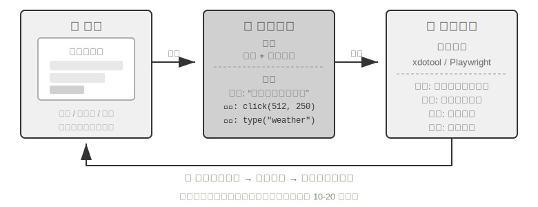

இந்த வளையத்தில் மூன்று முக்கிய வடிவமைப்பு பரிமாணங்கள் உள்ளன: **Action Space** (Agent செய்யக்கூடிய செயல்பாடுகள்), **Visual Grounding** (திரைப்பிடிப்பில் இலக்கு உறுப்பை எவ்வாறு கண்டுபிடிப்பது), மற்றும் **Model Architecture** (திரைப்பிடிப்பிலிருந்து சரியான செயலை எவ்வாறு உருவாக்குவது).

### Action Space வடிவமைப்பு

Anthropic மூன்று வகையான tools-ஐ வரையறுக்கிறது, அவை முழுமையான தொடர்பு திறனை உருவாக்குகின்றன (படம் 9-8):

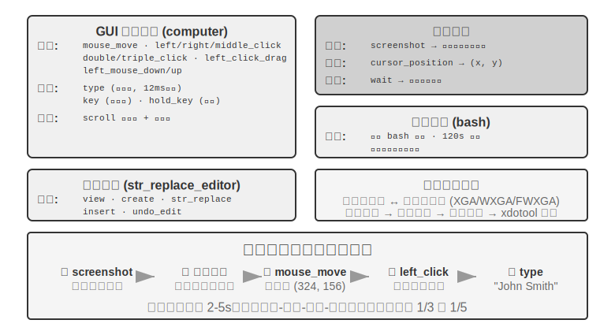**GUI Operation Tool** (computer tool): Mouse செயல்பாடுகளில் நகர்த்துதல் (mouse_move), இடது/வலது/நடுத்தர கிளிக், இரட்டை-கிளிக்/மூன்று-கிளிக், இழுத்தல் (left_click_drag), மற்றும் மிகவும் துல்லியமான அழுத்துதல்/விடுதல் செயல்கள் (left_mouse_down/up) ஆகியவை அடங்கும். உருட்டுதல் (scroll) நான்கு திசைகளை ஆதரிக்கிறது மற்றும் modifier keys-உடன் இணைக்கப்படலாம். Keyboard செயல்பாடுகளில் எழுத்து எழுத்தாக தட்டச்சு செய்தல் (type, உண்மையான தட்டச்சை உருவகப்படுத்த எழுத்துகளுக்கு இடையே 12ms இடைவெளியுடன்), key combinations (key, எ.கா., Ctrl+C), மற்றும் ஒரு key-ஐ அழுத்தி வைத்திருத்தல் (hold_key) ஆகியவை அடங்கும். Perception actions: screenshot, cursor position மீட்டெடுப்பு (cursor_position), மற்றும் காத்திருத்தல் (wait).

**Command Execution Tool** (bash tool): 120-வினாடி timeout உடன் நிரந்தர bash terminal அமர்வை வழங்குகிறது. இது command முடிவைக் கண்டறிய sentinel string-ஐப் பயன்படுத்துகிறது மற்றும் பல அழைப்புகளில் environment state-ஐ பராமரிக்கிறது (எ.கா., ஒரு கோப்பகத்திற்கு `cd` செய்த பிறகு, அடுத்த அழைப்பு அந்த கோப்பகத்திலேயே இருக்கும்).

**File Editing Tool** (str_replace_editor): String matching மூலம் பாதுகாப்பான திருத்தத்தை இயக்குகிறது, view, create, replace, insert, மற்றும் undo செயல்பாடுகளை ஆதரிக்கிறது. இது முழு கோப்பையும் நேரடியாக மேலெழுதுவதை விட மிகவும் துல்லியமானது மற்றும் தற்செயலாக மற்ற உள்ளடக்கத்தை மாற்றும் வாய்ப்பு குறைவு.

> **சோதனை 9-6 ★: Anthropic Computer Use Demo-ஐ இயக்குதல்**
>
> கொள்கலன் ஒரு முழுமையான Ubuntu desktop environment-ஐ (உலாவி, terminal, மற்றும் பிற பொதுவான கருவிகள் உட்பட) தொகுக்கிறது. Frontend பணி வழிமுறைகளைப் பெறுகிறது, backend வழிமுறைகளை screenshots-உடன் Claude-க்கு அனுப்புகிறது, மற்றும் model செயல்பாட்டு வழிமுறைகளை (mouse-ஐ நகர்த்து, கிளிக் செய், உரையை தட்டச்சு செய், போன்றவை) திருப்பி அனுப்புகிறது, பின்னர் அவை மெய்நிகர் desktop-இல் செயல்படுத்தப்படுகின்றன.
>
> முக்கிய கவனிப்பு: ஒவ்வொரு செயலும் 2-5 வினாடிகள் எடுக்கும் (மனிதனை விட கணிசமாக மெதுவாக), ஆனால் அமைப்பு பொதுவான பணிகளுக்கு நல்ல திட்டமிடல் திறனை வெளிப்படுத்துகிறது, அவற்றை தானாகவே நியாயமான செயல் வரிசைகளாக பிரிக்கிறது.
>

### Visual Grounding

சுழற்சியின் ஒவ்வொரு மறுமுறையிலும், model ஆனது screenshot-இல் target element-ஐ துல்லியமாக கண்டறிய வேண்டும்—"search box எங்கே?" "submit button-ன் coordinates என்ன?" இது visual grounding problem ஆகும். தற்போது, **இரண்டு முக்கிய அணுகுமுறைகள்** உள்ளன: ஒன்று, localization-ஐ **multiple-choice problem** ஆக மாற்றுவது—முதலில் interface elements-ஐ எண்களுடன் annotate செய்து, model ஒன்றை மட்டும் தேர்ந்தெடுக்க வேண்டும்; மற்றொன்று **pure coordinate prediction**—model-ஐ screenshot-ஐ "பார்க்க" விட்டு, coordinates-ஐ நேரடியாக தெரிவிக்கச் செய்வது, மனிதனைப் போலவே. Multiple-choice அணுகுமுறைக்கு இரண்டு implementation methods உள்ளன: **pure visual annotation** (அசல் Set-of-Mark, segmentation model-ஐப் பயன்படுத்தி pixels-இல் candidate regions-ஐ வெட்டி எடுப்பது) மற்றும் **structured element indexing** (DOM/Accessibility Tree, interface-இன் உள்ளார்ந்த கட்டமைப்பை நேரடியாகப் படிப்பது). Multiple-choice அணுகுமுறையின் பொதுவான நன்மை என்னவென்றால், "screenshot-இல் button-ஐக் கண்டுபிடித்து அதன் coordinates-ஐ கணிக்கவும்" என்ற open-ended problem-ஐ "ஏற்கனவே annotate செய்யப்பட்ட elements-இலிருந்து ஒன்றைத் தேர்ந்தெடுக்கவும்" என்ற closed-ended problem ஆக மாற்றுகிறது—தேர்வில் fill-in-the-blank கேள்விகளை விட multiple-choice கேள்விகளுக்கு சரியாக பதிலளிப்பது எளிது என்பது போல, model "screen-இன் மேல்-இடது மூலையில் இருந்து சுமார் 200 pixels வலதுபுறத்தில் உள்ள நீல button-ஐ கிளிக் செய்" என்று சொல்வதற்கு பதிலாக "click [123]" என்று மட்டும் சொன்னால் போதும்.

**Set-of-Mark: Visual Annotation Method.**

அசல் Set-of-Mark (SoM) 2023-இல் Microsoft Research ஆல் முன்மொழியப்பட்டது, ஆரம்பத்தில் GPT-4V-இன் visual grounding திறன்களைத் திறக்கும் நோக்கத்துடன். இது **முற்றிலும் visual** method ஆகும்: இது image segmentation models (SAM, SEEM, போன்றவை) ஐப் பயன்படுத்தி screenshot-இல் candidate regions-ஐ தானாக வெட்டி, ஒவ்வொரு region-இன் மீதும் எண்ணிடப்பட்ட marker-ஐ மேலோட்டமாக வைக்கிறது, மேலும் model எண்களுடன் கூடிய படத்தைப் பார்க்கிறது. Model எண்ணை மட்டும் தெரிவிக்க வேண்டும், மேலும் system அதை தொடர்புடைய region-இன் center coordinates ஆக மாற்றுகிறது. முழு செயல்முறைக்கும் DOM அல்லது எந்த உள் interface structure-ம் தேவையில்லை, எனவே இது native desktop software மற்றும் game interfaces-க்கும் சமமாக பொருந்தும்—segmentation model candidate regions-ஐ வெட்ட முடிந்தால் போதும்.

**Structured Element Indexing: Web-இல் SoM Idea-வின் Structured Implementation.**

இடைமுகமே கட்டமைக்கப்பட்ட தகவலை வழங்க முடியும்போது, annotation மிகவும் துல்லியமாக இருக்கும். நவீன web பக்கங்கள் rendering க்கு முன்பே ஒரு முழுமையான element கட்டமைப்பை (DOM tree) மற்றும் semantic பாத்திரங்களை (எது button, எது input box) வரையறுக்கின்றன, மேலும் Accessibility Interface (Accessibility Tree) பல desktop பயன்பாடுகளுக்கு ஒத்த தகவலை வழங்குகிறது. ஒரு segmentation model pixels இலிருந்து "எந்த பகுதி button" என்று யூகிப்பதை விட, இடைமுகத்தையே நேரடியாகக் கேட்பது நல்லது, "உங்களிடம் என்ன clickable elements உள்ளன?" browser-use project ஆல் பிரதிநிதித்துவப்படுத்தப்படும் Web Agent அணுகுமுறை, இதைத்தான் செய்கிறது: அது DOM இலிருந்து interactive elements ஐ எண்ணி, அவற்றை எண்களாகக் குறிக்கிறது. இது SoM கருத்தின் web இல் ஒரு கட்டமைக்கப்பட்ட செயலாக்கமாகக் காணப்படலாம் (Figure 9-9). இந்த செயல்முறை நான்கு படிகளைக் கொண்டுள்ளது:

1. Browser debugging interface (CDP, Chrome DevTools Protocol) மூலம் web பக்கத்தின் கட்டமைக்கப்பட்ட பிரதிநிதித்துவத்தை (DOM tree) மற்றும் accessibility தகவலைப் பெறுதல்
2. எந்த elements interactive (buttons, input boxes, links, போன்றவை) என்பதை தானாகக் கண்டறிதல்
3. ஒவ்வொரு interactive element ஐயும் ஒரு தனித்துவமான ID ஆல் குறித்து, screenshot இல் bounding boxes வரைதல்
4. ஒவ்வொரு ID க்கும் தொடர்புடைய element ஐ விவரிக்கும் ஒரு text list ஐ ஒரே நேரத்தில் உருவாக்குதல்

```
Screenshot: [Key elements in the image are annotated with IDs like [1], [2], [3], [4]]

Elements:
[1] <input type="text" placeholder="Search" aria-label="Search" />
[2] <button id="submit-btn" aria-label="Submit form" />
[3] <input type="text" placeholder="Enter your name" value="" />
[4] <a href="/docs" aria-label="Documentation" />
```

Model ஒரு ID எண்ணை மட்டும் output செய்ய வேண்டும், மேலும் system அந்த element-ன் center coordinates-ஐப் பயன்படுத்தி click-ஐ தானாகவே execute செய்யும். இந்த வகை approach tokens-ஐ சேமிக்காது (ஏனெனில் அனைத்து annotation தகவல்களும் model-க்கு அனுப்பப்பட வேண்டும்), ஆனால் localization துல்லியமாகவும் நிலையானதாகவும் இருக்கும், மேலும் segmentation models அறிமுகப்படுத்தக்கூடிய missed detections மற்றும் false positives-ஐயும் தவிர்க்கிறது.


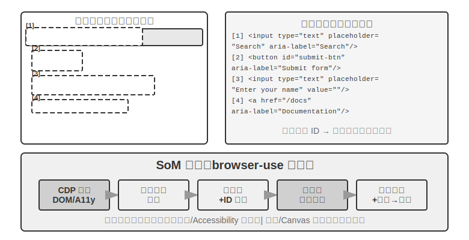

**Pure Coordinate Prediction.**

மூன்றாவது வழி எந்த annotation-ஐயும் செய்யாமல், model-ஐ நேரடியாக coordinates-ஐ output செய்யக் கேட்கிறது. **SeeClick** மற்றும் Claude-ன் computer use ஆல் பிரதிநிதித்துவப்படுத்தப்படும் இந்த approach, GUI screenshots-களின் மிகப்பெரிய தரவுத்தொகுப்பில் element positions-உடன் இணைக்கப்பட்ட ஒரு vision model-ஐப் பயிற்றுவித்து, natural language descriptions-ஐ (எ.கா., "submit button-ஐ click செய்யவும்") screenshot-ல் உள்ள துல்லியமான coordinates-ஆக நேரடியாக map செய்ய கற்றுக்கொடுக்கிறது—ஒரு மனித பயனரைப் போலவே, click செய்ய வேண்டிய இடத்தைக் கண்டுபிடிக்க "பார்ப்பதை" மட்டுமே நம்பியிருக்கிறது.

Coordinate prediction schemes-இல், model-ன் coordinates பற்றிய புரிதல் training-இல் பயன்படுத்தப்படும் resolution-ஐ மிகவும் சார்ந்துள்ளது (Figure 9-10). Claude XGA (1024x768), WXGA (1280x800), மற்றும் FWXGA (1366x768) ஆகியவற்றைப் பயன்படுத்தி பயிற்றுவிக்கப்பட்டது. உள்ளீட்டு screenshot resolution பொருந்தவில்லை என்றால், model-ன் கணிக்கப்பட்ட coordinates முறையாக மாறும்—ஒரு சிறிய வரைபடத்தில் தூரத்தை அளந்து, பின்னர் அதை நேரடியாக ஒரு பெரிய வரைபடத்தில் பயன்படுத்துவது போல. எனவே, tool layer-இல் ஒரு bidirectional coordinate scaling mechanism செயல்படுத்தப்பட வேண்டும், மேலும் இலக்கு resolution **aspect ratio-ஐ அடிப்படையாகக் கொண்டு தேர்ந்தெடுக்கப்பட வேண்டும்**, இது image-ஐ சிதைத்து coordinate judgment-ஐ பாதிக்கும் non-uniform stretching-ஐத் தவிர்க்கிறது. எடுத்துக்காட்டாக, உண்மையான திரை resolution 2560×1440 (16:9) ஆக இருந்தால், Claude-ன் ஆதரிக்கப்படும் மூன்று விருப்பங்களில் மிகவும் பொருத்தமான இலக்கு FWXGA (1366×768) ஆகும், இதன் aspect ratio 16:9-க்கு மிக அருகில் உள்ளது. Screenshot விகிதாச்சாரத்தின்படி 1366×768 ஆக அளவிடப்பட்டு model-க்கு அளிக்கப்படுகிறது; model click coordinates (683, 384) ஐ output செய்த பிறகு, அவை உண்மையான coordinates (683×2560/1366, 384×1440/768) ≈ (1280, 720) ஆக inverse map செய்யப்படுகின்றன. மாறாக, 16:9 image ஒன்று 4:3 1024×768-ஆக வலுக்கட்டாயமாக நீட்டப்பட்டால், image கிடைமட்டமாக சுருக்கப்பட்டு, model-ன் கணிக்கப்பட்ட coordinates முறையாக மாறும்.


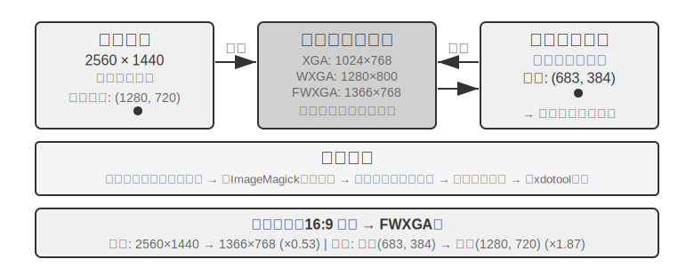


மூன்று வழிகளுக்கான தேர்வு தர்க்கத்தை பின்வருமாறு சுருக்கலாம்: **கட்டமைக்கப்பட்ட தகவல் கிடைக்கும்போது, மிகவும் துல்லியமான மற்றும் நிலையான உள்ளூர்மயமாக்கலுக்கு DOM/Accessibility Tree இன்டெக்சிங்கிற்கு முன்னுரிமை அளிக்கவும்**; **அது கிடைக்காதபோது** (எ.கா., Photoshop போன்ற நேட்டிவ் டெஸ்க்டாப் மென்பொருள், Canvas/WebGL ரெண்டர் செய்யப்பட்ட இடைமுகங்கள், கேம்கள்), **காட்சி அனோட்டேஷன் (அசல் SoM வழி) அல்லது கோர்டினேட் ப்ரெடிக்ஷன்** பயன்படுத்தப்படலாம். காட்சி அனோட்டேஷன் உள்ளூர்மயமாக்கலை பல-தேர்வு பிரச்சினையாக மாற்றுகிறது, இது குறிப்பாகப் பயிற்றுவிக்கப்படாத பொது-நோக்க மாடல்களுக்கு மிகவும் ஏற்றது; கோர்டினேட் ப்ரெடிக்ஷன் அனோட்டேஷன் படிநிலையை நீக்கி, GUI உள்ளூர்மயமாக்கலில் பயிற்றுவிக்கப்பட்ட மாடல்களுக்கு மிகவும் நேரடியானது. இரண்டிற்கும் சிறிய எலிமென்ட்கள் மற்றும் அடர்த்தியான இடைமுகங்களில் துல்லிய இடைவெளிகள் உள்ளன.

> **சோதனை 9-7 ★: browser-use ஐப் பயன்படுத்தி தானியங்கி பிரௌசர் செயல்பாடுகளை செயல்படுத்துதல்**
>
> Playwright பிரௌசர் ஆட்டோமேஷன் ஃப்ரேம்வொர்க்கை (குறியீட்டுடன் பிரௌசர்களைக் கட்டுப்படுத்துவதற்கான டூல் லைப்ரரி) அடிப்படையாகக் கொண்டு, மல்டிமாடல் பெரிய மாடலுடன் இணைந்து, இது இயற்கை மொழி-இயக்கப்படும் பிரௌசர் செயல்பாடுகளை செயல்படுத்துகிறது. SoM விஷுவலைசேஷன் மோடை இயக்கவும், ஒவ்வொரு முடிவுக்கு முன்பும் அனோட்டேட் செய்யப்பட்ட பவுண்டிங் பாக்ஸ்களுடன் ஸ்கிரீன்ஷாட்களை சேமிக்கவும்.
>
> சோதனைப் பணி "Google ஐத் திறந்து San Francisco வானிலையை வினவவும்": கணினி தொடங்கிய பிறகு, ஸ்கிரீன்ஷாட் Google தேடல் பக்கத்தைக் காட்டுகிறது, அனைத்து ஊடாடும் எலிமென்ட்களும் சிவப்பு பவுண்டிங் பாக்ஸ்கள் மற்றும் ID எண்களுடன் (முகவரிப் பட்டை `[1]`, தேடல் பெட்டி `[2]`, தேடல் பொத்தான் `[3]`, "I'm Feeling Lucky" பொத்தான் `[4]`, போன்றவை) அனோட்டேட் செய்யப்பட்டுள்ளன → மாடல் பகுப்பாய்வு செய்து `[2]` (தேடல் பெட்டி) ஐ கிளிக் செய்கிறது → தேடல் பெட்டி ஃபோகஸ் பெறுகிறது மற்றும் மாடல் "San Francisco weather today" என தட்டச்சு செய்கிறது → மாடல் `[3]` (தேடல் பொத்தான்) ஐ கிளிக் செய்கிறது → பக்கம் தேடல் முடிவுகளுக்கு நகர்கிறது, புதிய ஸ்கிரீன்ஷாட் வானிலை கார்டுக்குள் உள்ள எலிமென்ட்களை அனோட்டேட் செய்கிறது, மேலும் மாடல் வெப்பநிலை மற்றும் வானிலை நிலைமைகள் போன்ற தகவல்களை அடையாளம் கண்டு பிரித்தெடுக்கிறது. முழு செயல்முறையும் 5 படிகள் மற்றும் சுமார் 20 வினாடிகள் எடுக்கும்.

### வீடியோக்களைப் பார்க்கவும் ஒலிகளைக் கேட்கவும் முடிந்த Computer Use Agent

இதுவரை, Computer Use இன் உணர்தல் ஒரு மறைமுகமான அனுமானத்தை அடிப்படையாகக் கொண்டுள்ளது: **திரை நிலையானது**—ஒரு ஸ்கிரீன்ஷாட் எடுக்கவும், ஒரு படிக்கு சிந்திக்கவும், கிளிக் செய்யவும், பின்னர் அடுத்த ஸ்கிரீன்ஷாட்டை எடுக்கவும். ஆனால் உண்மையில், திரைகள் வீடியோக்களை இயக்குகின்றன, கண் சிமிட்டும் அறிவிப்புகளைக் காட்டுகின்றன, மேலும் மீட்டிங்குகளில் இருந்து மனித குரல்களை இயக்குகின்றன. ஒவ்வொரு 3–5 வினாடிகளுக்கும் "கண்களைத் திறக்கும்" மற்றும் காதுகள் இல்லாத ஒரு Agent, "இரண்டு ஃப்ரேம்களுக்கு இடையில்" நடக்கும் அனைத்திற்கும் குருடாகவும் செவிடாகவும் இருக்கிறது. திரை பதிவுகளைப் பார்ப்பது, மீட்டிங்குகளில் சேருவது, குரல் ப்ராம்ப்ட்களைக் கேட்பது மற்றும் நிலையற்ற டயலாக் பாக்ஸ்களைக் கையாள்வது—இந்த முழு வகை அன்றாட கணினி செயல்பாடுகளும் இன்றைய Computer Use Agent க்கு கிட்டத்தட்ட தடைசெய்யப்பட்ட மண்டலமாகும்.

இங்கு உண்மையில் மறுவடிவமைப்பு செய்யப்பட வேண்டியது "action interface" அல்ல, மாறாக "**observation interface**"[^ch9-9] ஆகும். மையக் கருத்து **observation** (தொடர்ச்சியான, தகவமைப்புக்குரிய, multimodal) ஐ **action** (தனித்தன்மையான) இலிருந்து பிரித்து, சூழலுக்கும் எந்தவொரு off-the-shelf Computer Use மாதிரிக்கும் இடையில் ஒரு perceptual middleware அடுக்கை உருவாக்குவதாகும், இதற்கு மறுபயிற்சி தேவையில்லை (இதை Agent–Computer Observation Interface, AOI என்று அழைக்கலாம்). இதில் மூன்று "gated" கூறுகள் உள்ளன: முதலில், **inter-frame keyframe capture**—மிகவும் மலிவான pixel gate ஐப் பயன்படுத்தி கிட்டத்தட்ட மாறாத frames ஐத் தவிர்த்து, பின்னர் ஒரு சிறிய மாதிரியைப் பயன்படுத்தி அர்த்தமுள்ள மாற்றம் ஏற்பட்டுள்ளதா என்பதைத் தீர்மானிக்கவும், மாற்றம் இருக்கும்போது மட்டுமே ஒரு frame ஐப் பிடிக்கவும், இதன் விளைவாக static திரைகளுக்கு கிட்டத்தட்ட பூஜ்ஜிய செலவு ஏற்படும்; இரண்டாவதாக, **volume-gated speech transcription**—ஒலி இருக்கும்போது மட்டுமே பேச்சு அங்கீகாரத்தை அழைக்கவும், இது Agent க்கு முதல் முறையாக "காதுகளை" வழங்குகிறது; மூன்றாவதாக, மிக முக்கியமாக, **narrating the screen into persistent text**—பிடிக்கப்பட்ட frame ஐ ஒரு வாக்கியத்தில் விவரிக்க மாதிரியை வைக்கவும் (எ.கா., "The popup just said the release date has been changed to April 28th"), மேலும் **அசல் படம் பின்னர் context இலிருந்து அழிக்கப்பட்டாலும், இந்த உரை நினைவகத்தில் இருக்கும்**, இது மாறும் தகவலை உரை வடிவில் முன்னோக்கி எடுத்துச் செல்கிறது.

ஒரு எதிர்பாராத கண்டுபிடிப்பு என்னவென்றால், உண்மையில் முக்கியமானது "எந்த frames ஐ தேர்ந்தெடுப்பது" அல்ல, மாறாக "**frames ஐ நீண்ட காலம் நீடிக்கக்கூடிய உரையாக விவரிப்பது**" ஆகும்—உரை என்பது LLM Agents சிறப்பாகக் கையாளும் modality ஆகும். 7B முதல் frontier அளவு வரையிலான எட்டு மாதிரிகள் முழுவதும், இந்த middleware, எந்த மறுபயிற்சியும் இல்லாமல், +17 முதல் +48 சதவீத புள்ளிகள் வரை மேம்பாடுகளை அளித்தது, மிகப்பெரிய இடைவெளி குரல் தொடர்பான பணிகளில் இருந்தது: இந்த perceptual layer சேர்க்கப்பட்ட நிலையில், Agent முன்பு "கேட்கக்கூடியதாக ஆனால் செயல்படுத்த முடியாததாக" இருந்த குரல் பணிகளை முடிக்க முடிந்தது. இருப்பினும், இது அனைவருக்கும் பொருந்தக்கூடிய நிலையான உள்ளமைவு அல்ல—சில புதிய மாதிரிகளில், அதிகப்படியான பட tokens ஐ செலுத்துவது பகுத்தறிவைக் குறைத்து செயல்திறனைக் குறைக்கும். எனவே, இந்த கூறுகள் **ஒவ்வொரு மாதிரிக்கும் ஏற்ப தேர்ந்தெடுக்கப்பட வேண்டும்**, கண்மூடித்தனமாக இயக்கப்படக்கூடாது. இது Set-of-Mark மற்றும் coordinate prediction இடையேயான பரிமாற்றத்தின் அதே கொள்கையாகும்: perception திட்டங்களுக்கு வெள்ளி அம்பு எதுவும் இல்லை; அவை மாதிரியின் குணத்திற்கு ஏற்ப வடிவமைக்கப்பட வேண்டும்.

[^ch9-9]: மூன்று கூறுகளின் முழுமையான வழிமுறை மற்றும் ஒவ்வொரு மாதிரிக்குமான ablation—gated keyframes, on-demand transcription, மற்றும் narrating frames into persistent text—ஆகியவற்றிற்கு, Li, Bojie மற்றும் Noah Shi. *Agent-Computer Observation Interfaces Enable Dynamic Computer Use.* arXiv:2606.29472, 2026 ஐப் பார்க்கவும்.

### Mobile: Ecosystem Barriers Are Harder Than Technology

Computer Use ஆனது mobile domain-க்கும் விரிவடைந்து வருகிறது. Mobile மற்றும் desktop-க்கு இடையே உண்மையில் தொழில்நுட்ப வேறுபாடுகள் உள்ளன: action space பொதுவாக "mouse coordinates + keyboard" ஆக இல்லாமல், system-ன் accessibility service API (எ.கா., Android-ன் AccessibilityService) உடன் இடைமுகம் கொண்டு interface elements-ஐப் படித்து clicks மற்றும் text input-ஐ வெளியிடுகிறது; interaction method-ம் mouse pointer-லிருந்து touch gestures-க்கு மாறுகிறது, coordinates-ன் semantics-ஐ மாற்றுகிறது—அதே (x, y) ஒரு finger tap-ஐ, long press-ஐ, அல்லது swipe gesture-ன் starting point-ஐ குறிக்கிறதா என்பதை வரையறுக்க கூடுதல் gesture type தேவைப்படுகிறது. Chapter 6-ல் அறிமுகப்படுத்தப்பட்ட AndroidWorld போன்ற mobile benchmarks, இந்த action space-க்குள் real apps-ல் tasks-ஐ முடிக்கும் Agent-ன் திறனை மதிப்பீடு செய்கின்றன.

எனினும், mobile Computer Use-ஐ உண்மையில் தடுப்பது பெரும்பாலும் இந்த தொழில்நுட்ப வேறுபாடுகள் அல்ல, மாறாக ecosystem barriers ஆகும். சில phone manufacturers, consumer-grade phones-ல் AI assistants-ஐ ஒருங்கிணைக்க முயற்சித்து, WeChat, Taobao, Alipay போன்ற அன்றாட apps-ஐ தானாக இயக்க அனுமதித்தனர், ஆனால் அவர்கள் விரைவில் platform restrictions-ஐ சந்தித்தனர்.

இது Computer Use-க்கு ஒரு தனித்துவமான சவாலை வெளிப்படுத்துகிறது: **ecosystem barriers**. Blockades-க்கு பின்னால் உள்ள அடிப்படை காரணம் business models-ன் முரண்பாடு ஆகும். பாரம்பரிய internet applications-ன் core monetization logic **traffic and attention** ஆகும்: users, feeds-ஐ scroll செய்யும் போது ads-ஐப் பார்க்கிறார்கள், products-ஐத் தேடும் போது recommendation algorithms-ஐப் பின்பற்றுகிறார்கள், pages-ஐ உலாவும் போது impulse purchases-ஐ செய்கிறார்கள். ஒரு Agent user-க்காக செயல்படும் போது, இந்த monetization chain முற்றிலும் தவிர்க்கப்படுகிறது: AI ads-க்கு கவனம் செலுத்தாது, impulse purchases-ஐ செய்யாது, நேரடியாக goal-க்குச் சென்று task-ஐ முடிக்கிறது. Advertising மற்றும் traffic monetization-ஐ நம்பியிருக்கும் platforms-க்கு, Agent-ன் ஒவ்வொரு operation-ம் அவர்களின் business model-ன் அடித்தளத்தை அரித்துவிடுகிறது.

இதன் பொருள் Computer Use, CAPTCHA-க்கள் போன்ற technical adversarial measures-ஐ மட்டுமல்ல, **structural conflict of interest**-ஐயும் எதிர்கொள்கிறது. இந்த முரண்பாடு குறுகிய காலத்தில் சமரசம் செய்வது கடினம் மற்றும் purely technical issues-ஐ விட consumer scenarios-ல் Computer Use-ஐ பயன்படுத்துவதற்கு மிகவும் சவாலான தடையாக உள்ளது.

### Real-Time Performance: தீர்க்கப்படாத மைய சவால்

**OSWorld** (Chapter 6 அதன் evaluation methodology-ஐ விவரிக்கிறது) Computer Use-க்கு பரவலாகப் பயன்படுத்தப்படும் ஒரு benchmark ஆகும், இது real Ubuntu/Windows/macOS environments-ல் cross-application tasks-ஐ முடிக்கும் Agent-ன் திறனை சோதிக்கிறது. ஆரம்ப general-purpose models இந்த benchmark-ல் சுமார் 20% success rate-ஐ மட்டுமே அடைந்தன. பின்னர் வந்த specialized models மற்றும் மிகவும் சக்திவாய்ந்த general-purpose models தொடர்ந்து accuracy-ஐ உயர்த்தி, இந்த எழுத்தின் நிலவரப்படி படிப்படியாக human-level performance-ஐ நெருங்கி வருகின்றன. எனினும், accuracy finish line-லிருந்து வெகு தொலைவில் உள்ளது—உண்மையான bottleneck "அதைச் சரியாகச் செய்ய முடியுமா?" என்பதிலிருந்து "அதை விரைவாகச் செய்ய முடியுமா?" என்பதற்கு மாறிவிட்டது.

**OSWorld-Human** திறன் ஆய்வு ஒரு கசப்பான உண்மையை வெளிப்படுத்துகிறது: ஒரு பணி இறுதியில் வெற்றிகரமாக முடிந்தாலும் கூட, Agent எடுக்கும் செயல்பாட்டு படிகளின் எண்ணிக்கை மனிதனை விட கணிசமாக அதிகமாக உள்ளது, மேலும் ஒவ்வொரு படிக்குமான inference latency பணி முன்னேறும்போது அதிகரிக்கிறது—context நீளமாகும்போது, model இன் முடிவெடுக்கும் வேகம் குறைகிறது, மேலும் பிந்தைய படிகளுக்கு எடுக்கும் நேரம் பெரும்பாலும் ஆரம்ப படிகளை விட அதிகமாக இருக்கும். ஒரு மனிதன் சில பத்து வினாடிகளில் முடிக்கக்கூடிய document formatting adjustment ஐ முடிக்க ஒரு Agent க்கு பல நிமிடங்கள் ஆகலாம். **மனித அளவிலான துல்லியத்தை அடைவது நடைமுறைக்குரியதாக இருப்பதற்கு சமமானதல்ல—திறன் தான் உண்மையான தடை.**

திறன் பிரச்சினையின் மூல காரணம் speech scenario ஐ ஒத்ததே: serial "screenshot-think-click" loop இல், ஒவ்வொரு படியும் உச்சநிலைக்கு உகந்ததாக்கப்பட்டாலும், படி முதல் படி வரை குவிந்துவரும் தாமதம் இன்னும் ஏற்றுக்கொள்ள முடியாத அளவில் உள்ளது. ஆழமான பிரச்சினை என்னவென்றால், தற்போதைய Computer Use "முன்கூட்டியே சிந்திக்கும்" திறனை முற்றிலும் கொண்டிருக்கவில்லை. ஒரு agent தற்போதைய செயலைச் செயல்படுத்தும்போதே அடுத்து என்ன செய்ய வேண்டும் என்பதைக் கணிக்க முடிந்தால்—எடுத்துக்காட்டாக, ஒரு பக்கம் ஏற்றப்படும் வரை காத்திருக்கும்போது அடுத்து எங்கு கிளிக் செய்ய வேண்டும் என்பதைப் பற்றி சிந்தித்தால்—அது சிந்தனை மற்றும் செயல்படுத்தும் நேரத்தை ஒன்றுடன் ஒன்று இணைத்து, மொத்த latency ஐ கணிசமாகக் குறைக்கும் (இது இந்த அத்தியாயத்தின் முந்தைய speech scenario இல் உள்ள "thinking while speaking" மற்றும் Chapter 4 இல் உள்ள "continuous thinking" asynchronous agent ஆகியவற்றின் அதே தேவையாகும், இங்கு "thinking while operating" ஆக மாற்றப்பட்டுள்ளது).

பேச்சுத் துறையைப் போலல்லாமல், Computer Use-இன் நிகழ்நேர செயல்திறனை மேம்படுத்துவதற்கு—"screenshot-think-click" சுழற்சியை வேகமாக்குவதற்கு—தற்போது முறையான தீர்வு எதுவும் இல்லை, மேலும் அது frame-by-frame screenshots-களின் தனித்த சுழற்சியில் சிக்கியுள்ளது. இருப்பினும், இந்த அத்தியாயத்தில் மீண்டும் மீண்டும் தோன்றும் fast-slow decoupling-ஐப் பயன்படுத்தி, ஒரு workaround ஏற்கனவே பயனுள்ளதாக நிரூபிக்கப்பட்டுள்ளது: மெதுவான computer-use agent-ஐ வேகமாக்குவது கடினம் என்பதால், **பயனர் அதற்காக காத்திருக்க வைக்காதீர்கள்**. "பேசுவதை" மற்றும் "கணினியை இயக்குவதை" இரண்டு வெவ்வேறு models-களாகப் பிரித்து, ஒன்று வேகமாகவும் மற்றொன்று மெதுவாகவும் இயங்கும் வகையில், ஒரே நேரத்தில் இயக்கவும்[^ch9-10]—ஒரு சிறிய model (fast) நிகழ்நேர குரல் உரையாடலைக் கையாள்கிறது, அதே நேரத்தில் ஒரு cutting-edge VLM (slow) browser-இல் படிப்படியாக இயங்குகிறது. இரண்டும் ஒரு குறைந்தபட்ச "plain text contract" மூலம் மட்டுமே தொடர்பு கொள்கின்றன: slow agent ஒவ்வொரு முறை செயலைச் செய்யும்போதும், அது ஒரு சுருண்ட status summary-ஐ ("படிவத்தை நிரப்புகிறேன், உங்கள் பிறந்த தேதி இன்னும் தேவை") இணைக்கிறது. இதைப் பயன்படுத்தி fast agent பயனருக்கு நிகழ்நேரத்தில் பதிலளிக்கிறது மற்றும் பயனர் வாய்மொழியாக வழங்கும் எந்தப் புதிய தகவலையும் slow agent-க்கு அனுப்புகிறது. முக்கியமாக, **status summary நிறைவை உறுதிப்படுத்தும் வரை fast agent "முடிந்தது" என்று ஒருபோதும் சொல்லக்கூடாது**. இது "கணினியைத் தானாக இயக்க விட்டுவிட்டு தொலைபேசியில் பேசுவது" போன்ற சூழ்நிலை. சோதனைகளில், இந்த decoupling குரல் பதில்களை "ஒரே model இயக்குவதும் பேசுவதும்" (median latency 0.58 வினாடிகள் vs. 8.64 வினாடிகள்) என்பதை விட சுமார் 15 மடங்கு வேகமாக்கியது, பணி வெற்றி விகிதத்தைக் குறைக்காமல். fast மற்றும் slow models-களுக்கு இடையேயான text channel-ஐ அகற்றியதும், வெற்றி விகிதம் உடனடியாக 0 ஆகக் குறைந்தது—ஏனெனில் பயனர் வாய்மொழியாக வழங்கிய முக்கிய தகவல் browser-ஐ அடைய முடியவில்லை. இது முன்பு கூறப்பட்ட Latent Bridge மற்றும் பேச்சுத் துறையில் "சிந்தித்துப் பேசுதல்" ஆகியவற்றின் அதே கருத்தாகும்: ஒரு கூறு இயல்பாகவே மெதுவாக இருக்கும்போது, மற்றொரு வேகமான கூறு பயனரின் காத்திருப்பு நேரத்தை நிரப்பட்டும்—இந்த "plain text contract" என்பது அத்தியாயம் 2 முதல் விவாதிக்கப்படும் agent status bar ஆகும். Computer Use சுழற்சியை வேகமாக்குவது இன்னும் ஒரு முக்கியமான ஆராய்ச்சி திசையாக இருக்கலாம், ஆனால் "fast-slow decoupling மூலம் மந்தத்தை மறைப்பது" ஏற்கனவே ஒரு சாத்தியமான தீர்வாகும்.

[^ch9-10]: பேச்சு-இயக்கம் fast-slow decoupling மற்றும் "plain text contract"-இன் முழுமையான வடிவமைப்பை Li, Bojie மற்றும் Noah Shi. *Talking While Acting: Real-Time Voice for Slow Computer-Use Agents.* 2026 (வெளியாகவுள்ளது) இல் காணலாம்.

## Robot Manipulation: நிகழ்நேர கட்டுப்பாட்டிலிருந்து பயிற்சி மற்றும் பொதுமைப்படுத்தல் வரை

> **வாசிப்புக் குறிப்பு**: இந்தப் பகுதி robot கட்டுப்பாட்டைப் பற்றி விவாதிக்கிறது. சோதனை 9-10, உருவகப்படுத்துதலில் இருந்து நிஜத்திற்கு மாற்றும் ஒரு முறையை நிரூபிக்கிறது—**உருவகப்படுத்துதல் பயிற்சிப் பகுதி (steps 3-4) தூய GPU server-இல் hardware இல்லாமல் முடிக்கப்படலாம்**; இருப்பினும், முழு pipeline-ஐ end-to-end ஆக மீண்டும் உருவாக்க (நிஜ உலக deployment steps உட்பட), SO100 robotic arm போன்ற நிஜ hardware தேவை. நீங்கள் தற்போது robotics-இல் ஆர்வம் காட்டவில்லை என்றால், இந்தப் பகுதியைத் தவிர்க்கலாம்; இது மற்ற அத்தியாயங்களைப் படிப்பதைப் பாதிக்காது.

Voice agents ஆனது auditory modality-இல் latency-ஐ எதிர்கொள்கின்றன, மற்றும் Computer Use ஆனது visual modality-இல் latency-ஐ எதிர்கொள்கிறது. Agents உடல் உலகில் robots-ஐ கட்டுப்படுத்த வேண்டியிருக்கும் போது, latency மற்றும் multimodality-இன் சவால்கள் மேலும் பெரிதாகின்றன—செயல்களின் விளைவுகள் மீள முடியாதவை, மற்றும் ஒரு மோதல் பொருட்களையோ அல்லது robot-ஐயோ சேதப்படுத்தலாம். இந்த பகுதி முதலில் robots எவ்வாறு two-layer architecture மற்றும் action chunking-ஐப் பயன்படுத்தி real-time control பிரச்சனையை அடக்குகின்றன என்பதைப் பார்க்கிறது, பின்னர் தற்போதைய கடினமான சவாலுக்கு மாறுகிறது—training மற்றும் generalization: தரவு எங்கிருந்து வருகிறது மற்றும் models எவ்வாறு பணிகள் மற்றும் தளங்களுக்கு இடையே மாற்ற முடியும்.

### Hardware தடையல்ல, Algorithms தான்

ஏன் robots பொதுவான திறந்த சூழல்களில் பரவலாக ஏற்றுக்கொள்ளப்படவில்லை? தடை hardware-ஆ அல்லது algorithms-ஆ? XLeRobot திட்டம் ஒரு வலுவான எதிர் உதாரணத்தை வழங்குகிறது: $1000-க்கும் குறைவான விலையுள்ள dual-arm wheeled robot, ஒரு மனிதரால் VR headset மூலம் தொலைவிலிருந்து கட்டுப்படுத்தப்படும் போது (teleoperation), ஏற்கனவே பல வீட்டு வேலைகளை சீராக செய்ய முடியும். திறமையான கைகள் தேவைப்படும் மிகவும் சிக்கலான வீட்டு வேலைகளுக்கு, Unitree-யின் robots-உம் மனித teleoperation-இன் கீழ் சீராக செயல்பட முடியும். Teleoperation latency சுமார் 100-200ms ஆகும், இது உடல் தொடர்புக்கான பதில் தேவைகளுக்கு நெருக்கமானது. Sensor resolution, actuator precision, மற்றும் control frequency (robot ஒரு வினாடிக்கு அதன் action commands-ஐ எத்தனை முறை புதுப்பிக்கிறது; குறைந்த frequency மென்மையான இயக்கத்தை குறைத்து, அதிக jitter அல்லது target trajectory-இலிருந்து விலகலை ஏற்படுத்துகிறது) தற்போதைய குறைந்த விலை தளங்களில் நடைமுறை பணிகளுக்கு ஏற்கனவே போதுமானவை.

இந்த கூற்றுக்கு தெளிவான எல்லை தேவை: teleoperation எதிர் உதாரணம் உண்மையில் நிரூபிப்பது "தற்போதைய குறைந்த விலை hardware, மனித நுண்ணறிவுடன் இணைந்து, **முதன்மையாக visual feedback-ஐ சார்ந்த இந்த வகை வீட்டு கையாளுதல் பணிகளை** முடிக்க போதுமானது" என்பதுதான். இது hardware அனைத்து பரிமாணங்களிலும் போதுமானது என்று அர்த்தமல்ல—tactile sensing-இன் பற்றாக்குறை, திறமையான கைகளின் நம்பகத்தன்மை மற்றும் செலவு, இவை அங்கீகரிக்கப்பட்ட hardware குறைபாடுகளாகவே உள்ளன. ஒரு பணி நுண்ணிய force control மற்றும் tactile feedback-ஐ பெரிதும் சார்ந்திருக்கும் போது, hardware உண்மையில் தடையாக மாறலாம். எனவே, கீழே உள்ள "hardware தடையல்ல" என்ற கூற்று இந்த பகுதியில் விவாதிக்கப்படும் பணி வகைக்கு மட்டுமே வரையறுக்கப்பட்டுள்ளது.

இந்த பணிகளுக்கு, உண்மையான இடைவெளி algorithm அடுக்கில் உள்ளது, இது பின்வரும் இரண்டு துணைப்பிரிவுகளில் விரிவாக விளக்கப்பட்டுள்ளது.

> **சோதனை 9-8 ★: XLeRobot Teleoperation அனுபவம்**
>
> XLeRobot ஆனது keyboard, Xbox controller, Switch Joycon, மற்றும் VR headset உள்ளிட்ட பல்வேறு teleoperation முறைகளை ஆதரிக்கிறது. பொருட்களை எடுப்பது, வைப்பது, மற்றும் மேற்பரப்புகளைத் துடைப்பது போன்ற பணிகளை முடிக்க ரோபோவை கைமுறையாகக் கட்டுப்படுத்துவதன் மூலம், பதில் தாமதம் (response latency), இயக்கத் துல்லியம் (motion precision), மற்றும் பணி முடிப்பின் தரம் ஆகியவற்றைக் கவனித்து, வன்பொருள் திறன்களின் எல்லைகளைப் பற்றிய ஒரு உள்ளுணர்வுப் புரிதலை உருவாக்குங்கள்—இதை நேரடியாக அனுபவித்த பிறகு, மனிதனால் கட்டுப்படுத்தப்படும் போது ரோபோவால் கிட்டத்தட்ட எதையும் செய்ய முடியும் என்பதை நீங்கள் காண்பீர்கள், இது தற்போதைய தடையானது வன்பொருள் அல்ல, மாறாக வழிமுறைகள் (algorithms) என்பதைக் குறிக்கிறது.[^ch9-1]
>
> [^ch9-1]: XLeRobot, "Teleop Documentation" . https://xlerobot.readthedocs.io/en/latest/software/getting_started/XLeRobot_teleop.html

### இரண்டு-அடுக்கு கட்டமைப்பு: திட்டமிடல் மற்றும் கட்டுப்பாட்டின் பிரிப்பு

சிக்கலான வீட்டுப் பணிகளை முடிக்க ரோபோக்கள் இரண்டு வெவ்வேறு நேர அளவுகளில் முடிவுகளை எடுக்க வேண்டும். முதல் அடுக்கு மெதுவான **long-horizon planning** ஆகும்: "சமையலறையை சுத்தம் செய்" போன்ற உயர்-நிலை அறிவுறுத்தலை துணை-இலக்குகளின் வரிசையாக (கவுண்டர்டாப்பை சுத்தம் செய், பாத்திரங்கழுவியில் ஏற்று, மேற்பரப்புகளைத் துடை) சிதைப்பது. இதற்கு சூழலின் சொற்பொருளைப் புரிந்துகொள்வது, பணி சார்புகளைப் பற்றி பகுத்தறிவது, மற்றும் பல-படி செயல் வரிசைகளைத் திட்டமிடுவது தேவை—ஒரு நபர் தொடங்குவதற்கு முன் "முதலில் என்ன செய்வது, அடுத்து என்ன செய்வது" என்று சிந்திப்பதைப் போன்றது. இரண்டாவது அடுக்கு வேகமான **VLA control** (Vision-Language-Action model) ஆகும்: ஒவ்வொரு குறிப்பிட்ட செயல்பாட்டையும் ("சிங்க்கிற்கு நட," "துணியை எடு," "கவுண்டர்டாப்பைத் துடை") செயல்படுத்தி, தற்போதைய காட்சி உள்ளீடு மற்றும் மொழி அறிவுறுத்தலின் அடிப்படையில் தொடர்ச்சியாக கட்டுப்பாட்டு சமிக்ஞைகளை வெளியிட்டு, ரோபோ இயக்கம் மென்மையாகவும் ஒத்திசைவாகவும் இருப்பதை உறுதி செய்கிறது.

இந்த இரண்டு-அடுக்கு கட்டமைப்பு சிக்கலை திறம்பட பிரிக்கிறது: long-horizon planning "என்ன செய்வது" என்பதைக் கையாள்கிறது, மற்றும் VLA control "எப்படி செய்வது" என்பதைக் கையாள்கிறது. இந்த "மெதுவான உயர்-நிலை முடிவெடுத்தல் + வேகமான கீழ்-நிலை செயலாக்கம்" என்ற இரண்டு-அடுக்கு கட்டமைப்பு, முன்பு பேச்சு சூழலில் இருந்த "fast-slow thinking" உடன் கட்டமைப்பு ரீதியாக மிகவும் ஒத்திருக்கிறது—இரண்டும் சிக்கலான சிந்தனை மற்றும் நிகழ்நேர பதிலை வெவ்வேறு தொகுதிகளாகப் பிரிக்கின்றன. இங்கு "திட்டமிடல்/கட்டுப்பாடு" என்பது fast-slow thinking இன் "மெதுவான ஆழமான சிந்தனை / வேகமான நிகழ்நேர பதில்" என்ற பிரிப்பு பரிமாணத்துடன் ஒத்துப்போகிறது என்பதைக் கவனத்தில் கொள்ள வேண்டும், இது மூன்றாம் திட்டத்தின் MPS "கருத்து மூளை / வெளிப்பாட்டு மூளை" என்ற "சிந்தனை/வெளிப்பாடு" பிரிப்புடன் அல்ல—பிந்தையது "சிந்தனையை" "பேச்சிலிருந்து" பிரிக்கிறது, அதே நேரத்தில் முந்தையது "உலகளாவிய திட்டமிடலை" "நிகழ்நேர செயலாக்கத்திலிருந்து" பிரிக்கிறது. இந்த இரண்டு "இரட்டை-X கட்டமைப்புகளின்" பரிமாணங்கள் வேறுபட்டவை.

இருப்பினும், நிகழ்நேர செயல்திறன் முற்றிலும் மறைந்துவிடவில்லை; அது VLA கட்டுப்பாட்டு அடுக்குக்கு (VLA control layer) தள்ளப்பட்டுள்ளது, அங்கு அது **Action Chunking** மூலம் குறைக்கப்படுகிறது (கீழே உள்ள "VLA Control" துணைப்பிரிவைப் பார்க்கவும்): model ஒரு முடிவெடுப்பில் (inference) எதிர்கால செயல்களின் ஒரு சிறிய வரிசையை உருவாக்குகிறது, மேலும் கட்டுப்பாட்டு நூல் (control thread) அவற்றை அதிக அதிர்வெண்ணில் மீண்டும் இயக்குகிறது, ஒரு முடிவெடுப்பின் தாமதத்தை (latency) முழு செயல் வரிசையின் செயல்பாட்டு நேரத்தில் பரப்புகிறது. ஆனால் இங்கு ஒரு தவிர்க்க முடியாத பரிமாற்றம் (trade-off) உள்ளது—chunking ஆனது எதிர்வினைத்திறனை (reactivity) மென்மைக்காக (smoothness) பரிமாறிக் கொள்கிறது: chunk நீளமாக இருந்தால், ஒவ்வொரு முடிவெடுப்பின் தாமதமும் அதிகமாக சராசரியாக்கப்பட்டு (amortized) இயக்கம் மென்மையாக இருக்கும், ஆனால் இந்த நேரத்தில் model புதிய காட்சித் தகவல்களுக்கு "குருடாக" (blind) இருக்கும், இது திடீர் மாற்றங்களுக்கு (ஒரு பொருள் நகர்த்தப்படுவது, ஒரு கை வழியைத் தடுப்பது) குறைவான எதிர்வினைத்திறனை ஏற்படுத்துகிறது. நிகழ்நேர செயல்திறனுக்கும் மென்மைக்கும் இடையிலான இந்த பரிமாற்றம், இரண்டு-அடுக்கு கட்டமைப்பு (two-layer architecture) அகற்றவில்லை, மாறாக மாற்றியமைத்துள்ள ஒரு பிரச்சினையின் பகுதியாகும்.

இது இந்த அத்தியாயத்தின் முக்கிய நூலில் (main thread) ஒரு மாற்றத்தையும் குறிக்கிறது: ரோபாட்டிக்ஸ் காட்சியில் (robotics scenario), நிகழ்நேர முரண்பாடு (real-time contradiction) இரண்டு-அடுக்கு பிரிப்பு (two-layer decoupling) மற்றும் action chunking மூலம் ஓரளவு தணிக்கப்பட்டுள்ளது. தற்போதைய முதன்மை முரண்பாடு **பயிற்சி மற்றும் பொதுமைப்படுத்தலுக்கு** (training and generalization) மாறியுள்ளது—போதுமான ஆர்ப்பாட்டத் தரவை (demonstration data) எவ்வாறு பெறுவது மற்றும் models எவ்வாறு பணிகள் மற்றும் தளங்களில் (tasks and platforms) பொதுமைப்படுத்த முடியும் என்பது. பின்வரும் துணைப்பிரிவுகள் இந்த புதிய முரண்பாட்டில் கவனம் செலுத்துகின்றன, இது அத்தியாயம் 6 இன் உருவகப்படுத்துதல் சூழல்கள் (simulation environments) மற்றும் அத்தியாயம் 7 இன் வலுவூட்டல் கற்றல் (reinforcement learning) ஆகியவற்றின் கருப்பொருள்களை இயற்பியல் உலகத்திற்கு நீட்டிப்பதாகும்.

இந்த புதிய முரண்பாடு முக்கியமாக VLA கட்டுப்பாட்டு அடுக்கில் எடை போடுகிறது. VLA ஐ "VLM + action output" எனக் காணலாம்: **VLM** (Vision-Language Model—படங்கள் மற்றும் உரை இரண்டையும் புரிந்துகொள்ளும் திறன் கொண்ட ஒரு பெரிய model) "பார்ப்பதையும்" மற்றும் "தெளிவாக சிந்திப்பதையும்" கையாள்கிறது, அதே நேரத்தில் VLA "செயல்படவும்" வேண்டும். உண்மையான சவால் "செயல்படும்" அடுக்கில் உள்ளது. தற்போது, VLA கட்டுப்பாட்டு அடுக்கு முதன்மையாக பின்பற்றுதல் கற்றல் (imitation learning) (behavioral cloning) மூலம் பயிற்றுவிக்கப்படுகிறது—ஏராளமான மனித ஆர்ப்பாட்டங்களிலிருந்து (OpenVLA, RT-2, π₀, போன்றவை அனைத்தும் இந்த வகையைச் சேர்ந்தவை) நேரடியாக "ஏதாவது பார்த்தால், ஏதாவது செய்" என்பதைக் கற்றுக்கொள்கிறது. வலுவூட்டல் கற்றல் (reinforcement learning) என்பது சமீபத்திய ஆண்டுகளில் மேலே சேர்க்கப்பட்ட ஒரு துணை முறையாகும். வலுவூட்டல் கற்றலுடன் பயிற்றுவிக்கப்பட்ட VLAs தனிப்பட்ட பணிகளில் நன்றாக செயல்பட முடியும் என்றாலும், அவை பெரும்பாலும் பொதுமைப்படுத்தும் திறனைக் (generalization ability) கொண்டிருக்கவில்லை: அத்தியாயம் 7 இலிருந்து SimpleVLA-RL LIBERO இல் அதிக ஒற்றை-பணி முடிவுகளைப் புகாரளித்தாலும், அது ஒவ்வொரு பணிக்கும் தனித்தனியாக RL உடன் பயிற்றுவிக்கப்படுகிறது, அனைத்து பணிகளுக்கும் zero-shot பொதுமைப்படுத்தும் ஒரு ஒருங்கிணைந்த model அல்ல. இந்த "ஒரு பணிக்கு ஒருமுறை பயிற்சி" (train once per task) model என்பது ஒவ்வொரு புதிய பணிக்கும் தரவை மீண்டும் சேகரித்து model ஐ மீண்டும் பயிற்றுவிக்க வேண்டும் என்பதாகும்.

பின்வரும் இரண்டு பிரிவுகள் முறையே நீண்ட-கால திட்டமிடல் (long-horizon planning) மற்றும் VLA கட்டுப்பாட்டுக்கான குறிப்பிட்ட தொழில்நுட்ப தீர்வுகளை ஆழமாக ஆராய்கின்றன.

### Long-Horizon Planning: VLM இலிருந்து சிறப்பு உருவகப்படுத்தப்பட்ட பகுத்தறிவு Models வரை

General-purpose VLMs ஏற்கனவே decent embodied reasoning திறன்களைக் கொண்டுள்ளன. Google DeepMind இன் **Gemini Robotics-ER 1.5** குறிப்பாக Embodied Reasoning (physical world இல் objects இன் position, movement, மற்றும் causal relationships ஐப் புரிந்துகொள்வது) க்காக optimized செய்யப்பட்டுள்ளது. இது 15 academic benchmarks (Point-Bench, RefSpatial, RoboSpatial, BLINK, போன்றவை) இல் சராசரியாக 62.8% ஐ அடைந்து, GPT-4o (60.6%) மற்றும் Gemini 2.5 Pro (59.3%) ஐ விஞ்சுகிறது. முக்கிய நன்மைகள்: advanced spatial understanding மற்றும் object localization, temporal reasoning ("இந்த cup ஐ தள்ளினால் என்ன நடக்கும்" போன்ற action consequences ஐ கணிப்பது), task sequencing (high-level instructions ஐ சிறிய steps ஆக பிரிப்பது), மற்றும் thinking mechanisms மற்றும் tool calls க்கான native support ஆகியவை அடங்கும்.[^ch9-2]

[^ch9-2]: Google DeepMind, "Gemini Robotics-ER 1.5" . https://deepmind.google/models/gemini-robotics/gemini-robotics-er/

> **Experiment 9-9 ★★: Gemini Robotics-ER 1.5 ஐப் பயன்படுத்தி XLeRobot Autonomous Navigation ஐ இயக்குதல்**
>
> RoboCrew library ஐப் பயன்படுத்தி, Gemini Robotics-ER 1.5 ஐ long-horizon planning model ஆகப் பயன்படுத்தவும், camera images இல் angle scale annotations overlay செய்யப்பட்டுள்ளன. System மூன்று simple tools ஐ மட்டுமே வழங்குகிறது: move forward, turn left, turn right. "find the kitchen and go there" என்ற task கொடுக்கப்பட்டால், model 0.5-1Hz frequency இல் decisions எடுக்கிறது: corridors, doors, furniture போன்ற visual features ஐ அடையாளம் காணல்; "kitchen இடதுபுறத்தில் இருக்கலாம்" என்று முடிவு செய்து left turn ஐ execute செய்தல்; "முன்னால் ஒரு refrigerator உள்ளது" என்று பார்த்து continue moving forward செய்தல். இதை voice control mode ஆகவும் (wake word ஐப் பயன்படுத்தி new tasks ஐ trigger செய்ய) extend செய்யலாம். இந்த experiment, VLMs இன் long-horizon planning layer இல் உள்ள capability boundaries ஐ வெளிப்படுத்துகிறது: spatial reasoning மற்றும் task decomposition ஏற்கனவே மிகவும் நன்றாக உள்ளன, ஆனால் complex environments இல் robustness மற்றும் multi-step reasoning இல் consistency ஆகியவை இன்னும் மேம்பாட்டிற்கான இடத்தைக் கொண்டுள்ளன.[^ch9-3]
>
> [^ch9-3]: XLeRobot, "LLM Agent Control" . https://xlerobot.readthedocs.io/en/latest/software/getting_started/LLM_agent.html

### VLA Control: Demonstration Data இலிருந்து Cross-Embodiment Generalization வரை

Two-layer architecture இன் execution layer இல், மூன்று representative models—RT-2, OpenVLA, மற்றும் π₀—அனைத்தும் VLA control இல் கவனம் செலுத்துகின்றன, அதாவது camera images மற்றும் language instructions அடிப்படையில் robot actions ஐ real-time இல் output செய்வது (Figure 9-11). அவை action representation இல் இரண்டு வெவ்வேறு routes ஐச் சேர்ந்தவை: discrete action tokens மற்றும் continuous trajectory generation.

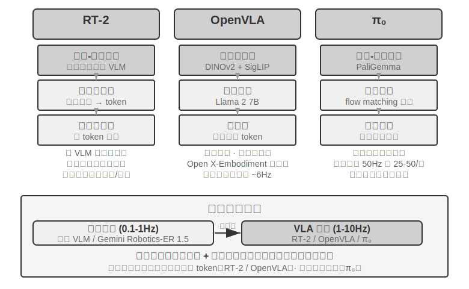

**RT-2 மற்றும் OpenVLA: Discrete Action Token Route.**

**RT-2** இந்த வழியை முன்னோடியாகத் தொடங்கியது: இது ஒரு பெரிய அளவிலான vision-language model-ஐ நேரடியாக fine-tune செய்து, robot-இன் தொடர்ச்சியான செயல்களை (continuous actions) tokens ஆக discretize செய்து, text உருவாக்குவது போல ஒவ்வொன்றாக autoregressively வெளியிடுகிறது. இது pre-trained model-இன் generalization திறனைப் பயன்படுத்தி, புதிய பொருள்கள் மற்றும் அறிவுறுத்தல்களுக்கான zero-shot transfer-ஐ மேம்படுத்துகிறது. **OpenVLA** RT-2-இன் action representation scheme-ஐப் பின்பற்றி, language model மற்றும் vision encoder-ஐ ஒரே architecture-இல் ஒருங்கிணைக்கிறது. இது படங்கள் மற்றும் text அறிவுறுத்தல்களை உள்ளீடாக எடுத்து, action tokens-ஐ வெளியிடுகிறது. Training இரண்டு நிலைகளில் செய்யப்படுகிறது: முதலில், பெரிய அளவிலான cross-platform dataset ஆன Open X-Embodiment (20 க்கும் மேற்பட்ட robot platforms-இலிருந்து real-world manipulation demonstrations-ஐ உள்ளடக்கியது) இல் pre-training செய்து, பொதுவான manipulation அறிவைக் கற்றுக்கொள்வது (வெவ்வேறு robots-இல் "grasp" மற்றும் "place" போன்ற action patterns பொதுவானவை); இரண்டாவதாக, ஒரு குறிப்பிட்ட platform-க்காக சிறிய அளவிலான தரவுகளுடன் fine-tuning செய்வது. Action representation அடிப்படையில் ஒரே மாதிரியாக இருப்பதால், இரண்டிற்கும் இடையேயான உண்மையான வேறுபாடு openness மற்றும் engineering choices-இல் உள்ளது: RT-2 மற்றும் அதன் training data ஆகியவை Google-இன் உள் தரவுகள், அதேசமயம் OpenVLA முழுமையாக open-source ஆகும்—இது ஒரு open-source backbone model (Llama 2 மற்றும் ஒரு vision encoder) மற்றும் public datasets-ஐ இணைத்து, முதல் முறையாக முழு சமூகமும் அதை மீண்டும் உருவாக்கி மேம்படுத்த அனுமதிக்கிறது.

**Action Chunking: VLA Domain-இல் ஒரு Universal Frequency Compensation Technique.**

LLM inference-இன் latency காரணமாக, VLA-இன் control frequency ஆனது பாரம்பரிய robot control-க்குத் தேவையானதை விட மிகக் குறைவாக உள்ளது (பாரம்பரிய robot control பொதுவாக 50-1000Hz தேவைப்படுகிறது, அதேசமயம் VLA single inference சுமார் 1-10Hz மட்டுமே—இரண்டு orders of magnitude வரை வேறுபாடு). அசல் OpenVLA இந்த பிரச்சினைக்கு ஒரு பொதுவான எடுத்துக்காட்டு: இது ஒரு inference-க்கு ஒரே ஒரு action-ஐ மட்டுமே வெளியிடுகிறது (சுமார் 6Hz single-step autoregressive prediction), மேலும் action jerkiness என்பது அதன் முக்கிய விமர்சிக்கப்பட்ட குறைபாடு ஆகும். **Action Chunking** என்பது இந்த இடைவெளியைக் குறைக்க வடிவமைக்கப்பட்ட ஒரு universal technique ஆகும்—இது முதலில் ACT (Zhao et al., 2023) ஆல் முன்மொழியப்பட்டது, பின்னர் π₀, OpenVLA-OFT போன்றவற்றால் பரவலாக ஏற்றுக்கொள்ளப்பட்டது: model ஒரு inference-க்கு ஒரே ஒரு action-ஐ வெளியிடுவதற்குப் பதிலாக, எதிர்கால actions-இன் ஒரு குறுகிய வரிசையை ஒரே நேரத்தில் உருவாக்குகிறது (π₀-இன் பொதுவான configuration-ஐ உதாரணமாக எடுத்துக் கொண்டால், இது சுமார் 0.5-1 வினாடி action chunk-ஐ உருவாக்குகிறது, இது 50Hz control frequency-இல் 25-50 actions ஆகும்). Control thread அவற்றை அதிக frequency-இல் வரிசையாக இயக்குகிறது, அதேசமயம் model பின்னணியில் அடுத்த batch-ஐ asynchronously உருவாக்குகிறது. Model-இன் inference நேரம் இந்த batch of actions-இன் execution நேரத்தை விட குறைவாக இருக்கும் வரை, robot தொடர்ச்சியான மற்றும் மென்மையான இயக்கத்தைப் பராமரிக்க முடியும்—video buffering போல, உள்ளடக்கத்தை முன்கூட்டியே ஏற்றி, playback தடுமாறாமல் இருக்கும்.

**π₀: Continuous Trajectory Generation Route.**

செயல் பிரதிநிதித்துவத்தில் உண்மையான பிளவு RT-2 மற்றும் OpenVLA க்கு இடையில் இல்லை, மாறாக **தனித்த tokens மற்றும் continuous trajectory generation** க்கு இடையில் உள்ளது. **π₀** பிந்தைய வழியை பிரதிநிதித்துவப்படுத்துகிறது: தனித்த செயல் tokens ஐ ஒவ்வொன்றாக கணிப்பதற்கு பதிலாக, இது flow matching (diffusion models போன்ற அதே தோற்றம் கொண்ட ஒரு continuous generation method) ஐப் பயன்படுத்தி, random noise இலிருந்து தொடங்கி, பல மறுமுறை "denoising" படிகள் மூலம், நேரடியாக ஒரு மென்மையான, continuous action trajectory ஐ உருவாக்குகிறது. இந்த பிரதிநிதித்துவம் இயற்கையாகவே action chunking உடன் இணைந்து, துல்லியமான மற்றும் மென்மையான செயல்பாடுகள் தேவைப்படும் பணிகளில் (dexterous manipulation போன்றவை) சிறப்பாக செயல்படுகிறது. ஒரு உதாரணம் மூலம் புரிந்துகொள்வோம்: discrete token வழி, ஒரு மெனுவிலிருந்து "5 degrees left," "3 cm forward" என படிப்படியாக தேர்ந்தெடுப்பது போன்றது; continuous trajectory வழி, ஒரு கலைஞர் முதலில் முழு வளைவையும் வரைந்து, பின்னர் ஒவ்வொரு கோடாகவும் செம்மைப்படுத்துவது போன்றது.

### Sim2Real Transfer: Simulation இலிருந்து Reality க்கான இடைவெளி

அத்தியாயம் 6 இன் simulation environment பகுதி, sim-to-real gap இன் மூலத்தையும், அதை சமாளிக்க domain randomization என்ற கொள்கையையும் ஏற்கனவே விளக்கியுள்ளது, எனவே இங்கு மீண்டும் கூறவில்லை. சுருக்கமாக: simulation ஆனது நிஜ உலக இயற்பியல், காட்சிகள் மற்றும் வன்பொருள் பண்புகளை முழுமையாக பிரதிபலிக்க முடியாது. எனவே, பயிற்சியின் போது, இந்த அளவுருக்கள் ஒரு பரந்த வரம்பில் randomize செய்யப்படுகின்றன, இது policy பல்வேறு மாற்றங்களுக்கு உறுதியான ஒரு பொதுவான பிரதிநிதித்துவத்தை கற்றுக்கொள்ள கட்டாயப்படுத்துகிறது (படம் 9-12). கீழே, இந்த கொள்கை ஒரு உண்மையான ரோபோ கையில் எவ்வாறு செயல்படுத்தப்படுகிறது என்பதில் கவனம் செலுத்துகிறோம்.

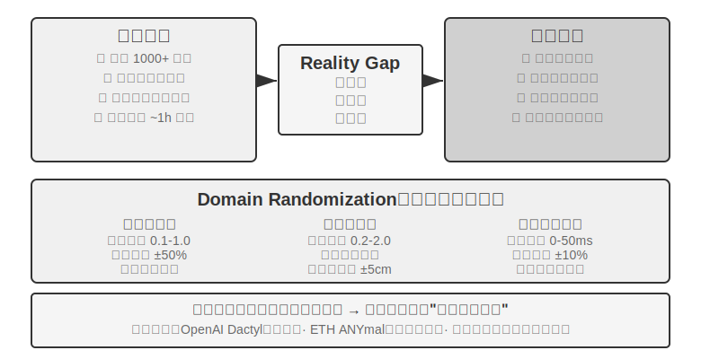

இந்த அணுகுமுறைக்கு பல வெற்றிகரமான எடுத்துக்காட்டுகள் உள்ளன: OpenAI இன் dexterous manipulation with a robotic hand (Dactyl திட்டம் கையில் கனசதுரத்தை மறுசீரமைப்பதை அடைந்தது, மேலும் அடுத்தடுத்த பணிகள் Automatic Domain Randomization (ADR) ஐப் பயன்படுத்தி ஒரு கையால் Rubik's Cube ஐ தீர்த்தது) மற்றும் ETH Zurich இன் ANYmal (பனி மற்றும் சரளை போன்ற சிக்கலான வெளிப்புற நிலப்பரப்புகளில் உறுதியாக நடக்கும் ஒரு quadruped robot) ஆகியவை முக்கிய எடுத்துக்காட்டுகளாகும்.

இந்த அத்தியாயம் உண்மையில் உள்ளடக்க விரும்புவது, உண்மையான ரோபோக்களுக்கு domain randomization ஐப் பயன்படுத்தும்போது தவிர்க்க முடியாத இரண்டு பொறியியல் படிகள் ஆகும். முதலாவது **randomization வரம்பை அளவீடு செய்தல் (calibrating the randomization range)**: வரம்பை தன்னிச்சையாக அமைக்க முடியாது. அது மிகவும் குறுகலாக இருந்தால், உண்மையான உலக மாறுபாடுகளை உள்ளடக்காது; மிகவும் அகலமாக இருந்தால், அது பயிற்சி சிரமத்தை அதிகரித்து, "எல்லாவற்றையும் கையாளும் ஆனால் எதிலும் தேர்ச்சி பெறாத" ஒரு suboptimal policy க்கு வழிவகுக்கும். நடைமுறையில், முக்கிய அளவுருக்களின் (எ.கா., friction coefficient, motor response delay) பரவல் முதலில் உண்மையான உலகத் தரவுகளிலிருந்து **அளவிடப்பட்டு அளவீடு செய்யப்படுகிறது (measured and calibrated)**, மேலும் இந்த வரம்பிற்குள் sampling செய்யப்படுகிறது. உருவகப்படுத்துதலில் (simulation) பயிற்றுவிக்கப்பட்ட policy உண்மையான ரோபோவில் குறிப்பிடத்தக்க செயல்திறன் வீழ்ச்சியைக் காட்டினால், sim-to-real gap ஏற்றுக்கொள்ளக்கூடிய நிலைக்கு ஒருங்கிணையும் வரை randomization வரம்பு படிப்படியாக விரிவுபடுத்தப்படுகிறது. இரண்டாவது **காட்சி சீரமைப்பு (visual alignment)**: உருவகப்படுத்துதலுக்கும் உண்மைக்கும் இடையே உள்ள camera pose ஐ துல்லியமாக அளவீடு செய்தல் (environment alignment) மற்றும் உருவகப்படுத்துதலின் பின்னணியை உண்மையான உலக பின்னணி படங்களுடன் தோராயமாக மாற்றுதல் (greenscreen background replacement) ஆகியவை இதில் அடங்கும். இந்த இரண்டு படிகளும் Experiment 9-10 இல் நிரூபிக்கப்படும்.

> **Experiment 9-10 ★★★: Zero-Shot RGB Sim2Real Robotic Grasping**
>
> LeRobot + ManiSkill simulator ஐப் பயன்படுத்தி, RGB கேமரா படங்களுடன் மட்டுமே பயிற்சி செய்து (depth sensors அல்லது force sensors ஐ நம்பாமல்), பின்னர் zero-shot (கூடுதல் மாற்றங்கள் எதுவும் இல்லாமல்) நேரடியாக உண்மையான SO100 robotic arm இல் deploy செய்யவும். ஐந்து-படி செயல்முறை:
>
> 1. **Environment Alignment**: உருவகப்படுத்துதல் மற்றும் உண்மையான சூழலில் உள்ள கேமரா நிலைகளை சரிசெய்து, visual overlay மூலம் இரு பக்கங்களின் படங்களும் சீரமைக்கப்பட்டுள்ளதா என்பதை சரிபார்க்கவும்.
> 2. **Background Replacement (Greenscreen)**: உண்மையான சூழலில் இருந்து பிடிக்கப்பட்ட பின்னணி படங்களை தோராயமாக crop செய்து, உருவகப்படுத்துதல் rendering இன் மீது overlay செய்து, உருவகப்படுத்துதல் பின்னணியை உண்மைக்கு நெருக்கமாக்கவும்.
> 3. **Domain Randomization**: ரோபோ நிறம், பொருள் அமைப்பு (texture), விளக்கு நிலைமைகள் மற்றும் கேமரா field of view போன்ற அளவுருக்களை தோராயமாக்கவும்.
> 4. **RL Training**: மிகப்பெரிய இணையான உருவகப்படுத்துதல் சூழலில் PPO algorithm ஐப் பயன்படுத்தி பயிற்சி செய்து, உருவகப்படுத்துதலில் success rate 90% ஐ தாண்டும் வரை பயிற்சி செய்யவும்.
> 5. **Real-World Deployment**: உண்மையான ரோபோவில் zero-shot ஆக grasping பணியை வெற்றிகரமாக முடிக்கவும்.
>
> முக்கிய வெற்றி காரணிகள்: துல்லியமான environment alignment + visual domain randomization + physical parameter randomization, இம்மூன்றும் இன்றியமையாதவை. வரம்பு: உண்மையான பொருட்களின் வடிவம், அளவு அல்லது பொருள் (material) பயிற்சி பரவலுக்கு (training distribution) வெளியே இருக்கும்போது, success rate கணிசமாகக் குறைகிறது.[^ch9-6]
>
> [^ch9-6]: LeRobot, "Sim2Real Tutorial". https://github.com/StoneT2000/lerobot-sim2real/blob/main/docs/zero_shot_rgb_sim2real.md
>
>
> 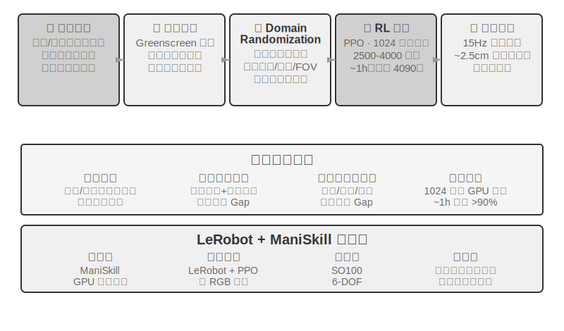
>

## அத்தியாய சுருக்கம்

மேற்பரப்பில் மூன்று காட்சிகளும் மிகவும் வேறுபட்டதாகத் தோன்றினாலும், latency மற்றும் multimodality ஆகிய இரண்டு தடைகளும் எப்போதும் இருந்துகொண்டே இருக்கின்றன. Voice ஆனது serial pipeline-ல் இருந்து end-to-end மற்றும் full-duplex ஆகவும், தனித்தனி fast மற்றும் slow thinking-ல் இருந்து "thinking while speaking" ஆகவும் உருவெடுத்துள்ளது; OSWorld போன்ற benchmarks-ல் Computer Use-ன் துல்லியம் மனித நிலைகளை நெருங்கிக்கொண்டிருக்கிறது, ஆனால் இதற்கு மனிதர்களை விட கணிசமாக அதிகமான steps தேவைப்படுகின்றன, மேலும் task முன்னேறும்போது step time அதிகரிக்கும் efficiency gap-க்கு முறையான தீர்வு இல்லை; visually-guided manipulation tasks-ல் robots-க்கு, bottleneck ஆனது hardware-ல் இருந்து VLA control layer-ன் cross-task generalization capability-க்கு மாறியுள்ளது (tactile sensing மற்றும் dexterous hands ஆகியவை தீர்க்கப்படாத hardware limitations ஆகவே உள்ளன). அடுத்த அத்தியாயம் பல agent-களுக்கு இடையேயான ஒத்துழைப்பைப் பற்றிய கண்ணோட்டத்தை மாற்றும், இது வேறுபட்ட பரிமாணத்தின் சவாலாகும்.

## சிந்தனை கேள்விகள்

1. ★★ Voice agent-களுக்கான end-to-end model ஆனது ASR-LLM-TTS-ஐ ஒற்றை model-ஆக இணைத்து, latency-ஐக் குறைக்கிறது, ஆனால் modularity-ஐ இழக்கிறது. End-to-end model ஒரு குறிப்பிட்ட stage-ல் (எ.கா., speech recognition) பிழை செய்தால், அதை debug செய்து சரிசெய்வது serial pipeline-ஐ விட மிகவும் கடினம். End-to-end voice agent-க்கான observability system-ஐ நீங்கள் எவ்வாறு வடிவமைப்பீர்கள்?
2. ★ Step-Audio R1 ஆனது MPS dual-brain architecture மூலம் "thinking while speaking"-ஐ அடைகிறது. இருப்பினும், மனிதர்கள் "thinking while speaking" செய்யும்போது, அடிக்கடி கவனிக்கப்படாத வார்த்தைகளைப் பேசுகிறார்கள், self-correct செய்கிறார்கள், அல்லது filler words-ஐப் பயன்படுத்துகிறார்கள். ஒரு agent-ன் "thinking while speaking" இந்த மனிதப் பண்புகளைப் பிரதிபலிக்க வேண்டுமா?
3. ★★ SoM (Set-of-Mark) மற்றும் அதன் structured variants (DOM element indexing) ஆகியவை Computer Use-ன் visual localization-ஐ open-ended coordinate prediction-ல் இருந்து closed-set ID selection-க்கு மாற்றுகின்றன, ஆனால் இவை அனைத்தும் முதலில் UI elements-ஐ detect செய்து annotate செய்ய வேண்டும்—segmentation model மூலமாகவோ அல்லது DOM மூலமாகவோ. இடைமுகத்தில் non-standard controls அல்லது dynamically changing elements இருந்தால், annotations முழுமையற்றதாகவோ அல்லது துல்லியமற்றதாகவோ இருக்கலாம். இதுபோன்ற சந்தர்ப்பங்களில், coordinate prediction-க்கு fall back செய்ய வேண்டுமா?
4. ★★ XLeRobot போன்ற ஆயிரம் டாலர் robot platforms teleoperation data collection-ஐ மலிவாக்குகின்றன. இருப்பினும், teleoperation data-வின் தரம் operator-ன் திறமையை மிகவும் சார்ந்துள்ளது. திறமையற்ற operator-ல் இருந்து கிடைக்கும் குறைந்த தரமான data, VLA model-ன் பயிற்சியை எவ்வாறு பாதிக்கும்? Data collection கட்டத்தின் போது குறைந்த தரமான data-ஐ தானாக வடிகட்டுவது எப்படி?
5. ★★★ இந்த அத்தியாயம் மூன்று interaction modalities-ஐ உள்ளடக்கியது: voice, Computer Use, மற்றும் robotics. இந்த modalities முழுவதும் ஒரு பொதுவான போக்கு serial pipelines-ல் இருந்து end-to-end models-க்கான பரிணாமமாகும். இந்தப் போக்கு தொடர்ந்தால், ஐந்து ஆண்டுகளில் agent interaction layer எப்படி இருக்கும்?
6. ★★★ தற்போதைய Computer Use ஒரு தனித்த "screenshot → action → screenshot" loop-இல் இயங்குகிறது, இதில் ஒவ்வொரு observation-ம் ஒரு static frame ஆகும். ஆனால் மனிதர்களின் திரை உணர்வு continuous ஆக உள்ளது—நாம் animations விளையாடுவதைப் பார்க்கிறோம், loading progress-ஐ கவனிக்கிறோம், மற்றும் video content-ஐ புரிந்துகொள்கிறோம். இதன் பொருள் இன்றைய Computer Use-ஆல் temporal visual understanding தேவைப்படும் பணிகளை கையாள முடியாது. Continuous visual stream understanding-ஐ ஆதரிக்க perception layer-ஐ எவ்வாறு மறுவடிவமைப்பு செய்வீர்கள்?
7. ★★ DOM/Accessibility Tree element indexing நிலையான web applications-களில் நன்றாக வேலை செய்கிறது, ஆனால் அதிகரித்து வரும் மென்பொருள் இடைமுகங்கள் (Canvas/WebGL rendering, cross-platform custom-drawn controls) accessible structured information-ஐ வழங்கவில்லை, visual annotation அல்லது coordinate prediction-ஐ மட்டுமே நம்பியுள்ளன. Computer Use ஒரு purely visual approach-ஐ நம்ப வேண்டுமா, அல்லது structured மற்றும் visual paths இரண்டையும் பராமரிக்க வேண்டுமா? இரண்டு paths-ஐயும் பராமரிப்பதன் செலவுகள் மற்றும் நன்மைகள் என்ன?
8. ★★ VLA models action chunking-ஐப் பயன்படுத்துகின்றன—உரையில் குறிப்பிட்டுள்ளபடி, π₀-வின் வழக்கமான configuration 50Hz-இல் 25-50 எதிர்கால actions-ஐ உருவாக்குகிறது—execution time-க்குள் inference latency-ஐ மறைக்க. இருப்பினும், execution-இன் போது environment திடீரென மாறினால் (எ.கா., ஒரு பொருள் நகர்த்தப்பட்டால்), முன் உருவாக்கப்பட்ட action sequence தவறாகிவிடும். Action chunking-இன் efficiency advantage-ஐ environmental changes-களுக்கு பதிலளிக்கும் தேவையுடன் எவ்வாறு சமநிலைப்படுத்தலாம்?
9. ★★★ இந்த அத்தியாயத்தில் உள்ள மூன்று scenarios-களும் (voice, Computer Use, robotics) "perceive-think-act" loop-இன் latency பிரச்சினையை எதிர்கொள்கின்றன மற்றும் fast மற்றும் slow thinking-ஐ parallelize செய்வதை நோக்கி உருவாகி வருகின்றன. Voice-இல், இது "correcting after misspeaking" ஆக வெளிப்படுகிறது; Computer Use-இல், "clicking first, then looking" ஆக; robotics-இல், "taking one step at a time" ஆக. Fast thinking-ஐ அடிப்படையாகக் கொண்ட இந்த actions irreversible consequences-களுக்கு வழிவகுக்காமல் இருப்பதை எவ்வாறு உறுதி செய்யலாம்?
