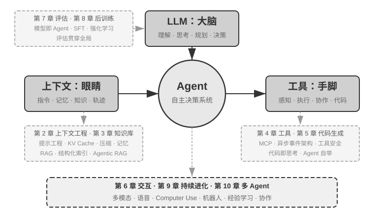

# 引言 {.unnumbered}

2025 年 8 月至 10 月，我在图灵《AI Agent 实战营》中讲授了一系列课程。我们既动手搭建 Agent，也讨论它为什么采用这样的架构：哪些问题需要换模型，哪些可以通过上下文和工具解决，怎样判断一次修改有没有效果。本书由课程讲义和配套实验整理、补充而成。

写作过程中，我主要采用 **whisper coding**（口述式协作）的方式，与 Pine 的语音 Agent 一起整理资料、修改文本。准备课程时，我先口述章节提纲，由 Agent 调研相关工作并形成草稿；课程结束后，再结合学员反馈，核查和修订论证、案例与实验。口述让我能更快记下想法，也方便在讨论中随时调整提纲。

自 2025 年初 DeepSeek R1 发布以来，模型研究与 Agent 产品的联系日益紧密。智能体强化学习（Agentic Reinforcement Learning）训练模型使用工具、与环境交互；Manus、Claude Code、OpenClaw 等产品则把这些能力用于编程、调研和电脑操作。本书重点讨论这些能力如何组织成一个能完成任务的系统。

回看课程中的案例，有些做法出现得比它们今天的名字更早。业界后来广泛使用 Skill、harness、loop engineering 等术语，而我们最初只是遇到了具体问题，必须想办法解决。

作为 Pine AI 的首席科学家，我与团队共同研发了 Pine，让 Agent 代表用户与真人沟通，处理账单协商、退款投诉和订阅取消。这类任务可能持续数小时乃至数周，涉及长时间通话、复杂表单和多轮邮件。一处数字算错、一次越权承诺，都可能给用户造成损失。本书的许多判断来自这段实践：

- 提示词和工具列表越来越长，我们便按需加载提示词，通过命令行使用工具；Agent 不知道用户的时间、工作状态和执行环境，我们便把这些信息放进系统状态栏。
- 模型会误用工具、编造结果或忽略指令，我们便在模型外围增加检查与纠正逻辑。这些做法与后来常说的 harness 工程相近。
- 模型过早宣布任务完成，我们便引入本书称为提议者-审核者（proposer-reviewer）的机制，让审核者继续检查任务是否完成。

许多团队处理相似问题时，也形成了相近的方法。我于 2024—2026 年在中国科学院大学讲授 AI Agent 实践课程时，同样会与学生讨论这些问题。本书选择开源发布，希望这些经验能帮助更多人开展自己的实验。

**实践在前，命名在后。** 对开发者来说，不必等一个问题有了流行的名字才开始解决它。我认为，积累设计经验需要做好两件事。

**第一，持续处理真实业务中的难题。** Pine 的任务要求我们在多轮交涉中保持数字准确、遵守授权范围，并在外部情况变化后继续执行。这些要求让模型的不足变得具体，也给系统设计提供了检验标准。

**第二，建立评估（Evaluation）机制。** 一次运行成功，可能只是运气好。要判断改动是否有效，需要在一组任务上比较结果，并检查失败原因。第七章将专门讨论这套方法。

模型和产品会变，但开发者仍需回答几个问题：模型能看到什么，能执行哪些操作，怎样知道任务做对了？这些问题贯穿全书。

代码生成尤其值得关注：Agent 可以编写新的工具，修改自己的部分执行逻辑，甚至创建另一个 Agent。能力因此不必全部由开发者预先写好。不过，生成代码只是第一步，修改能否保留，还要经过执行、测试和评估。本书会通过实验讨论这种自举（bootstrap）能力及其限制。

本书用一个公式组织这些讨论：**Agent = LLM + 上下文 + 工具**。

可以把它们粗略地比作**大脑 + 眼睛 + 手脚**：LLM 负责决策，上下文包含决策所需的信息，工具提供读取信息和执行操作的接口。这个比喻有其局限，例如工具定义也会进入上下文，让模型知道自己有哪些操作可用。



对熟悉强化学习的读者，LLM 承担策略（Policy）的角色；上下文组织观察与交互历史；工具连接观察通道和动作接口。第一章会进一步区分这些概念。

## 全书结构 {.unnumbered}

本书共十章（图0-2）。**第一至六章讨论如何构建 Agent**，包括上下文、记忆、工具、代码生成和交互。**第七至十章讨论如何提升能力**，包括评估、模型后训练、持续进化和多 Agent 协作。


- **第一章（AI Agent 入门）**：从真实产品和消融实验认识 Agent 的组成、ReAct 循环，以及工作流与自主 Agent 的编排方式。
- **第二章（上下文工程）**：从 API 消息列表讲起，讨论 KV Cache、提示工程、提示注入、Skills、状态栏和上下文压缩。
- **第三章（用户记忆和知识库）**：保存跨会话的信息，用检索增强生成（RAG）查找知识，并处理知识冲突、过期和检索错误。
- **第四章（工具）**：讨论工具分类、MCP 与工具生态、按需加载、多模态感知和执行安全。
- **第五章（Coding Agent 与通用 Agent）**：以 OpenClaw 为例，解释代码生成与文件系统如何支持开放任务，以及 Agent 如何用代码辅助推理、处理内容和创造工具。
- **第六章（交互：观察与动作空间的扩展）**：讨论异步事件、实时语音、图形界面操作和机器人，以及打断、取消和恢复的实现。
- **第七章（Agent 的评估）**：设计评估环境、数据集和评判标准，用评估结果选择模型、定位问题。
- **第八章（模型后训练）**：介绍预训练、中期训练、监督微调（SFT）和强化学习（RL）的分工，讨论训练数据、奖励信号与算法。
- **第九章（Agent 的持续进化）**：评价运行轨迹，更新知识、指令、程序或模型参数，并验证、发布和回滚这些更新。
- **第十章（多 Agent 协作）**：讨论上下文共享、分工与通信，通过翻译、电话与电脑协同等案例分析收益与成本，再讨论 Agent 社会与经济。

## 如何阅读本书 {.unnumbered}

本书的各章节相对独立，你可以根据自己的需求选择不同的阅读路径：

- **如果你是 Agent 开发者**，建议按顺序阅读全书：第一至六章建立完整的 Agent 构建方法，第七至十章则从评估、模型后训练、持续进化和多 Agent 协作四个方向讨论能力提升。
- **如果你时间有限**，优先阅读第一章（建立全局认知）和第二章（掌握最关键的上下文工程）。第二章中 KV Cache 的底层原理较为技术化，初次阅读可先跳过原理部分、只记住开头给出的三条核心结论，不影响后续理解。
- **如果你关注模型训练**，可以直接阅读第八章（模型后训练）；其中评估方法（第七章）是训练的前提，建议一并阅读，并先读第一至二章以建立整体认知。

每章都包含大量的**实验**和**思考题**，编号格式为“实验 X-Y”（X 为章节号，Y 为章节内序号）。实验和思考题的标题中用星级标注难度：★ 表示入门级，适合所有读者；★★ 表示中等难度，需要一定的工程实践基础；★★★ 表示进阶挑战，通常涉及开放性问题或复杂的系统设计。大部分实验配有完整的可运行代码，组织在配套的开源仓库中：

> **配套代码仓库**：[https://github.com/bojieli/ai-agent-book](https://github.com/bojieli/ai-agent-book)

可以使用 Git 获取全部配套代码：

```bash
git clone https://github.com/bojieli/ai-agent-book.git
cd ai-agent-book
```

不熟悉 Git 的读者也可以在仓库页面点击 **Code → Download ZIP** 下载。实验代码按章节组织在 `chapter1/` 至 `chapter10/` 中；要查找“实验 X-Y”，请先打开对应的 `chapterX/README.md`，根据实验编号找到项目目录，再按照项目自身的 README 安装依赖并运行。部分标为“复现指南”的实验依赖外部仓库，具体获取方式也会在相应的 README 中说明。

建议至少选几个与你工作相关的实验亲手跑一遍。看模型在哪一步出错，再改动上下文或工具重新运行，比只读结论更容易理解这些设计。

## 前置知识 {.unnumbered}

本书面向有一定技术背景的读者，但不要求你是某个特定领域的专家。以下按“必需”和“推荐”两个层次列出前置知识，帮助你评估自己的准备程度。

**必需：阅读全书的基础**

- **Python 编程**：书中几乎所有实验都基于 Python。你需要熟悉 Python 的基本语法、常用的数据结构、包管理（pip）等基本概念。不要求精通，但应能读懂和修改中等复杂度的 Python 代码。
- **LLM 的基本使用经验**：你应该用过 ChatGPT、Claude 或类似的产品，理解“提示词（Prompt）→ 模型回复”的基本交互模式。
- **一款 AI 辅助编程工具**：强烈建议安装并熟悉至少一款 AI 辅助编程工具，如 Claude Code、Codex、Cursor、TRAE 等。一方面，这些工具能显著提高书中实验的开发效率，因为实验涉及大量代码编写和调试。另一方面，这些编程工具本身就是成熟的 Coding Agent，你在使用它们的过程中会直观地体验到 ReAct 循环、工具调用、上下文管理等书中反复讨论的核心机制。这种第一手体验对理解 Agent 的设计原则极有价值。
- **软件工程常识**：熟悉命令行操作、Git 版本控制、JSON 数据格式、REST API 等基本概念。这些是运行实验和理解 Agent 工具调用机制的基础。

**推荐：提升特定章节的阅读体验**

- **机器学习基础**（第八章）：了解训练与推理、损失函数、梯度下降、过拟合等基本概念，有助于理解模型后训练。
- **基础数学**（第 2-3、8 章）：对线性代数有直观的理解（比如知道向量可以表示方向和大小、矩阵可以做批量运算）有助于理解嵌入和注意力机制；基本的概率统计知识有助于理解评估指标和强化学习中的期望奖励。书中的数学不涉及复杂的推导，侧重直观解释。
- **Web 开发基础**（第 6 章）：了解 HTTP、WebSocket、前后端分离架构等概念，有助于理解事件驱动的异步 Agent 架构和语音 Agent 的实时通信实验。
- **对 Transformer 架构的基本了解**（第 2、8 章）：Transformer 是当前几乎所有大语言模型的底层架构。对于希望系统地补充大模型基础知识的读者，推荐阅读《图解大模型》（图灵出版）。该书以直观的图解方式讲解了 Transformer 架构、预训练与微调等核心概念，与本书的 Agent 工程视角形成良好的互补。

除第八章后训练外，全书对数学和机器学习的要求较低。暂时不熟悉相关知识的读者，可以先从 Agent 的实现和实验入手。

## 致谢 {.unnumbered}

感谢图灵的梦鸽老师和刘美英老师的辛勤编辑，以及为组织图灵《AI Agent 实战营》课程付出的努力；感谢刘俊明老师在国科大开设 AI Agent 实战课程。也要特别感谢图灵《AI Agent 实战营》的所有学员，以及国科大 AI Agent 实战课程的所有同学——在我讲授这些课程的过程中，大家给了我许多有价值的反馈与建议，也让我对这些概念本身有了更清晰的理解。

感谢 Pine AI 的所有同事。如果没有 Pine AI 这样优秀的产品，以及它所带来的种种挑战，我不可能在 Agent 领域获得如此深入的理解与实践；在一次次思想碰撞中，同事们也提出了许多宝贵的见解。

也要感谢 AI 业界的许多朋友（在此不一一具名）。在各种行业讨论中，大家对我的观点给予了坦诚的反馈，纠正了我不少错误的判断，提升了我对模型与 Agent 的认知。

最要感谢的，是我的家人，特别是我的太太孟佳颖。她始终支持我完成本书的写作，还为本书提出了许多宝贵的意见。
