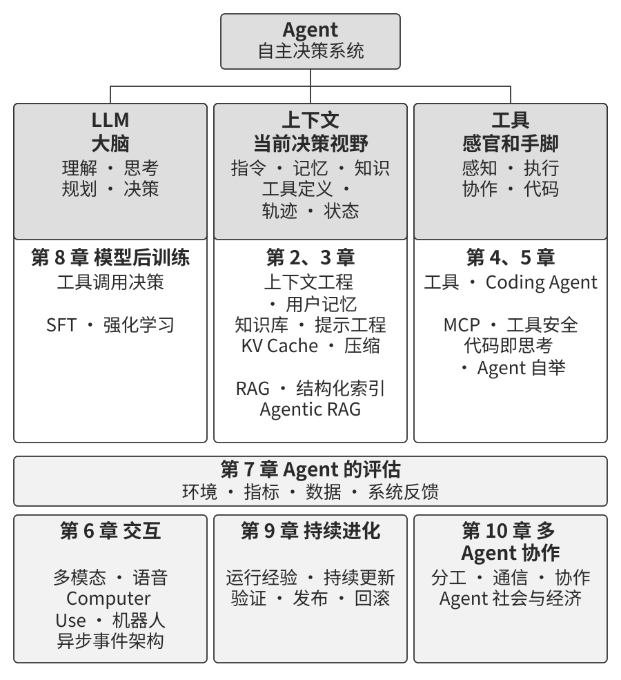
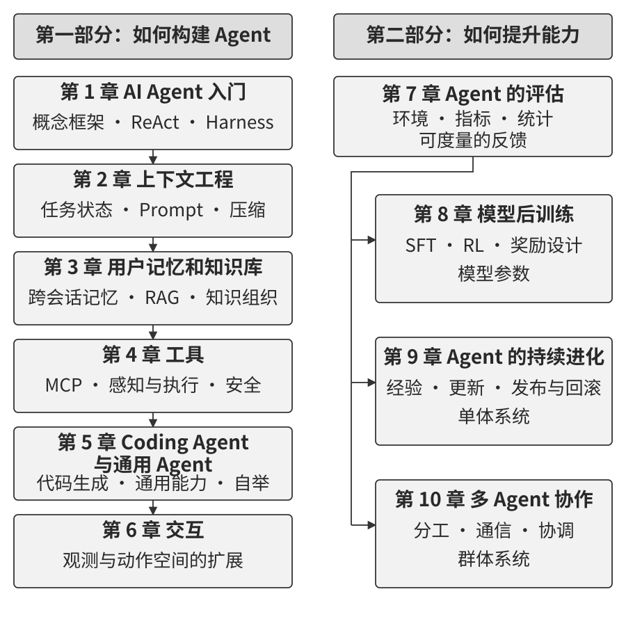

# 前言 {.unnumbered}

2025 年 8 月至 2026 年年初，笔者在图灵《Agent 实战营》中讲授了一系列课程，讨论如何用可解释、可验证、可复用的工程方法构建 AI Agent。课程从运行一个 Agent 开始，接着分析它为何采用这样的架构：每项设计解决什么问题，需要付出什么代价，又适合哪些任务。本书在课程讲义和配套实验的基础上整理而成。

> **本书的形成：一次人机协作实践**
>
> 从构思到定稿，笔者主要通过 **whisper coding**（口述式协作），与 Pine 的语音 Agent 一起整理资料、修改文本。备课时，笔者口述章节提纲，Agent 调研相关工作并形成草稿；课程结束后，再结合学员反馈，反复修订论证、案例和实验。语音让笔者能更快地表达想法，也让“提出问题—检索资料—形成草稿—复核修改”的过程衔接得更顺畅。写这本书的过程，也让笔者亲身体验了 Agent 如何参与知识的整理与创造。

2025 年以来，笔者看到一个重要变化：AI 研究与产业实践的重心，正从提升基座模型能力扩展到让 Agent 完成真实任务。模型训练与应用也因此更加紧密地结合起来。DeepSeek-R1 等推理模型展示了强化学习对数学、编程和推理能力的提升。[^preface-r1] 智能体强化学习（Agentic Reinforcement Learning）将工具调用与环境交互纳入训练，让模型在编程、图形界面操作（Computer Use）等任务中学习如何行动。Manus、Claude Code、OpenClaw 等产品则让用户直接委派任务，也展示了“代码生成 + 文件系统”怎样支撑通用 Agent。

回看课程总结的工程方法，笔者发现它们仍然能解释新产品中的许多设计。业界广泛使用 Skill、Harness、Loop 工程等名称之前，相应的实践已经出现。**实践在前，命名在后**：团队先解决具体问题，再从反复使用的方法中归纳概念。

本书的方法主要来自长流程、高风险的真实业务。作为 Pine AI 的首席科学家，笔者与团队共同研发 Pine，让 Agent 代表用户与真人沟通，处理账单协商、退款投诉和订阅取消等任务。这些任务涉及用户的经济利益，常常需要多轮交涉，一步出错就可能造成损失。为了让操作可靠、权限明确、过程可追溯，团队逐步建立了本书讨论的方法。

- 在 Skill 概念流行之前，团队已按需加载提示词，并通过命令行调用工具，解决提示词和工具列表不断膨胀的问题；系统状态栏让 Agent 随时了解执行环境、用户时间和工作进度。
- 在 Harness 概念流行之前，团队已采用与 Claude Code 相近的工程方法，处理工具调用不稳定、幻觉、危险或越权操作，以及未按指令执行等问题。
- 在 Loop 工程概念流行之前，团队已使用提议者—审核者（proposer-reviewer）分工，由审核者独立检查完成情况，发现遗漏后让提议者继续工作，减少模型过早结束的问题。

其他模型与 Agent 团队在解决相似问题时，也独立形成了相近的方法。这让笔者更加确信，团队遇到的许多困难，是 Agent 系统走向实际应用时共同面对的问题。笔者于 2025 年在图灵开设《Agent 实战营》，并于 2024—2026 年持续在中国科学院大学讲授 Agent 实践课程，希望把这些经验讲清楚。本书开源发布，也希望更多研究者与工程师能够使用、检验和改进这些方法。

对开发团队而言，**实践在前，命名在后**还有一层含义：当一个术语成为行业共识时，领先团队往往已经探索了很久。要积累自己的工程优势，就需要从真实业务中提前发现问题、尝试解决。要做到这一点，笔者认为有两个关键条件。

**第一，选择对 Agent 能力提出足够高要求的真实业务，并持续获得反馈。** Pine 的一项任务可能持续数小时乃至数周，需要与多方沟通，长时间通话、填写复杂表单、进行多轮邮件往来，同时保证数字准确、操作可控，并维护用户利益。这类场景不断暴露模型能力与业务要求之间的差距，促使团队改进 Harness。如果一个产品的主要价值只是弥补某一代模型的短板，下一次模型升级就可能覆盖这部分价值，团队很难积累持久优势。深入复杂业务、持续取得反馈，则能不断发现新的问题，促使团队形成经得住模型迭代的方法。

**第二，建立系统的评估（Evaluation）机制。** 评估帮助团队判断：结果变好了，究竟是设计改进带来的，还是随机波动造成的？有了稳定的评估，团队才能复现每次尝试并比较结果，解释改动为什么有效。第七章将具体介绍怎样设置成功标准、构建评估环境、分析失败并检验改动。

真实业务暴露问题，工程实践形成方法，评估检验方法。方法经过反复验证和抽象，逐步沉淀为可复用的系统设计原则。**好的原则能够穿越模型的迭代周期**，因为它们处理的是智能系统与世界交互时持续存在的问题。

## 本书的使命 {.unnumbered}

本书希望帮助你理解 Agent 的基本结构、构建方法与能力边界。核心公式是 **Agent = LLM + 上下文 + 工具**：LLM 负责理解、规划与决策，上下文承载当前决策所需的信息，工具连接外部环境，用于获取观测或执行行动。

用一个直观的比喻，LLM 是“大脑”，上下文是“当前决策视野”，工具是“感官和手脚”。视野中包含环境信息、对话历史、记忆和知识，也包含系统指令、工具定义与任务状态。搜索、读取和截图带回信息，点击、写入和业务接口调用改变外部状态。图0-1 展示了这三类功能及其对应章节。

熟悉强化学习（Reinforcement Learning，RL）的读者，还可以借助策略、观测和动作理解这套分工。LLM 根据上下文选择下一步，其决策功能近似策略（Policy）；上下文承载这次决策使用的具体观测与历史；工具提供观测和动作接口。观测空间（Observation Space）描述可能获得哪些观测，动作空间（Action Space）描述允许采取哪些动作，两者刻画 Agent 与环境交互的范围。[^preface-spaces] 第一章将通过工具调用实例展开这些概念，并介绍 Model 与 Harness 在生产实现中的分工。

> **延伸思考：从生命到设计实体**
>
> 工程实践之外，Agent 也引出了关于智能系统演化的问题。图灵奖得主、强化学习先驱 Richard Sutton 将宇宙演化概括为尘埃、恒星、生命和“设计实体”（designed entities）四个阶段。[^preface-sutton] 生物通过随机变异和自然选择演化，设计实体则可以由已有的智能系统有目的地构建和改进。
>
> Agent 可以生成代码，构建新的 Agent，再分析运行行为、提出修改并验证结果，逐步实现自举（bootstrap）和持续进化。这像是一个程序员编写了另一个程序员，后者继续参与构建新的系统。这种理解自身、改进自身的可能性，也是笔者写作代码生成和持续进化两章时最感兴趣的问题之一。

## 全书结构 {.unnumbered}

全书共十章，围绕两个相衔接的问题展开。**第一部分“如何构建 Agent”**包括第一至六章，从基本概念讲到上下文、记忆与知识、工具、代码生成和交互。**第二部分“如何提升 Agent 能力”**包括第七至十章，先通过评估发现问题，再通过后训练、持续进化与多 Agent 协作，分别改进模型、单个 Agent 和多 Agent 系统。图0-2 展示了这条阅读主线。

- **第一章（AI Agent 入门）**通过产品与工具调用实例，介绍核心组成、运行循环、Harness 和编排方式，建立理解全书的概念框架。
- **第二章（上下文工程）**是全书最关键的一章，讨论怎样组织模型当前需要的信息。从提示设计、按需加载讲到历史管理，并结合 KV Cache 解释这些方法如何影响回答质量与运行成本。
- **第三章（用户记忆和知识库）**讨论怎样保存并取用跨会话的信息。从用户记忆讲到 RAG、结构化索引与知识更新，帮助读者掌握持久知识的检索和维护方法。
- **第四章（工具）**讨论 Agent 怎样获取观测、执行行动并请求协作。通过工具分类、接口设计、MCP 与执行管理，理解如何把外部能力接入系统。
- **第五章（Coding Agent 与通用 Agent）**提出通用 Agent 的一条核心架构思路：以 Coding Agent 为执行核心，以文件系统为工作空间。先讲开发流程，再通过多媒体、业务系统等案例，说明 Agent 如何编写程序解决问题，进而创造工具、构建新的 Agent。
- **第六章（交互：观测与动作空间的扩展）**从模态与时序两个维度讨论 Agent 的交互方式。通过异步事件、语音、Computer Use 和机器人，理解持续观测、快慢路径与执行控制。
- **第七章（Agent 的评估）**回答怎样判断系统表现和一次改动的效果。先确定成功标准、环境与数据集，再讲验证器、评分和统计分析，最后通过分析失败原因找到改进方向。
- **第八章（模型后训练）**讨论怎样用数据与环境更新模型能力，主张优先投入数据质量与训练环境。通过监督微调、强化学习和奖励设计，解释示范学习与探索为何带来不同的泛化表现，以及为什么只改算法往往收效有限。
- **第九章（Agent 的持续进化）**讨论怎样利用运行经验改进 Agent 的后续版本。比较知识、指令、程序和参数四类更新，再用验证、发布与恢复流程管理长期变化。
- **第十章（多 Agent 协作）**讨论多个成员何时带来额外价值，以及怎样分工、通信和协调。先说明上下文和控制权如何分配，再结合案例讲解协作机制、分析失败原因，并讨论 Agent 社会与经济的可能形态。

## 如何阅读本书 {.unnumbered}

你可以按顺序学习，也可以围绕当前任务选择阅读路线。

- **构建 Agent 产品**：建议通读全书。第一至六章介绍构建方法，第七至十章用评估、训练、持续进化和协作改进能力。
- **先建立整体认识**：优先阅读第一章和第二章。第二章的 KV Cache 部分可以先掌握开头的三条结论，结合实验使用，再回头学习底层原理。
- **重点学习模型训练**：先用第一、二章理解 Agent 的运行方式，再结合第七章的评估方法阅读第八章。这样可以把训练目标与实际任务表现联系起来。

每章都安排了实验和思考题。实验采用“实验 X-Y”编号，X 表示章号，Y 表示章内顺序。星级表示难度：★ 适合入门，★★ 需要一定工程经验，★★★ 涉及开放性问题或复杂系统设计。大部分实验配有可运行代码，集中放在开源仓库中：

> **配套代码仓库**：[ai-agent-book](https://github.com/bojieli/ai-agent-book)

通过 Git 或仓库页面的 **Code → Download ZIP** 获取代码后，可以先在各章索引中查找实验编号，再阅读对应项目的运行说明。“复现指南”提供外部项目及获取方式，安装命令和目录说明集中放在 README 中。

笔者强烈建议你动手运行这些实验。亲自检查一次错误的工具调用，比较两种上下文组织方式，或追踪一轮审核与修订，能帮助你理解书中的设计取舍，也更容易形成自己的判断。

## 前置知识 {.unnumbered}

本书面向具备基本编程能力、希望理解和构建 Agent 的读者。阅读前，可以按下面两组要求检查自己的准备情况。

**必需：阅读全书的基础**

- **Python 编程**：熟悉语法、常用数据结构和 pip 等包管理工具，能够读懂并修改实验代码。书中大部分实验以 Python 为基础。
- **LLM 使用经验**：使用过 ChatGPT、Claude 或类似产品，熟悉提出要求、读取回复和继续追问的基本过程。
- **AI 辅助编程工具**：强烈建议熟悉 Claude Code、Codex、Cursor、TRAE 等工具中的至少一种。它们既能帮助实现和调试实验，也能让你直接体验工具调用、运行循环和上下文管理。
- **软件工程常识**：了解命令行、Git、JSON 和 REST API，能够据此运行项目、检查变更并阅读接口数据。

**推荐：按章节补充的知识**

- **机器学习基础（第八章）**：训练与推理、损失函数、梯度下降和过拟合，有助于理解模型更新过程。
- **基础数学（第二、三、七、八章）**：向量与矩阵帮助理解嵌入和注意力，概率统计帮助理解评估指标与期望奖励。书中侧重直观解释和实际用途。
- **Web 开发基础（第六章）**：HTTP、WebSocket 和前后端分工，有助于理解异步事件架构与实时语音通信。
- **Transformer 基础（第二、八章）**：了解注意力与模型结构，有助于理解上下文计算和后训练。希望系统学习的读者，可以阅读《图解大模型：生成式 AI 原理与实战》（Jay Alammar、Maarten Grootendorst 著，李博杰译，图灵教育出品）。该书通过图解讲解 Transformer、预训练与微调，与本书的工程视角相互补充。[^preface-llm-book]

本书关注 **Agent 工程方法及其背后的系统设计原则**。你可以先通过实验建立直觉，再围绕遇到的问题补充知识；学习第八章时，则需要投入更多时间理解机器学习与数学概念。笔者希望这些实践能帮助你理解每项设计背后的理由。掌握了“为什么要这样设计”，就能在模型和产品不断变化时保持自己的判断，找到适合任务的构建方法。

## 致谢 {.unnumbered}

感谢图灵的梦鸽老师和刘美英老师编辑本书，并为组织《Agent 实战营》付出心血；感谢刘俊明老师在中国科学院大学开设 Agent 实践课程。感谢两门课程的学员与同学，你们的问题、实验反馈和建议，帮助笔者不断改进讲解，也加深了笔者对这些概念的理解。

感谢 Pine AI 的所有同事。真实业务中的挑战与团队讨论，是本书许多方法和案例的来源。你们的实践与见解，让这些认识得以不断完善。

感谢 AI 业界的朋友们。在一次次交流中，你们坦诚地提出意见，分享不同的经验和判断，帮助笔者更深入地理解模型与 Agent。

最要感谢笔者的家人，尤其是太太孟佳颖。她始终支持本书的写作，也为书稿提出了许多宝贵意见。

[^preface-r1]: DeepSeek-AI, *DeepSeek-R1: Incentivizing Reasoning Capability in LLMs via Reinforcement Learning*, 2025. https://arxiv.org/abs/2501.12948。
[^preface-spaces]: Gymnasium, “Spaces.” https://gymnasium.farama.org/api/spaces/。
[^preface-sutton]: Richard Sutton 与 Dwarkesh Patel 的访谈，2025-09-26，“Succession to AI”部分。https://www.dwarkesh.com/p/richard-sutton。
[^preface-llm-book]: 《图解大模型：生成式 AI 原理与实战》，O’Reilly 北京图书介绍。https://velocity.oreilly.com.cn/index.php?func=book&isbn=978-7-115-67083-0。
