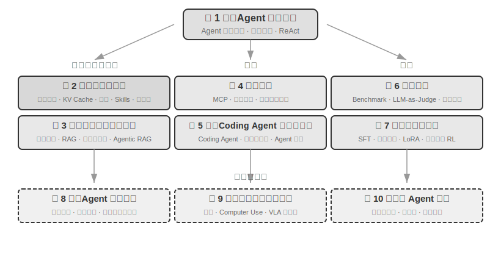

# அறிமுகம் {.unnumbered}

ஆகஸ்ட் முதல் அக்டோபர் 2025 வரை, நான் Turing நிறுவனத்தின் "AI Agent Bootcamp" இல் தொழில்நுட்ப விரிவுரைகளை வழங்கினேன். விரிவுரைகளின் அசல் நோக்கம் எளிமையானது: AI Agent களின் வடிவமைப்பை "உள்ளுணர்வு சார்ந்த" இருந்து "கொள்கை சார்ந்த" ஆக மாற்றுவது—அதாவது, அனைவருக்கும் ஒரு demo ஐ இயக்குவது மட்டுமல்லாமல், ஒரு Agent ஏன் ஒரு குறிப்பிட்ட வழியில் வடிவமைக்கப்பட்டுள்ளது மற்றும் ஒவ்வொரு கட்டமைப்பு முடிவின் பின்னால் உள்ள பரிமாற்றங்கள் (trade-offs) என்ன என்பதை ஆழமாகப் புரிந்துகொள்வது. இந்த புத்தகம் அந்த அமர்வுகளின் விரிவுரை குறிப்புகள் மற்றும் சோதனைகளிலிருந்து தொகுக்கப்பட்டு விரிவாக்கப்பட்டுள்ளது.

கவனிக்கத்தக்கது என்னவென்றால், ஆரம்ப யோசனையிலிருந்து இறுதி புத்தகம் வரை, இந்த படைப்பு **whisper coding** (கட்டளை அடிப்படையிலான கூட்டு முயற்சி) என அழைக்கக்கூடிய ஒரு முறையைப் பயன்படுத்தி உருவாக்கப்பட்டது—மேலும் நான் கட்டளைக்குப் பயன்படுத்திய கருவி எங்கள் சொந்த Pine voice Agent ஆகும். ஒவ்வொரு முறையும் நான் ஒரு விரிவுரையைத் தயாரிக்கும்போது, முதலில் அதற்கு ஒரு தோராயமான வெளிப்புறத்தை கட்டளையிட்டு, அதை ஒரு கணக்கெடுப்பு நடத்தச் சொல்லி, பின்னர் அதை ஒரு முதல் வரைவை ஒழுங்கமைக்கச் சொல்வேன். விரிவுரைக்குப் பிறகு, AI Agent Bootcamp இல் உள்ள மாணவர்களிடமிருந்து கிடைத்த கருத்துக்களை இணைத்து, அதனுடன் மீண்டும் மீண்டும் உள்ளடக்கத்தை விவாதித்து சுத்திகரித்து, இந்த மறுமுறை மூலம், இறுதியில் இந்த விரிவுரை குறிப்புகளை நீங்கள் இன்று வைத்திருக்கும் புத்தகமாக விரிவுபடுத்தி ஒழுங்கமைத்தேன். முழு செயல்முறையிலும், நான் பெரும்பாலும் தட்டச்சு செய்யவில்லை; மாறாக, அதற்கு எனது எண்ணங்களை கட்டளையிட்டேன்—பேச்சின் bandwidth தட்டச்சை விட மிக அதிகம் (சாதாரண பேச்சு வேகம் தட்டச்சு வேகத்தை விட நான்கு மடங்கு), எனவே "கட்டளை—கணக்கெடுப்பு—விவாதம்—திருத்தம்" சுழற்சி மிக வேகமாக மாறியது. ஒரு வகையில், இந்த புத்தகம் Agent களைப் பற்றியது மட்டுமல்ல, ஒரு Agent இன் பங்கேற்புடன் இணைந்து உருவாக்கப்பட்ட ஒரு படைப்பும் ஆகும்.

2025 ஆம் ஆண்டின் தொடக்கத்தில் DeepSeek R1 வெளியானதிலிருந்து, AI துறையானது தூய அடித்தள மாதிரி நிலையிலிருந்து (அதாவது, பொது நோக்க பெரிய மொழி மாதிரி backbones) வெளிப்பட்டு, பொறியியல் செயலாக்கத்தின் ஆழமான நீரில் நுழைந்துள்ளது. மாதிரி அடுக்கில் முன்னேற்றத்தை இரண்டு திசைகளில் இருந்து காணலாம்: ஒருபுறம், Agentic Reinforcement Learning மூலம், மாதிரிகள் tool-calling திறன்களை தங்கள் parameters இல் பயிற்சி செய்துள்ளன, இதனால் குறியீடு, கணிதம் மற்றும் கணினி பயன்பாடு போன்ற பகுதிகளில் பொது திறன்களை மாஸ்டர் செய்ய முடிகிறது. மாதிரிகளின் மறுமுறை வேகமும் வேகமடைந்து வருகிறது—GPT-5.2 இலிருந்து GPT-5.5 வரை, மற்றும் Claude Opus 4.5 இலிருந்து 4.8 வரை, அனைத்தும் அரை வருடத்திற்குள். தயாரிப்பு அடுக்கில், Manus, Claude Code மற்றும் OpenClaw போன்ற பொது Agent கள் மனித-கணினி தொடர்பை மறுவரையறை செய்துள்ளன, "code generation + file system" இன் கட்டமைப்பு முன்னுதாரணத்தை முக்கிய நீரோட்டத்தில் தள்ளியுள்ளன.

சுமார் ஒரு வருடத்திற்கு முன்பு நான் பாடத்திட்டத்தில் சுருக்கமாகக் கூறிய Agent கட்டமைப்பு வடிவமைப்புக் கொள்கைகளை இப்போது திரும்பிப் பார்க்கும்போது, மகிழ்ச்சியும் ஆச்சரியமும் தரும் ஒரு கண்டுபிடிப்பு கிடைத்தது: **இந்தக் கொள்கைகள் காலாவதியாகவில்லை; மாறாக, அவை மேலும் கிளாசிக் ஆகிவிட்டன.** Skill, harness, loop engineering போன்ற புதிய சொற்கள் பின்னர் Agent துறையில் தோன்றினாலும், உண்மையான வரிசை அதற்கு நேர்மாறானது: Anthropic போன்ற நிறுவனங்கள் முதலில் இந்தக் கருத்துக்களைக் கண்டுபிடித்து, பின்னர் பல Agents அவற்றைப் பயன்படுத்தத் தொடங்கின என்பதல்ல; மாறாக, ஏற்கனவே ஏராளமான Agents இவற்றைச் செய்து கொண்டிருந்தன, பின்னர் Anthropic அவற்றைச் சுருக்கி கட்டமைப்பு வடிவமைப்புக் கொள்கைகளாகத் தொகுத்தது. பயிற்சி முதலில் வருகிறது, பெயரிடுதல் பின்னர் வருகிறது.

இந்தக் கொள்கைகளுக்குப் பின்னால் உள்ள நம்பிக்கை, Agents-ஐ நீண்ட கால, அதிக ஆபத்துள்ள சூழ்நிலைகளில் தள்ளும் நிஜ உலகப் பயிற்சியிலிருந்து வருகிறது. Pine AI-யின் Chief Scientist ஆக, என் குழுவும் நானும் Pine-ஐ உருவாக்கினோம். எனது அறிவின்படி, இது உண்மையான மனிதர்களுடன் தானாகவே தொடர்புகொண்டு, பணம் சம்பந்தப்பட்ட உணர்திறன் மிக்க, சிக்கலான, நீண்ட கால பணிகளை நம்பகத்தன்மையுடன் கையாளும் முதல் பொது Agent ஆகும்: இது பயனர்கள் சார்பாக ஆபரேட்டர்களை அழைத்து பில்களைப் பேச்சுவார்த்தை நடத்துகிறது, விற்பனையாளர்களுடன் பணத்தைத் திரும்பப்பெறுதல் மற்றும் புகார்களைப் பேச்சுவார்த்தை நடத்துகிறது, மேலும் சந்தாக்களை ரத்து செய்கிறது—இவை அனைத்தும் மனித தலையீடு இல்லாமல். இத்தகைய பணிகள் பெரும்பாலும் பல டஜன் சுற்று பேச்சுவார்த்தைகளை உள்ளடக்கியவை, மேலும் ஒரு தவறு கூட உண்மையான நிதி இழப்பை ஏற்படுத்தும். நம்பகத்தன்மைக்கான இந்த கிட்டத்தட்ட கடுமையான கோரிக்கையே, இந்தப் புத்தகத்தில் மீண்டும் மீண்டும் வலியுறுத்தப்படும் கட்டமைப்புக் கொள்கைகளை வெளிக்கொணர்ந்தது. பின்வரும் எடுத்துக்காட்டுகள் இந்தப் பயிற்சியிலிருந்து வந்தவை.

- Skill என்ற கருத்து பிரபலமடைவதற்கு நீண்ட காலத்திற்கு முன்பே, prompt bloat பிரச்சினையைத் தீர்க்க dynamic prompt loading-ஐயும், tool list bloat பிரச்சினையைத் தீர்க்க command-line execution tools-ஐயும், Agents செயல்பாட்டு சூழல், பயனர் நேரம் அல்லது பணி நிலையை உணராமல் இருப்பதைத் தீர்க்க system status bar தொழில்நுட்பத்தையும் நாங்கள் ஏற்கனவே பயன்படுத்தி வந்தோம்.
- harness என்ற கருத்து பிரபலமடைவதற்கு நீண்ட காலத்திற்கு முன்பே, model tool call instability, hallucinations, dangerous operations, unauthorized operations, மற்றும் instruction non-compliance போன்ற பிரச்சினைகளைத் தீர்க்க Claude Code-ஐப் போன்ற முறைகளை நாங்கள் ஏற்கனவே பயன்படுத்தி வந்தோம்.
- loop engineering என்ற கருத்து பிரபலமடைவதற்கு நீண்ட காலத்திற்கு முன்பே, models ஒரு பணி முடிந்துவிட்டதாக முன்கூட்டியே நம்பும் பிரச்சினையைத் தீர்க்க, இந்தப் புத்தகம் proposer-reviewer என்று அழைக்கும் ஒரு முறையை நாங்கள் ஏற்கனவே பயன்படுத்தி வந்தோம், இது Agent தனது சொந்த output artifacts-ஐ மதிப்பாய்வு செய்து மீண்டும் மீண்டும் மேம்படுத்த அனுமதிக்கிறது.

மேலும், இது எங்களின் பிரத்யேக கண்டுபிடிப்பு அல்ல. எனது அறிவின்படி, பெரும்பாலான முன்னணி model மற்றும் Agent நிறுவனங்கள் சுயாதீனமாக இதே போன்ற முறைகளை உருவாக்கியுள்ளன. அதனால்தான் நான் ஆகஸ்ட் 2025 இல் Turing இல் "AI Agent Bootcamp" பாடத்திட்டத்தைத் தொடங்கினேன், மேலும் 2024 முதல் 2026 வரை University of Chinese Academy of Sciences இல் AI Agent பயிற்சி பாடங்களைத் தொடர்ந்து வழங்கி வருகிறேன். இந்தப் புத்தகத்தை ராயல்டிக்காக மூடி வைப்பதற்குப் பதிலாக திறந்த மூலமாக வெளியிடத் தேர்ந்தெடுத்தேன், இந்த அறிவு அதிகமான பயிற்சியாளர்களைச் சென்றடையும் என்ற நம்பிக்கையில்.

**Practice comes first, naming comes later.** இந்த வரிசைமுறை, enterprise-நிலை Agent மேம்பாட்டிற்கு மிகவும் நடைமுறைச் சார்ந்த தாக்கத்தை ஏற்படுத்துகிறது: **ஒரு குறிப்பிட்ட Agent சொல் industry-ல் பிரபலமடையும் வரை நீங்கள் காத்திருந்து பயிற்சி செய்தால், நீங்கள் ஏற்கனவே ஒரு படி பின்தங்கியவர்.** ஒரு சொல் பிரபலமடையும் நேரத்தில், முன்னணி நிறுவனங்கள் பெரும்பாலும் அந்தந்த பிரச்சினைகளை ஏற்கனவே கடந்து விட்டிருக்கும். எனவே, சொல் பிரபலமடைவதற்கு முன்பே என்ன செய்ய வேண்டும் என்பதை எப்படி அறிவது? இரண்டு முக்கிய புள்ளிகள் உள்ளன என்று நான் நம்புகிறேன்.

**முதலாவதாக, Agent திறன் உச்சவரம்பில் மிக அதிக கோரிக்கைகளைக் கொண்ட ஒரு உண்மையான business-ஐ வைத்திருங்கள், மேலும் தொடர்ந்து உண்மையான business கருத்துக்களைப் பெறுங்கள்.** Pine-ஐ உதாரணமாக எடுத்துக் கொள்ளுங்கள். ஒரு single task-ஐ கையாள்வதற்கு பெரும்பாலும் மணிக்கணக்கில் அல்லது வாரக்கணக்கில் நேரம் எடுக்கும், பல stakeholders-உடன் மீண்டும் மீண்டும் தொடர்பு கொள்ள வேண்டியிருக்கும்: பல மணி நேர தொலைபேசி அழைப்புகள், பல பக்க சிக்கலான படிவங்களை நிரப்ப கணினியில் இயங்குதல், மற்றும் பல மின்னஞ்சல்களை அனுப்புதல். முழு செயல்முறையிலும், நீங்கள் ஒரு எண் பிழையும் செய்ய முடியாது, மேலும் பயனரின் நலன்களைப் பாதுகாக்க தொடர்புகளில் எச்சரிக்கையாக இருக்க வேண்டும். போதுமான சிக்கலான இத்தகைய சூழ்நிலையில் மட்டுமே, practice இயற்கையாகவே உங்களை harnesses-ஐ உருவாக்கவும், model-ஆல் இன்னும் செய்ய முடியாத ஆனால் business-க்குத் தேவையான விஷயங்களைத் தீர்க்கவும் தூண்டும். மாறாக, business-ன் திறன் உச்சவரம்பின் மீதான கோரிக்கைகள் குறைவாக இருந்து, ஒரு சிறிய model மேம்படுத்தல் போதுமானதாக இருந்தால், இந்த கட்டிடக்கலைக் கொள்கைகளைச் செம்மைப்படுத்த உங்களுக்கு உந்துதல் இருக்காது.

**இரண்டாவதாக, நீங்கள் ஒரு Evaluation பொறிமுறையை நிறுவ வேண்டும்.** இந்த புத்தகத்தில் மீண்டும் மீண்டும் வலியுறுத்தப்படும் மற்றொரு புள்ளி இதுதான்: evaluation இல்லாமல், முன்னேற்றம் இல்லை. Evaluation ஒரு மாற்றம் உண்மையிலேயே சிறந்ததா அல்லது வெறும் அதிர்ஷ்டமா என்பதை அறிய உங்களை அனுமதிக்கிறது, இதனால் Agent-ன் iteration திசை இனி உள்ளுணர்வைச் சார்ந்திருக்காது. இறுதியில், நாம் வலியுறுத்துவது ஒரு அறிவியல் முறையியலைப் பயன்படுத்தி engineering செய்வதும், Agents-ஐ உருவாக்குவதும் ஆகும், மேலும் evaluation இந்த முறையியலின் அடித்தளமாகும். அத்தியாயம் 6 இந்த முறையை விரிவாக விளக்கும்.

அடிப்படை models எவ்வாறு மேம்படுத்தப்பட்டாலும் அல்லது தயாரிப்பு வடிவங்கள் எவ்வாறு புதுமைப்படுத்தப்பட்டாலும், கிட்டத்தட்ட அனைத்து வெற்றிகரமான Agent அமைப்புகளும் ஒரே கட்டிடக்கலை முறைகளைப் பின்பற்றுகின்றன. இது ஒரு தற்செயல் நிகழ்வு அல்ல: **நல்ல வடிவமைப்புக் கொள்கைகள் model iteration சுழற்சிகளை மீறி நிற்க வேண்டும்**, ஏனெனில் அவை ஒரு குறிப்பிட்ட model-ன் பயன்பாட்டை அல்ல, மாறாக நுண்ணறிவு அமைப்புகளுக்கும் உலகத்திற்கும் இடையிலான அடிப்படை தொடர்பு முறைகளை விவரிக்கின்றன.

ரிச்சர்ட் சட்டன் (Richard Sutton), Turing Award வென்றவரும் reinforcement learning-ன் தந்தையுமான இவர், ஒருமுறை கூறினார்: பிரபஞ்சத்தின் பரிணாமம் நான்கு நிலைகளைக் கடந்து வந்துள்ளது — தூசியிலிருந்து நட்சத்திரங்கள் வரை, நட்சத்திரங்களிலிருந்து உயிர் வரை, உயிரிலிருந்து agents (முதலில் designed entities என அழைக்கப்பட்டவை) வரை. உயிரியல் பரிணாமம் குருடானது: சீரற்ற mutation, இயற்கைத் தேர்வு. பெரும்பாலான உயிரினங்கள் தங்கள் சொந்த செயல்பாட்டுக் கொள்கைகளைப் புரிந்துகொள்வதில்லை, மேலும் தங்களைத் தாங்களே வடிவமைத்து மாற்றிக்கொள்ள முடியாது. ஆனால், Agents என்பவை பிரபஞ்ச பரிணாம வரலாற்றில் முற்றிலும் புதிய இருப்புகள்: அவை code-ஐ உருவாக்குவதன் மூலம் bootstrap மற்றும் self-evolution-ஐ அடைய முடியும், ஒரு programmer மற்றொரு programmer-ஐ எழுதுவதைப் போல, புதிய programmer அடுத்ததைத் தொடர்ந்து எழுத முடியும். அதாவது, Agents தங்கள் சொந்த இயக்க வழிமுறைகளைப் புரிந்துகொண்டு, இலக்குகளின் அடிப்படையில் முற்றிலும் புதிய Agents-ஐ உருவாக்க முடியும், மேலும் தங்களைத் தாங்களே மேம்படுத்திக்கொள்ளவும் முடியும். இந்தப் புத்தகத்தின் நோக்கம், இந்த படைப்பின் கொள்கைகளை நீங்கள் புரிந்துகொண்டு தேர்ச்சி பெற உதவுவதாகும்.

இந்தப் புத்தகத்தின் மைய சூத்திரம் ஒரே ஒரு வரி: **Agent = LLM + Context + Tools**. இம்மூன்றும் இன்றியமையாதவை.

மேலும் உள்ளுணர்வாகச் சொன்னால், இது **மூளை + கண்கள் + கைகள் மற்றும் கால்கள்**. மூளை (LLM) சிந்தனை மற்றும் முடிவெடுப்பதற்குப் பொறுப்பு, கண்கள் (Context) Agent எந்தத் தகவலைப் பார்க்க முடியும் என்பதைத் தீர்மானிக்கிறது, மேலும் கைகள் மற்றும் கால்கள் (Tools) Agent என்ன செய்ய முடியும் என்பதைத் தீர்மானிக்கிறது. (கண்டிப்பாகச் சொன்னால், "கண்கள்" என்பது ஒரு தோராயமான உவமை: Context-ல் சுற்றுச்சூழல் தகவல் மற்றும் உரையாடல் வரலாறு மட்டுமல்ல, tool வரையறைகளும் அடங்கும், அதாவது Agent "பார்க்கும்" தகவலில் "என்ன கைகள் மற்றும் கால்கள் கிடைக்கின்றன" என்பதும் அடங்கும். இந்த உவமை முக்கிய உள்ளுணர்வை வெளிப்படுத்துவதை நோக்கமாகக் கொண்டுள்ளது: Context என்பது model உணரக்கூடிய அனைத்துத் தகவலும் ஆகும்.)

Reinforcement learning-ல் அறிந்த வாசகர்களுக்கு, இம்மூன்றையும் RL-ன் முறையான மொழியில் வரைபடமாக்கலாம். குறிப்பாக, LLM என்பது Policy-க்கு ஒத்தது, Context என்பது Observation Space-க்கு ஒத்தது, மேலும் Tools என்பது Action Space-க்கு ஒத்தது. இந்த மூன்று வெளிப்பாடுகளும் ஒரே பொருளைக் குறிக்கின்றன, வெவ்வேறு சுருக்க நிலைகளில் மட்டுமே உள்ளன.

ஆனால் இந்த மூன்று வார்த்தைகளின் அர்த்தங்கள் அவற்றின் நேரடி விளக்கங்களை விட மிகவும் வளமானவை. அத்தியாயம் 1 அவற்றை நடைமுறைக் கண்ணோட்டத்தில் ஒவ்வொன்றாகப் பகுத்து, உள்ளுணர்வு புரிதலிலிருந்து கல்விசார் கருத்துகளுக்கு ஒரு முழுமையான வரைபடத்தை நிறுவும்.

## புத்தக அமைப்பு {.unnumbered}

இந்தப் புத்தகம் பத்து அத்தியாயங்களைக் கொண்டுள்ளது, மூன்று பகுதிகளாகப் பிரிக்கப்பட்டுள்ளது (படம் 0-1, படம் 0-2): அத்தியாயம் 1 அடித்தளமாகும், Agents பற்றிய ஒரு முழுமையான புரிதலை நிறுவுகிறது; அத்தியாயங்கள் 2 முதல் 7 வரை மூன்று தூண்களை வரிசையாக விரிவுபடுத்துகின்றன: Context (அத்தியாயங்கள் 2-3), Tools (அத்தியாயங்கள் 4-5), மற்றும் Models (அத்தியாயங்கள் 6-7, Evaluation மற்றும் Post-training); அத்தியாயங்கள் 8 முதல் 10 வரை மேம்பட்ட தலைப்புகள் மற்றும் பயன்பாடுகள், Agent self-evolution, multimodality மற்றும் real-time interaction, மற்றும் multi-agent collaboration ஆகியவற்றைக் காட்டுகின்றன.

- **Chapter 1 (Agent Fundamentals)** , பல உண்மையான Agent தயாரிப்புகளை அறிமுகமாகப் பயன்படுத்தி, Agents பற்றிய உள்ளுணர்வுப் புரிதலை உருவாக்குகிறது. இது Agents-இன் மைய சூத்திரத்தை ஆழமாக ஆராய்கிறது: செயலாக்க அடுக்கிலிருந்து (LLM + Context + Tools), உள்ளுணர்வு அடுக்கு வரை (Brain + Eyes + Hands and Feet), கல்வி அடுக்கு வரை (Policy, Observation Space, மற்றும் Action Space). மேலும், இது ReAct loop-இன் இயக்க வழிமுறையை பரிசோதனைகள் மூலம் பகுப்பாய்வு செய்கிறது—"Think → Act → Observe" என்ற மீள்செயல் செயல்முறை—மற்றும் Agents-க்கான மூன்று கற்றல் முன்னுதாரணங்களை அறிமுகப்படுத்துகிறது: Post-training, In-Context Learning, மற்றும் Externalized Learning. இறுதியாக, இது workflows-லிருந்து தன்னாட்சி Agents வரையிலான ஒருங்கிணைப்பு வடிவமைப்பு முறைகளைப் பற்றி விவாதித்து, அடுத்தடுத்த அத்தியாயங்களுக்கான ஒருங்கிணைந்த கருத்தியல் கட்டமைப்பை நிறுவுகிறது.
- **Chapter 2 (Context Engineering)** , புத்தகத்தின் மிக முக்கியமான அத்தியாயமாகும், இது Agent-இன் "கண்கள்" ஆகிய Context-ஐ முறையாக விளக்குகிறது. இது API message structure மற்றும் Agent-இன் மைய loop-உடன் தொடங்கி, "Context என்பது messages-இன் பட்டியல்" என்ற அடித்தளத்தை நிறுவுகிறது. பின்னர், இது KV Cache (LLM inference-இன் போது முந்தைய கணக்கீட்டு முடிவுகளை மீண்டும் பயன்படுத்தும் ஒரு வழிமுறை) இன் அடிப்படைக் கொள்கைகளை ஆராய்கிறது, அதைத் தொடர்ந்து: Prompt Engineering (செயல்முறை சார்ந்த வடிவமைப்பு, tool descriptions, business rule refinement உட்பட) மற்றும் Prompt Injection attack/defense, Agent Skills-க்கான on-demand loading mechanism, Agent status bar technology, மற்றும் Context Compression strategies. ஒவ்வொரு சொல்லின் முழுமையான வரையறைகளும் முதன்மை உரையில் அவற்றின் முதல் தோற்றத்தில் வழங்கப்படுகின்றன.
- **Chapter 3 (User Memory and Knowledge Bases)** , context management-ஐ அமர்வுகள் முழுவதும் நிலையான அறிவு அமைப்பாக நீட்டிக்கிறது, இது Agent தற்போதைய உரையாடலின் உள்ளடக்கத்தை மட்டும் நினைவில் வைத்துக் கொள்ளாமல், பல உரையாடல்கள் முழுவதும் அறிவைக் குவித்து நினைவுபடுத்தவும் அனுமதிக்கிறது. இது user memory-க்கான நான்கு முற்போக்கான உத்திகள், RAG (Retrieval-Augmented Generation, அதாவது முதலில் தொடர்புடைய ஆவணங்களை மீட்டெடுத்து பின்னர் மாதிரி ஒரு பதிலை உருவாக்கும், வெவ்வேறு text search methods மற்றும் search result ranking optimization உட்பட) இன் முழுமையான தொழில்நுட்ப அடுக்கு, multimodal information extraction, மேம்பட்ட அறிவு ஒழுங்கமைப்பு முறைகள், மற்றும் Agentic RAG (Agent எப்போது, எதை மீட்டெடுக்க வேண்டும் என்பதை தானாக முடிவு செய்யும்) ஆகியவற்றை உள்ளடக்கியது.
- **Chapter 4 (Tools)** , Agents வெளி உலகத்துடன் தொடர்பு கொள்வதற்கான பாலத்தை ஆராய்கிறது: tools என்பது Agent-இன் "கைகள் மற்றும் கால்கள்" போன்றவை, இது web-ஐ தேடவும், APIs-ஐ அழைக்கவும், databases-ஐ இயக்கவும் போன்றவற்றைச் செய்ய உதவுகிறது. இது MCP tool interoperability standard மற்றும் ஐந்து வகையான tools (Perception, Execution, Collaboration, Event Triggering, User Communication) க்கான வடிவமைப்புக் கொள்கைகளை அறிமுகப்படுத்துகிறது, குறிப்பாக execution tools-இன் பாதுகாப்பு வழிமுறைகள் மற்றும் event-driven asynchronous Agent architectures ஆகியவற்றில் கவனம் செலுத்துகிறது.
- **Chapter 5 (Coding Agent மற்றும் Code Generation)** , Coding Agent ஆனது file system உடன் இணைந்து, அனைத்து general-purpose Agent களுக்கும் மிகவும் அடிப்படையான technical foundation ஆகும் என்று வாதிடுகிறது. OpenClaw architecture ஐ main thread ஆகப் பயன்படுத்தி, Coding Agent களின் workflow மற்றும் implementation techniques ஐ ஆராய்ந்து, programming க்கு அப்பால் code generation இன் பரந்த மதிப்பை நிரூபிக்கிறது: சிந்தனைக்கு உதவுதல், knowledge bases உருவாக்குதல், dynamically புதிய tools உருவாக்குதல் மற்றும் Agent bootstrapping வரை.
- **Chapter 6 (Agent Evaluation)** , ஒரு scientific evaluation methodology ஐ உருவாக்குகிறது. இது evaluation environments (tool-calling மற்றும் human-computer interaction ஆகிய இரண்டு core paradigms, chapter இன் இறுதியில் தனித்தனியாக விவாதிக்கப்படும் simulation environments உட்பட), dataset design principles, LLM-as-a-Judge automated evaluation method, evaluation-driven model selection, மற்றும் evaluation results ஐ system improvements ஆக மாற்றுவதற்கான முழுமையான closed loop ஆகியவற்றை உள்ளடக்கியது.
- **Chapter 7 (Model Post-training)** , இரண்டு post-training techniques ஐ ஆழமாக ஆராய்கிறது: SFT (Supervised Fine-Tuning, அதாவது labeled data ஐப் பயன்படுத்தி model க்கு "examples ஐப் பின்பற்ற" கற்றுக்கொடுப்பது) மற்றும் RL (Reinforcement Learning, அதாவது trial and error மற்றும் reward feedback மூலம் model ஐ autonomously மேம்படுத்த விடுவது). "SFT memorizes, RL generalizes" மற்றும் "Data மற்றும் environment algorithms ஐ விட முக்கியமானவை" என்ற core arguments உடன், pre-training/SFT/RL stages இன் முழு panorama, classic RL theory, reward signal design (binary rewards முதல் process rewards வரை, "reward results, constrain process" verification path penalties வரை), single-turn மற்றும் multi-turn reinforcement learning algorithms, மற்றும் sample efficiency optimization போன்ற frontier explorations ஐ உள்ளடக்கியது.
- **Chapter 8 (Agent Self-Evolution)** , model weights ஐ மாற்றாமல் Agents ஐ continuously மேம்படுத்துவது எப்படி என்பதை ஆராய்கிறது. இரண்டு முக்கிய evolutionary paths: experience இலிருந்து கற்றல் (strategy summarization, workflow recording, automatic system prompt optimization, Skills knowledge இன் externalization) மற்றும் proactively tools ஐ கண்டுபிடித்து உருவாக்குதல் (MCP-Zero, open-source tool integration, code உடன் புதிய tools உருவாக்குதல்).
- **Chapter 9 (Multimodality மற்றும் Real-Time Interaction)** , Agents text world இலிருந்து physical world க்கு நகர்வதை எதிர்நோக்குகிறது. இது Voice Agents (serial pipelines முதல் end-to-end models வரை), Computer Use (Agents ஐ graphical interfaces ஐ மனிதர்களைப் போல இயக்க அனுமதிப்பது), மற்றும் Robot Manipulation (VLA (Vision-Language-Action model) control மற்றும் Sim2Real transfer) ஆகியவற்றை உள்ளடக்கியது, multimodality மற்றும் real-time requirements ஆகியவற்றால் கொண்டுவரப்படும் common architectural challenges ஐ வெளிப்படுத்துகிறது.
- **அத்தியாயம் 10 (Multi-Agent Collaboration)** AI Agent அமைப்புகளின் இறுதி வடிவத்தை விவாதிக்கிறது: பல Agents எவ்வாறு ஒத்துழைத்து பணிகளைப் பகிர்ந்து கொள்ளலாம். இது multi-agent collaboration க்கான ஒரு வகைப்பாட்டு கட்டமைப்பை (Shared/Independent Context × Peer/Manager/Decentralized) முறையாக விளக்குகிறது, Translation Agents மற்றும் Phone+Computer Agents போன்ற நிகழ்வுகள் மூலம் collaborative architecture design முறைகளை நிரூபிக்கிறது, மேலும் Agent societies மற்றும் Agent economies போன்ற எல்லை திசைகளை எதிர்நோக்குகிறது.

## இந்த புத்தகத்தை எப்படி படிப்பது {.unnumbered}

இந்த புத்தகத்தின் அத்தியாயங்கள் ஒப்பீட்டளவில் சுயாதீனமானவை. உங்கள் தேவைகளின் அடிப்படையில் வெவ்வேறு வாசிப்பு பாதைகளை நீங்கள் தேர்வு செய்யலாம்:

- **நீங்கள் Agent டெவலப்பராக இருந்தால்**, முழு புத்தகத்தையும் வரிசையாக படிக்க பரிந்துரைக்கப்படுகிறது. அத்தியாயங்கள் 1 முதல் 5 வரை மைய அறிவு அமைப்பை உருவாக்குகின்றன, மேலும் அத்தியாயம் 6 இல் உள்ள மதிப்பீட்டு முறையும் சமமாக இன்றியமையாதது. அத்தியாயம் 7 Modelகளை தனிப்பயனாக்க வேண்டிய வாசகர்களுக்கானது, அதே நேரத்தில் அத்தியாயங்கள் 8 முதல் 10 வரை மேம்பட்ட திசைகளை காட்டுகின்றன.
- **உங்களுக்கு நேரம் குறைவாக இருந்தால்**, முதலில் அத்தியாயம் 1 (உலகளாவிய புரிதலை உருவாக்க) மற்றும் அத்தியாயம் 2 (மிக முக்கியமான context engineering ஐ மாஸ்டர் செய்ய) படிக்கவும். அத்தியாயம் 2 இல் உள்ள KV Cache இன் அடிப்படை கொள்கைகள் மிகவும் தொழில்நுட்பமானவை; முதல் வாசிப்பில், கொள்கைகள் பகுதியைத் தவிர்த்துவிட்டு, ஆரம்பத்தில் கொடுக்கப்பட்ட மூன்று முக்கிய முடிவுகளை மட்டும் நினைவில் வைத்துக் கொள்ளலாம், இது அடுத்தடுத்த புரிதலை பாதிக்காது.
- **நீங்கள் model training இல் கவனம் செலுத்தினால்**, நேரடியாக அத்தியாயம் 7 (Model Post-training) படிக்கலாம்; மதிப்பீட்டு முறைகள் (அத்தியாயம் 6) பயிற்சிக்கு முன்நிபந்தனை, எனவே அவற்றை ஒன்றாகப் படிக்க பரிந்துரைக்கப்படுகிறது, மேலும் முதலில் அத்தியாயங்கள் 1 மற்றும் 2 ஐப் படித்து ஒட்டுமொத்த புரிதலை நிறுவவும்.

ஒவ்வொரு அத்தியாயமும் ஏராளமான **சோதனைகள்** மற்றும் **சிந்தனை கேள்விகளை** கொண்டுள்ளது, அவை "சோதனை X-Y" (X என்பது அத்தியாய எண், Y என்பது அத்தியாயத்திற்குள் உள்ள வரிசை எண்) வடிவத்தில் எண்ணிடப்பட்டுள்ளன. சோதனைகள் மற்றும் சிந்தனை கேள்விகளின் தலைப்புகள் சிரமத்தைக் குறிக்க நட்சத்திர மதிப்பீடுகளுடன் குறிக்கப்பட்டுள்ளன: ★ என்பது ஆரம்ப நிலை, அனைத்து வாசகர்களுக்கும் ஏற்றது; ★★ என்பது நடுத்தர சிரமம், பொறியியல் பயிற்சியில் சில அடிப்படை தேவை; ★★★ என்பது மேம்பட்ட சவால்கள், பொதுவாக திறந்த கேள்விகள் அல்லது சிக்கலான அமைப்பு வடிவமைப்பை உள்ளடக்கியது. பெரும்பாலான சோதனைகள் முழுமையான இயங்கக்கூடிய குறியீட்டுடன் வருகின்றன, அவை துணை திறந்த மூல களஞ்சியத்தில் ஒழுங்கமைக்கப்பட்டுள்ளன:

> **துணை குறியீட்டு களஞ்சியம்**: [https://github.com/bojieli/ai-agent-book](https://github.com/bojieli/ai-agent-book)

களஞ்சியத்தில் உள்ள திட்டப் பெயர்கள் புத்தகத்தில் உள்ள சோதனைகளுடன் ஒன்றுக்கு ஒன்று ஒத்திருக்கும். ஒவ்வொரு திட்டமும் முழுமையான இயக்க வழிமுறைகள் மற்றும் சார்பு உள்ளமைவுகளை உள்ளடக்கியது. இந்த சோதனைகளை நீங்களே இயக்குமாறு நான் மிகவும் பரிந்துரைக்கிறேன். AI Agent என்பது மிகவும் நடைமுறை சார்ந்த துறையாகும்; பல வடிவமைப்பு உள்ளுணர்வுகள் நேரடி பிழைத்திருத்தத்தின் மூலம் மட்டுமே உண்மையாக உருவாக்க முடியும்.

**சொல்லாட்சி மரபு**: சில ஆங்கில தொழில்நுட்பச் சொற்களை நேரடியாக தமிழில் மொழிபெயர்க்கும்போது தெளிவின்மை ஏற்படலாம். இந்த புத்தகம் இரண்டு அதிக அதிர்வெண் கொண்ட சொற்களுக்கு இடையே ஒரு சிறப்பு வேறுபாட்டை ஏற்படுத்துகிறது: "reasoning" (ஒரு model இடைநிலை வழித்தோன்றல்களை வெளிப்படுத்தும் செயல்முறை, "சிந்திக்கும்" செயல்முறை) என்பது சீராக "思考" என மொழிபெயர்க்கப்படுகிறது, அதேசமயம் "inference" (model இன் முன்னோக்கி கணக்கீடு மற்றும் பயன்பாடு) என்பது சீராக "推理" என மொழிபெயர்க்கப்படுகிறது. இரண்டு வெவ்வேறு தமிழ்ச் சொற்களைப் பயன்படுத்துவது, "推理" இரண்டு கருத்துகளையும் சுமந்து, வாசகர்களால் வேறுபடுத்த முடியாத சூழ்நிலையைத் தவிர்க்கிறது. எனவே, model இன் chain-of-thought, thinking models (OpenAI o-series, DeepSeek-R1 போன்றவை, இந்த புத்தகத்தில் "thinking models" அல்லது "thinkers" என குறிப்பிடப்படுகின்றன), thinking tokens, அல்லது thinking processes பற்றி விவாதிக்கப்படும் இடங்களில், இந்த புத்தகம் சீராக "思考" ஐப் பயன்படுத்துகிறது; model deployment மற்றும் operation (inference time, inference cost, inference stack, inference-time scaling, போன்றவை) பற்றி விவாதிக்கப்படும் இடங்களில், "推理" ஐப் பயன்படுத்துகிறது. ஒரு விதிவிலக்கு என்னவென்றால், சீன மொழியில் ஏற்கனவே உறுதிப்படுத்தப்பட்ட பல கூட்டுச் சொற்கள்: **逻辑推理 (logical reasoning), 多跳推理 (multi-hop reasoning), 空间推理 (spatial reasoning), 时序推理 (temporal reasoning)**, மேலும் "推理游戏 (reasoning game)" போன்ற அன்றாடப் பயன்பாடுகள். இந்த புத்தகம் இந்த சொற்களுக்கு "推理" ஐப் பயன்படுத்தி வழக்கமான மொழிபெயர்ப்பைத் தக்க வைத்துக் கொள்கிறது. வாசகர்கள் அவற்றை சூழலைப் பொறுத்து புரிந்து கொள்ள வேண்டும், ஏனெனில் அவை துப்பறியும் அனுமானத்தின் பொதுவான பொருளைக் குறிக்கின்றன, மேலே குறிப்பிடப்பட்ட inference இன் தொழில்நுட்ப பொருளை அல்ல. மற்ற முக்கிய சொற்களுக்கு, உரை அவற்றின் முதல் நிகழ்வில் சீன-ஆங்கில ஒப்பீடுகளை வழங்குகிறது.
## முன்நிபந்தனைகள் {.unnumbered}

இந்த புத்தகம் சில தொழில்நுட்ப பின்னணி கொண்ட வாசகர்களை இலக்காகக் கொண்டது, ஆனால் ஒரு குறிப்பிட்ட துறையில் நீங்கள் நிபுணராக இருக்க வேண்டும் என்று கோரவில்லை. முன்நிபந்தனைகள் கீழே இரண்டு நிலைகளில் பட்டியலிடப்பட்டுள்ளன: "தேவையானவை" மற்றும் "பரிந்துரைக்கப்படுபவை", உங்கள் தயார்நிலையை மதிப்பிட உதவும்.

**தேவையானவை: முழு புத்தகத்தையும் படிப்பதற்கான அடித்தளம்**

- **Python Programming**: புத்தகத்தில் உள்ள அனைத்து சோதனைகளும் கிட்டத்தட்ட Python ஐ அடிப்படையாகக் கொண்டவை. Python இன் அடிப்படை syntax, பொதுவான data structures, package management (pip) மற்றும் பிற அடிப்படைக் கருத்துகளை நீங்கள் அறிந்திருக்க வேண்டும். தேர்ச்சி தேவையில்லை, ஆனால் மிதமான சிக்கலான Python குறியீட்டைப் படித்து மாற்றியமைக்க முடியும்.
- **Basic Experience with LLMs**: நீங்கள் ChatGPT, Claude அல்லது ஒத்த தயாரிப்புகளைப் பயன்படுத்தியிருக்க வேண்டும், மேலும் "Prompt → Model Response" என்ற அடிப்படை தொடர்பு முறையைப் புரிந்து கொண்டிருக்க வேண்டும்.
- **AI-Assisted Programming Tool**: Claude Code, Codex, Cursor, Trae போன்ற குறைந்தது ஒரு AI-Assisted Programming Tool-ஐ நிறுவி, அதில் பழகிக் கொள்ளுமாறு வலியுறுத்தப்படுகிறது. ஒருபுறம், இந்த கருவிகள் பரிசோதனை மேம்பாட்டின் செயல்திறனை கணிசமாக மேம்படுத்த முடியும், ஏனெனில் புத்தகத்தில் உள்ள பரிசோதனைகள் விரிவான குறியீடு எழுதுதல் மற்றும் பிழைதிருத்தம் ஆகியவற்றை உள்ளடக்கியவை. மறுபுறம், இந்த நிரலாக்க கருவிகள் தாங்களே முதிர்ச்சியடைந்த Coding Agents ஆகும். அவற்றைப் பயன்படுத்துவதன் மூலம், ReAct loop, tool calls, context management போன்ற புத்தகத்தில் மீண்டும் மீண்டும் விவாதிக்கப்படும் மைய வழிமுறைகளை நீங்கள் உள்ளுணர்வுடன் அனுபவிப்பீர்கள். Agent வடிவமைப்புக் கொள்கைகளைப் புரிந்துகொள்வதற்கு இந்த நேரடி அனுபவம் மிகவும் மதிப்புமிக்கது.
- **General Software Engineering Knowledge**: command-line operations, Git version control, JSON data format, மற்றும் REST APIs போன்ற அடிப்படைக் கருத்துகளை நன்கு அறிந்திருக்க வேண்டும். பரிசோதனைகளை இயக்குவதற்கும், Agent-இன் tool-calling வழிமுறையைப் புரிந்துகொள்வதற்கும் இவை அடித்தளமாக அமைகின்றன.

**பரிந்துரைக்கப்படுகிறது: குறிப்பிட்ட அத்தியாயங்களுக்கான வாசிப்பு அனுபவத்தை மேம்படுத்துதல்**

- **Machine Learning Basics** (அத்தியாயம் 7): training vs. inference, loss functions, gradient descent, மற்றும் overfitting போன்ற அடிப்படைக் கருத்துகளைப் புரிந்துகொள்வது model post-training-ஐப் புரிந்துகொள்ள உதவுகிறது.
- **Basic Mathematics** (அத்தியாயங்கள் 2-3, 7): linear algebra பற்றிய உள்ளுணர்வுப் புரிதல் (எ.கா., vectors திசை மற்றும் அளவைக் குறிக்கும், matrices தொகுதி செயல்பாடுகளைச் செய்யும் என்பதை அறிதல்) embeddings மற்றும் attention mechanisms-ஐப் புரிந்துகொள்ள உதவுகிறது. probability மற்றும் statistics பற்றிய அடிப்படை அறிவு evaluation metrics மற்றும் reinforcement learning-இல் expected rewards-ஐப் புரிந்துகொள்ள உதவுகிறது. புத்தகத்தில் உள்ள கணிதம் சிக்கலான வழித்தோன்றல்களை உள்ளடக்காது மற்றும் உள்ளுணர்வு விளக்கங்களில் கவனம் செலுத்துகிறது.
- **Web Development Basics** (அத்தியாயங்கள் 4, 9): HTTP, WebSocket, மற்றும் front-end/back-end separation architecture போன்ற கருத்துகளைப் புரிந்துகொள்வது event-driven asynchronous Agent architectures மற்றும் voice agents-க்கான real-time communication பரிசோதனைகளைப் புரிந்துகொள்ள உதவுகிறது.
- **Basic Understanding of the Transformer Architecture** (அத்தியாயங்கள் 2, 7): Transformer என்பது தற்போதைய கிட்டத்தட்ட அனைத்து large language models-களுக்கும் அடித்தளமான கட்டமைப்பாகும். தங்கள் பெரிய மாதிரிகளின் அடிப்படை அறிவை முறையாக நிரப்ப விரும்பும் வாசகர்களுக்கு, "Illustrating Large Models" (Turing வெளியீடு) படிக்க பரிந்துரைக்கப்படுகிறது. இந்த புத்தகம் Transformer architecture, pre-training, மற்றும் fine-tuning போன்ற மையக் கருத்துகளை விளக்க உள்ளுணர்வு வரைபடங்களைப் பயன்படுத்துகிறது, இந்த புத்தகத்தின் Agent engineering கண்ணோட்டத்தை நன்றாக நிறைவு செய்கிறது.

இந்த முன்நிபந்தனைகளில் சில உங்களிடம் இல்லையென்றால், சோர்வடைய வேண்டாம். இந்த புத்தகத்தின் மைய மதிப்பு **கட்டிடக்கலை வடிவமைப்புக் கொள்கைகள் மற்றும் பொறியியல் பயிற்சி முறைகளில்** உள்ளது, குறிப்பிட்ட எந்த ஒரு அல்காரிதம் அல்லது நுட்பத்திலும் அல்ல. post-training பற்றிய அத்தியாயம் 7 தவிர, கணிதம் மற்றும் machine learning-க்கான புத்தகத்தின் தேவைகள் மிகவும் குறைவு, இது ஒரு சிறந்த தொடக்கப் புள்ளியாக அமைகிறது.

Agent தொழில்நுட்பம் இன்னும் வேகமாக வளர்ந்து வருகிறது, ஆனால் **நல்ல architectural design principles காலத்தை கடந்து நிற்கும் ஆற்றலைக் கொண்டுள்ளன**. "இது ஏன் இப்படி வடிவமைக்கப்பட்டுள்ளது" என்பதை மாஸ்டர் செய்வதன் மூலம், தொழில்நுட்ப மாற்றத்தின் அலைகளுக்கு மத்தியில் தெளிவான தீர்ப்பை நீங்கள் பராமரிக்க முடியும். AI Agents உருவாக்குவதற்கு இந்த புத்தகம் உங்கள் நம்பகமான வழிகாட்டியாக மாறும் என்று நம்புகிறேன்.

## அங்கீகாரங்கள் {.unnumbered}

Turing-ஐச் சேர்ந்த ஆசிரியர்கள் Meng Ge மற்றும் Liu Meiying ஆகியோருக்கு அவர்களின் உன்னிப்பான எடிட்டிங் மற்றும் Turing "AI Agent Practical Training Camp" பாடத்திட்டத்தை ஒழுங்கமைப்பதில் அவர்களின் முயற்சிகளுக்கு நன்றி தெரிவிக்க விரும்புகிறேன்; மேலும், சீன அறிவியல் அகாடமி பல்கலைக்கழகத்தில் AI Agent பயிற்சி பாடத்திட்டத்தை வழங்கிய பேராசிரியர் Liu Junming-க்கும் நன்றி. Turing "AI Agent Practical Training Camp"-ன் அனைத்து மாணவர்களுக்கும், UCAS AI Agent பயிற்சி பாடத்திட்டத்தின் அனைத்து வகுப்பு தோழர்களுக்கும் சிறப்பு நன்றி—இந்த பாடத்திட்டங்களை கற்பிக்கும் போது, நீங்கள் எனக்கு மிகவும் மதிப்புமிக்க கருத்துக்களையும் ஆலோசனைகளையும் வழங்கினீர்கள், இது இந்த கருத்துக்களைப் பற்றிய தெளிவான புரிதலைப் பெறவும் உதவியது.

Pine AI-யில் உள்ள எனது அனைத்து சக ஊழியர்களுக்கும் நன்றி. Pine AI போன்ற சிறந்த தயாரிப்பு மற்றும் அது கொண்டு வந்த பல்வேறு சவால்கள் இல்லாமல், Agent துறையில் இவ்வளவு ஆழமான புரிதலையும் பயிற்சியையும் என்னால் பெற முடியாது; பல அறிவுசார் மோதல்கள் மூலம், எனது சக ஊழியர்களும் மிகவும் மதிப்புமிக்க அறிவுசார் உள்ளீட்டை வழங்கினர்.

AI துறையில் உள்ள பல நண்பர்களுக்கும் நன்றி தெரிவிக்க விரும்புகிறேன் (இங்கு அனைவரின் பெயர்களையும் குறிப்பிடவில்லை). பல்வேறு தொழில் விவாதங்களில், நீங்கள் எனது கருத்துக்களுக்கு நேர்மையான பின்னூட்டத்தை வழங்கினீர்கள், எனது பல தவறான தீர்ப்புகளை சரிசெய்தீர்கள், மேலும் models மற்றும் Agents பற்றிய எனது புரிதலை உயர்த்தினீர்கள்.

எல்லாவற்றிற்கும் மேலாக, எனது குடும்பத்தினருக்கு, குறிப்பாக எனது மனைவி Meng Jiaying-க்கு நன்றி தெரிவிக்க விரும்புகிறேன். இந்த புத்தகத்தை முடிப்பதில் அவர் எப்போதும் என்னை ஆதரித்தார் மற்றும் அதற்கு பல மதிப்புமிக்க ஆலோசனைகளை வழங்கினார்.
