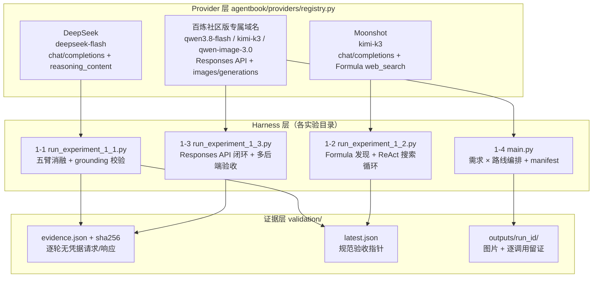
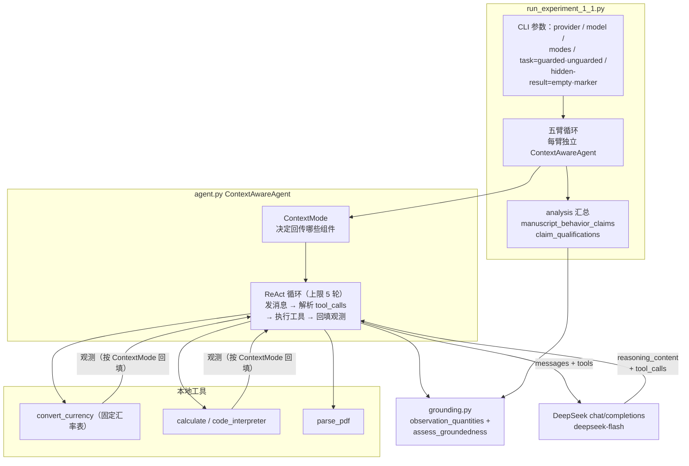
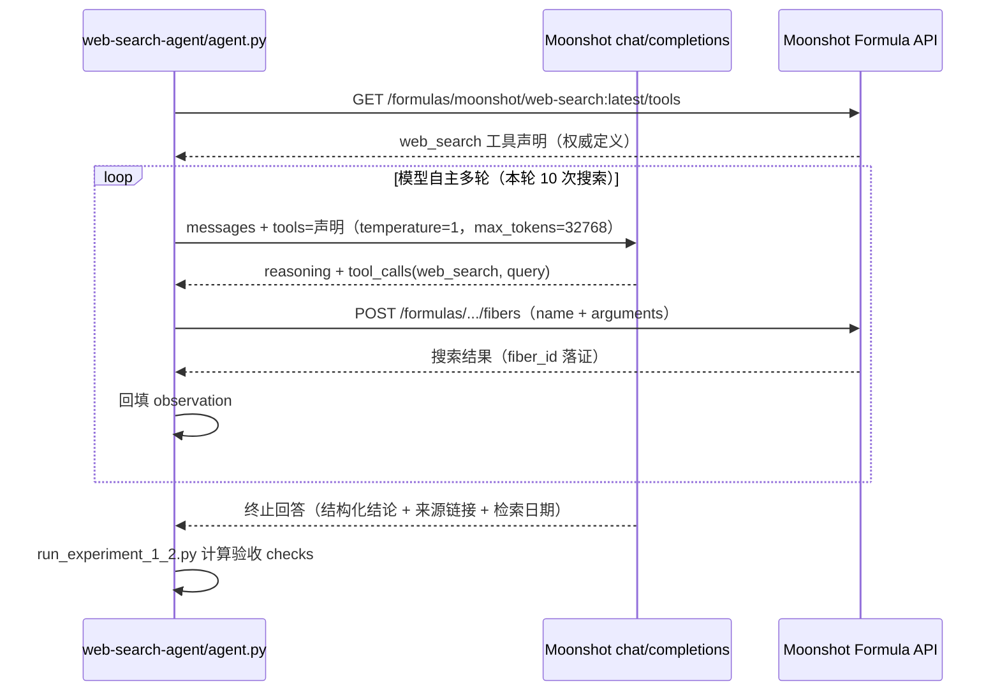
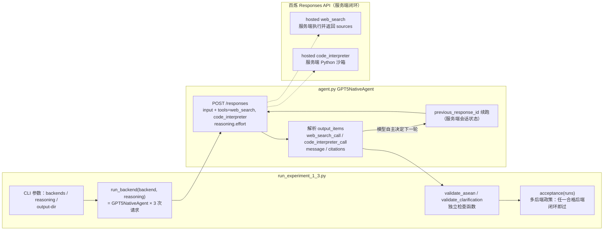
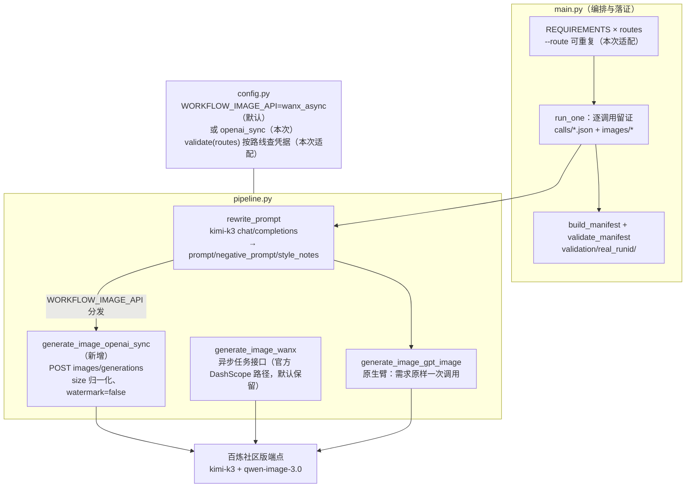

# 第 1 章实验报告（2026-09-14 真实 API 运行）

> Agent = LLM + 上下文 + 工具；Harness 工程才是竞争力。
> 本报告覆盖实验 1-1 / 1-2 / 1-3 / 1-4 的完整运行记录、代码逻辑讲解与架构图（Mermaid）。
> 验收口径与历史证据见 [EXPERIMENT_LEDGER.md](EXPERIMENT_LEDGER.md)。

## 总览

| 实验 | 提供商 / 模型 | 端点 | 结果 | 证据 |
|:--:|---|---|:--:|---|
| 1-1 上下文消融 | DeepSeek `deepseek-flash` | `api.deepseek.com` | ✅ 验收通过并提升为 `latest.json` | `context/validation/real_20260914T140001Z/` |
| 1-2 搜索 Agent | Moonshot `kimi-k3`（Formula web_search） | `api.moonshot.cn/v1` | ✅ 18 项检查全过 | `web-search-agent/validation/real_20260914T143733Z/` |
| 1-3 搜索 + 代码执行 | 百炼社区版 `qwen3.8-flash`（hosted web_search + code_interpreter） | `llm-pux28gcqlwezimaw.cn-beijing.maas.aliyuncs.com/compatible-mode/v1` | ✅ 双用例全过 | `search-codegen/validation/runs/real_20260914T144331Z/` |
| 1-4 文生图工作流对照 | `kimi-k3` 改写 + `qwen-image-3.0` 生图（同端点两臂共用） | 同上百炼社区版 | ✅ 10/10 | `image-gen-workflow/validation/real_20260914T142003Z/` + `real_20260914T143230Z/` |

凭据均只经环境变量注入，所有 evidence manifest 满足 `credential_value_recorded=false` 且带 SHA-256 sidecar。

---

## 0. 实验套件总体架构

四个实验共享同一套 provider 抽象与证据纪律：**harness 只负责编排与留证，模型能力由 provider 端点提供，验收由独立检查函数计算**。



设计上的三条纪律贯穿全部实验：

1. **逐轮留证**：每次真实 API 调用的请求与响应（无凭据化）都落盘，验收从“实际发出的消息”计算，而不是从 CLI 标志反推；
2. **provider 拒绝不折算成模型失败**：端点缺失的能力（如百炼没有万相异步接口、OpenRouter 没有 `$web_search`）记录为 provider 限制，不伪装成实验结论；
3. **验收与完成解耦**：`completed`（循环终止）≠ `task_success`（数值评分）≠ `groundedness`（答案是否可依据观测），三者独立计算。

---

## 1. 实验 1-1 · 上下文的关键作用（context ablation）

### 1.1 实验设计

 canonical 任务：给四个季度营收（USD/EUR/GBP/JPY），要求 Agent 用换汇与计算工具折算成 USD、算年度总额与季度均值（期望值 `9,602,895.73` / `2,400,723.93`），并明令“不要自行估计汇率”。五条臂各消融一个上下文组件：

| 臂 | 消融手段（`agent.py`） |
|---|---|
| `full` | 无（基线），完整 ReAct 轨迹回传 |
| `no_history` | `_prepare_messages_for_api()` 只发系统提示 + 当前任务，不保留任何 ReAct 步骤 |
| `no_reasoning` | 写回轨迹前剥离 assistant 消息的 `reasoning_content`（deepseek-flash 的 thinking 输出） |
| `no_tool_calls` | 请求省略 `tools` 参数，模型没有工具定义可调用 |
| `no_tool_results` | tool 消息内容置空（静默隐藏，API 要求消息存在） |

`grounding.py` 从**实际发出的消息**里提取全部观测数值，判定终止回答里的营收量级数字是否有依据，因此“没拿到观测却报出正确总数”也会被判为 `unsupported_numbers` 而不是侥幸通过。

### 1.2 代码架构



### 1.3 运行结果（deepseek-flash，guarded 任务，静默隐藏）

| 臂 | outcome | 迭代 | 与 Kimi K3 验收基准对比 |
|---|---|---:|---|
| full | `correct`（命中数值评分标准） | 3/5 | 一致 |
| no_history | `no_terminal_response`（重复换汇直到触顶） | 5（触顶） | 一致 |
| no_reasoning | `correct` —— **无退化**，与正文修订后的表述一致 | 3/5 | 一致 |
| no_tool_calls | `no_unsupported_numbers`（声明无可达换汇工具，未编造数字） | 1 | 一致 |
| no_tool_results | `no_terminal_response`（盲执行直到触顶） | 5（触顶） | 一致 |

- 用量：22,907 tokens（prompt 18,694 / completion 4,213，含 1,076 reasoning tokens，缓存命中 14,080）。
- `all_manuscript_behavior_claims_observed=false` 是预期结果：`without_reasoning_degraded` 这条正文断言已在修订中移除（该臂只检验“是否携带历史推理”，每轮仍在重新思考）。
- `arms_stating_unsupported_numbers=[]`：没有任何一臂用记忆里的汇率编造答案——这属于模型行为倾向而非定律，guarded 提示是概率偏移不是开关。
- 运行被验收为 canonical（五臂齐全、guarded、静默隐藏），**已提升为 `context/validation/latest.json`**，SHA-256 `3a9d981d…c7f03fdb`。

---

## 2. 实验 1-2 · Kimi K3 即 Agent（Formula web_search）

### 2.1 实验设计

任务：核查截至 2026-07-30 东盟成员资格（数量、名单、东帝汶入盟日期）与印尼首都（雅加达/努山塔拉法律地位），要求多轮搜索、当前答案、权威链接、检索日期，禁止凭记忆作答。验收门是“**exact Kimi K3 + provider 托管 Formula 搜索 + 模型自主多轮 + 结构化结论**”。

### 2.2 代码架构

Kimi 平台的托管搜索不是 OpenAI function calling 那样的本地工具，而是一套平台侧协议：先从 Formula 声明端点拉取权威工具定义，再把声明原样放进 `tools` 参数，模型发出 `web_search` 调用后由 harness 转发到 fiber 执行端点，把观测回填对话。`agent.py` 对这套协议做了三层防线：声明必须含 `web_search` 函数、fiber 请求必须与模型动作一致、每轮对话必须重新携带声明。



### 2.3 运行结果

- **18 项验收 checks 全部为 true，`passed=true`**：真实 Moonshot API、exact 模型、一次真实声明拉取、每轮携带声明、全部 fiber 成功、多轮不同 fiber、推理与终止回答齐备、答案含来源链接与官方来源、东盟十一国事实、东帝汶入盟日期（2025-10-26，第 47 届峰会）、雅加达/努山塔拉法律地位说明、检索日期报告。
- 多轮共执行 **10 次真实 Formula 搜索**（fiber ID 全部落证），25 步 ReAct 轨迹。
- 用量 43,266 tokens（缓存命中 25,600，reasoning 1,563）。
- 证据：`web-search-agent/validation/real_20260914T143733Z/evidence.json`。

> 注：Kimi 官方文档标注“联网搜索工具正在更新，近期不建议使用”；运行前实测 `/formulas/.../tools` 返回 200 且功能完整，实际未受影响。

---

## 3. 实验 1-3 · 多轮搜索 + 沙箱代码执行的 Deep Research 闭环

### 3.1 实验设计

两个用例（`run_experiment_1_3.py`）：

1. **ASEAN 首都距离**：枚举东盟成员国首都两两 haversine 距离，找最近的一对。验收要求 hosted `web_search` 与 `code_interpreter` 真实闭合、URL 引用存在、最近首都对与**独立本地参照**（标准坐标下吉隆坡—新加坡 309.3 km）一致。
2. **比特币技术分析（先澄清后执行）**：模糊任务下第一轮必须先澄清、不碰工具；用户补充偏好后经 `previous_response_id` 续跑，要求 MA7/MA20、RSI14、MACD、区间收益与最大回撤，验收要求续轮真实搜索 + 沙箱执行 + 引用 + 指标齐全。

多提供商政策（作者 2026-07-31 批准）：OpenAI GPT-5.6 Sol 保持 canonical，但任何提供**真正等价 hosted 工具**的 Responses API 后端都可验收——本次即以百炼社区版 `qwen3.8-flash` 通过。

### 3.2 代码架构



### 3.3 运行结果（`--reasoning medium`）

**ASEAN 用例（127 秒）**：5 段推理 + 5 条消息 + **3 次 `web_search_call`**（查询如 "ASEAN member states capitals list 2026"、"Bandar Seri Begawan coordinates…"）+ **1 次 `code_interpreter_call`**（枚举全部首都对）。七项检查全过，最近首都对报告 315.2 km，与独立参照 309.3 km 同一对（坐标口径差异），`closest_pair_matches_independent_reference=true`。

**比特币用例（先澄清 + 续跑 528 秒）**：

- 第一轮（无工具）：模型先澄清三个维度——指标偏好、K 线周期、数据源（Binance/CoinGecko 等）✅；
- 续轮经 `previous_response_id`：**4 次搜索**（如 "price of bitcoin August 14 2026"、Yahoo BTC-USD 历史）+ **4 次 `code_interpreter_call`** 全部 completed，计算指标并出报告 ✅；
- 值得记录的自主行为：模型先尝试在沙箱里直连 CoinGecko，遇到 `Network is unreachable (101)` 后**自行诊断出沙箱无外网**，转向“搜索取数 + 沙箱计算”，并在报告开头透明披露数据口径与局限——与 qwen3.7-plus canonical 运行的 qualification 一致；
- 用量：全程 254,825 tokens（input 221,944 / output 32,881）。

**验收：`acceptance_backend="dashscope"`，`passed=true`**。证据：`search-codegen/validation/runs/real_20260914T144331Z/`（含 receipts.json 与 SHA-256 sidecar）。

**失败运行同样留证**：第一次运行（`real_20260914T142641Z`，`--reasoning high`）ASEAN 通过，但澄清续轮触发端点网关 **600 秒流式硬超时**（`ResponseTimeout, timeout_seconds=600, elapsed_ms=600000`）——基础设施限制而非能力缺陷；medium 思考档下续轮 528 秒（余量 72 秒）通过。两次运行均保留。

---

## 4. 实验 1-4 · 文生图工作流与原生生成的对照

### 4.1 实验设计

5 句口语化中文需求（3 具体类：加班程序员/窗台绿植/耳机海报；2 宽泛类：AGI 程序员场景/未来城市早晨）× 2 条路线：

- **workflow**：`kimi-k3` 改写节点（口语需求 → SD 风格 prompt + negative_prompt + style_notes）→ `qwen-image-3.0` 生图节点；
- **native_gptimage**：口语需求原样进 OpenAI 兼容 `images/generations`，一次调用直接出图。

本次两臂共用 `qwen-image-3.0`（用户指定的 image3.0），**路线间唯一变量是改写节点**——比原设计（万相 vs Gemini/GPT-Image）更干净的受控对照。Gemini 原生臂无凭据未运行，作为 provider 替换记录进 manifest notes。

### 4.2 代码架构（含本次适配）

百炼社区版专属域名只有 OpenAI 兼容同步生图接口（`/images/generations`），万相异步任务接口实测 404，因此为生图节点新增了同步路径，通过环境变量切换、默认行为不变：



回归测试 25/25 通过（`uv run --extra ch1 --with pytest python -m pytest chapter1/image-gen-workflow/tests`）。

### 4.3 运行结果与核心发现

10/10 成功（第一次 9/10，headphone-poster 的改写节点输出 JSON 尾部混入多余文本导致解析失败；单臂重试成功，两次 manifest 均保留）。

**核心发现——改写节点丢弃核心需求，完整复现：** 海报需求指定文案“深夜独处也清净”，改写节点把它**转译成视觉语言**（深夜蓝渐变背景、声波消散暗示降噪），并在 negative_prompt 写入 `text, logo, letters`——指定文案**不会出现在海报上**。style_notes 甚至给出合理化解释：“大面积留白方便后期排版文案”。与台账中 qwen3.7-plus 时代验收运行的发现一致，证明这是改写节点的结构性风险，与具体生图模型无关。

**具体 vs 宽泛需求的对照**：

| 需求 | 改写节点行为 |
|---|---|
| 加班程序员（具体） | 忠实展开：messy hair、dark circles、slumped posture、wrinkled hoodie——“丧”转译为视觉细节，无添加 |
| AGI 程序员（宽泛） | **注入叙事**：leaning back relaxed holding coffee + AI autonomously generating streams of glowing code——场景具象化带来了原始需求没有的信息增益 |

原生臂则直接消费口语中文（qwen-image-3.0 的 prompt 支持长中文描述），不再有改写损耗。图片产物在 `image-gen-workflow/outputs/20260914T142003Z/images/`（9 张）与 `outputs/20260914T143230Z/images/`（1 张），每张带 SHA-256。

---

## 5. 运行时间线与可复现命令

| 时间（UTC） | 事件 |
|---|---|
| 14:00 | 1-1 五臂运行，验收通过并提升 `latest.json` |
| 14:20 | 1-4 第一次运行（9/10） |
| 14:26 | 1-3 第一次运行（ASEAN 过，澄清续轮 600s 网关超时） |
| 14:32 | 1-4 headphone-poster 单臂重试（1/1） |
| 14:37 | 1-2 运行，18 项 checks 全过 |
| 14:43 | 1-3 medium 重跑，双用例通过 |

```bash
# 1-1（DeepSeek）
DEEPSEEK_API_KEY=… python run_experiment_1_1.py --provider deepseek --model deepseek-flash

# 1-2（Moonshot Formula web_search）
MOONSHOT_API_KEY=… python run_experiment_1_2.py

# 1-3（百炼社区版 Responses API）
DASHSCOPE_API_KEY=… \
DASHSCOPE_BASE_URL=https://llm-pux28gcqlwezimaw.cn-beijing.maas.aliyuncs.com/compatible-mode/v1 \
DASHSCOPE_MODEL=qwen3.8-flash \
python run_experiment_1_3.py --backends dashscope --reasoning medium

# 1-4（百炼社区版，kimi-k3 改写 + qwen-image-3.0 两臂）
KIMI_API_KEY=…  KIMI_BASE_URL=$BASE  REWRITE_MODEL=kimi-k3 \
DASHSCOPE_API_KEY=…  DASHSCOPE_BASE_URL=$BASE \
WANX_MODEL=qwen-image-3.0  WANX_SIZE=1024x1024  WORKFLOW_IMAGE_API=openai_sync \
OPENAI_API_KEY=…  OPENAI_BASE_URL=$BASE  GPT_IMAGE_MODEL=qwen-image-3.0 \
python main.py --route workflow --route native_gptimage
```

## 6. 结论

1. **四个实验在三个新端点上全部通过验收**，且 1-1 的五臂行为、1-4 的改写节点风险都与既有 canonical 证据逐项一致——实验结论跨模型、跨提供商稳定复现。
2. **端点能力边界是硬约束**：百炼社区版有 Responses API 与 hosted 工具但无万相异步接口；1-2 依赖 Moonshot 专有 Formula 协议；DeepSeek 的 `/responses` 会**静默忽略** hosted 工具声明（请求 200 但无 `web_search_call`）。Harness 的多提供商政策（1-3）与接口开关（1-4 的 `WORKFLOW_IMAGE_API`）正是为这种异构性设计。
3. **基础设施限制要与模型能力分开记录**：600 秒网关流式超时只影响最重的单轮请求，降思考档即可绕过；JSON 解析失败是单次非确定性行为，单臂重试即可。两者都作为独立 manifest 留证，不与验收结果混淆。
