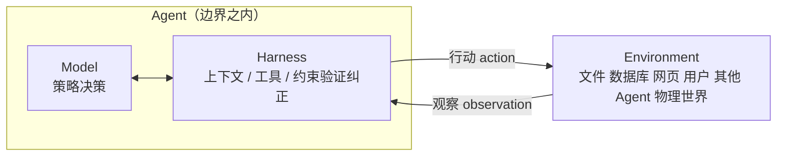
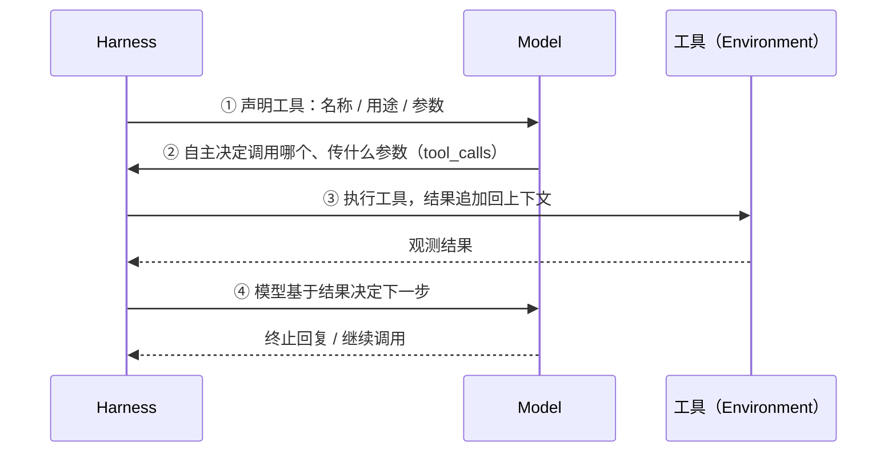
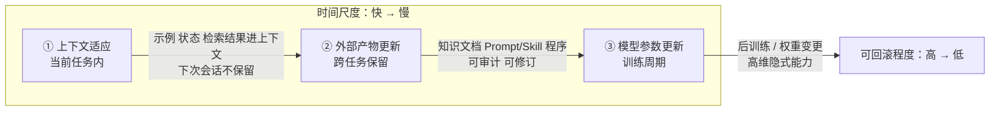
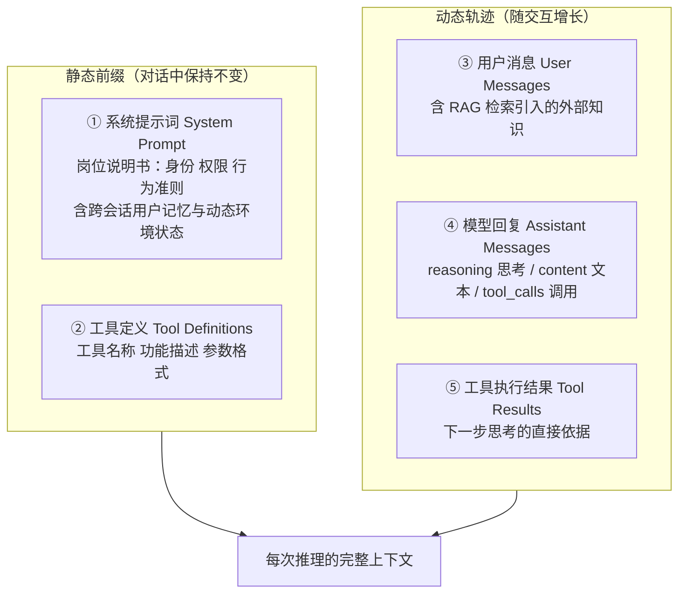

# AI Agent 入门（上）：从「大脑 + 眼睛 + 手脚」到 ReAct 循环

> 本文是《深入理解 AI Agent》第 1 章的学习笔记**（上篇·概念）**。第 1 章是全书的概念地图，它先把 Agent 的最小公式讲清楚，再用四个真实实验把公式打穿，最后落到"模型之外"的 Harness 工程。
>
> **本篇讲清楚：Agent 由什么组成、它如何与环境交互、工具怎么分类、上下文里有什么、ReAct 循环如何运转。** 下一篇讲 Harness 工程与贯穿全书的设计模式，之后是四个实验的完整代码复盘。
>
> 一句话总结全章：**Agent = LLM + 上下文 + 工具；而竞争力在 Harness。**

---

## 一、现代 Agent = LLM + 上下文 + 工具

这一章开篇给的公式只有三个词：

> **Agent = LLM + 上下文 + 工具**

这里的加号是工程组件的组合，不是强化学习里的形式化定义。更重要的是：**这个公式只描述 Agent 边界之内，不包含 Agent 交互的 Environment（环境）**。

三个词都要做广义但边界清楚的理解：

| 直觉理解 | 实现组件 | 学术概念 | 含义 |
|---|---|---|---|
| **大脑** | LLM | 策略（Policy） | 决定"下一步做什么"——面对当前看到的信息，从所有可选行动中挑出最合适的一个 |
| **眼睛** | 上下文构造 | 观察与历史 | 把环境返回的观察与已有历史，组织成当前决策所需的信息 |
| **手脚** | 工具与适配器 | 观察/行动接口 | 规定 Agent 能读取哪些观察、能发出哪些行动，以及接口格式 |

- **LLM 是大脑**：它不只是模型参数，而是 Agent 的整个决策内核——理解意图、思考规划、做出判断。它的能力来自两部分：**预训练**积累的世界知识与语言能力，**后训练**固化的决策策略。
- **上下文是眼睛**：不只是输入的那段文本，而是 Agent 在每个决策点收到并保留的信息表示——环境观察、用户记忆、领域知识、自身状态、任务进展。
- **工具是手脚**：Agent 用来感知或改变外部世界的接口，包括工具定义、调用协议和适配器——从预定义工具调用到动态生成代码，从委托子 Agent 到主动与用户沟通。

### Agent 与 Environment 的闭环

在经典强化学习和控制论的视角下，Agent 与 Environment 是**闭环交互的两方**，而不是彼此的组成部分：



这张图同时给了两个抽象层次：

- **外层**：Agent 与 Environment 的交互关系。环境包含文件、数据库、网页、用户、其他 Agent 以及物理或仿真世界，Agent 只能通过观察和行动接口与它交互；
- **内层**：Agent 的 **Model–Harness 结构**。Model 负责策略决策；Harness 是 Agent 边界内**环绕模型的运行与治理层**，负责构造上下文、暴露工具接口、维护循环和状态，并实施权限、验证与纠正。

一句话打通两个公式：**LLM 对应 Model，"上下文 + 工具"构成最小 Harness；生产系统还会在 Harness 中加入约束、验证和纠正。** 后文所有架构都遵循这条边界。

### 观察空间与动作空间：模型与世界的接口

这是本章第一个、也是最重要的一个杠杆：

> **观察通道与动作接口共同构成了 Agent 与外部环境之间的边界。**
> **在底层模型固定时，提升 Agent 任务表现最主要的系统工程手段，往往就是重新定义或扩展观察空间与动作空间。**

道理很朴素：没通过观察通道进入上下文的信息，对模型来说**就像不存在**；没被动作接口允许的操作，模型即使知道该怎么做，也**只能停留在文字建议上**。很多看似需要"更聪明模型"的问题，其实只是**接口问题**——把任务所需的数据纳入上下文，或把完成任务所需的操作封装成工具，原本不可解的任务就可能变得可解。

**Manus：合并原本分离的空间。** 在 Manus 之前，生产级 Agent 大多沿着 Deep Research（深度调研）、Coding（代码生成）、Computer Use（电脑操控）三条相对独立的路线发展。Manus 的突破是率先把三者放进同一个有影响力的生产级 Agent：

- **虚拟浏览器**扩大了观察空间；
- **文件系统、代码执行与命令行执行**扩大了动作空间。

它没有仅靠换一个更强的模型来成为通用 Agent，而是**取三类 Agent 观察空间与动作空间的并集**，使同一个 Agent 能跨越原有产品边界完成任务。

**OpenClaw：把接口延伸到用户的数字生活。** 它又把两个空间向外推了一层：通过用户已在用的 WhatsApp、Telegram、Slack、Discord、iMessage 等消息渠道接收任务和返回结果，让 Agent 随时可被触达；同时用本地 Gateway 连接 Google Drive、Notion 等云应用以及本地文件系统。于是分散在不同账号与设备中的数字文件，都能在用户明确授权后进入同一个观察空间。

> 顺带一提：Manus 后来也加入了 Google Drive 连接器和桌面端本地访问——这恰好再次说明，**产品能力的演进往往就是观察空间与动作空间的演进**。

### 五个 Agent 产品：三个维度的横向对比

| Agent 产品 | 眼睛（感知） | 手脚（行动） | 策略 |
|---|---|---|---|
| **Cursor 等 Coding Agent** | 需求、读取到的代码片段、目录列表、终端输出 | 开放式（代码搜索、文件读写、执行命令等） | 增量开发：理解需求→搜索相关代码→编辑代码→测试验证→调试修复 |
| **Deep Research 等搜索 Agent** | 搜索结果、网页内容、论文摘要与引用 | 开放式（搜索查询、网页读取、生成报告等） | 迭代深化：根据已有信息调整搜索方向，逐步综合出完整报告 |
| **Browser Use 等电脑操控 Agent** | 屏幕截图、DOM 或无障碍树、操作结果 | 开放式（点击、输入、滚动、截图、执行代码等） | 视觉感知+操作：观察屏幕→识别目标元素→执行操作→验证结果 |
| **豆包等手机助手 Agent** | 手机截图、App 界面状态、系统反馈 | 开放式（点击、滑动、输入、打开 App 等） | 意图理解+App 操控：理解需求→定位目标 App→执行操作→确认完成 |
| **Pine AI 等个人办事 Agent** | 经授权读取的账户记录、账单结果、服务商资料 | 开放式（打电话、发邮件、填表单、与用户确认） | 多步骤任务执行：收集信息→制定协商策略→联系服务商→谈判→汇报结果 |

这些系统的共同点是：都用**开放式的动作空间**（不是从有限按钮里选，而是能生成任意自然语言和代码）、都能**内部思考**（行动前先规划）、都能**持续交互**（根据反馈调整策略）。这些能力正是大脑、眼睛、手脚协同的结果。

---

## 二、工具：Agent 的手脚

工具是 Agent 与外部世界交互的桥梁：感知类工具承载"环境→Agent"的观察，执行类工具承载"Agent→环境"的行动。没有工具，Agent 只能纸上谈兵。

### 五类工具

按 Agent 与外界互动的方向，工具可以分为五类：

| 类别 | 作用 | 代表场景 |
|---|---|---|
| **感知工具** | 让 Agent 能访问信息 | 搜索引擎提供实时网络数据、文件系统读取本地文档、API 与数据库对接外部服务和企业核心数据 |
| **执行工具** | 让 Agent 能改变世界 | 代码执行、文件操作、系统命令、外部 API 调用——决策由此变成实际行动 |
| **协作工具** | 让 Agent 与其他 Agent 分工合作 | 委托子 Agent 完成专项任务、在关键决策点请求人类确认、多 Agent 系统中协调行动 |
| **用户沟通工具** | Agent 主动与用户建立连接、传递信息 | 通过文字消息、语音通话、邮件传递执行进展或主动关怀 |
| **事件触发工具** | **外**部输入驱动 Agent 开始执行 | 收到新邮件、到达预定时间点、另一系统发出 Webhook 回调 |

注意**事件触发工具与前三类在调用方式上有本质区别**：它不是 Agent 主动调用的，而是作为外部输入来驱动 Agent 开始执行任务。事件适配器同样是 Environment 向 Agent 提供观察的通道，所以本书把它归入广义的工具体系。

### 工具调用：四步循环

现代 LLM Agent 的核心能力之一是**工具调用**（Tool Calling，也称 Function Calling），它把 LLM 从纯文本生成器变成能执行实际操作的智能系统。



关键在于职责划分：**开发者只需要定义工具和执行工具调用，模型自主完成"要不要调用、调哪个、传什么参数"的决策。**

### 通用工具 vs 专用工具

这是本章一个很实用的设计原则，值得单独记住：

> **通用基础能力用于组合与探索；专用工具用于约束高风险和强业务规则操作。**

- **通用工具不总是优于专用工具。** 如果任务只是四则运算，一个参数清晰的计算器就够了；当任务升级为"读表格、清洗缺失值、算统计量并绘图"，受限的 Python 代码解释器就比不断叠加专用工具更容易组合和探索。但通用性也扩大了出错和攻击面：代码必须在隔离沙盒中运行，默认不能访问网络，不能读取授权工作目录以外的文件，并对执行时间、CPU、内存、输出大小设置上限。
- **高风险操作仍应封装为专用工具。** 支付、删除数据、发送邮件、生产部署等高风险或强业务约束操作，应封装为参数明确、权限受限且全程可审计的专用工具，必要时加上预览和人工确认。

同样地，单一日志工具适合记录一段执行过程；对于需要数小时甚至数天的长程任务，**受控的虚拟工作目录**可以同时保存计划、中间结果、运行日志和最终产物，让 Agent 能在多次执行间接续工作——这个目录同样要限定可读写路径、容量和文件类型，并防止路径越界。

---

## 三、LLM：Agent 的大脑

### 模型即 Agent：当模型本身成为产品

"模型即 Agent"（Model as Agent）代表了 Agent 发展的最新方向。先进模型通过后训练（特别是强化学习）把**工具调用能力内化为原生能力**：何时调用工具、调哪个、传什么参数，都由模型自己决定，无需人工编排。

但**这并不意味着框架层变得不重要**。恰恰相反：模型越强大，围绕模型构建的 Harness 就越关键。

Harness 这个词原指**马具**——套在马身上的缰绳与挽具。它的目的**不是限制马的奔跑能力，而是把这种力量引导到正确的方向上**。模型是那匹强大但不可预测的马，Harness 就是把它的能力引导成可靠任务执行的工程外壳。

模型自主决策的空间越大，出错时的影响面也越大，因此需要更精细的约束、验证和纠正机制。

### 一个绕不开的问题：Harness 会被模型"吃掉"吗？

Rich Sutton 在《苦涩的教训》（The Bitter Lesson）里回顾了 AI 研究七十年反复上演的一幕：研究者一次次把自己对领域的理解编码进系统，短期见效，长期却总输给能随算力与数据规模持续扩展的通用方法——**搜索与学习**。

以此衡量，Harness 里的约束、验证与纠正，有多少属于"人类先验"，注定会被模型内化？本书的立场是：

> **方向认同，节奏务实。**

- **方向上**，本书不怀疑模型会持续吃掉 Harness——工具调用、长程规划都曾靠外部编排，如今已是模型的原生能力；
- **节奏上**，这个"吃"的过程远比想象中慢：训练以月计，模型也无法一次内化真实业务中所有的约束与偏好。**模型此刻的能力边界，就是 Harness 此刻的价值所在。**

所以 Harness 工程不是对苦涩教训的抵抗，而是这一教训在工程时间尺度上的实践：**模型还做不稳的，Harness 先补上；模型每内化一层，Harness 就卸下一层，转而兜底新的能力前沿。**

> 学习笔记：这也是"要不要学底层原理"这个问题的答案。模型迭代很快，具体 API 会过时，但理解"观察空间/动作空间""闭环控制""约束-验证-纠正"这些结构，既让我对世界的理解更深入，也让我能更好地设计系统。而且未来的工作一定建立在先前工作之上，先前的知识对未来有启发意义。

### Agent 的学习机制：从上下文适应到持久更新

Agent 的行为改变不只发生在训练阶段。按**更新发生的位置和持续时间**，可以分为三条互补路径：



| 层次 | 发生位置 | 优势 | 局限 |
|---|---|---|---|
| **上下文适应** | 当前任务中 | 快速、低成本，模型立即调整行为 | 受上下文窗口与信息组织方式约束，不改变下一次会话的持久状态 |
| **外部产物更新** | 知识文档、Prompt/Skill、程序与 Harness | 可审计、可修订 | 执行时仍需通过上下文或工具接口被 Agent 使用 |
| **模型参数更新** | 后训练（权重变更） | 形成自然、广泛的泛化能力 | 部署成本高；目标常是高维、外部规则难以完整表达的能力 |

三者不是互斥分类，而是**不同时间尺度上的协同机制**：上下文负责临场适应，外部产物负责可控积累，参数负责内化难以显式表达的能力。

> 学习笔记：一个很好的例子是 GLM-5.2 到 GLM-5.3——训练架构一样，只换了后训练阶段，表现能力就完全不同。这就是"模型参数更新"这条路径的直接体现。

---

## 四、上下文：Agent 的眼睛

上下文是 Agent 在每个决策点能看到的**全部信息**。从 API 视角看，每次调用 LLM 时的上下文由**五个部分**构成：



各部分的要点：

- **系统提示词**：由开发者编写，整个对话中保持不变，相当于 Agent 的"岗位说明书"——定义身份、权限和行为准则。其中还会包含跨会话保存的**用户记忆**（偏好、历史行为、背景设定）和动态注入的环境状态。
- **工具定义**：声明可用工具的名称、功能描述和参数格式。**没有工具定义，Agent 无法识别和调用任何工具，但它并不会因此停下来**——实验 1-1 会精确说明这一点。
- **用户消息**：用户输入，其中还可能包含通过 RAG 动态检索引入的**外部知识**（覆盖训练截止后的信息或私有领域知识）。
- **模型回复**：最多含三个部分——思考过程（`reasoning`）、文本内容（`content`）、工具调用请求（`tool_calls`）。三者不一定同时出现：决定调用工具时通常只有 `reasoning` + `tool_calls`，给出最终回答时通常只有 `reasoning` + `content`。
- **工具执行结果**：框架执行工具后返回的结果，是下一步思考的直接依据，也让 Agent 能从执行结果中学习、避免重复犯错。

**前两项是静态前缀，后三项是不断增长的动态消息历史。**

> 为什么说"上下文是 Agent 的演进"？因为上下文能补全 Agent 不知道的信息。很多问题普通人问不出想要的答案，很大程度上就是**上下文不够详细和全面**。我们要做的，就是把这五部分补全。

### 为什么要做消融实验

要验证每个组件是否都不可或缺，最直接的方法是**消融实验**（Ablation Study）：就像医生诊断时逐一排除病因——先去掉 A 组件看系统是否还正常，再去掉 B 组件，以此类推，从而判断每个组件的贡献。**实验 1-1** 正是按这个思路，对上述五个组件做了系统性测试（系统提示词作为基本身份定义不参与消融，因为没有它 Agent 连角色认知都没有，测试没有意义，所以是"一组完整基线 + 四组各缺失一个组件"）。

---

## 五、ReAct 循环

Agent 执行任务的核心模式叫 **ReAct**（Reasoning + Acting）。名字只体现了思考和行动，但实际循环包含**三个环节**：模型先**思考**该做什么，然后调用工具**行动**，再**观察**工具返回的结果并继续思考下一步。这个"想→做→看→想→做→看"的循环不断重复，直到任务完成。

Agent 执行过程中不断积累的消息历史，叫做**轨迹**（trajectory）。这里有个关键事实：

> **Agent 的上下文 = 静态前缀 + 轨迹**
> （静态前缀 = 系统提示词 + 工具定义；轨迹 = 用户消息 + 模型回复 + 工具执行结果）

基于完整上下文，LLM 生成下一步响应，响应又追加到轨迹中，供下一次调用使用——如此迭代。

最小运行骨架（书中伪代码，说明机制而非可直接运行）：

```python
trajectory = [user_request]

repeat:
    context = stable_prefix + trajectory
    decision = Model(context)
    trajectory.append(decision)

    if decision has no tool call:
        return decision.answer

    for call in decision.tool_calls:       # 独立调用可以并行
        validated_call = Harness.validate(call)
        observation = Environment.execute(validated_call)
        trajectory.append(observation)
```

以"多币种收入汇总"为例，一次真实运行后轨迹里保存了什么：

```text
轨迹 = [
  {role: "user", content: "根据公司季度收入：Q1 2.5M 美元，Q2 2.1M 欧元，
   Q3 1.8M 英镑，Q4 380M 日元，计算年度总收入和季度平均收入"},

  # 第一次迭代 - LLM 看到上述轨迹，生成响应
  {role: "assistant",
   reasoning: "需要将所有货币转换为 USD...",
   content: "",
   tool_calls: [
     {name: "convert_currency", args: {amount: 2100000, from: "EUR", to: "USD"}},
     {name: "convert_currency", args: {amount: 1800000, from: "GBP", to: "USD"}},
     {name: "convert_currency", args: {amount: 380000000, from: "JPY", to: "USD"}}
   ]},

  # Agent 框架执行工具，把结果追加到轨迹
  {role: "tool", content: "EUR->USD: 2282608.7"},
  {role: "tool", content: "GBP->USD: 2278481.01"},
  {role: "tool", content: "JPY->USD: 2541806.02"},

  # 第二次迭代 - LLM 看到完整轨迹（含工具结果），决定汇总计算
  {role: "assistant",
   reasoning: "已获得转换结果，现在需要汇总计算...",
   content: "",
   tool_calls: [{name: "code_interpreter",
                 args: {code: "total = 2500000 + 2282608.7 + ..."}}]},

  {role: "tool", content: "Total: $9,602,895.73, Average: $2,400,723.93"},

  # 第三次迭代 - LLM 看到完整轨迹，生成最终答案
  {role: "assistant",
   reasoning: "所有计算完成，总结结果...",
   content: "FINAL ANSWER: 总收入 $9,602,895.73 ..."}
]
```

注意：轨迹里**看不到系统提示词和工具定义**——它们作为静态前缀，在每次 LLM 调用时自动拼在轨迹前面。

**整个过程只用了 3 次迭代、4 次工具调用。**

这种不断追加的设计让模型始终清楚任务进行到哪一步、此前尝试过什么、得到了什么结果；轨迹的结构化也让系统易于解释和调试。更进一步，分析大量轨迹可以发现行为模式、优化决策路径、改进工具设计，甚至沉淀进知识库或用于强化学习——**形成从经验中学习的闭环**。

---

---

**下一篇**：《AI Agent 入门（下）· Harness 工程——模型之外的竞争力》，讲清约束、验证与纠正为什么是竞争力所在，以及贯穿全书的五个设计模式。
