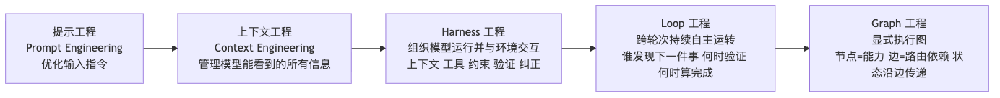
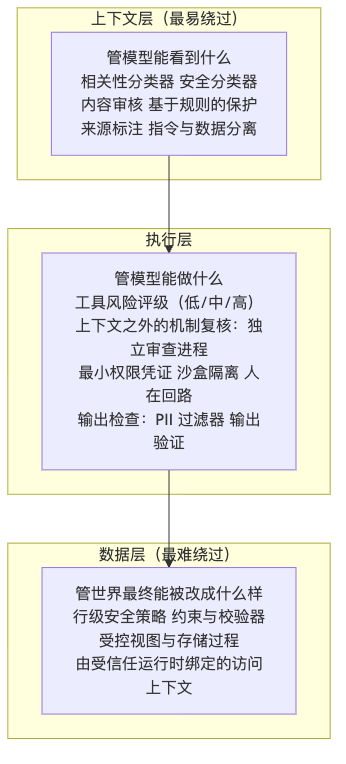

> 本文是《深入理解 AI Agent》第 1 章学习笔记**（下篇·概念）**。上篇讲了 Agent 的组成、上下文与 ReAct 循环；这一篇回答后半章的问题：**模型之外，还要做什么才算工程。**

---

## 一、Harness 工程：模型之外的竞争力

前面证明了基本机制有效，但也暴露了明显的脆弱点：模型可能**产生幻觉**（编造不存在的工具或参数）、**选错工具**，或在遇到错误时**无法自我恢复**。一个能跑的 Demo 和一个可靠的产品之间还有巨大鸿沟——这些脆弱点正是 Harness 工程要解决的。

### 两个公式的关系

先把关系说清楚，以免记住两套骨架：

> **Agent = Model + Harness**
> **Harness = 上下文管理 + 工具接口 + 约束 + 验证 + 纠正**
> **Agent ↔ Environment**

全书的唯一结构骨架是 **Agent = LLM + 上下文 + 工具**；**Agent = Model + Harness 不是并列的另一套划分**，而是同一事物在生产形态下的展开——它把"上下文"和"工具"两项细分为上下文管理、工具接口、约束、验证、纠正五项职责。

还要更精确一点：**Harness 不是"模型之外的一切"，而是"Agent 边界内、模型之外"的运行与治理层。**

- 工具定义、调用适配器、沙箱的权限与重置机制 → 属于 Harness；
- 沙箱内随行动变化的文件和进程、外部数据库、网页、用户及物理世界 → 属于 Environment。

物理部署位置不能决定概念归属——即使仿真环境与 Agent 运行在同一进程中，它仍然是 Environment。

### 五要素

| 功能 | 职责与核心原则 | 实际例子 |
|---|---|---|
| **Context（上下文）** | 为模型提供感知信息；信息要充分，让 Agent 在每个决策点都基于足够的信息判断 | 系统提示词、知识库、Agent 状态栏、Sidecar 旁路查询 |
| **Tools（工具接口）** | 为模型提供观察与行动手段；接口要清晰，命名直观、参数有例子、边界有说明 | MCP 工具、代码解释器、搜索工具 |
| **Constrain（约束）** | 设定行为边界；采用**故障安全默认值**，所有能力默认关闭，必须显式开放（类似手机 App 权限管理） | Claude Code 中每个工具默认需用户授权才能执行 |
| **Verify（验证）** | 自动判断操作结果的对错；安全检查**只看结构化数据**（如工具返回的 JSON 字段），而不看模型自由生成的文本，因为后者可能已被提示注入操纵 | Linter 检查、类型系统、工具调用结果校验 |
| **Correct（纠正）** | 发现问题时自动修正或回退；在确认无法恢复之前**不暴露中间态**，例如工具调用失败时先静默重试，不把半成品展示给用户 | 静默重试、接续生成、连续失败时回退到人工判断（熔断机制） |

这里有个不对称性值得记住：

> **早期的 Agent 框架主要关注上下文与工具**——给模型工具、给模型上下文，让它"能做事"。
> **生产级 Agent 系统的重心已转向约束、验证与纠正**——确保工具调用是安全的、上下文是经过管理的、错误是可恢复的。

以 Claude Code 为例，它的 Harness 中**绝大部分代码都是约束、验证与纠正**，而非上下文与工具——工具本身（文件读写、命令执行、搜索）只是一小部分，围绕这些工具构建的保障机制才是真正的核心：

- **流程状态管理**：追踪 Agent 当前执行到哪一步
- **多层上下文压缩**：信息太多时自动精简
- **权限分类**：控制哪些操作需要用户确认
- **熔断器**（Circuit Breaker）：错误连续发生时自动"断电"停止重试——像家里电路短路时保险丝跳闸
- **错误恢复机制**：捕获异常、回滚到上一稳定状态、重试或交还给人类

**行业正在从"能做事"向"可靠地做事"转变，Harness 工程因此成为 Agent 系统的核心竞争力。**

### 工程范式的演进：五个阶段层层包含

这五个阶段**不是替代关系，而是层层包含**：提示工程 ⊂ 上下文工程 ⊂ Harness 工程 ⊂ Loop 工程 ⊂ Graph 工程——单个 Agent 循环正是执行图中的一个节点。每一层都在前一层基础上扩展了工程师的关注范围和影响力。

> **当各家模型能力越来越接近、不再是决定性差异因素时，竞争优势就转移到了模型之外的工程实践。**

**一个有力例证**：LangChain 在 Terminal Bench 2.0（评估 Agent 在终端环境完成复杂任务的基准）上的实践——得分从 **52.8% 提升到 66.5%**，排行榜从 **30 名开外跃升到前 5**。**改变的不是模型，而是 Harness**，具体包括让 Agent 自动检查自己的执行结果、检测是否陷入重复循环、优化思考策略等工程手段。

### 构建有效 Agent 的核心原则（Anthropic 经验）

1. **保持简单**。从最简单的方案开始，只在确实必要时才增加复杂度。直接的 API 调用优于复杂框架，清晰的代码优于聪明的抽象——**每多一层抽象都会成为以后调试时新的盲区**。
2. **保持透明**。明确显示规划步骤、执行日志和决策轨迹。这不只是为了调试方便，也是**让用户建立信任的前提**——黑箱里的错误一旦发生，外部观察者既无法定位也无法纠正。
3. **设计好工具接口（ACI，Agent-Computer Interface）**。ACI 强调从 **Agent 视角**设计接口（让 Agent 容易理解和使用），而非传统 API 的**程序员视角**。工具命名和参数要直观，容易误用的地方要**从设计上让错误无法发生**——比如 SIM 卡缺角让卡片只能从一个方向插进卡槽；微波炉门没关好就绝不加热。这种"用设计消除错误"的思路在制造业有个专门术语叫**防呆（Poka-yoke）**，源自丰田生产体系。设计不好的工具会让再强的模型也频繁出错——**因为模型与工具之间唯一的沟通通道就是接口本身**，模糊的接口会被模型放大成系统性的错误。

---

## 二、如何选择模型

模型是 Agent 的智能基座，**选对模型往往比优化提示词更有效**。由于模型迭代极快，这里给的是选型思路而不是具体版本推荐。

**闭源模型**：OpenAI（GPT/o 系列）与 Anthropic（Claude 系列）是 Agent 开发中最常用的两大厂商，通常能力领先，但成本较高且受限于厂商 API 策略。**选模型时不要只看排行榜，要在你自己的任务上做评估。**

**开源模型**：本书编写时开源与闭源差距在 6 个月以内，但成本显著更低。适合对成本敏感或有数据合规要求的场景，可私有化部署、支持微调定制。DeepSeek、Kimi、GLM 是国内 Agent 能力较强的模型。**注意：不同模型在工具调用方面的能力差异很大，选型前务必在具体场景中测试。**

**能力之外，还要考虑模型的策略边界**：

> 模型在基准测试中**具备**某种能力，并不意味着承载它的产品**一定允许用户调用**这种能力。

不同厂商会对网络安全、模型蒸馏、模型提取、隐私数据和高风险操作设置不同的策略边界；同一个任务在聊天产品、Coding Agent 和 API 中也可能得到不同结果。因此选型不能只比准确率、价格和速度，还要在自己的真实任务上测试：**模型是否愿意执行、接口是否暴露所需能力、服务条款是否允许这种使用方式**。对业务关键任务，还应提前准备人工接管或其他合规模型作为替代路径。

**绝大多数 Agent 需要支持思考（Reasoning）的模型。** Agent 需要多步思考和工具选择等复杂决策，不带思考能力的模型在这些任务上表现往往很差。只有极少数场景例外（例如只执行单步简单任务，或 Computer Use 中仅需点击固定位置的简单 GUI 操作）。**只要涉及多步思考或动态决策，就一定要选支持思考的模型。**

**关注输出速度和多模态能力**，这是两个容易被忽视的维度：

- **输出 token 的速度**：Agent 往往需要多轮推理，每轮都要等模型输出完才能执行下一步，所以输出速度直接决定端到端延迟。**如果一个 Agent 任务需要 20 轮推理，每轮慢 2 秒就意味着总共多等 40 秒。**
- **多模态支持**：如果 Agent 需要理解图片、音频或视频，多模态能力就是**硬性要求**，不同模型差异很大。

---

## 三、编排模式：工作流与自主

编排模式是 Harness 中"上下文与工具"层面的组织方式——决定上下文如何在 LLM 调用间流动、工具如何被调度，以及执行路径是预先设定还是动态生成。

**构建原则：从简单到复杂。**

1. 首先考虑**单个 LLM 调用**——如果通过优化提示词和上下文示例就能解决，就不要引入 Agent 系统；
2. 需要多步骤处理时，对**可以清晰分解为固定子任务**的场景，考虑使用**工作流**；
3. 只有当需要**动态决策和灵活的执行路径**时，才使用**自主 Agent**。

需要记住：**Agent 系统通常会用延迟和成本换取更好的任务性能，应该谨慎权衡这种交换是否值得。**

一个常见反面例子：一开始就构建非常复杂的工作流或多 Agent 系统。比如为"从百万条聊天记录中提炼个人记忆"设计 Agent，很容易画出一条看似严谨的流水线——切分对话片段、提取、证据核验、身份解析、记忆整理、合并复核，最后建事实图、覆盖账本和不可变版本。每个部件单看都有道理，组合起来却非常低效、不可靠。因为**复杂工作流的执行拓扑是固定的**，遇到新例外就继续加节点，架构越来越复杂，通用性却越来越差——**模型原本可以根据上下文处理的语义判断，反而被工作流写死了。**

> **Harness 很重要，不等于 Harness 越复杂越好。**

Manus 官网用 **"Less structure, more intelligence."** 概括这种取舍：先给一个能力足够的 Agent 清晰的目标、必要的上下文和可组合的工具，用自然语言告诉它如何像人一样查证、比较、处理冲突；程序只固化权限、不得覆盖原始材料、原子发布等**必须始终成立的边界**。只有业务约束本身要求，或评估反复暴露出某类稳定失败时，才把对应步骤升级为专门的验证器、独立 Agent 或确定性流程。

> 好的结构不是替 Agent 预演全部思考，而是**守住边界，并把边界内的决策空间还给模型**。

### 工作流模式：确定性的编排

**工作流**（Workflow）是通过**预定义的代码路径**来编排 LLM 和工具的系统。执行路径是确定性的，由开发者预先设计好——每一步做什么、下一步去哪里都是代码写死的，LLM 只在每个节点内部负责理解和生成。

以订机票 Agent 为例，工作流可设计为四个固定节点：**核实用户身份 → 搜索可用航班 → 完成付款 → 确认预订**。每个节点内部可以使用 LLM（例如用自然语言理解出行需求），但节点之间的流转顺序是代码固定的——系统不会在付款完成前预订座位，也不会在身份核实前开始搜索航班。

| | 内容 |
|---|---|
| **核心优势 1** | **严格的流程控制**——确保关键步骤不被跳过或乱序执行，"付款前不能预订"这类业务规则通过代码强制执行，不依赖 LLM 判断 |
| **核心优势 2** | **安全性**——执行路径确定，提示注入或模型犯错最多影响当前节点内部，无法让 Agent 跳到不该执行的分支，攻击面被限制在单个节点内 |
| **主要局限** | **缺乏变通性**——出现预设流程未覆盖的情况时（用户在付款环节临时想改签、航班突然取消需推荐替代方案），固定节点路径无法灵活应对，只能走预设异常分支或把控制权交还人类 |

**最简单的工作流例子：文生图。** 用户需求往往就是一句大白话，比如"帮我画一个 AGI 实现以后程序员的工作场景"；可 Stable Diffusion 这类文生图模型只接受特定风格的提示词——逗号分隔的英文标签、质量词、负面提示词。所以工作流要在用户和生图模型之间安排两个固定节点：

1. **提示词改写**——用 LLM 把自然语言需求改写成文生图模型习惯的提示词格式；
2. **图片生成**——用改写后的提示词调用文生图模型。

执行路径是代码写死的。这个工作流里的 LLM 节点做的是**翻译**——把人话转成工具听得懂的输入格式，它存在的原因是**文生图模型"听不懂人话"**。这种专门给工具（或模型）的能力短板打补丁的 Harness 代码，不妨称为**适配层**。

> 但如果把生图工具换成具备**原生图像生成**能力的多模态模型（比如 Nano Banana 2、GPT-Image 2），就不再需要提示词改写了——不管用户怎么措辞，模型自己就能听懂、直接出图。**实验 1-4** 就是这条对照（详见下篇）。

### 自主 Agent：动态自主决策

当工作流的固定路径无法满足需求时，就需要**自主 Agent**（Autonomous Agent）。它与工作流的核心区别是：**执行路径不是预先定义，而是 Agent 根据环境反馈实时决定的。**

仍以订机票为例：自主 Agent 不需要预定义四个固定节点。用户说"帮我订下周三去上海的机票"，Agent 会自行决定先搜索航班、发现需要登录、于是先核实身份、再回来搜索、发现最便宜的航班需要转机、主动询问用户是否接受、用户说不要转机、Agent 调整搜索条件……

这意味着自主 Agent 需要具备**自主规划**能力——自主决定执行步骤，还需要**能识别失败、调整策略，而不只是在出错时停下来**。但自主性不等于无限制——必须设计明确的**停止条件**（任务完成、达到最大迭代次数、遭遇不可恢复的错误），否则容易陷入死循环或过度执行。

从实现角度看，**自主 Agent 本质上就是在一个循环中使用工具的 LLM**，通过持续获取环境反馈推进任务——这正是前面介绍的 ReAct 循环。常见退出条件包括：

- 调用最终输出工具；
- 模型返回**没有任何工具调用**的响应；
- 遇到错误、达到最大轮数。

自主 Agent 特别适用于**开放式问题**——这类问题难以预测所需步骤数量。典型场景包括 Coding Agent 解决 SWE-bench 任务、Computer Use Agent 像人一样操作界面、需要迭代搜索和分析的研究任务。不过自主性也带来更高的成本和潜在的**复合错误风险**，因此部署时必须在沙盒中充分测试，设置适当的护栏和监控，并在关键决策点考虑加入人机协作检查点。

### 两种模式的混合

实践中两者并非非此即彼。很多系统会**混合使用**：关键的、有严格合规要求的流程用工作流确保可靠性，需要灵活决策的部分切换到自主模式。例如 n8n 这类可视化工作流框架，可以在同一系统中同时使用工作流节点和自主 Agent 节点。

还有一种混合方式值得注意：**先由自主 Agent 把工作流写出来，再由工作流去执行**。Agent 读完任务后自行决定拓扑并生成一段编排代码；代码一旦生成，执行阶段就退回工作流的确定性。这样既保留了面对未知任务的灵活性，又不必让模型在每一次调度上都参与决策。

### 主流框架对比

| 框架/平台 | 核心定位 | 编排模式 | 开发方式 | 适用场景 |
|---|---|---|---|---|
| **Codex Harness** | Codex 的开源 Agent 运行时 | 自主 | 代码优先，可嵌入自有应用 | Coding Agent、把 Agent 嵌进自家产品 |
| **Claude Agent SDK** | 生产级 Agent 开发框架 | 自主 | 代码优先 | 复杂自主任务、Coding Agent |
| **LangChain / LangGraph** | 通用 LLM 应用框架 | 工作流 + 自主 | 代码优先 | 复杂链式思考、多步骤工作流 |
| **n8n** | 可视化工作流自动化 | 工作流 + 自主 | 低代码（可视化拖拽） | 业务自动化、非技术团队 |
| **Dify** | LLM 应用开发平台 | 工作流 + 对话式 | 低代码（可视化 + API） | 企业级 RAG、知识库应用 |
| **CrewAI** | 角色化多 Agent 编排 | Multi-Agent 协作 | 代码优先 | 团队式任务分解与执行 |
| **OpenClaw** | 开源全能个人 Agent | 自主 + 事件驱动 | 配置 + 代码（自托管） | 个人助理、Deep Research、Computer Use、多平台消息集成 |
| **DeepSeek Harness** | Agent 自进化框架 | 一切皆插件 | 代码优先，方便定制 | Agent 开发者、研究者 |
| **Pi** | 极简 Coding Agent 框架 | 自主 | 代码优先，方便定制 | Agent 开发者 |

框架发展迅速，你读到这篇文章时很可能有些已经过时。因此**学会某个具体框架的用法并不重要**——选择框架时，关键考量不在于框架本身的复杂度，而在于**它能否用尽可能少的抽象层让你专注于业务逻辑**。

---

## 四、护栏与安全性

**护栏**（Guardrails）构成保障 Agent 行为安全可控的**分层防线**，可用于管理数据隐私风险（如防止系统提示泄露）或声誉风险（如确保模型行为与品牌形象一致）。实践中可以先针对已识别的风险设置护栏，再在发现新漏洞时逐步添加。

**单个护栏不太可能提供足够的保护，多个专门的护栏组合使用，才能构建出更有韧性的 Agent 系统。**

### 一个容易被忽视的失败：误拒绝

护栏也是双刃剑。为了降低危险请求被放行的概率，模型可能**同时拒绝一部分合法但形式敏感的任务**——例如经过授权的安全测试、模型蒸馏研究。因此护栏评估不能只测试"应当拒绝的请求是否被拦截"，**还要测试"明确允许的请求是否能够正常完成"**。

### 三层护栏：按「被绕过的难度」排序

**这三层不是按请求处理的先后顺序排的，而是按被绕过的难度排的**——越靠下的层越不依赖模型自己的判断，因此越难被一次成功的攻击穿透。

**上下文层**通常包含四种机制：

| 机制 | 作用 |
|---|---|
| **相关性分类器** | 标记偏离主题的查询，比如编程助手收到"帝国大厦有多高？"这类无关问题 |
| **安全分类器** | 检测越狱（Jailbreak，用户自己试图绕过模型安全限制）和提示注入（Prompt Injection，攻击者通过外部数据如网页内容、文档间接操纵模型行为） |
| **内容审核** | 标记有害或不当的输入，如暴力、歧视性内容 |
| **基于规则的保护** | 确定性措施：黑名单、输入长度限制、正则过滤器，用以防范 SQL 注入等已知威胁 |

**上下文层有一个结构性上限：处在同一个上下文里的 Agent，很难判断自己是否已经被注入。** 所以上下文层只能降低攻击成功率，给不出保证——这正是必须有下面两层的原因。

**执行层**的核心是**工具风险评级**：根据操作是否可逆、权限等级、财务影响，为每个工具标注风险等级，高风险操作需额外审查或人工确认。关键在于**这类复核必须由上下文之外的机制完成**——独立的审查进程、最小权限凭证、沙盒隔离、人在回路——**否则它会和被注入的 Agent 一起沦陷**。返回给用户的回复本身也是一次动作，因此输出检查同样属于这一层。

**数据层**把"谁能对哪条数据做什么"交给一层稳定的、经过人类审查的机制强制执行。它的价值在于**不依赖上面两层是否正确**——即使提示注入得手、生成的代码完全漏写了权限判断，越权操作仍会在数据层被拒绝。

### 工业实践：Anthropic Constitutional Classifiers

上下文层护栏的一个代表性实践，其核心机制有三点，值得作为设计参考：

1. **规则驱动**——用自然语言写成的规则（明确规定哪些内容允许、哪些禁止）生成合成训练数据，训练输入输出分类器；
2. **上下文联合判断**——新一代系统把**用户提问和模型回答放在一起**检查。因为有些回答单独看毫无问题（如"如何使用食品调味料"），**只有对照提问才能发现**"食品调味料"其实是化学试剂的暗语；
3. **两级筛查**——先用一个极轻量的探针（直接读取模型内部激活，几乎零成本）检查所有对话，发现可疑之处再交给更强的分类器复审，而不是直接拒绝。这样第一级即使误报较多也不影响用户体验，成本也大大降低。

### 人工干预（Human in the loop）

**人工干预**又称**人在回路**，是一个关键保护措施，让 Agent 能在不损害用户体验的情况下提升实际性能。这在部署早期尤为重要，有助于识别失败模式、发现边缘情况并建立健壮的评估周期。

实施人工干预机制，可以让 Agent 在无法完成任务时**平稳地移交控制权**：客户服务中意味着升级到人工客服；Coding Agent 中意味着把控制权交还给开发者。

通常有两种主要情况会触发人工干预：

- **超过失败阈值**：为重试次数或操作次数设置上限，超过限制就应该升级到人工干预；
- **高风险操作**：涉及敏感、不可逆或高风险的操作时触发人工监督，至少在团队建立起足够信心之前如此。典型例子是授权大额退款或付款。

---

## 五、Harness 五要素与各章的对应

Harness 五要素与第二至五章有清晰的对应：

| Harness 要素 | 对应章节 | 核心内容 | 安全关注点 |
|---|---|---|---|
| 上下文管理 | 第二章（上下文工程） | 提示工程、Agent 状态栏、上下文压缩、Agent Skills | 提示注入、上下文污染 |
| 上下文管理（跨会话） | 第三章（用户记忆和知识库） | 用户记忆、RAG、结构化索引、智能体化 RAG | 敏感信息暴露、隐私保护 |
| 工具接口与约束 | 第四章（工具） | 工具分类、权限控制、MCP 标准、主动工具发现 | 误操作、未授权访问、不可逆操作 |
| 验证与纠正 | 第五章（Coding Agent 与通用 Agent） | Coding Agent 的 Harness、测试驱动、代码化规则 | 身份冒用、责任归属 |

第六章（交互）不属于五要素中的任何一项——它扩展的是观察与动作空间本身的**模态与时机**；第七至九章讨论"怎么知道 Harness 建对了、以及怎么让它持续变好"；第十章则把单个 Agent 的 Harness 换成多个 Agent 的协作结构。**安全同样不按章划分**：它是贯穿全书的横切关注点，按三层护栏组织。

---

## 六、贯穿全书的五个设计模式

后面章节会反复用到同一批设计模式，这里一次性命名并给出规范定义：

| 设计模式 | 定义 | 为什么成立 |
|---|---|---|
| **提议者—审核者** (Proposer-Reviewer) | 产出与评判由**两个不共享上下文**的角色分别承担，评判方看到的是**产物本身**（渲染结果、测试输出、结构化的调用参数），而不是产出方的推理过程 | 前提是**自审不可靠**：同一个上下文中的模型难以发现自己的认知盲区，也很难判断自己是否已被注入 |
| **渐进式披露** (Progressive Disclosure) | 不把全部信息一次性放进上下文，而是先给一份可检索的目录，再按需加载细节 | 同时优化两件事：**上下文预算**与**选择精度**（Agent Skills 是最典型形态：元数据常驻、正文按需加载） |
| **只增不改** (Append-only) | 状态以**追加**方式演进，已经写下的内容不再回头修改 | 换来**可缓存、可重放、可审计**（KV Cache 前缀稳定性是其性能形态：改动越靠前，作废的缓存越多） |
| **边界集 + 保留集** (Boundary Set + Retention Set) | 任何一次修改都要**同时**在"它应当改变的那批样本"和"它不应当影响的那批样本"上验证 | **只测前者会把过拟合当成进步，只测后者会把无效修改当成安全** |
| **最小 diff + 可回滚** | 每次修改尽量小、带来源、可单独回滚，而不是整体重写 | 它让**归因**成为可能——出了问题能定位到具体哪一次改动 |

> 注意：本章开头给出的三条更新路径（上下文内适应、外部产物更新、参数更新），正是按**可回滚程度从高到低**排列的。

---

## 七、本章小结

- **Agent = 大脑 + 眼睛 + 手脚**：LLM 是大脑（决策核心），上下文是眼睛（决定它能看到什么），工具是手脚（决定它能做什么）。**三者缺一不可。**
- **扩展眼睛和手脚是最主要的能力杠杆**：模型固定时，重新定义或扩展观察空间与动作空间——也就是扩展上下文和工具——往往能直接把原本不可解的任务变为可解。**这种扩大必须按需进行，并配合权限控制和验证。**
- **眼睛（上下文）是决定性因素**：上下文由静态前缀（系统提示词 + 工具定义）和动态轨迹（消息历史）构成。**消融实验表明各组件并不等价。** ReAct 循环的本质是通过不断追加轨迹让模型持续推进任务。
- **Harness 是竞争力所在**：模型能力正在商品化，真正的差异在于 Harness——围绕上下文和工具构建的约束、验证与纠正机制。**在生产级 Agent 系统中，Harness 的绝大部分代码都在实现这些保障机制。**
- **从工作流到自主 Agent**：先优化提示词，再考虑工作流，最后才引入自主 Agent——这是降低意外风险最实用的顺序。**不存在通用最优解。**
- **五个设计模式贯穿全书**：提议者—审核者、渐进式披露、只增不改、边界集 + 保留集、最小 diff + 可回滚。
- **安全是架构问题**：安全问题从第一行代码就要考虑，而不是上线前打补丁。

---

## 八、思考题（不设标准答案）

1. ★★ 如果你只能给一个 Agent 系统增加一项能力——更强的模型、更丰富的上下文还是更多的工具——你会选哪个？在什么条件下你的选择会改变？
2. ★★★ ReAct 循环中，累计缓存读取量随轮数近似二次方增长。如何降低这种增长？
3. ★★ "模型即 Agent"范式意味着模型在工具调用决策上越来越自主，但本章论证了 Harness 工程的重要性反而在增加。这两个趋势如何共存？Agent 框架未来的核心价值体现在哪些方面？
4. ★★ 消融实验中"工具结果反馈"的缺失会让 Agent 反复重试直到耗尽迭代预算。生产环境中，除了工具结果缺失，还有哪些情况可能让 Agent 陷入这种循环？你会设计怎样的检测和终止机制？
5. ★ 本章用感知、行动、策略三个维度分析了五个 Agent 产品。请选择一个你日常使用的 AI 产品，用这三个维度分析，并思考它的架构设计是否合理。如果由你来设计，有哪些改进空间？
6. ★★ 如果你要设计一个专门处理航班订票的客服系统，你会选择工作流模式还是自主 Agent 模式？有没有可能在同一个系统中混合使用两种模式？
7. ★★★ 护栏部分提到了工具风险评级。如果一个工具在大多数情况下是低风险的，但在特定参数组合下变为高风险（如 `delete_file` 删除普通文件 vs 删除系统文件），你会如何设计动态风险评估？
8. ★★ 本章的 Agent 产品表格中，所有 Agent 的动作空间都是"开放式"的。一个受限的动作空间（比如只能从预定义选项中选择）在什么场景下反而优于开放式？
9. ★★ 人工干预机制要求 Agent 能"优雅地移交控制"。但在实践中，用户可能不在线、响应很慢、或者给出模糊的指令。此时 Agent 应该怎么办？
10. ★★★ 引言指出"好的设计原则应该穿越模型的迭代周期"，但实现这些原则的具体工程手段可能会随模型能力进步而过时。试举一个这样的 Agent 工程手段，并说明理由。

---

**下一篇**：《实验 1-1 上下文消融——去掉组件之后，Agent 到底会怎么坏？》会带完整可运行代码，看五组对照实验里模型分别做了什么。
