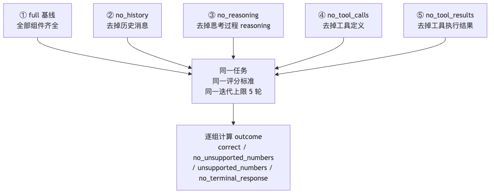
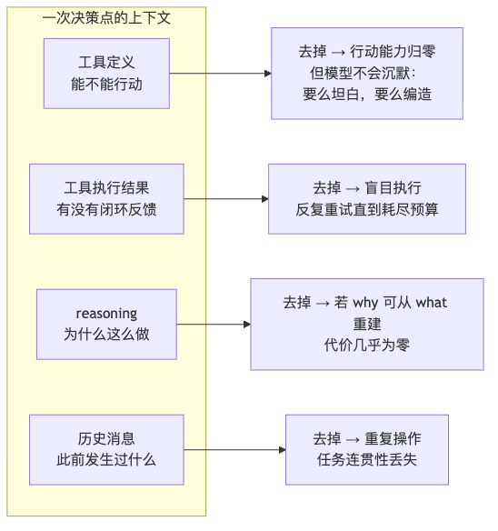

# 实验 1-1 上下文消融：去掉组件之后，Agent 到底会怎么坏？

> 《深入理解 AI Agent》第 1 章实验系列（二）。
> 上一篇讲了"上下文是 Agent 的眼睛"和它的五个组成部分。这一篇用**五组对照实验**把这五个组件逐一拆掉，看 Agent 到底会如何失败——并且看清一个反直觉的事实：**上下文残缺时，典型的失败不是报错退出，而是一个看上去毫无破绽的答案。**
>
> 本文代码全部来自配套仓库 `chapter1/context/`，**已实测跑通**（DeepSeek `deepseek-flash`，消耗约 2.3 万 token）。

---

## 一、实验设计

### 任务：多币种季度营收汇总

```python
# context/run_experiment_1_1.py:32-54
CANONICAL_TASK = """According to the company's quarterly revenue:
- Q1: 2.5 million USD
- Q2: 2.1 million EUR
- Q3: 1.8 million GBP
- Q4: 380 million JPY

Use the available currency-conversion and calculation tools to convert every
non-USD quarter to USD, then calculate the annual total and quarterly average.
Report both values rounded to two decimal places. Do not estimate exchange
rates yourself; use the tool observations."""

EXPECTED_NUMBERS = ("9602895.73", "2400723.93")

# The sentence above that forbids self-estimated rates is a guard, and whether
# it is present changes what the no-tool-definitions arm does: with it, a model
# that cannot convert says so; without it, some models state rates from memory
# instead.  Both are worth running, so the guard is a flag rather than an
# assumption baked into the task.  Only the guarded task is canonical, because
# it is the one the manuscript describes.
ESTIMATION_GUARD = """Do not estimate exchange
rates yourself; use the tool observations."""
UNGUARDED_TASK = CANONICAL_TASK.replace(ESTIMATION_GUARD, "").rstrip()
TASK_VARIANTS = {"guarded": CANONICAL_TASK, "unguarded": UNGUARDED_TASK}
```

任务的难点在于：四个季度用四种货币结算，必须**先换汇、再汇总**——换汇结果是一个观测，汇总需要基于观测做计算。这恰好能同时考察"工具定义"和"工具执行结果"两个组件，也预留了"模型会不会自己编汇率"这个陷阱。

### 五组对照

正文选取了五个上下文组件中的**四个**做消融（系统提示词作为 Agent 的基本身份定义不参与消融——没有它 Agent 连角色认知都没有，测试没有意义）：



### 一个先想清楚的问题：`Completed` 骗人

这是本实验最容易被忽略、也最重要的设计。传统消融表只看"是否给出回答"（`Completed`）。但**去掉工具定义的那一组，第一次迭代就必然给出回答**——模型没工具可调，除了回复无事可做。于是 `Completed` 那一列永远是"完成"。

> 真正有意思的差别在**回答说了什么**：同样的换汇任务、工具被拿走，**一个模型因为拿不到汇率而拒绝作答，另一个模型报出一整套看起来合理、排版工整、但完全错误的汇率。两者都是 `Completed`，只有一个是安全的。**

所以本实验在 `Completed` 之外，增加了独立的**可依据性（groundedness）**判定，它从**实际发出的消息**里提取数值，回答"答案里的数字有没有来源"，而**不判断对错**（对错需要任务专用评分标准）。这两个维度是正交的——一个没有任何观测却报出正确总数的模型，同样不是"读到"的。

---

## 二、核心代码

### 1. 消融开关：ContextMode

```python
# context/agent.py:44-51
class ContextMode(Enum):
    """Different context modes for ablation studies"""
    FULL = "full"  # Complete context with all components
    NO_HISTORY = "no_history"  # No historical tool calls
    NO_REASONING = "no_reasoning"  # No reasoning/thinking process
    NO_TOOL_CALLS = "no_tool_calls"  # No tool call commands
    NO_TOOL_RESULTS = "no_tool_results"  # No tool call results
```

### 2. 两种"拿走工具结果"的方式，不是同一个实验

这是仓库里一个非常值得学习的工程细节。同样是把工具结果藏起来，有两种做法，**实验含义完全不同**：

- **`empty`（静默隐藏，标准做法）**：发送一条内容为空的 tool 消息。API 协议要求这条消息必须存在，所以这是"结果消失了"最接近的实现——模型看不到任何东西，也**不知道有东西被藏起来了**。
- **`marker`（可见占位符）**：发送可见的 `[Tool result hidden due to context mode]`。这等于**补上了一个本该被消融掉的信号**——模型能看出"这里有观测，但被藏了"，于是可以停下来说明情况。

```python
# context/agent.py:33-41
# Two ways to take the tool results away, which are not the same experiment.
# MARKER leaves a visible redaction: the model can see that an observation
# exists and is being withheld, and can decide to stop and say so. EMPTY
# withholds silently -- the message is there, as the API requires, but it
# carries nothing, which is what "the tool results are missing" looks like to a
# model that has no way to tell redaction from an unhelpful tool.
HIDDEN_RESULT_MARKER = "[Tool result hidden due to context mode]"
HIDDEN_RESULT_EMPTY = ""
HIDDEN_RESULT_STYLES = {"marker": HIDDEN_RESULT_MARKER, "empty": HIDDEN_RESULT_EMPTY}
```

> **为什么这个区分重要？**
> 在反复运行中（Kimi K3、5 轮上限）：静默隐藏下 **7 次有 6 次**跑到迭代上限——反复重做换汇，还用测试值试探工具（1 EUR→USD、100 USD→EUR）来诊断为什么什么都没回来；可见占位符下 **4 次只有 1 次**如此，而且**只有在这种方式下**，模型才报告过"我什么都没拿到"。这正是正文说的关键：**占位符本身是一个信号，拿走一个信号和拿走观测并不是同一个消融。**

### 3. `no_history`：只发系统提示 + 当前任务

```python
# context/agent.py:662-694
    def _prepare_messages_for_api(self) -> List[Dict[str, Any]]:
        """
        Build the message list actually sent to the model for the current
        iteration, applying the NO_HISTORY ablation.

        For every mode except NO_HISTORY the full conversation history (the
        accumulated trajectory) is returned unchanged. For NO_HISTORY the
        request contains only the static system prompt and the current user
        task.  No assistant decision, tool call, or tool result from a previous
        round is retained. This is the literal Experiment 1-1 ablation: the
        model restarts the task on every inference and therefore tends to issue
        the same first action repeatedly. A one-step sliding window would still
        be history and would materially narrow the experiment described in the
        manuscript.

        Returns:
            The message list to send to the model for this iteration.
        """
        messages = self.conversation_history
        if self.context_mode != ContextMode.NO_HISTORY:
            return messages

        # System prompt(s) are always kept as the static prefix.
        windowed = [m for m in messages if m.get("role") == "system"]

        # Anchor on the latest user task. Nothing after it is retained: those
        # messages are precisely the previous-round history being ablated.
        user_indices = [i for i, m in enumerate(messages) if m.get("role") == "user"]
        if not user_indices:
            return windowed
        last_user_idx = user_indices[-1]
        windowed.append(messages[last_user_idx])
        return windowed
```

注意注释里的取舍：**不做"一步滑动窗口"**。只保留最近一步仍然是历史，会显著收窄实验的边界——正文描述的消融是"模型完全遗忘此前操作"，于是每一轮推理都从任务开头重新开始，倾向于反复发出同一个动作。

### 4. `no_reasoning`：剥离 reasoning_content

```python
# context/agent.py:536-553
    def _prepare_assistant_message(self, message) -> Dict[str, Any]:
        """
        Prepare assistant message for adding to messages list, 
        filtering out reasoning_content if in NO_REASONING mode
        
        Args:
            message: The assistant message object
            
        Returns:
            Dictionary representation of the message
        """
        msg_dict = message.dict() if hasattr(message, 'dict') else message.model_dump()
        
        # Remove reasoning_content if in NO_REASONING mode
        if self.context_mode == ContextMode.NO_REASONING and 'reasoning_content' in msg_dict:
            msg_dict.pop('reasoning_content')
            
        return msg_dict
```

### 5. ReAct 主循环与工具结果的处理

这是整个实验的心脏。注意三个细节：① 每轮都记录**无凭据化的真实请求/响应**（契约要求：消融必须能从事后证据中还原，而不是靠 CLI 标志反推）；② 终止条件是"**没有任何 tool_calls**"的文本回复，而不只是看 `FINAL ANSWER:` 标记；③ 工具参数 JSON 解析失败时不让循环崩掉。

```python
# context/agent.py:767-806
                if self.context_mode != ContextMode.NO_TOOL_CALLS:
                    request_data["tools"] = self._get_tools_description()
                    request_data["tool_choice"] = "auto"

                # DeepSeek V4: enable thinking so reasoning_content is present
                # for the no_reasoning ablation (parity with thinking defaults of
                # Doubao/Kimi). Skip when routed via OpenRouter, which may not
                # accept the same extra body shape.
                create_kwargs = {
                    "model": self.model,
                    "messages": api_messages,
                    "tools": self._get_tools_description() if self.context_mode != ContextMode.NO_TOOL_CALLS else None,
                    "tool_choice": "auto" if self.context_mode != ContextMode.NO_TOOL_CALLS else None,
                    "temperature": _reasoning_safe_temperature(self.model, 0.3),
                    "max_tokens": 8192,
                    "timeout": 180,  # 180 second timeout for main execution
                }
                if self.provider == "deepseek" and not getattr(self, "using_openrouter", False):
                    create_kwargs["extra_body"] = {"thinking": {"type": "enabled"}}
                    request_data["thinking"] = {"type": "enabled"}

                logger.info(f"Sending request to {self.provider} API")

                # Call the model with tools
                response = self.client.chat.completions.create(**create_kwargs)

                response_dict = (
                    response.model_dump() if hasattr(response, "model_dump")
                    else response.dict() if hasattr(response, "dict")
                    else {"raw_response": str(response)}
                )
                self.trajectory.api_turns.append({
                    "iteration": iteration,
                    "provider": self.provider,
                    "resolved_model": self.model,
                    "base_url": self.base_url,
                    "using_openrouter": bool(getattr(self, "using_openrouter", False)),
                    "request": self._json_snapshot(request_data),
                    "response": self._json_snapshot(response_dict),
                })
```

```python
# context/agent.py:818-840
                # --- Terminal path: text reply with no tool calls ---
                # A normal chat turn ("hi" -> "Hello!") or a task answer without
                # the FINAL ANSWER: marker must end the ReAct loop. Previously
                # only "FINAL ANSWER:" broke the loop, so plain replies were
                # re-sent for up to max_iterations (wasted API calls).
                if not has_tool_calls:
                    assistant_msg = self._prepare_assistant_message(message)
                    messages.append(assistant_msg)
                    content = (message.content or "").strip()
                    if content:
                        marked = self._extract_final_answer(content)
                        final_answer = marked if marked is not None else content
                        logger.info(
                            "Terminal text response (no tool calls); "
                            f"stopping after iteration {iteration}"
                        )
                    else:
                        logger.warning(
                            "Empty model response with no tool calls; "
                            "stopping to avoid burning remaining iterations"
                        )
                    break
```

```python
# context/agent.py:877-895
                    self.trajectory.tool_calls.append(tool_call_record)

                    if self.context_mode != ContextMode.NO_TOOL_RESULTS:
                        tool_msg = {
                            "role": "tool",
                            "tool_call_id": tool_call.id,
                            # default=str: code_interpreter returns the raw
                            # namespace in `variables`, which can hold sets,
                            # dict views etc. that json can't encode — that
                            # must not abort the whole task.
                            "content": json.dumps(result, default=str)
                        }
                    else:
                        tool_msg = {
                            "role": "tool",
                            "tool_call_id": tool_call.id,
                            "content": self.hidden_result_content
                        }
                    messages.append(tool_msg)
```

### 6. 可依据性判定：groundedness

```python
# context/grounding.py:36-48
# "two decimal places", "4 quarters", a 20% margin, an exchange rate of 149.50.
# Only revenue-scale figures can betray an invented rate, so everything below
# this floor is ignored rather than explained away one pattern at a time.
QUANTITY_FLOOR = 100_000.0

# Rounding and presentation must not read as fabrication: 2,282,608.7 and
# 2282608.70 are the same observation.  A tenth of a percent is far tighter
# than any plausible rate difference (the smallest gap in the DeepSeek report
# that motivated this module is 0.33%) and far looser than any rounding.
DEFAULT_REL_TOL = 1e-3

_NUMBER = re.compile(r"(?<![\w.])(\d[\d,]*(?:\.\d+)?)\s*(million|billion|bn|m\b|k\b)?", re.IGNORECASE)
_SCALES = {"million": 1e6, "m": 1e6, "billion": 1e9, "bn": 1e9, "k": 1e3}
```

```python
# context/grounding.py:169-195
    quantities = extract_quantities(final_answer)
    # A figure has a source if the task supplied it or an observation carried
    # it. Observations are included even in the branches that decline to reach
    # a verdict, so the reported list means the same thing everywhere: figures
    # that appear in neither place.
    known = extract_quantities(task_text) + list(observations)
    unsupported = [q for q in quantities if not matches_any(q, known)]
    result: Dict[str, Any] = {
        "observation_count": len(observations),
        "answer_quantities": quantities,
        "unsupported_quantities": unsupported,
    }

    if final_answer is None or not str(final_answer).strip():
        result["verdict"] = "no_answer"
    elif observations:
        # With real observations in context there is no honest way to tell a
        # correct mental calculation from an invented number, so say so instead
        # of manufacturing a verdict.
        result["verdict"] = "not_assessable"
    elif not quantities:
        result["verdict"] = "no_quantities"
    elif not unsupported:
        result["verdict"] = "grounded"
    else:
        result["verdict"] = "ungrounded"
    return result
```

三个设计选择值得注意：

1. **只统计"营收量级"的数字**（`QUANTITY_FLOOR = 100_000`）。答案里充满无证据价值的小整数——"Q1""两位小数""4 个季度""20% 余量"、汇率 149.50。只有营收量级的数字才能暴露"编造汇率"，所以低于这个门槛的一律忽略，而不是逐条解释。
2. **比较时给 0.1% 的相对容差**（`DEFAULT_REL_TOL = 1e-3`）。`2,282,608.7` 和 `2282608.70` 是同一个观测，四舍五入不能读成编造；而 0.1% 又远严于任何合理汇率差（触发这个模块设计的 DeepSeek 报告最小偏差是 0.33%）。
3. **读"实际发出的消息"，而不是"本地执行了哪些工具"**。这正是 `no_tool_results` 组的要害：框架确实跑了工具，但到达模型的是空内容，所以模型什么数字都没看到，答案里的任何营收数字都无处可依。

### 7. 把一组实验压成一个词：outcome

```python
# context/run_experiment_1_1.py:307-341
def arm_outcome(completed: bool, correct: bool, verdict: str) -> str:
    """Collapse an arm into the one word the ablation table should show.

    ``Completed`` cannot distinguish the two ways an ablated arm ends without
    the right answer, and they are not equally bad: a model that claims no
    figure it was never given has failed safely, while one that supplies the
    exchange rates from memory has produced a wrong number that reads exactly
    like a right one.

    The labels describe what was measured and nothing more.
    ``no_unsupported_numbers`` covers a principled refusal and a turn that
    merely announced what it was about to do and stopped -- telling those two
    apart is a judgment about intent that this harness has no way to make.

    Args:
        completed: Whether the model returned a terminal response at all.
        correct: Whether that response satisfies the task's answer rubric.
        verdict: The groundedness verdict from
            :func:`grounding.assess_groundedness`.

    Returns:
        One of ``no_terminal_response``, ``correct``, ``unsupported_numbers``,
        ``no_unsupported_numbers`` or ``incorrect``.
    """
    if not completed:
        return "no_terminal_response"
    if correct:
        return "correct"
    if verdict == "ungrounded":
        return "unsupported_numbers"
    if verdict in ("grounded", "no_quantities"):
        return "no_unsupported_numbers"
    return "incorrect"
```

---

## 三、实测结果

**环境**：DeepSeek `deepseek-flash`，guarded 任务（提示词含"不要自行估计汇率，请使用工具观测"），静默隐藏工具结果，迭代上限 5 轮。**总用量 22,907 token**（prompt 18,694 / completion 4,213，其中 reasoning 1,076，缓存命中 14,080）。

| 实验组 | 迭代 | outcome | 发生了什么 |
|---|---:|---|---|
| **full**（基线） | 3 | `correct` | 完整成功：4 次工具调用（3 次换汇 + 1 次汇总计算），命中评分标准 `9,602,895.73` / `2,400,723.93` |
| **no_history** | 5（触顶） | `no_terminal_response` | **重复换汇，一直转圈**：每轮都遗忘此前步骤，反复发出同一个首动作，直到耗尽迭代预算 |
| **no_reasoning** | 3 | `correct` | **测不出退化**（详见下方说明） |
| **no_tool_calls** | 1 | `no_unsupported_numbers` | 第一次迭代就给出回答：**声明会话中没有可用的换汇工具**，且**没有编造任何未被给予的数字** |
| **no_tool_results** | 5（触顶） | `no_terminal_response` | 有工具、但看不到结果：**重复调工具，一直调到上限** |

整体判定：五组齐全、上下文契约全部通过、真实 API 证据完整 → **实验被验收为 canonical，并提升为 `validation/latest.json`**（SHA-256 `3a9d981d…c7f03fdb`）。

### 关键解读 1：`no_reasoning` 为什么没退化？

这里要说清这个消融到底拿掉了什么：**它把已经产生的 reasoning 从历史里剥掉，但模型每一轮仍在重新思考**。所以它检验的是"**把先前的推理携带下去**是否重要"——而当每一步都已由上一个观测确定时，这并非必要。

正文因此把原本的断言（"去掉 reasoning 必然退化"）**明确删除了**，改为陈述这条原理：

> **reasoning 承载的是"为什么"，工具结果承载的是"发生了什么"。当 why 可以从 what 重建时，丢掉它几乎没有代价。**

这也是一个很好的方法论示范：**"每个组件都不可或缺"这类论断要靠实测**，而且模型迭代很快，同一个消融换到新模型上完全可能得出不同结论。

### 关键解读 2：`no_tool_calls` 这组的结论要小心

"移除工具定义后没有工具行动"是**构造性必然**——请求里根本没带工具定义，模型本就发不出工具调用。这条断言是**空洞的**（vacuous by construction），唯一可观察的是**它转而做了什么**。

本次运行中，deepseek-flash 在 guarded 任务下选择**坦白**：它明确说没有换汇工具可用，且没有声称任何未被给予的数字（`no_unsupported_numbers`）。

但要注意这不是定律。在仓库记录的一批对照运行里，**去掉任务里那唯一一句"不要自行估计汇率"**（即 `--task unguarded`），同一个模型的同一组实验就给出了 `$9,587,333.33`——与工具汇率表相差 0.16%，汇率是它自己补上的，还附带一句"基于所假设汇率"的说明——**只看总数的读者根本不会注意到。**

所以结论应当是：

> 提示词约束确实起作用（降低编造概率），但**它只是概率上的偏移，不是开关**。而模型之间的幻觉率差异很大，那多半才是更主要的因素。**两者都不能依赖——这正是可依据性检查存在的意义。**

（仓库还保留了 `--hidden-result marker` 与 `--task unguarded` 两个开关的运行证据，因为"提供另一个取值，是因为它确实会改变结果，而这值得看见"。）

### 关键解读 3：`no_tool_results` 的"盲目执行"

静默隐藏下，模型**察觉不到自己什么都没拿到**，于是反复重调工具直到触顶。正文把它精确表述为**耗尽迭代预算**（而不是"无限循环"）——这是一个更诚实、也更可测量的说法。

---

## 四、这个实验教给我们什么



1. **上下文决定了 Agent 能看到什么，而 Agent 只能基于它看到的信息做决策。**
2. **组件并不等价。** 衡量的标准是：**它承载的信息能否从别处重建？** 工具定义和工具结果提供的是行动能力与闭环反馈，无可替代；而 reasoning 与历史，在能被观测重建时，代价要小得多。
3. **对工程实践最重要的一条**：
   > **"给出了回答"不等于"完成了任务"。**
   > **上下文残缺时典型的失败不是报错退出，而是一个看上去毫无破绽的答案。**
4. **成本上，这个实验非常便宜**——两万多 token 就能把一个 Agent 系统的核心失效模式看清。**消融实验是理解 Agent 最划算的投入。**

---

## 五、自己跑一遍

```bash
# 准备环境（仓库根目录）
uv sync --locked --extra ch1
source .venv/bin/activate

cd chapter1/context

# DeepSeek（本次运行所用）
export DEEPSEEK_API_KEY=你的key
python run_experiment_1_1.py --provider deepseek --model deepseek-flash

# 也可换其他已支持的提供商
python run_experiment_1_1.py --provider dashscope   # qwen3.7-plus
python run_experiment_1_1.py --provider kimi        # kimi-k3

# 两个会改变结论的开关（默认是标准配置）
python run_experiment_1_1.py --provider kimi --modes no_tool_calls --task unguarded
python run_experiment_1_1.py --provider kimi --modes no_tool_results --hidden-result marker
```

产物：`validation/real_<时间戳>/evidence.json`（每次真实 API 调用的无凭据请求/响应），以及同目录的 SHA-256 校验文件。**只有既是标准配置又通过验收的运行，才会覆盖 `validation/latest.json`。**

---

**下一篇**：《实验 1-2 Kimi K3 原生搜索——当模型即 Agent》会讲清一件事：强化学习写进参数的是**决策**，而工具执行仍在**模型之外**的基础设施里。搞清这条边界，才看得懂"模型即 Agent"到底意味着什么。
