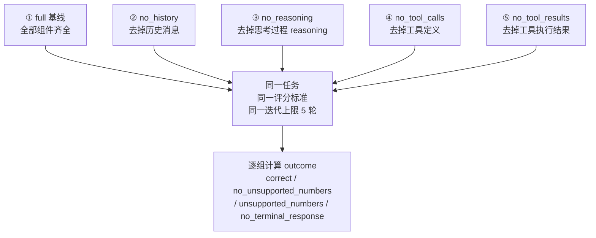
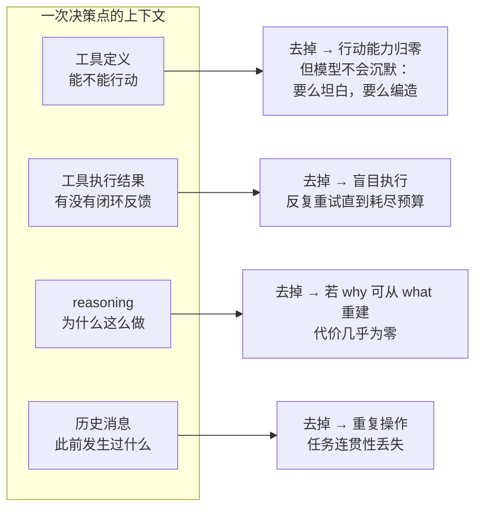

# 实验 1-1 上下文消融：去掉组件之后，Agent 到底会怎么坏？

> 《深入理解 AI Agent》第 1 章实验系列（二）。
> 上一篇讲了"上下文是 Agent 的眼睛"和它的五个组成部分。这一篇用**五组对照实验**把这五个组件逐一拆掉，看 Agent 到底会如何失败——并且看清一个反直觉的事实：**上下文残缺时，典型的失败不是报错退出，而是一个看上去毫无破绽的答案。**
>
> 本文代码全部来自配套仓库 `chapter1/context/`，**已实测跑通**（DeepSeek `deepseek-flash`，消耗约 2.3 万 token）。

---

## 一、实验设计

### 任务：多币种季度营收汇总

<!--INCLUDE context/run_experiment_1_1.py 32 54-->

任务的难点在于：四个季度用四种货币结算，必须**先换汇、再汇总**——换汇结果是一个观测，汇总需要基于观测做计算。这恰好能同时考察"工具定义"和"工具执行结果"两个组件，也预留了"模型会不会自己编汇率"这个陷阱。

### 五组对照

正文选取了五个上下文组件中的**四个**做消融（系统提示词作为 Agent 的基本身份定义不参与消融——没有它 Agent 连角色认知都没有，测试没有意义）：



### 一个先想清楚的问题：`Completed` 骗人

这是本实验最容易被忽略、也最重要的设计。传统消融表只看"是否给出回答"（`Completed`）。但**去掉工具定义的那一组，第一次迭代就必然给出回答**——模型没工具可调，除了回复无事可做。于是 `Completed` 那一列永远是"完成"。

> 真正有意思的差别在**回答说了什么**：同样的换汇任务、工具被拿走，**一个模型因为拿不到汇率而拒绝作答，另一个模型报出一整套看起来合理、排版工整、但完全错误的汇率。两者都是 `Completed`，只有一个是安全的。**

所以本实验在 `Completed` 之外，增加了独立的**可依据性（groundedness）**判定，它从**实际发出的消息**里提取数值，回答"答案里的数字有没有来源"，而**不判断对错**（对错需要任务专用评分标准）。这两个维度是正交的——一个没有任何观测却报出正确总数的模型，同样不是"读到"的。

---

## 二、核心代码

### 1. 消融开关：ContextMode

<!--INCLUDE context/agent.py 44 51-->

### 2. 两种"拿走工具结果"的方式，不是同一个实验

这是仓库里一个非常值得学习的工程细节。同样是把工具结果藏起来，有两种做法，**实验含义完全不同**：

- **`empty`（静默隐藏，标准做法）**：发送一条内容为空的 tool 消息。API 协议要求这条消息必须存在，所以这是"结果消失了"最接近的实现——模型看不到任何东西，也**不知道有东西被藏起来了**。
- **`marker`（可见占位符）**：发送可见的 `[Tool result hidden due to context mode]`。这等于**补上了一个本该被消融掉的信号**——模型能看出"这里有观测，但被藏了"，于是可以停下来说明情况。

<!--INCLUDE context/agent.py 33 41-->

> **为什么这个区分重要？**
> 在反复运行中（Kimi K3、5 轮上限）：静默隐藏下 **7 次有 6 次**跑到迭代上限——反复重做换汇，还用测试值试探工具（1 EUR→USD、100 USD→EUR）来诊断为什么什么都没回来；可见占位符下 **4 次只有 1 次**如此，而且**只有在这种方式下**，模型才报告过"我什么都没拿到"。这正是正文说的关键：**占位符本身是一个信号，拿走一个信号和拿走观测并不是同一个消融。**

### 3. `no_history`：只发系统提示 + 当前任务

<!--INCLUDE context/agent.py 662 694-->

注意注释里的取舍：**不做"一步滑动窗口"**。只保留最近一步仍然是历史，会显著收窄实验的边界——正文描述的消融是"模型完全遗忘此前操作"，于是每一轮推理都从任务开头重新开始，倾向于反复发出同一个动作。

### 4. `no_reasoning`：剥离 reasoning_content

<!--INCLUDE context/agent.py 536 553-->

### 5. ReAct 主循环与工具结果的处理

这是整个实验的心脏。注意三个细节：① 每轮都记录**无凭据化的真实请求/响应**（契约要求：消融必须能从事后证据中还原，而不是靠 CLI 标志反推）；② 终止条件是"**没有任何 tool_calls**"的文本回复，而不只是看 `FINAL ANSWER:` 标记；③ 工具参数 JSON 解析失败时不让循环崩掉。

<!--INCLUDE context/agent.py 767 806-->

<!--INCLUDE context/agent.py 818 840-->

<!--INCLUDE context/agent.py 877 895-->

### 6. 可依据性判定：groundedness

<!--INCLUDE context/grounding.py 36 48-->

<!--INCLUDE context/grounding.py 169 195-->

三个设计选择值得注意：

1. **只统计"营收量级"的数字**（`QUANTITY_FLOOR = 100_000`）。答案里充满无证据价值的小整数——"Q1""两位小数""4 个季度""20% 余量"、汇率 149.50。只有营收量级的数字才能暴露"编造汇率"，所以低于这个门槛的一律忽略，而不是逐条解释。
2. **比较时给 0.1% 的相对容差**（`DEFAULT_REL_TOL = 1e-3`）。`2,282,608.7` 和 `2282608.70` 是同一个观测，四舍五入不能读成编造；而 0.1% 又远严于任何合理汇率差（触发这个模块设计的 DeepSeek 报告最小偏差是 0.33%）。
3. **读"实际发出的消息"，而不是"本地执行了哪些工具"**。这正是 `no_tool_results` 组的要害：框架确实跑了工具，但到达模型的是空内容，所以模型什么数字都没看到，答案里的任何营收数字都无处可依。

### 7. 把一组实验压成一个词：outcome

<!--INCLUDE context/run_experiment_1_1.py 307 341-->

---

## 三、实测结果

**环境**：DeepSeek `deepseek-flash`，guarded 任务（提示词含"不要自行估计汇率，请使用工具观测"），静默隐藏工具结果，迭代上限 5 轮。**总用量 22,907 token**（prompt 18,694 / completion 4,213，其中 reasoning 1,076，缓存命中 14,080）。

| 实验组 | 迭代 | outcome | 发生了什么 |
|---|---:|---|---|
| **full**（基线） | 3 | `correct` | 完整成功：4 次工具调用（3 次换汇 + 1 次汇总计算），命中评分标准 `9,602,895.73` / `2,400,723.93` |
| **no_history** | 5（触顶） | `no_terminal_response` | **重复换汇，一直转圈**：每轮都遗忘此前步骤，反复发出同一个首动作，直到耗尽迭代预算 |
| **no_reasoning** | 3 | `correct` | **测不出退化**（详见下方说明） |
| **no_tool_calls** | 1 | `no_unsupported_numbers` | 第一次迭代就给出回答：**声明会话中没有可用的换汇工具**，且**没有编造任何未被给予的数字** |
| **no_tool_results** | 5（触顶） | `no_terminal_response` | 有工具、但看不到结果：**重复调工具，一直调到上限** |

整体判定：五组齐全、上下文契约全部通过、真实 API 证据完整 → **实验被验收为 canonical，并提升为 `validation/latest.json`**（SHA-256 `3a9d981d…c7f03fdb`）。

### 关键解读 1：`no_reasoning` 为什么没退化？

这里要说清这个消融到底拿掉了什么：**它把已经产生的 reasoning 从历史里剥掉，但模型每一轮仍在重新思考**。所以它检验的是"**把先前的推理携带下去**是否重要"——而当每一步都已由上一个观测确定时，这并非必要。

正文因此把原本的断言（"去掉 reasoning 必然退化"）**明确删除了**，改为陈述这条原理：

> **reasoning 承载的是"为什么"，工具结果承载的是"发生了什么"。当 why 可以从 what 重建时，丢掉它几乎没有代价。**

这也是一个很好的方法论示范：**"每个组件都不可或缺"这类论断要靠实测**，而且模型迭代很快，同一个消融换到新模型上完全可能得出不同结论。

### 关键解读 2：`no_tool_calls` 这组的结论要小心

"移除工具定义后没有工具行动"是**构造性必然**——请求里根本没带工具定义，模型本就发不出工具调用。这条断言是**空洞的**（vacuous by construction），唯一可观察的是**它转而做了什么**。

本次运行中，deepseek-flash 在 guarded 任务下选择**坦白**：它明确说没有换汇工具可用，且没有声称任何未被给予的数字（`no_unsupported_numbers`）。

但要注意这不是定律。在仓库记录的一批对照运行里，**去掉任务里那唯一一句"不要自行估计汇率"**（即 `--task unguarded`），同一个模型的同一组实验就给出了 `$9,587,333.33`——与工具汇率表相差 0.16%，汇率是它自己补上的，还附带一句"基于所假设汇率"的说明——**只看总数的读者根本不会注意到。**

所以结论应当是：

> 提示词约束确实起作用（降低编造概率），但**它只是概率上的偏移，不是开关**。而模型之间的幻觉率差异很大，那多半才是更主要的因素。**两者都不能依赖——这正是可依据性检查存在的意义。**

（仓库还保留了 `--hidden-result marker` 与 `--task unguarded` 两个开关的运行证据，因为"提供另一个取值，是因为它确实会改变结果，而这值得看见"。）

### 关键解读 3：`no_tool_results` 的"盲目执行"

静默隐藏下，模型**察觉不到自己什么都没拿到**，于是反复重调工具直到触顶。正文把它精确表述为**耗尽迭代预算**（而不是"无限循环"）——这是一个更诚实、也更可测量的说法。

---

## 四、这个实验教给我们什么



1. **上下文决定了 Agent 能看到什么，而 Agent 只能基于它看到的信息做决策。**
2. **组件并不等价。** 衡量的标准是：**它承载的信息能否从别处重建？** 工具定义和工具结果提供的是行动能力与闭环反馈，无可替代；而 reasoning 与历史，在能被观测重建时，代价要小得多。
3. **对工程实践最重要的一条**：
   > **"给出了回答"不等于"完成了任务"。**
   > **上下文残缺时典型的失败不是报错退出，而是一个看上去毫无破绽的答案。**
4. **成本上，这个实验非常便宜**——两万多 token 就能把一个 Agent 系统的核心失效模式看清。**消融实验是理解 Agent 最划算的投入。**

---

## 五、自己跑一遍

```bash
# 准备环境（仓库根目录）
uv sync --locked --extra ch1
source .venv/bin/activate

cd chapter1/context

# DeepSeek（本次运行所用）
export DEEPSEEK_API_KEY=你的key
python run_experiment_1_1.py --provider deepseek --model deepseek-flash

# 也可换其他已支持的提供商
python run_experiment_1_1.py --provider dashscope   # qwen3.7-plus
python run_experiment_1_1.py --provider kimi        # kimi-k3

# 两个会改变结论的开关（默认是标准配置）
python run_experiment_1_1.py --provider kimi --modes no_tool_calls --task unguarded
python run_experiment_1_1.py --provider kimi --modes no_tool_results --hidden-result marker
```

产物：`validation/real_<时间戳>/evidence.json`（每次真实 API 调用的无凭据请求/响应），以及同目录的 SHA-256 校验文件。**只有既是标准配置又通过验收的运行，才会覆盖 `validation/latest.json`。**

---

**下一篇**：《实验 1-2 Kimi K3 原生搜索——当模型即 Agent》会讲清一件事：强化学习写进参数的是**决策**，而工具执行仍在**模型之外**的基础设施里。搞清这条边界，才看得懂"模型即 Agent"到底意味着什么。
