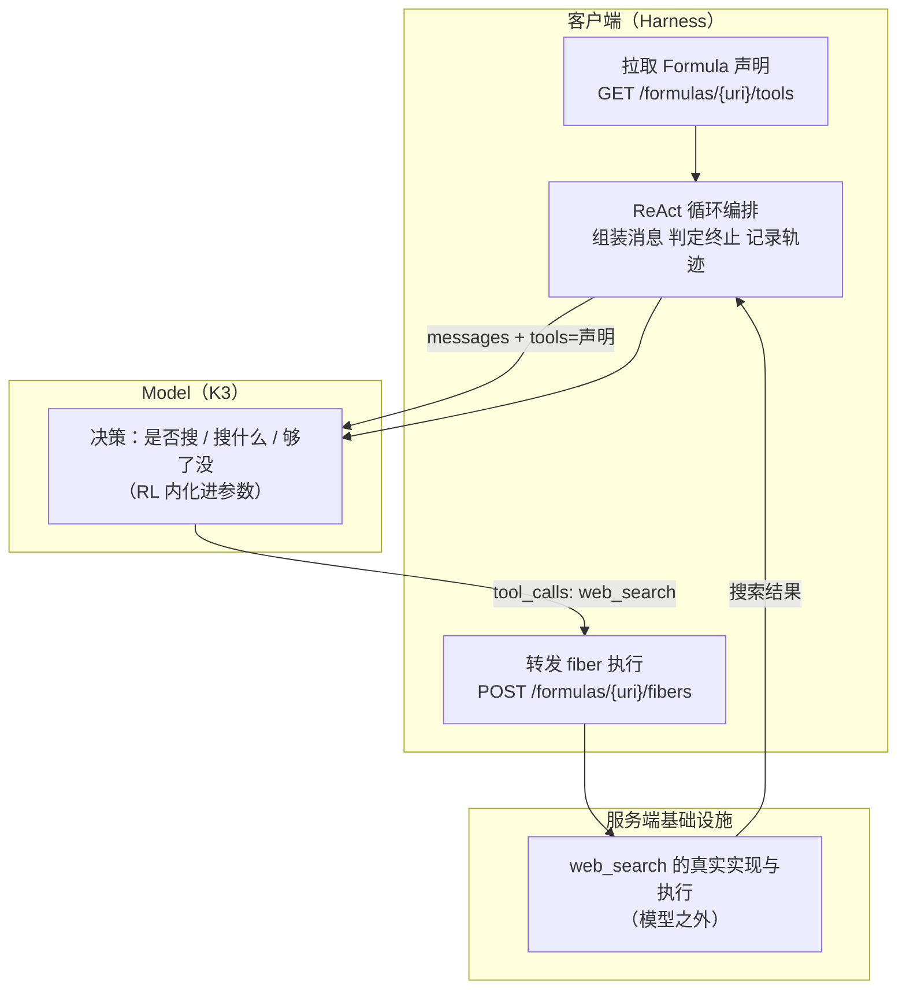

# 实验 1-2 Kimi K3 原生搜索：搞清「模型即 Agent」的边界

> 《深入理解 AI Agent》第 1 章实验系列（三）。
> 上一篇我们看到：Agent 的可靠性取决于**它能看见什么**。这一篇换个角度——当模型本身就很强时，"框架"还剩下什么？实验 1-2 用 Kimi K3 的原生搜索能力给出答案，并且厘清一个**非常容易搞错**的区分。
>
> 配套仓库 `chapter1/web-search-agent/`，**已实测跑通**（18 项验收检查全过，用量 43,266 token）。

---

## 一、先厘清一个常见的误解

"模型即 Agent"（Model as Agent）这个说法很容易被理解成"模型什么都自己干了，框架不重要了"。这是一个误解，而且误解的位置很具体：

> **强化学习写进参数的是「决策」——何时该调用工具、调用哪个、传入什么参数、拿到结果后是否继续、如何把几十上百次调用串联成连贯的推理。**
>
> **工具本身及其执行，则由 Agent 框架（或 API 内置工具）提供——`web_search`、`code_runner` 的真实实现、代码沙盒环境、调用的发起与结果回传，都在模型之外的基础设施里完成。**

所以正确的结论是：

> **编排循环并没有消失，而是从客户端移到了服务端；决策权则交给了模型。**

Kimi 通过一个叫 **Formula** 的服务端脚本引擎来运行这些官方工具。这意味着，"用 Kimi 的原生搜索"**并不等于**"在 `tools` 参数里写个 `web_search` 就完事"——它其实需要遵循一套服务端协议，这正是本实验代码里最有价值的部分。

### Kimi K3 的几个关键特性

- **约 2.8 万亿参数的混合专家（MoE）模型**。可以把 MoE 想象成一个专家团队：面对不同类型的问题，系统自动选择最合适的几位专家作答，而不需要所有专家同时上阵——既保证能力又提高效率；
- **100 万 token 上下文窗口**、**原生视觉理解能力**、**始终开启的「思考模式」**；
- 通过强化学习训练，把工具调用的**决策策略**内化为原生能力；
- **长链工具调用的稳定性**是它在 Agent 任务中的突出优势——能连续执行 **200～300 次**工具调用而保持思考一致性，**远超多数模型在数十次调用后就开始退化的表现**。

（顺带说明：实验 1-3 讲的 GPT-5.6 则展示了另一种形态——网络搜索和代码解释器作为 **Responses API 的内置工具在服务端闭环**，客户端不必再自行搭建"搜索—阅读—分析"的编排框架。两者思路不同，但都在回答同一个问题：编排循环放在哪里。）

---

## 二、实验设计

### 任务

核查截至 2026-07-30 的两组事实：

1. **东盟成员资格**：当前成员数量、成员名单、**东帝汶正式入盟日期**；
2. **印尼首都地位**：雅加达与努山塔拉的当前法律地位、总统令是否已生效。

要求：**自主完成研究**——先搜索东盟成员国的官方来源；**检查第一轮证据还缺什么，然后至少再执行一次不同的后续搜索**；最后给出结构化结论、检索日期和**可点击的权威来源链接**。**不要依赖记忆作答。**

这个任务的设计意图很明确：答案在训练数据里可能是"旧的"（东帝汶入盟是 2025 年的事、印尼迁都是进行中的状态），所以**必须真的联网**才能答对；而"检查还缺什么、再搜一次"则强制要求**多轮自主决策**。

### 验收门

实验的验收不是"看答案像不像"，而是一组可计算的检查（共 18 项）。关键几项：

| 检查 | 含义 |
|---|---|
| `direct_moonshot_api` | 直连 Moonshot 端点，不是代理兜底 |
| `exact_model` | 实际返回的模型必须**精确**等于请求的模型 |
| `one_real_formula_declaration_fetch` | 真的从 Formula 声明端点拉取过工具定义 |
| `provider_formula_declares_standard_web_search` | 声明里确实包含标准的 `web_search` 函数 |
| `formula_tool_declared_each_chat_turn` | **每一轮**对话都携带了声明（不能只在第一轮） |
| `all_fibers_succeeded` | 所有 fiber 执行都成功 |
| `multiple_distinct_formula_fibers` | 至少执行了多个**不同**的 fiber（证明是多轮，不是重复） |
| `sequential_search_rounds_observed` | 观察到连续的搜索轮次 |
| `official_sources_in_answer` | 答案里含官方来源 |

---

## 三、核心代码：Formula 协议怎么接

### 1. 从服务端拉取权威工具声明

**第一步不是"我要调什么工具"，而是"问提供商工具长什么样"。** 这是 Formula 与普通 function calling 最大的结构差异：

<!--INCLUDE web-search-agent/agent.py 169 231-->

注意 `_get_tools()` 里的三层防线：

1. 声明**必须**是列表且非空；
2. 声明里**必须**含 `function` 类型且名为 `web_search` 的条目——否则抛错，而不是降级继续；
3. 出了任何异常（含 HTTP 错误），都把原始响应体记进 `api_turns` 作为证据，**然后再抛**。

**为什么"拉取声明"这一步本身也要留证？** 因为验收门要求 `one_real_formula_declaration_fetch`——如果只记录"我发了搜索请求"，就无法证明工具定义来自提供商而不是客户端硬编码。

### 2. 执行 fiber：模型的动作 → 服务端执行

<!--INCLUDE web-search-agent/agent.py 232 297-->

这里有个非常关键的工程细节，注释里也写了：

> **Formula 要求传入模型原始序列化的参数（`raw_arguments`），即使我们为了可读的 ReAct 轨迹已经解析出了字典副本。**

也就是说：解析后的字典是给**人看的轨迹**用的，发给服务端的必须是**模型原样输出的那串字符串**。

### 3. 调用模型：三个容易踩的坑

<!--INCLUDE web-search-agent/agent.py 317 362-->

三个坑都在注释里，值得逐条记住：

1. **推理模型只接受 `temperature=1`**。K3 这类模型显式传其他值会被 400 拒绝——所以有 `_reasoning_safe_temperature` 兜底；
2. **`max_tokens` 必须给足**。K3 会先产出很长的 `reasoning_content`，输出预算被思考耗尽时，最终答案可能被**截断为空**（Moonshot 要求 `max_tokens >= 2048`，本实验取 32768）；
3. **回传消息必须重建为纯 dict**。不能直接把 SDK 返回的 pydantic message 对象塞回历史——它会附带 `reasoning_content`、`refusal` 等额外字段，回传给 Moonshot 时会触发 `tokenization failed` 400 错误。

### 4. ReAct 搜索循环

<!--INCLUDE web-search-agent/agent.py 394 410-->

<!--INCLUDE web-search-agent/agent.py 448 493-->

循环结构是标准的 ReAct：`thought → action → observation`，每步都通过 `_emit()` 记进轨迹（所以轨迹可以直接可视化）。三个工程要点：

- **循环条件**：`finish_reason == "tool_calls"` 就继续，否则拿到最终答案；
- **`finish_reason == "length"` 要单独处理**：输出被截断时返回已生成内容并**明确标注**"因达到 max_tokens 上限被截断"，而不是把半截答案当完整答案，也不误报"无法获取足够信息"；
- **工具参数 JSON 非法时按空对象继续**，保持循环存活（与第 4 章 async-agent 的处理一致）。

### 5. 验收检查是怎么算的

<!--INCLUDE web-search-agent/run_experiment_1_2.py 91 140-->

---

## 四、实测结果

**环境**：Moonshot `kimi-k3`（`reasoning_effort=max`），直连 `api.moonshot.cn/v1`。

| 指标 | 结果 |
|---|---|
| 验收 | **18 项检查全部为 true，`passed=true`** |
| Formula URI | `moonshot/web-search:latest` |
| 搜索执行 | **10 次真实 Formula 搜索**，fiber ID 全部落证 |
| ReAct 轨迹 | 25 步（thought / action / observation / answer） |
| 用量 | **43,266 token**（prompt 39,596 / completion 3,670，缓存命中 25,600，reasoning 1,563） |

### 答案质量：模型自主多轮 + 官方来源

模型给出的结构化结论（节选）：

- **东盟当前成员数量：11 个**；**东帝汶正式入盟日期：2025 年 10 月 26 日**——在吉隆坡举行的第 47 届东盟峰会开幕式上签署《东帝汶加入东盟宣言》。答案引用了东盟官网（asean.org）的表述："构成今日东盟的十一个成员国"，并指出这是**东盟自 1999 年以来首次扩容**；
- **印尼首都**：法律上的首都**仍是雅加达**，同时说明了努山塔拉的地位与总统令状态；
- **检索日期**：明确报告了检索执行日，并说明"检索结果覆盖至 2026 年 7 月中旬，未发现之后的变化"。

### 关键观察（正文提炼的三点）

1. **模型自己决定何时搜索、搜索什么**——展现了真正的自主性；
2. **能根据搜索结果动态调整策略**，自主判断信息是否充足；
3. **多轮搜索是模型自己发起的**，不是用代码预设"搜 3 次"。

---

## 五、这个实验告诉我们什么



1. **分清"决策"与"执行"的归属**：RL 内化的是工具调用的**决策策略**，而 `web_search` 的真实实现、代码沙盒、调用的发起与结果回传，都在模型之外的基础设施里。**编排循环没有消失，只是从客户端移到了服务端。**
2. **接"原生能力"不等于写个工具名就完事**：这家提供商走的是 Formula 协议——先拉声明、再随每轮对话携带、模型动作由客户端转发到 fiber 端点执行。**这就是 Harness 在这个范式下仍然存在、而且仍然需要人写的原因。**
3. **验收要能证明"真发生过"**：声明拉取、每轮携带声明、fiber 与模型动作一一对应、官方来源、检索日期——这些都是可以自动检查的，而不是靠人看答案像不像。
4. **模型能力边界会变，但边界本身不会消失**：今天要手写的适配代码，明天可能被内化。**但"谁来决定、谁来执行"这条边界会一直在**，因为执行必须发生在模型之外的真实世界里。

---

## 六、自己跑一遍

```bash
cd chapter1/web-search-agent

# Moonshot 官方端点（本实验的 canonical 路径）
export MOONSHOT_API_KEY=你的key
python run_experiment_1_2.py

# 也可以交互式体验多轮搜索
python main.py
```

> **注意兜底路径的局限**：如果没有 `MOONSHOT_API_KEY`，仓库会回退到 OpenRouter。但 **Kimi 的内置搜索工具在 OpenRouter 上不可用**，此模式下模型只凭自身知识作答（无实时联网搜索），所以该路径**不能用于本实验的验收**。这一点很重要：**能力等价的替代路径可以验收，能力缺失的降级路径不可以。**

另外，Kimi 官方文档在编写时标注"联网搜索工具正在更新，近期不建议使用"。但运行前实测 `/formulas/.../tools` 返回 200 且功能完整，本次运行未受影响——**遇到这类提示，先实测再决定，不要直接放弃。**

---

**下一篇**：《实验 1-3 搜索 + 代码执行的 Deep Research 闭环》——这一篇回答两个问题：怎么让模型**先澄清意图再动手**？以及"搜索取数 + 沙箱计算"这条闭环，在沙箱没网的时候会发生什么？
