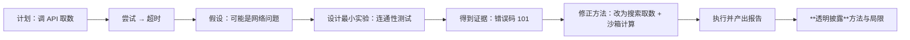
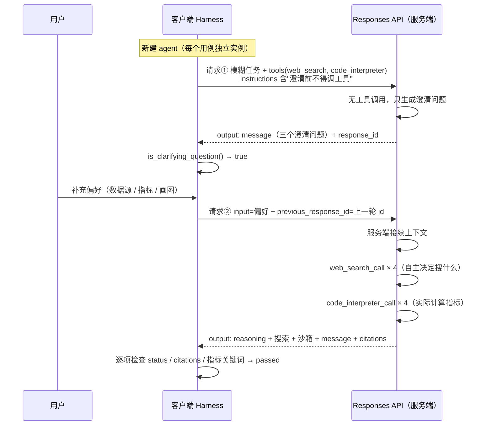

# 实验 1-3 搜索 + 代码执行的 Deep Research 闭环（含"看不懂"的逐步拆解）

> 《深入理解 AI Agent》第 1 章实验系列（四）。
> 这个实验的信息量最大，也最容易看得云里雾里——因为它同时引入了**新的 API 协议（Responses API）**、**服务端托管工具**、**意图澄清**和**会话续接**四件事。
>
> 这一篇会先把这四个概念一个个拆开，再上代码和结果。
>
> 配套仓库 `chapter1/search-codegen/`，**已实测跑通**（两个用例全部通过，用量 254,825 token）。

---

## 一、先回答：这个实验到底在做什么？

一句话：

> **让模型用「服务端托管的搜索」和「服务端托管的 Python 沙箱」自己完成一次深度研究——而且它必须先问清需求，再动手。**

和实验 1-2 对比着看最清楚：

| | 实验 1-2（Kimi） | 实验 1-3（本实验） |
|---|---|---|
| 协议 | Chat Completions + Formula | **Responses API** |
| 搜索 | 提供商托管（Formula fiber） | **宿主托管**（`web_search`） |
| 代码执行 | 无 | **宿主托管沙箱**（`code_interpreter`） |
| 谁来编排 | 客户端 ReAct 循环 | **服务端闭环**，客户端只管发一次请求 |
| 额外特征 | 长链工具调用稳定性 | **意图澄清 + 会话续接** |

### 概念 1：Responses API 和 Chat Completions 差在哪？

这是"晕"的第一来源。两者最本质的差异是：**工具在哪里执行。**

- **Chat Completions**：模型返回 `tool_calls`，**客户端**去执行工具、把结果拼回消息列表、再发下一次请求。编排循环在**你这边**。
- **Responses API**：你只需在 `tools` 里声明 `{"type": "web_search"}`、`{"type": "code_interpreter"}`，**服务端自己执行**，把执行过程作为**类型化的输出项**返回。你不用管循环。

这带来一个重要的接口变化：返回的不再是"一段文本 + 一个 tool_calls 数组"，而是**一串有类型的 `output` 项**：

```text
output = [
  {type: "reasoning"},              # 模型的思考（本实验用不到，但会返回）
  {type: "web_search_call",         # 一次真实的搜索：status=completed
   action: {query: "...", sources: [{url: "..."}]}},
  {type: "code_interpreter_call",   # 一次真实的沙箱执行：status=completed
   code: "..."},
  {type: "message",                 # 给用户的回答
   content: [{type: "output_text", text: "...",
              annotations: [{type: "url_citation", url: "..."}]}]}
]
```

**看懂这个结构，这个实验就通了一半。** 因为验收检查全部是在这个结构上做的：数 `web_search_call` 的个数、看 `code_interpreter_call` 的 `status` 是不是 `completed`、从 `annotations` 和 `action.sources` 里取引用链接。

### 概念 2：意图澄清（clarification before tools）

这是 GPT-5.6 把 **OpenAI Deep Research 产品的设计理念内化到模型层**的体现：

> 当用户提出研究需求后，GPT-5.6 **不会立即动手执行**，而是首先通过一系列问题澄清用户的真实意图。

以"搜索最近一个月的比特币走势，做技术分析"为例，它会先问："你偏好使用哪个数据源？需要分析哪些技术指标？"

**为什么要这样设计？** 因为研究类任务的成败高度依赖偏好设定——数据源不同、指标不同，报告完全不同。**与其猜，不如先问。** 但这也带来一个工程问题：模型怎么知道"我该先问"？答案是**提示词里的硬性规则**（见下文代码）。

### 概念 3：会话续接（`previous_response_id`）

澄清之后，用户补充了偏好，这时候要**接着上一轮继续**，而不是重新开始。Responses API 提供了服务端会话状态：把上一轮的 `response.id` 作为下一轮的 `previous_response_id` 传回去，服务端自动接续上下文。

对客户端来说这是**巨大的简化**——不用自己维护完整消息列表（那是 Chat Completions 的活）。

### 概念 4：两个测试用例

| 用例 | 内容 | 考察什么 |
|---|---|---|
| **ASEAN 首都距离** | 枚举东盟成员国首都两两之间的球面距离，找出最近的一对 | `web_search`（拿坐标）+ `code_interpreter`（算 45 对距离）必须**组合闭环**，且结果要与独立参照一致 |
| **比特币技术分析** | 模糊任务："搜索最近一个月的比特币走势，做技术分析" | **必须先澄清、不碰工具**；用户补充偏好后续跑，算 MA7/MA20、RSI14、MACD、区间收益、最大回撤 |

---

## 二、核心代码

### 1. 提示词里的"硬性规则"

这是让"先澄清"成为可验收行为的关键。**注意中英双语 + 明确的禁止项**：

<!--INCLUDE search-codegen/agent.py 46 63-->

两条规则都写得很"硬"：

- **澄清前不得调用任何工具**——把"先问"从建议变成规则；
- **不得声称运行了代码**——"除非响应里真的包含一个已完成的 `code_interpreter_call`"。这一条精准打击了实验 1-1 里发现的"编造观测"失效模式。

### 2. 工具声明：不同提供商的结构不同

<!--INCLUDE search-codegen/agent.py 65 76-->

同一套代码要跑两家提供商，工具声明的**结构并不通用**：DashScope 只接受 `{"type": "web_search"}`，OpenAI 官方还接受 `search_context_size`、`container.memory_limit` 这类调优参数。**这类差异就是 Harness 要吸收的成本。**

### 3. 请求构造：三个关键判断

<!--INCLUDE search-codegen/agent.py 78 117-->

三个值得注意的点：

1. **DashScope 上 `stream` 是强制的**。注释写明了原因：**它的网关会丢弃静默超过约 60 秒的非流式请求**。这是一个"非流式看起来更简单，但实际不可用"的典型例子；
2. **DashScope 没有 `reasoning.effort` 和 `text.verbosity` 旋钮**——它原生跑思考，但不给你调。所以这些参数只在 OpenAI 路径下发送；
3. **`previous_response_id` 存在就带上**，这是会话续接的全部实现。

### 4. 流式接收：两条路径收敛到同一个结构

<!--INCLUDE search-codegen/agent.py 202 231-->

这段代码解决了一个很实际的工程问题：**流式和非流式的返回结构不一样，但上层逻辑不应该关心这个差异。**

做法是：流式模式下不断读 SSE 事件，**只在拿到 `response.completed` 事件时，从事件体里取出完整的 response 对象**——这个对象和非流式 API 返回的结构**完全一致**。于是下游解析代码只有一份。

同时它把**事件类型的计数**（`stream_event_counts`）也记了下来，作为"确实是流式跑的"的证据。

### 5. 一次请求 = 一个"轮次"

<!--INCLUDE search-codegen/agent.py 303 329-->

这是整个客户端最核心的函数。请注意它的**返回值之丰富**——它不只返回文本，而是把这一轮的所有证据都结构化地带回来：

- `output_items`：原始类型化输出（验收就靠它）
- `tool_calls`：筛出来的 `web_search_call` / `code_interpreter_call`
- `citations`：**归一化后的引用**（这里有个细节：DashScope 把来源放在 `web_search_call.action.sources` 里，而 OpenAI 放在 `annotations` 里，代码把两者统一成 `url_citation`）
- `response_id` / `status` / `usage` / `elapsed_seconds`
- `requested_model` 与 `model` 分开记，这样才能验证"返回的模型精确等于请求的模型"

**还有一个容易被忽略的细节**：函数签名里保留了 `temperature` 参数（为了兼容旧调用方），但**它不会被发送**——推理模型用 `reasoning.effort` 而不是 temperature。返回值里甚至专门有个字段 `temperature_omitted_for_reasoning_model` 来记录这件事。**这种"接口兼容但行为已变"的地方，靠字段记录下来比靠注释可靠。**

### 6. 验收检查：怎么做到"不信任模型"

实验里有一条很关键的设计——**独立参照**。模型算出的最近首都对，要和客户端**自己算的**答案比对：

<!--INCLUDE search-codegen/run_experiment_1_3.py 55 90-->

这才是"验证"该有的样子：**不是看模型的答案像不像，而是拿一个不依赖模型的参照去核对。**

下面是对两个用例的检查函数：

<!--INCLUDE search-codegen/run_experiment_1_3.py 129 158-->

注意 `is_clarifying_question` 的判定条件很谨慎——**必须同时满足**：请求成功、**没有任何工具调用**、文本里含问号。三条缺一不可，因为"开口问一句但其实已经偷偷搜过了"不算澄清。

### 7. 多提供商验收政策

<!--INCLUDE search-codegen/run_experiment_1_3.py 213 260-->

这段代码体现了一条很重要的工程政策：

> **验收不绑定某一家厂商。** 官方 OpenAI GPT-5.6 路径是 canonical 参考实现，但**任何真正把"搜索 + 代码执行"闭环在服务端完成的 Responses API 提供商，都算合格后端**。OpenRouter 走代理，属于诊断路径，**永不验收**。

政策背后的判据是**能力等价**，而不是**厂商品牌**。同时注意 `run_backend` 里那个细节：每个用例都用**新的 agent 实例**（`GPT5NativeAgent(...)`），避免澄清用例的第一轮和第二个用例互相污染。

---

## 三、实测结果

**环境**：阿里云百炼社区版专属域名，`qwen3.8-flash`，`reasoning.effort=medium`。

### 用例 1：ASEAN 首都距离（耗时 127 秒）✅

| 检查项 | 结果 |
|---|---|
| `request_succeeded` | ✅ |
| `model_identity_exact` | ✅ 返回模型精确等于请求模型 |
| `web_search_completed` | ✅ **3 次**搜索（如 "ASEAN member states capitals list 2026"、"Bandar Seri Begawan coordinates…"） |
| `code_interpreter_completed` | ✅ **1 次**沙箱执行（枚举全部 45 对首都） |
| `url_citations_present` | ✅ ≥2 条引用 |
| `closest_pair_matches_independent_reference` | ✅ 与独立参照**同一对**首都 |
| `distance_reported` | ✅ |

结果：模型报告最近首都对距离 **315.2 km**，客户端独立参照为 **309.3 km**——**同一对首都（吉隆坡—新加坡），差异来自坐标口径不同**（模型从搜索结果取的坐标 vs 参照用的标准坐标）。这个差异是**可解释的**，而不是错误。

**"搜索取坐标 + 沙箱算距离"这条闭环确实成立了**：模型自己决定搜哪些坐标、自己写 haversine 代码枚举 45 对、自己在结果里报告。

### 用例 2：比特币技术分析 ✅

第一轮（**模糊任务**）：

| 检查项 | 结果 |
|---|---|
| `first_turn_clarified_before_tools` | ✅ 第一轮**没有任何工具调用**，纯文本 + 问号 |

模型实际问的三个维度：**技术指标偏好**（MA/MACD/RSI/布林带…）、**K 线周期**（日线/4 小时）、**数据来源**（Binance/CoinGecko）。**完全符合"先澄清"的设计。**

续轮（用户补充偏好后，耗时 **528 秒**）：

| 检查项 | 结果 |
|---|---|
| `continuation_used_previous_response_id` | ✅ 续轮请求确实带上了上一轮的 `response_id` |
| `followup_succeeded` | ✅ |
| `followup_web_search_completed` | ✅ **4 次**搜索 |
| `followup_code_interpreter_completed` | ✅ **4 次**沙箱执行，全部 `completed` |
| `followup_citations_present` | ✅ |
| `followup_reports_ma_rsi_macd` | ✅ 报告含 MA、RSI、MACD |

**最终验收：`acceptance_backend = "dashscope"`，`passed = true`。** 全程用量 **254,825 token**（input 221,944 / output 32,881）。

### 最有价值的一段：模型的自主诊断

这个用例里发生了一件很值得记录的事。模型先尝试**直接在沙箱里调 CoinGecko API 拉日线数据**，结果失败。它没有放弃，而是做了三次递进尝试：

1. 第一次超时 → **"改为单次快速请求重试"**；
2. 仍然超时 → **"先做一次极短的连通性测试，判断沙箱网络是否可达"**；
3. 得到明确错误 → **发现沙箱没有外部网络连接**（错误码 101 `Network is unreachable`）。

然后它**自主改变了方法**：改用网络搜索收集每日收盘价（多源交叉验证，相互偏差 <0.1%），再把数据交给沙箱**实际计算**指标——并且在报告开头**透明披露了这个局限**：

> "**数据说明（重要）**：托管 Python 沙箱无外网权限，无法直接调用 CoinGecko API（错误码 101）。我改用网页搜索获取 CoinGecko 口径的 BTC/USD 日线收盘价……数据来自 Yahoo Finance / CoinMarketCap / Investing.com / YCharts / FRED 等多源交叉验证……"

**这就是一个 Agent 该有的样子**：



它展示了自主 Agent 与工作流最本质的区别：**执行路径不是预先定义的，而是根据环境反馈实时决定的**——而且它**识别失败、调整策略，而不是在出错时停下来**（这正是正文对自主 Agent 的要求）。

### 一次失败运行也值得记录

第一次运行（`--reasoning high`）时，ASEAN 用例通过了，但**澄清续轮触发了端点网关的 600 秒流式硬超时**：

```text
ResponseTimeout, timeout_seconds=600, elapsed_ms=600000
```

改用 `medium` 思考档后，续轮耗时 **528 秒**通过——**距上限只剩 72 秒。**

这条经验值得记住：

> **这不是模型能力问题，而是基础设施限制。** 网关的流式超时只能通过降低单轮计算量（降思考档、拆任务）来规避，**不能靠客户端重试解决**。
>
> 而且两次运行**都保留了自己的时间戳目录**——**一次失败的运行同样是证据**，它记录了系统在什么条件下会失败。这比只留成功记录有用得多。

---

## 四、把整个流程串起来



---

## 五、这个实验教给我们什么

1. **托管工具把编排搬到了服务端**，但这**不等于客户端没事做**：工具声明结构、流式要求、引用来源位置、模型身份校验、独立参照——**每一项都是 Harness 的活**。而且不同厂商的实现差异不小，这些差异必须被吸收。
2. **"先澄清"是可以被验收的行为**，前提是把规则写进提示词，并且把"没有工具调用 + 含问号"作为明确判据。**模糊需求下，先问一句往往比直接开工更省时间。**
3. **验证要用独立参照，不能只看模型说了什么。** 最近首都对用本地 haversine 算一遍再比对——这才是"验证"而非"相信"。
4. **自主性的真正价值在失败处理上**：沙箱没网时，模型的"假设 → 最小实验 → 得到证据 → 修正方法 → 透明披露"这一套动作，比它给出的任何数字都更能说明问题。
5. **分清失败的类型**：600 秒超时是**基础设施限制**（降思考档解决），沙箱无网是**环境事实**（模型自己绕过了），模型编造数字才是**能力/行为问题**。**混淆这三类会导致完全错误的修复方向。**

---

## 六、自己跑一遍

```bash
cd chapter1/search-codegen

# 阿里云百炼（本实验实测通过的后端）
export DASHSCOPE_API_KEY=你的key
export DASHSCOPE_BASE_URL=https://dashscope.aliyuncs.com/compatible-mode/v1   # 内地
# 国际站：https://dashscope-intl.aliyuncs.com/compatible-mode/v1
export DASHSCOPE_MODEL=qwen3.7-plus

python run_experiment_1_3.py --backends dashscope --reasoning high
# 若遇网关流式超时，降一档重试：
python run_experiment_1_3.py --backends dashscope --reasoning medium

# 官方 OpenAI 路径（canonical 参考实现，需有额度的账号）
export OPENAI_API_KEY=你的key
python run_experiment_1_3.py --backends openai
```

> **一条实用建议**：本实验的续轮是"多轮搜索 + 多次沙箱执行 + 画图"，属于单轮计算量最大的类型。**如果你的提供商网关有流式超时限制，优先降思考档、拆任务，而不是加大超时或盲目重试。**

---

**下一篇**：《实验 1-4 文生图工作流——适配层是怎么被模型吃掉的》会看一个很有意思的现象：给同一个需求走两条路线，结果**改写节点把用户明确指定的文案丢进了负面提示词**。
