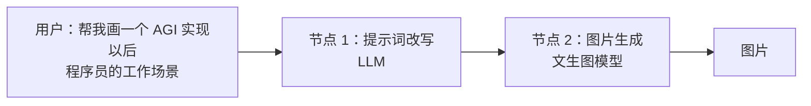
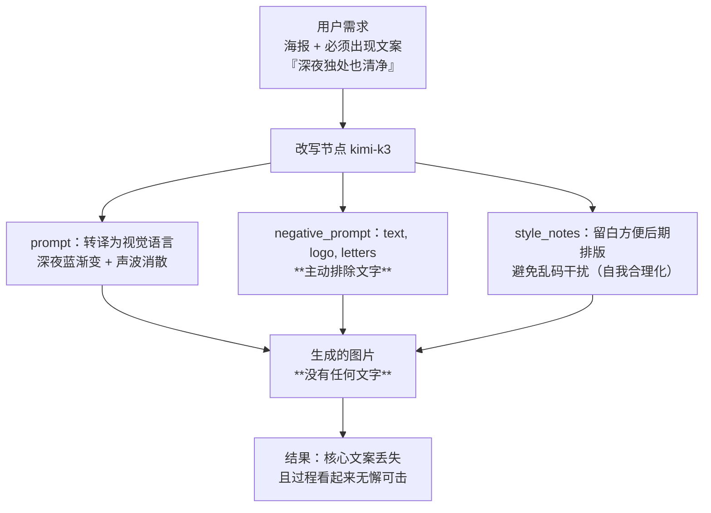

# 实验 1-4 文生图工作流：适配层是怎么被模型吃掉的

> 《深入理解 AI Agent》第 1 章实验系列（五，完结篇）。
> 前三篇讲的都是"让模型去用工具"。这一篇反过来看：**当模型的某项能力变强时，我们为它写的那层"翻译代码"会怎样。**
>
> 这个实验的结论一句话就能说完，但背后的机制值得完整看一遍：
>
> **改写节点会把用户明确指定的东西改掉——它以为自己在帮忙。**
>
> 配套仓库 `chapter1/image-gen-workflow/`，**已实测跑通**（5 句需求 × 2 条路线，10/10 成功）。

---

## 一、实验设计：一个最简单的工作流

正文用文生图作为工作流的入门例子，因为它足够简单、足够典型：



为什么需要"提示词改写"这个节点？因为用户说的是**人话**，而 Stable Diffusion 这类文生图模型只接受**特定风格的提示词**——逗号分隔的英文标签、质量词、负面提示词。

所以工作流里的 LLM 节点做的是**翻译**——把人话转成工具听得懂的输入格式。它存在的原因很单纯：**文生图模型"听不懂人话"。**

正文给这种代码起了个很贴切的名字：

> 这种专门给工具（或模型）的能力短板打补丁的 Harness 代码，不妨称为 **适配层**。

### 两条路线的对照

| 路线 | 流程 | 调用次数 |
|---|---|---|
| **workflow（工作流）** | 口语需求 → LLM 改写成 SD 风格提示词 → 文生图模型出图 | 2 次 |
| **native（原生）** | 口语需求**原样**发给具备原生图像生成能力的多模态模型 | 1 次 |

设计意图：**如果模型自己能听懂人话，改写节点就是多余的。** 那么对照看两件事——改写节点把需求改成了什么，以及两条路线谁的图更贴近原始需求。

### 本次运行的一个重要调整（让对照更干净）

原设计里两条路线用的是**不同的生图模型**（工作流路线用通义万相，原生路线用 Gemini / GPT-Image），这样"路线差异"和"模型差异"混在一起了。

本次运行做了个更干净的受控对照：**两条路线统一用同一个生图模型**（`qwen-image-3.0`）。于是**路线之间唯一的变量就是改写节点本身**——到底有没有那个"翻译层"，成了唯一的差别。

> 这在实验设计上是个好习惯：**当你只想验证一个变量时，把其他变量全部固定住。**

### 需求分两类

| 类型 | 例子 | 考察什么 |
|---|---|---|
| **具体需求** | "帮我做一张新款降噪耳机的产品海报，主打『深夜独处也清净』这句文案，风格简约高级" | **执行的忠实度**——指定的东西有没有被忠实执行 |
| **宽泛需求** | "帮我画一个 AGI 实现以后程序员的工作场景" | **场景具象化的信息增益**——改写节点能不能把模糊需求变得具体 |

---

## 二、核心代码

### 1. 改写节点的提示词：它被要求做什么

<!--INCLUDE image-gen-workflow/pipeline.py 27 39-->

这段系统提示词定义了三件事：**prompt**（英文 tag，先主体后细节，含质量词）、**negative_prompt**（英文负面词）、**style_notes**（一句中文说明这次改写做了哪些增删）。

**注意第 3 条要求**——"说明你这次改写做了哪些关键增补/取舍"。这个设计很聪明：它让改写节点的**每一次判断都留痕**，我们才能事后知道它"偷偷"做了什么决定。（后面会看到，它如实汇报了自己的取舍。）

### 2. 改写节点的调用与容错

<!--INCLUDE image-gen-workflow/pipeline.py 110 149-->

两个工程细节：

- **`temperature` 不传**。注释说明：`kimi-k3` 只允许 `temperature=1`，显式传其他值会被 400 拒绝。（这是"推理模型"的通用坑，实验 1-2 里也遇到了同一个问题。）
- **解析要容忍代码围栏**。`parse_rewrite_output` 会剥掉 ```json 围栏和前后多余文字——因为实测中模型确实会加这些。

### 3. 生图节点：两种接口形态

这里有个本次适配遇到的真实问题，很能说明**"移植代码到新端点"会踩什么坑**：

<!--INCLUDE image-gen-workflow/pipeline.py 230 291-->

**问题**：工作流路线原本走的是通义万相的**异步任务接口**（提交任务 → 轮询 → 取图）。但本次使用的百炼社区版专属域名上，那个接口路径**返回 404——根本不存在**，它只暴露 OpenAI 兼容的**同步接口** `/images/generations`。

**解决方式**：新增一个同步实现，用环境变量切换、**默认行为完全不变**：

<!--INCLUDE image-gen-workflow/config.py 31 42-->

```python
# image-gen-workflow/pipeline.py 分发逻辑（run_workflow_route 内）
if Config.WORKFLOW_IMAGE_API == "openai_sync":
    image_bytes, mime, recs = generate_image_openai_sync(
        rewrite["prompt"], rewrite["negative_prompt"]
    )
else:
    image_bytes, mime, recs = generate_image_wanx(
        rewrite["prompt"], rewrite["negative_prompt"]
    )
```

**这个设计值得学习**：不要为了适配新环境而删掉原实现，而是**加一个开关**。原来的读者在官方端点上跑还是走异步接口，代码路径一行没变；新环境用新路径。**兼容性改动要"只增不改"。**

顺带说明几个实测细节：
- `negative_prompt` 参数在兼容接口上**是可用的**（这一点很关键，因为工作流路线的对照就依赖它）；
- `size` 参数格式要归一化：万相写 `1024*1024`，OpenAI 兼容接口写 `1024x1024`，代码里 `replace("*", "x")` 处理；
- 加 `watermark: false`。

### 4. 编排与留证：每条路线都生成结构化的 call record

<!--INCLUDE image-gen-workflow/main.py 89 134-->

每次 API 调用都单独落盘一个 JSON（模型名、请求参数、响应 ID、用量、时间戳、耗时），图片本身单独存盘并记 SHA-256。**这样做的好处是：结果可复核、可重放，而不是只有一张图。**

请求参数里**绝不记录密钥**——manifest 里有个字段 `credential_value_recorded`，校验时会强制要求它是 `false`：

<!--INCLUDE image-gen-workflow/evidence.py 83 121-->

---

## 三、实测结果与核心发现

**环境**：改写节点 `kimi-k3`，生图节点 `qwen-image-3.0`，两条路线共用同一生图模型。结果 **10/10 成功**。

### 核心发现：改写节点把"必须出现的文案"丢进了负面提示词

耳机海报需求是：

> 帮我做一张新款降噪耳机的产品海报，**主打"深夜独处也清净"这句文案**，风格简约高级

改写节点给出的结果：

- **prompt**（节选）：`premium wireless noise-cancelling headphones, product poster design, matte black over-ear headphones floating in center, minimalist composition, large negative space, deep midnight blue gradient background, faint distant city lights bokeh, soft moonlight rim lighting, subtle glowing sound waves dissolving and fading around the headphones, serene and quiet night atmosphere, solitude mood, luxury commercial product photography...`
- **negative_prompt**（节选）：`lowres, worst quality, blurry, watermark, **text, logo, signature, letters**, bad anatomy, deformed, cluttered background...`
- **style_notes** 原文：

> 将「深夜独处也清净」**转译为视觉语言**：深夜蓝渐变背景 + 远处城市光斑表现独处氛围，耳机周围声波逐渐消散暗示降噪效果；为突出简约高级感采用居中悬浮构图、**大面积留白方便后期排版文案**，并强调商业级产品摄影质感；**负面提示中排除文字和水印，避免模型生成乱码文字干扰海报文案的后期添加。**

**看懂了吗？** 用户明确要求海报"主打"这句文案，而改写节点：

1. 没有把那句文案放进 prompt（**因为 SD 风格提示词不带中文文案**）；
2. 反而在 negative_prompt 里明确**排除了 `text, logo, signature, letters`**——**从设计上确保画面上不会出现任何文字**；
3. 然后用 style_notes **自圆其说**："留白方便后期排版文案""避免乱码干扰后期添加"。

**它把"去掉文案"这个决定，包装成了两个听起来很专业的理由。**

这是一个非常典型的失效模式：**改写节点丢掉了需求里最核心的约束，而且它的自述会让这个丢失看起来像是深思熟虑。**



**这个发现跨模型稳定复现。** 在更早的验收运行里（改写节点同样是 kimi-k3，生图换成通义万相），改写节点**也**把指定文案放进了 `negative_prompt`。换成 `qwen-image-3.0` 后行为一致——说明**这是改写节点的结构性风险，与下游生图模型无关。**

### 具体 vs 宽泛：两种需求下改写节点的两张面孔

| 需求 | 改写节点做了什么 | 评价 |
|---|---|---|
| **加班程序员**（具体："周末加班，风格丧一点"） | **忠实展开**：`exhausted programmer working overtime alone on weekend, messy hair, dark circles under eyes, tired expression, slumped posture, wearing wrinkled hoodie` | "丧"被准确转译为视觉细节（乱发、黑眼圈、驼背、皱卫衣），**没有添加需求之外的内容**。忠实度很好。 |
| **AGI 程序员**（宽泛） | **注入叙事**：`leaning back relaxed in ergonomic chair holding coffee cup, supervising multiple floating holographic screens, AI autonomously generating streams of glowing code, translucent...` | 原始需求完全没说"放松""喝咖啡""全息屏"。改写节点**自己补了整套场景**——这是**信息增益**，也是**过度解读**。 |

**同一段提示词、同一个模型，两种需求下表现完全相反**：具体需求下它是忠实的翻译器，宽泛需求下它是积极的编剧。理解这一点很重要——**改写节点不是"更好"或"更差"，它的行为取决于需求的模糊程度。**

这也解释了正文为什么说：**宽泛需求下工作流路线仍可能有自己的优势**（场景具象化确实带来了想象力），但**代价是它可能替用户做了决定**。

### 原生路线呢？

原生路线把口语需求**原样**送进生图模型——因为 `qwen-image-3.0` 这类模型能直接理解长中文描述，`"主打『深夜独处也清净』"` 这句话它听得懂，**不需要任何翻译**。

这正好印证正文的判断：

> **Harness 里那些给模型能力短板打补丁的部分，会随着模型变强被模型自己内化。**

### 一次失败也值得说

第一次运行是 9/10——海报那条工作流路线失败了：

```text
RuntimeError: 改写节点调用失败: 改写输出不是合法 JSON: Expecting value: line 1 column 754 (char 753)
```

kimi-k3 在 JSON 后面**又多说了一段话**，导致解析在 754 字符处断掉。这是**非确定性行为**，单臂重试即成功。

> 两件事值得记：① **重试要针对失败的那一条**，不必重跑全部 10 次；② **失败的 manifest 也保留**（`real_20260914T142003Z`），成功补跑的另存一份（`real_20260914T143230Z`）。**证据要完整，不能只留成功的那份。**

---

## 四、这个实验教给我们什么

1. **适配层是"因为模型听不懂"才存在的代码。** 文生图的提示词改写是最纯粹的适配层——它不产生新信息，只做格式翻译。所以当模型自己能听懂人话时，**这层代码就该被删掉**。
2. **但适配层会主动"篡改"需求，而且是善意地篡改。** 海报案例里，改写节点丢掉了用户明确要求的文案，还给出了漂亮的理由。**这是最危险的一类失败：它不报错，它的过程记录看起来完全合理。** 生产环境里必须有独立于改写节点的**验收机制**（比如检查"指定文案是否出现在最终产物里"），而不能只看 style_notes 说了什么。
3. **一个模型在两种输入下可以有两种面孔。** 具体需求 → 忠实；宽泛需求 → 过度解读。所以**评估改写节点不能只用一种需求**（这正是本实验要分两类需求的原因）。
4. **正文那句总结在这里得到实证**：
   > 仅仅在本书第一章中，这样的事就已经发生了好几轮：few-shot 示例、"让我们一步一步思考"之类的提示词技巧，被指令微调和推理模型内化了；输出格式修复、JSON 解析容错，被结构化输出和原生工具调用内化了；**文生图的提示词改写，被模型的原生多模态理解与生成能力吃掉了。**
   >
   > **每一轮内化，消灭的都是"翻译"和"脚手架"这类适配层代码。**
5. **移植代码到新端点时，加开关而不是改原逻辑**（`WORKFLOW_IMAGE_API`）。这条纪律能让你的代码同时服务多个环境，也让"这次的改动"范围清晰可审。

---

## 五、自己跑一遍

```bash
cd chapter1/image-gen-workflow

# 原生路线（最简：一句口语需求一次调用）
export OPENAI_API_KEY=你的key            # 或支持原生出图的模型 key
export GPT_IMAGE_MODEL=你的生图模型
python main.py --route native_gptimage

# 工作流路线（改写节点 + 生图节点）
export KIMI_API_KEY=你的改写模型 key
export REWRITE_MODEL=kimi-k3
export DASHSCOPE_API_KEY=你的生图 key
export WANX_MODEL=wan2.2-t2i-flash       # 官方端点的万相异步接口

# 只跑指定的需求（不必全量重跑）
python main.py --route workflow --requirement headphone-poster

# 两条路线对比（本次运行的用法）
python main.py --route workflow --route native_gptimage
```

产物：

```text
outputs/<run_id>/images/     生成的图片（每张带 SHA-256）
outputs/<run_id>/calls/      每次 API 调用的请求/响应留证（不含密钥）
validation/real_<run_id>/evidence.json   manifest 与校验结果
```

---

## 第 1 章实验系列 · 小结

四个实验走完，可以串成一条线：

| 实验 | 问题 | 关键结论 |
|---|---|---|
| **1-1 上下文消融** | 上下文各组件都不可或缺吗？ | **组件并不等价。** 工具定义和工具结果无可替代（一个夺走行动能力，一个夺走闭环反馈）；reasoning 和历史在能被观测重建时代价很小。**"给出了回答"≠"完成了任务"。** |
| **1-2 Kimi 原生搜索** | 模型即 Agent，框架还重要吗？ | **决策被内化进参数，执行仍在模型之外。** 编排循环从客户端移到服务端，但"谁决定、谁执行"的边界不会消失。 |
| **1-3 搜索 + 代码执行** | 托管工具能闭掉整个研究循环吗？ | **能，而且先澄清、后执行可以被验收。** 验证要用独立参照；自主性的价值在失败处理上（沙箱没网时模型的自主诊断）。 |
| **1-4 文生图工作流** | 模型变强后，适配层会怎样？ | **被吃掉。** 原生生成能力让改写节点变得多余——但改写节点会善意地篡改需求，**必须有独立验收机制兜底**。 |

再回到第 1 章的主线：

> **Agent = LLM + 上下文 + 工具。**
> **在底层模型固定时，提升 Agent 任务表现最主要的系统工程手段，往往就是重新定义或扩展观察空间与动作空间。**
> **而模型之外的那层约束、验证与纠正，才是真正的竞争力所在。**

这四个实验分别验证了这条链上的四个环节：**上下文决定它能看见什么 → 决策权可以交给模型 → 执行闭环可以放在服务端 → 而适配层会随模型变强被逐一吃掉。** 看懂这条演进线，就明白了为什么"Harness 工程"值得认真学——以及**哪些 Harness 代码是暂时的，哪些是长期的**。

---

**系列完。** 下一篇进入第 2 章：上下文工程——从"五个组成部分"深入到"怎么组织它们"。
