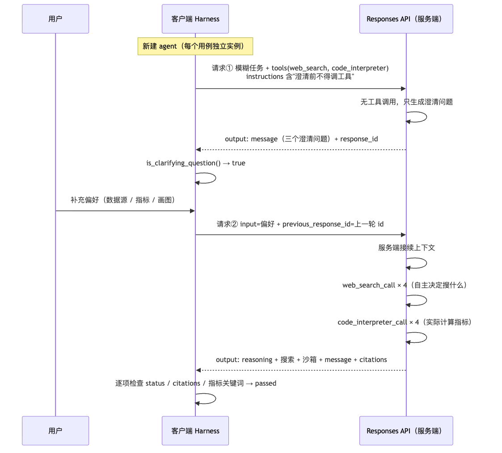

# 微信公众号笔记系列（第 1 章）

本目录是《深入理解 AI Agent》第 1 章学习内容的公众号发布稿，共 **6 篇**，可独立阅读也可按序发布。

## 篇目

| # | 文件 | 内容 | 字符数 | Mermaid 图 | 注入代码 |
|:--:|---|---|---:|:--:|:--:|
| 01 | [01-Agent入门-概念上.md](01-Agent入门-概念上.md) | Agent = LLM + 上下文 + 工具；观察/动作空间；五类工具；模型即 Agent；上下文五部分；ReAct 循环 | 10,429 | 4 | — |
| 02 | [02-Agent入门-概念下-Harness工程.md](02-Agent入门-概念下-Harness工程.md) | Harness 五要素；约束/验证/纠正；范式演进（提示→上下文→Harness→Loop→Graph）；模型选型；工作流 vs 自主；护栏三层；五个设计模式 | 12,842 | 2 | — |
| 03 | [03-实验1-1-上下文消融.md](03-实验1-1-上下文消融.md) | 五组消融实验：去掉各组件后 Agent 如何失败；`Completed` 骗人；可依据性判定 | 19,128 | 2 | 11 段 |
| 04 | [04-实验1-2-Kimi原生搜索.md](04-实验1-2-Kimi原生搜索.md) | Kimi K3 + Formula 协议；RL 内化的是**决策**、执行仍在模型之外 | 18,915 | 1 | 6 段 |
| 05 | [05-实验1-3-搜索与代码执行.md](05-实验1-3-搜索与代码执行.md) | Responses API 逐步拆解；托管 web_search + code_interpreter；先澄清后执行；沙箱无网时的自主诊断 | 19,595 | 2 | 8 段 |
| 06 | [06-实验1-4-文生图工作流.md](06-实验1-4-文生图工作流.md) | 改写节点把指定文案丢进负面提示词；适配层被模型内化；系列小结 | 17,164 | 2 | 6 段 |

合计 **13 张 Mermaid 图、31 段注入代码**，全部篇目均在微信 20,000 字符正文上限之内。

## 构建方式：代码注入 + Mermaid 渲图

公众号无法上传附件、也不解析 Mermaid，所以代码和图都必须变成成品。为保证与仓库源码**逐字一致**，本目录采用"模板 + 构建"方式，`*.template.md` 是**源文件**（人工编辑这份），`build.py` 生成同名 `*.md` **成品**与 `images/*.png`。

### 1. 代码占位符

模板里写：

```text
<!--INCLUDE search-codegen/agent.py 233 350-->
```

路径相对 `chapter1/`，后两个数字是行号范围（含端点）。构建后变成带路径标注的代码块：

````text
```python
# search-codegen/agent.py:233-350
...该文件第 233–350 行的原文...
```
````

### 2. Mermaid 图

模板里直接写 ```` ```mermaid ```` 代码块。构建时渲染成 `images/<篇名>-fig<N>-<内容哈希>.png`，并把代码块替换为图片引用：

```markdown

```

**文件名带内容哈希**，所以改了图一定会生成新文件、不会命中旧缓存；构建结束时会自动清理不再被引用的 PNG。

### 3. 命令

```bash
cd chapter1/wechat

python3 build.py                 # 生成全部 *.md 与 PNG（首次渲染 13 张约 1～2 分钟）
python3 build.py --check         # 只校验占位符能否解析，不写文件、不渲染
python3 build.py --keep-mermaid  # 保留 Mermaid 代码块（在支持 Mermaid 的平台预览用）
```

渲染依赖本机 Chrome/Chromium（经 `mmdc` 11）。脚本会自动探测常见安装位置；特殊环境可指定：

```bash
export MMDC_CHROME=/path/to/chrome
python3 build.py
```

**修改内容时**：改 `.py` 或改 `*.template.md`，然后重跑 `python3 build.py`；**不要直接改 `.md`**（下次构建会被覆盖）。若代码行号发生偏移，`build.py --check` 会报越界错误而不是静默产出错误代码。

## 实验数据来源

文中所有数字均取自仓库真实运行的 evidence manifest，未经改写：

| 实验 | 运行环境 | 结果 | 证据路径 |
|:--:|---|---|---|
| 1-1 | DeepSeek `deepseek-flash` | 五臂验收通过，22,907 tokens | `context/validation/latest.json` |
| 1-2 | Moonshot `kimi-k3` | 18 项检查全过，43,266 tokens | `web-search-agent/validation/real_20260914T143733Z/` |
| 1-3 | 百炼 `qwen3.8-flash` | 双用例通过，254,825 tokens | `search-codegen/validation/runs/real_20260914T144331Z/` |
| 1-4 | `kimi-k3` + `qwen-image-3.0` | 10/10 成功 | `image-gen-workflow/validation/real_20260914T142003Z/` + `…T143230Z/` |

汇总报告见 [../EXPERIMENT_REPORT_20260914.md](../EXPERIMENT_REPORT_20260914.md)。

## 写作说明

- 概念篇（01、02）以 `book/chapter1.md` 为准，校正了语音笔记中的若干转写偏差（如"消防实验"→**消融实验**、"东欧"→**东盟**、"GIM5.2"→**GLM-5.2**、"minus/opens"→**Manus/OpenClaw**）。
- 实验篇（03–06）的结论与代码解读，与 `EXPERIMENT_LEDGER.md` 的验收口径一致；提到"预期行为"与"实测结果"时明确区分。
- 篇幅拆分依据微信正文 20,000 字符上限，按概念/实验的自然边界切分，不改变论证结构。
